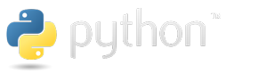
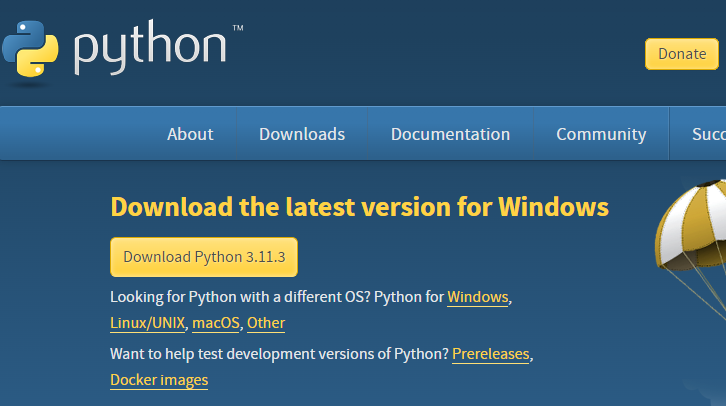
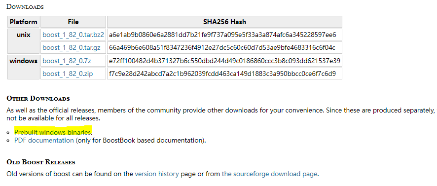
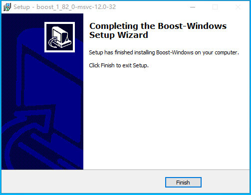
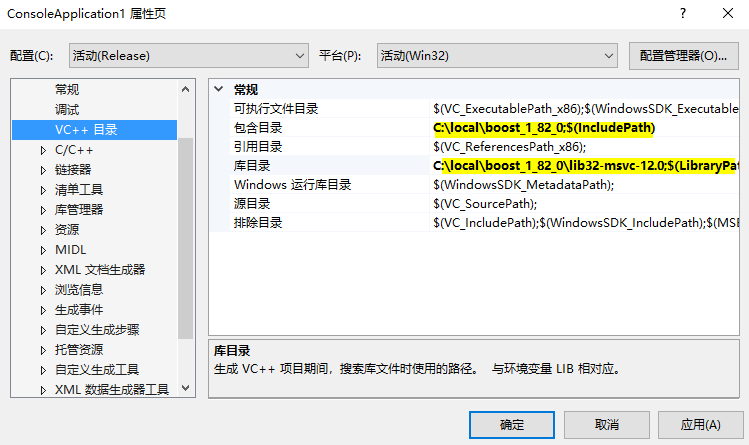
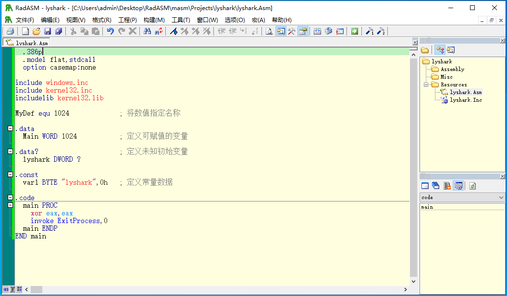

## 第一篇：Python语言体系

python 是一种高级、面向对象、通用的编程语言，由`Guido van Rossum`发明，于1991年首次发布。python 的设计哲学强调代码的可读性和简洁性，同时也非常适合于大型项目的开发。python 语言被广泛用于Web开发、科学计算、人工智能、自动化测试、游戏开发等各个领域，并且拥有丰富的第三方库和工具，使得python成为广泛应用的语言之一。同时，由于其开放性和可移植性，python在跨平台应用、开源软件开发和云计算等领域也被广泛使用。

 - python语言官网：https://www.python.org/



python的安装非常容易，在Windows平台下读者只需要去python官方下载与之对应的版本即可，目前python的版本为`python 3.11.3`如下图所示读者可点击`Download python 3.11.3`下载最新版本；



当读者下载好以后，只需要点击安装包，依次点击下一步则可将python安装到您的电脑中；

### 第一章：标准输入与输出

python 中的标准输入和输出是指用于读取和写入数据的默认流（stream），也称为 stdin 和 stdout。这些流可以是屏幕输入和输出，也可以是文件、管道等。

 - 标准输入：通常是用户控制台上的输入流，用于读取用户输入的数据。在python中，可以使用 input() 函数来接收标准输入，默认情况下它接收一个字符串并返回该字符串。

 - 标准输出：通常是用户控制台上的输出流，用于向控制台打印数据。在python中，可以使用 print() 函数将数据输出到标准输出流。默认情况下，打印函数(print() 函数)会将数据以字符串的形式输出到控制台。

#### 1.1 标准输入功能

任何一门编程语言都具备标准输入与输出功能，输入输出是任何一门编程语言的最终目的，在python中，输入数据可以使用内置的`input()`函数来实现，该函数可传入一个字符串并在输入前打印至屏幕中，函数返回一个字符串类型读者可通过一个变量来接收函数的返回值。
```python
>>> name = input("请输入你的名字:")
请输入你的名字:lyshark

>>> print("Hello " + name)
Hello lyshark

>>> age = input("请输入你的年龄:")
请输入你的年龄:22
>>> type(age)
<class 'str'>

# 强制类型转换
>>> age1 = input("请输入你的年龄:")
>>> age1 = int(age1)
>>> type(age1)
<class 'int'> 
```

读者需要注意一点，标准输入函数只能获取字符串类型的参数，而有时我们需要使用例如整数浮点数等特殊参数，则需要通过强制转换类型的方法来实现对字符串的转换，例如将一个字符串参数转换为整数，可以使用`int(age1)`来实现，当然除了转换为整数，python还支持如下几个强制类型转换函数；

 - int(x) 将 x 转换为整数
 - float(x) 将 x 转换为浮点数
 - str(x) 将 x 转换为字符串
 - bool(x) 将 x 转换为布尔值

如果尝试将无效的表达式或对象强制转换为某种数据类型，则可能引发`TypeError`或`ValueError`异常。因此，在进行强制转换之前，一定要确保输入的值是有效的，并且可以正确地转换为目标数据类型。

#### 1.2 标准输出功能

有标准输入函数则必然有标准输出，在输出时读者可使用`print()`函数实现，该函数只需要传入一个输入字符串则可以实现输出，此外在某些时候如果我们不希望让该函数完成换行，则读者可在输入时增加`end=""`的参数传递实现，同时标准输入函数同样支持对字符串的动态替换功能。

```python
>>> string = "hello lyshark"
>>> print(string)
hello lyshark

# 输出时不让其自动换行
>>> print(string,)
>>> print('hello', end = " ")

>>> string = "the length of (%s) is %d"  %("hello lyshark",len("hello lyshark"))
>>> print(string)
the length of (hello lyshark) is 13

>>> string = "hello {} --> age {}".format("lyshark",22)
>>> print(string)
hello lyshark --> age 22

>>> string = "i am %(age).2f" %{"age":22}
>>> print(string)
i am 22.00
```

在上述案例中，可以看到当我们需要动态替换字符串时可以将字符串中需要变化的位置通过`%s(代表字符串)`或者`%d(代表整数)`的方式进行占位，在该字符串的后面通过`%()`的方式对字符串依次进行填充，最终调用`print`输出替换后的数据，当让在新版本中读者可使用`{}`进行占位符填充，该方法无需自行执行参数类型，在使用时更加方便一些。

#### 1.3 格式化的用法

在标准输出中我们简单介绍了一下格式化输出的一些功能，本次案例中将重点学习如何实现对格式化输出的控制，通常来说使用`format`输出可以实现很多输出细节的控制，但此方式输出还是比较麻烦，如下所示将带大家简单理解格式化函数的一些基本用法，读者通过此类方法应该能更好的掌握格式化输出的基本技巧与流程。

```python
>>> print("i am {0}, age {1}, really {0}".format("lyshark",22))
i am lyshark, age 22, really lyshark

>>> print("i am {name}, age {age}".format(**{"name":"lyshark","age":"22"}))
i am lyshark, age 22

>>> temp = "i am {0[0]}, age {0[1]}, really {0[2]}".format([1, 2, 3], [11, 22, 33])
>>> print(temp)
i am 1, age 2, really 3

>>> temp = "i am {:s}, age {:d}, money {:f}".format("lyshark", 18, 8.1)
>>> print(temp)
i am lyshark, age 18, money 8.100000

>>> temp = "%r %r %r %r"
>>> print(temp%(1,2,3,4))
1 2 3 4

>>> print("网站名称:{name},地址:{url}".format(name="myblog",url="www.lyshark.com"))
网站名称:myblog,地址:www.lyshark.com

>>> site={"name":"myblog","url":"www.lyshark.com"}
>>> print("网站名称:{name} 地址:{url}".format(**site))
网站名称:myblog 地址:www.lyshark.com

>>> my_list = ['myblog','www.lyshark.com']
>>> print("网站名称:{0[0]},地址:{0[1]}".format(my_list))
网站名称:myblog,地址:www.lyshark.com
```

当然上述方法输出字符串还是有些复杂，为了解决这个问题，python语言在`3.6`之后的版本中引入了`f-string`格式化功能，该方法的引入解决了格式化输出是繁琐的初始化工作，在使用时只需要在字符串的外围增加`f`即可表示需要输出动态字符串，此时读者只需要传入特定的变量并以`{}`包裹，即可实现动态输出。
```python
>>> name = "lyshark"
>>> age = 25
>>> number = 12.456

# 可直接带入变量调用
>>> f"hello, my name is {name} my age {age}"
'hello, my name is lyshark my age 25'

# 调用是指定函数
>>> f"my name is {name.upper()}"
'my name is LYSHARK'

# 如需显示大括号,则需要两次括号
>>> f"my name is {{name.upper()}}"
'my name is {name.upper()}'

# 浮点数保留位数
>>> f"this float is {number:1.1f}"
'this float is 12.5'

# ^符号居中,宽度10位,十六进制整数(大写字母),显示0X前缀
>>> number = 1234
>>> f'number is {number:^#10X}'
'number is   0X4D2   '

# <符号左对齐,宽度10位,显示正号(+)定点数格式,2位小数
>>> number = 1234.5678
>>> f'number is {number:<+10.2f}'    
'number is +1234.57  '

# datetime时间格式输出
>>> import datetime
>>> number = datetime.datetime.today()
>>> f'the time is {number:%Y-%m-%d (%a) %H:%M:%S}'
'the time is 2021-07-14 (Sat) 20:46:02'
```

### 第二章：数据类型与结构

数据类型是编程语言中的一个重要概念，它定义了数据的类型和提供了特定的操作和方法。在 python 中，数据类型的作用是将不同类型的数据进行分类和定义，例如数字、字符串、列表、元组、集合、字典等。这些数据类型不仅定义了数据的类型，还为数据提供了一些特定的操作和方法，例如字符串支持连接和分割，列表支持排序和添加元素，字典支持查找和更新等。因此，选择合适的数据类型是 python 编程的重要组成部分。

#### 2.1 算数类型

算数运算符在编程语言中是一种非常重要的工具，它用于执行数学运算。在 python 中，算数运算符大致可以分为 7 种类型：算术运算符、比较运算符、赋值运算符、逻辑运算符、位运算符、成员运算符和身份运算符。

除了运算符外，python 还支持多种数值类型，如`int、float、bool`和` complex`复数等。这些数值类型的赋值和计算都是直观易懂的，因此，它们对于初学者来说是非常友好的。

数值间的数据互换可以参考如下列表:

| 函数名    | 描述                               |
| --------- | ---------------------------------- |
| int(x)    | 将 x 转换为一个整数                |
| long(x)   | 将 x 转换为一个长整数              |
| float(x)  | 将 x 转换为一个浮点数              |
| complex() | 创建一个复数                       |
| str(x)    | 将对象 x 转换为字符串              |
| repr(x)   | 将对象 x 转换为表达式字符串        |
| eval(str) | 计算字符串中的有效 python 表达式   |
| tuple(x)  | 将序列 x 转换为一个元组            |
| list(x)   | 将序列 x 转换为一个列表            |
| chr(x)    | 将一个整数转换为一个字符           |
| unichr(x) | 将一个整数转换为 Unicode 字符      |
| ord(x)    | 将一个字符转换为它的整数值         |
| hex(x)    | 将一个整数转换为一个十六进制字符串 |
| oct(x)    | 将一个整数转换为一个八进制字符串   |

**基本算术运算:** 算数运算是任何一门编程语言中都存在的，使用算术运算可以实现对特定变量的加减乘除比较等基本功能，在Python中实现算数运算很容易。

```python
>>> import math,os
>>>
>>> numberA = 10
>>> numberB = 20
>>> numberC = 10
>>>
>>> numberA + numberB
30
>>> numberA != numberB
True
>>> numberA += 10
```

**位运算符号:** 在程序中，位运算就是直接对整数在内存中的二进制位进行操作。

```python
>>> a=60                      # 60 = 0011 1100 
>>> b=13                      # 13 = 0000 1101
>>>
>>> c= a & b                  # 12 = 0000 1100
>>> print("a与b: ",c)
a与b:  12
>>>
>>> c= a | b                  # 61 = 0011 1101 
>>> print("a或b: ",c)
a或b:  61
>>>
>>> c=a^b                     # 49 = 0011 0001
>>> print("a异或b:",c)
a异或b: 49
>>>
>>> c=a << 2                  # 240 = 1111 0000
>>> print("a左移2",c)
a左移2 240
```

**其他运算符:** 其他运算符包括常用的,逻辑运算,成员运算,身份运算等.
```python
>>> num1 = 10
>>> num2 = 20
>>> num3 = 0
>>> list = [10,20,30,40,50]
>>>
>>> num1 and num3
0
>>> num1 in list      # 判断num1是否在list里面
True
>>> num1 not in list
False
>>>
>>> num1 is num3      # 判断两个标识符是不是引用自一个对象
True
>>> num1 is num2
False
>>> num1 is not num2
True
```

**整数转其他数值:** 使用转换命令将一个整数转换为其他任意数值.
```python
>>> number = 100
>>>
>>> float(number)
100.0
>>> complex(number)
(100+0j)
>>> str(number)
'100'
>>> chr(number)
'd'
>>> ord(chr(number))
100
```

**实现数值之间进制转换:** 使用转换命令实现进制转换,bin二进制,oct八进制,hex十六进制,format也支持转换输出.
```python
>>> import math
>>>
>>> number = 1024
>>> bin(number)
'0b10000000000'
>>> oct(number)
'0o2000'
>>> hex(number)
'0x400'
>>>
>>> format(number,"b")
'10000000000'
>>> format(number,"x")
'400'
>>>
>>> int("-4d2",16)
-1234
```

**实现浮点数/负数之间运算:** 复数的函数操作正弦、余弦和平方根，可以使用cmath模块
```python
>>> import cmath,math
>>> numberA = complex(2,4)
>>> numberB = 3-5j
>>> numberA,numberB    # 复数相加
((2+4j), (3-5j))
>>>
>>> numberA.real       # 取实属部分
2.0
>>> numberA.imag       # 取虚数部分
4.0
>>> math.ceil(3.14)    # 四舍五入
4
>>> round(3.14)        # 四舍五入
3
>>> cmath.sin(numberA)
(24.83130584894638-11.356612711218174j)
>>> cmath.cos(numberA)
(-11.36423470640106-24.814651485634187j)
>>> cmath.exp(numberA)
(-4.829809383269385-5.5920560936409816j)
```

**数值格式化输出:** 针对数值做格式化,并对齐进行输出显示.
```python
>>> number = 1234.56789
>>>
>>> format(number,"0.2f")
'1234.57'                                    # 格式化时精确2位小数
>>>
>>> "value = > {:>20.3f}".format(number)     # 输出右侧对齐
'value = >             1234.568'
>>> "value = > {:<20.3f}".format(number)     # 输出左侧对齐
'value = > 1234.568            '
>>> "value = > {:^20.3f}".format(number)     # 输出居中对齐
'value = >       1234.568      '
```

**数值类型格式化输出:** 实例化数字类型,或将其他类型转换为数字类型,或各种进制转换为十进制.
```python
>>> temp = int(21)                # 实例化数字类型
>>> print(type(temp),temp)        # 打印类型,和参数值
<class 'int'> 21
>>> print(int("110101",base=2))   # 将二进制转为十进制
53
>>> print(int("156",base=8))      # 将八进制转为十进制
110
>>> print(int("1A2C31",base=16))  # 将十六进制转为十进制
1715249
```

#### 2.2 字符类型

字符串是字符的集合，是一种常见的数据类型。python 提供了强大的字符串处理功能，以支持各种字符串操作。例如，您可以使用字符串运算符进行字符串拼接、比较和替换；您还可以使用字符串内置函数对字符串进行搜索、切片、大小写转换等操作。

总的来说，字符串是 python 编程中不可或缺的一部分，它们在处理文本数据、输入输出、网络通信等方面都发挥了重要作用。因此，学习和掌握 python 中的字符串操作是非常必要的。

接下来我们将找出几个比较常用的字符串函数来进行演示.

| 方法             | 描述                               |
| ---------------- | ---------------------------------- |
| str.capitalize() | 将字符串的首字母变为大写           |
| str.title()      | 将字符串中的每个单词的首字母大写   |
| str.upper()      | 将字符串转换为大写                 |
| str.lower()      | 将字符串转换为小写                 |
| str.index()      | 返回字符串中指定子字符串的索引     |
| str.find()       | 返回字符串中指定子字符串的索引     |
| str.count()      | 返回字符串中指定元素出现的次数     |
| str.format()     | 格式化字符串                       |
| str.center()     | 用指定字符填充字符串使其居中       |
| str.join()       | 以指定字符串连接字符串             |
| str.split()      | 使用指定字符作为分隔符来分割字符串 |
| str.strip()      | 去除字符串左右两边的空格           |
| str.replace()    | 查找并替换字符串中的元素           |
| str.isupper()    | 判断字符串是否为大写               |
| str.islower()    | 判断字符串是否为小写               |
| str.isalnum()    | 判断字符串是否为字母或数字         |
| str.isalpha()    | 判断字符串是否为字母或下划线       |
| str.isdigit()    | 判断字符串是否为数字               |
| str.isspace()    | 判断字符串是否为空格               |
| str.startswith() | 返回以指定元素开头的字符串         |
| str.endswith()   | 返回以指定元素结尾的字符串         |

**首字母大写:** 使用`capitalize()`函数,将一个指定字符串首字母变成大写.

```python
>>> str="hello lyshark"
>>>
>>> str.capitalize()
'Hello lyshark'
```

**全部首字母大写:** 使用`title()`函数,将字符串中的每一个单词的首字母大写.
```python
>>> str="hello lyshark"
>>>
>>> str.title()
'Hello Lyshark'
```

**查找字符串位置:** 使用`index()`查找字符串所在位置(不能存在则报错),使用`find()`查找字符串位置(不存在返回-1).
```python
>>> str = "hello lyshark"
>>>
>>> str.index("hello")
0
>>> str.index("lyshark")
6
>>> str.find("hello")
0
```

**统计字符串出现次数:** 使用`count()`函数,统计指定字符串的出现次数.
```python
>>> str="hello lyshark"
>>>
>>> str.count("h")
2
>>> str.count("l")
3
>>> str.count("hello")
1
>>> str.count("mk")
0
```

**字符串文本对齐:** 字符串对齐函数实现对字符串的对齐与填充,字符串方法包括ljust()、rjust()和center()
```python
>>> str = "hello lyshark"
>>>
>>> str.ljust(30)
'hello lyshark                 '
>>> str.rjust(30)
'                 hello lyshark'
>>>
>>> str.center(30)
'        hello lyshark         '
>>>
>>> str.center(50,"-")
'------------------hello lyshark-------------------'
```

**字符串连接:** 使用`join()`函数,将序列中以指定的字符连接生成一个新字符串
```python
>>> str="-"
>>> seq=("hello","lyshark","welcome")
>>>
>>> print(str.join(seq))
hello-lyshark-welcome
>>>
>>> list =['1','2','3','4','5']
>>> print(''.join(list))
12345
>>>
>>> 'kill %s' % ' '.join(['1024','2234'])
'kill 1024 2234'
```

**切割字符串:** 使用`split()`函数,指定分割一个字符串,并保存成列表.
```python
>>> str="hello-lyshark-welcome"
>>>
>>> str.split("-")
['hello', 'lyshark', 'welcome']
```

**去除字符串两边空格:** 使用`strip()`函数去除两边的空格,而`lstrip/rstrip`则是分别去掉两边空格.
```python
>>> str="    hello      lyshark       "
>>>
>>> str.strip()          # 去掉两边空格
'hello      lyshark'
>>> str.rstrip()         # 去掉右边空格
'    hello      lyshark'
>>>
>>> str.lstrip()
'hello      lyshark       '
```

**去除字符串中注释行:** 将一个文件中的以警号开头的行注释掉.
```python
>>> import os
>>>
>>> with open("test.log","r") as fp:
...     for each in fp:
...             if each[0]== "#":
...                     continue
...             else:
...                     print(each,end="")
```

**字符串查找并替换:** 通过使用`replace()`函数或者是`re.sub()`函数,查找并替换指定字符串.
```python
>>> string = "hello lyshark ! ?"
>>>
>>> string.replace("lyshark","world")
'hello world ! ?'
>>>
>>> string.replace("!","").replace("?","")
'hello lyshark  '
>>>
>>> string = "  <br>hello lyshark</br>  !"
>>>
>>> re.sub('[<br> | </br> | ]',"",string)
'hellolyshak!'
```

**判断是否为大写:** 使用`isupper()`函数,判断指定字符串是否为大写.
```python
>>> str="LYSHARK"
>>> str1="lyshark"
>>>
>>> str.isupper()
True
>>> str1.isupper()
False
```

**实现字符串拆分:** 通过split拆分分解元素,将一个字符串拆解成多个部分.
```python
>>> string = "python"
>>> # 拆分上面的字符串,忽略某个值使用下划线代替
>>> x,_,_,y,_,_ = string
>>> x
'p'
>>>
>>> passwd = 'root:x:0:0:root:/root:/bin/bash'
>>> username,*_,homedir,sh = passwd.split(":")
>>> username
'root'
```

**查找开头结尾:** 使用startswith函数,找出指定字母开头的字符元素,endswith找出字母结尾的元素.
```python
>>> from fnmatch import fnmatch,fnmatchcase
>>> url = "https://www.baidu.com"
>>>
>>> url.endswith(".com")
True
>>> url.startswith("http://")
False
>>> url.startswith("https://") and url.endswith(".com")
True
>>> fnmatch(url,"*.com")
True
>>> filename = ["a.py","b.zip","c.zip","d.doc","e.py","f.jpg","g.gz","h.tar.gz"]
>>>
>>> [ item for item in filename if item.endswith((".py",".jpg")) ]     # 多个结果匹配时使用元组集合
['a.py', 'e.py', 'f.jpg']
>>>
>>> any(item.endswith(".py") for item in filename)                     # 判断目录中是否有.py结尾的文件
True
>>> names = ['dat01.csv','dat99.csv','config.ini','foo.py']
>>>
>>> [i for i in names if fnmatch(i,'dat[0-9]*.csv')]                   # 支持正则匹配查询
['dat01.csv', 'dat99.csv']
>>>
>>> addr = [
...     '5412 N CLARK ST',
...     '1060 W ADDISON ST',
...     '1039 W GRANVILLE AVE',
...     '2122 N CLARK ST',
...     '4802 N BROADWAY' ]
>>>
>>> [ i for i in addr if fnmatch(i,'*ST') ]
['5412 N CLARK ST', '1060 W ADDISON ST', '2122 N CLARK ST']
>>>
>>> [ i for i in addr if fnmatch(i,'*CLARK*') ]
['5412 N CLARK ST', '2122 N CLARK ST']
```

#### 2.3 列表类型

列表（List）是最常用的数据结构之一，它是一个有序的、可变的、元素可以重复的集合。列表中的每个元素都可以根据它们在列表中的位置或索引进行访问，第一个元素的索引为0，第二个为1，以此类推。列表可以容纳任意类型的对象，包括整数、浮点数、字符串、函数等。

列表操作函数来进行演示.

| 方法名         | 描述                                                         |
| -------------- | ------------------------------------------------------------ |
| list.insert()  | 在列表中指定索引位置前插入元素                               |
| list.append()  | 在列表尾部插入                                               |
| list.remove()  | 删除指定的元素                                               |
| list.pop()     | 没有指定索引，则弹出最后一个元素，返回的结果是弹出的索引对应的元素 |
| list.copy()    | 浅复制，只复制第一层，如果有嵌套序列则不会复制，需要复制要导入copy模块 |
| list.extend()  | 把另外一个列表合并，并不是追加                               |
| list.index()   | 列表中元素出现的索引位置                                     |
| list.count()   | 统计列表中元素的次数                                         |
| list.reverse() | 进行逆序                                                     |
| list.sort()    | 进行排序，无法把数字和字符串一起排序                         |
| list1 + list2  | 合并两个列表，返回一个新的列表，不会修改原列表               |
| list * N       | 把list重复N次，返回一个新列表                                |

**正向/反向输出列表:** 简单的实现正向输出列表元素,与反向输出列表元素.
```python
>>> list
[1, 2, 3, 4, 5, 6, 7, 'python']
>>>
>>> for each in list:
...     print("正向输出: ",each)
>>>
>>> for each in reversed(list):
...     print("反向输出: ",each)
```

**向列表追加数据:** 使用`append()`函数,追加写入几个数据到指定的列表里.
```python
>>> list = [1,2,3,4,5]
>>>
>>> list.append(6)
>>> list.append(7)
>>> list.append("python")
>>>
>>> list
[1, 2, 3, 4, 5, 6, 7, 'python']
```

**向列表插入数据:** 使用`insert()`函数,向指定的列表插入几个数据到指定的位置.
```python
>>> list = ["admin","lyshark"]
>>> list
['admin', 'lyshark']
>>>
>>> list.insert(1,"python")
>>> list
['admin', 'python', 'lyshark']
>>>
>>> list.insert(2,"ruby")
>>> list.insert(2,"ruby")
>>> list
['admin', 'python', 'ruby', 'ruby', 'lyshark']
```

**修改指定数据:** 使用`names[]`变量赋值的方式,修改指定元素的字段值.
```python
>>> list
['admin', 'python', 'ruby', 'ruby', 'lyshark']
>>> list[0]="mkdirs"
>>> list
['mkdirs', 'python', 'ruby', 'ruby', 'lyshark']
>>>
>>> list[3]="pip"
>>> list
['mkdirs', 'python', 'ruby', 'pip', 'lyshark']
```

**删除指定数据:** 使用`remove()`函数,删除指定数据,或使用`del()`函数来删除.
```python
>>> list
['mkdirs', 'python', 'ruby', 'pip', 'lyshark']
>>> 
>>> del list[2]                             #通过下标删除元素
>>> list
['mkdirs', 'python', 'pip', 'lyshark']
>>> 
>>> list.remove("python")                   #删除指定的元素
>>> list
['mkdirs', 'pip', 'lyshark']
>>> 
>>> list.pop()                              #删除列表的最后一个元素
'lyshark'
>>> list.pop()
'pip'
>>> list
['mkdirs']
```

**扩展一个列表:** 使用`extend()`函数,将一个列表追加到另一个列表的后面.
```python
>>> list1 = ["admin","guest","lyshark"]
>>> list2 = [1,2,3]
>>>
>>> list1.extend(list2)
>>> list1
['admin', 'guest', 'lyshark', 1, 2, 3]
```

**浅COPY列表:** 使用`copy()`函数,实现列表的浅Copy.
```python
>>> list1
['admin', 'guest', 'lyshark', 1, 2, 3]
>>>
>>> list1_copy = list1.copy()
>>> list1_copy
['admin', 'guest', 'lyshark', 1, 2, 3]
```

**统计元素次数:** 使用`count()`函数,统计列表中元素出现的次数.
```python
>>> list = ["admin","admin","lyshark","mkdirs"]
>>>
>>> list.count("admin")
2
>>> list.count("mkdirs")
1
```

**列表正反向排序:** 使用`sort()`函数实现正向排序,使用`reverse()`函数则实现反向排序.
```python
>>> list = ["admin","python","ruby","1","3","6","9"]
>>> list
['admin', 'python', 'ruby', '1', '3', '6', '9']
>>>
>>> list.sort()          #正向排序,必须元素类型一致
>>> list
['1', '3', '6', '9', 'admin', 'python', 'ruby']
>>>
>>> list
['1', '3', '6', '9', 'admin', 'python', 'ruby']
>>> list.reverse()          #反向排序,必须元素类型一致
>>> list
['ruby', 'python', 'admin', '9', '6', '3', '1']
```

**获取列表元素下标:** 使用`index()`函数,我们可以获取到指定元素的下标值.
```python
>>> list
['ruby', 'python', 'admin', '9', '6', '3', '1']
>>>
>>> list.index("admin")
2
>>> list.index("1")
6
```

**实现列表的切片:** 使用`[]`特殊符号既可以定义列表,也可以实现列表的各种切片操作.
```python
>>> list=[1,2,3,4,5,6,7,8,9,0]
>>>
>>> list[1:4]              #取出下标1-4的元素,不包括4
[2, 3, 4]
>>>
>>> list[1:-1]             #取出下标1至-1,不包括-1
[2, 3, 4, 5, 6, 7, 8, 9]
>>>
>>> list[1:]               #取出下标从1到最后的数据
[2, 3, 4, 5, 6, 7, 8, 9, 0]
>>>
>>> list[:]                #取出所有元素
[1, 2, 3, 4, 5, 6, 7, 8, 9]
>>>
>>> list[0::2]             #取元素时每次格2格
[1, 3, 5, 7, 9]
```

**通过分片删除数据:** 通过使用分片来清除指定列表中的数据.
```python
>>> list
[123, 111, 111, 111, 8, 7, 6, 5, 4, 3, 2, 1]
>>> list[0:3]
[123, 111, 111]
>>>
>>> list[0:3]=[]            #将下标0-3替换成空,不包括3
>>> print(list)
[111, 8, 7, 6, 5, 4, 3, 2, 1]
>>>
```

**嵌套列表的实现:** 一次性声明两个列表,并于数据名称相关联.
```python
>>> list1,list2 = [[1,"a","b"],[2,"a","b"]]
>>>
>>> print(list1)
[1, 'a', 'b']
>>> print(list2)
[2, 'a', 'b']
```

**从列表中随机弹出元素:** 在一个列表中随机弹出一个元素.
```python
>>> import random
>>> from random import randrange
>>>
>>> list = ["admin","python","ruby","1","3","6","9"]
>>>
>>> random.choice(list)
'python'
>>> random.choice(list)
'9'
>>>
>>> random_index = randrange(0,len(list))
>>> list[random_index]
'9'
```

**列表元素查找并修改:** 查找列表中的指定元素,并将列表中所有的元素1修改为88888.
```python
>>> number = [1,2,3,4,5,1,5,6,1]
>>>
>>> def FindNumber(num_list,number,modify):
...     for item in range(num_list.count(number)):
...             ele_index = num_list.index(number)
...             num_list[ele_index] = modify
...
>>> number
[1, 2, 3, 4, 5, 1, 5, 6, 1]
>>> FindNumber(number,1,88888)
>>> number
[88888, 2, 3, 4, 5, 88888, 5, 6, 88888]
```

**列表生成式筛选元素:** 通过使用列表生成式,我们可以灵活地筛选出列表中的元素.
```python
>>> from itertools import compress
>>>
>>> mylist = [1,2,-5,10,-8,3,-1]
>>>
>>> list(item for item in mylist if item > 0)       # 筛选出列表中大于0的数值
[1, 2, 10, 3]
>>>
>>> list(item for item in mylist if item < 0)       # 筛选出列表中小于0的数值
[-5, -8, -1]
>>>
>>> list(item if item>0 else 0 for item in mylist)  # 大于0的数值直接输出,小于0的直接填0
[1, 2, 0, 10, 0, 3, 0]
>>>
>>> more = [item > 3 for item in mylist]            # 列表中大于3的返回真假
>>> more
[False, False, False, True, False, False, False]
```

**统计列表中元素出现频率:** 统计出number列表中所有元素的出现频率,并组合成字典.
```python
>>> number = ["12:10","12:20","12:10","12:20","12:20","12:10","12:10"]
>>>
>>> def GetFrequency(item):
...     dict = {}
...     for x in item:
...             dict[x] = dict.get(x,0) + 1
...     return dict
...
>>> dict = GetFrequency(number)
>>> dict
{'12:10': 4, '12:20': 3}
>>>
>>> from collections import Counter
>>>
>>> data = [1,1,1,1,2,3,4,4,5,6,5,3,3,4,5,6,7,8,9,6,5,4,5]
>>> Counter(data)                 # 统计列表元素出现次数,以字典方式展现
Counter({5: 5, 1: 4, 4: 4, 3: 3, 6: 3, 2: 1, 7: 1, 8: 1, 9: 1})
>>>
>>> Counter(data).most_common()   # 统计列表元素出现次数,以元组方式展现
[(5, 5), (1, 4), (4, 4), (3, 3), (6, 3), (2, 1), (7, 1), (8, 1), (9, 1)]
>>>
>>> Counter(data).most_common(2)  # 统计列表元素出现次数,并取出前两个元素
[(5, 5), (1, 4)]
```

**定义固定长度的列表:** 使用collections.deque保存有限的列表数据,deque用来创建一个固定长度的队列.
```python
>>> from collections import deque
>>>
>>> queue = deque(maxlen=4)       # 定义最大可存储4个元素
>>> queue.append(1)
>>> queue.append(2)
>>> queue.append(3)
>>> queue.append(4)
>>> queue
deque([1, 2, 3, 4], maxlen=4)
>>> queue.append(5)
>>> queue                         # 超出部分会被从左侧排除出去
deque([2, 3, 4, 5], maxlen=4)
>>>
>>> queue.appendleft(6)           # 从左边加入数据到队列,超出部分从右侧排除
>>> queue
deque([6, 2, 3, 4], maxlen=4)
>>> queue.pop()                   # 从末尾取出一个数据
4
>>> queue.popleft()               # 从左侧取出一个数据
6
```

**列表中取出最大/最小值:** 在heapq模块中有两个函数nlargest()从最大的值开始取,nsmallest()从最小的值开始取.
```python
>>> import heapq
>>>
>>> data = [1,3,4,9,11,34,55,232,445,9812,321,45,67,434,555]
>>>
>>> heapq.heappush(data,1000)   # 追加写入一个元素
>>> data
[1, 3, 4, 9, 11, 34, 55, 232, 445, 9812, 321, 45, 67, 434, 555, 1000]
>>> heapq.heappop(data)         # 取出第一个元素
>>> data
[3, 9, 4, 232, 11, 34, 55, 1000, 445, 9812, 321, 45, 67, 434, 555]
>>>
>>> heapq.nlargest(3,data)      # 取出最大的三个数
[9999, 9812, 1000]
>>> heapq.nsmallest(3,data)     # 取出最小的三个数
[4, 9, 11]
```

**将二维列表横竖颠倒:** 将一个横向排列的二维数组,以竖向排列,每一排代表一条记录.
```python
>>> val = \
        [
            ["/etc/system/winsss", "/proc/", "/sys", "/abc/lyshark"],
            ["1024GG", "2048GB", "111GB", "1111GB"],
            ["1024GG", "2048GB", "111GB", "22GB"],
            ["10%", "50%", "20%", "33%"]
        ]

>>> ref_xor = list ( map(list,zip(*val)) )
>>> for num in ref_xor:
...     print(num)
...
['/etc/system/winsss', '1024GG', '1024GG', '10%']
['/proc/', '2048GB', '2048GB', '50%']
['/sys', '111GB', '111GB', '20%']
['/abc/lyshark', '1111GB', '22GB', '33%']
```

**多个列表的同步输出:** 通过使用`enumerate()/zip()`函数,可以实现多个列表同时遍历输出.
```python
>>> data = ["C","Java","python","Shell","Ruby","Go","perl"]
>>>
# enumerate() 函数可用输出元素序列
>>> for key,value in enumerate(data,1):
...     print(key,value)
...
1 C
2 Java
3 python
4 Shell
5 Ruby

# 迭代打印一个嵌套列表结构
>>> data = [(1,2),(3,4),(5,6)]
>>>
>>> for num,(key,value) in enumerate(data,1):
...     print("ID: {} Value: {} {}".format(num,key,value))
...
ID: 1 Value: 1 2
ID: 2 Value: 3 4
ID: 3 Value: 5 6

# 同时迭代多个序列可使用zip()函数,它将迭代对象产生出一个元组,整个迭代的长度取其中最短的序列
>>> list1 = [1,2,3,4,5]
>>> list2 = ["a","b","c","d"]
>>> list3 = ["jar","py","sh"]
>>>
>>> for x,y,z in zip(list1,list2,list3):
...     print(x,y,z)
...
1 a jar
2 b py
3 c sh
>>> from itertools import zip_longest
>>>
>>> for each in zip_longest(list1,list2,list3):
...     print(each)
...
(1, 'a', 'jar')
(2, 'b', 'py')
(3, 'c', 'sh')
(4, 'd', None)
(5, None, None)
```

**遍历列表的所有组合:** `itertools` 模块中提供了3个函数来解决枚举所有列表元素的组合排列的可能情况.
```python
>>> from itertools import permutations
>>>
# 第一个itertools.permutations()
>>> item = [1,2,3]
>>> for each in permutations(item):
...     print(each)
...
(1, 2, 3)
(1, 3, 2)
(2, 1, 3)
(2, 3, 1)
(3, 1, 2)
(3, 2, 1)

# 如果要限定排序的长度可用指定长度参数
>>> for each in permutations(item,2):
...     print(each)
...
(1, 2)
(1, 3)
(2, 1)
(2, 3)
(3, 1)
(3, 2)
```

**追加列表保持元素数:** 保持列表中最多只有Size个元素,如果超出则自动`shift`左移或自动`unshift`右移,保证只有Size个元素.
```python
>>> def shift(Array, Size, Push):
...    if len(Array) <= Size and len(Array) >= 0:
...        Array.pop(0)
...        Array.append(Push)
...        return True
...    return False
...
>>> def unshift(Array, Size, Push):
...    if len(Array) <= Size and len(Array) >= 0:
...        Array.pop(Size-1)
...        Array.insert(0,Push)
>>> 
>>> Array = [1,1,1,1,1,1,1,1,1,1]
>>> 
>>> shift(Array,10,0)
>>> shift(Array,10,0)
>>> print(Array)
[1, 1, 1, 1, 1, 1, 1, 1, 0, 0]
>>> 
>>> unshift(Array,10,0)
>>> unshift(Array,10,0)
>>> print(Array)
[0, 0, 1, 1, 1, 1, 1, 1, 1, 1]
```

#### 2.4 字典类型

字典（Dictionary）是一种内置数据结构，它是一种可变的容器模型，可以存储任意类型的对象，不仅如此，字典的一个重要特性是它可以通过任意不可变对象通常是字符串或数字来作为键`key`来存储和检索值`value`。字典是基于哈希表实现的，可以快速地根据键找到对应的值。

字典的定义使用大括号`{}`包含键值对，每个键值对使用冒号`:`连接键和值，键值对之间使用逗号, 分割。例如：

```python
d = {'name': 'Alice', 'age': 20, 'gender': 'female'}
```

在上面的例子中，d 是一个字典，包含三个键值对，'name'、'age' 和 'gender' 分别是键，而它们对应的值分别是 'Alice'、20 和 'female'。可以使用键来访问对应的值，例如：

```python
print(d['name'])     # 输出 'Alice'
```

需要注意的是，字典中的数据是无序存储的，这意味着字典中的键值对的顺序不固定，不能通过下标来访问，只能通过键来访问对应的值。

另一个字典的特性是，字典中的键必须是唯一的，如果多个键对应的值相同，后面的键值对会覆盖前面的键值对。这是因为字典是基于哈希表实现的，每个键的哈希值是唯一的，如果多个键的哈希值相同，就会发生哈希冲突，这个冲突会被解决为一个链表。所以，字典中的键天生就是去重的。

如下是字典的几种格式声明:

```python
person = {"name": "lyshark", "age": 22}
person = dict({"name": "lyshark", "age": 22})

info = {
    'stu1': "administrator",
    'stu2': "lyshark",
    'stu3': "redhat",
}
```

字典需要使用字典专有的操作函数,字典的常用函数有以下这几种,后面我会使用不同的例子进行说明.
| 函数              | 描述                                               |
| ----------------- | -------------------------------------------------- |
| dict.get(key)     | 取得某个key的value                                 |
| dict.has_key(key) | 判断字典是否有这个key（python3中已废除，使用in）   |
| dict.keys()       | 返回所有的key为一个列表                            |
| dict.values()     | 返回所有的value为一个列表                          |
| dict.items()      | 将字典的键值拆成元组，全部元组组成一个列表         |
| dict.pop(key)     | 弹出某个key-value                                  |
| dict.popitem()    | 随机弹出key-value                                  |
| dict.clear()      | 清除字典中所有元素                                 |
| dict.copy()       | 字典复制，d2=d1.copy()是浅复制，深复制需要copy模块 |
| dict.fromkeys(s)  | 生成一个新字典                                     |
| dict.update(key)  | 将一个字典合并到当前字典中                         |
| dict.iteritems()  | 生成key-value迭代器，可以用next()取下个key-value   |
| dict.iterkeys()   | 生成key迭代器                                      |
| dict.itervalues() | 生成values迭代器                                   |

**增加字典:** 在info字典的基础上,增加一个字段`info["stu4"] = "root"`.
```python
>>> info
{'stu1': 'administrator', 'stu2': 'lyshark', 'stu3': 'redhat'}
>>> info["stu4"] = "root"
>>>
>>> info
{'stu1': 'administrator', 'stu2': 'lyshark', 'stu3': 'redhat', 'stu4': 'root'}
```

**修改字典:** 在info字典的基础上,修改将`stu1:administrator`修改为`stu1:centos`.
```python
>>> info
{'stu1': 'administrator', 'stu2': 'lyshark', 'stu3': 'redhat', 'stu4': 'root'}
>>>
>>> info["stu1"] = "centos"
>>> info
{'stu1': 'centos', 'stu2': 'lyshark', 'stu3': 'redhat', 'stu4': 'root'}
```

**删除字典:** 在info字典的基础上,删除几个字典,以下提供多种删除方法.
```python
>>> info
{'stu1': 'centos', 'stu2': 'lyshark', 'stu3': 'redhat', 'stu4': 'root'}
>>>
>>> info.pop("stu1")        #通过pop函数删除
'centos'
>>> info
{'stu2': 'lyshark', 'stu3': 'redhat', 'stu4': 'root'}
>>>
>>> del info["stu4"]        #通过del命令删除
>>> info
{'stu2': 'lyshark', 'stu3': 'redhat'}
>>>
>>> info.popitem()          #随机删除元素
('stu3', 'redhat')
```

**查找字典:** 在info字典基础上,完成几个查询任务,这里提供几种方法.
```python
>>> info
{'stu1': 'administrator', 'stu2': 'lyshark', 'stu3': 'redhat'}
>>>
>>> "stu1" in info          #标准的查询方式
True
>>>
>>> info.get("stu1")        #使用get函数查询
'administrator'
>>>
>>> info["stu2"]
'lyshark'
```

**更新字典:** 在info字典的基础上,更新字典内容,将temp字典与info字典合并.
```python
>>> info
{'stu1': 'administrator', 'stu2': 'lyshark', 'stu3': 'redhat'}
>>>
>>> temp = {1:2,"stu4":"root"}
>>>
>>> info.update(temp)
>>> info
{'stu1': 'administrator', 'stu2': 'lyshark', 'stu3': 'redhat', 1: 2, 'stu4': 'root'}
```

**遍历字典:** 这里提供两种字典遍历方法,建议使用第二种,因为其遍历速度最快.
```python
>>> info = {'stu1': 'administrator', 'stu2': 'lyshark', 'stu3': 'redhat'}
>>>
>>> for keys,values in info.items():
...     print(keys,values)
...
stu1 administrator
stu2 lyshark
stu3 redhat

>>> for keys in info:
...     print(keys,info[keys])
...
stu1 administrator
stu2 lyshark
stu3 redhat
```

**索引字典:** 字典也支持索引的方式获取字典中的元素,只不过必须以key作为索引.
```python
>>> info = {'stu1': 'administrator', 'stu2': 'lyshark', 'stu3': 'redhat'}
>>>
>>> info['stu2']
'lyshark'
>>>
>>> len(info)
3
>>>
>>> dict = {"姓名":"administrator","得分":[98,99,87]}
>>>
>>> dict["姓名"]
'administrator'
>>> dict["得分"]
[98, 99, 87]
>>> dict["得分"][2:]
[87]
```

**字典嵌套:** 字典内部可继续存放列表或新的字典,遍历时只需要逐级输出即可.
```python
>>> info = {'name': 'lyshark', 'gender': 'male', 'age': 22, 'company': ['oldboy', 'beijing', 50]}
>>>
>>> info["name"]
'lyshark'
>>> info["company"][1]
'beijing'
>>>
>>> info = {'name': 'lyshark', 'gender': 'male', 'age': 22, 'company': {'c_name': 'oldboy', 'c_addr': 'shandong'}}
>>>
>>> info["company"]["c_addr"]
'shandong'
```

**将字典解包:** 将字典分解为独立的元组并将元组赋值给其他变量.
```python
>>> dict = {"姓名":"administrator","得分":[98,99,87]}
>>> t1,t2 = dict.items()
>>>
>>> print(t1)
('姓名', 'administrator')
>>> print(t2)
('得分', [98, 99, 87])
>>>
>>> k1,k2 = {"x":100,"y":200}
>>> print(k1)
x
```

**根据字典的值找键:** 通常情况下是根据key找值,但是有时需要反过来,根据值找key.
```python
>>> Dict = { "admin":"001" , "guest":"002" , "lyshark":"003" }
>>>
>>> Dict.get("admin",0)                                     # 一般用法
'001'
>>> list(Dict.keys())[list(Dict.values()).index("001")]     # 单值返回
'admin'
>>>
>>> def get_keys(d, value):                                 # 多值返回列表
...     return [k for k,v in d.items() if v == value]
...
>>> get_keys(Dict,"002")
['guest']
```

**列表合并为字典:** 将两个列表合成一个字典,其中list1是key,list2是values.
```python
>>> dict = {}
>>> list = [100,200,300,400,500]
>>> head = ["MemTotal","MemFree","Cached","SwapTotal","SwapFree"]
>>>
>>> for (keys,values) in zip(head,list):
...     dict[keys] = values
...
>>> dict
{'MemTotal': 100, 'MemFree': 200, 'Cached': 300, 'SwapTotal': 400, 'SwapFree': 500}
>>>
>>> dict(map(lambda x,y:[x,y],head,list))
{'MemTotal': 100, 'MemFree': 200, 'Cached': 300, 'SwapTotal': 400, 'SwapFree': 500}
>>>
>>> dict(zip(head,list))
{'MemTotal': 100, 'MemFree': 200, 'Cached': 300, 'SwapTotal': 400, 'SwapFree': 500}
```

**字典键值对调:** 将字典中的键与字典中的值进行位置的对调,第一个是列表对调,第二个是字典对调.
```python
>>> list = [100,200,300,400,500]
>>> head = ["MemTotal","MemFree","Cached","SwapTotal","SwapFree"]
>>>
>>> {key:value for key,value in zip(head,list)}
{'MemTotal': 100, 'MemFree': 200, 'Cached': 300, 'SwapTotal': 400, 'SwapFree': 500}
>>>
>>> {value:key for key,value in zip(head,list)}
{100: 'MemTotal', 200: 'MemFree', 300: 'Cached', 400: 'SwapTotal', 500: 'SwapFree'}

>>> dict = {'MemTotal': 100, 'MemFree': 200, 'Cached': 300, 'SwapTotal': 400, 'SwapFree': 500}
>>>
>>> {key:value for key,value in dict.items()}
{'MemTotal': 100, 'MemFree': 200, 'Cached': 300, 'SwapTotal': 400, 'SwapFree': 500}
>>>
>>> {value:key for key,value in dict.items()}
{100: 'MemTotal', 200: 'MemFree', 300: 'Cached', 400: 'SwapTotal', 500: 'SwapFree'}
```

**字典拆分为列表:** 将一个完整的字典拆分为两个列表.
```python
>>> dict = {'stu1': 'administrator', 'stu2': 'lyshark', 'stu3': 'redhat'}
>>> keys= dict.keys()
>>> values = dict.values()
>>>
>>> print("keys:{}".format(keys))
keys:dict_keys(['stu1', 'stu2', 'stu3'])
>>>

>>> dict = {'stu1': 'administrator', 'stu2': 'lyshark', 'stu3': 'redhat'}
>>>
>>> keys,values = zip(*dict.items())
>>> print("Keys:",str(keys))
Keys: ('stu1', 'stu2', 'stu3')

>>> dict = {'stu1': 'administrator', 'stu2': 'lyshark', 'stu3': 'redhat'}
>>>
>>> keys = []
>>> values = []
>>> items = dict.items()
>>> for x in items:
...     keys.append(x[0]),values.append(x[1])
...
>>> print(str(keys))
['stu1', 'stu2', 'stu3']
```

**字典合并与拷贝:** 合并字典,但是在有相同的key时会覆盖原有的key的值.
```python
>>> dict1 = {"x":1,"y":2}
>>> dict2 = {"a":3,"b":4}
>>> dict3 = {}
>>>
>>> dict3 = {**dict1,**dict2}
>>> print(dict3)
{'x': 1, 'y': 2, 'a': 3, 'b': 4}
>>>
>>> dict3.update(dict1)
>>> dict3.update(dict2)
>>> print(dict3)
{'x': 1, 'y': 2, 'a': 3, 'b': 4}
>>>
>>> import copy
>>> n1 = {"k1": "wu", "k2": 123, "k3": ["lyshark", 456]}
>>> n2 = {}
>>>
>>> n2 = copy.deepcopy(n1)
>>> print(n2)
{'k1': 'wu', 'k2': 123, 'k3': ['lyshark', 456]}
```

**复杂字典数据存储:** 首先定义三个字典用于存储用户信息,然后将其放入一个列表中,并对列表中的元素进行取值.
```python
>>> dict1 = {"name":"admin","age":19,"salary":3000,"address":"beijing"}
>>> dict2 = {"name":"guest","age":20,"salary":4000,"address":"shanghai"}
>>> dict3 = {"name":"lyshark","age":21,"salary":5000,"address":"shenzhen"}
>>> table = [dict1,dict2,dict3]

# 用于获取指定人的指定字段数据
>>> print(table[1].get("name"))
guest
>>> print(table[2].get("address"))
shenzhen

# 打印表格中所有人的名字
>>> for i in range(len(table)):
...     print(table[i].get("name"))
...
admin
guest
lyshark
```

**统计字典中的重复记录数:** 就是统计两个字典中key的出现频率,并输出.
```python
>>> dictA = {'a': 3,'c': 2, 'b': 1, 'd': 2, 'e': 1, 'r': 1, 'w': 2}
>>> dictB = {'a': 3, 'b': 2, 'd': 1, 'c': 1, 'r': 2, 'e': 1, 's': 1, 'w': 1}
>>>
>>> def GetDict(A,B):
...     for key,value in B.items():
...             A[key] = A.get(key,0) + value
...     return A
...
>>> item = GetDict(dictA,dictB)
>>> item
{'a': 6, 'c': 3, 'b': 3, 'd': 3, 'e': 2, 'r': 3, 'w': 3, 's': 1}
```

**让字典保持有序存储:** 字典默认是无序排列的,使用内置模块,当对字典做迭代时,它会严格按照元素初始添加的顺序进行迭代.
```python
>>> from collections import OrderedDict
>>>
>>> dict = OrderedDict()
>>>
>>> dict["one"] = 1
>>> dict["two"] = 2
>>> dict["three"] = 3
>>>
>>> for key,value in dict.items():
...     print(key,value)
...
one 1
two 2
three 3
```

**字典中实现的列表推导:** 通过使用列表推导式,对字典进行迭代操作,筛选字典元素.
```python
>>> prices = {
...     'ACME':45.23,
...     'AAPL':612.78,
...     'IBM':205.55,
...     'HPQ':37.20,
...     'FB':10.75,
... }
>>>
>>> P1 = { key:value for key,value in prices.items() if value > 30 }
>>>
>>> print(P1)
{'ACME': 45.23, 'AAPL': 612.78, 'IBM': 205.55, 'HPQ': 37.2}
>>>
>>> tech = {'ACME','IBM','HPQ','FB'}
>>> P2 = { key:value for key,value in prices.items() if key in tech }
>>> print(P2)
{'ACME': 45.23, 'IBM': 205.55, 'HPQ': 37.2, 'FB': 10.75}
>>>
>>> P3 = dict((key,value) for key,value in prices.items() if value > 100)
>>> P3
{'AAPL': 612.78, 'IBM': 205.55}
>>>
>>> numbers = [ {'name':'GOOG','shares':50},{'name':'YHOO','shares':75} ]
>>> sumnmber = sum(item["shares"] for item in numbers)
>>> sumnmber
125
```

**字典中元素的排序:** 使用zip()将字典中的值映射为元组的迭代器,并求最大值、最小值和排序.
```python
>>> prices = {
...     'ACME':45.23,
...     'AAPL':612.78,
...     'IBM':205.55,
...     'HPQ':10.75,
...     'FB':10.75
... }
>>>
>>> max(zip(prices.values(),prices.keys()))
(612.78, 'AAPL')
>>>
>>> min(zip(prices.values(),prices.keys()))
(10.75, 'FB')
>>>
>>> sorted(zip(prices.values(),prices.keys()))
[(10.75, 'FB'), (10.75, 'HPQ'), (45.23, 'ACME'), (205.55, 'IBM'), (612.78, 'AAPL')]
```

**字典间差异对比与元素排除:** 比较两个字典之间存在的差异,和排除字典中指定的key并生成新字典.
```python
>>> dictA = {"x": 1 , "y": 2 , "z": 3}
>>> dictB = {"a": 10 , "y": 11 , "z": 12}
>>>
>>> dictA.keys() & dictB.keys()      # dictA和dictB中同时都有的Key
{'y', 'z'}
>>>
>>> dictA.keys() - dictB.keys()      # dictA中的键不在dictB中出现的Key
{'x'}
>>>
>>> dictA.items() - dictB.items()    # dictA和dictB中键值都相同的元素
{('y', 2), ('x', 1), ('z', 3)}
>>>
>>> dictOld = { "admin":123 , "guest":456, "lyshark":123123, "zhangsan": 123456 }
>>>
>>> dictNew = { key:dictOld[key] for key in dictOld.keys() - {"guest","zhangsan"} }
>>> dictNew
{'lyshark': 123123, 'admin': 123}
```

**高级字典列表的排序:** operator模块中的itemgetter函数可以对嵌套数据结构的排序会非常简单且运行很快
```python
>>> from operator import itemgetter
>>> data = [
...     {'fname':'Brian','lname':'Jones','uid':1003},
...     {'fname':'David','lname':'Beazley','uid':1002},
...     {'fname':'John','lname':'Cleese','uid':1001},
...     {'fname':'Big','lname':'Jones','uid':1004},
... ]
>>>
>>> sorted(data,key=itemgetter("uid"))              # 以UID字段作为排序条件,从小到大的排列
>>> sorted(data,key=itemgetter("uid"),reverse=True) # 以UID字段作为排序条件,从大到小的排列
>>> sorted(data,key=itemgetter("uid","fname"))      # 通过多个公共键排序
>>> max(data,key=itemgetter("uid"))                 # 找出UID字段最大的一条字典
```

**高级字典取出最大/最小值:** 在heapq模块中有两个函数nlargest()从最大的值开始取,nsmallest()从最小的值开始取.
```python
>>> import heapq
>>>
>>> data = [
...     {'name':'dhcp','port':67},
...     {'name':'mysql','port':3306},
...     {'name':'memcached','port':11211},
...     {'name':'nginx','port':80},
...     {'name':'ssh','port':22}]
>>>
>>> heapq.nlargest(2,data,key=lambda x:x["port"])  # 取出port字段最大的两个字典
[{'name': 'memcached', 'port': 11211}, {'name': 'mysql', 'port': 3306}]
>>>
>>> heapq.nsmallest(3,data,key=lambda x:x["port"]) # 取出port字段最小的三个字典
[{'name': 'ssh', 'port': 22}, {'name': 'dhcp', 'port': 67}, {'name': 'nginx', 'port': 80}]
```

**高级字典记录的分组:** itertools模块中的函数groupby()可以通过扫描序列,并将相同元素进行分组排序.
```python
>>> from operator import itemgetter
>>> from itertools import groupby
>>>
>>> rows = [
...     { "name":"c++","date": "2012/12/11" },
...     { "name":"python","date": "2016/01/12" },
...     { "name":"ruby","date": "2012/12/11" },
...     { "name":"perl","date": "2020/11/12" },
...     { "name":"c#","date": "2020/11/12" }
... ]
>>>
>>> rows.sort(key=itemgetter("date"))    # 通过date字段对字典进行排序
>>> for date,items in groupby(rows,key=itemgetter("date")):
...     print("时间归档: {}".format(date))
...     for value in items:
...             print("--> {}".format(value))
...
时间归档: 2012/12/11
--> {'name': 'c++', 'date': '2012/12/11'}
--> {'name': 'ruby', 'date': '2012/12/11'}
时间归档: 2016/01/12
--> {'name': 'python', 'date': '2016/01/12'}
>>>
# 根据数据分组来构建一个一键多值的字典 {'2012/12/11': [{'name': 'c++', 'date': '2012/12/11'}]
>>> from collections import defaultdict
>>> rows_data = defaultdict(type(list))
>>> for row in rows:
...     rows_data[row["date"]].append(row)
>>> print(rows_data)
```

#### 2.5 元组类型

元组是一种不可变的有序数据结构，由多个元素组成，每个元素可以是不同的数据类型，包括数字、字符串、元组等。元组的创建很简单，只需要使用小括号将元素括起来，并使用逗号隔开即可。元组一旦创建后，不能对其中的元素进行修改，所以也被称为只读列表。元组通常用于存储一些固定不变的数据，如一行记录或一组配置参数等。元组可以作为函数的参数和返回值，也可以与列表等数据类型进行相互转换。与列表不同，元组中的元素是不可变的，这使得元组在某些场景下比列表更加安全和高效。

| 函数名          | 描述                        |
| --------------- | --------------------------- |
| tuple.count(x)  | 返回元组中x出现的次数       |
| tuple.index(x)  | 返回元组中第一个出现x的位置 |
| tuple1 + tuple2 | 合并两个元组                |
| len(tuple)      | 返回元组的长度              |
| max(tuple)      | 返回元组中最大值            |
| min(tuple)      | 返回元组中最小值            |
| tuple(seq)      | 将列表转换为元组            |

**创建元组:** 同个几个实例看一下元组是如何被创建的.
```python
>>> tup1 = ("google","baidu",1997,1998)
>>> tup2 = (1,2,3,4,5,6,7)
>>> tup3 = "a","b","c","d"
>>>
>>> tup1
('google', 'baidu', 1997, 1998)
>>> tup2
(1, 2, 3, 4, 5, 6, 7)
>>> tup3
('a', 'b', 'c', 'd')
>>>
>>> type(tup1)
<class 'tuple'>
```

**访问元组:** 元组可以使用下标索引来访问元组中的值.
```python
>>> tup1
('google', 'baidu', 1997, 1998)
>>>
>>> print("tup1[0:]",tup1[0])
tup1[0:] google
>>> print("tup1[1:2]",tup1[1:2])
tup1[1:2] ('baidu',)
```

**连接元组:** 元组中的元素值是不允许修改的,但我们可以对元组进行连接组合.
```python
>>> tup1 = (1,2,3,4)
>>> tup2 = ("abc","xyz")
>>>
>>> tup3 = tup1+tup2
>>> print(tup3)
(1, 2, 3, 4, 'abc', 'xyz')
```

**删除元组:** 元组中的元素值是不允许删除的,但我们可以使用del语句来删除整个元组.
```python
>>> tup = ("admin","lyshark", 1997, 2000)
>>>
>>> print(tup)
('admin', 'lyshark', 1997, 2000)
>>> del tup;
>>> print(tup)
```

**列表转元组:** 将一个列表,强制转换成元祖.
```python
>>> list = ["admin","lyshark","guest"]
>>>
>>> tuple = tuple(list)
>>>
>>> tuple
('admin', 'lyshark', 'guest')
```

**数据统计:** 通过使用`count(),index()`函数统计元组中的其他数据.
```python
>>> tuple
('admin', 'lyshark', 'guest')
>>>
>>> tuple.count("lyshark")    #统计lyshark出现次数
1
>>> tuple.index("lyshark")    #统计lyshark索引位置
1
```

**元素修改:** 在没有嵌套的情况,元组是不可变对象,但是元组内的列表是可变的.
```python
>>> tup=("lyshark",[1,2,3,4,5])
>>> tup
('lyshark', [1, 2, 3, 4, 5])
>>>
>>> tup[1].pop()
5
>>> tup
('lyshark', [1, 2, 3, 4])
```

**元组解包:** 将两个元组,查分开,分别存储在两个变量中.
```python
>>> tup1,tup2=((1,2,3),("a","b","c"))
>>> print(tup1)
(1, 2, 3)
>>>
>>> print(tup2)
('a', 'b', 'c')
```

**创建可命名元组:** 根据namedtuple可以创建一个包含tuple所有功能以及其他功能的类型.
```python
>>> from collections import namedtuple
>>>
>>> tup = namedtuple("tup1",["x","y","z"])
>>> obj = tup(1,2,3)
>>>
>>> obj.x
1
>>> obj.y
2
```

**任意长度对象分解元素:** 从某个可迭代对象中分解出N个元素,可以使用python的`*表达式`.
```python
>>> grades = (68,98,85,78,84,79,88)
>>> first,*middle,last = grades
>>> sum(middle) / len(middle)
84.8
>>>
>>> records = [
...     ('foo',1,2,3),
...     ('bar',11,22,33),
...     ('foo',4,5,6),
...     ('bar',44,55,66),
... ]
>>> for tag,*args in records:
...     if tag == "foo":
...             print(*args)
1 2 3
4 5 6
```

#### 2.6 集合类型

集合是一种无序的、不重复的数据结构。集合中的元素必须是可哈希的，因此支持数字、字符串、元组等不可变类型，不支持列表、字典等可变类型。可以通过工厂函数`set()`或使用花括号`{}`来创建集合。将列表传入`set()`中可以快速实现去重，而添加重复元素则会被忽略。

集合可以进行并集、交集、差集等基本运算，也支持添加、删除、清空等操作。由于集合是无序的，因此不支持索引、切片等操作，只能通过迭代遍历来访问集合中的元素。

值得注意的是，集合支持使用推导式`（set comprehension）`来创建集合，形如`{expression for item in iterable}`，这在创建大型集合时比使用循环和`add()`方法更为高效。另外，python中还提供了`frozenset()`函数，创建一个不可变集合，它可以作为字典的键值，而普通集合不能作为键值。

| 方法                                | 说明                                                         |
| ----------------------------------- | ------------------------------------------------------------ |
| set.add(item)                       | 将item添加到set中,如果item已经在set中,则无任何效果           |
| set.remove(item)                    | 从set中删除item,如果item不是set的成员,则引发KeyError异常     |
| set.discard(item)                   | 从set中删除item.如果item不是set的成员,则无任何效果           |
| set.pop()                           | 随机删除一个集合元素,并从set删除,有变量接收则会接收删除到的元素 |
| set.clear()                         | 删除set中的所有元素                                          |
| set.copy()                          | 浅复制                                                       |
| set.update(t)                       | 将t中的所有元素添加到set中,t可以是另一个集合、一个序列       |
| set.union(t)                        | 求并集,返回所有在set和t中的元素                              |
| set.intersection(t)                 | 求交集,返回所有同时在set和t中的都有的元素                    |
| set.intersection_update(t)          | 计算set与t的交集,并将结果放入set                             |
| set.difference(t)                   | 求差集,返回所有在set中,但不在t中的元素                       |
| set.difference_update(t)            | 从set中删除同时也在t中的所有元素                             |
| set.symmetric_difference(t)         | 求对称差集,返回所有set中没有t中的元素和t中没有set中的元素组成的集合 |
| set.sysmmetric_difference_update(t) | 计算set与t的对称差集,并将结果放入set                         |
| set.isdisjoint(t)                   | 如果set和t没有相同项,则返回True                              |
| set.issubset(t)                     | 如果s是t的一个子集,则返回True                                |
| set.issuperset(t)                   | 如果s是t的一个超集,则返回True                                |

**set():** 实例化可变集合类型,或其他类型转换成集合类型.
```python
(1) 实例化集合类型
>>> s = set({"fedora","geentoo","debian","centos"})
>>> print(type(s),s)
<class 'set'> {'fedora', 'centos', 'debian', 'geentoo'}

(2) 将其他类型转换成集合set类型
>>> l = ["centos","centos","redhat","ubuntu","suse","ubuntu"]
>>> s = set(l)
>>> print(type(s),s)
<class 'set'> {'ubuntu', 'centos', 'redhat', 'suse'}

>>> d = {"kernel":"Linux","os":"ubuntu","version":"15.10"}
>>> s = set(d.keys())
>>> print(type(s),s)
<class 'set'> {'kernel', 'version', 'os'}
```

**frozenset():** 实例化不可变集合,或类型转换成不可变集合类型.
```python
(1) 实例化不可变集合
>>> fs = frozenset({"redhat","centos","fedora","debian","ubuntu"})
>>> print(type(fs),fs)
<class 'frozenset'> frozenset({'fedora', 'ubuntu', 'centos', 'debian', 'redhat'})

(2) 类型转换成不可变集合
>>> l = [1,2,3,4,4,5,5]
>>> fs1 = frozenset(l)
>>> print(type(fs1),fs1)
<class 'frozenset'> frozenset({1, 2, 3, 4, 5})
```

**创建集合:** 使用两种方式分别创建一个集合元素.
```python
>>> s = {"tom","cat","name","lyshark"}
>>> s = set({"tom","cat","name","lyshark"})
>>>
>>> s
{'tom', 'cat', 'name', 'lyshark'}
>>> type(s)
<class 'set'>
```

**定义可变集合:** 定义一个可变集合,集合中的元素不可重复,都是不同的.
```python
>>> set_test = set("hello")
>>> set_test
{'o', 'e', 'l', 'h'}
```

**定义不可变集合:** 定义一个不可变集合,集合中的元素不可重复,都是不同的.
```python
>>> set_test = set("hello")
>>> set_test
{'o', 'e', 'l', 'h'}
>>>
>>> no_set_test = frozenset(set_test)
>>> no_set_test
frozenset({'o', 'e', 'l', 'h'})
```

**求子集:** 子集为某个集合中一部分的集合,故亦称部分集合.
```python
>>> A = set('abcd')
>>> B = set("cdef")
>>> C = set("ab")
>>>
>>> C<A           #C是A的子集
True
>>> C.issubset(A) #C是A的子集
True
>>> C<B           #C不是B的子集
False
```

**求并集:** 一组集合的并集是这些集合的所有元素构成的集合,而不包含其他元素.
```python
>>> A
{'d', 'a', 'c', 'b'}
>>> B
{'f', 'd', 'e', 'c'}
>>>
>>> A | B
{'f', 'b', 'c', 'a', 'e', 'd'}
>>> A.union(B)
{'f', 'b', 'c', 'a', 'e', 'd'}
```

**求交集:** 两个集合A和B的交集是含有所有既属于A又属于B的元素,而没有其他元素的集合.
```python
>>> A
{'d', 'a', 'c', 'b'}
>>> B
{'f', 'd', 'e', 'c'}
>>>
>>> A & B
{'c', 'd'}
>>> A.intersection(B)
{'c', 'd'}
```

**求差集:** A与B的差集是,所有属于A且不属于B的元素构成的集合.
```python
>>> A
{'d', 'a', 'c', 'b'}
>>> B
{'f', 'd', 'e', 'c'}
>>>
>>> A - B
{'a', 'b'}
>>> A.difference(B)
{'a', 'b'}
```

**对称差:** 两个集合的对称差是只属于其中一个集合,而不属于另一个集合的元素组成的集合.
```python
>>> A
{'d', 'a', 'c', 'b'}
>>> B
{'f', 'd', 'e', 'c'}
>>>
>>> A ^ B
{'f', 'b', 'a', 'e'}
>>> A.symmetric_difference(B)
{'f', 'b', 'a', 'e'}
```

**添加元素:** 使用`add()`函数,向一个现有的集合添加一个元素.
```python
>>> s = {1,2,3,4,5,6}
>>> s
{1, 2, 3, 4, 5, 6}
>>> s.add("s")
>>> s.add("e")
>>> s.add("t")
>>>
>>> s
{1, 2, 3, 4, 5, 6, 't', 's', 'e'}
```

**清空集合:** 使用`clear()`函数,清空一个集合中的所有元素.
```python
>>> s
{1, 2, 3, 4, 5, 6, 't', 's', 'e'}
>>>
>>> s.clear()
>>>
>>> s
set()
```

**删除指定元素:** 使用`remove,discard`函数,删除集合中的指定元素.
```python
>>> s = {1,2,3,4,5}
>>> s
{1, 2, 3, 4, 5}
>>>
>>> s.remove(3)
>>> s
{1, 2, 4, 5}
```

**批量更新元素:** 使用`update()`函数,用自己和另一个的并集来更新这个集合.
```python
>>> s ={"p","y"}
>>> s
{'p', 'y'}
>>>
>>> s.update(["H","e"],{"1","2","3"})
>>> s
{'H', '1', 'y', 'p', '2', 'e', '3'}
```

#### 2.7 序列类型

序列类型是指由索引为非负整数的有序对象集合组成的数据类型，包括字符串、列表和元组。其中字符串是由字符组成的不可变序列，列表和元组都是由任意python对象组成的序列。列表支持插入、删除和替换元素等操作，而元组是不可变序列，对元素的操作是不支持的，但是可以嵌套包含列表和字典等可变对象进行操作。所有序列类型都支持迭代操作，可以通过for循环遍历序列中的每一个元素。此外，还可以使用切片操作对序列进行分片，以获取子序列或进行元素复制。

以下是几个常用的序列操作函数:

| 方法                   | 描述                                    |
| ---------------------- | --------------------------------------- |
| `s + r`                | 连接字符串、数据                        |
| `s * n`                | 重复 s 的 n 次复制                      |
| `v1, v2, ..., vn = s`  | 变量解包 (unpack)                       |
| `s[i]`                 | 索引                                    |
| `s[i:j]`               | 切片                                    |
| `s[i:j:stride]`        | 扩展切片                                |
| `x in s`, `x not in s` | 成员关系                                |
| `for x in s:`          | 迭代                                    |
| `all(s)`               | 如果 s 中的所有项都为 True，则返回 True |
| `any(s)`               | 如果 s 中的任意项为 True，则返回 True   |
| `len(s)`               | 长度，元素个数                          |
| `min(s)`               | s 中的最小项                            |
| `max(s)`               | s 中的最大项                            |
| `sum(s[, initial])`    | 具有可选初始值的项的和，按照上面的处理  |

**all判断:** 如果temp中的所有项都为True,则返回True.
```python
>>> temp = [1,1,1,1,1,1]
>>> temp1 = [1,1,1,1,0,1]
>>>
>>> all(temp)
True
>>> all(temp1)
False
```

**any判断:** 如果temp中的任意项为True,则返回True.
```python
>>> temp = [1,1,1,1,1,1]
>>> temp1 = [1,1,1,1,0,1]
>>>
>>> any(temp)
True
>>> any(temp1)
True
```

**len计算元素个数:** 计算列表或字典等相关的元素个数.
```python
>>> temp = [1,1,1,1,1,1]
>>> len(temp)
6
```

**min返回最小:** 返回列表中最小的数值.
```python
>>> temp = [1,2,3,4,5,6,7,8,9]
>>>
>>> min(temp)
1
```

**max返回最大:** 返回列表中最大的数值.
```python
>>> temp = [1,2,3,4,5,6,7,8,9]
>>>
>>> max(temp)
9
```

### 第三章：迭代器与生成器

当我们需要处理一个大量的数据集合时，一次性将其全部读入内存并处理可能会导致内存溢出。此时，我们可以采用迭代器`Iterator`和生成器`Generator`的方法，逐个地处理数据，从而避免内存溢出的问题。

迭代器是一个可以逐个访问元素的对象，它实现了`python`的迭代协议，即实现了`__iter__()`和`__next__()`方法。通过调用`__next__()`方法，我们可以逐个访问迭代器中的元素，直到所有元素都被访问完毕，此时再次调用`__next__()`方法会引发`StopIteration`异常。

生成器是一种特殊的迭代器，它的实现方式更为简洁，即通过`yield`语句来实现。生成器函数使用`yield`语句返回值，当生成器函数被调用时，它会返回一个生成器对象，通过调用`__next__()`方法来逐个访问生成器中的元素，直到所有元素都被访问完毕，此时再次调用`__next__()`方法会引发`StopIteration`异常。

使用迭代器和生成器可以有效地避免内存溢出问题，并且代码实现也更为简洁、高效。在python中，很多内置函数和语言特性都支持迭代器和生成器的使用，例如for循环、列表推导式、生成器表达式等。

#### 3.1 使用迭代器

迭代器可以通过内置函数`iter()`进行创建，同时可以使用`next()`函数获取下一个元素，如果迭代器没有更多的元素，则抛出`StopIteration`异常在`for`循环中，迭代器可以自动实现例如`for x in my_iterable:`语句就可以遍历`my_iterable`对象的所有元素。此外`python`中还有一种特殊的迭代器，称为生成器(`generator`)，生成器是一种用简单的方法实现迭代器的方式，使用了`yield`语句，生成器在执行过程中可以暂停并继续执行，而函数则是一旦开始执行就会一直执行到返回。

**创建基本迭代器:** 首先声明列表,然后使用`__iter__`将其转为迭代器,并通过`__next__`遍历迭代对象.
```python
>>> list = [1,2,3,4,5,6,7,8,9,10]
>>>
>>> item = list.__iter__()
>>> type(item)
<class 'list_iterator'>
>>>
>>> item.__next__()
1
>>> next(item)
2
```

**迭代器遍历日志文件:** 使用迭代器可以实现对文本文件或日志的遍历,该方式可以遍历大型文件而不会出现卡死现象.
```python
# 手动访问迭代器中的元素,可以使用next()函数
>>> with open("passwd.log") as fp:
...     try:
...             while True:
...                     print(next(fp))
...     except StopIteration:
...             print("none")

# 通过指定返回结束值来判断迭代结束
>>> with open("passwd.log") as fp:
...     while True:
...             line = next(fp,None)
...             if line is None:
...                     break
...             print(line)
```

**循环遍历迭代元素:** 由于迭代器遍历结束会报错,所以要使用try语句抛出一个`StopIteration`结束异常.
```python
>>> listvar = ["吕洞宾", "张果老", "蓝采和", "特乖离", "和香菇", "汉钟离", "王文"]
>>> item = listvar.__iter__()
>>>
>>> while True:
...     try:
...             temp = next(item)
...             print(temp)
...     except StopIteration:
...             break
```

**迭代器与数组之间互转:** 通过使用enumerate方法,并将列表转为迭代器对象,然后将对象转为制定格式.
```python
>>> listvar = ["吕洞宾", "张果老", "蓝采和", "特乖离", "和香菇", "汉钟离", "王文"]
>>>
>>> iter = enumerate(listvar)  # 转换为迭代器
>>> dict = tuple(iter)         # 转换为元组
>>> dict
((0, '吕洞宾'), (1, '张果老'), (2, '蓝采和'), (3, '特乖离'), (4, '和香菇'), (5, '汉钟离'), (6, '王文'))
>>>
>>> dict = list(iter)
>>> dict
[(0, '吕洞宾'), (1, '张果老'), (2, '蓝采和'), (3, '特乖离'), (4, '和香菇'), (5, '汉钟离'), (6, '王文')]
```

#### 3.2 使用生成器

生成器是一种可以动态生成数据的迭代器,不同于列表等容器类型一次性把所有数据生成并存储在内存中,生成器可以在需要时动态生成数据,这样可以节省内存空间和提高程序效率.使用生成器可以通过for循环遍历序列、列表等容器类型,而不需要提前知道其中所有元素.生成器可以使用`yield`关键字返回值,每次调用`yield`会暂停生成器并记录当前状态,下一次调用时可以从上一次暂停的地方继续执行,而生成器的状态则保留在生成器对象内部.除了使用`next()`函数调用生成器外,还可以使用`send()`函数向生成器中发送数据,并在生成器内部使用`yield`表达式接收发送的数据.

> 当我们调用一个生成器函数时,其实返回的是一个迭代器对象
> 只要表达式中使用了yield函数,通常将此类函数称为生成器(generator)
> 运行生成器时,每次遇到yield函数,则会自动保存并暂停执行,直到使用next()方法时,才会继续迭代
> 跟普通函数不同,生成器是一个返回迭代器的函数,只能用于迭代操作,更简单点理解生成器就是一个迭代器

在学习生成器之前,需要一些前置知识,先来研究一下列表解析,列表解析是python迭代机制的一种应用,它常用于实现创建新的列表,因此要放置于[]中,列表解析非常灵活,可以用户快速创建一组相应规则的列表元素,且支持迭代操作.

**列表生成式基本语法:** 通过列表生成式,我们可以完成数据的生成与过滤等操作.

```python
>>> ret = [item for item in range(30) if item >0]
>>> print(ret)
[1, 2, 3, 4, 5, 6, 7, 8, 9, 10, 11, 12, 13, 14, 15, 16, 17, 18, 19, 20, 21, 22, 23, 24, 25, 26, 27, 28, 29]
>>>
>>> ret = [item for item in range(30) if item >3]
>>> print(ret)
[4, 5, 6, 7, 8, 9, 10, 11, 12, 13, 14, 15, 16, 17, 18, 19, 20, 21, 22, 23, 24, 25, 26, 27, 28, 29]
>>>
>>> ret = [item for item in range(30) if item%2!=0]
>>> ret
[1, 3, 5, 7, 9, 11, 13, 15, 17, 19, 21, 23, 25, 27, 29]
```
**列表式求阶乘:** 通过列表解析式,来实现列表的迭代求阶乘,并且只打印`大于2(if x>=2)`的数据.
```python
>>> var = [1,2,3,4,5]
>>> retn = [ item ** 2 for item in var ]
>>> retn
[1, 4, 9, 16, 25]
>>>
>>> retn = [ item ** 2 for item in var if item >= 2 ]
>>> retn
[4, 9, 16, 25]
>>>
>>> retn = [ (item**2)/2 for item in range(1,10) ]
>>> retn
[0.5, 2.0, 4.5, 8.0, 12.5, 18.0, 24.5, 32.0, 40.5]
```
**数据转换:** 通过使用列表生成式,实现将一个字符串转换成一个合格的列表.
```python
>>> String = "a,b,c,d,e,f,g,h"
>>> List = [item for item in String.split(",")]
>>> List
['a', 'b', 'c', 'd', 'e', 'f', 'g', 'h']
```
**数据合并:** 通过列表解析式,实现迭代将两个列表按照规律合并.
```python
>>> temp1=["x","y","z"]
>>> temp2=[1,2,3]
>>> temp3=[ (i,j) for i in temp1 for j in temp2 ]
>>> temp3
[('x', 1), ('x', 2), ('x', 3), ('y', 1), ('y', 2), ('y', 3), ('z', 1), ('z', 2), ('z', 3)]
```
**文件过滤:** 通过使用列表解析,实现文本的过滤操作.
```python
>>> import os

>>> file_list=os.listdir("/var/log")
>>> file_log=[ i for i in file_list if i.endswith(".log") ]
>>> print(file_log)
['boot.log', 'yum.log', 'ecs_network_optimization.log', 'ntp.log']

>>> file_log=[ i for i in os.listdir("/var/log") if i.endswith(".log") ]
>>> print(file_log)
['boot.log', 'yum.log', 'ecs_network_optimization.log', 'ntp.log']
```
接下来我们就来研究一下生成器吧,生成器类似于返回值为数组的一个函数,这个函数可以接受参数,可以被调用,但不同于一般的函数会一次性返回包括了所有数值的数组,生成器一次只能产生一个值,这样消耗的内存数量将大大减小,而且允许调用函数可以很快的处理前几个返回值,因此生成器看起来像是一个函数,但是表现得却像是迭代器.

我们先来看以下两种情况的对比,第一种方法很简单,只有把一个列表生成式的[]中括号改为()小括号,就创建了一个生成器.
```python
>>> lis = [x*x for x in range(10)]
>>> print(lis)
[0, 1, 4, 9, 16, 25, 36, 49, 64, 81]

>>> generator = (x*x for x in range(10))
>>> print(generator)
<generator object <genexpr> at 0x0000022E5C788A98>
```
如上例子,第一个lis通过列表生成式,创建了一个列表,而第二个`generator`则打印出一个内存地址,如果我们想获取到第二个变量中的数据,则需要迭代操作,如下所示:
```python
>>> generator = (x*x for x in range(10))

>>> print(next(generator))
0
>>> print(next(generator))
1
>>> print(next(generator))
4
>>> print(next(generator))
9
```
以上可以看到,generator保存的是算法,每次调用next(generaotr),就计算出他的下一个元素的值,直到计算出最后一个元素,使用for循环可以简便的遍历出迭代器中的数据,因为generator也是可迭代对象.
```python
>>> generator = (x*x for x in range(10))
>>> 
>>> for i in generator:
    print(i,end="")

0149162536496481
```
生成器表达式并不真正创建数字列表,而是返回一个生成器对象,此对象在每次计算出一个条目后,把这个条目`"产生"(yield)`出来,生成器表达式使用了"惰性计算"或称作"延迟求值"的机制序列过长,并且每次只需要获取一个元素时,应当考虑使用生成器表达式而不是列表解析.
```python
>>> import sys
>>> 
>>> yie=( i**2 for i in range(1,10) )
>>> next(yie)
1
>>> next(yie)
4
>>> next(yie)
9

>>> for j in ( i**2 for i in range(1,10)):print(j/2)
```

#### 3.3 队列的使用

队列是一个多线程编程中常用的数据结构,它提供了一种可靠的方式来安全地传递数据和控制线程间的访问. 在多线程环境下,如果没有同步机制,多个线程同时访问共享资源,可能会导致数据混乱或者程序崩溃.而Queue队列就是一种线程安全的数据结构,它提供了多个线程访问和操作的接口,可以保证多个线程之间的数据安全性和顺序性. 通过Queue队列,一个线程可以将数据放入队列,而另一个线程则可以从队列中取出数据进行处理,实现了线程之间的通信和协调.

**先进先出队列:** 先来介绍简单的队列例子,以及队列的常用方法的使用,此队列是先进先出模式.
```python
import queue

q = queue.Queue(5)                    #默认maxsize=0无限接收,最大支持的个数
print(q.empty())                      #查看队列是否为空,如果为空则返回True

q.put(1)                              #PUT方法是,向队列中添加数据
q.put(2)                              #第二个PUT,第二次向队列中添加数据
q.put(3,block=False,timeout=2)        #是否阻塞:默认是阻塞block=True,timeout=超时时间

print(q.full())                       #查看队列是否已经放满
print(q.qsize())                      #队列中有多少个元素
print(q.maxsize)                      #队列最大支持的个数

print(q.get(block=False,timeout=2))   #GET取数据
print(q.get())                        
q.task_done()       #join配合task_done,队列中有任务就会阻塞进程,当队列中的任务执行完毕之后,不在阻塞
print(q.get())
q.task_done()
q.join()            #队列中还有元素的话,程序就不会结束程序,只有元素被取完配合task_done执行,程序才会结束
```
```python
import queue

def show(q,i):
    if q.empty() or q.qsize() >= 1:
        q.put(i)   #存队列
    elif q.full():
        print('queue not size')

que = queue.Queue(5)   #允许5个队列的队列对象
for i in range(5):
    show(que,i)
print('queue is number:',que.qsize())  #队列元素个数
for j in range(5):
    print(que.get())  #取队列
print('......end')
```
**后进先出队列:** 这个队列则是,后进先出,也就是最后放入的数据最先弹出,类似于堆栈.
```python
>>> import queue
>>>
>>> q = queue.LifoQueue()
>>>
>>> q.put("wang")
>>> q.put("rui")
>>> q.put("ni")
>>> q.put("hao")
>>>
>>> print(q.get())
hao
>>> print(q.get())
ni
>>> print(q.get())
rui
>>> print(q.get())
wang
>>> print(q.get())
```
**优先级队列:** 此类队列,可以指定优先级顺序,默认从高到低排列,以此根据优先级弹出数据.
```python
>>> import queue
>>>
>>> q = queue.PriorityQueue()
>>>
>>> q.put((1,"python1"))
>>> q.put((-1,"python2"))
>>> q.put((10,"python3"))
>>> q.put((4,"python4"))
>>> q.put((98,"python5"))
>>>
>>> print(q.get())
(-1, 'python2')
>>> print(q.get())
(1, 'python1')
>>> print(q.get())
(4, 'python4')
>>> print(q.get())
(10, 'python3')
>>> print(q.get())
(98, 'python5')
```
**双向的队列:** 双向队列,也就是说可以分别从两边弹出数据,没有任何限制.
```python
>>> import queue
>>>
>>> q = queue.deque()
>>>
>>> q.append(1)
>>> q.append(2)
>>> q.append(3)
>>> q.append(4)
>>> q.append(5)
>>>
>>> q.appendleft(6)
>>>
>>> print(q.pop())
5
>>> print(q.pop())
4
>>> print(q.popleft())
6
>>> print(q.popleft())
1
>>> print(q.popleft())
2
```
**生产者消费者模型:** 生产者消费者模型,是各种开发场景中最常用的开发模式,以下是模拟的模型.
```python
import queue,time
import threading
q = queue.Queue()

def productor(arg):
    while True:
        q.put(str(arg))
        print("%s 号窗口有票...."%str(arg))
        time.sleep(1)

def consumer(arg):
    while True:
        print("第 %s 人取 %s 号窗口票"%(str(arg),q.get()))
        time.sleep(1)

for i in range(10):                     #负责生产票数
    t = threading.Thread(target=productor,args=(i,))
    t.start()

for j in range(5):                      #负责取票,两个用户取票
    t = threading.Thread(target=consumer,args=(j,))
    t1 = threading.Thread(target=consumer,args=(j,))
    t.start()
    t1.start()
```

### 第四章：变量与作用域

在python中，变量的作用域决定了变量在哪些位置可以被访问。一个程序中的变量并不是所有的地方都可以访问的，其访问权限决定于变量的赋值位置。python中有两种最基本的变量作用域：局部作用域和全局作用域。局部变量是在函数内部定义的变量，只能在其被声明的函数内部访问。而全局变量则是在函数外定义的变量，可以在整个程序的范围内被访问。局部变量只有在其被声明的函数内部才能被访问，全局变量则可以在程序的任何地方被访问。变量的作用域对于程序的正确性和可读性非常重要，需要在编写程序时注意变量的赋值位置以及其作用域。

变量的作用域可分为以下几种状态:

 - L(Local)：局部作用域
 - E(Enclosing)：闭包函数外的函数中
 - G(Global)：全局作用域
 - B(Built-in)：内建作用域

变量的属性与变量的执行依据:
 - 变量的先后顺序是：L –> E –> G –>B 的规则查找
 - 在子程序中定义的变量称为局部变量
 - 在程序的一开始定义的变量称为全局变量
 - 全局变量作用域是整个程序,局部变量作用域是定义该变量的子程序
 - 当全局变量与局部变量同名时：在定义局部变量的子程序内,局部变量起作用,在其它地方全局变量起作用
 - 当内部作用域想修改外部作用域的变量时,就要用到global和nonlocal关键字了
 - 局部变量只能在其被声明的函数内部访问,而全局变量可以在整个程序范围内访问

**全局变量:** 如下定义并使用一个全局变量,来看一下效果吧.
```python
>>> import os
>>> import sys
>>> 
>>> sum=100                      #这就是一个全局变量
>>> 
>>> def print_sum():
    print("函数中调用sum: ",sum)

>>> print_sum()                  #函数中可以读取到
函数中调用sum:  100
>>> 
>>> print("函数外调用sum: ",sum)  #外部依然可以读取到
函数外调用sum:  100
```

**局部变量:** 如下定义并使用一个局部变量,来看一下效果吧.
```python
>>> import sys
>>> import os
>>> 
>>> def print_sum():
    sum=100
    print("函数中调用sum: ",sum)

>>> print_sum()
函数中调用sum:  100
>>> print("函数外调用sum: ",sum)
函数外调用sum:  <built-in function sum>
```

**局部转全局:** 将一个局部变量通过`global`关键字,转换为全局变量.
```python
>>> import os
>>> import sys
>>> 
>>> def print_num():
    global num
    num=1000
    print("函数内调用: ",num)

>>> print_num()
函数内调用:  1000
>>> 
>>> print("函数外调用: ",num)
函数外调用:  1000
```

**外层非全局:** 如果要修改嵌套作用域(enclosing 作用域,外层非全局作用域)中的变量则需要`nonlocal`关键字声明一下.
```python
>>> import sys
>>> 
>>> def outer():
    num=100
    def inner():
        nonlocal num             #声明成外层非全局作用域
        num=1000
        print("inner层：",num)
    inner()
    print("outer层：",num)

>>> outer()
inner层： 1000
outer层： 1000
```

### 第五章：定义并使用函数

函数是python程序中的基本模块化单位，它是一段可重用的代码，可以被多次调用执行。函数接受一些输入参数，并且在执行时可能会产生一些输出结果。函数定义了一个功能的封装，使得代码能够模块化和组织结构化，更容易理解和维护。在python中，函数可以返回一个值或者不返回任何值，而且函数的参数可以是任何python对象，包括数字、字符串、列表、元组等。python内置了许多函数，同时也支持用户自定义函数。

Python 中可以创建这样四种类型的函数:

 - 全局函数：定义在模块
 - 局部函数：嵌套于其它函数中
 - lambda函数：表达式，如需多次调用
 - 方法：与特定数据类型关联的函数，并且只能与数据类型关联一起使用

函数创建的相关定义规则:

 - 函数代码块以def关键词开头,后接函数标识符名称和圆括号()
 - 任何传入参数和自变量必须放在圆括号中间,圆括号之间可以用于定义参数
 - 函数的第一行语句可以选择性地使用文档字符串,-用于存放函数说明
 - 函数内容以冒号起始,并且必须保持缩进,否则会当作普通语句来执行
 - return `[表达式]` 结束函数,选择性地返回一个值给调用方,也就是返回值

#### 5.1 有参与无参函数

Python是一种支持函数编程的编程语言。在Python中，函数可以分为有参函数和无参函数。有参函数接受零个或多个参数，并执行操作或返回一个值。无参函数则根本不需要任何参数。通常，有参函数通过其参数来接受外部数据，以便在函数执行时进行操作或返回结果。而无参函数则只提供在函数代码中预定义的代码块。因此，无论是有参函数还是无参函数，它们都是Python编程中非常重要的组成部分，具有广泛的用途。

**定义无参函数:** 如下我们编写一个无参数的函数,并在后面直接调用其执行.
```python
>>> import sys
>>> 
>>> def lyshark():                 #定义lyshark()函数,函数执行打印
...     print("hello lyshark!")
>>> 
>>> lyshark()                      #调用了lyshark()函数,打印一段话
hello lyshark!
>>> 
```

**定义有参函数:** 如下我们编写两个函数,分别给予相应的参数,其返回值则不相同.
```python
>>> import sys
>>> 
>>> def area(width,height):       #一个计算面积的函数,其中width,height是形式参数
...     return width * height
>>> 
>>> def print_me(name):           #一个打印函数,其中name是形式参数
...     print("welcome:",name)
>>> 
>>>   
>>> print_me("lyshark")           #调用打印函数,并掺入相应的数值
welcome: lyshark
>>> 
>>> w=10
>>> h=25
>>> print(area(w,h))              #计算平方并打印,传入数值变量计算
250
```

#### 5.2 函数参数传递

默认情况下,参数通过其位置进行传递,从左至右,这意味着,必须精确地传递和函数头部参数一样多的参数,但也可以通过关键字参数、默认参数或参数容器等改变这种机制.

通常python中所支持的参数传递形式:

 - 普通参数：普通参数传递,在定义函数时就指定了规律是从左至右传递
 - 默认参数：定义函数时是使用`"name=value"`的语法直接给变量一个值,从而传入的值可以少于参数个数
 - 指定参数：调用函数时指定`"name形式参数=value实际参数"`的语法通过参数名进行匹配
 - 动态参数：在我们定义函数时,形式参数中收集任意多基于普通参数
`【定义函数时使用* ：收集普通参数,返回元组,*args】【定义函数时使用**：收集指定参数,返回列表,**kwargs】`
 - 动态参数解包：在调用函数时,使用`**开头`的参数,从而传递任意多基于普通或指定参数

关于函数中形式参数与实际参数的区别:

 - 形式参数：形参变量只有在被调用时才分配内存单元,在调用结束时,即刻释放所分配的内存单元.因此,形参只在函数内部有效.函数调用结束返回主调用函数后则不能再使用该形参变量
 - 实际参数：实参可以是常量、变量、表达式、函数等,无论实参是何种类型的量,在进行函数调用时,它们都必须有确定的值,以便把这些值传送给形参.因此应预先用赋值,输入等办法使参数获得确定值

**普通参数传递:** 定义一个函数体,并且为其传递三个参数,执行函数并打印结果.
```python
>>> def stu(name,age,country):
...     print("姓名：",name)
...     print("年龄：",age)
...     print("国籍：",country)

>>> stu("lyshark",22,"CN")
姓名： lyshark
年龄： 22
国籍： CN
>>>
>>> stu("zhangsan",33,"CN")
姓名： zhangsan
年龄： 33
国籍： CN
```

**带默认参数传递:** 同样的,我们可以给指定的字段添加默认参数,如果用户不输入则默认使用指定参数,此处需要注意：如果您要使用带默认参数的函数,则需要把带参数的字段,放在函数最后一项.
```python
>>> def stu(age,country,name="none",sex="man"):
...     print("姓名: ",name)
...     print("性别: ",sex)
...     print("年龄: ",age)
...     print("国籍: ",country)
...
>>>
>>> stu(23,"CN","lyshark","man")    #此时我们给予全部的参数则无默认值
姓名:  lyshark
性别:  man
年龄:  23
国籍:  CN
>>> stu("zhangsan","mal",23,"CN")   #形参如何排列,实参就得如何排列
姓名:  23
性别:  CN
年龄:  zhangsan
国籍:  mal
>>> stu(23,"CN")                    #传递输入是忽略带有默认值的字段
姓名:  none
性别:  man
年龄:  23
国籍:  CN
```

**动态参数传递(传递列表):** 若你的函数在定义时不确定用户想传入多少个参数,就可以使用非固定参数,传递一个列表.
```python
>>> def stu(name,age,*args):                  #*args会把多传入的参数变成一个元组.
...     print(name,age,args)
>>>
>>> stu("lyshark",22)
lyshark 22 ()                                 #这个()就是args,只是因为没传值,所以为空.
>>> 
>>> stu("lyshark",22,"a","b","c","d")         #传值后会把它当作一个列表
lyshark 22 ('a', 'b', 'c', 'd')
>>> 
>>> ls=[1,2,3,4,5]                             #先声明列表
>>> stu("lyshark",22,ls)                       #传递这个列表
lyshark 22 ([1, 2, 3, 4, 5],)                  #第三个值,打印出列表
```
执行函数时有·`*`,则把所有迭代对象拆分为单个元素作为元组的元素,如传入列表,会把列表中每一个元素遍历添加到元组中当作一个元素,如下可看到差别.
```python
>>> def fun(*args):                          #动态参数返回元组
...     print(args,type(args))
>>>
>>> lists=[1,2,3,4]                          #定义要传递的列表
>>> fun(lists)                               #传递一个列表
([1, 2, 3, 4],) <class 'tuple'>
>>> 
>>> fun(*lists)
(1, 2, 3, 4) <class 'tuple'>
```

**动态参数传递(传递字典):** 我们可以使用`**kwargs`默认参数,来接收一个字典,并通过函数体打印出来.
```python
>>> def stu(name,age,*args,**kwargs):
...     print(name,age,args,kwargs)
>>> 
>>> stu("lyshark",22)                                     #传递默认参数
lyshark 22 () {}
>>> 
>>> stu("lyshark",22,"a","b",sex="Male",province="山东")  #传递元组和字典
lyshark 22 ('a', 'b') {'sex': 'Male', 'province': '山东'}
```
如上方法是在调用函数的时候传递的字典,当然我们也可以直接将一个现有的字典传递进去.
```python
>>> def fun(name,**kwargs):
...     print(name,kwargs)
>>>
>>> dic={"k1":"v1","k2":"v2"}
>>> 
>>> fun("lyshark",**dic)
lyshark {'k1': 'v1', 'k2': 'v2'}
```

**动态参数传递(万能参数):** 我们使用`*与**`通常情况下可以传递任何值,所以称作万能参数.
```python
>>> def fun(*args,**kwargs):
...     print(args,type(args))
...     print(kwargs,type(kwargs))
>>>
>>> lists=[1,2,3,4,5,6,7,8,9]
>>> dic={"a":1001,"b":1002,"c":1003}
>>> 
>>> fun(*lists,**dic)
(1, 2, 3, 4, 5, 6, 7, 8, 9) <class 'tuple'>
{'a': 1001, 'b': 1002, 'c': 1003} <class 'dict'>
```

**拓展补充:** 其实在python中我们经常看到万能参数,比如`str.format()`方法,就是一个典型的万能参数的例子,如下演示,了解即可.
```python
>>> string="hello {0},age {1}"
>>> print(string.format("lyshark",22))
hello lyshark,age 22
>>> 
>>> string="hello {name},age {age}"
>>> print(string.format(name="lyshark",age=22))
hello lyshark,age 22
>>> 
>>> string="hello {0},age {1}"
>>> print(string.format(*["lyshark",22]))
hello lyshark,age 22
>>> 
>>> dic ={"name":"lyshark","age":22}
>>> string="hello {name},age {age}"
>>> 
>>> print(string.format(**dic))
hello lyshark,age 22
```
在多个同名函数的情况下,默认使用最后后一个函数,最后一个函数名会指向新的内存对象,函数名是函数体在内存中的引用.
```python
>>> def fun(a,b):
...     return a+b
>>> def fun(a,b):
...     return a*b
>>> 
>>> print(fun(3,3))
9
```
函数传递的是指针,所以我们的数据会被保留下来如下例子.
```python
>>> def fun(x):
...     x.append(8888)
>>> 
>>> lists=[1,2,3]
>>> fun(lists)
>>> 
>>> print(lists)
[1, 2, 3, 8888]
```
如下例子由于函数没有定义返回值,所以默认为none.
```python
>>> def fun(x):
...     x.append(8888)
>>>
>>> lists=[1,2,3]
>>> lists=fun(lists)
>>> 
>>> print(lists)
None
```

#### 5.3 通用函数返回值

return语句用来实现退出函数,选择性地向调用方返回一个表达式,不带参数值的return语句返回None,之前的例子都没有示范如何返回数值,如下先来看一下返回语句的规则:

 - Return 语句用于退出函数,选择性地向调用方返回一个表达式
 - 如果Return语句不带任何参数,则不带参数值的Return语句默认返回None
 - 函数在执行过程中只要遇到Return,就会停止执行并返回结果,通俗的将遇到ret说明函数结束

**默认函数返回:** 如下使用默认函数返回,通常情况下返回一个确定数值.
```python
>>> def add(num1,num2):
...     sum=num1+num2
...     print("函数内返回：",sum)
...     sum=sum+100
...     return sum
>>>
>>> temp=add(10,20)
函数内返回： 30
>>> print("函数外返回：",temp)
函数外返回： 130
```

**选择性返回:** 在函数体内部使用判断结构,如果输入的是偶数返回0,否则返回-1.
```python
>>> def check(num):
...     if (num %2 ==0):
...         return 0
...     else:
...         return -1
>>>
>>> print(check(2))
0
>>> print(check(3))
-1
```

**返回一个列表:** 通过函数体的运算后,将一个列表返回给外部来接收使用.
```python
import os

def temp_max(*args):
    all_max=[]
    temp=args
    for x in range(len(*args)):
        if temp[0][x] >= 50:
            all_max.append(temp[0][x])
    return all_max

a=[11,56,87,99,86,34,56,22,77,53]
my_max=[]

my_max=temp_max(a)
print(my_max)
```

#### 5.4 通用函数闭包

函数是一段可执行代码,编译后就固化了,每个函数在内存中只有一份实例,得到函数的入口点便可以执行函数了,一个函数可作为另一个函数的参数或返回值,可以赋给一个变量.函数可以嵌套定义,即在一个函数内部可以定义另一个函数,有了嵌套函数这种结构,便会产生闭包问题.

闭包是由函数及其相关的引用环境组合而成的实体(闭包=函数+引用环境)这个从字面上很难理解,python中的闭包从表现形式上定义(解释)为：如果在一个内部函数里,对在外部作用域(但不是在全局作用域)的变量进行引用,那么内部函数就被认为是闭包(closure).这个定义是相对直白的,好理解的,下面举一个简单的例子来说明.

```python
>>> def adds(x):
...     def adder(y):return x+y
...     return adder
...
>>> c=adds(10)
>>> type(c)
<class 'function'>
>>> c.__name__
'adder'
>>> c(10)
20
```
如上代码,在一个内部函数里：adder(y)就是这个内部函数,对在外部作用域(但不是在全局作用域)的变量进行引用：x就是被引用的变量,x在外部作用域adds里面,但不在全局作用域里,则这个内部函数adder就是一个闭包.闭包=函数块+定义函数时的环境,adder就是函数块,x就是环境,当然这个环境可以有很多,不止一个简单的x.

**闭包返回函数:** 通过使用闭包,返回一个函数,并使用函数做进一步的计算.
```python
import os

def post_sum(*args):
    def sum():
        x=0
        for y in args:
            x=x+y
        return x
    return sum


post_sum(1,2,3,4,5)    #post_sum并没执行,而是返回一个指向求和的函数的函数名sum的内存指针

fp=post_sum(1,2,3,4,5) 
print(type(fp))        #调用f()函数,才真正调用了sum函数进行求和,这其实就是闭包

print(fp())
```

**闭包选择返回:** 通过返回值判断,来使用不同的闭包函数,从而返回不同的结果.
```python
import os

def post(temp,*args):
    def sum():
        x=0
        for y in args:
            x=x+y
        return x
    def div():
        x=1
        for y in args:
            x=x*y
        return x

    if temp=="1":
        return sum
    else:
        return div

fp=post("1",1,2,3,4)     #使用加法闭包函数
print(type(fp))
print(fp())

fp1=post("0",1,2,3,4)    #使用乘法闭包函数
print(type(fp1))
print(fp1())
```

**闭包返回函数列表:** 通过使用闭包函数,一次性返回多个函数列表,每个函数拥有独立空间.
```python
>>> def count():
    fs=[]
    for i in range(1,4):
        def f():
            return i*i
        fs.append(f)
    return fs

>>> f1,f2,f3=count()
>>> print(f1())
9
>>> print(f2())
9
>>> print(f3())
9
```

#### 5.5 函数嵌套与递归

除了函数的闭包以外,函数还支持两种调用方式,一种是嵌套函数,另一种是递归函数,这里需要注意的是,最好在开发中尽量少用这样的结构,这种结构一旦层数变多将很难后期进行维护,所以你懂的.

 - 嵌套函数：即指在一个函数体中,嵌套另外一个函数体,内部函数执行后将结果返回给外部函数使用
 - 递归函数：函数在其内部调用它自己,就叫做递归,但递归需设置退出条件,不然会一直递归下去,变成一个死循环

**嵌套函数:** 定义一个嵌套函数,并打印出其执行轨迹,并理解其原理.
```python
import os

name="lyshark"

def chage_name():
    name="lyshark blog"

    def chage_name_new():
        name="mkdirs blog"
        print("第3层循环打印: ",name)

    chage_name_new()              #在函数内部调用内部的函数
    print("第2层循环打印: ",name)  #第二层函数执行结果

chage_name()                      #调用最外层函数
print("查看最外层变量: ",name)     #查看外层变量

>>>
第3层循环打印:  mkdirs blog
第2层循环打印:  lyshark blog
查看最外层变量:  lyshark
```

**递归函数:** 使用递归的方式实现指定数字的阶乘,如下所示.
```python
import os

def fun(n):
    if 0==n:              # n=0 的话直接返回空,对用户输入的零进行判断
        return None
    elif 1==n:            # n=1 的话就不再递归
        return n
    else:
        return n*fun(n-1) # 递归在执行f(n-1),直到f(1)

print(fun(5))             # 120
'''
    f(5)的执行过程如下
        ===> f(5)
        ===> 5 * f(4)
        ===> 5 * (4 * f(3))
        ===> 5 * (4 * (3 * f(2)))
        ===> 5 * (4 * (3 * (2 * f(1))))
        ===> 5 * (4 * (3 * (2 * 1)))
        ===> 5 * (4 * (3 * 2))
        ===> 5 * (4 * 6)
        ===> 5 * 24
        ===> 120
'''
```

#### 5.6 LAMBDA匿名函数

Lambda是Python中的一个关键字，用于创建匿名函数。匿名函数是没有名称的小函数，通常用于仅需要一次性使用的场景。它们可以被传递为参数，或者作为返回值返回给其他函数使用。

Lambda函数的语法很简单，使用lambda关键字定义，后跟参数，并且只能包含一个表达式。该表达式的结果则作为函数返回值。

关于匿名函数的一些注意事项:

 - lambda只是一个表达式,函数体比 def 简单很多
 - lambda表达式会自动return返回值,条件为真返回True,条件为假返回False
 - lambda函数拥有自己的命名空间,且不能访问自己参数列表之外或全局命名空间里的参数
 - lambda的主体是一个表达式,而不是一个代码块,仅仅能在lambda表达式中封装有限的逻辑进去
 - lambda函数看起来只能写一行,却不等同于C或C++的内联函数,应该区别对待,毕竟是两们不同语言.

**定义匿名函数:** 使用功能最基本的语法定义一个匿名函数.
```python
>>> sum=lambda x,y,z: x+y+z
>>> 
>>> print("三个数相加：",sum(10,20,30))
三个数相加： 60
```

**定义匿名函数:** 对于简单的函数,也存在一种简便的表示方式,即：lambda表达式.
```python
# ################################# 普通函数 #################################
# 定义函数（普通方式）
def func(arg):
    return arg + 1
    
# 执行函数
result = func(123)
    
# ################################# lambda #################################
    
# 定义函数（lambda表达式）
my_lambda = lambda arg : arg + 1
    
# 执行函数
result = my_lambda(123)
```

**向匿名函数传递列表:** 想一个匿名函数传递一个列表,并分别计算后返回相应数据.
```python
>>> res=map(lambda x:x**2,[1,5,4,8])
>>> 
>>> for i in res:
    print(i)

1
25
16
64
```

### 第六章：函数装饰器

装饰器可以使函数执行前和执行后分别执行其他的附加功能,这种在代码运行期间动态增加功能的方式,称之为`"装饰器"(Decorator)`,装饰器的功能非常强大,装饰器一般接受一个函数对象作为参数,以对其进行增强,相当于C++中的构造函数,与析构函数.

装饰器本质上是一个python函数,它可以让其他函数在不需要做任何代码变动的前提下增加额外功能,装饰器的返回值也是一个函数对象.它经常用于有迫切需求的场景,比如：插入日志、性能测试、事务处理、缓存、权限校验等场景.装饰器是解决这类问题的绝佳设计,有了装饰器,我们就可以抽离出大量与函数功能本身无关的雷同代码并继续重用.

 - 装饰器本身也是一个函数,其作用是,用于装饰其他函数.
 - 装饰器是一个闭包函数是嵌套函数,通过外层函数提供嵌套函数的环境
 - 装饰器在权限控制,增加额外功能,如增加记录日志,缓存处理,发送邮件用的比较多

#### 6.1 无参装饰器

原函数中不带参数的装饰器,如下例子假设：我定义了一个函数`lyshark()`,现在想要在不改变原来函数定义的情况下,在函数运行前打印一段话,函数运行后打印另一段话,此时我们可以使用装饰器的装饰功能来简单的实现这个需求.
```python
>>> import os
>>> import sys
>>> 
>>> def outer(function):
    def inner():
        print("主函数开始执行前,会先执行我!")
        result=function()
        print("主函数执行结束后,要在执行我!")
        return result
    return inner

# (1) @ + 函数名,直接作用在需要装饰的函数上一行
# (2) 自动执行outer函数并且将下面的函数名lyshark()当做参数传递到outer()
# (3) 将outer函数的返回值inner,重新赋值给lyshark()函数
>>> @outer
def lyshark():
    print("lyshark 的主函数体,装饰器在装饰我(*^_^*)")
    return "check ok"

#==调用并执行函数,结果如下==========================================
>>> ret=lyshark()
主函数开始执行前,会先执行我!
lyshark 的主函数体,装饰器在装饰我(*^_^*)
主函数执行结束后,要在执行我!

>>> print("lyshark()函数的返回值: ",ret)
lyshark()函数的返回值:  check
```

上方代码的执行流程是这样的,步骤如下:

 - 1.当我们调用lyshark()函数时,会自动检查lyshark()函数上是否有装饰器
 - 2.如果有则将lyshark()函数的指针,传递给装饰器outer(function)
 - 3.outer(function)接到指针后,执行嵌套函数内的inner(),则先执行print打印一段话
 - 4.由于lyshark()函数指针,传递给了function变量,执行function()则相当于执行lyshark()
 - 5.接着最后一步执行打印一段结束的话,并执行返回,返回inner

#### 6.2 有参装饰器

**原函数带一个参数的装饰器:** 我们在以上的案例中,给装饰器添加一个参数,并在内部使用这个参数.
```python
>>> import os
>>> import sys
>>> 
>>> def outer(function):
    def inner(args):
        print("主函数开始执行前,会先执行我!")
        ret=function(args)
        print("主函数执行结束后,要在执行我!")
        return ret
    return inner

>>> @outer
def lyshark(args):
    print(args)
    return 0

#==调用并执行函数,结果如下==========================================
>>> ret=lyshark("hello world!")
主函数开始执行前,会先执行我!
hello world!
主函数执行结束后,要在执行我!

>>> print("lyshark 的返回值是：",ret)
lyshark() 函数的返回值是： 0
```

**原函数带两个参数的装饰器:** 接下来继续演示一下,带有两个参数的装饰器,3个4个,以此类推.
```python
>>> import os
>>> import sys
>>> 
>>> 
>>> def outer(function):
    def inner(x,y):
        print("主函数开始执行前,会先执行我!")
        ret=function(x,y)
        print("主函数执行结束后,要在执行我!")
        return ret
    return inner

>>> @outer
def lyshark(x,y):
    print(x,y)
    return 0

#==调用并执行函数,结果如下==========================================
>>> ret=lyshark("Hello","LyShark")
主函数开始执行前,会先执行我!
Hello LyShark
主函数执行结束后,要在执行我!

>>> print("lyshark() 函数的返回值是：",ret)
lyshark() 函数的返回值是： 0
```

**传递一个万能参数:** 装饰器也可传递一个万能参数,通过此参数传递列表字典等.
```python
>>> import os
>>> import sys
>>> 
>>> def outer(function):
    def inner(*args,**kwargs):
        print("主函数开始执行前,会先执行我!")
        ret=function(*args,**kwargs)
        print("主函数执行结束后,要在执行我!")
        return ret
    return inner

>>> @outer
def lyshark(*args):
    print(args)
    return 0

#==调用并执行函数,结果如下==========================================
>>> num=[1,2,3,4,5]
>>> ret=lyshark(num)
主函数开始执行前,会先执行我!
([1, 2, 3, 4, 5],)
主函数执行结束后,要在执行我!
>>> 
>>> print("lyshark() 函数的返回值是：",ret)
lyshark() 函数的返回值是： 0

#==调用并执行函数,结果如下==========================================
@outer
def lyshark_kw(*args,**kwargs):
        print(args,kwargs)
        return 0

num=[1,2,3,4,5]
kw={"1001":"admin","1002":"guest"}
ret=lyshark_kw(num,kw)
```

**一次使用两个装饰器装饰函数:** 如果一个装饰器不够用的话,我们可以使用两个装饰器,首先将函数与内层装饰器结合然后在与外层装饰器相结合,要理解使用`@语法`的时候到底执行了什么,是理解装饰器的关键.
```python
>>> import os
>>> import sys
>>> 
>>> def outer2(function2):
    def inner2(*args,**kwargs):
        print("装饰器2--->【开始】")
        ret=function2(*args,**kwargs)
        print("装饰器2--->【结束】")
        return ret
    return inner2

>>> def outer1(function1):
    def inner1(*args,**kwargs):
        print("装饰器1--->【开始】")
        ret=function1(*args,**kwargs)
        print("装饰器1--->【结束】")
        return ret
    return inner1


@outer2
@outer1
def lyshark():
    print("lyshark 函数被执行了")

#==调用并执行函数,结果如下==========================================
>>> lyshark()
装饰器2--->【开始】
装饰器1--->【开始】
lyshark 函数执行了
装饰器1--->【结束】
装饰器2--->【结束】

#==调用并执行函数,结果如下==========================================
@outer1
@outer2
def lyshark_and():
    print("lyshark_and 函数被执行了")

>>> lyshark_and()
装饰器1--->【开始】
装饰器2--->【开始】
lyshark_and 函数执行了
装饰器2--->【结束】
装饰器1--->【结束】
```

#### 6.3 带参装饰器

前面的装饰器本身没有带参数,如果要写一个带参数的装饰器怎么办,那么我们就需要写一个三层的装饰器,而且前面写的装饰器都不太规范,下面来写一个比较规范带参数的装饰器,下面来看一下代码,大家可以将下面的代码自我运行一下.

**给装饰器本身添加参数:** 接下来我们将给装饰器本身添加一些参数,使其能够实现参数传递.
```python
>>> import functools
>>> import sys
>>> 
>>> def lyshark(temp=""):                                   #指定装饰器默认参数
    def decorator(function):                                #定义装饰器
        @functools.wraps(function)                          #使被装饰的装饰器的函数名不改变
        def wrapper(*args,**kwargs):
            print("主函数开始执行前,会先执行我!")
            print("{}:{}".format(temp,function.__name__))   #这里调用了装饰器temp变量
            ret=function(*args,**kwargs)
            print("主函数执行结束后,要在执行我!")
            return ret
        return wrapper
    return decorator

#==调用并执行函数,结果如下==========================================
>>> #如果不给装饰器加参数,那么这个装饰器将使用默认参数 temp="",来填充
>>> @lyshark()
def test(x):
    print(x+100)

>>> test(100)
主函数开始执行前,会先执行我!
:test                         #这里由于没有传递参数则第一项为空,第二项是函数名称`function.__name__`取出的
主函数执行结束后,要在执行我!

#==调用并执行函数,结果如下==========================================
>>> #下面是给装饰器一个参数,将不是用默认参数 temp="",将变成 temp="LyShark"
>>> @lyshark("LyShark")
def test(x):
    print(x+100)

>>> test(100)
主函数开始执行前,会先执行我!
LyShark:test
主函数执行结束后,要在执行我!
```

**给装饰器本身添加参数:** 接下来我们将给装饰器本身添加两个参数,使其能够传递多个参数.
```python
>>> import sys
>>> import os
>>> 
>>> def lyshark(x="Hello",y="LyShark"):
    def decorator(function):
        def wrapper():
            print("主函数执行前,应先执行我！")
            print(x,y)
            ret=function()
            print("主函数执行后,要执行我！")
            return ret
        return wrapper
    return decorator

#==调用并执行函数,结果如下==========================================
>>> #使用默认参数的装饰器:此时 x="Hello" y="LyShark"
>>> @lyshark()
def test():
    print("我是test(),主函数,装饰器在装饰我")

>>> test()
主函数执行前,应先执行我！
Hello LyShark
我是test(),主函数,装饰器在装饰我
主函数执行后,要执行我！

#==调用并执行函数,结果如下==========================================
>>> #给装饰器指定参数:此时 x="My Name Is :" y="LyShark"
>>> @lyshark("My Name Is :","LyShark")
def test():
    print("我是test(),主函数，装饰器在装饰我")

>>> test()
主函数执行前,应先执行我！
My Name Is : LyShark
我是test(),主函数,装饰器在装饰我
主函数执行后,要执行我！
```

### 第七章：面向对象编程

python是一种面向对象的编程语言，面向对象编程（Object-Oriented Programming，OOP）是一种编程思想，其核心概念是“对象”。对象是指一个具有特定属性和行为的实体，而面向对象编程就是通过对这些实体进行抽象、分类、封装和继承等操作，来实现程序的结构和逻辑。在python中，我们可以通过定义类、创建实例和调用方法等方式，来实现面向对象编程的思想，从而编写出更加灵活、可扩展、易维护的程序。

#### 7.1 面向对象之封装

封装是面向对象三大特性之一，是指把对象的状态信息隐藏在对象内部，不允许外部程序直接访问对象内部信息，而是通过内部提供的接口来实现对对象的操作和访问。

在python中，通过定义类和实现类的属性和方法来实现封装。类中的属性和方法可以分为公有和私有两种，公有属性和方法可以被外部访问，而私有属性和方法只能在类的内部访问。可以通过在属性和方法名前加上双下划线来实现私有化。

封装可以使对象的状态信息被保护，不会被随意篡改，从而提高了程序的可靠性和安全性。同时，封装还可以隐藏对象的内部实现细节，使得对象可以更加灵活地进行修改和优化，而不会对外部产生影响。

定义类是通过`class关键字`,class后面紧接着是类名,类名通常是大写开头的单词,紧接着是`()小括号`,小括号内可以写`(要继承的类名称)`,表示该类是从哪个类继承下来的,可以有多个`父类(基类)`,通常如果没有合适的继承类,就使用`object类`,这是所有类最终都会继承的类,也可以不写,不写的话默认也是加载的.
```python
>>> import sys
>>> import os
>>>
>>> class lyshark(object):
...     def __init__(self,name,age,sex):
...             self.name = name
...             self.age = age
...             self.sex = sex
...
>>>
>>> temp=lyshark("lyshark","22","Man")
>>> print("姓名:%s   年龄:%s   性别:%s"%(temp.name,temp.age,temp.sex))
姓名:lyshark   年龄:22   性别:Man
```
以上就是创建的一个`lyshark`类,如上所示`__init__()`叫做初始化方法(或构造方法),在类实例化时,这个方法(虽然它是函数形式,但在类中就不叫函数了叫方法)会自动执行,进行一些初始化的动作,所以我们这里写的`__init__(self,name,age,sex)`就是要在创建一个角色时给它设置这些属性,也就是做一些初始化赋值工作.

 - 呈上参数`self`的工作流程是这样的.
  - 在内存中开辟一块空间指向lyshark这个变量名,也就是相当于一个指针函数
  - 实例化这个类首先执行其中的`__init__()`,执行后会自动的将参数传递给内部变量
  - 然后自动执行`__init__()`构造方法,开辟内存空间,此时`self.* = *`两个变量数据一致了

创建对象的过程称为实例化,还是看如上代码,`temp=lyshark()`这一句话就是将`lyshark类`实例化,当一个对象被创建后,包含3个方面的特性：对象的句柄、属性和方法,对象的句柄用于区分不同的对象,当对象被创建后,该对象会获取一块存储空间,存储空间的地址即为对象的标识,对象的属性和方法与类的成员变量和成员函数相对应.

**使用公有属性封装:** 类由属性和方法组成,类的属性是对数据的封装,而类的方法则表示对象具有的行为,类通常由函数(实例方法)和变量(类变量)组成,如下是使用公有属性封装的数据成员,可以看到,在类的外部,我们是可以使用`temp.name="xxoo"`的方式修改这个数据成员的数值的,然后再次调用打印函数,则发现数据被改动了,这样做显然是不够安全的.

 - 1.公有属性或者静态属性,可以直接通过类直接访问,也可以直接通过实例进行访问.
 - 2.通过类的某个实例对公有属性进行修改,实际上对为该实例添加了一个与类的公有属性名称相同的成员属性,对真正的公有属性是没有影响的,因此它不会影响其他实例获取的该公有属性的值.
 - 3.通过类对公有属性进行修改,必然是会改变公有属性原有的值,他对该类所有的实例是都有影响的.

```python
>>> import sys
>>> import os

# =====================以下内容是类的定义====================
>>> class lyshark():
...     def __init__(self,name,age):          #构造函数,初始化数据
...             self.name = name              #封装的数据成员
...             self.age = age
...
...     def my_print(self):                   #封装的成员函数
...             print("我的名字是:%s 我的年龄是:%s"%(self.name,self.age))
...
# =========================================================
>>>
>>> temp=lyshark("wangrui","22")              #类的实例化,将参数传入类中
>>> temp.my_print()                           #调用类中的指定方法,打印数据
我的名字是:wangrui 我的年龄是:22
>>>
>>> print(temp.name)                          #直接调用类中的数据成员
wangrui
# ===============改变数据成员,再次调用看看===================
>>> temp.name="xxoo"
>>> temp.my_print()
我的名字是:xxoo 我的年龄是:22
# =========================================================
```

**使用私有属性封装:** 私有属性和成员属性一样,是在`__init__`方法中进行声明,但是属性名需要以双下划线`__开头`,私有属性是一种特殊的成员属性,它只允许在实例对象的内部(成员方法或私有方法中)访问,而不允许在实例对象的外部通过实例对象或类来直接访问,也不能被子类继承,总之一句话:`私有属性只有类的内部可以调用`.

 - 1.私有变量不能通过类直接访问.
 - 2.私有变量也不能通过实例对象直接访问.
 - 3.私有变量可以通过成员方法进行访问.
 - 4.类变量一般可以用于共享两个实例化之间的数据,而实例变量则只作用于当前实例.

```python
>>> import os
>>> import sys

# =====================以下内容是类的定义====================
class lyshark():
        name = "lyshark"                    #定义公有属性(类变量,可共享数据)
        __age = 22                          #定义私有属性(类变量)

        def __init__(self):                 #定义构造函数,初始化数据
                self.__like = "soccer"      #定义私有实例属性(实例变量)
                self.hobby = "xxoo"         #定义公有实例属性

        def my_print(self):                 #定义公有函数,外部可以调用
                print("我的名字: %s"%self.name)
                print("我的年龄: %s"%self.__age)
                print("我的爱好: %s"%self.__like)
                print("其他: %s"%self.hobby)

    def __new_test(self):               #定义私有函数,只能内部类调用
        print("hello world")

        def __del__(self):                  #定义析构函数,清理数据
            self.__nobody = "end"
            #print("函数执行结束,销毁无用的数据. %s"%self.__nobody)

# =================(公有/私有)方法的调用====================
>>> temp=lyshark()                          #实例化对象
>>> temp.my_print()                         #调用类中方法(公有方法)
我的名字: lyshark
我的年龄: 22
我的爱好: soccer
其他: xxoo

>>> temp.__new_test()                       #调用私有方法,则会报错
# =================(公有/私有)属性的调用====================
>>> print(lyshark.name)                     #调用公有属性则成功
lyshark
>>> print(lyshark.__age)                    #调用私有属性,则会报错
>>> print(lyshark.__like)
# =========================================================
```

**将类封装进对象中:** 将类实例化后的对象当作参数传递到另一个类中,那么在另一个类中我们就可以访问到被传入类中的数据成员以及成员函数的调用啦.
```python
import os
import sys

class main(object):
        def __init__(self,name,obj):          #OBJ参数用来接收对象
                self.name=name
                self.obj=obj

class uuid(object):
        def __init__(self,uid,age,sex):
                self.uid=uid
                self.age=age
                self.sex=sex

temp=uuid(1001,22,"Man")                     #首先给UUID类初始化
lyshark=main("lyshark",temp)                 #将生成的TEMP对象传递给main
# =========================================================
>>> lyshark.name
'lyshark'
>>> lyshark.obj.uid                          #最后通过多级指针的方式访问数据
1001
>>> lyshark.obj.sex
'Man'
>>> lyshark.obj.age
22
```

#### 7.2 面向对象之继承

继承是面向对象编程中的重要特性之一。通过继承，可以创建一个新类，目的是使用或修改现有类的行为。原始的类称为父类或超类，新类称为子类或派生类。继承机制可以实现代码的重用。其本质是在子类中创建一个父类的实例，从而将父类中的方法和属性全部复制一份到子类中。python中支持多继承，通过继承，子类可以获得父类的功能。在继承的过程中，如果父类和子类中有重复的方法，优先使用子类中的方法。

**继承基类普通函数:** 首先`base()`是一个基类,而`expand()`则是一个派生类,派生自`base()`,如下虽然派生列没有任何功能,但我们依然可以调用`printf()`函数打印传入的数据,则可说明,函数是继承的`base`类里面的.
```python
import os
import sys

class base():               #这个类是基类
        def __init__(self,name,age):
                self.name = name
                self.age = age

        def printf(self):
                print("姓名:%s  年龄:%s"%(self.name,self.age))


class expand(base):         #新建类expand继承base基类的方法
        pass
# =========================================================
>>> temp=expand("lyshark","22")
>>> temp.printf()
姓名:lyshark  年龄:22
```

**直接继承构造函数:** 新建`expand()`子类,并继承`base()`基类的构造函数,并能够数据在子类中打印父类属性.
```python
import os
import sys

class base():
        def __init__(self,name,age):
                self.name = name
                self.age = age

        def printf(self):
                print("姓名:%s  年龄:%s"%(self.name,self.age))


class expand(base):
        def __init__(self,name,age):
                super(expand,self).__init__(name,age)      #推荐使用本功能实现继承
                #base.__init__(self,name,age)              #此处和上面实现的功能相等

        def printf(self):
                print("姓名:%s  年龄:%s"%(self.name,self.age))

# =========================================================
>>> temp=base("lyshark","22")
>>> temp.printf()
姓名:lyshark  年龄:22
>>> temp=expand("lyshark","22")
>>> temp.printf()
姓名:lyshark  年龄:22
```
在父类`base()`的原始字段的基础上重写,给子类`expand()`添加一个新的字段`sex`,并能够传递参数.
```python
import os
import sys

class base():                                           #定义的父类
        def __init__(self,name,age):
                self.name = name
                self.age = age

        def printf(self):
                print("姓名:%s  年龄:%s"%(self.name,self.age))


class expand(base):                                     #定义的子类
        def __init__(self,name,age,sex):
                super(expand,self).__init__(name,age)   #继承父类的属性
                self.sex = sex                          #新添加的一个属性

        def printf(self):
                print("姓名:%s  年龄:%s  性别:%s "%(self.name,self.age,self.sex))

# =========================================================
>>> temp=base("lyshark","22")                          #原始基类,没有第三个字段
>>> temp.printf()
姓名:lyshark  年龄:22

>>> temp=expand("lyshark","22","Man")                  #在不影响父类情况下,重写新的字段
>>> temp.printf()
姓名:lyshark  年龄:22  性别:Man 
```

**强制继承父类函数:** 如果想在子类中使用父类的其中一个方法,可以使用以下的方式来实现.
```python
import os
import sys

class base(object):
        def printf(self):
                print("================================")
                print("执行函数....")
                print("================================")
                return 0

class expand(base):
        def fun(self):
                ret=super(expand,self).printf()      #强制调用父类中的printf方法
                return ret                           #将结果返回给调用者

# =========================================================
>>> temp=base()
>>> temp.printf()                                    #调用基类的方法
================================
执行函数....
================================

>>> obj=expand()                                     #在子类中调用基类方法
>>> ret=obj.fun()                                    #将返回值付给ret并打印
>>> print(ret)
================================
执行函数....
================================
0
```

**简单的多继承:** 此处我们实现一个简单的多继承,这里我们会在代码中说明他们的执行顺序,废话不多说,看下图.
```python
import os
import sys

class A:
    def fun(self):
        print("我是A类里面的函数")

class B:
    def fun1(self):
        print("我是B类里面的函数1")
    def fun2(self):
        print("我是B类里面的函数2")

class C(A,B):
    def fun(self):
        print("我是C类里面的函数")

# =========================================================
>>> temp=C()
>>> temp.fun()        #默认调用C类,如果C里面有fun()函数则默认执行自身
我是C类里面的函数      #如果自身没有,才会去基类里面去找fun()函数的存在

>>> temp.fun1()       #由于C类中没有这个方法,它会去B或A类里面去找
我是B类里面的函数1      #这也为我们重写函数提供了可能性,我们只需修改C类且名称相同即可实现重写
```

**复杂的多继承:** 下面是重点和难点,在其他源码都是这么干的,属于嵌套继承如果开发新程序,则最好不要这么干,最后连自己都懵逼了.
```python
import os
import sys

class A:
    def bar(self):
        print('bar')
        self.f1()

class B(A):
    def f1(self):
        print('b')

class C():
    def f1(self):
        print('c')

class D(B):
    def f1(self):
        print('d')

class E(C,D):
    pass

temp=D()
temp.bar()
```

**多类继承(实例):** 多继承也是一种解决问题的方式,这里我们通过例子,来演示一下多继承的应用场景,如下我们将添加三个类分别是`Person(人类)`作为父类使用,在创建两个派生类,一个是`Teacher(老师)`,另一个是`Student(学生)`两个类,这两个类派生于`Person(人类)`,都属于人类都有共同属性.

1.我们首先创建一个基类`Person()`,来描述人类这个范围,当然人类具有一些公共属性如姓名,年龄无论老师学生都有.
```python
class Person(object):
    def __init__(self, name, age):
        self.name = name
        self.age = age
    
    def walk(self):
        print('%s is walking...' % self.name)
        
    def talk(self):
        print('%s is talking...' % self.name )
```
2.在以上基类的基础上派生一个`Teacher`子类,使用父类的几个属性和方法.
```python
class Teacher(Person):
    def __init__(self, name, age, level, salary):
        super(Teacher, self).__init__(name, age)
        self.level = level
        self.salary = salary

    def teach(self):
        print('%s is teaching...' % self.name)
```
3.最后创建一个学生类`Student`,同样和父类公用一些基本属性和方法.
```python
class Student(Person):
    def __init__(self, name, age, class_):
        Person.__init__(self, name, age)
        self.class_ = class_

    def study(self):
        print('%s is studying...' % self.name)
```
4.最后直接实例化,并传递两个参数,打印看结果,很好理解.
```python
>>> t1 = Teacher('张老师', 33, '高级教师', 20000)
>>> s1 = Student('小明', 13, '初一3班')

>>> t1.talk()
>>> t1.walk()
>>> t1.teach()

>>> s1.talk()
>>> s1.walk()
>>> s1.study()

张老师 is talking...
张老师 is walking...
张老师 is teaching...
小明 is talking...
小明 is walking...
小明 is studying...
```

#### 7.3 面向对象之包装

在上面的面向对象概念中提到过,通常类中封装的是`数据(数据成员)`和操作`数据的方法(成员函数)`这两种东西组成形成了一个类的雏形,数据就是属性,且上面已经介绍过了属性无外乎这几种分类,`公有属性/类变量`、`成员属性/实例变量`和`私有属性`,除了这些属性以外,现在我们来说说类中的方法,类中的方法分为以下几种:

 - 成员方法：通常情况下,它们与成员属性相似,是通过类的实例对象去访问,成员方法的第一个参数通常写成`self`,以标明这是一个成员方法
 - 私有方法：以双下划线`(__)`开头的成员方法就是私有方法,与私有属性类似,私有只能在实例对象内部访问,且不能被子类继承
 - 类的方法：使用`@classmethod`来装饰的成员方法就叫做类方法,定义为类方法后,只能访问类变量,而不能访问实例变量
 - 静态方法：使用`@staticmethod`来装饰的成员方法就叫做静态方法,静态方法已经与这个类没有任何关联了,通常情况下用来编写工具包
 - 属性方法：把一个方法变成静态属性,可以像访问成员属性那样去访问这个方法,且无法通过`()`小括号,传递参数

**类的方法:** 通常情况下我们如果在成员函数的上方加上`@classmethod`来装饰的成员方法就叫做类方法,它要求第一次参数必须是当前类,与`公有属性/静态属性`相似,除了可通过实例对象进行访问,还可以直接通过类名去访问,且第一个参数表示的是当前类,通常写为cls,另外需要说明的是,类方法只能访问公有属性,不能访问成员属性,因此第一个参数传递的是代表当前类的cls,而不是表示实例对象的self.

```python
import os
import sys

class lyshark(object):
    name="wangrui"                       #赋值等待被调用
    age="22"
    sex="Man"

    def __init__(self,x,y,z):
        self.x=x
        self.y=y
        self.z=z

    @classmethod                         #声明下方的函数为类方法
    def printf(cls):                     #此函数只能调用类变量,而不能调用成员属性
        print("姓名:%s 年龄:%s 性别:%s"%(cls.name,cls.age,cls.sex))

# =========================================================
>>> temp=lyshark("100","100")
>>> temp.printf()
姓名:wangrui 年龄:22 性别:Man
```
如果我们将以上的打印函数变量修改调用实例变量,则会出现错误,这是因为装饰器`classmethod`的存在,如果屏蔽掉装饰器代码,则就可是成功调用啦,只不过调用的不再是类变量中的数据,而是实例变量中的数据.
```python
    def __init__(self,x,y,z):
        self.x=x
        self.y=y
        self.z=z

    #@classmethod                      #此装饰器存在,不允许调用实例变量
    def printf(self):
        print("姓名:%s 年龄:%s 性别:%s"%(self.x,self.y,self.z))

# =========================================================
>>> temp=lyshark("lyshark","33","Man")
>>> temp.printf()
姓名:lyshark 年龄:22 性别:Man
```

**静态方法:** 上面的简单介绍也说明了,通常情况下我们如果在成员函数的上方加上`@staticmethod`来装饰的成员方法就叫做静态方法,静态方法是类中的函数,不需要实例.静态方法主要是用来存放逻辑性的代码,逻辑上属于类,但是和类本身没有关系,也就是说在静态方法中,不会涉及到类中的属性和方法的操作.可以理解为,静态方法是个独立的、单纯的函数,它仅仅托管于某个类的名称空间中,便于使用和维护,通常情况下我们可以用它来实现一个私有的工具包.

```python
import os
import sys

class lyshark(object):

    @staticmethod
    def sum(x,y):
        return x+y

    @staticmethod
    def sub(x,y):
        return x-y

# =========================================================
>>> #temp=lyshark()               #这里无需实例化

>>> text=lyshark.sum(10,20)
>>> print("两数之和:%s"%text)
两数之和:30

>>> text=lyshark.sub(100,50)
>>> print("两数之差:%s"%text)
两数之差:50
```
以上的小例子就是一个典型的封装,因为我们无法调用类中的其他数据,所以直接将它作为一个工具箱使用是最恰当不过的啦,当然这个功能至今为止在开发中也没怎末用到过.

**属性方法:** property是一种特殊的属性,访问它时会执行一段功能(函数)然后返回值,他可以把一个方法变成静态属性,可以像访问成员属性那样去访问这个方法,且无法通过`()`小括号,传递参数,它的第一个参数也必须是当前实例对象,且该方法必须要有返回值.

```python
import os
import sys

class lyshark(object):
    def __init__(self,name,weight,height):
        self.name=name
        self.weight=weight
        self.height=height

    @property
    def foo(self):
        return self.weight + self.height

# =========================================================
>>> temp=lyshark("wangrui",75,1.88)
>>> print(temp.foo)             #此处我们直接调用这个属性,并没有传递参数
76.88
```
上面的小例子我们可以看到,实例化一个类以后,在调用内部的foo函数的时候,并没有添加括号,然而还是调用成功了,这种特性的使用方式遵循了统一访问的原则,即对外屏蔽细节,只需要像调用变量一样的使用它即可,给用户的感觉就是调用了一个类中的变量.

由于新式类中具有三种访问方式,我们可以根据他们几个属性的访问特点,分别将三个方法定义为对同一个属性：获取、修改、删除,看下面的代码:
```python
import os
import sys

class lyshark(object):

    @property
    def get(self):
        print("get 函数运行了我...")

    @get.setter
    def get(self,value):
        print("set 设置参数运行了我,传递的参数是: %s"%value)

    @get.deleter
    def get(self):
        print("工作结束了,可以删除数据了")

# =========================================================
>>> temp = lyshark()                    #实例化
>>> temp.get                            #调用get属性,则会执行get()函数
get 函数运行了我...

>>> temp.get = 'hello'                  #设置属性则会执行get.setter函数
set 设置参数运行了我,传递的参数是: hello

>>> del temp.get                        #删除工作,则会走get.deleter函数
工作结束了,可以删除数据了
```
下面来看一个具体例子,我们可以直接调用`obj.price`来获取商品价格,也可以通过赋值语句修改商品的价格等.
```python
class Goods(object):

    def __init__(self):
        # 原价
        self.original_price = 100
        # 折扣
        self.discount = 0.8

    @property
    def price(self):
        # 实际价格 = 原价 * 折扣
        new_price = self.original_price * self.discount
        return new_price

    @price.setter
    def price(self, value):
        self.original_price = value

    @price.deltter
    def price(self, value):
        del self.original_price

# =========================================================
>>> obj = Goods()
>>> obj.price         # 获取商品价格
>>> obj.price = 200   # 修改商品原价
>>> del obj.price     # 删除商品原价
```

#### 7.4 面向对象之反射

在程序开发中，常常会遇到需要在执行对象的某个方法或者调用对象的某个变量时，由于一些原因无法确定或者并不知道该方法或者变量是否存在的情况。这时我们需要一个特殊的机制来访问或操作该未知的方法或变量，这种机制就被称之为反射。

反射机制是指通过字符串的形式来操作对象模块中的成员，例如通过字符串的形式导入模块、寻找模块中的指定函数并对其进行操作。反射机制是一种基于字符串的事件驱动机制，可以根据字符串的形式来访问对象中的成员。

python 中的反射功能是由以下四个内置函数提供：`hasattr、getattr、setattr、delattr`,这四个函数分别用于在对象内部执行：检查是否含有某成员、获取成员、设置成员、删除成员、导入模块以字符串方式导入,接下来我们将具体介绍它们的应用场景.

**hasattr:** 检查指定类中是否有指定成员,也就是检查是否含有指定成员函数.
```python
import os
import sys

class dog(object):
    def __init__(self,name):
        self.name=name

    def eat(self):
        print("%s 在吃东西..."%self.name)

d = dog("dogging")
choice = input("输入数据:").strip()

# (d=类的实例名称) (choice=数据保存位置)
print(hasattr(d,choice))

#--输出结果-----------------------------------
输入数据:eat
True
```

**getattr:** 获取指定类中是否有指定的成员,结果打印出1个字符串,映射出函数所在内存地址.
```python
import os
import sys

class dog(object):
    def __init__(self,name):
        self.name=name

    def eat(self):
        print("%s 在吃东西...",self.names)

d= dog("dogging")
choice = input("输入数据:").strip()

# (d=类的实例名称) (choice=数据保存位置)
print(getattr(d,choice))

# 同样的,在getattr后面加上括号,则可调用指定方法.
getattr(d,choice)()

#--输出结果-----------------------------------
输入数据:eat
<bound method dog.eat of <__main__.dog object at 0x000001D71FD47128>>
dogging 在吃东西..
```

**getattr:** getattr一般的通用写法,映射出函数所在内存地址后,给函数传递参数.
```python
import os
import sys

class dog(object):
    def __init__(self,name):
        self.name=name

    def eat(self,food):
        print("%s 在吃东西..."%self.name,food)

d= dog("dogging")
choice=input("输入数据:").strip()

func=getattr(d,choice)
func("调用传递参数..")
#--输出结果-----------------------------------
输入数据:eat
dogging 在吃东西... 调用传递参数..
```

**setattr:** 动态装配函数,在外部创建函数,然后将外部函数,动态的装配到指定类的内部.
```python
import os
import sys

def bulk(self):                               #定义一个外部函数.
    print("%s 在大叫..."%self.name)

class dog(object):
    def __init__(self,name):
        self.name=name

    def eat(self,food):
        print("%s 在吃东西..."%self.name,food)


d= dog("dogging")
choice=input("输入数据:").strip()           #传递字符串
setattr(d,choice,bulk)                     #将bulk()外部方法,动态添加到dog类中.
d.bulk(d)                                  #调用bulk()方法,这里要将d自己传递进去.
#--输出结果-----------------------------------
输入数据:bulk                              #调用成功,说明装配成功啦.
dogging 在大叫...
```

**setattr:** 动态装配属性,在外部动态装配属性,并设置默认初始值为22.
```python
import os
import sys

def bulk(self):
    print("%s 在大叫..."%self.name)

class dog(object):
    def __init__(self,name):
        self.name=name

    def eat(self,food):
        print("%s 在吃东西..."%self.name,food)

d= dog("dogging")
choice=input("输入装配变量:").strip()    #输入装配变量名

setattr(d,choice,22)                    #设置初始值为22
print(getattr(d,choice))                #打印装配的变量值

#--输出结果-----------------------------------
输入装配变量:temp
22
```

**delattr:** 动态删除函数,以下演示动态的删除dog类中的,eat这个函数,后期再次调用会发现不存在了.
```python
import os
import sys

class dog(object):
    def __init__(self,name):
        self.name=name

    def eat(self):
        print("%s 在吃东西..."%self.name)

d= dog("dogging")
choice=input("输入内容:").strip()       #输入要删除的方法名

delattr(d,choice,eat)                  #通过此方法,删除eat函数
d.eat()                                #再次调用会错误,已经动态删除了

#--输出结果-----------------------------------
输入内容:eat
Traceback (most recent call last):
  File "test.py", line 15, in <module>
    delattr(d,choice,eat)
NameError: name 'eat' is not defined
```

### 第八章：进程与线程

python 进程与线程是并发编程的两种常见方式。进程是操作系统中的一个基本概念，表示程序在操作系统中的一次执行过程，拥有独立的地址空间、资源、优先级等属性。线程是进程中的一条执行路径，可以看做是轻量级的进程，与同一个进程中的其他线程共享相同的地址空间和资源。

线程和进程都可以实现并发编程，但是它们之间有几点不同：

- 线程间共享进程的内存空间，但进程间的内存空间是相互独立的；
- 线程创建和销毁的开销较小，但是线程切换的开销较大；
- 进程间通信需要较为复杂的 IPC（Inter-Process Communication）机制，线程间通信则可以直接读写共享内存；
- 多进程可以充分利用多核 CPU 的性能，但是多线程受 GIL（Global Interpreter Lock）限制，只能利用单核 CPU 的性能。

在选择使用进程还是线程时，需要根据具体场景和需求进行权衡和选择。如果任务需要充分利用多核 CPU，且任务之间互不影响，可以选择多进程；如果任务之间需要共享资源和数据，可以选择多线程。同时，需要注意在 python 中使用多线程时，由于 GIL 的存在，可能无法实现真正的并行。

#### 8.1 创建并使用线程

线程是操作系统调度的最小执行单元，是进程中的一部分，能够提高程序的效率。在python中，创建线程需要使用threading模块。该模块的实现方法是底层调用了C语言的原生函数来实现线程的创建和管理。在系统中，所有的线程看起来都是同时执行的，但实际上是由操作系统进行时间片轮转调度的。

**使用函数创建线程:** 创建线程并传递参数实现指定函数多线程并发,使用`join`方法,等待线程执行完毕后的返回结果.
```python
import os,time
import threading
now = lambda:time.time()

def MyThread(x,y):                         # 定义每个线程要执行的函数体
    time.sleep(5)                          # 睡眠5秒钟
    print("传递的数据:%s,%s"%(x,y))         # 其中有两个参数,我们动态传入

if __name__ == "__main__":
    ThreadPool = []

    start = now()
    for item in range(10):                                             # 创建10个线程并发执行函数
        thread = threading.Thread(target=MyThread,args=(item,item+1,)) # args =>函数的参数
        thread.start()                                                 # 启动线程
        ThreadPool.append(thread)
    for item in ThreadPool:
        item.join()
        print("[+] 线程信息: {}".format(item))
    stop = now()
    print("[+] 线程总耗时: {} s".format(int(stop-start)))
```

**使用类创建内部线程:** 通过定义类,将线程函数与类进行结合实现一体化该方式调用方便思维明确.
```python
import os,time
import threading

class MyThread(threading.Thread):
    def __init__(self,x,y):
        super(MyThread, self).__init__()
        self.x = x
        self.y = y

    def run(self):                       # 用于执行相应操作(固定写法)
        print("[+] 当前执行运算: {} + {}".format(self.x,self.y))
        self.result = self.x + self.y

    def get_result(self):                # 获取计算结果
        try:
            return self.result
        except Exception:
            return None

if __name__ == "__main__":
    ThreadPool = []

    for item in range(1,10):
        obj = MyThread(item,item+1)
        obj.start()
        ThreadPool.append(obj)

    for item in ThreadPool:
        item.join()
        print("[+] 获取返回: ",item.get_result())
```

**使用类创建外部线程:** 该定义方式与上方完全不同,我们可以将执行过程定义到类的外部为单独函数,然后类内部去调用传参.
```python
import os,time
import threading

def MyThreadPrint(x,y):
    print("[+] 当前执行运算: {} + {}".format(x,y))
    result = x + y
    return result

class MyThread(threading.Thread):
    def __init__(self,func,args=()):
        super(MyThread, self).__init__()
        self.func = func
        self.args = args

    def run(self):
        self.result = self.func(*self.args)

    def get_result(self):
        try:
            return self.result
        except Exception:
            return None

if __name__ == "__main__":
    ThreadPool = []

    for item in range(1,10):
        obj = MyThread(func=MyThreadPrint,args=(item,item+1))
        obj.start()
        ThreadPool.append(obj)

    for item in ThreadPool:
        item.join()
        print("[+] 获取返回: ",item.get_result())
```

**在线程中创建子线程:** 通过创建一个守护线程,并让守护线程调用子线程,从而实现线程中调用线程,线程嵌套调用.
```python
import time
import threading

# run => 子线程 => 由主线程调用它
def run(num):
    print("这是第 {} 个子线程".format(num))
    time.sleep(2)

# main = > 主守护线程 => 在里面运行5个子线程
def main():
    for each in range(5):
        thread = threading.Thread(target=run,args=(each,))
        thread.start()
        print("启动子线程: {} 编号: {}".format(thread.getName(),each))
    thread.join()

if __name__ == "__main__":
    daemon = threading.Thread(target=main,args=())
    daemon.setDaemon(True)   # 设置主线程为守护线程
    daemon.start()           # 启动守护线程
    daemon.join(timeout=10)  # 设置10秒后关闭,不论子线程是否执行完毕
```

**简单的线程互斥锁(Semaphore):** 同时允许一定数量的线程更改数据,也就是限制每次允许执行的线程数.
```python
import threading,time
semaphore = threading.BoundedSemaphore(5)         #最多允许5个线程同时运行

def run(n):
    semaphore.acquire()                           #添加信号
    time.sleep(1)
    print("运行这个线程中: %s"%n)
    semaphore.release()                           #关闭信号

if __name__ == '__main__':
    for i in range(20):                           #同时执行20个线程
        t = threading.Thread(target=run, args=(i,))
        t.start()

while threading.active_count() != 1:              #等待所有线程执行完毕
    pass
else:
    print('----所有线程执行完毕了---')
```
```python
import threading,time

class mythreading(threading.Thread):
    def run(self):
        semaphore.acquire()  #获取信号量锁
        print('running the thread:',self.getName())
        time.sleep(2)
        semaphore.release()  #释放信号量锁

if __name__ == "__main__":
    semaphore = threading.BoundedSemaphore(3) # 只运行3个线程同时运行
    for i in range(20):
        t1 = mythreading()
        t1.start()
    t1.join()
```

**线程全局锁(Lock):** 添加本全局锁以后,能够保证在同一时间内保证只有一个线程具有权限.
```python
import time
import threading

num = 0                  #定义全局共享变量
thread_list = []         #线程列表
lock = threading.Lock()  #生成全局锁

def SumNumber():
    global num          #在每个线程中获取这个全局变量
    time.sleep(2)
    lock.acquire()      #修改数据前给数据加锁
    num += 1            #每次进行递增操作
    lock.release()      #执行完毕以后,解除锁定


for x in range(50):     #指定生成线程数
    thread = threading.Thread(target=SumNumber)
    thread.start()              #启动线程
    thread_list.append(thread)  #将结果列表加入到变量中

for y in thread_list:           #等待执行完毕.
    y.join()

print("计算结果: ",num)
```

**线程递归锁(RLock):** 递归锁和全局锁差不多,递归锁就是在大锁中还要添加个小锁,递归锁是常用的锁.
```python
import threading
import time

num = 0                          #初始化全局变量
lock = threading.RLock()         #设置递归锁

def fun1():
    lock.acquire()              #添加递归锁
    global num
    num += 1
    lock.release()              #关闭递归锁
    return num

def fun2():
    lock.acquire()              #添加递归锁
    res = fun1()
    print("计算结果: ",res)
    lock.release()              #关闭递归锁

if __name__ == "__main__":
    for x in range(10):         #生成10个线程
        thread = threading.Thread(target=fun2)
        thread.start()

while threading.active_count() != 1:   #等待所有线程执行完成
    print(threading.active_count())
else:
    print("所有线程运行完成...")
    print(num)
```

**线程互斥锁量控制并发:** 使用`BoundedSemaphore`定义默认信号10,既可以实现控制单位时间内的程序并发量.
```python
import os,time
import threading

def MyThread(x):
    lock.acquire()       # 上锁
    print("执行数据: {}".format(x))
    lock.release()       # 释放锁
    time.sleep(2)        # 模拟函数消耗时间
    threadmax.release()  # 释放信号,可用信号加1

if __name__ == "__main__":
    # 此处的BoundedSemaphore就是说默认给与10个信号
    threadmax = threading.BoundedSemaphore(10)  # 限制线程的最大数量为10个
    lock = threading.Lock()   # 将锁内的代码串行化(防止print输出乱行)
    ThreadPool = []           # 执行线程池

    for item in range(1,100):
        threadmax.acquire()  # 增加信号,可用信号减1
        thread = threading.Thread(target=MyThread,args=(item,))
        thread.start()
        ThreadPool.append(thread)

    for item in ThreadPool:
        item.join()
```

**线程驱动事件(Event):** 线程事件用于主线程控制其他线程的执行,事件主要提供了三个方法`set、wait、clear、is_set`,分别用于设置检测和清除标志.
```python
import threading
event = threading.Event()

def func(x,event):
    print("函数被执行了: %s 次.." %x)
    event.wait()         # 检测标志位状态,如果为True=继续执行以下代码,反之等待.
    print("加载执行结果: %s" %x)

for i in range(10):      # 创建10个线程
    thread = threading.Thread(target=func,args=(i,event,))
    thread.start()

print("当前状态: %s" %event.is_set())      # 检测当前状态,这里为False
event.clear()                             # 将标志位设置为False,默认为False
temp=input("输入yes解锁新姿势: ")          # 输入yes手动设置为True
if temp == "yes":
    event.set()                           # 设置成True
    print("当前状态: %s" %event.is_set())  # 检测当前状态,这里为True
```
```python
import threading

def show(event):
    event.wait()                     # 阻塞线程执行程序
    print("执行一次线程操作")

if __name__ == "__main__":
    event_obj = threading.Event()    # 创建event事件对象
    for i in range(10):
        t1 = threading.Thread(target=show,args=(event_obj,))
        t1.start()
        inside = input('>>>:')
        if inside == '1':
            event_obj.set() # 当用户输入1时set全局Flag为True,线程不再阻塞
        event_obj.clear()   # 将Flag设置为False
```

**线程实现条件锁:** 条件(Condition) 使得线程等待,只有满足某条件时,才释放N个线程.
```python
import threading

def condition_func():
    ret = False
    inp = input(">> ")
    if inp == '1':
        ret = True
    return ret

def run(n):
    con.acquire()                # 条件锁
    con.wait_for(condition_func) # 判断条件
    print('running...',n)
    con.release()                # 释放锁

if __name__ == "__main__":
    con = threading.Condition()  # 建立线程条件对象
    for i in range(10):
        t = threading.Thread(target=run,args=(i,))
        t.start()
        t.join()
```

**单线程异步并发执行:** 在单线程下实现异步执行多个函数,返回耗时取决于最后一个函数的执行时间.
```python
import time,asyncio

now = lambda :time.time()

async def GetSystemMem(sleep):
    print("[+] 执行获取内存异步函数.")
    await asyncio.sleep(sleep)   # 设置等待时间
    return 1

async def GetSystemCPU(sleep):
    print("[+] 执行获取CPU异步函数.")
    await asyncio.sleep(sleep)   # 设置等待时间
    return 1

if __name__ == "__main__":
    stop = now()
    mem = GetSystemMem(1)
    cpu = GetSystemCPU(4)

    task=[
        asyncio.ensure_future(mem),             # 将多个任务添加进一个列表
        asyncio.ensure_future(cpu)
    ]
    loop=asyncio.get_event_loop()               # 创建一个事件循环
    loop.run_until_complete(asyncio.wait(task)) # 开始并发执行

    for item in task:
        print("[+] 返回结果: ",item.result())    # 输出回调
    print('总耗时: {}'.format(stop - now()))
```

#### 8.2 创建并使用进程

进程是指正在执行的程序，创建进程需要使用`multiprocessing`模块，创建方法和线程相同，但由于进程之间的数据需要各自持有一份，所以创建进程需要更大的开销。进程间数据不共享，多进程可以用来处理多任务，但很消耗资源。计算密集型任务最好交给多进程来处理，I/O密集型任务最好交给多线程来处理。另外，进程的数量应该和CPU的核心数保持一致，以充分利用系统资源。

**使用进程函数执行命令:** 通过系统提供的进程线程函数完成对系统命令的调用与执行.
```python
>>> import os,subprocess
>>>
>>> os.system("ping -n 1 www.baidu.com")       # 在当前shell中执行命令
>>>
>>> ret = os.popen("ping -n 1 www.baidu.com")  # 在子shell中执行命令
>>> ret.read()
>>>
>>> subprocess.run("ping www.baidu.com",shell=True)
>>> subprocess.call("ping www.baidu.com", shell=True)
>>>
>>> ret = subprocess.Popen("ping www.baidu.com",shell=True,stdout=subprocess.PIPE)
>>> ret.stdout.read()
```

**创建多进程与子线程:** 通过使用multiprocessing库,循环创建4个主进程,而在每个主进程内部又起了5个子线程.
```python
import multiprocessing
import threading,os

def ThreadingFunction():
    print("[-] ----> 子线程PPID: {}".format(threading.get_ident()))

def ProcessFunction(number):
    print("[*] -> 主进程PID: {} 父进程: {}".format(os.getpid(),os.getppid()))
    for i in range(5):                                       # 在主进程里开辟5个线程
        thread = threading.Thread(target=ThreadingFunction,) # 嵌套子线程
        thread.start()                                       # 执行子线程

if __name__ == "__main__":
    for item in range(4):                                    # 启动4个主进程
        proc = multiprocessing.Process(target=ProcessFunction,args=(item,))
        proc.start()
        proc.join()
```

**使用基于类的方式创建进程:** 除了使用函数式方式创建进程以外,我们还可以使用基于类的方式创建.
```python
import os,time
from multiprocessing import Process

class Myprocess(Process):
    def __init__(self,person):
        super().__init__()
        self.person = person

    def run(self):
        print("[*] -> 当前PID: {}".format(os.getpid()))
        print("--> 传入的人名: {}".format(self.person))
        time.sleep(3)

if __name__ == '__main__':
    process = Myprocess("lyshark")
    #process.daemon = True # 设置p为守护进程
    process.start()
```

**进程锁(Lock):** 进程中也有锁,可以实现进程之间数据的一致性,也就是进程数据的同步,保证数据不混乱.
```python
# 由并发变成了串行,牺牲了运行效率,但避免了竞争
import multiprocessing

def func(loc,num):
    loc.acquire()                        #添加进程锁
    print("hello ---> %s" %num)
    loc.release()                        #关闭进程锁

if __name__ == "__main__":
    lock = multiprocessing.Lock()        #生成进程锁

    for number in range(10):
        proc = multiprocessing.Process(target=func,args=(lock,number,))
        proc.start()
```

**异步进程池:** 进程池内部维护一个进程序列,当使用时则去进程池中获取一个进程,如果进程池序列中没有可供使用的进程,那么程序就会等待,直到进程池中有可用进程为止.
```python
import multiprocessing
import time

def ProcessFunction(number):
    time.sleep(2)
    print("[+] 进程执行ID: {}".format(number))

def ProcessCallback(arg):
    print("[-] 进程执行结束,执行回调函数")

if __name__ == "__main__":
    pool = multiprocessing.Pool(processes=5)               # 允许进程池同时放入5个进程
    for item in range(10):
        pool.apply_async(func=ProcessFunction,args=(item,),callback=ProcessCallback)
    pool.close()
    pool.join()
```
```python
from multiprocessing import Pool, TimeoutError
import time,os

def f(x):
    return x*x

if __name__ == '__main__':
    #启动4个工作进程作为进程池
    with Pool(processes=4) as pool:
        #返回函数参数运行结果列表
        print(pool.map(f, range(10)))
        #在进程池中以任意顺序打印相同的数字
        for i in pool.imap_unordered(f, range(10)):
            print(i,end=' ')
        #异步评估
        res = pool.apply_async(f,(20,))      #在进程池中只有一个进程运行
        print('\n',res.get(timeout=1))       #打印结果，超时为1秒
        #打印该进程的PID
        res = pool.apply_async(os.getpid,()) #在进程池中只有一个进程运行
        print(res.get(timeout=1))            #打印进程PID

        #打印4个进程的PID
        multiple_results = [pool.apply_async(os.getpid, ()) for i in range(4)]
        print([res.get(timeout=1) for res in multiple_results])

        #进程等待10秒，获取数据超时为1秒，将输出异常
        res = pool.apply_async(time.sleep, (10,))
        try:
            print(res.get(timeout=1))
        except TimeoutError:
            print("We lacked patience and got a multiprocessing.TimeoutError")
```

#### 8.3 多进程数据共享

一般当我们创建两个进程后,进程各自持有一份数据,默认无法共享数据,如果我们想要共享数据必须通过一个中间件来实现数据的交换,来帮你把数据进行一个投递,要实现进程之间的数据共享,其主要有以下几个方法来实现进程间数据的共享.

**共享队列(Queue):** 这个Queue主要实现进程与进程之间的数据共享,与线程中的Queue不同.
```python
from multiprocessing import Process
from multiprocessing import queues
import multiprocessing
 
def foo(i,arg):
    arg.put(i)
    print('say hi',i,arg.qsize())
 
li = queues.Queue(20,ctx=multiprocessing)
 
for i in range(10):
    p = Process(target=foo,args=(i,li,))
    p.start()
```

**共享整数(int):** 整数之间的共享,只需要使用`multiprocessing.Value`方法,即可实现.
```python
import multiprocessing

def func(num):
    num.value = 1024                              #虽然赋值了,但是子进程改变了这个数值
    print("函数中的数值: %s"%num.value)


if __name__ == "__main__":
    num = multiprocessing.Value("d",10.0)         #主进程与子进程共享这个value
    print("这个共享数值: %s"%num.value)

    for i in range(5):
        num = multiprocessing.Value("d", i)      #声明进程,并传递1,2,3,4这几个数
        proc = multiprocessing.Process(target=func,args=(num,))
        proc.start()                             #启动进程
        #proc.join()
        print("最后打印数值: %s"%num.value)
```

**共享数组(Array):** 数组之间的共享,只需要使用`multiprocessing.Array`方法,即可实现.
```python
import multiprocessing


def func(ary):       #子进程改变数组,主进程跟着改变
    ary[0]=100
    ary[1]=200
    ary[2]=300

''' i所对应的类型是ctypes.c_int,其他类型如下参考:
    'c': ctypes.c_char,  'u': ctypes.c_wchar,
    'b': ctypes.c_byte,  'B': ctypes.c_ubyte,
    'h': ctypes.c_short, 'H': ctypes.c_ushort,
    'i': ctypes.c_int,   'I': ctypes.c_uint,
    'l': ctypes.c_long,  'L': ctypes.c_ulong,
    'f': ctypes.c_float, 'd': ctypes.c_double
'''

if __name__ == "__main__":
    ary = multiprocessing.Array("i",[1,2,3])   #主进程与子进程共享这个数组

    for i in range(5):
        proc = multiprocessing.Process(target=func,args=(ary,))
        print(ary[:])
        proc.start()
```

**共享字典(dict):** 通过使用Manager方法,实现两个进程中的,字典与列表的数据共享.
```python
import multiprocessing

def func(mydict, mylist):
    mydict["字典1"] = "值1"
    mydict["字典2"] = "值2"
    mylist.append(1)
    mylist.append(2)
    mylist.append(3)

if __name__ == "__main__":

    mydict = multiprocessing.Manager().dict()        #主进程与子进程共享字典
    mylist = multiprocessing.Manager().list()        #主进程与子进程共享列表

    proc = multiprocessing.Process(target=func,args=(mydict,mylist))
    proc.start()
    proc.join()

    print("列表中的元素: %s" %mylist)
    print("字典中的元素: %s" %mydict)
```

**管道共享(Pipe):** 通过`Pipe`管道的方式在两个进程之间共享数据,类似于Socket套接字.
```python
import multiprocessing

def func(conn):
    conn.send("你好我是子进程.")                      #发送消息给父进程
    print("父进程传来了:",conn.recv())                #接收父进程传来的消息
    conn.close()

if __name__ == "__main__":
    parent_conn,child_conn = multiprocessing.Pipe()  #管道创建两个端口,一收一发送
    proc = multiprocessing.Process(target=func,args=(child_conn,))
    proc.start()

    print("子进程传来了:",parent_conn.recv())         #接收子进程传来的数据
    parent_conn.send("我是父进程,收到消息了..")        #父进程发送消息给子进程
```

### 第九章：内置模块应用

#### 9.1 系统操作模块

python中最基本的模块,OS/SYS模块提供了一种使用与操作系统相关的功能的便捷式途径,这里将简单演示针对目录文件的各种操作函数与操作技巧.

**OS文件目录操作:** OS模块提供了多数操作系统的功能接口函数编程时,经常和文件、目录打交道,所以开发中离不开该模块.

| 方法                       | 说明                                                         |
| -------------------------- | ------------------------------------------------------------ |
| os.getcwd()                | 获取当前工作目录,即当前python脚本工作的目录路径              |
| os.chdir("dirname")        | 改变当前脚本工作目录,相当于shell下cd                         |
| os.curdir                  | 返回当前目录: ('.')                                          |
| os.pardir                  | 获取当前目录的父目录字符串名：('..')                         |
| os.makedirs('dir1/dir2')   | 生成多层递归目录,此处递归生成./dir1/dir2                     |
| os.removedirs('dirname')   | 若目录为空,则删除,并递归到上一级目录,如若也为空,则删除,依此类推 |
| os.mkdir('dirname')        | 创建目录,创建一个新的目录                                    |
| os.rmdir('dirname')        | 删除空目录,若目录不为空则无法删除,报错                       |
| os.listdir('dirname')      | 列出指定目录下的所有文件和子目录,包括隐藏文件,并以列表方式打印 |
| os.walk('dirname')         | 遍历所有目录,包括子目录                                      |
| os.remove()                | 删除一个文件                                                 |
| os.rename("oldname","new") | 重命名文件/目录                                              |
| os.stat('path/filename')   | 获取文件/目录信息                                            |
| os.sep                     | 查系统特定的路径分隔符,win下为"\\"; Linux下为"/"             |
| os.name                    | 查看字符串指示当前使用平台.win->'nt'; Linux->'posix'         |
| os.linesep                 | 查看平台使用的行终止符,win下为"\t\n"; Linux下为"\n"          |
| os.pathsep                 | 查看当前,用于分割文件路径的字符串                            |
| os.system("shell")         | 运行shell命令,直接显示,不能保存执行结果                      |
| os.popen("shell").read()   | 运行shell命令,可以保存执行结果                               |
| os.environ                 | 获取系统环境变量                                             |

**OS文件与目录处理:** 通过使用该模块我们可以将文件与目录进行切割拼接等.
```python
os.path.abspath(path)       #返回path规范化的绝对路径
os.path.split(path)         #将path分割成目录和文件名二元组返回
os.path.dirname(path)       #返回path的目录,其实就是os.path.split(path)的第一个元素
os.path.basename(path)      #返回path最后的文件名,如何path以／或\结尾,那么就会返回空值.
os.path.exists(path)        #如果path存在,返回True.如果path不存在,返回False
os.path.isabs(path)         #如果path是绝对路径,返回True
os.path.isfile(path)        #如果path是一个存在的文件,返回True,否则返回False
os.path.isdir(path)         #如果path是一个存在的目录,则返回True,否则返回False
os.path.join(path)          #将多个路径组合后返回,第一个绝对路径之前的参数将被忽略
os.path.getatime(path)      #返回path所指向的文件或者目录的最后存取时间
os.path.getmtime(path)      #返回path所指向的文件或者目录的最后修改时间
```

**SYS系统命令行模块:** SYS模块提供访问解释器使用或维护的变量,和与解释器进行交互的函数.
```python
import sys

sys.argv              #命令行参数列表,第一个元素是程序本身路径
sys.exit(n)           #退出程序,正常退出时exit(0)
sys.version           #获取python解释程序的版本信息
sys.path              #返回模块的搜索路径,初始化时使用pythonPATH环境变量的值
sys.modules.keys()    #返回所有已经导入的模块列表
sys.platform          #返回操作系统平台名称
sys.stdin             #输入相关
sys.stdout            #输出相关
sys.stderror          #错误相关
```

**判断文件目录权限:** 查看文件或者目录是否有指定权限,有则返回True否则返回flase
```python
>>> os.access("/etc/passwd",os.F_OK)  # 是否存在
True
>>> os.access("/etc/passwd",os.R_OK)  # 是否可读
True
>>> os.access("/etc/passwd",os.W_OK)  # 是否可写
True
>>> os.access("/etc/passwd",os.X_OK)  # 是否可执行
False
```

**设置文件目录权限:** 设置目录或文件的各种权限,注意修改权限会消除以前的权限,只保留修改的权限.
```python
>>> import stat,os

>>> os.chmod("/etc/passwd",stat.S_IXGRP)  # 组用户有执行权限
>>> os.chmod("/etc/passwd",stat.S_IXOTH)  # 其他用户有可执行权限
>>> os.chmod("/etc/passwd",stat.S_IWOTH)  # 写权限
>>> os.chmod("/etc/passwd",stat.S_IROTH)  # 读权限
>>> os.chmod("/etc/passwd",stat.S_IRWOT)  # 全部权限
>>>
>>> os.chmod("/etc/passwd",stat.S_IWGRP)  # 组用户有写权限
>>> os.chmod("/etc/passwd",stat.S_IRGRP)  # 组用户有读权限
>>> os.chmod("/etc/passwd",stat.S_IRWXG)  # 组用户有所有权限
>>> os.chmod("/etc/passwd",stat.S_IXUSR)  # 拥有者有执行权限
>>> os.chmod("/etc/passwd",stat.S_IWUSR)  # 拥有者有写权限
>>> os.chmod("/etc/passwd",stat.S_IRUSR)  # 拥有者有读权限
>>> os.chmod("/etc/passwd",stat.S_IRWXU)  # 拥有者有所有权限
>>> os.chown("/etc/passwd",0,0)           # 设置文件的UID为0/GID为0
```

**文件拷贝/删除/移动/归档:** shutil模块对文件和文件集合提供了许多高级操作,该模块也是python中默认自带的标准库.
```python
>>> import shutil
>>>
>>> shutil.chown("/etc/passwd",user="root",group="root")   # 改变文件的属主和属组
>>> shutil.copy("/etc/passwd","/tmp/passwd")               # 只拷贝文件
>>> shutil.copy2("/etc/passwd","/tmp/passwd")              # 拷贝文件并复制所有统计信息
>>> shutil.copyfile("/etc/shadow","/tmp/shadow")           # 如果是链接文件将复制新文件,不复制链接
>>> shutil.copyfileobj(open("/etc/passwd","r"),open("/tmp/passwd","w"))
>>> shutil.move("/etc/passwd","/tmp/")                     # 文件移动
>>> shutil.rmtree("/tmp/")                                 # 删除/tmp目录
>>>                                                        # 递归目录拷贝,忽略.conf/tmp文件
>>> shutil.copytree("/etc","/tmp", ignore=shutil.ignore_patterns('*.conf', 'tmp*'))
>>> shutil.make_archive("/etc/","gztar",root_dir='/home/') # 将/etc/下的文件打包放置/home/目录下

```

**ZIP文件压缩:** 通过ZipFile模块,压缩指定目录下的指定文件,与解压缩操作.
```python
import os,zipfile

def ordinary_all_file(rootdir):
    _file = []
    for root, dirs, files in os.walk(rootdir, topdown=False):
        for name in files:
            _file.append(os.path.join(root, name))
        for name in dirs:
            _file.append(os.path.join(root, name))
            
        for item in range(0,len(_file)):
            _file[item] = _file[item].replace("\\","/")
    return _file

# 压缩指定的目录,并放入指定文件中
with zipfile.ZipFile("lyshark.zip","w") as fp:
    dictionary = ordinary_all_file("d://python")
    for each in dictionary:
        fp.write(each)
    fp.close()

# 解压缩指定文件到C盘
with zipfile.ZipFile("lyshark.zip","r") as fp:
    fp.extractall("c://")
    fp.close()

```

#### 9.2 文本处理模块

在python中常见的文本处理方式是,通过内置的re模块提供对正则表达式的支持,正则表达式会被编译成一系列的字节码,然后由通过C编写的正则表达式引擎进行执行,该引擎自从python这门语言诞生以来,近20年时间未有发生过变化.

**基本的通用匹配符:** 基本的通用正则匹配符号,下面的通配符是最基础也是最常用的几种符号序列.
```python
# 符号 =>. <= 匹配除换行符之外的任意一个字符,若flag=DOTALL则匹配包括换行在内的字符.
>>> re.search("hel.o","hello lyshark,hello world").group()
'hello'
>>> re.findall("hel.o","hello lyshark hello world")
['hello', 'hello']
>>> re.findall("hel.o","hello lyshark hello world",flags=re.DOTALL)
['hello', 'hello']

# 符号 => * <= 匹配前一个字符出现零0次或任意多次.
>>> re.findall("ab*","abccba23acbcabb")
['ab', 'a', 'a', 'abb']

# 符号 => + <= 匹配前一个字符出现1次或任意多次,至少出现一次.
>>> re.findall("ab+","abccba23acbcabb")
['ab', 'abb']

# 符号 => ? <= 匹配前一个字符出现过1次或0次,允许出现0次.
>>> re.findall("ab?","ab,abc,abb,abcd,a,acd,abc")
['ab', 'ab', 'ab', 'ab', 'a', 'a', 'ab']
>>> re.findall("ab?","ab,a,abc,abcde")
['ab', 'a', 'ab', 'ab']

# 符号 => ^$ <= 匹配开头与结尾,^匹配指定字符开头的数据,$匹配指定字符结尾的数据.
>>> re.search(r"^h","hello world").group()
'h'
>>> re.search(r"world$","hello\nworld").group()
'world'
>>> re.search(r"^a","\nabc\ndef",flags=re.MULTILINE).group()
'a'
>>> re.search("foo$","bfoo\nsdfsf",flags=re.MULTILINE).group()
'foo'
```

**脱意字符与选择性匹配:** 脱意字符就是转意字符将原有的特殊含义过滤掉,选择匹配这是在给定列表中选择其中之一.
```python
# 符号 => \ <= 转义字符,通常情况下使后一个字符改变原来的意思.
>>> re.search("..\\t","hello\t lyshark\n").group()
'lo\t'
>>> re.search("\\t","hello\t lyshark\n").group()
'\t'
>>> re.search("\t","hello\t lyshark\n").group()
'\t'
>>> re.search(r"\\","hello\\lyshark").group()
'\\'

# 符号 => \s <= 匹配空白字符
>>> re.search("\s+","ab\tc1\n3").group()
'\t'
>>> re.search("\s+","ab c1\n3").group()
' '

# 符号 => | <= 匹配选择竖线左边,或者右边的任意一种情况.
>>> re.search("abc|ABC","ABCBabcCD").group()
'ABC'
>>> re.findall("abc|ABC","ABCBabcCD")
['ABC', 'abc']
```

**字串的范围匹配与分组输出:** 通过给定范围对文本进行正则匹配,并且还可以将匹配到的结果进行分组输出.
```python
# 符号 => x{m} <= 匹配前一个字符X,出现过M次的行.
>>> re.search("hello{2}","hello,helloo,hellooo,helloooo").group()
'helloo'
>>> re.search("hello{3}","hello,helloo,hellooo,helloooo").group()
'hellooo'

# 符号 => x{n,m} <= 匹配前一个字符X,最少出现过N次,最多出现过M次的行.
>>> re.search("hello{1,2}","hello,helloo,hellooo,helloooo").group()
'hello'
>>> re.findall("hello{1,2}","hello,helloo,hellooo,helloooo")
['hello', 'helloo', 'helloo', 'helloo']

# 符号 => [..] <= 匹配查找指定的数据范围,通常使用[0-9] [a-z] [A-Z]这几个匹配格式.
>>> re.search("[0-9]","hello 1,2,3,4,5").group()   # 匹配第一次出现数字的行
'1'
>>> re.search("[0-9]","hello a12 b23 34a 45t").group()
'1'

# 匹配所有出现数字的行
>>> re.findall("[0-9]","hello 1,2,3,4,5")
['1', '2', '3', '4', '5']
>>> re.findall("[0-9]","hello  b23 34a 45t wan")
['2', '3', '3', '4', '4', '5']

# 匹配开头不是0-9的单个字符
>>> re.search("[^0-9]","hello 1,2,3,4,5").group()
'h'

# 匹配开头不是0-9的单行行
>>> re.search("[^0-9]*","hello 1,2,3,4,5").group()
'hello'
>>> re.search(r"[aeiou]","Hello LyShark").group()
'e'

# 符号 => (?P<name>...) <= 分组匹配:匹配并自动分组,其中?P<..>是固定写法,后面紧跟正则规则.
>>> number = "371481199306143242"
>>> re.search("(?P<province>[0-9]{4})(?P<city>[0-9]{2})(?P<birthday>[0-9]{4})",number).groupdict()
{'province': '3714', 'city': '81', 'birthday': '1993'}
>>>
>>> re.search("(?P<name>[a-zA-Z]+)(?P<age>[0-9]+)","lyshark22").groupdict()
{'name': 'lyshark', 'age': '22'}
```

**regex.match:** 从起始位置开始匹配,匹配成功返回一个对象,未匹配成功返回None.
```python
match(pattern,string,flags=0)
# pattern： 正则模型
# string ： 要匹配的字符串
# falgs  ： 匹配模式

#  未分组情况下.
>>> origin = "hello alex bcd abcd lge acd 19"
>>>
>>> ret = re.match("h\w+",origin)
>>> print(ret.group())                 #获取匹配到的所有结果
>>> print(ret.groups())                #获取模型中匹配到的分组结果
>>> print(ret.groupdict())             #获取模型中匹配到的分组结果

#  有分组情况下. 提取匹配成功的指定内容(先匹配成功全部正则,再匹配成功的局部内容提取出来)
>>> ret = re.match("h(\w+).*(?P<name>\d)$",origin)
>>> print(r.group())                   #获取匹配到的所有结果
>>> print(r.groups())                  #获取模型中匹配到的分组结果
>>> print(r.groupdict())               #获取模型中匹配到的分组中所有执行了key的组
```

**regex.search:** 搜索整个字符串去匹配第一个符合条件的数据,未匹配成功返回None.
```python
>>> origin = "hello alex bcd abcd lge acd 19"

# 匹配开头是h的后面是任意字符的
>>> re.search("^h\w+",origin).group()
'hello'

# 匹配a开头后面是任意字符的
>>> re.search("a\w+",origin).group()
'alex'

# 分组匹配并过滤出alex
>>> re.search("(?P<name>a\w+)",origin).groupdict()
{'name': 'alex'}

# 匹配字符串,并分组打印出结果
>>> re.search("(?P<姓名>[a-zA-Z]+)(?P<年龄>[0-9]+)","lyshark22").groupdict()
{'姓名': 'lyshark', '年龄': '22'}
```

**regex.findall:** 获取非重复的匹配列表,且每一个匹配均是字符串,空的匹配也会包含在结果中.
```python
>>> origin = "hello alex bcd abcd lge acd 19"

# 匹配到单个结果,则以单列表返回
>>> re.findall("al\w+",origin)
['alex']

# 匹配到多个结果,则以列表形式返回
>>> re.findall("a\w+",origin)
['alex', 'abcd', 'acd']
```

**regex.sub:** 先匹配查找结果,然后进行字串的替换,也就是替换匹配成功的指定位置字符串.
```python
sub(pattern,repl,string,count=0,flags=0)
# pattern： 正则模型
# repl   ： 要替换的字符串或可执行对象
# string ： 要匹配的字符串
# count  ： 指定匹配个数
# flags  ： 匹配模式

>>> origin = "hello alex bcd abcd lge acd 19"

# 匹配以a开头则字串,并替换成9999,替换1次
>>> re.sub("a[a-z]+","999999",origin,1)
'hello 999999 bcd abcd lge acd 19'

# 匹配以a开头则字串,并替换成9999,替换2次
>>> re.sub("a[a-z]+","999999",origin,2)
'hello 999999 bcd 999999 lge acd 19'

>>> origin = "hello alex bcd abcd lge acd 19 !@#"
>>> re.sub('[!|@|#]',"",origin)
'hello alex bcd abcd lge acd 19 '
```

**regex.split:** 字符串切割函数,用来实现对指定字符串的分割工作,根据正则匹配分割字符串.
```python
split(pattern,string,maxsplit=0,flags=0)
# pattern： 正则模型
# string ： 要匹配的字符串
# maxsplit：指定分割个数
# flags  ： 匹配模式

>>> origin = "hello alex bcd abcd lge acd 19"

# 无分组切割
>>> re.split("alex",origin,1)
['hello ', ' bcd abcd lge acd 19']

# 有分组,以alex最为分隔符,切割字符串
>>> re.split("(alex)",origin,1)
['hello ', 'alex', ' bcd abcd lge acd 19']
```

**regex.compile:** 用于将字符串编译到类中,直接调用这个类进行过滤,用于多处调用场合.
```python
>>> string = "Hello LyShark !"
>>>
>>> obj = re.compile(r"[A-Z][a-z]")
>>> obj.findall(string)
['He', 'Ly', 'Sh']

# VERBOSE => 标识位允许在re.compile中添加注释
>>> string = "the number is 20.5 -> 30.6"
>>> obj = re.compile(r'''
...                     \d+   # 整数部分
...                     \.?   # 小数点
...                     \d*   # 小数部分
...                     ''',re.VERBOSE)
>>> obj.findall(string)
['20.5', '30.6']
```

**regex.other:** 除了上面介绍的几种常用的匹配模式以外,正则模块还支持使用保留关键字匹配.
```python
# re.DOTALL => 匹配包括换行在内的字符串
>>> re.match(r'.*', 'abc\nedf').group()
'abc'
>>> re.match(r'.*', 'abc\nedf',re.DOTALL).group()
'abc\nedf'

# re.MULTILINE => 匹配全部结果集
>>> re.findall(r'^abc', 'abc\nedf')
['abc']
>>> re.findall(r'^abc', 'abc\nabc',re.MULTILINE)
['abc', 'abc']

# re.MULTILINE => 匹配全部结果集
>>> re.findall(r'abc\d$', 'abc1\nabc2')
['abc2']
>>> re.findall(r'abc\d$', 'abc1\nabc2',re.MULTILINE)
['abc1', 'abc2']

# re.IGNORECASE => 将匹配到的结果分组
>>> re.match(r'(Name)\s*:\s*(\w+)','NAME : Joey',re.IGNORECASE).groups()
('NAME', 'Joey')
```

**(案例) 匹配IP地址与MAC地址:** 这里提供了不同的匹配正则表达式,来实现对IPv4/IPv6以及对MAC地址的匹配公式.
```python
# 匹配IP地址(严格匹配模式)
>>> re.search("^(25[0-5]|2[0-4]\d|[0-1]?\d?\d)(\.(25[0-5]|2[0-4]\d|[0-1]?\d?\d)){3}$","192.168.1.1")
<re.Match object; span=(0, 11), match='192.168.1.1'>

# 匹配IP地址(松散匹配模式)
>>> re.match(r"^\s*\d{1,3}\.\d{1,3}\.\d{1,3}\.\d{1,3}\s*$","192.168.1.100")
<re.Match object; span=(0, 13), match='192.168.1.100'>
>>>
>>> string_ip = "is this 236.168.192.1 ip 12321"
>>> result = re.findall(r"\b(?:[0-9]{1,3}\.){3}[0-9]{1,3}\b", string_ip)
>>> result
['236.168.192.1']
>>>
>>> string=re.compile(r'((1\d\d|2[0-4]\d|25[0-5]|[1-9]\d|\d)\.){3}(1\d\d|2[0-4]\d|25[0-5]|[1-9]\d|\d)')
>>> print(string.search('245.255.256.25asdsa10.11.244.10').group())
10.11.244.10

# 匹配IPV6地址(大小写不敏感)
>>> string_IPv6="1050:0:0:0:5:600:300c:326b"
>>> re.match(r"^(?:[A-F0-9]{1,4}:){7}[A-F0-9]{1,4}$", string_IPv6, re.I)
<re.Match object; span=(0, 26), match='1050:0:0:0:5:600:300c:326b'>
>>>
>>> re.findall(r"(?<![:.\w])(?:[A-F0-9]{1,4}:){7}[A-F0-9]{1,4}(?![:.\w])", string_IPv6, re.I)
['1050:0:0:0:5:600:300c:326b']

# 匹配一个MAC地址
>>> re.match(r"^\s*([0-9a-fA-F]{2,2}:){5,5}[0-9a-fA-F]{2,2}\s*$","AB:1F:44:5B:3B:4A")
<re.Match object; span=(0, 17), match='AB:1F:44:5B:3B:4A'>
```

**(案例) 匹配网址与端口:** 正则匹配单纯的网址,或者是网址加端口,或者是IP加端口等特殊格式.
```python
# 单纯只匹配网址
>>> re.search(r"^(http|https?:\/\/)([\da-z\.-]+)\.([a-z\.]{2,6})([\/\w \.-]*)*\/?$","https://www.baidu.com")
<re.Match object; span=(0, 21), match='https://www.baidu.com'>

# 单纯只匹配端口号
>>> re.findall(r"([0-9]|[1-9]\d{1,3}|[1-5]\d{4}|6[0-4]\d{4}|65[0-4]\d{2}|655[0-2]\d|6553[0-5])","hello 443")
['4', '4', '3']

# 匹配网址加端口的组合
>>> re.search(r'^(http|https?:\/\/)([\da-z\.-]+)\.([a-z\.]{2,6})([\/\w \.-]*)*\/?(
    :([0-9]|[1-9]\d{1,3}|[1-5]\d{4}|6[0-4]\d{4}|65[0-4]\d{2}|655[0-2]\d|6553[0-5]))?$',"http://www.baidu.com:80")
<re.Match object; span=(0, 23), match='http://www.baidu.com:80'>

# 匹配IP地址加端口的组合
>>> re.search(r'^(\d|[1-9]\d|1\d{2}|2[0-4]\d|25[0-5])\.(\d|[1-9]\d|1\d{2}|2[0-4]\d|25[0-5])\.
    (\d|[1-9]\d|1\d{2}|2[0-4]\d|25[0-5])\.(\d|[1-9]\d|1\d{2}|2[0-4]\d|25[0-5])(
    :([0-9]|[1-9]\d{1,3}|[1-5]\d{4}|6[0-4]\d{4}|65[0-4]\d{2}|655[0-2]\d|6553[0-5]))?$',"192.168.1.100:443")
<re.Match object; span=(0, 17), match='192.168.1.100:443'>
```

**(案例) 匹配时间与时间戳:** 正则匹配各种时间格式,与时间戳等,基本上囊括了所有的匹配格式.
```python
>>> re.search('[0-9]{10}\.[0-9]{6,7}',"1585553108.7385645")
<re.Match object; span=(0, 18), match='1585553108.7385645'>
>>>
>>> re.search(r"(\d{4}-\d{1,2}-\d{1,2})","2019-01-12")
<re.Match object; span=(0, 10), match='2019-01-12'>
>>>
>>> re.findall(r"(\d{4}-\d{1,2}-\d{1,2})","2019-01-12,2010-12-11")
['2019-01-12', '2010-12-11']
>>>
>>> re.findall(r"\d{4}[-/]\d{2}[-/]\d{2}","2019-01-12,2010/12/11")
['2019-01-12', '2010/12/11']
>>>
>>> re.search(r"(\d{1,2}/(Jan|Feb|Mar|Apr|Jun|Jul|Aug|Sep|Oct|Nov|Dec)/\d{4})","2019-01-12,21/Nov/2019").group()
'21/Nov/2019'
>>>
>>> re.findall(r"(\d{1,2}:\d{1,2})","2010-12-11 12:11")
['12:11']
>>>
>>> re.findall(r"(\d{1,2}:\d{1,2}:\d{1,2})","2010-12-11 12:11:22,09:25:30")
['12:11:22', '09:25:30']
>>>
>>> re.search(r"(\d{4}-\d{1,2}-\d{1,2}\s\d{1,2}:\d{1,2})","2010-12-11 12:11")
<re.Match object; span=(0, 16), match='2010-12-11 12:11'>
>>>
>>> re.findall(r"(\d{4}-\d{1,2}-\d{1,2}\s\d{1,2}:\d{1,2})","2010-12-11 12:11")
['2010-12-11 12:11']
```

**(案例) 匹配邮箱/手机号/身份证:** 正则匹配验证邮箱手机号身份证等常用居民证件等.
```python
# 匹配手机号
>>> re.search("^1[3|4|5|8]\d{9}$","18264856987")
<re.Match object; span=(0, 11), match='18264856987'>

# 匹配全部域的邮箱
>>> re.search("[a-zA-Z0-9_-]+@[a-zA-Z0-9_-]+(\.[a-zA-Z0-9_-]+)+","182648@qq.com")
<re.Match object; span=(0, 13), match='182648@qq.com'>

# 只匹配qq.163这两个域的邮箱
>>> re.search("[a-zA-Z0-9_-]+@[qq|163]+(\.[a-zA-Z0-9_-]+)+","182648@qq.com")
<re.Match object; span=(0, 13), match='182648@qq.com'>

# 匹配身份证号
>>> re.findall(r'(^[1-8][0-7]{2}\d{3}([12]\d{3})(0[1-9]|1[012])(0[1-9]|[12]\d|3[01])\d{3}([0-9X])$)',"33070219630306041X")
[('33070219630306041X', '1963', '03', '06', 'X')]
```

**(案例) 匹配密码验证:** 该匹配规则通常用于验证用户输入的账号密码是否符合规范.
```python
# 匹配中文字符
>>> re.findall("[\u4e00-\u9fa5]","你好")
['你', '好']

# 单纯限制字符的输入长度
>>> re.findall("^[\u4e00-\u9fa5_a-zA-Z0-9]{4,10}$","1233")
['1233']

# 允许输入最小5-15个字符的密码,允许使用下划线.
>>> re.findall(r"^[a-zA-Z][a-zA-Z0-9_]{4,15}$","password")
['password']

# 以字母开头,长度在6~18之间,只能包含字母、数字和下划线
>>> re.findall(r"^[a-zA-Z]\w{5,17}$","passw3")
['passw3']

# 限制不能以下划线开头和结尾
>>> re.findall("^(?!_)(?!.*?_$)[a-zA-Z0-9_\u4e00-\u9fa5]+$","1233")
['1233']
```

**(案例) 匹配字符串密码:** 该匹配规则用于检测用户输入的账号密码是否存在特殊字符,且`必须包括(大写,小写,数字)`三种组合.
```python
# 验证字符串序列（必须包含，字母，数字，大小写）
>>> if re.match("^(?:(?=.*[A-Z])(?=.*[a-z])(?=.*[0-9])).*$","Admin123") == None:
>>>     print("验证失败")
>>> else:
>>>     print("验证通过")
    
# 验证字符串序列 (必须包含，字母，数字，大小写 并且长度 最小5 最大10)
>>> if re.match("^(?:(?=.*[A-Z])(?=.*[a-z])(?=.*[0-9])).{5,10}$","Adm2") == None:
>>>     print("验证失败")
>>> else:
>>>     print("验证通过")

# 验证字符串序列 (必须包含，只允许，小写，大写，数组组合)
>>> if re.match("^(?=.*[a-z][A-Z][0-9]).*$","admin23") == None:
>>>     print("验证失败")
>>> else:
>>>     print("验证通过")
```

#### 9.3 加密解密模块

python里面的hashlib模块提供了很多加密的算法,该模块实现了许多不同安全散列和消息摘要算法的通用接口,包括FIPS安全散列算法SHA1,SHA224,SHA256,SHA384和SHA512以及RSA的MD5算法等现代算法.

**MD5加密:** MD5消息摘要算法,被广泛使用的密码散列函数,可产生出一个128位的散列值(hash value).
```python
>>> import hashlib
>>>
>>> hash = hashlib.md5()
>>> hash.update(bytes("lyshark", encoding="utf-8"))
>>>
>>> print(hash.hexdigest())
a68aecb8fba3b8c68284937395a7db6f
>>> print(hash.digest())
b'"\xa6\x8a\xec\xb8\xfb\xa3\xb8\xc6\x82\x84\x93s\x95\xa7\xdbo"'
```

**SHA1加密:** SHA安全哈希算法主要适用于数字签名DSA算法,SHA1会产生一个160位的消息摘要(已被淘汰).
```python
>>> import hashlib
>>>
>>> hash = hashlib.sha1()
>>> hash.update(bytes("lyshark", encoding="utf-8"))
>>>
>>> print(hash.hexdigest())
e2a52d00b620d46370b177dcb21777a46c1d4f13
>>> print(hash.digest_size)
20
```

**SHA256加密:** SHA安全哈希算法主要适用于数字签名DSA算法,SHA256算法的哈希值大小为256位.
```python
>>> import hashlib
>>> 
>>> hash = hashlib.sha256()
>>> hash.update(bytes("lyshark", encoding="utf-8"))
>>> print(hash.hexdigest())
9850380d33d64c1bad671b12fe971eb07aad6ee7f1df98eb8338c749ef5e1bc3
>>>
>>> print(hash.block_size)
64
```

**SHA384加密:** SHA安全哈希算法主要适用于数字签名DSA算法,SHA256算法的哈希值大小为384位.
```python
>>> import hashlib
>>> 
>>> hash = hashlib.sha384()
>>> hash.update(bytes("lyshark", encoding="utf-8"))
>>> print(hash.hexdigest())
```

**SHA512加密:** SHA安全哈希算法主要适用于数字签名DSA算法,SHA256算法的哈希值大小为512位.
```python
>>> import hashlib
>>> 
>>> hash = hashlib.sha512()
>>> hash.update(bytes("lyshark", encoding="utf-8"))
>>> print(hash.hexdigest())
```

**MD5加盐:** 以上的几个加密算法通过撞库可被破解,所以有必要对加密算法中添加自定义KEY再来做双重加密.
```python
>>> import hashlib
>>> 
>>> hash = hashlib.md5(bytes('898oaFs09f',encoding="utf-8"))  # 加盐
>>> print(hash.hexdigest())
c7fd0ceb70e0fe300c554887e36f5270
>>> 
>>> hash.update(bytes("lyshark",encoding="utf-8"))
>>> print(hash.hexdigest())
3503908e79a5b8d74b6bc697634d01b9
```

**PKCS加密:** 该函数提供了基于PKCS5密码的密钥派生函数,它使用HMAC作为伪随机函数.
```python
>>> import hashlib
>>> dk = hashlib.pbkdf2_hmac('sha256', b'password', b'salt', 100000)
>>> dk.hex()
'0394a2ede332c9a13eb82e9b24631604c31df978b4e2f0fbd2c549944f9d79a5'
```

**blake2b加密:** 针对64位平台进行了优化,可生成1到64字节之间任意大小的摘要.
```python
>>> from hashlib import blake2b
>>>
>>> hash = blake2b(key=b"password", digest_size=17)
>>> hash.update(b"lyshark")
>>> print(hash.hexdigest())
662f3f4e2c21b1a04e3b18d521fed55f03
```

**HASH摘要计算:** 我们可以通过读取指定文件到内存,并通过Hash算法对其生成指定Hash摘要.
```python
>>> import hashlib
>>>
>>> hash = hashlib.md5()
>>> with open("dump.json","rb") as fp:
...     for item in fp:
...             hash.update(item)
...
>>> print(hash.hexdigest())
ee68b99bf5c930090d13412f2d49f6ea
```

**Base64编码:** Base64是一种任意二进制到文本字符串的编码方法,常用于在URL、Cookie、网页中传输少量二进制数据.
```python
>>> import base64
>>>
>>> base64.b64encode(b"hello \x00 lyshark")
b'aGVsbG8gACBseXNoYXJr'
>>> base64.b64decode("aGVsbG8gACBseXNoYXJr")
b'hello \x00 lyshark'
>>>
>>> base64.urlsafe_b64encode(b"https://www.baidu.com")
b'aHR0cHM6Ly93d3cuYmFpZHUuY29t'
>>> base64.urlsafe_b64decode("aHR0cHM6Ly93d3cuYmFpZHUuY29t")
b'https://www.baidu.com'
```

#### 9.4 取随机数模块

Random模块实现了一个伪随机数生成器,可用来生成随机数以及完成与随机数相关的功能,对于整数,从范围中统一选择,对于序列,随机元素的统一选择,用于生成列表的随机排列的函数,以及用于随机抽样而无需替换的函数.

```python
import random

random.shuffle()                           #随机打乱列表元素排列
random.randint(1,20)                       #生成1到20的整数包括20
random.uniform(10,20)                      #生成10到20之间的浮点数
random.randrange(1,10)                     #生成1到10的整数不包括10
random.choice()                            #从序列中随机选择数据

random.triangular(low, high, mode)         #三角分布的随机数 
random.gauss(mu, sigma)                    #高斯分布的随机数
random.betavariate(alpha, beta)            #beta β分布的随机数
random.expovariate(lambd)                  #指数分布的随机数
random.gammavariate(alpha, beta)           #伽马分布的随机数
random.lognormvariate(mu, sigma)           #对数正态分布的随机数
random.normalvariate(mu, sigma)            #正态分布的随机数
random.vonmisesvariate(mu, kappa)          #冯米塞斯分布的随机数
random.paretovariate(alpha)                #帕累托分布的随机数
random.weibullvariate(alpha, beta)         #韦伯分布的随机数
```

**生成随机数:** 通过使用`random.randint()`函数,可以实现随机生成整数,配合chr还可以实现生成a-z等符号.
```python
>>> import random
>>>
>>> random.randint(1,10)             #获取1-10之间的随机数
6
>>> random.random()                  #随机生成一个大于0小于1的随机数
0.4055420309111927
>>>
>>> random.randrange(1,10,2)         #相当于从1,3,5,7,9中随机获取一个数
3
>>>
>>> random.uniform(1,10)             #生成一个指定范围内的随机浮点数
9.880034105803746
>>> round(random.uniform(100,600),2) #随机生成浮点数,并保留两位小数
269.89
>>>
>>> chr(random.randint(97,122))      #随机生成a-z
>>> chr(random.randint(65,90))       #随机生成A-Z
```

**随机打乱列表数据:** 通过使用`random.shuffle()`函数,可以实现随机的打乱一个列表中的数据.
```python
>>> import random
>>>
>>> lists = [1,2,3,4,5,6,7,8,9]
>>> print(lists)
[1, 2, 3, 4, 5, 6, 7, 8, 9]
>>>
>>> random.shuffle(lists)
>>> print(lists)
[4, 7, 1, 8, 3, 9, 5, 6, 2]
```

**随机获取一个数据:** 通过使用`random.choice()`函数,该函数可实现从指定的序列中获取一个随机元素.
```python
>>> import random
>>>
>>> lists=[1,2,3,4,5,6,7,8,9]
>>> string=["admin","guest","lyshark"]
>>>
>>> random.choice(lists)
2
>>> random.choice(string)
'lyshark'
```

**随机获取多个数据:** 通过使用`random.sample()`函数,可以实现从指定的序列中随机获取指定长度的片断并随机排列.
```python
>>> import random
>>>
>>> lists=[1,2,3,4,5,6,7,8,9]
>>> random.sample(lists,3)
[2, 6, 9]
>>>
>>> string = "hello lyshark"
>>> random.sample(string,4)
['s', 'e', 'k', 'r']
```

**随机生成验证码:** 通过`random()`函数,配合循环语句,和选择语句来实现随机生成验证码或密码.
```python
import random,string

# 生成随机验证码
def Generateverification(digit):
    rand=[]
    for x in range(digit):
            y=random.randrange(0,5)
            if y == 2 or y == 4:
                    num=random.randrange(0,9)
                    rand.append(str(num))
            else:
                    temp=random.randrange(65,91)
                    c=chr(temp)
                    rand.append(c)
    result = "".join(rand)
    return result

# 生成随机密码
def getRandChar(count):
    ref = []
    sample = random.sample(string.ascii_letters + string.digits, 62)
    sample = sample + list('!@#$%^&*()-+=.')
    for i in range(count):
        char = random.choice(sample)
        ref.append(char)
    return ''.join(ref)

if __name__ == "__main__":
    ret = Generateverification(5)
    print("本次生成的随机验证码是: {}".format(ret))

    ret = getRandChar(15)
    print("本次生成的随机密码是: {}".format(ret))
```

#### 9.5 日期时间模块

Time 模块是通过调用C标准库time.h实现的,尽管此模块始终可用,但并非所有平台上都提供所有功能,此模块中定义的大多数函数调用具有相同名称的平台C库函数,因为这些函数的语义因平台而异.
```python
import time

time.sleep(4)                                    #暂停程序执行4秒
time.clock()                                     #返回处理器时间
time.process_time()                              #返回处理器时间
time.time()                                      #返回当前系统时间戳
time.ctime()                                     #当前系统时间,输出字符串格式化
time.ctime(time.time()-86640)                    #将时间戳转为字符串格式
time.gmtime()                                    #获取结构化时间
time.gmtime(time.time()-86640)                   #将时间戳转换成结构化格式
time.localtime(time.time()-86640)                #将时间戳转换成结构格式,但返回本地时间
time.mktime(time.localtime())                    #与localtime()功能相反,将结构时间转换为时间戳
time.strftime("%Y-%m-%d %H:%M:%S",time.gmtime()) #将struct_time格式转成指定的字符串格式
time.strptime("2019-09-20","%Y-%m-%d")           #将字符串格式转换成struct_time格式
```
DateTime 模块提供了处理日期和时间的类,其实现的重点是为输出格式化和操作提供高效的属性提取功能,该模块提供了以简单和复杂的方式操作日期和时间的类,虽然支持日期和时间算法,但实现的重点是用于输出格式化.
```python
import datetime

datetime.date.today()                             #格式化输出今天时间
datetime.datetime.now()                           #格式化输出当前的时间
datetime.datetime.now().timetuple()               #以struct_time格式输出当前时间
datetime.date.fromtimestamp(time.time()-864400)   #将时间戳转成日期格式
#-----------------------------------------------------------------------------------
temp = datetime.datetime.now()                    #输出当前时间,并赋值给变量
temp.replace(2019,10,10)                          #替换输出内容中的,年月日为2019-10-10
```
Calendar 是与日历相关的模块,这个模块让你可以输出像Unix cal那样的日历,它还提供了其它与日历相关的实用函数,默认情况下,这些日历把星期一当作一周的第一天,星期天为一周的最后一天.
```python
import calendar

calen = calendar.calendar(2018)      #获取2018年的日历
calen = calendar.month(2018,8)       #指定获取2018的月份
calen = calendar.isleap(2008)        #检测该年份是平年还是闰年
calen = calendar.leapdays(1997,2018) #检测1997-2018年限内润年的数量
calen = calendar.monthrange(2018,8)  #获取指定月份的信息
calen = calendar.weekday(2018,11,22) #根据指定的年月日计算星期几
calen = calendar.timegm((2018,8,27,11,35,0,0,0)) #将时间元组转化为时间戳
```

**基本的时间戳互转:** 将一个指定的时间格式转换为秒级时间戳和毫秒级时间戳.
```python
>>> import time,datetime
>>>
>>> now = time.time()
>>> print(now)                       # 原始的时间戳
1575785965.2278268
>>>
>>> print(int(now))                  # 将时间戳转为整数(秒级)
1575785965
>>>
>>> print(int(round(now * 1000)))
1575785965228                        # 转换为毫秒级时间戳
>>>
>>> local_time = time.localtime()    # 本地时间信息,返回结构
>>> print(local_time)
time.struct_time(tm_year=2020, tm_mon=4, tm_mday=12, tm_hour=10, tm_min=5, tm_sec=29, tm_wday=6, tm_yday=103, tm_isdst=0)
>>>
>>> utc_time = time.gmtime()         # struct_time类型的utc时间,协调世界时
>>> print(utc_time)
time.struct_time(tm_year=2020, tm_mon=4, tm_mday=12, tm_hour=2, tm_min=6, tm_sec=31, tm_wday=6, tm_yday=103, tm_isdst=0)

```

**时间戳与日期时间互转:** 将时间日期转换为特定的时间戳,或者是将特定时间戳转换为日期格式.
```python
>>> import time,datetime
>>>
>>> date = "2019-01-01 11:22:30"
>>> times = int(time.mktime(time.strptime(date,"%Y-%m-%d %H:%M:%S")))
>>> print(times)
1546312950
>>>
>>> date = 1546312950
>>> times = time.strftime("%Y-%m-%d %H:%M:%S",time.localtime(date))
>>> print(times)
2019-01-01 11:22:30
>>>
>>> date = datetime.datetime.now().strftime("%Y-%m-%d %H:%M:%S")
>>> print(date)
2019-12-08 14:22:50
>>>
>>> timeStamp = int(time.time())
>>> dateArray = datetime.datetime.fromtimestamp(timeStamp)
>>> otherStyleTime = dateArray.strftime("%Y-%m-%d %H:%M:%S")
>>> otherStyleTime
'2019-12-08 14:22:50'
```

**时间格式与时间格式互转:** 将一种特定的时间格式转换为另外一种时间格式.
```python
>>> import time,datetime
>>>
>>> date = "12/13/2019 10:25"
>>> date_temp = datetime.datetime.strptime(date,'%m/%d/%Y %H:%M')
>>> print(date_temp)
12/13/2019 10:25:00
>>>
>>> new_date = date_temp.strftime('%Y-%m-%d %H:%M:%S')
>>> print(new_date)
2019-12-13 10:25:00
>>>
>>> date = datetime.datetime.strptime("19/10/05 12:30", "%y/%m/%d %H:%M")
>>> print(date)
2019-10-05 12:30:00
>>>
>>> date = datetime.datetime.now()
>>> datetime.datetime.strftime(date,"%A %B %d,%Y")
'Monday March 30,2020'
```

**时间格式的换算与加减:** 利用datetime模块来完成不同时间单位间的换算,timedelta实例则可以完成时间间隔换算.
```python
# 时间格式关键字: [ year(年),month(月),day(天),hour(时),minute(分),second(秒),microsecond(微秒) ]
>>> import datetime
>>> from datetime import timedelta
>>>
>>> date = datetime.datetime.now() + datetime.timedelta(days=10)          # 在当前基础上加10天
>>> date = datetime.datetime.now() + datetime.timedelta(days=-10)         # 在当前基础上减10天
>>> date = datetime.datetime.now() + datetime.timedelta(hours=-10)        # 在当前基础上减10小时
>>> date = datetime.datetime.now() + datetime.timedelta(seconds=120)      # 在当前基础上加120秒
>>> print("日期: {} {} {}".format(date.year,date.month,date.day))
日期: 2020 3 30
>>> 
>>> date = datetime.datetime(2020,5,24,12,22)         # 实例化时间日期,定义一个日期
>>> date + timedelta(days=10)                         # 在上面实例的基础上加10天
>>> 
>>> date_1 = datetime.datetime.now() + datetime.timedelta(days=10)
>>> date_2 = datetime.datetime.now() + datetime.timedelta(days=365)
>>>
>>> date_xor = date_2 - date_1                        # 计算两个时间之间的差值
>>> date_xor
datetime.timedelta(days=355, seconds=8, microseconds=949992)
```

**字符串与时间戳格式互转:** 除了上方的标准格式以外,在编程中还会遇到其他的特殊时间格式的互转.
```python
>>> import time,datetime
>>>
>>> date = "17/Mar/2020 10:25"
>>> item = time.mktime(time.strptime(date,"%d/%b/%Y %H:%M"))
>>> item
1584411900.0
>>> time.strftime("%Y-%m-%d %H:%M",time.localtime(item))
'2020-03-17 10:25'

>>> date = "Mar 05,2020"
>>> item = time.mktime(time.strptime(date,"%b %d,%Y"))
>>> item
1583337600.0
>>> time.strftime("%Y-%m-%d",time.localtime(item))
'2020-03-05'

>>> date = "2020-03-11"
>>> item = time.mktime(time.strptime(date,"%Y-%m-%d"))
>>> item
1583856000.0
>>> time.strftime("%d/%b/%Y",time.localtime(item))
'11/Mar/2020'

>>> local_time = time.localtime(time.time())
>>> time.strftime("%Y-%m-%d, %H:%M:%S, %W",local_time)
'2020-04-12, 10:00:12, 14'
```

**计算当月的日期范围:** 通过编程实现计算出2020年2月这个时间范围内有多少天,并列出来.
```python
from datetime import datetime,date,timedelta
import calendar

def get_month_range(start_date=None):
    day = []
    if start_date is None:
        start_date = date.today().replace(day=1)
    else:
        start_date = start_date.replace(day=1) #替换输入时间的日期为1得到开始时间
    # calendar.monthrange()函数返回当月的第一个工作日和当月的天数
    _,days_in_month = calendar.monthrange(start_date.year,start_date.month)
    end_date = start_date + timedelta(days=days_in_month) #起始时间加当月天数获得截至时间
    a_day = timedelta(days=1)  #定义一天时间对象
    while start_date < end_date:
        day.append(start_date)
        start_date += a_day
    return day

day = get_month_range(date(2020,2,12))
for item in day:
    print(item)
```

#### 9.6 持久存储模块

有时候我们需要对字符串,列表,字典等数据进行持久化存储,方便以后使用,而不是简单的放入内存中关机断电就丢失数据,python中提供了多种方式来实现数据的持久化存储,下面将逐个介绍.

JSON 是一种轻量级的数据交换格式,其简洁和清晰的层次结构使得JSON成为理想的数据交换语言,易于人阅读和编写,同时也易于机器解析,有效地提升网络传输效率,JSON实现了字符串和编程语言之间的数据共享与交互,通用各种编程语言中.

**JSON字符串序列互转:** 使用`json.dumps`将基本数据类型转成字符串,使用`json.loads`将字符串转化成基本数据类型.
```python
>>> import json
>>>
>>> Mydict = {"admin":"123456","guest":"guest","lyshark":"123321"}
>>> type(Mydict)
<class 'dict'>
>>>
>>> result = json.dumps(Mydict)
>>> type(result)   # 将序列转为字符串
<class 'str'>

>>> string = '{"admin": "123456", "guest": "guest", "lyshark": "123321"}'
>>>
>>> Mydict = json.loads(string)
>>> type(Mydict)  # 将字符串序列化为字典
<class 'dict'>

>>> string = '{"admin": "123456", "guest": "guest", "lyshark": "123321"}'
>>>
>>> Mydict = eval(string)
>>> type(Mydict)  # 同样使用eval也可以完成转换
<class 'dict'>
```

**JSON 序列化/反序列化:** 使用`json.dump`可以将数据进行序列化存储,使用`json.load`可以将数据读入变量中.
```python
>>> import json
>>>
>>> MyList = [1,2,3,4,5,6,7]
>>>
>>> with open("db.json","w",encoding="utf-8") as fp:
...     json.dump(MyList,fp)  # 将列表序列化保存到文件

>>> with open("db.json","r",encoding="utf-8") as fp:
...     json.load(fp)         # 从文件中加载列表
...
[1, 2, 3, 4, 5, 6, 7]
```
pickle 模块实现了python的所有数据序列和反序列化,与JSON不同的是pickle不是用于多种语言间的数据传输,它仅作为python对象的持久化或者python程序间进行互相传输对象的方法,因此它只支持python所有的数据类型.

**Pickle序列化/反序列化:** 使用`pickle.dumps`将列表序列化为二进制字串,使用`pickle.loads`反序列化为正常数据.
```python
>>> import pickle
>>>
>>> data = [1,2,3,4,5]
>>>
>>> dest_str = pickle.dumps(data)
>>> dest_str
b'\x80\x04\x95\x0f\x00\x00\x00\x00\x00\x00\x00]\x94(K\x01K\x02K\x03K\x04K\x05e.'
>>>
>>> with open("db.pickle","wb") as fp:
...     data = {'k1':'python','k2':'java'}
...     fp.write(pickle.dumps(data))
...     fp.close()
...
42
>>> with open("db.pickle","rb") as fp:
...     data = pickle.loads(fp.read())
...
>>> data
{'k1': 'python', 'k2': 'java'}
```
shelve与pickle类似用来持久化数据的,不过shelve是以键值对的形式,将内存中的数据通过文件持久化,其支持任何pickle支持的所有python数据格式,在开启回写功能后,其灵活程度远远高于Pickle/JSON这两种类型,使用代码如下.
```python
>>> import shelve
>>>
>>> sh = shelve.open("shelve.db",writeback=True)
>>> sh["user1"] = { "username":"admin","passwd":123123 }
>>> sh["user2"] = { "username":"guest","passwd":123456 }
>>> sh.close()
>>>
>>> sh = shelve.open("shelve.db",writeback=True)
>>>
>>> sh["user1"]
{'username': 'admin', 'passwd': 123123}
>>> sh["user1"].get("passwd")
123123
>>> sh["user1"]["passwd"] = 888888
>>> sh["user1"]
{'username': 'admin', 'passwd': 888888}
```

#### 9.7 INI解析模块

ConfigParser 模块用来读取配置文件,配置文件的格式跟windows下的ini配置文件相似,可以包含一个或多个节,每个节可以有多个参数(键=值),使用的配置文件的好处就是一些参数无需写死,可以使程序更灵活的配置一些参数.

为了方便演示以下的例子,请在python所在目录创建一个test.ini配置文件,写入以下内容.
```INI
[db]
db_host = 127.0.0.1
db_port = 69
db_user = root
db_pass = 123123
host_port = 69

[concurrent]
thread = 10
processor = 20
```

**获取所有节点:** 通过使用以下方式,我们可以获取到指定文件的所有主节点名称.
```python
>>> import configparser
>>> 
>>> config=configparser.ConfigParser()
>>> config.read("test.ini",encoding="utf-8")
>>>
>>> result=config.sections()
>>> print(result)
['db', 'concurrent']
```

**获取指定键值:** 使用以下方式遍历,来获取`指定节点(concurrent)`下的所有键值对.
```python
>>> import configparser
>>> 
>>> config=configparser.ConfigParser()
>>> config.read("test.ini",encoding="utf-8")
>>>
>>> result=config.items("concurrent")
>>> print(result)
[('thread', '10'), ('processor', '20')]
```

**获取指定键:** 使用以下方式遍历,来获取`指定节点(concurrent)`下的所有的键.
```python
>>> import configparser
>>> 
>>> config=configparser.ConfigParser()
>>> config.read("test.ini",encoding="utf-8")
>>>
>>> result=config.options("concurrent")
>>> print(result)
['thread', 'processor']
```

**获取指定值:** 使用以下方式遍历,来获取`指定节点下指定键`的对应值.
```python
>>> import configparser
>>> 
>>> config=configparser.ConfigParser()
>>> config.read("test.ini",encoding="utf-8")
>>>
>>> result=config.get("concurrent","thread")
# result = config.getint("concurrent","thread")
# result = config.getfloat("concurrent","thread")
# result = config.getboolean("concurrent","thread")
>>> print(result)
10
```

**检查&添加&删除主节点:** 检查、添加、删除指定的主节点数据.
```python
>>> import configparser
>>> 
>>> config=configparser.ConfigParser()
>>> config.read("test.ini",encoding="utf-8")

#--检查主节点---------------------------------------------
>>> has_sec=config.has_section("db")
>>> print(has_sec)
True
#--添加主节点---------------------------------------------
>>> config.add_section("lyshark")
>>> config.write(open("test.ini","w"))
#--删除主节点---------------------------------------------
>>> config.remove_section("lyshark")
True
>>> config.write(open("test.ini","w"))
```

**检查&添加&删除指定键值对:** 检查、删除、设置指定组内的键值对.
```python
>>> import configparser
>>> 
>>> config=configparser.ConfigParser()
>>> config.read("test.ini",encoding="utf-8")

#--检查节点中的键值对--------------------------------------
>>> has_opt=config.has_option("db","db_host")
>>> print(has_opt)
True
#--设置节点中的键值对--------------------------------------
>>> config.set("test.ini","db_host","8888888888")
>>> config.write(open("test.ini","w"))
#--删除节点中的键值对--------------------------------------
>>> config.remove_option("db","db_host")
True
>>> config.write(open("test.ini","w"))
```

#### 9.8 XML处理模块

XML可扩展标记语言,其宗旨传输数据的实现不同语言或程序之间进行数据交换的协议,XML是目前数据交换的唯一公共语言,至今很多传统公司如金融行业的很多系统的接口还主要是XML作为数据通信接口.

为了方便演示后续内容,请自行在python当前目录下创建lyshark.xml以下XML文档.
```XML
<?xml version="1.0" encoding="UTF-8"?>
<data>
    <country name="Liechtenstein">
        <rank updated="yes">2</rank>
        <year>2019</year>
        <gdppc>141100</gdppc>
        <neighbor direction="E" name="Austria" />
        <neighbor direction="W" name="Switzerland" />
    </country>
    <country name="Singapore">
        <rank updated="yes">5</rank>
        <year>2020</year>
        <gdppc>59900</gdppc>
        <neighbor direction="N" name="Malaysia" />
    </country>
    <country name="Panama">
        <rank updated="yes">69</rank>
        <year>2029</year>
        <gdppc>13600</gdppc>
        <neighbor direction="W" name="Costa Rica" />
        <neighbor direction="E" name="Colombia" />
    </country>
</data>
```

**创建XML文档:** 通过使用XML函数,创建一个XML文档,原生保存的XML时默认无缩进.
```python
<root>
    <son name="1号儿子">
        <grand name="1号孙子"></grand>
    </son>
    <son name="2号儿子">
        <grand name="2号孙子"></grand>
    </son>
</root>
#--以下代码则可创建如上格式-------------------------------------------------
>>> import xml.etree.ElementTree as ET
>>>
>>> root=ET.Element("root")
>>>
>>> son1=ET.Element("son",{"name":"1号儿子"})
>>> son2=ET.Element("son",{"name":"2号儿子"})
>>>
>>> grand1=ET.Element("grand",{"name":"1号孙子"})
>>> grand2=ET.Element("grand",{"name":"2号孙子"})
>>>
>>> son1.append(grand1)
>>> son2.append(grand2)
>>>
>>> root.append(son1)
>>> root.append(son2)
>>>
>>> tree=ET.ElementTree(root)
>>> tree.write('lyshark.xml',encoding='utf-8',short_empty_elements=False)
```

**打开XML文档:** 通过使用`xml.etree.ElementTree`,来实现打开要XML文件.
```python
>>> import xml.etree.ElementTree as ET
>>> 
>>> tree = ET.parse("lyshark.xml")
>>> root = tree.getroot()
>>> print(root.tag)
```

**遍历XML文档(单层):** 通过使用循环的方式,来实现对XML文件子树的遍历.
```python
>>> import xml.etree.ElementTree as ET
>>> 
>>> tree=ET.parse("lyshark.xml")
>>> root=tree.getroot()
>>>
>>> for child in root:
...     print(child.tag,child.attrib)
...
country {'name': 'Liechtenstein'}
country {'name': 'Singapore'}
country {'name': 'Panama'}
```

**遍历XML文档(多层):** 通过使用循环的方式遍历`root`下面的目录,来实现对XML文件子树的子树进行遍历.
```python
>>> import xml.etree.ElementTree as ET
>>> 
>>> tree=ET.parse("lyshark.xml")
>>> root=tree.getroot()
>>>     # 遍历XML文档的第二层
>>> for x in root:
        # 第二层节点的标签名称和标签属性
...     print("主目录: %s"%x.tag)
        # 遍历XML文档的第三层
...     for y in x:
        # 第三层节点的标签名称和内容
...             print(y.tag,y.attrib,y.text)
...
主目录: country
rank {'updated': 'yes'}
year {}
gdppc {}
neighbor {'direction': 'E', 'name': 'Austria'}
neighbor {'direction': 'W', 'name': 'Switzerland'}
主目录: country
rank {'updated': 'yes'}
year {}
gdppc {}
neighbor {'direction': 'N', 'name': 'Malaysia'}
主目录: country
rank {'updated': 'yes'}
year {}
gdppc {}
neighbor {'direction': 'W', 'name': 'Costa Rica'}
neighbor {'direction': 'E', 'name': 'Colombia'}
```

**遍历指定节点:** 通过循环的方式,配合`root.iter()`来实现只遍历XML文档中的year节点.
```python
>>> import xml.etree.ElementTree as ET
>>> 
>>> tree=ET.parse("lyshark.xml")
>>> root=tree.getroot()
>>>
>>> for node in root.iter("year"):
...     print(node.tag,node.text)
...
year 2019
year 2020
year 2029
```

**修改XML字段:** 通过遍历的方式,找到节点为`year`的数据行,并将其内容`自动加1`,并会写到XML文档.
```python
>>> import xml.etree.ElementTree as ET
>>> 
>>> tree=ET.parse("lyshark.xml")
>>> root=tree.getroot()
>>>
>>> for node in root.iter("year"):     #遍历并修改每个字段内容
...     new_year=int(node.text) + 1    #先将node.text变成整数,实现加法
...     node.text=str(new_year)        #然后变成字符串,复制给内存中的text
...     node.set("updated","yes")      #在每个year字段上加上一段属性,updated=yes
...
>>> tree.write("lyshark.xml")          #回写到配置文件中,覆盖成最新的数据
>>> del node.attrib["name"]            #删除节点中的指定属性字段
```

**删除XML字段:** 通过遍历的方式,查找所有的`country`节点,并判断如果内部`rank>50`则删除这个`country`节点.
```python
>>> import xml.etree.ElementTree as ET
>>> 
>>> tree=ET.parse("lyshark.xml")
>>> root=tree.getroot()
>>>     # 遍历data下的所有country节点
>>> for country in root.findall("country"):
        # 获取每一个country节点下rank节点的内容
...     rank=int(country.find("rank").text)
...     if rank > 50:
        # 删除指定country节点
...             root.remove(country)
...
>>> tree.write("output.xml",encoding="utf-8")
```

#### 9.9 Ctypes混编模块

python 本身就是胶水语言，运用Ctypes库我们可以实现和任意语言进行连接，混合编程的本质是python调用C/C++编译的动态链接库，或反过来C/C++直接使用python中的模块，如下总结了python与C语言如何衔接。

**调用标准输出:** 调用标准动态库实现打印输出,默认情况下Windows系统会调用`msvcrt.dll`而Linux系统则会调用`libc.so.6`其中的cdll代表调用约定为`cdecl`而windll则代表`stdcall`约定.
```python
import platform
import ctypes

if __name__ == "__main__":

    # 判断系统平台并加载不同的链接库
    if platform.system() == 'Windows':
        libc = ctypes.cdll.LoadLibrary("msvcrt.dll")
        libc = ctypes.cdll.msvcrt

    elif platform.system() == 'Linux':
        libc = ctypes.cdll.LoadLibrary("libc.so.6")

    string = "hello lyshark \n"
    string = string.encode("utf-8")
    libc.printf(string)
```
如果需要调用WindowsAPI函数同样可以使用该方式实现,代码如下.
```python
from ctypes import *

if __name__ == "__main__":
    # 调用后获取返回值
    user32 = windll.LoadLibrary("user32.dll")
    MessageBox = user32.MessageBoxA
    ref = MessageBox(0, "hello lyshark".encode("utf-8"), "msgbox".encode("utf-8"), 0)
    print("返回值: ", ref)

    # 直接加载并调用
    user32 = windll.LoadLibrary("user32.dll")
    string = "hello lyshark \n"
    string = string.encode("utf-8")
    user32.MessageBoxA(0, string, "ctypes".encode("utf-8"), 0)
```
定义函数指针调用弹窗代码.
```python
from ctypes import c_int, WINFUNCTYPE, windll
from ctypes.wintypes import HWND, LPCSTR, UINT,LPCWSTR
import locale

# 定义输出多字节编码
def Ascii():
    preferred_encoding = locale.getpreferredencoding(False)

    # 定义函数指针
    prototype = WINFUNCTYPE(c_int, HWND, LPCSTR, LPCSTR, UINT)

    paramflags = ((1, "hwnd", 0),
                  (1, "text", "MsgBox".encode(preferred_encoding)),
                  (1, "caption", None),
                  (1, "flags", 0))

    # 第一种调用方式为定义指针后调用
    MessageBox = prototype(("MessageBoxA", windll.user32), paramflags)
    MessageBox()

    # 以下方式为直接调用
    ref = MessageBox(text="hello lyshark".encode(preferred_encoding))
    print("输出返回值: ",ref)

    MessageBox(flags=2, text="hello lyshark".encode(preferred_encoding))

# 定义宽字节编码
def Unicode():
    prototype = WINFUNCTYPE(c_int, HWND, LPCWSTR, LPCWSTR, UINT)
    paramflags = ((1, "hwnd", 0),
                  (1, "text", "MsgBox"),
                  (1, "caption", None),
                  (1, "flags", 0))
    MessageBox = prototype(("MessageBoxW", windll.user32), paramflags)
    MessageBox()

    MessageBox(text="hello lyshark")
    MessageBox(flags=2, text="hello lyshark")

if __name__ == "__main__":
    Ascii()
```

**创建自定义数据类型:** Ctypes 会自动去搜索自定义数据的`_as_parameter`属性,并将其作为C函数的参数返回.
```python
import ctypes

# 定义自定义类型,完成计算后输出
class MyType(object):
    def __init__(self,x,y):
        number = x * y
        self._as_parameter_ = number

if __name__ == "__main__":
    libc = ctypes.cdll.LoadLibrary("msvcrt.dll")
    libc = ctypes.cdll.msvcrt

    # 调用自定义类型
    ref = MyType(10, 20)
    libc.printf("计算结果: %d \n".encode("utf-8"),ref)
```

**定义结构体/联合体:** 结构体需要继承`Structure`类,默认情况下数据会放在`_fields_`中.
```python
from ctypes import *

# 定义结构体
class MyStruct(Structure):
    _fields_ = [
        ("username", c_char * 10),
        ("age", c_int),
        ("sex", c_long)
    ]

# 定义联合体
class MyUnion(Union):
    _fields_ = [
        ("a_long", c_long),
        ("a_int", c_int),
        ("a_char", c_char * 10)
    ]

if __name__ == "__main__":
    MyStruct.username = "lyshark"
    MyStruct.age = 24
    MyStruct.sex = 1
    print("姓名: {} 年龄: {}".format(MyStruct.username,MyStruct.age))
```

**定义多层数组:** ctypes提供了对数组的支持,且数组可以内外层嵌套使用.
```python
from ctypes import *

# 定义内层嵌套数组
class PointEx(Structure):
    _fields_ = [('x', c_int), ('y', c_int)]

# 定义外层结构
class MyStruct(Structure):
    _fields_ = [('uuid', c_int), ('pointex_array', PointEx * 4)]

# 定义并引用简单的数组
def MyArray():
    IntArrayType = c_int * 10
    Array = IntArrayType(1, 2, 3, 4, 5, 6, 7, 8, 9, 10)

    for i in Array:
        print("{} ".format(i),end="")
    print()

# 定义并引用嵌套数组
def processArray():
    ptr = MyStruct(1001, ((1, 1), (2, 2), (3, 3), (4, 4)))

    for item in ptr.pointex_array:
        print("(item.x, item.y) = (%d, %d)" %(item.x, item.y))
    print()

if __name__ == "__main__":
    MyArray()
    processArray()
```
数组与指针也可以相互引用,代码如下
```python
from ctypes import *

if __name__ == "__main__":
    i = c_int(100)
    print("输出元素: ", i.value)

    ptr = pointer(i)
    ptr[0] = 200
    print("修改后元素:", i.value)

    # 数组指针
    IntArrayType = c_int * 10
    Array = IntArrayType(1, 2, 3, 4, 5, 6, 7, 8, 9, 10)
    ArrayPtr = pointer(Array)
    print(ArrayPtr)

    # 空指针
    null_ptr = POINTER(c_int)()
    print("状态:" , bool(null_ptr))
```

**数组之间类型转换:** 类型转换主要通过使用`cast`实现转换,如下将整数类型转为`c_byte`数组.
```python
from ctypes import *

class MyStruct(Structure):
    _fields_ = [('count', c_int), ('value', POINTER(c_int))]

if __name__ == "__main__":
    ptr = MyStruct()
    ptr.count = 5
    ptr.value = (c_int * 10)(1,2,3,4,5,6,7,8,9,0)

    # 输出数组元素
    for index in range(ptr.count):
        print("old [%d] = %d " %(index, ptr.value[index]),end="")
    print()

    # 类型转换后
    ptr.value = cast((c_byte * 10)(), POINTER(c_int))
    for index in range(ptr.count):
        print("new[%d] = %d " %(index, ptr.value[index]),end="")
    print()
```

**使用回调函数:** 通过使用`CFUNCTYPE`可以定义并指定一个回调函数.
```python
from ctypes import *

# 实现对比函数
def cmp_func(a, b):
    if a[0] > b[0]:
        return 1
    elif a[0] < b[0]:
        return -1
    else:
        return 0

if __name__ == "__main__":
    libc = cdll.LoadLibrary("msvcrt.dll")

    # 定义数组
    IntArray = c_int * 10
    IntArrayPtr = IntArray(5,6,8,9,3,2,6,7,9,0)

    # 定义并指定回调函数
    CmpFuncType = CFUNCTYPE(c_int, POINTER(c_int), POINTER(c_int))
    cmpfunc = CmpFuncType(cmp_func)

    # 调用msvcrt标准库中的排序函数
    libc.qsort(IntArrayPtr, len(IntArrayPtr), sizeof(c_int), cmpfunc)

    for i in IntArrayPtr:
        print(i,end="")
```

**增加数组长度:** 使用`resize()`可以增加数组长度,但只能增加不能减小.
```python
from ctypes import *

if __name__ == "__main__":
    # 定义数组
    IntArray = (c_int * 3)(1,2,3)
    
    # 输出元素
    for index in IntArray:
        print(" {}".format(index),end="")
    
    # 增加长度到12
    resize(IntArray,12)

    for index in IntArray:
        print(" {}".format(index),end="")
```

**C混编(返回字符串):** 首先我们使用C语言编写一个DLL文件,并导出`GetPing`测试函数,Dll代码如下.
```C
#include <iostream>
#include <Windows.h>
#include <string>

extern "C"__declspec(dllexport) char * GetPing(char *Addr, int Port)
{
  char * ref = "{'Address' : '192.168.1.1','Port': 22}";
  return ref;
}

BOOL APIENTRY DllMain(HANDLE hModule, DWORD dwReason, void* lpReserved)
{
  return true;
}
```
接着使用python调用这个DLL中的导出函数,并传入参数.
```python
from ctypes import *

if __name__ == "__main__":
    pdll = CDLL("./engine.dll")
    pdll.GetPing.argtypes = [c_char_p, c_int]

    arg1 = c_char_p(bytes("127.0.0.1", "utf-8"))
    arg2 = c_int(3200)

    pdll.GetPing.restype = c_char_p
    
    ref = pdll.GetPing(arg1,arg2)
    print("返回字典: ", ref)
```

**C混编(传递数组):** 我们使用C语言编写一个DLL文件,并导出一个一维数组,和一个二维数组,Dll代码如下.
```C
#include <iostream>
#include <Windows.h>

extern "C"__declspec(dllexport) int get_array_elem(int Array[], int index) {
  return Array[index];
}

extern "C"__declspec(dllexport) int get_array_2_elem(int Array[][11], int row, int col) {
  return Array[row][col];
}

BOOL APIENTRY DllMain(HANDLE hModule, DWORD dwReason, void* lpReserved)
{
  return true;
}
```
接着使用python调用一维数组`get_array_elem`处理函数,并传入参数.
```python
from ctypes import *

if __name__ == "__main__":
    pdll = CDLL("./engine.dll")

    IntArrayType = c_int * 10
    intArray = IntArrayType(1,2,3,4,5,6,7,8,9,0)

    for idx in range(10):
        print("[%d] => %d" %(idx, pdll.get_array_elem(intArray, idx)),end="")
    print()
```
使用python调用二维数组`get_array_2_elem`处理函数,并传入参数.
```python
from ctypes import *

if __name__ == "__main__":
    pdll = CDLL("./engine.dll")

    IntArray3Col = c_int * 3
    IntArray3Row3Col = IntArray3Col * 3
    arr2d = IntArray3Row3Col(IntArray3Col(1, 2, 3), IntArray3Col(8, 9, 4), IntArray3Col(7, 6, 5))

    for r in range(3):
        for c in range(3):
            print(" %d " %pdll.get_array_2_elem(arr2d, r, c),end="")
        print()
```

**C混编(返回数组):** 通过使用`c_byte * x`声明数组空间,返回数组结果输出,先写DLL.
```C
#include <iostream>
#include <Windows.h>
#include <string>

extern "C"__declspec(dllexport) int GetArray(char* Data, int Number, char* OutData)
{
  for (int i = 0; i < Number; ++i)
  {
    OutData[i] = Data[i] + 100;
  }
  return Number;
}

BOOL APIENTRY DllMain(HANDLE hModule, DWORD dwReason, void* lpReserved)
{
  return true;
}
```
使用python调用`GetArray`处理函数,并传入参数.
```python
from ctypes import *

if __name__ == "__main__":
    pdll = CDLL("./engine.dll")
    callBuf = pdll.GetArray

    number = 10
    numbytes = c_int(10)

    # 声明数组并循环赋值
    data_in = (c_byte * number)()
    for i in range(number):
        data_in[i] = i

    # 用户保存输出结果的数组
    data_out = (c_byte * number)()

    # 调用DLL中的函数
    ref = pdll.GetArray(data_in,numbytes,data_out)
    print("返回值: ", ref)
    for i in data_out:
        print("{} ".format(i),end="")
```

**C混编(传递结构):** 我们继续增加功能,这次让python传入结构体,DLL收到后输出内容,先来写DLL.
```C
#include <iostream>
#include <Windows.h>

typedef struct MyStruct
{
  char uname[10];
  int age;
  float score;
}MyStruct;

extern "C"__declspec(dllexport) char* get_struct(MyStruct* ptr)
{
  printf("[dll print] name: %s -> age: %d -> score: %f \n", ptr->uname, ptr->age, ptr->score);
  return ptr->uname;
}

BOOL APIENTRY DllMain(HANDLE hModule, DWORD dwReason, void* lpReserved)
{
  return true;
}
```

使用python调用`get_struct`处理函数,并传入参数.

```python
from ctypes import *

class MyStruct(Structure):
    _fields_ = [
        ("uname",c_char * 10),
        ("age",c_int),
        ("score",c_float)
    ]

if __name__ == "__main__":
    pdll = CDLL("./engine.dll")
    ptr = MyStruct()

    # 设置参数
    ptr.uname = "lyshark".encode("utf-8")
    ptr.age = 24
    ptr.score = 98.4

    # 设置返回值与指针
    get_struct_ptr = pdll.get_struct
    get_struct_ptr.restype = c_char_p

    # 调用
    ref = get_struct_ptr(byref(ptr))
    print("返回值: {}".format(ref))
```

**C混编(返回结构):** 先定义DLL文件代码,编写一个`get_struct`函数,用户获取返回值.
```C
#include <iostream>
#include <Windows.h>

typedef struct MyStruct
{
  char uname[10];
  int age;
}MyStruct,*MyStructPointer;

extern "C"__declspec(dllexport) MyStruct* get_struct(char *uname,int age)
{
  MyStructPointer ptr = (MyStructPointer)malloc(sizeof(MyStruct));
  strcpy(ptr->uname, uname);
  ptr->age = age;
  return ptr;
}

BOOL APIENTRY DllMain(HANDLE hModule, DWORD dwReason, void* lpReserved)
{
  return true;
}
```
python部分则定义`MyStructPointer`结构指针,并获取返回值即可.
```python
from ctypes import *

class MyStructPointer(Structure):
    _fields_ = [
        ("uname",c_char * 10),
        ("age",c_int)
    ]

if __name__ == "__main__":
    pdll = CDLL("./engine.dll")

    # 定义参数
    pdll.get_struct.argtypes = [c_char_p,c_int]
    arg1 = c_char_p(bytes("lyshark", "utf-8"))
    arg2 = c_int(24)

    # 定义返回值类型
    pdll.get_struct.restype = POINTER(MyStructPointer)

    # 调用并获取返回值
    ref = pdll.get_struct(arg1,arg2)
    print("返回姓名: {} -> 年龄: {}".format(ref.contents.uname,ref.contents.age))
```

**C混编(C中调用python):** 让C语言调用python文件,并让python文件返回一个字符串结果,充分利用python三方库.
```C
#include <iostream>
#include <Windows.h>

using namespace std;

std::string GetValue(char *pyname, char *function, char *argv[])
{
  string command;
  command.append(pyname);
  command.append(" ");
  command.append(function);
  command.append(" ");
  command.append(argv[0]);

  FILE *fp;
  char buf[8196] = { 0 };
  if ((fp = _popen(command.c_str(), "r")) == NULL)
  {
    exit(1);
  }
  while (fgets(buf, 255, fp) != NULL)
  {
    printf("%s", buf);
  }
  _pclose(fp);
  return buf;
}

int main(int argc, char * argv[])
{
  char *time[] = { "1024" };
  GetValue("python pytest.py", "get_value", time);
  getchar();
  return 0;
}
```
python代码中我们直接判断传入参数,并根据参数的不同来执行不同的流程.
```python
import sys

if __name__ == "__main__":
    if(sys.argv[1] == "get_value"):
        time = sys.argv[2]
        print("{} ok".format(time))
```

## 第二篇：C/C++语言体系

C/C++语言是一种通用的编程语言，具有高效、灵活和可移植等特点。C语言主要用于系统编程，如操作系统、编译器、数据库等；C语言是C语言的扩展，增加了面向对象编程的特性，适用于大型软件系统、图形用户界面、嵌入式系统等。C/C++语言具有很高的效率和控制能力，但也需要开发人员自行管理内存等底层资源，对于初学者来说可能会有一定的难度。

C++是一种计算机高级程序设计语言，由C语言扩展升级而产生，C++既可以进行C语言的过程化程序设计，又可以进行以抽象数据类型为特点的基于对象的程序设计，还可以进行以继承和多态为特点的面向对象的程序设计。C++擅长面向对象程序设计的同时，还可以进行基于过程的程序设计。

### 第一章：使用数组与指针

**定义并使用一维数组:** 该数组是最通用的数组,也是最基本的.

```C
#include <stdio.h>

void PrintArray(int *Array, int len)
{
  for (int x = 0; x < 10; x++)
  {
    printf("%d \n", Array[x]);
    //printf("%d \n", *(Array + x));
  }
}

int main(int argc, char* argv[])
{
  int Array[10] = { 1, 2, 3, 4, 5, 6, 7, 8, 9, 10 };
  PrintArray(Array, 10);

  system("pause");
  return 0;
}
```

**定义并使用二维数组:** 二维数组是相对于一维数组而言的,在内存中其都是一段线性的连续的存储空间.

```C
#include <stdio.h>

int main(int argc, char *argv[])
{
  int array[2][3] = { { 1, 2, 3 }, { 4, 5, 6 } };
  int *Pointer1 = &array[0][0];

  printf("array[0][0]基址：%x \n", Pointer1);
  printf("array[0][0]数据：%d\n", *(Pointer1));
  printf("arrya[0][1]数据：%d\n", *(Pointer1 + 1));

  int *Pointer2 = &array[1][2];
  printf("array[1][2]基址: %x \n", Pointer2);

  printf("数组元素个数：%d\n", sizeof(array) / sizeof(int));
  return 0;
}
```

**使用指针遍历数组:** 使用指针定位数组,并输出数组元素.

```C
#include <stdio.h>

int main(int argc, char* argv[])
{
  int Array[10] = { 1, 2, 3, 4, 5, 6, 7, 8, 9, 10 };
  int *ptr;

  for (ptr = &Array; ptr < (Array + 10); ptr++)
  {
    printf("%d ", *ptr);
  }

  system("pause");
  return 0;
}
```

**动态数组的定义:** 我们可以自己手动分配空间并定义一个动态数组.

```C
#include <stdio.h>
#include <stdlib.h>

int main(int argc, char* argv[])
{
  int ** p = (int **)malloc(sizeof(int *)* 3);
  p[0] = (int *)malloc(sizeof(int)* 3);
  p[1] = (int *)malloc(sizeof(int)* 3);
  p[2] = (int *)malloc(sizeof(int)* 3);

  p[0][0] = 1;
  p[0][1] = 2;
  p[0][2] = 3;
  p[1][0] = 4;

  for (int x = 0; x < 3; x++)
    printf("%d \n", p[0][x]);

  system("pause");
  return 0;
}
```

**指针与数组之间的运算:** 通过将两个指针做减法,我们就可以得到两个元素之间相差多少字节.
```C
#include <stdio.h>
#include <stdlib.h>
#include <string.h>

int main(int argc, char* argv[])
{
  int Array[10] = { 1, 2, 3, 4, 5, 6, 7, 8, 9, 10 };

  int *ptr = Array;
  ptr = &Array[10];

  int ptr_len = ptr - &Array[0];
  int arr_len = ptr - Array;
  printf("当前Array数组总长度: %d %d\n", ptr_len, arr_len);

  int *ptr1 = &Array[0];
  int *ptr2 = &Array[7];

  int ptr3_len = ptr2 - ptr1;
  printf("Array[7] - Array[0] 相隔 %d 个元素 %d 个字节 \n", ptr3_len,ptr3_len * 4);

  system("pause");
  return 0;
}
```

**定义一维指针数组:** 所为指针数组就是说该数组是用来存放其他的变量地址的,故称为指针数组.
```C
#include <stdio.h>
#include <stdlib.h>
#include <string.h>

void PrintInt()
{
  int x = 10, y = 20, z = 30;

  int *Array[] = { &x, &y, &z };   // 定义指针数组(存放变量地址)
  *Array[0] = 100;                 // 给x重新赋值
  *Array[2] = 300;                 // 给z重新赋值

  for (int x = 0; x < 3; x++)
    printf("地址: %x --> 数值:%d \n", Array[x], *(Array[x]));
}

void PrintArray()
{
  int x[] = { 1, 2, 3, 4, 5 };
  int y[] = { 6, 7, 8, 9, 10 };

  int *Array[] = { &x, &y };

  printf("单独取地址: %x --> 取值: %d \n", (Array[0]+1),*(Array[0] + 1));
  
  for (int x = 0; x < 2; x++)
  {
    for (int y = 0; y < 5; y++)
    {
      printf("循环取地址: %x --> 数值: %d \n", Array[x] + y, *(Array[x] + y));
    }
  }
}

int main(int argc, char* argv[])
{
  PrintArray();
  system("pause");
  return 0;
}
```

**定义二维指针数组:** 同理我们可以通过指针遍历到二维数组中的数据,三维四维以此类推.

```C
#include <stdio.h>
#include <stdlib.h>

void PrintArray(int(*Array)[3], int row, int col)
{
  for (int x = 0; x < row; ++x)
  {
    for (int y = 0; y < col; ++y)
    {
      // Array[x][y] 等价于 => *(*(Array + x) + y)
      printf("地址: %x --> 遍历数组: %d \n", (*(Array + x) + y), Array[x][y]);
    }
  }
}

int main(int argc, char* argv[])
{
  int Array[2][3] = { { 1, 2, 3 }, { 4, 5, 6 } };

  int(*pArray) = Array;

  printf("寻找 Array[0][0] --> %d \n", (*pArray + 0));
  printf("寻找 Array[0][1] --> %d \n", (*pArray + 1));
  printf("寻找 Array[1][2] --> %d \n", (*pArray + 1) + 2);
  printf("寻找 Array[1][3] --> %d \n", (*pArray + 1) + 3);

  PrintArray(Array, 2, 3);

  system("pause");
  return 0;
}
```

**数组实现逆序排列:** 所谓数组逆序就是讲一个正向数组反向排列,并输出排序后的结果.

```C
#include <stdio.h>

void Swap_Array(int Array[], int Number)
{
  int x = 0;
  int y = Number - 1;
  while (x < y)
  {
    int tmp;
    tmp = Array[x];
    Array[x] = Array[y];
    Array[y] = tmp;
    x++; y--;
  }
}

int main(int argc, char* argv[])
{
  int Array[10] = { 1, 2, 3, 4, 5, 6, 7, 8, 9, 10 };

  Swap_Array(Array, 10);

  for (int x = 0; x < 10; x++)
  {
    printf("%d ", Array[x]);
  }

  system("pause");
  return 0;
}
```

**用数组冒泡排序:** 冒泡排序是经典的算法,也是学习数组必学知识点,这里总结一份冒泡排序.

```C
#include <stdio.h>
#include <stdlib.h>
#include <string.h>

void bubble(int *arr, int len)
{
  int flag = 1;
  for (int i = 0; i < len - 1; i++)
  {
    for (int j = 0; j < len - i - 1; j++)
    {
      if (arr[j] > arr[j + 1])
      {
        flag = 0;
        int temp = arr[j];
        arr[j] = arr[j + 1];
        arr[j + 1] = temp;
      }
    }
    if (flag)
      return;
    flag = 1;
  }
}

int main(int argc, char* argv[])
{
  int Array[] = {1,2,3,4,5,6,7,8,9,10};

  int len = sizeof(Array) / sizeof(int);
  bubble(Array, len);

  for (int x = 0; x < len; x++)
    printf("%d \n", Array[x]);

  system("pause");
  return 0;
}
```

**定义常量指针:** 一般为了高效传递数据,我们使用地址传递,这样就无须重复拷贝了,通常会加上常指针防止数据被误修改.

```C
#include <stdio.h>
#include <stdlib.h>

struct Student
{
  int num;
  char *name;
};

void MyPrint(const struct Student *stu)
{
  // 常量无法修改,但是我们依然可以使用以下方法修改
  struct Student *p = (struct Student *)stu;
  p->num = 100;

  printf("内部的打印: %d \n", stu->num);
}

int main(int argc, char* argv[])
{
  struct Student stu = { 1, "lyshark" };
  // 传递指针要比传递参数效率更高 MyPrint(stu) --> MyPrint(&stu);
  MyPrint(&stu);
  printf("外部的打印: %d \n", stu.num);

  system("pause");
  return 0;
}
```

**多级指针与野指针:** 多级指针就是指针变量中存储有另一个指针变量,野指针就是非法指针,该指针被指向一段非法内存.

```C
#include <stdio.h>
#include <string.h>

void MyPrintA()
{
  int number = 10;
  int *ptr1 = &number;   // 定义一级指针,指向number;
  int **ptr2 = &ptr1;    // 定义二级指针,里面存放一级指针的地址

  printf("二级: %x --> 一级: %x --> 数据: %x (%d) \n",ptr2,ptr1,&number,number);

  int age = 20;
  int *ptr3 = &age;      // 定义一级指针
  int **ptr4 = &ptr3;    // 定义二级指针
  int ***ptr5 = &ptr4;   // 定义三级指针
  ***ptr5 = 100;         // 改变指针中的数据

  printf("三级: %x --> 二级: %x --> 一级: %x --> 数据: %x (%d) \n", ptr5,ptr4,ptr3,&age,age);
}

void MyPrintB()
{
  int number = 10;

  int *ptr = &number;   // 定义指针指向number
  
  ptr = 0xffff;         // 该指针是一个错误的地址(野指针)
  *ptr = 200;           // 尝试赋值会发生错误
}

int main(int argc, char* argv[])
{
  MyPrintA();

  system("pause");
  return 0;
}
```

**指针的步长与取值:** 指针与指针之间可以强制类型转换通过步长索引元素,`offsetof()`可用于计算步长.

```C
#include <stdio.h>
#include <stddef.h>

void MyPrintA()
{
  char buf[1024] = { 0 };

  int number = 10;
  int name = 20;

  // 在buf+1的内存地址处,将number里面的数据,拷贝进去
  memcpy(buf + 1, &number, sizeof(int));  // 第一个数据位置 + 1
  memcpy(buf + 5, &name, sizeof(int));    // 第二个数据位置 1+4 => 5

  char *number_ptr = buf;
  // (int *) => 代表要强制取出int => 4字节的数据
  // (number_ptr + 1) => 代表要从此处向后取出4字节
  int number_tmp = *(int *)(number_ptr + 1);   // 找到第一个变量的地址
  printf("取出buf里面的4字节(int) --> 地址: %x --> 数据: %d \n", &number_tmp, number_tmp);

  char *name_ptr = buf;
  int name_tmp = *(int *)(name_ptr + 5);       // 找到第二个变量的地址
  printf("取出buf里面的4字节(int) --> 地址: %x --> 数据: %d \n", &name_tmp, name_tmp);
}

void MyPrintB()
{
  struct Person
  {
    int num;        // 4 字节
    char name[64];  // 64 字节
    int age;        // 4 字节
  };

  struct Person stu = { 1, "lyshark", 23 };
  printf("age相对于Person首地址偏移量: %d \n", offsetof(struct Person, age));

  // 定位到Age的内存     (char *)&stu + offsetof(struct Person,age)
  // 整体括起来取首地址  ( (char *)&stu + offsetof(struct Person,age) )
  // 强制取出4字节数据   (int *) ((char *)&stu + offsetof(struct Person,age))

  int struct_age = *(int *)((char *)&stu + offsetof(struct Person, age));
  printf("结构体Person中的 Age 的数据 --> %d \n", struct_age);

  int struct_name = ((char *)&stu + offsetof(struct Person, name));
  printf("结构体Person中的 Name 的数据 --> %s \n", struct_name);
}

int main(int argc, char* argv[])
{

  MyPrintB();
  system("pause");
  return 0;
}
```

**指针的间接赋值:** 指针变量与普通变量赋值不同,指针代表一个地址,当该地址中的值被改变时,指向的变量都会发生变化.

```C
#include <stdio.h>
#include <stdlib.h>
#include <string.h>

void ChangeValue(int *ptr)
{ // 改变某个值
  (*ptr) = 200;
}

void ChangePointer(int **val)
{ // 改变指针的值
  *val = 0x09;
}

int main(int argc, char* argv[])
{
  int number = 100;
  ChangeValue(&number);
  printf("改写后的数值: %d --> 当前number地址: %x \n", number, &number);

  int *ptr = NULL;
  ChangePointer(&ptr);
  printf("改写后的数值: %d --> 当前ptr地址: %x \n", ptr,&ptr);

  system("pause");
  return 0;
}
```

**定义Void万能指针:** 万能指针就是什么数据类型的数据都能指,但是在指向其他数据时必须经过转换才可使用.

```C
#include <stdio.h>
#include <stdlib.h>
#include <string.h>

// 万能指针,必须经过转换才可使用
void MyPrintA()
{
  int number = 10;
  void *int_ptr = &number;  // 万能指针

  *(int *)int_ptr = 100;    // 赋值必须进行强转(告诉它需要读取多大的字节)
  printf("数值: %d --> 地址: %x \n", number, int_ptr);
}

// 针对数组类型的万能指针
void MyPrintB()
{
  int Array[10] = { 1, 2, 3, 4, 5, 6, 7, 8, 9, 10 };

  void *array_ptr = Array;            // 赋值一个空指针

  *(int *)array_ptr = 100;           // 改变第一个值 Array[0]
  *((int *)array_ptr + 1) = 200;     // 改变第二个值 Array[1]

  for (int x = 0; x < 10; x++)
    printf("输出指针: %x 数据: %d \n", ((int *)array_ptr+x),Array[x]);
}

void MyPrintC()
{
  int Array[2][3] = { { 1, 2, 3 }, { 4, 5, 6 } };

  void *array_ptr = Array;

  //*(((int *)array_ptr + 1) + 2) = 400;  // Array[1][0]
  //*(((int *)array_ptr + 2) + 2) = 500;  // Array[1][1]

  printf("Array[0][0] -> %d \n", *((int *)array_ptr + 0));
  printf("Array[1][0] -> %d \n", *(((int *)array_ptr + 0) + 3));  // 步长为3
  printf("Array[1][1] -> %d \n", *(((int *)array_ptr + 1) + 3));  // 一维数组大小为3
}

int main(int argc, char* argv[])
{
  MyPrintC();

  system("pause");
  return 0;
}
```

**Calloc 分配堆指针:** `calloc()`函数,主要用于一次性分配内存空间,与之相似的函数有`malloc()`使用与其大同小异.

```C
#include <stdio.h>
#include <stdlib.h>

int main(int argc, char* argv[])
{
  // 开辟 10 * sizeof(int) 大小的堆空间
  int *ptr = calloc(10, sizeof(int));

  // 循环将堆空间进行赋值
  for (int x = 0; x < 10; x++)
    ptr[x] = x + 1;

  // 循环输出堆中数据
  for (int x = 0; x < 10; x++)
    printf("堆地址: %x --> 数据: %d \n", &ptr[x], ptr[x]);

  // 释放堆空间
  if (ptr != NULL)
  {
    free(ptr);
    ptr = NULL;
  }

  system("pause");
  return 0;
}
```

**Realloc 扩充堆指针:** 当堆空间容量不足时,我们就可以使用`Realloc()`函数对堆空间进行动态的扩容.

```C
#include <stdio.h>
#include <stdlib.h>

int main(int argc, char* argv[])
{
  // 使用 malloc() 分配10个整数类型的数据
  int *ptr = malloc(sizeof(int)* 10);

  // 循环对堆空间初始化,并输出结果
  for (int x = 0; x < 10; x++)
  {
    ptr[x] = x;
    printf("堆地址: %x --> 数据: %d \n", &ptr[x],ptr[x]);
  }

  // 开始扩充堆空间
  // realloc()  函数追加空间,如果空间够用则直接追加.
  // 如果空间不够用了,那么将会重新分配一块空间,并将原数据拷贝到新的地址上
  // 最后将原始的空间释放掉,只保留新的空间
  int old_ptr = ptr;
  ptr = realloc(ptr, sizeof(int) * 200);
  int new_ptr = ptr;

  if (old_ptr != new_ptr)
    printf("原始空间: 0x%x --> 新空间: 0x%x \n", old_ptr, new_ptr);
  else
    printf("原始空间: 0x%x 没有发生变化.\n",old_ptr);

  system("pause");
  return 0;
}
```

**定义指向数组的指针:** 通过`typedef()`方式重定义指向数组的指针变量,并可以通过指针灵活的遍历输出.

```C
#include <stdio.h>
#include <stdlib.h>

// 第一种方式：间接定义数组指针类型
void MyPrintA()
{
  // typedef 重定义一个数组指针类型
  typedef int(Array_Type)[10];
  // 相当于定义了 => int MyArray[10];
  Array_Type MyArray;
  
  for (int x = 0; x < 10; x++)
  {
    MyArray[x] = x;
    printf("输出 MyArray --> %d \n", MyArray[x]);
  }

  // 定义数组指针,该指针是指向整个数组的指针
  Array_Type *pArray = &MyArray;

  // 由于 pArray 指向了整个数组,我们该如何遍历呢 ?
  for (int x = 0; x < 10; x++)
  {
    int Number = *(*pArray + x);
    printf("遍历 MyArray --> %d \n", Number);
  }
}
// 第二种方式：直接定义数组指针类型
void MyPrintB()
{
  // 直接定义Array数组指针类型,并将pArray_Point指向数组
  int Array[10] = { 1, 2, 3, 4, 5, 6, 7, 8, 9, 10 };

  typedef int(*Array_Point)[10];       // 直接定义指针类型
  Array_Point pArray_Point = &Array;   // 将指针指向数组首地址

  for (int x = 0; x < 10; x++)
    printf("遍历 pArray_Point --> %d \n", *(*pArray_Point + x));
}

// 第三种方式：直接定义数组指针变量
void PrintC()
{
  int Array[10] = { 1, 2, 3, 4, 5, 6, 7, 8, 9, 10 };
  int(*pArray_Param)[10] = &Array;   // 直接声明 pArray_Param

  for (int x = 0; x < 10; x++)
    printf("遍历 pArray_Param --> %d \n", *(*pArray_Param + x));
}

int main(int argc, char* argv[])
{
  PrintC();
  system("pause");
  return 0;
}
```

**用指针实现冒泡排序:** 通过指针的方式实现冒泡排序算法,主要是练习一下指针的使用技巧.

```C
#include <stdio.h>
#include <stdlib.h>
#include <string.h>

void BubbleSort(int *Array, int len)
{
  for (int x = 0; x < len - 1; x++)
  {
    for (int y = 0; y < len - 1 - x; y++)
    {
      if (*(Array + y) > *(Array + y + 1))
      {
        int tmp = *(Array + y);
        *(Array+y) = *(Array + y + 1);
        *(Array + y + 1) = tmp;
      }
    }
  }
}

int main(int argc, char* argv[])
{
  int Array[10] = { 4,7,8,2,1,8,9,3,4,10 };
  int len = sizeof(Array) / sizeof(Array[0]);
  int *ptr = Array;

  BubbleSort(ptr, len);

  for (int x = 0; x < 10; x++)
  {
    printf("%d ", *(ptr+x));
  }

  system("pause");
  return 0;
}
```

**用指针实现选择排序:** 针对字符串的选择排序,从小到大排列,这里我们使用了二级指针作为函数参数.

```C
#include <stdio.h>
#include <stdlib.h>
#include <string.h>

void PrintArray(char **Array,int len)
{
  for (int x = 0; x < len; ++x)
    printf("%s \n", Array[x]);
}

void SelectSort(char **Array, int len)
{
  for (int x = 0; x < len; ++x)
  {
    int min = x;
    for (int y = x + 1; y < len; ++y)
    {
      if (strcmp(Array[y], Array[min]) < 0)
        min = y;
    }
    if (min != x)
    {
      char *tmp = Array[min];
      Array[min] = Array[x];
      Array[x] = tmp;
    }
  }
}

int main(int argc, char* argv[])
{
  char *pArray[] = { "ddd", "bbb","sss", "qqq", "yyy", "eee", "ooo" };
  int len = sizeof(pArray) / sizeof(char *);

  SelectSort(pArray, len);
  PrintArray(pArray, len);

  system("pause");
  return 0;
}
```

**用指针完成数组逆序:** 用指针实现逆序存放数组元素值,所谓逆序就是将传入的数组顺序反向颠倒.

```C
#include <stdio.h>

int ArrayReverse(int *Array, int len)
{
  int *Ptr, *StartPtr, *EndPtr, Middle, Temporary;

  StartPtr = Array;          // 取出数组首地址
  EndPtr = Array + len - 1;  // 取出数组结束地址
  Middle = (len - 1) / 2;    // 计算出中位数
  Ptr = Array + Middle;      // 指向数组尾地址

  for (StartPtr = Array; StartPtr <= Ptr; StartPtr++, EndPtr--)
  {
    Temporary = *StartPtr;
    *StartPtr = *EndPtr;
    *EndPtr = Temporary;
  }
  return 0;
}

int main(int argc, char* argv[])
{
  int Array[10] = { 1, 2, 3, 4, 5, 6, 7, 8, 9, 0 };

  ArrayReverse(&Array, 10);

  for (int x = 0; x < 10; x++)
    printf("%d ", Array[x]);

  system("pause");
  return 0;
}
```

**用指针查找最大最小值:** 使用指针查找数列中最大值/最小值,找到后分别返回到两个变量中.

```C
#include <stdio.h>

int Lookup_Max_Min(int *Array, int len,int *max,int *min)
{
  int *ptr;
  *max = *min = *Array;   // 假设最大最小都是Array

  for (ptr = Array + 1; ptr < Array + len; ptr++)
  {
    if (*ptr > *max)
      *max = *ptr;
    else if (*ptr < *min)
      *min = *ptr;
  }
  return 0;
}

int main(int argc, char* argv[])
{
  int Array[10] = { 6,5,7,8,9,0,3,2,1,5 };
  int Array_Max, Array_Min;

  Lookup_Max_Min(&Array, 10,&Array_Max,&Array_Min);

  printf("最大值: %d --> 最小值: %d \n", Array_Max, Array_Min);

  system("pause");
  return 0;
}
```

**指针实现数组操作:** 如下案例中演示了利用指针实现基本取值,基本替换,正反向遍历等操作.
```C
#include <stdio.h>
#include <Windows.h>

int main(int argc, char * argv[])
{
  int Array[] = {1,2,3,4,5,6,7,8,9,10};

  DWORD *PEB = (DWORD *)Array;
  DWORD *Ldr = *((DWORD **)((DWORD *)Array + 1));
  printf("Ldr = > %x Value =  %d \n", &Ldr,Ldr);

  // 基本的取值
  printf("PEB = %x &PEB = %x \n", PEB, &PEB);
  Ldr = (DWORD *)&PEB;
  printf("LDR = %x &LDR = %x *LDR = %x \n", Ldr, &Ldr, *Ldr);
  printf("(unsigned char *)PEB = %x \n", (unsigned char *)PEB);
  printf("(unsigned char *)PEB + 4 = %x \n", (unsigned char *)PEB + 4);
  printf("取出第一个元素内存地址: %x \n", (DWORD **)((unsigned char *)PEB + 4));
  printf("取出其中的值: %d \n", *(DWORD **)((unsigned char *)PEB + 4));

  // 取值与替换值
  DWORD ref = (DWORD)*((unsigned char *)Array + 4);  // 取出第2个值
  *((DWORD *)(Array + 1)) = 10;                      // 替换数组中第二个值
  printf("取出的值: %d 替换后: %d \n", ref, *((DWORD *)(Array + 1)));

  // 正向遍历元素
  for (int x = 0; x < 10; x++)
  {
    DWORD ref1 = *((DWORD *)((unsigned char *)Array + (x * 4)));
    printf("正向元素输出: %d \n", ref1);
  }

  // 反向输出元素
  DWORD *Frist = NULL;
  DWORD *Last = NULL;
  for (int x = 0; x < 10; x++)
  {
    Frist = *(DWORD **)((DWORD *)Array + x);
    Last = (DWORD *)((DWORD *)Array + (9 - x));
    printf("反向输出: %d --> %d \n", Frist, *Last);
  }

  system("pause");
  return 0;
}
```

**指针定位多维数组:** 以下案例通过指针定位二三维指针数组中的元素,并输出元素值.

```C
#include <stdio.h>
#include <Windows.h>

int main(int argc, char * argv[])
{
  DWORD Array[] = { 1, 2, 3, 4, 5 };
  DWORD *ArrayPtr[] = { &Array[0], &Array[1], &Array[2], &Array[3], &Array[4] };
  DWORD *ArrayPtrS[] = { ArrayPtr[0], ArrayPtr[1], ArrayPtr[2], ArrayPtr[3], ArrayPtr[4] };
  DWORD *PEB;

  // 这三种方式均可定位二级数组
  PEB = *((DWORD **)((DWORD *)ArrayPtr + 1));
  printf("%x %d \n", PEB,*PEB);

  PEB = *((DWORD **)((DWORD *)(ArrayPtr + 1)));
  printf("%x %d \n", PEB, *PEB);

  PEB = *(DWORD **)((unsigned char *)(ArrayPtr) + (1*4));
  printf("%x %d \n", PEB, *PEB);

  PEB = *(DWORD **)ArrayPtr;
  printf("得到ArrayPtr地址: %x --> 得到Array元素地址: %x --> 得到元素值: %x \n", &PEB,PEB,*PEB);

  // 二级元素赋值操作
  printf("得到第一个指针地址: %x \n", (DWORD)*(DWORD **)ArrayPtr);
  printf("得到第二个指针地址: %x --> 数据: %d \n", (*((DWORD **)ArrayPtr) + 1), *(*((DWORD **)ArrayPtr) + 1));

  printf("原始数据为: %x \n", *ArrayPtr[1]);
  *((DWORD *)(ArrayPtr + 1)) = (DWORD)*(DWORD **)ArrayPtr;
  printf("更改数据为: %x \n", *ArrayPtr[1]);

  printf("原始指针数据为: %x \n", *ArrayPtr[1]);
  **((DWORD **)(ArrayPtr + 1)) = (DWORD)*(DWORD **)ArrayPtr;
  printf("更改指针数据为: %x \n", *ArrayPtr[1]);

  for (int x = 0; x < 5; x++)
  {
    printf("地址: %x --> 数据: %d \n", (*((DWORD **)ArrayPtr) + x), *(*((DWORD **)ArrayPtr) + x));
  }
  system("pause");
  return 0;
}
```
同理三维指针的定位同样如此,只是在解析时需要多加一层即可取出数据.
```C
#include <stdio.h>
#include <Windows.h>

int main(int argc, char * argv[])
{
  DWORD Array[] = { 1, 2, 3, 4, 5 };
  DWORD *ArrayPtr[] = { &Array[0], &Array[1], &Array[2], &Array[3], &Array[4] };
  DWORD *ArrayPtrS[] = { ArrayPtr[0], ArrayPtr[1], ArrayPtr[2], ArrayPtr[3], ArrayPtr[4] };

  // 输出三级指针中的数据
  DWORD *PtrA = (DWORD *)((DWORD **)((DWORD ***)ArrayPtrS));
  printf("获取到ArrayPtr[0]地址 = %x \t 获取到Array[0]地址 = %x \n", PtrA,*PtrA);

  DWORD *PtrB = (DWORD *)((DWORD **)((DWORD ***)(ArrayPtrS + 1)));
  printf("获取到ArrayPtr[1]地址 = %x \t 获取到Array[1]地址 = %x \n", PtrB, *PtrB);

  DWORD PtrC = *((DWORD *)((DWORD **)((DWORD ***)(ArrayPtrS + 1))));
  printf("获取到里面的数值: %d \n", *(DWORD *)PtrC);

  // 三级指针 遍历指针数据
  printf("ArrayPtrS => ");
  for (int x = 0; x < 5; x++)
    printf("0x%x ", &ArrayPtrS[x]);
  printf("\n");
  printf("ArrayPtr => ");
  for (int x = 0; x < 5; x++)
    printf("0x%x ", ArrayPtr[x]);
  printf("\n");

  // 输出特定指针
  DWORD *PtrBB = ((DWORD *)((DWORD **)((DWORD ***)(ArrayPtrS + 1))));
  printf("ArrayPtrS[1] => %x \n", PtrBB);

  DWORD **PtrAA = *((DWORD ***)(ArrayPtrS)+1);
  printf("ArrayPtr[1] => %x \n", PtrAA);
  
  DWORD Ref = *(DWORD *) (*((DWORD *)((DWORD **)((DWORD ***)(ArrayPtrS + 1)))));
  printf("原始数值 ArrayPtrS[1] = %x \n", Ref);

  system("pause");
  return 0;
}
```

### 第二章：使用函数与指针

**指针作为函数参数传递:** 将指针直接作为函数参数传递,此时函数中接收到的就是数组的首地址.

```C
#include <stdio.h>
#include <stdlib.h>

void MyPrintA(const char *String)
{
  printf("输出指针内容: %s \n", String + 5);
}

void MyPrintB(const **String, int len)
{
  // 此处的 *(String + x) => *(String + 0) == String[0]
  for (int x = 0; x < len;x++)
    printf("首地址: 0x%x 参数: %s \n", *(String + x), String[x]);
}

int main(int argc, char* argv[])
{
  // 一级指针的传递方法
  char *ptr = malloc(sizeof(char)* 100);    // 开辟 char * 100
  memset(ptr, 0, 100);                      // 初始化空间为0
  strcpy(ptr, "hello lyshark");             // 拷贝数据到内存
  MyPrintA(ptr);

  // 二级指针的传递方法
  char *String[] = { "admin", "guest", "lyshark", "root" };
  int len = sizeof(String) / sizeof(String[0]);
  MyPrintB(String, len);

  system("pause");
  return 0;
}
```

**指针作为函数返回值:** 当一个函数执行结束后,会返回一些值,我们可以通过指针的方式间接返回.

```C
#include <stdio.h>
#include <stdlib.h>

void AllocteSpace(char **Point)
{
  char *ptr = malloc(100);
  memset(ptr, 0, 100);
  strcpy(ptr, "hello lyshark");
  *Point = ptr;  // 将分配的地址直接甩出去
}

int main(int argc, char* argv[])
{
  char *recv_ptr = NULL;

  AllocteSpace(&recv_ptr);
  
  printf("指针地址: %x --> 输出: %s \n", &recv_ptr, recv_ptr);

  if (recv_ptr != NULL)
  {
    free(recv_ptr);
    recv_ptr = NULL;
  }


  system("pause");
  return 0;
}
```

**多维数组做函数参数:** 将多维数组当作函数参数传递到函数内,并在函数内部进行强转,将指针强转为二维数组.
```C
#include <iostream>
#include <Windows.h>

// 传入数组基地址以及一维元素个数
int GetArray(void* Pointer,int ArrayLen)
{
    // 将指针转为二维数组
    char(*ptr)[10];
    ptr = (char(*)[10])Pointer;

    int count = 0;
    for (int x = 0; x < ArrayLen; x++)
    {
        // 判断字符串是否为空
        if (strlen(ptr[x]) != 0)
        {
            count = count + 1;
        }
    }
    return count;
}

int main(int argc, char* argv[])
{
    char array[5][10] = {"zhangsan","lisi","wangwu"};

    // 定义指针
    void* Pointer = &array[0][0];
    
    // 统计一维数组元素个数
    int ref = GetArray(Pointer, 5);
    std::cout << "元素个数: " << ref << std::endl;
    return 0;
}
```

**多级指针做函数参数:** 如下代码中`PrintArray()`函数传递了一个常量形式的二级指针作为参数,常量不可被修改.

```C
#include <stdio.h>
#include <stdlib.h>

void PrintArray(const int **point)
{
  for (int x = 0; x < 10; x++)
    printf("地址: %x --> 数据: %d \n", &point[x],*point[x]);
}

int main(int argc, char* argv[])
{
  int ary[10] = { 1, 2, 3, 4, 5, 6, 7, 8, 9, 10 };

  // 堆区分配指针,接收指针(地址)的指针
  int **pArray = malloc(sizeof(int *) * 10);

  for (int x = 0; x < 10; x++)
    // *(pArray + x) => pArray[x] = &ary[x];
    *(pArray + x) = &ary[x];

  PrintArray(pArray);

  system("pause");
  return 0;
}
```
同理将多级指针进行封装,函数只需传递指针即可实现分配与释放,更易于使用.
```C
#include <stdio.h>
#include <stdlib.h>

// 分配空间并初始化
void allocateSpace(int **Point)
{
  int * Array = malloc(sizeof(int)* 10);
  for (int x = 0; x < 10; x++)
    Array[x] = x;
  *Point = Array;
}
// 输出元素
void PrintArray(int *Point)
{
  for (int x = 0; x < 10; x++)
    printf("地址: %x --> 数据: %d \n", &Point[x],Point[x]);
}
// 释放空间
void freeSpace(int **Point)
{
  free(*Point);
  *Point = NULL;
  Point = NULL;
}

int main(int argc, char* argv[])
{
  int *pArray = NULL;

  allocateSpace(&pArray);
  PrintArray(pArray);
  freeSpace(&pArray);

  system("pause");
  return 0;
}
```

**分配二级堆指针:** 二级堆指针的含义是首先通过malloc开辟一级指针,然后在一级指针里面开辟二级指针.

```C
#include <stdio.h>
#include <stdlib.h>

void PrintArray(const int **tmp)
{
  for (int x = 0; x < 10; x++)
    printf("%d ", *tmp[x]);
}

int main(int argc, char* argv[])
{
  // 开辟二级指针空间,里面用于存放一级指针
  int **pArray = malloc(sizeof(int *)* 10);

  for (int x = 0; x < 10; x++)
  {
    pArray[x] = malloc(4);   // 动态开辟一级整数空间
    *(pArray[x]) = x;        // 给整数空间赋值
  }

  PrintArray(pArray);

  // 释放堆内存
  for (int x = 0; x < 10; x++)
  {
    if (pArray[x] != NULL)
    {
      free(pArray[x]);  // 先释放小的空间
      pArray[x] = NULL; // 小空间指针初始化
    }
    free(*pArray);   // 最后释放大空间
    *pArray = NULL;  // 大空间指针初始化
  }

  system("pause");
  return 0;
}
```
上方我们可以很直观的看出二级指针的分配方式,其实字符串指针默认就是二级指针,只是看起来像是一级而已.
```C
#include <stdio.h>
#include <stdlib.h>

int main(int argc, char* argv[])
{
  char *p[] = { "package", "housing", "pace", "unleash" };
  char **ptr = (char **)malloc(sizeof(char*) * 4);

  // 开辟空间并将字符串拷贝到空间中
  for (int x = 0; x < 4; x++)
  {
    ptr[x] = (char*)malloc(10 * sizeof(char));
    sprintf(ptr[x], "%s", p[x]);
  }
  // 输出指针ptr指向的数据
  for (int x = 0; x < 4; x++)
  {
    printf("地址: %x --> 数据: %s \n", &ptr,*ptr);
    ptr++;
  }

  system("pause");
  return 0;
}
```

**指向函数的指针(函数指针):** 函数指针通常用于指向一个函数首地址,通过指针可以调用该函数.

```C
#include <stdio.h>
#include <string.h>

int MyPrintA(int x,int y)
{
  printf("MyPrintA --> %d --> %d \n", x, y);
  return 1;
}

int main(int argc, char* argv[])
{
  printf("函数名入口: %d \n", &MyPrintA);

  // 直接定义并调用函数指针
  int *FuncAddr = (int *) &MyPrintA;    // 获取函数地址
  int(*MyFunc)(int,int) = FuncAddr;     // 定义函数指针
  int result = MyFunc(10,20);           // 调用函数指针

  // 定义函数类型,并通过类型定义函数指针
  typedef int(Func_Type)(int, int);     // 先定义类型
  Func_Type *pFunc = MyFunc;            // 定义函数指针
  pFunc(100, 200);                      // 调用(1)
  (*pFunc)(1000, 2000);                 // 调用(2)

  // 直接定义函数类型,并使用(1)
  typedef int(*Func_Ptr)(int, int);
  Func_Ptr pFunc2 = MyFunc;
  pFunc2(10000, 20000);

  // 直接定义函数类型,并使用(2)
  int(*pfunc)(int, int) = NULL;
  pfunc = MyFunc;
  pfunc(100000, 200000);

  // 如果拿到了一个地址,我们该如何将其转换为函数指针,并调用?
  // 此处应该关闭基址随机化 ASLR
  printf("函数名入口: %x \n", &MyPrintA);
  // (int (*)(int, int)) 0x4110e6;
  int(*Print)(int, int) = 0x4110e6;    // 转换为函数指针 MyPrintA
  Print(1, 2);                         // 直接调用

  system("pause");
  return 0;
}
```

**函数指针的参数传递:** 将一个函数地址进行参数传递,实现动态的函数值传递,可作为函数定制使用.

```C
#include <stdio.h>

int add(int x, int y) { return x + y; }

int sub(int x, int y) { return x - y; }

// 函数可以作为另外一个函数的参数
void doLogic(int(*pFunc)(int, int),int x,int y)
{
  int result = pFunc(x, y);
  printf("X与Y进行运算后的结果是: %d \n", result);
}

int main(int argc, char* argv[])
{
  // 手动将指针指向add函数,然后调用
  int(*ptr)(int, int) = add;
  int result = ptr(10, 20);
  printf("两个数相加的结果是: %d \n", result);

  // 通过使用dologic函数实现间接调用
  doLogic(&sub, 100, 10);
  doLogic(&add, 100, 10);

  system("pause");
  return 0;
}
```

**函数指针传递数组:** 除了传值以外,函数指针同样可以实现传递一个指针数组,并依次循环调用函数.

```C
#include <stdio.h>

int add(int x, int y)
{
  int result = x + y;
  printf("x + y => %d ", result);
  return result;
}

int sub(int x, int y)
{
  int result = x - y;
  printf("x - y => %d ", result);
  return result;
}

int main(int argc, char* argv[])
{
  int(*func_array[2])(int, int);   // 定义函数指针数组

  func_array[0] = add;            // 分别给与不同的函数地址
  func_array[1] = sub;            // 并将函数地址存入函数指针数组

  // 循环调用两个函数,并以依次传入 x = 200 ,y=20
  for (int x = 0; x < 2; x++)
  {
    int z = func_array[x](100, 20);
    printf(" -> %d \n", z);
  }

  system("pause");
  return 0;
}
```

**函数指针绑定回调函数:** 函数指针也可以实现绑定回调函数,当函数执行到指定位置时,执行回调输出一些数据.

```C
#include <stdio.h>

// 该函数用于输出数据.
void Print_Array(void *Array, int eleSize, int len, void(*print)(void *))
{
  char *start = (char *)Array;   // 转为每次读取一个字节
  for (int x = 0; x < len; ++x)
  {
    //printf("数据: %d \n", start + x * eleSize);
    print(start + x * eleSize);
  }
}

// 此处就是我们定义的回调函数.
void MyPrint(void *recv)
{
  int *ptr = (int*)recv;   // 指针强转为4字节
  printf("回调函数 --> 输出地址: %x --> 数据: %d \n", ptr,*ptr);
}

void MyPrintPerson(void *recv)
{ // 指针强转为结构体类型,才能读数据.
  struct Person *stu = (struct Person *)recv;
  printf("回调函数 --> 输出地址: %x \n", stu);
}

int main(int argc, char* argv[])
{
  // 第一种传递数组的方式,实现回调
  int arry[10] = { 1, 2, 3, 4, 5, 6, 7, 8, 9, 10 };
  Print_Array(arry, sizeof(int), 10, MyPrint);

  // 第二种传递结构体的方式实现的回调
  struct Person
  {
    char name[64];
    int age;
  };

  struct Person stu[] = { { "admin", 22 }, { "root", 33 } };
  Print_Array(stu, sizeof(struct Person), 2, MyPrintPerson);

  system("pause");
  return 0;
}
```

### 第三章：使用字符与指针

**strtok 字符串切割:** 将指定的一段字符串,根据指定的分隔符进行切割,切割后分别存入到新数组.
```C
#include <stdio.h>

int main(int argc, char* argv[])
{
  char str[] = "hello,lyshark,welcome";
  char *ptr;

  ptr = strtok(str, ",");
  while (ptr != NULL)
  {
    printf("切割元素: %s\n", ptr);
    ptr = strtok(NULL, ",");
  }

  char str[] = "192.168.1.1";
  char *ptr;
  char *SubAddr[4] = {0};

  ptr = strtok(str, ".");
  for (int x = 0; x < 4; x++)
  {
    SubAddr[x] = ptr;
    ptr = strtok(NULL, ".");
  }

  for (int x = 0; x < 4; x++)
    printf("%s \n", SubAddr[x]);

  system("pause");
  return 0;
}
```

**strcpy 字符串拷贝:** 将一个字符串数组中的数据拷贝到新的字符串空间中,拷贝知道遇到结束符为止.
```C
#include <stdio.h>
#include <string.h>

int main(int argc, char* argv[])
{
  char Array[] = "hello lyshark";
  char tmp[100];

  // 学习strcpy函数的使用方式
  if (strcpy(tmp, Array) == NULL)
    printf("从Array拷贝到tmp失败\n");
  else
    printf("拷贝后打印: %s\n", tmp);

  // 清空tmp数组的两种方式
  for (unsigned int x = 0; x < strlen(tmp); x++)
    tmp[x] = ' ';

  memset(tmp, 0, sizeof(tmp));
  
  // 学习strncpy函数的使用方式
  if (strncpy(tmp, Array, 3) == NULL)
    printf("从Array拷贝3个字符到tmp失败\n");
  else
    printf("拷贝后打印: %s\n", tmp);

  system("pause");
  return 0;
}
```

**strcat 字符串连接:** 将由`src`指向的字节串的副本,追加到由`dest`指向的以空字节终止的字节串的末尾.
```C
#include <stdio.h>
#include <string.h>

int main(int argc, char* argv[])
{
  char str1[50] = "hello ";
  char str2[50] = "lyshark!";

  char * str = strcat(str1, str2);
  printf("字符串连接: %s \n", str);

  str = strcat(str1, " world");
  printf("字符串连接: %s \n", str);

  str = strncat(str1, str2, 3);
  printf("字符串连接: %s \n", str);

  system("pause");
  return 0;
}
```

**strcmp 字符串对比:** 对比两个字符串是否一致,如果一致返回真否则返回假,此外如需要对比指定长度,可用`strncmp()`函数.
```C
#include <stdio.h>
#include <string.h>

int Str_Cmp(const char * lhs, const char * rhs)
{
  int ret = strcmp(lhs, rhs);
  if (ret == 0)
    return 1;
  else
    return 0;
}

int main(int argc, char* argv[])
{
  char *str1 = "hello lyshark";
  char *str2 = "hello lyshark";

  int ret = Str_Cmp(str1, str2);
  printf("字符串是否相等: %d \n", ret);

  if (!strncmp(str1, str2, 3))
    printf("两个字符串,前三位相等");

  system("pause");
  return 0;
}
```

**strshr 字符串截取:** 该函数主要实现从指定位置开始向后截取,直到遇到结束符停止输出.
```C
#include <stdio.h>
#include <string.h>

int main(int argc, char* argv[])
{
  const char buffer[32] = "hello lyshark welcome";
  const char needle[10] = "lyshark";
  const char* ret;

  ret = strstr(buffer, needle);
  printf("子字符串是: %s \n", ret);

  system("pause");
  return 0;
}
```

**sprintf 格式化字符串:** 该函数主要实现了对一段特定字符串进行格式化后并写入到新的缓冲区内.
```C
#include <stdio.h>
#include <string.h>

int main(int argc, char* argv[])
{
  // 格式化填充输出
  char buf[30] = { 0 };
  sprintf(buf, "hello %s %s", "lyshark","you are good");
  printf("格式化后: %s \n", buf);

  // 拼接字符串
  char *s1 = "hello";
  char *s2 = "lyshark";
  memset(buf, 0, 30);
  sprintf(buf, "%s --> %s", s1, s2);
  printf("格式化后: %s \n", buf);

  // 数字装换位字符串
  int number = 100;
  memset(buf, 0, 30);
  sprintf(buf, "%d", number);
  printf("格式化后: %s \n", buf);

  system("pause");
  return 0;
}
```

**动态存储字符串:** 首先分配二维指针并开辟空间,每次循环时开辟一维空间,并向其中写入字符串,最后循环输出.
```C
#include <stdio.h>
#include <string.h>

int main(int argc, char* argv[])
{
  // 分配空间
  char **p = malloc(sizeof(char *)* 5);

  for (int x = 0; x < 5;++x)
  {
    p[x] = malloc(64); 
    memset(p[x], 0, 64);
    sprintf(p[x], "Name %d", x + 1);
  }

  // 打印字符串
  for (int x = 0; x < 5; x++)
    printf("%s \n", p[x]);

  // 释放空间
  for (int x = 0; x < 5; x++)
  {
    if (p[x] != NULL)
      free(p[x]);
  }

  system("pause");
  return 0;
}
```

**实现字串长度统计:** 字符串长度的计算原理时循环判断字符串是否遇到了`\0`并每次递增,遇到后直接返回.
```C
#include <stdio.h>
#include <string.h>

// 自己实现的一个字符串统计函数
int MyStrlen(char * String)
{
  int length = 0;
  // 写法一
  while (*String++ != '\0')
    length++;
  // 写法二
  //while (String[length] != '\0')
  //  length++;

  return length;
}

int main(int argc, char* argv[])
{
  char *StringA = "hello lyshark";
  char *StringB = "lyshark";
  char StringC[] = { 'l', 'y', 's', 'h', 'a', 'r', 'k','\0'};

  int string_len = strlen(StringA);
  printf("字符串长度: %d \n", string_len);

  int string_cmp = strlen(StringA) > strlen(StringB);
  printf("字符串大小比较: %d \n", string_cmp);

  int my_string_len = MyStrlen(StringC);
  printf("字符串长度: %d \n", my_string_len);

  system("pause");
  return 0;
}
```

**实现字符串拷贝:** 字符串拷贝函数其原理是将源地址中的数据依次复制到目标中.
```C
#include <stdio.h>
#include <string.h>

// 使用数组实现字符串拷贝
void CopyString(char *dest,const char *source)
{
  int len = strlen(source);
  for (int x = 0; x < len; x++)
  {
    dest[x] = source[x];
  }
  dest[len] = '\0';
}

// 使用指针的方式实现拷贝
void CopyStringPtr(char *dest, const char *source)
{
  while (*source != '\0')
  {
    *dest = *source;
    ++dest, ++source;
  }
  *dest = '\0';
}
// 简易版字符串拷贝
void CopyStringPtrBase(char *dest, const char *source)
{
  while (*dest++ = *source++);
}

int main(int argc, char* argv[])
{
  char * str = "hello lyshark";
  char buf[1024] = { 0 };
  CopyStringPtrBase(buf, str);
  printf("%s \n", buf);

  system("pause");
  return 0;
}
```

**实现查找字符串:** 查找字符串函数`MyStrStr()`实现了在指定字符串中寻找字串,找到后返回之后的数据.
```C
#include <stdio.h>
#include <string.h>

char * MyStrStr(char * dest, char *src)
{
  char * p = NULL;
  char * temp = src;
  while (*dest)
  {
    p = dest;
    while (*dest == *temp && *dest)
    { dest++; temp++; }
    if (!*temp)
      return p;
    else
      temp = src;
    dest = p; dest++;
  }
  return NULL;
}

int main(int argc, char* argv[])
{
  char *p = MyStrStr("hello lyshark", "shark");
  printf("找到子串: %s\n", p);

  system("pause");
  return 0;
}
```

**实现字符串拼接:** 自己实现字符串追加拼接,把`String`所指向的字符串追加到`dest`所指向的字符串的结尾.
```C
#include <stdio.h>
#include <string.h>

void MyStrCat(char * String, char * SubStr)
{  // 将指针移动到末尾
  while (*String != NULL)
    String++;
  // 开始拷贝
  while (*SubStr != NULL)
  {
    *String = *SubStr;
    String++; SubStr++;
  }
  *String = '\0';
}

int main(int argc, char* argv[])
{
  char String[100] = "hello";
  char * Sub = " lyshark";

  MyStrCat(String, Sub);
  printf("拼接字符串: %s\n", String);

  system("pause");
  return 0;
}
```

**实现字符串去空格:** 实现对字符串中空格的去除,循环判断原字符串是否有空格,如果有则跳过,没有则追加.
```C
#include <stdio.h>
#include <string.h>

char * RemoveSpace(char * String)
{
  char * start = String;
  char * end = String + strlen(String) - 1;
  while (*end == ' ' && end > start)
    end--;
  *(end + 1) = '\0';
  
  while (*start == ' ' && start < end)
    start++;
  return start;
}

int main(int argc, char* argv[])
{
  char str[] = "    hello lyshark    ";
  
  char *ptr = RemoveSpace(str);
  printf("原字符串: %s 新字符串: %s \n", str,ptr);

  system("pause");
  return 0;
}
```

**实现字符串逆序:** 实现将指定的字符串逆序,其原理是将字符串首尾互换位置,循环更改原字符串.
```C
#include <stdio.h>
#include <string.h>

void Strswap(char *Array)
{
  int len = strlen(Array);
  char *p1 = Array;
  char *p2 = &Array[len - 1];
  while (p1 < p2)
  {
    char tmp = *p1;
    *p1 = *p2;
    *p2 = tmp;
    p1++, p2--;
  }
}

int main(int argc, char* argv[])
{
  char str[20] = "hello lyshark";
  Strswap(str);
  
  for (int x = 0; x < strlen(str); x++)
    printf("%c", str[x]);

  system("pause");
  return 0;
}
```

**实现字符串截取:** 实现在参数`String`所指向的字符串中搜索第一次出现字符`ch`的位置,并输出其后内容.
```C
#include <stdio.h>
#include <string.h>

char * MyStrchr(const char *String, char ch)
{
  char *ptr = String;
  while (*ptr != '\0')
  {
    if (*ptr == ch)
      return ptr;
    ptr++;
  }
  return NULL;
}

int main(int argc, char* argv[])
{
  char Str[] = "hello lyshark";
  char ch = 's';

  char *ptr = MyStrchr(Str, ch);
  printf("输出结果: %s \n", ptr);

  system("pause");
  return 0;
}
```

**字符串首字母排序:** 实现传入一个指针数组,函数将根据字符串第一个字母进行排序,排序影响原数组.
```C
#include <stdio.h>
#include <string.h>

void bubble(char **Str, int len)
{
  for (int x = 0; x < len - 1; x++)
  {
    for (int y = 0; y < len - x - 1; y++)
    {
      if (**(Str + y) < **(Str + y + 1))
      {
        char * tmp = *(Str + y);
        *(Str + y) = *(Str + y + 1);
        *(Str + y + 1) = tmp;
      }
    }
  }
}

int main(int argc, char* argv[])
{
  char *Str[] = { "csdfw", "qwesfae", "retyu", "wsf" };


  int len = sizeof(Str) / sizeof(char *);
  bubble(Str,len);

  for (int x = 0; x < len; x++)
    printf("%s \n", Str[x]);

  system("pause");
  return 0;
}
```

**实现字符串的匹配:** 该函数与`strchr()`类似,不过当`StringMatch()`函数匹配成功后会返回一个位置而不是字符串.
```C
#include <stdio.h>
#include <string.h>

int StringMatch(char *String, char *SubString)
{
  int x, y, start = 0;
  int str_len = strlen(String) - 1;    // 得到主字符串长度
  int sub_len = strlen(SubString) - 1; // 得到子字符串长度
  int end_match = sub_len;

  for (y = 0; end_match <= str_len; end_match++, start++)
  {
    if (String[end_match] == SubString[sub_len])
    {
      for (y = 0, x = start; y < sub_len && String[x] == SubString[y];)
        x++, y++;
    }

    if (y == sub_len)
      return (start + 1);
  }
  if (end_match > String)
    return -1;
}

int main(int argc, char* argv[])
{
  char str[] = "hello lyshark welcome !";
  char sub[] = "lyshark";

  int ret = StringMatch(str, sub);
  if (ret != -1)
  {
    printf("匹配到,字符间隔: %d \n", ret);
  }

  system("pause");
  return 0;
}
```

**统计字符串字符个数:** 实现循环一段字符串,每次取出一个字符并判断该字符是字母数组还是空格.
```C
#include <stdio.h>
#include <string.h>

void String_Count(char *String)
{
  int letter = 0, digit = 0, space = 0, other = 0;
  int len = strlen(String);

  for (int x = 0; x < len; x++)
  {
    char ch = (char)String[x];
    if (ch != EOF)
    {
      if (ch >= 'a' && ch <= 'z' || ch >= 'A' && ch <= 'Z')
        letter++;
      else if (ch >= '0' && ch <= '9')
        digit++;
      else if (ch == ' ')
        space++;
      else
        other++;
    }
  }
  printf("字符: %d -> 数字: %d -> 空格: %d -> 其他: %d \n", letter, digit, space, other);
}

int main(int argc, char* argv[])
{
  char *str = "hello lyshark !@#$ 123456";
  String_Count(str);

  char *str1 = "please input &*(123";
  String_Count(str1);

  system("pause");
  return 0;
}
```

**指针实现字符串排序:** 实现通过指针判断字符串位置,排序将按照`A-Z`的顺序进行.
```C
#include <stdio.h>
#include <string.h>

void String_Sort(char *String[],int len)
{
  char *temporary;
  int x, y;

  for (x = 0; x < len; x++)
  {
    for (y = x + 1; y < len; y++)
    {
      if (strcmp(String[x], String[y]) > 0)
      {
        temporary = String[x];
        String[x] = String[y];
        String[y] = temporary;
      }
    }
  }
}

int main(int argc, char* argv[])
{
  char *str[] = { "CPP", "Basic", "LyShark", "Hello", "Great" };
  char **ptr = str;

  String_Sort(str, 5);

  for (int x = 0; x < 5; x++)
    printf("%s \n", str[x]);

  system("pause");
  return 0;
}
```

**实现字符串替换:** 实现将`string`缓冲区里面的字符串`{}`符号,替换为`%d`字符.
```C
#include <stdio.h>
#include <stdlib.h>
#include <string.h>
#include <Windows.h>

int ReplaceStr(char* sSrc, char* sMatchStr, char* sReplaceStr)
{
  int StringLen;
  char caNewString[64];
  char* FindPos;
  FindPos = (char *)strstr(sSrc, sMatchStr);
  if ((!FindPos) || (!sMatchStr))
    return -1;

  while (FindPos)
  {
    memset(caNewString, 0, sizeof(caNewString));
    StringLen = FindPos - sSrc;
    strncpy(caNewString, sSrc, StringLen);
    strcat(caNewString, sReplaceStr);
    strcat(caNewString, FindPos + strlen(sMatchStr));
    strcpy(sSrc, caNewString);
    FindPos = (char *)strstr(sSrc, sMatchStr);
  }
  free(FindPos);
  return 0;
}

int main(int argc, char **argv)
{
  char string[] = "192.168.1.{}";

  BOOL ret = ReplaceStr(string, "{}", "%d");
  if (ret == 0)
    printf("%s \n", string);

  system("pause");
  return 0;
}
```

### 第四章：使用结构与指针

**结构体的定义与使用:** 结构体的引用需要注意,当引用普通结构体时使用点即可,但如果引用指针则需要使用箭头取地址.
```C
#include <stdio.h>
#include <stdlib.h>

struct Student
{
  int num;
  char name[30];
  char age;
};

int main(int argc, char* argv[])
{
  struct Student stu = { 1001, "lyshark", 22 };
  printf("普通引用: %d --> %s \n", stu.num, stu.name);

  struct Student *ptr;   // 定义结构指针
  ptr = &stu;            // 指针的赋值
  printf("指针引用: %d --> %s \n", ptr->num, ptr->name);

  system("pause");
  return 0;
}
```

**动态分配结构体成员:** 分配结构体成员也有两种方式,第一种是直接分配整个结构体空间,第二种则是单独分配结构体成员.
```C
#include <stdio.h>
#include <stdlib.h>

int main(int argc, char* argv[])
{
  struct Student
  {
    char name[30];
    char age;
  };
  struct Person
  {
    char *name;
    int age;
  }person;

  // 直接分配整个结构体空间大小
  struct Student *stu = malloc(sizeof(struct Student));
  stu->age = 24;
  strcpy(stu->name, "lyshark");
  printf("姓名: %s 年龄: %d \n", stu->name, stu->age);

  // ----------------------------------------------------------
  struct Person *ptr = &person;
  // 第二种则是单独为该结构体中的某个成员分配空间
  ptr->name = (char *)malloc(sizeof(char)* 20);
  strcpy(ptr->name, "lyshark");
  ptr->age = 23;

  printf("姓名: %s 年龄: %d \n", ptr->name, ptr->age);
  free(ptr->name);

  system("pause");
  return 0;
}
```

**结构体变量数组:** 结构体也可以分配成数组的形式,如下则是对该数组的分配与遍历过程.
```C
#include <stdio.h>
#include <stdlib.h>

typedef struct Student
{
  int uid;
  char name[64];
}Student;

void Print(struct Student *ptr, int len)
{
  for (int x = 0; x < len; x++)
  {
    printf("ID: %d ---> Name: %s \n", ptr[x].uid,ptr[x].name);
  }
}

int main(int argc, char* argv[])
{
  // 第一种: 栈上分配结构体(聚合初始化)
  struct Student stu1[] = {
    { 1, "admin" },
    { 2, "guest" },
    { 3, "root" },
  };

  int len = sizeof(stu1) / sizeof(struct Student);
  Print(stu1, len);

  // 第二种: 在堆上分配空间.
  struct Student *stu2 = malloc(sizeof(struct Student) * 5);
  // 通过循环拷贝数据
  for (int x = 0; x < 5; x++)
  {
    stu2[x].uid = x;
    strcpy(stu2[x].name, "lyshark");
  }
  Print(stu2, 5);

  system("pause");
  return 0;
}
```

**结构体内存深拷贝:** 结构体的拷贝可以使用`p1=p2`这种形式属于浅层拷贝,如果需要深层拷贝则需要使用如下拷贝方式.
```C
#include <stdio.h>
#include <stdlib.h>

typedef struct Person
{
  int uid;
  char *name;
}Person;

int main(int argc, char* argv[])
{
  struct Person p1, p2,p3;

  p1.name = malloc(sizeof(char)* 64);
  strcpy(p1.name, "admin");
  p1.uid = 1;

  p2.name = malloc(sizeof(char)* 64);
  strcpy(p2.name, "guest");
  p2.uid = 2;

  // 内存深拷贝: 将 p2.name --> 拷贝到 p1.name
  if (p1.name != NULL)
  { // 首先释放p1.name的内存空间
    free(p1.name);
    p1.name == NULL;
  }
  p1.name = malloc(strlen(p2.name) + 1);   // 重新为p1分配内存
  strcpy(p1.name, p2.name);                // 直接拷贝数据
  p2.uid = p1.uid;
  printf("p1 拷贝到p2 --> %s \n", p2.name);

  // 内存深拷贝: 使用 p2.name --> 赋值到 p3.name
  p3.name = malloc(strlen(p2.name) + 1); // 分批空间
  strcpy(p3.name, p2.name);              // 直接拷贝
  p3.uid = 3;
  printf("p2 拷贝到 p3 --> %s \n", p3.name);

  system("pause");
  return 0;
}
```

**结构体偏移量计算:** 通过使用`offsetof()`宏函数,我们就可以实现计算出结构中指定成员之间的偏移值了.
```C
#include <stdio.h>
#include <stddef.h>

int main(int argc, char* argv[])
{
  // 第一种方式: 单独的结构体中,计算结构之间的大小间隔
  struct Student { int uid; char *name; };   // 定义Student结构体
  struct Student stu = { 1, "lyshark" };     // 为结构体实例化,并赋值

  int *struct_offset = (int *)((char *)&stu);

  printf("Student 结构的首地址(基址): %x \n", struct_offset);

  // offsetof( struct Student,name) --> 取出Student里面的name的偏移
  int *offset = (int *)((char *)&stu + offsetof(struct Student, name));
  printf("Student 结构里面name成员的地址: %x \n", offset);

  int between_offset = (int)offset - (int)struct_offset;
  printf("name成员与Student基址之间的偏移: %d \n\n\n", between_offset);

  // --------------------------------------------------------------------
  // 第二种方式: 在嵌套结构体中取地址,计算偏移
  struct SuperClass
  {
    int uid;
    char *name;
    struct StuClass
    {
      int s_id;
      char *s_name;
    }stu;
  };

  // 首先先来初始化,这里可以连在一起写的
  struct SuperClass super = { 0, "admin", 1001, "lyshark" };

  int stu_class_offset = offsetof(struct SuperClass, stu);       // 定位StuClass的基址
  int stu_sid_offset = offsetof(struct StuClass, s_id);          // 找到第一个s_id的基址

  // SuperClass(基址) + StuClass(偏移) + s_id(偏移) 找到s_id首地址
  int s_id_offset = ((char *)&super + stu_class_offset) + stu_sid_offset;
  printf("s_id 首地址: %x --> 验证地址: %x \n", s_id_offset, &super.stu.s_id);

  // 解析 s_id 里面的数值
  int s_id_value = *(int *)((char *)&super + stu_class_offset) + stu_sid_offset;
  printf("s_id 里面的值为: %d \n", s_id_value);

  // 另一种解析 s_name 里面的数值
  int s_name_value = ((struct StuClass*)((char *)&super + stu_class_offset))->s_name;
  printf("s_name 里面的值为: %s \n", s_name_value);

  system("pause");
  return 0;
}
```

**实现结构体字段排序:** 首先对比结构中的UID,通过冒泡排序将UID从小到大排列,也可以通过Name字段进行排序.
```C
#include <stdio.h>
#include <stdlib.h>

struct Student
{
  int uid;
  char name[32];
  double score;
};

int StructSort(struct Student *stu,int len)
{
  for (int x = 0; x < len - 1; x++)
  {
    for (int y = 0; y < len - x - 1; y++)
    {
      // if (strcmp(stu[y].name, stu[y + 1].name) > 0)
      if (stu[y].uid > stu[y + 1].uid)
      {
        // 结构体变量互换,将用户UID从小到大排列
        struct Student tmp = stu[y];
        stu[y] = stu[y + 1];
        stu[y+1] = tmp;
      }
    }
  }
  return 0;
}

void MyPrint(struct Student *stu,int len)
{
  for (int x = 0; x < len; x++)
    printf("Uid: %d  Name: %s  Score: %.1f \n", stu[x].uid,stu[x].name,stu[x].score);
}

int main(int argc, char* argv[])
{
  struct Student stu[3] = {
    {8,"admin",79.5},
    {5,"guest",89.5},
    {1,"root",99},
  };

  StructSort(stu, 3);    // 调用排序
  MyPrint(stu, 3);       // 输出结果

  system("pause");
  return 0;
}
```

**结构体数据之间的交换:** 将两个结构体内的数据进行数据交换,类似于反转.
```C
#include <stdio.h>
#include <stdlib.h>
#include <string.h>

struct Student
{
  char *name;
  int score[3];
};

int StructExchange(struct Student *stu, int len, char *str1,char *str2)
{
  struct Student *ptr1;
  struct Student *ptr2;

  // 找到两个名字所对应的成绩
  for (int x = 0; x < len; ++x)
  {
    if (!strcmp(stu[x].name, str1))
      ptr1 = &stu[x];
    if (!strcmp(stu[x].name, str2))
      ptr2 = &stu[x];
  }

  // 开始交换两个人的成绩
  for (int y = 0; y < 3; y++)
  {
    int tmp = ptr1->score[y];
    ptr1->score[y] = ptr2->score[y];
    ptr2->score[y] = tmp;
  }
  return 0;
}

void MyPrint(struct Student *stu,int len)
{
  for (int x = 0; x < len; x++)
  {
    printf("Name: %s --> score: %d %d %d \n", stu[x].name, stu[x].score[0], stu[x].score[1], stu[x].score[2]);
  }
}

int main(int argc, char* argv[])
{
  struct Student stu[3];

  // 动态开辟空间,并动态输入姓名与成绩
  // admin 1 1 1 / guest 2 2 2 / root 3 3 3
  for (int x = 0; x < 3; x++)
  {
    stu[x].name = (char *)malloc(sizeof(char) * 64);    // 开辟空间
    scanf("%s%d%d%d", stu[x].name, &stu[x].score[0], &stu[x].score[1], &stu[x].score[2]);
  }

  MyPrint(&stu, 3);
  // 开始交换root->admin 两个人的成绩
  StructExchange(&stu, 3, "root", "admin");
  printf("----------------------------\n");
  MyPrint(&stu, 3);

  // 动态内存的释放
  for (int y = 0; y < 3; y++)
    free(stu[y].name);

  system("pause");
  return 0;
}
```

**结构体嵌套一级指针:** 首先开辟3个指针变量,然后分别开辟这些存储空间,并赋值,最后打印出来.
```C
#include <stdio.h>
#include <stdlib.h>

typedef struct Person
{
  int id;
  char *name;
  int age;
}Person;

// 分配内存空间,每一个二级指针中存放一个一级指针
struct Person ** allocateSpace()
{
  // 分配3个一级指针,每一个指针指向一个结构首地址
  struct Person **tmp = malloc(sizeof(struct Person *) * 3);
  for (int x = 0; x < 3; x++)
  {
    tmp[x] = malloc(sizeof(struct Person));    // (真正的)分配一个存储空间
    tmp[x]->name = malloc(sizeof(char)* 64);   // 分配存储name的空间
    sprintf(tmp[x]->name, "name_%d", x);       // 自动的输入一个数据
    tmp[x]->id = x;                            // 填充剩余的元素
    tmp[x]->age = x + 10;
  }
  return tmp; // 最后返回一个二级指针
}

// 循环输出数据
void MyPrint(struct Person **person)
{
  for (int x = 0; x < 3; x++)
    printf("Name: %s \n", person[x]->name);
}

// 释放内存空间,从后向前,从小到大释放
void freeSpace(struct Person **person)
{
  if (person != NULL)
  {
    for (int x = 0; x < 3; x++)
    {
      if (person[x]->name != NULL)
      {
        printf("%s 内存被释放 \n", person[x]->name);
        free(person[x]->name);
        person[x]->name = NULL;
      }
      free(person[x]);
      person[x] = NULL;
    }
    free(person);
    person = NULL;
  }
}

int main(int argc, char* argv[])
{
  struct Person **person = NULL;

  person = allocateSpace();
  MyPrint(person);
  freeSpace(person);

  system("pause");
  return 0;
}
```

**结构体嵌套二级指针:** 结构体内嵌套二级指针,后弦分配二级指针,接着在二级指针中继续分配一级指针.
```C
#include <stdio.h>
#include <stdlib.h>

struct Student
{
  char * name;
}Student;

struct Teacher
{
  char *name;
  char **student;
}Teacher;

void allocateSpace(struct Teacher ***ptr)
{
  // 首先分配三个二级指针,分别指向三个老师的结构首地址(此处并未赋值,只是一个指针)
  struct Teacher **teacher_ptr = malloc(sizeof(struct Teacher *) * 3);
  
  for (int x = 0; x < 3; x++)
  {
    // 先来分配老师姓名存储字符串,然后依次循环赋予一个初始值
    teacher_ptr[x] = malloc(sizeof(struct Teacher));  // 给teacher_ptr整体分配空间
    teacher_ptr[x]->name = malloc(sizeof(char)* 64);  // 给teacher_ptr里面的name分配空间
    sprintf(teacher_ptr[x]->name, "teacher_%d", x);   // 分配好空间之后,将数据拷贝到name里面
    
// -------------------------------------------------------------------------------------
    // 接着分配该老师管理的学生数据,此处默认每个老师管理四个学生
    teacher_ptr[x]->student = malloc(sizeof(char *) * 4);   // 给teacher_ptr里面的student分配指针
    for (int y = 0; y < 4; y++)
    {
      teacher_ptr[x]->student[y] = malloc(sizeof(char) * 64);  // 此处开始为学生姓名分配空间
      sprintf(teacher_ptr[x]->student[y], "%s_stu_%d", teacher_ptr[x]->name, y);
    }
  }
  // 最后将结果通过指针的方式,传递出去.
  *ptr = teacher_ptr;
}

// 输出老师和学生数据
void MyPrint(struct Teacher **ptr)
{
  for (int x = 0; x < 3; x++)
  {
    printf("老师姓名: %s \n", ptr[x]->name);
    for (int y = 0; y < 4; y++)
    {
      printf("--> 学生: %s \n", ptr[x]->student[y]);
    }
  }
}

// 最后释放内存
void freeSpace(struct Teacher **ptr)
{
  for (int x = 0; x < 3; x++)
  {
    if (ptr[x]->name != NULL)
    {
      free(ptr[x]->name);
      ptr[x]->name = NULL;
    }
    
    for (int y = 0; y < 4; y++)
    {
      if (ptr[x]->student[y] != NULL)
      {
        free(ptr[x]->student[y]);
        ptr[x]->student[y] = NULL;
      }
    }
    free(ptr[x]->student);
    ptr[x]->student = NULL;
  }
}

int main(int argc, char* argv[])
{
  struct Teacher **teacher_ptr = NULL;

  allocateSpace(&teacher_ptr);
  MyPrint(teacher_ptr);
  freeSpace(teacher_ptr);

  system("pause");
  return 0;
}
```

**结构体内嵌共用体:** 结构体内嵌套共用体,首先新增结构体`Person`该结构内判断是学生则解析课程,是老师则解析班级.
```C
#define _CRT_SECURE_NO_WARNINGS
#include <stdio.h>
#include <stdlib.h>

struct Person
{
  int uid;             // 编号
  char name[20];       // 姓名
  char jobs;           // 老师=t 或 学生 = s
  union
  {
    char stu_class[32];   // 学生所在班级
    char tea_class[32];   // 老师的所教课程
  }category;
};

int main(int argc, char* argv[])
{
  struct Person person[3];

  for (int x = 0; x < 3; x++)
  {
    // 首先输入前三项,因为这三个数据是通用的,老师学生都存在的属性
    printf("输入: ID 姓名 工作类型(s/t) \n");
    scanf("%d %s %c", &person[x].uid, &person[x].name, &person[x].jobs);

    if (person[x].jobs == 's')                     // 如果是学生,输入stu_class
      scanf("%s", person[x].category.stu_class);
    if (person[x].jobs == 't')                     // 如果是老师,输入tea_class
      scanf("%s", person[x].category.tea_class);
  }

  printf("--------------------------------------------------------------\n");

  for (int y = 0; y < 3; y++)
  {
    if (person[y].jobs == 's')
      printf("老师: %s 职务: %s \n", person[y].name, person[y].category.tea_class);
    if (person[y].jobs == 't')
      printf("学生: %s 班级: %s \n", person[y].name, person[y].category.stu_class);
  }
  system("pause");
  return 0;
}
```

### 第五章：使用文件与指针

**读文件并输出内容:** 逐个字符读取文件中的数据,直到遇到EOF结束标志是停止输出.
```C
#include <stdio.h>
#include <stdlib.h>

int Read_File(FILE *fp)
{
  if (fp == NULL)
    return 0;

  char ch;
  // while ((ch = fgetc(fp)) != EOF)
  while (!feof(fp))
  {
    ch = fgetc(fp);
    if (feof(fp))
      break;
    printf("%c", ch);
  }
}

int main(int argc, char* argv[])
{
  FILE *fp = fopen("c:/lyshark.log", "r");

  Read_File(fp);

  system("pause");
  return 0;
}
```

**堆空间读取数据:** 首先我们将数据读入到自己分配的堆空间中,然后直接输出堆空间中的字符串.
```C
#include <stdio.h>
#include <stdlib.h>

int main(int argc, char* argv[])
{

  FILE *fp = fopen("c:/lyshark.log", "r");

  char *buffer = malloc(sizeof(char)* 1024);

  while (feof(fp) == 0)
  {
    memset(buffer, 0, 1024);
    fgets(buffer, 1024, fp);
    printf("%s", buffer);
  }

  system("pause");
  return 0;
}
```

**一种特殊的文件操作:** 这里我们举一个批量执行命令的案例,并通过格式化输出到缓冲区中.
```c
#include <stdio.h>

int main(int argc, char* argv[])
{
  char buffer[4096];
  FILE *fi = _popen("ipconfig", "r");
  while (fgets(buffer, 4096, fi) != NULL){
    fprintf(stdout, "%s", buffer);
  }
  system("pause");
  return 0;
}
```

**写入字符串到文件:** 将一个字符串写入到文件中,每次调用`Write_File`都可以写入一段字符串.
```C
#include <stdio.h>
#include <string.h>
#include <stdlib.h>

int Write_File(char *path, char *msg)
{
  FILE *fp = fopen(path, "a+");
  if(fp== NULL) return -1;

  char ch, buffer[1024];

  int index = 0;
  while (msg[index] != '\0')
  {
    fputc(msg[index], fp);
    index++;
  }
  fclose(fp);
  return 1;
}

int main(int argc, char* argv[])
{
  for (int x = 0; x < 10; x++)
    Write_File("c:/lyshark.log", "hello lyshark\n");

  system("pause");
  return 0;
}
```

**实现动态数据存储(VIM):** 通过循环实现动态接收用户输入数据,直到用户输入`exit()`命令后,才会停止程序运行.
```C
#include <stdio.h>

int main(int argc, char* argv[])
{
  FILE * fp = fopen("c:/lyshark.log", "w");
  if (fp == NULL)
    return -1;

  char buf[1024];
  while (1)
  {
    memset(buf, 0, 1024);
    fgets(buf, 1024, stdin);
    if (strncmp("exit()", buf, 6) == 0)
      break;

    int index = 0;
    while (buf[index] != '\0')
      fputc(buf[index++], fp);
  }

  fclose(fp);
  system("pause");
  return 0;
}
```

**创建临时文件:** 通过调用`tmpfile()`命令就可以实现创建临时文件,该文件在程序结束后会自动释放.
```C
#include <stdio.h>

int main(int argc, char *argv[])
{
  FILE *temp;
  char c;
  if ((temp = tmpfile()) != NULL)
  {
    fputs("hello lyshark\n", temp); // 向临时文件中写入要求内容
  }
  rewind(temp);                       // 文件指针返回文件首
  while ((c = fgetc(temp)) != EOF)    // 读取临时文件中内容
    printf("%c", c);
  fclose(temp);
  return 0;
}
```

**重命名文件:** 重命名文件则可以调用`rename()`这条命令,但需要提前打开文件后才能操作.
```C
#include <stdio.h>

int Rename_File(char *src_name, char *dst_name)
{
  FILE *fp = fopen(src_name, "r");
  if (fp != NULL)
  {
    rename(src_name, dst_name);
    fclose(fp);
  }
  return 0;
}

int main(int argc, char* argv[])
{
  Rename_File("c:/test.log", "c:/lyshark.log");

  system("pause");
  return 0;
}
```

**删除特定文件:** 时拿出文件则使用`remove()`函数即可,删除成功返回1,失败返回0.
```C
#include <stdio.h>

int Delete_File(char *file_name)
{
  FILE *fp;

  if ((fp = fopen(file_name, "r")) != NULL)
    fclose(fp);
  remove(file_name);

  if ((fp = fopen(file_name, "r")) == NULL)
    return 1;
  return 0;
}

int main(int argc, char* argv[])
{
  Delete_File("c:/lyshark.log");

  system("pause");
  return 0;
}
```

**实现小文件拷贝:** 小文件的拷贝我们可以使用逐个字节的方式拷贝,这种方式拷贝较慢,且拷贝资源时大量占用栈空间.
```C
#include <stdio.h>

int Copy_File(const char *src,const char *dst)
{
  FILE *src_file = fopen(src, "rb");
  FILE *dst_file = fopen(dst, "wb");

  if (src_file == NULL || dst_file == NULL)
    return - 1;

  char buffer;

  while (fread(&buffer,sizeof(char),1,src_file) != 0)
  {
    fwrite(&buffer, sizeof(char), 1, dst_file);
  }

  fcloseall();
  return 1;
}

int main(int argc, char * argv[])
{
  Copy_File("c:/test.exe", "c:/lyshark.exe");

  system("pause");
  return 0;
}
```

**实现大文件拷贝:** 如果是大文件的拷贝,我们将不能使用栈来传递数据,我们需要开辟堆空间,来实现拷贝.
```C
#include <stdio.h>
#include <stdlib.h>

int Copy_File(const char *src, const char *dst)
{
  FILE *src_file = fopen(src, "rb");
  FILE *dst_file = fopen(dst, "wb");

  if (src_file == NULL || dst_file == NULL)
    return -1;

  char *buffer;

  buffer = (char *)malloc(sizeof(char)* 1024);   // 开辟一段堆空间
  memset(buffer, 0, 1024);                       // 对该空间进行初始化

  while (fread(buffer, sizeof(char), 1024, src_file) != 0)
  {
    fwrite(buffer, sizeof(char), 1024, dst_file);
    memset(buffer, 0, 1024);
  }

  free(buffer);
  fcloseall();
  return 1;
}

int main(int argc, char * argv[])
{
  Copy_File("c:/test.exe", "c:/lyshark.exe");
  system("pause");
  return 0;
}
```

**实现两个文件的合并:** 将两个文本文件中的内容`aaa.log`合并到`bbb.log`中.
```C
#include <stdio.h>

int Merge_File(const char *src, const char *dst)
{
  FILE *src_file = fopen(src, "r");
  FILE *dst_file = fopen(dst, "a+");

  if (src_file == NULL || dst_file == NULL)
    return -1;

  char buffer;
  fseek(dst_file, 0, SEEK_END);

  buffer = fgetc(src_file);
  while (!feof(src_file))
  {
    fputc(buffer, dst_file);
    buffer = fgetc(src_file);
  }
  fcloseall();
  return 1;
}

int main(int argc, char * argv[])
{
  Merge_File("c:/aaa.log", "c:/bbb.log");
  system("pause");
  return 0;
}
```

**读取文件总行数:** 使用该方法可实现统计指定文件中文件的存在行数,该函数并未过滤特殊字符.
```C
#include <stdio.h>
#include <stdlib.h>

int Get_File_Line(FILE *fp)
{
  if (fp == NULL) return -1;

  char buffer[4096] = { 0 };
  int line = 0;

  while (fgets(buffer, 4096, fp) != NULL)
    ++line;
  // 恢复指针起始位置
  fseek(fp, 0, SEEK_SET);
  return line + 1;
}

int main(int argc, char* argv[])
{
  FILE *fp = fopen("c:/lyshark.log", "r");

  int line = Get_File_Line(fp);
  printf("文件总行数: %d \n", line);

  system("pause");
  return 0;
}
```

**读取文件有效行数:** 这个案例我们在上面的代码上稍加修改就能实现,我们主要筛选出符合规范的行.
```C
#include <stdio.h>
#include <stdlib.h>

// 该方法用于逐行验证是否符合规范
// 规范: 开头不能是#以及空白行,字符中必须存在:冒号.
int Verification(const char *buf)
{
  if (buf[0] == '#' || buf[0] == '\n' || strchr(buf, ':') == NULL)
    return 0;
  return 1;
}

// 实现获取文件中符合要求的行数量
int Get_File_Line(FILE *fp)
{
  char buffer[1024] = { 0 };
  int index = 0;

  while (fgets(buffer, 1024, fp) != NULL)
  {
    if (!Verification(buffer))    // 验证是否符合要求
      continue;                 // 不符合则跳过本次循环
    memset(buffer, 0, 1024);      // 符合则先来初始化内存
    index++;
  }
  fseek(fp, 0, SEEK_SET);
  return index;
}

int main(int argc, char * argv[])
{
  FILE *fp = fopen("c:/conf.ini", "r");
  int line = Get_File_Line(fp);           // 获取文件有效行
  printf("有效行: %d \n", line);          // 输出符合要求的行数

  system("pause");
  return 0;
}
```

**实现获取文件大小:** 此处的文件大小指的是文件在磁盘中所占用的物理存储单位.
```C
#include <stdio.h>

int Get_File_Size(const char *file_name)
{
  FILE *fp;
  long file_size;

  if (fp = fopen(file_name, "r"))
  {
    fseek(fp, 0, SEEK_END);
    file_size = ftell(fp);
    fcloseall();
    return file_size;
  }
  return 0;
}

int main(int argc, char * argv[])
{
  long ret = Get_File_Size("c:/lyshark.exe");
  printf("文件大小是: %d 字节 \n", ret/1024);

  system("pause");
  return 0;
}
```

**获取文本中每行字符数:** 统计指定的文本中,每行数据的字符数量.
```C
#include <stdio.h>
#include <string.h>
#include <stdlib.h>

// 获取文件总行数
int Get_File_Line(FILE *fp)
{
  if (fp == NULL) return -1;

  char buf[1024] = { 0 };
  int line = 0;
  while (fgets(buf, 1024, fp) != NULL)
  {
    ++line;
  }
  fseek(fp, 0, SEEK_SET);
  return line;
}

// 输出每行中字符数量
void MyPrint(FILE *fp,char **ptr,int len)
{
  char buffer[2048] = { 0 };
  int index = 0;

  while (fgets(buffer, 2048, fp) != NULL)
  {
    int cur_len = strlen(buffer) + 1; // 获取每行数据长度

    printf("文件行: %d --> 该行字符数: %d \n", index + 1, cur_len);
    index++;
    memset(buffer, 0, 2048);
  }
}

int main(int argc, char * argv[])
{
  FILE *fp = fopen("c:/conf.ini", "r");
  int len = Get_File_Line(fp);

  char **ptr = malloc(sizeof(char *)* len);   // 分配行数取决于文件行数

  MyPrint(fp, ptr, len);                      // 输出每行中的字符数量

  system("pause");
  return 0;
}
```

**实现文件加解密:** 此处对二进制字符进行异或操作得到,第一次调用函数可加密,第二次调用函数实现解密.
```C
#include <stdio.h>
#include <stdlib.h>

int encrypt(char *src_file, char *dst_file, char *passwd)
{
  FILE *fp_src = fopen(src_file, "rb");
  FILE *fp_dst = fopen(dst_file, "wb");

  if (fp_src == NULL || fp_dst == NULL)
    return - 1;
  char ch;

  while (!feof(fp_src))
  {
    ch = fgetc(fp_src);
    if (feof(fp_src))
      break;

    ch = ch ^ *(passwd); // 使用密码对目标进行异或操作
    fputc(ch, fp_dst);   // 将字符串写入到目标文件中
  }

  fclose(fp_src);
  fclose(fp_dst);
  return 1;
}

int main(int argc, char* argv[])
{
  int encode_ret = encrypt("c:/lyshark.log", "c:/encode.log", "1233");
  if (encode_ret == 1)
    printf("加密完成 \n");

  int decode_ret = encrypt("c:/encode.log", "c:/decode.log", "1233");
  if (decode_ret == 1)
    printf("解密完成 \n");

  system("pause");
  return 0;
}
```

**实现格式化读写:** 两个函数`fprintf()/fscanf()`分别实现对数据的格式化读取与格式化写入.
```C
#include <stdio.h>

struct Student
{
  int uid;
  char name[20];
  int age;
};

void write()
{
  FILE *fp = fopen("c://lyshark.log", "wt+");

  struct Student stu[3] = {
    { 1001, "admin", 22 },
    { 1002, "guest", 33 },
    { 1003, "uroot", 12 },
  };

  // 将数据格式化输出到文本中保存
  for (int x = 0; x < 3; x++)
    fprintf(fp, "%d %s %d \n", stu[x].uid, stu[x].name, stu[x].age);
  fclose(fp);
}

void read()
{
  struct Student stu;

  FILE *fp = fopen("c://lyshark.log", "r");

  while (fscanf(fp, "%d %s %d \n", &stu.uid, &stu.name, &stu.age) != EOF)
  {
    printf("UID: %d --> Name: %s --> Age: %d \n", stu.uid, stu.name, stu.age);
  }

  /* 此处的方法也可以实现
  while (fgets(buffer, 1024, fp) != NULL)
  {
  sscanf(buffer,"%d %s %d \n", stu.uid, stu.name, stu.age);
  index++;
  }
  */
}

int main(int argc, char* argv[])
{
  write();
  read();

  system("pause");
  return 0;
}
```

**实现结构随机读写:** 我们可以通过文件操作将结果数据写入文件,然后通过`fseek()`移动指针来遍历结构数据.
```C
#include <stdio.h>

struct Student
{
  int uid;
  char name[20];
  int age;
};

void Write()
{
  struct Student stu[3] = {
    { 1001, "admin", 22 },
    { 1002, "guest", 33 },
    { 1003, "uroot", 12 },
  };

  FILE *fp = fopen("c://lyshark.log", "wb+");

  /* 第一种写入文本的方式
  for (int x = 0; x < 3; x++)
  fprintf(fp, "%d %s %d \n", stu[x].uid, stu[x].name, stu[x].age);
  fclose(fp);
  */

  // 随机读写
  fwrite(stu, sizeof(struct Student), 3, fp);   // 写入三条数据
  fclose(fp);
}

int main(int argc, char* argv[])
{
  Write();    // 调用函数,写入测试数据

  struct Student p;
  FILE *fp = fopen("c://lyshark.log", "rb+");

  fseek(fp, sizeof(struct Student), SEEK_SET);        // 移动文件指针,到下一个结构
  fread(&p, sizeof(struct Student), 1, fp);           // 读取数据
  printf("UID: %d ---> Name: %s \n", p.uid, p.name);  // 输出读取到的数据

  fread(&p, sizeof(struct Student), 1, fp++);         // 读取下一个数据
  printf("UID: %d ---> Name: %s \n", p.uid, p.name);  // 输出读取到的数据

  system("pause");
  return 0;
}
```

**实现数组块读写:** 将数组通过文件写入到磁盘中保存,然后再从磁盘中将其取出来.
```C
#define _CRT_SECURE_NO_WARNINGS
#include <stdio.h>

int main(int argc, char* argv[])
{
  int Array[10] = { 1, 2, 3, 4, 5, 6, 7, 8, 9, 10 };

  // 将数组写入到文件中保存
  FILE *write = fopen("c://list.log", "wb");
  fwrite(Array, sizeof(int), 10, write);
  fclose(write);

  // -----------------------------------------------
  // 从文件中读取数组元素
  FILE *read = fopen("c://list.log", "rb");

  int NewArray[10] = { 0 };
  int index = 0;

  while (!feof(read))
  {   // 将数据逐个读取到数组中存储.
    fread(&NewArray[index], sizeof(int), 1, read);
    index++;
  }
  fclose(read);

  // 循环打印出数组元素
  for (int x = 0; x < 10; x++)
    printf("%d \n", NewArray[x]);

  system("pause");
  return 0;
}
```

**实现结构块读写:** 在定义结构块的时候,不应使用指针变量,因为指正无法被转储到文件中.
```C
#include <stdio.h>
#include <stdlib.h>

struct Student
{
  int uid;
  char name[30];
  int age;
};

// 保存结构到文件中
int Save_Struct(struct Student *ptr, int len)
{
  FILE *fp = fopen("c:/save.log", "wb");
  if (fp == NULL)
    return -1;

  for (int x = 0; x < len; x++)
  {
    fwrite(&ptr[x], sizeof(struct Student), 1, fp);
  }
  fclose(fp);
  return 0;
}

// 从文件中加载结构
int Load_Struct(struct Student *ptr)
{
  FILE *fp = fopen("c:/save.log", "rb");
  if (fp == NULL)
    return -1;
  int index = 0;

  while (!feof(fp))
  {
    fread(&ptr[index], sizeof(struct Student), 1, fp);
    index++;
  }
  fclose(fp);
  return 0;
}

int main(int argc, char* argv[])
{
  struct Student stu[3] = {
    { 1001, "admin", 22 },
    { 1002, "guest", 33 },
    { 1003, "root", 12 },
  };

  Save_Struct(&stu, 3);  // 保存文件

  // 将输入读取到read_stu结构中
  struct Student read_stu[3];
  Load_Struct(&read_stu);

  for (int x = 0; x < 3; x++)
    printf("UID: %d --> Name: %s --> Age: %d \n", read_stu[x].uid, read_stu[x].name, read_stu[x].age);

  system("pause");
  return 0;
}
```

**针对文件内容的排序:** 首先将文件格式化读取到堆中,然后排序,排序完成以后再次会写到文件中.
```C
#include <stdio.h>
#include <stdlib.h>
#include <time.h>

// 先来生成一些测试数据
void Random()
{
  srand((unsigned int)time(NULL));
  FILE *fp = fopen("c:/lyshark.log", "w");
  if (!fp)
    return -1;

  for (int x = 0; x < 10000; x++)
  {
    fprintf(fp, "%d\n", rand() % 1000 + 1);
  }
  fcloseall();
}

int main(int argc, char * argv[])
{
  FILE *fp = fopen("c:/lyshark.log", "r");
  if (!fp)
    return -1;

  // 动态的分配堆空间,此处分配10000个int空间
  int *ptr = (int *)malloc(sizeof(int)* 10000);

  // 读取数据,并动态放入堆空间中.
  for (int x = 0; x < 10000; x++)
    fscanf(fp, "%d\n", &ptr[x]);

  // 使用冒泡排序,对堆空间进行排序
  for (int x = 0; x < 10000; x++)
  {
    for (int y = 0; y < 10000 - x - 1; y++)
    {
      if (ptr[y] > ptr[y + 1])
      {
        int tmp = ptr[y];
        ptr[y] = ptr[y + 1];
        ptr[y + 1] = tmp;
      }
    }
  }

  fcloseall();

  // 排序完成后,开始写入数据
  FILE *fp1 = fopen("c:/lyshark.log", "w");
  if (!fp1)
    return -1;

  for (int x = 0; x < 10000; x++)
    fprintf(fp1, "%d\n", ptr[x]);

  fcloseall();
  free(ptr);

  system("pause");
  return 0;
}
```

**实现配置文件解析:** 这里我们定义一个配置文件,格式为`username:root`,然后通过编程实现遍历指定的`key=value`键值对.
```C
#include <stdio.h>
#include <stdlib.h>

// 配置文件数组
struct ConfigInfo
{
  char key[64];
  char val[128];
};

// 判断数据是否符合规则
int isvald(const char *buf)
{
  if (buf[0] == '#' || buf[0] == '\n' || strchr(buf, ':') == NULL)
    return 0;
  return 1;
}

// 获取有效行
int get_line(FILE *fp)
{
  char buffer[1024] = { 0 };
  int index = 0;

  while (fgets(buffer, 1024, fp) != NULL)
  {
    if (!isvald(buffer))
      continue;
    memset(buffer, 0, 1024);
    index++;
  }
  fseek(fp, 0, SEEK_SET);
  return index;
}

// 加载有效行,到内存栈地址
void load(const char *path, char **data, int *len)
{
  FILE *fp = fopen(path, "r");

  int line = get_line(fp);      // 获取有效行
  char **tmp = malloc(sizeof(char *)* line);   // 给每行开辟空间

  char buf[1024] = { 0 };
  int index = 0;

  while (fgets(buf, 1024, fp) != NULL)
  {
    if (!isvald(buf))
      continue;

    tmp[index] = malloc(strlen(buf) + 1);
    strcpy(tmp[index], buf);
    memset(buf, 0, 1024);
    ++index;
  }

  *data = tmp;  // 返回结构数据
  *len = line;  // 返回有效行数
  fcloseall();
}

// 解析配置文件,data = 结构数据 len = 结构数量 key = 待查找字符串
char * parser(char **data, int len, struct ConfigInfo **info, char *key)
{
  struct ConfigInfo *tmp = malloc(sizeof(struct ConfigInfo) * len);
  memset(tmp, 0, sizeof(struct ConfigInfo) * len);

  for (int x = 0; x < len; x++)
  {
    char *pos = strchr(data[x], ':');

    strncpy(tmp[x].key, data[x], pos - data[x]);     // 拷贝key
    strncpy(tmp[x].val, pos + 1, strlen(pos + 1) - 1);   // 拷贝val

    printf("key: %s --> val: %s \n", tmp[x].key, tmp[x].val);
    // 判断如果我们要找的key = my[x].key 则找到了,直接返回
    if (strcmp(key, tmp[x].key) == 0)
      return tmp[x].val;
  }

  // 释放文件
  for (int y = 0; y < len; ++y)
  {
    if (data[y] != NULL)
      free(data[y]);
  }
}

int main(int argc, char * argv[])
{
  char *data = NULL;
  struct ConfigInfo *info = NULL;
  int lines = 0;

  load("c:/conf.ini", &data, &lines);

  char * username = parser(data, lines, &info, "username");
  printf("读取到 username 变量中的值: %s \n", username);

  char * password = parser(data, lines, &info, "password");
  printf("读取到 password 变量中的值: %s \n", password);

  system("pause");
  return 0;
}
```

### 第六章：封装字符串操作

#### 6.1 封装字符串操作

**字符串与整数:** 将字符串转为数值可以使用`sscanf()`函数,将数值转为字符串可以使用`sprintf()`函数.
```C
#include <iostream>
#include <string>

int main(int argc, char* argv[])
{
  // int -> string
  char szBuf[32] = { 0 };
  int number = 100;

  sprintf(szBuf, "%d", number);
  std::cout << "字符串: " << szBuf << std::endl;

  // string -> int
  sscanf(szBuf, "%d", &number);
  std::cout << "整数: " << number << std::endl;

  return 0;
}
```

**字符串切割:** 模拟实现`Split()`函数对特定字符串使用特定符号进行的切割,切割后的数据分别放入新的数组中.
```C
#include <iostream>
#include <Windows.h>
#include <string.h>

// 实现字符串切割
int split(char dst[][80], char* str, const char* spl)
{
    int n = 0;
    char* result = NULL;
    result = strtok(str, spl);
    while (result != NULL)
    {
        strcpy(dst[n++], result);
        result = strtok(NULL, spl);
    }
    return n;
}

int main(int argc,char *argv[])
{
    char src_string[] = "what is you name? hello lyshark ?";
    char dst[10][80];

    // 以空格进行切割字符串并将结果存入dst
    int cnt = split(dst, src_string, " ");
    for (int i = 0; i < cnt; i++)
    {
        std::cout << "切割后: " << dst[i] << std::endl;
    }
    return 0;
}
```

**字符串分块:** 循环将传入的字符串按照指定长度切片处理,切片后返回到一个二维数组中存储.
```C
#include <iostream>
#include <Windows.h>

using namespace std;

// 实现对字符串指定位置进行剪切
char* Cat(char* buffer, int offset, int length)
{
    char Split[100] = { 0 };
    memset(Split, 0, 100);
    strncpy(Split, buffer + offset, length);
    return Split;
}

// 循环剪切字符串
int CatSplit(char *buf, char len ,OUT char Split[][1024])
{
    int count = 0;

    // 每次剪切len大小
    for (int x = 0; x < strlen(buf); x += len)
    {
        char* ref = Cat(buf, x, len);
        strcpy(Split[count], ref);
        count += 1;
    }
    return count;
}

int main(int argc, char* argv[])
{
    char buf[1024] = "The National Aeronautics and Space Administration";
    char Split[100][1024] = { 0 };

    // 切割并获取切割计数器
    int count = CatSplit(buf, 100, Split);
    std::cout << "切割次数: " << count << std::endl;

    // 输出切割计数器
    for (int x = 0; x < count; x++)
    {
        std::cout << Split[x] << std::endl;
    }
    return 0;
}
```

**字符串过滤:** 用户传入一个字符串,以及传入需要过滤的字符,自动过滤掉字符串内的所有过滤字符.
```C
#include <iostream>
#include <windows.h>

// 删除指定字符
void del_char(char Buffer[], char ch)
{
    int i, j;
    for (i = 0, j = 0; *(Buffer + i) != '\0'; i++)
    {
        if (*(Buffer + i) == ch)
        {
            continue;
        }
        else
        {
            *(Buffer + j) = *(Buffer + i);
            j++;
        }
    }
    *(Buffer + j) = '\0';
}

void del_char_list(char Buffer[], char list[], int list_count)
{

    for (int x = 0; x < list_count; x++)
    {
        del_char(Buffer, list[x]);
    }
}

int main(int argc, char* argv[])
{
    char szBuffer[8192] = "[ 192.168.1.1 , root , 123456 , 22 ]";

    char del[3] = { '[',']',' '};

    // 删除列表中的字符
    del_char_list(szBuffer, del,3);

    std::cout << "删除后的数据:" << szBuffer << std::endl;
    return 0;
}
```

**字符串替换:** 在一个字符串中查找特定字符串,只要找到自动将其替换为新的字符串.
```C
#include <iostream>
#include <string>
#include <Windows.h>

using namespace std;

// C语言版 实现字符串替换
char* str_replace(char* src, char* rep, char* with)
{
    char* index;
    char* result, * tmp, * next;
    int count = 0, len_front;
    int len_with = strlen(with);
    int len_rep = strlen(rep);
    next = src;
    for (count = 0; tmp = strstr(next, rep); ++count)
    {
        next = tmp + len_rep;
    }

    tmp = result = (char*)malloc(strlen(src) + count * (len_rep - len_with) + 1);
    if (!result)
        return NULL;
    while (count--)
    {
        index = strstr(src, rep);
        len_front = index - src;
        tmp = strncpy(tmp, src, len_front) + len_front;
        tmp = strcpy(tmp, with) + len_with;
        src += len_front + len_rep;
    }
    strcpy(tmp, src);
    return result;
}

// C++版
string& replace_all_distinct(string& str, const string& old_value, const string& new_value)
{
    for (string::size_type pos(0); pos != string::npos; pos += new_value.length())
    {
        if ((pos = str.find(old_value, pos)) != string::npos)
            str.replace(pos, old_value.length(), new_value);
        else
            break;
    }
    return str;
}

int main(int argc, char* argv[])
{
    char text[128] = "hello lyshark hello lyshark hello lyshark";
    char* rep = str_replace(text, (char*)"lyshark", (char*)"abcd");
    std::cout << "替换后的字符串: " << rep << std::endl;

    // ---------------------------------------------------------

    string str = "hello lyshark,hello lyshark, hello,lyshark";
    string new_str = replace_all_distinct(str, "world", "lyshark");
    std::cout << "替换后的字符串: " << new_str << std::endl;

    return 0;
}
```

**字符串格式化:** 利用可变参数列表,实现类似于Python中的`format()`函数功能,格式化一段字符串.
```C
#include <iostream>

// 格式化字符串
std::string format_string(const char* format, ...)
{
    std::string::size_type size = 1024;
    std::string buffer(size, '\0');
    char* buffer_p = const_cast<char*>(buffer.data());
    int expected = 0;
    va_list ap;

    while (true)
    {
        va_start(ap, format);
        expected = vsnprintf(buffer_p, size, format, ap);

        va_end(ap);
        if (expected > -1 && expected < static_cast<int>(size))
        {
            break;
        }
        else
        {
            if (expected > -1)
                size = static_cast<size_t>(expected + 1);
            else
                size *= 2;

            buffer.resize(size);
            buffer_p = const_cast<char*>(buffer.data());
        }
    }
    return std::string(buffer_p, expected > 0 ? expected : 0);
}

// 可变参数
void print_args(int count, ...)
{
    va_list arg_ptr;
    va_start(arg_ptr, count);
    
    for (int x = 0; x < count; x++)
    {
        int value = va_arg(arg_ptr, int);
        std::cout << "下标: " << x << " 数值: [ " << value << " ] " << std::endl;
    }
    
    va_end(arg_ptr);
}

int main(int argc,char *argv[])
{
    // 输出元素数
    print_args(9, 1, 2, 3, 4, 5, 6, 7, 8, 9);

    // 格式化并输出
    for (int x = 0; x < 1000; x++)
    {
        std::string ref = format_string("address = 192.168.1.%d --> port = %d", x, x+10);
        std::cout << "生成地址: " << ref << std::endl;
    }

    return 0;
}
```

**字符串去空格:** 函数接收字符串指针,并循环去除该字符串中左右两端的空格,回写到原空间.
```C
#include <iostream>
#include <string>

using namespace std;

// 去除字符串首尾的空格
bool trim(char* szStr)
{
  int i = 0, j = 0, iFirst = -1, iLast = -1;
  int iLen = strlen(szStr);
  char szTemp[256] = { 0 };
  
  // 从前往后遍历,获取第一个不为 空格 的下标
  for (i = 0; i < iLen; i++)
  {
    if (' ' != szStr[i])
    {
      iFirst = i;
      break;
    }
  }
  
  // 从后往前遍历,获取第一个不为 空格 的下标
  for (i = (iLen - 1); 0 <= i; i--)
  {
    if (' ' != szStr[i])
    {
      iLast = i;
      break;
    }
  }
  
  // 字符串全为 空格
  if (-1 == iFirst || -1 == iLast)
  {
    return false;
  }
  
  // 获取去除 空格 部分
  for (i = iFirst; i <= iLast; i++)
  {
    szTemp[j] = szStr[i];
    j++;
  }
  szTemp[j] = '\0';
  strcpy(szStr, szTemp);

  return true;
}

int main(int argc, char* argv[])
{
  char szBuffer[4096] = "  hello lyshark  ";
  bool ref = trim(szBuffer);

  std::cout << "去空格后: " << szBuffer << std::endl;

    return 0;
}
```

**字符串与HEX互转:** 将一段字符串转为一段十六进制数(字符串格式),或将十六进制数转为字符串.
```C
#include <iostream>
#include <Windows.h>

// 将十六进制字符 转 十进制
int hexCharToValue(const char ch)
{
    int result = 0;
    if (ch >= '0' && ch <= '9')
    {
        result = (int)(ch - '0');
    }
    else if (ch >= 'a' && ch <= 'z')
    {
        result = (int)(ch - 'a') + 10;
    }
    else if (ch >= 'A' && ch <= 'Z')
    {
        result = (int)(ch - 'A') + 10;
    }
    else
    {
        result = -1;
    }
    return result;
}

// 将十进制整数 转 字符
char valueToHexCh(const int value)
{
    char result = '\0';
    if (value >= 0 && value <= 9)
    {
        // 48为ascii编码的0字符编码值
        result = (char)(value + 48);
    }
    else if (value >= 10 && value <= 15)
    {
        // 减去10则找出其在16进制的偏移量,65为ascii的A的字符编码值
        result = (char)(value - 10 + 65);
    }
    return result;
}

// 将一段字符串转换为十六进制
int strToHex(char* ch, char* hex)
{
    int high, low;
    int tmp = 0;
    if (ch == NULL || hex == NULL)
        return -1;
    if (strlen(ch) == 0)
        return -2;

    while (*ch)
    {
        tmp = (int)*ch;

        // 取字符的高4位
        high = tmp >> 4;
        // 取字符的低4位
        low = tmp & 15;

        // 先写高字节
        *hex++ = valueToHexCh(high);
        // 其次写低字节
        *hex++ = valueToHexCh(low);
        ch++;
    }
    *hex = '\0';
    return 0;
}

// 将一段十六进制转为字符串
int hexToStr(char* hex, char* ch)
{
    int high, low;
    int tmp = 0;
    if (hex == NULL || ch == NULL)
        return -1;
    if (strlen(hex) % 2 == 1)
        return -2;

    while (*hex)
    {
        high = hexCharToValue(*hex);
        if (high < 0)
        {
            *ch = '\0';
            return -3;
        }

        // 指针移动到下一个字符上
        hex++;
        low = hexCharToValue(*hex);
        if (low < 0)
        {
            *ch = '\0';
            return -3;
        }
        tmp = (high << 4) + low;
        *ch++ = (char)tmp;
        hex++;
    }
    *ch = '\0';
    return 0;
}

// 将十六进制字符串 转 byte字节码
int hexChartoByte(char* hex, char* byte)
{
    int i, n = 0;
    for (i = 0; hex[i]; i += 2)
    {
        if (hex[i] >= 'A' && hex[i] <= 'F')
            byte[n] = hex[i] - 'A' + 10;
        else
            byte[n] = hex[i] - '0';
        
        if (hex[i + 1] >= 'A' && hex[i + 1] <= 'F')
            byte[n] = (byte[n] << 4) | (hex[i + 1] - 'A' + 10);
        else
            byte[n] = (byte[n] << 4) | (hex[i + 1] - '0');
        ++n;
    }
    return n;
}

// 将单一字符 转 ascii 码
unsigned char ChartoAscii(const unsigned char cha)
{
    unsigned char ascii;
    if ((cha >= 0x0A) && (cha <= 0x0F))
    {
        ascii = cha + 'A' - 10;
    }
    else
    {
        ascii = cha + '0';
    }
    return ascii;
}

int main(int argc, char* argv[])
{
    char hex[1024] = { 0 };
    char str[1024] = { 0 };
    char byte[1024] = { 0 };

    int ref = 0;

    // 实现字符串与十六进制互转
    ref = strToHex((char*)"hello lyshark", hex);
    if (ref == 0)
    {
        std::cout << "字符串 -> Hex: " << hex << std::endl;
    }

    ref = hexToStr(hex, str);
    if (ref == 0)
    {
        std::cout << "Hex -> 字符串: " << str << std::endl;
    }

    ref = hexChartoByte(hex, byte);
    if (ref != 0)
    {
        std::cout << "Hex -> Byte: " << byte << std::endl;
    }

    std::cout << "字符 -> Ascii: " << ChartoAscii('12') << std::endl;
}
```

**字符串实现拼接:** 将单独的字符串拼接为连续的字符串,类似于`strcat()`功能实现.
```C
#include <Windows.h>
#include <iostream>

// 组合字符串
char *join(const char *a, const char *b)
{
  // char *c = (char *)ExAllocatePool(NonPagedPool, strlen(a) + strlen(b) + 1);
  char *c = (char *)malloc(strlen(a) + strlen(b) + 1);

  if (c == NULL)
  {
    return NULL;
  }
  char *tempc = c;
  while (*a != '\0')
  {
    *c++ = *a++;
  }
  while ((*c++ = *b++) != '\0') { ; }
  return tempc;
}

int main(int argc, char *argv[])
{
  char * HttpBuffer;
  char DataBuffer[128] = {0};
  char PostData[128] = { 0 };
  
  HttpBuffer = join("POST /", "www.lyshark.com");
  HttpBuffer = join(HttpBuffer, " HTTP/1.1\n");
  HttpBuffer = join(HttpBuffer, "Host: ");
  HttpBuffer = join(HttpBuffer, "www.baidu.com");
  HttpBuffer = join(HttpBuffer, "\n");
  HttpBuffer = join(HttpBuffer, "Proxy-Connection: keep-alive\n");
  HttpBuffer = join(HttpBuffer, "User-Agent: Mozilla/5.0 (Windows NT 5.1) AppleWebKit/537.36 (KHTML, like Gecko) Chrome/35.0.1916.153 Safari/537.36 SE 2.X MetaSr 1.0\n");
  
  strcpy(PostData, "{a:1,b:2}");
  sprintf(DataBuffer, "Content-Length: %d\n", (int)strlen(PostData));
  HttpBuffer = join(HttpBuffer, DataBuffer);
  HttpBuffer = join(HttpBuffer, "Content-Type: application/x-www-form-urlencoded\n\n");
  HttpBuffer = join(HttpBuffer, PostData);

  printf("%s \n", HttpBuffer);
  return 0;
}
```

**字符串实现模拟字典:** 通过使用链表结构模拟实现了Python语言中的字典数据结构的基本操作,与字典操作保持一致.
```C
#include <iostream>
#include <stdlib.h>
#include <string.h>
#include <errno.h> 

static int N1 = 30;
static int N2 = 30;

typedef struct Data { char key[30]; char value[30]; }Data;
typedef struct Dict
{
  Data data;
  struct Dict* next;
  size_t size;
}Dict;

errno_t append(Dict* dict, const char* key, const char* value);
errno_t repair(Dict* dict, const char* key, const char* value);

// 初始化
Dict* __init__(Dict* dict)
{
  if (dict == NULL)
  {
    dict = (Dict*)calloc(1, sizeof(Dict));
    dict->size = 0;
  }
  else
    dict->next = NULL;

  return dict;
}

// 删除元素
void clear(Dict* dict, const char* key) 
{
  Dict* q = dict;
  Dict* p = dict->next;

  while (p != NULL)
  {
    if (strcmp((p->data).key, key) == 0)
    {
      q->next = p->next;
      dict->size -= 1;
      free(p);
      return;
    }
    q = p;
    p = p->next;
  }
}

// 按主键查找Key是否存在
Dict* _findkey(Dict* dict, const char* key)
{
  Dict* p = dict->next;

  while (p != NULL)
  {
    if (strcmp((p->data).key, key) == 0)
    {
      return p;
    }
    p = p->next;
  }
  return NULL;
}

// 将记录按姓名字母升序插入链表 
void _insert_n(Dict* dict, Dict* q)
{
  Dict* p = dict;

  while (p->next != NULL && strcmp((p->next->data).key, (q->data).key) < 0)
  {
    p = p->next;
  }
  q->next = p->next;
  p->next = q;
  dict->size += 1;
}

// 释放整个链表空间 
void __destroy__(Dict* dict)
{
  Dict* p = dict;
  while (p->next != NULL)
  {
    p = p->next;
    free(dict);
    dict = p;
  }
  if (p != NULL)
    free(p);
}

// 添加字典元素
errno_t append(Dict* dict, const char* key, const char* value)
{
  Dict* p, * r; _set_errno(0);

  if ((r = _findkey(dict, key)) == NULL)
  {
    // 判断记录是否已存在

    // 申请Dict空间并初始化
    p = (Dict*)calloc(1, sizeof(Dict)); 
    if (p != NULL)
    {
      strcpy_s((p->data).key, N1, key);
      strcpy_s((p->data).value, N2, value);
      _insert_n(dict, p);
    }
  }
  else
  {
    repair(dict, key, value);
  }
  return errno;
}

// 修改字典元素
errno_t repair(Dict* dict, const char* key, const char* value)
{
  Dict* r, * p; p = dict;
  _set_errno(0);
  if ((r = _findkey(dict, key)) != NULL)
  {
    strcpy_s(r->data.key, N1, key);
    strcpy_s(r->data.value, N2, value);
  }
  else
  {
    append(dict, key, value);
  }
  return errno;
}

// 获取字典元素
const char* get(Dict* dict, const char* key)
{
  Dict* p = dict->next;

  while (p != NULL)
  {
    if (strcmp((p->data).key, key) == 0)
    {
      return p->data.value;
    }
    p = p->next;
  }
  return "";
}

// 设置字典
void set(Dict* dict, const char* key, const char* value)
{
  repair(dict, key, value);
}

// 判断key是否存在
bool existkey(Dict* dict, const char* key)
{
  Dict* p = dict->next;
  bool result = 0;
  while (p != NULL)
  {
    if (strcmp((p->data).key, key) == 0)
    {
      result = 1; return p;
    }
    p = p->next;
  }
  return result;
}

// 显示所有记录
void view(Dict* dict)
{
  int i = 0;
  Dict* p = dict->next;

  printf("{");
  while (p != NULL)
  {
    printf("size:%d  %s:%s,", dict->size, (p->data).key, (p->data).value);
    p = p->next;
    i++;
  }
  printf("}\n");
}

int main(int argc, char *argv[])
{
  Dict* dict = NULL;
  dict = __init__(dict);

  // 追加键值对
  append(dict, "address", "192.168.1.1");
  append(dict, "username", "root");
  append(dict, "password", "1233");
  append(dict, "port", "22");

  // 替换预设值
  repair(dict, "password", "123456");
  set(dict, "password", "123456789");

  // 判断并输出
  if (existkey(dict, "address"))
  {
    std::cout << "获取数据: " << get(dict, "address") << std::endl;
    std::cout << "获取数据: " << get(dict, "password") << std::endl;
  }

  // 清理记录
  clear(dict, "address");
  clear(dict, "username");
  clear(dict, "password");
  clear(dict, "port");
  __destroy__(dict);

  return 0;
}
```

**字符串URL编码与解码:** 将一段URL字符串进行编码与解码的函数过程实现.
```C
#include <iostream>

// 编码URL
std::string encode_url(const char* url, size_t url_length, bool space2plus)
{
    static char hex[] = "0123456789ABCDEF";
    std::string result(url_length * 3 + 1, '\0');

    int i = 0;
    while (*url != '\0')
    {
        char c = *url++;

        if (' ' == c)
        {
            if (space2plus)
            {
                result[i++] = '+';
            }
            else
            {
                // 新标准将空格替换为加号+
                result[i + 0] = '%';
                result[i + 1] = '2';
                result[i + 2] = '0';
                i += 3;
            }
        }
        else if ((c >= '0' && c <= '9') ||
            (c >= 'a' && c <= 'z') ||
            (c >= 'A' && c <= 'Z') ||
            (c == '-') || (c == '_') ||
            (c == '.') || (c == '~'))
        {
            // RFC 3986标准定义的未保留字符 (2005年1月)
            result[i++] = c;
        }
        else
        {
            // 有符号的c值可能是负数
            result[i + 0] = '%';
            result[i + 1] = hex[static_cast<unsigned char>(c) / 16];
            result[i + 2] = hex[static_cast<unsigned char>(c) % 16];
            i += 3;
        }
    }

    result.resize(i);
    return result;
}

// 解码URL
std::string decode_url(const char* encoded_url, size_t encoded_url_length)
{
    std::string result(encoded_url_length + 1, '\0');

    int i = 0;
    while (*encoded_url != '\0')
    {
        char c = *encoded_url++;

        if (c == '+')
        {
            result[i++] = ' ';
        }
        else if (c != '%')
        {
            result[i++] = c;
        }
        else
        {
            if (!isxdigit(encoded_url[0]) ||
                !isxdigit(encoded_url[1]))
            {
                result[i++] = '%';
            }
            else
            {
                char hex[3];
                hex[0] = encoded_url[0];
                hex[1] = encoded_url[1];
                hex[2] = '\0';

                char x = strtol(hex, NULL, 16);
                result[i++] = x;
                encoded_url += 2;
            }
        }
    }

    result.resize(i);
    return result;
}

int main(int argc, char* argv[])
{
    const char* szUrl = "https://www.lyshark.com/index.php?uid=102";

    std::string encode = encode_url(szUrl, strlen(szUrl), false);
    std::cout << "编码后: " << encode << std::endl;

    std::string decode = decode_url(encode.c_str(), strlen(encode.c_str()));
    std::cout << "解码后: " << decode << std::endl;

    return 0;
}
```

**字符串编码互相转换:** 在C++语言中通过多种方式实现`wstring/wchar`与`string`字符串之间的相互转换.
```C
#include <iostream>
#include <Windows.h>
#include <comutil.h>  
#include <codecvt>

#pragma comment(lib, "comsuppw.lib")

using namespace std;

// 将string转换成wstring
wstring string2wstring(string str)
{
    wstring result;

    //获取缓冲区大小，并申请空间，缓冲区大小按字符计算  
    int len = MultiByteToWideChar(CP_ACP, 0, str.c_str(), str.size(), NULL, 0);
    TCHAR* buffer = new TCHAR[len + 1];

    // 多字节编码转换成宽字节编码  
    MultiByteToWideChar(CP_ACP, 0, str.c_str(), str.size(), buffer, len);
    buffer[len] = '\0';

    // 删除缓冲区并返回值  
    result.append(buffer);
    delete[] buffer;
    return result;
}

// 将wstring转换成string
string wstring2string(wstring wstr)
{
    string result;

    //获取缓冲区大小，并申请空间，缓冲区大小事按字节计算的
    int len = WideCharToMultiByte(CP_ACP, 0, wstr.c_str(), wstr.size(), NULL, 0, NULL, NULL);
    char* buffer = new char[len + 1];

    //宽字节编码转换成多字节编码
    WideCharToMultiByte(CP_ACP, 0, wstr.c_str(), wstr.size(), buffer, len, NULL, NULL);
    buffer[len] = '\0';

    //删除缓冲区并返回值
    result.append(buffer);
    delete[] buffer;
    return result;
}

// 采用ATL封装_bstr_t => wstring 转string
string ws2s(const wstring& ws)
{
    _bstr_t t = ws.c_str();
    char* pchar = (char*)t;
    string result = pchar;
    return result;
}

// 采用ATL封装_bstr_t => string 转wstring
wstring s2ws(const string& s)
{
    _bstr_t t = s.c_str();
    wchar_t* pwchar = (wchar_t*)t;
    wstring result = pwchar;
    return result;
}

// 将 wchar => string
void WcharToString(std::string& szDst, wchar_t* wchar)
{
    wchar_t* wText = wchar;
    DWORD dwNum = WideCharToMultiByte(CP_OEMCP, NULL, wText, -1, NULL, 0, NULL, FALSE);
    char* psText;
    // psText 为 char* 的临时数组 作为赋值给std::string的中间变量
    psText = new char[dwNum];

    WideCharToMultiByte(CP_OEMCP, NULL, wText, -1, psText, dwNum, NULL, FALSE);
    szDst = psText;
    delete[]psText;
}

int main(int argc, char* argv[])
{
    std::string stringA("hello lyshark");
    std::wstring wstringA(L"hello lyshark");

    // 使用原生API进行转换
    std::wcout << "string -> wstring: " << string2wstring(stringA) << std::endl;
    std::cout << "wstring -> string: " << wstring2string(wstringA) << std::endl;

    // 使用ATL进行转换
    std::wcout << "string -> wstring: " << s2ws(stringA) << std::endl;
    std::cout << "wstring -> string: " << ws2s(wstringA) << std::endl;

    // 使用C++标准库转换
    wstring_convert<codecvt<wchar_t, char, mbstate_t>> converter(new codecvt<wchar_t, char, mbstate_t>("CHS"));
    string narrowStr = converter.to_bytes(wstringA);
    wstring wstr = converter.from_bytes(narrowStr);

    std::cout << "wstring -> string: " << narrowStr << std::endl;

    wcout.imbue(locale("chs"));
    std::wcout << "string -> wstring: " << wstr << std::endl;

    // 将wchar转为string
    WCHAR selfFile[MAX_PATH];
    //获取当前进程路径
    GetModuleFileName(NULL, selfFile, MAX_PATH);

    // 当前程序存放路径
    string Current_Path;
    WcharToString(Current_Path, selfFile);
    std::cout << "wchar -> string: " << Current_Path << std::endl;

    return 0;
}
```

**解析字符串字典:** 与模拟Python字典不同,如下是通过C++直接实现了解析字符串格式的文本为字典,能够直接当字典解析.
```C
#include <iostream>
#include <string>
#include <vector>

// 切割字符串
void SplitString(const std::string& s, std::vector<std::string>& vect, const std::string& c)
{
  std::string::size_type pos1, pos2;
  pos2 = s.find(c);
  pos1 = 0;
  while (std::string::npos != pos2)
  {
    vect.push_back(s.substr(pos1, pos2 - pos1));
    pos1 = pos2 + c.size();
    pos2 = s.find(c, pos1);
  }
  if (pos1 != s.length())
    vect.push_back(s.substr(pos1));
}

// 删除左右两边空格
void Del_Trim(std::string& s)
{
  if (s.empty())
  {
    return;
  }
  s.erase(0, s.find_first_not_of(" "));
  s.erase(s.find_last_not_of(" ") + 1);
}

// 删除所有空格
void Del_Space(std::string& res)
{
  int r = res.find('\r\n');
  while (r != std::string::npos)
  {
    if (r != std::string::npos)
    {
      res.replace(r, 1, "");
      r = res.find('\r\n');
    }
  }
  res.erase(std::remove_if(res.begin(), res.end(), std::isspace), res.end());
}

// 删除字符串中的指定符号
void Del_Char(std::string& res ,char ch)
{
  int r = res.find(ch);
  while (r != std::string::npos)
  {
    if (r != std::string::npos)
    {
      res.replace(r, 1, "");
      r = res.find(ch);
    }
  }
  res.erase(std::remove_if(res.begin(), res.end(), std::isspace), res.end());
}

// 传入key返回value
std::string get_value(std::string szDict, std::string key)
{
  // 去掉空格
  Del_Space(szDict);

  // 去掉特殊字符
  Del_Char(szDict, '\'');
  Del_Char(szDict, '{');
  Del_Char(szDict, '}');

  // 先使用逗号切割第一次
  std::vector<std::string> one_split;
  SplitString(szDict, one_split, ",");

  for (int x = 0; x < one_split.size(); x++)
  {
    // 循环切割第二次
    std::vector<std::string> two_split;
    SplitString(one_split[x], two_split, ":");

    // std::cout << "key = " << two_split[0] << " value = " << two_split[1] << std::endl;

    // 寻找key所对应的value
    if (strcmp(two_split[0].c_str(), key.c_str()) == 0)
    {
      return two_split[1];
    }
  }
  return "None";
}

int main(int argc, char* argv[])
{
  std::string szDict = "{'address' : '192.168.1.1' , 'username' : 'root' , 'password' : '123123' , 'port': '22'}";

  std::string address_value = get_value(szDict, "address");
  std::cout << "返回地址: " << address_value << std::endl;

  std::string username_value = get_value(szDict, "username");
  std::cout << "返回用户: " << username_value << std::endl;

  return 0;
}
```

**字符串正反向对比与截取:** 实现了字符串反向对比以及截取指定位置字符串对比功能.
```C
#include <windows.h>
#include <iostream>

// 将字符串逆序
char* reverse(char str[])
{
    int n = strlen(str);
    int i;
    char temp;
    for (i = 0; i < (n / 2); i++)
    {
        temp = str[i];
        str[i] = str[n - i - 1];
        str[n - i - 1] = temp;
    }
    return str;
}

// 从字符串src中的count位置出开始复制,复制长度为len
bool strnrcpy(char* src, char &dst, int count, int len)
{
    int str = strlen(src);
    std::cout << str << std::endl;

    for (int x = 0; x < strlen(src); x++)
    {
        if (x >= count)
        {
            strncpy(&dst , src + count + 1, len + 1);
            break;
        }
    }
    return true;
}

int main(int argc, char *argv[])
{
    char szBuf[1024] = "Internet Explorer";
    char szRef[1024] = { 0 };

    // 反向对比字符串
    if (strcmp(reverse(szBuf), "rerolpxE tenretnI") == 0)
    {
        std::cout << "先逆序排列,在对比" << std::endl;
    }

    // 字符串提取位置并对比
    reverse(szBuf);
    bool ref = strnrcpy(szBuf, *szRef, 8, 8);
    if (ref == true)
    {
        std::cout << "提取字符串: " << szRef << std::endl;

        if (strcmp(szRef, "Explorer") == 0)
        {
            std::cout << "数据一致" << std::endl;
        }
    }

  return 0;
}
```

#### 6.2 复制与剪切函数

**memset 内存填充:** 设置某个范围内每字节的值，通常用来清空结构体或者清空某块内存。
```C
#include <stdio.h>
#include <malloc.h>

// 标准库
void* memset(char* s, int c, size_t n)
{
    const unsigned char uc = c;
    char* su;

    for (su = s; 0 < n; ++su, --n)
        *su = uc;
    return (s);
}

int main(int argc, char* argv[])
{
    // 获取10字节的内存
    char* p = (char*)malloc(sizeof(char) * 10);

    // 将该10字节内存全部初始化为0
    memset(p, 0, sizeof(char) * 10);

    return 0;
}
```

**memcpy 内存拷贝:** 函数memcpy从s2指向的对象中复制n个字符到s1指定的对象中。
```C
#include <iostream>
#include <string.h>

// 标准库
void* memcpy(char* s1, const char* s2, size_t n)
{
    char* su1;
    const char* su2;

    for (su1 = s1, su2 = s2; 0 < n; ++su1, ++su2, --n)
    {
        *su1 = *su2;
    }

    return s1;
}

// 自实现
void* _memcpy(char* s1, char* s2, size_t n)
{
    char* start, * src;
    start = s1;
    src = s2;

    while (n > 0 && (*start++ = *src++) != '\0')
        n--;

    while (n-- > 0)
        *start++ = '\0';

    *start = '\0';

    return s1;
}

int main(int argc, char const* argv[])
{
    char text[20] = {0};

    std::cout << "标准库: " << text << " 地址: " << memcpy(text, "hello lyshark", 13) << std::endl;
    std::cout << "自实现: " << text << " 地址: " << _memcpy(text, (char *)"hello lyshark", 13) << std::endl;

    return 0;
}
```

**memmove 内存移动:** 函数memmove从s2指向的对象中复制n个字符串到s1指向的对象中。
```C
#include <iostream>
#include <string.h>

// 标准库
void* memmove(char* s1, const char* s2, size_t n)
{
    char* sc1;
    const char* sc2;

    sc1 = s1;
    sc2 = s2;

    // 如果 sc1 的地址比 sc2 要低，并且两者相处不足 n 字节
    if (sc2 < sc1 && sc1 < sc2 + n)
    {
        // 逆向复制
        for (sc1 += n, sc2 += n; 0 < n; --n)
        {
            *--sc1 = *--sc2;
        }
    }
    else
    {
        // 正向复制
        for (; 0 < n; --n)
        {
            *sc1++ = *sc2++;
        }
    }
    return s1;
}

// 自实现
void* _memmove(char* s1, const char* s2, size_t n)
{
    char* su1;
    const char* su2;
    int i;
    if (s1 < s2 && s2 - s1 < n)
    {
        // 加了 n 忘记减一了
        for (su1 = s1 + n, su2 = s2 + n; n > 0; --n, --su1, --su2)
        {
            *su1 = *su2;
        }
    }
    else
    {
        // i 多余了
        for (i = 0, su1 = s1, su2 = s2; i < n; ++i, ++su1, ++su2)
        {
            *su1 = *su2;
        }
    }
    return s1;
}

int main(int argc, char const* argv[])
{
    char text[20] = {0};

    std::cout << "标准库: " << text << " 地址: " << memmove(text, "hello lyshark", 13) << std::endl;
    std::cout << "自实现: " << text << " 地址: " << _memmove(text, (char *)"hello lyshark", 13) << std::endl;

    return 0;
}
```

**strcpy 字符串拷贝:** 把s2指向的串（包括终止的空字符）复制到s1指向的数组中。
```C
#include <stdio.h>

// 标准库
char* strcpy(char* s1, const char* s2)
{
    char* s = s1;

    for (s = s1; (*s++ = *s2++) != '\0'; )
        ;

    return s1;
}

// 自实现
char* _strcpy(char* s1, const char* s2)
{
    char* start = s1;
    while (*s1++ = *s2++)
        ;
    return start;
}

int main(int argc, char const* argv[])
{
    char text[20] = {0};

    strcpy(text, "hello lyshark");
    return 0;
}
```

**strncpy 字符串前N字节拷贝:** 把s2指向的串（包括终止的空字符）复制到s1指向的数组中。
```C
#include <stdio.h>

// 标准库
char* (strncpy)(char* s1, const char* s2, size_t n)
{
    char* s;
    
    // 当n不为0 且s2为拷贝完时，复制字符过去
    for (s = s1; 0 < n && *s2 != '\0'; ++s)
        *s++ = *s2++;
    
    // 若n有多出，则补零
    for (; 0 < n; --n)
        *s++ = '\0';
    return s1;
}

// 自实现
char* _strncpy(char* s1, const char* s2, size_t n)
{
    char* start = s1, count = 0;

    while ((count < n) && (*s1 = *s2))
    {
        count++, s1++, s2++;
        // printf("第%d个 已拷贝n", count);
    }

    while (count++ < n)
    {
        *s1++ = '\0';
        // printf("第%d个 已补零n", count);
    }

    return start;
}

int main(int argc, char const* argv[])
{
    char text[20] = {0};

    strncpy(text, "hello lyshark",5);
    _strncpy(text, "hello lyshark", 6);

    return 0;
}
```

**strcat 字符串连接:** 函数strcat把s2指向的串（包括终止的空字符）的副本添加到s1指向的串的末尾。
```C
#include <stdio.h>

// 标准库
char* strcat(char* s1, const char* s2)
{
    char* s;
    
    // 指针移动到s1的结尾
    for (s = s1; *s != '\0'; ++s)
        ;
    // 如果s2未结尾则拷贝
    for (; (*s = *s2) != '\0'; ++s, ++s2)
        ;
    return (s1);
}

// 自实现
char* _strcat(char* s1, const char* s2)
{
    char* start = s1;
    while (*s1)
        s1++;
    while (*s1++ = *s2++)
        ;
    return start;
}

int main(int argc, char const* argv[])
{
    char text[20] = "hello ";

    printf("%s \n", _strcat(text, "lyshark"));

    return 0;
}
```

**strncat 字符串连接前N个字节:** 函数strncat从s2指向的数组中将最多n个字符（空字符及其后面的字符不添加）添加到s1指向的串的末尾。
```C
#include <stdio.h>

// 标准库
char* strncat(char* s1, const char* s2, size_t n)
{
  char* s;
  
  // 指针移动到s1的结尾
  for (s = s1; *s != '\0'; ++s)
    ;
  
  // 如果s2未结尾则拷贝
  for (; 0 < n && *s2 != '\0'; --n)
    *s++ = *s2++;
  
  // 字符串s1结尾补'\0'
  *s = '\0';
  return (s1);
}

// 自实现
char* _strncat(char* s1, const char* s2, size_t n)
{
  char* start = s1;
  while (*s1)
    s1++;
  while ((0 < n--) && (*s1++ = *s2++))
  {
    ;
    // printf("第%d个 已赋值n", n);
  }

  while (0 < n--)
  {
    *s1++ = '\0';
    // printf("第%d个 已补零n", n);
  }
  return start;
}

int main(int argc, char const* argv[])
{
    char text[20] = "hello ";

  printf("%s \n", strncat(text, "lyshark", 5));
    printf("%s \n", _strncat(text, "lyshark",8));

    return 0;
}
```

#### 6.3 字符串比较函数

**strlen 字符串取长度:** 字符串长度获取函数，用于获取一段以0结尾的字符串长度。
```C
#include <stdio.h>

// 标准库
int strlen(const char* s)
{
    const char* sc;

    for (sc = s; *sc != '\0'; ++sc)
        ;
    return (sc - s);
}

// 自实现
int _strlen(const char* dest)
{
    const char* start = dest;
    while (*dest)
        dest++;
    return (dest - start);
}

int main(int argc, char const* argv[])
{
    printf("%d", _strlen("hello lyshark"));
    return 0;
}
```

**strcmp 字符串比较:** 字符串比较函数，用于比较两个字符串的区别。
```C
#include <stdio.h>

// 标准库
int strcmp(const char* s1, const char* s2)
{
    for (; *s1 == *s2; ++s1, ++s2)
        if (*s1 == '\0')
            return (0);

    return ((*(unsigned char*)s1 < *(unsigned char*)s2) ? -1 : +1);
}

// 自实现
int _strcmp(const char* dest, const char* src)
{
    int res = 0;
    while (res == 0 && *src != '\0')
        res = *dest++ - *src++;
    return res;
}

int main(int argc, char const* argv[])
{
    char text[20] = "hello ";

    if (_strcmp(text, "hello ") == 0)
    {
        printf("相等");
    }
    return 0;
}
```

**strncmp 比较前N个字符:** 比较两个字符串的前n个字符。
```C
#include <stdio.h>

// 标准库
int strncmp(const char* s1, const char* s2, size_t n)
{
    for (; 0 < n; ++s1, ++s2, --n)
        if (*s1 != *s2)
            return ((*(unsigned char*)s1 < *(unsigned char*)s2) ? -1 : +1);
        else if (*s1 == '\0')
            return 0;
    return 0;
}

// 自实现
int _strncmp(const char* s1, const char* s2, size_t n)
{
    const char* dest = s1, * src = s2;
    while (n-- > 0 && *dest != '\0')
        if (*dest++ - *src++)
            return *dest - *src;
    return 0;
}

int main(int argc, char const* argv[])
{
    char text[20] = "hello ";

    if (_strncmp(text, "he", 2) == 0)
    {
        printf("相等");
    }

    return 0;
}
```

**memcmp 内存字节比较:** 该函数与strcmp类似,区别在于memcmp不会检查字符串是否到结束。
```C
#include <stdio.h>

// 标准库
int memcmp(const char* s1, const char* s2, size_t n)
{
    const char* su1, * su2;

    for (su1 = s1, su2 = su2; 0 < n; ++su1, ++su2, --n)
        if (*su1 != *su2)
            return ((*su1 < *su2) ? -1 : +1);
    return 0;
}

// 自实现
int _memcmp(const char* s1, const char* s2, size_t n)
{
    const char* dest = s1, * src = s2;
    while (n-- > 0)
        if (*dest++ - *src++)
            return *dest - *src;
    return 0;
}

int main(int argc, char const* argv[])
{
    char text[20] = "hello ";

    if (_memcmp(text, "he", 2) == 0)
    {
        printf("相等");
    }

    return 0;
}
```

**strcoll/strxfrm 中文字符串比较:** 该函数主要实现中文字符串的比较。

与`locale.h`本地库有关的字符串比较函数，在开始比较之前会按照特定的方式转换字符串然后在进行比较。
```C
#include <stdio.h>
#include <string.h>
#include <limits.h>

#define ST_CH       0x00ff
#define ST_STATE    0x0f00
#define ST_STOFF    8
#define ST_FOLD     0x8000
#define ST_INPUT    0x4000
#define ST_OUTPUT   0x2000
#define ST_ROTATE   0x1000
#define _NSTATE     16

/* 类型定义 */
typedef struct {
    const unsigned short* _Tab[_NSTATE];
} _Statab;

/* 声明*/
extern _Statab _Costate, _Mbstate, _Wcstate;

/* type definnitions 类型定义 */
typedef struct {
    unsigned char _State;
    unsigned short _Wchar;
} _Cosave;

/* declarations 声明 */
size_t _Strxfrm(char*, const unsigned char**, size_t, _Cosave*);

/* 设置默认为 0 的本地配置项 */
_Statab _Costate, _Mbstate, _Wcstate;

// _Cosave 存储状态信息
size_t _Strxfrm(char* sout, const unsigned char** psin,size_t size, _Cosave* ps)
{
    // 翻译字符串到可校对的格式
    char state = ps->_State;
    int leave = 0;
    int limit = 0;
    int nout = 0;
    const unsigned char* sin = *psin;
  
  // 宽字节字符累加器
    unsigned short wc = ps->_Wchar;

    for (; ; )
    {
        // 执行状态转换
        unsigned short code;
        const unsigned short* stab;

        if (_NSTATE <= state
            || (stab = _Costate._Tab[state]) == NULL
            || (_NSTATE * UCHAR_MAX) <= ++limit
            || (code = stab[*sin] == 0))
            break;

        state = (code & ST_STATE) >> ST_STOFF;

        if (code & ST_FOLD)
            wc = wc & ~UCHAR_MAX | code & ST_CH;
        if (code & ST_ROTATE)
            wc = wc >> CHAR_BIT & UCHAR_MAX | wc << CHAR_BIT;
        if (code & ST_OUTPUT && ((sout[nout++]
            = code & ST_CH ? code : wc) == '\0'
            || size <= nout))
            leave = 1;
        if (code & ST_INPUT)
            if (*sin != '\0')
                ++sin, limit = 0;
            else
                leave = 1;
        if (leave)
        {
            // 现在返回
            *psin = sin;
            ps->_State = state;
            ps->_Wchar = wc;
            return nout;
        }
    }
  
  // 错误返回
    sout[nout++] = '\0';
    *psin = sin;
    ps->_State = _NSTATE;
    return nout;
}
```
定义好以上转换过程,就可以进行比较了,函数`_strcoll()`主要用于比较完整中文字符串,而`_strxfrm()`则用于比较指定的前几个中文字符。
```C
typedef struct
{
    char buf[32];
    const unsigned char* s1, * s2, * sout;
    _Cosave state;
} Sctl;

static size_t getxfrm(Sctl* p)
{
    size_t i;

    do
    {
        p->sout = (const unsigned char*)p->buf;
        i = _Strxfrm(p->buf, &p->s1, sizeof(p->buf), &p->state);
        if (0 < i && p->buf[i - 1] == '\0')
            return (i - 1);
        else if (*p->s1 == '\0')
            p->s1 = p->s2;
    } while (i == 0);
    return i;
}

// 比较全部中文字符串
int _strcoll(const char* s1, const char* s2)
{
    size_t n1, n2;
    Sctl st1, st2;
    static const _Cosave initial = { 0 };

    st1.s1 = (const unsigned char*)s1;
    st2.s2 = (const unsigned char*)s1;
    st1.state = initial;

    st2.s1 = (const unsigned char*)s2;
    st2.s2 = (const unsigned char*)s2;
    st2.state = initial;

    for (n1 = n2 = 0; ; )
    {
        int ans;
        size_t n;

        if (n1 == 0)
            n1 = getxfrm(&st1);
        if (n2 == 0)
            n2 = getxfrm(&st2);
        n = n1 < n2 ? n1 : n2;
        if (n == 0)
            return (n1 == n2 ? 0 : 0 < n2 ? -1 : +1);
        else if ((ans = memcmp(st1.sout, st2.sout, n)) != 0)
            return ans;

        st1.sout += n, n1 -= n;
        st2.sout += n, n2 -= n;
    }
}

// 指定比较行
size_t _strxfrm(char* s1, const char* s2, size_t n)
{
    size_t nx = 0;
    const unsigned char* s = (const unsigned char*)s2;
    _Cosave state = { 0 };

    while (nx < n)
    {
        // 转化 并 传递
        size_t i = _Strxfrm(s1, &s, n - nx, &state);

        s1 += i, nx += i;
        if (0 < i && s1[-1] == '\0')
            return nx - 1;
        else if (*s == '\0')
            s = (const unsigned char*)s2;
    }
    for (; ; )
    {
        char buf[32];
        size_t i = _Strxfrm(buf, &s, sizeof(buf), &state);

        nx += i;
        if (0 < i && buf[i - 1] == '\0')
            return nx - 1;
        else if (*s == '\0')
            s = (const unsigned char*)s2;
    }
}

int main(int argc, char *argv[])
{
    char hi[] = "中文";

    if (_strcoll(hi, "中文") == 0)
    {
        printf("相等");
    }

    if (_strxfrm(hi, "中", 1) == 0)
    {
        printf("相等");
    }

    return 0;
}
```

#### 6.4 字符串查找函数

**memchr 内存中查找:** 内存中查找，参数`void *`适合各种数据类型，不过只能查找一个字节。
```C
#include <stdio.h>
#include <string.h>

// 标准库
void *memchr(const void *s, int c, size_t n)
{
    const unsigned char uc = c;
    const unsigned char *su;
 
    for (su = s; 0 < n; ++su, --n)
        if (*su == uc)
            return ((void *)su);
    return (NULL);
}

// 自实现
void *_memchr(const void *s, int c, size_t n)
{
    const unsigned char *pstr = s;
    const unsigned char search = (unsigned char)c;
 
    while(n-- > 0)
    {
        if (*pstr == search)
        {
            return (void *)pstr;
        }
        pstr++;
    }
 
    return NULL;
}
 
int main(int argc, char *argv[])
{
    char *p;
    p = _memchr("hello lyshark", 'w', 8);
    printf("%sn", p);
    return 0;
}
```

**strchr 字符串中查找:** 字符串中查找字符，并返回这个字符第一次出现的地址。
```C
#include <stdio.h>
#include <string.h>
 
 // 标准库
char *strchr(const char *s, int c)
{
    const char ch = c;
 
    for (; *s != '\0'; ++s)
        if (*s == '\0')
            return NULL;
    return ((char *)s);
}


// 自实现
char *_strchr(const char *s, int c)
{
    const unsigned char *pstr = s;
    const unsigned char search = (unsigned char)c;
 
    while(*pstr != '\0')
    {
        if (*pstr == search)
        {
            return (char *)pstr;
        }
        pstr++;
    }
    return NULL;
}

int main(int argc, char *argv[])
{
    char *p;
    p = _strchr("hello lyshark", 'o');
    printf("%s", p);
    return 0;
}
```

**strrchr 字符串中反向查找:** 字符串反向查找字符，返回这个字符最后一次出现的位置。
```C
#include <stdio.h>
#include <string.h>

// 标准库
char *strrchr(const char *s, int c)
{
    const char ch = c;
    const char *sc;
 
    for (sc = NULL; ; ++s)
    {
        if (*s == ch)
            sc = s;
        if (*s == '\0')
            return ((char *)sc);
    }
}

// 自实现
char *_strrchr(const char *s, int c)
{
    const unsigned char *pstr = NULL, search = (unsigned char)c;
 
    do
    {
        if (*s == search)
        {
            pstr = s;
        }
    } while (*s++);
 
    return (char *)pstr;
}

int main(int argc, char *argv[])
{
    char *p;
    p = strrchr("hello lyshark", 'o');
    printf("%s", p);
    return 0;
}
```

**strstr 字符中查找字符串:** 字符串中查找字符串，如果能找到则返回其地址找不到则返回NULL。
```C
#include <stdio.h>
#include <string.h>

// 标准库
char *strstr(const char *s1, const char *s2)
{
    if(*s2 == '\0')
        return ((char *)s1);
    for( ; (s1 = strchr(s1, *s2)) != NULL; ++s1)
    {
        const char *sc1, *sc2;
 
        for(sc1 = s1, sc2 = s2; ; )
            if(*++sc2 == '\0')
                return ((char *)s1);
            else if(*++sc1 != *sc2)
                break;
    }
    return NULL;
}

// 自实现
char *_strstr(const char *s1, const char *s2)
{
    while ( (s1 = strchr(s1, *s2)) != NULL )
        if(strcmp(s1, s2) == 0)
            return (char *)s1;
        else
            s1++;
    return NULL;
}

int main(int argc, char *argv[])
{
    printf("%s", _strstr("that this think", "think"));
    return 0;
}
```

**strtok 根据标识查找字符串:** 通过标识来查找字符串，需要注意的是这个会修改原来字符串的值。
```C
#include <stdio.h>
#include <string.h>

char * strtok(char *s1, const char *s2)
{
    char *sbegin, *send;
    static char *ssave = "";
 
    sbegin = s1 ? s1 : ssave;
    // printf("1.sbegin: %sn", sbegin);
    // printf("2.strspn(sbegin, s2): %dn", strspn(sbegin, s2));
    sbegin += strspn(sbegin, s2);
    if (*sbegin == '\0')
    {
        ssave = "";
        return NULL;
    }
 
    // printf("3.sbegin: %sn", sbegin);
    send = sbegin + strcspn(sbegin, s2);
    // printf("4.sbegin: %sn", sbegin);
    // printf("5.send: %sn", send);
     
    if (*send != '\0')
        *send++ = '\0';
 
    ssave = send;
    // printf("6.send: %sn", send);
    return (sbegin);
}
 
int main(int argc, char *argv[])
{
    char input[] = "program,hello,world";
    char *p;
 
    /* 截取到第一个标识符之前 */
    p = strtok(input, "e");
    if(p)
    {
        printf("%sn", p);
    }
    /* 截取第一个标识符之后一段 */
    p = strtok(NULL, "e");
    if(p)
    {
        printf("%sn", p);
    }
 
    // 源字符串被截断
    printf("最后input : %s", input);
    return 0;
}
```

**strspn 范围之内查找:** 字符串范围查找，在s1中找s2，从s1的开头依次与s2比较，返回第一个与s2不同的字符下标。
```C
#include <string.h>
#include <stdio.h>
 
// 函数说明 strspn 返回字符串中第一个不在指定字符串中出现的字符下标
size_t _strspn(const char *s1,const char *s2)
{
    const char *sc1 = s1, *sc2 = s2;
 
    for(sc1 = s1, sc2 = s2; *sc1 != '\0'; ++sc1, ++sc2)
        if (*sc2 == '\0')
            return (sc1 - s1);
        else if (*sc1 == *sc2)
            continue;
        else
            break;
    return sc1 - s1;
}

size_t strspn(const char *s1,const char *s2)
{
    const char *sc1, *sc2;
 
    printf("sc2: [%s] ", s2);
 
    for(sc1 = s1; *sc1 != '\0'; ++sc1)
        for (sc2 = s2; ; ++sc2)
            if (*sc2 == '\0')
                return (sc1 - s1);
            else if (*sc1 == *sc2)
                break;
    return (sc1 - s1);
}

int main(int argc, char const *argv[])
{
    char *str = "what do you think about this this program? 1";
    printf("%dn", _strspn(str,"w"));
    printf("%dn", _strspn(str,"what"));
    printf("%dn", _strspn(str,"what "));
    printf("%dn", _strspn(str,"what d"));
    printf("%dn", _strspn(str,"what do"));
    printf("%dn", _strspn(str,"what do "));
    printf("%dn", _strspn(str,"what do y"));
    printf("%dn", _strspn(str,"what do yo"));
    printf("%dn", _strspn(str,"what do you"));
    printf("%dn", _strspn(str,"you"));
    printf("%dn", _strspn(str,"1234567890"));
    return 0;
}
```

**strcspn 范围之外查找:** 在字符串s1中搜寻与s2中字符的第一个相同字符，包括结束符NULL，返回这个字符在S1中第一次出现的位置。
```C
#include <stdio.h>
#include <string.h>

// 标准库
size_t strcspn(const char *s1,const char *s2)
{
    const char *sc1, *sc2;
 
    for (sc1 = s1; *sc1 != '\0'; ++sc1)
        for(sc2 = s2; *sc2 != '\0'; ++sc2)
            if (*sc1 == *sc2)
                return (sc1 - s1);
    // 返回NULL，即字符串结束
    return (sc1 - s1);
}

int main(int argc, char *argv[])
{
    char *str = "Linux was first developed for 386/486-based pcs. ";
    printf("字符串长度为 %dn", strlen(str));
    printf("%dn", strcspn(str, " "));
    printf("%dn", strcspn(str, "/-"));
    printf("%dn", strcspn(str, "1234567890"));
    printf("%dn", strcspn(str, ""));
    return 0;
}
```

strpbrk可以理解为找到目标(string)中的字符后中断(break)并返回其地址(pointer)，其功能与strcspn相同，区别只是strpbrk返回的是地址。
```C
#include <stdio.h>
#include <string.h>
 
/*
    依次检验字符串s1中的字符，当被检验字符在字符串s2中也包含时
    则停止检验，并返回该字符地址，空字符NULL不包括在内。
*/

// 标准库
char * strpbrk(const char * s1,const char * s2)
{
    const char *sc1, *sc2;
 
    for(sc1 = s1; *sc1 !='\0'; ++sc1)
        for(sc2 = s2; *sc2 !='\0'; ++sc2)
            if(*sc1 == *sc2)
                return ((char *)sc1);
    return NULL;
}
 
int main(int argc, char *argv[])
{
    char *s1="Welcome To Beijing";
    char *s2="BIT";
    char *p;
 
    p = strpbrk(s1,s2);
    if(p)
        printf("%sn",p);
    else
        printf("Not Found!n");
 
    p = strpbrk(s1, "Daj");
 
    if(p)
        printf("%s",p);
    else
        printf("Not Found!n");
 
    return 0;
}
```

### 第七章：指针与数据结构

#### 7.1 实现动态数组

动态数组相比于静态数组具有更大的灵活性，因为其大小可以在运行时根据程序的需要动态地进行分配和调整，而不需要在编译时就确定数组的大小。这使得动态数组非常适合于需要动态添加或删除元素的情况，因为它们可以在不浪费空间的情况下根据需要动态增加或减少存储空间。

动态数组的内存空间是从堆(heap)上分配的，动态数组需要程序员手动管理内存，因为它们的内存空间是在程序运行时动态分配的。程序员需要在使用完动态数组后手动释放其内存空间，否则可能会导致内存泄漏的问题，进而导致程序崩溃或者运行缓慢。因此，在使用动态数组时，程序员需要特别注意内存管理的问题。

读者需自行创建头文件`dynamic.h`并拷贝如下动态数组代码实现；

```c
#include <stdlib.h>
#include <string.h>

struct DynamicArray
{
    void **addr;   // 存放元素或结构体的首地址
    int curr_size; // 存放当前元素数量
    int max_size;  // 存放当前最大元素数
};

// 初始化动态数组,初始化后直接返回数组的首地址
struct DynamicArray *InitDynamicArray(int size)
{
    // 如果小于0则说明没有元素,返回NULL
    if (size <= 0)
    {
        return NULL;
    }

    // 分配结构指针,此处分配的是结构体指针,并没有分配空间
    struct DynamicArray *ptr = malloc(sizeof(struct DynamicArray));
    if (ptr != NULL)
    {
        // 将当前元素索引设置为0
        ptr->curr_size = 0;
        // 默认最大数组元素数为size
        ptr->max_size = size;
        // 实际分配存储空间大小是max_size最大元素
        ptr->addr = malloc(sizeof(void *) * ptr->max_size);
        return ptr;
    }
    return NULL;
}

// 将元素插入到指定位置
void InsertDynamicArray(struct DynamicArray *ptr, int index, void *data)
{
    // 判断如果数组不为空,或者是data不为空,则继续执行
    if (ptr != NULL || data != NULL)
    {
        // 如果插入位置小于当前0,或者大于当前元素总个数
        if (index < 0 || index > ptr->curr_size)
        {
            // 就自动把它插入到元素的末尾位置
            index = ptr->curr_size;
        }

        // 紧接着判断当前元素数是否大于最大值,大于则分配空间
        if (ptr->curr_size >= ptr->max_size)
        {
            // 分配一块更大的空间,这里分配原始空间的2倍
            int new_max_size = ptr->max_size * 2;
            void **new_space = malloc(sizeof(void *) * new_max_size);

            // 接着将原来空间中的数据拷贝到新分配的空间
            memcpy(new_space, ptr->addr, sizeof(void *) * ptr->max_size);

            // 释放原来的内存空间,并更新指针的指向为新空间的地址
            free(ptr->addr);
            ptr->addr = new_space;
            ptr->max_size = new_max_size;
        }

        // 开始移动元素,给ins元素腾出空来
        for (int x = ptr->curr_size - 1; x >= index; --x)
        {
            // 从后向前,将前一个元素移动到后一个元素上
            ptr->addr[x + 1] = ptr->addr[x];
        }
        // 设置好指针以后,开始赋值
        ptr->addr[index] = data;
        ptr->curr_size++;
        return 1;
    }
    return 0;
}

// 遍历数组中的元素,这里的回调函数是用于强制类型转换,自定义输出时使用
void ForeachDynamicArray(struct DynamicArray *ptr, void(*_callback)(void *))
{
    if (ptr != NULL || _callback != NULL)
    {
        for (int x = 0; x < ptr->curr_size; x++)
        {
            // 调用回调函数并将数组指针传递过去
            _callback(ptr->addr[x]);
        }
    }
}

// 根据位置删除指定元素,index = 元素的下标位置
void RemoveByPosDynamicArray(struct DynamicArray *ptr, int index)
{
    if (ptr == 0)
        return 0;

    // 判断当前插入位置index必须大于0且小于curr_size
    if (index > 0 || index < ptr->curr_size - 1)
    {
        for (int i = index; i < ptr->curr_size - 1; ++i)
        {
            // 每次循环都将后一个元素覆盖到前一个元素上
            ptr->addr[i] = ptr->addr[i + 1];
        }

        // 最后当前元素数量应该减去1
        ptr->curr_size--;
    }
}

// 按照元素的指定值进行元素删除,这里需要回调函数指定要删除元素的值是多少
void RemoveByValueDynamicArray(struct DynamicArray *ptr, void *data, int(*compare)(void*, void *))
{
    if (ptr != NULL && data != NULL && compare != NULL)
    {
        for (int i = 0; i < ptr->curr_size; ++i)
        {
            if (compare(ptr->addr[i], data))
            {
                RemoveByPos_DynamicArray(ptr, i);
                break;
            }
        }
    }
}

// 销毁数组
void DestroyDynamicArray(struct DynamicArray *ptr)
{
    if (ptr != NULL)
    {
        if (ptr->addr != NULL)
        {
            free(ptr->addr);
            ptr->addr = NULL;
        }
        free(ptr);
        ptr = NULL;
    }
}
```

上述代码的使用很容易，如下代码实现了动态数组的基本操作，包括创建动态数组、插入元素、删除元素、遍历元素和销毁动态数组。其中定义了一个自定义结构体`Student`，用于作为动态数组的元素。在使用`InitDynamicArray`函数创建动态数组之后，使用`InsertDynamicArray`函数将四个元素插入到动态数组中，其中第三个元素插入的位置为`3`。然后使用`RemoveByPosDynamicArray`函数根据下标移除第一个元素，使用`RemoveByValueDynamicArray`函数根据元素的值移除第二个元素，其中使用`myCompare`回调函数对比元素。最后使用`ForeachDynamicArray`函数遍历所有元素，并使用`MyPrint`回调函数输出元素的值。最终销毁动态数组，释放内存。

```c
#include "dynamic.h"

// 自定义结构体
struct Student
{
    int uid;
    char name[64];
    int age;
};

// 回调函数用于输出元素
void MyPrint(void *data)
{
    // 强制类型转换,转成我们想要的类型
    struct Student *ptr = (struct Student *)data;
    printf("Uid: %d --> Name: %s \n", ptr->uid, ptr->name);
}

// 回调函数用于对比元素
int myCompare(void *x, void *y)
{
    struct Student *p1 = (struct Student *)x;
    struct Student *p2 = (struct Student *)y;

    if (strcmp(p1->name, p2->name) == 0)
    {
        return 1;
    }
    return 0;
}

int main(int argc, char *argv[])
{
    //创建动态数组
    struct DynamicArray *ptr = InitDynamicArray(5);

    // 创建元素
    struct Student stu1 = { 1001, "admin1", 22 };
    struct Student stu2 = { 1002, "admin2", 33 };
    struct Student stu3 = { 1003, "admin3", 44 };
    struct Student stu4 = { 1004, "admin4", 55 };

    // 将元素插入到数组
    InsertDynamicArray(ptr, 0, &stu1);
    InsertDynamicArray(ptr, 1, &stu2);
    InsertDynamicArray(ptr, 3, &stu3);
    InsertDynamicArray(ptr, 4, &stu4);

    // 根据下标移除元素
    RemoveByPosDynamicArray(ptr, 0);

    // 删除元素是p_delete的数据
    struct Student p_delete = { 1002, "admin2", 33 };
    RemoveByValueDynamicArray(ptr, &p_delete, myCompare);

    // 遍历元素
    ForeachDynamicArray(ptr, MyPrint);

    // 销毁顺序表
    DestroyDynamicArray(ptr);

    system("pause");
    return 0;
}
```

#### 7.2 实现动态链表

动态链表是一种常用的动态数据结构，可以在运行时动态地申请内存空间来存储数据，相比于静态数组和静态链表，更加灵活和高效。在动态链表中，数据元素被组织成一条链表，每个元素包含了指向下一个元素的指针，这样就可以通过指针将所有元素串联起来。

使用动态链表存储数据时，不需要预先申请内存空间，而是在需要的时候才向内存申请。当需要添加新的元素时，可以使用`malloc`函数动态地申请内存空间，然后将新的元素插入到链表中；当需要删除元素时，可以使用`free`函数释放元素占用的内存空间，然后将链表中的指针重新连接。

动态链表的优点在于可以随时插入或删除元素，而且不会浪费内存空间。但是它也有缺点，比如访问链表中的任何一个元素都需要遍历整个链表，时间复杂度较高，不适合随机访问操作。同时，动态链表还需要额外的指针来存储元素之间的关系，相比于静态数组来说，存储空间的开销会更大。

读者需自行创建头文件`linklist.h`并拷贝如下动态链表代码实现；

```c
#include <stdio.h>
#include <string.h>
#include <stdlib.h>

typedef void * LinkList;
typedef void(*FOREACH)(void *);
typedef int(*COMPARE)(void *, void *);

// 链表节点数据类型
struct LinkNode
{
    void *data;
    struct LinkNode *next;
};

// 链表数据类型
struct LList
{
    struct LinkNode header;
    int size;
};

// 初始化链表
LinkList InitLinkList()
{
    struct LList *list = malloc(sizeof(struct LList));
    if (NULL == list)
        return NULL;

    list->header.data = NULL;
    list->header.next = NULL;
    list->size = 0;

    return list;
}

// 向节点插入数据
void InsertLinkList(LinkList list, int pos, void *data)
{
    // 如果传入链表为空,或者插入数据为空则直接返回
    if (NULL == list || NULL == data)
    {
        return;
    }

    struct LList * mylist = (struct LList *)list;
    
    // 如果插入位置小于0或者是插入位置大于链表的结束
    if (pos < 0 || pos > mylist->size)
    {
        pos = mylist->size;
    }

    // 插入前先查找插入位置
    struct LinkNode *pCurrent = &(mylist->header);
    for (int i = 0; i < pos; ++i)
    {
        pCurrent = pCurrent->next;
    }

    // 创建新节点,并初始化数据
    struct LinkNode *newnode = malloc(sizeof(struct LinkNode));
    newnode->data = data;
    newnode->next = NULL;

    // 将创建的新节点插入到链表中
    newnode->next = pCurrent->next;
    pCurrent->next = newnode;
    mylist->size++;
}

// 遍历链表,传入myforeach回调函数,自定制输出
void ForeachLinkList(LinkList list, FOREACH myforeach)
{
    if (NULL == list || NULL == myforeach)
    {
        return;
    }

    // 获得链表头指针
    struct LList * mylist = (struct LList *)list;

    // 指向下一个链表结构
    struct LinkNode *pCurrent = mylist->header.next;

    while (pCurrent != NULL)
    {
        myforeach(pCurrent->data);
        pCurrent = pCurrent->next;
    }
}

// 按照位置删除链表中的节点
void RemoveByPosLinkList(LinkList list, int pos)
{
    if (NULL == list || NULL == pos)
    {
        return;
    }

    struct LList *mylist = (struct LList *)list;
    
    // 插入位置小于0,或者插入位置大于最后一个元素
    if (pos < 0 || pos > mylist->size - 1)
    {
        return;
    }

    // 通过遍历指针寻找待插入元素的位置
    struct LinkNode *pCurrent = &(mylist->header);
    for (int i = 0; i < pos; ++i)
        pCurrent = pCurrent->next;

    // 先保存待删除结点
    struct LinkNode *pDel = pCurrent->next;
    
    // 重新建立待删除结点的前驱和后继结点关系
    pCurrent->next = pDel->next;
    
    // 释放删除节点内存
    free(pDel);
    pDel = NULL;
    mylist->size--;
}

// 按照值删除链表中的节点
void RemoveByValLinkList(LinkList list, void *data, COMPARE compare)
{
    if (NULL == list || NULL == data || NULL == compare)
    {
        return;
    }

    struct LList *mylist = (struct LList *)list;

    // 辅助指针变量pPrev指向上一个元素pCurrent指向当前元素
    struct LinkNode *pPrev = &(mylist->header);
    struct LinkNode *pCurrent = pPrev->next;

    while (pCurrent != NULL)
    {
        if (compare(pCurrent->data, data))
        {
            // 找到了
            pPrev->next = pCurrent->next;
            
            // 释放删除节点内存
            free(pCurrent);
            pCurrent = NULL;
            mylist->size--;
            break;
        }
        pPrev = pCurrent;
        pCurrent = pCurrent->next;
    }
}

// 清空链表
void ClearLinkList(LinkList list)
{
    if (NULL == list)
    {
        return;
    }

    struct LList *mylist = (struct LList *)list;
    
    // 辅助指针变量
    struct LinkNode *pCurrent = mylist->header.next;

    while (pCurrent != NULL)
    {
        // 先缓存下一个节点的地址
        struct LinkNode *pNext = pCurrent->next;
        // 释放当前结点内存
        free(pCurrent);
        pCurrent = pNext;
    }
    mylist->header.next = NULL;
    mylist->size = 0;
}

// 获取链表当前大小
int SizeLinkList(LinkList list)
{
    if (NULL == list)
    {
        return -1;
    }

    struct LList *mylist = (struct LList *)list;
    return mylist->size;
}

// 销毁链表
void DestroyLinkList(LinkList list)
{
    if (NULL == list)
    {
        return;
    }

    // 清空链表
    ClearLinkList(list);
    free(list);
    list = NULL;
}
```

如下代码则是使用方法，通过调用链表操作库实现了对链表的创建、插入、删除、遍历等操作。在代码中定义了一个结构体`Student`，包含姓名和年龄两个字段。同时还定义了回调函数`myPrint`和`myComapre`，分别用于遍历链表时的数据输出和链表成员比较。

代码通过调用链表操作库实现对链表的操作，具体操作包括：

- 初始化链表 InitLinkList
- 插入链表元素 InsertLinkList
- 删除链表元素 RemoveByPosLinkList 和 RemoveByValLinkList
- 遍历链表元素 ForeachLinkList
- 清空链表 ClearLinkList
- 销毁链表 DestroyLinkList

其中，回调函数 `myPrint` 用于输出链表中的每个成员，回调函数 `myCompare` 用于比较链表中的成员是否相同。在代码中，还输出了链表的大小，即元素个数。

```c
#include "LinkList.h"

struct Student
{
    char name[64];
    int age;
};

// 通过自定义回调函数实现输出个性化数据
void myPrint(void *data)
{
    struct Student *stu = (struct Student *)data;
    printf("姓名: %s 年龄: %d \n", stu->name, stu->age);
}

// 链表对比方法
int myComapre(void *d1, void *d2)
{
    struct Student *p1 = (struct Student *)d1;
    struct Student *p2 = (struct Student *)d2;
    if (strcmp(p1->name, p2->name) == 0 && p1->age == p2->age)
    {
        return 1;
    }
    return 0;
}

int main(int argc, char *argv[])
{
    // 创建链表首个节点
    LinkList list = InitLinkList();
    
    // 创建要插入的数据
    struct Student stu1 = { "admin", 10 };
    struct Student stu2 = { "guest", 20 };
    struct Student stu3 = { "blib", 30 };
    
    // 插入测试数据
    InsertLinkList(list, 0, &stu1);
    InsertLinkList(list, 1, &stu2);
    InsertLinkList(list, 2, &stu3);

    printf("当前链表大小: %d \n", SizeLinkList(list));

    // 输出链表元素
    ForeachLinkList(list, myPrint);

    // 删除下标为2的元素
    RemoveByPosLinkList(list, 2);
    printf("当前链表大小: %d \n", SizeLinkList(list));

    // 删除pDel的链表成员
    struct Student pDel = { "admin", 10 };
    RemoveByValLinkList(list, &pDel, myComapre);
    ForeachLinkList(list, myPrint);

    // 清空链表
    ClearLinkList(list);

    // 销毁链表
    DestroyLinkList(list);

    system("pause");
    return EXIT_SUCCESS;
}
```

#### 7.3 实现顺序栈

顺序栈是一种基于数组实现的栈结构，它的数据元素存储在一段连续的内存空间中。在顺序栈中，栈顶元素的下标是固定的，而栈底元素的下标则随着入栈和出栈操作的进行而变化。通常，我们把栈底位置设置在数组空间的起始处，这样在进行入栈和出栈操作时，只需要维护栈顶指针即可。

顺序栈的实现比较简单，它只需要一个数组和一个整型变量`top`即可。其中，数组用于存储栈中的元素，top则用于记录当前栈顶元素在数组中的位置。当进行入栈操作时，我们将要入栈的元素放在数组的`top`位置，然后将`top`加1；当进行出栈操作时，我们先将`top`减1，然后返回`top`位置的元素值即可。

顺序栈的优点是实现简单，访问速度快，因为栈中元素的存储是连续的，所以访问任意一个元素的时间复杂度为`O(1)`。缺点是容量有限，因为它的存储空间是预先分配的，一旦存储空间满了就无法继续入栈，需要重新分配更大的存储空间并将原来的元素复制到新的存储空间中，这样会增加时间和空间的开销。

读者需自行创建头文件`seqstack.h`并拷贝如下顺序栈代码实现；

```C
#include <stdio.h>
#include <stdlib.h>
#include <string.h>

#define MAX 1024
typedef void * SeqStack;

struct SStack
{
    void *data[MAX];   // 存放栈元素
    int size;          // 栈中元素个数
};

// 初始化一个顺序栈
SeqStack InitSeqStack()
{
    struct SStack *stack = malloc(sizeof(struct SStack));
    // 如果stack指针不为空,则将栈初始化一下
    if (stack != NULL)
    {
        stack->size = 0;
        for (int i = 0; i < MAX; ++i)
        {
            stack->data[i] = NULL;
        }
    }
    return stack;
}

// 入栈
void PushSeqStack(SeqStack stack, void *data)
{
    if (stack == NULL || data == NULL)
    {
        return;
    }

    struct SStack *s = (struct SStack *)stack;
    if (s->size == MAX)
    {
        return;
    }

    s->data[s->size] = data;
    s->size++;
}

// 出栈
void PopSeqStack(SeqStack stack)
{
    if (NULL == stack)
    {
        return;
    }

    struct SStack *s = (struct SStack *)stack;

    if (s->size == 0)
    {
        return;
    }

    s->data[s->size - 1] = NULL;
    s->size--;
}

// 获得栈顶元素
void *TopSeqStack(SeqStack stack)
{
    if (NULL == stack)
    {
        return 0;
    }

    struct SStack *s = (struct SStack *)stack;
    if (s->size == 0)
    {
        return 0;
    }

    return s->data[s->size - 1];
}

// 获得栈的大小
int SizeSeqStack(SeqStack stack)
{
    if (NULL == stack)
    {
        return -1;
    }

    struct SStack *s = (struct SStack *)stack;
    return s->size;
}

// 销毁栈
void DestroySeqStack(SeqStack stack)
{
    if (NULL != stack)
    {
        free(stack);
    }
    return;
}
```
主函数调用如下所示，首先定义一个`Student`结构体，接着通过使用`InitSeqStack`函数对栈进程初始化，分别使用`PushSeqStack`函数向栈中压入不同的参数，最后通过使用循环的方式遍历出栈中的元素，最终调用`DestroySeqStack`函数销毁栈。
```C
#include "seqstack.h"

struct Student
{
    int uid;
    char name[64];
};

int main(int argc, char *argv[])
{
    // 初始化栈,默认分配空间为1024
    SeqStack stack = InitSeqStack();

    // 穿件一些测试数据
    struct Student stu1 = { 1001, "admin" };
    struct Student stu2 = { 1002, "guest" };
    struct Student stu3 = { 1003, "lyshark" };

    // 将输入加入到栈中
    PushSeqStack(stack, &stu1);
    PushSeqStack(stack, &stu2);
    PushSeqStack(stack, &stu3);

    // 循环输出栈顶元素
    while (SizeSeqStack(stack) > 0)
    {
        // 获得栈顶元素
        struct Student *ptr = (struct Student *)TopSeqStack(stack);
        printf("Uid: %d --> Name: %s \n", ptr->uid, ptr->name);
        printf("当前栈大小: %d \n", SizeSeqStack(stack));
        PopSeqStack(stack);
    }

    // 销毁栈
    DestroySeqStack(stack);
    stack = NULL;

    system("pause");
    return 0;
}
```

#### 7.4 实现链表栈

相对于顺序栈，链表栈的内存使用更加灵活，因为链表栈的内存空间是通过动态分配获得的，它不需要在创建时确定其大小，而是根据需要逐个分配节点。当需要压入一个新的元素时，只需要分配一个新的节点，并将其插入到链表的头部；当需要弹出栈顶元素时，只需要删除链表头部的节点，并释放其所占用的内存空间即可。由于链表栈的空间利用率更高，因此在实际应用中，链表栈通常比顺序栈更受欢迎。

在实现上，链表栈通过使用`malloc`函数动态开辟节点内存空间来实现入栈操作，在释放时使用`free`函数释放节点内存空间来实现出栈操作，这使得链表栈相对于顺序栈更加节约存储空间，也更加容易实现。

读者需自行创建头文件`linkstack.h`并拷贝如下链表栈代码实现；

```C
#include <stdio.h>
#include <string.h>
#include <stdlib.h>

struct StackNode
{
    struct StackNode *next;
};
struct LStack
{
    struct StackNode header;
    int size;
};

typedef void* LinkStack;

// 初始化
LinkStack InitLinkStack()
{
    struct LStack *stack = malloc(sizeof(struct LStack));
    if (NULL == stack)
    {
        return NULL;
    }

    stack->header.next = NULL;
    stack->size = 0;
    return stack;
}

// 入栈
void PushLinkStack(LinkStack stack, void *data)
{
    if (NULL == stack || NULL == data)
    {
        return;
    }

    // 先将头指针进行强转
    struct LStack *ls = (struct LStack *)stack;
    
    // 把节点进行强转
    struct StackNode *node = (struct StackNode *)data;

    node->next = ls->header.next;
    ls->header.next = node;
    ++(ls->size);
}

// 出栈
void PopLinkStack(LinkStack stack)
{
    if (NULL == stack)
    {
        return;
    }

    struct LStack *ls = (struct LStack *)stack;
    if (ls->size == 0)
    {
        return;
    }

    // 缓存第一个节点
    struct StackNode *pFirst = ls->header.next;
    ls->header.next = pFirst->next;
    ls->size--;
}

// 获得栈顶元素
void* TopLinkStack(LinkStack stack)
{
    if (NULL == stack)
    {
        return NULL;
    }

    struct LStack *ls = (struct LStack *)stack;
    if (ls->size == 0)
    {
        return NULL;
    }

    return ls->header.next;
}

// 获得大小
int SizeLinkStack(LinkStack stack)
{
    if (NULL == stack)
    {
        return -1;
    }
    struct LStack *ls = (struct LStack *)stack;
    return ls->size;
}

// 销毁栈
void DestroyLinkStack(LinkStack stack)
{
    if (NULL != stack)
    {
        free(stack);
    }
    stack = NULL;
    return;
}
```
在主函数中使用也很容易，首先同样定义一个`Student`结构体，然后通过`InitLinkStack`函数初始化一个链表栈，接着调用`PushLinkStack`函数向该栈中插入数据，最后通过循环的方式输出该栈中的元素，当输出结束后调用`DestroyLinkStack`函数对栈进行销毁释放内存。

```C
#include "linkstack.h"

struct Student
{
    int uid;
    char name[64];
};

int main(int argc, char *argv[])
{
    // 初始化栈,默认分配空间为1024
    LinkStack stack = InitLinkStack();

    // 穿件一些测试数据
    struct Student stu1 = { 1001, "admin" };
    struct Student stu2 = { 1002, "guest" };
    struct Student stu3 = { 1003, "lyshark" };

    // 将输入加入到栈中
    PushLinkStack(stack, &stu1);
    PushLinkStack(stack, &stu2);
    PushLinkStack(stack, &stu3);

    // 循环输出栈顶元素
    while (SizeLinkStack(stack) > 0)
    {
        // 获得栈顶元素
        struct Student *ptr = (struct Student *)TopLinkStack(stack);
        printf("Uid: %d --> Name: %s \n", ptr->uid, ptr->name);
        printf("当前栈大小: %d \n", SizeLinkStack(stack));
        PopLinkStack(stack);
    }

    // 销毁栈
    DestroyLinkStack(stack);
    stack = NULL;

    system("pause");
    return 0;
}
```

#### 7.5 实现链表队列

链表队列是一种基于链表实现的队列，相比于顺序队列而言，链表队列不需要预先申请固定大小的内存空间，可以根据需要动态申请和释放内存。在链表队列中，每个节点包含一个数据元素和一个指向下一个节点的指针，头节点表示队头，尾节点表示队尾，入队操作在队尾插入元素，出队操作在队头删除元素，队列的长度由节点数量决定。由于链表队列没有容量限制，因此可以处理任意数量的元素，但是相比于顺序队列，链表队列的访问速度较慢，因为需要通过指针来访问下一个节点。

读者需自行创建头文件`linkqueue.h`并拷贝如下链表队列代码实现；

```C
#include <stdio.h>
#include <string.h>
#include <stdlib.h>

struct BiNode
{
    int data;
    struct BiNode *lchild;
    struct BiNode *rchild;
};

// 链表结点的数据类型
struct QueueNode
{
    struct QueueNode *next;
};

struct LQueue
{
    struct QueueNode header; // 头结点
    struct QueueNode *rear;  // 尾指针
    int size;
};

typedef void* LinkQueue;

// 初始化
LinkQueue InitLinkQueue()
{
    struct LQueue *queue = malloc(sizeof(struct LQueue));
    if (NULL == queue)
    {
        return NULL;
    }

    queue->header.next = NULL;
    queue->size = 0;
    queue->rear = &(queue->header);
    return queue;
}

// 入队
void PushLinkQueue(LinkQueue queue, void *data)
{
    if (NULL == queue || NULL == data)
    {
        return;
    }

    struct LQueue *q = (struct LQueue *)queue;
    struct QueueNode *n = (struct QueueNode *)data;

    q->rear->next = n;
    n->next = NULL;

    // 更新尾指针
    q->rear = n;
    q->size++;
}

// 出队
void PopLinkQueue(LinkQueue queue)
{
    if (NULL == queue)
    {
        return;
    }

    struct LQueue *q = (struct LQueue *)queue;
    if (q->size == 0)
    {
        return;
    }

    if (q->size == 1)
    {
        q->header.next = NULL;
        q->rear = &(q->header);
        q->size--;
        return;
    }

    struct QueueNode *pFirstNode = q->header.next;
    q->header.next = pFirstNode->next;
    q->size--;
}

// 获得队头元素
void* FrontLinkQueue(LinkQueue queue)
{
    if (NULL == queue)
    {
        return NULL;
    }

    struct LQueue *q = (struct LQueue *)queue;
    return q->header.next;
}

// 获得队尾元素
void* BackLinkQueue(LinkQueue queue)
{
    if (NULL == queue)
    {
        return NULL;
    }

    struct LQueue *q = (struct LQueue *)queue;
    return q->rear;
}

// 获得队列长度
int SizeLinkQueue(LinkQueue queue)
{
    if (NULL == queue)
    {
        return -1;
    }

    struct LQueue *q = (struct LQueue *)queue;
    return q->size;
}

// 销毁队列
void DestroyLinkQueue(LinkQueue queue)
{
    if (NULL == queue)
    {
        return;
    }

    struct LQueue *q = (struct LQueue *)queue;
    q->header.next = NULL;
    q->rear = NULL;
    q->size = 0;

    free(queue);
    queue = NULL;
}
```
在主函数中使用也很容易，首先定义`Studnet`结构体，通过调用`InitLinkQueue`初始化队列，并使用`PushLinkQueue`向队列中插入元素，函数`BackLinkQueue`可用于获取到队列队尾元素，函数`PopLinkQueue`用于弹出元素，函数`DestroyLinkQueue`则用于销毁队列。

```C
#include"linkqueue.h"

struct Student
{
    struct QueueNode node;
    char name[64];
    int age;
};

int main(int argc, char *argv[])
{
    // 初始化队列
    LinkQueue queue = InitLinkQueue();

    // 创建数据
    struct Student p1 = { NULL, "aaa", 10 };
    struct Student p2 = { NULL, "bbb", 20 };
    struct Student p3 = { NULL, "ccc", 30 };
    struct Student p4 = { NULL, "ddd", 40 };
    struct Student p5 = { NULL, "eee", 50 };
    struct Student p6 = { NULL, "fff", 60 };

    // 插入队列
    PushLinkQueue(queue, &p1);
    PushLinkQueue(queue, &p2);
    PushLinkQueue(queue, &p3);
    PushLinkQueue(queue, &p4);
    PushLinkQueue(queue, &p5);
    PushLinkQueue(queue, &p6);

    struct Student *pBack = (struct Student *)BackLinkQueue(queue);
    printf("队尾元素: %s %d\n", pBack->name, pBack->age);

    while (SizeLinkQueue(queue) > 0)
    {
        // 获得队头元素
        struct Student *person = (struct Student *)FrontLinkQueue(queue);
        
        // 打印队头元素
        printf("姓名: %s 年龄: %d \n", person->name, person->age);
        
        // 弹出队头元素
        PopLinkQueue(queue);
    }
    
    // 销毁队列
    DestroyLinkQueue(queue);

    system("pause");
    return 0;
}
```

### 第八章：标准输入输出流

**标准输出流:** 首先我们演示标准的输入输出,其需要引入头文件`<iostream>`
```c
#define _CRT_SECURE_NO_WARNINGS
#include <iostream>

using namespace std;

int main(int argc, char* argv[])
{
  char str[] = "lyshark";
  int number = 0;

  cout << "hello: " << str << endl;
  cin >> number;
  if (number == 0)
  {
    cerr << "Error msg" << endl;  // 标准的错误流
    clog << "Error log" << endl;  // 标准的日志流
  }

  int x, y;
  cin >> x >> y;                      // 一次可以接受两个参数
  freopen("./test.log", "w", stdout); // 将标准输出重定向到文件

  system("pause");
  return 0;
}
```

**格式化输出:** 在程序中一般用cout和插入运算符“<<”实现输出，cout流在内存中有相应的缓冲区。
```c
#define _CRT_SECURE_NO_WARNINGS
#include <iostream>
#include <iomanip>

using namespace std;

int main(int argc, char* argv[])
{
  cout << hex << 100 << endl;             // 十六进制输出
  cout << dec << 100 << endl;             // 十进制输出
  cout << oct << 100 << endl;             // 八进制输出
  cout << fixed << 10.053 << endl;        // 单浮点数输出
  cout << scientific << 10.053 << endl;   // 科学计数法

  cout << setw(10) << "hello" << setw(10) << "lyshark" << endl;  // 默认两个单词之间空格

  cout << setfill('-') << setw(10) << "hello" << endl; // 指定域宽,输出字符串,空白处以'-'填充

  for (int x = 0; x < 3; x++)
  {
    cout << setw(10) << left << "hello" ; // 自动(left/right)对齐,不足补空格
  }

  cout << endl;
  system("pause");
  return 0;
}
```

**单个字符输出:** 流对象中,提供了专用于输出单个字符的成员函数put
```c
#define _CRT_SECURE_NO_WARNINGS
#include <iostream>
#include <iomanip>

using namespace std;

int main(int argc, char* argv[])
{
  char *str = "lyshark";

  for (int x = 6; x >= 0; x--)
    cout.put(*(str + x));  // 每次输出一个字符
  cout.put('\n');

  system("pause");
  return 0;
}
```

**标准输入流:** 通过测试cin的真值,判断流对象是否处于正常状态.
```c
#define _CRT_SECURE_NO_WARNINGS
#include <iostream>
#include <iomanip>

using namespace std;

int main(int argc, char* argv[])
{
  float grade;

  while (cin >> grade)
  {
    if (grade >= 85)
      cout << grade << " good" << endl;
  }
  system("pause");
  return 0;
}
```

**读取字符串:** 通过`getline`函数,实现了从输入流中读取一行字符
```c
#define _CRT_SECURE_NO_WARNINGS
#include <iostream>
#include <iomanip>

using namespace std;

int main(int argc, char* argv[])
{
  char str[20];
  int x, y, z;

  cin >> x >> y >> z;
  cout << x << y << z;

  cin.getline(str, 20);        // 读入字符遇到\n结束读取
  cout << str << endl;

  cin.getline(str, 20, 'z');  // 读入字符遇到z字符才结束
  cout << str << endl;

  system("pause");
  return 0;
}
```

**IO流实现文件读写:** 使用`<fstream>`文件处理类,实现对文本文件的读写操作.
```c
#include <iostream>
#include <string>
#include <fstream>

using namespace std;

void Write_File(string path, string text)
{
  ofstream ofs;
  //::app = 打开文件后追加 ::trunc = 打开文件后清空
  ofs.open(path, ios::out | ios::app);
  // 判断是否打开成功,成功则写入
  if (ofs.is_open())
    ofs << text << endl;
}

void Read_File(string path)
{
  ifstream ifs;
  
  ifs.open(path, ios::in);
  if (ifs.is_open())
  {
    char buffer[1024];
    while (!ifs.eof())
    {
      ifs.getline(buffer, sizeof(buffer));
      cout << buffer << endl;
    }
  }
}

int main(int argc, char *argv[])
{
  Write_File("c:/lyshark.log", "hello lyshark");
  Write_File("c:/lyshark.log", "hello admin");
  Read_File("c:/lyshark.log");

  system("pause");
  return 0;
}
```

**字符串与数字判断:** 判断用户输入的是数字还是字符串,并输出到屏幕上.
```c
#include <iostream>
#include <string>

using namespace std;

int main(int argc, char *argv[])
{
  char ch = cin.peek();        // 获得输入字符
  if (ch >= '0' && ch <= '9')
  {
    int number;
    cin >> number;
    cout << "number is :" << number << endl;
  }
  else
  {
    char buffer[1024];
    cin >> buffer;
    cout << "string is: " << buffer << endl;
  }

  system("pause");
  return 0;
}
```

**输入数字判断案例:** 让用户输入数字如果是1-10之间的则结束,否则继续循环
```c
#include <iostream>
#include <string>

using namespace std;

int main(int argc, char *argv[])
{
  int number;
  
  while (true)
  {
    cin >> number;
    if (number > 0 && number <= 10)
    {
      cout << "number is: " << number << endl;
      break;
    }
    cin.clear();    // 重置标志位
    cin.sync();     // 清空缓冲区
  }

  system("pause");
  return 0;
}
```

**IO流实现排序并存盘:** 将文件`in.log`中的整数排序后输出到`out.log`中.
```c
#include <iostream>
#include <cstdlib>
#include <fstream>

using namespace std;

// 使用qsort排序的回调函数
int MyCompare(const void *x, const void *y)
{
  return *((int *)x) - *((int *)y);
}

int main(int argc, char *argv[])
{
  int Array[10] = { 0 };
  int index = 0;
  // in.log 存放十个数 ==> 5 6 9 2 0 1 3 6 7 9
  ifstream srcFile("c://in.log", ios::in); //以文本模式打开in.txt备读
  ofstream destFile("c://out.txt", ios::out); //以文本模式打开out.txt备写

  // 以空格为单位读出文件中的数据放入数组
  int tmp;
  while (srcFile >> tmp)
    Array[index++] = tmp;

  // 调用排序函数
  qsort(Array, 10, sizeof(int), MyCompare);

  // 输出排序后的数,并写入文件保存
  for (int x = 0; x < 10; x++)
  {
    cout << "Array => " << Array[x] << endl;
    destFile << Array[x] << " ";                // 回写到文件
  }

  srcFile.close();
  destFile.close();

  system("pause");
  return 0;
}
```

**读/写二进制流结构:** 假设我们定义`student`结构,我们使用二进制方式写入到文件中.
```c
#include <iostream>
#include <fstream>

using namespace std;

struct Student
{
  char szName[20];
  int age;
};

int main(int argc, char *argv[])
{
  struct Student stu;

  strcpy(stu.szName, "lyshark");
  stu.age = 33;

  // 将结构中的数据写入到磁盘
  ofstream outFile("c://student.log", ios::out | ios::binary);
  outFile.write((char *)&stu, sizeof(stu));
  outFile.close();

  // 从文件流中读取数据
  struct Student read_stu;
  ifstream inFile("c://student.log", ios::in | ios::binary);
  inFile.read((char *)&read_stu, sizeof(read_stu));
  cout << read_stu.szName << read_stu.age << endl;
  inFile.close();

  system("pause");
  return 0;
}
```

**利用IO流实现文件拷贝:** 通过使用`get`函数实现,从文件中一次读取一个字节,并将其拷贝到另一个文件中.
```c
#include <iostream>
#include <fstream>

using namespace std;

int main(int argc, char *argv[])
{
  ifstream inFile("c://lyshark.exe", ios::binary | ios::in);  //以二进制读模式打开文件
  ofstream outFile("c://test.exe", ios::binary | ios::out);  //以二进制写模式打开文件

  char ch;
  while (inFile.get(ch))  // 每次读取一个字符
  {
    //cout << ch << " ";
    outFile.put(ch);    // 每次写入一个字符
  }
  outFile.close();
  inFile.close();

  system("pause");
  return 0;
}
```

### 第九章：引用与取别名

**普通变量引用:** 引用的实质就是取别名,&写到等号左侧叫引用,写到等号右侧叫取地址.
```c
#include <iostream>

using namespace std;

int main(int argc, char *argv[])
{
  int x = 10;

  int &tmp = x;   // 普通引用
  int *ptr = &x;  // 定义指针

  cout << "tmp => "<< &tmp << endl;
  cout << "x => "<< &x << endl;
  cout << "ptr => " << ptr << endl;

  system("pause");
  return 0;
}
```

**普通数组引用:** 普通数组应用指针类型。
```c
#include <iostream>

using namespace std;

int main(int argc, char *argv[])
{
  int Array[10] = { 1, 2, 3, 4, 5, 6, 7, 8, 9, 10 };

  // 第一种引用取别名的方式
  int(&p_array)[10] = Array;   // 给数组取别名(引用数组)

  // 用别名输出引用数据
  for (int x = 0; x < 10; x++)
    cout << p_array[x] << " ";

  // 第二种引用取别名的方式
  typedef int(type_array)[10];  // 定义具有10个元素的数组
  type_array &type_ptr = Array;
  for (int x = 0; x < 10; x++)
    cout << type_ptr[x] << " ";

  system("pause");
  return 0;
}
```

**向函数中传递引用:** 参数传递3种方式,传递数值,传递地址,还可以传递引用.
```c
#include <iostream>

using namespace std;

// 传递引用实现对换
void MySwap(int &x, int &y)
{
  int tmp = x;
  x = y;
  y = tmp;
  cout << "MySwap ==> x = " << x << endl;
}

// 传递指针实现对换
void MySwap_PTR(int *x, int *y)
{
  int tmp = *x;
  *x = *y;
  *y = tmp;
  cout << "MySwap_PTR ==> x = " << *x << endl;
}

int main(int argc, char* argv[])
{
  int x = 10;
  int y = 20;
  
  cout << "x = " << x << endl;
  MySwap(x, y);
  cout << "x = " << x << endl;

  system("pause");
  return 0;
}
```

**返回引用的函数:** 将一个函数定义为可引用的类型，可在表达式内使用左值引用。
```c
#include <iostream>

using namespace std;

int & dowork()
{ // 局部变量x,返回前销毁,引用则不存在了
  int x = 10;
  cout << "x = " << x << endl;
  return x;
}

int main(int argc, char* argv[])
{
  int &ret = dowork();

  cout << ret << endl;  // 第一次输出正常
  cout << ret << endl;  // 第二次输出由于引用被释放,所以就会产生错误

  dowork() = 1000;               // 引用也可以作为左值使用
  int re_ret = dowork() = 1000;  // 相当于执行 re_ret = x = 1000;
  cout << re_ret << endl;

  system("pause");
  return 0;
}
```

**定义常量引用:** 常量引用一般情况下不可修改,但是我们可以通过分配新的内存的方式强行修改它.
```c
#include <iostream>

using namespace std;

int dowork()
{
  const int &ref = 100;    // 常量应用无法被修改

  // 如果真的想要修改,我们可以使用以下方式
  int *ptr = (int*)&ref;
  *ptr = 2000;

  return ref;
}

int do_work(const int &val)
{
  int *ptr = (int*)&val;
  *ptr = 1000;
  return val;
}

int main(int argc, char* argv[])
{
  int ret = dowork();
  cout << ret << endl;

  int ret_val = do_work(10);
  cout << ret_val << endl;

  system("pause");
  return 0;
}
```

**定义指针引用:** 通过指针的方式引用函数。
```c
#include <iostream>

using namespace std;

struct Person { int m_age; };

void allocat(Person **ptr)
{
  *ptr = (Person *)malloc(sizeof(Person));
  (*ptr)->m_age = 100;
}

void allocatByref(Person* &ptr)
{
  ptr = (Person *)malloc(sizeof(Person));
  ptr->m_age = 1000;
}

int main(int argc, char* argv[])
{
  // 普通开辟空间写法
  struct Person *ptr = NULL;
  allocat(&ptr);
  cout << "ptr --> " << ptr->m_age << endl;

  // 使用指针引用开辟空间
  Person *ptr_byref = NULL;
  allocatByref(ptr_byref);
  cout << "ptr_byref --> " << (*ptr_byref).m_age << endl;

  system("pause");
  return 0;
}
```

### 第十章：定义并使用类

**使用结构体定义类:** 其实使用C语言中的结构体类型,我们可以模拟出一个伪类,虽然很麻烦,但是也凑活着能用.
```c
#include <iostream>

using namespace std;

struct Student
{
  char name[64];
  int age;
};

void Print_Student(struct Student *ptr)
{
  printf("Name: %s --> Age: %d \n", ptr->name, ptr->age);
}

int main(int argc, char *argv[])
{
  struct Student stu;

  strcpy(stu.name, "lyshark");
  stu.age = 23;

  Print_Student(&stu);

  system("pause");
  return 0;
}
```

**定义简单的类:** 接着我们来定义一个真正的`Student`类,并调用成员函数实现对数据成员的输出.
```c
#include <iostream>
#include <string>

using namespace std;

class Student
{
public:
  int uid;
  char *name;
  int age;

public:
  void set(int id, char *name, int age)
  {
    this->uid = id;
    this->name = name;
    this->age = age;
  }
  void display()
  {
    cout << this->uid << this->name << this->age << endl;
  }
};

void Call(const Student &ptr)
{
  cout << ptr.name << endl;
}

int main(int argc, char *argv[])
{
  Student stu;                                       // 实例化

  stu.set(1001, "lyshark", 23);                     // 设置数据
  cout << stu.uid << stu.name << stu.age << endl;   // 输出
  stu.display();                                    // 使用成员函数输出

  Student *ptr = &stu;                              // 使用指针
  cout << ptr->uid << ptr->name << ptr->age << endl;

  Call(stu);
  system("pause");
  return 0;
}
```

**定义构造/析构函数:** 构造函数通常用于初始化类中的数据成员,析构函数则主要负责对类的清理工作.
```c
#include <iostream>
#include <string>

using namespace std;

class Student
{
public:
  int uid;
  char *name;
  int age;

public:
  Student() { cout << "init .." << endl; }  // 定义无参构造函数

  Student(int uid, char *name, int age)     // 定义有参构造函数
  {
    this->uid = uid;
    this->name = name;
    this->age = age;
  }
  ~Student()                               // 定义析构函数
  {
    cout << "执行结束,析构 !" << endl;
  }
  void Display()
  {
    cout << this->name << endl;
  }
};

int main(int argc, char *argv[])
{
  class Student *stu_ptr[3];

  Student stu1(1001, "admin", 22);
  Student stu2(1002, "guest", 33);
  Student stu3(1003, "tudyit", 25);

  stu_ptr[0] = &stu1;
  stu_ptr[1] = &stu2;
  stu_ptr[2] = &stu3;

  for (int x = 0; x < 3; x++)
    stu_ptr[x]->Display();

  system("pause");
  return 0;
}
```

**定义拷贝构造函数:** 拷贝构造函数的主要作用就是实现两个类之间的数据成员的克隆.
```c
#include <iostream>
#include <string>

using namespace std;

class Student
{
public:
  int uid;
  char *name;
  int age;

public:
  Student(int uid, char *name, int age)     // 构造函数
  {
    this->uid = uid;
    this->name = name;
    this->age = age;
  }
  Student(const Student& ptr)             // 拷贝构造函数
  {
    this->uid = ptr.uid;                // 实现将传入的参数
    this->name = ptr.name;              // 拷贝到新的类中
    this->age = ptr.age;                // 此时两个类就具有相同属性了
    cout << &ptr << " clone" << endl;
  }
};

int main(int argc, char *argv[])
{
  Student stu1(1001, "admin", 22);

  // 如下开辟新对象stu2 -> 将stu1中的数据拷贝到stu2
  Student stu2(stu1);
  cout << stu2.name << endl;
  cout << stu2.age << endl;

  // 第二种拷贝方式
  Student stu3 = Student(stu1);
  cout << stu3.name << endl;

  system("pause");
  return 0;
}
```

**使用浅/深拷贝:** 浅拷贝主要是对数据成员表层的拷贝,这种拷贝容易出现问题,而深拷贝则是完全对数据的复制.

先来看下面这段代码,该代码就是一个典型的浅拷贝,当代码`Student stu2(stu1);`拷贝完成后,在执行析构函数时,由于是浅拷贝,数据成员共用一片内存区域,而析构函数则执行了两次,第一次释放后,第二次释放内存则出现冲突的情况.
```c
#include <iostream>

using namespace std;

class Student
{
public:
  char * m_name;
  int m_age;

public:
  Student(char * name, int age)
  {
    this->m_age = age;
    this->m_name = (char *)malloc(strlen(name) + 1);
    strcpy(this->m_name, name);
  }
  ~Student()
  {
    if (m_name != NULL)
      free(m_name);
  }
};

int main(int argc, char *argv[])
{
  Student stu1("lyshark", 25);  // 定义数据
  Student stu2(stu1);           // 调用拷贝构造函数

  system("pause");
  return 0;
}
```
接着看下面的深拷贝代码,我们通过自己开辟堆空间,然后自己在拷贝构造函数中拷贝数据,防止冲突,同样的代码经过简单的的修改,就可以避免拷贝是数据释放的冲突问题.
```c
#include <iostream>

using namespace std;

class Student
{
public:
  char * m_name;
  int m_age;

public:
  Student() { }
  Student(char * name, int age)
  {
    this->m_age = age;
    this->m_name = (char *)malloc(strlen(name) + 1);
    strcpy(this->m_name, name);
  }
  ~Student()
  {
    if (m_name != NULL)
      free(m_name);
  }
  Student(const Student &ptr)        // 定义拷贝构造函数
  {
    this->m_age = ptr.m_age;
    this->m_name = (char *)malloc(strlen(ptr.m_name) + 1);
    strcpy(this->m_name, ptr.m_name);  // 深层拷贝
  }
};

int main(int argc, char *argv[])
{
  Student stu1("lyshark", 25);
  Student stu2(stu1);

  system("pause");
  return 0;
}
```

**构造函数初始化列表:** 定义构造函数也可使用初始化列表的形式来对数据赋值,这种方式很简洁,适合简单的构造函数使用.
```c
#include <iostream>

using namespace std;

class Student
{
public:
  char * m_name;
  int m_age;

public:
  // 无参数构造函数的写法
  Student(){ }
  // 有参构造函数,使用初始化列表
  Student(char * x, int y) :m_name(x), m_age(y){}
  // 普通函数也可写成一行
  void Show(){ cout << this->m_name << endl; }
};

int main(int argc, char *argv[])
{
  Student stu1("lyshark",24);
  stu1.Show();

  system("pause");
  return 0;
}
```

**new 动态对象创建:** 该关键字可用来实例化类,它可以自动分配初始化空间,开辟到堆中,并且自动来维护释放,非常方便.
```c
#include <iostream>

using namespace std;

class Student
{
public:
  char * m_Str;

public:
  Student() { cout << "默认构造调用" << endl; }
  ~Student() { cout << "默认析构调用" << endl; }
};

int main(int argc, char *argv[])
{
  // malloc 返回 void* 还必须要强转
  Student stu1;    // 在栈上开辟的空间

  // 所有new出来的对象都会返回该类型的指针,并且会调用默认构造函数
  Student *stu2 = new Student;   // 堆区开辟空间
  delete stu2;                   // 释放堆区空间

  // 使用new 来开辟数组,他一定会调用默认构造函数,有多少数组成员就调用多少次！
  Student *pArray = new Student[10];

  pArray[0].m_Str = "lyshark";
  cout << pArray[0].m_Str << endl;
  delete[] pArray;                 // 释放整个数组,必须加[]中括号

  system("pause");
  return 0;
}
```

**静态数据成员:** 静态成员变量,无论建立多少个对象,都只有一个静态数据的拷贝,所有对象都共享这个静态数据.
```c
#include <iostream>

using namespace std;

class Student
{
public:
  // 静态成员变量必须在类内声明,在类外对其进行初始化
  static int m_number;    // 定义静态成员变量
  static char * m_name;   // 定义静态成员变量
};

int Student::m_number = 100;         // 类外初始化
char *Student::m_name = "lyshark";   // 类外初始化静态成员变量

int main(int argc, char *argv[])
{
  Student stu1, stu2;

  // 此处如果对stu1中的静态变量修改后,stu2也会受到影响,两个是共享的数据源
  stu1.m_number = 200;

  cout << stu1.m_number << "   " << stu1.m_name << endl;
  cout << stu2.m_number << "   " << stu2.m_name << endl;

  cout << "通过类名直接访问:" << Student::m_number << endl;
  cout << "通过类名直接访问:" << Student::m_name << endl;

  system("pause");
  return 0;
}
```

**静态成员函数:** 静态成员函数,不可以访问普通的成员变量,仅可以访问通过`static`修饰的,静态成员变量.
```C
#include <iostream>

using namespace std;

class Student
{
public:
  static int m_number;

public:
  static void Display()
  {
    cout << m_number << endl;
    cout << "hello lyshark" << endl;
  }
};

int Student::m_number = 100;         // 类外初始化

int main(int argc, char *argv[])
{
  Student stu1, stu2;

  stu1.Display();  // 调用两个函数返回值相同
  stu2.Display();  // 两个成员函数就是一个

  system("pause");
  return 0;
}
```

**关于this指针:** 该指针是默认存在于类中的,由编译器维护,this指针指向被调用的成员函数所属的对象.
```c
#include <iostream>
#include <string>

using namespace std;

class Person
{
public:
  char *name;
  int age;

public:
  Person(char *p_name, int p_age) { this->name = p_name; this->age = p_age; }

  void Compare_Age(Person & ptr)          // 对比年龄是否相等
  {
    if (this->age == ptr.age)
      cout << "Same age" << endl;     // 年龄相同
    else
      cout << "Same not age" << endl; // 年龄不同
  }

  void PlusAge(Person & ptr)              // 两个年龄相加
  {
    this->age += ptr.age;
  }

  Person & Push_Age(Person &ptr)
  {
    this->age += ptr.age;
    return *this;                       // 返回指向对象本体
  }

};

int main(int argc, char *argv[])
{
  Person per1("lyshark", 33);
  Person per2("admin", 33);

  per1.Compare_Age(per2);      // 判断两个类年龄是否相等

  per1.PlusAge(per2);          // 将两个年龄相加
  cout << per1.age << endl;    // 输出年龄

  per1.Push_Age(per2).Push_Age(per2);  // 链式编程(必须传递引用)
  cout << per1.age << endl;

  system("pause");
  return 0;
}
```

**空指针访问成员函数:** 如下定义空指针,并尝试使用空指针访问类,那么如果类中没有判断空指针的语句,则程序会崩溃.
```c
#include <iostream>

using namespace std;

class Person
{
public:
  int m_age;

public:
  void show() { cout << "person show" << endl; }
  void show_age()   // 此处如果没有if判断,则程序会报错
  {
    if (this == NULL)   // 防止使用空指针访问
      return;
    cout << "show: " << m_age << endl;
  }
};

int main(int argc, char *argv[])
{
  // show_age() 默认会加上 this --> 那么如果传递空指针则失败
  // 代码接收空指针,会溢出,说以在类中进行判断,可以防止空指针错误

  Person *ptr = NULL;

  ptr->show();          // 这个可以
  ptr->show_age();      // 不可以

  system("pause");
  return 0;
}
```

**定义常函数/常对象:** 使用`Const`修饰的成员函数,则是常函数,如果用来修饰对象则是常对象,两者均不可直接修改.
```c
#include <iostream>

using namespace std;

class Person
{
public: int m_x; int m_y;

public:
  Person() { this->m_x = 0; this->m_y = 0; }  // 初始化构造函数

  void showInfo() const // 声明常函数,函数内部不可以修改指针的指向
  {
    // this->m_x = 1000; 相当于修改成了 --> const Person * const this
    // this->m_x = 200;  常函数无法直接修改
    cout << this->m_x << endl;
  }
};

int main(int argc, char *argv[])
{
  // 常函数的调用
  Person per1;
  per1.showInfo();

  // 定义常对象,常对象不允许修改数据,只能调用
  const Person per2;
  per2.showInfo();

  system("pause");
  return 0;
}
```

**友元函数的定义:** 将全局函数定义为友元函数,让外部函数,可以访问特定的类内部的私有数据.
```c
#include <iostream>
#include <string>

using namespace std;

class Student
{ // 定义友元函数 --> 让goodGay 可以访问我的私有属性
  friend void goodGay(Student *ptr);
private:
  string m_badRoom;        // 私有的卧室
  string m_sittingRoom;    //  私有的客厅

public:
  Student()
  {
    this->m_sittingRoom = "客厅";
    this->m_badRoom = "卧室";
  }
};

// 全局函数,我想让他能访问到私有的卧室
void goodGay(Student *ptr)
{
  cout << "访问我的客厅:" << ptr->m_badRoom << endl;
  cout << "访问我的卧室:" << ptr->m_sittingRoom << endl;
}

int main(int argc, char *argv[])
{
  Student *stu = new Student;
  goodGay(stu);

  system("pause");
  return 0;
}
```

**友元类的定义:** 我们除了可以让全局函数访问类中的特定私有数据外,也可以让一个对象实现相同的功能.
```c
#include <iostream>

using namespace std;

class Teacher
{
  friend class Student;  // 让Student学生,可以访问我的私有成员

private:
  char * m_school;     // 老师所在的学校
  char * m_class;      // 老师所教的班级

public:
  Teacher()
  {
    this->m_school = "中心小学";
    this->m_class = "一年级二班";
  }
};

class Student
{
private: Teacher *ptr;              // 设置指向teacher的指针

public:
  Student(){ ptr = new Teacher; } // 构造函数初始化
  void Display()
  {
    // 此时Student中的Display()函数可以访问Teacher类中的私有数据
    cout << "学生访问到的学校: " << this->ptr->m_school << endl;
    cout << "学生访问到的班级: " << this->ptr->m_class << endl;
  }
};

int main(int argc, char *argv[])
{
  Student stu;
  stu.Display();

  system("pause");
  return 0;
}
```

**类实现单例模式:** 所谓单例模式就是说一个类只能实例化出一个对象,不论你new创建多少次,始终让其保证只有一个对象,这样就可以防止冲突的情况发生,如下是打印机案例的演示,一个公司可能只有一个打印机,这个打印机必须要单一.
```c
#include <iostream>

using namespace std;

class Printer
{
private:
  static Printer * single_Print;
  static int count;

private:
  Printer(){ };
  Printer(const Printer & ptr);

public:
  static Printer * getInstance()
  {
    count = count + 1;
    return single_Print;
  }
  static void PrintText(char * text)
  {
    cout << "Printer ready: " << count << text << endl;
  }
};

// 初始化打印机中的静态数据成员
Printer * Printer::single_Print = new Printer;
int Printer::count = 0;

int main(int argc, char *argv[])
{
  // 拿到打印机对象指针,后期通过该指针操作数据
  Printer * ptr = Printer::getInstance();

  ptr->getInstance();
  ptr->getInstance();          // 每次调用都会+1
  ptr->PrintText(" count");    // 调用打印机

  system("pause");
  return 0;
}
```

### 第十一章：运算符重载

**实现函数重载:** 函数重载是C++语言区别于C语言的重要特性,重载就是定义名称相同但符号或后面参数不同的函数,当重载时,编译器会偷偷在相同函数名的前面加上`_func`关键字字段,以此来实现重载后函数名不重复,通过编译检查.
```c
#include <iostream>

using namespace std;

int func(int x) { return x; }

int func(int x, int y) { return x + y; }

double func(double x, double y) { return x + y; }

int main(int argc, char *argv[])
{
  int ret1 = func(10);
  int ret2 = func(100, 200);
  double ret3 = func(10.5, 20.4);

  cout << ret1 << ret2 << ret3 << endl;

  system("pause");
  return 0;
}
```

**重载与仿函数:** 仿函数就是伪函数,一般情况下仿函数需要配合()重载小括号,来实现类似函数调用一样的语法.
```c
#include <iostream>
#include <string>

using namespace std;

class MyPrint
{
public: void operator()(string text)
  {
    cout << text << endl;
  }
};

class MyAdd
{
public: int operator()(int x, int y)
  {
      return x + y;
  }
};

int main(int argc, char *argv[])
{
  MyPrint print;

  print("hello lyshark");              // 使用仿函数
  cout << MyAdd()(100, 200) << endl;   // 匿名仿函数

  system("pause");
  return 0;
}
```

**重载加号运算符:** 重载加号运算符,类`p3 = p1 + p2`重载后等于`p3.m_x = p1.m_x + p2.m_x`两个数据成员相加.
```c
#include <iostream>
#include <string>

using namespace std;

class Person
{
public:
  int m_x;
  int m_y;

public:
  Person(){};
  Person(int x, int y) :m_x(x), m_y(y) {}

  // 加号运算符重载,这里其实是二元,因为隐藏了一个this指针.
  Person operator + (Person &p)
  {
    Person tmp;
    tmp.m_x = this->m_x + p.m_x;
    tmp.m_y = this->m_y + p.m_y;
    return tmp;
  }
};

int main(int argc, char *argv[])
{
  Person p1(10, 40);
  Person p2(20, 90);

  // 此处相当于 p1(10) + p2(20) / p1(40) + p2(90)
  Person p3 = p1 + p2;
  cout << "p3 m_x = > " << p3.m_x << endl;
  cout << "p3 m_y = > " << p3.m_y << endl;

  system("pause");
  return 0;
}
```

**重载全局函数:** 重载运算符可以定义在一个类的内部,也可以定义在类外,定义在类外的则属于全局重载函数.
```c
#include <iostream>

using namespace std;

class Person
{
public:
  int m_x;
  int m_y;

public:
  Person(){};
  Person(int x, int y) :m_x(x), m_y(y) {}
};

// 全局函数实现运算符重载，这个就属于二元运算符重载
Person operator +(Person &p1, Person &p2)
{
  Person tmp;
  tmp.m_x = p1.m_x + p2.m_x;
  tmp.m_y = p1.m_y + p2.m_y;
  return tmp;
}

int main(int argc, char *argv[])
{
  Person p1(10, 30);
  Person p2(20, 50);

  Person p3 = p1 + p2;
  cout << "p3 m_x = > " << p3.m_x << endl;
  cout << "p3 m_y = > " << p3.m_y << endl;

  system("pause");
  return 0;
}
```

**重载左移运算符:** 使用`<<`重载左移运算符,让`cout`直接输出两个变量,重载左移运算符不可以写成成员函数.
```c
#include <iostream>
#include <string>

using namespace std;

class Person
{
  friend ostream& operator<<(ostream &cout, Person &ptr);
private:
  int m_x;
  int m_y;

public:
  Person(){};
  Person(int x, int y) :m_x(x), m_y(y) {}
};

ostream& operator << (ostream &cout, Person &ptr)
{
  cout << "m_x = " << ptr.m_x << " ----> " << "m_y = " << ptr.m_y << endl;
  return cout;
}

int main(int argc, char *argv[])
{
  Person p1(10, 30);
  Person p2(20, 10);

  cout << p1 << endl;
  cout << p2 << endl;

  system("pause");
  return 0;
}
```

**重载自增/自减运算符:** 自增运算符有两种形式第一种是前置自增运算符,这一种需要定义为`MyInteger& operator ++ ()`,而后自增运算符则需要增加一个int占位符`MyInteger operator ++ (int)`这样编译器才会分得出来是重载前还是后.
```c
#include <iostream>
#include <string>

using namespace std;

class MyInteger
{
  friend ostream& operator<<(ostream& cout, MyInteger & myInt);

public:
  int m_count;
public:
  MyInteger() { m_count = 0; }

  // 重载前置 ++x 运算符
  MyInteger& operator ++ ()
  {
    this->m_count++;
    return *this;
  }
  // 重载后置 x++ 运算符,为了区分前后置,需要在参数后面增加一个int占位符
  // 此时编译器才会认为我们需要使用后置重载运算符了
  MyInteger operator ++ (int)
  {
    MyInteger tmp = *this;
    m_count++;
    return tmp;
  }
};

ostream& operator<<(ostream& cout, MyInteger & myInt)
{
  cout << myInt.m_count;
  return cout;
}

int main(int argc, char *argv[])
{
  MyInteger myInt;

  cout << ++myInt << endl;
  cout << myInt++ << endl;

  cout << ++(++myInt) << endl;

  system("pause");
  return 0;
}
```

**重载指针运算符(智能指针):** 智能指正用来托管自定义的对象,让对象可以自动的释放数据,当我们使用一个对象结束以后,无需手动释放堆空间,智能指针会帮助我们完成这个过程.
```c
#include <iostream>
#include <string>

using namespace std;

class Student
{
public:
  char *m_name;
  int m_age;

public:
  Student(char *name, int age)
  {
    this->m_name = name;
    this->m_age = age;
  }
  void Print()
  {
    cout << "Name: " << this->m_name << endl;
    cout << "Age: " << this->m_age << endl;
  }
};

// 定义智能指针,用于自动释放对象所占用的空间
class Smart_Pointer
{
private:
  Student *ptr;
public:
  // 先来执行构造函数,将传入的指针复制到内部
  Smart_Pointer(Student *ptr)
  { this->ptr = ptr; }

  // 重载运算符 -> 让智能指针能够直接指向Student
  Student * operator -> ()
  { return this->ptr; }

  // 重载运算符 *
  Student & operator * ()
  { return *this->ptr; }

  // 定义析构函数,这是智能指针的关键部分,对象会被自动释放
  ~Smart_Pointer()
  {
    if (this->ptr != NULL)
    {
      delete this->ptr;
      this->ptr = NULL;
    }
  }
};

int main(int argc, char *argv[])
{
  // 手动释放的案例：平常的使用方式
  Student *stu = new Student("lyshark", 10);
  stu->Print();
  delete stu;

  // 使用智能指针：则无需考虑释放的问题
  Smart_Pointer ptr(new Student("lyshark", 10));
  ptr->Print();
  (*ptr).Print();

  system("pause");
  return 0;
}
```

**重载赋值运算符:** 我们将等于号进行重载,实现对类中数据成员的赋值拷贝.
```c
#include <iostream>
#include <string>

using namespace std;

class Student
{
public:
  int m_uid;
  char *m_name;
public:
  Student(int uid, char *name)
  {
    this->m_uid = uid;
    this->m_name = new char[strlen(name) + 1];
    strcpy(this->m_name, name);
  }
  // 重载 = 实现类数据成员的赋值运算
  Student& operator = (const Student &ptr)
  {
    // 先来判断原来的堆区是否有内容,如果有则先来释放
    if (this->m_name != NULL)
    {
      this->m_uid = 0;
      delete[] this->m_name;
      this->m_name = NULL;
    }
    // 否则，我们直接开辟空间完成内存拷贝
    this->m_name = new char[strlen(ptr.m_name) + 1];
    strcpy(this->m_name, ptr.m_name);
    this->m_uid = ptr.m_uid;

    return *this;
  }
  // 析构函数,则需要释放内存
  ~Student()
  {
    if (this->m_name != NULL)
    {
      this->m_uid = 0;
      delete[] this->m_name;
      this->m_name = NULL;
    }
  }
};

int main(int argc, char *argv[])
{
  Student stu1(1,"lyshark");
  Student stu2(2, "admin");
  Student stu3(0, "");

  stu3 = stu2 = stu1;

  cout << stu3.m_name << endl;
  cout << stu2.m_name << endl;
  cout << stu1.m_name << endl;

  system("pause");
  return 0;
}
```

**重载关系运算符:** 重载关系运算符则可以实现两个类对象的直接对比.
```c
#include <iostream>
#include <string>

using namespace std;

class Student
{
public:
  int m_uid;
  char * m_name;

public:
  Student(int uid,char *name)
  {
    this->m_uid = uid;
    this->m_name = name;
  }

  bool operator == (Student &ptr)
  {
    if (this->m_uid == ptr.m_uid && this->m_name == ptr.m_name)
      return true;
    return false;
  }
  bool operator != (Student &ptr)
  {
    if (this->m_uid != ptr.m_uid && this->m_name != ptr.m_name)
      return true;
    return false;
  }
};

int main(int argc, char *argv[])
{
  Student stu1(1, "lyshark");
  Student stu2(1, "lyshark");
  Student stu3(2, "admin");

  if (stu1 == stu2)
    cout << "stu1 = stu2" << endl;

  if (stu1 != stu3)
    cout << "stu1 != stu3" << endl;

  system("pause");
  return 0;
}
```

### 第十二章：继承与多态

**继承的基本语法:** 继承的目的就是用于提高代码的复用性,减少重复代码的开发,提高工作效率,先来定义简单的继承关系.
```c
#include <iostream>

using namespace std;

class BasePage
{
private:
  int m_x;

protected:
  int m_y;

public:
  void header() { cout << "header" << endl; }
  void footer() { cout << "footer" << endl; }
};

// 新建一个News类,以公有属性继承BasePage类中的内容
class News :public BasePage
{
public:
  void connect() { cout << "connect" << endl; }
};

int main(int argc, char *argv[])
{
  News news;
  news.header();
  news.footer();

  system("pause");
  return 0;
}
```

**继承中的构造/析构函数:** 继承后的构造顺序`base start -> news start`析构顺序`news end -> base end`.
```c
#include <iostream>

using namespace std;

class BasePage
{
public:
  BasePage(){ cout << "base page -> start" << endl; }
  ~BasePage(){ cout << "base page -> end" << endl; }
};

class News :public BasePage
{
public:
  News(){ cout << "news page -> start" << endl; }
  ~News(){ cout << "news page -> end" << endl; }
};

void call()
{  // 此处如果初始化写在main中,将无法看到析构函数的执行
  News news;
}

int main(int argc, char *argv[])
{
  call();
  system("pause");
  return 0;
}
```

**继承下的同名函数调用:** 在继承多个类的时候,难免会出现同名函数的冲突问题,在调用是可以指明其作用域.
```c
#include <iostream>

using namespace std;

class BasePage
{
public:
  void func(int x, int y)
  {
    cout << "BasePage -> " << x + y << endl;
  }
};

class News :public BasePage
{
public:
  void func(int x, int y)
  {
    cout << "News -> " << x + y << endl;
  }
};

int main(int argc, char *argv[])
{
  News news;
  
  // 如果想调用父类的func()则需要
  news.BasePage::func(10,20);

  // 调用子类的则是
  news.func(100, 200);

  system("pause");
  return 0;
}
```

**继承下的静态成员属性:** 静态成员属性也可以直接通过作用域方式直接调用.
```c
#include <iostream>

using namespace std;

class BasePage
{
public:
  static int m_x;

public:
  static void func(int x, int y) {cout << "BasePage -> " << x + y << endl;}
};

class News :public BasePage
{
public:
  static int m_x;

public:
  static void func(int x, int y) {cout << "News -> " << x + y << endl;}
};

int BasePage::m_x = 100;
int News::m_x = 200;

int main(int argc, char *argv[])
{
  News news;

  cout << News::m_x << endl;
  cout << News::BasePage::m_x << endl;

  News::func(10,20);
  News::BasePage::func(100,200);

  system("pause");
  return 0;
}
```

**多继承的调用:** 定义`Super`派生类,分别继承`Base1`和`Base2`这两个基类.
```c
#include <iostream>

using namespace std;

class Base1
{
public:
  int m_x;
public:
  Base1(){ m_x = 10; }
  void show() { cout << m_x << endl; }
};

class Base2
{
public:
  int m_x;
public:
  Base2(){ m_x = 20; }
  void show() { cout << m_x << endl; }
};

class Super :public Base1, public Base2
{
public:
  int m_y;
public:
  Super(){ m_y = 30; }
  void display(){ cout << m_y << endl; }
};

int main(int argc, char *argv[])
{
  Super super;

  cout << super.Base1::m_x << endl;
  cout << super.Base2::m_x << endl;
  cout << super.m_y << endl;

  super.Base1::show();
  super.display();

  system("pause");
  return 0;
}
```

**菱形继承(虚继承):** 虚继承可能会出现多个基类中存在相同的成员数据,从而造成内存开销过大,虚基类即可解决开销问题.
```c
#include <iostream>

using namespace std;

class Animal
{
public:
  int m_Age;
};

// 虚基类 Sheep
class Sheep :virtual public Animal { };

// 虚基类 Tuo
class Tuo :virtual public Animal { };

// 定义派生类
class SheepTuo :public Sheep, public Tuo { };

int main(int argc, char *argv[])
{
  SheepTuo ptr;

  ptr.Sheep::m_Age = 10;
  ptr.Tuo::m_Age = 20;

  cout << ptr.Sheep::m_Age << endl;
  cout << ptr.Tuo::m_Age << endl;
  cout << ptr.m_Age << endl;

  system("pause");
  return 0;
}
```

**虚函数实现动态多态:** 动态多态的作用是,通过传递不同的类指针,实现调用不同的方法,同一个结构返回不同的状态.
```c
#include<iostream>

using namespace std;

class Animal
{
public:
  virtual void speak() { cout << "Animal speak" << endl; }
  virtual void eat() { cout << "Animal eat" << endl; }
};

class Cat :public Animal
{
public:
  void speak() { cout << "Cat speak" << endl; }
  virtual void eat() { cout << "cat eat" << endl; }
};

class Dog :public Animal
{
public:
  void speak() { cout << "Dog speak" << endl; }
  virtual void eat() { cout << "dog eat" << endl; }
};

void doSpeak(Animal & animal)
{
  animal.speak();
}

int main(int argc, char *argv[])
{
  Cat cat_ptr;
  doSpeak(cat_ptr);    // 调用同一个函数,返回不同的结果

  Dog dog_ptr;
  doSpeak(dog_ptr);

  system("pause");
  return 0;
}
```

**纯虚函数实现多态:** 如果父类中存在纯虚函数,子类继承父类后就必须要实现纯虚函数,父类中存在纯虚函数,该类无法实例化对象,只能被继承后实现,这种类也被叫做抽象类.
```c
#include <iostream>

using namespace std;

class AbstractCalculator
{
public:
  int x;
  int y;

public:
  // virtual int getResult() { return 0; };    // 定义虚函数
  virtual int getResult() = 0;                 // 定义纯虚函数
  void Set_Val(int x, int y){ this->x = x; this->y = y; };
};

class AddCalculator :public AbstractCalculator
{
public:
  virtual int getResult()   // 扩展getResult方法
  {
    return x + y;
  }
};

class SubCalculator :public AbstractCalculator
{
public:
  virtual int getResult()
  {
    return x - y;
  }
};

int main(int argc, char *argv[])
{
  AbstractCalculator *ptr = new AddCalculator;   // 创建一个加法
  ptr->Set_Val(10, 20);
  cout << "x+y = " << ptr->getResult() << endl;
  delete ptr;

  ptr = new SubCalculator;   // 创建一个减法
  ptr->Set_Val(10, 20);
  cout << "x-y = " << ptr->getResult() << endl;
  delete ptr;

  system("pause");
  return 0;
}
```

**实现虚析构函数:** 在基类的析构函数上加上`virtual`将其修饰为虚析构函数,其解决的问题是父类指针释放子类对象时,无法释放掉子类对象中的数据,或者说无法调用到子类对象的析构函数,我们可以利用虚析构来解决这个问题.
```c
#include <iostream>

using namespace std;

class Animal
{
public:
  // 此处加上virtual声明为虚析构函数
  virtual ~Animal() { cout << "Animal back" << endl; }
};

class Cat :public Animal
{
public:
  char *m_name;

public:
  Cat(const char *name)
  {
    this->m_name = new char[strlen(name) + 1];
    strcpy(this->m_name, name);
  }
  ~Cat()
  {
    cout << "Cat back" << endl;
    if (this->m_name != NULL)
    {
      delete[] this->m_name;
      this->m_name = NULL;
    }
  }
};

int main(int argc, char *argv[])
{
  Animal *ptr = new Cat("Tomcat");
  delete ptr;
  system("pause");
  return 0;
}
```

**实现纯虚析构函数:** 如果函数中出现了纯虚析构函数,那么这个类也算抽象类,不可实例化对象,纯虚析构函数必须要存在实现,并且实现代码必须在类外,因为类内被定义为了纯虚析构函数,所以只能在类外部完成了.
```c
#include <iostream>

using namespace std;

class Animal
{
public:
  // 此处加上 virtual 声明为纯虚析构函数
  virtual ~Animal() = 0 ;
};

Animal::~Animal()
{
  // 纯虚析构函数实现
  cout << "Animal back" << endl;
}

class Cat :public Animal
{
public:
  char *m_name;

public:
  Cat(const char *name)
  {
    this->m_name = new char[strlen(name) + 1];
    strcpy(this->m_name, name);
  }
  ~Cat()
  {
    cout << "Cat back" << endl;
    if (this->m_name != NULL)
    {
      delete[] this->m_name;
      this->m_name = NULL;
    }
  }
};

int main(int argc, char *argv[])
{
  Animal *ptr = new Cat("Tomcat");
  delete ptr;
  system("pause");
  return 0;
}
```

### 第十三章：泛型化编程

**函数模板的基本使用:** 函数模板就是要实现类型参数化,实现泛型编程,就是可以动态的调整数据类型.
```c
#include <iostream>
#include <typeinfo>

using namespace std;

// template<> 告诉编译器,下面如果出现T不要报错,T是一个通用的类型
template<class T>
void MySwap(T &x, T &y)
{
  T tmp = x;
  x = y;
  y = tmp;
}

template<class T>
T MyAdd(T &x, T &y)
{
  return x + y;
}

// 此处的typename = class
template<typename T>
void MyPrint()
{
  T number;
  cout << "type = " << typeid(T).name() << endl;
}

int main(int argc, char *argv[])
{
  // 自动类型推导: 必须要有参数才能推到(根据参数来确定类型)
  int x = 10, y = 20;
  MySwap(x, y);
  cout << "x= " << x << endl;

  int ret = MyAdd(x, y);
  cout << "x+y = " << ret << endl;

  // 手动类型指定: 如果参数不一致,可能会报错,此时我们需要告诉它类型
  MySwap<int>(x, y);
  cout << "x= " << x << endl;

  // 针对无参数函数处理: 有些函数没有参数,我们需要指定模板默认类型
  MyPrint<int>();
  MyPrint<double>();

  system("pause");
  return 0;
}
```
我们在上面的案例基础上进行一定的加强,通过模板实现一个选择排序,我们可以传入任意的数据类型,都可被解析.
```c
#include <iostream>
#include <typeinfo>

using namespace std;

template<class T>
void MySwap(T &x, T &y)
{
  T tmp = x;
  x = y;
  y = tmp;
}

template<class T>
void SelectSort(T Array[], int len)
{
  for (int x = 0; x < len; x++)
  {
    int max = x;
    for (int y = x + 1; y < len; y++)
    {
      if (Array[max] > Array[y])
        max = y;
    }
    if (max != x)
      MySwap(Array[max], Array[x]);
  }
}

template<class T>
void MyPrint(T Array[], int len)
{
  for (int x = 0; x < len; x++)
    cout << Array[x] << " ";
}

int main(int argc,char *argv[])
{
  int Int_Array[10] = { 4, 7, 8, 2, 1, 8, 0, 3, 2, 7 };
  SelectSort<int>(Int_Array, 10);
  MyPrint<int>(Int_Array, 10);

  char Char_Array[] = "hello lyshark";
  int len = sizeof(Char_Array) / sizeof (char);
  SelectSort<char>(Char_Array, len);
  MyPrint<char>(Char_Array, len);

  system("pause");
  return 0;
}
```

**实现模板具体化:** 通过自定义模板函数,解决模板的局限性问题.
```c
#include <iostream>

using namespace std;

class Student
{
public:
  char *m_name;
  int m_age;
public:
  Student(char *name, int age)
  {
    this->m_name = name;
    this->m_age = age;
  }
};

template<class Student>
bool MyCompare(Student &x, Student &y)
{
  if (x.m_age == y.m_age)
    return true;
  return false;
}


int main(int argc, char *argv[])
{
  Student stu1("lyshark", 22);
  Student stu2("admin", 33);

  bool ret = MyCompare(stu1, stu1);
  cout << ret << endl;

  bool ret1 = MyCompare(stu1, stu2);
  cout << ret1 << endl;

  system("pause");
  return 0;
}
```

**定义并使用类模板:** 类模板不支持类型的自动推导,所以必须在调用时`Student<string, int>`显式指定好类型.
```c
#include <iostream>
#include <string>

using namespace std;

template<class NameType = string,class AgeType = int>  // 类模板可以指定默认参数
class Student
{
public:
  string m_name;
  int m_age;

public:
  Student(NameType name,AgeType age)
  {
    this->m_name = name;
    this->m_age = age;
  }
  void show() { cout << "name = " << m_name << endl; }
};

template<class Student>
bool MyCompare(Student &x, Student &y)
{
  if (x.m_age == y.m_age)
    return true;
  return false;
}

int main(int argc, char *argv[])
{
  // 调用类模板是要在类后面添加参数列表
  Student<string, int> stu1("lyshark", 25);
  stu1.show();

  system("pause");
  return 0;
}
```

**类模板做函数参数传递:** 此处我们将类模板`Student<string, int>`当做函数参数传递给`MyPrint`函数.
```c
#include <iostream>
#include <string>

using namespace std;

template<class NameType,class AgeType>
class Student
{
public:
  string m_name;
  int m_age;

public:
  Student(NameType name,AgeType age)
  {
    this->m_name = name;
    this->m_age = age;
  }
  void show() { cout << "name = " << m_name << endl; }
};

void MyPrintA(Student<string, int> &ptr)
{ ptr.show(); }

template<class T1,class T2>
void MyPrintB(Student<T1,T2> &ptr)
{ ptr.show(); }

template<class T>
void MyPrintC(T &ptr)
{ ptr.show(); }

int main(int argc, char *argv[])
{
  // 1. 指定传入的类型直接调用
  Student<string, int> stu1("lyshark", 25);
  MyPrintA(stu1);

  // 2. 参数模板化调用
  Student<string, int> stu2("admin", 10);
  MyPrintB(stu2);

  // 3.整体模板化调用
  Student<string, int> stu3("root", 10);
  MyPrintC(stu3);

  system("pause");
  return 0;
}

```

**类模板类内定义类外实现:** 类模板同样支持类内定义模板类型,在类外部对其进行具体的实现.
```c

#include <iostream>
#include <string>

using namespace std;

template<class NameType,class AgeType>
class Student
{
public:
  string m_name;
  int m_age;

public:
  Student(NameType name, AgeType age);
  void show();
};

// 类外实现成员构造函数
template <class NameType,class AgeType>
Student<NameType, AgeType>::Student(NameType name, AgeType age)
{
  this->m_name = name;
  this->m_age = age;
}

// 类外实现打印函数
template <class NameType,class AgeType>
void Student<NameType, AgeType>::show()
{
  cout << "Name = " << this->m_name << endl;
}

int main(int argc, char *argv[])
{
  Student<string, int> stu("lyshark", 20);
  stu.show();

  system("pause");
  return 0;
}

```

**类模板友元函数类内实现:** 友元函数就是可以让类外直接访问的函数,调用类内友元函数就像调用全局函数一样.
```c
#include <iostream>
#include <string>

using namespace std;

template<class NameType,class AgeType>
class Student
{
  // 友元函数的类内实现
  friend void show(Student<NameType, AgeType> &ptr)
  {
    cout << "name = " << ptr.m_name << endl;
  }

private:
  string m_name;
  int m_age;
public:
  Student(NameType name, AgeType age)
  {
    this->m_name = name;
    this->m_age = age;
  }
};


int main(int argc, char *argv[])
{
  Student<string, int> stu("lyshark", 20);
  // 此处调用,类似于全局调用
  show(stu);

  system("pause");
  return 0;
}
```

**类模板友元函数类外实现:** 类外实现同理,就是现在类内声明类型作为占位符,然后在类外进行实现.
```c
#include <iostream>
#include <string>

using namespace std;

// 类外实现必须提前声明模板的存在
template<class T1, class T2> class Student;
template<class T1, class T2> void show(Student<T1, T2> & p);

template<class T1,class T2>
class Student
{
  // 友元函数类内实现,利用空参数列表声明 (占位符)
  friend void show<>(Student<T1, T2> &ptr);

private:
  string m_name;
  int m_age;

public:
  Student(T1 name, T2 age)
  {
    this->m_name = name;
    this->m_age = age;
  }
};

// 对友元函数的类外实现
template<class T1,class T2>
void show(Student<T1,T2> &ptr)
{
  cout << "name = " << ptr.m_name << endl;
}

int main(int argc, char *argv[])
{
  Student<string, int> stu("lyshark", 20);
  // 此处调用,类似于全局调用
  show(stu);

  system("pause");
  return 0;
}
```

## 第三篇：C++ STL模板体系

STL（Standard Template Library）是一个使用C++模板技术实现的通用程序库。该库由容器（containers）、算法（algorithms）和迭代器（iterators）组成，并通过迭代器将容器和算法无缝连接起来。

STL的容器包括向量（vector）、列表（list）、双向列表（deque）、集合（set）、映射（map）等，这些容器实现了各种不同的数据结构，并提供了许多与之相关的成员函数，可以方便地对数据进行存储、查找、排序等操作。

算法部分则包括了各种常用的算法，例如排序、查找、合并、计数等，这些算法可以适用于各种不同类型的数据，而不需要对其进行特别的定制。

迭代器是STL的核心部分，它提供了一种抽象的方式来访问容器和算法中的元素，使得算法和容器之间的耦合度大大降低。通过迭代器，算法可以在不关心容器的具体实现方式的情况下，对容器中的元素进行遍历、操作、修改等。

STL的设计思想是基于泛型编程（Generic Programming），它利用C的模板（template）机制，以一种非常灵活的方式实现了高度可重用的代码。STL的使用可以大大简化程序开发的过程，提高代码的可读性、可维护性和可扩展性。因此，STL已成为C程序员必须掌握的一个重要工具。

### 第一章：字串操作容器

String 字符串操作容器是C++标准中实现的重要容器,其主要用于对字符串的高效处理,它和C风格中的`string.h`并不是同一个库,两个库有极大的差距,C库中的`string.h`主要面向过程提供一些处理函数,而C++库中的`string`则是基于类实现的更高效的一种字符串处理方法集,类中提供了非常方便的成员函数供我们使用.

#### 1.1 字符串构造函数

如下一段C++代码，展示了如何使用STL字符串的不同构造函数对字符串进行赋值和初始化。

在代码中，首先定义了字符串变量`str`，并将其初始化为`"hello lyshark"`。然后，使用构造函数将字符串`str`中的内容全部复制到新的字符串变量`str_1`中。接着，使用构造函数从字符串`str`的第2个元素开始，复制5个元素，并赋值给新的字符串变量`str_2`。

使用构造函数复制字符串`str`中的所有元素，并赋值给新的字符串变量`str_3`。接下来，将字符数组ch中的前3个元素赋值给新的字符串变量`str_4`。最后，使用构造函数将5个字符`x`组成的字符串`xxxxx`赋值给新的字符串变量`str_5`。
```c
#include <iostream>
#include <string>

using namespace std;

int main(int argc, char* argv[])
{
  string str("hello lyshark"); // 定义一个字符串
  string str_1(str);           // 构造函数,将 str中的内容全部复制到str_1
  
  string str_2(str, 2, 5);     // 构造函数,从字符串str的第2个元素开始,复制5个元素,赋值给str_2
  
  string str_3(str.begin(), str.end()); // 复制字符串 str 的所有元素，并赋值给 str_3

  char ch[] = "lyshark";
  string str_4(ch, 3);    // 将字符串ch的前5个元素赋值给str_4

  string str_5(5, 'x');   // 将 5 个 'X' 组成的字符串 "XXXXX" 赋值给 str_5
  
  system("pause");
  return 0;
}
```

#### 1.2 字符串对象赋值

如下C++代码，展示了如何使用STL字符串中的`assign()`函数对字符串进行赋值和操作。

在代码中，首先定义了字符串变量`str`和`new_str`，并将其初始化为`"lyshark"`。然后，使用基本的对象赋值将字符串`str`的内容赋值给`new_str`，即`new_str = str`。

接着，定义了三个新的字符串变量`s1、s2`和`s3`，并使用`assign()`函数对其进行初始化。使用`assign()`函数的第一个形式，将字符串`str`从第1位开始向后截取4个字符，并赋值给字符串s1。使用`assign()`函数的第二个形式，将5个字符`A`填充到字符串`s2`中。使用`assign()`函数的第三个形式，未指定任何参数，因此字符串s3被初始化为空字符串。

最后，使用`cout`输出字符串`s3`的内容。由于字符串`s3`的内容为空，因此输出结果为空行。
```c
#include <iostream>
#include <string>

using namespace std;

int main(int argc, char* argv[])
{
  string str,new_str;

  str = "lyshark";     // 基本的对象赋值
  new_str.assign(str); // 把str中的数据赋值给new_str

  string s1, s2, s3;

  s1.assign(str, 1, 4);     // 字符串截取从str中第1位开始向后截取4个字符
  s2.assign(5, 'A');        // 想字符串中填充5个A

  cout << s3 << endl;
  
  system("pause");
  return 0;
}
```

#### 1.3 字符串遍历操作

如下C++代码，展示了如何使用STL字符串中的`[]`运算符和`at()`函数遍历字符串，并介绍了在遍历时如何避免越界访问字符串。

在代码中，首先定义了字符串变量`str`，并将其初始化为`"hello lyshark"`。

使用`[]`运算符遍历字符串`str`中的所有字符，并输出每个字符。需要注意的是，使用`[]`运算符访问字符串时不能保证索引的有效性，如果访问越界，程序会直接崩溃。

使用`at()`函数遍历字符串`str`中的所有字符，并输出每个字符。使用`at()`函数访问字符串时，如果索引越界，则会抛出`out_of_range`异常。为了避免程序崩溃，使用`try…catch`语句来捕获异常并进行处理。

```c
#include <iostream>
#include <string>
#include <stdexcept>

using namespace std;

int main(int argc, char* argv[])
{
  string str = "hello lyshark";

  // 第一种遍历如果字符串越界,会直接挂掉
  for (int x = 0; x < str.size(); x++)
    cout << str[x] << endl;

  // 第二种at遍历,如果越界会抛出异常
  try
  {
    for (int x = 0; x < str.size(); x++)
      cout << str[x] << endl;
  }
  catch (out_of_range &e)
  {
    cout << "异常类型: " << e.what() << endl;
  }
  system("pause");
  return 0;
}
```

#### 1.4 字符串添加与删除

如下C++代码，展示了如何使用STL字符串中的`append()`、`substr()`、`erase()`和`insert()`等函数对字符串进行处理。

在代码中，首先定义了字符串变量`str1`和`str2`，并将其初始化为`hello`和`lyshark`，然后使用`append()`函数将字符串`str2`的内容追加到字符串`str1`的末尾，并输出追加后的结果。

使用`append()`函数将字符串str2的第1个字符到第3个字符之间的内容追加到字符串str1的末尾，并输出追加后的结果。

定义新的字符串变量str3，并将其初始化为`"this is ok"`，然后使用`substr()`函数取子串，并将截取出来的子串赋值给变量str4和str5。

定义新的字符串变量str6，并将其初始化为`"real steel"`，然后使用`erase()`函数从第5个字符开始向后删除所有字符，并输出删除后的结果。然后，使用`erase()`函数从第0个字符开始向后删除4个字符，并输出删除后的结果。

定义新的字符串变量str7，并将其初始化为`"hello lyshark"`，然后使用`insert()`函数在下标2处插入字符串"123"，并使用`insert()`函数在下标3处插入4个字符`A`，并输出插入后的结果。

```c
#include <iostream>
#include <string>

using namespace std;

int main(int argc, char* argv[])
{
  string str1("hello "), str2("lyshark");
  str1.append(str2);        // 将str2的内容追加到str1后面
  str1.append(str2, 1, 3);  // 将str2内容从第1个到第3个字符追加到str1后面
  str1.append(5, 'A');      // 向str1子串里面追加5个A

  string str3 = "this is ok";
  string str4 = str3.substr(1,3);  // 截取子串 => his
  string str5 = str3.substr(1, 5); // 截取子串 => his i

  string str6 = "real steel";
  str6.erase(5);               // 从第5个字符开始向后删除所有
  str6.erase(0, 4);            // 从第0个字符开始向后删除4个

  string str7 = "hello lyshark";
  str7.insert(2, "123");     // 在下标 2 处插入字符串"123"
  str7.insert(3, 4, 'A');    // 在下标 3 处插入 5 个 'A'
  
  system("pause");
  return 0;
}
```

#### 1.5 字符串查找与替换

如下C++代码，展示了如何使用STL字符串中的`find()`、`substr()`、`find_first_of()`、`compare()`和`replace()`等函数对字符串进行处理。

使用`find()`函数在字符串`str1`中查找字符`u`第一次出现的位置，并将其赋值给变量x，如果查找到了，则使用`substr()`函数输出从字符`u`位置到字符串结尾处的子串。

使用`find()`函数在字符串`str1`中查找字符串`"Source"`，并从下标3的位置开始查找，在找到的位置处使用`substr()`函数输出从该位置开始到字符串结尾处的子串。

使用`find_first_of()`函数在字符串`str1`中查找字符串`"urc"`中的第一个出现的字符，并将其位置输出。

使用`compare()`函数比较两个字符串变量`str1`和`str2`是否相等，如果不相等，则输出False。

最后，定义了一个新的字符串变量str3，并将其初始化为`"hello lyshark"`，然后使用`replace()`函数从第1个位置开始替换3个字符并将其替换成`"abcde"`。

```c
#include <iostream>
#include <string>

using namespace std;

int main(int argc, char* argv[])
{
  string str1("Source Code"),str2("Source Code");
  int x;

  if ((x = str1.find("u")) != string::npos)
    cout << str1.substr(x) << endl;    // 查找字符u第一次出现的位置

  if ((x = str1.find("Source", 3)) != string::npos)
    cout << str1.substr(x) << endl;    // 查找Source字符串,并从下标3位置输出
  
  if ((x = str1.find_first_of("urc")) != string::npos)
    cout << x << endl;                // 查找urc字符串最先出现的位置

  if (str1.compare(str2))               // 比较两个字符串是否相等
    cout << "False" << endl;

  string str3 = "hello lyshark";
  str3.replace(1, 3, "abcde");          // 从第1处开始替换3个字符
  cout << str3 << endl;
  
  system("pause");
  return 0;
}
```

#### 1.6 字符串首尾数据提取

如下C++代码，展示了如何使用STL字符串`string`类型中的`substr()`函数和`find()`函数将字符串分解为多个子串，并输出提取后的结果。

使用`find()`函数查找字符`@`在字符串`email`中的位置，并将其赋值给变量`pos`。

使用`substr()`函数提取从字符串`email`的第0个字符开始到`pos`位置之前的子串，并将其赋值给变量`username`，并输出该变量的值。

使用`substr()`函数提取从字符串`email`的`pos+1`位置开始到结束的子串，并将其赋值给变量`mail`，并输出该变量的值。

读者需要注意，在使用`substr()`函数提取子串时，第一个参数表示子串的起始位置，第二个参数表示子串的长度。如果第二个参数不写，则默认提取从起始位置开始到字符串结尾处的字符。

```c
#include <iostream>
#include <string>

using namespace std;

int main(int argc, char* argv[])
{
  string email = "admin@lyshark.cn";
  int pos = email.find("@");

  string username = email.substr(0, pos); // 提取出用户名
  cout << username << endl;

  string mail = email.substr(pos+1);      // 提取出mail邮箱
  cout << mail << endl;

  system("pause");
  return 0;
}
```

#### 1.7 字符串与字符互转

如下C++代码，展示了如何使用STL字符串`string`类型和标准库函数实现了不同类型之间的相互转换，包括`string`转换为`char`类型，char转换为`string`类型，以及`int`转换为`string`类型。

使用`c_str()`函数将`string`类型的变量转换为`const char*`类型，并将其存储到指针变量`ptr`中，用于输出其值。

使用指针变量`ptr`创建一个新的`string`类型的变量`str1`，并将转换后的字符串赋值给它，用于输出其值。

```c
#include <iostream>
#include <string>

using namespace std;

int main(int argc, char* argv[])
{
  string str = "lyshark";

  // string 转换为 -> char *
  const char *ptr = str.c_str();
  cout << ptr << endl;

  // char * 转换为 -> string
  string str1(ptr);
  cout << str1 << endl;

  // int 转换为 -> string
  int Num = 546;
  string str2 = to_string(Num);
  cout << str2 << endl;
  
  system("pause");
  return 0;
}
```

#### 1.8 字符串大小写互转

如下C++代码，展示了如何使用标准库函数`toupper()`将字符串中的字母全部转换为大写形式，并输出转换后的结果。

使用`toupper()`函数将每个字符转换成大写形式，并将转换后的字符再存储回原始的字符串变量`str`中。

最后，输出字符串中所有的字母字符均已转换成大写形式的结果。

```c
#include <iostream>
#include <string>

using namespace std;

int main(int argc, char* argv[])
{
  string str = "lyshark";
  for (int x = 0; x < str.size(); x++)
    str[x] = toupper(str[x]);   // 全部变大写
    //str[x] = tolower(str[x]); // 全部变小写
    cout << str << endl;
  
  system("pause");
  return 0;
}
```

### 第二章：数组向量容器

Vector容器是C++ STL中的一个动态数组容器，可以在运行时动态地增加或减少其大小，存储相同数据类型的元素，提供了快速的随机访问和在末尾插入或删除元素的功能。

该容器可以方便、灵活地代替数组，容器可以实现动态对数组扩容删除等各种复杂操作，其时间复杂度`O(l)常数阶`，其他元素的插入和删除为`O(n)线性阶`，其中n为容器的元素个数，vector具有自动的内存管理机制，对于元素的插入和删除可动态调整所占用的内存空间。

#### 2.1 数组向量基础应用

如下C++代码，展示了如何使用STL的`vector`容器对数组进行元素添加、弹出、大小重置和空间调整等操作，并使用自定义函数`MyPrint()`输出结果。

在代码中，首先使用初始化列表给`vector<int>`容器`var`赋初值`{ 1, 2, 3 }`。

使用`push_back()`函数向容器中添加元素4，并使用`MyPrint()`函数输出结果。

使用`pop_back()`函数弹出容器中的一个元素，并再次使用`MyPrint()`函数输出结果。
使用`resize()`函数重新设置容器的最大存储空间为10，并使用`reserve()`函数调整容器的空间大小为30，并再次使用`MyPrint()`函数输出结果。

在输出容器中的元素值时，可以使用for循环遍历整个`vector`容器，也可以使用`for_each()`算法遍历整个`vector`容器。在自定义函数`MyPrint()`中，使用容器提供的函数`empty()、size()、capacity()`和`max_size()`来获取容器的一些基本属性信息。

```c
#include <iostream>
#include <algorithm>
#include <vector>

using namespace std;

void MyPrint(vector<int>& var)
{
  cout << "empty = " << var.empty() << " --> size = " << var.size()  << endl;
  cout << "capacity = " << var.capacity() << " --> max_size = " << var.max_size() << endl;
  for_each(var.begin(), var.end(), [](int val){ cout << val << endl; });
  cout << "---------------------------------------------------------" << endl;
}

int main(int argc, char* argv[])
{
  vector<int> var{ 1, 2, 3 };

  var.push_back(4);  // 放入元素
  MyPrint(var);
  var.pop_back();    // 弹出一个元素
  MyPrint(var);
  var.resize(10);    // 重新设置最大存储
  var.reserve(30);   // 调整数据空间大小
  MyPrint(var);

  system("pause");
  return 0;
}
```

#### 2.2 数组向量正/反向遍历

如下C++代码，展示了三种不同的遍历方法，分别是使用数组下标、使用正向迭代器和反向迭代器遍历，用于演示vector容器遍历的方法。

定义`int_array`容器，并使用`const_iterator`类型的迭代器`item`遍历输出容器中的每个元素。

定义`rint_array`容器，使用`reverse_iterator`类型的迭代器`start`和`end`进行反向遍历，遍历输出容器中的每个元素。

在使用迭代器遍历容器时，需要使用`begin()`和`end()`函数指定迭代器的起始位置和结束位置，反向遍历使用的是`rbegin()`和`rend()`函数。

```c
#include <iostream>
#include <string>
#include <vector>

using namespace std;

int main(int argc, char* argv[])
{
  // 第一种遍历数组的方式,使用数组的下标实现遍历
  vector<string> str_array{ "admin", "guest", "lyshark" };
  cout << "str_array sizeof:" << str_array.capacity() << endl;
  for (int x = 0; x < str_array.size(); x++)
  {
    cout << "str_array --> " << str_array[x] << endl;
  }
  cout << endl;

  // 第二种遍历数组的方式,使用迭代器实现的正向遍历
  vector<int> int_array{ 1, 2, 3, 4, 5 };
  vector<int>::const_iterator item;
  int each = 0;
  for (item = int_array.begin(), each = 0; item != int_array.end(); ++item, ++each)
  {
    cout << "int_array[" << each << "] --> " << (*item) << endl;
  }
  cout << endl;

  // 第三种遍历数组的方式,使用迭代器实现的反向遍历
  vector<int> rint_array{ 1, 2, 3, 4, 5, 6, 7, 8, 9 };
  vector<int>::reverse_iterator start, end; // 定义向量迭代器
  end = int_array.rend();
  for (start = int_array.rbegin(); start != end; start++)
  {
    cout << "int_array --> " << *start << endl;
  }

  system("pause");
  return 0;
}
```

#### 2.3 数组向量正/反向排序

如下C++代码，展示了如何使用STL的sort()函数对vector容器进行正向排序和反向排序，并通过迭代器遍历输出结果。

在代码中，首先使用`new`运算符动态申请了一个名为`int_array`的`vector<int>`类型的动态数组，并使用for循环向数组插入`10`个随机数。

使用`std::sort()`函数对`int_array`动态数组进行正向排序，排序时使用了`int_array->begin()`和`int_array->end()`表示排序的起始位置和结束位置。

通过`const_iterator`类型的`item`迭代器遍历整个`int_array`数组，并使用`cout`输出每个元素的值。

使用`std::sort()`函数对`int_array`动态数组进行反向排序，排序时使用了`MyCompare()`回调函数来实现反向排序。

在使用迭代器遍历整个`vector`容器时，需要使用`begin()`和`end()`函数来指定迭代器的起始位置和结束位置。

```c
#include <iostream>
#include <vector>
#include <algorithm>

using namespace std;

// 实现的一个排序回调函数,反向排序需要使用该回调
bool MyCompare(int value1, int value2){ return value1 > value2; }

int main(int argc, char* argv[])
{
  vector<int> *int_array = new vector<int>;

  // 生成10个随机数用于测试
  for (int x = 0; x < 10; x++)
    int_array->push_back(rand() % 100);

  // 遍历的方式实现 正向排序
  std::sort(int_array->begin(), int_array->end());
  vector<int>::const_iterator item = int_array->cbegin();
  while (item != int_array->cend())
  {
    cout << (*item) << " ";
    item++;
  }
  cout << endl;

  // 遍历的方式实现 反向排序
  std::sort(int_array->begin(), int_array->end(), MyCompare);
  vector<int>::const_iterator item_1 = int_array->cbegin();
  while (item_1 != int_array->cend())
  {
    cout << (*item_1) << " ";
    item_1++;
  }

  system("pause");
  return 0;
}
```

#### 2.4 向数组向量中插入元素

如下C++代码，展示了如何使用vector容器对字符串数组进行插入和删除操作，并使用循环遍历输出结果。

在代码中，首先定义了一个`vector`容器`str_array`，该容器存放的是字符串类型的元素，使用了初始化列表给其赋予了初始值：`admin`、`guest`和`lyshark`。

使用`push_back()`函数分别将`"django"`和`"python"`元素加入到容器的末尾，使用`pop_back()`函数弹出容器的末尾元素。

使用`insert()`函数在容器的索引2位置及末尾位置分别插入`"ruby"`和`"C++"`元素。

使用for循环遍历整个`vector`容器`str_array`，并使用`cout`输出每个元素的值。

在输出容器中的元素值时，可以使用下标运算符或迭代器进行遍历。
```c
#include <iostream>
#include <string>
#include <vector>

using namespace std;

int main(int argc, char* argv[])
{
  // 定义数组容器,并赋予初始值
  vector<string> str_array{ "admin", "guest", "lyshark" };

  str_array.push_back("django");     // 插入元素
  str_array.push_back("python");     // 插入元素
  str_array.pop_back()               // 弹出元素
  // cout << str_array[3] << endl;                   // 通过元素下标遍历数据
  str_array.insert(str_array.begin() + 2, "ruby");   // 在数组索引2的位置插入元素
  str_array.insert(str_array.end(), "C++");          // 在数组最后插入元素

  for (int x = 0; x < str_array.size(); x++)
    cout << "str_array[" << x << "] --->" << str_array[x] << endl;

  system("pause");
  return 0;
}
```

#### 2.5 向数组向量中插入结构指针

如下C++代码，展示了如何定义结构体、创建结构体数组，并在其中加入数据后使用迭代器输出数据。

在代码中，定义了一个名为`Person`的结构体，该结构体包含两个成员变量`ID`和`szName`，并使用`typedef`给`Person`对象定义了一个`Ptr`类型的别名。

使用for循环遍历ary数组，通过迭代器输出每个`vector`容器中的第一个元素的`ID`和`szName`成员变量的值。

在输出结构体数组的成员变量值时，需要使用`(*item).ID`和`(*item).szName`表示从结构体中取出相应的成员变量值。另外，因为ary是一个结构体数组，所以在遍历ary数组时，需要使用数组下标运算符及迭代器实现。

```c
#include <iostream>
#include <vector>

using namespace std;

typedef struct
{
  int ID;
  char szName[20];
}Person, *Ptr;

int main(int argc, char* argv[])
{
  vector<Person> ary[10];

  Person p1 = { 1, "admin" };
  Person p2 = { 2, "lyshark" };
  Person p3 = { 3, "guest" };

  ary[0].push_back(p1);
  ary[1].push_back(p2);
  ary[2].push_back(p3);

  for (int x = 0; x < 3; x++)
  {
    vector<Person>::iterator item = ary[x].begin();
    cout << "ID: " << (*item).ID <<" ---> Name: " << (*item).szName << endl;
  }
  system("pause");
  return 0;
}
```

#### 2.6 向数组向量中插入类指针

如下C++代码，展示了如何以指针类型存储对象，并使用迭代器进行遍历。

代码中定义了`MyAnimal`类，并分别实例化了`pDog、pMonkey`和`pSnake`三个成员，通过使用`push_back()`函数将这三个对象指针加入到var中，最后通过使用遍历的方法输出该迭代器中的所有元素。

在进行遍历时，需要使用迭代器类型的元素，记得要保证迭代器的有效性。

```c
#include <iostream>
#include <vector>

using namespace std;

class MyAnimal{
public:
  char *name;
  int id;
public:
  MyAnimal(char* name, int id)
  {
    this->name = name;
    this->id = id;
  }
};

int main(int argc, char* argv[])
{
  MyAnimal* pDog = new MyAnimal("dog", 1);
  MyAnimal* pMonkey = new MyAnimal("monkey", 2);
  MyAnimal* pSnake = new MyAnimal("psnake", 3);

  vector<MyAnimal *> var;     // 定义模板
  var.push_back(pDog);        // 将指针放入列表
  var.push_back(pMonkey);
  var.push_back(pSnake);
  // 指针列表的遍历器
  vector<MyAnimal*>::iterator start, end;
  end = var.end();
  for (start = var.begin(); start != end; start++)
  {
    cout <<"ID: "<<(*start)->id << " ---> " << "Name: " << (*start)->name << endl;
  }
  system("pause");
  return 0;
}
```

#### 2.7 在数组容器中嵌套容器

如下C++代码，展示了如何定义和遍历内嵌在vector容器中的子容器。

在代码中，首先定义`vector<vector<int>>`的变量var，它是一个外层`vector`容器，其中包含两个内层的vector容器v1和v2。

接着，使用for循环分别向内层`vector`容器v1和v2中插入了5个整数元素。然后，将内层`vector`容器v1和v2分别插入到外层`vector`容器var中。此时，var中包含了两个内层vector容器。

代码使用双重循环遍历所有容器中的数据，首先遍历var中的外层容器，然后分别遍历内层容器v1和v2，输出其中的元素值。

```c
#include <iostream>
#include <vector>

using namespace std;

int main(int argc, char* argv[])
{
  // 容器中内嵌容器
  vector< vector<int> > var;
  vector<int> v1;
  vector<int> v2;

  for (int x = 0; x < 5; x++)
  { // 放入小容器中的数据
    v1.push_back(x);
    v2.push_back(x + 10);
  }
  // 将小容器放入大容器中
  var.push_back(v1);
  var.push_back(v2);
  
  // 遍历所有容器中的数据, 由于是嵌套容器,所以我们要先来遍历第一层,在第一层中遍历第二层.
  for (vector<vector<int>>::iterator item = var.begin(); item != var.end(); item++)
  {
    for (vector<int>::iterator vitem = (*item).begin(); vitem != (*item).end(); vitem++)
    {
      cout << (*vitem) << " ";
    }
    cout << endl;
  }
  system("pause");
  return 0;
}
```

#### 2.8 函数参数定义为容器类型

如下C++代码，展示了如何创建向量容器（vector）并实现容器间的构造、赋值、互换等操作。

代码使用两种方式构造了包含整数元素的向量容器v1和v2。其中，v1使用数组`arry`和`sizeof(arry)/sizeof(int)`的方式进行初始化。v2则继承自v1，使用了迭代器的方式初始化。

代码在v3中使用`assign()`函数生成10个元素为20的向量容器，并使用`MyPrintVector()`打印出v3中的元素。

代码使用v3中的元素对v4进行赋值，并使用`MyPrintVector()`打印出v4中的元素。

代码使用`swap()`函数交换v2和v4中的元素，并使用`MyPrintVector()`打印出v4中的元素，此时v4已经包含了原先的v2的元素。

```c
#include <iostream>
#include <vector>

using namespace std;

void MyPrintVector(vector<int> &var)
{
  for (vector<int>::iterator item = var.begin(); item != var.end(); item++)
  {
    cout << (*item) << " ";
  }
  cout << endl;
}

int main(int argc, char* argv[])
{
  vector <int> var;
  int arry[] = { 1, 2, 3, 4, 5 };

  // 两种不同的容器构造方式
  vector<int> v1 (arry, arry + sizeof(arry) / sizeof(int));
  vector<int> v2(v1.begin(), v1.end());

  MyPrintVector(v2);       // 打印v2容器中的内容

  vector<int> v3(10, 20);  // 生成容器,里面包含10个20
  MyPrintVector(v3);

  vector<int> v4;          // 赋值的使用,里面包含10个20
  v4.assign(v3.begin(), v3.end());
  MyPrintVector(v4);

  v4.swap(v2);             // v2与v4容器内容互换
  MyPrintVector(v4);

  system("pause");
  return 0;
}
```

#### 2.9 数组向量元素的删除

如下C++代码，展示了如何删除vector容器中指定的元素，并通过遍历输出剩余的元素。

在代码中，定义了`vector<int>`类型的变量`int_array`，并使用花括号列表初始化的方式插入了10个整数元素。

使用`find()`函数查找元素7在vector中的位置，并使用`erase()`函数将此位置处的元素从vector中删除。如果元素7不存在于vector中，则不进行任何操作。

需要注意的是，在遍历vector时，可以使用迭代器类型的元素，也可以使用下标访问以控制循环次数。但需要确保迭代器的有效性，因为`erase()`函数会使迭代器失效，从而导致遍历错误。

```c
#include <iostream>
#include <vector>
#include <algorithm>

using namespace std;

int main(int argc, char* argv[])
{
  vector<int> int_array {1,2,3,4,5,6,7,8,9,10};

  // find 找到元素7并删除
  vector<int>::iterator item = find(int_array.begin(), int_array.end(), 7);
  if (item != int_array.cend())
    int_array.erase(item);  // 删除指定元素

  // 删除后对数组进行遍历
  vector<int>::iterator start, end;
  end = int_array.end();
  for (start = int_array.begin(); start != end; start++)
  {
    cout << (*start) << endl;
  }
  system("pause");
  return 0;
}
```

### 第三章：双向队列容器

双向队列容器（Deque）是C++ STL中的一种数据结构，是一种双端队列，允许在容器的两端进行快速插入和删除操作，可以看作是一种动态数组的扩展，支持随机访问，同时提供了高效的在队列头尾插入和删除元素的操作。

Deque 双向队列容器与Vector非常相似，它不但可以在数组尾部插入和删除元素，还可以在头部进行插入和删除，队列算法的时间复杂度也是`常数阶O(1)`，队列内部的数据机制和性能与Vector不同，一般来说当考虑到容器元素的内存分配策略和操作的性能时，Deque相对于Vector较有优势。

#### 3.1 单向队列的基本操作

这是一段使用STL queue容器的C++代码，展示了如何定义并操作`queue`队列，包括如何向队列中添加元素、弹出元素、查询队头、队尾信息以及获取队列大小。

在代码中，首先定义了一个`queue<int>`类型的变量`que`，这是一个类型为`int`的队列容器。使用`push()`函数向队列中加入两个元素1和2。接着，使用`while`循环，判断队列是否为空，如果不为空，则使用`front()`和`back()`函数来分别查询队头和队尾元素。最后，使用`pop()`函数将队头元素出队列。
```c
#include <iostream>
#include <queue>

using namespace std;

int main(int argc, char* argv[])
{
  queue<int> que;

  que.push(1); // 入队列
  que.push(2);

  while (!que.empty())
  {
    cout << "Head: " << que.front() << endl; // 队头
    cout << "End: " << que.back() << endl;   // 队尾
    que.pop(); // 出队列
  }
  cout << "Size: " << que.size() << endl;
  system("pause");
  return 0;
}
```

#### 3.2 双向队列的基本操作

这是一段使用STL deque容器的C++代码，展示了如何向`deque`双端队列中插入和弹出元素，以及如何查询和获取双端队列的元素信息。

在代码中，首先定义了一个双端队列`deque<int>`类型的变量`deq`，并使用花括号列表初始化的方式插入了10个整数元素。代码使用`push_back()`和`push_front()`函数向队列的末尾和首部分别添加了两个元素`11`和`12`。接着，使用`pop_back()`和`pop_front()`函数分别从队列的末尾和首部弹出了一个元素。

使用`empty()`函数判断双端队列是否为空，并使用`front()`和`back()`函数获取队列的首个元素和末尾元素value。同时，使用`size()`函数获取双端队列的元素个数和`max_size()`函数获取双端队列最大可容纳的元素数。
```c
#include <iostream>
#include <deque>

using namespace std;

int main(int argc, char* argv[])
{
  deque<int> deq{ 1, 2, 3, 4, 5, 6, 7, 8, 9, 10 };

  deq.push_back(11);  // 向队尾放入元素
  deq.push_front(12); // 向队头放入元素

  deq.pop_back();     // 从队尾弹出一个元素
  deq.pop_front();    // 从队头弹出一个元素

  cout << "是否为空: " << deq.empty() << endl;
  cout << "首个元素: " << deq.front() << endl;
  cout << "末尾元素: " << deq.back() << endl;
  cout << "元素个数: " << deq.size() << endl;
  cout << "最大元素数: " << deq.max_size() << endl;

  system("pause");
  return 0;
}
```

#### 3.3 双向队列正/反向遍历

这是一段使用STL deque容器的C++代码，展示了如何遍历双端队列，并通过迭代器实现正向和反向遍历。

代码使用`reverse_iterator`类型的迭代器实现了双端队列的反向遍历。由于双端队列底层实现是双向链表，因此支持反向遍历。

最后，代码使用`cout`输出遍历时访问到的每个元素的值。需要注意的是，在输出时，对于迭代器类型的元素需要通过解引用符`(*)`来获取其值。

```c
#include <iostream>
#include <deque>

using namespace std;

int main(int argc, char* argv[])
{
  deque<int> deq{ 1, 2, 3, 4, 5, 6, 7, 8, 9, 10 };

  // 双向队列的正向遍历: 此处有两种遍历方法
  for (int x = 0; x < deq.size(); x++)    // 第一种,通过下标遍历数据
    cout << deq[x] << " " ;
  cout << endl;

  deque<int>::iterator start, end;        // 第二种,通过迭代器遍历数据
  end = deq.end();
  for (start = deq.begin(); start != end; start++)
    cout << (*start) << " " ;
  cout << endl;

  // 双向队列的反向遍历: 此处我们使用迭代器遍历
  deque<int>::reverse_iterator rstart, rend;
  rend = deq.rend();
  for (rstart = deq.rbegin(); rstart != rend; rstart++)
  {
    cout << (*rstart) << " " ;
  }

  system("pause");
  return 0;
}
```

#### 3.4 双向队列插入/弹出元素

这是一段使用STL deque容器的C++代码，展示了如何定义并操作`deque`双端队列，包括插入、弹出和删除元素等操作。代码通过调用`pop_front()`和`pop_back()`函数从队列的首尾部分别弹出元素。同时，使用`erase()`函数删除了第二个元素(下标索引为1)。

```c
#include <iostream>
#include <deque>

using namespace std;

int main(int argc, char* argv[])
{
  deque<int> deq{ 1, 2, 3, 4, 5 };

  deq.push_back(6);               // 从队列末尾追加元素
  deq.push_front(0);              // 从队列首部追加元素
  deq.insert(deq.begin() + 1, 9); // 在第二个元素前插入9

  deq.pop_front();                // 从队列首部弹出元素
  deq.pop_back();                 // 从队列尾部弹出元素
  deq.erase(deq.begin() + 1);     // 弹出第二个(下标索引)元素


  for (int x = 0; x < deq.size(); x++)
    cout << deq[x] << " ";
  cout << endl;

  system("pause");
  return 0;
}
```

#### 3.5 函数参数传递双向队列

该代码展示了如何定义并操作`deque`双端队列，以及如何通过定义只读迭代器实现遍历输出。

在代码中，首先定义了一个双端队列`deque<int>`类型的变量`deq`，并使用花括号列表初始化的方式插入了9个整数元素。

然后，代码定义了一个`PrintDeque`函数来输出双端队列的元素。这个函数的参数是一个`const`引用类型的`deque<int>`对象，表示只读的双端队列。在函数内部，使用了`const_iterator`类型的迭代器来遍历`deque`中的所有元素，并依次输出。

接着，代码调用`PrintDeque`函数，将之前创建的变量`deq`作为参数传递给这个函数，从而展示了如何遍历输出双端队列的所有元素。

```c
#include <iostream>
#include <deque>
#include <algorithm>

using namespace std;

// 定义只读deque双端队列
void PrintDeque(const deque<int> &deq)
{
  for (deque<int>::const_iterator item = deq.begin(); item != deq.end(); item++)
  {
    // 迭代器类型: iterator=>普通迭代器 reverse_iterator=>逆序迭代器 const_iterator=>只读迭代器
    cout << (*item) << endl;
  }
}

int main(int argc, char* argv[])
{
  deque<int> deq = { 1, 2, 3, 4, 5, 6, 7, 8, 9 };
  PrintDeque(deq);
  system("pause");
  return 0;
}
```

### 第四章：动态链表容器

List和SList都是C++ STL中的容器，都是基于双向链表实现的，可以存储可重复元素的特点。其中，List内部的节点结构包含两个指针一个指向前一个节点，一个指向后一个节点，而SList只有一个指针指向后一个节点，因此相对来说更节省存储空间，但不支持反向遍历，同时也没有List的排序功能。

双向链表的数据元素可以通过链表指针串接成逻辑意义上的线性表，不同于采用线性表顺序存储结构的`Vector`和`Deque`容器，双向链表中任一位置的元素，查找，插入和删除，都具有高效的常数阶算法时间复杂度O(1).

List的缺点是无法通过位置来直接访问序列中的元素，也就是说，不能动态跨段索引元素.为了访问 list 内部的一个元素，必须一个一个地遍历元素，通常从第一个元素或最后一个元素开始遍历。

#### 4.1 双向链表遍历整数

这段代码展示了如何通过访问链表节点的指针来遍历链表中的所有元素。

在代码中，首先创建了一个空链表`MyList`。然后，使用for循环向链表中插入10个整数数据，每个数据使用`push_back()`函数插入链表的末尾。

接着，代码定义了一个双向链表节点指针`node`，将其初始化为第一个节点的下一个节点。注意，第一个节点是链表头，没有实际数据值，因此我们需要将`node`指针指向第二个节点开始。

然后，代码使用for循环和`node`指针遍历链表中的所有元素，输出每个节点的数据值。每次输出完一个节点，将node指向下一个节点，判断node是否已经回到了链表头的位置，如果是，则将其指向链表头的第二个节点，即能够实现循环遍历整个链表。
```c
#include <iostream>
#include <list>

using namespace std;

int main(int argc, char* argv[])
{
  list<int> MyList;
  // 生成10个测试数据,并链入链表中.
  for (int x = 0; x < 10; x++)
    MyList.push_back(x);

  // 将node节点初始化为第一个节点的下一个节点,第一个节点是链表头,无数据.
  list<int>::_Nodeptr node = MyList._Myhead->_Next;

  for (int x = 0; x < MyList._Mysize; x++)
  {
    cout << "Node: " << node->_Myval << endl;
    node = node->_Next;         // 每次输出,将node指向下一个链表
    if (node == MyList._Myhead) // 如果到头了,直接指向头结点的第二个节点
    {
      node = node->_Next;     // 由于是双向链表,所以到头了会回到起始位置
    }                               // 此时我们执行 node->_Next 继续指向开头
  }
  system("pause");
  return 0;
}
```

#### 4.2 双向链表遍历结构体

这段代码展示了如何定义结构体、采用自定义的比较函数进行排序，并遍历链表中的所有元素。

在代码中，首先定义了一个结构体`Student`，包含三个成员变量：`name、age`和`city`。然后，创建了一个`Student`类型的数组`stu`，数组中有4个元素，每个元素包含一个`name、age`和`city`。

接着，代码定义了一个空链表`MyList`，使用`push_back()`函数把`stu`数组中的元素按顺序插入链表中。然后还定义了一个`MyCompare`函数，参数为两个`Student`类型的引用，返回值为`bool`类型。`MyCompare`函数实现了从大到小排序的方法，当`s1.age`大于`s2.age`时返回true，否则返回false。

通过调用链表的`sort()`函数，并传入`MyCompare`函数来对链表进行排序。在本例中，sort()函数按照从大到小的方式对链表中的元素进行排序。

最后，代码使用for循环和迭代器遍历链表中的所有元素，依次输出每个元素的`name、age`和`city`属性。
```c
#include <iostream>
#include <list>

using namespace std;

struct Student{
  char * name;
  int age;
  char * city;
};

bool MyCompare(Student &s1, Student &s2)
{   // 实现从大到小排序
  if (s1.age > s2.age)
    return true;
  return false;
}

int main(int argc, char* argv[])
{
  Student stu[] = {
    { "admin", 22, "beijing" },
    { "lisi", 32, "shanghai" },
    { "wangwu", 26, "shandong" },
    {"wangermazi",8,"jinan"}
  };

  list<Student> MyList;
  MyList.push_back(stu[0]);  // 装入链表数据
  MyList.push_back(stu[1]);
  MyList.push_back(stu[2]);
  MyList.push_back(stu[3]);

  // 根据Student结构中的age从大到小排序
  MyList.sort(MyCompare);

  // 遍历链表
  list<Student>::iterator start, end;
  for (start = MyList.begin(); start != MyList.end(); start++)
  {
    cout << (*start).name << " ";
    cout << (*start).age << " ";
    cout << (*start).city << endl;
  }
  system("pause");
  return 0;
}
```

#### 4.3 实现正反向遍历链表

这段代码展示了如何正向和反向遍历链表，其中使用了`list`容器的`begin()、end()、rbegin()`和`rend()`函数。

在代码中，首先创建了一个`list<int>`类型的链表`MyList`，并使用花括号列表初始化的方式插入了9个整数元素。

然后，采用for循环和迭代器的方式来正向遍历链表`MyList`中的所有元素，将每个元素依次打印到控制台上。

最后，采用for循环和反向迭代器的方式来反向遍历链表`MyList`中的所有元素，将每个元素依次反向打印到控制台上。
```c
#include <iostream>
#include <list>

using namespace std;

int main(int argc, char* argv[])
{
  list<int> MyList{ 1, 2, 3, 4, 5, 6, 7, 8, 9 };

  // 正向打印链表元素
  for (list<int>::iterator item = MyList.begin(); item != MyList.end(); item++)
    cout << *item << endl;
  // 反向打印链表元素
  for (list<int>::reverse_iterator item = MyList.rbegin(); item != MyList.rend(); item++)
    cout << *item << endl;
  system("pause");
  return 0;
}
```

#### 4.4 遍历链表中指定元素

这段代码展示了如何定义结构体、构造链表并遍历链表中指定元素的属性。

在代码中，定义了一个`Student`结构体，有两个成员变量，分别是`id`和`name`。然后，定义了一个列表`MyList`，存放`Student`类型的数据。

接下来，代码定义了一个包含4个元素的`Student`数组`stu`，每个元素包含一个`id`和一个`name`。然后，使用for循环把`stu`数组中的元素按照顺序插入链表`MyList`中。在插入时，每个结构体通过`push_back()`函数被加入到链表的末尾。

代码使用迭代器遍历`MyList`链表中的所有元素，查找其中`ID`为3的元素。如果找到了`ID`为3的元素，则使用`cout`语句输出该元素的`name`属性，否则什么也不做。
```c
#include <iostream>
#include <list>
#include <string>

using namespace std;

struct Student{
  int id;
  string name;
};

int main(int argc, char* argv[])
{
  list<Student> MyList;
  // 定义列表中的元素集合
  Student stu[] = {
    { 1,"aaddm"},
    { 2,"admin"},
    { 3,"waann" },
    { 4,"ruiii" }
  };

  for (int x = 0; x < 4; x++)
  { // 循环插入测试结构 stu[0] - stu[4]
    MyList.push_back(stu[x]);
  }

  // 遍历链表中ID=3的元素
  list<Student>::iterator start, end;
  for (start = MyList.begin(); start != MyList.end(); start++)
  {
    if ((*start).id == 3) // 寻找ID是3的结构体,找到后输出其name属性
    {
      cout << "UName: " << (*start).name << endl;
    }
  }
  system("pause");
  return 0;
}
```

#### 4.5 插入/删除链表元素

这段代码展示了如何插入、删除和移除链表中的元素。在代码中，首先创建了一个`list<int>`类型的链表`MyList`，并使用大括号列表初始化的方式插入了9个整数元素。

然后，代码连续调用了链表的成员函数`push_back()`、`push_front()`来向链表的尾部和头部插入一个10和0，使用`pop_front()`、`pop_back()`来从链表的头部和尾部删除元素。

接着，代码通过调用链表的成员函数`insert()`，从开头或结尾插入元素，参数为位置迭代器和要插入的数据值。并使用`remove()`函数移除链表中的元素(这里是7), `remove()`函数的参数为需要移除的数据。

最后，代码调用了自定义的`MyPrint`函数打印了修改后的链表元素。

```c
#include <iostream>
#include <list>

using namespace std;

void MyPrint(list<int> &MyList)
{
  list<int>::iterator start, end;
  for (start = MyList.begin(); start != MyList.end(); start++)
    cout << *start << " ";
  cout << endl;
}

int main(int argc, char* argv[])
{
  list<int> MyList{ 1, 2, 3, 4, 5, 6, 7, 8, 9 };

  MyList.push_back(10);  // 尾部插入数据
  MyList.push_front(0);  // 头部插入数据

  MyList.pop_front();    // 头删数据
  MyList.pop_back();     // 尾删除数据

  MyList.insert(MyList.begin(), 500); // 从开头插入500
  MyList.insert(MyList.end(), 1000);  // 从结尾插入1000

  MyList.remove(7);    // 移除7这个元素
  MyPrint(MyList);
  system("pause");
  return 0;
}
```

#### 4.6 整数链表正反向排序

这段代码展示了如何对链表进行翻转以及排序，并使用自定义的回调函数来指定排序规则。

在代码中，首先创建了一个`list<int>`类型的链表`MyList`，并使用花括号列表初始化的方式插入了10个整数元素。

然后，代码调用了链表的成员函数`reverse()`来翻转链表。`reverse()`函数会将链表中的元素顺序全部翻转过来。

接着，代码又调用了链表的成员函数`sort()`来进行排序。在本例中，使用默认的从小到大排序方式，由`sort()`函数自动完成。

最后，代码定义了一个`MyCompare`回调函数，指定了从大到小排序的规则。`MyCompare()`函数返回值是bool类型，定义了两个参数`value1`和`value2`，分别表示需要比较的两个数。在本例中，如果`value1`大于`value2`，则`MyCompare()`函数返回true，否则返回false。

代码再次调用了链表的成员函数`sort()`，这次传入了`MyCompare()`回调函数作为参数，表示按照从大到小的方式对链表进行排序。
```c
#include <iostream>
#include <list>

using namespace std;

void MyPrint(list<int> &MyList)
{
  list<int>::iterator start, end;
  for (start = MyList.begin(); start != MyList.end(); start++)
    cout << *start << " ";
  cout << endl;
}

// 实现的从大到小排序的回调函数
bool MyCompare(int value1, int value2) { return value1 > value2; }

int main(int argc, char* argv[])
{
  list<int> MyList{ 12,56,33,78,9,43,2,1,7,89 };

  MyList.reverse();        // 对链表进行翻转
  MyPrint(MyList);

  MyList.sort();           // 从小到大排序
  MyPrint(MyList);

  MyList.sort(MyCompare);  // 从大到小排序
  MyPrint(MyList);

  system("pause");
  return 0;
}
```

#### 4.7 类链表正反向排序

这段C++代码定义了一个`Person`类，展示了如何对`list`容器的元素进行排序。

在代码中，Person类定义了三个成员变量，代表人名、年龄和身高。在构造函数中，给这三个成员变量进行了初始化。并创建了一个空的`list<Person>`类型的`MyList`变量，使用`push_back()`函数向其中添加了三个`Person`类型的数据`p1、p2`和`p3`。

接下来，代码实现了一个`MyCompare`函数，作为`list`容器的排序规则。在本例中，`MyCompare`函数根据年龄和身高进行排序，如果年龄相同，则按照身高由低到高排列，如果年龄不同，则按照年龄由高到低排列。这里的排序规则是根据具体数据类型而定的。

最后使用`sort()`函数对`MyList`变量中的元素进行排序，按照自定义的规则对元素排序。并使用迭代器遍历`MyList`变量，输出其成员的相关信息，以便查看是否已成功对元素进行排序。
```c
#include <iostream>
#include <list>
#include <string>

using namespace std;

class Person
{
public:
  string m_name;
  int m_age;
  int m_height;

public: Person(string name, int age, int height){
    this->m_name = name;
    this->m_age = age;
    this->m_height = height;
  }
};
// 排序规则为: 如果年龄相同,则按照身高由低到高排列
bool MyCompare(Person &x,Person &y)
{
  if (x.m_age == y.m_age)
    return x.m_height < y.m_height; // 身高升序排列
  else
    return x.m_age > y.m_age;       // 年龄降序排列
}

int main(int argc, char* argv[])
{
  list<Person> MyList;

  Person p1("a", 20, 169);  // 定义元素数据
  Person p2("b", 14, 155);
  Person p3("c", 14, 165);

  MyList.push_back(p1);     // 加到链表里
  MyList.push_back(p2);
  MyList.push_back(p3);

  MyList.sort(MyCompare);  // 排序代码

  // 排序后进行打印
  for (list<Person>::iterator it = MyList.begin(); it != MyList.end(); it++)
    cout << "Name: " << it->m_name << " Age: " << it->m_age << " Height: " << it->m_height << endl;
  system("pause");
  return 0;
}
```

#### 4.8 类链表成员的删除

这段C++代码展示了`list`容器的一些基本操作，包括添加元素、删除元素、使用迭代器遍历链表以及运算符重载等。

在代码中，Person类定义了三个成员变量，代表人名、年龄和身高。在构造函数中，为这三个成员变量进行了初始化。代码创建了一个空的`list<Person>`类型的`MyList`变量，并使用`push_back()`函数向其中添加了三个`Person`类型的数据`p1、p2`和`p3`。

代码使用`remove()`函数从链表中删除了`p3`这个`Person`类型的数据。由于`Person`类中没有提供运算符的重载，我们需要手动重载运算符，以便`remove()`函数能够正确地删除链表中自定义的`Person`类型的结构。在本例中，代码重载了==运算符，使得在删除p3时，`remove()`函数只删除那些成员`m_name、m_age`和`m_height`都等于`p3`的节点。

```c
#include <iostream>
#include <list>
#include <string>

using namespace std;

class Person
{
public:
  string m_name;
  int m_age;
  int m_height;

public: Person(string name, int age, int height){
    this->m_name = name;
    this->m_age = age;
    this->m_height = height;
}
// 重载等于号 == 让 remove() 函数,可以删除自定义的Person类型的结构
public: bool operator==(const Person &p) {
    if (this->m_name == p.m_name && this->m_age == p.m_age && this->m_height == p.m_height)
      return true;
    return false;
  }
};

int main(int argc, char* argv[])
{
  list<Person> MyList;

  Person p1("a", 20, 169);
  Person p2("b", 14, 155);
  Person p3("c", 34, 165); // 初始化并给Person赋值

  MyList.push_back(p1);    // 将参数放入链表中
  MyList.push_back(p2);
  MyList.push_back(p3);

  MyList.remove(p3);   // 删除这个类中的p3成员

  // 删除p3数据后,通过使用迭代器遍历这个链表,查看情况.
  for (list<Person>::iterator it = MyList.begin(); it != MyList.end(); it++)
    cout << "Name: " << it->m_name << " Age: " << it->m_age << " Height: " << it->m_height << endl;
  system("pause");
  return 0;
}
```

### 第五章：集合数据容器

Set/Multiset 集合使用的是红黑树的平衡二叉检索树的数据结构，来组织泛化的元素数据，通常来说红黑树根节点每次只能衍生出两个子节点，左面的节点是小于根节点的数据集合，右面的节点是大于根节点的集合，通过这样的方式将数据组织成一颗看似像树一样的结构，而平衡一词的含义则是两边的子节点数量必须在小于等1的区间以内。

Set集合天生去重，所有元素都会根据元素的键值自动的排序，并且Set元素在确定后无法进行更改，换句话说Set的Iterator是一种Const_iterator，而Multiset则允许出现重复的数据，如需使用只需要将`set<int>`改为`multiset<int>`即可，Multiset操作方式与API函数与Set集合保持相同。

#### 5.1 正反向遍历集合元素

这段C++代码使用了STL的set容器，展示了set容器的一些基本操作，包括插入元素、删除元素、判断容器是否为空以及遍历元素并按照一定规则排序。

代码首先创建了一个空的`set<int>`类型的变量`var`。然后，代码使用`insert()`函数向set容器中插入了三个整数，并调用`PrintSet()`函数遍历输出set容器的元素，并按照从大到小的顺序输出。`PrintSet()`函数中通过判断flag标记的不同来选择正向还是反向输出set容器的元素。

接下来，代码使用`empty()`函数判断set容器是否为空，并显示容器的元素个数。

最后，代码展示了`erase()`函数的用法，从set容器中删除了第一个元素和元素值为99的元素，并再次调用`PrintSet()`函数输出set容器的元素。

```c
#include <iostream>
#include <set>

using namespace std;

void PrintSet(set<int>& s ,int flag)
{
  if (flag == 1)
  { // 正向遍历元素
    for (set<int>::iterator it = s.begin(); it != s.end(); it++)
      cout << (*it) << " ";
  }
  else if (flag == 0)
  { // 反向遍历元素
    for (set<int>::reverse_iterator it = s.rbegin(); it != s.rend(); it++)
      cout << (*it) << " ";
  }
}

int main(int argc, char* argv[])
{
  set<int> var { };

  var.insert(56);
  var.insert(67);  // 插入元素
  var.insert(99);
  PrintSet(var,0); // 打印并从大到小排列

  if (var.empty()) // 判断是否为空
    cout << "None" << endl;
  else
    cout << "size: " << var.size() << endl;

  var.erase(var.begin());   // 删除第一个元素
  var.erase(99);            // 删除99这个元素
  PrintSet(var, 0);         // 打印并从大到小排列
  system("pause");
  return 0;
}
```

#### 5.2 查找集合中指定元素

这段C++代码使用了STL的set容器，展示了set容器的一些基本操作，包括查找元素、计算元素个数、寻找较大或较小的元素和查找范围。

代码首先创建了一个`set<int>`类型的变量var，并在其中插入了一些整数。然后，代码分别使用了`find()`和`count()`函数来查找元素90是否存在于set容器中，并统计了90出现的次数。

代码接下来展示了`lower_bound()`和`upper_bound()`函数的用法。其中`lower_bound()`函数返回第一个值大于或等于给定值的元素的迭代器，`upper_bound()`函数返回第一个值大于给定值的元素的迭代器。在本例中，代码使用`lower_bound()`函数和`upper_bound()`函数来查找set中与值4相邻的元素，并输出了它们的值。

最后，代码展示了`equal_range()`函数的用法。`equal_range()`函数返回一个pair，其中第一个迭代器指向set中第一个等于所给值的元素，第二个迭代器指向set中第一个大于所给值的元素。在本例中，代码使用`equal_range()`函数来查找值为4的元素在set中的范围，并输出了这个范围中的元素。

```c
#include <iostream>
#include <set>

using namespace std;

int main(int argc, char* argv[])
{
  set<int> var { 23,44,56,78,90,0,90,12,54,67,85,3,4,7};

  // 寻找set集合中数值是90的
  set<int>::iterator pos = var.find(90);
  if (pos != var.end())  // 寻找90是否存在
    cout << "找到了: " << *pos << endl;
  
  // count(key) 查找90存在几个,对于set而言返回结果是 1或者0
  int number = var.count(90);
  cout << "90是否存在: " << number << endl;

  // lower_bound(keyElem); 返回第一个 key>=keyElem 元素的迭代器
  set<int>::iterator it = var.lower_bound(4); // 寻找4是否存在
  if (it != var.end())
    cout << "找到了 lower_bound(4) 的值:" << *it << endl;

  // upper_bound(keyElem); 返回第一个 key>keyElem 元素的迭代器
  set<int>::iterator it2 = var.upper_bound(4); // 寻找4相邻值
  if (it2 != var.end())
    cout << "找到了 upper_bound(4) 的值:" << *it2 << endl;

  // equal_range(keyElem) 返回容器中key与keyElem相等的上下限的两个迭代器.
  // 下限就是 lower_bound 上限就是 upper_bound 需要分别迭代输出
  pair<set<int>::iterator, set<int>::iterator> ret = var.equal_range(4);
  if (ret.first != var.end())
    cout << "找到 lower_bound(4): " << *(ret.first) << endl;
  if (ret.second != var.end())
    cout << "找到 upper_bound(4): " << *(ret.second) << endl;

  system("pause");
  return 0;
}
```

#### 5.3 设置默认集合排序方式

这是一个使用STL中的set容器进行数据存储和排序的示例代码，其中使用了自定义比较函数`MyCompare`以实现按从大到小的顺序进行排序。set 是一个有序不重复元素集合，它是通过红黑树实现的，插入、删除和查找元素的平均时间复杂度都是`O(log n)`。在此代码中，set容器存储了`int`类型的数据，并使用`MyCompare`作为元素的比较方式，从而实现按从大到小的顺序排序。可以看到，通过`set`容器和自定义比较函数，我们可以非常方便地实现数据存储和排序的功能。

```c
#include <iostream>
#include <set>
#include <string>

using namespace std;

class MyCompare
{ // 通过仿函数,重载小括号,实现默认从大到小排列
public: bool operator()(int v1, int v2) {
    return v1 > v2;    // 从大到小
    // return v1 < v2; 从小到大
  }
};

int main(int argc, char* argv[])
{
  set<int, MyCompare> var;

  var.insert(6);
  var.insert(3);
  var.insert(9);

  for (set<int, MyCompare>::iterator it = var.begin(); it != var.end(); it++)
    cout << *it << endl;

  system("pause");
  return 0;
}
```

#### 5.4 向集合插入自定义类型

这段代码演示了如何在set容器中插入自定义的`Person`数据类型，并且通过重载运算符实现自定义的比较规则。通过`MyCompare`类定义的比较方法，实现了set容器中自定义类型的降序排列。最后，通过迭代器遍历容器，输出每个`Person`对象的名字和年龄。

```c
#include <iostream>
#include <set>
#include <string>

using namespace std;

class Person {
public:
  string m_name;
  int m_age;

public: Person(string name, int age) {
  this->m_name = name;
  this->m_age = age;
  }
};

class MyCompare{
  // 通过仿函数,重载,实现默认降序排列
public: bool operator()(const Person & p1, const Person & p2){
    if (p1.m_age > p2.m_age) // 指定为降序排列
      return true;
    return false;
  }
};

int main(int argc, char* argv[])
{
  set<Person,MyCompare> var;

  Person p1("dawa", 22);   // 初始化
  Person p2("xiwa", 44);
  var.insert(p1);          // 插入自定义数据类型
  var.insert(p2);

  // 显示出自定义类型
  for (set<Person, MyCompare>::iterator it = var.begin(); it != var.end();it ++)
  {
    cout << "Name: " << (*it).m_name << "Age: " << (*it).m_age << endl;
  }
  system("pause");
  return 0;
}
```

### 第六章：序列映射容器

Map/Multimap 映射容器属于关联容器，它的每个键对应着每个值，容器的数据结构同样采用红黑树进行管理，插入的键不允许重复，但值是可以重复的，如果使用`Multimap`声明映射容器，则同样可以插入相同的键值。

Map中的所有元素都会根据元素的键值自动排序，所有的元素都是一个`Pair`同时拥有实值和键值，Pair的第一个元素被视为键值，第二个元素则被视为实值，Map 容器中不允许两个元素有相同的键出现。

#### 6.1 通过对组实现键值对

这段代码演示了C++中标准库中`pair`和`set`的用法。pair是一个用来存储一对值的数据类型，可以用来表示关联数组或者键值对。set是一个用来存储不重复元素的集合，其内部自动对元素进行排序，具体排序方式由元素类型的比较函数定义。

代码中首先创建了两个`pair`对象p和p2，分别用`string`和`int`类型的值进行初始化。接着创建了一个set对象var，用来存储int类型的元素。由于set中不能存在重复的元素，所以在插入元素10时，因为之前已经插入过10，所以插入失败，返回了一个`pair`对象，其中`second`为false，表示插入失败。最后程序暂停等待用户操作，防止程序退出。

```c
#include <iostream>
#include <set>
#include <string>

using namespace std;

int main(int argc, char* argv[])
{   // 创建的对组字符串
  pair<string, int> p(string("lyshark"), 100);
  pair<string, int> p2 = make_pair("jerry", 200);
  cout << "Name: " << p.first << endl;
  cout << "Age: " << p.second << endl;

  // 检测集合元素是存在重复的,如果出现重复的则报错
  set<int> var;
  var.insert(10);  // 由于插入过10这个元素,所以在此插入则会报错
  pair<set<int>::iterator, bool> ret = var.insert(10);
  if (!ret.second)
    cout << "insert error" << endl;

  system("pause");
  return 0;
}
```

#### 6.2 正反向遍历映射容器

这段代码演示了如何使用C++ STL中的`map`容器，其中包括了map的插入、删除、正向遍历、反向遍历等常用操作。其中，map是一种键值对映射容器，通过`key`可以快速查找value。本代码中使用了三种方式实现了map容器的插入操作，分别是`insert`函数、`make_pair`函数、数组形式。在插入之后，使用`erase`函数删除了其中的一个键值对。正向遍历和反向遍历分别使用了map的迭代器和反向迭代器。

```c
#include <iostream>
#include <map>
#include <string>

using namespace std;

int main(int argc, char* argv[])
{
  map<string, int> mp;
  // 三种方式实现map容器插入操作
  mp.insert(pair<string, int>("admin0", 100));
  mp.insert(make_pair("admin1", 200));
  mp["admin2"] = 300;

  mp.erase("admin2");    // 删除第3个数据

  // 正向遍历键值对
  for (map<string, int>::iterator it = mp.begin(); it != mp.end(); it++)
    cout << "key = " << it->first << " --> value = " << it->second << endl;

  cout << endl;
  // 反向遍历键值对
  for (map<string, int>::reverse_iterator it = mp.rbegin(); it != mp.rend();it ++)
    cout << "key = " << it->first << " --> value = " << it->second << endl;
  system("pause");
  return 0;
}
```

#### 6.3 查找映射容器中的元素

这段代码实现了使用STL库中的map类型来存储一组键值对，其中键是字符串类型，值是整数类型。代码中演示了如何使用map的`find`、`lower_bound`、`upper_bound`方法来查找指定的键值对，分别返回该元素的迭代器、第一个大于等于该元素的迭代器和第一个大于该元素的迭代器。

```c
#include <iostream>
#include <map>
#include <string>

using namespace std;

int main(int argc, char* argv[])
{
  map<string, int> mp;

  mp["admin0"] = 100;
  mp["admin1"] = 200;
  mp["admin2"] = 300;
  
  // 寻找admin0是否存在于键值对中
  map<string, int>::iterator pos = mp.find("admin0");
  if (pos != mp.end())
    cout << "key = " << pos->first << " --> value = " << pos->second << endl;

  // lower_bound(keyElem) 返回第一个key=keyElem元素的迭代器
  map<string, int>::iterator ret = mp.lower_bound("admin0");
  if (ret != mp.end())
    cout << "lower_bound key = " << ret->first << " --> lower_bound value = " << ret->second << endl;
  
  // upper_bound(keyElem) 返回第一个key>keyElem元素的迭代器
  map<string, int>::iterator ret1 = mp.upper_bound("admin0");
  cout << "upper_bound key = " << ret1->first << " --> upper_bound value = " << ret1->second << endl;
  system("pause");
  return 0;
}
```

#### 6.4 遍历映射容器中的结构

这段代码是一个使用STL的map容器存储学生信息的示例程序，其中使用了结构体来存储学生信息。在主函数中，首先将三个学生信息存储到一个`StudentRecord`数组中，然后通过将这些学生信息放入map容器中，实现将学生信息与其对应的ID关联起来。接着，通过迭代器遍历整个map容器，将每个学生的ID和姓名输出到屏幕上。最后，通过使用map容器的`find`方法，查找学生ID为1的学生信息，并将其姓名输出到屏幕上。

```c
#include <iostream>
#include <map>
#include <string>

using namespace std;

struct StudentInfo{
  char *name;
  int year;
  char *addr;
};

struct StudentRecord{
  int id;
  StudentInfo stu;
};

int main(int argc, char* argv[])
{
  StudentRecord szArray[] = {
    { 1, "admin0", 22, "beijing" },
    { 2, "admin1", 33, "shanghai" },
    { 3, "admin2", 24, "jinan" },
  };
  // 创建Map映射
  map<int, StudentInfo> mp;

  // 初始化,将学生数组装入映射
  for (int x = 0; x < 3; x++)
  {
    mp[szArray[x].id] = szArray[x].stu;
  }
  // 迭代遍历Map中所有的数据
  map<int, StudentInfo>::iterator start, end;
  end = mp.end();
  for (start = mp.begin(); start != end; start++)
    cout << "ID: " << (*start).first << " --> Name: " << (*start).second.name << endl;

  // 迭代寻找mp.find(1) 元素,并打印出其内部成员
  map<int, StudentInfo>::iterator i = mp.find(1);
  cout << "First: " << (*i).first << endl;
  cout << "Name: " << (*i).second.name << endl;
  system("pause");
  return 0;
}
```

#### 6.5 通过映射容器实现分组

这段代码是一个员工分组的示例程序，通过随机生成5个员工成员，然后随机将这些员工分到三个部门中（人力、研发、美术），最后输出人力部门的员工名单。它使用了 `vector`存储员工信息，使用`multimap`存储分组信息，通过枚举类型和常量来定义部门编号，实现了分组和展示分组的功能。

```c
#include <iostream>
#include <vector>
#include <string>
#include <map>

using namespace std;

enum {RENLI,YANFA,MEISHU};  // 定义三个部门 RENLI=0
class Worker
{
public:
  string m_name;
  int m_money;
};
// 随机生成5个员工成员
void CreateWorker(vector<Worker> &v)
{
  string nameSeed = "ABCDE";
  Worker w;
  for (int x = 0; x < 5; x++)
  {
    string name;
    name += nameSeed[x];
    int money = rand() % 10000+10000;
    w.m_name = name;
    w.m_money = money;
    v.push_back(w);
  }
}
// 打印出指定的部门信息,查其他分组只需修改RENLI为其他即可
void ShowGroup(multimap<int, Worker> &m)
{
  cout << "Group:" << endl;
  multimap<int,Worker>::iterator pos = m.find(RENLI);
  int index = 0;            // 计数器每次递增,直到等于num
  int num = m.count(RENLI); // 人力部门有多少调数据
  for (; pos != m.end(), index < num; pos++, index++)
  {
    cout << "Name: " << pos->second.m_name << endl;
  }
}
// 实现员工分组
void SetGroup(vector<Worker> &v,multimap<int,Worker> & m)
{
  for (vector<Worker>::iterator it = v.begin(); it != v.end(); it++)
  {
    // 随机的产生一个部门编号
    int departmentId = rand() % 3;
    // 将员工分到multimap容器中, 1=mp
    m.insert(make_pair(departmentId, *(it)));
  }
}
int main(int argc, char* argv[])
{
  vector<Worker> v;
  CreateWorker(v);
  // 实现员工分组,分组的multimap容器
  multimap<int, Worker> mp;
  SetGroup(v,mp);     // 实现员工分组
  ShowGroup(mp);      // 显示分组信息

  system("pause");
  return 0;
}
```

### 第七章：非变易算法(查找遍历)

非变易算法（Non-modifying Algorithms）是C++ STL提供的一组模板函数，不会修改原序列中的数据，而是对数据进行处理、查找、计算等操作，并通过迭代器实现了对序列元素的遍历与访问。由于迭代器与算法是解耦的，因此非变易算法可以广泛地应用于各种容器上，提供了极高的通用性和灵活性。

#### 7.1 for_each 遍历容器元素

For_each 算法函数，用于对序列中的每个元素执行指定操作。for_each的用法如下：
```c
template<class InputIterator, class Function>
Function for_each(InputIterator first, InputIterator last, Function f);
```
其中，`first、last`是迭代器，表示待执行操作的序列的范围；f是一个函数对象，用于指定要执行的操作。调用`for_each`函数后，将会对`[first, last]`区间内的每个元素调用一次f函数，并将该元素作为f函数的参数。`for_each`函数返回一个函数对象f。

该函数用于对容器的元素进行循环操作，常用于元素遍历。
```c
#include <iostream>
#include <list>
#include <algorithm>

using namespace std;

struct MyPrint{
  int count;                   // 设置元素计数
  MyPrint(){ count = 0; }      // 初始化元素
  void operator()(int x)       // 重载小括号
  {
    cout << x << endl;
    count++;
  }
};

int main(int argc, char* argv[])
{
  list<int> ls {1,2,3,4,5,6,7,8,9};

  MyPrint p = for_each(ls.begin(), ls.end(), MyPrint());
  cout << "Link Count: " << p.count << endl;
  system("pause");
  return 0;
}
```

#### 7.2 find 普通查找容器元素

Find 算法函数，用于查找序列中指定值的第一个元素，并返回该元素的迭代器。find的用法如下：
```c
template<class InputIterator, class T>
InputIterator find(InputIterator first, InputIterator last, const T& value);
```
其中，`first、last`是迭代器，表示待查找的序列的范围；`value`是需要查找的元素的值。调用`find`函数后，将会在`[first, last]`区间中查找第一个等于`value`的元素，并将该元素的迭代器作为函数返回值返回。如果未找到等于`value`的元素，则函数将返回last。

该算法用于查找某个值等于某值得元素，它在迭代区间是`(frist,last)`之间寻找`value`值。
```c
#include <iostream>
#include <list>
#include <algorithm>

using namespace std;

int main(int argc, char* argv[])
{
  list<int> ls{ 1, 2, 3, 4, 5, 6, 7, 8, 9 };

  list<int>::iterator it = find(ls.begin(), ls.end(),6);
  if (it != ls.end())
  {
    cout << "找到了元素" << endl;
    cout << "前一个元素: " << *(--it) << endl;
  }

  system("pause");
  return 0;
}
```

#### 7.3 find 类查找容器元素

Find 算法函数，用于查找序列中指定值的第一个元素，并返回该元素的迭代器。find的用法如下：
```c
template<class InputIterator, class T>
InputIterator find(InputIterator first, InputIterator last, const T& value);
```
其中，`first、last`是迭代器，表示待查找的序列的范围；`value`是需要查找的元素的值。调用`find`函数后，将会在`[first, last]`区间中查找第一个等于`value`的元素，并将该元素的迭代器作为函数返回值返回。如果未找到等于`value`的元素，则函数将返回last。

该算法不仅可以查询普通数据结构，还可以查询结构与类中数据，如下则是一段演示案例；
```c
#include <iostream>
#include <vector>
#include <string>
#include <algorithm>

using namespace std;

class Person
{
public:
  string m_name;
  int m_age;
public:Person(string name, int age){
    this->m_name = name;
    this->m_age = age;
  }
public: bool operator==(const Person &p){
  // 重载 == 实现遍历数据
    if (this->m_name == p.m_name && this->m_age == p.m_age)
      return true;
    return false;
  }
};

int main(int argc, char* argv[])
{
  vector<Person> var;

  Person p1("aaa", 10);
  Person p2("bbb", 20);
  Person p3("ccc", 30);
  var.push_back(p1);
  var.push_back(p2);
  var.push_back(p3);

  vector<Person>::iterator pos = find(var.begin(), var.end(), p1);
  if (pos != var.end())
    cout << "找到姓名: " << (*pos).m_name << endl;
  system("pause");
  return 0;
}
```

#### 7.4 find_if 条件查找容器元素

Find_if 算法函数，用于查找序列中满足指定条件的第一个元素，并返回该元素的迭代器。find_if的用法如下：
```c
template<class InputIterator, class UnaryPredicate>
InputIterator find_if(InputIterator first, InputIterator last, UnaryPredicate pred);
```
其中，`first、last`是迭代器，表示待查找的序列的范围；`pred`是一个一元谓词函数，用于指定查找条件。调用`find_if`函数后，将会在`[first, last]`区间中查找第一个谓词`pred`返回true的元素，并将该元素的迭代器作为函数返回值返回。如果未找到满足条件的元素，则函数将返回last。

与上方的普通查找相比，该查找可以添加回调函数，用于对查到的数据进行筛选和过滤操作，如下所示案例中寻找第一个被5整除的元素。
```c
#include <iostream>
#include <vector>
#include <algorithm>

using namespace std;

bool MyFunction(int x) { return x % 5 ? 0 : 1; }

int main(int argc, char* argv[])
{
  vector<int> var(20);

  // 循环生成数据
  for (unsigned int x = 0; x < var.size(); x++)
    var[x] = (x + 1) * (x + 3);

  // 循环遍历,并判断是否符合条件
  vector<int>::iterator it = find_if(var.begin(),var.end(),MyFunction);
  if (it != var.end())
  {
    // 寻找第一个被5整除的元素
    cout << *it << endl;
    cout << "元素索引: " << it - var.begin() << endl;
  }
  system("pause");
  return 0;
}
```

#### 7.5 find_if 条件查找类容器元素

Find_if 算法函数，用于查找序列中满足指定条件的第一个元素，并返回该元素的迭代器。find_if的用法如下：
```c
template<class InputIterator, class UnaryPredicate>
InputIterator find_if(InputIterator first, InputIterator last, UnaryPredicate pred);
```
其中，`first、last`是迭代器，表示待查找的序列的范围；`pred`是一个一元谓词函数，用于指定查找条件。调用`find_if`函数后，将会在`[first, last]`区间中查找第一个谓词`pred`返回true的元素，并将该元素的迭代器作为函数返回值返回。如果未找到满足条件的元素，则函数将返回last。

如下一个案例中，实现了查询`Person`类中的特定数据，查找`ptr`中的数据是否存在于我们的结构中。
```c
#include <iostream>
#include <vector>
#include <string>
#include <functional>
#include <algorithm>

using namespace std;

class Person
{
public:
  string m_name;
  int m_age;
public:Person(string name, int age){
       this->m_name = name;
       this->m_age = age;
}
public: bool operator==(const Person &p){
    // 重载 == 实现遍历数据
    if (this->m_name == p.m_name && this->m_age == p.m_age)
      return true;
    return false;
  }
};

// 使用binary_function适配函数实现传递两个Person数据
class MyCompare:public binary_function<Person *,Person *,bool>
{
public: bool operator()(Person *p1,Person *p2) const {
    // 对比函数,重载() 用于实现指针元素的对比
    if (p1->m_name == p2->m_name && p1->m_age == p2->m_age)
      return true;
    return false;
  }
};

int main(int argc, char* argv[])
{
  vector<Person *> var;

  Person p1("aaa", 10);
  Person p2("bbb", 20);
  Person p3("ccc", 30);
  var.push_back(&p1);
  var.push_back(&p2);
  var.push_back(&p3);

  // 查找这个属性的类成员
  Person *ptr = new Person("bbb", 20);

  // 通过使用bind2nd绑定事件,将ptr传递给MyCompare() 即可实现两个类属性的对比查找
  vector<Person *>::iterator pos = find_if(var.begin(), var.end(), bind2nd(MyCompare(),ptr));
  if (pos != var.end())
    cout << "找到姓名: " << (*pos)->m_name << endl;
  system("pause");
  return 0;
}
```

#### 7.6 adjacent_find 邻近查找容器元素

Adjacent_find 算法函数，用于查找相邻元素的第一个出现位置。adjacent_find的用法如下：
```c
template<class InputIterator>
InputIterator adjacent_find(InputIterator first, InputIterator last);
```
其中，`first、last`是迭代器，表示待查找的序列的范围。调用`adjacent_find`函数后，将会在`[first, last]`区间中查找相邻元素的第一个出现位置，并将找到的元素的迭代器作为函数返回值返回。如果未找到相邻元素，则函数将返回last。

该函数用于查找相等或满足条件的相邻的重复的元素，找到了返回第一个出现位置的迭代器，如下则是一段演示案例；
```c
#include <iostream>
#include <list>
#include <algorithm>

using namespace std;

bool MyFunction(int x,int y) { return (x - y) % 2 == 0 ? 1 : 0; }

int main(int argc, char* argv[])
{
  list<int> ls {1,2,3,4,5,6,6,7,8,9,10};

  // 查找链表中邻接相等的元素
  list<int>::iterator it = adjacent_find(ls.begin(), ls.end());
  if (it != ls.end())
    cout << *it << endl;

  // 查找基偶性相同的邻接元素
  it = adjacent_find(ls.begin(), ls.end(), MyFunction);
  if (it != ls.end())
  {
    cout << *it << endl;
    it++;
    cout << *it << endl;
  }
  system("pause");
  return 0;
}
```

#### 7.7 find_first_of 范围查找容器元素

Find_first_of 算法函数，用于查找第一个出现于另一个序列中的指定元素。find_first_of的用法如下：
```c
template<class InputIterator, class ForwardIterator>
InputIterator find_first_of(InputIterator first1, InputIterator last1, ForwardIterator first2, ForwardIterator last2);
```
其中，`first1、last1`是迭代器，表示待查找的序列的范围；`first2、last2`是迭代器，表示要查找的元素序列的范围。调用`find_first_of`函数后，将会在`[first1, last1]`区间中查找第一个与`[first2, last2]`中任意一个元素相等的元素，并将找到的元素的迭代器作为函数返回值返回。如果未找到满足条件的元素，则函数将返回last1。

该算法可用于查找位于某个范围之内的元素，如下则是一段演示案例；
```c
#include <iostream>
#include <string>
#include <algorithm>

using namespace std;

int main(int argc, char* argv[])
{
  char * str1 = "hello";
  char * str2 = "lyshark This is a test case. Thank you for using it lyshark.";

  char * result = find_first_of(str1, str1 + strlen(str1), str2, str2 + strlen(str2));

  // 字符串str1的第一个字符,第一次出现在str2中的字符为.
  cout << *result << endl;
  system("pause");
  return 0;
}
```

#### 7.8 count 普通元素计数统计

Count 算法函数，用于统计序列中指定值的元素个数。count函数的用法如下：
```c
template<class InputIterator, class T>
typename iterator_traits<InputIterator>::difference_type count(InputIterator first, InputIterator last, const T& value);
```
其中，`first、last`是迭代器，表示待计数的序列的范围；`value`是需要计数的元素的值。调用`count`函数后，将会在`[first, last]`区间中统计等于`value`的元素个数，并将结果作为函数返回值返回。

该算法用于计算容器中某个给定值得出现次数，如下则是一段演示案例；
```c
#include <iostream>
#include <list>
#include <algorithm>

using namespace std;

int main(int argc, char* argv[])
{
  list<int> ls;
  
  // 批量插入测试数据
  for (int x = 0; x < 100; x++)
  {
    ls.push_back(x % 20);
  }

  // 统计元素value出现次数,将次数放入num中.
  int num = 0; int value = 9;
  num = count(ls.begin(), ls.end(), value);
  cout << "这个值出现过(次): " << num << endl;

  system("pause");
  return 0;
}
```

#### 7.9 count_if 条件元素计数统计

Count_if 算法函数，用于统计满足给定条件的元素个数。count_if函数的用法如下：
```c
template<class InputIterator, class UnaryPredicate>
typename iterator_traits<InputIterator>::difference_type count_if(InputIterator first, InputIterator last, UnaryPredicate pred);
```
其中，`first、last`是迭代器，表示待计数的序列的范围；`pred`是一个一元谓词函数，用于指定计数条件。调用`count_if`函数后，将会在`[first, last]`区间中统计满足谓词`pred`的元素个数，并将结果作为函数返回值返回。

该算法与`Count`算法非常类似，区别在于`Count_if`可以在统计前增加判断条件，如下则是一段演示案例；
```c
#include <iostream>
#include <map>
#include <algorithm>

using namespace std;

struct Student{
  struct Info{
    char *name; // 学生姓名
    int year;   // 学生年龄
  };
  int id;    // 学号
  Info stu;  // 学生Info数据

  Student(int _id, char *_name, int _year)
  {
    id = _id;
    stu.name = _name;
    stu.year = _year;
  }
};

// 获取学生年龄大于20岁并且小于30岁的人
bool GetRange(pair<int, Student::Info> s)
{
  if (s.second.year > 20 && s.second.year < 30)
    return 1;
  return 0;
}

int main(int argc, char* argv[])
{
  // 初始化学生数据
  Student stu1 = Student(1, "admin", 10);
  Student stu2 = Student(2, "guest", 21);
  Student stu3 = Student(3, "lyshark", 35);

  // 映射Map结构数据,并将上方的数据插入到Map中
  map<int, Student::Info> mp;
  pair<int, Student::Info> pairSt1(stu1.id, stu1.stu);
  mp.insert(pairSt1);
  pair<int, Student::Info> pairSt2(stu2.id, stu2.stu);
  mp.insert(pairSt2);
  pair<int, Student::Info> pairSt3(stu3.id, stu3.stu);
  mp.insert(pairSt3);

  // 条件统计,统计出年龄大于20岁并且小于30岁的人有多少个= num
  int num = 0;
  num = count_if(mp.begin(), mp.end(), GetRange);
  cout << num << endl;
  system("pause");
  return 0;
}
```

#### 7.10 binary_search 数组查找算法

Binary_search 算法函数，用于在有序序列中查找某个元素。binary_search的用法如下：
```c
template<class ForwardIterator, class T>
bool binary_search(ForwardIterator first, ForwardIterator last, const T& value);
```
其中，`first、last`是前向迭代器，表示待查找的有序序列的范围；`value`是需要查找的元素的值。调用`binary_search`函数后，将会在`[first, last]`区间中使用二分查找算法查找`value`。如果`value`存在于区间`[first, last]`中，则函数返回true；否则函数返回false。

该算法就是折半查找法，查找的元素集合必须是一个有序的序列，如下则是一段演示案例；
```c
#include <iostream>
#include <vector>
#include <algorithm>

using namespace std;

int main(int argc, char* argv[])
{
  vector<int> var{ 1, 2, 3, 4, 5, 6, 6, 7, 8, 9, 10 };

  bool ret = binary_search(var.begin(), var.end(), 4);
  if (ret)
    cout << "found ok" << endl;
  else
    cout << "not found" << endl;

  system("pause");
  return 0;
}
```

#### 7.11 mismatch 元素不匹配查找

Mismatch 算法函数，用于查找两个序列中第一个不匹配的元素。mismatch函数的用法如下：
```c
template<class InputIterator1, class InputIterator2>
pair<InputIterator1,InputIterator2> mismatch (InputIterator1 first1, InputIterator1 last1, InputIterator2 first2);
```

其中，`first1、last1`是迭代器，表示第一个序列的范围；`first2`是迭代器，表示第二个序列的起始位置。调用`mismatch`函数后，将会在`[first1, last1]`区间和以`first2`为起始位置的序列进行元素值的逐一比较，若两个序列中对应元素值都相等，则继续比较下一个元素。一旦出现对应元素不相等时，函数返回一个`pair`对，`pair`对的第一个元素是距离`[first1, last1]`开头最近不匹配的元素的迭代器，`pair`对的第二个元素是距离`first2`开头最近不匹配的元素的迭代器。

该算法函数比较两个序列，并从中找出首个不匹配元素的位置，如下则是一段演示案例；
```c
#include <iostream>
#include <vector>
#include <cstring>
#include <algorithm>

using namespace std;

bool StrEqual(const char* x, const char* y)
{
  return strcmp(x, y) == 0 ? 1 : 0;
}

int main(int argc, char* argv[])
{
  vector<int> var1{ 2, 0, 0, 6 };
  vector<int> var2{ 2, 0, 0, 7 };

  // 检测var1与var2中不匹配元素数,并输出
  pair<vector<int>::iterator, vector<int>::iterator> result;
  result = mismatch(var1.begin(), var1.end(), var2.begin());
  if (result.first == var1.end() && result.second == var1.end())
    cout << "var1 与var2完全一致" << endl;
  else
    // var1 和var2不相同,不匹配的数是
    cout << "var1 = " << *result.first << " --> var2= " << *result.second << endl;

  // ---------------------------------------------------------------------------------
  // 针对字符串的不匹配检测
  char * str1[] = { "apple", "pear", "banana", "grape" };
  char * str2[] = { "apple", "pear", "banana", "zoops" };

  pair<char **, char **> result2 = mismatch(str1, str1 + 4, str2, StrEqual);
  if (result2.first != str1 + 4 && result2.second != str2 + 4)
  {
    // 成立则说明两个str子串有不同的地方,并输出他们之间的不同点
    cout << "str1 = > " << str1[result2.first - str1] << endl << endl;
    cout << "str2 = > " << str2[result2.second - str2] << endl;
  }
  system("pause");
  return 0;
}
```

#### 7.12 equal 元素相等的判断

Equal 算法函数，用于判断两个序列是否在元素值上相等。equal函数的用法如下：
```c
template<class InputIterator1, class InputIterator2>
bool equal(InputIterator1 first1, InputIterator1 last1, InputIterator2 first2);
```
其中，`first1、last1`是迭代器，表示第一个序列的范围；`first2`是迭代器，表示第二个序列的起始位置。调用`equal`函数后，将会在`[first1, last1]`区间和以`first2`为起始位置的序列进行元素值的逐一比较，若两个序列中对应元素的值都相等，则函数返回true，否则函数返回false。

该算法实现逐一比较两个序列的元素是否相等，该函数不返回迭代器，如下则是一段演示案例；
```c
#include <iostream>
#include <vector>
#include <algorithm>

using namespace std;

bool absEqual(const int x,const int y)
{
  return (x == abs(y) || abs(x) == y) ? 1 : 0;
}

int main(int argc, char* argv[])
{
  vector<int> var1;
  vector<int> var2;

  // 初始化向量
  for (unsigned int x = 0; x < var1.size(); x++)
  {
    var1[x] = x;
    var2[x] = -1 * x;
  }

  // 判断v1和v2元素的绝对值是否完全相等
  if (equal(var1.begin(), var1.end(), var2.begin(), absEqual))
  {
    cout << "完全相等" << endl;
  }
  system("pause");
  return 0;
}
```

#### 7.13 search 子序列搜索算法

Search 算法函数，用于在一个序列中查找另一个子序列。search函数的用法如下：
```c
template<class ForwardIterator1, class ForwardIterator2>
ForwardIterator1 search(ForwardIterator1 first1, ForwardIterator1 last1, ForwardIterator2 first2, ForwardIterator2 last2);
```
其中，`first1、last1`是迭代器，表示待查找的序列的范围；`first2、last2`是迭代器，表示要查找的子序列的范围。调用`search`函数后，将会在`[first1, last1]`区间中查找第一个与`[first2, last2]`相匹配的子序列，并返回距离区间开始点最近的元素的迭代器，如果没有找到匹配的子序列，将返回last1。

该算法实现了在一个序列中搜索与另一个序列匹配的子序列，如下则是一段演示案例；
```c
#include <iostream>
#include <vector>
#include <algorithm>

using namespace std;

int main(int argc, char* argv[])
{
  vector<int> var1 = { 5, 6, 7, 8, 9 };
  vector<int> var2 = { 7, 8 };

  // 检查var2是否构成var1的子序列
  vector<int>::iterator it;
  it = search(var1.begin(), var1.end(), var2.begin(),var2.end());
  if (it != var1.end())
  {

    // 输出var2元素包含在var1中,的起始元素为
    cout << "Offset = " << it - var1.begin() << endl;
  }

  system("pause");
  return 0;
}
```

#### 7.14 search_n 重复元素子序列搜索

Search_n 算法函数，用于在一个序列中查找连续n个符合条件的元素。search_n函数的用法如下：
```c
template<class ForwardIterator, class Size, class T, class BinaryPredicate>
ForwardIterator search_n(ForwardIterator first, ForwardIterator last, Size count, const T& value, BinaryPredicate pred);
```
其中，`first、last`是迭代器，表示待查找的序列的范围；`count`表示需要匹配的元素个数；`value`表示需要匹配的元素值；`pred`为一个谓词函数，用于指定匹配方式。调用`search_n`函数后，将会在`[first, last]`区间中查找是否有`count`个连续的`value`元素，并返回指向第一个符合条件的元素位置的迭代器。如果没有找到符合条件的元素，将返回last。

该算法搜索序列中是否有一系列元素值均为某个给定值得子序列，如下则是一段演示案例；
```c
#include <iostream>
#include <vector>
#include <algorithm>

using namespace std;

int main(int argc, char* argv[])
{
  vector<int> var1 = { 5, 6, 7, 8,8,8,9 };

  // 查找var1中存在三个连续是8的数据
  vector<int>::iterator it;
  it = search_n(var1.begin(), var1.end(), 3, 8);
  if (it != var1.end())
  {
    cout << "var1中存在三连8" << endl;
  }

  system("pause");
  return 0;
}
```

#### 7.15 find_end 最后一个子序列搜索

Find_end 算法函数，用于在一个序列中查找另一个序列中的最后一次出现位置。find_end函数的用法如下：
```c
template<class ForwardIterator1, class ForwardIterator2>
ForwardIterator1 find_end(ForwardIterator1 first1, ForwardIterator1 last1, ForwardIterator2 first2, ForwardIterator2 last2);
```
其中，`first1、last1`是迭代器，表示待查找的序列的范围；`first2、last2`是迭代器，表示要查找的子序列的范围。调用`find_end`函数后，将会在`[first1, last1]`区间中查找最后一个与`[first2, last2]`相匹配的子序列，并返回距离区间结束点的最后一个元素的迭代器，如果没有找到匹配的子序列，将返回last1。

简单来讲，该算法实现了在一个序列中搜索出最后一个与另一个序列匹配的子序列，如下是一段应用案例。
```c
#include <iostream>
#include <vector>
#include <algorithm>

using namespace std;

int main(int argc, char* argv[])
{
  vector<int> var1 = { -5,1,2,-6,-8,1,2,-11 };
  vector<int> var2 = { 1, 2 };

  // var1中查找最后一个子序列var2
  vector<int>::iterator it;

  it = find_end(var1.begin(), var1.end(), var2.begin(), var2.end());

  // 打印子序列在var1的起始位置,输出起offset
  if (it != var1.end())
    cout << "offset = [" << it - var1.begin() << "]" << endl;

  system("pause");
  return 0;
}
```

### 第八章：变易算法(复制与拷贝)

变易算法（Modifying Algorithms）是C++ STL中提供的一组模板函数，主要用于修改容器中的数据，例如插入、删除、替换等操作。这些算法会直接操作容器的数据，因此需要小心地使用它们，以免在处理数据时出现错误。另外，由于对数据进行了修改，因此需要注意迭代器失效的问题。

#### 8.1 copy 元素复制算法

Copy 算法函数，用于将一个源序列的内容复制到另一个目标序列中。copy函数的用法如下：
```c
template<class InputIterator, class OutputIterator>
OutputIterator copy(InputIterator first, InputIterator last, OutputIterator result);
```
其中，`first、last`是迭代器，表示源序列的范围；`result`是迭代器，表示目标序列的起始位置。调用`copy`函数后，将会将`[first, last]`区间内的元素复制到从`result`开始的目标序列中，并返回指向目标序列最后一个复制元素之后的位置的迭代器。

需要注意的是，copy函数只能复制对象，不能使用于复制C字符串`（包括char*和char[]）`等字符数组。对于字符数组，可以使用`strcpy`函数进行复制。另外，如果源序列区间和目标序列区间有重叠部分，需要使用`copy_backward`函数。

如下案例中，实现容器之间元素的拷贝复制操作，将两个迭代器进行互相拷贝。
```c
#include <iostream>
#include <vector>
#include <algorithm>

using namespace std;

void MyPrint(int x) { cout << x << " "; }

int main(int argc, char* argv[])
{
  vector<int> var1 = { 1,3,5,7,9 };
  vector<int> var2 = { 2,4,6,8,10 };

  // 复制var1到var2 此时var2中的内容将被覆盖
  copy(var1.begin(), var1.end(), var2.begin());

  // var1 -> 覆盖到 --> var2
  for_each(var2.begin(), var2.end(), MyPrint);
  cout << endl;

  // 复制var1中的前3个元素,并输出
  copy_backward(var1.begin(), var1.begin() + 2, var1.end());
  for_each(var1.begin(), var1.end(), MyPrint);

  system("pause");
  return 0;
}
```

#### 8.2 swap 元素交换算法

Swap 算法函数，用于交换两个对象或是两个结构的值。swap函数的用法如下：
```c
template <class T>
void swap (T& a, T& b);
```
其中，`a、b`是要交换值的两个对象。

swap函数使用时需要注意，swap并不像第一眼看到的那样简单粗暴地直接交换值，它实际上是通过移动指针进行的值交换，因此对于大规模的对象交换，使用`swap`会比暴力直接交换值更加高效。同时，swap函数还保证了异常安全性，即在对象交换时如果发生了异常，swap函数会确保原始状态恢复，不会产生未定义行为。

在C++11中，类也可以自定义`swap`成员函数，当使用了自定义的swap函数时，调用`std::swap`函数将使用类内定义的swap函数进行值交换。一般而言，自定义swap函数应该优先使用`std::swap`进行值交换，从而可以借助`std::swap`的优势提高交换效率。
```c
#include <iostream>
#include <vector>
#include <algorithm>

using namespace std;

void MyPrint(int x) { cout << x << " "; }

int main(int argc, char* argv[])
{
  vector<int> var1 = { 1,3,5,7,9 };
  vector<int> var2 = { 2,4,6,8,10 };

  // 两个容器之间数值互换
  swap(var1, var2);
  for_each(var1.begin(), var1.end(), MyPrint);

  // 通过迭代的方式实现数值互换
  iter_swap(&var1, &var2);
  for_each(var2.begin(), var2.end(), MyPrint);

  // 区间选择交换
  swap_ranges(var1.begin(), var1.end(), var2.begin());
  for_each(var2.begin(), var2.end(), MyPrint);

  system("pause");
  return 0;
}
```

#### 8.3 transform 元素搬运算法

Transform 算法函数，用于将给定源序列中的元素按照指定规则进行变换，并将结果存放到目标序列中。transform函数的用法如下：
```c
template<class InputIterator, class OutputIterator, class UnaryOperation>
OutputIterator transform(InputIterator first1, InputIterator last1, OutputIterator result, UnaryOperation op);
```
其中，`first1、last1`是迭代器，表示源序列的范围；`result`是迭代器，表示目标序列的起始位置；op是一个一元函数对象，用于对源序列中的元素进行变换。调用`transform`函数后，将会对`[first1, last1]`区间内的每个元素执行一次op操作，并将结果存放到对应的`result`位置。

但读者需要注意，transform函数会根据op的返回值类型确定目标序列的元素类型，并自动调用构造函数生成目标序列中的元素。因此，如果op返回的类型是一个自定义的类型，需要确保该类型具有默认构造函数和赋值运算符函数。另外，如果源序列与目标序列重叠，需要使用另一种重载的transform函数来保证正确性。

transform函数的使用场景十分广泛，可以用于对任意类型的序列进行任意类型的变换，例如将数组中的每个元素加1，将vector中的每个字符串转换为大写形式等等。
```c
#include <iostream>
#include <vector>
#include <algorithm>
using namespace std;

void MyPrint(int x) { cout << x << " "; }

class TransForm
{
  // 在搬运的过程中每次+10写入到vTarget;
public: int operator()(int val)
  { 
    return val + 10;
  }
};
class New_TransForm
{
  // 使用仿函数,将两个数组中的值相加
public: int operator()(int val1, int val2)
  {
    return val1 + val2;
  }
};

int main(int argc, char* argv[])
{
  vector<int> var = { 1,2,3,4,5 };    // 原容器
  vector<int > vTarget;               // 目标容器

  // 第一种形式：将var中的数据每次+10后搬运到vTarget中
  vTarget.resize(5);    // transform 不会自动开辟内存,需要我们手动开辟
  transform(var.begin(), var.end(), vTarget.begin(), TransForm());
  // 循环输出 此处的 [](int val){cout << val << " ";  其实是 MyPrint 不过是匿名了
  for_each(vTarget.begin(), vTarget.end(), [](int val){cout << val << " "; });
  cout << endl;
  
  // 第二种形式：将var1,var2两个容器中的值相加,相加后搬运到new_vTarget容器中
  vector<int> var1 = { 1, 2, 3, 4, 5 };  // 原容器
  vector<int> var2 = { 6, 7, 8, 9, 10 }; // 原容器
  vector<int> new_vTarget;               // 目标容器
  new_vTarget.resize(5);
  transform(var1.begin(), var1.end(), var2.begin(), new_vTarget.begin(), New_TransForm());
  for_each(new_vTarget.begin(), new_vTarget.end(), MyPrint);

  system("pause");
  return 0;
}
```

#### 8.4 replace 元素替换算法

Replace 算法函数，用于将给定序列中的所有等于给定值的元素替换为指定的新值。replace函数的用法如下：
```c
template <class ForwardIterator, class T>
void replace (ForwardIterator first, ForwardIterator last, const T& old_value, const T& new_value);
```
其中，`first、last`是迭代器，表示待替换的序列的范围；`old_value`表示要被替换的值；`new_value`表示替换后的新值。调用`replace`函数后，会将`[first, last]`区间内所有等于`old_value`的元素全部替换为`new_value`。

但读者需要注意，replace函数只能替换对象，不能复制对象。例如，replace函数无法用来替换字符串或其他类似C风格字符串或STL字符串的对象。如果需要替换字符串或其他复杂对象，可以考虑使用其他函数，例如字符串的replace成员函数。另外，replace函数只能对相等的元素进行替换，无法按照某种规律进行替换。如果需要按照某种规律替换序列，可以考虑使用replace_if函数。
```c
#include <iostream>
#include <vector>
#include <algorithm>

using namespace std;

void MyPrint(int x) { cout << x << " "; }
class MyCompart
{
public: bool operator()(int val){
  // 将大于5的数据替换
    return val > 5;
  }
};

int main(int argc, char* argv[])
{
  vector<int> var = { 1,2,3,4,4,5,5,6,7,8,8,9,0,2,1,0 };

  // 全部替换: 将var中的4全部替换为4000
  replace(var.begin(), var.end(), 4, 4000);  
  for_each(var.begin(), var.end(), MyPrint);

  // 条件替换:将所有的大于5的数替换为0
  replace_if(var.begin(), var.end(), MyCompart(), 0);
  for_each(var.begin(), var.end(), MyPrint);

  system("pause");
  return 0;
}
```

#### 8.5 fill 容器元素初始化算法

Fill 算法函数，用于将给定序列中的所有元素全部填充为指定的值。fill函数的用法如下：
```c
template <class ForwardIterator, class T>
void fill (ForwardIterator first, ForwardIterator last, const T& val);
```
其中，`first、last`是迭代器，表示待填充的序列的范围；`val`表示要填充的值。调用`fill`函数后，会将`[first, last]`区间内的所有元素全部填充为`val`。

需要注意的是，`fill`函数只能填充对象，不能复制对象。例如，`fill`函数无法用来填充字符串或其他类似C风格字符串或STL字符串的对象。如果需要填充字符串或其他复杂对象，可以考虑使用其他函数，例如`memset`函数对于字符串数组的初始化。还需要注意的是，fill函数只能等量复制相同的值，无法按照某种规律变化，如果需要按照某种规律填充序列，可以使用`generate`函数。

```c
#include <iostream>
#include <vector>
#include <algorithm>

using namespace std;

void MyPrint(int x) { cout << x << " "; }

int main(int argc, char* argv[])
{
  vector<int> var = { 1,2,3,4,4,5,5,6,7,8,8,9,0,2,1,0 };

  // 将前3个元素填充为0
  fill_n(var.begin(), 3, 0);
  for_each(var.begin(), var.end(), MyPrint);

  // 全部填充为0
  fill_n(var.begin(), var.size(), 0);
  for_each(var.begin(), var.end(), MyPrint);

  // 全部填充为10
  fill(var.begin(), var.end(), 10);
  for_each(var.begin(), var.end(), MyPrint);

  system("pause");
  return 0;
}
```

#### 8.6 remove_if 普通条件移除

Remove_if 算法函数，用于从给定序列中删除满足某个条件的元素。remove_if函数的用法如下：
```c
template <class ForwardIterator, class UnaryPredicate>
ForwardIterator remove_if (ForwardIterator first, ForwardIterator last, UnaryPredicate pred);
```
其中，`first、last`是迭代器，表示要进行操作的序列的范围；`pred`是一个一元谓词函数，用于指定需要删除的元素。调用`remove_if`函数后，将会删除`[first, last]`区间内满足`pred`条件的元素，并将其移到区间尾部，返回指向第一个被移动元素位置的迭代器。

remove_if函数并不会真正地删除被移动的元素，而是将它们移动到区间尾部，所以最终在`[first, last]`区间剩下的元素是不确定的。如果想要真正地删除被移动的元素，可以再调用容器类的`erase`函数删除尾部的元素。需要注意的是，`erase`函数只能对带有erase成员函数（例如vector、list）的容器使用，对于没有`erase`成员函数的容器（例如数组），需要手动调整数组的长度。

如下是一个使用案例，代码中实现了将容器中不等于某个值的元素移除出容器，代码如下所示；
```c
#include <iostream>
#include <vector>
#include <algorithm>

using namespace std;

void MyPrint(int x) { cout << x << " "; }
bool even(int val) { return val % 2 ? 0 : 1; }

int main(int argc, char* argv[])
{
  vector<int> var { 4,3,4,8,9,5,6,7,8,9,2,1,4 };

  // 移除var里面的所有的4
  vector<int>::iterator result;
  result = remove(var.begin(), var.end(), 4);
  for_each(var.begin(), var.end(), MyPrint);
  cout << endl;
  
  // 移除var里面所有的偶数
  vector<int>::iterator result1;
  result1 = remove_if(var.begin(), var.end(), even);
  for_each(var.begin(), var.end(), MyPrint);

  system("pause");
  return 0;
}
```

#### 8.7 remove_copy 条件移除复制

Remove_copy 算法函数，用于将满足某个条件的元素从一个源序列复制到目标序列中，同时去除不满足条件的元素。remove_copy函数的用法如下：
```c
template <class InputIterator, class OutputIterator, class T>
OutputIterator remove_copy (InputIterator first, InputIterator last, OutputIterator result, const T& value);
```
其中，`first、last`是迭代器，表示要进行操作的源序列的范围；`result`是迭代器，表示复制后的目标序列起始位置；`value`是需要去除的元素的值。调用`remove_copy`函数后，将会将原序列`[first, last]`中不等于`value`的元素复制到目标序列`[result, result + (last - first))`中，并返回目标序列最后一个复制元素的后继位置的迭代器。需要注意的是，`remove_copy`函数并不会真正地将值为`value`的元素从原序列中移除，而是将它们留在原序列中，因此返回的目标序列只包含不等于`value`的元素。

remove_copy函数的使用场景通常是，需要在不破坏原序列的情况下，复制其中一些元素到目标序列中，并去除一些元素。如下案例中所示，算法实现了将原容器中不等于某个给定值的元素复制到新容器中。
```c
#include <iostream>
#include <vector>
#include <algorithm>

using namespace std;

void MyPrint(int x) { cout << x << " "; }

bool even(int val){ return val % 2 ? 0 : 1; }

int main(int argc, char* argv[])
{
  vector<int> var { 4,3,4,8,9,5 };
  int iarray[6] = { 0, 0, 0, 0, 0, 0, };

  // 移除复制,将var中的数据的前4个数据复制到iarray中,var中数据保持不变
  remove_copy(var.begin(), var.end(), iarray, 4);
  for_each(iarray, iarray+6, MyPrint);
  cout << endl;

  // 移除var中的偶数,剩余元素复制到iarray中
  remove_copy_if(var.begin(), var.end(), iarray, even);
  for_each(iarray, iarray + 6, MyPrint);
  system("pause");
  return 0;
}
```

#### 8.8 unique 容器元素去重算法

Unique 算法函数，用于删除给定序列中相邻的重复元素，只保留一个副本。unique函数的用法如下：
```c
template <class ForwardIterator>
ForwardIterator unique (ForwardIterator first, ForwardIterator last);
```
其中，`first、last`是迭代器，表示要进行去重的序列的范围。调用`unique`函数后，将会去除`[first, last]`区间内相邻的重复元素，仅保留第一个元素，其余相同的元素都将被删除，剩下的元素会被移动到前面，返回指向最后一个未被删除元素之后的迭代器，通常与`erase`函数一起使用以删除多余的元素。

unique函数只删除相邻的重复元素，不删除中间隔着其他元素的重复元素，例如序列`[a, b, b, c, b, d, d]`经过`unique`去重后会变为`[a, b, c, b, d]`，注意不会删除序列中间的b，因为它并不相邻。还需要注意的是，unique只对相邻元素进行去重，如果需要对无序序列进行去重，可以先对序列进行排序，然后再调用unique函数。

如下笔者提供两个案例，案例中函数`unique_copy`实现邻近元素去重，函数`unique`去除连续重复元素，如下所示；
```c
#include <iostream>
#include <vector>
#include <algorithm>
using namespace std;

void MyPrint(int x) { cout << x << " "; }

int main(int argc, char* argv[])
{
  vector<int> var { 2,5,5,5,5,5,6,7,5,9,5};
  int iarray[] = { 0, 0, 0, 0, 0, 0, 0, 0, 0, 0 };

  // 实现邻近元素去重,只能去除相邻元素中重复的
  unique_copy(var.begin(), var.end(), iarray);
  for_each(iarray, iarray + 10, MyPrint);
  cout << endl;

  // 另一种邻近元素去重算法
  vector<int>::iterator result;
  result = unique(var.begin(), var.end());
  for_each(var.begin(),result,MyPrint);

  system("pause");
  return 0;
}
```

#### 8.9 reverse 元素反向拷贝算法

Reverse 算法函数，用于将给定序列中的元素翻转，即将元素按逆序排列。reverse函数的用法如下：
```c
template <class BidirectionalIterator>
void reverse (BidirectionalIterator first, BidirectionalIterator last);
```
其中，`first、last`是迭代器，表示要进行翻转的序列的范围。调用`reverse`函数后，将会把`[first, last]`中的元素按相对位置逆序排列，即对于`[first, last]`中的任意两个迭代器`i、j`，若 i小于j，则翻转后的序列中，i对应的元素会出现在j之后。

读者需要注意，reverse函数不会改变序列中各个元素的值，只会改变它们的位置，因此是一个非变易算法。与`rotate`函数类似，`reverse`函数一般只用于`BidirectionalIterator`迭代器类型的序列，即支持双向遍历的序列（例如双向链表），而不支持随机访问的序列（例如单向链表）。

简单总结来说，该算法实现了对容器中元素的反向排列，和反向复制容器中的数据，这个复制案例如下所示；
```c
#include <iostream>
#include <vector>
#include <algorithm>

using namespace std;

void MyPrint(int x) { cout << x << " "; }

int main(int argc, char* argv[])
{
  vector<int> var { 1,2,3,4,5,6,7,8,9,10 };

  // 将元素反向排列后输出
  reverse(var.begin(), var.end());
  for_each(var.begin(), var.end(), MyPrint);
  cout << endl;

  // 将元素反向复制到iarray数组中存储
  int iarray[10] = { 0, 0, 0, 0, 0, 0, 0, 0, 0, 0 };
  reverse_copy(var.begin(), var.end(), iarray);
  for_each(iarray,iarray+10, MyPrint);
  system("pause");
  return 0;
}
```

#### 8.10 rotate 容器旋转复制算法

Rotate是的一个算法函数，用于将给定序列中的元素向左循环移动若干个位移，即将序列中前面的元素移动到末尾，其最终的位置与原来位置的距离是一个定值。rotate函数的用法如下：
```c
template <class ForwardIterator>
void rotate (ForwardIterator first, ForwardIterator middle, ForwardIterator last);
```
其中，`first、middle、last`是迭代器，表示要进行循环移动的序列的范围。调用rotate函数后，将会将序列`[first, last]`中的元素向左循环移动，使得中间区间`[middle, last)`的元素移动到前面，前面的区间`[first, middle)`的元素移动到后面，即做如下变换：
```c
[ a b c d e f g ] -> [ d e f g a b c ]
            ↑                  ↑
        middle              first
```
但读者需要注意，`rotate`函数不会改变序列中各个元素的值，只会改变它们的位置。另外，若中间区间`[middle, last)`为空，则整个序列不会发生变化；若其包含所有元素，则`rotate`等效于`reverse`函数。由于此函数的核心功能是反转数组，所以在使用时需要自行指定一个中心数。
```c
#include <iostream>
#include <vector>
#include <algorithm>

using namespace std;

void MyPrint(int x) { cout << x << " "; }

int main(int argc, char* argv[])
{
  vector<int> var { 1,2,3,4,5,6,7,8,9,10 };
  for_each(var.begin(), var.end(), MyPrint);

  // 以元素6为中心,将两边数据旋转后输出
  cout << "middle => " << *(var.begin() + 5) << endl;
  rotate(var.begin(), var.begin() + 5, var.end());
  for_each(var.begin(), var.end(), MyPrint);
  cout << endl;

  // 旋转后复制到iarray数组中存储
  int iarray[10] = { 0, 0, 0, 0, 0, 0, 0, 0, 0, 0 };
  rotate_copy(var.begin(), var.begin() + 5, var.end(), iarray);
  for_each(iarray,iarray+10, MyPrint);

  system("pause");
  return 0;
}
```

#### 8.11 random 随机数相关算法

Random 是`C++11`引入的标准库函数，用于生成随机数。该函数库提供了多个随机数引擎和分布函数，可以用于产生各种类型的随机数，例如在给定范围内生成整数或浮点数、生成布尔值等。以下是`random`库中的一些常用函数：

 - std::mt19937：是一种随机数引擎，使用梅森旋转算法产生高质量的伪随机数。
 - std::uniform_int_distribution：用于生成随机的整数分布，可以指定整数范围。
 - std::uniform_real_distribution：用于生成随机的浮点数分布，可以指定实数范围。
 - std::normal_distribution：用于生成随机的标准正态分布或自定义正态分布。
 - std::bernoulli_distribution：用于模拟一个伯努利分布，即二项分布的情况，可以生成布尔值。

使用`random`库时，通常先创建一个随机数引擎实例，然后再创建一个特定的分布函数实例，最后利用分布函数实例的调用运算符`()`来产生随机数。例如：
```c
std::mt19937 gen{std::random_device{}()};
std::uniform_int_distribution<int> dist{1, 10};
int x = dist(gen);  // 在1到10之间生成一个均匀分布的整数
```

如下案例中实现了简单的生成随机数，以及对随机数进行初始化，其代码中的算法`generate_n`用于生成随机数，而`random_shuffle`算法则用于打乱数组。
```c
#include <iostream>
#include <vector>
#include <ctime>
#include <algorithm>
using namespace std;

void MyPrint(int x) { cout << x << " "; }

int main(int argc, char* argv[])
{
  // 增加此方法,每次都可以随机打乱
  srand((unsigned int)time(NULL));
  vector<int> var(10);

  // 生成随机数：生成5个随机数,并存入var
  generate_n(var.begin(), 5, rand);
  for_each(var.begin(), var.end(), MyPrint);
  cout << endl;

  // 随机抖动: 随机的打乱一个数组
  int iarray[10] = { 1, 2, 3, 4, 5, 6, 7, 8, 9, 10 };
  random_shuffle(iarray, iarray + 10);
  for_each(iarray, iarray + 10, MyPrint);

  system("pause");
  return 0;
}
```

#### 8.12 partition 容器元素分割算法

Partition 算法函数，用于将给定序列中的元素根据某个条件分为两组，使得满足条件的元素全部在一组，不满足条件的元素在另一组，最终返回第一个不满足条件的元素的位置。具体流程是，首先在序列中选定一个元素作为分界点，然后将序列中的其他元素依次与分界点比较，如果满足条件则移动到左边，否则移动到右边，最终左边的所有元素都满足条件，右边的所有元素都不满足条件。partition函数的用法如下：
```c
template <class ForwardIterator, class UnaryPredicate>
ForwardIterator partition (ForwardIterator first, ForwardIterator last, UnaryPredicate pred);
```
其中，`first`和`last`是一个前闭后开区间，表示待分割的序列的范围；`pred`是一个一元谓词函数，用于指定元素满足的条件。函数执行完毕后，返回指向第一个不满足条件的元素的迭代器。

该算法用于重新分割排列容器的元素，第一种无序分割，第二种为有序分割，如下代码是该函数的具体使用案例。
```c
#include <iostream>
#include <vector>
#include <algorithm>

using namespace std;

void MyPrint(int x) { cout << x << " "; }

// 判断是否小于10
bool Less(int y){ return y < 10 ? 1 : 0; }

int main(int argc, char* argv[])
{
  int iarray[10] = { 12,45,2,6,8,-5,-12,-78,-4,3 };

  // 按照小于10对容器进行分割
  int * result = partition(iarray, iarray + 10, Less);

  // 输出小于10的元素
  for_each(iarray, result , MyPrint);
  cout << endl;

  // 按照小于10对容器分割,但保持原来的次序
  int * new_ret = stable_partition(iarray, iarray + 10, Less);
  for_each(iarray, iarray + 10, MyPrint);
  cout << " --> 分界元素 Mid:" << *new_ret << endl;

  system("pause");
  return 0;
}
```

### 第九章：排序/算数/集合

排序算法是一组将无序序列排列成有序序列的模板函数或与排序相关的模板函数,排序算法一般要求容器提供随机访问迭代器,这里将分别学习常用的排序算法,集合中/交集/并集/差集/的使用技巧.

#### 9.1 堆排序算法

Sort_heap 算法函数，用于对堆容器进行排序。sort_heap的用法如下：
```c
template<class RandomAccessIterator>
void sort_heap(RandomAccessIterator first, RandomAccessIterator last);
```
其中，`first、last`是随机访问迭代器，表示待排序的堆容器的范围。`sort_heap`函数将`[first, last]`范围的堆容器排序，并将排序后的结果存储在相同的容器中。

读者需要注意，`sort_heap`函数执行前，必须先使用`make_heap`函数对容器进行堆化，然后再利用堆排序算法对其进行排序。

sort_heap函数通过重复执行`pop_heap`操作来实现排序。`pop_heap`操作从堆顶提取元素，将该元素放到容器的末尾位置；然后重新调整剩余元素的顺序，使之形成新的堆结构。重复执行`pop_heap`操作，就可以将堆容器中的所有元素按照递增顺序排序。

```c
#include <iostream>
#include <algorithm>
#include <vector>

using namespace std;

void MyPrint(int val){ cout << val << "  "; }

int main(int argc, char* argv[])
{
  vector<int> var {45,76,89,32,11,23,45,9,0,3};

  for_each(var.begin(), var.end(), MyPrint);
  cout << endl;

  // 建立堆
  make_heap(var.begin(), var.end());

  // 如果堆建立成功,则执行排序
  if (is_heap(var.begin(), var.end()))
  {
    // 开始对堆排序
    sort_heap(var.begin(), var.end());
  }
  for_each(var.begin(), var.end(), MyPrint);

  system("pause");
  return 0;
}
```

#### 9.2 局部排序与复制

Partial_sort 算法函数，用于对指定区间的元素进行部分排序。partial_sort的用法如下：
```c
template<class RandomAccessIterator>
void partial_sort(RandomAccessIterator first, RandomAccessIterator middle, RandomAccessIterator last);
```
其中，`first、last`是随机访问迭代器，表示待排序序列的范围；`middle`是迭代器，表示指定的部分排序位置。`partial_sort`函数将`[first, last]`范围内的元素进行部分排序，使得从`[first, middle)`的元素按照递增顺序排列，其余元素不保证有序。也就是说，`middle`之前的元素是排过序的，`middle`之后的元素未排序。

由于该函数使用的是堆排序算法。在实现排序功能前，`partial_sort`函数首先将元素按照一定规则生成部分堆，然后重复执行`pop_heap`操作，将堆顶元素放到`middle`前，重新调整剩余元素的顺序，使之形成新的堆结构。重复执行`pop_heap`操作，就可以将`[first, middle)`范围内的元素按照递增顺序排列。

该算法可实现对容器中部分元素进行排序，还可以将结果拷贝到其他容器中，如下是一个简单的局部排序与排序拷贝案例。
```c
#include <iostream>
#include <algorithm>
#include <vector>

using namespace std;

void MyPrint(int val){ cout << val << "  "; }

int main(int argc, char* argv[])
{
  int iArray[] = { 3, 4, 8, 23, 56, 3, 89, 0, 32, 6 };
  const int len = sizeof(iArray) / sizeof(int);

  // 输出排序前的顺序
  for_each(iArray, iArray + len, MyPrint);
  cout << endl;

  // 局部排序,将数组中的前6个元素进行排序,后面的不排列
  int middle = 5;  // 指定排序索引,索引从0开始
  partial_sort(iArray, iArray + middle, iArray + len);
  for_each(iArray, iArray + len, MyPrint);
  cout << endl;

  // 排序并拷贝元素,将iArray中前5个元素排序后拷贝到var中
  vector<int> var(6);
  partial_sort_copy(iArray, iArray + 5, var.begin(), var.end());
  for_each(iArray, iArray + 5, MyPrint);

  system("pause");
  return 0;
}
```

#### 9.3 快速排序算法

Sort 算法函数，用于对序列进行排序。sort的用法如下：
```c
template<class RandomAccessIterator>
void sort(RandomAccessIterator first, RandomAccessIterator last);
```
其中，`first、last`是随机访问迭代器，表示待排序的序列的范围。sort函数将`[first, last]`范围内的元素按照递增顺序排序，并将排序后的结果存储在相同的容器中。sort函数在执行前，需要保证所排序的元素类型支持`<`运算符。

sort函数使用的是快速排序算法，在实现排序功能前，sort函数首先会选择`[first, last]`范围内的一个元素作为分割基准元素，然后按照分割基准元素将范围内的元素分为两个序列，其中一个序列的元素均小于基准元素，另一个序列的元素均大于等于基准元素。然后对两个序列分别递归调用`sort`函数，不断进行分割和排序，直到分割出的序列长度为1，排序就完成了。

```c
#include <iostream>
#include <algorithm>
#include <vector>
#include <functional>

using namespace std;

void MyPrint(int val){ cout << val << " "; }

int main(int argc, char* argv[])
{
  // 从小到大排序
  int iArray[] = { 56, 43, 22, 1, 34, 7, 89, 0, 43, 56 };
  const int len = sizeof(iArray) / sizeof(int);
  sort(iArray, iArray + len);
  for_each(iArray, iArray + len, [](int val){cout << val << " "; });
  cout << endl;

  // 从大到小排序
  vector<int> var = { 45, 76, 33, 21, 7, 89, 0, 34, 5, 7 };
  sort(var.begin(), var.end(), greater<int>());
  for_each(var.begin(), var.end(), MyPrint);

  system("pause");
  return 0;
}
```

#### 9.4 稳定排序算法

Stable_sort 算法函数，用于对序列进行稳定排序。stable_sort的用法如下：
```c
template<class RandomAccessIterator>
void stable_sort(RandomAccessIterator first, RandomAccessIterator last);
```
其中，`first、last`是随机访问迭代器，表示待排序的序列的范围。stable_sort函数将`[first, last]`范围内的元素按照递增顺序排序，并保证相等元素的相对顺序不变，将排序后的结果存储在相同的容器中。

stable_sort函数使用的是归并排序算法，具有良好的稳定性，可以保证相等元素的相对顺序不变。在实现排序功能前，`stable_sort`函数首先将序列从中间分成两个子序列，然后分别对两个子序列进行排序，最后归并两个排序好的子序列，形成一个完整的排序序列。

```c
#include <iostream>
#include <algorithm>
#include <vector>

using namespace std;

struct Student{
  int id;
  char *name;
  int score;
  Student(int _id, char* _name, int _score)
  {
    id = _id; name = _name; score = _score;
  }
};

void MyPrint(Student val)
{
  cout << val.id << val.name << val.score << endl;
}

bool CompByScore(Student x, Student y)
{
  // 按照学生的成绩从小到大进行排序
  return x.score < y.score ? 1 : 0;
}

int main(int argc, char* argv[])
{
  vector<Student> var;

  var.push_back(Student(1, "keey", 90));
  var.push_back(Student(2, "marry", 82));
  var.push_back(Student(3, "lisa", 70));

  stable_sort(var.begin(), var.end(), CompByScore);
  for_each(var.begin(), var.end(), MyPrint);

  system("pause");
  return 0;
}
```

#### 9.5 容器归并算法

Merge 算法函数，用于将两个已排序的序列合并成一个有序序列。merge的用法如下：
```c
template<class InputIterator1, class InputIterator2, class OutputIterator>
OutputIterator merge(InputIterator1 first1, InputIterator1 last1, InputIterator2 first2, InputIterator2 last2, OutputIterator result);
```
其中，`first1、last1、first2、last2`是输入迭代器，表示待合并的两个已排序序列的范围；`result`是输出迭代器，表示合并后的有序序列的目标位置。`merge`函数将已排序的两个序列按照递增顺序合并成一个新的有序序列，输出到`result`所指向的迭代器位置，并将输出结果的尾后迭代器作为函数的返回值返回。

merge函数使用的是归并排序算法，在实现合并功能前，merge函数首先将输入序列分成若干个小的段，将不同段之间的元素合并成一个有序段，然后再将合并后的所有段依次合并，完成最终的排序结果。

该算法可以实现将两个具有相同升降方向的有序序列(必须有序)，合并成另一个有序序列。
```c
#include <iostream>
#include <algorithm>
#include <functional>

using namespace std;

void MyPrint(int val){ cout << val << " "; }

int main(int argc, char* argv[])
{
  // 按照升序方式将两个序列合并
  int iArray1[3] = { 1, 2, 3 };
  int iArray2[7] = { 4, 5, 6, 7, 8, 9, 10 };
  int result[10];

  merge(iArray1, iArray1 + 3, iArray2, iArray2 + 7, result);
  for_each(result, result + 10, MyPrint);
  cout << endl;

  // 按照降序方式将两个序列合并
  int iArray3[5] = { 30, 20, 15, 9, 2 };
  int iArray4[4] = { 10, 5, 3, 1 };
  int result2[9];

  merge(iArray3, iArray3 + 5, iArray4, iArray4 + 4, result2, greater<int>());
  for_each(result2, result2 + 9, MyPrint);
  cout << endl;

  // 内部归并排序,这里只给出降序排列代码,升序排列与第一个案例相同
  int iArray5[] = { 100, 80, 60, 40, 20, 10, 90, 70, 50, 30 };
  const int len = sizeof(iArray5) / sizeof(int);  // 数组元素总长度
  int middle = 6;                                 // 选择一个切割中位数下标
  inplace_merge(iArray5, iArray5 + middle, iArray5 + len, greater<int>());
  for_each(iArray5, iArray5 + len, MyPrint);

  system("pause");
  return 0;
}
```

#### 9.6 容器区间查找算法

Bound 算法函数，用于查找序列中指定值的边界位置。bound的用法如下：
```c
template<class ForwardIterator, class T>
ForwardIterator lower_bound (ForwardIterator first, ForwardIterator last, const T& value);

template<class ForwardIterator, class T>
ForwardIterator upper_bound (ForwardIterator first, ForwardIterator last, const T& value);
```
其中，`first、last`是迭代器，表示待查找的序列的范围；`value`是需要查找的元素的值。`lower_bound`函数返回指向序列中第一个不小于`value`的元素的迭代器，如果所有元素都小于`value`，则返回last；`upper_bound`函数返回指向序列中第一个大于`value`的元素的迭代器，如果所有元素都不大于`value`，则返回last。

读者需要注意，该函数函数执行前，需要保证所输入的序列本身已经是已排序的序列，并且元素类型支持`<`运算符。

bound函数使用的是二分查找算法，可以高效地找到指定值的边界位置。`lower_bound`函数首先将序列分成若干个小的区间，每个区间内的元素都不大于value；然后在这些区间中继续执行二分查找操作，直到定位到第一个不小于value的元素位置。`upper_bound`函数和`lower_bound`函数类似，只是在找到不小于`value`的元素时，继续向前遍历，直到定位到第一个大于`value`的元素位置。

```c
#include <iostream>
#include <algorithm>

using namespace std;

int main(int argc, char* argv[])
{
  int iArray[] = { 3, 6, 9, 12, 13, 18, 20, 27, 55, 44};
  const int len = sizeof(iArray) / sizeof(int);

  // lower_bound 找出不小于某值的有序数组下确界元素
  int *result1 = lower_bound(iArray, iArray + len, 16);
  cout << "lower_bound = " << *result1 << endl;

  // upper_bound 找出大于某值的有序数组上确界元素
  int *result2 = upper_bound(iArray, iArray + len, 20);
  cout << "upper_bound = " << *result2 << endl;

  // equal_range 找出可插入某值的区间元素
  pair<int*, int*> range = equal_range(iArray, iArray + len, 5);
  cout << "lower_bound = " << *range.first << endl;
  cout << "upper_bound = " << *range.second << endl;
  
  system("pause");
  return 0;
}
```

#### 9.7 最大值/最小值算法

min_element和max_element 算法函数，用于查找序列中的最小元素和最大元素。它们的用法如下：
```c
template<class ForwardIterator>
ForwardIterator min_element(ForwardIterator first, ForwardIterator last);

template<class ForwardIterator>
ForwardIterator max_element(ForwardIterator first, ForwardIterator last);
```
其中，`first`和`last`是迭代器，表示待查找的序列的范围。`min_element`函数返回指向序列中最小元素的迭代器，`max_element`函数返回指向序列中最大元素的迭代器。

读者需要注意，`min_element`和`max_element`函数执行前，需要保证所输入的序列本身已经是已排序的序列。另外，为了实现更高效的运行时间，C++ STL中提供了另一个函数模板来查找最大或最小值。它可以在部分或未排序的序列中查找最大或最小的元素：
```c
template <class ForwardIterator, class Compare>
ForwardIterator min_element(ForwardIterator first, ForwardIterator last, Compare comp);

template <class ForwardIterator, class Compare>
ForwardIterator max_element(ForwardIterator first, ForwardIterator last, Compare comp);
```
其中，comp是一个可调用函数或函数对象，用于指定元素的比较方法。`min_element`和`max_element`函数的功能与之前相同，只是增加了一个参数comp，用于指定元素的比较方法。

总之，`min_element`和`max_element`函数是C++ STL中非常实用的查找函数，可以方便地查找序列中的最小元素和最大元素，并支持自定义的比较方法，实现各种元素查找和排序等操作。

```c
#include <iostream>
#include <algorithm>
#include <list>

using namespace std;

int main(int argc, char* argv[])
{
  list<int> ls = { 1, 4, 5, 6, 7, 2, 3, 4, 9, 7, 6 };

  // 返回链表最小元素
  cout << *min_element(ls.begin(), ls.end()) << endl;

  // 返回链表最大元素
  cout << *max_element(ls.begin(), ls.end()) << endl;

  // 剩余 max /min 比较
  cout << max(100, 30) << endl;
  cout << min(1, -10) << endl;

  system("pause");
  return 0;
}
```

#### 9.8 交集/并集/差集算法

set_intersection、set_union和set_difference 算法函数，分别用于求两个集合的交集、并集和差集。它们的用法如下：
```c
template<class InputIterator1, class InputIterator2, class OutputIterator>
OutputIterator set_intersection(InputIterator1 first1, InputIterator1 last1, InputIterator2 first2, InputIterator2 last2, OutputIterator result);

template<class InputIterator1, class InputIterator2, class OutputIterator>
OutputIterator set_union(InputIterator1 first1, InputIterator1 last1, InputIterator2 first2, InputIterator2 last2, OutputIterator result);

template<class InputIterator1, class InputIterator2, class OutputIterator>
OutputIterator set_difference(InputIterator1 first1, InputIterator1 last1, InputIterator2 first2, InputIterator2 last2, OutputIterator result);
```
其中，`first1、last1、first2、last2`是输入迭代器，表示待运算的两个集合的范围；`result`是输出迭代器，表示运算结果的位置。`set_intersection`函数返回两个集合的交集，`set_union`函数返回两个集合的并集，`set_difference`函数返回两个集合的差集。这些函数将运算结果复制到由`result`指定的迭代器范围内，并返回一个指向输出序列尾后位置的迭代器。

读者需要注意，函数执行前，需要保证输入的两个集合已经是有序的集合，并且元素类型支持`<`运算符。

set_intersection、set_union和set_difference函数使用的是归并排序的思想，可以高效地计算两个集合的交集、并集和差集。具体实现方式为，从输入集合的第一个元素开始遍历，将两个集合中相同的元素复制到输出序列中（set_intersection），将所有元素（包括重复元素）复制到输出序列中（set_union），将只存在于第一个集合中的元素复制到输出序列中（set_difference）。

```c
#include <iostream>
#include <algorithm>
#include <vector>
#include <iterator>

using namespace std;

int main(int argc, char* argv[])
{
  vector<int> var1 = { 1,2,3,4,5,23 };
  vector<int> var2 = { 1,2,3,4,5,6,7,8,9,10 };
  vector<int> vTarget;

  // ------------------------------------------------
  // 求 var1 与 var2 的交集
  // ------------------------------------------------
  // 分配最小空间
  vTarget.resize(min(var1.size(), var2.size()));
  vector<int>::iterator itEnd;
  itEnd = set_intersection(var1.begin(), var1.end(), var2.begin(), var2.end(), vTarget.begin());
  // 拷贝与打印出来
  copy(vTarget.begin(), itEnd, ostream_iterator<int>(cout, " "));
  cout << endl;

  // ------------------------------------------------
  // 求 var1 与 var2 的并集
  // ------------------------------------------------

  // 分配最大空间
  vTarget.resize(var1.size()+var2.size());
  vector<int>::iterator itEnd1;
  itEnd1 = set_union(var1.begin(), var1.end(), var2.begin(), var2.end(), vTarget.begin());

  // 拷贝与打印出来
  copy(vTarget.begin(), itEnd1, ostream_iterator<int>(cout, " "));
  cout << endl;

  // ------------------------------------------------
  // 求 var1 与 var2 的差集
  // ------------------------------------------------

  // 分配最大数组的空间
  vTarget.resize(max(var1.size(),var2.size()));
  vector<int>::iterator itEnd2;
  itEnd2 = set_difference(var1.begin(), var1.end(), var2.begin(), var2.end(), vTarget.begin());

  // 拷贝与打印出来
  copy(vTarget.begin(), itEnd2, ostream_iterator<int>(cout, " "));

  system("pause");
  return 0;
}
```

#### 9.9 求容器上/下排列组合

next_permutation和prev_permutation算法函数，用于获取一个序列的下一个或上一个排列。它们的用法如下：
```c
template<class BidirectionalIterator>
bool next_permutation(BidirectionalIterator first, BidirectionalIterator last);

template<class BidirectionalIterator>
bool prev_permutation(BidirectionalIterator first, BidirectionalIterator last);
```
其中，`first`和`last`是双向迭代器，表示待排列的序列的起始和终止位置。`next_permutation`函数将序列转换为下一个排列，`prev_permutation`函数将序列转换为上一个排列，如果没有下一个或上一个排列，则返回false，否则返回true。

next_permutation和prev_permutation函数使用的是字典序算法，即通过比较相邻的排列，从而找到下一个或上一个排列。具体实现方式为，从序列的最后一个元素开始遍历，找到第一个满足`a[i]<a[i+1]`的元素`a[i]`，然后在i的右边找到最小的元素`a[j]`，使得`a[j]>a[i]`，将`a[i]`和`a[j]`互换位置，最后将i右边的元素按升序排列，从而得到下一个排列。`prev_permutation`函数实现方式类似，只是将上述步骤中的`<`和`>`反转即可。

该算法用于对区间元素进行组合排列，选择一个字典顺序更大或更小的排列。
```c
#include <iostream>
#include <algorithm>

using namespace std;

void MyPrint(int x) { cout << x << " "; }

// 排序函数
template <class BidirectionalIter>
void nextPermu_sort(BidirectionalIter first, BidirectionalIter last)
{
  // 利用较大的组合返回true
  while (next_permutation(first, last)){}
}

int main(int argc, char* argv[])
{
  int iArray[] = { 3, 5, 8, 1, 8, 9, 3, 2, 1, 9 };
  const int len = sizeof(iArray) / sizeof(int);

  // 下一排列组合
  next_permutation(iArray, iArray + len);
  for_each(iArray, iArray + len, MyPrint);
  cout << endl;

  // 上一排列组合
  prev_permutation(iArray, iArray + len);
  for_each(iArray, iArray + len, MyPrint);

  system("pause");
  return 0;
}
```

#### 9.10 容器元素求和算法

accumulate、inner_product和partial_sum 算法函数，分别用于计算序列中的累加和、内积和和部分和序列。它们的用法如下：
```c
template<class InputIterator, class T>
T accumulate(InputIterator first, InputIterator last, T init);

template<class InputIterator1, class InputIterator2, class T>
T inner_product(InputIterator1 first1, InputIterator1 last1, InputIterator2 first2, T init);

template<class InputIterator, class OutputIterator>
OutputIterator partial_sum(InputIterator first, InputIterator last, OutputIterator result);
```
其中，`first、last、first1、last1、first2`是输入迭代器，表示待计算的序列范围；`init`是计算的初始值，`result`是输出迭代器，表示计算结果的位置。`accumulate`函数返回序列中元素的累加和，`inner_product`函数返回序列的内积和，`partial_sum`函数返回序列的部分和序列。这些函数将计算结果复制到由`result`指定的迭代器范围内，并返回一个指向输出序列尾后位置的迭代器。

需要说明的是，accumulate和inner_product函数可以接受一个自定义的二元操作符（比如加法、乘法等），从而实现各种自定义的累加和和内积和的计算。partial_sum函数不需要自定义操作符，固定使用加法运算。

accumulate、inner_product和partial_sum函数使用的都是迭代算法，在遍历序列时进行累加和、内积和和部分和的计算。具体实现方式为，遍历序列中的元素，根据特定的操作符将每个元素进行累加、相乘或相加，从而得到总体的累加和、内积和或部分和序列。

```c
#include <iostream>
#include <numeric>
#include <algorithm>

using namespace std;

void MyPrint(int x) { cout << x << " "; }

int multiply(int x, int y) { return x*y; }

int main(int argc, char* argv[])
{
  // 求数组元素相加之和
  int iArray[5] = {1,2,3,4,5};
  cout << accumulate(iArray, iArray + 5, 0) << endl;

  // 求数组元素的内积
  int iArray1[3] = { 2, 5, 4 };
  int iArray2[3] = { 10, 6, 5 };
  cout << inner_product(iArray1, iArray1 + 3, iArray2, 0) << endl;

  // 部分元素求和
  int iArray3[5] = { 1, 2, 3, 4, 5 };
  int result[5];

  partial_sum(iArray3, iArray3 + 5, result);
  for_each(iArray3, iArray3 + 5, MyPrint);
  cout << endl;

  // 求阶乘
  int result1[5];
  partial_sum(iArray3, iArray3 + 5, result1,multiply);
  for_each(result1, result1 + 5, MyPrint);

  system("pause");
  return 0;
}
```

### 第十章：模板适配/迭代器

STL模板适配器是指一组模板类或函数，它们提供一种适配机制，使得现有的模板能够适应新的需求。迭代器是STL中的一种重要的概念，它是一个抽象化的数据访问机制，通过迭代器可以遍历STL容器中的元素。

#### 10.1 函数对象适配器

Bind2nd 是一个函数适配器，可以用来将一个双参函数转换成一个单参函数。使用该适配器可以修改函数中的第二个参数，而将第一个参数保持不变。

bind2nd 适配器的具体用法如下：
```c
template <class Operation>
typename binder2nd<Operation>::type
bind2nd(const Operation& op, const typename Operation::second_argument_type& arg);
```
其中，`Operation`是一个二元操作函数对象类型（例如，std::less），而`arg`是该函数中的第二个参数。

bind2nd 会返回一个`binder2nd`类型的函数对象，它是一个可调用的单参函数对象，可以代替原始的双参函数对象，并将该函数对象的第二个参数固定为`arg`，从而实现单参数函数的调用。

如下所示，这段代码实现了绑定参数实现对函数对象的适配，使之可以传递参数，其定义了一个名为`MyPrint`的类，它继承自二元函数对象类`binary_function`，并重载了`operator()`操作符。通过模板参数，指定第一个参数类型为`int`，第二个参数类型也为`int`，返回值类型为`void`。在`operator()`中，对两个`int`类型的参数`val`和`start`进行加法运算，并输出结果到控制台。
```c
#include <iostream>
#include <vector>
#include <algorithm>
#include <functional>

using namespace std;

// binary_function (val= > 参数类型1 start=> 参数类型2 void=> 返回值类型)
class MyPrint :public binary_function<int,int,void>
{
public:void operator()(int val, int start) const {
    cout << val + start << endl;
  }
};

int main(int argc, char* argv[])
{
  vector<int> var = {1,2,3,4,5,6,7,8,9,10};

  int num;
  cin >> num;

  // 让MyPrint函数绑定num参数,传参是传递到MyPrint中
  for_each(var.begin(), var.end(), bind2nd(MyPrint(),num));
  system("pause");
  return 0;
}
```

#### 10.2 函数指针适配器

Ptr_fun 是一个函数适配器，可以将普通函数转换为函数对象（Functor），从而使得可以以函数对象的方式调用该函数。它通常用于STL提供的算法函数（如 sort、find等），这些算法函数要求传入的参数为函数对象，而普通函数并不满足这个要求。

使用`ptr_fun`的一般步骤为：

 - 在定义函数时，将函数声明为普通函数类型。
 - 在使用`ptr_fun`适配器时，通过参数列表将想要转换的函数名作为参数传入`ptr_fun`中。
 - 将得到的适配后的函数对象作为参数传递给调用该函数的算法函数。

下面是一个简单的例子，当函数无法直接绑定参数是，可以将函数指针适配为函数对象，然后再向内部传递参数：
```c
#include <iostream>
#include <vector>
#include <algorithm>
#include <functional>

using namespace std;

void MyPrint(int val,int start)
{
  cout << val + start << " ";
}

int main(int argc, char* argv[])
{
  vector<int> var = {1,2,3,4,5,6,7,8,9,10};

  for_each(var.begin(), var.end(),bind2nd(ptr_fun(MyPrint),100) );
  system("pause");
  return 0;
}
```

#### 10.3 容器取反适配器

Not1 是一个函数适配器，用于生成一个新函数对象，将原函数对象的逻辑取反。在使用`not1`这个适配器时，需要注意函数对象必须是一个一元谓词，也就是说，只接受一个参数并返回布尔值的函数对象。适配后的新函数对象接受一个参数，它的返回值取决于原函数对象的返回值，并将其取反。

以下是 not1 适配器的定义：
```c
template <typename Predicate>
std::unary_negate<Predicate> not1(const Predicate& pred);
```
其中`Predicate`是一个一元谓词，而返回值是一个封装了谓词的`std::unary_negate`对象，它是一个可调用的函数对象，并可以在`STL`的算法函数中使用。

下面是一个使用`not1`的例子，我们想要找到第一个`大于5`的数是多少，但由于加上了`not1`取反，则输出的数据为`小于5`的数据。
```c
#include <iostream>
#include <vector>
#include <algorithm>
#include <functional>

using namespace std;

class MyPrint : public unary_function<int,bool>
{
public:bool operator()(int val) const {
       return val > 5; // 找大于5的数
  }
};

int main(int argc, char* argv[])
{
  vector<int> var = {1,2,3,4,5,6,7,8,9,10};

  // 寻找第一个大于5的数,并遍历出来
  vector<int>::iterator pos = find_if(var.begin(), var.end(), not1(MyPrint()));
  if (pos != var.end())
    cout << *pos << endl;

  system("pause");
  return 0;
}
```

#### 10.4 文件流对象拷贝文件

Istream_iterator 和 Ostream_iterator 是STL提供的两种迭代器适配器，它们分别用于将输入流和输出流封装成迭代器的形式，以便于使用STL提供的算法函数处理输入和输出流。

 - istream_iterator 可以通过重载 `*、++` 和 `==` 等操作符，从输入流中读取数据，并形成一个可遍历的数据集合。
 - ostream_iterator 可以被用于将某个容器的元素写入输出流，它们提供了一个高效的方式，通过大量数据时不需要定义临时的缓冲区，而是直接将元素写入到流里，这使得它成为了输出大量数据时的好选择。

如下一段代码展示了通过绑定`istream`输入流对象，实现向前迭代动态拷贝文件到指定目录下的功能实现。

```c
#include <iostream>
#include <iterator>
#include <fstream>
#include <string>
#include <algorithm>

using namespace std;

void Copy_Log(string src_path, string dst_path)
{
  ifstream read_file;
  ofstream write_file;

  read_file.open(src_path, ios::in);
  read_file >> noskipws;
  write_file.open(dst_path, ios::out);

  istream_iterator<char> iter_iFile(read_file);
  ostream_iterator<char> iter_oFile(write_file);

  copy(iter_iFile, istream_iterator<char>(), iter_oFile);
}

int main(int argc, char* argv[])
{
  Copy_Log("c:\\lyshark.txt", "c:\\new.txt");
  system("pause");
  return 0;
}
```

#### 10.5 向前/后插入迭代器

Front_insert_iterator 和 Back_insert_iterator 是两种STL提供的迭代器适配器，主要用于实现容器的插入操作。

back_inserter适配器可以将元素插入到容器的尾部，而front_inserter则是将元素插入到容器的头部。这两种适配器都是在使用中间层的帮助下实现容器的插入操作，其主要作用是在输出迭代器（通常是一个容器）的末尾自动添加新的元素。

 - back_insert_iterator：将元素追加到容器的末尾，实现方式是通过调用容器的`push_back`函数实现。
 - front_insert_iterator：将元素插入到容器的头部，实现方式是通过调用容器的`push_front`函数实现。

下面是具体用例，通过使用插入迭代器我们可以将一组数据插入到容器中的前或后等位置。
```c
#include <iostream>
#include <iterator>
#include <set>
#include <deque>
#include <vector>
#include <algorithm>

using namespace std;

int main(int argc, char* argv[])
{
  // 插入迭代器: 将两个数组合并,并插入到集合容器st中
  int iArray1[] = { 1, 3, 5, 7, 9 };
  int iArray2[] = { 2, 4, 6, 8, 10, 12, 14, 16 };
  set<int> st;

  merge(iArray1, iArray1 + 5, iArray2, iArray2 + 8, insert_iterator<set<int>>(st,st.begin()));
  copy(st.begin(), st.end(), ostream_iterator<int>(cout, " "));    // 输出 st 内部的元素结果
  cout << endl;

  // 向前插入迭代器
  deque<int> deq = {1,2,3};
  front_insert_iterator<deque<int>> fii(deq);  // 向前插入
  *fii++ = 0;
  *fii++ = -1;
  copy(deq.begin(), deq.end(), ostream_iterator<int>(cout, " "));  // 输出 deq 内部的元素结果
  cout << endl;

  // 向后插入迭代器
  int iArray3[] = { 1, 2, 3, 4 };
  int len = sizeof(iArray3) / sizeof(int);
  vector<int> ve = {5,6};

  // 将数组元素从后插入到ve容器中
  copy(iArray3,iArray3+len,back_insert_iterator<vector<int>>(ve));
  copy(ve.begin(), ve.end(), ostream_iterator<int>(cout, " "));    // 输出 deq 内部的元素结果

  system("pause");
  return 0;
}
```

#### 10.6 容器反向迭代器

Reverse_iterator 是STL提供的一种用于反向迭代器的适配器。它能够处理正向容器，并将其转换为反向容器，这使得可以使用STL通用算法从容器的末尾向前遍历。

一个`reverse_iterator`对象接受一个普通迭代器参数，并将该迭代器反转。如此一来，通过`++`运算符将使迭代器指向前一个元素，而`*`运算符返回的是它所指向的下一个元素。

下面是`reverse_iterator`的定义：
```c
template<class Iterator>
class reverse_iterator {
public:
    typedef std::reverse_iterator<Iterator>    reverse_iterator; // C++11

    typedef Iterator                           iterator_type;
    typedef typename Iterator::iterator_category iterator_category;
    typedef typename Iterator::value_type      value_type;
    typedef typename Iterator::difference_type difference_type;
    typedef typename Iterator::pointer         pointer;
    typedef typename Iterator::reference       reference;

    // 构造函数
    reverse_iterator();
    explicit reverse_iterator(typename iterator_type::pointer p);
    explicit reverse_iterator(const iterator_type& x);
    template<class U>
      reverse_iterator (const reverse_iterator<U>& rev_it); // C++11

    // 迭代器操作
    reverse_iterator& operator++();
    reverse_iterator operator++(int);
    reverse_iterator& operator--();
    reverse_iterator operator--(int);
    reverse_iterator operator+ (difference_type n) const;
    reverse_iterator& operator+= (difference_type n);
    reverse_iterator operator- (difference_type n) const;
    reverse_iterator& operator-= (difference_type n);
    reference operator[](difference_type n) const;
    pointer operator->() const;
    reference operator*() const;
    iterator_type base() const;

    // 友元函数
    template<class U>
      friend class reverse_iterator;
    template<class U>
      bool operator== (const reverse_iterator<U>& rhs) const;
    template<class U>
      bool operator!= (const reverse_iterator<U>& rhs) const;
};
```
下面是一个使用`reverse_iterator`的例子，该迭代器是一个用随机访问迭代器构造出来的迭代器，用于反向迭代容器元素。
```c
#include <iostream>
#include <iterator>
#include <vector>
#include <list>
#include <algorithm>

using namespace std;

int main(int argc, char* argv[])
{
  vector<int> var;
  back_insert_iterator< vector<int>> bii(var);
  *bii++ = 3;
  *bii++ = 9;
  *bii++ = 10;

  // 反向迭代器定义
  reverse_iterator<vector<int>::iterator> rfirst(var.end());
  reverse_iterator<vector<int>::iterator> rend(var.begin());

  // 从尾到头打印
  copy(rfirst, rend, ostream_iterator<int>(cout, " "));

  system("pause");
  return 0;
}
```

### 第十一章：STL综合应用

#### 11.1 字典拆分为列表

此代码创建了一个`std::map`容器，将一些测试数据插入到容器中，然后通过迭代器遍历该容器，并将`key`和`value`分别插入到`vector`容器中，形成两个列表。

最后，分别将这两个列表打印出来。该代码的核心功能是将一个`std::map`容器转换成两个`vector`容器，同时输出两个`vector`容器的内容，以此实现了`std::map`的分离操作。

 - 功能概述：将`map`字典拆分为`vect_key`和`vect_value`两个`Vector`列表

```c
#include <iostream>
#include <string>
#include <map>
#include <vector>

using namespace std;

int main(int argc, char *argv[])
{
  std::map<long, std::string> map;

  // 插入测试数据
  map.insert(std::pair<long, std::string>(1001, "administrator"));
  map.insert(std::pair<long, std::string>(1002, "root"));
  map.insert(std::pair<long, std::string>(1003, "lyshark"));

  // 将字典拆分为列表
  std::vector<long> vect_key;
  std::vector<std::string> vect_value;

  for (std::map<long, std::string>::iterator it = map.begin(); it != map.end(); it++)
  {
    // 分别将key和value插入到列表
    vect_key.push_back(it->first);
    vect_value.push_back(it->second);
  }

  // 输出分割结果
  for (int x = 0; x < vect_key.size(); x++)
    std::cout << "Key: " << vect_key[x] << std::endl;

  for (int x = 0; x < vect_value.size(); x++)
    std::cout << "Value: " << vect_value[x] << std::endl;

  std::system("pause");
  return 0;
}
```

#### 11.2 列表合并为字典

该代码创建了两个`std::vector`容器，分别包含一些测试数据，并将这两个容器的元素通过循环方式逐一插入到一个`std::map`容器中。最后，通过迭代器输出`std::map`容器中所有的键值对。

该代码的核心功能是将两个`std::vector`容器的元素分别对应地插入到一个`std::map`容器中，并将最终的结果进行打印输出。

 - 功能概述：将两个列表`vect_key`和`vect_value`通过循环合并为一个`std::map`字典

```c
#include <iostream>
#include <string>
#include <map>
#include <vector>

using namespace std;

int main(int argc, char *argv[])
{
  // 定义列表并追加元素
  std::vector<long> vect_key;
  std::vector<std::string> vect_value;

  vect_key.push_back(1001);
  vect_key.push_back(1002);
  vect_key.push_back(1003);

  vect_value.push_back("administrator");
  vect_value.push_back("root");
  vect_value.push_back("lyshark");

  // 将列表依次插入到map容器
  std::map<long, std::string> map;

  // 先来判断两个列表是否一致
  if (vect_key.size() == vect_value.size())
  {
    // 循环插入到map容器
    for (int x = 0; x < vect_key.size(); x++)
    {
      map.insert(std::pair<long, std::string>(vect_key[x], vect_value[x]));
    }
  }

  // 输出插入后的map容器
  for (std::map<long, std::string>::iterator it = map.begin(); it != map.end(); it++)
  {
    std::cout << "Key: " << it->first << " | Value: " << it->second << std::endl;
  }

  std::system("pause");
  return 0;
}
```

#### 11.3 根据字典Key排序(降序)

该代码创建了一个`std::map`容器，其中`std::string`是`key`，`int`是`value`。通过指定`greater<string>`进行降序排列。该程序接着给容器对象添加多个键值对，其中包括使用`insert()`函数和数组索引语法添加键值对。

最后，该程序使用迭代器循环遍历`map`容器，将所有键值对按照`key`的降序依次输出。该代码的核心功能是创建一个带有某种关键字类型的`std::map`容器，并实现基本的添加数据和遍历数据的操作。

 - 提示：MAP字典第三个参数不指定则按照升序排列，如果指定了`greater<string>`则会按照降序排列

```c
#include <iostream>
#include <functional>
#include <string>
#include <map>

using namespace std;

int main(int argc, char *argv[])
{
  // map第三个参数greater<string>其中的string指定的是map中key的值.
  std::map<std::string, int, greater<string>> map;
  std::map<std::string, int, greater<string>>::iterator iter;

  map["aa"] = 90;
  map["bbb"] = 95;
  map["cccc"] = 100;
  map.insert(map<string, int>::value_type("ddddd", 88));


  for (iter = map.begin(); iter != map.end(); iter++)
  {
    std::cout << "key: " << iter->first << " Value: " << iter->second << std::endl;
  }

  std::system("pause");
  return 0;
}
```

#### 11.4 根据字典key排序(长度)

该段代码创建了一个`std::map`容器，其中`key`是`std::string`类型`value`是`int`类型。为实现按照`key`长度进行排序，需要额外定义一个`key_string_cmp`的结构体，该结构体要重载`()`运算符以实现比较大小的功能。

接着，程序添加多个字符串类型的键值对到`map`容器中，其中包括使用数组索引语法以及使用`insert()`函数添加键值对。最后，程序使用迭代器循环输出`map`容器的所有键值对，注意此时输出的键值对已经按照`key`长度排好序了。

该代码的核心功能是创建一个针对字符串类型`key`的`std::map`容器，并按照`key`长度进行排序，然后实现基本的添加数据和输出数据的功能。其中自定义排序需要我们定义`key_string_cmp`排序结构，并将其传递到`map`字典的第三个参数上即可。

```c
#include <iostream>
#include <string>
#include <map>

using namespace std;

struct key_string_cmp
{
  bool operator() (const string& x, const string& y)
  {
    return x.length() < y.length();
  }
};

int main(int argc, char *argv[])
{
  // 针对字符串类型Key的排序
  std::map<std::string, int, key_string_cmp > string_map;
  std::map<std::string, int, key_string_cmp >::iterator string_iter;

  string_map["aaaa"] = 90;
  string_map["bb"] = 95;
  string_map["ccccc"] = 100;
  string_map["d"] = 24;

  for (string_iter = string_map.begin(); string_iter != string_map.end(); string_iter++)
  {
    std::cout << "key: " << string_iter->first << " Value: " << string_iter->second << std::endl;
  }

  std::system("pause");
  return 0;
}
```

#### 11.5 根据字典Value排序

该代码创建了一个`std::map`容器，其中`key`是`std::string`类型`value`是`int`类型。程序使用数组索引语法添加多个键值对。接着，该程序将`map`容器中的数据取出来，放入到`vector`容器中，实现了将`std::map`转换为`std::vector`的功能。

接下来，程序使用`sort()`函数对转换为`vector`结构的序列进行排序，此处使用的是`value_cmp`结构体对`value`进行排序。最后，该程序输出排序后的`vector`容器的内容，此处输出的是`key`和`value`，且是按照`value` 从小到大的顺序输出。

该代码的核心功能是将一个`std::map`容器转换为`std::vector`容器，并按照某种规则对该`vector`进行排序，以此实现对`std::map`中数据的排序功能。
```c
#include <iostream>
#include <algorithm>
#include <string>
#include <vector>
#include <map>

using namespace std;

typedef pair<string, int> PAIR;

struct value_cmp
{
  bool operator() (const PAIR& P1, const PAIR& P2)
  {
    return P1.second < P2.second;
  }
};

int main(int argc, char *argv[])
{
  std::map<std::string, int> map;
  std::map<std::string, int>::iterator iter;

  map["admin"] = 90;
  map["root"] = 95;
  map["lyshark"] = 100;

  // 将map容器中的数据取出来,放入到Vector
  vector<PAIR>vect;
  for (iter = map.begin(); iter != map.end(); iter++)
  {
    vect.push_back(*iter);
  }

  // 对转换为Vector结构的序列进行排序,此处使用value_cmp()
  sort(vect.begin(), vect.end(), value_cmp());

  // 输出排序后的Vector结构
  for (int x = 0; x < vect.size(); x++)
  {
    std::cout << "输出Key: " << vect[x].first << std::endl;
    std::cout << "输出Value: " << vect[x].second << std::endl;
  }

  std::system("pause");
  return 0;
}
```

#### 11.6 根据字典Key返回Value

该代码创建了一个`std::map`容器，其中`key`是`std::string`类型，`value`是`int`类型。程序使用数组索引语法添加多个键值对。

该程序实现了两种查找功能：

 - 非函数版寻找：使用`find()`函数根据`key`查找相应的`value`，如果查找到就输出值
 - 在函数版寻找：使用`get_value()`函数根据`key`查找相应的`value`，并返回该值，如果找不到则返回0

最后，该程序输出找到的`value`。需要注意的是，两种方式都可以寻找相应的值。

该代码的核心功能是实现根据`key`在`std::map`容器中查找对应的值并输出结果。其中，采用了两种查找方式，一种是使用`map`自带的`find()`函数，另一种是通过定义一个函数实现的查找功能。
```c
#include <iostream>
#include <functional>
#include <string>
#include <map>

using namespace std;

// 根据Key寻找Value并返回
int get_value(std::map<std::string,int> ptr, std::string key)
{
  std::map<std::string, int>::iterator iter;

  iter = ptr.find(key);
  if (iter != ptr.end())
  {
    // std::cout << iter->second << std::endl;
    return iter->second;
  }
  return 0;
}

int main(int argc, char *argv[])
{
  std::map<std::string, int> map;
  std::map<std::string, int>::iterator iter;

  map["admin"] = 90;
  map["root"] = 95;
  map["lyshark"] = 100;

  // 非函数版寻找
  iter = map.find("lyshark");
  if (iter != map.end())
  {
    std::cout << "找到数值: " << iter->second << std::endl;
  }

  // 函数版寻找
  int ref_value = get_value(map, "root");
  std::cout << "找到数值: " << ref_value << std::endl;

  std::system("pause");
  return 0;
}
```

#### 11.7 根据字典Value寻找Key

该段代码创建了一个`std::map`容器，其中`key`是`int`类型`value`是`std::string`类型。程序使用`insert()`函数向`map`容器中添加了多个元素。

该程序实现了两种查找功能：未封装的查找与封装函数版查找。在未封装的查找中，使用`find_if()`函数根据`value`完成查找；在封装函数版查找中，通过定义一个类`map_value_finder`实现`find_if()`函数。

最后，该程序输出找到的`key`和`value`。需要注意的是，两种方式都可以寻找相应的`key`和`value`。

该代码的核心功能是实现根据`value`在`std::map`容器中查找相应的`key`和`value`，并输出结果。其中，采用了两种查找方式，一种是使用`find_if()`函数，另一种是通过定义一个类封装实现的查找功能。
```c
#include <iostream>
#include <vector>
#include <map>
#include <string>
#include <algorithm>

using namespace std;

// 定义查找方法
class map_value_finder
{
public:
  map_value_finder(const std::string &cmp_string) :m_s_cmp_string(cmp_string){}

  bool operator ()(const std::map<int, std::string>::value_type &pair)
  {
    return pair.second == m_s_cmp_string;
  }
private:
  const std::string &m_s_cmp_string;
};

// 函数版根据Map的Value寻找key
std::pair < int, std::string > get_item(std::map<int,std::string> ptr, std::string value)
{
  std::map < int, std::string >::iterator it = ptr.end();

  // 根据传入的value寻找字典匹配数据
  it = std::find_if(ptr.begin(), ptr.end(), map_value_finder(value));

  // 无论是否找到都需要返回一个对组
  std::pair < int, std::string > ref_pair;
  if (it == ptr.end())
  {
    // 如果没找到直接返回空的对组
    ref_pair = std::make_pair(0, "None");
    return ref_pair;
  }
  else
  {
    ref_pair = std::make_pair(it->first, it->second);
    return ref_pair;
  }
}

int main(int argc,char * argv[])
{
  std::map<int, std::string> map;

  map.insert(std::make_pair(10, "china"));
  map.insert(std::make_pair(20, "usa"));
  map.insert(std::make_pair(30, "english"));
  map.insert(std::make_pair(40, "hongkong"));

  // 未封装的查找
  std::map<int, std::string>::iterator it = map.end();
  it = std::find_if(map.begin(), map.end(), map_value_finder("usa"));

  if (it == map.end())
  {
    std::cout << "没找到.." << std::endl;
  }
  else
  {
    std::cout << "找到的Key: " << it->first << " 找到的Value: " << it->second.c_str() << std::endl;
  }

  // 封装函数版查找
  std::pair<int, std::string> ref = get_item(map, "english");
  std::cout << "找到的Key: " << ref.first << " 找到的Value: " << ref.second << std::endl;

  std::system("pause");
  return 0;
}
```

#### 11.8 寻找列表中相同元素

这段代码演示了两种查找算法`find()`和`find_first_of()`，实现了寻找两个列表中第一次出现在第二个容器中的元素。

 - 第一种查找算法，使用`find()`函数在`vector`容器中查找特定元素，如果查找成功，则输出元素在容器中的位置（下标）。注意，该函数仅查找序列中的第一个符合条件的元素。
 - 第二种查找算法，使用`find_first_of()`函数在两个`vector`容器之间查找相同元素，如果查找成功，则输出该元素及其位置。注意，该函数查找的是两个序列中第一个相同的元素，而不是整个序列中相同的元素。

此外，该程序还定义了一个函数`test_find_if()`，用于在`vector`容器中查找满足特定条件的元素，如果查找成功，则输出该元素及其位置（下标）。
```C
#include <iostream>
#include <vector>
#include <map>
#include <string>
#include <algorithm>

using namespace std;

// 使用自定义函数
bool MyFunction(int x)
{
  if (x >= 9)
    return 1;
  else
    return 0;
}

// 遍历时增加过滤条件
void test_find_if(vector<int> ptr)
{
  vector<int>::iterator iter;
  iter = find_if(ptr.begin(), ptr.end(), MyFunction);

  if (iter != ptr.end())
  {
    cout << "满足条件的数: " << *iter << " 下标: " << iter - ptr.begin() << endl;
  }
}

// 查找两个数组相同部分
void test_find_first_of(std::vector<int> VectA,std::vector<int> VectB)
{
  vector<int>::iterator iter;
  iter = find_first_of(VectA.begin(), VectA.end(), VectB.begin(), VectB.end());
  if (iter != VectA.end() || iter != VectB.end())
  {
    cout << "第一次出现在第二个容器中的元素为: " << *iter << "  下标: " << iter - VectA.begin() << endl;
  }
  else
  {
    cout << "两个容器没有相同元素" << endl;
  }
}

int main(int argc,char * argv[])
{
  // 通过元素值,寻找下标
  std::vector<int> vect = { 1, 5, 6, 7, 8, 9, 0, 3, 2, 1 };
  std::vector<int>::iterator iter;

  iter = find(vect.begin(), vect.end(), 7);
  if (iter != vect.end())
  {
    std::cout << "找到元素下标: " << distance(vect.begin(), iter) << std::endl;
  }
  test_find_if(vect);

  // 寻找两个列表中的相同元素
  std::vector<int> VectA = { 1, 2, 3, 4, 5, 6, 7, 8, 9, 0 };
  std::vector<int> VectB = { 5, 6, 7, 8, 9, 4, 32, 6, 8, 9 };
  test_find_first_of(VectA, VectB);

  std::system("pause");
  return 0;
}
```

#### 11.9 查找列表中的交集

这段代码实现了一个函数`get_vect_value_list()`，可以查找两个`vector`容器中相同的元素，并将这些元素放入一个新的`vector`容器中并返回。在具体实现中，使用了STL中的`find()`函数来查找相同的元素，并通过`push_back()`函数将查找到的元素添加到新的`vector`容器中。

在主函数中，定义两个`vector`容器`VectA`和`VectB`，并使用`get_vect_value_list()`函数获取两个`vector`中相同的元素，并将其赋值给`item`。最后使用for循环遍历返回两者的交集列表。
```c
#include <iostream>
#include <vector>
#include <map>
#include <string>
#include <algorithm>

using namespace std;

// 查询两个列表中相同的元素,并返回一个列表
std::vector<int> get_vect_value_list(std::vector<int> VectA, std::vector<int> VectB)
{
  std::vector<int> item = {};

  std::vector<int>::iterator iter;

  // 两个列表必须一致
  if (VectA.size() == VectB.size())
  {
    for (int x = 0; x < VectA.size(); x++)
    {
      iter = find(VectB.begin(), VectB.end(), VectA[x]);
      if (iter != VectB.end())
      {
        // 找到后加入到item
        item.push_back(*iter);
      }
    }
  }
  return item;
}

int main(int argc,char * argv[])
{
  std::vector<int> VectA = { 1, 2, 3, 4, 5, 6, 7, 8, 9, 0 };
  std::vector<int> VectB = { 5, 6, 7, 8, 9, 4, 32, 6, 8, 9 };

  // 寻找元素
  std::vector<int> item = get_vect_value_list(VectA, VectB);

  for (int x = 0; x < item.size(); x++)
  {
    std::cout << "A中元素与B中都存在的: " << item[x] << std::endl;
  }

  std::system("pause");
  return 0;
}
```

#### 11.10 根据Key设置字典Value

在本程序中，定义了两个函数`set_dict_value()`和`get_dict_value()`，分别用于设置和获取`map`容器中指定`key`的`value`。在具体实现中，使用STL中的`find()`函数来查找指定key的位置，然后通过修改该位置对应的value 的值来实现修改操作；另外，使用该函数还可以避免在添加元素时出现重复的键值对。

在主函数中，先使用`insert()`函数向map容器中添加若干键值对；然后使用`set_dict_value()`函数将key为1的值修改为1000；接着使用`get_dict_value()`函数获取key为3的值；最后使用for循环遍历map容器中的所有键值对，并输出键和值。

读者需要注意，map容器的键和值可以是任意类型，而且键必须是没有重复值的，因为map是依靠键来查找值的。
```c
#include <iostream>
#include <vector>
#include <map>
#include <string>

using namespace std;

// 设置指定key中的value
bool set_dict_value(std::map<int, int>& ptr, int find_key, int set_value)
{
  std::map<int, int>::iterator iter;
  // find_key 寻找key
  iter = ptr.find(find_key);
  if (iter != ptr.end())
  {
    // 替换value
    iter->second = set_value;
    return true;
  }
  return false;
}

// 根据find_key获取到字典的value,并返回
int get_dict_value(std::map<int, int>& ptr, int find_key)
{
  std::map<int, int>::iterator iter;
  // find_key 寻找key
  iter = ptr.find(find_key);
  if (iter != ptr.end())
  {
    // 返回当前值
    return iter->second;
  }
  return false;
}

int main(int argc, char * argv[])
{
  std::map<int, int> map;

  // 增加记录
  map.insert(std::pair<int, int>(1, 100));
  map.insert(std::pair<int, int>(2, 200));
  map.insert(std::pair<int, int>(3, 300));
  map.insert(std::pair<int, int>(4, 400));

  // 将map中的key=1 的value的值设置为 1000
  bool ref = set_dict_value(map, 1, 1000);
  std::cout << "设置状态: " << ref << std::endl;

  // 获取特定key的value值
  int _value = get_dict_value(map, 3);
  std::cout << "获取数据: " << _value << std::endl;

  // 输出设置后的状态
  for (std::map<int, int>::iterator ptr = map.begin(); ptr != map.end(); ptr++)
  {
    std::cout << "Key: " << ptr->first << " Value: " << ptr->second << std::endl;
  }

  std::system("pause");
  return 0;
}
```

#### 11.11 实现列表容器计数

这段代码实现了统计一个`vector`容器中各个元素出现次数的功能。在具体实现中，使用`map`容器来保存元素及其出现次数的对应关系。对于每个元素，先使用`count()`函数查找其在`map`容器中的出现次数，如果不是第一次出现，则从`map`容器中取出其出现次数后递增，再将修改后的次数更新回`map`容器；否则，将其次数设置为1。最后，使用`for`循环遍历`map`容器，并输出元素及其出现次数。

读者需要注意，这段代码中使用了STL中的`operator[]`，该运算符在map容器中可以用来访问指定键的值，同时也可以用于添加新的键值对。另外，需要注意`count()`函数的返回值类型是`size_t`，因此不能和`int`类型的变量直接比较大小。
```c
#include <iostream>
#include <vector>
#include <string>
#include <map>

using namespace std;

// 设置指定key中的value
bool set_dict_value(std::map<int, int>& ptr, int set_key, int set_value)
{
  ptr[set_key] = set_value;
  return true;
}

// 根据find_key获取到字典的value,并返回
int get_dict_value(std::map<int, int>& ptr, int find_key)
{
  std::map<int, int>::iterator iter;
  iter = ptr.find(find_key);
  if (iter != ptr.end())
  {
    return iter->second;
  }
  return false;
}

int main(int argc, char * argv[])
{
  std::map<int, int> map;
  std::vector<int> vect = { 54, 66, 78, 34, 44, 44, 56, 3, 4, 56, 7, 89, 7, 5, 34, 4, 56, 7, 8, 90, 0, 8, 6, 4, 3 };

  for (int x = 0; x < vect.size(); x++)
  {
    // 寻找map中是否存在列表中的特定元素
    int ref = map.count(vect[x]);
    if (ref != 0)
    {
      // 不是第一次则,先取出原值,递增后,在回写.
      int _value = get_dict_value(map, vect[x]);
      _value = _value + 1;
      set_dict_value(map, vect[x], _value);
    }
    else
    {
      // 如果是第一次找到,直接设置为1
      set_dict_value(map, vect[x], 1);
    }
  }

  // 输出计数器
  for (std::map<int, int>::iterator iter = map.begin(); iter != map.end(); iter++)
  {
    std::cout << "数字: " << iter->first << " --> 出现次数: " << iter->second << std::endl;
  }

  std::system("pause");
  return 0;
}
```

#### 11.12 验证两个列表异同点

这段代码演示了如何比较两个`vector`容器之间的差异。先定义了两个函数，分别为`find_vector_value()`和`get_list_value_list()`。

find_vector_value() 函数用于检查某个元素是否存在于`vector`容器中。具体实现中，使用STL中的`find()`函数来查找指定元素的位置，如果该元素存在于容器中，则返回 true；否则返回 false。

get_list_value_list() 函数用于比较两个`vector`容器之间的差异。具体实现中，先判断两个容器的长度是否相等，如果不相等则直接返回false。否则，对于`vectorA`容器中的每个元素，都调用`find_vector_value()`函数查找其是否存在于`vectorB`容器中；如果存在，则将该元素添加到`result_identical`容器中，否则，将其添加到`result_different`容器中。最后，该函数返回true，表示执行成功。

在主函数中，先定义了两个`vector`容器`x`和`y`，然后调用`get_list_value_list()`函数，将`x`和`y`之间的差异分别存储在名为`identical`和`different`的容器中。最后，使用`for`循环遍历这两个容器，并输出它们所包含的元素。
```c
#include <iostream>
#include <vector>
#include <string>
#include <algorithm>

using namespace std;

// 寻找特定元素是否存在于列表中
bool find_vector_value(std::vector<int> ptr, int find_value)
{
  std::vector<int>::iterator iter;

  if (ptr.size() >= 0)
  {
    for (int x = 0; x < ptr.size(); x++)
    {
      iter = find(ptr.begin(), ptr.end(), find_value);
      if (iter != ptr.end())
      {
        return true;
      }
    }
  }
  return false;
}

// 传入两个列表,返回 result_identical = 相同 / result_different = 不同
bool get_list_value_list(std::vector<int> vect_a, std::vector<int> vect_b, std::vector<int>& result_identical, std::vector<int>& result_different)
{
  std::vector<int>::iterator iter;

  // 如果两个列表相同,则我们以第一个列表作为循环变量
  if (vect_a.size() == vect_b.size())
  {
    for (int x = 0; x < vect_a.size(); x++)
    {
      // 验证vect_b 里面是否存在vect_a中的特定元素
      bool ref = find_vector_value(vect_b, vect_a[x]);
      if (ref == true)
      {
        result_identical.push_back(vect_a[x]);
      }
      else if (ref != true)
      {
        result_different.push_back(vect_a[x]);
      }
    }
    return true;
  }
  return false;
}

int main(int argc,char * argv[])
{
  std::vector<int> x = { 23, 56, 55, 43, 7, 8, 9, 0, 5, 4, 6, 7, 8, 9, 4 };
  std::vector<int> y = { 23, 56, 55, 334, 7, 8, 9, 0, 5, 4, 6, 7, 8, 9, 4 };

  // identical 存放两者都有的 / different 存放两者都没有的
  std::vector<int> identical;
  std::vector<int> different;

  get_list_value_list(x, y, identical, different);

  for (int x = 0; x < identical.size(); x++)
  {
    std::cout << "x中存在的元素: " << identical[x] << std::endl;
  }

  for (int x = 0; x < different.size(); x++)
  {
    std::cout << "x中不存在的元素: " << different[x] << std::endl;
  }
  
  std::system("pause");
  return 0;
}
```

#### 11.13 实现两个列表合并

这段代码实现了将两个`vector`容器中的元素进行合并的功能。具体实现中，使用`extend_vector_list()`函数来实现。

extend_vector_list() 函数用于合并两个`vector`容器中的元素。该函数有三个参数，分别为`vect_x、vect_y`和`ignore`。其中，`vect_x`和`vect_y`分别表示要进行合并的两个`vector`容器；ignore 参数表示是否忽略重复元素，如果为 true，则在合并过程中会自动去重，否则会保留重复元素。

具体实现中，先将`vect_x`中的所有元素添加到`item`容器中，然后将`vect_y`中的所有元素依次逐个进行查找，根据`ignore`参数的不同处理方式，对于不存在于`item`容器中的元素，将其添加到`item`容器中。最后，该函数返回`item`容器，表示执行成功。

在主函数中，先定义了两个要合并的`vector`容器`x`和`y`，然后调用`extend_vector_list()`函数进行合并。因为`ignore`参数设置为 true，所以在合并过程中会自动去除重复元素。最后使用for循环遍历合并后的`vect`容器，并输出它们所包含的元素。
```c
#include <iostream>
#include <vector>
#include <map>
#include <string>
#include <algorithm>

using namespace std;

// 寻找特定元素是否存在于列表中
bool find_vector_value(std::vector<int> ptr, int find_value)
{
  std::vector<int>::iterator iter;

  if (ptr.size() >= 0)
  {
    for (int x = 0; x < ptr.size(); x++)
    {
      iter = find(ptr.begin(), ptr.end(), find_value);
      if (iter != ptr.end())
      {
        return true;
      }
    }
  }
  return false;
}

// 合并两个列表元素
std::vector<int> extend_vector_list(std::vector<int> &vect_x, std::vector<int> &vect_y, bool ignore = false)
{
  std::vector<int> item;

  // 循环现将vect_x 赋值给item
  for (int x = 0; x < vect_x.size(); x++)
  {
    item.push_back(vect_x[x]);
  }

  // 循环vect_y是否存在
  for (int x = 0; x < vect_y.size(); x++)
  {
    // 是否忽略重复元素
    if (ignore == true)
    {
      // 判断item里面是否存在vect_y[x]元素
      bool ref = find_vector_value(item, vect_y[x]);
      if (ref != true)
      {
        item.push_back(vect_y[x]);
      }
    }
    else
    {
      item.push_back(vect_y[x]);
    }
  }
  return item;
}

int main(int argc,char * argv[])
{
  std::vector<int> vect;

  std::vector<int> x = { 1, 2, 3, 4, 5 };
  std::vector<int> y = { 5, 6, 7, 8, 9, 10, 11};

  // 合并两个列表元素,第三个参数判断,是否忽略重复元素合并
  vect = extend_vector_list(x, y, true);
  for (int x = 0; x < vect.size(); x++)
  {
    std::cout << "合并后: " << vect[x] << std::endl;
  }
  std::system("pause");
  return 0;
}
```

#### 11.14 字典与列表的嵌套

对于嵌套列表的实现，代码首先定义了一个`vector`容器`vect`，该容器中的每个元素都是另一个`vector`容器。通过`push_back()`函数，将两个内部`vector`容器的元素添加到外部的`vect`容器中。然后使用两层`for`循环遍历外部和内部的容器，并输出它们所包含的每一个子元素。

对于嵌套多个字典的实现，代码定义了一个`vector`容器`vect`，该容器中的每个元素都是一个`map`容器。map容器中的一个`key`对应一个`vector`容器。通过`push_back()`函数，将两个内部map容器的元素添加到外部的vect容器中。然后使用两层`for`循环遍历外部和内部的容器，并输出它们所包含的每一个子元素。

对于解析内部`map`容器中的元素，需要使用迭代器进行遍历，具体实现还将其中的`vector`容器解析出来，并输出其中的每一个元素。
```c
#include <iostream>
#include <vector>
#include <map>
#include <string>

using namespace std;

// 实现列表中嵌套列表
// list[ ["192.168.1.1","root","1233"] , ["192.168.1.2","lyshark","123456"] ]
void list_nesting_list()
{
  std::vector<std::vector<std::string>> vect;

  std::vector<std::string> tmp;
  tmp.push_back("192.168.1.1");
  tmp.push_back("root");
  tmp.push_back("1233");
  vect.push_back(tmp);

  tmp.clear();
  tmp.push_back("192.168.1.2");
  tmp.push_back("lyshark");
  tmp.push_back("123456");
  vect.push_back(tmp);

  // 输出外层
  for (int x = 0; x < vect.size(); x++)
  {
    // 输出内层
    for (int y = 0; y < vect[x].size(); y++)
    {
      std::cout << vect[x][y] << std::endl;
    }
  }
}

// 实现列表中嵌套多个字典
// list[ {"Key": "192.168.1.1", "Value": [1,2,3,4,5] } , {"Key": "192.168.1.2", "Value" : [1,2,3] } ]
void list_nesting_dict()
{
  std::vector< std::map<std::string, std::vector<int> > > vect;

  // 填充map内部的vector容器
  std::vector<int> internal;
  std::string internal_string;
  std::map<std::string, std::vector<int> > map;

  // 插入第1条数据
  internal_string = "192.168.1.1";
  internal = { 1, 2, 3, 4, 5, 6, 7, 8, 9, 0 };
  map[internal_string] = internal;
  vect.push_back(map);

  // 插入后记得清理无用数据
  internal.clear();
  internal_string.clear();
  map.clear();

  // 插入第2条数据
  internal_string = "192.168.1.2";
  internal = { 1, 2, 3, 4, 5, 6 };
  map[internal_string] = internal;
  vect.push_back(map);

  // 输出外层vector数据: std::vector<...> vect;
  for (int x = 0; x < vect.size(); x++)
  {
    // 输出内层map数据: std::map<std::string, std::vector<int> >
    std::map<std::string, std::vector<int>>::iterator iter;
    for (iter = vect[x].begin(); iter != vect[x].end(); iter++)
    {
      std::cout << "Key: " << iter->first << std::endl;

      // 解析并输出内部数据: std::vector<int>
      std::vector<int> vector_ptr = iter->second;
      for (int y = 0; y < vector_ptr.size(); y++)
      {
        std::cout << vector_ptr[y] << std::endl;
      }
    }
  }
}

int main(int argc,char * argv[])
{
  list_nesting_dict();
  list_nesting_list();
  std::system("pause");
  return 0;
}
```

#### 11.15 可存储多类型容器

这段代码使用了`boost`库的`variant`类型，实现了一个可变类型容器，用来存储两种不同类型，代码首先定义了一个名为`var`的`variant`类型数组，其大小为 3，可以容纳两种不同类型的`vector`容器。同时，它将一个`std::vectorstd::string`和`std::vector<int>`赋值给`var`数组的第`0`个和第`1`个元素。

随后，代码使用循环遍历该数组，通过`boost`库的`get`函数获取存储在`var`数组中的元素。如果顺利获取到该元素，则可以进行类型判断，从中提取出对应的`vector`容器。

最后，代码使用循环遍历表示`vector`容器内部的元素，并输出每一个元素的值。

```c
#include <iostream>
#include <string>
#include <vector>
#include <boost/variant.hpp>

using namespace std;
using namespace boost;

int main(int argc, char const *argv[])
{
  // 定义可容纳 string,int 等类型的容器
  boost::variant < std::vector<std::string>, std::vector<int>> var[3];

  // 赋值第一个字符串数据集
  std::vector<std::string> string_ptr;
  string_ptr.push_back("string1");
  string_ptr.push_back("strin2");
  string_ptr.push_back("strin3");
  var[0] = string_ptr;

  // 赋值第二个字符串数据集
  std::vector<int> int_ptr;
  int_ptr.push_back(1);
  int_ptr.push_back(2);
  int_ptr.push_back(3);
  var[1] = int_ptr;

  for (int x = 0; x < 2; x++)
  {
    if (var[x].type() == typeid(std::vector<std::string>))
    {
      // 输出第一个字符串数据集
      std::vector<std::string> string_vect;
      string_vect = boost::get< std::vector<std::string> >(var[0]);
      for (int x = 0; x < string_vect.size(); x++)
      {
        std::cout << "字符串结构: " << string_vect[x] << std::endl;
      }
    }
    else if (var[x].type() == typeid(std::vector<int>))
    {
      // 输出第二个整数数据集
      std::vector<int> int_vect;
      int_vect = boost::get< std::vector<int> >(var[1]);
      for (int x = 0; x < int_vect.size(); x++)
      {
        std::cout << "整数结构: " << int_vect[x] << std::endl;
      }
    }
  }

  std::system("pause");
  return 0;
}
```

#### 11.16 列表随机弹出元素

这段代码通过使用标准库和`boost`库提供的随机数生成器方法，实现了从一个字符串`vector`容器中随机弹出一个元素的功能。

函数`get_random_value`使用标准库的`srand()`函数配合`std::rand()`函数实现随机生成整数。该随机生成器并不是真正的随机数生成器，而是伪随机数生成器。函数接受一个`vector`容器，并返回其中随机抽取的一个元素。

函数`get_boost_random_value`使用`boost`库提供的`mt19937`和`uniform_int<>`类型的随机生成器实现真随机数的生成。该函数的实现相对更加健壮，并且需要的代码量也更多。此函数也接受一个`vector`容器，并返回其中随机抽取的一个元素。

在`main()`函数中，将标准库和`boost`版本的随机函数各循环执行了`10`次，并在每轮循环中输出从`vector`容器中随机取出的元素。需要注意的是，在标准库实现弹出随机数的函数中，随机数生成器需要使用当前的系统时间作为种子，因此可产生结果不同的随机数序列。而在`boost`实现的随机弹出元素的函数中，每次的随机数序列是非常随机且预测不可能的。

关于选择哪种生成随机数的方法，需根据实际情况进行选择。若仅是生成一些简单的随机数，则标准库的伪随机数生成器就足够使用；若需要生成复杂和预测性极低的应用程序，则需使用`boost`库的真随机数生成器。

```c
#include <iostream>
#include <stdlib.h>
#include <string>
#include <vector>
#include <time.h>
#include <boost/random.hpp>
#include <boost/random/random_device.hpp>

using namespace std;
using namespace boost;

// 标准库实现随机弹出元素
std::string get_random_value(std::vector<std::string> &ptr)
{
  srand(unsigned(time(0)));
  int count = ptr.size();
  std::string ref = ptr.at(std::rand() % count);
  return ref;
}

// boost实现的随机取出元素
std::string get_boost_random_value(std::vector<std::string> &ptr)
{
  boost::mt19937 gen;
  boost::uniform_int<>distribut(1, 10);
  boost::variate_generator<mt19937 &, uniform_int<>> die(gen, distribut);

  int count = ptr.size();
  std::string ref = ptr.at(std::rand() % count);
  return ref;
}

int main(int argc, char * argv[])
{
  std::vector<std::string> vect;

  vect.push_back("admin");
  vect.push_back("lyshark");
  vect.push_back("location");
  vect.push_back("root");

  // 标准库实现弹出随机数
  for (int x = 0; x < 10; x++)
  {
    std::string ref = get_random_value(vect);
    std::cout << "标准库随机元素: " << ref << std::endl;
  }

  // boost 实现弹出随机数
  for (int x = 0; x < 10; x++)
  {
    std::string ref = get_boost_random_value(vect);
    std::cout << "boost 随机元素: " << ref << std::endl;
  }

  std::system("pause");
  return 0;
}
```

#### 11.17 实现队列参数计算

这段代码定义了一个`MyData`类，包括两个数据成员`uuid`和`uname`，以及一个`get()`函数。该函数将传入的两个整数参数与`uuid`进行加法计算，并返回计算结果。

在`main()`函数中，定义了一个`std::queue<MyData>`类型的队列对象`queue_ptr`，插入了`5`个`MyData`类型的元素。接下来，在一个`while`循环中，将队列顶部的元素取出，并根据`MyData`对象的`get()`函数计算它的数值加和。将计算结果与名字信息组成`std::pair<std::string, int>` 按顺序添加到一个`vector`容器`check_sum_list`中。

最后，循环遍历`check_sum_list`向控制台输出每个`std::pair<std::string, int>`元素的内容。
```c
#include <iostream>
#include <string>
#include <vector>
#include <queue>

using namespace std;

class MyData
{
public:
  int uuid;
  std::string uname;

  MyData(int x, std::string y)
  {
    uuid = x;
    uname = y;
  }

  // 实现参数计算
  int get(int value_a, int value_b)
  {
    return uuid + value_a + value_b;
  }
};

int main(int argc, char *argv[])
{
  std::vector<std::pair<std::string, int>> check_sum_list;
  std::queue<MyData> queue_ptr;

  // 插入数据
  queue_ptr.push(MyData(1001, "admin"));
  queue_ptr.push(MyData(1002, "lyshark"));
  queue_ptr.push(MyData(1003, "root"));
  queue_ptr.push(MyData(1004, "zhangsan"));
  queue_ptr.push(MyData(1005, "wangwu"));

  // 判断不为空
  while (!queue_ptr.empty())
  {
    std::pair<std::string, int> temp;

    // 取出队列头部元素
    MyData ptr = queue_ptr.front();
    int ref = ptr.get(100, 200);

    // std::cout << "名字: " << ref << "计算后: " << ref << std::endl;
    temp.first = ptr.uname;
    temp.second = ref;

    // 加入到vector容器
    check_sum_list.push_back(temp);
    queue_ptr.pop();
  }

  // 输出计算后的结果
  for (int x = 0; x <= check_sum_list.size(); x++)
  {
    std::cout << check_sum_list[x].first << check_sum_list[x].second << std::endl;
  }

  std::system("pause");
  return 0;
}
```

#### 11.18 查找最大值/最小值

这段代码演示了如何使用`Boost`库的`minmax_element`算法，在一个`vector`容器中找到最大值和最小值，并找到最小值对应的条目。

find_list() 函数演示了如何在一个整数容器中找到最大值和最小值，以及如何查找第一个最小值和最后一个最小值的下标。

find_dict_minmax_element() 函数演示了如何在一个`std::pair<int, std::string>`容器中找到最小值和最大值，并返回最小值对应的`std::pair<int, std::string>`条目。

需要时，可以在比较函数中指定自定义的元素排序方式。如果在重载的比较函数中返回的是 bool 值，那么此函数找到的是容器中的单个元素，而不是元素的下标。如果返回的是迭代器，那么这个函数找到的则是对应下标位置的元素。

```c
#include <iostream>
#include <string>
#include <vector>
#include <boost/algorithm/minmax_element.hpp>

using namespace std;

// 寻找最大值与最小值
void find_list()
{
  std::vector<int> vec = { 1, 4, 3, 2, 5, 6, 6, 6, 7, 8, 1, 4 };
  auto x = boost::minmax_element(vec.begin(), vec.end());

  cout << "最小值: " << *x.first << endl;
  cout << "最大值: " << *x.second << endl;

  decltype(vec.begin()) pos;
  pos = boost::first_min_element(vec.begin(), vec.end());
  cout << "第一个最小值: " << *pos << " 数组中位置: " << pos - vec.begin() << endl;

  pos = boost::last_min_element(vec.begin(), vec.end());
  cout << "最后一个最小值: " << *pos << " 数组中位置: " << pos - vec.begin() << endl;
}

// 寻找对组中的最大值与最小值,并返回对组
std::pair<int,std::string> find_dict_minmax_element(std::vector<std::pair<int,std::string>> ptr)
{
  // 将数据集下标放入vect_ptr容器
  std::vector<int> vect_ptr;
  for (int x = 0; x < ptr.size(); x++)
  {
    vect_ptr.push_back(x);
  }
  // 寻找最最小值,返回的是下标号
  auto x = boost::minmax_element(vect_ptr.begin(), vect_ptr.end());

  // *x.second = 返回最小值 / *x.first = 返回最大值
  std::pair<int, std::string> ref = ptr.at(*x.first);
  return ref;
}

int main(int argc, char *argv[])
{
  std::vector<std::pair<int, std::string>> ptr;

  // 增加记录
  ptr.push_back(std::pair < int, std::string >(98, "zhsngsan"));
  ptr.push_back(std::pair < int, std::string >(65, "lisi"));
  ptr.push_back(std::pair < int, std::string >(49, "wangwu"));

  // 寻找最大最小值
  std::pair<int, std::string> get = find_dict_minmax_element(ptr);
  std::cout << "姓名: " << get.second << std::endl;
  std::cout << "分数: " << get.first << std::endl;

  std::system("pause");
  return 0;
}
```

#### 11.19 字典中嵌套结构体

这段代码演示了如何将自定义结构存储在`map`容器中，并对这些结构进行迭代遍历和访问。MyStruct定义了一个自定义的结构类型，包括两个整数成员变量`x`和`y`，以及`CheckSum()`函数，该函数计算`x`和`y`的和并返回结果。

在`main`函数中，三个`MyStruct`类型的结构对象`struct_ptr_a、struct_ptr_b`和`struct_ptr_c`分别设置了不同的`x`和`y`值，然后将它们插入到`map`容器中，每个结构对象的唯一键值`std::pair<int, MyStruct>(1, struct_ptr_a)`、`std::pair<int, MyStruct>(2, struct_ptr_b)`和`std::pair<int, MyStruct>(3, struct_ptr_c)`用于在`map`容器中存储对应结构。

接下来使用`for`循环迭代遍历结构体，并使用迭代器`it`访问`map`容器中的值。使用`it->first`访问结构的键值，使用`it->second.x`和`it->second.y`访问结构的`x`和`y`成员变量，使用`it->second.CheckSum()`访问结构的`CheckSum()`函数的返回值。在控制台输出取出结构元素的值和计算结果。

```c
#include <iostream>
#include <string>
#include <map>

using namespace std;

// 自定义结构
typedef struct
{
  int x;
  int y;

  int CheckSum()
  {
    return x + y;
  }
}MyStruct;

typedef std::map<int, MyStruct> struct_map;

int main(int argc, char* argv[])
{
  struct_map map;
  MyStruct struct_ptr_a, struct_ptr_b, struct_ptr_c;

  struct_ptr_a.x = 100;
  struct_ptr_a.y = 200;

  struct_ptr_b.x = 10;
  struct_ptr_b.y = 20;

  struct_ptr_c.x = 12;
  struct_ptr_c.y = 30;

  // 将结构插入到map容器
  map.insert(std::pair<int, MyStruct>(1, struct_ptr_a));
  map.insert(std::pair<int, MyStruct>(2, struct_ptr_b));
  map.insert(std::pair<int, MyStruct>(3, struct_ptr_c));

  // 输出结构中的数据
  for (struct_map::iterator it = map.begin(); it != map.end(); it++)
  {
    std::cout << "Key: " << it->first << " Value X: " << it->second.x << std::endl;
    std::cout << "函数返回值: " << it->second.CheckSum() << std::endl;
  }

  std::system("pause");
  return 0;
}
```


## 第四篇：Boost准标准库体系

Boost 库是一个由C/C++语言的开发者创建并更新维护的开源类库，其提供了许多功能强大的程序库和工具，用于开发高质量、可移植、高效的C应用程序。Boost库可以作为标准C库的后备，通常被称为准标准库，是C标准化进程的重要开发引擎之一。使用Boost库可以加速C应用程序的开发过程，提高代码质量和性能，并且可以适用于多种不同的系统平台和编译器。Boost库已被广泛应用于许多不同领域的C++应用程序开发中，如网络应用程序、图像处理、数值计算、多线程应用程序和文件系统处理等。

本章将重点介绍`Boost`库中常用的处理函数的应用技巧并以实例代码的方式给用于解释各类功能的实现，读者通过阅读本章内容可掌握Boost库的常用使用技巧，其内容涵盖了，字符串处理，内存池管理，日期与时间处理，数据集序列化，函数绑定回调，多线程与并发，JSON格式解析，以及命令行解析等函数的使用方法和技巧。

 - Boost库官网：https://www.boost.org/

读者可自行去官方下载对应特定编译器的二进制文件，在官方网站页面中选中`More Downloads... (RSS)`下载页面，并点击`Prebuilt windows binaries`则可打开二进制预编译版本的对应页面。



此时读者可根据自己编译器的版本选择适合于自己的库，此处笔者使用的是`Visual Studio 2013`编译器，所以此处选中的是`1.82.0`目录下的`boost_1_82_0-msvc-12.0-32.exe`安装包，下载好以后读者可将该库安装到自定义目录下，此处笔者就安装在默认路径下，当安装成功后读者可看到如下图所示的输出信息，至此安装结束；



在安装完成后，读者可自行打开安装目录，该目录中我们所需要配置的选项只有两个，首先读者需要在VS中引入`boost_1_82_0`目录，并在类库选项上引入`lib32-msvc-12.0`即可，如下图所示则是正常引用后的配置参数；



### 第一章：字符串处理库

在C语言的早期版本中，对于字符串和文本的处理一直都是最为薄弱的，直到`C++98`规范的推出才勉强增加了一个`std::string`的类，虽然在一定程度上弥补了字符串处理的不足，但仍然缺少一些更为强大和丰富的字符串处理和操作工具。

随着Boost库的推出和广泛应用，该库内置了多种用于字符串和文本处理的强大工具，为C程序员提供了强大的库和更全面的支持。Boost库中的字符串处理工具包括字符串分割、替换、转换、截断以及正则表达式等功能。使用Boost库，C程序员现在可以轻松地处理字符串和文本数据，开发更加高效和强大的C应用程序。

#### 1.1 字符串格式转换

lexical_cast是`Boost`库中用于类型转换的一种强大的工具。它可以将一个类型的对象转换为另一个类型，例如将字符串类型的数据转换为数字类型的数据。它简化了类型转换的代码，并提供了一些错误检查，以确保转换的安全性。在使用`lexical_cast`时，程序员只需指定需要转换的源数据类型和目标数据类型即可，在大多数情况下，可以自动完成转换，`lexical_cast`是字符串格式转换的一个重要工具，非常适用于将字符串和数字类型之间进行快速而安全的转换。

但读者需要注意，`lexical_cast`并不支持自定义类型的转换，例如自定义类或结构体。如果需要进行自定义类型的转换，需要使用`Boost`库中的其他工具或者自行编写转换函数。
```c
#include <iostream>
#include <string>
#include <boost\lexical_cast.hpp>

using namespace std;
using namespace boost;

int main(int argc, char * argv[])
{
  string str[3] = { "100", "102", "3.14159" };

  // 字符串转换为数值类型
  std::cout << "字符串转为整数: " << lexical_cast<int>(str[0]) << std::endl;
  std::cout << "字符串转为长整数: " << lexical_cast<long>(str[1]) << std::endl;
  std::cout << "字符串转为浮点数: " << lexical_cast<float>(str[2]) << std::endl;

  // 数值类型转化为字符串
  std::cout << "数值转为字符串: " << lexical_cast<string>(100) << std::endl;
  std::cout << "十六进制转为十进制: " << lexical_cast<string>(0x10) << std::endl;

  // 转换后赋值给变量
  try{
    int number = lexical_cast<int>(str[0]);
    std::cout << "转换后赋值给变量: " << number << std::endl;
  }
  catch(bad_lexical_cast&){
    std::cout << "转换失败抛出异常." << std::endl;
  }

  system("pause");
  return 0;
}
```

此外C++默认库中同样提供了一些可实现字符串与数值之间转换的函数，这些函数包括了`atoi,itoa,atof,gcvt`，这些内置函数库通常不具有`lexical_cast`函数所提供的错误检查和异常处理机制，因此在使用时还需要特别注意程序的输出结果。
```c
#include <iostream>
#include <string>
#include <sstream>
#include <boost\lexical_cast.hpp>

using namespace std;
using namespace boost;

int main(int argc, char * argv[])
{
  string str[3] = { "100", "102", "3.14159" };
  int inter[3] = { 100, 45, 7 };

  // atoi
  int number_a = atoi(str[0].c_str());
  std::cout << "字符串转为整数: " << number_a << std::endl;

  // itoa
  char buf1[64] = {0};
  itoa(inter[0], buf1, 16);
  std::cout << "将inter[0]转为16进制并放入buf中: " << buf1 << std::endl;

  // atof
  double number_b = atof(str[2].c_str());
  std::cout << "将字符串转为双精度: " << number_b << std::endl;

  // gcvt
  char buf2[64] = { 0 };
  char *number_c = gcvt(3.54655, 3, buf2);
  std::cout << "将浮点数转为字符串,保留两位(四舍五入): " << buf2 << std::endl;

  // sprintf
  char buf3[64] = { 0 };
  int number_d = 10245;

  sprintf(buf3, "%d", number_d);
  std::cout << "将number_d中的整数转为字符串: " << buf3 << std::endl;

  system("pause");
  return 0;
}
```

#### 1.2 字符串格式输出

format是`Boost`库中用于格式化字符串的工具。它提供了一种简单、安全和灵活的方式来生成格式化字符串，并支持广泛的格式标识符和操作符。使用`boost::format`，程序员可以在字符串中插入变量、数字等内容，并指定它们的格式。在`boost::format`中，执行的格式化操作使用类似于`printf`中格式化字符串的方式，以`"{n}"`形式表示变量的位置，并使用占位符指定变量的类型和格式。例如，以下示例利用`boost::format`分别实现了四种不同的格式化方法：

```c
#include <iostream>
#include <string>
#include <boost\format.hpp>

using namespace std;
using namespace boost;

int main(int argc, char * argv[])
{
  // 第一种方式: 直接填充字符串
  boost::format fmtA("姓名: %s -> 年龄: %d -> 性别: %s");
  fmtA %"lyshark";
  fmtA % 22;
  fmtA %"男";

  std::string str = fmtA.str();
  std::cout << "第一种输出: " << str << std::endl;

  // 第二种方式: 拷贝的使用
  boost::format fmtB("姓名: %s -> 年龄: %d -> 性别: %s");
  std::cout << "第二种输出: " << format(fmtB) % "lyshark" % 23 % "男" << std::endl;

  // 第三种方式: 拷贝后强转
  std::string str_format = boost::str(boost::format("%d.%d.%d.%d") % 192.%168.%1. % 100);
  std::cout << "第三种输出: " << str_format << std::endl;

  // 第四种方式: 格式化输出
  // %|10s| 输出宽度为10,不足补空格
  // %|06X| 输出宽度为7的大写16进制整数
  boost::format str_tmp("%|10s|\n %|07X|\n");
  str_tmp %"lyshark" % 100;
  string str_format_B = boost::str(str_tmp);
  std::cout << "第四种输出: " << str_format_B << endl;

  system("pause");
  return 0;
}
```

#### 1.3 字符串大小写转换

字符串大小写转换可使用`to_upper()`和`to_lower()`这两个函数，这两个函数都是`Boost`库中的字符串处理函数，它们与C++标准库的同名函数功能类似，但支持更广泛的字符集以满足更多应用场景的需求。`boost::to_upper()`函数将指定字符串中的字母字符全部转换为大写格式，并返回转换后的新字符串；`boost::to_lower()`函数则将指定字符串中的字母字符全部转换为小写格式，并返回转换后的新字符串。

以下是使用`boost::to_upper()`和`boost::to_lower()`进行字符串大小写转换的示例：
```c
#include <iostream>
#include <Windows.h>
#include <string>
#include <vector>
#include <boost\algorithm\string.hpp>

using namespace std;
using namespace boost;

int main(int argc, char * argv[])
{
  vector<string> str_array = { "hello" , "lyshark" , "welcome" , "to" , "my" , "blog" };

  // 循环转换为大写,to_upper_copy不会影响原生字符串
  for (int x = 0; x < str_array.size(); x++)
  {
    string item = to_upper_copy(str_array[x]);
    std::cout << "转换拷贝: " << item << std::endl;
  }

  std::cout << "原始字符串不受影响: " << str_array[1] << std::endl;

  // 如果使用to_upper 则会直接修改原生字符串
  for (int x = 0; x < str_array.size(); x++)
  {
    to_upper(str_array[x]);
  }
  std::cout << "原始字符串受影响: " << str_array[1] << std::endl;
  
  system("pause");
  return 0;
}
```
在这个示例中，通过调用`boost::to_upper()`和`boost::to_lower()`函数，将指定字符串中的字母字符全部转换为大写或小写，并输出转换后的新字符串。细心的读者应该还可以观察到`to_upper_copy`在其后方存在一个COPY字符，当出现拷贝字符时则预示着需要对原始字符串进行拷贝而不是直接更改原始字符串的意思。

#### 1.4 字符串判断与测试

`starts_with()`和`ends_with()`也是`Boost`库中的字符串处理函数。这两个函数分别用于检查一个字符串是否以指定字符串开头或结尾，而`contains()`则可用于测试字符串的属性。

boost::starts_with接收两个参数，第一个参数是待检查的字符串，第二个参数是被检查作为开头的字符串，返回一个bool值表示原始字符串是否以目标字符串开头。

boost::ends_with也是接收两个参数，第一个参数是待检查的字符串，第二个参数是被检查作为结尾的字符串，返回一个`bool`值表示原始字符串是否以目标字符串结尾。以下是`boost::starts_with()`和`boost::ends_with()`两个函数的示例：
```c
#include <iostream>
#include <string>
#include <boost\algorithm\string.hpp>

using namespace std;
using namespace boost;

int main(int argc, char * argv[])
{
  string str[6] = { "hello lyshark", "hello LyShark", "readme.txt", "ABC", "FCE", "lyshark" };

  cout << "大小写不敏感判断后缀: " << iends_with(str[0], "lyshark") << endl;
  cout << "大小写敏感判断前缀: " << starts_with(str[1], "Hello") << endl;

  cout << "测试str[0]里面是否包含str[5]: " << contains(str[0], str[5]) << endl;
  cout << "测试前5个字母是否为小写: " << all(str[0].substr(0, 5), is_lower()) << endl;
  cout << "测试前2个字符是否为字母: " << all(str[1].substr(0, 2), is_alpha()) << endl;

  system("pause");
  return 0;
}
```

#### 1.5 字符串修正与裁剪

`boost::replace_first_copy()`、`boost::replace_last_copy()`、`boost::trim()`、`boost::trim_left()`和`boost::trim_right()`都是Boost库中的字符串处理函数。

replace_first_copy用于将字符串中第一个匹配的子字符串替换为新的字符串，返回替换后的新字符串并不改变原字符串。

replace_last_copy函数则用于将字符串中最后一个匹配的子字符串替换为新的字符串，同样返回替换后的新字符串且不改变原字符串。

trim()、trim_left和trim_right用于去除字符串两端的空格或指定的字符，返回处理后的新字符串并不改变原字符串。

其中，`boost::trim()`函数是去除字符串两端的空格，`boost::trim_left()`函数是去除字符串左端的空格或指定字符，`boost::trim_right()`函数是去除字符串右端的空格或指定字符。以下是这几个函数的示例：

```c
#include <iostream>
#include <string>
#include <vector>
#include <boost\format.hpp>
#include <boost\algorithm\string.hpp>

using namespace std;
using namespace boost;

int main(int argc, char * argv[])
{
  string str[6] = { "hello lyshark", "hello LyShark", "readme.txt", "ABC", "FCE", "lyshark" };

  // 字符串替换: 替换开头/结尾 字符串hello为lyshark
  std::cout << replace_first_copy(str[0], "hello", "lyshark") << std::endl;
  std::cout << replace_last_copy(str[0], "hello", "lyshark") << std::endl;

  // 字符串删除: 删除字符串结尾的.txt并将其开头部分转换为大写
  vector<char> v(str[2].begin(), str[2].end());
  vector<char> v2 = to_upper_copy(erase_first_copy(v, ".txt"));

  for (auto x : v2)
    std::cout << x;
  std::cout << std::endl;

  // 字符串修剪: 去除字符串中的空格或-
  boost::format fmt("|%s|\n");
  std::string my_string_a = "   hello  lyshark   ";

  cout << "删除两端空格: " << fmt %trim_copy(my_string_a) << endl;
  cout << "删除左端空格: " << fmt %trim_left_copy(my_string_a) << endl;
  cout << "删除左端空格: " << fmt %trim_right_copy(my_string_a) << endl;

  std::string s = "--lyshark--";
  std::cout << "删除左侧所有的-: " << trim_left_copy_if(s, is_any_of("-")) << std::endl;
  std::cout << "删除右侧所有的-: " << trim_right_copy_if(s, is_any_of("-")) << std::endl;
  std::cout << "删除两侧所有的-: " << trim_copy_if(s, is_any_of("-")) << std::endl;

  // 字符串修剪: 去除字符串中的特殊符号
  std::string my_string_b = "2021 happy new Year !!!";
  cout << "删除左端数字: " << fmt %trim_left_copy_if(my_string_b, is_digit()) << endl;
  cout << "删除右端标点: " << fmt %trim_right_copy_if(my_string_b, is_punct()) << endl;
  cout << "删除两端(标点|数字|空格): " << trim_copy_if(my_string_b, is_punct() || is_digit() || is_space()) << endl;

  system("pause");
  return 0;
}
```

#### 1.6 字符串匹配开头结尾

`boost::find_first()`、`boost::find_last()`、`boost::ifind_nth()`和`boost::ifind_last()`都是Boost库中的字符串处理函数，用于在字符串中查找指定的子字符串。

find_first函数接收两个参数，第一个参数是待查找的字符串，第二个参数是要查找的目标子字符串，返回指向第一个匹配子字符串的迭代器，如果没有找到，返回末尾迭代器。

find_last函数则是在待查找的字符串中从后向前查找指定子字符串的第一次出现，同样返回指向子字符串的迭代器或末尾迭代器。

ifind_nth和ifind_last函数均利用不区分大小写的方式进行字符串查找，可以根据需要查找一定位置处的指定数量的子字符串。如果找到了目标子字符串，返回一个指向它的迭代器，否则返回一个指向结束迭代器（end）的迭代器。

```c
#include <iostream>
#include <string>
#include <boost\format.hpp>
#include <boost\algorithm\string.hpp>

using namespace std;
using namespace boost;

int main(int argc, char const *argv[])
{
  boost::format fmt("|%s|. pos = %d\n");
  std::string my_string = "Long long ago, there was Ago king as long.";

  // 定义迭代区间
  iterator_range<std::string::iterator> reg;

  // 寻找第一次出现的位置(大小写敏感)
  reg = find_first(my_string, "Ago");
  cout << fmt %reg % (reg.begin() - my_string.begin()) << endl;

  // 寻找最后一次出现的位置(大小写不敏感)
  reg = ifind_last(my_string, "ago");
  cout << fmt %reg % (reg.begin() - my_string.begin()) << endl;

  // 寻找第三次出现long的位置(大小写不敏感)
  reg = ifind_nth(my_string, "long", 2);
  cout << fmt %reg % (reg.begin() - my_string.begin()) << endl;

  // 取前四个字符
  reg = find_head(my_string, 4);
  cout << fmt %reg % (reg.begin() - my_string.begin()) << endl;

  // 取后四个字符
  reg = find_tail(my_string, 4);
  cout << fmt %reg % (reg.begin() - my_string.begin()) << endl;

  // 找不到则输出
  reg = find_first(my_string, "lyshark");
  cout << "flag = " << (reg.empty() && !reg) << endl;

  system("pause");
  return 0;
}
```

#### 1.7 字符串替换与删除

`boost::replace_first()`、`boost::replace_tail()`、`boost::replace_head()`、和`boost::replace_nth()`是Boost库中的字符串处理函数，用于替换指定字符串中的子字符串。

replace_first函数用于在给定字符串中替换第一个匹配的子字符串，接收三个参数，第一个参数是源字符串，第二个参数是查找的目标子串，第三个参数是替换子串，函数返回被处理后的原字符串对象。

replace_tail和replace_head的作用与replace_first类似，但是在字符串的头或尾部查找需要替换的字符串，并进行替换操作。

replace_nth函数用于替换源字符串中的指定位置的子字符串，接收四个参数，第一个参数是源字符串，第二个参数是要替换的子串，第三个参数是替换后的子串，第四个参数是指定要替换的子串的位置（从0开始计数），函数返回被处理后的原字符串对象。

```c
#include <iostream>
#include <string>
#include <boost\format.hpp>
#include <boost\algorithm\string.hpp>

using namespace std;
using namespace boost;

int main(int argc, char const *argv[])
{
  boost::format fmt("|%s|. pos = %d\n");
  std::string my_string = "Long long ago, there was Ago king as long.";

  // 替换开头字符串(两种替换方式)
  std::string str_copy = replace_first_copy(my_string, "long", "LONG");
  cout << "替换后返回字符串: " << str_copy << endl;

  replace_first(my_string, "ago", "AGO");
  cout << "直接替换在原始字符串上: " << my_string << endl;

  // 替换开头或结尾前后5个字符
  replace_tail(my_string, 5, "lyshark");
  cout << "替换结尾5个字符: " << my_string << endl;
  replace_head(my_string, 5, "lyshark");
  cout << "替换开头5个字符: " << my_string << endl;

  // 替换第一次出现long的位置为AGES
  replace_nth(my_string, "long", 0, "AGES");
  cout << "第一次出现位置: " << my_string << endl;

  // 替换所有出现过的位置
  std::string str_copy_a = replace_all_copy(my_string, "lyshark", "LYSSHARK");
  cout << "替换所有位置: " << str_copy_a << endl;
  
  // 删除第1次出现was位置的字符串
  std::string del_str_copy = erase_nth_copy(my_string, "was", 0);
  cout << "删除后的字符串: " << del_str_copy << endl;

  // 删除字符串中所有的LYSSHARK
  erase_all(my_string, "LYSSHARK");
  cout << "删除后的字符串: " << my_string << endl;

  getchar();
  return 0;
}
```

#### 1.8 字符串切割与合并

`boost::split()`和`boost::join()`函数都是Boost库中的字符串处理函数，用于分割和连接字符串。

split函数用于将一个字符串按照给定的分隔符拆分成多个子字符串，并将这些子字符串存储到一个容器中。split函数接收三个参数：源字符串、分隔符和存储子字符串的容器。

join函数则是将多个子字符串按照给定的分隔符连接成一个新的字符串，join函数接收两个参数：存储子字符串的容器和分隔符。

```c
#include <iostream>
#include <string>
#include <algorithm>
#include <boost\algorithm\string.hpp>
#include <boost\assign.hpp>

using namespace std;
using namespace boost;

int main(int argc, char const *argv[])
{
  std::string my_string = "lyshark,Link.Zelda:Mario-Ligui+zelda,ZELDA";

  // 查找字符串中的特定字符串
  deque<std::string> deq;

  ifind_all(deq, my_string, "zelda");
  cout << "查找字符串个数(不区分大小写): " << deq.size() << endl;
  if (deq.size() == 3)
  {
    for (auto each : deq)
      cout << "[ " << each << " ]" << endl;
  }

  // 切割字符串(1)
  list<iterator_range<std::string::iterator>> ptr;
  split(ptr, my_string, is_any_of(",.:-+"));
  for (auto each : ptr)
    cout << "[ " << each << " ]" << endl;

  // 切割字符串(2)
  ptr.clear();
  split(ptr, my_string, is_any_of(".:-"), token_compress_on);
  for (auto each : ptr)
    cout << "[ " << each << " ]" << endl;

  // 合并字符串: 用空格将其连接起来
  std::vector<string> vct;

  vct.push_back("hello");
  vct.push_back("lyshark");
  cout << "[ " << join(vct, " ") << " ]"<< endl;

  system("pause");
  return 0;
}
```
字符串的分割除去上述分割方式外同样可以采用如下方式分割，该方法将字符串放入一个`vector::string`容器内，并循环每次判断是否为`|`数显如果是则输出，利用此方式实现字符串的切割。
```C
  std::vector<std::string> vect;
  std::string mystr = "a | b | c | d | e | f";

  boost::split(vect, mystr, boost::is_any_of("|"), boost::token_compress_on);
  for (int i = 0; i < vect.size(); ++i)
  {
    cout << vect[i] << endl;
  }
```

#### 1.9 整数转字符串并合并

`boost::algorithm::join()`是Boost库中对于字符串拼接的函数，它可以将一个存储子字符串的容器中的所有字符串用指定的分隔符进行拼接。 该函数的返回值是一个字符串，内容为拼接后形成的新字符串。

该函数不仅仅可用于字符串之间的拼接还可以实现整数浮点数与字符串之间的转换，如下案例中则是先了这两者之间的灵活转换。
```c
#include <iostream>
#include <vector>
#include <boost/algorithm/string/join.hpp>
#include <boost/range/adaptor/transformed.hpp>

using boost::adaptors::transformed;
using boost::algorithm::join;

int main(int argc, char *argv[])
{
  std::vector<int> vect_int(10);
  std::vector<double> vect_double(10);

  // 随机数填充元素
  std::generate(vect_int.begin(), vect_int.end(), std::rand);
  std::generate(vect_int.begin(), vect_int.end(), std::rand);

  // 转换并连接
  std::string ref_string_int = join(vect_int | transformed(static_cast<std::string(*)(int)>(std::to_string)), ", ");
  std::cout << "整数转为字符串:" << ref_string_int << std::endl;

  // 转换并连接
  std::string ref_string_double = join(vect_int | transformed(static_cast<std::string(*)(double)>(std::to_string)), ", ");
  std::cout << "浮点数转为字符串:" << ref_string_double << std::endl;

  system("pause");
  return 0;
}
```

#### 1.10 字符串查找/分割迭代器

`boost::make_find_iterator()`和`boost::make_split_iterator()`都是Boost库中的字符串处理函数，用于生成指向容器和字符串序列的迭代器。

make_find_iterator 用于生成一个指向容器或字符串序列中第一个匹配指定字符串的迭代器，接收两个参数，第一个参数是源容器或字符序列，第二个参数是匹配的子字符串。如果没有匹配到子字符串，返回的迭代器将指向容器或字符串序列的末尾。

make_split_iterator 则用于生成一个分隔符迭代器，可以用于将字符串分割成多个子字符串，接收两个参数，第一个参数是源字符序列或容器，第二个参数是分隔符。使用迭代器可以遍历分割后的字符串序列。

```c
#include <iostream>
#include <string>
#include <algorithm>
#include <boost\algorithm\string.hpp>
#include <boost\assign.hpp>

using namespace std;
using namespace boost;

int main(int argc, char const *argv[])
{
  std::string my_string("hello||lyshark||welcome||link||lyshark");

  // 查找迭代器: 查找字符串中的lyshark
  typedef find_iterator<string::iterator> string_find_iterator;
  string_find_iterator pos, end;
  for (pos = make_find_iterator(my_string, first_finder("lyshark", is_iequal())); pos != end; ++pos)
  {
    cout << "[ " << *pos << " ]" << endl;
  }

  std::cout << "----------------------------" << std::endl;

  // 分割迭代器: 根据||分割字符串
  typedef split_iterator<string::iterator> string_split_iterator;
  string_split_iterator p, endp;
  for (p = make_split_iterator(my_string, first_finder("||", is_iequal())); p != endp; ++p)
  {
    cout << "[ " << *p << " ]" << endl;
  }

  system("pause");
  return 0;
}
```

除去使用上方的分割器实现字符串切割以外，读者也可以使用Boost中提供的`tokenizer`分词器实现切割，`boost::tokenizer()`的使用非常简单，只需定义一个`tokenizer`对象，指定要分割的字符串和分隔符即可。可以使用多个不同的构造函数来指定不同的分隔符，其中`char_separator`和`boost_regex_separator`分别使用字符和正则表达式作为分隔符。
```c
#include <iostream>
#include <boost/tokenizer.hpp>

using namespace std;
using namespace boost;

int main(int argc, char const *argv[])
{
  std::string strTag = "explorer.exe,1024";

  // 定义分词器: 定义分割符号为[逗号,空格]
  boost::char_separator<char> sep(", ");

  typedef boost::tokenizer<boost::char_separator<char>> CustonTokenizer;
  CustonTokenizer tok(strTag, sep);

  // 将分词结果放入vector链表
  std::vector<std::string> vecSegTag;
  for (CustonTokenizer::iterator beg = tok.begin(); beg != tok.end(); ++beg)
  {
    vecSegTag.push_back(*beg);
  }

  // const_case 将string转换为char*
  std::string ref_process = const_cast<char *>(vecSegTag[0].c_str());
  std::string ref_ppid = const_cast<char *>(vecSegTag[1].c_str());

  cout << "进程名: " << ref_process << " 进程PID: " << ref_ppid<< endl;
  cout << "分词数: " << vecSegTag.size() << endl;

  system("pause");
  return 0;
}
```

#### 1.11 正则分组匹配字符串

boost::regex_match是Boost库中用于正则表达式匹配的函数，用于判断一个字符串是否符合给定的正则表达式模式。使用改函数可以帮助程序员在程序开发中实现高度的正则表达式匹配。在使用`boost::regex_match`时，需要注意正确理解正则表达式的规则才能有效地应用。

regex_match函数接收两个参数，第一个参数是要匹配的字符串，第二个参数是一个正则表达式对象。在匹配成功时，regex_match函数返回true；否则返回false。

```c
#include <iostream>
#include <string>
#include <algorithm>
#include <boost\algorithm\string.hpp>
#include <boost\xpressive\xpressive.hpp>

using namespace std;
using namespace boost;

int main(int argc, char const *argv[])
{
  using namespace boost::xpressive;

  // 匹配字符串
  std::string String = "hello lyshark ac lyshark";

  sregex start_regx = sregex::compile("^hello.*");
  cout << "匹配开头: " << regex_match(String, start_regx) << endl;

  sregex end_regx = sregex::compile(".*lyshark$");
  cout << "匹配结尾: " << regex_match(String, end_regx) << endl;

  // 数组方式匹配
  cregex_compiler regx;

  regx["regxA"] = regx.compile("a|b|c");
  regx["regxB"] = regx.compile("\\d*");

  cout << "匹配A: " << regex_match("abcdefg", regx["regxA"]) << endl;
  cout << "匹配B: " << regex_match("123123", regx["regxB"]) << endl;

  system("pause");
  return 0;
}
```

正则模块支持分组匹配模式，通过`cregex::compile`可用于生成不同的匹配规则，在匹配时读者可根据不同的匹配规则实现对不同字符串的匹配以此来实现分组匹配的目的，需要注意的是，在匹配时`C++ 11`规范中需要在规则字符串开头结尾加入`---`横线，而在`C++ 98`规范中，则需要增加`\`符号。
```C
#include <iostream>
#include <string>
#include <algorithm>
#include <boost\algorithm\string.hpp>
#include <boost\xpressive\xpressive.hpp>

using namespace std;
using namespace boost;

int main(int argc, char const *argv[])
{
  using namespace boost::xpressive;

  // 使用C++ 11 匹配身份证
  cregex regx11 = cregex::compile(R"---(\d{6}(1|2)\d{3}(0|1)\d[0-3]\d\d{3}(X|\d))---", icase);
  cout << "验证身份证: " << regex_match("513436200002247099", regx11) << endl;

  // 使用C++ 98 匹配身份证
  cregex regx98 = cregex::compile("\\d{6}((1|2)\\d{3})((0|1)\\d)([0-3]\\d)(\\d{3}(X|\\d))", icase);
  cmatch what;

  std::string str = "513436200002247099";
  regex_match(str.c_str(), what, regx98);
  for (auto &each : what)
  {
    cout << "[ " << each << " ]" << endl;
  }
  cout << "生日为: " << what[1] << what[3] << what[5] << endl;

  system("pause");
  return 0;
}
```

#### 1.12 正则查找替换

regex_search函数用于在一个字符串中查找与指定的正则表达式匹配的任何序列，返回true或false，不像`regex_match()`函数需要匹配整个字符串。如果匹配成功，可以使用`smatch`对象的`operator[]`操作符以及`first, second`等函数来获取匹配结果。

regex_replace和regex_replace的用法非常相似。它们都可以用指定的正则表达式替换字符串中的部分内容。同样需要一个`std::string`对象和一个`std::regex`对象来替换目标字符串中的部分内容。只是`boost::regex_replace()`需要额外的一个调用参数来指定替换的跟踪处理方式，而`std::regex_replace()`不需要。

```c
#include <iostream>
#include <string>
#include <algorithm>
#include <boost\algorithm\string.hpp>
#include <boost\xpressive\xpressive.hpp>

using namespace std;
using namespace boost;

int main(int argc, char const *argv[])
{
  using namespace boost::xpressive;

  // 正则查找特定字符串
  char my_stringA[] = "This is power-studio territory";

  cregex regx = cregex::compile("(power)-(.{6})", icase);
  cmatch what;
  regex_search(my_stringA, what, regx);
  if (what.size() != 0)
  {
    for (int x = 0; x < what.size(); x++)
    {
      cout << what[x] << endl;
    }
  }

  // 正则替换特定字符串
  std::string my_stringB = "2020 Happy New Year !!!";

  sregex regxA = sregex::compile("^(\\d| )*");    // 匹配开头数字
  sregex regxB = sregex::compile("!*$");          // 匹配末尾标点符号

  cout << regex_replace(my_stringB, regxA, "2021") << endl;
  cout << regex_replace(my_stringB, regxB, "") << endl;

  system("pause");
  return 0;
}
```

#### 1.13 正则迭代与分词

boost::sregex_iterator()和boost::cregex_token_iterator()是Boost库中用于正则表达式处理的迭代器，它们可以帮助我们在字符串中查找或分解出与指定的正则表达式模式匹配的子字符串序列。

sregex_iterator 迭代查找一个输入字符串中符合给定正则表达式模式的所有匹配字符串序列。

cregex_token_iterator 迭代器可将输入字符串分解为非匹配部分和与指定的正则表达式模式匹配的子字符串序列。

```c
#include <iostream>
#include <string>
#include <algorithm>
#include <boost\algorithm\string.hpp>
#include <boost\xpressive\xpressive.hpp>
#include <boost\xpressive\regex_iterator.hpp>

using namespace std;
using namespace boost;

int main(int argc, char const *argv[])
{
  using namespace boost::xpressive;

  std::string my_string_a = "power-shell, power-studio,power-engine,super-user";
  char my_string_b[] = "*lyshark*||+administrator+||root!!||metaper";

  // 正则迭代输出
  sregex regxA = sregex::compile("power-(\\w{5})", icase);
  sregex_iterator start_ptr(my_string_a.begin(), my_string_a.end(), regxA);
  sregex_iterator end_ptr;
  for (; start_ptr != end_ptr; ++start_ptr)
  {
    cout << "[ " << (*start_ptr)[0] << " ]" << endl;
  }

  std::cout << "----------------------------------" << std::endl;
  
  // 正则分词: 分出所有的字母
  cregex regxB = cregex::compile("\\w+", icase);
  cregex_token_iterator pos(my_string_b, my_string_b + strlen(my_string_b), regxB);
  for (; pos != cregex_token_iterator(); ++pos)
  {
    cout << "[ " << *pos << " ]" << endl;
  }

  system("pause");
  return 0;
}
```

#### 1.14 正则切割与过滤

boost::cregex_token_iterator()与boost::regex_replace()都是Boost库中用于正则表达式处理的函数。

cregex_token_iterator，用于将一个字符串分解成子字符串序列，其中根据正则表达式的匹配模式。我们可以使用boost::regex_token_iterator对象迭代访问这些子字符串，每次迭代将获得一个匹配的子字符串。

regex_replace，函数则是用于正则表达式替换的函数，它可以根据正则表达式的匹配模式，在输入字符串中搜索并替换与指定模式匹配的字符串。
```c
#include <iostream>
#include <string>
#include <algorithm>
#include <boost\algorithm\string.hpp>
#include <boost\xpressive\xpressive.hpp>
#include <boost\xpressive\regex_iterator.hpp>

using namespace std;
using namespace boost;

int main(int argc, char const *argv[])
{
  using namespace boost::xpressive;

  char my_string[] = "*lyshark*||+administrator+||root!!||metaper";
  cregex_token_iterator pos;

  // 正则切割
  cregex split_regx = cregex::compile("\\|\\|");
  pos = cregex_token_iterator(my_string, my_string + strlen(my_string), split_regx, -1);
  for (; pos != cregex_token_iterator(); ++pos)
  {
    cout << "[ " << *pos << " ]" << endl;
  }

  // 正则格式化(小写转大写)
  struct formater
  {
    string operator()(cmatch const &m) const
    {
      return boost::to_upper_copy(m[0].str());
    }
  };

  char my_string_b[] = "*lyshark*||+administrator+||root!!||metaper||*lyshark*";
  cregex regxC = cregex::compile("\\w+", icase);
  cout << "小写转大写输出: " << regex_replace(my_string_b, regxC, formater()) << endl;


  // 正则过滤(过滤出所有lyshark)
  struct grep_formater
  {
    string operator()(cmatch const &m) const
    {
      std::cout << m[0].str() << std::endl;

      if (m[0].str() == "lyshark")
      {
        return "SuperUser";
      }
      return boost::to_upper_copy(m[0].str());
    }
  };
  cout << "替换输出: " << regex_replace(my_string_b, regxC, grep_formater()) << endl;

  system("pause");
  return 0;
}
```

### 第二章：内存池管理库

C++的指针操作可以说是继承了C语言的优点，但同时也带来了一些问题，例如内存泄漏、悬挂指针、访问越界等。这些问题不仅会导致程序运行错误，还会对系统稳定性造成影响。为了避免这些问题，Boost库提供了一套高效的自动内存管理指针操作函数，这些函数使用引用计数技术来管理内存。

#### 2.1 使用Pool内存池

boost::pool是Boost库中一个内存池管理器，用于高效地管理和分配内存。在程序中，动态分配和释放内存是很常见的操作，但频繁的内存分配和释放会导致开销很大，影响程序性能。boost::pool针对这个问题提供了一个解决方案，它可以预分配并缓存一定数量的内存块，通过重复利用这些内存块来减小内存分配释放的开销，提高程序性能。

```c
#include <iostream>
#include <boost/pool/pool.hpp>

using namespace std;
using namespace boost;

int main(int argc, char const *argv[])
{
  boost::pool<> pool(sizeof(int));                     // 定义整数内存池(int/float/double)
  int *ptr[10] = { 0 };                                // 定义指针列表

  for (int x = 0; x < 10; x++)
  {
    ptr[x] = static_cast<int *>(pool.malloc());     // 开辟空间并转为指针
    if (ptr[x] == nullptr)
      cout << "分配空间失败" << endl;
  }

  // 分别对内存空间赋值
  for (int x = 0; x < 10; x++)
    *ptr[x] = x;

  // 输出数据
  for (int x = 0; x < 10; x++)
  {
    cout << "内存地址: " << &ptr[x] << " 数值: " << *ptr[x] << endl;
  }

  getchar();
  return 0;
}
```

Pool内存池同样提供了对容器的存储方法，我们在使用时只需要包含头文件`pool_alloc.hpp`，当包含此头文件后读者可使用`pool_allocator`模板类对容器内的特殊成员进行初始化。
```c
#include <iostream>
#include <string>
#include <vector>
#include <boost/pool/pool.hpp>
#include <boost/pool/pool_alloc.hpp>

using namespace std;
using namespace boost;

typedef struct
{
  int uuid;
  string uname;
}MyStruct;

int main(int argc, char const *argv[])
{
  // 应用标准容器: 定义存储string类型的容器
  std::vector<std::string, pool_allocator<std::string> > vect;

  // 设置容器
  vect.push_back("admin");
  vect.push_back("lyshark");

  for (int x = 0; x < vect.size(); x++)
  {
    std::cout << "输出: " << vect[x] << std::endl;
  }

  // 应用自定义数据类型
  std::vector<MyStruct, pool_allocator<MyStruct>> pool_ptr;
  MyStruct ptr;

  ptr.uuid = 10001;
  ptr.uname = "lyshark";
  pool_ptr.push_back(ptr);

  ptr.uuid = 1002;
  ptr.uname = "admin";
  pool_ptr.push_back(ptr);

  for (int x = 0; x < pool_ptr.size(); x++)
  {
    std::cout << "UUID: " << pool_ptr[x].uuid << " Name: " << pool_ptr[x].uname << std::endl;
  }

  std::system("pause");
  return 0;
}
```

#### 2.2 使用ObjectPool内存池

boost::object_pool是Boost库中的一个内存池管理器，可以用来高效地分配和释放内存，并能够管理多个大小相等的对象。

在使用boost::object_pool时，我们可以先创建一个大小固定的内存池，然后使用malloc()函数从内存池中分配内存，并在内存上构造一个对象。当我们需要释放内存时，可以调用destroy()函数显式地销毁对象，并使用free()函数释放内存。
```c
#include <iostream>
#include <string>
#include <boost/pool/object_pool.hpp>

using namespace std;
using namespace boost;

struct MyStruct
{
public:
  int uuid;
  string uname;
  int uage;

  MyStruct(int uuid_, string uname_, int uage_)
  {
    uuid = uuid_; uname = uname_; uage = uage_;
  }
};

int main(int argc, char const *argv[])
{
  boost::object_pool<MyStruct> object;
  auto ptr = object.malloc();

  // 默认最多只能传递3个参数
  ptr = object.construct(1001,"lyshark",25);       // 为构造函数传递参数
  cout << "姓名: " << ptr->uname << endl;

  std::system("pause");
  return 0;
}
```
一般在默认情况下`object_pool`内存池只能接收三个以内的参数传递，当读者需要使用多于三个参数时则需要使用自定义可变参数模板来实现功能，我们以接受四个参数为例，定义`construct`模板并在该模板内部实现分配资源。
```c
#include <iostream>
#include <string>
#include <boost/pool/object_pool.hpp>

using namespace std;
using namespace boost;

struct MyStruct
{
public:
  int uuid;
  string uname;
  int uage;
  string usex;

  MyStruct(int uuid_, string uname_, int uage_, string usex_)
  {
    uuid = uuid_; uname = uname_; uage = uage_; usex = usex_;
  }
};

// 定义可变参数模板,用来实现接受三个以上的参数
template<typename P, typename ... Args> inline typename P::element_type* construct(P& p, Args&& ... args)
{
  typename P::element_type* mem = p.malloc();
  new(mem) typename P::element_type(std::forward<Args>(args)...);
  return mem;
}

int main(int argc, char const *argv[])
{
  boost::object_pool<MyStruct> object;
  auto ptr = object.malloc();

  // 接收四个参数写法
  auto ref = construct(object, 1001, "lyshark", 24, "男");
  cout << "姓名: " << ref->uname << endl;

  object.free(ref);
  object.free(ptr);

  std::system("pause");
  return 0;
}
```

#### 2.3 使用SharedPtr智能指针

boost::shared_ptr是`Boost`库中的一个智能指针，用于自动管理动态分配的内存。它跟踪有多少个`shared_ptr`实例共享同一个对象，当最后一个实例离开作用域时，它会自动释放分配的内存。

该函数是`boost.smart_ptr`库中最重要的智能指针，`shared_ptr`包装了`new`操作符在堆上分配的动态对象，实现了引用计数型的智能指针，可被自由的拷贝和赋值，并在任意地方共享。

```c
#include <iostream>
#include <string>
#include <boost/smart_ptr.hpp>

using namespace std;
using namespace boost;

int main(int argc, char const *argv[])
{
  // 基本的定义与赋值
  boost::shared_ptr<int> int_ptr(new int);
  *int_ptr = 1024;
  cout << "指针: " << &int_ptr << " 数值: " << *int_ptr << endl;

  boost::shared_ptr<string> string_ptr(new string);
  *string_ptr = "hello lyshark";
  cout << "指针: " << &string_ptr << " 长度: " << string_ptr->size() << endl;

  // 拷贝构造的使用
  boost::shared_ptr<int> shared_ptr(new int(10)); // 定义指向整数的shared
  cout << "持有者: " << shared_ptr.unique() << endl;

  boost::shared_ptr<int>shared_copy = shared_ptr;   // 实现拷贝
  cout << "引用数: " << shared_ptr.use_count() << endl;
  shared_ptr.reset();   // 关闭shared的使用

  getchar();
  return 0;
}
```

在有时候我们需要使用多个指针，并将多个指针分别指向不同的数据集合，此时我们可以先封装一个`MyShared`类，并使用循环的方式初始化创建内存空间，每次创建空间后将该空间存储至`vect`容器内，最后再以此循环输出该容器内存所有自定义类元素即可；
```c
#include <iostream>
#include <vector>
#include <string>
#include <boost/shared_ptr.hpp>

using namespace std;
using namespace boost;

// 定义Shared类
class MyShared
{
private:
  int shared_uuid;
  std::string shared_name;

public:
  MyShared(int x, std::string y)
  {
    shared_uuid = x;
    shared_name = y;
  }

  std::string GetName()
  {
    return shared_name;
  }
  int GetUUID()
  {
    return shared_uuid;
  }
};

int main(int argc, char const *argv[])
{
  std::vector<boost::shared_ptr<MyShared>> vect;

  // 循环开辟空间,并放入vector列表
  for (int x = 0; x < 5; x++)
  {
    boost::shared_ptr<MyShared> ptr(new MyShared(x,"hello lyshark"));
    vect.push_back(ptr);
  }

  // 输出列表中的元素
  for (int x = 0; x < vect.size(); x++)
  {
    std::cout << "UUID: " << vect[x]->GetUUID() << " Name: " << vect[x]->GetName() << std::endl;
  }

  std::system("pause");
  return 0;
}
```
智能指针同样支持使用引用计数器功能，在指针内部读者可通过使用`ptr.use_count()`来输出当前的计数器，当此处代码没有被使用是则引用计数器会为0，而当代码或多个进程使用时则引用计数器相应的会增加，查询引用计数器可以如下所示；
```c
#include <iostream>
#include <string>
#include <boost/shared_ptr.hpp>

using namespace std;
using namespace boost;

class MyShared
{
private:
  boost::shared_ptr<int> ptr;
public:
  MyShared(boost::shared_ptr<int> p_) :ptr(p_){}
  void print()
  {
    cout << "内部 计数: " << ptr.use_count() << " 数值: " << *ptr << endl;
  }
};

// 自动拷贝一个对象,所以引用计数会+1
void print_func(boost::shared_ptr<int> ptr)
{
  cout << "外部 计数: " << ptr.use_count() << " 数值: " << *ptr << endl;
}

int main(int argc, char const *argv[])
{
  boost::shared_ptr<int> ptr(new int(100));     // 定义整数指针
  MyShared s1(ptr), s2(ptr);                    // 定义两个对象,并初始化

  s1.print();
  s2.print();

  *ptr = 200;
  print_func(ptr);

  s1.print();
  s2.print();

  std::system("pause");
  return 0;
}
```
如上，在声明了`shared_ptr`和两个`MyShared`类后，指针被共享，因此引用计数为3，调用`print_func()`函数，该函数内部拷贝了一个`shared_ptr`对象，因此引用计数再次增加1，但退出函数时，拷贝自动析构，引用计数又会恢复为3。

#### 2.4 使用MakeShared工厂函数

boost::make_shared是一个工厂函数，用于动态分配一个对象并返回一个智能指针，它是Boost库中的一个组件。使用`make_shared`我们可以将对象的构造和内存分配合并在一起，避免了常规构造函数和动态内存分配的性能损失和代码冗余。

当读者使用2.3节中所示的`shared_ptr`智能指针时，虽然能够很好的消除`delete`释放的调用，但我们还是需要使用`new`方法来构造初始化数据集，为了能够不再使用`new`关键字，在`smart_ptr`库中提供了一个工厂函数`make_shared()`函数，用于消除使用`new`创建数据集，工厂函数常用于初始化特定的指针数据，如下所示；
```c
#include <iostream>
#include <string>
#include <vector>
#include <boost/smart_ptr.hpp>

using namespace std;
using namespace boost;

int main(int argc, char const *argv[])
{
  // make_shared 工厂函数初始化
  boost::shared_ptr<string> string_ptr = boost::make_shared<string>("hello lyshark");
  cout << "初始化字符串: " << *string_ptr << endl;

  // 应用于标准容器中
  typedef std::vector<boost::shared_ptr<int>> vector_ptr;   // 定义标准容器类型
  vector_ptr vect(10);                                      // 定义拥有十个元素的容器

  // 初始化赋值
  int x = 0;
  for (auto pos = vect.begin(); pos != vect.end(); ++pos)
  {
    (*pos) = boost::make_shared<int>(++x);        // 工厂函数初始化
    cout << "输出值: " << *(*pos) << endl;        // 输出数据(两次解引用)
  }

  // 修改数据
  boost::shared_ptr<int> int_ptr = vect[9]; // 获取最后一个数值
  *int_ptr = 100;                           // 修改最后一个数值
  cout << "修改后: " << *vect[9] << endl;

  // 第二种输出方式(一次解引用完成)
  x = 0;
  for (auto& ptr : vect)
  {
    cout << "输出值: " << *ptr << endl;
  }

  std::system("pause");
  return 0;
}
```

#### 2.5 使用SharedPtr桥接模式

在C++中，shared_ptr有一种常用的设计模式是桥接模式（Bridge Design Pattern）又称为`PIMPL`模式。桥接模式的主要作用是将实现细节从类的接口中分离出来，从而使得接口和实现可以独立变化，提高了类的可扩展性和可维护性。

使用`shared_ptr`实现桥接模式时，我们可以使用一个基类和多个派生类的继承关系，并使用`shared_ptr`来管理对象的生命周期。通过使用`shared_ptr`的引用计数技术，可以动态地改变派生类的具体实现，而不会影响到基类接口的实现。其仅对外部暴漏最小的细节，内部类实现用一个`shared_ptr`来保存指针。

如下代码所示，首先我们定义`MyShared`作为基类，其内部存在一个`print`输出函数，而该函数通过`boost::shared_ptr<impl> ptr;`指向`impl`基址，当输出内容时，自动桥接到`impl`派生类上的`print`函数上。
```c
#include <iostream>
#include <string>
#include <vector>
#include <boost/smart_ptr.hpp>

using namespace std;
using namespace boost;

// 定义基类
class MyShared
{
private:
  class impl;
  boost::shared_ptr<impl> ptr;

public:
  MyShared();
  void print();
};

// 定义桥接类
class MyShared::impl
{
public:
  void print()
  {
    cout << "输出桥接类" << endl;
  }
};

MyShared::MyShared() :ptr(new impl){}

void MyShared::print()
{
  ptr->print();
}

int main(int argc, char const *argv[])
{
  MyShared lsp;
  lsp.print();

  std::system("pause");
  return 0;
}
```

#### 2.6 使用SharedPtr工厂模式

在C++中，shared_ptr还可以与工厂模式（Factory Design Pattern）结合使用，工厂模式是一种创建型设计模式，该模式包装了`new`操作符的使用，使对象的创建工作集中在工厂类或工厂函数上，通过创建和返回智能指针，从而实现动态创建对象并自动管理其生命周期的功能。

通常开发中，自己编写的工厂类都会在堆上使用`new`动态分配对象，然后返回对象指针，当忘记释放`delete`时，内存泄漏就会产生。当使用`shared_ptr`实现工厂模式时，我们可以将工厂类中的创建对象的方法返回一个`shared_ptr`对象，从而避免手动管理动态分配的内存。

如下代码所示，我们使用`shared_ptr`封装接口，让`impl`类不再返回原始指针，而是返回`shared_ptr`包装的智能指针，这样就可以很好的保护资源。
```c
#include <iostream>
#include <boost/smart_ptr.hpp>

using namespace std;
using namespace boost;

// 定义基类 全部为虚函数
class abstract
{
public:
  virtual void MyPrint() = 0;
protected:
  virtual ~abstract() = default;
};

// 派生类实现虚函数
class impl :public abstract
{
public:
  impl() = default;
  virtual ~impl() = default;

public:
  virtual void MyPrint()
  {
    cout << "调用方法完成." << endl;
  }
};

// 工厂函数返回基类的 基址指针 返回类型为 shared_ptr
boost::shared_ptr<abstract> create()
{
  return boost::make_shared<impl>();
}

int main(int argc, char const *argv[])
{
  // 第一种调用方式
  auto ptr = create();
  ptr->MyPrint();

  // 第二种方式
  abstract *abstract_ptr = ptr.get();
  abstract_ptr->MyPrint();

  // 强制转换,后输出
  impl *impl_ptr = (impl*)(ptr.get());
  impl_ptr->MyPrint();

  std::system("pause");
  return 0;
}
```

#### 2.7 使用SharedPtr资源共享

使用`shared_ptr`实现资源共享时，我们可以创建多个`shared_ptr`对象，让它们共同管理同一个动态分配的对象，从而避免了内存泄漏和错误释放内存的情况。

如下案例中我们定义了`shared_vector`类，当`MyShared`中的内容发生变化时，由于`ptr`指向了`MyShared`类，则`ptr`中的值也会随着`MyShared`中的内容的变化而变化。
```c
#include <iostream>
#include <memory>
#include <vector>
#include <string>

using namespace std;

class shared_vector
{
public:
  typedef vector<string>::size_type size_type;
  shared_vector() : data(make_shared<vector<string>>()){}
  shared_vector(initializer_list<string> il) : data(make_shared<vector<string>>(il)){}
  
  size_type size()const{ return data->size(); }
  bool empty()const{ return data->empty(); }
  
  //尾部插入删除元素                                                          
  void push_back(const string& s){ data->push_back(s); }
  void pop_back(){ data->pop_back(); }
  
  //访问元素                                                                    
  string& front(){ return data->front(); }
  string& back(){ return data->back(); }
private:
  shared_ptr<vector<string>> data;
};

int main(int argc, char const *argv[])
{
  shared_vector MyShared{ "admin", "lyshark" };
  shared_vector ptr(MyShared);

  ptr.push_back("administrator");
  cout << "发生变化: " << MyShared.back() << endl;

  std::system("pause");
}
```

#### 2.8 使用WeakPtr智能指针

weak_ptr是`C++11`中的智能指针，它用于解决`shared_ptr`可能引起的循环引用问题。与`shared_ptr`不同，`weak_ptr`并不持有所指对象的所有权，因此它不能直接访问所指向的对象。它只是提供了一种通过`shared_ptr`访问所指向对象的方式，并且在没有引用时可以自动弱化其引用。

在使用`weak_ptr`时，通常需要先从一个`shared_ptr`对象创建一个`weak_ptr`对象。我们可以通过`lock()`函数获取指向所指对象的shared_ptr对象，然后通过这个`shared_ptr`对象来访问所指对象。

如果简单来说，这个指针的出现只是为了配合`shared_ptr`使用的，其本身并不具备普通指针的行为，其主要的作用在于协助`shared_ptr`工作，像旁观者一样观察资源的使用情况。
```c
#include <iostream>
#include <boost/smart_ptr.hpp>

using namespace std;
using namespace boost;

int main(int argc, char const *argv[])
{
  boost::shared_ptr<int> ptr(new int(10));
  boost::weak_ptr<int> weak(ptr);

  // 判断weak_ptr观察的对象是否失效
  if (!weak.expired())
  {
    // 获得一个shared_ptr
    boost::shared_ptr<int> new_ptr = weak.lock();
    *new_ptr = 100;
  }

  ptr.reset();
  std::system("pause");
  return 0;
}
```
weak_ptr还可以用于对象自我管理，如获得`this`指针的`shared_ptr`使对象自己能产生`shared_ptr`管理自己，使用时需要定义类，并继承于`enable_shared_from_this`接口。
```c
#include <iostream>
#include <boost/smart_ptr.hpp>
#include <boost/enable_shared_from_this.hpp>

using namespace std;
using namespace boost;

class self_my_shared_ptr : public boost::enable_shared_from_this<self_my_shared_ptr>
{
public:
  self_my_shared_ptr(int n) :x(n){}
  int x;

  void print()
  {
    std::cout << "自身指针: " << x << std::endl;
  }
};

int main(int argc, char const *argv[])
{
  auto ptr = boost::make_shared<self_my_shared_ptr>(100);
  ptr->print();

  auto p = ptr->shared_from_this();
  p->x = 200;
  p->print();

  std::system("pause");
  return 0;
}
```

有时候代码中可能会出现循环引用的情况，此时使用`shared_ptr`指针时计数器就会失效，导致无法正确释放资源，例如如下一个案例，两个节点对象互相持有对方的引用，每个引用计数器都是2，在析构时引用计数没有变为0，因此不会调用删除清理操作，所以会导致内存泄漏的产生。
```c
#include <iostream>
#include <boost/smart_ptr.hpp>
#include <boost/enable_shared_from_this.hpp>

using namespace std;
using namespace boost;

class node
{
public:
  ~node()
  {
    std::cout << "析构函数,被调用." << std::endl;
  }

  typedef boost::shared_ptr<node> ptr_type;
  ptr_type next;
};

int main(int argc, char const *argv[])
{
  auto ptrA = boost::make_shared<node>();
  auto ptrB = boost::make_shared<node>();

  ptrA->next = ptrB;
  ptrB->next = ptrA;

  std::cout << "ptrA 计数器: "<< ptrA.use_count() << std::endl;
  std::cout << "ptrB 计数器: " << ptrB.use_count() << std::endl;

  std::system("pause");
  return 0;
}
```
为了解决上述的内存泄露问题，我们需要使用`weak_ptr`智能指针，将原来的强引用模式改为弱引用模式，即可实现动态释放，循环引用即可消失。
```c
#include <iostream>
#include <boost/smart_ptr.hpp>
#include <boost/enable_shared_from_this.hpp>

using namespace std;
using namespace boost;

class node
{
public:
  ~node()
  {
    std::cout << "析构函数,被调用." << std::endl;
  }

  typedef boost::weak_ptr<node> ptr_type;
  ptr_type next;
};

int main(int argc, char const *argv[])
{
  auto ptrA = boost::make_shared<node>();
  auto ptrB = boost::make_shared<node>();

  ptrA->next = ptrB;
  ptrB->next = ptrA;

  std::cout << "ptrA 计数器: "<< ptrA.use_count() << std::endl;
  std::cout << "ptrB 计数器: " << ptrB.use_count() << std::endl;

  // 检查弱引用是否有效
  if (!ptrA->next.expired())
  {
    // 获取到强引用指针
    auto ptrC = ptrA->next.lock();
  }

  std::system("pause");
  return 0;
}
```

#### 2.9 使用IntrusivePtr计数器

intrusive_ptr是一个智能指针，与`shared_ptr`类似，都具有引用计数的功能。它是一个轻量级的智能指针，相比于标准库中的shared_ptr，`intrusive_ptr`可以方便地在自定义数据结构中使用，因为它不需要在自定义类型中维护额外的引用计数器。

该指针采用了惯用法，即将引用计数器作为自定义类型的一部分存储在实例中。因此，使用`intrusive_ptr`时，需要为自定义类型提供一个内部引用计数器的实现。
```c
#include <iostream>
#include <boost/smart_ptr.hpp>
#include <boost/smart_ptr/intrusive_ref_counter.hpp>

using namespace std;
using namespace boost;

struct data
{
  int m_count = 0;
  ~data()
  {
    cout << "结束." << endl;
  }
};

// 递增
void intrusive_ptr_add_ref(data* p)
{
  p->m_count = p->m_count + 10;
}

// 递减
void intrusive_ptr_release(data* p)
{
  if (--p->m_count == 0)
  {
    delete p;
  }
}

int main(int argc,char *argv[])
{
  // 使用自定义引用计数
  typedef intrusive_ptr<data> counted_ptr;
  counted_ptr p(new data);

  std::cout << "引用数: " << p->m_count << std::endl;

  counted_ptr weak_p(p.get(), false);
  std::cout << "引用数: " << p->m_count << std::endl;

  std::system("pause");
  return 0;
}
```

### 第三章：日期时间操作库

当涉及到日期时间和目录的操作时，Boost C++库提供了一个非常有用的帮助。在日期时间方面，Boost库提供了`boost::posix_time`库，该库可以实现日期时间的解析、格式化、差值计算等常见操作。此外，该库还提供了许多常见的时间表示方式，如`time_duration`表示时间长度，`ptime`表示时间点，以及`time_period`表示时间段等。

#### 3.1 字符串与日期时间互转

本节涉及的主要内容是如何使用Boost库中的日期和时间模块来实现C字符串与日期时间的相互转换，其中包括从字符串中读取日期时间，将日期时间转换为字符串，常用日期时间格式和常见处理问题及其解决方案。

此外，本章还会提供实例和技巧指导，帮助读者掌握如何使用Boost库的日期和时间模块。通过学习本章内容，读者可提高代码编程能力并实现更丰富的C应用程序。

```c
#include <iostream>
#include <vector>
#include <boost\date_time\gregorian\gregorian.hpp>
#include <boost\date_time\posix_time\posix_time.hpp>

using namespace std;
using namespace boost::posix_time;
using namespace boost::gregorian;

// 从字符串读取日期
void string_transformation_date()
{
  // 字符串 -> 日期
  date date_a(2010, 12, 11);
  std::cout << date_a.year() << " 年 " << date_a.month() << " 月 " << date_a.day() << " 日 " << std::endl;

  date date_b = from_string("2020-01-12");
  std::cout << date_b.year() << " 年 " << date_b.month() << " 月 " << date_b.day() << " 日 " << std::endl;
}

// 从字符串读取时间
void string_transformation_time()
{
  // 字符串 -> 时间
  time_duration time_dur_a(12, 10, 22, 1000);
  cout << time_dur_a.hours() << " 小时 " << time_dur_a.minutes() << " 分钟 " << time_dur_a.seconds() << " 秒" << endl;

  time_duration time_dur_b = duration_from_string("2:12:11:001");
  cout << time_dur_b.hours() << " 小时 " << time_dur_b.minutes() << " 分钟 " << time_dur_b.seconds() << " 秒" << endl;
}

// 从字符串读取时间点
void string_transformation_ptime()
{
  // 字符串 -> 时间点
  ptime ptime_a(date(2020, 12, 11), time_duration(12, 11, 22, 100));
  std::cout << "输出时间点: " << ptime_a << std::endl;

  ptime ptime_b = time_from_string("2020-1-10 02:12:00");
  std::cout << "格式化时间点: " << ptime_b << std::endl;
}

// 日期或时间点转为字符串
void date_time_transformation_string()
{
  // 日期 -> 字符串
  date my_date(2020, 12, 11);
  std::string string_date = to_iso_extended_string(my_date);
  std::cout << "输出日期: " << my_date << std::endl;

  // 时间点 -> 字符串
  ptime my_ptime(date(2020, 12, 11), time_duration(12, 11, 22, 100));
  std::string string_ptime = to_iso_extended_string(my_ptime);
  std::cout << "输出时间点: " << string_ptime << std::endl;
}

// 例: 将字符串转换为date类型,并输出参数
int main(int argc, char * argv[])
{
  std::vector<std::string> string_time = { "2018-01-01", "2019-01-01", "2020-01-01", "2021-01-01" };
  std::vector<boost::gregorian::date> my_date;

  // 循环字符串,将字符串批量变为date类型
  for (int x = 0; x < string_time.size(); x++)
  {
    std::string time_ptr = string_time[x];
    my_date.push_back(from_string(time_ptr));
  }

  // 输出date格式的数据
  for (int x = 0; x < my_date.size(); x++)
  {
    std::cout << "年: " << my_date[x].year() << " 日: " << my_date[x].day() << std::endl;
  }

  std::system("pause");
  return 0;
}
```

#### 3.2 度量时间流失单位

本节将学习时间单位度量的事项方法，通常Boost库中提供了`timer.hpp`库，该库可以非常方便地测量程序的性能和效率。

使用`boost::timer`时只需定义一个计时器对象，它会自动开始计时，可以输出计时器读数并检查程序运行时间。

在度量时间流失时，具体使用哪种时间单位应根据实际情况和需求进行选择。

```c
#include <iostream>
#include <boost\timer.hpp>
using namespace std;

void Func()
{
  for (int x = 0; x < 1000; x++)
    cout << x << endl;
}

int main(int argc, char const *argv[])
{
  boost::timer time;

  cout << "度量最大时间(小时): " << time.elapsed_max() / 3600 << endl;
  cout << "度量最小时间(秒): " << time.elapsed_min() << endl;

  // 度量Display函数消耗时间
  double start_time = time.elapsed();
  Func();
  double end_time = time.elapsed();

  cout << "开始时间:" << start_time << " 结束时间: " << end_time << " 时间差: " << (end_time - start_time) << endl;
  system("pause");
  return 0;
}
```

#### 3.3 Ptime与Time_T互转

本节主要介绍了`Ptime`与`Time_T`之间相互转换的方法。其中，在将`Ptime`转为`Time_T`的过程中，需要使用`boost`库提供的时间函数，并结合计算时间差的方法将`Ptime`时间对象转换为对应的`Time_T`值。而在将`Time_T`转为`Ptime`的过程中，则需要注意时区的问题，可先将时间值转为`GMT`时间，再填充到`Ptime`对象中进行转换。

通过本节内容的学习，读者可掌握如何使用`boost`库进行`Ptime`与`Time_T`之间的相互转换，并在实际开发中运用相关技巧和方法解决时间处理问题，提升代码编程能力以及开发效率。

```c
#include <iostream>
#include <vector>
#include <boost\date_time\gregorian\gregorian.hpp>
#include <boost\date_time\posix_time\posix_time.hpp>

using namespace std;
using namespace boost::posix_time;
using namespace boost::gregorian;

int main(int argc, char * argv[])
{
  // ptime 与 time_t 转换
  boost::posix_time::ptime my_ptime(second_clock::local_time());
  std::cout << "输出日期: " << to_simple_string(my_ptime) << std::endl;

  tm tm_ptr = boost::posix_time::to_tm(my_ptime);
  time_t timet_ptr = std::mktime(&tm_ptr);

  ptime ptime_ptr = from_time_t(timet_ptr);
  std::cout << "输出日期: " << to_simple_string(ptime_ptr) << std::endl;

  tm* tms = localtime(&timet_ptr);
  ptime pttm = ptime_from_tm(*tms);
  std::cout << "输出日期: " << to_simple_string(pttm) << std::endl;

  std::system("pause");
  return 0;
}
```

#### 3.4 日期的格式化输出

本节主要介绍了boost库中日期格式化输出相关的内容。使用boost库中的日期格式化函数，我们可以方便地将日期对象转换为不同的字符串格式，以满足具体应用的需求。在本节中，我们首先介绍了boost库中常见的日期格式化输出控制字符，例如`%Y、%m`等，然后通过举例和代码示范的方式，演示了如何在日期对象中使用这些格式化字符，并将日期转为对应的字符串格式。

通过本节内容的学习，读者可掌握如何使用boost库进行日期格式化输出，并在实际开发中运用相关技巧及方法进行时间处理。

```c
#include <iostream>
#include <boost\date_time\gregorian\gregorian.hpp>

using namespace std;
using namespace boost;
using namespace boost::gregorian;

int main(int argc, char const *argv[])
{
  // 普通的date可以直接声明
  date date_a(2021, 01, 01);
  date date_b(2021, Jan, 1);
  cout << "年: " << date_a.year() << " 月: " << date_a.month() << " 日: " << date_a.day() << endl;

  // 日期格式化输出
  date date_b = from_string("2021-01-25");
  cout << "转为英文格式: " << to_simple_string(date_b) << endl;
  cout << "转为纯数字格式: " << to_iso_string(date_b) << endl;
  cout << "转为通用格式: " << to_iso_extended_string(date_b) << endl;

  // 通过字符串读入日期
  date date_c = from_undelimited_string("20191221");
  cout << "年: " << date_c.year() << " 月: " << date_c.month() << " 日: " << date_c.day() << endl;

  // 返回当天日期对象
  date date_d = day_clock::local_day();
  date date_e = day_clock::universal_day();
  cout << "当前日期: " << date_d << endl;
  cout << "当前日期: " << day_clock::local_day() << endl;

  // 返回星期数/所在天/周
  date date_g = from_string("2020-12-14");
  if (!date_g.is_not_a_date())
  {
    cout << "该日期是星期几: " << date_g.day_of_week() << endl;
    cout << "该日期是本年第: " << date_g.day_of_year() << " 天" << endl;
    cout << "该日期是本年第: " << date_g.week_number() << " 周" << endl;
  }
  std::system("pause");
  return 0;
}
```

#### 3.5 日期的加减运算

本节主要介绍了boost库中日期加减运算相关的内容。通过使用boost库中提供的日期加减运算函数，我们可以方便地对日期对象进行加减运算，比如将日期加上或减去一段时间间隔，并获得运算后的日期对象。

通过本节内容的学习，读者可掌握如何使用boost库进行日期加减运算，并在实际开发中运用相关技巧及方法进行时间处理。

```c
#include <iostream>
#include <boost\date_time\gregorian\gregorian.hpp>

using namespace std;
using namespace boost;
using namespace boost::gregorian;

int main(int argc, char const *argv[])
{
  // 日期/时间/月份差值计算
  days day_a(10), day_b(100), day_c(-50);
  cout << "day_b 与 day_a 相差: " << day_b - day_a << " 天" << endl;
  cout << "相加是否大于100: " << ((day_a + day_b).days() > 100) << endl;

  weeks week_a(3), week_b(4);
  cout << "三个星期: " << week_a << " 天" << endl;
  cout << "四个星期等于28: " << (week_b.days() == 28) << endl;

  // 日期混合相加
  years year(2);       // 2年
  months month(5);     // 5个月

  months item = year + month;
  cout << "总计: " << item.number_of_months() << " 个月" << endl;
  cout << "总计: " << (year).number_of_years() << " 年 " << "零 " << month.number_of_months() << " 个月" << endl;

  // 日期的运算
  date date_b(2019, 01, 01), date_c(2020, 01, 01);
  cout << "日期相差: " << date_c - date_b << " 天" << endl;

  date_b += months(12);
  cout << "加12个月后: " << date_b << endl;

  date_b -= days(100);
  cout << "减100天后: " << date_b << endl;

  std::system("pause");
  return 0;
}
```

#### 3.6 指定日期区间与变动区间

本节主要介绍了boost库中使用日期区间和变动区间进行日期处理的相关内容。在本节中，我们首先介绍了boost库中日期区间和变动区间的概念，以及常用的区间类型，例如date_period和date_duration等。

接下来，我们通过代码示例演示了如何使用boost库中的日期区间和变动区间进行日期处理，并介绍了如何根据具体需求调整区间范围、计算日期差值等操作。同时，本节还针对实际应用场景，演示了如何灵活运用日期区间和变动区间进行日期处理，以便更好地满足实际需求。

通过本节内容的学习，读者可掌握如何使用boost库进行日期处理，包括指定日期区间和变动区间等操作，提高时间处理能力及代码编程水平。

```c
#include <iostream>
#include <boost\date_time\gregorian\gregorian.hpp>

using namespace std;
using namespace boost;
using namespace boost::gregorian;

int main(int argc, char const *argv[])
{
  // 指定日期区间
  date_period date_per(date(2020, 1, 1), days(20));
  cout << "当前区间: " << date_per << " 总长度: " << date_per.length().days() << endl;
  cout << "第一天为: " << date_per.begin().day() << " 最后一天: " << date_per.last().day() << endl;

  // 动态变动区间 shift = 区间整体向后延申3天
  date_per.shift(days(3));
  cout << "第一天为: " << date_per.begin().day() << " 最后一天: " << date_per.last().day() << endl;

  // 动态变动区间 expand = 区间分别向前和向后延申2天
  date_per.expand(days(2));
  cout << "第一天为: " << date_per.begin().day() << " 最后一天: " << date_per.last().day() << endl;

  std::system("pause");
  return 0;
}
```

#### 3.7 日期区间范围判断

本节主要介绍了boost库中使用日期区间进行日期范围判断的相关内容。在实际开发中，经常需要对时间区间进行判断，以便更好地满足业务需求。本节示例介绍了如何使用boost库中提供的日期区间函数进行日期范围判断，以及如何通过代码示例演示如何使用这些函数。

具体而言，我们介绍了如何判断一个日期是否在指定的日期区间范围内，如何判断两个日期区间是否重叠，以及如何获得两个日期区间的交集等等。需要注意的是，在使用日期区间函数进行日期范围判断时，应充分考虑时区等一系列问题，并根据具体需求进行灵活调整，以便更好地满足业务需求。

```c
#include <iostream>
#include <boost\date_time\gregorian\gregorian.hpp>

using namespace std;
using namespace boost;
using namespace boost::gregorian;

int main(int argc, char const *argv[])
{
  // 指定日期区间
  date_period date_per(date(2020, 1, 1), days(20));

  // 区间范围判断: is_before()/is_after() = 日期区间是否在日期前或后
  cout << "是否在2009年之后: " << date_per.is_after(date(2009, 12, 1)) << endl;
  cout << "是否在2009年之前: " << date_per.is_before(date(2009, 12, 1)) << endl;

  // 区间包含判断: contains() 日期区间是否包含另一个区间或日期
  cout << "是否包含2020/01/15: " << date_per.contains(date(2020, 1, 15)) << endl;

  // 区间交集判断: intersects() 判断区间是否存在交集
  date_period date_inter_a(date(2020, 1, 1), days(31));    // 2020-1-1 -> 2020-1-31
  date_period date_inter_b(date(2020, 1, 20), days(30));   // 2020-1-20 -> 2020-2-19
  cout << "两区间是否存在交集: " << date_inter_a.intersects(date_inter_b) << endl;

  // 获取交集
  if (!date_inter_a.intersection(date_inter_b).is_null())
  {
    cout << "输出交集: " << date_inter_a.intersection(date_inter_b) << endl;
  }

  // 区间并集判断: merge()/span() 判断并集与合并
  if (!date_inter_a.intersection(date_inter_b).is_null())
  {
    cout << "合并后的并集: " << date_inter_a.merge(date_inter_b) << endl;
    cout << "合并后的并集: " << date_inter_a.span(date_inter_b) << endl;
  }

  std::system("pause");
  return 0;
}
```

#### 3.8 使用日期迭代器

本节主要介绍了boost库中使用日期迭代器进行日期遍历的相关内容。在实际开发中，经常需要对一段时间内的日期进行遍历，以便进行数据处理等操作。本节介绍了如何使用boost库中的日期迭代器，以及如何通过代码示例演示如何使用这些迭代器。

具体而言，我们介绍了如何使用整数迭代器和日期迭代器创建日期序列，如何进行迭代器运算，以及如何使用for_each算法来处理日期序列等等。

```c
#include <iostream>
#include <boost\date_time\gregorian\gregorian.hpp>

using namespace std;
using namespace boost;
using namespace boost::gregorian;

int main(int argc, char const *argv[])
{
  // 日期迭代器(天)
  date today(2020, 1, 1);                          // 指定当前日期
  date day_start(today.year(), today.month(), 1);  // 指定当月第一天
  date day_end = today.end_of_month();             // 指定当月最后一天

  for (day_iterator day_iter(day_start); day_iter != day_end; ++day_iter)
  {
    cout << "输出日期: " << *day_iter << " 星期: " << day_iter->day_of_week() << endl;
  }

  // 计算指定 2020/01/01 有几个周末
  int count = 0;
  for (day_iterator day_iter(date(today.year(), 1, 1)); day_iter != today.end_of_month(); ++day_iter)
  {
    // 判断是否为周日
    if (day_iter->day_of_week() == Sunday)
      ++count;
  }
  cout << "该月有: " << count << " 个周末." << endl;

  // 计算该年总共多少天
  int count_day = 0;
  for (month_iterator mon_iter(date(today.year(), 1, 1)); mon_iter < date(today.year() + 1, 1, 1); ++mon_iter)
  {
    count_day += mon_iter->end_of_month().day();
  }
  cout << "该年有: " << count_day << " 天" << endl;

  std::system("pause");
  return 0;
}
```

#### 3.9 时钟与时间点

本节主要介绍了boost库中时钟和时间点相关的内容。时钟和时间点是boost库中与时间处理相关的重要概念。在本节中，我们首先介绍了boost库中常用的时钟类型，例如system_clock、steady_clock和high_resolution_clock等，并通过代码示例演示了如何使用这些时钟类型。

通过本节内容的学习，读者可掌握如何使用boost库中的时钟和时间点进行时间处理，以及如何将时间点转换成日期或时间对象等操作，提高时间处理能力及代码编程水平。

```C
#include <iostream>
#include <boost/chrono.hpp>
#include <boost/chrono/include.hpp>
#define BOOST_CHRONO_EXITENSIONS

using namespace std;
using namespace boost;

int main(int argc, char const *argv[])
{
  // 获取计算机启动时间
  auto pt_c = boost::chrono::steady_clock::now();
  auto tmp = pt_c.time_since_epoch();
  cout << "计算机启动时间: " << boost::chrono::round<boost::chrono::hours>(tmp) << endl;
  
  // 时间点的简单转换
  auto pt_a = boost::chrono::system_clock::now();
  cout << "获取时间点: " << pt_a << endl;
  cout << "初始时间点到现在的秒数: " << pt_a.time_since_epoch() << endl;

  auto day = pt_a.time_since_epoch();
  cout << "将秒数转为小时: " << boost::chrono::duration_cast<boost::chrono::hours>(day) << endl;

  // 时间点的计算
  auto pt_b = pt_a + boost::chrono::minutes(10) + boost::chrono::hours(10);
  cout << "将pt_b加10分钟在加10小时: " << pt_b << endl;

  // 时间点转为实际时间
  auto time = boost::chrono::system_clock::to_time_t(pt_a);
  cout << "输出字符串日期: " << std::ctime(&time) << endl;
  
  std::system("pause");
  return 0;
}
```

#### 3.10 时间基本操作

本节主要介绍了boost库中的一些时间基本操作，包括获取当前时间，计算时间差值，以及比较时间大小等等。这些操作是时间处理中的基本操作，非常实用。

在本节中，我们首先介绍了如何获取当前时间，包括获取时间点类型、日期类型、以及时间类型等等；然后，我们介绍了如何计算时间差值，包括使用时间持续类型、时钟类型等等；最后，我们介绍了如何比较时间大小，包括比较时间点和日期等等。

```C
#include <iostream>
#include <boost\date_time\posix_time\posix_time.hpp>

using namespace std;
using namespace boost;
using namespace boost::posix_time;

int main(int argc, char const *argv[])
{
  // 时间的创建与赋值
  time_duration time_a(1, 10, 20, 1000);
  cout << time_a.hours() << " 小时 " << time_a.minutes() << " 分钟 " << time_a.seconds() << " 秒" << endl;
  
  hours h(2); minutes m(10); seconds s(30); millisec ms(1);
  time_duration time_b = h + m + s + ms;
  cout << time_b.hours() << " 小时 " << time_b.minutes() << " 分钟 " << time_b.seconds() << " 秒" << endl;

  time_duration time_c = duration_from_string("2:12:11:001");
  cout << time_c.hours() << " 小时 " << time_c.minutes() << " 分钟 " << time_c.seconds() << " 秒" << endl;

  // 时间的格式化输出
  time_duration time_d(2, 10, 20, 1000);
  cout << "标准格式输出: " << to_simple_string(time_d) << endl;
  cout << "纯数字格式输出: " << to_iso_string(time_d) << endl;

  // 时间的运算
  time_duration time_e(2, 10, 20, 1000);
  cout << "原时间: " << time_e << endl;

  time_e += minutes(10);  // 增加十分钟
  time_e += hours(3);     // 增加三小时
  cout << "当前时间: " << time_e << endl;

  std::system("pause");
  return 0;
}
```

#### 3.11 时间点加减法

本节主要介绍了boost库中时间点加减法相关的内容。时间点加减法是时间处理中的常见操作，可以方便地对时间点进行加减运算，以满足实际需求。在本节中，我们首先介绍了boost库中常用的时间持续类型、时钟类型等等，然后通过代码示例演示了如何使用这些类型进行时间点加减运算。

```C
#include <iostream>
#include <boost\date_time\posix_time\posix_time.hpp>

using namespace std;
using namespace boost;
using namespace boost::posix_time;
using namespace boost::gregorian;

int main(int argc, char const *argv[])
{
  // 创建时间点
  ptime ptime_a(date(2020, 01, 20), hours(2));
  cout << "输出时间点: " << ptime_a << endl;

  ptime ptime_b = time_from_string("2020-1-10 02:12:00");
  cout << "输出时间点: " << ptime_b << endl;

  ptime ptime_c = from_iso_string("20200112T121122");
  cout << "输出时间点: " << ptime_c << endl;

  // 操作时间点(递增递减)
  ptime ptime_d(date(2020, 12, 11), hours(11) + minutes(12) + seconds(50));

  date today = ptime_d.date();
  time_duration time = ptime_d.time_of_day();
  cout << "日期: " << today << " 时间: " << time << endl;

  cout << "递增前: " << ptime_d << endl;
  ptime_d += hours(1);
  ptime_d += days(10);
  cout << "递增后: " << ptime_d << endl;

  std::system("pause");
  return 0;
}
```

#### 3.12 时间点格式化输出

本节主要介绍了boost库中时间点格式化输出相关的内容。时间点的格式化输出是我们进行时间处理中常用的操作之一，可以将时间点转化为具有可读性的字符串，以方便后续的处理和展示。

```C
#include <iostream>
#include <boost\date_time\posix_time\posix_time.hpp>

using namespace std;
using namespace boost;
using namespace boost::posix_time;
using namespace boost::gregorian;

int main(int argc, char const *argv[])
{
  // 时间点格式化输出
  ptime ptime_e(date(2020, 1, 1), hours(10));
  cout << "默认时间点格式: " << to_simple_string(ptime_e) << endl;
  cout << "文本格式输出: " << to_iso_string(ptime_e) << endl;
  cout << "标准格式输出: " << to_iso_extended_string(ptime_e) << endl;

  // 日期与时间格式化
  date today(2020, 12, 11);

  date_facet * dfacet = new date_facet("%Y 年 %m 月 %d 日");
  cout.imbue(locale(cout.getloc(), dfacet));
  cout << "格式化中文显示(日期): " << today << endl;

  time_facet * tfacet = new time_facet("%Y 年 %m 月 %d 日 %H 时 %M 分 %S%F 秒");
  cout.imbue(locale(cout.getloc(), tfacet));
  cout << "格式化日期与时间: " << ptime(today, hours(11) + minutes(24) + millisec(59)) << endl;
  
  std::system("pause");
  return 0;
}
```

#### 3.13 时间区间操作

本节主要介绍了boost库中时间区间操作相关的内容。时间区间操作是我们进行时间处理中常用的操作之一，可以方便地对时间区间进行加减运算、格式化输出等操作，以满足实际需求。在本节中，我们首先介绍了boost库中常用的时间区间类型，例如date_period类型等等。然后，我们通过代码示例演示了如何使用时间区间类型对时间区间进行加减运算、格式化输出等操作。

```C
#include <iostream>
#include <boost\date_time\posix_time\posix_time.hpp>

using namespace std;
using namespace boost;
using namespace boost::posix_time;
using namespace boost::gregorian;

int main(int argc, char const *argv[])
{
  // 时间日期区间
  ptime ptime_a(date(2020, 1, 1), hours(0) + minutes(20) + seconds(40));
  cout << "先定义日期时间: " << ptime_a << endl;         // 2020-1-1 00:20:40
  time_period time_per_a(ptime_a, hours(12));            // 2020-1-1 12:20:40
  cout << "输出12小时的区间: " << time_per_a << endl;

  // 时间日期交集判断 (time_per_a 与 time_per_b 的交集)
  ptime ptime_b(date(2020, 1, 1), hours(0) + minutes(10) + seconds(60));
  time_period time_per_b(ptime_b, hours(12));            // 2020-1-1 12:10:60
  cout << "是否存在交集: " << time_per_a.intersects(time_per_b) << endl;
  cout << "交集为: " << time_per_a.intersection(time_per_b) << endl;

  // 平移与扩展时间
  time_per_a.shift(hours(1));
  cout << "向后平移一小时: " << time_per_a << endl;

  time_per_a.expand(hours(10));
  cout << "两端扩展10小时: " << time_per_a << endl;

  // 时间迭代器(每次迭代10分钟)
  ptime ptime_c(date(2020, 1, 1), hours(10));
  for (time_iterator t_iter(ptime_c, minutes(10)); t_iter < ptime_c + hours(1); ++t_iter)
  {
    cout << "时间迭代: " << *t_iter << endl;
  }

  std::system("pause");
  return 0;
}
```

#### 3.14 时间长度计算

本节我们首先介绍了boost库中常用的时间持续类型以及时钟类型，然后通过代码示例演示了如何使用这些类型进行时间长度计算操作。具体而言，我们介绍了如何计算时间点之间的时间差，如何将时间持续类型转换成其他类型，以及如何计算两个时间区间之间的时间差等等。

```C
#include <iostream>
#include <boost/chrono.hpp>
#include <boost/chrono/include.hpp>

#define BOOST_CHRONO_EXITENSIONS

using namespace std;
using namespace boost;

int main(int argc, char const *argv[])
{
  boost::chrono::milliseconds milliseconds(1000);   // 定义1000毫秒
  boost::chrono::seconds seconds(20);               // 定义20秒
  boost::chrono::minutes minutes(30);               // 定义30分钟
  boost::chrono::hours hours(1);                    // 定义1小时

  typedef boost::chrono::duration<long, boost::ratio<30>> half_min;        // 定义半分钟
  typedef boost::chrono::duration<int, boost::ratio<60 * 15>> quater;      // 定义15分钟
  typedef boost::chrono::duration<double, boost::ratio<3600 * 24>> day;    // 定义1天

  cout << "返回时间: " << seconds.count() << endl;
  cout << "单位最小值: " << seconds.min() << " 单位最大值: " << seconds.max() << endl;

  // 时间单位 递增与递减
  seconds *= 2;
  cout << "将秒扩大2倍: " << seconds.count() << endl;

  seconds = seconds + boost::chrono::seconds(100);
  cout << "将秒增加100: " << seconds << endl;

  seconds = seconds - boost::chrono::seconds(40);
  cout << "将秒递减40: " << seconds << endl;

  // 不同时间单位相加 (分钟与秒相加转为秒)
  boost::chrono::seconds temporary;
  temporary = seconds + minutes;
  cout << "100秒加30分钟: " << temporary << endl;

  // 不同时间单位相加 (分钟与秒相加转为分钟)
  typedef boost::chrono::duration<double, boost::ratio<60>> my_minutes;
  my_minutes m(5);
  m += temporary;
  cout << "1900秒加5分钟: " << m << endl;

  // 时间之间类型转换
  boost::chrono::seconds cast_minutes(300);

  boost::chrono::minutes min = boost::chrono::duration_cast<boost::chrono::minutes>(cast_minutes);
  cout << "300秒转为分钟: " << min << endl;

  boost::chrono::seconds cast_seconds(3600 + 30);   // 1小时30秒
  cout << "输出60分钟: " << boost::chrono::floor<boost::chrono::minutes>(cast_seconds) << endl;
  cout << "输出61分钟: " << boost::chrono::ceil<boost::chrono::minutes>(cast_seconds) << endl;
  cout << "输出60分钟: " << boost::chrono::round<boost::chrono::minutes>(cast_seconds) << endl;
  cout << "输出1小时: " << boost::chrono::round<boost::chrono::hours>(cast_seconds) << endl;

  std::system("pause");
  return 0;
}
```

### 第四章：数据集序列化库

Boost库提供了一组通用的数据序列化和反序列化库，包括archive、text_oarchive、text_iarchive、xml_oarchive、xml_iarchive等。可用于许多数据类型的持久化和传输。使用这些库，我们可以轻松地将各种数据类型序列化到文件或流中，并从文件或流中反序列化数据。

#### 4.1 针对文本的序列化

文本序列化是将程序中的数据结构以文本的形式进行编码并持久化的过程，以便在需要时可以进行解码并重新构造出这个数据结构。在实际开发中，我们经常需要使用文本序列化技术来保存程序状态、交换数据以及网络传输等。

Boost库中提供了一组非常方便的序列化工具来处理各种类型的序列化，这些工具可以轻松地将数据从内存中打包创建成字符串，反序列化则是反之。针对文本的序列化技术还可为数据结构提供良好的兼容性，可以用于跨操作系统和语言的数据序列化。

```c
#include <iostream>
#include <fstream>

#include <boost/archive/text_oarchive.hpp>
#include <boost/archive/text_iarchive.hpp>

#include <boost/archive/xml_oarchive.hpp>
#include <boost/archive/xml_iarchive.hpp>

void txt_save(std::string path,std::string save_string)
{
  std::ofstream ptr(path);
  boost::archive::text_oarchive archive(ptr);

  std::string string = save_string;
  archive << string;
}

std::string txt_load(std::string path)
{
  std::ifstream ptr(path);
  boost::archive::text_iarchive iarchive(ptr);
  std::string string;

  iarchive >> string;
  return string;
}

int main(int argc, char * argv[])
{
  // 文本格式序列化与反序列化
  std::string save = "hello lyshark \n";
  txt_save("c://txt_save.txt",save);

  std::string text_load = txt_load("c://txt_save.txt");
  std::cout << "输出字符串: " << text_load << std::endl;

  system("pause");
  return 0;
}
```

#### 4.2 针对数组的序列化

针对数组的序列化是一种将数组数据结构进行持久化和传输的序列化技术，它可以将数组中的数据转化为二进制流，使得其可以被传输和存储。在实际开发中，我们经常需要进行数组的序列化操作，以便在需要时可以恢复出该数组的数据。Boost库中提供了一组非常方便的序列化工具，可以轻松地将数组从内存中打包创建成字符串，反序列化则是反之。

在本节中，我们将重点介绍Boost库中针对数组的序列化相关概念和用法，包括如何使用`Boost.Serialization`进行数组序列化和反序列化操作、如何定义自定义数组序列化函数、如何处理多维数组以及如何进行特定数据类型的序列化等。通过本节的学习，读者可掌握Boost库中针对数组的序列化技术的实际应用，提高C++程序开发能力。

```C
#include <iostream>
#include <fstream>
#include <vector>

#include <boost/archive/text_oarchive.hpp>
#include <boost/archive/text_iarchive.hpp>
#include <boost/serialization/vector.hpp>

void array_save(std::string path,int *my_array,int count)
{
  std::ofstream ptr(path);
  boost::archive::text_oarchive archive(ptr);

  std::vector<int> vect(my_array, my_array + count);
  archive & BOOST_SERIALIZATION_NVP(vect);
}

void array_load(std::string path)
{
  std::ifstream ptr(path);
  boost::archive::text_iarchive iarchive(ptr);

  std::vector<int> vect;
  iarchive >> BOOST_SERIALIZATION_NVP(vect);

  std::ostream_iterator<int> object(std::cout, " ");
  std::copy(vect.begin(), vect.end(), object);
}

int main(int argc, char * argv[])
{
  int my_array[10] = { 1, 2, 3, 4, 5, 6, 7, 8, 9, 0 };

  array_save("c://array_save.txt", my_array, 10);
  array_load("c://array_save.txt");

  system("pause");
  return 0;
}
```

#### 4.3 针对结构体的序列化

针对结构体的序列化是一种将结构体数据类型进行持久化和传输的序列化技术，它可以将结构体中的数据转化为二进制流，使得其可以被传输和存储。在实际开发中，我们经常需要进行结构体的序列化操作，以便在需要时可以恢复出该结构体的数据。Boost库中提供了一组非常方便的序列化工具，可以轻松地将结构体从内存中打包创建成字符串，反序列化则是反之。

在本节中，我们将重点介绍Boost库中针对结构体的序列化相关概念和用法，包括如何使用Boost.Serialization进行结构体序列化和反序列化操作、如何定义自定义结构体序列化函数、如何处理结构体中的指针等。通过本节的学习，读者可掌握Boost库中针对结构体的序列化技术的实际应用，提高C++程序开发能力。

```C
#include <iostream>
#include <fstream>
#include <boost/archive/text_oarchive.hpp>
#include <boost/archive/text_iarchive.hpp>

typedef struct MyDate
{
  unsigned int m_day;
  unsigned int m_month;
  unsigned int m_year;

  MyDate(int d, int m, int y)
  {
    m_day = d;
    m_month = m;
    m_year = y;
  }
  MyDate()
  {
    m_day = 0;
    m_month = 0;
    m_year = 0;
  }

  template<typename Archive>
  void serialize(Archive& archive, const unsigned int version)
  {
    archive & BOOST_SERIALIZATION_NVP(m_day);
    archive & BOOST_SERIALIZATION_NVP(m_month);
    archive & BOOST_SERIALIZATION_NVP(m_year);
  }
}MyDate;

void struct_save(std::string path,MyDate *ptr)
{
  std::ofstream file(path);
  boost::archive::text_oarchive oa(file);
  // MyDate d(15, 8, 1947);
  oa & BOOST_SERIALIZATION_NVP(*ptr);
}

MyDate struct_load(std::string path)
{
  MyDate ref;
  std::ifstream file(path);
  boost::archive::text_iarchive ia(file);
  
  ia >> BOOST_SERIALIZATION_NVP(ref);
  return ref;
}

int main(int argc, char * argv[])
{
  // 序列化
  MyDate save_data(12, 7, 1997);
  struct_save("c://archive.txt", &save_data);

  // 反序列化
  MyDate load_data;
  load_data = struct_load("c://archive.txt");
  std::cout << "反序列化: " << load_data.m_day << std::endl;

  system("pause");
  return 0;
}
```

#### 4.4 嵌套结构体的序列化

嵌套结构体的序列化是一种将复杂数据类型进行持久化和传输的序列化技术，它不仅可以序列化单一的结构体，还可以将多个结构体嵌套在一起进行序列化。在实际开发中，我们经常需要进行嵌套结构体的序列化操作，以便在需要时可以恢复出该结构体的数据。

在本节中，我们将重点介绍Boost库中针对嵌套结构体的序列化相关概念和用法，包括如何使用`Boost.Serialization`进行嵌套结构体序列化和反序列化操作、如何定义自定义嵌套结构体序列化函数、如何处理结构体中的指针等。通过本节的学习，读者可掌握Boost库中针对嵌套结构体的序列化技术的实际应用，提高C++程序开发能力。

```C
#include <iostream>
#include <fstream>
#include <vector>
#include <boost/serialization/vector.hpp>
#include <boost/archive/text_oarchive.hpp>
#include <boost/archive/text_iarchive.hpp>

using namespace std;

struct User
{
  string name;
  string email;
  int age;
  friend class boost::serialization::access;
  
  template<class Archive>
  void serialize(Archive &ar, const unsigned version)
  {
    ar & name & email & age;
  }
};

struct Group
{
  string gid;
  User leader;
  vector<User> members;
  friend class boost::serialization::access;
  
  template<class Archive>
  void serialize(Archive &ar, const unsigned version)
  {
    ar & gid & leader & members;
  }
};

ostream& operator<<(ostream& os, const User& user)
{
  return os << user.name << ", " << user.email << ", " << user.age << endl;
}

int main(int argc, char * argv[])
{
  User user1 = { "admin", "admin@email.com", 40 };
  User user2 = { "guest", "guest@email.com", 30 };
  User user3 = { "lyshark", "lyshark@email.com", 42 };
  User user4 = { "root", "root@email.com", 37 };
  
  Group group;
  group.gid = "10001";
  group.leader = user1;
  group.members.push_back(user2);
  group.members.push_back(user3);
  group.members.push_back(user4);

  // 序列化到文件
  ofstream fout("c://save.txt");
  boost::archive::text_oarchive oa(fout);
  oa << group;
  fout.close();

  // 反序列化
  Group group_load;
  ifstream fin("c://save.txt");
  boost::archive::text_iarchive ia(fin);
  ia >> group_load;

  cout << group_load.leader;
  copy(group_load.members.begin(), group_load.members.end(), ostream_iterator<User>(cout));

  system("pause");
  return 0;
}
```

#### 4.5 针对类的序列化

针对类的序列化是一种将类数据类型进行持久化和传输的序列化技术，它可以将类中的数据转化为二进制流，使得其可以被传输和存储。

在实际开发中，我们经常需要进行类的序列化操作，以便在需要时可以恢复出该类的数据。Boost库中提供了一组非常方便的序列化工具，可以轻松地将类从内存中打包创建成字符串，反序列化则是反之。

```C
#include <iostream>
#include <fstream>
#include <boost/serialization/vector.hpp>
#include <boost/archive/text_oarchive.hpp>
#include <boost/archive/text_iarchive.hpp>

using namespace std;

class User
{
public:
  User()
  {
    name = "";
    email = "";
    age = 0;
  }

  User(const string& _name, const string& _email, const int & _age)
  {
    name = _name;
    email = _email;
    age = _age;
  }

  string getName() const
  {
    return name;
  }
  string getEmail() const
  {
    return email;
  }
  int getAge() const
  {
    return age;
  }

private:
  string name;
  string email;
  int age;

  friend class boost::serialization::access;
  
  template<class Archive>
  void serialize(Archive &archive, const unsigned version)
  {
    archive & name & email & age;
  }
};

int main(int argc, char * argv[])
{
  User ptr[3] =
  {
    User("admin", "admin@lyshark.com", 22),
    User("guest", "guest@lyshark.com", 24),
    User("lyshark", "lyshark@lyshark.com", 44)
  };

  // 序列化到文件
  ofstream file("c://save.txt");
  boost::archive::text_oarchive oa(file);
  oa << ptr;
  file.close();

  // 反序列化加载到类中
  User buf[3];
  ifstream file_in("c://save.txt");
  boost::archive::text_iarchive ia(file_in);

  ia >> buf;
  cout << "姓名1: "<< buf[0].getName() << ","  << "姓名2: " << buf[1].getName() << endl;
  system("pause");
  return 0;
}
```

#### 4.6 序列化文本到字符串

将序列化文本转换成字符串是序列化和反序列化过程中的一项常见需求，可以用于网络传输、文件存储等场景。Boost库中提供了一组非常方便的序列化工具，可以将序列化文本打包成字符串，反序列化则是反之。

在本节中，我们将重点介绍如何将序列化文本转换为字符串，包括如何将二进制流进行编码、如何进行限长编码以及如何使用Boost.Serialization中的相关类进行编码操作等。此外，还会介绍如何进行序列化和反序列化过程中的错误处理。通过本节的学习，读者可掌握Boost库中序列化文本到字符串的技术实现，提高C++程序开发能力。

```C
#include <iostream>
#include <sstream>

#include <boost/archive/binary_iarchive.hpp>
#include <boost/archive/binary_oarchive.hpp>

std::string binary_save(std::string save_string)
{
  std::ostringstream os;

  boost::archive::binary_oarchive archive(os);

  archive << save_string;

  std::string content = os.str();
  return content;
}

std::string binary_load(std::string load_string)
{
  std::istringstream is(load_string);
  boost::archive::binary_iarchive archive(is);
  
  std::string item;
  archive >> item;

  return item;
}

int main(int argc, char * argv[])
{

  // 将字符串序列化,并存入get变量
  std::string get = binary_save(std::string("hello lyshark"));
  std::cout << "序列化后: " << get << std::endl;

  std::string load = binary_load(get);
  std::cout << "反序列化: " << load << std::endl;

  system("pause");
  return 0;
}
```

#### 4.7 序列化数组到字符串

将序列化的数组数据转换成字符串是序列化和反序列化过程中的一项常见需求，可以用于网络传输、文件存储等场景。Boost库中提供了一组非常方便的序列化工具，可以将序列化的数组数据打包成字符串，反序列化则是反之。

在本节中，我们将重点介绍如何将序列化的数组转换为字符串，包括如何将二进制流进行编码、如何进行限长编码以及如何使用Boost.Serialization中的相关类进行编码操作等。此外，还会介绍如何进行序列化和反序列化过程中的错误处理。通过本节的学习，读者可掌握Boost库中序列化数组到字符串的技术实现，提高C++程序开发能力。

```C
#include <iostream>
#include <sstream>
#include <vector>

#include <boost/archive/binary_oarchive.hpp>
#include <boost/archive/binary_iarchive.hpp>
#include <boost/serialization/vector.hpp>

std::string array_save(int *my_array, int count)
{
  std::ostringstream os;

  boost::archive::binary_oarchive archive(os);

  std::vector<int> vect(my_array, my_array + count);
  archive & BOOST_SERIALIZATION_NVP(vect);

  std::string content = os.str();
  return content;
}

std::vector<int> array_load(std::string load_string)
{
  std::istringstream is(load_string);
  boost::archive::binary_iarchive archive(is);

  std::vector<int> vect;
  archive >> BOOST_SERIALIZATION_NVP(vect);
  return vect;
}

int main(int argc, char * argv[])
{
  int my_array[10] = { 1, 2, 3, 4, 5, 6, 7, 8, 9, 0 };

  std::string str = array_save(my_array, 10);

  std::cout << "序列化后: " << str << std::endl;

  std::vector<int> vect = array_load(str);

  for (int x = 0; x < 10; x++)
  {
    std::cout << "反序列化输出: " << vect[x] << std::endl;
  }

  system("pause");
  return 0;
}
```

#### 4.8 序列化结构体到字符串

将序列化的结构体数据转换成字符串是序列化和反序列化过程中的一项常见需求，可以用于网络传输、文件存储等场景。Boost库中提供了一组非常方便的序列化工具，可以将序列化的结构体数据打包成字符串，反序列化则是反之。在本节中，我们将重点介绍如何将序列化的结构体数据转换为字符串，包括如何将二进制流进行编码、如何进行限长编码、基于文本的序列化操作以及如何使用`Boost.Serialization`中的相关类进行编码操作等。

此外，还会介绍如何进行序列化和反序列化过程中的错误处理。通过本节的学习，读者可掌握Boost库中序列化结构体到字符串的技术实现，提高C++程序开发能力。

```C
#include <iostream>
#include <sstream>
#include <boost/archive/binary_oarchive.hpp>
#include <boost/archive/binary_iarchive.hpp>

typedef struct MyDate
{
  unsigned int m_day;
  unsigned int m_month;
  unsigned int m_year;

  MyDate(int d, int m, int y)
  {
    m_day = d;
    m_month = m;
    m_year = y;
  }
  MyDate()
  {
    m_day = 0;
    m_month = 0;
    m_year = 0;
  }

  template<typename Archive>
  void serialize(Archive& archive, const unsigned int version)
  {
    archive & BOOST_SERIALIZATION_NVP(m_day);
    archive & BOOST_SERIALIZATION_NVP(m_month);
    archive & BOOST_SERIALIZATION_NVP(m_year);
  }
}MyDate;

std::string struct_save(MyDate *ptr)
{
  std::ostringstream os;
  boost::archive::binary_oarchive archive(os);
  archive & BOOST_SERIALIZATION_NVP(*ptr);

  std::string content = os.str();
  return content;
}

MyDate struct_load(std::string load_string)
{
  MyDate item;
  std::istringstream is(load_string);
  boost::archive::binary_iarchive archive(is);

  archive >> item;
  return item;
}

int main(int argc, char * argv[])
{
  // 序列化
  MyDate save_data(12, 7, 1997);
  std::string save_string = struct_save(&save_data);
  std::cout << "序列化后: " << save_string << std::endl;

  // 反序列化
  MyDate ptr;
  ptr = struct_load(save_string);
  std::cout << "反序列化: " << ptr.m_year << std::endl;

  system("pause");
  return 0;
}
```

#### 4.9 序列化嵌套结构到字符串

将嵌套结构序列化数据转换成字符串是序列化和反序列化过程中的一项常见需求，可以用于网络传输、文件存储等场景。Boost库中提供了一组非常方便的序列化工具，可以将序列化的嵌套结构数据打包成字符串，反序列化则是反之。

在本节中，我们将重点介绍如何将序列化的嵌套结构数据转换为字符串，包括如何将二进制流进行编码、如何进行限长编码、基于文本的序列化操作以及如何使用`Boost.Serialization`中的相关类进行编码操作等。此外，还会介绍如何进行序列化和反序列化过程中的错误处理。通过本节的学习，读者可掌握Boost库中序列化嵌套结构到字符串的技术实现，提高C++程序开发能力。

```C
#include <iostream>
#include <sstream>
#include <vector>
#include <boost/serialization/vector.hpp>
#include <boost/archive/binary_oarchive.hpp>
#include <boost/archive/binary_iarchive.hpp>

using namespace std;

struct User
{
  string name;
  string email;
  int age;
  friend class boost::serialization::access;

  template<class Archive>
  void serialize(Archive &ar, const unsigned version)
  {
    ar & name & email & age;
  }
};

struct Group
{
  string gid;
  User leader;
  vector<User> members;
  friend class boost::serialization::access;

  template<class Archive>
  void serialize(Archive &ar, const unsigned version)
  {
    ar & gid & leader & members;
  }
};

// 序列化
std::string struct_save(Group *ptr)
{
  std::ostringstream os;
  boost::archive::binary_oarchive archive(os);
  archive & BOOST_SERIALIZATION_NVP(*ptr);

  std::string content = os.str();
  return content;
}

// 反序列化
Group struct_load(std::string load_string)
{
  Group item;
  std::istringstream is(load_string);
  boost::archive::binary_iarchive archive(is);

  archive >> item;
  return item;
}

int main(int argc, char * argv[])
{
  User user1 = { "admin", "admin@email.com", 40 };
  User user2 = { "guest", "guest@email.com", 30 };
  User user3 = { "lyshark", "lyshark@email.com", 42 };
  User user4 = { "root", "root@email.com", 37 };

  Group group;
  group.gid = "10001";
  group.leader = user1;
  group.members.push_back(user2);
  group.members.push_back(user3);
  group.members.push_back(user4);

  // 序列化
  std::string save = struct_save(&group);
  std::cout << "序列化后: " << save << std::endl;

  // 反序列化
  Group load;

  load = struct_load(save);
  std::cout << "UUID: " << load.gid << std::endl;
  std::cout << "Uname: " << load.members[0].name << std::endl;
  std::cout << "Uname2: " << load.members[1].name << std::endl;

  system("pause");
  return 0;
}
```

#### 4.10 序列化类到字符串

在本节中，我们将重点介绍如何将序列化的类数据转换为字符串，包括如何将二进制流进行编码、如何进行限长编码、基于文本的序列化操作以及如何使用Boost.Serialization中的相关类进行编码操作等。此外，还会介绍如何进行序列化和反序列化过程中的错误处理。

```C
#include <iostream>
#include <sstream>
#include <boost/serialization/vector.hpp>
#include <boost/archive/binary_oarchive.hpp>
#include <boost/archive/binary_iarchive.hpp>

using namespace std;

class User
{
public:
  User()
  {
    name = "";
    email = "";
    age = 0;
  }

  User(const string& _name, const string& _email, const int & _age)
  {
    name = _name;
    email = _email;
    age = _age;
  }

  string getName() const
  {
    return name;
  }
  string getEmail() const
  {
    return email;
  }
  int getAge() const
  {
    return age;
  }

private:
  string name;
  string email;
  int age;

  friend class boost::serialization::access;
  
  template<class Archive>
  void serialize(Archive &archive, const unsigned version)
  {
    archive & name & email & age;
  }
};

int main(int argc, char * argv[])
{
  User ptr[3] =
  {
    User("admin", "admin@lyshark.com", 22),
    User("guest", "guest@lyshark.com", 24),
    User("lyshark", "lyshark@lyshark.com", 44)
  };

  // 序列化数据
  std::ostringstream os;
  boost::archive::binary_oarchive archive_save(os);
  archive_save & BOOST_SERIALIZATION_NVP(ptr);

  std::string content = os.str();
  std::cout << content << std::endl;

  // 返序列化
  User item[3];

  std::istringstream is(content);
  boost::archive::binary_iarchive archive_load(is);

  archive_load >> item;

  cout << "姓名1: " << item[0].getName() << "," << "姓名2: " << item[1].getName() << endl;

  system("pause");
  return 0;
}
```

#### 4.11 序列化派生类到字符串

将序列化的派生类数据转换成字符串是序列化和反序列化过程中的一项常见需求，在本节中，我们将重点介绍如何将序列化的派生类数据转换为字符串，包括如何将二进制流进行编码、如何进行限长编码、基于文本的序列化操作以及如何使用`Boost.Serialization`中的相关类进行编码操作等。

```C
#include <iostream>
#include <sstream>
#include <vector>
#include <boost/serialization/vector.hpp>
#include <boost/archive/binary_oarchive.hpp>
#include <boost/archive/binary_iarchive.hpp>

using namespace std;

struct User
{
  string name;
  string email;
  int age;
  friend class boost::serialization::access;
  
  template<class Archive>
  void serialize(Archive &ar, const unsigned version)
  {
    ar & name & email & age;
  }
};

struct Group :public User
{
  int level;
  friend class boost::serialization::access;
  
  template<class Archive>
  void serialize(Archive &archive, const unsigned version)
  {
    // 将父类序列化,不管父类有多少个成员
    archive & boost::serialization::base_object<User>(*this);
    archive & level;
  }
};

// 序列化
std::string struct_save(Group *ptr)
{
  std::ostringstream os;
  boost::archive::binary_oarchive archive(os);
  archive & BOOST_SERIALIZATION_NVP(*ptr);

  std::string content = os.str();
  return content;
}

// 反序列化
Group struct_load(std::string load_string)
{
  Group item;
  std::istringstream is(load_string);
  boost::archive::binary_iarchive archive(is);

  archive >> item;
  return item;
}

int main(int argc, char * argv[])
{
  Group group_ptr;

  group_ptr.name = "lyshark";
  group_ptr.age = 24;
  group_ptr.email = "me@lyshark.com";
  group_ptr.level = 1024;

  // 序列化到字符串
  std::string save = struct_save(&group_ptr);
  std::cout << "序列化后: " << save << std::endl;

  // 反序列化到字符串
  Group load;
  load = struct_load(save);
  std::cout << "名字: " << load.name << "序号: " << load.level << std::endl;

  system("pause");
  return 0;
}
```

### 第五章：文件目录操作库

在Boost库出现之前，C++对于文件和目录的操作需要调用底层接口操作，非常不友好，而且不同平台的接口差异也很大，难以移植。但是，Boost库中的filesystem库可以解决这个问题，它是一个可移植的文件系统操作库，可以跨平台的操作目录、文件等，并提供了友好的操作方法，并且在不失性能的情况下提供了良好的抽象和封装。

#### 5.1 使用Path目录类

Path目录类是Boost库中非常实用的一个子模块，它提供了跨平台的操作系统路径解析和路径操作的功能，具有跨平台兼容性和通用性。使用Path目录类，我们可以很方便地对系统中的路径进行操作，例如查询路径是否存在、创建路径、获取路径中的元素、拼接路径等等。

在本节中，我们将重点介绍如何使用Path目录类，包括如何创建和初始化Path对象、如何获取和设置路径成员变量、如何查询路径是否存在和创建路径、如何拼接和规范化路径等。此外，还会探讨如何在不同操作系统中使用Path目录类以及如何处理Path异常。

```C
#include <iostream>
#include <string>
#include <boost/filesystem.hpp>

int main(int argc, char *argv[])
{
  boost::filesystem::path dir("C://windows/system32/drivers/service.dll");

  std::cout << "转为字符串: " << dir.string() << std::endl;
  std::cout << "盘符名称: " << dir.root_name() << std::endl;
  std::cout << "根目录标识: " << dir.root_directory() << std::endl;
  std::cout << "根路径标识: " << dir.root_path() << std::endl;
  std::cout << "相对路径: " << dir.relative_path() << std::endl;
  std::cout << "上级目录: " << dir.parent_path() << std::endl;
  std::cout << "文件名: " << dir.filename() << std::endl;
  std::cout << "文件名(非扩展): " << dir.stem() << std::endl;
  std::cout << "扩展名: " << dir.extension() << std::endl;

  std::cout << "是否为绝对路径: " << dir.is_absolute() << std::endl;
  std::cout << "只保留路径: " << dir.replace_extension() << std::endl;
  std::cout << "修改后缀扩展: " << dir.replace_extension("exe") << std::endl;

  std::system("pause");
  return 0;
}
```

#### 5.2 路径拼接与追加操作

路径拼接和追加操作是在进行文件路径操作中非常常见的操作，可以用于将多个路径拼接成一个完整的路径，或者在已有的路径后面添加新的路径元素。Boost库中的Path目录类提供了一系列便捷的方法来实现路径拼接和追加操作，在本节中，我们将重点介绍如何在Boost库中进行路径拼接和追加操作，包括如何使用Path类成员函数来拼接路径、如何使用运算符`/`来追加新的路径元素、以及如何使用`Path`类提供的`join()`函数来拼接路径等。

```C
#include <iostream>
#include <string>
#include <boost/filesystem.hpp>

int main(int argc, char *argv[])
{
  namespace fs = boost::filesystem;

  // 获取当前目录
  fs::path current = fs::current_path();
  std::cout << "当前目录: " << current << std::endl;

  fs::path init_path = fs::initial_path();
  std::cout << "初始目录: " << init_path << std::endl;

  // 在当前目录后面拼接/lyshark
  fs::path new_current = current / "lyshark";
  std::cout << "拼接后: " << new_current << std::endl;

  // 提取区间字符
  char str[] = "hello / lyshark";
  fs::path str_path(str + 6, str + 7);
  std::cout << "区间提取: " << str_path.string() << std::endl;

  // 追加字符串
  fs::path _path = "/etc";
  std::string append_file_name = "xinetd.conf";
  
  _path.append(append_file_name.begin(), append_file_name.end());
  std::cout << "追加后: " << _path << std::endl;

  // 特定位置追加
  str_path += "etc/";
  std::string file_name = "lyshark.log";
  str_path.concat(file_name.begin(), file_name.end());
  std::cout << "追加后: " << str_path << std::endl;

  // 字符路径分割
  filesystem::path path_f("c://windows/system32/etc/lyshark.cpp");
  BOOST_FOREACH(auto& x, path_f)
  {
    cout << x << endl;
  }

  std::system("pause");
  return 0;
}
```

#### 5.3 针对文件属性操作

在文件操作中，文件属性操作是非常重要的一部分，常用的操作包括获取和修改文件的时间戳、大小、权限等属性信息。Boost库中也提供了一些方便的函数和类来实现文件属性操作，这些操作可以用于读取和修改文件属性等操作。

在本节中，我们将重点介绍如何使用Boost库中的函数和类来进行文件属性操作，包括如何使用Path类来获取和修改文件属性、如何使用文件流操作来实现属性访问等。

```C
#include <iostream>
#include <string>
#include <boost/filesystem.hpp>

int main(int argc, char *argv[])
{
  namespace fs = boost::filesystem;
  fs::path ptr("C://windows/");

  // 基础属性判断
  if (! ptr.empty())
  {
    std::cout << "目录是否存在: "<< fs::exists(ptr) << std::endl;
    std::cout << "是否为目录: " << fs::is_directory(ptr) << std::endl;
    std::cout << "文件是否为空: " << fs::is_empty(ptr) << std::endl;
    std::cout << "是否普通文件: " << fs::is_regular_file(ptr) << std::endl;
    std::cout << "是否链接文件: " << fs::is_symlink(ptr) << std::endl;
  }

  // 日期检测
  fs::path ptr_file = "C://windows/SysWOW64/acledit.dll";
  std::time_t timer = fs::last_write_time(ptr_file);
  std::cout << "(修改时间)时间戳: " << timer << std::endl;

  // 文件状态检测
  fs::path ptr_status = "C://windows/SysWOW64/acledit.dll";
  std::cout << "类型检测: " << fs::status(ptr_status).type() << std::endl;
  std::cout << "权限检测: " << fs::status(ptr_status).permissions() << std::endl;

  std::system("pause");
  return 0;
}
```

#### 5.4 文件流计算文件大小

计算文件大小在文件操作中非常常见，可以用于判断文件是否过大、限制上传文件大小等操作。Boost库中，我们可以使用文件流来计算文件的大小。文件流提供了读取文件字节流的功能，可以用于读取文件中的内容并计算文件的大小。

在本节中，我们将重点介绍如何使用Boost库中的文件流来计算文件大小，包括如何打开文件流、如何读取字节流、如何计算文件大小等。

```C
#include <iostream>
#include <string>
#include <boost/filesystem.hpp>

// 读取文本文件
void get_file(std::string path)
{
  namespace fs = boost::filesystem;

  boost::filesystem::path p(path);
  fs::ifstream ifs(p);

  if (ifs.is_open() == 1)
  {
    std::cout << ifs.rdbuf() << std::endl;
  }
}

int main(int argc, char *argv[])
{
  namespace fs = boost::filesystem;

  fs::path ptr("c://abc.exe");

  // 读取文件大小
  try
  {
    std::cout << "文件大小: " << fs::file_size(ptr) / 1024 << " KB" << std::endl;
  }
  catch (boost::filesystem::filesystem_error& e)
  {
    std::cout << "异常: " << e.path1() << e.what() << std::endl;
  }

  // 获取盘符容量
  boost::filesystem::space_info size = fs::space("c://");
  std::cout << "总容量: " << size.capacity / 1024 / 1024 << " MB" << std::endl;
  std::cout << "剩余容量: " << size.free / 1024 / 1024 << " MB" << std::endl;
  std::cout << "可用容量: " << (size.capacity - size.free) / 1024 / 1024 << " MB" << std::endl;

  std::system("pause");
  return 0;
}
```

#### 5.5 文件与目录增删改

文件与目录的增删改操作是在文件操作中非常常见的操作，可以用于创建新文件或目录、删除不需要的文件或目录等操作。Boost库中提供了一些非常方便的函数和类来实现文件和目录的增删改操作。在本节中，我们将重点介绍如何使用Boost库中的函数和类来进行文件和目录的增删改操作，包括如何使用Path类来创建新文件或目录、如何删除已有的文件或目录、以及如何对已有的文件或目录进行修改等操作。

```C
#include <iostream>
#include <fstream>
#include <boost/filesystem.hpp>

using namespace std;
using namespace boost;

int main(int argc, char *argv[])
{
  namespace fs = boost::filesystem;

  // 创建空目录
  auto directory_ref = filesystem::create_directory(filesystem::path("c://lyshark"));
  cout << "是否创建成功: " << directory_ref << endl;

  // 创建递归目录
  filesystem::path root_tree = filesystem::path("c://");
  auto directorys_ref = filesystem::create_directories(root_tree / "sub_dir_a" / "sub_dir_b");
  cout << "是否创建成功: " << directorys_ref << endl;

  // 文件或目录拷贝命令
  filesystem::copy_directory("c://lyshark", "d://lyshark");
  filesystem::copy_file("c://lyshark.exe", "d://lyshark/lyshark.exe");

  // 重命名文件或目录
  filesystem::rename("c://lyshark.exe", "c://www.exe");

  // 删除文件或目录
  auto remove_ref = filesystem::remove("c://lyshark");
  cout << "是否已删除(空目录): " << remove_ref << endl;
  
  auto remove_all_ref = filesystem::remove_all("c://lyshark");
  cout << "是否已删除(非空目录): " << remove_all_ref << endl;

  std::system("pause");
  return 0;
}
```

#### 5.6 迭代输出单层目录

迭代输出单层目录是对目录操作中常见的一项操作，可以用于展示目录中所有的文件和目录名称。Boost库中，我们可以使用迭代器来遍历目录，读取目录中的子目录和文件的名称，并输出这些信息。

在本节中，我们将重点介绍如何使用Boost库中的迭代器来迭代输出单层目录，包括如何打开目录的迭代器、如何使用遍历器遍历目录、如何读取迭代器中的文件和目录名称等操作。

```C
#include <iostream>
#include <string>
#include <vector>
#include <boost/filesystem.hpp>

using namespace std;
using namespace boost;
using namespace boost::filesystem;

// 定义结构体,将完整数据放入结构体中
typedef struct
{
  std::string file_path;
  bool is_directory;
  long file_size;
}CatalogData;

// 遍历文件函数,并将结果存入RefVect
void GetFilePath(const string& pathName, std::vector <std::string> &RefVect)
{
  // 枚举当前路径下的所有目录
  directory_iterator end;
  for (directory_iterator pos(pathName); pos != end; ++pos)
  {
    // cout << "文件路径:" << pos->path().string() << endl;
    RefVect.push_back(pos->path().string());
  }
}

// 简单的输出文件路径
void PrintFilePath(const string& pathName)
{
  std::vector<std::string> vect;
  GetFilePath(pathName, vect);

  for (int x = 0; x < vect.size(); x++)
  {
    std::cout << vect[x] << std::endl;
  }
}

// 输出特定目录下文件路径与文件大小,并以结构链表返回
std::vector<CatalogData> GetStructFilePath(const string& pathName)
{
  std::vector<std::string> vect;
  GetFilePath(pathName, vect);

  // 定义结构,并将数据放入结构中
  std::vector<CatalogData> ref_vect;

  for (int x = 0; x < vect.size(); x++)
  {
    CatalogData data_ptr;

    try
    {
      // 判断是否为目录
      bool ref = boost::filesystem::is_directory(vect[x]);
      if (ref == true)
      {
        //std::cout << "目录: " << vect[x] << std::endl;
        data_ptr.is_directory = true;
        data_ptr.file_path = vect[x];
        data_ptr.file_size = 0;
      }
      else
      {
        data_ptr.is_directory = false;
        data_ptr.file_path = vect[x];
        data_ptr.file_size = boost::filesystem::file_size(vect[x]);
        //std::cout << "文件: " << vect[x] << "大小: " << boost::filesystem::file_size(vect[x]) << std::endl;
      }
    }
    catch (...)
    {
      data_ptr.is_directory = false;
      data_ptr.file_size = -1;
      data_ptr.file_path = vect[x];
    }
    // 最后将结构放入ref_vect中返回
    ref_vect.push_back(data_ptr);
  }
  return ref_vect;
}

int main(int argc, char *argv[])
{
  // 获取特定目录下的一级文件结构体
  std::vector<CatalogData> ptr = GetStructFilePath("C://");
  for (int x = 0; x < ptr.size(); x++)
  {
    std::cout << "文件路径: " << ptr[x].file_path << std::endl;
    std::cout << "文件大小: " << ptr[x].file_size << " bytes" << std::endl;
    std::cout << std::endl;
  }

  std::system("pause");
  return 0;
}
```

#### 5.7 正则迭代搜索文件

正则表达式是在文件操作中常见的一项操作，可以用于快速定位到匹配指定模式的文件。Boost库中，我们可以使用正则表达式来实现迭代搜索文件操作，读取符合正则表达式模式的文件名称，并输出这些信息。

在本节中，我们将重点介绍如何使用Boost库中的正则表达式和迭代器来实现正则迭代搜索文件，包括如何使用正则表达式进行文件匹配、如何打开目录的迭代器、如何使用迭代器遍历目录并匹配文件、如何读取迭代器中的文件名称等操作。

```C
#include <iostream>
#include <string>
#include <vector>
#include <boost/filesystem.hpp>
#include <boost/algorithm/string/replace.hpp>
#include <boost/xpressive/xpressive.hpp>

using namespace std;
using namespace boost;
using namespace boost::filesystem;
using namespace boost::xpressive;

// 递归寻找文件(不支持正则处理)
boost::optional<path> recursive_find_file(const path& dir, const string& filename)
{
  // 定义返回值类型,这个optional返回容器
  typedef boost::optional<path> result_type;

  // 检测如果不是目录则直接退出
  if (!exists(dir) || !is_directory(dir))
  {
    return result_type();
  }

  recursive_directory_iterator end;
  for (recursive_directory_iterator pos(dir); pos != end; ++pos)
  {
    // 如果不是目录并且文件名相同则返回这个路径
    if (!is_directory(*pos) && pos->path().filename() == filename)
    {
      return result_type(pos->path());
    }
  }
  return result_type();
}

// 递归寻找文件(支持正则处理)
std::vector<path> recursive_find_file_regx(const path& dir, const string& filename)
{
  // 定义正则表达式静态对象
  static boost::xpressive::sregex_compiler rc;

  // 先判断正则对象是否正常
  if (!rc[filename].regex_id())
  {
    // 处理文件名 将.替换为\\. 将 * 替换为 .*
    std::string str = replace_all_copy(replace_all_copy(filename, ".", "\\."), "*", ".*");
    rc[filename] = rc.compile(str);     // 创建正则
  }

  typedef std::vector<path> result_type;
  result_type vct;
  if (!exists(dir) || !is_directory(dir))
  {
    return vct;
  }

  recursive_directory_iterator end;
  
  for (recursive_directory_iterator pos(dir); pos != end; ++pos)
  {
    if (!is_directory(*pos) && regex_match(pos->path().filename().string(), rc[filename]))
    {
      // 如果找到了就加入到vector里面
      vct.push_back(pos->path());
    }
  }
  return vct;
}

int main(int argc, char *argv[])
{
  // 不使用通配符 (在H://目录下寻找zabbix_agentd.conf文件)
  auto ref = recursive_find_file("H://", "zabbix_agentd.conf");
  if (ref)
  {
    filesystem::path file_path = *ref;
    std::cout << "[+] 已找到文件路径: " << file_path.string() << std::endl;
  }

  // 使用通配符 (寻找E://logsession目录下所有的*.txt结尾的文本)
  auto  regx_ref = recursive_find_file_regx("E://logsession", "*.txt");

  cout << "找到文件数量: " << regx_ref.size() << endl;
  for (boost::filesystem::path &ptr : regx_ref)
  {
    cout << "找到文件路径: " << ptr.string() << endl;
  }

  std::system("pause");
  return 0;
}
```

#### 5.8 递归遍历层级目录

递归遍历层级目录是目录操作中常见的一项操作，可以用于展示目录中所有的文件和目录，包括子目录及其内容。Boost库中，我们可以使用递归函数来遍历所有目录及其文件，并输出这些信息。

在本节中，我们将重点介绍如何使用Boost库中的递归函数来遍历层级目录，包括如何打开目录、如何使用递归函数遍历目录、如何读取文件名称等操作。

```C
#include <iostream>
#include <string>
#include <vector>
#include <boost/filesystem.hpp>
#include <boost/algorithm/string/replace.hpp>
#include <boost/xpressive/xpressive.hpp>

using namespace std;
using namespace boost;
using namespace boost::filesystem;
using namespace boost::xpressive;

// 遍历文件函数版
void recursive_file(const string& pathName, std::vector <std::string> &recusiveFileVec)
{
  boost::filesystem::recursive_directory_iterator rdi(pathName);
  boost::filesystem::recursive_directory_iterator end_rdi;
  recusiveFileVec.empty();

  for (; rdi != end_rdi; rdi++)
  {
    if (is_directory(*rdi))
    {
      //std::cout << *rdi << "is pathName" << std::endl;
    }
    else
    {
      recusiveFileVec.push_back(rdi->path().string());
      //std::cout << *rdi << " is a file" << std::endl;
    }
  }
}

// 递归迭代目录(低效率版)
void recursive_dir(const path& dir)
{
  directory_iterator end;

  for (directory_iterator pos(dir); pos != end; ++pos)
  {
    // 判断是否为目录
    if (is_directory(*pos))
    {
      recursive_dir(*pos);
    }
    else
    {
      cout << *pos << endl;
    }
  }
}

// 递归目录(高效版)
void recursive_dir_new(const path& dir)
{
  // level() 返回当前目录深度
  recursive_directory_iterator end;
  for (recursive_directory_iterator pos(dir); pos != end; ++pos)
  {
    // 只输出只有一层的路径
    if (pos.level() == 0)
    {
      cout << "目录深度: " << pos.level() << " 路径: " << *pos << endl;
    }
  }
}

int main(int argc, char *argv[])
{
  // 输出枚举内容
  std::vector <std::string> file_path;

  recursive_file("H://", file_path);
  for (int x = 0; x < file_path.size(); x++)
  {
    std::cout << file_path[x] << std::endl;
  }

  // 递归目录输出
  recursive_dir_new("d://");

  std::system("pause");
  return 0;
}
```

#### 5.9 递归实现文件拷贝

递归实现文件拷贝是目录操作中非常常见的一项操作，可以用于将一个目录及其子目录中的所有文件拷贝到另一个目录中。Boost库中，我们可以使用递归函数来实现文件拷贝操作。在本节中，我们将重点介绍如何使用Boost库中的递归函数来实现文件拷贝操作，包括如何打开目录、如何使用递归函数遍历目录并拷贝文件、如何处理文件拷贝过程中可能遇到的异常等操作。

```C
#include <iostream>
#include <string>
#include <vector>
#include <boost/filesystem.hpp>
#include <boost/algorithm/string/replace.hpp>
#include <boost/xpressive/xpressive.hpp>

using namespace std;
using namespace boost;
using namespace boost::filesystem;
using namespace boost::xpressive;

// 递归寻找文件
std::vector<path> recursive_find_file_regx(const path& dir, const string& filename)
{
  // 定义正则表达式静态对象
  static boost::xpressive::sregex_compiler rc;

  // 先判断正则对象是否正常
  if (!rc[filename].regex_id())
  {
    // 处理文件名 将.替换为\\. 将 * 替换为 .*
    std::string str = replace_all_copy(replace_all_copy(filename, ".", "\\."), "*", ".*");
    rc[filename] = rc.compile(str);     // 创建正则
  }

  typedef std::vector<path> result_type;
  result_type vct;
  if (!exists(dir) || !is_directory(dir))
  {
    return vct;
  }

  recursive_directory_iterator end;

  for (recursive_directory_iterator pos(dir); pos != end; ++pos)
  {
    if (!is_directory(*pos) && regex_match(pos->path().filename().string(), rc[filename]))
    {
      // 如果找到了就加入到vector里面
      vct.push_back(pos->path());
    }
  }
  return vct;
}

// 文件复制操作函数 [from_dir = 源目录 to_dir = 拷贝到 filename = 通配符]
size_t my_copy_file(const path& from_dir, const path& to_dir, const string& filename = "*")
{
  // 判断源文件路径必须为目录
  if (!is_directory(from_dir))
  {
    cout << "原始文件不能为文件" << endl;
    return 0;
  }

  // 查找原目录下的所有文件
  auto vec = recursive_find_file_regx(from_dir, filename);
  if (vec.empty())
  {
    cout << "目录中没有文件,自动跳过拷贝" << endl;
    return 0;
  }

  path path_ptr;
  for (auto& ptr : vec)
  {
    // 拆分基本路径与目标路径
    path_ptr = to_dir / ptr.string().substr(from_dir.string().length());

    // 判断并创建子目录
    if (!exists(path_ptr.parent_path()))
    {
      create_directories(path_ptr.parent_path());
    }
    cout << "源文件: " << path_ptr.string() << " 拷贝到: " << to_dir.string() << endl;

    // 开始拷贝文件
    boost::filesystem::copy_file(ptr, path_ptr);
  }
  cout << "拷贝总文件数: " << vec.size() << endl;
  return vec.size();
}

int main(int argc, char *argv[])
{
  // 将C:\\MinGW目录下的所有文件拷贝到 d:\\MinGW
  my_copy_file("c:\\MinGW", "d:\\MinGW");

  std::system("pause");
  return 0;
}
```

#### 5.10 递归实现文件删除

递归实现文件删除是目录操作中非常常见的一项操作，可以用于删除一个目录及其子目录中的所有文件。Boost库中，我们可以使用递归函数来实现文件删除操作。在本节中，我们将重点介绍如何使用Boost库中的递归函数来实现文件删除操作，包括如何打开目录、如何使用递归函数遍历目录并删除文件、如何处理文件删除过程中可能遇到的异常等操作。

```C
#include <iostream>
#include <string>
#include <vector>
#include <boost/filesystem.hpp>
#include <boost/algorithm/string/replace.hpp>
#include <boost/xpressive/xpressive.hpp>

using namespace std;
using namespace boost;
using namespace boost::filesystem;
using namespace boost::xpressive;

// 递归寻找文件
std::vector<path> recursive_find_file_regx(const path& dir, const string& filename)
{
  // 定义正则表达式静态对象
  static boost::xpressive::sregex_compiler rc;

  // 先判断正则对象是否正常
  if (!rc[filename].regex_id())
  {
    // 处理文件名 将.替换为\\. 将 * 替换为 .*
    std::string str = replace_all_copy(replace_all_copy(filename, ".", "\\."), "*", ".*");
    rc[filename] = rc.compile(str);
  }

  typedef std::vector<path> result_type;
  result_type vct;
  if (!exists(dir) || !is_directory(dir))
    return vct;

  recursive_directory_iterator end;
  for (recursive_directory_iterator pos(dir); pos != end; ++pos)
  {
    if (!is_directory(*pos) && regex_match(pos->path().filename().string(), rc[filename]))
    {
      // 如果找到了就加入到vector里面
      vct.push_back(pos->path());
    }
  }
  return vct;
}

// 文件删除操作函数 [from_dir = 需要删除目录 filename = 通配符]
size_t my_delete_file(const path& from_dir, const string& filename = "*")
{
  // 判断源文件路径必须为目录
  if (!is_directory(from_dir))
    return 0;

  // 查找原目录下的所有文件
  auto vec = recursive_find_file_regx(from_dir, filename);
  if (vec.empty())
    return 0;

  for (auto& ptr : vec)
  {
    try
    {
      // 判断是文件还是目录
      if (!is_directory(ptr.string()))
      {
        bool ref = filesystem::remove(ptr.string());
        if (ref == true)
        {
          std::cout << "[+] 已删除(文件): " << ptr.string() << std::endl;
        }
      }
    }
    catch (...)
    { continue; }
  }
  return vec.size();
}

int main(int argc, char *argv[])
{
  std::string del_file_path = "c://mingw730_32";
  std::string del_file_regx = "*.txt";

  // 删除通配符匹配的文件
  int ref = my_delete_file(del_file_path, del_file_regx);
  std::cout << "删除文件数: " << ref << std::endl;

  // 如果通配符是*最后的话需要再把所有空目录删掉
  if (del_file_regx == "*")
  {
    int del_ref = remove_all(del_file_path);
    std::cout << "删除目录: " << del_ref << std::endl;
  }

  std::system("pause");
  return 0;
}
```

#### 5.11 递归目录计算CRC32

递归目录计算CRC32是目录操作中常见的一项操作，可以用于计算一个目录及其子目录中所有文件的CRC32校验和。Boost库中，我们可以使用递归函数和CRC32算法来实现这一操作。在本节中，我们将重点介绍如何使用Boost库中的递归函数和CRC32算法来计算目录中所有文件的CRC32校验和，包括如何打开目录、如何使用递归函数遍历目录并计算CRC32值、如何处理计算过程中可能遇到的异常等操作。

实现对特定文件夹下的目录的递归，并计次计算文件的CRC32值，存储到map容器中，CRC32是循环冗余校验码，可用于计算特定字符串的Hash值，在Boost库中默认支持CRC计算，如下所示；
```C
#include <iostream>
#include <string>
#include <boost/crc.hpp>

using namespace std;
using namespace boost;

int main(int argc, char *argv[])
{
  crc_32_type crc32;
  std::string str = "hello lyshark";

  // 输出字符串crc32值 hex=十六进制输出
  cout << hex;
  crc32.process_bytes(str.c_str(), str.length());
  cout << "字符串CRC: " << crc32.checksum() << endl;

  // 迭代输出
  crc32.reset();
  cout << "第二种输出: " << std::for_each(str.begin(), str.end(), crc32)() << std::endl;

  std::system("pause");
  return 0;
}
```
当我们需要计算特定文件时，需要先打开文件，然后获取文件长度，并传入到CRC函数中完成计算。
```C
#include <iostream>
#include <string>
#include <fstream>

#include <boost/filesystem.hpp>
#include <boost/lexical_cast.hpp>
#include <boost/crc.hpp>

using namespace std;
using namespace boost;

std::string calcFileCrc32(const string& fileName,long calcSize)
{
  //计算文件的CRC32校验值 
  ifstream ifs(fileName, ios_base::in | ios_base::binary);
  if (!ifs)
    return 0;

  // 指定计算前几个字节
  char *fileData = new char[calcSize];
  ifs.read(fileData, calcSize);
  ifs.close();

  boost::crc_32_type crc32;
  crc32.process_bytes(fileData, calcSize);
  return lexical_cast<string>(crc32.checksum());
}

int main(int argc, char *argv[])
{
  // 获取长度
  namespace fs = boost::filesystem;
  long filesize = fs::file_size("c://write.log");

  // 计算CRC32
  std::string crc_ref = calcFileCrc32("c://write.log", filesize);
  std::cout << "CRC32: " << crc_ref << std::endl;
  
  std::system("pause");
  return 0;
}
```
如下案例，我们将文件枚举功能，与CRC32校验结合起来，实现计算特定目录下，所有文件的CRC32值，并将计算结果放入到`crc_map`映射容器中。
```C
#include <iostream>
#include <string>
#include <fstream>

#include <map>
#include <vector>

#include <boost/filesystem.hpp>
#include <boost/lexical_cast.hpp>
#include <boost/crc.hpp>

using namespace std;
using namespace boost;

// 计算文件的CRC32校验值 
std::string calcFileCrc32(const string& fileName,long calcSize)
{
  ifstream ifs(fileName, ios_base::in | ios_base::binary);
  if (!ifs)
    return "None";

  char *fileData = new char[calcSize];
  ifs.read(fileData, calcSize);
  ifs.close();

  boost::crc_32_type crc32;
  crc32.process_bytes(fileData, calcSize);
  return lexical_cast<string>(crc32.checksum());
}

// 迭代输出目录
void recursive_file(const string& pathName, std::vector <std::string> &recusiveFileVec)
{
  boost::filesystem::recursive_directory_iterator rdi(pathName);
  boost::filesystem::recursive_directory_iterator end_rdi;
  recusiveFileVec.empty();

  for (; rdi != end_rdi; rdi++)
  {
    if (is_directory(*rdi))
    { }
    else
    {
      recusiveFileVec.push_back(rdi->path().string());
    }
  }
}

int main(int argc, char *argv[])
{
  std::vector<std::string> FileVect;
  std::map<std::string, std::string> crc_map;

  recursive_file("H://", FileVect);

  // 计算所有文件的CRC32值
  for (int x = 0; x < FileVect.size(); x++)
  {
    std::string file_name = FileVect[x];
    long calc_size = 4096;
    std::string ref_crc32;

    // 开始计算CRC
    ref_crc32 = calcFileCrc32(file_name, calc_size);
    if (ref_crc32 != "None")
    {
      // std::cout << "计算CRC结果: " << ref_crc32 << std::endl;
      // 将计算后的结果连同目录一起插入到crc_map
      crc_map.insert(std::pair<std::string, std::string>(file_name, ref_crc32));
    }
  }

  // 输出校验后的CRC结果
  for (std::map<std::string, std::string>::iterator it = crc_map.begin(); it != crc_map.end(); it++)
  {
    std::cout << "CRC校验: " << it->second << " 路径: " << it->first << std::endl;
  }
  std::system("pause");
  return 0;
}
```

#### 5.12 非递归输出目录属性

非递归输出目录属性是目录操作中常见的一项操作，可以用于输出指定目录的各种属性信息。Boost库中，我们可以使用迭代器来实现非递归输出目录属性操作。在本节中，我们将重点介绍如何使用Boost库中的迭代器来实现非递归输出目录属性操作，包括如何打开目录迭代器、如何读取迭代器中的属性信息等操作。

```C
#include <iostream>
#include <string>
#include <fstream>
#include <vector>
#include <boost/filesystem.hpp>

using namespace std;
using namespace boost;
using namespace boost::filesystem;

// 定义结构体,将完整数据放入结构体中
typedef struct
{
  char file_path[2048];
  bool is_directory;
  long file_size;
}CatalogData;

// 利用流获取文件大小
long GetFileSize(std::string filename)
{
  long ref_kb;
  std::ifstream ptr(filename, std::ios::in | std::ios::binary);

  if (ptr.is_open() == true)
  {
    ptr.seekg(0, std::ios::end);   // 移动到末尾
    ref_kb = ptr.tellg();          // 获取字节数
    ptr.close();
    return ref_kb;
  }
  return 0;
}

// 遍历文件函数,并将结果存入RefVect
void GetFilePath(const string& pathName, std::vector <std::string> &RefVect)
{
  directory_iterator end;
  for (directory_iterator pos(pathName); pos != end; ++pos)
  {
    RefVect.push_back(pos->path().string());
  }
}

// 获取到当前目录详细信息,并依次取出数据
std::vector<CatalogData> GetFileState(const string& pathName)
{
  std::vector < std::string > ref_file_path;
  GetFilePath(pathName,ref_file_path);

  // 循环获取目录属性
  std::vector<CatalogData> ref_date;
  for (int x = 0; x < ref_file_path.size(); x++)
  {
    CatalogData ptr;
    // 判断如果是目录,则不计算文件大小
    if (is_directory(ref_file_path[x]))
    {
      ptr.is_directory = true;
      ptr.file_size = 0;
      strcpy(ptr.file_path, ref_file_path[x].c_str());
    }
    // 如果是文件则计算大小
    else
    {
      ptr.is_directory = false;
      ptr.file_size = GetFileSize(ref_file_path[x]);
      strcpy(ptr.file_path, ref_file_path[x].c_str());
    }
    // 依次放入容器
    ref_date.push_back(ptr);
  }
  return ref_date;
}

int main(int argc, char *argv[])
{
  // 定义结果并获取单层目录
  std::vector<CatalogData> path_date;
  path_date = GetFileState("c://usr");

  // 循环输出目录属性
  for (int x = 0; x < path_date.size(); x++)
  {
    std::cout << "目录: " << path_date[x].file_path
      << " 是否为目录: " << path_date[x].is_directory
      << " 文件大小: " << path_date[x].file_size
      << std::endl;
  }
  std::system("pause");
  return 0;
}
```

### 第六章：函数绑定回调库

Boost库中提供了函数对象库，可以轻松地把函数的参数和返回值进行绑定，并用于回调函数。这个库的核心就是bind函数和function类。

bind函数可以将一个函数或函数对象和其参数进行绑定，返回一个新的函数对象。通过这个新的函数对象，我们就可以将原有的函数或函数对象当做参数传来传去，并可以传递附加的参数，方便实现参数绑定和回调函数。function类用于表示一种特定的函数签名，可以在不知道具体函数的类型时进行类型擦除，并把这个函数作为参数传递和存储。通过function类，我们可以在编译时确定函数的类型，而在运行时将不同类型的函数封装成统一的类型，这为实现回调函数提供了便利。

#### 6.1 reference_wrapper 包装器

包装器主要用于防止参数传递时的多次拷贝问题，`boost.ref`应用代理模式，引入包装器来解决该问题。

使用包装器时，我们获取变量数据的方式就需要改为利用内置函数`get`获得，此时`get`相当于一个代理，他帮我们去修改后面的变量，从而实现对变量的安全访问。
```C
#include <iostream>
#include <vector>
#include <functional>
#include <boost/ref.hpp>

using namespace std;
using namespace boost;

int main(int argc,char *argv[])
{
  // 应用于整数类型的包装
  int x = 0;
  boost::reference_wrapper<int> int_ptr(x);
  
  (int &)int_ptr = 200;
  std::cout << "修改后的数值: " << int_ptr.get() << std::endl;

  // 应用于字符串类型的包装
  std::string my_string;
  boost::reference_wrapper<std::string> string_ptr(my_string);

  *string_ptr.get_pointer() = "hello lyshark";
  std::cout << "字符串: " << string_ptr.get().c_str() << " 长度: " << string_ptr.get().size() << std::endl;

  // ref 自动推导包装器
  double y = 3.14;
  auto rw = boost::ref(y);

  (double &)rw = 2.19;
  std::cout << "自动推导: " << rw.get() << " 类型: " << typeid(rw).name() << std::endl;

  std::system("pause");
  return 0;
}
```
操作包装，ref库提供了用于模板源编程的特征类，`is_reference_wrapper`和`unwrap_reference`用于检测`reference_wrapper`对象，而`unwrap_ref()`用于解开包装，并返回包装对象的引用。
```C
#include <iostream>
#include <vector>
#include <set>
#include <functional>
#include <boost/ref.hpp>

using namespace std;
using namespace boost;

int main(int argc,char *argv[])
{
  // 验证容器是否被包装
  std::vector<int> vect(1,2);

  auto int_vect_ptr = boost::cref(vect);
  std::cout << "是否包装: " << is_reference_wrapper<decltype(int_vect_ptr)>::value << std::endl;
  std::cout << "是否包装: " << is_reference_wrapper<decltype(vect)>::value << std::endl;

  // 解包类型
  std::string str;
  auto str_ptr = boost::ref(str);
  std::cout << "解包类型: " << typeid(unwrap_reference<decltype(str_ptr)>::type).name() << std::endl;
  std::cout << "解包类型: " << typeid(unwrap_reference<decltype(str)>::type).name() << std::endl;

  // 包装与解包
  std::set<int> vect_ptr;
  auto rw = boost::ref(vect_ptr);

  unwrap_ref(rw).insert(10);
  unwrap_ref(rw).insert(20);

  std::cout << "元素数: " << rw.get().size() << std::endl;

  std::system("pause");
  return 0;
}
```
如下案例中，我们首先定义一个`MyClass`类，其内部存在一个设置方法和一个获取方法，通过外部调用`void print(T item)`并传递对象，实现解包输出。
```C
#include <iostream>
#include <functional>
#include <boost/ref.hpp>

using namespace std;
using namespace boost;

class MyClass
{
private:
  int uuid;
public:
  MyClass() { uuid = 0; }

  void SetValue(int x)
  {
    uuid = x;
  }
  void ClassPrint()
  {
    std::cout << "当前数值: " << uuid++ << std::endl;
  }
};

template<typename T>
void print(T item)
{
  // 解包时赋值操作
  unwrap_ref(item).SetValue(20);

  for (int i = 0; i < 10; ++i)
  {
    // 输出解包数据 
    unwrap_ref(item).ClassPrint();
  }
}

int main(int argc, char *argv[])
{
  MyClass student;
  auto ptr = boost::ref(student);
  
  print(ptr);

  std::system("pause");
  return 0;
}
```

#### 6.2 Bind 函数绑定

bind()是`Boost`库中的一个函数，功能与标准库中的`std::bind()`函数类似，可以用于绑定一个可调用对象和一些参数，并返回一个新的可调用对象。使用`boost::bind()`函数可以方便地生成函数对象，在函数对象中保存一些函数参数。

bind()函数的一大优势是可以匹配任何可调用对象，包括函数、成员函数、函数指针、成员函数指针等。在使用`boost::bind()`函数时，需要通过占位符指定参数的位置，例如`_1`表示第一个参数，`_2`表示第二个参数，以此类推。

默认的`bind`通常是以适配器`bind1st/bind2nd`存在，而`boost`中的`bind`函数远远比默认的绑定函数强大，其最多可以绑定`9`个函数参数，且对绑定对象的要求也很低，可在没有`result_type`内部类型定义的情况下完成对函数对象的绑定操作。

首先来看一下使用`bind`完成针对普通函数的绑定，以及通过占位符实现指针函数绑定的操作。
```C
#include <iostream>
#include <string>
#include <boost/bind.hpp>

using namespace std;
using namespace boost;

int MyFunctionA(int x, int y)
{
  std::cout << "x = " << x << " y = " << y << std::endl;
  return x + y;
}

std::string MyFunctionB(std::string x, int y,int z)
{
  std::cout << "x = " << x << " y = " << y << " z = "<< z << std::endl;
  return x;
}

int main(int argc,char *argv[])
{
  // 绑定普通函数
  auto ref_a = boost::bind(MyFunctionA, 20, 10)();
  cout << "绑定调用: " << ref_a << endl;

  auto ref_b = boost::bind(MyFunctionB, "lyshark", 10001,25);
  std::cout << "绑定调用: " << ref_b() << std::endl;

  // 绑定时指定占位符
  int x = 10, y = 20;
  auto ref_c = boost::bind(MyFunctionA, _1, 9)(x);     // bind(MyFunctionA,x,9)
  auto ref_d = boost::bind(MyFunctionA, _1, _2)(x,y);  // bind(MyFunctionA,x,y)

  auto ref_e = boost::bind(MyFunctionB, _1, 1001, _2)("lyshark", 22); // bind(MyFunctionB,"lyshark",1001,22)
  auto ref_f = boost::bind(MyFunctionB, _3, _2, _2)(x, y, "admin");   // bind(MyFunctionB,10,20,"admin")

  // 绑定指针函数
  typedef decltype(&MyFunctionA) a_type;
  typedef decltype(&MyFunctionB) b_type;

  a_type a_ptr = MyFunctionA;
  b_type b_ptr = MyFunctionB;

  int a = 100, b = 200, c = 300;

  std::cout << "绑定A指针: " << boost::bind(a_ptr, _1, 10)(a) << std::endl;
  std::cout << "绑定B指针: " << boost::bind(b_ptr, _3, _2, _1)(a, b, "lyshark") << std::endl;

  std::system("pause");
  return 0;
}
```

通常bind还可以绑定成员函数，在绑定成员函数时，必须将其绑定到对象或者指针上，因此使用`bind`绑定时需要牺牲一个占位符的位置，该绑定最多支持绑定8个参数。
```C
#include <iostream>
#include <string>
#include <algorithm>
#include <boost\bind.hpp>

using namespace std;
using namespace boost;

struct struct_function
{
  int func(int x, int y)
  {
    return x*y;
  }
};

int main(int argc, char *argv[])
{
  // 绑定成员函数
  struct_function struct_ptr;
  auto struct_ref = boost::bind(&struct_function::func, struct_ptr, _1, _2)(10, 20);
  cout << "绑定调用: " << struct_ref << endl;

  // 绑定到对组上
  typedef std::pair<int, std::string> pair_t;
  pair_t pair_ptr(1001, "hello lyshark");
  std::cout << "对组Key: " << boost::bind(&pair_t::first, pair_ptr)() << std::endl;
  std::cout << "对组Value: " << boost::bind(&pair_t::second, pair_ptr)() << std::endl;

  std::system("pause");
  return 0;
}
```
如下代码实现绑定到成员变量上，代码中`boost::bind(&point::x, _1)`取出`point`对象中的变量x，利用`std::transform`算法调用`bind`表达式操作容器`vect`，并逐个读取出来并把成员变量填充到`bind_vect`中。
```C
struct point
{
  int x;
  point(int uuid = 0)
  {
    x = uuid;
  }
  void set_value(int uuid)
  {
    x = uuid;
  }
};

  std::vector<point> vect(10);
  std::vector<int> bind_vect(10);

  std::transform(vect.begin(), vect.end(), bind_vect.begin(), boost::bind(&point::x, _1));
  for (auto x : bind_vect)
  {
    std::cout << x << std::endl;
  }
```
同理，bind同样支持绑定到任意函数对象上，包括标准库中的预定义对象。

如果函数对象中存在`result_type`定义，那么可以直接使用`bind`绑定，其会自动的推导出返回值类型，如果没有则需要在绑定时指定返回值类型。
```C
#include <iostream>
#include <vector>
#include <string>
#include <algorithm>
#include <boost\bind.hpp>

using namespace std;
using namespace boost;

struct struct_function
{
  int operator()(int x, int y)
  {
    return x + y;
  }
};

int main(int argc, char *argv[])
{
  std::cout << boost::bind<int>(struct_function(), _1, _2)(10, 20) << std::endl;
  std::system("pause");
  return 0;
}
```

#### 6.3 Function 函数绑定

function是`Boost`库中的一个函数模板，与`std::function`类似，可以存储任何可调用对象，并且可以使用`()`运算符来调用存储的可调用对象。使用`boost::function`函数对象时，需要在实例化时指定函数对象的签名，从而指定输入参数和返回类型。

function使用起来非常灵活，可以将函数指针、函数对象、成员函数指针等各种可调用对象作为输入参数，并且可以绑定一部分函数参数，生成新的函数对象。

下面是一个简单的示例代码，演示了如何使用boost::function库来绑定函数：
```c
#include <iostream>
#include <boost/function.hpp>

double my_func(int x, double y) {
    return x * y;
}

class MyClass {
public:
    int my_member_func(int x, int y) {
        return x + y;
    }
};

int main() {
    using namespace boost;

    function<double(int, double)> f1 = bind(my_func, 10, _1);
    std::cout << "f1(2.0): " << f1(2.0) << std::endl; // 输出 20.0

    MyClass obj;
    function<int(int)> f2 = bind(&MyClass::my_member_func, &obj, _1, 20);
    std::cout << "f2(10): " << f2(10) << std::endl; // 输出 30

    return 0;
}
```
在本示例中，我们使用`boost::function`库分别定义了函数对象`f1`和函数对象`f2`，并分别绑定了函数`my_func`和类`MyClass`中的成员函`数my_member_func`。在使用`boost::function`时，需要先使用`bind()`函数将可调用对象和一些参数进行绑定，返回一个新的函数对象，然后将其赋值给`boost::function`对象。在`bind()`函数中，占位符`_1`表示绑定参数的位置。

在本示例中，函数对象f1将`my_func`的第一个参数设为10，第二个参数为绑定参数。函数对象f2将`MyClass`对象obj的成员函数`my_member_func`的第二个参数设为20，第一个参数为绑定参数。

boost::function灵活易用，能够支持各种可调用对象的绑定和操作，并且可以将函数对象存储在各种数据结构中。因此，在需要灵活处理函数对象时，boost::function通常是一个很好的选择。

function是一个函数对象的容器，是一种智能函数指针，其以对象形式封装，可用于函数的回调，暂时保管函数或函数对象，在需要的时候在调用，能够更好的实现回调。
```C
#include <iostream>
#include <string>
#include <boost\function.hpp>
#include <boost\bind.hpp>

using namespace std;

float MyFunc(int x, int y)
{
  return x + y;
}

struct MyStruct
{
  int add(int x, int y)
  {
    return x *y;
  }
};

int main(int argc, char *argv[])
{
  // function 指向普通函数
  boost::function<float(int, int)> function_ptr;

  function_ptr = MyFunc;     // 将MyFunc用ptr来存储
  if (function_ptr)
  {
    cout << "调用指针: " << function_ptr(10, 20) << endl;
  }
  function_ptr = 0;

  // function 指向成员函数
  boost::function<int(int, int)> struct_ptr;
  MyStruct sc;

  struct_ptr = boost::bind(&MyStruct::add, &sc, _1, _2);
  cout << "调用指针: " << struct_ptr(10, 20) << endl;

  std::system("pause");
  return 0;
}
```
function函数拷贝代价较大，此时可以使用`ref`库实现以引用的方式传递参数，从而降低`function`函数的拷贝代价。
```C
#include <iostream>
#include <string>
#include <vector>
#include <boost\bind.hpp>
#include <boost\function.hpp>

using namespace std;

template<typename T>
struct summary
{
  typedef void result_type;
  T sum;

  summary(T v = T()) : sum(v){}
  void operator()(T const &x)
  {
    sum += x;
  }
};

int main(int argc, char *argv[])
{
  vector<int> vect = { 1, 3, 5, 7, 9 };
  summary<int> s;                                          // 定义有状态函数对象

  boost::function<void(int const&)> func(boost::ref(s));   // function包装引用

  std::for_each(vect.begin(), vect.end(), func);
  cout << "求和结果: " << s.sum << endl;

  std::system("pause");
  return 0;
}
```
function可用于替代函数指针，存储回调函数，其可以实现普通回调函数。
```C
#include <iostream>
#include <string>
#include <vector>
#include <boost\bind.hpp>
#include <boost\function.hpp>

using namespace std;

// 定义回调函数
void call_back_func(int x)
{
  cout << "执行回调函数(数值翻倍): " << x * 2 << endl;
}

// function 类型定义
class MyClass
{
private:
  typedef boost::function<void(int)> func_ptr;
  func_ptr func;
  int n;

public:
  // 定义构造函数
  MyClass(int i) :n(i){}

  // 存储回调函数
  template<typename CallBack>
  void accept(CallBack call)
  {
    func = call;
  }
  // 运行函数
  void run()
  {
    func(n);
  }
};

int main(int argc, char *argv[])
{
  MyClass ptr(10);

  ptr.accept(call_back_func);    // 传入回调函数
  ptr.run();

  std::system("pause");
  return 0;
}
```
通过ref库传递引用，实现带状态的回调函数。
```C
#include <iostream>
#include <string>
#include <vector>
#include <boost\bind.hpp>
#include <boost\function.hpp>

using namespace std;

class MyClass
{
private:
  typedef boost::function<void(int)> func_ptr;
  func_ptr func;
  int n;

public:
  // 定义构造函数
  MyClass(int i) :n(i){}

  // 存储回调函数
  template<typename CallBack>
  void accept(CallBack call)
  {
    func = call;
  }
  // 运行函数
  void run()
  {
    func(n);
  }
};

class call_back_obj
{
  private:
    int x;

  public:
    call_back_obj(int i) :x(i){}
    void operator()(int i)
    {
      cout << "回调函数: " << i * x << endl;
    }
};

int main(int argc, char *argv[])
{
  MyClass ptr(10);
  call_back_obj call_obj(2);

  ptr.accept(ref(call_obj));

  ptr.run();
  ptr.run();

  std::system("pause");
  return 0;
}
```
有时候我们需要一次性绑定多个回调函数，此时通过类绑定，即可实现多个`callback`共存。
```C
#include <iostream>
#include <string>
#include <vector>
#include <boost\bind.hpp>
#include <boost\function.hpp>

using namespace std;

class MyClass
{
private:
  typedef boost::function<void(int)> func_ptr;    // function 类型定义
  func_ptr func;
  int n;

public:
  // 定义构造函数
  MyClass(int i) :n(i){}

  // 存储回调函数
  template<typename CallBack>
  void accept(CallBack call)
  {
    func = call;
  }
  // 运行函数
  void run()
  {
    func(n);
  }
};

class call_back_factory
{
public:
  void call_back_func_a(int x)
  {
    cout << "回调函数1: " << x * 2 << endl;
  }

  void call_back_func_b(int x, int y)
  {
    cout << "回调函数2: " << x * y << endl;
  }
};

int main(int argc, char *argv[])
{
  MyClass ptr(10);
  call_back_factory factory;

  ptr.accept(bind(&call_back_factory::call_back_func_a, factory, _1));
  ptr.run();

  ptr.accept(bind(&call_back_factory::call_back_func_b, factory, _1, 200));
  ptr.run();

  std::system("pause");
  return 0;
}
```

#### 6.4 Signals 信号与槽

Boost.Signals2是`Boost`库中一个非常强大的信号/槽机制，它提供了类似于Qt中`Signals and Slots`机制的功能。`Boost.Signals2`库提供了一个`boost::signals2::signal`类，用于生成信号对象，并能够将槽函数与信号对象连接在一起。

与`Qt Signals and Slots`机制不同的是，`Boost.Signals2`库不需要特定的宏或标记来识别信号和槽函数，而是通过C类型的机制实现。由于它是一个标准的C库，并且不需要任何其他依赖，因此可以在不使用整个Qt库的情况下使用它。

下面是一个简单的示例代码，实一个简单的信号和槽函数的案例，如下案例定义信号，并分别连接到两个槽函数上。
```C
#include <iostream>
#include <string>
#include <boost\signals2.hpp>

using namespace std;

void slots_a()
{
  cout << "slots_a called" << endl;
}

void slots_b()
{
  cout << "slots_b called" << endl;
}

int main(int argc, char *argv[])
{
  boost::signals2::signal<void()> sig;    // 定义信号对象

  sig.connect(&slots_a);                  // 链接到槽函数
  sig.connect(&slots_b);
  sig();                                  // 发射信号

  std::system("pause");
  return 0;
}
```
connect()函数提供了组号的概念，默认情况组号是`int`类型，组号可以指定组内成员的调用顺序，如下代码我们新建`slots`模板类，让其可以动态生成一些列插槽，演示组号与调用顺序之间的关系。
```C
#include <iostream>
#include <string>
#include <boost\signals2.hpp>

using namespace std;

template<int T>
struct MySlots
{
  void operator()()
  {
    std::cout << "槽函数: " << T << " 被调用" << std::endl;
  }
};

int main(int argc, char *argv[])
{
  boost::signals2::signal<void()> sig;

  // 普通的链接
  sig.connect(MySlots<1>(), boost::signals2::at_back);        // 最后被执行
  sig.connect(MySlots<25>(), boost::signals2::at_front);      // 第一个执行

  // 带有组号的链接
  sig.connect(6, MySlots<65>(), boost::signals2::at_back);    // 组号6 第三个执行
  sig.connect(6, MySlots<66>(), boost::signals2::at_front);

  sig.connect(3, MySlots<98>(), boost::signals2::at_back);    // 组号3 第二个执行
  sig.connect(3, MySlots<99>(), boost::signals2::at_front);

  sig.connect(10, MySlots<10>());                            // 组号10 倒数第二个执行

  sig();
  std::system("pause");
  return 0;
}
```

signal不仅可以把输入参数传递给插槽函数，也可以将函数执行结果返回给调用者，返回值默认使用`optional_last_value<T>`，他将使用`optional`对象返回最后被调用的槽函数的返回值。
```C
#include <iostream>
#include <string>
#include <boost\signals2.hpp>

using namespace std;

template<int T, int C>
struct MySlots
{
  int operator()(int x)
  {
    std::cout << "参数A: " << x << " 参数B: " << T << " 参数C: " << C << std::endl;
    return x + T + C;
  }
};

int main(int argc, char *argv[])
{
  boost::signals2::signal<int(int)> sig;

  sig.connect(0, MySlots<10, 20>());

  int ref = *sig(5);
  cout << "获取返回值: " << ref << endl;

  std::system("pause");
  return 0;
}
```
有时候我们需要将多个插槽返回值经过处理后返回，signal允许自定义`合并器`来处理插槽返回值，并把多个插槽返回值合并为一个结果返回给调用者，代码如下所示。
```C
#include <iostream>
#include <string>
#include <numeric>
#include <boost\signals2.hpp>

using namespace std;

template<int T, int C>
struct MySlots
{
  int operator()(int x)
  {
    std::cout << "参数x: " << x << " 参数T: " << T << " 参数C: " << C << std::endl;
    return x + T + C;
  }
};

// 实现一个自定义合并器
template<typename T>
class combiner
{
  T v;       // 计算总和初始值
public:
  typedef std::pair<T, T> result_type;
  combiner(T t = T()) : v(t){}   // 构造函数

  template<typename InputIterator>
  result_type operator()(InputIterator begin, InputIterator end) const
  {
    // 为空则返回0
    if (begin == end)
      return result_type();

    // 容器保存插槽调用结果
    vector<T> vec(begin, end);

    T sum = std::accumulate(vec.begin(), vec.end(), v);
    T max = *std::max_element(vec.begin(), vec.end());

    return result_type(sum, max);
  }
};

int main(int argc, char *argv[])
{
  // 定义信号并传递自定义合并器
  boost::signals2::signal<int(int), combiner<int>> sig;

  // 链接信号
  sig.connect(0, MySlots<10, 20>());
  sig.connect(0, MySlots<10, 15>());
  sig.connect(0, MySlots<24, 12>());

  // 调用等待返回值
  auto ref = sig(2);
  std::cout << "返回总和: " << ref.first << " 返回最大值: " << ref.second << endl;;
  
  std::system("pause");
  return 0;
}
```
插槽有时不需要一直连接着，必要时可以使用`disconnect()`传入插槽序号实现断开操作，当需要使用时在动态连接上即可。
```C
#include <iostream>
#include <string>
#include <boost\signals2.hpp>

using namespace std;

void slots()
{
  cout << "slots called" << endl;
}

int main(int argc, char *argv[])
{
  boost::signals2::signal<void()> sig;    // 定义信号对象

  sig.connect(0, &slots);
  sig.connect(0, &slots);
  sig.connect(1, &slots);

  // 直接调用断开
  sig.disconnect(0);         // 断开0组插槽
  sig();

  // 指针断开与链接
  boost::signals2::connection drop_ptr = sig.connect(0, &slots);
  drop_ptr.disconnect();

  // 指针链接
  boost::signals2::scoped_connection connect_ptr = sig.connect(0, &slots);
  sig();

  std::system("pause");
  return 0;
}
```

### 第七章：多线程并发库

C++语言并没有对多线程与网络的良好支持，虽然新的C++标准加入了基本的`thread`库，但是对于并发编程的支持仍然很基础，Boost库提供了数个用于实现高并发与网络相关的开发库这让我们在开发跨平台并发网络应用时能够像Java等语言一样高效开发。

thread库为C++增加了多线程处理能力，其主要提供了清晰的，互斥量，线程，条件变量等，可以很容易的实现多线程应用开发，而且该库是可跨平台的，并且支持`POSIX`和`Windows`线程。

#### 7.1 Mutex 互斥锁

互斥锁通过在访问共享资源的线程之间进行通信来避免并发问题。互斥锁仅允许一个线程在任何给定时间点上访问共享资源。如果已经有一个线程锁定了互斥锁，则任何其他线程都必须等待锁被释放。一旦锁被释放，等待队列中的一个线程将被允许继续其工作。

Boost库中的 boost::mutex 类型表示一个互斥锁。它提供了两个主要函数来控制互斥锁：lock() 和 unlock()。当一个线程想要访问一个共享资源时，它会调用互斥锁的 lock() 函数来获取锁，如果无法获得，线程将最多等待直到锁被释放。在线程访问完共享资源后，它需要调用 unlock() 函数来释放锁，以便其他线程可以获得锁并访问共享资源。

互斥体是用于线程同步的一种手段，其主要用于在多线程环境下，防止多个线程同时操作共享资源，当某线程被锁，其他线程则需要等待它解锁后才能继续访问共享资源。

 - thread提供了6种互斥类型,但常用的只有3种:
  - mutex 独占互斥锁
  - recursive_mutex 递归互斥锁
  - shared_mutex 读写锁

通常我们会使用Mutex来保护共享资源，防止在多线程环境中数据的不一致性，当一个资源被锁定，其他线程只能阻塞等待释放后才可继续操作。
```C
#define BOOST_THREAD_VERSION 5
#include <iostream>
#include <boost/thread/thread_guard.hpp>

using namespace std;
using namespace boost;

// 最基本的互斥锁
void MutexA()
{
  boost::mutex mutex;
  try
  {
    mutex.lock();
    // 执行变量存取操作
    mutex.unlock();
  }
  catch (...)
  {
    mutex.unlock();
  }
}

// 智能互斥锁(无需加解锁)
void MutexB()
{
  boost::mutex mutex;
  boost::lock_guard<boost::mutex> global_mutex(mutex);
  // 只需要定义以上代码即可
}
```

在Boost中创建多线程非常简单，只需要定义一个`MyThread`线程函数，并在主函数中开启线程即可实现。
```C
#include <iostream>
#include <boost/thread/thread.hpp>
#include <boost/thread/mutex.hpp>
#include <boost/bind.hpp>

using namespace std;

boost::mutex io_mutex;

void MyThread(int id)
{
  for (int i = 1; i < 10; ++i)
  {
    // 定义智能互斥锁,防止出现输出乱序
    boost::mutex::scoped_lock lock(io_mutex);
    std::cout << id << ": " << i << std::endl;
  }
}

int main(int argc, char *argv[])
{
  boost::thread thrd1(boost::bind(&MyThread, 1));
  boost::thread thrd2(boost::bind(&MyThread, 2));

  //中断线程
  thrd1.interrupt();

  //获取线程ID
  cout << "线程ID:" << thrd1.get_id() << endl;

  // 等待线程
  thrd1.join();
  thrd2.join();

  //超过3s结束线程
  thrd1.timed_join(boost::posix_time::seconds(3));
  thrd2.timed_join(boost::posix_time::seconds(3));

  std::system("pause");
  return 0;
}
```

#### 7.2 线程局部存储

Boost库中提供了线程局部存储（Thread Local Storage，简称TLS）的支持，可以让程序中的每个线程都拥有独立的数据空间，互相之间不会受到干扰。这对于一些线程之间需要共享数据，但需要保证数据安全的场景非常有用，例如线程池等。

有时候函数使用了局部静态变量或全局变量，导致无法用于多线程环境，因为无法保证变量在多线程环境下重入的正确操作。
```C
#include <iostream>
#include <boost/thread/thread.hpp>
#include <boost/thread/mutex.hpp>
#include <boost/thread/tss.hpp>

using namespace std;

// 定义一个全局互斥体
boost::mutex io_mutex;

// 线程本地存储一个整数,声明
boost::thread_specific_ptr<int> ptr;

struct MyThread
{
  MyThread(int id) :id(id){}

  void operator()()
  {
    // 如果ptr内部为0则说明没有,我们就初始化为0
    if (ptr.get() == 0)
      ptr.reset(new int(0));

    for (int x = 0; x <10; ++x)
    {
      // 往自己的线程上加
      (*ptr)++;
      boost::mutex::scoped_lock lock(io_mutex);
      std::cout << "当前ID: " << id << " 本地存储数值: " << *ptr << std::endl;
    }
  }

public:
  int id;
};

int main(int argc, char *argv[])
{
  boost::thread thrd1(MyThread(1));
  boost::thread thrd2(MyThread(2));

  thrd1.join();
  thrd2.join();

  std::system("pause");
  return 0;
}
```
如果本地存储的类型是一个结构体，如下定义了`MyStruct`本地结构体，来实现本地数据累加。
```C
#include <iostream>
#include <string>
#include <boost/thread/thread.hpp>
#include <boost/thread/mutex.hpp>
#include <boost/thread/tss.hpp>

using namespace std;

// 定义一个全局互斥体
boost::mutex io_mutex;

// 定义本地存储结构体
typedef struct MyStruct
{
  int uid;
  std::string uname;

  MyStruct(int x, std::string y)
  {
    uid = x;
    uname = y;
  }
}MyStruct;

// 线程本地存储一个整数,声明
boost::thread_specific_ptr<MyStruct> ptr;

struct MyThread
{
  MyThread(int id) :id(id){}
  void operator()()
  {
    // 如果ptr内部为0则说明没有,我们就初始化为0
    if (ptr.get() == 0)
      ptr.reset(new MyStruct(0,"lyshark"));

    for (int x = 0; x <10; ++x)
    {
      // 往自己的线程上加
      (*ptr).uid = (*ptr).uid + 1;
      (*ptr).uname = "lyshark";
      boost::mutex::scoped_lock lock(io_mutex);
      std::cout << "当前ID: " << id << " 本地存储数值: " << (*ptr).uid << "本地存储名字: " << (*ptr).uname << std::endl;
    }
  }
public:
  int id;
};

int main(int argc, char *argv[])
{
  boost::thread thrd1(MyThread(1));
  boost::thread thrd2(MyThread(2));

  thrd1.join();
  thrd2.join();

  std::system("pause");
  return 0;
}
```

#### 7.3 使用线程组

线程组`thread_group`用于管理一组线程，就像线程池一样，其内部使用了`std::list<thread*>`来容纳每个线程对象。

当需要创建新线程时，使用`create_thread()`工厂函数，并通过`bind`绑定传递参数即可实现创建，如下是最简单的线程组创建。
```C
#include <iostream>
#include <boost/thread.hpp>
#include <boost/function.hpp>
#include <boost/bind.hpp>

using namespace std;

boost::mutex io_mutex;

void MyThread(int x, string str)
{
  try
  {
    // 延时2秒
    boost::this_thread::sleep(boost::posix_time::seconds(2));
    for (int i = 0; i < x; i++)
    {
      boost::mutex::scoped_lock lock(io_mutex);
      cout << "输出字符串: " << str << " 计次: " << i << endl;
    }
  }
  catch (boost::thread_interrupted&)
  {
    cout << "thread is interrupt" << endl;
  }
}

int main(int argc,char *argv[])
{
  // 定义线程组
  boost::thread_group group;

  for (int x = 0; x < 10; x++)
  {
    // 创建新线程
    group.create_thread(boost::bind(MyThread, x, "hello lyshark"));
  }

  cout << "当前线程数量: " << group.size() << endl;
  group.join_all();

  std::system("pause");
  return 0;
}
```
我们还可以通过`add_thread`和`remove_thread`将特定的线程对象放入到不同的线程组中，来实现对线程的批量操作。
```C
#include <iostream>
#include <string>
#include <boost/thread.hpp>
#include <boost/function.hpp>
#include <boost/bind.hpp>

using namespace std;

typedef struct MyStruct
{
  int uuid;
  std::string uname;
}MyStruct;

boost::mutex io_mutex;

void MyThread(MyStruct ptr)
{
  try
  {
    for (int i = 0; i < 5; i++)
    {
      boost::mutex::scoped_lock lock(io_mutex);
      cout << "UUID: " << ptr.uuid << " UName: " << ptr.uname << endl;
    }
  }
  catch (boost::thread_interrupted&)
  {
    cout << "thread is interrupt" << endl;
  }
}

int main(int argc,char *argv[])
{
  MyStruct my_struct;
  boost::thread_group group;

  // 创建线程并赋值
  my_struct.uuid = 1001;
  my_struct.uname = "lyshark";
  boost::thread thrd1(&MyThread,my_struct);

  my_struct.uuid = 1002;
  my_struct.uname = "admin";
  boost::thread thrd2(&MyThread, my_struct);

  // 将线程加入线程组
  group.add_thread(&thrd1);
  group.add_thread(&thrd2);

  // 中断所有线程
  // group.interrupt_all();

  // 判断thrd1是否在组内
  bool is_in = group.is_thread_in(&thrd1);
  std::cout << "是否在组内: " << is_in << std::endl;

  // 移除线程组
  group.remove_thread(&thrd1);
  group.remove_thread(&thrd2);

  // 等待线程组执行结束
  group.join_all();
  boost::this_thread::sleep(boost::posix_time::seconds(2));

  std::system("pause");
  return 0;
}
```

#### 7.4 获取线程返回值

获取线程返回值，需要使用异步的方式得到，Boost中提供了`ASIO`库来实现异步操作，该库采用了前摄器设计模式，实现了可移植的异步IO操作。

首先来简单的看一下，如何使用异步的方式实现创建线程的。
```C
#define BOOST_THREAD_VERSION 5
#include <iostream>
#include <boost/asio.hpp>
#include <boost/bind.hpp>
#include <boost/thread.hpp>
#include <boost/function.hpp>

using namespace std;

void MyThread(int x)
{
  for (int i = 0; i < x; i++)
    std::cout << i << std::endl;
}

int main(int argc, char *argv[])
{
  // 第一种使用方式
  auto x = async(&MyThread, 10);
  x.wait();

  // 直接通过bind绑定参数
  async(boost::bind(MyThread, 20));

  // 直接使用lambda表达式
  auto y = boost::async([]
  {
    cout << "hello lyshark" << endl; 
  });
  y.wait();

  std::system("pause");
  return 0;
}
```
当我们需要获取单个线程的返回值时，可以使用`valid()`方法或使用`get()`将返回值从线程里拉取出来。
```C
#define BOOST_THREAD_VERSION 5
#include <iostream>
#include <boost/bind.hpp>
#include <boost/thread.hpp>
#include <boost/function.hpp>

using namespace std;

int MyThread(int x, int y)
{
  Sleep(3000);
  return x + y;
}

typedef struct
{
  int x;
  int y;
}MyStruct;

MyStruct MyThreadStruct(int x, int y)
{
  MyStruct ref;
  ref.x = x + 100;
  ref.y = y + 100;
  
  return ref;
}

int main(int argc, char *argv[])
{
  // 返回数值直接使用get得到
  auto f = boost::async(boost::bind(MyThread, 10, 20));
  // auto f = boost::async(boost::launch::async,bind(MyThread, 10, 20));

  if (f.valid())
  {
    cout << "获取计算结果: " << f.get() << endl;
  }
  f.wait();

  // 返回参数是结构体
  auto t = boost::async(boost::bind(MyThreadStruct, 100, 200));
  MyStruct tmp = t.get();
  cout << "获取结构体参数A: " << tmp.x << " 参数B: " << tmp.y << endl;
  t.wait();

  std::system("pause");
  return 0;
}
```
有时候我们会一次性`创建`多个线程共同执行，此时想要获取到`每个线程`中的`返回值`，那么就需要使用多个`future`对象，代码如下。
```C
#define BOOST_THREAD_VERSION 5
#include <iostream>
#include <boost/bind.hpp>
#include <boost/thread.hpp>
#include <boost/function.hpp>

using namespace std;

int MyThread(int x, int y)
{
  Sleep(3000);
  return x + y;
}

int main(int argc, char *argv[])
{
  std::vector<boost::future<int>> vect;

  // 启动异步线程,并放入vector容器中
  for (int i = 0; i < 100; ++i)
  {
    vect.push_back(boost::async(bind(MyThread, i, i * 10)));
  }

  // 等待所有线程计算结束
  boost::wait_for_all(vect.begin(), vect.end());
  for (auto &x : vect)
  {
    // 获取到返回值
    if (x.valid())
    {
      cout << "线程计算结果: " << x.get() << endl;
    }
  }

  std::system("pause");
  return 0;
}
```
返回数值类型如果不够存储的话，那么我们可以定义一个`MyStruct`结构体，通过结构体传递参数，并将计算结果`返回为结构`体类型。
```C
#define BOOST_THREAD_VERSION 5
#include <iostream>
#include <boost/bind.hpp>
#include <boost/thread.hpp>
#include <boost/function.hpp>

using namespace std;

typedef struct
{
  int x;
  int y;
}MyStruct;

// 定义一个返回结构体的函数
MyStruct MyThreadStruct(int x, int y)
{
  MyStruct ref;
  ref.x = x + 100;
  ref.y = y + 100;

  return ref;
}

int main(int argc, char *argv[])
{
  std::vector<boost::future<MyStruct>> vec;
  for (int x = 0; x < 100; x++)
  {
    vec.push_back(boost::async(bind(MyThreadStruct, x, x + 10)));
  }

  boost::wait_for_all(vec.begin(), vec.end());
  for (auto &x : vec)
  {
    MyStruct tmp = x.get();
    cout << "获取计算结果A: " << tmp.x << " 获取结果B: " << tmp.y << endl;
  }

  std::system("pause");
  return 0;
}
```
由于`future`只能`get`获取一次数据，使得它不能被多线程并发访问，所以就出现了`shared_future`，它是`future`的增强，可以线程安全的多次调用`get()`获取到计算结果，修改很简单只需要将声明改一下，其他的不用动。
```C
void Async()
{
  std::vector<boost::shared_future<MyStruct>> vec;
  for (int x = 0; x < 100; x++)
  {
    vec.push_back(boost::async(bind(MyThreadStruct, x, x + 10)).share());
  }

  boost::wait_for_all(vec.begin(), vec.end());
  for (auto &x : vec)
  {
    MyStruct tmp = x.get();
    cout << "获取计算结果: " << tmp.x << endl;
  }
}
```

#### 7.5 shared_mutex 共享锁

shared_mutex（共享互斥锁）是 C++11 标准库中引入的一种线程同步机制，可以实现同时有多个线程同时读取共享资源，但只能有一个线程写入共享资源的机制。与常见的互斥锁不同，shared_mutex 具有更加细致的控制对共享资源的访问权限。

该锁允许线程获取多个共享所有权和一个专享所有权，实现了读写锁机制，即多个读线程一个写线程。
```C
#define BOOST_THREAD_VERSION 5
#include <iostream>
#include <boost/bind.hpp>
#include <boost/thread.hpp>
#include <boost/function.hpp>

using namespace std;
using namespace boost;

class MyClass
{
private:
  // 读写的数据
  int m_x;

  // 定义共享互斥量
  boost::shared_mutex rw_mutex;

public:
  MyClass()
  {
    m_x = 0;
  }

  // 写数据
  void write()
  {
    //写锁定
    boost::unique_lock<boost::shared_mutex> g(rw_mutex);
    ++m_x;
  }

  // 读数据
  void read(int *x)
  {
    // 读锁定
    boost::shared_lock<boost::shared_mutex> g(rw_mutex);
    *x = m_x;
  }
};

// 定义写函数,每次调用都会写入十次
void writer(MyClass &ptr)
{
  for (int x = 0; x < 10; x++)
  {
    ptr.write();
  }
}

// 定义读函数,每次调用读取十次
void reader(MyClass &ptr)
{
  int item;
  for (int x = 0; x < 10; x++)
  {
    ptr.read(&item);
    std::cout << "读取数据: " << item << std::endl;
  }
}

int main(int argc, char *argv[])
{
  MyClass ptr;
  thread_group pool;

  // 定义2个读
  pool.create_thread(boost::bind(reader, boost::ref(ptr)));
  pool.create_thread(boost::bind(reader, boost::ref(ptr)));

  // 定义1个写
  pool.create_thread(boost::bind(writer, boost::ref(ptr)));

  pool.join_all();

  std::system("pause");
  return 0;
}
```

#### 7.6 获取线程ID号

实现线程池，每次将一个线程`service_io`存入到栈中，需要时从栈中弹出并调用内部相应的函数。
```C
#include <stack>
#include <iostream>
#include <boost/asio.hpp>
#include <boost/bind.hpp>
#include <boost/thread/mutex.hpp>
#include <boost/thread/thread.hpp>

using namespace std;
using namespace boost;

class ThreadPool
{
  static int count;
  int NoOfThread;
  int counter;
  thread_group group;
  boost::mutex mutex_;
  asio::io_service io_service;
  stack<boost::thread*> thread_stack;

public:
  ThreadPool(int num)
  {
    NoOfThread = num;
    counter = 0;
    boost::mutex::scoped_lock lock(mutex_);

    if (count == 0)
      count++;
    else
      return;

    // 开辟线程并放入栈中存储
    for (int i = 0; i<num; ++i)
    {
      thread_stack.push(group.create_thread(boost::bind(&asio::io_service::run, &io_service)));
    }
  }
  ~ThreadPool()
  {
    io_service.stop();
    group.join_all();
  }

  // 从栈中弹出元素
  boost::thread* get_thread()
  {
    // 判断成立说明不存在线程
    if (counter > NoOfThread)
      return NULL;

    // 否则从栈中弹出
    counter++;
    boost::thread* ptr = thread_stack.top();
    thread_stack.pop();
    return ptr;
  }
  // 获取到元素计数器
  int get_number()
  {
    return counter;
  }
};

int ThreadPool::count = 0;

int main(int argc, char * argv[])
{
  // 定义启动10个线程
  ThreadPool pool(10);

  // 循环线程池
  for (int x = 0; x < 10; x++)
  {
    boost::thread* ptr = pool.get_thread();
    cout << "线程ID: " << ptr->get_id() << endl;

    int num = pool.get_number();
    std::cout << "计数器: " << num << std::endl;
  }

  std::system("pause");
  return 0;
}
```

### 第八章：应用JSON解析库

property_tree 是 Boost 库中的一个头文件库，用于处理和解析基于 XML、Json 或者 INFO 格式的数据。 property_tree 可以提供一个轻量级的、灵活的、基于二叉数的通用容器，可以处理包括简单值（如 int、float）和复杂数据结构（如结构体和嵌套容器）在内的各种数据类型。它可以解析数据文件到内存中，然后通过迭代器访问它们。

在 Boost 库中，property_tree 通常与 boost/property_tree/xml_parser.hpp、boost/property_tree/json_parser.hpp 或 boost/property_tree/info_parser.hpp 文件一起使用。这些文件分别提供了将 XML、JSON 或 INFO 格式数据解析为 property_tree 结构的功能。

首先我们需要自行创建一个测试`config.json`文件，后期的所有案例演示及应用都需要这个库的支持。
```C
{
    "username": "lyshark",
    "age": 24,
  "get_dict": { "username": "lyshark" },
    "get_list": [ 1, 2, 3, 4, 5, 6, 7, 8, 9, 10 ],
    "user_data":
     [
        [ "192.168.1.1", "root", "123456" ],
        [ "192.168.1.2", "admin", "123456" ],
        [ "192.168.1.3", "mysql", "123456" ]
    ],

    "user_dict":
     [
        { "uid": 1001, "uname": "admin" },
        { "uid": 1002, "uname": "lyshark" },
        { "uid": 1003, "uname": "root" }
    ],

    "get_root":
     [
        {
            "firstName": "admin",
            "lastName": "JackWang",
            "email": "admin@lyshark.com"
        },
        {
            "firstName": "lyshark",
            "lastName": "xusong",
            "email": "me@lyshark.com"
        }
    ],
  
  "get_my_list":
  {
        "get_uint": "[1,2,3,4,5,6,7,8,9,0]", 
        "get_string": "['admin','lyshark','root']"
    }
}
```

#### 8.1 解析单个节点

```C
#include <iostream>
#include <boost/property_tree/ptree.hpp>
#include <boost/property_tree/json_parser.hpp>

using namespace std;

int main(int argc, char* argv[])
{
  boost::property_tree::ptree ptr;
  boost::property_tree::read_json("c://config.json", ptr);

  cout << "是否存在: " << ptr.count("username") << endl;
  if (ptr.count("username") != 0)
  {
    std::string username = ptr.get<std::string>("username");
    std::cout << "用户名: " << username << std::endl;
  }

  if (ptr.count("age") != 0)
  {
    int age = ptr.get<int>("age");
    std::cout << "年龄: " << age << std::endl;
  }

  system("pause");
  return 0;
}
```

#### 8.2 解析单个列表

```C
#include <iostream>
#include <vector>
#include <boost/property_tree/ptree.hpp>
#include <boost/property_tree/json_parser.hpp>

using namespace std;

void GetJson(std::string &filePath)
{
  boost::property_tree::ptree ptr;
  std::vector<std::string> item;

  boost::property_tree::read_json(filePath, ptr);

  // 先判断是否存在字段
  if (ptr.count("get_list") == 1)
  {
    boost::property_tree::ptree pChild = ptr.get_child("get_list");
    for (auto pos = pChild.begin(); pos != pChild.end(); ++pos)
    {
      // 迭代循环,将元素房补vector列表中
      std::string list = pos->second.get_value<string>();
      item.push_back(list);
    }
  }

  // 迭代输出vector中的数据
  for (auto x = item.begin(); x != item.end(); ++x)
  {
    cout << *x << endl;
  }
}

int main(int argc, char* argv[])
{
  GetJson(std::string("c://config.json"));
  system("pause");
  return 0;
}
```

#### 8.3 解析嵌套列表

```C
#include <iostream>
#include <vector>
#include <boost/property_tree/ptree.hpp>
#include <boost/property_tree/json_parser.hpp>

using namespace std;

void GetJson(std::string &filePath)
{
  boost::property_tree::ptree ptr;
  boost::property_tree::read_json(filePath, ptr);

  std::vector<std::string> item;

  for (auto& root_child : ptr.get_child("user_data"))
  {
    int count = 1;
    for (auto& x : root_child.second)
    {
      // count 用于指定需要那一列的记录
      if (count == 2)
      {
        std::string sub_data = x.second.get_value<std::string>();
        cout << "输出元素: " << sub_data << endl;
        item.push_back(sub_data);
      }
      count++;
    }
  }

  // 迭代输出vector中的数据
  for (auto x = item.begin(); x != item.end(); ++x)
  {
    cout << *x << endl;
  }
}

int main(int argc, char* argv[])
{
  GetJson(std::string("c://config.json"));
  system("pause");
  return 0;
}
```

#### 8.4 解析多层字典

```C
#include <iostream>
#include <vector>
#include <boost/property_tree/ptree.hpp>
#include <boost/property_tree/json_parser.hpp>

using namespace std;

void GetJson(std::string &filePath)
{
  boost::property_tree::ptree ptr;
  boost::property_tree::read_json(filePath, ptr);

  // 解析单一字典
  std::string username = ptr.get_child("get_dict").get<std::string>("username");
  cout << "姓名: " << username << endl;

  // 解析多层字典
  boost::property_tree::ptree root_ptr, item;
  root_ptr = ptr.get_child("user_dict");

  // 输出第二层
  for (boost::property_tree::ptree::iterator it = root_ptr.begin(); it != root_ptr.end(); ++it)
  {
    item = it->second;
    cout << "UID: " << item.get<int>("uid") << " 姓名: " << item.get<string>("uname") << endl;
  }
}

int main(int argc, char* argv[])
{
  GetJson(std::string("c://config.json"));
  system("pause");
  return 0;
}
```
第二种方式,通过多次迭代解析多层字典,并将字典中的特定value放入到vector容器内.
```C
#include <iostream>
#include <string>
#include <boost/property_tree/ptree.hpp>
#include <boost/property_tree/json_parser.hpp>

using namespace std;
using namespace boost;
using namespace boost::property_tree;

int main(int argc, char *argv[])
{
  boost::property_tree::ptree ptr;
  boost::property_tree::read_json("C://config.json", ptr);

  // 判断是否存在get_root
  if (ptr.count("get_root") == 1)
  {
    std::vector<string> vecStr;
    std::string get_first_name;
    
    boost::property_tree::ptree p1, p2;

    // 读取到根节点
    p1 = ptr.get_child("get_root");

    // 循环枚举
    for (ptree::iterator it = p1.begin(); it != p1.end(); ++it)
    {
      // 获取到字典的value值
      p2 = it->second;
      get_first_name = p2.get<string>("firstName");

      // 将获取到的value转换为vector容器
      vecStr.push_back(get_first_name);
    }

    // 输出容器中的内容
    for (int x = 0; x < vecStr.size(); x++)
    {
      std::cout << vecStr[x] << std::endl;
    }
  }
  std::system("pause");
  return 0;
}
```

#### 8.5 写出JSON文件

```C
#include <iostream>
#include <boost/property_tree/ptree.hpp>
#include <boost/property_tree/json_parser.hpp>

using namespace std;

// 初始化字符串
bool InitJSON()
{
  string str = "{\"uuid\":1001,\"Student\":[{\"Name\":\"admin\"},{\"Name\":\"lyshark\"}]}";
  stringstream stream(str);
  boost::property_tree::ptree strTree;

  try{
    read_json(stream, strTree);
  }
  catch (boost::property_tree::ptree_error & e) {
    return false;
  }
  write_json("c://config.json", strTree);
  return true;
}

// 初始化列表
void InitArray()
{
  boost::property_tree::ptree ptr;
  boost::property_tree::ptree children;
  boost::property_tree::ptree child1, child2, child3;

  child1.put("", 1);
  child2.put("", 2);
  child3.put("", 3);

  children.push_back(std::make_pair("", child1));
  children.push_back(std::make_pair("", child2));
  children.push_back(std::make_pair("", child3));

  ptr.add_child("MyArray", children);
  write_json("c://Array.json", ptr);
}

// 初始化字典
void InitDict()
{
  boost::property_tree::ptree ptr;
  boost::property_tree::ptree children;
  boost::property_tree::ptree child1, child2, child3;

  child1.put("childkeyA", 1);
  child1.put("childkeyB", 2);

  child2.put("childkeyA", 3);
  child2.put("childkeyB", 4);

  child3.put("childkeyA", 5);
  child3.put("childkeyB", 6);

  children.push_back(std::make_pair("", child1));
  children.push_back(std::make_pair("", child2));
  children.push_back(std::make_pair("", child3));

  ptr.put("testkey", "testvalue");
  ptr.add_child("MyArray", children);

  write_json("c://MyDict.json", ptr);
}

int main(int argc, char* argv[])
{
  InitArray();
  InitDict();
  InitJSON();

  boost::property_tree::ptree ptr;
  boost::property_tree::read_json("c://config.json", ptr);

  // 修改uuid字段
  if (ptr.count("uuid") != 0)
  {
    ptr.put("uuid", 10002);
  }
  boost::property_tree::write_json("c://config.json", ptr);

  system("pause");
  return 0;
}
```

#### 8.6 自定义的结构解析

```C
#include <iostream>
#include <string>
#include <vector>
#include <boost/assign.hpp>
#include <boost/lexical_cast.hpp>
#include <boost/algorithm/string.hpp>
#include <boost/property_tree/ptree.hpp>
#include <boost/property_tree/json_parser.hpp>

using namespace std;
using namespace boost;
using namespace boost::property_tree;

// 将整数转为int容器
std::vector<int> JsonIntToVector(std::string string_ptr)
{
  std::vector<std::string> vect;

  // 去掉里面的[]符号
  std::string item = boost::trim_copy_if(string_ptr, (boost::is_any_of("[") || boost::is_any_of("]")));
  boost::split(vect, item, boost::is_any_of(",，"), boost::token_compress_on);

  std::vector<int> ref;
  for (auto each : vect)
  {
    ref.push_back(boost::lexical_cast<int>(each));
  }
  return ref;
}

// 将字符串列表转为string容器
std::vector<std::string> JsonStringToVector(std::string string_ptr)
{
  std::vector<std::string> ref;
  std::vector<std::string> vect;

  std::string item = boost::trim_copy_if(string_ptr, (boost::is_any_of("[") || boost::is_any_of("]")));
  boost::split(vect, item, boost::is_any_of(",，"), boost::token_compress_on);

  for (auto each : vect)
  {
    // 去掉单引号
    std::string ea = boost::trim_copy_if(each, (boost::is_any_of("'") || boost::is_any_of("\"")));
    ref.push_back(ea);
  }
  return ref;
}

int main(int argc, char *argv[])
{
  boost::property_tree::ptree ptr;
  boost::property_tree::read_json("./config.json", ptr);

  // 输出特殊的整数
  std::string ustring = ptr.get_child("get_my_list").get<std::string>("get_uint");
  std::vector<int> ref_int = JsonIntToVector(ustring);
  for (int x = 0; x < ref_int.size(); x++)
  {
    std::cout << "输出整数: " << ref_int[x] << std::endl;
  }
  
  // 输出特殊的字符串
  std::string ustring1 = ptr.get_child("get_my_list").get<std::string>("get_string");
  std::vector<std::string> ref_string = JsonStringToVector(ustring1);
  for (int x = 0; x < ref_string.size(); x++)
  {
    std::cout << "输出字符串: " << ref_string[x] << std::endl;
  }

    std::system("pause");
    return 0;
}
```

### 第九章：命令行解析库

一般的命令行工具都需要实现一个参数解析器，来分析用户输入的命令并对命令后面的参数进行参数解析，从而根据用户传入的不同参数来调用不同的函数，实现不同的功能.

Boost 库中默认自带了一个功能强大的命令行参数解析器，以往我都是自己实现参数解析的，今天偶尔发现这个好东西，就来总结一下参数解析的基本用法，该库需要引入`program_options.hpp`头文件，即可使用了。

#### 9.1 在字符串上解析

所谓在字符串上解析其实就是用户不传入`argv`参数集合，而是直接传递一串字符串，我们在这段字符串里面提取参数并判断，该方法主要通过以空格切割字符串实现。
```C
#include <iostream>
#include <Windows.h>

using namespace std;

// 传入命令行,切割解析
int GetOpt(IN char *command, OUT char command_ptr[][1024])
{
    char* ptr;

    ptr = strtok(command, " ");
    int count = 0;

    while (ptr != NULL)
    {
        strcpy(command_ptr[count++], ptr);
        ptr = strtok(NULL, " ");
    }
    return count;
}

int main(int argc, char* argv[])
{
    char cmd[4096] = "--address 127.0.0.1 --password 123456 --port 22";
    char Opts[30][1024];

    int count = GetOpt(cmd, Opts);
    for (int x = 0; x < count; x++)
    {
        if (x % 2 == 0)
        {
            std::cout << "命令行: " << Opts[x] << std::endl;
        }
        else
        {
            std::cout << "参数: " << Opts[x] << std::endl;
        }
    }

    // 参数解析使用
    if ((strcmp(Opts[0], "--address") == 0) && (strcmp(Opts[2], "--password") == 0) && (strcmp(Opts[4], "--port") == 0))
    {
        std::cout << "用户登录: " << Opts[1] << " 密码: " << Opts[3] << " 端口: " << Opts[5] << std::endl;
    }
    return 0;
}
```

#### 9.2 自己实现的参数解析

这段代码是我自己突发奇想之后写出来的一个简易版参数解析器，这段代码在应对参数少的时候还好写，一旦参数变多简直就是噩梦，结构体会庞大的自己都无法管理。
```C
#include <Windows.h>
#include <iostream>

int main(int argc, char* argv[])
{
    // 如果小于两个参数则输出提示
    if (argc <= 2)
    {
        fprintf(stderr, "\nUsage:\n\n"
            " \t --type              指定类型(string) \n"
            " \t --address           指定地址(string) \n"
            " \t --port              指定端口(int)    \n\n"
        );
        exit(0);
    }

    // 如果参数个数是7那么总共需要有6个参数传递
    // 其中 1,3,5 代表的是参数开关
    // 剩余 2,4,6 则代表每个开关传入参数
    if (argc == 7)
    {
        // --type tcp/udp --address 127.0.0.1 --port 8888
        if (strcmp((char*)argv[1], "--type") == 0 && strcmp((char*)argv[3], "--address") == 0 && strcmp((char*)argv[5], "--port") == 0 )
        {
            // 开关内部,也可以嵌套继续判断类型
            if (strcmp((char*)argv[2], "tcp") == 0)
            {
                printf("[+] 类型: %s 地址: %s 端口: %d \n", argv[2], argv[4], atoi(argv[6]));
            }
            else if (strcmp((char*)argv[2], "udp") == 0)
            {
                printf("[+] 类型: %s 地址: %s 端口: %d \n", argv[2], argv[4], atoi(argv[6]));
            }
        }
    }
    return 0;
}
```
如上代码是我最常用的命令行解析方式，这种方式比较死板无法更智能的判断参数类型，如果需要判断的更全面则需要将其改进为以下格式，改进后虽然解析更灵活了，但管理起来也会变得更复杂。
```C
#define _CRT_SECURE_NO_WARNINGS
#include <stdio.h>
#include <Windows.h>

typedef struct GetOpt    // 全局保存每个参数
{
  char Address[128];   // IP地址
  int Start;           // 开始端口
  int End;             // 结束端口
}GetOpt;

static struct GetOpt opt; // 定义全局结构体

// getOpts 针对参数的解析与赋值
int getOpts(int argc, char **argv)
{
  strcpy(opt.Address, "null");   // 初始化参数解析
  opt.Start = 0; opt.End = 0;    // 初始化参数解析

  for (int each = 1; each < argc; each++)
  {
    if (!strcmp(argv[each], "--addr") && each + 1 < argc)
    {
      strcpy(opt.Address, argv[++each]);
    }
    else if (!strcmp(argv[each], "--start") && each + 1 < argc)
    {
      opt.Start = atoi(argv[++each]);
    }
    else if (!strcmp(argv[each], "--end") && each + 1 < argc)
    {
      opt.End = atoi(argv[++each]);
    }
    else { return 0; }
  }
  return 1;
}

// 输出工具菜单选项
void ShowOptions()
{
  fprintf(stderr, "\n"
    "Usage: 32位端口快速扫描器 Ver:1.0  By:Lyshark \n\n"
    "options: \n"
    "\t --addr [addr]      指定待扫描的Ip地址 \n"
    "\t --start [count]    指定待扫描的开始端口 \n"
    "\t --end [count]      指定待扫描的结束端口 \n"
    );
}

// 主函数还是用来判断参数,并执行相应的命令
int main(int argc, char* argv[])
{
  if (getOpts(argc, argv) != 1)
  {
    ShowOptions();
  }
  else if (strcmp(opt.Address, "null") != 0 && opt.Start != 0 && opt.End != 0)
  {
    for (int x = 0; x < 100; x++)
      printf("扫描: %s 开始地址: %d 结束地址: %d \n", opt.Address, x, opt.End);
  }
  else if (opt.Start != 0 && opt.End != 0)
  {
    for (int y = 0; y < 10; y++)
      printf("端口范围: %d -> %d \n", y, opt.End);
  }
  else { ShowOptions(); }

  return 0;
}
```

#### 9.3 交互式参数解析器

交互式参数解析器其实就是类似于Linux系统终端那样的页面，运行代码后进入一个Shell环境，我们可以执行需要的命令。
```C
#include <iostream>
#include <string>
#include <boost/tokenizer.hpp>

using namespace std;
using namespace boost;

int main(int argc, char const *argv[])
{
  std::string command;

  while (1)
  {
    std::cout << "[shell] # ";
    std::getline(std::cin,command);

    if (command.length() == 0)
    {
      continue;
    }
    else if (command == "help")
    {
      std::cout << "[功能菜单] \n" << std::endl;
      std::cout << "增加规则: AddRule --address 192.168.1.1 --dns 8.8.8.8" << std::endl;
      std::cout << "删除规则: DeleteRule --address 192.168.1.1" << std::endl;
      std::cout << "输出列表: ShowList" << std::endl;
    }
    else
    {
      // 定义分词器: 定义分割符号为[逗号,空格]
      boost::char_separator<char> sep(", --");
      typedef boost::tokenizer<boost::char_separator<char>> CustonTokenizer;
      CustonTokenizer tok(command, sep);

      // 将分词结果放入vector链表
      std::vector<std::string> vecSegTag;
      for (CustonTokenizer::iterator beg = tok.begin(); beg != tok.end(); ++beg)
      {
        vecSegTag.push_back(*beg);
      }

      // 解析 [shell] # AddRule --address 192.168.1.1 --dns 8.8.8.8
      if (vecSegTag.size() == 5 && vecSegTag[0] == "AddRule")
      {
        if (vecSegTag[1] == "address" && vecSegTag[3] == "dns")
        {
          std::string set_address = vecSegTag[2];
          std::string set_dns = vecSegTag[4];
          std::cout << "解析地址: " << vecSegTag[2] << "解析DNS: " << vecSegTag[4] << std::endl;
        }
      }
      // 解析 [shell] # DeleteRule --address 192.168.1.1
      else if (vecSegTag.size() == 3 && vecSegTag[0] == "DeleteRule")
      {
        if (vecSegTag[1] == "address")
        {
          std::string del_address = vecSegTag[2];
          std::cout << "删除地址: " << del_address << std::endl;
        }
      }
      // 解析 [shell] # ShowList
      else if (vecSegTag.size() == 1 && vecSegTag[0] == "ShowList")
      {
        for (int x = 0; x < 10; x++)
        {
          std::cout << x << std::endl;
        }
      }
    }
  }
  return 0;
}
```

#### 9.4 非交互参数解析

非交互参数解析主要调用了`program_options`这个函数库来实现，总的来说这种方式才是我们推荐使用的，在编写大型工具的时候总是得心应手。
```C
#include <iostream>
#include <boost/program_options.hpp>

namespace opt = boost::program_options;

int main(int argc, char const *argv[])
{
  opt::options_description des_cmd("\n Usage: 32位端口快速扫描器 Ver:1.0 \n\n Options");
  des_cmd.add_options()
    ("address,a", opt::value<std::string>()->default_value("127.0.0.1"), "指定扫描地址")
    ("start_port,s", opt::value<int>()->default_value(0), "扫描开始端口")
    ("end_port,e", opt::value<int>()->default_value(65535), "扫描结束端口")
    ("help,h", "帮助菜单");

  opt::variables_map virtual_map;
  try
  {
    opt::store(opt::parse_command_line(argc, argv, des_cmd), virtual_map);
  }
  catch (...){ return 0; }

  // 定义消息
  opt::notify(virtual_map);

  // 无参数直接返回
  if (virtual_map.empty())
  {
    return 0;
  }
  else if (virtual_map.count("help") || virtual_map.count("h"))
  {
    std::cout << des_cmd << std::endl;
    return 0;
  }
  else if (virtual_map.count("address") && virtual_map.count("start_port") && virtual_map.count("end_port"))
  {
    std::string address = virtual_map["address"].as<std::string>();
    int start_port = virtual_map["start_port"].as<int>();
    int end_port = virtual_map["end_port"].as<int>();

    // 判断是不是默认参数
    if ( address == "127.0.0.1" || start_port == 0 || end_port == 65535)
    {
      std::cout << des_cmd << std::endl;
    }
    else
    {
      std::cout << "开始扫描: " << address << " 开始地址: " << start_port << "  结束地址: " << end_port << std::endl;
    }
  }
  else
  {
    std::cout << "参数错误" << std::endl;
  }
  return 0;
}
```
为解析器增加点阵图表,可以自己去定制自己的图表.
```C
#include <iostream>
#include <boost/program_options.hpp>

namespace opt = boost::program_options;

void Banner()
{
    printf(" _           _                _     \n");
    printf("| |_   _ ___| |__   __ _ _ __| | __ \n");
    printf("| | | | / __| '_ \\ / _` | '__| |/ / \n");
    printf("| | |_| \\__ \\ | | | (_| | |  |   <  \n");
    printf("|_|\\__, |___/_| |_|\\__,_|_|  |_|\\_\\ \n");
    printf("   |___/                            \n\n");
}

int main(int argc, char const *argv[])
{
  opt::options_description des_cmd("\n Usage: 输出Logo Ver:1.0 \n\n Options");
  des_cmd.add_options()
    ("address,a", opt::value<std::string>(), "指定扫描地址")
    ("start_port,s", opt::value<int>(), "扫描开始端口")
    ("end_port,e", opt::value<int>(), "扫描结束端口")
    ("help,h", "帮助菜单");

  opt::variables_map virtual_map;
  try
  {
    opt::store(opt::parse_command_line(argc, argv, des_cmd), virtual_map);
  }
  catch (...){ return 0; }

  // 定义消息
  opt::notify(virtual_map);

  // 无参数直接返回
  if (virtual_map.empty())
  {
    Banner();
    std::cout << des_cmd << std::endl;
    return 0;
  }
  // 帮助菜单
  else if (virtual_map.count("help") || virtual_map.count("h"))
  {
    Banner();
    std::cout << des_cmd << std::endl;
    return 0;
  }
  // 分支结构1
  else if (virtual_map.count("address") && virtual_map.count("start_port") && virtual_map.count("end_port"))
  {
    std::string address = virtual_map["address"].as<std::string>();
    int start_port = virtual_map["start_port"].as<int>();
    int end_port = virtual_map["end_port"].as<int>();

    std::cout << "开始扫描: " << address << " 开始地址: " << start_port << "  结束地址: " << end_port << std::endl;
  }

  // 分支结构2
  else if (virtual_map.count("address"))
  {
    std::string address = virtual_map["address"].as<std::string>();
    std::cout << "地址: " << address << std::endl;
  }

  else
  {
    std::cout << "参数错误" << std::endl;
  }
  return 0;
}
```

## 第五篇：Intel 汇编语言体系

汇编语言是一种面向机器的低级语言，用于编写计算机程序。汇编语言与计算机机器语言非常接近，汇编语言程序可以使用符号、助记符等来代替机器语言的二进制码，但最终会被汇编器编译成计算机可执行的机器码。

相较于高级语言（如C、Python等），汇编语言学习和使用难度相对较大，需要对计算机内部结构、指令集等有深入的了解，以及具有良好的编程习惯和调试能力。但对于需要对计算机底层进行操作的任务，汇编语言是极其高效的，因为其可以实现对计算机底层资源的精细控制，极大地提高了计算机运行效率。

尽管在当今计算机界已经不再使用汇编语言来开发程序，但作为一名安全从业者掌握汇编语言将会是高手与专家之间最大的差距，汇编语言作为底层语言，具有直接访问计算机硬件和系统资源的能力，因此在系统级漏洞挖掘、内核安全、计算机反病毒等领域中具有非常重要的作用。

以下是关于汇编语言的应用场景：

- 系统级漏洞挖掘：许多系统级漏洞，如堆栈溢出、整数溢出等，都是由于程序员没有理解底层操作系统和硬件的工作原理而导致的。因此，理解汇编语言可以帮助安全研究人员更好地了解底层的操作系统和硬件原理，从而更好地挖掘漏洞。

- 内核安全：汇编语言是编写内核模块或驱动程序所必需的语言，例如，Linux内核中的大部分代码都是使用汇编语言实现的。因此，对于理解内核原理和进行内核安全研究来说，掌握汇编语言非常重要。

- 计算机反病毒：许多计算机病毒和恶意软件都使用汇编语言编写，因此掌握汇编语言可以帮助研究人员更好地理解这些恶意软件的工作原理和行为，并提高反病毒软件的捕获率和准确性。

总之，熟练掌握汇编语言对于进行系统级漏洞挖掘、内核安全研究、计算机反病毒等领域都非常有帮助。虽然汇编语言相对来说比较底层和难以理解，但是深入掌握汇编语言将会极大地提高软件安全研究人员的技能和水平，让读者从一个高手蜕变成一名安全专家。

### 第一章：汇编语言基础

本章中所提到的汇编语言为`Windows`汇编，在`Windows`平台下读者可使用`MASM`工具对汇编语言进行编译测试，也可以使用通用的集成开发环境实现编译，笔者推荐使用RadASM工具，RadASM 是一个面向汇编编程的开发环境，提供了一系列工具和功能，用于编写、调试和优化汇编语言程序。该工具具有良好的可定制性和扩展性，且能提供丰富的工具和功能，方便程序员进行汇编语言的开发和调试工作。

#### 1.1 RadASM

当读者准备好开发环境后可打开`RadASM`工具，选择文件新建工程按钮，并选择`ConsoleApp`选项填入自定义工程名称并一直点击下一步即可，当读者进入到主页面后会看到如下图所示的窗体，其中最右侧则是我们的项目目录，该目录下的`Resources`则是我们需要测试代码的地方，读者可自行点开`*.asm`文件并在此处写代码，当读者需要编译代码可使用快捷键`Ctrl+Shift+V`快速构建，也可点击右上角的编译构建按钮自行构建；



使用Win32汇编语言做开发其开发感觉与高级语言基本一致，并没有像大家想象中的那么困难，唯一的区别只是在高级语言中可以很容易实现的语句，而到了汇编语言这里将会变得较为繁琐，读者只要认真理解汇编语言中的每一条指令所代表的含义，则同样可以灵活的运用汇编语言开发大型项目，首先笔者来解释一下关于上述图片中代码的具体含义；

根据上述代码中第一行的定义`.386p`代表了指令集的选择，此处代表我们选用`Intel 80386`处理器的指令集，其中的`p`则代表将代码对齐到32位指令上，接着看第二行`.model flat, stdcall`此处代表了调用约定采用`stdcall`模式，并设置代码和数据段都使用平坦模型（flat model）来处理内存，第三行`option casemap:none`代表后续程序不区分大小写，当有了上述这三行定义后汇编语言的预定义部分也就结束了。

接着就是比较熟悉的定义语法了，这里的`include/includelib`分别代表头文件以及库文件的引用，如果读者需要调用Windows系统内的函数定义，则此处的头文件则是必须要包含`windows.inc`以及`kernel32.inc`头的，此外还需要导入`kernel32.lib`库来完成头文件功能的导入；

 - .data：定义已初始化变量。该指令定义了一个16位的可赋值变量Main，并将其初始化为1024。
 - .data?：定义未初始化变量。该指令定义了一个32位的未初始化变量lyshark。
 - .const：定义常量。该指令定义了一个以0h（十六进制）为结尾的字符串常量var1，内容为“lyshark”。
 - .code：代码段开始。该指令表示代码段的开始。

接下来就是`main PROC`以及`main ENDP`定义了，此处的定义部分读者可理解为`int main()`函数，此处的功能同样是定义主程序入口和结束，而当我们需要编写应用程序时只需要在上方不同的段内填充参数即可，其开发流程可以与高级语言一致。

#### 1.2 汇编中的变量

MASM 定义了多种内部数据类型，每种数据类型都描述了该类型的变量和表达式的取值集合，汇编语言中数据类型的基本特征是以数据位数为度量单位，`8,16,32,48,64,80`位，而除此之外其他的特征如`(符号,指针,浮点数)`主要是为了方便我们记忆变量中存储的数据类型，如下表中所定义的部分，则是IEEE委员会发布的标准内部数据类型；

|数据类型|作用(无符号)    |数据类型|作用(有符号)   |
|:------|:---------------|:----|:---------------|
|BYTE   |8位无符号整数    |SBYTE|8位有符号整数    |
|WORD   |16位无符号整数   |SWORD|16位有符号整数   |
|DWORD  |32位无符号整数   |SWORD|32位有符号整数   |
|FWORD  |48位整数(远指针) |QWORD|64位整数定义     |
|REAL4  |32位(4字节)短实数|REAL8|64位(8字节)长实数|

数据类型定义语句为变量在内存中保留存储空间，并且可以选择为变量指定一个名字，在汇编语言中所有的数据无非就是`BYTE`的集合，数据的定义语句格式如下；
```ASM
[变量名] 数据定义伪指令 初始值[....]
```
在数据定义语句中使用`BYTE(定义字节)`和`SBYTE(定义有符号字节)`伪指令，可以为每一个或多个有符号或无符号字节分配存储空间，每个初始值必须是8位整数表达式或字符常量，例如下面的定义:
```ASM
.data
  var1 BYTE 'A'      ; 定义字符常量
  var2 BYTE ?        ; 定义未初始化变量
  var3 BYTE 0        ; 最小的无符号字节常量
  var4 BYTE 255      ; 最大的无符号字节常量
  var5 SBYTE -128    ; 最小的有符号字节常量
  var6 SBYTE +127    ; 最大的有符号字节常量
```
如果一条数据定义语句中有多个初始值，那么标号仅仅代表第一个初始值的偏移，如下我们首先定义一个BYTE数组，然后通过反汇编查看地址的偏移变化就能看到效果啦:
```ASM
.data
  list BYTE 10,20,30,40,50

00E71000 | B8 0030E700        | mov eax,main.E73000                 | E73000=10
00E71005 | B8 0130E700        | mov eax,main.E73001                 | E73001=20
00E7100A | B8 0230E700        | mov eax,main.E73002                 | E73002=30
00E7100F | B8 0330E700        | mov eax,main.E73003                 | E73003=40
00E71014 | B8 0430E700        | mov eax,main.E73004                 | E73004=50
```
并非所有的数据定义都需要标号，如果想继续定义以list开始的字节数组，可以在随后的行上接着上面的定义:
```ASM
.data
  list BYTE 10,20,30,40,50
  list BYTE 60,70,80,90,100
```
当然除了定义整数字符以外，还可以定义字符串，要想定义字符串应将一组字符用单引号或双引号括起来，最常见的字符串是以空格结尾0h，在C/C++中定义字符串无需添加结尾0h，这是因为编译器会在编译的时候自动的在字符串后面填充了0h，在汇编语言中我们需要手动添加字符串结尾的标志，以告诉汇编器字符串的结束。
```ASM
.data
  string1 BYTE "hello lyshark",0h
  string2 BYTE "good night",0h

00F23000  68 65 6C 6C 6F 20 6C 79 73 68 61 72 6B 00 67 6F hello lyshark.go 
00F23010  6F 64 20 6E 69 67 68 74 00 00 00 00 00 00 00 00 od night........ 
```
字符串也可以占用多行，而无须为每行都提供一个编号，如下代码也是合法的:
```ASM
.data
  string1 BYTE "welcom to the Demo program"
      BYTE "created by lyshark",0dh,0ah,
      BYTE "url:lyshark"
      BYTE "send me a copy",0dh,0ah,0
```
十六进制`0dh,0ah`也称为`CR/LF(回车换行符)`，或者是行结束的字符，在向标准输出设备上写的时候，回车换行符可以将光标移动到下一行的开头位置，从而继续填充新的字符串。

有时我们需要初始化一些空值的内存空间，在为内存地址分配空间的时候，DUP伪指令就显得尤为重要，初始化和未初始化数据均可使用DUP指令定义，其定义语法如下:
```ASM
.data
  string1 BYTE 20 DUP(0)       ; 分配20字节,全部填充0
    BYTE 20 DUP(?)             ; 分配20字节,且未初始化
    BYTE 50 DUP("stack")       ; 分配50字节,"stackstack..."

.data
  smallArray DOWRD 10 DUP(0) ; 分配40字节
  bigArray DOWOR 5000 DUP(?) ; 分配20000字节
```
除了上面的例子以外，我们也可以直接定义常量，常量是不可以动态修改的数据类型，一般情况下一旦定义，那么在程序运行期间不可以被修改，常量的定义很简单，只需要将`.data`换成`.const`即可。
```ASM
.const
  var1 BYTE  "hello world",0h   ; 初始化为BYTE的字符串
  var2 DWORD 10                 ; 初始化为10的DWORD类型
  var3 DWORD 100 dup(1,2)       ; 200个DWORD的缓冲区
  var4 BYTE  1024 dup(?)        ; 1024字节的缓冲区
  var5 BYTE "welcome",0dh,0ah,0 ; 0dh,0ah为换行符
```
有时我们需要计算一个指定数组的所占空间的大小，但手动计算显得特别麻烦，此时我们可以使用MASM提供的$符号来进行数组大小的计算过程，如下定义汇编器会将其进行预处理后回写到变量中存储。
```ASM
.data
  list BYTE 10,20,30,40,50
  listsize = ($ - list)       ; 计算字节数据大小

.data
  list WORD 1000h,2000h,3000h,4000h
  listsize = ($ - list) /2    ; 计算字数据大小

.data
  list DWORD 100000h,200000h,300000h,400000h
  listsize = ($ - list) /4    ; 计算双字数据大小

.data
  MyString BYTE "hello lyshark",0h
  MyString_len = ($ - MyString)
```

#### 1.3 标准输入与输出

在汇编语言中，有时我们需要获取到数据的输入输出，由于汇编中并不存在屏幕打印功能，此处如果读者需要使用此功能，则必须调用系统所提供的库函数来实现，一般要想实现输入输出有多种图形，具体来说，`StdIn`和`StdOut`分别代表标准输入流和标准输出流；`WriteFile`函数用于向文件或其他输出设备写入数据；`crt_scanf`和`crt_printf`是格式化输入/输出函数，这些库函数的调用都可以使用`invoke`这个伪指令来实现，invoke是MASM中提供的调用关键字，使用它可实现调用各类API函数的目的。

**StdIn/StdOut**

如果读者需要使用该函数输出，则需要包含`masm32.inc`头文件，该头文件为汇编语言程序员提供了一组常用的宏和函数，在这个头文件中，定义了`StdIn、StdOut`和`StdErr`三个宏，它们分别代表标准输入流、标准输出流和标准错误流。

使用`masm32.inc`中的这些宏，可以方便地将输入输出重定向到控制台或文件中，而无需直接调用Windows API函数。例如，可以使用`StdIn`宏从控制台读取用户输入，使用`StdOut`宏向控制台输出字符流。这些宏的使用方式与在C语言中使用 stdin 和 stdout 类似。

下面是一些示例代码，使用`masm32.inc`头文件来实现标准的输入输出：
```ASM
  .386
  .model flat, stdcall
  
  include masm32.inc
  include kernel32.inc
  includelib masm32.lib
  includelib kernel32.lib

.data
  len equ 20
  OutText dw ?
  ShowText db "请输入一个数: ",0

.code
  main PROC
    invoke StdOut, addr ShowText    ; 输出提示信息
    invoke StdIn, addr OutText,len  ; 等待用户的输入
    invoke StdOut, addr OutText     ; 输出刚才输入的内容
    ret
  main ENDP
END main
```

**crt_printf/crt_scanf**

除了使用MASM定义的宏之外，读者也可以使用C语言库函数中的一些输出函数，为了使用`crt_printf`，需要在程序中包含`msvcrt.inc`头文件，并将`msvcrt.lib`库作为链接器参数之一。然后，可以使用`crt_printf`宏来输出格式化的文本信息到控制台或文件中。

下面是一个简单的使用`crt_printf`的示例程序：
```ASM
  .386
  .model flat, stdcall
  
  include msvcrt.inc
  includelib msvcrt.lib
  
.data
  PrintText db "EAX=%d;EBX=%d;EDX=%d | InPut ->: ",0
  ScanFomat db "%s",0
  PrintTemp db ?
.code
  main PROC
    mov eax,10
    mov ebx,20
    mov ecx,30
    invoke crt_printf,addr PrintText,eax,ebx,ecx        ; 打印提示内容
    invoke crt_scanf, addr ScanFomat, addr PrintTemp    ; 输入内容并接收参数
    invoke crt_printf, addr PrintTemp                   ; 输出输入的内容
    ret
  main ENDP
END main
```

### 第二章：标志位测试指令

标志位测试指令是汇编语言中用于测试处理器标志位状态的指令。标志位是位于处理器状态寄存器中的一组特殊标志，用于指示上一个运算的结果是否为零、是否进位/借位、是否溢出等等。可以使用标志位测试指令来检查标志位的状态，并在需要时根据标志位状态进行操作。

常见的标志位测试指令包括：

 - test 指令：测试指定寄存器中的值与另一个值（常数或寄存器）的按位与操作结果，而不改变寄存器的值。如果结果为零，将设置零标志位ZF。
 - cmp 指令：比较两个操作数并确定它们是否相等；如果两个操作数相等，则设置ZF标志位。使用此指令时，通常将第一个操作数减去第二个操作数，并且不需要保存差值。
 - and 指令：对两个操作数进行逐位与操作，并将结果写入目标操作数。如果结果为零，将设置ZF标志位。
 - or 指令：对两个操作数进行逐位或操作，并将结果写入目标操作数。如果结果为零，将清除ZF标志位。
 - xor 指令：对两个操作数进行逐位异或操作，并将结果写入目标操作数。如果结果为零，将设置ZF标志位。

#### 2.1 PSR

标志寄存器又称程序状态寄存器（Program Status Register，PSR），是CPU中存放处理器标志位的寄存器。它记录了上一个操作的结果，这些结果可以用于下一条指令的条件转移或其他操作。标志寄存器通常包含一些二进制位（标志位），每个标志位用于表示不同的条件或状态。不同的架构和体系结构会有不同的标志位设置。

常见的标志位包括：

 - 零标志位（Zero Flag，ZF）：当上一个操作的结果为零时，将设置该标志位。
 - 进位标志位（Carry Flag，CF）：当上一个操作的结果产生了进位或借位时，将设置该标志位。
 - 溢出标志位（Overflow Flag，OF）：当上一个操作的结果产生了溢出时，将设置该标志位。
 - 符号标志位（Sign Flag，SF）：当上一个操作的结果为负数时（最高位为1），将设置该标志位。
 - 奇偶校验标志位（Parity Flag，PF）：当上一个操作的结果具有偶数个二进制位为1时，将设置该标志位。

这些标志位通常用于指令的条件分支操作，例如 jz（零标志位为真时跳转）、jnz（零标志位为假时跳转）等。直接操作这些标志位可能会对系统的运行产生影响，因此在编程时应该使用相应的指令来读写标志寄存器状态。

```ASM
  .386p
  .model flat,stdcall
  option casemap:none

include windows.inc
include kernel32.inc
includelib kernel32.lib

.code
  main PROC
  ; CF 进位标志位: 当执行一个加法(或减法)运算,使最高位产生进位(或借位)时,CF为1;否则为0
    mov ax,0ffffh
    add ax,1    ; cf = 1 af = 1

  ; PF 奇偶标志位: 当运算结果中,所有bit位(例:1001010)中1的个数为偶数时,则PF=1;为基数PF=0
    mov eax,00000000b
    add eax,00000111b  ; pf = 0
    
    mov eax,00000000b
    add eax,00000011b  ; pf = 1

  ; ZF 零标志位: 若当前的运算结果为零,则ZF=1; 否则ZF=0
    mov eax,2
    sub eax,2   ; zf = 1 cf = 0 af = 0
  
  ; SF 符号标志位: 若运算结果为负数,则SF=1;若为非负数则SF=0
    mov eax,3e8h
    sub eax,3e9h  ; sf = 1 cf = 1 af = 1 zf = 0
  
  ; DF 方向标志位: 当DF=0时为正向传送数据(cld),否则为逆向传送数据(std)
    cld
    mov eax,1      ; df = 0
    std
    mov eax,1      ; df = 1

  ; OF 溢出标志位: 记录是否产生了溢出,当补码运算有溢出时OF=1;否则OF=0
    mov al,64h
    add al,64h     ; of = 1 cf = 0 pf = 0 af = 0
  
    invoke ExitProcess,0
  main ENDP
END main
```

#### 2.2 TEST

TEST 指令是一种逻辑操作指令，用于执行两个操作数的逐位`AND`运算，不改变目标操作数的值，只设置相应的标志位，常用于测试某些位是否被设置。

该指令的语法为：
```ASM
TEST dest, src
```

其中，`dest`是目标操作数，`src`是源操作数，两个操作数可以是寄存器或内存地址。

执行`TEST`指令时，CPU将目标操作数和源操作数直接逐位`AND`运算，结果并不保存到任何位置。但同时，CPU会设置目标操作数的条件码标志位，以反映运算的结果。具体地，CPU会根据运算结果将零标志位（ZF）和进位标志位（CF）设置或清空，符号标志位（SF）和溢出标志位（OF）未定义。

TEST 指令通常用于测试某些位是否被设置，可以通过与一个掩码进行`TEST`和来测试某一位（或一组位）是否被置位。例如，要测试寄存器`eax` 是否为偶数，可以使用以下代码：
```c
test eax, 1
jz even_number
```

在这个代码中，使用`TEST`指令将`eax`和常数1逐位`AND`运算，并将结果保存到条件码标志位中。如果`eax`的最低位为0，则`ZF`处于设置状态，执行`jz`指令跳转到`even_number`标号处，否则继续执行后续指令。

TEST指令可以同时检测设置多个标志位的值，该指令执行时总是清除溢出标志和进位标志，它修改符号标志，基偶标志，零标志的方式与AND指令相同。
```ASM
  .386p
  .model flat,stdcall
  option casemap:none

include windows.inc
include kernel32.inc
includelib kernel32.lib

.code
  main PROC
    mov al,00001111b
    test al,2            ; zf=0 pf=0

    mov al,00100101b
    test al,00001001b    ; zf=0 pf=0
    
    mov al,00100100b
    test al,00001001b    ; zf=1 pf=1
    
    mov eax,0100h
    test eax,eax         ; zf=0
    
    mov eax,0
    test eax,eax         ; zf=0
    
    or al,80h            ; 设置符号标志 zf=0 pf=0 sf=1
    and al,7fh           ; 清除符号标志 zf=1 pf=1 sf=0
    
    mov al,0
    or al,1              ; 清除符号标志 zf=0 pf=0

    stc                  ; 设置进位标志 cf = 1
    clc                  ; 清除进位标志 cf = 0
    
    mov al,07fh          ; AL = +127
    inc al               ; 设置溢出标志 AL = 80h (-128) of=1 af=1 sf=1
    or eax,0             ; 清除溢出标志

    invoke ExitProcess,0
  main ENDP
END main
```

#### 2.3 CMP

CMP 指令是一种比较指令，通常用于比较两个操作数的大小关系，并根据比较结果设置相应的条件码标志位。

该指令的语法与`SUB`指令相同，但是`CMP`指令不会改变目标操作数的值，只对源操作数和目标操作数进行逐位减法运算，并根据运算结果设置标志位。具体地，`CMP`指令执行`DEST - SRC`的减法运算，但不保存结果，只把运算结果的条件码标志位设置为反映运算结果的值。

根据`CMP`指令所设置的标志位，可以通过条件跳转指令来实现跳转。例如，要判断`eax`是否为0并跳转到标号`END`，可以使用以下代码：

```ASM
cmp eax, 0
je END
```

在这个代码中，`CMP`指令将`eax`和`0`相减，不保存结果，而是设置相应的条件码标志位。如果`eax`等于0，则`ZF`处于设置状态，条件跳转指令`je`跳转到`END`标号处。如果`eax`不等于0，则`ZF`处于未设置状态，不会执行跳转指令，而是继续执行后续指令。

如下代码片段则是CMD指令的更多使用方法，读者可自行编写代码进行测试，根据注释信息相信很容易理解。
```ASM
  .386p
  .model flat,stdcall
  option casemap:none

include windows.inc
include kernel32.inc
includelib kernel32.lib

.code
  main PROC
    ; 比较5和10
    mov ax,5
    cmp ax,10      ; 5-10 > zf=0 cf=1 pf=0 af=1 sf=1
    
    ; 比较两个相同数
    mov ax,1000
    mov cx,1000
    cmp cx,ax      ; 1000-1000 > zf=1 cf=0 pf=1 sf=0
    
    ; 比较100和0
    mov ax,100
    cmp ax,0       ; 100-0 > zf=0 cf=0 pf=0
    
    ; 比较100和50
    mov eax,100
    mov ebx,50
    cmp eax,ebx    ; 100-50 > zf=0 cf=0 pf=0
    
    ; 比较-100和50
    mov eax,-100
    mov ebx,50
    cmp eax,ebx    ; -100-50 > sf=1 pf=1
    
    ; 比较-100和-50
    mov eax,-100
    mov ebx,-50
    cmp eax,ebx    ; -100--50 > cf=1 af=1 pf=0
  
    invoke ExitProcess,0
  main ENDP
END main
```

#### 2.4 JX/JNX/JSX/JPX

汇编语言中的跳转指令可以根据条件码标志位来判断条件是否成立，并根据判断结果来跳转到指定的地址。以下是基于特定 CPU 标志寄存器来实现跳转的常见指令及其含义：

 - JZ / JE：当零标志位 (ZF) 为 1 时跳转，即前一个操作执行结果为零。
 - JNZ / JNE：当零标志位 (ZF) 为 0 时跳转，即前一个操作执行结果不为零。
 - JC / JB / JNAE：当进位标志位 (CF) 为 1 时跳转，即前一个操作执行结果产生了进位或借位。
 - JNC / JNB / JAE：当进位标志位 (CF) 为 0 时跳转，即前一个操作执行结果没有产生进位或借位。
 - JO：当溢出标志位 (OF) 为 1 时跳转，即前一个操作执行结果产生了溢出。
 - JNO：当溢出标志位 (OF) 为 0 时跳转，即前一个操作执行结果没有产生溢出。
 - JS：当符号标志位 (SF) 为 1 时跳转，即前一个操作执行结果为负数。
 - JNS：当符号标志位 (SF) 为 0 时跳转，即前一个操作执行结果为非负数。
 - JP / JPE：当奇偶校验标志位 (PF) 为 1 时跳转，即前一个操作执行结果具有偶数个二进制位为 1。
 - JNP / JPO：当奇偶校验标志位 (PF) 为 0 时跳转，即前一个操作执行结果不具有偶数个二进制位为 1。

以上这些跳转指令中，条件判断所依赖的条件码标志位是由前一条指令执行结果所决定的，因此在使用跳转指令时需要注意前一条指令的结果是否符合预期。同时，在跨过一些较大距离的内存位置时，还需要确保指令地址是否能够被正确地计算和访问。
```ASM
  .386p
  .model flat,stdcall
  option casemap:none

include windows.inc
include kernel32.inc
includelib kernel32.lib

.code
  main PROC
    ; JZ/JE 当ZF置1时 也就是结果为零则跳转 (leftOp - rightOp = 0)
    mov eax,1
    sub eax,1     ; zf=1 pf=1
    je jump
    
    mov eax,1
    mov ebx,1
    cmp eax,ebx   ; zf=1
    jz jump
    
    ; JNZ/JNE 当ZF置0时 也就是结果不为零则跳转 (leftOp - rightOp != 0)
    mov eax,2
    sub eax,1
    jnz jump      ; zf=0 pf=0
    
    mov eax,2
    cmp eax,1
    jne jump      ; zf=0
    
    ; JC/JNC 当 CF=1/0 设置进位标志则跳/未设置进位标志则跳
    mov al,0
    cmp al,1
    jc jump
    jnc jump
    
    ; JO/JNO 当 OF=1/0 设置溢出标志则跳/未设置溢出标志则跳
    mov al,0ffh
    add al,1
    jo jump
    
    ; JS/JNS 当 SF=1/0 设置符号标志则跳/未设置符号标志则跳
    mov eax,1
    cmp eax,1
    js jump       ; cf=0 af=0
    
    ; JP/JNP PF=1/0 设置奇偶标志则跳(偶)/未设置奇偶标志则跳(基)
    mov al,00100100b
    cmp al,0
    jp jump        ; zp=0
  jump:
    xor eax,eax
    xor ebx,ebx
    
    invoke ExitProcess,0
  main ENDP
END main
```

跳转指令与比较指令可以很好的结合起来，通过使用`cmp eax,ebx`比较等式两边的值，影响相应的标志寄存器中的值，从而决定是否要跳转，常用的如下:
```ASM
  .386p
  .model flat,stdcall
  option casemap:none

include windows.inc
include kernel32.inc
includelib kernel32.lib

.code
  main PROC
    ; JA(无符号)/JG(有符号) 跳转标志: (left > right) 大于则跳转
    mov eax,100
    mov ebx,200
    cmp ebx,eax    ; 无符号 ebx > eax
    ja jump        ; zf=0 pf=0
    
    mov eax,20
    mov ebx,-100
    cmp eax,ebx    ; 有符号 eax > ebx
    jg jump        ; zf=0 cf=1 pf=1 af=1
    
    ; JAE(无符号)/JGE(有符号) 跳转标志: (left >= right) 大于或等于则跳转
    mov eax,50
    mov ebx,20
    cmp eax,ebx    ; 无符号 eax >= ebx
    jae jump       ; jae 被替换成了jnb 小于则跳 (eax<ebx)
    
    mov eax,50
    mov ebx,-20
    cmp eax,ebx    ; 有符号 eax >= ebx
    jge jump       ; zf=0 af=1 pf=0 sf
    
    ; JB(无符号)/JL(有符号) 跳转标志:(left < right) 小于则跳转
    mov eax,10
    mov ebx,20
    cmp eax,ebx     ; 无符号 eax < ebx
    jb jump         ; cf=0 af=0 pf=1
    
    mov eax,-10
    mov ebx,20
    cmp eax,ebx     ; 有符号 eax < ebx
    jl jump
    
    ; JBE(无符号)/JLE(有符号) 跳转标志:(left <= right) 小于或等于则跳转
    mov eax,20
    mov ebx,20
    cmp eax,ebx    ; 无符号 eax <= ebx
    jbe jump       ; zf=1
    
    mov eax,-20
    mov ebx,10
    cmp eax,ebx    ; 无符号 eax,ebx
    jle jump       ; sf=1

    ; JNB(不小于则跳 同JAE)/JNA(不大于则跳 同JBE) 跳转标志:(lef !>< right) 无符号
    mov eax,10
    mov ebx,5
    cmp eax,ebx    ; eax !< ebx
    jnb jump       ; zf=0 cf=0
    
    mov eax,5
    mov ebx,10
    cmp eax,ebx    ; eax !> ebx
    jbe jump       ; cf=1 af=1 zf=0
    
    ; JNL(不小于则跳 同JGE)/JNG(不大于则跳 同JLE) 跳转标志:(lef !>< right) 有符号
    mov eax,10
    mov ebx,-5
    cmp eax,ebx    ; eax !< ebx
    jnl jump       ; sf=0 cf=1 pf=1 af=1 zf=0
    
    mov eax,-10
    mov ebx,5
    cmp eax,ebx    ; eax !> ebx
    jng jump       ; sf=1

  jump:
    xor eax,eax
    xor ebx,ebx
    
    invoke ExitProcess,0
  main ENDP
END main
```

#### 2.5 BT/BTR/BSF/BSR

BT 系列指令主要用于对特定寄存器中的位进行测试、清除、设置或求反等操作，这些操作通常会影响条件码寄存器`CF`的值。这些指令的具体操作如下：

 - BT 指令：测试特定寄存器中的位是否为 1，将测试结果存储在条件码寄存器`CF`的最低位中，即`CF`的值等于被测试位的值。
 - BTC 指令：将特定寄存器中的位取反，被取反的位由`CF`最低位指示，即如果`CF`为`1`，则对应位取反；否则不变。
 - BTR 指令：将特定寄存器中的位清零，被清零的位由`CF`最低位指示，即如果`CF`为`1`，则对应位清零；否则不变。
 - BTS 指令：将特定寄存器中的位设置为 1，被设置的位由`CF`最低位指示，即如果`CF`为 1，则对应位设置为 1；否则不变。

相比之下，`BSF`和`BSR`指令则是对特定数据中的位进行正反向扫描操作，进而得到位中第一个`1`和最后一个`1`的位置，这些操作通常会影响条件码寄存器`ZF`的值。这两个指令的具体操作如下：

 - BSF 指令：从寄存器或内存中获取一个`WORD`或`DWORD`数据，从低位到高位扫描，找到第一个值为`1`的位，将该位的偏移量存储在目标寄存器中，并将条件码寄存器`ZF`设置为相应的值，如果未找到值为`1`的位，则目标寄存器的值未定义，且`ZF`被清零。

 - BSR 指令：从寄存器或内存中获取一个`WORD`或`DWORD`数据，从高位到低位扫描，找到最后一个值为`1`的位，将该位的偏移量存储在目标寄存器中，并将条件码寄存器`ZF`设置为相应的值，如果未找到值为`1`的位，则目标寄存器的值未定义，且`ZF`被清零。

如下代码片段则是指令的更多使用方法，读者可自行编写代码进行测试，根据注释信息相信很容易理解。
```ASM
  .386p
  .model flat,stdcall
  option casemap:none

include windows.inc
include kernel32.inc
includelib kernel32.lib

.code
  main PROC
    ; bt 普通的位测试命令
    xor edx,edx
    mov dx,10000001b
    bt dx,7              ; 把DX第7位送入CF = 1
    bt dx,6              ; 把DX第六位送入CF = 0
    
    ; bts 位测试并置位
    mov dx,10000001b
    bts dx,6             ; cf = 0
    bts dx,7             ; cf = 1
    
    ; btr 位测试并复位.在执行BT同时,把操作数的指定位置为0
    mov dx,10000001b
    btr dx,7
    btr dx,6             ; cf = 0
    
    ;btc 位测试并取反.在执行BT同时,把操作数的指定位取反
    mov dx,10000001b
    btc dx,0             ; cf = 1
    btc dx,0             ; cf = 0
    
    ; BSF 执行位扫描 由低->高位 | BSR 由高 -> 到低
    xor edx,edx
    mov dx, 0000111100001100b
    bsf cx,dx            ; 正向扫描,将扫描到1的位置放入CX
    bsr cx,dx            ; 反向扫描 zf=0 pf=0
    
    xor ecx,ecx
    mov cx,0
    mov dx,0
    bsf cx,dx
    lahf

    invoke ExitProcess,0
  main ENDP
END main
```

### 第三章：字符串操作指令

字符串操作指令是一类专门用于处理字符串的汇编指令，常用于字符串比较、复制、填充等场景。常见的字符串操作指令包括：

 - MOVSB / MOVSW / MOVSX：在两个存储器地址之间复制一个字节、一个字或一个双字。其中 MOVSB 复制一个字节，MOVSW 复制一个字，MOVSX 复制一个双字。
 - CMPSB / CMPSW / CMPSD：比较两个存储器地址中的一个字节、一个字或一个双字，并将比较结果存储在条件码寄存器中。其中 CMPSB 比较一个字节，CMPSW 比较一个字，CMPSD 比较一个双字。
 - LODSB / LODSW / LODSD：从存储器中读取一个字节、一个字或一个双字，并将其存储在累加器中。其中 LODSB 读取一个字节，LODSW 读取一个字，LODSD 读取一个双字。
 - STOSB / STOSW / STOSD：将一个字节、一个字或一个双字写入存储器，并将累加器的值相应地更新。其中 STOSB 写入一个字节，STOSW 写入一个字，STOSD 写入一个双字。
 - SCASB / SCASW / SCASD：在存储器地址中扫描一个字节、一个字或一个双字，并将扫描结果存储在条件码寄存器中。其中 SCASB 扫描一个字节，SCASW 扫描一个字，SCASD 扫描一个双字。

这些字符串操作指令通常是通过累加器（即 AH、AL、AX 或 EAX 等寄存器）来控制读取或写入的数据大小，同时还需要通过 DF 标志位来控制是向存储地址增加还是减小。在使用字符串操作指令时，需要仔细理解这些指令的语法和操作方式，以便正确地处理字符串数据。

#### 3.1 MOVSB/MOVSW/MOVSD

移动串指令包括了`MOVSB、MOVSW、MOVSD`这三条指令，该指令的原理为从`ESI`到`EDI`中，执行后将ESI地址里面的内容移动到EDI指向的内存空间中，该指令常用于对特定字符串的复制操作。

 - MOVSB指令：将一个字节从ESI地址指向的内存单元复制到EDI地址指向的内存单元，同时增加或减少ESI和EDI（取决于方向标志位的状态）。
 - MOVSW指令：将两个字节从ESI地址指向的内存单元复制到EDI地址指向的内存单元，
 - MOVSD指令：将四个字节从ESI地址指向的内存单元复制到EDI地址指向的内存单元。这些指令都可用于复制字符串或移动缓冲区。

```ASM
  .386p
  .model flat,stdcall
  option casemap:none

include windows.inc
include kernel32.inc
includelib kernel32.lib

include msvcrt.inc
includelib msvcrt.lib

.data
  ; 逐字节拷贝
  SrcString    BYTE "hello lyshark",0h      ; 源字符串
  SrcStringLen EQU $ - SrcString - 1        ; 计算出原始字符串长度
  DstString    BYTE SrcStringLen dup(?),0h  ; 目标内存地址
  szFmt BYTE '字符串: %s 长度: %d ',0dh,0ah,0
  
  ; 四字节拷贝
  ddSource DWORD 10h,20h,30h               ; 定义三个四字节数据
  ddDest   DWORD lengthof ddSource dup(?)  ; 得到目标地址

.code
  main PROC
    ; 第一种情况: 实现逐字节拷贝
    cld                         ; 清除方向标志
    mov esi,offset SrcString    ; 取源字符串内存地址
    mov edi,offset DstString    ; 取目标字符串内存地址
    mov ecx,SrcStringLen        ; 指定循环次数,为原字符串长度
    rep movsb                   ; 逐字节复制,直到ecx=0为止
    
    lea eax,dword ptr ds:[DstString]
    mov ebx,sizeof DstString
    invoke crt_printf,addr szFmt,eax,ebx
    
    ; 第二种情况: 实现4字节拷贝
    lea esi,dword ptr ds:[ddSource]
    lea edi,dword ptr ds:[ddDest]
    cld
    rep movsd
    
    ; 使用loop循环逐字节复制
    lea esi,dword ptr ds:[SrcString]
    lea edi,dword ptr ds:[DstString]
    mov ecx,SrcStringLen
    cld                               ; 设置方向为正向复制
  @@: movsb                             ; 每次复制一个字节
    dec ecx                           ; 循环递减
    jnz @B                            ; 如果ecx不为0则循环
    
    lea eax,dword ptr ds:[DstString]
    mov ebx,sizeof DstString
    invoke crt_printf,addr szFmt,eax,ebx
    
    invoke ExitProcess,0
  main ENDP
END main
```

#### 3.2 CMPSB/CMPSW/CMPSD

比较串指令包括`CMPSB、CMPSW、CMPSD`比较`ESI、EDI`执行后将ESI指向的内存操作数同EDI指向的内存操作数相比较，其主要从ESI指向内容减去EDI的内容来影响标志位。这些指令通常用于比较字符串中的字符，可影响方向标志、零标志和符号标志位的状态。

CMPSB指令是将ESI和EDI地址指向的内存单元中的一个字节进行比较，同时增加或减少ESI和EDI（取决于方向标志位的状态）。

```ASM
  .386p
  .model flat,stdcall
  option casemap:none

include windows.inc
include kernel32.inc
includelib kernel32.lib

include msvcrt.inc
includelib msvcrt.lib

.data
  ; 逐字节比较
  SrcString    BYTE "hello lyshark",0h
  DstStringA   BYTE "hello world",0h
.const
  szFmt BYTE '字符串: %s',0dh,0ah,0
  YES BYTE "相等",0
  NO  BYTE "不相等",0
  
.code
  main PROC
    ; 实现字符串对比,相等/不相等输出
    lea esi,dword ptr ds:[SrcString]
    lea edi,dword ptr ds:[DstStringA]
    mov ecx,lengthof SrcString
    cld
    repe cmpsb
    je L1
    jmp L2

  L1: lea eax,YES
    invoke crt_printf,addr szFmt,eax
    jmp lop_end

  L2: lea eax,NO
    invoke crt_printf,addr szFmt,eax
    jmp lop_end
  lop_end:
    int 3

    invoke ExitProcess,0
  main ENDP
END main
```

CMPSW 是对比一个字类型的数组，指令是将ESI和EDI地址指向的内存单元中的两个字节进行比较，只有当数组中的数据完全一致的情况下才会返回真，否则为假。
```ASM
  .386p
  .model flat,stdcall
  option casemap:none

include windows.inc
include kernel32.inc
includelib kernel32.lib

include msvcrt.inc
includelib msvcrt.lib

.data
  Array1 WORD 1,2,3,4,5      ; 必须全部相等才会清空ebx
  Array2 WORD 1,3,5,7,9
.const
  szFmt BYTE '数组: %s',0dh,0ah,0
  YES BYTE "相等",0
  NO  BYTE "不相等",0
  
.code
  main PROC
    lea esi,Array1
    lea edi,Array2
    mov ecx,lengthof Array1
    
    cld
    repe cmpsw
    je L1
    lea eax,NO
    invoke crt_printf,addr szFmt,eax
    jmp lop_end

  L1: lea eax,YES
    invoke crt_printf,addr szFmt,eax
    jmp lop_end
  
  lop_end:
    int 3

    invoke ExitProcess,0
  main ENDP
END main
```

CMPSD则是比较双字数据，指令将ESI和EDI地址指向的内存单元中的四个字节进行比较，同样可用于比较数组，这里就演示一下比较单数的情况。
```ASM
  .386p
  .model flat,stdcall
  option casemap:none

include windows.inc
include kernel32.inc
includelib kernel32.lib

include msvcrt.inc
includelib msvcrt.lib

.data
  var1 DWORD 1234h
  var2 DWORD 5678h
.const
  szFmt BYTE '两者: %s',0dh,0ah,0
  YES BYTE "相等",0
  NO  BYTE "不相等",0
  
.code
  main PROC
    lea esi,dword ptr ds:[var1]
    lea edi,dword ptr ds:[var2]
    
    cmpsd
    je L1
    lea eax,dword ptr ds:[YES]
    invoke crt_printf,addr szFmt,eax
    jmp lop_end
    
  L1: lea eax,dword ptr ds:[NO]
    invoke crt_printf,addr szFmt,eax
    jmp lop_end

  lop_end:
    int 3

    invoke ExitProcess,0
  main ENDP
END main
```

#### 3.3 SCASB/SCASW/SCASD

扫描串指令包括`SCASB、SCASW、SCASD`其作用是把`AL/AX/EAX`中的值同EDI寻址的目标内存中的数据相比较，这些指令在一个长字符串或者数组中查找一个值的时候特别有用。

 - SCASB指令：将AL寄存器中的值与EDI地址指向的内存单元中的一个字节进行比较，同时增加或减少EDI（取决于方向标志位的状态）。
 - SCASW指令：将AX寄存器中的值与EDI地址指向的内存单元中的两个字节进行比较。
 - SCASD指令：将EAX寄存器中的值与EDI地址指向的内存单元中的四个字节进行比较。这些指令通常用于在一个长字符串或数组中查找一个特定值的位置，可影响方向标志、零标志和符号标志位的状态。

```ASM
  .386p
  .model flat,stdcall
  option casemap:none

include windows.inc
include kernel32.inc
includelib kernel32.lib

include msvcrt.inc
includelib msvcrt.lib

.data
  szText BYTE "ABCDEFGHIJK",0
.const
  szFmt BYTE '字符F所在位置: %d',0dh,0ah,0

.code
  main PROC
    ; 寻找单一字符找到会返回第几个字符
    lea edi,dword ptr ds:[szText]
    mov al,"F"
    mov ecx,lengthof szText -1
    cld
    repne scasb                 ; 如果不相等则重复扫描
    je L1
    xor eax,eax                 ; 如果没找到F则清空eax
    jmp lop_end
    
  L1: sub ecx,lengthof szText -1
    neg ecx                     ; 如果找到输出第几个字符
    invoke crt_printf,addr szFmt,ecx
  
  lop_end:
    int 3

  main ENDP
END main
```

如果我们想要对数组中某个值是否存在做判断，则可以使用SCASD指令扫描一个数组中是否存在一个特定的值，通过循环指令（如LOOP或JECXZ）逐个4字节扫描，来检查EAX寄存器中的值是否与目标数组中的值匹配。如果匹配成功，则方向标志位将被设置为与扫描方向相反的方向，如果没有找到匹配项，方向标志位将保持不变。

在使用循环指令时，需要在每次循环中比较数组当前位置的值是否与目标值相等，如果相等就跳出循环，如果没有找到匹配项，就继续循环指令知道数组的最后元素。
```ASM
  .386p
  .model flat,stdcall
  option casemap:none

include windows.inc
include kernel32.inc
includelib kernel32.lib

include msvcrt.inc
includelib msvcrt.lib

.data
  MyArray DWORD 65,88,93,45,67,89,34,67,89,22
.const
  szFmt BYTE '数值: %d 存在',0dh,0ah,0
.code
  main PROC
    lea edi,dword ptr ds:[MyArray]
    mov eax,34
    mov ecx,lengthof MyArray - 1
    cld
    repne scasd
    je L1
    xor eax,eax
    jmp lop_end

  L1: sub ecx,lengthof MyArray - 1
    neg ecx
    invoke crt_printf,addr szFmt,ecx,eax
  lop_end:
    int 3

  main ENDP
END main
```

#### 3.4 STOSB/STOSW/STOSD

存储指令主要包括`STOSB、STOSW、STOSD`其作用是把`AL/AX/EAX`中的数据储存到EDI给出的地址中，执行后EDI的值根据方向标志的增加或减少，该指令常用于初始化内存或堆栈。

 - STOSB指令：将AL寄存器中的值存储到EDI地址指向的内存单元中，同时增加或减少EDI（取决于方向标志位的状态）。
 - STOSW指令：将AX寄存器中的值存储到EDI地址指向的两个字节内存单元中。
 - STOSD指令：将EAX寄存器中的值存储到EDI地址指向的四个字节内存单元中。这些指令常用于初始化内存、堆栈和缓冲区。

```ASM
  .386p
  .model flat,stdcall
  option casemap:none

include windows.inc
include kernel32.inc
includelib kernel32.lib

include msvcrt.inc
includelib msvcrt.lib

.data
  Count  DWORD 100
  String BYTE 100 DUP(?),0

.code
  main PROC
  
    ; 利用该指令初始化字符串
    mov al,0ffh                   ; 初始化填充数据
    lea di,byte ptr ds:[String]   ; 待初始化地址
    mov ecx,Count                 ; 初始化字节数
    cld                           ; 初始化：方向=前方
    rep stosb                     ; 循环填充
    
    ; 存储字符串: 使用A填充内存
    lea edi,dword ptr ds:[String]
    mov al,"A"
    mov ecx,Count
    cld
    rep stosb

    int 3

  main ENDP
END main
```

#### 3.5 LODSB/LODSW/LODSD

载入指令主要包括`LODSB、LODSW、LODSD`起作用是将ESI指向的内存位置向`AL/AX/EAX`中装载一个值，同时ESI的值根据方向标志值增加或减少，如下分别完成加法与乘法计算，并回写到内存中。

 - LODSB指令：将ESI地址指向的一个字节复制到AL寄存器中，同时增加或减少ESI（取决于方向标志位的状态）。
 - LODSW指令：将ESI地址指向的两个字节复制到AX寄存器中
 - LODSD指令：将ESI地址指向的四个字节复制到EAX寄存器中。

```ASM
  .386p
  .model flat,stdcall
  option casemap:none

include windows.inc
include kernel32.inc
includelib kernel32.lib

include msvcrt.inc
includelib msvcrt.lib

.data
  ArrayW      WORD 1,2,3,4,5,6,7,8,9,10
  ArrayDW     DWORD 1,2,3,4,5
  ArrayMulti  DWORD 10
  
  szFmt BYTE '计算结果: %d ',0dh,0ah,0

.code
  main PROC
    ; 利用载入命令计算数组加法
    lea esi,dword ptr ds:[ArrayW]
    mov ecx,lengthof ArrayW
    xor edx,edx
    xor eax,eax
  @@: lodsw          ; 将输入加载到EAX
    add edx,eax
    loop @B
    
    mov eax,edx    ; 最后将相加结果放入eax
    invoke crt_printf,addr szFmt,eax
    
    ; 利用载入命令(LODSD)与存储命令(STOSD)完成乘法运算
    mov esi,offset ArrayDW   ; 源指针
    mov edi,esi              ; 目的指针
    cld                      ; 方向=向前
    
    mov ecx,lengthof ArrayDW ; 循环计数器
  L1: lodsd                    ; 加载[esi]至EAX
    mul ArrayMulti           ; 将EAX乘以10
    stosd                    ; 将结果从EAX存储至[EDI]
    loop L1
    
    ; 循环读取数据(存在问题)
    mov esi,offset ArrayDW     ; 获取基地址
    mov ecx,lengthof ArrayDW   ; 获取长度
    xor eax,eax
  @@: lodsd
    invoke crt_printf,addr szFmt,eax
    dec ecx
    loop @B 

    int 3

  main ENDP
END main
```

### 第四章：算数运算指令集

算术运算指令集是计算机中的一组基本操作，用于对数字执行常见的算术运算操作。这些指令都是计算机中非常基础的运算指令，可以用于实现所有常见的算术运算操作，并可以通过组合使用实现更加复杂的数学运算。在实际编程中，程序员可以根据具体需求选择合适的运算指令，实现程序中的算术运算操作。

#### 4.1 MOV/INC/DEC/XCHG

MOV/INC/DEC 指令是汇编语言中的三种基本指令，用于在寄存器和内存中进行数据传输和操作。通过这些基本的指令，我们可以完成许多基础的汇编操作，并通过组合使用这些指令，实现更加复杂的功能。

- MOV指令：MOV指令用于将数据从一个位置复制到另一个位置
- INC指令：INC指令用于将一个寄存器或内存单元中的值加1
- DEC指令：DEC指令用于将一个寄存器或内存单元中的值减1
- XCHG指令：XCHG指令用于将一个寄存器与另一个寄存器之间进行数据交换

**MOV指令:** 该指令从源操作数向目标操作数之间复制数据,两个操作数必须尺寸一致,目的操作数不能是CS/EIP/IP等.
```CODE
00A41000 | B8 24100000        | mov eax,1024                        | EAX = 1024
00A41005 | 8BD8               | mov ebx,eax                         | EBX = 1024
00A41007 | 66:B9 0010         | mov cx,1000                         | CX = 1000
```

**MOVZX指令:** 零扩展传送,该指令将源操作数的内容复制到目标操作数中,并将该值`零扩展(zero-extend)`至16位或者32位,该指令适用于`无符号整数`,其基本格式如下:
```CODE
01301000 | 66:BB 9BA6         | mov bx,A69B                         | BX = 0A69B
01301004 | 0FB7C3             | movzx eax,bx                        | EAX = 0000A69B
01301007 | 0FB6D3             | movzx edx,bl                        | EDX = 0000009B
0130100A | 66:0FB6CB          | movzx cx,bl                         | CX = 009B
```

**MOVSX指令:** 符号扩展传送,该指令将源操作数的内容复制到目标操作数中,并将该值`符号扩展(sign-extend)`至16位或者是32位,该指令只能用于`有符号整数`,其基本格式如下:
```CODE
00FD1000 | 66:BB 9BA6         | mov bx,A69B                         | BX = 0A69B
00FD1004 | 0FBFC3             | movsx eax,bx                        | EAX = FFFFA69B
00FD1007 | 0FBED3             | movsx edx,bl                        | EDX = FFFFFF0B
00FD100A | 66:0FBECB          | movsx cx,bl                         | CX = FF9B
```

**XCHG指令:** 数据交换指令,该指令用于交换两个操作数中的内容,但该指令不接受立即数操作数.
```CODE
00D71000 | B8 00100000        | mov eax,1000                        | EAX = 1000h
00D71005 | BB 00200000        | mov ebx,2000                        | EBX = 2000h
00D7100A | 93                 | xchg ebx,eax                        | EAX = 2000h;EBX = 1000h
```

**INC/DEC指令:** 数据递增与递减,`INC指令`用于对寄存器或内存数据的递增,`DEC指令`用于对寄存器或内存数据递减.
```CODE
00881000 | B8 00100000        | mov eax,1000                        | EAX = 1000h
00881005 | 40                 | inc eax                             | EAX = 1001h
00881006 | 40                 | inc eax                             | EAX = 1002h
00881007 | BB 00200000        | mov ebx,2000                        | EBX = 2000h
0088100C | 4B                 | dec ebx                             | EBX = 1FFFF
0088100D | 4B                 | dec ebx                             | EBX = 1FFFE
0088100E | 4B                 | dec ebx                             | EBX = 1FFFD
```

#### 4.2 ADD/SUB

ADD和SUB是计算机汇编语言中的算术运算指令，分别用于实现加法运算和减法运算。ADD指令用于将两个操作数相加，并将结果存放到目的操作数中；SUB指令用于将两个操作数相减，并将结果存放到目的操作数中。目的操作数可以是寄存器或存储器单元，而源操作数可以是立即数、寄存器或存储器单元。

使用ADD和SUB指令，我们可以在寄存器和存储器中进行简单的加减法运算，实现各种基础的运算操作。这些指令是汇编语言编程中非常基础的操作，程序员可以通过组合使用这些指令，实现更加复杂的算术运算操作。

将将同尺寸的源操作数和目的操作数相加,且不改变原操作数,相加后的结果存入目的操作数中.

```ASM
  .386p
  .model flat,stdcall
  option casemap:none

include windows.inc
include kernel32.inc
includelib kernel32.lib

.data
  MyList DWORD 10h,20h,30h,40h

.code
  main PROC
    ; 将eax于ebx 两数相加: 将相加后的结果放入eax
    mov eax,1024
    mov ebx,2048
    add eax,ebx
    
    ; 同样两数相减，将结果放到eax中
    mov eax,1024
    sub eax,512
    
    ; 针对数组的相加同样可以
    mov esi,offset MyList    ; 获取到首地址
    mov eax,0
    mov ebx,0
    
    mov eax,dword ptr ds:[esi]            ; 找到第一个元素
    mov ebx,dword ptr ds:[esi + 1 * 4]    ; 找到第二个元素
    add eax,ebx                           ; 相加操作
    
    invoke ExitProcess,0
  main ENDP
END main
```

#### 4.3 NEG/NOT

NEG和NOT指令是计算机汇编语言中的逻辑运算指令，分别用于对操作数进行取反和按位取反操作。NEG指令可以将一个操作数的值取反（即变为相反数），NOT指令可以将一个操作数的二进位取反（0变为1，1变为0）。

这些指令能够增强程序的处理能力和灵活性，可以完成各种逻辑运算，包括对数值和位运算的计算。在一些特定的场景中，NEG和NOT指令非常有用。

该指令通过将数字转换为对应的补码而求出其值的相反数,结合上面的加法与减法案例,我们来模拟编译器处理特定语句的写法`Rval = -Xvar + (Yvar - Zvar)`,而使用NOT指令则是对二进制位取反.

```ASM
  .386p
  .model flat,stdcall
  option casemap:none

include windows.inc
include kernel32.inc
includelib kernel32.lib

.data
  Rval SDWORD ?
  Xval SDWORD 26
  Yval SDWORD 30
  Zval SDWORD 40
.code
  main PROC
    ; 写出: Rval = -Xvar + (Yvar - Zvar) 汇编格式
    ; 首先将Xval的值通过neg取反
    mov eax,dword ptr ds:[Xval]
    neg eax
    
    ; 然后将Yval与Zval相减后复制到Yval
    mov ebx,dword ptr ds:[Yval]
    sub ebx,dword ptr ds:[Zval]
    
    ;最后将两个子项相加后放入到Rval中
    add eax,ebx
    mov dword ptr ds:[Rval],eax
    
    ; 2.写出: Rval = (Xval+Yval) - (Yval+Zval)
    mov eax,dword ptr ds:[Xval]
    add eax,dword ptr ds:[Yval]
    mov dword ptr ds:[Rval],eax
    
    mov ebx,dword ptr ds:[Yval]
    add ebx,dword ptr ds:[Zval]
    sub dword ptr ds:[Rval],ebx

    ; not 二进制取反
    xor eax,eax
    mov al,11110000b
    not al              ; al = 00001111b
    
    invoke ExitProcess,0
  main ENDP
END main
```

#### 4.4 AND/OR/XOR

AND、OR、和XOR指令是计算机汇编语言中的布尔运算指令，用于对二进制数进行逻辑运算。AND指令可以将两个操作数的二进制数分别按位进行“与”（and）操作，OR指令可以将两个操作数的二进制数分别按位进行“或”（or）操作，XOR指令可以将两个操作数的二进制数分别按位进行“异或”（xor）操作。使用这些指令，我们可以在汇编语言程序中进行各种布尔运算，实现各种逻辑控制和计算。

这些指令可以操作的目的操作数包括寄存器和存储器单元，而源操作数可以是立即数、寄存器或存储器单元。这些指令也是汇编语言编程中非常基础和常用的操作。

AND指令是对数据进行与运算,OR指令则是对数据进行或运算,XOR则是异或,这三个指令都是将操作值保存在目的操作数中,需要注意的是这些运算符都是针对二进制数进行操作的.

```ASM
  .386p
  .model flat,stdcall
  option casemap:none

include windows.inc
include kernel32.inc
includelib kernel32.lib

.data
  String BYTE "hello LYSHARK",0dh,0h
  
.code
  ToString proc
    mov ecx,lengthof String
    mov esi,offset String
  s:  ;and byte ptr [esi],11011111b  ; 清除第五位,小写变大写
    or byte ptr [esi],00100000b    ; 设置第五位,大写变小写
    inc esi
    loop s
    ret
  ToString endp

  main PROC
    ; and 逻辑与运算
    xor eax,eax
    mov al,00111011b
    and al,00001111b  ; 运算后去除al中的0
    
    mov eax,00401024h
    and eax,0ffh         ; eax = 00000024h
    
    mov eax,00401024h
    and eax,0ffffh       ; eax = 00001024h
    
    mov eax,00401024h
    and eax,0ffff0000h   ; eax = 00400000h
    
    ; or 逻辑或运算
    xor edx,edx
    mov dl,5              ; 二进制值
    or dl,30h             ; 转为有ASCII码
    
    ; xor 异或运算
    mov eax,0ffh
    xor eax,0ffh          ; eax = 0
    mov eax,4
    xor eax,5             ; eax = 1

    mov eax,0401000h
    xor eax,0400000h      ; eax = 00001000h
    mov eax,0401000h
    xor eax,01000h        ; eax = 00400000h

    ; 异或可用于检查标志位
    xor eax,eax
    mov eax,00001111h
    xor eax,0          ; 检查基偶标志
    
    mov eax,00100101h
    xor eax,0          ; 影响PF标志
    
    call ToString

    invoke ExitProcess,0
  main ENDP
END main
```

#### 4.5 SHL/SHR

SHL/SHR指令是计算机汇编语言中的逻辑移位指令，用于对二进制数字节或字进行逻辑位移操作。其中，SHL（shift left）指令用于将操作数左移指定的位数，而SHR（shift right）指令则用于将操作数右移指定的位数。这些指令可以用于实现各种算法和数据处理操作。

SHL常用于对目标操作数执行逻辑左移(无符号数)操作,其左移后最低位以0填充,而移动出去的最高位则会送入CF(进位标志)中,而SHR则相反,对目标操作数执行逻辑右移(无符号数)操作,移出的数据位用0代替,最低位被复制到CF(进位标志)中,原来的进位标志位丢失.

Intel处理器中定义,执行移位的源操作数的范围必须在`0-255`之间,在任何处理器上都可以使用`CL寄存器`存放移位位数,例如在下面的指令中,`AL寄存器`被左移一位,最高位被复制到了进位标志中,最低位被清零:
```ASM
01251006 | B3 8F                | mov al,10001111b                            | AL = 10001111b
01251008 | D0E3                 | shl al,1                                    | CF = 1,AL = 00011110b

01251006 | B0 01                | mov al,10000000b                            | AL = 10000000b
01251008 | C0E0 02              | shl al,2                                    | CF = 0,AL = 00000000b

01251006 | B0 01                | mov al,10000000b                            | AL = 10000000b
01251008 | C0E0 01              | shl al,1                                    | CF = 1,AL = 00000000b

01251006 | B0 01                | mov al,10100000b                            | AL = 10100000b
01251008 | C0E0 03              | shl al,2                                    | CF = 0,AL = 10000000b
```
另外使用SHL指令还可以进行2的次幂的`高速乘法`运算,任何操作数左移动N位,就相当于该操作数乘以2的N次方,如下例子:
```ASM
01311002 | B0 05                | mov al,5                                    | AL 左移动1位
01311004 | D0E0                 | shl al,1                                    | al * 2 = 10

01311007 | B0 05                | mov al,5                                    | AL左移2位
01311009 | C0E0 02              | shl al,2                                    | al * 4 = 20

01311007 | B0 05                | mov al,5                                    | AL左移3位
01311009 | C0E0 03              | shl al,3                                    | al * 8 = 40
```
下面是一个左移计算的案例,我们通过汇编来计算`Rval = ((Xval + Yval) - (Yval + Zval)) * 8`的结果.
```ASM
  .386p
  .model flat,stdcall
  option casemap:none

include windows.inc
include kernel32.inc
includelib kernel32.lib

.data
  Rval SDWORD ?
  Xval SDWORD 50
  Yval SDWORD 100
  Zval SDWORD 10
.code
  main PROC
    ; Rval = ((Xval + Yval) - (Yval + Zval)) * 8
    mov eax,dword ptr ds:[Xval]
    add eax,dword ptr ds:[Yval]
    
    mov ebx,dword ptr ds:[Yval]
    add ebx,dword ptr ds:[Zval]
    
    sub eax,ebx
    
    ; 乘以8也就是左移3位 1=>2 2=>4 3=>8 4=>16 5=>32 6=>64 7=>128
    shl eax,3
    mov dword ptr ds:[Rval],eax
    
    invoke ExitProcess,0
  main ENDP
END main
```

对目标操作数执行SHR`逻辑右移(无符号数)`操作,移出的数据位用0代替,最低位被复制到`CF进位标志`中,原来的进位标志位丢失.
```ASM
0131100D | B0 01                | mov al,10001111b                            | AL = 10001111b
0131100F | D0E8                 | shr al,1                                    | CF = 1,AL = 01000111b

0131100D | B0 01                | mov al,10001111b                            | AL = 10001111b
0131100F | D0E8                 | shr al,2                                    | CF = 1,AL = 00100011b
```
另外任何无符号操作数逻辑右移N位,就相当于该操作数`除以2的N次方`,如下例子:
```ASM
01311012 | B2 20                | mov dl,20                                   | DL 右移1位 
01311014 | D0EA                 | shr dl,1                                    | dl/2 = 10

01311012 | B2 20                | mov dl,20                                   | DL 右移2位 
01311014 | D0EA                 | shr dl,2                                    | dl/4 = 5
```
使用乘法运算的效率是非常低的,通过右移操作可以显著提高程序的计算乘法的效率,在乘数是2的次幂的情况下才可以使用,如果不是则需要拆分后继续计算,我们先来通过汇编来计算`Rval = (Xval / 8) + (Yval * 16) - (Zval * 4)`的结果.
```ASM
  .386p
  .model flat,stdcall
  option casemap:none

include windows.inc
include kernel32.inc
includelib kernel32.lib

.data
  Rval SDWORD ?
  Xval SDWORD 200
  Yval SDWORD 50
  Zval SDWORD 10
.code
  main PROC
    ; Rval = (Xval / 8) + (Yval * 16) - (Zval * 4)
    ; 次方表: 1=>2 2=>4 3=>8 4=>16 5=>32 6=>64 7=>128
    ; 次方表: 8=>256 9=>512 10=>1024 11=>2048 12=>4096 13=>8192 14=>16384
    
    ; 先通过右移3位,计算除法
    mov eax,dword ptr ds:[Xval]   ; Xval / 8
    shr eax,3
    
    ; 再通过左移4位和2位分别计算乘法
    mov ebx,dword ptr ds:[Yval]   ; Yval * 16
    shl ebx,4
    
    mov ecx,dword ptr ds:[Zval]   ; Zval * 4
    shl ecx,2
    
    add eax,ebx
    sub eax,ecx
    mov dword ptr ds:[Rval],eax
    
    invoke ExitProcess,0
  main ENDP
END main
```
上面的这种计算方式属于乘数刚好是2的次幂,如果不是2的次幂则需要拆分后计算,如下案例,为了计算无符号乘以36,可以把36分解成2的5次方和2的2次方,然后利用移位命令高效计算.
```ASM
  .386p
  .model flat,stdcall
  option casemap:none

include windows.inc
include kernel32.inc
includelib kernel32.lib

.data
  Rval SDWORD ?
.code
  main PROC
    ; 次方表: 1=>2 2=>4 3=>8 4=>16 5=>32 6=>64 7=>128
    ; 次方表: 8=>256 9=>512 10=>1024 11=>2048 12=>4096 13=>8192 14=>16384
    
    ; 计算 123 * 36
    ; 等式拆分 EAX * 36 => EAX * (32 + 4) => (EAX * 32) + (EAX * 4)
    mov eax,123
    mov ebx,eax         ; 拷贝出一份
    shl eax,5           ; 计算 (EAX * 32)
    shl ebx,2           ; 计算 (EAX * 4)
    add eax,ebx         ; 最后相加
    mov dword ptr ds:[Rval],eax
    
    ; 计算 123 * 24
    ; 等式拆分: EAX * 24 => EAX * (16 + 8) => (EAX * 16) + (EAX * 8)
    mov eax,123
    mov ebx,eax
    shl eax,4           ; 计算 (EAX * 16)
    shl ebx,3           ; 计算 (EAX * 8)
    add eax,ebx
    mov dword ptr ds:[Rval],eax
    
    ; 计算 123 * 21
    ; 等式拆分: EAX * 21 => EAX * (16 + 4 + 1) => (EAX * 16) + (EAX * 4) + (EAX * 1)
    mov eax,123
    mov ebx,eax
    mov ecx,eax         ; 得到 (EAX * 1)
    shl eax,4           ; 计算 (EAX * 16)
    shl ebx,2           ; 计算 (EAX * 4)
    add eax,ebx
    add eax,ecx
    mov dword ptr ds:[Rval],eax
    
    invoke ExitProcess,0
  main ENDP
END main
```
下面是我通过寻找一些规律,能够在不查表的情况下逆推出其左移或者是右移中乘数或除数的具体值,如果比较复杂的话还是直接查表来的容易一些,此处只是一种思考方式.
```ASM
  .386p
  .model flat,stdcall
  option casemap:none

include windows.inc
include kernel32.inc
includelib kernel32.lib

.data
  Rval DWORD ?
.code
  main PROC
  ; 次方表: 1=>2 2=>4 3=>8 4=>16 5=>32 6=>64 7=>128
  ; 次方表: 8=>256 9=>512 10=>1024 11=>2048 12=>4096 13=>8192 14=>16384
    
    ; 乘法逆推: 28/7=4
    mov eax,7                      ; eax=7
    shl eax,2                      ; 求0x2是乘以几,乘以4
    mov dword ptr ds:[Rval],eax    ;  eax = 28 计算出: 0x2 => 28/7=4
    
    ; 乘法逆推: 96/6 = 16 => 4*4=16
    mov eax,6                      ; eax = 6
    shl eax,2                      ; 4
    shl eax,2                      ; 4
    mov dword ptr ds:[Rval],eax    ; eax = 96
    
    ; 乘法逆推: 4*4*8
    mov eax,4                      ; eax = 4
    shl eax,2                      ; 运行到此处 eax=16 通过16/4 = 4 故乘以4
    shl eax,3                      ; 运行到此处 eax  =128  通过 128/4=32 , 32/4=8 故乘以8
    mov dword ptr ds:[Rval],eax
    
    ; 除法逆推: 7/1.75 = 4
    mov eax,7                      ; eax = 7
    shr eax,2                      ; 此处乘以4
    mov dword ptr ds:[Rval],eax    ; eax = 1.75 => 7/1.75=4
    
    invoke ExitProcess,0
  main ENDP
END main
```

#### 4.6 SAL/SAR

SAL和SAR指令是计算机汇编语言中的算数移位指令，它们和逻辑移位指令相似，都是对二进制数字节或字进行位移操作。但是SAL和SAR指令可以用于进行带符号的算术操作，实现各种算法和数据处理操作。通过使用SAL和SAR指令，我们可以在汇编语言程序中对带符号的二进制数字节或字进行算术位移操作，实现各种算法和数据处理操作。需要注意的是，在算术位移操作中，符号位需要保持不变。这些指令也是汇编语言编程中非常基础和常用的操作。

SAL指令与SHL指令等价,SAR指令可以对有符号数进行快速除以2的次幂操作,也可以将一个AX寄存器中的值进行扩展,扩展成EAX.

```ASM
  .386p
  .model flat,stdcall
  option casemap:none

include windows.inc
include kernel32.inc
includelib kernel32.lib

.code
  main PROC
    ; SAR => 算数右移
    mov al,0f0h         ; AL = 11110000b (-16)
    sar al,1            ; AL = 11111000b (-8)
    
    ; SAR => 有符号除法 计算-128的,2的3次方
    ; 2次方 => -32 3次方 => -16 4次方 => -8 5次方 => -4
    mov eax,-128        ; AL = 10000000b
    sar eax,3           ; AL = 11110000b EAX = -16
    
    ; SAR => 符号扩展AX扩展到EAX
    ; 先左移EAX 16位,然后算术右移EAX 16位
    mov ax,-128         ; EAX = ????FF80h
    shl eax,16          ; EAX = FF800000h
    sar eax,16          ; EAX = FFFFFF80h
    
    invoke ExitProcess,0
  main ENDP
END main
```

#### 4.7 ROL/ROR

ROL/ROR指令是计算机汇编语言中的循环移位指令，它们可以将某个二进制数字进行指定位数的移位，并将移出的位重新放置到高位或低位。ROL指令向左循环移位，ROR指令向右循环移位。通过使用ROL和ROR指令，我们可以在汇编语言程序中进行位运算操作，实现各种算法和数据处理操作。这些指令也是汇编语言编程中非常常用的指令。

ROL位循环左移,其左移1位后会把最高位同时复制到进位标志位和最低位中,而ROR则是循环右移,其右移1位后,把最低位同时复制到进位标志位和最高位中.

循环移位和普通移位不同之处在于前者并不会丢失任何数据位,从一端走的数据位会从另一端出现,如循环左移会将高位复制到低位中,循环右移则将低位复制到高位中,但需要注意不论是左移/右移,都是对二进制格式进行操作的.
```ASM
  .386p
  .model flat,stdcall
  option casemap:none

include windows.inc
include kernel32.inc
includelib kernel32.lib

.code
  main PROC
    ; ROL => 循环左移
    mov al,40h        ; AL = 01000000b
    rol al,1          ; AL = 10000000b , CF = 0
    rol al,1          ; AL = 00000001b , CF = 1
    rol al,1          ; AL = 00000010b , CF = 0
    
    mov al,00100000b
    rol al,3          ; AL = 00000001b , CF = 1
    
    ; ROR => 循环右移
    mov al,01h        ; AL = 00000001b
    ror al,1          ; AL = 10000000b , CF = 1
    ror al,1          ; AL = 01000000b , CF = 0
    
    mov al,00000100b
    ror al,3          ; AL = 10000000b , CF = 1
    
    ; ROL => 循环左移,交换位组
    ; 交换 高半部分(位4-7) 低半部分(位0-3)
    mov al,26h
    rol al,4          ; rol 与 ror 结果一致
    ror al,4

    invoke ExitProcess,0
  main ENDP
END main
```

#### 4.8 RCL/RCR

RCL/RCR指令是计算机汇编语言中的标志位移位指令，它们可以将某个二进制数字进行指定位数的移位，同时会将操作数的最高位和进位标志位呈现为下一轮移位的输入。RCL指令向左移位，RCR指令向右移位。通过使用RCL和RCR指令，我们可以在汇编语言程序中进行标志位运算操作，实现各种算法和数据处理操作。这些指令也是汇编语言编程中非常常用的指令。

RCL指令在每位左移1位后,把CF进位标志复制到最低有效位中,最高有效位复制到进位标志中,RCR则相反,右移后把CF进位标志复制到最高有效位中,并把最低有效位复制到进位标志中.

```ASM
  .386p
  .model flat,stdcall
  option casemap:none

include windows.inc
include kernel32.inc
includelib kernel32.lib

.code
  main PROC
    ; RCL 左移
    clc            ; 将CF进位标志置0
    mov bl,88h     ; CF = 0 , BL = 10001000b
    rcl bl,1       ; CF = 1 , BL = 00010000b
    rcl bl,1       ; CF = 0 , BL = 00100001b
    
    ; RCR 右移
    stc            ; 将CF进位标志置1
    mov ah,10h     ; CF = 1 , ah = 00010000h
    rcr ah,1       ; CF = 1 , ah = 10001000h
    
    invoke ExitProcess,0
  main ENDP
END main
```
有时候我们需要让一个数组中的元素整体进行左移或者右移操作,当然可以循环,此处我们通过直接寻址来实现.
```ASM
  .386p
  .model flat,stdcall
  option casemap:none

include windows.inc
include kernel32.inc
includelib kernel32.lib

.data
  Rval SDWORD ?
  ArraySize = 3
  Array DWORD ArraySize DUP(99999999h)
  ByteArray BYTE 81h,20h,33h
  WordArray WORD 810dh,0c064h,93abh
.code
  main PROC
    ; 多双字同时右移
    mov esi,0
    shr Array[esi + 8],1     ; 高双字
    rcr Array[esi + 4],1     ; 中间双字
    rcr Array[esi],1         ; 低双字
    
    ; 多双字同时左移
    mov esi,0
    shl Array[esi+8],1
    rcl Array[esi+4],1
    rcl Array[esi],1
    
    ; 让数组整体右移 (从高字节到低字节)
    shr [ByteArray + 2],1
    rcr [ByteArray + 1],1
    rcr [ByteArray],1
    
    ; 让数组整体左移 (从低字节到高字节)
    shl [ByteArray],1
    rcl [ByteArray + 2],1
    rcl [ByteArray + 4],1

    invoke ExitProcess,0
  main ENDP
END main
```

#### 4.9 MUL/IMUL

MUL指令和IMUL指令是计算机汇编语言中用于进行乘法运算的指令，它们可以将两个操作数相乘，获取最终的计算结果。通过使用MUL和IMUL指令，我们可以在汇编语言程序中进行乘法运算操作，实现各种算法和数据处理操作。需要注意的是，MUL指令和IMUL指令都会改变标志寄存器中的CF和OF标志位，因此在使用这些指令时要注意处理这些标志位。

MUL/IMUL分别可进行有符号与无符号的乘法运算,通常该指令都接受寄存器操作数,也接受内存操作数,但是不接受立即数,且乘数与被乘数大小必须相同,乘基尺寸是乘数/被乘数的两倍.

MUL乘法指令有三种格式:

 - 第一种将8位操作数与AL相乘,结果放入AX中
 - 第二种将16位操作数与AX相乘,结果的高16位放入DX低16位放入AX
 - 第三种将32位操作数与EAX相乘,结果高32位放入EDX第32位放入EAX中.

```ASM
  .386p
  .model flat,stdcall
  option casemap:none

include windows.inc
include kernel32.inc
includelib kernel32.lib

.data
  Rval DWORD ?
  VarWordA WORD 2000h
  VarWordB WORD 0100h
.code
  main PROC
    ; 执行8位乘法运算 al = al*bl
    mov al,5h
    mov bl,10h
    mul bl
    mov byte ptr ds:[Rval],al
    
    ; 执行16位乘法运算
    xor eax,eax
    xor edx,edx
    mov ax,word ptr ds:[VarWordA]
    mul word ptr ds:[VarWordB]
    mov word ptr ds:[Rval],ax     ; 低半部分
    mov word ptr ds:[Rval],dx     ; 高半部分  DX:AX = 00000020h
    
    ; 执行32位乘法运算
    xor eax,eax
    xor edx,edx
    mov eax,12345h
    mov ebx,1000h
    mul ebx
    mov dword ptr ds:[Rval],eax   ; 低半部分
    mov dword ptr ds:[Rval],edx   ; 高半部分 EDX:EAX = 0000000012345000h
    
    invoke ExitProcess,0
  main ENDP
END main
```
IMUL指令主要用于执行有符号整数的乘法运算,并保留乘积的符号位,且在32位汇编中有三种格式:但操作数格式,双操作数格式,三操作数格式,首先是单操作数模式,该模式把乘积存储在累加器AX中,或者将符号位放入EDX将结果放入EAX中.
```ASM
  .386p
  .model flat,stdcall
  option casemap:none

include windows.inc
include kernel32.inc
includelib kernel32.lib

.data
  EDX_Rval DWORD ?
  EAX_Rval DWORD ?
.code
  main PROC
    
    ; 执行8位乘法运算: 48*8 得到的积+192 溢出
    xor eax,eax
    mov al,48
    mov bl,4
    imul bl          ; CF 进位 = 1 OF 溢出 = 1
    
    xor eax,eax
    mov al,-4
    mov bl,4
    imul bl           ; AX=FFF0h OF=0
    
    ; 执行16位乘法运算: 48*4 得到的积 +192
    xor eax,eax
    mov ax,48
    mov bx,4
    imul bx
    mov word ptr ds:[EDX_Rval],dx
    mov word ptr ds:[EAX_Rval],ax  ; DX:AX = 000000C0h OF=0
    
    ; 执行32位乘法运算: +4823424 *(-423)
    xor eax,eax
    xor ebx,ebx
    mov eax,+4823424
    mov ebx,-423
    imul ebx
    mov dword ptr ds:[EDX_Rval],edx   ; EDX为符号位
    mov dword ptr ds:[EAX_Rval],eax   ; EDX:EAX = FFFFFFFF86635D80h OF=0
    
    invoke ExitProcess,0
  main ENDP
END main
```
接着就是乘法语句的双操作数与三操作数模式了,在双操作数中第一个操作数必须是寄存器,第二个操作数可以是寄存器或内存等,在三操作数模式中,把乘积存储在第一个操作数中,其他与双操作数类似.
```ASM
  .386p
  .model flat,stdcall
  option casemap:none

include windows.inc
include kernel32.inc
includelib kernel32.lib

.data
  wordp   SWORD 4
  dwordp  SDWORD 4
  Rval DWORD ?
.code
  main PROC
  
    ; 双操作数乘法运算
    xor eax,eax
    xor ebx,ebx
    
    mov ax,-16                   ; ax = -16
    mov bx,2                     ; bx = 2
    imul bx,ax                   ; bx = bx * ax
    imul bx,2                    ; bx = bx * 2
    imul bx,word ptr ds:[wordp]  ; bx = bx * wordp
    mov word ptr ds:[Rval],bx    ; 放入变量中保存
    
    ; 三操作数乘法运算
    xor eax,eax
    xor ebx,ebx
    
    imul bx,wordp,-16           ; bx = wordp * -16
    imul ebx,dwordp,-16         ; ebx = dwordp * -16
    imul ebx,dwordp,-20         ; ebx = dwordp * -20
    mov dword ptr ds:[Rval],ebx ; 放入变量中
    
    invoke ExitProcess,0
  main ENDP
END main
```
到此为止我们学会了通过移位的方式实现`快速乘法`运算,也学过使用MUL指令进行乘法计算,接下来我们可以编写两个案例分别通过移位和MUL计算EAX与36相乘的结果,看看哪一个效率更高一些.
```ASM
  .386p
  .model flat,stdcall
  option casemap:none

include windows.inc
include kernel32.inc
includelib kernel32.lib

.code
  shl_proc proc
    mov ecx,10
  s:
    push eax
    mov ebx,eax
    shl eax,5
    shl eax,2
    add eax,ebx
    pop eax
    loop s
    ret
  shl_proc endp
  
  mul_proc proc
    mov ecx,10
  s:
    push eax
    mov ebx,36
    mul ebx
    pop eax
    loop s
    ret
  mul_proc endp

  main PROC
    mov eax,10
    call shl_proc
    mov eax,10
    call mul_proc
  
    invoke ExitProcess,0
  main ENDP
END main
```

#### 4.10 DIV/IDIV

DIV指令和IDIV指令是计算机汇编语言中用于进行除法运算的指令，DIV用于无符号整数的除法运算，IDIV用于带符号整数的除法运算。这两条指令均使用32位被除数，得到32位的商和余数。如果被除数是16位的，则由DX:AX提供了32位的被除数。或者如果被除数是8位的，则AL提供了8位的被除数。通过使用DIV和IDIV指令，我们可以在汇编语言程序中进行除法运算操作，实现各种算法和数据处理操作。

DIV是无符号除法指令,该指令支持8/16/32位无符号整数的除法运算,指令中唯的寄存器或内存操作数是除数,IDIV则是有符号除法指令,该指令与无符号除法几乎一致,唯一的不同在于有符号除法在进行相除操作时需要符号扩展.

首先我们先来学习一下DIV无符号除法运算的使用技巧,分别演示8/16/32位无符号除法的使用方式.
```ASM
  .386p
  .model flat,stdcall
  option casemap:none

include windows.inc
include kernel32.inc
includelib kernel32.lib

.data
  Rval DWORD ?
  DivIdend QWORD 0000000800300020h
  DivIsor DWORD 00000100h
  Div_Eax DWORD ?
  Div_Edx DWORD ?
.code
  main PROC
    
    ; 执行8位除法: 83/2 商al是41h 余数ah是1
    xor eax,eax
    mov ax,0083h                  ; 被除数
    mov bl,2                      ; 除数
    div bl                        ; ax = ax / bl
    mov byte ptr ds:[Rval],ah     ; ah = 01h
    mov byte ptr ds:[Rval],al     ; al = 41h
    
    ; 执行16位除法: 8003h/100h 商是80h 余数是3
    xor edx,edx                   ; 清除edx寄存器
    mov ax,8003h                  ; 被除数
    mov cx,100h                   ; 除数
    div cx                        ; ax = ax / cx
    mov word ptr ds:[Rval],ax     ; ax = 0080h
    mov word ptr ds:[Rval],dx     ; dx = 0003h
     
    ; 执行32位除法
    mov edx,dword ptr DivIdend + 4  ; 高双字
    mov eax,dword ptr DivIdend      ; 低双字
    div DivIsor                     ; 与被除数相除
    
    mov dword ptr ds:[Div_Eax],eax  ; eax = 08003000h
    mov dword ptr ds:[Div_Edx],edx  ; edx = 00000020h

    invoke ExitProcess,0
  main ENDP
END main
```

针对IDIV有符号数的除法运算,需要对被除数进行除法操作之前,对其进行符号扩展,汇编中有三条扩展命令.

 - CBW指令:将字节符号扩展至字,扩展AL的符号位至AH中,保留了数字的符号.
 - CWD指令:将字符号扩展至双字,指令扩展AX的符号位至DX中.
 - CDQ指令:双字符号扩展至八字节,指令扩展EAX的符号位至EDX中.

当使用符号扩展指令扩展后,寄存器就可以被用来计算有符号除法了,代码如下所示:
```ASM
  .386p
  .model flat,stdcall
  option casemap:none

include windows.inc
include kernel32.inc
includelib kernel32.lib

.data
  ByteVal SBYTE -48
  WordVal SWORD -5000
  DworeVal SDWORD +50000
  Rval DWORD ?
.code
  main PROC
    ; 字节扩展至字 -48/5
    xor eax,eax
    mov al,byte ptr ds:[ByteVal]  ; al = D0 取出 -48
    cbw                           ; ax = FFD0 将al扩展至ax
    mov bl,5                      ; bl = 05
    idiv bl                       ; ax=ax/bl
    mov word ptr ds:[Rval],ax     ; 结果: ax = FDF7
    
    mov byte ptr ds:[Rval],al     ; AL保存商 -9
    mov byte ptr ds:[Rval],ah     ; AH保存余数 -3
    
    ; 字扩展至双字
    xor eax,eax
    mov ax,word ptr ds:[WordVal]  ; 除数
    cwd                           ; 扩展至双字(扩展AX至DX)
    mov bx,+256                   ; 被除数
    idiv bx                       ; ax = ax/bx
    mov word ptr ds:[Rval],ax     ; 商AX=-19
    mov word ptr ds:[Rval],dx     ; 余数DX=-136
    
    ; 双字符号扩展至八字节
    mov eax,dword ptr ds:[DworeVal]
    cdq                             ; 扩展EAX到EDX
    mov ebx,-256
    idiv ebx
    mov dword ptr ds:[Rval],eax     ; 商 EAX = -195
    mov dword ptr ds:[Rval],edx     ; 余数 EDX = +80

    invoke ExitProcess,0
  main ENDP
END main
```
学习了前面的这几种计算方式以后,我们就可以将其总结起来实现计算复杂的表达式了,先来三个练手的.
```ASM
  .386p
  .model flat,stdcall
  option casemap:none

include windows.inc
include kernel32.inc
includelib kernel32.lib

.data
  Rval DWORD ?
  var1 DWORD 10
  var2 DWORD 15
  var3 DWORD 20
  var4 DWORD 25
.code
  main PROC
    ; 实现计算: var4 = (var1 * 5) / (var2 - 3)
    mov eax,dword ptr ds:[var1] ; 先计算左边 (var1 * 5)
    mov ebx,5
    mul dword ptr ds:[ebx]      ; EDX:EAX 乘积
    
    mov ebx,dword ptr ds:[var2] ; 计算右边 (var2 - 3)
    sub ebx,3
    
    div dword ptr ds:[ebx]       ; 计算两者的除法
    mov dword ptr ds:[var4],eax  ; 最后赋值操作
    
    ; 实现计算: var4 = (var1+var2) * var3
    mov eax,dword ptr ds:[var1]
    add eax,dword ptr ds:[var2]   ; 计算前半部分
    
    mov ebx,dword ptr ds:[var3]   ; 计算后半部分
    mul ebx
    mov dword ptr ds:[var4],eax   ; 最后赋值操作
    
    ; 实现计算: var1 = (var2/var3) * (var1+var2)
    mov eax,var2
    cdq                           ; 扩展为EDX:EAX
    idiv dword ptr ds:[var3]      ; 计算除法,存入eax
    
    mov ebx,dword ptr ds:[var1]   ; 计算加法
    add ebx,dword ptr ds:[var2]
    
    imul dword ptr ds:[ebx]       ; 最后计算乘法
    mov dword ptr ds:[var1],eax   ; 在eax中取值

    invoke ExitProcess,0
  main ENDP
END main
```
最后我们来实现一个相对复杂的案例,总体的复习一下,该案例计算`var4 = (var1 * -5) / (-var2 % var3)`返回值,我们可以从右边开始计算,并把右边的值存储到EBX中,然后把被除数符号扩展到EDX,最后使用IDIV计算除法.
```ASM
  .386p
  .model flat,stdcall
  option casemap:none

include windows.inc
include kernel32.inc
includelib kernel32.lib

.data
  Rval DWORD ?
  var1 DWORD 54
  var2 DWORD 56
  var3 DWORD 5
  var4 DWORD 52
.code
  main PROC
    ; 实现计算: var4 = (var1 * -5) / (-var2 % var3)
    mov eax,dword ptr ds:[var2]
    neg eax                      ; 将var2反转
    
    cdq                          ; 将被除数符号扩展
    idiv var3                    ; 除以var3 则 EDX=余数
    mov ebx,edx                  ; 将余数给EBX
    
    mov eax,-5
    imul var1                    ; 计算 var1 * -5 结果给EAX
    
    idiv ebx                     ; eax = eax/ebx
    mov dword ptr ds:[var4],eax  ; 最后将结果给var4
    
    invoke ExitProcess,0
  main ENDP
END main
```

#### 4.11 ADC/SBB

ADC和SBB是计算机汇编语言中的指令，用于完成带进位的扩展加法和扩展减法。通过使用ADC和SBB指令，我们可以在汇编语言程序中进行带进位的扩展加法和扩展减法的操作，实现各种算法和数据处理操作。需要注意的是，在使用这些指令时需要妥善地处理进位标志位和借位标志位的值，以确保计算结果的正确性。

扩展加减法是指任意尺寸大小数字的加减法,其中ADC指令主要用户实现带进位加法,SBB指令则实现带进位减法,起作用都是将源操作数与目的操作数以及进位等相加减.

以扩展加法为例,计算两个8位整数相加`(FFh+FFh)`产生的16位结果将被存放在`DL:AL (01feh)`中,如果是计算两个32位整数相加`(FFFFFFFFh+FFFFFFFFh)`,则会在EDX和EAX中分别存放`00000001h:FFFFFFFEh`这两个值,扩展SBB同理.
```ASM
  .386p
  .model flat,stdcall
  option casemap:none

include windows.inc
include kernel32.inc
includelib kernel32.lib

.data
  Rval DWORD ?
.code
  main PROC
    ; 计算8位加法操作
    xor edx,edx
    xor eax,eax
    mov al,0ffh                   ; 设置加数
    add al,0ffh                   ; al = al + 0ffh
    adc dl,0                      ; 进位加法
    mov byte ptr ds:[Rval],dl     ; 存放高位
    mov byte ptr ds:[Rval],al     ; 存放低位
    
    ; 计算32位加法操作
    xor edx,edx
    xor eax,eax
    mov eax,0ffffffffh
    add eax,0ffffffffh
    adc edx,0                      ; 带进位加法
    mov dword ptr ds:[Rval],edx    ; 存放高位
    mov dword ptr ds:[Rval],eax    ; 存放低位
    
    ; 计算32位减法操作
    xor edx,edx
    xor eax,eax
    ;mov edx,1                     ; 设置高半部分
    mov eax,0                      ; 设置低半部分
    sub eax,1                      ; eax减去1
    sbb edx,0                      ; 减去1则高半部分为0
    mov dword ptr ds:[Rval],edx    ; 存放高位
    mov dword ptr ds:[Rval],eax    ; 存放低位

    ; 计算32位减法操作 执行sbb相当于edx中的值5减去原始值1
    mov edx,5h            ; 设置 edx = 5
    mov eax,80000000h     ; eax = 80000000h
    sub eax,90000000h     ; eax - 90000000h = F0000000
    sbb edx,0             ; edx = edx - 1 = 4
    
    invoke ExitProcess,0
  main ENDP
END main
```

**LEA 指令实现四则运算:** Lea指令的使用初衷是取出某个内存的地址,但在汇编手册中可以发现其不止可以取地址同样可以实现算数运算,但这个运算与移位运算符一样只能计算2的次幂,当需要计算一个非次幂数字,则需对其进行分析与拆分,来实现对算数的计算.
```ASM
  .386p
  .model flat,stdcall
  option casemap:none

include windows.inc
include user32.inc
includelib user32.lib
include kernel32.inc
includelib kernel32.lib

include msvcrt.inc
includelib msvcrt.lib

.data
  x DWORD ?
  y DWORD ?
  szFmt BYTE '计算结果: %d',0dh,0ah,0
.code
  main PROC
    ; 针对加法的lea指令优化
    mov dword ptr ds:[x],5
    mov dword ptr ds:[y],3
    mov eax,dword ptr ds:[x]
    mov ebx,dword ptr ds:[y]
    
    lea eax,dword ptr ds:[eax + 3]         ; eax = edx + 3
    invoke crt_printf,addr szFmt,eax
    
    lea eax,dword ptr ds:[eax + ebx + 2]   ; eax = eax + ebx + 2
    invoke crt_printf,addr szFmt,eax
    
    ; 针对减法的lea指令优化
    mov dword ptr ds:[x],6
    mov eax,dword ptr ds:[x]
    
    lea eax,dword ptr ds:[eax - 2]         ; eax = eax - 2
    invoke crt_printf,addr szFmt,eax
    
    ; 针对乘法的lea指令优化
    mov dword ptr ds:[x],5
    mov dword ptr ds:[y],3
    
    mov eax,dword ptr ds:[x]
    xor ebx,ebx
    lea ebx,dword ptr ds:[eax * 8 + 2]     ; ebx = eax * 8 + 2
    invoke crt_printf,addr szFmt,ebx
    
    ; 如果使用lea计算乘法,则乘数必须是2/4/8
    mov eax,dword ptr ds:[y]               ; eax = 3 => 计算 15 * eax
    lea edx,dword ptr ds:[eax * 4 + eax]   ; edx = 4eax + eax => 5eax
    lea edx,dword ptr ds:[edx * 2 + edx]   ; edx = 5eax * 2 + 5eax => 15eax
    invoke crt_printf,addr szFmt,edx       ; edx = eax * 15 = 45
    
    ; 如果计算乘法时乘数非2的次幂,则此时需要减
    mov eax,dword ptr ds:[y]               ; eax = 3 => 计算 eax * 7 + 10
    lea edx,dword ptr ds:[eax * 8]         ; edx = eax * 8
    sub edx,eax                            ; edx = edx - 1eax
    add edx,10                             ; edx = edx + 10
    invoke crt_printf,addr szFmt,edx       ; edx = eax * 7 + 10
    
    mov eax,dword ptr ds:[y]               ; eax = 3 => 计算 eax * 3 - 7
    lea edx,dword ptr ds:[eax * 2]         ; edx = eax * 2
    add edx,eax                            ; edx = edx + eax
    sub edx,7                              ; edx = edx - 7
    invoke crt_printf,addr szFmt,edx       ; edx = eax * 3 - 7

    invoke ExitProcess,0
  main ENDP
END main
```

**除法转换为乘法:** 相比较于乘法运算,除法运算则显得略微复杂些,当计算中被除数为正数时,则可以直接使用`sar(算数右移)`快速计算除法,如果被除数为负数,则需要使用`cdq`符号扩展后,然后`and edx,xxx`之后才能进行相除运算.
```ASM
  .386p
  .model flat,stdcall
  option casemap:none

include windows.inc
include user32.inc
includelib user32.lib
include kernel32.inc
includelib kernel32.lib

include msvcrt.inc
includelib msvcrt.lib

.data
  x DWORD ?
  y DWORD ?
  z DWORD ?
  szFmt BYTE '计算结果: %d',0dh,0ah,0
.code
  main PROC
    mov dword ptr ds:[x],5
    mov dword ptr ds:[y],-3
    mov dword ptr ds:[z],-10

    ; 除数为2的优化方式
    ; 被除数为正数(无需扩展): eax => 5 / 2 = 2
    mov eax,dword ptr ds:[x]   ; 被除数
    sar eax,1                  ; 算数右移
    invoke crt_printf,addr szFmt,eax
    
    ; 被除数为负数(需要扩展): eax => -3 / 2 = -1
    mov eax,dword ptr ds:[y]   ; 被除数
    cdq                        ; 符号扩展
    sub eax,edx                ; 被除数减去edx符号扩展
    sar eax,1                  ; 算数右移(向下取整完成除法)
    invoke crt_printf,addr szFmt,eax
    
    
    ; 除数为4的优化方式
    ; 被除数为正数(无需扩展): eax => 5 / 4 = 1
    mov eax,dword ptr ds:[x]
    sar eax,2
    invoke crt_printf,addr szFmt,eax
    
    ; 被除数为负数(需要扩展): eax => -10 / 4 = -2
    ; 抽取出公式来: (x + y - 1) / y
    mov eax,dword ptr ds:[z]          ; eax = x
    cdq
    and edx,3                         ; edx = y-1
    add eax,edx                       ; eax = eax + edx => x + (y - 1)
    sar eax,2                         ; 2 => y
    invoke crt_printf,addr szFmt,eax
    
    ; 除数为8的优化方式
    ; 被除数为正数(无需扩展): eax => 5 / 8 = 1
    mov eax,dword ptr ds:[x]
    sar eax,3
    invoke crt_printf,addr szFmt,eax
    
    ; 被除数为负数(需要扩展): eax => -10 / 8 = -1
    mov eax,dword ptr ds:[z]
    cdq                               ; 符号扩展edx要么为1要么为0
    and edx,7                         ; 被除数 2^n - 1
    add eax,edx                       ; 被除数与符号扩展相加
    sar eax,3                         ; 向下取整完成除法计算
    invoke crt_printf,addr szFmt,eax

    invoke ExitProcess,0
  main ENDP
END main
```
除法中的除数与被除数都可以分为有符号与无符号,两种计算方式均有一定差异,其差异如下所示.
```ASM
  .386p
  .model flat,stdcall
  option casemap:none

include windows.inc
include user32.inc
includelib user32.lib
include kernel32.inc
includelib kernel32.lib

include msvcrt.inc
includelib msvcrt.lib

.data
  x DWORD ?
  y DWORD ?
  z DWORD ?
  szFmt BYTE '计算结果: %d',0dh,0ah,0
.code
  main PROC
    mov dword ptr ds:[x],5
    mov dword ptr ds:[y],10
    mov dword ptr ds:[z],-10

    ; 除数为(无符号)正2的次幂的计算过程
    mov eax,dword ptr ds:[x]
    shr eax,1                  ; eax = 5 / 2
    
    mov eax,dword ptr ds:[x]
    shr eax,2                  ; eax = 5 / 4
    
    mov eax,dword ptr ds:[x]
    shr eax,3                  ; eax = 5 / 8
    
    
    ; 被除数为(有符号)的计算过程
    mov eax,dword ptr ds:[z]
    cdq
    sub eax,edx
    sar eax,1                  ; eax = -10 / 2
    ;neg eax                    ; 将eax取反
    invoke crt_printf,addr szFmt,eax
    
    mov eax,dword ptr ds:[z]
    cdq
    and edx,3
    add eax,edx
    sar eax,2                  ; eax = -10 / 4
    ;neg eax
    invoke crt_printf,addr szFmt,eax
    
    mov eax,dword ptr ds:[z]
    cdq
    and edx,7
    add eax,edx
    sar eax,3                   ; eax = -10 / 8
    ;neg eax
    invoke crt_printf,addr szFmt,eax
    
    
    ; 除数为(有符号)负2的次幂的计算过程
    mov eax,dword ptr ds:[y]    ; y = 10
    cdq
    sub eax,edx
    sar eax,1                   ; eax = 10 / -2
    neg eax                     ; 将正数 eax翻转为负数 = -5
    invoke crt_printf,addr szFmt,eax
    
    mov eax,dword ptr ds:[y]    ; y = 10
    cdq
    and edx,3
    add eax,edx
    sar eax,2                   ; eax = 10 / -4
    neg eax                     ; eax = -2
    invoke crt_printf,addr szFmt,eax
    
    mov eax,dword ptr ds:[z]    ; z = -10 
    cdq
    and edx,7
    add eax,edx
    sar eax,3                   ; eax = -10 / -8 
    neg eax                     ; eax = 1 (负负得正)
    invoke crt_printf,addr szFmt,eax
    
    invoke ExitProcess,0
  main ENDP
END main
```
上方的除法运算被除数均为2的次幂,除数的范围也被限定在了`2/4/8`这样的范围之内,如果是计算非2的次幂该怎么写呢,如下是计算非2的次幂的计算方式,通常情况下编译器会将除法运算转换为乘法,如果需要知道除数是多少则可以使用公式`2^(32+n) / M`计算后得出.
```ASM
  .386p
  .model flat,stdcall
  option casemap:none

include windows.inc
include user32.inc
includelib user32.lib
include kernel32.inc
includelib kernel32.lib

include msvcrt.inc
includelib msvcrt.lib

.data
  x DWORD ?
  y DWORD ?
  z DWORD ?
  szFmt BYTE '计算结果: %d',0dh,0ah,0
.code
  main PROC
    mov dword ptr ds:[x],5
    mov dword ptr ds:[y],10
    mov dword ptr ds:[z],-10
    
    ; 除法(有符号)非2的幂转换为乘法
    
    mov ecx,dword ptr ds:[y]      ; 被除数 ecx = 10 / 3 = 3
    mov eax,055555556h            ; eax = M值 1431655766
    imul ecx
    mov eax,edx                   ; edx = n 计算: 2^(32+n) / M
    shr eax,01fh                  ; 计算出除数为 2.9999 => 3
    add edx,eax
    invoke crt_printf,addr szFmt,edx
    
    
    mov ecx,dword ptr ds:[y]       ; ecx = 10 / 5 = 2
    mov eax,066666667h             ; 此处的M模值是编译器计算后得到的
    imul ecx
    sar edx,1                      ; 想要知道除数是多少,只需要
    mov eax,edx                    ; 2^(32 + edx) / M = 2^33 / 66666667 = 5
    shr eax,01fh
    add edx,eax
    invoke crt_printf,addr szFmt,edx
    
    
    mov ecx,dword ptr ds:[y]       ; ecx = 10 / 6 = 1
    mov eax,02AAAAAABh             ; eax = 715827883
    imul ecx
    mov eax,edx                    ; 2^(32 + edx) / M = 2^32 / 2AAAAAAB = 6
    shr eax,01fh
    add edx,eax
    invoke crt_printf,addr szFmt,edx
    
    mov ecx,dword ptr ds:[z]       ; ecx = -10 / 9 = -1
    mov eax,038E38E39h             ; eax = 954437177 
    imul ecx
    sar edx,1                      ; 2^(32 + edx) / M = 2^33 / 38E38E39 = 9
    mov ecx,edx
    shr ecx,01fh
    add edx,ecx
    invoke crt_printf,addr szFmt,edx
    
    invoke ExitProcess,0
  main ENDP
END main
```
上方代码中的除法计算是针对有符号数进行的,如果是针对`无符号数`则需要以下方式计算.
```ASM
  .386p
  .model flat,stdcall
  option casemap:none

include windows.inc
include user32.inc
includelib user32.lib
include kernel32.inc
includelib kernel32.lib

include msvcrt.inc
includelib msvcrt.lib

.data
  x DWORD ?
  y DWORD ?
  z DWORD ?
  szFmt BYTE '计算结果: %d',0dh,0ah,0
.code
  main PROC
    mov dword ptr ds:[x],-5
    mov dword ptr ds:[y],10
    mov dword ptr ds:[z],20
    
    ; 除法(无符号)非2的次幂(正数)转换为乘法
    
    xor edx,edx
    mov ecx,dword ptr ds:[y]    ; ecx = 10
    mov eax,0AAAAAAABh          ; ecx / 3 = 3
    mul ecx
    shr edx,1
    invoke crt_printf,addr szFmt,edx
    
    ; 还原除数: 2 ^(32 + n) / M => 2 ^ (32+2) / 0CCCCCCCDh = 5
    xor edx,edx
    mov ecx,dword ptr ds:[y]    ; ecx = 10 => 计算: 10/5
    mov eax,0CCCCCCCDh          ; eax = M
    mul ecx
    shr edx,2                   ; edx= n
    invoke crt_printf,addr szFmt,edx
    
    ; 还原除数: 2 ^(32 + n) / M => 2 ^ (32+2) / 0AAAAAAABh = 6
    xor edx,edx
    mov ecx,dword ptr ds:[y]     ; ecx = 10 => 计算:10/6
    mov eax,0AAAAAAABh           ; eax = M
    mul ecx
    shr edx,2                    ; edx = n
    invoke crt_printf,addr szFmt,edx
    
    
    ;还原除数: 2 ^(32 + n) / M => 2 ^ 33 / 038E38E39h = 9
    xor edx,edx
    mov ecx,dword ptr ds:[z]     ; ecx = 20  => 计算: 20/9
    mov eax,038E38E39h           ; eax = M
    mul ecx
    shr edx,1                    ; edx = n
    invoke crt_printf,addr szFmt,edx
    
    
    ; 除法(无符号)非2的次幂(负数)转换为乘法
    ; 还原除数: 2 ^(32 + n) / M => 2 ^ 33 / 0AAAAAAABh = nge(3) => -3
    xor edx,edx
    mov ecx,dword ptr ds:[z]      ; ecx = 20  => 计算: 20/-3
    mov eax,0AAAAAAABh            ; eax = M
    mul ecx
    shr edx,1                     ; edx = n 
    neg edx                       ; edx=6 结果neg取反
    invoke crt_printf,addr szFmt,edx
    
    ; 还原除数: 2 ^(32 + n) / M => 2 ^ 62 / 040000001h = 4294967292
    ; 输入的时候以QWORD输入.然后再点击一下变成DWORD则可以看到表达为-4
    ; 此时直接对其NOT取反则可以得到原始的被除数的绝对值,前面加上负数即可
    xor edx,edx
    mov ecx,dword ptr ds:[y]       ; ecx = 10 => 计算: 10 / -3
    mov eax,040000001h             ; eax = M
    mul ecx
    shr edx,01eh                   ; edx = n
    invoke crt_printf,addr szFmt,edx
    
    invoke ExitProcess,0
  main ENDP
END main
```

### 第五章：汇编函数调用约定

函数是任何一门高级语言中必须要存在的，使用函数式编程可以让程序可读性更高，充分发挥了模块化设计思想的精髓，今天我将带大家一起来探索函数的实现机理，探索编译器到底是如何对函数这个关键字进行实现的，并使用汇编语言模拟实现函数编程中的参数传递调用规范等。

说到函数我们必须要提起`调用约定`这个名词，而调用约定离不开栈的支持，栈在内存中是一块特殊的存储空间，遵循先进后出原则，使用push与pop指令对栈空间执行数据压入和弹出操作。栈结构在内存中占用一段连续存储空间，通过esp与ebp这两个栈指针寄存器来保存当前栈起始地址与结束地址，每4个字节保存一个数据。

当栈顶指针esp小于栈底指针ebp时，就形成了栈帧，栈帧中可以寻址的数据有局部变量，函数返回地址，函数参数等。不同的两次函数调用，所形成的栈帧也不相同，当由一个函数进入另一个函数时，就会针对调用的函数开辟出其所需的栈空间，形成此函数的独有栈帧，而当调用结束时，则清除掉它所使用的栈空间，关闭栈帧，该过程通俗的讲叫做栈平衡。而如果栈在使用结束后没有恢复或过度恢复，则会造成栈的上溢或下溢，给程序带来致命错误。

一般情况下在Win32环境默认遵循的就是STDCALL，而在Win64环境下使用的则是FastCALL，在Linux系统上则遵循SystemV的约定，这里我整理了他们之间的异同点.

 - CDECL：C/C++默认的调用约定，调用方平栈，不定参数的函数可以使用，参数通过堆栈传递.
 - STDCALL：被调方平栈，不定参数的函数无法使用，参数默认全部通过堆栈传递.
 - FASTCALL32：被调方平栈，不定参数的函数无法使用，前两个参数放入(ECX, EDX),剩下的参数压栈保存.
 - FASTCALL64：被调方平栈，不定参数的函数无法使用，前四个参数放入(RCX, RDX, R8, R9),剩下的参数压栈保存.
 - System V：类Linux系统默认约定，前八个参数放入(RDI,RSI, RDX, RCX, R8, R9),剩下的参数压栈保存.

首先先来写一段非函数版的堆栈使用案例，案例中模拟了编译器如何生成Main函数栈帧以及如何对栈帧初始化和使用的流程，笔者通过自己的理解写出了Debug版本的一段仿写代码。
```ASM
  .386p
  .model flat,stdcall
  option casemap:none

include windows.inc
include kernel32.inc
includelib kernel32.lib

.code
  main PROC
    push ebp                   ; 保存栈底指针ebp
    mov ebp,esp                ; 调整当前栈底指针到栈顶
    
    sub esp,0e4h               ; 抬高栈顶esp开辟局部空间
    
    push ebx                   ; 保存寄存器
    push esi
    push edi
    
    lea edi,dword ptr [ ebp - 0e4h ]  ; 取出当前函数可用栈空间首地址
    
    mov ecx,39h                       ; 填充长度
    mov eax,0CCCCCCCCh                ; 填充四字节数据
    rep stosd                         ; 将当前函数局部空间填充初始值
    
    ; 使用当前函数可用局部空间
    xor eax,eax
    
    mov dword ptr [ ebp - 08h ],1
    mov dword ptr [ ebp - 014h ],2       ; 使用局部变量
    mov dword ptr [ ebp - 020h ],3
    
    mov eax,dword ptr [ ebp - 014h ]
    add eax,dword ptr [ ebp - 020h ]
    
    ; 如果指令影响了堆栈平衡,则需要平栈
    push 4                ; 此情况,由于入栈时没有修改过,平栈只需add esp,12
    push 5
    push 6                ; 如果代码没有自动平栈,则需要手动平
    add esp,12            ; 每个指令4字节 * 多少条影响
    
    push 10
    push 20
    push 30               ; 使用3条指令影响堆栈
    pop eax
    pop ebx               ; 弹出两条
    add esp,4             ; 修复堆栈时只需要平一个变量
    
    pop edi               ; 恢复寄存器
    pop esi
    pop ebx
    
    add esp,0e4h        ; 降低栈顶esp开辟的局部空间,局部空间被释放
    
    cmp ebp,esp         ; 检测堆栈是否平衡,不平衡则直接停机
    jne error
    
    pop ebp
    mov esp,ebp         ; 恢复基址指针
    int 3
  
  error:
    int 3
  
  main ENDP
END main
```

#### 5.1 CDECL

CDECL是C/C++中的一种默认调用约定（调用者平栈）。这种调用方式规定函数调用者在将参数压入栈中后，再将控制权转移到被调用函数，被调用函数通过栈顶指针ESP来访问这些参数。函数返回时，由调用者程序负责将堆栈平衡清除。CDECL调用约定的特点是简单易用，但相比于其他调用约定，由于栈平衡的操作需要在函数返回后再进行，因此在一些情况下可能会带来一些性能上的开销。

该调用方式在函数内不进行任何平衡参数操作，而是在退出函数后对esp执行加4操作，从而实现栈平衡。该约定会采用`复写传播`优化，将每次参数平衡的操作进行归并，在函数结束后一次性平衡栈顶指针esp，且不定参数函数也可使用此约定。

```ASM
  .386p
  .model flat,stdcall
  option casemap:none

include windows.inc
include kernel32.inc
includelib kernel32.lib

.code
  function PROC
    push ebp
    mov ebp,esp
    sub esp,0cch
    push ebx
    push esi
    push edi
    
    lea edi,dword ptr [ ebp - 0cch ]     ; 初始化局部变量
    mov ecx,33h
    mov eax,0CCCCCCCCh
    rep stosd

    mov eax,dword ptr [ ebp + 08h ]       ; 第一个变量(传入参数1)
    add eax,dword ptr [ ebp + 0Ch ]       ; 第二个变量(传入参数2)
    add eax,dword ptr [ ebp + 10h ]       ; 第三个变量(传入参数3)
    
    mov dword ptr [ ebp - 08h ],eax       ; 将结果放入到局部变量
    mov eax,dword ptr [ ebp - 08h ]       ; 给eax寄存器返回
    
    pop edi
    pop esi
    pop ebx
    mov esp,ebp
    pop ebp
    ret
  function endp

  main PROC
    ; 单独调用并无优势
    push 3
    push 2
    push 1
    call function          ; __cdecl functin(1,2,3)
    add esp,12
    
    ; 连续调用则可体现出优势
    push 5
    push 4
    push 3
    call function          ; __cdecl function(3,4,5)
    mov ebx,eax
    
    push 6
    push 7
    push 8
    call function          ; __cdecl function(8,7,6)
    mov ecx,eax
    
    add esp,24             ; 一次性平两次栈
    
    int 3
  main ENDP
END main
```

#### 5.2 STDCALL

STDCALL 调用约定规定由被调用者负责将堆栈平衡清除。STDCALL是一种被调用者平栈的约定，这意味着，在函数调用过程中，被调用函数使用栈来存储传递的参数，并在函数返回之前移除这些参数，这种方式可以使调用代码更短小简洁。STDCALL与CDECL只在参数平衡上有所不同，其余部分都一样，但该约定不定参数函数无法使用。

通过以上分析发现`_cdecl`与`_stdcall`两者只在参数平衡上有所不同，其余部分都一样，但经过优化后`_cdecl`调用方式的函数在同一作用域内多次使用，会在效率上比`_stdcall`髙，这是因为`_cdecl`可以使用复写传播优化，而`_stdcall`的平栈都是在函数内部完成的，无法使用复写传播这种优化方式。

```ASM
  .386p
  .model flat,stdcall
  option casemap:none

include windows.inc
include kernel32.inc
includelib kernel32.lib

.code
  function PROC
    push ebp
    mov ebp,esp
    sub esp,0cch
    push ebx
    push esi
    push edi
    
    lea edi,dword ptr [ ebp - 0cch ]     ; 初始化局部变量
    mov ecx,33h
    mov eax,0CCCCCCCCh
    rep stosd

    mov eax,dword ptr [ ebp + 08h ]       ; 第一个变量(传入参数1)
    add eax,dword ptr [ ebp + 0Ch ]       ; 第二个变量(传入参数2)
    add eax,dword ptr [ ebp + 10h ]       ; 第三个变量(传入参数3)
    
    mov dword ptr [ ebp - 08h ],eax       ; 将结果放入到局部变量
    mov eax,dword ptr [ ebp - 08h ]       ; 给eax寄存器返回
    
    pop edi
    pop esi
    pop ebx
    mov esp,ebp
    pop ebp
    
    ret 12                                ; 应用stdcall时,通过ret对目标平栈
  function endp

  main PROC
    push 3
    push 2
    push 1
    call function          ; __stdcall functin(1,2,3)
    mov ebx,eax            ; 获取返回值
    
    push 4
    push 5
    push 6
    call function          ; __stdcall function(6,5,4)
    mov ecx,eax            ; 获取返回值
    
    add ebx,ecx            ; 结果相加
    int 3
  main ENDP
END main
```

#### 5.3 FASTCALL

FASTCALL是一种针对寄存器的调用约定。它通常采用被调用者平衡堆栈的方式，类似于STDCALL调用约定。但是，FASTCALL约定规定函数的前两个参数在ECX和EDX寄存器中传递，节省了压入堆栈所需的指令。此外，函数使用堆栈来传递其他参数，并在返回之前使用类似于STDCALL约定的方式来平衡堆栈。

FASTCALL的优点是可以在发生大量参数传递时加快函数的处理速度，因为使用寄存器传递参数比使用堆栈传递参数更快。但是，由于FASTCALL约定使用的寄存器数量比CDECL和STDCALL约定多，因此它也有一些限制，例如不支持使用浮点数等实现中需要使用多个寄存器的数据类型。

FASTCALL效率最高，其他两种调用方式都是通过栈传递参数，唯独`_fastcall`可以利用寄存器传递参数，一般前两个或前四个参数用寄存器传递，其余参数传递则转换为栈传递，此约定不定参数函数无法使用。

 - 对于32位来说使用ecx,edx传递前两个参数，后面的用堆栈传递。
 - 对于64位则会使用RCX,RDX,R8,R9传递前四个参数，后面的用堆栈传递。

```ASM
  .386p
  .model flat,stdcall
  option casemap:none

include windows.inc
include kernel32.inc
includelib kernel32.lib

.code
  function PROC
    push ebp
    mov ebp,esp
    sub esp,0e4h
    push ebx
    push esi
    push edi
    push ecx
    
    lea edi,dword ptr [ ebp - 0e4h ]     ; 初始化局部变量
    mov ecx,39h
    mov eax,0CCCCCCCCh
    rep stosd
    pop ecx
    
    mov dword ptr [ ebp - 14h ],edx      ; 读入第二个参数放入局部变量
    mov dword ptr [ ebp - 8h ],ecx       ; 读入第一个参数放入局部变量
    
    mov eax,dword ptr [ ebp - 8h ]       ; 从局部变量内读入第一个参数
    add eax,dword ptr [ ebp - 14h ]      ; 从局部变量内读入第二个参数
    
    add eax,dword ptr [ ebp + 8h ]       ; 从堆栈中读入第三个参数
    add eax,dword ptr [ ebp + 0ch ]      ; 从堆栈中读入第四个参数
    add eax,dword ptr [ ebp + 10h ]      ; 从堆栈中读入第五个参数
    add eax,dword ptr [ ebp + 14h ]      ; 从堆栈中读入第六个参数
    
    mov dword ptr [ ebp - 20h ],eax      ; 将结果给第三个局部变量
    mov eax,dword ptr [ ebp - 20h ]      ; 返回数据
    
    pop edi
    pop esi
    pop ebx
    mov esp,ebp
    pop ebp
    
    ret 16                               ; 平栈
  function endp

  main PROC
    push 6
    push 5
    push 4
    push 3
    mov edx,2
    mov ecx,1         ; __fastcall function(1,2,3,4,5,6)
    call function     ; 调用函数
    
    int 3
  main ENDP
END main
```

#### 5.4 使用ESP寄存器寻址

编译器开启了O2优化模式选项，则为了提高程序执行效率，只要栈顶是稳定的，编译器编译时就不再使用ebp指针了，而是利用esp指针直接访问局部变量，这样可节省一个寄存器资源。

在程序编译时编译器会自动为我们计算ESP基地址与传入变量的参数偏移，使用esp寻址后，不必每次进入函数后都调整栈底ebp，从而减少了ebp的使用，因此可以有效提升程序执行效率。但如果在函数执行过程中esp发生了变化，再次访问变量就需要重新计算偏移了。

```ASM
  .386p
  .model flat,stdcall
  option casemap:none

include windows.inc
include kernel32.inc
includelib kernel32.lib

.code
  function PROC
    push ebp
    mov ebp,esp
    sub esp,0ch
    push esi
    
    ; 动态计算出四个参数
    lea eax,dword ptr [ esp - 4h + 01ch ]    ; 计算参数1 [esp+18]
    lea ebx,dword ptr [ esp - 0h + 01ch ]    ; 计算参数2 [esp+1c]
    lea ecx,dword ptr [ esp + 4h + 01ch ]    ; 计算参数3 [esp+20]
    lea edx,dword ptr [ esp + 8h + 01ch ]    ; 计算参数4 [esp+24]
    
    ; 如果ESP被干扰则需要动态调整
    lea eax,dword ptr [ esp - 4h + 01ch ]          ; 当前参数1的地址
    push ebx
    push ecx                                       ; 指令让ESP被减去8
    lea eax,dword ptr [ esp - 4h + 01ch  + 8h ]    ; 此处需要+8h修正堆栈
    
    add esp,0ch
    pop esi
    mov esp,ebp
    pop ebp
    ret
  function endp

  main PROC
    push 5
    push 3
    push 4
    push 1
    call function
    int 3
  main ENDP
END main
```

#### 5.5 使用数组指针传值

这里我们以一维数组为例，二维数组的传递其实和一维数组是相通的，只不过在寻址方式上要使用二维数组的寻址公式，此外传递数组其实本质上就是传递指针，所以数组与指针的传递方式也是相通的。

使用汇编仿写数组传递方式，在`main`函数内我们动态开辟一块栈空间，并将数组元素依次排列在栈内，参数传递时通过`lea eax,dword ptr [ ebp - 18h ]`获取到数组栈地址空间，由于main函数并不会被释放所以它的栈也是稳定的，调用`function`函数时只需要将栈首地址通过`push eax`的方式传递给`function`函数内，并在函数内通过`mov ecx,dword ptr [ ebp + 8h ]`获取到函数基地址，通过比例因子定位栈空间。
```ASM
  .386p
  .model flat,stdcall
  option casemap:none

include windows.inc
include kernel32.inc
includelib kernel32.lib

.code
  function PROC
    push ebp
    mov ebp,esp
    sub esp,0cch
    push ebx
    push esi
    push edi
    lea edi,dword ptr [ ebp - 0cch ]
    mov ecx,33h
    mov eax,0CCCCCCCCh
    rep stosd
    
    ; 检索数组第一个元素
    mov eax,1
    mov ecx,dword ptr [ ebp + 8h ]          ; 定位数组基地址
    mov edx,dword ptr [ ecx + eax * 4 ]     ; 定位元素
    
    ; 检索数组第二个元素
    mov eax,2
    mov ecx,dword ptr [ ebp + 8h ]
    mov edx,dword ptr [ ecx + eax * 4 ]
    
    pop edi
    pop esi
    pop ebx
    add esp,0cch
    mov esp,ebp
    pop ebp
    ret
  function ENDP

  main PROC
    push ebp
    mov ebp,esp
    sub esp,0dch
    push ebx
    push esi
    push edi

    lea edi,dword ptr [ ebp - 0dch ]
    mov ecx,37h
    mov eax,0CCCCCCCCh
    rep stosd 
    
    mov dword ptr [ ebp - 18h ],1        ; 局部空间存储数组元素
    mov dword ptr [ ebp - 14h ],2
    mov dword ptr [ ebp - 10h ],3
    mov dword ptr [ ebp - 0ch ],4
    mov dword ptr [ ebp - 8h ],5
    
    push 5
    lea eax,dword ptr [ ebp - 18h ]      ; 取数组首地址并入栈
    push eax
    call function                        ; 调用函数 function(5,eax)
    add esp,8                            ; 平栈

    pop edi
    pop esi
    pop ebx
    add esp,0dch
    mov esp,ebp
    pop ebp
    ret
  main ENDP
END main
```

#### 5.6 指向函数的指针

程序通过CALL指令跳转到函数首地址执行代码，既然是地址那就可以使用指针变量来存储函数的首地址，该指针变量被称作函数指针。

在编译时编译器为函数代码分配一段存储空间，这段存储空间的起始地址就是这个函数的指针，我们可以调用这个指针实现间接调用指针所指向的函数。
```C
#include <iostream>

void __stdcall Show(int x, int y)
{
  printf("%d --> %d \n",x,y);
}

int __stdcall ShowPrint(int nShow, int nCount)
{
  int ref = nShow + nCount;
  return ref;
}

int main(int argc, char* argv[])
{
  // 空返回值调用
  void(__stdcall *pShow)(int,int) = Show;
  pShow(1,2);

  // 带参数调用返回
  int(__stdcall *pShowPrint)(int, int) = ShowPrint;
  int Ret = pShowPrint(2, 4);
  printf("返回值 = %d \n", Ret);

  return 0;
}
```
首先我们使用汇编仿写`ShowPrint`函数以及该函数所对应的`int(__stdcall *pShowPrint)(int, int)`函数指针，看一下在汇编层面该如何实现这个功能。
```ASM
  .386p
  .model flat,stdcall
  option casemap:none

include windows.inc
include kernel32.inc
includelib kernel32.lib

.code
  function PROC
    push ebp
    mov ebp,esp
    sub esp,0cch
    push ebx
    push esi
    push edi
    lea edi,dword ptr [ ebp - 0cch ]
    mov ecx,33h
    mov eax,0CCCCCCCCh
    rep stosd
    
    mov eax,dword ptr [ ebp + 4h ]    ; 此处+4得到的是返回后上一条指令地址
    mov eax,dword ptr [ ebp + 8h ]    ; 得到第一个堆栈传入参数地址
    mov ebx,dword ptr [ ebp + 0ch ]   ; 得到第二个堆栈传入参数地址
    add eax,ebx                       ; 递增并返回到EAX
    
    pop edi
    pop esi
    pop ebx
    add esp,0cch
    mov esp,ebp
    pop ebp
    ret
  function ENDP

  main PROC
    push ebp
    mov ebp,esp
    sub esp,0d8h
    push ebx
    push esi
    push edi

    lea edi,dword ptr [ ebp - 0d8h ]
    mov ecx,36h
    mov eax,0CCCCCCCCh
    rep stosd 
    
    lea eax,function                     ; 获取函数指针
    mov dword ptr [ ebp - 8h ],eax       ; 将指针放入局部空间
    
    push 4
    push 2                               ; 传入参数
    call dword ptr [ ebp - 8h ]          ; 调用函数
    add esp,8                            ; 平栈

    pop edi
    pop esi
    pop ebx
    add esp,0d8h
    mov esp,ebp
    pop ebp
    ret
  main ENDP
END main
```

### 第六章：汇编高效数组寻址

数组和指针都是用来处理内存地址的操作，二者在C语言中可以互换使用。数组是相同数据类型的一组集合，这些数据在内存中是连续存储的，在C语言中可以定义一维、二维、甚至多维数组。多维数组在内存中也是连续存储的，只是数据的组织方式不同。在汇编语言中，实现多维数组的寻址方式相对于C语言来说稍显复杂，但仍然可行。下面介绍一些常用的汇编语言方式来实现多维数组的寻址。

#### 6.1 数组取值操作

数组取值操作是实现数组寻址的基础，在汇编语言中取值的操作有多种实现方式，这里笔者准备了一个通用案例该案例中包含了，使用OFFSET，PTR，LENGTHOF，TYPE，SIZEOF依次取值的操作细节，读者可自行编译并观察程序的取值过程并以此熟悉这些常用汇编指令集的使用。

```ASM
  .386p
  .model flat,stdcall
  option casemap:none

include windows.inc
include kernel32.inc
includelib kernel32.lib

.data
  WordVar1 WORD 1234h
  DwordVar2 DWORD 12345678h
  
  ArrayBT BYTE 1,2,3,4,5,6,7,8,9,0h
  ArrayDW DWORD 1000,2000,3000,4000,5000,6000,7000,8000,9000,0h
  ArrayTP DWORD 30 DUP(?)
.code

  main PROC
    ; 使用 OFFSET 可返回数据标号的偏移地址,单位是字节.
    ; 偏移地址代表标号距DS数据段基址的距离.
    xor eax,eax
    mov eax,offset WordVar1
    mov eax,offset DwordVar2
    
    ; 使用 PTR 可指定默认取出参数的大小(DWORD/WORD/BYTE)
    mov eax,dword ptr ds:[DwordVar2]     ; eax = 12345678h
    xor eax,eax
    mov ax,word ptr ds:[DwordVar2]       ; ax = 5678h
    mov ax,word ptr ds:[DwordVar2 + 2]   ; ax = 1234h
    
    ; 使用 LENGTHOF 可以计算数组元素的数量
    xor eax,eax
    mov eax,lengthof ArrayDW             ; eax = 10
    mov eax,lengthof ArrayBT             ; eax = 10
    
    ; 使用 TYPE 可返回按照字节计算的单个元素的大小.
    xor eax,eax
    mov eax,TYPE WordVar1                ; eax = 2
    mov eax,TYPE DwordVar2               ; eax = 4
    mov eax,TYPE ArrayDW                 ; eax = 4
    
    ; 使用 SIZEOF 返回等于LENGTHOF(总元素数)和TYPE(每个元素占用字节)返回值的乘基.
    xor eax,eax
    mov eax,sizeof ArrayBT               ; eax = 10
    mov eax,sizeof ArrayTP               ; eax = 120
    
    invoke ExitProcess,0
  main ENDP
END main
```

#### 6.2 数组直接寻址

在声明变量名称的后面加上偏移地址即可实现直接寻址,直接寻址中可以通过立即数寻址,也可以通过寄存器相加的方式寻址,如果遇到双字等还可以使用基址变址寻址,这些寻址都属于直接寻址.

```ASM
  .386p
  .model flat,stdcall
  option casemap:none

include windows.inc
include kernel32.inc
includelib kernel32.lib

.data
  ArrayB BYTE 10h,20h,30h,40h,50h
  ArrayW WORD 100h,200h,300h,400h
  ArrayDW DWORD 1h,2h,3h,4h,5h,6h,7h,8h,9h
.code
  main PROC
    ; 针对字节的寻址操作
    mov al,[ArrayB]           ; al=10
    mov al,[ArrayB+1]         ; al=20
    mov al,[ArrayB+2]         ; al=30

    ; 针对内存单元字存储操作
    mov bx,[ArrayW]           ; bx=100
    mov bx,[ArrayW+2]         ; bx=200
    mov bx,[ArrayW+4]         ; bx=300

    ; 针对内存单元双字存储操作
    mov eax,[ArrayDW]         ; eax=00000001
    mov eax,[ArrayDW+4]       ; eax=00000002
    mov eax,[ArrayDW+8]       ; eax=00000003
    
    ; 基址加偏移寻址: 通过循环eax的值进行寻址,每次eax递增2
    mov esi,offset ArrayW
    mov eax,0
    mov ecx,lengthof ArrayW
  s1:
    mov dx,word ptr ds:[esi + eax]
    add eax,2
    loop s1
    
    ; 基址变址寻址: 循环取出数组中的元素
    mov esi,offset ArrayDW                 ; 数组基址
    mov eax,0                              ; 定义为元素下标
    mov ecx,lengthof ArrayDW               ; 循环次数
  s2:
    mov edi,dword ptr ds:[esi + eax * 4]   ; 取出数值放入edi
    inc eax                                ; 数组递增
    loop s2
    
    invoke ExitProcess,0
  main ENDP
END main
```

#### 6.3 数组间接寻址

数组中没有固定的编号,处理此类数组唯一可行的方法是用寄存器作为指针并操作寄存器的值,这种方法称为间接寻址,间接寻址通常可通过ESI实现内存寻址,也可通过ESP实现对堆栈的寻址操作.
```ASM
  .386p
  .model flat,stdcall
  option casemap:none

include windows.inc
include kernel32.inc
includelib kernel32.lib

.data
  ArrayDW DWORD 1h,2h,3h,4h,5h,6h,7h,8h,9h
.code
  main PROC
    ; 第一种: 通过使用ESI寄存器实现寻址.
    mov esi,offset ArrayDW               ; 取出数组基地址
    mov ecx,lengthof ArrayDW             ; 取出数组元素个数
  s1:
    mov eax,dword ptr ds:[esi]           ; 间接寻址
    add esi,4                            ; 每次递增4
    loop s1
    
    ; 第二种: 通过ESP堆栈寄存器,实现寻址.
    mov eax,100                ; eax=1
    mov ebx,200                ; ebx=2
    mov ecx,300                ; ecx=3
    push eax                   ; push 1
    push ebx                   ; push 2
    push ecx                   ; push 3

    mov edx,[esp + 8]          ; EDX = [ESP+8] = 1
    mov edx,[esp + 4]          ; EDX = [ESP+4] = 2 
    mov edx,[esp]              ; EDX = [ESP] = 3
    
    ; 第三种(高级版): 通过ESP堆栈寄存器,实现寻址.
    push ebp
    mov ebp,esp                      ; 保存栈地址
    lea eax,dword ptr ds:[ArrayDW]   ; 获取到ArrayDW基地址
    ; -> 先将数据压栈
    mov ecx,9                        ; 循环9次
  s2: push dword ptr ss:[eax]          ; 将数据压入堆栈
    add eax,4                        ; 每次递增4字节
    loop s2
    ; -> 在堆栈中取数据
    mov eax,32                       ; 此处是 4*9=36 36 - 4 = 32
    mov ecx,9                        ; 循环9次
  s3: mov edx,dword ptr ss:[esp + eax] ; 寻找栈中元素
    sub eax,4                        ; 每次递减4字节
    loop s3
    
    add esp,36               ; 用完之后修正堆栈
    pop ebp                  ; 恢复ebp

    invoke ExitProcess,0
  main ENDP
END main
```

#### 6.4 比例因子寻址

比例因子寻址是一种常见的寻址方式，通常用于访问数组、矩阵等数据结构。通过指定不同的比例因子，可以实现对多维数组的访问。在使用比例因子寻址时，需要考虑变量的偏移地址、维度、类型以及访问方式等因素，另外比例因子寻址的效率通常比直接寻址要低，因为需要进行一些额外的乘法和加法运算。

使用比例因子寻址可以方便地访问数组或结构体中的元素。在汇编语言中，比例因子可以通过指定一个乘数来实现，这个乘数可以是`1、2、4`或8，它定义了一个元素相对于数组起始地址的偏移量。

以下例子每个`DWORD=4`字节，且总元素`下标=0-3`，得出比例因子`3* type arrayDW`，并根据比例因子实现对数组的寻址操作。

```ASM
  .386p
  .model flat,stdcall
  option casemap:none

include windows.inc
include kernel32.inc
includelib kernel32.lib

.data
  ArrayW  WORD  1h,2h,3h,4h,5h
  ArrayDW DWORD 1h,2h,3h,4h,5h,6h,7h,8h,9h

  TwoArray DWORD 10h,20h,30h,40h,50h
  RowSize = ($ - TwoArray)            ; 每行所占空间 20 字节
     DWORD 60h,70h,80h,90h,0ah
     DWORD 0bh,0ch,0dh,0eh,0fh
.code
  main PROC
  
    ; 第一种比例因子寻址
    mov esi,0                 ; 初始化因子
    mov ecx,9                 ; 设置循环次数
  s1:
    mov eax,ArrayDW[esi * 4]  ; 通过因子寻址,4 = DWORD
    add esi,1                 ; 递增因子
    loop s1
    
    ; 第二种比例因子寻址
    mov esi,0
    lea edi,word ptr ds:[ArrayW]
    mov ecx,5
  s2:
    mov ax,word ptr ds:[edi + esi * type ArrayW]
    inc esi
    loop s2
    
    ; 第三种二维数组寻址
    row_index = 1
    column_index = 2
    
    mov ebx,offset TwoArray            ; 数组首地址
    add ebx,RowSize * row_index        ; 控制寻址行
    mov esi,column_index               ; 控制行中第几个
    mov eax, dword ptr ds:[ebx + esi * TYPE TwoArray]
    
    invoke ExitProcess,0
  main ENDP
END main
```

以二维数组为例，通过比例因子寻址可以模拟实现二维数组寻址操作。比例因子是指访问数组元素时，相邻元素之间在内存中的跨度。在访问二维数组时，需要指定两个比例因子：第一个比例因子表示行数，第二个比例因子表示列数。
```ASM
  .386p
  .model flat,stdcall
  option casemap:none

include windows.inc
include kernel32.inc
includelib kernel32.lib

.data
  TwoArray DWORD 10h,20h,30h,40h,50h
  RowSize = ($ - TwoArray)            ; 每行所占空间 20 字节
     DWORD 60h,70h,80h,90h,0ah
     DWORD 0bh,0ch,0dh,0eh,0fh
.code
  main PROC
    lea esi,dword ptr ds:[TwoArray]  ; 取基地址
    mov eax,0                        ; 控制外层循环变量
    mov ecx,3                        ; 外层循环次数
  s1:
    push ecx                         ; 保存外循环次数
    push eax
    
    mov ecx,5                        ; 内层循环数
  s2: add eax,4                        ; 每次递增4
    mov edx,dword ptr ds:[esi + eax] ; 定位到内层循环元素
    loop s2
    
    pop eax
    pop ecx
    add eax,20                       ; 控制外层数组
    loop s1 

    invoke ExitProcess,0
  main ENDP
END main
```

通过使用比例因子的方式可以对数组进行求和。一般来说，数组求和可以使用循环语句来实现，但在某些情况下，可以通过使用比例因子的方式来提高求和的效率。

在使用比例因子求和时，需要使用汇编指令lea和add。首先，使用lea指令计算出数组元素的地址，然后使用add指令求出数组元素的和。例如，假设有一个100个元素的整型数组a，可以使用以下汇编指令来计算数组元素的和：

```ASM
  .386p
  .model flat,stdcall
  option casemap:none

include windows.inc
include kernel32.inc
includelib kernel32.lib

.data
  ArrayA DWORD 10h,20h,30h,40h,50h
  ArrayB DWORD 10h,20h,30h,40h,50h
  NewArray DWORD 5 dup(0)
.code
  main PROC
    ; 循环让数组中的每一个数加10后回写
    mov ebx,0
    mov ecx,5
  s1:
    mov eax,dword ptr ds:[ArrayA + ebx * 4]
    add eax,10
    mov dword ptr ds:[ArrayA + ebx * 4],eax
    inc ebx
    loop s1
    
    ; 循环让数组A与数组B相加后赋值到数组NewArray
    mov ebx,0
    mov ecx,5
  s2:
    mov esi,dword ptr ds:[ArrayA + ebx]
    add esi,dword ptr ds:[ArrayB + ebx]
    mov dword ptr ds:[NewArray + ebx],esi
    add ebx,4
    loop s2

    invoke ExitProcess,0
  main ENDP
END main
```

#### 6.5 数组指针寻址

指针变量是指存储另一个变量的地址的变量。指针类型是指可以存储对另一个变量的指针的数据类型。在`Intel`处理器中，涉及指针时有`near`指针和`far`指针两种不同类型，其中`Far`指针一般用于实模式下的内存管理，而在保护模式下，一般采用`Near`指针。

在保护模式下，Near指针指的是一个指针变量，它只存储一个内存地址。通常，Near指针的大小为4字节，因此，它可以被存储在单个双字变量中。除此之外，也可以使用`void*`类型的指针来代表一个指向任何类型的指针。

数组指针是指一个指向数组的指针变量。数组名是数组第一个元素的地址。因此，对数组名求地址就是数组指针。数组指针可以进行地址的加减运算，从而实现对数组中不同元素的访问。

例如，假设有一个大小为10的整型数组a，可以使用以下汇编代码来访问其中一个元素（如a[3]）：

```ASM
lea esi, [a]             ; 将数组a的地址存储到esi中
mov eax, dword [esi+3*4] ; 将a[3]的值存储到eax中
```

在这个示例中，使用lea指令将数组a的地址存储到esi中。数组a元素的大小为4个字节（即eax大小），所以这里是使用3 * 4来表示a[3]的偏移地址。虽然这里的地址计算看起来比较繁琐，但是通过使用数组指针寻址，可以避免对数组进行循环访问等相对低效的操作。

```ASM
  .386p
  .model flat,stdcall
  option casemap:none

include windows.inc
include kernel32.inc
includelib kernel32.lib

.data
  ArrayA  WORD  1h,2h,3h,4h,5h
  ArrayB DWORD 1h,2h,3h,4h,5h
  
  PtrA DWORD offset ArrayA     ; 指针 PtrA --> ArrayA
  PtrB DWORD offset ArrayB     ; 指针 PTRB --> ArrayB
.code
  main PROC
  
    mov ebx,0            ; 寻址因子
    mov ecx,5            ; 循环次数
  s1:
    mov esi,dword ptr ds:[PtrA]          ; 将指针指向PtrA
    mov ax,word ptr ds:[esi + ebx * 2]   ; 每次递增2字节
    
    mov esi,dword ptr ds:[PtrB]          ; 将指针指向PtrB
    mov eax,dword ptr cs:[esi + ebx * 4] ; 每次递增4字节
    inc esi              ; 基地址递增
    inc ebx              ; 因子递增
    loop s1

    invoke ExitProcess,0
  main ENDP
END main
```

#### 6.6 模拟二维数组寻址

在汇编语言中，内存是线性的，只有一个维度，因此，二维数组需要通过模拟方式来实现。常用的方式是使用比例因子寻址和数组指针寻址。以比例因子寻址为例，可以使用汇编指令`lea`和`mov`来模拟实现二维数组的寻址操作。例如，假设有一个二维数组a[3][4]，可以使用以下汇编指令来访问数组元素：

```ASM
mov eax, [a + ebx * 4 + ecx * 4 * 3] ; 访问a[ebx][ecx]元素
```

其中，a是数组的基地址，ebx是列号，ecx是行号。指定一个比例因子为3，可以将二维数组转换成一维数组，每行的大小为4个字节，因此在访问`a[ebx][ecx]`时，需要加上行号的偏移量（`即ecx * 4 * 3`）。

除了使用比例因子寻址，还可以使用数组指针寻址来模拟二维数组的操作。例如，假设有一个二维数组`b[3][4]`，可以使用以下汇编指令来访问数组元素：

```ASM
lea esi, [b] ; 将数组b的地址存储到esi中
mov eax, dword ptr [esi + ebx * 16 + ecx * 4] ; 访问a[ebx][ecx]元素
```

在这个示例中，使用lea指令将二维数组b的地址存储到esi中。首先，指针+偏移，将现在想要查的数字所在的行号+列号的位置指向到了数组中，再通过mov指令将数组元素的值存储到eax中。

由于我们的内存本身就是线性的，所以C语言中的二维数组也是线性的，二维数组仅仅只是一维数组的高阶抽象，唯一的区别仅仅只是寻址方式的不同，首先我们先来在`Debug`模式下编译一段代码,然后分别分析一下`C编译器`是如何优化的。

```C
void function_1()
{
  int array[2][3] = { { 1, 2, 3 }, { 4, 5, 6 } };
  int x = 0, y = 1;

  array[x][y] = 0;
}

void function_2()
{
  int array[2][3] = { { 1, 2, 3 }, { 4, 5, 6 } };
  int x = 0, y = 1;
  array[x][y] = 0;

  int a = 1, b = 2;
  array[a][b] = 1;
}
```
编译通过后,我们反汇编`function_1`函数,这段代码主要实现给`array[0][1]`赋值,核心代码如下:
```ASM
0040106E    8B45 E4                 mov     eax, dword ptr [ebp-1C]        ; eax = x 坐标
00401071    6BC0 0C                 imul    eax, eax, 0C                   ; eax = x * 0c 索引数组
00401074    8D4C05 E8               lea     ecx, dword ptr [ebp+eax-18]    ; ecx = y 坐标
00401078    8B55 E0                 mov     edx, dword ptr [ebp-20]        ; edx = 1 二维维度
0040107B    C70491 00000000         mov     dword ptr [ecx+edx*4], 0       ; 1+1*4=5 4字节中的5,指向第2个元素
```

接着来解释一下上方汇编代码:

 - 1.第1条代码: 寄存器EAX是获取到的x的值,此处为C语言中的x=0
 - 2.第2条代码: 其中0C代表一个维度的长度,每个数组有3个元素`(3x4=0C)`每个元素4字节
 - 3.第3条代码: 寄存器ECX代表数组的y坐标
 - 4.第5条代码: 公式`ecx + edx * 4`相当于`数组首地址 + sizeof(int) * y`

寻址公式可总结为: `数组首地址 + sizeof(type[一维数组元素]) * x + sizeof(int) * y` 简化后变成`数组首地址 + x坐标 + (y坐标 * 4)`即可得到寻址地址.

我们来编译`function_2`函数,一维数组的总大小`3*4=0C`,并通过寻址公式计算下.
```ASM
004113F8 | C745 D8 00000000         | mov dword ptr ss:[ebp-0x28],0x0             | x = 0
004113FF | C745 CC 01000000         | mov dword ptr ss:[ebp-0x34],0x1             | y = 1
00411406 | 6B45 D8 0C               | imul eax,dword ptr ss:[ebp-0x28],0xC        | eax = x坐标
0041140A | 8D4C05 E4                | lea ecx,dword ptr ss:[ebp+eax-0x1C]         | ecx = 数组array[0]首地址
0041140E | 8B55 CC                  | mov edx,dword ptr ss:[ebp-0x34]             | edx = y坐标
00411411 | C70491 00000000          | mov dword ptr ds:[ecx+edx*4],0x0            | ecx(数组首地址) + y坐标 * 4

00411418 | C745 C0 01000000         | mov dword ptr ss:[ebp-0x40],0x1             | a = 1
0041141F | C745 B4 02000000         | mov dword ptr ss:[ebp-0x4C],0x2             | b = 2
00411426 | 6B45 C0 0C               | imul eax,dword ptr ss:[ebp-0x40],0xC        | eax = 1 * 0c = 0c
0041142A | 8D4C05 E4                | lea ecx,dword ptr ss:[ebp+eax-0x1C]         | 找到数组array[1]的首地址
0041142E | 8B55 B4                  | mov edx,dword ptr ss:[ebp-0x4C]             | 数组b坐标 2
00411431 | C70491 01000000          | mov dword ptr ds:[ecx+edx*4],0x1            | ecx(数组首地址) + b坐标 * 4
```
根据分析结论,我自己仿照编译器编译特性,仿写了一段汇编版寻址代码,代码很简单,如下:
```ASM
    .386p
    .model flat,stdcall
    option casemap:none

include windows.inc
include kernel32.inc
includelib kernel32.lib

.data
  MyArrayDWORD DWORD 1,2,3,4,5,6,0h
  MyArrayWORD DWORD 1,2,3,4,5,6,7,8,9,10,0h
.code
    main PROC
      xor eax,eax
      xor ebx,ebx
      xor ecx,ecx
      xor edx,edx
      
      ; 模拟实现对二维4字节数组寻址 寻找 MyArrayDWORD[1][1]
      ; int array[2][3] = {{1,2,3},{4,5,6}}
      mov eax,0ch         ; 代表每个一维数组长度
      imul ebx,eax,1      ; 定位维度

      mov ecx,4           ; 每个四字节
      imul edx,ecx,1      ; 定位数组
      
      add ebx,edx         ; 累加步长
      
      mov edx,dword ptr [MyArrayDWORD + ebx]
      
      ; 模拟实现对二维数组寻址 寻找 MyArrayWORD[1][2]
      ; word array[2][5]={{1,2,3,4,5},{6,7,8,9,10}}
      xor eax,eax
      xor ebx,ebx
      xor ecx,ecx
      xor edx,edx
      
      mov eax,14h        ; 每个一维长度 4 * 5
      imul ebx,eax,1     ; 定位到 {6,7,8,9,10}
      
      mov ecx,4          ; 定义步长4字节
      imul edx,ecx,2     ; 定位到元素 8
      
      add ebx,edx        ; 累加步长
      
      mov edx,dword ptr [MyArrayWORD + ebx]
      
    main ENDP
END main
```

#### 6.7 模拟三维数组寻址

相对于二维数组，三维数组的寻址更加繁琐，但仍然可以使用类似的方式进行模拟。常用的方式是使用比例因子寻址和多级指针。以比例因子寻址为例，我们可以使用数组指针来模拟多维数组的访问操作。假设有一个三维数组`c[2][3][4]`，可以使用以下汇编指令来访问数组元素：

```ASM
lea esi, [c] ; 将数组c的地址存储到esi中
mov eax, dword ptr [esi + (i*3+j)*16 + k*4] ; 访问c[i][j][k]元素
```

其中，i表示数组的第一维下标，j表示数组的第二维下标，k表示数组的第三维下标。指定一个比例因子为16，可以将三维数组转换成一维数组，每行的大小为`4 * 4 = 16`字节，因此在访问`c[i][j][k]`时，需要加上前两个维度的偏移量（即`(i*3+j) * 16）`，再加上第三个维度的偏移量（`即k * 4`）。

除了使用比例因子寻址，还可以使用多级指针来模拟三维数组的访问操作。例如，假设有一个三维数组`d[2][3][4]`，可以使用以下汇编指令来访问数组元素：

```ASM
lea eax, [d] ; 将数组d的地址存储到eax中
mov ebx, [eax + i*4] ; 获取指向d[i]的指针
mov ecx, [ebx + j*4] ; 获取指向d[i][j]的指针
mov edx, [ecx + k*4] ; 获取d[i][j][k]的值
```

在这个示例中，使用lea指令将三维数组d的地址存储到eax中。然后，使用mov指令依次获取`d[i]、d[i][j]`以及`d[i][j][k]`的指针并获取其值。其中，i表示数组的第一维下标，j表示数组的第二维下标，k表示数组的第三维下标。

老样子,我们先来编写一段代码,代码中只需要声明一个三维数组即可.
```C
int main(int argc, char* argv[])
{
    // int Array[M][C][H]
    int Array[2][3][4] = {NULL};
    int x = 0;
    int y = 1;
    int z = 2;

    Array[x][y][z] = 3;
    return 0;
}
```
首先我们反汇编这段代码,然后观察反汇编代码展示形式,并套入公式看看.针对三维数组 `int Array[M][C][H]`其下标操`Array[x][y][z]=3`

 - 寻址公式为: `Array + sizeof(type[C][H]) * x + sizeof(type[H])*y + sizeof(type)*z`
 - 寻址公式为: `Array + sizeof(Array[C][H]) * x + sizeof(Array[H]) * y + sizeof(Array[M]) * z`

```ASM
00401056  |.  8B45 9C       mov     eax, dword ptr [ebp-64]      ; eax = x
00401059  |.  6BC0 30       imul    eax, eax, 30                 ; sizeof(type[C][H]) * x
0040105C  |.  8D4C05 A0     lea     ecx, dword ptr [ebp+eax-60]  ; 取Array[C][H]基地址
00401060  |.  8B55 98       mov     edx, dword ptr [ebp-68]      ; Array[C]
00401063  |.  C1E2 04       shl     edx, 4                       ;
00401066  |.  03CA          add     ecx, edx                     ; 
00401068  |.  8B45 94       mov     eax, dword ptr [ebp-6C]      ; Array[Z]
0040106B  |.  C70481 030000 mov     dword ptr [ecx+eax*4], 3
```

接着来解释一下上方汇编代码:

 - 1.第1条指令: 得出`eax=x`的值.
 - 2.第2条指令: 其中`eax * 30`,相当于求出`sizeof(type[C][H]) * x`
 - 3.第3条指令: 求出`数组首地址+eax-60`也就求出`Array[H]`位置,并取地址放入`ECX`
 - 4.第4条指令: 临时`[ebp-68]`存放`Y`的值,此处就是得到y的值
 - 5.第5条指令: 左移4位,相当于`2^4`次方也就是`16`这一步相当于求`sizeof(type[H])`的值
 - 6.最后`Array[M] + sizeof(type[H])`的值求出`Array[M][C]`的值

接下来我们通过汇编的方式来实现这个寻址过程,为了方便理解,先来写一段C代码,代码中实现定位`Array[1][2][3]`的位置.
```C
int main(int argc, char* argv[])
{
  // 对应关系: Array[M][C][H]
  int Array[2][3][4] = 
  {
    {
      { 1, 2, 3, 4 }, { 2, 3, 4, 5 }, { 3, 4, 5, 6 }
    },
    {
      { 4, 5, 6, 7 }, { 5, 6, 7, 8 }, { 6, 7, 8, 9 }
    }
  };

  int x = 1;
  int y = 2;
  int z = 3;

  Array[x][y][z] = 999;

  return 0;
}
```
最终的汇编版如下,这段代码我一开始并没有想出来怎么写,经过不断尝试,终于算是理解了它的寻址方式,并成功实现了仿写,除去此种方式外其实可以完全将`imul`替换为`shl`这样还可以提高运算效率.
```ASM
    .386p
    .model flat,stdcall
    option casemap:none

include windows.inc
include kernel32.inc
includelib kernel32.lib

.data
  MyArray DWORD 1,2,3,4,2,3,4,5,3,4,5,6,4,5,6,7,5,6,7,8,6,7,8,9,0h
  Count DWORD ?
  x DWORD ?
  y DWORD ?
  z DWORD ?

.code
    main PROC
      xor eax,eax
      xor ebx,ebx
      xor ecx,ecx
      xor edx,edx

      ; 定位 Array[1][2][3]
      mov dword ptr [x],1h
      mov dword ptr [y],2h
      mov dword ptr [z],3h
      
      ; 找到 Array[M]
      imul eax,dword ptr [x],30h               ; 定位 Array[1] => ([C] * [H]) * 4
      lea ecx,dword ptr [MyArray + eax]        ; 定位 Array[1] 基地址
      
      ; 找到 Array[C]
      mov ebx,dword ptr [y]                    ; 定位 Array[2] => ([C])
      shl ebx,4h                               ; 2^4=32 计算 (EBX * 16)
      add ecx,ebx                              ; Array[M] + Array[C]
      
      ; 找到 Array[H]
      imul edx,dword ptr[z],4h                 ; Array[H] * 4
      add ecx,edx
      
      mov dword ptr [Count],ecx                ; 取出结果

    main ENDP
END main
```

### 第七章：汇编高效乘法运算

乘法指令是一种在CPU中实现的基本算术操作，用于计算两个数的乘积。在汇编语言中，乘法指令通常是通过`mul（无符号乘法）`和`imul（有符号乘法）`这两个指令实现的。由于乘法指令在执行时所消耗的时钟周期较多，所以编译器在优化代码时通常会尝试将乘法操作转换为更高效的加法、移位和移位操作。

- 对于较小的数，编译器可能会选择将乘法操作直接转换为加法操作。例如，将表达式`a * b`转换为`a + a + ... + a`（b次相加）的形式。这种方式可以通过循环展开、代码向量化等技术来优化。

- 对于较大的数，编译器可能会使用位移和移位操作来代替乘法。例如，将表达式`a * b`转换为`a << n + a << m`的形式，其中`n`和`m`为符合条件的位数。这种方式可以通过位移指令的高效性来加速运算。

当以上方式均无法进行优化时，编译器才会使用`mul/imul`指令来执行乘法操作。这两条指令可以对无符号数和有符号数进行乘法运算，即便这两条指令会使用更多的时钟周期，但乘法指令的计算效率相对于其他指令`DIV`来说仍然较低，因此在编写高效代码时，应尽可能地避免使用乘法操作，并结合使用上面提到的技巧进行优化。

#### 7.1 使用IMUL指令完成乘法

要计算乘法在不考虑执行效率的情况下编译器通常会直接使用`imul`指令完成计算，imul指令在一些情况下可以比其他乘法指令（如mul指令）更快地执行乘法运算，但性能较低的原因主要是由于imul指令通常用于有符号数的乘法运算，并且在执行时需要处理符号位的扩展和溢出问题，这转换成了额外的指令和时钟周期的消耗。如果对于无符号整数或需要使用寄存器的低位或者高位结果的情况，使用imul指令可以提供一定的优势。

计算乘法时应遵循:

  - 如果乘数与被乘数都是`8位` 则把`AL`做乘数,结果放在`AX`中
  - 如果乘数与被乘数都是`16位` 将把`AX`做乘数,结果放在`EAX`中
  - 如果乘数与被乘数都是`32位` 将把`EAX`做乘数,结果放在`EDX:EAX`中

乘法指令计算很简单，只需要累加乘数即可，如下所示则是一个简单的计算三个数相乘的汇编实现；
```ASM
.data
    x DWORD ?
    y DWORD ?
    z DWORD ?
    szFmt BYTE '计算结果: %d',0dh,0ah,0
.code
    main PROC
      mov dword ptr ds:[x],10
      mov dword ptr ds:[y],24
      mov dword ptr ds:[z],18
      
      ; 计算 x * y * z
      mov eax,dword ptr ds:[x]
      imul eax,dword ptr ds:[y]
      imul eax,dword ptr ds:[z]
      invoke crt_printf,addr szFmt,eax
    main ENDP
END main
```

#### 7.2 使用LEA指令替换乘法

在实际编程中，我们可以使用LEA指令来替代乘法操作，从而提高代码的执行效率。但读者需要注意，在使用LEA计算乘法时必须要保证乘数是`2`的次幂，并且乘数的范围必须是`2/4/8`这三个区间才可使用该指令，我们使用汇编来实现计算`eax*8+2`其汇编指令如下。

 - 假设 `eax=5` 计算 `eax * 8 + 2` 的结果,拆分过程如下:
  - 1.计算 `lea ebx,dword ptr ds:[eax * 8 + 2]` 这就相当于计算 `ebx = (eax * 8) +2`直接可得到结果。

第一个案例比较简单，可直接使用一条lea指令即可完成计算过程，只要保证被乘数是2的次幂即可。
```ASM
.data
  x DWORD ?
  szFmt BYTE '计算结果: %d',0dh,0ah,0
.code
  main PROC
    ; 针对乘法的lea指令优化
    mov dword ptr ds:[x],5
    
    mov eax,dword ptr ds:[x]               ; eax = x
    xor ebx,ebx                            ; ebx = 0
    lea ebx,dword ptr ds:[eax * 8 + 2]     ; ebx = eax * 8 + 2
    invoke crt_printf,addr szFmt,ebx
    
    invoke ExitProcess,0
  main ENDP
END main
```

#### 7.3 使用LEA指令拆分计算

如果我们计算的乘法超出了`2/4/8`次幂范围，则需要对乘法进行拆分，拆分时也应遵循2的次幂原则，拆分后在分开来计算。

 - 假设 `eax=3` 计算 `15 * eax` 的结果,拆分过程如下:
  - 1.计算 `lea edx,[eax * 4 + eax]` 这就相当于计算 `edx = (4 * eax) + eax = 5eax` 其中的每个`edx`就相当于5个`eax`
  - 2.计算 `lea edx,[edx * 2 + edx]` 这就相当于计算 `edx = (5 * eax) * 2 + (5 * eax)`
  - 3.计算 `(5eax * 2) = 10eax` 接着计算 `(5 * eax) = 5eax` 最后得出 `10eax + 5eax`
  - 4.经过该过程可得出 `eax * 15 = 45` 最终计算`3*15=45`得到最终结果.

这个计算过程看似复杂，但如果将其转化为汇编指令那么只需要两条即可实现快速乘法运算。
```ASM
.data
  x DWORD ?
  szFmt BYTE '计算结果: %d',0dh,0ah,0
.code
  main PROC
    ; 针对乘法的lea指令优化
    mov dword ptr ds:[x],3
    
    ; 如果使用lea计算乘法,则乘数必须是2/4/8
    mov eax,dword ptr ds:[x]               ; eax = 3
    lea edx,dword ptr ds:[eax * 4 + eax]   ; edx = 4eax + eax 得出 5eax,也就是说每一个edx就代表5个eax
    lea edx,dword ptr ds:[edx * 2 + edx]   ; edx = (5eax * 2) + 5eax 最终得出 15eax
    invoke crt_printf,addr szFmt,edx       ; edx = eax * 15 计算后得出 45
    
    invoke ExitProcess,0
  main ENDP
END main
```

#### 7.4 使用LEA指令递减计算

如果计算乘法时乘数非2的次幂，这种情况下需要减去特定的值，例如当我们计算`eax * 7`时，由于7非二的次幂，我们无法通过`lea`指令进行计算，但我们可以计算`eax * 8`计算出的结果减去一个`eax`同样可以得到正确的值。

 - 假设 `eax=3` 计算 `eax * 7 + 10` 的结果,拆分过程如下:
  - 1.计算 `lea edx,dword ptr ds:[eax * 8]` 这就相当于计算 `edx = (8 * eax)`
  - 2.计算 `sub edx,eax` 这就相当于计算 `edx = (8 * eax) - eax`
  - 3.计算 `add edx,10` 这就相当于计算 `edx = ( (8 * eax) - eax ) + 10`
  - 4.经过如上计算,我们就可以计算出`eax * 7 + 10`的最终结果

这个计算过程看似复杂，但其实在汇编层面并不难构建，如下分别实现计算两个表达式求值过程。
```ASM
.data
  x DWORD ?
  szFmt BYTE '计算结果: %d',0dh,0ah,0
.code
  main PROC
    ; 针对乘法的lea指令优化
    mov dword ptr ds:[x],3
    
    ; 如果计算乘法时乘数非2的次幂,则此时需要减

    ; 计算 edx = eax * 7 + 10
    mov eax,dword ptr ds:[x]               ; eax = 3 => 计算 eax * 7 + 10
    lea edx,dword ptr ds:[eax * 8]         ; edx = eax * 8
    sub edx,eax                            ; edx = edx - eax
    add edx,10                             ; edx = edx + 10
    invoke crt_printf,addr szFmt,edx       ; edx = eax * 7 + 10
    
    ; 计算 edx = eax * 3 - 7
    mov eax,dword ptr ds:[x]               ; eax = 3 => 计算 eax * 3 - 7
    lea edx,dword ptr ds:[eax * 2]         ; edx = eax * 2
    add edx,eax                            ; edx = edx + eax
    sub edx,7                              ; edx = edx - 7
    invoke crt_printf,addr szFmt,edx       ; edx = eax * 3 - 7
    
    invoke ExitProcess,0
  main ENDP
END main
```

#### 7.5 使用SHL计算无符号乘法

通过使用逻辑左移同样可以实现2的次幂的高速乘法运算，但逻辑左移只能用于计算无符号乘法，且只能计算被乘数是2的次方的算式。

 - 计算时我们需要参考次方表,这里我列举出几个常用的次方数值:
  - 次方表: 1=>2 2=>4 3=>8 4=>16 5=>32 6=>64 7=>128
  - 次方表: 8=>256 9=>512 10=>1024 11=>2048 12=>4096 13=>8192 14=>16384

 - 假设 `eax=3` 计算 `eax * 8 + 10` 的结果,拆分过程如下:
  - 1.计算 `shl eax,3` 这就相当于计算 `eax = eax * 2 ^(次方) 3` 其公式相当于计算 `eax = eax * 8`
  - 2.计算 `add eax,10` 这就相当于计算 `eax = (eax * 8) + 10`
  - 3.最终即可得到计算结果也就是`3*8+10`得到34

通过使用逻辑左移，我们可以实现快速无符号乘法运算，如下代码是效率最高的一种。
```ASM
.data
  x DWORD ?
  szFmt BYTE '计算结果: %d',0dh,0ah,0
.code
  main PROC
    mov dword ptr ds:[x],3
    
    ; 计算 eax = eax * 2 ^ 1 相当于计算 eax * 2
    mov eax,dword ptr ds:[x]
    shl eax,1
    invoke crt_printf,addr szFmt,eax
    
    ; 计算 eax = eax * 2 ^ 2 相当于计算 eax * 4
    mov eax,dword ptr ds:[x]
    shl eax,2
    invoke crt_printf,addr szFmt,eax
    
    ; 计算 eax = eax * 2 ^ 3 相当于计算 eax * 8
    mov eax,dword ptr ds:[x]
    shl eax,3
    add eax,10
    invoke crt_printf,addr szFmt,eax

    invoke ExitProcess,0
  main ENDP
END main
```

#### 7.6 使用SAL计算有符号乘法

通过使用算数左移同样可以实现2的次幂的高速乘法运算，与逻辑左移不同，算术左移只能计算有符号乘法，且只能计算被乘数是2的次方的算式。

 - 计算时我们需要参考次方表,这里我列举出几个常用的次方数值:
  - 次方表: 1=>2 2=>4 3=>8 4=>16 5=>32 6=>64 7=>128
  - 次方表: 8=>256 9=>512 10=>1024 11=>2048 12=>4096 13=>8192 14=>16384

 - 假设 `eax=-5,ebx=3` 计算 `(eax * 8) + (ebx * 4)` 的结果,拆分过程如下:
  - 1.计算 `sal eax,3` 这就相当于计算 `eax = (eax * 2 ^ 3 )` 其公式相当于计算 `eax = eax * 8` 结果是一个有符号数
  - 2.计算 `shl ebx,2` 这就相当于计算 `ebx = (ebx * 2 ^2)` 其公式相当于计算 `ebx = ebx * 4` 结果是一个无符号数
  - 3.最终将有符号与无符号数通过 `add eax,ebx` 相加,即可得到`(eax * 8) + (ebx * 4)`的最终结果-28

如下是通过算数左移，实现2的次幂的高速乘法运算，我们可以将算数运算与逻辑运算相加通过此方式提高运算效率。
```ASM
.data
  x DWORD ?
  y DWORD ?
  szFmt BYTE '计算结果: %d',0dh,0ah,0
.code
  main PROC
    mov dword ptr ds:[x],-5
    mov dword ptr ds:[y],3
    
    ; 计算 eax = eax * 2 ^ 1 相当于计算 eax * 2
    mov eax,dword ptr ds:[x]
    sal eax,1
    invoke crt_printf,addr szFmt,eax
    
    ; 计算 eax = eax * 2 ^ 2 相当于计算 eax * 4
    mov eax,dword ptr ds:[x]
    sal eax,2
    invoke crt_printf,addr szFmt,eax

    ; 计算 eax = (eax * 2 ^ 3 ) + (ebx * 2 ^2) 相当于计算 (eax * 8) + (ebx * 4)
    mov eax,dword ptr ds:[x]
    mov ebx,dword ptr ds:[y]
    sal eax,3                  ; eax * 8 (有符号乘法)
    shl ebx,2                  ; ebx * 4 (无符号乘法)
    add eax,ebx                ; eax + ebx
    invoke crt_printf,addr szFmt,eax

    invoke ExitProcess,0
  main ENDP
END main
```

乘法优化的知识点基本就这些，除了两个未知变量的相乘无法优化外，其他形式的乘法运算均可以进行优化，如果表达式中存在一个常量值，那编译器则会匹配各种优化策略，最后对不符合优化策略的运算进行调整，如果真的无法优化，则会使用原始乘法指令计算。

### 第八章：汇编高效除法运算

通常情况下计算除法会使用`div/idiv`这两条指令，该指令分别用于计算无符号和有符号除法运算，但除法运算所需要耗费的时间非常多，大概需要比乘法运算多消耗10倍的CPU时钟，在Debug模式下，除法运算不会被优化，但Release模式下，除法运算指令会被特定的算法经过优化后转化为为乘法，这样就可以提高除法运算的效率。

 - 1.如果被除数是一个未知数，那么编译器无法确定数值，则编译器会使用原始的`div`指令计算，程序的执行效率会变低。
 - 2.如果除数是2的次幂，那么可以将其转化为处理速度快的`shr`逻辑右移指令指令，该指令的执行只需要1个时钟周期，效率最高。
 - 3.如果要进行2的次幂，并且该数是有符号数，则只需要使用`sar`算数右移指令，即可进行快速除法运算。

#### 8.1 使用IDIV指令完成除法

与乘法运算相同，在不考虑效率前提下，完全可以使用`IDIV`指令完成除法运算，该指令比乘法还慢。

 - 计算除法时应遵循:
  - 如果除数为`8位`被除数为`16位`,则结果的商存放在`AL`中,余数存放`AH`中
  - 如果除数为`16位`被除数为`32位`,则结果的商存放与`AX`中,余数存放`DX`中
  - 如果除数为`32位`被除数为`64位`,则结果的商存放与`EAX`中,余数存放`EDX`中
  - 指令`CDQ`用于扩展寄存器,扩展后`EDX`存储高位而`EAX`存储低位

除法指令计算很简单，只需要扩展CDQ寄存器，然后累计除即可。
```ASM
.data
    x DWORD ?
    y DWORD ?
    szFmt BYTE '计算结果: %d',0dh,0ah,0
.code
    main PROC
      mov dword ptr ds:[x],1000
      mov dword ptr ds:[y],20
      
      ; 计算 x / y
      mov eax,dword ptr ds:[x]   ; eax = 1000
      cdq                        ; 把eax的第31bit复制到edx的每个bit上
      idiv dword ptr ds:[y]      ; eax = x / y
      
      invoke crt_printf,addr szFmt,eax
      
    main ENDP
END main
```

#### 8.2 除数为正2的次幂(无符号)

如果除数是正数被除数也是正数，且除数的范围是正2的次幂，那么我们就可以使用`sar`算数右移指令来替代`div`除法指令，通过改变2的次幂的移位次数即可实现无符号除法的高速运算。

 - 计算时我们需要参考次方表,这里我列举出几个常用的次方数值:
   - 次方表: 1=>2 2=>4 3=>8 4=>16 5=>32 6=>64 7=>128
   - 次方表: 8=>256 9=>512 10=>1024 11=>2048 12=>4096 13=>8192 14=>16384

以下代码中分别演示了除数为`2/4/8`三种计算方式，计算结果只需`sar`移位即可实现。
```ASM
.data
  x DWORD ?
  szFmt BYTE '计算结果: %d',0dh,0ah,0
.code
  main PROC
    mov dword ptr ds:[x],5

    ; ----------------------------------------------------
    ; 【除数为2】
    ; 被除数为正数(无需扩展): eax => 5 / 2 = 2
    mov eax,dword ptr ds:[x]   ; 被除数
    sar eax,1                  ; 算数右移1位
    invoke crt_printf,addr szFmt,eax
    
    ; ----------------------------------------------------
    ; 【除数为4】
    ; 被除数为正数(无需扩展): eax => 5 / 4 = 1
    mov eax,dword ptr ds:[x]
    sar eax,2                  ; 算数右移2位
    invoke crt_printf,addr szFmt,eax
    
    ; ----------------------------------------------------
    ; 【除数为8】
    ; 被除数为正数(无需扩展): eax => 5 / 8 = 0
    mov eax,dword ptr ds:[x]
    sar eax,3                  ; 算数右移3位
    invoke crt_printf,addr szFmt,eax
    
    invoke ExitProcess,0
  main ENDP
END main
```

#### 8.3 除数为负2的次幂(有符号)

如果除数是负数，且除数范围在负2的次幂内，那么在计算时应使用`cdq`指令将被除数EAX扩展为64位，并将扩展后的结果放入`EDX:EAX`寄存器内，然后使用`sub eax,edx`减去高位符号位，接着通过`sar`算数右移指令完成除法运算，最终通过`neg`指令将结果翻转即可。

 - 总结计算过程如下:
  - 1.使用 `cdq` 指令将 `eax` 扩展为64位,结果分别存入 `EDX:EAX` 寄存器内.
  - 2.使用 `sub eax,edx` 指令将高位符号位通过减法减掉.
  - 3.使用 `sar eax,x` 指令完成算数右移除法运算.
  - 4.使用 `neg eax` 将计算后的正数反转为负数.

这个过程通过汇编语言实现代码很简单,如下代码演示了除数为正数且被除数为 `-2/-4/-8` 次幂的计算过程.
```ASM
.data
  x DWORD ?
  szFmt BYTE '计算结果: %d',0dh,0ah,0
.code
  main PROC
    mov dword ptr ds:[x],10

    ; 除数为(有符号)负2的次幂的计算过程
    
    ; 计算 10 / -2
    mov eax,dword ptr ds:[x]    ; x = 10
    cdq                         ; 符号扩展 [edx:eax]
    sub eax,edx                 ; 减去符号位
    sar eax,1                   ; eax = 10 / -2
    neg eax                     ; 将正数 eax 翻转为负数 = -5
    invoke crt_printf,addr szFmt,eax
    
    ; 计算 10 / -4
    mov eax,dword ptr ds:[x]    ; x = 10
    cdq
    and edx,3
    add eax,edx
    sar eax,2                   ; eax = 10 / -4
    neg eax                     ; eax = -2
    invoke crt_printf,addr szFmt,eax
    
    ; 计算 10 / -8
    mov eax,dword ptr ds:[x]
    cdq
    and edx,7
    add eax,edx
    sar eax,3
    neg eax
    invoke crt_printf,addr szFmt,eax
    
    invoke ExitProcess,0
  main ENDP
END main
```

#### 8.4 被除数为负数(有符号)

在有符号数的除法中，如果被除数为负数，而除数是正2的次幂，那么可以使用`neg`取反操作来得到正确的计算结果。具体步骤如下：

- 首先，将被除数的绝对值与除数进行除法运算，并得到正确的商。
- 如果被除数为负数，则对商进行取反操作。
- 如果除数为负数，则最终结果也要进行取反操作。

例如，假设要计算`-27`除以`8`的值，我们可以按照如下步骤进行计算：

 - 计算27除以8的值，得到商3和余数3。
 - 因为被除数为负数，所以对商取反，得到-3。
 - 因为除数为正数，所以最终结果为-3，即-27/8的计算结果。

类似地，如果除数为负数，我们需要在得到正确的计算结果后再进行一次取反操作，这样才能得到真正的结果。需要注意的是，上述方法仅适用于除数为正2的次幂的情况下。对于其他情况，需要使用更为复杂的算法来完成除法计算。

```ASM
.data
  x DWORD ?
  y DWORD ?
  szFmt BYTE '计算结果: %d',0dh,0ah,0
.code
  main PROC
    mov dword ptr ds:[x],-10
    mov dword ptr ds:[y],-5

    ; 被除数为(有符号)的计算过程
    
    ; 计算 -10 / 2
    mov eax,dword ptr ds:[x]
    cdq
    sub eax,edx
    sar eax,1                  ; eax = -10 / 2
    invoke crt_printf,addr szFmt,eax
    
    ; 计算 -5 / 4
    mov eax,dword ptr ds:[y]
    cdq
    xor edx,edx
    add eax,edx
    sar eax,2                  ; eax = -5 / 4
    invoke crt_printf,addr szFmt,eax
    
    ; 计算 -10 / 8
    mov eax,dword ptr ds:[x]
    cdq                         ; 位扩展
    xor edx,edx                 ; 清空高位
    add eax,edx
    sar eax,3                   ; eax = -10 / 8
    invoke crt_printf,addr szFmt,eax
    
    invoke ExitProcess,0
  main ENDP
END main
```

#### 8.5 除数与被除数均为负数(有符号)

在有符号数的除法中，如果除数和被除数均为负数，且除数为负2的次幂，可以使用算数右移指令`sar`来完成除法运算，然后通过取反指令`neg`来翻转得到的计算结果的符号位。

具体来说，一个有符号整数除以负2的次幂，等价于这个有符号整数右移除数的位数作为移位数，然后转为无符号数进行运算，再将得到的无符号数转回符号位正确的有符号数即可。由于右移的操作是算数右移，所以被移位的符号位会被保留。

例如，将`-16`除以`-8`，即计算`-16/-8`的结果，因为`8`是`2`的`3`次幂，所以我们可以通过算数右移指令来完成除法，然后再取反获得正确的结果：

 - 将-16右移3位，得到-2。
 - 对-2进行取反，得到2。

因为`-16`和`-8`均为负数，所以最终结果也要进行一次取反操作。因此，得到的结果为-2。

需要注意的是，上述方法仅适用于除数为负2的次幂，如果除数不是负2的次幂，则需要使用其他算法来计算除法运算。

```ASM
.data
  x DWORD ?
  y DWORD ?
  z DWORD ?
  szFmt BYTE '计算结果: %d',0dh,0ah,0
.code
  main PROC
    mov dword ptr ds:[x],-5
    mov dword ptr ds:[y],-24
    mov dword ptr ds:[z],-10
    
    ; 如果同时为负数的情况
    
    ; 计算 -5 / -2
    mov eax,dword ptr ds:[x]
    cdq                        ; 符号扩展
    xor edx,edx                ; 清空高位
    add eax,edx
    sar eax,1                  ; 算数右移动 -5 / -2
    neg eax                    ; eax = 3 (负负得正)
    invoke crt_printf,addr szFmt,eax
    
    ; 计算 -24 / -4
    mov eax,dword ptr ds:[y]
    cdq                        ; 符号扩展
    xor edx,edx                ; 清空高位
    add eax,edx
    sar eax,2                  ; 算数右移动 -24 / -4
    neg eax                    ; eax = 6 (负负得正)
    invoke crt_printf,addr szFmt,eax
    
    ; 计算 -10 / -8
    mov eax,dword ptr ds:[z]    ; z = -10 
    cdq                         ; 符号扩展
    xor edx,edx                 ; 清空高位
    add eax,edx
    sar eax,3                   ; eax = -10 / -8 
    neg eax                     ; eax = 1 (负负得正)
    invoke crt_printf,addr szFmt,eax
    
    invoke ExitProcess,0
  main ENDP
END main
```
如上我们所有的除法运算中，无论是有符号还是无符号都在进行2的次幂运算，通常针对2的次幂运算并不需要经过特殊的`模M`计算，而对于非2次幂`3/5/7`的运算，则需要通过一定的公式才能简化计算过程，如下将开始介绍非2次幂除法运算该如何优化。

#### 8.6 除数为正非2次幂(有符号)

对于除数为正非2次幂的有符号数，我们需要使用其他的算法来完成除法运算。通常情况下，可以使用恒等式转化法或移位除法来进行计算。

一种常用的移位除法算法是:

 - 将被除数与除数分别取绝对值，并记录下符号。
 - 如果除数大于被除数，则直接返回0。
 - 通过不断将除数左移，直到左移之后的除数大于等于被除数，得到最高位的不为0的位数，记为n。
 - 将除数左移n位，然后不断依次将左移后的除数与被除数相减，直到被除数小于除数。
 - 记录下相减的次数，即为最终的商。

上述算法仅适用于除数为正数的情况。如果除数为负数，则需要先取反，然后使用移位除法的算法来计算除法运算，并最终再取反，以得到正确的计算结果。

关于求解公式`2^(32+n) / M`的使用方法：可以通过移位和除法结合的方法来计算，具体可以按照以下步骤进行计算：

 - 将除数M保存在寄存器中，将`32+n`的值保存在寄存器中。
 - 执行左移指令，将`32+n`左移至最高位。将左移后的值保存在另一个寄存器中。
 - 执行除法指令，将左移后的值除以M，得到商和余数。
 - 如果余数不为0，则重新计算`32+n+1`的值，再次执行上述步骤。

这样，不断重复这个过程，就可以计算出`2^(32+n) / M`的结果。

先来看一段汇编代码，我们此时已知 `M = 055555556h 且 edx = N` 带入公式 `2^(32+N) / M` 由于`edx`没有变化所以此处应计算 `2^32 / 055555556h = 2.9999` 即可计算出此处的除数是`3`，而被除数则是`ecx`寄存器内的值，我们即可得知该段汇编指令在进行 `ecx / 3` 的计算流程。
```ASM
mov ecx,dword ptr ds:[y]      ; 被除数
mov eax,055555556h            ; M值 => 此处的M模值是编译器计算后得到的(我们无需深入理解)
imul ecx
mov eax,edx                   ; edx = N
shr eax,01fh
add edx,eax
invoke crt_printf,addr szFmt,edx
```
再来看另一段，这段代码中 `sar edx,1` 此时`edx`的值发生过一次变化变换了1次，所以公式中应该加上变化的一次计算得到 `2^33 / 66666667 = 5` 所以可得到当前除数是`5`
```ASM
mov ecx,dword ptr ds:[y]       ; ecx = 10 / 5 = 2
mov eax,066666667h             ; 此处的M模值是编译器计算后得到的
imul ecx
sar edx,1                      ; 想要知道除数是多少,只需要执行以下计算
mov eax,edx                    ; 2^(32 + edx) / M = 2^33 / 66666667 = 5
shr eax,01fh                   ; 33次方的由来,其实是默认的32次方加上 sar edx,1 中的1次方得到的
add edx,eax
invoke crt_printf,addr szFmt,edx
```
针对除数为非2的次幂且为有符号数，只需要提供对应的M模值，根据模值即可将对应的除法转换为乘法，一般写法如下:
```ASM
.data
  x DWORD ?
  szFmt BYTE '计算结果: %d',0dh,0ah,0
.code
  main PROC
    mov dword ptr ds:[x],10
    
    ; 除法(无符号)非2的幂转换为乘法
    
    ; 计算 10 / 3
    mov ecx,dword ptr ds:[x]      ; 被除数 ecx = 10 / 3 = 3
    mov eax,055555556h            ; eax = M值 1431655766
    imul ecx
    mov eax,edx                   ; edx = n 计算: 2^(32+n) / M
    shr eax,01fh                  ; 计算出除数为 2.9999 => 3
    add edx,eax
    invoke crt_printf,addr szFmt,edx
    
    ; 计算 10 / 5
    mov ecx,dword ptr ds:[x]       ; ecx = 10 / 5 = 2
    mov eax,066666667h             ; 此处的M模值是编译器计算后得到的
    imul ecx
    sar edx,1                      ; 想要知道除数是多少,只需要
    mov eax,edx                    ; 2^(32 + edx) / M = 2^33 / 66666667 = 5
    shr eax,01fh                   ; 逻辑右移
    add edx,eax
    invoke crt_printf,addr szFmt,edx
    
    ; 计算 10 / 6
    mov ecx,dword ptr ds:[x]       ; ecx = 10 / 6 = 1
    mov eax,02AAAAAABh             ; eax = 715827883
    imul ecx
    mov eax,edx                    ; 2^(32 + edx) / M = 2^32 / 2AAAAAAB = 6
    shr eax,01fh
    add edx,eax
    invoke crt_printf,addr szFmt,edx
    
    invoke ExitProcess,0
  main ENDP
END main
```

#### 8.7 除数为正非2次幂(无符号)

在上方代码中的除法计算是针对有符号数进行的，如果是针对无符号数则需要另一种计算方式，对于除数为正非2次幂的无符号数，这里介绍一种常用的算法，恒等式转化法。

假设我们需要计算一个`64`位无符号整数`x`除以一个`32`位无符号整数`y`的值，我们可以按照以下步骤进行计算：

 - 计算`2^32/y`的低`32`位，假设得到的结果为k，即`k = floor(2^32/y)` 。
 - 将x的高32位和低32位分别除以y，并将商的高32位保存下来，记为q1，即`q1 = floor(high_32_bits(x) / y) `。
 - 将q1乘以k，并将结果右移32位，得到`kq1`的高32位，记为q2，即`q2 = floor( k * q1 / 2^32 )` 。
 - 将x的低32位与被除数的乘积减去 q2 乘以y的值就是x除以y的值，即`(floor(x * k / 2^32) - q2) * y + x mod y`。

以上步骤可以用以下公式来表示：

```c
x / y = [(floor(high_32_bits(x) / y) * floor(2^32 / y) + floor(k * floor(high_32_bits(x) / y) / 2^32) * 2^32) * y + x mod y] / y
```

其中，`high_32_bits(x)`表示x的高32位，`floor()`表示向下取整，mod表示取余数。

需要注意，上述算法仅适用于除数为正数的情况。如果除数为负数，则需要先将除数取反，然后使用恒等式转化法的算法来计算除法运算，并最终再取反，以得到正确的计算结果。

```ASM
.data
  x DWORD ?
  y DWORD ?
  z DWORD ?
  szFmt BYTE '计算结果: %d',0dh,0ah,0
.code
  main PROC
    mov dword ptr ds:[x],-5
    mov dword ptr ds:[y],10
    mov dword ptr ds:[z],20
    
    ; 除法(无符号)非2的次幂(正数)转换为乘法
    xor edx,edx
    mov ecx,dword ptr ds:[y]    ; ecx = 10
    mov eax,0AAAAAAABh          ; ecx / 3 = 3
    mul ecx
    shr edx,1
    invoke crt_printf,addr szFmt,edx
    
    ; 还原除数: 2 ^(32 + n) / M => 2 ^ (32+2) / 0CCCCCCCDh = 5
    xor edx,edx
    mov ecx,dword ptr ds:[y]    ; ecx = 10 => 计算: 10/5
    mov eax,0CCCCCCCDh          ; eax = M
    mul ecx
    shr edx,2                   ; edx= n
    invoke crt_printf,addr szFmt,edx
    
    ; 还原除数: 2 ^(32 + n) / M => 2 ^ (32+2) / 0AAAAAAABh = 6
    xor edx,edx
    mov ecx,dword ptr ds:[y]     ; ecx = 10 => 计算:10/6
    mov eax,0AAAAAAABh           ; eax = M
    mul ecx
    shr edx,2                    ; edx = n
    invoke crt_printf,addr szFmt,edx
    
    ;还原除数: 2 ^(32 + n) / M => 2 ^ 33 / 038E38E39h = 9
    xor edx,edx
    mov ecx,dword ptr ds:[z]     ; ecx = 20  => 计算: 20/9
    mov eax,038E38E39h           ; eax = M
    mul ecx
    shr edx,1                    ; edx = n
    invoke crt_printf,addr szFmt,edx
    invoke ExitProcess,0
  main ENDP
END main
```

#### 8.8 除数为负非2次幂(无符号)

如果我们的除数是一个负数，且范围是非2的次幂，那么当我们计算结束后，只需要在原来基础上多增加一个`neg`将结果翻转以下即可。

采用与有符号整数的移位除法类似的方法，分为两个阶段完成。

 - 阶段1：将除数和被除数分别取绝对值，并计算出商的符号。由于除数为负数，所以商的符号为负号。
 - 阶段2：使用移位除法算法（详见上述有符号数除法的算法），计算出无符号整数的商。

最后，因为商为负数，所以需要将其翻转一下，即执行一次取反指令`neg`，以得到正确的计算结果。

```ASM
.data
  x DWORD ?
  y DWORD ?
  szFmt BYTE '计算结果: %d',0dh,0ah,0
.code
  main PROC
    mov dword ptr ds:[x],10
    mov dword ptr ds:[y],20
    
    ; 还原除数: 2 ^(32 + n) / M => 2 ^ 33 / 0AAAAAAABh = nge(3) => -3
    xor edx,edx
    mov ecx,dword ptr ds:[y]      ; ecx = 20  => 计算: 20 / -3
    mov eax,0AAAAAAABh            ; eax = M
    mul ecx
    shr edx,1                     ; edx = n 
    neg edx                       ; edx=6 结果neg取反
    invoke crt_printf,addr szFmt,edx
    
    ; 还原除数: 2 ^(32 + n) / M => 2 ^ 62 / 040000001h = 4294967292
    xor edx,edx
    mov ecx,dword ptr ds:[x]       ; ecx = 10 => 计算: 10 / -3
    mov eax,040000001h             ; eax = M
    mul ecx
    shr edx,01eh                   ; edx = n
    invoke crt_printf,addr szFmt,edx
    
    invoke ExitProcess,0
  main ENDP
END main
```
而如果反过来，`被除数变成负数`，而除数则还是非2的次幂，那么计算方式应该如下所示:
```ASM
.data
  x DWORD ?
  szFmt BYTE '计算结果: %d',0dh,0ah,0
.code
  main PROC
    mov dword ptr ds:[x],-10
    
    ; 除法(有符号)非2的幂转换为乘法
    mov ecx,dword ptr ds:[x]       ; ecx = -10 / 9 = -1
    mov eax,038E38E39h             ; eax = 954437177 
    imul ecx
    sar edx,1                      ; 2^(32 + edx) / M = 2^33 / 38E38E39 = 9
    mov ecx,edx
    shr ecx,01fh
    add edx,ecx
    invoke crt_printf,addr szFmt,edx
    
    invoke ExitProcess,0
  main ENDP
END main
```

### 第九章：浮点数操作指令

浮点运算单元是从80486处理器开始才被集成到CPU中的，该运算单元被称为FPU浮点运算模块，FPU不使用CPU中的通用寄存器，其有自己的一套寄存器，被称为浮点数寄存器栈，FPU将浮点数从内存中加载到寄存器栈中，完成计算后在回写到内存中。

FPU有8个可独立寻址的80位寄存器,分别名为`R0-R7`他们以堆栈的形式组织在一起,栈顶由FPU状态字中的一个名为TOP的域组成,对寄存器的引用都是相对于栈顶而言的,栈顶通常也被叫做ST(0),最后一个栈底则被记作ST(7)其使用方式与堆栈一致.

浮点数运算通常会使用一些更长的数据类型,如下就是MASM汇编器定义的常用数据类型.
```ASM
.data
  var1 QWORD  10.1    ; 64位整数
  var2 TBYTE  10.1    ; 80位(10字节)整数
  var3 REAL4  10.2    ; 32位(4字节)短实数
  var4 REAL8  10.8    ; 64位(8字节)长实数
  var5 REAL10 10.10   ; 80位(10字节)扩展实数
```

此外浮点数对于指令的命名规范也遵循一定的格式,浮点数指令总是以F开头,而指令的第二个字母则表示操作位数,例如:B表示二十进制操作数,I表示二进制整数操作,如果没有指定则默认则是针对实数的操作`fld`等.

#### 9.1 FLD/FSTP

FLD 和 FSTP 是x86架构处理器中的浮点操作指令，FLD指令用于将浮点数从内存装载进浮点寄存器，或者FSTP指令从浮点寄存器存储到内存中。

FLD 指令用于从内存中读取单精度浮点数（32位）或双精度浮点数（64位），并将其存储到浮点栈中。FLD 指令的语法如下：

```ASM
FLD source
```

其中，source 可以是内存地址、寄存器或立即数。例如，要将双精度浮点数`3.14159`存储到浮点栈中，可以使用以下指令：

```ASM
movsd xmm0, [pi]      ; 将pi常量的值放入xmm0寄存器中
movsd [esp], xmm0     ; 将xmm0寄存器中的值存储到栈顶
fld qword ptr [esp]   ; 将栈顶的值从内存中装载到浮点栈中
```

其中，xmm0 是双精度浮点寄存器，pi 是一个双精度浮点常量的地址，esp 是堆栈指针寄存器，qword ptr标记用于指示要读取的内存单元的数据大小。

FSTP 指令用于将浮点栈顶的值弹出，并将其存储到内存中。FSTP指令的语法如下：

```ASM
FSTP destination
```

其中，destination 可以是内存地址、寄存器或立即数。例如，将浮点栈顶的值存储到内存单元 x 中，可以使用以下指令：

```ASM
fstp qword ptr [x]    ; 将浮点栈顶的值存储到 x 变量的内存单元中
```

需要注意，FSTP 指令会将浮点栈顶部的值弹出，在栈顶的值被存储到目标地址之后，浮点栈顶部的指针将自动下移。

```ASM
  .386p
  .model flat,stdcall
  option casemap:none

include windows.inc
include kernel32.inc
includelib kernel32.lib
include msvcrt.inc
includelib msvcrt.lib

.data
  var1 QWORD 10.0
  var2 QWORD 20.0
  var3 QWORD 30.0
  var4 QWORD 40.0
  result QWORD ?
.code
  main PROC
    ; 初始化浮点单元
    finit
    
    ; 依次将数据入栈
    fld qword ptr ds:[var1]
    fld qword ptr ds:[var2]
    fld qword ptr ds:[var3]
    fld qword ptr ds:[var4]
    
    ; 获取当前ST(0)栈帧元素
    fst qword ptr ds:[result]
    
    ; 从栈中弹出元素
    fstp qword ptr ds:[result]
    fstp qword ptr ds:[result]
    fstp qword ptr ds:[result]
    fstp qword ptr ds:[result]
    int 3
  main ENDP
END main
```
压栈指令同样支持变址寻址的方式，如下代码案例中我们可以通过循环将一个数组压入浮点数寄存器，其中使用`FLD`指令时压入一个浮点实数，而`FILD`则是将实数转换为双精度浮点数后压入堆栈。

```ASM
  .386p
  .model flat,stdcall
  option casemap:none

include windows.inc
include kernel32.inc
includelib kernel32.lib
include msvcrt.inc
includelib msvcrt.lib

.data
  Array QWORD 10.0,20.0,30.0,40.0,50.0
  Count DWORD ?
  Result QWORD ?
.code
  main PROC
  
    ; 初始化浮点单元
    finit
    mov dword ptr ds:[Count],0
    jmp L1

  L2: mov eax,dword ptr ds:[Count]
    add eax,1
    mov dword ptr ds:[Count],eax

  L1: mov eax,dword ptr ds:[Count]
    cmp eax,5
    jge lop_end
    
    ; 使用此方式压栈
    fld qword ptr ds:[Array + eax * 8]   ; 压入浮点实数
    fild qword ptr ds:[Array + eax * 8]  ; 压入双精度浮点数

    jmp L2
  lop_end:
    int 3
  main ENDP
END main
```

#### 9.2 FCHS/FABS

FCHS 指令是x86架构处理器中的浮点数操作指令，该指令可用于把`ST(0)`中值的符号变反，FABS 指令用于将浮点数的值取绝对值。这两条指令的操作对象是浮点寄存器，而不是浮点栈。因此，它并未涉及堆栈操作或操作数的传递。在使用 FCHS 和 FABS 指令时，需要使用浮点操作指令前缀 F 来标识它们是浮点数操作指令。

```ASM
  .386p
  .model flat,stdcall
  option casemap:none

include windows.inc
include kernel32.inc
includelib kernel32.lib
include msvcrt.inc
includelib msvcrt.lib

.data
  Array QWORD 10.0,20.0,30.0,40.0,50.0
  Result QWORD ?
  
  szFmt BYTE 'ST寄存器: %f ',0dh,0ah,0 
.code
  main PROC
    ; 初始化压栈
    finit
    fld qword ptr ds:[Array]
    fld qword ptr ds:[Array + 8]
    fld qword ptr ds:[Array + 16]
    fld qword ptr ds:[Array + 24]
    fld qword ptr ds:[Array + 32]

    ; 对ST(0)数据取反 (不影响浮点堆栈)
    fchs                                               ; 对ST(0)取反
    fchs                                               ; 再次取反
    fst qword ptr ds:[Result]                          ; 取ST(0)赋值到Result
    invoke crt_printf,addr szFmt,qword ptr ds:[Result]
    
    ; 循环将数组取反后回写如Array中
    mov ecx,5
  S1:
    fchs
    fstp qword ptr ds:[Array + ecx * 8]
    loop S1
    
    ; 读入Array中的数据到ST寄存器
    mov ecx,5
  S2:
    fld qword ptr ds:[Array + ecx * 8]
    loop S2
    
    ; 通过FABS取绝对值,并反写会Array中
    mov ecx,5
  S3:
    fabs                                  ; 取ST(0)的绝对值
    fstp qword ptr ds:[Array + ecx * 8]   ; 反写
    loop S3
    
    int 3
  main ENDP
END main
```

#### 9.3 FADD/FADDP/FIADD

浮点数加法系列指令，该系列可分为`FADD/FADDP/FIADD`，这些指令分别针对不同的场景使用，此外还会区分无操作数模式，寄存器操作数，内存操作数，整数相加等。这些指令用于不同的场景下进行操作，如下所述：

FADD 指令用于将两个浮点数相加，并将结果存储到浮点寄存器中。FADD指令支持多种操作数类型，包括无操作数模式、寄存器操作数和内存操作数等。例如，将一个双精度浮点数和一个32位整数相加，可以使用以下指令：

```ASM
fld qword ptr [x]    ; 将双精度浮点数x装载到栈顶
fiadd dword ptr [y]  ; 将32位整数y装载到浮点寄存器中，并与栈顶的浮点数相加
fstp qword ptr [z]   ; 将浮点栈顶的值存储到双精度浮点数z中
```

FADDP 指令也是用于将两个浮点数相加，但是会将结果弹出并存储到目标寄存器或内存中。`FADDP`指令与`FADD`指令最大的区别在于它弹出了浮点栈顶的值。例如，将两个单精度浮点数相加并将结果存储到内存中，可以使用以下指令：

```ASM
fld dword ptr [x]    ; 将单精度浮点数x1装载到栈顶
fadd dword ptr [y]   ; 将单精度浮点数x2装载到栈顶，并与栈顶的数相加
fstp dword ptr [z]   ; 将浮点栈顶的值存储到单精度浮点数z中，同时弹出栈顶
```

FIADD 指令用于将一个整数加到浮点寄存器的值中。与`FADD`指令不同，其支持的数据类型只有整数类型，而没有浮点数类型。使用`FIADD`指令时，要将操作数用一个寄存器或内存地址表示。例如，将一个16位有符号整数加到浮点数中，可以使用以下指令：

```ASM
fild word ptr [x]   ; 将16位有符号整数x装载到浮点寄存器中
fadd dword ptr [y]  ; 将32位浮点数y装载到栈顶，并与浮点寄存器中的整数相加
fstp dword ptr [z]  ; 将浮点栈顶的值存储到双精度浮点数z中
```

如下汇编代码将分别总结四种不同的浮点数计算方式，读者可自行根据提示信息理解这其中的含义。

 - 第一种：无操作数模式，执行`FADD`时，ST(0)寄存器和`ST(1)`寄存器相加后，结果临时存储在`ST(1)`中，然后将`ST(0)`弹出堆栈，最终结果就会存储在栈顶部，使用`FST`指令即可取出来。
 - 第二种：则是两个浮点寄存器相加，最后的结果会存储在源操作数ST(0)中。
 - 第三种：则是内存操作数，就是ST寄存器与内存相加。
 - 第四种：是与整数相加，默认会将整数扩展为双精度，然后在于ST(0)相加。

```ASM
  .386p
  .model flat,stdcall
  option casemap:none

include windows.inc
include kernel32.inc
includelib kernel32.lib
include msvcrt.inc
includelib msvcrt.lib

.data
  Array  QWORD 10.0,20.0,30.0,40.0,50.0
  IntA   DWORD 10
  Result QWORD ?
  
  szFmt BYTE 'ST寄存器: %f ',0dh,0ah,0 
.code
  main PROC
    finit
    fld qword ptr ds:[Array]
    fld qword ptr ds:[Array + 8]
    fld qword ptr ds:[Array + 16]
    fld qword ptr ds:[Array + 24]
    fld qword ptr ds:[Array + 32]
    
    ; 第一种：无操作数 fadd = faddp
    ;fadd
    ;faddp
    
    ; 第二种：两个浮点寄存器相加
    fadd st(0),st(1)          ; st(0) = st(0) + st(1)
    fst qword ptr ds:[Result] ; 取出结果
    invoke crt_printf,addr szFmt,qword ptr ds:[Result]
    
    fadd st(0),st(2)          ; st(0) = st(0) + st(2)
    fst qword ptr ds:[Result] ; 取出结果
    invoke crt_printf,addr szFmt,qword ptr ds:[Result]
    
    ; 第三种：寄存器与内存相加
    fadd qword ptr ds:[Array] ; st(0) = st(0) + Array
    fst qword ptr ds:[Result] ; 取出结果
    invoke crt_printf,addr szFmt,qword ptr ds:[Result]
    
    fadd real8 ptr ds:[Array + 8]
    fst qword ptr ds:[Result] ; 取出结果
    invoke crt_printf,addr szFmt,qword ptr ds:[Result]
    
    ; 第四种：与整数相加
    fiadd dword ptr ds:[IntA]
    fst qword ptr ds:[Result] ; 取出结果
    invoke crt_printf,addr szFmt,qword ptr ds:[Result]
    int 3
  main ENDP
END main
```

#### 9.4 FSUB/FSUBP/FISUB

x86架构处理器的浮点数减法指令有`FSUB/FSUBP/FISUB`该系列指令从目的操作数中减去原操作数，把差存储在目的操作数中，目的操作数必须是ST寄存器，源操作数可以是寄存器或内存，运算的过程与加法指令完全一致。

FSUB指令从浮点数寄存器或内存中减去一个浮点数，并将结果存储到浮点寄存器中。语法如下：

```ASM
FSUB destination, source
```

其中， destination 表示目的寄存器或内存地址，source 表示源寄存器或内存地址。例如，要将浮点寄存器ST(0)中的值减去双精度浮点数 x ，并将结果存储回ST(0)，则可以使用以下指令：

```ASM
FLD qword ptr [x]
FSUB ST(0), ST(0)
```

FSUBP指令也是减法指令，但不同于FSUB，它不需要第一个操作数，而是将栈顶的两个浮点数相减。将栈顶的两个浮点数相减后，FSUBP指令将弹出栈顶部的浮点数，将结果存储在次栈顶的浮点寄存器中。语法如下：

```ASM
FSUBP destination
```

其中，destination可以是寄存器或内存地址。例如，要将浮点寄存器ST(0)中的值减去双精度浮点数 x ，并将结果存储到内存地址 z 中，则可以使用以下指令：

```ASM
FLD qword ptr [x]
FSUBP ST(1), ST(0)
FSTP qword ptr [z]
```

FISUB指令用于将有符号整数从浮点数中减去。它从存储有符号整数的内存地址或寄存器中装载整数值，并将其作为源操作数，从浮点寄存器中的另一个浮点数中减去。FISUB指令的语法类似于FSUB指令，如下所示：

```ASM
FISUB destination, source
```

其中， destination 表示目的寄存器或内存地址，source 表示有符号整数存储的寄存器或内存地址。例如，要将浮点寄存器 ST(0) 中的值减去 16位来源于内存中的有符号整数 y ，并将结果存储回 ST(0) 中，则可以使用以下指令：

```ASM
FILD word ptr [y]
FSUB ST(0), ST(0)
```

接着读者看如下案例，这里准备了一个简单的汇编案例，通过四种不同的方式实现了汇编语言中的浮点数减法运算，读者可自行编译并理解其中的实现原理；

```ASM
  .386p
  .model flat,stdcall
  option casemap:none

include windows.inc
include kernel32.inc
includelib kernel32.lib
include msvcrt.inc
includelib msvcrt.lib

.data
  Array      QWORD 10.0,20.0,30.0,40.0,50.0
  IntQWORD   QWORD 20
  Result QWORD ?
  
  szFmt BYTE 'ST寄存器: %f ',0dh,0ah,0 
.code
  main PROC
    finit
    fld qword ptr ds:[Array]
    fld qword ptr ds:[Array + 8]
    fld qword ptr ds:[Array + 16]
    fld qword ptr ds:[Array + 24]
    fld qword ptr ds:[Array + 32]
    
    ; 第一种：无操作数减法
    ;fsub
    ;fsubp                         ; st(0) = st(0) - st(1)
    
    ; 第二种：两个浮点数寄存器相减
    fsub st(0),st(1)               ; st(0) = st(0) - st(1)
    fst qword ptr ds:[Result]
    invoke crt_printf,addr szFmt,qword ptr ds:[Result]
    
    ; 第三种：寄存器与内存相减
    fsub qword ptr ds:[Array]      ; st(0) = st(0) - Array
    fst qword ptr ds:[Result]
    invoke crt_printf,addr szFmt,qword ptr ds:[Result]
    
    ; 第四种：与整数相减
    fisub dword ptr ds:[IntQWORD]  ; st(0) = st(0) - IntQWORD
    fst qword ptr ds:[Result]
    invoke crt_printf,addr szFmt,qword ptr ds:[Result]
    int 3
  main ENDP
END main
```

#### 9.5 FMUL/FMULP/FIMUL

针对浮点数乘法指令有三种`FMUL/FMULP/FIMUL`第一个指令用于将堆栈上的浮点数相乘返回值放入到堆栈上，第二个指令则是相乘后将结果从堆栈中弹出，第三个指令则是将浮点数相乘并将结果存储回堆栈中，针对浮点数乘法指令总结如下：

 - FMUL指令：将堆栈上的两个浮点数相乘，并将结果存储回堆栈中。它可以只在`ST0`和`ST1`之间执行乘法操作。例如，执行FMUL ST1, ST0将ST0和ST1中的两个数相乘，并将结果存储回`ST1`中。 FMUL指令使用栈操作数。

 - FMULP指令：将堆栈上的两个浮点数相乘，但是不同于FMUL，它会从栈中弹出一个浮点数。例如，执行FMULP ST1, ST0将ST0和ST1中的两个数相乘，并将结果存储回`ST1`中，然后将`ST0`从堆栈中弹出。 FMULP指令使用栈操作数。

 - FIMUL指令：将堆栈上的两个浮点数（或整数）相乘，并将结果存储回堆栈中。它只在`ST0`和`ST1`之间执行乘法操作，但是当它们的值为整数时，使用的密度为`16位`（计算2个字）。例如，执行`FIMULWORD PTR [eax]`通常用于使用16位整数执行浮点数乘法。 FIMUL指令使用栈操作数。

FMUL指令用于将浮点寄存器或内存中的浮点数乘以另一个浮点数，并将结果存储回寄存器中。FMUL指令支持多种操作数类型，包括寄存器、内存、以及立即值等。例如，将浮点寄存器ST(0)中的值乘以双精度浮点数x，并将结果存储回ST(0)，可以使用以下指令：

```ASM
FLD qword ptr [x]
FMUL ST(0), ST(0)
```

FMULP指令也是乘法指令，它将栈顶部的两个浮点数相乘，并将结果存储在次栈顶的浮点寄存器中。与`FSUBP`类似，它不需要第一个操作数。例如，将栈顶的两个单精度浮点数相乘，并将结果存储到内存z中，可以使用以下指令：

```ASM
FMULP ST(1), ST(0)
FSTP dword ptr [z]
```

FIMUL指令用于将有符号整数乘以浮点寄存器中的另一个浮点数。与`FISUB`类似，它加载一个有符号整数并将其作为源操作数组合浮点寄存器中另一个浮点数进行乘法运算。例如，将浮点寄存器`ST(0)`中的值乘以`16`位有符号整数 y，并将结果存储回ST(0)，可以使用以下指令：

```ASM
FILD word ptr [y]
FMUL ST(0), ST(0)
```

接下来我们通过一个案例，并使用三种不同的浮点数乘法指令，分别演示四种不同的乘法计算方式，读者可自行编译学习；

```ASM
  .386p
  .model flat,stdcall
  option casemap:none

include windows.inc
include kernel32.inc
includelib kernel32.lib
include msvcrt.inc
includelib msvcrt.lib

.data
  Array      QWORD 10.0,20.0,30.0,40.0,50.0
  IntQWORD   QWORD 20
  Result     QWORD ?
  
  szFmt BYTE 'ST寄存器: %f ',0dh,0ah,0 
.code
InitFLD PROC
  finit
  fld qword ptr ds:[Array]
  fld qword ptr ds:[Array + 8]
  fld qword ptr ds:[Array + 16]
  fld qword ptr ds:[Array + 24]
  fld qword ptr ds:[Array + 32]
  ret
InitFLD endp

  main PROC
    invoke InitFLD
    ; 第一种：无操作数乘法与除法
    fmul
    fmulp              ; st(0) = st(0) * st(1)
    fst qword ptr ds:[Result]
    invoke crt_printf,addr szFmt,qword ptr ds:[Result]
    
    ; 第二种：两个浮点数寄存器之间的乘法
    invoke InitFLD
    fmul st(0),st(4)    ; st(0) = st(0) * st(4)
    fst qword ptr ds:[Result]
    invoke crt_printf,addr szFmt,qword ptr ds:[Result]

    ; 第三种：寄存器与内存之间的乘法与除法
    invoke InitFLD
    fmul qword ptr ds:[Array + 8]     ; st(0) = st(0) * [Array + 8]
    fst qword ptr ds:[Result]
    invoke crt_printf,addr szFmt,qword ptr ds:[Result]
    
    ; 第四种：与整数之间的乘法
    invoke InitFLD
    fimul dword ptr ds:[IntQWORD]     ; st(0) = st(0) * IntQWORD
    fst qword ptr ds:[Result]
    invoke crt_printf,addr szFmt,qword ptr ds:[Result]
    
    int 3
  main ENDP
END main
```

#### 9.6 FDIV/FDIVP/FIDIV

对于浮点数除法运算其调用原理与乘法运算完全一致，对于浮点数除指令同样包含有`FDIV/FDIVP/FIDIV`这三种类型，如下则是三种类型的说明：

 - FDIV指令：将堆栈上的`ST1`浮点数除以`ST0`浮点数，并将结果存储回`ST1`中。 FDIV指令使用栈操作数。
 - FDIVP指令：将堆栈上的`ST1`浮点数除以`ST0`浮点数，不同于FDIV，它还将`ST0`从堆栈中弹出。例如，执行FDIVP ST1, ST0将ST1除以ST0，将结果存储回ST1中，然后将`ST0`从堆栈中弹出。 FDIVP指令使用栈操作数。
 - FIDIV指令：将堆栈上的浮点数（或整数）`ST0`被`ST1`浮点数乘除，并将结果存储回堆栈中。 FIDIV指令使用栈操作数。

FDIV指令用于将浮点寄存器或内存中的浮点数除以另一个浮点数，并将结果存储回寄存器中。FDIV指令也支持多种操作数类型。例如，将浮点寄存器ST(0)中的值除以双精度浮点数 x，并将结果存储回ST(0)，可以使用以下指令：

```ASM
FLD qword ptr [x]
FDIV ST(0), ST(0)
```

FDIVP指令也是除法指令，它将栈顶两个浮点数相除，将次栈顶的浮点数弹出并将结果存储回次栈顶中。与`FSUBP`和`FMULP`指令类似，它不需要第一个操作数。例如，将栈顶的两个单精度浮点数相除，并将结果存储到内存`z`中，可以使用以下指令：

```ASM
FDIVP ST(1), ST(0)
FSTP dword ptr [z]
```

FIDIV 指令用于将浮点寄存器中的另一个浮点数除以有符号整数，与`FIMUL`相似，它加载有符号整数并将其作为除数进行浮点数除法运算。例如，将浮点寄存器`ST(0)`中的值除以`16`位有符号整数 y ，并将结果存储回`ST(0)`，可以使用以下指令：

```ASM
FILD word ptr [y]
FDIV ST(0), ST(0)
```

接下来我们通过一个案例，并使用三种不同的浮点数乘法指令，分别演示四种不同的除法计算方式，读者可自行编译学习；

```ASM
  .386p
  .model flat,stdcall
  option casemap:none

include windows.inc
include kernel32.inc
includelib kernel32.lib
include msvcrt.inc
includelib msvcrt.lib

.data
  Array      QWORD 10.0,20.0,30.0,40.0,50.0
  IntQWORD   QWORD 20
  Result     QWORD ?
  
  szFmt BYTE 'ST寄存器: %f ',0dh,0ah,0 
.code
InitFLD PROC
  finit
  fld qword ptr ds:[Array]
  fld qword ptr ds:[Array + 8]
  fld qword ptr ds:[Array + 16]
  fld qword ptr ds:[Array + 24]
  fld qword ptr ds:[Array + 32]
  ret
InitFLD endp

  main PROC
    invoke InitFLD
    ; 第一种：无操作数除法
    fdiv
    fdivp              ; st(0) = st(0) / st(1)
    fst qword ptr ds:[Result]
    invoke crt_printf,addr szFmt,qword ptr ds:[Result]
    
    ; 第二种：两个浮点数寄存器之间的除法
    invoke InitFLD
    
    fdiv st(0),st(2)    ; st(0) = st(0) / st(2)
    fst qword ptr ds:[Result]
    invoke crt_printf,addr szFmt,qword ptr ds:[Result]

    ; 第三种：寄存器与内存之间的乘法与除法
    invoke InitFLD
    
    fdiv qword ptr ds:[Array + 16]    ; st(0) = st(0) / [Array + 16]
    fst qword ptr ds:[Result]
    invoke crt_printf,addr szFmt,qword ptr ds:[Result]
    
    ; 第四种：与整数之间的乘法与除法
    invoke InitFLD
    
    fidiv dword ptr ds:[IntQWORD]     ; st(0) = st(0) / IntQWORD
    fst qword ptr ds:[Result]
    invoke crt_printf,addr szFmt,qword ptr ds:[Result]
    int 3
  main ENDP
END main
```

#### 9.7 FCOM/FCOMP/FCOMPP

浮点数比较指令包括`FCOM/FCOMP/FCOMPP`这三个指令都是比较`ST(0)`和源操作数，源操作数可以是内存操作数或`FPU`寄存器，`FCOM`和`FCOMP`格式基本一致，唯一区别在于`FCOMP`在执行对比后还要从堆栈中弹出元素，而`FCOMP`和`FCOMPP`也基本一致，最后都是要从堆栈中弹出元素。

FCOM 指令用于比较浮点数寄存器`ST(0)`和源操作数中的浮点数，并设置状态字以指示两个数的关系。源操作数可以是内存操作数或者`FPU`寄存器。例如，比较浮点数寄存器`ST(0)`和内存中的双精度浮点数x，可以使用以下指令：

```ASM
FLD qword ptr [x]
FCOM ST(0)
```

FCOMP指令与`FCOM`指令类似，只是在执行比较后，除了设置状态字以外，还会将栈顶元素弹出。例如，比较浮点数寄存器`ST(0)`和浮点数寄存器`ST(1)`，并将栈顶元素弹出，可以使用以下指令：

```ASM
FCOM ST(1)
FCOMP
```

FCOMPP指令也是用于比较两个浮点数寄存器`ST(0)`和`ST(1)`的大小，并将栈顶的两个元素弹出。与`FCOMP`指令类似，但是可以比较两个栈顶的数值。例如，比较浮点数寄存器ST(0)和ST(1)，并将栈顶的两个元素弹出，可以使用以下指令：

```ASM
FCOMPP
```

比较指令的重点就是比较条件码的状态，FPU中包括三个条件状态，分别是`C3(零标志),C2(奇偶标志),C0(进位标志)`，我们可以使用`FNSTSW`指令将这些状态字送入`AX`寄存器中，然后通过`SAHF`指令把`AH`赋值到`EFLAGS`标志中，一旦标志状态被送入`EFLAGS`寄存器，那么就可以使用标准的标志位对跳转指令进行影响，例如以下C语言代码实现。

```c
double x = 1.2; double y = 3.0; int n = 0;
if(x < y)
{
  n=1;
}
```

当此段代码使用汇编语言实现时，读者可写出如下所示的对等代码，其中当调用`fcomp`时自动完成比较并通过`fnstsw ax`的方式将状态值送入到AX寄存器中，然后再调用`sahf`将状态值送入到`EFLAGS`寄存器组，此时，我们就可以使用通用的跳转指令实现跳转了。

```ASM
  .386p
  .model flat,stdcall
  option casemap:none

include windows.inc
include kernel32.inc
includelib kernel32.lib

.data
  x REAL8 1.2
  y REAL8 3.0
  n DWORD 0
.code
  main PROC
    fld x        ; st(0) = x
    fcomp y      ; cmp x,y ; pop x
    fnstsw ax    ; 取出状态值送入AX
    sahf         ; 将状态字送入EFLAGS
    jnb L1       ; x < y 小于
    mov n,1      ; 满足则将n置1

  L1: xor eax,eax  ; 否则清空寄存器
    int 3
  main ENDP
END main
```
对于上述中所示的案例来说，由于浮点数运算比整数运算在开销上会更大一些，因此Intel新版处理器新增加了`FCOMI`指令，专门用于比较两个浮点数的值，并自动设置零标志，基偶标志，和进位标志，唯一的缺点是其不支持内存操作数，但当读者需要使用是也是可以使用的，这段案例如下所示；

```ASM
  .386p
  .model flat,stdcall
  option casemap:none

include windows.inc
include kernel32.inc
includelib kernel32.lib

.data
  x REAL8 1.2
  y REAL8 3.0
  n DWORD 0
.code
  main PROC
    fld y
    fld x
    fcomi st(0),st(1)
    jnb L1            ; st(0) not st(1) ?
    mov n,1
    
  L1: xor eax,eax
    int 3
  main ENDP
END main
```
对于浮点数的比较来说，例如比较X与Y是否相等，如果比较`X==y?`则可能会出现近似值的情况，导致无法计算出正确结果，正确的做法是取其差值的绝对值，并和用户自定义的小的正数相比较，小的正整数作为两个值相等时其差值的临界值。
```ASM
  .386p
  .model flat,stdcall
  option casemap:none

include windows.inc
include kernel32.inc
includelib kernel32.lib

.data
  epsilon REAL8 1.0E-12
  var2    REAL8 0.0
  var3    REAL8 1.001E-13
.code
  main PROC
    fld epsilon
    fld var2
    fsub var3
    fabs
    fcomi st(0),st(1) ; cmp epsilon,var2
    ja skip
    xor ebx,ebx       ; 相等则清空ebx
  skip:
    int 3             ; 不相等则结束
  main ENDP
END main
```

### 第十章：汇编过程与结构

过程的实现离不开堆栈的应用，堆栈是一种后进先出`(LIFO)`的数据结构，最后压入栈的值总是最先被弹出，而新数值在执行压栈时总是被压入到栈的最顶端，栈主要功能是暂时存放数据和地址，通常用来保护断点和现场。

栈是由`CPU`管理的线性内存数组,它使用两个寄存器`(SS和ESP)`来保存栈的状态，SS寄存器存放段选择符，而ESP寄存器的值通常是指向特定位置的一个32位偏移值，我们很少需要直接操作ESP寄存器，相反的ESP寄存器总是由`CALL,RET,PUSH,POP`等这类指令间接性的修改。

CPU提供了两个特殊的寄存器用于标识位于系统栈顶端的栈帧。
  - ESP 栈指针寄存器：栈指针寄存器，其内存放着一个指针，该指针永远指向系统栈最上面一个栈帧的栈顶。
  - EBP 基址指针寄存器：基址指针寄存器，其内存放着一个指针，该指针永远指向系统栈最上面一个栈帧的底部。

在通常情况下ESP是可变的，随着栈的生成而逐渐变小，而EBP寄存器是固定的，只有当函数的调用后，发生入栈操作而改变。

 - 执行PUSH压栈时，堆栈指针自动减4，再将压栈的值复制到堆栈指针所指向的内存地址。
 - 执行POP出栈时，从栈顶移走一个值并将其复制给内存或寄存器，然后再将堆栈指针自动加4。
 - 执行CALL调用时，CPU会用堆栈保存当前被调用过程的返回地址，直到遇到RET指令再将其弹出。

#### 10.1 PUSH/POP

PUSH和POP是汇编语言中用于堆栈操作的指令，它们通常用于保存和恢复寄存器的值，参数传递和函数调用等。

PUSH指令用于将操作数压入堆栈中，它执行的操作包括将操作数复制到堆栈的栈顶，并将堆栈指针（ESP）减去相应的字节数。指令格式如下：

```ASM
PUSH operand
```

其中，operand可以是8位，16位或32位的寄存器，立即数，以及内存中的某个值。例如，要将寄存器EAX的值压入堆栈中，可以使用以下指令：

```ASM
PUSH EAX
```

从汇编代码的角度来看，PUSH指令将操作数存储到堆栈中，它实际上是一个入栈操作。

POP指令用于将堆栈中栈顶的值弹出到指定的目的操作数中，它执行的操作包括将堆栈顶部的值移动到指定的操作数，并将堆栈指针增加相应的字节数。指令格式如下：

```ASM
POP operand
```

其中，operand可以是8位，16位或32位的寄存器，立即数，以及内存中的某个位置。例如，要将从堆栈中弹出的值存储到BX寄存器中，可以使用以下指令：

```ASM
POP EBX
```

从汇编代码的角度来看，POP指令将从堆栈中取出一个值，并将其存储到目的操作数中，它是一个出栈操作。

在函数调用时，PUSH指令被用于向堆栈中推送函数的参数，这些参数可以是寄存器、立即数或者内存中的某个值。在函数返回之前，POP指令被用于将堆栈顶部的值弹出，并将其存储到寄存器或者内存中。

读者需要特别注意，在使用`PUSH`和`POP`指令时需要保证堆栈的平衡，也就是说，每个`PUSH`指令必须有对应的`POP`指令，否则堆栈会失去平衡，最终导致程序出现错误。

在读者了解了这两条指令时则可以执行一些特殊的操作，如下代码我们以数组入栈与出栈为例，执行`PUSH`指令时，首先减小`ESP`的值，然后把源操作数复制到堆栈上，执行`POP`指令则是先将数据弹出到目的操作数中，然后再执行`ESP`值增加4，并以此分别将数组中的元素压入栈，最终再通过POP将元素反弹出来。

```ASM
  .386p
  .model flat,stdcall
  option casemap:none

include windows.inc
include kernel32.inc
includelib kernel32.lib
include msvcrt.inc
includelib msvcrt.lib

.data
  Array DWORD 1,2,3,4,5,6,7,8,9,10
  szFmt BYTE '%d ',0dh,0ah,0
.code
  main PROC
    ; 使用Push指令将数组正向入栈
    mov eax,0
    mov ecx,10
  S1:
    push dword ptr ds:[Array + eax * 4]
    inc eax
    loop S1
    
    ; 使用pop指令将数组反向弹出
    mov ecx,10
  S2:
    push ecx                         ; 保护ecx
    pop ebx                          ; 将Array数组元素弹出到ebx
    invoke crt_printf,addr szFmt,ebx
    pop ecx                          ; 弹出ecx
    loop S2
    
    int 3
  main ENDP
END main
```
至此当读者理解了这两个指令之后，那么利用堆栈的先进后出特定，我们就可以实现将特殊的字符串反转后输出的效果，首先我们循环将字符串压入堆栈，然后再从堆栈中反向弹出来，这样就可以实现字符串的反转操作，这段代码的实现也相对较为容易；

```ASM
  .386p
  .model flat,stdcall
  option casemap:none

include windows.inc
include kernel32.inc
includelib kernel32.lib
include msvcrt.inc
includelib msvcrt.lib

.data
  MyString BYTE "hello lyshark",0
  NameSize DWORD ($ - MyString) - 1
  szFmt BYTE '%s',0dh,0ah,0
.code
  main PROC
    ; 正向压入字符串
    mov ecx,dword ptr ds:[NameSize]
    mov esi,0
  S1: movzx eax,byte ptr ds:[MyString + esi]
    push eax
    inc esi
    loop S1

    ; 反向弹出字符串
    mov ecx,dword ptr ds:[NameSize]
    mov esi,0
  S2: pop eax
    mov byte ptr ds:[MyString + esi],al
    inc esi
    loop S2
    
    invoke crt_printf,addr szFmt,addr MyString
    int 3
  main ENDP
END main
```

#### 10.2 PROC/ENDP

PROC/ENDP 伪指令是用于定义过程（函数）的伪指令，这两个伪指令可分别定义过程的开始和结束位置。此处读者需要注意，这两条伪指令并非是汇编语言中所兼容的，而是`MASM`编译器为我们提供的一个宏，是`MASM`的一部分，它允许程序员使用汇编语言定义过程（函数）可以像标准汇编指令一样使用。

对于不使用宏定义来创建函数时我们通常会自己管理函数栈参数，而有了宏定义这些功能都可交给编译器去管理，下面的一个案例中，我们通过使用过程创建`ArraySum`函数，实现对整数数组求和操作，函数默认将返回值存储在`EAX`中，并打印输出求和后的参数。

```ASM
  .386p
  .model flat,stdcall
  option casemap:none

include windows.inc
include kernel32.inc
includelib kernel32.lib
include msvcrt.inc
includelib msvcrt.lib

.data
  MyArray  DWORD 1,2,3,4,5,6,7,8,9,10
  Sum      DWORD ?
  szFmt    BYTE '%d',0dh,0ah,0
.code
  ; 数组求和过程
  ArraySum PROC
    push esi                     ; 保存ESI,ECX
    push ecx
    xor eax,eax
    
  S1: add eax,dword ptr ds:[esi]   ; 取值并相加
    add esi,4                    ; 递增数组指针
    loop S1
    pop ecx                      ; 恢复ESI,ECX
    pop esi
    ret
  ArraySum endp

  main PROC
    lea esi,dword ptr ds:[MyArray]   ; 取出数组基址
    mov ecx,lengthof MyArray         ; 取出元素数目
    call ArraySum                    ; 调用方法
    mov dword ptr ds:[Sum],eax       ; 得到结果
    invoke crt_printf,addr szFmt,Sum
    int 3
  main ENDP
END main
```
接着我们来实现一个具有获取随机数功能的案例，在C语言中如果需要获得一个随机数一般会调用`Seed`函数，如果读者逆向分析过这个函数的实现原理，那么读者应该能理解，在调用取随机数之前会生成一个随机数种子，这个随机数种子的生成则依赖于`0x343FDh`这个特殊的常量地址，当我们每次访问该地址都会产出一个随机的数据，当得到该数据后，我们再通过除法运算取出溢出数据作为随机数使用实现了该功能。

```ASM
  .386p
  .model flat,stdcall
  option casemap:none

include windows.inc
include kernel32.inc
includelib kernel32.lib
include msvcrt.inc
includelib msvcrt.lib

.data
  seed DWORD 1
  szFmt    BYTE '随机数: %d',0dh,0ah,0
.code
  ; 生成 0 - FFFFFFFFh 的随机种子
  Random32 PROC
    push  edx
    mov   eax, 343FDh
    imul  seed
    add   eax, 269EC3h
    mov   seed, eax
    ror   eax,8
    pop   edx
    ret
  Random32 endp
  
  ; 生成随机数
  RandomRange PROC
    push  ebx
    push  edx
    
    mov   ebx,eax
    call  Random32
    mov   edx,0
    div   ebx
    mov   eax,edx

    pop   edx
    pop   ebx
    ret
  RandomRange endp

  main PROC
  
    ; 调用后取出随机数
    call RandomRange
    invoke crt_printf,addr szFmt,eax
    int 3
  main ENDP
END main
```

#### 10.3 局部参数传递

在汇编语言中，可以使用堆栈来传递函数参数和创建局部变量。当程序执行到函数调用语句时，需要将函数参数传递给被调用函数。为了实现参数传递，程序会将参数压入栈中，然后调用被调用函数。被调用函数从栈中弹出参数并执行，然后将返回值存储在寄存器中，最后通过跳转返回到调用函数。

局部变量也可以通过在栈中分配内存来创建。在函数开始时，可以使用push指令将局部变量压入栈中。在函数结束时，可以使用pop指令将变量从栈中弹出。由于栈是后进先出的数据结构，局部变量的创建可以很方便地通过在栈上压入一些数据来实现。

局部变量是在程序运行时由系统动态的在栈上开辟的，在内存中通常在基址指针`(EBP)`之下，尽管在汇编时不能给定默认值，但可以在运行时初始化，如下一段C语言伪代码:

```C
void MySub()
{
  int var1 = 10;
  int var2 = 20;
}
```
上述的代码经过C编译后，会变成如下汇编指令，其中`EBP-4`必须是4的倍数，因为默认就是4字节存储，如果去掉了`mov esp,ebp`，那么当执行`pop ebp`时将会得到`EBP`等于10，执行`RET`指令会导致控制转移到内存地址10处执行，从而程序会崩溃。
```ASM
MySub PROC
  push ebp                  ; 将EBP存储在栈中
  mov ebp,esp               ; 堆栈框架的基址
  sub esp,8                 ; 创建局部变量空间(分配2个局部变量)

  mov DWORD PTR [ebp-8],10  ; var1 = 10
  mov DWORD PTR [ebp-4],20  ; var2 = 20

  mov esp,ebp               ; 从堆栈上删除局部变量
  pop ebp                   ; 恢复EBP指针
  ret 8                     ; 返回,清理堆栈
MySub ENDP
```

**********

为了使上述代码片段更易于理解，可以在上述的代码的基础上给每个变量的引用地址都定义一个符号，并在代码中使用这些符号，如下代码所示，代码中定义了一个名为`MySub`的过程，该过程将两个局部变量分别设置为`10`和`20`。

在该过程中，首先使用`push ebp`指令将旧的基址指针压入栈中，并将`ESP`寄存器的值存储到`ebp`中。这个旧的基址指针将在函数执行完毕后被恢复。然后，我们使用`sub esp,8`指令将`8`字节的空间分配给两个局部变量。在堆栈上分配的空间可以通过`var1_local`和`var2_local`符号来访问。在这里，我们定义了两个符号，将它们与`ebp`寄存器进行偏移以访问这些局部变量。`var1_local`的地址为`[ebp-8]`，`var2_local`的地址为`[ebp-4]`。然后，我们使用`mov`指令将`10`和 `20`分别存储到这些局部变量中。最后，我们将`ESP`寄存器的值存储回`ebp`中，并使用`pop ebp`指令将旧的基址指针弹出堆栈。现在，栈顶指针(ESP)下移恢复上面分配的8个字节的空间，最后通过`ret 8`返回到调用函数。

在使用堆栈传参和创建局部变量时，需要谨慎考虑栈指针的位置，并确保遵守调用约定以确保正确地传递参数和返回值。

```ASM
var1_local EQU DWORD PTR [ebp-8]   ; 添加符号1
var2_local EQU DWORD PTR [ebp-4]   ; 添加符号2

MySub PROC
  push ebp
  mov ebp,esp
  sub esp,8
  mov var1_local,10
  mov var2_local,20
  mov esp,ebp
  pop ebp
  ret 8
MySub ENDP
```

**********

接着我们来实现一个具有功能的案例，首先为了能更好的让读者理解我们先使用C语言方式实现`MakeArray()`函数，该函数的内部是动态生成的一个`MyString`数组，并通过循环填充为星号字符串，最后使用`POP`弹出，并输出结果，观察后尝试用汇编实现。

```C
void makeArray()
{
  char MyString[30];
  for(int i=0;i<30;i++)
  {
    myString[i] = "*";
  }
}

call makeArray()
```
上述C语言代码如果翻译为汇编格式则如下所示，代码使用汇编语言实现`makeArray`的程序，该程序开辟了一个长度为`30`的数组，将其中的元素填充为`*`，然后弹出两个元素，并将它们输出到控制台。

```ASM
  .386p
  .model flat,stdcall
  option casemap:none

include windows.inc
include kernel32.inc
includelib kernel32.lib
include msvcrt.inc
includelib msvcrt.lib

.data
  szFmt BYTE '出栈数据: %x ',0dh,0ah,0
.code
  makeArray PROC
    push ebp
    mov ebp,esp
    
    ; 开辟局部数组
    sub esp,32                    ; MyString基地址位于 [ebp - 30]
    lea esi,[ebp - 30]            ; 加载MyString的地址
    
    ; 填充数据
    mov ecx,30                    ; 循环计数
  S1: mov byte ptr ds:[esi],'*'     ; 填充为*
    inc esi                       ; 每次递增一个字节
    loop S1
    
    ; 弹出2个元素并输出,出栈数据
    pop eax
    invoke crt_printf,addr szFmt,eax
    
    pop eax
    invoke crt_printf,addr szFmt,eax  
    
    ; 以下平栈,由于我们手动弹出了2个数据
    ; 则平栈 32 - (2 * 4) = 24 
    add esp,24                    ; 平栈
    mov esp,ebp
    pop ebp                       ; 恢复EBP
    ret
  makeArray endp

  main PROC
    call makeArray
    invoke ExitProcess,0
  main ENDP
END main
```
在该程序的开始部分，我们首先通过`push ebp`和`mov ebp,esp`指令保存旧的基址指针并将当前栈顶指针`(ESP)`存储到`ebp`中。然后，我们使用`sub esp, 32`指令开辟一个长度为`30`的数组`MyString`。我们将`MyString`数组的基地址存储在`[ebp - 30]`的位置。使用`lea esi, [ebp - 30]`指令将`MyString`的基地址加载到`esi`寄存器中。该指令偏移`ebp-30`是因为`ebp-4`是`MakeArray`函数的第一个参数的位置，因此需要增加四个字节。我们利用`MOV byte ptr ds:[esi],'*'`指令将`MyString`中的所有元素填充为`*`。

然后，使用`pop eax`和`invoke crt_printf, addr szFmt, eax`指令两次弹出两个元素，并使用`crt_printf`函数输出这些元素。该函数在`msvcrt.dll`库中实现，用于将格式化的信息输出到控制台。在输出数据之后，我们通过`add esp,24`和`mov esp,ebp`指令将堆栈平衡，恢复旧的基址指针`ebp`，然后从堆栈中弹出`ebp`，并通过`ret`指令返回到调用程序。

**********

接着我们继续来对比一下堆栈中参数传递的异同点，平栈的方式一般可分为调用者平栈和被调用者平栈，在使用堆栈传参时，需要平衡栈以恢复之前的堆栈指针位置。

- 当平栈由被调用者完成时，被调用函数使用`ret`指令将控制权返回到调用函数，并从堆栈中弹出返回地址。此时，被调用函数需要将之前分配的局部变量从堆栈中弹出，以便调用函数能够恢复堆栈指针的位置。因此，被调用函数必须知道其在堆栈上分配的内存大小，并将该大小与其`ret`指令中的参数相匹配，以便调用函数可以正确恢复堆栈指针位置。

- 当平栈由调用者完成时，调用函数需要在调用子函数之前平衡堆栈。因此，调用函数需要知道子函数在堆栈上分配的内存大小，并在调用子函数之前向堆栈提交额外的空间。调用函数可以使用`add esp, N`指令来恢复堆栈指针的位置，其中 N 是被调用函数在堆栈上分配的内存大小。然后，调用函数调用被调用函数，该函数将返回并将堆栈指针恢复到调用函数之前的位置。

如下这段汇编代码中笔者分别实现了两种调用方式，其中`MyProcA`函数是一种被调用者平栈，由于调用者并没有堆栈修正所以需要在函数内部通过使用`ret 12`的方式平栈，之所以是12是因为我们使用了三个局部变量，而第二个`MyProcB`函数则是调用者平栈，该方式在函数内部并没有返回任何参数，所以在调用函数结束后需要通过`add esp,4`的方式对堆栈进行修正。

```ASM
  .386p
  .model flat,stdcall
  option casemap:none

include windows.inc
include kernel32.inc
includelib kernel32.lib
include msvcrt.inc
includelib msvcrt.lib

.data
  szFmt BYTE '数据: %d ',0dh,0ah,0
.code
  ; 第一种方式：被调用者平栈
  MyProcA PROC
    push ebp
    mov ebp,esp
    
    xor eax,eax
    mov eax,dword ptr ss:[ebp + 16]   ; 获取第一个参数
    mov ebx,dword ptr ss:[ebp + 12]   ; 获取第二个参数
    mov ecx,dword ptr ss:[ebp + 8]    ; 获取第三个参数
    
    add eax,ebx
    add eax,ebx
    add eax,ecx
    
    mov esp,ebp
    pop ebp
    ret 12       ; 此处ret12可平栈,也可使用 add ebp,12
  MyProcA endp

  ; 第二种方式：调用者平栈
  MyProcB PROC
    push ebp
    mov ebp,esp
    
    mov eax,dword ptr ss:[ebp + 8]
    add eax,10
    
    mov esp,ebp
    pop ebp
    ret
  MyProcB endp

  main PROC
    ; 第一种被调用者MyProcA平栈 3*4 = 12
    push 1
    push 2
    push 3
    call MyProcA
    invoke crt_printf,addr szFmt,eax
    
    ; 第二种方式：调用者平栈
    push 10
    call MyProcB
    add esp,4
    invoke crt_printf,addr szFmt,eax
    
    int 3
  main ENDP
END main
```
当然了如果读者认为自己维护堆栈很繁琐，则此时可以直接使用`MASM`汇编器提供的`PROC`定义过程，使用该伪指令汇编器会自行计算所需要使用的变量数量并自行在结尾处添加对应的平栈语句，这段代码实现起来将变得非常容易理解。

```ASM
  .386p
  .model flat,stdcall
  option casemap:none

include windows.inc
include kernel32.inc
includelib kernel32.lib
include msvcrt.inc
includelib msvcrt.lib

.data
  szFmt BYTE '计算参数: %d ',0dh,0ah,0

.code
  my_proc PROC x:DWORD,y:DWORD,z:DWORD   ; 定义过程局部参数
    LOCAL @sum:DWORD               ; 定义局部变量存放总和
    
    mov eax,dword ptr ds:[x]
    mov ebx,dword ptr ds:[y]       ; 分别获取到局部参数
    mov ecx,dword ptr ds:[z]
    
    add eax,ebx
    add eax,ecx                    ; 相加后放入eax
    mov @sum,eax
    ret
  my_proc endp

  main PROC
    LOCAL @ret_sum:DWORD
    push 10
    push 20
    push 30          ; 传递参数
    call my_proc
    mov @ret_sum,eax ; 获取结果并打印
    
    invoke crt_printf,addr szFmt,@ret_sum
    
    int 3
  main ENDP
END main
```

这里笔者还需要扩展一个伪指令`LOCAL`，LOCAL是一种汇编语言中的伪指令，用于定义存储在堆栈上的局部变量。使用`LOCAL`指令定义的局部变量只在函数执行时存在，当函数返回后，该变量将被删除。根据使用`LOCAL`指令时指定的内存空间大小，汇编器将为每个变量保留足够的空间。

例如，下面是一个使用LOCAL定义局部变量的示例：

```ASM
  .386p
  .model flat,stdcall
  option casemap:none

include windows.inc
include kernel32.inc
includelib kernel32.lib

.code
  main PROC
    ; 定义局部变量,自动压栈/平栈
    LOCAL var_byte:BYTE,var_word:WORD,var_dword:DWORD
    LOCAL var_array[3]:DWORD
    
    ; 填充局部变量
    mov byte ptr ds:[var_byte],1
    mov word ptr ds:[var_word],2
    mov dword ptr ds:[var_dword],3
    
    ; 填充数组方式1
    lea esi,dword ptr ds:[var_array]
    mov dword ptr ds:[esi],10
    mov dword ptr ds:[esi + 4],20
    mov dword ptr ds:[esi + 8],30
    
    ; 填充数组方式2
    mov var_array[0],100
    mov var_array[1],200
    mov var_array[2],300
    
    invoke ExitProcess,0
  main ENDP
END main
```

在上述示例代码中，`main`过程使用`LOCAL`指令定义了几个局部变量，包括一个字节类型的变量`var_byte`、一个字类型的变量`var_word`、一个双字类型的变量`var_dword`和一个包含三个双字元素的数组`var_array`。

在代码中，我们使用`mov`指令填充这些变量的值。对于字节类型、字类型和双字类型的变量，使用`mov byte ptr ds:[var_byte], 1`、`mov word ptr ds:[var_word], 2`和`mov dword ptr ds:[var_dword], 3`指令将相应的常数值存储到变量中。在填充数组时，分别使用了两种不同的方式。一种方式是使用`lea`指令将数组的地址加载到`esi`寄存器中，然后使用`mov dword ptr ds:[esi],10`等指令将相应的常数值存储到数组中。另一种方式是直接访问数组元素，如`mov var_array[0], 100`等指令。需要注意，由于数组元素在内存中是连续存储的，因此可以使用`[]`操作符访问数组元素。

在汇编中使用`LOCAL`伪指令来实现自动计算局部变量空间，以及最后的平栈操作，将会极大的提高开发效率。

#### 10.4 USES/ENTER

USES是汇编语言中的伪指令，用于保存一组寄存器的状态，以便函数调用过程中可以使用这些寄存器。使用USES时，程序可以保存一组需要保护的寄存器，汇编器将在程序入口处自动向堆栈压入这些寄存器的值。读者需注意，我们可以在需要保存寄存器的程序段中使用USES来保护寄存器，但不应在整个程序中重复使用寄存器。

ENTER也是一种伪指令，用于创建函数调用过程中的堆栈帧。使用ENTER时，程序可以定义一个名为ENTER的指定大小的堆栈帧。该指令会将新的基准指针ebp 压入堆栈同时将当前的基准指针ebp存储到另一个寄存器ebx中，然后将堆栈指针esp减去指定大小的值，获取新的基地址，并将新的基地址存储到ebp 中。之后，程序可以在此帧上创建和访问局部变量，并使用LEAVE指令将堆栈帧删除，将ebp恢复为旧的值，同时将堆栈指针平衡。

在使用USES和ENTER指令时，需要了解这些指令在具体的平台上的支持情况，以及它们适用的调用约定。通常情况下，在函数开头，我们将使用ENTER创建堆栈帧，然后使用USES指定需要保护的寄存器。在函数末尾，我们使用LEAVE删除堆栈帧。

```ASM
  .386p
  .model flat,stdcall
  option casemap:none

include windows.inc
include kernel32.inc
includelib kernel32.lib

.code
  ; USES 自动压入 eax,ebx,ecx,edx
  my_proc PROC USES eax ebx ecx edx x:DWORD,y:DWORD
    enter 8,0          ; 自动保留8字节堆栈空间
    add eax,ebx
    leave
  my_proc endp

  main PROC
    mov eax,10
    mov ebx,20
    call my_proc
    
    int 3
  main ENDP
END main
```

#### 10.5 STRUCT/UNION

STRUCT和UNION是汇编语言中的数据类型，STRUCT是一种复合数据类型，它将多个不同类型的变量按顺序放置在一起，并使用单个名称来引用集合。使用STRUCT时，我们可以将不同类型的变量组合成一个结构体并定义其属性，如结构体中包含的成员变量的数据类型、名称和位置。

例如，下面是一个使用STRUCT定义自定义类型的示例：

```ASM
; 定义一个名为 MyStruct 的结构体，包含两个成员变量。
MyStruct STRUCT
   Var1 DWORD ?
   Var2 WORD ?
MyStruct ENDS
```

在上述示例代码中，我们使用`STRUCT`定义了一个名为`MyStruct `的结构体，其中包含两个成员变量`Var1`和`Var2`。其中，`Var1`是`DWORD`类型的数据类型，以问号`?`形式指定了其默认值，`Var2`是`WORD`类型的数据类型。

另一个数据类型是`UNION`，它也是一种复合数据类型，用于将多个不同类型的变量叠加在同一内存位置上。使用`UNION`时，程序内存中的数据将只占用所有成员变量中最大的数据类型变量的大小。与结构体不同，联合中的所有成员变量共享相同的内存位置。我们可以使用一种成员变量来引用内存位置，但在任何时候仅能有一种成员变量存储在该内存位置中。

例如，下面是一个使用UNION定义自定义类型的示例：

```ASM
; 定义一个名为 MyUnion 的联合，包含两个成员变量。
MyUnion UNION
   Var1 DWORD ?
   Var2 WORD ?
MyUnion ENDS
```

在上述示例代码中，我们使用`UNION`定义了一个名为`MyUnion`的联合，其中包含两个不同类型的成员变量`Var1`和`Var2`，将它们相对应地置于联合的同一内存位置上。

读者在使用`STRUCT`和`UNION`时，需要根据内存分布和变量类型来正确访问成员变量的值。在汇编语言中，结构体和联合主要用于定义自定义数据类型、通信协议和系统数据结构等，如下一段代码则是汇编语言中实现结构体赋值与取值的总结。

```ASM
  .386p
  .model flat,stdcall
  option casemap:none

include windows.inc
include kernel32.inc
includelib kernel32.lib

; 定义坐标结构
MyPoint Struct
  pos_x DWORD ?
  pos_y DWORD ?
  pos_z DWORD ?
MyPoint ends

; 定义人物结构
MyPerson Struct
  Fname db 20 dup(0)
  fAge  db 100
  fSex  db 20
MyPerson ends

.data
  ; 声明结构: 使用 <>,{}符号均可
  PtrA MyPoint <10,20,30>
  PtrB MyPoint {100,200,300}
  
  ; 声明结构: 使用MyPerson声明结构
  UserA MyPerson <'lyshark',24,1>

.code
  main PROC
    ; 获取结构中的数据
    lea esi,dword ptr ds:[PtrA]
    mov eax,(MyPoint ptr ds:[esi]).pos_x
    mov ebx,(MyPoint ptr ds:[esi]).pos_y
    mov ecx,(MyPoint ptr ds:[esi]).pos_z
    
    ; 向结构中写入数据
    lea esi,dword ptr ds:[PtrB]
    mov (MyPoint ptr ds:[esi]).pos_x,10
    mov (MyPoint ptr ds:[esi]).pos_y,20
    mov (MyPoint ptr ds:[esi]).pos_z,30
    
    ; 直接获取结构中的数据
    mov eax,dword ptr ds:[UserA.Fname]
    mov ebx,dword ptr ds:[UserA.fAge]
    int 3
  main ENDP
END main
```

接着我们来实现一个输出结构体数组的功能，结构数组其实就是一维的空间，因此使用两个比例因子即可实现寻址操作，如下代码我们先来实现一个简单的功能，只遍历第一层，结构数组外层的数据。

```ASM
  .386p
  .model flat,stdcall
  option casemap:none

include windows.inc
include kernel32.inc
includelib kernel32.lib
include msvcrt.inc
includelib msvcrt.lib

; 定义坐标结构
MyPoint Struct
  pos_x DWORD ?
  pos_y DWORD ?
  pos_z DWORD ?
MyPoint ends

; 定义循环结构
MyCount Struct
  count_x DWORD ?
  count_y DWORD ?
MyCount ends

.data
  ; 声明结构: 使用 <>,{}符号均可
  PtrA  MyPoint <10,20,30>,<40,50,60>,<70,80,90>,<100,110,120>
  Count MyCount <0,0>
  szFmt BYTE '结构数据: %d',0dh,0ah,0

.code
  main PROC
    ; 获取结构中的数据
    lea esi,dword ptr ds:[PtrA]
    mov eax,(MyPoint ptr ds:[esi]).pos_x          ; 获取第一个结构X
    mov eax,(MyPoint ptr ds:[esi + 12]).pos_x     ; 获取第二个结构X
    
    ; while 循环输出结构的每个首元素元素
    mov (MyCount ptr ds:[Count]).count_x,0
  S1: cmp (MyCount ptr ds:[Count]).count_x,48        ; 12 * 4 = 48
    jge lop_end
    
    mov ecx,(MyCount ptr ds:[Count]).count_x
    mov eax,dword ptr ds:[PtrA + ecx]              ; 寻找首元素
    invoke crt_printf,addr szFmt,eax
    
    mov eax,(MyCount ptr ds:[Count]).count_x
    add eax,12                                     ; 每次递增12
    mov (MyCount ptr ds:[Count]).count_x,eax
    jmp S1

  lop_end:
    int 3
  main ENDP
END main
```
接着我们递增难度，通过每次递增将两者的偏移相加，获得比例因子，通过因子嵌套双层循环实现寻址打印。

```ASM
  .386p
  .model flat,stdcall
  option casemap:none

include windows.inc
include kernel32.inc
includelib kernel32.lib
include msvcrt.inc
includelib msvcrt.lib

; 定义坐标结构
MyPoint Struct
  pos_x DWORD ?
  pos_y DWORD ?
  pos_z DWORD ?
MyPoint ends

; 定义循环结构
MyCount Struct
  count_x DWORD ?
  count_y DWORD ?
MyCount ends

.data
  ; 声明结构: 使用 <>,{}符号均可
  PtrA  MyPoint <10,20,30>,<40,50,60>,<70,80,90>,<100,110,120>
  Count MyCount <0,0>
  szFmt BYTE '结构数据: %d',0dh,0ah,0

.code
  main PROC
    ; 获取结构中的数据
    lea esi,dword ptr ds:[PtrA]
    mov eax,(MyPoint ptr ds:[esi]).pos_x          ; 获取第一个结构X
    mov eax,(MyPoint ptr ds:[esi + 12]).pos_x     ; 获取第二个结构X
    
    ; while 循环输出结构的每个首元素元素
    mov (MyCount ptr ds:[Count]).count_x,0
  S1: cmp (MyCount ptr ds:[Count]).count_x,48        ; 12 * 4 = 48
    jge lop_end
    
    mov (MyCount ptr ds:[Count]).count_y,0
  S3: cmp (MyCount ptr ds:[Count]).count_y,12        ; 3 * 4 = 12
    jge S2
    
    mov eax,(MyCount ptr ds:[Count]).count_x
    add eax,(MyCount ptr ds:[Count]).count_y       ; 相加得到比例因子
    
    mov eax,dword ptr ds:[PtrA + eax]              ; 使用相对变址寻址
    invoke crt_printf,addr szFmt,eax
    
    mov eax,(MyCount ptr ds:[Count]).count_y
    add eax,4                                      ; 每次递增4
    mov (MyCount ptr ds:[Count]).count_y,eax
    jmp S3 
    
  S2: mov eax,(MyCount ptr ds:[Count]).count_x
    add eax,12                                     ; 每次递增12
    mov (MyCount ptr ds:[Count]).count_x,eax
    jmp S1

  lop_end:
    int 3
  main ENDP
END main
```
结构体同样支持内嵌的方式,如下`Rect`指针中内嵌两个`MyPoint`分别指向左子域和右子域,这里顺便定义一个`MyUnion`联合体把,其使用规范与结构体完全一致,只不过联合体只能存储一个数据.
```ASM
  .386p
  .model flat,stdcall
  option casemap:none

include windows.inc
include kernel32.inc
includelib kernel32.lib

; 定义坐标结构
MyPoint Struct
  pos_x DWORD ?
  pos_y DWORD ?
  pos_z DWORD ?
MyPoint ends

; 定义左右结构
Rect Struct
  Left MyPoint <>
  Right MyPoint <>
Rect ends

; 定义联合体
MyUnion Union
  my_dword DWORD ?
  my_word WORD ?
  my_byte BYTE ?
MyUnion ends

.data
  PointA Rect <>
  PointB Rect {<10,20,30>,<100,200,300>}
  test_union MyUnion {1122h}
  szFmt BYTE '结构数据: %d',0dh,0ah,0
.code
  main PROC
    ; 嵌套结构的赋值
    mov dword ptr ds:[PointA.Left.pos_x],100
    mov dword ptr ds:[PointA.Left.pos_y],200
    mov dword ptr ds:[PointA.Right.pos_x],100
    mov dword ptr ds:[PointA.Right.pos_y],200
    
    ; 通过地址定位
    lea esi,dword ptr ds:[PointB]
    mov eax,dword ptr ds:[PointB]        ; 定位第一个MyPoint
    mov eax,dword ptr ds:[PointB + 12]   ; 定位第二个内嵌MyPoint

    ; 联合体的使用
    mov eax,dword ptr ds:[test_union.my_dword]
    mov ax,word ptr ds:[test_union.my_word]
    mov al,byte ptr ds:[test_union.my_byte]
  main ENDP
END main
```

当然有了结构体这一成员的加入，我们同样可以在汇编层面实现链表的定义与输出，如下代码所示，首先定义一个`ListNode`用于存储链表结构的数据域与指针域，接着使用`TotalNodeCount`定义链表节点数量，最后使用`REPEAT`伪指令开辟`ListNode`对象的多个实例，其中的`NodeData`域包含一个`1-15`的数据，后面的`($ + Counter * sizeof ListNode)`则是指向下一个链表的头指针，通过不断遍历则可输出整个链表。

```ASM
  .386p
  .model flat,stdcall
  option casemap:none

include windows.inc
include kernel32.inc
includelib kernel32.lib
include msvcrt.inc
includelib msvcrt.lib

ListNode Struct
  NodeData DWORD ?
  NextPtr  DWORD ?
ListNode ends

TotalNodeCount = 15
Counter = 0

.data
  LinkList LABEL PTR ListNode
  REPEAT TotalNodeCount
    Counter = Counter + 1
    ListNode <Counter,($ + Counter * sizeof ListNode)>
  ENDM
  ListNode<0,0>                ; 标志着结构链表的结束

  szFmt BYTE '结构地址: %x 结构数据: %d',0dh,0ah,0
.code
  main PROC
    mov esi,offset LinkList
    
    ; 判断下一个节点是否为<0,0>
  L1: mov eax,(ListNode PTR [esi]).NextPtr
    cmp eax,0
    je lop_end
    
    ; 显示节点数据
    mov eax,(ListNode PTR [esi]).NodeData
    invoke crt_printf,addr szFmt,esi,eax
    
    ; 获取到下一个节点的指针
    mov esi,(ListNode PTR [esi]).NextPtr
    jmp L1
    
  lop_end:
    int 3
    
  main ENDP
END main
```

### 第十一章：仿写控制流程

本章将讨论C语言中常用的控制流程语句，包括条件语句（IF-ELSE语句）、循环语句（WHILE、DO-WHILE和FOR语句）以及分支语句（SWITCH语句）。这些语句使程序能够根据不同的情况采取不同的措施，以便更好地实现需要的功能。

在汇编语言中，我们通常使用条件跳转指令、标签和循环结构来实现这些控制流程语句。条件跳转指令用于根据条件语句的结果在不同的代码块之间跳转，标签用于标记代码块的入口点，而循环结构使得代码块可以循环执行直到满足特定条件。

本章将以C语言中常见的控制流程语句为基础，借助汇编语言介绍如何实现它们，并让读者能更加深入的理解C语言与汇编语言之间的差异，帮助读者更好的理解并运用汇编语言。

#### 11.1 IF中的AND语句构造

如下所示代码定义了3个整型变量var1、var2和var3，并检查它们的值是否满足一定的条件，条件包括var1大于等于20，var2小于等于100，var3等于50。如果这些条件都成立，则输出字符串"xor eax,eax"。

AND运算符是逻辑运算符之一，用于连接两个条件，当且仅当两个条件都成立时，才会返回真值。在C语言中，AND运算符使用`&&`表示。针对and语句的执行顺序，如果等式两边只要有一边返回假，则整个等式就不需要继续下去了，只有等式1成立的情况下才会继续判断等式2是否成立，两边都成立则会执行表达式内部。

```C
#include <stdio.h>
#include <windows.h>

int main(int argc,char * argv[])
{
  int var1 = 20;
  int var2 = 10;
  int var3 = 50;

  if (var1 >= 20 and var2 <= 100 and var3 == 50)
  {
    printf("xor eax,eax");
  }
  return 0;
}
```
对于多重and比较运算，编写汇编语句时，应注意判断的转换，如果高级语言中是大于等于，那么低级语言则可转换为不大于则跳转，如果是小于等于，则对应的汇编语句则可直接转换为不小于则跳转，最后and语句必须三者全部一致，所以判断条件只需要顺序向下写即可，当所有条件全部满足则执行内部的xor指令，否则直接跳转结束本次判断。
```ASM
  .386p
  .model flat,stdcall
  option casemap:none

include windows.inc
include kernel32.inc
includelib kernel32.lib

.data
  var1 DWORD 20
  var2 DWORD 10
  var3 DWORD 50
  flag DWORD ?
.code
  main PROC
  ; if(var1 >= 20 and var2 <= 100 and var3 == 50)
    cmp dword ptr ds:[var1],20     ; 判断是否大于20
    jl L1                          ; 不大于则跳转
    
    cmp dword ptr ds:[var2],100    ; 判断是否小于100
    jg L1                          ; 不小于则跳转
    
    cmp dword ptr ds:[var3],50     ; 判断是否等于50
    jne L1                         ; 不等于则跳转

    mov dword ptr ds:[flag],1      ; 说明等式成立 flag=1
    jmp L2

  L1: mov dword ptr ds:[flag],0
  L2: cmp dword ptr ds:[flag],0
    je lop_end                     ; 为0则跳转,不为0则继续执行
    
    xor eax,eax                    ; 此处是执行if语句内部
    xor ebx,ebx
    xor ecx,ecx
    jmp lop_end

  lop_end:
    nop                            ; 直接结束
  
    invoke ExitProcess,0
  main ENDP
END main
```

#### 11.2 IF中OR语句的构造

OR运算符的特点是，它表示两个条件中只要有一个为真即可满足整个语句的条件。在进行条件判断时，如果其中一个子条件的结果为真，则整个表达式的后半部分将直接跳过，因为无论后半部分的条件是否成立，整个表达式已经返回真值。这种行为称为短路求值。
```C
#include <stdio.h>
#include <windows.h>

int main(int argc,char * argv[])
{
  int var1 = 20;
  int var2 = 10;
  int var3 = 50;

  if (var1 > var2 || var2 <= var3)
  {
    printf("xor eax,eax");
  }
  else if(var3 == 50 || var2 > 10)
  {
    printf("xor ebx,ebx");
  }
  return 0;
}
```
此处由于表达式中使用了OR语句，该语句在比较时只需要两个表达式一边为假，则表达式后半部分会直接忽略判断，所以在构建判断时，应尽可能多的使用cmp语句对变量进行比较。
```ASM
  .386p
  .model flat,stdcall
  option casemap:none

include windows.inc
include kernel32.inc
includelib kernel32.lib

.data
  var1 DWORD 20
  var2 DWORD 10
  var3 DWORD 50
.code
  main PROC
  ; if (var1 > var2 || var2 <= var3)
    mov eax,dword ptr ds:[var1]
    cmp eax,dword ptr ds:[var2]     ; var1 > var2
    jg L1
    mov eax,dword ptr ds:[var2]
    cmp eax,dword ptr ds:[var3]     ; var2 <= var3
    jg L2                           ; 条件是 var2 > var3 则跳转
  L1:
    xor eax,eax                     ; printf("xor eax,eax")
    jmp lop_end
  L2:
  ; else if(var3 == 50 || var2 > 10)
    cmp dword ptr ds:[var3],50
    je L3
    cmp dword ptr ds:[var2],10      ; var2 > 10
    jle lop_end
  L3:
    xor ebx,ebx                     ; printf("xor ebx,ebx")
    jmp lop_end
  
  lop_end:
    nop
    int 3
    invoke ExitProcess,0
  main ENDP
END main
```

#### 11.3 IF中AND/OR混合构造

在C语言中，AND和OR运算符可以混合使用，实现更加灵活的条件判断。在混合使用时，需要注意运算符的优先级和结合性。AND运算符的优先级高于OR运算符，因此，在混合使用AND和OR运算符时，AND的运算会先于OR运算进行。将AND与OR语句混用，混用后其汇编形式与单独使用差距并不明显。

```C
#include <stdio.h>
#include <windows.h>

int main(int argc,char * argv[])
{
  int var1 = 20;
  int var2 = 10;
  int var3 = 50;

  if ((var1 >= 10 && var2 <= 20) || (var2 == 10 && var3 >= 40))
  {
    printf("xor eax,eax");
  }
  else
  {
    printf("xor ebx,ebx");
  }
  return 0;
}
```
如上如果将And语句与Or语句连用，编译器会首先判断等式两边是否为常量，如果是常量且外部使用OR包裹，那么通常情况下会只保留等式左边的表达式，等式右边将会被优化掉，而对于人的编写逻辑则是依次作比较。
```ASM
  .386p
  .model flat,stdcall
  option casemap:none

include windows.inc
include kernel32.inc
includelib kernel32.lib

.data
  var1 DWORD 20
  var2 DWORD 10
  var3 DWORD 50
.code
  main PROC
  ; if ((var1 >= 10 && var2 <= 20) && (var2 == 10 || var3 >= 40))
    cmp dword ptr ds:[var1],10     ; var1 >= 10
    jl L1
    cmp dword ptr ds:[var2],20     ; var2 <= 20
    jg L1
    
    cmp dword ptr ds:[var2],10     ; var2 == 10
    je L2
    cmp dword ptr ds:[var3],40     ; var3 >= 40
    jl L1
    jmp L2
  
  L1:
    xor ebx,ebx               ; else
    jmp lop_end
  L2:
    xor eax,eax                ; printf("xor eax,eax")
    jmp lop_end
  lop_end:
    int 3

    invoke ExitProcess,0
  main ENDP
END main
```

#### 11.4 IF语句中的条件测试

这段C++代码定义了6个整型变量，并检查它们的值是否满足多个条件。首先，它检查var1是否大于等于var2且var2小于等于var3，并进入下一个if块。接着，它检查x是否等于100或y是否等于200或z是否等于300，并进入下一个if块。最后，它检查result是否等于1，如果是，则输出字符串"xor eax,eax"。

条件测试语句通常情况下会使用`cmp`指令配合各种状态跳转实现，此处我分别提供两种仿写方式，来看下编译器与我们思维方式的异同。
```C
#include <stdio.h>
#include <windows.h>

int main(int argc,char * argv[])
{
  int x = 100, y = 200, z = 300;
  int var1 = 20,var2 = 10,var3 = 50;
  int result = 1;

  if (var1 >= var2 && var2 <= var3)
  {
    if (x == 100 || y == 200 || z == 300)
    {
      if (result == 1)
        printf("xor eax,eax");
    }
  }
  return 0;
}
```
对于编译器来说，生成的代码要尽可能高效率，上方的C代码如果是编译器生成，则首先编译器会比较外层循环中的AND语句，由于是AND语句此处无法优化直接做两次比较，接着进入内层比较，依次流水线式执行下来。
```ASM
  .386p
  .model flat,stdcall
  option casemap:none

include windows.inc
include kernel32.inc
includelib kernel32.lib

.data
  x DWORD 100
  y DWORD 200
  z DWORD 300
  var1 DWORD 20
  var2 DWORD 10
  var3 DWORD 50
  result DWORD 1
.code
  main PROC
    mov eax,dword ptr ds:[var1]
    cmp eax,dword ptr ds:[var2]      ; var1 >= var2
    jl lop_end
    
    mov eax,dword ptr ds:[var2]
    cmp eax,dword ptr ds:[var3]      ; var2 <= var3
    jg lop_end
    
    mov eax,dword ptr ds:[x]
    cmp eax,100                 ; x == 100
    jne lop_end
    
    mov eax,dword ptr ds:[y]
    cmp eax,200                 ; y == 200
    jne lop_end
    
    mov eax,dword ptr ds:[z]
    cmp eax,300                 ; z = 300
    jne lop_end
    
    mov eax,dword ptr ds:[result]
    test eax,eax                 ; eax = 0 ?
    jz lop_end
    xor eax,eax
    jmp lop_end
    
  lop_end:
    int 3

    invoke ExitProcess,0
  main ENDP
END main
```
以下是人的逻辑方式，这段代码是本人以汇编小白视角编写的一段代码，代码中首先比较外层IF语句由于是AND所以需要比较两次，接着比较内层判断，内层是OR语句，比较时可采用流水线式比较，最终如果比较通过则直接JE跳转到语句内，否则直接跳转到结尾。
```ASM
  .386p
  .model flat,stdcall
  option casemap:none

include windows.inc
include kernel32.inc
includelib kernel32.lib

.data
  x DWORD 100
  y DWORD 200
  z DWORD 300
  var1 DWORD 20
  var2 DWORD 10
  var3 DWORD 50
  result DWORD 1
.code
  main PROC
    mov eax,dword ptr ds:[var1]
    cmp eax,dword ptr ds:[var2]      ; var1 >= var2
    jge L1
    jmp lop_end
  L1:
    mov eax,dword ptr ds:[var2]      ; var2 <= var3
    cmp eax,dword ptr ds:[var3]      
    jle L2
    jmp lop_end
  L2:
    mov eax,dword ptr ds:[x]
    cmp eax,100                       ; x == 100 ?
    je L3
    mov eax,dword ptr ds:[y]          ; y == 200 ?  
    cmp eax,200
    je L3
    mov eax,dword ptr ds:[y]
    cmp eax,300                       ; z == 300 ?
    je L3
    jmp lop_end
  L3:
    mov eax,dword ptr ds:[result]     ; result == 1 ?
    test eax,eax                      ; eax && eax != 0
    jz lop_end
    xor eax,eax
    jmp lop_end
  lop_end:
    int 3

    invoke ExitProcess,0
  main ENDP
END main
```

#### 11.5 IF语句的双重嵌套

这段C++代码定义了6个整型变量并检查它们的值是否满足多重条件。首先，它检查var1是否大于等于var2，如果满足，则进入下一个if块。在下一个if块中，它进一步检查x<y且z>y是否成立，如果是，则输出字符串"xor eax, eax"，否则输出字符串"xor ebx, ebx"。如果var1不大于等于var2，则它将检查var2是否大于var3，如果是，则输出字符串"xor ecx, ecx"。这段代码实现了简单的条件分支逻辑。

双重IF嵌套语句其本质就是连续作比较，在仿写汇编指令时应该由外到内逐层解析，这样才能写出条例清晰的汇编指令。
```C
#include <stdio.h>
#include <windows.h>

int main(int argc,char * argv[])
{
  int x = 100, y = 200, z = 300;
  int var1 = 20,var2 = 10,var3 = 50;

  if (var1 >= var2)
  {
    if ((x<y) && (z>y))
    {
      printf("xor eax,eax");
    }
    else
    {
      printf("xor ebx,ebx");
    }
  }
  else if (var2 > var3)
  {
    printf("xor ecx,ecx");
  }
  return 0;
}
```
如下汇编代码，首先比较外层判断`var1>=var2`如果不成立则`jl L1`跳转到外层判断的第二个分支判断`var2 > var3`，如果成立则jl指令不生效，继续判断内层IF语句，由于使用的是AND与运算，则需要顺序判断，判断不通过直接`jle l2`，如果判断通过则跳转到`jle lop_end`不执行，此时直接执行`xor ecx,ecx`完成分支。
```ASM
  .386p
  .model flat,stdcall
  option casemap:none

include windows.inc
include kernel32.inc
includelib kernel32.lib

.data
  x DWORD 100
  y DWORD 200
  z DWORD 300
  var1 DWORD 20
  var2 DWORD 10
  var3 DWORD 50
.code
  main PROC
    mov eax,dword ptr ds:[var1]
    cmp eax,dword ptr ds:[var2]        ; if(var1 >= var2) ?
    jl L1
    
    mov eax,dword ptr ds:[x]
    cmp eax,dword ptr ds:[y]           ; if((x<y)) ?
    jge L2
    
    mov eax,dword ptr ds:[z]           ; if((z>y)) ?
    cmp eax,dword ptr ds:[y]
    jle L2
    
    xor eax,eax                        ; printf("xor eax,eax")
    jmp lop_end

  L1:
    mov eax,dword ptr ds:[var2]
    cmp eax,dword ptr ds:[var3]      ; if(var2 > var3) ?
    jle lop_end
    xor ecx,ecx                      ; printf("xor ecx,ecx")
    jmp lop_end
  L2:
    xor ebx,ebx                      ; printf("xor ebx,ebx")
    jmp lop_end
    
  lop_end:
    int 3

    invoke ExitProcess,0
  main ENDP
END main
```

#### 11.6 IF语句的三层嵌套

这段C++代码定义了6个整型变量并检查它们的值是否满足多个条件。首先，它检查var1是否大于等于var2并且var2小于等于var3或者var3大于var1，如果满足，则进入下一个if块。在下一个if块中，它检查x是否为偶数或y是否为奇数，如果满足，则进一步检查result是否等于1，如果是，则输出字符串"xor eax, eax"。这段代码实现了多个条件的逻辑判断，并且包含了算术和逻辑运算。

三层嵌套IF语句，转换为汇编语句稍微复杂一些，但大方向不变，还是要由外部到内部，依次构建每一个分支按照此顺序构建，其实并不难。
```C
#include <stdio.h>
#include <windows.h>

int main(int argc,char * argv[])
{
  int x = 100, y = 200, z = 300;
  int var1 = 20,var2 = 10,var3 = 50;
  int result = 1;

  if ((var1 >= var2) && (var2 <= var3) || (var3 > var1))
  {
    if ((x % 2 == 0) || (y % 2 != 0))
    {
      if (result == 1)
        printf("xor eax,eax");
    }
  }
  return 0;
}
```
将以上代码转为汇编语句，首先判断`(var1 >= var2) && (var2 <= var3)`此语句由于使用了AND所以需要判断等式两边的结果，只要两边有一处不为真，就需要比较`(var3 > var1)`或运算结果，如果或运算为真则跳转到`L1`标签处，继续执行内层IF比较语句。
```ASM
    .386p
    .model flat,stdcall
    option casemap:none

include windows.inc
include kernel32.inc
includelib kernel32.lib

.data
    x DWORD 100
    y DWORD 200
    var1 DWORD 20
    var2 DWORD 10
    var3 DWORD 50
    result DWORD 1
.code
    main PROC
    
        mov eax,dword ptr ds:[var1]
        cmp eax,dword ptr ds:[var2]       ; and var1 >= var2
        jl L4
        
        mov eax,dword ptr ds:[var2]
        cmp eax,dword ptr ds:[var3]       ; and var2 <= var3
        jle L1
        
    L4:
        mov eax,dword ptr ds:[var3]
        cmp eax,dword ptr ds:[var1]       ; or var3 > var1
        jle lop_end
    L1:
        mov eax,dword ptr ds:[x]
        and eax,080000001h                ; eax = eax % 2 = 0
        jns L2                            ; eax = 0 则跳转
        
        dec eax
        or eax,0fffffffeh                 ; eax = eax % 2 != 0
        inc eax
    L2:
        mov eax,dword ptr ds:[result]
        test eax,eax                      ; if(result == 1)
        jne L3
        jmp lop_end
    L3:
        xor eax,eax                       ; printf("xor eax,eax")
        jmp lop_end
    lop_end:
        int 3

        invoke ExitProcess,0
    main ENDP
END main
```

#### 11.7 IF语句的多选择分支

这段C++代码定义了3个整型变量并根据它们的值进行条件判断。它检查var1是否大于20，如果是，则输出字符串"xor eax, eax"。如果var1不大于20，则它将检查var2是否大于10，如果是，则输出字符串"xor ebx, ebx"。如果var2不大于10，则它将检查var2是否小于var3，如果是，则输出字符串"xor ecx, ecx"。如果以上条件都不满足，则输出字符串"xor edx, edx"。这段代码实现了简单的条件分支和逻辑判断。

多重选择分支结构，其本质就是对某些条件一直判断下去，直到遇到符合条件的表达式则执行表达式内的语句块。
```C
#include <stdio.h>
#include <windows.h>

int main(int argc,char * argv[])
{
  int var1 = 20,var2 = 10,var3 = 50;

  if (var1 > 20)
    printf("xor eax,eax");
  else if (var2 > 10)
    printf("xor ebx,ebx");
  else if (var2 < var3)
    printf("xor ecx,ecx");
  else
    printf("xor edx,edx");

  return 0;
}
```
多重判断语句编译器生成汇编指令与我们人的思维习惯稍有些不同，对于我们自己的思维方式，总喜欢将判断语句放置到汇编函数开头部分，通过线性比较的方式分别比较不同的分支条件，每个分支条件将被链接到底部的特定语句块上。
```ASM
  .386p
  .model flat,stdcall
  option casemap:none

include windows.inc
include kernel32.inc
includelib kernel32.lib

.data
  var1 DWORD 20
  var2 DWORD 10
  var3 DWORD 50
.code
  main PROC
  
    mov eax,dword ptr ds:[var1]
    cmp eax,20                       ; var1 > 20
    jg L1
    mov eax,dword ptr ds:[var2]
    cmp eax,10                       ; var2 > 10
    jg L2
    cmp eax,dword ptr ds:[var3]
    jl L3                            ; var2 < var3
    xor edx,edx                      ; printf("xor edx,edx")
    jmp lop_end

  L1:
    xor eax,eax                      ; printf("xor eax,eax")
    jmp lop_end
  L2:
    xor ebx,ebx                      ; printf("xor ebx,ebx")
    jmp lop_end
  L3:
    xor ecx,ecx                      ; printf("xor ecx,ecx")
    jmp lop_end
  lop_end:
    int 3

    invoke ExitProcess,0
  main ENDP
END main
```
而编译器为了尽可能优化，写出的代码可能是以下这样子的，编译器并不会采取方便我们理解的方式来生成汇编指令集，而是对分支进行排序，通过顺序依次向下执行，如果条件跳转不成立，则直接执行紧随跳转其后的语句块，当执行结束后通过`jmp lop_end`统一跳转到结束。
```ASM
  .386p
  .model flat,stdcall
  option casemap:none

include windows.inc
include kernel32.inc
includelib kernel32.lib

.data
  var1 DWORD 20
  var2 DWORD 10
  var3 DWORD 50
.code
  main PROC
    mov eax,dword ptr ds:[var1]
    cmp eax,20
    jle L1
    xor eax,eax                ; printf("xor eax,eax")
    jmp lop_end
  L1:
    mov eax,dword ptr ds:[var2]
    cmp eax,10
    jle L2
    xor ebx,ebx                 ; printf("xor ebx,ebx")
    jmp lop_end
  L2:
    mov eax,dword ptr ds:[var2]
    cmp eax,dword ptr ds:[var3]
    jge L3
    xor ecx,ecx                  ; printf("xor ecx,ecx")  
    jmp lop_end
  L3:
    xor edx,edx                  ; printf("xor edx,edx")
    jmp lop_end
  lop_end:
    int 3

    invoke ExitProcess,0
  main ENDP
END main
```

#### 11.8 IF中的自增自减处理

执行自增自减运算需要找一个临时区域来存放自增后的数据，所以首先要开辟局部空间，多数情况下开辟空间可在栈上，例如使用`sub esp,12`来分配栈空间，并初始化后即可使用，最后需要将该空间恢复。
```ASM
  .386p
  .model flat,stdcall
  option casemap:none

include windows.inc
include kernel32.inc
includelib kernel32.lib

.code
  main PROC
    push ebp
    mov ebp,esp
    sub esp,12                    ; 开辟 3*4 =12 的空间
    
    lea edi,dword ptr ss:[ebp-12] ; 指向栈中基址
    mov ecx,3                     ; 填充次数 12/4 = 3 
    mov eax,0cccccccch            ; 填充物
    rep stosd                     ; 初始化开始

    mov dword ptr ss:[ebp-12],1
    mov dword ptr ss:[ebp-8],2    ; 给每个地址赋值
    mov dword ptr ss:[ebp-4],3
    
    mov eax,dword ptr ss:[ebp-12] ; 取第一个数据1
    mov ebx,dword ptr ss:[ebp-4]  ; 取第二个数据3
    add eax,ebx                   ; 执行递增
    mov dword ptr ss:[ebp-8],eax  ; 写回栈
    
    add esp,12                     ; 平栈
    mov esp,ebp
    pop ebp
  
    invoke ExitProcess,0
  main ENDP
END main
```
首先我们先来编写一段简单的C代码片段，如下代码中我们使用了两种自增符号，一种是`var1++`另一种是`++var2`两种方式的汇编版本并不一致，仿写是需要格外注意。
```C
#include <stdio.h>
#include <windows.h>

int main(int argc,char * argv[])
{
  int var1 = 20,var2 = 10,var3 = 50;

  if (var1++ >= 20 && ++var2 > 10)
  {
    printf("xor eax,eax");
  }
  return 0;
}
```
以下汇编代码中需要注意，当我们使用`var1++`时程序是将`++后`的结果赋值到了栈中存放，并让`var1`变量递增，而判断则使用的是栈中的原值，相反`++var1`则是在原值上直接进行操作，将操作结果赋值给原值后在进行判断。
```ASM
  .386p
  .model flat,stdcall
  option casemap:none

include windows.inc
include kernel32.inc
includelib kernel32.lib

.data
  var1 DWORD 20
  var2 DWORD 10
  var3 DWORD 50
.code
  main PROC
    push ebp
    mov ebp,esp
    sub esp,8                     ; 开辟 2*4 =8 的空间
    
    lea edi,dword ptr ss:[ebp-8]  ; 指向栈中基址
    mov ecx,2                     ; 填充次数 8/4 = 2
    mov eax,0cccccccch            ; 填充物
    rep stosd                     ; 初始化开始

    mov eax,dword ptr ds:[var1]
    mov dword ptr ss:[ebp-8],eax   ; 将var1存入临时变量中
    add eax,1
    mov dword ptr ds:[var1],eax    ; 将相加后的结果写回到var1
    
    cmp dword ptr ss:[ebp-8],20    ; 用原值与20对比
    jl L1
    mov dword ptr ss:[ebp-4],1     ; 局部变量存放标志=1
    jmp L2
  
  L1: mov dword ptr ss:[ebp-4],0
  L2: cmp dword ptr ss:[ebp-4],0
    je lop_end

    mov eax,dword ptr ds:[var2]    ; 继续执行 ++var2
    add eax,1
    mov dword ptr ds:[var2],eax
    cmp dword ptr ds:[var2],10     ; var2 > 10
    jle lop_end
    
    xor eax,eax                    ; printf("xor eax,eax")

  lop_end:
    add esp,8                     ; 平栈
    mov esp,ebp
    pop ebp
  
    invoke ExitProcess,0
  main ENDP
END main
```

#### 11.9 IF中的三目运算符

C语言中提供了快捷判断语句，唯一的三目运算符，该运算符其实就是压缩版的`IF-ELSE`结构，其表达式与IF基本一致，但在AND运算符的影响下会与`IF-ELSE`结构有些许的不同。
```C
#include <stdio.h>
#include <Windows.h>

int main(int argc,char *argv[])
{
  int var1 = 20, var2 = 10, var3 = 50;

  if ((var1 > var2 ? 1 : 0) && (var2 <= var3 ? 1 : 0))
  {
    printf("xor eax,eax");
  }
  return 0;
}
```
在仿写这段C代码的汇编版时，我们首先要注意他是一个AND比较操作，两侧必须同时为1才可，因为这个特性的存在，在编写汇编代码时，可以增加一个`flag`标志位，通过对该标志位的流水线判断实现三目运算比较。
```ASM
    .386p
    .model flat,stdcall
    option casemap:none

include windows.inc
include kernel32.inc
includelib kernel32.lib

.data
    var1 DWORD 20
    var2 DWORD 10
    var3 DWORD 50
    flag DWORD ?
.code
    main PROC
        mov eax,dword ptr ds:[var1]
        cmp eax,dword ptr ds:[var2]   ; var1 > var2 ?
        jle L1
        mov dword ptr ds:[flag],1     ; 表达式1成立
        jmp L2

    L1: mov dword ptr ds:[flag],0
    L2: cmp dword ptr ds:[flag],0
        je lop_end
        
        mov eax,dword ptr ds:[var2]
        cmp eax,dword ptr ds:[var3]   ; var2 <= var3
        jg L3
        mov dword ptr ds:[flag],1     ; 表达式2成立
        jmp L4
        
    L3: mov dword ptr ds:[flag],0
    L4: cmp dword ptr ds:[flag],0
        je lop_end
        
        xor eax,eax                   ; printf("xor eax,eax")
        jmp lop_end
        
    lop_end:
        int 3
        
        invoke ExitProcess,0
    main ENDP
END main
```

#### 11.10 IF中的嵌套移位

这段C++代码定义了两个函数func_a和func_b，它们分别包含了条件判断和逻辑运算。在函数func_a中，它首先对三个整型变量进行了位运算，然后通过逻辑或连接这些运算结果，进入下一个if块。在这个if块中，它再次进行多个逻辑判断和比较，判断条件包括被位运算处理过的变量值和固定的数值50。如果所有条件都满足，则输出字符串"xor eax, eax"。在函数func_b中，它通过取模和位运算对三个整型变量进行处理，并进入下一个if块。在if块内，它进行了大于比较，并输出字符串"xor ebx, ebx"。这段代码实现了对多个变量的复杂运算和逻辑判断。

```C
#include <stdio.h>
#include <windows.h>

int func_a()
{
    int var1 = 20,var2 = 10,var3 = 50;

    if (((var1 << 2) ^ (var2 << 3)) || ((var2 << 1) ^ (var3 << 3)))
    {
        if ((var1 >= var2) || (var2 <= var3) && (var3 == 50))
        {
            printf("xor eax,eax");
        }
    }
    return 0;
}

int func_b()
{
    int var1 = 20,var2 = 10,var3 = 50;

    if (((var1 << 2) % 2) || (var3 >> 1) % 3)
    {
        if (((var1 << 2) + 10) > 50)
        {
            printf("xor ebx,ebx");
        }
    }
    return 0;
}
```
先来看第一个`func_a()`函数如何进行仿写，首先`(((var1 << 2) ^ (var2 << 3)) || ((var2 << 1) ^ (var3 << 3)))`外部嵌套是一个OR运算，按照顺序先拆分。

 - 执行`((var1 << 2) ^ (var2 << 3))`先将数据`shl`左移，移动后将两边数据进行`xor`异或，如果为0则比较等式2。
 - 执行`((var2 << 1) ^ (var3 << 3)))`比较等式2，如果为真，则继续执行内层的移位与相加运算，为假跳转到结束。

```ASM
  .386p
  .model flat,stdcall
  option casemap:none

include windows.inc
include kernel32.inc
includelib kernel32.lib

.data
  var1 DWORD 20
  var2 DWORD 10
  var3 DWORD 50
.code
  main PROC
    ; ((var1 << 2) ^ (var2 << 3))
    mov eax,dword ptr ds:[var1]
    shl eax,2
    mov ecx,dword ptr ds:[var2]
    shl ecx,3
    xor eax,ecx
    je L1
    
    ; ((var2 << 1) ^ (var3 << 3))
    mov eax,dword ptr ds:[var2]
    shl eax,1
    mov eax,dword ptr ds:[var3]
    shl ecx,3
    xor eax,ecx
    je lop_end
    
    ; (var1 >= var2)
  L1: mov eax,dword ptr ds:[var1]
    cmp eax,dword ptr ds:[var2]
    jge L2
    
    ; (var2 <= var3)
    mov eax,dword ptr ds:[var2]
    cmp eax,dword ptr ds:[var3]
    jg lop_end
  L2: 
    ; (var3 == 50)
    cmp dword ptr ds:[var3],50
    jnz lop_end
  
    xor eax,eax               ; printf("xor eax,eax")
    jmp lop_end
  
  lop_end:
    int 3
    invoke ExitProcess,0
  main ENDP
END main
```
第二个函数`func_b()`与第一个基本一致，我们只需要将等式进行拆分，拆分后按照括号优先级依次进行仿写并增加跳转指令即可。
```ASM
  .386p
  .model flat,stdcall
  option casemap:none

include windows.inc
include kernel32.inc
includelib kernel32.lib

.data
  var1 DWORD 20
  var2 DWORD 10
  var3 DWORD 50
.code
  main PROC
    ; ((var1 << 2) % 2)
    mov eax,dword ptr ds:[var1]
    shl eax,2
    and eax,080000001h          ; var1 % 2
    jns L2                      ; 非负数则跳转
  
    ; (var3 >> 1) % 3           ; 为负数执行第二个表达式
  L1: mov eax,dword ptr ds:[var3]
    sar eax,1                   ; var3 >> 1
    cdq                         ; 扩展为8字节
    mov ecx,3                   ; 除以3
    idiv ecx
    test edx,edx                ; 比较余数是否为0
    je lop_end

    ; ((var1 << 2) + 10) > 50
  L2: mov eax,dword ptr ds:[var1]
    shl eax,2
    add eax,10
    cmp eax,50
    jle lop_end
    
    xor eax,eax                  ; printf("xor ebx,ebx")
    jmp lop_end

  lop_end:
    int 3
    invoke ExitProcess,0
  main ENDP
END main
```

#### 11.11 IF中的运算符混合

如果将多种运算符混合在一起，那么我们在仿写汇编代码是可能会麻烦一些，尤其是涉及到多种比较与运算时，我们以计算平年闰年为例，看看该如何实现复杂运算符的仿写。

 - 首先闰年时年份对400取余等于0的数，或者对4取余等于0并且对100取余不等于0的数。

```C
#include <windows.h>
#include <stdio.h>

int main(int argc,char * argv[])
{
  int year = 2017;
  if (year % 400 == 0 || (year % 4 == 0 && year % 100 != 0))
  {
    printf("%d 闰年 \n", year);
  }
  {
    printf("%d 平年 \n", year);
  }
  return 0;
}
```
老样子，按照以前的步骤，先对等式拆分，拆分后依次实现每一个等式，最后将这些等式通过判断语句串联起来即可，这段代码除使用了`idiv`除法指令外，其他地方与如上内容保持一致。
```ASM
  .386p
  .model flat,stdcall
  option casemap:none

include windows.inc
include kernel32.inc
includelib kernel32.lib

include msvcrt.inc
includelib msvcrt.lib

.data
  Year DWORD 2017
  szFmtR BYTE '%d 是闰年',0dh,0ah,0
  szFmtP BYTE '%d 是平年',0dh,0ah,0
.code
  main PROC
    
    mov eax,dword ptr ds:[Year]     ; year = 2017;
    cdq
    mov ecx,400
    idiv ecx                        ; year % 400 == 0
    test edx,edx
    je L1
    
    mov eax,dword ptr ds:[Year]
    and eax,080000003h              ; year % 4
    test eax,eax
    jne L2
    
    mov eax,dword ptr ds:[Year]
    cdq
    mov ecx,100
    idiv ecx                         ; year % 100 != 0
    test edx,edx                     ; 比较余数
    je L2                            ; 跳转则是平年
    
  L1: mov eax,dword ptr ds:[Year]
    invoke crt_printf,addr szFmtR,eax     ; 是闰年
    jmp lop_end

  L2: mov eax,dword ptr ds:[Year]
    invoke crt_printf,addr szFmtP,eax     ; 是平年
    jmp lop_end 

  lop_end:
    int 3 

  main ENDP
END main
```

#### 11.12 Do-While 循环结构优化

DO语句先执行循环体，后进行判断，如果通过则跳转到循环体首部继续执行，未通过则直接顺序向下走。DO循环效率最高，该循环在结构上非常精简，利用了程序执行时由低到高的特性，由于结构内只在结尾处做了判断，只使用了一条判断语句即实现了循环，因此已经无需在结构上进行任何优化了。

```ASM
  .386p
  .model flat,stdcall
  option casemap:none

include windows.inc
include kernel32.inc
includelib kernel32.lib

.data
  count DWORD ?
.code
  main PROC
    mov dword ptr ds:[count],0     ; 初始化循环次数
  S1:
    xor eax,eax                    ; 执行循环体
    mov eax,dword ptr ds:[count]   ; 取出计数器
    add eax,1                      ; 递增
    mov dword ptr ds:[count],eax   ; 回写
    
    cmp dword ptr ds:[count],10    ; 与10做对比
    jl S1                          ; 小于则继续循环

    int 3
    invoke ExitProcess,0
  main ENDP
END main
```

#### 11.13 While 循环结构优化

While语句先判断循环条件，后执行循环体，由于需要判断，该循环的构建需要使用两个跳转语句方可实现。While循环结构的效率要比Do循环结构低，While循环结构先比较再循环，因此无法利用程序执行顺序来完成循环，又因为While循环结构使用了2个跳转指令，在程序流程上就弱于Do循环。

```ASM
  .386p
  .model flat,stdcall
  option casemap:none

include windows.inc
include kernel32.inc
includelib kernel32.lib

.data
  count DWORD ?
.code
  main PROC
    mov dword ptr ds:[count],0            ; 设置while初始化
  S1:
    cmp dword ptr ds:[count],10           ; 设置最大循环数
    jge loop_end                          ; 判断是否循环结束
    
    xor eax,eax                           ; 执行循环体
    
    mov eax,dword ptr ds:[count]           ; 取出循环条件
    add eax,1                              ; 递增
    mov dword ptr ds:[count],eax           ; 写回
    jmp S1
  
  loop_end:
    int 3

    invoke ExitProcess,0
  main ENDP
END main
```
为了提升While循环执行效率，编译器通常会将其转换为对等的Do循环，如果循环无法转成对等的Do循环，则可使用单层IF结构内部嵌套Do循环的方式来实现，外层IF则用来判断Do循环是否执行，例如如下案例中，首先外层使用IF语句判断循环条件，该语句内部则嵌套一个Do循环，以此来将While转为Do。
```ASM
  .386p
  .model flat,stdcall
  option casemap:none

include windows.inc
include kernel32.inc
includelib kernel32.lib

.data
  count DWORD ?
.code
  main PROC
    mov dword ptr ds:[count],0            ; 设置初始条件
    
    ; 初次判断条件是否满足
    cmp dword ptr ds:[count],10
    jge loop_end
  S1:
    ; 循环体内部语句
    xor eax,eax
    
    ; 递增
    add dword ptr ds:[count],1
    
    ; 比较条件是否满足
    cmp dword ptr ds:[count],10
    jl S1
    
  loop_end:
    int 3

    invoke ExitProcess,0
  main ENDP
END main
```

#### 11.14 FOR 循环结构优化

For语句先初始化条件变量，然后在判断是否符合条件，符合则执行循环体，不符合则跳过执行。For循环结构的效率最低，该语句的构建往往需要三个跳转来实现，首先需要初始化变量此处要进行一次判断，其次是内部循环体需要另一个判断通常用于实现跳出循环体，最后一步则需要一个无条件跳转指令跳回到循环首地址，但在开启了O2优化时编译器也会尽可能将其转换为While语句，如果可以还会继续将While转为带有IF语句的Do循环来提高执行效率。

```ASM
  .386p
  .model flat,stdcall
  option casemap:none

include windows.inc
include kernel32.inc
includelib kernel32.lib

.data
  count DWORD ?
.code
  main PROC
    mov dword ptr ds:[count],0          ; 设置 int x = 0;
    jmp L2

  L1:
    mov eax,dword ptr ds:[count]        ; x = x++
    add eax,1
    mov dword ptr ds:[count],eax

  L2:
    cmp dword ptr ds:[count],10         ; 比较 x < 10
    jge lop_end
    
    xor eax,eax                         ; 执行循环体
    jmp L1
    
  lop_end:
    int 3
    invoke ExitProcess,0
  main ENDP
END main
```
虽然For语句在执行效率上来说是最低的，但该语句的使用确是最符合我们思维方式的，在高级语言中应用最为广泛，例如在Python中For循环体被简化成了`for x in range(2,10)`它可以指定一个循环范围，该语句利用汇编完全也可以被构建出来，我们接着尝试构建一下这个特别的循环体。
```ASM
  .386p
  .model flat,stdcall
  option casemap:none

include windows.inc
include kernel32.inc
includelib kernel32.lib

.data
  start_count DWORD ?
  end_count DWORD ?
.code
  main PROC
    mov dword ptr ds:[start_count],2     ; 指定开始循环编号
    mov dword ptr ds:[end_count],5       ; 指定结束循环编号
    
    mov ecx,dword ptr ds:[start_count]
  L1:
    cmp dword ptr ds:[end_count],ecx
    jle lop_end
    
    xor eax,eax                          ; 循环体内部
    
    add ecx,1                            ; 每次递增
    mov dword ptr ds:[start_count],ecx
    jmp L1
    
  lop_end:
    int 3
    invoke ExitProcess,0
  main ENDP
END main
```

#### 11.15 Loop 循环结构优化

上方提到过的三种循环模式都是通过跳转指令与计数器构建的，与这三者不同汇编中默认提供了loop指令，专门用来实现循环计数功能，由于是汇编指令，所以此loop语句必须读入ECX寄存器内的次数作为循环终止条件，每次读入会自动递减，具体汇编代码如下。
```ASM
  .386p
  .model flat,stdcall
  option casemap:none

include windows.inc
include kernel32.inc
includelib kernel32.lib

.data
  count DWORD ?
  result DWORD ?
  ArrayDW DWORD 8,7,9,4,3,7,5,8,9,3,0h

.code
  main PROC
    ; 通过loop实现的单层循环体
    xor eax,eax                       ; 用于累加数据
    mov ecx,10                        ; 设置循环次数
  s1:
    mov dword ptr ds:[count],ecx      ; 将循环次数备份
    xor ecx,ecx                       ; 清空寄存器
    mov ecx,10
    add eax,ecx                       ; 结果想加到eax
    mov ecx,dword ptr ds:[count]      ; 恢复循环次数
    loop s1
    
    mov dword ptr ds:[result],eax     ; 获取相加后的结果
    
    invoke ExitProcess,0
  main ENDP
END main
```
如果是双层循环体，则在使用loop语句构建时，必须考虑外层ECX中的循环计数该如何处理，通常会把外层循环计数保存在栈中，这是非常的理想的，保存在一个变量内也勉强凑活，只是效率上没有直接压入栈中高。
```ASM
  .386p
  .model flat,stdcall
  option casemap:none

include windows.inc
include kernel32.inc
includelib kernel32.lib

.data
  count DWORD ?
  result DWORD ?
  ArrayDW DWORD 8,7,9,4,3,7,5,8,9,3,0h

.code
  main PROC
    ; 通过loop实现嵌套循环体
    mov ecx,9                   ; 控制外层循环数
  s2:
    push ecx                    ; 保存外层循环数
    mov ecx,9                   ; 设置内层循环数
  s3:
    mov eax,dword ptr ds:[ArrayDW + ecx * 4]
    cmp eax,3                    ; 与3作比较大于则跳
    ja jump
    loop s3
  jump:
    xor eax,eax
    pop ecx
    loop s2
    
    invoke ExitProcess,0
  main ENDP
END main
```
运用Loop指令实现对数组`MyArray`的由大到小排序，其中`ArraySort`子过程用于由大到小排序，子过程`PrintArray`用于循环输出排序后的结果。
```ASM
  .386p
  .model flat,stdcall
  option casemap:none

include windows.inc
include kernel32.inc
includelib kernel32.lib

include msvcrt.inc
includelib msvcrt.lib

.data
  MyArray DWORD 25,74,89,33,24,67,93,15,78,92
  Count DWORD 10
  PrCount DWORD ?
  szFmt BYTE '%d ',0dh,0ah,0

.code
  ; 数组排序函数
  ArraySort PROC
      mov ecx,dword ptr ds:[Count]      ; 获取到数组元素数
      dec ecx                           ; 数组减1
    L1:
      push ecx                          ; 入栈保存
      lea esi,dword ptr ds:[MyArray]    ; 得到数组基地址
      
    L2:
      mov eax,dword ptr ds:[esi]
      cmp eax,dword ptr ds:[esi + 4]    ; 比较第一个数组与第二个
      jg L3
      
      xchg eax,[esi + 4]                ; 交换数据
      mov [esi],eax
    L3:
      add esi,4
      loop L2
      
      pop ecx                           ; 弹出数据
      loop L1
      ret
  ArraySort ENDP
  
  ; 循环输出元素
  PrintArray PROC
      mov dword ptr ds:[PrCount],0            ; 初始化元素
      
    L1:
      mov ecx,dword ptr ds:[PrCount]          ; 获取循环次数
      cmp ecx,10                              ; 对比十次
      jge lop_end                             ; 判断是否可结束循环
      
      lea eax,dword ptr ds:[MyArray]          ; 获取数组基地址
      mov ebx,dword ptr ds:[eax + ecx * 4]    ; 比例因子寻址
      invoke crt_printf,addr szFmt,ebx
      
      mov ecx,dword ptr ds:[PrCount]          ; 取循环计数
      add ecx,1
      mov dword ptr ds:[PrCount],ecx          ; 递增后回写
      jmp L1
      
    lop_end:
      int 3
      ret

  PrintArray ENDP

  main PROC
    invoke ArraySort
    invoke PrintArray
  main ENDP
END main
```

#### 11.16 仿写Do-While循环体

这段C++代码定义了一个包含10个元素的整型数组，然后在do-while循环中对数组进行遍历，并检查每一个数组元素是否满足下面的条件：它的值大于10并且下一个数组元素的值小于等于20。如果找到了满足条件的数组元素，则输出它和下一个数组元素的值，并跳出循环。如果循环结束都没有找到符合条件的数组元素，则直接退出程序。这段代码展示了如何使用循环和条件判断对数组进行遍历和筛选。

```C
#include <stdio.h>
#include <Windows.h>

int main(int argc, char *argv[])
{
  int Array[10] = { 56,78,33,45,78,90,32,15,56,67 };
  int index = 0;

  do
  {
    if (Array[index] > 10 && Array[index + 1] <= 20)
    {
      printf("array[1] => %d array[2] => %d \n", Array[index], Array[index + 1]);
      break;
    }

    index = index + 1;
  } while (index < 10);

  system("pause");
  return 0;
}
```
由于是自己仿写，所以此处我使用了For形式的循环模式，首先初始化`count=0`进入L1循环后先来判断数组中第一个元素是否小于10，接着通过`add eax,1`将比例因子向后移动4字节，继续比较第二个数值是否小于等于20，如果都存在则直接输出该结果，并通过`jmp lop_end`跳转到程序结尾，否则递增`count`元素，并跳转到循环开头继续查找。
```ASM
  .386p
  .model flat,stdcall
  option casemap:none

include windows.inc
include kernel32.inc
includelib kernel32.lib

include msvcrt.inc
includelib msvcrt.lib

.data
  MyArray DWORD 56,78,33,45,78,90,32,15,56,67
  count DWORD ?
  szFmt BYTE 'array[1] => %d array[2] => %d ',0dh,0ah,0

.code
  main PROC
    mov dword ptr ds:[count],0                     ; int index = 0;

  L1:
    mov eax,dword ptr ds:[count]
    cmp dword ptr ds:[MyArray + eax * 4],10        ; Array[index] > 10
    jle L2
    
    mov eax,dword ptr ds:[count]
    add eax,1
    cmp dword ptr ds:[MyArray + eax * 4],20        ; Array[index + 1] <= 20
    jg L2
    
    mov esi,dword ptr ds:[MyArray + eax * 4 - 4]   ; esi = Array[index]
    mov edi,dword ptr ds:[MyArray + eax * 4]       ; edi = Array[index+1]
    invoke crt_printf,addr szFmt,esi,edi
    jmp lop_end                                    ; break

  L2:
    mov eax,dword ptr ds:[count]
    add eax,1                                      ; index = index + 1;
    mov dword ptr ds:[count],eax
    cmp dword ptr ds:[count],10                    ; index < 10
    jl L1

  lop_end:                                           ; break
    int 3
  main ENDP
END main
```

#### 11.17 仿写While循环体

这段C++代码定义了一个包含10个元素的整型数组，然后在while循环中对数组进行遍历，输出每一个数组元素的值。循环使用一个count变量作为计数器，从0开始逐步增加，直到count的值等于数组元素的总数。在循环内部，它通过count变量访问数组元素，并将它们的值作为参数传递给printf函数进行输出。这段代码展示了如何使用循环结构遍历数组元素。

```C
#include <stdio.h>
#include <Windows.h>

int main(int argc,char *argv[])
{
  int Array[10] = { 1,2,3,4,5,6,7,8,9,10 };
  int count = 0;

  while (count < sizeof(Array) / sizeof(int))
  {
    printf("value = %d \n", Array[count]);
    count = count + 1;
  }
  return 0;
}
```
首先初始化部分，设置`ecx寄存器`为比例因子，进入循环体后，通过寻址公式`ds:[esi + ecx * 4]`实现对数组地址的递增输出，此代码中的`ds:[count]`只用于控制循环体循环次数，`ecx寄存器`则只用做寻址因子使用。
```ASM
  .386p
  .model flat,stdcall
  option casemap:none

include windows.inc
include kernel32.inc
includelib kernel32.lib

include msvcrt.inc
includelib msvcrt.lib

.data
  MyArray DWORD 1,2,3,4,5,6,7,8,9,10
  count DWORD ?
  szFmt BYTE 'value = %d ',0dh,0ah,0
.code
  main PROC
    mov dword ptr ds:[count],0                 ; 初始化循环
    mov ecx,0                                  ; 设置循环计数(比例因子)

  S1:
    cmp dword ptr ds:[count],lengthof MyArray  ; 与数组总长度对比
    jge lop_end                                ; 是否结束
    
    lea esi,dword ptr ds:[MyArray]             ; 获取数组基地址
    mov ebx,dword ptr ds:[esi + ecx * 4]       ; 比例因子寻址
    invoke crt_printf,addr szFmt,ebx           ; 调用系统crt
    
    mov ecx,dword ptr ds:[count]
    add ecx,1                                   ; 计次循环递增
    mov dword ptr ds:[count],ecx
    jmp S1

  lop_end:
    int 3
    invoke ExitProcess,0
  main ENDP
END main
```

#### 11.18 仿写While三层嵌套循环体

这段C++代码实现了一个三重循环，用于生成所有由1到4中不重复的三个数字组成的序列。在外层循环中，它使用变量x从1开始逐个增加，直到其值大于等于5。在中间循环中，它使用变量y从1开始逐个增加，直到其值大于等于5。在最内层循环中，它使用变量z从1开始逐个增加，直到其值大于等于5。然后它检查当前的x、y、z变量是否满足三个数不重复的条件，如果满足，则输出这三个数字，并进入第三个循环。循环结构使用变量z逐项增加，并在检查条件后继续下一个序列的生成。当z逐项增加完成后，中间循环使用变量y逐项增加。如此循环，直到所有由1到4的三个数字序列都被产生出来为止。

```C
#include <windows.h>
#include <stdio.h>

int main(int argc,char * argv[])
{
  int x=1, y=1, z=1;

  while (x < 5)
  {
    while (y < 5)
    {
      while (z < 5)
      {
        
        if (x != z && x != y && y != z)
        {
          printf("%d,%d,%d \n", x, y, z);
        }
        z = z + 1;
      }
      z = 1;
      y = y + 1;
    }
    y = 1;
    x = x + 1;
  }
  return 0;
}
```
由于这段C代码使用了`三层While`循环，其构建为汇编代码时稍有些难度，我们首先把外层框架构建好，先来构建一个`二层While循环`结构，如下汇编代码中，我们通过变量`x DWORD`控制外层循环次数，内层循环次数则使用`y DWORD`变量来控制，当每次需要修改或读取变量时，则通过`mov ecx,dword ptr ds:[x]`指令将计数次数读入到`ecx寄存器`内，以此来保证循环次数不冲突。
```ASM
  .386p
  .model flat,stdcall
  option casemap:none

include windows.inc
include kernel32.inc
includelib kernel32.lib

include msvcrt.inc
includelib msvcrt.lib

.data
  x DWORD ?
  y DWORD ?
  szFmt BYTE '外层循环: %d ---> 内层循环:%d ',0dh,0ah,0

.code
  main PROC
    mov dword ptr ds:[x],1           ; x = 1
  
    ; 外层循环
  L1:
    mov ecx,dword ptr ds:[x]
    cmp ecx,5                        ; x < 5
    jge lop_end
    
    ; 内层循环
    mov dword ptr ds:[y],1           ; y = 1
    
  L2:
    mov ecx,dword ptr ds:[y]         ; ecx = y
    cmp ecx,5                        ; y < 5
    jge L3
    
    ; 循环过程执行(存放循环过程代码)
    mov esi,dword ptr ds:[x]
    mov edi,dword ptr ds:[y]
    invoke crt_printf,addr szFmt,esi,edi

    mov ecx,dword ptr ds:[y]
    add ecx,1                        ; y = y + 1
    mov dword ptr ds:[y],ecx
    jmp L2

  L3:
    mov ecx,dword ptr ds:[x]
    add ecx,1                        ; x = x + 1
    mov dword ptr ds:[x],ecx
    jmp L1
  
  lop_end:
    int 3 

  main ENDP
END main
```
既然二层结构可以被构建出来，那么我们利用这个原理，在二层基础之上增加一个`z DWORD`变量，用于对最内部的`While`语句进行计数，由此我们就可以构建出`三层While循环`结构，汇编代码如下所示，仔细看完全能看懂的。
```ASM
  .386p
  .model flat,stdcall
  option casemap:none

include windows.inc
include kernel32.inc
includelib kernel32.lib

include msvcrt.inc
includelib msvcrt.lib

.data
  x DWORD ?
  y DWORD ?
  z DWORD ?
  szFmt BYTE '外层循环: %d ---> 中间层循环: %d ---> 内层循环: %d  ',0dh,0ah,0

.code
  main PROC
    mov dword ptr ds:[x],1           ; x = 1
  
    ; 外层循环
  L1: mov ecx,dword ptr ds:[x]
    cmp ecx,5                        ; x < 5
    jge lop_end
    
    ; 中间循环
    mov dword ptr ds:[y],1           ; y = 1
  L2: mov ecx,dword ptr ds:[y]         ; ecx = y
    cmp ecx,5                        ; y < 5
    jge L3                           ; 大于跳到最外层

    ; 内层循环
    mov dword ptr ds:[z],1           ; z = 1
    
  L5: mov ecx,dword ptr ds:[z]
    cmp ecx,5                        ; z < 5
    jge L4                           ; 大于跳到中间层
    
    ; 三层循环框架
    mov eax,dword ptr ds:[x]
    mov ebx,dword ptr ds:[y]
    mov ecx,dword ptr ds:[z]
    invoke crt_printf,addr szFmt,eax,ebx,ecx
    
    mov ecx,dword ptr ds:[z]
    add ecx,1                         ; z = z + 1
    mov dword ptr ds:[z],ecx
    
    jmp L5
    
  L4: mov ecx,dword ptr ds:[y]
    add ecx,1                        ; y = y + 1
    mov dword ptr ds:[y],ecx
    jmp L2

  L3: mov ecx,dword ptr ds:[x]
    add ecx,1                        ; x = x + 1
    mov dword ptr ds:[x],ecx
    jmp L1
  
  lop_end:
    int 3 

  main ENDP
END main
```
最后我们用上方三层结构作为框架使用，在其基础之上增加内部的IF判断功能实现，这样一来我们的三层While嵌套循环体的仿写就实现了，多说一句，在仿写时一定要注意次序跟规律谨慎些，写出来并不难。
```ASM
  .386p
  .model flat,stdcall
  option casemap:none

include windows.inc
include kernel32.inc
includelib kernel32.lib

include msvcrt.inc
includelib msvcrt.lib

.data
  x DWORD ?
  y DWORD ?
  z DWORD ?
  szFmt BYTE '%d,%d,%d ',0dh,0ah,0

.code
  main PROC
    mov dword ptr ds:[x],1           ; x = 1
  
    ; 外层循环
  L1: mov ecx,dword ptr ds:[x]
    cmp ecx,5                        ; x < 5
    jge lop_end
    
    ; 中间循环
    mov dword ptr ds:[y],1           ; y = 1
  L2: mov ecx,dword ptr ds:[y]         ; ecx = y
    cmp ecx,5                        ; y < 5
    jge L3                           ; 大于跳到最外层

    ; 内层循环
    mov dword ptr ds:[z],1           ; z = 1
    
  L5: mov ecx,dword ptr ds:[z]
    cmp ecx,5                        ; z < 5
    jge L4                           ; 大于跳到中间层
    
    ; 三层循环框架
    ;mov eax,dword ptr ds:[x]
    ;mov ebx,dword ptr ds:[y]
    ;mov ecx,dword ptr ds:[z]
    ;invoke crt_printf,addr szFmt,eax,ebx,ecx
    
    ; 开始在框架中搞事情
    mov eax,dword ptr ds:[x]
    cmp eax,dword ptr ds:[z]
    je L6
    mov eax,dword ptr ds:[x]
    cmp eax,dword ptr ds:[y]
    je L6
    mov eax,dword ptr ds:[y]
    cmp eax,dword ptr ds:[z]
    je L6
    
    invoke crt_printf,addr szFmt,dword ptr ds:[x],dword ptr ds:[y],dword ptr ds:[z]
    
  L6: mov ecx,dword ptr ds:[z]
    add ecx,1                         ; z = z + 1
    mov dword ptr ds:[z],ecx
    
    jmp L5
    
  L4: mov ecx,dword ptr ds:[y]
    add ecx,1                        ; y = y + 1
    mov dword ptr ds:[y],ecx
    jmp L2

  L3: mov ecx,dword ptr ds:[x]
    add ecx,1                        ; x = x + 1
    mov dword ptr ds:[x],ecx
    jmp L1
  
  lop_end:
    int 3 

  main ENDP
END main
```

#### 11.19 仿写While实现二分法

该C++代码实现了一个二分查找算法，用于在已排序的数组中查找指定值的位置。代码中定义了一个BinSearch函数，通过对传入数组进行二分查找，最终返回要查找的值在数组中的索引值。main函数调用了BinSearch函数，在已知数组中查找指定值并输出其在数组中的索引。

```C
#include <windows.h>
#include <stdio.h>

int BinSearch(int value[], const int SearchVal, int Count)
{
  int first = 0;
  int last = Count - 1;

  while (first <= last)
  {
    int mid = (last + first) / 2;      // 取中位数
    if (value[mid] < SearchVal)        // 中位数小于searchVal
    {                                  // 说明元素在后面
      first = mid + 1;
    }
    else if (value[mid] > SearchVal)
    {                                  // 否则说明元素在前
      last = mid - 1;
    }
    else
    { // 找到后返回中位数
      return mid;
    }
  }
  return -1;
}

int main(int argc, char *argv[])
{
  // 二分查找法,必须针对的是有序数组
  int Array[10] = { 1,2,3,4,5,6,7,8,9,10 };

  // 查找数组Array中索引7所在的下标
  int ret = BinSearch(Array, 7, 10);
  printf("数组下标: %d \n", ret);

  system("pause");
  return 0;
}
```
接着是尝试使用汇编实现这个查找逻辑，这段代码你一定可以看懂，细心些就好，我写的时候也思考了很长时间才写出来的。
```ASM
  .386p
  .model flat,stdcall
  option casemap:none

include windows.inc
include kernel32.inc
includelib kernel32.lib

include msvcrt.inc
includelib msvcrt.lib

.data
  MyArray DWORD 1,2,3,4,5,6,7,8,9,10
  
  SearchVal DWORD 7
  Count DWORD 10
  
  first DWORD ?
  last DWORD ?
  mid DWORD ?
  szFmt BYTE '%d ',0dh,0ah,0

.code
  main PROC
    mov dword ptr ds:[first],0         ; first = 0;
    mov edi,dword ptr ds:[SearchVal]   ; 得到要查找的数
    lea ebx,dword ptr ds:[MyArray]     ; 得到数组基地址

    ; int last = Count - 1;
    mov eax,dword ptr ds:[Count]
    sub eax,1
    mov dword ptr ds:[last],eax
    
    ; while(first <=last)
  L1: mov ecx,dword ptr ds:[first]
    cmp ecx,dword ptr ds:[last]
    jg lop_end
    
    ; int mid = (last + first) / 2;
    mov eax,dword ptr ds:[last]
    add eax,dword ptr ds:[first]
    shr eax,1
    mov dword ptr ds:[mid],eax
    
    ; edx = value[mid]
    mov esi,dword ptr ds:[mid]
    shl esi,2
    mov edx,[ebx + esi]
    ;invoke crt_printf,addr szFmt,edx

    ; if(edx < SearchVal(edi))
    cmp edx,edi
    jge L2
    ; first = mid + 1;
    mov eax,dword ptr ds:[mid]
    add eax,1
    mov dword ptr ds:[first],eax
    jmp L1
  L2:
    ; else if (value[mid] > searchVal)
    cmp edx,edi
    jle L3
    ; last = mid - 1;
    mov eax,dword ptr ds:[mid]
    sub eax,1
    mov dword ptr ds:[last],eax
    jmp L1
  
  L3: ; else
    mov eax,dword ptr ds:[mid]
    invoke crt_printf,addr szFmt,eax
    jmp lop_end
    jmp L1
  lop_end:
    mov eax,-1
    int 3

  main ENDP
END main
```

#### 11.20 仿写For水仙花数

该C++代码实现了水仙花数的查找算法，水仙花数是指一个三位数，它的每个位上的数字的立方和等于它本身。在循环中，遍历`100~999`之间的每一个数，将其分解为三个数（百、十、个位），再将三个数分别平方并相加，判断与原数是否相等，如果相等则输出该数即为水仙花数。

 - 例如: 153是一个水仙花数，因为153等于1的3次方加上5的3次方加上3的3次方

```C
#include <stdio.h>
#include <Windows.h>

int main(int argc, char *argv[])
{
  int x, y, z, n;
  for (n = 100; n < 1000; n++)
  {
    x = n / 100;          // 分解百位
    y = n / 10 % 10;      // 分解十位
    z = n % 10;           // 分解个位
    if (x * 100 + y * 10 + z == x*x*x + y*y*y + z*z*z)
    {
      printf("水仙花: %-5d \n", n);
    }
  }

  system("pause");
  return 0;
}
```
尝试使用汇编实现计算逻辑，这段代码没有任何难度，因为并不会涉及到嵌套循环的问题，只是在计算四则运算时需要格外注意些。
```ASM
  .386p
  .model flat,stdcall
  option casemap:none

include windows.inc
include kernel32.inc
includelib kernel32.lib

include msvcrt.inc
includelib msvcrt.lib

.data
  x DWORD ?
  y DWORD ?
  z DWORD ?
  n DWORD ?
  szFmt BYTE '水仙花: %-5d ',0dh,0ah,0

.code
  main PROC
    mov dword ptr ds:[n],100     ; n = 100
    jmp L1
  L2: mov eax,dword ptr ds:[n]
    add eax,1                    ; n++
    mov dword ptr ds:[n],eax
  L1: mov eax,dword ptr ds:[n]
    cmp eax,1000                 ; n < 1000
    jge lop_end
    
    mov eax,dword ptr ds:[n]
    cdq
    mov ecx,100                  ; x = n / 100;
    idiv ecx
    mov dword ptr ds:[x],eax
    
    mov eax,dword ptr ds:[n]
    cdq
    mov ecx,10
    idiv ecx                     ; y = n / 10;
    cdq
    mov ecx,10
    idiv ecx                     ; y = y % 10;
    mov dword ptr ds:[y],edx
    
    mov eax,dword ptr ds:[n]
    cdq
    mov ecx,10
    idiv ecx                     ; z = n % 10;
    mov dword ptr ds:[z],edx
    
    ; 开始执行if()比较语句
    imul eax,dword ptr ds:[x],100  ; x * 100
    imul ecx,dword ptr ds:[y],10   ; y * 10
    add eax,dword ptr ds:[z]       ; + z
    add ecx,eax
    
    mov edx,dword ptr ds:[x]
    imul edx,dword ptr ds:[x]      ; x*x*x
    imul edx,dword ptr ds:[x]
    
    mov eax,dword ptr ds:[y]
    imul eax,dword ptr ds:[y]      ; y*y*y
    imul eax,dword ptr ds:[y]
    add edx,eax
    
    mov eax,dword ptr ds:[z]
    imul eax,dword ptr ds:[z]      ; z*z*z
    imul eax,dword ptr ds:[z]
    add edx,eax
    
    cmp ecx,edx   ; (x * 100 + y * 10 + z) == (x*x*x + y*y*y + z*z*z)
    jne L2
    
    mov eax,dword ptr ds:[n]
    invoke crt_printf,addr szFmt,eax
    jmp L2
    
  lop_end:
    int 3 

  main ENDP
END main
```

#### 11.21 For循环尝试判断

该C++代码实现了一个简单的循环，遍历数组中的所有元素并输出大于等于50的元素。在循环中，通过判断Array数组中每个元素与50的大小关系，如果元素大于等于50，则使用printf函数输出该元素的值。最终程序输出所有大于等于50的元素。

```C
#include <stdio.h>
#include <Windows.h>

int main(int argc,char *argv[])
{
  int Array[10] = { 56,78,33,45,78,90,32,44,56,67 };

  for (int x = 0; x < 10; x++)
  {
    if (Array[x] >= 50)
    {
      printf("out -> %d \n", Array[x]);
    }
  }
  return 0;
}
```
上述C语言代码如果通过汇编语言实现可以写成如下样子，读者可自行理解流程；
```ASM
  .386p
  .model flat,stdcall
  option casemap:none

include windows.inc
include kernel32.inc
includelib kernel32.lib

include msvcrt.inc
includelib msvcrt.lib

.data
  MyArray DWORD 56,78,33,45,78,90,32,44,56,67
  count DWORD ?
  szFmt BYTE 'out -> %d ',0dh,0ah,0

.code
  main PROC
    
    mov dword ptr ds:[count],0      ; int x = 0
    jmp L1
  L2: mov eax,dword ptr ds:[count]
    add eax,1                       ; x ++
    mov dword ptr ds:[count],eax
  L1:
    cmp dword ptr ds:[count],10     ; x < 10
    jge lop_end
    
    mov eax,dword ptr ds:[count]          ; 获取循环次数,当作因子
    lea esi,dword ptr ds:[MyArray]        ; 取数组基地址
    mov ebx,dword ptr ds:[esi + eax * 4]  ; 因子寻址
    cmp ebx,50
    jl L2                                 ; 如果小于50则跳转到下一次循环
    
    invoke crt_printf,addr szFmt,ebx      ; 调用系统crt
    jmp L2

  lop_end:
    int 3
  
    invoke ExitProcess,0
  main ENDP
END main
```
在读者学会了上述代码编写之后，我们继续增加代码的复杂度，如下所示代码实现了对整型数组的最大值、最小值、元素总和以及平均值的计算。在循环中，通过依次遍历数组中的每一个元素，维护一个当前最大值`max_result`和最小值`min_result`，并对元素进行累加求和，最终计算出数组中所有元素的平均值`avg_result`。代码中使用`printf`函数输出求得的四个值`(max、min、sum、avg)`，并使用`system`函数暂停程序以便观察输出结果。
```C
#include <stdio.h>
#include <Windows.h>

int main(int argc, char *argv[])
{
  int Array[10] = { 56,78,33,45,78,90,32,44,56,67 };
  int max_result = 0,min_result = 100,sum_result = 0,avg_result = 0;

  for (int x = 0; x < 10; x++)
  {
    if (Array[x] >= max_result)
    {
      max_result = Array[x];
    }
    if (Array[x] <= min_result)
    {
      min_result = Array[x];
    }
    sum_result = sum_result + Array[x];
    avg_result = sum_result / 10;
  }
  printf("max = %d min = %d sum = %d avg = %d \n", max_result,min_result,sum_result,avg_result);
  system("pause");
  return 0;
}
```
上述代码读者可尝试使用汇编语言来实现一下，如下代码是笔者思考后编写出来的实现流程，读者可自行对照参考；
```ASM
  .386p
  .model flat,stdcall
  option casemap:none

include windows.inc
include kernel32.inc
includelib kernel32.lib

include msvcrt.inc
includelib msvcrt.lib

.data
  MyArray DWORD 56,78,33,45,78,90,32,44,56,67
  count DWORD ?
  max_result DWORD 0
  min_result DWORD 100
  sum_result DWORD 0
  avg_result DWORD 0
  
  szFmt BYTE 'max = %d min= %d sum= %d avg = %d ',0dh,0ah,0

.code
  main PROC
    mov dword ptr ds:[count],0      ; int x = 0
    jmp L1
  L2: mov eax,dword ptr ds:[count]
    add eax,1                       ; x ++
    mov dword ptr ds:[count],eax
  L1:
    cmp dword ptr ds:[count],10     ; x < 10
    jge lop_end

    mov eax,dword ptr ds:[count]
    lea esi,dword ptr ds:[MyArray]
    
    mov ebx,dword ptr ds:[esi + eax * 4]
    cmp ebx,dword ptr ds:[max_result]      ; Array[x] >= max_result
    jl L3
    mov dword ptr ds:[max_result],ebx      ; max_result = Array[x];
  L3:
    mov ebx,dword ptr ds:[esi + eax * 4]
    cmp ebx,dword ptr ds:[min_result]      ; Array[x] <= min_result
    jg L4
    mov dword ptr ds:[min_result],ebx

  L4:
    mov ebx,dword ptr ds:[esi + eax * 4]   ; Array[x]
    add dword ptr ds:[sum_result],ebx      ; sum_result = sum_result + Array[x];
    
    mov eax,dword ptr ds:[sum_result]
    cdq                                    ; 符号扩展
    mov ecx,10                             ; / 10
    idiv ecx                               ; sum_result / 10;
    mov dword ptr ds:[avg_result],eax      ; avg_result
    jmp L2
    
  lop_end:
    mov eax,dword ptr ds:[max_result]
    mov ebx,dword ptr ds:[min_result]
    mov ecx,dword ptr ds:[sum_result]
    mov edx,dword ptr ds:[avg_result]
    invoke crt_printf,addr szFmt,eax,ebx,ecx,edx
    int 3
  main ENDP
END main
```

#### 11.22 For循环多重IF判断

该C++代码实现了对两个数组进行元素相加，并输出相加结果的奇偶性。在循环中，对`SrcArray`和`DstArray`两个数组中的元素相加，如果两个元素均不为0，则判断相加的结果是否为偶数，如果是，则使用printf函数输出偶数sum的形式，否则输出基数sum的形式。其中sum表示两个元素相加的结果。代码中使用system函数暂停程序以便观察输出结果。

```C
#include <stdio.h>
#include <Windows.h>

int main(int argc, char *argv[])
{
  int SrcArray[10] = { 56,78,33,45,78,90,32,15,56,67 };
  int DstArray[10] = { 59,77,89,23,11,45,67,88,93,27 };
  int index = 0;

  for (index = 0; index < 10; index++)
  {
    if (SrcArray[index] != 0 && DstArray[index] != 0)
    {
      int sum = SrcArray[index] + DstArray[index];
      if (sum % 2 == 0)
        printf("偶数: %d \n", sum);
      else
        printf("基数: %d \n", sum);
    }
  }
  system("pause");
  return 0;
}
```

上述代码片段的逻辑并不复杂，仅仅只是循环内部嵌套双层判断，笔者思考片刻后即写出了与之对应的汇编代码；
```ASM
  .386p
  .model flat,stdcall
  option casemap:none

include windows.inc
include kernel32.inc
includelib kernel32.lib

include msvcrt.inc
includelib msvcrt.lib

.data
  SrcArray DWORD 56,78,33,45,78,90,32,15,56,67
  DstArray DWORD 59,77,89,23,11,45,67,88,93,27
  index DWORD 0
  sum DWORD 0
  
  szFmt1 BYTE '基数: %d ',0dh,0ah,0
  szFmt2 BYTE '偶数: %d ',0dh,0ah,0

.code
  main PROC
    mov dword ptr ds:[index],0        ; index = 0
    
    jmp L1
  L2: mov eax,dword ptr ds:[index]
    add eax,1                         ; index++
    mov dword ptr ds:[index],eax
  L1:
    cmp dword ptr ds:[index],10       ; index < 10
    jge lop_end
    
    mov eax,dword ptr ds:[index];
    cmp dword ptr ds:[SrcArray + eax * 4],0
    je L2                                     ; SrcArray[index] != 0
    
    mov eax,dword ptr ds:[index]
    cmp dword ptr ds:[DstArray + eax * 4],0   ; DstArray[index] != 0
    je L2
    
    ; ------------------------------------------
    ; 另类加法,通过一个SrcArray定位DstArray完成加法
    
    mov eax,dword ptr ds:[index]                 ; 获取因子
    lea esi,dword ptr ds:[SrcArray]              ; 取数组首地址
    
    mov ebx,dword ptr ds:[esi + eax * 4]         ; 获取 SrcArray[index]
    mov ecx,dword ptr ds:[esi + eax * 4 + 40]    ; 获取 DstArray[index]
    add ebx,ecx                                  ; SrcArray[index] + DstArray[index]
    mov dword ptr ds:[sum],ebx                   ; sum = SrcArray[index] + DstArray[index]
    
    mov eax,dword ptr ds:[sum]
    and eax,080000001h                           ; sum % 2 == 0
    test eax,eax
    jne L3
    
    invoke crt_printf,addr szFmt2,dword ptr ds:[sum]  ; 偶数输出
    jmp L2
  L3:
    invoke crt_printf,addr szFmt1,dword ptr ds:[sum]  ; 基数输出
    jmp L2
  lop_end:
    int 3

  main ENDP
END main
```

#### 11.23 For嵌套乘法口诀表

该C++代码实现了乘法口诀表的打印。在两个for循环中，分别对x和y进行遍历，对每一次的遍历输出一个乘法口诀表的元素。代码中使用printf函数实现输出，并使用`\n`进行换行。程序遍历打印了从11到99的所有乘积的结果，这就是乘法口诀表。
```C
#include <stdio.h>
#include <Windows.h>

int main(int argc, char *argv[])
{
  for (int x = 1; x < 10; x++)
  {
    for (int y = 1; y <= x; y++)
    {
      int result = x*y;
      printf("%d*%d=%-3d", y, x, result);
    }
    printf("\n");
  }
  system("pause");
  return 0;
}
```
乘法口诀表的实现方法只需要嵌套两层FOR循环语句，在使用汇编语言实现之前我们可以先来构建出这个双层循环体，如下代码所示；
```ASM
  .386p
  .model flat,stdcall
  option casemap:none

include windows.inc
include kernel32.inc
includelib kernel32.lib

include msvcrt.inc
includelib msvcrt.lib

.data
  x DWORD ?
  y DWORD ?
  szFmt BYTE '内层循环: %d 外层循环: %d ',0dh,0ah,0
  szPr  BYTE '----->',0dh,0ah,0

.code
  main PROC
    mov dword ptr ds:[x],1        ; int x = 1
    jmp L1
  L2: mov eax,dword ptr ds:[x]
    add eax,1                     ; x++
    mov dword ptr ds:[x],eax
  L1: 
    cmp dword ptr ds:[x],10       ; x < 10
    jge lop_end

    mov dword ptr ds:[y],1        ; y = 1
    jmp L3
  L5: mov eax,dword ptr ds:[y]
    add eax,1                     ; y++
    mov dword ptr ds:[y],eax
  L3:
    mov eax,dword ptr ds:[y]
    cmp eax,dword ptr ds:[x]      ; y <= x
    jg L4
    
    ; 执行的是循环体内部
    mov eax,dword ptr ds:[x]
    mov ebx,dword ptr ds:[y]
    invoke crt_printf,addr szFmt,eax,ebx
    
    jmp L5
  L4:
    ; 执行外层循环
    invoke crt_printf,addr szPr

    jmp L2
  lop_end:
    int 3

  main ENDP
END main
```
当有了双层循环体结构之后，我们只需要再其循环之上增加一个乘法计算功能即可，完整的计算流程如下所示；
```ASM
  .386p
  .model flat,stdcall
  option casemap:none

include windows.inc
include kernel32.inc
includelib kernel32.lib

include msvcrt.inc
includelib msvcrt.lib

.data
  x DWORD ?
  y DWORD ?
  szFmt BYTE '%d * %d = %d ',0
  szPr  BYTE ' ',0dh,0ah,0
.code
  main PROC
    mov dword ptr ds:[x],1        ; int x = 1
    jmp L1
  L2: mov eax,dword ptr ds:[x]
    add eax,1                     ; x++
    mov dword ptr ds:[x],eax
  L1: 
    cmp dword ptr ds:[x],10       ; x < 10
    jge lop_end

    mov dword ptr ds:[y],1        ; y = 1
    jmp L3
  L5: mov eax,dword ptr ds:[y]
    add eax,1                     ; y++
    mov dword ptr ds:[y],eax
  L3:
    mov eax,dword ptr ds:[y]
    cmp eax,dword ptr ds:[x]      ; y <= x
    jg L4
    
    ; 执行的是循环体内部
    mov eax,dword ptr ds:[x]
    imul eax,dword ptr ds:[y]
    invoke crt_printf,addr szFmt,dword ptr ds:[y],dword ptr ds:[x],eax
    
    jmp L5
  L4:
    ; 执行外层循环
    invoke crt_printf,addr szPr

    jmp L2
  lop_end:
    int 3

  main ENDP
END main
```

#### 11.24 For语句冒泡排序

该C++代码实现了冒泡排序算法对整型数组进行排序。在冒泡排序算法中，数组中每两个相邻的元素，如果前一个元素大于后一个元素，则交换这两个元素的位置。循环遍历数组多次，每次将未排序的最大值向数组末尾冒泡，直到数组中的所有元素都排好序。代码中使用两层for循环实现排序，内层循环从数组末尾开始，逐步向前遍历，交换相邻的两个元素。外层循环控制排序的遍历次数，只有在当前相邻两个数未排序时才进行交换。程序最终输出排序后的数组。

```C
#include <stdio.h>
#include <Windows.h>

int main(int argc, char *argv[])
{
  int Array[10] = { 34,78,65,77,89,43,23,55,67,8 };
  int x, y, temporary, ArraySize=10;

  for (x = 0; x < ArraySize - 1; x++)
  {
    for (y = ArraySize - 1; y > x; y--)
    {
      if (Array[y - 1] > Array[y])
      {
        temporary = Array[y - 1];
        Array[y - 1] = Array[y];
        Array[y] = temporary;
      }
    }
  }

  for (int x = 0; x < 10; x++)
  {
    printf("%d \n", Array[x]);
  
  system("pause");
  return 0;
}
```

由于冒泡排序牵扯到了数据交换所以汇编版本可能稍显负责，不过大体框架还是没有脱离二层循环，仅仅只是在二层循环内部增加了一个判断流程而已，其实如果认真构建相信读者也可以很容易的写出来。
```ASM
  .386p
  .model flat,stdcall
  option casemap:none

include windows.inc
include kernel32.inc
includelib kernel32.lib

include msvcrt.inc
includelib msvcrt.lib

.data
  Array DWORD 34,78,65,77,89,43,23,55,67,8
  x DWORD ?
  y DWORD ?
  Temporary DWORD ?
  ArraySize DWORD ?
  szFmt BYTE '%d --> %d ',0dh,0ah,0

.code
  main PROC
    ; 初始化的部分
    mov dword ptr ds:[x],0            ; x=0
    mov dword ptr ds:[ArraySize],10   ; ArraySize=10
    
    ; 外层循环体
    jmp L1
  L2: mov eax,dword ptr ds:[x]
    add eax,1                          ; x++
    mov dword ptr ds:[x],eax
    
  L1: mov eax,dword ptr ds:[ArraySize]
    sub eax,1                          ; ArraySize - 1
    cmp dword ptr ds:[x],eax           ; x < ArraySize
    jge lop_end
    
    ; 内层循环体内容
    mov eax,dword ptr ds:[ArraySize]
    sub eax,1
    mov dword ptr ds:[y],eax
    
    jmp L3
  L4: mov eax,dword ptr ds:[y]
    sub eax,1                           ; y--
    mov dword ptr ds:[y],eax
  
  L3: mov eax,dword ptr ds:[y]
    cmp eax,dword ptr ds:[x]            ; Array[y - 1] > Array[y]
    jle L2
    
    ; 寻址y和y-1的位置
    mov esi,dword ptr ds:[y]

    mov ebx,dword ptr ds:[Array + esi * 4]         ; Array[y]
    mov edx,dword ptr ds:[Array + esi * 4 - 4]     ; Array[y - 1]
    cmp edx,ebx
    jle L4
    
    ; 数据交换
    mov dword ptr ds:[Array + esi * 4],edx         ; Array[y] = Array[y - 1]
    mov dword ptr ds:[Array + esi * 4 - 4],ebx     ; Array[y - 1] = Array[y]
    ; invoke crt_printf,addr szFmt,ebx,edx
    
    jmp L4
    jmp L2

  lop_end:
    nop

    ; 执行打印函数
    mov dword ptr ds:[Temporary],0

    jmp L5
  L7: mov eax,dword ptr ds:[Temporary]
    add eax,1
    mov dword ptr ds:[Temporary],eax
  L5:
    mov eax,dword ptr ds:[Temporary]
    cmp eax,10
    jge L6
    
    lea esi,dword ptr ds:[Array]                ; 取数组基地址
    mov esi,dword ptr ds:[Array + eax * 4]      ; 比例因子寻址
    invoke crt_printf,addr szFmt,esi,esi
    jmp L7
  L6:
    int 3

  main ENDP
END main
```

至此，汇编中的循环结构仿写就告一段落了，笔者提醒大家，由于汇编难度较大，且代码都是线性的，所以在编写之前要分析好主次关系，当有了主次关系之后，我们就需要静下心来，一个个构建，由外到内步步为营，其实汇编也并不是那么可怕。

#### 11.25 Switch 仿写有序线性优化

在switch分支数小于4的情况下，编译器将采用模拟IF-ELSE分支的方式构建SWITCH结构，这样则无法发挥出SWITCH语句的优势，当分支数大于3并且case的判断值存在明显线性关系时，Switch语句的优化特性才可以被凸显出来。

该优化方式将每个`case`语句块的首地址预先保存在数组`(地址表)`中，并依据寻址时传入的下标`(下标以0开头)`，在此数组中查询`case`语句块对应的首地址，取出首地址并跳转到指定分支上，并执行分支流程代码。
```C
int main(int argc, char *argv[])
{
  int index = 1;
  switch (index)
  {
  case 1:
    printf("index 1"); break;
  case 2:
    printf("index 2"); break;
  case 3:
    printf("index 3"); break;
  case 6:
    printf("index 6"); break;
  case 7:
    printf("index 7"); break;
  default:
    printf("default"); break;
  }
  return 0;
}
```
首先我们手动构建`MemArray`跳转地址表，通过`offset`伪指令取出分支内存地址，并将分支地址拷贝到`MemArray`跳转表中，因为分支语句下标从0开始，所以需要`dec ecx`减去`1`，在进入switch语句之前，判断输入的下标是否高于`6`，如果高于则直接跳出`switch`，否则执行`jmp dword ptr ds:[ecx * 4 +MemArray]`寻址并跳转到相应的分支上。

```ASM
    .386p
    .model flat,stdcall
    option casemap:none

include windows.inc
include kernel32.inc
includelib kernel32.lib

.data
    MemArray DWORD 0,0,0,0,0,0,0dh
    InputNumber DWORD ?

.code
    main PROC
      ; 寻找第2个分支语句
      mov dword ptr ds:[InputNumber],2
    
      ; 填充跳转地址表
      mov dword ptr ds:[MemArray],offset S0
      mov dword ptr ds:[MemArray + 4],offset S1
      mov dword ptr ds:[MemArray + 8],offset S2
      mov dword ptr ds:[MemArray + 12],offset S3
      mov dword ptr ds:[MemArray + 16],offset S4
      mov dword ptr ds:[MemArray + 20],offset S5
      mov dword ptr ds:[MemArray + 24],offset Send
      
      ; 判断下标是否高于6高于则结束switch
      mov ecx,dword ptr ds:[InputNumber]
      dec ecx                         ; Switch语句获取比例因子,需要减1
      cmp ecx,6                       ; 首先对比输入数据是否大于6
      ja lop_end                      ; 大于则说明Switch分支无对应结构 (则直接跳转到结束)
      
      jmp dword ptr ds:[ecx * 4 +MemArray] ; 否则直接寻址，找到对应的内存地址
      
    S0:
      mov eax,0
      jmp lop_end
      
    S1:
      mov eax,1
      jmp lop_end
      
    S2:
      mov eax,2
      jmp lop_end
      
    S3:
      mov eax,3
      jmp lop_end
      
    S4:
      mov eax,4
      jmp lop_end
      
    S5:
      mov eax,5
      jmp lop_end
      
    Send:
      mov eax,6
      jmp lop_end
      
    lop_end:
      int 3
    
    main ENDP
END main
```

#### 11.26 Switch 仿写非线性索引优化

如果两个`case`值间隔较大，仍然使用`switch`的结尾地址或`default`地址代替地址表中缺少的`case`地址，这样则会造成极大的空间浪费，对于这种非线性结构，可采用制作索引表的方式进行优化，但此方式需要通过索引表来查询地址表，会多出一次查表的过程，因此效率上会有所下降。

索引表需要两张表:

 - case 语句块地址表：地址表中每一项保存一个case语句块首地址，有几个case语句块或default语句块，就保存几项，结束地址在地址表中只会保存一份。

 - case 语句块索引表：索引表中保存了地址表中的下标值，索引表最多可容纳256项，每项1字节，所以case值不可超过1字节，索引表也只能存储256项索引编号。

我们在上方C代码基础上稍加改动,如下分支结构`4,5`默认是不存在的,也就是当用户选择`4或5`时,默认会执行6号分支,如果单独为`4,5`创建一个4字节存储,分支偏差小还能接受,一旦分支偏差过大,则会占用大量内存空间,此时就需要使用索引表来优化空间占用。
```C
int main(int argc, char *argv[])
{
  int index = 5;
  switch (index)
  {
  case 1:
    printf("index 1"); break;
  case 2:
    printf("index 2"); break;
  case 3:
    printf("index 3"); break;
  case 6:
    printf("index 6"); break;
  case 7:
    printf("index 7"); break;
  }
  return 0;
}
```
这段C代码如果改成非线性优化则会呈现以下类型的汇编指令,与地址表差不多,索引表`MemIndexTable`中每一个字节对应一个地址表`MemAddressTable`的下标,如果该索引在`4,5`范围内,则会默认指向地址表`MemAddressTable`中同一块内存区域,这样即可解决内存资源浪费的问题。
```ASM
    .386p
    .model flat,stdcall
    option casemap:none

include windows.inc
include kernel32.inc
includelib kernel32.lib

.data
    MemAddressTable DWORD 0,0,0,0,0,0dh
    MemIndexTable BYTE 0,0,0,0,0,0,0,0dh
    InputNumber DWORD ?
    
.code
    main PROC
      
      ; 寻找第5个分支语句 对应S3
      mov dword ptr ds:[InputNumber],5
    
      ; 填充地址表
      mov dword ptr ds:[MemAddressTable],offset S0
      mov dword ptr ds:[MemAddressTable + 4],offset S1
      mov dword ptr ds:[MemAddressTable + 8],offset S2
      mov dword ptr ds:[MemAddressTable + 12],offset S3
      mov dword ptr ds:[MemAddressTable + 16],offset S4
      
      ; 填充索引表
      mov byte ptr ds:[MemIndexTable],0            ; 对应S0
      mov byte ptr ds:[MemIndexTable + 1],1        ; 对应S1
      mov byte ptr ds:[MemIndexTable + 2],2        ; 对应S2
      mov byte ptr ds:[MemIndexTable + 3],3        ; 对应S3
      mov byte ptr ds:[MemIndexTable + 4],3        ; 对应S3
      mov byte ptr ds:[MemIndexTable + 5],3        ; 对应S3
      mov byte ptr ds:[MemIndexTable + 6],4        ; 对应S4
      
      ; 得到索引表的基地址
      lea edx,MemIndexTable
      
      ; 定位到第5个分支上
      mov ecx,dword ptr ds:[InputNumber]
      dec ecx
      cmp ecx,7
      ja lop_end
      
      ; 关键定位算法 索引表找下标,下标找函数地址
      movzx eax,byte ptr ds:[ecx + edx]                 ; 从索引表找地址表下标
      jmp dword ptr ds:[eax * 4 + MemAddressTable]      ; 比例因子寻找函数地址
      
    S0:
      mov eax,0
      jmp lop_end
      
    S1:
      mov eax,1
      jmp lop_end
      
    S2:
      mov eax,2
      jmp lop_end
      
    S3:
      mov eax,3
      jmp lop_end
      
    S4:
      mov eax,4
      jmp lop_end
      
    lop_end:
      int 3
    
    main ENDP
END main
```

#### 11.27 Switch 仿写平衡判定树优化

当最大case值与最小case值之差大于`255`时，则会采用判定树优化，将每个case值作为一个节点，从节点中找出中间值作为根节点，以此形成一颗平衡二叉树，以每个节点为判定值，大于和小于关系分别对应左子树和右子树，从而提高查询效率。

如果打开编译器体积优先，编译器尽量会以二叉判定树的方式来降低程序占用体积，如果无法使用前两种优化方式时，则需要将switch做成一棵树，首先编译C代码。
```C
int main(int argc, char *argv[])
{
  int index = 15;
  switch (index)
  {
  case 2:
    printf("index 2"); break;
  case 3:
    printf("index 3"); break;
  case 8:
    printf("index 8"); break;
  case 10:
    printf("index 10"); break;
  case 35:
    printf("index 35"); break;
  case 37:
    printf("index 37"); break;
  case 666:
    printf("index 666"); break;
  }
  return 0;
}
```
判定树，通过增加多条分支结构，从中位数10开始判断，大于走左子树或小于走右子树分支，直到遇到符合条件的分支为止，这段汇编代码编写时应格外注意次序，否则容易写乱套，不论如何本人还是按照编译器习惯将其转换为了对等汇编语句。
```ASM
    .386p
    .model flat,stdcall
    option casemap:none

include windows.inc
include kernel32.inc
includelib kernel32.lib

.data
    InputNumber DWORD ?
    ; 排列后 左子树大/右子树小 666 37 35 [10] 2 3 8

.code
    main PROC
      
      mov dword ptr ds:[InputNumber],40
      
      ; 先判断输入的数据是否大于最大分支
      mov eax,666
      cmp dword ptr ds:[InputNumber],eax
      jg lop_end

      ; 取出中位数10作为第一个判定条件
      cmp dword ptr ds:[InputNumber],10
      jg left
      je S10
      
      cmp dword ptr ds:[InputNumber],8     ; 对比8
      jle S8
      
      cmp dword ptr ds:[InputNumber],7     ; 对比7
      jle S37
      
      cmp dword ptr ds:[InputNumber],2     ; 对比2
      jle S2
      jmp lop_end
      
    left:
      cmp dword ptr ds:[InputNumber],35     ; 对比35
      jle S35
      
      cmp dword ptr ds:[InputNumber],37     ; 对比37
      jle S37
      
      cmp dword ptr ds:[InputNumber],666    ; 对比666
      jle S35
      jmp lop_end
      
    S2:
      mov eax,2
      jmp lop_end
      
    S3:
      mov eax,3
      jmp lop_end
      
    S8:
      mov eax,8
      jmp lop_end
      
    S10:
      mov eax,10
      jmp lop_end
      
    S35:
      mov eax,35
      jmp lop_end
      
    S37:
      mov eax,37
      jmp lop_end
      
    S666:
      mov eax,666
      jmp lop_end
      
    lop_end:
      int 3
    
    main ENDP
END main
```
为了降低判定树的高度，在优化过程中，会检查代码是否满足`if-else`优化，有序线性优化，非线性索引优化，利用三种优化来降低树高度，谁的效率高就优先使用谁，如果三种优化都无法匹配才会使用判定树。